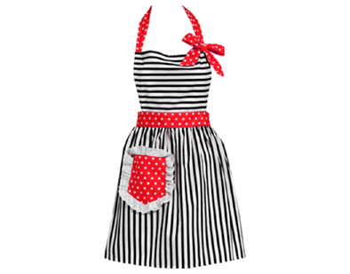
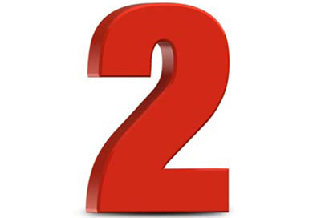
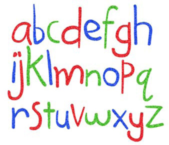

<!-- pdf-page: 303; print-page: 286 -->

# Appendix D: Research Study on -ic Formations

Name                                    ________________________
Native Languge                          ________________________
Other Languages Spoken Fluently         ________________________

This is acid. Something pertaining to acid is [əsɪdɪk].

This is a hero. Someone pertaining to a hero is [              ].

<!-- pdf-page: 304; print-page: 287 -->

This is an apron. Something pertaining to an apron is [     ].

This is a number. Something pertaining to a number is [          ].

This is a lantern. Something pertaining to a lantern is [   ].

<!-- pdf-page: 305; print-page: 288 -->

This is the alphabet. Something pertaining to the alphabet is [   ].
