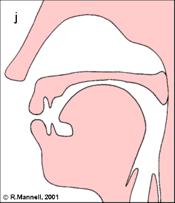
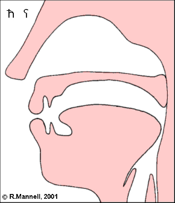

<!-- pdf-page: 225; print-page: 208 -->

# Chapter 6: Motivating Pinault’s Law

## 6.1       Introduction and Overview

In the previous chapter we witnessed the power of the MST in the PIE grammar,
not directly through processes of resonant syllabification, stray epenthesis,
or stray erasure (as discussed in chapter 3), but rather indirectly in the non-
application of Sievers’ Law in medial sequences of the shape *-VPPU̯V- (PIE
*[h₃u̯r̥hx]σ[dhu̯o-]σ ‘raised, upright’ > Ved. ūrdhvá-, Av. ərəduua-, Gk. ὀρθός,
Lat. arduus, OIr. ard and PIIr. *[mat]σ[sya]σ > Ved. matsya-, Av. masiia- ‘fish’).
In this chapter we will examine a phonological problem similarly influenced
by syllable structure, whereby laryngeals were deleted for articulatory reasons
but only in instances where the laryngeal in question was syllabified together
with a following yod: */-V(C)Chx-i̯V-/ → *[-V(C)C]σ[hxi̯V-]σ → *[-V(C)C]σ[i̯V-]σ.
This is the phonological rule known as Pinault’s Law (PL).
   In his seminal work Altindische Grammatik, Wackernagel (1896:81) pro-
poses a number of rules of schwa deletion,1 one of which occurring before yod:
“Ig. ist ə geschwunden: . . . Regelmässig vor . . . y.” However, he cites only one
example, contrasting reflexes of the seṭ root vad(i)- “speak” (a-vádi-ṣur, udi-
tá-) with the derivative ud-yáte. Unfortunately this example is not probative,
as it is not certain that this root even ended in a laryngeal, for while the LIV
(286) assumes the root to have been *h₂u̯edh₁/3-,2 others reconstruct *h₂u̯ed-.3
In 1982, Georges-Jean Pinault confirmed Wackernagel’s proposal in a convinc-
ing discussion backed up by a myriad of excellent examples. However, he rec-
ognized that two corrections needed to be made to the original formulation.
First, the rule should be modernized and thus understood as one of laryngeal
deletion, not schwa deletion. Second, the rule must indicate that the *i̯pre-
ceded a vowel, as */Chxi̯C/- → *CihxC, not XCiC-.4 Since Pinault’s publication,5

1 	Note that *ə (nearly) always referred to *ə primum in pre-laryngealistic times. See 1.2.1.2.
2 	As the LIV correctly points out, if there had been a laryngeal here, it could not have been *h₂,
    as we would expect Xa-vádhi-.
3 	Such as Beekes 2010:168: PIE *h₂u̯ed- > Gk. αὐδή ‘human voice, sound, speech’. Gk. αὐδών
    ‘nightingale’ is commonly derived from this root, though according to Beekes (2010:27) the
    connection is a difficult one.
4 	For instance */ph₃i̯tós/ → *pih₃tós (> Ved. pītáḥ), not Xpitós (> Ved. Xpitáḥ); see 3.3.2.
5 	Pinault was not the first to discuss Wackernagel’s rule in laryngealistic terms. See Cowgill
    1967 (apud Bammesberger 1973:2110), Beekes 1969, and Peters 1980:8138.

<!-- pdf-page: 226; print-page: 209 -->

the vast majority of scholars have accepted his proposal and now consider it to
have been a valid law in PIE (cf. Collinge 1995:45, Jasanoff 2002/2003:132, and
Ringe 2006:15, among others).
  Following Pinault (ibid.), we may characterize the law as follows:

(209)      Pinault’s Law (Pinault 1982)
           PIE *hx → ∅ / C0—i̯V
           	Post-consonantal laryngeals are lost word-medially before a yod plus
           vowel.

As we shall see in this chapter, Pinault’s formulation is indeed correct, with
two minor modifications. First, we must introduce syllable boundaries into
the structural description, and second, we will need to reconsider which laryn-
geals were targeted by the rule in question.6

## 6.2        The Data

Let us begin with the data, messy as it is. While there are excellent cases
of forms that require deletion (PIE */sokwh₂i̯V-/ → *sokwi̯V- > Ved. sákhye,
Lat. socius ‘friend’), there are also well-understood forms that do not (PIE
*kwōlh₁ i̯e- > Gk. πωλέομαι ‘to come/go often’), and still other forms that seem
to show both deletion and retention (PIE */h₂erh₃-i̯e-/ > Gk. ἀρόω, Lat. arāre
‘plow’ but PCelt. *ari̯e-, Lith. ariù).
   Before examining the evidence in detail, we need to be aware of two forms
entertained by Pinault (1982:270) and a third by Piwowarczyk (2008:19ff.),
which should not be considered relevant to the discussion.7

a.      *dhr̥h₃-i̯e- ‘jump’ > OIr. (no)-daired ‘jump’. Cf. Gk. θρώσκω ‘jump’. Root in
        question: *dherh₃- (IEW 256; LIV 146–7).
b.      *skl̥hx-i̯e- ‘split’ > Gk. σκάλλω ‘stir up, hoe’, Lith. skiliù ‘strike fire’. Cf. Arm.
        celum ‘split, tear’ and Hitt. iškalla- ‘id.’. A laryngeal is assumed due to the
        acute accent of the Lith. infinitive skélti; however, the Greek form may
        not necessarily reflect an original *skl̥hx-i̯e- (see Beekes 2010:1340–1 for
        discussion). Root in question: *skelhx- (IEW 923–6; LIV 553).

6 	I am indebted to Chiara Bozzone, Jessica DeLisi, and Dariusz Piwowarczyk for their help with
   a number of matters in this chapter.
7 	Cf. also *gwr̥hx-i̯e- ‘praise’ > Lith. giriù, gìrti, which LIV 211 cites as a secondary formation.

<!-- pdf-page: 227; print-page: 210 -->

c.    *tspr̥hx-i̯e- ‘trample’ > Gk. ἀσπαίρω ‘to move convulsively, quiver’, Lith.
      spiriù ‘kick, press to’. The laryngeal is maintained in Ved. sphūrati ‘kicks’.
      For the initial *t-, see Lubotsky 2006, who has argued for this verb to have
      had the original sense ‘to kick with the heel’ and to derive from the com-
      plex verb *tsperhx- (← */pd-s-perhx-/) ‘to beat with the foot’.8 Root in
      question: *tsperhx- (IEW 992–3, EWAia 2.776).

While the forms in question technically do contain laryngeals that follow conso-
nants and precede *i̯plus vowel, in all three instances the consonant in question
is a syllabic resonant (*R̥). It is extremely likely that laryngeals were retained ińthis environment in PIE; cf. *mihx-i̯e- ‘decrease’ > Ved. mī[unclear]yate,9   *h₁ r̥h₁-i̯e- ‘row’ >
Myc. e-re-e [erehen], Lith. iriù,10 *g̑n̥h₁-i̯e- ‘be born’ > Ved. jāyate,11 and (likely
post-PIE) *bhuh₂-i̯e- ‘become’ > Gk. φῡ́ομαι, Lat. fīō, etc.12 Those forms suggest-
ing laryngeal loss should be accounted for as inner-dialectal.13
    Returning now to the problem at hand, there are three broad types of forms
relevant to the discussion of Pinault’s Law: those which delete a laryngeal in
Pinault’s environment, those that retain a laryngeal in this environment, and
those forms that are contradictory, in that we find both deletion and retention.
Let us examine each in turn.

### 6.2.1 Instances of Deletion
#### 6.2.1.1      Attested in 3 or More Language Families
Unquestionably the best example of PL is */sokwh₂-i̯-V/ → *sokwi̯V-, securely
continued by Ved. sákhye ‘friend (dat.sg.)’, Hom. ἀοσσει̃ν ‘to help’, Lat. socius
‘companion, ally’, and PGmc. *sagjaz ‘friend’.14 The Vedic form is perhaps the
most important one, as it requires that we reconstruct a root-final *h₂ in order
to explain the aspirated -kh-, which undoubtedly arose in the strong cases:
*sokwh₂ṓ(i̯) > Ved. sakhā́ (nom.sg.), Av. haxay- ‘friend’.15 Hom. ἀοσσει̃ν ‘to help’—

8 	See Byrd, forthcoming b for discussion.
9 	LIV 427.
10 	LIV 251.
11 	LIV 163–5. OIr. -gainethar, MWel. geni, MBret. guenell, MCor. genys likely reflect an inner-
     Celtic deletion. See Schumacher 2004:135.
12 	LIV 98.
13 	On the other hand, should we assume that zero-grade ablaut was a synchronic process
     in PIE (see chapter 4), we could perhaps order PL before processes of syncope, thus
     */CeRhxi̯e-/ → [CeR]σ[hxi̯e-]σ → *[CeR]σ[i̯e-]σ → *[CR̥]σ[i̯e/o-]σ.
14 	Mayrhofer 1986:140.
15 	See EWAia 684–5, with references. Positing PL to have been restricted to Greek (and other
     individual branches), Peters (ibid.) claims that deletion never occurred in Ved. sákhye,
     given the 110 syllabic scansions vs. the 34 non-syllabic scansions of -y- in the RV.

<!-- pdf-page: 228; print-page: 211 -->

which derives from PGk. *ha-hokye-ye- and ultimately from PIE *sm̥-sokw-i̯e-i̯e-
(Ringe 2006:110)—should be analyzed as a *-i̯e- verbal derivative to *sokwi̯os
‘friend’ plus the prefix *sm̥- ‘together’.16 If laryngeal deletion had not occurred,
*sm̥-sokwh₂-i̯e-i̯e- would have produced PGk. *ha-hokwaye-ye-, hence Hom.
Xἀοπαει̃ν.17 The thematic noun *sokwi̯ós is directly continued by Lat. socius18
‘companion, ally’ as well as PGmc. *sagjaz ‘companion; man, warrior’ (OS
segg, OE secg, OIce. seggr).19 These forms make it certain that a noun *sokwi̯ós
existed in PIE, and given the similar form and function of PIE *sokwh₂ō(i̯) (Ved.
sakhā́), it is very likely that *sokwi̯ós derived from an underlying */sokwh₂i̯ós/ in
PIE. Stem in question: *sokwh₂- ‘friend’ (cf. IEW 896–7).20

#### 6.2.1.2      Attested in 2 Language Families
There are two sets of forms attested in two language families that argue in favor
of PL. The first, and the one usually cited as the Paradebeispiel of the rule in
question, is */kreu̯h₂-i̯o-/ → *kreu̯io̯- ‘flesh, gore, blood’, */krou̯h₂-i̯o-/ → *krou̯io̯-
‘id.’, as continued by Skt. kravya- ‘flesh’ and Lith. kraũjas ‘blood’, respectively
(Yamazaki 2009:446–7), not Xkraviya- ‘flesh’ and Lithuanian Xkraújas.21 A
laryngeal surfaces in all other attested forms: *kréu̯h₂-s (Skt. kravíṣ-, Gk. κρέας)
and *kruh₂- (Ved. krūrá-, Av. xrūra- ‘bloody’, Lat. crū-dus ‘raw’, OIr. crú ‘blood’).22
Unfortunately, Skt. kravya- ‘flesh’ and Lith. kraũjas do not provide as clear of an
example of PL as one would like, for laryngeal deletion may also be attributed
to the Saussure Effect:23 */krou̯h₂-i̯o-/ → *krou̯io̯-. Stem in question: *kreu̯h₂-
‘flesh, gore, blood’ (IEW 621–2).24

16 	Cf. Gk. ἀδελφός ‘brother’ < *sm̥-gwelbhos ‘he who belongs to the same womb’.
17 	Peters (ibid.), though already recognized by Beekes 1969: 234, 254. Cf. Gk ὀπάων ‘fellow,
     companion’, from earlier ὀπά ϝ ων (Beekes 2010:1089).
18 	Lat. Xsocaius.
19 	Laryngeal loss is perhaps required for the delabialization of PGmc. *gw to *g; see Ringe
     2006:129ff. for discussion.
20 	As an anonymous reviewer reminds me, *sokwh₂- was very likely to have been a derivative
     of the root *sekw- ‘follow’, first derived in the form *sokwah₂ ‘fellowship, following’, whence
     *sokwh₂ṓ(i̯) ‘a member of the fellowship’, whence thematized *sokwi̯o-.
21 	A circumflex accent indicates no laryngeal (cf. naũjas ‘new’ < *nou̯ió̯-).
22 	One would expect *krou̯h₂-o- > PGmc. Xhrawwa- through Verschärfung, however, the form
     reconstructable is *hrawa-, continued by OHG (h)rō, OE hrēaw, OS hrā, and OIce. hrār
     (Ringe 2006:136).
23 	For discussion of the Saussure Effect, see rule (29) in chapter 1.
24 	An anonymous reviewer once again reminds me that this may in fact be a collective stem
     formed to the root *kreu̯-, and hence not count as an example of laryngeal loss.

<!-- pdf-page: 229; print-page: 212 -->

The second example is much more straightforward. Both Ved. tányati ‘thun-
ders’ and Hsch. τέννει · στένει, βρύχεται ‘groans, roars’ continue a *-i̯e- formation
to the root *stenh₂-, which is also attested in OCS stenjǫ ‘groan’. As a group,
these forms can only derive from *(s)teni̯e-. However, it is clear that this root
ended in *h₂: AV astanīt ‘thundered’, Gk. στενάζω ‘groan’, στεναγμός ‘a sigh’,
στενάχω ‘groan, sigh’, Lat. tonitrū, -us ‘thunder’, Celt. PN Tanaros, etc.25 There
is further evidence for laryngeal deletion in the Vedic derivatives tanyú- ‘roar-
ing’, tanyatā́- ‘thundering’, and tanyatú- ‘thunder (m.)’.26 Root in question:
*(s)tenh₂- ‘to thunder’ (IEW 1021; LIV 597).

#### 6.2.1.3  Only Attested in 1 Language Family
The remaining examples of PL are isolated, each attested in only one language
family.

a.	*/dh₂i̯-e-/ → *di̯e- > Ved. (YV+) ava-dyáti ‘detaches’. A laryngeal is vocal-
    ized in the aorist form dīṣva ‘share!’ and triggers compensatory lengthen-
    ing in áva adāt ‘cut off’; it may be identified as *h₂ through the Greek
    cognates δαίομαι ‘divide’ (< PIE *dh₂ai̯e/o-; cf. Skt. dáyate),27 δατέομαι
    ‘divide’, and δασμός ‘distribution, tribute’ (EWAia 717; Beekes 2010:305–6).
    Root in question: *dah₂(i̯)- ‘to share’ (IEW 175–6; LIV 103).
b.	*/gwerh₃-i̯e-/ → *gweri̯e- > Lith. geriù (inf. gérti) ‘to drink’. Since the origi-
    nal present was likely *gwr̥h₃é-, continued by Ved. girati ‘devours’, Waxi
    než-γar- ‘swallow’, and OCS z̆ĭrǫ ‘devour’, it is probable that */gwerh₃-i̯e-/
    was an inner-Baltic innovation. For the quality of laryngeal, cf. Gk.
    βιβρώσκω ‘eat up’. Root in question: *gwerh₃- ‘to devour’ (IEW 474; LIV
    211–2).
c. */(s)gwesh₂-i̯e-/ ‘extinguish’ → *(z)gwesi̯e- > Ved. ní jasyata ‘pine!’, Ved.
    dásyati ‘to jade’;28 cf. OCS u-gašetu (u-gasati) ‘to extinguish’ (Jasanoff
    2008). According to the LIV, the Vedic forms may be secondary present
    formations built to the root aorist, given the more widespread nasal-
    infixed present formation (Hsch. ζείναμεν, OLith. gęsa ‘expires’). Ved.
    dāsīt ‘extinguished’ and Gk. ἔσβη ‘expired’ suggest a root-final */-h₂/. Root
    in question: *(z)gwesh₂- ‘to extinguish’ (IEW 479–80; LIV 541–3).

25 	One should also point out an additional complication here: the root meaning ‘groan’ was
     apparently aniṭ. See Narten 1993 for further.
26 	EWAia 619, 752–3.
27 	Expected root-initial Xdh- (< *dh₂-) replaced by d- through analogy with the aorist (LIV 103).
28 	See EWAia I 711 for discussion of dásyati for expected Xjásyati.

<!-- pdf-page: 230; print-page: 213 -->

d.    */ghr̥bh₂-i̯e-/ → *ghr̥bi̯e- > Hitt. karpiye- ‘lift’. This present indicative for-
      mation is quite old, attested at the earliest stages of the language (Oet-
      tinger 1979:345, Melchert 1997b:85). This etymology is not certain, as
      Kloekhorst (2007:453) contends that a voiceless -p(p)- could not come
      from medial *-bh₂-, leading him to derive Hitt. karpiye- from *(s)kr̥p-i̯e-
      instead, built to the root of Lat. carpō ‘seize’, Gk. καρπός ‘fruit’, Lith. kir̃pti
      ‘shear off’, OE sceorfan ‘bite’ (cf. Melchert 1994:92). Root in question:
      *ghrebh₂- ‘to grab’ (IEW 455; LIV 201).
e.    */h₁ish₂-i̯e-/ → *h₁isi̯e- > Ved. íṣyati ‘sends out’, Av. -išiiā ‘incites’. According
      to the LIV, this formation was possibly an old denominative, though the
      semantic motivations for the creation of a -i̯e- present are far from clear.
      Root-final */h₂/ is still continued in the derivatives Skt. isnā́ti ‘sends away’,
      Gk. ἰνάω ‘pour’ (both from PIE *h₁isnáh₂-), and Gk. ἰάομαι ‘cure’.29 Root in
      question: *h₁ei̯sh₂- ‘to push’ (IEW 299–301; LIV 234).
f.    */k̑h₃i̯-é-/ → *k̑ié̯- > Ved. sám śyat ‘sharpens’ (RV). A root-internal */h₃/
      must be reconstructed to align its many derivatives across the family,
      including Skt. sam śāýa ‘sharpening’, Lat. cōs, cōtis ‘whetstone’, and Arm.
      sowr ‘sharp; sword’ (EWAia 627). Root-final *i̯crops up in nominal deriva-
      tives as well (such as YAv. saēni ‘point’ and ON hein ‘whetstone’), though
      is absent in the derivatives Lat. catus ‘wily’, MIr. cath ‘wise’. Root in ques-
      tion: *k̑oh₃(i̯)- ‘to sharpen’ (IEW 541–2; LIV 319–20).
g.    */meg̑h₂-i̯os/ ‘greater’ → *meg̑io̯s > Homeric/Attic Gk. μείζων, Ionic Gk.
      μέζων, Myc. me-zo (Beekes 1969:254); cf. Lat. maior < *mag-i̯os- ‘greater’,
      either from *məg̑io̯s- (with schwa secundum)30 ← /mg̑h₂-i̯os/ or (more
      likely) a later creation built to the root of mag-nus ‘great’. It is not clear if
      *-h₂ (which was likely suffixal originally; see NIL for references) was
      absent in the comparative form for morphological or phonological rea-
      sons (or both). Root in question: *meg̑(h₂)- ‘great’ (IEW 708ff.; NIL 468–78).
h.    */sh₁i̯-é-/ → *si̯é- > Ved. (áva, ví) s(i)yáti ‘looses’ (see EWAia 720 for related
      forms) and, according to the LIV, perhaps Hitt. siēzzi ‘throws, shoots,
      stings’. Kimball (1987) would prefer to connect this Hittite form with Skt.
      ásyati ‘shoots’, which she derives from *h₁s-i̯é/ó-, though note that this
      particular word-initial consonant cluster *h₁si̯- would be a type 3b cluster31
      and would therefore be uncertain. Kloekhorst (2008:694–5) suggests that
      siya- may have been “secondarily . . . transferred to the i̯e/a-class . . . on
      the basis of reinterpretation of 3pl.pres.act. šii̯-anzi as šii̯a-nzi”, and would

29 	See García Ramón 1986.
30 	For further discussion of schwa secundum, see chapter 1 for rule (21).
31 	That is, a cluster reconstructed for paradigmatic and/or etymological reasons; see 1.2.2.

<!-- pdf-page: 231; print-page: 214 -->

in this case also exhibit deletion of *h₁ in the sequence *sh₁ i̯-, either in
      PIE or at some point within Anatolian. Root in question: *seh₁- ‘to sow’
      (IEW 889–90; LIV 517) or *seh₁(i̯)- ‘to release’ (IEW 889–91; LIV 518).
i.    */skhx-i̯e-/ → *ski̯e- > Lat. ne-sciō, -scīre ‘not know’. Rix (1999:526–7) recon-
      structs a laryngeal on the basis of the perfect (*sekhxuh₂a >→ *sekau̯ai >
      Lat. secuī), though note that a laryngeal is also necessary for the Italic
      derivatives Lat. secāre, Umbr. pru-sekatu ‘let it be cut’ (see below) and the
      unlenited -kk- in Hitt. šākki ‘knows’ (Kloekhorst 2008:696). Kloekhorst
      (ibid.) reconstructs the root as *sekh₁-, a point to which we will return in
## 6.5 below. Root in question: *sekhx- ‘to cut’ (IEW 895–6; LIV 524).
j.    */telh₂-i̯e-/ → *teli̯e- > Gk. τέλλω ‘I finish’ (Peters 1980: 8838, Beekes
      2010:1462). This formation is quite uncertain—the LIV prefers an original
      nasal-infixed present, with analogical substitution of root vowel (*tl̥ne- >
      *talnō → *telnō > τέλλω) and Beekes (ibid.) questions the root itself, sug-
      gesting that it derived from the same root as (περι-)τέλλω ‘turn in circles’
      (*kwel- ‘turn’) instead. Root in question: *telh₂- ‘to bear, endure’ (IEW
      1060–1; LIV 622).
k.    */terh₁-i̯e-/ → *teri̯e- > Gk. τείρω ‘exhaust, distress, trouble’ (Xτερέω). While
      it is likely that this root ended in a laryngeal (cf. Gk. τέρετρον ‘auger’ <
      *térh₁trom), it is not certain that Gk. τείρω was inherited from PIE. In fact,
      the LIV suggests that the expected form Xτερέω was replaced by Gk. τείρω
      due to homonymy with the future Xτερέω, the latter which is still present
      in Eust. τερέσσω. Root in question: *terh₁- ‘to bore, rub’ (IEW 1071–2; LIV
      632).
l.    */tu̯erhx-i̯ah₂-/ → *tu̯eri̯ah₂- > Gk. σειρή ‘cord, rope’ (Beekes 2010:1316).
      Due to the acute accent of Lith. tvérti ‘to catch, to contain’, this root must
      have ended in a laryngeal, which was likely deleted in the prehistory of
      Gk. σειρή. Deletion may have also occured in Lith. tveriù < *tu̯eri̯e- ←
      */tu̯erhx-i̯e-/. Other derivatives include OCS tvorjǫ ‘make, do’ and Gk.
      σορός ‘urn’, Russ. tvor ‘creature, form’ (both from *tu̯orhxós). Root in ques-
      tion: *tu̯erhx- ‘to enclose, contain’ (IEW 1101; LIV 656).
m.    */u̯erh₁-i̯e-/ → *u̯eri̯e- > Gk. εἴρω ‘say’ (Xἐρέω); cf. Hitt. weriyezzi ‘shouts’, for
      which it is impossible to know if laryngeal deletion occurred in PIE or
      later (Beekes 2010:393; Kloekhorst 2008:1002–3). Root final */h₁/ is still
      continued by εἴρηκα ‘have said’. The LIV views */u̯erh₁-i̯e-/ as an innova-
      tive formation in both language families, and just as Gk. τείρω above, was
      likely created by analogy on the basis of the more widespread future
      ἐρέω (< *u̯erh₁s-). Root in question: *u̯erh₁- ‘to speak’ (IEW 1162–3; LIV
      689–90).

<!-- pdf-page: 232; print-page: 215 -->

### 6.2.2 Instances of Retention
#### 6.2.2.1        Attested in 2 Language Families
Let us now turn to those examples of laryngeal retention in the environment
of PL. While there are none attested in 3 or more language families, there are
two likely examples of retention shared by two language families. The first may
be seen in the aforementioned verbal root *sekhx- ‘to detach, cut’, in which the
root-final laryngeal is retained in Italic (Lat. secāre ‘to cut’, Umbr. pru-sekatu
‘should cut’) and Celtic (OIr. tescaid ‘cuts’, the latter which perhaps derives from
an earlier *to-eks-skai̯e-), both from *s(e)khx-i̯e-. Our second example is a -i̯o-
derivative of *i̯éu̯h₁- ‘grain’ (IEW 512; NIL 407ff.), whose simplex form is widely
attested throughout the Indo-European family; cf. Hitt. ewa(n)- ‘grain’, Ved.
yáva- ‘grain, corn’, Av. yauua- ‘grain’, Lith. jãvas ‘cereal’, and Gk. φυσί-ζοος ‘pro-
ducing grain’. A laryngeal is maintained in Pinault’s environment in */i̯éu̯h₁-i̯o-/
→ *i̯éu̯h₁ i̯o- > Ved. yávi ya- ‘grain supply’,32 Lith. jáuja ‘threshing-floor’. Ved.
-i- and acute accent of the root in Lithuanian indicate a root-final laryngeal,
which the NIL reconstructs as *-h₁, on the basis of the Homeric compound
ζεί-δωρος ‘giving spelt’ (< PGk. *ζεϝε < PIE *i̯euh₁-).33

#### 6.2.2.2   Only Attested in 1 Language Family
There are quite a few counterexamples attested in only one language family,
though many are questionable.

a.	*/bhludh₂-i̯e-/ → *bhludh₂i̯e- > Gk. φλυδα̩̃ ‘dissolves’. This root is only found
    in Greek and the form in question may also be explained as deriving from
    */bhludh₂-ei̯e-/. Root in question: *bhleu̯dh₂- ‘to dissolve’ (IEW 159; LIV 90).
b. */delh₁-i̯e-/ → *delh₁ i̯e- > Lat. dolāre ‘to mill’. While this formation is only
    attested in Italic, the root is also found in Baltic (Lith. delù ‘wear out, dis-
    appear’, Latv. dęlu ‘wear out, diminish’) and Celtic (MWel. (d)ethol-
    ‘select’). The LIV reconstructs root-final */-h₁/ on the basis of Lat. dolēre
    ‘be painful’ (< *dolh₁-éi̯e-), though does not rule out */-h₂/ or */-h₃/
    entirely. Root in question: *delh₁- ‘to chip’ (IEW 194–6; LIV 114).
c. */h₁elh₂-i̯e-/ → *h₁elh₂ i̯e- > Gk. ἐλάω ‘drive, carry off’. This root is only
    found in Greek and Armenian (cf. Arm. eli ‘departed’). The LIV suggests

32 	It is possible that this -i- is in fact the result of Sievers’ Law; thus, */i̯éu̯h₁-i̯o-/ → *i̯éu̯h₁ii̯o-.
     Note, however, that such a reconstruction still requires retention of the laryngeal, as the
     laryngeal must have been present to create a superheavy syllable in the initial syllable in
     the first place.
33 	See Beekes 2010:496–7 for discussion, with references.

<!-- pdf-page: 233; print-page: 216 -->

that ἐλάω was analogically built from the aorist ἤλασα. Root in question:
       *h₁elh₂- ‘to drive’ (IEW 306–7; LIV 235).
d.     */h₂elh₁-i̯e-/ → *h₂alh₁-i̯e- > Gk. ἀλέω ‘grind’. For root-final */-h₁/, cf. Gk.
       ἀλέατα ‘wheat-groats’, ἀλετρίς ‘woman who grinds corn’, ἄλεστρον ‘fee for
       milling’, etc. The LIV reconstructs a state II root instead, */h₂leh₁-/, and
       derives ἀλέω from either *h₂ l̥h₁-i̯e- or a secondary formation built on the
       aorist ἄλεσσ-. State II is clearly required for Arm. aliwr ‘flour’ (< PIE
       *h₂léh₁u̯r̥; cf. Gk. ἄλευ-ρον ‘flour’),34 though it remains unclear if a State I
       counterpart is necessary for Greek (for all forms, see Beekes 2010:65).
       Root in question: *h₂alh₁- ‘to grind’ (IEW 28–9; LIV 277).
e.     */h₂h₁s-h₁i̯e-/ → *h₂əh₁s-h₁ i̯e- > Lat. arēre ‘to be dry’ and perhaps TA
       asatär, TB osotär ‘to dry out’ (Ringe 1987:115–8). For initial laryngeal, cf.
       Hitt. h̬āšša-, Lat. āra ‘hearth’, both from *h₂ah₁sah₂ (Kloekhorst 2007:322–
       3). Root in question: *h₂ah₁s- ‘to dry out (by heat)’ (IEW 68; LIV 257–8).
f.     */-hx + -i̯os-/ → *-hxi̯os- > Ved. -īyas- (e.g., távīyas ‘stronger’, from virtual
       *teu̯h₂-i̯os-). The PIE comparative suffix *-i̯os- is continued as -īyas- in
       Vedic, which must be attributed to the vocalization of stem final seṭ roots,
       or at the very least a subset of seṭ roots. Of course, such vocalization could
       have occurred much later, with the root-final vowel (< laryngeal) having
       been analogically reintroduced.35 Suffix in question: *-i̯os- (Fortson
       2010:135–6).
g.     */kwṓlh₁-i̯e-/ → *kwṓlh₁ i̯e- ‘make a turn (iterative)’ > Gk. πωλέομαι ‘to
       come/go often’. This formation is only attested in Greek, alongside the
       much more widespread */kwolh₁-ei̯e-/ (> CLuv. kuwalīti ‘turns’, Ved. cārá-
       yati ‘puts in motion’, Gk. πολέω). Moreover, as Craig Melchert points out
       to me (p.c.), Gk. πωλέομαι may also derive from */kwṓlh₁-ei̯e-/. It is thus
       unclear if this form should be reconstructed for PIE. Root in question:
       *kwelh₁- ‘encircle’ (IEW 639–40; LIV 386–7).
h.     */pṓth₂-i̯e-/ → *pṓth₂i̯e- ‘fly (iterative)’ > Gk. πωτάομαι ‘to fly around’. It is
       unclear if this formation goes all the way back to PIE for two reasons.
       First, only Greek shows such a formation, and as Beekes (2009:1182)
       discusses, Gk. πωτάομαι ‘to fly around’ was perhaps more likely to have
       been an independent formation within Greek, with the unexpected -α-
       analogically extended from the aorist πτάσθαι, presumably by way of the

34 	Arm. aliwr may in fact be a loanword from Greek; see Clackson 1994:93–5.
35 	In a similar light, Nishimura (2005:178) proposes that the superlative formations seen
     in Oscan ualaemom ‘optimum’, valaimas (PN), and South Picene uelaimes (PN), reflect
     the suffixation of the superlative suffix *-(m̥)mo- to an earlier comparative *u̯elai̯os, ulti-
     mately from *u̯elhx-i̯os-.

<!-- pdf-page: 234; print-page: 217 -->

present πέταμαι.36 Second, we cannot be certain that this root even ended
      in a laryngeal, for related forms may point back to a laryngeal-less *pet-:
      OIr. én ‘bird’ (< *petno-, not Xethan),37 Lat. penna ‘feather’ (< *petna, not
      Xpenda), Gk. πτερόν, Arm. t‘ert’ ‘feather’ (< *ptero-, not Xπταρόν, Xt‘art’),
      and Ved. pátati ‘fly, fall’ (< *pet-, not Xpáthati).38 Purported root in ques-
      tion: *peth₂- ‘to fly’ (IEW 825–6; LIV 479).
i.    */pth₂-h₁-i̯e-/ → *pəth₂əh₁ i̯e- (?) > Lat. patēre ‘extend oneself, be open’.
      This form serves as the stative counterpart to Lat. pandō ‘open’ (< PItal.
      *patnō),39 which, together with Gk. πίτνημι and the Oscan imperfect
      subjunctive patensíns ‘were they to open’ (< *pat-ăn(ă)-s-ē-nd), ulti-
      mately derives from PIE *pət-na-h₂-.40 There appear to be two direct cog-
      nates to Lat. patēre. The first may be seen in the Oscan expression víu.
      pat[ít] ‘the way is open’, the second in the Volscan imperative ar-patitu
      (< ađ-pat-e(i)e-tōd), which Vine (1993:371–781) traces back to the Proto-
      Italic causative *pat-ei̯-e/o-.41 Unfortunately, these Italic derivatives do
      not appear to shed much light on the age of Lat. patēre or whether root-
      final */h₂/ or the “essive” marker */h₁/ were retained in this particular
      form. Root in question: *peth₂- ‘to spread’ (IEW 824–5; LIV 478–9).
j.    */(s)ph₂-i̯é-/ > Gk. σπάω ‘pull’. Root also continued by Arm. hanem ‘pull’.
      According to Klingenschmitt (1982:132) the Armenian formation is an
      innovation, with analogical long *-ā-. Root in question: *(s)pah₂- ‘to
      extract’ (IEW 982; LIV 575).
k.    */u̯ṓdhh₁-i̯e-/ → *u̯ṓdhh₁ i̯e- ‘push (iterative)’ > Gk. ὠθέω ‘push’. OCS važdǫ
      ‘accuse’ also appears to go back to this form, with analogical replacement
      of *-i̯é- by *-éi̯e- (i.e., *u̯ōdhh₁-éi̯e-).42 The root-final laryngeal is also con-
      tinued by Skt. ávadhīt ‘he killed (aor.)’ and related forms, though note
      aniṭ a-vadhrá- ‘indestructible’. Following Kloekhorst (2008:352), Beekes
      (2009:1676–7) prefers to connect Gk. ὠθέω ‘push’ with Hitt. h̬uett- ‘draw,
      pull’, thereby deriving the form in question from *h₂u̯odhh₁-éi̯e-, which he

36 	Likewise, as Weiss 2014 argues, it is unlikely that the much-heralded Lat. form sop̄iō
     derives directly from PIE *su̯ṓpi̯e-, but rather was secondarily created from the denominal
     adjective sōpītus ‘asleep’.
37 	Cf. Zair 2012:185: “It is possible that the Celtic forms are late formations, derived from the
     neo-aniṭ verbal root seen in MW. ehet ‘flies’ < *eks-pet-e/o-.”
38 	Hackstein 2002b:141.
39 	With metathesis and post-nasal voicing via the unda rule (Garnier 2010:351).
40 	Garnier, loc. cit.
41 	See Garnier, loc. cit. for discussion, with references.
42 	Craig Melchert (p.c.) has again correctly pointed out that Gk. ὠθέω ‘push’ may also be
     derived from a proto-form containing the unaccented suffix *-ei̯e-, namely */u̯ṓdhh₁-ei̯e-/.

<!-- pdf-page: 235; print-page: 218 -->

explains accounts for the lack of digamma in Homeric scansion. How-
      ever, as Beekes himself acknowledges, one must assume an (ad hoc) pre-
      Homeric contraction of *awoth- > ὠθ-.43 Root in question: *u̯edhh₁- ‘to
      push’ (IEW 1115; LIV 660).

### 6.2.3 Conflicting Data
a. */dh₁i̯-e-/ → *di̯e- > Ved. (ā́, sám) dyati ‘binds’, OAv. ni.diiātąm ‘should be
     bound’ OR *dəh₁ i̯e- > Gk. δέω ‘I bind’; cf. Hitt. tiya ‘bind!’ Curiously, the
     laryngeal vocalizes in a simplex (stand-alone) form but is deleted in a
     complex form (preverb + root). Root in question: *deh₁- ‘to bind’ (IEW
     183; LIV 102).
b. */h₂erh₃-i̯e-/ ‘plow’ → *h₂ari̯e- > PCelt. *ari̯e- (OIr. -air, MWel ard-), Lith.
     ariù, árti OR *h₂arh₃ i̯e- > Lat. arāre, Gk. ἀρόω; cf. OCS orjǫ, OHG erien.
     Certainly the lectiones difficiliores are the Celtic and Baltic forms; as
     Garnier (2010:203–5) has noted (among others), it is entirely within rea-
     son that root-final */h₃/ would have been reintroduced based on the
     widespread instrumental noun *h₂árh₃-trom ‘plow’ (Lat. arātrum, Gk.
     ἄροτρον).44 Root in question: *h₂árh₃- ‘to plow’ (IEW 62; LIV 272–3).
c. */sg̑hh₂-i̯e-/ → *sk̑hi̯e-45 > Skt. (anu-, ava-, vi-, etc.) chyati ‘cuts open’ and
     perhaps GAv. paitī . . . siiōdūm ‘cut open!’ OR *sk̑həh₂ i̯e- > Gk. σχάω ‘make
     an incision’. As with */dh₁i̯-e-/ above, the laryngeal appears to vocalize
     in a simplex form in Greek but be deleted in a complex form in Indo-
     Iranian.46 However, according to Rasmussen (1989:61), Gk. σχάω is better
     derived from *sk̑hh₂-éi̯e-, though there is absolutely no direct or indirect
     evidence in favor of such an onset ever surfacing in PIE. Root in question:
     *sk̑hah₂(i̯)- ‘to cut’ (IEW 919; LIV 547).
d. */u̯emh₁-i̯e-/ → *u̯emi̯e- > Lith. vemiù (vémti) OR *u̯emh₁ i̯e- > Gk. ἐμέω.
     Since the original present formation was almost certainly an athematic
     root present (Skt. vamiti, Lat. uomō < *u̯emō), both the Greek and Lithu-
     anian forms are likely secondary. Root in question: *u̯emh₁- ‘to vomit’
     (IEW 62; LIV 272–3).

43 	For Melchert (1979), the actual Hitt. cognate of Gk. ὠθέω ‘push’ is wizza-, wiwid(a)- ‘strike,
     pierce; press, urge’.
44 	See Beekes 2010:417 for further discussion, with references.
45 	With devoicing of */g̑h/ via Siebs’ Law; see Mayrhofer 1986:9213.
46 	As the reader will discover, this observation will be of great importance in our analysis.

<!-- pdf-page: 236; print-page: 219 -->

### 6.2.4 Discussion
To review, scholars have reconstructed a number of instances of the sequence
*/-Chxi̯-/ in pre-vocalic position. Many of these appear to undergo laryngeal
deletion, but some do not. However, it would be foolish of us to view each
example in the same light. Some stems, such as *sokwi̯V- ‘friend’ (← */sokwh₂i̯V/)
are virtually guaranteed for the proto-language, while others, such as *pṓth₂ i̯e-
‘flit around’ (← */pṓth₂ i̯e-/) are not, likely being einzelsprachlich innovations.
For this reason, it would be prudent to sort the aforementioned stems into
three different categories: likely, uncertain, and dubious. Likely stems are con-
sidered likely to have existed in PIE, as they are attested in multiple branches
and/or lack a plausible alternative explanation. Uncertain stems do have alter-
native explanations, but it is difficult to choose between them. Finally, dubious
stems are derivatives of roots attested in a single branch whose reconstructions
are improbable (and therefore are unlikely to have existed in PIE), such as the
root-final */-h₂/ in */pṓth₂i̯e-/. For the sake of clarity, I have cited the number
of branches within parentheses in which the form in question is attested.

(210)   Overview of Examples and Counterexamples

                 Likely                  Uncertain                Dubious

*/hx/ → ∅        */dh₂i̯e-/ (1)          */dh₁i̯e-/ (1)           */gwerh₃i̯e-/ (1)
                 */h₁ish₂i̯e-/ (1)       */h₂arh₃i̯e-/ (2)        */ghr̥bh₂i̯e-/ (1)
                 */k̑h₃i̯e-/ (1)        */kre/ou̯h₂i̯o-/ (2)    */meg̑h₂i̯os/ (1)
                 */(s)gwesh₂i̯e-/ (1)    */sh₁i̯é-/ (1)           */telh₂i̯e-/ (1)
                 */sokwh₂i̯V/ (4)        */sk̑h₂i̯e-/ (1)        */terh₁i̯e-/ (1)
                 */skhxi̯e-/ (1)                                  */u̯emh₁i̯e-/ (1)
                 */(s)tenh₂i̯e-/ (2)                              */u̯erh₁i̯e-/ (1)
                 */tu̯erhxi̯ah₂-/ (1)

*/hx/ → *hx      */i̯eu̯h₁i̯o-/ (2)     */delh₁i̯e-/ (1)         */bhludh₂i̯e-/ (1)
                 */sekhxi̯e-/ (2)        */-hxi̯os-/ (1)          */h₁elh₂i̯e-/ (1)
                                         */h₂h₁sh₁i̯e-/ (1)       */h₂elh₁i̯e-/ (1)
                                         */(s)ph₂i̯é-/ (1)        */kwṓlh₁i̯e-/ (1)
                                         */pth₂h₁i̯e-/ (1)        */pṓth₂-i̯e-/ (1)
                                         */u̯ṓdhh₁i̯e-/ (1)

<!-- pdf-page: 237; print-page: 220 -->

Since Pinault’s proposal, a number of scholars have dismissed certain forms
proposed to be examples of the phonological rule in question. For instance,
as seen above, the NIL (409, 448) suggests that Skt. kravya-, Lith. kraũjas are
better derived from *krou̯io̯s, not *kreu̯io̯s, with loss of *h₂ by the Saussure
Effect. Kloekhorst (2008:452–4), following Sturtevant (1930:155–6), contends
that Hitt. kar(ap)piezzi ‘lifts up’ derives not from the root *ghrebhh₂- ‘grab’
(which he assumes to be continued by Hitt. karāp- ‘devour’) but rather
*(s)kerp-, the root of Lat. carpō ‘seize’, Lith. kir͂pti ‘cut off’; thus PIE *(s)kr̥p-i̯e-
> karpiezzi. Lastly, Baldi (1974:83) argues PIE *sokwi̯ós ‘friend’ to have been a
*-i̯o- derivative of PIE *sekw- ‘follow’ (Lat. sequitur, etc.) and denies the under-
lying laryngeal altogether, the laryngeal in PIIr. *sakhHāi̯ ‘friend’ notwithstand-
ing. Such interpretations, together with the striking conflicting data in 6.2.3
above, have led Piwowarczyk (2008:36) to conclude that “Pinault’s rule is only
valid for the material of the more recently attested Indo-European languages
and . . . [did not occur in] the whole area of Indo-European.” Thus, according
to Piwowarczyk, PL occurred independently in only three IE branches: Indo-
Iranian, Celtic, and Baltic. On the other hand, scholars have dismissed a num-
ber of those instances where PL does not seem to have occurred. For instance,
as discussed above, Beekes (2009:1676–7) contends that Gk. ὠθέω ‘push’ does
not derive from *u̯ṓdhh₁-i̯e-, but rather from *h₂u̯odhh₁-éi̯e-, with pre-Homeric
contraction of *awoth- > ὠθ-. He also suggests that Gk. πωτάομαι ‘to fly around’
was an independent formation within Greek (2009:1182), with the unexpected
-α- analogically extended from the aorist πτά-σθαι, presumably by way of the
present πέταμαι, made likelier by the fact that ‘to fly’ was originally laryngeal-
less *pet-.
    We therefore seem to have reached an impasse. Whether one accepts or
denies the existence of PL now rests largely on one’s preference for particular
etymologies and one’s particular conception of the PIE grammar. I therefore
suggest that we take a different approach to the problem at hand, focusing
less on specific nuanced arguments for or against the etymologies cited above
(for the time being) and turning our attention to larger, more fundamental
questions.

a.    The position of the laryngeal in PIE */sokwh₂i̯ós/ ‘friend’ is quite different
      from */skhx-i̯e-/ ‘cut’ (Lat. ne-sciō). While both laryngeals are situated in
      between a dorsal stop and a yod plus vowel, the former is in true word-
      medial position, the latter is part of a highly complex word-initial conso-
      nant cluster. Might it be possible that there are certain instances of
      laryngeal deletion cited above which were not caused by PL? Could other

<!-- pdf-page: 238; print-page: 221 -->

phonological factors (such as placement within the word and/or syllable)
      be the motivation for laryngeal loss?
b.    Is it significant that each of the examples of PL attested in two branches
      or more exhibit the loss of *h₂? Thus, */sokwh₂i̯ós/ → *sokwi̯ós (Lat. socius),
      */kre/ou̯h₂i̯os/ → *kre/ou̯io̯s (Ved. kravya-), and */(s)tenh₂i̯eti/ →
      *(s)teni̯eti (Hsch. τέννει). Moreover, is it also significant that certain cases
      of *h₁ are conspicuously absent from the examples of Pinault’s Law that
      have been deemed likely?
c.    And lastly, can one establish a good phonetic or phonological reason for
      laryngeals to be deleted before *i̯and after a C in word-medial position?

## 6.3     Motivating Pinault’s Law: The Impossibility of a Palatalized
        Pharyngeal

As we shall soon discover, the answer to each of these questions is yes. But in
order to arrive at that point, we must first address the final question. Can one
establish a good phonetic or phonological reason for the laryngeals to have
been deleted before *i̯and after a consonant in word-medial position? In other
words, why should Pinault’s Law have occurred in the first place? The solution
to this problem lies in the amassed properties of all of the world’s languages,
in which we may examine how other, non PIE-speaking peoples handle
sequences of the shape -Chxi̯-. So, phonologically, do we expect PL to occur?
Yes, but only if we make two reasonable assumptions. First, *h₂ (at the very
least) was phonemically a pharyngeal consonant, likely the voiceless pharyn-
geal fricative /ħ/. This is the view of the majority of Indo-Europeanists47 and
one which we will revisit later on in this chapter. Second, the post-consonantal
sequence *hx + *i̯, when uttered, would have approximated a palatalized *hxj.
We may informally define palatalization as the simultaneous articulation of a
consonant + [j]48 or more formally as the coarticulation of a segment with the
phonological features [○DORSAL, +high, -low, +front, -back].49
   Having made these two assumptions we may now put forth a hypothesis.
Pinault’s Law occurred in PIE because it is impossible—or at the very least
extremely difficult—to articulate a palatalized pharyngeal. This statement
may be verified in two different, but intimately connected ways. First, we may

47 	See 1.2.1.2.
48 	Zsiga 2000:71.
49 	Hayes 2008:88.

<!-- pdf-page: 239; print-page: 222 -->

examine palatalization statistics, which will tell us that cross-linguistically
palatalized pharyngeals are indeed disfavored.50 Second, we may examine the
inner workings of the upper vocal tract, which present a very straightforward
articulatory reason for the avoidance of palatalized pharyngeals.
   Let us begin with the typological facts. Of the 693 languages surveyed by
Ruhlen (1975), 46/693 exhibit phonemic palatalization (7%). Of those 46 lan-
guages, 39/46 permitted palatalized coronals (85%), 20/46 palatalized velars
(43%), 13/46 palatalized labials (28%), 5/46 palatalized /h/ (11%), and 0/46
possessed phonemic palatalized pharyngeals (0%). This leads one to assume
a palatalization hierarchy (Bessell, ibid.): Coronals > Velars > Labials > Glottals >
Pharyngeals.51 Though not cited in the hierarchy, it appears that three lan-
guages of the Northwest Caucasus (Abkhaz, Abaza, and Ubykh) contain pala-
talized uvular stops and fricatives, for which the tongue body in front of the
primary uvular articulation “is raised up toward the hard palate, forming a
longitudinally extended articulation” (Catford 1977:290).52 But there are abso-
lutely no secure instances of pharyngeal consonants secondarily articulated
through palatalization. This absence is quite striking given the existence of
other types of secondarily-articulated pharyngeals (e.g., labialized pharynge-
als) in language families such as Salishan and Northwest Caucasian.53 These
facts lead us to the conclusion that it is simply impossible, or at the very least
extraordinarily difficult, to articulate palatalized pharyngeals.54
   But why is this the case? The reason is quite straightforward—they are
mutually incompatible articulations. This immediately becomes apparent

50 	This discussion is based on Bessell 1993:45. It is quite telling that Bhat 1978, in his seminal
     discussion of palatalization, makes no mention of palatalized pharyngeals. This is also
     true for the more recent overview by Kochetov 2010.
51 	It is striking that each instance cited of glottals + j are always [hj], and we may add to this
     list Rom. [hj]; cf. /monah/ ‘monk’ + /i/ → monahj ‘monks’ (Spinu et al. 2011). These facts
     seem to argue strongly in favor of *h₁ as having been */h/; however, note that according to
     Catford (1977:289), there is perhaps one case of “slightly palatalized /ʔj/” in the Abdzakh
     dialect of Adyghe, a NW Caucasian language.
52 	Note that Lomtatidze (1967a, 1967b) characterizes some of these segments in Abaza and
     Abkhaz as palatalized pharyngeal ejectives. I have found no other scholars that verify his
     findings.
53 	Bessell 1993:44.
54 	There is even further evidence of the incompatibility of palatals and pharyngeals. To cite
     two additional examples: the spread of pharyngealization (better known as emphasis) in
     Arabic is most likely to be blocked by segments articulated with the front tongue body,
     such as [i, j]; see Thompson 2006. Moreover, as Haeri (1992) discusses, pharyngealized
     coronals ([ṭ, ḍ]) are depharyngealized in certain sociolects of Cairene Arabic before a
     high front vowel [i], with subsequent palatalization: /faaḍi/ → [faaʤ͡i](Haeri 1992:171ff.).

<!-- pdf-page: 240; print-page: 223 -->

by examination of their polar opposite featural matrices: palatals are typi-
cally expressed as [○DORSAL, +high, -low, +front, -back],55 pharyngeals as
[○DORSAL, -high, +low, -front, +back]. Thus, in PIE the palatal segment *i̯ (/j/)
was articulated with the tongue body high and forward and the tongue root
advanced, while *h₂ (/ħ/) was articulated with the tongue body low and back
and the tongue root retracted.56

   j                                          ħ    ʕ

© R.Mannell, 2001                           © R.Mannell, 2001

In short, this cross-linguistic lack of palatalized pharyngeals may simply be
attributed to the impossible coarticulation of the pharynx and hard palate.57
In other words, a segment cannot be [○DORSAL, ±high, ±low, ±front, ±back].58

55 	See Keating & Lahiri 1993 for a more nuanced analysis of palatal features.
56 	I am indebted to Robert Mannell for his permission to use the above images.
57 	“Coarticulation, very broadly, refers to the fact that a phonological segment is not real-
     ized identically in all environments, but often apparently varies to become more like an
     adjacent or nearby segment. The English phoneme /k/, for instance, will be articulated
     further forward on the palate before a front vowel ([k̟iː] key) and further back before a
     back vowel ([ḵɔː] caw); and will have a lip position influenced by the following vowel
     (in particular, with some rounding before the rounded vowel in [ḵwɔː] caw).” (Kühnert &
     Nolan 1997:61–2).
58 	One may verify the above hypothesis through an informal experiment as well. While pre-
     senting the findings of this chapter to three separate audiences of diverse backgrounds
     (roughly 300 people), I first asked the attendees to make the “Darth Vader sound”, which
     is a voiceless pharyngeal fricative (many thanks to Jay Jasanoff for teaching me this). The

<!-- pdf-page: 241; print-page: 224 -->

This same articulatory incompatibility (known as gestural conflict) was
undoubtedly the source of vowel coloring in the lowering of */e/ to *a and *ə to
*ă adjacent to *h₂ and in the backing (plus rounding) of */e/ to *o and *ə to *ŏ
adjacent to *h₃.59 In each case the non-back mid vowels in question assimilate
to adjacent pharyngeals through lowering and/or retraction.
    Of course, it is not the case that all *hx + i̯sequences were forbidden in PIE.
There are scores of forms reconstructed for PIE of the shape *-Vhxi̯e- in which
laryngeals were maintained as evidenced by the compensatory lengthening of
a preceding vowel in the daughter languages; cf. *dhéh₁-i̯e- ‘suckle’ (Gk. θη̃σθαι,
Arm. diem, Latv. dêju, OHG tāen),60 *(s)tah₂-i̯e- ‘steal’ (Hitt. tāyezzi, Ved. stāyát
‘secret’, OLat. ne . . . tātōd ‘let one not steal’),61 and *poh₃-i̯-éi̯e- ‘makes drink’
(Ved. pāyáyati).62 In our analysis of Sievers’ Law in the previous chapter,
we discovered that all PIE words were optimally syllabified by morpheme.
Since *-hx- was morpheme-final and *-i̯- morpheme-initial in the aforemen-
tioned forms *dhéh₁-i̯e- ‘suckle’, *(s)tah₂-i̯e- ‘steal’, and *poh₃-i̯-éi̯e- ‘makes
drink’, each *hx + *i̯sequence surfaced as heterosyllabic, resulting in *[dhéh₁]σ
[i̯e-]σ ‘suckle’, *[(s)tah₂]σ[i̯e-]σ ‘steal’, and *[poh₃]σ[i̯é]σ[i̯e-]σ ‘make drink’,
respectively. Thus, we may say that PL did not occur when the sequence *hx +
*i̯was heterosyllabic.
    However, the *-hx- was also morpheme-final and *-i̯- morpheme-initial in
the most likely cases of PL, *sokwh₂-i̯o- ‘friend’, *kreu̯h₂-i̯o- ‘flesh, blood, gore’,
and *(s)tenh₂-i̯e- ‘thunder’. We are therefore led to posit heterosyllabic *hx + *i̯sequences here as well, since a morpheme boundary lies between the laryn-
geal and *i̯in each case: X[sokwh₂]σ[i̯o-]σ ‘friend’, X[kreu̯h₂]σ[i̯o-]σ ‘flesh, blood,
gore’, and X[(s)tenh₂]σ[i̯e-]σ, respectively. But as we have learned thus far, such
expected syllabifications were avoided in the face of inviolable or highly-
ranked phonotactic constraints in PIE. Thus, *sokwh₂-i̯o- ‘friend’ could only
be syllabified as *[sokw]σ[h₂i̯o-]σ in order to satisfy the MST, which prevents
violations of the Sonority Sequencing Principle (SSP) in word-medial

		audience members would then be guided to articulate a voiced palatal glide [j], which as
     English speakers they could do with ease. I then asked for the audience to articulate the
     Darth Vader sound once again, but this time with [j] at the same time. The response from
     the audience was unequivocal: the coarticulated segment in question was for all purposes
     impossible for them to make. I encourage the reader to try this on her own.
59 	See 1.2.1.2.
60 	LIV 138.
61 	LIV 616.
62 	LIV 462.

<!-- pdf-page: 242; print-page: 225 -->

codas.63 Moreover, speakers would have been led to syllabify *kreu̯h₂-i̯o- ‘flesh,
blood, gore’ and *(s)tenh₂-i̯e- ‘to thunder’ as *[kreu̯]σ[h₂i̯o-]σ ‘flesh, blood, gore’
and *[(s)ten]σ[h₂i̯e-]σ, respectively, given the application of Szemerényi’s Law
(⋆RF]σ) in word-medial position, at least at some early point in PIE.64 In short,
the phonotactic constraints MST and ⋆RF]σ would have “forced” a morpheme-
final laryngeal into the onset of the following syllable, thereby creating a tau-
tosyllabic consonant cluster *σ[hxi̯-. Thus, we may say that PL occurred only
when the sequence *hx + *i̯was tautosyllabic.

(211)    Pinault’s Law (Revised)
         PIE *hx → ∅ σ[___ i̯A laryngeal is deleted in an onset before a tautosyllabic yod.

There are countless cross-linguistic parallels in which consonant clusters are
permitted when heterosyllabic but avoided when tautosyllabic. For instance,
in English the sequence -tn- is permitted heterosyllabically in monomorphe-
mic witness and the sentence sit next to me, but there are no such words as
Xtnack or Xwarktner. Similarly, we may say Georgia but not XRjohn, Subway
but not XBway, Caltech but not XLtech, and Kentucky but not XNtucky. We
may observe similar facts in any language of our choosing that permits con-
sonant clusters. To take an example from the ancient Indo-European world,
speakers of Old Irish could say áinsem ‘accusation’ but not Xnsem, findfadach
‘blessed’ but not Xndfadach, and corpthi ‘corporeal’ but not Xrpthi. In each of
the illicit cases from English and Old Irish cited above, the illegal onsets in
question violated either the Sonority Sequencing Principle (SSP; cf.
XRjohn, Xndfadach) or certain highly-ranked phonotactic constraints in the
language, such as the prohibition of adjacent labials in the onset of XBway.
As *i̯was more sonorous than *hx in PIE (confirmed by both nucleus selec-
tion and laryngeal metathesis)65 and since SSP violations were tolerated in
onset clusters anyhow,66 it is clear that PL may not be viewed as a syllabically-
motivated process of stray erasure. Rather, instances of laryngeal loss within
Pinault’s environment must be attributed to a specific, highly-ranked phono-
tactic constraint that targeted syllable onsets. Following the arguments laid

63 	See 3.3.3.
64 	See 3.3.5.
65 	See 3.3.2.
66 	See 3.3.9.

<!-- pdf-page: 243; print-page: 226 -->

out above, I propose that this phonotactic constraint bans the onset sequence
of pharyngeal plus yod.67

(212)     ⋆ [ħj-
           σ
          A sequences of pharyngeal plus yod is banned in onset position.

Syllable boundaries constitute the bounding domain for palatalization in
other languages, such as Turkish,68 where an underlying velar stop (/k g/) sur-
faces as palatal ([c Ɉ]) in the vicinity of a front vowel (a process known as velar
fronting), though only when this vowel occurs within the same syllable as the
underlying velar stop.69

(213) a. kir                ‘dirt’                              [cir]
		göys                      ‘chest’                             [Ɉ∅js]
      b. kol                ‘arm’                               [kol]
		gaz                       ‘gas’                               [gaz]
      c. dic                ‘upright’                           [dic]
		renk                      ‘color’                             [reɲc]
		ok                        ‘arrow’                             [ok]
      d. istimlak           ‘expropriation (nom.sg.)’           [istimlak]
		istimlaki                 ‘expropriation (acc.sg.)’           [istimlaːci]

The reader will note that velar fronting occurs in both pre-vocalic posi-
tion (203a) and post-vocalic (203c) position. However, a reference to vowels
alone will not suffice in light of forms such as renk [reɲc] ‘color’ and istim-
laki [istimlaːci] ‘expropriation (acc.sg.)’ with intervocalic /k/. As Myers &
Crowhurst (ibid.) explain, the simplest explanation to velar fronting in Turkish
refers to the position of underlying velar stops with respect to front vowels
within the same syllable. As they demonstrate, the proposed syllable boundaries

67 	Note that many of the arguments presented here also hold true for uvular fricatives (as
     per Kümmel 2007:336), sounds which are rarely palatalized (see above) and which are
     also characterized as [-high, +back, -front].
68 	Another possible example comes from Lardil (Donegan & Stampe 1978). Note that it is
     not the case that all instances of palatalization look to the syllable as its domain of appli-
     cation. For instance, in German, palatalization occurs irrespective of syllable boundaries:
     cf. Da[χ], Dä.[ç]er beside flu[χ]t, flü[ç].tig. Thus: /χ/ → [ç] / [+syll, +front] ___. For further
     discussion, see Wiese 1996:209ff., with references.
69 	First suggested by Clements & Sezer 1982. The following discussion is based on the work
     of Scott Myers and Megan Crowhurst at http://www.laits.utexas.edu/phonology/turkish/
     index.html.

<!-- pdf-page: 244; print-page: 227 -->

may be independently confirmed by other phonological processes that occur
in Turkish, such as syllable-final obstruent devoicing.

(214)     Turkish Velar Fronting
            –son
            –syll                               +syll
                      → [–back] / [ ___               α ___ ] σ
            ○DOR                                –back
            +back

          Turkish velars are realized as palatal when occurring in the same syl-
          lable as front vowels.

The palatalization of velar stops is also restricted to syllables in Sipakapense
(Barrett 1999), a Mayan language spoken in the Western highlands of
Guatamala. Here the phonemes /k/ and /k’/ (ejective /k/) will surface as pala-
tal stops with a slight offglide ([cj] and [cj’], respectively) when preceding the
vowels /i/ or /e/, though only within the same syllable.70

(215)
  Sipakapense Velar Fronting
  a. /k-ixiim/                                          [cjxiim]
		3pPOS-corn                                            ‘their corn’
		/k-uleew/                                             [kleew]
		3pPOS-land                                            ‘their land’
  b. x-∅-k-t’is/                                        [xcjt’is]
		     COM-3sABS-3pERG-sew                              ‘they sewed it’
  c. /t-∅-k-k’is                                        [tcjcj’is]
		     DUB-3sABS-3pERG-finish                           ‘They will (probably) finish it.’
  d. /k-∅-k-keem/                                       [kcjcjéem]
		     COM-3sABS-3pERG-weave                            ‘They are/were weaving’
  e. /k-i’-k-s(i)k’-ij/                                 [cjiʔk.scj’ij]
		     INC-3pABS-3pERG-call-MOD                         ‘They called them.’

Palatalization may affect both single consonants (205a) and a maximum of two
velar stops in highly complex onset clusters (cf. 205b–205d). Crucially, velars
are not targeted for palatalization when they occupy a tautosyllabic coda or
occupy another syllable altogether; thus, in (205d) /k-∅-k-keem/ → [kcjcjeem]

70 	I am indebted to Rusty Barrett for his help with this matter, in both analysis and data.

<!-- pdf-page: 245; print-page: 228 -->

(with extrasyllabic [and therefore not tautosyllabic] word-initial [k-]) and in
(205e) /k-i’-k-s(i)k’-ij/ → [cjiʔk.scj’ij], not X[cjiʔcj.scj’ij].71
    Nevertheless, these processes in Turkish and Sipakapense—while indeed
instances of palatalization that make reference to the syllable—are not exact
parallels of Pinault’s Law. In the case of Turkish, the phonological trigger is a
front vowel located in the same syllable, not an immediately following tauto-
syllabic /j/. And in Sipakapense, while the consonants targeted are always in
onset position, the trigger is a nuclear /i/ and /e/, and again, not a /j/. Of course,
it is widely known that /j/ is one of the commonest triggers of palatalization;
cf. PIE *ti̯egwetor >→ Gk. σέβεται ‘is in awe’ (Rix 1992:90),72 PIE *di̯eu̯- > Hitt.
šiū(na)- ‘god’ (Melchert 1994:118), PGmc. *drankjan > Eng. drench, etc. But is it
possible to find examples of palatalization triggered solely by an immediately
following tautosyllabic /j/ as has been proposed for PL? We need not leave the
Indo-European family to find such an example, for in Latvian the underlying
alveolar consonants /t, d, ʦ͡, ʣ͡, s, n, r, l/ are palatalized to [ʃ, ʒ, ʧ͡, ʤ͡, ʃ, ɲ, rj, λ]
(respectively) by a following /j/, though only when both segments occur within
the onset of the same syllable (Urek 2013). Consider the following nouns, all of
the second declension:

(216)     Latvian Palatalization
               nominative singular             genitive singular         gloss

 a. [ska.pis]                                  [ska.pja]                 ‘closet’
		[buo.mis]                                    [buo.mja]                 ‘pole’
 b. [la.sis]                                   [la.ʃa]                   ‘salmon’
		[briː.dis]                                   [briː.ʒa]                 ‘moment’
 c. [puː.slis]                                 [puː.ʃ λa]                ‘bladder’
		[ku.snis]                                    [ku.ʃɲa]                  ‘flux’
 d. [val.sis]                                  [val.ʃa]                  ‘waltz’
		[gul.snis]                                   [gul.ʃɲa]                 ‘tie’
 e. [suːt.nis]                                 [suːt.ɲa]                 ‘envoy’
		[biːd.nis]                                   [biːd.ɲa]                 ‘gauge’

71 	Rusty Barrett points out to me that, like in PIE, morphology can change the expected syl-
     lable structure within the derivation, such that /a-kmiʔx/ (2sPOS-shirt) ‘your shirt’ is first
     realized as [a.cjmiʔx] (hence the palatalization), in order to maintain root identity, with
     subsequent resyllabification to [acj.miʔx].
72 	For the original cluster, cf. Skt. tyajate ‘worships’.

<!-- pdf-page: 246; print-page: 229 -->

The forms given in (206a.) make it clear that the underlying form of the
nominative singular is /-is/, the genitive singular /-ja/. As illustrated in items
(206b.)–(206e.), the latter ending /-ja/ triggers the palatalization of stem-final
alveolar consonants with subsequent deletion of the /j/,73 though only when
both are found within the same syllable.74 As Urek (ibid.) argues, syllabifica-
tion in Latvian is governed by both the SSP and the maximal onset principle
(MOP),75 which explains why certain onset clusters are permitted in word
medial position (such as /briː.dja/, /ku.snja/ → [briː.ʒa], [ku.ʃɲa]) and why the
underlying clusters in /valsja/, /gulsnja/, /suːtnja/, /biːdnja/ may only be syl-
labified as [val.sja], [gul.sja], [suːt.nja], and [biːd.nja], respectively. Such syl-
labifications account for the lack of palatalization of the initial consonant of
the medial consonant sequence: [val.ʃa], [gul.ʃa], [suːt.ɲa], [biːd.ɲa]. We have
therefore found a perfect parallel to the explanation put forth for Pinault’s Law
above, a case of palatalization which is restricted to onset position and only
triggered by /j/.
   But why should a syllable boundary function as a barrier to palatalization?
Perhaps the most straightforward explanation would follow the notion that
“temporal patterns in speech production are characteristic of phonological
organization” (Shaw et al. 2009:188). In other words, the timing of segments
spanning constituents such as the phonological phrase and the phonological
word is fundamentally different from the timing of segments located within
said constituents. But may the same be said of syllables? May one also assume
that the timing of segments within syllables differs from segments that are
articulated across a syllable boundary? And might this difference in timing
explain why the consonant sequence /ħ + j/ is forbidden only tautosyllabically
in PIE?
   To answer such questions we must now turn to a seminal study conducted
by Byrd (1996:212), who tested the hypothesis that “temporal coproduction
in consonant sequences is greater if the consonants are tautosyllabic, less if
they are heterosyllabic”. If this were true then the PIE onset sequence *σ[ħj-
([sokw]σ[h₂i̯ós]σ ‘friend’) would be more coarticulated than the heterosyllabic
sequence *-ħ]σ[j- ([(s)tah₂]σ[i̯e-]σ ‘steal’). Byrd conducted an electropalato-
graphic study of timing patterns in adjacent consonants, which she elicited in
the utterances of five speakers of American English. Following the important
findings of Hardcastle & Roach (1979), Byrd assumes there to be no difference on
timing measures in bipartite consonant sequences between a word boundary

73 	The same process occurs in all plural cases of the second declension as well.
74 	See Urek (ibid.), to whom I am indebted for her kind assistance with this problem.
75 	See 2.4.

<!-- pdf-page: 247; print-page: 230 -->

(-VC # CV́-) and a word-medial coda + onset boundary (-VC.CV-). In other
words, a heterosyllabic consonant sequence will exhibit the same amount
of coarticulation whether that sequence is situated within the same word or
across a word boundary; thus, the tokens save your and savior are for all pur-
poses articulated in exactly the same way—both as [se͡iv.jr̩].76 Aside from the
elicitation “Say backs Abigail”, Byrd elicits each pair of monosyllabic words
within the format “Type ___ again”.

(217)     Consonants        Heterosyllabic sequences         Onset cluster      Coda clusters
          C1C2              C#C                              #CC                CC#

          dg                bad gab
          gd                bag dab                                             bagged amp
          sg                bass gab
          g/k s             bag sab                                             backs Abigail
          sk                bass cap                         a scab             mask amp

76 	With these facts in mind we may identify even further instances of palatalization
     restricted to the syllable onset. For example, in my own dialect of American English
     there exist two types of palatalization, one bounded to the word, the other restricted to
     word boundaries. The first obligatorily retracts all [+anterior] obstruents (/s, z, t, d/) to
     [-anterior] ([ʃ, ʒ, ʧ͡, ʤ͡]) before a /j/ within the same word. Compare the pairs: habi[t] ~
     habi[ʧ͡]ual, gra[d]e ~ gra[ʤ͡]ual, confe[s] ~ confe[ʃ]ional, plea[z]e ~ plea[ʒ]ure (Zsiga
     1994:67). The other optionally occurs across a word boundary. Thus, in an informal con-
     versation with one’s peers a speaker is more likely to pronounce might you as [ma͡i ʧ͡ (j)ə],
     could you as [khƱʤ͡(j)ə], miss you as [mıʃ(j)ə], use you as [juʒ(j)ə]—though the extent of
     which will vary. This type of palatalization is also lexically restricted to certain words such
     as ‘you’ and variants thereof, for one cannot pronounce “we brough[t] [y]aks to the zoo”
     as “we brough [ʧ͡]aks to the zoo” (Pulleyblank 1989:204). On the other hand, speakers may
     not pronounce habitual as habi[tj]ual, no matter the context. As an obligatory change,
     the pronunciation is invariably habi[ʧ͡]ual. If Hardcastle & Roach are indeed correct that
     word boundaries are equivalent to syllable boundaries in timing measures, and obligatory
     palatalization does not occur across a word boundary, then the following two observa-
     tions will follow. First, we may assume that obligatory palatalization does not occur across
     a syllable boundary. Second, we may assume that obligatory palatalization only occurs
     within the same syllable, i.e. in onset position, thereby providing us with an exact parallel
     to PL. This view is corroborated in English dialects that maintain the historically under-
     lying alveolar obstruent + /j/ sequence in word-initial position: thus, Australian [ʧ͡]une,
     [ʤ͡]une, etc.

<!-- pdf-page: 248; print-page: 231 -->

In her study, Byrd analyzed the timing measures of stop + stop, stop + frica-
tive, and fricative + stop sequences, but for our purposes the most important
elicitations are bass cap, a scab, and mask amp, in which the cluster /s + k/ is
tested in all syllabic permutations. Of the three types of sequences analyzed
this one should pattern more similarly to the proposed PIE sequence of frica-
tive + glide (/ħ + j/).77 If temporal coproduction in tautosyllabic consonant
sequences were greater as originally assumed by Byrd, we would expect tau-
tosyllabic [sk] to be more coarticulated in the pairs a scab and mask amp, and
less coarticulated in bass cap. However, her findings run counter to this initial
hypothesis—tautosyllabic sequences were not more coarticulated than het-
erosyllabic ones. In fact, onsets were the least overlapped of the three types
of sequences, while coda [sk] and heterosyllabic [sk] behaved similarly. We
thus cannot explain the restriction of palatalization to onset position by con-
sonantal overlap, as such measures actually predict palatalization to be more
likely to occur in heterosyllabic C + /j/ sequences. In fact, if consonantal over-
lap were relevant, one would expect PL to occur in */steh₂i̯éti/ ‘steals’ and not
*/sokwh₂i̯ós/ ‘friend’!
   What exactly then was the phonetic motivation for the restriction of pala-
talization to onset position? It is difficult to know the precise answer, but per-
haps it may be found in the extensive (and highly influential) work done by
Browman and Goldstein over the last three decades, who have demonstrated
that the placement of consonants within the syllable may affect the coordina-
tion of articulatory gestures in at least two ways. First, onset consonants have
a stronger phasing relationship with a following vowel than do coda conso-
nants (Browman & Goldstein 1995). This means that onsets exhibit a greater
degree of overlap with a following vowel of the same syllable than a follow-
ing vowel of another syllable. Thus, the [p] of Eng. a pin overlaps more with
the following [ı] than does the [p] of Eng. up in. Moreover, tautosyllabic onset
consonant clusters exhibit what is known as the “c-center” effect (Browman &
Goldstein 1988), “in which the oral constriction gestures constituting the
onset appear to be phased as a single unit with respect to the vowel gesture”
(Browman & Goldstein 2000:28). Second, and perhaps more importantly, onset
consonants exhibit higher “bonding strength” than do consonants in a coda
cluster (Browman & Goldstein 2000), resulting in less variability of gestural
overlap, and therefore a more consistent pronunciation. It is perhaps these two
phonetic characteristics that lead to the restriction of phonological processes

77 	I was unable to find a comparable study that analyzed the timing measures of either a
     dorsal fricative + glide or (more generally) any fricative + glide.

<!-- pdf-page: 249; print-page: 232 -->

such as palatalization to onset position in languages like Sipakapense, Latvian,
and of course PIE.
   Let us now review what we have learned thus far. First, through examina-
tion of palatalization statistics and the make-up of the upper vocal tract, we
have discovered that palatalized pharyngeals are either impossible (or at the
very least extraordinarily difficult) to articulate, thereby explaining the moti-
vation for post-consonantal laryngeal deletion before yod in PIE. We have also
seen through cross-linguistic examination that palatalization processes may
be bounded to a syllable and have even identified an exact parallel in Latvian
to the palatalization proposed for Pinault’s Law, wherein /j/ triggers the pala-
talization of adjacent consonants though only within the onset of the same
syllable. And lastly we have discovered in the important work of Browman &
Goldstein that there are at least two ways in which a tautosyllabic sequence
such as *-hxi̯- would have behaved as a single unit as compared to an identical
heterosyllabic sequence. It is for these reasons that we may claim that the for-
mer sequence would more closely approximate a palatalized laryngeal (*-hxy-)
than would a heterosyllabic *-hxi̯- one; as a result, PL did not occur when the
sequence *-hxi̯- = / V__V.
   There are additional complications, however. Earlier it was assumed that
at the very least *h₂ was phonemically a pharyngeal consonant; however, it
is highly likely that both *h₂ and *h₃ were pharyngeal consonants, given their
sonorant-like behavior and the vowel coloration effects reconstructable for
PIE.78 On the other hand, *h₁ shows no such vowel coloration. This is to be
expected if *h₁ is a “true” laryngeal consonant, [h] or [Ɂ]; cf. Wilson (2007:55):
“Because the tongue is not the primary articulator for a laryngeal sound, ges-
tural conflicts between laryngeals and surrounding vowels do not exist. Thus,
on purely phonetic grounds, it is expected that laryngeals would not lower/
retract vowels . . .” In short, it is likely that both *h₂ and *h₃ were pharyngeal
segments ([ħ], [ʕ(w)]) but *h₁ was a glottal consonant ([h] or [Ɂ]). If PL occurred
because a palatalized pharyngeal consonant was banned and *h₁ was not a
pharyngeal consonant, then it follows that PL should not affect *h₁. Pinault’s
Law therefore should be formulated as follows:

(218)
  Pinault’s Law (Final)
  PIE *h₂/3 → ∅ / σ[__ i̯A second or third laryngeal is deleted in an onset before a tautosyllabic
  yod.

78 	See 1.2.1.2.

<!-- pdf-page: 250; print-page: 233 -->

## 6.4       Implications

Should the above hypothesis prove to be correct, it would provide additional
evidence that the laryngeal phonemes *h₂ and *h₃ were fundamentally differ-
ent from *h₁ with respect to features. While it is likely that the laryngeals as a
whole formed a natural class of “post-velar” fricatives within PIE, it is clear that
*h₂ and *h₃ were featurally more similar to each other than to *h₁. For instance,
as we have discussed previously, due to the retraction of the tongue *h₂ and
*h₃ colored adjacent non-back mid vowels in PIE, while *h₁ did not. Moreover,
according to most scholars *h₂ and *h₃ were both continued (in part) as pho-
nemes in many of the attested Anatolian languages, while *h₁ likely was not.79
Contrast PIE *h₂ant- ‘face’ (Lat. ante, Gk. ἀντί) > Hitt. h̬ant- ‘front’, Lyc. xñtawa-
‘rule’, PIE *h₃op- ‘work’ (Lat. ops, Ved. apas) > Hitt. h̬appariye-, Lyc. epirije- ‘sell’
with PIE *h₁ésti > Hitt. ēšzi, Lyc. esi ‘is’ (Melchert 1994:72). That *h₂ and *h₃
merged into one phoneme in Hittite and Luvian (*/x/ or */ħ/) in word-initial
position gives further credence to the hypothesis that these segments were fea-
turally very similar, and they likely ceased to be contrastive when obstruents
were devoiced in this position (cf. Melchert 1994:22). Lastly, it is probable that
the two sets of laryngeals had divergent treatments in the (word-final?)80 envi-
ronment *i __]σ in Greek and Tocharian (Ringe 1996, Malzahn 2010).81 While
PIE *-ih₁ is continued as *ī in both branches (cf. u̯īk̑[unclear] ́m̥tih₁ ‘twenty’ > Dor. Gk.
                    ́
Ϝίκατι, PToch. *wī[unclear]kəmti  > A wiki, B ikäṃ), it is clear that PIE *-ih₂ becomes *-ja
in both (cf. PIE *bhér-ont-ih₂ > PGk. φέροντϳα, PToch. *pərëntsa > Gk. φέρουσα
‘carrying (nom.fem.sg.)’, TB prentsa ‘pregnant’),82 and it is likely that *-ih₃ > *-jV
as well, at least in Tocharian (PIE *prótih₃kwom ‘face’ > PToch. *prótyakw- > TB
pratsāko, TA pratsak ‘chest’).83 Note that divergent treatments of *i + hx should

79 	Melchert 1994:65. Kloekhorst (2004) assumes *h₁ was continued as a glottal stop /Ɂ/ in
     Anatolian; if true, then these featural differences would be confirmed.
80 	This change perhaps occurred word-medially, too, if Lex Francis-Normier is correct
     (Francis 1970, Normier 1977, Klein 1988, Rasmussen 1990–1).
81 	Jared Klein reminds me that Gk. ὄσσε ‘two eyes’ appears to derive from *h₃okwi̯e, ultimately
     from *h₃okwih₁. However, this reflex need not be lautgesetzlich; it may be accounted for by
     analogy, as the normal dual ending to consonant stems was in -ε. Thus, *h₃okwih₁ > PGk.
     *okwī ⁓→ PGk. *okwje > ὄσσε.
82 	Examples from taken from Ron Kim’s Introduction to Tocharian, accessed April 2014 at
     https://www.academia.edu/2525466/Introduction_to_Tocharian.
83 	Cf. Ved. prátīkam, Gk. πρόσωπον ‘face’.

<!-- pdf-page: 251; print-page: 234 -->

also be explained by gestural conflict, motivated for the same articulatory rea-
sons as assumed in our formulation of Pinault’s Law above.84
   In the section above we have discovered that Pinault’s Law was a process
of laryngeal deletion bounded to syllable’s edge. Such bounding domains are
implicative (cf. Hayes 2009:212–3)—if a certain sequence was banned at the
edges of syllables, then it was also banned at the edges of feet, phonological
words, phonological phrases, etc., since the edges of these prosodic categories
also coincide with the edges of syllables.85 Thus, if the onset sequence *σ[h₂/3i̯-
were blocked in PIE, then it follows that the word-initial sequence *#h₂/3i̯- was
blocked as well. Likewise, if the onset *σ[h₁i̯- were a licit sequence in PIE, then
word-initial *#h₁i̯- was a licit sequence as well.
   Our study of PL therefore significantly impacts our conception of word-
initial laryngeal + yod sequences in PIE. Since we may now say that in PIE
the only licit *σ[hxi̯- sequence was *σ[h₁i̯-, our hypothesis puts forth an indi-
rect argument that all word-initial *hxi̯- sequences should be reconstructed as
*h₁ i̯-. Up until this point, scholars have fairly universally reconstructed for the
proto-language the laryngeal-less sequence *i̯and the sequence *hxi̯- with an
unspecified laryngeal in word-initial position. These sequences merge together
in all IE branches but in Greek, where one finds the divergent treatments ζ
and ʿ (rough breathing). While there has been much disagreement over the
provenance of both segments in Greek for almost a century, a consensus has
recently emerged,86 whereby ζ derives from laryngeal-less *i̯- and ῾ from *hxi̯-.87
We may now slightly modify this view by postulating (with Bozzone) that ῾ can
only derive from *h₁ i̯-, as this was the only possible word-initial laryngeal + yod
sequence in PIE. Thus, PIE *i̯ugóm ‘yoke’ > Skt. yuga-, Lat. iugum, Gk. ζυγόν,
while *h₁ i̯ékwr̥ ‘liver’ > Skt. yákr̥t, Lat. iecur, Gk. ἡ[unclear]̃παρ.
   As Bozzone (2013) discusses in great detail, there are many reasons to think
that this was true. For starters, the relative pronoun *h₁ i̯ó- (> Gk. ὅς, Skt. yá-,

84 	That is to say, the transition from the high-front vowel *i to the low-back segments *h₂
     and *h₃ prompted the epenthesis of a transitional schwa, versus expected loss plus
     compensatory lengthening of the preceding *i. For what it is worth, when recording the
     story *H3rḗk̑s dei̯u̯ós-kwe (The King and the God) for Archaeology Magazine in the on-line
     feature “Telling Tales in Proto-Indo-European” (http://www.archaeology.org/exclusives/
     articles/1302-proto-indo-european-schleichers-fableart_page2), it was physically impos-
     sible for me to pronounce *pótnih₂ ‘wife’ as [pɔtniħ]. After a number of attempts I even-
     tually gave up and settled on the articulatorily-easier pronunciation [pɔtniɑħ], exactly as
     the Tocharians and the Greeks had done.
85 	Extrasyllabicity aside.
86 	See Bozzone 2013:1–2 for references, with discussion.
87 	There are of course other sources of both segments in Greek; see Rix 1995.

<!-- pdf-page: 252; print-page: 235 -->

etc.) has long been connected with the proximal deictic *h₁ei̯- ‘this’ (Skt. ayám,
Lat. is), illustrating that the sequence *h₁ i̯- was indeed continued by rough
breathing in Greek. Bozzone (ibid.) adduces additional examples, such as
ἑσμός ‘swarm of bees’ (< PIE *h₁ i̯eh₁- ‘throw, send’; cf. Lat. iēcī ‘I threw’),88 ἅγιος
‘holy’ (< PIE *h₁i̯a(h₂)g̑- ‘worship’;89 cf. Skt. yaj- ‘sacrifice’), and ὑσμίνη ‘battle’
(< PIE *h₁ i̯eu̯dh- ‘move’, cf. Ved. yūyudhir ‘bellicose’). She further shows that
PIE *h₁ is maintained as rough breathing before syllabic *i as well, essentially
directly continuing its original pronunciation from the proto-language, as seen
in ἵημι ‘I send’ (< PIE *h₁i-h₁ i̯eh₁-mi) and most significantly ἵππος (< *h₁ə2k̑u̯-o-,
with schwa secundum90 ← */h₁k̑u̯-o-/), whose initial rough breathing has vexed
scholars for ages. This sound law only occurred in word-initial position, hence
the lack of rough breathing in λεύκ-ιπος ‘(riding/famous for) white horses’ and
Λεύκ-ιππος (PN).
   The restriction of PL to syllable-initial *h₂/3- holds further ramifications for
our reconstructions of PIE. No longer should scholars argue on phonologi-
cal grounds against the existence of the Essiv (zero-grade verbal derivatives
in *-h₁ i̯é/ó-; LIV 25) as being contrary to Pinault’s Law (Jasanoff 2002:132),
though, of course, this does not necessarily entail that the Essiv itself existed
as a verbal category. Individual etymologies will also need to be revisited, such
as the widely-accepted reconstruction of PIE *h₂ i̯u-gwih₃- ‘life everlasting’,
which Weiss (1994) proposes to be the source of Gk. ὑγιής ‘healthy’, Cypriote
Gk. <u-wa-i-se/za-ne> ὐϝαις ζαν ‘forever and ever’, Lat. iūgis ‘everflowing’, Av.
yauuaēj̆ī ‘living forever’, and Goth. ajukdūϸs ‘eternity’. While a reconstructed,
underlying */h₂i̯(e)u-gwih₃-/ (which must have surfaced as *i̯(e)ugih₃- via
Pinault’s Law and the boukolos rule) may still be viewed as the source of
the majority of forms cited above, one will need to modify the etymology
of the Greek forms, either by assuming an ad hoc dissimilatory change of /*h₂/
to *h₁ before yod in word-initial position (though I suspect this may cause more
problems than it solves; see Bozzone 2013:7–8), or through the adoption of the
alternative etymology *h₁su-gwih₃- ‘having a good life’ (Saussure 1892), with
loss of laryngeal in compounds. As discussed by Southern 2002, it is possible
that the underlying onset of the root */h₂i̯eu̯-/ ‘lifetime’ is continued by Gk. ζ
in the plurale tantum ζειαί ‘spelt, one-seeded wheat’, from the original meaning

88 	Peters 1976.
89 	The reconstruction of */h₂/ here depends on one’s belief in */a/-vocalism vs. the assump-
     tion of Lubotsky’s Law; see Byrd, forthcoming a for further discussion, with references.
90 	Cf. Hackstein 2012:111, Hackstein 2013.

<!-- pdf-page: 253; print-page: 236 -->

‘the grain of life’. Underlying */h₂i̯u-/ could only have surfaced as *i̯u- in PIE,
which in turn underwent the normal treatment to ζ in word-initial position.91

## 6.5       Conclusions

To conclude, we have confirmed Wackernagel’s and Pinault’s hypothesis that
laryngeals were deleted in word-medial position before a yod plus vowel. In
fact, it is a phonological rule that we expect to have occurred, one which is
confirmed by the cross-linguistic absence of palatalized pharyngeals and the
common-sense gestural conflict that arises. Through our investigation we
learned that Pinault’s Law should be restricted to */h₂-/ and */h₃-/ in onset
position, putting forth a very powerful indirect argument in favor of all word
initial *hxi̯- sequences as having been *h₁i̯-. But our hypothesis is not perfect—
it does not account for all of the unexpected exceptions to PL detailed above.
Fortunately, however, none of these examples is found in more than one lan-
guage at a time. Moreover, most were deemed “dubious”, making an einzel-
sprachlich account possible for many of them. Thus, as discussed above, *h₁
deletion did not actually occur in some ancestral form of Gk. τείρω (Xterh₁ i̯e-)
or Lith. vemiù (Xu̯emh₁ i̯e-), as these forms were secondarily created within
the languages themselves. Similarly, Gk. πωτάομαι ‘flit around’ (Xpṓth₂ i̯e-) and
Gk. ἐλάω ‘drive’ (Xh₁elh₂ i̯e-) are not convincing cases of *h₂ and *h₃ retention,
either, as both were inner-Greek formations.
   But that does not mean that all examples and counterexamples to PL have
been accounted for, as there are forms remaining that need to be given seri-
ous thought. Let us do so by returning to our table of examples and counter­
examples to PL from above. I have eliminated all of the dubious reconstructions,
including only the “likely” and “uncertain” instances of laryngeal deletion and
laryngeal retention. Problematic forms are indicated in bold.

91 	This would hold true for all other derivatives of */h₂i̯eu̯ (h₁)o-/ ‘grain’ (such as Hitt. ewa(n)-;
     see section 6.2.2 above). Pace Southern (ibid.), we need not assume a conditioned split of
     */h₂i̯-/ in Greek.

<!-- pdf-page: 254; print-page: 237 -->

(219)     Likely and Uncertain Examples and Counterexamples

                          Likely                 Uncertain

          */hx/ → ∅       */dh₂i̯e-/             */dh₁i̯e-/
                          */h₁ish₂i̯e-/          */h₂arh₃i̯e-/
                          */k̑h₃i̯e-/           */kre/ou̯h₂i̯o-/
                          */(s)gwesh₂i̯e-/       */sh₁i̯é-/
                          */sokwh₂i̯V            */sk̑h₂i̯e-/
                          */skhxi̯e-/
                          */(s)tenh₂i̯e-/
                          */tu̯erhxi̯ah₂-/

          */hx/ → *hx     */i̯eu̯h₁i̯o-/        */delh₁i̯e-/
                          */sekhxi̯e-/           */-hxi̯os-/
                                                 */h₂h₁sh₁i̯e-/
                                                 */(s)ph₂i̯é-/
                                                 */pth₂h₁i̯e-/
                                                 */u̯ṓdhh₁i̯e-/

The reader will note that over half of the examples may be accounted for by
our modified version of Pinault’s Law: 12/22. Laryngeals were predictably
deleted in */h₁ish₂i̯e-/ ‘push’, */(s)tenh₂i̯e-/ ‘thunder’, and */h₂arh₃i̯e-/ ‘plow’,
and retained in */(h₂)i̯eu̯h₁i̯o-/ ‘pertaining to grain’, */delh₁i̯e-/ ‘chip’, and
*/(s)ph₂i̯e-/ ‘extract’.92 Forms that cannot be explained by the present rule may
be classified into one of two categories: stems with unspecified laryngeals and
stems with laryngeal loss in the word-initial sequence */(C)Chxi̯-/ (note that
*/skhxi̯e-/ falls into both). It is quite straightforward to account for the first
group—we need only to assign */h₁/ in instances of laryngeal retention and
*/h₂/3/ in cases of laryngeal loss.

(220)     Roots with Unspecified Laryngeals
          a. */-h₁ + i̯os-/ → *-h₁ i̯os- (comparative suffix)
          b. */sekh₁i̯e-/ → *sekh₁ i̯e- ‘cut’
          c. */skh₁i̯e-/ → *ski̯e- ‘cut’
          d. */tu̯erh₂/3i̯ah₂-/ → *tu̯eri̯ah₂- ‘cord’

92 	Note that following the MST PIE */(s)ph₂i̯e-/ could only have surfaced as *(s)pəh₂i̯é-.

<!-- pdf-page: 255; print-page: 238 -->

Two clarifications are in order. First, while the -īyas- suffix could only have
been inherited from PIE through the sequence *-h₁i̯os-, it certainly spread with
ease to other seṭ roots once the three laryngeals merged as one in proto-Indo-
Iranian.93 Thus, the -ī- of távīyas ‘stronger’ does not derive directly from the
*/h₂/ of PIE *teu̯h₂-i̯os-94 but was rather analogically introduced through the
influence of forms such as várīyas ‘wider’ (< PIE *u̯erh₁-i̯os-). Second, the vocal-
ized laryngeal in *sekh₁ i̯e- ‘cut’ (Lat. secāre, etc.) may only be explained by
*/h₁/, which is in fact the laryngeal Kloekhorst (2008:697) prefers, since PIE
*/sekh₂+ei̯/ should have resulted in Hitt. Xšakkai (cf. mallai ‘mills’ < *molh₂ei̯),
not attested šakki. Note, however, this requires that we have some mechanism
to delete an */h₁/ in */skh₁i̯e-/. This brings us to the second category.

(221)     Word-initial */(C)Chxi̯-/ Sequences
          a.	*/dh₁i̯e-/ → *di̯e- ‘bind’ > Ved. (ā́, sám) dyati ‘binds’, OAv. ni.diiātąm
              ‘should be bound’
          b.	*/dh₂i̯e-/ → *di̯e- ‘share’ > Ved. (YV) ava-dyáti ‘detaches’
          c. */k̑h₃i̯é-/ → *k̑ié̯- ‘sharpen’ > Ved. sám śyat ‘sharpens’
          d. */sh₁i̯é-/ → *si̯é- ‘release’ > Ved. (áva, ví) s(i)yáti ‘looses’
          e. */skhxi̯e-/ → *ski̯e- ‘cut’ > Lat. ne-sciō ‘do not know’
          f.	*/sk̑hh₂i̯e-/ → *sk̑hi̯e- ‘cut’ > Skt. (anu-, ava-, vi-, etc.) chyati ‘cuts
              open’, GAv. paitī . . . siiōdūm ‘cut open!’

There are two curious facts about the forms above. First, in all instances but
one laryngeal deletion is restricted to Indo-Iranian, though I suspect scholars
would prefer not to restrict this process of laryngeal deletion to a single sub-
branch given the compelling Latin form ne-sciō, which is widely derived from
PIE */ne + skhxi̯e-/. Second, deletion appears only to occur in the sequence
*/(C)Chxi̯-/ in complex verbal forms, in which the verb in question is preceded
by a preverb or negation. In fact, when */sk̑hh₂i̯e-/ (Skt. (anu-, ava-, vi-, etc.)
chyati ‘cuts’) occurs without a preverb, vocalization occurs (Gk. σχάω); simi-
larly, a laryngeal is vocalized in simplex */(s)ph₂-i̯é-/ > Gk. σπάω ‘to pull out’.
   How should we account for deletion processes only occurring in complex
forms? Recall that an underlying word-initial consonant cluster */(C)CHC-/
was unsyllabifiable in PIE. Such a sequence will trigger either schwa epenthe-
sis (*/ph₂tr-és/ → *pəh₂trés ‘father (gen.sg.)’; */dh₁só-/ ‘divine’ → *dəh₁só-) or
consonant deletion (*/ph₂ter-/ → *pter- (Av. (p)tā). In other words, there were
two strategies to ‘fix’ this unsyllabifiable sequence: PIE */#ChxC-/ → *CəhxC- or

93 	See Kobayashi 2004:131–2 for discussion, with references.
94 	Expected deletion of */h₂/ is likely reflected by the more archaic RV form táv-yas-.

<!-- pdf-page: 256; print-page: 239 -->

*CC-. In chapter 3 we analyzed these two divergent outcomes through a set of
constraints, which are given below.

(222)    Constraints for Word-Initial “Pinault’s Law”
         a.	MST: The largest possible syllable was of the shape CCVCC, and
             the coda must obey the Sonority Sequencing Principle.
             Assign one * for every violation.
         b.	Intact: Do not delete the root in its entirety. Assign one * for
             every violation.
         c.	Dep-V: Every vowel in the output has a correspondent in the
             input. Assign one * for each instance.
         d.	Max-C: Every non-laryngeal consonant in the input has a cor-
             respondent in the output. Assign one * for each instance.
         e.	Max-H: Every laryngeal consonant in the input has a correspon-
             dent in the output. Assign one * for each instance.

The constraint rankings were deemed to be as follows: MST, Intact >> Dep-V
>> Max-C >> Max-H. For our purposes, the crucial constraint to focus on is
Intact, which originally stated that one cannot delete a root in its entirety. This
was reasonably postulated given the fact that when a morpheme (in particular
a root) has zero phonological content, speakers cannot in good faith recognize
its semantic content. But the same may be said of less drastic phonological
deletions; if a speaker uttered */dh₁i̯e-/ ‘bind’ or */dh₂i̯e-/ ‘detach’ (with coin-
cidentally opposite meanings!) as *di̯e- in its simplex form the listener would
not know what to make of it. No doubt in these situations schwa epenthesis
was the most optimal choice—“Did you mean *dəh₁ i̯e- or *dəh₂ i̯e-”? However,
such confusion would be avoided in the presence of a preverb, as only certain
preverbs were used with the roots in question. Thus, in Sanskrit we find sám
dyati ‘binds’ but ava dyáti ‘detaches’. The meaning ‘bind’ only occurs with the
preverbs ā́and sám; ‘detach’ only with ava. Let us now then, revise our Intact
constraint as follows: speakers must be able to recognize the semantic content
encoded within the root.95 It is through observance of this undominated con-
straint that we find alternation between stray epenthesis and erasure.

95 	Alternatively, one may maintain the formulation of Intact as given in (212b) and appeal
     to anti-homophony effects instead. See Blevins 2003, Gessner & Hansson 2004, and
     Kaplan 2011 for further discussion.

<!-- pdf-page: 257; print-page: 240 -->

(223)     PIE */dh₁i̯e-/ ‘bind’

        */dh₁i̯-e-/         MST    Intact   Dep-V   Max-C   Max-H
 a.     [dh₁i̯e-]σ            *!
 b. F [dəh₁]σ[i̯e-]σ                          *
 c.     [i̯e-]σ                      *!               *        *
 d.     [h₁i̯e-]σ                    *!               *
 e.     [di̯e-]σ                     *!                        *
    */som + dh₁i̯-e-/
 a.     [dh₁i̯e-]σ            *!
 b.     [dəh₁]σ[i̯e-]σ                       *!
 c.     [i̯e-]σ                                      *!        *
 d.     [h₁i̯e-]σ                                    *!
 e. F [di̯e-]σ                                                 *
