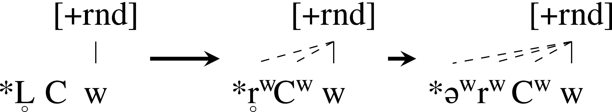

# Labiovelar loss and the rounding of syllabic liquids in Indo-Iranian

John Clayton | orcid: 0000-0002-0967-4197
University of California, Los Angeles, CA, USA
john.clayton.v@gmail.com

## Abstract

This paper analyzes and supports the claim that Vedic Sanskrit preserves traces of the
contrast between the Indo-European labiovelars and plain velars—a striking archaism
in the Indo-Iranian family, which otherwise collapsed the two velar series. These
labiovelar vestiges emerge because of the pervasive labialization of syllabic and consonantal rhotics at all attested stages of the Indo-Iranian family. Two rhotic labialization
environments are examined in Indo-Aryan and Iranian: after labial(ized) consonants
or before syllables containing u or w. Furthermore, this paper explains the unexpected
development of bimoraic Proto-Indo-European `*L̥μHμ.C` to trimoraic Vedic Ūμμrμ.C by
examining the phonetic characteristics of the labializable Indo-Iranian rhotics.

## Keywords

diachronic phonology – syllabic liquids – labiovelars – labialization – Indo-Iranian –
Vedic Sanskrit

## 1 Introduction

Since Burrow (1957), the question has remained unresolved whether traces of
the labiovelar series, `*Kʷ`, were retained in the outcomes of the Proto-Indo-European (PIE) `*KʷL̥H₁` as Sanskrit Kū̆r. Because Indo-Iranian shows uniform
satəm outcomes of inheritedvelarseries(i.e.,thePIElabiovelarsmergedexceptionlessly into the plain velars), only the anaptyxis of rounded vowels in `*KʷL̥H`
sequences enabled evidence of labiovelars to survive during the prehistory of
Proto-Indo-Iranian (PIIr.). Under this view, Sanskrit and Proto-Indo-Iranian
stand among the handful of PIE branches which retained (partially condi-tioned) reflexes of all three of the PIE velar series, alongside Albanian (Pedersen 1900; Orel 2000: 66–74 with refs.), Armenian (Stempel 1994), and Anatolian
(Melchert 1987 & 2012). In this paper, I will reexamine the conditioned effects
of PIE labiovelars on `*-L̥H-`; specifically, I will argue that:
(1) a. The distinct reflexes of labiovelars appear only in closed-syllable
`*KʷL̥H.C-` sequences.
b. Adjacent rounded segments cause rounding of `*L̥(H)` not only in Vedic
(Ved.) but also in Iranian.
c. The rounding of liquids provides insights not only into the chronology
of `*L̥(H)` anaptyxis but also into the phonetics of `*r̥` in Proto-Indo-Iranian.
This discussion will primarily concern the effects of various rounded segments
on `*L̥` and anaptyctic `*ə.`

### 1.1 Previous discussion of *L̥H

Beginning with the Indian grammarians, the problem of Ved. Ū̆r vocalism has
received a great deal of scrutiny without being solved. Pāṇini (7.1.100–103)
already recognized that a root-final -r̥̄- produced -ū̆r- when preceded by a labial
consonant (e.g., `√pr̥̄-` ‘to fill’ → pūrṇá- ‘full’) and -ı̄̆r- otherwise (e.g., `√str̥̄-` ‘to
scatter’ → stīrṇá- ‘scattered’) though he noted the situation in Vedic was less
predictable. The early Indo-Europeanists (Pott 1833: 51; Bopp 1871: 229–230*)
adopted Pāṇini’s findings and further attempted to explain the distribution of
Ŭr sequences through regressive vowel assimilation in words like gir-í- ‘mountain’ and gur-ú- ‘heavy’ (Benfrey 1860: 87; Schleicher 1861: 17–20; Bartholomae
1885). This era of inquiry culminated in the compendious investigation of Ū̆r
forms by Wackernagel (1896: 22–31), who accepted Pāṇini’s idea of a preceding labial producing ū̆r, but he adduced several examples of ū̆ vocalism unexplained by or contradicting previous accounts (e.g., kūrmá- ‘tortoise’, jūryati
‘makes old’, táturi- ‘conquering’). These exceptions convinced him that the distribution of Ved. Ū̆r remained unclear and partially contingent on dialect.
P = any labial consonant (w/v, p, b, etc.), K = any plain velar, Ḱ = any palatal velar, Kʷ = any
labiovelar, F = any fricative.
The next major proposal came with the expansion of Pāṇini’s `√Pr̥̄-` → Pū̆rrule to include originally labiovelar-initial roots, `√`*Kʷr̥̄-.` In an attempt to explain why `√gr̥̄-` ‘to welcome; proclaim’ shows both ı̄̆- and ū̆-vocalism (3sg.aor.
mid.inj prá gūrta, ppp gūrtá, root noun gír-, gd -gı̄́ryā (b)), Burrow (1957) proposed dividing the forms along semantic grounds, deriving gū̆r- ‘to welcome’
from a labiovelar-initial root and gı̄̆r- ‘to sing’ from a plain velar-initial root.
Though Burrow’s semantic differentiations were rightly rejected by Gotō (1987:
155) and Mayrhofer (1992: 468–469), the idea of labiovelars rounding the following vowel in `*KʷL̥H` became part of the doxa.2,3
Since Burrow, much of the research around `*L̥H` in Indo-Iranian has concernedthelengtheningbehaviorof thelaryngealontheprecedingvowel.While
it has long been recognized that `*L̥.HV` > Ved. U.rV (`*gʷr̥h₂-ú-` > gurú- ‘heavy’)
and `*L̥H.C` > Ved. ŪrC (`*pl̥h₁-nó-` > pūrṇá- ‘full’), Lubotsky (1997 & 1998) argued
that*CL̥HWV showedvariablelengthinthenewCŪ̆r sequencebasedonaccentuation: when `*L̥` was accented, the anaptyctic vowel was long (`*gʷŕ̥hₓ-yeh₁` > gd
°gū́ryā ‘praising’); otherwise the anaptyctic vowel was short (gʷe-gʷr̥hₓ-yéh₁-t >
3sg.prf.act.opt juguryā́t ‘praise’). Heaccountsforthissituationbyproposing
a PIIr. sound change `*Cr̥H.WV́` > `*Cr̥.HU.(W)V́` > Ved. CUrWV́.4The fact that this
andothersoundchangesoccurredata(pre-)PIIr.stageshallbecomeimportant
in the present paper’s analyses.
Though Lubotsky’s theories do not directly concern the traces of `*Kʷ`, he
summarizes the two environments for Ved. ū̆r adduced in the preceding literature; his rules are represented in (2).
(2) `*L̥H` > Ved. ū̆r / {
`P___`
(Lubotsky 1997: 1392)
___{w, u}
Deviationsfromthisdistributionareof analogicalorigin:forinstance,the
vocalism of the prf. ptc. titirvā́ṃs- is due to the perfect stem ti-tir- (cf. 3pl
titiruḥ), that of tū́rya is due to the present tū́rvati, etc. Synchronically, we
have to do with two roots: tar-/tir- ‘to cross’ and tūr(v)- ‘to overcome’, and
the choice between ur/ūr and ir/īr in the derivatives is generally dependent on the meaning. (Lubotsky 1997: 1392)
His explanation above follows Burrow (1957: 141–142), who similarly explains
the differing vocalism between rv and av of `√jr̥̄-` ‘to grow old’(3sg.prs.act.ind
jı̄́ryati (av) vs. jū́ryati (rv), ppp jīrṇá- (av) vs. jūrṇá- (rv)) as a product of
conflation with `√jūrv-` ‘to wear down’—though both come from formations
`*ǵŕ̥h₂-ye-ti` and `*ǵŕ̥h₂-w-e-ti` to `*ǵerh₂-` ‘to wear down; to make old’ (Rix & Kümmel 2001: 165–166). Further apparent counterexamples to (2) will be discussed
in Section 2.
Using similar ‘labial’ environments to Lubotsky’s theory in (2), Cantera
(2001) argues that in Iranian unaccented `*r̥H` > `*ər` instead of the expected `*ar`
(e.g., pl̥h₁-nó-> Av.pərəna-‘full’,not ×parəna-;(w)r̥hₓdh-wó-> Av.ərəδβa-‘upright’,
not ×arəδβa-). The environments of Cantera’s Proto-Iranian (PIr.) rule in (3)
differ crucially in two ways from those in (2): only `*w` is allowed to cause the
regressive effect (not `*u)` but it may apply across intervening consonants.
(3) Cantera (2001: 16):
`*L̥H` > PIr. `*ər` / {
`P___`
___`C₀`w
Despite their slightly different formulations and very different diachronic
stages, Lubotsky and Cantera’s proposals are very similar in two respects: they
both concern the development of `*L̥H` in Indo-Iranian and they both share
roughly the same set of environments (following a labial consonant or preceding a syllable containing a `*w` or `*u).` For this reason, I will propose the following
rules for evaluating whether `*KʷL̥H` shows consistent ū̆r outcomes in Ved.:
(4) Vedic ū̆r distribution rules:
a. `*L̥H` > Ved. ū̆r / {
{P, Kw?}___
___`C₀`{w, u?}
b. Roots that show both ı̄̆r and ū̆r forms may generalize one vocalism on
the basis of semantics or dialect.

### 1.2 Structure of this paper

The remainder of this paper will have the following structure. Section 2 examinestheVedicevidenceforthedistributionof (C)ı̄̆r and(C)ū̆r <`*(C)L̥H` todetermine whether the heuristics proposed in (4) can account for the data. I will
argue that in the limited environment of closed-syllable `*KʷL̥H.C` sequences,
labiovelarsdoreliablyproviderounded KūrCoutcomes.Section3presentsnew
evidence of similar rounding effects on `*L̥(H)` by adjacent rounded segments in
various Iranian languages. This is taken as evidence for an Indo-Iranian-wide
phonetic rule which resulted in rounded vowels separately in most daughter
languages. Section 4 will develop a more detailed chronology of the development of `*L̥H` in PIIr. to account for the rounding effects of pre-PIIr. `*Kʷ` on the
pre-`*L` anaptyctic vowel found throughout Indo-Iranian. Section 5 concludes.

## 2 The evidence for the rounding of *L̥H in Vedic

The environments proposed in (4a) may be broken into four distinct subenvironments:
(5) a. Labial-initial (`*PL̥H)`
b. Followed by `*w` (`*L̥HC₀w)`
c. Followed by `*u` (`*L̥HC₀u)`
d. Labiovelar-initial (`*KʷL̥H)`
Before evaluating the more elusive environment (5d) in section 2.5, it is necessary to examine the other environments to remove all confounding examples.
Accordingly, the evidence for these environments will be treated in sections
2.1–2.3. Before proceeding, however, Wackernagel (1896: 28–29) provides several examples of unexpected ū̆r vocalism or ı̄̆r~ū̆r alternations, which get their
ū̆r vocalism from sources other than `*L̥H` (to these, I have added further non-probative examples):5
(6) ur from inherited PIE `*ur`:
a. híruk ‘off; away’: associated with forms hurúk ‘apart’, huraḥ ‘secretly’.
Apparently a dissimilation, híruk < `*húruk`, from `√hvr̥-` ‘go crookedly,
deviate’ < `*ǵhwer/l-` (Mayrhofer 1996: 817).
(7) Probable Dravidian loanwords or non-inherited terms:
a. kūrcá- ‘(grass) tuft’: with onset voicing alternation in guccha- ‘tuft’
(Mayrhofer 1992: 386).
b. `√kū̆rd-` ‘to jump; to play’: with onset voicing alternation in `√gū̆rd-` and
`√khurd-` beside Tamil kuti, Malayalam kuti, Kannada gudi ‘to jump’
(Burrow 1948: 375).
c. kū̆rpāsa- ‘jacket; bodice’: an Iranian borrowing (whence Gr. κυρβασίᾱ ‘Persian bonnet’) from Median borrowing from `*kur-pāsya-` ‘throat
binding’ (Hinz 1975: 154) or Southwest Old Persian `*kr̥p-pāça-` < `*kr̥p-`
pāθra- ‘body protection’ (Thieme 1937: 91; Mayrhofer 1956: 255)
d. kūrpara- ‘elbow’: with varying vocalism and consonantism in kaphaṇi-,
kaphoṇi-,kuphaṇī-,Pāl.kappara-,Prāk.koppara-(Mayrhofer1956:255).
With these forms eliminated, the remainder of this section will concern true
examples of L̥H (non-)rounding.

### 2.1 Vedic ū̆r from *PL̥H

The post-labial rounding environment `*PL̥H` > Pū̆r6 in Ved. certainly owes its
early recognition by Pāṇini to its exceptionless operation. Some representative
examples of rounding are provided in (8). These forms contrast with the non-rounded forms in (9), which illustrate the unconditioned outcome of `*L̥H` in
Vedic.
(8) Rounding examples:
a. mūrdhán- ‘head’ < `*ml̥h₃dh-ón-` (cf. Gr. βλωθρός ‘grown high’, OE molda
‘upper part of the body’)
b. pūrṇá- ‘full’ < `*pl̥h₁-nó-` (cf. Lat. plēnus, Lith. pìlnas ‘full’)
c. ū́rṇā- ‘wool’ < `*h₂wĺ̥h₁-neh₂-` (cf. Hitt. ḫulana-, Lat. lāna, Lith. vìlna
‘wool’)
d. bhuránta ‘they dart’ < `*bhr̥hₓ-éntor` (cf. Hith. parḫ- ‘to chase’)
(9) Non-rounding examples:
a. īrṣyā́- ‘envy’ < `*(h₁)r̥hₓ-s-yéh₂-` (cf. Hitt. aršanēši ‘you envy’)
b. dīrghá- ‘long’ < `*dl̥h₁ghó-` (cf. OE tulge ‘strongly’, Lith. ìlgas ‘long’)
c. stīrṇá- ‘strewn’ < `*str̥h₃-nó-` (cf. Gr. στρωτός, Lat. strātus ‘spread’)7
d. híraṇya- ‘gold’ < `*ǵhĺ̥h₃-en-yo-` (cf. OE gold ‘gold’, Gr. χλωρός ‘bright
green’)

### 2.2 Vedic ū̆r from *L̥HC₀w

The case for rounding by a following `*w` is somewhat more complex than for
rounding from a preceding labial; not only is it unclear whether rounding
occurswhenaconsonantintervenesbetween*L̥H and*w,butalsothisenvironmentissusceptibletolevelinginawayinwhich*PL̥H avoids.Forword-internal,
non-alternating instances of `*L̥Hw`, however, ū̆r appears uniformly, as shown in
(10).
(10) Rounding examples:
a. urvárā ‘arable land’ < h₂r̥h₃-wér-eh₂- (cf. Myc. ⟨a-ro-u-ra⟩, Gr. ἄρουρα
‘acreage’, MIr. arbor ‘crops’)
b. kulva- ‘bald’ < `*kl̥hₓ-wó-` (cf. Lat. calvus ‘bald’, YAv. kauruua- ‘thinhaired’)
c. dū́rvā- ‘Cynodon dactylon’ < `*dr̥hₓ-weh₂-` (cf. Lith. dirvà ‘field’, MDu.
tarwe ‘wheat’, Gr. δάρατος ‘bread’)
(11) Non-rounding examples:
a. īrmá- ‘arm’ < `*h₂r̥hₓ-mó-` (cf. OE earm ‘arm’, Lat. armus ‘forequarter’)
Note on the other hand that the -m- in (11) does not trigger rounding, but the
regular ī vocalism occurs.8 Of the consonants with labial place of articulation,
it seems only a following `*w` possesses a strong enough rounding cue to trigger
ū-vocalism. Contrast the behavior of `*w` with (8), where any preceding labial
consonant triggered u-vocalism. This suggests that*w(andperhaps*u)hada[+
round] feature with an associated stronger rounding cue which was not shared
by the labial stops.9
Some superficial exceptions to `*L̥Hw` > ū̆rv appear already in Wackernagel
(1896: 29) as in titirvā́ṃs- ‘having crossed, overcome’ or the converse overapplication of rounding jūryati ‘grows old’. Yet as mentioned in Section 1.1, the
alternation between ı̄̆r and ū̆r in `√tr̥̄-` and `√jr̥̄-` stems from a conflation of the
regular unrounded forms with rounded ones from the `*-w-e-presents` tū́rvati
‘overcomes’ < `*tŕ̥h₂-w-e-ti` and jū́rvati ‘wears down’ < `*ǵr̥h₂-w-e-ti.` The fact that
these two roots were already becoming confused in the rv indicates the extent
towhichtherelationshipbetweentheroundingrulesandthedistributionof Ū̆r
forms had already become partially opaque byVedic.10 In the rv, the only other
seeming counterexamples with ı̄̆rv occur at transparent compound boundaries
and were thus subject to leveling of their vocalism. On the one hand, gír-11
‘praise’ < `*gʷŕ̥hₓ-` ‘to praise; welcome’ appears in gír-vaṇas- ‘praise-desiring’ and
gír-vāhas- ‘praise-conveyed’. Note here that we never find the phonologically
expected long vowel in ×gı̄́r-C- < `*gʷŕ̥hₓ-C-`, indicating these compounds were
synchronically formed.12 On the other hand, āśı̄́r-vant- ‘having admixtures (of
milk for soma)’ from `*ḱerh₂-` ‘to mix’ (Mayrhofer 1996: 665–666) stands beside
a well attested simplex āśír- ‘admixture (of milk for soma)’, whose vocalism
would not be affected by the addition of the productive suffix -vant-.
labial stop but not preceded by another labial. The terms ūrmí- ‘wave’ < `*wL̥hₓ-mí-`, sūrmı̄́‘pipe’ < su-ūrmí- ‘`*curvature` ⇐ `*well-waved’` < ?`*h₁su-wl̥hₓ-mí-` (Mayrhofer 1996: 742), and
tuvi-kūrmí- ‘powerfully ranging’ < `*tuhₓ-i-kʷl̥hₓ-mí-` are discluded due to their preceding
labialorlabiovelar. Theuncertaintyaboutthecharacterof theinitialvelar,`*k(w)`,inkūrmá‘tortoise’ < `*k(w)L̥H-mó-` also disqualifies it from the current discussion (Mayrhofer 1992:
386).
The only potential candidate of `*L̥HCw` in the rv is ūrdhvá- ‘upright’ <
`*(w)r̥hₓdh-wó-`, but the reconstruction of this term is notoriously difficult (see
discussion in Schrijver 1991: 312–313).13 Hackstein (2018), however, argues
cogently that the root should be reconstructed as `*werhₓdh-` with initial `*w`,
which would render ūrdhvá- non-probative because the Ved. u-vocalism may
be attributed to the preceding `*w.` As such, it is difficult to say whether `*L̥HCw`
acts as a regular rounding environment inVedic, and so only `*L̥Hw` remains certain.

### 2.3 Vedic ū̆r from *L̥HC₀u

In contrast to the easily adduced cases for rounding in `*L̥Hw`, the evidence
remains scarce whether `*L̥Hu` acts similarly; indeed, this sequence faces even
moredifficultiesthantheonediscussedintheprecedingsection.Inthissection
and in 2.4 and 2.5, I will support `*L̥Hu` as a rounding environment on the basis
of indirect evidence from elsewhere in Vedic and from Middle Indo-Aryan. As
for direct evidence, `*L̥Hu` lacks probative Vedic data for rounding effects. The
most obvious candidates, `*-u-stem` adjectives of the type `*R(∅)-ú-` given in (12),
are all compromised by having a labial or labiovelar before the `*L̥Hu.`
(12) a. purú- ‘much, many’ < `*pl̥h₁-ú-` (cf. Gr. πολύς, OE feolo ‘much, many’, OIr.
oll ‘great; vast’)
b. urú- ‘broad, wide’ < `*h₁wr̥(h₁)-ú-14` (cf. Gr. εὐρύς, Av. vouru ‘broad, wide’)
c. gurú- ‘heavy’ < `*gʷr̥h₂-ú-` (cf. Gr. βαρύς, Goth. kaurus ‘heavy’)
In particular, gurú- has long been the Paradebeispiel for the claim that Vedic
inherited traces of the labiovelar series in the environment `*KʷL̥H` (as in Mayrhofer 1986: 104; Szemerényi 1996: 66; Fortson 2010: 212; Kobayashi 2017: 327). If
indeed `*L̥Hu` did regularly resultin ur, it wouldmean that gurú- is not probative
for labiovelar rounding, but again, each of these examples is confounded. For
potential counterexamples, prf.act.ptcp titirus < `*te-tr̥h₂-us` is disqualified as
counter-evidence by the variable Ū̆ vocalism of `√tr̥̄-` discussed in Section 2.2.
Otherwise, there are no secure cases of `*L̥Hu` in rv.15 Surface iru from an inherited `*L̥H` appears in 3sg.intens.act.imp adardirur < `*der-dr̥hₓ-r̥s` to `√dr̥̄̆-` ‘to
rend’ < `*der(hₓ)-`, but this form should also be discounted. Firstly, the seṭ character is non-original (Mayrhofer 1992: 701–702). Furthermore, the i-vocalism in
adardirur could easily have spread from other intensive forms like 3sg.inj.act
dardirat. And finally, the desinence -ur < `*-r̥s` must have developed u-vocalism
within Indo-Aryan16 and thus may not have even have occurred before the
Indo-Aryan resolution of `*L̥H` > Ū̆r.
While the inherited evidence does not provide any support for this rounding
environment, Lubotsky (1994: 95–96 & 2000: 321–322) has suggested that dissimilation within Indo-Aryan does show similar properties. He proposes that
r̥ sometimes dissimilated to a vowel a, i, or u when preceded or followed by
another r. For example, he proposed the class V present kr̥ṇóti from `√kr̥-` ‘to
make’ underwent a progressive assimilation to `*kr̥róti.` Then the `*r̥r` cluster dissimilated with an outcome dependent on the following vowel: When followed
by-o-or-av-<`*-aw-`,`*kr̥ro-/kr̥rav-becomeskaro-/karav-`,butbutwhenfollowed
by -u- or -v-, `*kr̥ru-/kr̥rv-` becomes kuru-/kurv-. Similarly, `*mŕ̥ǵh-ur` did not give
the expected ×mŕ̥hur, but instead dissimilated to múhur ‘suddenly’. Both kuru-/
kurv- and múhur would then show that within Vedic r̥ produced a round vowel
when followed by u or v. Of course, múhur could take its rounding from the
initial*m-,butif Lubotsky’setymologyof Tváṣṭar-<`*Tvŕ̥ṣṭar-<*twŕ̥ḱ-tor-iscor-`
rect, then a preceding labial was not sufficient to round r̥ > u. These proposed
developments of r̥, however, look very much like the developments in Middle Indo-Aryan to be discussed in section 2.4, and thus I prefer to take kuru-/
kurv- and múhur as Middle Indicisms. Also, one cannot discount the older etymology that Tváṣṭar- < `*Tvárṣṭar-` < `*twérḱ-tor-` (with expected root full-grade;
Mayrhofer1992:685–686)simplydissimilatedawaytheextra*-r-withtheassistance of the semantically associated root `√takṣ-` ‘to fashion’. Because of the limited nature of the proposed dissimilation effect in Vedic and the potential for
Middle Indo-Aryan influence,17 these data do not prove secondary r̥C1u > uC1u.
mology takes these terms as compounds of -udh- < `*wedh-` ‘to convey’ (Mayrhofer 1992:
200–201): `*h₂is-udh-y-` ‘to convey desire’, ǵs-údh- ‘conveying starvation’, and ḱr̥h₂-údh- ‘conveyingcrushingforce’,respectively. Thelastcompoundḱr̥h₂-údh->śurudh-couldinprinci-ple provide an example of `*L̥Hu` rounding if correct, but these `*wedh-compound` etymologies are correctly rejected by Jamison (2020), who favors the etymology of Thieme (1941)
for śurudh-.
Given the uncertainty about inherited `*L̥Hu` > uru, it should come as no surprise that no secure evidence exists for `*L̥HC1u.` The general dearth of probative
forms could argue both for Lubotsky’s proposal of `*u` as a source of regressive
rounding and against gurú- as an example of labiovelar rounding, but even
that is too confident of an interpretation of these data. Before beginning the
labiovelar discussion, the environments set out in (4a) may now be narrowed
to (13) with certainty.
(13) `*L̥H` > Ved. ū̆r / {
`P___`
`___w`
`*L̥HC1wand` L̥H`C₀`ustillremainuncertainforVediconthebasisof thisevidence.

### 2.4 Rounding of r̥ in Middle Indo-Aryan

BeforeImoveontotheevidenceforroundingcausedbylabiovelars,thestriking
continuation of r̥-rounding in Middle Indo-Aryan deserves discussion, particularly because the earliest stages of Middle Indo-Aryan existed already at the
time of the composition of the Vedas and likely represented the household
dialects of their composers. As such, the phonetics of Middle Indo-Aryan can
shed light on the phonetic milieu of early Sanskrit articulation. The vowel r̥ did
not survive as such into Middle Indo-Aryan but was normally replaced by a, i,
orudependingontheenvironmentandthedialect.18Infact,allperiodsof Middle Indo-Aryan show very similar behavior both to one another and to Sanskrit,
namely that r̥ produces u-vocalism after a labial or before a syllable containing
u. Some representative examples are given in (14)–(16).
(14) Early Middle Indo-Aryan:
a. Pāli (Berger 1955; Oberlies 2001: 50–51):
r̥ > u / `P___` (Pāl. pucchati < OIA pr̥cchati)19
r̥ > u / ___C1u (Pāl. utu < OIA r̥tu-)
b. Gāndhārī (Burrow 1937: 2; Baums 2019: 2):
r̥ > u / `P___` (Gān. puchaṃti < OIA pr̥cchanti)
r̥ > u / ___C1u (Gān. uju < OIA r̥ju-)
(15) Dramatic and Jain Prakrits (Pischel 1900: 50–51, 54–55; Woolner 1928:
25–26):
a. Ardhamāgadhī:
r̥ > u / `P___` (AMāg. pucchaï < OIA pr̥cchati)
r̥ > u / ___C1u (AMāg. uu < OIA r̥tu-)
b. Māgadhī:
r̥ > u / `P___` (Māg. puśchai < OIA pr̥cchati)
c. Māhārāṣṭrī:
r̥ > u / `P___` (Māh. pucchaï < OIA pr̥cchati)
r̥ > u / ___C1u (Māh. udu < OIA r̥tu-)
d. Śaurasenī:
r̥ > u / `P___` (Śaur. pucchadi < OIA pr̥cchati)
r̥ > u / ___C1u (Śaur. udu < OIA r̥tu-)
(16) Apabhraṃśas (Tagare 1948: 39–48):
a. Eastern Apabhraṃśa:
r̥ > u / `P___` (EAp. pucchaï < OIA pr̥cchati)
b. Southern Apabhraṃśa:
r̥ > u / `P___` (SAp. puhaï < OIA pr̥thavī)
r̥ > u / ___C1u (SAp. uḍu < OIA r̥tu-)
c. Western Apabhraṃśa:
r̥ > u / `P___` (WAp. pucchai < OIA pr̥cchati)
The Middle Indo-Aryan data argue strongly in favor of the remaining OIA r̥
being rounded after labials and before u. Moreover, because Middle Indicisms
were already making their way into Vedic language (Werba 1992), the Middle Indo-Aryan regularity of this development suggests that similar phonetic
factors could cause the sequence `*-L̥Hu-` to become -uru- regardless of its pre-ceding consonant in the contemporary Vedic language. Whether ___`C₀`w acted
as a rounding environment in Middle Indo-Aryan requires future investigation
beyond the standard grammars.

### 2.5 Vedic ū̆r from *KʷL̥H

As demonstrated in the preceding sections, the choice between Ū̆r reflexes in
Vedic is by no means arbitrary, a fact which has made the distribution of Ū̆r
after velars all the more baffling, in particular near minimal pairs like gurú- <
`*gʷr̥h₂-ú-vs.` girí-‘mountain’<`*gʷr̥hₓ-í-.20Thisproblembegsforanewsolution`,
and to that end I propose the formulation in (17):
(17) The development of `*KʷL̥H`:
a. In open syllables: `*KʷL̥.HV` > Ved. KirV
b. In closed syllables: `*KʷL̥H.C` > Ved. Kū̆rV
This proposal, which separates the reflexes of `*L̥H` in open and closed syllables,
goes a long way toward explaining the data. The phonological motivations for
the proposed sound changes will be discussed in Section 4. First, I shall establish the empirical basis for this claim.
Unlike the reflexes of `*L̥H` preceded by `*Kʷ`, the palato- and plain velars do
not show any ū̆r forms in either *
⁽ ⁾
ḰL̥HV or *
⁽ ⁾
ḰL̥HC environments.21 Derivatives
of the roots in (18)–(20) show consistent ı̄̆vocalism throughout, as they contain
no environment in which rounding is expected.
(18) `*kerhₓ-` ~`*krehₓ-` > `√kr̥̄-` ‘honor’
(cf. OHG hruom ‘fame’ < `*hrōma-` < `*krehₓ-mo-)22`
a. carkiran (3p.int.prs.act.sbjv) < `*ker(hₓ)-kr̥hₓ-ent`
b. kīrtí- ‘praise’ < `*kr̥hₓ-tí-`
(19) `*kerhₓ-` > `√kr̥̄-` ‘scatter; pour out’
(cf. OIr. -cuirethar ‘throws’ < `*korhₓ-éye-)`
a. kiráte (3sg.prs.mid.ind) < `*kr̥hₓ-é-`
b. kīryáte (3sg.prs.pass.ind, b) < `*kr̥hₓ-yé-`
c. kīrṇá- (ppp, b) < `*kr̥hₓ-nó-`
(20) `*ḱerh₂-` > `√śr̥̄-` ‘to crush’23
(cf. Gr. ἀ-κέραιος ‘unhurt’ < `*n̥-ḱerh₂-)`
a. ā-śīrta- (ppp) < `*ḱr̥h₂-tó-`
b. śīrṇá- (ppp, av) < `*ḱr̥h₂-nó-`
c. -śı̄́ryā (gd, b) < `*-ḱr̥h₂-yó-`
d. śīryáte (3sg.prs.pass.ind) < `*ḱr̥h₂-yé-`
Turning to the labiovelar-initial cases, two etyma, girí- and `√cr̥̄-`, attest forms
containing only one of `*KʷL̥HV` or `*KʷL̥HC` and therefore show consistent i-or ū-vocalism respectively.24 The development of girí- < `*gʷr̥hₓ-í-` is now rega pseudo-root `√śūr-` which was extracted secondarily from śū́ra-. This etymology is confirmed both by morphological parallels and by poetic motivation for this form’s creation.
The development of śū́ra- → `√śūr-` → śūrtá- is mirrored by the development of sū́ra- ‘sun’
→ `√`*sūr-` → (a)sū́rta- ‘(un)sunlit’ (x.82.4c). Though (a)sū́rta- retains the original barytone
accentuation of sū́ra-, śūrtá- becomes oxytonic due to its function in rv i.174.6d as a verbal substitute, completing its conversion to participial accentuation. The creation of the
hapax ppp śūrtá- leads to the later Sanskrit `√śūr-` ‘to hurt; to be firm; to be valiant’ found
in śūryate and śuśūre and recognized by Indian grammarians (Dhātupāṭha iv.D.1.49).
Furthermore, the wily poet Agastya invents śūrtá- in service of the hymn’s skewed ring
composition: śūrtá- in 6d falls in the middle of two terms referring to Indra, śū́ra-patnī‘champion-lord’ in 3a and śū́ra- in 9c. Indra solidifies his position as śū́ra- by the progression from an indirect reference śū́ra-patnī- through the new participle śūrtá- describing
his feat to the straightforward vocative address śūra. śūrtá- probably meant ‘destroyed by
a śūra’ or ‘conquered’ in the context, perhaps playing off the meaning of śīrtá- ‘crushed’
as a reference to jaghanvā́n ‘having smashed’ earlier in the verse.
rv i.174.6
jaghanvā́m̆̇ indara mitrérūñ codápravr̥ddho harivo ádāśūn |
prá yé páśyann aryamáṇaṃ sácāyós tváyā śūrtā́ váhamānā ápatyam ‖
‘Onceyouhadsmashedthosewhorouttheirallies,andhadsmashedtheimpiouswhen
you were strengthened by the stimulant, o Indra of the fallow bays,
those who saw before them Aryaman in company with these two [=Mitra andVaruṇa],
they were conquered by you, taking their progeny along.’ (modified from Jamison &
Brereton 2014: 374)
Agastya uses the same technique of blending terms for the sake of ring composition elsewhere in the same poem, when he balances the description śéṣan … sásmi yónay ‘They [=
enemies] will lie … in this womb’ in 4a with a hapax blend duryoṇa- in duryoṇé kúyavācam mr̥dhí śret ‘[Indra] has embedded the one speaking evil in scorn in an ill womb’ in
7d. Although playing off of the preceding description of the earth as a womb for Indra’s
foes, duryoṇa- does not come from dur- ‘bad’ + yóni- ‘womb’ but from a blend of duroṇá‘house’ and dúrya- ‘pertaining to the doors; the house’. Through his masterful wordplay,
Agastya created two new terms, śūrtá- and duryoṇa-, to satisfy the poetic structure of the
hymn. I thank Stephanie Jamison (p.c. 27 December 2018) for her suggestions about ring
composition in i.174 and the accentuation of śūrtá- vs. (a)sū́rta-.
ular since it has the structure `*KʷL̥HV.` Conversely, `√cr̥̄-` ‘to move oneself’ <
`*kʷelh₁-` (cf. Gr. πέλομαι ‘move oneself’) contains only closed-syllable `*kʷl̥h₁C`
with expected ū-vocalism in rv: tuvikūrmí- ‘powerfully ranging’ < `*-kʷl̥h₁-mí-`
(Mayrhofer 1992: 659) and carcūryámāṇam (int.prs.mid.ptcp) < `*kʷel-kʷl̥h₁-`
yé-mh₁no-. In defense of his rule that `*CL̥HWV́-` should come out as Ved.
CurWV́ -, Lubotsky (1997: 141) appeals to analogy to explain the length of ū in
carcūryámāṇam (as well as tartūryante < `*ter-tr̥h₂-yé-ntoy)` instead of expected
×carcuryámāṇam (and ×tarturyante). As proof of carcūryámāṇam’s nonce status, he convincingly points to the unetymological c in -cūr- < `*-kʷl̥h₁-` and its
membership in the later productive class of -ya-intensives. If correct, ūr must
come from an unattested verb form since `√cr̥̄-` attests no other Ū̆r forms in rv.
This tendency for intensives to borrow their vocalism from elsewhere in the
paradigm will reappear with jalgulas (2sg.int.prs.act.sbjv) and járgurāṇas
(int.prs.mid.ptcp) below.25
Under the proposed theory of `*KʷL̥H`, the u-vocalism of gurú- < `*gʷr̥h₂-`
ú- cannot come from the labiovelar but must come from another source. In
the absence of evidence against `*L̥Hu` as a rounding environment, I prefer to
accept gurú- as confirmation for this environment on theory-internal grounds.
Another possibility is to take the u-vocalism of gur-ú- as analogical to the feminine gurvī- < `*gʷr̥h₂-wíh₂-`, since `*L̥Hw` reliably produces ū̆rv. Though gurvīappears first in av, it does show the short vowel in ŭr predicted by Lubotsky for
unaccented `*L̥H` in `*CL̥HWV́.26` Whether the vocalism of gurú- originates from
its feminine gurvī- or the `*L̥Hu` environment, the confounded circumstances
should disqualify this form from its long-held position as evidence of labiovelar rounding.
There remain the two homophonous roots `√gr̥̄-` ‘to praise; welcome’
< `*gʷerhₓ-` (whence Osc. brateís ‘grace, mercy’) and `√gr̥̄-` ‘to swallow’ < gʷerh₃(whence Gr. ἔβρως ‘you ate’), which show variable ı̄̆~ū̆ vocalism. Within its
verbal paradigm, `√gr̥̄-` ‘to praise; welcome’ shows exclusively ū̆-vocalism, the
majority of which are the expected `*KʷL̥HC` > ū̆r outcomes:
(21) Predicted ū̆-vocalism in `√gr̥̄-` ‘to praise; welcome’ in closed syllables27
a. gūrtá- (ppp) < `*gʷr̥hₓ-tó-`
b. prá gūrta (3sg.aor.mid.inj) < `*gʷr̥hₓ-to`
c. -gū́r(i)yā (gd) < `*gʷr̥hₓ-yeh₁`
d. juguryās (2sg.prf.act.opt), juguryā́t (3s) < `*gʷe-gʷr̥hₓ-yéh₁-28`
e. gūrdhayā (2sg.prs.act.imp) ‘(give) praise!’ < `*gʷr̥hₓ-dhh₁-eye-`
Most striking among the forms in (21) are gūrtá- and -gū́r(i)yā, whose non-ablauting environments best preserve the development of `*KʷL̥HC` > KūrC. On
the other hand, gūrdhayā stands outside of the normal verbal paradigm of `√gr̥̄-`
yet still shows ū-vocalism.
Beside the well-behaved examples in (21), some forms exist that might appear to be counterexamples at first glance. The 3sg.prf.act.subj jugurat
(rv vii.81.5) shows what would seem to be unanticipated u-vocalism from a
theoretical `*gʷe-gʷr̥hₓ-e-t.` Yet the word exhibits another morphophonological
anomaly, namely the unexpected zero-grade in its root syllable, since the perfect subjunctive normally shows full-grades (e.g., jaghánat). Kümmel (2000:
35–36) explains the examples of perfect subjunctives with zero-grade roots as
reinterpreted perfect middle injunctives, but admits that some of the examples
(including jugurat)lackattestedinjunctivestoservesasmodels.Tounderstand
the strange stem shape in jugurat, it is important to analyze the derivatives of
`√gr̥̄-` ‘to praise; welcome’ generally. The rv attests only four stems for this verb:
the frequent present stem gr̥ṇā́/ī- (gr̥ṇā́ti, gr̥ṇīmási, gr̥ṇánti, prs.act.ptcp
gr̥ṇát-, prs.mp.ptcp gr̥ṇāná-), the uncommon aorist stem gū̆r- (prá gūrta,
gurasva), the innovative iṣ-aorist to the present stem with the only the form
1sg.med. gr̥ṇīṣé with present indicative meaning, and the perfect stem jugurwith only modal forms ( juguryās, juguryā́t, jugurat). As described by Jamison
(2009), the athematic optative most frequently appears on the perfect stem
and tends not to compete with optatives in other stems, which is the case with
the regular lautgesetzlich optatives juguryās and juguryā́t. On the other hand,
Jamison (2017) notes that subjunctives are built from the perfect stem only
when the present and aorist cannot be used. Her prediction holds here too;
the subjunctive jugurat uses the perfect stem because Class ix presents cannot distinguish subjunctives with primary endings from indicatives or those
with secondary endings from subjunctives and because the two aorist stems,
gū̆r- and gr̥ṇīṣ-, were clearly not productive. As such, the perfect stem is the
only viable choice for a subjunctive, and the rv poet used the only perfect stem
available to jugurat: the jugur- found in the optatives juguryās and juguryā́t.
Additionally, all three modal perfects appear pāda-finally ( juguryās rv i.140.13,
juguryā́t rv i.173.2, jugurat rv viii.81.5) and both jugurat and juguryās appear
with the preverb abhí. The zero-grade jugurat is very unlikely to be a reinterpreted perfect injunctive (per Kümmel’s theory) since it is coordinated with
three clear aorist subjunctives:
(22) rv viii.81.5:
prá stoṣad úpa gāsiṣac chrávat sā́ma gīyámānam | abhí rā́dhasā jugu-rat ‖
‘Hewillstartupthepraise;hewilljoininthesinging;hewilllistentothe
sāman being sung. He will greet it with generosity.’ (tr. Jamison & Brereton 2014: 1180)
Taken together, jugurat is best understood as analogical to the other pādafinal perfect optatives. A full-grade perfect stem jagar- does not appear until
the forms saṃjagára (tā ii.4.1b = +ms iv.14.17b [an emendation])/saṃjagā́rā
(tb iii.7.12.3b) ‘I have promised’ 1sg.pf.act.ind, which is a variant of the form
saṃgr̥ṇā́mi ‘I swear’ 1sg.prs.act.ind (avp xvi.50.6b = avś vi.119.1b, vi.71.3b).
Kümmel (2000: 194–196) correctly suggests these perfects to be an ‘ad-hocNeubildung’ and not an inherited stem first attested so late and only in one
mantra.
Likewise the 2sg.pres/aor.act.ipv gurasva appears to contain unexpected
u-vocalism in an open syllable, but the thematic present appears only once in
rv:
(23) rv iii.52.2b:
juṣásva indra ā́ gurasva ca
‘enjoy it, Indra, and welcome it’ (tr. Jamison & Brereton 2014: 535)
Gotō (1987: 155) cogently argues for deriving gurasva from an aorist imperative
`*gūrsva` via analogy to juṣásva. From this one usage, gurasva later expands into
the present paradigm guráte found in the b. Once jugurat and gurasva have
been identified as analogical formations, the only verbal form not to follow
the rule in (17) is the rv hapax apa-járgurāṇa- (‘repeatedly taunting’, v.29.4)29
instead of ×apa-járgirāṇa-. For this isolated form, I attribute its u-vocalism to
leveling in keeping with (4b) to match the rest of the verbal paradigm.
ı̄̆-vocalism only appears outside the verbal paradigm of `√gr̥̄-` ‘to praise; welcome’, specifically in the root noun gı̄́r ~ gíram ~ girā́ ‘praise’.30 If one reconstructs the ablaut of this form as `*gʷérhₓ-s` ~ `*gʷérhₓ-m̥` ~ `*gʷr̥hₓ-éh₁`, the instru-mental singular `*gʷr̥hₓ-éh₁` provides girā́ regularly in a `*-KʷL̥HV-` environment,
whose i-vocalism would be used for the rest of the paradigm. If, on the other
hand, one reconstructs zero-grade throughout (`*gʷŕ̥hₓ-s` ~ `*gʷŕ̥hₓ-m̥` ~ `*gʷr̥hₓ-`
éh₁) as no full-grade is ever attested in this noun, the nominative should give
×gū́r. In the rv, the cases with vowel-initial endings attested (acc.pl `*gʷŕ̥hₓ-`
n̥s > gíras 79×, nom/voc.pl `*gʷŕ̥hₓ-es` > gíras 68×, ins.sg `*gʷr̥hₓ-éh₁` > girā́ 65×,
acc.sg `*gʷŕ̥hₓ-m̥` > gíram 7×, gen.pl `*gʷr̥hₓ-óhₓom` > girā́m 3×, dat.sg `*gʷr̥hₓ-`
éy > giré 1×, total 223×) outnumber the cases with consonant-initial endings
(ins.pl `*gʷr̥hₓ-bhís` > gīrbhís 81×, nom.sg `*gʷŕ̥hₓ-s` > gı̄́r 20×, loc.pl `*gʷr̥hₓ-sú` >
gīrṣú 1×, total 102×) both in types (6:3) and in tokens (223:102). This trend holds
even when the cases whose root zero-grade may be secondary (if originally
nom.sg `*gʷérhₓ-s`, acc.sg `*gʷérhₓ-m̥` , nom/voc.pl `*gʷérhₓ-es)` are removed,
giving 4:2 types and 148:82 tokens.31 Since -ir- ~ -ur- alternations are nowhere
attested within a single nominal paradigm, the stem may then have been leveled to gir- on the basis of type and token frequency.32 As mentioned in Section 2.2, the first members of gír-vaṇas- ‘praise-desiring’ and gír-vāhas- ‘praiseconveyed’ are not attested as ×gı̄́r° in rv, indicating that the i-vocalism when
in the first member of compounds is also not necessarily original. Therefore,
regardless of the ablaut reconstructed for this root noun, paradigm-internal
leveling can explain the outcome of gir-. Crucially, the root noun’s i-vocalism
may differ from the u-vocalism in the other forms of `√gr̥̄-` ‘to praise; welcome’
because the root noun stands on the periphery of the verbal system.
Finally, `√gr̥̄-` ‘to swallow’ possess only three hapaxes containing outcomes
of the zero-grade `*gʷr̥h₃-`, and each requires some attention. The root noun
appearing in muhur-gı̄́r (‘swallowing instantaneously’, rv i.128.3) may have its
ī-vocalism via paradigm-internal leveling in the same way as gír- ‘praise’ in
the preceding paragraph. The ppp gīrṇám would appear to be a counterexample to (17) as the closed syllable in `*gʷr̥h₃-nó-` should have resulted in ×gūrṇá-.
Here I propose that this late-appearing form (rv x.88.2) takes its vocalism analogically from the present stem. Though no presents appear in rv, the forms
giráti (av) and gilati (b) develop exactly as expected from `*gʷr̥h₃-é-ti.` If `√gr̥̄-`
‘to swallow’ selected one vocalization for its verbal paradigm as did `√gr̥̄-` ‘to
praise; welcome’ and `√jr̥̄-` ‘to grow old’, then a lateVedic ppp would level to the i-vocalismof the presentstem. The gir/gil-form of the stembecameso standardized that later Indian grammarians report an innovative intensive stem jegilyabuilt to a new root `√gil-` (Schaefer 1994: 115–116). Also, as Lubotsky (2007: 233)
suggests, the `*-nó-` participles probably spread from the `*Ced-` to the `*CeLH-`
roots later in Indo-Iranian—in this case after the adoption of i-vocalism in the
Rigvedic dialect. Indeed, the only attested u-vocalism found in rv form of `√gr̥̄-`
‘to swallow’ appears in the 2sg.intens.pst.act.subj. jalgulas (i.28.1–4). This
form does not appear to belong to the dialect of rv, however, having both u-vocalism and l-consonantism found nowhere else within the verbal paradigm.
Instead, jalgulas resembles the intensive -jalgulīti found in the ts. Thus, all
the forms of `√gr̥̄-` ‘to swallow’ in the rv may be explained by assuming the rv
adopted i-vocalism throughout its verbal paradigm and that jalgulas was borrowed from a different dialect which regularized u-vocalism. Note further that
jalgulas appears in a hymn of racy and popular character and recurs 4 times
as the last word of the verse-final refrain ulū́khalasutānām ávéd u indra jalgu-laḥ ‘you, Indra, will keep gulping down the mortar-pressed (soma drops)’ (tr.
Jamison & Brereton 2014: 126–128). The striking u’s and l’s of jalgulas may have
phonetically mirrored the refrain’s first word, ulū́khala-suta- ‘mortar-pressed’,
especially since the hymn generally concerns the mortar (ulū́khala-).
In the above section, I have shown that all the outcomes of the velar-initial
L̥H may be explained by applying a simple phonological generalization, (17),
with the modification that a given Vedic dialect selected one vocalism for all
its verbal forms. Crucially, under this analysis, all *
⁽ ⁾
Ḱ-initial forms show only
ı̄̆-vocalism, and isolated nominal forms girí- < `*gʷr̥hₓ-í-` and gír- < `*gʷŕ̥hₓ-` no
longer act as exceptions.

## 3 The evidence for the rounding of *L̥(H) in Iranian

Havingdemonstratedthetendencyof `*L̥H` toproduceū̆r inroundedcontextsin
Indo-Aryan, I will turn to the Iranian evidence for this same process. If labiovelars left traces through the rounding of syllabic liquids in Indo-Aryan, it is
necessary to show that these rounding effects occurred in the early stages of
Indo-Iranian, and to that end, we require a survey of the Iranian data to show
the convergence of phonological effects. While Iranian does not show rounding from inherited labiovelars, as shall be shown, it does match Indo-Aryan
in most other environments. Hübschmann (1895: 143–150) and Gray (1902: 35–
36) recognized that `*r̥` produces u(r) in the Iranian as well as Indo-Aryan languages. More comprehensively, Bartholomae (1925) made an extensive survey
of the Iranian reflexes of PIIr. `*r̥` and `*r̥̄` (now `*r̥H)`, in which he observed many
instances of rounding after labials. His study, however, follows many now abandoned etymologies and the ‘Andreas Theory’—the discredited belief that the
Avestan manuscripts were transcribed from Pahlavi-script originals and that
the vowels were subsequently interpolated between the consonants. For these
reasons, Bartholomae struggles with the behavior of `*r̥(H)` in Avestan and elsewhere. To my knowledge, Cantera (2001) first investigates both the Indo-Aryan
post-labial and pre-`*u/*w` rounding environments of `*r̥H` in Iranian, but he limits himself to Avestan. As such, it is necessary to revisit Iranian as a whole
withaneyetowardstheIndo-Aryanroundingenvironments.Giventhebreadth
of archaic and modern Iranian languages and data available, I will only summarize evidence from a few Iranian languages. The following investigation,
however, will establish clear patterns of `*L̥(H)-rounding` which mirror those in
Indo-Aryan. Grammars of various languages were consulted for evidence of `*L̥-`
rounding in the environments listed in (5).This article will investigate Avestan,
Bactrian,Khotanese,Ormuri,Ossetic,Pashto,OldandMiddlePersian,Sogdian-Yaghnobi, Wakhi, and Widgha-Munji.33

### 3.1 Avestan

First, I turn to Avestan. Admittedly, it does not provide certain evidence for
rounding of syllabic `*L̥(H).` As discussed in (3), Cantera (2001) proposed that
unstressed*PL̥H and*L̥H`C₀`w produce different vocalic outcomes from*L̥(H)in
unrounded environments (YAv. ərəδβa- < PIr. `*(w)r̥Hdwá-` vs. OAv. darəga- < PIr.
`*dr̥Hgá-).` His arguments, however, remain controversial (de Vaan 2003: 506–
507648; Kümmel 2007: 276–277).34 Nevertheless, Avestan ‘u-epenthesis’ does
provide evidence for rounding of non-syllabic liquids. The sequences `*rū̆` and
`*rw` had the grapheme u inserted beforehand when found word-initially or
after `*ā̆` or `*ə` (e.g., Av. uruuan- ‘soul’ < PIr. `*ruwan-`, YAv. hauruua- ‘whole’ < PIr.
`*hárwa-`; Hoffmann & Forssman 2004: 51–52).This inserted u never affected the
metrical shape of the forms and appeared consistently into Younger Avestan
as in gəuruuaiia- ‘to seize’ < `*gərβāya-` < PIr. `*gr̥bāya-.` This ur has been correctly
interpreted as representing a labialized [rw] (de Vaan 2003: 561–562; Kümmel
2014a: §2.435) in line with Avestan ‘i-epenthesis’ (OAv. aibī [abjiː] ‘to’ < PIIr.
`*abhi).36` In contrast to i-epenthesis, which affected a wide variety of consonants and clusters (t, θ, d, δ, p, b, β, n, r; ṇt, rm, db; Hoffmann & Forssman 2004:
52–54 & 64; de Vaan 2003: 547–560), only r underwent u-epenthesis, implying
that r was particularly susceptible to labialization above all other Avestan consonants.37 These data show that at least in the environments ___ū̆ and `___w`,
Avestan r possessed a rounded allophone.38 The rounding of non-syllabic r
does not exactly match to the situation in Indo-Aryan, but allophonic rounding of rhotics is crucial to the development of syllabic rhotics, as I will show in
section 4.39
tively during the composition of the Avesta. For this reason, the traditional names ‘u-epenthesis’ and ‘i-epenthesis’ should be used with caution, as no epenthesis may have
actuallyoccurred.Forfurtherdiscussion,seeMorgenstierne(1973:47)andKümmel(2007:
277–278).

### 3.2 Old and Middle Persian

Unlike in Avestan, `*r̥-rounding` is found throughout Old and Middle Persian,
though OP cuneiform obscures the early situation somewhat. The OP reflexes
of Iranian `*r̥` differed from those of `*ar` despite both being written with ⟨a-ra-⟩
initially and ⟨-ra-⟩ internally. The phonemic difference between `*r̥` and `*ar` in
OP is confirmed by loans into Elamite and reflexes in MP: `*r̥` gives Elamite ⟨ir⟩
and MP ir/ur whereas `*ar` gives Elamite ⟨ar⟩ and MP ar. Kent (1950: 15–16)
prefers to reconstruct OP as having phonemic syllabic r̥ (often transcribed in
OP as ạr) < `*r̥`, and there are several reasons to believe that this `*r̥` was phonetically rounded in OP. Diachronically, the reflexes of r̥ in MP differ in rounding
environments: `*r̥` normally becomes MP ir (OP kr̥ta- > MMP kird- ‘made’, OP
`*kr̥mi-` > MP kirm ‘worm’), but after labial consonants, it becomes MP ur (OP
mr̥ta- > MP murd ‘dead’, OP pr̥sa- > MP purs- ‘to ask’; Durkin-Meisterernst 2014:
138–139; Baghbidi 2017: 40–41).
Synchronically, the best potential evidence of r̥-rounding appears in the
nasal-infix present ⟨ku-u-n-u-t-i-y⟩ ku(r)nautiy 3sg.prs.act.ind < PIr. `*kr̥náwti`
of the verb kar- ‘do, make’ < PIE `*kʷer-.` Kent (1942) argues against an older
view that r̥ > u / ___n, citing forms like ⟨v-r-n-v-a-t-i-y⟩ vr̥navataiy ‘he believes’
3sg.prs.mid.ind<`*(hₓ)wr̥-naw-a-tayand⟨k-r-nu-u-v-k-a⟩kr̥nuvakā‘stonecut-`
ters’ nom.pl < PIr. `*kr̥t-nu-ak-āh` from `*kart-` ‘to cut’, which do not show the
change. He instead prefers to take ku(r)nautiy’s u-vocalism by analogy to tunu-‘to be strong’ < PIr. `*tu-ná-H-` and the reconstructed OP form `*çunautiy` ‘he
hears’ 3sg.prs.act.ind < `*ćru-naw-ti`, which he reconstructs on the basis of
YAv.surunaoiti‘hehears’andModernPersianšonidan‘tohear’.YettheseIranian
comparisons require that the nasal-present `*ḱl̥-né-w-ti` have been reformed to
`*ćru-náw-ti` in Proto-Iranian, since Vedic has the expected form śr̥ṇóti.40 Hoffmann & Forssman (2004: 52) suggest the development of YAv. surunaoiti only
occurred in Avestan by analogy with forms like the YAv. ppp sruta- ‘heard’, but
the Modern Persian šonidan leaves open the possibility that `*ćru-naw-ti` was an
earlier innovation. If Iranian did have rounded `*r̥w` as I suggest, both the odd
shape of PIr. `*ćrunáwti` and OP ku(r)nautiy could be explained by misperception by speakers of a rounded `*r̥w` caused by the `*-na-w-` ~`*-n-u-.` The effects of
theroundingcuein*Cr̥w-n-u-nasal-infixpresentswouldhavefurtherbeenaugmented by analogy with other Iranian Cu-n-u- nasal-infix presents. In this way,
the analogical account proposed by Kent and the phonological account of this
article may function together to produce the Iranian u-vocalism found in nasalinfix presents. Furthermore, the OP reflex of `*kr̥naw-/kr̥nu-` closely mirrors not
only the change from Ved. `*kr̥ṇu-/kr̥ṇv-` > Skt. kuru-/kurv- discussed in section
2.3, but also the change from PIr. `*kr̥naw-/kr̥nu-` > Sogd. kwn- to be discussed in
section 3.6.
The diachronic evidence of MP rounded ur reflexes of OP r̥ after labials and
synchronic evidence of intrusive u in `*-naw-` presents argues strongly in favor
of OP having an allophonic rounded r̥w in the environments `P___` and ___Cu.

### 3.3 Ossetic

The Ossetic evidence for rounding of PIr. `*r̥` is very strong. While the unconditioned outcome of `*r̥` is Oss. ær or ar, `*r̥` gave Digor ur and Iron (w)yr after
labials (e.g., D urs / I wyrs ‘stallion’ < PIr. `*wr̥šan-`, D æmburd / I æmbyrd ‘gathering, assembly’ < PIr. `*ham-br̥-ta-`, D urg / I wyrg ‘kidney’ < PIr. `*wr̥θka-)` and
before syllables containing u (e.g., D urz / I wyrz ‘fingertip’ < PIr. `*ŕ̥ȷ́u-`; Cheung
2002:24,Kim2005:148–152).KimarguesthatDurdug/Iwyrdyg‘upright,standing, steep’ < PIr. `*r̥dwa-ka-` < PIE `*wr̥hₓdhwó-` proves that `*w` in the following
syllable also rounds a preceding `*r̥`, but the presence of `*w` preceding `*r̥` in PIE
`*wr̥hₓdhwó-` muddies the situation. Without an in-depth study into the Iranian
reflexes of PIE `*wr̥hₓdhwó-` to see whether the initial `*w` had been deleted by
dissimilation already in PIr., I cannot say whether the rounding of `*r̥` in Ossetic
is triggered by the following or preceding `*w.41` The details of Oss. rounding
are still not fully explained, as some examples of `*r̥` following labials show the
default outcome (e.g., D/I bærzond ‘high; height’ < PIr. `*br̥ȷ́ant-`, D/I marγ ‘bird’
< `*mr̥ga-)`, but this does not disprove Ossetic rounding. Digor ur and Iron (w)yr
from*r̥ onlyappearintheneighborhoodof labialsegments,meaningthat `P___`,
___`C₀`u, and perhaps ___`C₀`w were productive rounding environments in ProtoOssetic.

### 3.4 Ormuri

Morgenstierne (1929: 325) describes the rules governing the distribution of `*r̥`
reflexes in Ormuri as unclear, but Efimov (2011: 78–81) divides the outcomes
between u-vocalism after labials (e.g., Log. / Kan. mr- mur-42 ‘to die’ < PIr. `*mr̥-`
ya-, Log. wólok / Kan. wúlak ‘brought’ < PIr. `*a-br̥-ta-ka-)` and i-vocalism elsewhere (e.g., Kan. dir- ‘to reap, cut’ < `*dr̥-ya-`, Log. zle, zli / Kan. zli ‘heart’ < PIr.
`*ȷ́r̥daya-).` In Efimov’s example of `*rb` > r in Kan. gurū́ ‘kid’ < PIr. `*gr̥bu(š)`, it is
hard to know whether the `*r̥-rounding` comes from the following `*b` or `*u` or
both. The most likely explanation under my account would be that the follow-ing u caused rounding of `*r̥` which then caused `*b` to be lost via dissimilation:
PIr. `*gr̥bu-` [ɡr̩wbu] > `*gurwbu-` > `*gurwu-` > Kan. gurū́-. Ormuri might therefore add ___`C₀`u as a rounding environment along with the secure instances
of `P___`.43

### 3.5 Pashto

The situation in Pashto is opaque due to a regular process that lowered stressed
`*ı̄̆` and `*ū̆` to ə́ in open syllables (Cheung 2011: 199). Nevertheless, Cheung
describes how PIr. `*r̥` has several different outcomes depending on Pashto
stress, syllable structure, and i- and u-umlaut (Cheung 2011: 187–188 & 196–197):
(24) In synchronically stressed, open syllables, `*r̥` > əṛ:
a. PIr. `*mr̥tá-` > Pash. məṛ ‘dead’
b. PIr. `*str̥tá-` ‘thrown’ + -ay > Pash. stə́ṛay ‘tired, weary’
(25) In synchronically unstressed syllables, `*r̥` > ṛ:
a. PIr. `*ȷ́r̥daya-` > Pash. zṛə ‘heart’
(26) In a synchronically closed syllable preceding a syllable originally containing `*i`, `*r̥` > iṛ:
a. PIr. `*kr̥mi-čī-` + -ay > Pash. činjáy ‘worm’
(27) In synchronically closed syllables preceding a syllable originally containing `*u`, `*r̥` > uṛ:
a. PIr. `*mr̥gá-` > Pash. murγə́ / marγə́ / mārγə́ / mərγə́ ‘bird’
b. PIr. `*pr̥sa-` > Pash. pux̌t- ‘to ask’
c. PIr. `*pr̥sú-kā-` > Pash. pux̌tə́y ‘rib’
d. PIr. `*br̥ǰn-` > Pash. (w)úǧa, Wan. murža ‘garlic’
e. PIr. `*br̥ȷ́a-` > Pash. uǧd, f. uǧdá, Waz. wīžd, f. wužda ‘long’
Yet Cheung’s proposed i- and u-umlaut rules do not predict his own data.
For examples (27b), (27d), and (27e), he provides no explanation of why the
proto-forms should be interpreted as containing u in the syllable following `*r̥.`
For (27a), he explains the various root vowels by proposing murγə́ < `*múrγu`
< `*mr̥γu` < `*mr̥gám` acc.sg and taking the other forms from the other cases.
Such an appeal to the effects of the case endings, however, would not work for
(27b). In analyzing the data, Cheung missed a possible generalization: all of the
forms in (27) begin with a labial consonant. Under his analysis, the lowering of
stressed `*ı̄̆and` `*ū̆` to ə́ must have taken place after the after `*r̥` produced `*ir` and
`*ur.` A parsimonious solution to this data would be to say that `*r̥` became `*ur`
after labials and `*ir` elsewhere. Then, after the application of syncope rules `*u`
and i were only retained in closed syllables.44 The explanation using `P___` does
a much better job with (27), but it unfortunately leaves ___`C₀`u uncertain as a
`*r̥-rounding` environment. Alternatively following Cheung’s u-umlaut solution,
`*r̥` would be rounded in ___`C₀`u but not necessarily in `P___`. I prefer `P___` as the
correct environment, but either solution leaves Pashto with clear evidence for
`*r̥-rounding.`

### 3.6 Sogdian-Yaghnobi

Sogdian and Yaghnobi straightforwardly show rounding of `*r̥` as in pw(r)npu˞n-] ‘full’ < PIr. `*pr̥ná-`, m(w)rt [mu˞t-] ‘dead’ < PIr. `*mr̥-tá-`, and β(w)rt- [βu˞t-]
‘borne’ < PIr. `*br̥-tá-` (Gauthiot 1913: 90–95; Kümmel 2006: §4.2.4; see Gershevitch 1954: 19–22, for examples). The unconditioned outcome of `*r̥` is r [ɚ].45
Strikingly, Sogdian shows the same development of the nasal present to `*kar-`
‘to do, make’ as Old Persian: PIr. `*kr̥-nu-` > Sog. kwn- [kun-] (or [ku˞n-]?), Yagh.
kun- alongside the past stem in Sog. krt- [kɚt-], Yagh. iktá- < `*kr̥-tá-.` Gauthiot
(1913: 94–95) already suggested that the `*-u-` in the nasal suffix was the culprit,
saying:
Il est bien difficile de ne pas voir dans la présence du morphème -nau-: -nu- le point de départ de la naissance du timbre de la voyelle -u- qui
s’est substituée à -r̥- dans la syllabe radicale; en effet le thème du participe
passé, dépourvu du morphème -nau- : -nu-, oppose régulièrement `*-r-`, ou
ses représentants normaux, à l’-u- du présent.
The fact that both Sogdian-Yaghnobi and Old Persian undergo this exact same
change from `*kr̥-nu-` > kun- implies that ___Cu was indeed a rounding environment in both languages for the same reasons discussed in section 3.2.46

### 3.7 Bactrian

Bactrian also has clear evidence for rounding of `*r̥.` The unconditioned outcomeof `*r̥` inBactrian was ιρ [ir](e.g., κιρδο pst stemof ‘todo’<PIr.`*kr̥tá-`, γιρλ‘to call’ < PIr. `*gr̥da-)`, but after labials `*r̥` becomes ορ [ur] (e.g., βορδο pst stem
of ‘to bring’ < PIr. `*br̥tá-`, πορσ- ‘to ask’ < PIr. `*pr̥sa-`; Gholami 2009: 30–31). Here
again, the details remain to be fully worked out. For one, it seems that a follow-ing labial stop could cause rounding, as in πιδοροβ- ‘to receive’ < `*pati-gr̥bā̆ya-`,
which would represent an extension of the environment found elsewhere in
Indo-Iranian. Furthermore, a preceding labial does not always round the outcome (e.g., μιργο ‘chicken; bird’ < PIr. `*mr̥ga-`, μιρ- ‘to die’ < PIr. `*mr̥-ya-).` Once
again, however, the Bactrian outcomes in ορ only appear near labials, which
confirms at least `P___` as a rounding environment in Bactrian.

### 3.8 Wakhi

Morgenstierne (1938: 481) reports from his informants that the general outcome
of `*r̥` in Wakhi was ər ~er but that after p, f, and w, `*r̥` came out with a rounded
vowel (e.g., purs- ~pörs- ~pərs- ‘to ask’ < PIr. `*pr̥sa-`, furz ‘birch’ < PIr. `*br̥Hȷ́á-`,
wurzg ‘right’ < PIr. `*(w)r̥dwá-).` This points to Wakhi having `*r̥-rounding` after
labials.

### 3.9 Yidgha-Munji

Morgenstierne (1938: 97–98) directly states that `*r̥` was rounded ‘[i]n the neighborhoodof labials’,butonlyprovidesexamplesof thetype `P___` (e.g.,wurγ‘wolf’
< PIr. `*wŕ̥ka-`, muṛ ‘died’ < PIr. mr̥-tá-, urzuγ ‘straight’ < PIr. `*(w)r̥dwá-).`
**Table 1. `*r̥`-rounding environments in Iranian**

| Language | `*Pr̥` | `*r̥C₀u` | `*r̥C₀w` |
|---|---:|---:|---:|
| Avestan | ✓? | ✓ | ✓ |
| Old and Middle Persian | ✓ | ✓? | ✓? |
| Ossetic | ✓ | ✓ | ✓? |
| Ormuri | ✓ | ✓? |  |
| Pashto | ✓ | ✓? |  |
| Sogdian-Yaghnobi | ✓ | ✓? |  |
| Bactrian | ✓ |  |  |
| Wakhi | ✓ |  |  |
| Yidgha-Munji | ✓ |  |  |
| Khotanese | ✓ |  |  |

### 3.10 Khotanese

Khotanese has a wide array of reflexes for `*r̥`, namely arr, ir, il, ur, urr, ul, and ri
(Emmerick 1989: 211–212). The forms with u, however, are almost entirely limited positions after labials (e.g., muḍa- ‘dead’ < PIr. `*mr̥-tá-`, purr- ‘to overcome’
< PIr. pr̥na-, puls- ‘to ask’ < PIr. `*pr̥sa-).`

### 3.11 The situation in Proto-Iranian

The variety of different rounding effects across the Iranian daughter languages
indicates that there was no unitary development of rounded `*r̥` in ProtoIranian, but the evidence (summarized in Table 1) shows that `*r̥` was certainly
phonetically rounded after labial consonants, and probably also before syllables containing `*u` or `*w.`
While the above is far from an exhaustive survey, I believe this nontrivial
correspondence between Iranian languages (and Sanskrit) to show that ProtoIranian `*r` and `*r̥` were highly susceptible to the spreading of rounding gestures
from adjacent rounded vowels and labial consonants.47
In my investigation of Iranian, nowhere did I find evidence of rounding
caused by labiovelars, though very few probative examples of `*KʷL̥H.C` appeared. Of the Iranian verbal roots which could have derivatives in `*KʷL̥H.C`,
only `*gʷerhₓ-` provided an example of `*KʷL̥H.C` in an Old Iranian language: YAv.
ā-γairiiāt̰(Yt.13.50, 3sg.prs.pass.sbjv) < `*-gʷr̥hₓ-yḗ-t.` Because it does not show
the outcome he predicts (×ā-γriiāt̰), Lubotsky (1997: 14417) states that ā-γairiiāt̰
was rebuilt by analogy to passives in `*CL̥-yé-` (e.g., xvairiia-, bairiia-). On the
other hand, if labiovelars did cause rounding in Iranian, then Cantera (2001)
would predict ×ā-γəiriiāt̰.48 I am inclined to take this form at face value and say
the Avestan offers no support for `*KʷL̥H.C` as a rounding environment, but the
sparse evidence leaves the situation uncertain.

## 4 The diachrony of *L̥H in Proto-Indo-Iranian

In the previous sections, I have shown the environments for rounding of PIE
`*L̥(H)` both in Indo-Aryan and Iranian. The formal identity between three of
the rounding environments `P___` and ___`C₀`{u, w} across both Indo-Aryan and
Iranian leaves little doubt that this rounding is an inherited feature. Yet we still
need a theoretical discussion of `*L̥-rounding` in Indo-Iranian. In the following
section, I will describe the development of PIE `*L̥H` in Indo-Iranian. Next, I
willproposeseveralpotentialexplanationswhylabiovelarsrounded*r̥ inIndo-Aryan.

### 4.1 The development of PIE *L̥H in Indo-Iranian

In the preceding discussion, most data has been presented from a bottomup perspective, showing that the evidence in the daughter languages supports
reconstructing rounding effects on `*r̥` in Indo-Iranian. To get a better understanding of the situation in Proto-Indo-Iranian, we must examine the development of PIE `*L̥H` into Proto-Indo-Iranian and its descendants. The development of PIE `*CL̥C` > PIIr. `*Cr̥C` gives little difficulty; between consonants, PIIr.
`*r̥` does not change in Indo-Aryan and Iranian.49Take, for example, PIE `*kʷr̥-tó-`
‘done; made’ > PIIr. / PIA / PIr. `*kr̥-tá-` > Ved. kr̥tá-, Av. kərəta-, OP ⟨k-r-t-⟩ kr̥ta-.
PIE `*L̥H`, on the other hand, shows more interesting behavior. Before both vow-els and consonants, PIIr. `*r̥H` produces an anaptyctic vowel before the liquid,
as seen in (28).
(28) Development of PIE `*L̥H` in Indo-Iranian:
a. `*L̥HC`: PIE `*dl̥h₁ghó-` ‘long’ > PIIr. `*dr̥Hghá-` >
⎧
{
{
{
{
{
⎨
{
{
{
{
{
⎩
Ved. dīrgháOAv. darəga-, YAv.
darəγaOP ⟨d-r-g-⟩ dargaKhot. dāraOss. darγb. `*L̥HV`: PIE `*ǵhĺ̥h₃-en-yo-` ‘gold’ > PIIr. `*ȷ́hŕ̥Hanya-` >
⎧
{
{
{
{
{
⎨
{
{
{
{
{
⎩
Ved. híraṇyaYAv. zarańiiaOP ⟨d-r-n-y°⟩
daraniya°
Khot. ysīrraOss. zærin
The example (28a) shows a very interesting problem, namely that PIE
`*L̥HC` results in a superheavy syllable `*Ūr.C` in Indo-Aryan, but a heavy syllable `*ar.C` in Iranian. This inter-branch discrepancy in syllable weights has
never been adequately explained to my mind. Some scholars (e.g., Gamkrelidze & Ivanov 1995: 176–178) have sought to explain the weight discrepancy
by continuing the pre-laryngealist practice of reconstructing a ‘long resonant’
phase of Indo-European and Indo-Iranian (`*R̥H` > `*R̥̄).` Yet the theory of long
resonants does not in itself explain the data so much as hide the problem
behind a series of phonemes (`*m̥̄` < `*m̥` H, `*n̥̄` < `*n̥H`, `*r̥̄` < `*r̥H`, `*l̥̄<` `*l̥H)` that do
not survive in any of the daughter languages. While scholars often reconstruct
unattested intermediate phonemes, the long resonants provide no explanation of why long liquids and nasals behave differently (`*L̥̄` > `*V̄̆r` but `*N̥̄` > `*ā)`,
why the height of epenthetic vowels before liquids differs (`*L̥̄` > PIA `*Ū̆r` but
> PIr. `*ar)`, why `*L̥̄.C` becomes superheavy `*Ūr.C` in Indo-Aryan, but not in Iranian, or why `*L̥̄` always results in a prevocalized `*V̄̆r` in all branches of Indo-Iranian.
To achieve a proper explanation for the development of PIE `*R̥H` in Indo-Iranian, we must propose theories which predict the specific outcomes in the
daughterlanguages.Becauseof theuniformappearanceof thevowelbeforethe
liquid,Kümmel(2017:9)andCantera(2017:489)proposetherulein(29).Under
a moraic approach, the prevocalization of `*L̥H` actually produced a moraic
increase (bimoraic PIE `*L̥μHμ.C` > trimoraic PIIr. `*əμrμHμ.C)`, a step on the way
to the trimoraic weight of PIA `*Ūμμrμ.C.This` moraic increase may just be a side
effect of Proto-Indo-Iranian no longer allowing syllabic liquids before laryngeals; the split of `*L̥` into two segments, `*ə` and `*r`, happened to increase the
morae by one.50 One might complain that the addition of an extra mora by
(29) would be part of a ‘Duke of York’ sound change from an Iranian perspective:bimoraicPIE*L̥μHμ.C becomestrimoraicPIIr.`*əμrμHμ.C` becomesbimoraic
PIr. `*aμrμ.C` again. Iranian, however, has other evidence for the deletion of coda
laryngeals from PIIr. `*VrH.C-` (30a) and `*VNH.C-` (30b) syllables.
(29) PIE `*L̥` > PIIr. `*ər` / ___{H, V}
(30) PIIr. `*H` > PIr. ∅/ VR___.C
a. PIIr. VrH.C > PIr. Vr.C
i. OAv. °jarətar- ‘praiser’ < PIE `*gʷérhₓ-tor-` (cf. Ved. jaritár- ‘singer’)
b. PIIr. VNH.C > PIr. VN.C
i. YAv. tąθra- ‘darkness’ < PIE `*temhₓs-ro-` (cf. Ved. támisrā- ‘dark
night’; Lubotsky 2018: 1883)
ii. OAv. vərəṇtē ‘chooses’<`*wr̥nhₓ-tóy(cf.Ved.` vr̥ṇīté‘chooses’;Werba
2005: 700–701)
iii. YAv. vaiṇti ‘vomits’ < `*wémhₓ-ti` (cf. Ved. vámiti ‘vomits’; Kellens
1984: 1412)
(31) `*ə` > PIr. `*a` / ___r
Indeed, Indo-Aryan also repairs superheavy PIIr. VμRμHμ.C syllables in a different way: with an epenthetic ı̄̆(Jamison 1988; Kümmel 2016: 217–218). The Vedic
comparanda in (30) show that the trimoraic root syllable of PIE `*gʷéμrμhₓμ.tor-`
was repaired to Ved. jaμ.riμ.tár-.51 The fact that superheavy PIIr. VμRμHμ.C syllables were eliminated separately in Iranian and Indo-Aryan suggests that the
constraint `*Superheavy` proposed by Byrd (2015: 107–109 & 243) continued
through Proto-Indo-Iranian but was reranked higher in certain daughter
branches.
In the following, I will assume that (29) is correct, and in doing so, the
developments from PIIr. `*ərH.C` to PIr. `*ar.C` fall out naturally. The laryngeal
following `*r` deleted without moraic preservation according to the broader Iranian laryngeal deletion rule given in (30). Then before PIr. `*r`, `*ə` lowers to
`*a` (Cantera 2001; Kümmel 2017: 9–10), as in (31). The change of `*ə` > `*a` may
represent the typologically common phenomenon where vowels lower before
rhotics.
tvám adhvaryúr utá hótāsi pūrviyáḥ praśāstā́ pótā janúṣā puróhitaḥ |
‘You [=Agni] are the Adhvaryu and the primordial Hotar, the Praśāstar and the Potar,
by birth the one placed in front [/Purohita].’ (tr. Jamison & Brereton 2014: 231)
– rv iv.9.3:
sá sádma pári ṇīyate hótā mandró díviṣṭiṣu | utá pótā ní ṣīdati ‖
‘He [=Agni] is led around his seat as the Hotar, gladdening at the rituals of day(break),
and he sits down as the Potar.’ (tr. Jamison & Brereton 2014: 572)
– rv vii.16.5:
tuvám agne gr̥hápatis tuváṃ hótā no adhvaré | tuvám pótā viśvavāra prácetā yákṣi véṣi
ca vā́riyam ‖
‘Agni, you are the houselord; you the Hotar in the rite; you the attentive Potar, o you
who grant all wishes—sacrifice and seek out a desirable reward (for us).’ (tr. Jamison
& Brereton 2014: 901)
Second, the creation of the seemingly aniṭ pótar- from seṭ `√pū-` may also parallel the
derivational ambiguity of hótar- from aniṭ `√hu-` ‘pour’ < `*ǵhew-` and seṭ `√hū-` ‘invoke’ <
`*ǵhewhₓ-.` The suffix-accented potár-, on the other hand, appears only in rv ix.67.22, where
it takes part in an elaborate figura etymologica at the beginning of an embedded purification spell (rv ix.67.22–27; Jamison & Brereton 2014: 1295–1296; Jamison 2015–: §ix.67.22).
– rv ix.67.22:
pávamānaḥ só adyá naḥ pavítreṇa vícarṣaṇiḥ | yáḥ potā́ sá punātu naḥ ‖
‘The one who purifies himself through our filter today, the limitless one who is the
purifier, let him purify us.’ (tr. Jamison & Brereton 2014: 1297)
Here the suffixal accent perhaps highlights the function of potár- as an agent noun ‘puri-fier’ (like stotár- ‘praiser’) and not as a priestly title.
Debrunner (1954: 675–676) mentions other unexpected -t⁽ ⁾
ár-stems to seṭ roots (e.g.,
vánitar- vs. vántar- ‘enjoyer’ < `*wénhₓ-tor-` both in rv) and even unexpected -it⁽ ⁾
ár-stems
to aniṭ roots (e.g., Ved. véditar-/veditár- vs. CSkt. vettar- ‘knower’ < `*wéyd-tor-).` It is clear
that the distribution of -i-insertion was already breaking down by the Vedic period. For
the `*-tor-` and `*-tér-stems` in particular, this distributional collapse may have been exacerbated by lautgesetzlich laryngeal deletion of Lex Schmidt-Hackstein (`*CH.CC` > `*C.CC`;
Byrd 2015: 88–95 with lit.) before vowel-initial oblique endings (e.g., dat.sg `**péwhₓ-tr-ey`
> `*péwtrey` > pótre*; cf. `**pewhₓ-tr-ó-` > `*pewtró-` > Ved. potrá- ‘the pótar-’s cup/position’).
In this way, the theory that PIE `*L̥H.C` > PIIr. `*ərH.C` easily explains the facts
of Iranian,butthedetailsof howPIA*Ūr.Coccurredrequirefurtherdiscussion.
As stated above, the PIIr. reconstruction `*ərH.C` has the advantage of being tri-moraiclikePIA*Ūr.C,butnoaccountexistsforwhy*əshouldraiseto*U before
`*r` or how `*U` became lengthened. Even in the extensive discussion of the distribution of Ved. CUrWV and CŪrWV from PIE `*CL̥HWV` by Lubotsky (1997),
nowhere does he propose explanations for the height or weight of `*CŪ́rWV`
except to say that Ved. Ū́ occurs when accented. Regarding only the question
of length, he proposes that even inherited PIE `*ÚrW` lengthened under accent
to Ved. Ū́rW, but each of his examples has complications (pp. 143–144). All of
this suggests that Lubotsky thinks the Vedic pitch accent also had a durational
component which affected only `*UrW` sequences, but he never explicitly states
as much. Since I know of no other Vedic examples of vowel lengthening under
pitch accent, such a phonetic motivation seems unlikely, especially because
cases of `*L̥H.C` where `*C` ≠ `*W` show consistent Ūr.C outcomes regardless of
accentuation(e.g.,PIE*dl̥h₁ghó-> Ved.dīrghá-).52Therefore,Iwilldiscusswhat
methods can be used to explain the problems of `*ə` raising and lengthening in
Indo-Aryan.

### 4.2 The ‘crossed lines’ account of PIE *L̥H.C > PIA *Ūr.C

At first glance, the easiest way to realign the morae of `*əμrμHμ.C` to `*Ūμμrμ.C`
would be to delete the laryngeal and reassign the mora to the vowel, as shown
in (32).When the syllable-final laryngeal deletes, its mora ‘leaps over’ the intervening liquid to lengthen the preceding vowel.53 Yet this simple explanation
faces several theoretical hurdles. First, any explanation which involves the
crossing of autosegmental association lines runs afoul of the Well-Formedness
Condition (33).
(32)

(33) Well-Formedness Condition(Goldsmith₁979:48;rev.Sandell&Byrd2014:
34–35 & 2015: 3)
a. All segments are associated with at least one prosodic unit. All prosodic
units are associated with at least one segment.
b. Association lines do not cross.
Szemerényi’s Law (word-final fricative deletion with compensatory lengthening; e.g., pre-PIE `**ph₂tér-s` > PIE `*ph₂tḗr`; Szemerényi 1962: 12–13) might seem
to provide a parallel example of the sort of crossed line effect proscribed
by (33), but Sandell & Byrd (2014 & 2015) have cogently argued the extrametricality of word-final consonants may be used to explain Szemerényi’s
Law better. Indeed, they correctly predict that PIE should not have ‘medial
Szemerényi’s Law’ (`**VRF.C` > `*V̄R.C)`, suggesting that the Indo-Aryan change
from `*ərH.C` > `*Ūr.C` would be better explained differently from Szemerényi’s
Law.

### 4.3 The ‘phonemic geminate’ account of PIE *L̥H.C > PIA *Ūr.C

If we cannot simply reassign the laryngeal’s mora directly to the preceding
vowel as in (32), we might try proposing that `*rH` temporarily became a gemi-nate `*rr` before degeminating with compensatory lengthening due to the Sanskrit proscription on geminate r. A schematic version of this account is shown
in (34).
(34)

Sanskrit has an initially attractive parallel for the creation and immediate loss
of geminate `*rr` with compensatory lengthening, as when /r/ and /s/ in ruki
contexts delete with lengthening of the preceding vowel before r (e.g., pátis
+ rayīṇā́m (→ `*pátir` rayīṇā́m) → pátī rayīṇā́m; Kobayashi 2004: 99–100). This
external sandhi rule (/Us#r/ → [Ū#r]) is not a good parallel for `*ərH.C` > `*Ūr.C`
precisely because the sandhi rule functions heteromorphemically and heterosyllabically. Since sandhi applied to synchronically derived sequences, no temporary geminate r phase must have existed: the underlying s following a high
vowel would normally become r before a voiced consonant (since z and ž were
not phonemes in Sanskrit), but because a geminate r would result, the underlying s was instead deleted and its mora transferred to the preceding vowel. At
no point in this synchronic process did the illicit `*-r` r- necessarily exist. Even if
this geminate did exist at some phase in the prehistory of Sanskrit, it would
have appeared heterosyllabically. Keydana (2014: 277–278) argues in his discussion of Szemerényi’s Law that the explanations that analyze `**ph₂tér-s` as
going through an intermediate geminate phase `**ph₂térr` fail because there is
no evidence that Proto-Indo-European ever allowed tautosyllabic geminates in
codas.

### 4.4 The ‘phonetic geminate’ account of PIE *L̥H.C > PIA *Ūr.C

If, however, we set aside the idea of a phonemic geminate resulting from the
unmotivated assimilation of `*UμrμHμ]σ` > `*Uμrμrμ]σ`, Present Day General American English provides a typological parallel for phonetic gemination of coda r
and l. When English monosyllables contain a high tense vowel or diphthong
followed by a coda liquid, speakers frequently disagree whether the resulting
word is mono- or disyllabic, an effect which Lavoie & Cohn (1999) term ‘sesqui-syllabicity’.
(35) General American English sesquisyllabicity:
/V/ ɹ̈]σ 1σ 2σ l]σ 1σ 2σ
/i/ peer [pıɹ̈] [piː.ɹ̩̈] peel [piːɫ] [piː.ɫ̩]
/u/ lure [lʊɹ̈] [luː.ɹ̩̈] pool [puːɫ] [puː.ɫ̩]
/aj/ fire [fajɹ̈] [faj.ɹ̩̈] file [fajɫ] [faj.ɫ̩]
As the examples in (35) show, underlying coda liquids may be realized as either
codasor syllabicnuclei, but coda[ɹ̈]has thefurther effect of making tensevow-els lax when tautosyllabic, as in [pıɹ̈] and [lʊɹ̈].Walker & Proctor (2019) explain
this behavior as a result of conditioned bimoraic production of the General
American bunched or ‘molar’ [ɹ̈].54 The articulation of [ɹ̈] involves a constriction of the tongue body at the pharynx and a constriction of the tongue tip at
the palate. According to Walker & Proctor, coda [ɹ̈] has the pharyngeal tongue
body constriction sequentially timed before the palatal tongue tip constriction. When the [ɹ̈] follows a high vowel or diphthong, which involve a palatal
tongue body constriction, the initial pharyngeal tongue body constriction of
[ɹ̈] may not overlap with the preceding vowel, resulting in bimoraic coda [ɹ̈].
The length of the coda [ɹ̈] is only further increased when another consonant is
added (e.g., peered, lured, fired). Because English has a constraint against syllables with more than three morae and because English high tense vowels and
diphthongs are phonetically bimoraic, quadrimoraic forms like [piːμμɹ̈μμ] are
repaired by making the vowel lax ([pıμɹ̈μμ]) or the coda syllabic ([piːμμ.ɹ̩̈μ]).55
If the Indo-Iranian `*r` also involved a dorsal constriction, a similar explanation
could be used to explain the lengthening of PIIr. `*ərH.C` > PIA `*Ūr.C.When` PIIr.
`*ə` raised to a short high vowel in pre-PIA, the coda `*r` would prevent its dorsal
gesture from overlapping the preceding high vowel and thus become phonetically bimoraic. The laryngeal, now preceded by three morae and followed by
another consonant, would then be deleted by stray erasure since extrasyllabicity is not possible word-medially (PIIr. `*əμrμHμ.C` > `**Uμrμμ⟨H⟩.C` > `*Uμrμμ.C`;
for discussion of similar laryngeal deletions in Indo-European, see Byrd 2015:
105–123).
Yet simply following the r of an already trimoraic syllable cannot have been
sufficient to delete a laryngeal, as seen in the -iṣ-aorists where the laryngeal is
not deleted (`*h₁é-tērh₂-s-t` > `*á.tāμμrμHst` > `*á.tā.riHst` » Ved. átārīt ‘overcome’
3sg.aor.act.ind). Since the PIIr. laryngeal likely had a dorsal articulation, the
preceding bimoraic, dorsal `*r` could have led to a dissimilatory loss of the laryncharacter [Ψ], but Ball (2017) rightly argues that [Ψ] looks very little like the other rhotics.
Instead, Ball prefers the approximate symbol [ɹ] with the addition of the IPA double dot
diacritic ‘because the tongue is bunched up to a central position along the tongue roof:
[ɹ̈]’ (807).
geal (`*Uμrμμ⟨H⟩.C` > `*Uμrμμ.C)` not found after monomoraic `*r` (`*ā̆μ(μ)rμH.C` >
`*ā̆μ(μ)rμ.Hi.C` or `*ā̆μ(μ)rμ.iH.C).` Crucially for this Indo-Aryan account (just as in
English), the extra mora of `*Uμrμμ.C` is never phonemic but merely a phonetic
effect when competing dorsal gestures in high vowels and coda liquids are not
allowed to overlap. The morae would then represent, in sequence, the dorsal
gesture of the high vowel, the dorsal gesture of the coda `*r`, and the coronal
gesture of the coda `*r.` After the laryngeal was lost, the `*Uμrμμ.C` underwent a
quantitative metathesis to*Ūμμrμ.C,givingtheIndo-Aryanoutcome.Thisquantitative metathesis would result from speakers reassigning the phonetic extra
mora of the coda `*r` to the preceding vowel. English does not have a parallel
to the quantitative metathesis `*Uμrμμ.C` > `*Ūμμrμ.C`, but this is unsurprising as
English high tense vowels are already bimoraic, a fact which precipitated the
repair of quadrimoraic×[piːμμɹ̈μμ]to[pıμɹ̈μμ]or[piːμμ.ɹ̩̈μ]. The whole Indo-Aryan
process is shown in (36).
(36)

Thus, when Indo-Aryan raised the epenthetic `*ə`, the resulting high vowel
conditioned the phonetically bimoraic `*r.56` For this analysis to work, much
depends on the Indo-Iranian `*r` having dorsal articulation similar to General
American English [ɹ̈], which is exactly what will be argued in Section 4.7. For
the moment though, let us assume that Indo-Iranian `*r` had the requisite characteristics to allow the lengthening shown in (36). Then the development of
PIE `*dl̥h₁ghó-` ‘tall’ to Ved. dīrghá- and OAv. darəga- may be summarized in
(37).
(37)

### 4.5 The rounding environments of PIIr. *r̥H

We still require an account of why the vowels produced before `*r` rounded in
labial environments. The crucial phonological insight to explaining this phenomenon in Indo-Iranian is the fact that PIIr. `*r̥` was phonetically rounded in
the environments discussed above:
(38) Indo-Iranian `*r̥` rounding:
/`*r/` → [`*rw]` {
{P, Kʷ}___
___`C₀`{w, u}
This phonological rule continued to function not only into Indo-Aryan and
Iranian but even later if OP ạr and Ved. r̥ really represented [r̩] ~ [r̩w]. The
conditioned rounding cue associated with following `*r` would then be associ-ated with a preceding anaptyctic vowel by speakers. Operstein (2010: 77–81)
gives several examples of anaptyptic vowels developing from syllabic consonants which borrow the secondary articulation from adjacent segments. She
provides examples from the Pacific Northwest language Quileute, which shows
anaptyctic [ʊ] after labio-uvulars (e.g., /qwɬ̩/ [qwʊɬ] ‘doorknob; shirt’), and from
Tashlhiyt Berber, which shows anaptyctic [ʊ] near /u/ (e.g., /juɡl̩/ [juɡʊl] ‘he
hung’). Looking at the examples of Quileute and Tashlhiyt Berber, one might
object that a preceding labial or following `*u` or `*w` could have rounded the
anaptyctic vowel without first rounding the `*r.` Fortunately, Indo-Iranian gives
several other examples of anaptyxis, none of which shows rounding effects.
Most relevantly, the vocalization of laryngeals produced a high vowel, ı̄̆, in Sanskrit just as `*r̥` did, but the vocalized laryngeals never show rounding of the
anaptyctic vowel (e.g., Ved. pitár- ‘father’ < PIE `*ph₂tér-`, not ×putár-; Lubotsky
2018: 1882–1883). Likewise, `*N̥` (H) comes out as `*ā̆` in Indo-Iranian even in the
roundingenvironmentsreconstructedfor*r̥ (e.g.,Ved.pūrvajā́varī-‘bornof old’
f < PIE `*pr̥h₂-wo-ǵn̥h₁-wer-ih₂-`, not ×pūrvajū́varī).57 Because anaptyctic vowels
before other segments do not show variable roundedness, it stands to reason
that some particular property of `*r` played a role. Therefore, I propose that the
lip rounding of a preceding labial or following `*w/*u` spread to the `*r̥` and then
to its anaptyctic vowel. These two effects are shown in (39) and (40), respectively.
(39) /*r/ → [*rʷ] / {P, Kʷ}___

(40) /*r/ → [*rʷ] / ___C₀{w, u}

In the data presented for Indo-Aryan and Iranian, it is striking that rounding from a preceding labial functions across the board, while rounding from a
following `*w/u` functions less consistently. A possible explanation is shown in
(40), where the spread of lip rounding passes through any intervening consonants, phonetically rounding them in the process. Depending on the particular
phase of PIIr. developing into its daughters, the ability of particular intervening consonants to be rounded may vary.58 Contrast this with (39), where, at any
phase,theliproundingneedonlytraveltotheimmediatelyadjacent*r̥ without
passing through any other segments which could potentially block the effect.
As such, the model of roundedness feature spreading predicts the stability of
`P___` and the instability of ___`C₀`{w, u} as rounding environments. Under this
view, the development of PIE `*pl̥h₁-nó-` into Ved. pūrṇá- ‘full’ proceeds as in
(41).
(41)

### 4.6 The development of PIE *KʷL̥H.C- > Ved. Kūr.C-

With the analysis of the development of `*L̥H` described above, the retention of
the effects of labiovelars has yet to be explained. There are three main hypotheses, (42), about how labiovelars could be preserved into Vedic such that PIE
`*KʷL̥H.C-` > Ved. Kūr.C- but PIE `*KʷL̥.HV-` > Ved. Ki.rV-.
(42) Hypotheses for retention of rounding in `*KʷL̥H.C-`:
a. `*r̥` split into two phonemes, `*r̥` and `*r̥w`, in Proto-Indo-Iranian
b. `*H` split into two phonemes, `*H` and `*Hw`, in Proto-Indo-Iranian
c. Before `*ərH]σ`, `*Kʷ` did not merge with `*K` until Proto-Indo-Aryan
All of the hypotheses in (42) work by trying to find somewhere to attach
the phonemic [+labial] feature so that it may continue rounding `*r̥.` Perhaps
the simplest of these is Hypothesis (42a). Yet the notion that Proto-Indo-Iranian would gain a short-lived `*r̥w` phoneme which then became phonetic
in all the daughter languages is not a parsimonious solution. Furthermore,
phonemic labiality contrasts in rhotics are in themselves uncommon. Looking at rhotics using the cross-linguistic database of phonological inventories
PHOIBLE (Moran & McCloy 2019), a clear trend emerges. In the languages
which contrast coronal rhotics with their rounded variants, /rw/ appeared 17
times, /ɻw/ 10 times, and /ɾw/ 4 times. Each of these languages, however, also
has a full series of contrastive labialized coronal stops (/tw/, /dw/, etc.). Since
no archaic Indo-Iranian language contrasts rounded and unrounded coronal
stops, proposing a labiality contrast in coronal rhotics seems typologically
implausible. On the other hand, the dorsal rhotic /ʁw/ occurs in 20 languages,
but in 12 of them, it appears as part of series of labialized dorsals.59 The potential for a dorsal place of articulation of PIIr. `*r̥` will become important in section
4.7. For the purposes of Hypothesis (42a), however, I see no reason to propose that Indo-Iranian lost its velar-labiovelar contrast while transferring it to
a marginal phoneme `*r̥w.` In particular, it is unclear why `*r̥` would not become
`*r̥w` in open syllables as well (PIE `*gʷr̥hₓ-éh₁` > `*gr̥w.HáH` > ×gurā́ instead of girā́
‘praise’ ins.sg).
Another segment which could become the anchor for a [+labial] feature is
the labialized laryngeal `*Hw` of Hypothesis (42b). Indeed, others have proposed
that Proto-Indo-Iranian had the contrast between `*H` and `*Hw` before. Khoshsirat & Byrd (2018) and Khoshsirat (2018) argue that the Gilaki causative in -bē̆and theVedic causative in -āpaya- could go back to the sequence PIE `*-oH-éye-`
> pre-PIIr. `*-oHwéye-` > PIIr. `*-āHwáya-` `*/-aːʍája-/` > Ved. -āpáya-, Gil. -bē̆-. In
support of their proposal, they provide a possible typological parallel for `*H` >
`*Hw` /o___,inwhich*-óHe#producesVed.-au(PIE*dedóh₃-e> Ved.dadáu‘gave’
3sg.prf.act.ind; Jasanoff 2003: 61–62). For Khoshsirat & Byrd’s argument to
work, the `*Hw` must have become phonemic in Proto-Indo-Iranian when `*o` lost
its [+round] feature when it became `*ā̆.` The reconstruction of a phonemic PIIr.
`*Hw` would provide perhaps the most elegant solution to PIE `*KʷL̥H.C-` > Ved.
Kūr.C-. When PIE `*KʷL̥H` appeared in a closed syllable, `*KʷL̥H.C-`, the tautosyllabiclaryngealwouldlabializedbytheprecedingphoneticallyrounded*rw and
then provide a new anchor for the[+round]feature.60On the other hand, when
**Table 2. `*KʷL̥H` development according to (42b)**

| Environment | Development |
|---|---|
| `*KʷL̥H.C-` | `*Kʷr̥H.C- [*Kʷr̥ʷHʷ.C-] > *KərHʷ.C- [*KəʷrʷHʷ.C-] > *Kūr.C-` |
| `*KʷL̥.HV-` | `*Kʷr̥.HV- [*Kʷr̥ʷ.HV-] > *Kər.HV- [*Kər.HV-] > *Ki.rV-` |

`*KʷL̥H` appeared in an open syllable, `*KʷL̥.HV-`, the `*H` would not be rounded
and the [+round] feature would be lost.
While the previous proposal does get the distribution very nicely, it encounters two drawbacks. First, the labialization of `*H` would only occur tautosyllabi-cally after `*r̥w`, but heterosyllabically after `*o` (PIE `*-o.Hé.ye-` > PIIr. `*-ā.Hwá.ya-).`
Secondly, there is much to be worked out in Khoshsirat & Byrd’s account of the
causatives in*-āHwáya-,which leaves the support for phonemicPIIr.`*Hwuncer-`
tain. Neither drawback kills Hypothesis (42b), but further investigation of PIIr.
`*Hw` is required.
Finally, Hypothesis (42c) simply allows labiovelars to stick around in one
very limited environment. Fortson (2010: 212) has already proposed this idea:
Particularly interesting are words like gurú- ‘heavy’ < `*gʷr̥h₂-u-`, where
the labialization that induced the u-quality was that of the preceding
labiovelar. In other words, at the time of the split of `*r̥H` or its immedi-ate descendant into ir and ur, which happened only in Indic (Iranian has a
different outcome), the labiovelars were still distinct from the plain velars
in at least this environment.
The preceding discussion has shown that gurú- is not a reliable witness of its
labiovelar (section 2.3), yet Fortson’s suggestion about the conditioned retention of labiovelars is a good one. Since `*r̥` must have been phonetically rounded
in labial environments already in Proto-Indo-Iranian, the roundedness of the
[`*r̥w]` could have served to ‘reinforce’ the labiality of the labiovelars after they
disappeared in other environments. Indeed, there is a parallel type of retention
found elsewhere in Indo-European. In Luvo-Lycian, the palatal velars collapse
together with the plain velars except when followed by a fronting environment
(Melchert 2012). The examples are mirrored: Luvo-Lycian marginally preserves
palatovelars in a centum language while Sanskrit marginally preserves labiovelars in a satəm language, but conversely the palatovelars collapse with the plain
diphthongization would need to occur in front of both `*H` and `*Hw.` Since neither of these
two situations seems particularly problematic, the matter remains unsettled.
velars in the other Anatolian languages just as the labiovelars collapse with the
plain velars in Iranian. Philologically, the remnant labiovelars of Indo-Aryan
would have escaped detection because they left traces in the vocalism of `*L̥H`,
while remnant Luvo-Lycian palatovelars appeared as alterations to the consonants themselves.61
If adopting the conditioned labiovelar retention theory, the question
remains why they would only be retained in closed `*KʷL̥H.C-` syllables. A possible solution comes from gestural overlap. Onset consonants are known to
have heavy gestural overlap with their nuclear vowels (Browman & Goldstein
1988: 98); in the case of labiovelars, this means the lip rounding gesture of
the labiovelar ‘spills over’ into the following `*-ər-` sequence. Indo-European
has another example where different levels of gestural overlap cause different
featural outcomes in vowels. Specifically, Vine (2002: 293–295) proposes that
Eichner’s Law, the observation that `*h₂` and `*h₃` fail to color long `*ē`, resulted
from a failure of the laryngeal coloring gestures to overlap the `*ē` completely.62
In a similar way, it is possible that the labiovelar’s lip rounding gesture failed to
overlap an open `*Kʷər.H-` syllable fully. In closed syllables like `*KʷərH.C-`, how-ever, each of the three morae would be commensurately shorter as also found
in Hungarian, where the initial vowel of VCC rimes shows the shortest duration of any syllable shape (Cohn 2003: 85–87). In Indo-Iranian, the inherited
labiovelar would only be reinforced when its lip rounding gesture fully covered
not only the intervening `*ə` but the following `*r.`
A second, more promising approach to the conditioned labiovelar retention
theory appears in the typology of coda liquids. Gick et al. (2006) conducted
an articulatory survey of liquids using ultrasound to map the timings of labial,
coronal, and dorsal gestures, and they found that all languages surveyed (Western Canadian English, Quebec French, Serbo-Croatian, Korean, Beijing Mandarin, and Squamish Salish) showed dorsal constriction in coda liquids regardless of the liquids’ phonemic velarity or palatality. Furthermore, the dorsal ges**Table 3. `*KʷL̥H` development according to (42c)**

| Environment | Development |
|---|---|
| `*KʷL̥H.C-` | `*Kʷr̥H.C- [*Kʷr̥ʷH.C-] > *Kʷər(H).C- [*Kʷəʷrʷ(H).C-] > *Kūr.C-` |
| `*KʷL̥.HV-` | `*Kʷr̥.HV- [*Kʷr̥ʷ.HV-] > *Kə.rV- [*Kə.rV-] > *Ki.rV-` |

tures of the coda liquids frequently occur before the coronal gestures. In onset
liquids by contrast, not all languages showed dorsal gestures, and those dorsal
gestures that did occur were not significantly before or after the coronal gestures. Assuming that Indo-Iranian behaved similarly and had a dorsal gesture
associated with coda `*r` but not with onset `*r`, the preservations of the labiovelar rounding gesture could stem from differing syllabifications. Before another
consonant, the leading dorsal gesture of coda `*r` in `*Kər⟨H⟩.C-` would allow the
rounding gesture to spread over the entire nucleus of the syllable, preserving
the rounding until Indo-Aryan. Before a vowel, the onset laryngeal could have
been deleted early, resulting in the `*r` resyllabifying into the onset and losing
its dorsal gesture. The presence of the dorsal gesture in coda `*r` would play a
crucial role in retaining the rounding gesture, as schematized in Table 3.
Following the discussion above, I am inclined to support Hypothesis (42c)
since it has a nice typological parallel in Luvo-Lycian. Furthermore the next section will show that there is good reason to believe that Vedic coda and syllabic
rhotics had dorsal articulation. While Hypothesis (42b) works very elegantly
by providing a new rounded phoneme, `*Hw`, to take up the standard from the
disappearing labiovelars, the existence of `*Hw` remains highly speculative. Yet
two plausible explanations for PIE `*KʷL̥H.C-` > Ved. Kūr.C- definitely provide
sufficient theoretical support for the Vedic data itself.

### 4.7 The phonological character of PIIr. *r

Throughout the preceding discussion, I have been using the traditional symbol
`*r` to represent all the rhotics in the Indo-Iranian languages, but it is implausi-ble to assume that `*r` represented the apical trill [r] of the IPA throughout the
development of Indo-Iranian. I shall remain agnostic about when the PIE `*r`
gained the retroflex /ɻ/ articulation assumed by Ryan (2017) among others. As
discussed above, the presence of a dorsal gesture would be sufficient for Indo-Iranian coda `*r` to serve as a host for a lip rounding gesture in Indo-Iranian and
to cause lengthening of a preceding high vowel in Indo-Aryan. Fortunately, the
native Sanskrit grammatical tradition provides evidence for the presence of a
dorsal gesture. The earliest grammarians describeVedic r̥ not as retroflex but as
jihvā-mūlīya ‘produced at the root of the tongue’ (e.g., R̥gveda-Prātiśākhya 1.41;
Vājasaneyī-Prātiśākhya 1.65) and as using the jaws and with the tongue tip near
the upper back gums (Taittirīya-Prātiśākhya 2.18; Deshpande 1979: 282; Hock
1991: 124–128).63 On the other hand, the Prātiśākhyas describe consonantal r
as having a (post)dental place of articulation different from syllabic r̥’s velar
articulation, another comparable feature to English phonology.Walker & Proctor (2019: 6–9) note that, while General American English coda liquids have
their dorsal tongue body constriction sequenced before their palatal tongue tip
constriction, onset rhotics reach the pharyngeal and palatal constrictions synchronously and onset laterals have the palatal constriction first (which agrees
with the findings of Gick et al. 2006). Thus, the differing characterizations
of the Sanskrit syllabic and consonantal liquids might represent the grammarians prioritizing whichever articulatory gesture came sequentially first: for
consonantal liquids, which would be most commonly described in onsets, the
(post)dental target would be reached first, but for syllabic liquids, which would
behave more like coda liquids, the dorsal target would be reached first. The
ability of the Sanskrit grammarians to provide minute phonetic detail has pre-viouslybeennotedbyCatford(2001:181–183),whoalsoclaimsthatSanskrithad
a dorsal r, though he prefers to reconstruct an English-like [ɹ̈]. My account does
not require [ɹ̈] for the Indo-Aryan phonological processes under discussion,
only the typologically common inclusion of a dorsal gesture in coda liquids.

## 5 Conclusions

In the preceding discussion, I have laid out evidence the Indo-Iranian reflexes
of PIE `*L̥(H)` undergo phonetic coarticulation of lip rounding gestures from
nearby labial segments.This behavior shows itself not only in the oldest daughter languages, but extends well into the middle and modern languages. The
widespread appearance of this rounding behavior allows us to reconstruct
the rounding environments `P___` and ___`C₀`{u, w} to Proto-Indo-Iranian and
helps to describe the likely phonetics of PIIr. `*r/*r̥.` Among these phonological
explanations, the environment of Vedic labiovelar traces was further narrowed
and clarified, providing insight into the phonological processes of early Indo-Iranian. The finding that Indo-Aryan shows limited reflexes of all three velar
series casts further doubt on the use of centum-satəm distinction as a phylogenetically probative category as in Kortlandt (2017).64

## Acknowledgments

I would like to thank Stephanie Jamison, Tony Yates, Ian Hollenbaugh, Thomas
Motter, the attendees of the 30th Annual UCLA Indo-European Conference,
and my parents for their crucial advice on this paper. Without their advice,
editing, and support, none of this could have come to fruition. Any errors that
remain are mine.

## References

Allen, William Sidney. 1953. Phonetics in ancient India. London: Oxford University
Press.
Aufrecht,Theodor. 1870. Erklärung vedischerWörter. Zeitschrift der Deutschen Morgenländischen Gesellschaft 24: 205–206.
Baghbidi, Hassan Rezai. 2017. Middle Persian historical phonology. Osaka: Osaka Uni-versity Graduate School of Language and Culture.
Ball, Martin John. 2017. Transcribing rhotics in normal and disordered speech. Clinical
linguistics & phonetics 31: 806–809.
Balles, Irene. 2012. Zu einigen Fällen von (vermeintlichem) Laryngalschwund im Indo-germanischen. In Iranistische und indogermanistischeBeiträgein memoriamJochem
Schindler (1944–1994), ed. Velizar Sadovski & David Stifter, 9–30. Wien: Österreichische Akademie der Wissenschaften.
Bartholomae, Christian. 1885. Iranisch ar—indisch ir, ur. Zeitschrift für vergleichende
Sprachforschung 27: 204–205.
Bartholomae, Christian. 1925. Zur Kenntnis der mitteliranischen Mundarten. Heidelberg: Winter.
Baums, Stefan. 2019. Outline of Gāndārī grammar. Downloadable at https://stefanba
ums.com/baums_grammar_outline.pdf (accessed 20 March 2021).
van Beek, Lucien. 2016. Greek κῦδος, Vedic śávas-. The roots of power and authority.
Paper peresented at Back to the Root (Fachtagung der Indogermanischen Gesellschaft), Vienna, 13–16 September 2016.
Benfey, Theodor. 1860. Ein abschnitt aus meiner vorlesung über “vergleichende grammatik der indogermanischen sprachen”. Zeitschrift für vergleichende Sprachforschung 9: 81–132.
Berger, Hermann. 1955. Zwei Probleme der mittelindischen Lautlehre. München: J. Kitzinger.
Bopp, Franz. 1871. Vergleichende Grammatik des Sanskrit, Zend, Griechischen, Lateinischen, Litthauischen, Altslawischen, Gotischen und Deutschen3. Vol. 3. Berlin: Ferdi-nand Dümmler.
Browman, Catherine P., & Louis Goldstein. 1988. Some notes on syllable structure in
articulatory phonology. Phonetica 45: 140–155.
Burrow,Thomas.1937. Thelanguageof theKharoṣṭhidocumentsfromChineseTurkestan.
Cambridge: Cambridge University Press.
Burrow, Thomas. 1948. Dravidian studies vii. Bulletin of the School of Oriental and
African Studies, University of London 12: 365–396.
Burrow, Thomas. 1957. Sanskrit gṝ-/gur- ‘to welcome’. Bulletin of the School of Oriental
and African Studies, University of London 20: 133–144.
Byrd, Andrew Miles. 2015. The Indo-European syllable. Leiden: Brill.
Byrd, Andrew Miles. 2016. Schwa indogermanicum and compensatory lengthening. In
Sahasram ati srajas. Indo-Iranian and Indo-European studies in honor of Stephanie
W. Jamison, ed. Dieter Gunkel, Joshua T. Katz, Brent Vine, & Michael Weiss, 18–28.
Ann Arbor: Beech Stave Press.
Cantera, N. Alberto. 1999. Av. aγuriia- und siγuriia-. Zu einem umstrittenen Lautgesetz
im Jungavestischen. Münchener Studien zur Sprachwissenschaft 59: 39–50.
Cantera, N. Alberto. 2001. Die Behandlung der idg. Lautfolge (C)R̥HC- im Iranischen.
Münchener Studien zur Sprachwissenschaft 61: 7–27.
Cantera, N. Alberto. 2017. The phonology of Iranian. In Handbook of comparative and
historical Indo-European linguistics, ed. Jared Klein, Brian Joseph, & Matthias Fritz,
1: 481–503. Berlin: Mouton de Gruyter.
Catford, John C. 2001. On Rs, rhotacism and paleophony. Journal of the International
Phonetic Association 31: 171–185.
Cheung, Johnny. 2002. Studies in the historical development of the Ossetic vocalism.
Wiesbaden: Reichert.
Cheung, Johnny. 2011. Selected Pashto problems ii. Historical phonology 1. On vocalism
and etyma. Iran and the Caucasus 15: 169–205.
Clayton, John. 2022. The lengthening of `*i`, `*u` > ī, ū / ___rC in Sanskrit. Paper presented
at the 232nd American Oriental Society Annual Meeting, Boston, MA, 17–21 March
2022.
Cohn, Abigail C. 2003. Phonological structure and phonetic duration. The role of the
mora. Working papers of the Cornell Phonetics Laboratory 15: 69–100.
Debrunner, Albert. 1954. Die Nominalsuffixe.Vol. 2, bk. 2 of Altindische Grammatik. Göttingen: Vandenhoeck & Ruprecht.
Demiraj, Bardhyl. 1997. Albanische Etymologien. Untersuchungen zum albanischen Erbwortschatz. Amsterdam: Rodopi.
Deshpande, Madhav M. 1979. Genesis of Ṛgvedic retroflexion. A historical and sociolinguistic investigation. In Aryan and non-Aryan in India, ed. Madhav M. Deshpande
& Peter Edwin Hook, 235–315. Ann Arbor: University of Michigan Center for South
and Southeast Asian Studies.
Durkin-Meisterernst, Desmond. 2014. Grammatik des Westmitteliranischen (Parthisch
und Mittelpersisch). Wein: Österreichische Akademie der Wissenschaften.
Efimov, Valentin A. 2011. The Ormuri language in past and present. Translated by Joan
L.G. Baart. Islamabad, Pakistan: Forum for Language Initiatives.
Emmerick, Ronald E. 1989. Khotanese and Tumshuqese. In Compendium linguarum
Iranicarum, ed. Rüdiger Schmitt, 204–229. Wiesbaden: Reichert.
Forssman, Bernhard. 1986. Vedisch sākám. Die Sprache 32: 22–28.
Fortson, BenjaminW. 2010. Indo-European language and culture2. Oxford:Wiley-Blackwell.
Frotscher, Michael. 2012. The fate of PIE final `*-r̥` in Vedic and Latin. In The sound of
Indo-European. Phonetics, phonemics, and morphophonemics, ed. Benedicte Nielsen
Whitehead,ThomasOlander,BirgitAnetteOlsen,&JensElemegårdRasmussen,73–
96. Copenhagen: Museum Tusculanum Press.
Gamkrelidze, Thomas V., & Vjačeslav V. Ivanov. 1995. Indo-European and the Indo-Europeans. A reconstruction and historical analysis of a proto-language and a protoculture. Ed. Werner Winter. Translated by Johanna Nichols. Vol. 1. Berlin: Mouton de
Gruyter.
Gauthiot, Robert. 1913. Essai sur le vocalisme du sogdien. Paris: Geuthner.
Geiger, Wilhelm. 1891. Lautlehre des Balūčī. Abhandlungen der Philosophisch-Philologischen Classe der Königlich Bayerischen Akademie der Wissenschaften 19: 397–
464.
Geldner,KarlF.1951. DerRig-vedaausdemSanskritinsDeutscheübersetztundmiteinem
laufenden Kommentar versehen. Vol. 2. Cambridge, MA: Harvard University Press.
Gershevitch, Ilya. 1954. A grammar of Manichean Sogdian. Oxford: Basil Blackwell.
Gholami, Saloumeh. 2009. Selected features of Bactrian grammar. Ph.D. dissertation,
Georg-August-Universität Göttingen.
Gick, Bryan, Fiona Campbell, Sunyoung Oh, & LindaTamburri-Watt. 2006.Toward uni-versals in the gestural organization of syllables. A cross-linguistic study of liquids.
Journal of phonetics 34: 49–72.
Goldsmith, John A. 1979. Autosegmental phonology. New York: Garland.
Gotō,Toshifumi. 1987. Die “i. Präsensklasse” imVedischen. Untersuchung der vollstufigen
thematischen Wurzelpräsentia. Wien: Österreichische Akademie der Wissenschaften.
Grassmann, Hermann. 1873. Wörterbuch zum Rig-Veda. Leipzig: P.A. Brockhaus.
Gray, Louis H. 1902. Indo-Iranian phonology with special reference to the Middle and New
Indo-Iranian languages. New York: Columbia University Press.
Grierson, George Abraham. 1918. The Ōrmuṛī or Bargistā language. An account of a
little-known Eranian dialect. Memoirs of the Asiatic Society of Bengal 7: 1–102.
Hackstein, Olav. 2018. On arbor. And why tree tends to be grammatically feminine in
PIE.Paperpresentedatthe37thAnnualEastCoastIndo-EuropeanConference,Uni-versity of Michigan, 15–17 June 2018.
Halle, Morris, Bert Vaux, & Andrew Wolfe. 2000. On feature spreading and the repre-sentation of place of articulation. Linguistic inquiry 31: 387–444.
Hintze, Almut. 2005. Indo-Iranian gar ‘to raise aloft’. In Indogermanica. Festschrift
Gert Klingenschmitt. Indische, iranische und indogermanische Studien dem verehrten
Jubilar dargebracht zu seinem fünfundsechzigsten Geburtstag, 247–260. Taimering:
Schweiger.
Hinz, Walther. 1975. Altiranisches Sprachgut der Nebenüberlieferungen. Wiesbaden:
Harrassowitz.
Hock, Hans Henrich. 1991. Dialects, diglossia, and diachronic phonology in early Indo-Aryan. In Studies in the historical phonology of Asian languages, ed. William G. Boltz
& Michael C. Shapiro, 119–159. Amsterdam: John Benjamins.
Hock, Hans Henrich. 1992. Were ṛ and ḷ velar in early Sanskrit? In Vidyā-vratin. Professor A. M. Ghatage felicitation volume, ed. Vashishtha Narayan Jha, 69–94. Delhi: Sri
Satguru Publications.
Hoffmann, Karl, & Bernhard Forssman. 2004. Avestische Laut- und Flexionsenlehre2.
Innsbruck: Institut für Sprachen und Literaturen der Universität Innsbruck.
Hopkins, Edward Washburn. 1892. The Aryan future. The American journal of philology
13: 1–50.
Hübschmann, Heinrich. 1895. Persische Studien. Strassburg: Trübner.
Insler,Stanley.1968.Vedic juhuras, juhūrthās, juhuranta,and juhurāṇá-. Journalof the
American Oriental Society 88: 219–223.
Jamison, Stephanie W. 1988. The quantity of the outcome of vocalized laryngeals in
Indic.In DieLaryngaltheorieunddieRekonstruktiondesindogermanischenLaut-und
Formensystems, ed. Alfred Bammesberger, 213–226. Heidelberg: Winter.
Jamison, Stephanie W. 1991. The ravenous hyenas and the wounded sun. Myth and ritual
in ancient India. Ithaca: Cornell University Press.
Jamison, Stephanie W. 2009. Where are all the optatives? Modal patterns in Vedic. In
East and West. Papers in Indo-European studies, ed. Kazuhiko Yoshida & Brent Vine,
27–45. Bremen: Hempen.
Jamison, Stephanie W. 2015–. Rigveda translation. Commentary. Downloadable at
http://rigvedacommentary.alc.ucla.edu/ (accessed 21 July 2021).
Jamison,StephanieW.2017. TheVedicperfectsubjunctiveandthevalueof modalforms
to tense/aspect stems. In Miscellanea Indogermanica. Festschrift für José Luis García
Ramón zum 65. Geburtstag, ed. Ivo Hajnal, Daniel Kölligan, & Katharina Zipser, 313–
324. Innsbruck: Institut für Sprachwissenschaft der Universität Innsbruck.
Jamison, Stephanie W. 2020. Vedic iṣudhyá- and Old Avestan išud-, išūidiia-. The aim of
praise. In Ὀνομάτων ἵστωρ. Mélanges offerts à Charles de Lamberterie, ed. Claire Le
Feuvre & Daniel Petit, 483–494. Leuven: Peeters.
Jamison,StephanieW.,&JoelP.Brereton.2014. TheRigveda. Theearliestreligiouspoetry
of India. Oxford: Oxford University Press.
Jasanoff, Jay H. 1997. Gathic Avestan cikōitərəš. In Sound law and analogy. Papers in
honor of Robert S. P. Beekes on the occasion of his 60th birthday, ed. Alexander Lubotsky, 119–130. Amsterdam: Rodopi.
Jasanoff, Jay H. 2003. Hittite and the Indo-European verb. Oxford: Oxford University
Press.
Kellens, Jean. 1984. Le verbe avestique. Wiesbaden: Reichert.
Kent, Roland G. 1942. Vocalic r in Old Persian before n. Language 18: 79–82.
Kent, Roland G. 1950. Old Persian. Grammar, texts, lexicon. New Haven, Connecticut:
American Oriental Society.
Keydana, Götz. 2014. From phonetics to grammar. Lengthening in Vedic. Indogermanische Forschungen 119: 269–292.
Khoshsirat,Zia.2018. Theoriginof theGilakicausativesuffix-be(:)-.Master’sthesis,Uni-versity of Kentucky.
Khoshsirat, Zia, & Andrew Miles Byrd. 2018. The Gilaki causative suffix -be(:)-. Its function and origins. Paper presented at the 30th Annual West Coast Indo-European
Conference, Los Angeles, CA, 9–10 November 2018.
Kim,Ronald.2005.Osseticsilæ/sylandtheIndo-Iranianwordfor‘female’. International
journal of diachronic linguistics and linguistic reconstruction 2: 123–168.
Kobayashi, Masato. 2004. Historical phonology of Old Indo-Aryan consonants. Tokyo:
Research Institute for Languages and Cultures of Asia and Africa.
Kobayashi, Masato. 2017. The phonology of Indic. In Handbook of comparative and historical Indo-European linguistics, ed. Jared Klein, Brian Joseph, & Matthias Fritz, 1:
325–344. Berlin: Mouton de Gruyter.
Korn, Agnes. 2005.Towards a historical grammar of Balochi. Studies in Balochi historical
phonology and vocabulary. Wiesbaden: Reichert.
Kortlandt, Frederik. 2017. The disintegration of the Indo-European language family.
Unpublished manuscript. Downloadable at https://www.academia.edu/39235264/​
The_disintegration_of_the_Indo‑European_language_family (accessed 12 August
2019).
Kümmel, Martin Joachim. 2000. Das Perfekt im Indoiranischen. Eine Untersuchung der
Form und Funktion einer ererbten KategoriedesVerbums und ihrerWeiterentwicklung
in den altindoiranischen Sprachen. Wiesbaden: Reichert.
Kümmel, Martin Joachim. 2006. Introduction to Sogdian. Lecture notes delivered at
Albert-Ludwigs-Universität Freiburg. Downloadable at https://www.academia.edu/​
1748444/Introduction_to_Sogdian_in_German_ (accessed 3 June 2018).
Kümmel, Martin Joachim. 2007. Book Review—Vaan, Michiel de, The Avestan vowels.
Amsterdam: Rodopi, 2003. Indo-Iranian journal 50: 273–283.
Kümmel, Martin Joachim. 2014a. Syllable- and word-related developments in earlier
Indo-Iranian. Preprint of Kümmel 2014b. Downloadable at https://www.academ
ia.edu/379001/Syllable‑_and_word‑related_developments_in_earlier_Indo‑Iranian
(accessed 3 June 2018).
Kümmel, Martin Joachim. 2014b. Syllable- and word-related developments in earlier Indo-Iranian. In Syllable and word languages, ed. Javier Caro Reina & Renata
Szczepaniak, 204–221. Berlin: De Gruyter.
Kümmel, Martin Joachim. 2016. Zur “Vokalisierung” der Laryngale im Indoiranischen.
InSahasramatisrajas. Indo-IranianandIndo-Europeanstudiesinhonorof Stephanie
W. Jamison, ed. Dieter Gunkel, JoshuaT. Katz, BrentVine, & MichaelWeiss, 216–226.
Ann Arbor: Beech Stave Press.
Kümmel, Martin Joachim. 2017. Einführung ins Altiranische. Lecture notes delivered
at Friedrich-Schiller-Universität Jena. Downloadable at https://www.academia.edu/​
30130367/Einführung_ins_Altiranische_Introduction_to_Old_Iranian_ (accessed 3
June 2018).
Laver, John. 1994. Principles of phonetics. Cambridge: Cambridge University Press.
Lavoie, Lisa M., & Abigail C. Cohn. 1999. Sesquisyllables of English. The structure of
vowel-liquid syllables. In Proceedings of the xivth International Congress of Phonetic Sciences. ICPhS-14, ed. John J. Ohala, Yoko Hasegawa, Manjari Ohala, Daniel
Granville, & Ashlee C. Bailey, 109–112. Berkeley, CA: American Institute of Physics.
Lubotsky, Alexander. 1994. Avestan θβōrəštar- and the Indo-European root `√turḱ-.` Die
Sprache 36: 94–102.
Lubotsky, Alexander. 1997. The Indo-Iranian reflexes of PIE `*CRHUV.` In Sound law and
analogy. Papers in honor of Robert S. P. Beekes on the occasion of his 60th birthday,
ed. Alexander Lubotsky, 139–154. Amsterdam: Rodopi.
Lubotsky, Alexander. 1998. Avestan zruuan-. In ΠΟΛΥΤΡΟΠΟΝ. To 70th birthday of
Vladimir Toporov, ed. T.M. Nikolaeva et al., 73–85. Moscow: Indrik.
Lubotsky, Alexander. 2000. The Vedic root vṛ- ‘to cover’ and its present. In Indoarisch,
Iranisch und die Indogermanistik. Arbeitstagung der Indogermanischen Gesellschaft
vom 2. bis 5. Oktober in Erlangen, ed. Bernhard Forssman & Robert Plath, 315–325.
Wiesbaden: Reichert.
Lubotsky, Alexander. 2007. Sanskrit -na- participles and the Glottalic Theory. In Verba
docenti. Studies in historical and Indo-European linguistics presented to Jay H. Jasanoff by students, colleagues, and friends, ed. Alan J. Nussbaum, 231–235. Ann Arbor,
MI: Beech Stave Press.
Lubotsky, Alexander. 2018. The phonology of Proto-Indo-Iranian. In Handbook of comparative and historical Indo-European linguistics, ed. Jared Klein, Brian Joseph, &
Matthias Fritz, 3: 1875–1888. Berlin: Mouton de Gruyter.
Mayrhofer, Manfred. 1956. Kurzgefasstes etymologisches Wörterbuch des Altindischen.
Vol. 1: A–TH. Heidelberg: Winter.
Mayrhofer, Manfred. 1963. Kurzgefasstes etymologisches Wörterbuch des Altindischen.
Vol. 2: D–M. Heidelberg: Winter.
Mayrhofer, Manfred. 1986. Lautlehre. Segmentale Phonologie des Indogermanischen.
Vol. 1, pt. 2 of Indogermanische Grammatik. Heidelberg: Winter.
Mayrhofer, Manfred. 1992. Etymologisches Wörterbuch des Altindoarischen. Vol. 1. Hei-delberg: Winter.
Mayrhofer, Manfred. 1996. Etymologisches Wörterbuch des Altindoarischen. Vol. 2. Hei-delberg: Winter.
Melchert, H. Craig. 1987. PIE velars in Luvian. In Studies in memory of Warren Cowgill
(1929–1985). Papers from the fourth East Coast Indo-European Conference, Cornell
University, June 6–9, 1985, ed. Calvert Watkins, 182–204. Berlin: De Gruyter.
Melchert, H. Craig. 2012. Luvo-Lycian dorsal stops revisited. In The sound of Indo-European 2. Papers on Indo-European phonetics, phonemics and morphophonemics,
ed. Roman Sukač & Ondřej Šefčík, 206–218. München: Lincom Europa.
Monier-Williams, Monier. 1899. A Sanskrit-English dictionary. Etymologically and philologically arranged with special reference to cognate Indo-European languages. Ed.
Ernst Leumann & Carl Cappeller. Oxford: Clarendon Press.
Moran, Steven, & Daniel McCloy (eds.). 2019. PHOIBLE 2.0. Jena: Max Planck Institute
for the Science of Human History. Electronic version available at https://phoible​
.org/ (accessed 18 July 2019).
Morgenstierne, Georg. 1928. Notes on Shughni. Norsk tidsskrift for sprogvidenskap 1: 32–
84.
Morgenstierne, Georg. 1929. Parachi and Ormuri. Vol. 1 of Indo-Iranian frontier languages. Oslo: H. Aschehoug & Company.
Morgenstierne, Georg. 1938. Iranian Pamir languages (Yidgha-Munji, Sanglechi-Ishkashmi and Wakhi). Vol. 2 of Indo-Iranian frontier languages. Oslo: H. Aschehoug
& Company.
Morgenstierne, Georg. 1973. Orthography and sound system of the Avesta. In IranoDardica, 31–83. Wiesbaden: Reichert. Reprinted from Norsk tidsskrift for sprogvidenskap 12 (1942): 30–82.
Narten, Johanna. 1964. Die sigmatischen Aoriste im Veda. Wiesbaden: Harrassowitz.
Oberlies,Thomas. 2001. Pāli. A grammar of the language of theTheravādaTipiṭaka with
a concordance to Pischel’s Grammatik der Prakrit-Sprachen. Berlin: De Gruyter.
Operstein, Natalie. 2010. Consonant structure and prevocalization. Amsterdam: John
Benjamins.
Orel, Vladimir. 2000. A concise historical grammar of the Albanian language. Reconstruction of Proto-Albanian. Leiden: Brill.
Pedersen, Holger. 1900. Die gutturale im Albanesischen. Zeitschrift für vergleichende
Sprachforschung 36: 277–340.
Pinault, Georges-Jean. 1988. Védique jírvi-/ jívri-. Indologica Taurinensia 14: 313–338.
Pinault, Georges-Jean. 1989. Reflets dialectaux en védique ancien. In Dialectes dans
les littératures indo-aryennes. Actes du Colloque International organisé par l’UA 1058
sous les auspices du C.N.R.S. avec le soutien du Collège de France, de la Fondation
HugotduCollègedeFrance,del’UniversitédeParisiii,duMinistèredesAffairesÉtrangères, Paris (Fondation Hugot), 16–18 septembre 1986, ed. Colette Caillat, 35–96. Paris:
Institut de Civilisation Indienne.
Pischel, Richard. 1900. Grammatik der Prakrit-Sprachen. Strassburg: Karl J. Trübner.
Pischel, Richard, & Karl F. Geldner. 1889.Vedische Studien.Vol. 1. Stuttgart:W. Kohlhammer.
Pott, August Friedrich. 1833. Etymologische Forschungen auf dem Gebiete der indogermanischen Sprachen mit besonderem Bezug aud die Lautumwandlung im Sanskrit, Griehischen, Lateinischen, Littauischen und Gothischen. Vol. 1. Lemgo: Meyersche Hof-Buchhandulung.
Rix, Helmut, & Martin Joachim Kümmel (eds.). 2001. Lexikon der indogermanischen
Verben. Die Wurzeln und ihre Primärstammbildungen2. Wiesbaden: Reichert.
Ryan, Kevin. 2017. Attenuated spreading in Sanskrit retroflex harmony. Linguistic inquiry 48: 299–340.
Sandell, Ryan, & Andrew Miles Byrd. 2014. In defense of Szemerényi’s Law. Downloadable at https://www.academia.edu/8382487/In_Defense_of_Szemerényis_Law (accessed 9 September 2019).
Sandell, Ryan, & Andrew Miles Byrd. 2015. Extrametricality and non-local compensatory lengthening. The case of “Szemerényi’s Law”. Paper presented at the 89th
Annual Meeting of the Linguistic Society of America, Portland, OR. Downloadable
at https://www.academia.edu/10119139/Extrametricality_and_Non‑Local_Compens
atory_Lengthening_The_Case_of_Szemerényis_Law (accessed 9 September 2019).
Scarlata, Salvatore. 1999. Die Wurzelkomposita im R̥g-Veda. Wiesbaden: Reichert.
Schaefer, Christiane. 1994. Das Intensivum im Vedischen. Göttingen: Vandenhoeck &
Ruprecht.
Schleicher, August. 1861. Compendium der vergleichenden Grammatik der indogermanischen Sprachen. Vol. 1. Weimar: Hermann Böhlau.
Schrijver, Peter. 1991. The reflexes of the Proto-Indo-European laryngeals in Latin. Amsterdam: Rodopi.
Sihler, Andrew L. 1977. Loss of `*w` and `*y` in Vedic Sanskrit. Indo-Iranian journal 19: 5–
20.
Sims-Williams, Nicholas. 1984. The Sogdian “Rhythmic Law”. In Middle Iranian studies.
Proceedings of the International Symposium organized by the Katholieke Universiteit
Leuven from the 17th to the 20th of May 1982, ed. Wojciech Skalmowski & Alois van
Tongerloo, 203–215. Leuven: Uitgeverij Peeters.
Stemberger, Joseph Paul. 1993. Glottal transparency. Phonology 10: 107–138.
Stempel, Reinhard. 1994. Zur Vertretung der drei indogermanischen Gutturalreihen im
Armenischen. Historische Sprachforschung 107: 298–309.
Szemerényi, Oswald. 1962. Trends and tasks in comparative philology. An inaugural lecture delivered at University College, London, 23 October 1961. London: Lewis.
Szemerényi, Oswald. 1964. Syncope in Greek and Indo-European and the nature of Indo-European accent. Napoli: Istituto Universitario Orientale di Napoli.
Szemerényi, Oswald. 1996. Introduction to Indo-European linguistics4. Oxford: Clarendon Press.
Tagare, Ganesh Vasudev. 1948. Historical grammar of Apabhraṁśa. Poona: Deccan College Post-Graduate and Research Institute.
Thieme, Paul. 1937. Über einige persische Wörter im Sanskrit. Zeitschrift der Deutschen
Morgenländischen Gesellschaft 91: 88–146.
Thieme, Paul. 1941. Beiträge zur Vedaexegese. 2. śurúdh. Zeitschrift der Deutschen Morgenländischen Gesellschaft 95: 338–349.
de Vaan, Michiel. 2003. The Avestan vowels. Amsterdam: Rudopi.
Vine, Brent. 2002 [2006]. Gk. σφήν, Eng. spoon. A note on »Eichner’s Law«. Münchener
Studien zur Sprachwissenschaft 62: 289–299.
Wackernagel, Jacob. 1896. Lautlehre. Vol. 1 of Altindische Grammatik. Göttingen: Vandenhoeck & Ruprecht.
Walker, Rachel, & Michael Proctor. 2019. The organization and structure of rhotics in
American English rimes. Phonology 36: 457–495.
Werba, Chlodwig H. 1992. Prakritic wordforms in the Ṛgvedasaṃhitā. The case of
ṛ → . Wiener Zeitschrift für die Kunde Südasiens 36: 11–18.
Werba, Chlodwig H. 2005. Sanskrit duhitár- und ihre (indo-)iranischen Verwandten.
Zur ‘Vokalisierung’ der Laryngale im Ur(indo)arischen. In Indogermanica. Festschrift Gert Klingenschmitt. Indische, iranische und indogermanische Studien dem
verehrten Jubilar dargebracht zu seinem fünfundsechzigsten Geburtstag, ed. Günter
Schweiger, 699–732. Taimering: Schweiger.
Whitney, William D. 1862. The Atharva-Veda Prâtiçâkhya, or Çâunakîyâ Caturâdhyâyikâ.Text, translation, and notes. Journal of the American Oriental Society 7: 333–615.
Woolner, Alfred Cooper. 1928. Introduction to Prakrit2. Calcutta: University of Punjab.

## Footnotes

[^1]: The cover symbols are: C = any consonant; T = any obstruent; V = any vowel; R = any sonorant consonant; L = liquids (r, l); H = any laryngeal; U = any high vowel (ı̄̆, ū̆); W = any glide (y, w);

[^2]: Mayrhofer (1986: 104–105 & 144–145); Szemerényi (1996: 66); Fortson (2010: 212); Kobayashi (2017: 327).

[^3]: Szemerényi(1964:2013)protestedthathehadshownpreviouslyintwounpublishedpresentations in 1948 and 1952 that Sanskrit ū̆r preserved traces of the labiovelars. When Szemerényi corresponded with Burrow about the lack of acknowledgment, Burrow lamented that Szemerényi had not published his finding so Burrow could recall and cite the details.

[^4]: As Anthony Yates suggested to me, it would also be conceivable to syllabify the laryngeal into the following syllable on the basis of the first round of syllabification before the deletion of unstressed vowels per Byrd (2015: 167–177): PIE `**[CeL][HWV́` ] > `*[CL̥][HWV́` ] > PIIr. Cər.WV́ > Ved. CUr.WV́.

[^5]: Some of Wackernagel’s exceptional terms seem to show laryngeal-less `*ur` sequences surfacing in Vedic as ūr, but Clayton (2022) has recently argued that all inherited sequences of `*ur` lengthened to Ved. ūr in closed syllables, including the following mentioned by Wackernagel: `*dhur-tí-` > dhūrtí- ‘harm’, `*mr̥ǵh-ur-tó-` ‘briefness’ > muhūrtá- ‘moment’, `*surgh-se-te` > mā sūrkṣata ‘do not worry’. This finding agrees with the explanation for `*L̥H.C` > Ved. Ūr.C providedinSection4.Wackernagel’sotherapparentexceptionaltermsremainwithoutsecure etymologies (with or without L̥H): śū́rpa- ‘winnowing basket’ (Mayrhofer 1996: 651), tū́rṇāśa‘waterfall?’ (Mayrhofer 1992: 661).

[^6]: For this paper, I assume with Kobayashi (2004: 13 & 144–146) that PIE `*L` became only `*r` in Indo-Iranian. When using the symbol `*L`, I give etymologies from a Proto-Indo-European or pre-Proto-Indo-Iranian perspective. Yet, there are some unexpected outcomes of `*l̥H` > ul in otherwise unrounded environments (e.g., tulā́- ‘scale, balance’ < `*tl̥h₂-éh₂-`, cf. MP ⟨tl’cwk’⟩ /tarāzūg/, Gr. τάλαντα ‘scale, balance’; Mayrhofer 1992: 658–659). Until the conditions governing the distribution of l-ful terms in early Sanskrit are better understood, I treat the vocalism of these terms with caution.

[^7]: It is hard to say what to do with the vocalism of the form ni-ṣṭúr- ‘throw down’ (Aufrecht 1870: 205). Narten (1964: 278–279881) separates this root into seṭ (`√str̥̄-` < `*sterh₃-)` and aniṭ (`√str̥-` < `*ster-)` forms. Given the related aniṭ adjective á-niṣṭr̥ta- ‘not thrown down’, one might expect the same here, but `*ni-stŕ̥-` should give ×ni-stŕ̥t- (cf. °kŕ̥t-, °bhŕ̥t-). This could be interpreted as an extremely archaic reflex of `*ni-stŕ̥-s`, which escaped the remodeling of syllabic-sonorantfinal root nouns with -t- by analogy with the -stı̄̆r- found elsewhere in the derivatives of the seṭ `√str̥̄-` (stīrṇá- ‘strewn’, upa-stír- ‘ceiling’, vi-ṣṭír- ‘strewn asunder’). The existence of a third root variant `*strew-` (cf. OHG streuwen ‘strew’; Mayrhofer 1996: 755) could provide `**ni-stŕ̥w-s` > `*ni-stúr-s` > ni-ṣṭū́r*, but the absence of `*strew-` elsewhere in Indo-Iranian leaves it doubtful. Scarlata (1999: 642–643) discusses the Padapāṭha analysis niḥ-túr- ‘hinaus gelangend, überwindend’ < `*nis-tr̥h₂-`, but the absence of other niṣ- + `√tr̥̄-` collocations is not promising. If `√tr̥̄-` is related, see section 2.2 for discussion of its vocalism.

[^8]: To my knowledge, there are no other certain word-internal examples of L̥H followed by a

[^9]: Alternatively, the effects of following `*w` could be considered as a type of vowel harmony consistent with the traditional view that the Indo-European high vowels `*i` and `*u` were only allophones of underlying `*/y/` and `*/w/.` Such an analysis would require a theory of how regressive rounding harmony interacted with the vocalization or non-vocalization of underlying glides, which exceeds the scope of this article.

[^10]: For discussion concerning the non-original derivation of jívri- rv/ jírvi- ‘old, decrepit’ from `*ǵerh₂-` and concerning the distributions of Ū̆r in `√tr̥̄-` and `√jr̥̄-`, see Pinault (1988). Stephanie Jamison (p.c. 21 July 2021) further mentions the view of Stanley Insler that the tū̆r- forms of `√tr̥̄-` were either partially influenced by or wholly imported from `√tvr̥̄̆-` ‘to hurry, rush’ < `*twer-` (Mayrhofer 1992: 684–685; Clayton 2022).

[^11]: For the vocalism of the root noun gír-, see Section 2.5.

[^12]: Compare pūr-bhíd- ‘destroying strongholds’ < `*pl̥h₁-bhíd-` with pūr°, not ×pur°.

[^13]: The only other forms in rv which possess the necessary phonological structure to be candidates, ŪLCv, are ūrṇvánt-, ūrṇvāná- (participles to `√vr̥-` ‘to cover’ < `*hₓwer-`; Lubotsky 2000) and īrṣva (imperative to `√īr-` ‘set in motion’ < `*h₃i-h₃r-`, reduplicated present to `*h₃er-)`, but both of these lexemes get their surface Ūr from `*UHL`, not `*L̥H.`

[^14]: For the arguments against this root’s seṭ character, see Mayrhofer (1992: 227).

[^15]: Debrunner (1954: 484) proposes a suffix -udh- found in `√iṣudhy-` ‘to implore; request; crave for’, kṣudh- ‘hunger’, and śurudh- ‘hero; strengthening drink’ or ‘winnings; gifts’. One ety-

[^16]: Compare Av. 3pl.prs/aor.act.opt -arəš < `*-r̥s` and 3pl.prf.act.ind -arə < `*-r̥`, which do not contain u-vocalism. See Pinault (1989), Jasanoff (1997 & 2003: 32–34), and Frotscher (2012).

[^17]: For further examples of the Middle-Indo-Ayran developments of r̥ > u in rv, see Werba (1992: 16–17).

[^18]: Against the preservation of r̥ in the Apabhraṃśas, see Tagare (1948: 39–40).

[^19]: Thesituationwith vandmisslightlymorecomplicated.Berger(1955:57)assertsthatthese two phonemes were spoken without lip rounding when in absolute initial or intervocalic position (e.g., OIA āvr̥ta > Pāl. āvata, but OIA nirvr̥ta > Pāl. nibbuta).

[^20]: The labiovelar in `*gʷr̥hₓ-í-` is reconstructed on the basis of Alb. gur ‘stone’ < PAlb. `*guri` (Demiraj 1997: 51).

[^21]: `√hr̥̄-` ‘to be angry’ < `*ǵheLhₓ-` (Indo-Iranian only) does not provide any useful forms, as hr̥ṇīte, hr̥ṇāná-, etc. all have a nasal infix disrupting the L̥H sequence. I follow Jamison (2015–), who takes rv perfect juhur- (see, e.g., §i.173.11) to `√hvr̥-` ∼hru- ‘to go crookedly, go astray’ and not to `√hr̥̄-` ‘to be angry’ (pace Insler 1968).

[^22]: And perhaps kīrí- ‘singer’ < `*kr̥hₓ-rí-.` The word has much debate around its meaning, however, with an alternative view taking it to mean ‘humble, mere, poor’ (Pischel & Geldner 1889: 216–228; Geldner 1951: 39; Mayrhofer 1956: 215; Jamison 1991: 251–252) on contextual grounds. The meaning ‘praiser’ is preferred by Grassmann (1873: 327), Monier-Williams (1899: 285), and Mayrhofer (1992: 357).

[^23]: Against the communis opinio, the form śūrtá- found in rv i.174.6d does not belong here. I modify a suggestion by Hopkins (1892: 61) that śūrtá- came from the same root as śū́ra‘hero’. He did not realize that śū́ra- did not come from a root `√śūr-` but from ḱuh₁-ro-, a `*-ro-stem` derivative to `*ḱewh₁-` ‘to swell’ (Mayrhofer 1996: 623–624, 650–651) or to `*ḱewd‘to` be powerful (?)’ (van Beek 2016). Yet Hopkins had the right idea: śūrtá- was created to

[^24]: The etymology of cūrṇa- ‘dust’ (Ār.+) remains too uncertain to include here (see Mayrhofer 1992: 547). Likewise, I consider the av desiderative forms to `√kr̥-` like cíkīrṣati from a theoretical `*kʷí-kʷr̥-h₁se-ti` to have been created secondarily according to the standard desiderative morphological template after the merger of the labio- and plain velars made the distribution of -Ū̆r- forms opaque.

[^25]: The above discussion means that kūrmá- ‘tortoise’ should now be interpreted as containing a labiovelar `*kʷL̥H-mó-` purely on the basis of the rule `*KʷL̥H.C-` > Skt. KūrC—-that is, if kūrmá- is inherited at all (see Mayrhofer 1992: 386 for a similar discussion and literature).

[^26]: In rv, the expected feminine for a primary `*-u-stem` is the devı̄́-formation in `*-w-ih₂` (see Debrunner 1954: 413–414). The apparent `*-u-h₂-feminines` found in a-grū́-, YAv. aγrū° ‘unmarried’ < `*n̥-grh₂-ú-h₂-` ‘unburdened’ appear chiefly in non-primary -u-stems and compounds (Debrunner 1954: 429–494; Cantera 1999: 46–49). To account for the grū̆- in a-grū́-, along with gru-muṣṭí- ‘heavy handful’ < `*gr̥h₂-u-mus-tí-`, instead of ×gurū̆-, Cantera appeals to laryngeal loss in composition, which causes the `*r̥` to lose its syllabicity. Balles (2012: 21), on the other hand, prefers to derive a-grū́- by metathesis of `**n̥-gʷr̥h₂ú-s` > `*n̥-gʷr-ú-h₂-s` and gru-muṣṭí- by syncopation of `**gʷr̥h₂u-mus-tí-` > `**gʷr̥ru-mus-tí-` > `*gʷru-mus-tí-.` On the other hand, the single ts attestation, semantics, and odd syncopation of gru-muṣṭí- could point to a low-register borrowing. Neither etymology contradicts gurvī- as the original feminine to the the primary adjective gurú-.

[^27]: While the form jugurváṇi- ‘offering welcome’ could show the expected outcome of `*-gʷr̥hₓwé-` > -gurvá-, it clearly arose within Vedic. The proposed meaning of ‘preislustig’ in Grassmann (1873: 494) suggests a compound of `√gr̥̄-` ‘to praise; welcome’ and `√vani‘to` desire’ (approximately `*gʷe-gʷr̥hₓ-wénhₓ-i-)`, a reading adopted by Geldner and Griffith, but the semantics of the one attestation (rv i.142.8a) are not sufficient to motivate this reading and do not explain the odd reduplicated first member. I follow Jamison & Brereton (2014: 318), who supply ‘offering welcome’, omitting the desire element from the translation. jugurváṇi- is a Vedic-internal formation, on the basis of turvaṇi(‘conquering’, ×9), bhurvaṇi- (‘quivering’, ×2), and the hapaxes tuturváṇi- (‘continually victorious’), dadhr̥ṣváni- ‘daring; overcoming’, and śuśukváni- ‘blazing’. Per a suggestion by Stephanie Jamison (p.c. 9 February 2019), the non-hapax turváṇi- acts as the starting point from which the ever-wily Agastya created the reduplicated tuturváṇi- as part of an āmdeḍita-ridden line (rv i.168.1) to emphasize the repetitious nature of the ritual (Jamison 2015–: §i.168.1). tuturváṇi-, in turn, served as the examplar from which jugurváṇi- was created. The original development of turváṇi- and bhurváṇi-, however, remains obscure.

[^28]: Theshort-ur-in juguryāsand juguryā́tagainseemtofollowthephonologicaldistribution proposed by Lubotsky (1997).

[^29]: For the assignment of apa-járgurāṇa- to `√gr̥̄-` ‘to greet’ instead of `√gr̥̄-` ‘to swallow’, see Schaefer (1994: 116–122). I find unconvincing the argumentation of Hintze (2005: 252– 257) that apa-járgurāṇa- and apa-gū́ryā (rv v.32.6) meant ‘to raise (one’s hand or weapon preparatory to striking)’ from the root `*gʷelh₁-` ‘to throw’ (whence also Gr. βάλλω ‘to hit (by throwing)’).

[^30]: The gd -gı̄́rya appears only in the Brāhmaṇas and may represent a dialect that levels towards ı̄̆- instead of ū̆-vocalism.

[^31]: Grassmann (1873: 400–401)

[^32]: One may well object that other text types may have different distributions of cases, but the hymns of rv represent the oldest material preserved and show pervasive influence on each other. If other texts or dialects preferred ū̆-vocalism for this noun, Vedic poets would be unlikely to import them against the uniform ı̄̆-vocalism (that may have overcome an original `*á-` ~ ∅-ablaut) only to create an -ı̄̆r- ~ -ū̆r-alternation otherwise unattested in the nominalsystem.Furthermore,becausethisnounisunlikelytoappearinthedualwithany appreciable frequency, the only pre-consonantal zero-grades in an ablauting paradigm would come from a subset of the oblique plurals (`*-bhis`, `*-bhyas`, `*-su)`, an improbable source for paradigm-wide leveling.

[^33]: The languages Balochi (Geiger 1891: 409; Korn 2005: 142–148), Parachi (Morgenstierne 1929: 26–27), Sanglechi-Ishkashmi (Morgenstierne 1938: 329), and Shughni (Morgenstierne 1928: 37) were also examined, but each shows a default outcome of `*L̥` as ū̆r, which obscures any potential evidence of rounding effects.

[^34]: In light of the evidence presented in this article for systematic `*r̥-rounding` throughout Indo-Iranian, the findings of Cantera (2001) seem likely to be correct. In particular, de Vaan’s concerns about ərəδβa- are not cogent since Hackstein (2018) has bolstered the reconstruction `*wr̥hₓdhwó-.` Even if the initial `*w-` had dissimilated already in PIr. `*(w)r̥Hdwá-`, the following `*-w-` may have been enough to round the -r̥-.

[^35]: I intentionally cite the preprint here as the published version (Kümmel 2014b) contains only a subset of the relevant material.

[^36]: When claiming that u-epenthesis must have occurred after Avestan ceased to be spoken, de Vaan (2003: 561–562) seems to follow the belief that u- and i-epenthesis represented actual epenthesis of [u] or [i] vowel into the forms. Because this article seeks to show that rounding of `*r` was a property inherited from PIIr., I subscribe to the view that uand i-epenthesis merely represented phonetic labialization and palatalization respec-

[^37]: Avestan ‘u-mutation’ of `*a` > o only occurred between a labial consonant and a labialized r, š, γ, and h (e.g., pouru ‘much’ < `*paru`, mošu ‘soon’ < `*mašu`, moγu- ‘magician’ < `*maγu-`, vohu- ‘good’ < `*wahu-`; deVaan 2003: 415–418; Kümmel 2014a: §2.4). DeVaan rightly argues that all of r, š, γ, and h may be expected to undergo labialization, but it is striking that only r also undergoes u-epenthesis. It seems that the rounding of r was much more salient and required specific marking in all positions. Of course, the Avestan script possessed specific signs ŋvh and xv for the labialized outcomes of `*h`, implying that `*h` also was very saliently rounded. Typologically, /h/ tends to assume the features of the following vowel (Stemberger 1993), so the presence of rounded allophones should come as no surprise.

[^38]: There is also a marginal sound change of `*ər` > ōrə when preceded by a labial and followed by a consonant (e.g., θβōrəštar- ‘creator’ < PIIr. `*twr̥ć-tar-`; de Vaan 2003: 510; Hoffmann & Forssman 2004: 64), but many instances of non-application exist (e.g., pərəna- ‘full’ < PIIr. `*pr̥H-ná-`, not ×pōrəna-). As such, the status of PV___ as a rounding environment remains uncertain for r in synchronic Avestan.

[^39]: It is hard to say what to do with initial #(H)r̥HwV́- sequences. Lubotsky (1997: 144–148) positsthePIr.outcome*CruwV́-<PIE*CL̥HwV́ butadmitsthattheMiddleIranianreflexes of PIE h₂r̥h₃-wér-eh₂- (whence Skt. urvárā ‘arable land’, cf. (10a)) seem to point to PIr. `*r̥warā-.` As such, the vocalization of OAv. uruuarā- ‘plant’ remains uncertain. The stem uruuarā- must be read trisyllabic in Y.51.7, since the Vohuxṣ̌aθra Hāitiš have consistent heptasyllabic halflines: Y.51.7 × × × × × × × | × × × × × × × | dāidī mōi yə̄ gąm taṣ̌ō | apascā uruuarā̊scā | ‘Give to me, you who fashioned the cow and the waters and the plants …’ It is impossible to decide whether uruuarā̊scā ought to be read as uruwarā̊s-cā or urwarā̊scā.Lubotskyarguesinfavorof uruwarā̊s-cāonthebasisof thenon-initialCr̥HwV́->CruwVseen in zruuānəm < PIE `*ǵr̥h₂-wén-m̥` , but the development when `*(H)r̥Hw-` was in initial position may have been different. If urwarā̊s-cā is the correct syllabification, it would be an example of PIIr. `*r̥H` being rounded to Av. [ur] before w.

[^40]: The claim by Kent (1942: 80) that Sanskrit rebuilt śr̥ṇóti by dissimilation of u from `*śruṇóti` is unlikely.

[^41]: See also the discussion of Ved. ūrdhvá- in section 2.2.

[^42]: Boldfacerepresentsthe transcriptionsystemof Efimov(2011)anditalics,thetranscription system of Grierson (1918).

[^43]: The traditional etymology given for the name ‘Ormur’ comes from a Pashto compound orməṛ- [orməɻ] ‘extinguisher of fire’ < PIr. `*āθr-` ‘fire’ + `*mr̥-` ‘to die’, supposedly referring to the Ormuri people’s fire-worship (Efimov 2011: 1). The fact that this term is borrowed with u-vocalism could mean either that Ormuri’s r-rounding process was productive quite late into the language’s phonology or that Pashto had a rounded `*-muṛ-` which was obscured by the `*ū̆` > ə lowering rule described in section 3.5.

[^44]: The vacillations in (27a) could potentially be due to lowering of vowels before r in unstressed syllables, but Cheung does not provide enough examples to be certain.

[^45]: Sims-Williams (1984: 209–210) following Gershevitch (1954: 72) distinguishes two types of vocalism before -r-. The outcomes of PIr. `*Vr` sequences were diphthongs, r [aɚ], yr [iɚ], wr [uɚ], which acted as heavy for the Sogdian rhythmic law (e.g., mrγ- ‘wood, meadow’[maɚɣ-]<PIr.?`*marga-`, zyrn‘gold’[ziɚn-]<PIr.`*ȷ́ərHanya-`,kʷrδʾk-‘shirt,tunic’ [kuɚθaːk-] < PIr. ?`*kurat-āka-).` On the other hand, the outcomes of PIr. `*r̥` were rhoticized monophthongs, r [ɚ], yr [i˞], wr [u˞], which acted as light for the Sogdian rhythmic law (e.g., mrg- ‘bird’ [mɚɣ-] < PIr. `*mr̥gá-`, kyrm- ‘snake’ [ki˞m-] < PIr. `*kr̥mi-`, pwrn- ‘full’ [pu˞n] < PIr. `*pr̥ná-).` It is difficult to tell why mrγ- does not show rounding as compared to a words like m(w)rt- ‘to die’ pst < PIr. `*mr̥tá-` or mwrzk- ‘short’ < PIr. `*mr̥ȷ́u-ka-`, but perhaps we simply lack attestations of the spelling ×mwrγ-.

[^46]: One could argue that Sogdian borrowed kun- from Old or Middle Persian or vice versa, since other borrowings are attested. Yet borrowing the present stem of such basic vocabulary items seems very unlikely.

[^47]: It is striking that if we were certain that PIE `*wr̥hₓdhwó-` > PIr. `*(w)r̥dwá-` ‘upright’ had lost its initial `*w` by dissimilation already in Proto-Iranian, several languages would have `*r̥C₀w` confirmed as a rounding environment. As noted above, this word requires future study.

[^48]: Itisalsopossiblethatthepalatalizationof thefollowing*-ya-blockedanyroundingeffects inherited from the labiovelar, but there is no way to know.

[^49]: When either of the consonants in PIIr. `*Cr̥C` is `*y` or `*w`, the outcomes become somewhat more complicated (see for instance Lubotsky 1997: 148–149 and Byrd 2015: 142–143).

[^50]: But see the discussion of mora-less ə in Byrd (2016).

[^51]: A reviewer points out the existence of apparent counterexamples showing laryngeal deletion,citingVed.pótar-/potár-(rv,av),atitleof oneof thesacrificialpriests,besidepavitár(av), both apparently from `*péwhₓ-tor-/*pewhₓ-tér-` ‘purifier’ (though indeed ×pūtár- < `*puhₓ-tér-` with root zero-grade would be expected for a hysterokinetic `*-tér-stem).` These forms show both -tar- and -tār- and both root- and suffix-accentuation, consistent with Sanskrit’s pervasive conflation of (allegedly) amphikinetic `*-tor-stems` and hysterokinetic `*-tér-stems`: nom.sg pótā (rv i.94.6 [=avp xiii.5.5], ii.5.2, iv.9.3, vii.16.5), nom.sg potā́ (rv ix.67.22), nom.sg pavitā́ (avś vi.199.3), nom.pl pavitāras (avp vi.3.11 [an accentless text]). Mayrhofer (1963: 347) following Debrunner (1954: 676) tentatively explains the unexpected pótar-(/potár-) as analogical to the priestly title hótar- (< `*ǵhéw-tor-` ‘pourer’ or `*ǵhéwhₓ-tor-` ‘invoker’) and stotár- ‘praiser’ (< `*stéw-tor-).` There are two reasons to favor thisexplanation.First, the root-accented pótar-occurs in 3 of its 4 rv attestationsin verses also containing hótar- and describing priestly titles: – rv i.94.6ab [=avp xiii.5.5ab]:

[^52]: Confusingthetopicyetfurther,inheritedPIE*/WLH.C/sequencesprovidenoinsightinto this issue, as they should always be vocalized as `*[WL̥H.C]`, not ×[ULH.C-], yet still develop into Ved. Ūr.C (Ved. jūrṇí- ‘blaze’ < PIE `*ǵwr̥hₓ-ni-).` Under the traditional account, PIE `*WL̥H.C` became (pre-)PIA `*WŪr.C` which then dissimilated to `*Ūr.C`, but as Sihler (1977) has shown, theVedic metrical evidence does not generally support readings of WUr.C over Ūr.C. He interprets the dissimilation `*WŪr.C` > `*Ūr.C` as predating the composition of the Vedas, meaning there is no way to adjudicate between the traditional view (PIE `*WL̥H.C` > PIIr. `*Wr̥̄.C` > pre-PIA `*WŪr.C` > PIA Ūr.C) or any other view (PIE `*WL̥H.C` > PIIr. `*WərH.C` > pre-PIA `*UrH.C` > PIA Ūr.C).

[^53]: For the sake of argument, I assume `*ə` raised to `*U` before the mora realignment, since there is not good reason to posit an extra phoneme `*ə̄` in the history of Indo-Aryan.

[^54]: NoofficialsymbolexistsintheIPAforthebunchedr.Laver(1994:302)proposedtousethe

[^55]: In what follows, I treat morae as surface temporal increments, followingWalker & Proctor (2019: 457) when they say that ‘[m]ora assignment is computed over sequencing of subsegments, predicting that complex segments may be bimoraic.’ Thus, a coda [ɹ̈] with two sequential gestures, one dorsal and one coronal, may receive two timing units during production, one for each gesture. If, however, the dorsal gesture is allowed to overlap with the preceding vowel (as in car [kɑɹ̈]), the dorsal gesture does not provide a temporal increment or mora separate from those of the vowel. In this way, the notion of morae functions as a convenient way of describing the phonetically observable sequencing of gestures and the timings they impart. If the reader finds issue with this usage of ‘mora’,mentallyconvert all mentions above to ‘timing units’.

[^56]: Note that under this analysis, the same lengthening of PIIr. `*Ur.C` > PIA `*Ūr.C` should occur even without a laryngeal, a theory recently explored and confirmed by Clayton (2022).

[^57]: There is some evidence that the development of `*N̥HC` in Indo-Iranian was not uniform. The outcomes `*n̥HC` and `*m̥` HC have traditionally been unified in the single outcome `*ā` (Wackernagel 1896: 14–17; Forssman 1986; Hoffmann & Forssman 2004: 70). Kobayashi (2004: 95–97), however, follows the view that `*m̥` HC becomes ām in Vedic, unlike `*n̥HC` > ā: – `*ḱremh₂-` > Ved. `√śrami-` ‘be weary’: śrā́myati < `*ḱrm̥` h₂-yé-ti, śrāntá- < `*ḱrm̥` h₂-tó– `*temhₓ-` > Ved. `√tami-` ‘faint’: tā́myati (b) < `*tm̥` hₓ-yé-ti, tāntá- (b) < `*tm̥` hₓ-tó– `*kremhₓ-` > Ved. `√krami-` ‘stride’: krāntá- < `*krm̥` hₓ-tó-, krāntvā́ (b) < `*krm̥` hₓ-tw-éh₁ – `*wemh₁-` > Ved. `√vami-` ‘vomit’: vāntá- (b) < `*wm̥` h₁-tó> YAv. `√vam-` ‘vomit’: °vaṇtīm < `*wm̥` h₁-tí-m Kobayashi postulates the following account for the differing outcomes of `*n̥` and `*m̥` in PIIr.: `*N̥` epenthesized a vowel before it, [`*ṼN].` For `*n̥`, the nasalization cue became reinterpreted as part of the vowel, leading to the loss of the nasal stop and resulting in `*Ṽ.` `*Ṽ` was then denasalized to a (cf. Greek `*N̥` > α). For `*m̥` , however, the lip rounding cue was perceptible enough to require a labial segment to motivate it, and so `*m` remained. Thus, `*n̥HC` > `*ṼnHC` > `*ṼHC` > `*āC`, but `*m̥` HC > `*ṼmHC` > `*āmC.` Crucially, however, it is the phonetics of the labial `*m` segment that causes the differing outcome, not the phonetics of the other adjacent segments. Yet, the change `*ṼmHC` > `*āmC`, with the laryngeal compensatorily lengthening the vowel at a distance over the intervening m, would run afoul of the same crossed lines and phonemic geminate issues mentioned in Sections 4.2–4.3. Overall, the lautgesetzlich Vedic outcome of `*m̥` HC remains problematic.

[^58]: A system like Revised Articulatory Theory of Halle, Vaux, & Wolfe (2000) could produce this analysis. Under their system, the visibility of features to phonological rules may change from generation to generation. An intervening segment may block or permit feature spreading depending on whether a speaker perceives that segment as requiring specification in a given feature.

[^59]: WhentakingthedatafromPHOIBLE,Icollapsedentriesfordifferentdialectsof thesame language in an attempt to get a more representative count.

[^60]: For this hypothesis, I see no way of determining whether the creation of phonemic `*Hw` occurred chronologically before or after `*r̥` > ər. If it occurred after, rounding would have to spread through the intervening `*ə` to `*r` and then to `*H.` If it occurred before, then the

[^61]: IwouldliketoclarifythatIdonotthinkthelabiovelarswerepreservedinallotherenvironments. Parsimony suggests that before palatalizing environments `*K` and `*Kʷ` had already merged in Indo-Iranian. It is conceivable that labiovelars were also preserved in other rounding environments, namely before `*-u-` and `*-w-`, but that no difference was shown in the already round vowel.

[^62]: The formulation of Eichner’s Law is confusing in terms of the gestural explanation. As an artifact of the history of its discovery, the law is stated negatively: laryngeal coloring fails to affect `*ē.` From the perspective of the gestural overlap explanation, it would be better to formulate the rule inversely: laryngeals only succeed at coloring in a limited environment, namely when `*e` is short. Thinking of Eichner’s observation in this way may be useful for considering the situation in Vedic.

[^63]: The most explicit discussion of the Prātiśākhyas’ frequent and unexpected description of r̥ and l̥ as ‘velar’ comes from Hock (1992), who explains away this issue as an accident of evolving phonetic theory. Several of the Prātiśākhyas describe r̥ as equivalent to the postdental or alveolar r surrounded by two quarter-moraic a vowels (r̥ = ara = [ərə] = a 4 + r 2 +a 4 ). Hock proposes that, in the earlier phonetic tradition (represented by the Taittirīya-Prātiśākhya), the a vowel would be considered velar by default since it lacked labial, dental, retroflex, or palatal coloring. He then describes the rise of a new ‘glottalic theory’(forinstance,inthe R̥gveda-Prātiśākhya),inwhicha,h,andḥwererecategorizedas glottal.Becauseof thephoneticdescriptionsof theirsurroundingavowels,r̥ andl̥received a velar classification that went unamended when a was reclassified as glottal. Yet Hock admits the speculative nature of his account, as no treatise preserves the alleged diachronic stage in which a is classified as velar. Furthermore, it seems plausible to me that the surrounding quarter-moraic a vowels described in the treatises could be transitional vocoids perceived on the way to the rhotic articulatory targets. Indeed, the Taittirīya-Prātiśākhya 2.18 describes r̥̄̆ as articulated with the jaws close together and the tongue tip near the upper back gums ( jihvāgram … barsveṣūpasaṃharati), which sounds like a rhotic approximant, not an occlusive, meaning the rhotic target could serve as the syllabic nucleus and not as a consonant as Hock seems to prefer. Also, the R̥gvedaPrātiśākhya 14.38 (& 46) proscribes labial (or palatal) pronunciations of the quartermoraic vowels surrounding r̥̄̆, which shows that r̥̄̆ could be labialized (and palatalized) in the relevant contexts (as this paper has demonstrated as an Indo-Iranian-wide feature). The fact that the R̥gveda-Prātiśākhya explicitly prohibits these coarticulations may indicate that the ara [ərə] pronunciation of the treatises was overly mathematical and idealized. Indeed, Whitney (1862: i. 37.) doubts the entire notion of ara, saying ‘The Tâitt. Pr. does not, any more than the Rik Pr. in the earlier and more genuine part of its text, take any notice of the presence of heterogeneous elements in the ṛ and ḷ vowels’. The phonetic comparison by Allen (1953: 62) of ara [ərə] to Av. ərə < PIIr. `*r̥` may just be a coincidental attempt by Sassanid scribes to represent Av. r̥ in a new alphabet adapted from Pahlavi, which had only consonantal r.

[^64]: Even without the testimony of languages which show evidence of three-way velar contrast, I do not understand how centum-satəm can be used as a trait for phylogenetic inference. For instance, if one reconstructs satəmization, the merger of `*K` and `*Kʷ`, as an innovation that defines a clade (approx. Thraco-Armeno-Daco-Albano-Balto-Slavo-IndoIranian),thentheotherremainingIndo-Europeanbranchesmustindependentlyundergo centumization as they branch off at higher nodes. Each of these individually centumizing higher clades (Anatolian, Tocharian, Italo-Celtic, and Germanic) represents undesirable homoplastic innovations. What’s worse, traces of the three way distinction of the velars appear both in the centum languages (Anatolian) and the satəm languages (Armenian, Albanian, and Indo-Aryan).

