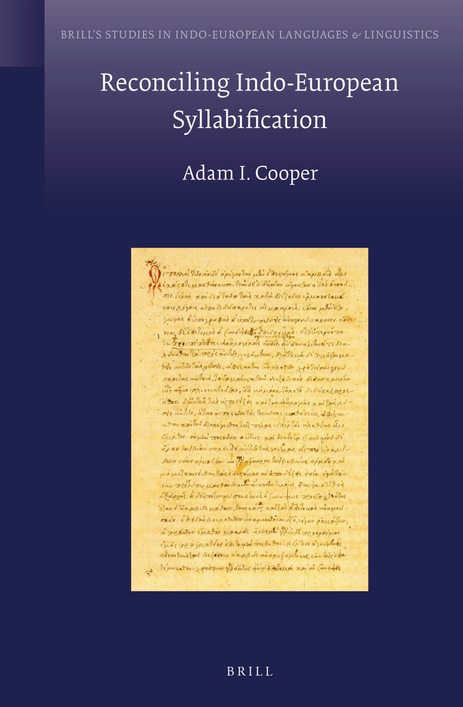

# Front Matter

<!-- pdf-page: 2; source-page: front-matter -->
Reconciling Indo-European Syllabification

<!-- pdf-page: 3; source-page: front-matter -->
Brill’s Studies in Indo-European
Languages & Linguistics
Series Editors

Craig Melchert (University of California at Los Angeles)
Olav Hackstein (Ludwig-Maximilians-Universität Munich)
Editorial Board
José-Luis García-Ramón (University of Cologne)
Andrew Garrett (University of California at Berkeley)
Stephanie Jamison (University of California at Los Angeles)
Joshua T. Katz (Princeton University)
Alexander Lubotsky (Leiden University)
Alan J. Nussbaum (Cornell University)
Georges-Jean Pinault (École Pratique des Hautes Études, Paris)
Jeremy Rau (Harvard University)
Elisabeth Rieken (Philipps-Universität Marburg)
Stefan Schumacher (Vienna University)
VOLUME 13
The titles published in this series are listed at brill.com/bsiel

<!-- pdf-page: 4; source-page: front-matter -->
Reconciling Indo-European
Syllabification
By
Adam I. Cooper
LEIDEN | BOSTON

<!-- pdf-page: 5; source-page: front-matter -->
Cover illustration: Galen, De pulsibus (MS E 82, Venice, ca. 1550). Courtesy of the U.S. National Library of Medicine, Bethesda, Maryland. Library of Congress Cataloging-in-Publication Data Cooper, Adam I. Reconciling Indo-European syllabification / by Adam I. Cooper. p. cm. — (Brill's Studies in Indo-European Languages & Linguistics; Volume 13) “This volume is a substantially revised version of my Cornell University dissertation, entitled “Syllable Nucleus and Margin in Greek, Vedic, and Proto-Indo-European”, which was defended in September 2011 and filed in January 2012.” Includes bibliographical references and index. ISBN 978-90-04-23690-5 (hardback : alk. paper) — ISBN 978-90-04-28195-0 (e-book) 1. Indo-European languages—Syllabification. 2. Indo-European languages—Phonology. I. Title. P591.C66 2014 414—dc23 2014030595 This publication has been typeset in the multilingual ‘Brill’ typeface. With over 5,100 characters covering Latin, ipa, Greek, and Cyrillic, this typeface is especially suitable for use in the humanities. For more information, please see brill.com/brill-typeface. issn 1875-6328 isbn 978-90-04-23690-5 (hardback) isbn 978-90-04-28195-0 (e-book) Copyright 2015 by Koninklijke Brill nv, Leiden, The Netherlands. Koninklijke Brill nv incorporates the imprints Brill, Brill Nijhoff and Hotei Publishing. All rights reserved. No part of this publication may be reproduced, translated, stored in a retrieval system, or transmitted in any form or by any means, electronic, mechanical, photocopying, recording or otherwise, without prior written permission from the publisher. Authorization to photocopy items for internal or personal use is granted by Koninklijke Brill nv provided that the appropriate fees are paid directly to The Copyright Clearance Center, 222 Rosewood Drive, Suite 910, Danvers, ma 01923, usa. Fees are subject to change. This book is printed on acid-free paper.

<!-- pdf-page: 6; source-page: front-matter -->
Preface  ix
Acknowledgments  x
Symbols  xii
Abbreviations  xiii
1	 Introduction  1
## 1.1 Overview of the Volume  1
## 1.2 Structure of the Volume  2
1.3 	 The Formal Framework  3
1.3.1	 Syllables, Moras, and Sonority  4
1.3.2	 Optimality Theory  7
## 1.4 A Note about Transcription and *  17
# PART 1. Consonant Heterosyllabicity in Indo-European
2	 The Syllabification of Medial Consonant Clusters in Vedic  21
2.0	 Introduction  21
## 2.1 The Syllabification of VCCV Sequences  21
2.1.1	 Evidence for Tautosyllabification of Medial Consonants  22
2.1.2 	Evidence for Heterosyllabification of Medial Consonants  33
2.2	 The Syllabification of VCCCV Sequences  46
2.2.1	 Superheavy Syllables in Vedic  46
2.2.2	 VCCCV Sequences and the Strength of Sonority
Sequencing  48
2.2.3	 On the Position of s  51
2.2.4	 Summary  55
2.3 	 The Perfect Union Vowel: A Case of Exceptional Syllabification
in Vedic  55
2.3.1	 Overview of the Phenomenon  56
2.3.2	 Previous Explanations for the Phenomenon  60
2.3.3	 Identifying the Synchronic Phenomenon  62
2.3.4	 The Perfect Union Vowel as a Deleted Segment?  67
2.3.5 	On the Locus of Perfect Union Vowel Epenthesis  68
2.3.6	 Summary  71
2.4 Conclusion  73

<!-- pdf-page: 7; source-page: front-matter -->
3	 Formal Analysis of Vedic Medial Syllabification  75
3.0	 Introduction  75
## 3.1 Vedic Medial Syllabification: The General System  78
3.1.1	 Syllabification of VCV Sequences  78
3.1.2	 Syllabification of VCCV Sequences  79
3.1.3 	Syllabification of VCCCV Sequences  84
3.1.4	 VCCCCV Sequences  88
3.1.5 	Summary: General Vedic Constraint Ranking  89
3.2	 Syllabification in the Vedic Perfect  90
3.2.1 	The Limitations of the General Analysis  90
3.2.2 	Constraint Indexation and the Exceptionality of the
Perfect  96
3.3	 Conclusion  105
4	 Complementary Evidence for Medial Consonant Syllabification from the
History of Greek  107
4.0	 Introduction  107
## 4.1 Overview of the Phenomenon  110
4.2	 Analyses: Syllable versus Morphological Structure  113
4.3 	 Syllable Structure in Depth  119
4.4	 Additional Issues  126
4.5 Conclusion  127
5	 On the Syllabifications VOO.RV, VR.OOV  128
5.0	 Introduction  128
## 5.1 VOO.RV and VR.OOV: Preliminaries  129
5.2 	 A Structural Approach to Generating VOO.RV, VR.OOV  131
5.3 	 A Weight-Based Approach to Generating VOO.RV, VR.OOV  138
5.4 	 Analyzing Proto-Indo-European Syllabification in General  144
5.4.1	 Accounting for VCCV  145
5.4.2	 Accounting for V̄CCV  149
5.5	 Conclusion  152
# PART 2. Sonorant Vocalization in Proto-Indo-European
6	 Background and Preliminaries  157
6.0	 Introduction  157
## 6.1 The Generalization  157

<!-- pdf-page: 8; source-page: front-matter -->
6.2 	 The Traditional Account  159
6.3	 A Survey of Sonorants in Proto-Indo-European  160
6.3.1 	General Distribution  161
6.3.2 	Sonorant + Sonorant Sequences  164
6.4	 Conclusion  168
7	 Previous Optimality-Theoretic Accounts of Sonorant Syllabicity  169
7.0	 Introduction  169
## 7.1 Kobayashi (2004)  170
7.2 	 Keydana (2008 [2010])  174
7.3	 Conclusion: Missing Generalizations and the Problem of Minimizing

Codas  180
8	 A New Approach to Proto-Indo-European Sonorant Syllabicity  184
8.0	 Introduction  184
## 8.1 Restricting Consonant Syllabicity: A New Approach  186
8.2	 Generating Right-Hand Vocalization: The Nature of the

Constraint C  191
8.2.1 Problematic Identifications of C  192
8.2.2 Directionality in Syllabification  197
8.3	 Generating Medial Consonant Heterosyllabification  227
8.3.1	 A Positional Markedness Approach to Medial Consonant
Heterosyllabification  230
8.3.2	 Accounting for VCCCV Sequences  233
8.4	 Deploying the Analysis  237
8.4.1 	Single Sonorant Environments  238
8.4.2 	Two Sonorant Sequences  242
8.4.3 	Three Sonorant Sequences  249
8.5 Conclusion  252
9	 Nucleus Selection as a Morphophonological Operation?  256
9.0	 Introduction  256
## 9.1 Descriptive Analysis  258
9.2 	 Zero-Grade in Sanskrit  262
9.2.1 	Steriade (1988)  263
9.2.2 	Calabrese (1999)  266
9.3	 Nature of the Zero-Grade in Proto-Indo-European  268
9.4 	 Optimality-Theoretic Formalization  274
9.4.1 	Moraic Sonorant Vocalizes  278
9.4.2 	Non-Moraic Sonorant Vocalizes  282

<!-- pdf-page: 9; source-page: front-matter -->
9.4.3 	No Sonorant Vocalizes  288
9.4.4 	Special Case: Zero-Grades of . . . eRO- morphemes
before C  294
9.4.5 	Sonorant Vocalization in Non-Zero-Grade Environments  299
9.4.6 	Nucleus Selection in Full-Grade  301
9.5 Conclusion  302
10	Implications and Typology of the Phonological Analysis of Sonorant
Syllabicity  305
10.0	 Introduction  305
10.1	 Schindler’s Exceptions Revisited  305
10.1.1 	Nasal-Infix Presents: Evidence for Input Moraicity?  306
10.1.2 	The Nature of *m  317
10.2	 The Typology of Proto-Indo-European Sonorant Vocalization  320
10.2.1 	Micmac  321
10.2.2 	Shuswap  322
10.2.3 	Imdlawn Tashlhiyt Berber  327
10.3	 Conclusion  331
11	 Conclusion and Future Directions  332
11.1	 Conclusion  332
11.2	 Future Directions  333
Appendix  337
References  344
Index of Words  359
Index of Names  372
Index of Subjects  375
Index of Constraints  381

<!-- pdf-page: 10; source-page: front-matter -->
This volume is a substantially revised version of my Cornell University dissertation, entitled Syllable Nucleus and Margin in Greek, Vedic, and Proto-Indo-European, which was defended in September 2011 and filed in January 2012. Beyond the immediate focus on developing updated analyses of two aspects of Indo-European syllable structure—the syllabification of medial consonant clusters and the vocalization of sonorants—an overarching goal of that work was to demonstrate the inherent value in bringing to light the mutuallyreinforcing insights of Indo-European linguistics and current phonological theory, two subfields of language study which have not always actively engaged with each other. While the same theme persists here, nonetheless I have chosen, given the nature of the series in which this work appears, to focus more closely on the Indo-European phenomena under consideration and eschew much of the deeper theoretical discussion in which I had occasionally engaged in the original dissertation (such as the examination of a ‘stringency’ approach to constraint ranking as part of a formal analysis of sonorant vocalization, or of cophonologies and allomorphy subcategorization as approaches to accounting for morphologically-sensitive phonology, relevant to the analysis of the Vedic perfect union vowel). At the same time, the discussion I do maintain has been thoroughly reviewed, revised, and elaborated upon, in the interests of making the application of phonological theory as clear as possible; this is particularly the case with the development of the Optimality-Theoretic analyses of sonorant vocalization I undertake in the second half of this book. Further, an additional departure from the original dissertation, which will be obvious to those who have read it, is the structure of the current work itself. The subject matter of the first and second parts has been reversed, so that I begin with medial consonants in Vedic (and beyond) in Part 1, and then transition to sonorant vocalization in Proto-Indo-European in Part 2. This restructuring better reflects the dependence, in part, of the account of sonorant vocalization on that of medial consonant heterosyllabification, and as such allows for what I find to be a more natural progression in the discussion.

<!-- pdf-page: 11; source-page: front-matter -->
I have many people to thank in the development of the original dissertation project, and in the revision undertaken since then. It is only fitting that I begin with my dissertation committee, and in particular the chair of that committee, Michael Weiss. While at Cornell I had the great privilege of having Michael not only as an advisor, but, as someone who has himself consistently demonstrated a deep passion for research, as an inspiring role model as well. His door was always open, and his encouragement seemingly without limits. His guidance helped me navigate the sometimes seemingly unnavigable, yet in the end always rewarding, space between Indo-European linguistics and phonology. I also graciously acknowledge the roles played by my other committee members, Alan Nussbaum and Draga Zec, whose own doors were rarely shut. I benefitted immensely from my many discussions with both: with Alan on the finer points of Indo-European morphophonology, and with Draga on phonology and in particular, syllable theory. I say with great sincerity that I cannot imagine having had a more helpful and effective committee, and am more than humbled to now consider them all colleagues. Other members of the Department of Linguistics during my time at Cornell whom I wish to recognize here are faculty members Dorit Abusch, John Bowers, Abby Cohn, Molly Diesing, Wayne Harbert, Sue Hertz, Amanda Miller, Mats Rooth, Carol Rosen, Michael Wagner, and John Whitman; fellow graduate students Johanna Brugmann, Christina Bjorndahl, Becky Butler, Clifford Crawford, Teresa Galloway, Effi Georgala, Masayuki Gibson, Jonathan Howell, Hyun-Kyung Hwang, Steven Ikier, Seongyeon Ko, Pittayawat Pittayaporn, Esra Predolac, Nikola Predolac, Margaret Renwick, and Jiwon Yun; and staff members Eric Evans, Sheila Haddad, Phanomvan Love, and Angie Tinti. For the transition from dissertation to book, I wholeheartedly thank the editors of Brill’s Studies in Indo-European Languages & Linguistics series, Craig Melchert and Olav Hackstein, for their openness and willingness to include this volume in the series, as well assistant editors Jasmin Lange and Stephanie Paalvast, for shepherding me through from initial manuscript submission to final publication. Comments on the manuscript from the editors and two anonymous reviewers (one of whom, Andrew Byrd, kindly made his identity known to me after the fact) were instrumental in guiding the revision process and elevating the discussion to an even higher level of scholarship. Additionally, participants at the 29th, 30th, and 31st Meetings of the East Coast Indo-European Conference, the 84th, 85th and 86th Annual Meetings of the Linguistic Society of America, the 40th Meeting of the North East Linguistic Society, and the 2013

<!-- pdf-page: 12; source-page: front-matter -->
Craven Seminar at Cambridge University were also a source of very helpful comments and suggestions at various stages of the project. Any and all errors or infelicities remaining in this current incarnation are of course my own. Finally, I must express my incredible appreciation to my family. While the subject matter of my research has not always proven the most accessible of material, my parents and sister have nevertheless been a constant source of love and encouragement, and for that I am most grateful. Last but furthest from least, I thank my wife Alison, without whose tireless support, through draft after draft (after draft) over the last six years, neither the original dissertation, nor the current volume, could hardly have come to such fruition.

<!-- pdf-page: 13; source-page: front-matter -->
consonant
C̥
syllabic consonant
F
fricative
G
glide
H
laryngeal
L
liquid
N
nasal
O
obstruent
R
sonorant
S
sibilant
T
stop
V
vowel
V̄
long vowel
μ
mora
σ
syllable
. or ]σ
syllable boundary
morpheme boundary
#
word boundary
*
reconstructed form; constraint violation
†
ungrammatical and/or unattested form
F
optimal output
L
intended, albeit unselected, optimal output
!
fatal constrain violation

<!-- pdf-page: 14; source-page: front-matter -->
Grammatical Terms
acc.
accusative
act.
active
aor.
aorist
du.
dual
fem.
feminine
fut.
future
gen.
genitive
gerund.
gerundive
impf.
imperfect
impv.
imperative
ind.
indicative
intens.
intensive
mid.
middle
nom.
nominative
neut.
neuter
instr.
instrumental
loc.
locative
part.
participle
perf.
perfect
pl.
plural
pres.
present
sg.
singular
subj.
subjunctive

Languages
Alb.
Albanian
Arm.
Armenian
Att.
Attic
Av.
Avestan
Boeot.
Boeotian
Cypr.
Cypriot
Celt.
Celtic
CS
Church Slavonic

<!-- pdf-page: 15; source-page: front-matter -->
Dor.
Doric
GAv.
Gathic Avestan
Gaul.
Gaulish
Gmc.
Germanic
Goth.
Gothic
Gk.
Greek
Hitt.
Hittite
Hom.
Homeric
Ion.
Ionic
Lat.
Latin
Latv.
Latvian
Lesb.
Lesbian
Lith.
Lithuanian
OCS
Old Church Slavonic
OEng.
Old English
OHG
Old High German
OInd.
Old Indic
OIr.
Old Irish
OLat.
Old Latin
OPers.
Old Persian
OPruss.
Old Prussian
Oss.
Ossetic
PGk.
Proto-Greek
PIE
Proto-Indo-European
PInd.
Proto-Indic
Russ.
Russian
Skt.
Sanskrit
SC
Serbo-Croatian
Thess.
Thessalian
Toch.
Tocharian
Ved.
Vedic
Wel.
Welsh
YAv.
Young Avestan

References
IEW
Pokorny 1958
LIV
Rix et al. 2001
NIL
Wodtko et al. 2008

<!-- pdf-page: 16; source-page: 1 -->
