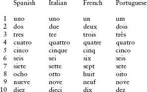
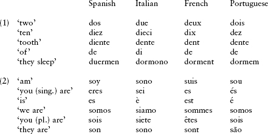
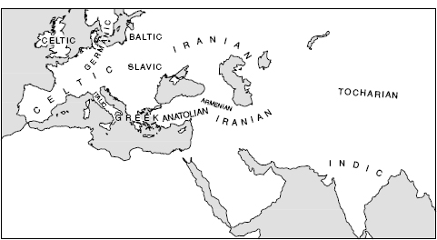
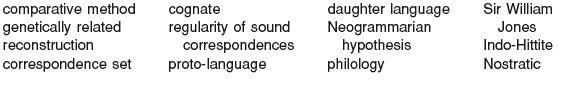
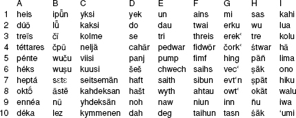

<!-- source-xhtml: 9781405188968_001.xhtml -->

# Chapter 1. Introduction: The Comparative Method and the Indo-European Family

## The Study of Language Relationships and the Comparative Method

**1.1.** All languages are similar in certain ways, but some similarities are more striking and interesting than others. Consonants, vowels, words, phrases, sentences, and their ilk are fundamental structural units common to all forms of human speech; by contrast, identical or near-identical words for the same concept are not, and when two or more languages share such words, it attracts notice. This kind of resemblance can have several sources, which must be clearly distinguished from one another in order to investigate similarities between languages scientifically.

The first source for such resemblance is **chance**. There are only so many sounds that the human vocal tract can produce, and their possible combinations are also limited. These facts conspire to create a certain number of words that coincidentally resemble one another in any two languages picked at random. The Greek and Latin words for ‘god’, *theós* and *deus*, are of this kind; they have no historical relationship with one another.

A second source of such similarity is **borrowing**. People speaking different languages are often in contact with one another, and this contact typically leads to mutual borrowing (adoption) of both cultural and linguistic material. English, for example, has borrowed the Inuit (Eskimo) word *iglu* ‘house’ for a type of shelter (*igloo*).

A third source of similarity is a sundry collection of **language universals**; these are basic characteristics of human linguistic creativity that are found the world over. Two common examples are onomatopoeia or sound-symbolism (whereby words sound like what they mean, such as English *cuckoo* and German *Kuckuck*, names based on imitation of the bird’s cry), and nursery or baby-talk words for kinship terms, which typically contain syllables like *ma*, *ba*, *da*, and *ta* (compare English *Ma* with Mandarin Chinese *m*ā ‘mother’).

**1.2.** Sometimes, however, languages present similarities in their vocabulary that cannot be attributed to any of these sources. To take a concrete example, consider the words for the numerals 1–10 in Spanish, Italian, French, and Portuguese:

The striking similarities in each row attract immediate attention and demand an explanation. Chance seems well-nigh impossible. There is also no connection between the sounds of these words and their meanings, which rules out onomatopoeia; nor are other linguistic universals such as baby-talk relevant. A third possibility is that one or more of the languages borrowed its numerals from one of the other languages, or that they all borrowed them from some outside source. It is true that there are languages that have borrowed the names of some or all numbers from other languages, as Japanese did from Chinese. But if we look a bit further afield, we notice that the numerals are not the only words evincing such strong mutual resemblance:

We see that not just the words for ‘two’ and ‘ten’, but all the other words in group (1) above agree in beginning with *d-* in each language. It is rather uncommon for basic terms like ‘tooth’, ‘of’, and ‘sleep’ to be borrowed, and even more uncommon for three languages to have borrowed them from a fourth, or for all four of them to have borrowed these words from a fifth language. The forms in (2) show that the whole present tense of the verb ‘to be’ is similar across all four languages, and in very specific ways. It is extremely unlikely that a language (to say nothing of four languages) would borrow wholesale a complete verbal paradigm from another language, especially one as basic as this one – and one that, as it happens, is highly irregular in nearly the same way in each language.

**1.3.** If two or more languages share similarities that are so numerous and systematic that they cannot be ascribed to chance, borrowing, or linguistic universals, then the only hypothesis that provides a satisfactory explanation for those similarities is that they are descended from the same parent language. This is the essential statement of what is known as the **comparative method**. And in the case of Spanish, Italian, French, and Portuguese this hypothesis would be right: we know from other evidence that these languages are all descended from a variety of Latin.

Languages like these that are descended from a common ancestor are said to be **genetically related**. This technical term has nothing to do with biology; it makes no claims about the race or ancestry of the *speakers* of the languages in question, who may belong to many ethnicities. (Just think of all the different ethnic backgrounds of people speaking English as their native language within any large English-speaking city.)

### *Comparative reconstruction*

**1.4.** So far we have shown how genetic relationship can be demonstrated, and in one sense our task – of explaining the similarities between Spanish, Italian, French and Portuguese – is done. But historical and comparative linguists typically do not stop there; they are also interested in figuring out what a putative ancestral language was like – in other words, to **reconstruct** it. Reconstruction is accomplished through systematic comparison of the forms in the descendant languages. Here we must content ourselves with one brief illustration. Let us take another look at the words for ‘tooth’ in our four languages above:

Spanish Italian French Portuguese

diente dente dent dente

All these words begin with *d-*, meaning their ancestor surely began with *d-* as well. The four words also agree in having the consonant cluster *nt* (ignore for the moment the fact that the *nt* in the French form is not pronounced as *nt*; in older French it was pronounced as written). The ancestral word thus probably had the “skeleton” *d . . . nt . . .* Italian, French, and Portuguese agree in having *e* before the consonant cluster, but Spanish has a diphthong *ie*. Since only Spanish is deviant here, the simplest thing (barring evidence to the contrary) is to suppose that it changed an earlier *e* to *ie*, rather than that the other three each changed an earlier *ie* to *e*. In fact, if we were to look at other examples, we would find that this was a regular sound change in the history of Spanish. Finally, all the languages except French agree in having the word end with the vowel *e*; since in the general course of language change sounds are not added to words willy-nilly, we may suppose that French lost an original final vowel here that is still preserved in the other three languages. Final-vowel loss of this kind is in fact extremely common cross-linguistically.

Putting all this information together, we may surmise that the ancestral word for ‘tooth’ had the shape *dente*. As a final but crucial touch we must add an asterisk before this reconstruction (**dente*), which is the conventional marker in historical linguistics for a hypothetical form – one that is not actually attested (preserved in documents) but is thought to have once existed. (As some readers may know, asterisks have other uses in other branches of linguistics, such as to denote ungrammatical sentences; the historical linguistic usage should not be confused with those.)

**1.5.** Each of the groups of words that we have been comparing with one another are called **correspondence sets**, and the words in each correspondence set are termed **cognates**. Thus the Spanish cognate of French *dent* is *diente*, the Italian cognate of French *dix* is *dieci*, etc. While we based an example of reconstruction on a sole correspondence set, in actual practice many correspondence sets must be examined for reconstructions to have much weight. Sound correspondences across one set of cognates must recur in other sets to be of any scientific worth. This principle is known as the **regularity of sound correspondences**; without it, comparative linguistics would be impossible. (Again, in setting up correspondence sets we must exclude instances where a symbolic relationship obtains between the sounds in a word and its meaning, as in onomatopoetic words (§1.1). But such cases are very rare, because in the vast majority of words the relationship between sound and meaning is purely arbitrary. This important fact, technically referred to as the *arbitrariness of the linguistic sign*, undergirds the whole science of comparative linguistics and lends regular sound correspondences their significance for reconstructing history.)

**1.6.** An ancestral language is called a **proto-language**, and its descendants are termed its **daughter languages**. In this book, the phrase “the proto-language” will refer to Proto-Indo-European (see below). The prefix *proto-* is attached to the name of a language or group of languages to designate the immediate ancestor of that language or group; one therefore speaks of *Proto-Greek*, *Proto-Germanic*, *Proto-Chinese*, etc. The word for ‘tooth’ that we reconstructed above is in a language we can call Proto-Romance, the common ancestor of the Romance languages. (Note in passing that Proto-Romance was not the same as standard Classical Latin, where the word for ‘tooth’ was *dēns* [stem *dent-*].)

Importantly, observe that terms like *proto-language* and *Proto-Romance* do not designate a “prototype” language that still needed some time in the shop before it could be billed a “real” language. A central finding of linguistics has been that all languages, both ancient and modern, spoken by both “primitive” and “advanced” societies, are equally complex in their structure. We have no reason to believe that reconstructed, unattested languages were qualitatively any different from attested ones: the ability to speak complex language is common to all members of the species *Homo sapiens*, and that species has changed little if at all over the past 100,000 years.

### *Language change*

**1.7.** The fact that a single language (such as Latin) can develop into two or more different languages (such as Spanish or French) is due to language change. We cannot here present a detailed discussion of the causes of language change, but will outline just a few basic points, a bit simplified for brevity. Linguists view language as a cognitive faculty whose core structures mostly develop during the first few years of childhood. A child’s native language is acquired from scratch. Contrary to popular wisdom, no one teaches children their native language; they must analyze the speech of people around them and construct their own individual **grammar** of the language. A grammar, in linguistic parlance, is a body of knowledge consisting of unconscious rules and principles; it may be conceived as the invisible underlying machinery used to produce and comprehend linguistic utterances in a particular language. No one has direct access to anyone else’s grammar, only to speech – the output of a grammar; because of this, the new grammar that the child constructs may well turn out to be subtly different from the grammars of his or her parents and other people in the child’s environment. These differences, which can be considered linguistic *changes*, may be reflected by differences in the child’s speech from that of others in the speech community; any of them can be picked up by other speakers and spread through part or all of the community.

Over successive generations, these differences multiply; as some of them diffuse throughout a community, the speech of the community evolves differently from that of other communities. We may then talk of communities that have developed their own *dialects*; and given enough time these dialects can develop into what eventually may be labelled different *languages*. (These terms are not scientific, but useful for general descriptive purposes.)

**1.8.** Language change, whatever its precise mechanism, is an entirely natural phenomenon, part and parcel of every living language. A number of popularly held misconceptions may cloud appreciation of this point. It is often claimed that languages change to become easier or simpler. But as was said above, all human languages, past and present, exhibit the same level of complexity; they are also learned by children at the same rate, with equal ease, and in the same well-defined developmental stages. Linguistic difficulty is a purely subjective valuation, and has no basis in scientific fact. Another common belief is that languages change through laziness, ignorance, stupidity, or some benighted combination thereof. This view is typically taken by those for whom a particular linguistic stage or style is perfect and sublime, and all subsequent deviations from it are a product of decay. But this “sublime” form of the language is itself always a “decayed” development of an earlier stage. The changes happening today that are so often decried are in fact no different from the changes that languages have always undergone.

**1.9.** When the sounds of a language change, one speaks of *sound change*. Sound changes, importantly, are *regular* and *exceptionless* – that is, they affect all the relevant examples of the particular sound(s) in the language. This claim about sound change is called the **Neogrammarian hypothesis**, named after the Neogrammarians, an influential group of nineteenth-century linguists. A sound change in a language that turns a *p* between vowels into *b*, say, will change every intervocalic *p* in the language to *b*. The regularity of sound change accounts for the regularity of sound correspondences between related languages that we discussed above. Tracing sound change is often easier than tracing other kinds of change, and for this reason a listing of sound changes makes up a large and detailed portion of the historical sketches in this book. A fairly extensive terminology has been developed to label the various results of sound change; these and other technical terms will be defined as they arise and are also listed in the Glossary.

All other components of language change as well. The smallest linguistic units that have meaning are **morphemes** (whole words such as *foot*, *oyster*, *devil*, or prefixes and suffixes like *un-* or *-ing*); the rules for using and combining morphemes constitute the **morphology** of a language, and any change to these rules is called *morphological change*. A common type of this is change in the *productivity* of a morpheme – that is, in how freely it can be used to form new words or grammatical forms. The *-th* in words like *sloth*, *breadth*, and *filth* was once a productive suffix for forming nouns from adjectives (*slow*, *broad*, and *foul*, respectively), but is no longer (its function has been taken over by *-ness* and other suffixes); a reverse development is illustrated by the English plural suffix *-s*, now limitlessly productive but once used only with certain classes of nouns. Words and morphemes are stored in the **lexicon**, one’s mental dictionary; changes to individual words (rather than to whole classes of words at once, as when a morphological rule has changed) constitute *lexical change*. The replacement of the old plural *kine* by *cows*, and of the old past tense *holp* by *helped*, are examples of a lexical change; in cases such as these, an old irregular form (containing morphemes or morphological processes that are no longer productive) is replaced by a regular form, by a process called *analogy*. The words stored in the lexicon are combined into larger units (phrases, clauses, sentences) by rules encoded in a language’s **syntax**. Change to these rules is *syntactic change*, as when a language that used to put verbs at the ends of clauses now puts them at the beginning. Finally, the meanings of words, also stored in the lexicon, constitute the words’ **semantics**; changes to word meanings constitute *semantic change*. This is really a subtype of lexical change, since only individual words are affected; but sometimes there are far-reaching ramifications of semantic change, as when a noun like French *pas* ‘step’ gets specialized as a grammatical marker (in this case the negator, ‘not’), by a process called *grammaticalization*.

### *Determining the pronunciation of dead languages*

**1.10.** The ability to compare ancient languages rests upon knowledge of the sounds and grammatical structures of those languages. How do we figure out such facts about languages that are no longer spoken? The basic answer is that we use everything that is at our disposal: contemporary descriptions, the testimony of descendant languages, orthographic practice (including spelling errors), the rendering of loanwords from known source languages, and metrical evidence from poetry.

Sometimes, as in the case of Sanskrit, we are fortunate in having detailed descriptions of the language’s pronunciation and structure by ancient grammarians. If a language has living descendants, as in the case of Latin, we can apply the comparative method to the descendants to establish the pronunciation of their ancestor. When we lack thorough contemporary descriptions or the testimony of living descendants, we must look to texts as they were written by speakers of the language.

Misspellings are valuable for revealing the effects of changes in pronunciation. We know, for example, that in the late pre-Christian era, the Latin diphthong spelled *ae* came to be pronounced as a monophthong (single vowel) *e*. A Roman in the first century <small>AD</small> who spelled the word *aetate* ‘age’ improperly as *etate* shows the effects of this change*.* Standard spelling conventions, not just misspellings, can also elucidate facts about pronunciation. In Hittite, like English, words were written with spaces between them; but various short function words like *ma* ‘but’ were joined to a preceding word without a space, indicating that they and the preceding word were pronounced together as a unit. (Compare the *-n’t* of English *didn’t* for a similar situation.) Such spelling conventions will be discussed further in §8.33.

We can glean further information from the way words are spelled when borrowed from another language. Educated Romans of the first century <small>bc</small> regularly rendered the Greek letter phi (Φ) as *ph* in words that they borrowed from that language (as in *philosophia* ‘philosophy’). The sequence *ph* was not used in writing native Latin words, so the Romans must have been trying to represent a sound that they did not have in their own language – an aspirated stop consonant, as it happens, different from the native Latin unaspirated *p* and also from the native Latin fricative *f*. A few centuries later, however, we find the Gothic bishop Wulfila using *f* (as in the name *Filippus*), showing that the pronunciation of the letter in Greek had changed.

Poetry is often a useful source of information on how a language is pronounced. Much ancient poetry is structured according to particular sequences of heavy and light syllables. In the Archaic Latin poetry of Plautus, a word like *patre* ‘by the father’ scans as two light syllables. Light syllables end by definition in a short vowel, so the word was pronounced *pa-tre* with the consonant cluster *tr* not split between the two syllables. Metrical practice has thus revealed a fact about Latin syllabification.

**1.11.** With regards to larger levels of linguistic structure such as morphology and syntax, and with regards to word-usage and meaning, we must always look to the original texts. Linguistic analysis of texts is the domain of **philology** – an enterprise that has been neatly summarized as “the art of reading slowly.” It is a multifaceted discipline with many uses, including the determination of the original wording of texts by comparing and dating extant manuscripts, as well as the determination of grammatical facts by examining how forms are used in context and paying attention to relative ages of particular usages. (“Philology” is also a somewhat old-fashioned term for what we now call comparative historical linguistics, hence the phrase “comparative philology”.)

Both these and other aspects of philology are crucial for writing an accurate history of a language’s development. When texts are copied and recopied by hand and original source manuscripts (called *archetypes*) are lost, errors and modernizations inevitably creep in. If the language of the text is particularly archaic compared with the language of the copyist, errors can become legion. Careful comparison of different versions of the same text usually allows one to reconstruct chains of transmission and to determine the relative ages of manuscripts, which in turn helps us determine which linguistic forms are older and which more recent.

**1.12.** Using philology to figure out how words and grammatical forms are used has allowed countless puzzling details about ancient languages to be clarified. Dictionaries, being essentially lists of words, do not give a whole picture of a language,much less its history, and the forms they contain cannot always be taken at face value. Two examples from ancient Greek and Sanskrit will make this point clear.

The first example concerns the Greek word *prophḗtēs* ‘prophet’. This word etymologically consists of the combination form *-phḗtēs* ‘sayer’, derived from the verb *phēmí* ‘I say’, preceded by the prefix *pro-*, which can mean either ‘before’ or ‘forth’. Does the word mean ‘one who says beforehand, one who foretells’ or ‘one who speaks forth, one who announces’? There is a verb *próphēmi* ‘I speak before’, and so we might jump to the conclusion that *prophḗtēs* comes from this verb and means ‘one who speaks beforehand’. But a look at the actual textual occurrences of these words shows that *prophḗtēs* first appears a good 700 years *before* the earliest attestations of *próphēmi*. Clearly the noun cannot be derived from a verb that did not yet exist. Additionally, an investigation of the other compounds beginning with *pro-* reveals that the meaning ‘before’ is not the prefix’s oldest meaning, and does not appear until later than the first occurrences of *prophḗtēs*. We conclude that a ‘prophet’ was originally one who ‘spoke forth’ or ‘announced’ the will of the gods rather than one who foretold the future.

The second example concerns the Sanskrit word *náveda-* ‘knowledgeable’. This word is clearly related to the word *véda-* ‘knowledge’, but the first element, *na-*, is not a known prefix elsewhere in the language, and it seems to have little effect on the overall sense. An examination of the earliest passages in which the word occurs, in the Rig Veda (the oldest Sanskrit text), suggests an explanation for this form. Frequently, *náveda-* is part of a phrase meaning ‘be knowledgeable (of)’. One version of this phrase is *bhūta návedāḥ* ‘be ye knowledgeable’, where the word *bhūta* is the plural imperative of the second person of the verb ‘to be’. A glance at a Vedic grammar-book will show that there is a common alternate version of this form, namely *bhūtana*, with an element *-na* that can optionally be added to the second plural. We can thus reasonably surmise that someone, in the course of the transmission of the text, misanalyzed this particle as a prefix on the following word, thereby creating the form *náveda-* which then spread to other versions of this phrase. (A similar sort of false division has happened many times in English, as when the older phrase *an ekename* ‘a supplementary name’ was reanalyzed as *a nekename*, the source of our word *nickname.*)

## Indo-European Historical Linguistics

**1.13.** Already in classical antiquity, it was noticed that Greek and Latin bore some striking similarities to one another like those that we saw among the Romance languages. Ancient writers pointed out, for example, that Greek *héks* ‘six’ and *heptá* ‘seven’ bore a similarity to Latin *sex* and *septem*, even pointing out the regular correspondence of initial *h-* in Greek to initial *s-* in Latin. The ancients explained such facts by viewing Latin as a descendant of Greek. During and after the Renaissance, as the vernacular languages of Europe came to be known to scholars, it slowly became understood that certain groups of languages were related, such as Icelandic and English, and that the Romance languages were derived from Latin. But no consistent scientific approach to language relationships had been developed.

**1.14.** Following the British colonial expansion into India, a language came to the attention of Western scholars knowledgeable in Greek and Latin that ushered in a new way of thinking about such matters. An orientalist and jurist named Sir William Jones was the first to state this way of thinking, in a lecture to the Asiatick Society on February 2, 1786, and published two years later in *Asiatick Researches* 1:

> The *Sanscrit* language, whatever be its antiquity, is of a wonderful structure; more perfect than the *Greek*, more copious than the *Latin*, and more exquisitely refined than either, yet bearing to both of them a stronger affinity, both in the roots of verbs and in the forms of grammar, than could possibly have been produced by accident; so strong indeed, that no philologer could examine them all three, without believing them to have sprung from some common source, which, perhaps, no longer exists: there is a similar reason, though not quite so forcible, for supposing that both the *Gothick* and the *Celtick*, though blended with a very different idiom, had the same origin with the *Sanscrit*; and the old *Persian* might be added to the same family, if this were the place for discussing any question concerning the antiquities of *Persia*.

This was a turning point in the history of science. For the first time the idea was put forth that Latin was not derived from Greek, but that they were both “sisters” (as we would now call them) of each other, derived from a common ancestor no longer spoken. The idea was inspired by the critical discovery of the third member of the comparison (the *tertium comparationis* in technical jargon), namely Sanskrit – a language geographically far removed from the other two. Also, this passage contains the first clear formulation of the central principle of the comparative method.

### *The IE family: branches, subgrouping, models*

**1.15.** Jones’s insight marks the beginning of the scientific study of the language family now called **Indo-European**, or IE for short. The field is variously known as Indo-European historical linguistics, Indo-European comparative linguistics, or Indo-European comparative philology. Jones’s brief statement already enumerates fully half the branches now recognized for the family: **Indo-Iranian** (containing Sanskrit and the Iranian languages), **Greek**, **Italic** (containing Latin and related languages of Italy), **Celtic**, and **Germanic** (containing Jones’s “Gothick” and its relatives of northern Europe, including English).

After Jones’s pronouncement, nearly three decades passed before any activity that could be called Indo-European linguistics arrived on the scene. Once it did arise it came rather fast and furious, with three seminal works published within a half-dozen years in Denmark and Germany, including one by Jacob Grimm, one of the two Grimm brothers of fairy-tale-collecting fame. These pioneers and the scholars who followed them realized that not only the languages in Sir William’s account were “sprung from some common source,” but also the Baltic and Slavic languages (now grouped together as **Balto-Slavic**), **Armenian**, and **Albanian**. In the twentieth century two more branches, **Anatolian** and **Tocharian**, were added to the family, containing extinct languages only discovered in the early 1900s. Anatolian, it turned out, was the most ancient of them all, with texts in Hittite dating to the early or mid-second millennium <small>BC</small>. A few other languages with only meager remains are also clearly Indo-European, such as Phrygian, Thracian, and Messapic; whether they belong to any of the ten recognized branches, or constitute separate branches of their own, is not clear.

*Source:* * = extinct (or older stage of a modern language)

The nineteenth century also saw the creation of a name for the family, Indo-European or, in German-speaking lands, usually *Indogermanisch* ‘Indo-Germanic’. The ancestor of all the IE languages is called *Proto-Indo-European*, or PIE for short. During the course of the nineteenth century, the methods of comparative linguistics and linguistic reconstruction were developed; a prodigious number of important discoveries in the watershed decade of the 1870s was responsible for significant refinement of the method and for firmly establishing historical linguistics as a science unto its own. By the dawn of the twentieth century, a picture of reconstructed PIE had emerged that was quite similar to the one that is presented in this textbook.

All standard diagrams of the IE family tree, such as the one in figure 1.1, represent it as a starburst: PIE is placed at the top or center, with the ten branches radiating out therefrom. Implicit in the traditional diagrams is the notion of a more or less simultaneous “breakup” of the proto-language into ten or more dialect areas (the future branches). This notion has often come under attack. For one thing, the trees of most other language families tend to have a binary branching structure. In addition, it has been speculated for a long time that certain branches of IE are to be grouped together into what are known as *subgroups*. For example, it has been proposed that Indo-Iranian, Greek, and Armenian all descend from one common dialect area of late PIE; and the same has been forwarded for Italic and Celtic, for which an “Italo-Celtic” subgroup has been suggested.

**1.16.** The discovery of Anatolian and Tocharian in the twentieth century has further fueled the debate over the internal structure of the PIE family tree. Anatolian in particular is significantly different from the picture of PIE that scholars had developed by the close of the nineteenth century on the basis of the other branches, even though Anatolian is the oldest attested branch. In the 1930s, the American linguist Edgar Sturtevant proposed that PIE was not the ancestor of Anatolian, but a sister of it, and that both PIE and Anatolian were descended from a language he called **Indo-Hittite**. Sturtevant’s theory was not widely followed, and the term “Indo-Hittite” has largely been abandoned. But the hypothesis that Anatolian, and then Tocharian, split off from the family first, and that the remainder of PIE underwent further common development before the other branches emerged has found increasing support in recent years and is in many ways little different from Sturtevant’s original claim. We will discuss these matters further in chapter 9.

Although many pieces of evidence have been marshalled over the years in defense of one or another subgrouping model, unfortunately the evidence is of varying quality and open to multiple interpretations. For example, it is often impossible to judge whether a linguistic feature shared by geographically contiguous branches is inherited from an earlier stage ancestral to them in which the feature was innovated (in which case it would be diagnostic of a genuine subgroup), or rather represents an innovation of one branch that spread by diffusion to the neighboring ones (in which case it has nothing to say about subgrouping). This is true, for example, of many of the similarities among the so-called Balkan Indo-European branches (Greek, Armenian, Phrygian, and Albanian), which are often thought to constitute a subgroup (see §16.5 for more discussion).

Another difficulty with trying to determine the inner subgrouping of the family tree is the fact that the earliest documentation of IE languages (from the mid-second millennium <small>BC</small>) is, by current estimates, still over two millennia later than the date of PIE itself. The branches therefore had considerable time to undergo changes before their first attestation, changes that could have obscured earlier developments that would help identify any subgroups. Also, some branches (such as Anatolian and Indo-Iranian) enter into recorded history much earlier than others (such as Baltic and Albanian, nearly three thousand years later), meaning they are not all at a comparable stage of development when we get our first glimpses of them.

**1.17.** The fact that there are so many gaps in our knowledge about the prehistory of the branches of PIE has also provided ample room for speculation about the causes of the more significant structural innovations undergone by particular branches. Many scholars have been attracted to the notion that some of these innovations are due not to the usual processes of language-internal change, but to influence from languages spoken by the original non-IE-speaking populations of the territories into which IE speakers migrated. These languages are called *substrate languages*.

When dealing with vocabulary, this claim is normally uncontroversial: all would agree, for instance, that terms for local flora and fauna were borrowed from indigenous non-IE languages. In some cases, if enough such words can be plausibly identified we can dimly espy elements of phonology and morphology of the substrate language; for an example, see §12.1. (Of course, this does not mean that we can attribute willy-nilly any word without a decent IE etymology to a substrate language.) But matters are not so straightforward with regard to structural changes to the grammatical system. It is certainly possible that substrate influence might be the source of some of them. But with very few exceptions, we know nothing about the pre-IE languages in the relevant regions, and so the claim of substrate influence, being untestable, is not very useful – it simply replaces one unknown with another. (For one of the few exceptions, see §17.4.) On methodological grounds, too, there is rarely any compelling reason to externalize the causes of the structural innovations in question, as they can normally be explained through familiar language-internal processes of change.

### *Indo-European and other language families*

**1.18.** Indo-European is merely one of hundreds of known language families, and PIE was merely one of hundreds of languages (or more) spoken during the late Neolithic. PIE is therefore not the primeval ancestor of all languages now spoken, nor even of a majority of them (although there are more speakers of IE languages than of the languages of any other family). At the present time, we do not know whether any other language families share a common ancestor with PIE. The comparative method can give us solid results for a time depth of perhaps eight thousand years; most estimates of the age of PIE are in the neighborhood of six thousand years. (The age of PIE will be treated in detail in the next chapter.) Sporadic, irregular, and unpredictable linguistic changes such as analogy, paradigm leveling, borrowing, and semantic change all make reconstruction more difficult the farther back in time one goes since they add “background noise”: borrowings become indistinguishable from native words, semantic changes make it difficult to reconstruct word meanings, and morphological analogies and leveling processes erase evidence of earlier inflectional patterns.

**1.19.** These problems have not prevented some adventurous souls from positing relationships between IE and other language families, or from coming up with classifications of huge numbers of language families into a handful of super-families. Chief among the former claims – the latter do not concern us – is the so-called *Nostratic* hypothesis (from Latin *nostrās* ‘one of us’, from *noster* ‘our’): this is the name of a putative language family that includes such groups as Indo-European, Uralic (Finnish, Estonian, Hungarian, etc.), Semitic (Arabic, Hebrew, Ethiopic, etc.), Dravidian (Tamil, Telugu, KannaDa, and other languages of southern India), and Kartvelian (Georgian and its relatives in the Caucasus). Supporters of the Nostratic hypothesis claim that Proto-Nostratic reconstructions help to elucidate the pre-history of PIE. But most Indo-Europeanists are not persuaded by it, and find that the Nostraticists’ methods lack the required rigor; at best the Nostratic hypothesis is premature.

This is not to say that the Nostratic hypothesis (or others like it) is necessarily wrong, or might not yield interesting results in the future if the methods are improved. One cannot disprove the claim that two languages or language families are related; but the more distant and obscure the relationship, the more vacuous the claim. Past a certain point, attempts at classification become uninteresting for scientific or historical purposes. The language relationships that have the most to tell us are those whose histories can be traced in some detail and with reasonable certainty. The comparative method seeks to explain why certain languages have systematic similarities too regular and too numerous to be due to chance. Indo-European does indeed share similarities with other language families, but to most eyes these similarities are too scattered and occasional to warrant application of the comparative method.

## Conclusion

### *The limits of – and on – our knowledge*

**1.20.** How complete is our picture of PIE? We know there are gaps in our knowledge that come not only from the inevitable loss and replacement of a percentage of words and grammatical forms over time, but also from the nature of our preserved texts. Both the representative genres and external features such as writing systems impose limits on what we can ascertain about the linguistic systems of both PIE and the ancient IE languages. As regards the first, our corpus of ancient IE texts is marked by a preponderance of poetic or literary works. These were often the ones that were deemed the most sacred or important, and were therefore carefully preserved. This means that specimens of ordinary language are rarer overall, which affects the nature and completeness of our picture of PIE in ways that we cannot always be aware of.

As regards the second point, the ancient (and of course also the modern) IE languages are written in a diverse assortment of writing systems, not all of which are equally well-suited for representing the finer details of pronunciation. Alongside the very serviceable alphabets and clear spelling systems used, for example, by the ancient Greeks and Romans are the syllabaries that the Hittites and some other peoples used. Syllabaries, as will be discussed further in chapters 9 and 12, tend to be poorly suited for unambiguously representing certain combinations of speech sounds, and do not always encode all the sounds present in a language to begin with (as is the case with Linear B, used to write Mycenaean Greek). This often puts the modern researcher at a considerable disadvantage.

**1.21.** While these hindrances are very real, they do not impede progress in the field outright. As of this writing, we approach the threshold of the third century of Indo-European studies (or, dating from Sir William Jones, we have long since crossed it), and our picture of PIE and the histories of its daughters has constantly undergone revision since the field’s inception. We can rest assured that that picture will continue to grow and change. For this reason, the account of linguistic prehistory given in this book is not an immutable truth. Some of the most basic and long-held assumptions about PIE grammar have been challenged and even overturned in recent decades. In the 1950s and 1960s, Noam Chomsky of MIT founded the field of generative linguistics, which has revolutionized the study of language and made a whole host of new insights and theoretical apparatus available. The marriage of the traditional methods of comparison and philology with the findings of generative linguistics has in some cases led to the solution of long-intractable problems in Indo-European, and will without doubt yield great advances to come.

Since no documents in reconstructed PIE are preserved or can reasonably hope to be found, the structure of this hypothesized language will always be somewhat controversial. Of necessity, then, this book contains views on problems that still await final resolution; but most of the historical accounts presented here are subscribed to by a majority of researchers in the field, and care has been taken to flag any views for which this is not the case.

In spite of all the scholarly disagreements that enliven the pages of technical books and journals, all specialists would concur that enormous progress has been made since the earliest pioneering work in this field, with consensus having been reached on many substantial issues. The Proto-Indo-Europeans lived before the dawn of recorded human history, and it is a testament to the power of the comparative method that we know as much about them as we do.

### *The goals of Indo-European linguistics*

**1.22.** Much of the preceding discussion has focused on the reconstruction of Proto-Indo-European, which is often imagined to be the field’s main goal. Yet this is only one of the activities in which Indo-Europeanists are engaged. Reconstruction in many ways is important not as an end in itself, but because it provides a necessary means for elucidating the histories and properties of the attested daughter languages. This includes the modern languages, which – it should not be forgotten – are later and altered forms of the same ancient tongue that Latin and Greek are altered forms of. Regardless whether one is more interested in reconstruction of PIE or in developing historical linguistic theories to explain post-PIE linguistic developments, the exegesis of our ancient texts using philological principles is of fundamental importance, and much research in IE studies has always been devoted to that endeavor. In no other way can we refine our understanding of the primary evidence from the languages upon which we base our comparisons, reconstructions, and historical accounts.

A further goal of many Indo-Europeanists is not a linguistic one: the reconstruction of PIE culture, and tracking the cultural developments of the descendant IE lineages. Much can be said about these matters purely on the basis of comparative linguistic evidence. As a prelude to outlining the structure of the language of the Proto-Indo-Europeans, in the next chapter we will explore what we know about their culture, and follow some of the attempts to locate them in time and space.

## For Further Reading

(The works referred to in this and the other “For Further Reading” sections are listed in the Bibliography at the end of the book, together with a few additional titles that are not commented on; these are labeled with an asterisk. Emphasis is placed on works written in English, but any serious student intending to do Indo-European linguistics over the long term must learn to read German and French, and preferably also Italian, Spanish, and Russian. Important works in these languages are also noted.)

The classic treatment of the comparative method is Meillet 1925. A good introduction to historical linguistics for non-specialists is Sihler 2000; a bit more specialized is Campbell 1999. From the literature on the Nostratic hypothesis, a useful recent survey is Salmons and Joseph 1998; see therein the articles by Brent Vine and Lyle Campbell. A superb description of the evolution of historical linguistics and Indo-European studies into the beginning of the twentieth century is still Pedersen 1959, to which may also be added chapter 7 of Robins 1997.

As for general overviews of Indo-European linguistics, still the only complete treatments are the nearly century-old work of Brugmann 1897–1916 and the slightly later and smaller Hirt 1927–37, which in spite of their age have useful collections of data. Single-volume introductions to the field include Meillet 1937 (a celebrated classic), Beekes 1995 (readable but idiosyncratic), Szemerényi 1996 (quite idiosyncratic but filled with useful bibliographies after each section), Meier-Brügger 2003 (a revision and unfortunately not terribly good English translation of a German original; has an extensive bibliography but is difficult to use for a beginner), Tichy 2006 (another English translation of a German original; much shorter than other overviews but very informative), Mallory and Adams 2006 (taken up almost entirely with vocabulary and culture rather than grammar), and Clackson 2007, which by the author’s admission is not intended to be a general handbook but an introductory discussion of selected controversial topics in the field. Bader 1997 and Ramat and Ramat 1998 are both collections of essays by different authors that treat the individual branches; many of the articles are excellent.

The most prominent scholarly journals devoted to Indo-European are generally published in Europe: *Bulletin de la Société de Linguistique de Paris*, Paris; *Glotta*, Göttingen; *Historische Sprachforschung* (formerly *Zeitschrift für Vergleichende Sprachforschung* or *KZ* for short, since it was once *Kuhns Zeitschrift für Vergleichende Sprachforschung*), Göttingen; *Indogermanische Forschungen*, Berlin; *Journal of Indo-European Studies*, Washington; *Kratylos*, Wiesbaden; *Münchener Studien zur Sprachwissenschaft*, Munich; *Die Sprache*, Vienna. Note also now the *(Friends and Alumni of) Indo-European Studies Bulletin* (UCLA). There is also a growing list of online resources. First is the TITUS project (short for Thesaurus Indogermanischer Textund Sprachmaterialien, or Thesaurus of Indo-European Text and Language Materials) led by Jost Gippert at the University of Frankfurt (titus.uni-frankfurt.de), which will, if it is completed, have electronic versions of all the ancient and medieval Indo-European texts in searchable form; quite a few of them are already available, as well as other related information. The homepage of the Indo-European Institute at the Free University of Berlin (www.fu-berlin.de/indogermanistik) keeps up-to-date links to the major European and American research centers in Indo-European, and to announcements, bulletins, and many other sources of information.

## For Review

Know the meaning or significance of the following:

## Exercises

1. Memorize the names of all the branches of the IE family, and the names and filiations of all the extinct languages in figure 1.1.

2. Below are given the names of the cardinal numerals 1–10 in nine languages. Based on this information only, do you think all the languages are genetically related? If not, which one(s) do you think is/are not related to the rest? Give evidence for your answer in a short paragraph. Ignore diacritic marks over and under the letters.

3. It is not infrequently claimed that the tools developed for comparative reconstruction of Proto-Indo-European do not work outside the Indo-European family – as, for example, when working with the indigenous languages of Papua New Guinea, which have been stated to be very different from one another and spoken by a great variety of different ethnicities. Based on the discussion of the comparative method in this chapter, analyze this claim critically. What might be another explanation for the failure of the comparative method as applied to these Papuan languages?

4. Remains of a previously unknown ancient language are unearthed in western Asia. How could one determine whether it is Indo-European?
