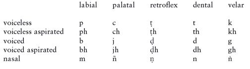
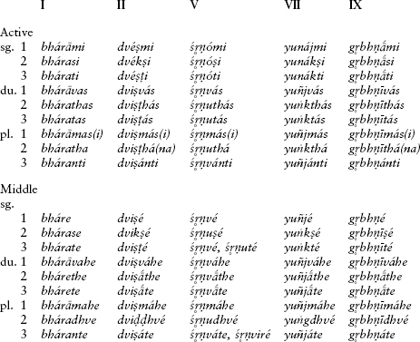
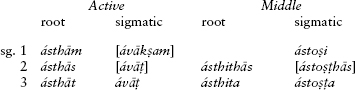
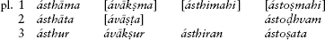
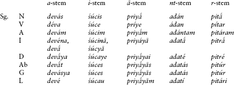
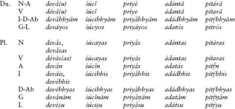
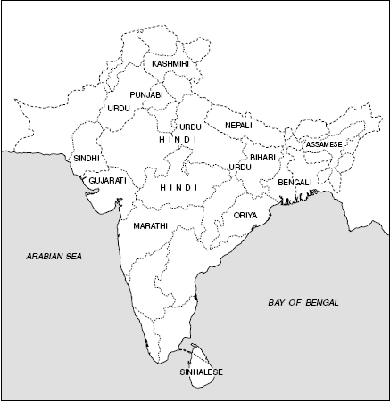
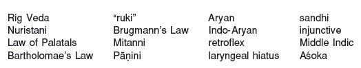

<!-- source-xhtml: 9781405188968_010.xhtml -->

# Chapter 10. Indo-Iranian I: Indic

## Introduction to Indo-Iranian

**10.1.** The Indo-Iranian branch consists of two subbranches, Indic and Iranian, and perhaps also a third, Nuristani (see below). Indo-Iranian languages are and have been spoken not only in the present-day countries of India and Iran, but over a wide expanse of Asia from the Black Sea to western China. The branch is bested only by Anatolian as the oldest in the family, with the earliest datable remains dating to the fourteenth century <small>BC</small>. This chapter begins with an overview of Indo-Iranian historical grammar and then covers the development of Indic; Iranian is left for the next chapter.

**10.2.** The best-known early Indo-Iranian language is **Sanskrit**. Its oldest known variety is **Vedic** Sanskrit, preserved in the early collection of hymns known as the Rig Veda and in subsequent literature discussed in more detail below. In this chapter as elsewhere in the book, most cited Sanskrit forms will be taken from Vedic and labeled as such; a form labeled “Sanskrit” is not attested until the later Classical Sanskrit language.

Although Sanskrit has held uncommon esteem throughout the history of IE studies, its linguistic testimony must be balanced against that of its sister **Avestan**, the oldest preserved Iranian language. Understanding of the Avestan corpus has advanced remarkably in recent decades, and **Old** or **Gathic Avestan**, the oldest preserved stage of the language, is structurally very close to Vedic but more archaic in several important respects. The French Indo-Europeanist Émile Benveniste once wrote that “the testimony of Vedic is valuable for its richness, the testimony of Avestan for its fidelity.” The only other older Iranian language preserved in any significant amount is the later **Old Persian**, the language of royal inscriptions from the Achaemenid dynasty starting in the late sixth century <small>BC</small>. Old Persian is the only Indo-Iranian language whose remains are securely datable.

**10.3.** Several languages spoken in a remote region of Afghanistan belong to a group called **Nuristani** (formerly Kafiri; also sometimes Dardic, a term now properly used of a subbranch of Indic that includes Kashmiri). Many specialists have thought that these languages constitute a separate branch of Indo-Iranian. The fact that they have been poorly studied (they are spoken in inaccessible and war-torn areas) and have no older literature has made their classification difficult. On the one hand, they share several basic sound changes with Iranian, but on the other they preserve some features of reconstructed Proto-Indo-Iranian that are not found elsewhere in the branch.

**10.4.** It is widely thought that Indo-Iranian forms a subgroup with Greek, Armenian, and Phrygian. The morphological structure of Greek and older Indo-Iranian languages agree in many striking details, and Greek shares numerous similarities with the fragmentary Phrygian as well as the more distant Armenian. However, the issue has not been settled, and for our purposes it is best to regard all four of these as separate branches, even if closely allied at some level.

## From PIE to Indo-Iranian

The following is an overview of the major developments from PIE to Proto-Indo-Iranian, that is, the developments that are shared by both Indic and Iranian.

### *Phonology*

#### Consonants

**10.5. Velars.** The defining change to the consonant inventory in Indo-Iranian is its development of the PIE velars. Indo-Iranian is a satem branch (§3.8); it affricated the palatal velars *k̑ *g̑ **g̑h* to *ć *j́ **j́h*, and merged the PIE plain velars **k* **g* **gh* and labiovelars **kʷ* **gʷ* **gʷh* into just a series of plain velars (**k* **g* **gh*). It appears, though, that this merger was completed independently in early Indic and Iranian; see §10.37 below. These plain velars, when before a front vowel (**i* or **e*) or the glide *i̯, were then palatalized to the affricates **c* **j* and **jh* (the traditional Indo-Iranian writing of phonetic [č ǰ ǰʰ], pronounced like English *ch* and *j*). This palatalization is often called the **Law of Palatals**.

To illustrate: PIE **dek̑m̥* ‘ten’ became Indo-Ir. **daća* (Ved. *dáśa*, Av. *dasa*); ****gh**ous-* ‘hear’ became Indo-Ir. ****gh**auš-* (Ved. *ghóṣas* ‘noise’, Av. *gaoša* ‘ear’); and ****gʷ**ōus* (or ****gʷ**ous*, §6.6) ‘cow’ became Indo-Ir. ****g**āuš* (Ved. *gáuṣ*, Av. *gāuš*). The Law of Palatals can be illustrated by the development of the first sound in the weak perfect stem ****kʷ**e-kʷr*- ‘did’ > pre-Indo-Ir. ****k**e-kr-* > ****c**e-kr-* > Indo-Ir. ****c**a-kr-* (Ved. *cakr-*, Av. and OPers. *caxr-*), and in ****k**i̯eu-* > Ved. ***c**yav-ante* ‘they move’, Av. *śiiauu-āi* ‘I want to drive’.

**10.6. Voiced aspirates.** The voiced aspirates were preserved intact in Indo-Iranian and remain to the present day in Indic, the only IE subbranch still to have them. (In Iranian, the aspiration was lost; see §11.2.) However, if a voiced aspirate was immediately followed by a voiceless unaspirated consonant, a change known as **Bartholomae’s Law** (after the nineteenth- and twentieth-century German linguist Christian Bartholornae) took place, whereby the aspiration moved to the end of the cluster and the voiceless consonant became voiced. Thus a cluster **ght* became **gdh*, as in Ved. *mugdhá-* ‘dazed’ < **mugh-tó-* and Old Avestan *aogədā* ‘he spoke’ (phonetically *aogdā*) < Indo-Ir. **augdha* < pre-Indo-Ir. **augh-to*.

Bartholomae’s Law is particularly interesting in how it affected **dental-plus-dental clusters**. Recall that dental-plus-dental clusters sprouted a sibilant between the dentals in PIE (§3.36), so **tt* > **tst* and **dd* > **dzd*. In the case of **dht*, by a combination of this rule and Bartholomae’s Law, this cluster became **dzdh* in Indo-Iranian. In Indic, all these clusters lost the sibilant (so **tst* > *tt, *dzd* > *dd*, and **dzdh* > *ddh*), whereas in Iranian, they lost the first dental (so **tst* > *st, *dzd* > *zd*, and **dzdh* > **zdh* and then ultimately *zd*). Thus for example Ved. *vittá-* ‘known’ and Av. *vista-* come from **u̯id-tó-;* OPers. *azdā* ‘known’ and Ved. *addhā́* ‘surely’ come from pre-Indo-Ir. ** adh-tā*. Note that the name of the Buddha contains an example of Bartholomae’s Law (Classical Skt. *buddha-* ‘awakened, enlightened’).

**10.7. Resonants.** The two nasals **m* and **n* are preserved intact in all positions: ****m**r̥tii̯o-* ‘mortal’ > OPers. ***m**artiya*-, ****n**e* ‘not’ > Ved. ***n**á,* accusative sing. **-o**m*** > Av. *-ə**m***.

**10.8.** The fate of the two liquids **r* and **l*, is more difficult to ascertain. Iranian and the core of Vedic Sanskrit point to them having merged as **r*: PIE **kʷe**l**-eti* ‘turns, moves’ > Ved. *cá**r**ati*, Av. *ca**r**aiti*; **bh**r**eh₂te**r**-* ‘brother’ > Av. and OPers. *b**r**āta**r**-*. But many varieties of Indic, especially those spoken farther to the east, show *l* as an outcome of both liquids, and some words in Iranian have been claimed to preserve *l* from IE **l* (though this is rather doubtful). It may be that the liquids merged as **r* in the western dialect area that would become Iranian and the western dialects of Indic, but merged as **l* in the east, with the original distinction perhaps maintained in the middle. For fuller discussion of the Indic situation, see §10.34.

**10.9.** As for the **syllabic resonants**, syllabic *r̥ and *l̥ merged as **r̥:* **bhr̥g̑hent-* ‘high, mighty’ > Ved. *br̥hánt-*, Av. *bə**r**əzaṇt*-; **u̯l̥kʷos* ‘wolf > Ved. *vŕ̥kas*, Av. *və**hr**ka-*. The syllabic nasals both became ** a*: PIE **septm̥* ‘seven’ > Ved. *sapt**á***, Av. *hapt**a***; PIE **n̥-* ‘not, un-’ > Ved. and Av. ***a***-. When followed by a laryngeal, the result was a long syllabic resonant: **dl̥**h**₁gho-* ‘long’ > Indo-Ir. **dr̥̄gha-* (> Ved. *dī**r**ghá-*, Old Av. *d**ar**əga*-).

**10.10. “Ruki” and creation of **š*.** Indo-Iranian created a new sibilant phoneme **š* (*ž before voiced consonants) from several sources. One source was **s* when preceded by **r *u *k* or **i*, a change sometimes known as the “ruki-rule” (compare Balto-Slavic for a similar change, §18.6). This Indo-Iranian **š* became Skt. ṣ and Av. *š*, as in Ved. *tŕ̥ṣṇā*, Young Av. *tar**š**na-* ‘thirst’ < **tr̥**s**-n-* (root **ters-* ‘dry’ as in Eng. *thirst*) and Ved. *vakṣayam* ‘I cause to grow’, Old Av. *vax**š**at̰* ‘he will grow’ (**h₂u̯ek**s**-*, compare Eng. *wax*). In Iranian, **š* also arose after labial consonants, as in the Avestan nomin. sing. *āfš* ‘water’ (stem *āp*-).

As expected by the IE voicing assimilation rule (§3.34), the voiced variant *ž is the outcome before a voiced stop; this is preserved in Avestan but only indirectly attested in Sanskrit, e.g. **mi**z**dho-* ‘reward’ > Av. *mižda-* but Ved. *mīḍhám* ‘prize’ (< pre-Vedic **mižḍhá-*; cp. Gk. *misthós* ‘pay’; and see further §10.33).

**10.11.** The second source of **š* or *ž is the old palatal velars when they stood before a dental. The voiceless version is illustrated for example by Ved. *naṣṭá-*, Av. *na**š**ta-* ‘died, disappeared’ < PIE **nek̑tó-*.

**10.12.** The third source of **š* was as part of the development of the PIE “thorn” clusters (§3.25), which became in all cases *kṣ* in Sanskrit but *š*, *xš*, or *γž* in Iranian: compare Ved. ***k**ṣétram* ‘settlement’, ***k**ṣáyati* ‘has power’, and ***k**ṣárati* ‘flows’ with Av. ***š**ōiθra-*, Old Pers. ***x**šāyaθiya-* ‘king’, and Young Av. ***γ**žar-* ‘flow’ (PIE ****t**k̑ei*-, ****tk**ei-*, ****dhgʷh**er*-).

**10.13. Laryngeals.** To judge by the metrical evidence from the Rig Veda and the Gathas in Old Avestan, both consonantal and vocalic reflexes of the laryngeals were still present in Indo-Iranian, though whether the three-fold distinction was still preserved is not known. The vocalic laryngeals became **i*, preserved in Indic but mostly lost in Iranian. See further §§10.36 and 11.7.

#### Vowels

**10.14. Vowel merger.** The defining change in the Indo-Iranian vowel system was the merger of all non-high vowels of PIE, **e *o *a*, into a mid to low central vowel that is written **a*. Thus PIE **bh**e**r-onti* ‘they bear’ became OPers. *b**a**r-antiy*, **m**a**d-* ‘wet’ became Ved. *m**a**d-ati* ‘is drunk’, and **p**o**tnih₂* ‘lady, mistress’ became Av. *p**a**θnī*. Analogously, long *ē *ō *ā all fell together as *ā: PIE aorist **eu̯ēg̑hst* ‘he conveyed’ > Ved. *ávāṭ*, **māter-* (**m**eh**₂-ter*-) ‘mother’ > Av. *mātar-*, and **ok̑tō* ‘eight’ > Ved. *aṣṭā́*. The vowel merger only happened after the Law of Palatals and Brugmann’s Law (see §10.16 immediately below) had run their course.

**10.15.** As a result of this merger, the PIE diphthongs **ei *ai *oi* all became **ai*, and **eu *au *ou* all became **au*. In Sanskrit, **ai* and **au* were monophthongized to *e* and *o*, as discussed further below (§10.38); but they were still diphthongs in the earliest preserved Indic, the fourteenth-century-<small>BC</small> cuneiform documents described in §§10.21ff., and also remained diphthongs in Iranian (see §11.8).

**10.16. Brugmann’s Law.** Before the vowel merger noted above, an original **o* in open syllables became lengthened to *ō, later becoming ā by the merger of long vowels. This is known as Brugmann’s Law, after its discoverer, the German Indo-Europeanist Karl Brugmann. Thus the 3rd sing. perfect **kʷekʷ**ó**re* ‘(s)he did’ (syllabified as **kʷe.kʷ**ó.**re*) became Ved. *cakā́ra*, while the 1st singular **kʷekʷ**ó**rh₂e* ‘I did’ (syllabified as **kʷe.kʷ**ó**r.h₂e*) became *cak**á**ra*. Other examples include Ved. *dā́ru*, Av. *dāuru*, OPers. *dāru* ‘wood’ < **d**o**ru* and the passive aorists Ved. *ávāci* ‘was said’, OAv. *vācī* ‘was named’ < * *(e)u̯**o**kʷi*.

### *Morphology*

**10.17.** Indo-Iranian has changed the PIE morphological system (as presented in chapters 4–7) only in detail. Thematic and athematic inflection are alive and well in both nouns and verbs, as are all three numbers of singular, dual, and plural. All the tense, mood, and voice categories in the verb, as well as the cases in the noun, are still in use. See the separate discussions in this and the next chapter, where paradigms and other details will also be given.

**10.18.** In the noun, an important innovation in inflection is the creation of a genitive plural ending **-nām* used with vocalic stems, as Ved. *nadī́nam* ‘of rivers’. In verbs, the chief innovation was the creation of a passive conjugation with the suffix **-yá-* (a specialization of the PIE accented intransitive suffix **-i̯é/ó-;* see §5.32) with middle inflection, as in Ved. *kri-yá-nte* ‘they are made’, Av. *kiriieṇte* ‘they are made’ < Indo-Ir. **kr̥-i̯á*-.

### *Syntax*

**10.19.** Of great interest for comparative IE syntax is the study of clitic placement in Indo-Iranian, which has shed a great deal of light on Wackernagel’s Law, as was discussed in detail in §§8.22–25. Vedic Sanskrit in particular is extremely valuable in this regard because the spelling system quite exactingly reflects the operation of sandhi rules (see §10.40 below), whose application is influenced by syntactic movement and constituency, as we have seen in chapter 8 (§§8.31ff.).

## Indic (Indo-Aryan)

**10.20.** Indic (also called Indo-Aryan; see further below) tribes entered India probably during the early to mid-second millennium <small>BC</small>, migrating from the Iranian plateau northwest of present-day Pakistan into the Punjab in eastern Pakistan, northwest of modern India. One of the hymns of the Rig Veda (1.131) alludes to a legendary journey that may be a distant memory of this migration. The Indus River valley, to the south of the Punjab, had already been the site of an extensive early urban civilization which flourished from c. 2400 to 2000 <small>BC</small>, gradually declining over the next half-millennium. This people left behind short inscriptions in a language that has yet to be deciphered; judging by the material and cultural remains, the Indus Valley Civilization was not Indo-European, but may have been Dravidian. Whether the demise of this civilization was due to the encroaching Indo-Aryans, as used to be thought, or rather to internal or climatic factors, as is generally argued nowadays, is uncertain. The Indus Valley script died with the civilization that had invented it; writing would not return to India until well over a millennium later.

### *The Mitanni texts*

**10.21.** The earliest Indo-Iranian has been found, of all places, in the Near East. Hittite and Hurrian texts from Anatolia and Syria contain words cited from an early Indo-Iranian language that was spoken by overlords of the Hurrians when they were united into an empire called Mitanni (or Mittani). The Hurrians were a non-Indo-European people probably originating east of the Tigris River who spread westward to become one of the dominant powers in the ancient Near East in the second millennium <small>BC</small>. Starting around 1600 <small>BC</small> their homeland of Hurri was settled by an Indo-Iranian people that was skilled in horse-breeding and chariot-warfare; by perhaps 1500 <small>BC</small> this people had apparently become an elite ruling class among the Hurrians. Under the feudal state that they founded, called Mitanni, the Hurrian lands were united into an empire that lasted until its conquest by the Hittites about 1360 <small>BC</small>.

**10.22.** From this otherwise unknown language are preserved personal names, divine names, and technical terms pertaining to horse-racing. Names of some numerals are found in compounds referring to laps around a race course, such as *a-i-ka-wa-ar-ta-an-na* ‘(of) one lap’, *pa-an-za-wa-ar-ta-an-na* ‘(of) five laps’, and *na-a-wa-ar-ta-an-na* ‘(of) nine laps’ (compare Ved. *éka-* ‘one’, *páñca* ‘five’, *náva* ‘nine’, and later [post-Vedic] Sanskrit *vartanam* ‘a turning’). In a treaty between Mitanni and the Hittites, the gods who are called to witness include *mi-it-ra-*, *u-ru-wa-na-*, *in-dar*, and *na-ša-at-ti-ya-*; their names correspond closely to the Vedic gods Mitra, Varuna, Indra, and the divine twins the Nāsatyas. And in slightly later Babylonian texts are found the color terms *baprunnu*, *binkarannu*, and *barittanu* describing horses, which can be equated with Ved. *babhrú-* ‘brown’, *piṅgalá-* ‘reddish’, and *palitá-* ‘gray’.

Most of the words could be either Indic or Iranian, but *a-i-ka-* ‘one’ points to Indic origin, since ‘one’ in Iranian is **aiwa-* rather than **aika-*. Note also that the Iranian word for ‘lap’ or ‘turn’ (Av. *uruuaēsa-*) is formed quite differently from the one in the Mitanni speech or Vedic. Various characteristics of the onomastics and divine names also indicate Indic rather than Iranian provenance.

## Sanskrit

**10.23.** The earliest Indic language in which we have significant remains is **Sanskrit**. This term has both a broad and a narrow sense. Broadly, it refers to any language or dialect belonging to **Old Indic**, the linguistically oldest preserved stage of Indic; as it happens, we have only two major dialects belonging to this stage (Vedic and Classical Sanskrit), and they are nearly identical formally. More narrowly, it refers to the somewhat artificial literary language (Classical Sanskrit) discussed below in §10.27, as opposed to the earlier Vedic that we will treat in the next section. We will use the term in its broad sense. (“Old Indic” is especially commonly used in German-speaking lands, where it is rendered in German as *Altindisch*.)

Sanskrit has held a strong grip on the development of IE studies. Even before comparative linguistics came into existence, one can get a feel for the pedestal that Sanskrit would later occupy from Sir William Jones’s famous pronouncement in 1786 (quoted in full in §1.14): “The *Sanscrit* language, whatever be its antiquity, is of a wonderful structure: more perfect than the *Greek*, more copious than the *Latin* . . .” As the nascent field of IE studies got its start some decades later, philologists accorded it the greatest importance for the reconstruction of PIE, and early models of PIE differed only in minor detail from Sanskrit itself. The realization, by the 1870s, that Sanskrit too had undergone considerable change (especially in its phonological system), and was not a pristine and unblemished continuation of the parent language, transformed IE studies and solved a number of problems. But far from being “dethroned” thereby, Sanskrit has retained a certain pre-eminence because of, among other things, the age of its oldest texts and the richness and transparency of its morphology.

### *The Rig Veda*

**10.24.** The earliest preserved Sanskrit is called **Vedic**, after the Vedas or collection of sacred lore (*véda-* means ‘knowledge’). The oldest Veda is the Rig Veda (also spelled Rigveda or R̥gveda), a collection of 1,028 hymns collected in ten books called maṇḍalas. Books II–VII are linguistically the most archaic and are known as the **Family Books**, as each was composed by a particular family of poets. We cannot assign precise dates to the hymns of the Rig Veda; like the Homeric epics, parts of it were composed at different periods and it was transmitted orally over many generations before eventually being committed to writing. But it is reasonable to suppose that the whole collection was completed by the end of the second millennium <small>BC</small>.

The Rig Veda is of paramount importance to IE studies, and it continues to contribute insights into all matters of comparative IE linguistics, poetics, and culture. A difficult text, not all its verses are fully understood. The Vedic poets strove for a deliberately obscure style often densely packed with allusions that are hard for modern readers to recover without careful study of the interconnections among verbal concepts and formulae. (Recall the discussion of one such case in §2.40.)

### *Other Vedic literature*

**10.25.** The other three Vedas were assembled after the Rig Veda was, and are linguistically younger: the Sāma Veda, Yajur Veda, and Atharva Veda. The verses of the Sāma Veda are drawn almost entirely from the Rig Veda but arranged differently, while the Yajur Veda, divided into the so-called White and Black Yajur Veda, contains not only metrical texts but also explanatory prose commentaries that had accreted onto the transmission of the hymns; this is the earliest preserved Vedic prose. The Atharva Veda contains hymns as well as charms and magical incantations of a more popular and folkloristic type. Exegetical texts like those in the Black Yajur Veda, as well as ritual directions by the brahmans (priests), developed into separate prose works called Brāhmaṇas. Parallel exegetical traditions developed into other genres of early prose writings – the Āraṇyakas, Upaniṣads, and Sūtras. All these texts are important for understanding the often obscure ritual references in the Vedic hymns themselves, and they contain a wealth of information on early myth and legend that has not yet been fully mined. One sub-genre of the Sūtras, the Gr̥hya-Sūtras or ‘household Sūtras’, spawned a set of law texts, the Dharmaśāstras, most importantly the Mānavadharmaśāstra or Code of Manu, which contains much ancient legal material of great value for the comparative study of IE law. All these works seem to have been completed by the mid-first millennium <small>BC</small>.

### *Pāṇinian Grammar*

**10.26.** In the fifth century <small>BC</small> or thereabouts, a grammarian named Pāṇini codified a set of rules for Sanskrit in a work called the Aṣṭādhyāyī. This was the culmination of a long grammatical tradition that is one of the intellectual wonders of the ancient world: it is a highly precise and thorough description of the structure of Sanskrit somewhat resembling modern generative grammar. Roots were set up together with rules for deriving words from them, and the pronunciation of sounds was described in detail. While the analyses are often different from those of modern western linguistics, the work of Pāṇini is very valuable and remained the most advanced linguistic analysis of any kind until the twentieth century.

### *Classical Sanskrit*

**10.27.** In practical terms, Pāṇini’s codification fossilized the written language; thus was born Classical Sanskrit, a language that became a vehicle for scholarly, religious, and literary discourse, and which is still used today to a certain extent. It achieved a role analogous to that of Latin in Europe during the Middle Ages. Classical Sanskrit is the language of the two surviving Indian epics, the *Mahābhārata* and *Rāmāyaṇa*; the latter was authored by one Vālmīki, while the former, which is roughly eight times the length of the *Iliad* and *Odyssey* combined, was composed and embellished over many centuries. Some of its material is quite ancient and valuable for Indo-European studies. One episode in the *Mahābhārata* has become particularly famous, the philosophical discourse known as the Bhagavad-Gītā, ‘the song of the lord’.

Classical Sanskrit is also the language of the lyric poetry known as *kāvya*, written in a deliberately difficult and ornate style. The greatest master of *kāvya* was Kālidāsa, the author of such poems as the *Meghadūta*. He was also the pre-eminent Classical dramatist; his most famous play, *Śakuntalā*, would later inspire Goethe and other German Romantics. Finally, a gigantic mass of philosophical, scientific, religious, grammatical, mathematical, astronomical, and medical literature is written in Classical Sanskrit, as well as tales and fables such as those of the *Hitopadeśa* and *Pañcatantra*, stemming ultimately from the same source as the fables of Aesop.

Classical Sanskrit is not a linear descendant of Vedic, but more like a niece; there are a (very) few formal differences between the paradigms of the two languages. In spite of the great formal similarity, there are many differences in usage and idiom; for example, Classical Sanskrit tended to avoid using finite verbs, favoring instead nominal constructions of various types and non-finite verbal forms.

### *The terms “Aryan” and “Indo-Aryan”*

**10.28.** As noted above, Indic is also called Indo-Aryan. The term “Aryan” has had a rather complicated history. The Sanskrit word *ā́rya-*, the source of the English word, was the self-designation of the Vedic Indic people and has a cognate in Iranian **arya-*, where it is also a self-designation. Both the Indic and Iranian terms descend from a form **ā̆rya-* that was used by the Indo-Iranian tribes to refer to themselves. (It is also the source of the country-name *Iran*, from a phrase meaning ‘kingdom of the Aryans’.) In the west, various translations of Ved. *ā́rya-* have been used, most commonly ‘nobleman’, although we really do not know what its original meaning was. During the nineteenth century, it was proposed that this had been not only the Indo-Iranian tribal self-designation but also the self-designation of the Proto-Indo-Europeans themselves. (This theory has since been abandoned.) “Aryan” then came to be used in scholarship to refer to Indo-European. Some decades later it was further proposed that the PIE homeland had been located in northern Europe (also a theory no longer accepted), leading to speculations that the Proto-Indo-Europeans had been of a Nordic racial type. In this way “Aryan” developed yet another, purely racialist meaning, probably the most familiar one today. In Indo-European studies, “Aryan” (and *Arisch* in German) and “Indo-Aryan” have been frequently used in their older senses – “Aryan” to refer to Indo-Iranian (less commonly, Indo-European) and “Indo-Aryan” to refer to Indic.

### *Sanskrit phonology*

Sanskrit historical phonology is very rich and complicated; only important highlights and a few of the more noteworthy details will be discussed here.

#### General remarks on the consonants

**10.29.** Sanskrit is the only known older IE language in which the PIE voiced aspirates remain unchanged, though it also made some rather sweeping innovations elsewhere in the system. We find three new series of consonants: voiceless aspirated stops (*ph th* etc.); a set of alveo-palatal affricates (usually just called the “palatals,” *c ch j jh ñ*); and a set of retroflex consonants, dentals pronounced with the tip of the tongue curled backwards and written in Roman transcription with a dot under the letter (*ṭ ṭh ḍ ḍh ṇ*). The number of nasals increased to five, one for each of the resultant places of articulation. There was also a symbol called *anusvāra* (indicated in transcription as ṃ or ṁ) and one called *anunāsika* (indicated by m̐) that stood for either a reduced nasal sound or nasalization of a preceding vowel. Partly counterbalancing these additions was the satem merger of the PIE labiovelars with the plain velars. The out-come of all these innovations was a neat 25-member system of stops and affricates:

Under certain conditions, the voiced aspirates were reduced to just *h* before vowels, as in the imperative *ihí* ‘go!’ < **h₁i-dhi* and the verbal adjective *hitá-* ‘placed’ from the Sanskrit root *dhā-* ‘place’.

The Indo-Iranian velars **k* **g* **gh* (from PIE **k*/*kʷ*, **g*/*gʷ*, **gh*/*gʷh* when not before front vowels) remained unchanged, as did the palatals **c* and **j* from palatalized **k* and **g*. The affricate *ć (from PIE *k̑) became a palatal sibilant transliterated as ś (see §10.35 below), while its voiced counterpart *j́ (from PIE *g̑) fell together with **j* and became *j*. Aspirated **jh* (< palatalized **gh/gʷh*) and **j́h* (< **g̑h*) fell together as *h*: *sá**h**as* ‘victory’ < **seg̑**h**-os*, ***h**ánti* ‘slays’ < ****gʷh**en-ti*.

#### Grassmann’s Law

**10.30.** The Indo-Europeanist Hermann Grassmann discovered that the first in a sequence of two aspirated stops that were separated by an intervening sound or sounds lost its aspiration in Sanskrit. Thus PIE **bheudh-eti* ‘wakes up’ became Ved. *bódhati*, and the participle **bhudh-tó-* became *buddha-* ‘awakened’ (undergoing Bartholomae’s Law also). Grassmann also discovered the same kind of aspiration dissimilation in Greek, though independent of the Indic change (see §12.14).

#### Voiceless aspirates

**10.31.** A number of voiceless aspirates arose out of a combination of voiceless stop plus second laryngeal; for example, **pleth₂-* ‘broad’ > Ved. *prathi-mán-* ‘width’, **sth₂-tó-* ‘stood’ > Ved. *sthi-tá-*. In some seemingly identical phonetic environments, however, aspiration did not occur, as in *pitár-* ‘father’ < **ph₂tér-*. The details are still insufficiently understood, but most Indo-Europeanists believe the voiceless aspirates to be the result of secondary developments rather than inherited from PIE, as used to be thought (recall §3.6).

#### Dental plus dental

**10.32.** PIE **TsT* and **DzD* from dental plus dental sequences (§3.36) lost the internal sibilant in Indic: Ved. *vr̥t-tá-* ‘turned’ < **u̯r̥t-tó-, vit-tá-* ‘found’ < **u̯id-tó*-.

#### Retroflex stops

**10.33.** The retroflex consonants arose under a variety of conditions, most notably from assimilation to a preceding Indo-Iranian **š* or *ž (§§10.10ff.), as in PIE **ok̑**t**ō* ‘eight’ > Indo-Ir. **ać**t**ā* > **a**št**ā*- > Ved. *aṣṭā́*, and PIE **h₁u**s-n**o-* ‘burned’ > Indo-Ir. **u**šn**á*- > Ved. *uṣṇá-* ‘hot’. Since *r* was retroflex, *n* became retroflex ṇ after *r* or r̥, as in *dur-ṇā́man-* ‘having a bad name’, *pr̥ṇā́ti* ‘fills’. Note also PIE **ni**zd**os* ‘nest’ > Indo-Ir. **niž**d**ás* > pre-Sanskrit **nižḍás* > Ved. *nīḍás*, where the sound that originally caused the *d* to become retroflex has disappeared (recall §10.10), with compensatory lengthening of the preceding vowel.

Many other words with retroflex stops were borrowed from Dravidian languages to the south. As the Indic tribes moved southward, the number of such loans increased, resulting in a general expansion of retroflexion that even affected originally non-retroflex dentals in native Sanskrit words.

#### Resonants

**10.34.** As stated earlier, the outcomes of PIE **l* and **r* appear to have varied dialectally. In Sanskrit, both largely merged as **r*. However, forms with *l* are found abundantly, such as *ślókas* ‘poem, type of verse-line’ from **k̑leu-* ‘to hear’. But these are rarer in the oldest parts of the Rig Veda, suggesting that they belong to a later infusion of dialectal material from a different part of India, probably the east (Middle Indic inscriptions from the east show a preponderance of *l*). Doublets are not infrequent, as Ved. *riptá-* ‘smeared’ alongside *liptá-* (< PIE root **leip-* ‘to smear, stick’).

The syllabic *r̥ inherited into Sanskrit is often seen rendered in English orthography as *ri*, hence spellings like *Sansk**ri**t, Prak**ri**t*, and *K**ri**shna* (Skt. *saṃskr̥tam, prākr̥tam, Kr̥ṣṇas*). The source of this *ri* is a later development in pronunciation in India.

#### Sibilants

**10.35.** In addition to the ordinary sibilant **s* inherited from PIE, Sanskrit has two other sibilants of the *sh* variety, a palatal ś and a farther-back retroflex ṣ (often written *sh* in older handbooks). The first is the ordinary development of PIE *k̑, while the second continues Indo-Iranian **š* and represents either PIE **s* with “ruki” (§10.10) or PIE *k̑ in certain environments.

#### Laryngeals

**10.36.** The laryngeals were lost in their non-syllabic (consonantal) variants, although not until fairly late; the Rig Veda preserves many words that must scan as though a laryngeal or some remnant of a laryngeal (like a glottal stop) were still present between vowels, a phenomenon called **laryngeal hiatus**. For example, *vā́tas* ‘wind’ must sometimes scan trisyllabically as *va’atas*, which comes from earlier **waHatas* (< PIE **h₂u̯eh₁n̥tos*). The vocalic laryngeals are continued as the vowel *i* (or sometimes ī, perhaps originally only in final syllables): *pitár-* ‘father’ < **p**h₂**tér-*; *ábravīt* ‘said’ < **e-breu̯**H**-t*. Traces of word-initial laryngeals are preserved indirectly in the lengthening of preceding vowels in compounds, e.g. *sūnára-* ‘mighty’ < **h₁s**u-h₂**nero-*, literally ‘having good manliness’ (**h₁su-* ‘good’ + **h₂ner-o-* ‘manliness’, from **h₂ner-* ‘man’). Word-final laryngeals after consonants are preserved as *-i*: *máh**i*** ‘great’ = Greek *méga*, both from **meg̑**h₂***.

**10.37.** The “long” syllabic resonants, from original syllabic resonants followed by laryngeals, became ī*r* or ū*r* before consonants (e.g. *śī**r**tá*- ‘mixed’ < **k̑r̥**h₂**tó*-; *pū**r**ṇá*- ‘full’ < **pl̥**h₁**nó*-) and *ir* or *ur* before vowels (*t**ir**áte* ‘overcomes’ < **tr̥**h₂**-é-*; *p**ur**ás* ‘fort’ [genitive sing.] < **pl̥**H**-és*). As these examples show, the *u-*quality outcomes were induced by a preceding labial, while the *i-*outcomes are seen elsewhere (with some exceptions that arose through analogical interference). Particularly interesting are words like *gurú-* ‘heavy’ < * *gʷr̥h₂-u-*, where the labialization that induced the *u-* quality was that of the preceding labiovelar. In other words, at the time of the split of **r̥H* or its immediate descendant into *ir* and *ur*, which happened only in Indic (Iranian has a different outcome), the labiovelars were still distinct from the plain velars in at least this environment.

#### Glides and vowels

**10.38.** The glide *i̯ stayed intact (written *y*), while *u̯ became a sound transcribed as *v* but still pronounced *w*: ***y**ugám* ‘yoke’ < **i̯ugom*, ***v**anóti* ‘wins’ < **u̯en-* (cp. Eng. *win*). After the Indo-Iranian merger of PIE **e *o* and **a*, not much else happened to the vowels except that the Indo-Iranian diphthongs **ai* and **au* monophthongized to *e* and *o*, respectively. Both these vowels were pronounced long and are often transcribed ē and ō in older handbooks. The earliest preserved Indic from the Mitanni documents shows these diphthongs still intact: *a-i-ka-* ‘one’, later Ved. *éka*-. An example of **au* becoming *o* is the name of the sacred intoxicating drink *sómas* ‘soma’ from **saumas* (cp. Av. *haoma*-).

The PIE long diphthongs **ēi *ōi* became Skt. *ai*, and **ēu *ōu* became Skt. *au* (transcribed as ā*i* and ā*u* in older handbooks): Ved. *s-*aorist *ánaikṣīt* ‘(s)he washed’ < PIE **e-nēigʷ-s-*; Ved. *o*-stem instr. pl. *-ais* < PIE **-ōis;* Ved. *gáuṣ* ‘cow’ < pre-Indo-Iranian **gʷōus*.

#### Accent

**10.39.** As was noted in §3.32, Vedic preserves the PIE mobile pitch-accent system. The accent markings used in the native script and the Indian grammarians’ terms for those markings suggest that syllables preceding the accented syllable had low tone, and that during the pronunciation of the accented syllable the pitch rose, reaching a peak at its end and at the beginning of the next syllable, after which it fell again. The pitch-accent system changed into a stress-accent system in later Sanskrit.

#### Sandhi

**10.40.** In colloquial English, the final consonant of a word like *hit* is pronounced differently depending on what sound follows: contrast *hit me* [hiʔmij], where the *t* is reduced to a glottal stop, with *hit ya* [h<small>It</small>ʃə], where the *t* merges with the following *y* to form *ch*. As already noted in §8.31 (and cf. also §8.33), the rules governing such changes in pronunciation at word or morpheme boundaries are called sandhi rules, from Sanskrit *saṃdhí-* ‘putting together, transition’. In Sanskrit, these rules are very numerous, and differ depending on whether the boundary occurs inside a word (*internal sandhi*) or between words (*external sandhi*). To give an idea of the phenomenon, consider what happens in external sandhi to word-final *-as*, as in the nomin. sing. of the word *devás* ‘god’: this form becomes *devá* before most vowels or before *s* plus stop, *deváś* before a *c, deváḥ* before any other voiceless consonant or a pause (the ḥ is simply pronounced *h*), and *devó* before a voiced consonant. The Sanskrit sandhi rules are to some extent inherited from common Indo-Iranian, to judge by various traces in Avestan.

External sandhi, especially outside the more artificial language of Classical Sanskrit poetry, did not occur between just any pair of words; its occurrence was governed by syntactic and prosodic conditions that are just beginning to be understood.

### *Morphology*

**10.41.** Sanskrit has the greatest number of grammatical forms of any ancient Indo-European language. Nouns and pronouns are inflected in eight cases in singular, dual, and plural (the dual and plural in the noun do not have as many case distinctions, however). Personal pronouns have separate fully stressed and enclitic (reduced, unstressed) paradigms. Verb tense-stems were still generally built by derivation from roots, as in reconstructed PIE. Verbs in Vedic could be conjugated in six tenses (present, imperfect, aorist, future, perfect, and pluperfect; a seventh, called the conditional, is met with once in the Rig Veda and only rarely thereafter) and in three voices (active, middle, and passive); as in PIE, though, not all verbs were conjugable in all the tenses or voices. There were five moods: indicative, subjunctive, optative, imperative, and precative, a specialized development of the optative. The augment (Ved. *a-*) could be attached to secondary tenses (imperfect, aorist, pluperfect); when it was lacking, the form is called an **injunctive** (recall §5.44). Though the account does not work equally well in all cases, the injunctive is usually regarded as referring to acts or states that have a certain “timeless” quality or where no specific time-reference is made, as in maxims, descriptions of general characteristics of gods or nature (or in mentioning the deeds of gods without reference to when the deeds actually happened), legal or customary sayings, and so forth. Thus at Rig Veda 8.42.6 the sage Vasiṣṭha is spoken of with the words *evā́gniṁ sahasyàṃ vasiṣṭho* . . . ***staut*** “thus Vasiṣṭha praises/has (always) praised/will praise mighty Agni,” where the aorist injunctive *staut* is different from the indicative *astaut*, which would mean ‘praised (once or at a specific point in the past)’. The injunctive is also used in prohibitions with the negative *mā́*, as in *mā́ na indra párā **vr̥ṇak*** “Do not abandon us, o Indra!” (present injunctive 2nd sing.). The subjunctive in Vedic was less a separate mood and more a simple future tense, while the category that is called the future behaved more like a desiderative or volitional (‘I intend to . . .’, ‘I want to . . .’). The aorist and subjunctive fall into obsolescence in Classical Sanskrit, which relies heavily upon nominal and participial forms to express many concepts that Vedic used finite verb forms to impart. See further §10.47.

#### Verbs

**10.42. Present stem classes.** Traditional Sanskrit grammar divides the present stems of verbs into ten classes, which may be exemplified as follows:

- I *bhárati* ‘bears’

- II *ásti* ‘is’

- III *dádhāti* ‘puts’

- IV *náhyati* ‘binds’

- V *śr̥ṇóti* ‘hears’

- VI *tudáti* ‘beats’

- VII *yunákti* ‘yokes’

- VIII *tanóti* ‘stretches’

- IX *gr̥bhṇā́ti* ‘seizes’

- X *coráyati* ‘steals’

From the IE point of view, several of these can be combined. Classes I, IV, VI, and X are all thematic verbs: simple thematics in Class I, verbs in **-i̯e/o-* in Class IV, verbs accented on the suffix in Class VI and usually having zero-grade of the root (called the *tudáti-*class for PIE after the example above; see §5.31), and various derived forms with the suffix *-aya-* in Class X. The other classes are athematic. Class II contains root presents, and Class III reduplicated athematics. Classes VII and IX are nasal-infix presents (§4.18): Class IX contains seṭ (laryngeal-final) roots (thus *gr̥bhṇā́ti* ‘seizes’ < **ghr̥bh-né-h₂-ti*, root **ghrebhh₂-*), while in Class VII the roots end in some other consonant (so *yunákti* ‘yokes’ < **i̯u-ne-g-ti*, root **i̯eug-*). The nasal present **k̑l̥-né-u-ti* ‘hears’ (Ved. *śr̥ṇóti*; root **k̑leu-*) was the likely model for a whole new class of presents formed by adding **-neu-* to a root; these became the verbs of Class V and most of Class VIII (the latter containing roots that already had an *n* in them from the point of view of the Sanskrit grammarians; thus *tanóti* above was formed from the Sanskrit root *tan*, while in IE terms it was really a **-neu-*present formed from the zero-grade **tn̥-*).

The following sample paradigms will illustrate the Vedic active and middle present tense forms of five of the verb classes: *bhárāmi* ‘I bear’, *dvéśmi* ‘I hate’, *śr̥ṇómi* ‘I hear’, *yunájmi* ‘I yoke’, and *gr̥bhṇā́mi* ‘I seize’.

The forms *śr̥ṇvé* and *śr̥ṇviré* are archaic *t-*less 3rd person middles (see §5.15). Vedic and Avestan are both important sources of information on these forms in IE. Note also such forms from Class II as 3rd sing. *śáy-e* ‘lies’, pl. *śé-re* (from **k̑éi̯-oi* and **k̑éi-roi*), and from Avestan, *mruii-e* ‘it is announced’, *sōi-re* ‘they lie’.

**10.43. Aorists.** The PIE categories of root, thematic, reduplicated, and *s-* (sigmatic) aorist are all found in Sanskrit. A curious formation is the aorist passive in *-i* with old *o-*grade of the root, e.g. *śrā́v-i* ‘he was heard’ (**k̑lou̯-*); there are several competing theories about the formation’s origin. Below are singular and plural paradigms of the root aorist *ásthām* ‘I stood’ and the sigmatic aorists *ávākṣam* ‘I conveyed’ and (middle) *ástoṣi* ‘I praised’. The forms not attested for these particular roots are in brackets, and forms not attested for any root are left blank. root

**10.44. Other verbal morphology.** A few of the other verbal formations in Sanskrit may be mentioned here; this is only a selection. The IE perfect is alive and well and frequently still has stative meaning (§5.53) in Vedic. Two passive verbal adjectives are found, one in *-ná-* and one in *-tá-*, both of good PIE provenance (§5.61). An indeclinable participle known as the gerund grew to be extremely important, especially in the Classical language; it usually indicated action prior to that of the main verb: *ha-tvā́* ‘having slain’, *saṃ-gŕ̥bh-ya* ‘gathering, having gathered’. Vedic possessed a large number of infinitives, often with several attested for a single root; by contrast, only one infinitive is found in Classical Sanskrit, in *-tum* (e.g. *ótum* ‘to weave’), interestingly just barely attested in the Rig Veda though likely inherited (§5.59).

**10.45.** An important characteristic of Vedic Sanskrit finite verbs is that they are not marked with accents when they occur in main clauses, unless they are the first word in the clause or verse-line (the *pāda*). This is not to say that such verbs were fully unstressed, as is often stated in the literature. But it does indicate that they were prosodically weaker and probably had lower pitch. The feature is shared with the vocative case of nouns.

#### Nouns and other parts of speech

**10.46.** The eight cases of the noun were nominative, vocative, accusative, instrumental, dative, ablative, genitive, and locative. All the PIE declensional types are found: consonant-stems, *i-*stems, *u-*stems, long *ī-*stems, *a-*stems (from PIE *o-*stems), and *ā-*stems, as well as a few residual heteroclitic *r/n-*stems. Vedic preserves some of the mobile accent paradigms that are reconstructed for PIE, although it has innovated in many details. It also preserves the two different types of feminine *ī-*stems, the so-called *devī́-* and *vr̥kī́-*types (after the words for ‘goddess’ and ‘she-wolf’, respectively); see §6.71.

Vocatives are accented uniformly on the first syllable, a feature inherited from PIE but only residually present in the other languages. Compare nomin. sing. Ved. *pitā́*, Gk. *patḗr* ‘father’ with voc. Ved. *pítar*, Gk. *páter*.

The following sample paradigms illustrate typical nouns of several classes: *devás* ‘god’, *śúcis* ‘bright’, *priyā́* ‘dear’, *adán* ‘eating’, and *pitā́* ‘father’:

That the accusative plurals in *-n* once ended in **-ns* reveals itself in certain sandhi contexts, such as *devā́ṃ**s** tvám* ‘gods you . . .’, *nr̥̄́ṁḥ pāhi* ‘protect men’, *sárgām̐**r** íva* ‘like streams’ (with *-ḥ* and *-r* from **-s*).

**10.47. Compounding in Classical Sanskrit.** The more artificial and ornate styles of Classical Sanskrit are famous for the proliferation of lengthy compound nominal forms. Particularly common is the stringing together of words into one great possessive compound (bahuvrihi) modifying some other word in the sentence. Such compounds, of theoretically limitless length, often correspond to whole clauses or sentences in English. A common type is a basically tripartite compound X-Y-Z with the middle member a passive participle, the whole functioning as an adjective meaning ‘having (one’s) Z Y-ed by X’. In the *Buddhacarita* (*Life of Buddha*) by Aśvaghoṣa, for example, a steed is described as *laghuśayyāstaraṇopagūḍhapr̥ṣṭa-* ‘(whose) back (*pr̥ṣṭa-*) was covered (*upagūḍha-*) by a short (*laghu-*) bed (*śayyā-*) blanket (*āstaraṇa-*)’, and a beautiful woman is compared to a river that is *r̥juṣaḍpadapaṅktijuṣṭapadmā* ‘(having) lotuses (*padma-*) that were enjoyed (*juṣṭa-*) by a collection (*paṅkti-*) of bees (*ṣaḍpada-*, lit. six-footers) in a row (*r̥ju-*)’. In addition to bahuvrihis, the language was fond of compounds expressing essentially a list of things, such as *rogaśokaparītāpabandhanavyasanāni* ‘disease (*roga-*), pain (*śoka-*), grief (*parītāpa-*), captivity (*bandhana-*), (and) misfortune (*vyasana-*)’.

Given the Classical authors’ penchant for detailed word-painting, these compounds provided a flexible template for extraordinarily rich and dense descriptive passages in both prose and poetry. A consequence of the wide use of such nominalizing, which extended far beyond what we have described here, is a marked decrease in the use of finite verbs. This went hand-in-hand with a simplification of the verbal system that was occurring in the spoken language at the same time; see §10.56 below for more on this.

#### Pronouns

**10.48.** As noted above, personal pronouns come in two types in Vedic: fully stressed forms in all the cases but the vocative (for example, *tvám* ‘thou’, *yuvám* ‘you two’, and *yūyám* ‘ye’), and unstressed enclitic forms occurring only in the accusative, dative, and genitive (such as the accusatives *tvā*, dual *vām*, and plural *vas*). The enclitic forms could not be placed at the beginning of a sentence or clause.

**10.49.** Most of the other pronouns are of IE ancestry as well. Etymologically most obvious are the demonstrative pronoun *sá* (masc.), *sā́* (fem.), *tád* (neut.) ‘the, this’ (exactly cognate with Gk. *ho hē tó*; §7.10); the interrogative pronoun masc. *kás*, fem. *kā́*, neut. *kád* (Classical *kim*) ‘who, what’ from the interrogative stem **kʷo-* (§7.12); and the relative pronoun *yás yā́ yád* ‘who, which, that’ (IE **i̯o-*, §7.11).

### *Syntax*

**10.50.** Vedic syntax is quite similar to that of the other IE languages of comparable date. The many inflections rendered word order fairly free, although recent research is increasingly showing that the freedom was not as great as used to be thought. As in related languages, the beginning of a sentence was a place of prominence; verbs normally come last, but could be fronted for emphasis. Of particular interest is the complex set of rules for the placement of clitics (including both the clitic pronouns and a variety of conjunctions and sentential particles), as discussed in §§8.22ff.

### *Vedic text sample*

**10.51.** Verses 11–13 of Rig Veda 10.90, the so-called Puruṣa Hymn. This hymn is a creation myth, and describes the primeval man, Puruṣa, seen as the source of the universe (see §2.32). Verse 12 provides an etiological myth of the traditional caste system of Indian society.

11 yát púruṣaṃ ví ádadhuḥ katidhā́ ví akalpayan  

múkhaṃ kím asya káu bāhū́ kā́ ūrū́ pā́dā ucyete  

12 brāhmaṇò ’sya múkham āsīd bāhū́ rājanyàḥ kr̥táḥ  

ūrū́ tád asya yád váiśyaḥ padbhyā́ṃ śūdró ajāyata  

13 candrámā mánaso jātáś cákṣoḥ sū́ryo ajāyata  

múkhād índraś ca agníś ca prāṇā́d vāyúr ajāyata  

11 When they divided up Puruṣa, how many pieces did they make him into?  

What was his mouth, what were his arms, what his thighs, his feet called?  

12 His face was the priestly caste, his arms became the princely caste,  

his thighs (became) the third caste, from his feet the fourth caste was born.  

13 The moon was born from his mind, the sun was born from his eye;  

from his face Indra and Agni, from his breath Vāyu was born.  

**10.51a. Notes. 11. yát:** ‘when’. Historically this is the neuter accus. sing. of the relative pronoun, which came to be used as a sort of all-purpose conjunction. **ví ádadhuḥ:** ‘they put apart, divided’; *ví* ‘apart’ plus the 3rd pl. imperfect of *dádhāmi* ‘I place’ (cp. Gk. *títhēmi*). **katidhā́:** ‘into how many parts?’ **ví akalpayan:** 3rd pl. imperfect, ‘they made into’, from *kalpáyati*, of disputed etymology; it may be a causative that contains the same *-p-* found in such causatives as *sthā-p-áyati* ‘causes to stand’ (from *sthā-* ‘stand’). **kím:** ‘what?’ Notice that interrogative words do not need to be sentence-initial as they normally are in English. **asya:** ‘his’, enclitic pronoun, genit. sing. **bāhū, ūrū́, pā́dā:** ‘arms, thighs, feet’, all nomin. duals; the lengthening of the final vowels was induced by the PIE dual ending **-h₁* (§6.13). **ucyete:** ‘are called’, 3rd dual present passive of the root *vac-* ‘call, speak, say’, PIE **u̯ekʷ-*, also the root of Gk. *(w)épos* ‘word, speech, epic poem’ and Lat. *uōx* ‘voice’ < **u̯ōkʷ-s*.

**12. brāhmaṇò:** ‘pertaining to the brahmans, priestly, priestly caste’. The word is a vrddhi-derivative of *brahmáṇ-* ‘brahman’, itself an amphikinetic (possessive) derivative meaning ‘the one of the formulation’, from the neuter noun *bráhmaṇ-* ‘sacred formulation’ (recall §6.29). *Brāhmaṇò ’sya* is the sandhi outcome of underlying *brāhmaṇás asya*. ā**sīd:** 3rd sing. imperfect of *ásti* ‘is’. The expected athematic form *ā́s* (< **e-h₁es-t*) is only marginally preserved in the Rig Veda, replaced nearly everywhere by *ā́sīt*, an innovation formed with the ending *-īt*. This ending was originally proper only to laryngeal-final roots (< **-H-t*). **kr̥táḥ:** ‘(was) made’, *tó-*verbal adjective of *kr̥-* ‘do, make’. **tád . . . yád:** literally ‘it (was his thighs) that (became) the third caste’. **váiśyaḥ:** ‘one who has settled (on the soil), farmer, peasant’, a member of the third caste in Indian society; from PIE **u̯eik̑-* ‘live, dwell’, cp. Gk. *(w)oĩkos* ‘home’. **ajāyata:** ‘was born’, imperfect of *jan-* ‘beget’, PIE root **g̑enh₁-*.

**13. mánaso:** ‘from his mind’, abl. sing. of *mánas-* ‘mind’ (Gk. *ménos* ‘mental spirit, fighting spirit’). **cákṣoḥ:** ‘from his eye’, ablative sg. **agníś:** Agni, god of fire (cp. Lat. *ignis*, Lith. *ugnìs*). **vāyúr:** Vāyu, god of the wind; PIE **h₂u̯eh₁-i̯u-*, from **h₂u̯eh₁-* ‘blow’, whose *nt-*derivative ** h₂u̯eh₁-n̥t-o-* gives Ved. *vā́tas* (sometimes read as a trisyllable *va’atas;* §10.36), Lat. *uentus*, and Eng. *wind*. The second laryngeal at the beginning is directly reflected by Hitt. *ḫūwant-* ‘wind’ and the Gk. present *á(w)ē-si* ‘blows’ (=Ved. *vā́-ti*).

## Middle Indic

**10.52.** Even as early a text as the Rig Veda is not filled exclusively with archaic Sanskrit forms, but contains (especially in the later books) many that belong to stages of Indic that had undergone additional sound changes. These stages are collectively referred to as **Middle Indic** or **Prakrit**. Throughout the history of Indian literature, Sanskrit and Middle Indic words and texts have coexisted; Middle Indic is thus less a chronological term than one referring to a particular cluster of linguistic developments. The Prakrits, or Middle Indic dialects, are often named after particular regions, but their use spread beyond the purely regional to become characteristic of specific literary genres. For example, in Classical Sanskrit drama different dialects represent the speech of different classes of people: the fairly conservative western dialect Śaurasenī is used for women and the northeastern dialect Māgadhī for lowborn buffoons. (Compare the use of Doric Greek as the language of the choruses in Greek drama.)

**10.53.** The term *Prakrit* comes from the Sanskrit word *prākr̥tam*, ‘made before, original, low, vernacular’; this word was opposed to *saṃskr̥tam*, ‘put together’, hence ‘adorned, perfected’, already a term for the sacred literary language in Vedic times. The distinction between Classical and Vulgar Latin discussed in chapter 13 is comparable; and just as regional varieties of Vulgar Latin developed into the modern Romance languages, so too did the Prakrits eventually yield the modern Indo-Aryan languages. In literary works, Prakrits are used especially in Sanskrit drama, particularly the east-central variety called Mahārāṣṭrī that was also used in writing Prakrit poetry. A closely allied variety known as Ardhamāgadhī is the language of the Jain canon (Jainism is an ascetic philosophy and religion that developed around the sixth century <small>BC</small>).

The Prakrits were not spoken just within the confines of India, but spread also into Central Asia. Worthy of mention is the variety spoken around Niya, a site along the Silk Road on the edge of the Tarim Basin in what is now western China. Preserved in hundreds of documents from the third century <small>AD</small>, Niya Prakrit has been receiving attention recently because it developed somewhat apart from the Prakrits of India.

### *The Aśokan inscriptions*

**10.54.** Our first datable written connected texts in an Indic language are a set of royal rock inscriptions set up in northwest, central, and northeast India by the emperor Aśoka probably around the mid-third century <small>BC</small>. Aśoka was the third emperor of the Maurya dynasty (c. 325–183 <small>BC</small>), under whose rule India was unified for the first time. The inscriptions are all identical in content but evince regional linguistic differences that are valuable for the comparative study of early Middle Indic dialects. Two inscriptions in the extreme northwest are written in a substantially different dialect, called Gāndhārī.

### *Pāli*

**10.55.** The immense corpus of canonical and post-canonical works of Theravada Buddhism (an early form of Buddhism now most prominent in Southeast Asia) was written in the variety of Middle Indic known as Pāli. The literary form of this language was fixed relatively early, and by comparison with other Middle Indic dialects it is rather conservative. Tradition says it was the language of the Buddha himself, who came from eastern India, but the features of Pāli are in fact central and western. As Buddhism spread throughout Central and Southeast Asia during the first millennium <small>AD</small>, Pāli spread with it; the impact of its vocabulary on the languages of this area was significant, and the scripts in which Pāli was written were adopted for writing many languages of Central and Southeast Asia (see further below).

Pāli preserves some archaic features that are drawn from an early Indic dialect different from either Vedic or Classical Sanskrit, or both. For example, the PIE “thorn” clusters all became the voiceless cluster *kṣ* in Sanskrit, but the ones that were originally voiced clusters sometimes remain voiced in Pāli (as they did also in Iranian), as in Pāli *ug-**gh**arati, pag-**gh**arati* ‘oozes’ < Indo-Ir. ****gžh**arati* (cp. Av. ***γ**žar-* ‘flow’, and contrast Ved. ***k**ṣárati* ‘flows’; the PIE root is **dhgʷher*-). Another archaism is the short *i* in the first syllable of the verb *kiṇāti* ‘buys’ from PIE **kʷri-neh₂-ti;* in Classical Sanskrit the *i* was secondarily lengthened under the influence of the verbal adjective *krītá-* ‘bought’ to *krīṇā́ti*. (This archaism is also preserved in Vedic; though Classical Sanskrit spelling is used in writing the Vedas, the metrical scansion reveals the true quantity of the *i* as short.)

### *Middle Indic linguistic developments*

**10.56.** Characteristic of Middle Indic historical phonology were the simplification of Sanskrit consonant clusters; the loss of most final consonants; and the weakening or loss of single consonants between vowels. In morphology, both noun and verb inflection was simplified, partly due to the loss of final consonants. Noun cases and stem-classes fell together, and athematic nouns became thematic. In verbs, the several past tenses merged into a single preterite, and the present stem replaced the root as the basic form from which to derive other verbal forms. A new syntactic system known as split ergativity arose, whereby (broadly speaking) the grammatical case taken by a subject depends on the tense of the verb: in the present tense, the subject is in the nominative, whereas in the past tense, the subject is in the same case as objects. This came about through the reanalysis of a construction that was already common in Classical Sanskrit, whereby the past passive participle was used to express actions in past time rather than a past-tense finite verb. Thus to say ‘Indra slew the serpent’, one said literally ‘By Indra the serpent (was) slain’, with the logical subject (Indra) in the instrumental case. Over time, the logical subject in such constructions became reanalyzed as the grammatical subject. The resulting system is characteristic of the modern Indo-Aryan languages, and was already developing in the later Prakrits.

### *Development and spread of Indian scripts*

**10.57.** In the earliest inscriptions, two scripts are found, Brāhmī and Kharoṣṭhī. The latter was limited to writing Gāndhārī in northwest India until the fifth century <small>AD</small>, and died out thereafter. Brāhmī was to enjoy much greater fortunes. Its origins have been the subject of controversy, though it is most likely derived, at least in part, from a Semitic alphabet. By around the third century <small>AD</small>, it had evolved into a northern and a southern form. The northern form eventually spawned Devanāgarī, the script of Sanskrit and Hindi. Buddhist missionaries carried related offshoots with them into Central Asia, where they became used for writing Tocharian, Khotanese (a Middle Iranian language), and Tibetan. Knowledge of the script spread as far as Japan, where it greatly influenced the development and organization of the *kana* syllabaries (whose symbols, though, are derived from Chinese).

The southern form, whose signs basically look more rounded, developed into the scripts used for the Dravidian languages in southern India, such as Telugu, Tamil, Kannaḍa, and Malayalam, as well as of the Indic language Sinhalese in Sri Lanka. A variety of the southern type from about the sixth century spread to Southeast Asia and is the source of the modern scripts of Thailand, Myanmar, Cambodia, and Laos.

## Modern (New) Indo-Aryan

**10.58.** Between a fifth and a sixth of the world’s population speaks a Modern Indic language. A listing of the languages would include well over 200 names, although many of them form large dialect continua without clear divisions. The classification of most of the modern languages is made on the basis of broad geographic areas (zones), including Eastern, Central, Northern, Northwest, and Southern.

The Modern Indo-Aryan languages have continued some of the developments described above for Middle Indic. Diphthongs were often monophthongized and short vowels deleted; final stops and even whole final syllables were often lost. Nominal inflections were reduced in many dialects to just two cases, a direct and an oblique; the number of grammatical genders was reduced to two or, in some areas, none at all. Inflected tenses and moods in the verb were widely replaced by analytical (periphrastic) constructions using a helping verb. These developments had all largely taken place by the time of **Apabraṁśa** (Sanskrit for ‘corruption’), a language occurring in several regional varieties that formed the transitional stage between the Prakrits and the modern languages. It developed toward the end of the first millennium <small>AD</small>.

**10.59.** The **Eastern Zone** includes **Bengali** (Bānglā), spoken in Bangladesh and northeastern India. Bengali literature is among the oldest of the modern Indo-Aryan languages, starting in the tenth or eleventh century. Linguistically, Bengali is notable for being rather conservative in nominal inflection, with some nouns inflecting in up to six cases; but it has lost grammatical gender. Closely related to Bengali is **Assamese**, spoken in the state of Assam in eastern India; it also has a relatively rich inflectional system for nouns, and is noteworthy in having lost the retroflex stops. Also belonging to this branch are **Bihari** (Bihārī) and **Oriya** (Orīyā).

**10.60.** The **Central Zone** includes, most famously, **Hindi-Urdu** or Hindustani. This represents two literary languages (Hindi and Urdu) of what is essentially a single spoken language. Hindi is spoken across northern India, while Urdu is spoken in northern India and Pakistan (where it is the national language). Literary Hindi is heavily influenced by Sanskrit and written in the same script, while Urdu is rich in Persian and Arabic loanwords and is written in a modified Perso-Arabic script. **Gujarati** (Gujarātī), spoken in Gujarat and the neighboring states of Maharashtra and Rajasthan, preserves all three genders in the noun, unlike Hindi, which only has two (masculine and feminine). **Punjabi** (Panjābī), spoken in the Punjab in northwest India and Pakistan, has developed tones on vowels that originally neighbored voiced aspirated stops; for example, initial voiced aspirated stops have became voiced stops with a low tone on the following vowel. Also belonging to the Central Zone is **Romani** (or Romany), the language of the Roma or Gypsies, spoken now primarily in Europe. It apparently separated from the other Central languages around 1000; its modern varieties have borrowed heavily from the languages of the regions where the Roma settled.

**10.61.** Most prominent of the **Northern Zone** languages is **Nepali** (Nepālī), spoken primarily in Nepal and northeast India.

**10.62.** The **Northwestern Zone** includes the **Dardic** languages, especially **Kashmiri** (Kashmirī), spoken in northwest India and Pakistan. The Dardic languages share several features with neighboring Iranian languages; Kashmiri, for example, has merged the voiced aspirated stops with the plain voiced stops, probably under Iranian influence. **Sindhi** (Sindhī) is spoken mostly in the Sindh region of Pakistan; it is unusually conservative in retaining final short vowels, but has innovated strikingly in developing a series of implosive stops.

At the other end of the subcontinent is **Sinhalese** (Sinhālā), spoken on the island of Sri Lanka. The ancestors of the Sinhalese came from northern India and colonized the island probably in the fifth century <small>BC</small>. Some inscriptions in an early form of the language, in the Brāhmī alphabet, have been dated to the second century <small>BC</small> substantial amounts of Buddhist literature were being produced from around <small>AD</small> 1000. Sinhalese merged the aspirated and unaspirated stops.

**10.63.** Finally, the **Southern Zone** contains **Marathi** (MarāThī), spoken in Maharashtra and adjacent states.

## For Further Reading

The literature on Sanskrit and Indic is vast; there is, however, no complete comparative grammar, and few major reference works that are either in English or up-to-date. A notable exception is the standard Sanskrit grammar, Whitney 1896 (still exceptional in spite of its age) and, specifically for Vedic, Macdonell 1910 (which lists all the forms that occur, by category) and the smaller (but still very useful) Macdonell 1916. The standard introductory selection of Rig Vedic hymns, with translations, notes, and glossary, is Macdonell 1917. The one comprehensive Sanskrit comparative grammar is in German and incomplete (Wackernagel and Debrunner 1896– ); the most recent volume appeared in 1964, and volumes on the verb and syntax are still lacking. The standard edition of the Rig Veda in transliteration is Aufrecht 1877, and the most commonly used scholarly translation is Geldner 1951–7, unhappily out of print. Readers of French may profitably avail themselves of the 17 volumes of translations of various Vedic hymns and commentary in Renou 1955–69. A new complete translation in English, currently in preparation by the American Indologists Joel Brereton and Stephanie Jamison, will supersede all previous ones when it is finished. Hermann Grassmann’s dictionary of the Rig Veda (Grassmann 1873) lists every form and gives the surrounding context for many passages; it is still immensely useful in spite of its often out-of-date definitions. A newly finished and very up-to-date etymological dictionary of both the Vedic and the Classical languages is Mayrhofer 1986–2001. Sanskrit syntax is given fundamental treatment in Delbrück 1888; for more modern analyses of Wackernagel’s Law in Vedic and related phenomena, see Hale 1987 (see Bibliography, ch. 8) and subsequent works. A useful new historical and grammatical account of Pāli is Oberlies 2001. The articles of the late Karl Hoffmann on both Indic and Iranian are masterful; they are collected in Hoffmann 1975–92.

## For Review

Know the meaning or significance of the following:

## Exercises

1. Give the outcomes of the following PIE forms in Sanskrit after the operation of Brugmann’s Law, changes to the velars, vowel mergers, monophthongization of diphthongs, and changes to the resonants. (Don’t forget to apply any relevant pre-Indo-Iranian changes.) Show or describe the intermediate steps. For the purpose of this exercise, both * *r* and ***l** became *r*.

  - Example: **g̑enos* ‘tribe, kind, family’ became *janas* (*g̑ became *j* and the two mid vowels became *a*)

    - **a** **gʷolbhom* ‘womb’

    - **b** **bhagos* ‘portion, good fortune’

    - **c** **dhermn̥* ‘law’

    - **d** **g̑henu* ‘jaw’

    - **e** **meg̑horēg̑ō* ‘great king’

    - **f** **kʷormn̥* ‘doing, action’

    - **g** **semskʷr̥tom* ‘thing put together’

    - **h** **niru̯eh₂nom* ‘blowing out, extinction’

    - **i** **u̯eidos* ‘knowledge’

    - **j** **i̯eugom* ‘yoking, joining’

2. Vedic has a family of words that includes an adjective *drógha-* ‘deceitful’ and a root noun *drúh-* ‘deceit’.

  - **a** Which PIE velar or velars are the possible sources for the root-final consonant in this family of words?

  - **b** Part of the paradigm of *drúh-* is accus. sing. *drúham*, nomin. pl. *drúhas*, accus. pl. *druhás*. Are any of these forms not predicted by the operation of regular sound changes?

  - **c** Provide an explanation for any unpredicted forms you identified in **b**.

- **3 a** The neuter of the Classical Skt. interrogative pronoun, *kim* (§10.49), is odd from the point of view of historical Sanskrit phonology. What is odd about it? Can you suggest an explanation?

  - **b** The form *kim* is also odd from the point of view of PIE morphology. Why?

4. What would have been the outcome in Sanskrit of the boldfaced sequences in the following PIE forms?

  - **a** **h₁**eis**i* ‘you go’

  - **b** **i**sn**ont-* ‘setting in motion’

  - **c** **dik̑**t**o-* ‘indicated, pointed’

  - **d** **u̯i**st**o-* ‘active’

  - **e** **u̯r̥**n**euti* ‘covers’

  - **f** **h₂u**st**o-* ‘having shined’

  - **g** **h₂u**ks**ont-* ‘growing’

  - **h** **h₂u̯r̥**st**o-* ‘having rained’

5. By Bartholomae’s Law and any other relevant sound changes, what would be the outcome in Sanskrit of the following words?

  - **a** **rudhto-* ‘obstructed’

  - **b** **labhto-* ‘taken’

  - **c** **mr̥dhto-* ‘neglected’

  - **d** **dughto-* ‘milked’

6. A special case involving Bartholomae’s Law is the outcome of the cluster **-g̑ht-*. Based on the following forms, what was the outcome of this cluster? (Ignore the retroflection of the ṣ in *áṣāḍha*-.)

  - **n̥seg̑hto*- > *áṣāḍha-* ‘invincible’

  - **h₃mig̑hto*- > *mīḍhá-* ‘urinated’

  - **ug̑hto*- > *ūḍhá-* ‘conveyed’

  - **dr̥g̑hto*- > *dr̥ḍhá-* ‘strong’ (r̥ scans long)

7. Apply Grassmann’s Law and any other relevant sound changes to the following forms to produce their outcome in Sanskrit:

  - **a** **dhedheh₁mi* ‘I place’

  - **b** **dhug̑hroi* ‘milks’

  - **c** **bheudhetoi* ‘wakes up’

  - **d** **edhegʷhet* ‘was burning’

  - **e** **gheghose* ‘has eaten’ (note: apply Grassmann’s Law first)

8. As seen in the chart in §10.46, the accusative singular of consonant stems ends in *-am* (*adántam, pitáram*). Given Indo-Iranian sound changes, is this expected? If not, say what should have been the outcome, and give an explanation for the form actually occurring. Do not suggest additional sound changes to account for it.

9. Identify the class to which the following Sanskrit verbs belong and indicate the type of IE present stem that it continues.

  - **a** *ā́ste* ‘sits’ (middle)

  - **b** *bhinátti* ‘splits’ (cp. passive *bhidyáte* ‘is split’)

  - **c** *pádyate* ‘goes’ (middle)

  - **d** *nudáti* ‘pushes’

  - **e** *pácati* ‘cooks’

  - **f** *pr̥ṇā́ti* ‘fills’ (cp. passive *pūryáte* ‘is filled’)

  - **g** *bíbharti* ‘carries’ (cp. passive verbal adjective *bhr̥tá-* ‘carried’)

  - **h** *hinóti* ‘impels’ (cp. 1st pl. root aorist *áhema*)

10. One important group of Sanskrit verbs not mentioned in the chapter are the causatives, formed with the suffix *-áya-*. Observe the following pairs of causatives and past participles:

| Column 1 | Column 2 |
| --- | --- |
| *pav-áyati* ‘causes to cleanse’*jar-áyati* ‘makes old’*mān-áyati* ‘makes thought (highly of)’*yāj-áyati* ‘causes to worship’ | *pū-tá-* ‘cleansed’*jīr-ṇá-* ‘aged’*ma-tá-* ‘thought’*iṣ-ṭá-* ‘worshiped’ |

  - Given your knowledge of the PIE causative and of sound changes in Indo-Iranian, provide an explanation for the difference in root vocalism (*-a-* vs. *-ā-*) in these causatives.

- **11 a** The Vedic text sample in §10.51 contains one verb form showing accent (*ádadhuḥ*) and four verb forms not showing accent (*akalpayan, ucyete, āsīd, ajāyata*). Explain why some of these are written with an accent and some without.

  - **b** In another Rig Vedic hymn (10.129.2) there is a sentence that reads, *ā́nīd avātáṃ svadháyā tád ékaṃ* ‘That one breathed by its own power, without wind’. Why is the verb *ā́nīd* ‘breathed’ accented?

## PIE Vocabulary II: Animals

**ek̑u̯os* ‘horse’: Ved. *áśva-*, Gk. *híppos*, Lat. *equus*

**gʷou-* ‘<small>COW</small>’: Ved. *gav-*, Gk. *boũs*, Lat. *bōs* (*bou*-)

**h₂ou̯i-* ‘sheep’: Lycian *ꭓawa-*, Ved. *ávi-*, Lat. *ouis*, Eng. <small>EWE</small>

**k̑u̯ōn* ‘dog, <small>HOUND</small>’: Hitt. *kuwan-*, Ved. *śvā́*, Gk. *kúōn*, Lat. *canis*

**suHs* ‘pig’: Gk. *hū̃s*, Lat. *sūs*, Eng. <small>SOW</small>

**g̑hans-* ‘<small>GOOSE</small>’: Ved. *haṁsás*, Lat. *ānser*, OCS *gǫsĭ*

**h₂ŕ̥tk̑os* ‘bear’: Hitt. *ḫartaqqaš*, Ved. *ŕ̥kṣas*, Gk. *árktos*, Lat. *ursus*

**u̯l̥kʷos* ‘<small>WOLF</small>’: Hitt. *walkuwa-* ‘monster’ (?), Gk. *lúkos*, Lat. *lupus*

**mūs* ‘<small>MOUSE</small>’: Gk. *mū̃s*, Lat. *mūs*, OCS *myšĭ*
