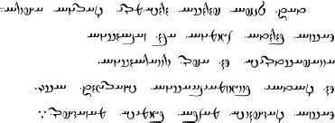
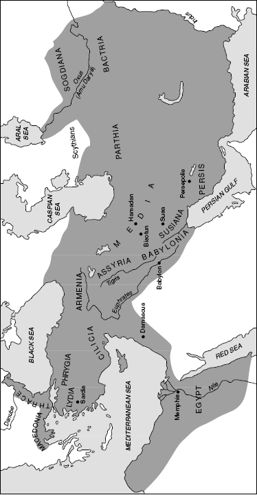
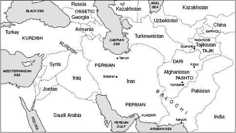

<!-- source-xhtml: 9781405188968_011.xhtml -->

# Chapter 11. Indo-Iranian II: Iranian

## Introduction

**11.1.** Languages bearing the designation “Iranian” are by no means limited geo-graphically to Iran. Since ancient times Iranian languages have been spoken over a large section of southwestern and central Asia – from Armenia and Mesopotamia in the west, to the Persian Gulf in the south, all the way into Chinese Turkestan in the east, and well to the north of what is now Iran, Afghanistan, and Tajikistan (the only modern countries whose official languages are Iranian). Chronologically, the Iranian subbranch is divided into **Old Iranian** (until c. 400 <small>BC</small>), **Middle Iranian** (c. 400 <small>BC</small>–c. <small>AD</small> 900), and the modern Iranian languages. By dialect-area it is divided into East and West Iranian, or into Southwest, Central, and Northeast Iranian.

The study of the Iranian languages has made remarkable strides in the last century. The discovery of several Middle Iranian languages in the early 1900s coupled with a steady advance in philological methods in Avestan studies has put Iranian linguistics on an equal footing with Indic. As noted in the previous chapter, Iranian preserves some archaic features that were lost in Indic (see the fuller discussion in §11.25 below), but unfortunately the Old Avestan corpus, the most archaic textual material in Iranian, is very small.

Most of this chapter will concern the two Old Iranian languages Avestan and Old Persian, the only ones in which we have texts. We know of several other contemporaneous languages, including Median (§11.29) and Scythian (preserved in some glosses and proper names), spoken in the extreme northwest of Iranian terri-tory. Scythian may have been the Iranian language that came into contact with the early Slavs and from which the latter obtained a few loanwords (see §18.20).

### *Basic Iranian phonological characteristics*

Several features distinguish the Iranian subgroup from Indic; these are innovations that occurred after the Common Indo-Iranian period, or retention of Common Indo-Iranian features that were changed in Indic.

**11.2. Deaspiration of voiced aspirates.** The voiced aspirates lost their aspiration and became ordinary voiced stops, as in Av. *baraiṇti* and OPers. *bara(n)tiy* ‘they carry’ < Indo-Ir. **bharanti*.

**11.3. Spirantization of voiceless stops.** Characteristic of Iranian is the development of stops into fricatives in many environments. In the case of the voiceless stops **p *t *k*, they became the fricatives *f θ* (= [θ] Eng. *th*) and *x* (= [x] German *ch*) before non-syllabic consonants, as in Av. and OPers. ***f****ra-* ‘forth, forward’ from Indo-Ir. ******p****ra-*, Av. *ca**θ**uuārō* ‘four’ from Indo-Ir. **ca****t****u̯āras;* and Av. ***x****rūra-* ‘bloody’ from Indo-Ir. ******k****rūra-.*

**11.4. Development of the palatals.** The Indo-Iranian palatals **ć* and **j́(h)* (from PIE **k̑* and **g̑(h*), recall §10.5) became Avestan and Median *s* and *z* and Old Persian *θ* and *d;* their intermediate Common Iranian stage may have been the affricates **ts* and **dz.*

**11.5. Weakening of** ****s*** **to** ***h****.* The old sibilant **s* became weakened to *h* before vowels or resonants in Iranian, as in Av. *həṇti* ‘they are’ (< Indo-Ir. **santi*) and *ahmi* ‘I am’ (< **asmi*). This development is similar to that of Greek, as we will see in the next chapter.

**11.6. Dental-plus-dental clusters and Bartholomae’s Law.** As discussed in §10.6, the Indo-Iranian outcomes of the PIE dental-plus-dental clusters, namely **-tst-*(< PIE **-t-t-* and **-d-t-*) and **-dzd(h)-*, lost the initial dental in Iranian and became *-st-* or *-zd-:* Av. *vista-* ‘known’ (cp. Ved. *vittá-;* Indo-Ir. **u̯itsta- <*PIE **u̯id-to-*), OPers. *azdā* ‘known’ (cp. Ved. *addhā́* ‘surely’; Indo-Ir. **adzdhā <*earlier **adh-tā*). The progressive voicing assimilation induced by Bartholomae’s Law is preserved in Iranian not only in the cluster *-zd-*, but in other clusters as well. In Old Avestan it is still regularly preserved in all contexts, as in *aogədā* (phonetically *aogdā*) ‘he said’ < **augh-ta* and *aoyžā* ‘you said’ < **augh-ša.* But in Young Avestan its effects were largely undone by analogy (for example, ‘he said’ is *aoxta*).

**11.7. Laryngeals.** Vocalized laryngeals were lost word-medially in Iranian, as in Av. *duxtar-* ‘daughter’ (vs. Ved. *duhitár- <***dhugh₂ter-*), but apparently preserved elsewhere on occasion, as *i* (e.g. in the 1st pl. middle verb ending *-maiδ****i***, cp. Ved. *-mah****i*** *< *-medh****h₂***, and perhaps in Young Av. *p****i****tā* ‘father’ < **p****h₂****tḗr*, although Old Avestan has *ptā*). The laryngeals in their non-vocalized form left traces in two important ways. First, **h₂* aspirated a preceding voiceless stop, e.g. genit. sing. *pa**θ**o* ‘path’ < PIE **pṇ****t-h₂****-es;* and second, Old Avestan preserves so-called laryngeal hiatus (see further §11.23) like Vedic but more faithfully.

**11.8. Preservation of diphthongs.** In contrast to Sanskrit, Iranian preserved the Indo-Iranian diphthongs **ai* and **au.* These are written as *aē* and *ao* in Avestan, *ai* and *au* in Old Persian: Av. *daēuua-* ‘demon’, OPers. *daiva-* ‘evil god’ (vs. Ved. *devás* ‘god’); Av. *haoma-*, OPers. *hauma-* ‘sacred intoxicating drink’ (vs. Ved. *sómas*). Later in Middle Iranian times (§11.35 below), these diphthongs were monophthongized as they had been in Sanskrit.

## Avestan

**11.9.** Avestan is the language of the **Avesta**, the collection of sacred texts of the Zoroastrian religion. The full Pahlavi (Middle Persian) name, *abestāg u zand*, meaning ‘text and commentary’, was mistakenly rendered as *Zend-Avesta* in Europe; *Zend* was further misunderstood as a language name, and for well over a century Avestan was known as “Zend.” Avestan was introduced to Europe by the French scholar Abraham Hyacinthe Anquetil du Perron (or Duperron), who journeyed to India in 1754 to learn about Zoroastrianism from the Parsis (Zoroastrians who had migrated to India in the tenth century) and published the first Avestan texts and translations in 1771. Avestan is classified as East Iranian, and it is believed to have been spoken in an area from the Aral Sea to what is now easternmost Iran.

### *Zoroastrianism and the Avesta*

**11.10.** Zoroaster or Zarathuštra (Av. *Zaraθuštra-;* Zoroaster is the Greek rendering of his name) was a prophet who founded the Mazdayasnian religion (more familiarly called Zoroastrianism). The dates of his life are unknown, although linguistic and comparative evidence points to the late second millennium <small>BC.</small> The Mazdayasnian religion eventually spread throughout pre-Islamic Iran and adjacent territories. Zoroastrians believe in a cosmic dualism in which good spirits (*ahura-*) and evil spirits or demons (*daēuua-*) are in constant conflict, a conflict that will ultimately end with the triumph of good. A supreme being who heads the good spirits is worshiped, Ahura Mazda or ‘wise lord’ (Av. *ahurō mazdā̊*, OPers. *Auramazdā*, ModPers. *Ohrmazd*), whence the term *Mazdayasnian (yasna-* means ‘worship, sacrifice’).

The roots of Zoroastrianism are the inherited Indo-Iranian religion that became Hinduism in India, but Zarathuštra’s teachings resulted in many changes, including some that reversed or rejected traditional concepts. The most familiar example is the Avestan word for ‘demon’ mentioned above, *daēuua-*, which is the inherited word for ‘god’ (cp. Ved. *devás*). Nonetheless, many myths in the Rig Veda have analogues in the Avesta, and cognate phrases and formulas are found abundantly in both works (e.g. Ved. *r̥tám̥ sapāmi* ‘I honor truth’ ≈ Old Av. *aṣ̌əm haptī* ‘he honors truth’). Thus the Avesta importantly continues a common inherited religious poetic tradition.

The Avesta consists of several separate texts: the Yasna (the liturgy, containing formulaic prayers and hymns); the Yašts (poems, some lengthy, celebrating particular deities and their deeds); the Vidēvdāt or Vendidad (a legal text concerning punishment and purification); the Khorde Avesta (miscellaneous short prayers); the Nīrangestān (ritual rules and legal matters); and various other texts.

**11.11.**The linguistically oldest Avestan, called **Old** or **Gathic Avestan**, is confined mostly to the core of the Yasna, namely Yasna 28-34, 43-51, and 53. These sections constitute the five Gathas (or Gāthās; *gāθā* ‘song’) traditionally ascribed to Zarathuštra himself. Also in Old Avestan is the prose ritual text called the Yasna Haptaŋhāiti or ‘Yasna of the seven chapters’ (Yasna 35.3-41), as well as four sacred formulas preserved in Yasna 27 and 54. Old Avestan, as mentioned in the preceding chapter, is grammatically comparable to the language of the Rig Veda. It is therefore usually assumed to be of about the same age, perhaps dating to the late second millennium <small>BC.</small>

**11.12.**The rest of the Avesta is written in **Young Avestan**. As Young Avestan is structurally more archaic than our earliest Old Persian, it is probably several centuries older; a reasonable estimate puts it at the ninth or eighth century <small>BC.</small> It is not a linear descendant of Old Avestan (just as Classical Sanskrit is not a linear descendant but rather a “niece” of Vedic Sanskrit), at least not in the form in which Old Avestan has come down to us. The two varieties differ from each other in several details, some of which will be noted below (and recall §11.6).

### *Textual transmission*

**11.13.** Anyone working with Avestan materials needs to be aware of the quality of their transmission, which is sometimes poor. The existing manuscripts are thought to go back ultimately to an edition compiled in Persia during the Sassanian dynasty (<small>AD</small> 224–652). By this point, Avestan had been long dead as a spoken language, and was only used in reciting the sacred religious texts. No direct copy of the putative Sassanian archetype exists; the surviving manuscripts stem from a much later descendant dating to the eleventh century or thereabouts. The earliest preserved Avestan manuscript dates only to the year 1288, and some of the most important other manuscripts were not produced until the 1600s and 1700s. Clearly, there has been plenty of opportunity for errors to enter into the transmission, both modernizations under the influence of modern speakers and miscopyings.

**11.14.** To make matters more difficult, modernizations and other modifications were not confined to the period in which the texts were transmitted in written form, but extend throughout their entire history. Internal linguistic and orthographic evidence indicates that, well after the first several centuries of oral composition, recomposition, and transmission, the texts were redacted by scholars (called *diaskeuasts* in Avestan scholarship, from Greek *diaskeuázō* ‘set in order, edit a literary work’) in an effort to produce a kind of school-text that preserved the liturgical pronunciation (which is usually thought to have been slow and musical) and made it more linguistically transparent. These scholars probably still spoke Young but not Old Avestan. The changes they wrought were far-reaching and often based on false or (from our point of view) pseudo-scientific analysis of the language, as well as on influence from the Young Avestan that they spoke. For example, Avestan, in keeping with inherited practice, could separate preverbs from verbs with intervening material (tmesis, §8.9); in Young Avestan, but not Old Avestan, a separated preverb could be repeated before the verb. The diaskeuasts introduced repeated preverbs into the Old Avestan text in such cases, which we know are artificial additions because they ruin the meter. (The first verse of Yasna 48.7 has two such preverbs, *nī aēšəmō nī.diiātąm paitī rəməm paitī.siiōdūm* “Let wrath be laid down! Cut up fury,” where the second *nī* and the second *paitī* are redactional additions, increasing the line from its required eleven syllables to fourteen!) A good deal of the modern philology of the Gathic texts is devoted to untangling these diaskeuastic modifications.

Because much of the editorial work happened during the Young Avestan period, Old Avestan has a strongly Young Avestan phonetic cast that represents secondary overlayering and adaptation. Some have argued, in fact, that the oldest Zoroastrian texts were composed already in late Common Iranian times. For example, words beginning in Iranian with the disyllabic sequence **j́u*’*a-* (with hiatus from **j́uHa-*) still scan disyllabically in the Gathas; later this sequence became monosyllabic **j́u̯a-*, the ancestor of both Avestan *zba-* (the spelling in the transmitted text) *and* of Old Persian *za-.* All this indicates that the text preserves (underneath the modernizations) a stage from a time before the common ancestor of Avestan and Old Persian split. (If that is true, then Young Avestan actually *is* a lineal descendant of Old Avestan.) Thus the participle *zbaiieṇtē* ‘for him invoking’ at Yasna 49.12 must be read **zuu̯aiieṇtē* (probably really **zuu̯aiantai* if one undoes the vowel changes).

### *Script*

**11.15.** An alphabetic script was invented, perhaps in the fourth century, for the express purpose of recording the recitation of the Avestan texts; some of the letters were taken from those of “Book Pahlavi” (see §11.42 below) while the rest were invented afresh. To preserve the recitation accurately, the script was devised to encode much of the phonetic detail of Avestan. (Contrast this with scripts devised by native speakers of a language, which rarely encode such detail because any native speaker can supply the missing information.) Unfortunately the script does not encode all the phonetic information we might like to have; in particular, there is no indication of the placement or nature of the word-stress, for example. (Such information can be gleaned indirectly from variations in vowel quantity: a form like *dātaras-ca* ‘and the creators’ has its second vowel shortened from expected **dātāras-ca* presumably because the clitic *-ca* threw the accent forward to **dātārás-ca*. See also §11.22.) The phonetic detail and certain orthographic conventions lend an unfamiliar look to the spelling of many words that are in fact little different from their Sanskrit cognates, like the instr. pl. *daēuuaēibiš* ‘by the demons’ (Ved. *devébhis* ‘by the gods’) and the noun *iθiiejah-* ‘danger’ (Ved. *tyájas-*): *uu* and *ii* represent the glides *w* and *y*; *aē* represents the diphthong *ai*; and an extra *i* before a consonant indicates palatalization of that consonant.

In the manuscripts, words are separated from each other by dots (.), which also regularly appear between the members of a compound (such as *aspō.gar-* ‘devouring horses’), and occasionally at or near other morpheme boundaries, such as before an inflectional ending (e.g. OAv. *dīdraγžō.duiiē* ‘you [pl.] wish to hold firmly’). In the standard transcription of Avestan, it is customary to include such dots only when they occur inside a word.

### *Phonology*

#### Consonants

**11.16. Velars.** Below is a tabular comparison of the Sanskrit and Avestan outcomes of the velars:

| Column 1 | Column 2 | Column 3 |
| --- | --- | --- |
| PIE | Skt. | Av. |
| *k, *kʷ | k | k |
| *g, *gʷ | g | g |
| *gh, *gʷh | gh | g |
| *k, *kʷ before front V | c | c |
| *g, *gʷ before front V | j | j |
| *gh, *gʷ before front V | h | j |
| *k̑ | ś | s |
| *g̑ | j | z |
| *g̑h | h | z |

The development of the velars in Avestan is thus fairly straightforward. The Iranian velar stops **k* and **g* (representing PIE **k *kʷ *g *gʷ *gh *gʷh*) and affricates **c* and **j* (representing the same PIE sounds, but before front vowels) remained intact as *k g c j.* The PIE palatals, which had become *ć and *j́ in Indo-Iranian, became the sibilants *s* and *z* in Avestan (their outcomes in Old Persian are different; see §11.32), as in *sōire* ‘they lie’ (Ved. *śére*, PIE **k̑ei-ro-*) and *zairi-* ‘yellow, golden’ (Ved. *hári-*, PIE **g̑hel-*). Thus Avestan kept three distinct reflexes of palatals, velars before front vowels, and velars elsewhere, in contrast to Sanskrit, which partially merged the first two.

**11.17. Spirantization of voiced stops.** The spirantization of the voiceless stops has already been dealt with (§11.3). The voiced Indo-Ir. stops *b d g* became fricatives in many environments in YAv., especially word-internally and before voiced consonants of various kinds. These are written *β δ γ*, representing phonetic [v ð γ], as in *gərəβnā-* ‘seize’ (Ved. *gr̥bhṇā́-), daδāiti* ‘gives; puts’ (Ved. *dádāti, dádhāti*), and *γ(ə)nā* ‘woman’ (Ved. *gnā́-*).

**11.18. Iranian** ****h****.* Important for the general look of the language is the further development of Iranian **h* from PIE **s*. Word-internally before *a* it became a sound transliterated as *ŋh*, as in *aŋhat̰* ‘he will be’, the 3rd sing. pres. subjunctive of *ah-*‘be’ (cp. Ved. *ásat* ‘will be’). A PIE sequence **su̯* became a sound transliterated *xᵛ*, as in *xᵛaŋhar-* ‘sister’ < **su̯esor-.*

#### Vowels

**11.19. Development of** ****a****.* The development of the vowels in Avestan is complex. We here list some of the changes to affect just one of them, Indo-Ir. **a.* This vowel generally remained intact, but became a sound written *ə* before a nasal, as in the accus. sing. ending *-əm* (Ved. *-am*) and the noun *nəmō* ‘reverence’ (Ved. *námas*). The sequence **-an-* before a coronal fricative (*s*, *z, θ*) became *ą,*, representing a nasalized *a*, as in *mąθra-* ‘formulation’ (Ved. *mántra-*) and *fšuiiąs* ‘cattle-herder’ < **pk̑u-i̯ent-s* (from **pek̑u* ‘cattle, livestock’; cp. Lat. *pecū* ‘cattle’). Final *-as*, most common in the nomin. sing. of thematic masculine nouns and adjectives, became *-ō*, as in *daēuuō* ‘demon’; this development also happened before a morpheme boundary in compounds, e.g. *aspō.gar-* ‘devouring horses’. A particularly unusual-looking development is the Old Avestan outcome *-ə̄ṇg* from Indo-Iranian **-ans*, as in the accus. pl. *daēuu-ə̄ṇg* ‘demons’ < PIE **deiu̯-ons*, in the genit. sing. *xᵛə̄ng* ‘of the sun’ < Indo-Ir. **su̯ans* or **suHans*, and in the phrase *də̄ng paiti-* ‘lord of the house’ < Indo-Ir. **dans pati-*, PIE **dems potis* (cp. Ved. *dám-patis*, Gk. *des-pótēs* ‘master, lord’).

**11.20.**Long **ā* normally remained, but also became *ą* before nasals sometimes (e.g. the accus. sing. *daēnąm* ‘religion’ < **-ām*). Before **s* it became a sound transliterated as *ā̊*, as in the feminine nomin. pl. *tā̊* ‘these’ (Ved. *tā̊s*) and the feminine genit. pl. *yā̊ŋhąm* ‘of which’ (Ved. *yā́sām*).

**11.21. Final vowels.** A characteristic difference between Old and Young Avestan is the treatment of original Indo-Iranian final vowels. In Old Avestan, the outcomes of all original final vowels are written long, regardless of the original quantity, while in Young Avestan they are written short (except for monosyllables). Hence the contrasts between Old Av. *astī* ‘is’, YAv. *asti* (**-i);* Old Av. *uxδā* ‘words’, YAv. *uxδa* (neut. pl. **-ā <*PIE **-eh₂);* Old Av. dat. pl. *-aēšū*, YAv. *-aēšu* (< **-aisu <*PIE **-oisu);* Old Av. voc. *ahurā* ‘o lord’, YAv. *ahura (*-a <*PIE **-e);* and instr. sing. Old Av. *ašī* ‘with a reward’, YAv. *paiti* ‘with a master’ (< **-ī <*PIE **-ih₁*). It is usually thought that the length of Old Avestan final vowels is artificial and was introduced into the redactional tradition well after the Old Avestan period, perhaps as an indication of recitational practice (recall §11.14 above). There is in fact evidence that final long vowels in polysyllables were shortened in the ancestor of both Old and Young Avestan.

**11.22. Development of** ****r̥.*** The reflex of syllabic **r̥* is written *ərə*, as in *kərəta-*‘done’ (Ved. *kr̥tá-*). An interesting development is that an accented **ŕ̥* was devoiced before a following voiceless stop, becoming a sound or sound sequence written *əhr* (e.g. *vəhrka-* ‘wolf, cp. Ved. *vŕ̥ka-*), and if the stop was a *t*, the combination produced a *sh*-like sound written with a letter transliterated as *ṣ̌.* This happened not only with stressed syllabic **ŕ̥* but also with **-ár-: maṣ̌iia-* ‘mortal’ (cp. Ved. *mártya-); aməṣ̌a-* ‘immortal’ (cp. Ved. *amŕ̥ta-*).

Note incidentally that these last changes provide important evidence for the existence of a mobile accentual system in early Iranian. A mobile accent is found today in Pashto and a few other modern Iranian languages.

**11.23. Laryngeal hiatus.** The poetic meter of the Gathas shows that, as in Vedic, certain long vowels count as two vowels (i.e., two syllables) with a hiatus (presumably a glottal stop) between them. The hiatus corresponds to a former laryngeal; we therefore call this phenomenon **laryngeal hiatus**. Thus the nomin.-accus. sing. *dā̊* ‘gift’ must scan as two syllables, i.e. *da’ā* (from **da’ō < *deh₂-os*), whereas the 2nd sing. aorist injunctive *dā̊* ‘you give/gave, you put’ does not, as it comes from **deh₃s* or **dheh₁s*, both monosyllables. The poetry of the Gathas is very consistent in preserving laryngeal hiatus where it would be expected on etymological grounds – far more consistent in fact than the Rig Veda, making Old Avestan extremely valuable for the laryngeal theory.

**11.24. Sandhi.** The complicated external sandhi found in Sanskrit is not present in Avestan. Thus the nominative singular of the word for demon is always *daēuuō*, though its Vedic counterpart (‘god’) was *devó* only before voiced consonants, and otherwise could be *devá, devás, deváḥ*, or *deváś.* But etymological final *-s*’s reappear sometimes, especially when a clitic follows, as in *daēuuas.ca* ‘and the demon’ (cp. Ved. *deváś ca*), but sporadically also in other contexts, as in *hauuaiiā̊sə tanuuō* ‘of one’s own body’ (otherwise *hauuaiiā̊*). All word-final *t’s* are written with a modified *t* that is transliterated as *t̰;* this may have been an unreleased *t.* Note, though, the treatment in clitic groups such as *ad-āiš* ‘so through them’, versus *at̰* ‘so’ when alone.

### *Morphology*

**11.25.** Due to the relative paucity of material, not all inflectional endings are attested; but it is clear that the morphological system of Old and Young Avestan is essentially the same as that of Vedic Sanskrit, with only some minor differences in detail. Notably though, Avestan, in particular Old Avestan, preserves some archaic features that are not found in Vedic. (Interestingly, most of these features are not found in Young Avestan either, making the latter in some sense closer to Vedic than to Old Avestan.) Some of these may be briefly noted. The first singular present indicative of thematic verbs ended usually in *-ā* in Old Avestan (e.g. *pərəsā* ‘I ask’)but always *-āmi* in Young Avestan (e.g. *barāmi* ‘I carry’); Old Av. *-ā* thus preserves the PIE thematic ending **-oh₂* unextended by the athematic ending **-mi* (recall§5.29). Avestan preserves traces of proterokinetic inflection in *r/n-*stems, a featurelost in Indic; Old Avestan also has proterokinetic inflection of *u-*stems. Thus YAv.*aiiarə* ‘day’, genit. *aiiąn < *ai̯ans*has proterokinetic genitive in **-s*, as seen also in the Old Av. genit. *pasə̄uš <*Indo-Ir. **pas-aus* of *pasu-* ‘cattle’; the latter has been remade to hysterokinetic *pasuuō < *pas-uas*in Young Avestan. The word for ‘path’,nomin. *paṇtā̊*, accus. *paṇtąm*, genit. *paθō* famously preserves the amphikinetic ablaut of its PIE ancestor, **pént-oh₂-s *pént-oh₂-ṃ *pnt-h₂-és*, down to the location of the laryngeal in all the forms: the ending *-ąm* of the accusative scans with laryngeal hiatus, and the laryngeal aspirated the preceding *t* to produce ϑ in the oblique stem,but not in the strong stem where it was separated from the *t* by a vowel. Finally,Old Avestan preserves a distinction among three possessive pronouns (*ma-* ‘my’, *ϑβa-* ‘your’, *xᵛa-* ‘(one’s) own’) while Young Avestan has only *hauua-* for all three(remade from the same **hu̯a-* as OAv. *xᵛa-*).

But retained archaisms are always balanced by innovations; one which may be mentioned is the Young Avestan extension of the final *-t̰* of the thematic ablative singular ending *-āt̰* to athematic ablatives (where it replaced the final **-s* used for both the genitive and the ablative), as in *nərəš* ‘from a man’ (vs. genit. *nsrss*). This development is also in Old Persian, and may be a common innovation of the two languages.

### *Old Avestan text sample*

**11.26.** Stanza 4 from Yasna 44, called the Tat̰.θβā.pērēsā Hāiti after its opening words. The poet is asking his patron for a reward for singing his praises and alludes to the fact that a patron who did not remunerate his poet was subject to punishment. Such a reciprocity relation between poet and patron was important in ancient Indo-European cultures; see §2.38.

The translation here is modeled on that of Helmut Humbach.

tat̰ θβā pərəsā ərəš mōi vaocā ahurā  

kasnā dərətā ząmcā adə̄ nabā̊scā  

auuapastōiš kə̄ apō uruuarā̊scā  

kə̄ vātāi duuąnmaibiiascā yaogət̰ āsū  

kasnā vaŋhə̄uš mazdā dąmiš manaŋhō  

This I ask you, tell me straight, Lord:  

Who holds firm both the earth and the heavens  

from falling? Who (holds firm) the waters and plants?  

Who yokes the two swift ones to the wind and the clouds?  

Who (is) the creator of good thought, o Wise One?  

**11.26a. Notes. tat̰:** ‘this, that’, Ved. *tát.* All the stanzas but the last one in this hymn begin with this line. **θβā:** ‘you’, accus. sing. enclitic pronoun, Ved. *tvā.* **pərəs**ā**:** ‘I ask’, 1st sing. present, with *-ā* from PIE **-oh₂* without the addition of *-mi* (vs. Ved. *pr̥cchā́mi);* §11.25. ə**r**əš**:** ‘straight, correctly’, related to *ərəzu-* ‘straight’, Ved. *r̥jú-.* **mōi:** ‘me’, 1st sing. dat. enclitic pronoun, Ved. *me; ōi* and not *aē* was the Avestan outcome of Indo-Ir. **ai* in word-final position and in closed syllables. **vaoā**á**:** ‘tell’, aorist imperative; Ved. *voca.* This is a reduplicated aorist, PIE **u̯e-ukʷ-.* Note that the etymologically short final vowel is long here (recall §11.12).

**kasn**ā**:** ‘who’, literally ‘which man, which person’, combination of the masc. nomin. sing. of the interrogative pronoun plus the nomin. sing. of the word for ‘man’, *nā* (< **h₂nēr*) cliticized and having little meaning. The interrogative has the form *kas-* in close sandhi before the enclitic (see §11.24), and appears alone as *kē* below. **dərət**ā**:** ‘holds firm, keeps’, 3rd sing. aorist middle injunctive, PIE **dhr̥-to.* **ząmc**ā**:** accus. sing. of ‘earth’ (= Ved. *kṣā́m*) plus enclitic conjunction *-cā* ‘and’ (PIE **kʷe*). The sequence *-cā. . . -cā* means ‘both . . . and’, as elsewhere in IE. **adə:** ‘below’, a word occurring only here; cognate with Ved. *adhás* ‘below’. **nabā̊sā**á**:** ‘and heavens’, accus. pl.; the *-s* only shows up before enclitics.

**auuapastōiš:** ‘from falling’, genit. sing. of a *ti-*abstract noun consisting of the prefix *auua-* ‘down’ plus either **pad-ti-* (from *pad-* ‘fall’) or **pat-ti-* (from *pat-* ‘fly, fall’). **apō:** ‘waters’, accus. pl., Ved. *apás.* **uruuarā̊sc**ā**:** ‘and plants’. The same phrase is in Vedic: *apáśca urvárāśca* ‘waters and (plantable) fields’ (Atharva Veda 10.10.8). Indo-Iranian **urvarś-* is related to Gk. *ároura* ‘plowland’ and OIr. *arbor* ‘grain’, though the details are uncertain.

**v**ā**t**ā**i:** ‘wind’, dat. sing.; the first syllable scans as two syllables because of laryngeal hiatus (PIE **h₂u̯eh₁nto-*). **duuąnmaibiiasc**ā**:** ‘and clouds’, dat. pl. of the *n*-stem *duuąinman-.* Elsewhere the word has the stem *dunman-.* It is related to Ved. *dhvan-* ‘make smoke, form clouds’, from PIE **dhu̯enh₂-*, and perhaps ultimately to PIE **dhuh₂-mo-* ‘smoke’ (> Lat. *fūmus*). **yaogət̰:** ‘yokes’, 3rd sing. aorist injunctive. **āsū:** ‘the two swift ones’, neuter accus. dual, referring to the two horses of a team, or perhaps to two teams. Compare Rig Veda 3.35.4 *yunajmi hárī āśū́* ‘I yoke the two swift steeds’.

**vaŋhə̄uš:** ‘good’, genit. sing. of *vaŋhu-* or *vohu-* ‘good’ (= Ved. *vásu-*, from PIE **u̯esu-*), modifying *manarjhō* ‘thought’, genit. of *manō (=* Ved. *mánas*, from PIE **men-os-*, from **men-* ‘to think’). ‘Good thought’ (nomin. *vohū manō*) was a central Zoroastrian concept and one of the manifestations of the Wise Lord, Ahura Mazda. **mazd**ā**:** ‘wise’, cp. Ved. *medhā́-* ‘wisdom’; both from an Indo-Iranian phrase **mn̥s dhā-* ‘put (one’s) mind’. **dąmiš:** ‘creator’, from *dā-* (PIE **dheh₁-*) ‘put, create’ with the rare suffix **-mi-* that also appears in the Gk. cognate *thémis* ‘right, law’ (*‘something set down’, PIE **dhh₁-mi-*).

### *Young Avestan text sample*

**11.27.** From Yašt 14 (the Bahirām Yašt), excerpt from verse 40. An Iranian descendant of the IE dragon-slaying myth (see chapter 2).

yim θraētaonō taxmō barat̰  

yō janat̰ ažīm dahākəm  

θrizafanəm θrikamərəδəm  

xšuuaš.ašīm hazaŋrā.yaoxštīm  

aš.aojaŋhəm daēuuīm drujēm  

aγəm gaēθāuuiiō druuaṇtəm  

( ... the power and the force) which mighty Thraetaona had, who slew the serpent Dahaka, the three-jawed, three-headed, six-eyed, thousand-skilled, the extremely powerful demoniacal monster, evil (and) sacrilegious to living beings . . .

**11.27a. Notes. θraētaonoō:** Thraētaona, a mythical Iranian dragon-slaying hero. **janat̰ ažīm:** ‘slew the serpent’, cognate with Ved. *áhann áhim* in the related Vedic dragon-slaying myth (though the verb form is slightly different, being a thematic rather than an athematic imperfect). The Iranian serpent’s name is (Aži) Dahāka. **θrizafanēm**: ‘having three jaws’, composed of *θri-* ‘three’ and *zafan-*, from *zafarə* ‘jaw’, probably an *r/n-*stem, though only the form *zafarə* is attested. **θrikamērēδēm:** ‘three-headed’; *kamērēδa-* is a special word for the head of a demon. The body-parts of demons had names different from those of corresponding human body-parts. **xšuuaš.ašīm:** ‘having six eyes’; *xšuuaš* is ‘six’, cp. Vedic *ṣáṭ*, PIE **su̯ek̑s*, and *aši-* is ‘eye’, cp. Ved. *ákṣi.* **hazaŋr**ā**.yaoxštīm:** ‘having a thousand skills’; *hazaŋrā-* ‘thousand’ is cognate with Ved. *sahásra-.* **aš.aojaŋhəm:** ‘very powerful’, containing the prefix *aš-* ‘very’ and *aojah-* ‘strength’ (cp. Ved. *ójas*). **daēuuīm:** ‘demoniacal’, from Iranian **daiu̯i̯am*, a *-i̯o-*adjective formed from **daiu̯a-* (cp. Ved. *devá-* ‘god’). **drujəm:** ‘monster, lie’; the Iranian term **druj-* or **drug-* refers to all manner of evil things, especially the Lie, the arch-enemy of Truth (Av. *aṣ̌a-*) in the polarized Zoroastrian world. **gaēθauuiiō:** ‘living beings’, dat. pl., with *-āuuiiō* a variant of Young Av. **-ābiiō* (Ved. *-ābhyas*). **druuaṇtam:** ‘lying, deceptive’, a **-u̯ent-* possessive adjective (§6.40) formed from **drug-* (see above).

## Old Persian

**11.28.** Old Persian is the language of the royal inscriptions of the Achaemenid dynasty of the ancient Persian Empire. The Old Persian inscriptions have the distinction of being the only preserved Old Iranian texts that are authentic originals,written by the very people who spoke the language and free from copyists’ errors.The inscriptions come from various sites in western Iran, especially Bisotun (Bisotūn, also spelled Behistūn, Bīsitūn), Persepolis, Susa, and Hamadan. Most belong to Darius I (reigned 521–486 <small>BC</small>) and his son Xerxes I (reigned 486–465), but inscriptions continue almost to the end of the Achaemenid dynasty, the last ones belonging to Artaxerxes III (reigned 359–338). Over this nearly 200-year period, the language changed quite a bit. The language of the inscriptions of Darius and Xerxes was a courtly one, a bit archaizing and containing many Median elements (see the next section), but already in Xerxes’ time certain developments common to the Middle Iranian languages were starting to creep in. By the time of Artaxerxes III the language looks already more like Middle Persian than an Old Iranian language. It had under-gone a number of sound changes, including the monophthongization of diphthongs and the erosion of final syllables (and with them, of the case system). Even the oldest Old Persian is not very archaic compared with Avestan, being typologically quite like late Young Avestan. This suggests that Young Avestan and early Old Persian were roughly contemporaneous. Old Persian belongs to the Southwest branch of Iranian.

### *Median*

**11.29.** Old Persian contains a fair amount of admixture from Median, the language of the earlier Median Empire (c. 700–522 <small>BC</small>) in northwestern Iranian territory.Almost all our knowledge of Median comes from these loanwords, which afford us a partial view of the sound changes that Median underwent and therefore of its filiation within Iranian. Thus the Median loan *aspa* ‘horse’ (native OPers. *asa*)shows that the language patterned with Central Iranian, where IE **k̑u̯*, became *sp* (not *s* as in the southwest, where Old Persian was spoken).

### *The Old Persian script*

**11.30.** Old Persian is written in a cuneiform script that is imitative of Mesopotamian cuneiform, but the actual signs are wholly different. It is a relatively simple syllabary that was apparently designed just for this language. A poorly understood passage of the great Bisotun inscription of Darius I has the king claiming that he devised the script, which could be true. (An inscription purporting to be of the earlier king Cyrus the Great has been shown to postdate his reign.) Old Persian cuneiform was the first cuneiform script to be deciphered; the early breakthroughs were made in 1802 and subsequent years by a German school-teacher named Georg Friedrich Grotefend. The existence of bi- and trilingual inscriptions in Old Persian, Akkadian,and Elamite (the language of Persia before it was taken over by the Persians, and subsequently used by them as a court language; it has no known relatives) then paved the way for unlocking the secrets of Mesopotamian cuneiform.

**11.31.** The script is not well suited for writing Old Persian, and its limitations hamper the analysis of the language’s phonology. Like Mesopotamian cuneiform, the symbols are syllabic, not alphabetic. Only signs for vowels and for sequences of consonant plus vowel (CV) were used. A complete set of CV signs was devised where the vowel was *a*, but where the vowel was *i* or *u* only a subset of the possibilities are represented. Since there were no VC signs, the use of “empty” or “dummy” vowels was frequent, as in the spelling *vi-ša-ta-a-sa-pa-ha-ya-a* for the dat. sing. *Vištāspahayā* ‘for/of Hystaspes’ (the father of Darius I). As this example also shows, long *ā* was represented by adding an extra *a.* Where comparative evidence from Avestan would lead one to expect the presence of *h*, no *h* is actually written before certain sounds; thus the Old Persian equivalent of Avestan *Ahurō Mazdā̊* ‘Ahura Mazda’ is always written *Auramazdā.* Either the *h* was pronounced but not written, or it was simply not there at all. For this reason, one often sees transcriptions like *Aʰuramazdā* to indicate that etymologically an *h* is expected, but not present in the script. The same is true for *n* at the ends of syllables, as in *atar* (*aⁿtar*) ‘between’. Sometimes the Akkadian and Elamite renderings of Old Persian names provide clues, but the spellings here are often so varied that they are not as helpful as one would wish. No information on the placement or nature of the stress is available; however, some sandhi phenomena are preserved (see below).

### *Characteristics of Old Persian*

#### Phonology

**11.32.** The outcomes of the IE palatals differ considerably from Avestan. In Old Persian, PIE **k̑* and **g̑* became *θ* and *d*, respectively, in contrast with Avestan *s* and *z: *u̯ik̑-* ‘all’ > OPers. *viθ-* (Av. *vīs-), *eg̑h₂om* ‘I’ > OPers. *adam* (Av. *azəm*).

**11.33.** Also characteristic of Old Persian is the development of the sequence **tr* to *ç* (via an intermediate stage **θr; ç* is the standard transcription of a sign in the Old Persian script whose phonetic value has yet to be determined). Compare Vedic *kṣatrám* ‘kingdom’ with Av. *xšaθra-* but OPers. *xšaça-.*

#### Morphology

**11.34.** Our picture of the morphology of Old Persian has many gaps because of the small corpus, but the forms we do have are in close agreement with Avestan, especially in the verb. The Old Persian noun, however, has undergone more case syncretism (merging of different cases) than Young Avestan. The dative has been replaced by the genitive, and the ablative has mostly merged with the instrumental and the locative. The relative pronoun had the stem *haya-/taya-* instead of the usual *ya-* in the rest of Indo-Iranian; it also functioned as a kind of definite article and as a particle that was inserted between a noun and a following modifier or appositive, as in *Gaumāta haya maguš* ‘Gaumata the priest’ (originally meaning *‘Gaumata, who [is] a priest’). In Modern Persian, this is continued by the so-called *ezāfe* construction, which utilizes a particle *-(y)e* to connect attributive adjectives and possessives to nouns, as in *mard-e īrānī* ‘the Iranian man’.

**11.35.** Other developments include the loss of a distinction between aorist and imperfect; the spread of *a-*stems replacing other stem-types in the noun; and the later contraction of **-iya-* to *-ī-.* A development of interest from the viewpoint of Modern Persian is the beginnings of a periphrastic perfect, where the past passive participle was used with a noun in the genitive functioning as the agent, as in *taya manā kartam* ‘what (was) done by me’ = ‘what I have done’. The oblique form *manā* ‘by me’ eventually became reinterpreted as a subject case, yielding *man* ‘I’ in Modern Persian. Nowadays one says *man kard-am* ‘I have done’, where *-am* is a 1st sing. ending added to what was originally a non-finite verb form (a participle; the *-am* in OPers. *kartam* was a neuter sing. ending that was later lost).

### *Old Persian text sample*

**11.36.** Two excerpts from column I of the great inscription of Darius I inscribed on a steep polished cliff-face at Bisotun, along a caravan route between Baghdad and Tehran. The inscription is trilingual, in Old Persian, Elamite, and Akkadian. The bulk of the inscription details Darius’s battles and conquests. The translation is Roland Kent’s, with a few modifications. Note that most of the lines end in the middle of a word that then spills over onto the beginning of the next line.

1. adam Dārayavauš xšāyaθiya vazarka xšāyaθiya xšāyaθiy-

2. ānām xšāyaθiya Pārsaiy xšāyaθiya dahyūnām Višt-

3. āspahyā puça Aršāmahyā napā Haxāmanišiya . . .

20. ... θātiy Dārayava-

21. uš xšāyaθiya atar imā dahyāva martiya haya āgriya āha avam u-

22. bartam abaram haya arika āha avam ufrastam aparsam vašnā Auramazdā-

23. ha imā dahyāva tayanā manā dātā apariyāya yaθāšām hacāma aθah-

24. ya avaθā akunavayatā . ..

1–3. I am Darius the great king, king of kings, king in Persia, king of countries, son of Hystaspes, grandson of Arsames, an Achaemenid.

20–24. Darius the king announces: Within these countries, the man who was loyal (?), him I rewarded well; who was evil, him I punished well; by the favor of Ahuramazda these countries that abided by my law, as was said to them by me, thus was it done.

**11.36a. Notes. 1–3. adam:** ‘I’, cp. Av. *azəm.* **D**ā**rayavauš:** ‘Darius’, lit. ‘upholding the good’, composed of *dāraya-* ‘uphold’ (cp. Ved. *dhāráyati* ‘upholds’) and *vau-* ‘good’ (cp. Ved. *vásu-*‘good’; one expects OPers. **vahuš*, but no *h* is ever written). **xšāyaθiya:** ‘king’, cp. Ved. *kṣáyati* ‘rules’; the genit. pl. *xšāyaθiyānām* straddles the end of the line. The Modern Persian descendant is *š āh* ‘shah’. **vazarka:** ‘great’; the suffix *-ka-* achieved enormous productivity in Iranian for forming nouns, especially from Middle Iranian times on. **P**ā**rsaiy:** ‘Persia’, loc. sing. **-oi;* strictly speaking, just one province of the Persian (Achaemenid) Empire. **dahyūn**ā**m:** ‘of the countries’, genit. pl.; cp. OAv. *dax́iiu-* ‘country’. **Višt**ā**spahy**ā**:** ‘of Vištāspa’, Gk. Hystaspes; genit. sing. (**-osi̯o*). The name means ‘having unharnessed/free horses’ (*aspa* ‘horse’ is a Median loanword; see §11.29). **puça:** ‘son’, Av. *puθra-*, Ved. *putrás*, from **put-lo-;* also found in Oscan *puclom* (accus. sing.). **nap**ā**:** ‘grandson’, PIE **nepōt-.* **Hax**ā**manišiya:** ‘of Haxāmaniš, Achaemenid’, Gk. Achaemenes; relational adjective in *-iya-* (PIE **-i̯o-*).

**20–24. θātiy:** ‘says’. **atar:** ‘within, among’, probably spelling *antar* (= Ved. *antár*, Lat. *inter;* PIE **enter*). **martiya:** ‘mortal, man’, Ved. *mártya-*, Av. *maṣ̌iia-.* **haya:** ‘who’, relative and indefinite pronoun. ā**ha:** ‘was’, imperfect 3rd sing. as though from Indo-Ir. **āsat* (thematic, in contrast to athematic Av. *ās* and the rare Vedic *ā́s* from **āst*, i.e. **a-as-t*). **avam:** ‘that (man)’, accus. sing. masc. of *ava-*, demonstrative pronoun, cp. Av. *auua-* ‘that’. **ubartam:** lit. ‘well-carried, well-held’, from *u-* ‘well’ (Av. *hu-*, Ved. *su*-) plus *bartam, to-*verbal adjective of *bar-* ‘carry’. Note the etymological figure with the verb *abaram* ‘I carried, held’, which is of Indo-Iranian date: Av. *hubərətąm barāt̰* ‘(who) may hold us well-held’ at Yasht 13.18, Ved. *súbhr̥tam bibhárti* ‘carries (him) well-carried’ at Rig Veda 4.50.7. **ufraštam:** ‘well punished’, also spelled *ufraštam*; *frasta-* literally ‘interrogated’, from *fraθ-* (PIE **prek̑-* ‘ask’; Av. *fras-*, German *fragen*). **aparsam:** ‘I punished’, imperfect of *fraθ-*; the verb makes an etymological figure with the preceding adjective, *ufrastam aparsam*. **apariy**ā**ya:** ‘they went around, abided by’, 3rd pl. imperfect with final nasal lost or not written; a curious form, apparently containing a double augment: *a-pari-a-aya(n)*, before and after the preverb *pari* ‘around’ (Av. *pairi*, Gk. *perí* ‘around’). **yaθāšām:** consists of *yaθā* ‘as’ (correlative with *avaθā* ‘so, thus, in that way’) plus *-šām* ‘to them, of them’, genit. pl. demonstrative pronoun. **hac**ā**ma:** consists of *hacā* ‘with, by’ (cp. Ved. *sácā*) plus the enclitic ablative *-ma* ‘me’ (cp. Av. *mat̰*). **akunavayat**ā**:** ‘were done, made’, spells *akunavayantā*, a 3rd pl. optative middle added to an augmented (imperfect) stem. Such a formation is unusual in Indo-European, but other examples are known from Iranian. Here the optative functions as a past tense.

## Middle and Modern Iranian

**11.37. Middle Iranian** refers collectively to the stages of the Iranian languages that share a set of phonological and morphological developments as compared with Old Iranian, including especially the monophthongization of the diphthongs *ai* and *au* to *ē* and *ō*, the loss of many or most of the tenses, and (particularly in the west) the reduction of the case-system in nouns. Broadly, two groups of Middle Iranian languages can be distinguished, **East** and **West**, though the terms are not fully accurate geographically (some East Middle Iranian languages were spoken farther to the west than the West Middle Iranian languages!). This period saw the greatest geographical distribution of Iranian languages, from the northwest coast of the Black Sea to China. The later migratory waves of Turkic peoples into this territory caused the Iranian populations to shrink considerably, but even today most of this area still has at least some pockets of Iranian speakers.

Middle Persian was the only Middle Iranian language about which anything was known until spectacular finds in the twentieth century added several more to the roster: Parthian, Sogdian, Choresmian, Bactrian, Khotanese, and Tumshuqese. Most of these were unearthed in Chinese Turkestan (southwest Xinjiang in western China) – some on the same expeditions that saw the unearthing of the Tocharian languages. Only Middle Persian and Sogdian are known to have close living relatives. Other Middle Iranian languages, such as Sarmatian and Alanic, are known only indirectly and have no preserved literature.

**11.38.** Most of the Middle Iranian languages were written in scripts derived from the Aramaic alphabet. Aramaic had been one of the official languages of the Persian Empire, and continued to be used in the empire’s former territories. Like all Semitic alphabets, it possessed no signs for short vowels and no unambiguous signs for long vowels, rendering it ineffective for recording certain phonetic features of the relevant languages.

### *West Middle Iranian*

**11.39.** In West Middle Iranian, a stress accent developed on the penultimate or antepenultimate syllable, and final (unaccented) syllables were generally dropped. Nominal inflections were reduced to a system of two cases. The verbal system was more conservative, but the future, aorist, and perfect were lost.

**11.40.** Parthia was a historical region corresponding to present-day northeastern Iran and neighboring parts of Turkmenistan; in it was spoken **Parthian**, the official language of the Arsacid dynasty (247 <small>BC</small>–<small>AD</small> 224). The Arsacids themselves were not from Parthia, but when they conquered the Parthians they took over their lan-guage. Most of the Parthian we have is preserved in documents from Xinjiang,but there are also some important early royal inscriptions from about 140 <small>BC</small> on. Parthian vocabulary strongly influenced Middle Persian “Book Pahlavi” (see directly below).

**11.41. Middle Persian** was the official language of the Sassanian dynasty (<small>AD</small> 224–652), but is also known from literature in the ninth and tenth centuries.It was the cult language of Manicheism (or Manichaeism) in Persia, a syncretistic religious movement founded by the Babylonian-born prophet Mani (also Manes or Manichaeus, c. 215–276) and combining the dualism of Zoroastrianism with certain elements of Babylonian religion, Buddhism, and even Christianity. The religion found a wide following in Central Asia and India, as well as for a time in the West (St. Augustine was once a Manichean).

Neither of the two types of Middle Persian discussed below stems directly from the language of the Old Persian Achaemenid inscriptions. Because the literary dialects of Persian, throughout its history, were used for official and administrative purposes, each stage incorporated forms from whatever other Iranian languages were useful at the time for broadest comprehensibility.

**11.42.**The language of the Zoroastrian Middle Persian texts or “books” is also called **Pahlavi** (a Middle Iranian descendant of Old Persian *Parθava* ‘Parthian’), a term often applied to Middle Persian as a whole. This “Book Pahlavi” is the standardized written form, using a historicizing orthography developed before Sassanian times. The existence of a Pahlavi translation of the Avesta, with commentary, makes the language valuable for Old Iranian studies. But the script of “Book Pahlavi” is notoriously difficult, since several originally distinct letters have merged, leading to multiple ambiguities in readings. Most of the texts may have been written down in the ninth century from oral traditions, but the surviving manuscripts only date from the fourteenth century, after many corruptions had entered the transmission.

**11.43.**A much better picture of the pronunciation and vocabulary of Middle Persian comes from the **Manichean Middle Persian** texts, written in a Syriac form of the Aramaic script. It is also a much purer form of the language, as it does not contain the numerous Parthian and Avestan loans that were absorbed into Pahlavi.

### *East Middle Iranian*

**11.44.** East Middle Iranian was more conservative than West Middle Iranian, as it generally preserved final vocalic endings and, with them, most of the inherited case system in nouns (especially in Khotanese and Sogdian). The verbal system underwent reduction similar to West Middle Iranian.

**11.45.** The least conservative East Middle Iranian language is **Bactrian**, spoken in the historical region of Bactria between the Oxus River (now the Amu Darya) and the Hindu Kush. Once a remote province of the Persian Empire, it became part of the Hellenistic world after the conquest of Alexander the Great in 331 <small>BC</small>. About 200 years later invaders called the Kushans established an empire there, replacing Greek with Bactrian as the official language but using the Greek alphabet to write it. Bactrian was known for a long time only from coin legends until a 25-line royal inscription was discovered in northeastern Afghanistan and published in 1951. Recent discoveries have added hundreds of well-preserved legal documents to the roster, as well as additional inscriptions.

**11.46.** Two languages, **Khotanese** and **Tumshuqese**, are known from finds in Chinese Turkestan and are collectively referred to as **Saka**. Remains of Tumshuqese were discovered in several villages near Kucha, and while our knowledge of it is slim, it is clearly more archaic than Khotanese. The latter is known from much larger finds; it was spoken in the medieval kingdom of Khotan (centered around the present-day city of Hetian on the southern Silk Road). The Khotanese documents include Buddhist texts, letters, and legal documents and date from the seventh to the tenth centuries. Both Khotanese and Tumshuqese are written in varieties of the Brāhmī alphabet (see §10.57). Neither language has any living descendants,but Wakhi, spoken today a bit to the west in the Wakhan corridor of northeast Afghanistan, is closely allied (see §11.53 below). Khotanese preserves six cases in the noun and several noun classes; it has also preserved all the moods in the verb,but lost most of the tenses.

**11.47.** Sogdia or Sogdiana, where **Sogdian** was spoken, is an ancient land in Central Asia already mentioned in the Old Persian inscriptions. Its capital was Samarkand (now in Uzbekistan), which became an important node on the Silk Road. Sogdian merchant colonies were established to the east, and Sogdian practically became a trade language of Chinese Turkestan. It is preserved in Manichean, Christian, and above all Buddhist texts, especially from the Turfan Oasis and Dunhuang deep inside Xinjiang and Gansu provinces, respectively. It is also preserved in non-religious writings. Like Khotanese, it is rather conservative in retaining most nominal cases.It is particularly striking in having innovated a very rich verb system. A variety of Sogdian different from the preserved variety was ancestral to modern Yaghnobi (see §11.53 below).

**11.48.** The inhabitants of the medieval land of Choresm (Khwarezm), located along the Amu Darya south of the Aral Sea along the present-day Turkmenistan–Uzbekistan border, spoke **Choresmian** (also Chorasmian or Khwarezmian). The language is known mostly from an interlinear translation of a medieval Arabic encyclopedia written in 1135, although scattered writings from much earlier have been found on a variety of materials. Linguistically it is similar to Sogdian, but has undergone further development.

### *Modern Iranian*

**11.49.** The modern Iranian languages share the syntactic phenomenon known as split ergativity, wherein the subject of a past-tense verb is in an oblique case, while the object appears in the nominative case (normally used for the subject). This is a development from an Old Iranian stylistic feature (shared also by Sanskrit and likewise continuing as split ergativity in many modern Indo-Aryan languages) whereby past participles were used instead of finite past-tense verbs to express actions in past time (cp. §10.56)

Modern Iranian languages are spoken over a wide area, from the Caucasus in the northwest (where Ossetic is spoken) to northern Oman in the south (where Kumzārī is spoken) to Xinjiang in the east (where Sarikolī is spoken). We will only mention the more prominent Modern Iranian languages below.

**11.50. Modern West Iranian.** By far the most familiar language is **Modern Persian** or Farsi (Fārsī), the national language of Iran and one of the two national languages of Afghanistan. The variety spoken in Afghanistan is also called Dari. A dialect of Persian known as **Tajiki** (older Tadzhiki) is spoken in Tajikistan and neighboring countries. Two other modern West Iranian languages deserve mention, **Kurdish** (Kurdā) and **Balochi** or Baluchi (Balōčī). Kurdish is spoken in Iraq, Iran, Turkey, and Russia; Balochi is spoken primarily in Balochistan (Baluchistan) in southeast Iran and southwest Pakistan.

**11.51. Modern East Iranian.** The other national language of Afghanistan, **Pashto** (Paṣtō, also spelled Pushtu in older literature), is the most populous East Iranian language and, aside from Persian, the modern Iranian language with the longest and finest literary tradition (from the sixteenth century). Pashto is the only modern Iranian language to have accent oppositions in morphological classes. This system very indirectly continues the mobile accent of older Iranian.

**11.52. Ossetic**, with half a million speakers in Turkey and Georgia, is of interest because of its isolation from other Iranian languages over the last two millennia; it is the last remnant of the essentially unknown Middle Iranian dialect area that included Sarmatian, and is said to descend from Alanic. It has taken on many features of the neighboring Caucasian languages, such as glottalized consonants and a system of nine cases in the noun. It has also preserved the inherited subjunctive and optative as distinct moods, making it one of the rare modern languages to do so (the others being Albanian and one or two other Iranian languages).

**11.53.** Two other Modern East Iranian languages, **Yaghnobi** (Yaghnōbī), spoken by a small population in Tajikistan, and **Wakhi** (Wakhī), spoken in the Pamir and far western China, deserve mention for linguistic reasons. Yaghnobi is surely descended from an unknown (non-literary) variety of Sogdian, and is the only modern Iranian language that still uses the augment to mark past-tense verb forms. Wakhi is important for preserving some archaic features not even found in Avestan, such as past participles in *-n-* that go back to the PIE suffix **-nó-* (§5.61), not otherwise found as a participial suffix in Iranian.

## For Further Reading

All the Iranian languages, literatures, and cultures, past and present, are treated exhaustively in the ongoing *Encyclopaedia Iranica* (Yarshater 1982– ), although many years will pass before it is completed. The languages are given very able and up-to-date historical treatment in the articles in Schmitt 1989. The only complete dictionary of Avestan is Bartholomae 1904, which also contains Old Persian; it is now to some extent out of date. A good etymological dictionary of the Iranian verb has just been published (Cheung 2007) but no complete etymological dictionary of any Iranian language. If one knows the Sanskrit cognate of an Iranian word, etymological information can be found under the Sanskrit word in Manfred Mayrhofer’s etymological dictionary of Sanskrit (see the previous chapter). The one complete grammar of Avestan is also an older work, Reichelt 1909; for Old Avestan, see Beekes 1988, and for an exhaustive treatment of the history of the Avestan vowels see de Vaan 2003. The standard critical edition of the Avesta is Geldner 1886–96, whose introduction contains an important philological evaluation of the manuscripts and their relationships to one another. A superb historical grammar of Avestan is Hoffmann and Forssman 2004. Avestan morphology has been the subject of two recent excellent studies in French, Kellens 1974 (root nouns) and Kellens 1984 (the verb). The difficulty of the Gathas has led to many differing interpretations, and several translations with commentary are available, including Insler 1975 and Humbach 1991. The texts, grammar, and vocabulary of Old Persian are easily accessible in Kent 1953, though a few additional texts have been discovered since. The corpus of Iranian inscriptions has been appearing in the ongoing *Corpus Inscriptionum Iranicarum* (London, 1955– ). Many excellent articles on Iranian by Karl Hoffmann can be found in Hoffmann 1975–92 (see Bibliography, ch. 10).

## For Review

Know the meaning or significance of the following:

| Column 1 | Column 2 | Column 3 |
| --- | --- | --- |
| Old Iranian Middle Iranian Avesta | Zoroastrianism Gathas laryngeal hiatus | Achaemenid Georg Friedrich Grotefend Pahlavi |

## Exercises

1. Using the table in §11.16, for each of the following Sanskrit–Avestan cognate sets determine which PIE velar underlies the boldfaced segments. Some forms may have more than one answer.

  - **a** Av. ***k****ainiiā-*, Ved. ***k****anyā́* ‘unmarried girl’

  - **b** Av. *ra****z****išta-*, Ved. *rá****j****iṣṭha-* ‘most upright’

  - **c** Av. ***z****araniia-*, Ved. ***h****íraṇya-* ‘golden’

  - **d** Av. ***z****an****g****a-* ‘ankle’, Ved. ***j****áṅ****gh****ā-* ‘lower leg’ (two different velars)

  - **e** Av. ***k****arša-* ‘furrow’, Ved. ***k****r̥ṣáti* ‘cuts a furrow’

  - **f** Av. *ha****c****aite*, Ved. *sa****c****ate* ‘accompanies’

  - **g** Av. *dādarə****s****a*, Ved. *dadárśa* ‘I saw’

  - **h** Av. *ao****j****ō*, Ved. *ó****j****as* ‘power’

  - **i** Av. ***j****aiṇti*, Ved. ***h****ánti* ‘smites’

  - **j** Av. ***g****ənā*, Ved. ***g****nā́-* ‘woman’

  - **k** Av. ***g****arəma-*, Ved. ***gh****armám* ‘heat’

  - **l** Av. *-maē****z****aiti*, Ved. *mé****h****ati* ‘urinates’

  - **m** Av. *adru****j****iiaṇt-* ‘not deceitful’, Ved. *drú****h****yati* ‘deceives’

  - **n** Av. *-****z****ānaiti* ‘recognizes’, Ved. ***j****ānā́ti* ‘knows’

  - **o** Av. ***s****āstī*, Ved. *śāste* ‘teaches’

  - **p** Av. ***c****isti-*, Ved. ***c****íttis* ‘thought’

2. Below are given various Vedic words. Predict what the Avestan cognates would look like based on the sound changes enumerated in §§11.2–8 and 16–22.

  - **a** *spr̥dh-* ‘eagerness’

  - **b** *trātā́* ‘protector’

  - **c** *śróta* ‘you (pl.) hear’

  - **d** *bháram* ‘I carried’

  - **e** *mātáras* ‘mothers’ (nomin. pl.)

  - **f** *dhenú-* ‘female’

  - **g** *tvā́m* ‘you’ (accus. sing.)

  - **h** *mā́sam* ‘month’ (accus. sing.)

3. The “Hoffmann” suffix (§6.35) was originally identified on the basis of the Old Avestan word *mąθrā* (nomin. sing.), stem *mąθrān-* ‘possessing a *māθra-* or religious formulation (mantra)’. The ā in the nominative and accusative scans in the Gathas as two syllables. Explain how this fact allows us to deduce the shape of the suffix.

4. Avestan has the form *kəhrpəm* ‘body’, accusative singular of a root noun whose cognate in Vedic only occurs in the instrumental singular, *kr̥pā́.* Given the rules in §11.22, what would you predict the Vedic accusative singular to have been?

5. Given §10.37 and the forms below, what was the Avestan outcome of syllabic resonant plus laryngeal before vowel?

  - **a** Av. *tar*ō, Ved. *tirás* ‘through’

  - **b** Av. *gar*ō, Ved. *gíras* ‘praises’ (noun)

  - **c** Av. *par*ō, Ved. *purás* ‘in front’

  - **d** Av. *-spara*t̰, Ved. *sphurat* ‘hurried’

- **6 a** Given that Ved. *khā́-* ‘well’ is cognate with Av. *xā-*, and that Ved. *pathás* ‘from the path’ is cognate with Av. *paθō*, and finally that Ved. *śaphá-* ‘hoof is cognate with Av. *safa-*, what were the Avestan outcomes of the Indo-Iranian voiceless aspirated stops?

  - **b** What would you reconstruct as the Indo-Iranian ancestor of Ved. *kumbhá-* ‘pot’ and Av. *xumba-?* Explain.

  - **c** The word for ‘path’ in Vedic has nomin. sing. *pánthās*, accus. sing. *pánthām*, and weak stem *path-.* Contrast this with its Avestan cognate, discussed in §11.25. How do you account for the *-th-* in the Vedic nominative and accusative forms?

7. Comment on each of the following morphological differences between Vedic and Avestan:

  - **a** athematic ablative singular: Ved. *mánasas*, Av. *manaŋhat̰*

  - **b** perfect participle: Ved. *vidvā́n, vidvā́ṁsam, vidúiṣ-*, Av. *viduuā̊, viduuā̊ŋhəm*, *viduš-*

  - **c** *r/n-*stem nominative sing.: Ved. *yákr̥t* ‘liver’, *śákr̥t* ‘excrement’; Av. *baēuuarə* ‘myriad’, *aiiarə* ‘day’ (ignore the schwa)

  - **d** *r/n-*stem instrumental pl.: Ved. *udá-bhis* ‘with waters’ (from **udn̥-*), Av. *baēuuarə-* *bīš* ‘with myriads’ (ignore differences in the endings)

- **8 a** The Old Avestan 2nd sing. imperative of the verb ‘be’ is *zdī*. What is its history?

  - **b** A supposed sound law of PIE date was Siebs’s Law, whereby a voiced aspirate became unvoiced following **s.* Comment on the validity of this law in light of forms like *zdī* and *mižda-* ‘reward’ (§10.10).

9. Given the remarks in §11.31 and the example there, render the first three lines of the Old Persian selection in §11.36 as you believe they would have been written in the Old Persian syllabary. Use hyphens to separate signs in the syllabary. Remember there are no signs representing consonants standing alone or vowel-consonant sequences. Assume that where a *Ci* or *Cu* sign is needed, it exists.

## PIE Vocabulary III: Food and Agriculture

**ag̑ros* ‘field’: Gk. *agrós*, Lat. *ager (agr-*), Eng. <small>ACRE</small>

**h₂erh₃-* ‘plow’: Gk. *aróō* ‘I plow’, Lat. *arāre* ‘to plow’

**i̯ugom* ‘<small>YOKE</small>’<small>:</small> Ved. *yugám*, Gk. *zugón*, Lat. *iugum*

**seh₁-* ‘<small>SOW</small> (seed)’: Lat. *sē-men* ‘seed’, Lith. *sė́ju* ‘I sow’

**g̑r̥h₂-no-* ‘grain’: Lat. *grānum*, Eng. <small>CORN</small>

**h₂melg̑-* ‘<small>MILK</small>’<small>:</small> Gk. *amélgō* ‘I milk’, Lat. *mulgēre* ‘to milk’

**melit-* ‘honey’: Hitt. *milit-*, Gk. *méli (mélit-*), Lat. *mel*, Eng. <small>MIL</small>*dew*

**medhu-* ‘sweet drink’: Luv. *mattu-* ‘wine’, Ved. *mádhu-* ‘honey’, Gk. *méthu* ‘wine’, Eng. <small>MEAD</small>

**sal-* ‘<small>SALT</small>’<small>:</small> Gk. *háls*, Lat. *sāl (sal-*), OCS *solĭ*

**melh*₂- ‘grind’: Hitt. *mallai* ‘grinds’, Gk. *múlē* ‘mill’, Lat. *molō* ‘I grind’, Eng. <small>MEAL</small>
