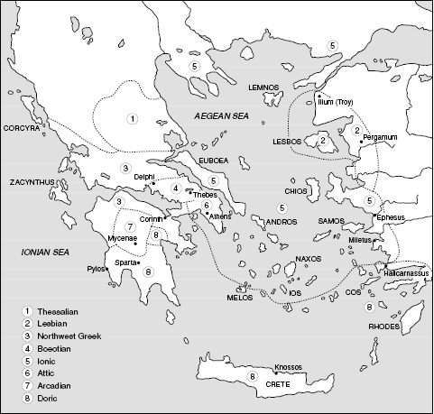
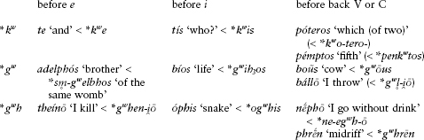
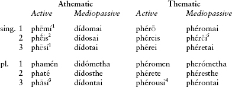
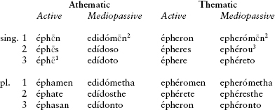
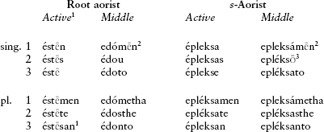
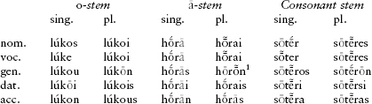
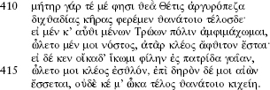

<!-- source-xhtml: 9781405188968_012.xhtml -->

# Chapter 12. Greek

## Introduction

**12.1.** It is a remarkable fact that Greek has remained Greek over its 3300-year written history. Throughout this time, its dialects never developed into mutually incomprehensible languages, and are at all times recognizably woven out of the same linguistic fabric.

We do not know when Greek (or pre-Greek) speakers first came to Greece nor what languages were spoken there before. Much has been written about the pre-Greek linguistic situation, most of it speculative and inconclusive. For example, it is usually claimed that a number of words containing an element *-nth-* come from a pre-Greek substrate language, such as *Kórinthos* ‘Corinth’, *labúrinthos* ‘labyrinth’, and *asáminthos* ‘bathtub’; but we can say nothing conclusive about such words or the language(s) they may have come from.

By the time we first meet Greek in written documents, in the second half of the second millennium <small>BC</small>, Greece and parts of the western coast of Asia Minor were already Greek-speaking. The earliest preserved Greek is written in **Mycenaean** (or Mycenean), the official dialect of the Mycenaean civilization. Mycenaean inscriptions are preserved on clay tablets and ceramic vessels found on the isle of Crete (primarily at Knossos) and the mainland (primarily at Pylos), always from Mycenaean royal cities. The dating of the Mycenaean tablets has been in flux for some decades, but it appears that the island inscriptions are older than the mainland ones, the oldest confirmed being the so-called Room of the Chariot Tablets from Knossos (c. 1400– 1350 <small>BC</small>); the Pylos tablets date to c. 1200 <small>BC</small>. Mycenaean is most closely related to Arcado-Cypriot (see below on the classification of the Greek dialects).

**12.2.** Mycenaean is written in a syllabic script called Linear B, whose decipherment was announced by Michael Ventris in 1952. It was developed from the earlier Linear A script, which was used to write the language of the Minoan civilization but remains undeciphered. The Linear B syllabary is poorly suited to writing Greek. It contains only signs representing single vowels or open syllables (consonant–vowel), does not distinguish between short and long vowels, between *r* and *l*, or usually between voiced, voiceless, or aspirated stops. Consonants at the ends of syllables are rarely written. Because most of the texts are inventories (lists of offerings, to cite a common type), our knowledge about the structure of this dialect is limited. Nonetheless, what we do have is extremely valuable, as the dialect is a full 500 years older than the next-oldest inscriptions of any length. Mycenaean is famous for preserving the inherited labiovelars as a distinct series of stops (transliterated with the letter *q*), unlike the later dialects (see §12.16), and it has many inflections, words, and phrases found otherwise only in the Homeric epics.

**12.3.** The period from the demise of Mycenaean civilization to the earliest appearance of alphabetic Greek in the eighth century <small>BC</small> has traditionally been called the “Greek Dark Ages.” During this time Greece plunged largely into illiteracy and stagnation; there was a drastic drop in population and much movement of refugees,and a unified Greek civilization no longer existed. Nonetheless, at least one inscription from the period is known, a skewer found in Cyprus with a name incised in the Cypriot syllabary (see below) and dated to about 1050 <small>BC</small>.

The cultural regionalism that began in the “Dark Ages” persisted for many centuries, and in no way is this better reflected than linguistically: the history of post-Mycenaean Greek is essentially the history of its local dialects, even well into the Classical period (480–323 <small>BC</small>). Not until the following age, the Hellenistic period, would Greece again become both culturally and linguistically unified.

**12.4.** The period from the appearance of the first alphabetic inscriptions, in the early eighth century <small>BC</small>, to 480 <small>BC</small> is termed the **Archaic period**. Near the beginning of this time is probably when the earliest known Greek literary works – the two surviving Greek epics, the *Iliad* and the *Odyssey* – reached their present form.The language of these poems, called **Epic** (or Homeric), is a literary mixture from a variety of different periods. Representing the culmination of a long oral-poetictradition stretching back into the dim past, the epics were not composed by a single person; the bard “Homer” was as remote and shadowy to the ancients as he is to us, and may well be a fiction. Rather, they were elaborated regionally by generations of illiterate poets until they were finally committed to writing perhaps around 700 <small>BC</small>. Aside from their status as two of the greatest works of literature ever composed in the Indo-European-speaking world, the *Iliad* and the *Odyssey* are of supreme importance for Indo-Europeanists because of their seemingly inexhaustible supply of archaic forms, phrases, and cultural material. Some phrases and turns of language in the epics date to before Mycenaean times, and scattered throughout are some inherited poetic formulae from PIE. We will discuss the study of these works in more detail in §§12.58ff.

Epic is also the language of the thirty-three so-called Homeric hymns, each addressed to a specific deity, and of the works of the first Greek author whose name we know, Hesiod (late eighth century <small>BC</small>). Some of the Homeric hymns contain important ancient material, but all of them were composed much later than the two epics.

Epic has at its base the dialect called **Ionic**, the variety of Greek spoken in Ionia (the coast of western Asia Minor), the island of Euboea, and the Cyclades islands in the Aegean Sea. Epic also contained, mixed in with Ionic, a substrate of **Aeolic** forms. Aeolic was a group of dialects spoken on the island of Lesbos and over the mainland Greek areas of Thessaly and Boeotia. Particularly prominent in other literature from the Archaic period is the Aeolic dialect of Lesbos, called **Lesbian**, in which was written the lyric poetry of such figures as Sappho, Alcaeus, and Stesichorus from the seventh and sixth centuries <small>BC</small>.

### *The Classical period*

**12.5.** Due to the cultural and political hegemony enjoyed by Athens in the fifth century <small>BC</small>, it was **Attic**, the dialect of Athens, that became the standard literary language during the **Classical period** (480–323 <small>BC</small>). Attic was closely related to Ionic, and the two form a group called **Attic-Ionic**. Early on Attic became the language of drama (essentially an Athenian creation), as represented by the tragedies of Aeschylus, Sophocles, and Euripides, and the comedies of Aristophanes. Soon it became used for prose as well, by historians like Thucydides and Xenophon; philosophers like Plato, Aristotle, Theophrastus, and Epicurus; orators like Isocrates and Demosthenes; and hundreds of other authors. But the earliest Greek prose, that of philosophers such as Heraclitus, was written in Ionic.

**12.6.** Attic-Ionic, the Aeolic dialects, and Mycenaean are all part of the **East Greek** dialect group, which includes also the non-literary dialects **Arcado-Cypriot** (or Arcado-Cyprian, consisting of Arcadian, spoken in the central Greek region of Arcadia, and the closely related Cypriot, spoken in the farther-flung island of Cyprus, and both closely akin to Mycenaean) and **Pamphylian** (from the southern Turkish coast; not a pure East Greek dialect, but a curious blend of Arcado-Cypriot, Aeolic, and Doric). The other group is **West Greek**, which contains dialects spoken generally to the south and west of East Greek: in the Peloponnese (Sparta), on many islands of the southern Aegean Sea, and in most of the Greek colonies in Sicily and Italy (where some of the oldest alphabetic Greek inscriptions hail from). Most of the West Greek dialects belong to the group called **Doric**. Doric was traditionally the language of lyric poetry (aside from Sappho and the others mentioned above) and of the choral lyric passages in drama. One of the most important lyric poets for IE studies is Pindar, who reworked and incorporated much ancient material in his compositions. All the non-literary dialects are attested in alphabetic inscriptions except Mycenaean and Cypriot; the latter is written in a syllabary derived from Linear A.

Although Attic became the literary norm and is the most familiar Greek dialect, the other dialects are often more important for Indo-Europeanists, for they preserve various features that were altered or lost in Attic. We will note examples of this where relevant in the pages to follow.

### *The Greek alphabet*

**12.7.** The early first millennium <small>BC</small> saw the rise of the Phoenicians, a people who originated in Lebanon but spread westward as highly successful maritime merchants. Their language belongs to the Semitic family and was closely related to Hebrew and Canaanite. They established outposts throughout the Mediterranean basin, the most famous of which was Carthage, and everywhere they went they brought not only goods for sale, but a far more precious item too – their alphabet. The Greek alphabet is an adaptation of the Phoenician alphabet, a historical fact that made its way into Greek folklore in the form of the alphabet’s legendary Phoenician inventor, Cadmus (< Phoenician **qadm* ‘east’). There are several versions of the early Greek alphabet, and where and when the Greeks first learned it from the Phoenicians is controversial. The oldest known examples of alphabetic Greek have been found in Euboea and Italy, and date from the early eighth century <small>BC</small>.

The regional Greek alphabets are mostly classifiable into an eastern and a western group. While a western alphabet used by Greek colonists in Italy is what gave rise to the Latin alphabet (see further §§13.1–2), it was a form of the eastern alphabet that won out in Greece itself, slowly displacing the others beginning in the fifth century <small>BC</small>.

**12.8.** Like the related alphabets of modern Hebrew and Arabic, the Phoenician alphabet only had letters for consonants; the crucial innovation on the part of the Greeks was to use certain letters solely for vowel sounds. The Greek vowel letters A E I O ϒ (upsilon) and (in the eastern alphabet) H (eta) are adaptations of Phoenician letters for consonant sounds that were not present in Greek. One inherited letter, digamma (F), represented *w* and is not part of the canonical Greek alphabet, since *w* was lost early from the eventually standard dialect of Attic-Ionic; but digamma is common in inscriptions in other dialects. The last four letters of the Greek alphabet, Φ Χ Ψ Ω (*phi, khi, psi, omega*, standing for *ph, kh, ps, ō*), are additions.

## From PIE to Greek

### *Greek and the other Indo-European languages*

**12.9.** As mentioned in §10.4, many have thought that Greek, Armenian, Indo-Iranian, and the poorly known Phrygian form a subgroup within Indo-European because of a number of mostly morphological features shared among them. Most of these features are shared between Greek and Indo-Iranian, but that may simply reflect the fact that these two branches are attested many centuries before the oldest Phrygian, and over a millennium before the oldest Armenian.

**12.10.** We may list some of the language’s most noteworthy features differentiating it from the other branches. Greek is characterized by a triple reflex of the vocalized laryngeals, the loss of most word-final consonants, the devoicing of the voiced aspirates, and special developments of **i̯*. In morphology, the middle and the passive voice were differentiated in the future and the aorist, an aorist passive morpheme *-(th)ē-* was created, and the locative plural ending **-su* was replaced with *-si*.

### *Phonology*

#### Greek phonological inventory

**12.11.** Attic Greek of the fifth century <small>BC</small> had the following consonant inventory. There were four series of stops: the voiceless stops *p t k*, the voiced stops *b d g*, the voiceless aspirated stops *pʰ tʰ kʰ* (usually transliterated *ph th kh*), and the voiced nasal stops *m n* and *ŋ* (the last only before a velar; pronounced like the *ng* of *sing* and written in Greek with a gamma, γ). There was also a voiceless sibilant *s*, and the voiceless glottal fricative *h*, which occurred word-initially and at the beginning of the second member of compounds. There were two liquids, *l* and *r*, the latter always aspirated or voiceless in word-initial position (see further §12.20); this was represented by the Romans as *rh-*, whence the spelling of such Greek-derived English words as *rhetoric* and *rhapsody*.

**12.12.** At the beginning of the Classical period, Attic Greek had five short vowels, phonetically [i e a o u], and seven long vowels, [iː eː aː oː uː εː ɔː], in addition to many diphthongs mentioned below. The two Greek long-vowel letters, H and Ω, stand for the long vowels [εː ɔː]. Long [eː oː] were written *ei* and *ou*, the so-called “spurious diphthongs”; these digraphs (combinations of two letters representing one sound) were also used to represent what had originally been true diphthongs [ei] and [ou] from PIE **ei* and **ou*. Greek still had plenty of other diphthongs to go around: *ai āi ēi oi ōi ui; au eu ēu ōu* (also *āu* outside Attic-Ionic); these also eventually developed into monophthongs.

During or before the early Classical period, perhaps as early as the sixth century, the high back vowel [u], short and long, became fronted to [y], as in French *une* or German *Brüder*. After this change, the long [oː] mentioned above developed further into [uː].

The complex early Classical vowel inventory was strongly reduced in the medieval period; see §§12.55ff. below.

### *Development of the PIE consonants into Greek*

#### Stops

**12.13.** Greek is a centum language (§3.8), merging the PIE palatals with the plain velars. It continues the PIE voiceless and plain voiced series of stops unchanged, but devoiced the voiced aspirates. After the changes to the labiovelars (§12.15 below), the language had the stops *p t k b d g ph th kh*. Though we think of *ph th kh* nowadays as the fricatives [f θ x], they were not pronounced as such until the early Christian era. Greek is the only language outside of Indic to preserve this series as aspirated stops.

**12.14.**Like Indic but independently, Greek shows the effects of **Grassmann’s Law**, or aspiration dissimilation (§10.30). In an original sequence of two aspirated stops separated by one or more segments (**Th . . . Th*), the first lost its aspiration. Thus a reduplicated present like **dhi-dheh₁-mi* (< **dhe-dheh₁-mi*; cf. §5.27) first became pre-Greek **thi-thē-mi* and then, by Grassmann’s Law, *títh2mi* ‘I place’.

**12.15.**Among the stops, only the labiovelars have a particularly complicated history, and their development was different from dialect to dialect. The Attic-Ionic outcomes, illustrated in the tabular overview below, are dentals before an *e* (as well as *i* in the case of **kʷ*), and labials before vowels and before most consonants.

**12.16.** Before the decipherment of Mycenaean, it had been assumed that the labiovelars were still intact in Proto-Greek (the common ancestor of the attested Greek dialects) even though none of the dialects then known actually preserved them as labiovelars. This assumption had been made because it was the easiest way to explain certain consonant alternations within the dialects (such as Attic ***t****éll-ō* ‘I accomplish’ ∼ *humno-pólos* ‘composing songs’) and certain sound corres-pondences between dialects (such as Attic ***t****ís* ‘who?’ = Thessalian ***k****ís*; Attic ***t****éssares* ‘four’ = Lesbian ***p****éssures*). Mycenaean proved this hypothesis correct: it still preserved the labiovelars intact, or at least preserved them systematically as something different from labials, dentals, or plain velars. In transliterations of Mycenaean, they are represented with the letter *q*, as in *qe-to-ro-po-pi* (= *kʷ etropopphi*) ‘with four-footed (chattels)’.

**12.17.** All non-nasal stops were lost word-finally except in unstressed words like the preposition *ek* ‘out of: **tod* ‘the, this’ (neuter) > *tó*, **ébheret* ‘he was carrying’ (imperfect) > *éphere, hupódra* ‘looking from underneath’ < **upo-dr̥k̑* (root **derk̑-* ‘see’).

#### Sibilant **s*

**12.18.** The sibilant **s* was generally preserved word-finally and next to stop consonants, as in *géno****s*** ‘kind’ and *káki****s****tos* ‘worst’. Elsewhere it became *h*, as in *heptá* ‘seven’ < **septṃ*. This *h* had a tendency to disappear: it was lost between vowels except in Mycenaean (so pre-Greek **skelesa* ‘legs’ became *skeleha* in Mycenaean, written *ke-re-a₂*, with *a₂* representing *ha*) and was lost word-initially before vowels in Ionic and some other dialects (a phenomenon called *psilosis*). The voiced variant **z* in PIE that occurred before a voiced stop (§3.12) stayed intact in the sequence *-zd-*, which is written in Greek with the single letter zeta (*ζ, z*), as in *hízō* (phonetically *hízdō*) ‘I set’ < **sizd- <*reduplicated **si-sd-*.

**12.19.** Initial clusters beginning with **s-* plus resonant or the glide **u̯-* lost the sibilant (again via an intermediate stage with *h-*), e.g. *niph-* ‘snow’ < **snigʷh-* (cp. Eng. *snow*), *lḗgō* ‘I abate’ < **sleh₁g-* (cp. Eng. *slack*). In the case of **sr-*, the aspiration remained, hence the spelling *rh-* (§12.11), as in *rhéō* ‘I flow’ < **sreu̯ō;* this is also seen in some dialect inscriptions in the case of the other liquid *l*, as in Argolic *lhabṓn* ‘having taken’ < earlier **slab-*. The erstwhile presence of the *s* is also indicated by instances in Homer where a phrase must scan as though the *s* were still there (though not written). In internal position, these clusters sometimes become a geminate resonant, as in Homeric *éllabon* ‘I took’ from earlier **e-slab-om* and Homeric *érree* ‘it was flowing’ < **e-sreu̯-et*.

#### Liquids and nasals

**12.20.** The liquids and nasals are preserved intact in Greek, except that final **-m* became *-n*, as in the imperfect 1st sing. *éphero****n*** ‘I was carrying’ < **ébhero****m***. The nasal **n* assimilated to the place of articulation of a following stop, as in *pé****m****ptos* ‘fifth’ < **pe****n****ptos < *pe****n****kʷtos* and *á****n****kūra* ‘anchor’, pronounced [aŋk-] and written with gamma (ἄγκῡρα).

**12.21.** By the historical period the **syllabic nasals** had lost their nasality and show up in most dialects simply as *a:* **pod-ṃ* ‘foot’ (accus. sing.) > *pód-****a****;* **ṇ-dhgʷhitom* ‘imperishable’ > ***á****-phthiton*. Likewise, the **syllabic liquids** developed an epenthetic vowel *a*, either before or after the liquid: **k̑r̥d-* ‘heart’ > *k****ar****díā* (also *k****ra****díē* in Homer); **pl̥th₂-u-* ‘broad’ > *p****la****tús*. Dialectally the epenthetic vowel was *o*, as in Cypriot *k****ór****za* ‘heart’. The syllabic liquids were thus still present in Common Greek, since the outcomes differ from dialect to dialect. There is also metrical evidence from the Homeric epics that **r̥* was still **r̥* at the time that certain formulaic phrases made their way into the epic repertory. For example, in the phrase *lipoũs’ androtē̃ta* *kaì hḗbēn* ‘leaving behind manhood and youth’, which describes the departing soul of the Greek warrior Patroclus when he is killed by the Trojan Hector (*Iliad* 16.857) and later the soul of Hector when the latter is killed by the avenging Achilles (*Iliad* 22.363), the first syllable of the noun *androtē̃ta* ‘manhood’ must scan as short, which makes sense only if this phrase was incorporated into epic language when the combining form of the word for ‘man’ was still **anr̥*- (syllabified *a.nr̥-*). These two deaths are at the very heart of the plot of the *Iliad*, so it would make sense that these phrases would belong to a very old layer of epic language.

The later development to *andro-* (via **anro-*) illustrates another change: between a liquid and a nasal, a voiced stop arose, *d* if the nasal was *n* and *b* if *m*. Compare also *a****mbr****osíā* ‘ambrosia’ < **amrotíā*, ultimately < **n̥-mr̥-t-* ‘undying’.

#### Glides

**12.22.** In traditional reconstructions before the laryngeal theory became widely accepted, it appeared that the glide **i̯* at the beginning of a word had two outcomes,*h-* (e.g. *hág-ios* ‘sacred’ from PIE **i̯ag̑-*, cp. Vedic *yájate* ‘worships’) or *z-* (e.g. *zugón* ‘yoke’ < PIE **i̯ugom*, cp. Eng. *yoke*). Nowadays the difference is attributed to the presence or absence of a preceding laryngeal, the standard account being that **Hi̯-* > *h-* (**i̯ag̑-* is nowadays usually reconstructed as **Hi̯ag̑-*) but *i̯- > *z-* (whencethe more “modern” reconstruction of **i̯ag̑-* as **Hi̯ag̑-*); but not all are agreed that this is the case. Word-internally, **i̯* disappeared, but had various effects on preceding consonants, on which see §12.26.

The glide **u̯*, was lost in standard Attic-Ionic, but in numerous other dialects it is preserved as *w* (digamma), as in Arcadian and Thessalian *woikos* ‘house’ (Attic-Ionic *oĩkos*; cp. Latin *uīcus* ‘homestead’). It also became *h-* before *r*, yielding (like **sr*, §12.19) the sound spelled *rh-*, e.g. *rhḗtōr* ‘public speaker’ < pre-Greek **u̯rē-tōr* (root **u̯erh₁*- ‘speak’). Although no digamma is used in the written transmission of the Homeric poems, the scansion of many lines demands that a *w* be read where it is etymologically expected. For historical purposes, Indo-Europeanists often cite Greek forms that once contained a digamma, or that are attested dialectally with one, with a parenthetical *w*, e.g. (*w)oĩda* ‘I know’, *é(w)idon* ‘I saw’.

#### Laryngeals

**12.23.** Although there is controversy concerning the details, Greek is of paramount importance for reconstructing the PIE laryngeals – arguably more important than any other language in the family. In the standard account, Greek uniquely has three distinct descendants (the “triple reflex”) of the three laryngeals when they were vocalized:vocalized **h₁* **h₂* **h₃* became *e a o*, as in the passive verbal adjectives *th****e****tós* ‘placed’ (**dh****h₁****-tó-*), *st****a****tós* ‘stood, made to stand’ (**st****h₂****-tó-*), and *d****o****tós* ‘given’ (**d****h₃****-tó-*).

**12.24.** These three outcomes are also found in word-initial position before consonants (usually resonants), as in ***a****nḗr* ‘man’ from ****h₂****nḗr*, ***é****rebos* ‘darkness’ < ****h₁****regʷ*-, and ***ó****phelos* ‘advantage’ < ****h₃****bhel-*. Until the advent of the laryngeal theory, the source of these initial vowels was not understood; they were simply labeled “prothetic vowels” – vowels tacked on. Much more limited vocalic reflexes of such laryngeals are found in Armenian and Phrygian (see §§16.21, 20.5).

**12.25.** Additionally, sequences of syllabic resonant plus laryngeal (the “long syllabic resonants”, §3.15) also have a triple reflex, depending on the laryngeal – another feature unique among the IE languages (though see §20.5): **g̑n̥****h₁****-tós* ‘born’ > *(-)g****n****ētos, *tl̥****h₂****-tós* ‘endured’ > Doric (*-)t****l****ātos, *g̑n̥****h₃****-tós* ‘known’ > (*-)g****n****ōtos*. Sometimes, the outcome is a disyllabic sequence *eRe, aRa, oRo*, as in *g****éne****sis* ‘birth’ < **g̑ń̥****h₁****-ti-* and *k****áma****tos* ‘toil’ < **k̑ḿ̥****h₂****-to-;* this was probably the outcome when the original sequence was accented, but the matter is disputed.

#### Consonant clusters

**12.26.** A few of the major sound changes affecting consonant clusters and somewhat obscuring the IE state of affairs may be briefly mentioned. Most complicated, but also probably most widespread, are the changes that happened in consonant clusters ending in the glide **i̯*, examples of which can be drawn abundantly from present stems of verbs formed with the suffix **-i̯e/o-* (see §§5.32-33) and feminine derivatives in **-i̯a* (< **-ih₂*, see §6.71). Selected examples of the outcomes in the Attic dialect are given below:

| Column 1 | Column 2 |
| --- | --- |
| pre-Greek | Greek |
| **kle**p**-i̯ō* | *klé**p**tō* ‘I steal’ |
| **k̑i̯-āmer-* | ***t**ḗmeron* ‘today’ |
| **phula**k**-i̯ō* | *phulá**tt**-ō* ‘I guard’ |
| ****d**i̯ēus* | ***Z**eús* ‘Zeus’ |
| **nigʷ-i̯ō* | *níz-ō* ‘I wash’ |
| ****t**i̯egʷ-o-* | *sébomai* ‘I worship’ |
| **me**dh**i̯os* | *mésos* ‘middle’ |
| **meli**t**-i̯a* | *méli**tta*** ‘honey-bee’ |
| **onomn̥**n**-i̯ō* | *onoma**ín**-ō* ‘I name’ |
| **leu̯n̥**n**-i̯a* | *léa**ina*** ‘lioness’ |

As a side-note concerning English etymology, the Ionic outcome corresponding to Attic *-tt-* was *-ss-*, and sometimes English has borrowed the Ionic form of a word rather than an Attic one, such as the name *Melissa* (‘honey-bee’, vs. Attic *mélitta* above). Sometimes English borrowed both, as in *glossary* (Ionic *glō̃ssa* ‘tongue’) but *polyglot* (Attic *glō̃tta*).

**12.27.**In East Greek, including Attic, the change of **t* to *s* happened not just before *i̯, but also before **i*, as in the **ti-*abstract nouns. These nouns all end in *-sis* in Greek, whence many English borrowings like *basis* and *prognosis* (Gk. *básis, prógnōsis* < PIE **gʷm̥-ti-*, *(*-)g̑n̥h₃-ti-*). This change is also seen in the 3rd pl. primary ending **-nti*, which became first **-nsi*; then the *n* disappeared, compensatorily lengthening the preceding vowel if there was one. Thus the thematic 3rd pl. active ending in Attic is *-ousi*, as in *phér-ousi* ‘they carry’ < **pher-onsi* < **pher-onti* (in Doric, the form is still *phéronti*).

**12.28.**The PIE clusters of two dentals (§3.36) became *st* in Greek, as in (*w)í****st****ōr* ‘judge’ < **u̯i****dt****ōr* ‘knower’ (of right and wrong).

### *Development of the PIE vowels into Greek*

**12.29.** Greek preserves the PIE vowels and diphthongs (including the long diphthongs) more faithfully than any other IE language. Because of this, ablaut is reflected particularly clearly, since the ablauting vowels *e* and *o* are kept distinct from one another (in contrast to Indo-Iranian), and *o* is distinct from *a* (in contrast to Germanic, Balto-Slavic, and most of Indo-Iranian and Anatolian).

The short vowels are preserved intact in such words as *t****í****s* ‘who?’ (**kʷ****i****s), p****é****nt****e*** ‘five’ (**p****e****nkʷ****e****), hāgios* ‘sacred’ (**Hi̯****a****g̑-), n****ó****st****o****s* ‘homecoming’ (**n****o****s-t****o****s*), and *gón****u*** ‘knee’ (**g̑on****u***). The long vowels (whether from original long vowels or from sequences of short vowel plus laryngeal) are preserved in such words as *īós* ‘poison’ (**u̯i̯s-o-* or **u̯iHs-o-), patḗr* ‘father’ (**ph₂tḗr*), Doric *hādús* ‘sweet’ (**su̯ādú- < *su̯eh₂du-), ōkús* ‘swift’ (**ōk̑ús*), and *ikhthū̃s* ‘fish’ (**g̑hdhūs* or **g̑hdhuHs*).

The one characteristic point on which Attic-Ionic innovated is in the treatment of **ā*, which frequently became *ē* in this dialect group (e.g. *mḗtēr* ‘mother’ vs. Doric *mā́tēr*). In Ionic this change happened across the board, while in Attic it did not affect **ā* after the sounds *e, i*, or *r* (hence Ionic *neēníēs* ‘young man’ and *hṓrē* ‘season’ but Attic *neāníās, hṓrā*).

#### Diphthongs

**12.30.** Both short and long diphthongs are faithfully preserved in Greek: **ei *ai *oi* in *l****eí****pō* ‘I leave’ (**l****ei****kʷ-), l****ai***(*w)ós* ‘left’ (**l****ai****u̯os*), and *lél****oi****pa* ‘I left’ (**le-l****oi****kʷ-);* and **eu *au *ou* in *rh****e****ũma* ‘stream’ (**sr****eu****-mn̥), h****a****ũos* ‘dry’ (**s****au****s-o-*), and *ak****o****uō* ‘I hear’ (**h₂k****ou****s-*). By the fifth century <small>BC,</small> the diphthongs *ei* and *ou* had been monophthongized to [eː] and [oː], long vowels that already existed in the language because they had arisen from certain vowel contractions and other changes. (The spellings *ei* and *ou* for [eː] and [oː] are therefore often called “spurious diphthongs,” as we saw in §12.12.)

Long diphthongs are continued in such forms as the dative singular of *o-*stems like *anthrṓp-ōi* ‘for the man’. Starting around the third century <small>BC,</small> however, the *i* in the long diphthongs *āi ēi ōi* ceased to be pronounced, whence the orthographic convention in Greek of placing the *i* underneath the long-vowel letter (ᾳ ῃ ῳ). This convention is not followed in all modern texts, and postdates Classical Greek.

#### The accent

**12.31.** Ancient Greek, like Vedic Sanskrit and some Balto-Slavic languages, had a mobile pitch-accent. (Modern Greek, though, has a stress-accent like English.) In most dialects the position of the accent was not usually predictable except in verbs.Judging by ancient descriptions, the accented syllable had higher pitch than unaccented syllables, and is ordinarily marked with an acute accent (*´*). Syllables containing long vowels and diphthongs could have the high pitch on either the first or the second half (technically called the mora) of the syllable; accent on the first morais denoted by a circumflex accent (˜). Thus *aí* is different from *aĩ*, the latter representing *ái* (high pitch on the first mora). Since Byzantine times it has been customary to write an acute accent on a final syllable as a grave (`) when another word follows: *theā́* ‘goddess’ but *theā̀ Thétis* ‘the goddess Thetis’. But there is no unambiguous evidence that the grave represents a different kind of accent from the acute.

**12.32.** A small handful of particles, pronouns, and short verb forms are clitic and do not receive an accent; however, if they occur in groups of two or more, then all but the last one receive an acute, as in the string *gar te me phēsi* becoming *gár té mé* *phēsi* in the Homeric text (§12.65) at the end of the chapter. Some of the rules for the accentuation of clitic chains are strongly reminiscent of the rules for verbal accentuation; it may be that verbs themselves were weakly stressed or unaccented in the prehistory of Greek. This would be paralleled by the weaker phonetic status of verbs in Vedic and elsewhere in IE (§5.63).

### *Morphology*

#### The verb

**12.33.** The morphology of the Greek verb is very close to that of Sanskrit and of reconstructed PIE. Verbs in Greek do not belong to “conjugations” as in a language like Latin (see §§13.12ff.); rather, for the old core of verbs, tense-stems are derived directly from roots. Greek has innovated chiefly by expanding the number of forms of the verb: it has a true future tense, and it has created a new passive, distinct from the middle, in the future and aorist. The Greek verb had up to six so-called principal parts or stems: the present (e.g. *gráphō* ‘I write’), a future (*grápsō* ‘I will write’), an aorist active or middle (active *égrapsa* ‘I wrote’), a perfect active (*gégrapha* ‘I have written’), a perfect mediopassive (*gégrammai* ‘I have written for myself, I have been written’), and an aorist passive (*egráphēn* or *egráphthēn* ‘I was written’). All tenses having secondary endings (imperfect, aorist, pluperfect) were prefixed with the augment *e-* in the indicative mood, although in Homer (and occasionally in other poets) this is sometimes lacking. Most of the time augmentless forms have no discernible difference in meaning from augmented ones.

**12.34.**Most IE present classes are still found in Greek, although the number of athematic verbs has been much reduced, with some types such as nasal-infix presents barely found. Two notable innovations in the present stems are the combination of reduplication with the suffix *-skō* (< **-sk̑e/o-*; e.g. *mi-mnḗ-skō* ‘I remind’) and the double nasal presents with both nasal infix and nasal suffix *-anō* (e.g. *li-m-p-ánō* ‘I leave’, Greek root *leip-*).

**12.35.The primary personal endings**. Primary active and middle endings in thematic and athematic verbs are exemplified below by the present indicative of the verbs *phēmí* ‘I say’, *dídomai* ‘I give (for myself), I am given’, *phérō* ‘I carry’, *phéromai* ‘I carry (for myself), I am carried’. Dual endings are not given.

_¹Doric preserves the original vowel in *phāmí*, *phātí*. ² Remade from **phēs*. ³ Doric *phantí*. ⁴Doric has *phéronti*. ⁵ Homeric has *phéreai*._

**12.36.** The primary active athematic endings are easily derivable from PIE (see §§5.12ff.) except for the 2nd sing. *-s*. The expected ending *-si* occurs only in dialectal *essí* ‘you are’ (and even here has been restored by analogy; cf. §3.37); else-where, the secondary ending *-s* seems to have infiltrated the primary paradigm. In the thematic conjugation, both the 2nd and 3rd singular are of uncertain origin; we would expect 2nd sing. **-ei* (< **-ehi* < **-e-si*) and 3rd sing. **-eti* (Attic **-esi*).

**12.37.**The primary middle endings show much more innovation than the active endings. To cite one example, the 1st sing. *-mai* is a refashioning of earlier **-ai* under the influence of the active ending *-mi*; this *-ai* in turn is a combination of the PIE 1st sing. middle ending *-*h₂e* (> **-a*) and primary active particle **-i* (§5.13), which in Greek and several other branches replaced the original primary middle marker **-r*. The 3rd person endings *-tai* and *-ntai* are a replacement of *-toi* and *-ntoi* (ultimately PIE **-(n)to* plus **-i*), which were still preserved in Mycenaean and Arcado-Cypriot (e.g. Arcado-Cypriot *keitoi* ‘lies’).

**12.38.The secondary personal endings.** Below is a chart illustrating the secondary endings, from the imperfect tenses of the verbs given previously: *éphēn* ‘I was saying’, *edidómēn* ‘I was giving (for myself), I was being given’, etc.

_¹ Doric *éphā*. ² Doric *edidómān, epherómān*. ³ Earlier **ephereo* < **ephereso*._

**12.39.**The secondary active endings are mostly the predicted outcomes from the corresponding endings in PIE, except for the 3rd pl. athematic ending *-san*, which has been taken over from the *s*-aorist (see below). The secondary mediopassive endings have been refashioned since PIE times, just like their primary counterparts.

**12.40.The perfect.** The perfect is fairly well preserved, although the old alternation between *o*-grade and zero-grade has mostly been leveled out in favor of the *o*-grade, except in some archaic forms found especially in Homer. In the verb (*w)oĩda* ‘I know’, historically a perfect without reduplication but thought of as a present in Greek, the IE ablaut relationships are still clear: singular (*w)oĩda (w)oĩstha (w)oĩde*, plural (*w)ídmen (w)íste (w)ísāsi* (Doric *ísanti*).

Greek also has three different pluperfect formations, none of which has a clear claim to being very ancient. A future perfect, formed to the perfect mediopassive stem, is also an innovation within Greek.

**12.41. The aorist.** Greek preserves all the PIE aorist categories. The thematic aorist in Greek, as in PIE, has the same endings as the imperfect, e.g. sing. *élip-on -es -e*, pl. *elíp-omen -ete -on*, the aorist of *leípō* ‘I leave’. The root and *s-*aorist deserve more attention; sample paradigms are reproduced below (*éstēn* ‘I stood’, *edómēn* ‘I gave (for myself)’, *épleksa* ‘I wove’, *epleksámēn* ‘I wove for myself’).

_¹ Doric has *ā* instead of *ē* and 3rd pl. *éstan*. ² Doric has *edómān, epleksámān*. ³ Earlier **epleksao* < **epleksaso*._

**12.42.** In the root aorist, the Doric 3rd plural is noteworthy in preserving the zero-grade of the root (Doric *éstan*, from **e-sth₂-nt*, with vocalized laryngeal). The *s*-aorist has undergone some remodeling since PIE times. The full grade has been generalized at the expense of the lengthened grade, and the *-a* that was the regular outcome of old 1st sing. **-m̥* and 3rd pl. *-*n̥t* spread to most of the other persons and numbers to become the characteristic vowel of this tense. The middle endings in the aorist are the ordinary secondary middle endings already discussed.

**12.43.**The **aorist passive** was usually formed with a suffix *-thē-* (e.g. *egráphthēn* ‘I was written’), but in several older verbs the suffix was just *-ē-*. Curiously it had active personal endings and the participle is formed with the historically active suffix *-nt-* (e.g. *graphthént-* ‘having been written’), and some archaic aorist passives such as *edáēn* ‘I learned’ and *ephánēn* ‘I appeared’ are not even passive in meaning. It is a descendant of the PIE stative in **-eh₁-* (§5.37).

**12.44.The future.** Most Greek futures are sigmatic, formed with a thematic suffix *-se/o-*: *lū́ō* ‘I release’ (present), *lū́sō* ‘I will release’ (future). The source of the Greek sigmatic future is controversial, but most likely continues one of the PIE desiderative formations in **-s-*, probably **-h₁se-* (§5.41). Greek has invented a future passive by adding this *-se/o-* to the (unaugmented) aorist passive stem: aorist passive *e-tḗmḗthē-n* ‘I was honored’, future passive *tīmēthḗ-somai* ‘I will be honored’. This is a fairly recent innovation; it is barely attested in Homer.

**12.45.The subjunctive and optative.** Greek has inherited the PIE subjunctive in both athematic and thematic verb stems, where it typically has modal force and not future force. Athematic stems in Homer still fairly commonly form “short-vowel” subjunctives that reflect the PIE subjunctive vowel **-e/o-*, as in Homeric *stḗ-o-men* ‘let us stand’ (aorist athematic stem *stē-*). In thematic stems, the contraction of the thematic vowel with the subjunctive vowel led to a subjunctive in long *-ō-* and *-ē-*, as in *phér-ō-men* ‘let us carry’ < **pher-o-o-men*.

The optative has also been inherited intact. The ablaut **-i̯eh₁-/*-ih₁-* is preserved in athematic forms like the present optative 1st sing. *eíēn* ‘may I be’ (**h₁s-(i̯eh₁-m*), 1st pl. *eĩmen* ‘may we be’ (**h₁s-ih₁-me-*), and the expected optative of thematic stems, **-o-ih₁-*, is continued by Greek *-oi-*, as in *phér-oi-men* ‘may we carry’.

**12.46. Imperative.** Greek has 2nd and 3rd person imperatives in the present, aorist,and perfect, in all voices. While several of these are new creations, the endings are mostly familiar from PIE. The athematic 2nd sing. **-dhi* is continued as *-thi* in a few athematic forms (e.g. *í-thi* ‘go!’), while the thematic is endingless (*phére* ‘carry!’).The 2nd pl. active ends in *-te* everywhere, as expected (*phérete* ‘carry!’).

**12.47. Infinitives and participles.** Infinitives and participles are very numerous in Greek, being formed from all the verb-stems. Greek active infinitives contain a suffix **-en*, **-men*, or **-ai*, sometimes in combinations like *-(e)nai* or *-menai*. In Attic, **-en* (probably < **-hen* < **-sen*) is found in thematic verbs, as in *phérein* ‘to carry’ < **pher-e-en* (cp. Mycenaean *e-re-e* ‘to row’ = *erehen*), while **-nai* is found in athematic verbs (*didó-nai* ‘to give’). These endings are mostly creations within Greek, as are the peculiarly abundant participles, of which ten are formally distinguished. Except for the perfect, the active participles have a stem in *-nt-*which is inherited from PIE (such as the present *gráphont-* ‘writing’ and aorist *grápsant-* ‘having written’), and except for the aorist passive, the middle and passiveparticiples have a stem in *-meno-*, likewise inherited (such as the present mediopassive *graphómenos* ‘being written’ and future middle *grapsómenos* ‘about to write for oneself’). The inherited perfect active participial stem **-u̯os-* has been refashioned to **-u̯ot-* (with a *-t-* of disputed origin) except in Mycenaean, which continues the older form as *-woh-* (e.g. *te-tu-ko-wo-a₂* = *tetukhwoha*, neuter pl. of the Mycenaean perfect participle of *teúkhō* ‘I fashion, craft’).

#### The noun

**12.48.** In contrast to the verb, which has gained a number of forms since PIE times, the number of Greek noun forms has shrunk somewhat. The nominative, vocative, accusative, and genitive are preserved intact. The function of the ablative has been taken over by the genitive (the two were not always distinct in PIE), though Mycenaean might still have a separate ablative. The case called the dative in Greek grammar combines the functions of the old dative, instrumental, and locative, and formally continues the PIE dative or locative in the singular (depending on the declension) and the instrumental or locative in the plural (depending on the declension and dialect; in Mycenaean the two are still distinct). A separate locative is still used for place-names and in some locational adverbs. An ending *-phi* (< PIE *-bhi-) is still productive in Myceanaean for the instrumental plural and occurs in Homer as well, where however it is indifferent to number (so *ĩphi* ‘with might’ sing. and *naũphi* ‘with ships’ pl.; compare the analogues in Vedic Sanskrit in §6.17).

**12.49.** The following are the paradigms for the nouns *lúkos* ‘wolf’, *hṓrā* ‘season’ and *sōtḗr* ‘savior’.

_¹ Homeric *hōrā́ōn*._

**12.50.**The *o*-stem singular endings directly continue the relevant PIE endings discussed in §§6.45ff. The nominative plural in *-oi* is taken over from the pronominal declension, as in several other branches (§6.53). The noun *hṓrā* was chosen above because it preserves PIE **ā*; in practice, though, most nouns of this declension have -*ē*- instead of -*ā*- in Attic-Ionic because of the change discussed in §12.29. The *o-*stem and *ā*-stem accusative plurals *-ous* and *-ās* arose by sound change from **-ons* and **-ans* (shortened from **-āns* by Osthoff’s Law, §3.41), endings that are preserved intact in Cretan (the Doric dialect of Crete). Note that the nasal in the feminine accus. pl. **-ans* is a Greek innovation, copied over from the *o-*stem ending **-ons*, since the original nasal was lost already in Indo-European (§6.70). (We know that the insertion of the nasal was already of Common Greek date, and not just a Cretan one, because **-ās* would have become **-ēs* in Attic-Ionic, not -*ās*.) Consonant-stem inflection is more straightforward than in PIE, since the endings no longer ablaut (though the stems sometimes do, e.g. *kúōn* ‘dog’, stem *kun*-; *patḗr* ‘father’, stem *patr-*). The dative singular ending *-i* is from the PIE locative, which ousted the original dative in *-ei*, which is still in Mycenaean (see the Mycenaean text sample in §12.66 for an example and further discussion).

**12.51.**Greek still preserves the dual. The nominative-accusative ending **-h₁e* is preserved intact in athematic nouns as *-e* (e.g. *pód-e* ‘both feet’); the thematic ending **-oh₁* is also faithfully preserved as *-ō* (e.g. *hípp-ō* ‘two horses’).

### *Syntax*

**12.52.** Because of its rich inflectional system, sentences in Greek, as in most other older IE languages, have many possible word orders. In poetry such as Pindar’s, this freedom is stretched to its limits, but even here some theoretically possible word orders are not found, showing that certain orders were probably not grammatical. In particular, the order of clitic particles was constrained, as in other languages like Vedic and Hittite. The number of these particles was large; they conveyed various shades of meaning and are often difficult or impossible to translate. These particles, together with certain unstressed pronouns and conjunctions, tend to be grouped together near the beginning of the sentence after the first fully stressed word by Wackernagel’s Law (§§8.22ff.). The rules of clitic placement, however, are not always that easy to divine, as they differ somewhat from author to author and dialect to dialect. In their essentials, though, their behavior is clearly comparable with clitic placement in Indo-Iranian, Celtic, and elsewhere.

**12.53.** A neuter plural subject takes a singular, and not a plural, verb, as in the phrase *tà zō̃ia* (pl.) *trékhei* (sing.) ‘the animals run’. This is also the case in Old Avestan and Hittite (cp. §6.68) and is an inherited feature.

## **Greek after the Classical Period**

### ***The Hellenistic period and the Koine***

**12.54.** Toward the middle of the first millennium <small>BC</small> the prestige of Greek language and culture was extending outside the confines of the local Greek city-states. Both had been carried to the shores of Italy by colonists starting in the eighth century <small>BC</small>, where they would soon exercise considerable influence over the Etruscans and other indigenous peoples. Of even greater importance for the fortunes of Greek was the adoption of Attic-Ionic by around the fifth century as the official language of the court in Macedon, a kingdom to the north of Greece. When Macedon’s power expanded in the fourth century under Philip II and his son Alexander III (the Great), Greek language and culture spread over an enormous area of the ancient world and ushered in the **Hellenistic period**, whose beginning is traditionally dated to the year of Alexander’s death in 323 <small>BC</small>. During this time, Greek was spoken as far south as Egypt and as far east as Bactria. A uniform and somewhat simplified variety of spoken Greek called **Koine** (short for *hē koinḕ diálektos*, ‘the common language’) established itself as the medium of communication. It was based mostly on Attic but had admixtures from Ionic and other non-Attic elements. As it became the standard administrative language, almost all the other Greek dialects died out, the one exception being the Doric dialect Laconian (living on nowadays as Tsakonian) and perhaps the Doric spoken by Greek settlers in Calabria (southern Italy), though this is controversial.

The Koine was used until around the reign of Justinian I in the sixth century <small>AD</small> it is the language of the Septuagint and the New Testament, and was used by some authors such as the historian Polybius and the philosopher Epictetus. But most writers after the first century <small>AD</small> reacted against it and returned to pure Attic, including such familiar figures as Plutarch, Galen, Euclid, and Ptolemy. Mention should also be made of Hesychius, an Alexandrian glossator who compiled a lexicon of rare words probably in the fifth century <small>AD</small>. His lexicon, while sometimes faulty, contains a prodigious number of dialectal forms and words from other languages that are only poorly known, and is of great value for Greek dialectology and IE studies.

**12.55. Characteristics of the Koine.** Most important for the later history of Greek were the changes that the Koine underwent in its phonology. First, the numerous distinctions among the vowels were reduced: *ei*, *ē*, and *i* all became pronounced [i]; *ai* and *e* merged as [*ε*]; and *oi* and *u* merged as [y] (pronounced *ü* as in German). Over time, distinctions in quantity were lost; and the pitch-accent was replaced with a stress-accent. The aspirated stops *ph th kh* became fricatives [f â x], and the voiced stops *b d g* became voiced fricatives [v ð ɣ]. In the morphology, the dual number and the optative mood were lost and the distinction between perfect and aorist was given up, with verbs retaining only one of the two past-tense stems (usually the aorist).

### *Byzantine Greek*

**12.56.** The purist reaction alluded to above resulted in the adoption of an artificial archaizing literary language based on Classical Attic. This continued to be used as an administrative and literary language in the Byzantine period (roughly from the reign of the emperor Justinian I in the sixth century <small>AD</small> to the fall of Constantinople in 1453). The gap between the written and spoken languages widened with time, and as the Byzantine empire disintegrated and educational standards declined, spoken usages infiltrated the written language in ever larger numbers. Spelling errors (among other evidence) indicate that the two high vowels [i] and [y] merged as [i]. Additionally the dative case was lost in nouns, and the infinitive began to be replaced with other constructions found also in other languages of the region, such as Bulgarian; see further §19.5.

### *Modern Greek*

**12.57.** Aside from Tsakonian in the eastern Peloponnese and perhaps the Greek dialects of southern Italy, the varieties of Modern Greek are all descended from the Koine. Following the establishment of the new Greek state after the yoke of Turkish rule was cast off in 1828, a new literary standard called the **Katharevusa** (‘purified’) was created that was purged of foreign elements and drew on Ancient Greek for both vocabulary and inflections. The variety of Greek spoken in the Peloponnese became the spoken standard, known as **Demotic**. In 1976, Demotic also replaced the Katharevusa as the written standard, although the two varieties had essentially merged by then anyway; the result of their convergence is often called Standard Modern Greek (*Koiní Neoellinikí*).

## The Philology of Homer and Its Pitfalls

**12.58.** Because of the importance of the Homeric poems for the historical study of both Greek and PIE, it is essential to have some knowledge of the difficultie speculiar to these texts. In particular, the epics contain forms that are artificial and consequently of little or no historical value for comparative linguistics. We will present a sampling below.

**12.59.** The Homeric poems in their present form represent the accumulated labor of many generations of bards from different parts of eastern Greece. The result was a mixture of forms from different dialects and from different chronological stages. Each poet drew on a repertory of inherited and memorized formulaic poetic language, but in composing the epics in performance would inject newer material of his own devising. Bards constantly adapted the poetic language, and to make the verses scan they would sometimes create forms that from a historical point of view are wrong.

As noted earlier, the dialect of the epics is Ionic, with admixture from Aeolic and Mycenaean. Alongside Ionic forms like *téssares* ‘four’ and *hēmeĩs* ‘we’ are found the Aeolic equivalents *písures* and *ámmes*. Aeolic and Ionic forms sometimes coexist in the same line, and there are even words that are artificial hodge-podges of morphemes from both Aeolic and Ionic, such as the dative plural *stḗthessin* ‘in (one’s) chest’, which has the Aeolic dative plural ending *-essi* plus an *-n* that many inflections have in Attic-Ionic.

**12.60.** Lines of Greek poetry were structured according to particular sequences of light (⏑) and heavy (–) syllables. A light syllable was one ending in a short vowel; all others counted as heavy. Syllable division ignored word-breaks; thus *ptolíethron épersen* ‘he sacked the city’ is syllabified *pto.li.eth.ro.ne.per.sen*. Heavy and light syllables are organized into basic units called feet, of which two occur in Homer: the dactyl (– ⏑ ⏑) and the spondee (– –). A line of Homeric poetry contains six feet, most of which can be either dactyls or spondees, whence the name of the meter, *dactylic hexameter*.

**12.61.** Discrepancies between how a particular Homeric line is written and how it scans are common. Often, this is due to modernized spelling, in which older forms that did scan were replaced with newer forms that do not. For example, the *o-*stem genitive singular ended in disyllabic *-oio* in its oldest Homeric form (< PIE **-osi̯o*) and monosyllabic *-ou* in later Attic-Ionic. But there was also an intermediate stage, namely disyllabic *-oo* (two short syllables), a form that is nowhere preserved in the written tradition but whose former presence in some passages is betrayed by a mismatch between the spelling and the meter. Thus *Odyssey* 10.60 contains the phrase *Aiólou klutà dṓmata* ‘famed dwellings of Aeolus’, where *Aiólou* cannot scan as written because it would form the sequence – ⏑ –, which is not allowed in the dactylic hexameter. But restoring the genitive ending *-oo* solves the problem: *Aióloo klutà* (syllabified again without regard to word-breaks: *ai.o.lo.ok.lu.ta*) yields two dactyls, – ⏑ ⏑ | – ⏑ ⏑.

**12.62.** The earlier presence of digamma (*w*) explains some other peculiarities. Normally in Greek poetry, a short vowel at the end of a word is elided (not pronounced) before a word beginning with a vowel; thus the sequence *me ō̃ka* in line 416 in §12.65 below is written (and read) *m’ ō̃ka*. There are many exceptions to this in Homer, but usually they are due to the earlier presence of a digamma that blocked elision. An example is the phrase *Hēphaístoio ánaktos* ‘of Hephaistos the king’, where if we restore the digamma that originally began the word for ‘king’, the irregularity disappears: (*)*Hēphaístoio wánaktos*.

**12.63.** A number of artificialities of the Epic language are due to so-called poetic “licenses.” Poetic licenses are conceived as the conscious bending of rules of phonology or grammar to make a word fit the meter. The bards presumably could not do this willy-nilly; they took advantage of pre-existing and naturally occurring variants and then extended the properties of those variants analogically. One famous such license in Homer is poetic lengthening, the lengthening typically of the initial syllable of a word that could not otherwise have fit the meter, e.g. *Āpóllōna* ‘Apollo’ (accus. sing., for *Apóllōna*).

**12.64.** Finally, the alphabet used in the earliest stages of the written transmission of the epics did not distinguish short from long *e* and *o*, and words were written together without a break. These facts led to numerous errors on the part of copyists, including the creation of ghost-forms. An example is the story of the two nearly identical Greek adjectives meaning ‘horrible, chilling’, *kruóeis* and *okruóeis*. Both are descendants of PIE **kreus-* ‘freeze’, but the *o-* of *okruóeis* has no obvious source. Philological examination of the Homeric passages containing the problematic form *okruóeis* reveals two interesting facts: first, the word preceding *okruóeis* is always an *o-*stem genitive singular ending in *-ou* (e.g. in the phrase *epidēmíou okruóentos* ‘of chilling civil [war]’); and second, this syllable must scan light to fit the meter, whereas normally (since it is a diphthong) it should scan heavy. Now, as just discussed above, the ending *-ou* is of somewhat recent vintage in Homer; it was earlier *-oo*, which is the ending we would expect to have been current at the time of the composition of much of the epics. If we combine the expected ending with the unproblematic form of the adjective, we would get the phrase *epidēmíoo kruóentos*, which happens to scan perfectly. For this scenario to work, all we need is an explanation for how *epidēmíoo kruóentos* became corrupted to *epidēmíou okruóentos*. The explanation is straightforward: since the earliest Greek texts were written without word-divisions, this would have been transmitted as *epidēmiookruoentos*, and later copyists who only knew the newer genitive singular ending *-ou* misparsed the sequence . . . *ookru* . . . , thinking that the second *o* was part of the following word and that the first *o* was meant to be the ending *-ou*. We conclude that there was originally just one adjective for ‘chilling’, *kruóeis;* the *o-* of *okruóeis* has no etymological significance, and the word entered Greek through a copyist’s error. (Some authorities believe that this sort of error could already have arisen during the preliterate, oral transmission of the text through singers’ misunderstandings rather than copyists’ errors.)

### *Homeric Greek text sample*

**12.65.** *Iliad* 9.410ff. Achilles describes his double fate.

410 mḗtēr gár té mé phēsi theā̀ Thétis argurópeza  

dikhthadías kē̃ras pherémen thanátoio télosde:  

ei mén k’ aũthi ménōn Trṓōn pólin amphimákhōmai,  

ṓleto mén moi nóstos, atàr kléos áphthiton éstai;  

ei dé ken oíkad’ híkōmi phílēn es patrída gaĩan,  

415 ṓletó moi kléos esthlón, epì dēròn dé moi aiṑn  

éssetai, oudé ké m’ ō̃ka télos thanátoio kikheíē.  

410 For my mother, the silver-footed goddess Thetis, says to me  

that (I) have a double fate towards the end of death.  

If, on the one hand, staying here I fight beside the city of the Trojans,  

my homecoming is lost, but I will have imperishable fame;  

on the other hand, if I go home to my beloved fatherland,  

415 noble fame is lost for me, but my life will be long,  

and the end of death would not come swiftly to me.  

**12.65a. Notes. 410. mḗtēr:** ‘mother’; Doric *mā́tēr*. **gár té mé:** string of clitics placed after the first stressed word in the sentence (cp. Anatolian, §9.13): *gar* = ‘for’ (explanatory particle); *te* = ‘and’ (PIE **kʷe*, also in Lat. *-que*, Skt. *ca*), connecting this sentence to the preceding and not translated here; and *me* is the accus. enclitic pronoun ‘me’, the subject of the following clause of indirect statement, where the main verb is an infinitive (cp. English *I consider <u>him to be</u> dishonest*). The pronoun has moved out of the clause of indirect statement and into the main clause (clitic raising). **phēsi:** ‘says’, clitic verb form; Doric *phātí*, PIE **bheh₂-ti*, cognate with Lat. *fā-tur* ‘speaks’. **theā̀:** ‘goddess’ (**dhh₁s-ā*); not related to Latin *dea* ‘goddess’, but rather to Lat. *fēstus* ‘holy, festal’ < **dheh₁s-* ‘sacred’ and *fānum* ‘temple’ < **dhh₁s-no-*.

**411–12. dikhthadías kē̃ras:** ‘double fates’, object of *pherémen* ‘to carry, have’, an Aeolic infinitive (Attic *phérein*). **thanátoio:** ‘of death’, with the archaic genit. *-oio* (§6.48). **télosde:** ‘to the end, to completion’; *-de* indicates place to which (also line 414, *oíkad(e)* ‘homewards’); it is probably related to Eng. *to*. **ei mén:** ‘if, on the one hand . . .’ **k’:** elided form of *ke*, a particle (variant *ken* line 414) used in certain conditional clauses; maybe related to Hittite *-kan*, Ved. *kám* (§7.29). **ménōn:** ‘remaining, staying’, pres. partic. (stem *ménont*), cognate with Lat. *maneō* ‘I remain’. **amphimákhōmai:** ‘I fight around, fight beside’, pres. subjunc. mid.; *amphi-* comes from **h₂m̥bhi-*, whence German *um* ‘around’, Old High German *umbi*, and the *om-* of Eng. *ombudsman* (a borrowing from Swedish).

**413–14. ṓleto:** ‘is lost’, 3rd sing. aorist middle of *óllumai* ‘am lost’. **moi:** ‘to/for me’, clitic dat. 1st sing. pronoun; dative of possession (‘my homecoming’) or dative of reference (‘as for me . . .’). **nóstos:** ‘homecoming’, a rare IE formation, with the **-to-*suffix added to the *o-*grade of the root (root **nes-* ‘arrive home safely’, also in Gk. *néomai* ‘I come home safely’ < **nesomai*, and the name *Nés-tōr*). **kléos áphthiton:** ‘imperishable fame’, directly from PIE **k̑leu̯os n̥dhgʷhitom* (see §2.37). This is its only occurrence in Homer. **éstai:** ‘will be’, shorter form of *éssetai* (line 416), future of the verb *es-* ‘be’, middle alongside the active present (cp. §5.6). **dé:** ‘but’, a particle functioning both as adversative and as sentence connector. **híkōmi:** ‘I come, arrive at’, pres. subjunc. In Attic the form would be *hī́kō;* the addition of the athematic 1st sing. ending *-mi* is a Homeric feature. **phílēn es patrída gaĩan:** ‘to (my) beloved fatherland’. The adjective (*phílēn*) has been moved out of the prepositional phrase, a common stylistic feature in the early IE languages (cp. Latin *magnā cum laude* ‘with great (*magnā*) praise’; recall §8.7).

**415–16. epì dēròn:** ‘for a long time’; *dērón* is from earlier **du̯āron*. The second syllable of *epí* scans long, which can only be explained if the cluster *du̯-* was still present at the time of the composition of this line or phrase (the syllabification being *e.pid.u̯ē.ron*). The adjective comes from **du̯eh₂-ro-*, whose zero-grade **duh₂-ro-* is seen in Lat. *dūrus* ‘enduring’. **aiṑn:** ‘life, lifetime’, borrowed into Eng. as *(a)eon;* ultimately < PIE **h₂oi̯u* ‘life, life-force’; see also next. **oudé:** ‘and . . . not, nor’, combination of *dé* (line 414) and the negative *ou* ‘not’, also ultimately < **h₂oi̯u* ‘life’ (see §7.25). **ō̃ka:** ‘swiftly’, related to the adjective *ōkús*, PIE **ōk̑ú-* (Ved. *āśú-* ‘swift’, Lat. *ōc-ior* ‘more swiftly’).

### *Mycenaean text sample*

**12.66.** One of the tablets found at Pylos, PY Ta 722, an inventory of vessels and furniture. “FOOTSTOOL” refers to a pictogram representing a footstool.

ta-ra-nu a-ja-me-no e-re-pa-te-jo a-to-ro-qo i-qo-qe po-ru-po-de-qe po-ni-ke-qe

FOOTSTOOL I

ta-ra-nu a-ja-me-no e-re-pa-te-jo ka-ra-a-pi re-wo-te-jo so-we-no-qe

FOOTSTOOL I

ta-ra-nu a-ja-me-no e-re-pa-te-ja-pi ka-ru-pi

FOOTSTOOL I

One footstool inlaid with (a picture of) a man, horse, octopus, and palm tree (?) in ivory. One footstool inlaid with ivory lions’ heads and grooves (?). One footstool inlaid with ivory nuts (?).

**12.66a. Notes. 1. ta-ra-nu:** *thrānus* ‘footstool’, otherwise only in Homer (*thrē̃nus*). **a-ja-me-no:** ‘inlaid’, mediopassive participle in *-menos* to an otherwise unknown verb. **e-re-pa-te-jo:** *elephanteiōi* ‘(made of) ivory’ (adj.), dat. sing. In the next line, *e-re-pa-te-jo* spells the dat. pl. *elephanteiois*. **a-to-ro-qo:** *anthrōqʷōi* ‘man’, dat. sing. The Myc. form shows that the *-p-* in the Classical form *ánthrōpos* comes from a labiovelar, but the source of this word is still disputed. **i-qo-qe:** *hiqqʷōi-qʷe* ‘and horse’, dat. sing.; Classical *híppōi te*. The Myc. spelling system is like Latin in showing that this conjunction (= Lat. *-que*) was enclitic and pronounced together with the preceding form as a single word. The *h* and the *i* of Gk. *híppos* are irregular and still unexplained: we would expect **ep(p)os* (PIE **ek̑u̯os*). **po-ru-po-de-qe:** *polupodei-qʷe* ‘and octopus’, dat. sing.; this and the following form are important in showing the inherited dat. sing. ending *-ei* (spelled *-e*), replaced in the rest of Greek (and in some Myc. texts) by the locative *-i*, except for trace survivals like the Cypriot name *Diwei-philos* ‘dear to Zeus’. The word for ‘octopus’ is Classical *polúpous* (*polúpod-*), lit. ‘many-footed’. **po-ni-ke-qe:** *phoinikei-qʷe*, either ‘and palm-tree’ or ‘and griffin’, Classical *phoĩniks*. There follows a pictogram of a footstool.

**2. ka-ra-a-pi:** *karāhaphi* ‘with heads’, instr. pl., with Myc. instr. pl. ending *-phi*, surviving in Homer as an instr. ending in both sing. and pl. The first *a* may or may not be real; compare the two Homeric stem forms *karēat-* and *krāat-*. The forms are ultimately from PIE **k̑r̥h₂-es* ‘head’ (> Ved. *śíras*). **re-wo-te-jo:** *lewonteiois* ‘(in the shape of) lions’ (adj.), dat. pl. modifying *elephanteiois*. **so-we-no-qe:** ‘and grooves’; probably the same word as Attic *sōlḗn* ‘pipe, groove’ < **sālwēn*.

**3. e-re-pa-te-ja-pi:** *elephanteiāphi*, fem. instr. pl. **ka-ru-pi:** disputed; it could be an instr. pl. of an otherwise unknown *u-*stem noun **karu-* ‘nut’ (cp. Classical *káruon* ‘nut’), or of an otherwise unknown **kalu-* ‘flower-bud’ (cp. Classical *káluks*). The inscription closes with a fourth line identical to the third.

### *Cretan text sample*

**12.67.** Excerpt (V 28–44) from the Gortynian law-code, fifth or sixth century <small>BC</small>. Cretan is a Doric dialect with several interesting archaic features.

Ai de k’ oi epiballontes oi men leiōnti datēththai ta krēmata, oi de mē, dikaksai ton dikastān epi toil leionsi datēththai ēmen ta krēmata tauta, prin ka dattontai. Ai de ka dikaksantos tō dikastā kartei enseiēi ē agēi ē perēi, deka statērans katastāsei kai tō krēios diplei. Tnātōn de kai karpō kai wēmās kanpidēmās kēpipolaiōn krēmatōn, ai ka mē leiōnti datē[ththai - - ton dikast]ān omnunta krīnai porti ta mōliomena.

![Figure 12.2: *Figure 12.2* Column V of the Gortynian law-code. Line 28 is the second full line of text after the second horizontal seam between two blocks of stone; our excerpt begins after a small space two-thirds through the line. It reads at first left-to-right and then switches direction every line (boustrophedon). The alphabet is among the most archaic of the Greek alphabets, having several letters close in shape to their Phoenician sources. Iota looks like an S, pi like a C, sigma like an M, and theta like a circle enclosing a cross; E and O are used for both short and long *e* and *o*. Drawing reproduced from Margarita Guarducci, *Inscriptiones Creticae opera et consilio Friderici Halbherr collectae*, IV: *Tituli Gortynii* (Rome: Libreria dello Stato, 1950), pp. 142–3 (foldout).](images/fortson-2010-indo-european-language-and-culture-fig12-2.jpg)

If some of the heirs at law want to divide the property but others do not, the judge shall decree that this property belongs to those wanting to divide it, until they divide it. And if, after the judge has made a judgment, anyone should rush in by force and either drive or carry off (anything), he shall pay ten staters and double the value. And concerning livestock and produce and clothing and ornaments and movable wealth, if they do not want to divide (it) . . . the judge swearing by oath shall decide with reference to the pleadings.

**12.67a. Notes** (selective). **First sentence. oi:** ‘the’, masc. nomin. pl., Attic *hoi*. Cretan has lost *h-*. **epiballontes:** ‘heirs at law’, literally ‘the ones devolving’, a telescoping of a longer expression like ‘the ones to whom the inheritance devolves’. **leiōnti:** ‘want’, 3rd pl. pres. subjunctive of a Doric verb *leíō* or *lō̃* ‘I want’, of unclear origin. Note retention of *-ti* in the ending (vs. Attic *-si* with loss of nasal, §12.27). **toil:** ‘the’, dat. pl., assimilated from *tois* to the initial *l-* of the following word (a Cretan, as well as a Homeric, feature). **leionsi:** ‘ones wanting’, dat. pl. pres. participle; note the retained cluster *-ns-*, characteristic of Cretan and some other Doric dialects. The dative is used to indicate possession. **datēththai:** ‘to divide’, pres. infinitive middle, with *-thth-* corresponding to *-sth-* in Attic-Ionic. **dattontai:** ‘they divide’, aor. subjunctive middle, with *-tt-* corresponding to Attic-Ionic *-s(s)-*.

**Second sentence. dikaksantos tō dikastā:** ‘with the judge having decided’, genitive absolute construction, corresponding to the ablative absolute in Latin. **kartei:** ‘with force’, Attic *krátei*. **statērans:** ‘staters’, a unit of currency, accus. pl., showing Cretan retention of *-ns*.

**Third sentence. tnātōn:** ‘livestock’, literally ‘things that can perish’, genit. pl.; cp. Attic *thnētós* ‘mortal’, and the phrase *zō̃ia pánta thnētà kaì phutá* ‘all living things that die and grow’, i.e. ‘all living things, animals and plants’, in Plato. **wēmās:** ‘clothing’, genit. sing., a neuter *n-*stem in the nomin.-accus. (*wēma* = Attic *heĩma*, from **u̯es-mn̥*), but the genit. sing. is from an ā-stem * *wēmā*. Compare Attic *gnō̃ma* ‘mark, token’ alongside *gnṓmē* ‘opinion’ (an ā-stem). The same is true of *anpidēmās* below. Note the preservation of initial *w-* in Cretan. **kanpidēmās kēpipolaiōn krēmatōn:** the first two *k*-’s are from elided *kai* ‘and’; *anpidēmās* (genit. sing.) would be Attic ** amphidēmēs*, literally ‘a thing that binds around’, and *epipolaiōn krēmatōn* is the Cretan equivalent (genit. pl.) of Attic *épipla* ‘utensils, movable property’.

**omnunta:** ‘swearing’, from *ómnūmi*, cognate with Ved. *ámīti* ‘swears’ < **h₃emh₃-*. **krīnai:** ‘to decide’, aor. infinitive, Attic verb *krī́nein;* root **krei-* ‘to sift’ as in Lat. *crībrum* ‘sieve’. **porti:** ‘towards, against, in reference to’, Homeric *protí*, Attic *prós* (< **proti̯*, the sandhi variant before a vowel); cp. Ved. *práti*. **mōliomena:** ‘pleadings’, pres. mediopassive participle of *mōliō* ‘I plead’, a verb known only from Cretan and one gloss in Hesychius.

## For Further Reading

The literature on the history of Greek is immense, and familiarity with the Greek alphabet is necessary for using any of it. The most exhaustive comparative grammar is Schwyzer 1939–71; more up-to-date, and the best recent historical grammar, is Rix 1992. In English one may consult Sihler 1995, the most recent combined Greek and Latin historical grammar; an earlier antecedent is the classic Meillet and Vendryes 1968. Two complete etymological dictionaries are available, one in French (Chantraine 1968–80) and one in German (Frisk 1960–72). The best overall description of the historical phonology of Greek is Lejeune 1972. A famous study of the pronunciation of Ancient Greek is Allen 1987, to which can now be added Devine and Stephens 1994, a fascinating if difficult work that attempts to reconstruct all levels of the prosodic phonology of Ancient Greek. Peters 1980 is a famous technical study of the history of the laryngeals in Greek. Useful for Indo-Europeanists is Risch 1974, a catalogue of Homeric forms arranged by formation and with historical commentary. Chantraine 1953–8 is indispensable for serious students of Homeric language, as are two exhaustive commentaries on the *Iliad* and *Odyssey* in English (Kirk et al. 1985–93 and Heubeck et al. 1988–92); the introductory essay to vol. 4 of Kirk 1985–93, by Richard Janko, contains a very useful overview of the study of Homeric diction, poetics, and textual transmission. For the dialects, Buck 1955 is still eminently useful, though it lacks Mycenaean and some of the interpretations have been superseded. A more recently edited selection can be found in Duhoux 1984. Schmitt 1977 contains short but useful summaries of the dialectal developments, including Mycenaean. The standard compendium on Mycenaean, written by the decipherers themselves and including a history of the decipherment, grammar, edition of the entire corpus then known, and vocabulary, is Ventris and Chadwick 1973.

## For Review

Know the meaning and significance of the following:

| Column 1 | Column 2 | Column 3 |
| --- | --- | --- |
| MycenaeanLinear B“Greek Dark Ages” | EpicPhoeniciansGrassmann’s Law | psilosistriple reflex of laryngealsKoine |

## Exercises

1. Discuss the fates of the following PIE sounds in Greek:

  - **a** *u̯

  - **b** **h₂*

  - **c** **kʷ*

  - **d** **s*

  - **e** **dh*

  - **f** *q

2. Using your knowledge of Greek sound laws, produce the Greek outcomes of the following PIE forms. Do not worry about accents or the Attic-Ionic change of *ā to *ē.

  - **a** **h₁le-h₁ludh-* ‘come’ (perfect stem)

  - **b** **deh₃-rom* ‘gift’

  - **c** **h₂u̯oideh₂* ‘song’

  - **d** **gʷelbhus* ‘womb’

  - **e** **tn̥tos* ‘stretched’

  - **f** **bhn̥g̑hus* ‘thick’

  - **g** **h₂u̯eh₁ti* ‘blows’

  - **h** **h₂i-h₂eus-oh₂* ‘I stay the night’

  - **i** **h₂enh₁mos* ‘wind’

  - **j** **bheidhoh₂* ‘I trust’

  - **k** **neu̯os* ‘new’

  - **l** *n̥*gʷēn* ‘gland’

3. Demonstrate that Grassmann’s Law in Greek was a separate change from Grassmann’s Law in Sanskrit.

4. Using the following three forms, formulate rules for the outcome of the PIE labiovelars in front of nasals: *ómma* ‘eye’ < **h₃okʷ-m*n̥, *amnós* ‘lamb’ < *agʷnos*, *ophnís* ‘plowshare’ < * u̯*ogʷh-ni-*.

- **5 a** The account given of Grassmann’s Law in §12.14 is not quite complete. Expand it to account for the fact that pre-Greek **si-sgh-*ō became Greek *ískh*ō ‘I hold’ and pre-Greek **songʷh*ā became Greek *omph*ḗ ‘voice’.

  - **b** Greek has a verb *ékh*ō ‘I have’, future *héks*ō. Given your answer to **5a**, and given the fact that the future of *gráph*ō ‘I write’ is *gráps*ō, reconstruct what the present and future of ‘have’ would have been before the advent of Greek sound changes.

  - **c** From the point of view of your expanded formulation of Grassmann’s Law, what is curious about the word *theós* ‘god’ < **dhh₁s-os*?

- **6 a** Given that PIE **su̯eh₂du-* ‘sweet’ became Gk. *hēdús*, PIE **su̯e* ‘himself, herself’ became Gk. *he*, and PIE **su̯ek̑uros* ‘father-in-law’ became *hekurós*, what was the outcome of PIE **su̯-* in Greek?

  - **b** The second syllable of the phrase *phíle hekuré* ‘dear father-in-law’ (*Iliad*3.172) scans long, which is unexpected for a short vowel in an open syllable. Provide a historical explanation for this scansion.

- **7 a** Mention was made in §12.30 of the so-called “spurious diphthongs.” Below are a number of examples of words containing the spurious diphthongs *ei* and *ou*. From this list, determine the sources of these diphthongs. The reconstructions are pre-Greek but not necessarily PIE. Ignore accents.

  - **esmi* ‘I am’ > *eimí*

  - **sems* ‘one’ (masc.) > *heĩs*

  - **tons* ‘the’ (masc. accus. pl.) > *toús*

  - **kten*i̯ō ‘I kill’ > *kteín*ō

  - **phther*i̯ō ‘I destroy’ > *phtheír*ō

  - **ors*ā ‘tail’ > *our*ā́

  - **kor*u̯ā ‘girl’ > *koúr*ē (Epic, Ionic)

  - **enems*m̥ ‘I doled out’ > *éneima*

  - **eders*m̥ ‘I flayed’ > *édeira*

  - **kseni̯os* > *kseĩnos* ‘guest’ (Epic, Ionic)

  - **ghesr-n̥s* ‘hands’ (accus. pl.) > *kheĩras*

  - **oru̯os* ‘boundary’ > *oũros* (Epic, Ionic)

  - **b** The verbal root **du̯ei-* ‘fear’ formed a perfect. What would the singular and plural perfect stems have been in PIE?

  - **c** In Homer, two perfect forms from this verb are 1st sing. *deídoika* (the *-k-* is a late addition) and 1st pl. *deídimen* (*-men* is the inflectional ending). Account for the first syllable *dei-*.

  - **d** Account for the vocalism of the first member of the compound *theou-dḗs* ‘fearing god’ (contrast *theo-trephḗs* ‘feeding the gods’).

8. In Homer, the thematic verb *hépomai* ‘I follow’ conjugates in the singular and plural of the present as follows: (singular) *hépomai hépeai hépetai*; (plural) *hepómetha hépesthe hépontai*. The root in PIE and pre-Greek was **sekʷ-*.

  - **a** According to Greek sound changes, what ought the 2nd and 3rd singular and the 2nd plural have been?

  - **b** Provide an explanation for the actually occurring forms of the 2nd and 3rd singular and the 2nd plural.

9. Below are several words or phrases from the Homeric epics and their metrical scansions, which are unexpected in one or more ways. For each phrase, indicate what is unexpected about the scansion and provide a historical explanation for it.

  - **a** *órea niphóenta* ‘snowy mountains’ (*Odyssey* 19.338; *órea* = ‘mountains’, *niphóenta* = ‘snowy’) scans ⏑ ⏑ – ⏑ ⏑ – ⏑

  - **b** *éban oĩkónde* ‘they went home’ (*Odyssey* 1.424; *éban* = ‘they went’) scans ⏑ – – – ⏑

  - **c** *es díphron árnas* ‘to the chariot lambs’ (*Iliad* 3.310) scans – – – – – (cp. lack of elision in *te arnō̃n* ‘and of the lambs’ at 4.158)

  - **d** *parékhēi* ‘provides’ (*Odyssey* 19.113) scans – ⏑ ⏑ (don’t worry about the last syllable; *par-* is a preverb meaning ‘by’; use your answer to **5b** to help you)

10. Provide a historical explanation of the form *-peza* ‘-footed’ in *argurópeza* ‘silver-footed’, at the end of line 410 of the excerpt from Homer in §12.65. (Hint: see §6.71.)

11. Account for the boldfaced consonant clusters in the following words by positing a sound change not mentioned in the chapter.

  - *a**ndr**ós* ‘man’ (genit. sing.; **h₂nr-ós*)

  - *á**mbr**otos* ‘immortal’ (earliest form **n̥-mr̥tos*, with dialectal change of *r̥ > *ro*)

12. The Greek thematic optative in the first person singular active ended in *-oimi* (e.g. *phér-oimi* ‘may I carry’). The Arcadian dialect has a different ending, as in *ekselaun-oia* ‘I would drive out’. Which of these endings, *-oimi* or *-oia*, is older from the IE point of view? Provide a historical explanation for both forms.

## PIE Vocabulary IV: The Body

**h₃ekʷ-* ‘<small>EYE</small> to see’: Lat. *oc-ulus*, OCS *oči* (dual)

**h₃bhrū-* ‘<small>BROW</small>’: Ved. *bhrū́-*, Gk. *ophrū̃s*

**h₂ous-, *h₂eus-* ‘<small>EAR</small>’: Gk. *oũs*, Lat. *auris*

**nas-* ‘<small>NOSE</small>’: Ved. *nas-*, Lat. *nāris*, OCS *nosŭ*

**dn̥g̑hū-* ‘<small>TONGUE</small>’: Lat. *lingua* (Archaic *dingua*), OIr. *teng*

**h₁dont-* ‘<small>TOOTH</small>’: Ved. *dant-*, Gk. *odṓn* (*odónt-*), Lat. *dēns* (*dent-*)

**g̑onu* ‘<small>KNEE</small>’: Ved. *jā́nu*, Gk. *gónu*, Lat. *genū*

**pod-, *ped-* ‘<small>FOOT</small>’: Ved. *pad-*, Gk. *poús* (*pod-*), Lat. *pēs* (*ped-*)

**k̑erd-* ‘<small>HEART</small>’: Hitt. *kard-*, Gk. *kardíā*, Lat. *cor* (*cord-*)

**esh₂r̥* ‘blood’: Hitt. *ēšhar*, Gk. *éar*, Latv. *asins*

**dak̑ru-* ‘<small>TEAR</small>’: Gk. *dákru*, Lat. *lacruma*

**h₂ost-* ‘bone’: Hitt. *ḫastāi-*, Gk. *ostéon*, Lat. *os*

**h₁org̑hi-* ‘testicle’: Av. *ərəzi-*, Arm. *orji-*, Gk. *órkhis*, Alb. *herdhe*

**ors-* ‘<small>ARSE</small>’: Hitt. *ārraš*, Gk. *ourā́* ‘tail’
