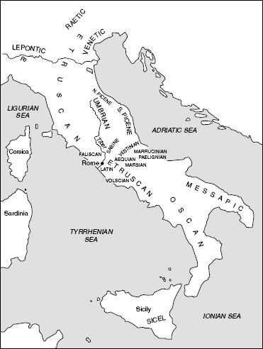
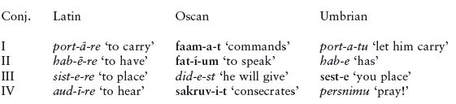
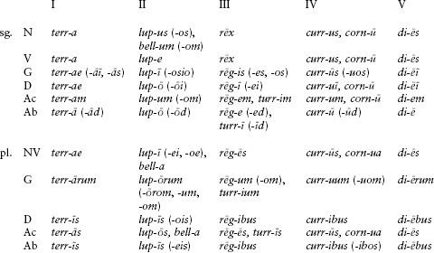
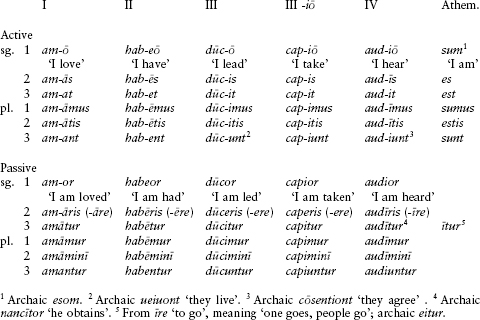
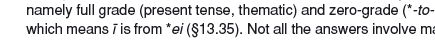

<!-- source-xhtml: 9781405188968_013.xhtml -->

# Chapter 13. Italic

## Introduction

**13.1.** The Italic languages comprise most of the ancient Indo-European languages of Italy, as well as the modern-day descendants of one of those languages, namely Latin. Though Latin was destined to outshine its more obscure sister languages, its origins were humble. A casual observer of the linguistic and cultural milieu of early first-millennium-<small>BC</small> Italy would not have been led to predict greater fortunes for it than for its neighboring relatives; it was just one of a number of minor local languages in the center of the Italian peninsula spoken by predominantly pastoral tribes living in small agricultural settlements.

The Italic peoples were not indigenous to Italy, but arrived from the north probably by 1000 <small>BC</small> and slowly worked their way southward. North and central Italy had earlier been settled by successive waves of immigrants from across the Alps, while the southern regions, including Sicily, were partly under different cultural influence, being in contact with Aegean peoples to the east at least as early as the Sicilian Copper Age (c. 2500–2000 <small>BC</small>). Archaeological evidence points to widespread cultural exchange throughout the region, making it all the more difficult to link the known Italic peoples of historical times with specific prehistoric cultures.

By the early eighth century <small>BC</small>, Greek colonists from Chalcis in Euboea (north-eastern Greece) had settled in Pithekoussai (modern Ischia, an island off the Italian coast by the Bay of Naples) and Cumae (on the coast near Naples), as well as other areas of the southern Italian coast and Sicily. These colonists brought a western Greek form of the alphabet with them (see §12.7), which soon spread rapidly into Italy. Alphabetic Greek inscriptions – among the oldest known – have been found on Italian soil dating to the eighth century <small>BC</small>, and the first inscriptions in the non-Greek languages of Italy appear around the same time or even slightly before. (One recently discovered inscription from Gabii, an ancient town near Rome, is already from c. 770 <small>BC</small> it reads *euoi*, and although the language is uncertain, it is the oldest piece of alphabetic writing yet discovered that has vowels.)

**13.2.** Early on the Greeks came into contact with the southernmost settlements of the **Etruscans**, an ancient people whose homeland, Etruria (modern Tuscany), was located in northwestern Italy, bordering on Latium (to its south) and Umbria (to its east). Their culture was the dominant one in Italy from about the eighth century <small>BC</small> on; by the sixth century, Etruscan settlements flourished along most of the length of the western part of the peninsula. From the Greeks the Etruscans picked up the alphabet and many other aspects of Greek culture. The Etruscans never developed a centralized state, but their impact on the fledgling civilization of the Romans was tremendous. Among other things, the Romans and many other peoples of Italy may have the Etruscans to thank for their knowledge of the alphabet. As Rome’s power grew, the culture of the Etruscans waned, disappearing by about 100 <small>BC</small>. Etruscan slowly died out as well over the course of the next one to two centuries; the first-century-<small>AD</small> emperor Claudius (died 54) is said to have written a dictionary of the language based on interviews with the last surviving speakers. But it may have continued to be used in religious rituals for some time after that.

The Etruscan language was not Italic, nor even Indo-European. Although there is no dearth of inscriptions (over 13,000 have been found), they are mostly short dedicatory or funeral inscriptions containing only proper names, and the few longer texts are not well understood. The origin of the Etruscans, in fact, has been contro-versial since ancient times, with one school claiming they came to Italy from Asia Minor and another claiming they were a pre-Indo-European people indigenous to Italy. On the one hand, the testimony of the Greek historian Herodotus (who claimed they came from Anatolia), certain cultural practices (such as divination by inspection of the liver of a sacrificial animal), the presence of some Anatolian loanwords in Etruscan, and some modern genetic studies support the theory of an origin from Asia Minor. On the other hand, there is no archaeological evidence of a migration, and Etruscan culture seems to grow organically from an earlier culture of north-central Italy called Villanovan. The existence of **Lemnian**, a language very similar to Etruscan and preserved on a stele and a few minor vase inscriptions on Lemnos (an island off the coast of Asia Minor) from the seventh or sixth century <small>BC</small>, does not settle the issue: it may have been simply the language of a group of colonists from Italy. Aside from Lemnian, the only relative of Etruscan is **Raetic**, a very similar language spoken in extreme northern Italy and neighboring areas.

**13.3.** Latin and the languages most closely related to it (of which only Faliscan is known) form the **Latino-Faliscan** branch of Italic and were spoken originally in a small region of west-central Italy south of Etruria. The languages comprising the other subbranch of Italic, **Sabellic** (also known as Osco-Umbrian), were spoken over a considerably larger area of central and later southern Italy. Given the significant differences between the two linguistic groups already in the sixth century <small>BC</small>, Italic linguistic unity probably ended at the close of the second millennium <small>BC</small>. Some scholars have given these differences even greater weight and reject the notion of a single Proto-Italic language; according to this opinion, Latino-Faliscan and Sabellic belong to two separate branches of IE that partially converged due to later mutual influence. But this is a controversial view, and we shall assume a Common Italic stage in all that follows.

**13.4.** The seventh century <small>bc</small> saw the first inscriptions in Latin, and by the end of the sixth century the alphabet had spread eastward through Italy to the other coast, where the Piceni lived (§13.75), and northeastward into the territory of the Veneti (see below). The Samnites (whose language we call Oscan) and the Umbrians probably had the alphabet at this point also, but our earliest records in these languages come a bit later. As is customary in the field of Italic philology, when citing forms from a non-Latin inscription in a local non-Latin alphabet, boldface will be used.

In the extreme northeast of Italy lived a people known in ancient times as the Veneti, along the northern and northwestern shores of the Adriatic Sea. Their language, **Venetic**, bears close affinities with Italic and may belong to it but is not known well enough for this to be certain. It is treated in chapter 20.

### *“Italo-Celtic”*

**13.5.** Italic shares several innovative features with Celtic, such as the *o-*stem genitive singular in *-ī (e.g., Lat. *uir-ī* ‘of a man’, Ogam Irish *maq(q)i* ‘of the son’), an innovated conglomerate superlative suffix **-is-m̥mo*- (as in Lat. *maximus* ‘greatest’ < **mag(i)samos* < **mag-is-m̥mo-*, Gaulish place-name *Ouxisamē* ‘highest’ < **ups-is-m̥mo*-, cp. Gk. *hups-ēlós* ‘high’), and a subjunctive morpheme *-ā- (as in Archaic Latin *fer-ā-t* ‘he may carry’, Old Irish *beraid* ‘he may carry’). These shared features have led many Indo-Europeanists to posit an “Italo-Celtic” subgroup or dialect area of Indo-European. However, the hypothesis of an Italo-Celtic unity has never gained universal approval.

## From PIE to Italic

### *Phonology*

**13.6. Stops.** Italic is a centum branch, and therefore the palatal stops and the plain velars fell together as plain velars, as in the word *centum* itself, Latin for ‘100’, from PIE **k̑m̥tom* (the *c* in the spelling of the word was pronounced *k* in pre-imperial Latin, still surviving today in Sardinian: see §13.49 below). The remaining PIE plain voiceless and voiced stops remained unchanged in Italic. The labiovelars have divergent developments in Latino-Faliscan and Sabellic (§§13.24 and 61).

The characteristic look of the Italic languages is due partly to the widespread presence of the voiceless fricative *f*, which is the most common reflex of the voiced aspirates across the family. This fricative also arose due to a variety of developments specific to individual Italic languages, especially involving *s* in certain consonant clusters, such as the change of initial **sr-* to *fr-* in Latin and the change of **ns* to *f* in some contexts in Sabellic.

**13.7.** Dental-plus-dental sequences in the parent language became **ss* in Italic, as in Lat. *fissus* ‘split’ < **bhid-to-*. The consonant cluster **-tl-* became **-kl-*, as in Osc. **puklum** (accus. sing.) ‘son’ < **putlo-* and Lat. *pōculum* ‘cup’ (earlier *pōclum*, which is how the word scans in early Latin poetry) < **pōtlom*. It is not infrequently claimed that the change **tl* > **kl* postdated the Common Italic period, the main piece of evidence being the Etruscan word *putlumza*, purportedly a borrowing of **pōtlom*, the prehistoric ancestor of Lat. *pōculum*. However, this is highly uncertain for various reasons (not the least being that the Etruscan word appears in a single early inscription whose interpretation is uncertain).

**13.8. Resonants.** The consonantal liquids, nasals, and glides remain unchanged: Osc. **anamúm** ‘breath’ (**h₂e**n**h₁**m**o-*), Lat. *a**l**te**r*** ‘the other’ (**a**l**-te**r**o-*), ***i**ugum* ‘yoke’ (**i̯ugom*), Umbr. ***u**iro* ‘men’ (**u̯ir-o-*). Syllabic liquids developed a prothetic *o* before them (*or ol*), whereas syllabic nasals developed an *e* (*em en*): Lat. *c**or**d-* ‘heart’ (**k̑r̥d-*), *m**ol**lis* ‘soft’ (**ml̥d-u̯i-*), *sept**em*** ‘seven’ (**septm̥*), *nōm**en*** ‘name’ (**h₁neh₃mn̥*). The outcome of syllabic nasals in word-initial syllables in Sabellic may have been different, however. According to a widely held view, the outcome there was *an* and *am*, as in Osc. **fangvam** (accus.) ‘tongue’ (cp. Lat. *lingua*, Archaic Lat. *dingua*, PIE **dn̥g̑hu-*) and Umbr. *ander* ‘between’ (cp. Lat. *inter*, PIE **n̥ter*). This view is not universally accepted, as the relevant forms have alternate explanations and it adds some unnecessary and unlikely complications to Italic historical phonology.

**13.9. Sibilants.** Proto-Italic appears to have preserved the sibilant **s* in most positions, but in the later histories of the daughter languages it was often subject to changes. Most famous among these was *rhotacism,* whereby *s* became voiced to *z* and then became *r* (see §§13.30, 13.68), which affected (to varying degrees) Latin, Umbrian, and Oscan. In consonant clusters, especially involving resonants, *s* tended to be unstable, especially in Latin; see §13.31.

**13.10. Laryngeals.** The laryngeals were lost in their non-vocalized form, but the vocalized laryngeals are preserved as *a*, as in Lat. *st**a**tus* ‘stood’ (**st**h₂**-to*-), *d**a**tus* ‘given’ (**d**h₃**-to-*), and Osc. **anamúm** ‘breath’ (**h₂en**h₁**mo-*; in Lat. *anima* ‘breath’ the internal vowel weakened to *-i-* as per §13.32). The outcome of syllabic resonant plus laryngeal (the “long” syllabic resonants) was *R*ā or *aRa*, the latter probably when under the accent: Lat. *(g)**n**ātus* ‘born’ (**g̑n̥**h₁**-tó*-), *st**r**ātus* ‘strewn’ (**str̥**h₃**-tó*-), and *p**al**ma* ‘palm’ from earlier **p**ala**ma* (**pĺ̥**h₂**-meh₂*, cp. Gk. *palámē*).

**13.11. Vowels.** Except for **eu*, which fell together with **ou*, the vowels and diphthongs were all preserved intact and are kept most faithfully in Oscan. In Latin, they subsequently underwent significant modification; see §§13.32ff. The mobile pitch-accent of PIE (§§3.30ff.) was replaced by a stress-accent on the first syllable of the word in Italic. This situation still obtained in early Latin, but was later replaced by the classical stress pattern (see §13.36 below).

### *Verbal morphology*

**13.12.** Of considerable interest are the substantial innovations in the verbal system, which will be described here at some length, with certain details left for later. Broadly, Italic reorganized (1) the PIE present formations into a neat system of four conjugations, each characterized by a particular stem-vowel to which the personal endings were added; and (2) the PIE tense-aspect system into one based on the aspectual opposition between imperfective and perfective, with each of these having a future and a past tense.

#### The four conjugations

**13.13.** With few exceptions, all Italic verbs belong to one of four classes or conjugations characterized by the stem-vowels ā, ē, *e*, and ī. Compare:

The rise of the conjugational system was due almost entirely to sound change. (All the examples in the following discussion are taken from Latin.) The first conjugation stem-vowel *-ā-* comes primarily from contraction of the sequence **-ā-i̯e-*, which itself comes from various sources: denominative verbs from ā-stem nouns and adjectives (e.g. *cūrā-re* ‘to take care’ from *cūra* ‘care’), factitive verbs from *o-*stems (e.g. *nouā-re* ‘to make new’ < **neu̯-eh₂-i̯e-*, cp. Hitt. *new-aḫḫ-*), and **-i̯e/o*-presents from other types of verbs (e.g. *tonā-re* ‘to thunder’ < **(s)tonh₂-i̯e-*).

The second conjugation stem-vowel *-ē-* comes from the contraction of the causative suffix **-éi̯e-* (§5.35, e.g. *mon-ē-re* ‘warn’ < **mon-éi̯e-*, literally ‘cause to think’) and from the stative suffix **-eh₁-i̯e-* (§5.37, e.g. *alb-ē-re* ‘to be white’ and *sed-ē-re* ‘to be sitting’).

The third conjugation consists mostly of old thematic presents of various kinds (e.g. *ag-e-re* ‘to drive, do’ < **h₂eg̑-e-*; *bib-e-re* ‘to drink’ < **pi-ph₃-e-*; *albēsc-e-re* ‘to grow white’ < **albh-eh₁-sk̑e-*), as well as a number of originally athematic presents that later became thematized, such as *find-e-re* ‘split’ < **bhi-n-d-*.

Presents formed with the suffix **-i̯e/o-* added directly to the root have a more complicated history than the other kinds of **-i̯e/o*-presents treated above. Such presents wound up in the fourth conjugation if the root they were added to was heavy, that is, ended in a consonant cluster, had a long vowel or diphthong, or consisted of two syllables (e.g. *sanc-ī-re* ‘to ratify’ < **sank-i̯e-*, *sepel-ī-re* ‘to bury’ < **sepel-i̯e-*). Otherwise they fell into a special class of the third conjugation that will be treated in §13.39 below, such as *fug-e-re* ‘flee’ < **bhug-i̯e-*.

The rest of the fourth conjugation consists of denominatives from both *i-*stems and *o-*stems (the first e.g. in *moll-ī-re* ‘to soften’ < *mollis* ‘soft’; the second e.g. in *seru-ī-re* ‘be a servant (to), serve’ < *seruus* ‘slave’).

**13.14.** Very few athematic verbs still inflect athematically in Italic; relics include the Latin verbs *es-se* ‘to be’, *ī-re* ‘to go’, and *uel-le* ‘to want’.

#### The Italic tense-aspect system

**13.15.** The Italic tense-aspect system was based on an opposition between imperfective and perfective, each having a future and a past tense. The basic imperfective tense was the present (Lat. *portō* ‘I carry, am carrying’), whose corresponding past tense was the imperfect (*portābam* ‘I was carrying, used to carry’) and whose future was the ordinary future (*portābō* ‘I will carry’). The basic perfective tense was the perfect (*portāuī* ‘I carried, have carried’), whose past tense was the pluperfect (*portāueram* ‘I had carried’) and whose future was the future perfect (*portāuerō* ‘I shall have carried’). Each of these tenses except the two futures was also fitted out with a subjunctive.

#### The imperfect and future

**13.16.** The PIE imperfect was lost without a trace in Italic. A suffixal morpheme **-f-*, an Italic invention derived from the PIE root **bhuH-* ‘be, become’, was used to form the imperfect and (in Latino-Faliscan only) the future. The imperfect used the stem **-fā-*, while the future used the stem **-fe-* (probably from an old subjunctive **bhu(H)-e-*; see directly below): Lat. imperfect *port-ā-bat* ‘he was carrying’, Umbr. **fu-fans** ‘they were’; Lat. future *port-ā-bit* ‘he will carry’, Fal. *care-fo* ‘I will do without’. The future is also formed (in Sabellic exclusively, and in Latin vestigially) with the suffix *-s-*, e.g. Archaic Lat. *fax-ō* ‘I will do’ (**fak-s-*), Osc. *dide-s-t* ‘he will give’, Umbr. **prupeha-s-t** ‘he will purify before’. This is a continuation of one of the PIE future or desiderative formations in **-s-* (§§5.39ff.). Finally, the old PIE subjunctive, where it survives, became a future in Italic: for example, the PIE thematic verb **h₂eg̑-e-* ‘drive’ formed a subjunctive with stem **h₂eg̑-e-e-*, which became the future stem *ag-ē-* ‘will drive’ of the Latin verb *agere* ‘to drive’. Note also the future *erit* ‘he will be’ (Archaic Lat. *esed*) from the athematic subjunctive **h₁es-e-* (cp. Ved. *ásati*).

The Italic imperfect in **-fā-*, as well as forms like the Latin imperfect stem *erā-* ‘was’, attest to the presence of a formation known as the ā-preterite. Its origins are unclear, though it has been compared to scattered past-tense forms elsewhere in the family that have a stem in *-ā-*, such as Doric Greek *erruā* ‘it flowed’ and Old Church Slavonic aorists like *sŭpa-* ‘slept’.

#### The perfect system

**13.17.** The Italic perfect is a conglomeration of the IE perfect and aorist. All the Italic languages have a reduplicated perfect (Lat. *dedit* ‘he gave’, Fal. *peparai* ‘I gave birth to’, Osc. perfect subjunctive *fefacid* ‘he might make’, Umbr. *dede* ‘he gave’), a non-reduplicated or de-reduplicated perfect (Osc. (**kúm**-)**bened** ‘agreed’, Umbr. *benust* ‘will have come’, Lat. *tulī* ‘I brought’), and a long-vowel perfect (Lat. *ēgit* ‘he drove, did’, Osc. *hipid* ‘had’ [< **hēb-*], Umbr. (**pru-**)**sikurent** ‘they will have announced’). The old stative meaning of the perfect is still visible in such forms as Lat. *meminī* ‘I remember’ (PIE **me-mon-*), but as a rule the Italic perfect is a past tense.

**13.18.** The pluperfect and future perfect were both formed with a morpheme **-s-*. The pluperfect, attested only in Latin, can be exemplified by Lat. *fu-eram* ‘I had been’ from earlier **fu-isam*. The future perfect, which happens to be particularly well attested in Sabellic, can be exemplified by Lat. *fu-erit* (< earlier **fu-iset*) ‘he will have been’ and Osc. *fefacust* ‘he will have done’.

#### The subjunctive

**13.19.** The Italic subjunctive is not a continuation of the PIE subjunctive, which became a future (see above). There are at least three subjunctive morphemes found in Italic, of which one continues the PIE athematic optative and the other two are of unknown origin. Their distribution is complex and need not be entered into here in detail; a few examples will suffice. The PIE optative morpheme is seen, with ablaut still intact, in Archaic Lat. *siēs* ‘may you be’ (**h₁s-i̯eh₁-s*), pl. *sītis* ‘may you [pl.] be’ (**h₁s-ih₁-te-*); but the zero-grade *-ī-* was generalized elsewhere. The so-called ā-subjunctive, also found in Celtic, is seen for example in the Lat. pres. subj. *habe-ā-s* ‘(that) you have’ and the Osc. pres. subj. **pútí-a-d** ‘(that) he be able’. Finally, the ē-subjunctive, which has no sure analogues outside Italic, is seen for example in the Lat. imperfect subj. *es-sē-s* ‘you would be’ and the Umbr. perfect subj. *herii-ei* ‘he should want’.

#### Personal endings

**13.20.** The old distinction between primary and secondary personal endings has traces in the third person, such as in Faliscan *fifiqod* ‘they fashioned’, with *-od* from secondary **-ont* and not primary **-onti*. The dual has disappeared. Like Anatolian, Tocharian, and Celtic, Italic generalized PIE **-r* as the marker of the mediopassive (called simply the passive in Italic linguistics). Some verbs, such as *sequor* ‘I follow’, inflected only in the passive, and are called “deponent” in traditional Latin grammar; these are often the descendants of PIE middle verbs (see §5.5).

#### Participles and infinitives

**13.21.** The IE present active participle in **-nt-* is well preserved, as in Lat. *port-ant-* ‘carrying’, but only traces are found of the mediopassive participle in **-m(h₁)no-* (such as *alumnus* ‘nursling, foster-son’, literally ‘one [being] nurtured’). The PIE infinitive in **-dhi̯-* (§5.58) is found in Sabellic (see below §13.64). The other Italic active infinitives, *-se* in Latin (e.g. *es-se* ‘to be’) and **-om* in Sabellic (e.g. Umbr. *er-om* ‘to be’), descend from nominal formations and are not ancient. The Italic perfect passive participle in **-to-*, such as Lat. *cap-tus* ‘taken’ and Umbr. *uirseto* ‘seen’ (< **u̯id-ē-to-*), directly continues the PIE verbal adjective in **-tó-* (§5.61). Italic also created a future passive participle or gerundive in **-nd-*, of unclear origin: Lat. *dēlendus* ‘(about) to be destroyed’, Osc. **úpsannam** ‘to be done’.

### *Nominal morphology*

**13.22.** All the PIE nominal stem-classes are preserved in Italic, including even traces of the archaic *r/n-*stems (§6.31), as in Lat. *femur* ‘thigh’, stem *femin-*, and Umbrian **utur** ‘water’, stem *un-* (< **utn*-). The Latino-Faliscan and Sabellic branches differ in certain details of nominal inflection, but as an aggregate they show that Italic inherited the PIE case-endings with little change. The instrumental had been lost by the historical period (though examples still survive in adverbial use, such as Lat. *bene* ‘well’) and its functions taken over by the ablative. The functions of the locative, too, were mostly taken over by the ablative, though it still survives as a productive separate case in place-names and certain nouns, e.g. Lat. *Rōmae* ‘in Rome’, *rūrī* ‘in the country’, Osc. **mefiaí víaí** ‘in the middle of the road’. The final dental of the *o-*stem ablative singular ending **-ōt* (§6.49) spread to the ablative of all the declensions: Osc. *toutad* ‘by the people’, Archaic Lat. *magistrātūd* ‘with the office of a magistrate’. There is no dual.

**13.23.** As noted above, a peculiarity that Latino-Faliscan *o-*stem nouns share with Venetic, Messapic, and Celtic is a genitive singular ending *-ī (e.g. Lat. *uir-ī* ‘of a man’, Fal. *Marci* ‘of Marcus’), which is of uncertain origin. Alongside this, however, the more familiar genitive in **-osi̯o* was inherited as well, but preserved only in proper names, as in Archaic Latin *Popliosio Valesiosio* ‘of Publius Valerius’ and Faliscan *Kaisiosio* ‘of Kaisios’. Neither occurs in Sabellic.

## Latino-Faliscan

**13.24.** The Latino-Faliscan subbranch of Italic comprised Latin and Faliscan. In the mid-first millennium <small>BC</small> they were neighboring languages in a small area of west-central Italy. Because of the few remains in Faliscan, Latin is usually our only witness for Latino-Faliscan innovations. One difference between Latino-Faliscan and Sabellic that is immediately diagnostic is the divergent treatment of the labiovelars: they became labial stops in Sabellic (**kʷ* > *p*, **gʷ* > *b*) but not in Latino-Faliscan (**kʷ* remained, and **gʷ* > u̯). Thus for instance **kʷe* ‘and’ became Latin *-que* and Faliscan *-cue*, but Osc. *-pe*. See also §13.61.

## Latin

**13.25.** Latin derives its name from Latium, a region of west-central Italy cut through by the lower part of the river Tiber as it flows westward to the Tyrrhenian Sea. One of the tribes in this area, around the Alban Hills, were the Latini, who eventually became dominant in central Italy and beyond.

The period of Latin from the earliest inscriptions to about the mid-second century <small>BC</small> is called **Archaic Latin** (also Old Latin). Some scholars use the term **Very Old Latin** for the language’s first remains, which are found in scattered inscriptions dating from the last quarter of the seventh century <small>BC</small> to the fifth century <small>BC</small>. Inscriptions become relatively copious only in the third century <small>BC</small>, a century that also marks the beginning of preserved Latin literature. The earliest surviving literary fragments come from Livius Andronicus (born c. 284 <small>BC</small>); he is traditionally credited with being the first to set the Latin language to Greek meters. About two generations later came the comic playwright Plautus (254?–184? <small>BC</small>), the first author whose works survive in considerable quantity; his plays are followed by those of Terence (c. 195–159 <small>BC</small>). Also important for this time are such poets as Ennius, Accius, and Lucilius; of their works we unfortunately possess only single lines or short passages quoted by later writers. Latin prose begins with Cato the Elder (234–149 <small>BC</small>), whose book on agriculture, *Dē Agrī Cultūrā*, is of immense value for historians of Latin language, culture, and religion.

**13.26.** The Archaic period was followed by the period of **Classical Latin**, traditionally divided into the Golden and Silver Ages. The Golden Age, lasting until the death of the poet Ovid in <small>AD</small> 17, saw for example the orations and other works of Cicero; the military commentaries of Caesar; the histories of Livy; and the poetry of Lucretius, Catullus, Horace, and Vergil. The Silver Age, dating until the death of the emperor Marcus Aurelius in 180, contains such literature as the tragedies and philosophical writings of Seneca; the novel *Satyricon* of Petronius; the *Natural History* of Pliny the Elder; the satires of Juvenal; and the histories of Tacitus and Suetonius. After this period came **Late Latin**, during which a large amount of early Christian literature was written, as by St. Augustine and St. Jerome.

Mention should be made here of the lexicographer Sextus Pompeius Festus, who lived and wrote sometime between <small>AD</small> 100 and 400. His *On the Meaning of Words* is an enormously important dictionary of archaic words and forms, containing a wealth of information also on older Roman legal and religious practice. It survives only in fragments, but we also have an abridged version of the whole work made by the eighth-century Lombard historian Paul the Deacon.

During this time the colloquial Latin spoken throughout the Empire, known as **Vulgar Latin**, was beginning to develop into the different dialects that would later become the Romance languages. See §§13.44ff. below.

### *Phonological developments of Latin*

#### Consonants

**13.27.** The main hallmark of Latin consonantism that sets it apart from its sister Italic languages, including the closely related Faliscan, is the outcome of the PIE voiced aspirates in word-internal position. In the other Italic dialects, these simply show up written as *f*. In Latin, that is the usual outcome word-initially, but word-internally the outcome is typically a voiced stop, as in *ne**b**ula* ‘cloud’ < **ne**bh**-oleh₂*, *me**d**ius* ‘middle’ < **me**dh**ii̯o-*, *an**g**ustus* ‘narrow’ < **ang̑**h**os-*, and *nin**gu**it* ‘it snows’ < **sni-n-**gʷh**-eti*. The details of these developments are left as an exercise at the end of this chapter.

**13.28.** Among the other changes to affect stops may be mentioned the loss of word-final *-d* after long vowels, as in the Classical Latin *o-*stem ablative sing. -ō from earlier *-ōd* (cp. Archaic *Gnaiuōd* ‘from Gnaeus’). Also, as noted in §13.24, PIE **gʷ* became the glide u̯, as in *ueniō* ‘I come’ < **gʷem-i̯ō*.

**13.29. Consonant clusters.** Among the many changes to consonant clusters, a few of special interest will be briefly mentioned. Voiced stops were lost before *i̯ or assimilated to it, as in the name of the god Jupiter, *Iūpiter*, stem *Iou-*, from **di̯eu̯-* (Archaic genitive sing. *Diouos* ‘of Jove’) and in the comparative *maior* ‘greater’ (really *maiior*, with a geminate glide from the consonant cluster of earlier **magi̯os-*). The similar cluster **du̯* became *b* at the beginning of a word, as in *bellum* ‘war’ (Archaic and poetic *duellum*), and u̯ word-internally, as in *suāuis* ‘sweet’ < **su̯ādu̯is*.

**13.30. Rhotacism and other changes to *s*.** Latin famously changed the sibilant *s* to *r* between vowels, a change known as *rhotacism*. Thus *mūs* ‘mouse’ has the plural *mūrēs* (< **mūs-ēs*), *genus* ‘kind, race’ (**genos*) has the plural *genera* (**genesa*), and the infinitive *-se* of *es-se* ‘to be’ appears as *-re* in vowel-stem verbs such as *amā-re* ‘to love’ and *dūce-re* ‘to lead’. This change happened during the historical period; early inscriptions still have intervocalic *s* (e.g. Archaic *iouesat* ‘swears’, Classical *iūrat*). Cicero noted in a letter that a certain Papirius Crassus officially changed the spelling of his name from Papisius in 339 <small>BC</small>, so the change probably happened not long before then.

**13.31.** In many other environments, especially next to a resonant, **s* assimilated, disappeared, or was changed to another sound. It disappeared in words beginning **sm-*, **sn-*, and **sl-*, as in *mīrus* ‘wonderful’ < **smei-ro-* (contrast Eng. *smile* < **smei-l-*), *nix* (stem *niu-*) ‘snow’ < **snigʷh*- (contrast Eng. *snow*, Russ. *sneg*), and *laxus* ‘slack’ < **slag-so-* < **slh₁g*- (contrast Eng. *slack*). The group **sr* became *fr* word-initially (as in *frīgus* ‘chill’ < **srīg*-) but *br* word-internally (as in *cōn-sobr-īnus* ‘cousin’ < *-*su̯esr*-, zero-grade of **su̯esōr* ‘sister’). In clusters where the liquid was first and the *s* second, the *s* assimilated to the liquid, a well-known example being *terra* ‘land, earth’ from **tersā*, root **ters-* ‘dry’. Originally the word was simply the adjective ‘dry’, metonymically transferred to the ground – an example of what is called a *transferred epithet*.

Mention may also be made of the voiced allophone **z* in consonant clusters: in Latin this disappeared with compensatory lengthening of the preceding vowel, as in *nīdus* ‘nest’ < **nizdos*.

#### Vowels

**13.32.** As stated above, Italic transformed the mobile accent system of PIE into a system characterized by stress on initial syllables. In Latin, this resulted in the weakening of vowels in non-initial syllables. The rules are rather complex, but in general terms a short vowel in an open syllable was weakened eventually to *i*. Thus compare ***a**mīcus* ‘friend’ with *in**i**mīcus* ‘enemy’, *l**e**gō* ‘I choose’ with *coll**i**gō* ‘I collect’, and *l**o**cus* ‘place’ with *īl**i**cō* ‘on the spot, right away’. In closed syllables, *a* was weakened to *e*, as in *aff**e**ctus* ‘affected’ beside *f**a**ctus* ‘done’, *in**e**ptus* ‘inept’ beside ***a**ptus* ‘apt’, while *o* was weakened to *u*, as in *on**u**stus* ‘burdensome’ from **on**o**s* ‘burden’ (Classical *onus*). In final syllables, the same rules usually apply, as in *artif**e**x* ‘craftsman’ from **arti-f**a**k-s* (from the bases *art-* ‘skill’ and *fac-* ‘make, do’) and *seru**u**s* ‘slave’ from earlier (Archaic) *seru**o**s*; but before *-s* and *-t*, *e* weakened to *i*, as in *leg**i**s* ‘you (sing.) lead’ and *leg**i**t* ‘he leads’ from **leg**e**s* and **leg**e**t* (with the thematic vowel **-e-*). In inscriptions from the Archaic period, many of these vowel weakenings had not yet happened.

**13.33.** Among some of the many other changes to vowels, two more may also be mentioned. An original *o* became *u* before final consonants: contrast Archaic Latin *mal**o**s* ‘bad’ (nomin. sing.) with Classical *mal**u**s*, and Archaic *seru**o**m* ‘slave’ (accus. sing.) with *seru**u**m*. An old *e* before nasals usually became raised to *i*, as in the preposition ***i**n* ‘in’ from older ***e**n* (preserved in inscriptions). The opposite change *i* > *e* happened before **z* from rhotacized *s*: genit. sing. *cineris* ‘of ash’ < **kinizes* < **kinises* (compare nomin. sing. *cinis*).

**13.34. Long vowels and diphthongs.** Long vowels were shortened in the late Archaic period in final syllables before any consonant except *s*. Thus contrast the 2nd sing. subjunctive *dūcās* ‘[that] you carry’ with the 1st and 3rd singulars *dūcam* and *dūcat*.

**13.35.** Several of the old diphthongs were monophthongized to long vowels in Latin; those that survived were *ai* (spelled *ae* after the Archaic period), *au*, and in some cases, *oi* (spelled *oe*). The diphthong *ei* became ī (as in the dative ending of *patr-ī* ‘for the father’, cp. Archaic *Castorei* ‘for Castor’), while *oi* became either ī (e.g. in the ablative pl. of *o-*stems, e.g. Classical *meīs sociīs* ‘with my companions’ but Archaic *meois sokiois*) or ū (as in *ūnus* ‘one’, Archaic accus. sing. *oino*[*m*]); it also sometimes remained unchanged, as in *foedus* ‘treaty’ and *moenia* ‘walls’. PIE **eu* fell together with **ou* in Italic (§13.11), and **ou* later became ū, as in *ūrere* ‘to burn’ (**h₁eus-e-*) and *iūmenta* ‘teams (of oxen)’ < Archaic *iouxmenta*.

**13.36. Stress.** The vowel weakenings in non-initial syllables discussed above indicate that the stress in early Latin was still on the first syllable, as in Italic (§13.11). In Classical Latin, however, the stress fell on the antepenult (third-to-last syllable) unless the following syllable was heavy. Thus *ánima* ‘breath’, *amā́bitur* ‘he will be loved’, and *adipīscíminī* ‘you (pl.) are approaching’ were all stressed on the antepenult, while *deā́rum* ‘of goddesses’, *amābúntur* ‘they will be loved’, and *adipī́scor* ‘I approach’ were stressed on the penult. Latin borrowings into English are often stressed according to these rules.

### *Morphological developments of Latin*

Latin morphology differs little from the picture outlined above for Common Italic. We may mention a few details.

#### Nouns

**13.37.** Traditional Latin grammar divides nouns into five declensions. The first continues the PIE ā-stems and consists mostly of feminines. The second continues the *o-*stems, and consists mostly of masculines and neuters. The third continues the consonant stems as well as the *i-*stems, while the *u-*stems become the Latin fourth declension. The fifth declension is not an inherited type, but a medley of various formations that, due to sound change, all came to have a stem in *-ē-*. The five declensions may all be illustrated by the paradigms given below of the nouns *terra* ‘land’, *lupus* ‘wolf’, *bellum* ‘war’ (neuter; given where different from *lupus*), *rēx* ‘king’ (and for *i-*stem forms, *turris* ‘tower’, where different), *currus* ‘chariot’ (and neuter *cornū* ‘horn’), and *diēs* ‘day’. Endings that are Archaic or poetic are given in parentheses:

**13.38.** A few remarks may be appended. In the first declension, the genitive singular ending *-ās* (as in the fixed phrase *pater familiā**s*** ‘head of a household’) is the oldest; the Classical ending *-ae* (< earlier -āī) comes from the spread of the genitive -ī of the second declension (this ending also spread to the fifth, whence -ēī). In the second declension, the original *o-*stem nominative plural **-ōs* was replaced by the pronominal nomin. pl. in **-oi*, as happened in a number of other IE languages too (§6.53). Two genitive plurals in the *o-*stems are found, an older (in Classical times, poetic) one in *-um* (earlier *-om*), and a longer one in *-ōrum*, formed by analogy to *-ārum* in the first declension (itself from **-āsōm*). In the third declension, noteworthy is the presence of genitive singulars in **-es* (which became the standard *-is*) as well as **-os* (as in Greek; limited to a few inscriptional attestations). The older ablatives all ended in *-d* (as per §13.22).

A locative case is still found vestigially in the first three declensions: *Rōm-ae* ‘in Rome’, *dom-ī* ‘at home’, *rūr-ī* ‘in the country’.

#### Verbs

**13.39.** The Latin verbal system is the same as that described above for Italic (§§13.13ff.). The paradigms below will illustrate the active and passive forms in the present tense; the verbs are *amāre* ‘to love’ (first conjugation), *habēre* ‘to have’ (second), *dūcere* ‘to lead’ (third), *capere* ‘to take’ (third *-iō*), *audīre* ‘to hear’ (fourth), and *esse* ‘to be’ (athematic). Archaic or poetic forms are indicated in parentheses and in the notes.

The verbs like *capere* are descended from **-i̯e/o*-presents where the suffix **-i̯e/o*- followed a light root (see §13.13); they take regular 3rd-conjugation endings except in the 1st person sing. and the 3rd pl. The 2nd sing. passive ending in *-re* is the older form, continuing **-se*; the regular Classical ending *-ris* is an example of double marking, since it ends with an added 2nd sing. active ending *-s*. The 3rd person endings in *-t* and *-nt* continue the PIE primary endings **-ti* and **-nti*.

#### The perfect

**13.40.** Several of the types of perfect stems still resist straightforward historical explanation. Probably the most important of these is the so-called *v-*perfect, exemplified by such forms as *portāu-ī* ‘I carried’, *nēu-ī* ‘I sewed’, and *audīu-ī* ‘I heard’. It might be connected with the *-u* in Sanskrit perfects like Ved. *dadáu* ‘I/he gave’ (root *dā-*), *tastháu* ‘I stood’ (root *sthā-*), but this is controversial. It is also possible the *-u-* got its start on Italic soil, generalized from forms like *fuī* ‘I was’. Not found in Sabellic (perhaps by accident) are perfects that continue *s-*aorists, such as *uēxī* ‘I conveyed’ (< **u̯ēg̑h-s-*; §5.47).

**13.41.** The endings of the perfect are still recognizably descended from the PIE perfect endings, being conspicuously different from the regular active and passive endings, as illustrated by the paradigm of *gnōu-ī* ‘I have learned, I know’ (Archaic or poetic forms given in parentheses):

| Column 1 | Column 2 |
| --- | --- |
| Singular | Plural |
| 1 *gnōu-ī* (-*ei*) | *gnōu-imus* |
| 2 *gnōu-istī* (-*istei*) | *gnōu-istis* |
| 3 *gnōu-it* (-*et*, -*eit*) | *gnōu-ērunt* (*-ēre*, -*ērai*) |

One can see lurking under these the PIE endings **-h₂e* (> **-a*), **-(s)th₂e* (> **-sta*), *-*e* in the singular, all extended by the primary active particle **-i* (§5.13), and an altered version of the 3rd plural ending **-ēr* (extended by the non-perfect 3rd pl. ending *-unt* in the familiar Classical ending *-ērunt*).

### *The later history of Latin*

#### Vulgar Latin

**13.42.** Most of the Latin that has come down to us consists of literature in an elevated style. A few works, such as the comedies of Plautus, the novel *Satyricon* of Petronius, and some letters of Cicero, contain colloquial language, and many inscriptions reflect the spoken idiom of the day. The spoken form of Latin, especially from about the third century <small>AD</small> on, is called **Vulgar Latin** (*uulgāris* ‘pertaining to the common people’) and forms the basis of the modern Romance languages (§§13.44ff.).

Among the more extensive remains of early Vulgar Latin are the citations of “incorrect” forms collected in a work called the *Appendix Probī*, long thought to have been written in the fourth century but probably dating from the sixth. It is preserved as an appendix attached to a manuscript of a grammatical treatise by the first-century grammarian Valerius Probus. The *Appendix* consists of lists of words in their correct Classical spellings followed by their incorrect counterparts, such as *speculum non speclum* (indicating that *speculum* and not *speclum* is the correct spelling of the word for ‘mirror’). The *Appendix*’s efforts were all in vain, for the “incorrect” spellings reflect pronunciations and forms that would all win out in the Romance languages. Thus for example the form *speclum* (and not *speculum*) is the ancestor of Italian *specchio* ‘mirror’.

#### Developments of Vulgar Latin

**13.43.** Unstressed vowels in internal syllables were often syncopated (lost), as in *speclum* just discussed. The distinction in length between long and short vowels was lost, but in an interestingly skewed fashion in most areas. Though long and short *a* fell together as one might expect, short *i* fell together with long ē as a tense [e], and their back counterparts (short *u* and long ō) fell together as tense [o]. Latin short *e* and *o* became lax [ε] and [ɔ], while the two long high vowels ī and ū became [i] and [u]. The general pattern of the mergers can be exemplified by the following words in Spanish: contrast ***e**l* ‘the’ (Lat. ***i**lle*) and *v**e**ndo* ‘I buy’ (Lat. *uēndō*) with *s**ie**te* ‘seven’ (Lat. *s**e**ptem*), and contrast *b**o**ca* ‘mouth’ (Lat. *b**u**cca*) and ***o**lla* ‘pot’ (Lat. *ōlla*) with *p**ue**rta* ‘door’ (Lat. *p**o**rta*). Since Oscan shows some of the same mergers of the mid and high vowels, it has been speculated that these changes in Vulgar Latin pronunciation started in southern Italy and spread from there. Most diphthongs became monophthongized: the diphthong *oe*, for example, became *e*, as in Italian *pena* ‘sorrow’ from Lat. *poena* ‘punishment’. In most areas where Vulgar Latin was spoken, the velars became palatalized before front vowels, for example turning into [tˢ] (spelled *c*) in Old Spanish *ciento* and Old French *cent* ‘hundred’ and [č] in Italian *cento* (all from Lat. *centum*).

There were also many changes in morphology. The number of cases in the noun was reduced, with prepositional phrases often taking over their functions: if one gave something ‘to the king’, one said *ad regem* rather than the dative *regī*. In most areas (except Romania; see §13.51 below) only two cases, the nominative and accusative, survived in nouns, and by the time the Romance languages are first attested this distinction too had been lost (except in Old French and Old Provençal, where it persisted until the later Middle Ages). In pronouns, though, some case distinctions have been maintained everywhere to the present day. (The general development mirrors that from Old to Middle English; see §15.65.) Verbs did not go through as much formal reduction as nouns did, but periphrastic constructions (that is, constructions using “helping” verbs, as in English *I have seen*) became quite common. Typical of these were the compound perfect tense consisting of *habēre* ‘to have’ plus the past participle (e.g. French *j’ai chanté* ‘I have sung’ < *ego habeō cantātum*) and the compound future tense consisting of an infinitive plus *habēre* (e.g. French *chanterai* and Spanish *cantaré* ‘I will sing’ < *cantōre habeō*).

### *The Romance languages*

**13.44.** The fragmentation of the Roman Empire in the fifth century and the incursion of non-Latin-speaking peoples into former Roman territories created excellent conditions for the differentiation of Vulgar Latin (itself not uniform to begin with) into local dialects that became more and more distinct over time. Their modern descendants are the **Romance languages** (from Vulgar Latin **romanicus* ‘Roman’, i.e. vernacular). Though they form a basically unbroken continuum from the Iberian peninsula to the Balkans, it is convenient to organize them into the branches that are given below.

No texts in any of the vernacular descendants of Vulgar Latin survive from before the ninth century, and it is possible that none were written down before then. The language of administration and the Church was always Latin, and only when the vernaculars had diverged so much from Latin that ordinary people could no longer understand it did the need arise to use the vernaculars in writing and in the Church.

#### Gallo-Romance

**13.45.** The earliest Romance language to be attested is **French**, a northern variety of which first appears in writing in the Strasbourg Oaths in or around the year 842. It is surely no accident that this is the first Romance language to have been written down, as it had diverged more strongly from Latin than the other varieties closer to Italy. Literary remains of French remain meager, however, until the twelfth century. The language is known as **Old French** until the early 1400s.

The part of Europe that is now called France had several varieties of Romance, collectively termed Gallo-Romance. In central France, especially around Paris, was spoken a variety that would become the dominant dialect already in the twelfth and thirteenth centuries and which developed into modern standard French. In the far north was **Norman French**, which spread to England following its conquest in 1066 by William the Bastard (as he is called in contemporaneous official documents, but now more familiar as “the Conqueror”). The Norman French that developed in England is often called **Anglo-Norman**, which flourished for at least two centuries before its eventual eclipse by Middle English. Another northern Gallo-Romance variety is **Walloon**, spoken in Belgium. In the south were spoken varieties of French termed *langue d’oc* or **Occitan**, an important language of poetry in the Middle Ages until southern France was taken over by the north in the early 1200s. (The term *langue d’oc* refers to the way of saying ‘yes’ in this region, *oc* < Lat. *hoc* ‘this’; the northern half of the country spoke *langue d’oïl*, their word for ‘yes’ being *oïl* [> modern *oui*] from Lat. *hoc ille* [*fecit*] ‘he [did] this’.) Occitan varieties are still spoken in southern France, the most prominent one being **Provençal** in the Provence and neighboring regions, attested from as early as the tenth century.

#### Ibero-Romance

**13.46.** The Romance language spoken by the greatest number of people worldwide, **Spanish**, is first attested in the form of glosses on Latin texts dating probably to the mid-eleventh century. The earliest Spanish does not evince many dialect differences, but the famous twelfth- or early thirteenth-century epic poem *Cantar de mío Cid* (*Song of My Cid*, or *El Cid* for short) is in an early variety of **Castilian**, the dialect that would eventually become the standard.

As in France, the Romance varieties spoken in Spain are not homogeneous. In the northeast is **Catalan**, for centuries the official language of the kingdom of Aragon (until 1749). It is first attested in the twelfth century; before that, Catalan poets had written in Provençal. As this last fact attests, Catalan occupies an intermediate linguistic position between Spanish and the varieties of Occitan, although Spanish influence has grown over time. In the south, now-extinct Romance varieties collectively called **Mozarabic** were spoken; they were heavily influenced by the Arabic of Spain’s Moorish invaders.

**13.47.** The northwestern dialects of Spain, especially Galician, are historically varieties of **Portuguese**, nowadays the second-most populous Romance language. Galician and Portuguese were a unitary language until the 1400s, called **Gallego-Portuguese**; scattered words in this language are recorded already in the late ninth century. The earliest true text dates to the late twelfth or early thirteenth century, and for two hundred years Gallego-Portuguese enjoyed a high literary prestige through-out most of the Iberian peninsula. Eventually Portuguese and Galician diverged; Portuguese formed its own literary standard beginning in the fifteenth and sixteenth centuries, soon eclipsing Galician on the European and the world stage. Brazilian Portuguese has itself diverged somewhat from European Portuguese in phonology and syntax.

#### Italian

**13.48.** Italy has held a patchwork of dialects for most of the past millennium. The earliest records that can securely be called **Italian** are in the form of court records from the tenth century. The dialect of Florence became the basis of the standard literary language beginning in the thirteenth century; it was phonologically more conservative in several respects than other dialects, but admixtures of forms from them have continued to shape the standard.

#### Sardinian

**13.49.** The island of Sardinia, a Carthaginian colony before it became Roman territory soon after Carthage’s defeat in the First Punic War (264–241 <small>BC</small>), is where **Sardinian** is spoken today. Sardinian is attested quite early, near the end of the eleventh century, but little literature has ever been written in it. The north-central dialect Logudorese is remarkably conservative in one famous respect: the velars did not become palatalized before front vowels (§13.43), as in their word for ‘hundred’, *kentu* (Lat. *centum*).

#### Rhaeto-Romance

**13.50.** This branch of Romance comprises languages spoken in northeastern Italy and Switzerland. In the former may be mentioned **Ladin** (Dolomite Mountains) and **Friulian** (Friuli-Venezia Giulia region, attested since the thirteenth century), while in the eastern Swiss canton of Grisons (Graubünden) is spoken **Romansh**, one of the four national languages of Switzerland and attested since the sixteenth century.

#### Romanian

**13.51. Romanian** (or Rumanian), spoken in Romania, Moldova, and neighboring areas, descends from the Latin of the Roman provinces of Dacia and Illyricum. Beginning in the third century, the region fell out of Roman control and was taken over successively by Goths, Bulgaria, Hungary, the Ottoman Empire, and Russia. The linguistic influence especially of Slavic and Hungarian was far-reaching. The first Romanian text dates only from 1521; the Cyrillic alphabet was used until 1859. All of the numerous divergent dialects of Romanian are nearly extinct except for the standard, called Daco-Romanian. A noteworthy conservative feature of Romanian is the preservation of the neuter gender and three case-distinctions in nouns, including limited use of a separate vocative.

### *Archaic Latin text sample A*

**13.52.** The so-called Duenos inscription, found in Rome, inscribed around a terracotta vessel consisting of three small bowls joined together and dating to *c*. 500 <small>BC</small>. Only the first and third lines are mostly uncontroversial in their interpretation; the second will not be treated here. The original has no word-divisions. Latin inscriptions are collected in the multi-volume *Corpus Inscriptionum Latinarum* (CIL): this one is CIL I² 4.

iouesatdeiuosqoimedmitatneitedendocosmisuircosied  

astednoisiopetoitesiaipacariuois  

duenosmedfecedenmanomeinomduenoinemedmalostatod  

The first and third lines with word-divisions added read as follows:

iouesat deiuos qoi med mitat nei ted endo cosmis uirco sied  

duenos med feced en manom einom duenoi ne med malos tatod  

He who gives (?) me swears by the gods: if a girl is not nice to you, [ . . . ]

A good (man) made me for “good going” for a good (man). Let no bad (man) steal me.

**13.52a. Notes. 1. iouesat:** Classical *iūrat*, ‘swears’; intervocalic *s* is still unrhotacized, and contraction of the sequence *-oue-* to *-ū-* has not happened yet either. **deiuos:** ‘gods’, accus. pl., Classical *deōs*. **qoi:** ‘(he) who’, Classical *quī*, relative pronoun. **med:** *mēd*, ‘me’, Archaic accus. sing.; Classical *mē*. The *-d* is secondary and of uncertain origin, but may have spread from the ablative (also *mēd*, ultimately from PIE **med*). **mitat:** 3rd sing. of an Archaic Latin verb, probably meaning ‘gives’ or ‘sends’ or the like. It may be related to Classical Latin *mittere* ‘to send’. **nei:** ‘if not’, Classical *nī*. **ted endo:** ‘toward you’, with postposed preposition *endo*, Archaic for *in*. The form *tēd* is parallel to *mēd* above. **cosmis:** ‘nice’, Classical *cōmis*, with the cluster *-sm-* still preserved. **uirco:** ‘girl’, Classical *uirgō*. Since Etruscan only had voiceless stops and the Romans borrowed that language’s alphabet, they used C early on for both *c* and *g*; later they created G, probably by adding a stroke to C. Cp. the abbreviation *C*. for the name Gaius. **sied:** 3rd sing. present subjunctive of *esse* ‘to be’, with -*d* from PIE secondary *-*t*.

**2. duenos:** ‘good’, Classical *bonus* (*du̯* regularly became *b-*); used as a noun. The dative *duenōi* a few words later preserves the long diphthong *-ōi* (Classical *bonō*). **feced:** ‘made’, 3rd sing. perfect; Classical *fēcit*. **en manom einom:** of disputed interpretation; perhaps ‘for good going’. Under this interpretation, *en* is the preposition *in* ‘in’; *manom* (*mānom*) is the accusative of *mānus* ‘good’, a rare adjective that had died out by the Classical period, though related words survived (e.g. *immānis* ‘savage’); and *einom* is a verbal abstract noun from the root **h₁ei-* ‘go’. **ne:** *nē*, negative with the imperative at the end of the line. **malos:** ‘a bad (man)’, Classical *malus*. **tatod:** 3rd sing. imperative of an otherwise unattested verb **tāre* ‘to steal’, cp. Hitt. *tāiēzzi* ‘steals’.

### *Archaic Latin text sample B*

**13.53.** Excerpt from the so-called suovitaurilia prayer, recorded by Marcus Porcius Cato (Cato the Elder), *Dē Agrī Cultūrā* (*On Agriculture*) 141.1ff. This was a prayer to Mars on the occasion of the purification of a field, during which a sow (*sūs*), sheep (*ouis*), and bull (*taurus*) were sacrificed. The prayer has phraseology that is in places identical to that seen in the selection from the Umbrian Iguvine Tables below, and which has further analogues in Indo-Iranian (see the Notes). The repetitive language is typical of sacral poetic style; note also the alliterating pairs as in the Umbrian and South Picene texts further below (*uiduertātem uastitūdinemque, pāstōrēs pecuaque*, etc.).

Mārs pater tē precor quaesōque utī siēs uolēns propitius mihi domō familiaeque nostrae, [. . . ] utī tū morbōs uīsōs inuīsōsque uiduertātem uastitūdinemque calamitātem intemperiāsque dēfendās prohibessīs āuerruncāsque utīque tū frūgēs frūmenta uīnēta uirgultaque grandīre beneque ēuenīre sīrīs pāstōrēs pecuaque salua seruassīs duīsque bonam salūtem ualētūdinemque mihi domō familiaeque nostrae [ . . . ]

Father Mars, I beseech and entreat you, that you be willing (and) propitious to me, (my) house and our household, [ . . . ] that you ward off diseases seen and unseen, banish barrenness and devastation, and sweep away destruction and bad weather, and that you allow the fruits and grains, the vineyards and shrubbery to grow tall and come out well, that you protect shepherds and livestock, and that you give good safety and health to me, (my) home and our household [ . . . ]

**13.53a. Notes. Mārs pater:** also *Mārspiter*, cp. *Iū-piter* and Gk. *Zeũ páter*. **precor:** ‘I beseech’, a deponent (§13.20) 1st sing. present, from PIE **prek̑-* ‘ask’ (which also formed a *sk̑e*-present **pr̥k̑-sk̑e-* in Lat. *poscō* ‘I demand’). **-que:** ‘and’, cognate with Gk. *te*, Skt. *ca;* §7.27. **utī:** ‘that’, conjunction. **siēs:** ‘(that) you be’, Archaic subjunctive, Classical Latin *sīs*, a continuation of the IE optative **h₁s-i̯eh₁-s* (§13.19); cp. Ved. *syā́s*. **uolēns:** ‘willing’, present participle of *uolō* ‘I want’, an athematic verb. **mihi:** ‘to me’, dat. sing., probably from earlier **mehei* < **meg̑h(e)i*, cp. Ved. dat. *máhy-am*. **domō:** ‘to (my) home’, dat. sing. of *domus* ‘house’; PIE root **dem-*. **familiae:** ‘household’, dat. sing., derived from *famulus* ‘household slave’. **morbōs:** ‘diseases’, *o-*stem accus. pl.; the ending was earlier **-ōns* (§6.55). **uīsōs:** ‘seen’, not directly from expected **u̯id-to-* (which should have given **u̯isso-*) but apparently remade to the full-grade **u̯eid-to-*. **uiduertātem:** ‘barrenness’; the word only occurs here and was built to *uiduus* ‘bereft’ on the model of its semantic opposite *ūbertāt-* ‘richness’. *Viduus* in turn comes from *uidua* ‘widow’ (PIE **u̯idheu̯eh₂*, the source of Eng. *widow*). **dēfendās prohibessīs āuerruncās:** ‘(that) you ward off, banish, sweep away’; these verbs are not entirely synonymous, as each goes with a particular evil. The forms *dēfendās* and *āuerruncās* are ordinary ā-subjunctives (§13.19), while *prohibessīs* is an Archaic Latin subjunctive containing the PIE optative morpheme (-ī- < *-*ih₁*-) added to an *-s-* or *-ss-* of uncertain origin. **grandīre:** ‘to grow tall’, a denominative from the *i-*stem adjective *grandis* ‘tall’. **bene:** ‘well’; the earlier form was *duenē*, and if we restore that here we get *duenāque ēuenīre sīrīs*, with a lovely succession of long and short *e*’s and *i*’s. **ēuenīre:** ‘to come out’, a compound of *uenīre* ‘come’, PIE **gʷem-* (> Goth. *qiman*, Eng. *come*, Ved. root *gam*-). **sīrīs:** ‘(that) you allow’. **pāstōrēs pecuaque:** ‘shepherds and livestock’; the phrase signifies movable wealth in the form of slaves (which shepherds were considered in archaic Roman society) and livestock, or two-footed and four-footed wealth. Recall §2.10. Both *pāstōrēs* and *pecua* are good PIE inheritances: **peh₂-* ‘protect’ (Ved. *pā-*, with *-s-* also in Hitt. *paḫš-* with the laryngeal preserved) and **pek̑u-* (Ved. *páśu* ‘cattle’, German *Vieh* ‘animal, cattle’, Eng. *fee*). **salua seruassīs:** ‘(that) you protect, keep safe’, an inherited Italic sacral formula, seen also below in Umbrian *saluo seritu*. **duīs:** ‘(that) you give’, an Archaic subjunctive of *dare* ‘give’; of disputed origin. **bonam:** ‘good’; earlier **duenam* (see the Duenos inscription above).

## Faliscan

**13.54.** Faliscan was spoken by a people known in ancient times as the Falisci, in and around the city of Falerii (nowadays Cività Castellana), about 60 km north of Rome in southern Etruria. It is known from about 300 inscriptions from the seventh to the second centuries <small>BC</small>. With a few notable exceptions, the inscriptions are mostly quite short, and our knowledge of the language correspondingly scanty. The Falisci were closely related to the Latini, and their language was quite close to Latin as well, as for example in its treatment of the voiceless labiovelar stop **kʷ*, which was preserved as such and not changed into a labial stop (§13.24). It does not pattern with Latin in all matters of phonology, however: unlike Latin and like Sabellic, for example, the voiced aspirates became *f* word-internally, as in *pipafo* ‘I will drink’ (with *-f-* from **-bh-*) and *efiles* ‘officials, aediles’ (with *-f-* from **-dh-*). In word-initial position, the voiced aspirates often became *h-*, as in *huticilom* ‘a little cash’ in the text sample below (with *h-* from **g̑h-*).

### *Faliscan text sample*

**13.55.** The so-called Ceres inscription, found at Falerii; c. 600 <small>BC</small>. The triple dots are interpuncts, punctuation marks used in ancient inscriptions to separate words or phrases. Letters within brackets have been conjecturally restored.

ceres ⋮ farme[la]tom ⋮ louf[i]rui[no]m ⋮ [ ]rad  

euios ⋮ mamazextosmedf[if]iqod ⋮  

prauiosurnam ⋮ soci[ai]pordedkarai ⋮  

eqournela[ti]telafitaidupes ⋮  

arcentelomhuticilom ⋮ pe ⋮ parai[ ]douiad  

Let (?) Ceres [ . . . ] ground grain, Bacchus wine.  

Mama (and?) Zextos Euios fashioned me.  

Prauios gave the urn to his dear girlfriend.  

I, a little *titela*-urn, . . .  

have given birth to a little money. May it give (?).  

**13.55a. Notes. ceres:** ‘Ceres’, the goddess of grain; from PIE **keres* (cp. Hitt. *karaš* ‘grain’). **far:** ‘grain’, Lat. *far*, Eng. *bar-ley*. **me[la]tom:** ‘ground’, if correctly restored (= Lat. *molitum*, PIE **melh₂-* ‘grind’); ‘ground’ is a frequent epithet of words for ‘grain’ in Italic, especially in religious contexts. **louf[i]r:** ‘Bacchus’, the Faliscan form of the native Italic word for the god of wine; cp. Lat. *Līber*, with Lat. *-b-* and Fal. *-f-* from **-dh-*. **[ ]rad:** 3rd sing. of some verb, probably subjunctive; ‘let. . .’ or ‘may . . .’. **euios mamazextos:** probably Euios is the family name going with two first names, Mama and Zextos; but uncertain. **med:** ‘me’, cp. Archaic Lat. *mēd;* see §13.52a above. **f[if]iqod:** ‘have fashioned’, most likely a 3rd pl. like Lat. *-unt* (Archaic Lat. *-ont*), without the nasal written, and from secondary **-nt* rather than primary *-nti* (where the *-t-* would have remained). The *-q-* stands for *-g-* (compare *eqo* for *ego* two lines below), and the form seems to be a reduplicated perfect of the Faliscan equivalent of Lat. *fingō* ‘fashion, create’ (PIE **dheig̑h-*, Eng. *dough*). **soci[ai]:** ‘girlfriend’, dat. sing., Lat. *sociae*, ultimately from PIE **sekʷ-* ‘follow, accompany’. The separation of the noun from its modifier *karai* ‘dear’ by an intervening verb is a common poetic stylistic device in the older IE languages. **porded:** ‘gave’, 3rd sing. **karai:** ‘dear’, dat. sing. fem., Lat. *cārae*; from PIE **keh₂-* ‘love, desire’ (> Ved. *kā́mas* ‘love’, Eng. *whore* [prehistorically ‘girlfriend’ or ‘beloved’]). **urnela:** ‘little urn’, a diminutive like the following [*ti*]*tela*. The remainder of the line is not understood. **arcentelom:** ‘little bit of money’, cp. Lat. *argentum* ‘silver’. **huticilom:** basically means the same thing as *arcentelom*; *hut-* may be the Faliscan cognate of the Latin root *fud-* ‘pour’ (nasal-infix present *fundō* ‘I pour’); therefore *huticilom* is literally ‘a little pourable stuff’, i.e. liquid assets (same metaphor as in English!). The IE root is **g̑heu-* (Gk. *khé(w)ō* ‘I pour’, Eng. *in-got*). **peparai:** ‘I have given birth to’, reduplicated perfect 1st sing. with the archaic ending *-ai* < **-h₂e* plus the *hic et nunc* particle *-i* (§5.13; cp. also §13.41); cp. Lat. *pariō* ‘I give birth’ and *parēns* ‘parent’. Why an interpunct separates the reduplicating syllable from the rest of the word is uncertain. **]douiad:** maybe a 3rd sing. subjunctive of the Faliscan cognate of Lat. *dō* ‘I give’, reminiscent of the Archaic Lat. subjunctive *duit* (see §13.53a).

## Sabellic (Osco-Umbrian)

**13.56.** The Sabellic languages derive their name from the Sabelli, another name for the Samnites; both names are in turn etymologically connected with the name of the Sabines. The Sabellic-speaking peoples originally inhabited an area to the east and northeast of Latium, but a subgroup of them that spoke Oscan migrated southward into Campania around the middle of the first millennium <small>BC</small>. After this migration, Sabellic languages were spread out over most of Italy except along the western coastal strip; centuries later they would be eclipsed by Latin and would die out.

### *Common Sabellic developments*

**13.57.** Superficially, the Sabellic languages, especially Umbrian, look strikingly different from Latin because of the far-reaching effects of a few basic sound changes. Sabellic in general also presents considerable divergences from Latin in nominal and verbal morphology. However, peeling away these differences one finds that the Sabellic languages really behave much the same as Latin.

### *Sabellic phonology*

**13.58.** Due first of all to the limited number of inscriptions we have in Sabellic, and second to their inconsistent spelling, any sketch of Sabellic phonology, both historical and synchronic, must be tentative. The following conclusions are among the most secure.

**13.59.** The voiced aspirates became *f* not only word-initially (as usually in Latin) but also word-internally: Osc. **prúfatted** ‘he approved’ (cp. Lat. *probāuit*, from **probh-*), **mefiaí** ‘in the middle’ (Lat. *media-* < **medhii̯ā-*), and Umbr. **vufru** ‘votive’ (< **u̯ogʷh-ro-*, cp. Lat. *uou-ēre* ‘to vow’). As usually in Latin, **gh* became *h* word-initially: Osc. **húrz** ‘yard’ (cp. Lat. *hortus* < **g̑hort-*).

**13.60.** This development of voiced aspirates to *f* word-internally gives the Sabellic languages a preponderance of *f*’s not seen in Latin. As if this were not enough, the cluster **ns* became *f* much of the time as well – an unusual development whose details in the different languages are complex. In Proto-Sabellic, it appears that only final **-ns* became *-f*, as in the consonant-stem accusative plural *-f* < **-ns*, syncopated (by the rule in the next section) from Italic **-ens* (< PIE *-*n̥s*), as in Umbr. *nerf* and SPic. **nerf** ‘magistrates’ < **ner-en-s* (root **h₂ner*- ‘man’). In Oscan, the outcome *-f* in accusative plurals has been obscured by the addition of an analogical *-s*, yielding *-ss*, e.g. **feíhúss** ‘walls’ < **feihōf-s* (root **dheig̑h*- ‘form with the hands, build’). The old nominative singular ending **-nt-s* of present participles became *-f* also, via a simplification to **-ns*, as in Osc. **staef** ‘standing, existing, established’ < **sta-ē-ns*, Umbr. **zeřef** ‘sitting’ < **seden(t)s*, as did nominative singulars of animate *n-*stems that had the nomin. sing. ending *-s* secondarily added to them, e.g. Osc. **úíttiuf** ‘use’ < **oitiōns* (cf. Lat. *ūtiō*, which is more archaic in lacking *-n* in the nominative singular [recall §3.40] and in not adding an *-s*). In Umbrian and South Picene the change **ns* > *f* was extended to other contexts also, as for instance in South Picene **múfqlúm** ‘monument’ (probable meaning) from **mons-klo-* or **mons-tlo-*, cp. Lat. *mōnstrum* ‘sign, portent’.

**13.61.** Also characteristic of Sabellic, as mentioned in §13.24, is the development of the labiovelars to labial stops: Osc. fem. accus. sing. **paam** ‘whom’ (Lat. *quam*), Osc. **biítam** ‘life’ (Lat. *uītam*) < **gʷih₃-*. The syllabic nasals may have developed differently in Sabellic vis-à-vis Latino-Faliscan, as discussed in §13.8.

**13.62.** Two important developments of the vowel system may also be mentioned. First is the syncope (loss) of short vowels in final closed syllables, as illustrated by Osc. nomin. pl. **humuns** ‘people’ (< **homones*) and Osc. nomin. sing. **húrz** ‘yard’ (pronounced *horts*, from **hortos*). Second is the change of final **-ā* to a rounded *ā̊ ([ɔ], as in Eng. *law*), written in the various alphabets usually as *o* or *u*: Osc. **víú** ‘road’ (**uiā*, cp. Lat. *uia*), Umbr. **mutu** ‘punishment’ (**moltā*), *toto* ‘tribe’ (**toutā*).

### *Morphology*

**13.63.** The Sabellic languages preserve distinctions between primary and secondary verbal endings in the third person. The active plural primary ending is *-nt* (as in Osc. present indicative **stahínt** ‘they stand’), while the secondary ending is *-ns* (as in Osc. imperfect subjunctive **patensíns** ‘they would open’), whose relationship to the inherited secondary ending **-nt* is disputed (either *-ns* is the regular development of **-nt*, or **-nt* first became weakened to **-n(n)* – a change paralleled elsewhere – to which the nominative plural **-(e)s* was analogically added as a copy of the termination of plural *n-*stem subjects in *-n(e)s*). Umbrian has a further distinction, lost elsewhere in Sabellic, in the passive (see §13.73).

**13.64.** Not found in Latino-Faliscan is an infinitive in *-fi-* from PIE **-dhi̯-* (§5.58), which can have active or passive meaning: Osc. **sakrafír** ‘to consecrate, be consecrated’ and Umbr. *pihafi* ‘to be offered’.

**13.65.** Perfects in Sabellic exhibit several formations not occurring in Latin, some found only in individual Sabellic languages to the exclusion of others. Oscan and Umbrian both have an *f-*perfect (e.g. Osc. *fu-fens* ‘they were’, Umbr. *andirsa-fust* ‘he will have taken around’), while a *tt-*perfect is found only in Oscan (e.g. **prúfatted** ‘it approved’) and the so-called *nki̯*-perfect is found only in Umbrian (the *k* in that sequence became a sibilant, e.g. *combifia-nsiust* ‘he will have announced’). The origins of these perfect formations are disputed.

**13.66.** The system of nominal inflection is quite similar to that of Latin with the exception of some endings. The *o-*stem genitive singular has been replaced by the *i-*stem ending *-eis*: Osc. **sakarakleís** ‘of the temple’, Umbr. *popler* ‘of the people’ (< **popleis*, contrast Lat. *populī*). Unlike Latin, Sabellic preserves the inherited *o-*stem nominative pl. ending **-ōs*: Osc. **Núvlanús** ‘the inhabitants of Nola’, South Picene **safinús** ‘Sabines’. And judging from Umbrian, it also preserves the inherited distinction between the nominative and vocative singular of feminine ā-stems, which were -ā and **-a*, respectively: contrast Umbrian nominative **mutu** ‘punishment’ (**-u** < **-ā*, §13.62) with the vocative *Tursa* (a proper name).

## Umbrian

**13.67.** Umbrian is almost entirely known from the seven Iguvine Tables, discovered in 1444 in the Italian town of Gubbio (in classical times Iguvium), about 160 km north of Rome near Perugia. It is said that the original number of tablets was nine and that two were later lost after their discovery, although there is evidence that this is erroneous. The Iguvine Tables constitute the longest text in any non-Latin language of Italy, containing a set of ritual instructions for a class of priests called the Atiedian Brethren and containing about 4000 words in all. The content is immensely valuable for our knowledge of native Italic religion and cultic practice, about which the Romans themselves did not tell us much (as a result of the Hellenization of Roman religion). Not all the tablets were inscribed at the same time: tables V and VIb are linguistically more recent and easier to understand. Tables VI and VII are in the Latin alphabet and were probably written down shortly after the Social War (90–87 <small>BC</small>) but copied from an older original. The rest are in the native Umbrian alphabet and are conventionally transliterated in boldface.

Umbrian is otherwise known from a few dozen scattered inscriptions from the sixth to the first centuries <small>BC</small>. Already by the time of its earliest attestation the language had undergone many of the phonological reductions that make it look more unlike Latin than any other Italic dialect. Some of these are listed below.

### *Consonants*

**13.68.** As in Latin, *s* was rhotacized between vowels, e.g. *erom* ‘to be’ (**esom*), but in later Umbrian at the ends of words too, as in the phrase *pre uereir treblaneir* ‘before the Trebulan gate’ (written **preueres treplanes** in the older portions of the Iguvine Tables), with the ablative pl. ending *-eir* < **-eis*. The stop *d* became spirantized between vowels and sometimes before consonants to a voiced fricative sound written *rs* in the Latin alphabet and with a modified *r*, transcribed ř, in the native alphabet, as in *dirsa* (**teřa**) ‘he should give’ (**didāt*) and *arsfertur* (**ařfertur**) ‘priest’ (< **ad-fer-tōr*).

**13.69.** We saw above (§13.60) the change of final **-ns* to *-f* in Proto-Sabellic. In Umbrian, the same thing happened to the sequence **-nss-* word-internally, as in the past participle *spefa* ‘sprinkled, scattered’ < **spenssā*- < **spend-t-* (recall that double dentals became *ss* in Italic; §13.7). Curiously, **-ns-* did not undergo this change, but developed to *-nts-* (written **nz** or *ns*), as in **anzeriatu** or *anseriato* ‘to observe’ < **an-seriā-tum*, and **uze** (with the nasal not written) or *onse* ‘on the shoulder’ < **omse* < **omesei* (cp. Lat. *(h)umerus* ‘shoulder’).

**13.70.** Various consonant-cluster simplifications further altered the look of the language. They can be exemplified by such forms as *ape* ‘when’ < **atpe* < **atkʷe* (cp. Lat. *atque* ‘and’); *une* ‘water’ (ablative) < **udni*; **testru** ‘to the right’ < **dekstero-* (cp. Lat. *dexter*); and **kumatir** ‘crumbled’ < **kommal(a)teis*.

**13.71.** Later Umbrian palatalized *k* before front vowels or *i̯ to a sound written with a letter transliterated as **ç** (native alphabet) or ś (Latin alphabet): **façia** ‘let him make’ < **fak-i̯ād*; *śihitu* ‘girded’ (**kink-to-*); **çerfe** ‘of Ceres’ (**kerezeis*).

### *Vowels*

**13.72.** Short vowels in many interior syllables, especially before single consonants, were lost, as in *actud* ‘let him do’ (**agetōd*, cp. Lat. *agitō*) and **vitlaf** ‘yearlings’ above (**u̯itelāns*). Whereas Oscan retains the diphthongs intact, Umbrian monophthongized them: *ocrer* ‘of the mount’ < **ocreis*; *preplohotatu* ‘let him trample’ < **prai-plautātōd* (with *-oho-* rendering ō); **ueres** ‘gates’ (abl. pl.) < **u̯erois*; and **muneklu** ‘little gift’ < **moi-ni-tlom*.

### *Morphology*

**13.73.** Noteworthy in Umbrian is a distinction in the 3rd person mediopassive endings between primary *-ter*, found in present indicatives like **herter** ‘there is need’, and secondary *-tur*, found in the subjunctive, as in **emantur** ‘let them take’.

### *Umbrian text sample*

**13.74.** From the Iguvine Tables, tablet VIa, lines 27–31. This section contains a prayer to Jupiter Grabovius, an Umbrian deity. The dots are interpuncts.

(27) . . . dei . crabouie . persei . tuer . perscler . uaseto . est . pesetomest . peretomest (28) frosetomest . daetomest . tuer . perscler . uirseto . auirseto . uas . est . di . grabouie . persei . mersei . esu . bue (29) peracrei . pihaclu . pihafei . di . grabouie . pihatu . ocre . fisei . pihatu . tota . iouina . di . grabouie . pihatu . ocrer (30) fisier . totar . iouinar . nome . nerf . arsmo . ueiro pequo . castruo . fri . pihatu . futu . fos . pacer . pase . tua . ocre fisi (31) tote . iiouine . erer . nomne . erar . nomne . di . grabouie . saluo . seritu . ocre . fisi . salua . seritu . tota . iiouina .

(27) . . . Jupiter Grabovius, if in your sacrifice (anything) has been done wrongly, mistaken, transgressed, (28) deceived, left out, (if) in your ritual there is a seen or unseen flaw, Jupiter Grabovius, if it be right for this (29) yearling ox as purificatory offering to be purified, Jupiter Grabovius, purify the Fisian Mount, purify the Iguvine state. Jupiter Grabovius, purify the name of the Fisian Mount (and) of the Iguvine state, purify the magistrates (and) formulations, men (and) cattle, heads (of grain) (and) fruits. Be favorable (and) propitious in your peace to the Fisian Mount, (31) to the Iguvine state, to the name of that, to the name of this. Jupiter Grabovius, keep safe the Fisian Mount, keep safe the Iguvine state.

**13.74a. Notes. 27. dei crabouie:** ‘Jupiter Grabovius’, voc. sing. It has been suggested, speculatively but intriguingly, that *Grabovius* is from Illyrian (presumably via Messapic, cp. §20.21) and means ‘of the oak’, cp. Illyrian *grabion* ‘oak wood’, Polish *grabowy* ‘made of white beechwood’, Modern Greek (Epirotic) *grabos* ‘type of oak’. Oak in various ancient IE societies is mythologically associated with the god of thunder (§2.21). Alternatively, connection with an Etruscan god with the unfortunate name *Crap* has also been suggested, but we know nothing about this deity – which might be a good thing. **persei:** ‘if’, also *pirsi*; apparently from **kʷid-id*, cp. Lat. *quid* ‘what’; see §13.68 on *rs* from intervocalic **d*. **tuer perscler:** ‘of your sacrifice’, genit. sing., with rhotacism of the original final **-s*. **uaseto est:** ‘there has been a fault’; should be *uasetomest* like the following with the neuter sing. *-m* intact. **pesetomest:** ‘has been mistaken’, cognate with Lat. *peccātum est* ‘it has been sinned’, but with stem vowel *-ē-* rather than *-ā-*. **peretomest:** ‘has been transgressed’, lit. ‘gone through’ (**per-ei-*).

**28. frosetomest:** ‘has been deceived’; *fros-* seems equatable with Lat. *fraud-* ‘fraud’.**daetomest:** ‘has been left out’. **uirseto:** ‘seen’ < **uidētom*, a different formation from Lat. *uīsum* ‘seen’ (**ueid-tom*). For the phrase ‘seen (or) unseen fault’, compare Lat. *morbōs uīsōs inuīsōsque* ‘seen and unseen diseases’ in the suovitaurilia prayer above (§13.53). **mersei:** *mers sei*, ‘(if) it be right’. The first word is from **medos*, from the root **med-* ‘to take appropriate measures’, and *sei* is the 3rd sing. subjunctive of ‘to be’, equivalent to Lat. *sit*. **esu bue:** ‘with this ox’, abl. sing.

**29. peracrei:** ‘yearling’, abl. sing.; assimilated from *peraknei*, its form in older parts of the Tables. The root *-akn-* ‘year’ is dissimilated from the same **atn-* that became Lat. *annus* ‘year’. **pihaclu:** ‘offering’, Lat. *piāculum*. **pihafei:** ‘to be purified’, passive infinitive in *-f(e)i* (§13.64). **pihatu:** ‘purify’, 3rd sing. imperative but used like a 2nd sing. **ocre fisei:** ‘the Fisian mount’, accus. sing., again without writing final *-m*. **tota:** ‘people, state’, accus. sing.; cp. Gaulish *Teutatis* ‘god of the people’. **iouina:** ‘Iguvine’. The adjective was originally **ikuvin-**, the usual spelling in the older parts of the Tables; the change to *iou-* may reflect folk-etymological association with *iou-* ‘Jove’.

**30–31. nome:** ‘name’, accus. sing., cp. Lat. *nōmen*. **nerf:** ‘magistrates’, accus. pl., from IE **h₂ner-* ‘man, hero’. The word is common to all Sabellic languages (including South Picene), but is not found in Latin except in the personal name *Nerō*, originally ‘having manly strength’ or the like. **arsmo:** ‘formulations’, accus. pl. **ueiro pequo:** ‘men and livestock’, a phrase inherited from PIE; it occurs in Indo-Iranian as a term for movable wealth, as in Av. *pasu vīra*. **castruo:** ‘heads’ (of grain), neut. accus. pl. of a *u-*stem < **kastruu̯ā*. **fri:** ‘fruits’, accus. pl. (final *-f* not written), cp. *frū-* in Latin *frūctus* ‘fruit’. **futu:** ‘let there be’, 3rd sing. imperative of *fu-* ‘be’ (in Lat. *fu-tūrus* ‘about to be’; PIE **bhuH-*, also in Eng. *be*). **pase:** ‘in peace’, abl. **saluo:** ‘safe, whole’, Lat. *saluus*. **seritu:** ‘hold, keep, preserve’, 3rd sing. imperative. The phrase *saluo seritu* is the same as Lat. *salua seruassīs* in the suovitaurilia prayer above.

## South Picene

**13.75.** South Picene is known from nearly two dozen inscriptions from an area in east-central Italy called Picenum in ancient times; the inhabitants were called the Piceni. Although South Picene inscriptions have been known for some time, due to difficulties posed by the script they remained essentially a closed book until very recently. In the 1980s it was finally realized that two symbols ( **·** and **:** ) that had always been assumed to be interpuncts were instead the letters *o* and *f;* needless to say, this discovery dramatically improved our ability to read these texts, and further advances in interpretation have been continuing apace. Our South Picene documents date from the beginning of the sixth to the third century <small>BC</small> the earliest ones are among our oldest preserved texts in any Sabellic language.

South Picene appears to be more closely related to Umbrian than to Oscan. It is unrelated to another language of the region called North Picene, a non-IE language preserved in a single unintelligible text.

### *South Picene text sample*

**13.76.** The inscription Sp TE 2, a gravestone found in Bellante near Teramo, south of Piceno. The inscription is poetry in the archaic Italic strophic style (see §§2.42ff.); except for the first word it consists of alliterative word-pairs (***v**iam **v**idetas*, ***t**etis **t**okam*, etc.).

**postin : viam : videtas : tetis : tokam : alies : esmen : vepses : vepeten**

Along the road you see the “toga” of Titus Alius (?) buried (?) in this tomb.

**13.76a. Notes. postin:** ‘along’, Umbrian **pustin**. **videtas:** probably ‘you see’, 2nd pl., equivalent to Lat. *videtis* ‘you (pl.) see’; passers-by are the addressees. **tetis alies:** apparently the name, in the genitive, of the man buried there. **tokam:** cognate with Lat. *togam* (accus. sing.), but the exact sense is uncertain (‘covering’? The root is **(s)teg-* ‘cover’). In many early Italic inscriptions *k* or *c* was used for voiced *g*. **esmen:** locative of the demonstrative stem *e-*, cp. Umbr. *esme*; superficially similar to Sanskrit *asmin* ‘in this’ (§7.9) but probably not of identical origin. It is thought to continue **esmei̯en*, the earlier locative **esmei* plus the postposition *-en* ‘in’. **vepses:** perhaps ‘buried’; unclear. It might be a past participle of the sort seen in Lat. *lāpsus* ‘slipped’. **vepeten:** perhaps ‘tomb’, with locative in *-en*.

## Oscan

**13.77.** Oscan is known from close to 400 mostly short inscriptions from central and southern Italy dating primarily from the fourth century <small>BC</small> into the first century <small>AD</small>. There are far more Oscan inscriptions than Umbrian ones, but they are mostly quite short and so our knowledge of the language is less secure.

**13.78.** Oscan is on the whole more conservative than Latin in its vowels, and more conservative than Umbrian in many other phonological respects. It has suffered very little phonetic reduction since Common Sabellic times. It even underwent at least one change going in the opposite direction – the epenthesis (insertion) of a vowel to break up consonant clusters consisting of a resonant and another consonant, as in **aragetud** ‘with money’ (cp. Lat. *argentō*) and **sakarater** ‘it is consecrated’ (cp. Lat. *sacrātur*).

**13.79.** The alphabets used to write Oscan do not distinguish the differences in the vowels equally well. In the north, where the “North Oscan” idioms of Paelignian, Marrucinian, and the other languages enumerated below in §13.81 were spoken, the Latin alphabet was used, which distinguished five vowels (*i e a o u*). In the central part of Oscan territory (Campania), where the Oscans were in contact with the Etruscans, they used a modified version of the Etruscan alphabet that is often referred to as the Oscan national alphabet; this is usually transliterated in boldface. In the south (as in Bruttium and Lucania), the Greek alphabet was used in the early inscriptions, and later the Latin alphabet.

### *Oscan text sample*

**13.80.** The inscription Po 3, from Pompeii; first century <small>BC</small>. Some expressions are translations of Latin administrative phraseology. Note that some words are split up across the end of a line.

**v . aadirans . v . eítiuvam . paam**  

**vereiiaí . púmpaiianaí . trístaa**  

**mentud . deded . eísak . eítiuvad**  

**v . viínikiís . mr . kvaísstur . púmp**  

**aiians . trííbúm . ekak . kúmben**  

**nieís . tanginud . úpsannam**  

**deded . ísídum . prúfatted**  

The money that V(ibius) Atranus, (son) of V(ibius), gave to the Pompeiian community in his will – with that money V(ibius) Vinicius, (son) of M(aras), the Pompeiian quaestor, gave, with agreement of the assembly, (for) this house to be built. The same one approved (it).

**13.80a. Notes** (selective). **eítiuvam:** ‘money’, lit. ‘movable (wealth)’, from *ei-* ‘go’. It is from earlier **eítuvam*; the *-t-* became *-ti̯-* before the *-u-*, as in varieties of English where *tune* is pronounced *tyune*. **paam:** ‘which’, PIE **kʷām*; relative adjective modifying *eítiuvam*, so literally “Which money V. A. gave . . .” Both *eítiuvam* and the subject of the relative clause appear before the relativizer; recall §8.26. **vereiiaí:** ‘gatekeepers’, dat. sing. of an abstract noun referring to a class of youths having some connection with gates. **púmpaiianaí:** ‘Pompeiian’; the word is derived from the numeral ‘five’, which would have been ***púmpe**. **trístaamentud:** ‘by testimony, in the will’, abl. sing. of the Osc. cognate of Lat. *testāmentum*, both from **tri-st-* ‘stand by as the third’, i.e. to witness; the sequence **tris-* became **ters-* and then *tes-* in Latin by a sound change. **deded:** ‘gave’, 3rd sing. perfect (= Lat. *dedit*, Archaic Lat. *dedet*); the old perfect ending **-e(i)* has been replaced with the aorist **-et*. **eísak:** ‘with that’, fem. abl. sing., from **eisād-k*, the *-k* being cognate with the particle *-c* in such Latin demonstratives as *hic* ‘this’, *nunc* ‘now’, etc. The accus. *ekak* below is from **ekām-k* with loss of the nasal. **kvaísstur:** ‘quaestor’, an official charged with tax-collection and other financial duties. The Oscan word is borrowed from Lat. *quaestor*. **trííbúm:** ‘house’, from **trēbom*, from a root **treb-* found in Eng. *thorpe*. **kúmbennieís:** ‘of the senate’, genit. sing.; a noun formed from *kum-* ‘together’ (Lat. *con-*, *com-*) and *ben-* ‘come’ (PIE **gʷem-*). **tanginud:** ‘by decision’, abl. sing. *-ud* < **-ōd*. Phonetically this begins *tang-*, from the same root as Eng. *think*. The Oscan phrase *kúmbennieís tancinud* is a loan-translation of the Latin bureaucratic phrase *senātūs sententiā*. **úpsannam:** ‘to be built’; *-annam* is equivalent to the Latin gerundive (future passive participle) in *-andam*. The Oscan root *úps-* is cognate with Lat. *opus* ‘work’. The Oscan phrase *úpsannam deded* is a loan-translation of Lat. *faciendam cūrāuit* ‘saw to it that . . . be done’. **ísídum:** ‘the same one’, equivalent to Lat. *is* ‘he, that one’ plus the Oscan equivalent of *īdem* ‘the same (one)’. **prúfatted:** ‘approved’, an Oscan *tt-*perfect (§13.65), from *prúfa-* = Lat. *probā-*.

## Other Sabellic Languages

**13.81.** Besides Oscan, Umbrian, and South Picene, scattered inscriptions in over half a dozen other Sabellic languages from central Italy east of Rome are known, collectively called “North Oscan.” Best attested is **Paelignian**, known from about two dozen inscriptions in the Abruzzi region of eastern Italy; it is thought to be a form of Oscan by some, though its exact affiliation is not clear. Not far away were a cluster of other quite similar languages: **Marsian**, in which we have close to a dozen inscriptions; **Marrucinian** (a half-dozen); **Vestinian** (two inscriptions); and one inscription each in **Aequian**, **Sabine**, and **Volscian**, the latter spoken to the south of Latin.

Furthermore, we have about a half-dozen inscriptions from Campania from the sixth and fifth centuries <small>BC</small> in a language called “**Pre-Samnite**,” which may have been a form of South Picene.

## For Further Reading

Several books treat the history of Greek and Latin together; two were mentioned in the previous chapter (Meillet and Vendryes 1968 and Sihler 1995). The most accessible book in English on the history of Latin has been Palmer 1954, which has an appendix of archaic texts; to this may now be added Baldi 1999. The standard comparative grammar of Latin is Leumann 1977, exhaustive but largely eschewing laryngeals; more up-to-date, though smaller, is Meiser 1998. Both books will be at least partly superseded by a new comprehensive comparative grammar, in outline form, by Michael Weiss (Weiss to appear). A detailed investigation of the outcomes of the laryngeals in Latin is Schrijver 1991. The two standard etymological dictionaries of Latin are Ernout and Meillet 1979 and Walde and Hofmann 1938–56; the former contains a wealth of cultural information alongside the purely linguistic. Most of the important Archaic Latin texts are collected, with linguistic commentary, in Ernout 1947; see also, more recently, Wachter 1987 and Vine 1993, as well as now Hartmann 2005.

A vast resource on the antiquities of ancient Italy is the multi-volume *Popoli e civiltà dell’Italia antica* (Rome: Biblioteca di Storia Patria, 1974–92), of which vol. 6 contains descriptions of all the languages. An excellent and readable overview of the Sabellic languages is now Wallace 2007, which includes analyses of many inscriptions and inscriptional excerpts. The most up-to-date collection of all the Sabellic inscriptions is Rix 2002, which contains the raw texts with references to secondary literature but no commentary. The standard collection of all the Italic dialect inscriptions known by the early 1950s is Vetter 1953, which has interlinear Latin translations and some commentary; it was supplemented by Poccetti 1979. The Faliscan corpus is in Giacomelli 1963. For Oscan and Umbrian, still very useful because of its thorough grammatical descriptions is Buck 1928, which contains most of the important inscriptions plus translations and a glossary. Of the many editions of the Umbrian Iguvine Tables, Poultney 1959 is the most accessible, and has an English translation. Meiser 1986 is a useful recent phonological history of Umbrian. A dictionary of Sabellic, with grammatical and etymological discussion, is Untermann 2000. The South Picene corpus is handsomely edited in Marinetti 1985.

## For Review

Know the meaning or significance of the following:

## Exercises

1. Using the sound and morphological changes introduced in this chapter, determine the Latin outcomes of the following PIE forms. In **a** and **e**, the final *-i* disappeared prehistorically.

  - **a** **h₂eg̑onti* ‘they drive’

  - **b** **ph₂tres* ‘of the father’

  - **c** **h₁sih₁mos* ‘may we be’

  - **d** **tr̥h₂ns-pr̥teh₂tiō* ‘act of carrying across’

  - **e** **deuk̑eti* ‘he leads’

  - **f** **loukei̯oh₂* ‘I make shine’

  - **g** **duk̑tos* ‘led’

  - **h** **str̥h₃tos* ‘laid, strewn’

  - **i** **gʷih₃u̯os* ‘alive’

  - **j** **ek̑u̯om* ‘horse’ (accus.)

  - **k** *n̥*ter* ‘between’

2. The outcomes of the PIE voiced aspirated stops in Latin are fairly complex. Using the data below, answer the questions that follow.

| Column 1 | Column 2 |
| --- | --- |
| **bhāg̑os* > *fāgus* ‘beech’**bhrātēr* > *frāter* ‘brother’**bheremos* > *ferimus* ‘we bear’**h₃erbhos* > *orbus* ‘orphan’**albhos* > *albus* ‘white’**dhuh₂mos* > *fūmus* ‘smoke’**dhightos* > *fictus* ‘fashioned by hand’**medhii̯os* > *medius* ‘middle’**u̯idheu̯eh₂* > *uidua* ‘widow’**oudhes*- > *ūber-* ‘udder’**i̯oudhei̯oh₂* > Archaic *ioubeo*‘I command’ | **h₁leudheros* > *līber* ‘free’**h₁rudhē-* > *rubē-(facere)* ‘to redden’*g̑*hiems* > *hiems* ‘winter’**ghostis* > *hostis* ‘stranger, enemy’**ghabhē-* > *habē-* ‘have’**ghu-n-d-* > *fund-* ‘pour’**ghu̯er-* > *fera* ‘wild animal’*u̯*eg̑heti* > *uehit* ‘conveys’**dhing̑h-* > *fing-* ‘make with the hands’**gʷhormos* > *formus* ‘warm’**sningʷheti* > *ninguit* ‘it snows’**snigʷhm̥* > *niuem* ‘snow’ |

  - **a** Treating **gh* and *g̑*h* as the same thing, determine the word-initial outcomes of each aspirated stop.

  - **b** Again treating **gh* and *g̑*h* as the same thing, determine the word-internal outcomes of each aspirated stop.

  - **c** It was mentioned in §2.15 that Eng. *law* comes from the root ‘to lay down’, a root that has also been forwarded as the source of the Latin word for ‘law’, *lex* (stem *leg-*). The root in question is **legh-*. Why is this etymology of the Latin word problematic?

3. In the Introduction (§1.1) and elsewhere in this book it has been mentioned that Lat. *deus* ‘god’ is not related to its Greek synonym *theós*. Explain why this is so.

4. Explain the historical relationships between the words in each of the following pairs or triplets. For example, if the pair were *dīcit* ‘(s)he says’ : *dictus* ‘said’ (past participle), the answer would be that the ī*/i* alternation probably continues PIE ablaut, namely full grade (present tense, thematic) and zero-grade (**-to-* verbal adjective), which means ī is from **ei* (§13.35). Not all the answers involve matters of PIE date.

  - **a** *ūrit* ‘(s)he burns’, *ustus* ‘(having been) burned’

  - **b** *precēs* ‘prayers’ (nomin. pl.), *procus* ‘suitor’

  - **c** *tegit* ‘(s)he covers’, *toga* ‘toga’ (< *‘covering’), *tēgula* ‘roofing tile’

  - **d** *fīdit* ‘(s)he trusts’, *foedus* ‘treaty’, *fidēs* ‘faith, trust’

  - **e** *iungit* ‘(s)he joins, yokes’, *coniugem* ‘spouse’ (accus. sg.; *con-* ‘with’)

  - **f** *fūner-is* ‘of a funeral (gen. sg.)’, *fūnes-tus* ‘funerary’

5. In the Latin suovitaurilia prayer (§13.53), you met the forms *-**qu**e* and *ē-**u**en-īre*, where the *-qu-* and *-u-* (which stands for the glide *w*) go back to IE **kʷ* and **gʷ*, respectively. Now consider three other Latin words:

  - *bōs* ‘cow’

  - *coquīna* ‘kitchen’ (earlier **quoquīna*)

  - *popīna* ‘hash-house’

  - The latter two forms go back to an Italic root **kʷekʷ-* or **kʷokʷ-* meaning ‘cook’. Which of these three forms (*bōs, *quoquīna, popīna*) show(s) the genuine Latin outcome(s) of the labiovelars in question? What explanation can you offer for the forms that do not?

- **6 a** Analyze the excerpt from the suovitaurilia prayer (§13.53) in light of the strophic poetic style discussed in §§2.42–44. Note especially pairs or triplets of words that echo each other phonetically or syntactically.

  - **b** Cato’s text has *bonam* in the last line of the excerpt; as the Notes indicate, this is from earlier **duenam*. If we restore **duenam* here, how would that fit in with the phonetic figures that you just discussed?

7. Latin has pairs such as the following, in which the first word is a derivative with a **no-*suffix and the second word is a diminutive of the first: *tignum* ‘plank’ : *tigillum* ‘small plank’; *pugnus* ‘fist’ : *pugillus* ‘handful’ (< *‘little fist’). Latin also has pairs where the first member has undergone sound change, such as *scamnum* ‘stool’ : *scabillum* ‘low stool’.

  - **a** What would *scamnum* have originally been, and what sound change occurred to give the attested form?

  - **b** Another pair where the non-diminutive has undergone sound change is *pānis* ‘bread’ : *pastillus* ‘medicinal tablet’ (< *‘small loaf’). What would *pānis* have been originally, and what sound change(s) occurred to give the attested form?

  - **c** Latin also has the pair *pīlum* ‘(large) pestle’ (with an *l-*suffix instead of an *n-*suffix) : *pistillum* ‘(small) pestle’. What would *pīlum* have been originally, and what sound change(s) occurred to give the attested form? (Ignore §13.7 for the purposes of this problem.)

  - **d** Comparable to the above is the pair *āla* ‘wing’ : *axilla* ‘little wing’. What would *āla* have been originally, and what sound change(s) happened to give the attested form?

  - **e** How does the sound change you came up with for **d** explain the difference between the prefix in the verbs *ex-portāre* ‘to carry out’ and *ē-lūcēre* ‘to shine out’?

  - **f** What additional sound change is needed to explain the compound verb *ē-numerāre* ‘to count out’?

  - **g** An inscription from the third century <small>BC</small> has the form *losna* (from slightly earlier **lousna*) ‘moon’, which became Classical Latin *lūna*. This is from the same root seen in *lūc-ēre* ‘to make shine’ < **louk-ēre*. What does this inscriptional form tell us about the order of events making up the sound change in **f**?

8. Observe the following pairs of Latin forms:

  - *ag-ere* ‘to do’ : *āc-tus* ‘(having been) done’

  - *fra-n-g-ere* ‘to break’ : *frāc-tus* ‘(having been) broken’

  - *leg-ere* ‘to choose’ : *lēc-tus* ‘(having been) chosen’

  - The lengthened vowels in the past participles are unexpected. Contrast *fac-tus* ‘(having been) made’ from *fac-ere* ‘to make’ and *iac-tus* ‘thrown’ from *iac-ere* ‘to throw’. It has been claimed that in Latin, a vowel before a voiced stop became lengthened when that stop was devoiced before a voiceless consonant (“Lachmann’s Law”). What rule in PIE phonology might pose difficulties for this claim?

9. How do we know that *duenoi* in the third line of the Duenos inscription (§13.52) had a long diphthong *-ōi* rather than *-oi*, as per the notes?

10. Using the information in §13.13, indicate into which of the four Latin conjugations the following PIE verb forms would have fallen:

  - **a** **h₁rudh-eh₁-i̯e-* ‘be red’

  - **b** **dok̑-éi̯e-* ‘show’

  - **c** **pekʷ-e-ti* ‘cooks’

  - **d** **. . . -eh₂-i̯e-*

11. Based on §13.13 and your knowledge of PIE and Latin sound changes, into which of the four conjugations would the following PIE athematic verbs have fallen?

  - **a** **bhleh₁-ti* ‘weeps’

  - **b** **bheh₂-ti* ‘speaks’

  - **c** **neh₁-ti* ‘sew’

## PIE Vocabulary V: Body Functions and States

**gʷih₃u̯o-* ‘alive’: Ved. *jīvá-*, Gk. *bíos* ‘life’, Lat. *uīuus*, Eng. <small>QUICK</small>

**h₂enh₁-* ‘breathe’: Ved. *ániti* ‘breathes’, Gk. *ánemos* ‘wind’, Lat. *anima* ‘breath’

**su̯ep-* ‘sleep’: Ved. *svápnas*, Gk. *húpnos*, Lat. *somnus*

**su̯eid-* ‘<small>SWEAT</small>’: Ved. *svédate* ‘sweats’, Lat. *sūdor*

**h₁ed-* ‘<small>EAT</small>’: Hitt. *ēdmi* ‘I eat’, Ved. *ádmi* ‘I eat’, Gk. *édomai* ‘I will eat’, Lat. *edō* ‘I eat’

**peh₃-* ‘drink’: Hitt. *pāši* ‘swallows’, Ved. *pā́ti* ‘drinks’, Lat. *pōtus* ‘a drink’

**g̑enh₁-* ‘give birth’: Ved. *jánati* ‘gives birth’, Gk. *génesis* ‘birth, beginning’, Lat. *genus* ‘race, kind’

*u̯*eid-* ‘see’: Ved. *ávidat* ‘found’, Gk. *é(w)idon* ‘I saw’, Lat. *uideō* ‘I see’, OCS *viděti* ‘to see’

*k̑*leu-* ‘hear’: Ved. śr̥ṇ*óti* ‘hears’, Gk. *klū̃thi* ‘hear!’, OIr. *ro-cluinethar* ‘hears’, Lith. *klausýti* ‘to hear’

**men-* ‘think’: Ved. *manyáte* ‘thinks’, Gk. *maínomai* ‘I go mad’, Lat. *mēns* (*ment-*) ‘mind’, Eng. <small>MIND</small>

*u̯*emh₁-* ‘vomit’: Gk. *(w)émein* ‘to vomit’, Lat. *uomere* ‘to vomit’

**perd-* ‘<small>FART</small>’: Ved. *párdate* ‘farts’, Gk. *pérdetai*

**mer-* ‘die’: Gk. *ámbrotos* ‘immortal’, Lat. *mors* (*mort-*) ‘death’, Eng. <small>MURDER</small>
