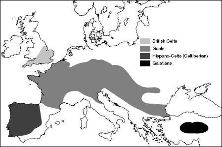
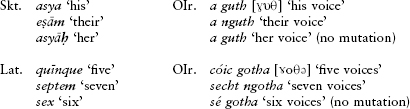
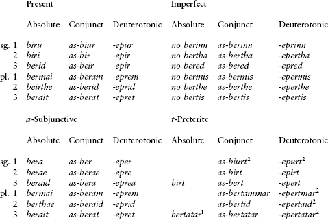
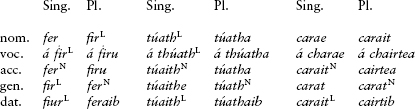
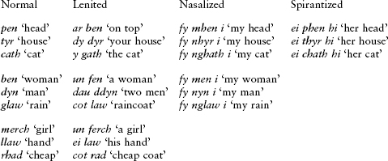
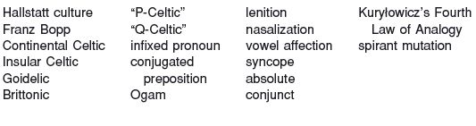

<!-- source-xhtml: 9781405188968_014.xhtml -->

# Chapter 14. Celtic

## Introduction

**14.1.** The Celtic languages hold a special place in the early history of Indo-European linguistics because they presented the first real challenge to the nascent science. The demonstration that Irish and its relatives are related to the likes of Greek, Latin, and Sanskrit was a genuine triumph; for while it is obvious that Greek, Latin, and Sanskrit are related to each other, it is not at all obvious that they have anything to do with Irish or Welsh – languages that, on the surface at least, are bafflingly different. We will discuss how the puzzle was solved below when we talk about Insular Celtic (§§14.21ff.).

**14.2.** The Celtic languages that have survived in unbroken tradition until the present day are confined to a small corner of northwestern Europe – Irish Gaelic in Ireland, Scottish Gaelic in Scotland, Welsh in Wales, and Breton in Brittany (northwest France); the total number of their speakers does not exceed one million. Such meager numbers give little indication of the erstwhile glory of this branch of Indo-European. For hundreds of years before the expansion of late republican Rome in the first century <small>bc</small>, Celtic tribes dominated much of Europe. Archaeologically, it appears that the prehistoric Celts are to be identified with the later stages of the Hallstatt culture (c. 1200–500 <small>BC</small>), located in what is now southern Germany, Austria, and Bohemia (western Czech Republic). By the end of this period, Celtic tribes had spread outward in almost all directions, first westward into France, Belgium, Spain, and the British Isles, and then, by about 400 <small>BC</small>, southward into northern Italy and southeast into the Balkans and beyond, with one group (the Galatians) eventually winding up in Asia Minor (see further below).

After Julius Caesar’s conquest of Gaul (ancient France) by 50 <small>BC</small> and the emperor Claudius’s subjugation of Britain roughly a century later, most of this Celtic-speaking territory was assimilated to the Roman world. Latin became the dominant language; Gaulish and the other **Continental Celtic** languages eventually died out. The other branch of Celtic, **Insular Celtic**, to which all the modern Celtic languages belong, continued to flourish in the British Isles, especially in Ireland, whose separation from Britain by the Irish Channel insulated it somewhat from the Romans and, later, from the Anglo-Saxons. Ireland in fact is the home of the first vernacular literature written in medieval Europe, that is, literature that was not written in an official language of the Church (Latin in the West).

But eventually the expansion of English cultural hegemony reduced the number of Celtic speakers in Ireland and elsewhere in the British Isles. The situation is no better in France, where Breton, spoken by descendants of British Celts, suffers under the comparable cultural dominance of French.

### *Celtic and other branches of Indo-European*

**14.3.** Celtic shares several features with Italic, leading some scholars to claim that the two branches formed an “Italo-Celtic” subgroup of Indo-European. But the validity of this claim is in doubt, even after decades of controversy. See §13.5 for a more detailed discussion.

## From PIE to Celtic

### *Phonology*

#### Stops

**14.4.** Celtic is a centum branch, having merged the palatal velars with the ordinary velars. A defining change was the loss of **p* in most positions, as in OIr. *athair* ‘father’ < ****p**h₂tēr*. At an early date, the voiced labiovelar **gʷ* became *b* (e.g. ****g**ʷen*- ‘woman’ > OIr. and W. ***b**en*); interestingly, the other labiovelars remained intact as labiovelars until much later. Following the change of **gʷ* to *b*, the voiced aspirates lost their aspiration, as in OIr. ***b**iru* ‘I carry’ < ****bh**er-oh₂*, Middle Ir. ***d**ai**g*** ‘fire’ < ****dh**e**g**ʷ**h**-i*-, and Middle W. ***g**ell* ‘yellow’ < *g̑***h**el*-.

A double-dental sequence (§3.36) became *-ss-* in Celtic (pronounced as a single *s* by the historical period): OIr. *-fe**ss*** ‘known’ < **u̯i**d-t**o*-, W. *gwŷ**s*** ‘summons, writ’ < **u̯i**d-t**u*-.

#### Laryngeals

**14.5.** Laryngeals were lost except when vocalized, in which case they became **a*, as in most of the other branches (e.g. **p**h**₂tēr* > OIr. ***a**thair*, cp. Lat. *pater*, Eng. *father*).

#### Resonants

**14.6.** The nonsyllabic resonants stayed unchanged except for final *-*m*, which became -*n* in Insular Celtic and some varieties of Gaulish. The syllabic liquids are a difficult domain of Celtic phonology because of their multiple outcomes. Sometimes *r̥ *l̥ became **ri* **li*: OIr. *c**ri**de* ‘heart’ < **k̑r̥d-ii̯o*- (cp. Gk. *kardíā*); Gaul. ***li**tano-* and W. ***lly**dan* ‘wide’ < **pl̥tano*- (cp. Gk. *platús* ‘broad’). But the outcomes **ar *al* are also found: Gaul. ***Ar**to*-, W. ***ar**th*, OIr. ***ar**t* ‘bear’ (whence the name *Art*) < **h₂r̥tk̑o*-; OIr. *t**ar**t* ‘thirst’ < **tr̥sto*- (cp. Ved. *tr̥ṣṭá*- ‘dry’, Eng. *thirst*).

The syllabic nasals are more straightforward: *m̥ and *n̥ became **am* and **an*: Gaul. ***am**bi*- ‘around’, W. ***am*** < **h₂m̥bhi*; OIr. and W. ***an***- ‘not, un-’ < *n̥-. In Irish, as recent research has shown, these were sometimes raised to *em/en* or *im/in*, especially before voiced stops, as in *imb* ‘around’.

**14.7.** The “long” syllabic resonants *r̥̄ *l̥̄ *m̥̄ *n̥̄ (from sequences of syllabic resonant plus laryngeal; see §3.15) typically turn into the relevant resonant followed by ā, as in Italic: Gaulish city name (Latinized) *(Medio-)**lā**num* ‘middle of the plain, Milan’ < **pl̥**h**₂no*- (cp. Lat. *plānum* ‘plain’); OIr. *g**rá**n* ‘grain’ (the acute accent indicates length), W. *g**raw**n* ‘grain’ < **g̑r̥**h**₂no*- (cp. Lat. *grānum* ‘grain’, Eng. *corn*); OIr. *g**ná**th* ‘known, customary’ < **g̑n̥**h**₃to*- (cp. Gk. *gnōtós* ‘known’).

#### Vowels

**14.8.** The IE vowel system remained largely unchanged. The main early shift was made by *ō, which became *ū in final syllables, as in the 1st sing. ending in Gaul. *delg**u*** ‘I hold’ and OIr. *bir**u*** ‘I carry’. It became *ā elsewhere: **mōros* ‘great’ > Celtic **māros*, as in the Gaulish personal name *Sego-māros* ‘great in strength’, Archaic OIr. *m**á**r* ‘great’, and W. *m**aw**r* ‘great’; cp. Gk. *enkhesí-mōros* ‘great with the ash spear’.

### *Morphology and syntax*

#### Verbs

**14.9.** Most of the verbal formations of PIE survive into Celtic in one form or another,including athematic verbs, aorists, perfects, thematic subjunctives, and middles. The optative, though, has disappeared, as have participles (though a few old participles are preserved vestigially as nouns, such as OIr. *carae* ‘friend’ from the present participle **karant-* ‘loving’). Dual verb endings were also lost (but not dual noun endings), although there is disputed evidence of a dual in Gaulish. The Celtic imperfects are of unknown origin and must be innovations. Like Italic, Celtic has a derivational suffix in -ā- from PIE *-*eh₂*- (§5.37) for forming denominative verbs, as well as a subjunctive morpheme in -ā- of uncertain origin (cp. §13.19).

#### Nouns

**14.10.** The new finds from Celtiberian have shown that Celtic inherited the PIE case-system intact in the singular. Like Italic, Celtic has an *o-*stem genitive singular in *-ī (e.g. Primitive [inscriptional] Ir. *maq(q)i* ‘of the son’).

#### Syntax

**14.11.** Insular Celtic is unusual among the older IE branches in that verbs are generally clause-initial. (The possible source of this order was discussed in §8.19.) An interesting and archaic feature of Gaulish and Insular Celtic word order was the position of the relative pronoun. In these languages, an indeclinable relative **yo* (from the relative pronominal stem **i̯o*-, §7.11) was placed after the first element in a relative clause. This is attested directly in such forms as Gaul. *dugiionti-io* ‘who serve’, and (somewhat obscured after sound changes) Old W. *issid* (Mod. W. *sydd*) ‘who is’ < **esti-yo*. In Celtiberian, however, declined forms of the relative pronoun are still found, such as the dative *iomui* ‘for whom’, and its placement seems to have been freer.

## Continental Celtic

**14.12.** The Celtic languages spoken in continental Europe until the first few centuries <small>AD</small>, all of them extinct, are referred to as Continental Celtic and were spoken by people called *Keltoí* by the Greeks and *Gallī* or *Galatae* by the Romans. Chief among the Continental Celtic languages is **Gaulish**. The Gauls were a powerful Celtic people consisting of hundreds of tribes spread throughout much of Europe; as noted above, their territory stretched from Gaul (ancient France) through Switzerland and northern Italy into Hungary, with one major group settling in the third century <small>BC</small> in Galatia in central Anatolia. (The *Gal-* of Galatia is related to *Gallī*; its inhabitants are the Galatians addressed in an epistle of Paul in the New Testament.) Many of the Gaulish tribes were aggressive marauders, as exemplified by the Galatians, who wreaked havoc on many principalities in Asia Minor, and famously by the band of Gauls that penetrated deep into Italy in the early fourth century <small>BC</small> and sacked Rome in 390 or thereabouts. But the tides of history eventually turned against them; they were subdued by Julius Caesar by 50 <small>BC</small> and gradually assimilated into Roman culture. Gaulish was still spoken in isolated pockets probably until around <small>AD</small> 500, or even later in Asia Minor.

Gaulish inscriptions are written in both the Greek and Italic scripts. The number of known inscriptions has grown dramatically since the mid-twentieth century. In addition to the inscriptional remains, many Gaulish proper names are preserved in Greek and Roman historical and geographical writings.

**14.13.** Inscriptions in a Celtic language called **Lepontic** (also called Cisalpine Gaulish) have been found in northern Italy; it may or may not be a dialect of Gaulish. The earliest Lepontic inscriptions date to the sixth century <small>b</small>c and represent our oldest preserved Celtic. Most of the Lepontic inscriptions are funerary and contain little more than personal names.

**14.14.** Last of the Continental Celtic languages is **Celtiberian** (or Hispano-Celtic), spoken by Celtic peoples who migrated into northeast Spain in the mid-first millennium <small>BC</small>. Most of the nearly 120 extant Celtiberian inscriptions are very brief; the language has been seriously studied only since 1970, when an extensive bronze inscription was found in the village of Botorrita (ancient Contrebia Belaisca), 20 km south of Zaragoza in northeast Spain. An even longer second inscription was found at the same site in 1992, but disappointingly consists almost entirely of personal names. About three other inscriptions of some length are known, two from south of Zaragoza and one that recently came to light in New York City and was published in 1993. The Celtiberian inscriptions date to the second and first centuries <small>BC</small>.

**14.15.** The script of most of the Celtiberian inscriptions was borrowed from a neighboring non-Indo-European people, the Iberians, who lived along the eastern Spanish coast and acquired an alphabet from either the Greeks or the Phoenicians or both. They modified it in certain ways so that it became partly a syllabary: vowels and resonants were indicated by single letter signs, while stop consonants were only indicated by signs that represented the combination of a stop plus a following vowel. No distinction was made between voiced and voiceless stops, so a sign like *ta* stood for both *ta* and *da*.

**14.16.** A very poorly attested IE language called **Lusitanian** is documented in Portugal. Although some say it is a relative of Celtiberian, this is very uncertain. Lusitanian will be discussed in chapter 20. On the southernmost tip of the Iberian peninsula was spoken another poorly known language called **Tartessian**, which has some Celtic linguistic material in its personal names.

### *Continental Celtic grammar*

**14.17.** We cannot compile anything resembling a complete grammar of either Gaulish or Celtiberian. It does not appear that the two languages were particularly close. Of the two, Celtiberian was the more conservative; as noted above (§14.10), it preserved PIE nominal inflection practically intact. Even the ablative and instrumental, which had merged in Hittite and Greek a millennium earlier, are still preserved in Celtiberian separately as *-uz* and *-u* in *o-*stem nouns (< late PIE *-*ōd* and *-ō). The dual is still a living category in nouns. Celtiberian also preserved the labiovelars as such (as in the conjunction *-**cu**e* ‘and’ < ****kʷ**e*), while Gaulish changed them to labials (as in ***p**issíiumí* ‘I see’ < ****k**ʷi*-). Since Brittonic also changed the labiovelars to labials (§14.54), some specialists view Gaulish as a Brittonic language, but this claim has not won general acceptance.

![Figure 14.1: *Figure 14.1* The Chamalières inscription, written in an ancient cursive form of the Latin alphabet that has no relationship to our modern cursive script. The excerpt begins at the end of the sixth line from the bottom (the smudge comes between the *n* and *c* of *toncnaman*). An I twice the height of a normal I is rendered as *í* in the transliteration. Drawing by R. Marichal, from Pierre-Yves Lambert, *Recueil des inscriptions gauloises,* vol. II, fasc. 2: *Textes gallo-latins sur* instrumentum (Paris: CNRS, 2002), p. 271. Reproduced by permission of the publisher.](images/fortson-2010-indo-european-language-and-culture-fig14-1.jpg)

### *Gaulish text sample*

**14.18.** An excerpt from the inscription found in Chamalières in Clermont-Ferrand (southeast France), written on a lead tablet in the early first century <small>AD</small> and deposited in a spring. In ancient Mediterranean cultures, this was standard practice for prayers, curses, and other texts addressed to underworld deities. This tablet was written apparently on behalf of some men seeking beneficial action from the gods. There are no word-divisions in the original, and not all the forms are understood, so no translation is given.

[ . . . ] toncnaman  

toncsiíontío meíon ponc sesit bue-  

tid ollon reguc cambion exsops  

pissíiumí [ . . . ]  

**14.18a. Notes. toncnaman:** a noun in the accus. sing. forming an etymological figure with the following verb; perhaps ‘oath’. **toncsiíontío:** a 3rd pl. verb *toncsiíont(i)* ‘they will swear’ (?), containing the future morpheme *-*si̯e*- (§5.40), with the relative pronominal clitic *-ío* ‘who’ or ‘which’ attached (PIE **i̯o*-). Perhaps ‘. . . the oath which they will swear . . .’. **ponc:** ‘when’ or the like, from **kwom-k̑(e)* (accus. sing. of the relative pronoun plus the deictic particle **k̑e*, §7.29); cp. Lat. *tunc* ‘then’ < **tom-k̑(e)*. **buetid:** 3rd sing. *buet* ‘will be’ plus clitic subject pronoun *-id* ‘it’. **ollon:** ‘all, whole’. **reguc cambion:** probably ‘I straighten the crooked’; *regu* is 1st sing. from the root **h₃reg̑*-, seen also in Lat. *regō* ‘I direct’, and *cambion* is from the Celtic root **kamb-* ‘crooked’, also referring to back-and-forth motion and exchange. It is ultimately the source of Eng. *change* via Late Latin *cambiāre* ‘to exchange’, a borrowing from Celtic. The reason for the *-c* at the end of *reguc* is disputed. **exsops:** ‘blind’, literally ‘(having) the eyes (*-ops*) out (*exs-*)’. The French word for ‘blind’, *aveugle*, from Vulgar Latin **ab-oculus*, may ultimately be a loan-translation of this Gaulish word, though other explanations are also possible. **pissíiumí:** ‘I will see’, 3rd sing. future, from pre-Celtic **kʷid-si̯ō(-mi)*. The root is the source of OIr. *(ad-)cí* ‘sees’. The last four words are thus ‘(And) I (shall) straighten the crooked; blind, I shall see’.

### *Celtiberian text sample*

**14.19.** The first three lines of the first Botorrita inscription. The transliteration makes use of the most recent discoveries, using *b* for the signs formerly transliterated with *p*, and using *s* and *z* instead of ś and *s* (*z* represents either [z] or [ð]). A very tentative translation is given, mostly following Wolfgang Meid, *Celtiberian Inscriptions* (1994).

tiricantam bercunetacam tocoitoscue sarniciocue sua combalcez nelitom

necue to uertaunei litom necue taunei litom necue masnai tizaunei litom soz aucu

arestalo tamai uta oscuez stena uerzoniti silabur sleitom conscilitom cabizeti

Concerning the region (?) pertaining to the **berguneta* of Tocoit- and Sarnicios, it has been thus decreed as non-permitted:

It is neither permitted to put (things) upon, nor is it permitted to do (work?), nor is it permitted to cause damage by destruction.

And whoever contravenes these things, he shall take cut-up . . . silver . . .

**14.19a. Notes. tiricantam:** uncertain; translated by Meid ‘region’, but it has been recently suggested to be the number ‘thirty’ in the sense of a group of thirty people (a council?) or other societal division (cp. the tradition that Romulus divided the Roman populace into thirty groups). Cp. OIr. *tríchat-* < Celt. **trī-kant*- ‘thirty’ < PIE **trī-dk̑m̥t*-. **bercunetacam:** phonetically probably *bergunetacam* and apparently containing the root for ‘hill’, *berg-* (PIE **bherg̑h*-, cp. German *Berg* ‘mountain’); maybe ‘hilly’. **tocoitoscue sarniciocue:** ‘both of T. and of S.’; *-cue . . . -cue* are like Lat. *-que . . . -que* ‘both . . . and’, from PIE **kʷe*. **sua combalcez:** contains the notion ‘it has been thus decreed’ or the like, but grammatically unclear; could also be read *compalcez*, *complacez. Sua* may be comparable to Goth. *swa*, Eng. *so*; *combalcez* may be a 3rd sing. past-tense verb with ending from **-t*. The exact phrase *tiricantam . . . sua combal*[*ce*]*z* recurs on another Celtiberian inscription. **nelitom:** ‘not allowed’, from the same root as Eng. *let.* **necue . . . necue:** ‘neither . . . nor’, cp. Lat. *neque . . . neque.* **to uertaunei:** perhaps literally ‘the putting-upon’, if phonetically *to uerdaunei*, with *uer-* ‘over, above’ (cp. the Gaulish name *Ver-cingeto-rīx* ‘far-stepping king’) and *daunei* an infinitive meaning ‘to do, place, put’ from **dheh₁*- ‘place, put’. The infinitive suffix *-unei* may be dissimilated from **-mn-ei*. **litom:** ‘allowed’. **masnai:** dative, perhaps from a noun **mad-snā*- related to OIr. *maidid* ‘breaks’. **tizaunei:** another infinitive. The rest of the line and the beginning of the next are unclear. The reading *arestalo* is uncertain (*arestaso* is also possible). **uta:** ‘and’, cp. Ved. *utá* ‘and’. **oscuez:** ‘whoever’, formally like Gk. *hós-tis* < **i̯os-kʷis*. **uerzoniti:** ‘over-seeks, contravenes’, another verb with the prefix *uer-.* **silabur:** ‘silver’, a cultural loanword also found in Germanic and Balto-Slavic (cp. Goth. *silubr*, Russ. *serebro*). **cabizeti:** ‘he shall take’.

## Insular Celtic

**14.20.** Insular Celtic consists of two subbranches, **Goidelic** and **Brittonic**. Goidelic contains Old Irish and its descendants: Irish Gaelic, Scottish Gaelic, and Manx. Brittonic (or Brythonic) contains Welsh, Breton, Cornish, and perhaps the language of the Picts (see §14.53). (Manx and Cornish both died out in recent times, though there have been attempts to revive them.) Goidelic and Brittonic are often called “Q-Celtic” and “P-Celtic” because of their respective treatment of the PIE labiovelars: Goidelic turned the labiovelars into velars, while Brittonic turned them into labials.

While Continental Celtic languages look basically like other old Indo-European languages, with Insular Celtic the story is quite different. Irish and Welsh, to put it bluntly, look bizarre when compared to languages like Greek and Latin. This is mostly due to a massive set of sound changes that occurred in rather quick succession over the course of a few centuries, and to which we now turn.

### *Phonology*

#### Insular Celtic consonant mutations

**14.21.** The single most striking feature of the Insular Celtic languages from the early medieval period onward is the system of initial consonant mutations: word-initial consonants change depending on what word precedes, or depending simply on grammatical roles. To take Modern Welsh as an example, the word *car* ‘car’ can appear as *car*, *gar*, *nghar*, or *char*: *eu* ***car*** *nhw* ‘their car’, *y* ***gar*** ‘the car’, *fy* ***nghar*** *i* ‘my car’, *ei* ***char*** *hi* ‘her car’. Similarly, in Old Irish, the number *sé* ‘six’ causes no change in a following consonant (*sé guth* ‘six voices’), whereas *cóic* ‘five’ causes a following stop consonant to become a fricative (written *cóic gotha* ‘five voices’ but pronounced [ɣoθə] with a voiced velar fricative), while *secht* ‘seven’ causes the consonant to become nasalized (*secht ngotha* ‘seven voices’). The system seems at first glance utterly capricious, the contexts in which mutation occurs completely arbitrary.

**14.22.** But behind many capricious linguistic systems lie less capricious origins. We owe the unraveling of this particular mystery to Franz Bopp, one of the founders of IE linguistics in Germany in the early nineteenth century. Until his work, there was no consensus that the Celtic languages were even Indo-European. Bopp’s fundamental breakthrough was to notice systematic correspondences between the Celtic mutations and certain facts in Greek, Latin, and Sanskrit. Specifically, an Irish word caused a following consonant to become a fricative when the Sanskrit cognate form ended in a vowel, and an Irish word caused nasalization when its cognate ended in a nasal; in all other cases, no mutation happened. For instance, consider the mutations induced (or not induced) by the Old Irish forms below in light of the final sounds of their Sanskrit and Latin cognates:

The mutations were thus revealed to preserve vestiges of final syllables in prehistoric Celtic: the nasalization in a phrase like *a nguth* is a relic of the nasal that once ended the possessive *a* ‘their’. (In effect, the mutations are remnants of old sandhi rules.) The overall system is the same in the other Insular Celtic languages, though differing in detail. The mutation that causes a following consonant to become a fricative is called **lenition**, and the mutation that adds a nasal before a following sound is called **nasalization**. The mutations also happened word-internally.

#### Insular Celtic vowel changes

**14.23.** The “old Indo-European” look of Insular Celtic was also dramatically altered by a series of changes to the vowels, in particular the loss of most final syllables (apocope), the loss of internal vowels (syncope), and umlaut (called in Celtic studies vowel “affection” and “infection,” and sometimes “vowel harmony”). Some of these changes happened in the common Insular Celtic period, but others were later parallel and independent developments (arising no doubt from some favorable initial conditions already present in common Insular Celtic).

**14.24.** The various umlauts were the first to take place. Their details, as well as those of the initial consonant mutations, are discussed individually for Irish and Welsh below. Following the umlauts, both Goidelic and Brittonic underwent apocope and syncope. Syncope in Irish hit every other syllable after the initial (stressed) syllable, e.g. pre-OIr. **cossamil* ‘similar’ > OIr. *cosmil; *ancossamili* ‘dissimilar’ (pl.) > OIr. *écsamli*. In Brittonic, syncope hit unstressed syllables directly before stressed syllables, but was a bit more sensitive to word-structure, as in the British king’s name *Cuno-belī́nos* becoming **Cun-belī́nos* (whence Welsh *Cynfelyn* and English *Cymbeline*), rather than expected * *Cuno-blī́nos* (which would have become **Cyneflyn*).

### *Morphology*

#### Verbs

**14.25.** Much inherited IE verbal morphology is preserved intact in Insular Celtic, generally more faithfully in Goidelic than in Brittonic. Both Irish and Welsh continue the *s-*aorist as two types of preterite, an *s-*preterite (e.g. OIr. *mórais* ‘he magnified’, Middle W. *kereis* ‘he loved’) and a *t-*preterite (e.g. OIr. *birt* ‘he carried’, Middle W. *cant* ‘he sang’), the latter being a special development of the *s-*preterite in resonant-final roots. The PIE perfect is continued by another preterite, the reduplicated preterite (although Brittonic barely has any examples): Middle W. *ciglef*, OIr. *(ro-)chúala* ‘I heard’, both ultimately from PIE **k̑e-k̑lou̯*-. (In the Irish form, the diphthong *úa* is ultimately from the sequence **-ek-* in **keklou-*.) Both Irish and Welsh have a so-called *s-*subjunctive, from the PIE *s-*aorist subjunctive (e.g. OIr. indicative *guidiu* ‘I pray’, *s-*subjunctive *gess*; Middle W. indicative *car* ‘loves’, subj. *carho* [with *-h-* < **-s-*]). Insular Celtic has a 3rd person passive used as an impersonal, while the **to-*verbal adjective is continued as a passive preterite (e.g. OIr. -*críth* ‘was bought’ < **kʷrih₂-to*-; Middle W. *caffat* ‘was had’). The IE future (or desiderative) formations were mostly lost in Brittonic, but survive as futures in Irish (§14.41). A morphological innovation in the Insular Celtic verb is the use of the preverb **ro-* to mark perfective aspect (OIr. *ro-*, W. *ry-*; from IE **pro-*).

The hallmark of the verb in the older stages of Insular Celtic is the distinction between the so-called absolute and conjunct verb-forms: most verb-forms existed in two variants, one used clause-initially and the other when certain elements preceded. This feature is far more characteristic of Irish than Brittonic, and will be discussed in the Irish section.

#### Infixed pronouns

**14.26.** Object pronouns in the Insular Celtic languages are often inserted between the preverb and verb, and are called infixed pronouns. Thus in Old Irish, to say ‘does not strike’ one said *ní-ben*, while ‘does not strike me’ was *ní-m ben* (with the initial *b-* pronounced as the fricative [β]) and ‘does not strike him’ was *ní-mben* (where *mb* was pronounced [mb]). Similarly, from *ad-cí* ‘sees’ one could form *atot-chí* ‘sees you’ and *at-chí* ‘sees it’. As forms like *ní-mben* show, the presence of an infixed pronoun is sometimes betrayed only by the mutation of the initial consonant of the verbal root (after the preverb).

#### Conjugated prepositions

**14.27.** Characteristic of Insular Celtic is the fusion of prepositions with personal pronominal objects, resulting in prepositions that are “conjugated” in the three persons, singular and plural, like verbs. An example from Middle Welsh, the conjugation of the preposition *ar* ‘on’, is given below; the forms *arnam* and *arnunt* have taken over endings from the verbal conjugations:

| Column 1 | Column 2 | Column 3 |
| --- | --- | --- |
|  | *sing.* | *pl.* |
| 1 | *arnaf* ‘on me’ | *arnam*, *arnan* ‘on us’ |
| 2 | *arnat* ‘on you’ | *arnawch* ‘on you’ |
| 3 | *arnaw* ‘on him’ | *arnadut*, *arnunt* ‘on them’ |
|  | *arnei*, *erni* ‘on her’ |  |

## Goidelic: Old Irish and Its Descendants

### *History of Irish*

**14.28.** Proto-Goidelic, the prehistoric ancestor of Irish, was spoken in Ireland at least by the beginning of the Christian era, if not earlier. The earliest preserved Irish is the language of the 300 or so stone inscriptions written in the Ogam (or Ogham) alphabet, which consists of strokes and notches chiseled along and across a central line, usually the edge of a stone (unfortunately the part that gets weathered and damaged most easily). The origin of the Ogam script is not known for certain; the inscriptions hail mostly from southern Ireland and date from about the fourth to the seventh centuries <small>AD</small>, with the bulk of them coming from the fifth and sixth. The stage of Irish at this time is called **Primitive Irish** (or Ogam Irish). Its earliest specimens do not yet show the effects of apocope, syncope, or vowel affection (e.g. *maq(q)i* ‘of the son’, OIr. *maicc*; *Lugudeccas* ‘of Lugudecca’, OIr. *Luigdech*; *velitas* ‘of a bard’, OIr. *filed*). While this allows us to date certain sound changes that happened during or later than the Primitive Irish period, the value of the inscriptions is offset by their extremely inconsistent spelling and their brevity, as they are all short burial inscriptions consisting almost solely of proper names.

The conversion of Ireland to Christianity in the fifth century resulted in the introduction of the Roman alphabet. Irish clerics learned the alphabet from monks in western Britain, who spoke early Welsh or its immediate ancestor. The fifth and sixth centuries saw not only significant alterations to the cultural landscape of the Emerald Isle, but also radical changes in the Irish language. Broadly, it was during this time that Irish changed from looking roughly like Gaulish or Latin to looking like Irish. The **Old Irish** period begins with the earliest datable literature, written at the end of the sixth century or the start of the seventh but preserved only in much later manuscripts. The early part of this period, into the first quarter of the seventh century, is called **Archaic Old Irish**, followed by **Classical Old Irish**, which lasted until the mid-900s.

**14.29.** Several manuscripts preserved on the Continent containing glosses on the Scriptures and other Latin texts represent the most important source of information on Old Irish. The major ones are the Würzburg, Milan, St. Gall, and Turin glosses. These manuscripts were brought to the Continent by Irish missionaries and other religious figures in the eighth and ninth centuries and are our only contemporary documentation of the Classical language. The Würzburg glosses are written very accurately, and their spelling is considered to be the Classical norm. Because the glosses were not understood on the Continent, these manuscripts were not used in later centuries and survived in good shape. By contrast, manuscripts of the same age do not survive from Ireland itself since they became worn out from continuous use. Copying and recopying often introduced corruptions and modernized spellings. These medieval (and even early modern) manuscripts are the ones that contain all preserved Old Irish literature, such as the saga of the *Táin Bó Cuailgne* (*The Cattle-Raid of Cooley*) and other tales, heroic poetry, and legal, historical, and grammatical texts.

**14.30.** Lasting from the tenth to the thirteenth centuries was **Middle Irish**, which saw changes to the morphological system that were as far-reaching as the phonological changes of the Primitive Irish period. By the end of the thirteenth century the language was effectively as it is today. The **Modern Irish** period begins with the codification of a normative form of the language by bards and other literary elite in the thirteenth century. The bards’ literary guild collapsed in the early 1600s, after which texts in different regional varieties appear – the dialects of Munster, Connacht, and Ulster that are still with us.

**14.31.** It was also during the seventeenth century that Ireland received an English-speaking ruling class; by the next century the status of Irish had deteriorated and it became primarily a language of the rural poor. A tragic blow was the devastation wreaked by the Potato Famine in 1845–49, which ravaged especially this population; over a million died outright, and another million and a half emigrated to America or elsewhere. Today, no more than 70,000 people comprise the Irish-speaking communities called the *Gaeltacht.* While a larger number have learned Irish as a second language, its future is cloudy.

Irish is often called “Gaelic,” though this is not strictly speaking correct. “Gaelic” is properly used in combination, as in “Irish Gaelic” or “Scottish Gaelic”; it is a general term that is more or less synonymous with Goidelic. (It derives, in fact, from the Scottish Gaelic descendant of Old Irish *Goídel.*)

### *Phonological developments of Old Irish*

#### Consonants

**14.32.** The labiovelars of Goidelic were changed to ordinary velars during the early history of Irish. Ogam Irish has a separate letter for *kʷ* that is transliterated Q, as in the frequent word *maq(q)i* ‘of the son’ < **mak⁽ʷ⁾kʷ3* (Classical OIr. *maicc*), and a special name is preserved for another letter that must have represented *gʷ* before it shifted to *g*.

Lenition and nasalization are the main changes to have affected consonants during the historical period. Both changes were conditioned by the preceding sound; the conditioning sound could be in the same word as the affected consonant, or separated from it by a word-boundary. But not just any word-boundary was “invisible” for the purposes of lenition and nasalization – only those in particular syntactic or prosodic groups. Thus lenition or nasalization could apply across the boundary between noun and a following adjective, and after proclitics of various kinds – the definite article, possessive pronouns, certain conjunctions, and infixed pronouns; but they could not apply across two different phrases.

**14.33. Lenition.** Lenition turned originally intervocalic stops into fricatives, as in *ca**th*** ‘battle’ < **ka**t**us* and *in* ***ch****inn* ‘of the head’ < **sindī* ***k**ʷennī*. In the case of voiced stops, the difference between the lenited and unlenited versions is not indicated in the orthography, hence *bó* ‘cow’ begins with *b*, but in *a bó* ‘his cow’ it begins with a bilabial fricative [β] (similar to Eng. *v*). The fricatives *s* and *f* when lenited became *h* (written ṡ) and zero (written ḟ), and the nasals and liquids when lenited were lenis (less strongly articulated) versions of the corresponding unlenited nasals and liquids. These facts are all still true of modern Irish dialects.

**14.34. Nasalization.** The other consonant mutation, nasalization, affected only stops and vowels. It occurred when the final sound of the preceding word was a nasal consonant in prehistoric Irish. Nasalization had three effects. It changed voiced stops to nasal stops, for example *dán* ‘gift’ but *in ndán* ‘the gift’ (accus. sing.; *nd* = [n]) < pre-Irish **sindan dānan*. It changed voiceless stops to voiced stops (not represented in the spelling), for example *túath* ‘people’ but *in túaith* ‘the people’ (accus. sing.), pronounced *in dúaith,* ultimately from earlier **sindān toutān*. Finally, it prefixed an *n* to a vowel, for example *ech* ‘horse’ but *in n-ech* ‘the horse’ (accus. sing.) < earlier **sindan ekʷan.* The only other mutation to be noted is that a word-initial vowel is prefixed with *h* following a word that does not lenite or nasalize, as in *úa hAirt* ‘grandson of Art, O’Hart’.

**14.35. Palatalization.** A front vowel (*i* or *e*) following a consonant palatalized that consonant, that is, moved its point of articulation closer to the palate. In the early stages of this change, only *i*’s in certain syllables had this effect; as time went by, palatalization spread to other contexts. The end result was that consonants, aside from being lenited, unlenited, and nasalized, now came in two other guises, palatalized and non-palatalized (or “slender” and “broad,” as Celticists refer to them). Palatalization is indicated in the orthography by writing an *i* before the relevant consonant (but this is not done consistently): for example, *-beir* ‘carries’, with palatalized (and lenited, since postvocalic) *r* that used to be followed by a front vowel (**bhereti*; cp. the absolute form *berid*). The *b* is also palatalized because it occurs before the vowel *e*, but this is not specially shown in the script.

#### Vowels

**14.36.** The main Irish changes to the Common Celtic vowel system are as follows. An **o* in an unstressed syllable became *a*, as in the Ogam consonant-stem genitive singular *Lugudeccas* ‘of Luigdech’, with *-as* < **-os*. These *a*’s mostly disappeared but not before causing *a-*affection (see below). The *u-*diphthongs **eu* and **ou* were monophthongized to *ó* (as in Archaic OIr. *tóth* ‘tribe’ from **toutā*), later diphthongized to *úa* (hence classical *túath*). The diphthong **ei* became *é* or (after the archaic period) *ía* depending on whether the vowel that originally stood in the following syllable was front or back, respectively: thus *tégi* or *-téig* ‘you (sing.) go’ < **(s)teigh-es(i)* but *tíagu* ‘I go’ < **(s)teigh-ō*.

**14.37. Vowel affection.** The vowels were also subject to various umlauting processes called vowel affection. The details of vowel affection are highly complicated and will not concern us here in detail. There were two basic processes in Irish: *a-*infection and *i-*infection. In *a*-infection, a high vowel (*i* or *u*) was lowered to the corresponding mid vowel (*e* or *o*) before a syllable containing a non-high vowel (*a* or *o*). Thus nomin. sing. **u̯ir-os* ‘man’ > **u̯ir-as > *u̯er-as* (ultimately OIr. *fer*; contrast the nominative pl. *fir* < **u̯ir-ī*); **klut-om* ‘fame’ > **klut-an* > **klot-an* (ultimately OIr. *cloth*). *I*-infection produced the opposite result; a high vowel (*i* or *u*) caused an *e* or *o* in a preceding syllable to raise to *i* or *u*: *mil* ‘honey’ < **melit*; *bìru* ‘I carry’ < **berū* (earlier **berō*).

The subsequent changes of apocope and syncope were discussed above, §14.24.

### *Morphology of Old Irish*

#### Verbs

**14.38.** The Old Irish verb is a complex subject; only a few topics pertaining to it can be treated here. There were five indicative tenses (present, imperfect, future, secondary future [also called past future or conditional], and preterite), two subjunctive tenses (present and past), and a present imperative. Active and middle endings were distinguished in the primary (non-past) tenses, and there were distinct passive endings in the third person. Special relative endings are found in the 3rd singular and plural and in the 1st plural; these were used when the verb was in a relative clause, and are historically derived from a combination of verb plus relative pronoun (§14.11 above). Instead of infinitives, each verb had a verbal noun formed from the verbal root with a suffix, somewhat like the different infinitives of Vedic (§10.44).

**14.39. Present stems.** There were two classes of verbs, distinguished according to their present stems: “strong” (all formed directly from verbal roots) and “weak.” The strong verbs are old and continue present-stem types of PIE date: simple thematic presents, such as *berid* ‘carries’ (< **bhereti*); (thematized) nasal-infixed presents (e.g. *dingid* ‘oppresses’); and *-na-*presents comparable to the Sanskrit ninth class (§10.42; e.g. *crenaid* ‘buys’, cp. Ved. *krīṇā́ti*). Weak verbs are secondarily derived presents such as causatives and denominatives, such as *móraid* ‘increases’ from *mór* ‘great’. All original athematic verbs, except for some forms of the verb ‘be’, have become thematic.

**14.40. Other tense-stems.** There were four other stems for the other verb forms: subjunctive, future, preterite active, and preterite passive. In the strong verbs, as with the primary verbs of other IE languages like Sanskrit and Greek, the other tenses are formed directly from the root.

In contrast to most of the other older PIE languages, the present subjunctive is not formed from the present stem. The subjunctive stem is formed in two ways: with a morpheme *-ā- that is identical to the ā-subjunctive of Italic (§13.19; e.g. pres. indicative *renaid* ‘sells’, pres. subjunctive -*ria*, cp. Lat. *attingit* ‘touches’, Archaic Lat. subjunctive *attigat* without nasal infix), or with an *-s-* (§14.25 above).

**14.41.** The future stem is formed in a variety of ways. Weak verbs take the *f-*future, whose origin has been hotly debated for over a century (e.g. pres. *léicid* ‘leaves’, fut. *léicfid* ‘will leave’). Strong verbs generally have a reduplicated future, either with a suffix *-s-* (e.g. from *guidid* ‘prays’ is formed *gigis* ‘will pray’ < **gʷhi-gʷhedh-s*-) or without (e.g. pres. *canid* ‘sings’, fut. *cechnaid* < **ke-kan-a-*; *do-gní* ‘knows’, fut. *do-gén* < **-gi-gn-a-*; this last type is called the long-*e* future). Both of the reduplicated future types go back either directly or indirectly to the PIE reduplicated desiderative (§5.41).

**14.42.** The active preterite is formed with an *-s* or with reduplication (there are some other types as well which we shall not go into). All weak verbs have an *s-*preterite (§14.25). The reduplicated preterite, a continuation of the IE perfect (§14.25), is formed by many strong verbs: *canid* ‘sings’, perfect *cechan-*. Finally, there is a passive preterite stem, which is a continuation of the **-to-*verbal adjective (§14.25).

**14.43. Absolute and conjunct verb forms.** Verbs in Old Irish (and occasionally in Old Welsh) come in two different guises depending on their position in the sentence. One form appears when the verb is clause-initial, such as OIr. *berid* ‘he carries’; this is the absolute form. A generally shorter form, sometimes lacking the last syllable of the absolute form, appears when the verb is preceded by certain conjunctions or a preverb, as in *ní beir* ‘he does not carry’, *do-beir* ‘he gives’. This is called the conjunct form.

Compound verbs themselves – preverb and verb both – behave in the same way as uncompounded ones: a full form (such as *do-beir* above) occurs clause-initially, while a shorter form occurs when certain conjunctions or another preverb precedes (as in *ní tabar* ‘he does not give’). The terminology is different: the full form *do-beir* is called the prototonic form, while *-tabar* is called the deuterotonic. The deuterotonic is thus sort of a conjunct of the conjunct.

**14.44.** The origin of the differences between absolute and conjunct forms is not altogether agreed upon, but it probably boils down to something like the following. One must first assume that in pre-Irish, clauses contained an unstressed clitic sentence particle in second position, i.e., following the first element in the clause. (This assumption is not terribly problematic since this is in one way or another true of Greek and Hittite, and frequently true in Sanskrit and elsewhere.) If the first element in the clause was an uncompounded verb, the particle attached to the verb’s final syllable; when the language was hit by apocope, which got rid of most final syllables, the particle was treated as a final syllable and protected the rest of the verb in front of it. Thus a **beret(i)* + Particle became the absolute form *berid*. With compound verbs, one needs to remember that preverbs were independent adverbs originally (§8.9); therefore if a compound verb began a clause, the preverb would have been the first element in the clause and the sentence particle would have attached to it rather than to the following verb. The final syllable of the verb was therefore not protected and fell victim to apocope. Thus a **to* + Particle *beret(i)* became *do-beir*, with *-beir* the conjunct form.

If a compound verb was itself preceded by another element, such as the negative **nē*, similar principles applied. The clause would have started **nē* + Particle *to-beret(i)*. Here we must further assume that the compound **to-bereti* acted like a single word in such an environment, with stress on the first syllable like all other words in pre-Irish. The difference in stress between **to* + Particle *béreti* and **nē* + Particle *tó-beret(i)* is what mattered for the subsequent phonological developments: unstressed internal syllables were subject to syncope (§14.24) and other vowel weakenings. Thus **tó-beret(i)* became deuterotonic *-tabar*.

**14.45.** As these examples hint at, the effects of syncope and apocope in Irish are nowhere as apparent or as devastating as in verbal conjugations, especially those of verbs compounded with one or more preverbs. The effects are particularly widespread partly due to the fact that Old Irish had an especial fondness for piling preverbs together, giving syncope and apocope no shortage of syllabic gallows-fodder. Three preverbs in a row are quite common, e.g. *du-airngerat* ‘they promise’ from **do-are-in-gar-* (verbal root *gar-* ‘call’, literally ‘call to before in’ or the like; the literal translations of these compounds usually make no sense), and four or even five preverbs in a row are found as well, e.g. *fo-timmdiriut* ‘I am sufficient’ from **fo-to-imm-di-ret-* (verbal root **ret-* ‘run’; literally ‘run under to around from’) and the verbal noun *contherchomracc* ‘assembly’ from **com-to-er-com-ro-icc-* (verbal root **icc-* ‘come, reach’). Because only the first or second preverb was stressed (depending on its position in the clause), all syllables after that were unstressed and got compressed by lenition, syncope, apocope, and vowel weakening in unstressed syllables. The verbal root itself wound up leading an extremely perilous existence at or near the end of such strings, and in some cases all but entirely disappeared.

**14.46.** The amount of allomorphy (that is, variation in the form of a given morpheme) that these changes created was incredible, and it is worth digressing to give some examples. The Irish root *fēd*- ‘say’ appears in such varied guises as *fét*, *id*,and *d*, as in the following forms of the compound verb **at-fēd*- ‘relate’: 3rd sing.present *ad-**fét*** ‘relates’, perfective present *ad-cu**ïd*** (**ad-com-fēd*-), and 2nd pl. conjunct perfective present *-éic**d**id*. As in this last example, sometimes the root is reduced to a single sound, particularly in the conjunct 3rd person singular *s-*subjunctive. Thus the 3rd sing. conjunct *s-*subjunctive of the verb *as-**boind*** (**oss-bond-*) ‘refuses’ is simply *-o**p*** (pronounced *-ob*, the regular outcome of **-óss-bod-s-t***!**); and from **ret-* ‘run’ (present ***reth**id* ‘runs’) we have the compound *do-fúa**rat*** ‘remains over’ (**di-fó-uss-ret-*), whose conjunct 3rd sing. *s-*subjunctive is *-diúai**r*** (< *-*dí-fo-uss-ret-s-t*), with only the *-r* remaining of the original root, subjunctive suffix, and personal ending (and very little left of the preceding preverbs).

The effects of these sound changes caused absolute and conjunct forms even of relatively simple verbs to be vastly different. Thus the pre-Irish compound **di-slond-it* ‘denies’ becomes OIr. *do-sluindi* (absolute) but *-díltai* (conjunct); both developed by perfectly regular sound change. The absolute form comes from **di-slóndit* (accented on the verb), whereas *-díltai* comes from the same form accented on the preverb (*-*dí-slondit*). The destressing of *-slondit* made all the difference: **dí-slondit* first became **di-sldi* (syncope and loss of final **-t*), then **dihlti* (weakening of **s* to **h* which devoiced the following consonant cluster), and finally *dīlti* (loss of *h* with compensatory lengthening of preceding vowel), written *-díltai*.

**14.47.** All of this allomorphy seems not to have posed any particular problems for Old Irish children learning the language; but as time went by the allomorphy was gradually reduced by regularization – one or another allomorph was generalized throughout the paradigm by leveling or analogy. The distinction between absolute and conjunct was lost in Middle Irish. Analogy was already a significant player in the paradigms of scores of Old Irish verbs; part of the challenge of Irish historical grammar is figuring out which forms are analogical creations and which are not.

**14.48.** Below are given the present, imperfect, present *1*-subjunctive, and *t-*preterite of the verb *berid* ‘carries’. The conjunct forms are illustrated with the compound verb *as-beir* ‘says’, whose deuterotonic forms are given in the third column (*-epur*, as would appear for instance in *ní epur* ‘I do not say’):

¹Late. ² Not actually attested.

#### Nouns

**14.49.** Irish reduced the number of cases in the noun to five – nominative, vocative, accusative, genitive, and dative. Below are the paradigms of the *o-*stem *fer* ‘man’, the ā-stem *túath* ‘tribe’, and the consonant-stem *carae* ‘friend’ in the singular and plural (the superscript L means the form lenites a following word, and N means it nasalizes):

Forms that nasalize a following word once ended in **-m*, and forms that lenite once ended in a vowel. The vocative is always preceded by the particle *á* ‘O’. Unlike any other Indo-European language, the vocative plural is distinguished from the nominative plural in the *o-*stems (and, by analogy, in the consonant stems), which happened for the following reason. The inherited nominative/vocative plural **-ōs* was replaced (as in some other branches) by the pronominal nomin. pl. **-ōi* (§6.53), but interestingly only in the function of nominative plural; the old ending **-ōs* lived on in its other function as vocative plural. The replacement of a form in its main function but not in one of its secondary functions is a common process, and goes by the name of KuryÆowicz’s Fourth Law of Analogy, after the Polish linguist Jerzy KuryÆowicz.

### *Old Irish text sample*

**14.50.** §§17–21 of the Old Irish wisdom text *Audacht Morainn* (*Testament of Morann*), after the edition of Fergus Kelly (Dublin, 1976). The language is Archaic Old Irish. The text was written around 700, and consists of advice to a young king by a legendary judge named Morann. (The genre is called *Speculum Principum* or ‘mirror of princes’.) The ethical notion of the ruler’s truth is of common IE patrimony, and is found in Vedic and later India, ancient Iran, and Greece; in all these societies the verbal expression of this concept is believed to ensure prosperity and protect from harm.

§17 Is tre lír flathemon ad- manna mármeso márledo -mlasetar.

§18 Is tre lír flathemon ad- mlechti márbóis -moínigter.

§19 Is tre lír flathemon ro-bbí cech etho ardósil imbeth.

§20 Is tre lír flathemon to- aidble éisc i sruthaib -snáither.

§21 Is tre lír flathemon clanda caini cain-tussimter.

(17) It is through the justice of the ruler that abundances of great tree-fruit of the great wood are tasted. (18) It is through the justice of the ruler that milk-yields of great cattle are maintained. (19) It is through the justice of the ruler that there is abundance of every high, tall corn. (20) It is through the justice of the ruler that abundance of fish swim in streams. (21) It is through the justice of the ruler that fair children are well begotten.

**14.50a. Notes. 17. Is:** ‘is’, PIE **h₁esti*, pronounced [<small>I</small>ʃ]. It introduces a cleft sentence (“It is . . . that . . .”), a favorite Insular Celtic sentence type used for topicalization. In the case of this particular sentiment, though, we may be dealing with a pre-Celtic pattern, since a construction beginning “by the ruler’s truth” plus a sentence is structurally equivalent to truth-statements elsewhere in IE. **tre:** ‘through’, leniting the following sound, from the same root as Lat. *trāns* ‘across’. l**ír:** lenition of *fír* ‘justice’, literally ‘truth’, PIE **u̯eh₁-ro*- (> Lat. *uērus* ‘true’, German *wahr* ‘true’). **flathemon:** ‘ruler’, genit. sing. of *fla(i)them*. The genitive shows this to be an *n-*stem, Celtic **wlati-amon-* (**wlati-* > OIr. *flaith* ‘rule’), ultimately continuing the PIE suffix **-mon-* seen e.g. in Greek. *hēge-mṓn* ‘leader’. **ad-mlasetar:** ‘are tasted’, 3rd pl. pres. passive of *ad-mlassi* (otherwise unattested), with archaic *ml-* that turned into *bl-* in Classical Old Irish. Derived from *mlas* ‘a taste’. The separation (tmesis; called Bergin’s Law in Irish studies, after the Irish Celticist Osborne Bergin) of preverb from verb has been seen as an archaic stylistic feature that harks back to the earlier separability of preverb from verb (§8.9); it recurs in the following lines. A growing body of evidence, however, suggests that Bergin’s Law tmesis was in part or wholly a pseudo-archaism invented by monks. **manna:** ‘abundances’, pl. of *mann*, a borrowing from Lat. *manna* ‘manna’. **mármeso:** compound of *már* ‘great’ (Classical OIr. *mór*; = W. *mawr*) and *meso*, genit. of *mes* ‘tree-fruit’, a *u-*stem cognate with W. *mes* ‘acorns’. Acorns frequently symbolized a just rule. **márḟedo:** ‘of great wood’; *fedo* is genit. sing. of *fed*, also a *u-*stem; Celtic **widu-* < PIE **u̯idhu*-, the source of Eng. *wood.* Note the alliteration in this and the following lines.

**18.ad-moínigter:** ‘are treasured, are maintained’, 3rd pl. pres. passive of an otherwise unattested verb *ad-moínigethar*, from *moín* ‘treasure’ (< **moi-ni-*, from PIE root **mei-* ‘exchange’, also in Lat. *mūnus* ‘service done in exchange for something’). **mlechti:** ‘milk-yields’ (Classical *blechti*), pl. of *mlicht*, from an old *tu-*abstract noun **mleg-tu-* from PIE **h₂melg̑*- ‘milk, to milk’. In another text, *dísce mblechta* ‘dryness of milking’ is mentioned as one of the proofs of a false king. **márbóis:** ‘of great cattle’; PIE **gʷou*-.

**19. ro-bbí:** ‘there is’, a form of doubtful interpretation here and perhaps corrupt. **cech:** ‘every’, genit. sing. of *cach*, with *i-*infection from old genitive ending *-ī. The word comes from PIE **kʷā-kʷo-*, also seen in Russ. *kakoj* ‘which?’ **etho:** ‘of grain’, genit. sing. of *ith*. Together with its W. cognate *yd*, this continues PIE **pi-tu-* ‘nourishment’, seen also in Ved. *pítu*- and Av. *pitu-* ‘food’. **ardósil:** ‘high (and) tall’, a compound of *ard* ‘high’ (cognate with Gk. *orthós* ‘upright’) and *ósal* (Archaic spelling of *úasal*) ‘tall’ (Gaul. *uxello-*, from PIE **up-s-*, cp. Gk. *hupsēlós* ‘lofty’). Various phrases for ‘tall grain’ are found in traditional IE literatures. **imbeth:** ‘abundance’, Classical *imbed*.

**20. to-snáither:** ‘swims’; this and the following *aidble* ‘abundance’ are not otherwise attested and have been restored from somewhat conflicting manuscript readings. Contains preverb *to-* (Classical *do-*) ‘to’ plus the Irish descendant of PIE **sneh₂*- ‘swim’ (also > Lat. *nāre* ‘to swim’). **éisc:** ‘of fish’, genit. sing. of *íasc*; PIE **peisk-* (also in Lat. *piscis*, Eng. *fish*). The manuscripts actually read *uisce éisc* ‘fish in water’, but modern editors assume *uisce* ‘water’ was added originally as a gloss and was later accidentally incorporated into the text by a copyist. **i sruthaib:** ‘in streams’, dat. pl. of *sruth*, originally a *tu-*abstract **sru-tu-* from **sreu-* ‘flow’, the source of Eng. *stream*.

**21. clanda:** ‘children’ (Classical *clanna*), pl. of *cland*, cognate with W. *plant*, both early borrowings from Lat. *planta* ‘plant’ at a time when *p* was heard (and adopted) by Insular Celtic speakers as *kʷ*. **caini:** ‘fair, beautiful’. **cain-tussimter:** *cain-* is ‘fair’ again, acting as a prefix attached to *-tussimter*, the 3rd pl. pres. passive deuterotonic form of *do-fuissim* ‘I beget’. The form *-tussim-* is from **to-uss-sem-*, with two preverbs; the proterotonic form -*fuissim* has an extra preverb *fo-* inserted before *uss*-. The root **sem-* in IE meant ‘draw water out of a well’ (Lith. *semiù* ‘I draw water’).

## Scottish Gaelic and Manx

**14.51.** Beginning around the late fourth century, immigrants from Ireland colonized what is now Scotland, establishing a colony called Dál Ríata, named after a town in northeast Ireland. The Scottish Dál Ríata became the center of a kingdom in the latter half of the fifth century, becoming more powerful than the Irish Dál Ríata; in the first half of the seventh century the connection to Ireland was severed.

The Gaelic inhabitants of Scotland expanded inland, and Scottish territory grew to about its present dimensions by around 1000. Over the ensuing centuries, however, English gradually began to replace Scottish, and the predominantly Gaelic-speaking areas are now confined to the Outer Hebrides and the islands of Skye, Tiree, and Islay. No more than 80,000 people speak Scottish Gaelic today, vanishingly few of them monolinguals.

**14.52.** The same group of Irish colonists that came to Scotland also settled the Isle of Man, in the Irish Sea between Ireland and England, in the fourth or fifth century. The island’s political and cultural heyday came during the period of the Viking invasion and settlement from the ninth to the thirteenth centuries, when it became the center of a Norse-Gaelic kingdom. Subsequently it was ceded to Scotland and then passed to England in the fourteenth century.

**Manx** is the name given to the form of Goidelic that developed on the island following the Irish colonization. Written Manx begins with a seventeenth-century translation of the Anglican *Book of Common Prayer*; however, a historical poem known as the *Manannan Ballad* is probably a hundred years older, even though its earliest manuscripts are from the eighteenth century. Most of the published literature has been religious in nature.

From the late eighteenth century on, the use of Manx declined, and the last native speaker died in December 1974. It is still in very limited use as a second language.

## Brittonic

**14.53.** Brittonic (also Brythonic or British Celtic) was the language of the Celtic inhabitants of Britain from before the Roman conquest of the British isles beginning in <small>AD</small> 43. At its greatest extent, to judge by the geographical distribution of place-names and river-names, British Celtic was spoken throughout Britain except in that part of Scotland north of the Firth of Clyde and the Firth of Forth. The earliest Brittonic is in the form of some personal names on coins and in scattered Latin and Greek sources, the first being Ptolemy’s *Geography* from about <small>AD</small> 150. No connected texts appear until the eighth century, in Old Welsh (see §14.59 below).

In northeastern Scotland lived a people called the Picts (Latin *Pictī* ‘painted’), whose language, **Pictish**, has been the subject of controversy. Recent research indicates that Pictish was probably an early Brittonic language, but very little of it is preserved.

**14.54.** The defining phonological characteristic of Brittonic compared with Goidelic is the change of the Common Celtic labiovelar **kʷ* to *p*, e.g. W. *pump* ‘five’ < Celt. **kʷenkʷe*, cp. OIr. *cóic*. It is for this reason that Brittonic is often called “P-Celtic.” Also characteristic of Brittonic is the change of initial *u̯ to *gw-*, as in W. *gwr* (OW *guir*) ‘man’ < **u̯iros* and *gwyn* ‘white’ < **u̯indos* (contrast OIr. *fer* and *finn*).

### *Vowel affection*

**14.55.** In British Celtic, vowel affection happened before a syllable containing *ā and before a syllable containing **i*, *ī, or *i̯. Some examples of “ā-infection” include W. *gwen* ‘white’ (feminine, < **u̯indā*; compare masc. *gwyn* < **u̯indos* above) and *Peith(-wyr)* ‘Picts’ < **Piχtās*. Some examples of “*i-*infection” (fronting and/or raising) are W. *meibion* ‘sons’ < **mabi̯on* and *bryn* ‘hill’ < **brunniā*.

### *Mutations*

**14.56.** The initial mutations are somewhat more complicated in Brittonic than in Goidelic. By way of illustration, the Welsh system is summarized in the table below. In Welsh orthography, *ff* represents [f], *f* represents [v], *dd* [ð], *ll* the voiceless lateral [ɬ], and *rh* a voiceless *r*, [r̥]:

As can be seen, lenition in British Celtic is similar to Goidelic in the voiced stops, which became voiced fricatives also. (The lenition of *glaw* to *law* is due to a later development whereby [ɣ], the original lenition product of *g*, disappeared.) However, the voiceless stops became voiced stops (rather than voiceless fricatives as in Goidelic). The effect of the nasal mutation on voiced stops was also identical to Goidelic but its effect on voiceless stops was not: the latter are changed into aspirated nasals. Finally, British Celtic has a third mutation not found in Goidelic, the spirant mutation; this resulted from the geminate consonants **pp*, **tt*, and **kk*, which came about from various consonant clusters (e.g. W. *saith* ‘seven’ < Celtic **septam*). In Goidelic, these simply became unlenited stops, but in Brittonic they became voiceless fricatives.

## Welsh

### *History*

**14.57.** The early Anglo-Saxon settlers of England during the fourth and fifth centuries dubbed the indigenous Celtic tribes the ‘foreigners’, or *wealas,* the source of our word *Wales,* and their language as *wælisc,* the source of our word *Welsh.* At this time the British Celtic population was linguistically hardly differentiated. Following several major conflicts between them and the ever-expanding Anglo-Saxons in the sixth and seventh centuries, the Celts retreated, and after the Anglo-Saxons had advanced as far west as the river Severn (which runs roughly parallel to the present-day eastern border of Wales), they were split into two groups. One group lay to the northwest, in what is now Wales and a large area to the north; and one to the southwest, in modern Cornwall, Devon, and nearby areas. Many of the inhabitants of this second area had already migrated to northwest France, where their language would develop into Breton (see §14.62); those that stayed in Cornwall spoke what would become Cornish (§14.69). The Celtic spoken to the north of Wales, which must have resembled early Welsh, gradually died out, although traces of it survive even as far north as Cumbria (near Scotland) in the counting systems used by shepherds. One such system, for example, runs *yau tau tethera methera pimp sethera lethera nothera dothera dick*, which is strikingly similar to the Welsh numbers 1–10, *un dau tri pedwar pump chwech saith wyth naw deg.* (These rural counting systems are distantly related to the familiar *eenie meenie miney mo*.)

**14.58.** A few scattered short inscriptions in what is often called **Primitive Welsh** are preserved from the mid-sixth to near the end of the eighth century. While no literature is extant from this time in its original form, probably some poems by two sixth-century poets, Taliesin and Aneirin, survive in later (and modernized) twelfth-and thirteenth-century versions, most notably Aneirin’s elegiac battle poem *Y Gododdin* (*The Gododdin*).

**14.59.** The earliest piece of connected text is the so-called *Surexit*-memorandum in **Old Welsh**, a short Welsh and Latin text concerning a lawsuit, dating probably to the end of the eighth century. Though the Old Welsh period lasted until the beginning of the twelfth century, it has left us with only a few other short texts. By contrast, we have very copious literature in **Middle Welsh**, dated from the mid-twelfth century to the end of the fourteenth. The most famous Middle Welsh prose work is the *Mabinogion*, a collection of romances; much poetry was also written, such as *Y Gododdin* mentioned above, as well as histories, grammars, translations of Latin and French literature, and legal texts (many of which drew on much older traditions). The Middle Welsh period closes with the œuvre of Dafydd ap Gwilym (c. 1325–80), a major figure in medieval European poetry, who is transitional to the modern period; his works, and those of writers through the sixteenth century, are often called Early Modern Welsh.

**14.60.** With the publication of the first Welsh translation of the Bible in 1588 we enter the true **Modern Welsh** era. This translation set a literary standard for generations and was instrumental in continuing the use of the language, which might well have died out otherwise. For already beginning in the Middle Welsh period the higher strata of society were becoming Anglicized, and Welsh was banned from use as an official administrative language in the mid-1500s. (This was not reversed until 1967.) The use of Welsh has slowly declined ever since; about a half-million people still speak it, with the greatest density being in the northwest Welsh county of Gwynedd.

### *Old Welsh text sample*

**14.61.** The first three of the twelve anonymous “Juvencus” poems (*englynion*), written on a ninth-century manuscript containing a Latin paraphrase of the Gospels by Juvencus. The interpretation and translation below are adapted from Ifor Williams, “The Juvencus Poems” (*The Beginnings of Welsh Poetry*, Cardiff, 1980, 89–121).

niguorcosam nemheunaur henoid mitelu nit gurmaur

mi am [franc] dam ancalaur.

nicanãniguardam nicusam henoid cet iben med nouel

mi amfranc dam anpatel.

namercit mi nep leguenid henoid is discirr micoueidid

dou nam riceus unguetid.

I shall not keep watch even one hour tonight, my retinue is not very large,

I and my Frank, round our cauldron.

I shall not sing, I shall not laugh, I shall not jest tonight though we drank clear mead,

I and my Frank, round our bowl.

Let no one ask me for merriment tonight, Mean is my company,

Two lords can talk: one speaks.

**14.61a. Notes. 1. niguorcosam nemheunaur:** unclear; the translation above is conjectural. *Niguorcosam* is composed of *ni* ‘not’ and some verb in the 1st sing. present (ending *-am*) and containing the preverb *guor-* ‘above, over’ (= OIr. *for-*); if *nemheunaur* does mean ‘even one hour’, it would be segmented *nemh eun aur*. **henoid:** ‘tonight’, Modern W. *heno*, earlier *henoeth*; *noeth* ‘night’ is from PIE **nokʷt*-. **mitelu:** *mi telu* ‘my retinue’, ModW *fy nheulu* ‘my family’; the nasal mutation of the initial consonant was not indicated in the Old W. original. **gurmaur:** ‘very large’; *gur-* is the same as *guor-* in *niguorcosam* above, and *maur* (ModW *mawr*) is cognate with OIr. *már*, *mór*. **franc:** ‘Frank’, also ‘foreigner, mercenary soldier’. **dam:** ‘around’, from **do-ambi*. **ancalaur:** ‘our cauldron’; *an* is ‘our’, and *calaur* is a loanword from Late Lat. *caldāria*.

**2. nicanã:** *nicanam*, ‘I do/shall not sing’ (with the common medieval notation ā to indicate *am*); from **kan-* ‘sing’ (as also in Lat. *canō* ‘I sing’). **niguardam:** ‘I do/shall not laugh’, ModW *chwarddaf* ‘I laugh’. **nicusam:** ‘I shall not jest’ is a conjectural translation. **iben:** ‘we drank’, from **pibe-* (cp. Ved. *píbati* ‘drinks’, Lat. *bibit*). **med:** ‘mead’, PIE **medhu-* ‘honey, sweet drink’ (cp. Gk. *méthu* ‘wine’, Eng. *mead*).

**3. namercit:** ‘let no one ask me’, containing *na-*, the negative prohibitive particle, *-m-*, infixed 1st sing. dative pronoun, and the verb *ercit*, a 3rd sing. imperative from PIE **perc*- ‘ask’ (also in OIr. *com-arc* ‘he asks’). Infixed pronouns practically disappeared by Middle Welsh times; already here, *mi* ‘me’ is added after the verb to reinforce the infixed pronoun. **nep:** ‘no one’, subject, placed after the verb as usual in Celtic. **leguenid:** ‘merriment’, ModW *llawenydd*. **micoueidid:** ‘my company, retinue’; *coueidid* (ModW *cyweithas* with a different suffix) comes from *kyueith* ‘friend’. **dou:** ‘two’. This last line is of uncertain meaning. **unguetid:** ‘one speaks’, probably *un* ‘one’ and *guetid* ‘speaks’, appearing in ModW in the compound *dyweddy* (*-g-* disappeared in composition by lenition in Welsh). The sense of the verse is that the speaker has lost all his retinue except one and is therefore in no laughing mood.

## Breton

### *History*

**14.62.** The encounters between the Anglo-Saxons and Britons (the native British Celtic population) were sometimes peaceful, sometimes not. A series of pitched battles between the two peoples in the sixth and seventh centuries ended in the defeat of the Britons. Even before then, the aggressive inland raids of the Anglo-Saxons struck fear into the Celts as far away as southwest England, and in the period around 450–470 a group of them, mostly from Cornwall and Devon, emigrated across the waves to northwest France, where they settled in the area now called Brittany (French *Bretagne*), named after the land of their origin. Over the course of the next century or so there were additional migrations. Their language soon developed in its own way, becoming what we now call Breton (*brezhoneg* in Breton itself, after *Breizh*, Brittany).

**14.63.** Breton appears to have had its greatest geographical extent in the ninth century, from about the middle of which we have our first specimens of **Old Breton** in the form of glosses. From the eleventh century we have our only continuous Old Breton text, four lines buried in a copy of a Latin charter from 821; presumably the Breton is from the time of the copy and not the original.

**14.64.** From the tenth to the thirteenth centuries, the area in which Breton was spoken shrank by almost one-half; since then it has shrunk slightly further. We have many literary works in **Middle Breton** (c. 1100–1659, the year of the publication of the first grammar and dictionary), most of which date to after 1450 and comprise religious texts and plays that are translations of French and Latin originals. Native literature in Breton is a relatively late creation, not appearing until the nineteenth century.

**14.65.** Breton never became the language of any political or cultural center, and no standardization ever developed; modern Breton is composed of the most diverse dialects of any modern Celtic language. Nowadays only the western half of the area corresponding to the erstwhile Duchy of Brittany is Breton-speaking (called Basse Bretagne, as opposed to the eastern and French-speaking Haute Bretagne), and even here the language is restricted to the countryside. Breton has also borrowed much more heavily from French throughout its history than any of the other British Celtic languages ever have from English, to the extent that two-fifths of the ordinary vocabulary is of French origin, according to some estimates.

The use of Breton was actively suppressed by the French government until 1951, when laws banning its teaching were relaxed. Since then there has been a remarkable increase in interest in the language and in materials printed in it. The current number of Breton speakers is perhaps half a million. Nevertheless, there is still barely any official recognition of the language, and its long-term survival is not certain.

**14.66.** Breton is similar to Welsh and Cornish in most structural respects. Syntactically, it differs by placing the subject before the verb rather than after it. One morphological feature of particular interest is the complexity of the number contrasts in the noun. Aside from the ordinary distinction of singular vs. plural, some Breton nouns can form two plurals, one of which is the ordinary one and the other of which emphasizes variety or diversity (e.g. *park* ‘park’ ∼ *parkoù* ‘parks’ ∼ *parkeier* ‘various different parks’), while some others can form doubly marked plurals with specialized meanings (e.g. *bugel* ‘child’ ∼ *bugale* ‘children’ ∼ *bugaleoù* ‘groups of children’). The plurals of diminutive nouns have the unusual property of being marked twice for plural, once before and once after the diminutive suffix: *bag* ‘boat’ and *bagig* ‘little boat’, plurals *bagoù* and *bagoùigoù.* Breton has a large number of collective plurals (a feature shared with Welsh), like *merien* ‘ants’ and *blev* ‘hair’, from which singulative nouns, indicating an individual member of the collective entity, are formed: *merienenn* ‘an ant’, *blevenn* ‘a (strand of) hair’. Breton goes beyond Welsh, however, in being able to form singulatives to ordinary plurals, which then have a different shade of meaning from the ordinary singular: *pesk* ‘fish’ ∼ *pesked* ‘fishes’ ∼ singulative *peskedenn* ‘single fish (out of a group or mass of fish)’. This singulative itself can then be pluralized: *peskedennoù* ‘single fishes (out of a mass)’. Names for parts of the body can be inflected in the dual, by using a prefix etymologically derived from the number ‘two’, such as *lagad* ‘eye’ ∼ *daoulagad* ‘both eyes’; and, true to form, Breton can pluralize duals: *daoulagadoù* ‘pairs of eyes’.

**14.67.** Verbs in the modern language are conjugated in a present, future, preterite, imperfect, present and past conditional, and imperative. The future is the descendant of the old present subjunctive, and occasionally still has modal usage. All these categories except for the imperative also have an impersonal form, descended from the middle, such as *karer* ‘one loves’.

### *Middle Breton text sample*

**14.68.** Stanza 185 from the Middle Breton poem *Tremenvan an ytron guerches Maria* (*The Journey of the Blessed Virgin Mary*), as preserved in an edition from 1530 and later re-edited in *Poèmes bretons du moyen âge* by Théodore Hersart, vicomte de la Villemarqué (Paris, 1879). The poem is ultimately derived from the medieval Latin legend *Transitus Beatae Mariae Virginis*.

| Column 1 | Column 2 |
| --- | --- |
| Me pet Doe, Roen tir, euyt hent, | I pray to God, King of the earth, for the journey |
| Don miret ni hac hon holl querent. | to defend us and all our friends. |
| Ha nep a cret en Doe, Roe an sent, | And whoever believes in God, King of saints, |
| A vezo diouguel e pep hent. | will be secure on every journey. |

**14.68a. Notes. me:** ‘I’. As in the rest of Insular Celtic, the *m-*forms (originally from the oblique stem of the PIE 1st person sing. pronoun) were generalized; the nominative **eg̑oh₂* disappeared. **pet:** ‘pray’, a borrowing from Lat. *petere* ‘to seek’. **Doe:** ‘God’; cp. Old W. *diuw*. **Roen:** ‘King (of) the’, a contraction of *roe* ‘king’ (cp. Cornish *ruif*, W. *rhwyf*) plus the definite article *’n*. **tir:** ‘earth’, ultimately from Lat. *terra.* **euyt hent:** ‘for the journey’; *hent* ‘road, way’ is cognate with Cornish *hins*, W. *hynt.* **don:** ‘from us’, contracted from *da hon*, and going with the resumptive pronoun *ni* ‘us’ following the verb. **miret:** ‘to ward off, defend’. **ni:** ‘us’, also spelled *ny*; cp. W. *ni*, OIr. *sní.* **hac:** ‘and’. **holl:** ‘all’, same in Welsh. **querent:** ‘friends’; cp. W. *ceraint*, OIr. *carait*, from Celt. **karant-* ‘loving, caring’ (appearing in Gaulish proper names like *Carantomagus*). **nep:** ‘whoever’; cp. OIr. *neb*. **a cret:** ‘believes’; *a* is a particle used with verbs, and *cret* is cognate with OIr. *cretid* ‘believes’ and Lat. *crēdere* ‘to believe’. **sent:** ‘saints’, pl. of *sant*. **a vezo:** ‘will be’, pres. subjunctive, lenited from *bezo*. **diouguel:** ‘secure’; cp. W. *diogel*, from *di-* ‘from, without’ + *gogel* ‘caution, avoidance’. **pep:** ‘every’; cp. Cornish *peb* and OIr. *cach*; for etymology, see note to line 19 of the OIr. text in §14.50a.

## Cornish

**14.69.** As noted above, Cornish is most closely related to Breton. It was spoken by the Celtic inhabitants of southwest England who remained after their neighbors migrated to Brittany in the sixth century. Our first documents in **Old Cornish** are some glosses from the late ninth or early tenth century, which are followed around the year 1100 by our largest Cornish text from this period, the *Vocabularium Cornicum* or Cornish Vocabulary, a Cornish version of a Latin–Anglo-Saxon glossary compiled a century earlier by the English monk Ælfric at Cerne in Dorset. Although the Cornish of the Vocabulary is usually called Old Cornish, linguistically it is more on a par with Middle Welsh or Middle Breton.

**14.70.** From the fourteenth to the sixteenth centuries are preserved close to 10,000 lines of **Middle Cornish**, largely in the form of miracle plays translated from English;these represent the bulk of our entire Cornish corpus. The **Late Cornish** period lasted until the death of the last native speaker of Cornish, traditionally said to have been one Dolly Pentreath who died in December 1777. A few other people probably remained who spoke the language, but they were surely dead by the close of the eighteenth century. A dedicated effort has been made recently to revive the language;the result cannot be called authentic, since the paucity of our documentation and the inconsistencies in spelling leave many facts about the pronunciation, grammar,and vocabulary unknown.

**14.71.** A characteristic phonological development of Cornish is the change of word-final dentals to *-z* (written *-s*), as in *dans* ‘tooth’ (cp. W. *dant*).

### *Middle Cornish text sample*

**14.72.** An excerpt from the Middle Cornish religious drama *The Life of Meriasek, Bishop and Confessor*, as preserved in a manuscript from 1504 but likely copied from an earlier original. The translation is that of Whitley Stokes (*Beunans Meriasek: The Life of Meriasek, Bishop and Confessor*, London, 1872). The speaker is Nudus (the Naked Man).

| Column 1 | Column 2 | Column 3 |
| --- | --- | --- |
| 3067 | Mur yv sur ov galarov | Great surely are my sorrows, |
|  | ha feynt off heb feladov | And faint am I without fail, |
|  | mensen cafus dyweth tek | I would fain have a fair end. |
| 3070 | ny vyn mernans ov gueles | Death will not see me. |
|  | yma orth ov goheles | It is avoiding me |
|  | drefen ov boys anhethek | Because of my being foul. |

**14.72a. Notes** (selective). **mur:** ‘great’, cp. W. *mawr*, OIr. *mór*, Gaul. -*māros* in personal names. **yv:** ‘is, are’. **sur:** an English loanword, as is *feynt* in the next line. **ov:** ‘my’. **ha:** ‘and’, the same as in Breton. **heb:** ‘without’, same as in Welsh. **gueles:** ‘see’, cp. W. *gwely*. **yma:** ‘is’, same as in Welsh. **goheles:** ‘avoid’, cp. W. *gochelyd* ‘avoid, shun’. Both are compounds of *go-* ‘under’ (cp. Ir. *fo*; PIE **upo*) and **kel-* ‘conceal’ (cp. Lat. *cēlāre* ‘to conceal’). **boys:** a spelling variant of *bos*, ‘to be’; cp. W. *bod*. The *-y-* in the spelling indicates that the *o* is long. Note the change of the final dental to *-s* as noted above in §14.71. **anhethek:** ‘foul’ (originally rendered ‘loathsome’ by Stokes in his edition).

## For Further Reading

Celtic studies is well served by reference works on most topics, many of them in English. Lewis and Pedersen 1937 is the only comprehensive comparative grammar in English and is still eminently useful; it is a shorter revised version of Pedersen 1909–13. At that time, not much Continental Celtic was yet known. A more up-to-date (but technical) treatment of various topics in Celtic historical phonology is McCone 1996, an important monograph. Of fundamental importance to the comparative study of the Celtic (especially Irish) verb is Watkins 1962. Schumacher 2004 is a very useful compendium of the Celtic primary verbs and their histories.

For Gaulish, indispensable is the handsome and just-completed four-volume critical edition of the Gaulish inscriptions, Duval 1985–2002; a useful selection is the colorful survey in Meid 1992. The longer Celtiberian texts, with illustrations and provisional translations, can be found in Meid 1994; a complete edition, together with exhaustive commentary and a glossary, is Untermann 1997. A Gaulish etymological dictionary is Delamarre 2001.

For Irish, Thurneysen 1980 is the standard comparative grammar, one of the best grammars of any IE language. A mostly complete etymological dictionary of Old Irish is Vendryes and Lambert 1959– . McManus 1991 is a thorough treatment of the Ogam inscriptions. An excellent book devoted to the early history of British Celtic up to the twelfth century is Jackson 1953. The standard reference grammar for Middle Welsh is Evans 1964. A complete historical dictionary of Welsh is *Geiriadur Prifysgol Cymru* (Cardiff: Gwasg Prifysgol Cymru, 1950–2002; in Welsh and English), which has etymologies and textual citations much like the *Oxford English Dictionary*. A recent technical book on historical Brittonic phonology is Schrijver 1995. Pictish has received an important new treatment in Forsyth 1997.

## For Review

Know the meaning or significance of the following:

## Exercises

1. Give the Celtic outcomes of the following PIE sounds or sequences. Some may have more than one answer.

  - **a** **bh*

  - **b** **p*

  - **c** **-dt-*

  - **d** *r̥

  - **e** *ō

  - **f** **gh*

  - **g** *m̥

  - **h** **n̥H*

2. Briefly explain the history or significance of the following forms:

  - **a** OIr. *athair*

  - **b** Primitive Ir. *maqi*

  - **c** Gaul. *delgu*

  - **d** Gaul. *dugiiontiio*

  - **e** Celtiberian *-uz*

  - **f** OIr. *cath*

  - **g** OIr. *á ḟiru*

  - **h** OIr. *gigis*

  - **i** W. *pump*

3. Words belonging to the following morphological categories cause lenition of the initial consonant of a following closely connected word in Old Irish. Assuming these categories continue the same categories in PIE, explain why these forms induce lenition.

  - **a** dative singular

  - **b** feminine nominative singular (ignore original final laryngeal)

  - **c** genitive singular of *o-*stems

4. Words belonging to the following morphological categories cause nasalization of the initial consonant of a following closely connected word in Old Irish. Assuming these categories continue the same categories in PIE, explain why these forms induce nasalization.

  - **a** genitive plural

  - **b** neuter nominative singular of *o-*stems

  - **c** accusative singular

5. Given the phonological rule discussed in §3.40, would you expect the Old Irish nominative singular *cú* ‘dog’ to mutate the initial consonant of a following closely connected word, and if so, what mutation would you expect to see?

6. Given a form like Gaulish *Rigomagus* ‘royal field’ (*magus* = ‘field’), explain why the *s* in the Old Irish compound *rígṡuide* ‘royal seat’ is lenited.

- **7 a** Based on the following data, provide an account of the development of clusters consisting of stop plus resonant in Old Irish.

    - *muinél* ‘neck’ < **moniklo-*

    - *mál* ‘prince’ < Ogam *magl*-

    - *cenél* ‘kindred’ < **kenetlo-*

    - *(fo-)álagar* ‘is laid low’ < **ad-logar*

    - *én* ‘bird’ < **etno-*

    - *ár* ‘slaughter’ < **agr-*

    - *ám* ‘a moving back and forth’ < **ag-mo-*

  - **b** The Old Irish verb *do-gní* ‘does’ has a verbal noun *dénum* ‘a doing’, while the verb *fo-gní* ‘serves’ has a verbal noun *fognam* ‘service’. Which verbal noun shows the historically expected phonological outcome of the word-internal cluster **-gn-*? Provide an explanation for the other form.

8. As noted in §14.25, the Insular Celtic *t-*preterite is a special development of the *s-*preterite in resonant-final roots. Given a form like *tart* ‘thirst’ < **tarst-* (cp. Eng. *thirst*), and given the fact that in various languages new verbal paradigms can be created by adding personal endings to an original 3rd singular form, provide an explanation for the source of the *t-*preterite in Celtic. Hint: do not worry about the ablaut grade of the root.

## PIE Vocabulary VI: Natural Environment

**h₂ster*- ‘<small>STAR</small>’: Hitt. *ḫašterza*, Gk. *astḗr*, Lat. *stēlla*

**seh₂u̯ōl*, **sh₂un*- ‘<small>SUN</small>’: Gk. (Homeric) *hēélios*, Lat. *sōl*

**mēn-s*-, **mēn-ōt*- ‘<small>MOON</small>’: Ved. *mā́s*, Gk. *mḗn*, Lat. *mēnsis*

**dheg̑hom*- ‘earth’: Hitt. *tēkan*, Gk. *khthṓn*, Lat. *humus* ‘ground’, Toch. A *tkaṃ*

**u̯odr̥* ‘<small>WATER</small>’: Hitt. *wātar*, Gk. *húdōr*, OCS *voda*

**peh₂u̯r̥* ‘<small>FIRE</small>’: Hitt. *paḫḫur*, Gk. *pū̃r*, Umbr. *pir*, Arm. *howr*

**mori* ‘body of water’: Lat. *mare*, OIr. *muir*, OCS *morje*, Eng. <small>MERE</small>

**doru* ‘wood, <small>TREE</small>’: Ved. *dā́ru*, Gk. *dóru* ‘spear’

**stenh₂*- ‘<small>THUNDER</small>’: Ved. *stániti* ‘thunders’, Lat. *tonāre* ‘to thunder’

**h₂u̯eh₁n̥to*- ‘<small>WIND</small>’: Ved. *vā́ta*-, Lat. *uentus*

**nebh-* ‘cloud’: Ved. *nábhas-*, Gk. *néphos*, Lat. *nebula*

**sneigʷh-* ‘<small>SNOW</small>’: Gk. *niph-*, Lat. *nix* (*niu-*), OCS *sněgŭ*
