<!-- source-xhtml: 9781405188968_015.xhtml -->

# Chapter 15. Germanic

## Introduction

**15.1.** The branch of IE to which English belongs is called Germanic (or in older literature, Teutonic). The term derives from the name of an ancient Germanic tribe rendered in Latin as *Germānī*; in spite of repeated efforts it still has no accepted etymology. The older name “Teutonic” is also derived from an ancient Germanic tribal name, that of the *Teutonī* or *Teutonīs*, ‘they of the tribe, the people’, from the same root as the word *Dutch* (the language ‘of the people’). Archaeological and linguistic evidence suggests that speakers of Common Germanic lived in northern Europe in the first half of the first millennium <small>bc</small>, primarily in southern Scandinavia and along the coasts of the North and Baltic seas, in an area stretching from the Netherlands in the west to the Vistula River in the east, in what is now Poland. By the time Germanic peoples entered into history, their territory had stretched considerably farther south: the earliest accounts come from the Romans in the first century <small>BC</small>, with whom they would frequently come into conflict. The Roman historian Tacitus left us an important monograph on Germanic peoples and customs, in which he lists the different tribes and describes their religious practices, children’s games, and various other aspects of their culture.

**15.2.** Contacts with prehistoric Finnic peoples were quite extensive, as evidenced by many words of early Germanic origin borrowed into the common ancestor of modern Finnic languages such as Finnish and Estonian. (These are not Germanic languages, nor even Indo-European, but belong to a separate family called Uralic.) A famous case is Finnish *kuningas* ‘king’, which, remarkably, is still practically identical to its source 2,000 years ago, Germanic **kuningaz* (> Old Saxon *cuning*, Old Eng. *cyning*). The almost uncanny similarity of the modern Finnish form to its ancient ancestor, so apparently frozen in time, has led researchers to mine such loanwords for evidence about the early stages of Germanic. But the degree to which Finnish has actually been a “linguistic icebox” is often overstated, and many of these loanwords are not as trustworthy in detail as they first appear.

The Germanic tribes were also in contact with Balto-Slavic peoples to the east, again as evidenced by loans, such as Slavic **ku̯nęzĭ* ‘prince’ (> Russ. *knjaz*’) from **kuningaz*, and Slavic **xlěbŭ* ‘bread’ (> Russ. *xleb*) from **hlaiƀaz* (whence Eng. *loaf*).

**15.3.** Traditionally, the Germanic family is divided into three branches: the extinct **East Germanic**, containing Gothic and the languages of the Vandals, Burgundians, and some other tribes; **North Germanic**, containing Old Norse and its modern Scandinavian descendants; and **West Germanic**, containing English, German, Dutch, and their relatives. In addition comes **Runic** or Runic Norse, the language of the early runic inscriptions, which may tentatively be classified as North Germanic (see §15.37). The interrelationships among the three branches have been the subject of lengthy controversy. The Germanic-speaking area remained a large dialect continuum for probably all its earlier history and much of its later history too, and it can be difficult to tell if a feature shared by any two Germanic subbranches is due to early common innovation or to diffusion of a later local dialectal innovation. Today, the prevailing view is that North and West Germanic formed a subgroup, often called **Northwest Germanic**. But for most purposes the traditional threefold division of Germanic is fully satisfactory.

**15.4.** As is customary in Germanic philology, the voiceless fricative sound of Eng. ***th**in* will be represented by the letter thorn (þ, capital Þ; italic *þ*, *Þ*) in Germanic reconstructions and in those languages that used this letter (such as Old English and Gothic). The edh (ð) stands for the voiced *th* of Eng. ***th**is*.

As this textbook is written primarily for an English-speaking audience, the section on English is somewhat longer than the sections on the other Germanic languages.

## From PIE to Germanic

### *Phonology*

#### Consonants

**15.5.** Germanic is a centum branch, having merged the PIE palatal velars with the plain velars.

**15.6. Grimm’s Law.** The sound changes that most set Germanic apart from the other IE branches are the series of changes beginning with Grimm’s Law, continuing with Verner’s Law, and ending with the shift from mobile pitch-accent to word-initial stress-accent. Grimm’s and Verner’s Laws are the most famous sound laws in historical linguistics; we shall treat the former first. It is named after the nineteenth-century scholar Johann Jacob Grimm, a lawyer turned Germanic philologist and dialectologist but nowadays most famous for the collaborative fairy-tale collecting he did with his brother Wilhelm. Grimm is one of three pioneering figures in early nineteenth-century IE studies, the others being Franz Bopp (whom we met in the previous chapter) and the Danish philologist Rasmus Kristian Rask. Rask, in fact, was the one who first figured out the sound change now named after Grimm: in 1814, at the tender age of 17, he wrote a prize-winning essay called *On the Origin of the Old Norse or Icelandic Language,* which is a very good comparative grammar of Germanic, Slavic, Lithuanian, and Greek. In it, he explained umlaut (§15.48) for the first time, and noticed the sound correspondences that form the basis for formulating Grimm’s Law. Grimm had independently discovered them and was on the verge of publishing them when he chanced across Rask’s work; subsequently very influenced by Rask, he published his own version in 1822 in the second edition of his *Deutsche Grammatik* (*German Grammar*).

Grimm’s Law is actually not one sound change, but a series of three separate changes which had the net result of shifting all the inherited PIE stops. The first stage, which we can label Grimm I, rendered the PIE voiceless stops into voiceless fricatives; the second stage (Grimm II) changed the voiced stops into voiceless stops; and the third stage (Grimm III) changed the voiced aspirates into plain voiced stops. Thus:

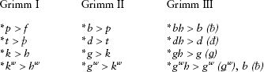

Most handbooks actually reconstruct the velar fricatives *χ and *χ*ʷ* as the out-comes of **k* and **kʷ*, but in all the older Germanic languages the sounds are written simply *h* or *hw*. (Early Germanic words rendered by the Romans with *ch*, such as the tribal name *Chattī*, are of uncertain phonetic interpretation.) Though we cannot be sure that this *h* did not sometimes represent a velar fricative χ, only in a few cases in the modern daughter languages is that the resultant sound. We will therefore use *h* and *hw* throughout instead of *χ and *χ*w*. The outcomes of Grimm III were perhaps in the first instance voiced fricatives (represented by ƀ đ ǥ ǥ*w*), but already by the end of the Common Germanic period these had hardened to stops at least word-initially and after nasals.

There seem to have been two outcomes of PIE **gʷh*, the expected *gʷ* (as in Goth. *sig**gw**an* ‘sing’ < PIE **sen**g**ʷh*-), but also *b* (as in Eng. ***b**id*, OE ***b**iddan* < ****gʷh**ed-i̯e*- ‘pray’, and ***b**ane*, OE ***b**ana* ‘slayer’ < ****gʷh**onos*) and maybe *w*, if Eng. *warm* and its relatives are from PIE **gʷhor-mo-* rather than from the rhyme-form **u̯or-mo-* (in the first case, *warm* would be cognate with Lat. *formus* ‘hot’ and Gk. *thermós* ‘heat’; in the second case it would be cognate with OCS *varŭ* ‘heat’).

The following boldfaced contrasts between English and Latin or Sanskrit consonants are direct results of Grimm’s Law (forms not in the same language as the rest of a column are in brackets):

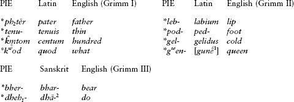

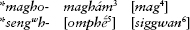

¹ Greek, ‘woman’. ² ‘Put’. ³ ‘Wealth’. ⁴ German, ‘am able’. ⁵ Greek, ‘voice’. ⁶ Gothic, ‘sing’.

**15.7.** Grimm I did not apply if the consonant was preceded by *s*, as in Eng. *s**t**ar* < PIE **h₂s**t**er-* and Eng. *s**p**ew* < PIE **s**p**eu*-. Additionally, if the PIE form had two voiceless stops in a row, only the first one underwent Grimm’s Law, as in OE *ea**ht*** ‘eight’ < PIE **ok̑**t**ō* and Eng. *ha**ft*** ‘handle, hilt’ < PIE **ka**pt**o*- ‘seized’.

**15.8. Verner’s Law.** Numerous troubling exceptions to Grimm’s Law were disposed of with the discovery by the Dane Karl Verner of the sound change now known as Verner’s Law. This sound change affected only the fricatives *f þ h* and *hʷ* that had been produced by Grimm I: if they occurred word-internally, and were not immediately preceded by an accented syllable, they became the voiced fricatives ƀ đ ǥ. Some examples are given below. On the left-hand side are examples of forms that underwent Verner’s Law; on the right, for comparison, are forms that did not undergo it because the conditions were not met:

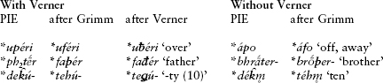

**15.9.** Also affected by Verner’s Law was the inherited voiceless fricative **s*, which became **z* if it was in the middle of a word and not preceded by the accented syllable:

| Column 1 | Column 2 | Column 3 |
| --- | --- | --- |
| With Verner |  | Without Verner |
| **ka**s**ón*- **ha**s**ón*- | **ha**z**ón*- ‘hare’ | **préu**s**oh₂* **fréu**s**ō* ‘I freeze’ |

(This **z* became *r* in English and the other West Germanic languages, as we will discuss below, the -z- of Mod. Eng. *freeze* has nothing to do with Verners Law but arose much later.) Word-final **-s* often also became **-z,* as in Runic *gastiz* ‘guest’ < PIE **ghostis;* whether this is also part of Verner’s Law or an independent change is debated.

Sometime after Verner’s Law had run its course the mobile IE accent became fixed on initial syllables (see §15.18 below), which erased the original conditioning factor for Verner’s Law. The insight of Verner was to recover the sound change in spite of the erasure of its conditioning factor.

**15.10. Final consonants.** Final stops were lost in words of more than one syllable, as in the PIE optative **u̯elih₁t* > OHG *wili* ‘he wants’, Mod. Eng. *will*. Final **-m* became *-n,* as exemplified below in §15.13.

**15.11. Consonant clusters.** In Common Germanic, **n* before **h* was lost with compensatory lengthening of the preceding vowel. This is the reason why the past tense *brought* does not have a nasal like its present, *bring*. Both forms go back to the dialectal PIE root **bhrenk-* ‘bring’, which became **brenh-* by Grimm’s Law and, in certain forms, **breng-* by Verner’s Law. The latter survives today in the present *bring*, while **brenh-* is the basis of the past-tense stem **branht-*, which underwent the loss of nasal to become **brāht-*, whence Eng. *brought*.

One more change worth mentioning is the development of clusters beginning with **z*. In **zd* and **zg*, Grimm II devoiced the stop, and the **z* became *s* by assimilation: **ni**zd**o*- > Eng. *ne**st***, **mē**zg***- ‘knit’ > Germanic **mē**sk***- > Eng. *me**sh***. Analogously, the clusters **zdh* and **zgh* became **zd* and **zg*, as in **ku**zdh**o*- ‘treasure’ > Goth. *hu**zd***, Eng. *hoa**rd*** (showing the further West Germanic change of **z* to *r* mentioned above).

**15.12. Laryngeals.** Germanic has very few traces of laryngeals. Those that became vocalized in Greek, Latin, or Sanskrit were lost in most positions, such as word-initially before consonant (**h₁s-énti* ‘they are’ > German *sind*) and after a syllabic resonant (**g̑n̥h₃-to-* ‘known’ > Gmc. **kunþa-* > OE *cūþ* ‘known’, Mod.Eng. [*un*]*couth*, with the same outcome in Germanic as *n̥- ‘not’ > Gmc. **un-* > Eng. *un-*). However, there are some examples of vocalized laryngeals, as in the word *f**a**ther*, whose *-a-* continues the laryngeal of PIE **p**h**₂ter*-.

**15.13. Resonants.** The resonants all stayed intact: Eng. *F**r**eeze* < **p**r**eus*-, *sa**l**t* < **sa**l***-, ***m**i**n**d* < ****m**e**n***-. The syllabic resonants developed a *u* in front of them: e.g. PIE **mr̥-tro-* ‘killing’ > Gmc. **m**ur**þra*- > Eng. *m**ur**der*; PIE **pl̥h₁no-* ‘full’ > Gmc.**f**ul**la*- > Eng. *f**ul**l*; *r̥- ‘not’ > Gmc. **un*- > Eng. ***un***-; **nm̥(m)-ono-* ‘taken’ > Gmc. **n**um**ana*- > OE *n**um**en* > Eng. *n**um**b* and *n**um**-skull*, literally ‘taken (as to the senses).’ (The *b* in *numb* is a late addition to the spelling and has no etymological significance.)

#### Vowels

**15.14.** Germanic reduced the distinctions among the short vowels from five to four by merging **a* and **o* to *a*, and there was a similar merger in the long vowels but in the opposite direction: *ā and *ō merged to *ō. Thus PIE ****o**k̑tō(u)* became German ***a**cht* (and Eng. *eight*, with various later vowel changes), and PIE **bhr**eh₂**tēr* (> **bhrātēr*) became Goth. *br**o**þar* (with Gothic *o* spelling ō), Eng. *br**o**ther*.

**15.15.** Among the various conditioned changes to happen to the vowels in Common Germanic, one may be singled out here, the tendency of **e* to change to *i*. This happened in most environments in Gothic, and in certain environments in the other languages; examples from English include *m**i**d* (cp. Lat. *m**e**dius*), ***i**s* (cp. Lat. ***e**st*), and *b**i**nd* (PIE **bh**e**ndh*-). Other conditioned changes, like umlaut, happened later and will be taken up below.

**15.16.** Long vowels were shortened in final syllables, probably after the Common Germanic period, sometimes disappearing in the individual languages: Goth. *fadar* ‘father’ < **ph₂tēr*, OE *giefu* ‘gift’ < Germanic **giƀō*, Goth. *guma* ‘man’ < Germanic **gumē* or **gumō*. But, as noted in §3.20, long vowels that arose through contraction over a lost laryngeal (i.e. from sequences of the type **VHV*) require separate treatment. The contraction products had an extra mora of length and are called “trimoraic” in Germanic philology; they are represented with a circumflex accent. Vowels with this extra mora of length sometimes yielded different outcomes from regular long vowels. Thus in the feminine ō-stems (< PIE *-ā- < *-*eh*₂-) the nomin. pl. *-*eh₂-es* became *-*a’as* and ultimately **-ō̃s*, while the accus. pl. *-*eh₂s* became simply **-ōs*; the difference is reflected in the early West Saxon Old English nomin. *giefa* ‘gifts’ but accus. *giefe*. Interestingly, final long vowels secondarily acquired extra length as well (a feature shared with Balto-Slavic), as in *n-*stems in *-ō̃ < PIE *-ō, e.g. Goth. *namo*, OHG *namo*, OE *nama* ‘name’, contrasting with *-ō in e.g. the feminine nomin. sing. *-ā < *-*ah₂* < *-*eh₂* (recall that the laryngeal was not lost until after the breakup of PIE, §3.19), as in Goth. *giba*, OHG *geba*, OE *giefa*, *gifu* ‘gift’.

**15.17.** Traditional historical grammars of Germanic distinguish between two long ē-vowels. One is simply the unchanged continuation of PIE *ē and is sometimes called *ē₁. The other, termed *ē₂, was a different sound having several origins, not all of them clear. The two sounds fell together in Gothic, but have divergent out-comes in North and West Germanic: *ē₂ became ē (as in the word for *here*, OE and OHG *hēr*, ON *hér*), whereas *ē₁ was lowered to *ē (as in German *Tat* and ON *dáð* ‘deed’ < Gmc. **dēđiz* < PIE **dheh₁-ti-*). In English, interestingly, this sound was raised again (*deed*; see §15.60).

**15.18. The accent shift.** As alluded to above, the PIE mobile accent became fixed on the initial syllable in Germanic. Thus after **ph₂tér-* had become **fađér-*, the accent shifted to give **fáđer*. But certain prefixes (adverbial preverbs in origin) remained unstressed, as in the English verbs *becóme, forgét, mistáke, withstánd*.

### *Morphology*

#### Nouns

**15.19.** Germanic retained the nominative, vocative, genitive, dative, accusative, and instrumental cases, although the use of the instrumental is extremely restricted even in the oldest preserved texts. The dual was lost in nouns, but not in the personal pronouns or in the verb. The athematic noun classes of PIE are reduced in number and no longer productive except for the *s*-stems and *n-*stems. Germanic was in fact especially fond of the latter, particularly for forming animate nouns. The old *n-*stem declension is the source of such English plurals as *ox-en* and *brethr-en*, and of the so-called “weak” declension of animate German nouns such as *Hase* ‘hare’, oblique and plural *Hasen*. To judge by the fact that English *water* (with *r*) stands alongside ON *vatn* (with *n*), Proto-Germanic inherited the IE word for ‘water’ as an *r/n-*stem still (§6.31); the same is true of the word for ‘fire’, Eng. *fire* but Goth. *fon*.

**15.20.** The grammatical gender distinctions among masculine, feminine, and neuter are preserved. By the regular sound changes affecting vowels (§15.14 above), the PIE ā-stem feminines became Germanic ō-stems, while the thematic masculines and neuters with stem vowel **-o-* became Germanic *a-*stems. Sample comparative paradigms of masculine *a*-stem and feminine ō-stem nouns from Gothic, Old High German, Old English, and Old Norse are given below. Representing the ō-stems is the noun for ‘gift’ (and Old Norse *skǫr* ‘edge’); representing the masculine *a-*stems is the noun for ‘day’. pl. NV *dagos taga dagas dagar*

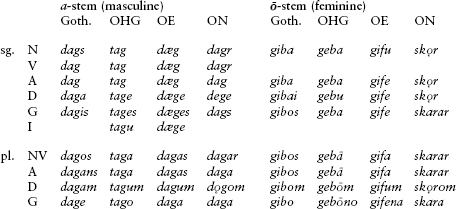

**15.21.** Of all the endings represented above, Modern English preserves only two of them – the *a-*stem genitive singular, continued today as the possessive ending *-’s*, and the *a-*stem nominative plural, today our plural *-s*. The genitive, Common Germanic **-as(a)*, comes from PIE **-os(i̯)o* (§6.48), while the nominative plural, Common Germanic **-ās*, comes from PIE **-ōs* (§6.52).

#### Adjectives

**15.22. Strong and weak adjectives.** Germanic developed two different adjective declensions, called strong and weak. The so-called strong declension has endings modeled on those of the demonstrative pronouns: German *mit frisch-**em** Wasser* ‘with fresh (dat.) water’, with the same ending as the demonstrative pronoun *dem* ‘the, this’ (dat.). The weak declension has incorporated extra suffixal material in the oblique cases that comes from the PIE individualizing suffix **-on-*, which was added to adjectives to form words meaning ‘the one that is X’. (It is also found in Latin names like *Catō* [stem *Catōn-*] ‘the one who is *catus*, clever’.) Weak adjectives occur chiefly after a determiner or pronominal adjective, as in German *mit dem frisch-**en** Wasser* ‘with the fresh water’. (Compare the similar phenomenon in Balto-Slavic of the “definite adjectives” discussed in §8.28 and §18.16.)

**15.23. Comparison of adjectives.** Germanic inherited the weak stem **-is-* of the IE comparative suffix **-i̯os-* (§6.78). Because the accent followed the suffix in PIE, the suffix underwent Verner to become **-iz-*, as in Goth. *manag-iza* ‘more’ (from *manags* ‘many’). The Germanic superlative suffix was **-ista-*, as in Goth.*manag-ista* ‘most’. This goes back to PIE **-is-* further suffixed with **-to-*, just like*-isto-* in Greek (§6.81).

The normal English comparative and superlative suffixes *-er* and *-est* actually do not usually go back to the suffixes above, but to related forms that were innovated within Germanic, **-ōz-* and **-ōsta-*: Gothic *frod-oza* ‘wiser’ and *arm-osta* ‘poorest’, and OE *liof-ora* ‘dearer’ and *liof-ost* ‘dearest’. These suffixes became more common than **-iz-/-ista-* in North and West Germanic.

**15.24. Pronouns.** The first and second personal pronouns retain the dual in all the older Germanic languages, a category otherwise lost except in the Gothic verb: OE *ic* ‘I’, *wit* ‘both of us’, *wē* ‘we’; *þū* ‘thou’, *git* ‘both of you’, *gē* ‘you (pl.)’. The PIE demonstrative pronoun **so* **seh₂* **tod* ‘this, the’ is nicely preserved in Germanic, e.g. Goth. *sa so þata*, OE *sē sēo þæt*.

#### Verbs

**15.25.** The Germanic verbal system is much simpler than it was in PIE. Only the present and the perfect stems have remained, although some aorist inflectional endings were incorporated into the perfect. The perfect became a simple past tense called the preterite, but for the most part without reduplication. Also lost were the PIE imperfect, the subjunctive, and the future or desiderative formations. The optative survived, and became the Germanic subjunctive (the development and terminology are the same as in Italic, §13.19). The mediopassive survived as a living category to some extent in Gothic (and in the verb meaning ‘be named’, see §15.45). Germanic has kept the present participle in **-nt-* (§5.60, and see further below) and the verbal adjectives in **-tó-* and **-onó-* (a variant of **-nó-*, §5.61).

**15.26. Strong and weak verbs.** Germanic verbs belong to two broad classes, termed strong and weak, according to how they make their past-tense forms (preterite and past participle). The distinction has its origin in PIE. Germanic (or pre-Germanic) verbs that could form perfects used the perfect as their past tense; these are the strong verbs. They show ablaut of the root in the formation of the tense-stems and form their past participles with the nasal suffix **-onó-*. Strong verbs include most of the present-day “irregular” verbs like *sing sang sung* or German *singen sang gesungen*. By contrast, those verbs that did not form perfects (typically secondary verbs such as denominatives and causatives) developed an entirely new kind of past tense with an innovated suffix in **-d-*. These are the weak verbs, and they typically do not ablaut. The great bulk of verbs in any Germanic language are weak (the “regular” verbs in today’s grammar), such as Eng. *settle settled settled* or its German equivalent *siedeln siedelte gesiedelt*.

**15.27. Preterite of strong verbs.** While all Germanic verbs have a present, preterite, and past participial stem, strong verbs further distinguish between a preterite singular and plural stem. This faithfully reflects the distinction between the singular and plural stems of the PIE perfect (§5.51). Examples of Germanic singular/plural preterite pairs include OHG ***bant*** ‘he bound’ ∼ ***bunt**un* ‘they bound’, ON ***greip*** ‘he grasped’ ∼ ***grip**o* ‘they grasped’, and Goth. ***warþ*** ‘he became’ þ ***waúrþ**un* ‘they became’ (where *aú* represents etymologically the vowel *u*). The vowel *a* that is typical of the singular stems (*bant*, *warþ*; *greip* is from **graip*) comes from the **o* of the *o-*grade of the PIE perfect singular stem; and the zero-grade of the PIE perfect plural is reflected in *buntun, gripo*, and *waúrþun*.

**15.28.** In many preterites of this kind there is also a change in the stem-final consonant from the singular to the plural, as in OE sing. *wear**þ*** ‘he became’ but pl. *wur**d**-on* ‘they became’. These consonantal changes are due to Verner’s Law. Recall that the PIE perfect shifted the accent in the plural from the root to the endings (§5.51); in the plural, therefore, the accent came after the root-final consonant. If the root-final consonant was a voiceless stop, it underwent Verner’s Law. Thus:

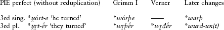

(The original 3rd pl. ending **-ḗr* was replaced at some point by **-un(t)* from **-n̥t*, an aorist ending.) The Vernerized form of the root in the preterite plural is also found in the past participle, since it likewise goes back to a PIE form with accent on the suffix: **u̯r̥t-onó-* ‘(having been) turned’ > OE *worden* ‘having become’.

Forms like OE *wear**þ*** ∼ *wur**d**on/wur**d**en* are called **Verner’s variants**, exhibiting what the Germans call *grammatischer Wechsel* or ‘grammatical change’. They are abundantly preserved in Old English, Old High German, Old Saxon, and Old Norse. Interestingly, they are quite rare in Gothic, which leveled out the consonantal differences in almost all cases. The same development eventually overtook the other Germanic languages. Modern English is the only Germanic language that still preserves one pair of Verner’s variants within a single tense-paradigm: the preterites *was* (sing.) and *were* (pl.), from OE *wæs wdron* (with *r* the English outcome of **z*, the Vernerized **s*; see §15.50).

**15.29. Strong verb classes.** Strong verbs are divided into seven classes, of which only the first three show the ablaut relationships inherited from PIE with perfect clarity. The modern English strong verbs have undergone so many changes that it is difficult to use them as examples of the original ablaut relationships, so the examples below are taken from Gothic. The forms given are the present infinitive, 1st sing. preterite, 1st pl. preterite, and the past participle of the verbs meaning ‘bite’, ‘enjoy’, ‘bind’, and ‘throw’.

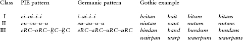

As can be seen, from the PIE point of view these all behave identically, with the present stem continuing the full grade, the preterite singular continuing the *o-*grade, and the other forms continuing the zero-grade. In Class I, PIE **ei* became *ī in Germanic, preserved as such in Gothic but written *ei*. In Class III, Gothic *ai* and *au* represent short vowels from **e* and **u*.

The other classes do not reflect PIE ablaut as directly. Class IV, from IE roots ending with a single nasal or liquid, has replaced the zero-grade of the preterite plural with a long ē, e.g. Gothic *bairan bar berum baurans* ‘bear’ (*e* writes long ē in Gothic). The same is true of Class V (from IE roots ending in a stop or *s*), which has additionally changed the past participle to full grade, e.g. Gothic *giban gab gebum gibans* ‘give’. Class VI is even more distant from the IE state of affairs, reflecting a Proto-Germanic pattern *a–ō–ō–a*: Gothic *faran for forum farans* ‘go, fare’ (*o* represents long ō in Gothic). This pattern may be related to that seen in Latin *scabō* ‘I scrape’, perfect *scābō* ‘I scraped’ (cf. §5.50). Finally, Class VII, substantially represented only in Gothic, contains a panoply of verbs whose preterites show reduplication, such as *haitan haihait haihaitum haitans* ‘name’ (where the *ai* of the root syllable *(-)hait(-)* represents a diphthong, but the *ai* of the reduplicating syllable in *haihait, haihaitum* represents a short vowel from **e*). Only traces of reduplicated preterites are found outside Gothic, e.g. OE *hehton* ‘they were named’, ON *rera* ‘(he) rowed’.

**15.30. Weak verbs.** Weak verbs formed their past-tense forms (preterite and past participle) by the addition of a morpheme in **-d-*, called the **dental preterite**, whose modern English descendant is the suffix spelled *-(e)d* or *-t*. The origin of the suffix is obscure, but it is usually assumed to be from the same root as the verb *do*. Weak verbs comprise mostly non-ablauting verbs, as discussed above. There were four classes of these verbs that can be established for Common Germanic. Class I contains denominatives and causatives formed with the suffix **-ja-* (< PIE suffixes **-i̯e/o-* and **-éi̯e/o-*).Examples include the Goth. denominative *andbahtjan* ‘serve’, pret. *andbahtida* (from the noun *andbahti* ‘service, office’), and the causative *waljan* ‘choose’, pret. *walida*. Class II contains denominative verbs formed with a different suffix, *-ō- (from *-*ā-i̯e/o-*), e.g. Goth. *salbon* ‘anoint’, pret. *salboda*. Class III contains mostly stative and durative verbs like OHG *habēm* ‘I have’, Goth. pret. *habaida* ‘had’. Finally, Class IV is formed with a nasal suffix and contains intransitive or inchoative verbs (that is, those indicating entrance into a state). It survives as a separate class only in Gothic, as in *fullnan* ‘become full’, *gawaknan* ‘wake up’; the latter’s Old English and Old Norse cognates, *wæcnan* and *vakna*, have joined Class II.

The past participle of weak verbs uses a suffix descended from the PIE verbal adjective suffix **-tó-*. In general this was Vernerized to **-da-*, as in Goth. *salbod-*‘anointed’; but the *-t-* remained in some consonant clusters, as still found e.g. in Eng. *brought* < Germanic **brāhta-*.

**15.31. Other verbs.** Four root athematic verbs survive, of which only one, ‘be’ (PIE **h₁es-*), is found in all of the family: Goth. singular paradigm *im is ist*, ON *em est es* (later *er*), and OE *eom eart is*. In West Germanic, ‘do’ is also athematic, as in OS *dōm dōs dōt*. Mention may also be made of the irregular verb *will*, which is historically an optative of a root present from PIE **u̯el-* ‘wish’ (cp. §15.10).

**15.32. Preterite-presents.** Several perfects/preterites have retained present-tense meaning (on this aspect of the perfect in PIE, see §5.53), and from them new preterites and participles were formed with the dental preterite suffix. In English, these primarily survive as the modal or “helping” verbs *can, shall, may*, and a few other forms. Since the present tense of these verbs is morphologically identical to a strong-verb preterite (note the lack of *-s* in the 3rd singular in Modern English), they are called preterite-presents or preterito-presents.

**15.33. Subjunctive.** As noted above, the Germanic subjunctive continues the PIE optative. Two tenses are distinguished, a present and a past. In Modern English, the subjunctive is formally distinguished from the indicative usually only in the third singular. Present subjunctives are found in such constructions as *Long **live** the Queen, **Be** that as it may*, and *(I asked) that he **go***; past subjunctives (distinguished from past indicatives only in the verb *be*) are found for instance in contrafactual statements like *If he **were** there (I would go)*. Since the IE optative had secondary endings, the 3rd sing. ended in **-t*, which disappeared in Germanic (§15.10 above); that is why 3rd singular subjunctives like *live* and *go* above seem to be “missing” the 3rd singular ending. (Analogously in German, the subjunctive *lebe* in *Es **lebe** die Königin* ‘[Long] live the queen’ lacks the 3rd person *-t* of the indicative *leb-t* ‘live-s’.)

**15.34. Participles.** The PIE present participle in **-nt-* survives as *-nd-*: Goth. *bairands* ‘bearing’, OE *berende*, OHG *beranti*, ON *berande*. Later in its history English replaced this with the unrelated suffix *-ing*, but a few traces of the old *nd-*participles can still be found in fossilized forms such as *friend* (originally a present participle **frijōnd-* ‘loving’) and *fiend* (Gmc. **fijand-* ‘hating’). The past participles, from PIE **-tó-* and **-onó-*, have already been discussed.

### *Syntax*

**15.35.** The historical and comparative syntax of both the ancient and the modern Germanic languages has been the topic of much discussion by theoretical syntacticians. One of the issues of interest has been the phenomenon often called “V2,” or verb-second position. The phenomenon is most easily seen in German, which requires that all finite verbs in main clauses immediately follow the first syntactic constituent of the clause. This feature is found to some extent in Modern English, particularly with negatives: *Never **did** she look so gorgeous; Hardly **had** I entered the room when* . . . However, in the older stages of these languages, the word order tended to be freer.

It is also characteristic of several of the Germanic languages that in embedded (subordinate) clauses, the position of the finite verb is different from its position in main clauses. Thus in German one says *Ich <u>habe</u> ihm das Buch <u>gegeben</u>* ‘I <u>have given</u> him the book’, but (*Es ist wahr*,) *dass ich ihm das Buch <u>gegeben</u> <u>habe</u>* ‘(It is true) that I <u>have given</u> him the book’: in the second sentence the finite verb *habe* ‘have’ falls at the end of the embedded clause beginning with *dass* ‘that’. This was the preferred order in subordinate clauses in all the older Germanic languages.

The study of Germanic syntax is somewhat hampered by the scarcity of useful material from Gothic: Wulfila’s translation of the Bible (see §15.41 below) sticks very close to the word order of the Greek original. However, Gothic does preserve an archaic feature of PIE syntax not found elsewhere in Germanic, namely the ability to place clitics between preverbs and verbs (see §15.46).

## Runic

### *Runes*

**15.36.** The first writing system used by Germanic peoples to record their own languages is called the runic alphabet, after the *runes*, the name for the early Germanic letters. This word has been taken over into Modern English from OE *rūn* ‘secret, mystery; rune’ or ON *rún* ‘secret, magical sign, rune’. It is a matter of scholarly dispute just what the historical or cultural connection between ‘secret, magic’ and early Germanic writing was. It is often supposed that the runes were so called because writing was originally restricted to use in magic or religious rituals. Against this it has been pointed out that most of the earliest runic inscriptions are just names of the makers or possessors of objects. But since the objects in question are typically weapons and (often gold) amulets, it is certainly conceivable that they had some kind of magical use, or that writing a name on them was thought to grant them some kind of power. The connection between ‘rune’ and ‘secret’ might also reflect the fact that knowledge of writing was originally limited to a few elites.

Controversy has additionally surrounded the origin of the runes. Some scholars, especially in Scandinavia, view them as having been invented in the north and based on the Latin alphabet. However, there are more striking similarities between early runes and certain “Old Italic” alphabets in use in northern Italy, particularly a Raetic alphabet found in Bolzano in the extreme north (Tirol). These alphabets were offshoots of a northern Etruscan alphabet and developed around the mid-first century <small>BC</small>. Such an alphabet was used to write the Germanic name *harigasti* (also read *hariχasti*, but in this variety of the alphabet *χ* was used to represent *g*, as also in the closely related alphabet of Venetic, cf. §20.17; the name means ‘army-guest’) on a helmet unearthed in Negau (now Negova), a Slovenian town near the Austrian border (and not far from Tirol). The age of the inscription is disputed, but could date anywhere from the third century <small>BC</small> to the beginning of the first century <small>AD</small> it is at any rate the earliest known inscriptional Germanic. True Germanic runes, though, are from much more northerly regions. The oldest so far discovered are inscribed on a fibula (brooch) from the town of Meldorf in western Schleswig-Holstein, Germany, from the mid-first century <small>AD</small>, as well as some inscriptions from around <small>AD</small> 200 found in the drained valley of the river Illerup near Århus in eastern Denmark. These inscriptions are all quite short, but are not without linguistic interest. More extensive inscriptions begin to appear in the fourth century.

The Germanic runic alphabet is called the *futhark* (or *futhorc* when referring to English runes), after its first six letters *f u þ a r k* (cp. the word *alphabet* after the first two letters *alpha* and *bēta* in Greek). The idiosyncratic angular shape of the runic letters, which eschew both curves and right angles, may be due to the fact that they were designed for inscribing on wood: all strokes had to run at an angle to the grain to keep the wood from splitting, straight lines are easier to carve in wood than curved ones, and strokes that cross the grain are easier to see.

**15.37.** Runes were used for all the Germanic languages, although by far the most numerous runic remains come from Scandinavia, particularly Denmark and Sweden. Two runic alphabets can be distinguished. The older one, often called the Elder Futhark, had twenty-four characters and is mostly attested from Denmark. An offshoot of this was modified into the futhorc of England and Friesland around 500. Beginning around the sixth century the Elder Futhark started changing, evolving into the Younger Futhark, which had only sixteen characters (the result of sound changes that allowed some older letters to be dispensed with) and became fully established by the ninth century. Inscriptions in Younger Futhark are mostly known from Sweden, and are vastly more numerous than those in Elder Futhark, reflecting the more widespread literacy of the Viking age. Christianization brought the Latin alphabet, which gradually supplanted the runes; but use of the latter continued, especially in Scandinavia, through the late medieval period and even beyond.

The language of the earliest runes, up till around <small>AD</small> 500, is rather uniform across a fairly wide geographical expanse, and has been named **Runic** or Runic Norse. Its position within Germanic is controversial. It is very similar to the putative ancestor of both North and West Germanic. However, the fact that it still preserves final *-z* (see next section) probably tips the balance in favor of specifically North Germanic filiation: North Germanic preserved *-z* but West Germanic lost it, and it is unlikely that West Germanic had not yet lost its **-z* by the Runic period. Nonetheless, we treat Runic separately here from the rest of North Germanic because of its age and controversial filiation.

**15.38.** Runic is important in preserving final *-z* before its later rhotacization to *-r* by the time it became Old Norse, as in *gastiz* ‘guest’ (ON *gestr*). The rune for this sound is frequently transcribed <small>r</small>, on the assumption that its phonetic value was between that of a *z* and an *r*; but this assumption is unnecessary. Runic also preserves short vowels before final *-s* or *-z*, as shown also by *gastiz*; these were later lost.

Most texts in Runic, before it differentiated into various local varieties that can be termed Old Swedish, Old Danish, etc., are rather short, consisting only of a name or a formulaic word. But some, such as the text below, are longer and represent our earliest native Germanic literature.

### *Runic text sample*

**15.39.** Inscription on the larger of two golden horns found in Gallehus in southern Jutland, Denmark, dating to c. <small>AD</small> 400. (The horns unfortunately were stolen and melted down for their gold in 1802.) The first two words are written together. The inscription is poetic; like later Germanic poetic lines, it consists of two half-lines connected by alliteration (*ek <u>h</u>lewagastiz <u>h</u>oltijaz || <u>h</u>orna tawido*).

ekhlewagastiz . holtijaz . horna . tawido .

I, Hlewagastiz Holtijaz, made (this) horn.

**15.39a. Notes. ek:** ‘I’, Runic stressed 1st person pronoun, which also appears as suffixed (unstressed) *-ka*; elsewhere in Germanic the form is *ik*. **hlewagastiz:** personal name, ‘famous guest’; the elements of this name are found in many other IE personal names (cp. §§2.48, 6.82). *Hlewa-* is from **k̑leu̯-o-*, cp. Gk. *klé(w)os* ‘fame’. **holtijaz:** ‘of Holt(i)’, meaning either ‘son of Holt(i)’ or ‘from a place called Holt(i)’. **tawido:** ‘made’, 1st sing. weak preterite of a verb cognate with Goth. *tawjan*, preterite *tawida*.

## East Germanic

**15.40.** East Germanic is the one extinct branch of Germanic and is represented principally by **Gothic**. According to the traditional history as told by the sixth-century Gothic historian Jordanes, the Goths’ ancient homeland was in Scandinavia;linguistically this may be supported by the name of the island of Gotland off eastern Sweden and other place-names apparently containing *Got(h)* or a related element. (On the speech of Gotland, called Gutnish, see §15.107.) In or slightly before the second century <small>AD</small>, according to Jordanes, a group of Goths migrated from Scandinavia to the Baltic coast, defeating the Vandals and other Germanic tribes who lived there, and over several generations migrated farther south and east, arriving ultimately at the Black Sea. The Goths who settled in what is now Ukraine were the East Goths or **Ostrogoths**, while their relatives to the west, in what is now Romania between the lower Danube and Dniestr Rivers, are called the West Goths or **Visigoths** (*Visi-*, also written *Vesi-* in classical sources, actually does not mean ‘west’, but probably ‘good, noble’, from PIE **u̯es-*; cp. Ved. *vásu-* ‘good’).

![Figure 15.1: *Figure 15.1* Reproduction of an eighteenth-century engraving of the Gallehus horn containing the inscription in 15.39. The engraving shows the entire decorated surface of the horn, with the rear surface peeled back. The runes encircle the top of the horn and are read rightwards, beginning with what looks like a boldfaced M (= *e*) following the non-boldfaced word in the middle (*tawido*). Most words are separated from one another by a vertical stack of four or five curved marks. From R. I. Page, *Runes* (London: British Museum Publications, 1987), p. 28. Reproduced by permission of the British Museum.](images/fortson-2010-indo-european-language-and-culture-fig15-1.jpg)

The Visigoths were attacked by Huns in the year 376, who forced them across the Danube into Roman territory. For the next half-century they wandered through various parts of Europe in search of a place to live, along the way becoming converted to Arian Christianity, sacking Rome in 410, and finally settling in southern Gaul and Spain, where they founded a kingdom. After reaching its height in the late sixth and early seventh centuries, it was ultimately defeated and absorbed by the Muslim invaders of Spain in 711. As for the Ostrogoths, for a time they were also defeated by the Huns, but freed themselves in the fifth century and took over the rule of Italy until the mid-sixth century, which became the western part of a large kingdom stretching as far east as the Danube River. We have a number of Ostrogothic names preserved in classical sources from this time.

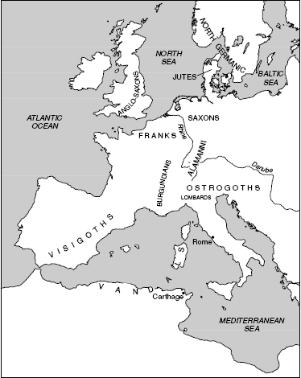

One group that had settled in the Crimea retained their identity as Goths perhaps as late as the eighteenth century. Several dozen words and phrases in the language, termed **Crimean Gothic**, were collected in the early 1560s by a Flemish nobleman, Ogier Ghiselin von Busbecq, from a Greek in Constantinople. The transmission of these words seems to be inaccurate and corrupt in places, but is a precious window on a late type of Gothic different in certain ways from the dialect of the Gothic Bible (see below).

Also driven westward by the incursion of the Huns were the Vandals, whose language, **Vandalic**, was East Germanic as well. Among their various conquests, the Vandals overran part of Spain in the fourth century <small>ad,</small> whence probably the name of the historical region called *Andalusia.* Beginning in the early fifth century and lasting into the sixth, they took over part of northern Africa and established a kingdom there that they used as a base for plundering Italy and other parts of the Mediterranean, sacking Rome in 455. Other East Germanic languages were **Burgundian**, **Gepidic**, and **Rugian**. All of these have essentially disappeared without a trace, and are known only from scattered personal and place-names.

## Gothic

**15.41.** Our knowledge of Gothic stems almost entirely from the remains of a translation of the New Testament by a West Gothic bishop named Wulfila or Ulfilas (‘Little Wolf, c. 311–382), which he undertook for the Visigoths living along the lower Danube. In addition, we have a few fragments of the *Skeireins* (‘explanation, exegesis’, a commentary on the Gospel of St. John and probably not written by Wulfila), and some isolated inscriptions and words preserved in other texts.

**15.42.** The spelling and alphabet were invented by Wulfila but are based on Greek. In transcriptions of Gothic words, *q* stands for the labiovelar *kʷ* and ƕ stands for the voiceless labiovelar glide *hʷ* (as in some pronunciations of English *what*). The letter *g* has the value [ŋ] before another *g*, *k*, or *q* (thus *siggwan* ‘sing’, *sigqan* ‘sink’), but *gg* can also represent a double *g* (especially when it arose by Verschärfung, see §15.44 below). The vowels are slightly complicated. Wulfila used *ai* and *au* each in two different values, as the outcomes of the diphthongs **ai* and **au* (probably [εː] and [ɔː]) and as the short lax vowels [ε] (like in Eng. *bet*) and [ɔ] (like in *bought*). (Many people distinguish these by writing *ái áu* for the diphthongs and *aí* and *aú* for the short vowels, but we shall not do that here.) The vowels *e* and *o* stand for long tense ē and ō ([eː] and [oː], as in Eng. *bare* and *bore*). The letter *u* stands for both short and long *u*, and *ei* stands for long [iː] (like Eng. *beat*).

### *Phonology*

**15.43.** Although Gothic is the oldest Germanic language preserved in any abundance, it is not in every respect the most conservative or archaic; as with any language, it contains its own unique mixture of old and new. Most noteworthy in this regard is the fact that it had gotten rid of nearly all the Verner’s variants (§15.28) by the time it is attested, by generalizing one or the other stem-final consonantal variant throughout any given paradigm. For example, the verb *wairþan* ‘become’ has singular preterite *warþ* as expected, but plural *waurþum* rather than expected **waurdum* (contrast OE *wearþ, wurdon*). On the other hand, Gothic preserves the Proto-Germanic vowel inventory better than any other Germanic language. For one thing, it was not affected by any of the various umlauts that spread through North and West Germanic territory some centuries later (§§15.51 and 15.94–96).

**15.44.** Another phonological feature of Gothic, this time shared with North Germanic, is the **Verschärfung** (or “hardening”) of the Proto-Germanic geminate glides **jj* and **ww* into geminate stops plus glide. The geminate glides arose from diverse sources that need not be entered into here. In Old Norse, **ww* and **jj* became *ggv* and *ggj*, while in Gothic the outcomes were *ggw* and *ddj*. For example, from Gmc. **tre**ww**(i)a*- ‘trusty, true’ we have Goth. *tri**ggw**s* and ON *try**ggv**a*, and from **twa**jj**ē(n)* or **twa**jj**ō(n)* ‘of the two’ (genit. pl.) we have Goth. *twa**ddj**e* and ON *tve**ggj**a* (cp. OHG *zweio*). Crimean Gothic has simple *d* here, as in *ada* ‘egg’ from Gmc. **a**jj**a*-; compare ON *e**gg*** (from which Eng. *egg* was borrowed).

### *Morphology*

**15.45.** Gothic preserves some important morphological archaisms not found in the other Germanic languages. Verbs have separate forms for the first and second persons dual, and a passive conjugation in the present tense. (The passive in Germanic is otherwise found only in the 1st singular of the verb ‘to be called, named’: Runic *haite* ‘I am called’, ON *heiti*, OE *hātte*, Mod. German *ich heisse.*) A vocative different from the nominative is preserved in some declensions (e.g. nomin. *dags* ‘day’, voc. *dag*). On the other hand, Gothic has lost the instrumental, which does survive in some of the other languages.

### *Syntax*

**15.46.** Gothic preserves several enclitic particles that occur in the second position of a sentence by Wackernagel’s Law (§§8.22ff.). These occur in chains, just as in other older IE languages (cp. Anatolian, §9.13), and preverbs count for the purposes of determining their placement – that is, second-position clitics will intervene between a preverb and its associated verb if the preverb and verb stand at the beginning of their clause. For example, the interrogative particle *u* appears between the preverb and verb in *ga-u-laubjats* ‘Do you (both) believe . . . ?’ (Matt. 9:28); the verb is *ga-laubjan* ‘to believe’, cognate with OHG *gilouban* (Mod. German *glauben*) and (with different prefix) Eng. *be-lieve*. An example of a chain consisting of the same particle plus the indefinite object pronoun *ƕa* ‘something’ is seen in the sequence *ga-u-ƕa-seƕi* ‘whether he saw anything’ (Mark 8:23). All of this is quite foreign to North and West Germanic.

**15.47.** Not unexpectedly in light of these facts, Gothic is the only Germanic language to preserve a living descendant of the PIE enclitic conjunction **k**w**e* ‘and’ (§7.27), which shows up as *-h* (e.g. *ga-<u>h</u>-melida* ‘<u>and</u> he wrote’) or *-uh* (IE **u-k**w**e*, e.g. *urreis nim-<u>uh</u>* ‘arise <u>and</u> take!’).

### *Gothic text sample*

**15.48.** Mark 8:14–18. For the orthography, see §15.42 above.

14 jah ufarmunnodedun niman hlaibans jah niba ainana hlaif ni habaidedun miþ sis in skipa. 15 jah anabauþ im qiþands: saiƕiþ ei atsaiƕiþ izwis þis beistis Fareisaie jah beistis Herodis. 16 jah þāhtedun miþ sis misso qiþandans: unte hlaibans ni habam. 17 jah fraþjands Iesus qaþ du im: ƕa þaggkeiþ unte hlaibans ni habaiþ? ni nauh fraþjiþ nih wituþ, unte daubata habaiþ hairto izwar. 18 augona habandans ni gasaiƕiþ, jah ausona habandans ni gahauseiþ jah ni gamunuþ.

14 Now they had forgotten to bring bread; and they had only one loaf with them in the boat. 15 And he cautioned them, saying, “Take heed, beware of the leaven of the Pharisees and the leaven of Herod.” 16 And they discussed it with one another, saying, “We have no bread.” 17 And being aware of it, Jesus said to them, “Why do you discuss the fact that you have no bread? Do you not yet perceive or understand? Are your hearts hardened? 18 Having eyes do you not see, and having ears do you not hear? And do you not remember?”

**15.48a. Notes. 14. jah:** ‘and’; the *-h* is from PIE **k**w**e* ‘and’. **ufarmunnodedun:** ‘they forgot’; *-dedun* is the 3rd pl. weak preterite ending, and *ufar-* is a preverb, lit. ‘over’ < **uper* (Gk. *hupér*, Lat. *s-uper*). **niman:** ‘to take’, German *nehmen*, OE *niman*; PIE **nem-*. The past participle of the OE verb lives on today as *numb* (§15.13). **hlaibans:** ‘loaves of bread’, cognate with Eng. *loaf (OE hlāf*); -*ans* is accus. pl., preserving the nasal (§6.55). **niba:** ‘not even’, combined with the following *ni* in a double negative construction. **habaidedun:** *hab-* is the root, like German *haben* ‘to have’; the rest is stem plus weak dental preterite. **miþ:** ‘with’, cognate with German *mit* and the *mid-* of Eng. *mid-wife* (literally ‘[one who is] with the woman [giving birth]’). **skipa:** ‘boat’, cognate with both *ship* (the native English word) and *skiff* (ultimately from a Germanic language that preserved *sk-* like Gothic).

**15–16. im:** ‘them’, dat. pl. **qibands:** ‘saying’; *-ands* is the nominative of the present participle, and *qiþan* is cognate with archaic English *quoth* (past tense, equivalent to Goth. *qaþ* as in verse 17 below). **saiƕiþ ei:** ‘see (2nd pl.) (to it) that...’. *Saiƕan*, cognate with Eng. *see,* German *sehen,* is from *se*k**w***-; the 2nd pl. ending *-iþ* is the same as ON *-ið,* German *-(e)t* (imperative *seht!* ‘see ye!’), from PIE **-ete*. **izwis:** ‘you (pl.)’, dat. and accus.; the genit. is *izwar*, seen below, verse 17. **þis beistis:** ‘the leaven’, genit. sing. object of the verb *atsaíƕiþ* ‘you look out for’. **þāhtedun:** ‘thought’, Gmc. **þdhtō* from earlier **þanhtō*, with loss of nasal as per §15.11; the nasal is still in the present stem (*þagkjan*, Eng. *think*). **misso:** ‘(each) other’. **unte:** cognate with German *und,* Eng. *and,* but here meaning ‘that’ after the verb of saying.

**17. frabjands:** ‘understanding, being aware’. **du:** ‘to’, with unexplained *d-.* **ƕa:** lit. ‘what’, here meaning ‘why’; from PIE **k**w**od*, with regular loss of the final *-d* (preserved in the demonstrative *þata* ‘that (thing)’ by the addition of some enclitic particle). **nauh:** ‘yet’, = German *noch* ‘yet, still’, IE **nu-k**w**e*. **nih:** ‘nor, and not’, IE **ne-k**w**e* (> Lat. *neque* ‘nor’). **wituþ:** ‘you (pl.) know’; the singular stem is *wait-*, from the old PIE perfect **u̯oid-, *u̯id-,* see §5.52. **daubata:** ‘deaf, hardened’, neut. accus. of the adj. *daufs; -ata* is the ‘strong’ adjectival ending, taken over from pronominal forms like neut. accus. *þata* ‘that’. **hairto:** ‘heart’, a neuter *n-*stem, hence its inflection in German as *Herz* (nomin.-accus.) but dat. *Herz-en.*

**18. augona:** ‘eyes’, neut. nomin.-accus. pl., also a neuter *n-*stem (German pl. *Auge-n*), from Gmc. **auǥōn*, ultimately from PIE **h₃ek**w***- (Lat. *oc-ulus*, OCS *oko*, etc.) but influenced by Gmc. **auzōn* ‘ear’ (PIE **h₂eus-*; the Gothic descendant, in the neut. pl., is *ausona*, a few words later in this verse). **gasaiƕiþ:** ‘see’, 2nd pl., with the addition of the prefix *ga-* to give it a punctual or perfective sense. The same prefix is found in *gahauseiþ* ‘you hear’ and *gamunup* ‘you understand’; the Greek original has ordinary presents for all of these, so this is clearly a Gothic feature and not a literal rendition of the Greek. **gahauseiþ:** ‘you hear’, from the verb *hausjan* ‘to hear’. In the rest of Germanic it shows the effects of Verner’s Law (Eng. *hear*, ON *heyra*, all from **hauzja*-). The PIE root for ‘hear’ is **h₂kous-*, as in Gk. *akoúō* ‘I hear’.

## West Germanic

**15.49.** Three ancient West Germanic languages are attested in meaningful quantities from before the year 1000: **Old English**, **Old Saxon**, and **Old High German**. Old High German is more divergent from the other two than either of them are from each other (Old Saxon and Old English are quite similar and must have been mutually intelligible). For this reason, a division is often made between Old High German and the rest of West Germanic.

### *Consonants*

**15.50.** In Common West Germanic, Germanic final **-z* was lost, as in OE *dæg* and German *Tag* ‘day’ from **daǥaz* (cp. Goth. *dags*, ON *dagr*). Elsewhere, **z* was rhotacized to *r*, as in **luzana-* ‘lost’ > Eng. *lorn* (as in *love-lorn*, *for-lorn*). A consonant plus the glide **j* became a geminated consonant following a short vowel, as in many verbs with the suffix **-ja-* (see §15.30), e.g. **si**tj**an* ‘to sit’ > OE *si**tt**an*, **bi**dj**an* ‘to ask’ > OE *bi**dd**an* (cp. Goth. *bidjan*). Additionally, *h* was lost before consonants word-initially; this happened independently in all the West Germanic languages in the Middle Ages. Thus contrast Eng. *loud* and German *laut* with OE *hlūd* and OHG *hlūt*, *hlūd*. West Germanic loanwords beginning with *hl-* borrowed into early French, which had no *h*, were borrowed as *fl-* or *c(h)l-*, as in the name of the Merovingian king *Clovis* from Frankish **Hlodowīg* ‘loud-battle’; a later form of the same name was borrowed as *Louis*. Finally, mention may be made of the hardening of Germanic *đ to *d*, which happened in all positions in this branch but more limitedly in the other branches, as in OE *midd* ‘mid(dle)’ (vs. ON *miðr*) and OE *meodo* ‘mead’ (vs. ON *mjǫðr*).

### *Vowels*

**15.51.** The Germanic vowels underwent more substantial changes in West Germanic than the consonants. Principal among these were the various *umlauts*, vowel shifts caused by the presence of a particular vowel or glide in a following syllable. By far the most significant, and most familiar, was ***i*-umlaut**. This sound change affected the back vowels *a*, ā, ō, *u*, and ū when they preceded a syllable containing *i* or *j* (the glide i̯). The back vowels then became fronted to vowels essentially equivalent to Modern German *ä, ö*, and *ü*. A tabular overview, with further remarks on other umlaut processes, is given below in the section on Old English, §15.60.

While *i*-umlaut ultimately affected most of the West Germanic-speaking area (as well as Old Norse, see §15.96 below), it did not affect all of it equally or simultaneously. It appears to have started in the northwest, as its effects are complete in Old English from the earliest documented times. It also spread to Old Norse fairly early. Farther south, however, matters are less clear: umlaut is not indicated consistently in Old High German texts, and modern southern German dialects show it less consistently too.

## Old English

**15.52.** Around the late fourth and continuing into the fifth and sixth centuries <small>AD</small>, three Germanic tribes inhabiting the coastal areas of Denmark and northern Germany began migrating to England: the Angles, Saxons, and Jutes. The traditional date for their arrival is 449, but there is good evidence that their migrations had already begun by 400. The Angles, inhabiting northern Schleswig-Holstein and already mentioned by the Roman historian Tacitus in the first century <small>ad,</small> settled large parts of Britain in the fifth and sixth centuries, including what would become the kingdoms of Northumbria, Mercia, and East and West Anglia. Around the early fifth century, the Saxons, who had aggressively expanded into northern Germany from their homeland in eastern Schleswig-Holstein, launched pirate raids against Britain and began to colonize it, settling in areas that are now called Essex, Wessex, and Sussex (literally ‘East Saxons’, ‘West Saxons’, ‘South Saxons’). The Jutes came probably from Jutland in Denmark and settled in Kent in southeast England and the Isle of Wight. The original distinctions among these closely related peoples soon disappeared; medieval writers referred to the whole population simply as *Anglī* or Angles, whence the OE name *Englaland,* ‘land of the Angles, England’. In modern scholarship, they are collectively called the **Anglo-Saxons**.

**15.53.** The language of this new population in Britain is known as **Old English** or Anglo-Saxon. It is first known from fragmentary runic inscriptions of little linguistic value from the late fourth or early fifth century; the literary period did not start until several centuries later. The surviving corpus of Old English literature is substantial and consists of both poetry and prose. Most Old English poetry is anonymous and cannot be dated with certainty, but was probably written down between the eighth and eleventh centuries. The oldest datable poem is Caedmon’s hymn (§15.69), composed around 650. The longest and most famous Old English poem is *Beowulf*, a heroic epic containing a mixture of historical and legendary material, some of it quite ancient.

The earliest Old English prose is older than the poetry. Its first known representative is the law code of King Æthelberht of Kent, written c. 600. The composition of literary prose prospered during the reign of King Alfred the Great (849–99) of Wessex, who instigated a cultural renaissance in the late ninth century and championed the use of Old English as a literary vehicle equal to Latin. Under Alfred’s influence, the Wessex variety of the **West Saxon** dialect (spoken in southwestern England) became the literary standard, ushering in the period of “Classical” Old English. Literary activity in England was vigorous until the Norman Conquest (1066); many of the prose works produced during this time are in an excellent style on a par with that of any other contemporaneous literature in Europe.

**15.54.** Aside from West Saxon, Old English had three other major dialects: **Northumbrian**, spoken north of the Humber river, preserved in short inscriptions, poems, and glosses; **Mercian**, spoken between the Humber and the Thames, preserved in charters and glosses and the source of most Modern English native forms; and **Kentish**, spoken in a small slice of southeast England, preserved also in charters and in some literature and glosses.

**15.55.** Old English shares several features with Frisian, leading many scholars to posit an **Anglo-Frisian** subgroup of West Germanic. The palatalization of *k* before front vowels (see the next section) and the “brightening” of *a* to *æ* (§15.60) are among the characteristics of Anglo-Frisian.

### *Developments of Old English*

#### Consonants

**15.56. Palatalization.** Most of the changes that Old English made to the West Germanic consonant system had to do with the velars. The voiceless velar stop **k* when neighboring front vowels (*e* and *i*) or preceding the palatal glide *j* was palatalized to the affricate [č] (written *c*, later *ch* starting in Middle English). This is the source of the *ch* in such Modern English words as *chew* (OE *cēowan*), *church* (OE *cirice*), *drench* (pre-OE **drankjan*), and *ditch* (OE *dīc*; contrast German *kauen*, *Kirche*, *tränken* ‘to water’, and Old Norse *díki* ‘ditch’, all without palatalization). The voiced velar stop **g* was weakened to the voiced velar fricative [ɣ] or the glide [j] (but still spelled *g* in Old English) in many positions, especially word-finally, between vowels, and before most front vowels. This is the source of the initial *y-* in such words as *yellow, yield*, and *yarn* (OE *geolu, geldan* ‘to pay’, *gearn*; compare German *gelb, gelten, Garn* with preserved *g-*); note also *day, many, saw* (‘saying’) from *dæg, manig*, and *sagu*. A hard *g* in these positions in a Modern English word typically marks it as a borrowing, as is the case with *get, guest, gift, egg, dreg*, and *nag*, which are all from Old Norse.

**15.57. Other changes.** A feature that characterizes not only Old English but all the West Germanic languages except High German is the prehistoric loss of nasals before fricatives (*f þ s*), with compensatory lengthening of the preceding vowel. Thus where OHG has *fimf* ‘five’, OE has *fīf* and Old Saxon has *fîf*. Similarly, the word for ‘other’ in Gothic is *anþar* and in OHG *ander*, while OE has *ōþer*; and contrast also OHG *uns* ‘us’ with OE *ūs*, and German *Gans* with OE *gōs* ‘goose’. Additionally, the Germanic voiced fricative *ƀ remained a fricative and turned into voiceless *f*, as in *hlāf* ‘loaf’ < **hlaiƀaz* (contrast German *Laib*).

**15.58.** Between vowels, the fricatives *f* and *s* were voiced to *v* and *z* in Old English, though spelled as *f* and *s*: *frēo**s**an* ‘freeze’, *o**f**er* ‘over’.

**15.59.** Finally, the consonant cluster **sk* became the sibilant [*ʃ*] in Old English (i.e. *sh*) and was spelled *sc*: *fisc* ‘fish’, *scip* ‘ship’, *wæscan* ‘wash’. Words in English with the sound *sk* are borrowings, often from other Germanic languages. Thus *shirt* is native English (OE *scyrte*) but *skirt* is a borrowing of its Old Norse cognate *skyrta*. Similarly, the word *blatherskite* turns out to be a bit more colorful than its modern meaning (‘foolish person’) might suggest: its second element is a borrowing of the Old Norse cognate of English *shit*.

#### Vowels and diphthongs

**15.60.** The Germanic vowel system underwent more significant change than the consonants in OE. The back vowels **a* and *ā became fronted (or “brightened”) in most positions to the front vowels *æ* and ǣ except before nasals: thus *ræt* ‘rat’ (vs. German *Ratte*, which preserved the old *a*) and *hæfde* ‘had’ (vs. German *hatte*). (One can see with this change part of the characteristic “sound” of English shining through at an early date.) The most far-reaching change was *i-*umlaut, causing the diphthongs and most vowels to be fronted before a syllable containing **i* or **j* in pre-Old English. The following table exhibits most of the changes; the first example for each vowel or diphthong is not umlauted, while the second example is umlauted and is boldfaced:

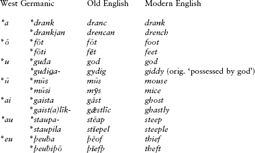

**15.61.** The new *æ* and ǣ from **a* and *ā, together with the other front vowels *e, i,* and ī, underwent a diphthongization in various phonetic contexts known as **breaking**. Examples include the following:

| Column 1 | Column 2 | Column 3 |
| --- | --- | --- |
| Germanic | Old English | Modern English |
| **l**i**zn-* | *l**e**ornian* | *learn* |
| ****a**htau* | ***ea**hta* | *eight* |
| ****er**þō* | ***eo**rþ* | *earth* |

These diphthongs reverted to single vowels later in the history of English, but spellings like *learn* and *earth* are orthographic remnants of the earlier diphthongal pronunciation.

There were also diphthongs inherited from Germanic, and these underwent change as well. First, **ai* was monophthongized to ā, which eventually became long ō in most dialects, including the one ancestral to Modern English. This is still a diphthong in German, where it is usually written *ei*; hence English–German pairs like *bone/Bein*, *stone/Stein*, *home/Heim*, and *whole/heil*. The other two Germanic diphthongs, **au* and **eu*, became *ēa* and *ēo*: compare OE *cēaþ* ‘bargain’ (> modern *cheaþ*) with German *Kauf* ‘sale’, and OE *flēogan* ‘to fly’ with OHG *fliogan* (< Germanic **fleugan*).

**15.62. Recognizing ablaut and umlaut in Modern English.** English contains many words or word-pairs having vowel alternations; some are due to ablaut, some to umlaut, and telling them apart usually requires some knowledge of their history. Vowel changes in the principal parts of strong or “irregular” verbs are normally vestiges of PIE ablaut; the same is true of many nouns derived from or related to them, such as *song* alongside *sing*, and *seat* alongside *sit*. Umlaut is the source of, among other things, the vowel alternations seen in irregular plurals (*mouse/mice*, *foot/feet*, *man/men*; these all go back typically to Germanic plurals with the suffix **-iz*, which disappeared after causing umlaut), in abstract nouns ending in *-th* that are formed from adjectives (*long/length*, *foul/filth*, *whole/health*; the suffix was **-iþō-*, with the *-i-* causing umlaut), and in the occasional irregular comparative or superlative like *elder*, *eldest* alongside *old* (Germanic **aldiza-* **aldista-*; recall §15.23). In some cases, a vowel alternation in Modern English is due to a combination of both ablaut and umlaut, as with *stench* alongside *stink* (Germanic **stankja-* along-side **stinkan*) and with the causative *drench* alongside *drink*.

### *Morphology*

**15.63.** The morphology of Old English was little changed from that of Common Germanic, and resembles that of Modern German. There were four cases in the noun and pronoun (nominative, genitive, dative, accusative), plus traces of an instrumental case; verbs were conjugated in a present and preterite indicative and in a present and past subjunctive, with different endings for most of the persons in singular and plural.

**15.64.** Many Old English nominal and verbal paradigms show the effects of umlaut; virtually all of these effects were leveled out in the later development of the language, with the occasional “irregular” plurals like *man/men* being essentially the only remnants. Examples of such paradigms follow: a root noun (*fōt* ‘foot’), a consonant-stem (*fēond* ‘enemy’), and an *s-*stem (*lomb* ‘lamb’). Also, two strong verb paradigms are given in the present and preterite, an example of Class III (*helpan* ‘to help’) and of Class II (*cēosan* ‘to choose’, this one also showing Verner’s variants in the preterite):

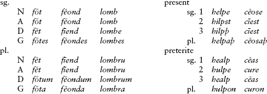

It is instructive to note that Old English nouns had well over a half-dozen plural formations, of which the ancestor of the productive modern *s-*plural was merely one: *stān* ‘stone’ pl. *stānas*; *hēafod* ‘head’ pl. *hēafodu*; *word* ‘word’ pl. *word*; *giefu* ‘gift’ pl. *giefa*; *lār* ‘teaching, lore’ pl. *lāra*; *sāwol* ‘soul’ pl. *sāwla*; *eoh* ‘horse’ pl. *ēos*; *mǣd* ‘mead, meadow’ pl. *mǣdwa*; *oxa* ‘ox’ pl. *oxan*; and *here* ‘army’ pl. *herigeas*. Almost all of these have disappeared without a trace; *oxen* is a remnant of the old *n*-stem declension (note how what we think of as a plural ending *-en* was originally the stem, from the IE point of view), while *men* and *feet* go back to umlauting paradigms. The *-r-* in *children* (dialectally also *childer*) is the only remnant of the *lombru*-type plural in the paradigm above, where the *-r-* ultimately continues the *-s-* of the IE *s*-stems. The developments by which *-s* became the default plural are complex and not fully documented.

In the verb paradigms, the old 3rd plural endings have been generalized throughout the plural (-*aþ* < *-*anþ* < primary **-onti*; *-on* < Germanic **-un* < secondary *-*n̥t*); Old English shares this characteristic with all of West Germanic outside of High German. The 2nd singular of the preterite, with its short-vowel ending and the same ablaut grade as the plural, is characteristic of West Germanic and unusual from the PIE point of view. The ending appears to go back to Gmc. **-īz*, the 2nd sing. optative ending; what we are probably dealing with is an old perfect optative that was used for politeness. (The normal 2nd sing. perfect ending **-th₂e* is preserved as *-t* in the preterite presents, as in early Modern Eng. *(thou) shalt.*)

## Middle and Modern English

**15.65.** After the Old English period, almost all the inflections seen in the previous section were lost. This loss has been frequently but erroneously attributed to the influence of Norman French (on which more shortly). In fact, changes that pre-dated the Norman period had already set the scene for it, in particular the loss of distinctions in the vowels of final unstressed syllables. In the **Middle English** period, these syllables were lost, and with them most inflectional endings. The different classes of Old English nouns were collapsed into essentially one class which added *-es* to form the possessive singular and the plural. (This had not fully affected feminine nouns or kinship terms in *-er*, as seen by phrases like *his lady grace* and *thi brother wife.*) Grammatical gender was also lost except in a few dialects, as well as the dual inflection in pronouns. To express grammatical roles of nouns, prepositional phrases and distinctions in word order became increasingly important.

**15.66.** Middle English lasted from the time of the Norman Conquest (1066) to about 1500. The first century and a half of this stage is poorly documented. The Normans not only ousted the Anglo-Saxon royalty and nobility, but also replaced the native clergy and scribes with speakers of Norman French. The forced break in the scribal tradition resulted in a precipitous drop in the writing of English, and by the thirteenth century, English had absorbed hundreds of French loanwords. But after the loss of Normandy in 1204, interest in French declined and the prestige of English rose again. London was the administrative capital and attracted a steady stream of settlers who brought regional dialect features with them. London English adopted some of these features, increasing its comprehensibility far from the mouth of the Thames; gradually it assumed the role of a standard language. By the end of the fourteenth century, English was the language of instruction in schools; it had also triumphed in the originally Norse-speaking Danelaw, the area of northern England settled by the Norsemen. (But Norse had left an indelible stamp on English vocabulary; see §15.90 below.)

**15.67.** The bulk of surviving Middle English literature consists of anonymous religious and didactic works in verse, including romances like the brilliant late fourteenth-century poem *Sir Gawain and the Green Knight*. A linguistically valuable piece of didactic religious verse, albeit devoid of literary interest, is the *Ormulum* by a canon named Orm (fl. 1200). This poem was written in a spelling system devised by Orm himself to reflect the phonetic details of the language faithfully. Needing little introduction is the finest poet in English before Shakespeare, Geoffrey Chaucer (c. 1342–1400), who became a master of narrative poetry, especially with his unfinished *Canterbury Tales*.

**15.68.** The **Modern English** period includes English since 1500. Its chief linguistic development was the **Great English Vowel Shift**, a series of changes to the long vowels that had already begun in the late Middle English period and finished running their course by the eighteenth century (at least in standard English; some dialects were never affected by it, or affected only partially or in different ways). First, the long high vowels [iː] and [uː] became the diphthongs consisting of [əj, əw] (later [aj, aw]); subsequently the mid long vowels [eː] and [oː] were raised to [iː, uː] and the low vowel [aː] was fronted and raised to [eː]. In modern (standard) English pronunciation, all the resultant vowels have come to be pronounced with offglides. Compare the following examples:

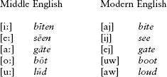

As can be seen from the Modern English examples, the older spelling was frequently maintained. Modern English spelling in fact typically reflects late Middle English pronunciation.

### *Old English text sample*

**15.69.** Caedmon’s Hymn, as preserved in the earliest Anglian (Northumbrian) version, <small>AD</small> 737; probably composed around 650. A *u* before a vowel represents *w*. The version on the right is in West Saxon.

| Column 1 | Column 2 |
| --- | --- |
| *Northumbrian* | *West Saxon* |
| Nū scylun hergan hefænricaes Uard, | Nū wē sculon herigean heofonrīces Weard, |
| Metudæs maecti end his mōdgidanc, uerc Uuldurfadur, suē hē uundra gihuaes, | Meotodes meahte ond his mōdgeþanc, weorc Wuldorfæder, swā hā wundra gehwæs |
| ēci Dryctin, ōr āstelidæ. | ēce Drihten, ōr onstealde. |
| Hē ǣrist scōp aelda barnum heben tō hrōfe, hāleg Scepen; thā middungeard moncynnæs Uard, ēci Dryctin, æfter tīadæ, fīrum foldu, Frēa allmectig. | 5 Hē ǣrest sceōp eorðan bearnum heofon tō hrōfe, hālig Scyppend; þā middangeard monncynnes Weard, ēce Drihten, æfter tēode, fīrum foldan, Frēa ælmihtig. |

Now we must praise the guardian of the heaven-kingdom,  

the might of the Lord and his wisdom,  

the work of the Glorious Father, how he,  

eternal Lord, established the beginning of each of the miracles.  

5 He first created for the children of men [var.: of the earth]  

the heaven as a roof, the holy Creator;  

then mankind’s Guardian,  

eternal Lord, made middle earth after that,  

land for men, almighty Lord.  

**15.69a. Notes (selective). 1–3. hefænrīcaes:** ‘of the heaven-kingdom’, genit. sing. Northumbrian is valuable in distinguishing *æ* (written *ae* < **a*; see §15.60) from *e* in unaccented final syllables. The noun *rīc* ‘kingdom’, Gmc. **rīkja-*, is a loanword from Celtic (ultimately < PIE **h₃rēg̑-* ‘king’, cp. Lat. *rēx* ‘king’, Ved. *rā́j-ān-* ‘king’). **Metudæs:** ‘Lord, God’, genit. sing.; one of the native Germanic words adapted for use to refer to the Christian God. It originally meant ‘fate’ and comes from the verb *metian* ‘to measure’ (**med-*, cp. OIr. *midiur* ‘I measure, estimate’, Lat. *modus* ‘measurement’). **maecti:** ‘might’, feminine *ti-*abstract noun (§6.42) of the verb *magan* ‘be able, be powerful’ (> Mod. Eng. *may*). **mōdgidanc:** ‘wisdom’, lit. ‘mind-thought’; *mōd* (Mod. Eng. *mood*) is cognate with German *Mut* ‘courage’ and Goth. *moþs* ‘anger’, but of unclear etymology; *gidanc* is an example of a very common type of abstract noun in Germanic, made by adding the suffix **ga-* to a verbal root to form a collective. (The type survives in the noun *hand-iwork* < OE *hand-geweorc*.) **uerc:** ‘work’, PIE **u̯erg̑-* (Gk. *(w)érgon* and Arm. *gorc* ‘work’). **uundra:** ‘wonders’, genit. pl.; the genit. pl. ending in OE was *-a*, from PIE **-ōm*.

**4–5. ēci:** ‘eternal’, cognate with the first part of Goth. *ajuk-dūps* ‘eternity’ and ultimately derived from **h₂oi̯u-* ‘life(time)’ via Gmc. **aiw-* (which became *ē(w)* in OE; cp. German *ew-ig* ‘forever, eternal’). **Dryctin:** ‘Lord’, another Germanic term appropriated to refer to God; originally just ‘lord (of battle)’, cp. Goth. *ga-drauht-s* ‘soldier’. **ōr:** ‘beginning’, cognate with ON *óss* ‘mouth (of a river)’ and Lat. ō*s* ‘mouth’. **āstelidæ:** ‘established’; the preverb ā- is continued in Mod. Eng. *acknowledge* (from OE *ā-cnāwian* ‘recognize, acknowledge’), and *stelidæ* is from *stellan* ‘place, set up’, cp. German *stellen,* ultimately from PIE **steh₂-* ‘stand’ with additional derivational material. **ǣrist:** ‘first’, derived from the superlative of Gmc. **air-* ‘early, early in the day’, from PIE **ai̯er-* ‘morning, day’ (Av. *aiiarə* ‘day’, Gk. *ā́r-iston* ‘breakfast, first meal of the day’); the Germanic comparative **airiz* underlies Eng. *early.* **scōp:** ‘created’, preterite of *scieppan* (cp. Mod. Eng. *shape* < OE *gesceap* ‘a creation’, and German *schaffen* ‘create, accomplish’). **aelda:** ‘of ages’, i.e. ‘of generations, of men’, genit. pl.; a *ti*-abstract from the root **h₂el-* ‘nourish’ (also seen in OE *alan* ‘nourish, raise’, Lat. *alumnus* ‘one nourished’, and Eng. *old,* lit. ‘nourished, grown up’ from the old *to-*participle). The West Saxon version has a different word here, *eorðan* ‘earth’. **barnum:** ‘children’, dat. pl.; the word survives in Scots *bairn,* and literally means ‘one carried (in the womb)’, from **bher-* ‘carry’.

**6–9. hāleg:** ‘holy’, a derivative of *hāl* ‘whole’, from Gmc. **haila-* < PIE **kai-lo-* ‘whole, complete’ (cp. OCS *cělŭ* ‘whole’, and the Old Prussian toast *Kails! Pats kails!* ‘Hail**!** Hail yourself!’, useful at parties). **middungeard:** ‘middle earth’, the Germanic term for the earth and humanity, and the inspiration behind J. R. R. Tolkien’s fictional Middle Earth. *Middun* is ultimately from PIE **medhi̯o-* ‘middle’ (Lat. *medius* ‘middle’, Gk. *mésos* ‘middle’) and *geard* (*yard* nowadays) is cognate with Lat. *hortus* ‘garden’, from PIE **g̑her-* ‘enclose’. **moncynnæs:** ‘mankind’, genit. sing., compound of *monn* ‘man’, ultimately < PIE **manu-* (cp. Ved. *mánu-*‘man’), and *cynn* ‘kin’ < Gmc. **kunja-* < **g̑n̥h₁-i̯o-*, from **g̑enh₁-* ‘give birth’. **Frēa:** ‘Lord’, Gmc. **frawōn*, the feminine of which became German *Frau* ‘woman’.

## Old High German

**15.70.** The language known as High German (loosely, German; it is called “High German” after the relatively mountainous terrain of much of its early territory, to distinguish it from the “Low German” of the lowland country to the north) appears first in the form of runic inscriptions in **Old High German** dating back to 600 or so, most importantly on a spearhead found in Wurmlingen near Tübingen in southwest Germany. From the eighth century come a large number of glosses as well as the earliest literature, at first short poems and religious texts. But only in the ninth and tenth centuries does a considerable quantity of material appear on the scene, roughly contemporaneous with the flowering of Old English.

**15.71.** Old High German is preserved in six dialects, which often vary substantially from one another in orthography and certain grammatical features. The dialect called East Frankish, spoken in east-central Germany east of Frankfurt, is often treated by modern scholars as a kind of standard Old High German, but at the time there was no literary standard that obtained across different regions. The other dialects (Old Alemannic, Old Bavarian, South Rhine Franconian, Rhine Franconian,and West Frankish) were collectively spoken in an area stretching from Switzerland and Bavaria in the south up through Cologne and Fulda in the north.

Often considered a separate West Germanic language, but forming part of the general Old High German dialect area, was the **Frankish** spoken by the Franks, a people that progressively invaded areas of the Roman Empire, primarily eastern Gaul, beginning in the fourth century. The empire they formed, under the Merovingians and Carolingians, lasted more than 300 years, and in the west they (and their name) ultimately became part of the nationality now known as the *French*. The western variety of Frankish is not attested with certainty, but it exerted strong lexical influence on French.

Another variety of Old High German was the language of the Lombards, called **Langobardic**, about which we know very little. The Lombards came from what is now northwest Germany and migrated southward during the fifth century, eventually establishing an important kingdom in northern Italy.

**15.72.** The surviving corpus of Old High German literature was produced in monasteries and is almost exclusively Christian. We have only the meagerest remains of pagan Old High German literature, including the charm below in §15.81 and a solitary poem in traditional Germanic heroic verse, the incomplete, quasi-historical *Hildebrandslied*, which is intermixed with Old Saxon.

### *The High German Consonant Shift*

**15.73.** The most famous hallmark of German that separates it from the other West Germanic languages to its north is the High German Consonant Shift, or as it is often called in German, the *zweite Lautverschiebung* (Second Sound Shift, that is, second after Grimm’s Law). By this sound change, broadly speaking, the West Germanic voiceless stops **p *t *k* were affricated to *pf ts* (written *z* or *tz*) and *kx* in initial position, and spirantized (became fricatives) to *f s x* (written *ch*) elsewhere. A comparison of words in modern English and German will illustrate these changes in word-initial (left) and word-internal (right) positions:

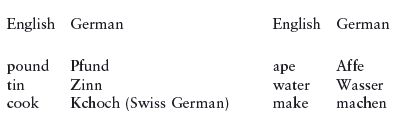

As shown by the ‘cook’ entry, only Swiss German shifted **k* to *kx* in initial position; ‘cook’ in standard German is *Koch*. In fact, as one travels northward in Germany, ever fewer components of the High German Consonant Shift are met with, until one arrives in Low German territory, where none of the shift has taken place.

**15.74.** High German is also characterized by the shift of West Germanic **d* to *t* and **þ* to *d*: compare Eng. ***d**ee**d*** with German ***T**a**t*** and Eng. ***th**ing* with German ***D**ing*. This change also affected Dutch and spread to Low German, although the latter’s ancestor, Old Saxon, does not show either change.

### *Changes to vowels*

**15.75.** While Old High German vowels were affected by umlaut, they were not affected by breaking; this plus the lack of any wholesale shift later in the language’s history comparable to the Great English Vowel Shift has made the German vowel system more conservative than that of English throughout its attested history. Among simple vowels, practically the only change worthy of note is that *ō was diphthongized to *uo*, as in OHG *bluoma* ‘flower’, *scuoh* ‘shoe’ alongside OE *blōm* and *scōh*. When we turn to the original diphthongs, however, things become more interesting. Inherited **eu* underwent a split depending on the vowel in the following syllable: normally it became *io*, but when the following syllable contained a high vowel or *j*, the outcome was *iu*. This resulted in a number of alternations within paradigms and across related words, such as in strong verbs of Class II (infinitive *b**io**tan* ‘offer’ but 1st sing. *b**iu**tu*, 3rd sing. *b**iu**tit*) and in pairs like adjective *s**io**h* ‘sick’ ∼ abstract noun *s**iu**hhī* ‘sickness, plague’. (See §15.79 below for the further history of these forms.) Another important change was the monophthongization of the diphthongs **ai* and **au* to ē and ō before *h*, *r*, and *w*. The first development is seen in OHG *gēr* ‘spear’ (borrowed into English as a part of names like *Ger-ald* ‘spear-rule’, *Ro-ger* ‘famous spear’ from OHG *Gēr-(w)ald*, *Hrōd-gēr*) < **gair(a)* < Germanic **gaiza-*; *zēha* ‘toe’ (> Modern *Zeh* or *Zehe*) < **taiha-*; and *snēo* ‘snow’ (Modern *Schnee*) < **snaiwa-*. (Recall from §15.61 that **ai* was monophthongized in English across the board, and to ā rather than ē: the correspondents of OHG *gēr*, *zēha*, *snēo* are OE *gār*, *tā*, *snāw*, with *gār* living on in *gar-fish* and *gar-lic*, literally ‘spear-leek’.) The second development is seen in *ōra* ‘ear’ (> Modern *Ohr*) < **aura* < **auzō* and *hōh* ‘high’ (> Modern *hoch*) < **hauha-*. Otherwise the diphthongs **ai* and **au* remained unchanged to this day, where they are spelled *ei* and *au* (as in *Stein* ‘stone’ < **staina-*, contrast OE *stān*).

### *Middle and Modern High German*

**15.76.** Around 1100 was the birth of the **Middle High German** period. For the first time, a standard German was developed, based on the Bavarian and Alemannic dialects in the south. The most important Middle High German literature is poetry, in particular courtly epic and romance, stressing chivalric virtues and refinement and exploring Christian themes. The courtly poetry also included the important genre of the *Minnesang* or song of courtly love (*minne*). Another genre, that of the national epic, is most famously represented by the anonymous *Nibelungenlied*, written in Austria c. 1200–1210; this work is rooted in the earlier Germanic warrior tradition and draws heavily upon historical and legendary material about the Danes, Saxons, Burgundians, and Huns in the fifth and sixth centuries.

**15.77.** Probably the most important change to affect German phonology from OHG to MHG was the weakening of unstressed syllables. Long vowels fell together with short vowels, and differences in quality were erased, with everything ultimately becoming schwa in the modern standard. The inherited *m* still retained in OHG forms like dat. pl. *tagum* ‘days’ and 1st pl. *habēm* ‘we have’ fell together with *n* (a change that was actually already underway in later OHG), whence MHG *tagen*, *haben*. These changes dramatically reduced the number and variety of different declensional and conjugational classes and brought the language much closer to its modern-day look. Another change that may be mentioned was that the OHG diphthong *io* became *ie*, as in *liebe* ‘love’ from OHG *lioba.*

#### Modern High German

**15.78.** For several hundred years after the height of Middle High German literature, there was no longer any standard literary language. By far the most important influence on the development of the Modern High German standard language was Martin Luther’s translation of the Bible, the first edition of which appeared in 1522 (Old Testament) and 1534 (New Testament). Luther’s translation was the first to be written in a direct and uncomplicated – at times even colloquial – style that strove not only to include expressions that were modern and up-and-coming, but also to incorporate linguistic features from as many regions as possible. Its impact on literary German was immense; its core was Luther’s native dialect of Thuringian.

**15.79.** Three developments in German phonology from the medieval to the modern period may be mentioned. The first was the monophthongization of the diphthongs *uo* and *ie* to [uː] and [iː] (the latter still spelled *ie*), as in *Schuh* < MHG *schuoch* and *Liebe* < MHG *liebe.* The second is a change paralleled in English: the long high vowels ī and ū became diphthongized to [aj] and [au], as in *mîn* ‘of me’ > *mein* and *hûs* ‘house’ > *Haus*. Finally, the diphthong *iu* underwent a metathesis, becoming pronounced today as [ɔj] but spelled *eu*, as in *Seuche* ‘sickness, plague’ < MHG *siuche*. Continuing the thread from §15.75 concerning MHG *iu* and *ie* (< OHG *iu*, *io*), which were conditioned outcomes of the same inherited diphthong, when the difference in diphthong manifested itself in different words, the difference was preserved into the modern language: thus MHG *siech* ‘sick’ and *siuche* ‘sickness’ above are continued as Modern HG *siech* and *Seuche*. But alternations within one and the same word, such as in OHG *biotan ∼ biutu* above, which were continued well into Middle High German, have disappeared, preserved only in rare poetic phrases like *was da kreucht und fleucht* ‘what crawls and flies’, where *kreucht* and *fleucht* are obsolete 3rd singulars of the verbs *kriechen* ‘crawl, creep’ and *fliegen* ‘fly’.

In syntax, German is famous (or infamous) for the rule that the conjugated verb be the second constituent in main clauses and come at the end of subordinate clauses. Though these are statistically the most common orders already in Old High German, the real standardization of them did not happen until the modern period.

#### Yiddish

**15.80.** During the Roman Empire, Jews had settled in various places in Europe, bringing the Semitic languages Hebrew and Aramaic with them from Palestine; wherever they settled they acquired the local language but continued to use Hebrew as a religious language. By the late Middle Ages, the Jews in Germany were primarily settled in east-central and southern parts of the country, and their German was thus Bavarian or East Middle German, a variety spoken north of Bavaria. Their German contained Hebrew lexical elements mixed in with it; it is this mixture that is known as **Yiddish** (‘Jewish’ in its original literal meaning, German *Jüdisch*). Historically it is a form of German, not Hebrew; its sentence structure has always been German,as is about three-fourths of its vocabulary. After many of its speakers moved east into Slavic territory, it became influenced by Polish and other Slavic languages. The first documents in Yiddish date to the twelfth century; the language is usually written using the Hebrew alphabet.

### *Old High German text sample*

**15.81.** The Second Merseburg Charm, from the tenth century. The two Merseburg Charms are the only surviving examples of pre-Christian pagan magic spells in German. The last two lines have numerous analogues in other IE traditions, including Anatolian, Indic, Celtic, and Tocharian; see the notes. The story of a god’s horses praining its foot and being healed by Wotan is apparently depicted also on a golden bracteate (a kind of pendant or amulet) from c. <small>AD</small> 500.

Phol ende Uuōdan uuorun zi holza.  

Dū uuart demo Balderes uolon sīn uuoz birenkīt.  

Thū biguol en Sinthgunt, Sunna era suister,  

thū biguol en Frīia, Uolla era suister,  

thū biguol en Uuōdan sō hē uuola conda:  

sōse bēnrenkī, sōse bluotrenkī,  

sōse lidirenkī:  

bēn zi bēna, bluot zi bluoda,  

lid zi geliden, sōse gelīmida sin.  

Phol and Wodan were riding to the woods,  

and the foot of Balder’s foal was sprained.  

So Sinthgunt, Sunna’s sister, conjured it;  

and Frija, Volla’s sister, conjured it;  

and Wodan conjured it, as he well could:  

Like bone-sprain, so blood-sprain,  

so joint-sprain:  

Bone to bone, blood to blood,  

joint to joints; so may they be glued.  

**15.81a. Notes. Phol:** an otherwise unknown name, but probably the masculine of *Uolla* below. The names Sinthgunt and Sunna are also found only here. **ende:** ‘and’, PIE **h₂enti*, also in Gk. *antí* ‘against’, Lat. *ante* ‘before’. **Uuōdan:** Wotan, the supreme Germanic god (Odin in Scandinavia). The English equivalent, *Woden,* is the source of *Wednes-day.* **uuorun:** ‘rode’, Mod. HG *fuhren,* from Gmc. **fōrun*, a Class VI strong verb (§15.29), from PIE **per-* ‘cross over’; cognate with Eng. *fare*. **zi:** ‘to’, Mod. HG *zu.* In the original manuscript, *zi* and the other unstressed words (e.g. *dū/thū, en, sōse*) are often written without a break before (or after, in the case of *en*) a neighboring stressed word, a valuable indication of close connection in pronunciation (cp. Eng. *to-day*). **holza:** ‘wood, forest’, dat. sing. **dū:** ‘then, there, so, and’, often little more than a sentence-connector. **uuart:** ‘became’, early Mod. HG *ward*. **demo:** ‘to the’, dat. sing. of the definite article, modifying *uolon*. **Balderes:** ‘of Balder’ (or Baldur), son of Odin. **uolon:** ‘foal’, dat. sing. The construction is impersonal, literally ‘to Balder’s foal his foot was sprained’. **sīn**: ‘his’. **uuoz:** ‘foot’, Mod. HG *Fuβ.* **birenkit:** ‘sprained’, past participle, Mod. HG *gerenkt* (with different prefix). Cognate with Eng. *wrench*. **biguol:** ‘conjured’, preterite 3rd sing. **en:** ‘him, it’, accus.; Mod. HG *ihn.* Eng. *him* continues the dative case, cognate with OHG *im*. **era:** ‘her’, Mod. HG *ihre*. **suister**: ‘sister’, Mod. HG *Schwester*. Eng. *sister* is a borrowing from Norse; the OE form was *sweostor*. The *-t-* is epenthetic, arisen in early Germanic in the *sr-*cluster of the inherited weak stem **su̯esr-*. **Frīia:** ‘Freyja’, the goddess of love (ON *Frigg*). **Uolla:** perhaps the same as Fulla, a handmaid of the Norse goddess Frigg. **sō:** ‘as, so’. **hē:** ‘he’, not the same form as Mod. HG *er.* **uuola:** ‘well’. **conda:** ‘could, knew how’, Mod. HG *konnte.* **sōse**: ‘just as’. **bēnrenkī:** ‘bone-sprain’. **bluotrenkī:** ‘blood-sprain’. **lidirenkī:** ‘joint-sprain’ or ‘limb-sprain’. Note that in this and the following part of the charm, the body-parts are enumerated going from inside (bone) to outside (joint or limb), via flesh (blood), the direction for driving out the ailment. The same order of body-parts is found in spells and medical texts elsewhere in IE, and in fixed traditional descriptions of the so-called “canonical creature,” and is likely inherited. The phrases *bēn zi bēna, bluot zi bluoda,* etc. have celebrated parallels in a magical charm in Vedic against open fractures (Atharva Veda 4.15 in the slightly less corrupt Paippalāda version but 4.12 in the more frequently cited Śaunaka version), which includes passages like “Let marrow be put together with marrow, let bone grow over with bone; we put together sinew with sinew, let skin grow with skin” (4.15.2 = 4.12.4). **geliden:** ‘joints’ or ‘limbs’; instead of the usual plural we get a form called a collective, commonly formed in Germanic with the prefix **ga-* (> German *ge*-). The collective was eventually generalized in Mod. HG *Glied* ‘joint, limb’. **gelimida sin:** ‘they may be glued’ or ‘they are glued’. The verb is related to Mod. HG *Leim* ‘lime, glue’, and *sin* is a 3rd pl., either subjunctive (Mod. HG *seien*) or indicative (*sind*).

## Old Saxon

**15.82.** Old Saxon was spoken until about the twelfth century in an area bounded by the Rhine in the west and the Elbe in the east, and from the North Sea down to Kassel and Merseburg in the south. Its most significant literary remains are the *Heliand* (‘Savior’), composed about 830, which tells the life of Christ in almost 6,000 lines of alliterative Germanic verse. We also have part of an Old Saxon translation of the Book of Genesis, plus some minor fragments.

**15.83.** Linguistically, Old Saxon is quite close to Old English, Old Frisian, and Old Low Franconian (the ancestor of Dutch), being set apart from High German by the lack of the High German Consonant Shift (§15.73 above). It differs from the rest of West Germanic in preserving ƀ unchanged word-internally, as in *lioƀora* ‘better, dearer’ in the text sample below (contrast German *lieber*). Additionally, Old Saxon lost *h* in the cluster *hs*, as in the word for ‘flax’, *flas* (OE *fleax*, OHG *flahs*). Old Saxon does not show the effects of *i-*umlaut as thoroughly as Old English or Frisian, at least not in spelling; for example, the plural of *mûs* ‘mouse’ is also *mûs* (vs. OE *mȳs*, from **mūsiz*).

**15.84.** The modern-day descendants of Old Saxon are the varieties of **Low German** (*Niederdeutsch* or *Plattdeutsch*) spoken in northern Germany. They blend into Frisian and Dutch in the west and northwest. Low German reached its zenith as a literary and administrative language during the time of the Hanseatic League, a powerful commercial confederation of cities in northern Germany and along the Baltic coast whose height of power was from the thirteenth to the fifteenth centuries. The center of the Hanseatic League was Lübeck, whose variety of Low German (Eastfalian or Ostfälisch) became widely used as an administrative and literary language, and was for a time more important than Middle High German.

### *Old Saxon text sample*

**15.85.** Excerpt from the story of Jesus’s return to Galilee in the *Heliand* (1121–27 and 1148–50). The biblical stories contained in the *Heliand* are skilfully recast in a Germanic setting. The characters are given social roles proper to aristocratic Germanic society: Jesus, for example, is the “giver of jewels,” and he is “chosen” by James and John as Lord in the same way leaders were elected in early Germanic society. Herod is similarly depicted as a “ring-giver” who holds feasts with his “ring-friends,” both central Germanic images of a king. The Lord’s Prayer is likened to runes or secret knowledge; in teaching it, Jesus calls to mind Woden, who knows the secrets of magical formulations.

Here Jesus is depicted like a Germanic chieftain assembling a retinue of young warriors.

Uuas im an them sinuueldi sâlig barn godes  

lange huîle, untthat im thô lioƀora uuarð,  

that he is craft mikil cûðien uuolda,  

uueroda te uuillion. Thô forlêt he uualdes hlêo,  

1125 ênôdies ard endi sôhte im eft erlo gemang,  

mâri meginthioda endi manno drôm,  

geng im thô bi Iordanes staðe . . .  

1148 ...He began im samnon thô  

gumono te iungoron, gôdoro manno,  

1150 uuordspâha uueros.  

(1121) The blessed son of God was in the wilderness (1122) for a long time, until it then seemed better to him (1123) that he should make known his great strength (1124) for advantage to the people. Then he left the shelter of the forest, (1125) the domicile of the wilderness, and sought a group of earls again, (1126) famous great people and the tumult of men, (1127) (and) he went then to the bank of the (River) Jordan . . . (1148) He began to gather there (1149) men for disciples, good men, (1150) word-wise men.

**15.85a. Notes** (very selective). **uualdes hlêo:** ‘shelter of the forest’; *uuald* ‘forest’ is cognate with German *Wald*, and *hlêo* is cognate with Eng. *lee* (‘sheltered side’, OE *hlēo*). The desert of Judaea is transformed by the author of the *Heliand* into a more Germanic-like forested region. **gumono, manno, uueros:** three different words for ‘man’, all of them inherited from PIE (**dhg̑hemō(n), *manu-, *u̯iH-ro-*). **uuordspâha:** ‘word-wise, eloquent’; word-wise in order to convert people.

## Dutch and Frisian

**15.86.** To the west of Old Saxon was spoken **Old Low Franconian**, the speech of a group of western Franks and closely related to Old Saxon. It is attested, very meagerly, from the ninth to the twelfth centuries in Limburg in the extreme southeast of the modern Netherlands. The particular variety of Old Low Franconian spoken in the cultural centers of Flanders and Brabant is called **Old West Low Franconian** and is the ancestor ultimately of **Dutch**. It is known only from a charming two-sentence scrap preserved in the binding of an eleventh-century Latin manuscript in England: *hebban olla vogala nestags hagunnan hinase hi*[*c e*]*nda thu w*[*at u*]*nbidan* [*w*]*e nu* “All the birds have begun nests except for you and me. What are we waiting for?”

**15.87.** The medieval descendant of this language was **Middle Dutch**, which is well attested starting in the late twelfth century, principally in Flanders and Brabant. The literature of this time consists of courtly romances and epics, miracle plays, and religious writings. In the seventeenth century the Dutch colonized South Africa; their descendants speak **Afrikaans**, which has diverged from Dutch significantly enough to be considered a separate language. The name of the dialect that developed around Flanders, namely **Flemish**, refers to the Dutch spoken in Belgium. Dutch, Afrikaans, and Flemish are often together called *Netherlandic*.

**15.88.** In northern coastal areas of the Netherlands and Germany, as well as on the North Sea islands off the coast, is spoken **Frisian**. Frisian is said to be the closest living relative of English (recall §15.55). Its first records, in Old Frisian, date only to the thirteenth century, although some scattered runic remains from the sixth through the ninth centuries have been claimed (doubtfully, at least in part) to be in an earlier form of the language.

## North Germanic: Old Norse and Scandinavian

**15.89.** North Germanic is represented by a single ancient language, **Old Norse**, and its descendants the modern Scandinavian languages. It is probable that Runic, or Runic Norse (see §§15.36ff.), was its immediate ancestor. The homeland of the North Germanic speakers was centered in an area along the western Scandinavian coasts, especially Norway and southwest Sweden but also northern Denmark. The northern Germanic pirates known as Vikings mostly spoke varieties of Old Norse; for reasons that are still unclear, in the late eighth century these Norsemen began a series of raids that soon grew into a scourge as they ravaged and terrified any part of Europe that was reachable by boat. They had developed the best nautical technology then known and perfected the technique of the lightning raid; coastal populations were essentially defenseless against them. Raiding per se is an old Indo-European tradition; there is evidence suggesting that it was a rite of passage for young unmarried warriors to enter into a *Männerbund*, a ‘band of men’ or fraternity of sorts, and undertake marauding expeditions (§2.8). From the eighth through the tenth centuries and beyond, Viking bands ventured as far afield as Paris, Pisa, Newfoundland, Jerusalem, and even Baghdad. But the Norsemen were often more interested in trading than raiding, notably those that went east and settled in what is now Russia, founding and ruling Kievan Rus’, the medieval East Slavic state.

For a time, Byzantine emperors employed Scandinavian mercenaries as part of their royal bodyguard, the famous axe-wielding Varangian Guard (the Varangians, ON *Væringjar*, were the Norsemen associated with the Rus’). The raids, explorations, and mercenary services of the Norsemen made Old Norse for a time the European language with the greatest geographical spread.

The Vikings that laid siege to Paris withdrew upon being granted a duchy in northern France, now called Normandy (from *Norman*, a variant of *Norseman*) in 911. The Norsemen that settled there quickly took on French ways and customs, but the restless adventurousness in their blood remained: their descendants were the Normans who seized the throne of England in 1066.

**15.90.** In England, the Norsemen settled along large stretches of the north and central coast, an area known as the Danelaw. The names of the cities and towns of this area are mostly of Norse origin and contain such suffixes as *-by* (‘town, village’, from ON *býr*, whence also Eng. *by-law* ‘local or internal ordinance’) and *-thorpe* (‘village’, ON *þorp*). Norsemen and Anglo-Saxons intermarried in this area; it is sociolinguistically significant that the word *husband* is Norse, while *wife* is Anglo-Saxon – a fact attesting to the widespread taking of Anglo-Saxon wives by Norse settlers. Hundreds of Norse words entered English, slowly filtering through to southern England during the Middle English period, and including such basic vocabulary as *get, sister, take, both, call*, and *they*. The influence of Norse on English core vocabulary was actually greater than that of Norman French.

### *Old Norse literature*

**15.91.** The Runic language of the earliest runic inscriptions, as discussed above, may be ancestral to Old Norse (see §15.37). The first inscriptions that are unambiguously Norse begin to appear around the seventh century; not much later clear dialectal differences within Norse can be detected, allowing us to distinguish among Old Icelandic, Old Norwegian, and Old Swedish.

Old Norse literature occupies a special place in the hearts of Germanic philologists because it preserves native pre-Christian Germanic mythology and folklore far better than any other old Germanic literature. Technically, most Old Norse literature is written in the dialect spoken in Iceland and called **Old Icelandic**; often the term “Old Norse” refers really to this dialect. Written literature in it dates from the mid-twelfth century, and consists of historical accounts of the travels and raids of the Norsemen, as well as mythological poetry and prose, some of it composed orally several centuries earlier. The most important of the poetry is the poetic (or Elder) Edda, a collection of mythological poems that probably represent our earliest Old Norse literature. The historian and chieftain Snorri Sturluson (1179–1241) is the source of the equally famous Prose Edda, containing prose versions of many other mythological stories compiled as part of an effort to preserve these tales for posterity. Old Norse prose is also represented famously by the sagas (*saga* ‘tale’), written between the twelfth and fifteenth centuries; these represent one of the highpoints of medieval European vernacular literature. Finally, mention may be made of the poetry of the Skalds (*skáld* ‘poet’), court poets in Norway who fashioned several new poetic genres and styles. Skaldic poetry is known especially for its dense and elaborate use of kennings or telescoped metaphors, which can make it quite challenging to read (e.g. *lyngfisk* ‘heather fish’ = ‘snake’, crawling in heather like a fish in the sea, or *Haka bláland* ‘blue land of Haki’ = ‘sea’ [Haki is the name of a sea king]). Kennings are in fact a characteristic feature of traditional Germanic poetry (as e.g. OE *gūþwudu* ‘battle-wood’ = ‘shield’), but nowhere is the art of the kenning so highly developed as in skaldic poetry.

### *Developments of Old Norse*

**15.92.** Old Norse looks somewhat different from the other Germanic languages of comparable age; impressionistically, the words seem shorter and the vowel inventory greater. This is due to several phonological changes that affected the language between the time of the early runes and the eighth or ninth century. As a side note, the historical phonological sketch to follow characterizes the western variety of Old Norse, chiefly Old Icelandic; but since most of the Scandinavian settlers in England spoke Old East Norse, Norse loans into English do not have all the same features.For example, not all of the assimilations of consonant clusters containing *n* (§15.99) took place in Old East Norse: thus Germanic **bankiz* ‘long low seat’ and **sprintan* ‘jump up, sprint’ became *bekkr* and *spretta* in Old Icelandic but **bænkr* and **sprinta* in Old East Norse, the sources of Eng. *bank* and *sprint.*

#### Vowels

**15.93. Syncope.** The vowels of many final syllables were syncopated (deleted), as in ON *gestr* ‘guest’ from **gestir* (Runic *gastiz*), and the nominative singular ending *-az*, which already in later Runic inscriptions appears as just *-z*. Before this syncope had run its course, however, the language underwent a series of vowel mutations or umlauts, described next.

**15.94. *u*-Umlaut**. Certain vowels were rounded preceding a syllable with a *u* in it, a change called *u-*umlaut or *u-*mutation. An *a* was rounded to a sound written ǫ; *e* was rounded to *ø* (pronounced like German *ö*); and long *á* was changed to long ǫ́. (Acute accents indicate length in standard Old Norse orthography.) So for example North Germanic **saku* became Old Norse *sǫk* ‘charge, offense’ (cp. OE *sacu,* Mod. Eng. *sake*); similarly, the verb *róa* ‘to row’ has a reduplicated 3rd pl. preterite *røru* ‘they rowed’ from **rerun*.

**15.95. *w*-Umlaut.** Closely allied with *u*-umlaut was *w*-umlaut, caused by a following *w* (later becoming *v*). In addition to the above effects, this also changed *i* to *y* (pronounced like German *ü*), as in the verb *slyngva* ‘to fling, sling’.

**15.96. *i*-Umlaut.** Norse had *i-*umlaut just like its West Germanic cousins, whereby an *i* or *j* (the glide i̯) fronted a vowel in a preceding syllable. The effects of this can already be seen in later Runic. The umlauting of the back vowels *a, o,* and *u* and their long counterparts proceeded as in West Germanic (§15.51), with the outcomes spelled *e ø y* for the short vowels and *æ œ ý* for the long ones. Additionally, the diphthongs **au* and **eu* (which developed into *jú*) were umlauted to *ey* and *ý*, and the vowel ǫ, a product of *u*-umlaut, was fronted to *ø* like *o*. Examples include *framr* ‘forward’ ∼ *fremri* ‘more forward’; *áss* ‘god’ (nomin. sing.) ∼ *æsir* ‘gods’ (nomin. pl.); *koma* ‘to come’ ∼ *kømr* ‘comes’ (**komiz*); *fullr* ‘full’ ∼ *fylla* ‘to fill’ (**fulljan*); *fljúga* ‘to fly’ ∼ *flýgr* ‘flies’ (**fleugiþ*).

**15.97. Breaking of *e***. Finally, we may mention the “breaking” of *e,* which was analogous but not identical to the breaking seen in Old English: *e* became *ea*, then *ja*, in a syllable followed by *a*, as in *jafn* ‘even’ from **ebna-* (cp. OE *efen*); and it became *eo* (later *jo* and even later *jǫ*) before a syllable containing a *u* (e.g. *jǫtunn* ‘giant’ < **etunaz*).

#### Consonants

**15.98.** For the consonants, a few characteristic changes may be mentioned. The most problematic for issues of Germanic subgrouping has been the “hardening” of the geminated glides **ww* and **jj* (see above, §15.44). The old *z* of Runic became *r* as in West Germanic, e.g. *vǫ́**r**o* ‘they were’ < **wāzun*. Word-initial *j* disappeared, as in *ár* ‘year’ (cp. German *Jahr*) and *ungr* ‘young’ (cp. German *jung*), which happened also to *w* word-initially before rounded vowels and resonants, as in *orð* ‘word’, *urðu* ‘they became’ (cp. German *wurden*), and *líta* ‘face’ (cp. OE *wlītan* ‘face’). Where *w* was not lost, it became *v*, as in ON *hvat* ‘what’, *vatn* ‘water’.

**15.99. Assimilation of consonant clusters.** A major source of the unusual look of Old Norse vis-à-vis the other old Germanic languages is the great number of consonant clusters that underwent assimilation. The rules are too complex to enter into here; some examples will suffice: *sótti* ‘sought’ (cp. OE *sōhte); finna* ‘to find’ (cp. OE *findan*); *batt* ‘bound’ (cp. OE *band*); *villr* ‘wild’ (cp. OE *wild*); *Þórr* ‘Thor’ (literally ‘thunder’ < **Þunraz*, cp. OE *Þunor*); and *drekka* ‘to drink’ (cp. OE *drincan*).

### *Morphology*

**15.100.** Old Norse nouns and verbs show the same behavior and inflectional categories as in contemporary relatives like Old English and Old High German. Due to the massive series of umlauts, the vowel alternations in stems can be complex,even more so than in Old English (see §15.64): for example, the nominative, dative,and genitive singular of the word for ‘father’ was *faðir, feðr, fǫður*. Verbs do have one significant inflectional difference from the rest of Germanic in that the 3rd singular ending in the present tense was **-z*, displacing the inherited ending **-þ*. This spread from the 2nd singular. Hence *berr* (< **ber-iz*) means both ‘you carry’ and ‘(s)he carries’.

#### Enclitic elements

**15.101.** Characteristic of Old Norse is a high degree of enclisis of pronouns and adverbs that in the other Germanic languages remained separate words. The Norse definite article is ordinarily suffixed to the word it modifies: masc. *-(i)nn* (e.g. *úlfrinn* ‘the wolf), fem. *-(i)n* (e.g. *kona-n* ‘the woman’), neut. *-(i)t* (e.g. *auga-t* ‘the eye’).Old Norse created a class of reflexive or middle verbs by suffixing *-mk* (1st person)and *-sk* (2nd and 3rd persons), reduced forms of the reflexive pronouns *mik* and *sik*, as in *kalla-sk* ‘calls himself/herself, is called’ and *kǫllu-mk* ‘I am called’.

**15.102.** Of some historical interest are the numerous Norse negators. Originally they were not negators at all, but were used to emphasize negative words; later they acquired negative meaning of their own. A negative suffix *-gi* is found in *engi* ‘no, none’ (*ein* ‘one’ + *-gi*), *ekki* ‘nothing’ (neut. *eitt* of *ein* + *-gi*), *eigi* ‘not’ (*ei* ‘ever’ + *-gi*), and *hvergi* ‘nowhere’. The suffix *-gi* comes ultimately from the PIE indefinite suffix **kʷid* (indefinites have a certain affinity for being combined with negatives and can, over time, become interpreted as negatives themselves; recall also the history of Gk. *ou* ‘not’ in §7.25). Of particular interest are the enclitic negative suffixes *-a* and *-at* found in early verse and attached to verbs, sometimes together with enclitic suffixed subject particles, e.g. *es-a* ‘is not’, *vas-k-a* ‘I was not’ (*-k*, enclitic form of *ek* ‘I’), *hef-k-at-ek* ‘I have not’ (with doubled enclitic pronoun). Etymologically these are from unstressed *ein* and *eit* ‘one’. The acquisition of negative meaning by words that were not negative to begin with is paralleled in numerous other languages, as with French *pas* (recall again §7.25).

### *The modern Scandinavian languages*

**15.103.** Beginning about the ninth century the Runic inscriptions in Scandinavia begin to show regional differences, especially a general split into a West Nordic and an East Nordic variety, corresponding to the modern groups of West Scandinavian and East Scandinavian. Overall, the western dialects are more conservative than the eastern ones.

**15.104.** In the ninth century, explorers from the western Norwegian coast settled Iceland; their language developed into what is now known as **Icelandic**. The language of Iceland stayed remarkably conservative; speakers of modern Icelandic can read the Old Norse sagas and other literature without great difficulty. Modern Icelandic still retains three genders, four cases in the noun, and essentially the same pronominal and verbal system as in Old Icelandic. In pronunciation, however, there have been extensive changes. Close to Icelandic is **Faroese**, the language of the Faroe Islands between Iceland and the Shetland Islands, settled also by western Norwegians around the same time as Iceland. A handful of Faroese runic inscriptions are known from c. 1000–1500, as well as a few documents from the end of the thirteenth century.The Danes, who had become rulers of the Faroe Islands in 1380, banned the language from written use in 1536. A robust oral literature continued, however, especially in the form of satirical lays and the epic ballads called *kvæði*. Some of these were written down starting in the 1770s, but not until 1854 was a standard orthography devised for the language. The orthography is strongly traditionalist, oriented toward Old Icelandic spelling rather than the phonetics of spoken Faroese.

Closely related to Faroese was **Norn**, spoken on the Shetland and Orkney Islands until the eighteenth century. Little written evidence of the language survives, but a large number of words were borrowed into the Scots that supplanted it.

**15.105.** The North Germanic dialect of Norway developed into **Norwegian**, first recognizable as such (in the form of Old Norwegian) in the twelfth century. Norwegian is notable for having developed contrasting tonal contours in words of more than one syllable, called accent 1 (falling-rising; developed on words that were originally monosyllables like *kommer* ‘comes’ < ON *kømr*) and accent 2 (rising-falling-rising; developed on words that were originally polysyllabic, as in *gater* ‘streets’ < ON *gǫtur*).

**15.106.** To East Scandinavian belongs first of all **Danish**, arguably the least conservative Scandinavian language, which can be inscriptionally distinguished by 1000 or so (Old Danish), with the first Danish manuscripts dating to the thirteenth century. During the Middle Ages, it merged the Old Norse masculine and feminine genders into a single (common) gender, lost all the cases besides the nominative and genitive, and came under considerable influence from the neighboring Low German dialects to the south, from which it has made extensive morphological borrowings. Most Danish dialects have an unusual phonetic feature called *stød,* which is similar to a glottal stop near final consonants in monosyllables.

**15.107.** Around the same time as Old Danish came into existence we can also distinguish Old **Swedish**. Swedish, like Danish, lost most of the cases in the noun, merged the masculine and feminine into a single common gender, and lost the verbal personal endings. But the highly conservative **Elfdalian** in the north retains three genders and at least three cases in the noun, plus personal endings; it is sometimes considered a separate language, and has its own orthographic system. (Its syntax is also unusual for a Germanic language in several respects and has been the object of recent study.) Swedish developed accentual contrasts like those of Norwegian.

The island of Gotland off eastern Sweden, mentioned in §15.40, is home to **Gutnish**. The status of Gutnish is unclear; many consider it to be a separate East Scandinavian language primarily because of divergences in phonology and vocabulary that are already apparent in its first attestations in the mid-fourteenth century. Also having attracted attention are some correspondences with Gothic, such as the fact that the *lamb* word means ‘sheep’ rather than ‘lamb’ only in these two languages. These similarities, certain retained archaisms in the phonology of Gutnish, and the likely etymological connection of *Gotland* with *Goth* (§15.40), have led some to argue that Gutnish is closer to Gothic than to anything else; but this is far from certain. It also has the accentual contrasts of Norwegian.

### *Old Norse text sample*

**15.108.** The opening of the *Þrymskvíða* or *The Lay of Thrym*, a famous tale in the Poetic Edda (given here in the linguistic form of its probable tenth-century origin rather than that of the manuscript from 1270).

1 Vreiðr vas þá Ving-Þórr es vaknaþi  

ok síns hamars of saknaði;  

skegg nam at hrista, skǫr nam at dýja,  

réð Jarðar burr um at þreifask.  

2 Ok hann bat orða alls fyrst of kvað:  

‘Heyrðu nú, Loki, hvat nú mælik,  

es engi veit jarðar hvergi  

né upphimins: Áss es stolinn hamri**!**’  

1 Enraged was Ving-Thor, when he woke up  

and missed his hammer;  

he began to shake his beard, he began to shake his hair,  

the son of Earth groped about himself.  

2 And he said first of all these words:  

“Hear now, Loki, what I now say,  

which no one knows anywhere on earth  

nor in heaven above: the god has had his hammer stolen!”  

**15.108a. Notes. 1. vreiðr:** ‘enraged’, cp. Eng. *wrath.* The manuscript has just *reiðr*, showing the loss of *v-* before liquids; but when this poem was composed, the *v-* must have still been there because the word has to alliterate with *Ving-*. **Ving-Þórr:** ‘Swinging Thor’, referring to Thor’s attribute of swinging his hammer. **vaknaði:** ‘woke up, awakened’, intransitive. ON has a class of verbs in *-na-* that have intransitive inchoative meaning (‘become X’); exactly how they connect with other nasal presents in Germanic and IE is not fully clear. **ok:** ‘and’, cp. German *auch* ‘also’. **hamars:** ‘hammer’, genitive object of the verb *sakna* ‘to miss’. **nam:** lit. ‘took’, here more weakly ‘did’; cognate with German *nahm* and used in Eddic poetry as an auxiliary for metrical convenience. **at:** ‘to’ with infinitives. **réð:** lit. ‘counseled’, also ‘set about (to . . . )’ or just ‘did’, so here ‘set about to grope’ or just ‘did grope’. The infinitive is *ráða*, cognate with German *raten* ‘counsel, advise’. **Jarðar:** ‘Earth’, mother of Thor; nomin. sing. *jǫrð*. **Þreifask:** ‘to grope’; *-a* is the infinitive ending, cognate with German *-en* (OHG *-an*), and *-sk* is a reflexive suffix; §15.101.

**2. orða:** ‘words’, genit. pl. with *þ*at (lit. ‘that of words’); see §15.98. **kvað:** ‘spoke’, cognate with Eng. *quoth*. **heyrðu:** ‘Hear you’, a combination of *heyr* ‘hear’ and the 2nd sing. pronoun *þú*. **Loki:** Loki, a god and trickster figure. **mælik:** ‘I say’, combination of *mæli* and suffixed clitic pronoun *-k* (cp. Runic *-ka*, the suffixed form of *ek*). **engi:** ‘no one’, originally ‘anyone’, but over time it achieved negative force by being always used with a negative, like French *personne* ‘no one’, lit. ‘person’. **veit:** ‘knows’, German *weiss*, Goth. *wait*. **hvergi:** ‘anywhere, nowhere’, composed of *hver* ‘(some)where’ and the negative particle *-gi*; see §15.102 above. **upphimins:** ‘up-heaven, the sky above’. The word is part of a traditional formula meaning ‘earth and up-heaven’ that also appears in OE and OHG. **Áss:** ‘god’, nomin. sing., stem *ás-*; pl. *Æsir*. The word comes from PIE **h₂ens-*, having derivatives pertaining to royalty and deities, such as Hitt. *ḫaššuš* ‘king’ and Ved. *ásu-ra-* ‘lord’. The last sentence literally means ‘The god is robbed as to (his) hammer’.

## For Further Reading

The debate about the internal subgrouping of the Germanic branch is thoughtfully treated in Nielsen 1989 and 2000. For beginners coming at Germanic from the English point of view, see especially Robinson 1992. A good overall history of Germanic, though dated in places, is Prokosch 1939; more recently, see the linguistic and cultural overview in Green 1998. Bammesberger 1990 is a very useful overview of Germanic nominal morphology, with many comparative lists; similar but not as good is Bammesberger 1986, on the verb. An excellent exhaustive comparative listing of the Germanic strong verbs is Seebold 1970.

The standard edition of the older Runic inscriptions known by the mid-1960s is Krause and Jankuhn 1966 (see also Krause 1971 for grammar); a bit more recent, and in English, is Antonsen 1975, although some of his interpretations must be treated with caution. Antonsen’s book includes a brief grammar of Runic. The complete Gothic Bible, with glossary, is in Streitberg 2000; of several good available comparative grammars of Gothic, Krause 1968 and Braune 2004 may be mentioned. The standard grammar of Old High German is Braune 1987, with an accompanying reader (Braune 1994). For Old English, consult the classic grammar of Alistair Campbell (Campbell 1959); and for Old Saxon, see Holthausen 1921. The standard introduction to Old Norse in English, with a wide selection of texts and glossary, is Gordon 1962, also with a (rather bare) grammatical sketch. In German, see also the grammar of Noreen 1923.

Many of the standard etymological dictionaries are in German. For Old English, Holthausen 1934 lists cognates in and outside Germanic but few reconstructions; for the modern language, see Watkins 2000 (discussed in chapter 2). A Gothic etymological dictionary is Lehmann 1986, although the IE reconstructions deviate somewhat from standard notation. An up-to-date and exhaustively researched Old High German dictionary, with full etymological information and contributions by several major Indo-Europeanists, is underway and has progressed through the letter E: *Althochdeutsches Wörterbuch* (Berlin: Vandenhoeck und Ruprecht, 1952– ). Quite useful for German and Germanic etymology is Kluge 2002. Old Norse etymology is well served by de Vries 1962.

## For Review

Know the meanings or significance of the following:

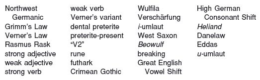

## Exercises

1. Give the Germanic outcomes for the following PIE sounds. Some may havemore than one answer.

  - **a** **b*

  - **b** *ō

  - **c** **o*

  - **d** **t*

  - **e** **p*

  - **f** *r̥

  - **g** *n̥

  - **h** **kʷ*

  - **i** **dh*

  - **j** *u̯

  - **k** *k̑

  - **l** *ā

  - **m** **s*

  - **n** **ei*

  - **o** **gh*

  - **p** **gʷh*

2. Give the PIE sound from which the boldfaced sounds in the English words below are likely to have descended:

  - **a** *lee**ch***

  - **b** ***qu**oth*

  - **c** *see**p***

  - **d** *ha**v**e*

  - **e** *s**t**are*

  - **f** *roo**t***

  - **g** ***h**ollow*

  - **h** ***b**loom*

3. Below are some slightly simplified stems in pre-Germanic and their outcomes in Modern English. (By “pre-Germanic” is meant here essentially PIE after laryngeal loss and compensatory lengthening, and the centum merger of velars.) Using§§15.6–9 and 15.18, apply the sound changes of Grimm’s Law, Verner’s Law,and the accent shift to each of the pre-Germanic forms. Do this step by step as in the following example:

  - Example: pre-Germanic **upélo-*, Modern English *evil*

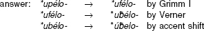

  - Not all the forms undergo change. Once a pre-Germanic sound has shifted according to one part of Grimm’s Law, it will not be affected by any other part of Grimm’s Law that happened earlier. A diphthong counts as a single vowel (or syllable) for the purposes of this problem.

  - In group **(a)**, the English gloss is at the same time the English descendant form.

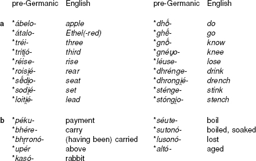

4. For each of the forms in **3b** above, try to figure out what the Modern English descendant is.

5. Given the changes that affected vowels in the history of Germanic and Old English as detailed in §§15.14–17 and 15.60, determine which ablaut grade in IE is continued by the Old English words given below. The Modern English descendant is given when different from Old English, but do not use it to answer this question. Some of the PIE forms have been slightly simplified. Aside from the sound changes given in the text, you will need to know the following: Gmc. **u* > OE *o* except before *r* or *m*; and, for the purposes of this exercise, Gmc. **e* > OE *i*. Remember too that PIE *ē > West Germanic *ā.

  - Example: Given the root **sed-* ‘sit’ and OE *sadol* ‘saddle’, the *a* in OE must come from PIE **o*, hence *sadol* continues a PIE *o*-grade (**sod-*).

  - **a** **leg-* ‘to collect, gather; say’: OE *lǣce* ‘physician’ (< *‘one who speaks magic words’) (early Mod. Eng. *leech*)

  - **b** **lendh-* ‘land’: OE *land*

  - **c** **u̯es-* ‘to put on clothes’: OE *werian* (Mod. Eng. *wear*)

  - **d** **dhreibh-* ‘to drive, push’: OE *drift*

  - **e** **reg̑-* ‘to direct’: OE *riht* ‘right’ (Mod. Eng. *right*)

  - **f** **reg̑-* ‘to direct’: OE *gerecenian* ‘to arrange in order, account’ (Mod. Eng. *reckon*) (Hint: in pre-OE the word would have been **gerecinian*)

  - **g** **dhers-* ‘to dare’: OE 3rd sing. *durst*

  - **h** **reudh-* ‘to clear land’: OE *rodd* ‘stick’ (Mod. Eng. *rod*)

  - **i** **nem-* ‘to take’: OE *numen* ‘seized’ (Mod. Eng. *numb*)

6. Provide a historical explanation for the boldfaced consonant alternations seen in the Modern English pairs *free**z**e* ∼ *fro**r**e* (archaic, ‘cold, frozen’) and *see**th**e* ∼ *so**dd**en*.

7. The pre-Old English forms **stankja* and **drankjan* became Modern English *stench* and *drench.* Determine from this what chronological order the three sound changes of umlaut, loss of *j,* and palatalization happened in with respect to each other. More than one order is possible.

8. The form **drankjan* above literally meant ‘to make drink’. What is its history, in Indo-European terms?

9. Account for the loss of the *n* in the OE 3rd pl. ending *-aþ* (§15.64), assuming the immediately preceding stage was **-āþ*.

10. Provide an explanation based in Indo-European morphology and Germanic phonology for why the preterite presents, uniquely among Germanic verbs in the indicative mood, lack an inflectional ending in the 3rd person singular.

11. Based on the Germanic word for ‘daughter’, **duhter-,* did Grimm’s Law precede the loss of laryngeals, or vice versa? Explain your answer.

12. In the Old Norse text sample (§15.108) and notes, the forms *jarðar* and *jǫrð* were encountered. How is the difference in vocalism to be explained?

## PIE Vocabulary VII: Position and Motion

**h₁es-* ‘be’: Hitt. *ēšzi ‘is’,* Ved. *ásti* ‘is’, Lat. *est* ‘is’, Eng. IS

**sed-* ‘<small>SIT</small>’: Ved. *ásadat* ‘sat’, Gk. *hézomai* ‘I sit’, Lat. *sedeō* ‘I sit’, OCS *sěděti* ‘to sit’

**legh-* ‘<small>LIE</small>’: Gk. *lékhetai* ‘lies’, OCS *ležati* ‘to lie’

**k̑ei-* ‘lie’: Luv. *ziyari* ‘lies’, Ved. *śáye* ‘lies’, Gk. *keĩtai* ‘lies’

**steh₂-* ‘<small>STAND</small>’: Ved. *tíṣṭhati* ‘stands’, Gk. (Doric) *hístāmi* ‘I stand’, Lat. *stāre* ‘to stand’

**h₁ei-* ‘go’: Hitt. *īt* ‘go!’, Ved. *éti* ‘goes’, Gk. *eĩmi* ‘I (will) go’, Lat. *eō* ‘I go’

**gʷem-* ‘<small>COME</small>, go’: Gk. *baínō* ‘I come’, Lat. *ueniō* ‘I come’

**sekʷ-* ‘follow’: Ved. *sácate* ‘follows’, Gk. *hépetai* ‘follows’, Lat. *sequitur* ‘follows’

**u̯eg̑h-* ‘convey’: Hieroglyphic Luv. *wa-zi/a-* ‘drive’, Ved. *váhati* ‘drives’, Lat. *uehō* ‘I convey’, OCS *vezǫ* ‘I drive’

**bher-* ‘<small>BEAR</small>’: Ved. *bhárati* ‘carries’, Gk. *phérō* ‘I carry’, Lat. *ferō* ‘I carry’, OCS *berǫ* ‘I take’

**h₂eg̑-* ‘drive, draw’: Ved. *ájati* ‘drives’, Gk. *ágō* ‘I lead’, Lat. *agō* ‘I drive, do’, Arm. *acem* ‘I lead’, Toch. AB *āk-* ‘go, lead’
