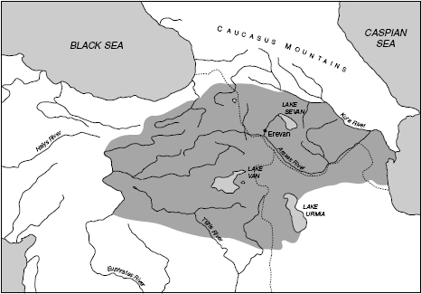
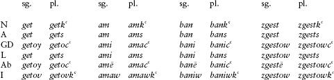
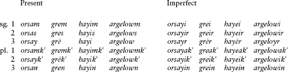
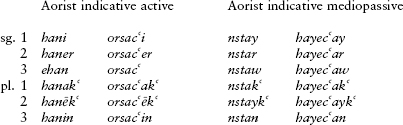

<!-- source-xhtml: 9781405188968_016.xhtml -->

# Chapter 16. Armenian

## Introduction

**16.1.** Little is known about the origin of the Armenians. The region in north-east Turkey that they have occupied throughout their known history is called Ḫayaša in Anatolian cuneiform texts from the mid-second millennium <small>BC</small>, a name that has been plausibly compared with *Hay*, the Armenian word for ‘(an) Armenian’. But from the available evidence it does not appear that the Armenians or their ancestors had settled this region by that early date. The Greek historian Herodotus and other ancient sources agree that they were newcomers into Anatolia; Herodotus identifies them with the Phrygians. While this identification is probably not correct per se, it is likely that they and the Phrygians belonged to the same migratory waves of Balkan immigrants that started coming into Anatolia in the late second millennium <small>BC</small>. The handful of Anatolian loanwords in Armenian, such as *xalam* ‘skull’ (cp. Hitt. *ḫalanta-* ‘head’), were probably picked up during the migration eastward through Anatolia.

**16.2.** The region in which they settled, around Lake Van, was the home of the powerful state of Urartu in the early first millennium <small>BC</small>. (Its name survives, via Hebrew, as the name of Mount *Ararat*.) The Urartians were a non-Indo-European people related to the Hurrians (see §10.21); both Hurrian and Urartian furnished another set of loanwords into Armenian, such as *xnjor* ‘apple’ (Hurrian *ḫinzuri*). The Urartian kingdom fell to Assyria in the eighth century <small>BC</small>, although its culture still flourished until the Armenians took over the area in the seventh century <small>BC</small>. But Armenian hegemony did not last long; the region, together with all the other former Assyrian principates, were soon swallowed up by the Medes, an Iranian people to the east. Armenia became one of the vassal states of the large Iranian confederacy that formed the basis for the Persian Empire of the Achaemenids (see §11.28). It is during the Achaemenid dynasty that Armenia finally enters history as a Persian province called *Arminiya-* in the Bisotun inscription of Darius the Great.

**16.3.** The cultural and political domination of Armenia by Iranian civilizations continued into Middle Iranian times. The linguistic impact of this was enormous. There was a prodigious infusion of Iranian loanwords, especially from Parthian, the language of the Arsacid dynasty (247 <small>BC</small>–<small>AD</small> 224; §11.40), as well as a sizeable number from Aramaic, an important administrative language both in the Persian Empire and in Middle Iranian times. The advent of Hellenism brought many Greek words into Armenian too, but it is really the Iranian loans that typify the lexical makeup of the classical language. They are considerably more numerous than the Norman French loanwords in English, and misled two or three generations of Indo-Europeanists into thinking that Armenian was an Iranian language.

**16.4.** Not until 1877 was it proved that Armenian belonged to its own branch of Indo-European. The proof was furnished by a young scholar named Heinrich Hübschmann, then near the beginning of his career. His reasoning bears retelling, for it is an instructive example of good common sense. First, he pointed out that Armenian often possessed two words or morphemes for a particular concept, such as *jeon*, the ordinary word for ‘hand’, alongside *dast*, which is borrowed from Persian and appears in a number of compounds. The Iranian words were easy to recognize, but once they were weeded out the residue of words that was left had systematically different outcomes of the PIE sounds from the Iranian outcomes. These words were then recognized by Hübschmann as the native lexical core of the language. Hübschmann further showed that the Armenian inflectional endings were wholly different from those of Iranian, and since inflectional morphology is rarely borrowed, these endings must also have been inherited. As with many pioneers, Hübschmann’s ideas were met at first with criticism, some of it positively outrageous in his case; but in the end he won the day.

In spite of the fundamental advances made in Armenian historical linguistics by Hübschmann and later scholars like Antoine Meillet, Armenian is still difficult for IE studies. This is primarily due to the small number of native forms left in the language by the time of its earliest attestation: no more than about 450 words are inherited. The small stock of native words has left precious few examples of many Armenian sound changes, some of which are among the most bizarre in the whole IE family (see below).

**16.5.** The relationship of Armenian to the other branches of IE has been much discussed. At times it has been thought to form a group with Greek, Indo-Iranian, and Phrygian (recall §10.4). Another view that has been gaining prominence regards it as part of a “Balkan Indo-European” subgroup together with Greek, Albanian, and Phrygian. The similarities are mostly in the realm of shared morphological and lexical innovations, such as the 1st sing. middle ending **-mai* and a negator descended from the phrase **(ne) h₂oi̯u kʷid* ‘not ever at all’ (discussed for Greek in §7.25), but there are also phonological similarities, such as the vocalization of word-initial laryngeals. That the branches were in contact early on seems indisputable, but it is not certain that these similarities warrant setting up a Proto-Balkan-Indo-European language ancestral to them in the same way that, for instance, Proto-Indo-Iranian was ancestral to Indic and Iranian. Given the otherwise very divergent developments of these branches, if there was a Proto-Balkan-Indo-European, it probably did not undergo much common development before disintegrating. But the issue is by no means setttled.

**16.6.** The writing down of Armenian was a product of Christianization. Armenia was the first country to adopt Christianity as the state religion, around the year 300, replacing the Zoroastrianism that had been taken over from the Iranians. In the early fifth century, according to tradition, a cleric and scholar named Mesrob Maštoc‘ (or Mesrop Mashtots, 360?–440) devised an alphabet for writing Christian works in Armenian. The alphabet is largely based on Greek, and contains 36 letters (two additional ones were added in the twelfth century). It is excellently designed, as every sound in the language is represented by a single letter and vice versa, with only a very few exceptions. Mesrob used the alphabet to record the earliest translations into Armenian from Greek and Syriac; the Armenian translation of the Bible, which was partly due to Mesrob himself, was completed in the first half of the fifth century.

**16.7.** The fifth century is regarded as the golden age of Armenian literature and of the literary language called **Classical Armenian** or Grabar, which remained the standard into the nineteenth century. The best Classical Armenian is held to be that of the historian Eznik, whose *Against the Sects* (*Ełc alandoc‘*), written shortly before 450, is a valuable source of information on pre-Christian Armenian religion. Also from around this time are various histories, especially those of Ełišē, P‘awstos, Łazar of P‘arpi, an anonymous historian known as Agat‘angelos (Agathangelos), and Koriwn, who wrote a biography of Mesrob. Also very prominent is Movsēs Xorenac‘i (Moses of Choren), who is important for Indo-European studies in preserving some native folklore and poetry. Although Movsēs is traditionally dated to the fifth century as well, Western scholars now think he wrote considerably later, around the ninth century. Much of early Classical Armenian literature was translated from Greek or Syriac, and its often excessive faithfulness to the syntax of those originals even led to violation of the grammatical rules of Armenian itself. Our knowledge of Classical Armenian syntax is therefore not always on a solid footing. Aside from the few tantalizing bits preserved in Movsēs, we unfortunately possess essentially no pre-Christian Armenian literature.

**16.8.** No manuscripts from the early centuries of Armenian literacy survive, although there are inscriptions beginning already in the fifth century. The oldest known manuscript is the so-called Moscow Gospel, which was copied in 887, but most manuscripts are from a good deal later. (Eznik, for example, is only preserved in one manuscript that dates to 1280, over 800 years after he wrote.) As is always true in such cases,many modernizations and interpolations of later material have crept in.

**16.9.** Classical Armenian is quite homogeneous across different authors from different areas, and may have been designed as a kind of regional standard. Supporting this hypothesis are indications of dialect mixture: the outcomes of several PIE sounds are not consistent, such as **p* and **s* (see §§16.13 and 23 below). The language had three parallel series of stops and affricates: a plain voiceless series *p t k c č* (the *c* represents the *ts-*sound of *bets,* and č is the *ch-*sound of *cheese*); a parallel voiced series *b d g j ǰ*; and a voiceless aspirated series transliterated as p‘ t‘ k‘ c‘ č‘.

In addition to these consonants, Armenian had the fricatives *s z v* and *x* (the *ch-*sound of *Bach* in German), the nasals *m* and *n*, the glides *y* and *w*, and four liquids written *l r ł ṙ*. The two *l*’s designate “light” and “dark” (velarized) *l*, the latter becoming later a voiced uvular fricative [ʁ] (a sound similar to French *r*). The ṙ represented a trilled *r,* whereas ordinary *r* represented just a single tap.

**16.10.** There were seven vowels, transliterated as *a e ē i o ow ə*. The sequence *ow* represented the sound *u* (the Armenian convention of writing it as *ow* is borrowed from Greek, which used *ou* in its alphabet to write the same sound). Many authors transliterate *ow* as *u*, but we shall use *ow*. The schwa (ə) was only written at the beginning of a word (e.g. *ənd* ‘with, along’), where it comes historically from a full vowel; but in the spoken language it frequently occurred preceding or breaking up consonant clusters, in which case it was not written (so *dpanem* ‘I write’ was pronounced *dəpanem,* and *znmanē* ‘from him’ was pronounced *əznəmanē*).

## From PIE to Classical Armenian

### *Phonology*

#### Consonants

**16.11. Stops.** Armenian is a satem language. The PIE labiovelars lost their labialization and became plain velars (k‘, *k,* or *g*, according to §§16.13–15 below), as in *elik‘* ‘he left’ < **eli**k**ʷet*. The palatals became fricatives or affricates – specifically, *k̑, *g > *s*, *g̑ > *c*, and **g̑h* > *j*: **dek̑m̥* ‘ten’ > *ta**s**n* (with unexplained *-a-*); **g̑enh₁-o-* ‘birth’ > ***c**in*; **bhr̥g̑**h***- ‘high’ > *bar**j**r* (cp. Germ. *Burg* ‘castle’). It is possible that *z* is another outcome of **g̑(h)*, as in *dē**z*** ‘heap, pile’ < **dhoig̑**h**o*- and *mēz* ‘urine’ < **h₃meig̑**h**o*-, but these may also be loanwords from Iranian.

**16.12.** It has been claimed that Armenian has evidence of the original distinction between the plain velars and the labiovelars, in that the two series have different outcomes before a front vowel. Thus while **k* became k‘ in words like k‘*erem* ‘I cut’ (root **ker-*, cp. Gk. *keírō* ‘I shear’ < **ker-i̯ō), *kʷ* became č‘, as in *č‘ork‘* ‘four’ < **kʷetu̯ores* (with loss of **-tu̯-*) and *ač‘-k‘* ‘eyes’ < **okʷī*; and while **ghe* remained unpalatalized as *ge*, as in *gelj-k‘* ‘glands’ < **ghelg̑h-*, **gʷhe* became palatalized to *ǰe*, as in *ǰerm* ‘warm’ < **gʷhermo*- and *ǰnem* ‘I beat’ < **gʷhen-*. But there are counterexamples, such as the *hinge-* of *hinge-tasan* ‘fifteen’ < **penkʷe,* with no palatalization, and the second element of *han-geaw* ‘rested’ from **kʷiH-* (cp. Lat. *quiētus* ‘quiet’). (These words have voiced *g*, as opposed to voiceless k‘, because of the preceding nasal.) The evidence is difficult because both the examples and the counterexamples are open to competing interpretations, and on the whole less convincing than the similar situations of Luvian and Albanian (§§9.48 and 19.10). But the matter deserves further investigation.

**16.13.** The three PIE series of plain voiceless, voiced, and voiced aspirated stops are kept distinct in Armenian, as also in Greek, Italic, Indic, and Germanic; but all three shifted. The shift is similar to Grimm’s Law in Germanic (see §15.6) and is often called the **Armenian Consonant Shift**. The plain voiceless stops **t* and **k* (with **k* representing both PIE **k* and **kʷ* as per above) became the voiceless aspirates t‘ and k‘ (e.g. pronominal stem ****t**o*- > Arm. t‘*e* ‘that’; **eli**k**ʷet* ‘he left’ > *elik‘*). Exceptional was **p*, which usually became *h* or completely disappeared at the beginning of a word, as in ***h**owr* ‘fire’ < ****p**eh₂u̯r̥* (cp. Gk. *pū̃r* ‘fire’) and *otn* ‘foot’ < accusative sing. **pod-m̥* (cp. Gk. *pod-* and also §16.32 below); and word-internally **p* became *w*, as in the conjunction *ew* ‘and’ < **epi* (cp. Gk. *epí* ‘upon’). The word *p‘etowr* ‘feather’, apparently containing “expected” p‘ from **p* (root **pet-* ‘fly’), is probably a loanword. For the development of **t* word-internally, see §16.31.

**16.14.** The voiced stops **b *d *g* (from both **g* and **gʷ*) became the voiceless stops *p t k*, as in ***t**am* ‘I give’ < ****d**eh₃*- (cp. OCS *damǐ* ‘I will give’), and ***k**ov* ‘cow’ < ****gw**ou*- (cp. Eng. *cow*).

**16.15.** The voiced aspirates **bh *dh *gh* (from both **gh* and **gʷh*) become voiced stops. Examples include ***b**erem* ‘I carry’ < ****bh**er-e*-; ***d**-nem* ‘I place’ < ****dh**h₁-ne*- (from the zero-grade of **dheh₁-* ‘place, put’, cp. Skt. *dhā*-); and *mē**g*** ‘cloud’ < **h₃mei**gh***- (cp. Ved. *meghá-* ‘rain’). The outcome of **gh* (meaning both PIE **gh* and **gʷh*) is complicated by a palatalization rule that changed it to ǰ before *e* or *i*, as for example in *ǰerm* ‘heat’ from ****gʷh**ermo*- (cp. Gk. *thermós*). Word-internally, **bh* was weakened like **p* to *w,* as in the suffix *-awor* ‘bearing, having’ discussed below in §16.41 that is ultimately from PIE **bhoro-*.

**16.16. Liquids and nasals**. The liquids and nasals stayed mostly unchanged: 1st sing. present-tense ending *-m* < **-m(i)*; *hi**n**g* ‘five’ < **pe**n**kʷe*; *ste**r**ǰ* ‘sterile’ < **ste**r***-; ***l**izem* ‘I lick’ < ****l**eig̑h*-. In some positions, especially before other consonants, the *l* was pronounced as a “dark” or velar ł, as in *kalni* ‘oak’. Nasals disappeared word-finally after vowels, hence the endingless accusative sing. of words like *get* ‘river’ < **u̯ed-om* (from the same root as Eng. *wet*). For the initial *g-* in this word, see §16.18.

**16.17.** The syllabic liquids and nasals developed an *a* before them, as in ***an**gorc* ‘inactive’ < **n̥-u̯org̑-* and ***ar**bi* ‘I drank’ < **sr̥bh-* (cp. Lat. *s**or**bēre* ‘to soak up’). Word-finally, the syllabic nasals became *-n*, as in the numerals *ewt**n*** ‘seven’ and *tas**n*** ‘ten’ from **septm̥* and **dek̑m̥*. Compare also §16.32 below.

**16.18. Glides.** The PIE glides are not preserved as such. PIE *i̯ mostly disappeared, as in *er**e**k‘* ‘three’ < **tr**e**i̯**e**s*, but after resonants it became ǰ: *ǰnǰem* ‘I wipe, clean’ < **gʷhen-i̯e*- (root **gʷhen-* ‘beat’), *ołǰ* ‘entire’ < **ol-i̯o*-. The other glide, *u̯, became *g* word-initially, via an intermediate stage **gu̯*,. This is a common, albeit strange-looking, change; compare the same development in Brittonic, §14.54, and East and North Germanic, §15.44. Examples include ***g**orc* ‘work’ < **u̯org̑o-* (cp. Eng. *work*) and ***g**item* ‘I know’ < **u̯eid-* (cp. Ved. *véda* ‘I know’). Between vowels, however, *v* is the result, as shown most dramatically by the phrase *ger i veroy* ‘above and beyond’, literally ‘above on top’, where both *ger* and *ver(-)* continue an earlier **u̯er-* (formed from **uper* ‘above’ after the **-p-* was lost).

**16.19.** Consonant clusters containing *u̯ show similar developments, some of them quite unusual. The cluster **su̯* became k‘, as in k‘*oyr* ‘sister’ from **u̯esor-*; presumably what happened here is that **su̯* became **hu̯* (cp. §16.23 below), which was essentially a voiceless labiovelar glide like the *wh-* in some pronunciations of Eng. *what*; this then developed into a voiceless aspirated velar stop k‘ parallel to the development of voiced *u̯ into voiced *g* above. Similarly, *u̯ developed into *k* next to the voiceless stop *k̑ in the cluster *k̑u̯, which became *sk*, as in ***sk**ownd* ‘little dog’ < **k̑u̯on-t-* (cp. Eng. *hound*).

Especially famous (or infamous) in the annals of IE phonology is the Armenian outcome of PIE **du̯*: it became *rk*, as in the word for ‘two’, *erkow* (the *e-* is a later prothetic vowel). While we cannot fully reconstruct all the intermediate stages of this change, it is clear that the velar *k* is the outcome of the glide, as above, and the *r* is a rhotacized continuation of the *d*. The change is fully regular, and we have several other examples of it: *e**rk**ar* ‘long’ < ****du̯**eh₂ro*- (cp. Doric Gk. *d(w)ārós* ‘long’); *e**rk**nč‘im* ‘I fear’ (earlier **erki-nč‘im* < ****du̯**i-n-sk̑-*, cp. Gk. perfect *(dé)-d(w)i-men* ‘we are afraid’); and *e**rk**n* ‘birth-pangs’ < **h₁**du̯**on-*.

**16.20. Laryngeals.** Laryngeals, when vocalized, turn into *a* in Armenian, as in *h**a**yr* ‘father’ < **p**a**ter*- < **p**h**₂ter*-; this is the same development seen in Italic, Celtic, and Germanic. In longer words, sometimes they were vocalized and sometimes not: contrast *dowstr* ‘daughter’, without a reflex of the laryngeal (< **dhug**h**₂ter*-, cp. Gk. *thug**á**tēr*), with *ar**a**wr* ‘plow’, which has a reflex (< **h₂er**h**₃tro*-, cp. Gk. *ár**o**tron*).

**16.21.** Armenian shares with Phrygian and Greek the phenomenon of vocalizing word-initial laryngeals before consonants, usually (but not always) as *a-*, as in ***a**ganim* ‘I spend the night’ (ultimately from ****h**₂u̯es*-, cp. Gk. *á(w)esa* ‘I spent the night’, Hitt. *ḫuiš*- ‘live’), ***a**yr* ‘man’ < ****a**ynr*- < ****a**ner-* < ****h**₂ner-*, and ***e**rek* ‘evening’ < ****h**₁regʷos* (cp. Gk. *érebos* ‘darkness of the underworld’). But reflexes of word-initial laryngeals are not preserved as consistently as in Greek.

**16.22.** Some have claimed that Armenian preserves word-initial laryngeals before vowels as *h*, similar to Anatolian (see §9.5). This claim is based on a number of tantalizing forms such as *haw* ‘grandfather’ (PIE **h₂euh₂os*, cp. Hitt. *ḫuḫḫaš*‘grandfather’), *hanem* ‘I draw out’ (**h₂en-*, cp. Hitt. *ḫan-* ‘scoop’), and *hot* ‘odor’ (**h₃ed-*). On the other hand, such an *h* is lacking in other words where one might expect it, as *ost* ‘branch’ (< **h₃ezd-*, cp. Hitt. *ḫašduir*) and *oror* ‘gull’ (if from **h₃er(o)n-*, cp. Hitt. *ḫaran-* ‘eagle’). A rather grave difficulty is the fact that *h*’s were not infrequently added to vowel-initial words, leading to doublets like *ogi* ‘breath’ ∼ *hogi* ‘spirit’ and *arbil* ‘to drink’ ∼ *harbil* ‘to be intoxicated’. The interpretation of forms like *haw* is therefore disputed.

**16.23. Sibilant **s***. PIE **s* usually disappeared word-initially and between vowels (compare the parallel developments in Greek, §12.18), as in the words *ał* ‘salt’ (< ****s**al*-) and *k‘oyr* ‘sister’ (< **hu̯eur* < **su̯e**s**or*-). But sometimes it became *h* initially, as in ***h**in* ‘old’ < ****s**eno-*. At the end of words, it appears that the outcome is (oddly) often k‘, but as this outcome is only found in plurals, we do not know if the -k‘ comes directly from **-s* or is due to some morphological analogy. Never-theless, the correspondences are rather striking: compare the nomin. pl. *otk‘* ‘feet’ with Gk. *póde**s***; the 1st pl. verbal ending *-mk‘* with Lat. *-mu**s***, Ved. *-ma**s***; and note also the word for ‘three’, *erek‘* < **trei̯e**s***. In at least one environment, final **-s* remained, namely the accusative plural from **-ns*, as in *gets* ‘rivers’ < earlier **uedons*.

#### Vowels

**16.24.** The short vowels usually stayed intact: ***a**c-em* ‘I lead’, cp. Lat. ***a**g-ō* ‘I lead’; *c**e**r* ‘old man’, cp. Gk. *g**é**rōn* ‘old man’; *el**i**k‘* ‘he left’, cp. Gk. *él**i**pe* ‘he left’; *h**o**t* ‘smell’, cp. Lat. ***o**dor*; *d**ow**str* ‘daughter’ (*ow* = *u*), cp. Gk. *th**u**gátēr* ‘daughter’. In unaccented syllables *i* and *u* were deleted (see §16.28 below).

**16.25.** The long vowels became short. The long mid vowels *ē and *ō were raised to *i* and *ow* (= *u*): *m**i*** (negative used in prohibitions), cp. Gk. *mḗ*; *t**ow**rk‘* ‘gift’, cp. Gk. *dō̃ron.* Long *ā was shortened to *a*, as in ***a**wr* ‘day’, cp. Gk. (Doric) *ā̃mar*. Long *ī was shortened to *i*, as in *k‘san* ‘twenty’ < earlier **g**i**san* < **u̯īk̑m̥tī*, and *ū was probably shortened as well, as in *j**ow**kn* ‘fish’ if from **dhg̑hū-*.

**16.26. Diphthongs.** The PIE diphthongs **ai* and **au* remain unchanged, as in *ayc* ‘goat’ (cp. Gk. *aig-*) and *awł* ‘place to spend the night’ (cp. Gk. *aũlis* ‘tent’). The diphthongs **eu* and **ou* both became *oy*: *loys* ‘light’ (**leuk-* or **louk*-). Finally, **ei* and **oi* became *ē, as in the 3rd sing. aorist *elēz* ‘he licked’ (< **el**ei**ghet*) and *dēz* ‘heap, pile’ (< **dh**oi**g̑h-o-*, cp. Gk. *toĩkhos* ‘wall’).

#### Stress and loss of final syllables

**16.27.** At some point in the prehistory of Armenian, the mobile PIE accent was fixed on the penultimate syllable. After this, most vowels in final syllables were lost, and – usually but not always – final consonants. Thus for example the PIE imperfect * *ebher**et*** ‘he was carrying’ became Armenian (aorist) *eber*. The loss of final syllables resulted in the stress now being word-final, since the old penultimate syllables became the new final syllables. (The same thing happened in the history of French to give the word-final accent that Modern French has; a word like *interdít* ‘forbidden’ comes from Latin *interdíctus*.)

**16.28.** The stress on final syllables resulted in weakening and syncope of certain non-final syllables, and led to a series of vowel alternations depending on the position of the stress. Underlying *i* and *ow* (*u*) disappear outright when not stressed or word-initial: thus compare *gir* ‘letter’ with *grem* ‘I write’ (< **girem*) and *k‘own* ‘sleep’ with (genitive) *k‘noy* ‘of sleep’ (< **k‘ownoy*). Other alternations are found as well: *mēg* ‘cloud’ (earlier **meig*) ∼ *m**i**gamac* ‘foggy’; *l**oy**s* ‘light’ ∼ *l**ow**sawor* ‘luminous’; *mat**ea**n* ‘book’ ∼ *mat**e**nagir* ‘writer’. (*Migamac* and *lowsawor* show that when *i* and *ow* result from reduction of a diphthong, they remain even when unstressed.)

### *Morphology*

**16.29.** Armenian has undergone moderate simplification of PIE inflectional morphology. A total of seven cases – most of the PIE inventory – are distinguished in nouns and pronouns (nominative, accusative, genitive, dative, instrumental, locative, and ablative), although no single noun or pronoun distinguishes all seven. The dual has been lost everywhere, as has grammatical gender. The verbal system of Classical Armenian is quite similar to that of PIE, but interestingly few of the actual forms are inherited. The present and aorist have survived, while the perfect has disappeared, as has the imperfect (although several individual imperfects were transferred over to the aorist category and survive as aorists, such as *eber* above). A new imperfect was created, as were a present and aorist subjunctive. Mediopassive inflection is distinguished from active inflection by a stem change, and by partially different endings in the aorist. Only one participle is found.

#### Nouns and pronouns

**16.30.** Nouns were declined in vocalic and consonantal stems. Four vocalic stems, in *o*, *a*, *i*, and *ow* (*u*), are found, exemplified below by the declensions of *get* ‘river’, *am* ‘year’, *ban* ‘word’, and *zgest* ‘clothing’:

The genitive and dative are not distinguished in nouns, only in pronouns. The plural -k‘ and the accusative plural *-s* have already been discussed (§16.23). The instrumental contains a *-v-* or *-w-* that continues the PIE instrumental ending *-*bhi-*; this ending survives more clearly in such old athematic forms as *jer**b**-a-kal* ‘taken with the hands = prisoner’ < **g̑hesr̥-bhi-*. The genitive and ablative plural ending -c‘ is of uncertain origin.

**16.31.** The declension of consonant stems is similar, although some show unexpected alternations in the stem. For example, *hayr* ‘father’ has a genitive *hawr*. The difference in vocalism is due to different treatments of word-internal **t*: before a front vowel this stop became the glide *y* (**hayir* < **ha**t**ir* < **ph₂**t**ēr*), while before back vowels and in the consonant cluster **-tr-* it became the other glide *w*, hence *hawr* < **ha**t**ros* < **ph₂**t**ros*. Another kind of stem-alternation in a consonant stem can be exemplified by *p‘ok‘r* ‘small’, pl. *p‘ok‘ownk‘*; it is ultimately a *u-*stem, into which an *-r* has intruded in the nominative and accusative singular and an *-n-* in the plural. This is reminiscent of the PIE *r*/*n-*stems, although it is not fully clear how this Armenian paradigm came to be. A true *r*/*n*-stem declension does not exist in Armenian, but a trace remains in the *r*/*n*-alternation seen in *how**r*** ‘fire’ vs. *h**n**-oc‘* ‘oven’ (cp. §6.31).

**16.32.** A small group of nouns, principally *otn* ‘foot’ and *jeṙn* ‘hand’, end in an *-n* that actually continues the old accusative singular ending *-m̥. The loss of this ending in the productive accusative singular of consonant stems is therefore not due to sound change, but to morphological analogy with the vocalic stems, where all endings in **-Vm* were lost.

**16.33. Pronouns.** Of interest is the system of deictics (“pointing” words such as demonstrative pronouns, adjectives, and adverbs). Unlike English, which has only a two-fold distinction between *this* and *that* and between *here* and *there*, Armenian, like Latin and certain other ancient and modern IE languages, has a three-fold distinction corresponding to the three persons. Unlike Latin, though, the three-way distinction is systematically carried out throughout the system of demonstrative pronouns and adverbs. Armenian thus has three definite articles, the suffixes *-s*, *-d*, and *-n* (ultimately < PIE **k̑i-*, **to*-, and **eno*-/*ono*-), meaning roughly ‘this (by me)’, ‘that (by you)’, ‘that (over by him/her/them)’. From these are formed three demon-strative pronouns *ays* ‘this’, *ayd* ‘that’, and *ayn* ‘that (over there)’; three corresponding anaphoric pronouns *sa*, *da*, and *na* basically function as third person pronouns but again depending on how near to the speaker the referent stands (either physically or metaphorically). Armenian also has not one but three pronouns meaning ‘the same’, *soyn*, *doyn*, *noyn*; three locational adverbs for ‘here’ or ‘there’, *ast*, *aydr*, *and*; and three interjections meaning ‘behold’, *awasik*, *awadik*, *awanik*.

An interesting syntactic feature of the suffixed definite articles is that they can mark not only nouns and noun phrases as definite, but also relative clauses, in which case the article follows the first stressed word after the relative pronoun, regardless of its part of speech. (Compare from English the ability of the possessive suffix *-’s* to be added to any part of speech so long as it comes at the end of the noun phrase being marked for possession, as in *the woman I saw yesterday’s coat*.) Thus in *zor oč‘d vayel ē č‘ez xawsel* ‘which it is not seemly for you to relate’ (Agat‘angełos 68), the article *-d* is attached to the negative *oč‘* ‘not’ following the relative.

#### Verbs

**16.34.** There were two verb stems, a present stem and an aorist stem, and they expressed not only an opposition in tense (non-past vs. past) but also an opposition in aspect (imperfective vs. perfective; see §5.10). While these basic categories are inherited, the personal endings have undergone significant change; and a third stem, the perfect, has been entirely lost. Some historical details of the personal endings will be taken up in the sections to follow.

The present stem is used to form the present and imperfect indicative, the present subjunctive, the prohibitive, and the infinitive. The aorist stem is used to form the aorist indicative and subjunctive, the imperative, and a passive participle.

**16.35. Present classes.** There are four classes of presents, with stem vowels *a*, *e*, *i*, and *ow* (*u*). The following verbs will illustrate the present and imperfect: *orsam* ‘I hunt’, *orsayi* ‘I was hunting’; *grem* ‘I write’, *grei* ‘I was writing’; *hayim* ‘I look’, *hayei* ‘I was looking’; and *argelowm* ‘I hinder’, *argelowi* ‘I was hindering’.

The PIE primary personal endings (sing.) **-mi* **-si* **-ti,* (pl.) **-mes(-)* **-tes(-)* **-nti* can be seen shining through the Armenian present-tense endings. The preservation of the *-s* in the 2nd singular is probably due to influence from the 2nd singular of the verb ‘to be’, which is *es* < **ess* < **(h₁)es-si* (remade from **h₁esi*; §3.37). The 3rd singular *-y* is one of the regular developments of intervocalic **t* (§16.31): thus *-ay* comes from **-a-ti*, -ē (< **-ei*) from **-e-ti*, etc. The imperfect endings are modeled on the imperfect of the verb ‘be’, whose paradigm is *ei eir ēr* in the singular, and *eak‘ eik‘ ein* in the plural. These forms in turn have a complicated history, but the *-i-* that characterizes many of them is probably a continuation of **es-* (**e-h₁es-*), the old imperfect stem of **h₁es-* ‘be’. The 3rd sing. imperfect ending *-r* is an old middle ending; apparently Armenian generalized the middle ending to the 3rd singular of this tense.

**16.36. Origin of the present classes.** These four classes of present stems continue most of the PIE present formations; the general situation is not unlike that of Italic (see §13.13). Presents in *-em* are kind of a scrap-heap: this class includes old thematic presents like *berem* ‘I carry’ (**bher-e-*) and *acem* ‘I drive’ (**h₂eg̑-e-*); *-i̯*e*/*o*-presents like *ǰnǰem* ‘I wipe, I clean’ (< **gʷhen-i̯e-*); and causative-iteratives like *owtem* ‘I eat’ (< **h₁ōd-éi̯e-*) and *glem* ‘I roll’ (< **gowlem* < **u̯ōl-ei̯e-*). Very productive in Armenian is the nasal suffix *-an-*, which was often used to remake already-existing verbs: *anicanem* ‘I curse’ is a remodeling of **anicem*, a **-i̯e/o*-verb (**h₃neid-i̯e-*, cp. Gk. *óneidos* ‘blame’); *harc‘ anem* ‘I ask’ is a remodeling of a **-sk̑e/o*-verb (**pr̥(k̑)sk̑e-*, cp. Lat. *poscō* ‘I ask’; see §5.34); and *lk‘anem* ‘I leave’ is a remodeling of a nasal-infix verb (cp. Lat. *linquō* ‘I leave’). The suffix *-an-* is related to the Greek suffix *-anein*, which was added to many verbs that already had a nasal infix, such as *limp-ánein* ‘to leave’.

Other PIE present formations are scattered among the remaining classes, such as root athematic presents (e.g. *bam* ‘I speak’ < **bheh₂-mi*) and *nu-*presents (e.g. *z-genowm* ‘I get dressed’ < **u̯es-nu-*, exactly like Gk. *hénnūmi* ‘I dress [someone]’; §5.26). The *i-*stem verbs like *hayim* are typically middles, though unlike the middles of other IE languages there is no separate set of mediopassive personal endings in the present tense. (There is in the aorist; see §16.38 below.) On the source of the *-i-*, see the next section.

**16.37. The present passive.** Verbs with stem vowel *-e-*, like *berem*, could form a passive in *-im* (so *berim* ‘I am carried’), with endings exactly the same as those of the *i-*stem verbs like *hayim*. The origin of this conjugation has been the subject of several hypotheses. Given that middles and passives are usually constructed out of the same morphology in IE languages, the *-i-* is surely the same as of the *i-*middles just discussed. This *-i-* used to be thought to continue the intransitive suffix **-ie-*, which came to form passives in Indo-Iranian (§5.32), but this account has phonological problems (it should have become *-ǰe-* after resonants, of which there is no trace). A more likely source is the stative suffix **-eh₁-*, further suffixed with **-i̯e/o-* to form a present; in Greek, as we have seen (§12.43), **-eh₁-* formed intransitives and passives (creating the category known as the aorist passive). And directly parallel with the Armenian situation, the Greek aorist passive has active personal endings. Here one must merely assume that the outcome of this sequence was *-i-* when not under the main word stress, since stressed **-éh₁-i̯e-* became *-ie-,* as in *diem* ‘I suckle’ < **dhéh₁-i̯e-*; such an assumption has many parallels. (Yet a third suggestion, that the *-i-* ultimately continues the thematic vowel *-e-*, is beset with many complications.)

**16.38. The aorist.** The Armenian aorist for the most part is a continuation of the PIE imperfect. There are two types of aorist stems: an unextended root (e.g. 3rd singulars *e-ber* ‘carried’, from an old IE imperfect **ebheret*, and *elik‘* ‘left’, from an old IE thematic aorist **elikʷet*, equivalent to Gk. *élipe*); and a root extended with a suffix -c‘- (e.g. 3rd sing. *gorceac‘* ‘he made’ from the present *gorcem* ‘I make’), usually derived from **-sk̑e-,* which was used in Greek and Anatolian to form iterative past tenses (see §5.34). Unlike the present, the aorist has separate active and mediopassive personal endings. Some examples of the conjugations are provided below by the active aorists *hani* ‘I drew out’ and *orsac‘i* ‘I hunted’, and the mediopassive aorists *nstay* ‘I sat’ and *hayec‘ay* ‘I looked’:

As can be seen from the form *ehan* (and *eber* cited earlier), a prefix called the augment (*e*-), identical to the augment found in Greek, Indo-Iranian, and Phrygian (§5.44), appears when the form would otherwise be a monosyllable. (Sometimes the augment is omitted; although the matter needs more study, some of the contexts in which the augment is omitted appear to match contexts in which it is omitted also in Homeric Greek.) The active aorist endings are in part a continuation of the PIE imperfect; the 3rd singular, for example, continues the imperfect thematic ending **-et*. The *-w* at the end of the 3rd singular aorist passive is a faithful descendant of the PIE past-tense middle ending **-to* (for the change of **-t-* to *-w-* recall §16.31). Similarly, the 3rd pl. *-an* is from **-n̥to*; this became **-anto* and then *-an* after the loss of final syllables, and the *-a-* in this form is thought to have spread throughout the paradigm and to be the source of the *-a-* in the other persons and numbers.

**16.39. The subjunctive.** The subjunctive functioned both as a future tense and as an optative and conditional. It was formed with a suffix *-ic‘-* which is usually taken to be from PIE **-isk̑e-*, although this is not universally accepted. Its endings are complex, and not explained in all their particulars. One form that is generally agreed upon is the 1st singular, as in aorist subjunctive *argel-ic‘* ‘I will hinder’, where the ending *-ic‘* is taken to be from **-isk̑ō* (**-isk̑oh₂*), with the original ending *-ō (< **-oh₂*) not replaced by **-m(i)* as in the present indicative.

**16.40. The participle.** Armenian verbs have only one participle, in *-eal*, formed typically form the aorist stem and having passive meaning, such as *greal* ‘written’. This goes back ultimately to the somewhat rare PIE participial ending **-lo-* (§5.60), also found in Slavic, as in OCS *bi-lŭ* ‘beaten’.

#### Compounding

**16.41.** Armenian is very fond of using compounding to form new words; interestingly, it almost never uses prefixes, a feature shared with PIE, though not necessarily inherited from it: to judge by the presence of a few archaic prefixed forms, prefixation may have once been more common. Two examples are *ənker* ‘companion’ (< **ənd-ker-*, literally ‘with-eat(er), messmate’) and *tkar* ‘weak’ (< **ti-kar* ‘without power’; **ti* is cognate with Lat. *dē* ‘from, without’, as in *dē-bilis* ‘without strength, incapable’). Much preferred was suffixation, and Armenian possessed a wealth of suffixes. Some examples of suffixed forms are *lows-awor* ‘luminous’ (*loys* ‘light’ + *-awor* ‘bearing, having’ < PIE **bhoro-*), *xałał-arar* ‘peaceful’ (*xałał* ‘peace’ + *-arar* ‘doing’, from *aṙnem* ‘I do’), and *k‘ahanay-owt‘iwn* ‘priesthood’ (*k‘ahanay* ‘priest’ + *-owt‘iwn* ‘-hood, -ship’, related to the Latin abstract nouns in *-tiōn-*). Perhaps most familiar to English speakers is the patronymic suffix *-ean* (ultimately from PIE **-ii̯o-*, see §6.74) meaning ‘son of’, as in *Aram-ean* ‘son of Aram’ or *Simownean Yowda* ‘Judas son of Simon’ in the Armenian Bible (John 6:71). This appears transcribed from Modern Armenian into English as *-ian* in such names as *Khatchaturian*,*Hagopian*, etc.

## Middle and Modern Armenian

**16.42.** As a result of the conquest of part of Armenia by the Seljuq Turks in the mid-eleventh century, Classical Armenian fell into disuse in that area. A group of Armenian refugees founded a new state in southern Turkey along the Mediterranean,in the historical region of Cilicia, which had been home to Armenian settlements centuries earlier. In the resultant Cilician kingdom (1080–1375, the last independent Armenian state until the twentieth century) Classical Armenian continued to be used alongside a written (and Classicizing) form of the Cilician dialect, the best-attested variety of **Middle Armenian**; it was based on the spoken language of the settlers in the region and is ancestral to Modern Western Armenian (see below).Other forms of Middle Armenian are also preserved from other areas. In 1375, the Cilician capital Sis fell to the Egyptian Mamelukes and was soon afterwards taken by the Turco-Mongol conqueror Timur (Tamerlane). This and successive struggles for power in the region, especially between the Ottoman Turks and Persians,resulted in the emigration of many Armenians (though many also stayed behind),who formed new communities in Istanbul, Europe, and elsewhere. Throughout this period, Turkish influence on the language was heavily felt.

**16.43.** A renaissance of Armenian literature and learning began in the seventeenth century. Cultural and economic centers were established; so that they could communicate with each other, a kind of Armenian koine grew up called **Civil Armenian**, which had dialect features from both eastern and western areas. The renaissance really flowered with the activities of the Mekhitarists, a Benedictine congregation founded by Mekhitar of Sebaste (1676–1749). They were active especially in Venice and fostered the education of Armenians and the revival of the Armenian literary past. A new written language began to be forged through efforts (continuing into the twentieth century) to purge the language of Turkish elements and replace them with features of Classical (rather than contemporary) Armenian; this language developed differently in eastern and western areas, becoming the two modern literary dialects. The official language of Armenia itself, **Modern Eastern Armenian**, is usually said to be based on the dialect around Mount Ararat and the capital Erevan, but actually contains a mixture of different dialect features (the pronunciation of the consonants, for example, hails from elsewhere). Similarly **Modern Western Armenian**, used by the diasporic communities (historically in Turkey and points west), is usually said to be based on the dialect of Istanbul, but also has many features taken from other dialects, and even some that are unique to it.

In the wake of nineteenth-century populist feelings, Classical Armenian finally ceased to be used and it was replaced by Modern Armenian.

**16.44.** The two literary varieties are fairly similar, but spoken Armenian does not lend itself to a simple bipartite division; there are scores of tremendously varied dialects, some of which have undergone significant phonological and syntactic transformation under the influence of neighboring Turkic and Caucasian languages. (The diaspora during and after the genocide of Turkish Armenians in 1915–23 has brought speakers of most of the Western dialects to the United States.) The modern standard language has not been free of these influences either; in many areas of syntax, such as subordinate clausal structure, it more greatly resembles a Turkic language than an Indo-European one. Morphologically, Modern Armenian has maintained essentially the same case system in the noun as the classical language, but has markedly changed verbal conjugation by introducing many periphrastic verbal constructions especially in the present and future tenses.

**16.45.** For Indo-European studies, the modern dialectal divergences in the stop consonant systems are the most significant. All the dialects have a series of voiceless aspirated stops that continue the PIE voiceless stops, but they differ in their outcomes of the other two series, especially the original voiced aspirates, which have no fewer than four different dialectal outcomes ([d] in Classical and Modern Eastern, [t] in dialects around Lake Van and Sasun in Turkey, [dʰ] in Sebastia and Erevan, and [tʰ] in Modern Western). The Classical Armenian system is more or less preserved in Modern Eastern Armenian (the one salient difference being that the Classical voiceless stops have become tense [t’ p’ k’] with concomitant tightening of the glottis), but Modern Western Armenian has voiced stops continuing PIE voiced stops and voiceless aspirates coming from PIE voiced aspirates. Thus PIE **t *d *dh* became Eastern [tʰ t’ d] and Western [tʰ d tʰ]. There is considerable dispute over whether the Classical system necessarily represents the oldest state of affairs within Armenian; many believe instead that Classical Armenian was just one of several dialects independently derived from Proto-Armenian. Figuring into the controversy is the fact that the oldest inscriptions, from the fifth century onward, do not yet show dialect features; they first appear around the ninth century (the Moscow Gospel, §16.8, has quite a few).

The difference between Classical orthography and Modern Western pronunciation can have, very occasionally, amusing results for the English speaker. The Anatolian storm-god Tarḫunts was picked up by the early Armenians during their migration through Anatolia and incorporated into their mythology, becoming ultimately a mythic hero called Tork‘. Though Tork‘ does his Anatolian ancestor proud with his ability to split granite rocks with his hands and hurl hill-size boulders at enemy ships (as told in Movsēs Xorenac‘i 2.8), the mighty storm-god of old might not be pleased at how his namesake has fared in the mouths of Modern Western Armenian speakers: [dorkʰ]!

### *Classical Armenian text sample A*

**16.46.** The Birth of Vahagn, one of the native pre-Christian poems quoted in Movsēs Xorenac‘i 1.31. Vahagn (or Vahevan), from Parthian *Varθagan,* is in origin the Iranian hero *Vərəθraγna-*, equivalent etymologically to Ved. *Vr̥tra-ghn-* ‘slayer of Vr̥tra’ (the serpent and monstrous adversary of the chief god Indra). This legend is not Iranian in origin, but probably Anatolian.

| Column 1 | Column 2 | Column 3 |
| --- | --- | --- |
| 1 | erknēr erkin erknēr erkir | Heaven was in labor, Earth was in labor, |
|  | erknēr ew covn cirani | the purple sea was also in labor. |
|  | erkn i covown ownēr | In the sea labor pains held |
|  | zkarmrikn elegnik. | the little crimson reed. |
| 2 | ənd ełegan p‘oł cowx elanēr | Along the reed’s stalk rose smoke; |
|  | ənd ełegan p‘oł boc‘ elanēr | along the reed’s stalk rose flame; |
|  | ew i boc‘oyn vazēr | and from the flame leapt up |
|  | xarteaš patanekik. | a golden-haired little boy. |
| 3 | na howr her ownšr | He had hair (of) fire; |
|  | boc‘ owner mawrows | he had a beard (of) flame; |
|  | ew ač‘kownk‘n ein aregakownk‘. | and his eyes were little suns. |

**16.46a. Notes. 1. erknēr:** ‘was in labor’, from *erkn* ‘labor pains’ (in line 3), stem *erkown-*, PIE **h₁d-u̯on-* (for **du̯* > *rk*, see §16.19), also in Gk. *odúnē* ‘pain’, a derivative of **h₁ed-* ‘eat’ in its presumed original meaning ‘bite’. A parallel suffixed form in **-u̯ol-* is represented by the Anatolian words for ‘evil’, Luv. *attuwal-* and Hitt. *idālu-.* **erkin:** ‘heaven’, etymology unclear. **erkir:** ‘earth’, etymology likewise unclear, but forming an obvious pair with *erkin.* **ew:** ‘and, also’, < **epi* ‘upon’; §16.13. **covn:** ‘the sea’; *-n* is the cliticized definite article (seen also below in *covown, zkarmrikn, boč‘oyn*, etc.). It has been suggested that this is one of the Urartian borrowings into Armenian (§16.2), but it may also be cognate with Lydian *kofuλ* ‘water’. The locative is *covow*, seen below, showing the word to be a *u-*stem. **cirani:** ‘purple’. **i:** ‘in’ (plus locative); when followed by the ablative it means ‘from’, as in the second stanza. **ownēr:** ‘had, held’, 3rd sing., usually taken to be from a nasal present **ōp-ne-* from the same root as in Ved. *āpnóti* ‘gets, takes’. **zkarmrikn:** ‘the crimson’, from *karmir* ‘red’ (cp. Hebrew *karmīl*, perhaps from Persian and ultimately related to Eng. *crimson*). The prefix *z-* marks the word as direct object; the prefix was originally a preposition but developed as a marker of definite direct objects, somewhat parallel to the development from Lat. *ad* ‘to’ to Spanish *a* in marking personal direct objects. **ełegnik:** ‘little reed’, diminutive of *ełegn* ‘reed’. Note that in a definite noun phrase, either the adjective or the noun can host the definite article; in this phrase, it is the adjective.

**2. ənd:** ‘along’, from **h₂enti* ‘facing, against’. **ełegan:** ‘reed’, *n-*stem genit. sing. **p‘oł:** ‘stalk’. **cowx:** ‘smoke’. **elanēr:** ‘ascended, rose’. **boc‘:** ‘flame’. The ablative is *boc‘oy* in the next line, with a suffixed definite article *-n*. **vazēr:** ‘leapt’. **xarteaš:** ‘golden-haired’. **patanekik:** ‘little youth’, containing the same diminutive suffix *-ik* as *elegnik* above.

**3. na:** ‘that one, he’. **howr:** ‘fire’, PIE **peh₂u̯r̥* (see §§16.13 and 31). **her:** ‘hair’; not related to the English word. **mawrows:** ‘beard’, accus. pl. (but singular in meaning), from PIE **smok̑ru-*, cognate with Ved. *śmáśru-,* Lith. *smãkras* ‘chin’, and other forms. The Armenian word illustrates the loss of **s-* before nasals, a regular Armenian change. The cluster *-k̑r-* developed to *-wr-* just as **-tr-* did (§16.31). **ač‘kownk‘n:** ‘the little eyes’, from earlier **ač‘-ikown-k‘-n*, the definite (*-n*) plural (*-ownk‘*, with the same intrusion of *-own-* into the plural paradigm as seen in the adjective *p‘ok‘r* in §16.31) of a diminutive (with suffix *-ik-*) of *akn* ‘eye’, PIE **h₃ekʷ-* (cp. Lat. *oc-ulus*). **ein:** ‘were’, 3rd pl. imperfect. **aregakownk‘:** ‘little suns’, from *aregakn*, literally ‘sun-jewel’, from *areg, arev* ‘sun’ (cognate with Skt. *ravis* ‘sun’) plus *akn* ‘jewel’, perhaps the same word as *akn* ‘eye’.

### *Classical Armenian text sample B*

**16.47.** From the Armenian Bible; Mark 14:17–21. The English translation is adapted from the *New International Version.*

17 Ew ibrew erekoy ełew gay erkotasaniwk‘n handerj: 18 Ew ibrew bazmečan ew deṙ owtein, asē Yisows. amēn asem jez, zi mi omn i jēnǰ matneloč‘ ē zis, or owtē isk ənd is: 19 Ew nok‘a sksan trtmel ew asel mi əst misǰē. mit‘e es ič‘em, ew miwsn mit‘e es ič‘em: 20. Na patasxani et ew asē č‘nosa mi yerkastasanič‘ ayti, or mxeač‘ ənd is skawaṙakd: 21. Ayl ordi mardoy ert‘ay orpēs ew greal ē vasn nora. bayč‘ vay ič‘e mardoyn aynmik yoyr jeṙs ordi mardoy matnesč‘i. law ēr nma t‘e č‘er isk cneal mardn ayn.

17 When evening came, Jesus arrived with the Twelve. 18 While they were reclining at the table eating, he said, “I tell you the truth, one of you will betray me – one who is eating with me.” 19 They were saddened, and one by one they said to him, “Surely not I?” 20 “It is one of the Twelve,” he replied, “one who dips bread into the bowl with me. 21 The Son of Man will go just as it is written about him. But woe to that man by whom the Son of Man will be betrayed! It would be better for him if he had not been born.”

**16.47a. Notes** (selective). **17–18. erekoy:** ‘evening’, from **h₁regʷo-* (cp. Gk. *érebos* ‘darkness’). **gay:** ‘comes’, 3rd sing. of *gam* ‘I come’, PIE **gheh₁-* (also the root of Eng. *go*). **erkotasaniwk‘n:** ‘group of twelve’, instr. object of *handerj* ‘together with’ with suffixed definite article *-n*, from *erkow* ‘two’ and *tasn* ‘ten’. Note that the combining form *erko-* preserves the *-o* of PIE **du̯o(-)*; similarly *hinge-tasan* ‘fifteen’ preserves the *-e* of **penkʷe*, over against *hing* ‘five’, which has lost it. **owtein:** ‘were eating’, 3rd pl. imperfect of *owtem* ‘I eat’, from PIE **h₁ōd-éi̯e-*, a lengthened-grade causative-iterative from a Narten root (see §5.23). **asē:** ‘says’, PIE **h₂eg̑-* ‘say’, the root of Gk. ē̃ ‘he said’ and Lat. *ait* ‘he said’. **mi:** ‘one’, PIE **smi-*, cp. Gk. (fem.) *mía < *smi(i̯)h₂.* **and:** ‘with’, see the Notes to line 2 of the preceding text.

**19–21. es:** ‘I’, PIE **eg̑-*. **ič‘em:** ‘I will be’, present subjunctive of *em* ‘I am’. **patasxani et:** ‘(he) answered’; phrase made of the noun *patasxani* ‘answer’ and the aorist of the verb *tam* ‘I give’, PIE **deh₃-*. **č‘nosa:** ‘to them’, preposition č‘- ‘to’ plus accus. pl. of *na*, 3rd person pronoun. **mardoy:** ‘of man’, genitive of *mard*, either an Iranian borrowing (cp. Modern Persian *mard* ‘man’) or directly from PIE **mr̥to-* ‘mortal’ (also the source of the Iranian). **greal ē:** ‘it is written’, periphrastic passive with the participle of *grem* ‘I write’ plus ē, 3rd sing. present of *em* ‘I am’. **matnesč‘i:** ‘will be betrayed’, 3rd sing. passive aorist subjunctive of *matnem* ‘I betray’, literally ‘I finger, point a finger at’, from *matn* ‘finger’. **cneal:** ‘born’, participle of *cnem* ‘I am born’, PIE **g̑enh₁-*.

## For Further Reading

Not much of any value has been written on the history of Armenian in English. The classic comparative grammar is still Meillet 1936, amazingly thorough in spite of its brevity. The grammar is partly a distillation of decades of pathbreaking scholarly work that Meillet devoted to Armenian, which can be found in the masterly articles collected in Meillet 1962– 77. Newer comparative grammars are Schmitt 1981, useful for the reader with some IE background, and Lamberterie 1992. A reference grammar of Classical Armenian in English is Godel 1975. An excellent, though highly technical and not uncontroversial, study of the history of the Armenian verb is Klingenschmitt 1982. The only etymological dictionary not in Armenian dates from the nineteenth century and is badly in need of revision: Hübschmann 1895–7. The question of the relationship between Greek and Armenian has recently received a detailed investigation (if not resolution) in Clackson 1994. The Armenian noun has recently received detailed historical treatment in Olsen 1999 and Matzinger 2005.

## For Review

Know the meaning or significance of the following:

Heinrich Hübschmann Armenian Consonant Shift

Mesrob deictic

## Exercises

1. What are the Armenian outcomes of the following PIE sounds or sequences of sounds? Some may have more than one answer.

  - **a** **bh*

  - **b** *ī

  - **c** **t*

  - **d** **p*

  - **e** *k̑

  - **f** *i̯

  - **g** *u̯

  - **h** **d*

  - **i** **du̯*

  - **j** *g̑*h*

  - **k** **kʷ*

  - **l** *ō

  - **m** **s*

  - **n** **su̯*

  - **o** *r̥

  - **p** **eu*

2. Briefly explain the history or significance of the following Armenian forms:

  - **a** *kov*

  - **b** k‘*oyr*

  - **c** *ger i veroy*

  - **d** *-mk‘*

  - **e** *hnoc‘*

  - **f** *otn*

  - **g** *haw*

  - **h** *erkow*

  - **i** *jerbakal*

  - **j** *bam*

  - **k** *gorc*

  - **l** *tasn*

  - **m** *ayr*

  - **n** *lowsawor*

  - **o** *acem*

3. Consider the following PIE roots and their Armenian descendants:

| Column 1 | Column 2 | Column 3 |
| --- | --- | --- |
| * g̑*enh₁-* | *cin* | ‘birth’ |
| **penkʷe* | *hing* | ‘five’ |
| **sen-* | *hin* | ‘old’ |
| * g̑*er-* | *cer* | ‘old’ |
| **su̯ek̑s* | *vec‘* | ‘six’ |

  - **a** Formulate a rule that accounts for the changes that affected PIE **e* in the data provided.

  - **b** Given that the verb ‘to engender’ derived from *cin* ‘birth’ is *cnel*, which happened first, your rule in (**a**) or the sound change in §16.28?

4. Among the many Iranian loanwords in Armenian are *partēz* ‘paradise’ (cp. Avestan *pairi.daēza-* ‘enclosure’) and *dast* ‘hand’ (cp. Middle Persian *dast*). Based on your knowledge of Armenian consonantal sound changes, which of these is the earlier borrowing into Armenian? Explain your answer.

5. How do forms like *barjr* and *dēz* (§16.11) provide evidence that Grassmann’s Law was a post-PIE sound change? What other branch(es) that you have seen so far provide(s) comparable evidence? Explain your answer.

6. The preservation of the short vowels intact into the historical period (§16.24) is shared by what other branch(es) of IE that you have seen so far?

7. How does the Armenian class of verbs with stem-vowel *e* differ historically from the Italic third conjugation (also with stem-vowel *e*)?

8. What was the fate of the interdental fricative [ð] (written δ) in Parthian loanwords into Armenian, as exemplified below?

  - *aparan-k‘* ‘house, palace’ < Parth. *apaδan*

  - *awrēn* ‘law, right’ < Parth. *aβ;δēn*

  - *varagoyr* ‘curtain’ < Parth. *barayōδ*

## PIE Vocabulary VIII: Material Culture and Technology

**teks-* ‘fashion, construct’: Hitt. *takkešzi* ‘puts together’, Ved. *tā́ṣṭi* ‘fashions’, Gk. *téktōn* ‘carpenter’, Lat. *texō* ‘I weave’

**kʷekʷlo-* ‘<small>WHEEL</small>’: Ved. *cakrám*, Gk. *kúklos*

**dom-* ‘house’: Ved. *dámas,* Gk. *dómos*, Lat. *domus,* OCS *domŭ*

**dhu̯er-* ‘<small>DOOR</small>’: Av. *duuar-* ‘gate’, Gk. *thur-*, Lat. *forēs*, OCS *dvĭri*

**u̯ebh-* ‘<small>WEAVE</small>’: Ved. *ubhnā́ti* ‘ties together’, Gk. *huphaínō* ‘I weave’, Toch. B *wāp-*

**s(i̯)uH-* ‘<small>SEW</small>’: Ved. *syūtá-* ‘sewn’, Lat. *suō* ‘I sew’, Lith. *siúti* ‘to sew’

**u̯es-* ‘clothe, <small>WEAR</small> clothes’: Hitt. *waššezzi* ‘(he) clothes’, Ved. *váste* ‘gets dressed’, Gk. *héstai* ‘gets dressed’, Lat. *uestis* ‘clothing’
