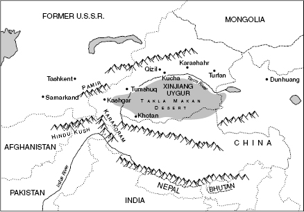
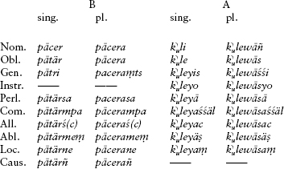
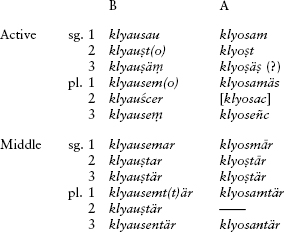

<!-- source-xhtml: 9781405188968_017.xhtml -->

# Chapter 17. Tocharian

## Introduction

**17.1.** Tocharian, like Hittite, did not come to light until the twentieth century. For about twenty years up until the First World War, the French, Germans, and British undertook numerous archaeological expeditions to Chinese Turkestan (now the Xinjiang Uygur Autonomous Region in western China) and unearthed documents in four previously unknown languages. Two of these turned out to be Middle Iranian (Khotanese and Tumshuqese, see §§11.37 and 46), while the others were the two Tocharian languages. They were recognized as Indo-European already in 1907; their decipherment was greatly aided by the fact that most of the texts were translations (some bilingual) of familiar Buddhist works that had been widely disseminated in Central Asia. The Tocharian documents all date to between the sixth and eighth centuries <small>ad</small>.

**17.2.** From the lowland region known as the Tarim Basin in eastern Turkestan, in the area around the oases called Qārāšahr (Karashahr) and Turfan, comes **Tocharian A**, also called East Tocharian, Turfanian, or Agnean (after Agni, the Sanskrit name of Qārāšahr). From that area and farther southwest around Kučā (Kucha) comes **Tocharian B**, also called West Tocharian or Kuchean. Since Tocharian A is only known from areas where documents in Tocharian B have also been found, it has been suggested that Tocharian A was in fact an already extinct liturgical or poetic language that was kept alive by tradition, and that Tocharian B was the living administrative language. (Of the minority of texts that are not Buddhist translations – including monastic letters, caravan passes, business letters, and graffiti – almost all are in Tocharian B.) One set of Tocharian B texts, called the MQ texts (after the caves of Ming-öi Qïzïl west of Kučā, where they were found), are written in a variant dialect and may preserve some archaic distinctions in the vowel system; these have still not been adequately studied. A passage from an MQ text is given as one of the text selections at the end of this chapter.

**17.3.** Who the Tocharians were is still enshrouded in mystery and considerable debate. They left behind no texts about themselves, and it is unclear which of the ethnonyms preserved in contemporary Classical and Central Asian sources refers to them. The designation *Tocharian* is based on the theory, now no longer accepted, that the Tocharian languages were spoken by a Central Asian people called the *Tókharoi* in Greek sources.

We also do not know how and when they, as Indo-Europeans from far to the west, got to such a distant corner of the world: of all the ancient IE languages, Tocharian was spoken farthest to the east. Which of the other branches of IE Tocharian is most closely related to is also an unsolved problem; a set of rather archaic features of its verbal morphology have led some researchers to claim that it, like Anatolian, split off from the rest of the family rather early. An earlier view, now abandoned, connected Tocharian with the supposed Italo-Celtic subgroup of IE (§13.5).

**17.4.** The vocabulary of our Tocharian texts, since they are mostly Buddhist, has been influenced by Sanskrit and Iranian, from which many religious terms were borrowed. (One of them, interestingly, may have made its way into English as the word *shaman*, if ultimately from Tocharian B *ṣamāne* ‘monk’, from Sanskrit *śramaṇas*.) Some structural features, such as the large number of cases in the noun (§17.23 below) and the limited stop inventory (only voiceless stops), are not typical of IE languages but are found in Uralic, Turkic, and Mongolian languages of western and central Asia. (Uralic is the language family to which Finnish and Hungarian belong.) It has been suggested that the Tocharians picked these features up from contact with those languages after they migrated eastward.

**17.5.** Adding to the various mysteries surrounding the Tocharians is the existence of Caucasoid populations in western China from an early date. Some old, in part controversial, Chinese sources mention tall, blonde- or red-haired, blue-eyed men, and the Roman author Pliny the Elder preserves a report by an emissary from northwest China of a people answering to the same description. Certain cave paintings in the region from later times depict warriors with red hair and other non-Asian features. These indirect sources were substantiated by the discovery of extremely well-preserved mummies in the Takla Makan Desert having Caucasoid features such as tall stature and red, blonde, or brown hair. The mummies date variously from about 1800 <small>BC</small> to as recent as 200 <small>AD</small>. Some were found with tapestries woven in plaids that are similar in weaving style and pattern to tartans from the Hallstatt culture of central Europe, which was ancestral to the Celts (§14.2). Physical and genetic evidence gathered from the mummies has revealed affinities with populations in western Eurasia, perhaps as far west as the Mediterranean. Understandably, many scholars have concluded that the mummies came from a population ancestral to or otherwise related to the Tocharians (with some claiming that the more recent mummies were instead Iranian-speaking). But there is as yet no conclusive evidence to support these views; equating physical remains or racial features with language in the absence of accompanying linguistic remains is notoriously perilous.

Most of the Tocharian that survives is found on fragments of manuscript leaves that were left in Buddhist temples and shrines in the desert as votive offerings. Once left in the shrines, the leaves were picked up by the wind; some landed in the desert sands, where they were buried and eventually dug up by archaeologists. Because of this manner of preservation, we usually have only one leaf from any given Tocharian manuscript.

**17.6.** With the exception of a few fragments of Tocharian B that are written in Manichean script, Tocharian was written in a modified version of the north Indian Brāhmī alphabet (see §10.57). The same version was used to write the Middle Iranian language Tumshuqese (§11.46). Among the modifications made to the script is the so-called *Fremdvokal* or ‘foreign vowel’, transliterated as *ä* (discussed in §17.14 below).

## From PIE to Tocharian

In the ensuing discussion, forms in Tocharian A and Tocharian B will be labeled simply A and B, and AB will be used to denote a form identical in both languages.

### *Phonology*

#### Consonants

**17.7. Stops.** As mentioned above, Tocharian has an unusual stop consonant inventory by IE standards: there were no voiced stops – only *p*, *t*, and *k*. All three manners of stop articulation in PIE – voiceless, voiced, and voiced aspirated – therefore merged into voiceless. This is most clearly seen with the labials, which all became *p*: PIE ****p**rek̑-* ‘ask’ > A ***p**rak-*, B ***p**rek-* ‘ask’ (cp. Lat. *precor* ‘I ask, entreat’); PIE **dhu**b**-ro-* ‘deep’ > A *t**p**är*, B *ta**p**re* ‘high’ (cp. Eng. *deep* from full-grade **dheub-*; for the semantics, cp. Lat. *altus* ‘high, deep’); PIE ****bh**rātēr* ‘brother’ > A ***p**racar*, B ***p**rocer* (cp. Eng. ***b**rother*).

**17.8.** With the dentals, things are not quite as simple. Both **t* and **dh* became *t,* but **d* became *ts*: compare PIE **k̑m̥**t**om* ‘hundred’ > A *kän**t***, B *kan**t**e*; PIE **h₁ru**dh**ro-* ‘red’ > A *r**t**är*, B *ra**t**re* ‘red’; but PIE ****d**ak-* ‘bite’ > B ***ts**āk*- ‘bite’. The fate of **d* is complicated in other ways as well, chiefly by its propensity to disappear under conditions that are still obscure (e.g. **doru* ‘wood’ > AB *or* ‘wood’; **su̯eh₂d-ro-* ‘sweet’ > A *swār*, B *swāre* ‘sweet’).

**17.9.** This stop-consonant merger is most dramatic in the velars, where all nine of the PIE velar stops fell together as *k.* Compare the following nine examples of *k,* each from a different PIE velar:

**k̑* A ***k**änt*, B ***k**ante* ‘hundred’ < **k̑m̥tom* (cp. Ved. *śatám* ‘hundred’)

**k* AB *lu**k**-* ‘shine’ < **leu**k**-* (cp. Lat. *lūx, lūc-* ‘light’)

**kʷ* A *a**k**,* B *e**k*** ‘eye’ < **h₃e**kʷ**-* (cp. Gk. *óp-somai* ‘I will see’)

**g̑* AB *ā**k**-* ‘lead’ < **h₂eg̑-* (cp. Lat. *agō* ‘I lead’)

**g* A *o**k**-*, B *au**k**-* ‘increase’ < **h₂eu**g**-* (cp. Lat. *augeō* ‘I increase’)

**gʷ* A ***k**o*, B ke͡ᵤ ‘cow’ < ****gʷ**ou-* (cp. Eng. *cow*)

**g̑h* AB ***k**u-* ‘pour’ < **g̑**h**eu-* (cp. Gk. *khé(w)ō* ‘I pour’)

**gh* A *la**k**e*, B *le**k**i* ‘bed’ < **le**gh***- (cp. Gk. *lékhos* ‘bed’, German *liegen* ‘lie’)

**gʷh* AB *tsä**k***- ‘burn’ < **dhe**gʷh***- (cp. Ved. *dahanti* ‘they burn’)

The labiovelars may have still been labiovelars in Proto-Tocharian. Some clear examples where a labial element was still present, or rounded a following vowel, include A ***ku**s*, B k͡ᵤ*se* ‘who?’ < ****kʷ**is*, and A ***ku**käl*, B ***ko**kale* ‘chariot’ < ****kʷ**ekʷlo*- ‘wheel’ (cp. Gk. *kúklos* ‘wheel’). The symbol k͡ᵤ in k͡ᵤ*se* reflects a peculiarity of the Tocharian writing system in spelling this word: the vowel *u* was written with a subscript sign, as opposed to the other vowels which were written superscript. Tocharian B sometimes even has the sequence *kw* for a labiovelar or combination of velar plus *u̯, as in *ya**kw**e* ‘horse’ (A *yuk*) < **ek̑u̯os*.

**17.10. Palatalization.** The remaining obstruents found in the Tocharian sound inventory are the result of palatalization before **e* or **i* in the prehistoric period; these two vowels later changed in various ways (see below), with the result that a palatalized consonant is often our only evidence of the erstwhile presence of an **e, *i,* or the glide *i̯. The palatalization rules are many and complex, and will not be treated here in their entirety. The basic outlines are that *t* usually became the affricate *c* (phonetically [č]) before *e* or *i,* as in B *pācer* ‘father’, and *k* became the sibilant ś, a *sh-*like sound, as in A *śpāl* ‘head’ (< **ghebh-(e)l-*, cp. Gk. *kephalḗ*. There were additional changes in consonant clusters; for example, the palatalization of **st* was śś or *śc*, as in A *kaśśi*, B *keścye* ‘hungry’, the derived adjective from A *kaṣt*, B *kest* ‘hunger’. Certain resonants were palatalized (see the next section below), and the glide *u̯ could be palatalized to *y* in Tocharian B, as in ***y**ente* ‘wind’ < **h₂u̯eh₁nto-* (cp. Eng. *wind*).

**17.11. Resonants.** The resonants remained intact: A ***l**äc* ‘he went out’ < **h₁**l**udh-et*; B ***m**āce**r*** ‘mother’ < ****m**atē**r***; A *wa**n**t* ‘wind’ < **h₂ueh₁**n**to*-. The resonant **r* was the only consonant that was preserved word-finally. The liquid *l* and the nasal *n* could be palatalized to *ly* and *ñ,* as in A *k**ly**u* ‘fame’ < **k̑**l**eu*- and AB ***ñ**u* ‘nine’ < ****n**eu̯n̥*.

A word on the Tocharian nasals is in order here. Besides *m, n,* and *ñ,* the language had a velar nasal ṅ (pronounced [ŋ] as in *sing*) and a letter transliterated as ṃ which is used to write nasals in word-final position. In the Brāhmī script this normally indicates nasalization of the preceding vowel, but in Tocharian it seems to have stood for *n*. A final **-m* became *-n* (as also in Greek and most of Celtic), which we know from the oblique stem of the word for ‘earth’, A *tkan-,* B *ken-* (nominative A *tkaṃ*, B *keṃ*), ultimately from PIE **dh(e)g̑hōm* (cp. ś6.30). (Note incidentally that A *tkaṃ*, like its cognate Hitt. *tēkan*, preserves the original dental–velar order of the “thorn” cluster; recall §3.25.)

The **syllabic resonants** developed a prothetic **ä* in Proto-Tocharian (see §17.14 on this vowel): PIE **k̑m̥tom* ‘hundred’ > A *k**än**t*, B *k**an**te*; **dn̥g̑hu-* ‘tongue’ > A *k**än**tu*, B *k**an**two* (with reversal of the order of the two stops); **bhr̥g̑h-ro-* ‘high’ > A *p**är**kär*. As in Germanic, **R̥HC* (i.e., containing “long” syllabic resonants) sequences normally lost the laryngeal and developed the same as ordinary **R̥C* sequences, as in B *p**äl**lent* ‘full’ (of the moon) < **p**l̥h**₁no-u̯ent-* and B *p**är**weṣṣe* ‘first’ < **p**r̥h**₃uo-*.

**17.12. Laryngeals.** The laryngeals, when vocalized between consonants, became **a* in Proto-Tocharian, as in several other branches (Italic, Celtic, Germanic, Armenian); this then became *a* in both A and B (see §17.17 below). Thus PIE **p**h**₂ter* ‘father’ became A *pācar*, B *pācer*. Interestingly, at least some of the time the sequence **ih₂* was syllabified as **i̯h̥₂* and became **ya,* just as in Greek. Thus the feminine accusative singular **-ih₂-m* became **-yam* and ultimately -ā (preceded by a palatalized consonant) in the feminine oblique ending -ām̥ (with an added particle -m̥), as in A *pontsā-m̥* ‘all’ < **pānt-i̯h̥₂m(-)* (cp. Gk. *pánt-* ‘all’). The same was true sometimes of **uh₂* or **uh₃,* as in B *lwāsa* ‘animals’ from **luHs-* ‘louse’. At other times, however, **iH* and **uH* became *ī and *ū, whose fates are treated below in §17.18.

#### Vowels

**17.13.** The development of the PIE vowels in Tocharian is very complicated, and unusual from the point of view of the other older IE languages in many respects. Not all of the details are agreed upon, but it is clear that the two Tocharian languages each went their own way in their development of the vowel system after the Common Tocharian period.

**17.14. The vowel inventory.** Both Tocharian languages possessed the two high vowels *i* and *u*, the mid vowels *e* and *o,* and three vowels transliterated as *a*, ā, and *ä*. The last of these, called the *Fremdvokal* or ‘foreign vowel’, is of disputed phonetic value. In the Sanskrit Devanāgarī script, derived from the same source as the Tocharian script, the vowel *a* represents schwa [ə], while ā represents a true long [aː], not only longer but also lower than a schwa. The Tocharian vowel *ä* is written in the Brahmi script as an ordinary *a* with two dots over it; among other things, it is the usual epenthetic vowel in Tocharian, used for breaking up consonant clusters. The cross-linguistically most common epenthetic vowel is schwa, but on the assumption that the ordinary *a* represents schwa as just stated, the Fremdvokal must represent a different sound. It has been proposed that it represents the mid high vowel [ɨ] (found in some pronunciations of the second vowel of English *singin’* in relaxed speech).

**17.15. Vowel mergers.** Proto-Tocharian underwent three important mergers of the inherited vowel inventory. PIE **e, *i,* and **u* all fell together as **ä* in Proto-Tocharian (but only after **e* and **i* had palatalized preceding consonants as per §17.10 above). This Proto-Tocharian **ä* became variously *a*, *ä,* or ā, depending on conditioning factors we need not go into: A *ś**ä**m̥* and B *ś**a**na* ‘wife’ < **gʷ**e**n-* ‘woman’ (with palatalization of the old **k* to ś); A *w**ä**s*, B *w**a**se* ‘poison’ < **u̯**i**s-*; A *rtär* (< earlier **r**ä**tär*) and B *r**a**tre* ‘red’ < **h₁r**u**dhro-*. It could also be rounded to *u* when next to an old labiovelar, as in A *k**u**mseñc* ‘they come’, with *kum-* < **kʷäm-* < PIE **gʷm̥-*.

**17.16.** The second vowel merger was that of PIE **o* and *ē, which became a mid front vowel notated variously as **e* or **æ* in Proto-Tocharian; this developed to *a* in A and *e* in B. Thus **okʷ-* (earlier **h₃ekʷ*-) became A ***a**k* and B ***e**k* ‘eye’, and **ph₂tēr* ‘father’ became A *pāc**a**r* and B *pāc**e**r*. Interestingly, *o* remained *o* if the following syllable contained *u*, as in AB *or* ‘wood’, apparently from **doru* with loss of the **d* (§17.8).

**17.17.** The third vowel merger is that of PIE **a* and *ō, which, together with the vocalized laryngeals (§17.12 above), became Proto-Tocharian **a.* This then became ā in both A and B: AB *āk-* ‘lead’ (< ****a**g̑*- < **h₂eg̑*-); AB *knā-* ‘know’ (< **g̑nō-* < **g̑neh₃-*, cp. Eng. *know*). This development was not shared by PIE *ā, which became a vowel symbolized variously as **o* or **å* in Proto-Tocharian; this turned into *a* in A and *o* in B, as in the word for ‘brother’ (**bhrātēr*), A *pr**a**car* and B *pr**o**cer*.

**17.18.** After all of these somewhat confusing developments, it will be a relief to know that PIE *ī and *ū (from **iH* and **uH*) simply became *i* and *u* in both languages: A *w**i**ki* and B ***i**käm̥* ‘twenty’ < **u̯īk̑m̥tī* (cp. Lat. *uīgintī*), B *s**u**wo* ‘pig’ < **sū-* (cp. Lat. *sūs*, Eng. *sow*).

**17.19. Diphthongs.** The diphthongs beginning with *a* and *o* are reasonably well preserved in Tocharian B, but became monophthongs in A: B ***ai***-, A *e*- ‘give, take’ < **ai-* < **h₂ei-* (cp. Gk. *aí-numai* ‘I take’); B ***au**k*- and A ***o**k*- ‘increase’ < ****au**g*- (earlier **h₂eug-*); and B ***ai**se* ‘force’ < ****oi**so-*.

**17.20. Syncope.** The Fremdvokal *ä* disappeared in unstressed open syllables in B, and in essentially any open syllable in A. This created a number of odd word-initial consonant clusters, as in B *yṣiye,* A *wṣe* ‘night’, AB *lkātsi* ‘to see’, B *wtentse* ‘for a second time’, A *pkänt* ‘without’.

### *Final syllables*

**17.21.** Final syllables were generally eliminated in Tocharian A but preserved in Tocharian B. Their elimination in A created some awkward consonant clusters at the ends of words which were then broken up by the insertion of an *ä*, as in the word for ‘red’, *rtär*, where originally there was no vowel between the *t* and the *r* (cp. B *ratre*; PIE **h₁rudhro*-).

### *Stress*

**17.22.** In Tocharian B, pairs such as B *k**a**nte* ‘hundred’ ∼ pl. *k**ä**ntenma*, and *āke* ‘end’ ∼ pl. ***a**kenta*, where there are alternations between *a* and *ä* and between ā and *a*, suggest that there was a shift of the stress from the first to the second syllable in words of more than two syllables (thus *kánte* ∼ *känténma*, *ā́ke* ∼ *akénta*). There are similar alternations in B between *a* and zero, stemming from an original stressed **ä* and unstressed **ä* (cp. §17.20 above), as in *camel* ‘birth’, pl. *cmela*, and *yapoy* ‘land’, pl. *ypauna*.

### *Morphology*

#### Nouns

**17.23. Cases.** Tocharian noun inflection differs significantly from that of almost all the other IE languages by actually having *more* cases than what we reconstruct for PIE. Interestingly, this did not come about by expanding the original PIE set;rather, Tocharian first drastically reduced the inherited case inventory and only later developed new case-endings of its own design. The PIE dative, instrumental,ablative, and locative were all lost; only four of the original cases survived into Proto-Tocharian, the nominative, vocative, genitive, and accusative. The accusative is continued as a case called the oblique (although not all obliques come from old accusatives), and the vocative only lives on in Tocharian B. These are often called the *primary cases*.

To express the grammatical relationships that had been expressed by the lost cases, Proto-Tocharian made use of postpositions (much as English uses prepositions for the same purpose). Over time, many of these were reanalyzed as case-endings, and at the end of the day the Tocharian languages had developed seven new cases, the so-called *secondary cases*. Although the case systems are nearly identical in the two languages and came about in the same way, most of the actual endings are not common to both languages – evidently, each language reanalyzed different post-positions. One, perhaps two, are cognate: the new locative and perhaps the perlative (expressing ‘by’ or ‘through’ someone’s agency). Three others, a comitative (expressing accompaniment), allative (place towards which), and a new ablative, are found in both languages but with different endings. In addition, Tocharian A has a new instrumental case, and Tocharian B has a causal, whose function is essentially the same as the instrumental in A. The new case-endings are mostly added to the oblique, presumably once the case governed by the erstwhile postpositions. If this case system evolved under the influence of Uralic or Turkic languages, as has been suggested (see §17.4 above), the influence must have come fairly late, given that each Tocharian language developed most of the new system on its own and the endings do not usually show the expected vowel-weakenings. But the use of postpositions closely associated with their nouns was already a Common Tocharian feature.

To give an idea of the case system, paradigms of the word for ‘father’ in B and ‘woman’ in A follow. Not all the case-forms below are actually attested for these words. The vocative in B for this declension is the same as the nominative.

**17.24. “Gruppenflexion.”** Another feature of Tocharian that is unusual from the point of view of the rest of Indo-European is the phenomenon whereby phrases in a secondary case often exhibit a secondary case-ending on the last word only; the other words are in the oblique. This is known by its German name, *Gruppenflexion* or ‘group inflection’. Thus B *kektseñ* (obl.) *reki* (obl.) *palskosa* (perlative) ‘with body, word, (and) thought’ (‘thought’ is perlative); A *yātälwātses* (obl. pl.) *tsopats-tampes* (obl. pl.) *nermitṣinäs* (obl. pl.) *wrassaśśäl* (comitative pl.) ‘with the powerful, mighty, artificial beings’ (‘beings’ is comitative).

**17.25. Number.** Tocharian has also innovated by adding to the inherited singular, dual, and plural numbers a paral, a kind of dual used only for naturally occurring pairs such as hands, eyes, etc., such as B *eśane*, A *aśäṃ* ‘both eyes’. It was formed by suffixing a particle **-nō* to the inherited dual. Tocharian B also has a plurative in *-aiwenta* (the plural of the old word for ‘one’, **oi-u̯o-*), to denote ‘one at a time, individually’.

**17.26. Gender.** The three-gender distinction of PIE is kept intact in Tocharian, although the neuter is a living category only in the pronouns. In nouns, the descendant of the PIE neuter has masculine endings in the singular and feminine endings in the plural. This also happened independently in Italian and Romanian; compare also the similar development in Albanian (§19.21).

Tocharian A has the very unusual feature of distinguishing gender in the singular of the first personal pronoun ‘I’: masculine nominative *näṣ*, feminine *ñuk*. It has been plausibly suggested that the feminine form ultimately descends from the PIE nominative singular **eg̑oh₂*, while the masculine continues the accusative **me*.

#### Verbs

**17.27.** The Tocharian verbal system is built around a fundamental opposition between the ordinary verb and its associated causative, which in the present tense is usually formed with a suffix going back to PIE **-sk̑e/o-* (§5.34), a suffix which does not have causative value in the rest of IE except for a few verbs in Greek. Not all verbs have both a base form and a causative form. The causative does not always appear to have a different meaning from the base, as in B *taläṣṣäṃ* ‘he raises’, the “causative” of the synonymous verb *tallaṃ* ‘he raises’. Sometimes the base verb is intransitive while the causative is transitive, e.g. B *tsälpetär* ‘is redeemed’, causative *tsälpäSSäṃ* ‘redeems’. In a third group of verbs, the causative has real causative value: B *kärsanaṃ* ‘he knows’, causative *śarsäṣṣäṃ* ‘he causes to know, informs’.

**17.28. Verb stems.** A Tocharian verb has three stems: present, preterite, and subjunctive. The present stem is used to form the present tense, the imperfect, and the present participle. In B, the imperfect is characterized by the stem-vowel *-i-* (e.g.*klyauṣim* ‘I heard’, imperfect of *klyauṣäṃ* ‘he hears’), which comes from PIE **-ih₁-*, the zero-grade of the optative morpheme. For the semantic development, compare Eng. *he would go* in the meaning “he used to go, was going.” In A, the imperfect stem vowel is -ā-, whose origin is uncertain.

The Tocharian present stems are divided into twelve classes, which together continue most of the PIE types of present stems, including root athematic presents (Class I, e.g. A *swiñc* ‘they rain’ [said of flowers] < **suh₂-énti*), nasal-infix presents in B (Class VII, e.g. *piœkeṃ* ‘they paint’ < **pi-n-g-*, cp. Lat. *pingunt* ‘they paint’; also Class VI, formed with the suffix *-nā-* that comes originally from **-n-H-*, that is, a nasal infix to a laryngeal-final root; e.g. AB *musnātär* ‘lifts up’, cp. Ved. *muṣṇā́ti* ‘steals’ and §10.42), thematic verbs (Class II, e.g. B *akem* ‘we lead’ < **h₂eg̑-o-mes*, cp. Lat. *agimus* ‘we drive, lead’), denominative verbs (Class XII, e.g. B *lareññentär* ‘they love’ < Proto-Toch. **lāren-yä-*, cp. B *lareñ* (pl.) ‘dear’), and **-sk̑e/o*-verbs (most clearly Class IX in B, e.g. *aiskau* ‘I give’). Tocharian also has numerous examples of presents in **-se/o-*, which is not a common stem-formant elsewhere in IE; these form Class VIII and are especially well represented in A (e.g. *nämseñc* ‘they bow down to, revere’, cp. Ved. *námati* ‘bows, does reverence’).

Of great interest for the history of PIE verbal morphology are Classes III and IV, which contain mostly middle verbs having **-o-* as the stem vowel throughout, such as B *lipetär* ‘is left over’ (Class III) < **lip-o-tor* and B *osotär* ‘dries’ (Class IV) < **as-o-*. The stem-vowel **-o-* is originally the archaic 3rd sing. middle ending **-o* (see §5.16), which later got generalized throughout the paradigm as the thematic vowel and to which new middle endings were added.

**17.29.** The subjunctive stem is used to form the subjunctive and optative. The subjunctive doubles as a future tense (an inherited feature; see §5.56), while the optative is used in contrary-to-fact statements. The fact that the subjunctive stem is different from the present stem is an interesting feature shared with the ā-subjunctive of Italic and Celtic (though not in all details); compare Lat. present indicative *atting-it* ‘touches’, (archaic) subjunctive *attig-at* ‘(that) he touch’, or OIr. present indicative -*cren* ‘buys’, subjunctive *-cria.* A Tocharian example is B present *kärnāstär* ‘buys’ (< **kʷrinh₂-sk̑-*), subjunctive *kärnātär* ‘he will buy’ (< **kʷrinh₂-*).

**17.30.** From the preterite stem are formed the preterite tense and a preterite participle. The Tocharian preterite mostly continues the PIE aorist, but a few preterite participles are from perfects.

**17.31. Personal endings.** The personal endings are largely the familiar ones inherited from PIE, though some of the details are not fully clear. The active and middle endings of the present tense can be illustrated from both languages with the following paradigms of B *klyausau* and A *klyosam* ‘I hear’:

The PIE personal endings shine through clearly in some of the forms, though by no means all. The 1st sing. active B *-au* is from **-o-mi*, that is, the thematic vowel plus the primary 1st singular ending (the **-m-* was weakened regularly to *-w-*). The *t* of the 2nd sing. active *-ṣt*(*o*) might come ultimately from the 2nd sing. pronoun **tu* added on to the ending. Both 3rd singular active endings are problematic. As for the middle voice, note that Tocharian has generalized **-r* as the middle marker, just like Italic and Celtic. The difference between 3rd pl. active A *-ñc* and B -ṃ is thought by some to reflect a difference between PIE primary **-nti* and secondary **-nt*, but this need not be so (there is otherwise no pattern of the A forms coming from primary verbal endings and the B forms coming from secondary endings; the 1st sing. *-au* in B is from primary **-o-mi*, for instance).

### *Tocharian A text sample*

**17.32.** The poetic verses beginning the Buddhist tale known as the Puṇyavantajātaka. Each line contains 14 syllables divisible into two half-lines of seven syllables each. The last stanza consists of only one line.

1 kāsu ñom-klyu tsraṣśśi *Q*äk kälymentwaṃ sätkatär.

yärk ynāñmune nam poto tsraṣṣuneyā p͡ᵤkäṣ kälpnāl;

yuknāl ymāräk yäsluñcäs, kälpnāl ymāräk yātlune.

2 tsraṣiśśi māk niṣpalntu, tsraṣiśśi māk śkaṃ ṣñaṣṣeñ.

nämseñc yäsluṣ tsraṣisac, kumseñc yärkant tsraṣisac.

tsraṣiñ waste wrasaśśi, tsraṣiśśi mā praski naṣ.

3 tämyo kāsu tsraṣṣune p͡ᵤkaṃ pruccamo ñi pälskaṃ.

1 Good fame of the strong spreads out in ten directions.

(One) must achieve honor, worth, reverence, (and) flattery from everyone through strength.

(One) must quickly conquer enemies; (one) must quickly gain ability.

2 The strong have many riches, the strong also have many relatives.

Enemies bow down to the strong, honors come to the strong.

The strong (are) the protection of creatures; the strong have no fear.

3 Thus strength (is) good, best of all in my opinion.

**17.32a. Notes. 1. kāsu:** ‘good’. **ñom-klyu:** ‘fame’, literally ‘name-fame’. The corresponding word for ‘name’ in B is *ñem;* the two forms together must go back to a PIE **h₁nēh₃mn̥* with lengthened-grade. Toch. A *klyu* and B *kälywe* continue PIE **k̑leu̯os*, cp. Gk. *klé(w)os* ‘fame’. For the phrase *ñom-klyu* compare Gk. *onomá-klutos* ‘famous for his name’; the collocation of these two roots goes back to PIE (§2.47). **tsraṣiśśi:** ‘of the strong’, genit. pl. of *tsraśi*. The source of the genit. pl. ending *-śśi* is unknown. **śäk:** ‘ten’, B *śak,* from PIE **dek̑m̥,* with palatalization of initial dental and loss of final nasal. **kälymentwaṃ:** ‘directions’, loc. pl. of *kälyme.* The ten directions are the four cardinal directions, the four directions in between, plus up and down. **sätkatär:** ‘spreads out’, 3rd sing. Class III middle present; B *sätketär,* with *-e-* from PIE **-o-* (see §17.28). There is no convincing etymology, but the verb belongs to a group whose base ends in *-tk-* that presumably continues **sk̑e/o-verbs* added to a root-final dental. **yärk:** ‘honor’, B *yarke;* PIE **erkʷos*, also in Ved. *árcati* ‘praises’ and *ŕ̥k* ‘song of praise’ (in *R̥g-veda,* the Rig Veda). **ynāñmune:** ‘worth’, a noun derived from the adjective *ynāñm* ‘worth(y)’. **nam:** ‘reverence’, perhaps borrowed from Skt. *namas* or perhaps a native inheritance*.* **poto:** ‘flattery’; PIE root **bheudh-* ‘be aware’, with derivatives meaning ‘make aware, give notice’. Compare the Avestan phrase *nəmo baoδaiieiti* ‘bids reverence’, with the same two roots collocated as in *nam poto*. **tsraṣṣuneyá:** ‘with strength’, perlative of *tsraṣṣune*. **p͡ᵤkäṣ:** ‘from everyone’, abl. of *puk* ‘every, all’. **kälpnāl:** ‘must achieve’, gerundive, expressing necessity. The subject is unexpressed. **yuknāl:** ‘must conquer’, gerundive. **ymāräk:** ‘quickly’. **yäsluñcäs:** ‘enemies’, oblique pl. of *yäslu;* the nomin. pl. *yäsluṣ* is in the next stanza. **yātlune:** ‘ability’, abstract verbal noun from *yāt-* ‘be capable’, cognate with Ved. *yátate* ‘is in the right place’.

**2. māk:** ‘much, many’. **niṣpalntu:** ‘riches’, pl. of *niṣpal* ‘wealth’. **śkaṃ:** ‘also, and’, a postpositive (enclitic) conjunction. **ṣñaṣṣñ:** ‘relatives’, a derivative of *ṣñi* ‘(one’s) own’. **nämseñc:** ‘they bow down’, 3rd pl. Class VIII present; see §17.28. **tsraṣisac:** ‘to the strong’, allative pl. **kumseñc:** ‘they come’, 3rd pl. Class X present; *kum-* continues PIE **gʷm̥-*, zero-grade of **gʷem-* ‘come, go’ (Lat. *uen-iō* ‘I come’, Eng. *come*); see §17.15. **yärkant:** ‘honors’, pl. of *yärk* above. **tsraṣiñ:** ‘the strong’, nomin. pl. The repetition of this adjective in this stanza in different case-forms is a stylistic figure of IE poetry known as polyptoton. Note that the first two occurrences begin the first two half-lines, the next two end the next two half-lines, and the final two begin the last two half-lines of the stanza. **waste:** ‘protection’. **wrasaśśi:** ‘people’, genit. pl. of *wrasom*. The paradigm is irregular, with the nominative, oblique, and perlative sing. formed to the stem *wras(o)m-*, and the other cases to the stem *wras-*. **mā:** ‘not’; PIE **mē*, which in the other daughter languages is usually the negative reserved for prohibitions, but in both Tocharian languages becomes the ordinary negative (A has another negative, *mar*, used with prohibitions). **praski:** ‘fear’, B *proskiye;* one of a class of nouns (another being A *wṣe,* B *ysiye* ‘night’) whose suffix comes from PIE **-ōi̯*, very rare elsewhere in IE. The noun is ultimately cognate with Eng. *fright.* **naṣ:** ‘there is’, 3rd sing. Class II present of *nas-* ‘be’, PIE **nes-* ‘return home, be at home’; *nas* appears to continue an unexplained *o-*grade **nos-ti.* (Compare perhaps the *o*-grade of Gk. *nóstos* ‘homecoming’, as discussed in §12.65a.)

**3. tämyo:** ‘therefore, thus’, derived ultimately from the PIE demonstrative stem **to-*. **p͡ᵤkam pruccamo:** ‘the best of all’; *p͡ᵤkam* is locative of *puk,* and *pruccamo* means ‘great, wonderful’. As in Hittite and various archaic usages elsewhere in IE, Tocharian did not overtly mark the comparative or superlative degree. **ñi:** ‘of me’, genit. of *näṣ* ‘I’. **pälskaṃ:** ‘opinion’, locative of *pältsäk.*

### *Tocharian B text sample*

**17.33.** From Text 18 in Wolfgang Krause and Werner Thomas’s *Tocharisches Elementarbuch* (Heidelberg, 1960–4); one of the MQ texts (see §17.2). The sounds *a*, ā, and *ä* are not always distinguished from one another in this text.

snai preṅke takoy sa kenä yke postäṃ po wars-ite, eśnesa meṅkitse tākoy kacāp ompä pärkre śāyeñca, pyorye śäp tākoy cew warne somo lyautai läṅktsa mā klyeñca känte pikwala epiṅkte kaccap su no tälaṣṣi aśco, rämoytär rmer ka, cpi aśce lyautaiyne taā͡ᵤ sälkoytär kewcä: tusa amāskai lwasāmeṃ onolmeṃtsä yśamna cmetsi

Suppose that the earth were continually and entirely full of water without an island, and suppose there were a tortoise there living a long time, lacking eyes; suppose furthermore that on that water there were also a yoke with one hole, buoyant and not standing still; if in the course of 100 years this tortoise should now lift up his head, and indeed should quickly bend it, and if it should happen that his head were raised up high through that hole, then this (= the following) [would be] more difficult - for beings to be [re]born from animals among (= as) men.

**17.33a. Notes** (selective). **snai:** ‘without’, cp. Lat. *sine* ‘without’. **preṅke:** ‘island’. **takoy:** ‘(as though it) were’, 3rd sing. optative of the verb ‘be’; usually spelled *tākoy* (as below). The Tocharian paradigm for ‘be’ is mostly constructed from two roots, *nes-* (B *nas-*; PIE **nes*) and *tā*- (PIE **steh₂-* ‘stand’; compare Spanish *estar* ‘be’ from Lat. *stāre* ‘to stand’ for a similar semantic development). **kenä:** ‘earth, land’, PIE **dhh̥hem-.* **yke postäṃ:** ‘continually’. **po:** ‘all’. **eśnesa meṇkitse:** ‘without eyes’; *eśnesa* is the dual of *eś* ‘eyes’ (< PIE **h₃ekʷ-*, cp. Lat. *oc-ulus*) plus the paral ending *-ne* plus the case ending *-sa.* **kacāp:** ‘tortoise’, borrowed from Skt. *kacchapas.* **ompä:** ‘there’. **pärkre:** ‘for a long time’. **śāyeñca:** ‘living’, present participle, from PIE **gʷi̯eh₃u̯-ont-*; the verb is cognate with Gk. *zō̃* ‘I live’. **pyorye:** ‘yoke’. **cew warne:** ‘in that water’; *cew* is the oblique of *su* ‘this, that’. The sequence *ew* is found only in the MQ texts. **somo lyautai:** ‘with one hole’; *lyautai* has been connected etymologically by some with Hitt. *luttāi* ‘window’. **mā:** ‘not’, the negator in Tocharian; cp. Gk. *mḗ*, Arm. *mi*, Ved. *mā́*. **klyeñca:** ‘standing still’, present participle. **känte:** ‘hundred’, PIE **k̑m̥tom;* normal spelling in B is *kante.* **pikwala:** ‘year’; A *p͡ᵤkäl,* B *pikul.* According to an attractive recent proposal by Joshua T. Katz, this word comes from a compound *(*e*)*pi-kʷ*(*e*)*l-o-* ‘(the thing) that turns around’, cp. Homeric Gk. *epi-tell-oménōn eniautō̃n* ‘as the years go turning round’. The word for ‘year’ would therefore be another example of a transferred epithet like Lat. *terra* ‘earth’ from ‘dry (land)’ (§13.31). **tälaṣi:** ‘raises’, PIE **telh₂-*; cp. Lat. *toll-ere* ‘to raise’. **rämoytär:** ‘should bend’, optative of the Tocharian root *räm-.* **rmer:** ‘quickly’; also spelled *ramer* in B (A has *ymār*). It may be related to Gk. *é-dramon* ‘I ran’. **cpi:** ‘his’, also spelled *cwi*. **sälkoytär:** ‘should be raised’. **kewcä:** ‘high’; the MQ spelling of B *kauc*, A *koc*. **amāskai:** ‘(more) difficult’; not morphologically a comparative (Armenian also uses the positive degree to express the comparative). **lwasāmeṃ:** ‘from animals’; the ‘animal’ word is A *lu*, B *luwo*. It has been compared with the word for ‘louse’ in other IE languages, probably from PIE **luHs-*. **onolmeṃtsä**: ‘for beings’, from *onolme* ‘a being’, Proto-Toch. **ān-elme,* from **ān-* ‘breathe’ (PIE **h₂en-*, cp. Lat. *an-ima* ‘breath’) plus a suffix. **yśamna**: ‘among men’, from **en-* ‘in’ plus the root for ‘life’, cp. *śāyeñca* above. **cmetsi:** ‘to be (re)born’, Tocharian root *täm-*.

## For Further Reading

The number of book-length historical and comparative treatments of Tocharian is not extensive. A good recent overview of the historical phonology and morphology is Pinault 1989. In English, there is Adams 1988, which is somewhat difficult to use; the same author has also recently come out with an etymological dictionary of Tocharian B (Adams 1999), which partly supplants the older general Tocharian etymological dictionary that makes up most of van Windekens 1976–82. (This work also has comparative grammatical discussions and extensive references to earlier literature; but his own ideas sometimes need to be treated with caution.) The standard reference grammar is still Krause and Thomas 1960–4, the second volume of which contains texts and a glossary. The Tocharian A texts have been edited and published in Sieg and Siegling 1921, and the Tocharian B texts in Sieg and Siegling 1949–53. The latter has been partially supplanted by Thomas 1983. A journal called *Tocharian and Indo-European Studies,* which appears irregularly, has featured many excellent articles by prominent contemporary Tocharologists. The most recent technical work on historical Tocharian phonology is Ringe 1996. A recent thorough discussion of the Takla Makan mummies is Mallory and Mair 2000.

## For Review

Know the meaning or significance of the following:

Tarim Basin MQ texts Fremdvokal Gruppenflexion

## Exercises

1. Briefly explain the history or significance of the following Tocharian forms:

  - **a** A *tpär*, B *tapre*

  - **b** B *tsák-*

  - **c** AB *or*

  - **d** A *kukäl*, B *kokale*

  - **e** B *yakwe*

  - **f** B *yente*

  - **g** A *klyu-*

  - **h** A *tkaṃ*

  - **i** B *lwāsa*

  - **j** A *aśäṃ*, B *eśane*

  - **k** B *lipetär*

2. In §17.11, it was stated that Toch. A *tkaṃ*, B *kerṃ* ‘earth’, along with Hitt. *tēkan,* preserve the original order dental–velar of the word-initial “thorn” cluster; this shows that the order was reversed in *khthṓn* ‘earth’ in Greek. A skeptic might say that it could have been the other way around: Greek might preserve the original order,and Tocharian and Hittite might have reversed it instead. In general terms, what evidence does the Greek verb *tíktō* ‘I give birth’ contribute to settling the argument,assuming that this is a thematic reduplicated verb from **tek-* ‘give birth’?

- **3 a** PIE **dhig̑h-,* zero-grade of **dheig̑h-* ‘form with the hands, shape’, became Toch. B ***tsik**-ale* ‘should be made’, and PIE **dhegʷh-* ‘burn’ became ***tsak**-śtär* ‘it burns’. Contrast this with PIE **dheh₁-* becoming Toch. A ***ca**-sär* ‘they put’, and **h₁ludh-e-t* becoming Toch. B ***lac*** ‘(s)he went out’, which show the ordinary development of palatalized **dh.* What must have happened to the **dh* in the two first examples?

  - **b** What sound change, known also from Sanskrit and Greek, might have happened to affect **dhig̑h-* and **dhegʷh-* in Tocharian?

4. The word for ‘high’, A *tpär*, B *tapre* (mentioned in §17.7), has a different suffix from that seen in its Lithuanian cognate *dubùs* ‘deep’. Comment on this in light of §6.87.

5. Given the history of the secondary cases, how would you explain the genesis of “Gruppenflexion” (§17.24)?

6. Briefly explain the significance of Classes III and IV of Tocharian verbs.

## PIE Vocabulary IX: Form and Size

**bherg̑h-* ‘high’: Hitt. *parku-*, Ved. *br̥hánt-*, Arm. *barjr*, OHG *burg* ‘fort’

**medhi̯o-* ‘middle’: Ved. *mádhya-*, Gk. *mésos*, Lat. *medius*, Eng. <small>MID</small>

**meg̑*- ‘big, great’: Hitt. *mekki*, Ved. *máhi*, Gk. *méga*, Lat. *magnus*, Eng. <small>MUCH</small>

**mreg̑hu-* ‘short’: Av. *mərəzu-*, Gk. *brakhús*, Lat. *breuis*, Eng. <small>MERRY</small>

**gʷerh₂-* ‘heavy’: Ved. *gurú-*, Gk. *barús*, Lat. *grauis*

**albh-* ‘white’: Hitt. *alpaš* ‘cloud’, Lat. *albus*

**h₁reudh-* ‘<small>RED</small>’: Ved. *rudhirá-*, Gk. *eruthrós*, Lat. *ruber*, Toch. B *ratre*

**dens-* ‘thick’: Hitt. *daššu-* ‘strong’, Gk. *dasús*, Lat. *dēnsus*
