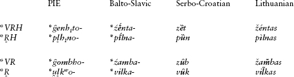
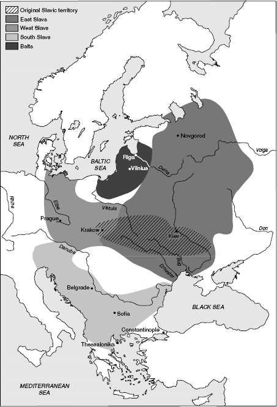
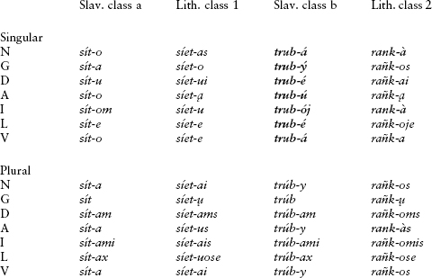
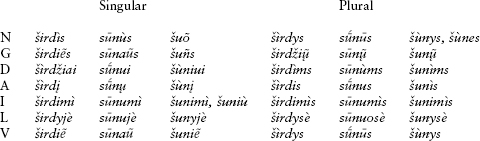
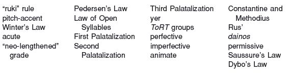
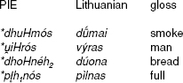
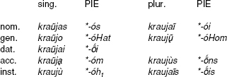

<!-- source-xhtml: 9781405188968_018.xhtml -->

# Chapter 18. Balto-Slavic

## Introduction

**18.1.** Balto-Slavic contains two branches, Baltic and Slavic (or Slavonic). The notion of a single Balto-Slavic speech community has been controversial in some circles, in part because of political tensions. But all major Indo-Europeanists are agreed that Baltic and Slavic deserve to be grouped together, though some dispute remains about the exact degree and nature of their affinity. Prehistorically, as discussed in more detail below, the ancestors of the Balts and Slavs were located in eastern Europe, with the Balts probably to the northwest of the Slavs. They were thus located near the Germanic tribes, and in fact there are numerous interesting features shared by Balto-Slavic and Germanic: both branches have dative and instrumental plurals with an **-m-* formant rather than the **-bh-* formant seen elsewhere in IE (cp. §6.17); both form a demonstrative pronoun with the stem **k̑i-* (e.g. Lith. *šìs* ‘this, he’, Goth. *himma* ‘this’ [dat.]; §7.10); both have merged **a* and **o*; both continue **-VHV-* sequences as long vowels that were a mora longer than inherited long vowels; and both have a distinction between ordinary and “definite” adjectives, the latter formed with the addition of a suffix (though not the same one in the two branches). There are also three striking agreements in the numeral system not found elsewhere in older IE languages: the names for the decads consist of the unit plus a collective for ‘ten’ (e.g. OCS *trije desęti*, Goth. *þreis tigjus* ‘thirty’); the words for ‘thousand’ are similar (OCS *tysęštĭ*, Lith. *tū́kstantis*, Goth. *þūsundi*); and the numerals eleven and twelve in Lithuanian and Germanic are expressed with phrases meaning ‘one left (over)’ and ‘two left (over)’ (Lith. *vienúolika*, *dvýlika*, Goth. *ainlif*, *twalif*). It is unclear which of these features are shared innovations, which are areal features of north or northeast Europe, and which might be chance resemblances.

Balto-Slavic shares the “ruki” rule (§18.6 below) with Indo-Iranian, a sound change that is a far from trivial innovation. Some specialists have felt that this – together with the fact that both branches are satem – points to an early period of common development; others maintain that it was a feature that spread by diffusion from Indo-Iranian during a period of prehistoric contact. Arguing for the latter is the fact that “ruki” is far more consistently found in Slavic than in Baltic, and there is better independent evidence for early contacts between Slavic and Indo-Iranian than between the latter and Baltic.

## From PIE to Balto-Slavic

### *Phonology overview*

**18.2.** Balto-Slavic is defined by at least three unique phonological features in Indo-European: the development of a distinction between rising and falling pitch accents;the change of the syllabic resonants typically to resonants preceded by *i;* and the change of **VRHC* to **V̄RC.* Among the basic developments that it shares with one or more other branches, Balto-Slavic is characterized by a satem development of the velars; by the merger of aspirated and unaspirated voiced stops; by the “ruki” rule;and by the merger of **a* and **o*.

#### Consonants

**18.3. Merger of aspirated and unaspirated voiced stops.** The attested Balto-Slavic languages have plain voiced stops reflecting both the PIE voiced stops and the voiced aspirates. Examples include OCS ***b**erǫ* ‘I gather, take’ < PIE ****bh**er-* ‘carry’, Russ.***g**oro**d*** ‘city’ < PIE ****gh**or-**dh**o-* ‘enclosure’, and Lith. ***d**ubùs* ‘deep’ < ****dh**ub-u-.* It had been assumed that the two series merged by the time of Common Balto-Slavic until the Indo-Europeanist Werner Winter proposed in the 1970s that the distinction had persisted for longer, at least between **dh* and **d.* According to his original formulation, short **e* was lengthened before **d* but not **dh,* as in Lith. *sė́sti* ‘to sit’ < **sed-ti* (ė writes a long *e* in Lithuanian). However, the long vowels in many of the putative examples (including this one) could also be old lengthened grades, and **Winter’s Law**, as it has been dubbed, remains controversial.

**18.4. Velars.** Balto-Slavic is a satem branch: the PIE plain velars **k *g *gh* and the labiovelars **kʷ *gʷ *gʷh* all became the plain velars *k* and *g*: PIE ****k**ʷos* ‘who’ > Lith. ***k**às*; **snei**g**ʷ**h**-o-* ‘snow’ > Russ. *sne**g***; ****g**ʷerh₃*- ‘consume’ > Lith. ***g**eriù* ‘I drink’. The palatal velars *k̑ and *g̑ probably became the palatal stops *ć and *j́ in the first instance, as in Indo-Iranian (§10.5), and later the palatal sibilants *ś and *ž; these subsequently became *š*/ž in Baltic and *s/z* in Slavic. Thus PIE **k̑r̥d-* ‘heart’ became OCS ***s**rĭd-ĭce* and Lith. *širdìs;* PIE **g̑**h**l̥-to-* ‘golden’ became Polish ***z**łoty* ‘gold piece, unit of currency’; and **g̑**h**el-to-* ‘golden’ became Lith. *žel̃tas*.

**18.5.** But quite a few words do not show the expected satem development. For example, alongside Lith. *žel̃tas* quoted above there is also ***g**el̃tas* ‘yellow’ from the same PIE preform. Similarly, PIE **h₂ek̑-men-* ‘stone’ has *k* in most of its Balto-Slavic descendants, such as OCS ***k**amy* and Lith. *a**k**muõ;* but some Lithuanian dialects have the expected satem outcome, *ašmuõ*. From the extended root **k̑leu-s-* ‘hear’, Slavic has satem *s-* (e.g. Russian ***s**lušat’* ‘to hear’) but not Baltic (Lith. ***k**lausýti* and Latv. ***k**lausīt* ‘to hear’). The reverse is the case with ‘goose’, PIE **g̑**h**ans-*: Slavic ****g**ǫsĭ* (> e.g. Russ. *gus*’) but Lith. *žąsìs*.

Various explanations have been proposed for these facts. Some of the exceptions, such as the Slavic word for ‘goose’, may be borrowings from a neighboring centum language like Germanic. But this explanation is difficult to maintain for many of these words. A more probable explanation is that there were early dialectal differences within Balto-Slavic with regards to the outcomes of the palatal velars, and that these differences have persisted. This hypothesis, unfortunately, cannot yet be tested.

**18.6. The “ruki” rule.** Like Indo-Iranian (§10.10), Balto-Slavic changed PIE **s* when it followed the sounds **r*, **u*, **k*, or **i*. The outcomes are different in Slavic and Baltic, and the change was not as consistent in Baltic. See §§18.24 and 18.62 below for more details.

**18.7. Resonants and glides.** The resonants and glides (except *u̯) remained intact: PIE ****m**edhu*- ‘mead, honey’ > Lith. ***m**edùs* ‘honey’; PIE ****n**okʷts* ‘night’ > OCS ***n**oĭ*; **gho**r**-dho-* ‘enclosure’ > Russ. *go**r**od* ‘city’; ****l**eikʷ-* ‘leave’ > Lith. ***l**iekù* ‘I remain, let’; **i̯u-n-g-* ‘yoke, join’ > Lith. ***j**ùngti* ‘to join’. The labiovelar glide *u̯ became *v*, as in **u̯edh-* ‘lead’ > OCS ***v**edǫ* and Lith. ***v**edù*, both ‘I lead’.

**18.8.** The syllabic resonants *r̥ *l̥ *m̥ *n̥ typically became **ir *il *im *in*, but also sometimes **ur* **ul* **um* **un* under unclear conditions. The normal outcome is preserved most clearly in Baltic, as in the following Lithuanian examples: *š**ir**dìs* ‘heart’ < PIE **k̑r̥d-*; *v**il̃**kas* ‘wolf’ < **u̯l̥kʷos*; *š**i**m̃tas* ‘hundred’ < **k̑m̥tom*; and *g**iñ**ti* ‘to drive’ < **gʷhn̥-tei* ‘in smiting’ (or the like). Note that the form *šim̃tas* importantly preserves the *m* before the following *t*; in all the other IE languages it became *n* by assimilation, as in Lat. *ce**n**tum*, Eng. *hu**n**d(red)*, and Tocharian B *ka**n**te*.

**18.9. Laryngeals.** Balto-Slavic does not have any reflexes of the laryngeals per se, but it does have important indirect evidence for them in the outcomes of resonants followed by laryngeal. These sequences developed into syllables with intonational contours that differ from those of similar syllables that originally did not have a laryngeal. See below, §18.12.

#### Vowels

**18.10.** In Balto-Slavic, the lower back vowels **a* and **o* merged, though with different outcomes in the two subbranches: in Slavic, they merged to *o* (perhaps via an intermediate stage **a*), whereas in Baltic they merged to *a*. The long vowels *ā and *ō also merged in Slavic (to *a*), but were kept distinct in Baltic. For examples and further discussion see §§18.30 and 18.65.

**18.11. Rise of acute intonation.** As noted in §§3.20 and 18.1 Balto-Slavic shares with Germanic a distinction in final syllables between the inherited long vowels and newer long vowels that arose from contraction where there had been an intervening laryngeal (**VHV*). The latter were characterized in the first instance by an extra mora of length (notationally *ā̃, *ē̃, etc.). Over time, the trimoraic *ā̃, *ē̃, etc. became ordinary long vowels *ā, *ē, while the older inherited *ā, *ē, etc. developed a new phonetic feature, apparently a kind of glottal or laryngeal catch or checking of the vowel (as is still the case in the “broken tone” in modern Latvian and dialectal Lithuanian; compare also the Danish *stød*, a glottal catch or creakiness of the voice that developed in certain long syllables that was mentioned at §15.106). Vowels with this feature are called *acute*; the others are called *non-acute* or *circum-flex.* Importantly, these prosodic features were independent of the location of the stress-accent or ictus; there could be multiple acute or non-acute vowels in one word.

**18.12.** Later, the contrast between acute and non-acute/circumflex was realized intonationally, such that acute syllables had rising pitch and circumflex had falling. The combination of this system and mobility of the stress is preserved in Lithuanian and two South Slavic languages, Serbo-Croatian and dialectal Slovenian. Latvian also preserves the pitches but has fixed stress on initial syllables. Some West Slavic languages have vowel-length contrasts in place of the intonational contrasts (especially Czech and Slovak); mobility of the stress is still characteristic of all of East Slavic, but elsewhere the stress has become fixed or predictably placed. (Confusingly, the modern languages do not all use the same accent marks for writing the intonational pitches: Lithuanian *é* and Serbo-Croatian ȅ both represent *e* with original acute.)

**18.13. Intonation and the laryngeals.** Balto-Slavic is unique in IE for turning a sequence **VRH* before consonant into **V̄R.* Thus for example **g̑enh₁-to-* became pre-Balto-Slavic **źēnta-* ‘son-in-law’, and **bherHg̑eh₂* became pre-Balto-Slavic **bērźā-* ‘birch’. These new long-vowel sequences arose before the advent of the acute/non-acute distinction and were treated in the same way as regular inherited long vowels, meaning that they eventually became acute. Thus **źēnta-* above became acute **źḗnta-* and **bērźā-* became **bḗrźā-.* Subsequently, Osthoff’s Law (§3.41) shortened all long vowels before a resonant and consonant. Balto-Slavic **źḗnta-* and **bḗrźā-* became then **źénta-* and **bérźā-,* whence on the one hand Lith. *žéntas,* Serbo-Croatian *zȅt,* and on the other, Lith. *béržas* and Serbo-Croatian *brȅza*.

**18.14.** The change of **VRH* to **V̄R* happened after the syllabic resonants became **iR* (§18.8), meaning that new sequences **īrC* **īlC* **īmC* **īnC* developed from **r̥HC *l̥HC* **m̥HC *n̥HC.* These predictably became acute as well, and then shortened by Osthoff’s Law. Thus **pl̥h₁no-* ‘full’ > **pīlna-* > **pī́lna- >* Lith. *pìlnas* (the grave accent mark represents acute), Serbo-Croatian *pȕn*.

Since original short vowels had always been non-acute, original sequences of short vowel plus resonant now contrasted with these new, acute sequences of short vowel plus resonant. Compare the outcomes of the words for ‘son-in-law’ and ‘full’ with those for ‘tooth’ (in Serbo-Croatian; Lith., ‘sharp edge’) and ‘wolf:

An acute accent all by itself does not automatically signal the former presence of a laryngeal, since acute intonation has other sources as well. The Balto-Slavic intonational facts therefore serve primarily for confirmation of laryngeals whose existence has been deduced from other comparative evidence.

**18.15.** The Balto-Slavic system of accentual contrasts is one of the most complex areas of IE historical linguistics. A prodigious variety of accentual rules have been proposed over the years to account for the different patterns, and there is considerable debate about the details. Most of these are proper to the later histories of the subbranches and individual daughters, but one that affected the Common Balto-Slavic period and that had important ramifications later is **Pedersen’s Law** (or more accurately **Saussure–Pedersen’s Law**, as it was first recognized by Ferdinand de Saussure and later refined by the Danish Indo-Europeanist Holger Pedersen). The precise formulation of the law is debated, but in essence it appears that an original stress accent on a penultimate open syllable was retracted to the previous syllable. Thus the PIE nominative and genitive singular of the word for ‘daughter’, **dhugh₂-tḗr* **dhugh₂-tr-és*, retained their accent on the final syllable (> Lith. *duktė̃*, Old Lithuanian *dukterès*), while the accusative singular and nominative plural **dhugh₂-tér-m̥* **dhugh₂-tér-es* threw the accent back, yielding Lith. *dùkterį* and Old Lith. *dùkteres.* As a result of this retraction, paradigms arose that were marked only at “edges,” i.e. in which the accent fell on either the initial or the final syllable but not the middle. This pattern later underwent major analogical extension.

### *Morphology*

**18.16.** A characteristic innovation in Balto-Slavic morphology, found especially in verb formation, is the widespread analogical creation of so-called “neo-lengthened-grade” forms, essentially the lengthening of vowels for ablaut purposes beyond the original scope of lengthened grades in PIE. Most dramatically, inherited zero-grade forms containing the vowels **i* and **u* were often lengthened to *ī and *ū by analogy. For example, the zero-grade **mr̥-* ‘die’ (cp. Lat. *mor-t-* ‘death’) became **mir-* in Balto-Slavic, and from this a “neo-lengthened” root form **mīr-* was created that appears in Russ. *u-mir-at*’ ‘to lie dying’ (see §18.30 on Slavic *i* < *ī). Another morphological innovation of Balto-Slavic was the creation of “definite” adjectives (alongside normal adjectives), as mentioned above in §18.1. This was done by adding a suffix **-i̯o-*: thus OCS has *dobrŭ* ‘good’ alongside definite *dobrŭ-jĭ* ‘the good (one)’, and Lithuanian has *gẽras* ‘good’ alongside *geràs-is* ‘the good (one)’. This suffix descends from the PIE relative pronoun (recall §8.28 and compare §15.22).

In both Baltic and Slavic, the PIE verbal system was somewhat simplified (but see §18.35 on the creation of aspectual pairs in Slavic). The perfect has been lost as a category, though the perfect participial suffix survives as a past participial suffix. Of some interest is the fact that both subbranches retain one tense system formed with an *s*-suffix, but a different one in each: Baltic has an *s*-future lacking in Slavic (except for one isolated form, see §18.34), whereas Slavic has an *s*-aorist system (including secondary derivatives) lacking in Baltic. The subjunctive has been lost, but the optative survives, though only in Old Prussian as an actual optative; it otherwise got marshalled into service as the imperative in both Baltic and Slavic, and shows up in the Lithuanian permissive as well (see §18.66). Balto-Slavic is also interesting in preserving (along with Indo-Iranian and Italic) the somewhat marginal category of the supine in **-tum* (§5.59), e.g. OCS *sapa-ta* ‘to sleep’, Lith. *bū́-tų* ‘to be’; it also became the base for the new East Baltic optative, e.g. Old Lith. 2nd sing. *butúm-bey* ‘may you be’.

**18.17.** In both verbal and nominal morphology, Balto-Slavic importantly distinguishes between mobile and non-mobile paradigms. In the following discussion, we will concentrate on the nominal system. In slightly simplified terms, one can think of Balto-Slavic as having inherited nouns with accent on the root and others with accent on the ending. Largely as a result of the workings of Saussure–Pedersen’s Law (§18.15 above) and some further changes to be discussed later (§18.70), some stresses that originally fell on endings were retracted, resulting in a new type of mobile paradigm that looked very different from the familiar mobile accent-ablaut types we have seen for PIE. In those (as will be recalled e.g. from the chart given in §6.20), the accent tended to move rightward from the strong cases to the weak in nouns and from the singular to the dual and plural in verbs; in Balto-Slavic, however, there is a *leftward* rather than a rightward movement of the accent as one goes down a paradigm. We already saw a hint of this with Lith. nomin. sg. *duktė̃*, accus. *dùkterį* (§18.15). There were also some sound changes that moved the accent forward to the end of a word, causing paradigms whose accent was originally fixed on the root to become mobile in a different way from the type just outlined. All these patterns will be discussed in more detail later in this chapter (§§18.70ff.).

**18.18.** Less well-understood are the changes to verbal accentual paradigms, which also differ strongly in their accentual properties from their PIE forebears. Simple thematic presents, which had fixed accent on the root in PIE, became mobile in Balto-Slavic; e.g. the PIE 1st and 3rd singular and 1st plural of ‘lead’, **u̯édh-oh₂* **u̯édh-eti* **u̯édh-ome-*, ultimately became Lith. *vedù vẽda vẽdame*. By contrast, athematic presents, which usually had mobile accent in PIE, normally have fixed accent on the stem-vowel in Balto-Slavic.

## Slavic

**18.19.** We know little, if anything, of the Slavs before their first mention in Byzan-tine histories of the sixth century <small>AD</small>, when bands of them moved into Greece and the Balkans from the northeast. This period also saw their expansion into parts of northern Europe previously settled by Baltic and Finnic peoples. Prior to these expansions, which continued for several hundred years and probably marked the end of Proto-Slavic linguistic unity, the Slavs are believed to have occupied an area stretching from near the western Polish border eastward to the Dnieper River in Belarus’. Archaeologically this territory shows a continuum of cultural development from about 1500 <small>BC</small> to the period of the expansions, which may well mean that it was Slavic (or pre-Slavic) during all that time.

**18.20.** Some or all of the ancestors of the Slavs were once located a little further to the east, in or near Iranian territory, for a number of Iranian words were borrowed at an early date into pre-Slavic. One of these is the word for ‘god’, OCS *bogŭ* (Russian *bog*), which comes from Iranian **baga-* ‘god’. Two others are evidenced by Russ. *sobaka* ‘dog’ (cp. Median *spáka*), and perhaps by OCS *sŭto* ‘hundred’ (if borrowed from Iranian **sata(m)*). This territory would have been to the north of the Black Sea, an area into which a number of rivers flow whose names are usually taken to be Iranian: the Dniester, Dnieper, Donets, and Don (cp. Iranian **dānu-* ‘river’). As the early Slavs moved slowly westward, they came into contact with Germanic tribes; as mentioned in §16.2, from them they borrowed the word for ‘bread’, OCS *xěbŭ* (Germanic **hlaiƀaz*, cp. Goth. *hlaifs*, Eng. *loaf*), ‘prince’, OCS *kŭnęzŭ* (Gmc. **kuningaz* ‘king’, cp. OE *cyning*), and several others.

**18.21.** The modern Slavic languages arose as the result of dialectal differentiation that only began about 1500 years ago. Even today, several of the modern languages are to some extent mutually intelligible in their spoken forms, and even more so in their written forms. A discussion of the rise of Slavic literacy is deferred until the section on Old Church Slavonic below (§§18.40ff.), the first attested Slavic language.

### *Slavic phonology*

**18.22. Consonants.** As noted above, Slavic changed PIE *k̑ and **g̑(h)* to *s* and *z*: **k̑lōu̯ā* ‘fame’ > OCS ***s**lava* ‘fame, glory’ (cp. Gk. *klé(w)os* ‘fame’ < **k̑leu̯os*); **g̑neh₃-* ‘know’ > OCS ***z**nati* ‘know’. Aside from this change, Slavic consonants were most affected by the Law of Open Syllables and the three palatalizations discussed below.

**18.23. Law of Open Syllables.** A number of developments conspired to reduce the number of closed syllables in pre-Slavic, typically by deleting syllable-final consonants. This resulted in the simplification of many word-internal consonant clusters. For example, the cluster *pn* in the word **supno-* ‘sleep’ was syllabified *sup.no-*, with the *p* closing the first syllable; but sound changes led to the disappearance of the *p* in **sup-no-*, changing it to **su-no-* with an open first syllable. The aggregate of these changes is called the Law of Open Syllables. Two specific changes that fall under this rubric are treated below in §§18.32 and 18.33. One cluster that remained throughout all this was **st*, seen especially in the reflex of PIE dental-plus-dental clusters (§3.36), as in OCS *vesti* ‘to lead’ < **u̯ed-tei*.

As a result of the Law of Open Syllables, many words in Slavic exhibit some striking alternations, such as that between *sŭp-* and *sŭ-* in forms of the OCS verb meaning ‘sleep’: aorist *u-ŭ**p**-e* ‘fell asleep’ but present infinitive *u-**sŭ**-nǫtĭ* ‘to fall asleep’ (the latter from **u-sŭp-nǫtĭ*; cp. Russ. ***sp**at’* ‘to sleep’, *u**s**nut’* ‘to fall asleep’).

**18.24. The “ruki” rule.** In Slavic, **s* occurring after **r*, **u*, **k*, or **i* became the voiceless velar fricative *x*: OCS *u**x**o* ‘ear’ < **h₂eu**s**o-*; 1st sing. aorist *rě**x**ŭ* ‘I spoke’ < **rēk-s-om*; locative pl. *-ěxŭ* < **-oisu.* (The many Slavic words beginning with *x-* are unexplained, as ruki is the only known Slavic sound change that gave rise to *x*.)

**18.25. Palatalizations.** Of great importance in the history of Slavic consonants were a series of palatalizations; the changes are complex and will only be given here in outline. The **First Palatalization** caused the velars *k g x* to be palatalized to *č ž š* before *i̯ or a front vowel. Examples include OCS *služiti* ‘to serve’ < pre-Slav. **slu**g**-iti* and *rǫčĭka* ‘little hand, handle’ < pre-Slav. **rǫ**k**-ĭka* (diminutive of **rǫka* ‘hand’). The Second and Third Palatalizations had different outcomes in different parts of Slavic-speaking territory, and happened after certain changes to the vowels had already taken place. The **Second Palatalization** affected the velars *k g x* when they stood before ě (the outcome of **ai* and **oi*, see §18.31 below): PIE ****k**ʷoi-neh₂* ‘price’ > Slav. ****k**ěna* > OCS ***c**ěna* ‘price’ (*c* is [ts]; cp. Gk. *poinḗ* ‘price, penalty’, Lith. *káina* ‘price’); pre-Slav. ****x**airŭ* ‘grey’ > ****x**ěrŭ* > Russ. ***s**eryj*. (These are not the only outcomes; Czech, for example, has ***š**erý* corresponding to Russ. *seryj*.) The **Third Palatalization** was conditioned by the vowel preceding (rather than following) the velar: *k g x* were palatalized when followed by most vowels and preceded by ĭ, *i*, or ę (on these vowels, see §§18.28, 30, and 32 below); this was a late change and its effects were more sporadic. Thus the Slavic diminutive suffix **-ĭko-* (< PIE **-iko-*) became *-ĭ**c**ĭ* or *-ĭ**c**e*: OCS *otĭ**c**ĭ* ‘father’ < **at-i**k**o-* (**at*- also in Goth. *Att-ila* ‘little father’); OCS *srĭdĭ**c**e* ‘heart’ < **srĭdĭ**k**o-* < **k̑r̥d-iko-*.

There is some dispute over when the Third Palatalization took place relative to the Second; what is clear is that it happened after various Germanic loanwords had already entered the language. Note especially OCS *pěnęzĭ* ‘coin’, a borrowing from OHG *pfenning* or its immediate ancestor **penning*, whose *e-*vocalism (by um-laut from **panning*) can be dated to probably the seventh century; the Slavs had to have picked up the word after that change (perhaps during the time of Charlemagne), and the Third Palatalization can be dated to roughly the same time or later.

**18.26.** Palatalization was not limited to the velars. In some modern Slavic languages, there is a phonemic opposition between non-palatalized (“hard”) and palatalized (“soft”) consonants, as in Russian *brat* ‘brother’ versus *brat’* ‘to take’.The palatalized consonants are often distinguished by the presence of a *y-*glide after the consonant. The development of phonemically palatalized consonants had already progressed to some extent in Common Slavic. Some languages, such as Polish, developed the system to a high degree but then lost the distinction after subsequent changes.

**18.27. Glides.** The one surviving glide, *i̯, mostly stayed intact in initial position and intervocalically, as in OCS *junŭ* ‘young’ < **i̯ou-no-*. Several Slavic languages have had the propensity to develop prothetic glides in front of certain vowels. For example, the number ‘eight’ began originally with *o-* (PIE **ok̑tō*); in pre-Russian this developed into **u̯o-* and then into *vo-* (whence Russ. *vosem*’, versus e.g. Polish *osiem* without the glide). Compare for this development the pronunciation of Eng. *one* with initial *w-* (the original glideless pronunciation is preserved in *on-ly* and *al-one*).

#### Vowels

**18.28. Short vowels and the “yers”.** As mentioned earlier, Slavic merged **a* and **o* as *o*: **n**a**so-* ‘nose’ > OCS *n**o**sŭ*, **h₂**o**u̯i-* ‘sheep’ > OCS ***o**vĭ-ca*. Short **e* remained *e*, e.g. **gʷen-* ‘woman’ > OCS *žena*. The short high vowels **i* and **u* developed into vowels transliterated as ĭ and ŭ (in Cyrillic, ь and ъ), called the front and back **yers** (or jers), respectively. These are assumed to have been very short *i* and *u*. Examples from OCS include *čĭto* ‘what’ < **kʷi-* and *rĭžda* ‘rust’ < **h₁rudh-i̯ā* (‘the red stuff’, from **h₁reudh-* ‘red’).

**18.29.** The yers are still preserved in Old Church Slavonic, but around the end of the Common Slavic period (c. <small>AD</small> 800–1000), they began to be lost as a category: certain ones weakened and disappeared, while others strengthened and became full mid or low vowels. The rule was as follows: word-final yers and yers before a syllable with a full vowel (i.e., other than a yer) disappeared; these were the so-called “weak” yers. Yers before a syllable containing another yer were “strong” and later developed into full vowels. Thus in OCS *dĭnĭnica* ‘morning star’ and *rŭtŭ* ‘mouth’, the first yer was strong but the second was weak; in *vuxodu* ‘entrance’, both were weak. The full vowels that developed from the strong yers differ from language to language; in Russian, strong ĭ and ŭ became *e* and *o*. Thus *dĭnĭnica* and *rŭtŭ* correspond to Russ. *dennica* and *rot*.

The loss of the yers had far-reaching effects. It created new consonant clusters, including complex ones word-initially, as in Russ. *čtenie* ‘reading’ (< *čĭt-*), *mglo* ‘mist’ (cp. OCS *mĭglo),* and *vzgljad* ‘view’ (older *vŭz*-). It also led to alternations where one form has a vowel that disappears in related forms, as in Russ. nominative *rot* ‘mouth’ alongside genitive *rta* ‘of the mouth’ (cp. the forms for ‘American’ in §18.38 below).

**18.30. Long vowels.** The long high vowels *ī and *ū became *i* and *y* (the latter phonetically the central high vowel [ɨ], midway between the vowels in *pit* and *put*): OCS *u-m**i**r-ati* ‘to die’ < pre-Slavic **ou-mīr-atei* (< **mīr-*, neo-lengthened grade of **mir*-; see §18.16); OCS *m**y**šĭ* ‘mouse’ < **mūs-.* Long *ē became a sound transliterated as ě, called **yat’** (or jat’) and representing phonetically the sound [æ] (as in *hat*), e.g. *děti* ‘place, put’ < **dhē-* < **dheh₁-*. (The apostrophe in the word *yat’* represents palatalization of the final consonant in Russian, the source of the word.) Finally, long *ā and *ō merged as *a* (e.g. **steh₂-* > **stā*- > OCS *st**a**-ti* ‘to stand’, **g̑neh₃-* > **g̑nō*- > OCS *zn**a**-ti* ‘to know’).

**18.31. Diphthongs.** The diphthongs were all monophthongized: **ei* became *i* (as in PIE **st**ei**gh-* ‘step, go’ > OCS *st**i**gnǫ* ‘I come’); **oi* became ě or, word-finally, often *i* (e.g. **-**oi**su* > OCS loc. pl. *-ěxŭ* but masc. nomin. pl. **-**oi*** > OCS *-**i***); **ai* also became ě (e.g. **l**ai**u̯o-* ‘left’ > OCS *lěvŭ*); **eu* became *ju* (e.g. **bh**eu**dh-* ‘be awake’ > OCS *bl**ju**dǫ* ‘I keep watch’, with secondary *l*); and **ou* and **au* became *u* (e.g. **sūn**ou*** ‘son’ [vocat. sing.] > OCS *syn**u***; **t**au**ro-* ‘bull’ > OCS *t**u**rŭ* ‘wild bull’).

**18.32. Rise of nasalized vowels.** Common Slavic changed sequences of vowel plus nasal in closed syllables into nasalized vowels as part of the Law of Open Syllables. An original sequence **in *en* or **im *em* before a consonant became a front nasal vowel transliterated as ę: pre-Slav. **su̯**en**to-* ‘holy’ > OCS *svętŭ* ‘holy’; pre-Slav. **des**im**-ti-* ‘group of ten, decad’ > OCS *desęti* ‘ten’. Any other vowel plus nasal became a back nasalized vowel transliterated as ǫ: **g̑**om**bho*- ‘tooth’ > OCS *zǫbŭ* ‘tooth’ (cp. Eng. *comb*), **g̑h**an**s-* ‘goose’ > OCS *gǫsĭ.* Later, in most Slavic languages - the main exception being Polish - these were denasalized, whence e.g. Russian *svjatoj, desjat*’, *zub,* and *gus*’ for the words above (but Polish *święty*, *dziesięćc*, *ząb, gęś*).

**18.33. “*ToRT*” groups.** One who is familiar with a bit of Russian geography may recall that some cities have names ending in *-grad* (e.g. *Lenin-grad, Kalinin-grad*), while others have names ending in *-gorod* (e.g. *Nov-gorod*). Both elements mean ‘city’, but one is the native Russian word (*gorod*) while the other is borrowed from OCS (*gradŭ*). Russian has many other such doublets, including *golova* ‘head’ vs. *glava* ‘head (= leader), chief and *moroka* ‘twilight’ vs. *mrak* ‘gloom’. These doublets exemplify different dialectal Slavic outcomes of the Proto-Slavic sequence **oR* between two consonants, conventionally labeled “*ToRT*”; this sequence underwent various reconfigurations as part of the Law of Open Syllables. In South Slavic, this sequence became *Ra*, while in East Slavic the outcome was *oRo*. Thus Common Slavic **gord-* **golv-* **mork-* are the ancestors of OCS *gradŭ glava mrakŭ* and Russian *gorod golova morok-*. (OCS vocabulary is mined for scientific or learned words in Russian, much as Latin and Greek are mined by English for similar purposes.)

Even though East Slavic has lost the old Slavic intonations, disyllabic *-oRo-* is a useful indicator of the type of intonation that was once present. The accentual pattern *-oRó-* reflects an old acute (rising) **-óR-*, while *-óRo-* reflects an old non-acute or falling intonation. Thus Russ. *vóron* ‘raven’ goes back to non-acute Slavic **vornŭ* (cp. Lith. *var̃nas*), while its feminine derivative *voróna* ‘crow’ goes back to acute **vórna* (cp. Lith. *várna*). As we have seen, the acute here means this vowel was once long, so we reconstruct **u̯arnos* for the raven and a feminine vrddhi-derivative (§6.61) **u̯ārnā* for the crow. Thus also Russ. *koróva* ‘cow’ alongside Lith. acute *kárvk* ‘cow’, and Russ. *górod* ‘city’ alongside Lith. circumflex *gar̃das* ‘fence’.

### *Morphology*

#### Verbs

**18.34.** Slavic continues the PIE present, imperfect, and *s-*aorist tenses. As noted above in §18.16, the subjunctive was lost, but the optative lives on as the Slavic imperative, e.g. OCS sing. *nes-i* ‘carry!’, pl. *nes-ěte* (with both *-i* and *-ě-* from **-oi-*). Only one *s-* future form is found, Old Russ. (Russ. Church Slavonic) *byšęštĭ*, a participle meaning ‘about to be’ (< Balto-Slavic **bū-sint-j-*; cp. §5.40). Several different participles are found, most of them continuations of IE formations: a present active participle in *-ęt-* and *-ǫt-* from **-e/ont-*; a present passive in **-mo-* (see §5.60); two past active participles, one in *-vŭš-* (from the PIE perfect participle) and one (called the resultative participle) in *-l-* (see §5.60); and two past passive participles, in *-t-* and *-(e)n-*, from the old verbal adjectives in **-tó-* and **-nó-* (§5.61). Note that Baltic does not have the *l-* or the *(e)n-*participles. The Slavic infinitive in *-ti* (< **-tei*) is an old case-form, probably a locative, of a verbal abstract noun in **-ti-* (§5.58).

**18.35. Perfective and imperfective aspect.** The singular hallmark of the Slavic verb is its aspectual system. Almost every verb may be classified according to the category of aspect, imperfective (action that is incomplete, ongoing, repeated, or unspecified as to completion), and perfective (completed or one-time action). Some verbs may be coupled as aspectual pairs. Perfectives often continue presenttense formations in PIE, which then acquired future meaning in Slavic; thus for example PIE reduplicated (weak stem) **de-dh₃*- ‘give’ ultimately became the perfective OCS *damĭ* ‘I will give’. However, not all PIE presents underwent this change; thus **bheroh₂* ‘I carry’ (extended in pre-Slavic to **bherōmi*) became the imperfective present *berǫ* ‘I gather, take’. Very often a preverb marks the perfective member of the pair, as in Russ. *pro-čitaju* ‘I will read (and finish reading)’, perfective of *čitaju* ‘I am reading’; here English offers a parallel with such pairs as *drink* vs. *drink up*, *eat* vs. *eat up*, etc. The following OCS verbs (in the 1st singular) will illustrate some of the morphological means that were pressed into service to form imperfective/perfective pairs:

| Column 1 | Column 2 | Column 3 |
| --- | --- | --- |
| Imperfective | Perfective | English meaning |
| *dajǫ* | *datnĭ* | give |
| *padajǫ* | *padǫ* | fall |
| *rasēmatrjajǫ* | *rasŭmotrjǫ* | view |
| *byvajǫ* | *bǫdǫ* | be |
| *dvižǫ* | *dvignǫ* | move |

As these forms show, the compound suffix *-*ā-i̯e*- was often used to derive imperfectives from perfectives, sometimes in tandem with changes in ablaut (as in *rasŭm**a**trjajǫ* alongside *rasŭm**o**trjǫ*) or the use of a different stem (base *byv-* < PIE **bhū*(u̯)- alongside *bǫd*- < Slavic **bu-n-d-*, the latter of uncertain explanation). The last example in the chart illustrates the fairly common use of a nasal suffix to form a perfective; the corresponding imperfective in this case is from earlier **dvig-je-*, in IE terms a **i̯e/o*-present.

**18.36.** The situation acquires an additional layer of complexity with verbs of motion, which distinguish not only imperfectivity and perfectivity, but also iterativity. Thus Russian distinguishes *nesu* ‘I carry’ (imperfective), *ponesu* ‘I will carry’ (perfective), and *nošu* ‘I carry (there and back), I repeatedly carry’. The *o*-grade of the last form betrays it as coming from a PIE causative-iterative **h₁nok̑-ei̯e-*, though not all the Slavic iteratives continue this type of formation.

#### Nouns

**18.37.** The rich nominal inflectional system of PIE is practically intact in Slavic. Seven cases are expressed: nominative, genitive, dative, accusative, instrumental, locative, and vocative. The genitive of *o*-stems in Slavic (and Baltic) is formally the old IE ablative in **-āt* (a variant of the more widespread *-*ōt*; see §6.49), which took over the functions of the genitive and replaced it; this became *-a* by the change of *ō > *a* and loss of the final stop. The functional merger of ablative and genitive is why prepositions with the meaning ‘away from’ take the genitive case in Slavic. (Compare Greek, where the ablative disappeared and its functions were taken over by the genitive, with the same results; recall §12.48.) Dual forms were still in use in the early periods, but have disappeared from most of the modern languages except dialectal Sorbian and Slovenian.

**18.38.** A striking morphosyntactic innovation of the Slavic nominal system is the distinction within the masculine gender between animate and inanimate. This began in the *o-*stems and spread to the other stem-classes gradually during the historical period. The distinction is made overt in the accusative case, which is identical to the nominative in inanimate nouns but identical to the genitive in animates (e.g. nomin. sing. *amerikanec* ‘an American’, accus. and genit. *amerikanca*; nomin. pl. *amerikancy*, accus. and genit. *amerikancev*). In two West Slavic languages, Polish and Sorbian, to make things even more complicated, masculine animate nouns split into human (also called personal or virile) and non-human categories, as reflected in the case-endings of the plural (and dual, in the case of Sorbian). Thus the accusative patterns with the nominative in the case of non-human masculine animates, but with the genitive in the case of personal animates, which have also gone the extra step of creating a whole new ending for the nominative. Thus ‘cats’ in Polish is *koty* in the nominative and accusative and *kotów* in the genitive, while ‘men’ is nomin. pl. *mężowie*, accus. and genit. pl. *mężów*.

#### Numerals

**18.39.** The numerals occupy a rather interesting corner of Slavic morphology. The system of numerals in almost any Slavic language is by English standards enormously complicated. In Russian, for example, the number ‘one’ and any compound number ending in ‘one’, like 21, 451 (but not 11), is an adjective agreeing with the following noun in gender and case: *odin stol* ‘one table’, *odno okno* ‘one window’, instrumental *s odnim stolom* ‘along with one table’. The numbers ‘two’, ‘three’, and ‘four’, as well as compound numbers ending in these (such as 52, 73, 164, but not 12–14!), take the genitive singular of whatever noun follows them (e.g. *tri stola* ‘three tables’, where *stola* is genitive singular), and all other numbers – five through twenty and any compound number ending in five through zero – take the genitive plural of the following noun (e.g. *devjat’ stolov* ‘nine tables’, with *stolov* genitive plural).

The historical explanation for this is an interesting example of the interrelationship of morphology and syntax. First, Common Slavic revamped the inherited cardinal numerals from five through ten by replacing them with collectives. These collectives were abstract *i*-stem nouns (e.g. OCS *pętĭ* ‘five’ < **penkʷ(e)-ti-*, *osmĭ* ‘eight’ < **ok̑tm̥-mĭ*), and due to their literal meaning (‘a group of five, a quintet’, etc.) took the genitive plural of whatever noun followed. Thus OCS *pętĭ stolŭ* ‘five thrones’ historically meant ‘a quintet/fivesome of thrones’. The number ‘two’ originally took the dual, and this usage spread in some Slavic dialects (including the ancestor of Russian) to the following numbers ‘three’ and ‘four’ by contamination. (Contamination frequently affects numeric systems: neighboring numerals are notorious for influencing each other phonologically, morphologically, and – as in this case – even syntactically.) The final step in the development was the formal merger of the dual with the genitive singular in some declensions, which led to a nearly complete morphological replacement of the dual by the genitive singular elsewhere in Russian and several of its relatives.

## Old Church Slavonic

**18.40.** Slavic literacy began in 863, when two Greek brothers and missionaries,Constantine and Methodius, arrived in Moravia to teach the Christian faith in Slavic. The brothers had learned the language while growing up in Thessalonika.Constantine devised a script for it, while Methodius did the lion’s share of the translation work. Constantine later went to Rome and on his deathbed became a monk, whereupon he took on the name Cyril. The script we call Cyrillic in his honor is not actually the script he invented; the latter is now called Glagolitic (OCS *glagolŭ* ‘word’), with distinctive letters of uncertain origin. What we now call Cyrillic (used nowadays to write Russian, Belarusian, Ukrainian, Bulgarian, Macedonian, Serbian, and various non-Slavic languages of the former Soviet Union) was devised about thirty years later in Bulgaria and based on the Greek majuscule (capital) letters.

**18.41.** None of the two brothers’ translations has survived. The earliest preserved Slavic comes from some of their successors in Bulgaria; this language soon spread as the liturgical language for all the Slavs, and because of its role as the language of Slavic Christendom it is usually called **Old Church Slavonic** or Old Church Slavic. OCS is very similar to the Common Slavic that has been reconstructed by linguists; but by all estimates, Common Slavic ceased to exist as a unitary language several hundred years before the time of Constantine and Methodius, and at most OCS can be regarded as one of its later dialects, albeit artificial (that is, it did not quite match the local spoken dialects of the regions in which it was used). The Old Church Slavonic of Bulgaria, regarded as something of a standard, is often called **Old Bulgarian** (or Old Macedonian).

Eastern Orthodox Christianity spread to all the East Slavs and the eastern territories of the South Slavs (inhabited by the ancestors of today’s Serbs, Macedonians, and Bulgarians), and OCS spread with it; since a different dialect was spoken in each area, OCS was artificially modified to accommodate local dialect features. The term “Church Slavic” is often encountered as a general rubric for these different regional varieties of OCS. Real OCS was not spoken for terribly long before the development of the regional Church Slavic varieties, hence we do not have many documents in it – only about seven major manuscripts in the Glagolitic alphabet, and two in the Cyrillic alphabet from before the twelfth century. The oldest OCS manuscript, from the tenth century, is known as the Kiev Fragments and is written in Glagolitic.

### *Old Church Slavonic text sample*

**18.42.** The Old Church Slavonic version of Luke 2:4–7, in normalized spelling.

4 vŭzide že Iosifŭ otŭ Galileję, iz grada Nazaretĭska, vĭ Ijuděǫ, vŭ gradŭ Davydovŭ iže naricajetŭ sę Vitleemŭ, zane běaše otŭ domu i otĭčĭstviě Davydova. 5 napisati sę sŭ Mariejǫ, obrǫčenojǫ emu ženojǫ, sǫštejǫ neprazdŭnojǫ. 6 bystŭ že, egda byste tu, isplŭnišę sę dĭne roditi ei. 7 i rodi synŭ svoi prĭvěnĭcĭ, i povitŭ i, i položi i vĭ ěslaxŭ, zane ne bě ima města vŭ obitěli.

4 And Joseph also went up from Galilee, from the city of Nazareth, to Judea, to the city of David, which is called Bethlehem, because he was of the house and lineage of David, 5 to be registered with Mary his betrothed, who was with child. 6 And while they were there the time came for her to be delivered. 7 And she gave birth to her first-born son and wrapped him in swaddling cloths, and laid him in a manger, because there was no place for them in the inn.

**18.42a. Notes. 4. vŭzide:** ‘went up’; *vŭz-* means ‘up’, and *ide* is aorist of *iti* ‘to go’ < **h₁ei-tei.* The stem *id-* is taken from the imperative *idi* ‘go**!**’, ultimately from the PIE imperative **h₁i-dhi* (§5.54). (Compare the Greek verb *esthíō* ‘I eat’, formed by adding the personal endings to the original imperative ** esthi* ‘eat**!**’) **že:** particle emphasizing the preceding word; PIE **ghe* (Ved. *(g)ha*). **otŭ:** ‘from’, perhaps related to the ablative ending **-(h₂)at* (§6.49). **grada Nazaretĭska:** ‘the city of Nazareth’, genit. sing.; *-ŭsk-* is a common adjectival suffix added to place-names to indicate origin and related to Germanic **-iska-* (> *-ish* in Eng.; §6.75). **vĭ:** ‘in’, the variant of *vŭ* when before a front vowel. **Davydovŭ:** ‘of David’; *-ov-* is an adjectival suffix added to proper names to indicate affiliation, and is the same suffix seen in names like *Molotov, Godunov, Chekhov.* **naricajetŭ sę:** ‘calls itself = ‘is called’, 3rd sing. of *naricati,* the imperfective of *narešti,* from *rešti* ‘to say’. The *-c-* of *naricajetŭ* is from the Third Palatalization (§18.25); the pronoun *sę* is the old accusative of the reflexive pronoun, from PIE **su̯e-* (§7.13). **běaše:** ‘was’, 3rd sing. imperfect; the ending *-aše* is palatalized from *-ax-* before the front vowel *-e* (§18.25). The *-x-* is ultimately from the *s* of the *s-*aorist; this **-s-*changed to *-x-* by the “ruki” rule in certain forms, and then spread to other forms where “ruki” would not have applied, as here. **domu:** ‘home, house’, with *-u* < **-ou-s,* the *u-* stem genit. sing. **otĭčĭstviě:** ‘lineage’, genit. sing.; abstract noun from *otĭcĭ* ‘father’.

**5. napisati:** ‘to register’, from *pisati* ‘to write’. **sŭ**: ‘with’, cp. Lith. *sù.* **obrǫčenojǫ:** ‘betrothed’ (instr. sing.), past passive participle of *obrǫčiti* ‘to betroth’, from *rčka* ‘hand’ (Russ. *ruka*). **emu:** ‘him’, dative of the masc.-neut. demonstrative pronoun, containing the oblique case-formant *-m-* (see further §18.78). **ženojǫ:** ‘wife, woman’, PIE **gʷen-* (Gk. *gunḗ* ‘woman’, Eng. *queen*). **sǫštejǫ:** ‘being’, pres. participle < **sont-;* the *-št-* is the South Slavic development of **-tj-.* **neprazdŭnojǫ:** ‘pregnant’, lit. ‘not idle, not empty’.

**6. bystŭ:** ‘it was, it happened (that)’, 3rd sing. perfective aorist of *byti* ‘to be’. A shorter 3rd singular, *by*, is the historically older form (< **bhuH-s-t*); *bystŭ* is a blending of *by* and the present 3rd sing. *jestŭ* ‘is’ (> **h₁esti*). **byste**: ‘both of them were’, 3rd dual aorist. **isplŭnišę sę dĭne:** lit. ‘the days filled themselves’ = ‘the days became full, became complete’; *s*-aorist of *isplŭniti,* from *plŭnŭ* ‘full’ (PIE **pl̥h₁no-,* cp. Eng. *full*). *Dĭne* is nomin. pl. of *dĭnĭ* ‘day’, from PIE **din-* ‘day’. **roditi:** ‘to give birth’; *rodi* below is the 3rd sing. aorist. **ei:** ‘for her’, dat. sing.

**7. synŭ:** ‘son’, accus. sing. Usually in animate nouns in Slavic the accusative and genitive singulars are identical, but not here; the genitive is *synu*. The paradigm of ‘son’ is archaic in this respect, for it comes from a proterokinetic *u*-stem with zero-grade of the suffix in the nominative and accusative (**-u-*, whence Slavic -ŭ) and full grade in the other cases (**-eu-* or **-ou-*, whence Slavic *-u*). **svoi:** ‘(her) own’, reflexive adjective, PIE **su̯o-,* with the **-u̯-* preserved (but lost in the unstressed pronoun *sę* above). **prĭvěnĭcĭ:** ‘first-born’, from *prĭvŭ* ‘first’. **povitŭ:** ‘wrapped’, 3rd sing. aorist; related to Ved. *váyati* ‘weaves’, Lat. *uieō* ‘I twist, plait’. **i:** ‘him’, enclitic object pronoun. **položi:** ‘lay’, PIE **logh-ei̯e-* ‘cause to lie’, causative of **legh*-. **ěslaxŭ:** ‘manger’, loc. pl. (sing. in meaning). **bě:** ‘was’, imperfective aorist of *byti* ‘be’. **ima:** ‘for them’, dat. pl. **města:** ‘place’, genit. sing.; in Slavic, negative existential arguments require the genitive, so lit. ‘there was no(thing) of place’. Compare French *pas de temps* ‘no time’, literally ‘not of time’.

## Modern Slavic Languages

### *East Slavic*

**18.43.** For the first two centuries or so of East Slavic literacy, which began after the early Russian state known as Rus’ was Christianized in 988, there were no individually differentiated East Slavic languages, only an East Slavic dialect area – itself only a little different from the rest of Slavic. The capital of Rus’ was Kiev, which is where the first East Slavic literature hails from. As part of the Slavic East Orthodox community, the East Slavs adopted Old Church Slavonic as their written liturgical language. It was modified somewhat to incorporate specifically Kievan features and is thus often called **Russian Church Slavonic**. The literary language has traditionally been called **Old Russian**, the term we use in this book, but it is a bit of a misnomer: it was ancestral not just to Russian, but also to the other East Slavic languages, Belarusian and Ukrainian. In fact, some features of the “Old Russian” of Kievan Rus’ are found in modern Ukrainian but not Russian – not surprising when one recalls that Kiev is now the capital of Ukraine. More accurate terms for Russian Church Slavonic and Old Russian are *Rusian Church Slavonic* and *Old Rusian* (not a typographical error – named after Rus’).

The oldest surviving dated East Slavic manuscript is the Ostromir Gospel, dating to 1056–7, but at least one work, the *Sermon on Law and Grace* of Hilarion, was composed slightly earlier in the same century. Principal original compositions of the early Kievan period were hagiographies and historical chronicles. One isolated epic in rhythmic prose, called *Slovo o polku Igoreve* (*The Song of Igor’s Campaign*), is known, supposedly composed in the late twelfth century; but its authenticity has been the subject of controversy, and the sole manuscript was destroyed by fire during the War of 1812. If genuine, it would represent the literary highpoint of Kievan Rus’.

**18.44.** The Tatars conquered Rus’ in the 1230s and were not finally overthrown until 1480, after which the northern city of Moscow became the political and literary center of the country. The term Rus’ and the adjective “Russian” (Old Russian *Rusĭskyi*) now became identified in the north with the regions around Moscow and Novgorod, the old northern center of trade. As Muscovy grew stronger and gathered the territories that would eventually become known as the Russian Empire, the southern region around Kiev became referred to simply as the “border area,” *U-kraina* (from *kraj* ‘border’). The Old Russian literary period ended with the rule of Peter I, called the Great (sole ruler 1696–1725), although many date the begin-ning of Modern Russian to the work of Russia’s national poet, Aleksandr Sergeyevich Pushkin (1799–1837), who fixed a number of aspects of the literary language that had been in flux.

**18.45.** Closely allied with Russian is **Belarusian** (Byelorussian or White Russian), whose standard form is based on the dialect of Minsk. Some old East Slavic texts (traditionally called Old Russian, as per the above) begin to show characteristic Belarusian sound changes in the first half of the thirteenth century. From the fifteenth to the seventeenth century Byelorussia belonged to the Lithuanian and Polish cultural and political world, during which time a wealth of Belarusian literature was produced. It declined as a literary language after that and was not fully resuscitated until after the Russian Revolution.

**18.46.** Belarusian forms a sort of bridge between Russian and the third East Slavic language, **Ukrainian** (once called Ruthenian or Little Russian; the latter term is now somewhat offensive). Like Belarusian, Ukrainian was not distinct from Russian until around the thirteenth century. With the fall of Kiev as a center of power, the language of the region practically ceased to be written, although Church Slavonic continued to be cultivated, with increasing admixture of Ukrainian features. A true native Ukrainian literary language did not emerge until the late eighteenth century. Today Ukrainian is spoken by more people than any Slavic language besides Russian.

**18.47.** All of East Slavic is characterized by the retention of the mobile accent inherited from Common Slavic, but the contrastive pitch has been lost. Most of the East Slavic varieties, with the exception of some northern dialects of Russian and most of Ukrainian, have undergone vowel reduction in unstressed syllables. The strong yers became *e* and *o* (for Russian examples, recall §18.29). The nasal vowels ę and ǫ were denasalized to *ja* and *u*, as in Russ. *beru* ‘I take’ (OCS *berǫ*) and *pjat*’ ‘five’ (OCS *pętĭ*).

### *West Slavic*

**18.48.** The Slavic language with the third-largest number of speakers is **Polish**. Texts in this language date to the fourteenth century, although isolated names and words are found going back to 1136. Since Poland was Christianized by Catholics rather than by East Orthodox missionaries, it has always used the Latin alphabet. The literary works from the fourteenth and fifteenth centuries show strong influence from Czech. In northern Poland along the Baltic coast, in the region called Pomerania, have been spoken varieties of West Slavic that are rather divergent from Polish; these are collectively called **Pomeranian**. Pomeranian is viewed by some as a dialect of Polish, by others as a separate language (the issue tends to get politicized). The only surviving variety of Pomeranian is **Kashubian**, spoken to the west and south-west of Gdańsk; **Slovincian**, apparently an old type of Kashubian, became extinct in the early twentieth century. A second extinct West Slavic language, **Polabian**, known from a very few writings in the late sixteenth and seventeenth centuries, was spoken along the Elbe River in what is now Germany. Polish, Pomeranian, and Polabian are often grouped together within West Slavic under the label **Lechitic**.

**18.49.** One Slavic language is still spoken in Germany, in a region called the Lausitz in the southeast not far from Dresden: **Sorbian** (also called Wendish or Lusatian in older works). Distinguished are two varieties, **Upper Sorbian** and **Lower Sorbian**. The combined total of speakers is only about 50,000, few of whom are monolingual. The Sorbs are the last remnant of the large medieval Slavic population that lived between the Elbe and the Oder rivers. A Lower Sorbian translation of the New Testament from 1548 is the first literary example of either language. Sorbian is interesting principally for preserving several archaic features that are otherwise found today only in South Slavic: the dual, the imperfect, and the aorist.

**18.50.** South of Sorbian territory is found **Czech**. Like Poland, the Czech-speaking historical region of Bohemia was converted to Catholicism (in the tenth century) rather than East Orthodox Christianity, and the Latin alphabet has been used for writing Czech since its first clear attestation in the fourteenth century. But there were also Slavic missionaries in the tenth century who left behind some Church Slavonic documents with a few Czech dialect characteristics. East of the Czech Republic, in Slovakia, is spoken **Slovak**, which is quite similar to Czech but much more conservative phonetically; the two languages diverged in the fifteenth century.

### *South Slavic*

**18.51.** Unlike East and West Slavic, which form a continuous dialect area from Russia westwards into Germany, the South Slavs became separated from the other Slavic peoples starting in the sixth century. The early separation led to some significant differences between South Slavic and the rest of the family. South Slavic has much more faithfully preserved the Common Slavic categories of the imperfect and aorist, which were lost in all of East and West Slavic besides Sorbian (§18.49); and it is the only branch of Slavic having languages that preserve the mobile pitch-accent system.

**18.52.** After Old Church Slavonic, the first attested South Slavic language is **Slovenian** (or Slovene), in which are found the first Slavic documents written in the Latin alphabet, from the tenth and eleventh centuries. Nothing more is heard of the language, though, until the end of the fifteenth century. Slovenian preserves the inherited mobile pitch-accent and the dual. In spite of its relatively small number of speakers (c. two million) and the small geographic area over which it is spoken, Slovenian has an unusually large number of quite varied dialects.

**18.53.** To the southeast of Slovenian is spoken **Croatian**, which is closely related to **Serbian** farther to the southeast and to the recently named **Bosnian** in Bosnia and Hercegovina. Serbian and Croatian are mutually intelligible; but the differences have sometimes been exaggerated for political reasons, and they are written in different alphabets – Croatian in the Latin alphabet, Serbian in Cyrillic. Because of their mutual intelligibility, Serbian, Croatian, and Bosnian are usually thought of as constituting one language called **Serbo-Croatian**. Serbo-Croatian shares with Slovenian the preservation of the mobile pitch-accent system.

**18.54.** In the southeast of the former Yugoslavia is Macedonia, home of **Macedonian**. (The same name is given to the language of the ancient Macedonians, which is not connected; see §20.12.) Macedonian was not distinguished from Bulgarian for most of its history. Constantine and Methodius themselves came from Macedonian Thessalonika; their Old Bulgarian is therefore at the same time “Old Macedonian.” No Macedonian literature dates from earlier than the nineteenth century, when a nationalist movement came to the fore and a literary language was established, first written with Greek letters, then in Cyrillic. From the point of view of Bulgaria, Macedonian is simply a west Bulgarian dialect.

**18.55.** We finally come to **Bulgarian** itself, whose earliest stage is Old Bulgarian or Old Church Slavonic, as we have already seen. Divergences from the artificial language of Church Slavonic that are due to colloquial developments in Bulgarian begin to appear in written documents in the twelfth and thirteenth centuries.

Bulgarian and Macedonian are sharply divergent from Serbo-Croatian and Slovenian in several respects. The morphology of the noun has undergone striking simplification: except for singular masculine nouns, where a nominative and an oblique case are distinguished, there are no cases in the noun anymore. A definite article has been innovated, appearing as a clitic suffixed to its noun, as in Macedonian *ezik* ‘language’ ~ *ezikot* ‘the language’, *kniga* ‘book’ ~ *knigata* ‘the book’, and *vreme* ‘time’ ~ *vremeto* ‘the time’. In contrast to nouns, the verb is richly inflected in all the inherited Slavic tenses and moods plus two new ones, a future tense and a narrative mood. The narrative mood is used to quote material that the speaker does not know to be factual, often with a sense of mistrust; it has sometimes been called informally a “the hell you say” mood.

Some of the unusual characteristics of Bulgarian and Macedonian are shared with other languages of the Balkans, especially Greek and Albanian. These languages are usually seen as constituting the so-called Balkan speech area, which will be discussed in more detail in the next chapter (§19.5).

## Baltic

**18.56.** In historical times, the Balts have occupied a fairly small patch of land along the Baltic Sea, but their prehistoric extent was much greater. In the late Bronze Age, they may have stretched from near the western border of Poland all the way east to the Ural Mountains, given that Baltic river names are found across a large swath of now Slavic-speaking territory in eastern Europe and present-day Russia, as far east as Moscow and as far south as Kiev. To the north the Balts were in lengthy and intimate contact with Finnic tribes, who borrowed hundreds of Baltic words, including agricultural and kinship terms, and words relating to tools and other technologies. From these loans it seems that the Balts had achieved considerable cultural prestige in the region.

Little is known about the prehistoric Balts. In the early to mid-second millennium <small>BC</small>, the inhabitants of the Baltic coast, perhaps but not necessarily ancestors of the Balts, began trading amber with central European tribes in exchange for metals (which the Baltic region was poor in). Amber, considered magical by many peoples, has been called the gold of the north; the Baltic coast has vast deposits of it from huge pine forests that covered the region 60 million years ago. By around 1600 <small>BC</small> amber was being funneled to Mycenae, Anatolia, and places even more distant deep in Asia. Archaeologists have recovered many non-Baltic Bronze Age artifacts in the Baltic regions that must have come in from the amber trade, including a thirteenth-century-<small>BC</small> statuette of a Hittite deity. Most of the world’s best amber still comes from this region.

**18.57.** The first mention of Baltic peoples in ancient literature is disputed. The Greek historian Herodotus named various tribes in their general vicinity, one of which, the Neuri, he says were chased out of their homeland by an infestation of snakes. This has reminded some of the fact that snake-worship was traditional among the Balts, but the connection is tenuous. A half-millennium later, the Roman historian Tacitus mentions a tribe called the Aisti or Aistii who gathered amber and may well have been Balts; but they could also have been Germanic, since their word for ‘amber’, transmitted in Latin sources as *glaesum* or *glēsum*, seems most similar to *glass*, a Germanic word. Definitely Baltic are the Soudinoi and Galindai mentioned by Ptolemy the geographer (second century <small>AD</small>); they are known from later medieval records too. In the ninth century we hear first of a tribe called the Bruzi (in Old Bavarian) or Brūs or Burūs (in Arabic, tenth century), the source of the word *Prussia*, the historical region of the western Balts.

**18.58.** Baltic territory began to shrink shortly before the dawn of the Christian era due to the Gothic migrations into their southwestern territories, and shrank a good deal further as Slavic migrations started around the fifth century <small>AD</small>, continuing into the twelfth century. After 1225, the western Baltic lands (Prussia) became casualties of the aggressive eastward expansion of the Teutonic Order, a German religious and military organization that had been summoned to help Poland fight against the Prussians. Farther to the east, where the Lithuanians lived, the Teutonic Knights were repulsed; the Lithuanians established an empire that rapidly expanded through parts of Russia and Ukraine all the way to the Black Sea. The Grand Duchy of Lithuania lasted from 1362 to 1569 and marked the height of Baltic political might. Only toward the end of this period do the first texts in Baltic languages finally appear.

**18.59.** It is one of the greatest losses to Indo-European studies that the Baltic languages were written down so late, and only after the native mythologies and traditions had been all but eradicated by the Christian invaders. Luckily, some of them live on in the countless Lithuanian and Latvian folksongs or *dainos* (Lith. *daĩnos*, Latv. *dainas*) and folktales, many of which preserve Baltic cultural material of great antiquity. Comparatively little of this is known in the West, and these songs have not yet been sufficiently mined for the contributions they could make to reconstructing PIE culture.

**18.60.** Baltic survives today in the form of two languages, **Lithuanian** and **Latvian**, which together comprise the **East Baltic** subgroup. **West Baltic** consists of the extinct **Old Prussian**. We know the names of several other Baltic languages that were spoken in medieval Europe, but no texts have survived in them; however, a fair number of personal names are preserved from **Curonian**, a medieval East Baltic language that seems to have formed a bridge between Latvian and Old Prussian. Note in passing that Estonian, though geographically “Baltic,” is not related and belongs rather to the non-IE Uralic family.

### *Phonology*

#### Consonants

**18.61.** Like Slavic, Baltic changed the PIE palatal velars to sibilants. Outside Lithuanian, the treatment is the same as Slavic, with *s* and *z* the outcome of PIE *k̑ and **g̑(h)*: Latv. ***s**irds*, OPruss. ***s**eyr* ‘heart’ < **k̑r̥d-*; Latv. ***z**irnis*, OPruss. ***s**yrne* ‘grain’ (with *s-* probably representing *z* in the German-based orthography of the language) < **g̑r̥h₂-n-* (cp. Lat. *grānum*, Eng. *corn*). In Lithuanian, however, the outcomes are š and ž: *širdìs* ‘heart’ and *žìrnis* ‘pea’.

**18.62.** The “ruki” rule changed an old **s* to *š* in some words in Lithuanian: *vir**š**ùs* ‘high’ (cp. OCS *vrĭxŭ* ‘high’ < **u̯r̥s-*), *au**š**rà* ‘dawn’ < **h₂eus-r-* (cp. **h₂eus-ōs-* in Lat. *aurōra* ‘dawn’). As there are many words where the change apparently did not happen, such as *klauýti* ‘to hear’ and *vì**s**as* ‘all’, and since the change did not affect Latvian or Old Prussian, the change appears not to have spread through the whole of Baltic territory.

#### Short vowels

**18.63.** Short **i* and **u* remained intact: Lith. *l**ì**kti* ‘to leave’, Latv. *l**i**kt* < **l**i**kʷ-* (cp. Lat. *re-lic-tus* ‘left behind’); Lith. *š**u**ñs,* Latv. *s**u**ns,* OPruss. *s**u**nis*, all genitive singular meaning ‘of (a) dog’ (PIE **k̑**u**n-os,* cp. Ved. *śúnas,* Gk. *kunós*). Short **e* generally stayed intact as well, as in the words for ‘honey’, Lith. *m**e**dùs*, Latv. *m**e**dus*, and OPruss. *m**e**ddo* < **m**e**dhu*-. But there are a number of problematic words in which **e* is continued by *a,* especially in word-initial position: ****e**g̑*- ‘I’ > Lith. ***à**s*, and ****e**k̑u̯o*- ‘horse’ > OLith. ***a**šsva* ‘mare’ are two examples. These forms vary dialectally.

**18.64.** As in Germanic, short **a* and **o* merged as *a*: Lith. ***a**kìs*, Latv. ***a**cs*, OPruss. ***a**ckis* (nomin. pl.) ‘eye’ < **okʷ-* (earlier **h₃ekʷ*-); Lith. ***a**šìs* ‘axis’, Latv. ***a**ss*, OPruss. ***a**ssis* < **ag̑-s-* (earlier **h₂eg̑-s-*). Note this merger is opposite that of Slavic (§18.28).

#### Long vowels

**18.65.** Long *ā and *ō remained distinct in Baltic, in contrast to Slavic. The long *ā remained intact in Latvian (as in *māte* ‘mother’ < **māter*- < **m**eh₂**ter*-), but became ō in Lithuanian (*m**ó**te*). Long *ō has different reflexes in the different branches of Baltic. It became the diphthong *uo* in East Baltic (Lith. *d**úo**ti* ‘to give’, Latv. *d**uo**t* ‘to give’ < **dōti* < **d**eh**₃-tei*), but not in West Baltic (contrast OPruss. *d**a**twei* ‘to give’). The other long vowels remained intact: Lith. *bė́gti* ‘to run’, Latv. *bēgt* < **bhēgʷ-tei*; Lith. *g**ý**vas* ‘alive’, Latv. *dzīvs,* OPruss. masc. accus. pl. *g**i(j)**wans* or *g**ey**wans* < **gʷī-u̯o-* (earlier **gʷih₃-u̯o*-); Lith. *bū́ti* ‘to be’, Latv. *būt*, OPruss. *b**u**ton* < **bhū-* (earlier **bhuH-*).

### *Morphology*

#### Verbs

**18.66.** While Slavic preserved the aorist but lost the *s-*future, Baltic fully preserved the *s-*future but lost the aorist. Like Slavic and several other branches of IE, Baltic created a new imperfect. In the present tense of thematic verbs, the *o-*grade of the thematic vowel has been generalized in all persons: Lith. 3rd sing. *sùka,* 2nd pl. *sùkate* ‘turn’ from **-o *-o-te* (cp. the Tocharian verb classes III and IV, §17.28; contrast Gk. *phérei phérete*). A curious and not fully explained trait of Baltic is that in all tenses of the verb, the 3rd singular also is used for the 3rd dual and plural:thus Lith. *ẽsti* means ‘is’, ‘both of them are’, and ‘they are’. This may be connected with the fact that the original 3rd plural indicative ending was reanalyzed as the nominative plural of active participles, as in Lith. *vedą̃* ‘leading’ < **u̯edan < *u̯edh- ont(i)* ‘they lead’. Regarding modal categories, the optative has lived on a bit more robustly than in Slavic: it not only became used as an imperative (e.g. Old Prussian 2nd pl. *īdeiti* ‘eat!’) but also, in the 3rd singular, gave rise to a category called the permissive in Lithuanian (*te-dirbiẽ* ‘let him work’, with *-ie* < **-oit*) and survived as an actual optative in Prussian, built to the *s-*future and apparently also only in the 3rd singular (e.g. *bousei* ‘may it be’). (Lithuanian and Latvian also have a mood called the optative, which is partly built from the old supine, as discussed above in §18.16.)

#### Nouns

**18.67.** The Baltic noun is remarkably conservative, preserving the copious case system inherited from PIE. (See the Lithuanian paradigms given below.) Nouns with stems in -ē-, like Lith. *mótk* ‘mother’, became very prolific in Baltic; their origin is the subject of debate since PIE did not have such a class. Baltic also saw a profusion of new *i-*stems; these developed from old consonant stems by generalizing the vowel *-i-* in the accusative singular **-im*, the outcome of the old consonant-stem ending *-m̥. One reduction worth noting is the loss of neuter gender in East Baltic.

## Lithuanian

**18.68.** Lithuanian literature begins around 1525, when translations of the Lord’s Prayer, the Creed, and the Ave Maria were composed. The language of this period is called **Old Lithuanian**, and differs from the modern language chiefly in inflection:three noun cases were in use that have since become obsolete in the standard language, the allative, illative, and adessive; and athematic verb inflection was considerably more widespread than it is today. (The extra noun cases were an invention of East Baltic; the illative is also found in older Latvian. They probably arose under the influence of neighboring Finnic languages.) The modern literary language is based on that of the author Jonas Jablonskis (1861–1930), who wrote in a variety of the highland dialect, Auk*R*tatian, of eastern Lithuania. The lowland dialect, Žemaitian or Samogitian, is spoken in the west (albeit by an ever-dwindling number of speakers)and differs in many respects from the standard, preserving for example the additional nominal cases just mentioned, the “broken” tone, and, in some varieties, final nasals.

**18.69.** Lithuanian does not differ significantly from the picture drawn above for Common Baltic. The accent is mobile, with two types of intonation (rising and falling) distinguished in long syllables. A long syllable contains a long vowel, a diphthong, or a sequence of vowel plus resonant. The rising intonation is denoted by a circumflex accent (˜): *mẽdis* ‘tree’, *sūnaū* ‘son!’, *šuñs* ‘of the dog’. The falling intonation is denoted by either an acute (´) or a grave (ˋ) accent: *výras* ‘man’, *pakláusti* ‘to ask’, *pìlnas* ‘full’. The grave accent is also used over short vowels to indicate stress but without any particular pitch contrast, as in *ìki* ‘until’. (Confusingly, the terminology and the accent-marks of Lithuanian are exactly backwards from the rest of Balto-Slavic since apparently Lithuanian flipped the original system: the Lithuanian “acute,” though historically from the Balto-Slavic acute, is a falling intonation rather than a rising one, and the Lithuanian “circumflex,” historically from the Balto-Slavic circumflex, is rising; compare §18.11.)

**18.70.** Having arrived at Lithuanian, we will now be able to present an overview of some typical Balto-Slavic accent classes and paradigms. For lack of space, we will present only nominal paradigms, and only a subset of them.

The original distinction was between paradigms with accent fixed on the root and those with accent on the ending. Each of these underwent some changes depending on the acuteness of the syllables involved. The simplest paradigms are those with stress on acute root syllables; in these the stress remained on the root throughout (Slavic class a, Lithuanian class 1). If, however, the root syllable was stressed non-acute, then the stress often became affected by two similar but independent sound changes in Slavic and Lithuanian that moved stresses rightward off non-acute syllables. In Lithuanian, the stress moved if the following syllable was acute; this is known as **Saussure’s Law** (not to be confused with Saussure–Pedersen’s Law of pre-Balto-Slavic). In Slavic, it moved regardless of the intonation of the following syllable; this is known as **Dybo’s Law**, after the contemporary Russian linguist Vladimir Dybo. The result of these laws was the creation of class b in Slavic and class 2 in Lithuanian.

**18.71.** To illustrate these two pairs of classes, observe the paradigms below (Russ. *síto* ‘sieve’, Lith. *síeta* ‘screen, sieve’, Russ. *trubá* ‘trumpet’, and Lith. *rankà* ‘hand’). In the boldfaced forms, the accent has been moved by Dybo’s Law or Saussure’s Law, whichever is applicable:

The Slavic class b plural paradigm was stressed on the ending, but in Russian a later change moved the accent back to the root. In the Lithuanian class 2 paradigm, endings like genit. sg. *-os*, dative sg. *-ai* were non-acute because they go back to forms with contraction across a lost laryngeal (genit. **-eh₂-es* > **-aas* > *-*ā̊s*, dat. *-*eh₂-ei* > **-aei* > *-*ā̊i*), whereas the nomin. and instr. sg. and accus. pl. had ordinary long vowels from sequences of short vowel plus laryngeal: nomin. *-a* < *-ā < *-*eh₂*, instr. *-a* < *-ā < *-*eh₂-h₁*, accus. *-as* < *-*ās* < *-*eh₂s*.

**18.72.** The other classes, where the stress was originally on the ending, present a more complicated picture because here the stress was retracted in some forms due to the workings of Saussure–Pedersen’s Law. We saw that this explained the re-tracted accent in a form like *dùkter)*; other accusative singulars where the law did not apply nonetheless had their stress retracted analogically. To illustrate classes 3 and 4, as well as the *i-*stems, *u-*stems and consonant stems, observe the paradigms of the words for ‘heart’, ‘son’ (both class 3), and ‘dog’ (class 4):

Although the accentual system is an innovation, the case-endings of the Baltic noun are remarkably conservative. The singular of the *o-*stems, for example, faithfully continues all the IE *o-*stem singular case-endings except the genitive singular. (The PIE genitive was lost, and the Baltic ending is from the ablative.) The hooked vowels in forms like *výrą* and *šùnį* were once nasal vowels that continued sequences of vowel plus nasal.

**18.73.** It is popularly said that Lithuanian is the oldest or most conservative Indo-European language now spoken. This impression rests largely on the high degree of faithfulness with which it has preserved the aspects of PIE phonology and nominal morphology discussed above, and is bolstered by such close equivalencies between it and Sanskrit as Lith. *kàs* ‘who’ and Ved. *kás* ‘who’. While calling it the “oldest” IE language is a misnomer, its conservativeness in these areas cannot be gainsaid, and probably does exceed that of all the other contemporary IE languages (although such things are not easily quantified). It should be remembered, however, that the language has not been equally conservative in all domains.

### *Lithuanian text sample*

**18.74.** An example of a *raudà* or traditional song of lament, in this case on the occasion of the loss of a son. From the collection by A. Juskevic, *Lëtuviszkos dainos użraszytos* (Kazan, 1881-3) III 1192. The spelling has been modernized. Virtually every word in the first stanza goes back to PIE.

Õ mãno sūnẽli, mãno dobilė̃li, õ mãno artojeli, mãno šienpiūvė̃li**!** Išauš pavasarė̃lis, visų̃ sūnẽliai põ lýgius laukeliùs sù naujomìs žagrė̃lėmis, sù šėmaĩs jautẽliais; õ žmonių̃ sūnẽliai põ lýgias lankelès sù šviesaĩs dalgẽliais švytū́ja.

Õ mãno sūnẽlio búbūja šėmì jautẽliai, sãvo artojė̃lio pasigeñda; õ mãno vaikẽlio rūdýja šviẽsūs dalgẽliai.

Išauš pavasarė̃lis; žmonių̃ moterė̃lis põ ulytėlès sù glėbùčiais nešiójas; õ àš vienà, õ àš vienà verkiù pasižiūrė́dama; õ àš verkiù, neturiù neĩ jokiõs patiekė̃les, neturiù sù kūmì pasidžiaũgti.

Õ mãno sūnẽli, mãno diemedė̃li, kàd àš bū́čiau užsiaugìnus, añt kojė̃lių pastãčius. Õ mãno mažiukė̃li, ar̃ mãno rankẽlės taĩp suñkios, ar̃ mãno žodẽliai taĩp skaũdūs?

O my little son, my little clover, o my little plowman, my little hay-mower! The springtime will grow light, everyone’s sons (will be) in the flat fields with new plows, with young gray oxen; o men’s dear sons make shiny motions with their gleaming scythes in the flat meadows.

O the young gray oxen of my little son bellow, they long for their little plowman; o the gleaming scythes of my little boy grow rusty.

Spring will grow light; the mother of men (will go about) in the streets carrying (her children) with her embraces; o I (am) alone, o I alone cry while looking about; o I cry, I may not take consolation in anything, may not delight in anyone.

O my little son, my little southernwood, if only I had reared (you), had placed (you) on (your) little feet. O my little one, (was) my hand too heavy, (were) my words too painful?

**18.74a. Notes** (to first stanza only). **mãno:** ‘my’, dialectal for standard *màno.* **sūnẽli:** ‘little son’, vocative of *sūnẽlis,* diminutive of *sūnùs,* cognate with Eng. *son* (PIE **suHnu*). Practically every noun is turned into a diminutive in this lament, with the suffix *-ẽlis* (or *-ė̃lis* when the base has two syllables); diminutives are frequently used to express tenderness or other emotive shades of meaning. They have sometimes been rendered as ‘little’ or ‘dear’ in the translation above, and sometimes not translated in any special way. **dobilė̃li:** ‘little clover’, vocative diminutive of *dóbilas.* **artojė̃li:** ‘little plowman’, vocative diminutive of *artójis,* agent noun from *árti* ‘to plow’ < PIE **h₂erh₃-,* cp. Lat. *arāre* ‘to plow’. **šienpiūvė̃li:** ‘little haymaker’, dialectal voc. diminutive of *šienpiūvis,* from *šiẽnas* ‘hay’ (cp. OCS *sěno*) and *piáuti* ‘to cut, mow’ (cp. Lat. *pū-tāre* ‘to cut’). **išauš:** ‘will become daylight, will become bright day’, 3rd sing. future of *iš-aũšti;* cp. *aušrà* ‘dawn’ < PIE **h₂eus-.* **pavasarė̃lis:** ‘little springtime’, from *pavãsaris* ‘spring’, lit. ‘upon-summer’ (*vãsara* ‘summer’); cp. Czech *podzim* ‘fall’, lit. ‘upon-winter’ (*zima* ‘winter’). **visų̃:** ‘of all’, genit. pl. of *vìsas;* cognate with OCS *vĭsĭ* ‘all, entire’, Ved. *víś-va-* ‘every’. **laukeliùs:** ‘little fields’, accus. pl. diminutive of *laũkas,* cognate with Lat. *lũcus* ‘grove’ and Eng. *lea* ‘meadow’. **sù:** ‘with’, cp. OCS *sŭ.* **naujomìs:** ‘new’, instr. pl. of *naũjas,* from PIE **neu-i̯o-* (also in Ved. *návya-*), a by-form of **neu̯o-* (Hitt. *newa-*, Lat. *nouus,* and Eng. *new*). **šėmaĩs**: ‘blue-gray’ (said of animals), instr. pl., related to Ved. *śyāmá-* ‘dark’. **jautẽliais:** ‘young oxen’, instr. pl. diminutive of *jáutis* ‘ox’, cp. Ved. *yuváti* ‘binds’. **žmonių̃:** ‘of men’, genit. pl. The paradigm is irregular; the singular is *žmogùs,* the plural is *žmónes,* which is morphologically feminine and comes from the stem of the Old Lithuanian ***n***-stem singular *žmuõ*. The word is cognate with OPruss. *smuni(n)* ‘person’, Lat. *homō* ‘man, person’ (stem *homin*-), from PIE **dhg̑h(e)mō(n)* (cp. §6.30). **šviesaĩs:** ‘shining, gleaming’, instr. pl.; from PIE **k̑u̯ei-s-,* related to *švytū́ja* at the end of the sentence. **švytū́ja:** ‘flash, make a gleaming motion’, dialectal 3rd pl. of *švytúoti,* from **k̑u̯īt-,* a neo-lengthened grade (§18.16) from **k̑u̯it-,* zero-grade of **k̑u̯ei-t-* (the root of OCS *svĭtiti sę* ‘to shine’ and Eng. *white*).

## Latvian

**18.75.** Latvian, like Lithuanian, is first attested in a translation of a catechism,dating to 1585. The two languages are quite similar, but Latvian is less conservative and gives the impression of a Lithuanian that has been somewhat slimmed down.The accent has been fixed on the initial syllable, which has led to widespread apocope of vowels in final syllables: thus contrast Latv. *rīts* ‘day’ and *būt* ‘to be’ with Lith.*rýtas* and *bū́ti*. Unlike Lithuanian but like Old Prussian and Slavic, the PIE palatal stops *k̑ and **g̑(h)* became *s* and *z*: *de**s**mit* ‘ten’ (**dek̑m̥-t-*; cp. Lith. *dẽ**š**imt*), ***z**iema* ‘winter’ (**g̑heim-*; cp. Lith. *žiemà*). Latvian has lost *n* before consonants, as in *r**uo**ka* ‘hand’ versus Lith. *r**an**kà*. The consonants have been widely affected by palatalization, as in *a**c**is* ‘eyes’ (Lith. ***ãk**ys*) and ***dz**ērve* ‘crane’ (Lith. ***g**érvk*). In the native orthography, palatalization is often indicated with a comma underneath the letter (as in *cel̥š* ‘road’ in the text passage below).

In morphology, the language is similar to Lithuanian; its most characteristic innovation is a mood known as the debitive, expressing necessity and formed by prefixing the syllable *jā-* (from the relative pronominal stem **i̯o-*) to a 3rd singular verb form: *man jālasa grāmata* ‘I must read a book’. The construction is impersonal; the logical subject (‘I’, *man*) is in the dative case, and the logical object (‘book’, *grāmata*) is in the nominative.

### *Latvian text sample*

**18.76.** Excerpt from the poem “Atraitnes dēls” (“The Widow’s Son”) by Vilis Plūdonis (1874–1940).

Es kā gribu kalnā visaugstākā,  

Ne spēka man pietrūks, ne bail man no kā,  

Lai putenis plosās, lai ziemelis elš,  

Uz augšu, uz augšu tik ies man ceļš.  

5 Es laidīšos jūras dziļumos,  

Un meklēšu, pētīšu, vandīšu tos,  

Līdz pērli būšu tur atradis,  

Par visām skaistāk kas mirgo un viz.  

I want to climb the highest mountain,  

I shall neither lack any strength, nor shall I fear anything,  

Although the blizzard rages, although the north wind howls,  

I will climb up, I will climb up, wherever my road will go.  

5 I shall dive into the depths of the ocean,  

And I shall look for, explore, (and) rummage through them  

Until I shall have found a pearl there,  

Which glitters and gleams more beautifully than anything.  

**18.76a. Notes.1–2. es:** ‘I’; in contrast to Lith. *àš* it preserves the inherited **e* of PIE **eg̑-*. **kāpt:** ‘to climb’; *-t* is the infinitive ending (Lith. *-ti*, Baltic **-tei*). **gribu:** ‘I want’, 1st sing. present of *gribēt* ‘to want’. **kalnā:** ‘mountain’, locative sing. **visaugstākā:** ‘highest’, superlative of *augsts* ‘high’. **ne ... ne:** ‘neither . . . nor’. **spēka:** ‘strength’, genit. sing. of *spēks* ‘strength’, object of the impersonal verb *pietrūks,* which takes a genitive object and a dative subject (*man,* ‘I’; lit. ‘to me there will not be wanting of strength’). **pietrūks:** ‘will lack’, 3rd sing. future; *-s* is the future suffix. **bail:** ‘fear’. **no kā:** ‘from anything’; *kā* is genitive of *ka* ‘something, anything’.

**3-6. lai:** ‘although’. **putenis:** ‘blizzard’. **plosās:** ‘rages’, 3rd sing. of the reflexive verb *plosīties;* in both forms the *-s* is the reflexive particle, from PIE **su̯e-.* **ziemelis:** ‘north wind’, from *ziema* ‘winter’. **elš:** ‘howls’, 3rd sing. of *elsāt.* **uz:** ‘up’. **augšu:** ‘I will climb’, 1st sing. future of *augt*. The *-š* is palatalized from *-s,* as also in the forms *ceļs, laidīšos, meklēšu, pētīšu, vandīšu, būšu* below. **tik:** ‘thus, so’, translated here ‘wherever’. **ies:** ‘will go’, 3rd sing. fut. **ceļš:** ‘road’. **laidīšos:** ‘I will dive into’, reflexive verb. **jūras:** ‘ocean’, genit. sing. of *jūra.* **dziļumos:** ‘depths’, accus. pl. of *dziļums,* from *dziļs* ‘deep’. **meklēšu, pētīšu, vandīšu:** all 1st sing. future. **tos:** accus. pl. demonstrative pronoun.

**7-8. līdz:** ‘until’. **būšu tur atradis:** ‘I shall have found’, periphrastic future perfect of *atrast* ‘to find’. **par:** ‘than’, preposition, PIE **per* ‘through’. **visām:** ‘everything’, cp. note on Lith. visų̃ above (§18.74a). **skaistāk:** ‘more beautiful’, comparative of *skaists.* Note that this whole phrase has been fronted before the relative pronoun *kas,* a syntactic feature characteristic of poetic language. **kas:** ‘which’. **mirgo:** ‘glitters’, 3rd sing. present of *mirdzēt*. **viz:** ‘gleams’, 3rd sing. of *vizet*.

## Old Prussian

**18.77.** Old Prussian is the only known West Baltic language, and unfortunately it is not known all that well. It was spoken in the former German territory of East Prussia (now a small area of northeastern Poland along the Gulf of Gda–sk and extending to Kaliningrad), which became German when it was conquered by the knights of the Teutonic Order in 1283. We possess two vocabularies and three texts in Old Prussian. First is the Elbing Vocabulary, compiled around 1300 but existing in a copy from a century later; it contains 802 words from a southern dialect. Of poorer quality is a list of 100 Prussian words in the Prussian Chronicle of a monk named Simon Grunau from the early 1500s; these are based on northwestern Old Prussian dialects. Our only connected texts are three Lutheran catechisms from the mid-1500s that are translated from German. The translations are not of high quality, and there is much inconsistency in orthography; but they do provide us with our sole window onto the grammar and structure of the language. We also possess many Prussian personal names from German sources. By the close of the seventeenth century the language had become extinct.

**18.78.** Old Prussian is of great interest because it shares several traits with Slavic but not Baltic, or with other IE languages but not the rest of Balto-Slavic. For example, while the rest of Balto-Slavic replaced the *o-*stem genitive singular with the ablative, Old Prussian has a form in *-as* which can only come from PIE **-os(i̯)o* like Skt. *-asya* and Homeric Gk. *-oio.* While the rest of Balto-Slavic has a present passive participle in **-mo-*, OPruss. preserves the more familiar type in **-m(e)no-*or **-mh₁no-* (§5.60), as in the form *poklausīmanas* ‘(are) heard’. The pronominal oblique stem-formant **-sm-* that is found in Indo-Iranian and Italic (§7.9) also makes an appearance in Old Prussian forms like the dative *stesmu* ‘to the’ (cp. Ved. dat. *tásmai*, South Picene locative **esmen**), while the rest of Balto-Slavic has only *-m-* (e.g. Russ. *tomu* ‘to him’, Lith. *tãmui* ‘to him’, Latv. *tam*). Old Prussian is also the only Balto-Slavic language to preserve the original *n-* of the word for ‘nine’ (spelled *newints* or *newyntz*); in the rest of Balto-Slavic, the **n-* was replaced prehistorically with a *d-* that spread from the following number ‘ten’ (cp. OCS *devẽtĭ*, Lith. *devynì*, alongside OCS *desẽtĭ* ‘ten’, Lith. *dẽšimt*). One wonders what other archaic features the language boasted of which we have no knowledge.

### *Old Prussian text sample*

**18.79.** The Ten Commandments from the Second Catechism of 1548.

*Staey dessimpts pallapsaey*

Pirmois. Tou ni tur kittans deiwans turryetwey.

Anters. Tou ni tur sten emnen twayse deywas ni enbaenden westwey.

Tirtis. Tou tur stan lankinan deynan swyntintwey.

Ketwirtz. Tou tur twayien thawan bhae mutien smunintwey.

Pyienkts. Tou ni tur gallintwey.

Usts. Tou ni tur salobisquan limtwey.

Septmas. Tou ni tur ranktwey.

Asmus. Tou ni tur reddi weydikausnan waytiaton preyken twayien tauwyschen.

Newyntz. Tou ni tur pallapsitwey twaysis tauwyschis butten.

Dessympts. Tou ni tur pallapsitwey twaysis tauwyschies gennan, waykan, mergwan, pecku, adder ka-tanaessen hest.

*The Ten Commandments*

First. Thou shalt not have other gods. Second. Thou shalt not take the name of thy God in vain. Third. Thou shalt keep holy the sabbath. Fourth. Thou shalt honor thy father and mother. Fifth. Thou shalt not kill. Sixth. Thou shalt not commit adultery. Seventh. Thou shalt not steal. Eighth. Thou shalt not bear false witness against thy neighbor. Ninth. Thou shalt not covet thy neighbor’s house. Tenth. Thou shalt not covet thy neighbor’s wife, manservant, maidservant, cattle or what is his.

**18.79a. Notes** (selective). **staey:** ‘the’, definite article, nomin. pl.; compare the accusative singulars below, *sten* and *stan.* **dessimpts:** ‘ten’, cp. Lith. *dẽšimt*. **pallapsaey:** ‘commandments’, defective spelling of *pallaipsaey*, nom. pl. of *pallaips*; cp. Lith. *liẽpti* ‘to order’ < **leip-*. **pirmois:** ‘first’, cp. Lith. *pìrmas*; see §7.19. **tou:** ‘you’, cp. Lith. *tù*; lengthened **tū* in OCS *ty*. **ni:** ‘not’. **tur:** ‘have to, must’, cp. Lith. *turė́ti* ‘have to’. **kittans:** ‘other’, accus. pl.; cp. Lith. *kìtas* ‘other’. **deiwans:** ‘gods’, accus. pl., exactly continuing PIE **deiu̯-ons* (cf. §6.55). **turryetwey:** ‘have’, infinitive; same verb as *tur* earlier in the sentence. The infinitive ending *-twey* is similar to the infinitive ending *-ti* (< **-tei*) in the rest of Balto-Slavic, which goes back to the locative of a verbal abstract noun in **-ti-*. The OPruss. form appears to go back to an abstract in **-tu-* instead (§5.58).

**anters:** ‘second’, literally ‘the other’, and cognate with Eng. *other.* **emnen:** ‘name’, me-tathesized from **enmen*; Slavic has **ĭmę* from earlier **inmen-* from **h₁n̥(h₃)-men*; see §6.36. **westwey:** literally ‘to lead’, from PIE **u̯eg̑h-* ‘convey’ (> OCS *vezti* ‘to convey’, Lat. *uehō* ‘I carry, convey’, also in Eng. *wagon*). **tirtis:** ‘third’. **deynan:** ‘day’, accus. sing. **swyntintwey:** ‘keep holy’, cp. Lith. *šveñtas* ‘holy’, OCS *svętŭ* ‘holy’, all cognate with Avestan *spvṇta-* ‘holy’; PIE **k̑u̯ento-*. **ketwirtz:** ‘fourth’. **thawan:** ‘father’, accus. sing.; cp. Lith. *tė́vas*. **mutien:** ‘mother’, accus. sing., cp. Lith. *mótina.*

**pyienkts:** ‘fifth’. **gallintwey:** ‘to kill’. **usts:** ‘sixth’, written *wuschts* in the First Catechism. This would appear to come from **uk̑-to-*, with **uk̑-* being some kind of reduced form of PIE **su̯ek̑s* ‘six’. Its closest relative is dialectal Lith. *ũšės* ‘puerperium’ (the period of six weeks of rest after giving birth). **salobisquan:** ‘marital’; ultimately a borrowing from Slavic (cp. Polish *ślubič* ‘to get engaged’). **limtwey:** ‘to break’; cp. OCS *lomiti*. **septmas:** ‘seventh’, closer to PIE **sept(m̥)mo-* and OCS *sedmŭ* than Lith. *septiñtas* and Latv. *septītais*. **ranktwey:** ‘to steal’. **asmus:** ‘eighth’; cp. Lith. *ãšmas*, OCS *osmŭ* < **ok̑t-mo-*, probably remade from whatever the PIE form was (see §7.21) under the influence of the preceding **sept(m̥)mo-*. **reddi:** ‘false’. **weydikausnan:** ‘witness’. **tauwyschen:** ‘neighbor’; cp. Latv. *tūvs* ‘near’.

**newyntz:** ‘ninth’, important in preserving the *n-* (see §18.78). **pallapsitwey:** ‘covet’. **butten:** ‘house’; probably from the same root as German *bauen* ‘to build’. **dessympts:** ‘tenth’. **gennan:** ‘wife’, PIE **gʷen-* ‘woman’ (> Eng. *queen*). **waykan:** ‘manservant’, accus. sing. of *waix.* **pecku:** ‘cattle’, virtually unchanged from PIE **pek̑u*, but problematic in showing a centum-like treatment of the palatal *k*. See §18.5. **ka-:** ‘which’, relative/interrogative pronominal stem (PIE **kʷo-*), cliticized to the following word. **hest:** ‘is’; the *h-* is unexplained. It is usually spelled *est* or *aest* (*ast* in the First Catechism).

## For Further Reading

There is no general reference book treating historical Balto-Slavic grammar as a unit; most books treat either Baltic or Slavic, or treat just one aspect of Balto-Slavic. In the latter category may be chiefly mentioned Stang 1942, which treats the verb. Two highly technical works, KuryÆowicz 1958 and 1956 (see Bibliography, chs 3 and 4), are on general topics in IE phonology but have a wealth of material on the Slavic and Baltic vowel systems and accentology. See also more recently Petit 2003 on ablaut in Baltic, and Garde 1976 on Balto-Slavic accentology (with emphasis on Slavic).

The most thorough comparative grammar of Slavic is Vaillant 1950–77, which also treats the developments in the Slavic daughter languages. Shorter and also very useful is Meillet 1965 (with revisions and expansions by Vaillant). The history of Slavic phonology from PIE to the modern languages is given detailed and able treatment in Carlton 1990, although the few pages on PIE itself are a bit old-fashioned. On Slavic accentology, see also Stang 1965. No comprehensive Slavic etymological dictionary is yet complete; Trubachev 1974– , arranged by reconstructed Slavic form, is now up to *obsojĭnisa*. The standard etymological dictionary of Russian is Vasmer 1953–8; a revised edition appeared a few years later in Russian, and still has to do double duty as a Slavic etymological dictionary. The best grammar of Old Church Slavonic in English is Lunt 2001, although Indo-Europeanists tend to favor Leskien 1990.

The history of Baltic phonology and morphology is masterfully covered in Stang 1966, but its accessibility is lessened by the fact that quotes from scholarly literature written in various Slavic and Baltic languages are left untranslated. A supplementary volume with an index and corrections was published in 1975. Easier to use (and in English) is Endzelīns 1971. Lithuanian is well served with a good etymological dictionary, Fraenkel 1962–5; Zinkevičius 1996 has some good sections on historical grammar. Note also Senn 1957–66, a classic reference grammar whose second volume has sample texts and a glossary. For Old Prussian, useful and accessible is Schmalstieg’s 1974 historical grammar; the texts are collected in Trautmann 1910. Two etymological dictionaries of Old Prussian are (in Lithuanian) Maziulis 1988–97 and (in Russian) the incomplete Toporov 1975– (through L). A Latvian etymological dictionary is Karulis 1992.

## For Review

Know the meaning or significance of the following:

## Exercises

1. Explain the history or significance of each of the following Slavic forms. The forms are in OCS unless otherwise noted.

  - **a** *tysęštĭ*

  - **b** *srĭdĭce*

  - **c** Russ. *umirat’*

  - **d** *bogŭ*

  - **e** *uxo*

  - **f** *usŭnǫtĭ*

  - **g** *nosŭ*

  - **h** *myšŭ*

  - **i** Russ. *gorod*

  - **j** Russ. *voróna*

  - **k** *pętĭ*

  - **l** Old Russ. *byšęštĭ*

  - **m** Maced. *knigata*

2. Explain the history or significance of each of the following Baltic forms. The forms are Lithuanian unless marked otherwise.

  - **a** dùkterį

  - **b** sė́sti

  - **c** klausýti

  - **d** šim̃tas

  - **e** pìlnas

  - **f** vil̃kas

  - **g** viršùs

  - **h** akìs

  - **i** dúoti

  - **j** vedą̃

  - **k** te-dirbiẽ

  - **l** Latv. ziema

  - **m** OPruss. poklausīmanas

  - **n** OPruss. newints

3. Give the PIE velar from which the boldfaced segments in the following forms descend. In the Slavic forms, there has been no palatalization. Some forms may have more than one answer.

  - **a** Serbo-Croatian ***z**ȗb* ‘tooth’

  - **b** Lith. *káršti* ‘to age’

  - **c** Pol. ***k**rew* ‘blood’

  - **d** OCS ***s**lava* ‘fame, glory’

  - **e** Lith. *žmogùs* ‘person’

  - **f** Latv. ***s**ir̂ds* ‘heart’

  - **g** Lith. ***g**érvė* ‘crane’

  - **h** Lith. ***k**às* ‘who’

  - **i** Latv. ***z**ir̃nis* ‘grain’

4. For each of the following reconstructed proto-Slavic forms, identify whether it would later be affected by one of the Slavic palatalizations, and if so, by which one.

  - **a** **rǫkě* ‘hands’ (nom. pl.)

  - **b** **nogě* ‘legs’ (nom. pl.)

  - **c** **brěgi* ‘river bank’ (loc. sing.)

  - **d** **sněgĭnŭ* ‘snowy’

  - **e** **starĭkĭ* ‘old man’ (nom. sing.)

5. Identify the yers in each of the following OCS words, and for each yer indicate whether it is weak or strong.

  - **a** *vĭsĭ* ‘village’

  - **b** *dvĭrĭnikŭ* ‘doorkeeper’

  - **c** *dlĭgotrĭpělivŭ* ‘long-suffering’

  - **d** *zŭvati* ‘to call’

  - **e** *vŭzměriti* ‘to measure’

  - **f** *sŭnĭnŭ* ‘relating to sleep’

  - **g** *otŭdesętĭvovati* ‘pay a tithe’

  - **h** *vŭgodĭnikŭ* ‘servant’

**6** Explain the role that Balto-Slavic plays in the laryngeal theory.

**7** Another stress shift in the prehistory of Balto-Slavic, not discussed in the text, known as Hirt’s Law (after the nineteenth- and twentieth-century German Indo-Europeanist Hermann Hirt), is illustrated by the following data:

  - Based on these forms, state the workings of the law.

8. Below is a partial paradigm of the Lithuanian word for ‘blood’ and the original PIE cases. This noun was originally accented on the endings: sing.

  - As is evident, the stress has been retracted in a number of cases. In which cases is the retraction expected and in which is it analogical? Are there any cases where a stress should have been retracted but was not?

## PIE Vocabulary X: Time

**nokʷt-* ‘<small>NIGHT</small>’: Hitt. *nekuz* ‘of eventide’, Gk. *núks* (*núkt-*) , Lat. *nox* (*noct-*) , Lith. *naktìs*

**h₂eusōs* ‘dawn’: Ved. *uṣā́s*, Gk. (Doric) *āṓs*, Lat. *aurōra*

**g̑hi̯em-*, * *g̑heim-* ‘winter’: Gk. *kheĩma*, Lat. *hiems*, OCS *zima*

* *u̯es-r̥* ‘spring’: Gk. *éar*, Lat. *uēr*, OCS *vesna*, Lith. *vãsara*

* *u̯et-* ‘year’: Hitt. *witt-*, Gk. *(w)étos*, Lat. *uetus* ‘old’

* *i̯eh₁-ro-* ‘<small>YEAR</small>’: Av. *yārə*, Gk. *hṓrā* ‘season’
