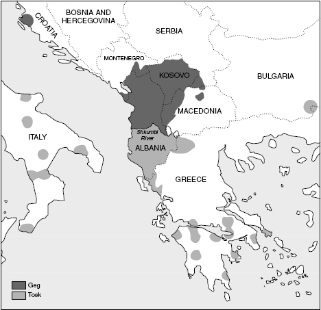
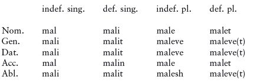
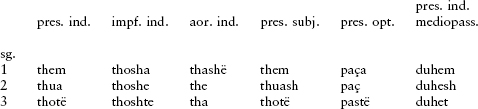
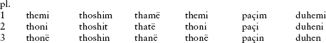
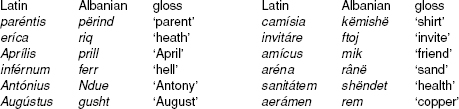

<!-- source-xhtml: 9781405188968_019.xhtml -->

# Chapter 19. Albanian

## Introduction

**19.1.** Albanian is the official language of Albania, where it is spoken by over 3 million people. Almost as many speak it in various areas of the former Yugoslavia, and smaller but not insignificant numbers of speakers live in enclaves in Macedonia, Greece, and southern Italy (Calabria and Sicily). The speakers in northern Albania, the former Yugoslavia, Macedonia, and Turkey speak the dialect called **Geg** (or Gheg, Albanian *Gegë*), while Albanians living in southern Albania, Greece, and Italy speak **Tosk** (*Toskë*), of which the Italian variety, called *Arbëresh* (*Albanian*, etymologically), is the most archaic. In Albania, the two dialects are separated roughly by the Shkumbin River. Both dialects have a literary history (see below); the official variety of Albanian since 1952 is Tosk, but with a goodly amount of admixture from Geg. The two dialects are mutually intelligible in their standard varieties, although numerous subdialects exist that show considerable variation, especially in the north and northeast of the Geg-speaking area. The Albanian-speaking populations of Greece and Italy arose probably between the thirteenth and fifteenth centuries.

**19.2.** Albanian forms its own separate branch of Indo-European; it is the last branch to appear in written records. This is one of the reasons why its origins are shrouded in mystery and controversy. The widespread assertion that it is the modern-day descendant of Illyrian, spoken in much the same region during classical times (see §§20.13ff.), makes geographic and historical sense but is linguistically untestable since we know so little about Illyrian. Competing hypotheses, likewise untestable, would derive Albanian from Thracian, another lost ancient language from farther east than Illyrian, or from Daco-Mysian, a hypothetical mixture or ancestor of Thracian, Illyrian, and the nearly unknown language of Dacia (a nearby Roman province). (We will discuss these languages in more detail in the next chapter.)

The region containing modern-day Albania became Roman territory in the second century <small>bc</small>. The influence of Latin on the vocabulary of Albanian was tremendous. In later times, Macedonian and Bulgarian provided many loanwords, and when Albania became part of the Ottoman Empire in the fifteenth century, a phase of Turkish influence began that lasted until independence was achieved in 1912. The massive overlayering of foreign vocabulary and concomitant loss of much of the native lexicon have made the phonological and morphological history of the language unusually difficult to ascertain. Thanks to the many Latin loanwords, though, we are well informed about the post-Roman phonological changes; but much had already happened before then that is harder to shed light on. Albanian was in fact not universally recognized as Indo-European until the second half of the nineteenth century.

**19.3.** Under Turkish rule, the publication of Albanian writings was forbidden; most of the history of Albanian literature has been a history of its suppression. However, Roman Catholic missionaries working mostly in the Geg-speaking area gained permission in the fifteenth century to publish religious works. The first recorded piece of Albanian is a baptismal formula from 1462; two other fragments survive from later in the same century. A small number of Christian books were produced in the following two centuries, the earliest preserved being the *Meshari* or *Missal* of Gjon Buzuku from 1555, written in Old Geg. Tosk literature originated in Albanian-speaking regions of Sicily; the first known book in Tosk dates to 1592. But it is likely that there were earlier works which have vanished. The earliest preserved books both in Geg and in Tosk share features of spelling that point to some kind of common literary language having already developed, and a letter written by a Dominican friar named Gulielmus Adea in 1332 says that the inhabitants of Albania had a language very different from Latin but used the Latin alphabet in their writings, suggesting (if not proving) an already-existing written Albanian tradition.

The language up through the eighteenth century is often referred to as **Old Albanian**. The modern period is dated to the nineteenth century and beyond; around 1870, with the rise of nationalistic sentiment, greater numbers of works were written in Albanian, but largely by exiles. Only after Albanian independence did Albanian literature really begin to flourish.

Among the Albanian literary monuments that are of interest to Indo-Europeanists is the northern Albanian law code traditionally attributed (most likely incorrectly) to Lekë Dukagjini (1410–81), a comrade-in-arms of Gjergj Skanderbeg, the Albanian national hero who fought against the Ottoman Turks. This law code, or *kanun* (‘canon’), is derived in large part from the customary law of northern Albania, and reflects many legal practices of great antiquity. The laws governing such matters as hospitality, the rights of heads of households, marriage, blood-feuds, and payment of damages find precise echoes in Vedic India and ancient Greece and Rome.

**19.4.** The most notable phonological differences between Geg and Tosk are the change of intervocalic *n* to *r* in Tosk (e.g. *vera* ‘the wine’ vs. Geg *vêna*) and the presence of nasal vowels in Geg from old sequences of vowel plus final *-n* (e.g. *shtâsë* ‘animal’, Old Geg *shtanse*, vs. Tosk *shtazë*; the circumflex indicates nasalization). There are also morphosyntactic differences, such as in the formation of the future tense (Geg *kam me shkue*, lit. ‘I have to go’, vs. Tosk *do të shkoj*, lit. ‘it wants that I go’). The dialectal split into Geg and Tosk happened sometime after the region became Christianized in the fourth century <small>AD</small>: Christian Latin loanwords show Tosk rhotacism, such as Tosk *murgu* ‘monk’ (Geg *mungu*) from Lat. *monachus.*

**19.5.** Albanian famously shares several morphosyntactic features with neighboring languages of the Balkans – Greek, Bulgarian, Macedonian, Serbo-Croatian, eastern varieties of Romanian, and the regional variety of Romani. All four languages form what is often called the Balkan speech area or *Sprachbund* (to use the technical term that has been imported from German). Among the features common to most or all of these languages are a suffixed definite article; the loss of a true infinitive, at least in Tosk; the use of a periphrastic construction meaning ‘want to . . .’ to express the future tense; and the use of a particle with subjunctive verb forms. Since these features were not part of the early histories of any of these languages, how they developed and diffused throughout the region is an unsettled and interesting problem.

## From PIE to Albanian

### *Phonology*

**19.6.** Aside from the voiceless stops *p t k* and voiced stops *b d g*, modern Albanian has a rich complement of postalveolar and palatal consonants: the alveolar affricates *c* and *x* (roughly equal to English *ts* and *dz*), the alveopalatal affricates *ç* and *xh* (like English *ch* and *j*), and the palatal stops *q* and *gj*. It has nine fricatives, voiceless *f th s sh h* (all pronounced as in English) and voiced *v dh z zh* (where *dh* is [ð], the initial sound of English *the*). The nasals are *m*, *n*, and palatalized *nj* (like Spanish *ñ*), and the liquids *r* (a tap), *rr* (a trill), *l*, and *ll* (a “dark” *l* like the *l* in Eng. *ball*). Finally, it has the glide *j* (like Eng. *y*). The vowel system contains the ordinary *i e a o u* as well as *y* (like German *ü*) and *ë*, a schwa-like vowel.

All forms below are given in the Tosk standard unless otherwise indicated.

#### Consonants

**19.7. Stops.** PIE plain voiceless **p* and **t* are typically preserved: ***p**oqa* ‘I cooked’ < ****p**ēkʷ*-; ***t**er* ‘I dry’ (verb) < ****t**ors-ei̯e-*; *gjal**p**ë* ‘butter’ < **selpos* (cp. Gk. *élpos* ‘fat’,Eng. *salve*); and *na**t**ë* ‘night’ < **nokʷ**t**-*. They were lost in some consonant clusters, as in *gjumë* ‘sleep’ < **su**p**no-* and *shtatë* ‘seven’ < **se**p**tm̥-ti-*. Special outcomes are seen in clusters consisting of two dentals, as in the Old Geg past participle *pasë* ‘had’ < **pot-to*-.

**19.8.** The voiced aspirates lost their aspiration and fell together with the plain voiced stops, as evidenced by *n**d**ez* ‘I kindle’ < **en-**dh**ogʷh-ei̯e-* (root **dhegʷh-* ‘burn’) alongside ***d**i* ‘she-goat’ < ****d**eig̑h-ā* (cp. German *Ziege* ‘goat’); and ***g**ardh* ‘hedge, fence’ < ****gh**or-dho-* alongside *li**g**ë* ‘disease’ < **lei**g**-* (cp. Gk. *loigós* ‘ruin, death’). The same merger is presumably also true of **bh* and **b*, though examples of the latter are hard to come by; a possible one is *m**b**ush* ‘fill’ < **(e)n-**b**uns-e/o-* (cf. Gk. *būnéō* ‘I stuff full’). The aspirated counterpart’s development to *b* is met for example in ***b**esë* ‘truce’ from the root ****bh**eidh-* (either **bhidh-tā* or, as recently suggested, **bhoidh-s-ā*, with **bhoidh-s-* from the same **bhoidh-es-* as Lat. *foedus* ‘pact’). Word-initial **d(h)-* sometimes becomes *dh* [ð], as in ***dh**a* ‘(s)he gave’, ultimately from ****d**eh₃-*; this development appears to have originated in certain sandhi contexts.

**19.9.** The Albanian reflexes of the velars present special challenges. Most specialists regard Albanian as a satem language since in the vast majority of cases the plain velars and the labiovelars fell together. But there appears to be a systematic difference in the outcomes of the plain velars and the labiovelars when they are palatalized, suggesting that the three series of velars were still kept distinct in some environments fairly late in the language’s prehistory. Also unlike normal satem branches, the palatal velars lost their palatalization in certain contexts.

Albanian *k* continues **k* and **kʷ*, while *g* represents the merger of four sounds, **g*, **gʷ*, **gh*, and **gʷh.* Examples of each change include ***k**ohë* ‘time’ < ****k**ēsā* or **kāsk̑ā* (cp. OCS *časŭ* ‘time’), ***k**ë* ‘whom’ < ****k**ʷom*, *li**g*** ‘bad, sick’ < **h₃li**g**o-* (cp. Gk. *olígos* ‘little, few’), *n**g**rënë* ‘eaten’ < **on-**g**ʷr̥h₃*- (root **gʷerh₃*- ‘devour’), ***g**ardh* ‘fence’ < ****gh**ordho-*, and *dje**g*** ‘burn’ < **dhe**g**ʷh*-. The PIE palatal velars, by contrast, became dentals, a development interestingly reminiscent of Old Persian (see §11.32), as well as Castilian Spanish. The voiceless palatal *k̑ became *th*, as in ***th**em* ‘I say’ < **k̑eHs-mi* and *a**th**ët* ‘sour’ < **h₂ek̑-* ‘sharp’. The voiced palatal **g̑(h)* became *d* or *dh*, as in ***dh**ëmb* ‘tooth’ < **g̑ombh-o-*, *mb-le**dh*** ‘I gather’ < **leg̑-* (*mb-* from *mbë-* ‘around’), and ***d**imër* ‘winter’ < **g̑**h**eimon-*. Before a following liquid, however, these sounds were depalatalized and fell together with the plain velars, as in ***g**ju* ‘knee’ < ****g**lu-no-* < **g̑lu-no*- (dissimilated from **g̑nu-no-*).

**19.10.** As stated above, a difference in the outcomes of the plain velars and labiovelars is seen before a palatalizing vowel or glide (*e*, *i*, or *j*): the original labiovelars **kʷ* and **gʷ(h)* become *s* and *z*, as in ***s**i* ‘how’ < ****k**ʷih₁* (instrumental, cp. Lat. *quī* ‘how’) and ***z**jarm* ‘fire’ < ****gʷh**ermo-*; but the original plain velars **k* and **g(h)* become *q* and *gj*, as in *ple**q*** ‘old’ < **pla**k**-i*, plural of *plak* (PIE **plh₂-ko-*), and *li**gj*** ‘bad, sick’ < **li**g**-i*, plural of *lig*. (Greek affords a parallel in that some of the labiovelars were palatalized to dentals before front vowels, while the plain velars were not; recall §12.15.) The palatalization of *k* and *g* was later than the palatalization of the labiovelars (or whatever sounds they were at the time), since Latin loanwords underwent it as well, e.g. *qen* ‘dog’ < **ken* < Lat. *canis*.

The preservation of a triple reflex of the PIE velar series is accepted by most Albanologists but has never been fully embraced by general Indo-Europeanists. The reasons are understandable: aside from the near-absence of any branch that uncontroversially preserves reflexes of all three series, Albanian is not attested until very late and a great deal of its anterior history has been obscured, with often very few examples of a given sound change surviving. However, the examples in this case are not beset with too many difficulties – their etymologies and morphology are for the most part non-controversial – and the evidence for three velar series in Albanian is not much worse than the evidence in Luvian (§9.48). As with so many disputes, however, where the evidence is not absolutely overwhelming, the matter may never be definitively settled to everyone’s satisfaction.

**19.11. Sibilant **s*.** The sibilant **s* had no fewer than five outcomes: *sh*, *th*, *gj*, *h*, and loss. The factors conditioning each outcome are still not fully worked out, and many examples are problematic in one way or another. In word-initial position, it is usually thought that *gj* is the outcome before a stressed vowel and either *sh* or *h* the outcome before an unstressed vowel, depending on the vowel quality. Thus for example ***gj**arpër* ‘snake’ < ****s**érp-en-* and ***gj**umë* ‘sleep’ < ****s**úp-no-* (cp. Gk. *húpnos*) have *gj-* before a stressed vowel. Before an original unstressed vowel, note ***sh**i* ‘rain’ < ****s**uh₂-* (with accent on the endings; cp. Gk. *hū́ei* ‘it rains’) and ***h**urbë* ‘swallow’ (probably < ****s**r̥bhā́*, root **serbh-*, cp. Lat. *sorbeō* ‘I drink’). From such examples it appears that *sh-* was the outcome before an unstressed front vowel while *h-* was the outcome before an unstressed back vowel. A similar repartition is found word-internally, between *sh* and zero depending on the quality of the final vowel: *ve**sh*** ‘clothe’ < *u̯o**s**-éi̯e*- (cp. Hitt. *waššezzi* ‘clothes’, Eng. *wear*), the ablative plural ending *-sh* < **-si*, but *neve* ‘of us’ < **nee* (with hiatus between the two vowels; *-v-* is the consonant regularly used to break hiatus in Albanian) < **nōsōm*. The noun ***th**i* ‘pig’ < ****s**uHs* has an odd outcome *th* that is usually thought to have arisen through dissimilation. Before a voiceless stop, *sh* is the usual outcome, as in ***sh**teg* ‘path’. But the cluster **sk̑* seems to have become *h*, as in ***h**ie* ‘shade’ < ****s**k̑i-eh₂* (cp. Gk. *skiā́*) and in various verbs that once had the thematic suffix **-sk̑e-*, e.g. *ngro**h*** ‘make warm’ < **en-gʷhr-ē-**s**k̑e-* (for the suffix compare Lat. *cal-ēscere* ‘become warm’). Note incidentally the numeral ***gj**a**sh**të* ‘six’, which has two different outcomes of **s* simultaneously, from earlier ****s**e**s**ta* < ****s**(u̯)ék̑**s**-tā*-. The sibilant disappeared word-finally, as in *thi* ‘pig’ above and in the rhyming word *mi* ‘mouse’ < **mū**s***. The fate of *s* in loanwords from Greek and Latin was *sh*: *prash* ‘leek’ < Gk. *práson*, *shkallë* ‘ladder’ < Lat. *scāla or scālae*.

**19.12. Resonants.** The liquids and nasals remained largely intact: *ga**r**dh* ‘hedge, fence’ < **gho**r**-dho-*, *mie**l*** ‘milk’ < **h₂me**l**g̑-*, ***m**i* ‘mouse’ < ****m**ūs*, ***n**a* ‘we’ < ****n**os*. As noted above, Albanian has two kinds of each liquid: a tapped *r* and a trilled *rr*, as well as a light *l* and dark *ll*. Their histories are not fully clear, but trilled *rr* is typically the outcome of certain clusters, as ***rr**unjë* ‘yearling lamb’ < **u̯**r**ēn-* and *fe**rr*** ‘hell’ < Lat. *īnfe**rn**um*, and *ll* the outcome of single **l* between vowels, as in Geg ***ll**ânë* ‘lower arm’ < **ō**l**enā* ‘elbow’ and ***Ll**ezhdër* (personal name) < Gk. *A**l**éksandros*.

**19.13.** The syllabic liquids developed into liquid plus *i*, which under some conditions (§19.16) became *e*: *d**re**kë* ‘lunch’ < **dr̥kʷo-* (cp. Gk. *dórpon* ‘evening meal’); *d**ri**thë* ‘grain’ < **g̑hr̥zdo-*. The syllabic nasals became *a*, as in *sht**a**të* ‘seven’ < **s(e)ptm̥tā* and perhaps *m**a**tā* ‘bank (of a river), coast’ if from **mn̥ti*- (cp. Lat. *mont-* ‘mountain’), though the lack of umlaut requires special explanation.

**19.14.** The glide *i̯ became *gj*, as in *n**gj**esh* ‘I gird’ < **en-i̯ōs-e-* (from **i̯ōs-* ‘gird’, cp. Gk. *zṓnē* ‘belt’ < **i̯ōs-nā*). The glide *u̯ became *v*, as in ***v**esh* ‘I dress’ < **u̯os-ei̯e-*.

**19.15. Laryngeals.** Albanian has few direct reflexes of the laryngeals. A proposal that some word-initial laryngeals developed into Alb. *h-* has not met with wide-spread approval; the putative examples all admit of other explanations. The root aorist *dha* ‘(s)he gave’, from zero-grade **dh₃-t*, shows that syllabic laryngeals became *a*. The development of **R̥H* sequences is not entirely clear: a form like *plot* ‘full’, given below (§19.18) as coming from pre-Alb. **plēto*- < **pleh₁-to-*, could also theoretically come from pre-Albanian **plāto*-, which would continue **pl̥h₁-to*- and mean that **R̥H* became *Rā* as in several other branches. It has even been suggested that, like Greek and Latin, Albanian has two different reflexes of **R̥H* depending on the accent: *aRa* when accented and *Rā* when unaccented. A possible example of the accented treatment is *p**ar**ë* ‘first’ < **pŕ̥**h**₂-u̯o*, cp. Ved. *pū́rva-* ‘first (of two)’.

#### Vowels

**19.16. Short vowels.** The short high vowels **i* and **u* are preserved e.g. in Geg *gj**î*** ‘bosom’ < **s**i**nos* (cp. Lat. *s**i**nus* ‘fold’), *l**i**dh* ‘I bind’ < **l**i**g̑-* (cp. Lat. *l**i**gāre* ‘to bind’), and *gj**u**më* ‘sleep’ < **s**u**p-no-.* In contrast to these relatively straightforward developments, **e* has several different outcomes. The normal one was *je*, as in *p**je**k* ‘cook’ < **p**e**kʷ*- and ***je**shë* ‘I was’ (imperfect) < **h₁**e**sq*. The glide was lost if two or more consonants preceded, as in Old Geg *kl**e*** ‘was’ < **kl**je*** < *(*e-*)*kʷl-**e**-t* (see §19.25 for more on this form); *e* is also the outcome before nasal, as in *p**e**së* (Geg *pêsë*) ‘five’ < **p**e**nse* < **p**e**nkʷe*. Before a following liquid, the outcome is a diphthong *íe* instead: *b**íe*** ‘carry’ < **b**íe**r* < PIE **bh**e**r-*, *m**íe**ll* ‘flour’ < **m**e**l-u̯o*- (root **mel(h₂)-* ‘grind’, cp. Eng. *meal*). A different outcome *ja* is found apparently in closed syllables before an *o* or *a*, as in *g**ja**lpë* ‘butter’ < **s**e**lpos* above (§19.7), *g**ja**rpër* ‘snake’ < **s**e**rp-en-*, and *z**ja**rm* ‘fire’ < **gʷh**e**rmo-* (cp. Gk. *thermós* ‘hot’). In unstressed syllables, **e* was weakened to *i*, which often disappeared but left a trace in the umlaut of a preceding vowel, as in the examples quoted below in §19.19. Short **a* and **o* merged as *a*: *bathë* ‘broad (fava) bean’ < **bhak̑ā* (cp. Gk. *phakós* ‘lentil’), *n**a*** ‘we’ < **n**o**s*, *n**a**të* ‘night’ < **n**o**kʷt-*.

**19.17.** Short vowels were subject to syncope (deletion) when unstressed, as in the many verbs beginning with *n-* from the prefix **en-* ‘in’, e.g. *ndez*, *ngroh*, *ngrënë* above. This deletion of unstressed vowels happened after the Latin loanwords entered the language, as evidenced e.g. by *mbret* ‘king’ < Lat. ***i**mp**e**rā́tor*. There was also widespread loss of final unstressed syllables. Original distinctions in stress are reflected by pairs such as *nip* ‘grandson’ < **népō(t)* alongside *mbesë* ‘granddaughter’ < **nepṓt-i̯ā* (remade from PIE **nept-ih₂*).

**19.18. Long vowels.** The long vowels underwent more unusual changes than their short counterparts. Long *ī remained ī into the Old Albanian period at the end of monosyllables, as in *pī* ‘drink’ (ultimately **pih₃*-) and *dī* ‘know’ (< **dhiH-,* root **dheiH*-). The same development is seen for *ū: Old Albanian *mī* ‘mouse’ < **mūs, thī* ‘sow’ < **sūs* (with secondary *th,* §19.11). In the modern standard language the long vowel has been shortened to *i*. The outcomes of *ū in words of more than one syllable are complex and not fully agreed upon, especially in inherited vocabulary; in Latin loanwords, however, *ū became *y* (pronounced like Germ. *ü*), e.g. *gj**y**mt**y**rë* ‘joint (of the body)’ < Lat. *iūnctūra.* Long *ē and *ā fell together as *o* when stressed, as in *m**o**trë* ‘sister’ < **māter- < *meh₂ter-* (the ‘mother’ word in PIE; sense development probably via ‘older sister who takes a motherly role’ or the like) and *pl**o**t* ‘full’ < **plē-to-* (< **pleh₁-to*-). When unstressed, though, *ā became *ë,* as in *mbesë* ‘grand-daughter’ in the previous section. Long *ō became *e,* as in *r**e**sh* ‘rain’ < **rōs-* (cp.Lat. *rōs* ‘dew’) and *n**e*** ‘us’ (accusative) < **nōs*.

**19.19.** The picture above is further muddied by a series of prehistoric umlaut processes that affected most stressed vowels before an *i* in the following syllable: *a* > *e*, *o* > *e*, *e* > *i*, and *u* > *y*. The *i* that caused the umlaut could be either an inherited *i* or an old *e* that had changed to *i,* and, being unstressed, was subject to loss. Many vowel alternations in paradigms have arisen due to this umlaut. Thus contrast *pl**a**k* ‘old’, nomin. pl. *pl**e**q* < **plak-i* (also with palatalization of the *k* to *q*); *nj**o**h* ‘I know’ with 2nd and 3rd sing. *nj**e**h* < **njoh-i* (with *-i* ultimately from PIE **-esi*, **-eti*); and *sht**e**g* ‘path’, nomin. pl. *sht**i**gje* (remade from **shtigj < *shtig-i*).

**19.20. Diphthongs.** The diphthongs **ei* and **oi* became *i* and *e,* respectively: *dimër* ‘winter’ < **g̑heimon-, shteg* ‘path’ < **stoigh-o-.* The three *u*-diphthongs appear to have fallen together ultimately as *a,* which like inherited *a* could undergo umlaut to *e*: ***a**g* ‘dawn’ < ****au**go*- < **h₂eugo-* (cp. Gk. *augḗ* ‘sunlight’), *d**es**h* ‘(s)he wanted’ < **d**a**shi* < **d**au**she* < perfect *(g̑*e*-)g̑***ou**s-e,* and perhaps Geg *n**â**ndë* ‘ninth’ if this continues **n**eu**nto-*, resyllabified from **neu̯n̥to-*.

### *Morphology and syntax*

**19.21.** For all the change that time has wrought on Albanian phonology, it has left the language’s morphology less altered. Nouns are inflected in five cases: nominative, genitive, dative, accusative, and ablative. (A sixth case, a locative, is found in some dialects and in Old Albanian.) Both numbers distinguish an indefinite from a definite form, the latter having a suffixed definite article, with or without a separate definite article before the noun. Thus contrast indefinite *mal* ‘mountain’ with definite *mali* ‘the mountain’; indefinite *nip* ‘nephew’ with definite *i nipi* ‘the nephew’. The definite singular frequently preserves phonetic material that was lost in the indefinite. Thus Geg *gjûni* ‘the knee’ preserves the second *-n-* of the preform **g̑nu-no-,* lost in the indefinite sing. *gju.* Nouns come in masculine and feminine genders, but a sizeable group are masculine in the singular but feminine in the plural, as *ujë* ‘water’ (masc.), pl. *ujëra* ‘waters’ (fem.); these are old neuters. (Compare §17.26.)

**19.22.** Most of the recognizable case-endings in nouns have disappeared, as can be seen from the following sample paradigm of the masculine noun *mal* ‘mountain’:

The nominative plural ending *-e* is taken over from the feminine declension and is of disputed origin. Some nouns form their plurals by palatalization, e.g. Old Alb. *ujq* ‘wolves’, pl. of *ulk*; this palatalization is an indirect trace of what was once the ending **-oi* (> **-i*, which palatalized the preceding consonant before ultimately disappearing), the pronominal ending that replaced the original *o-*stem nominal ending in several other branches of the family (§6.53). The postposed definite article, ultimately from the demonstrative pronominal stem **to-* (§7.10), is a feature shared with other languages of the Balkans (§19.5 above). The dative and genitive have the same endings in nouns, but are distinct in pronouns. The ablative plural ending *-sh* continues the PIE locative plural **-si*, showing that Albanian innovated in the same way as Greek; §6.17.

The definite forms come from old combinations of the indefinite and a suffixed definite article in **so-* or **to-* (the latter, for example, in *mali-t*, *maleve-t*).

**19.23.** The Albanian verb preserves a remarkable amount of inherited material for a language first attested so late. The present and aorist have remained, the latter containing forms that are historically aorists as well as dereduplicated perfects, e.g. *dha* ‘he gave’ < **dh₃-t* (root aorist with generalized zero-grade), *desh* ‘wanted, loved’ < **(g̑e-)g̑ous*- (perfect; root **g̑eus*- ‘taste, enjoy’). The subjunctive and optative are alive and well, continuing the respective PIE categories; among other modern IE languages, only a small number of Iranian languages preserve this distinction (§11.52). As in PIE, the subjunctive can also be used as a future (though a separate future tense has also been developed, see below).

But there has, not surprisingly, also been considerable innovation and addition of new categories, resulting in a rather complex system. The Albanian imperfect has endings derived from both the old imperfect and the optative, and has undergone different regional remodelings to create strikingly different forms across the dialects. Five other tenses – perfect, two pluperfects, future, and future perfect – are formed periphrastically, that is, with a helping verb. Most remarkable is the complex system of moods: in addition to the familiar indicative, subjunctive, optative, and imperative, there is a separate conditional, as well as a mood called the admirative that is used to express surprise, wonder, or any action not related on the speaker’s own authority (as often in indirect discourse). There is a past-tense participle, formed in part to the old IE perfect stem, which has otherwise disappeared, two infinitives (present and perfect), and two gerunds (also present and perfect). Albanian has also preserved the IE distinction in voice between active and mediopassive.

**19.24.** Many verbs distinguish among tenses, or among persons within a single tense, by means of vowel or consonant alternations. Thus contrast the presents *bredh* ‘I run’, *mbjell* ‘I sow’, and *vë* ‘I put’ with the aorists *brodha*, *mbolla*, *vura*; and contrast present 1st sing. *marr* ‘I take’ with 2nd sing. *merr* ‘you take’. These alternations often continue PIE ablaut: thus the *-o-* of aorists like *brodha* and *mbolla* ultimately goes back to the **-ē-* of past tenses of the type seen also in e.g. Lat. *lēgī* ‘I gathered, read’ (a perfect in Latin). (In fact, *lēgī* is exactly cognate with the Albanian aorist *-lodha* in *mblodha* ‘I gathered’; see §5.50.) Consonant alternations are of more recent vintage; examples include *pje**k*** ‘I bake’ ∼ aorist *po**q**a* ∼ present mediopassive *pi**q**em* ‘I am baked’, and *dje**g*** ∼ *do**gj**a* ∼ *di**gj**em*, the same forms of the verb meaning ‘burn’.

**19.25.** Only three athematic presents are found: *jam* ‘I am’, *kam* ‘I have’, and them (*thom*) ‘I say’, of which only *jam* and *them* are inherited athematics (from **h₁es-mi* and either **ceh₁-mi* or **k̑eHs-mi*). *Kam*, long thought to continue a **kap-mi* cognate with Lat. *capere* ‘take’, is now considered for various reasons to be a refashioning of something else; according to a recent attractive suggestion by the Austrian Indo-Europeanist Joachim Matzinger, the word is ultimately a refashioned perfect *(*ku̯e-*) *ku̯oh₂*- to a root **ku̯eh₂*- ‘achieve, get’ found also in the Greek perfect *pépāmai* ‘I possess’ (< *‘I have gotten’). The imperfect in part continues the PIE imperfect, e.g. *jeshë* ‘I was’ < **h₁es-m̥* (vs. *jam* ‘I am’ < **h₁es-mi*); but the plural endings, characterized by the vowel *-i-*, come from the optative (see below). The aorist continues several PIE formations. We have already seen the root aorist *dha* ‘(s)he gave’ above in §19.15. Albanian also has some forms going back to thematic aorists with zero-grade of the root; since this formation was virtually absent from PIE (§5.48), these are probably innovatory. Of interest is Old Albanian *kle* (modern *qe*) ‘(s)he was’, continuing the same **(e-)kʷl-e-* as Greek *é-pl-eto* ‘(s)he turned’ and Arm. *ełew* ‘(s)he became’. This thematic aorist might be a common innovation of this dialect area. The *s-*aorist is traditionally seen as reflected in such forms as *dha-shë* ‘I gave’ and *ra-shë* ‘I fell’, but in Old Albanian these forms lacked the *-sh-* and in PIE these roots did not form *s*-aorists. The source of the *-sh-* in these and some other forms is not entirely clear.

**19.26.** To illustrate verb conjugation, below are the present, imperfect, and aorist indicative and present subjunctive of the verb *them* ‘I say’, plus the present optative of the verb meaning ‘have’ (*kam* ‘I have’, the present, is formed from a different stem). In the rightmost column is given a sample mediopassive present, *duhem* ‘I am wanted’:

Forms like *them* and *thotë* contain recognizable reflexes of the PIE 1st and 3rd sing. personal endings **-mi* and **-ti*. Even clearer are the plural paradigms *thoshim -it -in* and *thamë -të -në*, reflecting PIE **-me-* **-te-* **-nt(i)*. The mediopassive is of the type seen in Greek (*-mai -sai -tai*) rather than Latin (*-mur -ris -tur*), i.e., the middle marker **-r* has been replaced by the primary active marker **-i.* The zero-grade of the PIE optative marker **-ih₁-* is continued by the stem vowel *-i-* in the 1st and 3rd plurals *paçim* and *paçin*, structurally *pat-shim*, *pat-shin*; the element *-shi-* continues *-*s-ih₁*-, the optative of the *s-*aorist.

#### Syntax

**19.27.** Because of its numerous inflections, Albanian word order is relatively free. In the text below, for example, the order SVO in *qi ban farë* ‘which makes seed’ exists right alongside SOV in *qi farë kā* ‘which has seed’. Albanian, like PIE, had both stressed and unstressed (clitic) forms of the personal pronouns; characteristic of Albanian syntax is the use of the latter to double an object noun (e.g. *Zefi <u>e</u> mori <u>librin</u>* lit. ‘Joseph it took <u>the book</u>’) and to double a stressed pronoun preceding a verb (e.g. *<u>mua</u> <u>më</u> merr malli* lit. ‘<u>me</u> <u>me</u> takes longing’ = ‘longing takes me’). Interestingly, these enclitic pronouns, though typically not clause-initial, can appear clause-initially in commands, as *<u>Ma</u> ep librin* ‘Give <u>me</u> the book’. None of the enclitic pronouns in the older IE languages can be so placed, though the phenomenon is also found in modern Slovenian.

**19.28.** An additional interesting detail of Albanian is the ability of the nominative case to function as the object of prepositions. Two prepositions take the nominative, *te(k)* ‘to/at (the house of)’ and *nga* ‘from’. Normally in IE languages the nominative case cannot have this function. The situation came about through a reanalysis. *Te(k)* and *nga* were originally relative adverbs: *te* comes probably from the instrumental **toh₁* of the pronominal stem **to-* and meant ‘there’, later (like the English demonstrative *that*) assuming relative function (‘there where’ > ‘where’), while *nga* is shortened from **ën-ka* ‘where, from where’, with **ën* ‘in’ added to the old relative adverb *ka* ‘where, from where’, from **kʷor* (whence also Eng. *where*). Sentences of the type ‘I went where X is’, ‘I went from where X is’ (X being of course in the nominative case as subject of its clause) were reinterpreted as ‘I went to/from X’, with gapping of the verb in the relative clause.

### *Old Albanian (Geg) text sample*

**19.29.** From the *Meshari (Missal)* of Gjon Buzuku, the earliest surviving Albanian book, from 1555. The language is Old Geg. The passage below is a translation of Genesis 1:29–30. The spelling has been modernized, and long vowels are indicated with macrons.

E tha Zotynë: Hinje, se u u kam dhanë gjithë bārr qi ban farë përëmbī gjithë dhēt, e gjithë pemë qi farë kā porsi e siadó farë, juve me u klenë për gjellë; (30) e gjithë shtanse të dheut e gjithë qish fluturón për qiell e gjithë shtanse qi anshtë përëmbī dhēt, qi shpirt i gjallë anshtë ëndë to, përse juve t-u jenë për gjellë.

And God said, “Behold, for I have given you every plant that makes seed (which is) upon all the earth, and every fruit which has seed as well as every seed, to be food for you; (30) and to every beast of the earth, and to everything that flies in the sky and to every beast that is upon the earth that has living breath in it, in order that they be food for you.”

**19.29a. Notes. E:** ‘and’. **tha:** ‘spoke’, 3rd sing. aor. < **k̑eh₁-* or **k̑eHs-* (see §19.9). **Zotynë:** ‘our God’, contracted from *Zoti ynë.* The word for ‘god’ is conjectured to come from a compound **desi̯ās-poti-* ‘master of the servants in a household’, and *ynë* ‘our’ comes from **so-nos,* where **nos* is the original old genitive 1st pl. pronoun preceded by the pronominal stem **so-;* literally ‘the one (which is) ours’. **Hinje:** ‘Behold’. **se:** ‘that, for’, conjunction. **u u kam dhanë:** ‘I have given you’. The first *u* is an old (and still dialectal) short form of *unë* ‘I’, while the second is the 2nd pl. enclitic dative ‘to you’. There follows a periphrastic perfect, formed of *kam* ‘I have’ (§19.25) plus the past participle *dhanë* ‘given’. **gjithë:** ‘every, all’. **bārr:** ‘grass, plant’, accus. sing. of *barnë.* **qi:** ‘who’, relative pronoun; Tosk *që,* from PIE **kʷi-;* cf. Lat. *quis* ‘who’. **ban:** ‘makes’, 3rd sing. present of Geg *bâj* (Tosk *bëj*) ‘make’. **farë:** ‘seed’, perhaps the exact cognate of Gk. *sporá* ‘sowing, seed’. **përëmbi:** ‘over’, modern Tosk *përmbi;* consists of the prepositions *për* ‘to, with’ and *mbi* (older *ëmbī*) ‘upon’, cognate with Lat. *ambi-* ‘around, both’. **dhēt:** ‘earth’, definite genit. sing. of *dhe* < pre-Albanian **g̑hō,* ultimately from PIE **dh(e)g̑hōm;* cp. Gk. *khthṓn.* **pemë:** ‘fruit’, borrowing from Lat. *pōmum.* **kā:** ‘has’, 3rd sing. of *kam* above. **porsi e:** lit. ‘just as also’. **siadó:** ‘every’, modern *cilado.* **juve me u klenë:** ‘to you to be’; *u* is the obligatory clitic double of *juve* ‘to you’ (§19.27), while *me klenë* ‘to be’ is the infinitive (modern standard *për të qenë*). The *-ve* of *juve* continues the PIE pronominal genit. pl. **-sōm* (§7.9); when **-s-* disappeared between vowels, a *-v-* developed as a transition. **për:** ‘for’, PIE **pro* or **prō*. **gjellë:** ‘meal’*.* **shtanse:** ‘animal’, dat. sing., modern standard (nomin.) *shtazë,* Geg *shtâsë.* **të dheut:** ‘of the earth’, definite genit. sing. of *dhe* ‘earth’ above, with preposed article *të* as well as postposed *-t.* **gjithë qish:** ‘everything (that)’, modern *gjithçka.* **fluturón:** ‘flies’, 3rd sing. present; borrowing from Vulgar Lat. **fluctulāre*. **qiell:** ‘heaven’, borrowing from Lat. *caelum.* **anshtë:** ‘is’, modern Tosk *është;* the nasal in Geg (modern *âshtë*) betrays that the form continues not just PIE **h₁esti* but also a nasal-containing preverb. Since neighboring Greek makes wide use of *énesti* ‘be in, be present’, it has been suggested by the American Indo-Europeanist Eric Hamp that the Albanian form likewise continues the same preverb–verb combination. More recent research by Stefan Schumacher of Vienna indicates the preverb had *o-*grade, to account for the *a-*vocalism in this form as well as in the Old Albanian aorist *ângrë* ‘ate’ < * *on-gʷr̥h₃*-. **shpirt:** ‘breath, spirit’, borrowing from Lat. *spīritus.* **i:** a connective particle used in attributive adjective constructions. **gjallë:** ‘living’, from PIE **sol(H)u̯o-* ‘whole’ (> Lat. *saluus* ‘healthy’). **ëndë to:** ‘in that’. **përse:** ‘in order that’, modern standard *që të.* **jenë:** ‘(they) be’, 3rd pl. present subjunctive of *jam* ‘I am’.

## For Further Reading

Because of its marginal status in IE studies, Albanian has been chronically underserved as far as good reference works go; but that situation may be changing, as several appeared just in the 1990s. The book-length treatments in English are unfortunately problematic. Huld 1984, treats phonology and contains a 250-word etymological glossary of “core” words; it has some usefulness, but the reconstructions are idiosyncratic. The more recent Orel 2000 regrettably ignores Old Albanian for the most part, and also suffers from out-of-date PIE reconstructions. These features also mar Orel 1998, the only available etymological dictionary in English; it is more useful than the companion historical grammar, but omits loanwords from after the eleventh or twelfth century. For filling some of these gaps, Meyer 1891, though old, is still useful. An excellent historical grammar is Demiraj 1993; its treatment of the developments from PIE to Albanian is a bit spartan, but the other historical discussions are thorough and illuminating. Also very good is Sanz Ledesma 1996, a small but very informative Spanish overview of Albanian historical grammar. A much better treatment of the historical phonology than Huld’s can be found in Demiraj 1997, which also has a full etymological glossary of inherited lexemes. One can profitably read the scores upon scores of short articles on Albanian by the American Indo-Europeanist Eric P. Hamp, such as Hamp 1977. The best reference grammar written in English is Newmark, Hubbard, and Prifti 1982; readers of German should also consult the masterly Buchholz and Fiedler 1987. Newmark 1998 is an excellent dictionary in English, especially useful for its inclusion of dialectal and archaic material. For Old Albanian, useful technical treatments from recent years include Fiedler 2004, essential for the study of the verb, and Matzinger 2006, which is not only a critical edition of an important Old Albanian text with linguistic commentary and analysis but also contains an up-to-date historical grammar. Fox 1989 contains the famous law code of Lekë Dukagjini with a translation and comparative notes.

## Exercises

1. Provide the Albanian outcome or outcomes of the following PIE sounds:

  - **a** **s*

  - **b** **kʷ*

  - **c** *k̑

  - **d** **bh*

  - **e** **gʷh*

  - **f** **p*

  - **g** **d*

  - **h** *ē

2. Explain the history or significance of the following Albanian forms. The forms are in Tosk unless otherwise noted:

  - **a** *murgu*

  - **b** *pesë*

  - **c** *ngroh*

  - **d** *besë*

  - **e** *natë*

  - **f** *mbret*

  - **g** *mi*

  - **h** *ne*

  - **i** Geg *gjûni*

  - **j** *mblodha*

  - **k** Old Geg *kle*

  - **l** *thom*

3. In the text sample, the form *juve* ‘to you’ (dat. pl.) was encountered. The 2nd pl. (nomin.) *ju* looks like it should continue PIE **i̯ūs.* Why is that derivation problematic?

4. In the text sample, the 1st sing. pronoun *u* ‘I’ was encountered. This is normally taken to be from earlier **udh,* from PIE **eg̑-* ‘I’, with a replacement of **e* by *u.* In light of §7.1 and Hittite ū*k* ‘I’, also irregularly from **eg̑-*, provide a possible explanation for the *u.* (Don’t assume any early connection between Albanian and Hittite!)

5. Below is a list of some colloquial Latin loanwords (with length marks removed) that were borrowed at an early date into Albanian, with their Albanian outcomes. Describe the fate of unaccented word-initial syllables.

6. It was stated in §19.21 that Albanian nouns that are masculine in the singular and feminine in the plural descend from old neuters. Sketch how this development might have taken place.

## PIE Vocabulary XI: Utterance

* *u̯ekʷ-* ‘say’: Ved. *vácas-* ‘word’, Gk. *(w)épos* ‘speech’, Lat. *uōx* (*uōc-*) ‘voice’

* *u̯er(h₁)-* ‘speak’: Gk. *rhḗtōr* ‘public speaker’, Lat. *uerbum* ‘word’, Eng. <small>WORD</small>

* *prek̑-* ‘ask’: Ved. *pr̥ccháti* ‘asks’, Lat. *precor* ‘I entreat’, German *fragen*, Toch. B *prek-*

* *h₁neh₃mn̥* or **h₁nomn̥* ‘<small>NAME</small>’: Hitt. *lāman-*, Ved. *nāma*, Gk. *ónoma*, Lat. *nōmen*

* *kan-* ‘sing’: Lat. *canō*; ‘I sing’, OIr. *canim* ‘I sing’, Eng. <small>HEN</small>

* *g̑heuH-* ‘invoke (a deity)’: Ved. *hávate* ‘invokes’, OCS *zovǫ* ‘I call’
