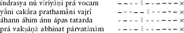
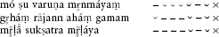
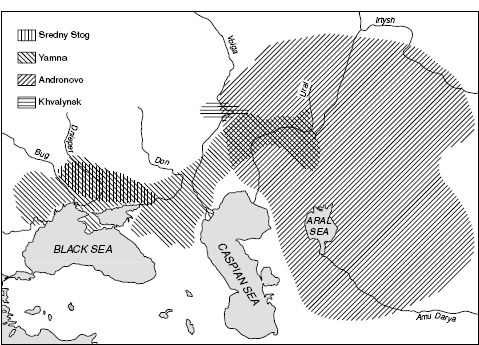
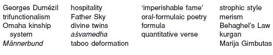

<!-- source-xhtml: 9781405188968_002.xhtml -->

# Chapter 2. Proto-Indo-European Culture and Archaeology

## Introduction

**2.1.** In the previous chapter, we saw how the comparative method is used to reconstruct extinct languages, and in the next few chapters we will see specifically what it has accomplished in reconstructing the structure of Proto-Indo-European (PIE). But the comparative method has other applications, too. In its ability to reconstruct a prehistoric people’s vocabulary, it opens up a valuable window onto their culture. A language does not exist apart from a people, and it always mirrors their culture to some extent. Furthermore, we can broaden the scope of comparison to include not only individual words but also their use in context, which reveals the semantic and cultural associations that attend different concepts. Thus comparative linguistic study allows us to reconstruct a *proto-culture* alongside the proto-language. (As with the term *proto-language*, there is nothing more “primitive” or “unformed” about a proto-culture; the term simply refers to a prehistoric culture which we know about by virtue of having reconstructed its language.)

Besides comparing linguistic forms, much effort has been devoted to the comparison of myths, laws, and all manner of social institutions. Here a methodological point is in order. There is considerable difference of opinion regarding the degree to which linguistic reconstructions are necessary for cultural reconstruction, with some scholars insisting that they are always required and others comfortable with comparing categories, mythic motifs, gods, and social institutions without in all cases their being anchored in (or by) cognate linguistic expressions. Certainly the attribution of a myth, custom, or the like to the proto-culture is more secure if it is buttressed by a linguistic equation; without it, it can be harder to dismiss the possibility of independent innovation or borrowing on the part of the daughter traditions. On the other hand, it does not follow that linguistic evidence is indispensable in all cases. For example, Hittite and Old Irish legal texts describe a duty of sick-maintenance on the part of a man who has severely injured another: the offender must hire help for the injured man, see to it that he is nursed back to health, and pay him recompense; in the Hittite version he pays also for the doctor, and in the Irish version for the man’s retinue. This set of requirements is not otherwise known in the ancient world and cannot have diffused from the one tradition to the other; it is generally agreed to be inherited from a PIE law of sick-maintenance, in spite of the fact that there are no cognate “smoking-gun” linguistic terms for the institution.

Below we will sketch some of what has been proposed about PIE culture and society based on the reconstructed vocabulary of PIE and the cognate cultural traditions of the daughter branches. We will follow this with a discussion of the great (and notorious) question of the location of the PIE homeland and the allied question of the date of the breakup of PIE. Because space is limited, and because we have not yet introduced the notational conventions used for spelling reconstructed PIE forms, specific reconstructions and lists of descendant forms will be almost entirely eschewed. Note also that in most cases, comparanda for any given cultural institution, myth, etc. are only given selectively; where an illustrative example of a particular item is given from only one or two branches of the family, it should not be assumed that that item is represented only in those branches.

**2.2.** Before embarking on these discussions, it should be noted that an important question is begged by such endeavors as reconstructing PIE culture, locating the PIE homeland, and dating the end of PIE linguistic unity. These pursuits all assume that there was at one time a fully homogeneous and reifiable PIE language and culture that suddenly ceased to exist as such. In fact, we know quite well that this is not true of any speech community or culture, and that linguistic “breakups” are gradual processes. Science often finds it necessary, however, to distance itself from the messiness of the real world and to deal in idealizations; and that is what must be done here. The true heterogeneity of the PIE speech community is not something we can possibly recover; but what we can recover is a picture of what PIE speakers had in common, both linguistically and culturally. It is not the business of comparative linguistics to reconstruct a panoply of individual variation or even to worry about it, for that would strip the whole notion of a “common ancestor” of any meaning. The temporal side of all of this is that we cannot hope to know, except maybe in a few important cases to be discussed below, which reconstructed words belong to which chronological layer of the proto-language. Suffice it to say that the words discussed in this chapter are ascribed to PIE by a majority of specialists, rather than just to some later dialect area that postdated the common period (that is, the period of PIE linguistic unity); on some of these, however, individual opinions do differ.

## Society

### *Social stratification and organization*

#### Classes of society

**2.3.** It is universally agreed that PIE society was hierarchical. First, there was a general distinction between free persons and slaves; the latter, as in many non-IE societies, were typically captives taken in war or debtors unable to repay a debt. (Words meaning ‘man, warrior’ came secondarily to mean ‘slave’ in some traditions.) The free segment of society was further subdivided into an elite class of kings, warriors, and priests (and probably poets; cf. §§2.37–38) on the one hand, and into a class of common people on the other. These distinctions had legal repercussions: in Old Irish law, for example, an injury to a person of high rank demanded a greater penalty than the same injury to one of low rank. Additionally, men outranked women; the society was patriarchal, patrilineal, and patrilocal (with brides going to live with the family of their husbands, on which more in §2.6 below).

**2.4.** One of the most influential structural approaches to analyzing PIE society is that propounded by the twentieth-century French Indo-Europeanist Georges **Dumézil**. In his view, PIE society, especially in the form of its free males, was divided into three basic aspects or “functions.” The first function encompassed both sovereignty and religion, and was embodied in priests and kings that kept religious and legal order. The second function was that of martial force and was represented by the warrior class. The third function was that of fertility, embodied in pastoralists and in other producers of goods (artisans, for example).

Dumézil saw evidence for this especially in the societies of ancient India and Iran. The traditional caste system in India, which divides society into priestly, warrior, and herder-cultivator classes (plus a fourth into which were originally relegated the subjugated non-Indic peoples), is already mentioned in the Rig Veda, the oldest Sanskrit (Old Indic) text, and in Dumézil’s view is a direct continuation of the three functions. But elsewhere in the IE world such clear threefold divisions are difficult to come by. The ancient Celtic society of the Gauls, as described by Julius Caesar, consisted of priests, knights, and a nearly slavelike commonfolk; and descriptions of certain Ionic and Doric Greek tribal divisions agree with the general model, but seem to have been rather marginal.

As Dumézil developed his theory, he grew to envision these functions less as actual divisions of society, and more as composing a (not always clearly defined) kind of cognitive framework, an “ideology” (*idéologie*), which he claimed was reflected in the structure of the pantheons of different IE religions, in myths, in religious practices, and in other cultural arenas across the Indo-European-speaking world. We will have occasion to examine and evaluate this application of his framework in §§2.35–36 below.

#### Kinship and the family

**2.5.** The kinship system of the Indo-Europeans is fairly well understood. The PIE words for father, mother, brother, sister, son, and daughter have descendants in almost every branch; also reconstructible are words for grandfather, mother’s brother, and nephew and niece. The terms for ‘nephew’ and ‘niece’ also meant ‘grandson’ and ‘granddaughter’; all of these are agnates at least a generation younger and two relations removed from the person of reference. Words for several more complex relationships can also be reconstructed, including daughter-in-law, husband’s father, husband’s mother, husband’s brother, and brother’s wife. A few others are a bit more uncertain: Indic and Slavic have cognate words for wife’s brother, though a third cognate, in Armenian, means ‘son-in-law’; and two languages, Old Norse and Greek, apparently preserve an inherited term for wife’s sister’s husband.

As the evidence above shows, more kinship terms for males or relatives of male kin can be reconstructed than for females. Anthropologists have classified the kinship systems of the world into several basic types; the PIE system fits none of these exactly (and they are ideal constructs anyway), but the closest match is the one known as the Omaha system. This system is found in patrilineal exogamous societies, that is, those where descent is reckoned through the father’s line and spouses are taken from outside the kin group.

**2.6.** No single term for ‘marriage’ can be reconstructed; different legal kinds of marriage were recognized, including marriage by abduction. Specific procedures had to be followed for each of them. In the daughter languages, ‘to marry’ (a woman) is usually expressed by a verb meaning ‘lead away’ or ‘take’ (as Latin *uxōrem dūcere* ‘lead a wife, marry’), and this can be confidently projected back onto the proto-language; the relevant roots are used also of cattle or water, and their use here indicates exogamous and virilocal marriage where the bride was ‘taken’ or ‘led’ from her father’s family to her husband’s. (For this reason, the PIE word for daughter-in-law came to mean ‘bride’ in Albanian; from the husband’s family’s point of view, the daughter-in-law was the new bride in the family.) In PIE society the husband’s family had to pay bridewealth (also called bride price), the word for which has descendants in several branches. Several daughter cultures also attest a practice of “free” marriage in which no bridewealth was paid and the wife remained legally part of her father’s family.

**2.7.** Fosterage was surely practiced in PIE times, just as it was in many of the daughter cultures. In several cases, the relationship to one’s foster-father was closer than to one’s natural father. Thus in Old Irish the inherited words for ‘mother’ and ‘father’ (*máthair*, *athair*) refer to one’s biological mother and father, whereas the more affectionate baby-talk words *muimme* and *aite* refer to one’s foster-mother and -father. Foster-parents were chosen preferentially from the mother’s kin; the maternal uncle was particularly common in the role of foster-father.

#### Social units

**2.8.** Aside from having class divisions, PIE society also consisted of small units organized into larger ones. Here, though, there is no agreement among scholars on the specifics, since about a half-dozen words for social units from the household on up can be reconstructed, but their precise meanings are uncertain. None seems to have referred to anything more extensive than the clan, except perhaps the word **teutā-*, meaning ‘people, tribe’, which has descendants in Italic, Celtic, Germanic, and Baltic, and is probably also found in personal names in Thracian, Illyrian, and Messapic. But as this word is confined to European languages, its status as a PIE inheritance is uncertain. Nonetheless, it has recently been proposed that the **teutā-*was the central unit of PIE social organization, with a division between those outside and those inside the tribe. According to this theory, proposed by the Celticist Kim McCone, certain adolescent males would join a warrior-band (or, as it is frequently called, a *Männerbund*, the German term) that engaged in various acts of violence (including raiding and pillaging), for which they were identified symbolically with wolves. Under this view, society was partially structured around the organization of warfare.

**2.9.** We can reconstruct words for leaders of at least three ranks, up to what is usually translated as ‘king’ (the source of Latin *rēx* and Gaulish *rīx*), who was at the head of the **teutā* in those languages which knew the term. No self-designation of the Proto-Indo-Europeans has survived (there may have been no special term); it was formerly thought that the Indo-Iranian tribal self-designation, **ā̆rya-* (Aryan), was the continuation of such a term in PIE, but this theory is no longer generally accepted. We will discuss this term in more detail in §10.28.

### *Economics and reciprocity*

#### Types of property

**2.10.** The older IE languages typically distinguish between movable and immovable wealth, and in the former category between two-footed and four-footed chattels, with humans being the two-footed kind. Movable wealth *par excellence* in a pastoral society was livestock. The most prominent PIE term in this regard was **pek̑u*,but scholars differ over whether it referred to livestock (the meaning of such descendants as Sanskrit *páśu*, Latin *pecū*, and Old High German *fihu*) or more generally to ‘movable wealth’ (the English descendant is *fee*).

Property was probably divided into hierarchical categories that had legal relevance. Ancient Roman law classifies small livestock, large livestock, men, and rights to land in a separate category from other types of property; and within this category these types of property form a hierarchy where small livestock is at the bottom and land is at the top. This exact same hierarchy occurs in Indo-Iranian legal tradition, and is likely inherited.

#### Exchange and reciprocity

**2.11.** Various roots having to do with transaction, buying and selling, payment, and recompense have been reconstructed. They attest to a well-developed economic exchange system, one of the aspects of IE society that revolved around reciprocity. A gift always entailed a countergift, an exchange always involved a mutual transaction; this simple principle was manifest in the meanings of the central terms of exchange, which – it has been argued – did not mean simply ‘give’ or ‘take’ but referred to the whole act involving both parties of the exchange. For this reason, such roots have descendants that refer to one side of the exchange in one set of daughter languages and to the other side in other daughters: Greek *németai* ‘allots’ is cognate with German *nehmen* ‘take’; Tocharian B *ai-* ‘give’ is cognate with Greek *aínumai* ‘I take’; and so forth.

Reciprocity was manifest in virtually every corner of PIE society – in the relationship between the two parties in a contractual agreement, between guest and host (see the next paragraph), poet and patron (§2.38 below), and gods and humans (§2.37 below). These may seem like fundamentally different interactions, but not from the PIE point of view: each party to these relationships was mutually bound to the other, and the relationship was cemented (and only made possible) by trust. Derivatives of the PIE root for ‘trust’ are widespread, and include words referring to that concept (such as Latin *fidēs*) as well as to particular types of mutual agreements bound by trust (everything from Latin *foedus* ‘treaty’ to Albanian *besë* ‘truce in a blood feud’). These trust-based institutions transcended the boundaries between economics, law, and religion.

**2.12.** The institution of **hospitality**, the guest–host relationship, is a case in point. As far as we can tell, PIE did not have words distinguishing ‘guest’ from ‘host’; rather, there was a single term meaning something like ‘a stranger with whom one has reciprocal duties of hospitality’. The giving and receiving of hospitality was accompanied by a set of ritual actions, including gift-giving, that indebted the guest to show hospitality to his host at any time in the future. The obligation was even heritable, making guest-friendship practically a kind of kinship. A famous passage in the *Iliad* describes an encounter between the Lycian warrior Glaukos (fighting for the Trojans) and the Greek warrior Diomedes that nicely illustrates this principle. In the encounter, Glaukos and Diomedes tell each other the story of their lineages, whereupon they discover that Glaukos’s grandfather had once been a guest at the house of Diomedes’s grandfather. Upon discovering this, the two decide not to fight each other, and instead exchange armor and renew the vow of guest-friendship inherited from their grandfathers. The exchange of armor repays the old debt: Glaukos’s armor is much more valuable than Diomedes’s. (The narrator of the tale, interestingly, seems not to understand the proceedings and claims that Glaukos’s wits were addled.)

Violations of the guest–host obligation were illegal, immoral, and unholy. In Irish law, refusing to give hospitality was a crime that demanded payment of the offended person’s full honor-price, the same penalty exacted for serious injury and murder. The killing of a guest in IE societies was greeted with singular revulsion, and is the fertile subject of many legends. In the *Odyssey*, what made the killing and eating of some of Odysseus’s men by the Cyclops so revolting was that they were the Cyclops’s guests. Hospitality could be abused too; the Trojan prince Paris, by abducting Helen, the wife of his host Menelaos, was perhaps the ultimate bad guest, and the *Odyssey* spends considerable time developing the motif of the suitors, “antiguests” who camped out in Odysseus’s home in his absence while suing for the hand of his wife, Penelope.

### *Law*

**2.13.** The study of legal vocabulary is important for IE linguistics because the archaic nature of traditional legal phraseology preserves old forms and meanings of words that are often not preserved elsewhere. As with religious formulations, legal formulations must be uttered precisely the same way each time to be binding; the Roman jurist Gaius (fl. second century <small>AD</small>) gives an example of a lengthy legal formula in its legally binding version and in a minimally different version that, he tells us, is legally worthless.

Relatively little work has been done on the comparative reconstruction of PIE law and legal vocabulary. This is not for want of material, which is abundant and includes (among other things) the Hittite Law Code, the Code of Manu in Vedic India (the *Mānavadharmaśāstra*), the Gortynian Code from Crete, the Laws of the Twelve Tables of ancient Rome, numerous Old Irish legal texts, northern Albanian customary law (the Code of Lekë Dukagjini), and various medieval Germanic and Slavic law codes. Rather, there are certain problems inherent in the texts themselves. One is that outside influence must always be reckoned with; for example, the Hittite Laws contain elements that are common to other (and non-IE) ancient Near Eastern societies. Another is that laws that have been codified and written down represent, at least in part, legal reform rather than untouched ancient practice.

**2.14.** These problems can be easily overemphasized, however. Careful comparative linguistic study of legal phraseology in cognate traditions can uncover, and has uncovered, inherited legal vocabulary and idioms – and with it, PIE legal practice. In Hittite and Roman law, restitution for damages done by one’s son or slave to another party was achieved by the father or master paying for the damages himself or surrendering the perpetrator to the offended party. This act of compensation is expressed in Latin by the verb *sarcīre* and in Hittite by its cognate, *šarnik-* (the *-ni-* is not part of the root). Since the two traditions agree precisely in both legal and linguistic content, it is safe to assume that the PIE root **sark-* that underlay *sarcīre* and *šarnik-* had a technical legal usage in referring to this particular type of recompense.

**2.15.** Future studies will surely uncover many more technical IE legal terms of this kind; in the meantime, there is not much that we can say about this corner of the PIE lexicon. We are not even sure what the general term or terms for ‘law’ were. A word probably meaning ‘law’ or ‘religious law’, originally in the sense of ‘legal or ritual statement that must be pronounced’ or the like, has been reconstructed on the basis of Indo-Iranian and Italic; it is the source of Latin *iūs* ‘law’ (whence English *justice*). The verb meaning ‘place, put’ apparently had legal overtones; it furnishes such derivatives as *dhā́ma* ‘law’ in Vedic Sanskrit and *thémis* ‘law’ in Greek. The notion was that of something ‘placed’ or established. English *law*, a borrowing from Old Norse, comes from a root meaning ‘lay’ and is therefore ‘that which is laid down’; it is possible that Latin *lex* comes from the same root, though this is debated. We cannot reconstruct a word for the central concept of the ‘oath’, the swearing of which was both a religious and a legal act (as it is today when one swears by the Bible to tell the truth in a court of law); each branch has a different term.

**2.16.** In PIE society, there was no public enforcement of justice. In order for contractual obligations to be met, private individuals probably acted as sureties (that is, they pledged to be responsible for payments of debts incurred by someone else in case the latter defaulted). The fact that there were no higher officials that enforced justice meant that individuals had to take matters into their own hands sometimes; in Irish law and the Roman Laws of the Twelve Tables, one could formally bar someone from access to their property to compel payment. PIE society probably knew no formal court as we know it today, but suits could be brought by one party against another, and cases were argued before judges (perhaps kings) that featured witnesses. Irish and Gothic preserve what might be an inherited term for ‘witness’ that is a derivative of the verbal root meaning ‘see’ or ‘know’. Italic has famously innovated a term meaning ‘third person standing by’ (*testis*, from earlier **tri-stis or *trito-stis*), for which there is a near-equivalent in Hittite: a compound verb meaning ‘stand over’ (*šēr ar-*) had an extended technical meaning ‘bear witness’.

## Religion, Ritual, and Myth

### *Indo-European deities*

**2.17.** All the older IE religions are polytheistic, as was that of the Proto-Indo-Europeans. Nothing like a complete picture of PIE religious beliefs and practices is possible; in what follows, we can only give a sampling of the major divine figures, myths, and a few elements of religious ritual. On the whole, few divine names can be confidently reconstructed. Most of the familiar Greek and Roman gods, for example, have names of unknown etymology, and some (like Aphrodite) are known to be of Semitic provenance. Others, like Venus and the Germanic god Woden, have names that derive from Indo-European roots, but there are no deities in other branches with cognate names. Clearly the daughter traditions have undergone considerable change and evolution.

**2.18.** Some idea of how the Proto-Indo-Europeans conceived of their relationship to the gods can be seen in the etymology of their term for ‘human being’, whose descendants include Latin *homō* and Old English *guma* (the latter preserved in altered form in the compound *bride-groom*): the PIE form was derived from the word for ‘earth’ or ‘land’, attesting to a conception of humans as ‘earthlings’ as contrasted with the divine residents of the heavens. Another paired contrast is evident in the widespread use of the word for ‘mortal’ as a synonym for ‘human’,as opposed to the immortal gods.

Given that gods were in the first instance celestial beings in the IE view of the cosmos, it is not surprising that the most securely reconstructible members of the PIE pantheon had to do with the sky and meteorological phenomena; they were also mostly male (but see below). The general word for ‘god’ is a derivative of a root meaning ‘shine’, as of the bright sky; its descendants include such words as Vedic *devás*, Latin *deus*, Old Irish *día*, and Lithuanian *diẽvas* (but not Greek *theós* ‘god’, which is from a different root).

**2.19.** The same root for ‘shine’ furnished the name of the head of the PIE pantheon, a god called **Father Sky**, whose name is securely reconstructible from the exact equation of Vedic Sanskrit *dyàuS pítar* ‘(o) Father Sky’, Greek *Zeũ páter* ‘(o) Father Zeus’, and Latin *Iũ-piter* ‘Jupiter’ (literally ‘father Jove’, also originally a vocative or form of direct address like the previous two). Compare also Luvian *tatiš Tiwaz* ‘father Tiwaz’, where the deity has been transformed into a sun-god, and Old Irish *In Dagdae oll-athir* ‘the Good God, super-father’. In Germanic, the head god became the god of war: Old Norse *Týr*, Old English *Tīg*, whence our *Tues-day*. The appearance of the word for ‘father’ as part of the IE Sky-god’s title probably referred to his hierarchical position at the head of the pantheon, and not necessarily to any role as progenitor. It would then be like the same use of Latin *pater* ‘father’ in the ancient phrase *pater familiās* ‘head of the household’.

**2.20.** Alongside Father Sky was another male deity, the **Sun**. His daily course across the sky is envisioned in many IE traditions as a horse-drawn chariot ride; though probably inherited, this motif cannot be more ancient than the invention of wheeled vehicles, which were a late addition to PIE culture (see §2.58 below). In the western IE branches, the Sun and associated deities rested on an island in the western sea after their daily journey, an island frequently described as having an apple-orchard and sometimes associated with the realm of the dead. Whether this is an inherited motif is uncertain.

**2.21.** The Indo-Europeans had a **god of thunder and lightning**, probably represented as holding a hammer or similar weapon; this is how the Baltic thunder-god Perkunas and the Old Norse god Thor are depicted (the name of the latter’s hammer, Mjǫllnir, is cognate with words in Celtic and Balto-Slavic for ‘lightning’), and also in some representations the Anatolian Stormgod. Thunder and lightning have both destructive and regenerative associations; a lightning bolt can cleave stone and tree, but is accompanied by fructifying rain. This gives rise to the folk-motif of the lightning bolt that impregnates rocks and trees (especially the oak), and explains the strong associations between the Balto-Slavic god of thunder (Lithuanian *Perkū́nas*, Old Russian *Perunŭ* or Perun) and the oak. It is interesting to note in this connection that the PIE word for ‘stone’ secondarily refers to ‘heaven’ in Indo-Iranian and Germanic; while we are not entirely certain of the underlying association, it may rest on a conception of the heaven as a stony vault, from which fragments might fall in the form of meteorites; or it may be connected with the stony missiles thought to be hurled by the god of thunder.

**2.22.** Alongside these male sky and weather gods, we know of at least one goddess in PIE mythology, the **Dawn**, whose Indo-European name becomes *Uṣā́s* in Vedic myth, *Ēṓs* in Greek, and *Aurōra* in Latin. In three traditions (Indic, Greek, and Baltic) she is also called the ‘daughter of heaven’, perhaps an inherited epithet; and in these three branches plus a fourth (Italic) there is a story of the reluctant dawn-goddess who is chased or beaten from the scene for tarrying. The Indo-Europeans oriented themselves by facing east, toward the dawn, as shown by the fact that ‘south’ in PIE was expressed by the word for ‘right’. (‘East’ itself was expressed by the word for ‘dawn’ or a derivative of it, and similarly ‘west’ was expressed by the word for ‘evening’.)

Other goddesses have been proposed for PIE as well, but they are less certain. Most daughter branches have a ‘Mother Earth’, a figure ubiquitous around the world and not specifically Indo-European, but within the IE family itself there is no reason why her name could not be inherited.

**2.23.** An important pair of figures in IE myth are the **divine twins** (their names cannot be recovered), whose most familiar representatives are Castor and Pollux in Greco-Roman myth (the Dioskouroi, ‘sons of Zeus’). They are also continued by the Nāsatyas or Aśvins in Vedic India and as the Dieva dēli or ‘sons of heaven’ in Latvian folklore. From the considerable mass of often quite varied legends that surround these figures, it appears that the PIE divine twins were offspring of Sky, were youthful, and were connected with (or even took the form of) horses, especially the horses that drew the chariot of the Sun. More distant echoes of the horsetwins are arguably found in the Irish legend of Macha, who gave birth to twins after winning a footrace against horses, and in the Germanic figures Hengist and Horsa, legendary or semi-legendary leaders of the Anglo-Saxon invaders of England and founders of the kingdom of Kent (their names mean ‘stallion’ and ‘horseman’, respectively).

**2.24.** The opposing elements of fire and water are intimately associated in the divine Indo-Iranian figure called the ‘**grandson** (or **nephew**) **of the waters**’ (Vedic *Apā́m Nápāt*, Avestan *Apąm Napā̊*), depicted as a fiery god residing in the water, giving off light, and needing to be propitiated for the proper use of bodies of water. An Irish mythical figure, Nechtan, is the subject of a myth with similar elements; etymologically, his name can be reconstructed as **neptonos*, formed from **nept-*, one of the stems of the PIE word for ‘grandson’ or ‘nephew’ that gives *napāt* in Indo-Iranian. This same stem **nept-* recurs in the name of the Roman god of waters, *Neptūnus* (Neptune); in Roman myth there is no longer any overt connection between him and fire, although there are tantalizing traces of an old Neptune cult with elements recalling those found in the cults of Apām Napāt and Nechtan. The Armenian tale known as the Birth of Vahagn (see §16.46) is analogous to these in featuring fire born of a water-dwelling plant.

### *Ritual and cultic practice*

#### Fire-worship

**2.25.** An interesting fact of the reconstructed PIE lexicon is that ‘fire’ and ‘water’ could each be expressed by different terms, one of animate gender and one of inanimate gender; this has been taken to reflect two conceptions of fire and water, as animate beings and as substances. The most dramatic reflection of the former is in the deification of fire that is seen in various IE traditions. The evidence for fire-worship as part of PIE cultic practice is scanty, but compelling in its details. Vedic India worshiped the fire-god Agni (literally ‘Fire’), and the ancient Iranian Zoroastrians were famous fire-worshipers, though their fire-god had a different name, Ātar (also literally ‘Fire’). The Romans divinized the domestic hearth and its fire in the form of the goddess Vesta. Though the names of these deities are all different, the temple of Vesta that housed her sacred fire, uniquely among Roman temples, was circular rather than square; and the domestic fire in ancient India was accorded a round altar, rather than the square one used for public worship.

#### Kingship ritual and the horse sacrifice

**2.26.** Indic, Roman, and Irish traditions, and indirectly also Anatolian, attest to an important ritual held to consecrate kingship whose central act was horse sacrifice. We know far more details about the Indic ritual, called the *aśvamedha*, than the others; its core elements were the sacrifice of a stallion (specifically, one that excels on the right-hand side of the yoke), ritual copulation with the dead stallion by the queen, and the cutting up and distributing of the horse’s parts. We have traces of an ancient Roman ritual called the October Equus, which involved the sacrifice (to Mars) of the right-hand horse of the victorious team in a chariot race, the cutting off of its head to be fought over by two groups of people, and the affixing of its tail to the wall of the Regia (the ancient royal palace from when Rome was ruled by kings). In the twelfth century, a Welshman named Giraldus Cambrensis described in his *Topography of Ireland* a ritual among the Irish that involved the copulation of a king with a mare that is then killed and boiled and cut into parts, which are subsequently distributed to everybody to eat.

On the basis of these comparanda, one can conjecture that the Proto-Indo-Europeans had a ritual for the renewal of kingship involving the ritual copulation of a king or queen with a horse, which was then sacrificed and cut up for distribution to the other participants in the ritual. Some details may be of a later date, such as the Indic and Roman specification that the horse excel on the right side of the yoke: paired draft-horses do not appear in the archaeological record before the mid-third millennium <small>BC</small> – a date that (as we will discuss in greater detail later) is well after the breakup of PIE. In Anatolia, we have some traces of ritual royal copulation, but without horses. The Hittite laws demand the death penalty for copulation with any animal except the horse or mule; this has attracted notice in light of the preceding, but the laws go on to state that copulation with a horse or mule still renders the person ritually impure.

#### The afterlife

**2.27.** Several daughter traditions believed that the soul journeyed after death across a body of water to an afterlife. The journey undertaken could be arduous, and required prayers and offerings of food on the part of the soul’s living kin, at least for a period of time. (It also required burying various goods along with the deceased that would be needed on the journey; see §2.65 below.) A Hittite ritual calls for pouring honey and oil onto the ground to “smooth out” the path for the soul. The journey on land culminated in reaching a body of water across which the soul had to be ferried, probably by an old man; the Greek myth of Charon and the river Styx is the most familiar descendant of this, but comparable myths are found in Celtic, Old Norse, and – with some modification – Indic and Slavic. There is no particular agreement across the different daughter traditions on what the underworld was like (according to one theory, it was originally conceived as a meadow, but this is disputed). In Greek, Germanic, and Celtic myth, a dog guards the entrance to the underworld (the ‘hellhound’), and dogs are choosers of the dead in Indic and Celtic.In several traditions, underworld bodies of water are associated with memory, either taking it away (as the river Lethe in the Greek underworld) or imparting great wisdom (as the wellspring of Mímir in Old Norse myth).

#### Magic

**2.28.** We know comparatively little about magic in PIE times, although there is no doubt that it was practiced. Several branches attest the use of magical charms, spells, and curses. The Hittites used sympathetic magic involving the ritual manipulation of dolls and other objects or substances representing various evils; of central importance was the utterance of a spell, typically consisting of an extended simile (such as, “Just as this wax melts, and just as the mutton fat dissolves, let whoever breaks these oaths melt like wax [and] dissolve like mutton fat,” from a text known as the Soldier’s Oath). The Greeks, Italic peoples, and ancient Gauls left behind many prayer and curse tablets; the practice of writing curse tablets probably diffused from the ancient Near East, but the verbal artistry found in some of these spells has an Indo-European flavor and may continue an inherited tradition. Some charms, such as certain ones against worms, are woven out of the same verbal fabric used in the telling of the dragon-slaying myth described below.

The use of spells and incantations was one of three categories of medical treatment in the ancient IE world, the others being the use of a knife or surgical instrument and the use of herbs or drugs. Texts in Vedic, Greek, and Celtic agree on this threefold division of medicine, and the use of incantations, according to the Vedic poet, is the best – a testament to the power of the word, on which more presently.

### *Myths*

**2.29.** Certain aspects of religion are remarkably resistant to change. Religious formulae used in ritual, like legal formulae, must be worded just right to have the desired effect, and fixed religious phrases usually preserve archaic language. Also, the basic wording of myth narration is often exceptionally stable, even in the face of significant changes to or substitutions in the characters and events portrayed. A number of recent studies have shown that the specific words used in telling the kernel of a mythic tale are part and parcel of the myth itself. These words constitute the *basic formula*, the verbal vehicle encapsulating the myth. Thus, when two Indo-European cultures share not only a particular story but also particular formulaic words and expressions in telling that story, it can be shown that the story is inherited. A prominent example is the dragon-slaying myth.

#### The dragon-slaying myth

**2.30.** Dragon-slaying myths are told the world over; thanks to research by the American Indo-Europeanist Calvert Watkins, the verbal and cultural elements that are specific to the IE version have now been detailed. The IE myth is directly continued, for example, in the Vedic Indic story of the god Indra (the head of the ancient Hindu pantheon) smiting the serpent Vr̥tra to free the waters that the latter has trapped in his mountain lair. The story is simple on its face, but has deep significance: the waters are necessary for the health of the community; by hoarding them, the serpent has upset the natural order whereby wealth and nourishment are allowed to circulate, and Indra must thus do battle to restore order. The serpent as hoarder finds a close analogue in the well-known portrayal of dragons in Germanic legend (and in Tolkienesque derivatives thereof) as hoarders of treasure; their treasurehoarding upsets the societal order by keeping wealth from circulating. In longer versions of the Hindu myth, Indra is in fact first defeated by the serpent; he must then get help from other deities who provide him with the intoxicating drink called soma to give him strength. This expansion is also an inherited motif: in the cognate Hittite legend, the storm-god Tarḫunnaš is at first defeated by the serpent, and only succeeds the second time around after drinking an intoxicant.

**2.31.** In PIE, this myth was encapsulated in the alliterative formulaic phrase **(e-)gʷhen-t ogʷhim* ‘(he) killed the serpent’. (The sound *gʷh* will be explained in the next chapter.) The root **gʷhen-* was one of several reconstructible roots for ‘smite, kill’, but a close study of the use of its descendants shows that it was reserved for acts of killing that involve a monstrous adversary, or acts of killing that are themselves monstrous and upset the natural order of things. (It was, in fact, quite comparable in usage to Modern English *slay*.) The formulaic language of the dragon-slaying myth could thus be extended to a number of heroic exploits that did not involve dragons or serpents per se. In Greek literature, the same words are used of heroic slayings such as Bellerophon’s of the Chimaera, and of slayings that upset the societal order such as Herakles’s murder of his guest Iphitos, and Clytemnestra’s slaying of her husband Agamemnon (where she in fact is overtly compared to a snake). Furthermore, Watkins was able to show that the formula was connected with another one that translates as ‘overcome death’ (compare §2.37 below), which has a whole host of other associations. Thus the words used as a vehicle for the serpent-slaying myth encapsulate not only that myth, but also a whole complex of cultural notions pertaining to the slaying of (or by) a monstrous opponent, the struggle of order against chaos, and rebirth.

#### Creation and foundation myths

**2.32.** At least three traditions – Indic, Italic, and Germanic – have interrelated creation and foundation myths that involve the sacrifice of a primeval being named ‘Twin’ by a primeval man, and the carving up of a primeval man into the parts that make up the physical or social world. Norse myth tells of Ymir (‘twin’), whose carcass was carved up by the gods to create the world. The motif of creating the world from the body of a primordial figure is quasi-universal, but the fact that the figure is named ‘twin’ is not. In Indic mythology, the primeval twin, Yama, was the first man to die, and his brother, Manu, was the founder of religious law. Manu means ‘man’, and another Germanic myth, reported by the Roman historian Tacitus, tells of the creation of three ancient Germanic tribes that represented the three classes of society by Mannus (‘man’) and his father Tuisto (‘twin’). Resembling a combination of the Ymir and Mannus myths are two legends from ancient India and Iran. The first is the story of the creation of the four castes of Hindu society from the body parts of the primeval man Puruṣa (Purusha): his upper body parts became the upper castes, and his lower parts became the commoners (see the excerpt in §10.51). The second is the Iranian myth of Yima Xšaēta, who, as a consequence of sinning, had his triple halo taken away and distributed to the heads of the social classes, and was later cut in two by his brother.

The legends of the founding of cities or the origins of a people are often based on cosmogonic myths; if we turn to ancient Italy, we encounter another analogue, the myth of the founding of Rome by Romulus and his twin brother Remus and the latter’s murder at the hands of the former (interpreted by some modern scholars as a primordial sacrifice that was necessary for the act of societal creation).

#### Theft of fire

**2.33.** PIE mythology evidently had a myth of the theft of fire. In Greek mythology, the titan Prometheus stole fire from the gods and gave it to the humans that he had just created. We usually read that the titan’s name meant ‘forethought’, but that is simply a folk etymology on the part of the Greeks, who had long before forgotten the true meaning of his name. *Promētheús* originally meant ‘the one who steals’; it has an exact cognate, including the prefix, in the Vedic verb *pra math-*, which means ‘to steal’ and is used in the Vedic myth of the theft of fire. We cannot reconstruct the details of the PIE myth, but can assume that this particular compound verb was at the core of telling it.

#### Animals in PIE myth and folklore

**2.34.** Several animals had mythological and folkloric associations. Goats draw the chariot of the god Thor in Norse mythology and the chariot of the Indic god Puṣan (Pushan), and they are associated with the Baltic god Perkunas. The wolf’s name underwent *taboo deformation* (as we would say *gosh* for *God*) in several branches, suggesting it was feared; we also know it was associated in PIE culture with outlaws (cp. §2.8 above). In Hittite law, calling a person a wolf was a speech-act that legally branded the person an outcast. The wolf was also a symbol of death; seeing a wolf was a metaphor for being struck dumb, itself metaphorical for losing vitality and dying. (This is found in non-IE folk beliefs in Europe, too.) Probably owing to a hunters’ superstition whereby uttering the name of one’s quarry was forbidden for fear the animal might hear his name and make himself scarce, the bear’s name was taboo in the northern European branches and was replaced by circumlocutions like ‘the brown one’ (Germanic), ‘honey-eater’ (Slavic), ‘licker’ (of honey, Baltic; the inherited word may survive in a term meaning ‘bear’s den’), ‘honey-desirer’ or ‘good calf’ (Irish; the inherited word survives as the personal name *Art*). Several daughter branches preserve a legend, perhaps inherited, of a mythical crane that devours an enemy people. The crow and raven were associated with prophetic knowledge in IE legend; both the Celtic god Lug and the Norse god Odin had two ravens that supplied them with information.

### *Dumézilian trifunctionalism and the interpretation of PIE religion*

**2.35.** As discussed earlier, the trifunctional ideology proposed by Georges Dumézil (cf. §2.4 above) is said to be reflected in the structure of many aspects of IE religion. In early Roman religion, for example, a central trio of gods was formed by Jupiter the sovereign god (first function), Mars the god of war (second function), and Quirinus the patron of the common people (third function). An Old Persian inscription of Darius the Great contains a prayer asking for protection from enemy onslaught (second function), poor crops (third function), and the Lie, the evil antithesis of religious Truth in the Persian Zoroastrian religion (first function). Similarly, an archaic Roman prayer (given in §13.53) contains an entreaty for warding off diseases (first function; medicine was part of the religious realm, since diseases were treated by spells, prayers, and the like), devastation caused by war (second function), and devastation caused by nature (third function).

**2.36.** The recognition of recurring structural similarities across such disparate material is arguably Dumézil’s most notable achievement, and the tripartite ideology that he used to explain it has become standard doctrine among many specialists in comparative IE myth and culture. But many of Dumézil’s most prized examples have been seriously questioned or refuted, and there are good reasons to be very cautious with his framework. In the first place, the ideology does not match very well much of the material that scholars try to apply it to. The many deviations from expected trifunctionality have been explained away by the ad hoc postulation of various historical distorting influences. This introduces considerable interpretive flexibility that robs the theory of methodological rigor, and there is also a dangerous circularity in applying a theory to a set of myths and analyzing those myths in such a way as to make them fit the theory. This flexibility extends to the definitions of the three functions themselves, which, over the course of Dumézil’s scholarly lifetime, came to encompass many overlapping and sometimes contradictory characters, leading numerous detractors to reject the three functions outright as simply nonexistent. Most of the divinities in the various daughter cultures are complex figures that have facets belonging to two or even all three of Dumézil’s functions; it is unclear how much understanding, or interest, is gained by reducing such rich cultural material to a framework that is ultimately rather bare. Even if the trifunctionalism of PIE is real, it may turn out to be a cognitive quasi-universal, as it has been documented for some non-IE cultures as well.

## Poetics

### *Poets, patrons, and fame*

**2.37.** The Indo-European poet was the society’s highest-paid professional, specially trained in the art of the word. Not only was he a repository and transmitter of inherited cultural knowledge, but was also entrusted with singing the praises of heroes, kings, and the gods. Composing hymns in praise of the gods ensured that the gods would in turn bestow wealth and beneficence on the community, and singing kings’ or warriors’ praises ensured that the kings would live on in the memory of later generations. Fame lives on after death, and the concept had central importance in PIE society, especially for the warrior class. A phrase for ‘**imperishable fame**’ can be reconstructed for PIE on the basis of an exact equation between Sanskrit (*śrávas ákṣitam*, Rig Veda 1.9.7) and Greek (*kléos áphthiton*, appearing in the excerpt from the *Iliad* in §12.65); in altered form the phrase appears also in several other branches. A warrior went into battle seeking fame because fame brought immortality, a way of overcoming death; a phrase for ‘to overcome death’ can be reconstructed for PIE, and survives ultimately in the Greek word *néktar*, the drink that bestowed immortality to the gods. (It is not inconceivable that the more militaristic aspects of the Indo-Europeans’ successful spread owed something to this desire for achieving fame.)

**2.38.** The value placed on fame, and by extension on the poets that insured the immortality of a person’s fame, is reflected in the generous largesse that poets received from their patrons in older IE societies. The relationship between poet and patron was mutually beneficial, one of reciprocal gift-giving: a king’s or hero’s livelihood in a very real sense depended on the preservation of his fame and on his reputation as surely as the poet’s livelihood depended on being rewarded. A ‘king without a poet’ was proverbial in ancient Ireland for a poor king; and satire – the opposite of praise – was much feared and could have fatal consequences for the one at whom it was directed. The poet–patron relationship is neatly summed up in a Medieval Welsh account of a poet, Llywarch Hen, who, retreating from battle while carrying his slain patron’s body, said, “I carry the head that carried mine.” (In his artistic roles and his relationship to his patron, the IE poet is closely paralleled by the griots, poets and transmitters of traditional knowledge in western Africa.)

**2.39.** IE poetic tradition belongs to the type of poetry known as **oral-formulaic poetry**. Fundamental to this is the use of *formulaic* language, fixed words or groups of words that often had the function of filling out a verse-line. For example, in the *Iliad* Achilles is described as *pódas ōkús* (‘swift-footed’), a phrase that has a convenient metrical shape; and the Homeric bards inserted it when the construction of a line needed a phrase of that shape, even in a passage where (for example) Achilles was sitting down. Having a storehouse of such formulae also makes it easier to compose and retell poems; although it is often stated that poems like the *Iliad* were memorized, in fact such poems are never the same each time they are retold because of on-the-spot improvisations and substitutions of one formula for another.

It is in the manipulation of formulae that IE poets showed their art, for IE poems are always a mixture of the old and the new; one hymn in the Rig Veda (3.31) has a passage that reads, “I make an anciently-born song new,” while another (8.40) says, “Thus a new (poem) was spoken for Indra and Agni in the manner of the ancestors.” Novelty was achieved first and foremost through the use of various grammatical, phonetic, and stylistic figures, some of which are described in the discussion to follow; in addition, an essential part of the aesthetic of much IE poetry was the use of obscure or difficult language. Skilled poets would often resist the temptation of using familiar formulae outright, but would distort them in certain ways, or allude to them obliquely with related notions or concepts. Examples of this are legion in the Rig Veda, the Old Avestan Gathas, the Homeric epics, and the odes of Pindar.

**2.40.** Formulae were more than just place-fillers; they had considerable cultural weight attached to them. Essential to the poet’s ability both to use obscure language and to be understood was the manipulation of knowledge shared by his audience. This knowledge consisted in the associative semantic networks by which words and concepts were interconnected. Many of the major themes of IE poetry – religious truth, combat, heroic deeds, immortality, fame, reciprocity, fertility – found expression in certain words that had complex cultural and linguistic links to other words and concepts. Thus a poet could use one highly charged word or phrase as an allusion to a whole semantic complex, and by combining it with another word that brought to mind a different semantic complex could generate a new and often profound connection or equation, a cultural truth. The technique is not unlike the quotation of part of the melody of another work during a jazz improvisation: the brief quotation brings to mind the other piece and whatever associations that piece might have, and gives it new meaning in the context of the improvisation. Since part of the study of IE poetics necessitates figuring out these associative semantic networks, comparative IE poetics is crucially important for uncovering this most subtle component of PIE culture and world-view.

In the hands of a skilled poet, the density of culturally loaded verbiage can be staggering. To illustrate, consider the following excerpt from one verse in the Rig Veda (1.152.2):

satyó mántraḥ kaviśastá ŕ̥ghāvān  

“True (is) the powerful formula pronounced by the poet.” (trans. C. Watkins)  

This snippet is only four words long, but each is packed with associations to important Vedic themes and formulas, many of IE antiquity, and their particular combination draws all those themes together in interesting ways. Let us begin with the final word, *ŕ̥ghāvān* ‘powerful’, literally ‘possessing reproductive power’. It is very similar to another word, *r̥tā́vān* ‘possessing religious truth’, which normally occupies the same position in a line; in the world of IE poetry, by its metrical position and phonetic similarity *ŕ̥ghāvān* calls *r̥tā́vān* and the latter’s associations to mind. Religious truth (*r̥tá-*) is a central concept in Vedic India, and a primary vehicle of its expression was the poet’s ‘true formula’ (*satyó mántraḥ*, the first two words of our line), which was conceived as bringing order to the universe. This formula is further described in our excerpt as *kaviśastá* ‘pronounced (*śastá-*) by the poet (*kaví-*)’. The word *śastá-* ‘pronounced, solemnly stated’ is derived from a verb which has important connections of its own to the art of the poet. In particular, one of its derivatives, the noun *śáṁsa-* ‘praise’, occurs in the famous compound word *nárāśáṁsa-* ‘praise of men’, establishing an associative link between *kaviśastá-* and *nárāśáṁsa-* and a sort of equivalency of *kaví-* ‘poet’ and *nár-* ‘man, hero’. We know from elsewhere that this connection is real, and not a modern-day scholarly construct; compare the phrase *mántram náryā átakṣan* ‘(poets who) crafted the formula in a manly (*náryā*) way’ (Rig Veda 7.7.6; n.b. *mántra-* ‘formula’ here also!). And this brings us back to *ŕ̥ghāvān*, whose literal meaning ‘possessing reproductive power’ quite directly identifies the poet as virile; it, too, is a formulaic word in Vedic poetry and (together with closely related forms) is a traditional epithet of the warrior-god Indra, the head of the Vedic pantheon. Using *ŕ̥ghāvān* here to describe the praise-poem instead of the god being praised echoes the reciprocal relationship between gods and humans; this relationship was primarily expressed on the part of humans with a hymn of praise.

### *Metrics*

**2.41.** A comparison of the metrics of the older IE poetic traditions reveals several different practices that, according to the most recent research, probably point to two distinct PIE poetic forms. The first, which has been recognized for a good century, had verse-lines of a fixed number of syllables and a rhythm that was quantitative, that is, based on a regular alternation of heavy and light syllables. (Light syllables are those ending in a short vowel; all others are heavy.) Lines came in longer versions of ten to twelve syllables and shorter versions of seven or eight syllables, and were grouped into strophes (stanzas) of three or four lines each. The longer lines had an obligatory caesura (break) neighboring the fifth syllable; both types were fairly free at the beginning but ended in a rhythmically fixed cadence (typical of many poetic systems around the world). The last syllable could be either long or short.

The following two strophes from the Rig Veda will illustrate these principles of long- and short-line construction. The symbol – represents a heavy syllable and ⏑ a light; the caesura is marked ||, and the last syllable is marked × because it was indifferent to quantity (could be filled with either a light or a heavy syllable). The cadence is boldfaced; note that it is unchanging. The macrons indicate long vowels; *o* is also a long vowel; r̥̄ is a long syllabic *r* that counts as a long vowel; and *th* and *bh* are single consonants.

(1.32.1)

“I will now relate the manly deeds of Indra which he first did, wielding a cudgel: He slew the serpent, drilled through to the waters, (and) split the belly of the mountains.”

(7.89.1)

“Let me not go to the grave right soon, o Varuna, o king. Have mercy, o gracious ruler, have pity.”

It should be kept in mind that these were composed orally, long before writing came to India.

**2.42.** A second, potentially more archaic, poetic form has been argued for by Calvert Watkins and is termed the **strophic style**. Poetry in this form consists of strophes of relatively short lines whose structure is determined by grammatical and phonetic parallelism; there is no fixed line length or syllable count. It has also been termed, a bit misleadingly, as “rhythmic prose” (it is neither rhythmic nor prose). The strophic style is especially characteristic of archaic liturgical and legal texts, and certain mythological narratives. Some examples from several traditions follow:

| Column 1 | Column 2 |
| --- | --- |
| (Hittite, Soldier’s Dirge) |  |
| Nešaš wašpeš Nešaš wašpeštiya-mmu tiyanu-mu annaš-maš katta arnuttiya-mmu tiyanu-mu uwaš-maš katta arnuttiya-mmu tiya | Shrouds of Nesa, shrouds of Nesa,bind me, bind.Bring me down for burial with my mother,bind me, bind.Bring me down for burial with my forefather,bind me, bind. |
| (Avestan, Yasna Haptaŋhāiti 35.4) |  |
| rāmācā vāstrəmcā dazdiiāisurunuuatascā asurunuuatascāxšaiiaṇtascā axšaiiaṇtascā | ( . . . ) peace and pasture to be provided (by)those who hear and those who do not hear,those who rule and those who do not rule. |
| (Umbrian, Iguvine Tables VIa) |  |
| nerf arsmoueiro pequocastruo frisalua seritufutu fos pace pase tua | ( . . . ) magistrates (and) formulations,men (and) cattle,heads of grain (and) fruits,keep safe.Be favorable (and) propitious in your peace. |
| (Classical Armenian, The Birth of Vahagn) |  |
| erknēr erkinerknēr erkirerknēr ew covn cirani | Heaven was in labor,Earth was in labor,the purple sea also was in labor. |
| (Old Irish, “Cauldron of Poesy” §16) |  |
| Fó topar tomseofó atrab n-inscefó comar coimseocon-utaing firse. | Good is the source of measuringgood is the acquisition of speechgood is the confluence of powerwhich builds up strength. |

**2.43.** These examples exhibit most of the strophic style’s characteristic features. Grammatical parallelism and repetition is very frequent (‘bring me down for burial with my mother’ ∼ ‘bring me down for burial with my forefather’; ‘those who hear and those who do not hear’ ∼ ‘those who rule and those who do not rule’; ‘Heaven was in labor’ ∼ ‘Earth was in labor’; ‘Good is the acquisition of speech’ ∼ ‘good is the confluence of power’). Bipartite alliterative phrases are also common (***s**alua **s**eritu*, ***f**utu **f**os*, ***e**rknēr **e**rkir*, ***c**ovn **c**irani*, ***t**opar **t**omseo*, ***c**omar **c**oimseo*). Also characteristic of the strophic style are bipartite phrases of various kinds that express a totality. One widespread type, called a **merism**, is represented by the Umbrian phrase *ueiro pequo* ‘men (and) cattle’, standing for the totality of movable wealth. The Avestan phrase *surunuuatascā asurunuuatascā* ‘those who hear and those who do not hear’ represents a second type; compare, from the Latin prayer in §13.53, *morbōs uīsōs inuīsōsque* ‘diseases seen and unseen’. Yet other types are represented by Old Persian *hašiyam naiy duruxtam* ‘true and not false’ and Greek *litás t’ epaoidás* ‘prayers and incantations’ (two synonyms or near-synonyms).

**2.44.** Many IE poetic forms seem to combine fundamental features of the strophic style (such as alliterating word-pairs and freedom in the number of syllables) with some structural rigidity reminiscent of the rhythmic/quantitative forms (a fixed rhythm at line-end preceded by a caesura, or a fixed number of syllables for the whole line). This is perhaps clearest in poetry like the following South Picene epitaph (see §13.76):

| Column 1 | Column 2 |
| --- | --- |
| postin **v**iam **v**idetas**t**etis **t**okam **a**lies**e**smen **v**epses **v**epeten | Along the road you seethe toga (?) of Titus Alius (?)buried (?) in this tomb. |

It can be divided either into bipartite alliterating phrases (excluding the first word) or into three seven-syllable units ending in a trisyllable. Such seven-syllable lines with internal alliteration and a final trisyllable are found also in Luvian and Irish, and a similar eight-syllable line ending in a trisyllabic cadence (but without alliteration) is characteristic of traditional Slavic historical ballads. Lines ending in a trisyllabic cadence and with a variable number of syllables before are characteristic of archaic Irish verse and of archaic Roman Saturnian verse. In traditional Germanic heroic verse, a line is divided into two half-lines, the first of which has two words that alliterate and that further alliterate with one word in the second half-line; there is some freedom in the number of syllables, but the first half-line in particular tends to be weighted toward the end (but without a fixed cadence).

Repetition of sounds (including alliteration, assonance, and, less frequently, end-rhyme) is characteristic of IE poetry even outside the strophic style. A line like the following, from the Roman comic playwright Plautus (*Miles Gloriosus* 603), is quite typical of the technique:

sī minus cum cūrā aut cautēlā locus loquendī lēctus est  

“If your place of conference is chosen with insufficient care or caution . . .”  

(trans. P. Nixon)  

We have the alliterating *k* sounds (spelled *c*) of ***c**um **c**ura aut **c**autela* followed by *l*’s in ***l**ocus* ***l****oquendi* ***l****ectus*, all of which also have *k* sounds in their interior (*lo****c****us lo****q****uendi le****c****tus*). The two words *c****u****m c****u****ra* both have *u*’s, and the following two words ***aut*** *c****aut****ela* share the sequence *aut*; and note the repeated *oc oc ec* of *l****oc****us l****oq****uendi l****ec****tus*. In Plautus, the repetition of these sounds is partly for comic effect; in a line like the following, from a different tradition (*Iliad* 11.547), the phonetic figures underscore the sense and add gravity:

entropalizómenos olígon gónu gounòs ameíbōn  

“continually turning his head (and) shifting one knee past the other a little”  

At this moment in the story, the Greek warrior Ajax is being struck with fear, and the repeated *gon gon goun* is iconic of his jittery demeanor. (The earlier form of *gounos* was *gonwos*, which was probably the form used when the line was composed; so originally the line contained a perfectly repeating *gon gon gon*!)

#### Behaghel’s Law

**2.45.** Among the many other poetic techniques that IE poets availed themselves of, mention may be made of a tendency to give more verbal flair to the last thing enumerated in a series, a practice called Behaghel’s Law of Increasing Members, after the Germanicist Otto Behaghel. Typical examples include, from Sanskrit, *Damaṃ Dāntaṃ* *<u>Damanaṃ</u> ca <u>suvarcasam</u>* ‘Dama, Dānta, and <u>Damana who has good life</u>’ (*Mahābhārata* III 50.9); from Old English, *Heorogār ond Hrōðgār ond Hālga til* ‘Heorogar, Hrothgar, and Halga (the) good’ (*Beowulf* 61); and a double instance from Greek, from the Catalogue of Ships in the *Iliad* (2.532–3), *Bē̃ssán te Skárphēn te kaì <u>Augeiàs erateinàs</u> Tárphēn te Thrónión te <u>Boagríou</u> amphì <u>rhéethra</u>* ‘(who lived in) Bessa and Skarphe and <u>beautiful Augeiai</u>, and Tarphe and Thronion and along the <u>waters of Boagrios</u>’.

## Personal Names

**2.46.** In a society where the spoken word was of such importance, it is no surprise that bestowing a name upon a newborn was the subject of a ritual. We can reconstruct the phrase for the act itself, literally ‘make a name’, on the basis of such cognate phrases as Hittite *lāman dāi-*, Vedic Sanskrit *nā́ma dhā-*, Greek *ónoma títhesthai*, Lat. *nōmen in-dere*, and Tocharian A *ñom tā-*. In Vedic India, the name is given as part of the *nāmadheya-* (‘name-placing’) festival on the tenth day after the mother has left the childbed and been bathed; in Greece the name was given on the tenth day also. In Rome, the name was given nine days after the birth of a boy, eight days after the birth of a girl. Among Germanic peoples, according to Alemannic and Frankish legal texts the name was given on the ninth or tenth day after birth, accompanied by a ritual; here too the mother was first bathed. These facts would indicate that in PIE society, the mother recovered for nine (?) days after childbirth, rose, was bathed, and the child was then named.

**2.47.** The importance attached to names is due partly to the connection between one’s name and one’s reputation, especially among the ruling or warrior classes. In several IE traditions, the inherited words for ‘name’ and ‘fame’ are collocated (e.g., Greek *onomáklutos* ‘famous in name’, Tocharian A *ñom-klyu* ‘name-fame’, Vedic Sanskrit *śrútyam nā́ma* ‘famous in name’). In Old Irish, an everlasting name was synonymous with everlasting fame.

**2.48.** We have a large dossier of ancient Indo-European names, many of which furnish information about naming practices in PIE times, especially (again) within the warrior class. One very common type of name, found in most branches and securely reconstructible for PIE, is a bipartite compound X-Y where one or both compound members are concepts, virtues, or animals that were important in Indo-European society, such as fame, guest, god, and strength. A sampling will illustrate their character:

| Column 1 | Column 2 |
| --- | --- |
| ‘fame’ | Old Russian *Bole-slavŭ* ‘having greater fame/glory’Illyrian *Ves-cleves* ‘having good fame’Greek *Themisto-klē̃s* ‘law-fame’ |
| ‘guest’ | Lepontic *Uvamo-kozis* ‘having supreme guests’Runic *Hlewa-gastiz* ‘fame-guest’ |
| ‘protection’ | Luvian *Tarḫunta-zalmaš* ‘having the Stormgod as protection’Old High German *Ans-elm* ‘having god as helmet’Gaulish *Anextlo-mārus* ‘great in protection’ |
| ‘god’ | Vedic *Devá-śravās* ‘having divine fame’Czech *Bohu-slav* ‘having the fame of god’Greek *Dio-génēs* ‘born of god, born of Zeus’German *Gott-fried* ‘having the peace of god’ |
| ‘battle’ | Gaulish *Catu-rīx* ‘battle king’Old Welsh *Cat-mōr* ‘great in battle’Old High German *Hlūd-wīg* ‘loud in battle’ (*Ludwig*) |
| ‘people’ | Greek *Agé-lāos* ‘leader of the people’Old High German *Liut-pold* ‘brave among the people’ (*Leopold*)Gothic (Latinized) *Theode-rīcus* ‘people’s king’ |
| ‘man, hero’ | Irish *Fer-gus* ‘having a hero’s strength’Old Persian *Xšay-āršā* ‘ruling over men’ (*Xerxes*)Greek *Aléks-andros* ‘warding off heroes’ (*Alexander*) |
| animals | Vedic *R̥jí-śvā* ‘having swift dogs’Old Norse *Ráð-ulfr* ‘counsel wolf’ (*Ralph*)Gaulish *Mori-tasgus* ‘sea badger’Ogam Irish *Cuno-rix* ‘dog king’ |

**2.49.** In several IE societies, names of sons were picked (or created) so as to resemble the names of their fathers in specific ways. This was often done by recycling one of the compound members: Greek *Dīno-krátēs* ‘having fearful strength’, son of *Dīno-klē̃s* ‘having fearful fame’; *Eu-krátēs* ‘having good strength’, son of *Euru-krátēs* ‘having broad strength’; Old High German *Walt-bert* ‘bright in power’, son of *Wald-ram* ‘power raven’; *Hilti-brant* son of *Haðu-brant*, both meaning ‘battle sword’. Such practices are partly behind the appearance of nonsensical compound names like Old High German *Fridu-gundis* ‘peace-battle’ or Greek *Rhód-ippos* ‘rose-horse’, where one of the compound members was copied over from the name of one’s father without regard for what the new compound would mean.

Nicknames are widely attested and were likely also part of PIE onomastic practice. As today, nicknames in the older languages were typically formed by truncation and other modifications: Sanskrit *Kuntis* for *Kuntibhojas*; Greek *Hupsō* for *Hupsipúlē* and *Kléomis* for *Kleoménēs*; Old Irish *Chúcan* or *Chúcuc* for *Cú Chulainn*; and Old English *Bugga* for *Eadburh*.

## Archaeology and the PIE Homeland Question

**2.50.** No issue in Indo-European studies has aroused more controversy or popular interest than determining the place the Proto-Indo-Europeans called home. The variety of different suggestions put forth – some of them quite outlandish – is enormous. As J. P. Mallory writes in his book *In Search of the Indo-Europeans* (p. 143),

> We begin our search for the homeland of the Indo-Europeans with the deceptively optimistic claim that it has already been located. For who would look further north than [L]ok[a]manya Tilak and Georg Biedenkapp who traced the earliest Aryans to the North Pole? Or who would venture a homeland further south than North Africa, further west than the Atlantic or further east than the shores of the Pacific, all of which have been seriously proposed as cradles of the Indo-Europeans? This quest for the origins of the Indo-Europeans has all the fascination of an electric light in the open air on a summer night: it tends to attract every species of scholar or would-be savant who can take pen to hand. It also shows a remarkable ability to mesmerize even scholars of outstanding ability to wander far beyond the realms of reasonable speculation to provide yet another example of academic lunacy.

Allied with the purely geographical question of where the Proto-Indo-Europeans lived is the temporal question of when they lived there. The insurmountable difficulty with answering both these questions is the simple fact that no material artifact of a preliterate people, nor their mortal remains, can tell us what language they spoke. Much of the time, we cannot even assuredly identify a type of artifact with a particular people: styles of pottery, for example, can diffuse from culture to culture, just as computer technology has spread globally today. While we can reconstruct a number of helpful terms relating to PIE material culture (see the next section), none of them is specific enough for matching particular archaeological finds with speakers of PIE. For example, we can reconstruct a word for ‘fortification’, but we are in the dark about whether there was an “IE type” or style of fortification that could be identified with particular prehistoric fortifications of Eurasia. As Mallory rather sardonically puts it (p. 126), “Indeed, it is bizarre recompense to the scholar struggling to determine whether the Proto-Indo-Europeans were acquainted with some extremely diagnostic item of material culture only to find that they were far more obliging in passing on to us no less than two words for ‘breaking wind’.”

Some scholars, in fact, consider these problems to be overwhelming, and reject the notion that any inferences about the physical world of the Proto-Indo-Europeans can be drawn from reconstructed vocabulary whose real-world referents are unknowable. This is technically true. On the other hand, if taken to its logical conclusion, this argument would result in the whole enterprise of linguistic reconstruction grinding to a halt. All of our reconstructions are hypotheses; we do not *know* that they ever existed, yet we posit them in order to explain certain facts. So we explain the fact that almost every branch of the family has a related word for ‘dog’ by reconstructing a word for PIE with that meaning. Meanings do not exist in a vacuum; a word for ‘dog’, even if silent on the exact type of dog or how the animal was viewed and so forth, has certain implications for the nature of the world in which the people having that word lived.

The following picture, therefore, like the preceding one on PIE non-material culture, is presented with all due caution, and it should be kept in mind that controversy hovers over practically every claim. Let us first consider the question of when PIE was spoken, for which we must review what we know about the Indo-Europeans’ material culture and technology.

### *Material culture and technology*

#### Wheels and tools

**2.51.** The Proto-Indo-Europeans knew the wheel, for which they had at least two words, one of which (the family of English *wheel*, Greek *kúklos*, and Sanskrit *cakrám*) is found in most of the branches (see further §2.58 below). We can also reconstruct words for wheel hub (nave) and axle, and a specific verb referring to the act of conveyance in a vehicle; from this verb the noun for ‘wheeled vehicle, wagon’ was derived. The use of draft animals for pulling the wheeled vehicles required yokes and thills (yoke poles); terms for both in PIE have been reconstructed.

Some prominent members of the inherited wheel vocabulary are not represented in Anatolian, an absence that has engendered vigorous debate. As noted in the previous chapter (§1.16), many view the Anatolian branch as having split off from the family first, and some who follow this view believe that the absence of these words from Anatolian means the Proto-Indo-Europeans did not yet know the wheel. Under this approach, only after Anatolian left the family did the remaining Indo-European population come into contact with wheels and develop a vocabulary for them. But while it lacks the words for ‘wheel’, ‘axle’, ‘nave’, and ‘wagon’, Anatolian does have the words for ‘yoke’, ‘thill’, and ‘transport in a vehicle’, though some scholars claim that these words could have originally referred to non-wheeled transport. Under current knowledge the issue cannot be conclusively decided.

#### Pastoralism

**2.52.** The Proto-Indo-Europeans practiced agriculture and made use of various farming implements. A verb meaning ‘to plow’ is securely reconstructed, and several branches have similar words for ‘plow’ (the implement) that are probably inherited. We also know the words for some other farming tools, such as the harrow and sickle. Although words for grain, for threshing and grinding grain, and for some specific grains can be reconstructed (wheat, barley, and probably emmer and spelt), it is uncertain whether grains were cultivated by the Proto-Indo-Europeans; however, such cultivation is strongly suggested by the fact that grains have a prominent role in the mythology, folklore, and ritual practices of many IE traditions that can be projected back onto the proto-culture and that point to the importance of cereals for their livelihood. The PIE word for ‘field’ has descendants in most branches, and was a derivative of an equally widely represented verbal root referring to leading or driving cattle, which points to the use of draft-oxen in plowing. Slavic, Germanic, and Celtic have cognate words for ‘fallow’, indicating that their ancestors may have engaged in shifting cultivation; but we do not know if this is an inheritance from PIE, as it may also be a later, locally innovated term of these three geographically contiguous branches.

**2.53.** As we have seen, an important part of the Indo-Europeans’ material culture consisted in stockbreeding, and we are well informed about the IE words for various domesticated animals. Among bovines, the PIE lexicon distinguished cow, steer, ox, and bull. The Indo-Europeans were familiar with dairy products (whether from cows, goats, or mares): we know their words for coagulated or sour milk, butter, and curds. Interestingly, while we can reconstruct a verb for the act of milking, we cannot reconstruct a word for the liquid itself: the terms in the daughter languages are apparently related (e.g. Gk. *gálakt-*, *glak-*, Lat. *lact-*, Eng. *milk*), but differ too much from one another to allow precise reconstruction.

**2.54.** To these may be added words for sheep (and its wool), ram, lamb, goat, horse, and dog, the last of these domesticated earlier than any of the others. We do not know if ducks and geese were domesticated, but we can reconstruct the words for them. There were separate roots for piglet and fully-grown pig, suggesting that swine were domesticated. The horse is often thought of as the IE animal par excellence; it was important in PIE myth and ritual (see §§2.23 and 2.26 above), and is thought to have played a critical role in the rapid expansion of the early IE tribes, on which more presently.

#### Dwellings

**2.55.** Some terms pertaining to houses and house-construction have survived. The general PIE word for house has descendants in most branches, as does the word for door (usually attested in the dual or plural; presumably doors came in pairs). We can also reconstruct a word for doorjamb. Doors were probably kept shut with pegs of some kind, referred to by a word whose descendants variously mean ‘key’, ‘peg’, or ‘nail’ and that is derived from the verb meaning ‘to close’. Roofs were thatched; words for ‘roof’ in some IE languages are cognate with words for ‘thatch’ in others, all of them derived from a verbal root meaning ‘to cover’. Inside a dwelling was the hearth, which had great symbolic and even religious significance (recall §2.25 above) and for which a PIE word can be reconstructed.

#### Food preparation

**2.56.** At least four branches – Indo-Iranian, Greek, Italic, and Germanic – have cognate words for oven. Cooking, baking, and boiling are all terms we can reconstruct, as is a term for broth. Grinding grain could be done in a hand-mill or *quern* (the direct descendant of the PIE term for this implement). Also part of the PIE culinary dossier was fermentation: the Indo-Europeans drank mead, their word for which has descendants in most of the daughter branches. Whether wine was known is a contentious issue. Viticulture is at least as old as the sixth millennium <small>BC</small> in the Caucasus, and the word for ‘wine’ is the same in the IE family (Eng. *wine*, Lat. *uīnum*, Gk. *(w)oĩnos*, Russ. *vino*, etc.), Semitic (**wayn-*), and the Kartvelian languages of the Caucasus (e.g. Georgian *ghvino*). Though some believe the word is native PIE, the arguments for this are speculative, and most researchers believe rather that it diffused into the IE languages at a post-PIE date.

#### Textiles and clothing

**2.57.** The well-represented word for sheep’s wool stood alongside a word for linen (or flax); these, together with reconstructed roots for sewing, spinning, weaving, and plaiting, and nouns for needle and thread, show that the Proto-Indo-Europeans produced textiles. A verbal root meaning to clothe has descendants in most of the branches; we can also reconstruct the verb for girding, which formed a derivative noun for belt. The Proto-Indo-Europeans were also familiar with combs, and with ointments or salves. Aside from this, though, we know little about their dress or bodily adornments.

**2.58.** This represents the bulk of the linguistic evidence for the Indo-Europeans’ material culture. There are various additional terms, of course, as for other tools and weapons, but the latter are archaeologically widespread and go back much further than most dates entertained for PIE. A prehistoric society somewhere in Eurasia that practiced agriculture and stockbreeding, had the plow and other specialized agricultural implements, and had developed secondary products from milk and wool would most likely have belonged to the late Neolithic (fifth and fourth millennia <small>BC</small>). Based on the available archaeological evidence, the addition of wheeled vehicles to this picture allows us to narrow the range to the mid- or late fourth millennium. Evidence in the archaeological record for wheeled vehicles appears simultaneously at several sites in Europe, the Caucasus, Anatolia, and Mesopotamia around 3500–3400 <small>BC</small> wherever wheel technology was invented, it clearly spread very rapidly over a wide area and the Proto-Indo-Europeans would not have been long in adopting it. That means the latest stage of pre-breakup PIE cannot have been earlier than about that time. The wheel- and wagon-related terms are particularly telling linguistically: all of them save ‘thill’ are transparently secondary, that is, derived from known roots. One of the words for wheel, the ancestor of Sanskrit *cakrám*, Gk. *kúklos*, and Eng. *wheel*, is derived from the verb ‘to turn’ and has the look of a colloquial neologism, as we will discuss in §6.63. The other word, represented e.g. by Latin *rota*, is from the verb ‘to run’. ‘Nave’ is identical to, or related to, the word for ‘navel’, and ‘axle’ is also the word for ‘shoulder joint’. ‘Yoke’ is derived from the verb ‘to join’. Thus the whole complex of terms looks like a set of new metaphorical extensions of already existing terms to denote novel technologies. (Compare the use of *mouse* to denote a computer input device.)

**2.59.** We may add to this the IE lexical facts concerning metals. Iron and tin do not appear in the archaeological record until after the fourth millennium, while copper is found already by the early sixth millennium, and silver in the late fourth millennium. Aside from a general word for ‘metal’ (which may, for all we know, have referred to copper), the only specific metal term that has any chance of being of common PIE date is ‘silver’ (represented e.g. in Avestan *ərəzatəm*, Latin *argentum*, and Gaulish *arganto-*). Although it is a transparent derivative of an adjectival root meaning ‘shiny, white’, in five of the six branches where it appears it has the same unusual morphology, making common descent from PIE more likely than not. This is consistent with a breakup of PIE in the late fourth millennium.

Linguists would not be comfortable with a date much later than this; by common consent a later date would have left insufficient time for Anatolian and Indo-Iranian to diverge as much as they had diverged by the time their first written traces appear in the early and mid-second millennium. Note, though, that there is no generally accepted method for determining average rates of language change, and it is far from assured that such rates even exist. But there are other reasons to think that PIE had broken up by the end of the fourth millennium, which we will look at shortly.

### *Location of the homeland*

**2.60.** Several methods of approach have been used for locating the homeland of the Proto-Indo-Europeans. Most famously, perhaps, are investigations of IE words for the natural world – the physical environment, fauna, and flora, in the hope that one of these terms would refer to something with a very limited geographical distribution. The reconstructed terms for topographic features are too basic to be helpful: mountain, river, lake or sea, and marshy land. These do no more than rule out a desert home for the Indo-Europeans (as does the reconstructed word for ‘boat’!). The terms for animals and plants, however, are more varied and have aroused greater interest.

#### Fauna

**2.61.** We can reconstruct the names for the bear, fox, wolf, beaver, otter, hedgehog, and elk (or deer), as well as words for quite a few birds, including the sparrow, quail, thrush, crane, vulture, blackbird, crow, raven, eagle, falcon (or hawk), jay, kite, pheasant, stork, and probably owl. (Some specialists dispute one or another of these.) As for reptiles and aquatic animals, we only know terms for the turtle, frog, and snake, plus two general words for fish and terms for a few specific fish species, especially the trout and salmon or a related species (see further below), and a word for some large fish that later came to be applied to cetaceans. Celtic and Indo-Iranian have words for leech that are probably cognate, and two rhyming words for worm are widely represented. As for insects, we know the name of the bee, together with words for its honey and wax, as well as the PIE words for wasp and hornet. The Indo-Europeans were also well acquainted with those perennial unwanted companions of humans and their dwellings, the mouse and louse (a rhyming pair then as now); reconstructible alongside the latter is the word for its egg, the nit, and a word for flea.

**2.62.** Almost all these animals are ubiquitous throughout Europe and large parts of Asia, with the possible exception of the beaver, which is not found in Greece or Anatolia, locations that are doubtful for the PIE homeland for many other reasons (though see §2.71 below). But these terms do suggest that the Indo-Europeans lived in regions that were at least partly forested. The bear and elk are forest-dwelling animals, as are honeybees, and the otter and beaver dwell specifically in riverine forests. Some excitement was generated at one point by a theory that one of the reconstructed fish-names, **lok̑sos* (the ancestor of English *lox*), referred specifically to the Atlantic salmon (*Salmo salar*), whose distribution in Eurasia is limited to rivers flowing into the Baltic. But it is now believed that the word referred to the salmon trout (*Salmo trutta*), which is found over a much wider area. (Whatever the **lok̑sos* was, it seems to have been viewed as pre-eminent, to judge by the fact that it became the general word for ‘fish’ for the Tocharians. On the other hand, this may not mean anything, given that the PIE word for ‘louse’ became the general Tocharian word for ‘animal’!)

#### Flora

**2.63.** The reconstruction of names for plants is more problematic than for animals. Very few plant names in the western IE languages have cognates in the eastern languages, a fact that has occasioned much debate over how many terms to reconstruct for PIE. The most clear-cut is the birch, whose name is found in six branches; after it come the willow and ash (the latter the preferential wood for making spears), and it is possible though more controversial to include the pine and yew. The oak was known, since the word for ‘acorn’ is securely reconstructible for PIE (though the most widespread word for ‘oak’ is only found in the European branches). These trees occur pretty much all over Europe and Asia. Hittite and Irish preserve a cognate word for ‘hawthorn’, and also attest to magical uses of it that may be inherited from PIE. Five branches attest a word that sometimes means ‘beech’ (e.g. *beech* in English), sometimes ‘elder’ (e.g. Russian *buzina*), and ‘oak’ in Greek *phēgós*. For a while, attempts were made to show that the word meant ‘beech’ originally, because it used to be thought that the beech was found only west of Russia. However, we now know the range of the beech extended much farther east in the recent past, so the whole issue is moot for determining the location of the PIE homeland.

**2.64.** The European languages allow the reconstruction of words for such trees as the oak, elm, juniper, alder, apple, hazel, and cherry. These may have been PIE, or specifically European terms that arose later; complicating our analysis is the fact that several of these words, such as ‘apple’ (**abel-*), have an un-Indo-European look to them that suggests borrowing (although the borrowing could itself be of PIE date). See further §4.11 on this. Greek, Latin, Germanic, and Slavic share a word variously referring to mistletoe, black cherry, or birdlime; birdlime can be obtained from both mistletoe and black cherries, but which plant was designated by the term in PIE is uncertain. We also know the PIE words for berry and bean. All of these flora are quite widespread, but some of them are not found very far south, suggesting (together with the presence of a PIE word for ‘snow’) a temperate rather than a tropical or subtropical region.

#### Burials and the kurgan cultures

**2.65.** Bridging the gap between material and non-material culture, and of particular importance in archaeology, are burials. While a culture might well adopt technological innovations from other cultures, burial practices are considerably more resistant to outside influence. Ancient IE texts describing burials, especially of kings or warriors, are known from several branches, and although they do not agree with one another in every detail, they allow us to piece together a reasonably good picture of PIE burial practices. A dead person was buried in his own individual tomb that was like a mortuary house and heaped over with earth (a tumulus or burial mound). The corpse was sometimes cremated; this was the norm in the Indo-Iranian world and a special honor for heroes in ancient Scandinavia. Buried with the deceased were various grave goods, including ornaments, food, clothing, weapons, tools, and often wheeled vehicles, sacrificed animals, and even people. All these things would be needed in the afterlife.

**2.66.** Various Copper and Bronze Age cultures in the steppeland of southern Russia, around the Black Sea and middle Volga, are associated with characteristic tumuli called **kurgans** (from the Russian term). The kurgans and the burials they contain are consistent with the early IE burial practices outlined above, and the late Lithuanian archaeologist Marija Gimbutas proposed that the kurgan peoples were in fact early Indo-Europeans. The archaeological excavations, in Gimbutas’s view, indicate that the kurgan cultures had a pastoral economy, hierarchical social structure, patriarchy, aggressive warfare, animal sacrifice, worship and/or use of the horse, wheeled vehicles, and worship of a solar deity. All these are Indo-European cultural characteristics.

Gimbutas emphasized the differences between kurgan burials and the indigenous “Old European” burials that predate the intrusion of the Indo-Europeans into Europe. The “Old European” burials were in oval or egg-shaped tombs, without the sorts of grave goods seen in kurgan burials. Gimbutas viewed this “Old European” culture as matrifocal (that is, having a ritual focus on women and goddesses), peaceful, and goddess-worshiping – strongly contrasting with the patriarchal, aggressive, skygod-worshiping Indo-Europeans. These views, however, have not stood the test of time, and there are too many differences among the various cultures that Gimbutas lumped together under the rubric of “kurgan cultures” for the term to be meaningful.

**2.67.** Nonetheless, among Indo-Europeanists her basic notion of an incursion of early Indo-Europeans westward into Europe from the steppe region has become the most widely followed theory of IE expansion. If we start to look at some more specific cultural entities within the general area of the Pontic-Caspian steppes (the vast grasslands north of the Black and Caspian Seas), a coherent historical picture emerges of considerable interest. Recall from the previous discussion that a date of c. 3500–3400 <small>BC</small> – the invention of wheeled vehicles – was the earliest possible date for the breakup of common PIE. A date of about 3500 <small>BC</small> corresponds with the first large-scale occupation of the Pontic-Caspian steppes, by a people known as the **Yamna culture** (or Yamnaya culture). This culture originated in the borderland between the Pontic-Caspian steppes and the neighboring forest regions between the Dnieper and Volga Rivers. From as early as 3700 <small>BC</small> comes the first possible (though very controversial) evidence of horseback riding in the archaeological record, in the form of microscopic abrasions on horses’ teeth from clamping down on a bit. This evidence of bit microwear, as it is called, is primarily associated with the related **Botai culture**, as well as probably with the Yamna. The discovery was made by the archaeologists David Anthony and Dorcas Brown, and if their interpretation is correct, it pushes horseback riding much further back than previously thought. (The oldest pictorial representations of horseback riding date only to about 2000 <small>BC</small>.)

**2.68.** This has enormous consequences for the whole question of the IE homeland and expansions. Anthony and his colleagues have emphasized that the advantages lent by horseback riding are far more than just military, especially for a people who had previously been confined to riverine forested regions for their livelihood. Horseback riding would have allowed the population to scout far and wide for new pastures, transport goods quickly, undertake large-scale livestock breeding and herding, sustain a mobile and flexible pastoral economy, and engage efficiently in long-distance trading (as well as raiding and warfare). There is archaeological evidence for all of these activities on the part of the Yamna, and they were the first people in the Pontic-Caspian area to spread into the deep steppe and exploit it.

**2.69.** Importantly, the Yamna can be linked rather clearly with a later cultural complex that we are reasonably sure was Indo-European – specifically, Indo-Iranian: the **Andronovo culture**, the earliest archaeological complex that can be identified with a particular IE linguistic group. The Andronovo culture evinces numerous features explicitly described in early Indo-Iranian texts, especially aspects of tomb-construction and burial ritual. Their kurgan burials, some of them spectacular, contain wheeled vehicles, livestock (horses, sheep, goats, cattle), weapons, ornaments (including cheek-pieces for horses), and scatterings of sacred straw (called *barhís* in the Rig Veda). The Andronovo appeared around 2200 <small>BC</small> in northern Kazakhstan between the Ural and Irtysh Rivers, and is generally agreed to have ultimately developed from an early third-millennium eastern outgrowth of the Yamna.

**2.70.** We can therefore follow a direct line back from early Indo-Iranians to a cultural complex of the Pontic-Caspian steppes of the mid-fourth millennium <small>BC</small>. Does this mean the Yamna culture was in fact the early Indo-Europeans? Some see the Yamna as merely ancestral to the Indo-Iranians. But given that we have already established a date of c. 3400 <small>BC</small> as the earliest possible end of PIE linguistic unity, it seems quite unlikely that anything specific enough to be identified as Indo-Iranian or pre-Indo-Iranian was already on the scene at that time. The Yamna culture, in fact, certainly fits the bill of being the late Proto-Indo-Europeans: rapid expansion from an original area that comprised a temperate forest; the recent adoption (or invention) of wheel technologies; widespread stockbreeding; and use of the domesticated horse, including in ritual.

**2.71.** However convincing this scenario just outlined may be, its tentative and controversial nature cannot be too strongly emphasized. Part of it hinges crucially on the date of the domestication of the horse, and of horseback riding in particular. Both of these are hotly debated issues, although more and more scholars agree that the horse was at least domesticated by the time of the Yamna. We do not have any written texts to prove or disprove the late fifth- and early fourth-millennium-<small>BC</small> Pontic-Caspian steppes as the IE homeland, and will likely never have any. There is thus ample room for other views.

Probably the most prominent alternative hypothesis is that the homeland was in eastern Anatolia and neighboring regions in the Caucasus, as propounded most famously by the English archaeologist Lord Colin Renfrew and, in a somewhat different version, by the then-Soviet team of Tamaz V. Gamkrelidze and Vyacheslav V. Ivanov. It is true that archaeologists have identified an early dispersal of peoples out of Anatolia that is associated with the spread of farming into Europe. However, most Indo-Europeanists reject the notion that this dispersal can represent any early Indo-European migrations. The critical difficulty is that it was a full three millennia before the earliest known wheeled vehicles, and we have seen that the wheel-technology vocabulary must have already been present before PIE-speakers started spreading too far and wide. This theory can only be maintained by willfully ignoring the comparative linguistic evidence discussed earlier in this chapter. More recently, Renfrew has modified his original theory by claiming that the Proto-Anatolians remained in Anatolia while the ancestors of the rest of the family migrated into Europe, settling and remaining around Greece for the next two or three thousand years before coming into contact with wheel technology and dispersing both west-ward and eastward. This scenario is also problematic; though it may avoid the wheel-vocabulary problem (or not, depending on one’s view of the Anatolian evidence; recall §2.51), few if any linguists would countenance the notion that Anatolian split off from the family so many thousand years before the rest. By the time the Anatolian languages are attested (four or five thousand years later!) they are not a strongly differentiated family, which is well-nigh impossible if they had been developing on their own for so long. The historical record on the side of Anatolia additionally suggests strongly that the Indo-European-speaking ancestors of the Anatolians were latecomers in the region, not original inhabitants.

**2.72.** By contrast, several considerations, both archaeological and linguistic, point independently to the Yamna of the Pontic-Caspian steppe as the Indo-Europeans in their early expansionist phase. The Yamna itself is usually agreed to have developed partly out of the **Sredny Stog culture**, which stretched over an area north of the Black Sea with a western boundary around the Dnieper River, and out of the **Khvalynsk culture**, which was located east of the Sredny Stog. The area inhabited by the Sredny Stog has been seen by some as the “real” PIE homeland. The Sredny Stog flourished c. 4500–3500 <small>BC</small>, until the appearance of the Yamna. There is no conclusive evidence for horseback riding from this period; horses were apparently mainly used for hunting and for food, and settlements were permanent rather than nomadic.

#### Europe and the Indo-Europeans

**2.73.** It is more difficult to connect the various European cultures with the Pontic-Caspian; in fact, the archaeological prehistory of all the European IE groups is quite murky. Many archaeologists in fact use this as evidence for rejecting the kurgan theory. But in the period 3100–2900 <small>BC</small> came a clear and dramatic infusion of Yamna cultural practice, including burials, into eastern Hungary and along the lower Danube. With this we seem able to witness the beginnings of the Indo-Europeanization of Europe. By this point, the members of the Yamna culture had spread out over a very large area and their speech had surely become dialectally strongly differentiated; a common PIE must no longer have existed. A number of archaeologists, however, dispute the conclusion that any archaeological connection can be ascertained between the Yamna spread and the subsequent IE expansions in Europe. This is, to be sure, an unsolved problem, but there are different ways in which peoples and languages can spread that are not always so clearly reflected in the archaeological record: a given language in particular is not associated with one single kind of artifact or other material remains.

However exactly it proceeded, the Indo-Europeanization of Europe was all but complete by the dawn of the Christian era. The only surviving descendant of a pre-Indo-European language of Europe is **Basque**, spoken in the Pyrenees in northern Spain and southern France. Basque is descended from **Aquitanian**, which is known from about 400 personal names and several dozen divine names preserved in Latin texts from Spain. The best-attested ancient language having a claim to being an indigenous pre-IE language of Europe (though this is controversial) is **Etruscan**, spoken in Italy; see §13.2. Inscriptions in several other presumably pre-IE languages have been found, but are difficult or impossible to interpret, such as Tartessian and Iberian in Spain, North Picene in Italy, and the pre-Greek Minoan language written in the Linear A script. Indirect traces of pre-IE languages in the form of borrowings (recall the discussion in §1.17) have not yielded much hard information. In more recent years, DNA tests of skeletal remains have begun to be carried out in an effort to map the origins and migrations of ancient populations. Their results are rarely uncontroversial, given, for example, the ease with which these items can be contaminated with modern DNA; and in spite of much wishful thinking along these lines, genes cannot be matched with languages.

So the search for the Indo-Europeans goes on. Whether we are closer to finding them now, or whether we are just as far from the truth as ever, is perhaps not knowable. As with the reconstruction of the Indo-European proto-language that will occupy our attention in the next several chapters, and as is true in the sciences in general, we can only deal in probabilities – what explanations have the best and most convincing evidence and arguments to back them up. Yet this is no mere academic exercise. The Indo-Europeans have been a uniquely successful people, whose impact on human history has been as great as, if not greater than, that of any other. We will not be able to understand the historical fact of their spread and success without first illuminating their origins.

## For Further Reading

The classic ethnolinguistic investigation of PIE vocabulary is Benveniste 1969, a collection of over fifty studies covering livestock and wealth, economic obligations, kinship, social status, law, and religion. It is a unique work, summing up a lifetime of research into IE culture by one of the twentieth century’s foremost Indo-Europeanists. The standard dictionary of PIE is Pokorny 1959–69, in German; the only English work of similar scope is Mann 1984–7, which however is substandard. Smaller but very useful, especially for English-speaking non-specialists, is Watkins 2000, which contains all the Indo-European roots (over 1300) that have descendants in English, with entries detailing the intermediate prehistoric stages. The volume begins with an excellent overview of PIE culture and vocabulary. Also of high use-fulness is Buck 1949, which lists groups of terms in most IE branches by category, with etymological commentary on each group.

A recent reference work on IE vocabulary, culture, and archaeology is Mallory and Adams 1997, which contains hundreds of articles, some fairly extensive, by numerous contributors. See now also their handbook, Mallory and Adams 2006 (reference given in the Bibliography to the previous chapter). The quality and coverage of the articles are uneven, but it is still a welcome volume and particularly useful for the archaeological information it provides, however controversial and incomplete some of it is. Also recommended are the technical articles contained in the second volume of Watkins 1994 and the second volume of Gamkrelidze and Ivanov 1984; the latter contains an extensive collection and discussion of cultural and folkloric material.

Good introductions to the theories of Georges Dumézil are Dumézil 1958 and the slightly earlier Dumézil 1952. Contemporary studies in the Dumézilian mold frequently grace the pages of the semiannual *Journal of Indo-European Studies*, which also publishes many articles on IE archaeology and mythology. Schlerath 1995–6 is an important critical assessment of Dumézilian trifunctionalism. Puhvel 1987 is a lively and useful comparative collection of various IE myths.

For IE poetics, global reference may be made to Watkins 1995, which is an exhaustive study of the IE dragon-slaying myth and of IE poetic practice, though not uncontroversial in its broad view of what constitutes a formula. Readers of German and Italian should also consult Schmitt 1967 and the writings of Enrico Campanile, such as Campanile 1977.

The best recent overview of IE archaeology and the attempts to locate the PIE homeland and reconstruct PIE culture is Mallory 1989, with copious maps and illustrations; it is very accessible to a general audience. Mallory’s command of the linguistic issues is better than most archaeologists’. A useful collection of articles by Marija Gimbutas on these and related subjects is her collection Gimbutas 1997. Renfrew’s alternate theory discussed in §2.71 is presented in Renfrew 1987. David Anthony’s view of the spread of the Indo-Europeans has now been given book-length treatment in Anthony 2008.

## For Review

## Exercises

1. Write a sentence or two describing or exemplifying each of the following aspects of PIE culture:

  - **a** social stratification

  - **b** patrilineal exogamy

  - **c** movable wealth

  - **d** gift and countergift

  - **e** guest-friendship

  - **f** enforcement of justice

  - **g** gods and humans

  - **h** consecration of kingship

  - **i** medical treatment

  - **j** dragon-slaying myth

  - **k** outlaws

  - **l** poets

  - **m** fame

  - **n** burial customs

2. Briefly explain the significance of each of the following items for attempts to locate the homeland of the Proto-Indo-Europeans:

  - **a** salmon

  - **b** burial customs

  - **c** beaver

  - **d** beech

3. Briefly explain the significance of each of the following items for establishing the approximate date that PIE was spoken:

  - **a** wheeled vehicles

  - **b** milk products

  - **c** silver

  - **d** plow

4. Briefly describe or explain the following and, where relevant, comment on their significance:

  - **a** the PIE phrase **(e-)gʷhen-t ogʷhim*

  - **b** the journey of the soul to the afterlife

  - **c** the relationship between poet and patron

  - **d** to ‘lead away’ a woman in marriage

  - **e** assonance

  - **f** name and fame

  - **g** horseback riding

5. Below is an excerpt from Homer’s *Odyssey* (19.106–118). Odysseus has made it home to Ithaca but has not revealed himself to his wife Penelope yet. Here is his first encounter with her, while he is still in disguise as a beggar. The Greek (slightly simplified) is given first, followed by an English translation; the various boldfacings, italicizings, etc. are designed to help you match the Greek words with the words in the translation.

Tēn d’ **apameibomenos** *prosephē* polumētis Odusseus:  

“ō gunai, **ouk** *an* **tis** se **brotōn** ep’ apeirona gaian  

*neikeoi;* ē gar seu kleos ouranon eurun hikānei,  

hōs te **teu** ē **basilēos amūmonos**, *hos* te theoudēs  

andrasin en **polloisi** kai iphthīmoisin *anassōn* 110  

eudikiās **anekhēisi**, phereisi de gaia melaina  

**pūrous** kai krīthas, *brithēisi* de dendrea karpōi,  

*tiktēi* d’ empeda **mēla**, thalassa de parekhēi ikhthūs  

ex **euēgesiēs**, aretōsi de *lāoi* hup’ autou.  

tōi eme nūn ta men alla **metalla** sōi *eni* oikōi, 115  

**mēd’** emon *exereeine* genos kai patrida gaian,  

**mē** moi mallon *thūmon* eniplēsēis odunāōn  

mnēsamenōi: . . .  

**Answering** her, wily Odysseus *said:*  

“O lady, **no mortal** on the boundless earth *would reproach*  

you, for indeed your fame reaches wide heaven,  

like that **of some blameless king** *who,* reverencing the gods,  

*reigning* among men **great in number** and powerful, 110  

**upholds** good justice, so that the black earth bears  

**wheat** and barley, and the trees *are heavy* with fruit,  

and **the flocks** *produce young* without cease, and the sea provides fish  

due to his **good rule**, and *the people* prosper under him.  

Now **ask** me other things *in* your house 115  

– **don’t** *inquire* of my race and native land,  

**lest** you fill my *heart* even more with sufferings  

as I am reminded: . . .  

  - **a** Discuss the poetic artistry of this passage (concentrating on the Greek, not the English translation!). You do not need to know Greek to do this. Give examples of phonetic repetition, merisms, or anything else worth noting. For example, the beginning of line 109 (*hōs te teu*) is phonetically mirrored by *hos te theou(dēs)* at the end. The vowel letters *a e i o u* are pronounced as in most European languages (Italian, Spanish, German, Latin, etc.); ā, ē, etc. are long *a, e*, etc.; the sequences *ai, ei, oi, au, eu, ou, āi,* ē*i* are diphthongs and count as single syllables; all other vowel combinations (e.g. *oo, ee*) make up two separate syllables; *x* represents *ks;* and the combinations *ph, th, kh* represent *p, t, k* with a puff of breath after them (as in the first sound of Eng. *pit, tip, kit).*

  - **b** A common feature of IE poetry is *ring composition,* in which a poet uses a word or words toward the beginning of a section and repeats them or phonetically similar words toward the end, forming a “ring” that binds the section together. This section has a double ring that begins with the words *Odusseus* and *gaian* (‘land’) at the end of lines 106 and 107. Identify the two forms, and their location, that close this ring. One of these may not be immediately obvious.

6. Write a paragraph comparing the content of the middle of the above excerpt from the *Odyssey,* where Odysseus talks about a just ruler, with the following excerpt from the Old Irish *Audacht Morainn (Testament of Morann),* a set of instructions for princes (§§17–21, translated by Fergus Kelly; for the original, see §14.50): “It is through the justice of the ruler that abundances of great tree-fruit of the great wood are tasted. It is through the justice of the ruler that milk-yields of great cattle are maintained. It is through the justice of the ruler that there is abundance of every high, tall corn. It is through the justice of the ruler that abundance of fish swim in streams. It is through the justice of the ruler that fair children are well begotten . . .”
