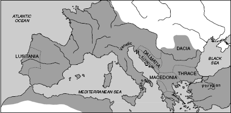

<!-- source-xhtml: 9781405188968_020.xhtml -->

# Chapter 20. Fragmentary Languages

## Introduction

**20.1.** There remain to be discussed over a half-dozen poorly understood IE languages whose preservation is so fragmentary that their exact position within the family tree is uncertain: Phrygian, Thracian, Macedonian, Illyrian, Venetic, Messapic, Sicel, Elymian, and Lusitanian. They are mostly known from short inscriptions, personal names, place-names, and glosses from the first millennium <small>BC</small>. Our survey will proceed geographically from east to west.

Since so little is known about most of these languages – especially Thracian, Macedonian, and Illyrian – the sheer variety and number of attempts at their interpretation have known no bounds. It can almost be stated as a rule in historical linguistics that the fewer the attested forms in a language and the poorer their pre-servation, the greater the quantity of speculative ink spilt over them. The scholarship on these languages, especially on the least well-preserved, has all too frequently thrown caution to the winds and built vast interpretive edifices with little basis in established – or establishable – fact. It is healthy to adopt a skeptical attitude with regard to much of it. Nonetheless, as we will see below, there does exist some clear (and at times valuable) IE material scattered throughout the remains of these languages.

**20.2.** Most of the theories concerning the interrelationships of the poorer-known languages are based on the so-called etymological method: trying to etymologize the linguistic remains that we have in light of known forms in other languages. Given that the bulk of the remains consists of personal and place-names, to which no “meaning” can be assigned in the usual sense, this method falls victim to some obvious dangers, not the least of which is circularity. Though often quite compelling on the surface, these etymologies cannot be tested against anything; they are almost always the product of seeing the morphemes that one wants to see. For example, the Thracian name *Diazenis* has been interpreted as the equivalent of Gk. *Dio-génēs* ‘born of Zeus’, and *Dizazenis* as the equivalent of *Theo-genēs* ‘born of god’ (*theo*- < Proto-Greek **theho*- < earlier **theso*-). But aside from the reasonable claim that these names contain three identifiable morphemes, *dia-*, *diza-*, and *-zenis*, we can really say nothing about their meanings or etymologies with certainty. Divine names have the same problems. A well-known interpretation of *Sabazios*, the name of the Phrygian and Thracian Bacchus, is a good example: since Bacchus’s native Latin name (*Līber*) means ‘free’, it has been suggested that *Sabazios* is cognate with OCS *svobodĭ* ‘free’ (< **su̯obhodhio*-). This idea is as clever and imaginative as it is speculative and unprovable.

A truly embarrassing example of how the etymological method can backfire is the following. In the early 1900s a ring was unearthed near Shkodër in Albania with three words on it that were averred to be Illyrian; nearly identical forms were known from Messapic, and on their basis the inscription was given an interpretation: “To the goddess Oethe.” But the ring later turned out to be from the Byzantine period and written in Greek – it had been read backwards.

The point of the foregoing is not to disparage speculation and imaginative thinking; any science needs both to move forward. The problem arises when such speculations harden over time into facts in people’s minds and become the sole basis for further and far-reaching theories (such as the establishment of sound changes or linguistic filiation). In dealing with these fragmentary languages, it is important to distinguish at all times what is known for certain from what is only guesswork.

## Phrygian

**20.3.** Phrygian occupies a special place in linguists’ hearts because of a famous legend related by the Greek historian Herodotus. He tells how the Egyptian pharaoh Psammetichus set about to determine what the oldest language in the world was. Accordingly he isolated two newborn infants from exposure to human speech, awaiting the day that the children would say their first words. The pharaoh reasoned that whatever language they first spoke in would be mankind’s original, oldest language. When that day came, the children’s first utterance was *bekos*, Phrygian for ‘bread’; so Psammetichus concluded that Phrygian was the world’s oldest language.

The Phrygians were a people who first enter history as immigrants into northwest Anatolia sometime after the fall of the Hittite Empire in the early twelfth century <small>BC</small>. They emigrated probably from the Balkans; Herodotus names Macedonia as their old homeland. It has been suggested that they were related to the Thracians (see §20.10 below) as well as to the Armenians, whose ancestors most likely came into Anatolia around the same time (see §16.1). It was formerly thought that the Phrygians’ entrance into Anatolia not only coincided with the demise of the Hittites but also may have been a cause of it. Recent scholarship, however, tends to date their incursion to two, perhaps three centuries later.

When they had moved farther inland, the Phrygians established a state that joined a loose confederation (called the Muški in Assyrian records) with several other peoples to the east; this confederation was the main power in Anatolia until around the early eighth century <small>BC</small>. Later in that century, under the legendary king Midas, the center of Phrygian power shifted westward; his kingdom fell around 700 to the Cimmerians, invaders from the north who destroyed the Phrygian capital of Gordion (Gordium). Though the Phrygians lived on for many centuries more, they never again formed a centralized state.

**20.4.** While the ancient accounts of the Balkan origins of the Phrygians are generally followed, the first demonstrably Phrygian artifacts, dating to the mid-eighth century <small>BC</small>, are from central Anatolia. About 80 inscriptions constituting **Old Phrygian** date from this time and later, until about 450 <small>BC</small> they are written in an alphabet apparently derived from an early version of the Greek alphabet used in Asia Minor. Then there is a long gap before the second layer of Phrygian, called **New Phrygian**, appears; it dates from the first and second centuries <small>AD</small>. Over a hundred New Phrygian inscriptions are known, written in the Greek alphabet; they are mostly funerary in nature and contain curses against grave-robbers. The inscriptions typically lack word-divisions, especially in the New Phrygian period.

Ancient writers, especially the Alexandrian glossator Hesychius (fl. fifth century <small>AD</small>?), also preserve some Phrygian glosses (that is, Phrygian words with a definition or explanation in Greek). The glosses seem to be reliable, since several of the words are also known from Phrygian inscriptions.

### *Sketch of Phrygian historical grammar*

**20.5.** Probably more is known about Phrygian than about any of the other languages in this chapter, and some outlines of its history are clear. The PIE voiced aspirates lost their aspiration: *ab-**b**eret* ‘brings to’ < **ad-**bh**er*-; *ad-**d**aket* ‘places’ < **ad-**dh**h₁-k-* (cp. Lat. *fac-it* ‘does’). For palatal **g̑h*, there are contradictory outcomes: *g* in *glouros* ‘gold’ (cp. Gk. *khlōrós* ‘yellow-green, green’) but *z* in *zemel-* ‘slave’ (assuming this originally meant ‘man’ and is cognate with Lat. *homō* and its relatives from PIE **dheg̑hom*-, **dhg̑hem*- ‘earth’). However, the *z*- of *zemel*- could be due to a later palatalization before the *e* or to a special outcome of the original “thorn” cluster; if so, on the evidence of the more secure *glouros* Phrygian was a centum language. This word is additionally interesting because, as tantalizingly suggested by Manfred Mayrhofer, it might show the same outcome of **l̥h₃* as Greek *khlōrós*, assuming (as seems likely) they both continue the zero-grade adjective **g̑hl̥h₃-ró*-. In that case, Greek would no longer be the unique surviving IE language to have *o*-colored outcomes of sequences of the type **R̥h₃* (recall §12.25). The plain voiceless and voiced stop series remained intact, as in *ma**t**er* ‘mother’ < **mā**t**ēr* (**meh₂**t**ēr*) and *po**d**as* ‘feet’ (accusative) < **po**d**-n̥s*. The labiovelars lost their labial element, as in *ke* ‘and’ < **kʷe*. Of special interest is the fact that, as in Greek and Armenian, word-initial laryngeals before consonants were vocalized as vowels, as in ***a**nar* ‘man’ < ****h₂**nēr* (cp. Gk. *anḗr*, Arm. *ayr*) and ***o**noman* ‘name’ (see §6.36; cp. Gk. *ónoma*, *ónuma*, Arm. *anown*).

**20.6.** The inscriptions allow us to tally up five cases in the noun: nominative, vocative, accusative, genitive, and dative. There may well have been others that happen not to be attested in our meager remains. We have examples of consonant stems, thematic nouns, *i*-stems, *u*-stems, and feminine ā-stems; in form they resemble Greek.

**20.7.** Phrygian verbs were conjugated in both active and middle: active *addaket* ‘causes, does’, middle *addaketor* (apparently with the same meaning). In the form *egeseti* ‘he will do’ (?) we may have an *s*-future (see §5.42), while a preterite in -*s* is attested in such forms as *edaes* ‘(s)he put’ and *eneparkes* (sense uncertain). These last two forms show that Phrygian, like Greek, Armenian, and Indo-Iranian, prefixed finite past-tense forms with an augment *e*- (***e***-*daes*, *en*-***e***-*parkes*; see §5.44). Strikingly reminiscent of Greek are perfect middle participles in *-meno-* with reduplication, such as *tetikmenos* ‘accursed’ (?) and (with preverb) *protuss*[*e*]*stamenan* ‘set up, established’. Third-person imperatives are found in such forms as sing. *eitou* ‘let him be’ (probably from **h₁eitōd* ‘let him go’, cp. Gk. *ítō* and Lat. *ītō*).

**20.8.** Phrygian shares more features with Greek than with any other IE language, a few of which are further shared by Armenian and Indo-Iranian. On the basis of such similarities, a subgroup of IE consisting of Greek, Phrygian, Armenian, and Indo-Iranian has been suggested (as mentioned in §10.4).

### *Phrygian text sample*

**20.9.** Phrygian sepulchral curse inscribed on a doorstone from central Phrygia, second or third century <small>AD</small>. The text is given first in its original form without word-divisions. The first two lines are understood better than the third, and are given a provisional word-division and translation. They are formulaic, found (with minor variations) on many other New Phrygian sepulchral inscriptions. Compare the Phrygian Greek formula “Whoever will do a bad thing to this tomb, let him be cursed” (*hóstis àn tō̃i hērṓōi toútōi kakòn poiḗsei hupokatárātos éstō*).

iosnisemounknoumaneikakounaddaketgegreimenane  

gedoutiosoutanakkeoibekosakkalostidregrouneitou  

autoskeouakerokagegaritmenosasbatanteutous  

ios ni semoun knoumanei kakoun addaket gegreimenan e-  

gedou tios outan akke oi bekos akkalos tidregroun eitou  

Whoever does evil to this grave, let him bear the . . .  

curse of god, and let bread (and?) water (?) become unpalatable for him.  

**20.9a. Notes. ios:** ‘whoever, (he) who’, relative pronoun, PIE **i̯os*; *ni* is apparently a particle, perhaps making the relative pronoun indefinite. **semoun:** ‘this’, usually taken to be a dative of **so-* ‘this’ with *-m-* as part of the pronominal oblique stem-formant **-sm-* (see §7.9). **knoumanei:** ‘to the tomb’, dat. sing.; etymology disputed. **kakoun:** ‘bad, evil’, some sort of accusative singular showing that **-m* became *-n* in Phrygian, as in Greek. Cp. Gk. *kakón* ‘evil, an evil thing’. **addaket:** ‘causes, does (to)’, probably consisting of a preverb *ad-* ‘to, at, upon’ (cp. Lat. *ad* ‘to’) plus *dak-* ‘do’, from **dhh₁-k-*, extended zero-grade of **dheh₁-* ‘place, put, do’ (cp. Lat. *fa-c-ere* ‘to do’, Gk. aorist *(é)thē-k-e* ‘he did’ < full grade **e-dheh₁-k-*). **gegreimenan:** feminine accus. sing. perfect mediopassive participle, in formation like that of e.g. Gk. *lelūménēn* ‘having been released’. The meaning is uncertain but apparently negative; it modifies *outan*, usually understood as ‘curse’. Note the poetic word order, with the participle separated from the noun it modifies by an intervening verb and dependent genitive. **egedou:** ‘let him bear’ or the like, perhaps from **h₂eg̑-e-tōd*, 3rd sing. imperative; compare *eitou* at the end of the line without weakening of the *-t-* (due to being directly after the stress?). **tios:** ‘of god’, perhaps PIE **diu̯-os*. It could also be the name of a deity (“Tis”). **akke:** usually considered to mean ‘and’ and compared with Latin *atque*. **oi:** ‘to him’, dative, cp. Gk. dat. *hoi*. **bekos:** ‘bread’, see discussion in §20.3. **akkalos:** ‘water’ (?), cp. Lat. *aqua*. If this passage is correctly interpreted, it is reminiscent of the curse of the legendary Phrygian king Midas, who wished that everything he touched should turn to gold – the unfortunate consequence being that all the food and drink he touched he could no longer consume. **eitou:** ‘let it be(come)’, probably from **h₁eitōd* ‘let it go’ (cf. §20.7), a 3rd person imperative in **-tō(d)*. The third line of the inscription probably begins with *autos* ‘he himself’, a word also found in Greek. This line contains another middle participle, *gegaritmenos*, perhaps cognate with Gk. *kekharisménos* ‘devoted’.

## Thracian

**20.10.** In classical times, Thrace (Thracia) was a region in the eastern Balkans, located west of the Black Sea between the Danube River to the north and the Sea of Marmara to the south, in what is now mostly Bulgaria. Herodotus described the Thracians as the greatest and most populous people on earth after the Indians; they are mentioned in Homer as allies of the Trojans during the Trojan War. Their prowess as fighters was legendary; they were also famous for their music and poetry, none of which, regrettably, has survived.

Numerous brief coin inscriptions from as early as the sixth century <small>BC</small> have been found in what was once Thrace, as well as a few short inscriptions that have no agreed-upon interpretation. The coin legends and various Classical authors preserve some Thracian personal and geographic names. Personal names are attested up until the sixth century <small>AD</small>.

**20.11.** Ancient glossators, especially Hesychius, preserve about eighty or ninety words that are said to be Thracian; of these, no more than three dozen can be confidently labeled as such. Here we can identify a few that are in all likelihood Indo-European, such as *briza* ‘spelt, rye’ (PIE **u̯rugh-i̯ā* ‘rye’, cp. German *Roggen*), *br(o)utos* ‘drink made from barley, beer’ (PIE **bhreu-* ‘bubble, ferment’, the source of Eng. *brew* and *broth*), and *-para* ‘ford, pass’ in certain place-names (PIE **per-* ‘to cross over’, the source of Eng. *ford*). A Roman inscription from <small>AD</small> 226 has a Thracian word *midne* ‘homestead’ that has been plausibly compared with Latv. *mītne* ‘dwelling’ and Av. *maēθana-* ‘dwelling’.

All attempts to relate Thracian to Phrygian, Illyrian, or Dacian (the language of the neighboring province of Dacia, preserved almost solely in some plant names in Hesychius) are likewise purely speculative. The notion of a “Thraco-Phrygian” branch of IE had currency for some time but has fallen out of favor. Our knowledge of these languages is simply too limited for claims of this kind; even the notion that what the ancients called “Thracian” was a single entity is unproven.

## Macedonian

**20.12.** The ancient Macedonians were a group of tribes located north of Greece.They are thought to have come from the west and to have slowly migrated south-eastward into lowland areas around the basin of the Haliacmon (Aliákmon) river in north-central Greece, along which they set up Aigai, their ancient capital. According to legend, they were unified under one Temenides in the seventh century <small>BC</small>.Their territory gradually increased to encompass Illyria, Thrace, and Phrygia. Under Philip II (382–336 <small>BC</small>), Macedon defeated Greece, and his son Alexander III (Alexander the Great, 356–323 <small>BC</small>) famously extended Macedonian conquest to much of the known world. Following his death, Macedon was riven by internal conflicts until the Antigonid dynasty (277–168 <small>BC</small>), after whose decline the country became a Roman province (146 <small>BC</small>).

Our knowledge of Macedonian is limited to glosses (again, mostly in Hesychius) and a number of personal names. The inscriptions found in former Macedonian territory are in Greek, adopted as an official language by the fifth century <small>BC</small>. A curse tablet in Doric Greek unearthed in 1986 in Pella, the later Macedonian capital, appears to contain some Macedonian linguistic features. Already in antiquity, Macedonian was regarded as bearing a close affinity with Greek, an impression that the glosses confirm. However, it is debated whether Macedonian was a rather deviant Greek dialect or a separate but closely allied language. Speaking for the latter is the one rather important Macedonian sound change that can be deduced from the glosses and personal names: the voiced aspirates lost their aspiration and became plain voiced stops, unlike any known Greek dialect (Macedonian *a**b**routes* ‘eyebrow’ = Gk. *o**ph**rū̃s*; ***d**anon* ‘death’ [accusative] = Gk. ***th**ánaton*; ***d**ōrax* ‘spleen’ = Gk. ***th**Rraks* ‘thorax’; personal names ***B**er(e)nika* = Gk. ***Ph**erenī́kē* ‘bearing victory’ and ***B**ilippos* = Gk. ***Ph**ílippos*). Attempts to link Macedonian with Thracian and/or Illyrian in various ways are quite inconclusive.

## Illyrian

**20.13.** The Illyrians, while not instantly familiar to most people today, were rather important in ancient history. They or their ancestors had settled in the Balkans perhaps in the early Bronze Age in the first half of the second millennium <small>BC</small>, and gradually expanded and founded various local kingdoms over the ensuing centuries.They came under the influence of Greek culture between the eighth and sixth centuries <small>BC</small>, when the Greeks set up colonies in the area, most notably Epidamnus (Dyrrhachium to the Romans, modern Durrës in Albania). After a series of conflicts with Rome, the Illyrians became Roman dependents by 165 <small>BC</small> their lands constituted the new Roman province of Illyricum. Although they were to play an important role in the Roman army and even furnished later Rome with several famous emperors (including Diocletian, Constantine the Great, and Justinian I), the Illyrians never became fully assimilated Romans and kept their language.

What that language was is uncertain. The term “Illyrian” has referred to many things, until recently to any non-Celtic language in the broad area west of Thrace, north of Greece and Macedonia, and east of the Veneti (northeastern Italy). But scholarly work beginning in the 1960s has shown that the region is neither archaeo-logically nor onomastically uniform and that it breaks down into three distinct cultural and linguistic areas, of which only one can properly be called Illyrian. No treatment yet exists of the linguistic remains from just this region to the exclusion of the others. The remains consist of some personal and place-names and some glosses. There are no known inscriptions (and recall §20.2 above).

**20.14.** Two untestable hypotheses about Illyrian’s connection to other languages are widely held: that Illyrian is the same as or closely related to Messapic, and that Illyrian is the ancestor of Albanian. The first hypothesis is based on the close cultural connections between the Messapians and Illyrians, and on certain similarities between some linguistic elements. The second hypothesis has very little, if any,linguistic support, but makes geographic sense; proponents also point out that the word *Albanoí* ‘Albanians’ is first attested (in the *Geography* of Ptolemy) as the name of an Illyrian tribe. One glossed word that has been compared with Albanian is *rhinos* ‘fog’ (cp. Old Geg *ren* ‘cloud’, modern *rê*), but this alone does not prove the case. The possible relationship to Messapic does not help, for the Messapic inscriptions evince no obvious similarities to Albanian.

A “Thraco-Illyrian” branch of Indo-European has been proposed by some who view Illyrian and Thracian as related. Others have proposed a mixture called “Daco-Mysian” or simply Dacian, a combination of Thracian, Illyrian, and the language of the neighboring Roman province of Dacia. All such proposals have very little to go on and are premature.

**20.15.** A few words of IE interest that are traditionally called Illyrian are:*Deipaturos*, the Illyrian name for Jupiter or Zeus that continues the PIE name ‘Father Sky’ (**di̯ēus ph₂tēr*, cp. Lat. *Iū-piter*; see §2.19); a word *teuta-* meaning ‘people’ inpersonal names from the root **teutā* found in western Europe (§2.8); the personal name *Vescleves*, usually understood to mean ‘having good fame’ and composed etymologically of the same elements as the Sanskrit adjective *vasu-śravas-*; and *sabaia* or *sabaium*, mentioned by the late Roman historian Ammianus Marcellinus and defined as a beer-like drink, which may be from the same root **sab-* that gives Germanic words for ‘juice’ (German *Saft* ‘juice’, Eng. *sap*). See also the notes to line 27 of the Umbrian text in §13.74a.

## Venetic

**20.16.** Venetic was spoken in northeast Italy by the Veneti, a people famous in the Greek world for their horses. They appear to have arrived there by the end of the second millennium <small>BC</small>. The center of Venetic culture was the town of Este, about fifteen miles southwest of Padua; it was also the center of the cult of their main divinity, the goddess Reitia. But their territory stretched as far west as Verona and as far south as the Po valley. In the latter region they came into contact with Etruscan settlers around the sixth century <small>BC</small>, from whom they learned the alphabet. Venetic inscriptions, which number about 200 and date from the sixth to the first centuries <small>BC</small>, are written in both the Etruscan and, later, the Roman alphabet. Modern scholars sometimes divide Venetic into Archaic Venetic (550–475 <small>BC</small>), Old Venetic (475–300 <small>BC</small>), New Venetic (300–150 <small>BC</small>), and Veneto-Latin (150–100 <small>BC</small>). The inscriptions are all rather short, none being more than about ten words long; roughly half the attested words are personal names.

**20.17.** In view of its geographical location, it is not surprising that Venetic bears close affinities with Italic; in fact, many scholars consider it to be part of the Italic family. The similarities are both phonological and morphological. Italic and Venetic share a verb stem *fac-* ‘do’ (in Lat. *fac-ere* ‘to do’, Venetic *s*-aorist *vhag-sto* ‘he did’, with *vh* = *f* in the Etruscan alphabet) that represents an extension of PIE **dhh₁*- (zero-grade of **dheh₁*- ‘put’) with a **-k-* of unknown origin and meaning; but since the same stem is perhaps also attested in Phrygian (*addaket*, see §20.9a) and the Greek perfect *té-thē-k-a* ‘I have put’, this may not be a feature exclusively Italic or Italo-Venetic. More exclusive is the fact shared by Italic (specifically Latin) and Venetic that voiced aspirates developed into *f-* word-initially and into voiced stops word-internally: thus ***vh**agsto* above, and the dative plurals *louzero**ph**os* ‘for the children’ (with *z* and *ph* representing *d* and *b* from **loudhero-* plus **-bho-*) and *andetico**b**os* ‘for the sons of Andetios’ (?). On the other hand, some of the morphological features described in the next section, such as the pronominal forms *mego* and *sselboisselboi*, are strikingly different from Italic material. Much more evidence is needed to decide the issue.

**20.18.** In spite of the paucity of material, we know some outlines of the grammatical structure of the language. Five cases (nominative, accusative, genitive, dative, and instrumental) are preserved, and all three numbers – singular, dual, and plural – are found. The only known verb-forms are in the third person, such as singular present *atisteit* ‘sets up (?)’, past *donasto* ‘gave’; plural *donasan* ‘they gave’. The 3rd sing. *tolar* or *toler*, of unclear meaning, is a middle form. Unlike any of the attested Italic languages, Venetic still has a living *s*-aorist, as in *dona-s-to* and *vhag-s-to* above. The language also had active *nt*-participles (e.g. *horvionte*, a masculine nominative dual) and middle participles in *-mno-* (e.g. *alkomno* ‘?’). Of particular interest are some features of the pronominal system that find exact parallels in Germanic, and only there: a stem **selbh-* for the reflexive pronoun (Venetic *sselboisselboi* ‘for himself’, cp. the similarly doubled OHG form *selb selbo*), and a first-person accusative singular pronoun that is a rhyme formation with the nominative (Venetic *mego* ‘me’ rhyming with *ego* ‘I’; cp. German *mich* ‘me’ rhyming with *ich* ‘I’). Noteworthy also is an *o*-stem genitive singular in -*i*, matching Latin and Celtic.

**20.19.** The Venetic alphabet does not contain separate letters for the voiced stops. However, it contains a special *t*, sometimes transliterated *t*², that stands for *d*, as in the word *t*²*eivos* = *deivos* ‘god’. Venetic orthography generally makes use of the Etruscan system of “syllabic punctuation,” treated in the Exercises below.

### *Venetic text sample*

**20.20.** The inscription Es 122 found just north of Monselice (a town east of Este and south of Padua), dating from the Archaic Venetic period, before 475 <small>BC</small>. There are no word-divisions in the original. The interpretation follows that of Michel Lejeune, *Manuel de la langue vénète*.

ego vhontei ersiniioi  

vineti karis vivoi oliialekve murtuvoi atisteit  

**20.20a. Notes. ego:** ‘I’, cp. Lat. *ego*. **vhontei ersiniioi:** ‘for Fons Ersinius’, a personal name in the dative. *Vhont-* is an athematic noun with dative in *-ei* (§6.9), and *ersiniioi* may be a patronymic adjective in **-i̯o-* (‘son of Ersinus’). **vineti karis:** uncertain; perhaps a single word. Lejeune suggests ‘friend of Vinetus’. **vivoi:** ‘alive’, dat. sing.; cp. Lat. *uīuus* ‘alive’. **oliialekve:** ‘and . . .’; *-kve* is from PIE **kʷe*; *oliiale* is not understood but is perhaps an adverb. **murtuvoi:** ‘dead’; cp. Lat. *mortuus*. **atisteit:** see above, §20.18. The sense of the whole inscription is therefore something like, “I (am) for Fons Ersinius. A friend of Vinetus (?) sets up (this?) for (him), alive and . . . dead.”

## Messapic

**20.21.** Messapic is known from close to 300 inscriptions from southeast Italy in Calabria and Apulia and dating from the sixth to the first centuries <small>BC</small>. The language was spoken by an ancient people known both as the Messapii (or Messapians)and Iapyges. They are linked by ancient historians with Illyria, across the Adriatic Sea; the linkage is borne out archaeologically by similarities between Illyrian and Messapic metalwork and ceramics, and by personal names that appear in both locations. For this reason the Messapic language has often been connected by modern scholars to Illyrian; but, as noted above, we have too little Illyrian to be able to test this claim.

Messapic is written in an offshoot of an Ionic Greek alphabet that diffused early into southern Italy. Most of the inscriptions just contain personal names, and usually lack word-dividers, rendering interpretation of the longer inscriptions very difficult. A few things are known about its history and structure. Short **o* became *a*, as in the athematic genitive *damatras* ‘of Demeter’ (with genitive singular *-as* from **-os*). The *o-*stem genitive singular *-aihi* (as in *dazimaihi malohiaihi* ‘of Dazimas Malohias’), earlier thought to contain the same -*ī* of Italic, Celtic, and Venetic, is now thought to be simply the continuation of *-*osi̯o*. A dative-ablative plural *-bas* and instrumental plural -*bis* are found, e.g. *logetibas* ‘for the *logeti*’s’, *ogrebis* ‘with vows’ (?), as well as the *o*-stem instrumental plural *-ais* (e.g. *nomais* ‘with portions’ (?)). Some forms of the demonstrative pronoun **so-/to-* are found, though their grammatical determination is not certain: *toi* may be a masculine dative singular, *tai* the corresponding feminine. The latter recurs as a conjunction in *tai ma kos* . . . ‘that not anyone . . . , lest anyone . . .’, which also nicely preserves the PIE prohibitive **mē* and the indefinite pronoun *kos* from the stem **kʷo*- or **kʷi*-. A few verb forms have been tentatively identified, including the 3rd sing. present *hipakaθi* ‘sets up’ (?), the 3rd sing. aorist *hipades* ‘set up, dedicated’ (*hipa-* perhaps from **supo* ‘under’, variant of **upo*, cp. Lat. *sub-*, Gk. *hupo-*; *-des* from the *s*-aorist **dhēh₁-s-t* or **dheh₁-s-t*), and the 3rd pl. present optative *berain* ‘they should bring’.

Probably the most valuable and interpretatively undisputed piece of Messapic is the formula *kl(a)ohi zis* found at the beginning of some inscriptions, which translates as “Listen, Zis (=Zeus)!” or “Let Zis listen.” On these forms, see the Notes below.

### *Messapic text sample*

**20.22.** Inscription from the second or first century <small>BC</small> from Basta (modern Vaste, a village in Apulia west of Otranto), copied down in the sixteenth century; the original has vanished. The division into lines below is probable but not assured; there are no word-divisions. We cannot translate the inscription, but we can provisionally divide it up analytically into words and structurally repeating units, following Hans Krahe, *Die Sprache der Illyrer*, vol. 1 (1964), pp. 27–8, with modifications.

klohizisθotoriamartapidovasteibasta  

veinanaranindaranθoavastistaboos  

šonedonasdaštassivaanetosinθitrigonošo  

astaboosšonetθihidazimaihibeileihi  

inθireššorišoakazareihišonetθihiotθeihiθi  

dazohonnihiinθivastima  

daštaskraθeheihiinθiardannoapoššonnihia  

imarnaihi  

klohi zis  

θotoria marta pido vastei basta veinan aran  

in daranθoa vasti staboos šonedonas  

daštas-si vaanetos  

5 in-θi trigonošoa staboos šonetθihi  

dazimaihi beileihi  

in-θi reššorišoa kazareihi šonetθihi otθeihi-θi dazohonnihi  

in-θi vastima daštas kraθeheihi  

in-θi ardannoa poššonnihi aimarnaihi  

**20.22a. Notes. klohi zis:** ‘Listen, Zis’, invocation to Zis (Zeus). *Klohi*, spelled *klaohi* in older inscriptions, is probably the exact cognate of Ved. *śróṣi* ‘listen’, a singular *s*-aorist imperative. Others think that it is a 3rd pl. aorist optative, ‘let him listen’, from **k̑leu-s-ih₁-t*. *Zis* is probably a borrowing from the Oscan of Lucania (southern Italy); a later Greek writer attests the name *Dis* from Tarentum, which may well be the same thing. **pido:** supposedly **(e)pi-dō-t* ‘gave, presented’ or the like, with preverb **epi-* (Gk. *epi-*) and a root aorist of **deh₃-* ‘give’. **in-θ:** *-θi* means ‘and’ and likely continues PIE **kʷe*. It also occurs following *daštas* in line 4, assimilated to *-si*, and following *otθeihi* in line 7. Most of the words in the right-hand column are bipartite personal names in the genitive singular.

## Sicel and Elymian

**20.23.** In Sicily were spoken at least two languages during the first millennium <small>BC</small> that are widely thought to have been Indo-European. The first, **Sicel** (or Siculian),was spoken by the Siculians in eastern Sicily. An inscription of moderate length,largely indecipherable, from the sixth or fifth century <small>BC</small> in Greek letters on a jug discovered in Centuripe in 1824 is most of what remains of the language, aside from some words preserved by Classical authors and a very few shorter inscriptions. A more recently discovered vessel contains a verb form of great interest,however: the imperative *pibe* ‘drink!’, exactly cognate with Sanskrit *píba* and Latin *bibe*, but without the latter’s assimilation of the initial *p-* to *b-.*

Fragments of pottery and some coins from the city of Segesta in western Sicily attest a language called **Elymian** also written in the Greek alphabet from the sixth to the fourth centuries <small>BC</small>. In most cases the shards are so small that only a few letters survive on each. We know little aside from the verb form *emi* ‘I am’. (Inscribed objects often “spoke” in the first person to indicate to whom they belonged or had been dedicated.)

In central Sicily, between the Elymians and Sicels, were the Sicanians, whose language is also only very fragmentarily preserved but does not appear to have been Indo-European.

## Lusitanian

**20.24.** In the western Iberian peninsula, between Guadiane and Duero, three inscriptions in an IE language have been found, written in Latin letters and dating from around the time of the early Roman Empire (first century <small>AD</small>). This area was part of the Roman province called Lusitania, named after a people called the Lusitani;the language of these inscriptions has therefore been dubbed **Lusitanian**. The language is regarded by some to be Celtic; but this is quite uncertain. The identification of the language as IE is based on such forms as *doenti* ‘they give’, thematic dative singulars in *-oi* or, more commonly, *-ui* (the same as the corresponding Celtiberian ending), and accusative singulars in *-m* (e.g. *porcom* ‘pig’, *taurom* ‘bull’). Note also the nominative plural *Veamnicori*, a name of a people, reminiscent of *Petrucorii*,the name of a Gaulish tribe.

## For Further Reading

The corpora of all these languages continue to grow; the standard collections – few of them in English – contain most of the known inscriptions but lack those that have come to light more recently. For Phrygian, the most complete and recent comprehensive collection is Orel 1997, which includes both the material from the two standard collections (Haas 1966 and Brixhe and Lejeune 1984, the latter a very fine work) and the inscriptions unearthed since then. Orel’s work also contains a grammar and vocabulary, but treat the interpretations with caution. An excellent comparison of Phrygian and Greek is Neumann 1988. The Thracian texts are in Detschew 1957. For Macedonian, see Kalléris 1954–76. The standard collection of Illyrian remains (but not in the narrow sense discussed in §20.13) is Krahe 1955–64; the second volume contains an edition of the Messapic inscriptions (now superseded by de Simone and Marchesini 2002) as well as a study of Illyrian personal names by Jürgen Untermann. For a good critical review of scholarship on Thracian and Illyrian, see Katičič 1976. The Venetic inscriptions known until the mid-1970s are collected in Lejeune 1974, which also contains detailed discussions of the orthography, phonology, and morphology. The Lusitanian corpus is contained in Untermann 1997.

## Exercises

1. Comment on the history or significance of the following forms:

  - **a** Phryg. *addaket*

  - **b** Phryg. *anar*

  - **c** Phryg. *edaes*

  - **d** Illyr. *Deipaturos*

  - **e** Illyr. *Vescleves*

  - **f** Ven. *vhagsto*

  - **g** Ven. *sselboisselboi*

  - **h** Messap. *-ihi*

  - **i** Messap. *kl(a)ohi zis*

2. Phrygian *bekos* looks a lot like English *bake*, but what difficulty attends equating these etymologically?

3. It was mentioned in §20.8 that many scholars believe Phrygian forms a subgroup with Greek, Armenian, and Indo-Iranian. What branches of IE do the Phrygian middles in *-tor* pattern with?

4. Venetic “syllabic punctuation.” Most Venetic inscriptions contain what at first appears to be a profligate fondness for interpuncts. There is, however, a fairly simple phonological principle behind their use. Interpuncts were used to frame certain kinds of sounds in certain syllabic contexts. If this framing would have led to a double interpunct, that was usually (though not always) simplified to a single one.

  - **a** Based on the following examples (whose meanings are irrelevant for the present purposes), determine the rules for interpunct placement. Recall that *vh* stands for a single consonant (the fricative *f*).

| Column 1 | Column 2 | Column 3 |
| --- | --- | --- |
| .e.kupetari.s. | vha.g.s.to | lemeto.r.na |
| ka.n.te.s. | .e.go |  |
| .o.p.po.s. | ne.r.ka |  |

  - **b** What additional feature is reflected by the following?

| Column 1 | Column 2 | Column 3 |
| --- | --- | --- |
| .a.kuto.i. | .a.vhro.i. | ka.n.ta.i. |
|  | votu.n.ke.a. |  |

  - **c** Now that you have established the basic principles, what information do the preceding examples tell us about the pronunciation of the initial *i* in *iuva.n.te.i.*?

  - **d** How many syllables does the word spelled *vo.t.te.i.iio.s.* contain? Explain.

  - **e** Now that you have established these principles, what do the following forms tell us about Venetic syllabification? State your answer as generally as possible. (Hint: compare the remarks on Latin *patre* in §1.10.) Treat *ii* as identical to *i*.

| Column 1 | Column 2 | Column 3 |
| --- | --- | --- |
| .e.kvo.n. | ve.i.gno.i. | u.r.kli |
| .a.vhro.i. | iiuva.n.tii.o. | mu.s.kia.l.na.i. |
| vhu.g.siia | .o.s.tiala.i. |  |

5. Imagine that you are the proud discoverer of a hitherto unknown ancient IE language belonging to a hitherto unknown branch of the family. Your task is to report your discovery to the scholarly world. Describe your language, including at least the following information:

  - **a** The date of the text(s) you have found and the place of discovery;

  - **b** The outcomes of all the PIE sounds - consonants, vowels, and diphthongs - in your language. Include at least two sound changes that are conditioned, i.e., that happened only in particular phonetic environments (some of the conditioned sound changes that we’ve talked about are rhotacism in Latin, umlaut in Germanic, Verner’s Law, and palatalization). Be sure to specify what the phonetic environments were (beginning of a word, between vowels, before a front vowel, word-finally, etc. etc.);

  - **c** The outcomes of these PIE forms: **ph₂tḗr* ‘father’, **mā́ter* ‘mother’, **bhrā́tēr* ‘brother’, **su̯ésōr* ‘sister’, **pods, *ped-* ‘foot’, **mūs-* ‘mouse’, **kʷel-* ‘to turn’, **h₃erbh-* ‘transfer to another sphere of ownership’, **k̑léu̯os* ‘fame’, **u̯l̥kʷos* ‘wolf, **g̑heimōn* ‘winter’, **sneigʷh*- ‘to snow’;

  - **d** A brief description of the nominal system, including: what cases are preserved; what numbers; what genders; the general fate of athematic and thematic nouns;

  - **e** A brief description of the verbal system, including: what tenses are preserved; what numbers; the general fate of athematic and thematic verbs, of the aorist, and of the perfect;

  - **f** The paradigm in the singular and 3rd plural of the descendant of **h₁es-* ‘be’ in the present tense, **bher-* ‘carries’ in the present tense, and **u̯oide* ‘knows’;

  - **g** A sample text in your language of a dozen words, including at least half that have an IE etymology and are different from the ones you give in (**c**) above;

  - **h** Some brief remarks about the culture, mythology, society, etc. of the people that spoke your language.

## PIE Vocabulary XII: Basic Physical Acts

**dheh₁*- ‘place, put’: Hitt. *dāi* ‘puts’, Ved. *dádhāti* ‘puts’, Gk. *títhēmi* ‘I put’, Lat. *faciō* ‘I do’, Eng. <small>DO</small>

* *u̯erg̑-* ‘<small>WORK</small>’: Av. *v*í*r*í*ziieiti* ‘works’, Gk. *(w)érgon* ‘work’, Arm. *gorc* ‘work’

**bheid-* ‘split’: Ved. *bhinátti* ‘splits’, Lat. *findō* ‘I split’, Eng. <small>BITE</small>

**sek-* ‘cut’: Lat. *secō* ‘I cut’, Eng. <small>SAW</small>, OCS *sêkǫ* ‘I cut’

* *g̑heu-* ‘pour’: Ved. *juhóti* ‘pours’, Gk. *khé(w)ō* ‘I pour’, Lat. *fundō* ‘I pour’, Eng. <small>INGOT</small>
