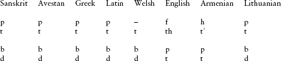
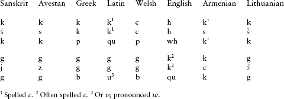
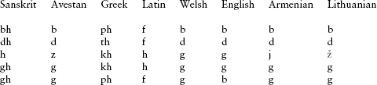
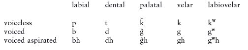
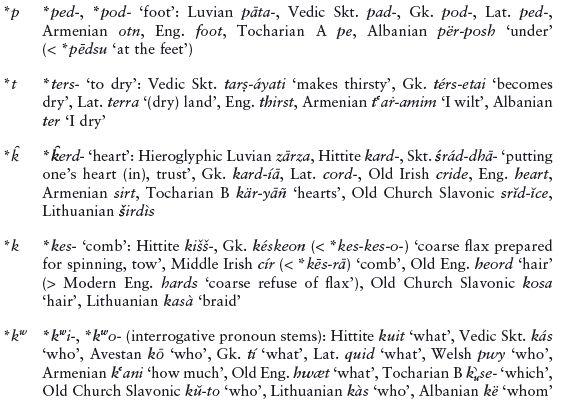
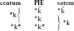
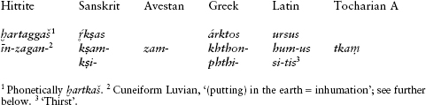
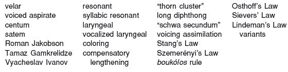

<!-- source-xhtml: 9781405188968_003.xhtml -->

# Chapter 3. Proto-Indo-European Phonology

## Introduction

**3.1.** The science of linguistic reconstruction goes back to work of the German philologist August Schleicher in the 1860s. He imputed only three vowels to Proto-Indo-European (*a i u*) and a total of fifteen consonants. A rush of discoveries in the later 1860s and 1870s revealed that this reconstruction was inadequate. By the close of the nineteenth century, the model of PIE phonology that is presented in this chapter, with 25 consonants and 10 vowels, was mostly in place.

The notation of the reconstructed sounds of PIE has its own history. Readers familiar with the International Phonetic Alphabet (IPA), a universal phonetic transcription system devised in the late nineteenth century, need to be aware that the notation of PIE sounds is similar to, but not identical with, that of the IPA. As is standard, whenever recourse is made to IPA symbols, they will be enclosed in square brackets.

## Consonants

**3.2.** Consonants are speech sounds produced by partially or completely blocking the flow of air through the vocal tract. They are classified according to where in the vocal tract this obstruction occurs (the *place* of articulation), how the obstruction is produced (the *manner* of articulation), and whether there is accompanying vibration of the vocal cords (*voicing*).

### *Stops*

**3.3.** Stop consonants (or plosives) are produced by completely blocking, then releasing, the flow of air through the mouth. From the comparative evidence afforded by the most ancient IE daughter languages, we know that PIE was rich in stop consonants. Over the next couple of pages, we will examine the evidence and briefly show the reasoning behind the standard reconstruction of the PIE stop inventory. (Space will not allow similar treatment of the sounds discussed in the rest of this chapter; the reader may bear in mind that similar reasoning was employed for all of the other reconstructions.)

**3.4.** Let us begin with the following sound correspondences from a selection of IE daughter languages, a bit simplified for our present purposes:

(The symbol t‘ in Armenian represents a *t* with aspiration, a following puff of breath.) All of these are *reflexes*, that is, descendant outcomes, of ancestral PIE sounds. This table is a shorthand for saying that, for any Sanskrit word containing *p*, its Avestan, Greek, Latin, and Lithuanian cognates will also contain a *p* in the same position, while the English cognate will have *f*, the Armenian cognate will have *h*, and the Welsh cognate will have no sound. (We will provide actual word equations illustrating these sound correspondences below in §3.7.) The same is true, *mutatis mutandis*, for the other sounds listed above, where all the languages agree across the board except English and Armenian. Cross-linguistic research has shown that it is more natural for the English and Armenian inventories to have developed from *p t b d* than the other way around; furthermore, if we hypothesize that only English and Armenian have changed the original state of affairs (and Welsh in the case of *p*), we are not forced to claim that all the other branches underwent major independent but parallel (and cross-linguistically unnatural) change.

For these and other reasons, on the basis of these comparanda Indo-Europeanists reconstruct the voiceless stops **p* and **t* and the corresponding voiced stops **b* and **d* for PIE; they were pronounced as in English. **p* and **b* are both labial stops, and **t* and **d* are dentals. (Precisely what kind of dental stop **t* and **d* were is not certain, as “dental” is a cover term for a variety of sounds produced by the tip of the tongue touching the upper teeth; but this level of phonetic detail is not likely to be recoverable for PIE.)

**3.5.** A second set of correspondences is more complicated, and caused early Indo-Europeanists considerable trouble:

These sets all involve *velar* sounds of various kinds – *k*’s and *g*’s – produced with the back of the tongue raised to touch the soft palate (velum). The big issue was how many velars to reconstruct for PIE. It turns out that the only satisfactory solution is to reconstruct a separate sound for each of these correspondence sets. For the first and fourth rows, all the languages except English and Armenian (where k‘ stands for a *k* with aspiration) agree on having ordinary *k* and *g* (Welsh *c* represents *k*). We therefore reconstruct **k* and **g* for these two correspondence sets. (This **g* is the “hard” *g* as in English *garden*.)

The second and fifth rows include plain velars in some languages but a palatal fricative (written ś) in Sanskrit, an alveopalatal affricate (*j*, as in English) in Sanskrit, a collection of sibilants (*s*, *z*, *R*, ž, the last two like English *sh* and *zh*), and an alveolar affricate (*c* in Armenian, pronounced *ts*). All these sounds commonly develop out of palatal or palatalized sounds in the histories of many of the world’s languages. It is therefore believed that these sounds go back to *palatal* stops in PIE, written *k̑ and *g̑, pronounced like ordinary *k* and *g* but farther forward in the mouth (as in *To****k****yo* and *ar****g****ue*). In some languages, such as Greek, Latin, and English, the palatal velars fell together with the ordinary velars, more on which later.

This leaves the third and sixth sets above, both of which distinguish themselves by having a labial element of some kind in several of the branches: labial stops (*p b*) in Greek and Welsh, and a labiovelar sound in Latin and English (*qu, wh*) – that is, a velar sound with rounding of the lips. There is essentially only one kind of sound that could have had such diverse developments (as either plain velar, labial, or labiovelar): a *labiovelar stop*. We therefore reconstruct two PIE labiovelars, **kʷ* (voiceless; also written *kᵘ̯) and **gʷ* (voiced; also written *gᵘ̯). These were single speech sounds, velars pronounced with rounding of the lips; they were not sequences of velar plus *w*. (We know this because such sequences have different outcomes from the labiovelars in some languages. In Sanskrit and Lithuanian, the PIE labiovelar **kʷ* became *k*, but the consonant cluster **ku̯* (= *kw*) became *kv*.)

Although the term *velar* normally refers specifically to *k* or *g*, all the six sounds we have just reconstructed – **k* **g* *k̑ *g̑ **kʷ* **gʷ* – are collectively referred to as “velars” in Indo-European studies (or “gutturals” in older literature; occasionally they are also called *dorsals* or *tectals*). To avoid confusion, **k* and **g* are often called the *plain velars* to distinguish them from the others (which, as we have seen, are called palatal velars and labiovelars).

**3.6.** There is one final set of correspondences involving stop consonants:

In three of the branches above, these sounds are characterized by some kind of aspiration (breathiness or hissing quality). Sanskrit *bh* is a *b* followed by a puff of breath; Greek *ph* was a *p* followed by a puff of breath; Latin *f* belongs to a class of consonants, called fricatives, with a hissing quality due to release of air during their production (see further §3.12). On the other hand, English, Armenian, and some other branches do not show any aspiration here. It is generally agreed that the aspiration must have been originally present, but lost in the branches that no longer show it; the opposite direction of change is unlikely. We reconstruct five so-called *voiced aspirated stops*, symbolized **bh* **dh* **g̑h* **gh* **gʷh*. The voiced aspirates can also be written with superscript *h*’s (*bʰ gʰ* etc.); they were voiced stops followed by a puff of breath or a brief period of breathy voice (the latter technically called murmur). Indic (with its main ancient representative Sanskrit) is the only subbranch of the family that preserved them intact into the historical period; they are still found in many modern languages descended from Sanskrit, such as Hindi and Bengali.

(We may add parenthetically that in earlier Indo-European studies a fourth series of stops was reconstructed, the *voiceless aspirates* **ph* **th* **kh* etc. The best evidence for them comes from Indo-Iranian and Greek, where however they can be explained as later, secondary developments. A few Indo-Europeanists still posit them for the proto-language. We will discuss these a bit more in §10.31.)

To sum up so far, PIE had the following fifteen-stop inventory:

**3.7.** Following are representative cognate words to illustrate each of the correspondence sets so far discussed. If no English gloss (translation) is given for a particular form, it has the same meaning as its PIE ancestor. Not all the attested cognates are given in each set.

The forms cited as examples in this and the next few chapters may seem a bit bewildering at this stage, as we have not yet covered the various spelling systems of these languages, nor the sound changes that account for any deviations from a particular reconstructed PIE form. For the time being, such details are not significant and should be ignored; these lists are designed mainly to give a sense of the large body of evidence that the reconstructions are based on. In later chapters, we will have occasion to explicate the sound changes that caused any such deviations observed below. There are also a few forms in the lists below where an outcome is different from that predicted by the charts in §§3.4–6; these are typically due to a sound change conditioned by a particular neighboring sound and should not cause concern at this point.

As most of the IE language names are not assumed to be familiar at this stage, only the following abbreviations are used: Eng. = English; Gk. = Greek; Lat. = Latin; Vedic Skt. = Vedic Sanskrit (the oldest form of Sanskrit and the one generally cited in IE studies). Hyphens are used to separate prefixes and suffixes from root morphemes wherever this clarifies an example; a form ending in a hyphen means that normally the form had to have a grammatical ending attached to it, or that it was a prefix.

#### Voiceless stops

These typically remain unchanged, except in Germanic and Armenian, where they became fricatives or aspirates. The labial *p* is sometimes weakened or lost (Celtic, Armenian).

#### Voiced stops

These also typically remain unchanged, the main exceptions being Germanic, Armenian, and Tocharian, where they became voiceless:

| Column 1 | Column 2 |
| --- | --- |
| **b* | ****b****el-* ‘strong, strength’: Vedic Skt. ***b****álam* ‘strength’, Gk. ***b****el-tíōn* ‘better’, Lat. *dē-****b****ilis* ‘lacking strength’, Old Church Slavonic ***b****olĭjĭ* ‘bigger’ |
| **d* | ****d****oru, *****d****eru* ‘wood, tree’: Hittite ***t****āru,* Vedic Skt. ***d****ā́ru,* Avestan ***d****āuru,* Gk. ***d****óru,* Armenian ***t****ram* ‘firm’, Old Irish ***d****aur* ‘oak’, Eng. ***t****ree,* Old Church Slavonic ***d****rěvo,* Lithuanian ***d****ervà,* Albanian ***d****ru* ‘wood’ |
| *g̑ | **g̑onu, *g̑enu* ‘knee’: Hittite ***g****ēnu,* Vedic Skt. ***j****ā́nu,* Avestan *žnūm* (accus.), Gk. ***g****ónu,* Lat. ***g****enū,* Armenian ***c****ownr,* Eng. ***k****nee,* Tocharian A ***k****anweṃ* ‘the two knees’ |
| **g* | ****g****ras-* ‘eat’: Vedic Skt. ***g****rásate* ‘eats, feeds’, Gk. ***g****rástis* ‘green fodder, grass’, Lat. ***g****ādmen* (< **gras-men*) ‘grass, fodder’ |
| **gʷ* | ****g**ʷen-* ‘woman’: Hittite ***ku****innaš,* Vedic Skt. ***j****áni-,* Avestan ***j****aini-,* Gk. ***g****unḗ,* Old Irish ***b****en,* Old Eng. ***cwē****n* (Mod. Eng. ***qu****een),* Armenian ***k****in,* Tocharian B *śana,* Old Church Slavonic *žena,* Old Prussian ***g****enna* |

#### Voiced aspirated stops

These are preserved intact only in Indic (as per §3.6 above). They fell together with the plain voiced stops in most of the other branches, but have reflexes distinct from those of the voiceless and plain voiced stops in Greek, Italic, Germanic, and Armenian (and Indic, of course).

| Column 1 | Column 2 |
| --- | --- |
| **bh* | ****bh****er-* ‘carry’: Vedic Skt. ***bh****árāmi* ‘I carry’, Gk. ***ph****érō* ‘I carry’, Lat. ***f****erō* ‘I carry’, Phrygian *ab-****b****eret* ‘he brought’, Old Irish ***b****iru* ‘I carry’, Armenian ***b****erem* ‘I carry’, Eng. ***b****ear,* Tocharian A and B ***p****är-,* Old Church Slavonic ***b****erǫ* ‘I take’, Albanian ***b****jer* ‘bring!’ |
| **dh* | **me****dh****u* ‘honey; sweet drink’: Luvian *ma****dd****u* ‘wine’, Vedic Skt. *má****dh****u* ‘honey’, Gk. *mé****th****u* ‘wine’, Old Irish *mi****d*** ‘mead’, Eng. *mea****d****,* Tocharian B *mi****t*** ‘honey’, Old Church Slavonic *me****d***ŭ ‘honey’, Lithuanian *me****d****ùs* ‘honey’ |
| **g̑h* | *g̑***h****eu-* ‘pour’: Vedic Skt. ***h****ūyáte* ‘is poured’, Avestan ***z****aotar-* ‘priest (who pours libation)’, Gk. ***kh****é(w)ō* ‘I pour’, Lat. ***f****ūtis* ‘watering-can’, Armenian ***j****oyl* ‘having been poured’, Tocharian B ***k****ewu* ‘I will pour’, Eng. *in****g****ot* |
| **gh* | **stei****gh****-* ‘go, climb’: Vedic Skt. *ati-ṣṭí****gh****am* ‘to climb up’, Gk. *steí****kh***ō ‘I climb’, Old Irish *tía****g****u* ‘I go’, Gothic *stei****g****an* ‘to climb’, Old Church Slavonic *sti****g****nǫti* ‘to come, arrive at’, Lithuanian *stei****g****iúos* ‘I hurry’, Albanian *shte****g*** ‘path’ |
| **gʷh* | ****g**ʷ**h**en-* ‘smite, slay’: Hittite ***ku****en-zi* ‘slays’, Vedic Skt. ***h****án-ti* ‘slays’, Avestan ***j**aiṇ-ti* ‘slays’, Gk. *-****ph****onos* ‘-slayer’, Lat. *dē-****f****en-dit* ‘beats off, defends’, Old Irish ***g****on-im* ‘I slay’, Eng. ***b****ane,* Armenian *ǰn-em* ‘I slay’, Old Church Slavonic *ženǫ* ‘I drive after, hunt’, Lithuanian ***g****enù* ‘I drive’ |

“Centum” vs. “satem” development of the velars

**3.8.** The three series of velar consonants (palatals, velars, and labiovelars) collapsed to two in almost all the IE daughter languages, with either the palatals or the labiovelars merging with the plain velars. In the first case, the result was a plain velar series contrasting with a labiovelar series (*k g gh* and *kʷ gʷ gʷh*). In the second case, the result was a plain velar series contrasting with a palatal series (*k g gh* and *k̑ g̑ g̑h*); in branches exhibiting this development, as we saw above, the palatals typically went on to become affricates (*ch-* or *ts-*like sounds) and/or sibilants (*s-* and *sh-*like sounds). As a shorthand for referring to these two directions of development, Indo-Europeanists use the terms *centum* and *satem*, from the Latin and Avestan words for ‘hundred’ (*centum* and *satəm,* respectively), whose initial sounds come from PIE *k̑. The Latin word begins with the sound *k* (spelled *c)* and therefore symbolizes the merger of palatal *k̑ with ordinary **k*, while in Avestan, *k̑ stayed distinct from **k* and became the sibilant *s*. The two developments are summarized below:

**3.9.** For a long time it was thought that the distinction between centum and satem languages reflected an old dialectal division within IE, particularly since the two groups appeared not to overlap geographically: the centum branches (Greek, Italic, Celtic, Germanic) are more westerly than most satem branches (Indo-Iranian, Armenian, Balto-Slavic; exceptional is Albanian if satem, but see §19.9). However, a closer look at the material and some recent discoveries complicate things. Tocharian, located farther to the east than any other branch, is centum (if it can be called anything – ultimately all three series fell together as *k*, but the labiovelars were kept distinct until late in its prehistory; see §17.9). The Anatolian language Luvian has now been shown to preserve distinct reflexes of all three velar series in some phonetic environments (see §9.48). In three satem branches or subbranches, there is evidence that the plain velars and labiovelars were still distinct in some environments well into their later prehistories, meaning the eventual merger was a separate development in each: Indic (§10.37), Armenian (§16.12), and especially Albanian (§19.10). In a fourth, Balto-Slavic, many words actually show centum developments (see §18.5). It is therefore much more likely that each branch became centum or satem independently, although this view adds complications of its own. In any case, the terms centum and satem remain a useful descriptive shorthand.

**3.10.** Before leaving the realm of the PIE stop consonants, mention should be made of the **glottalic theory**, the most prominent alternative theory to the traditional view of the PIE stop system. Its starting point was a famous statement by the linguist Roman Jakobson in 1957 that the reconstructed consonant inventory of PIE was typologically improbable or impossible. This eventually spurred Tamaz V. Gamkrelidze and Vyacheslav V. Ivanov, and independently the American linguist Paul Hopper, to set up a different system in 1973. According to these scholars, PIE possessed a series of glottalized voiceless stops (stops followed by a brief closure of the glottis, symbolized *p’ t’ k’* etc.; technically called *ejectives*) in place of the traditional voiced stops *b d g* etc. They and their followers have averred that the resultant system is typologically more natural than the traditional one. Figuring into their arguments is the rarity of **b*, which appears in only a handful of reconstructed words; in their view, if we reconstruct glottalized **p’* instead of **b*, then PIE would have been just like some other languages with glottalized voiceless stops but lacking *p’*. They further claim that the glottalic system accounts for the curious fact (which we will get to in §4.9) that two plain voiced stops cannot co-occur in the same root (thus **deb-*, **ged-*, etc. are impossible PIE roots): if in fact the constraint was one against the co-occurrence of two *glottalized* consonants in the same root (**t’ep’-*, **k’et’-*, etc.), then that would be a familiar constraint known from other languages possessing such consonants.

**3.11.** The glottalic theory enjoyed a not insignificant following for a time, and still has adherents; but it has been rejected by most Indo-Europeanists. A full discussion cannot be embarked upon here, but the following points may be mentioned. Jakobson’s original claim has since been falsified by the discovery of some languages having stop inventories structurally comparable to PIE. A second problem is the complete lack of direct comparative evidence for glottalized stops in PIE. None of the daughter languages has them except the Iranian language Ossetic, which acquired them in recent times from neighboring non-IE languages. (Some eastern dialects of Armenian are often claimed to have ejectives too, but in fact the relevant consonants are merely tense, that is, produced with simultaneous tightening of the glottis, a phonetically different phenomenon.) This makes accounting for the phonological histories of nearly all the branches much more complicated than under the traditional framework. Finally, the arguments based on the status of **b* are weak, for **b* is merely rare in PIE, not absent, and the statistical frequency of a sound does not necessarily indicate anything about that sound’s history.

### *Fricatives*

**3.12.** Fricatives are consonants produced with only partial closure of the vocal tract and typically having a hissing or buzzing quality. PIE possessed the sibilant fricative **s*, as in the root for ‘sit’, **sed-*: the *s* is preserved intact in e.g. Vedic Skt.***s****áda* ‘sit!’, Lat. ***s****edēre* ‘to sit’, Eng. ***s****it*, and Old Church Slavonic ***s****ěděti* ‘to sit’.In some other languages, notably Greek, it became *h*: Gk. ***h****ézomai* ‘I sit down’,Armenian ***h****ecanim* ‘I sit, ride’.

PIE **s* changed phonetically to **z* before voiced stops (by the same rule discussed below in §3.34): a form of the root for ‘sit’ is found in the compound **ni-****sd****-o-*‘where (the bird) sits down = nest’, which was pronounced **ni****zd****o-*, with the *z* preserved intact in Old Church Slavonic *gně****z****do* ‘nest’ (with later added *g-*) and Lithuanian *lì****z****das* ‘nest’ (with later replacement of the initial *n-* by *l-*). In Vedic Skt. *nīḍás* and Lat. *nīdus*, this **z* has disappeared but lengthened the preceding vowel.

### *Resonants: Liquids, nasals, and glides*

**3.13.** PIE had six resonants, consonants produced with little obstruction of the flow of air and having a sonorous quality: the liquids **l* and **r*, the nasals **m* and **n*, and the glides (or semivowels) **i̯* and **u̯* (also written as in English, **y* **w*). Technically the nasals are stops, but since air flows freely during their pronunciation (namely, through the nose), they behave like the liquids and glides and are always considered together with them in IE studies.

The liquids and nasals are preserved intact in most of the branches, though in Indo-Iranian **l* usually became *r*:

| Column 1 | Column 2 |
| --- | --- |
| **l* | ****l****euk-* ‘light’: Hittite ***l****ukke-* ‘kindle’, Vedic Skt. ***r****ócate* ‘shines’, Avestan ***r****aocaiieiti* ‘lights up’, Gk. ***l****eukós* ‘bright’, Lat. ***l****ūc*- ‘light’, Old Irish ***l****uchair* ‘a shining’, Armenian ***l****oys* ‘light’, Eng. ***l****ight*, Tocharian A and B ***l****uk*- ‘to shine’, Old Church Slavonic ***l****uča* ‘beam of light’ |
| **r* | **p****r****o*, **p****r***ō ‘forward’: Hittite *pa****r***ā ‘forth’, Vedic Skt. *p****r****á*, Avestan *f****r****a*-, Gk. *p****r****ó*, Lat. *p****r***ō ‘in front of’, Old Irish ***r****o-* (perfective and intensive prefix on verbs), Eng. *f****r****o*, Old Church Slavonic *p****r****o-* ‘through’, Lithuanian *p****r****ã* ‘past’ |
| **m* | ****m****en-* ‘think’: Vedic Skt. ***m****ánas-* ‘mind’, Avestan ***m****anah-* ‘mind’, Gk. ***m****énos* ‘mental energy, spirit, wrath’, Lat. ***m****ēns* ‘mind’, Old Irish *do-****m****oiniur* ‘I think’, Armenian *i-****m****anam* ‘I understand’, Eng. ***m****ind*, Old Church Slavonic ***m****ĭnjǫ* ‘I believe’, Lithuanian ***m****enù* ‘I think’ |
| **n* | ****n****e* ‘not’: Hittite ***n****a-tta* ‘not’, Vedic Skt. ***n****á*, Avestan ***n****a*, Lat. ***n****e-* (as in *ne-scīre* ‘not to know’), Old Irish ***n****í* (< **nē*), Old Eng. ***n****e*, Old Church Slavonic ***n****e*, Lithuanian ***n****è* |

The glides underwent change more frequently than the other resonants. The palatal glide **i̯* sometimes weakened and disappeared, and the labiovelar glide **u̯* typically became a fricative *v* or *f*. Interestingly, only in West Germanic (which includes English) has PIE **u̯* survived unchanged to the present day, as *w*.

| Column 1 | Column 2 |
| --- | --- |
| **i̯* | **i̯ugom* ‘a yoke’: Hittite ***i****ukan* (phonetically *yugan*), Vedic Skt. ***y****ugám*, Gk. ***z****ugón*, Lat. ***i****ugum,* Welsh ***i****au*, Eng. ***y****oke*, Lithuanian ***j****ùngas* (with added *n*) |
| **u̯* | **u̯eg̑h*- ‘to lead, convey (in a vehicle)’: Hieroglyphic Luvian ***w****aza-* ‘drive’, Vedic Skt. ***v****áhati* ‘leads, brings’, Avestan ***v****azaiti* ‘leads, brings’, Gk. (Pamphylian) ***w****ekhetō* ‘let him convey’, Lat. ***u****ehere* ‘to convey’, Old Irish ***f****én* (< **u̯eg̑h-no*-) ‘wagon’, Middle Dutch ***w****agen* ‘wagon’ (borrowed into Eng.), Old Church Slavonic ***v****ezǫ* ‘I convey’, Lithuanian ***v****ežù* ‘I drive’, Albanian ***v****jedh* ‘I steal’ (< *‘lead away’) |

#### Syllabic resonants

**3.14.** When a resonant stood between two non-syllabic consonants (*CRC*) or between a consonant and a word-boundary (*-CR* or *RC-*), it became syllabic and functioned as a vowel. In IE studies, the syllabic liquids and nasals are conventionally represented with a little circle underneath (*l̥ *r̥ *m̥ *n̥). They were pronounced much like the liquids and nasals in the second syllable of the English words *bott****le****d*, *butt****er****ed*, *bott****om****s*, *butt****on****s* as pronounced in colloquial speech.

In most of the daughter languages, the syllabic resonants *l̥ *r̥ *m̥ *n̥ developed prop vowels before them (such as Germanic **ul* **ur* **um* **un*). Sometimes the syllabic nasals lost their nasality and became plain vowels (as in Greek and Indo-Iranian, where *m̥ and *n̥ became *a*). Below are some representative correspondence sets:

| Column 1 | Column 2 |
| --- | --- |
| *l̥ | **u̯l̥kʷos* ‘wolf’: Hittite *w****al****kuwa-* ‘monster’ (?), Vedic Skt. *vŕ̥kas*, Avestan *və****hr****ka*-, Old Church Slavonic *v****l****ĭkŭ*, Lithuanian *v****i****l̃kas* |
| *r̥ | **mr̥-to*- ‘dead’: Vedic Skt. *mr̥tá*-, Avestan *mə****r****əta*-, Gk. *b****ro****tós* (< **m****ro****tós*) ‘mortal’, Lat. *M****or****ta* ‘goddess of death’, Armenian *m****ar****d* ‘man’, Eng. *m****ur****d-er*, Old Russian *mĭ****r****tvŭ* ‘dead’, Lithuanian *m****ir****tìs* ‘death’ |
| *m̥ | **dek̑m̥* ‘ten’: Vedic Skt. *dáś****a***, Avestan *das****a***, Gk. *dék****a***, Lat. *dec****em***, Old Church Slavonic *desę-tĭ* (ę is a nasalized vowel), Lithuanian *dẽš****im****t* |
| *n̥ | *n̥- ‘not, un-’: Vedic Skt. ***a(n)****-*, Gk. ***a(n)****-*, Lat. ***in****-* (older *en-*), Old Irish ***an****-*, Eng. ***un****-* |

The glides *i̯ and *u̯ also had syllabic variants – the vowels **i* and **u*. For comparative examples of their reflexes, see §3.26 below on vowels.

**3.15.** Earlier handbooks also reconstructed a series of long syllabic resonants, *l̥̄ *r̥̄ *m̥̄ *n̥̄. These are nowadays understood to have been sequences of syllabic resonant plus laryngeal (see directly below): **l̥H* **r̥H* **m̥H* **n̥H*. But the older notation can still be useful in some contexts.

### *Laryngeals*

**3.16.** The so-called “laryngeals” are a class of sounds whose precise phonetic values are still not known. They are generally agreed to have been fricatives produced in the back of the mouth and throat, and are partly preserved as such in the oldest attested branch, Anatolian (e.g. as the velar fricative transliterated as ḫ in Hittite and Luvian). Outside Anatolian they have no certain consonantal reflexes, becoming vowels under certain conditions and leaving other, indirect traces. Their discovery by Ferdinand de Saussure represents one of the triumphs of historical linguistics; we will sketch his arguments in §§4.18–19.

In the standard theory, PIE had three of these sounds, represented abstractly as **h₁* **h₂* **h₃* (also written **H₁* **H₂* **H₃* or **ə₁* **ə₂* **ə₃*, among other notations). The cover symbol *H* (less commonly *ə*) is used for a laryngeal that cannot or need not be specified.

**3.17.** When a laryngeal occurred between two non-syllabic sounds, it developed a prop vowel next to it (sometimes before, sometimes after), yielding what is often called a **vocalized** or **syllabic laryngeal**. Like syllabic resonants, vocalized laryngeals may be represented with circles under them: *h̥₁ h̥₂ h̥₃* (cover symbol H̥), though we will not be doing that in this book except when necessary. Vocalized laryngeals became vowels in many of the branches, usually *a*, but *i* in Sanskrit. In Greek, each vocalized laryngeal had a different outcome, the valuable “triple reflex” *e a o* from **h₁* **h₂* **h₃* respectively. Some examples showing reflexes of vocalized laryngeals are as follows:

| Column 1 | Column 2 |
| --- | --- |
| **h₁* | **dh****h₁****s*- ‘sacred, religious’: Vedic Skt. *dh****í****ṣ-ṇya*- ‘devout’, Gk. *th****é****s-phatos* ‘decreed by god’, Lat. *fānum* (< **f****a****s-no*- < **dh****h₁****s-no*-) ‘temple’ |
| **h₂* | **st****h₂****-to*- ‘standing, made to stand’: Vedic Skt. *sth****i****tá-*, Gk. *st****a****tós*, Lat. *st****a****tus*, Welsh *(gwa)st****a****d* ‘standing firm, constant, level’, Old Norse *st****a****ðr* ‘obstinate, restive’ (said of horses) |
| **h₃* | **d****h₃****-ti*- ‘gift’: Vedic Skt. *d****í****ti-*, Gk. *d****ó****sis*, Lat. *d****a****tiō* |

In Greek, Armenian, and Phrygian, laryngeals occurring at the beginning of a word before a consonant were also vocalized. Thus ****h₂****nēr* ‘man’ became Gk. ***a****nḗr*, Phrygian ***a****nar,* and Armenian ***a****yr* (from earlier ****a****nir*). In the other branches, the laryngeals did not vocalize in this position and eventually disappeared, though they sometimes left indirect traces that will be discussed in the next chapter.

#### Behavior and effects of the non-syllabic laryngeals

**3.18.** There are three important sound changes undergone or induced by the laryngeals when they were not vocalized. The first of these happened already in PIE itself and is known as laryngeal **coloring**. This refers to the effects that two of the laryngeals, **h₂* and **h₃*, induced on an adjacent short **e*: when next to **h₂*, **e* became “colored” to **a*, and when next to **h₃*, **e* became **o*. Thus ****h₂e****nt*- ‘front, forehead’ became colored to ****h₂a****nt*-, and ****h₃e****rbh*- ‘move from one social sphere into another’ became colored to ****h₃o****rbh*-. The first laryngeal, **h₁*, did not color; thus the *e* in ****h₁e****sti* ‘is’ remained *e*.

The coloring effects of laryngeals are what gave them their name; they were dubbed “laryngeals” by Hermann Möller in 1911, inspired by an identically named class of sounds in Semitic languages with similar effects on neighboring vowels. When writing reconstructed forms where coloring could take place, some Indo-Europeanists write them with coloring, some without. In this book, we shall ordinarily write them without coloring (thus **h₂ent*- and **h₃erbh*-), as that usually makes word structures clearer (as we will see in the next chapter).

**3.19.** The second important development of the non-syllabic laryngeals was their **loss** when adjacent to a vowel. This process may have begun in PIE, but it did not run its full course until much later. Anatolian, importantly, still preserves consonantal reflexes of **h₂* and (most likely) **h₃* in many positions as a sound transliterated ḫ. Thus the Hittite outcomes of the forms ****h₂a****nt*- and ****h₃o****rbh*- mentioned above are *ḫant*- ‘forehead’ and *ḫarapp*- ‘become separated’ (the *o-*coloring effect of the third laryngeal is not directly visible in the second example because Hittite changed **o* to *a*). The oldest Indo-Iranian languages, Vedic Sanskrit and Old Avestan, also reflect consonantal laryngeals as hiatuses or glottal stops between vowels (see further below), and there is some evidence from Vedic that laryngeals after consonants still counted in poetry. But ultimately, all the consonantal laryngeals were lost in all the non-Anatolian branches. Thus ****h₂a****nt*- and ****h₃o****rbh*- became *ant-* and *orb-* in Latin *ante* ‘before, in front’ and *orbus* ‘orphan’. As for the first laryngeal, it was lost even in Anatolian: thus ****h₁e****sti* ‘is’ became Hittite *ēšzi*, Gk. *estí*, Lat. *est*.

**3.20.** If a laryngeal came after a vowel and either stood at the end of a word (*-VH*) or before another consonant (*VHC*), the loss of the laryngeal was accompanied by **compensatory lengthening** of the preceding vowel, yielding **V̄C* or **-V̄*. (Another term for this process is *contraction.*) Thus **dh****eh₁****-mn̥* ‘something placed’ was contracted to **dhē-mn̥* (> Gk. (*aná*-)*thēma* ‘offering’); **p****eh₂****-s*- ‘protect’ was first colored to **p****ah₂****-s*- and then was contracted to **pā-s*- (> Lat. *pās-tor* ‘shepherd’); **d****eh₃****-rom* ‘gift’ was first colored to **d****oh₃****-rom* and then was contracted to **dō-rom* (> Gk. *dō̃ron*); and **p****ih₁****-u̯er****ih₂*** ‘fat’ (feminine) underwent no coloring (since laryngeals did not color **i*) but did undergo contraction to **pī-u̯erī* (> Vedic Skt. *pī́varī*). As a parallel to this development, compare the change from Old Eng. *niht* to Modern Eng. *night,* where the *-h-* has been lost in pronunciation and the preceding vowel lengthened (and later diphthongized). In Anatolian, as one might expect, compensatory lengthening did not happen where laryngeals were not lost; for example, PIE **p****eh₂****-s-* ‘protect’ above became Hittite *p****a****ḫš-.*

A laryngeal between two vowels (**VHV*) likewise disappeared, after coloring. Thus **dheh₁es* ‘you will put’ and **steh₂onti* ‘they will stand’ became first **dheh₁es* (without coloring) and **stah₂onti* (with coloring) and then **dhees* and **staonti.* The disappearance of the laryngeal and ultimate coalescence of the two vowels into a single long vowel happened at different times and with different effects in the daughter branches. In early Indo-Iranian poetry, these sequences must still be read as disyllables much of the time (so-called “laryngeal hiatus”; see further §§10.36 and 11.23). In Germanic and Balto-Slavic, long vowels going back to **VHV* have an extra mora (timing unit) of length compared with original long vowels. This may appear to be a specialized detail, but it turns out to have massive repercussions on the phonological and morphological history of Balto-Slavic (see further on this in chapter 18).

**3.21.** No other subject in IE phonology has been as contentious as the laryngeal theory. Resistance to accepting laryngeals altogether (partly because of their somewhat forbidding and algebraic look) has dwindled over time; the combined phonological and morphological evidence for their existence is irrefutable. A lot of Indo-European comparative linguistics is simply not possible without them, for they help to explain too many disparate phenomena too neatly to be dismissed. There are differences of opinion as to how many laryngeals to reconstruct for PIE, however; alternative minority views operate with anywhere from one to a dozen of them, or more. Some claim that the late Indo-European that developed after Anatolian split off had only one laryngeal. But the triple reflex in Greek makes this position very difficult to maintain.

As regards their phonetic character, one fairly widespread view has it that **h₁* was a simple *h* or a glottal stop [ʔ], **h₂* a voiceless pharyngeal fricative [ħ] (same sound as the Arabic letter *hā’*), and **h₃* a voiced pharyngeal fricative [ʢ] (same sound as Arabic *‘ayn);* but there are other possibilities as well.

### *Consonant clusters*

**3.22.** PIE was rich not only in consonants but also in consonant clusters, especially at the beginnings of words. Most languages that have clusters arrange the consonants in order of increasing sonority, and this was true of PIE also. Stops and fricatives are the least sonorous consonants, and generally come first, followed by resonants, which are more sonorous. The maximum number of consonants in a word-initial cluster appears to have been three; longer clusters are sometimes found word-internally.

**3.23.** The most common word-initial clusters are those where the second consonant is a resonant. Almost all the theoretically possible combinations are found: ****pr****o* ‘forward’, ******dl****egh-* ‘engage oneself’, ****kʷr****ei-* ‘buy’, ****dh****u̯er-* ‘door’, ******t****i̯egʷ-*‘revere’, ******gʷ****i̯eh₃-* ‘live’, **g̑****n****eh₃-* ‘know’, ****pn****eu-* ‘breathe’, ******s****i̯uH-* ‘sew’, ****sr****eu-* ‘flow’, ******mr****eg̑hu-* ‘short’, ******ml****euh₂-* ‘speak’, **u̯****l****eikʷ-* ‘flowing, liquid’, **u̯****r****eh₂d-* ‘branch, root’, ****mn****eh₂*- ‘be mindful’, ****h₂n****er*- ‘man’, ****h₃m****eig̑h*- ‘urinate’, ****h₃r****eg̑*- ‘stretch out the hands’, ****h₁l****eudh*- ‘go’, ****h₁****i̯eh₁*- ‘throw’, ****h₂****u̯es*- ‘spend the night’. Clusters in which the second consonant is a stop or laryngeal are rare unless the first sound is *s*: ****s****k̑eh₂i*- ‘shadow’, ****sp****end-* ‘pour a libation’, ****sh₂****eh₁-i*- ‘bind’, ****t****k̑ei*- ‘settle’ (see §3.25 below), ****pt****er-* ‘wing’, ****h₃bh****el*- ‘be of use’, ****h₁s****ih₁*- ‘be’ (optative pl. stem). The two liquids **l* and **r*, the glide **i̯*, and the nasal **n* did not begin consonant clusters word-initially.

Word-initial clusters with three consonants are also found; examples include ****str****eng-* ‘squeeze, tie’, ****spl****ei*- ‘split’, ****h₁s****i̯eh₁*- ‘be’ (optative sing. stem), ****h₂st****er*-‘star’, and the imitative root ****pst****er-* ‘sneeze’.

**3.24.** Word-final consonant clusters typically arose through suffixation, as in **eu̯ēg̑****hst*** (= **e-u̯ēg̑h-s-t*) ‘conveyed’ (3rd sing. aorist) and **bhero****nts*** (= **bher-ont-s*) ‘carrying’ (nominative sing. masc. present participle). A number of these were subject to various rules of assimilation (compare §§3.34–35), but we do not really know how a form like **eu̯ēg̑hst* was pronounced.

#### “Thorn” clusters

**3.25.** The Indo-European languages exhibit a curious set of sound correspondences where Sanskrit has a cluster *kṣ* (pronounced *ksh*, [k*ʃ*]) corresponding to various clusters in Greek and often single sounds in the other languages. A representative sample of these correspondences is given below; the words mean ‘bear’, ‘earth, ground’, and ‘waste away, disappear’.

Under the usual modern view, these correspondences descend from PIE clusters consisting of a dental followed by a velar. The order dental–velar is preserved only in Anatolian and Tocharian. The reconstructions of the forms above are **h₂r̥tk̑os*, **dhg̑hom*-, and **dhgʷhi*- (the choice of the specific dental and velar in each case is based on other comparative evidence). In the other branches, the two sounds metathesized (switched places), and the dental came to be pronounced as [θ], or its voiced equivalent [ð] if the cluster was a voiced cluster. (In some phonetic alphabets, the sound [θ] is represented by the symbol *þ*, called “thorn”, hence the term “thorn cluster.”) In many branches, the cluster was simplified to a single consonant. Under another view, though, the dentals in these clusters were pronounced [<small>t</small>s] or [dz], and were pronounced this way already in PIE before any metathesis had taken place. Recently, the American Indo-Europeanist and Anatolianist Craig Melchert has interpreted Cuneiform Luvian *īnzagan*- ‘inhumation’ as preserving precisely this stage: the word was probably pronounced [indzgan] and comes from the phrase **en dhg̑hō̆m* ‘in the earth’.

The behavior of other consonant clusters is treated in §§3.34ff. below.

## Vowels

**3.26.** PIE possessed five short vowels **i *e *a *o *u* (approximately equivalent to the first vowels of *bitter, better, groggy, older, super*). The vowel correspondences among the daughter languages present a very confusing picture, and it took over half a century for the relationships to be fully worked out. Several branches merged at least two of the vowels (typically *a* and *o,* as in Indo-Iranian, Germanic, and Balto-Slavic), and all the vowels were subjected to many sound changes in different phonetic environments. The following are examples of reconstructed words with each vowel:

| Column 1 | Column 2 |
| --- | --- |
| **i* | **m****i****zdho-* ‘reward’: Avestan *m****i****žda-,* Gk. *m****i****sthós* ‘wage, pay’, Gothic *m****i****zdo,* Old Church Slavonic *mĭzda* |
| **e* | **h₁****e****sti* ‘is’: Hittite *ēšzi,* Vedic Skt. ***á****sti,* Gk. ***e****stí,* Lat. ***e****st,* Old Irish ***i****s,* Eng. ***i****s,* Old Church Slavonic *j****e****stŭ,* Lithuanian *ẽsti* |
| **a* | ****sa****l-* ‘salt’: Vedic Skt. *s****a****l-ilá-* ‘salty’ (probable meaning), Gk. *h****á****l-,* Lat. *s****a****l-,* Armenian ***a***ł, Old Irish *s****a****l-ann,* Eng. *s****a****lt,* Tocharian A *sāle,* Old Church Slavonic *s****o****lĭ,* Lithuanian (dialectal) *s****a****lià* ‘sweetness’ |
| **o* | **g**ʷ**o**u-* ‘cow’: Lycian *w****a****wa-,* Skt. *g****á****v-,* Gk. *b****ó****(w)es* ‘cows’, Lat. *b****o****uēs* ‘cows’, Old Irish *b****o****in* ‘for a cow’, Armenian *k****o****v,* Old Church Slavonic *g****o****v-ęždĭ* ‘bovine’ |
| **u* | **sn****u****sos* ‘daughter-in-law’: Vedic Skt. *sn****u****ṣā́,* Gk. *n****u****ós,* Lat. *n****u****rus,* Armenian *n****u****,* Old High German *sn****u****r,* Old Church Slavonic *snŭxa,* Albanian *n****u****se* ‘bride’ |

**3.27.** PIE also had the long non-high vowels **ē *ā *ō,* pronounced similar to the short vowels but held for twice the length. The long vowels **ē* and *ō are found especially in lengthened-grade forms (see §4.13):

| Column 1 | Column 2 |
| --- | --- |
| **ē* | **h₃rēg̑s* ‘king’: Vedic Skt. *rā́ṭ,* Lat. *rēx,* Gaulish *-rīx* (in personal names) |
| **ā* | **nās-* ‘nose’: Vedic Skt. *nā́sā* (dual) ‘two noses’, Lat. *nāris* ‘nostril’ (**nāsis*), Old Eng. *nōse* ‘headland’ (Old Eng. *nasu* ‘nose’ is from a different form **nas-*), Lithuanian *n****ó****sis* ‘nose’ |
| **ō* | **su̯esōr* ‘sister’: Vedic Skt. *svásā,* Lat. *sorōr-,* Old Irish *si****u****r* |

Whether PIE had **ī* and **ū* is not fully certain because so many, if not all, of the putative examples may have come originally from **iH* or **uH,* which had not contracted to **ī* and **ū* until after the breakup of the family. (This is true of many of the traditional examples of **ē, *ā,* and *ō as well.) However, the long *ū* in the adverbs **nū* and **nūn* ‘now’ (as in Gk. *nū̃(n),* Vedic Skt. *nūn-ám* ‘now’, Lat. *nū-per* ‘recently’) is almost certainly not from **uH,* and thus represents a genuine old PIE **ū.* Other words, such as **mūs* ‘mouse’ (in e.g. Gk. *mū̃s,* Lat. *mūs,* Old Eng. *mūs)* and * *dhg̑hū-* ‘fish’ (in e.g. Gk. *ikhthū̃s,* Armenian *j****ow****-kn*), may have contained a laryngeal. Also uncertain is the word **u̯īs* ‘poison’ (as in Avestan *vīš,* Lat. *uīr-us,* Middle Irish *f****í***), which had a short-vowel variant **u̯is* (e.g. Vedic Skt. *viṣ-* ‘excrement’); but similar words having long- and short-vowel variants are usually thought to have contained a laryngeal that disappeared under unknown conditions in PIE without compensatory lengthening. However, for the purposes of the phonological history of most of the daughter languages, we need not worry about these issues and can reconstruct **ī* and *ū*.

Some long vowels arose by contraction of two short vowels, especially in certain inflectional categories such as the thematic subjunctive (§5.55). Dispute surrounds most or all of the remaining long vowels: since the laryngeal theory demonstrated that long vowels could arise from an earlier sequence of short vowel plus laryngeal, some researchers have claimed that all PIE long vowels were once short vowels followed by laryngeal. But this is suspect without clear evidence underpinning it. Rewriting a long vowel in a traditional reconstruction as a sequence of short vowel plus laryngeal is useful if it provides fresh insight into either the morphological or the semantic makeup of the word; otherwise it is of no advantage.

### *Diphthongs*

**3.28.** The non-high vowels **e *a *o* could combine with a following high vowel **i* or **u* to form six diphthongs: **ei *ai *oi *eu *au *ou.* Examples include **k̑****ei****-* ‘to lie’ (in e.g. Gk. *k****e****ĩmai* ‘I lie’), **k****ai****ko-* ‘one-eyed’ (in e.g. Lat. *c****ae****cus* ‘blind’, Gothic *h****ai****hs* ‘one-eyed’), **m****oi****no-* ‘exchange, reciprocation’ (in e.g. Archaic Lat. *m****oe****nus* ‘duty, tribute, payment’), **sr****eu****-mn̥* ‘a flow’ (in e.g. Gk. *rh****e****ũma),* **s****au****so-* ‘dry’ (in e.g. Gk. *h****a****ũos* and Lithuanian *s****a****ũsas* ‘dry’), and **h₂k****ou****s-* ‘hear’ (in e.g. Gk. *ak****oú****ō* ‘I hear’). Because the high vowel in such diphthongs is rather glide-like in pronunciation, it is common to see these diphthongs written **ei̯, *eu̯,* etc. This is not done in the present work.

Long diphthongs, composed of a long vowel plus **i* or **u,* are rare. In PIE they typically arose by contraction or due to morphologically induced lengthening of a root vowel (the so-called lengthened-grade, discussed in the next chapter). In later dialectal PIE, various long diphthongs were created by contraction processes involving laryngeals. By the time of the attested histories of the daughter languages, however, the long diphthongs had usually been shortened or monophthongized, especially outside of Indo-Iranian. Examples include **dē****i****k̑-s-* ‘showed’ (aorist tense, in Avestan *dā****i****š* ‘he showed’), the dative singular ending **-ō****i*** (in e.g. Gk. *hípp-ō****i*** ‘for a horse’), and **stē****u****mi* ‘I praise’ (in Vedic Skt. *st****áu****mi,* Old Avestan *stā****u****mī*). Some other cases are disputed, most prominently the words for ‘sky, sky-god’ and ‘cow’, which some reconstruct as **di̯ēus* and **gʷōus* and others as **di̯eus* and **gʷous;* see further discussion in §6.6.

### “*Schwa secundum*”

**3.29.** In word-initial consonant clusters consisting of two stops plus a resonant, a prop vowel was introduced between the two stops to break up the cluster; this vowel is called “schwa secundum” (as opposed to the “schwa primum,” the schwa that represents a laryngeal, §3.16). It is written with a little subscript *ₑ* or schwa. For example, one of the forms of the numeral ‘four’ was **kʷtu̯or*-, which developed a schwa secundum to become **kʷₑtu̯or*- or **kʷₔtu̯or*-, yielding Lat. *qu****a****ttuor* and Homeric Gk. *p****í****sures* (as opposed to Gk. *téssares* from a different form, **kʷetu̯or*-).

### *Stress and accent*

**3.30.** Most polysyllabic words have at least one syllable that is acoustically more prominent than the others; this is the stressed or accented syllable. Linguists distinguish broadly between stress-accent languages, where the primary feature of this syllable is greater volume (as in English or German), and pitch-accent languages, where the primary feature of this syllable is a different pitch or pitch contour from that of its neighbors (as in Ancient Greek or Japanese).

From the available comparative evidence, it is standardly agreed that PIE was a pitch-accent language. There are numerous indications that the accented syllable was higher in pitch than the surrounding syllables. Among the IE daughters, a pitch-accent system is found in Vedic Sanskrit, Ancient Greek, the Baltic languages, and some South Slavic languages, although none of these preserves the original system intact.

**3.31.** All full lexical content words in PIE (nouns, verbs, adjectives, and most adverbs) had an accented syllable. Finite verbs and the vocatives of nouns had idiosyncratic accentual properties; see §§5.63 and 6.7. A certain number of function words (some particles, pronouns, and conjunctions) had no stress and were clitics, that is, they could not stand alone and were phonologically attached to a neighboring stressed word with which they formed a single accentual unit. (Compare the ’*em* in English *I see ’em*, which cannot stand on its own and is pronounced together with the preceding word *see*.) These are discussed in §§8.22–25.

**3.32.** An additional feature of the accent in PIE was that it was mobile, that is, its position was not predictable on the basis of any phonetic features of the word it appeared in. A mobile accentual system is continued in Hittite, Vedic Sanskrit, Greek, Tocharian, and parts of Balto-Slavic, but the other branches have developed fixed accent systems or systems in which accent position is predictable for other reasons. In mobile accent systems, words can be distinguished by the position of the accent alone: Vedic Skt. *úṣas* ‘o dawn’ (vocative sing.) vs. *uṣás* ‘of the dawn’; Gk. *oíkoi* ‘at home’ vs. *oĩkoi* (with *oĩ* indicating accentuation of the first rather than second half of the diphthong) ‘houses’; Russian *pisál* ‘he was writing’ vs. *písal* ‘he was peeing’.

In this book, the accent will normally not be shown on reconstructed PIE forms unless it is important in context. Much of the time, in fact, we do not know on which syllable the accent fell.

## Phonological Rules

**3.33.** As with all living languages, the pronunciation of the sounds of PIE varied depending on what other sounds they were combined with in any given word or phrase. This behavior can be captured in statements called phonological rules. Evidence for some of these rules is preserved in several of the daughter languages.

Except for certain basic and near-universal principles of syllabification, all phonological rules are the result of sound change. Some of the rules below represent features that were part of the living grammar of PIE, while others are fossilized remnants of older sound changes. It is not always possible to tell, for any given rule, which one we are dealing with. Thus the rules listed below may well belong to more than one chronological layer of the proto-language.

### *Rules of consonant clusters*

#### Voicing assimilation

**3.34.** In a cluster of two consonants differing in voicing, the voicing of the first assimilated to (that is, became like) that of the second. Most frequently, the second consonant in such clusters is voiceless, causing the preceding consonant to become voiceless as well: **leg̑****-t****ó*- ‘chosen’ became **le****k-t****ó-* (Gk. *lektós*), and **h₁ḗ****d-s****i* ‘you (sing.) eat’ became **h₁ḗ****t-s****i* (Hittite *ēzzi* [pronounced *étsi*], Vedic Skt. *átsi*). The reverse development is seen in **ni-****sd****-o-* > **ni-****zd****-o-* ‘nest’ (cp. §3.12 above), as well as in Avestan *fra-****bd****a-* ‘front of the foot’ from **pro-****pd****-o-* (from the root **ped-* ‘foot’). Assimilation of this sort, from right to left (the voicing feature can be thought of as spreading leftward), is called *regressive* or *anticipatory assimilation.*

**3.35.** Assimilation in the reverse direction, called *progressive* or *perseverative assimilation*, is found in one famous example known as **Bartholomae’s Law**. This is reflected most clearly in Indo-Iranian; whether it was of PIE date is controversial. We will discuss it in §10.6.

#### Dental-plus-dental clusters

**3.36.**A sequence of two dental consonants was pronounced with an added sibilant inserted between them. Thus **-tt-* (from either **-tt-* or **-dt-*, by voicing assimilation) and **-dd-* were pronounced **-tst-* and **-dzd-*. The first was very common, as it happened anytime a root-final *t* or *d* was followed by a suffix beginning with *t* (of which there were many). This cluster survives as *tst* in Anatolian, but in the other branches it was simplified to *-tt-* (Indic), *-st-* (Iranian, Greek, Balto-Slavic), or *-ss-* (Italic, Celtic, Germanic). Thus **h₁ed-te(-)* ‘eat! (pl.)’ first became **h₁ette(-)* by voicing assimilation, and then **h₁etste(-)*, preserved in Old Hittite *ēzten* (pronounced *étsten*) but simplified in Vedic Skt. *attá*. Similarly, **h₁ḗd-ti* ‘eats’ > Lithuanian *ė́sti* and Old Church Slavonic *jastŭ*; **u̯id-to*- ‘known’ > **u̯itto*- > **u̯itsto*- > Gk. *(w)istós*, Old Irish *-fess*, and Germ. *ge-wiss* ‘certain’.

#### Simplification of **ss*

**3.37.** The cluster **ss,* arising at morpheme boundaries where a suffix beginning with an *s* was added to a root or stem ending in the same sound, was simplified to single **s*. Thus the 2nd singular verb **h₁es-si* ‘you are’ was simplified to **h₁esi* already in PIE, as shown by Vedic Skt. *ási* and Greek *eĩ* (< **ehi* < **esi*).

#### Stang’s and Szemerényi’s Laws

**3.38.** The Indo-Europeanist and Balticist Christian Stang noticed that certain word-final consonant clusters containing resonants appear to have simplified, with compensatory lengthening of a preceding short vowel. The best examples include the accusative singulars **di̯ēm* ‘sky’ and **gʷōm* ‘cow’ from earlier ** di̯eum* and **gʷoum* (yielding Vedic Skt. *dyā́m* and *gā́m,* and Homeric Gk. *Z*ē̃*n* ‘Zeus’ and *bō̃n*). It also operated when the consonant preceding the *-m* was a laryngeal, as witnessed by the feminine accusative singular in **-eh₂m* (see §6.70), which became **-ām* instead of disyllabic **-ah₂m̥* as expected by the ordinary rules of syllabification in PIE (see §3.42 below).

Similar to Stang’s Law is **Szemerényi’s Law**, named after the Hungarian linguist Oswald Szemerényi. It states that **-VRs* (where *R* is a resonant) became **-V̄R*. Thus an earlier **ph₂ters* ‘father’ and **k̑u̯ons* ‘dog’ became **ph₂tēr* and **k̑u̯ōn*. The law was devised to explain morphological peculiarities of these words; see further §6.6.

#### The *boukólos* rule

**3.39.** A labiovelar lost its labial element when adjacent to the vowel **u.* This is an example of *dissimilation,* whereby two sounds that are alike in some way become less alike (both labiovelars and the vowel *u* are pronounced with rounding of the lips). The classic example is Greek *bou-kólos* ‘cowherd’ from **gʷou-kolos,* dissimilated by the rule from **gʷo****u-kʷ****olos.* If the labiovelar had been preserved and not undergone dissimilation, the word should have turned out as **bou-pólos* in Greek; compare the related term *ai-pólos* ‘goatherd’ < **ai(g̑)-kʷolos.*

#### Other rules

**3.40.** Consonants at the ends of words were subject to special rules. Voicing distinctions in word-final stops were neutralized, so for example word-final *-t* and *-d* were pronounced the same. (Whether they were pronounced voiced or voiceless is a bit unclear.) Additionally, we know that word-final **-n* was lost after *ō*. Contrast Old Irish *c****ú*** ‘dog’ (< **k̑u̯ō < *k̑u̯ō****n***) and Lat. *homō* ‘man’ (< * *(dh)g̑hemō < * (dh)g̑hemō****n***) with Gk. *humḗ****n*** ‘membrane’ (< **sumē****n***) and Old Church Slavonic *imę* ‘name’ (< **n̥m-ē****n****;* the *-ę* is a nasalized vowel). PIE forms where the **-n* disappeared, like the word for ‘dog’ above, are written by Indo-Europeanists variously with or without the *n,* or with *n* in parentheses: **k̑u̯ōn* or **k̑u̯ō* or **k̑u̯ō(n)*.

**3.41. Osthoff’s Law.** The Indo-Europeanist Hermann Osthoff observed that in many IE languages, long vowels often became short before a resonant plus another consonant. Thus Gothic *winds* ‘wind’ (earlier **wend-*) and Lat. *uentus* ‘wind’ both have short vowels, although etymologically they come from **u̯ēnto*- (from even earlier **h₂u̯eh₁nto*-). Similarly, one of the tenses of the Greek verb (the aorist passive) has a stem vowel -*ē*- (as in *emígēn* ‘I was mixed’, *emígē* ‘it was mixed’), which was shortened to *-e-* before the original 3rd plural ending **-nt* (**emigēnt* > **emigent* > *émigen* ‘they were mixed’). Many of the examples of Osthoff’s Law can be explained analogically, and it was not a general rule of PIE date (there is no evidence of it in Indo-Iranian or Tocharian). Such shortening is common cross-linguistically, so the attested examples of the “law” are probably independent developments; but the matter needs further investigation.

### *Syllabification*

**3.42.** PIE grouped sounds into syllables in much the same way as Greek, Latin, Sanskrit, and many other languages. In any given sequence of consonants and vowels, the vowels constituted the syllabic peaks, and were linked to a preceding consonant (if one was available) which formed the onset (beginning) of a syllable. If two or more consonants occurred together in the middle of a word, they were usually split between two syllables. In the abstract, a word of the structure *VCCVCVCCVC* would have been syllabified *VC.CV.CVC.CVC.* It is possible that certain consonant clusters could group together in the middle of a word as the onset of a syllable; if so, by a universal phonological principle they would have also been able to form word-initial onsets.

Syllabification proceeded from right to left. Let us take a concrete example this time, the word **bherontsu* ‘in the ones carrying’. First the vowels – the syllabic peaks – are located, and linked to a preceding consonant: *bhe ro su.* The remaining consonants are then attached to the preceding vowel: *bhe.ront.su.*

One problem currently under discussion concerns the precise rules for syllabifying an unbroken sequence of resonants (with or without laryngeals). It is usually assumed that as one proceeds from right to left, the first resonant or laryngeal in the sequence, as long as it is not followed by a vowel, is made syllabic, the second non-syllabic, and so on. (If the first resonant or laryngeal is followed by a vowel, it is made non-syllabic, while the next one to its left becomes syllabic, and so on.) This rule works for a word like **k̑u̯n̥bhi* ‘with dogs’, but not for a word like **i̯ungenti* ‘they yoke’ (which should come out as **iu̯n̥genti* by the usual rule). In the latter case, morphological analogy surely played a role, since the root that this form comes from is **i̯eug*- or **i̯ug*-, and **i̯ung*- is closer to the root in shape and sound than **iu̯n̥g*-.

Another problem is posed by words ending in *-*iH*. This became -*ī* in some branches, but in others, especially Greek and Tocharian, the -*i*- was realized as non-syllabic (*i̯*) and the laryngeal was vocalized. For an example, see §6.71.

#### Sievers’ and Lindeman’s Laws

**3.43.** The Germanic philologist Eduard Sievers noticed that the weight of a syllable in PIE affected the pronunciation of following consonant clusters consisting of a consonant plus a glide before a vowel (e.g. *-*ti̯o*-, *-*tu̯o*-): if the syllable before the cluster was heavy (i.e. if it ended in -*VCC* or -*V̄C*), the vocalic equivalent of the glide was inserted into the cluster (yielding *-*tii̯o*-, *-*tuu̯o*-). Thus a pre-Germanic **har-jas* ‘army’ became Gothic *harjis*, but **herdjas* ‘shepherd’ became **herdijas*, whence Gothic *hairdeis.* The twentieth-century Indologist Franklin Edgerton expanded Sievers’ Law to include the liquids and nasals (leading to the term “Sievers–Edgerton” for the law), but closer examination has revealed Edgerton’s extension to be incorrect.

**3.44.** Sievers’ Law effects were largely undone in the daughter languages; the older Indo-Iranian languages still show frequent instances of it, but already they are replete with examples of analogical extensions of the law to phonetic environments where it did not originally apply, as well as with instances where its effects were erased. Teasing apart the original conditioning factors has been difficult, and some believe it was not a PIE rule at all, but developed independently in some of the daughter languages. According to the now generally accepted thesis of the late Austrian Indo-Europeanist Jochem Schindler, one of the conditions was that in PIE Sievers’ Law only applied when the glide began the final syllable of the word; thus a word like Vedic Skt. *vaiśvānará*- ‘belonging to all men’ did not become **vaiśuvānará*-. (A *v* in Sanskrit continues a *u̯* in PIE.) In fact, Schindler recognized that the process is essentially identical to a phenomenon known as **Lindeman’s Law**, named after the contemporary Indo-Europeanist Fredrik Otto Lindeman, which states that monosyllables beginning with consonant plus glide (like **k̑u̯ō(n)* ‘dog’) had the cluster broken up in the same way as Sievers’ Law (**k̑uu̯ō(n)*) if the word followed a word ending in a heavy syllable.

Lindeman’s Law gave rise to so-called “Lindeman’s Law variants,” two forms of the same word whose distribution originally depended on the nature of the end of the preceding word. Descendants of both **k̑u̯ō(n)* and **k̑uu̯ō(n)* are preserved in Vedic Sanskrit as *śvā́* and *śuvā́* respectively. Sometimes one or the other variant became generalized as the only form in the language: Sanskrit eventually opted for monosyllabic *śvā́*, while Greek opted for disyllabic *kúōn*. Similarly, **di̯ēus* or **di̯eus* ‘sky, skygod’ shows up in Vedic both as *dyáuṣ* and as *diyáuṣ*, but in Greek the monosyllabic form was the only one to survive, in the divine name *Zeús* (where the *i̯* has affected the preceding consonant, forming *z*).

## For Further Reading

There is no comprehensive, up-to-date account of PIE phonology written in English. The standard reference work is in German (Mayrhofer 1986), with an introduction by Warren Cowgill. A useful collection of technical articles in English, German, and French on various aspects of the laryngeal theory is Bammesberger 1988; a similar older collection, still very important, is Winter 1965. Lindeman 1987 (better than the revised 1997 edition) is also useful, although he believes in only one laryngeal for the non-Anatolian languages. The glottalic theory is most extensively presented in the first volume of Gamkrelidze and Ivanov 1984 (see Bibliography, ch. 2). A useful critical response to the glottalic theory can be found in the first part of Szemerényi 1985.

## For Review

## Exercises

1. Given the charts and accompanying discussion in §§3.4–6, reconstruct the initial stop that PIE had in the form ancestral to the forms in each of the following correspondence sets. If no gloss (translation) is given, the words mean the same as the English cognate. For English, be sure to think in terms of the pronunciation of the initial sound rather than its spelling. Ignore any material in parentheses.

  - **a** Eng. *thin,* Lat. *tenuis,* Gk. *tanaós* ‘tall’

  - **b** Vedic Skt. *hávate* ‘invokes’, Avestan *zavaiti* ‘invokes’

  - **c** Eng. *tear* (from the eye), Gk. *dákru,* Welsh *deigryn*

  - **d** Vedic Skt. *dhárṣati* ‘is bold’, Gk. *tharséō* ‘am bold’, Eng. *durst,* Lithuanian *drį̃sti* ‘to dare’

  - **e** Lat. *pūrus* ‘pure’, Welsh *ir* ‘fresh, green’

  - **f** Vedic Skt. *jámbhas* ‘tooth’, Gk. *gómphos* ‘tooth’, Eng. *comb,* Lithuanian *žam̃bas* ‘sharp edge’

  - **g** Gk. *khleúē* ‘joke’, Lithuanian *gláudoti* ‘to joke’, Eng. *glee*

  - **h** Vedic Skt. *dhāyú-* ‘thirsty’, Armenian *(stn-)di* ‘nursling’, Lithuanian *dėlė̃* ‘leech’

  - **i** Eng. *quern* ‘hand mill’, Lithuanian *gìrnos*

  - **j** Avestan *sraoni-* ‘buttock’, Welsh *clun* ‘hip’, Lithuanian *šlaunìs* ‘hip’

  - **k** Vedic Skt. *kā́mas* ‘desire’, Lat. *cārus* ‘dear’, Eng. *whore* (note: treat *wh-* as *h-*)

  - **l** Gk. *gōleós* ‘cave’, Armenian *kałał* ‘lair’, Lithuanian *guõlis* ‘lair’

  - **m** Lat. *fodiō* ‘I dig’, Welsh *bedd* ‘grave’, Lithuanian *bedù* ‘I stick, dig’

  - **n** Eng. *burn,* Lat. *for(ceps)* ‘fire tongs’, Vedic Skt. *ghr̥tám* ‘clarified butter’

  - **o** Vedic Skt. *karóti* ‘does’, Welsh *paraf ‘I* accomplish’, Lithuanian *kùrti* ‘to make’

  - **p** Vedic Skt. *pánthās* ‘path’, Armenian *hown* ‘path’, Eng. *find*

2. For each of the correspondence sets above in **1**, pick a language (from the languages used in the charts in §§3.4–6) in which a cognate is not given and predict what the initial sound of that cognate would be. For example, in **1a**, if there were a Lithuanian cognate, it would begin with *t*.

3. The following forms contain laryngeals. Indicate (1) what the forms became after coloring (if applicable), and (2) what the forms further became after laryngeal loss (and compensatory lengthening, if applicable). The first is done as an example.

  - **a** *u̯*reh₂*g̑*hos* ‘briar’

    - (1) colored to *u̯*rah₂*g̑*hos*, which became

    - (2) *u̯*r*āg̑*hos*

  - **b** **h₃ekʷih₁* ‘both eyes’

  - **c** **dhoh₁ts* ‘one that places’

  - **d** **h₂o*g̑*mos* ‘track, path’

  - **e** **protisth₂os* ‘standing fast’

  - **f** **bhuh₂tos* ‘having come into being’

  - **g** **h₃er*ō ‘large bird’

  - **h** **bheh₂mi* ‘I say’

  - **i** **sneh₁si* ‘you sew’

  - **j** **neh₂us* ‘boat’

  - **k** **dhedheh₁eti* ‘he will place’

4. The following forms were affected by the rule of voicing assimilation. State the outcome.

  - **a** **h₂e*g̑*-tó*- ‘driven’

  - **b** *i̯*unég-si* ‘you yoke’

  - **c** **kʷid-kʷe* ‘something’

  - **d** **o-sd-os* ‘branch’

  - **e** **bhid-tó*- ‘split’

  - **f** **t*i̯*egʷ-ter*- ‘worshiper’

5. The following forms contain resonants, laryngeals, and high vowels. Apply the PIE rules of syllabification to figure out which of the resonants and laryngeals should be syllabic or vocalized, and which of the high vowels should be non-syllabic (i.e., glides). Use appropriate diacritic marks to indicate which resonants are syllabic and which high vowels are glides.

  - **a** **h₂nrbhi* ‘with men’

  - **b** **h₂erh₃trom* ‘plow’

  - **c** *k̑*mtom* ‘hundred’

  - **d** **h₂iuHon*- ‘young’

  - **e** **h₂sntieh₂* ‘being’

  - **f** *g̑*h*ē*imno*- ‘wintry’

6. Observe the following forms:

  - **a** **h₂ekʷ-eh₂* > Lat. *aqua* ‘water’ (cp. **sal-* > Lat. *sal-* ‘salt’)

  - **h₂*ē*kʷ-*i̯*o*- > Old Norse *ægir* ‘sea’ (cp. **meh₁-ri*- > Old Norse *mærr* ‘famous’;

  - **ghan-* > Old Norse *gana* ‘to gape’)

  - **b** **e-*g̑*neh₃-s* > Gk. *é-gn*ō*-s* ‘you knew’ (cp. **ud*ō*r* > Gk. *hud*ṓ*r* ‘water’)

  - *g̑*n*ē*h₃-s-* > Hittite *gane-š*- ‘recognize’ (cp. *u̯ēg̑*-ti* > Hittite *wek-zi* ‘demands’;

  - *u̯*ed*ō*r* ‘waters’ > Hittite *wid*ā*r*)

  - **c** *u̯*eh₂-*n̥*ti* > Hittite *wa*ḫḫ*anzi* ‘they turn’ (cp. **albh-* > Hittite *alpi-* ‘cloud’)

  - *u̯ē*h₂-ti* > Hittite *we*ḫ*zi* ‘turns’

  - **d** **h₃est-e*- > Gk. *osté-on* ‘bone’ (cp. **o-sd-os* > Gk. *ózos* ‘branch’)

  - **h₃*ē*sto*i̯*o*- > Hittite ḫ*e*š*t*āš ‘bone-house’ (cp. **h₃erbh*- > Hittite ḫ*arapp*- ‘separate’)

  - How do these forms show that coloring only affected short *e*?
