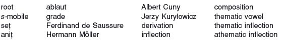

<!-- source-xhtml: 9781405188968_004.xhtml -->

# Chapter 4. Proto-Indo-European Morphology: Introduction

## The Root and Indo-European Morphophonemics

**4.1.** Morphology is the study of the rules governing word-formation and inflection; the term also refers to the set of rules themselves in a given language. Words consist of one or more *morphemes*, the smallest meaningful units in a language. Morphemes can be whole words (e.g. Eng. *bed*, *succotash*, *sarsaparilla*) or parts of words such as affixes (e.g. the Eng. prefix *un-* and suffix *-ed*). In many languages, some morphemes can appear in different forms called *allomorphs* depending on their phonetic or morphological context (e.g. the Eng. prefix *in-* ‘not’ can appear as *in-*, *im-*, *il-*, *ir-*, as in *in-credible*, *im-perfect*, *il-logical*, *ir-replaceable*). The *morphophonemics* of a language is the set of rules determining the distribution of allomorphs.

A *root* is a morpheme from which semantically related words can be derived. The root itself does not usually exist as an independent form, but carries the semantic core of any word derived from it. In English, for example, the words *commit*, *emit*, *transmit*, *remission*, and *missive* are all derived from a root *mit* (borrowed from Latin) that conveys the basic meaning ‘send’. When reconstructing the vocabulary of PIE, typically it is roots that are reconstructed in the first instance (see below, §4.11, for more on this). Since they did not stand alone, they are conventionally cited with an added hyphen (e.g. **sed-* ‘sit’), indicating that suffixes had to be added to form free-standing words. Besides the attachment of suffixes (and sometimes, but more rarely, prefixes and infixes – affixes added into the middle of a root), word-formation in PIE often required modification of the shape of the root itself, in ways to be discussed further below.

Unlike sounds, morphemes do not necessarily change in an exceptionless and regular way over time. Changes may sometimes affect whole morphological systems, but very commonly they affect only individual words, as when the old irregular plural *kine* was replaced by the regular plural *cows* in English. Changes that affect individual words are by their nature sporadic, the results of such processes as analogy, paradigm leveling, and folk-etymology.

As with the discovery of the sounds of PIE, the determination of its morphemes and morphology was a long process, and is still going on today. The theory of ablaut (see below), in particular, took many decades to establish because of difficulties in reconstructing the PIE vowels. A guiding principle in historical morphology is that one should reconstruct morphology based on the *irregular* and *exceptional* forms, for these are most likely to be archaic and to preserve older patterns. Regular or predictable forms (like the Eng. 3rd singular present *takes* or the past tense *thawed*) are generated using the productive morphological rules of the language, and have no claim to being old; but irregular forms (like Eng. *is, sang*) must be memorized, generation after generation, and have a much greater chance of harking back to an earlier stage of a language’s history. (The forms *is* and *sang*, in fact, directly continue forms in PIE itself.)

## The Root

### *Canonical shape of the root*

**4.2.** Every language has a particular “feel,” a characteristic cut to its jib, that stems from phonological properties shared by the words in the language. These properties are a product of the language’s phonological inventory, of its rules regarding combinations of sounds (called *phonotactic* rules), and of the basic structure of its morphemes.

The structure of most PIE roots can be boiled down to a single template, **CeC-,* where *C* stands for any consonant and *e* is the fundamental vowel (on which more below). This template could be modified in certain ways, especially by adding consonants either at the beginning or the end to form consonant clusters. Most commonly, a resonant could occur on either side of the vowel, resulting in roots of the shape **CReC-*, **CeRC-*, and **CReRC-*. (Both *i* and *u* can function as resonants following the *e*; recall §3.14.)

The following are some examples of PIE roots, arranged by structure (remember that voiced aspirates such as *bh* count as single consonants):

| Column 1 | Column 2 |
| --- | --- |
| **CeC-* | **pet-* ‘fly’, **ped-* ‘foot’, **dhegʷh-* ‘burn’ (remember that *dh* and *gʷh* are single consonants), **seu-* ‘press out juice’, **bel-* ‘strength’, **h₁es-*‘be’, **deh₃-* ‘give’, **u̯es-* ‘buy, sell’, **legh-* ‘lie down’, **sem-* ‘one’ |
| **CReC-* | **dhu̯er-* ‘door’, **sneh₂-* ‘sew’, **ti̯egʷ-* ‘revere’, **su̯ep-* ‘sleep’, **smei-* ‘smile’, **g̑neh₃-* ‘know’, **k̑leu-* ‘hear’, **sreu-* ‘flow’ |
| **CeRC-* | **dheig̑h-* ‘shape with the hands’, **derk̑-* ‘see’, **melg̑-* ‘wipe’, **meldh-*‘speak solemnly’, **g̑embh-* ‘bite’, **h₃erbh-* ‘change social status’, **neh₃t-* ‘buttocks’ |
| **CReRC-* | **ghrendh-* ‘grind’, **kreuh₂-* ‘gore’, **su̯eh₂d-* ‘sweet’, **mleuh₂-* ‘speak’ |

**4.3.** Roots could also have any of the basic structures above preceded by *s*. Some examples include **spek̑-* ‘see’, **steg-* ‘cover’, **sneigʷh-* ‘snow’, and **strenk-* ‘tight’. A curious fact about such roots is that they sometimes appear without the initial *s-*, for reasons still not understood; these are called ***s-*****mobile** roots. An example is the root **spek̑-* just mentioned: the *s-* is present in such forms as Av. *spasiieiti* ‘looks at’ and Lat. *speciō* ‘I look at’, but absent in Ved. *páśyati* ‘sees’. Similarly, from **steg-* we have on the one hand Gk. *stégō* ‘I cover’, but on the other Lat. *toga* ‘toga’ (< *‘covering’). The phenomenon was sporadic even within one and the same language: alongside the *s-*less Vedic form *páśyati* above, there is a causative form that has the *s-*, *spāśáyate* ‘makes seen, shows’, as well as a derived noun *spáś-* ‘spy’. Such roots are often written with the *s* in parentheses: **(s)pek̑-*, **(s)teg-*.

As will be recalled from forms like **tk̑ei-* ‘settle’ and **pter-* ‘wing’ in §3.23, and by the existence of word-initial “thorn” clusters (§3.25), a few roots began with a cluster consisting of two stops.

### *Roots with laryngeals*

**4.4.** Many roots, when first reconstructed in the nineteenth century, were seen to have a shape that did not adhere to the canonical structure. These mostly fell into two categories: vowel-initial roots, such as **ant-* ‘front’ and **od-* ‘smell’, and the so-called “long-vowel” roots ending in a long vowel, like **dhē-* ‘put’, **pā-* ‘protect’, and **dō-* ‘give’. Thanks to the laryngeal theory, however, all these can be shown to be of the normal type. The vowel-initial roots originally began with a laryngeal that colored the adjacent vowel and later disappeared; thus **ant-* and **od-* were once **h₂ent-* (type **CeRC-*) and **h₃ed-* (**CeC-*). The long-vowel roots once ended with a laryngeal that also disappeared, but with coloring and compensatory lengthening; thus **dhē-*, **pā-*, and **dō-* were originally **dheh₁-*, **peh₂-*, and **deh₃-*, all of them thus also of the **CeC-* type.

**4.5.** While this sort of laryngeal “rewriting” can be done purely for theoretical purposes (out of the wish to reconstruct an internally consistent system), in many of these cases there is direct evidence to back it up. We saw in §§3.19–20 how the laryngeals in **h₂ent-* and **peh₂-* (traditionally **ant-* and **pā-*) are preserved in Hittite as ḫ in the words *ḫant-* ‘front, forehead’ and *paḫ-š-* (with a suffix) ‘protect’. More difficulty is posed by roots traditionally reconstructed as beginning with *e-*, such as **es-* ‘be’; this can be recast as **h₁es-*, but since **h₁* disappeared before a vowel everywhere (including Anatolian), evidence for the laryngeal here must come from indirect evidence. Such indirect evidence does in fact exist for many of these roots (an example is left for the exercises). Specialists differ on whether to rewrite all traditionally vowel-initial roots in this way when direct evidence of a laryngeal is lacking; the tendency is to add the laryngeal regardless, for the sake of structural uniformity.

**4.6.** A further class of roots, mostly beginning with a resonant in traditional reconstructions, have descendant forms with an initial vowel before the resonant in Greek and often Armenian and Phrygian (when there is evidence; not many remains of this language are preserved). Thus corresponding to Vedic Skt. *rudhirá-* ‘red’, *nár-* ‘man’, and *méh-* ‘urinate’ are Greek *eruthrós*, *aner-* (Armenian *ayr*, Phrygian *anar*), and *omeíkh-.* In earlier scholarship, the initial vowel was simply called “prothetic” – added on – and left unexplained. It has since been shown that these vowels in fact descended from laryngeals that had vocalized in Greek, Armenian, and Phrygian. For the three roots represented by these words, we now reconstruct **h₁reudh-*, **h₂ner-*, and **h₃meig̑h-*.

Independent evidence for the laryngeal in such roots (when the roots are not preserved in Anatolian) comes from certain compounds. Sanskrit has an adjective *sūnára-* ‘mighty, fortunate’, literally ‘having good heroes’ or ‘good in manliness’; it is a compound of the prefix *su-* ‘good’ and the stem *nár-* that we just saw. The *u* of the prefix is normally short, and its length in *sūnára-* can only be explained by the laryngeal beginning the word for ‘man’: the sequence **su-h₂ner-* became **sūner-*after laryngeal loss with compensatory lengthening.

### *Structure of roots with laryngeals*

**4.7.** The bulk of roots with laryngeals fall into the three types just introduced – **CeH-*, **HeC-*, and **HReC*. The mirror image of the last type, **CeRH*, is also common, as in **u̯emh₁-* ‘vomit’, **terh₂-* ‘cross over, overcome’, and **kelh₂-* ‘cry out’. Less commonly, the laryngeal neighbored a stop, as in **h₃bhel-* ‘be of use’ and **pleth₂-* ‘broad’. In all these cases, the laryngeal was either the first or last consonant of the root. Some roots contained a laryngeal before the final consonant, like **dheh₁s-* ‘sacred’ and **neh₃t-* ‘buttocks’.

Roots ending in a laryngeal are often called **se**ṭ roots (pronounced like Eng. *sate*), a term from traditional Sanskrit grammar, and those without such a laryngeal are called **ani**ṭ. The terms *seṭ* and *aniṭ* mean ‘with *i*’ and ‘without *i*’, referring to the *i* that is the Sanskrit reflex of a vocalized laryngeal (cp. §4.18; see also §10.36).

### *Roots with a as fundamental vowel*

**4.8.** A small but significant number of roots had *a* rather than *e* as the fundamental vowel. Examples include **mad-* ‘be drunk’, **nas-* ‘nose’, **sal-* ‘salt’, and **k̑as*- ‘gray’. For reasons that are debated, initial *k*- is particularly common in this class of roots, as in **kadh-* ‘protect’, **kamp-* ‘bend’, and **kan-* ‘sing’. As just discussed, many roots traditionally reconstructed with initial *a-*, such as **ag̑-* ‘drive’, are now usually thought to have begun originally with **h₂e-* (§4.4 above). For more on the behavior of these roots, see §4.17 below.

### *Root-structure constraints*

**4.9.** Certain classes of consonants rarely or never co-occur within a given PIE root. There are not many securely reconstructible roots containing two plain (unaspirated) voiced stops (type **bed-*) or a voiceless stop and a voiced aspirate (type **bhet-* or **tebh-*, although the second of these is commonly found if preceded by an *s*, so **stebh-*). The source of these constraints is unknown, although similar constraints are known from other language families. See also §3.10.

### *Root “extensions” and “enlargements”*

**4.10.** It is not uncommon for roots to appear with extra phonetic material (one or two sounds) added on to them, generally without any discernible change to the meaning of the root. These additional sounds are called “extensions” or “enlargements” (or “determinatives” in older literature). The root **(s)teu-* ‘push, hit, thrust’, for example, appears extended or enlarged as **(s)teu-k-*, **(s)teu-g-*, and **(s)teu-d-* (reflected respectively e.g. in Gk. *túkos* ‘hammer’, Eng. *stoke*, and Ved. *tudáti* ‘beats’). The source and function of these extensions are not known.

**4.11.** Although most of the reconstructed PIE lexicon is in the form of roots, we can also reconstruct many whole words. Most are derived from known roots, but some words, apparently belonging to a very ancient layer of IE vocabulary, cannot be (at least not uncontroversially), e.g., **seh₂u̯l̥* ‘sun’, **dhugh₂tēr* ‘daughter’, **gheluneh₂* ‘chin’, **agʷnos* ‘lamb’, and **u̯ortokos* ‘quail’. A few, like the word for ‘apple’, **abel-*, and the word for ‘ax’, **pelek̑us*, have a shape that seems un-Indo-European and are thought by some to be prehistoric borrowings from non-IE languages. Such proposals are not unreasonable but can rarely be evaluated. (The case of **pelek̑us* is instructive: it was long thought to be a borrowing from a Semitic source akin to Akkadian *pilakku(m)* or *pilaqqu(m)*, but the Akkadian word was later shown to mean ‘spindle’, not ‘ax’**!**)

## Ablaut

**4.12.** Since *e* was the fundamental vowel of most PIE roots (§4.2), this is the vowel conventionally used when citing a root; so an IE dictionary entry for the root meaning ‘sit’ would have the headword **sed-*. Under certain conditions, however, this *e* could be replaced by other vowels. Specifically, a root could appear instead with short *o* (**sod-*), long *e* (**sēd-*), long *o* (**sōd-*), or no vowel at all (**sd-*). Broadly, the choice of vowel was determined by the type of word derived from the root. Different verb tenses, for example, called for different vowels in the root, as did different nominal (noun) inflections.

These changes in the root vowel constitute the system of vocalic alternations called **ablaut** (also called apophony or vowel gradation). Ablaut was central to PIE morphology, and its effects are still with us today. Consider the English forms *sing sang sung song*: between the consonants *s-* and *-ng* a different vowel appears depending on whether the form is a present-tense verb, a past-tense verb, a past participle, or a derived verbal noun. The particular vowels of these words, in fact, are descended directly from ablauting vowels of PIE.

**4.13.** The different ablaut variants of a root are called **grades**, and are named according to the vowel that appears. The citation form of a root (with *e*) is said to be in the ***e-*****grade** or **full grade**, the basic ablaut grade. The other ablaut grades are the ***o-*****grade**, **lengthened** ***e-*****grade**, **lengthened** ***o-*****grade**, and – when no ablauting vowel appears at all – **zero-grade**.

To illustrate, consider all the ablaut grades of the root **sed-* ‘sit’ again, together with some of their descendant forms:

| Column 1 | Column 2 |
| --- | --- |
| *e-*grade (full grade) ********sed-***: | Lat. ***sed****-ēre* ‘to sit’, Gk. ***héd****-ra* ‘seat’, Eng. ***sit*** (*i* from earlier **e*) |
| *o-*grade ********sod-***: | Eng. ***sat*** (*a* from earlier **o*) |
| zero-grade ********sd-***: | **ni-****sd****-o-* ‘where [the bird] sits down = nest’ > Eng. *ne****st*** |
| lengthened *e-*grade ********s***ē***d*****-**: | Lat. ***s***ē***d****ēs* ‘seat’, Eng. ***seat*** |
| lengthened *o-*grade ********s***ō***d*****-**: | OE ***s***ō***t*** > Eng. *soot* (*‘accumulated stuff that sits on surfaces’) |

Roots were not the only morphemes that ablauted in PIE; many suffixes and inflectional endings also ablauted. As an example, we may list the guises taken by the stem of the Greek word for ‘father’, whose second syllable is an ablauting derivational suffix. The lengthened *e-*grade is seen in the nominative singular (subject case) *pa****t***ḗ***r*** ‘father’, the *e-*grade in the accusative singular (direct object case) *pa****tér****- a*, the zero-grade in the genitive (possessive) singular *pa****tr****-ós* ‘of a father’, and the ordinary and lengthened *o-*grades in a compound adjective with nominative singular *eu-pá****t***ō***r*** ‘having a good father, noble’ and accusative singular *eu-pá****tor****-a*.

**4.14.** While theoretically any root of the normal type could appear in any ablaut grade, in practice this was not the case. Certain roots seem to have favored certain grades, sometimes appearing in one to the exclusion of all others. The root **h₂kous-* ‘hear’ (Gk. *akoúō* ‘I hear’, Goth. *hausjan* ‘to hear’, Eng. *hear*), for example, appeared only in the *o-*grade, as did the adjective **bhos-o-* ‘naked’ (Eng. *bare*) and the noun **u̯obhs-eh₂* ‘wasp’ (Avestan *vaβža-ka-*, Eng. *wasp*). Similarly, **bhuH-* ‘grow, be’ (Lat. *fu-tūrus* ‘about to be’, Eng. *be*) probably existed only in the zero-grade in PIE. Some roots may never have made lengthened-grade forms, while others seem to have had a certain propensity for them. Thus ablaut grades were not solely determined by the type of derivative formed from the root, but were also determined lexically.

No ablaut grade is limited to any part of speech or other morphological category, and the same morphological category may require different grades for different inflectional forms within that category (as with the nominative, accusative, and genitive of the noun for ‘father’ in the Greek example cited in §4.13 above). We therefore cannot confidently ascribe any particular meaning or semantic content to any of the ablaut grades.

### *Formation of the zero-grade*

**4.15.** The zero-grade deserves some special comments because the deletion of the ablauting vowel often had effects on the syllabification of neighboring resonants in a root. In roots with a resonant directly before or after the ablauting vowel, the resonant would typically become syllabic or vocalized in the zero-grade. Thus the roots **g̑hel-* ‘yellow’, **k̑ens-* ‘proclaim solemnly’, and **k̑emh₂-* ‘become tired’ had zero-grades **g̑hl̥-*, **k̑n̥s-*, and **k̑m̥h₂-*; and **meg̑h₂-* ‘big’ and **nes-* ‘we’ had zero-grades **m̥g̑h₂-* and **n̥s-*. (Most examples of syllabic resonants in PIE, in fact, occur in zero-grades.) In roots with a glide before the ablauting vowel, the glide became the corresponding high vowel (as per §3.14) in the zero-grade: thus **i̯es-* ‘boil’ and **su̯ep-* ‘sleep’ had zero-grades **is-* and **sup-*. (Note that a resonant preceding a diphthong stays non-syllabic in the root’s zero-grade: thus the zero-grade of **t****r****ei-* ‘three’ and **k̑u̯eit-* ‘white’ were **t****r****i*- and **k̑u̯it-*.) Laryngeals would become vocalized: the zero-grade of **dheh₁s-* ‘sacred’ was **dhh₁s-* with a vocalized (syllabic) **h̥₁* (recall §3.17).

### *Origin of ablaut*

**4.16.** At the time of the breakup of PIE, ablaut was a morphologically conditioned process; but some of the grades may have originally come about through sound change. (In the histories of numerous languages, speakers have reinterpreted a phonological rule or result of a sound change as a morphological rule.) Most zero-grades are in unaccented syllables, which makes it likely that the zero-grade arose by vowel loss (syncope) in unaccented syllables. However, it should be noted that if this is true, it happened well before the stage of PIE accessible by reconstruction, since we can reconstruct some forms with accented zero-grade (such as **u̯ĺ̥kʷos* ‘wolf’ and **h₂ŕ̥tk̑os* ‘bear’) or consisting only of zero-grades (e.g. **suHnus* ‘son’). Accounts of the origin of the other grades are more speculative and will not be discussed here.

### *Ablaut of roots with root-vowel* a

**4.17.** Although the evidence is sparse, it appears that roots with *a* as fundamental vowel also ablauted. The root **sal-* ‘salt’ had a zero-grade **sl̥-*, which underlies English *silt* and German *Sülze* ‘pickled meat in aspic’; the root **nas-* ‘nose’ has lengthened-grade derivatives such as Latin *nār-ēs* ‘the nostrils’ and English *nose*, both from **nās-*; and the root **laku-* ‘body of water’ (Lat. *lacus* ‘lake’, Gk. *lákkos* ‘pond’) had an *o*-grade form **loku-* that became Scottish Gaelic *loch* ‘lake’. The view that roots in *a* ablauted is not universally accepted, but these forms are difficult to explain otherwise.

### *Ablaut and the laryngeal theory*

**4.18.** Ablaut was the key to deducing the existence of the laryngeals, an insight that we owe to the nineteenth-century Swiss linguist Ferdinand de Saussure. His reasoning bears relating; it is a brilliant example of straightforward but also very bold scientific thinking.

Sanskrit has a class of verbs (the seventh class) that contain a morpheme *-na-* infixed (i.e., inserted) into the root in the present tense, such as *yunakti* ‘(s)he joins’ (the *-ti* is the ending for the 3rd person singular). It has another class (the ninth class) of verbs whose presents are formed with a suffix *-nā-*, such as *punāti* ‘cleanses’. These classes differ systematically in the way they inflect in different morphological categories, as exemplified below:

| Column 1 | Column 2 | Column 3 |
| --- | --- | --- |
| present tense | future | infinitive |
| yunakti ‘joins’punāti ‘cleanses’ | yokṣyati ‘will join’paviṣyati ‘will cleanse’ | yoktum ‘to join’pavitum ‘to cleanse’ |

If we remove what we know are infixes and suffixes from the first set, we get

yuk yok yok

– that is, zero-grade of the root in the first column and full grade in the other two (the *o* in Sanskrit goes back to PIE **eu*). This pattern was known also from other types of verbs.

Now the forms for the verb ‘cleanse’ behave oddly by comparison. The present seems to have a suffix *-nā-* before the endings rather than an infix *-na-* plus root-final consonant plus endings. In the other forms, *pav-* can go back to a full grade (it would continue PIE **peu̯-*), but the *-i-* added after it did not make *pavi-* look like a root form. But Saussure noticed that, at a more abstract level, the forms for ‘cleanse’ behaved identically to the forms for ‘join’. In *yu-na-k-ti yo-k-ṣyati yo-k-tum* there was an element *-k-* before the endings; in *pav-i-ṣyati pav-i-tum* there was also an element, *-i-*, before the endings, and in *pu-nā-ti* one could think of the length of the vowel as an extra element too. Saussure reasoned that at some level, both verbs were formed in the same way, and that what seemed to be a *nā-*suffix in *punāti* was really the same *na-*infix seen in *yunakti*, plus something. He imagined there had been some segment – call it X – that had been the final consonant of the root for ‘cleanse’ and that had lengthened the infix *-na-* to *-nā-*, and had also become *-i-* between the consonants *v* and *ṣ*, and *v* and *t*, in the other two forms. Thus he reconstructed

| Column 1 | Column 2 | Column 3 |
| --- | --- | --- |
| *pu-na-X-ti | *peu̯X-syati | *peu̯X-tum |
| exactly parallel to |  |  |
| *yu-na-k-ti | *yeuk-syati | *yeuk-tum |

In this way, it was revealed that the Sanskrit *nā*-class was exactly the same as the class formed with the infix *-na-*.

**4.19.** On the basis of this and many other pieces of evidence, Saussure deduced the existence of the laryngeals. He claimed there were two of them, and proposed that they patterned like resonants in having syllabic reflexes when between consonants (or sounds that could be consonantal, like the *u* in **peuX-syati*). Hermann Möller, one of the few people to pick up his theory at the time and develop it further, expanded the number to three in 1879; he was joined by a third scholar, Albert Cuny, at the close of the nineteenth century. Möller’s and Cuny’s ideas are quite close to those standardly accepted today.

But it was not until 1927, a good half-century after Saussure’s proposals, that real vindication of the whole theory came. In that year, the young Polish linguist Jerzy Kuryłowicz published his discovery that the sound ḫ in the newly deciphered language Hittite appeared in many of the places that Saussure had predicted these mystery segments should have existed in PIE.

Saussure was at the ripe old age of 19 or 20 when he developed these ideas; he published his findings at age 21. What was new in his method was the application of the technique of internal reconstruction *to reconstructed PIE itself*, at the time a very radical thing to do – especially if it resulted in the positing of a set of consonants that had not survived as consonants into recorded history (as far as was then known). His starting point was the supposition that superficially different formations belonging to the same morphological categories had once been formed identically. Unfortunately, he did not live to see Kuryłowicz’s work.

## Morphological Categories of PIE

### *Word structure*

**4.20.** The process of forming a word from a root or another word is called **derivation**, while the process of creating different grammatical forms of a given word is **inflection**. In English, prefixes like *anti-*, *con-*, *fore-*, and *hyper-*, and suffixes like *-ance*, *-ity*, *-ly*, and *-ness* are derivational morphemes; they are used to create new words. By contrast, suffixes like the plural *-(e)s* or the comparative suffix *-er* for adjectives are inflectional morphemes; adding them does not produce a new word, but just a different grammatical form of an already existing word.

Typically, a word in PIE consisted of three morphemes, root plus suffix plus ending, symbolized as *R* + *S* + *E*. (Prefixes and compounds will be treated below.) The suffix was a derivational morpheme, such as one used to form a present-tense stem or an abstract noun from a verbal root. (We know of one derivational *infix* that was inserted into the root, which we saw a preview of above in §4.18.) The ending (also called the *desinence*) was the inflection, which marked the grammatical function of the word (such as the nominative singular of a noun, or the 3rd person plural of a verb). All three of these elements could and did ablaut. To take an example, the word **mn̥-téi-s* ‘of thought’ consisted of the root **men-* ‘think’ in the zero*-*grade, followed by an ablauting suffix **-t(e)i-* (here in the full grade) that was used to form abstract nouns (§6.42), in turn followed by the inflectional ending **-s* of the genitive case (meaning ‘of’) in the zero-grade.

The suffix did not always appear overtly, in which case one sometimes speaks of *zero-suffixes.* For example, the form **dem-s* meant ‘of the house’ and consisted of the root **dem-* ‘to build’ in the *e-*grade plus the inflectional ending of the genitive singular, without an overt derivational suffix. Words could in fact be derived from one another simply by changing the ablaut or the position of the stress (or both) – a process known as *internal derivation*, much like *song* is derived from the verb *sing*. Internal derivation will be discussed in more detail in chapter 6.

Words could also be formed by **composition**, which includes prefixation and compounding. Not many PIE prefixes have been reconstructed, but one prefixal process known as **reduplication** was very common. In reduplication, a prefix was constructed consisting of a copy of the first consonant or consonant cluster of a root plus a vowel. Thus **de-deh₃-* and **g̑i-g̑n̥h₁-* are reduplicated forms of the roots **deh₃-* ‘give’ and **g̑enh₁-* ‘beget’, respectively. Compounding was most frequently seen in nouns and adjectives, but also occasionally in verbs; it will be discussed in the noun and verb chapters.

**4.21.** PIE was a richly inflected language. It possessed full sets of singular, dual, and plural endings in all three persons of the verb in several tenses, and at least eight (and possibly nine) cases in the noun, with somewhat less differentiation of cases in the dual and plural than in the singular. Adjectives and pronouns were fully inflected like nouns, as were the first four cardinal numerals. The functions of the case-endings of the noun, the personal endings of the verb, and the other verbal grammatical categories such as tense, voice, and mood, will be explained in detail in the two chapters to follow.

### *Thematic and athematic inflection*

**4.22.** PIE nouns, adjectives, and verbs can be divided into two basic groups based on their inflectional patterns: those that had an ablauting short vowel, *e* or *o* (in shorthand, -*e/o-*), directly before the inflectional endings (the case-endings in nouns or adjectives, the personal endings in verbs), and those with no such vowel. This ablauting vowel is called the **thematic vowel**; words that inflect with it are termed **thematic**, and those inflecting without it are **athematic**.

For example, the Greek word *klṓps* ‘thief’ consists of the Greek (and IE) root *klep-* (in the lengthened *o-*grade) followed directly by the inflectional ending *-s*, which marks the nominative singular (or subject case). *Klṓps* is therefore an athematic nominative singular. By contrast, the Greek noun *nómos* ‘law, custom’ has the vowel *-o-* between the root (*nom-*, *o-*grade of *nem-*) and the ending. *Nómos* is therefore a thematic nominative singular.

**4.23.** Athematic declensions and conjugations are on the whole more complex than their thematic counterparts. Within athematic paradigms, there are alternations in ablaut and changes in the position of the accent; these will be fully discussed in the next two chapters. Athematic inflection appears to belong to a more ancient layer of IE nominal and verbal derivation than thematic inflection, and many athematic formations are moribund by the time they are attested, even in languages as archaic as Vedic Sanskrit. In the observable course of the histories of the older IE languages, thematic paradigms as a rule are outstripping and replacing athematic ones, giving thematic formations the appearance of young upstarts taking over the field. For example, the athematic Greek verb *seũ-tai* ‘is hunted, chased’, found only in Homer and some other early Greek poetry, was remade as – and replaced by – a thematic verb *seú-e-tai*. Similarly, prehistoric Greek had an athematic noun with stem **thes-* meaning ‘god’; as a free-standing noun it was replaced by the thematic stem **thes-o-*, eventually becoming (after sound changes) Classical Greek *theós*. The older athematic stem survived only as a frozen member of compounds like *thés-phatos* ‘decreed by god’. Thematic paradigms, unlike athematic ones, did not exhibit internal shifts in accent or alternations in ablaut grade and were thus arguably simpler for speakers to handle, which may partly explain their spread. The full reasons, however, are surely more complicated, as “simplicity” is a subjective and notoriously misleading yardstick in historical linguistics.

**4.24.** We are lucky to have a wealth of good comparative material on which to base our reconstructions of PIE morphology. The precise agreements among the ancient languages in nominal and verbal derivation and inflection are at times astounding, and leave little room for doubt about a great many aspects of the PIE morphological system. Many other aspects, however, are still the subject of controversy, and claims about them are more tentative. The next three chapters will provide an overview of the standard reconstruction of the PIE verbal, nominal, and pronominal systems, and the comparative evidence upon which it is based. Usually, only a selection of comparative data will be adduced in support of a given reconstruction so as not to swell the sizes of these chapters unmanageably; but where that would have sacrificed clarity or blunted the understanding of an important issue, it was thought better to give more information rather than less.

The material in the next few chapters is at any rate rather extensive, and is not meant to be learned all at once. Some of it is included primarily for reference. If it appears bewildering, the exercises can be used for orientation, since they focus on the most important points to be digested. As chapters 9 and following are worked through, with their sections on historical morphology, additional material from chapters 5–7 can be drawn in.

## For Further Reading

Most studies in the realm of PIE morphology are devoted to specific aspects of it, such as noun or verb formation; references to such studies are given in the following chapters. No good general works on root structure or ablaut are found in English. For those who read French, influential is Chapter IX of Benveniste 1935 on root structure and root “enlargements.” Kuryłowicz 1956, a highly complex work, will be impenetrable to introductory students, but is an important and famous treatment of ablaut. Ferdinand de Saussure’s pioneering work on laryngeals was published as Saussure 1879, and Kuryłowicz’s vindication can be read in Kuryłowicz 1927. Note also Anttila 1969, which concerns roots that show both *CReC* and *CeRC* forms and various related ablaut issues.

## For Review

Know the meaning or significance of the following:

## Exercises

1. Recalling §3.23, indicate which of the following would be well-formed PIE roots:

  - **a** **streibh-*

  - **b** **rdeu-*

  - **c** **bhal-*

  - **d** **h₂seup-*

  - **e** **nregh-*

2. Which of the following would violate the root-structure constraints in §4.9?

  - **a** **kebh-*

  - **b** **skebh-*

  - **c** **kep-*

  - **d** **gep-*

  - **e** **beg-*

3. The following are some reconstructed roots in the full grade. Provide the zero-grade and the lengthened *o-*grade.

  - **a** **g̑heu-* ‘pour’

  - **b** **h₃ekʷ-* ‘see’

  - **c** **k̑u̯en-* ‘holy’

  - **d** **skel-* ‘dry out’

  - **e** **bherg̑h-* ‘bright’

  - **f** **keh₂d-* ‘care’

  - **g** **i̯es-* ‘boil’

  - **h** **dheb-* ‘thick’

  - **i** **pleh₁-* ‘fill’

  - **j** **g̑embh-* ‘bite’

  - **k** **sengʷh-* ‘sing’

  - **l** **h₁reudh-* ‘red’

4. For each of the roots in **3**, indicate what basic type they belong to (**CeC, *CReC, *CeRC,* etc.). Ignore initial *s-* in consonant clusters.

5. Identify the ablaut grade that the following root forms appear in:

  - **a** **sōd-* ‘sit’

  - **b** **mr̥-* ‘waste away’

  - **c** **u̯oid-* ‘see’

  - **d** **stēu-* ‘praise’

  - **e** **g̑hel-* ‘yellow’

  - **f** **dik̑-* ‘point’

6. The Latin cognate of English *foam* is *spūma*. Explain the *f-/sp-* correspondence using material from this chapter as well as §3.4.

7. The following are older, “pre-laryngealistic” reconstructions of roots that are nowadays considered to have contained a laryngeal and the root vowel *e*. Rewrite the reconstructions using laryngeals.

  - **a** **kā-* ‘love’

  - **b** **ank-* ‘bend’

  - **c** **snē-* ‘spin, sew’

  - **d** **u̯ēr-* ‘water’

  - **e** **okʷ-* ‘see’

  - **f** **bhlāg-* ‘strike’

8. It was noted in §4.5 that the root for ‘be’ in PIE was **h₁es-*.

  - **a** Give its zero-grade.

  - **b** Vedic Sanskrit has a prefix *a-* ‘not, un-’ and the present participle of the verb ‘to be’ is *sat-* ‘being’. Given that the *a* in both these forms comes from PIE **n̥*, and the present participle was formed from the zero-grade of the root, what would the PIE ancestors of *a-* and *sat-* have been?

  - **c** Vedic Skt. has a word *ā́sat-* ‘monster’, a compound of *a*- and *sat-* above. Provide a historical explanation for why the first *a* is long rather than short.

9. For each of the following English words, identify the morphemes, and specify which are derivational and which are inflectional.

  - **a** *capitalizes*

  - **b** *happier*

  - **c** *carrier*

  - **d** *angriest*

  - **e** *superpowers*

  - **f** *unbending*

  - **g** *disproportionate*

  - **h** *recklessness*

  - **i** *insurmountably*

10. The following are reconstructed words in PIE. Each consists of several morphemes, separated from each other by hyphens. One of the morphemes is a form of a root. Using your knowledge of ablaut and root structure, identify the root that the word is derived from, in the *e-*grade. Assume that long vowels are not induced by laryngeals.

  - Example: In **bhe-bhoid-e* ‘(s)he has split’, the underlying root must be **bheid-* (*bhe-* and *-e* cannot be forms of roots because of their structure).

  - **a** *n̥*-dhgʷhi-to-m* ‘imperishable’

  - **b** *i̯*e*u̯*-o-s* ‘grain’

  - **c** **dor-u* ‘wood’

  - **d** *u̯*id-me* ‘we know’

  - **e** **gʷh*n̥*-t-os*i̯*o* ‘of the slain one’

  - **f** *u̯ō*t-eno-s* ‘enraged’

  - **g** **de-dor*k̑*-e* ‘(s)he has seen’

11. Identify the following forms as thematic or athematic. Each morpheme is separated by a hyphen.

  - **a** **bher-e-si* ‘you carry’

  - **b** *k̑*un-és* ‘of the dog’

  - **c** **m*n̥*-téi-s* ‘of thought’

  - **d** *u̯*iHr-o-s* ‘man, hero’

  - **e** **e-steh₂-t* ‘(s)he stood’

  - **f** **kʷel-o-nti* ‘they turn’
