<!-- source-xhtml: 9781405188968_005.xhtml -->

# Chapter 5. The Verb

## The Structure of the PIE Verb

**5.1.** Verbs in PIE and in most of the ancient IE daughter languages were inflected in dozens of forms. In this they were vastly different from Modern English verbs, barely any of which has more than five forms (e.g. *sing sings singing sang sung*). As stated in the preceding chapter, the grammatical categories that were distinguished in PIE verb inflection are **person** (first, second, and third), **number** (singular, dual, and plural), **tense**, **voice**, and **mood**. (On verbal aspect, see §5.10 below.)

### *Tense*

**5.2.** Verbs in PIE could inflect in the **present** tense (‘I go, am going’), the **imperfect** tense (‘I was going’, expressing ongoing or background action in past time), and the **aorist** tense (‘I went’, expressing one-time or completed action in past time). Traditional scholarship also recognizes a fourth tense, the **perfect**, but this is now viewed as a stative (see §5.53 below) that secondarily acquired use as a resultative past tense: ‘I am in a state of having gone, I have gone’. There was probably also a **pluperfect**, a past of the perfect, though this is debated. Some further believe that PIE had a **future** (see §§5.39ff. below). Each of these tenses could distinguish various voices and moods (more limitedly, it appears, in the perfect), which are discussed in §§5.54ff.

**5.3.** The actual forms of the tenses and moods were made from **tense-stems**, of which there were three: the **present stem**, **aorist stem**, and **perfect stem**. There do not appear to have been conjugational classes in PIE as there were in, say, Latin. Rather, in one group of verbs, called **primary verbs**, the tense-stems were formed directly from the root. In another group, called **derived verbs**, the tense-stems were created secondarily by means of productive suffixes to express particular types of action or shades of meaning. These verbs included causatives, iteratives, desideratives, and denominatives, all of which will be discussed in due course.

Not every verb could form all three tense-stems. Quite a few did not form perfects, for example, and derived verbs only had present stems in PIE. (The daughter languages have often independently innovated additional tense-stems for these verbs.) A few verbs exhibited *suppletion*, meaning they had different tense-stems formed from different roots. Examples of suppletive paradigms in English are *go/went* and *be/is/were*.

### *Voice*

**5.4.** The voice (also called *diathesis*) of a verb indicates the role that the subject plays in the action. Two voices were distinguished in verbal inflection, **active** and **middle**. (On the passive, see below.) The difference in meaning between these two voices in PIE is not fully clear. In traditional grammatical usage, active means that the subject is doing the action rather than being acted upon, while middle means the subject is either acting upon itself or is in some other way “internal” to the action.

This rough guideline works reasonably well for verbs that could inflect in either voice. We can illustrate this with some active/middle verb pairs in Hittite. Sometimes the middle meant the same as the active but differed in not taking a direct object; in other words, the middle could express the intransitive of a transitive active, e.g. transitive active *irḫāizzi* ‘sets an end to’, intransitive middle *irḫāitta* ‘comes to an end’. Second, the middle could express the reflexive sense of the active, where the subject acts on itself, e.g. active *nāi* ‘leads’, middle *neyari* ‘leads oneself, turns (oneself) to’. Finally, the middle could have a reciprocal sense, e.g. active *zaḫḫiyaweni* ‘we fight (someone)’, middle *zaḫḫiyawaštati* ‘we fight each other’. These uses of the middle are comparable to the reflexive in modern Romance, Slavic, and German, e.g. German *sich wenden* ‘turn (oneself) to’, *sich streiten* ‘argue (with one another)’.

**5.5.** But in many other cases, the distinction between active and middle inflection was purely a formal one: there were some verbs that inflected only in the active and others only in the middle, without clear difference in meaning. Verbs having only middle inflection are often called **middle verbs**. (Students familiar with Latin can think of these as equivalent to the Latin deponent verbs – active in meaning but having only passive endings, which come historically from the PIE middle.) It is not fully clear whether their middle inflection stemmed from some aspect of their meaning, or whether it was purely arbitrary. On the one hand, as a group these verbs do tend to express various “internal” or intransitive notions like spatial movement, position of rest, emotions, sensory perception, speaking, giving off sound or light, and changes of state. (In technical terms, these are mostly “unaccusative” verbs.) However, active verbs could also express such notions. Compare the representative list of middle verbs in the left-hand column below with the active verbs on the right; the meanings are unaccusative in both cases, sometimes identical:

| Column 1 | Column 2 |
| --- | --- |
| *Middle* | *Active* |
| Hittite *iyattari* ‘goes’ | Greek *eĩsi* ‘goes’ |
| Vedic Sanskrit *śáye* ‘lies’ | Vedic Sanskrit *sī́dati* ‘sits’ |
| Latin *uerētur* ‘fears’ | Greek *khaírei* ‘rejoices’ |
| Greek *dérketai* ‘sees’ | Latin *audit* ‘hears’ |
| Greek *eúkhetai* ‘proclaims’ | Hittite *memai* ‘says’ |
| Latin *moritur* ‘dies’ | Hittite *ḫarakzi* ‘dies’ |

**5.6.** Further complicating our understanding of the middle is that some verbal roots had active inflection in one tense or mood, but middle in another. For instance, the Greek verb ‘learn’ has an active present *manthánō* ‘I learn’ but a middle future *mathḗsomai* ‘I will learn’; this is a common pattern. The Old Irish verb *ad-cíu* ‘I see’ was active in the present indicative but middle in the present subjunctive (*ad-cear*); and the Tocharian A active present indicative *yäṣ* ‘goes’ has a middle present participle *ymāṃ* ‘going’. (Again for students who know Latin, the Latin “semi-deponent” verbs, such as present [active] *audeō* ‘I dare’, perfect [passive] *ausus sum* ‘I have dared’, are comparable.)

**5.7.** The middle could also express the **passive** voice, which indicates that the subject is acted upon by someone else: ‘is being fought’, ‘was washed’. A tradition of scholarship rejects positing a passive voice for PIE because there was no separate set of passive endings. But all the daughter languages that have a separate passive conjugation have developed it in whole or in part from the PIE middle endings, and it seems best to regard the middle as having been, in fact, a *mediopassive* or *middle-passive* – capable of expressing either voice depending on the context.

### *Mood*

**5.8.** The mood in which a verb appears expresses the speaker’s attitude or stance taken towards the action – whether (s)he is asserting that it is factual, or indicating a wish that it were or were not true, or reporting the action second-hand, or indicating a contrafactual condition. PIE possessed four moods: indicative, imperative, subjunctive, and optative.

**5.9.** All the daughter languages agree that the **indicative** was used to express matters of fact, and the **imperative** was used for issuing commands. The function of the **subjunctive** in PIE is less clear, but it was probably at least in part a future tense; see §5.56 for a full discussion. Finally, the **optative** was used to express wishes and various other non-factual modalities.

### *Aspect*

**5.10.** Aspect is a grammatical category that refers to the type of action indicated by a verb. Actions can be done once or repeatedly, to completion or not, or be ongoing with neither a true beginning nor end. It is on the whole unclear what the aspectual system of PIE was; in part the difficulty lies in figuring out the niceties of aspectual differences in the earliest texts in the daughter languages. For example, part of the opening of the famous Rig Vedic hymn 1.32 that was quoted in §2.41 reads: “I (will) tell now the manly deeds of Indra, the foremost of which he <u>did</u> bearing a cudgel. He <u>slew</u> the serpent, <u>drilled</u> through to the waters, (and) <u>split</u> the belly of the mountains.” The underlined verbs in the Sanskrit original are in the perfect, imperfect, perfect, and imperfect, respectively; yet any difference in aspectual sense eludes us.

According to the generally accepted view, the imperfect and aorist were distinct aspectually, the imperfect expressing incomplete or ongoing action in past time (imperfective aspect), the aorist indicating completed or punctual (one-time) action in past time (perfective aspect).

Since the lexical meanings of verbs can refer to momentary or to continuous actions or states, verbs also have a type of inherent aspect, a relationship to time that is independent of any particular usage in a sentence (i.e., independent of grammatical aspect). This lexically inherent aspect goes by its German technical name of **Aktionsart** (‘type of action’), and has figured prominently in various theories about the structure of the PIE verbal system, especially by the late Karl Hoffmann and his followers in Germany and internationally. To explain why different roots formed different kinds of presents and aorists, Hoffmann proposed that the choice was based on the verb’s Aktionsart. His basic idea was that if one adds personal endings to the plain root (i.e., without any additional derivational suffixes), the Aktionsart would determine whether the resultant formation was a present or an aorist: if the root had inherently durative Aktionsart, it would be a present (since durativity is imperfective, and the present is by nature imperfective); but if it had punctual Aktionsart, it would be an aorist (since inherent in the meaning was the completion of the act, i.e. perfectivity). The theory works well in some cases: for example, adding personal endings to **h₁ei*- ‘go’ and **h₁es*- ‘be’ makes a present, while doing so with **dheh₁*- ‘put’ and **deh₃*- ‘give’ makes an aorist. But there are also many exceptions requiring special explanations, and the matter continues to be researched.

## Personal Endings

**5.11.** The persons of the verb were expressed with suffixes called **personal endings**. A complete set consisted of nine forms, the three persons in each of three numbers (singular, dual, and plural). PIE had several sets of personal endings. The most fundamental distinction was among those of the active voice, middle voice, and the perfect. Additionally, for each of the two voices active and middle, non-past or **primary** endings and past or **secondary** endings were distinguished. The primary endings were used for the present tense and the subjunctive mood, while the secondary endings were used for the two past tenses (imperfect and aorist) and for the optative mood. In sum there were five sets of personal endings with the following distribution:

| Column 1 | Column 2 |
| --- | --- |
| *Personal endings* | *Where used* |
| primary active | present indicative active, active subjunctives |
| secondary active | imperfect and aorist indicative active, active optatives |
| primary middle | present indicative middle, middle subjunctives |
| secondary middle | imperfect and aorist indicative middle, middle optatives |
| perfect | perfect |

(In Indo-Iranian, the subjunctive can also take secondary endings; see §5.55.) As an illustration, consider the following 3rd singular forms of the PIE verb ‘turn’: present indicative active **kʷele-****ti*** (primary active ending), imperfect indicative active **kʷele-****t*** (secondary active ending), present indicative middle **kʷele-****tor*** (primary middle ending), imperfect indicative middle **kʷele-****to*** (secondary middle ending), perfect **kʷekʷol-****e*** (perfect ending).

Not all of the endings can be reconstructed with equal certainty; the most secure are those of the singular and the 3rd person plural. We shall treat the active and middle personal endings first; the perfect endings will be discussed in §5.51.

### *Active endings*

**5.12.** Below is a selection of the comparative evidence used to reconstruct the PIE primary and secondary active endings, whose reconstructions are given in the right-hand column. In these and the following tables, only forms relevant for the reconstructions are given, and the information is by no means exhaustive.

Primary (non-past) active endings

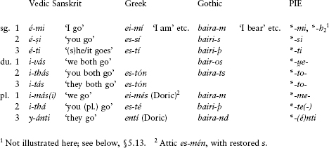

Secondary (past) active endings

Note: the Vedic and Greek forms are imperfects meaning ‘was/were carrying’; the Gothic forms are present optatives meaning ‘would carry’. The vowels *a-* and *e-* at the beginning of the Sanskrit and Greek forms are explained in §5.44.

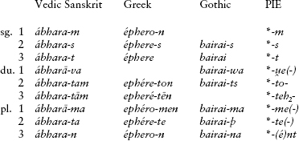

Notes on the active endings

**5.13.** As can be seen, the primary and secondary active endings differ partly with respect to whether an **-i* was added in PIE. This **-i*, which marks primary active endings, has been termed the **“hic et nunc” particle** (Latin for “here and now”); it may be the same as the *-i* found attached to a number of pronominal and adverbial forms in various daughter languages, as in Greek *nūn-í* ‘now’.

The reconstructions of the singular and the 3rd plural endings are uncontroversial. As for the other endings, the languages do not agree so precisely. For example, the daughter languages disagree whether the 1st dual, 2nd dual, and 1st plural primary endings ended in **-s* or **-n*. This disagreement even occurs between dialects of the same language, as seen in the first table above with Doric Gk. *ei-****més*** vs. Attic Gk. *es-****mén*** ‘we are’. There was also *e/o* ablaut in the 1st dual and plural, as reflected e.g. in the 1st plural by Gk. *-mes*, *-men* vs. Lat. *-mus* < **-mos*. To add yet one more complication, 2nd plurals and duals having a long vowel are found in Balto-Slavic and Germanic, e.g. Old High German *bintamēs* ‘we bind’ and Lith. reflexive *sùkotė-s* ‘you (pl.) turn (yourselves)’ (ė = long *e*). Some have concluded that PIE had long-vowel variants of these endings and have even sought to identify reflexes of them in other branches, but this is not certain.

The 1st singular primary ending **-mi* was originally proper only to athematic presents (§§5.20ff.), while *-*h₂* is the ending found in thematic presents (see §§5.28ff.) and in subjunctives (§5.55). Similarly, the 3rd plural endings **-(é)nti* and **-(é)nt* have the accented *é* only in athematic verbs.

### *Middle endings*

**5.14.** The middle endings are more difficult to reconstruct than the active. The first chart below contains present middles: Vedic Skt. *bharé* and Gk. *phéromai* ‘I carry (for myself), I gain’, Tocharian A *träṅkmār* ‘I say’ (with a 3rd dual from another verb in Tocharian B, *nes-teṃ* ‘both are’). The second chart contains the imperfect middles Vedic Skt. *ábhare* and Gk. *epherómēn* ‘I was carrying (for myself)’, and the Tocharian B preterite middle *kautāmai* ‘I was split’:

Primary (non-past) middle endings

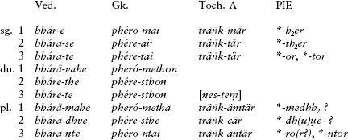

Secondary (past) middle endings

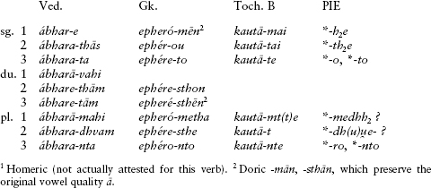

#### Reconstruction of the middle

**5.15.** Views diverge strongly on at least two essential points regarding the middle personal endings. The first concerns the primary tense-marker. Primary middles in Anatolian, Italic, Celtic, and Tocharian are characterized by endings with **-r*, while Indo-Iranian, Greek, Germanic, and Albanian have or point to endings with **-i*. The school of thought followed in the reconstructions above takes the **-r* as the original primary middle marker, corresponding to the active primary marker **-i*; under this view, the latter replaced **-r* in branches like Indo-Iranian and Greek. Thus in the 3rd person singular, what was originally **-to* + **-r* (yielding ultimately Hitt. *-tari*, Lat. *-tur*, Old Irish *-tha(i)r*, Tocharian *-tär*, Phrygian *-tor*) was elsewhere remade as **-to* + **-i* (yielding Skt. and Avestan *-te*, Gk. *-tai* [or *-toi* in some dialects], Gothic *-da*). But other researchers, especially outside the United States, prefer to reconstruct the middle as having had the same primary marker **-i* as the active, and to explain the *r-*endings as due to later developments.

A second issue is the descriptive fact that two unrelated sets of endings can be identified for the 2nd and 3rd singular and the 3rd plural. One, exemplified by Vedic and Greek, contains the same **-s-*, **-t-*, and **-nt-* of the corresponding active endings, while the other, exemplified partly by the Tocharian paradigm above and by forms treated in the following discussion, resembles the endings of the IE perfect instead, which will occupy us later in §§5.51ff. The approach adopted here regards this latter set of endings as older, and the other set as replacements under the influence of the active. For a different view, see §5.18 below.

**5.16.** The **1st person singular** ended in *-*h₂e* (with or without primary marker). The laryngeal is the same as that seen in active *-*h₂* in the thematic endings and the perfect (§§5.28, 5.51). In Toch. A *-mär* and Gk. *-mai*, the original ending was contaminated with the *-m-* of the active 1st sing. Likewise, the **2nd person singular** ending **-th₂e* was variously remodeled or replaced, chiefly by a new ending **-so*, yielding e.g. Ved. primary *-se* < **-soi* and Gk. primary *-ai* < **-sai* (replacing **-soi*). In the **3rd person singular**, some forms in the daughter languages point to **-o* (with or without primary marker), whereas others point to **-to*. Examples of the former include Cuneiform Luvian *ziy-ari* (with added *-ri*) ‘lies’ and Vedic Skt. *śáy-e* ‘lies’, both from **k̑ei̯-o(-)*, while **-to* is reflected in the 3rd singulars in the paradigms above.

The **1st person dual and plural** were probably the rhyming forms **-u̯edhh₂* and **-medhh₂*, respectively. No detailed reconstructions for the rest of the dual are possible. The **2nd person plural** was **-dhu̯e*, seen in the 2nd plurals above and in Cuneiform Luvian *-tuwa-ri* (with added *-ri*). The **3rd person plural** originally ended in **-ro* or **-ēro*, which only survives vestigially in forms like Vedic Skt. *duh-ré* ‘they milk’ (*-re* < **-roi*), Young Avestan *-mrauu-āire* ‘they are spoken’ (*-āire* < **-ēro-i*), and perhaps Tocharian B *stare* ‘are’ if this continues **sth₂*-*ro*, although other interpretations are possible. The newer ending was **-nto*, as in Ved. *-nte*, *-nta* and Gk. *-ntai*, *-nto* above.

**5.17.** The double set of 3rd-person endings is of particular interest because their descendants are distributionally and to some extent functionally distinct. In verbs that could take both endings, a contrast in voice can be seen such as that between Ved. *bruv-é* ‘is called’ (passive, no *t*) and *brū-té* ‘calls’ (not passive, with *t*); this is paralleled in Old Irish, where the passive also has no *t* (e.g. *ber-air* ‘is carried’) and where forms with *t* are simply middles (e.g. *seichi-thir* ‘follows’). There is also evidence from Anatolian, Indo-Iranian, and Celtic that the distribution of these endings was determined by the formal class to which the verb belonged.

**5.18.** Since some of the athematic verbs that have *t-*less 3rd persons refer to states, such as most famously **k̑ei̯-o(-)* ‘lies’ above, several researchers in Germany have claimed that the *t-*less endings were part of a separate **stative** conjugation in PIE with endings **-h₂e* *-*th₂e* **-o* in the singular and 3rd pl. *-(ē)*ro*. Under this view, the stative conjugation represented a third voice alongside active and middle-passive, and the middle proper inflected with the endings **-h₂e* *-*so* *-*to* in the singular (with or without added primary marker) and **-nto* in the 3rd pl. This approach has gained numerous adherents, but the evidence for it is fairly slender. There is at any rate much contemporary research going into this and several allied issues involving the relationship of the middle to the active and the perfect. See also further §§5.28, 5.53, and 9.33.

## The Present Stem

**5.19.** The present stem was used in PIE to form one primary tense, the present, and one secondary tense, the imperfect. Both of these could inflect in the active and middle voices. Along with the present tense in the indicative mood (used to express ordinary statements of fact), a present subjunctive, optative, imperative, and participle could also be formed from this stem.

### *Athematic presents*

**5.20.** Like other verbal and nominal stems, present stems were either athematic or thematic (see §4.22), and there were a number of different types of each. We shall turn our attention first to the athematic presents, which were probably the older type.

**5.21.** Besides lacking a thematic vowel before the personal endings, the paradigms of athematic presents were characterized by changes in ablaut and typically by shifts in the position of the accent. The basic pattern is the same for all athematic presents: in the singular active, the root (or infix in the case of the nasal-infixed presents discussed below) receives the stress and is in the full grade; in the dual, plural, and in all middle forms the stress migrates rightward to the personal endings, and the root or infix is reduced to the zero-grade. Slightly different are the “Narten” presents discussed below in §5.23, but the basic distinction of a “strong” ablaut grade in the singular versus a “weaker” one in the dual, plural, and middle still obtains.

#### Root athematic presents

**5.22.** The simplest and most common athematic present was the root athematic present (or **root present** for short), formed by adding the personal endings directly to the root. There are two types of root presents. The more common type had accented root in the *e-*grade in the singular active, and unaccented root in the zero-grade in its dual, plural, and middle. A classic example is the verb ‘be’, **h₁es-*; paradigms from some of the daughter languages in the singular and plural are given below, together with the PIE reconstruction on the right. (Note that Eng. *am*, *is* is a direct continuation of PIE **h₁és-mi*, **h₁és-ti*.)

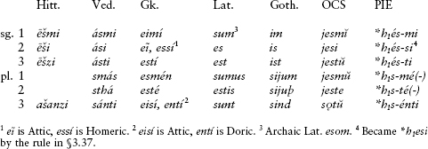

**5.23.** The second type of root present, only identified in the late 1960s by the Indo-Iranianist Johanna Narten and informally termed a **Narten present** in her honor, has the accent on the root throughout, but an alternation between lengthened ē-grade in the singular and ordinary *e-*grade elsewhere. Thus from **steu-* ‘praise’ was formed 3rd sing. **stḗu-ti*, 3rd pl. **stéu̯-n̥ti*. Note that the 3rd plural ending is **-n̥ti* instead of accented **-énti* in the ordinary type. The Narten presents are also called *acrostatic presents* (the term *acrostatic*, which will be properly introduced in the next chapter, means the accent remains on the root throughout the paradigm).

Ablaut of the Narten type may not have been limited to presents; see §5.47.

#### Other athematic presents

**5.24.** Two other main kinds of athematic presents are known, the nasal-infix presents and reduplicated athematic presents. As these are more complex formally than root athematics, they are often called *characterized presents*. The difference was significant and had consequences elsewhere in the verbal system; see §5.46.

**5.25. Nasal-infix presents**. An infix is a morpheme placed inside another morpheme. One PIE infix is known, used by certain roots to form present stems. It had the shape **-ne-* in the full grade and **-n-* in the zero-grade, whence the name *nasal present* for stems containing this infix. The distribution of the ablaut grades was the same as in root presents: full grade in the singular active, zero-grade elsewhere.

The infix was inserted into the zero-grade of the root, between its last two sounds (typically a resonant or high vowel followed by a consonant): thus from **i̯eug-* ‘yoke’, zero-grade **i̯ug-*, the 3rd sing. nasal present **i̯u-né-g-ti* ‘yokes’ was formed (> Vedic Skt. *yunákti*), with 3rd pl. **i̯u-n-g-énti* (> Vedic Skt. *yuñjánti*). Nasal-infix presents are typically active transitives, but beyond that we do not know what the meaning of the infix may once have been. Outside of Anatolian and Indo-Iranian, the infix no longer ablauts, as in Lat. *iu****n****git* ‘joins’, pl. *iu****n****gunt*.

**5.26.** The daughter languages also have various other types of nasal presents that are ultimately related to the nasal-infix type. Two in particular may be mentioned: the suffixed **-neu-/-nu-* presents (e.g. Vedic Skt. *tanóti* ‘stretches’ ∼ *tanvánti* ‘they stretch’; Hittite *ar-nu-mi* ‘I cause to go’; Gk. *ór-nū-mi* ‘I rouse, incite’); and the so-called ninth class of Indo-Iranian verbs, with an ablauting suffix *-nā-/-nī-* that goes back to **-ne-H-/-n-H-* (that is, the nasal infix inserted before a root-final laryngeal), as in Vedic Skt. *punā́ti* ‘cleanses’ (**pu-né-h₂-ti*) ∼ *punīmás* ‘we cleanse’ (**pu-n-h₂-mé-*). On this last type, recall the discussion in §4.18; the Sanskrit *tanóti* type will be dealt with in more detail in §10.42.

**5.27. Reduplicated athematic presents**. These are like ordinary root presents except that an additional syllable is added to the beginning that consists of the first consonant of the root plus an *e* or *i*. For example, the root **deh₃-* ‘give’ formed a reduplicated athematic present stem **de-deh₃-* in the singular and **de-dh₃-* in the dual and plural; this is reflected in Vedic *dá-dā-ti* ‘gives’ and *dá-d-ati* ‘they give’ (the latter from PIE **de-dh₃-n̥ti*).

In many examples of the type from the daughter languages, the reduplicating syllable has *-i-* rather than *-e-*, as in Vedic Skt. *jí-gā-ti* ‘he goes’ and Gk. *dí-dō-mi* ‘I give’. This pattern probably spread from thematic reduplicated presents like Gk. *gígnomai* ‘I become’ (§5.36 below).

No reduplicated presents are known to have been made from vowel-initial roots in PIE (which were rare in any case). An apparent example like Vedic Skt. *íyarti* ‘sets in motion’ is historically **h₃i-h₃er-ti*, from the laryngeal-initial root **h₃er*- ‘set in motion’.

### *Thematic presents*

**5.28.** Thematic presents, like other thematic formations, have a theme or stem vowel, ablauting *-*e/o*-, before the personal endings. The stress was fixed and the grade of the root did not change. The personal endings of thematic presents are the same as those of athematic presents except for the 1st person singular, which was **-h₂* (or **-oh₂* when we include the thematic vowel) rather than **-mi*. This ending is ultimately the same as the 1st singular ending of the middle (**-h₂e*), and in fact it is widely believed that the thematic conjugation had its origins in the middle.

The following are sample paradigms of the thematic conjugation, showing the verb meaning ‘bear, carry’ in Vedic, Greek, Gothic, and Old Church Slavonic, as well as the verb meaning ‘drive, do’ in Latin. In the right-hand column is the reconstructed thematic present of **bher-* ‘bear, carry’:

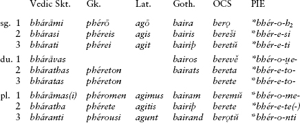

**5.29.** The theme vowel was in the *o-*grade before the 1st person endings and the 3rd plural, i.e. before endings beginning with a resonant or laryngeal; the reason for this is not known. It was not an infrequent occurrence in the daughter languages that the athematic 1st singular ending *-mi* was tacked on secondarily, as in Vedic *bhárāmi* and Old Church Slavonic *berǫ* (< **bher-ōm(i)*) above.

We next survey the major types of thematic presents.

**5.30. Simple thematic presents** had full grade of the root, with the accent on it, followed by the theme vowel and the ending, as **bhér-e-ti* ‘bears’ above. It is noteworthy that simple thematic verbs are almost or completely absent from Anatolian.

**5.31.** The type known as ***tudáti-*****presents** had zero-grade of the root and accent on the theme vowel. The name comes from a representative example in Sanskrit, Vedic *tudáti* ‘beats’ < **tud-é-ti*.

**5.32. ****i̯****e/o*****-presents**. A thematic suffix **-i̯e/o-* is widely represented, appearing in several different functions. A number of verbs formed their ordinary presents with this suffix, e.g. **leh₂-* ‘bark’ had a present stem **léh₂-i̯e-* (as in Vedic Skt. *rā́yasi* ‘you bark’, Lith. *lóju* ‘I bark’), and to **men-* ‘think’ the present was **mn̥-i̯é-* (as in Vedic Skt. *mányate* ‘thinks’ and Gk. *maínetai* ‘is mad’ < earlier **man-i̯e-* < **mn̥-i̯e-*). These are usually termed **primary ****i̯****e/o*****-presents** (not to be confused with “primary” in the meaning “non-past”). The type with zero-grade of the root and accented suffix, characteristically used with intransitives, may have been restricted to middle inflection originally, which would explain why it came to be used to form the passive in Indo-Iranian.

**5.33.** A different but homophonous suffix, also accented, was used to form **denominative** verbs (verbs derived from nouns or other parts of speech, like English *to head*, *to chair*). These verbs were formed by adding the suffix **-i̯e/o-* directly to the stem of a noun. Thus from the noun **h₁neh₃mn-* ‘name’ (exact preform uncertain, see §6.36) was formed a denominative verb **h₁neh₃mn-i̯e/o-* ‘to name’, reflected in Hittite *lamn-iya-zzi* ‘names’ (from *lamn-* ‘name’, with *l* replacing *n*), Greek *onomaínō* ‘I name’ (< pre-Greek **enomn̥-i̯ō*), and Germanic **namnjan* ‘to name’ (in e.g. Gothic *namnjan*, Old High German *nemnen*, and Modern German *nennen*).

Denominative **i̯e/o*-verbs went on to become extremely productive in most of the daughter languages, and over time new denominative suffixes were created from them by resegmentation. For example, Greek made many denominatives from nouns whose stem ended in *-id-*; the resultant pre-Greek combination **-id-i̯e/o-* became (by regular sound changes) Gk. *-ize/o-*, and this was then reanalyzed as a separate denominative suffix in its own right. It eventually made its way into English as the all-purpose verbal suffix *-ize*, as in the Three Stooges’ *moidalize*.

**5.34. ******s***k̑***é/ó*****-presents.** PIE possessed an accented thematic suffix **-sk̑é/ó-*, added to the zero-grade of the root. The productive descendants of this formation differ in meaning from branch to branch. In Anatolian, the suffix indicates repeated, habitual, or background action, or action applied to more than one object, as in Hittite *walḫ- iški-zzi* ‘beats (repeatedly), beats (several objects)’. The habitual or durative sense is also found in Homeric Greek (e.g. *pheúgeskon* ‘they would (habitually) flee’). Note also its use in the existential verbs Palaic *iška* and Archaic Latin *escit* ‘there is’. Other Latin verbs with the suffix, however, are inchoatives (indicating the beginning or inception of an action or state), e.g. *rubē-sc-ere* ‘to grow red’. Several verbs having the suffix that are reconstructible for PIE refer to asking or wishing, indicating perhaps that the suffix also once had desiderative function. An example is **pr̥k̑-sk̑é-* ‘ask’ in Vedic Skt. *pr̥ccháti* ‘asks’, Lat. *poscit* ‘asks’, and German *forschen* ‘to look into, research’.

**5.35. Causative-iteratives.** To form a verb meaning ‘cause to do X’, PIE took the *o-*grade of the root and added the accented thematic suffix **-éi̯e/o-*. Thus the causative of **sed-* ‘sit’ was **sod-éi̯e/o-* ‘cause to sit’ (> Old Irish [*ad-*]*suidi* ‘makes sit’, Gothic *satjan* ‘to set, plant’); similarly, **u̯es-* ‘clothe’ has the causative **u̯os- éi̯e/o-* ‘clothe, put on clothes’ (> Hittite *waššezzi* ‘he clothes’, Vedic Skt. *vāsáyati* ‘he clothes’). But almost all such formations in Greek, and many in Slavic, have iterative and not causative meaning, such as Gk. *phor-éō* ‘I carry around, habitually carry’ (from *phérein* ‘to carry’) and Old Church Slavonic *nositŭ* ‘habitually carries’ (from *nesti* ‘to carry’). This feature is probably also of PIE date, hence the term “causative-iterative” for this class of verbs.

**5.36. Reduplicated thematic presents.** Unlike their athematic counterparts, reduplicated thematic presents were formed with **-i-* in the reduplicating syllable and had zero-grade of the root. Some examples include Gk. *gí-gn-o-mai* ‘I am born’ (root **g̑enh₁-* ‘be born’) and Lat. *si-st-ō* ‘I stand’ (root **steh₂-* ‘stand’).

**5.37. Other presents.** A suffix **-h₂-*, added to thematic adjectival stems (resulting in a sequence **-eh₂-*), was used to form a verb meaning ‘to make something have the quality of the adjective’. Such a verb is called a **factitive**. This factitive suffix may have been further combined with the suffix **-i̯e/o-*. Thus from **neu̯-o-* ‘new’ was formed the factitive **neu̯-eh₂-(i̯e-*) ‘make new’ in Hitt. *new-aḫḫ-* ‘make new’, Lat. *(re-)nou-ā-re* ‘to make new’ (*-ā-* < **-eh₂-*).

There was also a **stative** suffix **-eh₁-* (probably also followed by **-i̯e/o*-) added to an adjectival root to form a verb meaning ‘have the quality of the adjective’, as in the cognate forms Lat. *rub-ē-re*, OHG *rot-ē-n*, and OCS *rŭděti*, all meaning ‘to be red’ from **h₁rudh-eh₁-* (from the adjectival root **h₁reudh-* ‘red’). Note also Hittite *marš-e-* ‘be false’ (< *marša-* ‘false’). The suffix appears in numerous other formations in the daughter languages, such as the Greek aorist passive suffix *-ē-* (§12.43) and probably the Armenian verbs in -*i*- (§16.37).

**5.38.** A number of other present-stem types are more marginally preserved, whose particular characteristics are unknown or disputed. These presents include the “*s-* presents,” such as Gk. *a(w)éksō* ‘I grow’, Old English *weaxan* ‘to grow’ from PIE **h₂u̯og-s-*, **h₂u̯eg-s-*; the “*u-*presents,” such as Hitt. *tarḫuzi* or *taruḫzi* (phonetically *tarḫʷtsi*) ‘overcomes, is able’, Ved. *tū́r-v-ati* ‘overcomes’ from PIE **terh₂-u-*, **tr̥h₂-u̯-*; and presents with the addition of other sounds, such as **-d-* and **-dh-*.

Of greater import is a theory by the American Indo-Europeanist Jay Jasanoff that posits a class of presents having *o-*grade in the singular, *e-*grade in the dual and plural, and personal endings like those of the perfect. Discussion of this is deferred until the Anatolian chapter (§9.33) since the conjugation (assuming it existed) is best preserved in that branch.

**5.39. Desideratives and futures.** Several suffixes containing an **-s-* have been reconstructed that were used to form desideratives, that is, verbs expressing desire or intent. Some of their descendants function as futures (see below), but it is not certain whether any of these were true futures in PIE. How, and whether, these future/desiderative formations are related to each other is still an open question.

**5.40.** Indo-Iranian, Balto-Slavic, and maybe Celtic point to a suffix **-si̯e/o-* with future and desiderative meaning: Vedic Skt. *dā-syá-ti* ‘he intends/wants to give’ (later ‘he will give’), Lithuanian *dúosiant-* ‘about to give’, Old Russian *byšęštĭ* ‘future’ (< *‘about to be’, from a participle **bhuH-si̯ont-*), and Gaulish *pissíiumí* ‘I will see’.

**5.41.** A reduplicated desiderative with *i-*reduplication and a suffix **-(h₁)se-* is found in Indo-Iranian and Celtic. For example, from **gʷhen-* ‘slay’ was formed **gʷhi-gʷhn̥-h₁se-ti*, reflected in Vedic Skt. *jíghāṁsati* ‘wants to slay’ and the Old Irish future *(-)géna* ‘he will slay’ (from Celtic **gʷi-gʷnā-se-ti*). The same suffix, without reduplication, is the source of Greek futures of the type Homeric *kaléō* ‘I will call’ < pre-Greek **kalesō* < **kal-h₁se-*.

**5.42.** An athematic future suffix in **-s-* (without preceding laryngeal) is found in Italic (Umbr. *fu-s-t* ‘he will be’) and Baltic (Lith. *bùs* ‘he will be’), while Greek has a thematic version that seems to have been middle in the first instance (e.g. *dḗk-s-o-mai* ‘I will bite’ to active present *dáknō* ‘I bite’); cp. §5.6.

### *The imperfect and injunctive*

**5.43.** The present stem was used to form not just the present tense but also the imperfect. As mentioned above, the imperfect is usually thought to have signified durative or repeated action in past time (*was going*, *used to go*). Formally it was usually identical to the present except that secondary endings were used instead of primary (so **-m*, **-s*, **-t* instead of **-mi*, **-si*, **-ti* in the active). The 1st singular **-m* is the same in both thematic and athematic imperfects. The original type is best preserved in Anatolian, Indo-Iranian, and Greek: for example, Hitt. (preterite) *daškinun* ‘I (repeatedly) took’, Vedic Skt. *ábharam* ‘I was carrying’, Av. *barəm* ‘I was carrying’, and Gk. *épheron* ‘I was carrying’. (The Vedic and Greek forms begin with the augment **e-* explained in the next section.) Full paradigms were given above in §§5.12 and 5.14.

Outside of these branches, the IE imperfect has either been completely lost, or merged with the aorist. In those branches where the imperfect was lost, a new imperfect conjugation was often innovated (as in Italic and Slavic), sometimes of obscure origin (as in Celtic).

**5.44.** Indo-Iranian, Greek, Armenian, and Phrygian attest a prefix called the **augment** that was added to past-tense forms. It is reconstructible as **e-*, as in the imperfect **é-bher-e-t* ‘he was carrying’ (Vedic Skt. *ábharat*, Gk. *éphere*, Arm. *eber*) or the aorist **e-dheh₁-* ‘placed’ (Phrygian *edaes* ‘he placed’). These branches have other features in common too, and may well have emerged out of a single dialect area of late PIE; thus it is often thought that the augment was an innovation peculiar to that dialect.

In Indo-Iranian and (especially Mycenaean and Homeric) Greek, past-tense forms can appear with or without the augment. The augmentless forms are called **injunctives**, and have been much discussed in the literature; figuring out their meaning and function has been very difficult. In Greek, injunctives appear especially in the older language of Homer (they are not recognized as a separate category in traditional grammar), where they are normally interchangeable with augmented forms but sometimes have “gnomic” force – that is, are used to express timeless truths. Vedic Sanskrit offers much more evidence for a “timeless” meaning of the injunctive as opposed to the augmented forms; see further §10.41. But its close relative Avestan has mostly dispensed with the augment and uses injunctives as past tenses, like Homer. The Mycenaean Greek evidence is somewhat ambiguous, while Phrygian and Armenian contribute little additional information. On the evidence of Vedic and the Homeric gnomic uses of the injunctive, the PIE category is widely regarded as having been used to refer to acts or events without reference to the time in which they occurred, as well as to facts and conditions having general validity. Under this view, the augment derives from a temporal particle that specified past tense (just like the “hic et nunc” particle specified non-past).

## The Aorist Stem

**5.45.** PIE possessed several different aorist stem formations, some formally parallel to the present-stem types. Comparable to root athematic presents, for example, were root aorists. In addition, PIE possessed a special aorist suffix **-s-* used to form the so-called sigmatic or *s-*aorist. Some of the aorist formations persist even in languages where there is no longer an aorist proper, such as Latin, Old Irish, and Tocharian; in these languages, such forms are called preterites or perfects. In languages with the augment (see above), the aorist is augmented. The aorist indicative was inflected using the secondary personal endings.

The factors determining which aorist formation was chosen by which root are not fully clear. Normally, the same formation is not used for both present and aorist; one common pattern, for example, is an uncharacterized (root) aorist alongside a characterized present, e.g. Ved. root aorist *ádhāt* ‘put’ alongside reduplicated present *dádhāti* ‘puts’ (cf. §5.10 above on verbal Aktionsart).

**5.46. Root aorist.** The root aorist was formed by adding the secondary endings directly to the full grade of the root in the active singular, and to the zero-grade of the root elsewhere. Thus from **steh₂-* ‘stand’ was formed the root aorist **(e-)steh₂-t* ‘he stood’ (Vedic Skt. *ásthāt*, Doric Gk. *éstā*). Root aorists typically are made from roots that form characterized presents (see §5.24 on this term); Doric *éstā*, for example, is the aorist of the reduplicated present *hístāmi* ‘I stand’.

**5.47. Sigmatic or** ***s-*****aorist.** The PIE sigmatic or *s*-aorist was characterized by the addition of an **-s-* to the verbal root. The root is in the lengthened *e*-grade in Indo-Iranian, Italic, and Slavic, as in Vedic Skt. *(á-)vākṣ-ur* (< **(é-)u̯ēg̑h-s-*) ‘they conveyed’, Lat. *uēxī* ‘I conveyed’ (a perfect in Latin but originally an *s*-aorist), and Old Church Slavonic *věsomŭ* (< **u̯ḗdh-s-me*) ‘we led’. In Greek and in the *s-*aorist middle in Indo-Iranian, however, the root was in the full grade, as in Gk. *élekse* ‘he said’ (< **e-leg-s-*). The ablaut thus may have originally been of the “Narten” type (§5.23), with lengthened grade in the singular and full grade elsewhere.

The *s-*aorist eventually outstripped other kinds of aorists in Indo-Iranian, Greek, and Slavic. It is absent from Anatolian and Tocharian, where however there are preterites having an *-s* in the 3rd singular active (e.g. Hitt. *naiš* ‘he brought’, Toch. B *preksa* ‘he asked’ < **prēk̑-s-*). Possibly, these two branches reflect an earlier, rudimentary stage in the development of the *s-*aorist, and split off from the family before the *s-*aorist evolved further into its more familiar form.

**5.48. Thematic aorist.** The thematic aorist has a stem consisting of the zero-grade of the root plus thematic vowel. Although the formation is fairly common in several of the daughters, very few instances are found in more than one branch, leading most researchers to take a conservative approach and posit only one or two examples for the proto-language. Some would entirely deny it any status as a PIE formation, but at least one example seems quite secure, namely **(é-)h₁ludh-e-* ‘went’ (root **h₁leudh-* ‘go’) in Hom. *ḗluthe* ‘came’, Old Irish *luid* ‘went’, and Toch. A *läc* ‘went out’, the latter two forms occurring in branches in which thematic aorists are otherwise unproductive. Also frequently cited is **(é-)u̯id-e*- ‘saw’ (root **u̯eid-*) in Vedic Skt. *á-vidat* ‘he found’, Gk. *é-(w)ide* ‘he saw’, and Arm. *e-git* ‘he found’, but since the thematic aorist was productive in these branches, this example is less certain. (For a similar example, cf. §19.25.) The thematic aorist is regarded by some as originating in a thematization of the root aorist, and by others as having ultimately the same origin as the imperfect of *tudáti-*presents, with which it is formally identical.

**5.49. Reduplicated aorist.** On the basis of Indo-Iranian, Greek, and Tocharian A we can reconstruct a reduplicated thematic aorist for PIE. An example reconstructible for PIE, having *e* in the reduplicating syllable and zero-grade of the root, is **u̯e-ukʷ-e-* ‘spoke’ (from the root **u̯ekʷ-* ‘speak’), seen in Vedic Skt. *(á)vocam* ‘I spoke’ and Gk. *(w)eĩpon* ‘I spoke’ (dissimilated from **(w)eũpon*). Aside from this example (and a very few others), reduplicated aorists typically have causative meaning, such as Vedic Skt. *á-pī-par-as* ‘you made cross over’, Gk. *dé-da-e* ‘he taught’ (< *‘caused to know’), and Toch. A *śa-Qärs* ‘he made known’.

**5.50. Long-vowel preterites**. A variety of past-tense verb forms with long root vowel are found scattered among the branches. Particularly widely represented are forms reflecting *ē in the root. A long-vowel preterite **lēg̑-* ‘gathered, looked at’ is reflected by Latin *lēg-ī* ‘I gathered, read’ (present *leg-ere* ‘to gather’), Albanian *(mb)lodha* ‘I gathered’ (*o* < *ē in Albanian), and Tocharian A *lyāk* ‘saw’. According to one recent (and controversial) theory, these were originally imperfects of Narten presents, hence the lengthened grade. Other vowels are seen too, as in Greek *ánōge* ‘he ordered’, Gothic *mol* ‘I/he ground’ (present *mal-an* ‘to grind’; the *o* is long), and Old Irish *fích* ‘he fought’ (present *fich-id* ‘fights’). These all have diverse origins. Some, such as the Irish forms, are demonstrably more recent creations; others, such as the long-ē preterites, appear to be ancient. How they fit into the PIE verbal system is not known.

## The Perfect Stem

**5.51.** The perfect stem was formed by reduplication, specifically, by doubling the first consonant of the root and inserting *e*. Characteristic of the perfect was the appearance of the root in the *o-*grade in the singular and accented; in the dual and plural, it was in the zero-grade and the endings were accented. Thus the perfect singular stem of **men-* ‘think’ was **me-món-*, and the dual and plural stem, **me-mn-* ′.

The perfect had a special set of personal endings that closely resemble those of the middle:

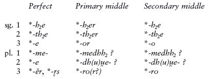

The close similarity of the perfect endings to the middle endings has generated much research and controversy; precisely what the connection between them is remains unclear. Not unconnected with the formal overlap of perfect and middle endings is the fact that some perfects have middle meaning (like Gk. *ólōla* ‘I am lost’, vs. the active present *óllumi* ‘I lose, destroy’), or exist alongside middle presents (like Vedic Skt. *ruróca* ‘shines’, perfect of the middle present *rócate* ‘shines’) or middle root aorists (Vedic Skt. perfect *jujóṣa* ‘enjoys’ next to middle root aorist *ájuṣran* ‘they took a liking to’). It has been speculated that the perfect and the middle endings were once a single set.

The following are some of the forms upon which this reconstruction has been based. They do not all have the same function (the Hittite forms are presents and the Gothic forms are preterites), more on which below in §5.53. The forms are Hitt. *wewakḫi* ‘I demand’, Vedic Skt. *jagáma* ‘I went’, Gk. *léloipa* ‘I left’, Lat. *meminī* ‘I remember’, and Goth. *haihait* ‘I called, I named’. At the right is a reconstructed PIE paradigm.

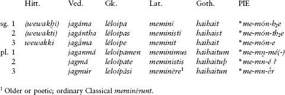

Most of the languages have undone the original ablaut and have partially replaced the perfect endings with secondary endings, especially in the plural. It is not assured that Hitt. *wewakḫi* is in fact an old perfect, but formally it looks like one and has been included above for illustrative purposes.

**5.52.** One famous perfect does not exhibit reduplication, **u̯oid-h₂e* ‘know’ (from the root **u̯eid-* ‘see’), becoming Vedic Skt. *véda*, Gk. *(w)oĩda*, Goth. *wait*, and Old Eng. *wāt* (continued in the modern British English phrase *God wot* ‘God knows’). Compare the following paradigms:

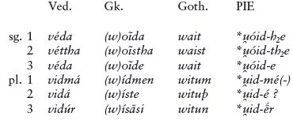

This perfect is exceptional not only because of its lack of reduplication but also because of its meaning (not ‘sees’ or ‘has seen’ but ‘knows’). These are widely thought to be archaic features, harking back, perhaps, to a time when the perfect had no reduplication; but this view is not universally held.

### *Meaning of the perfect*

**5.53.** The perfect is formally best preserved in Indo-Iranian and Greek, and less well in Anatolian, Italic, Celtic, and Germanic. A number of archaic examples of the perfect, especially in Indo-Iranian and Greek, refer to states in present time. We saw this above (§5.51) in four perfects: Gk. *ólōla* ‘I am lost’, Vedic Skt. *ruróca* ‘shines’, Ved. *jujóṣa* ‘enjoys’, and Lat. *meminit* ‘remembers’. (The Greek and Gothic cognates of *meminit* are also statives, meaning ‘is mindful of’: Gk. *mémone*, Goth. *man* ‘thinks’ [without reduplication].) Furthermore, the singular perfect endings are used to inflect a class of presents in Anatolian, the so-called *ḫi*-conjugation (to which Hittite *wewakki* in § 5.51 belongs). While the relationship of the *ḫi*-conjugation to the perfect is unclear, all these facts together have led researchers to believe that the PIE perfect was a *stative*. In the daughter languages, however, except for relic forms like the ones just cited, perfects express past tense, and have often fallen together formally with the aorist into a single “preterite” tense. To explain this development, it is usually said that the PIE stative perfect had (or optionally had) resultative overtones (‘is in a state resulting from having done X’, therefore ‘has done X’).

## Moods

### *Imperative*

**5.54.** The imperative was used to express direct commands. The **athematic 2nd singular** imperative ending is reconstructible as **-dhi* and was added to the zero-grade of the root, as in Vedic Skt. *śru-dhí* ‘listen!’ and Gk. *í-thi* ‘go!’. The **thematic 2nd singular** imperative was the bare thematic stem, as in Vedic Skt. *bhára* and Gk. *phére* ‘carry!’ from PIE **bhér-e*. The **2nd plural** imperative ended in **-te*: Vedic Skt. *bhárata* and Gk. *phérete*, both from **bhérete* ‘(you pl.) carry!’

PIE also had **3rd person** imperatives ending in **-u*, forming 3rd sing. **-tu* and 3rd pl. **-ntu*, as in Hittite *paiddu* ‘let him go’ and Vedic Skt. *ástu* ‘it will be’. Another ending **-tōd* formed the so-called **future imperative**. This ending was indifferent to person and number and was used in commands that pertained to the more distant future or that were to remain always in force (as in laws). It is most clearly seen in Sanskrit and Italic, e.g. Vedic Skt. *dhattāt* ‘you shall bestow (afterwards)’, Archaic Latin *datōd* ‘let him give, he shall give’, Oscan *deiuatud* ‘he shall swear’. In Greek the formation is also found, but only in the 3rd person (e.g. *pheré-tō* ‘let him carry’), where – as also in Italic – it replaced **-tu*; and a few examples have recently come to light from Celtiberian (e.g. *tatuz*, phonetically probably [datuz], ‘he will give’).

### *Subjunctive*

**5.55.** The subjunctive in PIE was formed by the addition of the thematic vowel to the verb stem (be it athematic or already thematic), followed apparently by primary endings (although in Indo-Iranian both primary and secondary endings were used; see below). In athematic verbs, the “strong” stem (the one having full grade of the root or ablauting portion of the stem) was used in all persons and numbers. Some reconstructed examples of 3rd sing. and 3rd pl. present subjunctives follow for the athematic presents of **h₁es-* ‘be’ and **i̯eug-* ‘yoke’ and the thematic present **bher-* ‘carry’:

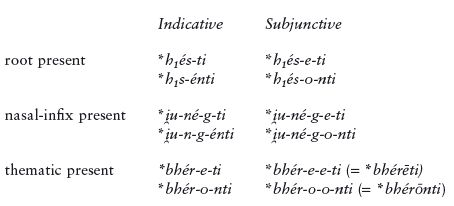

Adjusting for the fact that Vedic Sanskrit uses the secondary ending *-n* from **-nt* in the third plural, the right-hand column above yields the Vedic subjunctives *ásat(i)*, *ásan* (versus indicative *ásti*, *sánti*); *yunájati*, *yunájan* (versus indicative *yunákti*, *yuñjánti*); and *bhárāti*, *bhárān* (versus indicative *bhárati*, *bháranti*). Compare also Latin *erit* ‘he will be’, *erunt* ‘they will be’ (synchronically future, but historically subjunctive), and Greek *phérēi*, *phérōsi* (*-ōsi* < **-ōnti*) for the thematic subjunctive.

As indicated by such first-person subjunctives as Vedic Skt. *kr̥ṇavā* ‘I will do’, Old Avestan *yaojā* ‘I will yoke’, Gk. *phérō* ‘let me carry’, and Lat. *erō* ‘I will be’, the 1st singular ended in **-h₂* (or **-oh₂* including the subjunctive vowel) rather than **-mi*.

Subjunctives could also be formed in the same way from root and *s-*aorists, where likewise the full grade of the aorist stem was used.

**5.56. Meaning of the subjunctive**. The subjunctive was probably a future tense. Here one must be careful to avoid terminological confusion, as most of the forms called “subjunctives” in the daughter languages, which express a variety of modal meanings, have nothing to do with the PIE subjunctive, but come from the optative (see below) or elsewhere. The subjunctive in Indo-Iranian, Greek, and partly in Celtic is a continuation of the PIE subjunctive; in Indo-Iranian it usually has future meaning, as true also of many examples in Homer. In Latin, the descendants of the PIE subjunctive are futures. The PIE subjunctive is not preserved outside of these branches.

### *Optative*

**5.57.** The optative was formed by adding an ablauting suffix **-i̯eh₁-/-ih₁-* to the relevant stem (present, aorist, or perfect), plus secondary personal endings. In most athematic verbs, this suffix was attached to the weak stem of the verb, and had the full-grade form **-i̯eh₁-* in the singular and zero-grade **-ih₁-* elsewhere. However, in Narten presents, being accented on the root, the suffix was in the zero-grade throughout. This was also true of thematic verbs, where the zero-grade of the suffix was used throughout, and added to the *o-*grade of the thematic vowel. Compare the following paradigms, showing the optatives of the athematic verb ‘be’ and the thematic verb ‘bear’ in PIE and selected daughter languages:

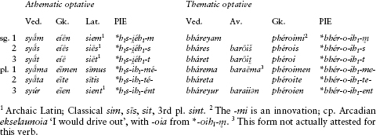

Note that the 3rd plural was always **-ent* (replaced in Sanskrit by a different ending) and never **-n̥t*, even when unaccented. As mentioned above, the continuations of the PIE optative in the daughter languages are not always termed “optatives,” but sometimes “subjunctives,” as in Italic and Germanic. In Balto-Slavic the optative became the imperative and a new category in Lithuanian called the permissive, but also survived limitedly as a real optative in Old Prussian; see further §18.66. There is no trace of the optative in Anatolian. Interestingly, in the thematic optative the vowels **-o-ī-*, resulting from **-o-ih₁-*, were a disyllabic sequence and remained so for some time after the days of PIE, as shown by their treatment in Indo-Iranian, Greek, Balto-Slavic, and perhaps Germanic.

## Non-finite Verbal Formations and Other Topics

We have now concluded our survey of the finite forms of the IE verb, that is, those that differentiate person and number. Two other sets of forms remain: infinitives and participles.

### Infinitives

**5.58.** The infinitive is essentially a verbal noun, rendered either as ‘to X’ or ‘X-ing’ in English. The daughter languages exhibit a rather bewildering variety of infinitives. Typically they are frozen case-forms (usually accusatives, datives, or locatives) of nouns derived from verbal roots. The nominal formations in question are usually old, but which infinitive formations are of PIE date is uncertain. Represented in more than one daughter branch as true infinitives are the following:

1. The suffix **-dhi̯e-* or **-dhi̯o-*, appearing in both active and passive infinitives: Vedic Skt. *píba-dhyai* ‘to drink’, Umbr. *piha-fi* ‘to propitiate’, Toch. A and B *lkā-tsi* ‘to look’.

2. Various case-forms of the noun suffix **-tu-* (§6.42), e.g. Vedic Skt. *dā́-tum* ‘to give’, *pā́-tave* ‘to drink, for drinking’.

3. Various case-forms of the noun suffix **-ti-* (§6.42), e.g. Vedic Skt. *pī-táye* ‘to drink, for drinking’, Av. *kərə-tə̄e* ‘to do’, OCS *da-ti* ‘to give’, Lith, *bū́-ti* ‘to be’.

4. Various case-forms of the complex *n-*stems (§6.34) **-men-,* **-sen-, *-ten-,* and **-u̯en-,* e.g. Vedic Skt. *vid-máne* ‘to find’, Homeric Gk. *íd-menai* ‘to know’, the Gk. thematic infinitive ending *-ein* (< **-e-sen*), OPers. *car-tanaiy* ‘to do’, Hitt. *laḫḫiya-uwanzi* ‘to wage war’, and Cypriot Gk. *do-wenai* ‘to give’.

**5.59.** Several daughter branches have a specific infinitive formation often called the **supine** that is solely used with verbs of motion to indicate purpose, as Vedic (*áganma*) *právoḷhum* ‘(we went) to bring’, Latin (*uēnērunt*) <u>*questum*</u> ‘(they came) to complain’, Old Church Slavonic (*pridŭ*) <u>*sŭpatŭ*</u> ‘I went (in order) to sleep’. Usually it is formed with the suffix **-tum*, the accusative of the abstract noun suffix **-tu-* mentioned above.

### *Participles*

**5.60.** Participles are verbal adjectives. Like other adjectives, they inflect in the different nominal cases and numbers discussed in chapter 6.

The most widely represented participle is the ***nt-*****participle**, found in virtually all the branches to form participles of active voice to present or aorist stems. The suffix was ablauting, appearing as **-ent-* (perhaps also as **-ont-*) and **-nt-*. In athematic verbs, it was added to the weak present stem, as in **h₁s-(e)nt-* ‘being’ (> Vedic Skt. *sat-* ‘being’, Lat. *ab-sent-* ‘being away, absent’), **dhe-dhh₁-(e)nt-* ‘placing’ (> Gk. *ti-thent-* ‘placing’), and **i̯ung-(e)nt-* ‘joining’ (> Lat. *iungent-*). In thematic verbs, zero-grade **-nt-* was added to the *o*-grade thematic vowel, as in **bher-o-nt-* ‘carrying’ (> Gk. *phéront-,* Goth. *bairand-*, and OCS *berǫšt-* from pre-Slavic **ber-ont-j-*). In Anatolian, however, this participle is semantically equivalent to the **-tó-*verbal adjective (see §5.61 below), indicating completion and being passive when formed from transitive verbs, and active when formed from intransitive verbs: *kunānt-* ‘(having been) killed’, *iyant-* ‘(having) gone’. Aorist active participles were formed similarly to present participles, as the root aorist participle meaning ‘having stood’ in Vedic Skt. *sthānt-* and Gk. *stant-*.

Several branches continue a **mediopassive participle** in **-m(e)no-* or **-mh₁no-* (its exact reconstruction is a matter of dispute), seen for example in Vedic Skt. *bhára-māṇa-* and Av. *barə-mna-* ‘carrying (for oneself)’, Gk. *pheró-menos* ‘carrying (oneself), being carried’, and OPruss. *poklausīmanas* ‘heard’. In other branches only a few fossilized examples of it exist, such as Lat. *alu-mnus* ‘fosterling’ (lit. ‘nurtured’) and Arm. *anasown* ‘animal’ (lit. ‘not talking’, from *asem* ‘I talk’, as though from late PIE **n̥-ag̑-omno-*). Related is the **present passive participle** in **-mo-* of Balto-Slavic and perhaps Anatolian: OCS *něsomŭ* ‘being carried’, Lith. *nẽšamas* ‘being carried’, and Cuneiform Luv. *kīšammi-* ‘combed’.

A **perfect participle** with the ablauting suffix * *-u̯os-/-us-* is reflected in numerous branches. In PIE, it was added to the zero-grade of the perfect stem; the suffix was **-u̯ōs* in the nominative singular masculine (neuter **-us,* feminine **-us-ih₂*); the accusative singular ended in **-u̯os-m̥* (see §6.6 for the case-ending) and the other cases were added to the stem **-us-*. This is directly reflected for example in Av. nomin. sing. *vīδuuā̊,* accus. *vīδuuā̊ŋhəm*, stem *vīduš-* ‘knowing’ (from **u̯idu̯ōs *u̯idu̯osm̥ *u̯idus-*). Compare also the Vedic stem *vidúṣ-* ‘knowing’; Gk. masc. nomin. sing. *(w)eidṓs* and fem. *(w)iduĩa* (< **u̯idusih₂*) ‘knowing’; and, further afield, Toch. B masc. nomin. *lt-u* ‘having come out’, accus. *lt-uwes*, fem. *lt-usa*, and Lith. fem. *áug-us-i* ‘having grown’.

Some branches also have evidence for a **preterite participle** in **-lo-*: Arm. aorist participle *gereal* ‘taken, having taken’, OCS preterite participle *nes-lŭ* ‘having carried’, and Toch. A gerundive (verbal adjective) *ritwāl* ‘united’.

**5.61.** In addition to the participles, PIE had **verbal adjectives** in **-tó-* and **-nó-*, added to the zero-grade of a verbal root. These indicated completed action and were semantically like past participles in English: if the verb they were formed from was transitive (like *eat*), the verbal adjective was passive and past in tense (*eaten*), but if the verb was intransitive (like *go*), the verbal adjective was simply past in tense (*gone*). Thus the root **gʷhen-* ‘kill’ formed the verbal adjective **gʷhn̥-tó-* ‘slain’ in Vedic Skt. *hatá-* and Gk. *(-)phatós*, and the intransitive root **gʷem-* ‘come’ has **gʷm̥-tó-* ‘(having) come’ in Vedic Skt. *gatá-*, Gk. *(-)batós*, and Lat. *uentus*. Less widespread than **-tó-* was **-nó-*, whose participial function is clearest in Indo-Iranian, as in Vedic Skt. *bhin-ná-* ‘(having been) split’ (< **bhid-nó-*), but also in Germanic and Slavic in a longer form **-enó-* or **-onó-*, as in Goth. *bit-ans*, Eng. *bitt-en* (< **bhid-onó-*) and OCS *nes-enŭ* ‘carried’. Similar forms, like **pḷh₁-nó-* ‘full’, were once participles (‘filled up’) but have descendants that are only adjectives and no longer part of any verbal paradigm: Vedic Skt. *pūrṇá-*, Lat. *plēnus* (versus past participle *-plētus* ‘filled’), Goth. *fulls* (double *-ll-* < **-ln-*), Old Irish *lán*, and Lith. *pìlnas*.

Neither of these formations is found in Anatolian. For other uses of **-tó-*, see §6.77.

### *Verbal composition*

**5.62.** Verbs were often combined with adverbs to modify their meaning. Such adverbs were called *preverbs* and in the first instance remained separate words. Over time they tended to join with verbs as prefixes. As there are some interesting syntactic phenomena associated with this subject, we will defer discussion of preverbs until §§8.9ff.

Occasionally, verbs were compounded with a non-adverbial element, such as a noun. The most familiar example of this is the verb for ‘believe, trust’, **k̑red dheh₁-*, literally ‘place one’s heart in’, which became Vedic Skt. *śrád dadhāti* ‘trusts, believes’, Lat. *crēdō* ‘I believe’, and Old Irish *cretim* ‘I believe’.

### *Prosodic status of verbs*

**5.63.** There is good comparative evidence that finite verbs were prosodically weaker (that is, were pronounced with weaker stress or lower pitch) than other parts of speech, especially in main clauses. In Vedic Sanskrit, main-clause finite verbs that do not stand at the beginning of their clause (or a verse-line of poetry) are written in the manuscripts without accent marks. In Greek, the rules for accenting verbs are different from those for nouns, and resemble the accentuation of strings of clitics; this suggests an affinity between the prosody of verbs and the prosody of chains of weakly stressed or unstressed particles. In Germanic heroic poetry, fully stressed words alliterate with one another, but certain verbs, together with unstressed pronouns and particles, do not participate in alliteration; this suggests weaker prosodic status for those verbs. In certain Germanic languages, such as modern German, verbs are required to be the second syntactic unit in main clauses, which is the same position taken by many unstressed sentence particles elsewhere in Indo-European (Wackernagel’s Law, see §§8.22ff.).

All these facts taken together suggest that finite verbs were in some way prosodically deficient in PIE. Whether verbs in PIE were true clitics, that is, had no stress and formed an accentual unit with a neighboring stressed word, is uncertain, but is a position defended by many Indo-Europeanists. However, it is clear that even if they could behave as clitics some of the time, they were fully stressed when moved to the front of a clause for emphasis or contrast, or when occurring in subordinate clauses. This is not too surprising, since weaker prosodic status of verbs (vis-à-vis nouns) is a common cross-linguistic phenomenon.

## For Further Reading

Comprehensive recent works on the verb are wanting; the volumes on the verb in Brugmann 1897–1916 and Hirt 1927–37 (see Bibliography, ch. 1) are rather out of date. Books on the IE verb are generally specialized. Watkins 1969 is a very influential examination of the prehistory of PIE verbal inflection. Jasanoff 1978 is an in-depth study of the relationship between the stative and middle; see also his most recent work, Jasanoff 2003, a very thought-provoking and detailed theory on the prehistory of IE verbal morphology. Very useful and up-to-date – though in various places controversial – is Rix 2001, a dictionary of Indo-European verbal roots and reconstructed stem-forms.

## For Review

Know the meaning or significance of the following:

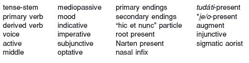

## Exercises

1. Name the function(s) of the following PIE suffixes:

  - **a** **-nt-*

  - **b** **-nó-*

  - **c** **-*u̯*os-/-us-*

  - **d** **-eh₂-(*i̯*e-)*

  - **e** **-ne-* (infix)

  - **f** **-tó-*

  - **g** **-eh₁-(*i̯*e-)*

  - **h** **e-* (prefix)

  - **i** **-s*i̯*e/o-*

  - **j** **-*i̯*e/o-*

  - **k** **-é*i̯*e-*

  - **l** **-m(e)no-* or **-mh₁no-*

  - **m** **-*i̯*eh₁-/-ih₁-*

  - **n** **-s*k̑*é/ó-*

2. Identify the following reconstructed PIE verb inflectional endings as specifically as possible:

  - **a****-th₂er*

  - **b****-oh₂*

  - **c****-ti*

  - **d****-(t)o*

  - **e****-u̯e-*

  - **f****-(t)or*

  - **g****-m*

  - **h****-si*

  - **i****-s*

  - **j****-(é)nti*

  - **k****-tu*

  - **l****-te*

  - **m****-mi*

  - **n****-ntu*

  - **o****-ro*

  - **p****-(é)nt*

  - **q****-dhi*

  - **r****-t*

  - **s****-h₂er*

  - **t****-ēr, *-r̥s*

In exercises **3–8**, indicate the position of the accent in each PIE form that you give.

3. The following verbal roots formed root presents of the ordinary (non-Narten) type in PIE. Provide all three singular forms and the 3rd plural in the present indicative active.

  - **a** *k̑*tei-* ‘settle’

  - **b** **h₂*u̯*eh₁-* ‘blow’

  - **c** **s*u̯*enh₂-* ‘make a sound’

  - **d** **h₁ei-* ‘go’

  - **e** **gʷhen-* ‘slay’

  - **f** **bhleh₁-* ‘weep’

4. The following verbal roots formed simple thematic presents. For each one, provide (1) the 1st and 2nd singular and 3rd plural present indicative active, and (2) the 3rd singular and 3rd plural imperfect indicative active. Include the augment where possible.

  - **a** **pekʷ-* ‘cook’

  - **b** **pleu-* ‘swim’

  - **c** **bheidh-* ‘trust’

  - **d** **der-* ‘tear, flay’

  - **e** **le*g̑*-* ‘gather’

  - **f** **dhegʷh-* ‘burn’

5. The following verbal roots formed nasal-infix presents. For each one, provide (1) all three singular forms and the 3rd plural in the present subjunctive active, and (2) the present optative stems.

  - **a** **bheid-* ‘split’

  - **b** **peuh₂-* ‘cleanse’

  - **c** *k̑*leu-* ‘hear’

  - **d** **kʷreih₂-* ‘exchange’

  - **e** **terd-* ‘bore’

  - **f** **h₃mei*g̑*h-* ‘urinate’

6. The following roots formed perfects. Provide all three singular forms and the 3rd plural for each perfect.

  - **a** **h₂ne*k̑*-* ‘reach, attain’

  - **b** **d*u̯*ei-* ‘fear’

  - **c** **dhers-* ‘dare’

  - **d** *g̑*enh₁-* ‘beget’

  - **e** **neigʷ-* ‘wash’

  - **f** **gʷem-* ‘come, go’

7. Form the causative-iterative stem for each of the following verbal roots and give a translation.

  - **a** **bheudh-* ‘wake’

  - **b** **leuk-* ‘light’

  - **c** *i̯*eudh-* ‘fight’

  - **d** **legh-* ‘lie’

  - **e** **demh₂-* ‘tame’

  - **f** **ne*k̑*-* ‘disappear, come to harm’

8. The following are a mixture of thematic and strong athematic singular present stems. For each stem, (1) identify as specifically as possible the type of present it exemplifies, and (2) provide the singular and plural optative stems.

  - **a** **g̑n̥h₃-sk̑é-* ‘know’

  - **b** **dḗk̑-* ‘receive’

  - **c** **pérd-e-* ‘fart’

  - **d** **li-né-kʷ-* ‘leave’

  - **e** **gʷr̥h₃-é-* ‘devour’

  - **f** **mr̥-i̯é-* ‘disappear, die’

  - **g** **sél-* ‘jump’

  - **h** **si-sd-e-* ‘seat’

  - **i** **dhe-dheh₁-* ‘put’

9. The following roots formed root aorists in PIE. Provide the 2nd singular indicative active for each. Include the augment.

  - **a** **peh₃-* ‘drink’

  - **b** **derk̑-* ‘see’

  - **c** **dreh₂-* ‘run’

  - **d** **kʷel-* ‘turn’

  - **e** **kʷer-* ‘cut’

  - **f** **g̑enh₁-* ‘beget’

10. The following roots formed *s*-aorists in PIE. Provide the 3rd singular indicative active for each. Include the augment.

  - **a** **h₃neid-* ‘blame, scorn’

  - **b** **deuk̑-* ‘lead’

  - **c** **neiH-* ‘lead’

  - **d** **h₃reg̑-* ‘direct, rule’

  - **e** **bher-* ‘carry’

  - **f** **prek̑-* ‘ask’

11. Based on the endings given in §5.14 and the ablaut information in §5.22, provide the singular and the 3rd plural present and imperfect indicative middle of the verb **mleuH-* ‘speak’.

12. For **3a–c** and **4a–c**, give the stem of the present active participle.

13. For **6a–c**, give the nominative singular of the perfect participle.

14. Using the suffix **-tó-,* form the verbal adjectives of the roots in **9** above and translate them.

15. Given that **-ss-* was simplified to **-s-* in PIE (§3.37), how would you explain the Homeric form *essí* ‘you (sing.) are’, which looks as if it should come from **h₁es-si*? Do not assume any additional sound changes.

16. Vedic Sanskrit has an athematic verbal stem *duh-* ‘to milk’ (< PIE **dhugh*-, zero-grade of **dheugh*-) for which several variant forms are attested for the 3rd pl. present indicative middle, including *duháte, duhré,* and *duhráte*. In *duháte* and *duhráte,* the *a* is the Sanskrit outcome of **n̥,* and *e* comes from **oi*. Using §5.15 as a starting point, provide historical explanations for all three forms. Which do you think is the oldest?

17. No IE language preserves the Narten type of root present completely intact. It has been posited on the basis of such athematic present forms as the following: Lat. 2nd sing. ē*s* ‘you eat’ and 3rd sing. *ēs-t* ‘he/she eats’; Vedic Skt. 3rd pl. *ad-ánti* ‘they eat’ (*ad- < *h₁ed*-); Vedic Skt. 3rd sing. *mā́rṣ-ṭi* ‘wipes’ (*-*ā*-* < **-*ē*-*); Gk. 3rd sing. middle *hés-tai* ‘puts on clothes’ (*hes- < *u̯es*-) and *keĩ-tai* ‘lies (down)’. Discuss how these forms support the reconstruction of the Narten type of root present.
