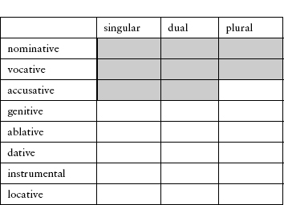
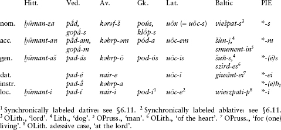
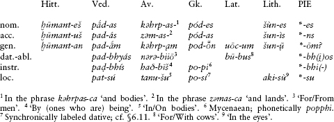
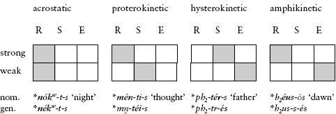
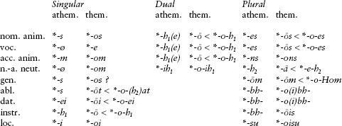
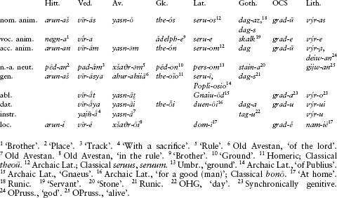
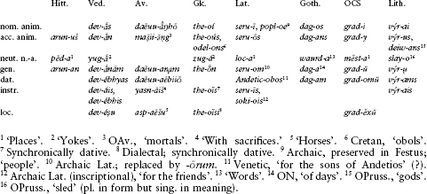
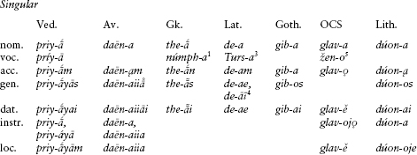
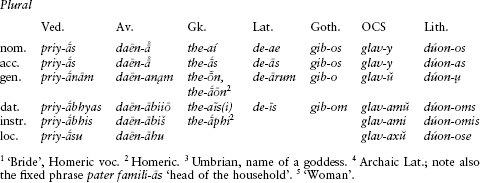
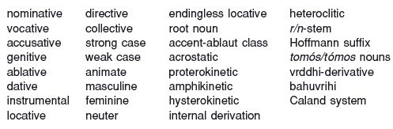

<!-- source-xhtml: 9781405188968_006.xhtml -->

# Chapter 6. The Noun

## Introduction

### *Case*

**6.1.** Like verbs, PIE nouns were highly inflected. Nouns had case-endings that indicated their grammatical function, such as subject, direct object, indirect object, and possessive. Sure evidence exists for eight cases in PIE: **nominative** (subject of the sentence and predicate nominative), **vocative** (the case of direct address), **accusative** (direct object), **genitive** (possessive), **ablative** (source or place from which), **dative** (indirect object, possession, and beneficiary of an action), **instrumental** (means, accompaniment, and agent), and **locative** (place where). There may have also been a ninth case, the **directive** or allative (place to which). A few languages, such as Old Lithuanian, Tocharian, and Ossetic, developed additional cases that arose under the influence of neighboring, unrelated language groups (Finnic in the case of the first, Turkic in the case of the second, and Kartvelian in the case of the third).

Nominal declensions, like verbal conjugations, could be athematic or thematic. The latter gradually replaced the former in most branches, though not as quickly or thoroughly as thematic verbs replaced athematic verbs.

### *Number*

**6.2.** Nouns were inflected in three numbers, singular, dual, and plural. The dual has tended to disappear, and several branches had lost it entirely or almost entirely by the time of their earliest attestations. Existing perhaps outside the singular–plural parameter was a category called the **collective**, which indicated a collection of entities treated as a unit (e.g., Latin *loca* ‘(group of) places’, as opposed to the ordinary plural *locī*, singular *locus*). The collectives are only preserved as such in the archaic stages of a few branches, and were reanalyzed as singulars or plurals elsewhere. Interestingly, both Tocharian and Anatolian could form plurals to collectives, called **pluratives**; whether this is an inherited feature is not known, for it could have developed independently (as it later did in Celtic; cp. §14.66).

### *Gender*

**6.3.** Most of the older IE languages show a three-way contrast in grammatical gender between masculine, feminine, and neuter. But the oldest preserved branch, Anatolian, has only a two-way distinction between animate or common gender and inanimate or neuter; the historical status of the feminine in Anatolian is disputed.

The neuter had the same endings as the animate (or masculine) except in the nominative, vocative, and accusative. These three cases are not formally distinguished from one another in neuters.

## Athematic Nouns

**6.4.** Like athematic verbs, athematic nouns have inflectional endings added directly to a root or suffix without an intervening thematic vowel. Traditionally, those athematic nouns with stems ending in a consonant (called *consonant stems*) have been distinguished from those ending in *i* or *u* (the *i*-stems and *u*-stems) as well as from those ending in *ā* (< **eh₂*, the typically feminine *ā*-stems); but this distinction is both unnecessary and misleading, as it masks the fundamentally identical behavior of all these groups over against that of the thematic nouns. We will, however, leave the *ā*- stems to a separate later section (§6.70) for better treatment of certain complicating issues surrounding this class.

To understand athematic nominal inflection, one must distinguish between the so-called **strong** and **weak** cases. The strong cases differ from the weak cases typically in where the accent is located and which morpheme is in the full grade; most commonly, the full grade and the accent shift rightward in the weak cases, comparable to the shift seen in most athematic verbs. In the schematic diagram below, the strong cases are shaded:

According to some theories, the accusative plural was strong as well. Standing somewhat apart was the ablaut of the locative singular; see §6.11.

### *Case-endings of athematic nouns*

**6.5.** The reconstructions of the PIE case-endings are most secure for the singular and for the strong cases in the dual and plural. For the nominative and accusative, a distinction must be maintained between **animate** nouns (masculine or feminine) and **neuters** (or inanimates), as will become clear below.

First, we sketch the case-endings of representative daughter languages. The vocative has been omitted since the daughter languages usually used the nominative for the vocative (but see further below). Only those forms relevant to the reconstructions given later are shown.

#### The singular

Representative animate athematic paradigms are given in the chart below: Hitt. *ḫūmant-* ‘every’, Ved. *pad-* and Gk. *pod-* ‘foot’, Ved. *gopā-* ‘cowherd, protector’, Gk. *klōp-* ‘thief’, Av. *kəhrp-* ‘body’ and *nar-* ‘man’, and Lat. *uōc-* ‘voice’. Baltic has clear cognate case-endings but not in any one paradigm, so a variety of forms are given that are glossed in the notes below. Case-forms in the individual languages that are either unattested or not useful for reconstruction are left blank in this and the following charts. No separate ablative is shown; see §6.8.

**6.6.** In athematic nouns, the **animate nominative singular** ended in **-s* and the **animate accusative singular** ended in **-m* (or **-m̥* after consonants). The **neuter nominative-accusative singular** had zero ending. Thus contrast Hittite neuter nomin. sing. *uttar* ‘word’, with zero ending, with animate nomin. sing. *ḫūmanza* ‘every, all’ above (phonetically *ḫūmant-š*; the odd-looking spelling *ḫūmanza* is due to limitations in the Hittite writing system on representing consonant clusters, cf. §9.30).

Athematic animate nouns ending in resonants show lengthened grade of the stem and lack **-s,* as for example Greek *patḗr* ‘father’. It is widely held that these nominative singulars originally had ordinary full grade plus **-s* also, and that a sound change (Szemerényi’s Law, §3.38) happened in PIE whereby the *-s* was lost with compensatory lengthening of the vowel: **ph₂t-ers > *ph₂t-ēr.* Two important nouns are often reconstructed with both *-s* and lengthened grade in the nominative singular, **di̯ḗus* ‘sky, sky-god’ and **gʷṓus* ‘cow’. The lengthened grade, however, is found only in Indo-Iranian (Ved. *dyáuṣ, gáuṣ,* with *au < *ēu, *ōu;* Av. *gāuš*); Gk. *Zeús* ‘Zeus’ and *boús* ‘cow’ have short diphthongs, and the forms in the other languages point to short diphthongs also. Since full grade rather than lengthened grade is expected in the nominative singular, many researchers prefer to reconstruct **di̯éus, *gʷóus* and take the lengthened forms in Indo-Iranian as innovatory.

**6.7.** In athematic animate nouns, the **vocative** ending was zero and there was retraction of the accent. What this meant for all practical intents and purposes is that the vocative was the same as the nominative without the **-s* or without lengthened grade: Gk. nomin. *pólis* ‘city’ but voc. *póli* ‘(o) city’; Ved. nomin. *hastī́* ‘having a hand’ (< **hastī́n*), voc. *hástin*. Vedic Sanskrit best preserves the accent retraction.

**6.8.** The **genitive** and **ablative** of athematic nouns were not distinguished from one another in PIE in the singular; they are often referred to together as the **genitive-ablative**. The ending was **-és* when accented, otherwise zero-grade **-s*. The first survives in genitives like Archaic Lat. *Vener-es* ‘of Venus’ (Classical Lat. *Veneris*), ON *feðr* ‘of a father’ (< pre-Germanic **patr-es*), and Lith. dialectal *dukter-ès* ‘of a daughter’. Zero-grade **-s* is found for example in Hitt. *nekuz* (pronounced *nekʷts*) ‘of the evening’ (< **nekʷt-s*) and OE *brōþor* ‘of the brother’ (< **bhrātr̥-s*). Some languages have a genitive going back to **-os*, spread perhaps from the thematic declension (§6.48): Homeric Gk. *géne-os* ‘of a kind’ and Ogam Irish *Lugudecc-as* ‘of Lugaid’ (personal name).

**6.9.** The **dative** ended in **-ei,* directly preserved for example in Archaic Lat. *Mārt-ei* ‘for Mars’, Oscan *Mamert-ei* ‘for Mars’, and OPruss. *giwānt-ei* ‘for one living’.

**6.10.** The **instrumental** ending was **-h₁* or **-eh₁*. The bare laryngeal is found in archaic Vedic *i-* and *u-*stem instrumental in *-ī* and *-ū* from **-i-h₁* and **-u-h₁,* e.g. *matī́* ‘with thought’. The fuller form **-eh₁* is found in Indo-Iranian, e.g. in *vācā́* ‘with speech’ and perhaps in the first member of such Latin verbs as *rubē-facere* ‘to redden’, if this originally meant ‘to make with redness’ or the like.

**6.11.** Two types of **locative** are found. The first was formed with a suffix **-i,* as in Ved. *pad-í* ‘on the foot’, Lat. *ped-e* (synchronically called an ablative, but functionally instrumental, ablative, and locative) ‘with/on the foot’, and Gk. *pod-í* ‘for the foot’ (synchronically called a dative, but functionally dative, instrumental, and locative).

The second type is the **endingless locative**, which is interesting not only in being endingless, but in typically having full or lengthened grade of the stem, in contrast to the other weak cases. For example, the Vedic endingless locative of the word for ‘name’ is *nām-an,* whereas the weak stem is *nām-n-* with zero-grade of the *n-*stem suffix (see below on *n-*stems). Compare also Old Avestan *dąm* ‘in the house’ (< **dōm* or **dēm*) and Old Irish *talam* ‘(on the) earth’ (< Common Celtic **talamon,* also an *n-*stem as in Vedic).

**6.12.** A ninth case, the **directive** (or allative), is posited by some on the basis primarily of Anatolian, the only branch in which it is still productive, at least in Old Hittite (e.g. *arun-a* ‘to the sea’, *parn-ā* ‘to the house, homeward’, with long *-ā* probably indicating stress; see §9.24). Elsewhere in IE there may be a few fossilized traces extended by the locative ending **-i*, such as Gk. *khamaí* ‘to the ground’ < **dhg̑hm̥m-a*. Its PIE shape is uncertain; candidates include **-h₂(e)*, **-(e)h₂*, or simply **-a*.

#### The dual

**6.13.** Fewer cases were distinguished in the dual than in the singular. The **nominative**, **vocative**, and **accusative dual** ended in **-h₁* or **-h₁e* in animate nouns, and in **-ih₁* in neuters. The full animate form is reflected for example in OLith. *žmun-e* ‘two men’, while the neuter is found in Gk. *ósse* and OCS *oči* ‘both eyes’ (**h₃(e)kʷu̯-ḫ₁* and **h₃ekʷi-h₁*, respectively, with different syllabification of the ending in the two languages), as well as Vedic Skt. *urv-ī́ rájas-ī* ‘the two broad spaces’. Note also the number ‘two’ itself, **d(u)u̯oh₁* (becoming **d(u)u̯ō*).

The other cases of the dual cannot be reconstructed because the paradigms of the daughter languages differ too sharply from one another.

#### The plural

The cases of the plural also differ from one another across the daughter languages, especially outside the nominative, vocative, and accusative, making exact reconstruction uncertain in several instances. Below are some representative animate athematic plural paradigms for comparison: Hitt. *ḫūmant-* ‘all’, Ved. *pad-* and Gk. *pod-* ‘foot’, Av. *kəhrp-* ‘body’ (and other nouns glossed in the notes), Lat. *uōc-* ‘voice’, and Lith. *šun-* ‘dog’.

**6.14.** The **animate nominative** plural was **-es* and the **animate accusative** plural was **-ns* (probably from **-ms*, a combination of the accusative sing. **-m* and an old plural ending **-s*); after consonants this became **-n̥s*. The **vocative** plural was the same as the nominative, but probably with accent retraction.

**6.15.** The **neuter nominative-accusative** plural was **-h₂*, originally a collective and not a true plural (see §§6.68ff.): Hitt. *āššū* ‘goods’ (< **h₁es-u-h₂*), Ved. *paśumā́nt-i* ‘having cattle’ (*-i* from vocalized **-h̥₂*), and Homeric Gk. *géne-a* ‘kinds’. (The similar-looking neuter plurals in forms like Lat. *gener-a* ‘kinds’ and OCS *sloves-a* ‘words’ actually go back to **-ā* < **-eh₂* and have been taken over from the thematic declension; see §6.54 below.)

Several archaic languages also have a neuter collective plural with a lengthened grade before a resonant, such as Hitt. *widār* ‘waters’ and Old Av. *aiiārə̄* ‘days’. Probably these originally ended in the collective **-h₂* too, which at an early date assimilated to the preceding resonant: **ud-or-h₂* > **ud-ōr* ‘waters’ (> Gk. *húdōr* ‘water’, reinterpreted as a singular, and Hitt. *widār* with different ablaut).

**6.16.** The **genitive plural** is traditionally reconstructed as either **-om* or **-ōm*. On system-internal grounds, usually **-om* is preferred, but most of the daughter languages actually have *-*ōm*; this is explained as an intrusion from the thematic declension (see below, §6.56), where the long vowel resulted from contraction of the thematic vowel **-o-* and the “real” athematic ending **-om*, as happened with a number of other thematic endings. It is possible that this replacement of **-om* by *-*ōm* happened already in the proto-language, for no unambiguous examples of athematic genitives from **-om* are known from the daughter languages. Celtic and Slavic are potential exceptions, but the short vowel there has often been explained as due to secondary shortening of **-ōm*. As we will see in §6.56, **-ōm* is actually contracted from **-o-Hom*.

**6.17.** The **locative plural** is straightforwardly reconstructible as **-su*. An innovated variant **-si* is found in Greek, where it has become a dative, and in Albanian, where it has become the ablative in *-sh*. More problematic are the **instrumental**, **dative**, and **ablative plurals**. Most of the branches point to endings beginning with *-*bh-*, e.g. Ved. instr. pl. *paḍ-bhís* ‘with the feet’, dat. and abl. pl. *pad-bhyás* ‘for the feet’, Mycenaean Gk. instr. pl. *po-pi* (which spells *popphi* < **pod-bhi*) ‘with the feet’, and Lat. dat. and abl. pl. *bū-bus* ‘for/with cows’. But the two northern European branches Germanic and Balto-Slavic have endings beginning with -*m-*, e.g. inscriptional West Germanic dat. pl. *Afli-ms* ‘for the Afli (goddesses)’, OCS instr. pl. *synŭ-mi* (Lith. *sūnu-mìs*) ‘with sons’, and OCS dat. pl. *synŭ-mŭ* (Old Lith. *sūnú-mus*) ‘for sons’. The *m-*endings may be an innovation of a late north-European IE dialect area.

Further confusing this picture is the fact that both **bh*- and **m-*elements also appear in a few cases that are *singular* and not plural in number, as the Armenian and OCS instrumental singular endings *-w* and *-mŭ* (e.g. Arm. *srti-w* ‘with (the) heart’, OCS *synŭ*-*mŭ* ‘with (the) son’) and residual forms in Greek like *ĩ-phi* ‘with might’. Additionally, they appear in duals in Indo-Iranian and Balto-Slavic: Ved. instr. du. *pad-bhyā́m* ‘with the two feet’, OCS dat. du. *synŭ-ma* ‘for the two sons’, Lith. instr. du. *nakti-m̃* ‘with two nights’. Finally, neither the **bh-* nor the **m-*endings are found in the oldest branch, Anatolian, which has no special endings for these cases.

All this taken together suggests that the **bh-* and **m*-endings developed late, probably after Anatolian split off from the family, and may have originally been postpositions or adverbs ultimately related to Eng. *by* and Germ. *mit* ‘with’. (It is cross-linguistically common for postpositions to develop into case-endings.)

#### Other case-like elements

**6.18.** A number of suffixes are found scattered throughout the daughter languages that may or may not be descended from true case-endings in PIE. One example is **-tos*, found in ablatival function in both singular and plural: Ved. *pat-tás* ‘from the foot’, pl. *patsu-tás* ‘from the feet’ (interestingly, added to the locative plural), and Lat. *caeli-tus* ‘from heaven’. Another is a locative ending **-dhi*, reflected by Gk. *-thi* and Arm. *-ǰ* (e.g. Gk. *ouranó-thi* ‘in heaven’, Arm. *tełwo-ǰ* ‘in a place’). Certain others are marginally attested and typically show up in adverbs, such as **-dhe* in Ved. *kú-ha* ‘where’ (with *-h-* from **-dh-*), Av. *ku-dā* ‘where’, Lat. *un-de* ‘whence’, and OCS *kŭ-de* ‘where’.

### *Athematic nominal stem formation*

#### The accent-ablaut classes

**6.19.** Athematic nouns consist of a root and grammatical ending, often with a derivational suffix in between. The term **root noun** is used for an athematic noun consisting only of root and ending, without an overt derivational suffix; these nouns will be treated in a separate section (§§6.25ff.). We will first outline the properties of athematic nouns having all three morphemes.

As already alluded to, these three morphemes could each show up in different ablaut grades depending principally on the position of the accent, which could fall on any of the three. According to the standard theory, in any given case-form of an athematic noun the unstressed morphemes appeared in the zero-grade, while the stressed morphemes were in a grade “stronger” than zero-grade – that is, one with a vowel, generally *e*, but also *o*.

**6.20.** Four distinct classes of athematic nouns are recognized by most scholars, each characterized by a particular patterned distribution of accent and ablaut grades. They are termed *acrostatic*, *proterokinetic*, *amphikinetic* (or *holokinetic*), and *hysterokinetic* (equivalent terms for the last three are *proterodynamic*, *amphidynamic*, and *hysterodynamic*). In all of these but acrostatic (which has fixed accent on the root), the accent shifts rightward in the weak cases from its position in the strong cases. Some scholars recognize two more types, *mesostatic* and *teleutostatic*, for nouns that have fixed accent on the suffix and ending, respectively; but it is not certain that these existed in the proto-language, and they will be left out of our discussion.

The somewhat simplified pictorial overview below will make the basic schemes of the four classes clear. The shaded areas indicate the location of the accent in *R*oot or *S*uffix or *E*nding; the unshaded areas indicate no accent and usually zero-grade (with a couple of exceptions to be treated later). An example is given beneath each class, with the nominative exemplifying the strong cases and the genitive, the weak.

**6.21.** In **acrostatic** nouns, the root is accented throughout the paradigm, but with ablaut distinction between the strong and weak cases. The most common type had *o-*grade of the root in the strong cases and *e-*grade in the weak cases. The word for ‘night’ above is an example; the *o-*grade nominative is preserved e.g. in Lat. *nox*, and the genitive in Hitt. *nekuz* (phonetically *nekʷts*) ‘of eventide’. One well-known group of acrostatic nouns is a set of widely attested *u*-stem (§6.42) neuters such as **dóru* ‘wood’, **h₂ói̯u* ‘life-force’, and **g̑ónu* ‘knee’, reflected e.g. in Gk. *dóru* ‘wood, spear’, Ved. *ā́yu* ‘life, life-force’, and Gk. *gónu* ‘knee’. In some branches, the *e-*grade of the oblique cases has been generalized or used as the basis for further derivation, e.g. Lith. *dervà* ‘wood’, Lat. *aeuum* ‘age’ (with *ae-* < **h₁ei-*), and Lat. *genū* ‘knee’; but sometimes it has been replaced by the zero-grade, on which see §6.27 below. Somewhat different was the word for ‘liver’, a neuter having lengthened grade in the nominative, **i̯ḗkʷ-r̥* (> Av. *yākarə*, Gk. *hē̃par*, whence English words like *hepatitis*).

**6.22.** In **proterokinetic** nouns, the root is in the full grade and accented in the strong cases, and both accent and full grade shift to the suffix in the weak cases. Most *i-* and *u-*stems (§6.42) in Sanskrit appear to have been proterokinetic, such as Ved. nomin. *matís* ‘thought’, accus. *matím*, genit. *matés*, from PIE **mén-ti-s*, **mén-ti-m*, **mn̥-téi-s* (Vedic has generalized the zero-grade of the root throughout the paradigm; see §6.42). Neuter proterokinetic nouns behaved the same way, as in the word for ‘fire’, nomin.-accus. **péh₂-u̯r̥*, genit. **ph₂-u̯én-s* (see §6.32 below).

**6.23.** In **hysterokinetic** nouns, the suffix is accented in the strong cases, the ending in the weak. The noun for ‘father’ is an example: nomin. sing. **ph₂-tér-s* (the probable original form, later **ph₂-tḗr*; recall §6.6), accus. sing. **ph₂-tér-m̥*, genit. sing. **ph₂-tr-és*, reflected almost exactly in Gk. *patḗr patéra patrós*. Another example is the noun for ‘young bull’, nomin. sing. **h₂ukʷs-ḗn*, accus. **h₂ukʷs-én-m̥*, genit. **h₂ukʷs-n-és*, reflected almost exactly in Vedic Skt. *ukṣā́*, *ukṣáṇam*, *ukṣṇás*. The English descendant is *ox*, whose plural *ox-en* still preserves the old *n-*stem suffix (eventually reanalyzed as the pural ending).

**6.24.** In **amphikinetic** (or **holokinetic**) nouns, the root is accented in the strong cases, the ending in the weak, and the suffix is typically in the lengthened *o-*grade (rather than the expected zero-grade) in the nominative singular and ordinary *o-*grade in the accusative singular. The word for ‘dawn’ belongs here, nomin. sing. **h₂éus-ōs* (Aeolic Gk. *aúōs*, Lat. *aurōr-a*), accus. sing. **h₂éus-os-m̥* (Ved. *uṣā́sam*, remade with zero-grade of the root), genit. sing. **h₂us-s-és* (Ved. *uṣás*). Another famous example is the word for ‘earth’, nomin. **dhég̑hōm* (Hitt. *tēkan*), accus. **dhég̑hom-m* (> **dhég̑hōm* by Stang’s Law, §3.38, to become ultimately Ved. *kṣā́m*), genit. **dhg̑hm-és* (Hitt. *taknāš*, Ved. *jmás*). Yet another famous amphikinetic noun is the word for ‘path’, which will be discussed in §11.25.

**6.25.** We now turn to root nouns. They include many core vocabulary items that are surely ancient, such as **h₃ekʷ*- ‘eye’, **ped-* ‘foot’, and **dem-* ‘house’. Two types can be recognized: those with fixed accent on the root (acrostatic) and those with mobile accent. Because of the lack of an overt derivational suffix, many researchers decline to assign the mobile type to any of the mobile accent-ablaut classes that we have just been discussing.

An example of an acrostatic root noun is **dem-* ‘house’ above, with nomin. sing. **dóm-s* (> **dōm* by Szemerényi’s Law, §3.38), genit. sing. **dém-s*. The nominative singular became Arm. *town* ‘house’ and probably Gk. *dō̃* ‘house’, while the genitive is found in the famous phrase **dems potis* ‘master of the house, lord, master’ (Ved. *dám-patis*, Old Av. *də̄ṇg paiti-*, and Gk. *des-pótēs*, the source of Eng. *despot*). The mobile type can be represented by the word for ‘sky, sky-god’, nomin. sing. **di̯éu-s* (or **di̯ḗu-s*; recall §6.6), accus. **di̯éu̯-m̥* (which became **di̯ḗm* already in PIE by Stang’s Law, §3.38), genit. **diu̯-és*. This is continued directly in Gk. *Zeús Zē̃n Di(w)-ós* and in Ved. *dyáuṣ dyā́m div-ás*.

**6.26.** Mobile root nouns often appear as the second members of compounds. Such root nouns were productively formed from verbal roots to indicate either the agent or the recipient (undergoer) of an action. Examples of such compounds include Ved. *r̥tv-****íj-*** ‘sacrificing correctly’ (**Hig̑*-, zero-grade of **Hi̯ag̑-* ‘worship, sacrifice’), Gk. *sú-****zug-*** ‘yoked together’ (root **i̯eug*- ‘yoke, join’), Lat. *con-****iug-*** ‘spouse’ (< *‘the one joined with’, also from **i̯eug-*), and OIr. *druí*, genitive *druad* ‘druid’ (< **dru-u̯****id-*** ‘seer/knower of the oak’; root **u̯eid*- ‘see’). As some of these examples show, these forms often had adjectival function, and the zero-grade of the root was often generalized throughout the paradigm in the daughter languages. The ablaut alternations are better preserved in Vedic, as in nomin. *vr̥tra-hā́* ‘slayer of Vr̥tra’ (a demon), genit. *vr̥tra-ghn-ás* (< PIE **-gʷhēn* **-gʷhn-es*).

**6.27.** Already in the proto-language, proterokinetic (or, in root nouns, mobile) inflection spread at the expense of acrostatic inflection in roots ending in a resonant or a resonant followed by another consonant. Thus alongside original acrostatic weak forms like genit. sing. **déru-s* and **dém-s*, new proterokinetic (mobile) forms **dr-éu-s* and **d(m̥)m-és* were created (the first seen e.g. in Ved. *drós* ‘of the wood’ and ultimately Eng. *tree*; the second seen in Arm. *tan* ‘of the house’). Such remodelings led to a new class of proterokinetics that descriptively had *o-*grade of the root in the strong cases (as in the original acrostatic inflection) but zero-grade in the weak (as in the original proterokinetic inflection). Among animate nouns of this type, the best attested is the word for ‘dog’, nomin. **k̑u̯ṓ(n)* accus. **k̑u̯ón-m̥* genit. **k̑un-és*: Ved. *śvā́ śvā́n-am śún-as*, Gk. *kúōn kún-a kun-ós* (with the accusative stem remade using the weak stem).

**6.28.** Individual schools of thought differ on the specifics of these classes, as well as on their naturalness (cross-linguistic parallels are unfortunately lacking). The account here is based on the theory developed by German and Austrian researchers in the 1960s and 1970s (principally Jochem Schindler, Heiner Eichner, and Helmut Rix) that has become in large measure accepted in the major European and American universities. Since no branch of the family preserves the original system intact (at least in the form predicted by the theory), most of it has had to be pieced together from a variety of sometimes contradictory evidence culled from different daughter languages. It is assumed that where daughter forms are at variance with this system (such as Ved. *matís* and *uṣā́sam* above), the discrepancy came about through the effects of analogy and paradigm leveling that changed the position of the accent and/or the distribution of full and zero-grades within a paradigm. Further research may well lead to modifications of the theory.

#### Internal derivation

**6.29.** One of the most interesting facts about the above system is that the accentablaut classes in PIE are thought to have stood in a derivational relationship with one another. The language could derive new nouns or adjectives simply by shifting the accent rightward and thereby changing the form’s class membership. For example, one could shift the accent of an acrostatic noun rightward and create a proterokinetic or amphikinetic noun or adjective, and from proterokinetics one could derive amphikinetics or hysterokinetics in the same way. The resulting derivatives in general meant ‘possessing, associated with’ what was denoted by the original noun or adjective. This process is known as *internal derivation*, and was elucidated by the late Austrian Indo-Europeanist Jochem Schindler.

To illustrate, from an acrostatic noun could be derived a proterokinetic possessive adjective:

acrostatic **krót-u-s* genit. **krét-u-s* ‘insight, intelligence’ (Ved. *krátus*)

- → proterokinetic **krétus* genit. **kr̥t-éu-s* ‘having mental force, strong’ (Gk. *kratús* ‘strong’)

Similarly, from a proterokinetic noun could be derived an amphikinetic noun of appurtenance:

proterokinetic **bhlég̑h-mn̥* ‘sacred formulation’ (Ved. *bráhman̥-*)

- → amphikinetic **bhlég̑h-mō(n)* ‘the one of the sacred formulation, priest’ (Ved. *brahmán̥-*)

This second type of internal derivation was quite common. Another such pair is Lat. *sēmen* ‘seed’ and its derivative *Sēmōn-ēs* ‘deities of the seed’. From proterokinetic nouns could also be generated hysterokinetic derivatives, as in Gk. *pseũdos* ‘false’ and its derivative *pseudḗs* ‘liar’.

**6.30.** Nouns could also be derived from a case-form of another noun, especially a locative. A prominent example is the derivation of the word for ‘man, human’ from the locative of the word for ‘earth’. The amphikinetic noun **dhég̑hōm* ‘earth’ had an extended locative **dhg̑hm-en* ‘on the earth’; from this locative an amphikinetic noun meaning ‘the one on/of the earth, earthling = man, human’ was formed, **dhg̑hémō(n)* genit. **dhg̑hm̥nés*, becoming Lat. *homō* genit. *hominis*, and OE *guma* pl. *guman* (surviving in altered form as the *-groom* in the word *bridegroom*).

#### Athematic derivational suffixes

**6.31.** The most prominent athematic derivational suffixes ended in *n*, *r*, *s*, and *t*, forming nouns that were called *n-*stems, *r-*stems, etc. An archaic group of nouns, called **heteroclitic stems** (or heteroclites), had suffixes with different final consonants in the strong and weak cases. By far the best-known variety of heteroclites is the class of ***r/n-*****stems**, neuter nouns ending in **-r* in the nominative-accusative singular and collective (§6.68) that is replaced by a stem in **-n-* in the other cases. A famous example is **u̯ód-r̥* ‘water’, stem **u̯éd-n-*, preserved almost exactly in Hitt. *wātar* genit. *witenaš*; note also that within Germanic we have both Eng. *water* (with *-r*) and ON *vatn* (with *-n*). Two other examples are Hitt. *ēšḫar* ‘blood’ genit. *išḫanaš*, and Lat. *femur* genit. *femin-is* ‘thigh’. The class is widely productive in Anatolian and to a lesser degree in Avestan, but moribund in the other branches. In Greek, the *-n-* was remade into *-at-* (< **-n̥-t-*), yielding words like *húdōr* ‘water’ with stem *húdat-*.

**6.32.** A number of complex (compound) suffixes belong to this category. The richest representation of these is again provided by Anatolian, which reflects stems in **-mer/n-*, **-ser/n-*, **-ter/n-*, and **-u̯er/n-*. The last of these is found for instance in the word **peh₂-,r̥* ‘fire’, continued most faithfully in Hitt. *paḫḫur* genit. *paḫḫuenaš*; the alternation is preserved indirectly in Arm. *howr* ‘fire’ alongside its derivative *hn-oc‘* ‘oven’ (< **hown-oc‘*) with *-n-*, and in Eng. *fire* alongside Goth. *fon* ‘fire’.

**6.33.** There may also have been an ***l/n-*****stem**, the word for ‘sun’. The forms in the daughter languages are quite diverse. Lat. *sōl*, Goth. *sauil*, Vedic Skt. *svàr* (phonetically *súvar*), and Av. *huuarə* (the last two with the Indo-Iranian change of **l* to *r*) reflect an old nominative ending in **-l*, probably **séh₂-u̯l̥* (or **sh₂-u̯ōl* in the case of Lat. *sōl*, which also differs from the rest in being masculine rather than neuter). This was refashioned by further suffixation and/or change in ablaut in such forms as Vedic Skt. *sū́ryas* (< **suh₂-l-*), Gk. *hḗlios* (Doric *ā(w)élios*), and Lith. *sáulė* (both < **sāu̯el-*). The original genitive **sh₂-u̯én-s* is directly reflected by the odd-looking Old Avestan form *xᵛən̥g* (with *xᵛ-* < **su̯-*, simplified from **sh₂u̯-*, and -*n̥g* < **-n-s*). The oblique stem in **-n-* was also used to derive the Germanic words that include Goth. *sunno* and Eng. *sun*.

**6.34.** ***n*****-stems.** Various types of animate and neuter suffixes ending in **-n* have been reconstructed, especially the compound suffixes **-men-*, **-sen-*, **-ten-*, and **-u̯en-*, all of which frequently show up as the basis for infinitival endings (see §5.58). The most familiar is the **neuter abstract noun suffix ******-m****n̥*, genit. sing. **-men-s*, referring to the act or result of the action of the verb. This yields for example the Vedic and Greek abstract nouns in *-ma* (e.g. Ved. *kár-ma* ‘deed’, lit. ‘thing done’, Gk. *thé-ma* ‘theme’, lit. ‘thing placed’) and the Latin abstracts in *-men* (e.g. Lat. *car-men* ‘song’ < **kan-mn̥* ‘thing sung’). Some more archaic nouns consisted simply of an *n* preceded or followed by an ablauting vowel, such as **gʷreh₂u̯-ō(n)* ‘pressing stone, millstone’ (from **gʷr̥h₂u-* ‘heavy’, as in Ved. *gurú-*), becoming Ved. *grā́vāṇ-*, OIr. *bráu* (genit. *broon*), and Eng. *quern* ‘hand mill’.

**6.35.** The so-called **Hoffmann suffix** (named after the late Indologist and Indo-Europeanist Karl Hoffmann) formed adjectives that indicated possession. It had the shape **-Hon-* alternating with zero-grade **-Hn-*. The PIE adjective for ‘young’ is a well-known example, made from the zero-grade of **h₂oi̯u* ‘life-force’: nomin. **h₂i̯u-Hō(n)* (Ved. *yúvā*), accus. **h₂i̯u-Hon-m̥* (Ved. *yúvānam*), genit. **h₂i̯u-Hn-es* (Ved. *yū́n-as*). This adjective thus originally meant ‘having life-force, having vitality’.

**6.36.** A very widespread neuter *n-*stem noun is the word for ‘name’, but its precise reconstruction is disputed; two commonly adduced contenders are **h₁neh₃mn̥* and **h₁nomn̥*. The cognates include Hitt. *lāman* (dissimilated from earlier **nāman*), Ved. *nā́ma*, Greek *ónoma* (Laconian Gk. *énuma*, only in personal names and preserving an original *e-* that changed to *o-* elsewhere in Greek), Lat. *nōmen*, Goth. *namo*, Arm. *anown*, OIr. *ainm(m)*, Toch. A *ñom*, and OCS *imę*.

**6.37.** ***r-*****stems.** Many stems ended in an **-r* that were not heteroclitic. The most common were the **agent-noun suffixes ******-ter-*** **and** ****-tor-***. The first type, which was accented on the suffix and originally had zero-grade of the root (**dh₃-tḗr*), is represented for example by Ved. *dātā́* (with analogically introduced full-grade of the root as though from **deh₃-tér*) and Gk. *dotḗr*, while the second, which had root accent and full-grade of the root (**déh₃-tōr*), is represented by Ved. *dā́tā*, Gk. *dṓtōr*, and (with analogically introduced zero-grade) Lat. *dator*. All these forms mean ‘giver, dispenser’, but some researchers have claimed that there was a semantic distinction, with the first kind forming so-called non-event agent nouns (‘one whose role is to give’ even if he never has done so, cp. Eng. *toaster*, a machine whose function is to toast even if it has never been plugged in) and the second kind forming event agent nouns (‘one who is a giver by virtue of having actually given something’, cp. Eng. *grave-robber*). This claim is disputed. In Indo-Iranian, the two formations evince different syntactic behaviors: the first type took a genitive complement (*dātā́ vásūnām* [genit. pl.] ‘giver of goods’), whereas the second took an accusative (*dātā́ vásūni*, but translated identically). How old this difference is is likewise unclear, as well as how the two formations are ultimately related to each other.

At least five **kinship terms** are also *r-*stems. Three of them, **ph₂tér-* ‘father’, **dhugh₂tér-* ‘daughter’, and **i̯énh₂ter-* or **i̯n̥h₂tér*- ‘husband’s brother’s wife’, contain an element **-h₂ter-*, of disputed interpretation. Under one view, **ph₂tér-* was originally an agent noun **ph₂-tér*- meaning ‘the protector’ or the like (from **peh₂*- ‘protect’), from which *-*h₂ter*- was later abstracted and spread to the other terms (for which no convincing root etymologies are known). Two other forms, for ‘mother’ and ‘brother’, are traditionally reconstructed as **mātér*- and **bhrā́ter*-, but given the existence of *-*h₂ter*- above these are nowadays often thought to have been **meh₂tér*- and **bhréh₂ter*- instead. For ‘mother’, however, given the ubiquitous baby-talk syllable *ma*, some prefer to reconstruct **mah₂tér*- or even **mātér*- with no laryngeal.

An *r-*stem with simpler stem is the word for ‘hand’, **g̑hés-ōr* stem **g̑hes-r-*, seen in Hittite *kiššaraš* (phonetically *kisars*; the **-s* was added later) stem *kiš(š)r-*, Gk. *kheir-*, and Arm. *jeṙn* (< **g̑hesr-n-*).

**6.38.** ***s*****-stems.** Neuters ending in **-os* in the strong cases and having a stem **-es-* in the weak cases, but with full grade of the root throughout (and therefore not falling readily into any of the accent-ablaut classes), are a common type of verbal abstract noun and were formed from the full grade of verbal roots. Thus from **g̑enh₁-* ‘be born’ was formed **g̑énh₁-os* ‘birth, thing born, race, kind’, stem **g̑enh₁-es-*: Ved. *jánas-* ‘race, clan’, Gk. *génos* ‘race, kind’ (genitive *géne-os* < pre-Greek **gen-es-os*), Lat. *genus* ‘type’, and Arm. *cin* ‘birth’.

A simple suffix **-s-* is found in some archaic nouns, such as **kreu̯h₂-s* ‘gore, bloody flesh’ (Ved. *kráviṣ-*, Gk. *kréas*; the same root that yields English *raw*).

**6.39.** Animate *s*-stems having possessive semantics were formed from neuter *s*-stems by internal derivation (§6.29). Thus the neuter noun for ‘grain’, **k̑erh₁-os* **k̑erh₁-es-*, preserved in German *Hirse* ‘millet’, could form a noun or adjective **k̑erh₁-ḗs* ‘(the one) associated with or possessing grain’, whence the name of the Latin agricultural goddess *Cerēs*. Similarly, the neuter Greek noun *klé(w)os* ‘fame’ had a derivative *-klé(w)ēs* (contracted to *-klē̃s*) ‘-famed’, common in names like *Sopho-klē̃s* ‘famed for wisdom’.

A special *s*-stem was the suffix **-u̯os-* used to form the perfect participle (§5.60).

**6.40.** ***t*****-stems.** Athematic suffixes in **-t-* are best known for forming feminine abstract nouns. The simple suffix is found for example in PIE **dek̑m̥-t-* ‘group of ten, decad’ (from **dek̑m̥* ‘ten’): Ved. *daśát-* and OCS (pl.) *desęte*. It is also found in the compound suffixes **-tāt-* (probably from earlier **-teh₂-t-*) and **-tūt-* (**-tuh₂-t-*), likewise used to form feminine abstracts; these are most familiar from Latin: *līber-tāt-* ‘freedom’, *senec-tūt-* ‘old age’. An unrelated suffix of some interest is **-it-*, seen in PIE **melit-* ‘honey’ and Hitt. *šeppit-* ‘kind of grain’; perhaps it was a “foodstuff” suffix.

An important subset of the *t-*stems is comprised by the ***nt-*****stems**, whose most conspicuous members are the participles formed to present and aorist tense-stems (see §5.60). Also worth mentioning is the **possessive suffix ******-***u̯***ent-***, as in Hitt. *ēšḫar-want-* ‘bloody’ (*ēšḫar* ‘blood’), Ved. *bhága-vant-* ‘wealthy’ (*bhágas* ‘wealth’), and Gk. *niphó-(w)ent-* ‘snowy’ (*niph-* ‘snow’).

**6.41. Reduplicated athematic nouns.** A variety of reduplicated nouns are known from all stem-classes. One reconstructible for PIE is the word for ‘beaver’, **bhe-bhru-* (a derivative of **bhreu-* ‘brown’): OHG *bibar*, Lith. *bẽbrus*, Ved. *babhrú-* ‘brown’.

**6.42.** ***i-*** **and** ***u-*****stems.** Two classes of athematic nouns that behaved in parallel were those whose suffix was **-i-* or **-u-* in the zero-grade and **-ei-* **-eu-* in the full grade. The most common type continues an earlier proterokinetic paradigm, with zero-grade **-i-s* **-i-m* and **-u-s* **-u-m* in the strong cases, and full grade in the weak cases (genit. **-ei-s* **-eu-s*). By the time of the daughter languages, however, these nouns do not ablaut in their root syllable. Thus Ved. *matí-* ‘thought’ is believed to continue a proterokinetic nomin. **mén-ti-s* genit. **mn̥-téi-s*, but the zero-grade **mn̥-* (> Ved. *ma-*) has been generalized. (The same happened in Greek and other branches.) This is an example of the **verbal abstract nouns in ******-ti-***, one of the most common groups of *i-*stems; also common were abstract nouns in **-tu-*. Both of these types often appear in infinitives in the daughter languages (see §5.58).

Many adjectives made from roots having inherently adjectival meaning are simple *u-*stems, such as Lith. *dubùs* ‘deep’ and Ved. *gurú-* ‘heavy’. On the *u-*stem proterokinetic nouns of the type **dóru* ‘spear’, see §6.21.

## Thematic Nouns

**6.43.** Thematic nouns, like thematic verbs, are characterized by the presence of an ablauting stem **-e/o-* to which the case-endings are added. In practice, the stem is almost always **-o-*, and so these nouns are commonly referred to as ***o*****-stems**. The case-endings are mostly the same as the athematic ones, but there are several notable differences, as we will see shortly. In many of the daughter languages, certain thematic case-endings were influenced or replaced by the corresponding pronominal case-endings (see §7.9); some common instances of this will be pointed out.

**6.44.** There are no certain accent–ablaut distinctions within thematic paradigms except in the vocative, where the accent was retracted. (But see also §6.66.) Most animate *o*-stems had masculine gender, but a number of them, including some kinship terms (e.g. **snusos* ‘daughter-in-law’) and a variety of tree names (e.g. **bhāg̑os* ‘oak, beech’ and **kr̥nos* ‘cornel cherry’), were feminine.

### *Case-endings of thematic nouns*

**6.45.** Below is a comparative table of the athematic and most archaic thematic endings to illustrate the similarities and differences between the two classes:

#### Singular

**6.46.** The following chart shows some of the comparative evidence for the singular declension of *o*-stems: the animates Hitt. *arunaš* ‘sea’, Ved. *vīrás* ‘man’, Av. *yasna-* ‘sacrifice’, Gk. *theós* ‘god’, Lat. *seruus* ‘slave’, Goth. *dags* ‘day’, OCS *gradŭ* ‘city’, and Lith. *výras* ‘man’. The neuters and other special forms are glossed in the notes.

**6.47.** There is complete agreement on the reconstruction of the **animate nominative**, **vocative**, **accusative**, and **neuter nominative-accusative singular**. Retraction of the accent in the vocative is evidenced by such forms as Ved. *vī́r-a* (vs. nomin. *vīrás*) and Gk. *ádelph-e* (vs. nomin. *adelphós*) above. Also uncontroversial are the reconstructions of the **dative**, **instrumental**, and **locative singular**, traditionally reconstructed as **-ōi*, **-ō*, and **-oi*. The first two are likely contracted from **-o-ei* and **-o-h₁*. An ablaut variant **-ei* in the locative is found especially in Italic, e.g. Oscan *comenei* ‘in the assembly’ and Lat. *domī* above. An *e-*grade variant instrumental in **-e-h₁* is also thought to underlie the Italic adverbs in **-ē(d)* (which merged with the ablative and received the same dental as in the ablative), such as Lat. *rēctē* ‘properly’ (Archaic Lat. *rēctēd*). An important feature of the locative **-o-i* is that it was disyllabic in PIE and remained so for some time after the proto-language, as reflected by intonational facts in Greek and Balto-Slavic.

**6.48.** The picture for the **genitive singular** is not quite as clear. The oldest ending was perhaps **-os*, identical to the nominative, if Anatolian is any indication (e.g. Hitt. nomin. *arun-aš* ‘sea’, genit. *arun-aš*); and this ending may have infiltrated the athematic declension in several daughter languages, including Greek (see §6.8). But much more widely represented is **-osi̯o*, represented by Ved. *vīr-ásya*, Av. *yasn-ahe*, Homeric Gk. *the-oĩo*, and Archaic Lat. *Popli-osio* above, as well as by Arm. *get-oy* ‘of the river’. A similar suffix **-oso* is reflected by OE (Northumbrian) *moncynn-æs* ‘of mankind’ (> Mod. Eng. *-’s*) and probably OPruss. *deiw-as* ‘of god’; it is related to the pronominal genitive **-eso* (see §7.8). A completely different genitive ending **-ī* is found in Italic (Latin *uir-ī*), the closely allied Venetic (*Vineti* ‘of Vinetos’), and Celtic (Ogam Ir. *maq(q)i* ‘of the son’).

**6.49.** Unlike the athematic ablative, the thematic **ablative singular** is distinct from the genitive. It was formed by suffixing an element variously reconstructed as **-ad*, **-at*, or **-h₂et* (> **-h₂at*) to the thematic vowel (the final consonant is uncertain due to the word-final voicing neutralization discussed in §3.40). This yielded a sequence **-o-(h₂)ad/t* that became *-āt* in Vedic and *-****āt̰*** in Old Avestan, and elsewhere contracted to **-ōt* (e.g. Archaic Lat. *Gnaiu-ōd* ‘by Gnaeus’) or **-āt* in Balto-Slavic, where it became a genitive (OCS *grad-a* ‘of/from the city’, Lith. *výr-o* ‘of/from the man’). This suffix may be related to the Slavic preposition **otŭ* ‘from’ (> Russ. *ot*). A laryngeal is likely because of the ending’s intonational behavior in Baltic; additionally *-āt* can have disyllabic scansion in Vedic poetry (though not, strangely, in Old Avestan).

#### Dual

**6.50.** The **nominative**, **vocative**, and **accusative animate dual** is traditionally reconstructed as **-ō*, which is now thought to be from **-o-h₁* on the assumption that the ending contains the same dual suffix **-h₁* seen in the athematic declension. Examples of the thematic dual include Gk. *anthrṓp-ō* ‘two men’, Ved. *dev-ā́* ‘two gods’, OCS *grad-a* ‘two cities’, and Lith. *výr-u* ‘two men’. The thematic **neuter** nom.-voc.-acc. dual ended in **-o-ih₁*, as in Ved. *yug-é* and OCS *iz-ě* ‘two yokes’. The other cases in the dual cannot be reconstructed with any certainty.

#### Plural

**6.51.** The following chart shows some of the comparative evidence for the plural of *o-*stems, using the same nouns as above except for Ved. *devás* ‘god’ and Av. *daēuua-* ‘demon’. Other forms are glossed in the notes.

**6.52.** The **animate nominative** and **vocative plural** was **-ōs* (contracted from **-o-es*), as in Ved. *dev-ā́s* ‘gods’, OIr. *(á) ḟir-u* ‘men!’ (surviving as a vocative only), Goth. *dag-os* ‘days’, and Osc. **Núvlan-ús** ‘men from Nola’ (the boldfacing is customary for transliterating words written in the native Oscan alphabet). To judge by the Ved. vocative *dévās* ‘gods!’, the vocative plural had accent retraction like the singular. A doubled ending **-ōsos* is found in Indo-Iranian and Germanic: Ved. *dev-ā́sas* ‘gods’, Av. *daēuu-ā̊ŋhō* ‘demons’, and probably East Frisian *fisk-ar* ‘fishes’.

**6.53.** In at least five branches the pronominal nominative plural **-oi* (§7.9) replaced the original nominal ending. This probably came about in phrases consisting of a pronoun and noun, where the noun simply copied the pronominal ending: so a phrase **toi ek̑u̯ōs* ‘those horses, the horses’ became **toi ek̑u̯oi*. The ending is seen in Gk. *the-oí*, Lat. *seru-ī*, OCS *rab-i*, and Lith. *výr-ai* above, as well as Toch. B *yakwi* ‘horses’ (< **ek̑u̯oi*) and OIr. *fir* ‘men’ (< **u̯ir-oi*); traces are also found in Albanian.

**6.54.** The **neuter nominative-accusative plural** was **-eh₂*, originally a collective (§§6.68ff.), as in Ved. *yug-ā́* ‘yokes’ and Osc. *comono* ‘assemblies’ (with *-o* < **-ā*).

**6.55.** The other thematic plural endings resemble the athematic endings, and generally consist of them added to the thematic vowel. The **animate accusative plural** was **-ons* (= **-o-ns*), as seen in OAv. *maṣ̌ii-ə̄ṇg*, Gk. (Cretan) *odel-ons*, Goth. *dag-ans*, and OPruss. *deiw-ans* above. A long version **-ōns*, which may or may not be of PIE date, is reflected for example in Ved. *dev-ā́n* (appearing as *dev-ā́ṃs* before certain consonants).

**6.56.** The thematic **genitive plural** was probably **-o-Hom* rather than the traditionally reconstructed **-o-om*, **-ōm*, because of the circumflex accent in Greek -*ō̃n* (representing *-óòn* < **-ó-Hom*) and Baltic (Lith. -*ų̃*), the outcome in Germanic, and the disyllabic scansions in Indo-Iranian poetry (reflecting Indo-Iranian **-a’am*). Short **-(H)om* that appears to be reflected in Celtic and Slavic seems to be the result of secondary shortening in these branches.

**6.57.** As in the athematic declension, the thematic **dative and ablative plural** were generally formed with endings in **-bh-* or **-m-*, the latter only in Germanic and Balto-Slavic. Sometimes, as in Ved. dat pl. *dev-ébhyas* and Av. dat. pl. *daēuu-aēbiiō*, the ending was added to a stem in **-oi-* rather than the bare thematic stem. This recurs in the **locative plural** **-oi-su* (Ved. *dev-éṣu*, Av. *asp-aēšu*, dialectal Gk. *the-oĩsi* [dative, with *-si* replacing **-su*], and OCS *rab-ěxŭ*, with -*x-* from earlier **-s-*). A longer version *-*ōi*- (presumably contracted from **-o-oi-*) of this stem-formant occurs in the only ending with no parallel in the athematic declension, the **instrumental plural** *-*ōis* (Ved. *dev-áis*, Lith. *výr-ais*, Gk. *the-oĩs* [also dative]). This was subject to replacement by forms in **-oi-bhi-* or **-oi-mi-*, as in Ved. *dev-ébhis.*

### *Thematic nominal formations and suffixes*

**6.58.** Some thematic nouns reconstructible for PIE are not derived from any known root, such as **u̯ĺ̥kʷos* ‘wolf’, **h₂ŕ̥tk̑os* ‘bear’, **snusós* ‘daughter-in-law’, and **agʷnos* ‘lamb’. But most of the thematic nouns found in the daughter languages are derived from roots, either by adding the thematic vowel alone or by adding a suffix that itself ends in the thematic vowel. PIE had a large number of such suffixes, a few of which are given below. Some of the example forms are actually feminines ending with the suffix **-ā* (**-e-h₂*; see §§6.69–70).

#### *Tomós* and *tómos* nouns

**6.59.** These nouns, named after a Greek example of each type, were formed by adding the thematic vowel to the *o-*grade of the root. *Tomós* nouns had accented suffix and agential or active meaning (Gk. *tomós* means ‘sharp’, i.e. ‘cutting’, from **tem-* ‘cut’), while *tómos* nouns had root accent and resultative meaning (*tómos* means ‘a slice’, that is, a thing that results from cutting). The agential *tomós* nouns are particularly frequent as final compound members; an example is **-gʷor(h₃)os* ‘eating, devouring’ (root **gʷerh₃-* ‘devour’) in Gk. *dēmo-bóros* ‘devouring the people’ and Lat. *carni-uorus* ‘eating meat, carnivorous’.

#### Possessive derivatives in *-*ó*-

**6.60.** Thematic nouns and adjectives indicating possession could be formed by adding the accented thematic vowel suffix **-ó-* to an athematic noun stem, or by shifting the accent rightward to the thematic vowel of an already existing thematic noun (usually with additional modifications, see directly below). For example, the noun **gʷi̯eh₂-* ‘bowstring’ (> Ved. *jyā́)* had zero-grade **gʷih₂-,* from which a thematic noun **gʷih₂-ó-* ‘(thing) having a bowstring’ could be formed (> Gk. *biós* ‘bow’).

**6.61.** At other times, the ablaut grade of the base was “increased” a step (from zero to full or from full to lengthened), a very common type of formation called a **vrddhi-derivative**, after the Sanskrit word for ‘growth’. Vrddhi-derivatives have a genitival or ablatival relationship to the noun from which they are formed: ‘belonging to, of, (descended) from’. Thus from the thematic noun **su̯ék̑uro-* ‘father-in-law’ (Ved. *śváśura-*) could be formed a lengthened-grade vrddhi-derivative **su̯ēk̑uró-* ‘pertaining to one’s father-in-law’ (> Skt. *śvāśura-* ‘relating to one’s father-in-law’, OHG *swāgur* ‘father-in-law’s son = brother-in-law’).

**6.62.** Sometimes a vrddhi-derivative was formed from a zero-grade and involved the insertion of the full-grade vowel in the “wrong” place. A famous example is the PIE word for ‘god’, **deiu̯-ó-s* (Ved. *devás,* Av. *daēuua-* ‘demon’, Archaic Lat. accus. pl. *deiuōs* ‘gods’). It was formed from the zero-grade **diu̯-* of the noun **di̯ḗus* ‘sky’, with the “wrong” full-grade **deiu̯-* instead of **di̯eu-*. Its literal meaning was ‘one of, belonging to, or inhabiting the sky’.

#### Reduplicated thematic nouns

**6.63.** Just as some athematic nouns exhibit reduplication, so too do some thematic nouns. The most famous example, found throughout the family, is **kʷe-kʷl-o-* ‘wheel’ (root **kʷel(H)-* ‘to turn’): Ved. *cakrám,* Gk. *kúklos,* Toch. A *kukäl* ‘chariot’, OE *hweohl* ‘wheel’, and perhaps Hitt. *kugullaš* ‘ring-shaped bread, donut’. Additional examples include Ved. *ré-rih-a-* ‘licking repeatedly’, Av. *rą-rem-a-* ‘resting’, and OCS *gla-gol-ŭ* ‘word’ (< **gal-gal-o-,* from **gal-* ‘to cry out’). It has been suggested that such forms had intensive or emotive force; **kʷe-kʷl-o-* may have been an expressive neologism for a new gadget, the wheel, referring to the iterativity of its turning. (Recall on this point also §2.58.)

#### Nouns in *-*lo*-

**6.64.** This is widely found in diminutives in Italic, Germanic, and Balto-Slavic, such as the word for ‘piglet’: Lat. *porc-ulus,* OHG *farh-ali,* and Lith. *parš-ẽlis* (only the Latin form has actually remained thematic). It is also found added to verbal roots to make nouns of various kinds, such as **sed-lo-* (or feminine **sed-leh₂*) ‘a seat’ (from **sed-* ‘sit’) in e.g. Gk. *hellā́*, Lat. *sella*, and Goth. *sitls*.

#### Nouns in *-*mo*-

**6.65.** This suffix was added to verbal roots to form a variety of action and event nouns. For example, the root **gʷher-* ‘to heat up’ formed **gʷher-mo-* or **gʷhor-mo-*, appearing as a noun meaning ‘heat’ (Ved. *gharmá-*, OPruss. *gorme*, Alb. *zjarm* ‘fire’) or an adjective meaning ‘warm’ (Gk. *thermós*, Lat. *formus*, Eng. *warm*, Arm. *ǰerm*). Some further examples from the individual languages include Gk. *gnṓ-mē* ‘opinion’ (Greek root *gnō-* ‘know’ < PIE **g̑neh₃-*), Lat. *fā-ma* ‘fame, report, reputation’ (Latin root *fā-* ‘speak’ < PIE root **bheh₂-*), and Eng. *stream* (< **sreu-mo-*, from **sreu-* ‘flow’).

On the participial suffix **-mo-*, see §5.60.

#### Nouns in *-*no*-

**6.66.** This suffix was added to verbal roots to form nouns of various sorts, such as Vedic *yajñá-* and Av. *yasna-* ‘sacrifice, offering’ (< **Hi̯ag̑-no-*, from **Hi̯ag̑-* ‘to sacrifice’), and Lat. *dōnum* ‘gift’ (< **deh₃-no-*, from **deh₃-* ‘to give’). One well-known trio of these nouns – the words for ‘sleep’ (**su̯ep-no-*), ‘wagon’ (**u̯eg̑h-no-*), and ‘price’ (**u̯es-no-*) – is unusual in showing ablaut of the root. To use the first of these for illustration, the *e*-grade **su̯ep-no-* is found in OE *swefn* ‘sleep, dream’, the *o*-grade **su̯op-no-* in Arm. *k‘own* ‘sleep’, and the zero-grade **sup-no-* in Gk. *húpnos* ‘sleep’.

On the passive verbal adjective suffix **-nó-*, see §5.61.

#### “Tool” nouns in *-*tlo*-, *-*dhlo*-, *-*tro*-, *-*dhro*-

**6.67.** These suffixes formed nouns indicating an instrument for accomplishing an action; normally they are neuters. Originally there were only the suffixes **-tlo-* and **-tro-*; **-dhlo-* and **-dhro-* arose secondarily by Bartholomae’s Law (§§3.35, 10.6) and were later reanalyzed as independent suffixes. Examples of each suffix include **(s)neh₁-tlo-* ‘thing to sew with’ (from **sneh₁-* ‘sew’) in Eng. *needle*; **sth₂-dhlom* ‘place to stand things’ (from **steh₂-* ‘stand’) in Lat. *stabulum* ‘place for animals to stand, stable, stall’; **h₂erh₃-trom* ‘a plow’ (from **h₂erh₃-* ‘to plow’) in Gk. *árotron*, Lat. *arātrum*, and OIr. *arathar*; and **k̑r(e)i-dhro-* ‘sieve’ (from **k̑rei-* ‘to sift, strain’) in Lat. *crībrum* and OE *hridder*.

## The Collective and the Feminine

**6.68.** As noted above, the neuter plural was formed by adding **-h₂*. A curious fact in Anatolian, Greek, and Old Avestan is that neuter plurals took singular verb agreement, as in the Greek phrase *tà zō̃ia trékhei* ‘the animals (pl.) run (sing.)’. Additionally, in several branches (most notably Anatolian), animate nouns could form collective plurals in -*a* (< **-(e)h₂*) alongside ordinary (distributive) plurals: Hitt. *alpaš* ‘cloud’, ordinary (distributive) plural *alpeš* ‘clouds’, collective *alpa* ‘ group of clouds’; Gk. *mērós* ‘thigh’, ordinary plural *mēroí* ‘(individual) thigh-pieces’ (of a sacrificial animal), collective plural *mē̃ra* ‘(group of) thigh-pieces’; Lat. *locus* ‘place’, ordinary plural *locī*, collective *loca*. These facts have led many to hypothesize that **-h₂* was originally a collective suffix, and that PIE possessed a singular, dual, distributive plural, and collective.

**6.69.** The suffix **-h₂* is at least outwardly identical to an animate suffix **-h₂* that forms feminine nouns and abstract nouns. Its function as an abstract-noun suffix is found in all the branches including Anatolian, as in Luvian *zid-āḫ(-iša)* ‘virility’ (from *ziti-* ‘man’), Lycian *pijata-* ‘gift’ (< **pii̯o-te**h₂***), and Gk. (Doric) *tom-ā́* ‘a cutting’ (< **tom-e**h₂***). The feminizing **-h₂*, however, is found only outside Anatolian. If these two **h₂*-suffixes are one and the same, as most researchers believe, then the collective **-h₂* early on acquired the additional function of marking the animate singulars of abstract nouns, and then later (after Anatolian broke off from the family) became specialized as a feminizing suffix.

It is not clear how this development is to be explained semantically. The use of abstract nouns to refer to an individual person belonging to or associated with that abstract entity has good parallels, as in Eng. *youth* ‘state of being young’ > ‘a young individual’, or Lat. *testimōnium* ‘testimony’ > French *témoin* ‘witness’. But how such individualizing use might have been manifested in feminizing function is unclear.

The collective **-h₂* was restricted to the nominative and accusative of collectives, but in abstract and feminine forms it is found in all cases and numbers.

### *The* ā-*stems*

**6.70.** The most widespread group of feminine nouns had a stem **-eh₂-*, which contracted to **-ā-*, the source of the ā-declensions that are characteristic of feminine nouns in so many of the daughter languages (Greek and Latin among them). This stem is either the feminizing suffix **-h₂* added to the thematic vowel, or simply the full grade of the feminizing suffix. Compare the paradigms below of Ved. *priyā́* ‘dear’, Av. *daēna* ‘religion’, Gk. *theā́* and Lat. *dea* ‘goddess’, Goth. *giba* ‘gift’, OCS *glava* ‘head’, and Lith. *dúona* ‘bread’.

As can be seen, the **-eh₂*-declension is athematic, with the case-endings added directly to the laryngeal. There is interestingly no **-s* in the nominative singular. The vocative had retracted accentuation (preserved in Sanskrit and in a few words in Greek) and ended in **-a* (whence the *-a* of Greek and Umbrian and the *-o* of OCS; elsewhere it was remade using the nominative ending). This **-a* probably resulted from *-*ah₂* with loss of the laryngeal before a pause. Some of the other forms in the charts above have been remade as well, such as the Latin genitive sing. *de-ae* (§13.38). Note that forms like the accusative singular **-eh₂-m* do not appear as **-eh₂-m̥*, as might be expected from the usual syllabification rules (§3.42), but rather remain **-eh₂-m*, eventually to become **-ām*. This is an example of Stang’s Law (see §3.38). The accusative plural is also noteworthy: the daughter languages agree that the reconstructible ending is *-*ās* rather than *-*āns*, with the nasal lost early (*-*eh₂n̥s* > *-*ah₂n̥s* > *-*ah₂ns* by Stang’s Law > *-*āns* > *-*ās*). Aside from the forms cited above, note also Celtic accusative plurals like Gaulish *mnas*, Old Irish *mná* ‘women’, and Old Irish *túatha* ‘peoples’, where by Celtic and Irish sound laws the final vowel must come from **-ās* rather than *-*āns*. Sometimes the *-n-* was restored, notably in Greek (contrary to the appearance of *theā̃s* above; for the reason, see §12.50).

At an earlier stage there were potentially feminines formed simply by adding **-h₂* to a root, as in **gʷen-h₂* ‘woman’, reflected directly by Ved. *jáni-* (with *-i-* < **h₂*). (Gk. *gunḗ* and OCS *žena* come from later forms ending in **-eh₂*.)

The ā-declension in the daughter languages is familiarly associated with thematic declensions, especially in adjectives where *o*-stem masculine and neuters form their feminines with **-ā-* (e.g. Lat. *nouus* [masc.], *nouum* [neut.], *noua* [fem.]). It is also associated with feminine counterparts of *o*-stem animates (e.g. *ursa* ‘she-bear’ next to *ursus* ‘[he-]bear’ in Latin). Both of these functions, however, may have arisen relatively late, as they are barely found in the earliest attested stages of these languages.

### *The* devī́- *and* vr̥kī́*-feminines and other formations*

**6.71.** Beside bare **-eh₂-* we can reconstruct a compound suffix **-i̯eh₂-* that is also collective and feminizing. It existed in two types, represented on the one hand by Vedic *devī́* ‘goddess’, genit. *devyā́s*, and on the other by Vedic *vr̥kī́s* ‘she-wolf’, genit. *vr̥kyàs* (which spells *vr̥kías*). The *devī́*-type commonly forms feminines to athematic adjectives such as *nt*-participles; examples include Ved. *yuñjat-ī́* ‘yoking (fem.)’ (< **i̯ung-n̥t-ih₂*) and Gk. *phérousa* ‘carrying (fem.)’ (< pre-Greek **bher-ont-i̯a*). (On the different syllabifications of **-ih₂,* cp. §3.42.) There is no sure evidence of either of these types in Anatolian.

There are scattered vestiges of other feminine formations, of which we shall mention one. A feminine suffix **-s(o)r-,* derived from a word **soro-* ‘woman’, is indicated by the Indo-Iranian and Celtic feminine of the numerals ‘three’ and ‘four’, **t(r)i-sr-* and **kʷete-sr-* (Ved. *tisrás, cátasras;* Av. *tišrō, cataŋrō,* with *-ŋr-* from **-sr-;* Gaul. *tidres;* and OIr. *teoir, cetheoir*). It is also found as a feminizing suffix for certain Hittite nouns (see §9.44a), and may well be the second element in the kinship term **su̯e-sōr* ‘sister’, perhaps ‘woman of one’s own (kinship group)’ (**su̯o-* ‘one’s own’; see §7.13).

## Adjectives

**6.72.** Indo-European adjectives did not differ from nouns in declension, and could be thematic or athematic. To judge by the older IE languages, any adjective could also be used as a noun (like English *the good, the bad, and the ugly*). Sometimes the substantivization of an adjective (that is, the process of turning it into a noun) involved morphophonological changes, especially in an idiomatic meaning. Among the best-known of these is retraction of the accent when turning an adjective into a noun, as in Ved. *kr̥ṣṇá-* ‘black’ versus the noun *kŕ̥ṣṇa-* ‘black antelope’, and Gk. *dolikhós* ‘long’ versus *dólikhos* ‘long race-course’.

### *Formation of adjectives*

**6.73.** Adjectives could be formed by the addition of suffixes to roots or word-stems. While most of the adjectives so formed were *o-*stems (see the list starting in §6.74 below), many other adjectives were athematic. For example, a number of adjectives that were formed from roots of adjectival meaning were *u-*stems (as **su̯eh₂du-* ‘sweet’ > Vedic *svādú-,* Doric Gk. *hādús*), and we have seen various consonant-stem participles like those in **-nt-* and the feminine adjectives in **-ih₂-*. A type of *i*-stem adjective of some interest is that exemplified by Latin *prō-clīu-is* ‘steep’ and *dē-pil-is* ‘hairless’: each of these is a compound formed from an *o*-stem noun (*clīu-us* ‘a slope’, *pilus* ‘hair’), with the thematic declension replaced by *i*-stem endings when the noun formed a compound adjective. Aside from suffixation, athematic adjectives could be formed from athematic nouns by internal derivation, detailed in §6.29.

### *Adjectival suffixes*

**6.74.** ****-i̯o-*** and ****-ii̯o-***. Indo-Europeanists have traditionally reconstructed an all-purpose adjectival suffix **-i̯o-* underlying such forms as Hitt. *ištarniya-* ‘central’ (< *ištarna* ‘between’), Ved. *dámiya-* ‘domestic’ (< *dám-* ‘home’), *gávya-* ‘pertaining to cows’ (< *gáv-* ‘cow’), and Lat. *ēgregius* ‘outstanding’ (< *ē grege* ‘out of the herd’). But recent research suggests that PIE originally had two or more similar but functionally distinct suffixes. Probably the commonest was **-ii̯o-,* which formed adjectives of appurtenance or origin, and is partly or in whole derived from the locative ending **-i* plus the possessive suffix **-o-* or **-ó-* (§6.60). It was also in extensive use to form adjectives from compounds, such as Lat. *ēgregius* above. In several branches, the suffix was used to form patronymics (‘son of. . .’), e.g. Homeric Gk. *Telamṓn-ios Aías* ‘Aias (Ajax) son of Telamon’, Old Persian *Haxāmaniš-iya-* ‘offspring of Achaemenes, Achaemenid’, Lat. *Seru-ius* ‘son of a slave (*seruus*), Servius’. A monosyllabic **-i̯o-* is found in some other formations, such as relational adjectives (most prominently **medh-i̯o-* ‘middle’ in e.g. Vedic Skt. *mádhya-,* Gk. *mésos,* and Gothic *midjis,* and * *al-i̯o-* ‘other’, on which see §7.14) and various other items like Gk. *ápeiros* ‘boundless’ < **n̥-per-i̯o-*. But often it is hard to tell these apart, especially since **-i̯o-* was often pronounced **-ii̯o-* in the proto-language because of Sievers’ Law (§§3.43ff.), and in many branches (such as Italic and Celtic) **-ii̯o-* replaced **-i̯o-*.

**6.75.** ****-ko-*.** This suffix is most commonly found added to nouns to indicate origin or material composition: Ved. *síndhu-ka-* ‘from Sindh’, Gk. *Libu-kós* ‘Libyan’, Gaulish (Latinized) *Are-mori-cī* ‘those by the sea, Aremoricans’, Goth. *staina-hs* ‘stony’. It frequently appeared in a longer version ****-iko-*** as a suffix indicating appurtenance, as in Gk. *hipp-ikós* ‘having to do with horses’, Lat. *bell-icus* ‘pertaining to war’, and OE *gyd-ig* ‘dizzy’ (< Germanic **guđ-iǥa-* ‘possessed by a god’; Mod. Eng. *giddy*).

Related is ****-isko-***, found in Germanic and Balto-Slavic to indicate affiliation or place of origin: OHG *diut-isc* ‘pertaining to the (common) people’ (> Mod. German *Deutsch* ‘German’), OCS *rŭm-ĭskŭ* ‘Roman’, and Russ. *russkij* ‘Russian’. This is the source of Mod. Eng. *-ish*.

**6.76. **-ro-*.** This suffix took part in the derivational system known as the Caland system (see §6.87). It was added to the zero-grade of an adjectival root to form that root’s free-standing adjectival form, and was usually accented, as in * *h₁rudh-ró-* ‘red’ (Ved. *rudhirá-* ‘blood-red, bloody’, Gk. *eruth-rós,* Lat. *ruber*) and **h₂r̥g̑-ró-* ‘swift; shining’ (Ved. *r̥j-rá-,* Gk. *argós* < **argrós* ‘swift’).

**6.77. **-tó-*.** Aside from forming passive verbal adjectives (see §5.61), this suffix formed possessive adjectives, as in Lat. *barbā-tus* ‘bearded’, OCS *bogatŭ* ‘wealthy’ (from *bogŭ* ‘wealth’), and Eng. *beard-ed*. For (unaccented?) **-to-* in superlatives and ordinals, see §6.81 and §§7.20, 7.22.

### *Comparison of adjectives*

#### Comparative

**6.78.** Two suffixes are widely used as comparative markers in the IE languages. The first was an amphikinetically ablauting suffix **-i̯os-* (masculine nomin. **-i̯ōs,* weak cases **-is-*) added to the full grade of the root: Av. accus. sing. *nāid-iiā̊ŋhəm* ‘weaker’ (< Indo-Iranian **nādh-i̯ās-am*); Mycenaean Gk. *me-zo-e* ‘(two) bigger ones’ (< pre-Greek * *meg-i̯os-e*); Lat. *maior* (Archaic Lat. *maiōr*), neut. *maius* (**mag-i̯os-*), adverb *magis* ‘more’; OIr. *sin-iu* ‘older’ (**sen-i̯ōs,* cp. Lat. *senior*); Goth. *manag-iz-* ‘more’; and OCS *bol-ĭš-* ‘bigger’.

**6.79.** The second comparative suffix was * *-tero-*. This was not originally a comparative suffix: its basic function was to set off a member of a pair contrastively from the other member of the pair, as in Gk. *skaiós* ‘left’ vs. *deksiterós* ‘right’, i.e. ‘the one on the right (as opposed to the one on the left)’. Thus a comparative like Gk. *sophṓ-teros* ‘wiser’ meant originally ‘the wise one (of two people)’, hence ‘(the one that is) more wise’. This suffix is continued by the comparative suffixes *-tara-* of Sanskrit and -*tero-* of Greek, and by such forms as Lat. *dē-ter-ior* ‘farther down, lower, worse’, OIr. *úachtar* ‘higher part’, and Eng. *far-ther*.

#### Superlative

**6.80.** To judge by the fact that some of the older IE languages could use the positive degree of an adjective plus a genitive plural noun to express the superlative of the adjective, PIE did not necessarily express the superlative degree by any change to the adjective. Thus Homeric Greek has *dī̃a theā́ōn* (genit. pl.) ‘divine of/among goddesses = most divine goddess’, and Hittite has *šallayaš* (genit. pl.) *šiunaš* (genit. pl.) *šalliš* ‘great among the great gods = the greatest of the great gods’.

**6.81.** However, at least two suffixes are reconstructible that have a superlative function in the daughter languages. One is ****-m̥mo-***, seen in various forms and combinations: alone in Lat. *min-imus* ‘least, smallest’; **-t-m̥mo-* in the Skt. superlative suffix *-tama-*; and **-is-m̥mo-* (a combination of the weak stem **-is-* of the comparative suffix and the superlative **-m̥mo-*) in Latin superlatives like *fort-issimus* ‘strongest’ and *maximus* ‘biggest’ (probably **magism̥mo-*). The other is the addition of **-to-* to the zero-grade **-is-* of the comparative suffix, yielding ****-isto-***, as found in the Skt. superlative suffix *-iṣṭha-*, Gk. *még-istos* ‘greatest’, and Goth. *bat-ista* ‘best’ (and continued by the Eng. superlative suffix -*est*). These superlative suffixes bear a striking resemblance to, and are perhaps ultimately identical with, certain ordinal numeral suffixes, e.g. **-isto-* in Eng. *first*; see §§7.19ff.

## Nominal Composition and Other Topics

**6.82.** PIE possessed a rich set of compound noun formations. Compounds can be broadly classified into two types according to their meaning. In one type, which can be illustrated by *blackbird* ‘(a type of) black bird’, the compound is essentially the sum of its parts, and its referent (a type of bird) is one of the compound members itself (usually the second one, as here). This type is called *endocentric* (or determinative). Examples of endocentric compounds from other IE languages include Skt. *Siṁha-puras* ‘Lion City’ (*Singapore*), Gaulish (Latinized) *Nouio-dūnum* ‘New Fort’, German *Blut-wurst* ‘blood sausage’, and OCS *dobro-dějanje* ‘good works’.

The second type, which can be illustrated by another bird-name, *redthroat*, is more than the sum of its parts and refers to something outside itself: the referent is not a type of throat, but a type of bird possessing a red throat. Such compounds are called *exocentric* or possessive compounds, but in Indo-European circles they are typically called **bahuvrihis**, a term borrowed from Sanskrit (*bahuvrīhi-*, literally ‘much-riced’, i.e. ‘having much rice’ – itself an example of the type). Bahuvrihis are quite common in personal names: Gk. *Aristó-dēmos* ‘best-people = having the best people’, OIr. *Fer-gus* ‘hero-strength = having a hero’s strength’, Cz. *Bohu-slav* ‘having the fame of god’, Lepontic *Uvamo-kozis* ‘having supreme guests’, and Eng. *Pea-body*. (Recall §2.48.)

**6.83.** It is frequently said that bahuvrihis typically have *o*-grade of the ablauting syllable of the second compound member. Such is indeed the case in such forms as Gk. *eu-pátōr* ‘having a good father’ (from *patḗr* ‘father’) and Umbrian *du-purs-* ‘having two feet’ (< **-pod-*). These *o-*grades are likely to be survivals of old amphikinetic inflection rather than engendered directly by the process of compounding; but the matter is in need of further investigation.

**6.84.** Some bahuvrihis had adverbs as the first compound member: Gk. *én-theos* ‘having god within = inspired’, Lat. *dē-plūmis* ‘(with) the feathers away = featherless’, Gaul. *exs-ops* ‘(with) the eyes away = blind’.

**6.85.** PIE also had compounds in which one member was a verb or a verbal derivative that governed the other member. Having the verb as second compound member (type Eng. *bar-keep, cow-herd*) is quite common, e.g. Ved. *rathe-ṣṭhā́-* ‘standing on a chariot, chariot-fighter’, Lat. *armi-ger* ‘one who bears arms’, Arm. *ban-ber* ‘word-carrier, messenger’, and OCS *medv-ědĭ* ‘honey-eater = bear’. More rarely, the verb is the first member (type Eng. *pick-pocket*), as in Gk. *pheré-oikos* ‘carry-house = snail’ and OCS *vě-glasŭ* ‘know-voice = knowledgeable’.

**6.86.** Some adjectives and other parts of speech appear in a reduced form as prefixes. Some well-known examples include the zero-grade prefix **h₁su-* from the adjective **h₁esu-* ‘good’ (Skt. *su-,* Gk. *eu-,* OIr. *so-,* OCS *sŭ-*); the so-called “privative” or negating prefix **n̥-* ‘not, un-’ from **ne* ‘not’ (see §7.25); and the numeral prefix **tri-* ‘three-’ from **tréi̯es* ‘three’ (see §7.18).

### *The Caland system*

**6.87.** The nineteenth-century Sanskritist Willem Caland noticed that adjectives in **-ro-* (§6.76) substituted an *-i-* for that suffix when they were the first member of a compound. For example, Av. *dərəzra-* ‘strong’ becomes *dərəzi-* in compounds like *dərəzi-raθa-* ‘having a strong chariot’, and Gk. *kūdrós* ‘glorious’ exists alongside *kūdi-áneira* ‘bringing glory to men’. This rule of morphological replacement became known as “Caland’s Law,” and since Caland’s time it has been discovered that several other suffixes participate in a so-called Caland system. Chief among these suffixes, besides **-ro-,* are the stative suffix **-eh₁-* and its relatives (§5.37), the adjectival suffix **-u-,* and several others. The roots involved are typically adjectival.

## For Further Reading

As with the verb, no comprehensive treatment of the noun has been written in nearly a century. The accent-ablaut classes are the subject of many articles; the seminal ones are mostly in German by such authors as Jochem Schindler and Heiner Eichner, building on work by earlier scholars. Rieken 1999 is a massive study of Hittite athematic nouns and has an excellent detailed overview of the athematic accent-ablaut types. Nussbaum 1986 is a superb lexical and morphological study, treating many issues in the derivational relationships among IE nominal formations. Many of Nussbaum’s articles concern nominal morphology and derivation and can be read with profit.

## For Review

Know the meaning or significance of the following:

## Exercises

1. The following are cases of the athematic noun **pod*- (**ped-*) ‘foot’. Identify the case and number of each form:

  - **a** **pód-*m̥

  - **b** **ped-bhi(-)*

  - **c** **ped-ōm*

  - **d** **ped-n̥s*

2. Below are given various case-forms of the animate *o*-stem noun **logos* ‘word’. Identify the case and the number of each form. Some forms have more than one answer.

  - **a** **log̑os*i̯*o*

  - **b** **log̑ons*

  - **c** **log̑ōs*

  - **d** **log̑os*

  - **e** **log̑e*

  - **f** **log̑om*

  - **g** **log̑oh₁*

  - **h** **log̑ōt*

3. For the neuter *o-*stem noun **deh₃nom* ‘gift’, give each form indicated below:

  - **a** nominative plural

  - **b** accusative singular

  - **c** dative singular

4. Using the information in §§6.45ff., give the full PIE singular and plural paradigms of the nouns in **2** and **3** above.

5. Below are given the nominative, accusative, and genitive singular of a variety of PIE athematic nouns. Identify the accent-ablaut class to which each noun belongs. Specify if the noun is a root noun.

  - **a** **péh₃-ti-s* **péh₃-ti-m* **ph₃-téi-s* ‘a drink’

  - **b** **dhéh₁-m*n̥ **dhéh₁-m*n̥ **dhh₁-mén-s* ‘something placed’

  - **c** **-stéh₂-s* **-stéh₂-*m̥ **-sth₂-és* ‘standing on . . .’

  - **d** **h₂st-ḗr* **h₂st-ér-*m̥ **h₂st-r-és* ‘star’

  - **e** **d*i̯ḗ*u-s* **di̯éu-m* **diu̯-és* ‘sky, sky-god’

  - **f** **dh₃-tḗr* **dh₃-tér-*m̥ **dh₃-tr-és* ‘giver’

6. Below are a set of nouns derived from verbs. Provide a translation of the nouns.

  - **a** *g̑*neh₃-* ‘know’: *g̑*néh₃-m*n̥

  - **b** *g̑*enh₁-* ‘beget, create’: *g̑*énh₁-tōr*

  - **c** *u̯*ekʷ-* ‘speak’: *u̯*ékʷ-os*, *u̯*ékʷ-es-*

  - **d** **gʷhen-* ‘kill’: **gʷhon-ós*

  - **e** **peh₃-* ‘drink’: **peh₃-tlom*

7. Form the indicated derivative of the noun or adjective below.

  - **a** **kʷtu̯r̥-ped-* ‘having four feet’: feminine

  - **b** **h₂r̥tk̑os* ‘bear’: feminine

  - **c** **smó*k̑r̥ ‘beard’: athematic adj. ‘having a beard’

8. Mention was made above (§6.73) of *u-*stem adjectives formed from roots having adjectival meaning. The suffix **-ro-* was also frequently used in this purpose. The distribution of these suffixes seems to have been phonologically conditioned by the sounds in the root. Based on the forms below, what restriction was placed on the kinds of roots to which **-u-* could be attached?

  - **h₂reudh-* ‘red’: adjective **h₁rudh-ro-*

  - **su̯eh₂d-* ‘sweet’: adjective **su̯eh₂d-u-*

  - *ōk̑- ‘swift’: adjective *ōk̑*-u-*

  - **keud-* ‘glorious’: adjective **kud-ro-*

  - **mreg̑h-* ‘short’: adjective **m*r̥g̑*h-u-*

  - **h₁lengʷh-* ‘light, quick’: adjective **h₁ln̥gʷh-u-*

  - **gheu-* ‘be in awe of’: adjective **gheu-ro-* ‘causing awe’

  - **bherg̑h-* ‘high’: adjective **bh*r̥g̑*h-u-*

  - **deuh₂-* ‘long in duration’: adjective **duh₂-ro-*

  - **ang̑h-* ‘tight, constricted’: adjective **ang̑h-u-*

9. Identify each of the following English compounds as either endocentric or exocentric.

  - **a** *redhead*

  - **b** *greenback*

  - **c** *blueberry*

  - **d** *whitecap*

  - **e** *blackboard*

  - **f** *yellowbelly*
