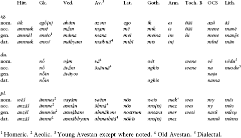
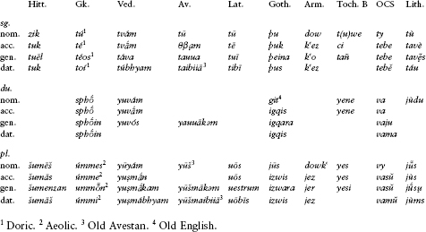
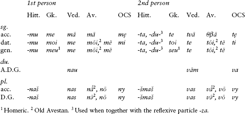
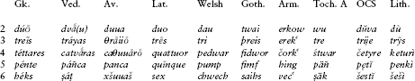
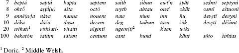

<!-- source-xhtml: 9781405188968_007.xhtml -->

# Chapter 7. Pronouns and Other Parts of Speech

## Pronouns: Introduction

**7.1.** Pronouns present special difficulties to the comparatist. First of all, they easily come under analogical influence of each other. This is true especially of the personal pronouns: the accusative singulars of the first and second personal pronouns came to rhyme not only in English (*me thee*) but also in Hittite (*ammuk tuk*), Sanskrit (*mā́mtvā́m*), Greek (*emé sé*), and Russian (*menja tebja*), among many other languages; yet none of these formations is precisely cognate, and each is found only in its own branch of the family. Second, pronouns tend to attract ancillary emphatic particles or affixes of various kinds to give them greater saliency. This is true especially of deictic and demonstrative pronouns, as in dialectal English *this-(h)ere*, *that-(th)ere* replacing simple *this* and *that*. Third, pronouns tend to have a broad range of idiomatic uses that often make reconstruction of their original functions uncertain.

In spite of these difficulties, we are fairly well informed about the PIE pronominal system. We can reconstruct personal, reflexive, demonstrative, relative, and interrogative pronouns for the proto-language. We know that, like adjectives, pronouns were declined for case and number and (except for the personal and reflexive pronouns) for gender; and we know that the pronominal declensions differed from the nominal and adjectival declensions in several respects discussed below.

## Personal Pronouns

**7.2.** The personal pronouns of the IE languages are of a somewhat paradoxical historical nature: probably no other set of words contains elements that are as ancient (they have been termed the “Devonian rocks” of the proto-language), yet at the same time they have undergone a great deal of analogical remodeling. Everywhere they are exceptional in the context of their language’s grammar. In English, only the personal pronouns distinguish a subjective from an objective case (as in *I* vs. *me* and *she* vs. *her*), a retention of the fuller case-system that English once had. Going back a millennium, the Old English personal pronouns were the only words to have a set of dual forms alongside singular and plural – another archaism at the time. The use of more than one stem in any given paradigm (such as *I/me*, *we/us*), a phenomenon called *suppletion*, recurs throughout the family – and with exactly the same stems; the suppletion is reconstructible for PIE and harks back to extremely old layers of the language’s morphology.

But the amount of analogical refashioning that has occurred makes it impossible to reconstruct most pronominal forms with any certainty, aside from the bare stems. We know that PIE had complete singular, dual, and plural paradigms for the first and second personal pronouns, and had different paradigms for stressed and unstressed (enclitic) forms. We also know that PIE had no special forms for the third person, probably using demonstrative pronouns instead, such as **so* **seh₂* **tod* (see §7.10). There was also a reflexive pronoun that was indifferent to both person and number.

### *First person*

**7.3.** A sampling of the comparative data for the first personal pronoun, in singular, dual, and plural, is as follows:

Notes on the reconstruction of the first person

**7.4.** For the **nominative singular** of the first person singular, we reconstruct **eg̑oh₂* (extended to **eg̑h₂-om* in e.g. Vedic *ahám*). The other cases are built from a different stem, **me-* (sometimes extended to **eme-*). The dual and plural contain at least two stems as well, one in **u̯e(i)-* or similar for the nominative, and another in **n̥s-* for the other cases. The **genitive singular** of the first person may have been **mene*, to judge by the Indo-Iranian and Balto-Slavic forms above, as well as by Welsh *fy* ‘my’, which once ended in a nasal since it nasalizes the following sound (as *fy nghar* ‘my car’; nasalization will be discussed in chapter 14). A **dative singular** **me-g̑h(i)* is reflected in Indo-Iranian, Latin, and probably Armenian *inj* (< **eme-g̑h-*). The **nominative dual** is fairly securely reconstructible as **u̯eh₁* (> *u̯ē), although the vowel is short in Germanic and Baltic. The **nominative plural** was probably **u̯ei*. The plural oblique cases are apparently ultimately based on a stem **n̥s-me-*; in some branches (Armenian, Baltic), only the second part of this seems to occur, perhaps under the influence of the 1st plural verbal endings in (*)-*me-*. The element **n̥s-* is the zero-grade of **nes*; this and other grades are found in the Latin pl. *nōs* and in a number of enclitic dual and plural forms.

### *Second person*

**7.5.** A selection of the comparative data for the second person follows:

Reconstruction of the second person

**7.6.** The singular forms of the second person are based on a stem in **tu-*. The dual and plural forms show mostly stems in **us-* and **i̯u-*. The nominative singular was perhaps **tuH*, with the laryngeal the source of the long vowel in most of the descendant forms. The oblique plural stem is usually reconstructed as **us-me-*, but it has been recently suggested by the American Indo-Europeanist Joshua Katz that this was remade (under the influence of the first person **n̥s-me-*) from **us-u̯e-*, reflected in Goth. *izwis* and related forms.

### Enclitic personal pronouns

**7.7.** A number of the branches, in particular Anatolian, Indo-Iranian, Greek, Balto-Slavic, and Tocharian, distinguish fully stressed (emphatic or contrastive) personal pronouns from unstressed clitic object pronouns. For the dative of the first singular pronoun, for example, Hittite has the stressed form *ammuk* and clitic -*mu*, Greek has *emoí* and clitic *moi*, Vedic has *máhyam* and clitic *me*, and Lithuanian has *mán* and (Old Lith.) clitic -*m(i)*. Observe the forms below:

Not surprisingly, the clitic pronouns are mostly just reduced versions of the fuller forms. One can reconstruct for the singular of both persons **me* and **te* in the accusative and **moi* and **toi* in the dative and genitive (Gk. *meu* and *seu* are innovations); and for the plural, **nos* and **u̯os*. Old Avestan preserves distinct accusative forms *nā̊ vā̊* from long-vowel **nōs* **u̯ōs* that have been compared with Latin *nōs* ‘we, us’ and *uōs* ‘you’. The other Avestan forms in -ə̄ and -ō come from short-vowel **-os*.

Anatolian, alone among the branches, has innovated a set of third-person clitic subject pronouns (e.g. Hitt. *-aš* ‘he’, -*e* ‘they’ [animate]). They are used only with certain kinds of intransitive verbs, as will be discussed in §9.11.

### *Possessive pronominal adjectives*

**7.8.** The possessive adjectives for the singular personal pronouns are often formed by adding the thematic vowel to the genitive. Thus several first singular possessive adjectives are built to the enclitic genitive **moi* or **mei* (Lat. *meus* < **mei̯-o*-, OCS *mojĭ* < **moi̯-o*- is ‘my’; so also, with different suffix, the Germanic family of Eng. *mine* < **mei-no*-). For the second person we can reconstruct **teu̯-o*- ‘your’ or **tu̯-o-* (> Ved. *tvá-*, Gk. *sós* [regular from **tu̯o-*], Lat. *tuus*, OCS *tvojĭ*), and in parallel for the reflexive, **seu̯-o*- or **su̯-o*- ‘(one’s) own’ (> Ved. *svá-*, Gk. *hós,* Lat. *suus*, OCS *svojĭ*). The dual and plural possessive adjectives vary from branch to branch, but were probably originally built comparably.

## Other Pronouns and the Pronominal Declension

**7.9.** Among other PIE pronouns, the most easily reconstructible are the demonstratives in **so-*, **to-*, and **ei-*, the relative **(H)i̯o-*, the indefinite/interrogative **kʷo-*, and the reflexive **su̯e-* (all discussed below).

Several of the case-endings differ from those of the nominal and adjectival declensions. The neuter nominative-accusative singular ended not in **-m* but in **-d* (**tod*, **kʷid*, etc.; also reconstructed as **tot*, **kʷit*; cf. §3.40). The genitive singular ending was **-eso*, as in OCS *česo* ‘of what’ and Goth. *þis* ‘of the’. (In Germanic, this ending spread to the thematic noun declension: Goth. *dagis* ‘of a day’.) The masculine nominative plural ending was *-*oi* (so **toi*, **kʷoi*, etc.), an ending that spread to the thematic noun declensions in several branches (§6.43). Finally, a genitive plural ending **-sōm* has been reconstructed on the basis of Hitt. *appen-zan* ‘of those’, Ved. *e-ṣā́m* ‘of these’, and Celtiberian *soi-sum* ‘of these’.

A formant **-sm-* is found in several oblique cases in some of the languages: Ved. *asmin* and South Picene **esmen**, both locative singulars meaning ‘in this’; OPruss. dative sing. *schismu* ‘(for) this’, and probably Goth. dative sing. *þamma* ‘for the, for this’. Surely related are forms without the -*s-* such as Lith. locative *tamè* ‘in that’.

An additional peculiarity of the pronominal declensions is that, though basically thematic, they often show *i-*stem forms. Thus the interrogative pronoun **kʷo-* had nominative/accusative forms in **kʷi-* such as Av. *ciš* ‘who?’, Gk. *tís* ‘who?’ (in this language the *i*-stem forms were generalized throughout the paradigm), and Lat. *quid* ‘what?’ A stem **k̑i-* ‘this’ (see next section) is an *i-*stem, although the related emphatic particle **k̑e* (§7.29) ends in an *-e* that presupposes thematic forms as well.

### *Demonstrative pronouns*

**7.10.** Widely represented are the two stems **so-* and **to-* meaning ‘this, that’ or ‘the’. The first of these seems to have been marginalized early, and was incorporated already in PIE into the paradigm of **to-*, for which it formed the nominative masculine and feminine. We can thus reconstruct a pronoun with the nominatives **so* (masc.), **seh₂* (fem.), **tod* (neut.), becoming Ved. *sá sā́ tád*, Av. *hō hā tat̰*, Gk. *ho hētó*, Goth. *sa so þata*, and Toch. B *se sā te*. Another stem **ei-* ‘this’ is reflected for example in Skt. *ay-ám* (masc.) *id-ám* (neut.); Av. *īm* (accus.) ‘him’; Lat. *is ea id* ‘this; he, she, it’; and Goth. *is* ‘he’. A stem **k̑i-* ‘this’ is reflected principally in Balto-Slavic and Germanic (as in OCS *sĭ* ‘this’, Lith. *šìs* ‘this’, and Eng. *he*, and OHG *hiu-tagu* ‘on this day, today’ [> modern German *heute*]), and vestigially in such forms as Lat. *cis* ‘on this side of’. Another pronominal stem, **eno*- or **ono*-, probably extensions of a stem **e*-, is found in Hitt. *ēni-* ‘that one’ and OCS *onŭ* ‘that’.

### *Relative pronoun*

**7.11.** Securely reconstructible is a relative pronominal stem **i̯o-* (or **Hi̯o-*; the presence of the laryngeal is disputed, and depends on one’s interpretation of the initial *h*- of Greek *hó*-, cp. §12.22): Ved. *yá-*, Av. *ya-*, Gk. *hó*-, and Celtic **yo*- (in Gaulish *dugiionti-io* ‘who serve’). Other branches have marshalled the indefinite/interrogative stem **kʷo-* (next section) into service as the relative pronoun.

### *Interrogative/indefinite pronoun*

**7.12.** A stem **kʷo-* is widely attested, functioning both as an interrogative (‘who, what?’) and as an indefinite (‘someone, something’): Ved. *kás* and Av. *kō* ‘who?’, Gk. adverbial interrogatives and indefinites in *po*- (e.g. *poũ* ‘where?’, *pōs* ‘somehow’), Goth. *ƕas* ‘who?’, OCS *kŭ-to* ‘who?’, and Lith. *kàs* ‘who?’. The *i*-stem variant **kʷi-* is reflected in Hitt. and Luv. *kuiš* ‘who?’, Gk. *tís* ‘who?’, Lat. *quis* ‘who?’, OIr. *cia* ‘who?’, OE *hwī* ‘how, why?’, and OCS *čĭ-to* ‘what?’. In the meaning ‘anyone’ or as an indefinite relative ‘whoever’ it is often doubled, as in Hitt. *kuiš kuiš*, Lat. *quisquis*, and Oscan *pitpit* ‘whatever’. In several branches (Anatolian, Italic, Germanic, and Balto-Slavic), this stem is used for the relative pronoun, as in Eng. *which*.

### *Reflexive pronoun*

**7.13.** A reflexive pronoun **su̯e-* (also **se-*) meaning ‘(one)self’ has descendants in numerous branches: Ved. *sva-yám,* Av. *xᵛāi* (dat.), Gk. (Pamphylian) *whe* (Classical Gk. *hé*), Lat. (accus.) *sē*, OIr. *fa(-dessin)*, and OCS (accus.) *sę*. It did not have a nominative case, did not distinguish number, and could be used with any of the three persons. The stem also formed the basis for the reflexive adjective **su̯o-* meaning ‘(one’s) own’, reflected in Ved. *svá*-, Gk. *heós*, Lat. *suus*, and OCS *svojĭ*. The syntax of the reflexive pronoun and adjective will be discussed in §8.18.

### *Pronominal adjectives*

**7.14.** The best-attested pronominal adjective is **al-i̯o-* ‘other’ in Gk. *állos*, Lat. *alius*, Goth. *aljis*, OIr. *ail*, and Toch. B *alyek*.

## Numerals

**7.15.** Numerals are technically adjectives or quantifiers, but morphologically they stand somewhat apart from other adjectives. The cardinal numerals were indeclinable except for 1–4, which not only declined but also distinguished gender.

**7.16.** No single form for the number ‘one’ can be reconstructed; there were at least two roots for the concept. The most widely represented is **oi-*, variously suffixed, especially as **oi-no*- (Lat. *ūnus*, OIr. *óen*, Goth. *ains* [Eng. *one*], OCS *inŭ* ‘a certain one’, and cp. Gk. *oinós* ‘roll of one in dice’); **oi-ko-* and **oi-u̯o-* are also found (e.g. Ved. *éka*-, Av. *aēuua-*). The other root was **sem-*, the base of Gk. *heĩs* (**sem-s*), feminine *mía* (**sm-ih₂*), Arm. *mi*, and Toch. A *sas*, B *ṣe*. This root fundamentally expressed identity; it is the root of Eng. *same* and Lat. *similis* ‘similar, like’.

**7.17.** A representative sampling of the cardinal numbers 2–10, 20, and 100 is given below. Blank spaces indicate that the relevant forms are not useful for reconstruction.

Based on these and some other data, we can reconstruct for the numerals 2–10 **d(u)u̯óh₁, *tréi̯es, *kʷétu̯ores, *pénkʷe, *su̯ék̑s, *septḿ̥, *ok̑tō(u), *néu̯n̥,* and **dék̑m̥;* for 20 **u̯īk̑m̥tī* (see below), and for 100 **k̑m̥tóm.* It is widely thought that the words for 20 and 100 are derivatives of the word for 10. Under this view, ** u̯īk̑m̥tī* is a simplification of a dual **du̯ih₁-dk̑m̥t-ih₁* ‘two tens’, and **k̑m̥tóm* is simplified from an earlier **dk̑m̥tóm.* Strictly speaking, the comparative evidence only supports a reconstruction **u̯īk̑n̥tī,* but most handbooks give **u̯īk̑m̥tī* because of the above analysis.

The numeral systems of the Anatolian languages are unfortunately almost entirely unknown. As clear descendants of PIE numerals we only have Hieroglyphic Luvian *tuwi-* ‘two’ and Hitt. *teriyaš* ‘three’ (genit. pl.), and maybe **šiptam-* ‘seven’ in Hitt. *šiptamiya-,* the name of a drink (perhaps containing seven ingredients; cp. Eng. *punch,* from Hindi *pañj* ‘five’).

As discussed in §6.71, the numerals ‘3’ and ‘4’ had special forms for the feminine with a suffix **-sr-,* as in Ved. *tisrás* ‘3’ and *cátasras* ‘4’.

### *Numerals in composition*

**7.18.** When combined with other words as prefixes, typically to form bahuvrihis (like *three-toed* in English), special forms of the numerals are sometimes found. The most securely reconstructible are: **du̯i-* ‘two-’ (as in Ved. *dvi-pád-* ‘two-footed’, Gk. *dí-pod-* ‘two-footed’, Archaic Lat. *dui-dent-* [Classical *bi-dent-*] ‘[sacrificial animal] having two teeth’); **tri-* ‘three-’ (as in Ved. *tri-pád-* ‘three-footed’, Gk. *trí-pod-* ‘three-footed [table]’, Lat. *tri-ped-* ‘three-footed’, Gaulish *tri-garanus* ‘having three cranes’); and **kʷ(e)tru-* or **kʷetu̯r̥-* ‘four-’ (as in Ved. *cátuṣ-pad-* ‘four-footed’, Av. *caθru-gaoša-* ‘four-eared’, Gk. *tetrá-pod-* ‘four-footed’, and Lat. *quadru-ped-* ‘four-footed’). The zero-grade of **sem-* ‘one’, **sm̥-,* is found as a prefix meaning ‘one-, as one, together, same’: Ved. *sa-kŕ̥t* ‘once’, Gk. *há-ploos* ‘one-fold, simple’, *a-delphós* ‘brother’ (probably < **sm̥-gʷelbh-o-* ‘[the brother] having one [= the same] womb, uterine brother’), and Lat. *sim-plex* ‘one-fold’.

### Ordinal numerals

**7.19.** The ordinal numerals cannot be reconstructed with precision because of the great variety of formations exhibited by the daughter languages.

The ordinal ‘first’ was formed from a base **pr̥h₃-,* the zero-grade of a root **perh₂-* that is found in various adverbs and prepositions meaning ‘forth, forward, front’; it is related to **prō̆* ‘forth’ (see §7.26 below). Widely represented are extensions of a stem **pr̥h₂-u̯o-* (as in Ved. *pū́rva-* ‘the first [of two]’ and OCS *prĭvŭ*) and a stem **pr̥h₂-mo-* (e.g. Goth. *fruma,* Lith. *pìrmas;* compare also Lat. *prīmus* from **prīs-mo-*). Eng. *first* is from **pr̥h₂-isto-*.

No form for ‘second’ can be reconstructed. PIE may not have used a derivative of ‘two’, given that the daughters typically use unrelated expressions, such as ones historically meaning ‘the other’ (e.g. OIr. *ail*) or ‘the following’ (e.g. Lat. *secundus*).

**7.20.** The ordinals from ‘third’ through ‘sixth’ were probably formed with the suffixes **-t-* or **-to-:* **tr̥-t-* or **tri-t-* ‘third’ (as in Ved. *tr̥tī́ya-,* Gk. *trítos,* and Lat. *tertius*); **kʷetu̯r̥-t-* or similar for ‘fourth’ (as in Gk. *tétartos,* OE *feorþa,* and OCS *četvrĭtŭ*); **penkʷ-to-* ‘fifth’ (as in Gk. *pémptos* and Av. *puxδa-*); and **su̯ek̑(s)-to-* ‘sixth’ (as in Gk. *héktos* and Lat. *sextus*).

**7.21.** The ordinals ‘seventh’ through ‘tenth’ were, it seems, originally created simply by suffixing the thematic vowel *-*o*- to the cardinal. This is most clearly seen in ‘eighth’, which was **ok̑tōu̯-o-* or similar (as in Gk. *ógdo(w)os* and Lat. *octāuus*). In the case of ‘seventh’ and ‘tenth’, the cardinals ended in syllabic **-m̥,* and the combination **-m̥-o-* was realized as **-m̥mo-* phonetically: **septm̥mo-* (as in Gk. *hébdomos,* Lat. *septimus,* and OCS *sedmŭ*) and **dek̑m̥mo-* (as in Ved. *daśamá-,* Av. *dasəma-,* and Lat. *decimus*). Similarly, ‘ninth’ was **neu̯n̥-o-* originally, realized phonetically as **neu̯n̥no-,* a form only preserved in Latin (*nōnus,* from **nou̯enos*).

The forms **septm̥mo-* and **dek̑m̥mo-* were early on reanalyzed as **septm̥-mo-* and **dek̑m̥-mo-,* and the apparent suffix **-mo-* that they seemed to contain then spread to neighboring ordinals in some branches, as in Ved. *aṣṭamá-* and OCS *osmŭ* ‘eighth’. But in some branches it was the suffix **-to-* that spread in this way, as in Toch. A *ṣäptänt* ‘seventh’, Lith. *deviñtas* ‘ninth’, and Eng. *tithe* ‘a tenth part’ (*tenth* is a more recent creation).

**7.22.** Some of the suffixes used for the ordinals, especially **-mo-* and **-to-* (and **-isto-* in the Germanic words for ‘first’), are identical to superlative suffixes. This overlap is seen in some of the higher numerals too, as in Vedic *śata-tamá-* ‘100th’, using the same suffix *-tama-* as is used for superlatives. See also §6.77.

## Adverbs

**7.23.** To judge by the evidence of the oldest daughter languages, PIE did not possess suffixes whose sole purpose was to change an adjective into an adverb (like Eng. *-ly*); rather, it used case-forms of nouns and adjectives in adverbial function. This method of forming adverbs is widely productive in all the daughter languages; since most such adverbs are relatively recent creations, few if any are of PIE date. One likely candidate is the neuter nominative-accusative singular of the adjective for ‘great’ used to mean ‘greatly’, **meg̑h₂* (Hitt. *mēk,* Ved. *máhi,* Gk. *méga,* ON *mjǫk*). Adverbs formed from other case-forms can be exemplified by Lat. *rursus* ‘back(wards)’ (nominative), *meritō* ‘deservedly’ (ablative), and *quī* ‘how’ (old instrumental).

**7.24.** Multiplicative adverbs for ‘twice’ and ‘thrice’ are securely reconstructible as **du̯is* and **tris:* Ved. *dvís, trís,* Av. *biš θriš,* Gr. *dís trís,* Lat. *bis ter* (< earlier *terr* < **ters* < **tris*).

### *Negation*

**7.25.** The two nasals *n-* and *m-* begin certain adverbs expressing negation in the daughter languages. We can reconstruct a sentence negator **ne* ‘not’, reflected most directly in Germanic (e.g. OE *ne*), Balto-Slavic (e.g. OCS *ne* and Lith. *nè*), Ved. *ná*, and Lat. *ne*- (as in *ne-fās* ‘not right, wrong’). The zero-grade of this word was used as a prefix, **n̥-* ‘un-’ (Hitt. *am-miyant-* ‘not grown, young’, Skt. and Gk. *a(n)-*, Lat. *in*-, Eng. *un*-). This prefix is called the **privative prefix**. Another negator, probably **mē* (as in Ved. *mā́*, Gk. *mḗ*, and, with different initial consonant, Lat. *nē* and Hitt. *lē*), was used with unaugmented (injunctive) verb forms in negative commands.

But many of the negative morphemes in the daughter languages are of more recent vintage and come from words or expressions that were not originally negative in force. People have a tendency to add additional emphasis to negatives (as in Eng. *not at all*, *not a whit*), and often the emphatic addition becomes reinterpreted as the actual negative if the phrase becomes stereotyped. A classic example of this comes from French: in the modern language, verbs are negated with a preceding *ne* (historically the true negator, from Latin *nōn*) and a following *pas*. The latter comes from the Latin noun (accus.) *passum* ‘step’ and was originally used to strengthen the negative force of *ne* with verbs of motion: ‘not a step’ = ‘not at all’. But at some point the phrase *ne . . . pas* lost its literal meaning and the word *pas* was felt to convey negativity all on its own, whence its use in phrases like *pas mal* ‘not bad’.

The older IE languages have many examples of this development as well. Probably the most famous is Greek *ou* or *ouk*(*í*) ‘not’. The late American Indo-Europeanist Warren Cowgill incisively etymologized this as coming from a pre-Greek phrase **ne oi̯u kʷid*, essentially ‘not on your life, not ever’: **ne*, the historically “real” negator + **oi̯u* (< PIE **h₂oi̯u*) ‘life, age’, used adverbially and added to strengthen the negative + **kʷid*, an indefinite or generalizing particle. Ultimately the negative **ne* lost its salience and was dropped, and **oi̯u kʷid* became **oi̯ukid* (by the *boukólos* rule, §3.39), whence (by regular sound changes) *oukí* and the shorter forms *ouk* and *ou*.

## Prepositions and Postpositions

**7.26.** A good number of words in PIE can be reconstructed that had both adverbial and postpositional function. As postpositions they followed their object, rather than preceding it as prepositions do; but in most of the daughter branches these postpositions eventually became prepositions. Only in Anatolian, Indo-Iranian, Sabellic, and vestigially in Latin and Greek is the old postpositional placement still seen. See further §8.8.

The following are some roots ancestral to many familiar prepositions; as always, descendant forms are given selectively. Unglossed descendant forms mean the same thing as the PIE form. Since prepositions usually develop idiomatic usages, the original sense of some of these roots is not certain.

- **apo* ‘from’: Ved. *ápa* ‘away, forth’, Gk. *apó* ‘from’, Lat. *ab* ‘from’, Eng. *of, off*

- **en* ‘in’: Gk. *en*, Lat. *in*, Arm. *i*, Welsh *yn*, Eng. *in*, OPruss. *en*, OCS *vŭ(n-)*

- **en-ter* ‘within, inside’ (derivative of **en*): Ved. *antár* ‘between’, Lat. *inter* ‘between, among’, OIr. *eter* ‘between’, OHG *untar* ‘between, among’, Alb. *ndër* ‘between, in’

- **epi* or **opi* ‘upon, by’: Ved. *ápi* ‘by, on’, Gk. *epí* ‘on’, Lat. *ob* ‘on, over against’, Arm. *ew* ‘and’

- **kata* or **km̥ta* ‘down’: Hitt. *katta* ‘with’, Gk. *katá* ‘down’

- **kom* ‘with’: Lat. *cum* ‘with’, OIr. *co* ‘with’, probably Gmc. prefix **ga*- ‘with’

- **n̥dher*, **n̥dhos* ‘under’: Ved. *adhás*, Av. *aδairi*, Lat. *īnfr-ā*, Arm. *ənd*, Eng. *under*

- **ni* ‘down, under’: Ved. *ní*, Arm. *ni*; suffixed in Eng. *ne-ther*, OCS *ni-zŭ* ‘down’

- **per(i)* ‘around, through’: Ved. *pári* ‘around, forth’, Gk. *perí* ‘around’, Lat. *per* ‘through’, OPruss. *per*, Alb. *për*

- **prō̆* ‘forth’: Hitt. *parā*, Ved. *prá*, Gk. *pró*, Lat. *prō*, OIr. *ro*- (prefix and intensive particle), Goth. *fra-*, OPruss. *pra*, *pro* ‘through’

- **uper* ‘above’: Ved. *upári*, Gk. *hupér*, Lat. *s-uper*, OIr. *for*, Arm. *(i) ver* ‘up’, Eng. *over*

- **upo* ‘below’: Ved. *úpa* ‘up to’, Gk. *hupó* ‘below’, Lat. *s-ub*, OIr. *fo*

## Conjunctions and Interjections

**7.27.** Conjunctions tend not to be stable vocabulary items; new ones get created afresh out of other words. So, for example, English *and* developed out of an adverb or preposition cognate with Gk. *antí* ‘(over) against’, and *but* out of a preposition or adverb meaning ‘outside, except’. Similarly, we saw in the list above that the Armenian conjunction *ew* ‘and’ is derived from an adverb meaning ‘upon’ (**epi*). A few conjunctions have been reconstructed for PIE, however, that are widely represented in the daughter languages. At least two of them were postpositive particles, being placed directly after the word (or first word of the phrase or clause) that was being conjoined or disjoined: the conjunctive particle **kʷe* ‘and’ (OHitt. -*ku*, Skt. and Av. *ca*, Gk. *te*, Lat. -*que*, Goth. -*h*) and the disjunctive particle *u̯ē ‘or’ (Skt. *vā*, Gk. *(w)ḗ*, Lat. -*ue*). (A well-known example of the postpositive usage is the opening of Vergil’s *Aeneid* in Latin, *arma uirumque canō*, ‘Arms and the man I sing’.) An adversative conjunction **h₂(e)u*, probably ‘but, however’, is found in Ved. *u*, Gk. *aũ*, and Lat. *au(-tem)*. For conjunctions introducing embedded (subordinate) clauses, the languages (and surely PIE itself) seem to have resorted to case-forms of various pronouns. Thus from the relative/interrogative stem **kʷo-* we have a neuter accusative in Hitt. *kuit* ‘because’ and Lat. *quod* ‘because’, and a masculine accusative in Archaic Lat. *quom* ‘when, since’ (Classical *cum*).

The particle **kʷe* was also used as a generalizing particle, as evidenced by e.g. Ved. *yát kác ca* ‘whatsoever’ (relative and interrogative pronoun combined with *ca*), Lat. *quisque* ‘each, every’ (vs. *quis* ‘who?’), and Goth. *ƕazuh* (< **kʷos-u-kʷe*) ‘every’ (vs. *ƕas* ‘who?’).

**7.28.** The languages also possess a variety of sentence-connecting particles, often translatable as ‘and’, two of which can be confidently reconstructed for PIE: **nu* (preserved in Hittite and Tocharian B *nu*, in Vedic and Greek *nú*, and as *no*- in Old Irish and *nŭ* in Old Church Slavonic) and postpositive **de* (Gk. *dé*).

### *Particles*

**7.29.** A number of unstressed words in the daughter languages used as sentence particles seem to be related to each other, although their functions – both in the daughter languages and in PIE – are often difficult to ascertain. A form **kem* or **km̥* is found in Hitt. -*kan*, Gk. *ke(n)*, and Ved. *kám*; it was perhaps a modal particle. An emphasizing particle **tar* is found in Luv. -*tar* and Homeric Gk. *tar* (usually written incorrectly as *t*’ *ár* in editions of Homer); it appears to have been especially used with interrogatives (Luv. *kuiš-tar* = Homeric Gk. *tís tar* ‘who [indeed]?’). Another emphasizing particle **ge* appears frequently after personal pronouns in Greek, as in *egṓge* ‘I (for one), as for myself, I . . .’, accusative *emége*, and may be the source of the velars found in the accusative of the first and second singular pronouns in certain languages: Hitt. *ammuk*, *tuk* ‘me, thee’, Gmc. **mik*, **þik* (becoming e.g. German *mich*, *dich*). Another particle **ghe* or **gho* is found in Ved. *(g)ha*, *ghā*, and OCS *že*. Lithuanian *ar̃*, a particle used when asking questions, and the Greek particle *ára* or *rhá*, may be related to each other. Finally, mention may be made of an emphatic particle **k̑e* (related to the pronominal stem **k̑i-*, §7.10): Hitt. *ki-nun* ‘now’, with the same elements reversed in Latin *nun-c* ‘now’; Lat. *hī-c* ‘this’; and Gk. *ekeĩnos* ‘that’ (**e-k̑e-eno-*; compare **k̑e-eno-* in the ON pronominal stem *hán-* ‘he’).

### *Interjections*

**7.30.** It is perhaps indicative of some of the less pleasant aspects of life in the older IE societies that the one PIE interjection we can confidently reconstruct is an expression of woe or agony, **u̯ai*, preserved in Old Hitt. *uwai*, Lat. *uae*, Welsh *gwae*, Goth. *wai*, Eng. *woe*, Latv. *vai*, and, with further suffix for additional pathos, Av. *vaii-ōi*.

Many IE languages have a form like Eng. *oh!*, for which an ancestor **ō!* has been proposed. The laryngealistic rewriting of this as **eh₃!* requires no comment.

## For Further Reading

Few book-length treatments of the words covered in this chapter exist except for the personal pronouns and the numerals. The reconstruction of the personal pronouns has been the subject of a fine recent dissertation, Katz 1998, which advances a host of new ideas. An earlier book-length study is Schmidt 1978. For the numerals, one should consult Gvozdanović 1992, which is a sundry collection of articles by different scholars on the numeral systems of each branch; the articles are not all of the same quality, but some are very valuable. A single-authored book-length treatment of issues pertaining to IE numerals is Szemerényi 1960, which should be treated with caution but has much interesting material. Warren Cowgill’s etymology of Greek *ou* is in Cowgill 1960.

## Exercises

1. What are the differences between the nominal and pronominal declensions?

2. Identify the following pronominal forms or stems. Be as specific as possible.

  - **a** **so *seh₂ *tod*

  - **b** **me-*

  - **c** **(H)i̯o-*

  - **d** **u̯os*

  - **e** **su̯e-*

  - **f** **nos*

  - **g** **k̑i-*

  - **h** **i̯u-*

  - **i** **ei-*

  - **j** **te*

  - **k** **moi*

  - **l** **n̥s*

  - **m** **kʷo*

  - **n** **u̯ei*

  - **o** **tu-*

3. Provide the PIE reconstructions for the following pronominal forms or stems:

  - **a** ‘other’

  - **b** ‘I’

  - **c** 2nd person sing. dat. enclitic pronoun

  - **d** 1st person sing. genit. (not enclitic)

  - **e** 1st person sing. accus. enclitic pronoun

4. Discuss the etymological difference(s) between Ved. *eká-*, Greek *heĩs*, and Eng. *one*.

5. Provide the PIE reconstructions for the following numerals:

  - **a** six

  - **b** ten

  - **c** three

  - **d** twenty

  - **e** nine

  - **f** four

  - **g** hundred

  - **h** five

6. What do the prefixal forms **tri-*, **sm̥-*, *n̥-, and **h₁su-* ‘good’ (§6.86) have in common?

7. Provide the PIE reconstructions for the following forms:

  - **a** in

  - **b** or

  - **c** not

  - **d** thrice

  - **e** and

  - **f** forth

  - **g** below

  - **h** greatly

8. Describe the formation of adverbs in PIE.

9. Comment on the Latin forms *quisquis* and *quisque* and their congeners from elsewhere in the IE family.

10. Describe Warren Cowgill’s etymology of Greek *ou* ‘not’.
