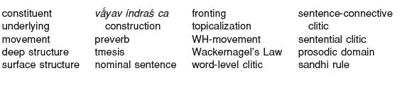

<!-- source-xhtml: 9781405188968_008.xhtml -->

# Chapter 8. Proto-Indo-European Syntax

## Introduction

**8.1.** *Syntax* is the set of rules and principles for the combination of words into larger units – phrases, clauses, and sentences. The term also refers to the branch of linguistics that is concerned with syntactic systems as objects of study. In the comparative historical linguistics of the IE languages, we enter the field of *diachronic syntax*, the study of how syntactic systems change over time. This field and the allied enterprise of syntactic reconstruction raise certain methodological and practical issues that do not arise in diachronic phonology and morphology. We will briefly outline these issues here and then discuss them further below in §§8.12ff.

Morphemes and words are memorized and entered into the mental lexicon during language acquisition, but phrases, clauses, and sentences are not (except for fixed idioms). In the course of ordinary conversation, sentences are produced that have never been uttered before; clearly, a memorized body of sentences, no matter how extensive, would be of little use on its own in producing novel ones. This is how we know that there is a separate syntactic component of the grammar that encodes the procedures for generating phrases, clauses, and so forth. The rules constituting the syntax are deduced from the sentences that are heard during language acquisition in childhood.

**8.2.** Most contemporary syntactic theories are either wholly or partly the product of several decades of research spearheaded since the 1950s by Noam Chomsky, and constitute the field known as *generative grammar* or *generative syntax*. Though diverging from each other in many respects, all generative syntactic theories assume that the production of sentences is not done simply by stringing words together. First of all, sentence structure is not flat; rather, sentences are hierarchically organized into discrete units called *constituents* that have a particular internal structure and combine with one another in particular ways. In the sentence *The ugly duckling swam with the swans*, the noun phrase *the swans* is a constituent that is part of a larger constituent, the prepositional phrase *with the swans*, which in turn is part of the verb phrase (predicate) *swam with the swans*, which, finally, is combined with the subject noun phrase, *the ugly duckling*, to form a complete sentence.

**8.3.** According to linguistic theory, generating a sentence proceeds in several stages; in simplified terms, they are as follows. First, the sentence’s constituents and subconstituents are arranged in a basic, *underlying* order; this order constitutes the sentence’s *deep structure*. The underlying order may then be modified by the application of *movement* rules acting upon particular elements of the sentence. After these modifications, the relevant phonological and morphological rules are applied, with the final result being the *surface structure*, i.e., what is actually uttered.

Syntacticians try to deduce deep structures and the syntactic rules that act upon them by analyzing surface structures and gathering judgments from native speakers on the grammaticality of particular sentences. Since no native speakers of dead languages are around anymore, the whole enterprise of syntactic analysis of the older IE languages might appear to be doomed from the start. To be sure, the absence of native speakers will always impose certain limits on our knowledge; but that is no reason not to try to figure out as much as we can about the underlying machinery of those languages, utilizing what we know from the syntax of languages alive today. It so happens that many of the preserved texts are long and plentiful enough to allow quite a bit of solid theoretical syntactic analysis, and our analytical methods for doing this are only improving.

**8.4.** Textual genre is often raised as a problematic issue in these analyses. Many of the oldest preserved Indo-European literatures, such as the Rig Veda, are works of art whose style and mode of expression can be phenomenally inventive, both lexically and grammatically. However, this problem is sometimes overstated; it is incorrect to suppose – as many have – that poetic texts leave grammar by the wayside, and that poets were able to take “licenses” willy-nilly. The language of poetry is just as strictly rule-governed as ordinary speech: though certain constructions only occur in poetry (leading some scholars to speak of a *poetic grammar*), they are still possibilities afforded by the grammar of the language.

Some texts, especially the Gothic Bible and many Classical Armenian works, are translations that adhere closely to the word order and grammatical constructions of the original language. It is important when analyzing these texts not to make generalizations based on passages that are simply slavish imitations of another language. But since the match in word orders or grammatical constructions is never absolutely exact, and the differences can reflect particular syntactic features in the language of the translation, such texts are still of value in IE syntactic studies.

**8.5.** Only a few refined and theoretically sophisticated analyses of the syntax of older IE languages are available at present. This fact, coupled with our still limited (but growing) understanding of how syntax changes, prevents us from reconstructing PIE syntax in the same way that we can reconstruct PIE phonology and morphology. However, various syntactic patterns have long been known to be common to most or all the older IE languages, and were likely characteristic of PIE too; some of these will be outlined and exemplified below. Although much of nineteenth- and early twertieth-century syntactic studies of the IE languages focused on analyzing and cataloguing the functions of grammatical categories, such as the cases and moods, some figures of that time, especially Jacob Wackernagel and Berthold Delbrück, also made important discoveries concerning the behavior of constituents and word order. Though not formulated in the same terms as nowadays, their discoveries, such as Wackernagel’s Law (§§8.22ff. below), have been extremely influential.

We will now proceed to survey more specific features usually thought to be part of the PIE syntactic system. Some abbreviations of textual references are not explained here, but can be found in the relevant later chapters.

## Syntax of the Phrase

### *Noun phrases*

**8.6.** Adjectival modifiers of nouns had to agree with their nouns in gender, number, and case. The languages differ as to whether modifiers usually precede or follow their nouns, and the order was surely flexible in PIE also; discourse and pragmatic factors dictated the relative ordering of words. Adjectives typically precede their nouns in Hittite, Vedic, and Germanic, and follow their nouns in Italic and Celtic; but in all these languages there are exceptions. In Celtic and Italic, for example, certain adjectives precede their nouns, while in Hittite, Vedic, and Italic, any noun can precede a modifier when one or the other element was being emphasized.

**8.7.** Common to all the older languages (and still found in modern Slavic) was the ability of nouns and their modifiers to be separated by intervening elements, yielding what are called discontinuous or distracted noun phrases (a construction called *hyperbaton* in Greek and Latin grammar): Cuneiform Luv. *<u>alati</u> awienta <u>Wilušati</u>* ‘they came from <u>steep</u> <u>Wilusa</u>’ (KBo 4.11:46), Gk. *<u>ándra</u> moi énnepe Moũsa <u>polútropon</u>* ‘tell me, Muse, of the <u>resourceful man</u>’ (*Odyssey* 1.1), Lat. *<u>magnā</u> cum <u>laude</u>* ‘with <u>great</u> <u>praise</u>’, Arm. *<u>zyoys</u> hatanem <u>kenac‘</u>* ‘I cut off <u>the hope</u> <u>of life</u>’, Old Irish *<u>Márta</u> for <u>slúaig</u> saithiu* ‘on the swarm of the <u>host</u> <u>of March</u>’ (*Félire Oengusso*, March 31). Distraction of other types of phrases was common as well. The technical details of distraction are not well understood; in some cases, it is the result of part of a phrase being moved to a position of emphasis or contrast. Other cases are of a different nature; we will discuss one below in §8.10.

### *Prepositional and postpositional phrases*

**8.8.** The elements traditionally classified as prepositions were most likely simply independent adverbs in PIE, a status they still largely have in Anatolian, Indo-Iranian, and the oldest Greek. From the comparative evidence it is not entirely clear whether these forms were prepositions, or rather occurred after their objects as postpositions; probably both patterns were current, though many researchers assume postpositional usage to be older. Anatolian and Vedic have almost exclusively postpositions and not prepositions, as in Hitt. *šuḫḫi <u>šēr</u>* ‘<u>on</u> the roof’ and Ved. *jánām̐ <u>ánu</u>* ‘<u>among</u> men’. Avestan and Sabellic have a mixture of prepositions and postpositions. In the other older IE languages, prepositions are the rule, although some (e.g. Old Persian, Greek, and Latin) evince limited postpositional use, like Gk. *toútōn <u>péri</u>* ‘<u>about</u> these things’ and Lat. *mē<u>cum</u>* ‘<u>with</u> me’. Similar mixed prepositional and postpositional use, with prepositions predominating, is familiar from many modern languages, including English and German.

### Preverbs

**8.9.** Such adverbs, when used to modify the content of verbs, are called *preverbs*. In PIE, preverbs were still independent words, as reflected in Anatolian and older Indo-Iranian. In the examples below, the preverbs and verbs are underlined. (In the Hittite examples in this chapter, an equals sign is a modern orthographic convention for separating enclitic particles from preceding material. The other spelling conventions for transliterating Hittite, such as the use of capitalization, will be introduced in the next chapter and may be ignored for our present purposes.)

| Column 1 | Column 2 |
| --- | --- |
| Old Hittite | *š=aš <u>šarā</u>* URU-*ya <u>pait</u>*¹“and he <u>went up</u> to the city” |
| Vedic | *<u>abhí</u> yó mahinā́ dívaṃ mitró <u>babhū́va</u> sapráthāḥ*²“Mitra the renowned who <u>is superior to</u> heaven by his greatness” |
| Old Avestan | *<u>frō</u> mā <u>sāstū</u> vahištā³*“<u>let him teach</u> me the best things” |

¹ KBo 22.2 rev. B 17′ (Zalpa tale). ² Rig Veda 3.59.7. ³ Yasna 45.6.

In the other branches, the preverbs became genuine prefixes attached to the verb. But archaic texts in Greek, Latin, and Old Irish show remnants of the older situation: Gk. *edētúos <u>eks</u> éron <u>hénto</u>* ‘<u>they put</u> <u>aside</u> desire for food” (*Iliad* 1.469 and elsewhere), Archaic Lat. *<u>ob</u> uōs <u>sacrō</u>* “I <u>entreat</u> you” (Festus 206 L.; would be *uōs obsecrō* in Classical Latin), and perhaps OIr. *<u>ad</u>- cruth caín <u>cichither</u>* “fair form <u>will be seen</u>” (*Serglige Con Culainn* 694; but see §14.50a). Old Irish and Gothic allow certain clitics to intervene between preverb and verb, although the whole complex forms a single phonological word (the clitics are boldfaced in the following examples): OIr. *<u>at</u>**dom**-<u>indnastar</u>* ‘that **I** be <u>brought</u>’ (Milan glosses 39ᵈ 13), Goth. *frah ina <u>ga</u>-**u**-ƕ**a**-<u>seƕi</u>* ‘He asked him **if** <u>he saw</u> **anything**’ (Mark 8:23). The so-called separable prefixes in Modern German and Dutch are either a direct continuation of the PIE situation, or comparable to it: German *auf-tragen* ‘to assign’, *er trägt auf* ‘he assigns’ = Dutch *op-dragen, hij draagt op*.

In languages where the preverb and the verb usually form a single word, such as Classical Greek, the separation of the two is called **tmesis**, literally ‘a cutting’. The term is misleading; it arose from a traditional bias toward Classical Greek, which has been viewed as a standard from which Homeric Greek is “deviant,” when in fact the classical language’s loss of tmesis is what departs from the inherited situation.

**8.10.** Tmesis is a subtype of the general phenomenon of distraction discussed in §8.7, and examples of it can provide clear documentation of how not all instances of distraction are syntactically equal, except superficially. In the Avestan clause *<u>apa</u> vā <u>yasāiti</u>* ‘or <u>takes</u> (it) <u>away</u>’ (Yasna 11.5), the preverb *apa* ‘away’ is separated from its verb *yasāiti* ‘takes’ only because the clitic conjunction *vā* ‘or’ phonologically requires a single word to its left and therefore must intervene between the preverb and verb. (We will return to such clitics and their behavior in §8.22.) Syntactically quite distinct is a case like *<u>pairi</u> uṣ̌i <u>vāraiiaθβəm</u>* ‘<u>cover</u> (their) ears’ (Yasht 1.27), where the preverb (*pairi*, literally ‘around’) has been fronted to the beginning of the clause for prominence or emphasis (by a process discussed in §8.19).

### *The* vā́yav índraś ca *construction*

**8.11.** It was apparently a rule of PIE grammar that when two vocatives were conjoined, the one preceding the conjunction was put in the nominative rather than the vocative case. Almost all the examples of this come from Vedic, as in the phrase *vā́yav índraś ca* “o Indra and Vayu” after which the construction is named. In this example, the god Vāyu’s name is in the vocative but Indra’s is in the nominative, as it precedes the conjunction *ca* ‘and’. The sole example outside Indo-Iranian is from an archaic passage in the *Iliad* (3.277): *Zeũ páter . . . Ēéliós te* ‘Father Zeus (voc.) . . . and Helios (nomin.)’.

## Syntax of the Clause

**8.12.** The reconstruction of the clausal syntax of PIE, for much of its recent history, has been concerned with establishing the “**basic word order**” of PIE and its daughters. This research program was born of linguistic typology, a field launched in the 1960s that has sought to determine universal patterns of linguistic structure. Most commonly the term “basic word order” has referred to the statistically most frequently observed word order in a given language (another sense of the term will be discussed further below). In the opinion of many scholars today, this approach (often called the typological approach) has led to an intellectual dead end. As a methodological preliminary, we devote some space here to a critique of it so that its mistakes can be learned from (not uncommonly, those same mistakes continue to be made).

First, word order is not equivalent to syntax, but is rather a byproduct of it. Word orders result from the application of syntactic rules, which arrange sentential elements into different functional positions. Pure statistical tallying up of word orders thus not only ignores actual syntax, but also ignores all the factors that intersect with syntax and cause different syntactic rules to apply under different discourse, pragmatic, and semantic conditions. In comparative linguistics, the typological approach has the additional problem of ignoring a fundamental aspect of the comparative method – namely, the identification of comparable structures in related languages on which to base reconstructions. In the domain of morphemes and words, that means cognate forms; in the domain of phrases and sentences, that means phrases and sentences that (broadly speaking) are used when talking about the same sorts of things in the same ways.

For example, both possible relative orders of verb and object (verb–object, object–verb) in the Homeric epics occur quite frequently. However, if one looks at a semantically restricted and well-defined sample, such as traditional sayings or proverbs, there is much more rigidity: the object almost always precedes the verb. The syntax of proverbs in Homer can then be compared with the syntax of proverbs in Vedic Sanskrit and other related languages, and it turns out that these sorts of sentences agree remarkably closely in their syntax across the older IE languages. Proverbs are a repository of traditional language, and often contain constructions that are rare elsewhere; and it is just those kinds of exceptional cases that are most valuable for the comparative method and for syntactic reconstruction (as we discussed in §4.1 with respect to morphology). In English, one syntactic fossil like *till death do us part* tells us more about the history of English syntax than a thousand sentences of newspaper prose.

**8.13.** A more modern definition of the term “basic word order” is a single underlying order in the deep structure from which all surface word orders in a language can be derived. According to many mainstream syntactic theories, the statistically most frequent surface word order is not necessarily the same as the basic underlying order. Word orders that are marked (that is, those that encode additional semantic content such as expressive contrast or the like) are derived by manipulation of basic word orders through syntactic movement; but, depending on the language (and the syntactician), unmarked orders may also differ from underlying orders. A refined analysis of texts in the daughter languages should be able to distinguish pragmatically neutral orders from those that are marked, and allow us to come up with syntactic movement rules that can then be compared with rules in other daughter languages. The existence of syntactic rules for the same semantic or pragmatic purpose (as for example the fronting of a verb to the beginning of a sentence for emphasis or contrast, discussed below in §8.19) in most or all the daughter languages could then be evidence for such a rule in PIE itself.

**8.14.** It is almost universally asserted that most of the ancient IE languages were verb-final, and that PIE was as well; more specifically, that they were SOV (Subject–Object–Verb). This assertion is made on the basis of sentences such as the following (the verbs are underlined):

| Column 1 | Column 2 |
| --- | --- |
| Hittite | *nu*=*za* MUŠ*illuyankaš* DIM*-an <u>taraḫta</u>*¹“And the serpent <u>overcame</u> the Stormgod.” |
| Vedic | *maruto ha enam na <u>ajahuḥ</u>*²“Indeed the Maruts did not <u>abandon</u> him.” |
| Latin | *Eumolpus tanquam litterārum stūdiōsus utīque ātrāmentum <u>habet</u>*³“Eumolpus, so interested in learning, surely <u>has</u> (some) ink.” |
| Runic | *ek hlewagastiz holtijaz horna <u>tawido</u>*⁴“I, Hlewagastiz of Holt, <u>made</u> (this) horn.” |
| Tocharian A | *kāsu ñom-klyu tsraṣiśśi śäk kälymentwaṃ <u>sätkatär</u>*⁵“Good fame of the strong <u>spreads out</u> in ten directions.” |

¹ KBo 3.7 i 11 (Illuyanka myth, §3). ² Aitareya-Brāhmaṇa 3.20. ³ Petronius, *Satyricon* 102. ⁴ Gallehus horn, normalized transliteration (see §15.39). ⁵ Puṇyavantajātaka 1 (see §17.32).

As a matter of fact, the claim that many or most of the older IE languages were verb-final has never been fully verified. Part of the problem with it is arriving at a clear definition of a verb-final language. In the strict sense, a verb-final language is one where the verb always comes at the end of each clause unless other factors intervene. The only well-known older PIE language that meets this criterion is Hittite. No matter what the genre, no matter how stylistically marked the text, the verb in Hittite is always clause-final, with one exception – when it is fronted to the beginning of the clause for emphasis or contrast (by the fronting rule that we will get to shortly). None of the other old IE languages behaves so rigidly (except for Insular Celtic, but that subbranch contains verb-*initial* languages; see §8.19); there is essentially no position in the clause (on the surface at least) where the verb cannot appear.

It is usually stated that in these languages, the pragmatically neutral order is SOV. This may, in fact, be true, at least of some of them (such as Latin); but with so many word-order permutations possible (and frequent), clearly they cannot be called “verb-final” in the same way as Hittite. There are any number of reasons, according to current theory, why a verb may or may not appear as the last word in its clause. Syntactic rules place the constituents of a clause in certain functional slots; superficially different linear positionings of a constituent can turn out, on closer examination, to be identical underlyingly, and vice versa.

The foregoing paragraphs, it must be repeated, do not represent the majority view, but are also not intended to claim that that view is wrong – just that it needs tighter formulation and convincing demonstration.

**8.15.** One usually thinks of clauses or sentences as containing a verb by definition, but in the older IE languages, many of their modern descendants, and doubtless in PIE itself, clauses could lack an overt verb. Chief among these are **nominal sentences**, in which the copula (the linking verb ‘be’) is understood but not overtly expressed: OHitt. *annaš*=*šiš* MUŠ*-aš* (KUB 1.16 ii 20) ‘his mother (is) a snake’ (recall §8.9 for the use of the equals sign), OPers. *manā pitā Vištāspa* ‘my father (is) Vištāspa’ (DSf 12–13), Gk. *emoì d’ ákhos* ‘and to me (there is) pain’ (*Iliad* 5.759), Lat. *tū coniūnx* ‘you (are) his wife’ (Vergil, *Aeneid* 4.113), Toch. A *tsraṣiñ waste wrasaśśi* ‘the strong (are) the protection of creatures’ (Puṇyavantajātaka 2).

### *Subject–verb agreement*

**8.16.** In clauses containing a verb, the subject (when expressed) had to agree with the verb in person and number. An apparent exception to this is the behavior of neuter plural subjects in Anatolian, Old Avestan, and Greek, which in these languages take singular verbs. In the following examples, the subjects are bold and the verbs are underlined: Hitt. *apē*=*ya **uddār*** (pl.) *QATAMMA <u>lagāru</u>* (sing.) “let also those words fall over likewise” (KUB 2.3 iii 21–22), Old Avestan ***yā*** (pl.) *zī <u>vāuuərəzōi</u>* (sing.) “the things which have been perpetrated” (Yasna 29.4), Greek *hóssa te **phúlla*** (pl.) *kaì **ánthea*** (pl.) *<u>gígnetai</u>* (sing.) *hṓrēi* “as many as the leaves and the flowers that appear in their season” (*Iliad* 2.468). But this phenomenon is likely due ultimately to the ancient status of the neuter plural as a collective; recall its history, discussed in §6.68.

**8.17.** Because the personal endings of verbs in the older IE languages encode the subject in them, it was not grammatically necessary to use an overt personal pronominal subject in addition. However, subject pronouns nonetheless occur; in the traditional grammars of these languages, overt subject pronouns are usually characterized as emphatic. (Terms like “emphasis” are rather blunt and can get overused, but they are a useful starting point on the way to more refined analyses.) When the Roman historian Sallust wrote *sīcutī ego accēpī* ‘as I understand it’ (*Bellum Catilinae* 6.1), the overt subject pronoun *ego* ‘I’ serves to contrast his own understanding with the opinion of others. While such contrast is certainly evident in many instances where a subject pronoun is expressed, it is not clear that overt subject pronouns are limited to contrastive or emphatic use, and it is often difficult or impossible to ascertain just why a writer used one. In nominal sentences, an overt pronominal subject is generally required for clarity, as in Old Persian *<u>adam</u> navama* ‘<u>I</u> (am) the ninth’ (DB 1.10).

**8.18.** The syntax of the reflexive possessive adjective **su̯o-* ‘own’ (§7.13) deserves a special note. Reflexive adjectives (and pronouns) refer back to the grammatical subject of a sentence. But the possessive **su̯o-* had broader usage, to judge by the daughter languages: it could refer back not to the grammatical subject, but to newly introduced discourse material or to an older topic that is returned to. As an example of the former, consider Rig Veda 8.2.7: *tráya índrasya sómāḥ sutā́saḥ santu devásya <u>**své** kṣáye sutapā́vnaḥ</u>* ‘Let the three somas be pressed for the god Indra <u>in the soma-drinker’s **own** house</u>’ (translation following Brent Vine; soma was an intoxicating sacred drink). Here the grammatical subject is *tráya . . . sómāḥ* ‘the three somas’ and the possessive *své* refers to the soma-drinker, who is newly introduced. Similar behavior can be found in other older IE languages.

### *Basic movement processes*

**8.19.** When a constituent or subconstituent appears in a position other than the usual one, syntacticians usually treat it as having been placed there by a movement rule. (Actually, many “usual” positionings of elements are also thought to arise by movement processes.) Typically, elements are moved leftward rather than rightward, by a process called **fronting**. The technical details do not concern us, but based on evidence from a variety of languages it is believed that the grammar provides a number of slots or “landing-sites” in the abstract syntactic representation of a sentence, which serve various functions and into which elements can be moved or to which elements can be adjoined. One such landing-site has been posited for the left edge of a sentence into which a constituent or subconstituent can be moved for emphasis or contrast; the process of fronting into this position is called **topicalization**. Some examples of clauses in which the verb has been topicalized follow (the emphasis or contrast does not always come across in translation):

| Column 1 | Column 2 |
| --- | --- |
| Hittite | <u>*ḫalziššai*</u>=*wa*=*tta* DINGIRMEš*-aš attaš* D*Kumarbiš*¹“Kumarbi, the father of the gods, <u>is calling</u> you.” |
| Old Av. | *<u>sraōtū</u> sāsnā̊ fšə̄ŋ́hiiō suiiē taštō*²“<u>Let</u> the bondsman (?), fashioned for benefit, <u>hear</u> the teachings.” |
| Greek | *<u>ménei</u> tò theĩon doulíāi per en phrení*³“The divine (power), even when in bondage, <u>stays</u> in the mind.” |
| Latin | *<u>fuimus</u> Trōes, <u>fuit</u> Īlium*⁴“<u>We were</u> (but no longer are) Trojans, Troy <u>was</u> (but no longer is).” |
| Armenian | *<u>erknēr</u> erkin <u>erknēr</u> erkir*⁵“<u>In labor was</u> heaven, <u>in labor was</u> earth.” |

¹ KUB 33.122 ii 11. ² Yasna 49.9. ³ Aeschylus, *Agamemnon* 1084. ⁴ Vergil, *Aeneid* 2.325. ⁵ Movsēs Xorenac‘i 1.31 (see §16.46).

If verb-initial order generated in this way becomes stereotyped, it can be reanalyzed by learners as the neutral order; and in fact in Insular Celtic, VSO order became the norm for precisely this reason (the perhaps older verb-final order is still the rule in the Continental Celtic language Celtiberian). A similar reanalysis happened in Lycian; see §9.69. Certain verbs, especially existential verbs (e.g., ‘there is’) but also verbs of speaking and imperatives, preferentially occur clause-initially across all the IE languages: Skt. *<u>āsīd</u> rājā nalo nāma* ‘<u>there was</u> a king named Nala’ (*Mahābhārata* 3.53.1), Lat. *<u>est</u> in cōnspectū Tenedos nōtissima fāmā īnsula* ‘within sight <u>there is</u> a most famous island, Tenedos’ (Vergil, *Aeneid* 2.21–22), dialectal Old Russian *<u>estĭ</u> gradŭ mežu nobomŭ i zemleju* ‘<u>there is</u> a city between heaven and earth’ (Novgorod birch bark fragment 10.1).

Clause-initial position, as already noted, is a place of prominence not only for verbs, but for any constituent, as the following Hittite examples show: *<u>irma</u>=šmaš=kan dāḫḫun* “<u>sickness</u> I have taken away from you” (KBo 17.1 i 12′), *<u>ammel</u>=ma tarnumar ŪL pāi* “but <u>my</u> release he won’t give” (KBo 32.15 iii 16), *<u>šarā</u>=kan namma eḫu* “come <u>up</u> again!” (KUB 33.84+ iv 11′). Topicalization was probably a syntactic process in PIE.

**8.20.** Another type of fronting that occurred in all known ancient IE daughter languages and is widely known from living languages too is **WH-movement**. This process has also been posited for the proto-language. WH-movement gets its name from the initial letters of English interrogatives such as *who, which, what,* which were shown in early generative syntactic work often to originate in deep structure in a later syntactic position than the one they occupy on the surface. Subsequent research has indicated that the syntactic slot to which interrogatives move (now called the *complementizer* position) can be occupied by other kinds of elements too, including relative pronouns and subordinating conjunctions. The complementizer position precedes the rest of the clausal positions proper, which is why in English and many other languages conjunctions such as *before, because, if, when,* and so forth appear first in their clause.

**8.21.** However, at least according to one analysis, in the older IE languages the complementizer position was preceded by the topicalization position; if the latter was filled by a topicalized element, the complementizer was no longer clause-initial. The following examples contain both a complementizer and a topicalized element; the topicalized element is underlined, the complementizer boldfaced:

| Column 1 | Column 2 |
| --- | --- |
| Hittite | *<u>ammuqq</u>*=*a **kuit** ḫarkun*¹“And also (that) **which** <u>I</u> had” |
| Vedic | *<u>jātám</u> **yád** enam apáso ádhārayan*²“**when** the craftsmen held him, <u>just born</u>” |
| Old Avestan | *<u>naēnaēstārō</u> **yaθən**ā vohunąm mahī*³“**since** we are <u>non-scorners</u> of good things” |
| Latin | *<u>fēstō diē</u> **s**ī quid prodēgeris*⁴“**if** you splurge a bit <u>on a holiday</u>” |

¹ Apology of Hattusilis III, iv 69. ² Rig Veda 3.2.7. ³ Yasna 35.2. ⁴ Plautus, *Aulularia* 380.

This marks a fundamental difference in syntactic behavior between the older IE languages and a language like English. In some languages, particularly Latin, syntactic movement can distribute numerous elements before the complementizer position, resulting sometimes in surface orders where all the words in a clause except one precede the complementizer (and, in some unusual poetic styles, where the complementizer even comes at the end of the clause). Whether this is due to the presence of multiple landing-sites in front of the complementizer position in this language, or to some other process, is not yet known. In the following conditional clauses from the Archaic Latin of Plautus, the subordinating conjunction *sī* ‘if’ can be preceded by some or all the other clausal constituents save the verb:

*<u>saluos domum</u> **s**ī redierō* “**if** I shall have returned <u>home safe</u>”¹

*<u>mē quoque ūnā</u> **s**ī cum illō relinquerēs* “**if** you were to leave <u>me together</u> with him <u>too</u>”²

*<u>perfidia et peculātus ex urbe et auāritia</u> **s**ī exulant* “**if** <u>betrayal and embezzlement and greed</u> are exiled <u>from the city</u>”³

¹ *Amphitruo* 584b. ² *Captivi* 446. ³ *Persa* 555.

### *Wackernagel’s Law and the placement of clitics*

**8.22.** Perhaps the most famous feature of the clausal syntax of older IE languages is the positional behavior of *clitics*. As already mentioned a few times, these are unstressed words that cannot occur alone and must stand next to a stressed word (called the host; on chains of clitics see §8.25 below). Clitics include various conjunctions, unstressed pronouns, and a wide variety of particles having affective and logical functions that indicate, sometimes quite subtly, how thoughts relate to one another, the speaker’s feelings about the content of what he or she is saying, and so forth. Some particles, such as Greek *gár* ‘for’ and Vedic *hí* ‘for’, have a lexical stress but behave syntactically like true clitics, and will be considered together with them in the following discussion.

It was observed by Jacob Wackernagel in the late nineteenth century that clitics have a tendency to appear second in their clause after the first stressed element. The phenomenon is called **Wackernagel’s Law** in his honor. Observe the clitics (underlined) in the following sentences:

| Column 1 | Column 2 |
| --- | --- |
| Hittite | *kiēll*=*<u>a</u> parnaš ēšḫar papratar QATAMMA pattenuddu*¹“Of this house <u>too</u> may it likewise drive out the bloodshed (and) uncleanliness.” |
| Vedic | *ā́ <u>tvā</u> mántrāḥ kaviśastā́ vahantu*²“Let the spells recited by the poets lead <u>you</u> hither.” |
| Greek | *ē̃mos <u>d</u>’ ērigéneia phánē rhododáktulos Ēṓs*³“<u>but</u> when early-born, rosy-fingered Dawn appeared” |
| Latin | *tū <u>autem</u> in neruō iam iacēbis*⁴“<u>But</u> you will soon be lying in custody.” |
| Gothic | *fram-<u>uh</u> þamma sokida Peilatus fraletan ina*⁵“<u>And</u> at this Pilate sought to release him.” |

¹ KUB 7.41 ii 54–55. ² Rig Veda 10.14.4. ³ *Iliad* 1.477 and passim. ⁴ Plautus, *Curculio* 718. ⁵ John 19:12.

Sometimes, however, one of these clitics appears as the third or fourth word in its clause. Recent research, especially by the American linguist Mark Hale, has shown that Wackernagel’s Law actually involves several processes that usually, but not always, conspire to place unstressed particles in second position in the clause. His discoveries have explained the exceptions to a strict formulation of the law. A simplified account is presented here.

**8.23.** Three types of postpositive clitics (and clitic-positioning rules) can be distinguished. *Word-level clitics* modify or limit (or have scope over, in technical parlance) a single word or constituent, and are placed directly after the word or the first element of the constituent. Such clitics tend to have the function of emphasizing the word to which they are attached, or setting it in some kind of contrastive relief or focus (the clitic is boldfaced): Hitt. *nu*=*wa*=*za <u>apun</u>*=***pat*** *eši* ‘occupy **only** <u>that</u> (land)’ (KUB 14.1 obv. 19), Ved. *pracyāváyanto <u>ácyutā</u> **cid*** ‘the ones who move **even** <u>unmovable things</u>’ (Rig Veda 1.85.4). If the word that such a particle modifies is first in its clause, then the particle appears (coincidentally) second in its clause: Ved. *<u>sthirā́</u> **cid** ánnā dayate ví jámbhaiḥ* ‘**even** <u>tough</u> food he cuts apart with his teeth’ (Rig Veda 4.7.10), Lat. *<u>hoc</u> **quoque** maleficium* ‘<u>this</u> crime **too**’ (Cicero, *Pro Roscio Amerino* 117). Such particles, when modifying a phrase, can often come second in the phrase, as in Gk. *én **ge** taĩs Thḗbais* ‘in all of Thebes **indeed**’ (Sophocles, *Oedipus Tyrannus* 1380). Some clitics, such as the descendants of PIE **kʷe* ‘and’, can act as word-level clitics as well as sentence connectors (see the next paragraph).

**8.24.** *Sentence-connective clitics* conjoin or disjoin clauses or sub-clausal constituents. Examples of these clitics are the various descendants of PIE **kʷe* ‘and’ and *u̯ē ‘or’ (see §7.27). They are attached to the first word of the constituent or clause being conjoined or disjoined, whether that is a single word (Ved. *ágna <u>índraś</u> **ca*** ‘o Agni **and** <u>Indra</u>’, Rig Veda 3.25.4), a phrase (Lat. *silua alta Iouis <u>lūcus</u>**ue** <u>Diānae</u>* ‘the high forest of Jupiter **or** <u>the grove</u> <u>of Diana</u>’, Vergil, *Aeneid* 3.681), or a clause (Old Avestan *yā̊ zī ā̊ŋharə̄ <u>yā̊s</u>**c**ā <u>həṇtī</u> <u>yā̊s</u>**c**ā <u>mazdā buuaiṇtī</u>* ‘indeed (those) who were **and** <u>who</u> <u>are</u> **and** <u>who</u> <u>will be, o Mazda</u>’, Yasna 33.10).

**8.25.** Finally, *sentential clitics* are clitics whose scope is a whole clause or sentence. These include the unstressed personal pronouns as well as a variety of sentential adverbs that serve expressive functions and are often untranslatable into English. They are positioned in various ways. Some are placed after the first stressed word in a sentence and any emphatic or sentence-connective clitics associated with that word, while others (called “special clitics” in the technical literature) are positioned after a particular syntactic structural position in the clause. If the first word in a sentence is a proclitic, that is, an unstressed word that attaches phonologically to a following stressed word, the sentential clitic will of course not come directly after it, as in Gk. *<u>eks hēméōn</u> **gár** phāsi kák’ émmenai* ‘**for** they say that bad things are <u>from us</u>’ (*Odyssey* 1.33), where the proclitic *eks* ‘from’ is not a proper phonological host for the clitic *gár*. Sentential clitics occur not infrequently in strings or chains: Ved. *ná **v**ā́ **u** etán mriyase* ‘**indeed** you do not die thereby’ (Rig Veda 1.162.21), Gk. ē̃ ***rhá nú moí ti** píthoio* ‘may you **indeed now** trust **me somewhat**’ (*Iliad* 4.93), Hitt. DUMU-*ŠU*=*ma*=***wa***=*šš**i***=***za***=***kan*** ‘but his son **himself to him** . . .’ (all the clitics after *-ma* ‘but’ are sentential; only *-šši* ‘to him’ and *-za* ‘himself are translatable).

### *Subordinate clauses*

#### Relative clauses

**8.26.** Relative clauses in numerous daughter languages share certain characteristics that are worth remarking on and are probably inherited. In the older IE languages, the relative clause often precedes the main clause (and the antecedent). The relative pronoun or adverb is often paired with a pronominal or adverbial antecedent, yielding what are called correlative structures of the type ‘(the one) who . . . , he . . .’ or ‘in the way which . . . , in that way . . .’. In the examples below, the relative clauses are underlined, and the relative pronoun and antecedent are boldfaced:

| Column 1 | Column 2 |
| --- | --- |
| Vedic | *<u>**yéna** imā́ víśvā cyávanā kr̥tā́ni</u> . . . **sá** janāsa índraḥ*¹“(The one) <u>**by whom** all these things have been made to shake</u> . . . **that**, people, (is) Indra.” |
| Old Av. | *<u>at̰ **yə̄ṇg** aṣ̌āat̰cā vōistā vaŋhə̄ušcā dāθə̄ṇg manaŋhō ərəθβə̄ṇg mazdā ahurā</u> **aēibiiō** pərənā āpanāiš kāməm xᵛā̊*²“(Those) <u>**whom** you know (to be) just in accordance with truth and with good thought (and) worthy, Ahura Mazda</u>, fulfill **for them** (their) desire with profits.” (tr. adapted from Humbach; see ch. 11) |
| Greek | *<u>**hós** ke theoĩs epipeíthētai</u>, mála t’ ékluon **autoĩ***³“<u>**Whoever** obeys the gods</u>, they listen **to him** as well.” |

¹ Rig Veda 2.2.4. ² Yasna 28.10. ³ *Iliad* 1.218.

Very characteristically, if the antecedent is a noun rather than a pronoun, it is placed within the relative clause and in the same case as the relative, sometimes repeated in the main clause. Thus instead of saying *The gods who gave us riches can take them away,* speakers of these languages would have said literally, *Which gods gave us riches, they/those gods can take them away*:

| Column 1 | Column 2 |
| --- | --- |
| Hittite | *nu=kan kāš* IM-*aš <u>**kuēz** wappuwaz</u> danza nu zik wappuaš* DMAḪ *tuēl* ŠU-*TIKA dā*¹(lit.) “<u>from **which** riverbank</u> this clay (has been) taken, o genius <u>of (that) riverbank</u>, take (it) in your hand”, i.e. “O genius of the riverbank from which this clay has been taken . . .” |
| Archaic Latin | *<u>**quem** agrum</u> eōs uēndere herēdemque sequī licet, <u>is ager</u> uectīgal nei siet*²“<u>the field **which**</u> (lit., which field) they are allowed to sell and pass to an heir, <u>that field</u> may not be taxable.” |

¹ Ritual of Tunnawi 1.30–32. ² *Sententia Minuciorum,* CIL I² 584.5.

**8.27.** As can be seen from some of the examples so far quoted, the relative pronoun did not need to be the first member of its clause. In several of the ancient IE languages, the relative could be preceded at least by a topicalized element, just like the subordinating conjunctions discussed above. In Insular Celtic, the relative pronoun became fixed in second position of the clause, able to intervene between a preverb and following verb: Old Irish *ní latt aní ar<u>a</u>-rethi* (Würzburg glosses 6ᵇ 22) “it is not yours <u>that which</u> you assail” (*ara-rethi* < Celtic **are-yo retesi,* where **-yo* is the relative pronoun). This happened prehistorically in Baltic as well: the inherited PIE relative pronominal stem **i̯o-* became attached to adjectives to make them definite (see next paragraph), and there are a few Old Lithuanian examples of participles beginning with preverbs where the relative pronoun occurs not at the end of the participle, but after the preverb, such as *nu-<u>jam</u>-lūdusam* ‘saddened’ (masc. dative sing. of the past active participle).

**8.28.** Independently in some daughter languages, the relative pronoun became reanalyzed as a marker of definiteness of an attributive adjective. Already in Old Avestan one comes across constructions that would have been an early stage in this development, such as *tāiš š́iiaoθənāiš <u>yāiš</u> vahištāiš* (Yasna 35.4) ‘with the best works’, lit. ‘with the works which (are) best’. The relative pronoun *yāiš* has been attracted into the instrumental plural, the case of its antecedent *š́iiaoθənāiš* ‘works’; earlier the construction would have been **tāiš š́iiaoθənāiš <u>yā</u> vahištā,* with the relative pronoun in the nominative plural (as subject of its clause) and the predicate adjective *vahištā* also in the nominative plural. Old Persian has examples like *karā haya manā* ‘my army’, lit. ‘army which (is) mine’, with an indeclinable relative *hya;* this developed ultimately into the Modern Persian *ezāfe* construction, as in *ketāb-e naw* ‘the new book’, where the particle *-e* marks definiteness of an attributive adjective and possession (*ketāb-e man* ‘my book’). In Balto-Slavic, definite adjectives have an extra syllable beginning with *-j-*, from the PIE relative pronoun **i̯o-*: OCS *novy<u>jĭ</u>zavětŭ* ‘the New Testament’, Lith. (accus. sing.) *naũją<u>jį</u> var̃dą,* ‘the new name’. The Anatolian language Carian has recently been analyzed as having a similar construction, in phrases like *świnś upe arieś-<u>χi</u> ted* (M30) ‘stele of Świn, father of Arie’, where *arieś-<u>χi</u> ted* literally means ‘of Arie <u>who</u> (is) the father’ (with -*χi* continuing the other PIE relative pronominal stem, **kʷi-*).

### *Negation*

**8.29.** As detailed in the previous chapter, for ordinary negation PIE had an adverb **ne* and a privative prefix *n̥- ‘un-’. In some cases, the privative prefix was used where one might expect the adverb. Comparative evidence suggests that certain classes of words were preferentially negated not with the adverb but with the privative prefix; among these words were participles and verbal adjectives. Greek and Latin, for example, ordinarily use their negative adverbs when negating participles, but some fixed archaic constructions point to an earlier time when the privative prefix was used instead, as Homeric Gk. ***a**-ékontos emeĩo* ‘with me being unwilling, against my will’, Lat. *mē ī**n**-sciente* ‘with me not knowing’, ***in**-uītus* ‘unwilling’ (later replaced by *nōn uolēns* ‘not willing’), ***im**-prūdēns* ‘not knowing beforehand’ (later *nōn prouidēns*). Compare also Av. ***an**-usaṇt-* ‘not wanting’, Goth. ***un**-agands* ‘not fearing’.

In clauses, the positioning of negation is complex. If the negation has scope over a single word or constituent, it usually directly precedes that constituent. Sentential negation typically directly precedes the verb, as in English. But it could also be moved toward the front of the sentence for emphasis.

### *Absolute constructions*

**8.30.** An action, state, or event could be syntactically backgrounded using a construction called an absolute. Typically the absolute consisted of a noun modified by a participle – semantically equivalent to a subject plus verb – in an oblique case. Thus Latin has ablative absolutes (*hīs rēbus gestīs* lit. ‘these things having been done’, i.e. ‘after these things were done’ or ‘because these things were done’), Greek has genitive absolutes (Homeric *aékontos emeĩo* ‘with me being unwilling’), Vedic Sanskrit has locative absolutes (*ucchántyām uṣási* ‘with dawn shining forth’), and Gothic and Old Church Slavonic have dative absolutes (Goth. *imma rodjandin* and OCS *jemu glagoljǫščemu* ‘with him speaking, while he is/was speaking’). PIE surely had such constructions too, although which case or cases were used is debated. Opinions also differ as to how many of these are native in the languages in which they are attested.

## Phrase and Sentence Prosody and the Interaction of Syntax and Phonology

**8.31.** An area that has received considerable attention in theoretical linguistics since the 1980s is the interaction of syntax and phonology, the so-called “phonology–syntax interface.” Speech sounds in ordinary speech are grouped into hierarchically arranged levels of organization; this organization is termed the *prosody* (not to be confused with the rules of poetic meter, also called prosody). Each level of the prosody is called a *prosodic domain*. Syllables constitute the smallest prosodic domain; they combine to form words, which combine with clitics to form clitic groups; clitic groups and words, or words and words, form phonological phrases, which themselves combine to form intonational phrases. Each of these units is a level to which particular phonological rules are applied. For example, in clitic groups and certain other phrases in Vedic Sanskrit, a *t* will become *n* before a nasal, as in *prá tá**n** me voco* ‘proclaim that to me’ (underlyingly *tá**t** me*; Rig Veda 7.86.4). This same rule does not apply within the smaller prosodic domain of the word, as in *ā**t**mā́* ‘breath’. Within any prosodic domain larger than the word, a phonological rule will affect the *junctures* between words; such rules are usually called *sandhi rules*. Common types of phonological processes that can happen at word junctures include assimilation (as in Ved. *tá**n** me* above, and as in the pronunciation of Eng. *I hi**t y**ou* as [aj h<small>It</small>ʃuw]) and resyllabification (as when *a**n** ice man* sounds identical to *a **n**ice man* in fluent speech).

**8.32.** The construction of prosodic domains above the level of the word is influenced by syntactic configuration. Under the usual assumptions about the mapping of syntactic structure onto the prosody, words belonging to the same constituent that start out as contiguous in the deep structure and stay contiguous throughout the derivation will tend to be grouped together as a single phonological unit, whereas words that only become contiguous through certain kinds of movement sometimes do not. In other words, syntactic movement can block the application of a particular sandhi rule, or can prevent a word from turning into a clitic. For example, in Greek, clitics normally receive no accent, but if two or more occur in a string, all but the last one get accented, as in *ei mḗ <u>tís</u> <u>me</u> theō̃n* ‘if no one of the gods me . . .’ (*Odyssey* 4.364). However, in a sequence like *doulíāi <u>per</u> <u>en</u> phrení* ‘<u>even</u> in bondage <u>in</u> the mind’ (Aeschylus, *Agamemnon* 1084, quoted above in §8.19), there are two clitics in a row but the first is not accented. The reason is that *per* ‘even’ emphasizes *doulíāi* ‘in bondage’ and is phonologically attached to it, while *en* ‘in’ is a preposition that governs *phrení* ‘the mind’ and is proclitic to that word. The two resultant clitic groups [*doulíāi per*] and [*en phrení*] form two separate prosodic groups with what is called a prosodic boundary between them. (A prosodic boundary, incidentally, is not generally audible as a pause or other break.) We conclude that the rule placing an accent on the first of two successive clitics applies only if the two clitics belong to the same clitic group.

**8.33.** The writing systems of most languages do not consistently reflect the output of sandhi rules or related prosodic processes, but they do not entirely ignore them, either. In Hittite, chains of clitics (see §9.13) are written without word-breaks between the clitics, indicating that they all formed a clitic group that acted as a single phonological word. In medieval Irish manuscripts, prepositions are written together with following nouns as one word, indicating a similar prosodic fact for prepositional phrases. Greek and Latin inscriptions frequently show evidence of sandhi rules and prosodic groupings that are not reflected in the more rigid orthography of the standard literary tradition. For example, interpuncts (punctuation marks separating words) in Greek inscriptions are ordinarily not placed between a definite article and a following noun, or between a preposition and a following object. Latin inscriptions preserve spellings such as *quot per* ‘because through ( . . . )’ where standard orthography demanded *quod per*; the less literary inscriber simply wrote as he spoke – with devoicing of the final *-d* before the following voiceless *p*, a sandhi rule about which the standard orthography provides no information. Sometimes authors who are linguistically more sensitive than most devise a phonetic spelling system that reflects external sandhi and related phenomena, such as the Old High German author Notker Labeo (see directly below) and the early Middle English author Orm (see §15.67). Most exceptional of all is the Sanskrit writing system (called Devanāgarī; see §10.57), which encodes sandhi phenomena in great detail; the received text of the Rig Veda has been of immense value in shedding light on the interaction of syntax and prosody in older IE languages.

**8.34.** One widely observed effect of the syntax on phonology involves the “heaviness” or “weight” of constituents. Noun phrases consisting of a bare noun, for example, are much more likely to enter into certain kinds of clitic groups than are noun phrases where the noun is modified by another element (called branching noun phrases). In punctuated Greek inscriptions, as we saw above, interpuncts do not ordinarily separate a definite article from a following noun; but an interpunct is present if the article is followed by a branching noun phrase, indicating a stronger prosodic break between the two. In Homer, we see a difference in the behavior of different types of prepositional phrases vis-à-vis the positioning of the sentence-connecting conjunction *dé*, an enclitic that normally occurs second in its clause. If the clause begins with a prepositional phrase consisting simply of a preposition plus bare noun, the clitic will follow the whole phrase (e.g. *eks pántōn <u>dé</u>* ‘<u>and</u> of all’, *Iliad* 4.96), whereas if the clause begins with a more complex phrase consisting of a preposition followed by an adjective-noun phrase, the clitic will come in between the preposition and the rest of the phrase (e.g. *dià <u>dè</u> khróa kalón* ‘<u>and</u> into the fair flesh’, *Iliad* 5.858). This has been interpreted to show that *eks pántōn* is prosodically cohesive enough to function as a single word for the purposes of clitic placement, while *dià khróa kalón* is not. A similar phenomenon is found in the Old High German of Notker Labeo: a definite article is written without an accent when preceding a simple noun phrase (e.g. *<u>taz</u> héiza fíur* ‘<u>the</u> hot fire’, J28), indicating clisis and destressing of the article, but is written with an accent when preceding more complex noun phrases (e.g. *<u>díe</u> uuîlsalda állero búrgô* ‘<u>the</u> fortune of all cities’, J19).

**8.35.** Metrics – the study of the rules and behavior of poetic meters – can be a valuable source of information about prosodic phonology. In certain Greek and Roman meters, for example, there is a rule that a sequence of two light syllables in particular verse-positions must belong to the same word. The rule, though, has an interesting exception: a word-break between the two syllables is allowed when one of them belongs to a proclitic (as in the sequence *<u>ut o</u>pīniōne* ‘that in [his] opinion’, Plautus, *Miles Gloriosus* 1238). This means that the prosodic group consisting of proclitic plus word was tighter than that consisting of two full-content words – tight enough to behave, for the purposes of the poetic meter, as though there were no word-division. In the Old English epic poem *Beowulf*, whose poetry – like all older Germanic heroic poetry – is structured around stressed words alliterating with one another, weakly stressed and unstressed words like prepositions, pronouns, and certain adverbs do not participate in alliteration. Additionally, some verbs do not participate in it either, thus patterning with weakly stressed elements – a fact that is in agreement with the general propensity of verbs in IE to be more weakly stressed than nouns (as we saw in §5.63). Much of the poetry in the older IE languages remains to be exploited for similar information; the classical languages and Vedic have been most intensively studied in this regard but have themselves by no means yielded all their secrets.

**8.36.** It is reasonable to suppose that phonological and morphophonological processes such as prosodic domain formation and cliticization were conditioned in PIE by structural factors like those described in this section. There is as yet no theory of diachronic prosody – how prosodic systems change historically in the course of a language’s development – and accounting for the phonology–syntax interface is the subject of ongoing debate in contemporary generative linguistics. As our understanding of some of these questions improves, and as the ancient IE texts are more closely scrutinized for the prosodic information they can provide, we will hopefully be able to determine which rules can be projected back onto PIE itself.

## For Further Reading

Most grammars of Indo-European languages and introductory books on Indo-European give short shrift to syntax or neglect it altogether. The fundamental nineteenth- and early twentieth-century works, which are in German, mostly treat the usage of morphosyntactic categories. These include Wackernagel 1920 and Delbrück 1893–1900, a monumental work in three volumes. Wackernagel’s Law was proposed in Wackernagel 1892. The modern age of IE syntax was ushered in by Calvert Watkins with his article on the Old Irish verbal complex (Watkins 1963); see also Watkins 1976, which lays out the problems with purely typological approaches to IE syntax and word order. Generative linguistic approaches have informed more recent studies such as Hale 1987 and Garrett 1990, both important and influential works. On the “phonology–syntax interface” in general, see the articles in Inkelas and Zec 1990.

## For Review

Know the meaning or significance of the following:

## Exercises

1. Briefly describe the syntactic behavior or significance of the following forms or constructions mentioned in the chapter:

  - **a** Lat. *magnā cum laude*

  - **b** Lat. *mēcum*

  - **c** Gk. *Zeũ páter . . . Ēéliós te*

  - **d** Hitt. *annaš*=*šiš* MUŠ-*aš*

  - **e** Skt. *āsīd rājā nalo nāma*

  - **f** Hitt. *-pat*

  - **g** PIE **kʷe*

  - **h** Hitt. DUMU-*ŠU*=*ma*=*wa*=*šši*=*za*=*kan*

  - **i** Lat. *quem agrum . . . is ager . . .*

  - **j** Gk. *a-ékontos emeĩo*

  - **k** Ved. *prá tán me voco* (vs. *ātmā́*)

  - **k** OHG *díe uuîlsalda állero búrgô*

2. Determine the syntactic rule that is responsible for the position of the underlined forms in each of the following sentences from the Rig Veda:

  - **a** *divó <u>no</u> vr̥ṣṭím maruto rarīdhvaṃ* (5.83.6) “Give <u>us</u> the rain of heaven, o Maruts”

  - **b** *<u>kvà</u> idā́nīṃ sūriaḥ* (1.35.7) “<u>Where</u> is the sun now?”

  - **c** *<u>ví</u> suparṇó antárikṣāṇi akhyad* (1.35.7) “The bird has looked <u>out</u> over the sky’s regions” (*akhyad* = ‘saw’)

  - **d** *<u>ráthaṃ</u> kó nír avartayat* (10.135.5) “Who set <u>the chariot</u> rolling down?”

  - (*kó* = ‘who’)

3. The sentence in **2b** above literally translates “Where now (the) sun”. What kind of sentence is this?

4. In §8.8, the Greek postpositional phrase *toútōn péri* was mentioned. Where do you suppose the accent was in PIE, based on this evidence and on the discussion in §8.8?
