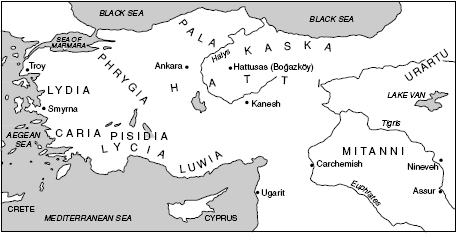
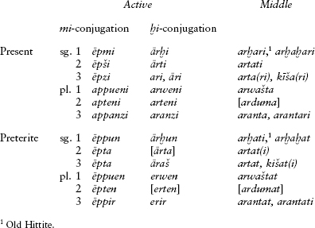
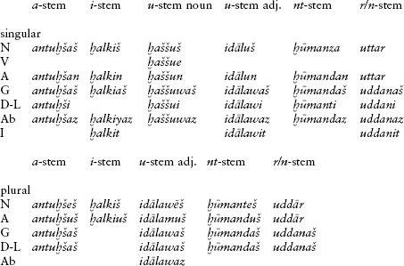
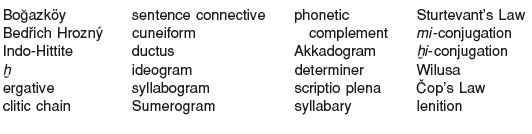

<!-- source-xhtml: 9781405188968_009.xhtml -->

# Chapter 9. Anatolian

## Introduction

**9.1.** The Asian part of Turkey, called Anatolia in classical times, and parts of northern Syria are the home of the earliest attested Indo-European languages, together called Anatolian. Anatolian was not established as a branch of Indo-European until the twentieth century. Two letters found at Tell el-Amarna, Egypt, and written in Mesopotamian cuneiform script were the first documents to come to light that contained **Hittite**, now the most famous Anatolian language. Known as the Arzawa letters, they were published in 1902; the editor, Jorgen Knudtzon, identified the language as Indo-European, but this view was generally greeted with disbelief. In 1906, the first large-scale Hittite finds were made, in the central Turkish village of Boğazköy (now Boğazkale), roughly 90 miles east of Ankara. Excavations in that year uncovered about 10,000 cuneiform tablets and tablet fragments dating from the mid- to late second millennium <small>BC</small> these finds still represent the bulk of our material in the language. It turned out that Boğazköy is on the site of Hattusas, the capital of the Hittite Kingdom (see below); the tablets were found in the remains of a royal archive. During the First World War, the Czech philologist Bedřich Hrozný deciphered the language and proved that it was Indo-European.

**9.2.**Since then other Anatolian languages, none as well preserved as Hittite, have been identified and have gradually been giving up their secrets: **Palaic** and **Cuneiform Luvian**, both also from the second millennium <small>BC</small> and written in the same cuneiform script as Hittite; **Hieroglyphic Luvian**, with remains from both the second and the first millennia <small>BC</small> and written in a native hieroglyphic script; and the first-millennium languages **Lycian** and **Lydian**, written in a Greek-derived alphabet. (Lycian was already known by the late nineteenth century, but its recognition as Anatolian did not come until later.) Three other languages of southern Anatolia – **Carian**, **Pisidian**, and **Sidetic** – belong to the family as well, but due to their fragmentary nature they are very poorly known. As we have come to understand the non-Hittite languages better, their importance for Anatolian and IE studies has increased tremendously. In the past, the focus of attention was the relationship between Hittite and IE, without concern for the intermediate stage of Common Anatolian; but we are now in a better position to reconstruct that stage.

**9.3.**Anatolian is one of the growth industries of IE studies. Almost since the time of its discovery, it has engendered vigorous debate about the structure of PIE and the subgrouping of the family. Our understanding of these matters is being continually revised because new inscriptions are discovered on a regular basis, and our interpretations of already-known texts and linguistic forms are constantly improving. Any historical account of the Anatolian languages is therefore somewhat provisional.

### *Anatolian, Indo-European, and “Indo-Hittite”*

**9.4.** The main difficulty posed by Anatolian for Indo-Europeanists is the fact that its structure is quite different from that of PIE as traditionally reconstructed. One would ordinarily expect that the oldest known languages of the family should resemble the proto-language the most closely; and it is true that Anatolian does preserve a number of important archaisms, notably consonantal reflexes of at least one (and probably two) of the three laryngeals and productive classes of neuter *r/n-*stems. But most striking are the forms and categories that it does *not* have. Absent are such apparently bedrock IE formations as simple thematic verbs, the aorist, the perfect, the subjunctive, the optative, the dual, the **-tó-*verbal adjective, and the comparative in *-*i̯os*-. Additionally, some inherited grammatical forms function differently from their congeners in the rest of IE: endings identifiable with those of the IE perfect are used to form a class of presents (the so-called *ḫi*-conjugation; §9.12); and the **-nt-* participle, which has active voice in the other IE languages, is passive in Anatolian.

One interpretation of these facts is that the forms missing from Anatolian were simply lost, and that the traditional reconstruction of PIE is perfectly valid. But evidence has been growing that Anatolian split off at a time when the development of some of these categories (such as the *s-*aorist) was only nascent. Under this view, PIE went through some subsequent development before achieving its “classic” look; the “missing data” of Anatolian are then partly attributable to loss, and partly to their not having existed yet. An early version of this theory was propounded by the American Indo-Europeanist Edgar Sturtevant, who thought Anatolian was a sister of reconstructed PIE and that both were derived from a language he called **“Indo-Hittite”** (a term that later fell out of favor).

## From PIE to Common Anatolian

### *Phonology*

**9.5.** Anatolian is justly famous for being the only branch to preserve consonantal reflexes of the laryngeals. All scholars agree that **h₂* has a reflex in Hittite, Luvian, and Palaic as the sound transcribed ḫ, and in Lycian variously as χ (*x*), *k*, and *q*. It is also very probable that **h₃* was preserved as ḫ in Hittite, but not all have accepted this claim.

**9.6.** According to recent assessments of Luvian, Anatolian is also the only branch of IE that preserved the original three-way distinction among the velars; see further §9.48.

**9.7.** As for the other consonants, the voiced aspirated stops lost their aspiration and merged with the plain voiced stops. The liquids, nasals, and glide *u̯ generally stayed intact. Interestingly, no native Anatolian words began with *r* (except in clearly secondary cases), which has led some scholars to believe that PIE had no *r-*initial words either. Under this view, PIE words reconstructed with **r-* should be reconstructed as **h₁r*-. But it has been observed that other languages in the same general region also lack words beginning with *r-*, including Hurrian, Armenian, and Greek (words beginning *rh-* in the latter come from initial clusters such as **sr-*; see §§12.19 and 22). Thus the lack of *r-*initial words in Anatolian, rather than reflecting something inherited from PIE, could be an areal feature.

**9.8.** Anatolian inherited all the PIE vowels, but in every language except Lycian **o* and **a* fell together as *a*. Long ō and ā also fell together, as ā.

### *Morphology*

**9.9.** Anatolian nouns were richly inflected in the singular. All the PIE cases were represented, as well as a directive (or allative) case in **-a*, which indicated place to which; the directive was probably a case in PIE also, although most of the evidence for it comes from Anatolian (recall §6.12). The hallmark innovation of the Anatolian case system was the **ergative**, the case taken by neuter nouns when they were subjects of transitive verbs. The ergative was built with the Common Anatolian suffix **-ant-*, of disputed origin, plus animate nominative endings; examples include Hitt. erg. sg. *tuppi-anza* ‘tablet’ (phonetically *tuppiants*), erg. pl. *uttan-ānteš* ‘words’, and Cuneiform Luvian erg. sg. *ḫaratn-antiš* ‘offense’. An ending **-ti* is reconstructed for the Common Anatolian ablative and instrumental, both singular and plural (e.g. Luv. *Wilušati* ‘from Wilusa’). In the plural, separate endings are reconstructible only for the nominative, accusative, genitive, and dative in Common Anatolian, and there is no trace of the other oblique plurals with suffixes beginning with **-m-* or **-bh-* (§6.17). Impressionistically, the plural has a more primitive look than elsewhere in IE.

The archaic *r/n-*stems (§6.31) are a large and productive class of nouns in Anatolian, reduced to a mere handful of forms in the rest of IE; for example, Luv. *kuršawar*, stem *kuršaw(a)n-* ‘island’ (from **kuršai-* ‘cut’, i.e. ‘land cut off by water’).

**9.10.** Anatolian preserves the distinction between distributive and collective plural in animate nouns (§6.68); thus Old Hittite *alpeš* ‘clouds’ vs. collective *alpa* ‘group of clouds’. No direct reflex of the dual has been found. Whether the feminine exists in Anatolian in any way is debated (recall §6.69).

**9.11.** Among the striking features of the pronominal system is the development of clitic subject pronouns in the third person; elsewhere in IE, clitic pronouns are only found in oblique cases. The Anatolian subject pronouns are limited to use with a few classes of intransitive verbs. Among other features worthy of note in the pronominal system are a demonstrative stem **obo-* (< PIE **obho-*) meaning ‘that’ (> Hitt. *apā-*, Pal. *apa-*, Lyc. *ebe-*) and the odd *u-*vocalism of the 1st person pronoun **ug* ‘I’ and **emu* ‘me’ as opposed to PIE **eg̑-* and **eme* (Hitt. nomin. *ūk*, accus. *ammuk*; cp. Hieroglyphic Luv., Lyc., and Lyd. accus. *amu*). This *u* ultimately comes from the influence of **tu-* ‘thee’; cp. §7.1.

#### Verbs

**9.12.** Anatolian verbs only inflected in two tenses, present and preterite, and in two voices, active and mediopassive. Thus there are far fewer verbal inflections in Anatolian than in the rest of IE. Among the types of present stems, simple thematic verbs are exceedingly rare or non-existent, but root athematic presents are very common. While the aorist as a category is not found, a few present stems appear to correspond to aorist stems in other languages, such as Lyc. *tadi* ‘puts’ (cp. Ved. aorist *(á)dhāt*). There was also an imperative, with 3rd person forms ending in **-(t)u* (e.g. Hitt. *pau* ‘let him give’, *paiddu* ‘let him go’; compare Ved. Skt. *étu* ‘let him go’).

But the morphological peculiarity for which the Anatolian verb is best known is the existence of two separate verbal conjugations, the ***mi*-conjugation** and the ḫ***i*-conjugation** (named after their respective Hittite 1st sing. present active endings). The *-mi* conjugation is unproblematic, continuing the familiar endings **-mi* **-si* **-ti* etc. in the present and **-m *-s *-t* etc. in the preterite. The *ḫi*-conjugation endings, however, are directly equatable with those of the IE perfect. How the *ḫi*-conjugation relates to the perfect is a major unsolved problem and bears on the very foundations of the IE verbal system. Under an older view, Anatolian turned the perfect into a present tense for one (diverse) group of verbs. Under a newer, still controversial view, the *ḫi*-conjugation continues a class of PIE presents and aorists that was allied with the perfect in complex ways; see §9.33 below. There are also many other theories.

### Syntax

**9.13.** The Anatolian languages are syntactically quite similar to one another. Characteristic of Anatolian sentence structure is the clause-initial **clitic chain**: all clitic sentential conjunctions, clitic sentential adverbs, and clitic pronouns were attached to the first word of the clause in a particular fixed order, with the whole chain written as a single word. Thus in Hittite one can begin a sentence *kinun*=*ma*=*wa*=*tu*=*za* (the equals signs are used to indicate the clitic boundaries in Anatolian scholarship), where *kinun* means ‘now’, *-ma* is a clitic adversative conjunction meaning ‘but’, *-wa* is a quotative particle indicating that the sentence is quoted speech, *-tu* is the 2nd sing. accus. pronoun, and *-za* is a reflexive particle. Clauses are generally verb-final, although the verb or any other element in a clause could be fronted to the beginning of a clause for emphasis or topicalization. Also characteristic of Anatolian clauses was the almost universal use of a so-called sentence connective to begin any clause that was not discourse-initial; this conjunction served as an anchor for the clitic chain (in the absence of a fronted element filling that slot) and also connected each sentence to the previous one in continuous narrative. It roughly corresponded to ‘and’ or ‘and then’ in English, but is frequently untranslatable. The most familiar example is Hitt. *nu*, cognate with Eng. *now* (but not so translated).

**9.14.** We noted earlier the creation of the ergative case in Anatolian. Although the formal origin of this case is uncertain, it is evident that its creation was part of a larger change in Anatolian whose fulcrum was verb transitivity – specifically, the development of overt morphosyntactic marking of certain contrasts within this category. Thus the ergative distinguishes neuter subjects of transitive verbs from neuter subjects of intransitive verbs, which were not morphologically distinct from objects (the neuter nominative is identical with the accusative). Another new set of forms, the enclitic third-person subject pronouns (§9.11 above), made overt the distinction between the two basic types of intransitive verbs: unaccusatives and unergatives. (We met unaccusatives when discussing the PIE middle; see §5.5.) The subject of an unaccusative verb is not semantically an agent; underlyingly in fact it is an object, the undergoer of the action. Thus in the sentence *The tablet broke*, the subject *tablet* undergoes the breaking. With unergative verbs, however, the subject is the agent and is underlyingly the subject, as in *The king spoke*. Many languages make formal distinctions of some kind between these two types of intransitives. From a PIE view, the change can also be viewed a different way: the language went from not using clitic subject pronouns for *overt* subjects, to not using clitic subject pronouns for *underlying* subjects – and that only in the third person.

## Hittite

**9.15.** Because of the extensive linguistic remains, far more is known about the Hittites than about the other Anatolian peoples; but little can be said about their origins. That they or their ancestors did not originally inhabit Anatolia is certain (in spite of the controversy mentioned in §2.71). Their designation for their country, *Ḫatti*, is taken over from the indigenous non-Indo-European Hattic people whom they encountered early and assimilated. The influence of Hattic culture was quite strong; preserved among the hundreds of ritual texts at Boğazköy are many of Hattic provenance. The Hittites, along with other Anatolian speakers, presumably came from the north, and were already settled in central Anatolia by about 1900 <small>BC</small>. Around this time Assyrian merchants were setting up colonies in the area, and in Assyrian documents from Kanesh (modern Kültepe, about 100 miles south-southeast of Boğazköy) the first Hittite words appear, as loanwords – proper names and a few lexical borrowings, two of which are of some cultural significance: *išpa(t)ta(l)lu* ‘nightwatch’ (Hitt. **išpantalla-*, from *išpant-* ‘night’) and *išḫiu(l)lu* ‘contract’ (Hitt. *išḫiul*). The former is interesting in light of the fact that Anittas, the first Hittite king of whom we have records (see below), took enemy cities by night; the latter is revealing in light of the importance of the contract and other mutually binding arrangements in ancient IE societies (see §§2.11ff.).

### *Cultural and political history*

**9.16.** At the dawn of Hittite history, the central part of Anatolia (the area known as Cappadocia in classical times) was divided into numerous small principalities. Hittite history is ushered in with the “Anittas text,” the oldest surviving Hittite document, dating from the sixteenth century <small>BC</small> or earlier. It contains an account of how one Anittas and his father, Pithanas, king of a place called Kussara, vied against the other principalities for power. They were eventually victorious and set up their capital at Nesa (also called Kanesh). From the name Nesa comes the adverb *nešumnili* ‘in Hittite’.

**9.17.** The connection between Anittas and the kings of the subsequent **Old Kingdom** is not known; he is not claimed by any of them as a forebear. The history of the Old Kingdom apparently starts with Hattusilis I, who moved the capital to Hattusas and also began a southward territorial expansion into what is now northern Syria. His son Mursilis I pressed into Mesopotamia and even sacked Babylon. The Old Kingdom culminated with the reign of the powerful king Telipinus in the fifteenth century <small>BC</small>.

During the early years of the **Middle Kingdom**, the state prospered at first but then was beset by invaders from every direction; records even speak of Hattusas getting sacked and burned. A strong king came to the rescue, Suppiluliumas I, who ascended the throne around 1380 <small>BC</small>. With his reign the **New Kingdom** or Hittite Empire began – the most powerful period in the history of the Hittites. For nearly two centuries the Hittite Empire was one of the most influential states in the ancient Near East. Eventually, though, it fell victim to invasions from the north, ending with the destruction of Hattusas around 1200 <small>BC</small>. While this did not spell the end of Hittite civilization, it did terminate the production of Hittite texts, since Hattusas had been the center of the Hittite scribal chancelleries.

**9.18.** Various principalities of the former empire remained intact until near the end of the eighth century <small>BC</small> and called themselves Hittites, most prominently a state in northern Syria with its capital at Karkamish (Carchemish) on the Euphrates. Their chancellery language was not Hittite, however, but Hieroglyphic Luvian. After the Assyrians conquered Syria in the late eighth century, we never again hear of anyone called Hittite.

### *The linguistic stages of Hittite*

**9.19.** Hittite is divided into three periods that correspond to the three political periods outlined above: **Old Hittite**, the language of the Old Kingdom (c. 1570–1450 <small>BC</small>); **Middle Hittite** (c. 1450–1380 <small>BC</small>); and **Neo-Hittite** (c. 1350–1200 <small>BC</small>), beginning with the death of Suppiluliumas I (documents from his reign are linguistically still Middle Hittite). About four centuries separate the oldest Old Hittite from the latest Neo-Hittite – about as much time as separates present-day English from the language of Shakespeare.

Except for one bronze tablet, all surviving Hittite texts are inscribed on clay. The dating of Hittite texts and the description of Old, Middle, and Neo-Hittite have been hampered by the fact that texts were often recopied and modernized. Many tablets inscribed during the New Kingdom contain Neo-Hittite versions of Old and Middle Hittite originals and present a mixture of archaic and modernized forms. Greater accuracy in dating has been achieved largely through advances in *paleo-graphy*, the study of sign-shapes and their evolution. We now know in considerable detail the relative chronology of different cuneiform sign-shapes and of various external features of the tablets. The earliest style (or *ductus*) of Hittite cuneiform is called **Old Script**, followed by **Middle Script** and **New Script**.

**9.20.** The Hittite corpus spans a wide range of genres. Most plentiful are ritual texts, containing instructions (some quite lengthy) on how to conduct the rituals and festivals of the Hittite state religion. Of great importance to historians of the Ancient Near East are the numerous treaties, decrees, annals of kings, official letters, and a sizeable law code. We also have many myths, omens, and medical texts.

Copies of the cuneiform tablets have been published in several collections since the early 1900s; published tablets are identified by an abbreviation of the collection, the volume number, and the tablet number. Thus the catalogue number of the text sample in §9.44 below, KBo 17.1 (or KBo XVII 1), means the first tablet in the 17th volume of the collection *Keilschrifttexte aus Boghazköy* (*Cuneiform Texts from Boghazköy*). Reference may then be made to column and line numbers: KBo 17.1 iii 12 refers to line 12 in column 3. All the Hittite texts were organized into a thematic (genre-based) catalogue by Emmanuel Laroche called CTH (*Catalogue des textes hittites*: Laroche 1971); it is now standard practice to give the CTH number for any text being discussed.

### *Cuneiform writing and its transcription*

**9.21.** Before proceeding with our historical grammatical sketch, we will introduce the nature of, and problems with, the writing system and the transcription of it. Hittite was written in the Mesopotamian cuneiform script. This script was probably invented by the Sumerians; Sumerian is at any rate the first language recorded in it that we can read, beginning at the end of the fourth millennium <small>BC</small>. Over the ensuing millennium and a half it was adopted by many other cultures of the Ancient Near East. The designation *cuneiform* comes from Latin *cuneus* ‘wedge’, after the wedge-shaped marks made by a reed stylus pressing into soft clay. The clay tablet was the writing medium *par excellence* in a region where both clay and the sunshine needed to harden it were abundant.

Cuneiform writing was originally designed for keeping mercantile records and consisted of symbols for numbers and pictorial depictions of trade items. But it eventually spread into other spheres of life, necessitating the representation of abstract concepts for which pictures could not be drawn. As a result, by about 2800 <small>BC</small> the script had developed into a partly phonetic system in which individual signs could be read as *ideograms* (also called *logograms*, representations of whole words or concepts) or as *syllabograms* (representing individual syllables). For example, the sign for the Sumerian word for ‘mouth’, pronounced *ka*, could be used logographically to represent the concept ‘mouth’ or syllabographically to represent the syllable *ka* in some other (longer) word. In essence, what the Sumerians developed was a rebus system, similar to English word-games where a picture of an eye can be used to represent the concept ‘eye’, the pronoun ‘I’, or the syllable [aj] in some longer word. Over time the system increased greatly in complexity, with some syllables represented by any of numerous signs, and with many signs having multiple values.

**9.22.** From the Sumerians the script spread by c. 2400 <small>BC</small> to the Akkadians, whose language was Semitic (Sumerian is not certainly related to any known language family). The Akkadians took over the whole system, and continued to use many of the signs in their ideographic Sumerian values as a kind of shorthand; these are called *Sumerograms*. However, since Akkadians read Sumerograms out loud in Akkadian, it was often convenient to the reader to indicate what the inflections of the underlying Akkadian words were. This was done by adding a sign or two indicating the Akkadian inflectional ending. This extra information is known as a *phonetic complement*. (The use of phonetic complements, incidentally, is also characteristic of Japanese writing; and for a parallel from English, compare the addition of letters in the ordinal numerals *2nd*, *3rd*, *4th*, etc.)

One version of Akkadian cuneiform, known as Old Babylonian, was adopted by the Hittites sometime before 1600 <small>BC</small>. They took the above practices one step further: they used both Sumerian and Akkadian words (the latter called *Akkadograms*) as a shorthand, and sometimes attached Hittite phonetic complements to them. Thus in a Hittite text, theoretically any given sign could stand for a Sumerian word, a syllable of a Sumerian word, a syllable of an Akkadian word or phonetic complement, or a syllable of a Hittite word or phonetic complement.

**9.23.** In transliterating Anatolian cuneiform texts, the three languages Sumerian, Akkadian, and Hittite (or Luvian or Palaic) are conventionally differentiated by contrastive use of capitalization and italics. These and other conventions are best explained using an illustrative example (KBo 3.4 ii 41f.):

na-aš-ma-at-ta URUKÙ.BABBAR-ša-aš ZAG-aš ku-iš *BE-LU* ma-ni-in-ku-wa-an nu ERÍNMEŠ ANŠE.KUR.RAMEŠ a-pé-e-da-ni ú-e-ek-ti

“or whichever border-guard of Hattusas is near you, (if) you ask for infantry and chariot-fighters from him”

Hyphens are used to separate the transcriptions of individual cuneiform signs: thus the first word, *na-aš-ma-at-ta*, is written with five signs. (As we will discuss below in §§9.30 and 31, individual cuneiform signs often represented sequences of two speech sounds.) Signs used to write Hittite are transcribed in lower case (such as the first word); Sumerograms are in roman upper case (as ZAG); and Akkadograms are in italic upper case (as *BE-LU*). When a Sumerian word consists of more than one sign, periods are used instead of hyphens to mark the sign boundaries (as ANŠE.KUR.RA). Hittite phonetic complements are joined to a preceding Sumerogram or Akkadogram with a hyphen: ZAG-*aš* consists of the Sumerogram ZAG ‘border’ plus the Hittite phonetic complement *-aš* indicating genitive singular (the underlying Hittite word is *irḫaš*), and URUKÙ.BABBAR*-ša-aš* represents *Ḫattušaš* ‘of Hattusas’, where the last syllable of the Hittite word (*-ša-aš*) is added to the Sumerogram as a phonetic complement.

A superscript sign preceding a word, as in this last example (URU), is called a *determiner* (or *determinative*) and indicates the general semantic class to which the word belongs. In this example, URU (literally ‘city’) indicates the name of a city. The superscript signs that follow a word are usually Sumerian grammatical endings (or Akkadian, if they are italicized); the one occurring in our example (MEŠ) is a Sumerian plural marker.

**9.24.** The system of transcribing sign by sign shown above, called *narrow transcription*, is often clumsy (although it is used for all editions of Hittite texts); it can be normalized by “erasing” the hyphens and redundant vowels (*broad transcription*). Thus the word *ma-ni-in-ku-wa-an* above can be normalized as *maninkuwan*. In a word like *ḫa-a-ra-aš* ‘eagle’ or *ma-a-an* ‘when, if’, the extra vowel sign for *a* must be taken seriously, for this was how the Hittites wrote long (and possibly also stressed) vowels; these words are normalized as *ḫāraš* and *mān*. (The technical term for the use of an extra vowel sign is *scriptio plena*, ‘full writing’.) Double consonants are written double in both kinds of transcription, as the difference between single and double consonants is significant (see §9.31 below): *šu-up-pi-iš* = *šuppiš* ‘pure’. In all the forms cited below, broad transcription will be used, as is standard.

The letters used in transcription have their Latin values except *z*, which represents *ts* (as in German). The letters *š* and ḫ probably represent *s* and the velar fricative [x] (as in German *Bach*). Diacritics and subscript numerals are used to differentiate homophonous cuneiform signs (e.g. *gú* [or *gu*₂], *gù* [or *gu*₃], *gu*₄, etc.)

### *Phonology*

**9.25.** Only some of the numerous sound changes undergone by Hittite will be outlined here. In the stop system, the palatal and plain velar stops merged into plain velars as in centum languages; compare ***k**āš* ‘this’ (< **k̑os*) with *lu**kk**e-* ‘to kindle’ (**lou**k**ei̯e-*), both spelled with *k*. The labiovelars preserved their labial element and are usually written with the sign *ku*: ***ku**iš* ‘who’ < ****kʷ**is*, ***ku**enzi* ‘kills’ < ****gʷh**enti*.

**9.26.** A characteristic consonant change is the development of **t* to *ts* (written *z*) before an *i*. The 3rd sing. and pl. primary personal endings **-ti* and **-nti* thus become *-zi* and *-nzi* in Hittite, as in *ēšzi* ‘is’ and *ašanzi* ‘are’ (cp. Ved. *ásti*, *sánti*). Also characteristic of Hittite is the dissimilatory change of *u̯ to *m* when next to *u*. Thus the 1st pl. primary verb ending *-weni* appears as *-m(m)eni* in verbs like *arnummeni* ‘we stir, move’.

**9.27.** Hittite preserves the second and probably also the third laryngeal as ḫ, as in *paḫḫur* ‘fire’ < **pe**h₂**u̯r̥* and *ḫāraš* ‘eagle’ < ****h₃**er-*.

**9.28.** The syllabic resonants developed an *a* in front of them, as in *p**al**ḫi-* ‘broad’ < **pl̥h₂-i-*, *k**ar**d-* ‘heart’ < **k̑r̥d-*, and ***an**zāš* ‘us’ < **n̥sos*.

**9.29.** The Common Anatolian vowels underwent complex changes in Hittite, of which we may mention the following. Short **e* became *a* in several environments, especially before sonorants, although the conditioning factors have not been fully worked out. Examples include ***a**nda* ‘in, into’ < PIE ****e**ndo*; *t**a**rku-* ‘to dance’ < **t**e**rkʷ-* (‘twist’ in PIE; cp. the name of the English dance!); and *d**a**ššu-* ‘massive’ < **d**e**ns-*. Short **e* also generally became *a* when unaccented: the 1st and 2nd pl. endings *-weni* and *-teni* appear in Old Hittite as *-w**a**ni* and *-t**a**ni* when the verbal root is stressed. Short accented **ó* became ā: *wātar* ‘water’ < *u̯***ó**dr̥*, *kunānt-* ‘killed’ < **gʷhn**ó**nt-* (with *o-*grade of the participial ending as in Greek *-ont-*).

#### Hittite phonology and the cuneiform syllabary

**9.30.** In their phonetic values, cuneiform signs constituted a syllabary, not an alphabet: signs stood for syllables and not individual sounds (except vowels). Signs represented single vowels (V), sequences of consonant + vowel (CV), vowel + consonant (VC), or consonant + vowel + consonant (CVC). Not all theoretically possible combinations are found.

Such a spelling system has limitations. Since no cuneiform signs stand for consonantal sounds alone, a syllabary cannot unambiguously represent word-initial or word-final consonant clusters, or word-internal clusters of more than two consonants. From comparative evidence and from spelling fluctuations in Hittite texts, it is certain that Hittite inherited such clusters, but it is not always known whether they were preserved as such in speech. A clear example where a word-final cluster was still pronounced intact is the 3rd singular preterite of the verb ‘come’, which was written either *a-ar-aš* or *a-ar-ša*, suggesting that the real pronunciation was [ars]; the extra *a* was a “dummy” or “empty” vowel, forced upon the scribes by the limitations of the writing system. Usually the vowel appearing in clusters was *a*, but in those containing *s* and a stop it was generally *i* instead, and the interpretation of these spellings has been more controversial. Thus the preterite of the verb ‘die’ is always written *ak-ki-iš*, not **ak-ka-aš* or **ak-ša*, and the noun *išpantuzzi*- ‘libation vessel’, cognate with the Greek verb *spéndō* ‘I pour a libation’, is never written with *ašp*- or *šap*- or the like. In such cases the *i* probably was not simply graphic, but really pronounced. The “sprouting” of a front vowel before or within an *s-*cluster is easy to parallel from other languages, as in the Hungarian and Spanish versions of the name *Stephen* – *István* and *Estebán*, respectively.

**9.31.** The Akkadian syllabary distinguished voiced from voiceless consonants in its CV signs (e.g., *pa* and *ba*), but the Hittites did not avail themselves of this distinction in any systematic way. Crucially, there is no correlation between the sign used and whether the relevant sound comes from a voiced or voiceless consonant in PIE. For example, *a-ta-an-zi* and *a-da-an-zi* ‘they eat’ are both attested spellings of a word that etymologically contains *d* (from **h₁ed-* ‘eat’).

What the Hittites did instead was make a systematic distinction between consonants written single between vowels (*V-CV*) and consonants written double (*VC-CV*). Consonants written single correspond to PIE voiced stops, while those written double correspond to voiceless stops. Thus the single *t* or *d* in *a-ta-an-zi* and *a-da-an-zi*, which comes from **d*, contrasts with the double *-tt-* or *-dd-* in a word like *ar-nu-ut-tu* or *ar-nu-ud-du* ‘let him bring’, which comes from **t*. This fact is known as **Sturtevant’s Law**, after the American Indo-Europeanist Edgar Sturtevant. What these spellings represent phonetically is still being debated.

### *Morphology*

#### Verbs

**9.32.** As in Common Anatolian, Hittite verbs were conjugated only in the indicative mood, in the present and preterite tenses, and in the active and middle (mediopassive) voices. There was also an active and middle imperative for all persons. Mention has already been made of the *mi-* and *ḫi*-conjugations; the endings of both are alike in the plural and middle, and often a verb belonging to one conjugation acquired endings of the other conjugation by analogy, especially in later texts. Sample active paradigms are given below for the *mi-*verb *ēpmi* ‘I take, seize’ and the *ḫi*-verb *ārḫi* ‘I reach, arrive at’. To exemplify the middle, the paradigm of *arḫaḫari* ‘I stand’ is given; variant forms of the 3rd singular, without *-t-*, are illustrated with relevant forms of *kišḫaḫari* ‘I become’. Bracketed forms are not actually attested for these verbs:

To the active forms above may be added the imperatives, which in the 2nd singular are the base stem (*ēp*) and in the 2nd plural end in *-ten* (*ēpten*, *arten*); in the 3rd person, a *-u* appears in place of the *-i* of the indicative (sing. *ēpdu*, *aru*; pl. *appandu*).

**9.33.** There is considerable variation in ablaut in root athematic verbs of both conjugations. For example, alongside the forms ***a**ppueni **a**pteni* above are also found *ēppueni* and *ēpteni*. The 3rd singular present tense of ablauting *mi-* verbs often has *e*-vocalism that contrasts with either *a-*vocalism or no vowel in the plural: compare the singular/plural pairs *ēšzi* ‘is’ ∼ ***a**šanzi* ‘they are’, *ēkuzi* ‘drinks’ ∼ ***a**kuwanzi* ‘they drink’, ***kuen**zi* ‘kills’ ∼ ***kun**anzi* ‘they kill’. Some ablauting *ḫi*-verbs have the opposite pattern: *š**a**kki* ‘knows’ ∼ *š**e**kkanzi* ‘they know’. Others have *a-*vocalism throughout, sometimes with a contrast of single versus double consonant: *ā**k**i* ‘dies’ ∼ *a**kk**anzi* ‘they die’.

An *a* ∼ *e* alternation in Anatolian likely continues an **o* ∼ **e* alternation in PIE. This is reminiscent of the fact that several dozen verbal roots show an interchange of *o*- and *e-*grade in cognate present-tense forms in other daughter languages: Goth. *graban* ‘to dig’ (< **ghrobh-*) vs. OCS *po-grebǫ* ‘I dig’ (< **ghrebh-*); OIr. *melid* ‘grinds’ (< **melh₂-*) vs. Goth. *malan* ‘to grind’ (< **molh₂-*); Gk. *a(w)éksomai* ‘I grow’ (< **h₂u̯eks-*) vs. Goth. *wahsan* ‘to grow’ (= Eng. *wax*; < **h₂u̯oks-*). To explain these verbs and the ablaut of the *ḫi*-conjugation, it has been suggested by the American Indo-Europeanist Jay Jasanoff that PIE had a class of presents, the **h₂e-conjugation**, with *o-*grade in the singular and *e-*grade in the dual and plural that originally inflected with endings like the perfect. This idea has not found universal acceptance but has been gaining adherents, and the research it has spawned has been shedding light on the relationships among the *ḫi*-conjugation, the perfect, and the middle.

**9.34.** Besides root athematic verbs, there are several types of derived stems. Two kinds of nasal presents are found, both conjugating as *mi-*verbs, those with infix *-nin-* and those with suffix *-nu-*; both form causatives, such as *ḫarnink-* ‘destroy’ (< *ḫark-* ‘perish’) and *arnu-* ‘bring’ (< *ar-* ‘reach’ above). The PIE factitive suffix **-eh₂-* (§5.37) is faithfully continued in Hittite as *-aḫḫ-*, as in *idālawaḫḫ-* ‘do bad, do evil’ (< *idālu-* ‘evil’); the factitives conjugate first as *ḫi*-verbs and later also as *mi-*verbs. Among thematic verbal suffixes, one that is particularly widespread is *-(i)ške-* (< PIE **-sk̑e-*), which could be freely attached to any verb stem to form what is standardly called an iterative. The term is misleading, for – as alluded to in §5.34 – the suffix was used to indicate not only repeated action, but also background action, action lasting over a long time (durative), and action undertaken by several subjects or applied to several objects (distributive). Thus *uw-anzi* ‘they look’ ∼ *ušk-andu* ‘let them (all) look’, *memai* ‘says’ ∼ *memišk-ezzi* ‘says (many things)’.

**9.35.** Hittite verbs also had an infinitive in *-anna* (e.g. *adanna* ‘to eat’) or *-wanzi* (e.g. *iyawanzi* ‘to bring’), used much like the English infinitive; a supine in *-wan*, used only with the verb *dāi-* ‘place’ in a construction meaning ‘begin to . . .’ (e.g. *memiškiwan dāi* ‘he begins to speak’); and the *nt-*participle, which (unlike elsewhere in IE) is a past passive participle when added to transitive verbs (e.g. *kunānt-* ‘[having been] killed’ from *kuen-* ‘kill’) but active when added to intransitives (e.g. *pānt-* ‘[having] gone’ from *pāi-* ‘go’). It is functionally equivalent to the PIE **tó*-verbal adjective, which is not found in Anatolian.

**9.36.** That Hittite inherited mobile accentual paradigms is clear from the shift of long vowels in such pairs as Old Hitt. *dāḫḫe* ‘I take’ ∼ *tumēni* ‘we take’ (**d**ó**h₃-h₂e* vs. **dh₃-u̯**é**ni*) and *ēšzi* ‘is’ ∼ *ašānt-* ‘having been’ (**h₁**é**s-ti* **h₁s-**ó**nt-*).

#### Nouns

**9.37.** A representative selection of Hittite noun and adjective declensions is given below. Paradigms are given for *antuḫšaš* ‘man’, *ḫalkiš* ‘grain’, *ḫaššuš* ‘king’ (attested only in the singular), *idālu-* ‘evil’, *ḫūmant-* ‘every, all’, and *uttar* ‘word, speech’. All are common-gender except *uttar*.

**9.38.** As in Common Anatolian, Hittite nouns distinguished more cases in the singular than in the plural. Over the course of the language’s attested history, certain case distinctions in the singular disappeared as well. The ablative took over the functions of the instrumental, and the directive disappeared, its function taken over by the dative-locative.

The genitive plural in Old Hittite ended in *-an* (< **-ōm*), as in *šiunan* ‘of the gods’, but this got replaced by the *-aš* of the dative-locative, as in the paradigms above. The accusative plural ending *-uš* appears to be the regular outcome of PIE **-n̥s*; the *u-*stem accus. pl. *-amuš* is dissimilated from **-awuš* (from PIE **-eu̯-n̥s*) by the sound change noted above in §9.26. Not represented in the particular paradigms above is the Old Hittite directive which ended in *-a* (as in *aruna* ‘to the sea’). Also not represented is the ergative, which ended in *-anza*, as in *paḫḫuenanza* ‘fire’.

**9.39.** Hittite, as well as the other Anatolian languages, has a much more robust class of *r/n-*stems than the other IE languages. Aside from such basic inherited nouns as *paḫḫur* genit. *paḫḫuenaš* ‘fire’, *ēšḫar išḫanaš* ‘blood’, and *wātar wetenaš* ‘water’, derivatives using the suffixes *-ātar* and *-ēššar* were freely formed, e.g. *paprātar paprannaš* ‘defilement’ and *uppeššar/uppešnaš* ‘sending, message’.

**9.40.** Remains of mobile accentual paradigms are preserved in such pairs as *wātar* (sing.) ‘water’ ∼ *widār* (collective pl.) ‘waters’ (< **u̯ódr̥* **u̯edṓr*) and *tēkan* (nominative sing.) ‘earth’ ∼ *taknī* (dative sing.) (< **dhég̑hōm* **dhg̑hméi*).

### *Syntax*

**9.41.** Like the other Anatolian languages, Hittite clauses (except those at the start of a discourse or a major section in a text) typically begin with a sentence connective to which one or more clitics could be attached in a clitic chain. The most common sentence connective was *nu;* Old Hittite also had *ta* and *šu.* The initial position in the sentence, i.e. the place held by the sentence connective, could also be filled with another element in the sentence that was topicalized or fronted for emphasis or contrast; and such an element could also host the clitic chain. Various examples can be seen in the text sample below.

**9.42.** The order of clitics in the clitic chain was fixed: first the conjunctions *-(y)a* ‘and’, *-a* ‘but’, or *-ma* ‘but’; then the quotative particle *-wa(r),* used to indicate that the clause in which it appears is directly quoted speech; the enclitic pronouns (with forms of the 3rd person preceding the other two persons); the reflexive particle *-za;* and finally the still imperfectly understood local particles *-kan* or *-šan* (also *-(a)šta* and *-(a)pa* in the older language).

**9.43.** The syntax of relative clauses is of some interest. If the relative pronoun is the first word in its clause (or is preceded only by a sentence connective with or without attached clitics), then it is indefinite: ***kue*** GALḪI.A *akkuškizzi ta apie*=*pat ekuzi* ‘**whichever** cups he usually drinks from, he shall drink from those’ (KBo 19.74 iv 33′–34′); *nu*=*mu*=*kan **kuiš** idaluš memiaš* ZI-*ni anda n*=*an*=*mu* DINGIRMEŠ EGIR- *pa* SIG₅-*aḫḫanzi šarlanzi* ‘**whichever** bad word (is) in my soul, the gods will alleviate it (and) remove it” (KUB 6.45+ iii 46–47). However, if it is preceded by any stressed elements in its clause, it is definite: GU₄=*ya*=*wa*=*mu* ***kuin** tet nu*=*war*=*an*=*mu uppi* ‘And the cow **that** you promised me, send it to me’ (Maşat 75/14 obv. 14–16). As is typically the case in older IE languages, the relative clause precedes the main clause.

### *Old Hittite text sample*

**9.44.** Below is an excerpt from the Old Hittite Ritual for the Royal Couple, KBo 17.1 (CTH 324), column III, lines 1–13, following the edition of Otten and Souček 1969. This passage is taken from the middle of the ritual; previously prepared items – an eagle and clay figurines representing an army – are here manipulated in the performance of sympathetic magic (somewhat similar to voodoo).

The passage is given below in narrow transcription; broad transcription is used in the notes (where equals signs mark off the clitics). Brackets enclose missing parts of the tablet that have been restored by conjecture; material inside the bracketed sections that is further enclosed in parentheses has been supplied from identical passages in duplicate copies (in this case, the fragments KBo 19.3 and 19.6). The horizontal lines are paragraph dividers in the original.

[ma-a-a]ḫ-ḫa-an-da ᵈUTU-uš ᵈIŠKUR-aš ne-e-pí-iš te-e[(-kán-na)]  

2 uk-tu-u-ri LUGAL-uš SAL.LUGAL-aš-ša DUMUMEŠ-ša uk-tu-u-ri-eš a-š[(a-a)]n-d[u]  

ta nam-ma MUŠENḫa-a-ra-na-an ne-e-pí-ša tar-na-aḫ-ḫi  

4 a-ap-pa-an-an-da-ma-aš-še ke-e me-e-ma-aḫ-ḫi na-at-ta-an ú-uk  

t[(ar-na-a)]ḫ-ḫu-un LUGAL-ša-an SAL.LUGAL-ša tar-na-aš nu i-it ᵈUTU-i  

6 ᵈIŠKUR-ya me-e-m[(i-i)]š-ki ᵈUTU-uš ᵈIŠKUR-aš ma-a-an uk-tu-u-ri-eš  

LUGAL-uš SAL.LUGAL-aš-ša *QA-TAM-MA* uk-tu-u-ri-eš a-ša-an-tu  

![Figure 9.1: *Figure 9.1* One of the fragments composing KBo 17.1. The top line begins in the middle of line 1: the broken sign is UTU, followed closely by *uš* and then a short word-break. Underneath UTU is the right part of LUGAL in line 2 followed again by *uš*. Note the “right justification” of several of the lines, where the last sign or signs of a line were delayed until near the edge of the tablet. Drawing from Heinrich Otten, *Keilschrifttexte aus Boghazköi*, vol. 17 (Berlin: Mann, 1969), p. 3. Reproduced by permission.](images/fortson-2010-indo-european-language-and-culture-fig9-1.jpg)

8 ú-i-il-na-aš ERÍNMEŠ-an te-eš-šu-um-mi-uš-ša ta-ak-na-a  

ḫa-ri-e-mi tu-uš tar-ma-e-mi ta ki-iš-ša-an te-e-mi  

10 ᵈUTU-uš ᵈIŠKUR-aš ka-a-š[(a LU)]GAL-i SAL.LUGAL-ri DUMUMEŠ-ma-aš-ša URUḪa-at-tu-ši  

e-er-ma-aš-me-et e-eš-ḫ[(ar-š)]a-me-et i-da-a-lu-uš-me-et  

12 ḫa-tu-ka-aš-me-et ḫa-ri-[(e-nu-u)]n ta-at a-ap-pa ša-ra-a  

le-e ú-e-ez-zi  

(The priest speaks:) “Just as the Sungod (and) the Stormgod, heaven and earth (2) (are) eternal, so may the king and queen and (their) children be eternal!”

(3) Then I release the eagle to the sky, (4) and after it I speak these (words): “I did not release it – the king and queen released it. Go! Say to the Sungod and the Stormgod, ‘Just as the Sungod and the Stormgod (are) eternal, (7) let the king and queen likewise be eternal!’”

(8) I bury the clay soldiers and the pots into the earth, and I nail them fast. Then I speak as follows: (10) “Sungod, Stormgod, I have just buried the disease, bloodshed, evil, (and) fright of the king, queen, and their sons in the city of Ḫattuša. Let it not come up again!”

**9.44a. Notes** (through beginning of line 9 only). **1–2. nēpiš:** ‘sky, heaven’, a neuter *s-*stem from PIE **nebh-es-* ‘cloud’; cp. Ved. *nábhas-* and Gk. *néphos.* **tēkann=a:** ‘and earth’; *tēkan* is from PIE **dheg̑hōm,* and the clitic conjunction *-a* means ‘and’ and doubles the preceding consonant (as also in the phrase ‘king and queen’ in the next line). After a vowel and sometimes Sumerograms (e.g. line 6) it is written *-ya*. **uktūri:** ‘eternal’, Old Hitt. neuter collective pl. **LUGAL-uš SAL.LUGAL-ašš=a:** ‘king and queen’; the underlying Hittite is *ḫaššuš *ḫaššuššarašš=a.* SAL (or MUNUS) is the Sumerogram for ‘woman’. The ending *-ššaraš* comes from PIE **soro-* ‘woman’, which had marginal use as a feminizing suffix (§6.71). **ašandu:** 3rd pl. imperative, ‘let them be’, spelled *ašantu* in line 7.

**3–4. ta:** Old Hitt. sentence connective. **MUŠENḫāranan:** ‘eagle’, accus. sing. *n-*stem; cognate with Gk. *órn-īth-* ‘bird’ and the second syllable of German *Adl-er* ‘eagle’ (< Middle High German *adel-ar* ‘noble *Aar* [eagle]’). MUšEN is the Sumerian determiner for bird-names. **nēpiša:** ‘to the sky’, directive case. **tarnaḫḫi:** ‘I release’, 1st sing. present of the ḫ*i*-conjugation, like *mēmaḫḫi* ‘I say’ in the next line. **āppananda=ma=šše:** ‘And/but (*-ma*) after (*āppananda*) it (*-šše*)’. **kē:** neut. pl., ‘these things’; PIE pronominal stem **k̑i-* (§7.10). **natta=an:** ‘not’ plus the clitic animate object pronoun referring to the eagle, ‘it’. **ūk:** emphatic 1st sing. pronoun, ‘I’ (§9.11).

**5–6. LUGAL-š=an SAL.LUGAL-š=a:** underlying Hittite is *ḫaššuš=an *ḫassuššarašš=a* ‘the king and (*-a*) the queen it (*-an,* i.e. the eagle) . . .’ **tarnaš:** ‘released’, 3rd sing. preterite; singular because the subject ‘king and queen’ are treated grammatically as a unit. **īt:** ‘go’, suppletive imperative to the verb *pāi-* ‘go’ from PIE **h₁i-dhi* (Ved. *ihí,* Gk. *íthi*). **mān:** ‘just as’, originally a reduced form of *maḫḫanda* (line 1). **ᵈUTU-i ᵈIŠKUR=ya:** ‘to the Stormgod and the Sungod’. The determiner ᵈ, short for Sumerian DINGIR ‘god’, precedes divine names. The phonetic complement *-i* is the Hittite dative singular ending; *-ya* means ‘and’. ᵈUTU-*uš* in line 6 is the nominative sing. **mēmiški:** ‘say, speak’, sing. imperative of the iterative of *memai-* ‘speak’, here perhaps with an inceptive meaning: ‘begin to speak’.

**7–9. *QATAMMA*:** ‘likewise’, Akkadian adverb. **uīlnaš:** ‘of clay’, genit. sing. The sentence does not begin with a connective because it starts a new section (§9.41). **ERÍNMEŠ-an:** ‘troops’; plural in Sumerian (MEŠ), but singular in Hittite, hence the accus. sing. ending *-an*. **teššummiušš=a:** ‘and the pots’, accus. pl. **taknā:** ‘into the earth’, directive of *tākan* (stem *takn-*); the spelling *ták-na-a* instead of *ták-na* probably indicates stress on the ending, consistent with the presumed amphikinetic paradigm of the noun; see §6.24. **ḫariemi:** ‘I bury’.

## Luvian

**9.45.** Luvian (or Luwian) is attested in two closely related dialects, Cuneiform and Hieroglyphic. The language was spoken over a wide territory, especially to the south of the Hittites but also to the west. Evidence has been mounting that the fabled city of Troy, on the northwest coast of Turkey, was Luvian-speaking (see further below). As the Hittites spread south and west over Anatolia, they became strongly influenced by Luvian culture and borrowed many words, especially in the domain of religion and cult. Luvian was employed in rituals adopted by the Hittites, and most preserved Cuneiform Luvian is embedded in Hittite ritual texts from the Middle and Neo-Hittite periods.

Hieroglyphic Luvian is the only Anatolian dialect attested in both the second and first millennia <small>BC</small>. It is written in a native hieroglyphic script that was developed by the fourteenth century <small>BC</small>, although during the Hittite Empire was mostly limited to writing proper names on seals. Hieroglyphic Luvian inscriptions begin to appear on stone faces and rocks starting around the thirteenth century <small>BC</small>, but are infrequent before the destruction of Hattusas shortly after 1200 <small>BC</small>, after which Hittite ceased to be the official language of culture. The Luvian of the hieroglyphs then filled this role – a shift that in some respects was not sudden: already in the later Neo-Hittite texts there is a steady increase of Luvianisms. The majority of Hieroglyphic Luvian inscriptions date from the ninth to the seventh centuries <small>BC</small>, although some of the dates are being revised and may be earlier. The inscriptions include historical accounts and economic records.

**9.46.** Both forms of Luvian present certain difficulties. Cuneiform Luvian script is the same as Hittite script, but the meanings of many words are still opaque. The hieroglyphic script, like cuneiform, consists of characters used both logographically and syllabically; unfortunately, it is phonetically much less highly developed than cuneiform. The syllabic signs only stand for single vowels or CV sequences, and no effort is made to distinguish long vowels or many other basic phonetic facts. Since the hieroglyphic script gives so little information about the pronunciation of the language, almost all our phonetic knowledge has been gleaned from Cuneiform Luvian (the two varieties of Luvian are phonologically nearly identical). Major breakthroughs in the past few decades have improved the readings of a number of hieroglyphic signs, but some remain undeciphered.

### *The Trojan connection*

**9.47.** Evidence has gradually been growing that the Trojans spoke an Anatolian language, perhaps Luvian. Troy is now generally identified with an Anatolian city called Wilusa (*Wiluša*), whose name is strongly reminiscent of *Wī́lion,* the early form of *Ī́lion,* a Greek word for Troy. One of the kings of the Hittite Empire, Muwatallis, is remembered for the treaty he sealed with one Alaksandus of Wilusa; the name is probably to be identified with Aleksandros, the Greek name for the Trojan prince Paris. In one passage of Luvian poetry (cited in §8.7), Wilusa is called ‘steep’, an epithet also used of the city by Homer. In 1995 a seal inscribed in Luvian was unearthed on the site of Homer’s Troy, the first written object to be found there; though tantalizing, this does not yet prove that the Trojans spoke Luvian.

### *Developments from Common Anatolian to Luvian*

Grammatically, Luvian is very similar to Hittite, but there are some differences in the phonology and morphology.

#### Phonology

**9.48.** Luvian (and perhaps Lycian) is valuable in preserving three separate outcomes of the three PIE velar series, if limitedly (only the voiceless set and only in certain contexts). As in Hittite, the plain velar **k* and the labiovelar **kʷ* remain intact: *kīšammi-* ‘combed’ < **kes-* (cp. OCS *češǫ* ‘I comb’); and *kuiš* ‘who’ < **kʷis* (cp. Lat. *quis* ‘who’). Unlike Hittite, *k̑ remained distinct from **k* and became *z* (pronounced *ts*) before an original *e*, *i*, or *y*: *ziyari* ‘lies’ < **k̑ei̯-o-*, *zi-* ‘this’ < **k̑i-*, Hieroglyphic *wazi-* ‘request’ (?) < **u̯ek̑-i̯e-*. The voiced velars show no distinction, however. Both **g̑(h)* and **g(h)* disappear before a front vowel or a *y*, as in *iššara*-‘hand’ < **g̑hes-ro-* (cp. Hitt. *kiššar-*, Gk. *kheír* < **g̑hes-r-*), Hieroglyphic *waza-* ‘drive’ < **u̯eg̑h-i̯e-*, and *ipal*a- ‘left(-hand)’ < **geibh-* (cp. Norwegian dialectal *keiva* ‘left hand’). Otherwise both remain *k* (spelling *k* or *g*), e.g. *kuttaššara*- ‘orthostat’ (a large megalithic slab) < **g̑hou-t-* (root **g̑heu*- ‘pour’) and Hieroglyphic *gurta-* ‘citadel’ < **ghr̥dho-* (cp. Russ. *gorod* ‘city’). The voiced labiovelar **gʷ(h)* usually became *w*, as in *wāna*- ‘woman’ < **gʷen*-.

**9.49.** A characteristic feature of Luvian phonology is a change known as Č**op’s Law**, after the Slovenian Indo-Europeanist Bojan Čop. Under this rule, an original stressed **é* before a voiced stop, resonant, or *s* became *a*, and the following consonant is written double. (The consonant may have undergone fortition or “strengthening” of some sort, such as devoicing or doubling.) Thus PIE **m**édh**u* ‘sweet drink’ became *m**add**u* ‘wine’; **m**él**it-* ‘honey’ became *m**all**it-*; and **u̯**és**-* ‘good’ shows up in *w**ašš**ar-* ‘favor’. A limited version of this change may have already happened in word-initial position in Common Anatolian, but this is uncertain.

**9.50. Lenition**. Luvian and Lycian provide almost all the evidence for a set of lenition (“weakening”) rules in Common Anatolian, which voiced an intervocalic stop after a long stressed vowel or when between two unstressed vowels. Orthographically, such stops were written single, rather than double as was usually the case with the reflexes of voiceless stops. The lenition also affected laryngeals, which are written as single in such positions rather than double; this could also indicate voicing. It has been proposed that this lenition is of Common Anatolian date, but this is controversial; the best evidence for the lenition rules comes from Luvian and its close relative Lycian. Thus Luvian *mallitati* ‘with honey’ (instr. sing.) has single *t’s* following original unstressed vowels (earlier **mélitoti*); compare also Lycian *tadi* ‘puts’ (< Common Anatolian **dḗti* < PIE **dhéh₁ti*).

**9.51. Differences between Cuneiform and Hieroglyphic Luvian**. As briefly noted earlier, Hieroglyphic and Cuneiform Luvian are closely related dialects, but they do differ in several telling details. In Hieroglyphic Luvian, intervocalic *d* was weakened to a sound that was often indicated in writing by *r*, as in *pa*+*ra/i-* (phonetically *para-*) ‘foot’ < **podo-*. The genitive was not lost in Hieroglyphic Luvian as it was in Cuneiform, though Hieroglyphic also frequently used relational adjectives as its sister dialect did. There were also minor differences in the declension of pronouns. One noteworthy lexical difference is that the words for ‘heaven’ reflect different ablaut grades: Cuneiform *tappaš-* from **nebes-* (with Čop’s Law) and Hieroglyphic *tipas-* from **nēbhes-*; the original paradigm was an acrostatic *s-*stem, nomin. sg. **nḗbh-os*, weak stem **nébh-es-*. But both languages share the innovation of changing the initial **n-* in this word (cp. Hitt. *nēpiš-*, OCS *nebes-*) to a dental stop (interestingly paralleled by Lith. *debesìs* ‘cloud’).

#### Morphology

**9.52.** The noun has some peculiarities from the Hittite point of view. There was no genitive case in Cuneiform Luvian; to show possession, the language instead turned the noun into a relational adjective having the suffix *-ašša-* or -*iya*- (< PIE *-*ii̯o*-). Thus the noun *tiyamm(i)-* ‘earth’ formed the relational adjective *tiyammašša-* ‘pertaining to the earth, of the earth’. Such relational adjectives are not exact equivalents of genitives, since they cannot distinguish between the singular ‘of the X’ and the plural ‘of the X-es’; Luvian solved this problem by adding the relational adjective suffix to an old animate accusative plural ending **-anza* (< *-*ns*) if the base noun was plural. Thus the word for ‘ritual’ was *malḫašša*, which always declined in the plural; its relational adjective was *malḫašš-anz-ašša-* ‘pertaining to the ritual’. The animate accusative plural **-ns* wound up having important other uses too, as the Luvians decided to use it as a base for remaking the animate plural paradigm, whence for instance a new animate pl. nominative in *-inzi* (on the first *-i-*, see §9.54 below; the second *-i* might continue the pronominal plural **-oi*, but this is uncertain).

**9.53.** Neuter nouns in the nomin.-accus. singular regularly appear with a particle *-ša* attached, quite probably from an old neuter demonstrative **sod*. An example is *wār-ša* ‘water’ (< **u̯oh₁r̥*, cp. Ved. *vā́r*). As elsewhere in Anatolian, neuters are declined in an ergative case when functioning as the subject of a transitive verb.

**9.54.** Another peculiarity of Luvian nominal declension not found in Hittite is that most animate nouns and adjectives formed their nominatives and accusatives with a stem *-ī-*, even if they were not normally *i-*stems. Thus the relational adjective *tiyammašša-* ‘of the earth’ above has a nominative sing. *tiyammaššiš*. This is also the norm in Lycian and Lydian. The origins of this phenomenon (termed “*i-*mutation”) are debated.

**9.55.** In verbal morphology, Luvian differs from Hittite especially in the 1st person present active endings. The singular normally ends in *-wi*, as in *ḫapiui* ‘I bind’ and *arkamanallaui* ‘I bear tribute’; and the plural is *-unni*, related to Hitt. *-wani* (e.g. *mammalḫunni* ‘we crush’). Luvian has an unexplained 3rd plural preterite ending *-aunta* (e.g. *nakkušāūnta* ‘they furnished a scapegoat’, Hieroglyphic Luvian *wa/i-la-u-ta* ‘they died’, phonetically *walaunta*). Luvian kept **t* intact before *i*, unlike Hittite, so the 3rd sing. and pl. of the *mi*-conjugation are still *-ti* and *-nti*: *īti* ‘goes’ (cp. Lat. *it*), *ḫišḫiyanti* ‘they bind’ (vs. Hitt. *išḫiyanzi*). Because of the limited remains of the language, not all forms of the verbal paradigm are known.

**9.56.** Not much is known about the non-finite formations in Luvian. It has a participle in *-mma-* (or *-mmi-*) that functions like *-ant-* in Hittite or **-tó-* elsewhere in IE: *kīšammi-* ‘combed’, *dūpaimmi-* ‘beaten’. The source may be PIE **-mo-* that yields passive participles in Balto-Slavic (§5.60), but this is disputed. (This feature is shared by Lycian.) An infinitive in *-una* is also found (e.g. *aduna* ‘to eat’), probably an old directive case of a verbal noun in **-war*, stem **-un-*.

### *Cuneiform Luvian text sample*

**9.57.** From the Dūpaduparša Ritual, KUB 9.6 + 35.39 i 23f. The ritual is written mostly in Hittite, with spells and incantations in Luvian spoken by the “old woman” (SALŠU.GI) who officiated over the ritual. Restorations have been made on the basis of parallel passages elsewhere on the tablet. The interpretation of several forms is tentative. An ‘x’ stands for an unreadable sign.

ku-iš ḫi-i-ru-ta-ni[-ya-at-t]a ti-wa-ta-ni-ya-at-ta  

24 na-a-nu-um-pa-ta ma-a[d-du-ú-]in-zi ma-al-li-ti-in-zi  

da-a-i-ni-in-zi x[ ]x-al-la-an-zi a-ar-ši-ya-an-du  

26 [t]a-a-i-in-ti-ya[-ta ma-al-li a-i-]ya-ru ta-pa-a-ru-wa  

[ḫi-ru-]ú-ta [ta-ta-ar-ri-ya-am-na u-w]a-la-an-te-ya  

28 ḫu-u-i-it-wa[-li-e-ya -ḫ]i-e-ya na-a-ni-e-ya  

na-a-na-aš-ri[-e-ya ]  

30 lu-u-la-ḫi-e-ya ḫ[a-pí-ri-e-ya ku-wa-ar-š]a-aš-ša-an  

tu-ú-li-ya-aš-ša-a[n  

Whoever has cursed (or) sworn, (24) then now let the . . . of wine, of honey, (25) of oil flow! (26) Let them become oil (and) honey – the . . . s, (27) the oaths (and) curses of the dead (28) (and) of the living, of the . . . , of a brother, (29) of a sister, . . . (30) of the mountain-dwellers, of the people of the plain, of the army, (31) of the assembly . . .  

**9.57a. Notes. 23. kuiš:** ‘who, whoever’, PIE **kʷis* (Hitt. *kuiš*). **ḫīrutaniyatta:** ‘has cursed’, preterite 3rd sing., to be analyzed as *ḫīrut-aniya-tta,* a denominative verb from the noun *ḫīrut-* ‘curse’. The ending *-tta* is the 3rd sing. preterite ending, from PIE **-to,* and *-aniy(a)-* is a denominative suffix that ultimately comes from PIE **-i̯e/o-* (§5.33). The noun *ḫīrut-* ‘curse’ (nomin. pl. *ḫirūta* below in line 27) comes from **h₂ēru-t-* (with long ē not colored by the laryngeal) and is probably cognate with Gk. (Arcadian) *(kat-)arw(-os)* ‘accursed’. **tiwataniyatta:** ‘has sworn, cursed’, a 3rd sing. preterite denominative like the preceding, from *tiwat-* ‘Sungod’ (**diu̯-ot-,* like Lat. *dīu-it-* ‘wealthy’). It has been suggested that it originally meant something like ‘call upon god’ in a bad sense, like the Oscan verb *deiua-* ‘curse’ from the word for ‘god’.

**24–25. nānum=pa=ta:** a chain consisting of *nānun* ‘now’ plus a conjunction *-pa* plus a particle *-ta* that seems to mean ‘then’ or the like. **maddūinzi:** ‘of wine’, nomin. pl. of *madduwi(ya)-,* adjective formed from *maddu* ‘wine’, PIE **medhu-,* with geminate *-dd-* and *-a-* by Čop’s Law (§9.49 above). **mallitinzi:** ‘of honey’, nomin. pl. of *malliti(ya)-,* from *mallit-* ‘honey’, PIE **melit-,* with geminate *-ll-* and *-a-* by Čop’s Law. **dāininzi:** ‘of oil’, nomin. pl. of *dāini(ya)-,* from *dāin-* ‘oil’. **āršiyandu:** ‘let (them) flow’ or ‘let (them) make them flow’, 3rd pl. imperative; cp. Hittite *aršiya-* ‘cause to flow’.

**26–27. tāīn=tiy=ata:** ‘oil’ (nomin. sing.) plus the reflexive particle *-ti* plus the clitic pronoun *-ata* ‘they, them’, with a *y-*glide written between them. The clitic pronoun “doubles” the subject and is required when the subject (*tapāruwa hirūta* and so forth) is shifted to the end of the sentence (technically, when it is right-dislocated). **aiyaru:** ‘let become’, 3rd sing. imperative; singular verb agreeing with a neuter plural subject, an archaic IE syntactic feature (§§6.68, 8.16). **tapāruwa:** of unknown meaning, but apparently designating something bad; the first in a string of neuter plurals. **tatarriyamna:** ‘curses’ (the restoration is tentative); lit. ‘(bad) things that get said’, from *tatarriya-* ‘say’ (cp. Hitt. *tar-anzi* ‘they say’). **uwalanteya:** ‘of the dead’, neut. pl. of a relational adjective in **-ii̯o-,* as are all the following words. The base *uwalant-* ‘dead’ is perhaps the clearest Luvian example of an old participle in *-nt-,* §9.4.

**28–31. ḫūītwalieya:** ‘of the living’, from *ḫuitwal-* ‘alive’, related to Hitt. *ḫuišu-, ḫuišwant-* ‘living, alive’, with unclear morphological details. **nānieya:** ‘of a brother’, adjective from an unattested **nani-* that would be the Luvian cognate of Hitt. *negnaš* ‘brother’ (interestingly not the PIE word). **nānašrieya:** ‘of a sister’, from the ‘brother’ word plus the feminizing suffix *-šri-;* see note to line 2 of the Hittite text above. **lūlaḫieya:** ‘of those living in the mountains’. **ḫapirieya:** ‘of those living on the plain’. **kuwaršašsan:** ‘of the army’; apparently the *-an* in this and the following word is a mistake for *-a,* since they should both still be neuter plural. **tūliyaššan:** ‘of the assembly’. The rest of the line is unclear.

### *Hieroglyphic Luvian text sample*

**9.58.** The block inscription HAMA 2 (conventionally, Hieroglyphic Luvian inscriptions are named using capital letters), from Hama (ancient Hamath) in western Syria, c. 830 <small>BC</small>. To reduce somewhat the inscrutability of the transcriptional conventions, the following points may be noted. Ideograms are rendered as Latin words in capitals; those used as determiners are put in parentheses and without a break separating them from the word they are determining. Quote marks indicate the addition of a pair of curly marks to a sign, indicating explicitly that it is a determiner. Slashes indicate multiple possible phonetic readings of a single sign (e.g. *wa/i* can be read *wa* or *wi*); a plus sign indicates that two signs are joined.

The transliteration follows the edition of Hawkins 2000.

1 EGO*-mi* MAGNUS+*ra/i-tà-mi-sa u*+*ra/i-hi-li-ni-sa*  

(INFANS)*ni-za-sa i-ma-tú-wa/i-ni*(REGIO) REX  

2 *a-wa/i á-mu* AEDIFICARE+*MI-ha za-′* (“CASTRUM”)*ha*+  

*ra/i-ni-sà-za la-ka-wa/i-ni-sà-ha-wa/i*(REGIO) FLUMEN.  

REGIO-*tà-i-sà*  

3 REL-*za i-zi-i-tà a-tá-ha-wa/i ni-ki-ma-sa*(REGIO)  

I (am) Uratamis, son of Urhilina, Hathamite king. I myself built this fortress, which he of the Laka river-land made, and in addition the land Nikima.  

**9.58a. 1. EGO-mi:** phonetically *amu*=*mi; -mi* is the 1st sg. dative reflexive pronoun. Hieroglyphic Luvian syntax had the curious requirement that the dative reflexive pronoun be used in sentences with the verb ‘be’ (whether expressed or not) if the subject was 1st or 2nd person. **ni-za-sa:** abbreviation of *ni-mu-wa/i-za-sa* (phonetically *nimuwizas*) ‘son’. The word may mean ‘not (sexually) mature’; *muwa-* is an Anatolian morpheme in words having to do with virile might (PIE root **muH-*) and *ni-* appears to be a negative morpheme, but the formal details are unclear. The *-sa* of this and Uratamis’s name represents the *-s* of the animate nomin. sg. (the *-a* is an empty vowel), while in Urhilina’s name it is the genit. sg. **i-ma-tú-wa/i-ni:** ‘Hathamite’, containing the adjectival suffix *-(u)wanni-* (geminates are always written single in HLuv.) for forming ethnonyms, from earlier **-u̯én-(i)-* that underwent Čop’s Law (§9.49). The nominative ending *-sa* was not written.

![Figure 9.2: *Figure 9.2* The Hieroglyphic Luvian inscription HAMA 2. Each line of text is divided into vertical groupings that are read top to bottom, and successively from right to left in the first line. The direction is reversed in each successive line; faces always point away from the direction of writing (facing the approaching eyes of the reader, as it were). The first group of signs is in the upper right with the figure pointing at himself (EGO) followed by the rectangular signs below that (*mi*). Drawing by David Hawkins from Hawkins 2000 (vol. 1, part 3, plate 222). Reproduced by permission of the publisher.](images/fortson-2010-indo-european-language-and-culture-fig9-2.jpg)

**2. a-wa/i:** chain consisting of the sentence-initial conjunction *a-* (left untranslated; cp. Hitt. *nu*) plus the quotative particle *-wa* (Hitt. *-wa(r)*), since the king’s words are being quoted. **á-mu:** ‘I’, Hitt. *ammuk* (with added *-k* from the nominative *ūk*); used emphatically. **AEDIFICARE+*MI*-ha:** ‘I built’, with pret. 1st sing. ending *-ha*, cp. Hitt. -*ḫḫa*, from PIE **-h₂e*. Phonetically probably *tamaha* (cp. Gk. *démō* ‘I build’), with *MI* a kind of phonetic indicator of the *-m-*. **za-′:** ‘this’, CLuv. *zā-*, Hitt. *kā*- < **k̑o-*; the acute accent represents an extra sign without phonetic value that was probably used as a space-filler for aesthetic purposes (the Luvians liked the vertical space to be filled evenly). **ha+ra/i-ni-sà-za:** ‘fortress’. **la-ka-wa/i-ni-sà-ha-wa/i** = *lakawanis* ‘of Laka’ plus the connecting particle *-ha* ‘and, also’ (cognate with the Hitt. conjunction *-a* that geminates a preceding consonant) and the quotative particle *-wa*. **FLUMEN.REGIO-tà-i-sà:** phonetically *hapatais* ‘of the river-land’, animate nomin. sg., contracted from **hapata-iy-i-s*, an **-ii̯o*-adjective with *i-*mutation (**-ii̯-i-* replacing *-*ii̯-o*-) built to *hapata-* ‘river-land’, cp. Hitt. *ḫap*- ‘river’ < **h₂eb*- (the source also of Welsh *afon* ‘river’ and the name of the river *Avon*).

**3. REL-za:** REL is the transliteration of the ideogram standing for the relative pronoun, and *-za* (also *-sa*) is a suffix added to neuter nominative-accusative singulars in Luvian. **i-zi-i-tà:** ‘made’, 3rd sing. pret. of *izzi(ya)-* ‘make’, of uncertain etymology. Though the second syllable was long (*izzīta,* syncopated from *izziyata*), the repeated *i* is probably not a marker of length (which was otherwise not done) but added for the aesthetic purpose of filling up the available space. **a-tá-ha-wa/i:** a chain beginning with *a-tá* (phonetically *anta*) ‘within; in addition’ (cp. Hitt. *anda;* PIE **endo*) plus the particles *-ha* and *-wa* again.

## Palaic

**9.59.** Palaic is known from only eleven ritual and mythological texts written down during Old Hittite times. The language seems to have become extinct rather early, and has in fact been called the first Indo-European language to die out. The name comes from Palā, the Hittite name of a region probably in north-central Anatolia across the Halys River in the area known in classical times as Paphlagonia (a name plausibly interpreted as deriving from a reduplicated version of Palā, **pa-pla-* or the like).

**9.60.** Palaic is on the whole quite similar to Hittite. A striking phonological feature is the continuation of the sequence **-eh₂-i̯e-* in derived verbs as *-āga-*. As in Hittite and Luvian, short accented vowels in open syllables are written long, as in the genitive singular of the word for ‘eagle’, *ḫāranaš < *h₃óron-;* contrast the nomin. sing. *ḫarāš*=*kuwar*=*zi* in the text below, where the accent seems to have shifted to before the following enclitic *-kuwar*.

### *Palaic text sample*

**9.61.** KUB 32.18 i 5′ff . (The symbol ′ means the top part of the tablet is broken off and lines have been numbered from the beginning of the surviving part of the tablet.) The text is too poorly understood to provide a complete translation. Line 7′ is essentially identical to a passage from the Hittite Telipinu myth (KUB 19.10) which states, *eter n*=*e UL išpier ekuier*=*ma n*=*e*=*za UL ḫaššikir* “They ate, (but) they were not satisfied; they drank, (but) they were not satisfied.” This seems to be a mythological theme of Common Anatolian date. An ‘x’ stands for an unreadable sign.

]x-na-ku-pa-an-ta šu-wa-a-ru! ša-a-ú-i[  

6′ ]an-za ma-a-ar-za ma-a-aḫ-la-an-za a-an-ti-en-ta ma-a[-ar-ḫa-aš  

[a-]ta-a-an-ti ni-ip-pa-ši mu-ša-a-an-ti a-ḫu-wa-an-ti ni-ip-pa-aš ha-ša-an-ti  

8′ [ti-]ya-az-ku-wa-ar ú-e-er-ti ka-a-at-ku-wa-a-at ku-it a-ta-a-an-ti  

[ni-]ip-pa-ši mu-ša-a-an-ti a-ḫu-wa-a-an-ti ni-ip-pa-aš ḫa-ša-a-an-ti  

10′ x ḫa-ra-a-aš-ku-wa-ar-zi pa-na-a-ga-an-zi ši-i-it-tu-wa-ra-an  

[ši-]it-ta-an ḫa-pí-it-ta-la-an-ku-wa-ra-an ši-it-ta-an  

**9.61a. Notes. 5′–7′. šuwāru:** ‘full’, neuter nomin.-accus. sing., cp. German *schwer* ‘heavy’, Lith. *svarùs* ‘heavy’. The raised exclamation point is a convention indicating that the scribe wrote a different sign by mistake. **šāui[:** probably the word for ‘horn’, whose collective plural is *šāwidār;* cp. Hitt. *šāwatar* ‘horn’. Note that if this interpretation is correct, we have a reference here to a ‘full horn’ or cornucopia. **mārza:** something edible. ā**ntienta:** ‘they go in’, if it is to be segmented *ānt-yenta* (cp. Hitt. *anda* ‘in, into’ and Hitt. *ianzi, ienzi* ‘they go’ < root **h₁ei-* ‘go’, cp. Lat. *eunt* ‘they go’). **mārhaš:** ‘the gods’. **atānti:** ‘they eat’, Hitt. *atanzi,* PIE **h₁edn̥ti*. Note the scriptio plena in the ending *-ānti* in this and the next verb (and more consistently in lines 8′ ff.), which probably indicates stress. **nippaši:** to be segmented *ni*=*ppa*=*ši*, of which *ni-* is the negative ‘not’, *-ppa* is a conjunction meaning ‘but’, and *-ši* is probably a reflexive particle (note that the Hittite word for ‘eat one’s fill’, *ḫaššikke-*, is also used with a reflexive particle). **mušānti:** ‘they eat their fill, become satisfied’; cp. Greek *amustī́* ‘at one draught’. **aḫuwanti:** ‘they drink’, Hitt. *akuwanzi;* Palaic lenited (weakened) the intervocalic labiovelar to *-ḫu-* (PIE **h₁egʷh-* ‘drink’, also in Lat. *ēb-rius* ‘drunk’). **nippaš:** *ni*=*pp(a)*=*aš* ‘but they not’; *-aš* is probably a 3rd pl. subject pronoun. **ḫašanti:** ‘they drink their fill, become satisfied’, cp. Hitt. *ḫaššikke-* ‘eat one’s fill’.

**8′–11′. tiyaz:** ‘the Sungod’, PIE **diu̯ots,* cp. Luv. *Tiwaz*. The particle *-kuwar* may be emphatic: ‘the Sungod himself’. **uērti:** ‘announces, says’; cp. Hitt. *weriya-* ‘say’. **kātkuwāt:** *kāt* means ‘this’, nomin.-accus. sing. neuter (or maybe plural); the rest is unclear. **panāganzi:** ‘appearing’ or the like; animate nomin. sing. present participle, with the *-i* probably an empty vowel, from **-ant-s* (in Hittite, this would have been written *-anza* with an empty *-a*). The stem goes back to something like **panáh₂i̯e-,* with the Palaic outcome of **-ah₂i̯e-* discussed above. **šīttuwaran šittan:** unclear in meaning, but probably a middle verb form *šīttuwar* (plus clitic pronoun *-an*) followed by a 2nd pl. imperative (active) *šittan* from the same verb. The alternation in voice is strongly reminiscent of Cuneiform Luvian *azzaštan . . . nīš aztūwari* ‘Eat! (2nd pl. imperative active) . . . You do not eat’ (2nd pl. middle) in KUB 9.31 ii 26–28. **ḫapittalan:** ‘member, limb, joint’; cp. Hitt. *ḫapp-eššar* ‘limb, joint’ with different suffix.

## Lycian

**9.62.** Lycian was spoken in Lycia, a country on the southwest Anatolian coast in a rugged area between the Gulf of Fethiye and the Gulf of Antalya. It is attested almost solely on coin legends and short tomb inscriptions from the fifth and fourth centuries <small>BC</small> in a Greek-derived alphabet. Only two extensive texts have been found, the Xanthos Stele, containing a historical account, and the Letoon Trilingual, concerning the establishment of a cult of Leto and written in Lycian, Greek, and Aramaic. The Trilingual, not surprisingly, has been crucial for understanding the language. The Lycian on two sides of the Xanthos Stele is different from the usual sort and is called **Milyan** or Lycian B (with Lycian A being the ordinary form of Lycian). Lycian is closely related to Luvian, but contrary to some claims cannot be derived directly from the Luvian known to us, as shown by certain differences especially in phonology and morphology.

**9.63.** The letters used in the traditional transcription of the Lycian alphabet do not all match their probable pronunciations very well. The letter transcribed as *χ* was not a fricative but a stop; what are written as voiced stops were pronounced as fricatives (so, e.g., *d* stands for *ð*); and *z* represents a voiceless affricate *ts* as in Hittite. Additionally, after nasals or nasalized vowels, it appears that stops were voiced even if they were written voiceless. For example, the possessive suffix *-wãt(i)-* (PIE **-u̯ent-,* §6.40) was pronounced *-wãd-* (with nasalized *a*). Etymological *d*’s show up spelled as *t*’s in this position too, as in *ñte* ‘in’ < **endo* (cp. Hitt. *anda,* Gk. *endo-*).

**9.64.** As might be expected of a language closely allied with Luvian, the three original voiceless velar series have distinct reflexes. The old palatal velar **k̑* became *s*, as in the verb *si-* ‘lie’ from **k̑ei-* (cp. Luvian *zi-* seen above, §9.48). The ordinary velar **k* remains *k* in all positions, but **kʷ* becomes *t* in Lycian A before front vowels, as in *ti-* ‘who, which’ < **kʷi-* ‘who, which’ (compare §12.15 for the same development in Greek). Our information on the voiced velars is meager, but from what we have it appears that they pattern with Luvian. For example, **gʷ* also became *w*, as in *wawa-* ‘cow’ < **gʷou-*.

**9.65.** Consonantal reflexes of the second laryngeal are well attested; **h₂* became a stop variously spelled *k, q,* and χ, with the precise conditioning factors still not worked out. Examples include χ*ñt-* ‘front’ (cp. Hitt. *ḫant-*) and *Trqqas* (stem *Trqqñt-*), the name of the Stormgod (cp. Luv. *Tarḫunt-*) < **tr̥h₂u̯ent*-. The latter example suggests that *q* is a labialized outcome of the laryngeal before the glide **u̯*.

**9.66.** The fate of vocalized laryngeals in Anatolian is the subject of controversy. Figuring in the debate is a well-known word in Lycian A, *kbatra-* ‘daughter’ (PIE ** dhugh₂ter*-), which most likely preserves the **h₂* as the first *-a-*. An early **dugatr(a)-* lost its internal *g*, becoming **du̯atra-;* in Lycian A, the cluster **du̯-* became *kb-* (compare the word for ‘two’, *kbi-* < **du̯i-*), so **du̯atra-* then became *kbatra-*.

**9.67.** Unaccented vowels in various positions underwent syncope (loss), although the exact conditions still have to be worked out: *ahñtãi* ‘property’ < **ahãntãi* < **asant-* ‘existing’; *pddẽ* ‘place’ < **pedom; θθẽ* ‘votive object’ < **dVhẽ* or **tVhẽ*. As these last two examples show, this syncope produced various unusual word-initial consonant clusters, giving Lycian part of its characteristic look. The final consonant in consonant clusters is often written double, as in both *Trqqas* and *pddẽ;* the reasons for this are not fully clear.

**9.68.** Lycian provides crucial evidence for the existence of the vowel **o* in Common Anatolian, for it is the only language in which this vowel did not merge with *a* either in pronunciation or in spelling. (As the cuneiform syllabary had no signs for *o*, we cannot be absolutely sure that *a* was not sometimes used to write the vowel *o*.) Its outcome in Lycian was *e*, as in the preterite 3rd sing. verbal ending *-te* from **-to,* the neuter nomin.-accus. ending -ẽ from **-om*, and words like *ñte* ‘in, into’ < **endo;* contrast for all of these Hittite and Luvian *-ta, -an,* and *anda*.

**9.69.** Lycian syntax differs from the syntax of its Anatolian sisters in not having verb-final clause structure. Verbs appear near the front of the clause, preceded by topicalized or focused elements and certain conjunctions. Apparently, the option of fronting verbs for emphasis (§8.19) was generalized in this language.

### *Lycian text sample*

**9.70.** The beginning of the Letoon Trilingual. The translation below loosely follows an unpublished one by Craig Melchert (used here by permission). Each clause is put on a separate line below for clarity.

ẽke Trm̃misñ χssaθrapazate Pigesere Katamlah tideimi  

sẽ=ñne ñte-pddẽ-hadẽ Trm̃mile pddẽnehm̃mis Ijeru se-Natrbbijẽmi  

sej-Arñna asaχlazu Erttimeli  

me-hñti-tubedẽ arus sej-epewẽtlm̃mẽi Arñnãi  

5 m̃maitẽ kumezijẽ θθẽ χñtawati χbidẽñni sej-Arκκazuma χñtawati  

sẽ=ñn=aitẽ kumazu mahãna ebette Eseimiju Qñturahahñ tideimi  

se=de Eseimijaje χuwati-ti  

When Pigesere (Pixodaros) son of Katamle (Hekatomnos) ruled as satrap of Lycia (2) and he installed for the Lycians Hieron and Natrbbijẽmi (Apollodotos) as commissioners (3) and for Xanthos Artemelis as governor, (4) the free citizenry (?) and the dependents of Xanthos came to an agreement (5) and they made a sacred cult installation for the (gods) King of Kaunos and King Arkazuma. (6) And they made Simias son of Kondorasis priest for these gods, (7) and the ones who succeed Simias.  

**9.70a. Notes** (through line 5 only). **1. ẽke:** ‘when’. **Trm̃misñ:** ‘Lycia’, accus. sing. **χssaθrapazate:** ‘ruled as satrap’, 3rd sing. preterite. A satrap was a local governor in ancient Persia; it is ultimately an Iranian word (**xšaθra-pā-* ‘protector of a province’; cp. Old Pers. *xšaçapāvā*). **tideimi:** ‘son’, perhaps from a mediopassive participle of a verb **tid(e)i-* ‘suckle’.

**2. sẽ=ñne:** lit. ‘and (*se*) him (-ẽ) them (*-ñne*)’, clause-initial clitic chain. The clitic object pronoun -ẽ ‘him’ (< **-om,* cognate with Hitt. *-an*) doubles the direct object *Ijeru*, and the clitic pronoun *-ñne* ‘them’ doubles the indirect object *Trm̃mile*. Such clitic doubling is obligatory in Lycian syntax. **ñte-pddẽ-hadẽ:** ‘installed, commissioned’; *ñte-* is a preverb cognate with Hitt. *anda* ‘in, into’; *pddẽ* is accus. sing. of the noun meaning ‘place’ and seems to form part of a compound verb, the other part being *hadẽ* ‘let go of, left’; literally then ‘left in place’. **Trm̃mile:** ‘for the Lycians’, dat. pl.; cp. *Trm̃misñ* in the preceding line. **pddẽnehm̃mis:** ‘commissioners’, accus. pl. The second half of it, *-hm̃mi-,* is the mediopassive participle of *ha-* ‘let, leave’ seen above. **Ijeru se-Natrbbijẽmi:** ‘Hieron and Natrbbijẽmi’; the first is a Greek name, the second is translated in the Greek version of the inscriptions as Apollodotos (‘given by Apollo’), meaning that *Natr-* is an Anatolian god corresponding to Apollo, and *-bbijẽmi* is *pijẽmi-* ‘given’ (with *p-* voiced to *b-* following the *-r* of *Natr*-), the participle of *pije-* ‘give’ (cp. Hitt. *pāi* ‘gives’).

**3–5. sej-Arñna:** ‘and for Xanthos’, dat. pl. (with singular meaning); the *-j* of *sej* is just a hiatus-filling glide between vowels. **asaχlazu:** ‘governor’. **Erttimeli:** ‘Artemelis’, Greek name. **me-hñti-tubedẽ:** ‘they made an agreement’; *me-* is a conjunction that introduces a main clause following a dependent clause; *hñti-* may consist of *hñ-* ‘together’ plus the reflexive particle *-ti* (Hitt. *-za,* Luv. *-ti*). **arus:** uncertain, here rendered as ‘citizenry’. **sej-epewẽtlm̃mẽi:** ‘and the *períoikoi*’, the neighboring dependent population; ultimately a participle of an unknown verb. **Arñnãi:** ‘of Xanthos’, genit. pl. **m̃maitẽ:** a verb form of uncertain meaning. **kumezijẽ:** ‘sacred’, derived from *kumaza-* ‘priest’ with the same “occupational” suffix *-aza-* as in the word for ‘governor’ in line 3. **θθẽ:** ‘cult offering, installation’; cp. Lydian *taśev* ‘stele’. **χñtawati:** ‘king’, dat. sing.; probably literally ‘the one who is in front/foremost’, cp. Hitt. and Luv. *ḫant-* ‘front’. **χbidẽñni:** ‘of Kaunos’, a deity. **sej-Arκκazuma:** ‘and Arkazuma’, dat. sing.; a name or title of a deity, with κκ representing some kind of rare velar rendered in Greek by a *g*.

## Lydian

**9.71.** Lydia, located on the west-central Anatolian coast, was inhabited in the first millennium <small>BC</small> by an Anatolian people who left behind a little over 100 texts in an alphabet similar to eastern varieties of the Greek alphabet, as well as in the Old Phrygian alphabet. The texts are mostly from the fifth and fourth centuries <small>BC</small> in Sardis, the capital of Lydia. A few others are dated to as early as the eighth century <small>BC</small>. The inscriptions, carved on stone, include dedicatory formulas, decrees, and epitaphs. The language is difficult to figure out due to the small size of the corpus – the smallest in Anatolian after Palaic. A number of the inscriptions are in verse, which has allowed an analysis of the language’s stress placement.

**9.72.** Lydian had the voiceless stops *p* (written *b*) *t k* and a stop transliterated as *q* that was probably a labiovelar. Under certain conditions, such as after nasals (as in Lycian), stops were voiced. The letter transliterated as *d* was actually a fricative, probably ð (as in Eng. ***th**is*). There were two sibilants, transcribed ś and *s*: confusingly, it now appears that the first one stands for the ordinary dental or alveolar sibilant *s*, while the second stands for a palatal sibilant of some kind. The symbol λ is used to represent what was probably a palatalized *l*. The pronunciation of the symbol transcribed as a lower-case Greek letter nu, *ν*, is uncertain; its only clear source is a word-final nasal.

**9.73.** Lydian underwent loss of unstressed vowels, as in *alarmś* ‘self < **-mos, bidv* ‘I gave’ < **piyom,* and *ẽtamv* ‘designation’ < **ẽtamẽv*. The nasalized vowels *ã* and ẽ occur as in Lycian. As shown by *bidv* < **piyom* above and by other examples like *dẽt* ‘movable property’ < **yont-* ‘going’, Lydian underwent the unusual change **y* > *d* (ð). An interesting feature of Lydian verbs, coincidentally found also in Baltic (§18.66), is that the present 3rd-person forms are the same in the singular and plural. The preterite 3rd person shows an ending *-l*.

**9.74.** Not much of the morphology of Lydian has been preserved, but that which has survived is consistent with the other Anatolian languages. In nouns, the animate nomin. sing. ended in -ś or *-s*, essentially unchanged from PIE, while neuter nouns and adjectives end in *-d*, which has spread from the pronominal neuter nomin.-accus. ending **-d*. As in Luvian, there was no genitive. Possession was expressed by a relational adjective in *-l*, as in *bakillλ* ‘of Bacchus’, or (less commonly) *-si-* (etymologically the same as Luvian *-ašša-*).

### *Lydian text sample*

**9.75.** The Lydian-Aramaic bilingual epitaph from Sardis, on a marble stele dated to about 400 <small>BC</small>. Parts of the Aramaic version are not well understood, hence some of the uncertainty in the translation. The Lydian version is probably missing a line at the beginning. The equals signs have been added to show clitic boundaries.

[o]raλ islλ bakillλ est mrud eśś=k [wãnaś] laqrisa=k qela=k kud=k=it ist eskλ wãn[aλ] bλtarwod ak=ad manelid kumlilid silukalid ak=id n[ãqis] esλ mruλ buk esλ wãnaλ buk esνaν laqirisaν buk=it kud ist esλ wãnaλ bλtarwod ak=t=in nãqis qelλk fẽnsλifid fak=mλ artimuś ibśimsis artimu=k kulumsis aaraλ biraλ=k kλidaλ kofuλ=k qiraλ qelλ=k bilλ, wcbaqẽnt

. . . during the month of Bacchus. This stele and this [tomb] and *laqrisa* and land (?), (and?) as it . . . from (?) this tomb, it (is) of Manes (son) of Kumlis (son) of Silukas. But (?) should anyone (be?) at this stele or at this tomb or at these *laqirisa* or indeed as it belongs in this tomb (??), should anyone violate against the land, Artemis of Ephesus and Artemis the Koloan will trample (?) on his yard and house, earth and water, property and land.

**9.75a. Notes. oraλ:** ‘month’. **islλ:** some sort of participle. **bakillλ:** ‘of Bacchus’; see §9.74. **est:** ‘this’, neuter; the *-t* is a suffixed neuter nomin.-accus. ending ultimately from PIE **-d*. The pronoun *es-* has been plausibly etymologized as cognate with Hitt. *aši* ‘the aforementioned’. **mrud:** ‘stele’, shortened form of *mruwaad*. **ešš=k:** ‘and this’; *-k* is the conjunction ‘and’ < PIE **kʷe*. **wãnaś:** ‘tomb’. **laqrisa:** part of the tomb or tomb complex. The spelling *laqirisa* further in the inscription is an error or reflects epenthesis. **qela:** usually interpreted to mean ‘land’, but uncertain. **kud=k=it:** *kud* is apparently a conjunction, perhaps ‘as’; *-it* is ‘it’. **ist:** perhaps ‘from’, from **ek̑s* (cp. Lat. *ex* ‘out of, from’). **eśλ wãnaλ:** ‘this tomb’, object of *ist.* **bλtarwod:** a verb of unknown meaning. **ak=ad:** *ak* is apparently a sentence connective like Hittite *nu; -ad* is an enclitic neuter pronoun. **manelid:** ‘of Manes’, relational adjective in the neuter, modifying *-ad;* the following two words are relational adjectives also, functioning as patronymics. **nãqis:** ‘whoever, anyone’, from earlier **nãνqis*, with the same morphemes (in reverse order) as Latin *quisnam* ‘whoever’. **buk:** ‘or’. **esνaν:** ‘these’, genit. pl.; since the nasal transliterated as nu (ν) seems to come from original word-final nasals (§9.72), the original form was **esom*, which, after syncope to **esν*, was recharacterized with the productive ending *-aν*. **fẽnsλifid:** perhaps ‘violates’. **fak:** a variant of *ak* (for the *f-*, cp. Luv. and Palaic *-pa* ‘but, and’). **artimuś ibśimsis:** ‘Artemis of Ephesus’, local goddess. **aaraλ:** ‘yard’. **biraλ:** ‘house’, cp. Hitt. *pēr* ‘house’. **kλidaλ:** ‘earth’; a suggested cognate is Eng. *clay*. **kofuλ:** ‘water’, perhaps cognate with Armenian *cov* ‘sea’. Note the rhyming pair *aaraλ biraλ* and the alliterative pair *kλidaλ kofuλ*, poetic features. **qiraλ:** ‘property’, perhaps specifically immovable property. **qelλ=k bilλ:** the Aramaic here has ‘and whatever is his’, which would mean that *qel* is not a form of *qela* ‘ground’ but rather a form of *qeśi* ‘whatever’. **wcbaqẽnt:** perhaps ‘trample’, but uncertain. Lycian does not distinguish between 3rd sing. and 3rd pl. verbs.

## Carian, Pisidian, and Sidetic

**9.76.** As mentioned at the outset of this chapter, three very fragmentarily attested languages of southwest Anatolia also belong to the Anatolian branch: Carian, Pisidian, and Sidetic. All three appear to be allied with Luvian, though the limited attestation does not yet allow any firm conclusions about subgrouping.

Caria was a region in the extreme southwest of Anatolia, to the north and west of Lycia. A few inscriptions from about the fourth and third centuries <small>BC</small> have been found there, but most of the Carian corpus comes from Egypt, where a number of Carian immigrants settled and left epitaphs and graffiti dating from the seventh to the fourth centuries <small>BC</small>. Recent advances in the decipherment of the Carian alphabet have allowed some preliminary grammatical analysis. The claim that Carian is Anatolian was originally based on the presence of relational adjectives of the Luvian type, and with a related suffix -ś. To this can be added some cognates with other Anatolian languages, like *χi* ‘who’ (cp. Hitt. *kuiš*, and recall also §8.28) and *ted* ‘father’ (cp. Lyc. *tede-*, Cuneiform Luv. *tātiš*).

Pisidia, located east of Caria and north of Lycia, is the site of a little over thirty tomb inscriptions from perhaps the third or second centuries <small>BC</small> in a Greek-derived alphabet. Finally, Sidetic, the least well attested Anatolian language (if it is Anatolian), is known from a half-dozen inscriptions from the third century <small>BC</small> found in Side, on the Pamphylian coast. The identification of both Pisidian and Sidetic as Anatolian rests mostly on the presence of relational adjectives in *-s*. Note also Sidetic *maśara*, apparently meaning ‘gods’, which is related to Lycian *mahãna* (which appeared above in §9.70, line 6).

## For Further Reading

Most of the important general reference works on the Anatolian languages are in German. An exception is the excellent historical phonology by H. Craig Melchert (1994) and the historical phonology of Hittite by Sara Kimball (1995). Fundamental for Anatolian studies are good textual editions; these are scattered among innumerable journals and other publications, but a number of important ones can be found in the 40-plus volumes of the ongoing series *Studien zu den Bog̑azköy-Texten* (*StBoT* for short; published by Harrassowitz in Wiesbaden). This series also contains the complete Cuneiform Luvian corpus (Starke 1984) and the complete Palaic corpus with glossary (Carruba 1970). Note also the monograph series *Texte der Hethiter* (Heidelberg: Carl Winter), as well as the recently begun *Dresdner Beiträge zur Hethitologie* (now published by Harrassowitz in Wiesbaden), many volumes of which contain transliterations of published collections of the tablets. The only complete dictionary of Hittite is Friedrich 1952–66, which is rather out of date; two larger works are in progress, Friedrich and Kammenhuber 1975– and Güterbock and Hoffner 1980– (beginning with the letter L), both with significantly fuller entries but far from being finished. No complete etymological dictionary of Hittite has yet been written. Puhvel 1984–, which has copious textual citations, is moving close to completion, as is Tischler 1977– (in German); Kloekhorst 2008 covers only those words considered by the author to be (directly or indirectly) of IE origin and opens with a lengthy historical grammar. A number of his views about historical phonology and morphology must be treated with caution, but it is otherwise a very useful and up-to-date work. Hittite is now very well served by an exhaustive synchronic grammar in English (Hoffner and Melchert 2008), which has superseded the previous concise but useful standard reference grammar, Friedrich 1974. Melchert 1993 is a complete dictionary of Cuneiform Luvian, with etymological notes; for general linguistic, historical, and cultural information on the Luvians see also Melchert 2003. Almost all the first-millennium-<small>BC</small> Hieroglyphic Luvian corpus has appeared in an exquisite new edition (Çambel 1999 and Hawkins 2000). The only grammar of Lycian, with texts, is Neumann 1969; the Lydian corpus and grammar are contained in Gusmani 1964 (plus supplements). A complete Lycian dictionary, with etymologies, is now Melchert 2004. Carian is now served by an excellent new edition of the inscriptions with detailed philological and linguistic commentary, Adiego 2007.

A comprehensive and up-to-date book on Anatolian historical morphology is still lacking. For athematic nouns in Hittite, see now Rieken 1999 (see Bibliography, ch. 6), and for Luvian, see Starke 1990, though not all his views have been followed. Anatolian syntax took a large leap forward with Garrett 1990 (see Bibliography, ch. 8), a pathbreaking doctoral thesis; he has since written additional articles on the subject.

Emmanuel Laroche’s *Catalogue des textes hittites* (see §9.20) is being periodically updated electronically at http://www.asor.org/HITTITE/CTHHP.xhtml. Another important online resource for Hittite textual studies is the portal at www.hethiter.net.

## For Review

Know the meaning or significance of the following:

## Exercises

1. Explain briefly the significance of the following forms mentioned in the chapter:

  - **a** OHitt. *alpa*

  - **b** Hitt. *ūk*

  - **c** Assyrian *išpa(t)ta(l)lu*

  - **d** Hitt. *ēšzi*

  - **e** Hitt. *wātar*

  - **f** Hitt. *memiškezzi*

  - **g** HLuv. *ziyari*

  - **h** HLuv. *maddu*

  - **i** Pal. *-āga-*

  - **j** Lyc. *ñte*

  - **k** Lyc. *Trqqas*

  - **l** Lyc. *kbatra-*

2. For each of the boldfaced segments or sequences in the following Hittite words, determine whether they would be expected to continue a voiced or voiceless stop in PIE. Where necessary, indicate if no such determination is possible purely from the spelling.

  - **a** *e**k**an* ‘ice’

  - **b** *ā**pp**a* ‘back’

  - **c** ***t**ūwa-* ‘far’

  - **d** ***p**ēr* ‘house’

  - **e** *a**tt**a-* ‘father’

  - **f** ***g**arāp-* ‘devour’

  - **g** *ḫa**p**a-* ‘river’

  - **h** ***d**aššu-* ‘mighty’

  - **i** *i**d**ālu-* ‘evil’

  - **j** *dalu**g**a-* ‘long’

  - **k** *pē**t**an* ‘place’

  - **l** *za**kk**ar* ‘feces’

3. The following are singular active verb forms in Hittite. For each, indicate whether it belongs to the *mi-* or the ḫ*i*-conjugation. Hyphens have been added before the inflectional endings.

  - **a** *zāi-tti* ‘you cross’

  - **b** *dankueš-zi* ‘it grows dark’

  - **c** *punuš-ta* ‘(s)he asked’

  - **d** *paḫšanu-ddu* ‘let him/her protect’

  - **e** *ḫāš-i* ‘opens’

  - **f** *lā-ši* ‘you unbind’

  - **g** *pā-u* ‘let him/her give’

  - **h** *peda-ḫḫun* ‘I took away’

4. Convert lines 10–13 in the Hittite text sample (§9.44) into broad transcription. Do not worry about clitic boundaries.

5. A Hittite passage (KBo 3.60 ii 2–5) reads: *ku-iš iš-tar-ni-iš-mi an-tu-wa-aḫ-ḫi-iš a-ri ša-na-ap az-zi-kán-zi ma-a-an ú-wa-ar-kán-ta-an an-tu-uḫ-ša-an ú-wa-an-zi na-an-kán ku-na-an-zi ša-na-ap a-ta-a-an-zi* “Whatever man comes among them, they eat him. If they see a fat man, they kill him and they eat him.” Based on your knowledge of Hittite morphology and syntax, determine the Hittite for ‘they see’, ‘they kill’, and ‘they eat’ (two forms for the last one).

6. The Anatolian descendants of PIE **deh₃-* ‘give’, such as Hitt. *dā-,* mean ‘take’, unlike in the rest of the IE languages. In light of §2.11, provide an explanation for this fact.

7. Identify the merisms (§2.43) in the second half of the Luvian text sample (§9.57).

8. Name one or more ways that Luvian and Lycian provide important phonological information about PIE.

## PIE Vocabulary I: Man, Woman, Kinship

From this chapter forward, a list of roughly a dozen basic roots and lexemes in the proto-language will be given for memorization. Each list will pertain to a particular semantic category. English descendants of the roots are given in <small>SMALL CAPITALS</small> these are native English or (occasionally) borrowings from Old Norse. When the gloss of a root is at the same time its English descendant, the gloss is given in small capitals. No attempt is made to be exhaustive in listing cognates.

**dhg̑hemon-* ‘human being’: Lat. *homō*, OLith. *žmuõ*, OE *guma* (> *bride*<small>GROOM</small>)

**h₂ner-* ‘man, hero’: Ved. *nár-*, Gk. *anḗr* (*andr*-), Lat. *Ner-ō* (personal name)

**u̯iH-ro-* ‘man’: Ved. *vīrás*, Lat. *uir*, OIr. *fer*, Eng. <small>WERE</small>*wolf*

**gʷenh₂* ‘woman’: Ved. *gnā́*, Gk. *gunḗ*, OCS *žena*, Eng. <small>QUEEN</small>

**ph₂tér-* ‘<small>FATHER</small>’: Ved. *pitár-*, Gk. *patḗr*, Lat. *pater*

**meh₂tér-* ‘<small>MOTHER</small>’: Ved. *mātár-*, Lat. *māter*

**suHnú-* ‘<small>SON</small>’: Ved. *sūnú-*, Lith. *sūnùs*

**dhugh₂ter-* ‘<small>DAUGHTER</small>’: Ved. *duhitár-*, Gk. *thugátēr*

**bhréh₂ter-* ‘<small>BROTHER</small>’: Ved. *bhrā́tar-*, Lat. *frāter*

**su̯esor-* ‘<small>SISTER</small>’: Ved. *svásār-*, Lat. *soror*

**nepot-* ‘<small>NEPHEW</small>, grandson’: Ved. *nápāt-*, Lat. *nepōs*
