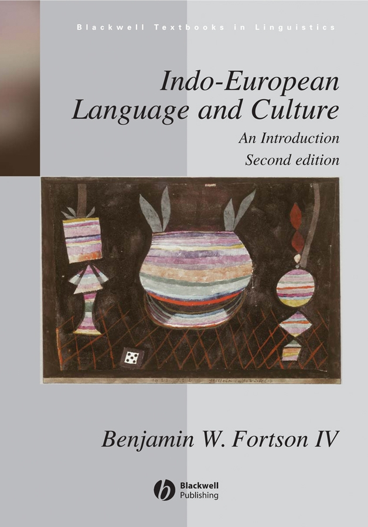
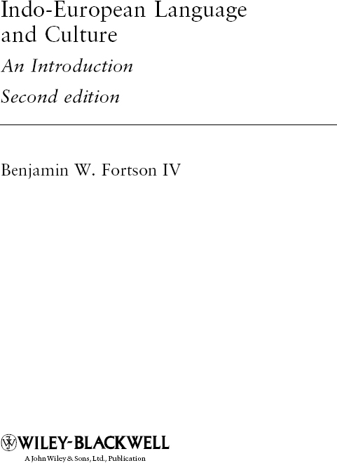

# Front Matter

<!-- source-xhtml: 9781405188968_Cover.xhtml -->

# 9781405188968_Cover

<!-- source-xhtml: 9781405188968_Contents.xhtml -->

# 9781405188968_Contents

# Contents

- **List of Illustrations**

- **Preface**

- **Preface to the Second Edition**

- **Acknowledgments**

- **Guide to the Reader**

- **1 Introduction: The Comparative Method and the Indo-European Family**

  - The Study of Language Relationships and the Comparative Method (§§1.1–12)

  - Indo-European Historical Linguistics (§§1.13–19)

  - Conclusion (§§1.20–22)

  - For Further Reading

  - For Review

  - Exercises

- **2 Proto-Indo-European Culture and Archaeology**

  - Introduction (§§2.1–2)

  - Society (§§2.3–16)

  - Religion, Ritual, and Myth (§§2.17–36)

  - Poetics (§§2.37–45)

  - Personal Names (§§2.46–49)

  - Archaeology and the PIE Homeland Question (§§2.50–73)

  - For Further Reading

  - For Review

  - Exercises

- **3 Proto-Indo-European Phonology**

  - Introduction (§3.1)

  - Consonants (§§3.2–25)

  - Vowels (§§3.26–32)

  - Phonological Rules (§§3.33–44)

  - For Further Reading

  - For Review

  - Exercises

- **4 Proto-Indo-European Morphology: Introduction**

  - The Root and Indo-European Morphophonemics (§4.1)

  - The Root (§§4.2–11)

  - Ablaut (§§4.12–19)

  - Morphological Categories of PIE (§§4.20–24)

  - For Further Reading

  - For Review

  - Exercises

- **5 The Verb**

  - The Structure of the PIE Verb (§§5.1–10)

  - Personal Endings (§§5.11–18)

  - The Present Stem (§§5.19–44)

  - The Aorist Stem (§§5.45–50)

  - The Perfect Stem (§§5.51–53)

  - Moods (§§5.54–57)

  - Non-finite Verbal Formations and Other Topics (§§5.58–63)

  - For Further Reading

  - For Review

  - Exercises

- **6 The Noun**

  - Introduction (§§6.1–3)

  - Athematic Nouns (§§6.4–42)

  - Thematic Nouns (§§6.43–67)

  - The Collective and the Feminine (§§6.68–71)

  - Adjectives (§§6.72–81)

  - Nominal Composition and Other Topics (§§6.82–87)

  - For Further Reading

  - For Review

  - Exercises

- **7 Pronouns and Other Parts of Speech**

  - Pronouns: Introduction (§7.1)

  - Personal Pronouns (§§7.2–8)

  - Other Pronouns and the Pronominal Declension (§§7.9–14)

  - Numerals (§§7.15–22)

  - Adverbs (§§7.23–25)

  - Prepositions and Postpositions (§7.26)

  - Conjunctions and Interjections (§§7.27–30)

  - For Further Reading

  - Exercises

- **8 Proto-Indo-European Syntax**

  - Introduction (§§8.1–5)

  - Syntax of the Phrase (§§8.6–11)

  - Syntax of the Clause (§§8.12–30)

  - Phrase and Sentence Prosody and the Interaction of Syntax and Phonology (§§8.31–36)

  - For Further Reading

  - For Review

  - Exercises

- **9 Anatolian**

  - Introduction (§§9.1–4)

  - From PIE to Common Anatolian (§§9.5–14)

  - Hittite (§§9.15–44)

  - Luvian (§§9.45–58)

  - Palaic (§§9.59–61)

  - Lycian (§§9.62–70)

  - Lydian (§§9.71–75)

  - Carian, Pisidian, and Sidetic (§9.76)

  - For Further Reading

  - For Review

  - Exercises

  - PIE Vocabulary I: Man, Woman, Kinship

- **10 Indo-Iranian I: Indic**

  - Introduction to Indo-Iranian (§§10.1–4)

  - From PIE to Indo-Iranian (§§10.5–19)

  - Indic (Indo-Aryan) (§§10.20–22)

  - Sanskrit (§§10.23–51)

  - Middle Indic (§§10.52–57)

  - Modern (New) Indo-Aryan (§§10.58–63)

  - For Further Reading

  - For Review

  - Exercises

  - PIE Vocabulary II: Animals

- **11 Indo-Iranian II: Iranian**

  - Introduction (§§11.1–8)

  - Avestan (§§11.9–27)

  - Old Persian (§§11.28–36)

  - Middle and Modern Iranian (§§11.37–53)

  - For Further Reading

  - For Review

  - Exercises

  - PIE Vocabulary III: Food and Agriculture

- **12 Greek**

  - Introduction (§§12.1–8)

  - From PIE to Greek (§§12.9–53)

  - Greek after the Classical Period (§§12.54–57)

  - The Philology of Homer and Its Pitfalls (§§12.58–67)

  - For Further Reading

  - For Review

  - Exercises

  - PIE Vocabulary IV: The Body

- **13 Italic**

  - Introduction (§§13.1–5)

  - From PIE to Italic (§§13.6–23)

  - Latino-Faliscan (§13.24)

  - Latin (§§13.25–53)

  - Faliscan (§§13.54–55)

  - Sabellic (Osco-Umbrian) (§§13.56–66)

  - Umbrian (§§13.67–74)

  - South Picene (§§13.75–76)

  - Oscan (§§13.77–80)

  - Other Sabellic Languages (§13.81)

  - For Further Reading

  - For Review

  - Exercises

  - PIE Vocabulary V: Body Functions and States

- **14 Celtic**

  - Introduction (§§14.1–3)

  - From PIE to Celtic (§§14.4–11)

  - Continental Celtic (§§14.12–19)

  - Insular Celtic (§§14.20–27)

  - Goidelic: Old Irish and Its Descendants (§§14.28–50)

  - Scottish Gaelic and Manx (§§14.51–52)

  - Brittonic (§§14.53–56)

  - Welsh (§§14.57–61)

  - Breton (§§14.62–68)

  - Cornish (§§14.69–72)

  - For Further Reading

  - For Review

  - Exercises

  - PIE Vocabulary VI: Natural Environment

- **15 Germanic**

  - Introduction (§§15.1–4)

  - From PIE to Germanic (§§15.5–35)

  - Runic (§§15.36–39)

  - East Germanic (§15.40)

  - Gothic (§§15.41–48)

  - West Germanic (§§15.49–51)

  - Old English (§§15.52–64)

  - Middle and Modern English (§§15.65–69)

  - Old High German (§§15.70–81)

  - Old Saxon (§§15.82–85)

  - Dutch and Frisian (§§15.86–88)

  - North Germanic: Old Norse and Scandinavian (§§15.89–108)

  - For Further Reading

  - For Review

  - Exercises

  - PIE Vocabulary VII: Position and Motion

- **16 Armenian**

  - Introduction (§§16.1–10)

  - From PIE to Classical Armenian (§§16.11–41)

  - Middle and Modern Armenian (§§16.42–47)

  - For Further Reading

  - For Review

  - Exercises

  - PIE Vocabulary VIII: Material Culture and Technology

- **17 Tocharian**

  - Introduction (§§17.1–6)

  - From PIE to Tocharian (§§17.7–33)

  - For Further Reading

  - For Review

  - Exercises

  - PIE Vocabulary IX: Form and Size

- **18 Balto-Slavic**

  - Introduction (§18.1)

  - From PIE to Balto-Slavic (§§18.2–18)

  - Slavic (§§18.19–39)

  - Old Church Slavonic (§§18.40–42)

  - Modern Slavic Languages (§§18.43–55)

  - Baltic (§§18.56–67)

  - Lithuanian (§§18.68–74)

  - Latvian (§§18.75–76)

  - Old Prussian (§§18.77–79)

  - For Further Reading

  - For Review

  - Exercises

  - PIE Vocabulary X: Time

- **19 Albanian**

  - Introduction (§§19.1–5)

  - From PIE to Albanian (§§19.6–29)

  - For Further Reading

  - Exercises

  - PIE Vocabulary XI: Utterance

- **20 Fragmentary Languages**

  - Introduction (§§20.1–2)

  - Phrygian (§§20.3–9)

  - Thracian (§§20.10–11)

  - Macedonian (§20.12)

  - Illyrian (§§20.13–15)

  - Venetic (§§20.16–20)

  - Messapic (§§20.21–22)

  - Sicel and Elymian (§20.23)

  - Lusitanian (§20.24)

  - For Further Reading

  - Exercises

  - PIE Vocabulary XII: Basic Physical Acts

- **Glossary**

- **Bibliography**

- **Subject Index**

- **Word Index**

<!-- source-xhtml: 9781405188968_Frontmatter.xhtml -->

# 9781405188968_Frontmatter

**Praise for** ***Indo-European Language and Culture***

“Ben Fortson’s book is the best existing introduction to Indo-European linguistics: up-to-date and comprehensive, accessible without being oversimplified. Students and interested laypersons will find it indispensable.”

*Don Ringe, University of Pennsylvania*

“Fortson’s *Introduction* continues to be the textbook of choice for introductory Indo-European. In its presentation of both fact and theory, it is a marvel of accuracy, completeness, and sound judgment.”

*Brent Vine, UCLA*

Praise for the Previous Edition:

“Superb . . . [Fortson’s] short general discussions of the histories and ecologies of the individual languages are the best I have ever read.”

*Recensiones – Salesianum, 2008*

“I would like to conclude by stressing that this is an excellent textbook. I have taught from it, and the students in my class not only learned a great deal from it, they also seemed to enjoy the book almost as much as I did.”

*Bryn Mawr Classical Review*

“Finally, there is a reliable, engaging and accessible presentation of the communis opinio. And there are even exercises! . . . Fortson has produced an excellent book that fulfills its goals admirably. I hope it will inspire a renaissance of Indo-European linguistics in English speaking countries.”

*Journal of the American Oriental Society*

<!-- source-xhtml: 9781405188968_Blackwell.xhtml -->

# Blackwell Textbooks in Linguistics

The books included in this series provide comprehensive accounts of some of the most central and most rapidly developing areas of research in linguistics. Intended primarily for introductory and post-introductory students, they include exercises, discussion points and suggestions for further reading.

| Column 1 | Column 2 | Column 3 |
| --- | --- | --- |
| 1 | Liliane Haegeman | *Introduction to Government and Binding Theory* (Second Edition) |
| 2 | Andrew Spencer | *Morphological Theory* |
| 3 | Helen Goodluck | *Language Acquisition* |
| 4 | Ronald Wardhaugh | *An Introduction to Sociolinguistics* (Fifth Edition) |
| 5 | Martin Atkinson | *Children’s Syntax* |
| 6 | Diane Blakemore | *Understanding Utterances* |
| 7 | Michael Kenstowicz | *Phonology in Generative Grammar* |
| 8 | Deborah Schiffrin | *Approaches to Discourse* |
| 9 | John Clark and Colin Yallop and Janet Fletcher | *An Introduction to Phonetics and Phonology* (Third Edition) |
| 10 | Natsuko Tsujimura | *An Introduction to Japanese Linguistics* (Second Edition) |
| 11 | Robert D. Borsley | *Modern Phrase Structure Grammar* |
| 12 | Nigel Fabb | *Linguistics and Literature* |
| 13 | Irene Heim and Angelika Kratzer | *Semantics in Generative Grammar* |
| 14 | Liliane Haegeman and Jacqueline Guéron | *English Grammar: A Generative* *Perspective* |
| 15 | Stephen Crain and Diane Lillo-Martin | *An Introduction to Linguistic Theory* *and Language Acquisition* |
| 16 | Joan Bresnan | *Lexical-Functional Syntax* |
| 17 | Barbara A. Fennell | *A History of English: A Sociolinguistic Approach* |
| 18 | Henry Rogers | *Writing Systems: A Linguistic Approach* |
| 19 | Benjamin W. Fortson IV | *Indo-European Language and Culture: An Introduction* (Second Edition) |
| 20 | Liliane Haegeman | *Thinking Syntactically: A guide to Argumentation and Analysis* |
| 21 | Mark Hale | *Historical Linguistics: Theory and Method* |
| 22 | Henning Reetz and Allard Jongman | *Phonetics: Transcription, Production,* *Acoustics and Perception* |
| 23 | Bruce Hayes | *Introductory Phonology* |

<!-- source-xhtml: 9781405188968_Title.xhtml -->

# 9781405188968_Title

<!-- source-xhtml: 9781405188968_Copyright.xhtml -->

# 9781405188968_Copyright

This second edition first published 2010
© 2010 Benjamin W. Fortson IV

Edition history: Blackwell Publishing Ltd (1, 2004)

Blackwell Publishing was acquired by John Wiley & Sons in February 2007.
Blackwell’s publishing program has been merged with Wiley’s global Scientific,
Technical, and Medical business to form Wiley-Blackwell.

*Registered Office*
John Wiley & Sons Ltd, The Atrium, Southern Gate, Chichester, West Sussex,
PO19 8SQ, United Kingdom

*Editorial Offices*
350 Main Street, Malden, MA 02148-5020, USA
9600 Garsington Road, Oxford, OX4 2DQ, UK
The Atrium, Southern Gate, Chichester, West Sussex, PO19 8SQ, UK

For details of our global editorial offices, for customer services, and for information about how to apply for permission to reuse the copyright material in this book please see our website at www.wiley.com/wiley-blackwell.

The right of Benjamin W. Fortson IV to be identified as the author of this work has been asserted in accordance with the Copyright, Designs and Patents Act 1988.

All rights reserved. No part of this publication may be reproduced, stored in a retrieval system, or transmitted, in any form or by any means, electronic, mechanical, photocopying, recording or otherwise, except as permitted by the UK Copyright, Designs and Patents Act 1988, without the prior permission of the publisher.

Wiley also publishes its books in a variety of electronic formats. Some content that appears in print may not be available in electronic books.

Designations used by companies to distinguish their products are often claimed as trademarks. All brand names and product names used in this book are trade names, service marks, trademarks or registered trademarks of their respective owners. The publisher is not associated with any product or vendor mentioned in this book. This publication is designed to provide accurate and authoritative information in regard to the subject matter covered. It is sold on the understanding that the publisher is not engaged in rendering professional services. If professional advice or other expert assistance is required, the services of a competent professional should be sought.

*Library of Congress Cataloging-in-Publication Data*

Fortson, Benjamin W.

Indo-european language and culture : an introduction / Benjamin W. Fortson. — 2nd ed. p. cm. — (Blackwell textbooks in linguistics ; 19)
Includes bibliographical references and index.
ISBN 978-1-4051-8895-1 (hardcover : alk. paper) — ISBN 978-1-4051-8896-8 (pbk. : alk. paper) 1. Indo-European languages. 2. Indo-Europeans. I. Title. P561.F67 2009
410—dc22

2008051179

<!-- source-xhtml: 9781405188968_List_of_Illustrations.xhtml -->

# List of Illustrations

Figure 1.1 The Indo-European family tree

Figure 9.1 One of the fragments composing KBo 17.1

Figure 9.2 The Hieroglyphic Luvian inscription HAMA 2

Figure 9.3 The Lydian bilingual

Figure 11.1 Yasna 44.4 in Avestan script

Figure 12.1 The Pylos tablet Ta 722

Figure 12.2 Column V of the Gortynian law-code

Figure 13.1 The Duenos inscription

Figure 13.2 The Ceres inscription

Figure 13.3 The South Picene inscription Sp TE 2

Figure 13.4 The Oscan inscription Po 3

Figure 14.1 The Chamalières inscription

Figure 14.2 The front side of the first Botorrita inscription

Figure 15.1 Reproduction of an eighteenth-century engraving of the Gallehus horn

Figure 15.2 Leaf (50 v.) from the sixth-century Codex Argenteus

Map 1.1 Geographical distribution of the major Indo-European peoples around 500 <small>bc</small>

Map 2.1 Selected Late Neolithic and Chalcolithic (Bronze Age) cultures north of the Black and Caspian Seas

Map 9.1 Anatolia

Map 10.1 Modern Indo-Aryan languages

Map 11.1 The Persian Empire under Darius I

Map 11.2 Selected Modern Iranian languages

Map 12.1 Greek dialects

Map 13.1 Languages of ancient Italy

Map 14.1 The Celts

Map 15.1 The Germanic peoples around <small>AD</small> 500

Map 16.1 Greater Armenia during the early Christian era

Map 17.1 The Tarim Basin

Map 18.1 The Slavs and Balts around <small>ad</small> 1000

Map 19.1 Geographical distribution of Geg and Tosk

Map 20.1 The ancient Mediterranean

<!-- source-xhtml: 9781405188968_Preface.xhtml -->

# 9781405188968_Preface

# Preface

In spite of its venerable status as one of the oldest and most successful disciplines in linguistics, the comparative study of the Indo-European family has hitherto lacked an introductory textbook, or an introductory book of any kind appropriate for classroom use or for an intelligent layperson with linguistic interests but without specialized training. The few introductory books on the market do have virtues, but in all cases known to me these virtues are compromised, sometimes severely, as by idiosyncratic or minority views masquerading as *communes opiniones*, by uneven coverage or omission of important topics, by out-of-date views or erroneous material, or by excessively technical information. None is a textbook.

Some of the features an Indo-European textbook should have are rather obvious. It should be up-to-date and, to the extent possible, present non-controversial views. It should not overwhelm the reader with detail, but also be comprehensive enough to satisfy the serious student at the beginning of his or her scholarly career. It should have copious exercises. Some other features an Indo-European textbook should have are less obvious (at least for some), but are in my view as essential as the preceding. It should not only cover phonology and morphology, but syntax as well, and incorporate relevant findings from generative linguistics where they are not limited to (or by) a particular (and quite likely evanescent) theoretical framework. Data should not be oversimplified or skewed by leaving out diacritics and other funny-looking symbols. There should be annotated text samples in all the ancient languages, and of a sufficient size to impart a real feel for the languages and to introduce readers to the practice and importance of philology. Basic information should be provided on the archaeological, cultural, and literary history of each branch. The modern languages should not be omitted from discussion. Finally, it should outline what we know about Proto-Indo-European culture and society.

These are the goals of the present work. If it falls short of any of them, hopefully it at least improves over other books currently available. It is designed for use with an instructor or for private consumption. It is assumed that the reader is interested in language and linguistic history, but no prior knowledge of linguistics or any older Indo-European language is necessary. Technical terminology is explained as needed, with a glossary appended for good measure.

## Layout

Chapter 1 presents the tools of the trade and an overview of various basic issues that confront the researcher in the field. This is followed by a chapter on the reconstructed culture of the Proto-Indo-Europeans, which attempts an organized and comprehensive introductory synthesis of a kind that I do not believe I have seen elsewhere. As interest in the matters discussed here usually runs high, this chapter has been put toward the beginning of the book rather than at the end.

Chapters 3–8 provide a reasonably complete introduction to reconstructed Proto-Indo-European that serves not only as background for the subsequent chapters, but also as a solid basic reference grammar in its own right. Not all the material included here will be needed in an introductory class; it is modular enough that individual instructors (and readers) can choose to omit whatever sections they please.

Each of the remaining twelve chapters treats a particular branch of the family, proceeding in chronological order of attestation from oldest to most recent and concluding with a chapter on the fragmentarily attested languages of uncertain filiation. Indo-Iranian is split over two chapters. All the branches and languages are treated as equally as possible, and in essentially the same format; but no attempt was made to make each chapter slavishly conform to identical specifications. In a book of this kind, no branch’s history can or should be treated exhaustively. The developments discussed are selective; the chapters are tailored to what is interesting and important for each branch or language. Unlike the chapters on reconstructed Proto-Indo-European grammar, these are intended more to get one’s feet wet than to give an overview that covers everything equally. The material can be supplemented at will by instructors, and again the modular structure of these chapters allows easy skipping of unneeded information.

Importantly, no language was deemed too trivial for coverage. The reader’s interest should be engaged, and his or her curiosity piqued, with regard to *all* the Indo-European languages. The notion that certain languages are not particularly useful for Indo-European linguistics is both counterproductive and sadly perpetuated by books that only grant passing mention to those languages. Albanian may not, it is true, provide us with as much information about the proto-language as Sanskrit, but it does tell us some useful things, and in any event has a maddeningly fascinating (or fascinatingly maddening) history that merits careful attention. It bears repeating that Indo-European comparative linguistics is not just concerned with reconstructing Proto-Indo-European; it also must account for the histories of all the languages of the family.

In addition to the requisite basic sound laws, etc., short discussions of topics are included that are intended to appeal to readers with some experience in the languages, or to interested readers without any such background. The Greek chapter, for example, has a section on Homeric philology. A few topics that might seem a bit off the beaten path are scattered throughout. For instance, a student of first-year Russian, while in the throes of wrestling with the syntax of the cardinal numerals, may have become curious about how this unusual system came to be; a short discussion of this in the section on Slavic is therefore included.

## The Sample Texts and Other Features

The text samples are meant to give an idea of what the languages look like, and to impress the student with the importance of philology, whose methods and purpose are outlined in chapter 1. The texts are about a paragraph in length on average. It is to be hoped that exposure to good-sized text samples with philological commentary will inspire an interest not only in the languages themselves, but also in close textual and etymological analysis. Where possible I have chosen texts having literary and cultural interest; many are connected to discussions in chapter 2. The commentary is geared especially to the reader interested in learning a bit more: it provides word histories and comparanda, points out examples of developments covered in the chapter, and also adds notes on developments not met with in the chapter. Unless indicated otherwise, all translations are my own.

I decided to eschew the usual interlinear word-by-word analytical glosses that are otherwise standard in the linguistic literature; the commentary stands partly in lieu of them. The reason for doing this is perhaps unorthodox, but I believe sound: interlinear glosses distort one’s perception of the aesthetics of a written language, which is not a trivial concern for a book such as this. The look of a language should never be underestimated as a tool for engaging a student’s interest. The commentary at any rate usually makes it possible for students who seriously want to match each word of the original up with its translation to do so. (For some longer passages, however, and in some longer chapters, commentary could only be given selectively, due to limitations of space.)

This leads to one further point. Some who have written introductory materials on Indo-European have left out phonetic details, such as long marks and accents. Such simplification of the data renders all students a great disservice by selling the languages short. Someone likely to pick up a book such as this or to take an introductory Indo-European course will not be put off by unusual marks and symbols. Quite the opposite – they are likely to be *intrigued* by the peculiar look of the strange forms, and will discover in them an inviting mystery and beauty. The decision to ignore “details” such as accents should at any rate be left to the reader’s discretion.

Each chapter closes with several additional sections. The “For Further Reading” sections provide brief commentary on the most important or prominent secondary literature; the full references (together with a few extra that are not discussed) are listed in the Bibliography preceding the Index. Devoting space to such commentary rather than to long bibliographical lists is more useful for this kind of book. The “For Review” sections list the main terms and concepts, and the “Exercises” that follow are designed both for review and for going beyond the material discussed in each chapter. Finally, starting in chapter 9, a short list of reconstructed roots or words in Proto-Indo-European is given, arranged by semantic category. How instructors choose to integrate these in with their course is left up to them.

Since few of the localities mentioned in the text will be familiar to most readers, illustrative maps are provided in each chapter on the branches as well as chapters 1 and 2. These were deemed to be the most important visual component of the book. Chapter 1 also contains a diagram of the Indo-European family tree. Regrettably, cost and space limitations prohibited the inclusion of other planned illustrations, as of artifacts and ancient scripts; it is hoped that these can appear in a future edition.

Ann Arbor, May 2004

<!-- source-xhtml: 9781405188968_Preface_Second.xhtml -->

# 9781405188968_Preface_Second

# Preface to the Second Edition

The response to this book has been gratifyingly positive, and the appearance of over half a dozen published reviews, together with my own marginalia, has generated enough material for a revised edition. All errors that have come to my attention have been corrected; a significant number of extended sections have been reworked or added; and many smaller changes to style and content have been made throughout. In addition, sufficient funds were available this time to include the reproductions of inscriptions and scripts that could not appear the first time around. Do note, however, that since the space of only a few years separates this revision from the first edition, I did not undertake a complete and systematic overhaul of the entire book; as a result, many chapters have only been lightly touched and must still await a thorough updating.

For reference’s sake I shall briefly highlight some of the more substantial changes to the content. Newly added are discussions of the “trimoraic” long vowels in Germanic and Balto-Slavic; a Hieroglyphic Luvian text sample in chapter 9; and coverage of the Balto-Slavic accentual system and a description of the nominal accent classes. I have heavily revised the discussion of the PIE accent-ablaut classes, especially with regard to root nouns; expanded the discussion of the middle; greatly expanded the material on Middle and Modern Armenian; and added several pages of new and revised material to the Iranian, Balto-Slavic, and especially the Albanian chapters. Thirty new numbered sections have been added in all.

The first decade of the new millennium has seen a surprising bumper crop of introductory books on Indo-European in English. Aside from my own book and Michael Meier-Brügger’s *Indo-European Linguistics* (translated from German), there have now also appeared J. P. Mallory and D. Q. Adams’s *The Oxford Introduction to Proto-Indo-European and the Proto-Indo-European World* (Oxford University Press, 2006), Eva Tichy’s *A Survey of Proto-Indo-European* (Hempen, 2006; translated from German), and James Clackson’s *Indo-European Linguistics: An Introduction* (Cambridge University Press, 2007). The appearance of all these works is a testament to the vitality of the field, as is the fact that their aims and approaches are quite different from my own in many respects. Students using this book should be encouraged to browse around in these others; when they discover a difference in opinion, their curiosity will be piqued, and their intellectual journey can then begin in earnest.

Ann Arbor, May 2008

<!-- source-xhtml: 9781405188968_Acknowledgments.xhtml -->

# Acknowledgments

I have received the invaluable assistance of many colleagues, students, and friends since I conceived the idea of writing this textbook half a decade ago. Jay Jasanoff and Brent Vine used earlier drafts in their introductory Indo-European courses at Harvard and UCLA and provided extraordinarily helpful and detailed comments, corrections, and suggestions on the entire manuscript. I deeply appreciate the time and effort they both gave so generously to making this a better book.

I have been extremely fortunate to benefit from many others’ interest and input as well. Raimo Anttila, Lisi Oliver, and Timothy Pulju also used earlier drafts in their courses at UCLA, LSU, and Dartmouth, respectively. Tim read through the whole manuscript and saved me from quite a few mistakes. Lisi engaged her students in writing reviews of the book, which generated much useful input at an early stage and guided me to a better presentation of the material. My own students over several years of teaching, especially in my Indo-European course at the Harvard Extension School, caught errors, made important suggestions, and – perhaps most importantly – convinced me that the project was both workable and worthwhile, and that my organizational and presentational decisions were on the whole satisfactory. I would like to single out in particular Valerie Goodspeed, Matthew Harrington, William Heess, Ilya Lapshin, Robert Maher, Keith Plaster, and William Waters for their helpful comments and criticisms.

Many other colleagues and friends improved the book by their careful reading and valuable input, and provided very helpful critiques of individual chapters or larger portions of the work: Kelly Askew, Don Cameron, Steve Dworkin, Simon Eckley, Joseph Eska, Michael Flier, Mark Hale, Joseph Harris, Richard Janko, Robert Kyes, J. P. Mallory, H. Craig Melchert, Alan Nussbaum, Hugh Olmsted, Marc Pierce, P. Oktor Skjærvø, Bert Vaux, Aurelijus Vijūnas, Rex Wallace, and Calvert Watkins. To Cal I also owe some innovative organizational suggestions that I believe have enhanced the book’s readability and interest. All of the people above not only provided material contributions in the form of corrections and so forth, but were unflagging in their encouragement and enthusiasm for this project. Writing this textbook has mostly been its own reward, but it has meant a great deal that so many people that I look up to have been so supportive and positive in their assessment. At the University of Michigan I was lucky enough to have a recently graduated Senior, Dan Brooks, volunteer to read the whole manuscript, work through all the exercises, and assist me in proofreading and fact-checking; his keen attention caught all manner of infelicities that had escaped others. I was able to pay Dan for his services with a generous subvention from the Block Funding Initiative of the College of Literature, Science, and the Arts at the University of Michigan.

Had I not been initially contacted by Tami Kaplan (then at Blackwell) and encouraged to submit a very rough-and-ready chapter of the manuscript, I am sure the book would still lie unfinished and unpublished to this day. I have Tami to thank for seeing it through the approval process, and Sarah Coleman, my editor at Blackwell, receives my gratitude for so ably overseeing the book’s progression from submitted manuscript to published volume. In a day when computerized typesetting has too often fallen short of the exacting aesthetic requirements of good Indo-European publications, I wish to shine a most grateful spotlight on the superb typographical skills of Graphicraft Limited, whose eye-winning work graces every page. To Chart-well Illustrators and their careful attention to cartographic detail I owe the conversion of even my most involved instructions into all the highly readable maps in the book. And without the careful copy-editing by Margaret Aherne, numerous errors and inconsistencies would still remain in every chapter; to her I am deeply indebted for her diligence, eagle eyes, and patience.

My family has given me great encouragement throughout this long process. I thank my mother for her unflagging support and positive remarks on the manuscript, and my father for his enthusiasm and infectious eagerness to see the finished product. For all the happiness and support that Kelly and Christopher have brought me at every stage of this work, and for so much else besides, I am more grateful than words can express.

As often as I could, I took the advice of all these good people I have mentioned, and am alone responsible for whatever errors and infelicities remain.

## Additional Acknowledgments for the Second Edition

Most of the improvements in this edition I owe to the careful and critical reading by those whose reviews came to my attention: Gary Holland, Brian Joseph, Jared Klein, Manfred Mayrhofer, Lisi Oliver, Donald Reindl, Zsolt Simon, Eva Tichy, and Michael Weiss. I am additionally indebted to several of them for passing on to me other suggestions and corrections beyond what appeared in print, and for patiently enduring a host of follow-up questions and email exchanges. Only a vanishingly few of their suggestions could not be adequately encompassed within the scope of my revisions. Above all, I hope that the revised product does the job as satisfactorily as its predecessor.

This revision would not have seen the light of day without the efforts of Danielle Descoteaux at Blackwell, who originally approached me about writing it, and my faithful copy-editor Margaret Aherne, with whom I was lucky to be able to work once more. For advice about various miscellaneous items I wish to thank again Michael Flier, Joe Harris, Stephanie Jamison, Jay Jasanoff, Craig Melchert, Marc Pierce, Oktor Skjærvø, Bert Vaux, Brent Vine, and Rex Wallace, as well as Brian Joseph and Gernot Windfuhr. For their valuable comments and suggestions on Chapter 19 I am indebted to Eric Hamp and Joachim Matzinger.

<!-- source-xhtml: 9781405188968_Guide_to_the_Reader.xhtml -->

# Guide to the Reader

## A. Abbreviations

| Column 1 | Column 2 |
| --- | --- |
| abl. | ablative |
| accus., acc. | accusative |
| act. | active |
| adj. | adjective |
| Alb. | Albanian |
| Anat. | Anatolian |
| aor. | aorist |
| Arm. | Armenian |
| Av. | Avestan |
| B.-Sl. | Balto-Slavic |
| Celt. | Celtic |
| Class. | Classical |
| Cz. | Czech |
| dat. | dative |
| dial. | dialectal |
| du. | dual |
| Du. | Dutch |
| Eng. | English |
| fem. | feminine |
| Fr. | French |
| fut. | future |
| Gaul. | Gaulish |
| genit., gen. | genitive |
| Gk. | Greek |
| Gmc. | Germanic |
| Goth. | Gothic |
| Hitt. | Hittite |
| Icel. | Icelandic |
| IE | Indo-European |
| imperf. | imperfect |
| Indo-Ir. | Indo-Iranian |
| instr. | instrumental |
| It. | Italian |
| Lat. | Latin |
| Latv. | Latvian |
| Lith. | Lithuanian |
| loc. | locative |
| Luv. | Luvian |
| masc. | masculine |
| ME | Middle English |
| Mod. | Modern |
| neut. | neuter |
| nomin., nom. | nominative |
| Norw. | Norwegian |
| OAv. | Old Avestan |
| OCS | Old Church Slavonic |
| OE | Old English |
| OFr. | Old French |
| OHG | Old High German |
| OHitt. | Old Hittite |
| OIcel. | Old Icelandic |
| OIr. | Old Irish |
| OLith. | Old Lithuanian |
| ON | Old Norse |
| OPers. | Old Persian |
| OPruss. | Old Prussian |
| OS | Old Saxon |
| Osc. | Oscan |
| OSp. | Old Spanish |
| pass. | passive |
| PIE | Proto-Indo-European |
| pl. | plural |
| Pol. | Polish |
| pres. | present |
| Russ. | Russian |
| S.-Cr. | Serbo-Croatian |
| sing., sg. | singular |
| Skt. | Sanskrit |
| Slav. | Slavic |
| Sp. | Spanish |
| Toch. | Tocharian |
| Umbr. | Umbrian |
| Ved. | Vedic |
| voc. | vocative |
| W. | Welsh |
| YAv. | Young Avestan |

## B. Symbols

| Column 1 | Column 2 |
| --- | --- |
| * | denotes a reconstructed form, not preserved in any written documents |
| < | “comes from” or “is derived from” |
| > | “turns into” or “becomes” |
| – | indicates morpheme boundary, or separates off that part of a word that the reader should focus on |
| ( ) | encloses part of a word that is not relevant to the discussion, or that is an optional part |
| ∼ | separates pairs of examples or forms |

## C. Spelling Conventions

All linguistic forms are written in *italics*. The only exceptions are inscriptional forms in Italic dialects (such as Oscan and Umbrian) that are not written in the Latin alphabet; these, following standard convention, are given in **boldface**. See chapter 13. For Latin, *i* and *u* are used for both the vowels and the glides (instead of *j* and *v*).

## D. International Phonetic Alphabet (IPA)

Phonetic transcriptions using the IPA are enclosed in square brackets. The symbols used for American English sounds are:

| Column 1 | Column 2 |
| --- | --- |
| Consonants |  |
| b | bell |
| d | dim |
| ð | this |
| f | fail |
| g | go |
| h | heal |
| j | yarn |
| k | coal |
| l | light |
| m | magic |
| n | near |
| ŋ | sing |
| p | pat |
| r | roof |
| s | silver |
| ʃ | shelf |
| t | tin |
| θ | thin |
| v | vat |
| w | well |
| z | zero |
| 3 | measure |

| Column 1 | Column 2 |
| --- | --- |
| Vowels |  |
| a | father |
| æ | hat |
| e | care |
| ε | pet |
| ə | about |
| i | beat |
| I | bit |
| o | bore |
| ɔ | bought |
| u | boot |
| ʊ | book |
| ʌ | but |
