# 5. The writing systems of Indo-European

- 1. Introduction
- 2. Cuneiform Indo-European
- 3. Linear East Mediterranean Indo-European
- 4. Abjad background
- 5. Greek alphabet and descendants
- 6. Iranian scripts
- 7. Indic scripts
- 8. References

## 1. Introduction

Nearly all the writing systems of Indo-European descend, by direct lineage, adaptation, or imitation, from a West Semitic consonantary (or *abjad*) that itself was inspired, but not taken directly from, Egyptian hieroglyphic writing. The exceptions are the earliest Indo-European scripts, described in 2, 3, and 6.1. The indigenous Indic scripts (7) and the early and classical Iranian scripts (6.2−3) descend from the Aramaic branch of West Semitic writing, while all the others descend from the Phoenician branch via Greek.

No Indo-European language hosted the independent invention of a writing system. That achievement is restricted to languages that are monosyllabically organized (whether isolating or agglutinating), such as (in the Old World) Sumerian and Chinese. The history of Indo-European writing, then, is a history of borrowing and adaptation of scripts. This fact alone demonstrates that script-family lineage is independent of language-family lineage.

This chapter is arranged in chronological order of origin and, within each group, of development. More attention is paid to the less-studied scripts. Further information should be sought in (primarily historical) Diringer (1968) and Jensen (1969), and (primarily descriptive) Daniels and Bright (1996). The most satisfactory brief handbooks remain Février (1959) and Friedrich (1966); Gnanadesikan (2009) is a congenial overview of the orientation adopted here.

## 2. Cuneiform Indo-European

Mesopotamian cuneiform − written (left to right) with wedge-shaped impressions of a reed stylus on a smooth clay surface − was devised as a logography (with indications of phoneticism from the beginning) for the unaffiliated Sumerian language toward the end of the 4ᵗʰ millennium BCE. By 2500, prompted by its use for the East Semitic language Akkadian, it had developed into a logosyllabary most of whose characters (known as “signs”) were used *phonetically*, denoting CV, VC, V, or CVC syllables. The reading of each sign derives *acrophonically* from the sounds of the words it represents in both Sumerian and Akkadian: the sign *giš* ‘tree’ in Sumerian is also *iṣ* from the Akkadian word *iṣu* ‘tree’. (Moreover, because Akkadian had a richer phonology than Sumerian, a sign can write the voiceless, voiced, or emphatic sounds of the former: *is, iz*, or *iṣ*.) Most signs, when used as *logograms*, could also represent the complete Akkadian word equivalent to the Sumerian morpheme originally represented by the sign. The third use of a small group of signs was as *determinatives*, which denoted the category to which the word they precede or follow belonged − gods, wooden things, etc. There is no graphic distinction among the three possible uses of the signs. In transliterations, different signs denoting the same syllable are distinguished by indices (assigned long ago in approximate order of frequency): *ša šá* (= *ša*₂) *šà* (= *ša*₃) *ša*₄ *ša*₅. A comprehensive introduction to cuneiform is Edzard (1980), more basic is Walker (1987). The standard signlist for Akkadian and Sumerian is Borger (2004). The novice will find the presentation in Labat (1948, 1988) easier to follow; it shows the variety of sign shapes across geographic (broadly, Assyrian vs. Babylonian) and chronological (Old, Middle, Late) parameters. The decipherment of cuneiform was accomplished in the late 1840s (Daniels 1994, 2008b).

### 2.1. Hittite, Luvian, Palaic

Anatolian cuneiform languages are written with a subset of the Mesopotamian syllabary. The script (Old Babylonian cursive) probably came to the Hittites in the course of war waged in north Syria by Hattusili I ca. 1600 BCE and continued in use to the fall of the Empire about 1200 BCE. The Hittite signlist (Rüster and Neu 1989) comprises 375 signs (Table 5.1): phonetics include 50 CV (a phonetic reading of Sum. geštin ‘wine’ unique to Hittite, *wi*₅, derives acrophonically from *wiyana-*), 36 V and VC, and 89 CVC signs; there are 41 determinatives. In addition to some 2000 Sumerograms (composed from the normal sign repertoire), Hittite also employs nearly 200 Akkadograms − Hittite words spelled as if they were Akkadian words − which can be up to five signs long. Orthographic conventions include Akkadogram prepositions before logograms to indicate case: *ša* dingir might be read *šiunaš* ‘of the god’ (Watkins 2004: 553); and consistent distinction of single and geminate consonants between vowels (Melchert 2004a: 577). The transliterations ‹š› for /s/ and ‹z› for /ts/ are retained for consistency with other branches of cuneiform study.

Brief passages in Luvian were written in cuneiform by Hittite scribes from the 15ᵗʰ c. BCE. The conventions of Hittite orthography are followed, along with consistent notation of vowel length with CVᵢ−Vᵢ or #Vᵢ−VᵢC (Melchert 2004a: 577). Palaic adds notation for /f/ using a series of *w*VV signs with a vowel sign subjoined to the sign *wa* (Melchert 2004b: 586).

Tab. 5.1: Hittite syllabic charactersᵃ

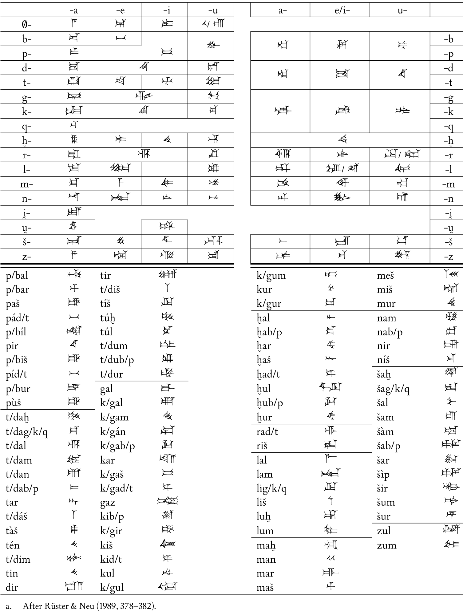

### 2.2. Mittanni

The 81 personal names (O’Callaghan 1948: 56−63), 4 divine names, and 13 lexical items (Mayrhofer 1966: 18−19) attesting to a ruling Indo-Aryan presence in the Mittanni realm, an otherwise Hurrian-speaking milieu in northern Syria in the mid 14ᵗʰ century BCE, are spelled in the ordinary orthography of their time and place. Specific Indo-Aryan sounds are represented: /c, j/ = ‹z› as in *zi-ir-dam-ia-aš-da* = *Citraṃ-yaṣṭā*, *bir-ia-wa-zi* = *Vīrya-vāja*; /o/ = ‹au› as in *bi-ri-ia-ša-u-ma* = *Vīrya-soma* (Dumont apud O’Callaghan 1948: 149−155). Possibly when the administrative center of Mittanni is discovered, an archive of connected texts in early Indo-Aryan will be found.

## 3. Linear East Mediterranean Indo-European

Several scripts attested around the Aegean Sea are clearly pictographic but do not clearly share an origin; since most are undeciphered, little can be said with certainty about their relationship. We might suggest that *awareness* of Egyptian hieroglyphic writing was sufficient stimulus for the creation of new local syllabic scripts toward the middle of the 2ⁿᵈ millennium BCE − a phenomenon known from such modern inventions as Cherokee writing (Daniels 1992). Graphic similarities between some signs of Linear B (3.2) and the non-IE Linear A (the labels were assigned by their first excavator and distinguish both their temporal sequence and their difference from local pictographic scripts) have been used to suggest readings of Linear A, but decipherment has not resulted.

### 3.1. Luvian hieroglyphs

From the 16ᵗʰ−13ᵗʰ c. BCE, biscriptal seal impressions are found in Anatolia with a central hieroglyphic device and a (royal) name in cuneiform around the circumference. The seals consist only of names, titles, and conventional signs like ‘good’ and ‘life’, so one cannot properly speak of these as texts in a given language. Thus they do not yet represent a full writing system. In the 13ᵗʰ c., Luvian commemorative inscriptions on stone begin to appear (reflecting a dialect slightly different from Cuneiform Luvian), and with the end of the Hittite empire ca. 1200 and the disuse of cuneiform, these are the only Luvian records for the next 500 years: the hieroglyphs appear never to have been transferred to the clay medium. Luvian writing comprises 50 syllabic signs, V and CV only, and some alternatives. An oblique stroke for /r/ creates a few signs such as *ar(a/i)-* and *tar(a/i)-*. There are more than 400 logograms, almost half of which are well enough understood to assign conventional Latin equivalents (Table 5.2; Hawkins 2000: 26−27; for the rest see Laroche 1960 and Hawkins 2000: 25). These conventions are modeled on those used for Linear B (3.2). Hawkins (2003) describes the script and summarizes the decipherment, which occupied several decades in the mid 20ᵗʰ century. Van den Hout (2006: 236) observes that when Luvian words appear within Hittite (cuneiform) texts, they grammatically reflect Hieroglyphic, and not Cuneiform, Luvian.

Tab. 5.2: Luvian hieroglyphs

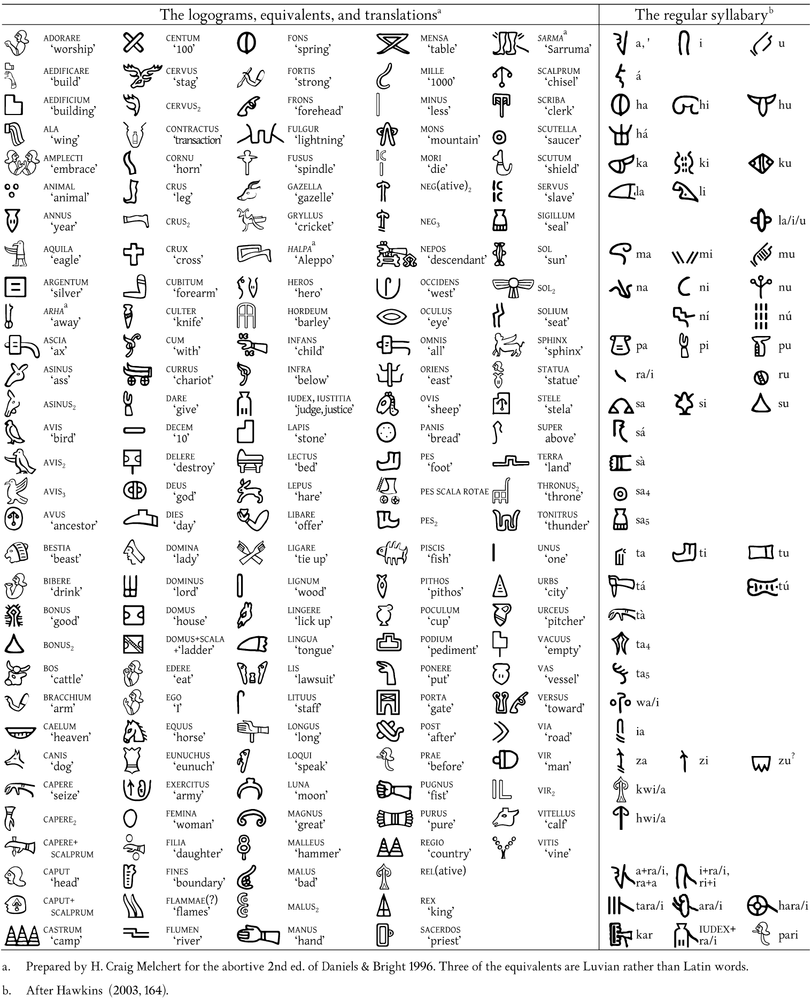

### 3.2. Mycenaean Linear B

Between about 1550 and 1200 BCE, 87 CV syllabic characters (11 of them not yet identified) and more than 30 logograms (Table 5.3) were used on the Greek mainland and Crete to write nothing but mundane accounting documents. The decipherment of Linear B by Michael Ventris in 1952 was one of the most celebrated intellectual achievements of its time; his subsequent collaborator John Chadwick published many accounts. The most useful overview is Chadwick (1987); Chadwick (1973) presents Ventris’s “Work Notes” in considerable detail and is probably more widely accessible than their long-posthumous publication (Ventris 1988).

Tab. 5.3: Linear Bᵃ

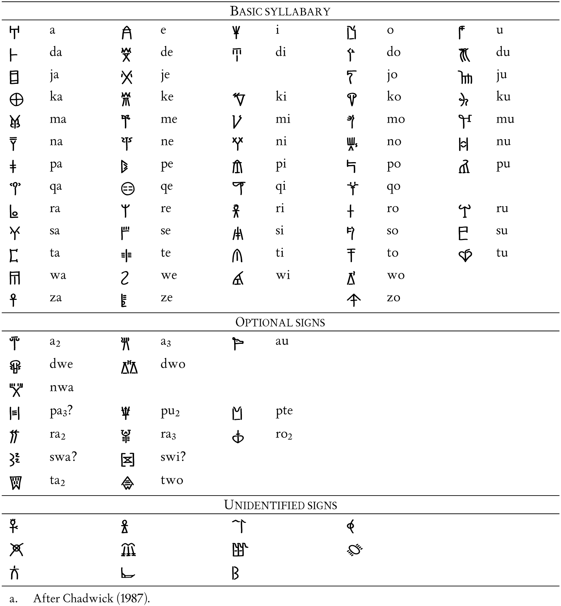

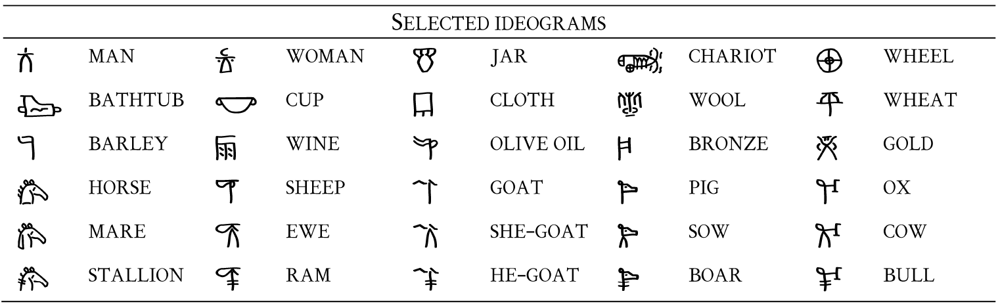

### 3.3. Cypriote syllabary

In his decipherment of Linear B, Ventris borrowed some readings of similar-shaped signs in the Cypriote syllabary (deciphered in 1874 by Moriz Schmidt; Daniels 1995: 88), which at the time was pure conjecture, as the syllabary was known to have been used only in the 6ᵗʰ−3ʳᵈ c. BCE. In 1983, a possible Cypriote inscription that may date some 500 years earlier was published (Palaima 1991: 451), rendering the possibility of continuity more credible. The syllabary comprises 55 CV signs (Table 5.4). Both Miller (1994) and Woodard (1997) discuss the large differences in orthographic practice, especially regarding closed syllables, between Linear B and Cypriote.

Tab. 5.4: Cypriote syllabaryᵃ

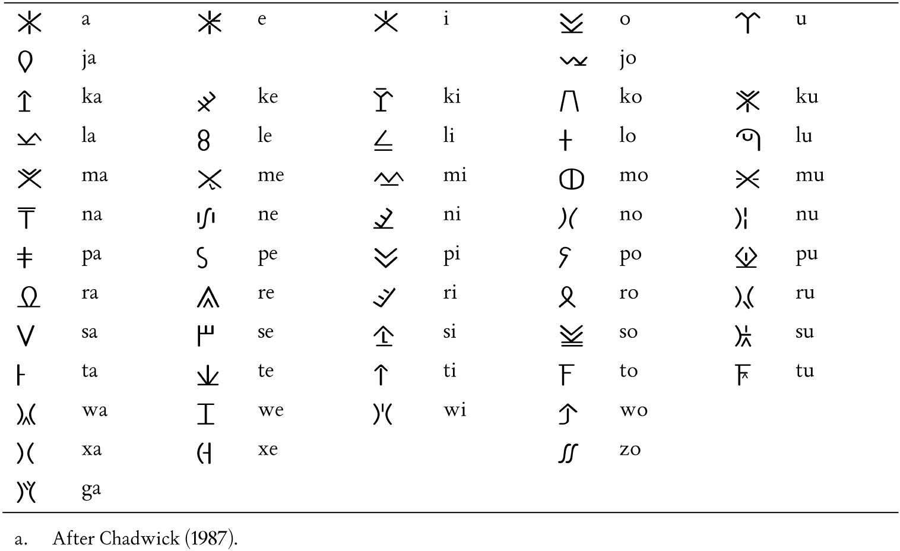

## 4. Abjad background

Egyptian hieroglyphs probably became a writing system under the indirect influence of Sumerian cuneiform: Egyptian notates only consonants because the first Egyptian scribes learned that a Sumerian sign stands for a morpheme; in agglutinative Sumerian, morphemes do not change shape, but in internally inflected Egyptian, the vowels can vary and only the consonants are constant − thus what is represented by the phonetic use of a sign is its consonant(s) only (Daniels 2006b). The script, like cuneiform, combines phonograms, logograms, and determinatives. Baines (2004) indicates that the recently discovered “labels” from Abydos seem not to stand in the direct line of development of the writing system *sensu stricto*; the symbols used could well have provided the graphic input to the phonological adaptation.

The view standard since 1916 (Sass 1988), that the (North)west Semitic abjad − which eventuated in the Phoenician and Aramaic varieties − was devised in the mid 2ⁿᵈ millennium BCE for (or by?) West-Semitic-speaking turquoise miners in the Sinai Peninsula, was overturned by the recent discovery of two inscriptions, securely dated a few centuries earlier, at Wadi el-Hol, in Egypt proper, using the same signary to record a text that cannot be read as either Semitic or Egyptian. (The discovery lends credibility to Sass’s earlier hypothesis [1991] that the inspiration for the abjad was the Middle Kingdom orthography of foreign names.) It remains agreed, however, that the letters derive from hieroglyphic shapes, and that the readings they still bear derive acrophonically from the first sound of the Semitic name of the item depicted by the shape (Hamilton 2006). Egyptians wrote only consonants, so Semitic-speakers wrote only consonants, likely never having had the opportunity to attend Egyptian scribal school and learn the daunting details.

### 4.1. Phoenician

A recognizably Phoenician ductus had emerged via the gradual depictorialization of the letters by the turn of the 1ˢᵗ millennium BCE, and within a few centuries the more angular Phoenician (proper) and the more cursive Aramaic scripts (both written right to left) had gone their separate ways (Naveh 1987). During that millennium, Phoenician merchants carried their script from the Levant across the Mediterranean − to Anatolia, North Africa, Sicily, Italy, Iberia − while Aramaic expanded from the language of citystates in northern Syria to become the chancery language of successive empires across the Near East until, at least in some areas, the Arab conquest in the 7ᵗʰ c. CE.

### 4.2. Aramaic

A very significant innovation in Aramaic orthography (Table 5.5) is the use of certain consonant letters to mark, in addition, the presence of a diphthong or a long vowel, including ‹y› for /ī/ and ‹w› for /ū/. In this usage they are called *matrēs lectionis* ‘mothers of reading’.

Tab. 5.5: Germanic and Iranian scripts derived directly from Aramaic

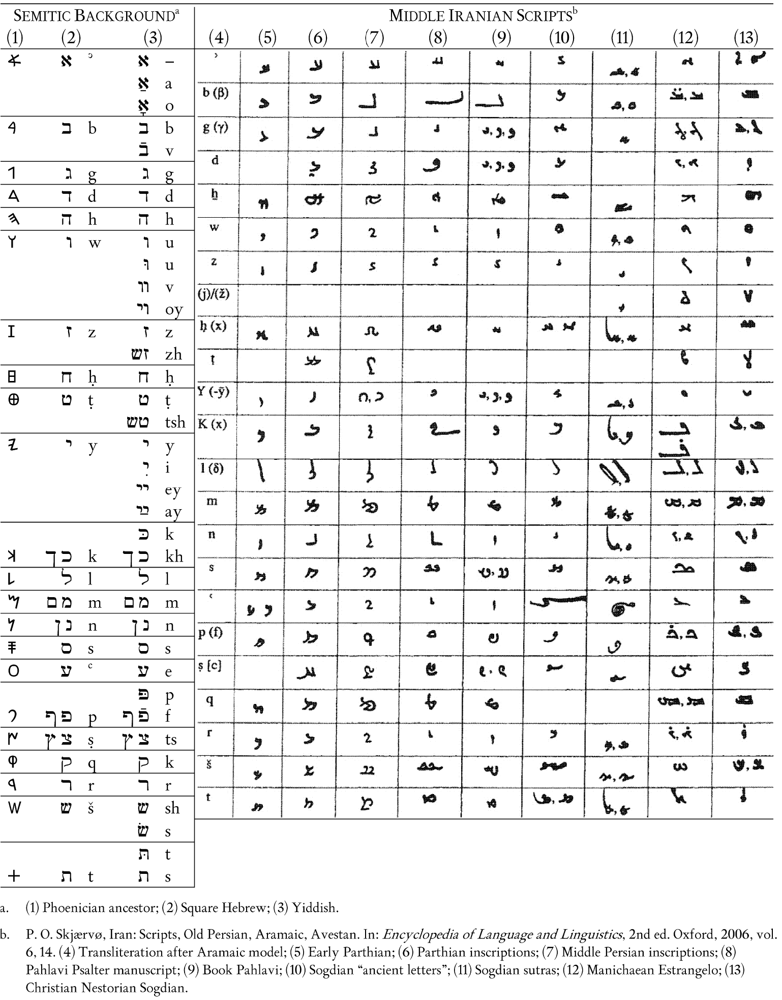

#### 4.2.1. Square Hebrew

The Aramaic script used for Hebrew since ca. the 5ᵗʰ c. BCE, in which vowel indications (“pointing”) have been optionally available since the later 1ˢᵗ millennium CE, has been adapted for writing many “Jewish languages,” i.e., vernaculars of Jewish communities (Paper 1978; Kahn and Rubin 2016), Ladino and Judeo-Persian, for example. Yiddish, however, in contemporary orthography has turned the Hebrew abjad (with *matrēs* and optional vowel pointing) into a true alphabet with a letter for each consonant and vowel. Some of the vowel letters have the appearance of a consonant letter plus a vowel point, but these are inseparable combinations and the vowel points cannot be associated indiscriminately with other consonants. (Yiddish is not to be confused with the late 18ᵗʰ century Jewish Enlightenment phenomenon Judeo-German, i.e., Standard High German written with Hebrew characters.)

#### 4.2.2. Syriac

As the Middle Persian scripts went their own idiosyncratic way (6.2), by the 3ʳᵈ c. CE Manichaean and Christian missionaries and the communities they served began to write Iranian languages in the Estrangelo (adding ‹ǰ›) and Nestorian (for Sogdian only; adding ‹ž›) varieties of Syriac script respectively.

#### 4.2.3. Arabic

With the advent of Islam in the 7ᵗʰ c. CE, the Persian language came to be written with the Arabic script, another descendant of the Aramaic branch. Its 28 consonant letters were supplemented with ‹č g p v› for sounds not found in Arabic; this set the pattern for other languages of the Islamic world, including Kurdish, Pashto, Kashmiri, Sindhi, and Urdu (Table 5.6). Long vowels are written with obligatory *matrēs lectionis*, with the rarely exercised option of indicating a short vowel with a diacritic-like mark above or below the consonant it follows. Kurdish and Kashmiri, however, have developed systems for obligatorily including all vowels as full letters in the line of writing.

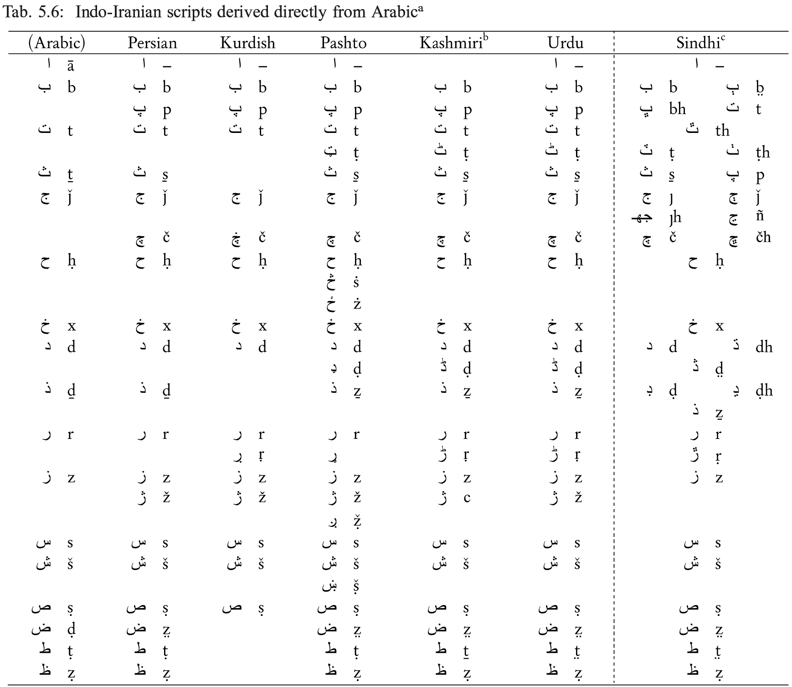

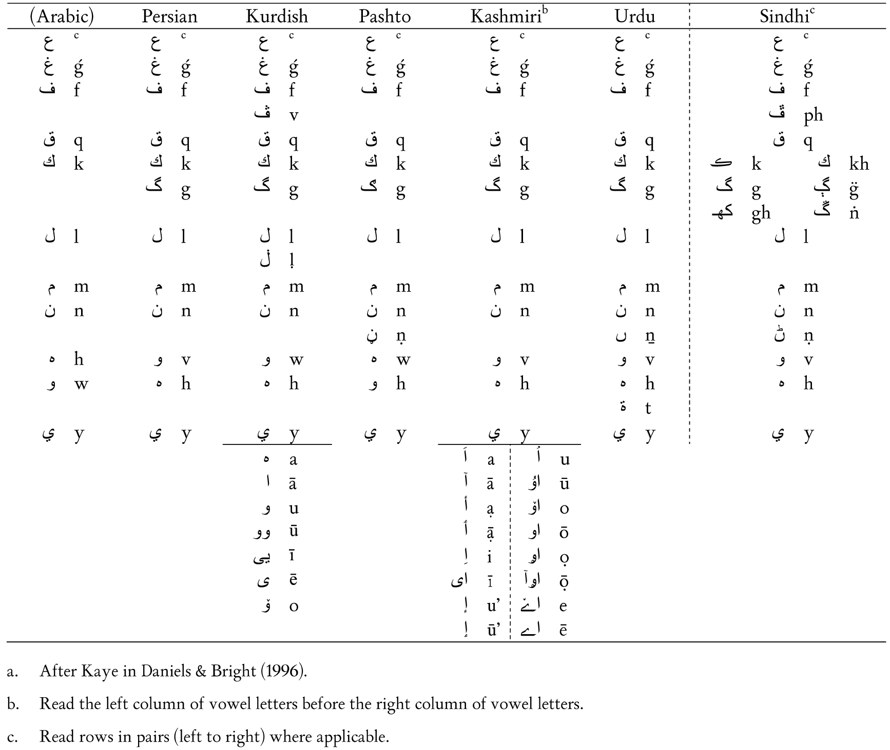

A striking adaptation of Arabic script is the Dhivehi alphabet (Table 5.7), in which the first 9 letters are taken from numerals; the next 9 from an earlier set of numerals; the next 6 (used mainly in loanwords) from other letters or from Persian; and the last 14 directly from Arabic (used only in Arabic loanwords). The vowel symbols are as in Persian but are obligatory.

Tab. 5.7: Dhivehi writingᵃ

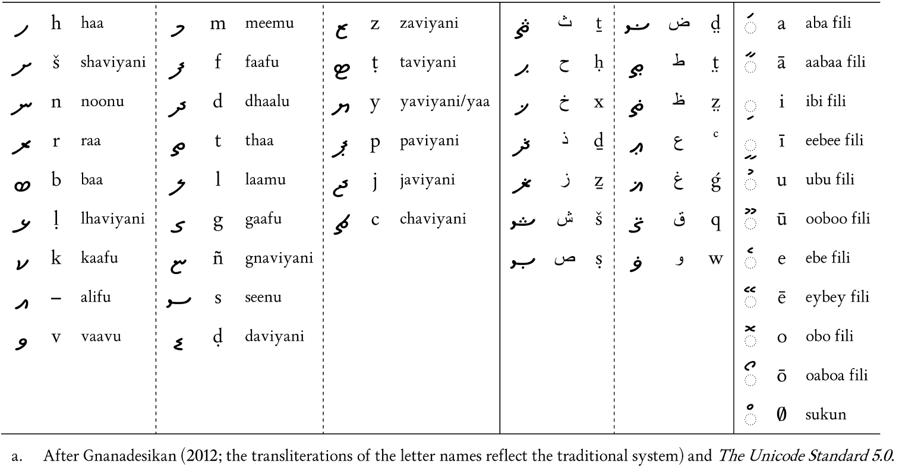

## 5. Greek alphabet and descendants

At a place that cannot be pinned down with any degree of confidence, at a date that can be quite securely set around 800 BCE (Sass 2005), the Phoenician abjad gave rise to the Greek alphabet (an *alphabet* is a script that notates both consonants and vowels with coequal letters). This did *not* happen because IE languages “need” to write vowels more than Semitic languages do (see 4.2, 6.2), nor on account of some “Greek” (or “Aryan”!) “genius.” Rather, like the Egyptian from the Sumerian, and the Semitic from the Egyptian, it happened because the first Greek scribe did not fully understand the script being imitated. The first Greek writers, who got an explanation from a Phoenician scribe, did not understand what the Phoenician was saying. They got the concept that each letter represented the first sound of its name − *bayt dalt gaml* etc. − they just did not get the first sounds of some of the names − *ˀalp yod ˁayn* etc. − because these sounds were not phonemic in the Greek language. They thus thought that *ˀalp yod ˁayn* etc. represented /a/ /i/ /o/ etc. This would not have happened if the source of the Greek alphabet had been an Aramaic forebear, since the *matrēs lectionis* would have been available for indicating the vowels (Daniels 2007: 61). Phoenician ‹W› split into ‹Ƒ› /w/ and ‹Υ› /u/. Letters for two long vowels were soon added, ‹Η› /ē/ borrowed from *ḥēt* for a dialect that did not have /h/, and ‹Ω› /ō/ a graphic variant of ‹Ο› /o/.

The Greek alphabet quickly spread around the Greek-speaking world, with local adaptations reflecting local needs (Jeffery 1990). The *epichoric* (local) alphabets (Table 5.8) have been classified since Kirchhoff (1887) according to the colors he used on his map. *Green* alphabets have no additional letters beyond the last Phoenician letter, ‹t›. *Red* alphabets have ‹Φ› [pʰ] ‹Ψ ›[kʰ] ‹Χ› [ks]. *Dark blue* alphabets have ‹Ξ› [ks] ‹Ψ› [ps], where *light blue* alphabets have ‹ΧΣ› ‹ΦΣ› respectively (Voutiras 2007). In 403/402 a decree was issued standardizing the alphabet on Athenian usage (without /h/ or /w/), a dark blue alphabet (Bodson 1991). Today’s minuscule forms developed in Byzantine times; accents and breathings appear sporadically as early as the 2ⁿᵈ c. BCE but their use did not become rigorous until ca. 800 CE.

The Iranian language Bactrian was written with a Greek alphabet augmented by one extra letter, for a sibilant, with the shape of ‹ϸ›, transliterated thus or with *š*, between about the 4ᵗʰ and 8ᵗʰ centuries CE, in the Kushan kingdom of northern Afghanistan and the Silk Road (Sims-Williams 2000−2012).

Tab. 5.8: Epichoric Greek alphabetsᵃ

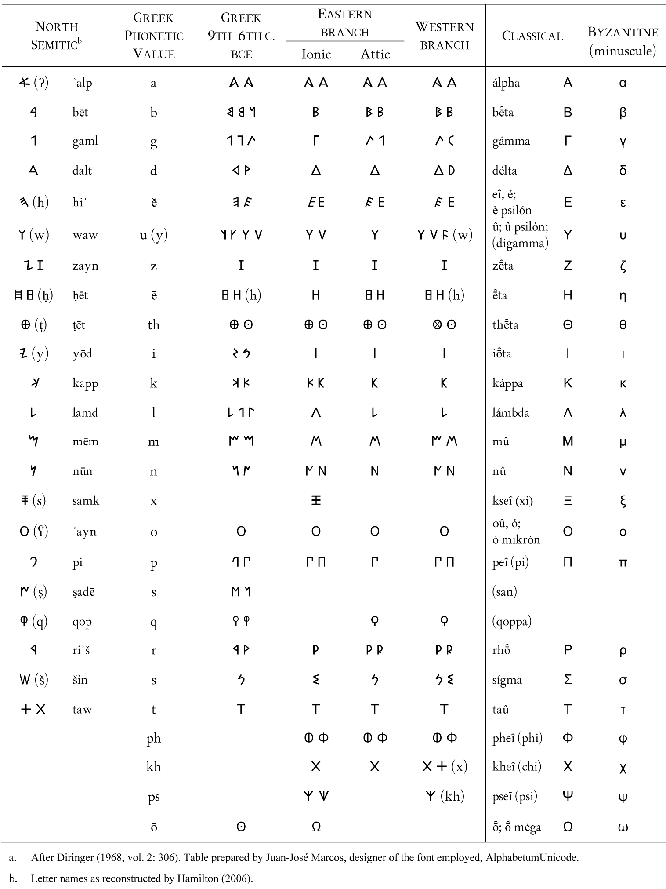

### 5.1. Italic alphabets

The alphabets of the Italic languages (Radke 1967) cannot be considered in isolation from their Etruscan background (Rix 2004). A red alphabet was adopted from a Greek community at Cumae near Naples early in the 8ᵗʰ c. BCE. The sounds /b d g o/ do not occur in Etruscan, and the velar letters ‹C K Q› appear in complementary distribution for /k/ before front, central, and back vowels respectively. These features and inner-Etruscan historical developments permitted Lejeune (1957) to date the transmissions of the alphabet to the Italic languages (Table 5.9). The strictures of Cristofani (1979), that the secure datings of many newly excavated Etruscan sites need to be taken into account in historical studies, have apparently not been taken up. Lejeune ticks off the earliest attestations of the Italic epichoric scripts as follows: 7ᵗʰ c. BCE, Faliscan and Latin (but this was before the Praenestine fibula was shown to be a forgery: the earliest Latin inscription is in fact from the late 6ᵗʰ c. − but see Poccetti, this handbook, for the view that the Praenestine fibula is a genuine early Latin inscription); 5ᵗʰ c., Venetic and, probably, Umbrian (not attested until the 2ⁿᵈ c.); 4ᵗʰ c., Oscan and probably Lepontic (subsequently used for its fellow Celtic language Cisalpine Gaulish). Knowledge of the Greek alphabet is evidenced by these facts: Faliscan, Latin, Venetic, and Lepontic resuscitated ‹O› for /o/; Latin, Oscan, and Umbrian revived ‹B› and ‹D›, Umbrian using the latter for some lenited sound; and Oscan used ‹C› for /g/. Venetic found different sources for the voiced-stop letters: ‹Ζ Φ Ψ› (in their “red” values) represent /d b g/. (The Messapic alphabet was adapted directly from the Greek.)

Tab. 5.9: Italic alphabetsᵃ

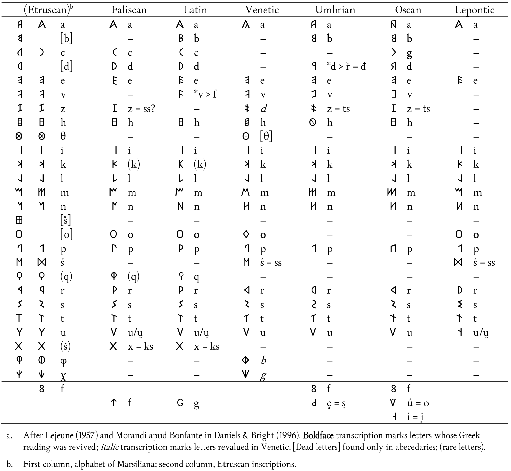

A peculiarity shared by (southern varieties of) Etruscan and Venetic (far to the north) is “syllabic punctuation” (Rix 1968). The explication − albeit not the explanation − was discovered by Vetter (1936): the unmarked syllable is CV, and segments that cause a departure from the norm, namely initial vowels and final consonants, are marked with a dot on either side (or variants thereof). An explanation was proposed independently by Wachter (1986) and Prosdocimi (1983): writing these languages was taught using CV syllables. As scribes sounded out the text to be recorded, they marked off each segment that violated the canonical syllable structure.

### 5.2. Latin alphabet

The Latin language thrived, and with it its alphabet, which replaced the local alphabet of any languages that managed to survive. It has undergone a number of changes. Etruscan ‹F› was /w/, and /f/ was ‹FH›, a spelling carried over to Venetic and perhaps Latin, where /f/ was simplified to ‹F›. Latin /g/ and /k/ were both ‹C› until the 3ʳᵈ c. BCE when ‹G› was introduced for /g/ (and took the sequential position of ‹Z›, for which Latin had no use); ‹K› appeared only in a few archaisms (Heimpl 1899). ‹Y Z› (re)entered the Latin alphabet in the 1ˢᵗ c. BCE when it became necessary to write borrowed Greek words accurately.

The past two millennia have brought such innovations to what is then better called the roman alphabet as ‹W› (for Germanic languages), the differentiation of ‹I J› and ‹U V› (which had been positional variants), and the use of digraphs (beginning with Latin spellings of ‹Θ Φ Χ› as ‹TH PH CH›) and diacritics (introduced by Jan Hus in 1412[?]; Schröpfer 1968). The minuscules resulted from attempts to balance speed of writing, conservation of precious writing materials, and legibility; they achieved their present form in Charlemagne’s court under Alcuin of York ca. 800. Local variants arose throughout Europe, of which (besides *italic*, used as an auxiliary to “roman”), only the German Fraktur barely survives, as do a few distinctive forms of letters in Irish.

#### 5.2.1. Runes

Perhaps as early as the 1ˢᵗ c. CE, Germanic languages began to be written with runes (Elliott 1989), angular (for carving into wood) adaptations of some Mediterranean script − arguments against each possible origin, Greek, Etruscan, or Latin, are easy to make, and conclusive arguments for any of them are not − initially numbering 24, shrunk to 16 in the 8ᵗʰ-century Danish form, and expanded to 28 and then 31 for Anglo-Saxon (Table 5.10). The set of runes is acrophonically called the *futhark*.

Tab. 5.10: Runesᵃ

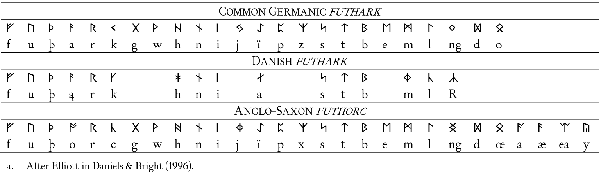

#### 5.2.2. Ogham

The Latin alphabet became a sort of code (groups of one to five strokes abutting or crossing a central line, usually the edge of a shaped stone monument; Table 5.11) for recording brief commemorative inscriptions, in Ireland and Britain, in Irish and Pictish (McManus 1991).

Tab. 5.11: Ogham

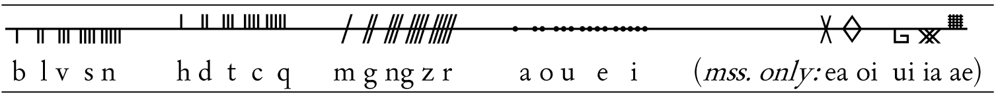

### 5.3. Anatolian alphabets

Several alphabets appeared in Anatolia during the 1ˢᵗ millennium BCE (Table 5.12). The decipherment of Carian (5.3.3) in the 1990s rendered the few overviews of them to some extent obsolete (Ševoroškin 1968; Pugliese-Carratelli 1978; Masson 1991). Characteristics of the Anatolian alphabets are the adoption of several Greek letters for sound and meaning, changes of shape for similar sounds, and the reuse of letters with unneeded Greek values for sounds not found in Greek (Heubeck 1978).

Tab. 5.12: Anatolian alphabets

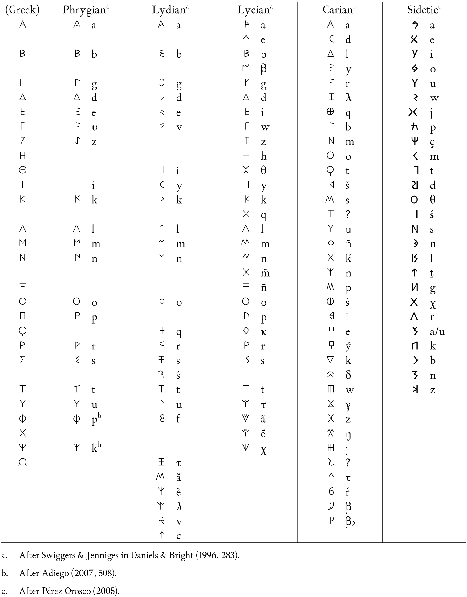

#### 5.3.1. Phrygian

The earliness of attestation of the Phrygian alphabet − 750 BCE or before − has led to some speculation that Phrygian came first and the Greek alphabet derived from it, but the absence of Phrygian letters for aspirated stops, which Greek has directly from Phoenician from the beginning, renders this unlikely. This alphabet was used down to the time of Alexander. (Phrygian reappears around the turn of the era using the Greek alphabet.)

#### 5.3.2. Lydian

The Lydian alphabet (attested from the late 8ᵗʰ/early 7ᵗʰ−3ʳᵈ c. BCE) includes 16 directly Greek letters, 5 reuses, and 5 inventions. It shows considerable similarity to its Phrygian neighbor.

#### 5.3.3. Carian

Carian inscriptions were long known from Egypt in the 7ᵗʰ−5ᵗʰ c. BCE as well as from Caria proper in the 4ᵗʰ−3ʳᵈ, but they long resisted interpretation because it was assumed that Greek-looking letters should have their Greek sounds. (There is not yet a proposal for the prehistory of this alphabet.) It was John Ray who first studied Carian−Egyptian bilinguals, and finally Diether Schürr and I.-J. Adiego who completed the task in the early 1990s (Adiego 2007: 166−204). Adiego identifies no less than 7 local variants involving both inventory and shape.

#### 5.3.4. Lycian

Though attested only from the early 6ᵗʰ c. BCE until 323/322, the Lycian alphabet was probably adapted quite early from the red Greek, and some of its letters changed shape over the years along with the Greek. 14 letters agree with Greek, 7 represent reuses, and 5 are new shapes. The presence of “nasalized letters” ‹ã ẽ m˜ ñ› has generated much discussion, and two letters have not been satisfactorily interpreted.

#### 5.3.5. Sidetic

The scantily attested − just 10 brief inscriptions from the 4ᵗʰ−3ʳᵈ c. BCE − Sidetic alphabet seems to derive from the Aramaic abjad of the Achaemenids, rather than the Greek alphabet like its neighbors to the west: 7 letters closely correspond in sound and shape, 8 letters more distantly, 7 are assigned new values, and 3 come from Greek (Pérez Orozco 2005). (Equally scarce Pisidian is written with a Greek alphabet.)

### 5.4. Celtiberian

Between the mid 6ᵗʰ c. BCE and the early 1ˢᵗ c. CE, a small group of related scripts was in use in Iberia (Anderson 1988; Untermann 2001). Nearly two centuries of study culminated in the definitive decipherment by Manuel Gómez Moreno (Caro Baroja 1954), who made the surprising discovery that the script (Table 5.13) incorporates both syllabic characters (for the 3 stops 0̸ or plus each of the 5 vowels) and segmental characters (for the 7 continuants). The question has been whether Phoenician (de Hoz 1991) or Greek (Untermann 1997) writing underlies the scripts. New evidence came with the 1987 discovery of an “abecedary” of the Southwest Iberian (Tartessian) variety in which the first 14 characters are those that correspond in shape, sound, and order to Greek letters, *alpha* to *upsilon* (Adiego 1993). The Northeast Iberian variety was used for Ibero-Celtic (Celtiberian) alongside, but to a greater extent than, the Latin alphabet from the 2ⁿᵈ c. BCE to the time of Augustus. Correa (1996) very tentatively suggests that the language of the Tartessian inscriptions (where ‹CVᵢ› is always followed by ‹Vᵢ›) may also be Celtic. The study of Celtiberian is placed in the context of Continental Celtic studies by Eichner (1989: 24−55).

Tab. 5.13: Iberian scriptᵃ

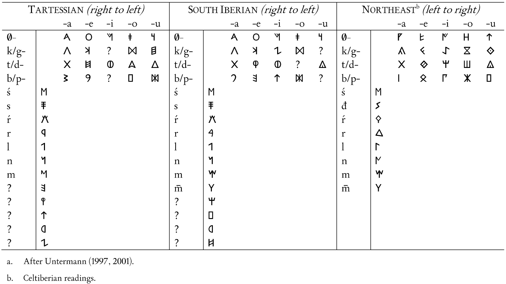

### 5.5. Alphabets of the Christian Orient

Whereas the Western or Roman church promoted only its liturgical and literary language, Latin, resulting in the spread of the roman alphabet (5.2) wherever it brought literacy, the Eastern church, based in Greek, encouraged worship in vernacular languages and translation of Scripture and other documents into such languages. National feeling encouraged the desire for distinctive alphabets, and such were devised for languages that were not already written (Table 5.14).

Tab. 5.14: Alphabets of the Christian Orientᵃ

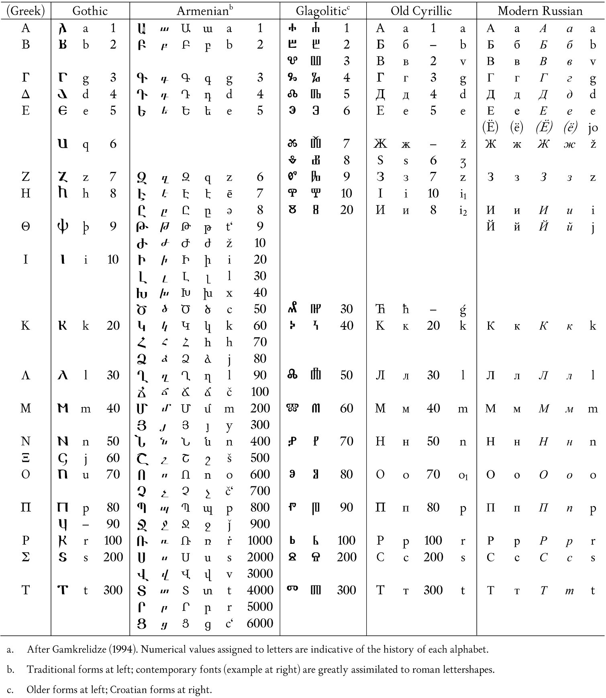

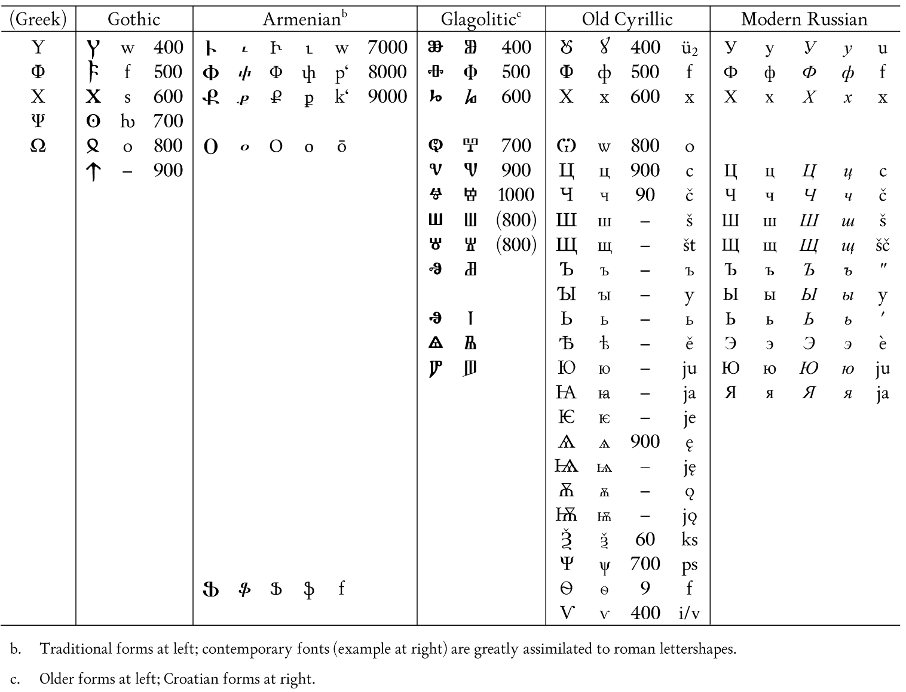

#### 5.5.1. Gothic

The Gothic alphabet was devised by Bishop Wulfila († 383) in connection with the evangelization of the East Germanic-speakers around present-day Moldova. It alters the Greek alphabet with five lettershapes from Latin and two from runes (Gamkrelidze 1994: 31−33).

#### 5.5.2. Armenian

According to legend (Orengo 2005 cites and translates the sources), the Armenian alphabet was devised by St. Mesrop Maštocʻ in 406−407 CE. Its dependence on the Greek alphabet is clear from the order of letters; the shapes of the letters are probably arbitrary inventions (Mouraviev 1980) − suggestions that letter shapes are taken from a wide variety of existing scripts (e.g. Russell 1994) are unpersuasive. Legend also credits Mesrop, rather implausibly, with the creation of the Georgian alphabet, which was used for Ossetic in the mid 20ᵗʰ c. CE.

#### 5.5.3. Glagolitic

Two scripts emerged for writing Old Church Slavonic (Old Bulgarian) in the later 9ᵗʰ c. (Cubberley 1993). Legend ascribes them both to a pair of Byzantine missionaries, Constantine (later Cyril) and Methodius. Glagolitic emerged first, based on Greek cursive with many additional letters. Its original rounded form lasted 300−400 years, while a squared form continued in use in Croatia, particularly in the church, until the 19ᵗʰ c.

#### 5.5.4. Cyrillic

A more elaborate form of the alphabet still used for Russian, as well as for Belarusian, Bulgarian, Moldovan, Ossetic, Serbian, Tajik, and Ukrainian, called Cyrillic after the saint, was based in the late 9ᵗʰ c. on formal Greek uncials plus some letters taken from Glagolitic. Reforms of Russian orthography took place under Peter I in 1708−1710 and at the start of the Soviet Union in 1918. Of the variety of techniques for expanding an alphabet (Daniels 2006a), Cyrillic favors modification of shape (rather than digraphs or diacritics as preferred in roman alphabets). Choice between roman and Cyrillic has followed both religion and politics.

## 6. Iranian scripts

As long ago as 1901, the editors of the *Grundriss der Iranischen Philologie* lamented that they would not be able to include the planned chapter on “Schriftkunde,” and to this day there has not been a comprehensive treatment. Reference must be understood throughout to Henning (1958), to numerous authors in Schmitt (1989) and Windfuhr (2009), and to Skjærvø (2006: 366−370).

### 6.1. Old Persian

Old Persian cuneiform is not a selection or derivation from Mesopotamian cuneiform, except in that the strokes, carved into stone or brick, that compose the characters imitate its wedges impressed in clay. The script was used for no purpose other than the Persian versions of trilingual royal inscriptions of the Achaemenid empire − given pride of place among the three scripts and languages − though the principal language of the empire was Elamite. The script was probably devised during the construction of the awesome relief and inscription of Darius I at Bisotun (520 BCE), the Elamite version having been the first to be inscribed. Inscriptions in the name of earlier monarchs are most likely *fraudes piae* composed in later years.

Beside 6 inconsistently used logograms, the Old Persian script has 36 characters (Table 5.15): 3 for the vowels *a i u*, 13 for consonants followed by any or no vowel, 6 for consonants followed by *a* or no vowel, 3 for consonants followed by *a, i*, or no vowel, 4 followed by *i*, and 7 followed by *u*. Vowel quality, even when indicated in the consonant letter, and vowel length (except for *ā*) are almost always marked with vowel characters. Such orthography is reminiscent of, but certainly not identical to, the use of *matrēs lectionis* in Aramaic writing, with which Achaemenid scribes were intimately familiar. The fullest exposition of Old Persian orthography remains Kent (1953: 9−24; cf. also Hoffmann 1976: 620−45). Since then there has been much speculation on the origins of the script, with no resolution in sight.

Tab. 5.15: Old Persian scriptᵃ

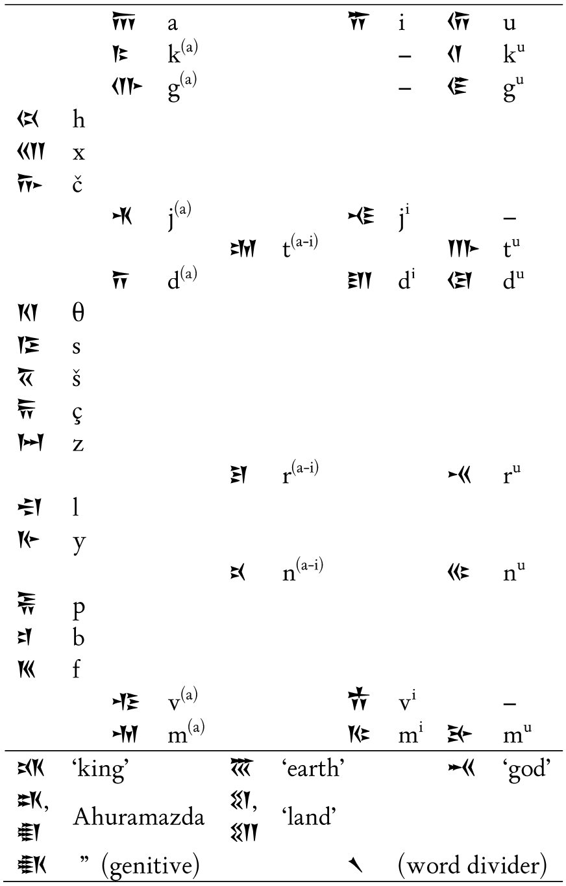

### 6.2. Middle Persian scripts

Aramaic paralleled and then succeeded Elamite as the chancery language of the Iranian empires (Achaemenid, 549−330 BCE; Seleucid, 330−ca. 210; Arsacid or Parthian, ca. 210 BCE−224 CE; Sasanian, 224−Arab Conquest). In early Parthian times, Aramaic was giving way to Iranian as the chancery language, while the scribes continued to use Aramaic script − and Aramaic spellings, reminiscent of Akkadograms in Hittite:

At first sight, such writings with “ideograms” [Aramaeograms, “heterograms”] appear to be an unnecessary obstacle to scribal practice; would it not be simpler to spell all the words of their own language alike? In fact that was not the case. The retention of a large portion of the hitherto used Aramaic vocabulary was in reality a simplification of the transition, which thanks to the ideogram system could be carried out thoroughly and without a radical break with the past. (Henning 1958: 31; trans. PTD)

The three Middle Persian scripts (Parthian, 1ˢᵗ c. BCE−3ʳᵈ c. CE; Pahlavi, 3ʳᵈ−7ᵗʰ c.; Sogdian, 5ᵗʰ−9ᵗʰ c., far to the east) differ between and within themselves calligraphically (Table 5.5) but exhibit striking uniformity orthographically. All use 4 of the 22 Aramaic letters, ‹h ṭ ˁ q›, only in Aramaeograms and use ‹ṣ› for /č/. In each, the shapes of several letters merged. All have expanded the use of *matrēs lectionis* to cover short vowels. All employ much historical spelling.

The nature of Aramaeogrammatic writing was clarified once and for all by Ernst Herzfeld, “neither an Aramaist nor a trained philologist at all” (1924: 52), on the basis of the large corpus of Pahlavi coins, inscriptions, and texts: lexical bases are written with Imperial Aramaic orthography provided with phonetic/morphological complements marking the Iranian affixes. Pahlavi orthography and calligraphy are set forth by Nyberg (1964, 1: 129−136).

### 6.3. Avestan

The sacred texts of Zoroastrianism were transmitted orally for centuries. Eventually, as the language became more and more archaic and there was danger that the texts would be lost, a 51-letter alphabet was devised (Table 5.16), taking some shapes from Book Pahlavi, some from the Psalter script, and at least one from the Greek alphabet. The Avestan alphabet is nearly unique in, apparently, notating subphonemic features of the language. The oldest manuscripts date from the 13ᵗʰ c., but the shapes of the letters compared with Pahlavi epigraphy point to a 5ᵗʰ-c. date, the so-called “Sasanian archetype” of the Avestan text (Hoffmann and Narten 1989).

Tab. 5.16:Avestan alphabetᵃ

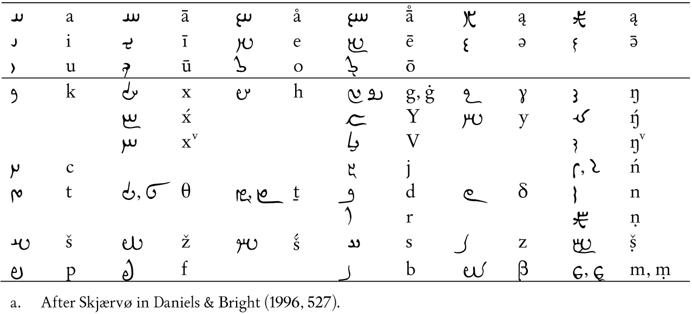

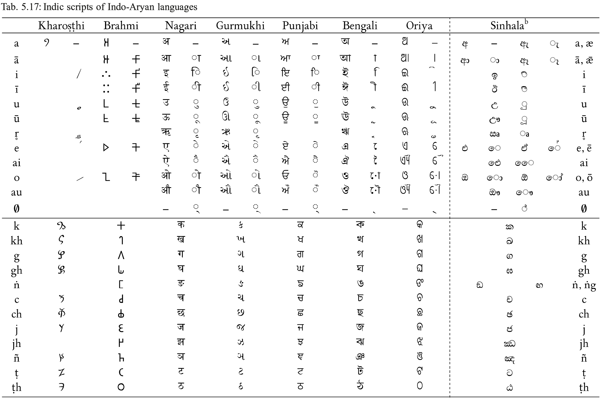

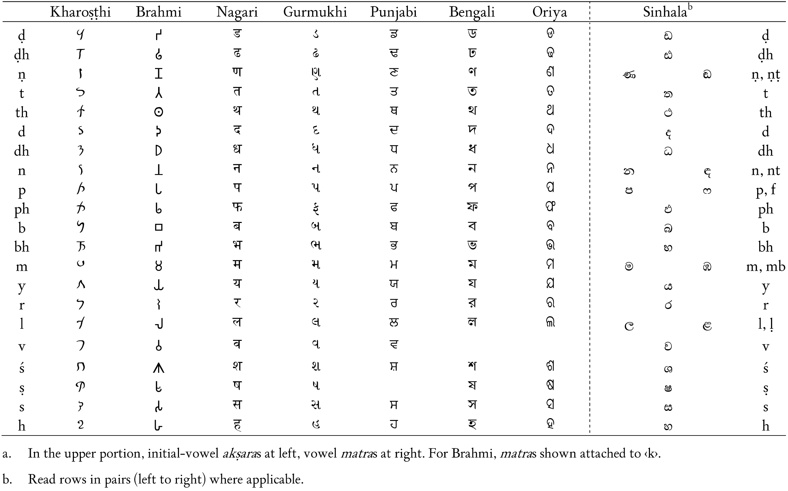

## 7. Indic scripts

Two indigenous scripts of India (Salomon 1998, 2007) reflect the prior existence of the renowned linguistic tradition associated with the name of Pāṇini. Unlike their Aramaic model, they provide fully for the notation of vowels, and the contrasting treatment of consonants and vowels reflects that linguistic sophistication. Each consonant (or initial vowel) of an utterance receives its own letter (Table 5.17); with one exception, each vowel is notated with a mark (a *mātrā*) added to the consonant it follows. The exception is the unmarked phoneme /a/: a consonant letter ‹C› without a *mātrā* is pronounced /Ca/. Consonant clusters are notated by merging the symbols for the successive consonants into *conjuncts*, in different ways for the different scripts (Daniels 2008b: 298 f.). A letter or conjunct together with its *mātrā* (if any) is called an *akṣara*.

### 7.1. Kharosṣtṫhi

Kharoṣṭhi is attested from the time of Aśoka, in the mid 3ʳᵈ c. BCE, but it was probably devised some two centuries earlier, when the Achaemenid empire brought Aramaic script to the far northwest of South Asia (present-day eastern Afghanistan and northern Pakistan). It was first used to write Gāndhārī Prakrit, continuing in use in Gāndhāra until the 3ʳᵈ c. CE and to the northeast (along the Silk Road) for some time after that. The consonant shapes generally relate clearly to Aramaic forebears; the vowels *e i o u* are marked with short strokes attached to the consonant letters. Consonant clusters are rare in Prakrits, so conjuncts are correspondingly rare. With the recent discovery of a variety of manuscripts in Kharoṣṭhi, it has become possible to assemble a paleographic sequence (Glass 2000).

### 7.2. Brahmi

Brahmi appears to date no earlier than the reign of Aśoka, in the mid 3ʳᵈ c. BCE, when it was used to post decrees in Prakrit throughout his empire. To the vowel indications of Kharoṣṭhi it adds the refinement of marking vowel length; the standard complement of *mātrā*s (as reflected in its descendants) is ‹āiīuūr̥eaioau›. The severe geometric shapes of the letters in the earliest exemplars make it difficult to derive it from any particular Aramaic forebear; the left-to-right direction of writing suggests that it might have been a complete rethinking of Kharoṣṭhi itself. Dani (1986) carries the evolution of Brahmi in its geographic variants down to the 8ᵗʰ c. CE, and Filliozat (1953) discusses further developments. Brahmi was used throughout South Asia and exhibited regional individuality almost from the beginning. Grierson (1903−1928) is peppered with facsimiles of ms. pages from throughout British India at the turn of the 20ᵗʰ c.

Turning to the north, two main scripts developed from Brahmi, both in use by the 5ᵗʰ or 6ᵗʰ c. CE (Sander 1968, 1986; Novotny 1967: 534). North Turkestan Brahmi (formerly “Slanting Gupta”) was used for (Iranian) Tumshuqese and occasionally Sogdian, with additional *akṣara*s for consonants not found in Prakrits, and for Tocharian (Table 5.18), with an additional vowel ‹ä› (probably /ə/). South Turkestan Brahmi (formerly “Upright Gupta”) was used for (Iranian) Khotanese, again with the addition of ‹ä› and some diacritics, but with ligatures rather than new *akṣara*s to represent new sounds.

Tab. 5.18: Tocharian script

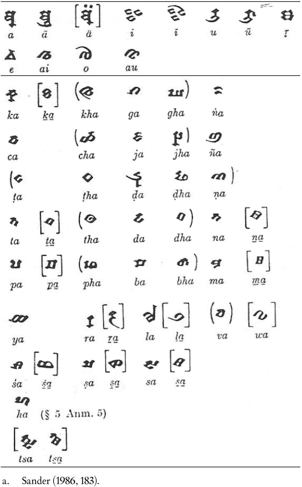

#### 7.2.1. North Indic scripts

The most important modern representative of the North Indic branch of scripts descended from Brahmi is the Nāgarī ‘city script’, used for Hindi, Marathi, and Nepali (the latter two adopting distinctive orthographic practices to reinforce their autonomy); it is also the script now most often used for Sanskrit (Devanāgarī ‘script of the city of the gods’), though Sanskrit can be written with any Indic script according to local convenience. The other standard modern Northern scripts are those of Panjabi, Gujarati, Bengali and Assamese, and Oriya. Bühler (1904: 64) observes that a diagnostic characteristic of all the North Indic scripts is the knob at the lower left corner of *ma*.

#### 7.2.2. South Indic scripts

The only Indo-European language written with a South Indic script is Sinhala, which has added a series of *akṣara*s for prenasalized consonants and for long /ē ō/. Bühler (1904: 80) observes that a diagnostic characteristic of all the South Indic scripts is *mātrā* ‹r̥› with a curled curve on the left. They were mainly written with a stylus on palm leaf, making straight lines difficult, but the curvaceous form is not definitive, as Oriya, a close kin to Bengali, is highly curved for the same reason. South Indic also provided the four Dravidian scripts and the vast proliferation of writing systems throughout Southeast Asia (Holle 1999).
