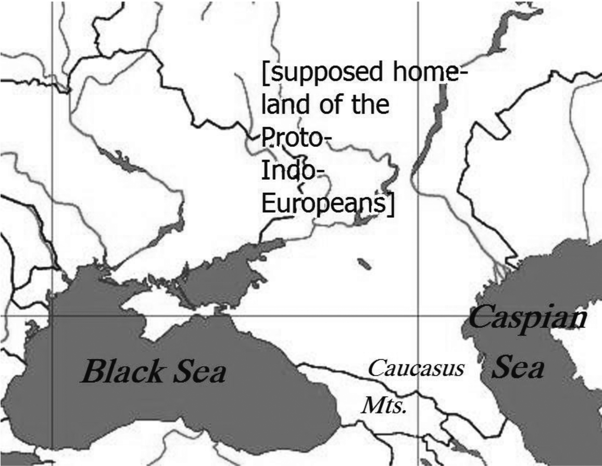

# 8. The homeland of the speakers of Proto-Indo-European

Soon after Comparative Indo-European Linguistics was established about 200 years ago, a legitimate thought arose: If the languages of the ancient Greeks, Indians, Celts, and other Indo-European peoples are derived from one common predecessor, then this proto-language must have been spoken by one proto-people (German *Urvolk*). The question about the original home (*Urheimat*) of this people has been discussed ever since and remains still unanswered. Everything we know about the Proto-Indo-Europeans is based on the vocabulary that has been reconstructed by comparing the oldest Indo-European sub-branches, as there is no direct textual tradition. That is why even a temporal classification is very difficult − often a period somewhere between 10,000 and 5,000 BCE is stated.

Despite critical examination of the matter and numerous hypotheses there is no prevailing opinion, which is even more frustrating as there actually are plausible solutions regarding other language families. For instance, the Finno-Ugric *Urheimat* is now said to have stretched across the middle and southern Ural region and its western extension. So, without historic records, how is it possible to draw such conclusions anyway?

Researchers have been trying to solve the Indo-European problem using a number of different methods. For a while now, academic input from external disciplines such as geography or anthropology has been noticeable. Although some linguists tend to criticize approaches by natural scientists, interdisciplinary cooperation can be fruitful. Nevertheless, the subject is primarily a linguistic one, and therefore language is the primary instrument to be used.

An item is considered to be of Proto-Indo-European provenience if it has descendants in at least three derivative languages with nearly the same meaning. The comparison of Vedic *bhárāmi*, Greek φέρω, Latin *ferō*, Gothic *baira*, Old Irish *biru*, and Classical Armenian *berem*, all meaning ‘I bear’, as well as other cognates results in the reconstruction of a PIE root **bʰer*- meaning ‘to carry, to bear’. Hence this root and the present tense built to it (**bhere/o-*) must have been known to the speakers of the proto-language. Of course, this gives no indication of what the PIE culture, civilization, or homeland was like. There is, however, a significant number of terms which draw a rather detailed picture of the natural environment of the homeland, yielding the following idea: If a certain term was known to the speakers of the proto-language, then their homeland is to be sought where the denoted “thing” can be found naturally. As there exists a PIE word for ‘beech’ (**bhāĝos*-), the *Urheimat* must have been in the natural habitat of this very tree. This type of approach is called *linguistic paleontology*, a term introduced by Adolphe Pictet in 1859. The method seems logical and promising, but it clearly has its flaws. The argument just mentioned − the so-called *beech argument*, which places the *Urheimat* in an area west of a line drawn from Kaliningrad to the Crimea, for only there the beech is to be found − has been disproved by now. As a matter of fact, the individual descendants vary significantly in meaning. For example, Greek φηγός means *Quercus aesculus* (an oak), Proto-Slavic **bŭzŭ* means ‘elder’, and Kurdish *būz* ‘elm’. Besides, our knowledge about the range of botanical and zoological species some millennia ago is far from complete. Another famous argument is the *salmon argument*. The *Salmo salar* does not live south of the 42ⁿᵈ latitude. However, PIE **lak̑(a)s*- appears only in a few daughter languages; also Tocharian *laks* simply means ‘fish’ in general. Many terms for plants and animals are genuinely Indo-European, though, and exclude certain areas in the world. It is considered a fact that the Indo-Europeans knew the bee, as they produced honey (**melit*- > Greek μέλι) and used it for making an alcoholic beverage (**medʰu*- ‘mead’). The horse (**ek̑u̯os*) was of particular importance: not only did it play a prominent role in rituals, it also was most likely domesticated and served as a draft animal and a mount. It is assumed that horses were yoked to chariots (**rot-h₂-o*- > Sanskrit *rátha*-). Accordingly, a scenario of wheeled PIE warriors conquering most parts of Europe and Asia is widespread in literature.

There is an alleged word meaning ‘sea, ocean’ which is highly controversial: Gothic *marei*, Old Irish *muir*, Old Church Slavic *morje* point to a neuter i-stem **mori*/**mari*. Such i-stems are rare and are evidence of great antiquity. However, an Indo-Iranian cognate is missing, so a European innovation is not out of the question. After all, it remains a matter of conjecture which body of water was actually meant by **mori*/**mari*. The Baltic Sea or the Black Sea are most often suggested.

Reconstructing the PIE vocabulary is not the only way to locate the original homeland. Consideration of non-Indo-European language families may be useful as well.

Contact between non-related languages is a common phenomenon. If we can prove loan contact(s) in the supposed PIE era, it is most likely that the *Urheimat* was situated in the vicinity of those languages contributing the loans. Of course, *cultural terms* can travel long distances along with the denoted thing. For instance, as a result of trade relations we find similar words for ‘wine’ all over the world (the origin of wine was in Caucasia). Even numerals are borrowed now and then, e.g. the Arabic *sábʕa* ‘seven’ probably has a connection with PIE **septm̥* and Akkadian *šalašu* ‘three’ with PIE **trei̭es*. However, the majority of Indo-European-Semitic loan words denote objects of trade such as animals and plants. Words belonging to the basic vocabulary are of greater value; they indicate direct contact and thus close spatial proximity.

A couple of such “basic words” have been borrowed from PIE into Finno-Ugric languages, e.g. PIE **h₃nōmn̥* ‘name’ → Proto-Fi.-Ugr. **nime* > Finnish *nimi* or PIE **dʰē-k*- ‘to do, make’ → PFU **teke* > Hungarian *te-sz*. Furthermore, there must have been contact with the Caucasian language family. Especially the Kartvelian (= South Caucasian) branch shows evident IE elements in its vocabulary: PIE **meldʰ*- ‘ritual invocation of a deity’ → Georgian *madl-i* ‘grace, blessing’; PIE **snus-o-* ‘daughter-in-law’ → Zan *nusa* ‘bride’ amongst other examples.

As linguistic paleontology was being established, numerous works regarding this method were published. Two of them can be considered milestones today. Victor Hehn’s *Culturpflanzen und Hausthiere in ihrem Übergang aus Asien nach Griechenland und Italien sowie in das übrige Europa* (1870) and Otto Schrader’s *Reallexikon der indogermanischen Altertumskunde* (1901) give an extensive outline of Indo-European life. The problem was that both authors reached different conclusions using the same method! Hehn proposed an Asian *Urheimat*, while Schrader placed the homeland in South Russia. For the opponents of paleolinguistics this was proof enough of the defectiveness of the method. This was also the point when the first archaeologists entered the fray. In 1902, Gustaf Kossinna published his essay *Die indogermanische Frage archäologisch beantwortet*, in which he stated that archaeology alone has the advantage of operating with concrete material and therefore has the sole privilege of giving a definitive answer to the homeland question. It is indeed true that it is nowadays possible to date archaeological finds very precisely by using the radiocarbon method. But the whole area in question is still not archaeologically explored. Besides, there is no *communis opinio* about *when* the proto-language was spoken. The linguistic material indicates a Neolithic level of civilization, including agriculture, keeping of domestic animals and processing of domesticated plants, together with a settled life style. These features can be found in a number of cultures even in Europe, e.g. the Corded Ware culture or the Funnel Beaker culture. In addition, a clear correlation of prehistoric cultures with certain languages is difficult if not fatuous. The different cultures are often classified only by one distinguishing feature such as the ornamentation of pottery. It has to be noted that cultural features are not exclusively linked to certain peoples − they can be passed on and spread like waves, regardless of migration.

Connecting a group of speakers with *racial features* is even more questionable. Because of the mentioning of an *élite dominance* of light-skinned, tall, and blue-eyed men in some ancient texts, the Proto-Indo-Europeans were associated with the so-called Nordic race without further reflection. Such pseudo-scientific assertions emerged at the beginning of the 20ᵗʰ century and were especially widespread in Germany during the 1930s and ’40s. Under the influence of the works of authors like Otto Reche and Karl Penka, Scandinavia and/or Germany were soon regarded as the final answers to the homeland question.

Modern linguistics does not bother examining skulls anymore, although skeletal remains are not entirely useless. With the aid of genetics, scientists try to find a connection between linguistic, genetic, and cultural developments in Europe, the latter being characterized by the transition from hunter-gatherer to agriculture (“Neolithic revolution”). Indeed, it was detected that the share of Neolithic DNA apparently decreases from Southeast to Northwest. Supposing that agriculture has its roots in Asia Minor, we can thus recognize a “flow” coming from the Southeast: the Indo-European migration movement? Time will tell to what extent human genetics is helpful. As of now, we have to rely on linguistic data.

Long before *the* IE proto-language was an issue, Friedrich Schlegel recognized the antiquity of Sanskrit and its parallels to related languages like Greek and Avestan. In his work *Über die Sprache und Weisheit der Indier* (published in 1808) he praised the Old Indic language for its pureness and clarity and he implied that India alone must have been the origin of the later IE “colonies”. Today India can be ruled out as a homeland candidate with the utmost probability. After Schlegel almost every single part of the Old World was brought into the discussion. (We will not dwell on exotic locations like the North Pole or the Sahara.) Sometimes it seems like a religious war is being fought. Quite often the proposals are influenced by nationalistic thinking and the suggested homeland is identical with the country/ region the particular author is from. Often researchers have ignored arguments *against* the favored position *a priori* instead of systematically gathering evidence, pondering the pros and cons, and then presenting a solution. Some academics even give up their original opinion in favor of a new one: A. H. Sayce stated in 1880 that the *Urheimat* had been in Asia; ten years later he suggested Europe; and in 1927 he finally proposed Asia Minor.

Of all the theories that have been set forth during the past two centuries, three can be considered serious. One of them places the original home in an area that can roughly be called “South Russian steppes”, i.e., the regions north of the Black Sea and the Caspian Sea. The first prominent proponent of this South Russian hypothesis was Otto Schrader in 1890. His argumentation was primarily based upon paleolinguistics: The PIE people knew animals such as the wild boar, the bear, and the eel and plants such as the beech and the yew − life forms found in the assumed area. Furthermore, he regarded the huge steppes as ideal for farming and stock-breeding.

One of the most complex models of Indo-European dispersal is the *Kurgan hypothesis*, introduced by Marija Gimbutas in 1956. It must be noted that Gimbutas never intended to give an explicit solution for the Indo-European problem. What she actually developed was a theory of the Indo-Europeanization of *Old Europe* by the so-called *Kurgan people*, who came from the Volga-Uralic-/North-Pontic regions in three waves of invasion. The Kurgan culture was characterized by: round burial mounds (Russian *kurgan* ‘mound’, actually a loan from a Tatar word with the same meaning); a patriarchic and hierarchic social structure; domestication of the horse as a mount and its use as a provider of milk and meat; advanced weaponry (bow and arrow, spear, dagger, etc.); and a half-nomadic life with rudimentary agriculture. This culture was diametrically opposed to that of the *Old Europeans*. According to Gimbutas, the Old European people lived in a peaceful, sedentary and matrifocal society and were hardly able to defend themselves against the penetrating heavy-armed, horseback-riding Kurgan warriors. The bulk of today’s criticism is leveled against this war-like scenario, the description of which is similar to that proposed for the Germanic Migration Period. On the other hand, *kurgan*-like tumuli have been found in Mycenae, Thrace, Macedonia, and Scythia; and similar burial mounds are described in the epic poems *Iliad* and *Beowulf*. Also, the theory is well-suited to a possible Uralic and Caucasian neighborhood.

The Caucasus itself is the central point of the second noteworthy theory, whose main supporters are Tamaz Gamkrelidze and Vjačeslav Ivanov. Since the 1980s, they have been basing their hypothesis on reconstructed words for geological and meteorological terms which point to a mountainous landscape. Beside the PIE word **sn(e)igṷʰ*- ‘to snow’ Gamkrelidze/Ivanov claim to have found other related terms: **(i̭)eg*- ‘coldness, ice’, **(e)is*- ‘ice’, **srīg*- ‘to be cold’, and **preu(s)*- ‘to freeze’. These terms support the idea of a mountainous homeland, as well as the words for ‘peak, hilltop’: Sanskrit *ágra-*, Avestan *aɣra*, cf. also Albanian *gur* ‘cliff, rock’, Old Church Slavic *gora* ‘mountain’, and Lithuanian *girià* ‘forest’.

Of course, terms concerning height and width are relatively dependent on the speakers’ experience and are therefore not useful for determining absolute measures, as Wolfgang Meid noted in 1989. Some parts of Gamkrelidze/Ivanov’s zoological terminology are a little bit dubious, e.g. **He*/*or*- ‘eagle’ or **i̭ebʰ-/Hebʰ*- ‘elephant’. Also worth mentioning are the so-called “Southwest Asian migratory terms” found in the Semitic languages, for example PIE **tauro*-: Proto-Semitic **ṯawr*- ‘bull’. Among the IE-Kartvelian relations are a couple of Proto-Kartvelian words which can be interpreted as Proto-IE loans: **diqa*- ‘clay’ ← PIE **dʰeĝʰ-om-* ‘earth; (soil)’; **lom*- (Georgian *lom-i*) ← PIE **leu*- ‘lion’. Culturally, Gamkrelidze/Ivanov classify the Proto-Indo-European civilization as Old Eastern. One cannot identify PIE with *one* archaeological culture in the postulated area, the authors say, but there are various parallels. For example, the use of bull horns as symbols of masculinity and the depiction of leopard furs in 4ᵗʰ millennium Western Anatolia can be associated with the Halafian culture. The significance of the horse and the carriage as well as the cremation of chiefs along with their chariots points to the Kura-Araxes culture. One would think, though, that the Indo-European *Urvolk*, which was homogeneous in both language and culture, should have left more or less homogeneous archaeological evidence. Furthermore, it must be noted that the oldest place names in the Caucasian region are non-Indo-European.

The same is true for Asia Minor, the third *Urheimat* hypothesis worth mentioning. The hydronyms and toponyms there would suggest a secondary immigration by IE peoples. The first supporter of an Anatolian homeland was Johannes Schmidt in 1890. His argumentation was as follows: The Indo-European numeral system is based on the number 10, but in several dialects there is a “break” after 60. The tens up to 60 are built using the cardinal numbers, but from 70 on they are built using the ordinal numbers. Schmidt interpreted this break as having been influenced by the Babylonian sexagesimal (base-sixty) system. Hermann Hirt argued in 1892 that the number 60 is also important in the Chinese calendar; if this was also due to Babylonian influence, then why did the neighboring Indo-Iranians not adopt it, too?

The Anatolian hypothesis of Colin Renfrew attracted a great deal of attention but also criticism, mainly because it is not entirely based upon linguistic data. Renfrew developed the *Wave of Advance Model*, which equates the spread of the Indo-Europeans with the spread of agriculture. As the latter arose about 6,500 BC in Anatolia, this must have been the original home. Renfrew also interprets the differences between the Hittite language and other Indo-European subgroups as archaisms reflecting the proto-language. The spread of agriculture is explained according to a concept by Albert Ammermann and Luca Cavalli-Sforza. Assuming that one farmer’s son moves 35 kilometers away from his parents’ home in 25 years, agriculture would have spread at a pace of approximately one kilometer per year. However, this is a computer model; it suggests a continuous movement and ignores the fact that natural processes are not that predictable and constant. It is highly probable that the cradle of agriculture was in and around the archaeological site Çatalhöyük (findings include einkorn and emmer wheat). This does not necessarily mean that the splitting/spreading of the IE language was analogous to the spread of agriculturalists. As mentioned above, linguistic reality should be the primary consideration in any attempt to determine the locality from which the speakers of the later Indo-European dialect groups spread.

Within a period of two centuries, more than a hundred researchers have registered their opinion concerning the Indo-European problem, but a final answer has still not been provided. At least several areas can now be excluded as candidates and − after considering all arguments − it is very likely that the homeland is indeed situated in the South Russian and North Pontic regions including the zones east of the Black Sea and, possibly, in the Caucasus. In particular, the early Finno-Ugric and (South-)Caucasian loan relations can be explained satisfyingly on the grounds of this theory.

But an end of the discussion cannot be foreseen.
