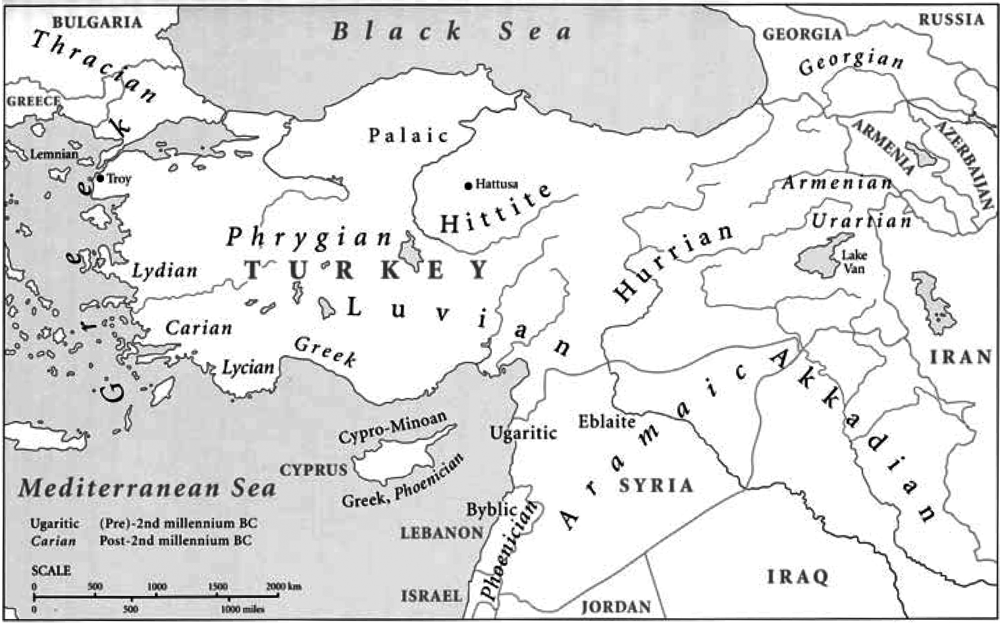
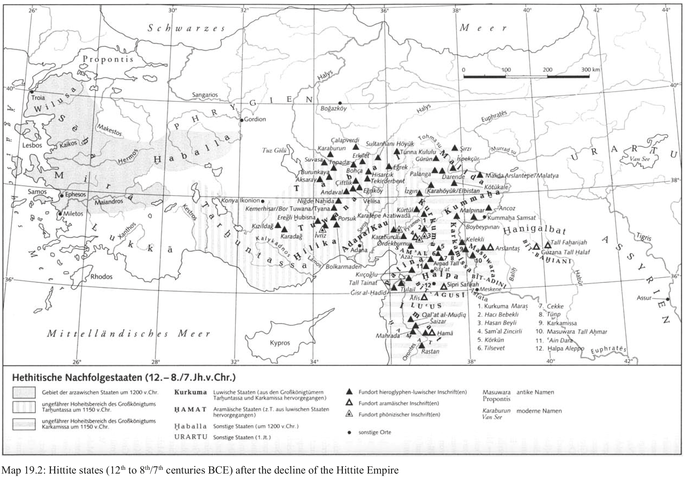
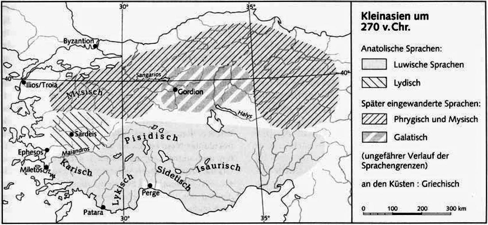

# 19. The documentation of Anatolian

- 1. Preliminary remarks
- 2. Hittite
- 3. Palaic
- 4. Luvian
- 5. Carian
- 6. Lydian
- 7. Sidetic
- 8. Primary text editions and important publication-series
- 9. References

## 1. Preliminary remarks

Anatolian, an extinct language family spoken mainly in the territory of present day Turkey, is the oldest attested subgroup of Indo-European. The languages making up Anatolian are a) Hittite, b) Palaic, c) Luvian with its dialects (Cuneiform and Hieroglyphic Luvian, Pisidian, Lycian, Milyan), d) Carian, e) Lydian, and f) Sidetic.

The attestation of Anatolian covers approximately eighteen centuries, beginning around 1650 BCE and ending in around the 2ⁿᵈ century CE; Luvian personal names are attested in Insauria until the fifth century CE, Luvian topographical names up until the present day (Konya < Gr. Ἰκόνιον < Luv. *Ikkuwaniya*).

After the decline of the Hittite empire about 1200 BCE, Hittite and Cuneiform Luvian died out, but the other Anatolian languages continued to be attested.

## 2. Hittite

Hittite is the earliest attested Indo-European language in north-central Anatolia, inside the curve of the River Marassantas (Halys in Greece and Kızılırmak in Turkey). The Hittites designated their own language as *nesili-*, *nesumnili-* ‘Nesite; in the language of (the inhabitants of) Nesa’. Nesa, later Kanes, is located in the vicinity of the Turkish village Kültepe (near Kayseri), where the Assyrians once had a merchant colony named Kārum Kaneš; it is in the Old Assyrian contracts attested in this colony that the first few Hittite words appear. The Hittites regarded this city as their original home, from where the oldest attested king, Anitta (18ᵗʰ/17ᵗʰ centuries BCE), began to conquer the surrounding city states and to lay the foundations for the Old Hittite Kingdom, finally established under Hattusili I and his son Mursili I, whose later capital was Hattusa (Boğazkale, Turkey); and from this time forward, ending with the destruction of the Hittite Empire at about 1200 BCE, one finds a continuous and extensive attestation of Hittite.

We can distinguish three linguistic stages of the Hittite language: Old Hittite (17ᵗʰ or early 16ᵗʰ centuries BCE−ca. 1500 BCE), Middle Hittite (ca. 1500−1375 BCE) and Neo-Hittite (ca. 1375−1200 BCE), cf. Watkins 2004: 351. The datings of the beginning of the documentation of Hittite are directly connected with the chronological tables of the Hittite kings; these timetables depend on timetables of Assyrian and Babylonian kings and allow so-called long, middle, and short chronologies to be established. According to the short chronology, some date the beginning of the Old Hittite period at 1580/1570 BCE (cf. Oettinger 1999; Luraghi 1998: 170); according to the middle chronology, the beginning is dated at 1650 BCE (Luraghi 1998: 170). The long chronology, which dates the beginning of the Old Hittite period to the last decade of the 18ᵗʰ century BCE, is generally considered unlikely or even impossible.

Hittite texts were written by professional scribes on clay tablets, which were air-dried and archived; the tablets found during excavations were preserved by fire disasters. The Hittites used the Mesopotamian cuneiform syllabary of the 2ⁿᵈ millennium, running generally left-to-right, which they adapted to the essentials of their own language. The writing system was probably borrowed in the 17ᵗʰ century BCE, at the beginning of the Old Hittite Kingdom, in Northern Syria from an Akkadian scribal school. The signs used can be classified as logograms (standing for words), some of which were also employed in a specialized usage as determinatives, and as syllabograms with at least the structures of Vowel + Consonant, Consonant + Vowel, and Consonant + Vowel + Consonant. The first understandings of Hittite texts were supported by these special characteristics of this writing system, especially the frequent use of a number of logograms from Sumerian (called Sumerograms) and various Akkadian words (written syllabically, called Akkadograms).

The texts found in the archives of the royal palace and of the temples in Hattusa show varying contents, but the majority of the texts can be assigned to the religious and ritualistic sphere. Laroche (1971) arranged the Hittite texts according to subject matter: historical texts (annals, reports and self-portrayals of kings), administrative texts (instructions for officials, reports about royal donations, library catalogues), law codes, scientific texts (e.g. Sumerian-Akkadian-Hittite vocabularies) and translations (e.g. the Hurrian-Hittite bilingual, a literary text, found between 1980 and 1986), mythological texts, contracts, texts in foreign languages (Luvian, Palaic, Hattic, Hurrian) and the great bulk of religious and ritualistic texts (descriptions of rituals, oracles, astrological texts, and many descriptions of festivals).

## 3. Palaic

Palaic is the language of the land of Palā in the north and northwest of the Hittite core area across the Halys River (Kızılırmak, Turkey). The name is derived from Hitt. *palaumnili-* ‘in Palaic language’. Palā is mentioned in Old Hittite law codes (ca. 17ᵗʰ/ 16ᵗʰ centuries BCE) as one of the three parts of the Hittite state together with Luviya and Hatti. After the depredation of Palā by the Kaskean people, Palaic died out no later than the 13ᵗʰ century BCE. Its main attestation in Hittite texts dates from the 16ᵗʰ to the 15ᵗʰ century BCE (Starke 1996: 661).

Palaic seems to represent an independent branch among the Anatolian languages, although it shows characteristics of both Hittite and Luvian (e.g. the genitive singular with suffix -*as* as in Hittite or with the adjectival suffix *-ssa-* as in Luvian) with a closer connection to Luvian, justifying the establishment of a Palaic-Luvian protolanguage (Oettinger 1978). Palaic shows a slightly different phonological system, preserving a phoneme /f/ in Hattic loanwords and showing a development of Indo-European */kʷ/ to /ʕʷ/ as in Pal. *ahu-* ‘drink’ (cf. Melchert 2004e: 586).

Palaic texts were written on clay tablets by Hittite professional scribes using the same version of the cuneiform syllabary as they did for Hittite, with the exception of special signs for the phoneme /f/.

Palaic is preserved only in Hittite texts in liturgical usage, especially with regard to the Hattic god Zaparfa/Ziparfa, and is always embedded in a Hittite context. As of today only 12 texts (fragments) are known (CTH 750−754), the most interesting being CTH 751 (“formule des pains”) and 752 (“mythos”), according to Carruba (1970).

## 4. Luvian

Luvian, whose name is derived from Hitt. *luwili-* ‘in Luvian language’, was spoken over large areas of (north)western, south central and southeastern Anatolia as well as northern Syria and is therefore the most widely spoken member of the Anatolian family. Luvian. In the Old Hittite law codes, the Luvian-speaking areas were called *Luvia*. Because of its wide distribution, we can assume that Luvian was the “popular language” in the Hittite Empire. Luvianisms and Luvian loanwords are found in Hittite texts from the Old Hittite period on. The influence of Luvian on Hittite increased in the period of the Late Empire, so the suggestion has been made that by this time Luvian was the spoken language in Hattusa as well, with Hittite preserved only as a written “chancellery” language (cf. Melchert 2003: 11−14, 2004b: 576 f.). It is indisputable that the Hittite kings never used the cuneiform script for inscriptions or monumental purposes but employed instead Anatolian Hieroglyphs, and the language of these inscriptions was Luvian.

Luvian is attested in dialects employing different scripts: Cuneiform Luvian employed the Hittite cuneiform script and Hieroglyphic Luvian used a special indigenous hieroglyphic writing system (Hawkins 2003); Pisidian, Lycian, and Milyan used alphabetic scripts.

The period of attestation of Luvian (including all Luvian languages) is a very long one: if we include Luvian names in foreign texts, it extends from the 18ᵗʰ century BCE to the 5ᵗʰ/6ᵗʰ century CE, a duration (with interruptions) of almost 2300 years (Starke 1999a: 528).

### 4.1. Cuneiform Luvian

The first attestation of Cuneiform Luvian (CLuvian) − only names − occurs in Old Assyrian texts from Kanes/Kültepe. Beginning with the 16ᵗʰ century BCE numerous CLuvian substantives and verbs occur in Hittite texts as loanwords; but later an independent CLuvian is attested.

CLuvian texts were written by Hittite professional scribes on clay tablets using the same version of cuneiform script as already adapted for Hittite.

Beside two fragments of letters, CLuvian texts are embedded in Hittite *Festbeschreibungen* and purification rituals as magic conjuration spells or ritual chants dating from the 16ᵗʰ−15ᵗʰ century BCE, with copies from the 14ᵗʰ−13ᵗʰ century BCE (Starke 1985).

All texts containing CLuvian passages have been found in the Hittite capital Hattusa.

### 4.2. Hieroglyphic Luvian

Hieroglyphic Luvian (HLuvian) was written in a special hieroglyphic script invented by the Luvians. The signs used can be classified as logograms (standing for words), some of which were also employed in a specialized usage as determinatives, and as syllabograms (these specific features of the script indicate a close connection to cuneiform writing traditions). The direction of the script was either from left to right or from right to left, but inscriptions of several lines are written boustrophedon, or “as the ox ploughs” (each line in the reverse direction to its predecesor), with horizontal relief rulings serving as line-dividers. Individual words were written vertically in the line in one or more columns (Hawkins 2003: 155 ff.). The direction of writing is easy to determine with the help of the non-symmetrical signs, which always face the beginning of the line (Payne 2004: 5).

HLuvian is attested by about 260 inscriptions spread over the whole of the Hittite empire. The first attestation of these hieroglyphs are found on Hittite personal seals dating from the 15ᵗʰ and 14ᵗʰ centuries BCE. About 40 inscriptions are from the 13ᵗʰ century BCE. Particularly important among these, on account of their historical content, are the inscriptions found in Lykaonia (Yalburt, Emirgazi) and in Hattusa (“Südburg”). The vast majority of the inscriptions, about 220, date from the 12ᵗʰ to the 8ᵗʰ/early 7ᵗʰ century BCE, all found in the south and southeast of Asia Minor as well as in northern Syria, all of which are regions of the smaller Hittite states after 1200 BCE. Of great interest are the two bilingual inscriptions (Phoenician-HLuvian) from Karatepe and İvriz (for detailed description and grouping of the HLuvian inscriptions cf. Hawkins 2003: 138−151).

The HLuvian inscriptions are historical and/or autobiographical texts of kings and local sovereigns and the people about them. They deal with military actions, buildings, consecrations, epitaphs, internal affairs, etc.

The HLuvian tradition dies out with the conquest of these smaller Hittite states by the Assyrians at the end of the 8ᵗʰ or rather at the beginning of the 7ᵗʰ century BCE.

### 4.3. Pisidian

Pisidian was spoken in the eastern area of Pisidia (situated in the southwest of Central Anatolia) and is attested by 21 short funeral inscriptions containing only personal names in a rigid syntactic form (nominative, patronymical genitive, dative). Pisidian is assumed to be the successor to HLuvian (Starke 1999a: 529).

According to Starke (loc. cit.), the dialect of Lystra in Lycaonia (1ˢᵗ century CE), called Lycaonian (Λυκαονιστὶ λέγοντες), is closely related to Pisidian.

### 4.4. Lycian

Lycian (or Lycian A) was the language of Lycia, the region of the mountainous peninsula on the southwest coast of Anatolia lying between the Gulf of Fethiye and the Gulf of Antalya. Its texts are written in an alphabetic script running from left to right (except for some inscriptions on coins running right-to-left) derived from a Dorian form of the Greek alphabet (Neumann 1969: 371). The attestation of Lycian starts at the end of the 5ᵗʰ century BCE and ends with the conquest of Lycia by Alexander the Great (about 334/333 BCE).

The Lycian corpus includes about 176 inscriptions on stone − eight of them bilingual (Lycian-Greek), one trilingual (Lycian-Greek-Aramaic) −, about 180 inscriptions on coins (485−360 BCE), short inscriptions on vessels (from 500 BCE), and graffiti. The majority of the inscriptions on stone are sepulchral texts of the local sovereigns and their people, with highly stereotyped content. Very important are two monuments: the inscribed stele of Xanthos, which describes the military exploits and building activities of a local patriarch, and the trilingual stele of Létôon, which records the founding of a cult for the goddess Leto. The longest Lycian inscription (TL 44 from Xanthos) records historical details of the Peloponnesian War (431−404 BCE).

### 4.5. Milyan

Among the texts written in the Lycian alphabet are two (end of TL 44 and TL 55) which represent a distinct dialect known either as Lycian B (vs. ordinary Lycian A) or as Milyan. Because Milyan is more closely related to HLuvian than to Lycian A, the designation “Milyan” is − with regard to the linguistic evidence − better than Lycian B, which suggests a close relation of Milyan to Lycian A.

The Milyan texts are located in the Lycian area; therefore it is impossible to specify the geographical distribution of Milyan.

## 5. Carian

Carian is the language of the land of Caria in the southwest of Anatolia between Lycia and Lydia. It is attested from the 7ᵗʰ to the 3ʳᵈ centuries BCE by more than 200 inscriptions. Older inscriptions, especially tomb inscriptions and graffiti (7ᵗʰ to 5ᵗʰ centuries BCE) − the majority of the known corpus −, were found in Egypt, left there by Carian mercenaries. These inscriptions record only personal names. The younger corpus (4ᵗʰ to 3ʳᵈ centuries BCE), a few dozen very short or fragmentary inscriptions, was found in Caria itself. One Carian-Greek inscription, dated to the 6ᵗʰ century BCE, was found in Athens. A huge step forward in Carian philology and linguistics was occasioned by the discovery of an extensive Carian-Greek inscription at Kaunos in 1996.

Carian is written in an alphabetic script, slightly related to the Greek and perhaps borrowed from a Doric alphabet. The direction of the script is right-to-left in texts from Egypt and left-to-right in those from Caria. The successful decipherment of the Carian script was at last rendered possible in 1997, following the publication of the bilingual from Kaunos (for details cf. Melchert 2004a: 609 f.).

## 6. Lydian

In the 1ˢᵗ millennium BCE, Lydian was spoken in an area called Lydia in Greek on the west coast of Anatolia, northwest of Lycia. In the 2ⁿᵈ millennium BCE, the homeland of the Lydians was perhaps further to the north or northwest from its region of attestation.

The attestation of Lydian in graffiti and on coins starts at the end of the 8ᵗʰ and the beginning of the 7ᵗʰ centuries BCE and extends down to the 3ʳᵈ century BCE. The longer inscriptions on stone are limited to the 5ᵗʰ and 4ᵗʰ centuries BCE and hence are contemporaneous with those in Lycian.

More than 100 Lydian texts are known, but only about 30 of these show more than a few words. The contents of the majority of the inscriptions on stone are sepulchral, but some texts are decrees. Very important for the understanding of Lydian is one short Lydian-Aramaic inscription.

Several inscriptions are metrical, with a stress-based meter and vowel assonance at the end of the line.

Lydian is generally written from right to left in an alphabetical script closely related to or derived from the Greek alphabet; only a few older texts are written from left to right (Nos. 31, 32, 49 and 58), one inscription (No. 30) is also written boustrophedon, according to Gusmani (1964: 21).

## 7. Sidetic

Sidetic was spoken in the south of Anatolia (Pamphylia), in the town Side and its surrounding area from the 5ᵗʰ/4ᵗʰ to the 3ʳᵈ/2ⁿᵈ centuries BCE. The Greek author Arrian reports that the language of Side differed from Greek as well as from other surrounding languages.

Sidetic is written in an alphabetic script from left to right. We have several inscriptions on coins (5ᵗʰ/4ᵗʰ centuries BCE), nine inscriptions (beneath them three Greek-Sidetic bilingual texts), one inscription on a vessel (fragment), and one inscription on a votive tablet (3ʳᵈ/2ⁿᵈ centuries BCE); signs on a scarab can also be Sidetic (Rizza 2005).

Although the attestation of Sidetic is very sparse, it is clear that it is an independent branch of Western Anatolian, different from Luvian (Starke 2001).

## 8. Primary text editions and important publication-series

The Hittite cuneiform texts archived in the museums of Berlin, Istanbul, and Ankara are autographically edited in two main series: *Keilschrifturkunden aus Boghazköy* (KUB), vol. 1−60 (1921−1990; to be continued in *Vorderasiatische Schriftdenkmäler der staatlichen Museen zu Berlin*, with the first volume published 1997 by Liane Jakob-Rost), and *Keilschrifttexte aus Boghazköy* (KBo), vol. 1−61 (1923−2011, to be continued); further publication series are *Ankara Arkeoloji Müzesinde Bulunan Boğazköy Tabletleri* (ABoT), vol. 1−2 (1948−2012, to be continued) and *İstanbul Arkeoloji Müzelerinde bulunan Boğazköy Tabletleri* (IBoT), vol. 1−4 (1944−1988, to be continued).

Many of these volumes are edited in transliteration in *Dresdner Beiträge zur Hethitologie* (DBH). Hittite texts in translation are especially published in the monographic series *Studien zu den Boğazköi-Texten* (StBoT) and *Texte der Hethiter* (THeth). Cuneiform texts recently found by excavations in Turkey are to be published by Turkish scholars; texts from Kuşakli/Sarissa only are edited by Wilhelm (1997).

Cuneiform Luvian texts are published by Starke (1985), the major Hieroglyphic-Luvian texts by Hawkins (2000) and Çambel (1999). Lycian texts are found in the editions of Kalinka (1901) and Neumann (1979), Lydian texts by Gusmani (1964).
