# 22. The syntax of Anatolian: The simple sentence

- 1. Clause structure
- 2. The subject
- 3. Compound predicates
- 4. References

## 1. Clause structure

For reasons of space I limit myself to discussing the syntax of the simple sentence, including clause structure, word order, the coding of the subject relation, and compound verb forms. I leave out of account such topics as the use of cases, possessive constructions, clause conjunction, and subordination. An overview of subordination in Hittite can be found in Hoffner and Melchert (2008: 414−429). On relative clauses in Hittite, see further Held (1957), Justus (1972), and Garrett (1994), which also contains a discussion of relative clauses in Lycian. On complex adverbial subordination, see Zeilfelder (2002). Complement clauses are infrequent in Hittite and only appear in relatively late texts, see Cotticelli-Kurras (1995).

### 1.1. Word order

Two phenomena are characteristic of Anatolian clause structure, i.e. basic OV order and Wackernagel’s Law. The OV character of the Anatolian languages implies that the right sentence boundary is marked, in the vast majority of cases, by the occurrence of a finite verb form. The left sentence boundary, in its turn, is taken by second position, or P2, enclitics, which follow Wackernagel’s Law, and are hosted by the first word (less frequently first constituent) in the sentence. Note that Lycian is exceptional among the Anatolian languages, because its basic word order is VO; accordingly, it will be discussed after the other languages.

Typical Anatolian simple sentences are the following:

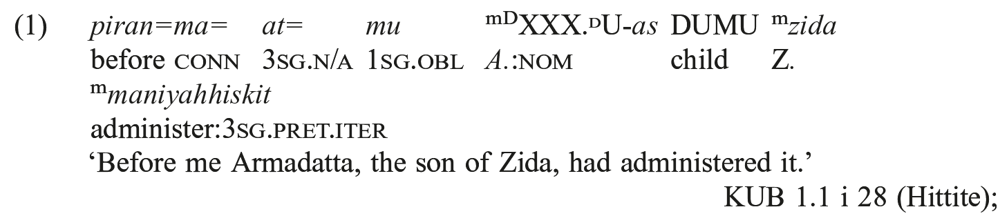

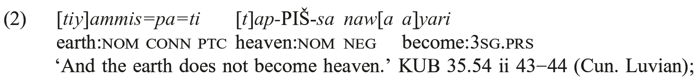

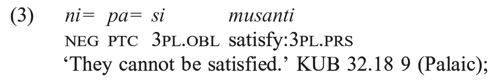

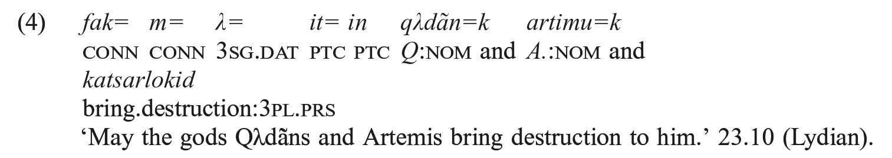

Sentence (4) has the left boundary marked by a connective which hosts second-position enclitics, whereas in the other sentences different types of words are placed in initial position, followed by the enclitics.

Since the subject of an Anatolian sentence can be zero or a Wackernagel enclitic, the verb is the only accented constituent which obligatorily occurs in a sentence. If enclitics occur in a sentence where the verb is the only accented constituent, they are hosted by the verb itself, as in example (5), which contains two verbs in the imperative, asyndetically coordinated, each of which hosts an enclitic particle:

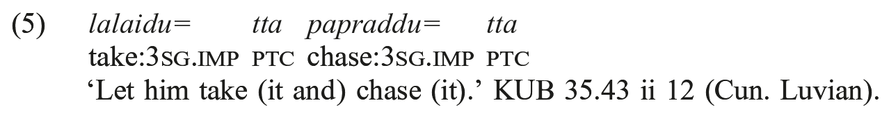

As noted above, Lycian displays a different sentence structure. Examples are:

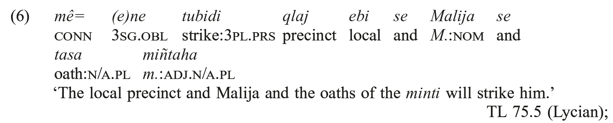

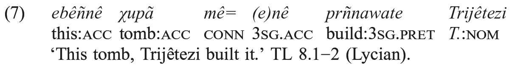

As shown in the examples, Lycian has second-position enclitics like the other Anatolian languages (note that among second-position enclitic pronouns, nominative forms are not attested in Lycian); however, given the high frequency of left dislocated constituents with clitic doubling, the structure of the left sentence boundary ends up looking quite different from that of the other Anatolian languages, as shown in example (7), where the left-dislocated constituent is followed by the particle *me*, cognate to Hittite -*ma-*, which hosts a clitic that is coreferential to the left-dislocated constituent. This pattern is not commonly found in the other Anatolian languages (Garrett, 1994: 38 quotes a few examples from Hittite, which however look quite different). In example (6), the verb precedes all the other constituents of the sentence; the connective and the enclitics still precede the verb in such passages. A few similar examples are available from the other Anatolian languages, as in (8), with the verb following and initial connective, and in (9):

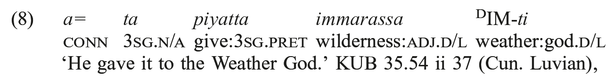

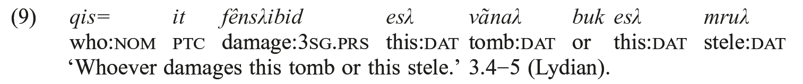

The examples in (6) and (7) seem to point toward a different basic order for Lycian with respect to the SOV order of the other Anatolian languages. However, as noted in Daues (2009), the fact that our knowledge of Lycian relies to such a high extent on tomb inscriptions certainly has a bearing on attested word order patterns.

Basic word order in Lydian is apparently OV, except in poetic texts, which, albeit potentially interesting, are at present too poorly understood to allow speculations based on them.

### 1.2. The left sentence boundary

In the Anatolian languages, P2 enclitics are normally placed after the first accented word or after a prepositive element. Beside Wackernagel’s enclitics, the Anatolian languages also have word enclitics, i.e. enclitics that are attached to a specific word, as possessives, which are inflected adjectives hosted by the head they modify, or focus particles. When one of such enclitics refers to the first word in a sentence, it precedes P2 enclitics. Prepositives are connectives, such as Hittite *nu*, which are possibly proclitic, though they can host enclitics (according to Melchert [1998: 485] “sentence-initial conjunctions and attached clitics are unstressed”). Enclitics of different types occur in second position for two different reasons, connected with their grammatical and discourse status (see Luraghi 1990: 14−15).

a) Sentence particles such as coordinators and connectives, discourse markers, and modal particles, which have the whole sentence as their scope, tend to occur as early as possible in the sentence. Such connectives have placement rules similar to those of prepositives, which occur at the beginning of a sentence: unstressed particles occur after the first accented word in the sentence, this being the leftmost accessible position for items that cannot begin a sentence for accentual reasons. This phenomenon can be seen as due to prosodic inversion (see Halpern [1995: 13−76]);

b) enclitic pronouns, which belong in the VP, in their turn are attracted close to the left sentence boundary for pragmatic reasons. Unstressed pronouns have a low communicative dynamism, since they do not convey new information; they rather refer back to items which have already been introduced in the preceding discourse. Thus, they also fulfill a textual function, connecting sentences with each other, and contributing to the building of discourse continuity.

The basic difference between clitics and particles in a) and clitic pronouns in b) lies in the relation between their structural and their phonological host. The (a) forms are attached phonologically to the whole sentence (i.e. to its border), which is also their structural host; the b) forms, on the contrary, have the VP as their structural host, but they take the sentence border as their phonological host; see further Luraghi (1990: 13−15 and 2013).

P2 clitics occur in slots and each slot can be filled by one clitic only in the relevant set (see also Hoffner and Melchert 2008: 410−411):

(i) Sentence connectives and conjunctions: Hittite *-(y)a-*, coordinator; -*ma-*, -*a-* (according to some, -*ma-* and -*a*- are phonologically conditioned variants of a single particle; see Hoffner and Melchert [2008] for this latter view; in addition, -*ma*- can be postponed in the sentence and occur in a position other than P2, notably with certain subordinating constructions, see Hoffner and Melchert [2008: 396]), adversative particles, *man-* modal particle (which may sometimes co-occur with the connective *-ma-* and which also has an accented variant); Cun. Luv. -*ha-*, -*kuwa-*; Pal. *-(y)a-*, *-pa-*; Hier. Luv. *-ha-*; Lycian *-me-*, *-be-*; Milian *-me-*, *-be-*, *-ke-*; Lydian *-k-*, *-um-*. Not all these particles are always enclitic in all languages: for example, Lycian -*me-*, which corresponds to Hittite -*ma-*, can also be sentence initial (see Melchert 2004: 37−38).

(ii) Hittite and Palaic *-wa(r)-*, Luv. -*wa*-, Lycian and Milian *-(u)we-*, direct speech particles.

(iii) (In Hittite) nominative or accusative of the third person pronoun singular or plural.

(iv) (In Hittite) oblique forms of the first and second person singular and plural or dative of the third person singular or plural. In the plural, dative enclitic pronouns normally precede possible nominative or accusative enclitics in Hittite. Note that, whereas third person nominative and accusative clitic pronouns cannot co-occur with each other, they can co-occur with any dative form, including the third person.

(v) (In Hittite) *-z(a)-*, reflexive particle.

(vi) Hittite -*kan*, *-(a)sta*, *-san*, *-an*, *-(a)pa*, Cun. Luv. -*tta*, *-tar*, Hier. Luv. *-ta*, *-pa*, Pal. -*(n)tta*, *-pi*, Lycian -*te*, *-pi*, *-de*, Milian *-te*, Lydian *-(i)t*, *-in*, so-called local particles.

The order attested for the enclitics in positions (iii) through (v) in Hittite is the inverse of the order that occurs in the other languages, where one finds:

c) Reflexive particle Luv. *ti*, Pal*.-ti*, Lyd. -*s*, *-si*.

d) Oblique forms of first and second person pronouns or dative of third person.

e) Nominative or accusative of third person pronouns.

As already mentioned, clitics in each of the above groups are mutually exclusive. Clitics in slot (i) can appear only if none of the prepositive connectives occurs in the initial position (an exception is -*ma*-, which can co-occur with *nu* when marking alternatives in double questions, see Hoffner and Melchert [2008: 397−398]). Prepositive connectives are: Hittite: *nu*, *ta*, *su* (the latter two connectives in Old Hittite); Luvian: *a-*; Hier. Luvian: *a-*, *nu*; Palaic: *a-*, *nu*; Lycian: *me*, *se* (the latter also used for coordination between NP’s); Lydian: *fak*, *nak*, *ak* (compounded with the enclitic conjunction -*k*).

Obviously, there are some exceptions to these rules, but on the whole they apply consistently throughout the history of Anatolian.

In Hittite, the choice between *nu* and -*ma-* or -*(y)a-* (or prepositive or postpositive *man* in non-assertive clauses) results in two distinct patterns:

a) Sentences with no topicalized or contrasted constituents start with *nu* followed by the enclitics.

b) Other sentences have some accented constituent in initial position, which is separated from the remaining part of the sentence by the enclitics. Since -*ma-* indicates discontinuity in a text or in the course of events, as argued in Luraghi (1990: 50−54), it can occur in cases of topic shift. Its occurrence is also connected to initial verbs (see Luraghi 1990: 52, 96−99; Bauer 2011).

The extension of *nu* as a sentence introducer was probably brought about by the need to extract all enclitics from the sentence, in order to allow for a sentence pattern where no constituents were separated from the others, as argued in Luraghi (1998b). Wackernagel’s enclitics marked the left sentence boundary in such a way that any word or constituent that preceded them was extraposed, thus receiving particular emphasis. When hosted by *nu*, Wackernagel’s enclitics were no longer real second-position clitics. Rather, they were placed at the beginning of the sentence, and the sentence introducer *nu* occurred for prosodic reasons because, being a prepositive, it could start a sentence and host enclitics. As noted above, the prosodic nature of clusters containing *nu* and P2 clitics is unclear, as *nu* is often thought to be proclitic.

In Lydian we find the following order for the enclitics, partly according to Gusmani (1964: 46): a) connective -*k*; b) connective -*m*; c) pronominal dative; d) particle -*t* (also spelled -*it*, *-at*); e) reflexive particle; f) pronominal nominative; g) pronominal accusative; h) particle -*in*. The connectives in slots a) and b) can, and often do, cooccur with each other and with prepositive connectives. The first of the two is the coordinating conjunction, which can also function as a phrasal conjoiner. The function of the particle -*t* is not clear; sometimes it also displays the form -*it*, apparently when it occurs together with the reflexive particle -*s*. The latter is homophonous to the nominative of the third person pronoun. It has been identified relatively recently and it can help to explain a number of the passages where the nominative and accusative of the third person pronoun were formerly taken to co-occur (such co-occurrence is impossible in the other Anatolian languages, see below, 3.1).

### 1.3. Initial verbs

As I have mentioned above, in spite of their basic OV order, the Anatolian languages also allowed for initial verbs in certain contexts. The alternation between final and initial verb can be shown to go back to Indo-European, where it was most likely used with much greater frequency than in Anatolian (see Delbrück 1901: 38−40, 80−83; Dressler 1969; Luraghi 1990: ch. 5, 1995). According to Bauer (2011), initial verbs in Hittite are more frequent in texts which are closer to the spoken language. In Luraghi (1990), I described a number of sentence patterns that allow initial verbs:

a) imperatives or emphatic or contrasted verbs, as in:

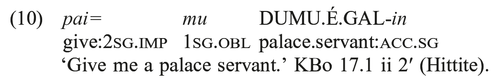

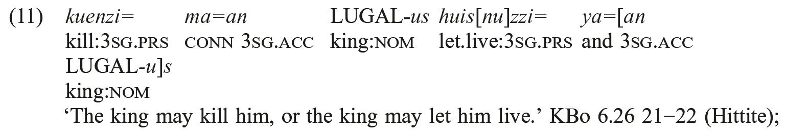

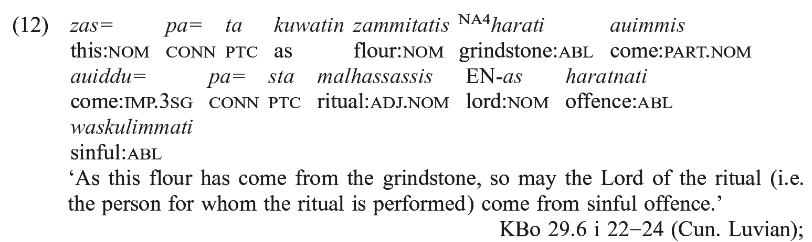

b) verbs that introduce some sort of discontinuity, either at the textual level (as in the case of descriptions or other digressions) or in the course of events (see Luraghi 1990: 97−99), as in (13d, i), in which *harkanzi* and *tarueni* initiate side remarks which interrupt the description of the ritual. In cases such as this, initial verbs are usually associated with the adversative particle -*ma*-, as also noted in Luraghi (1990) and Bauer (2011):

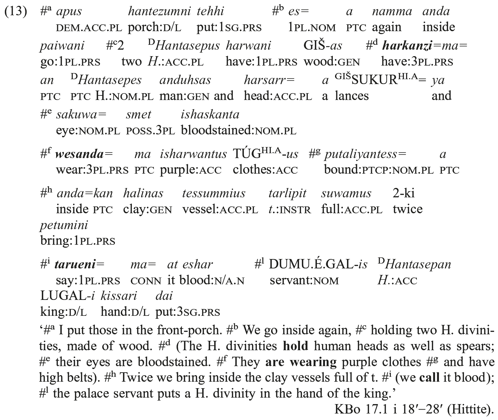

According to Bauer (2011), initial verbs have the effect of indicating narrow focus on the first post-verbal constituent. While this description could fit the sentence in (13f, i) if taken out of context, the wider context shows that initial verbs rather introduce subtopics: in particular, ᴰ*Hantasepes* in (13d) is clearly the topic of the description, rather than a focused constituent, as it does not introduce new information. The new information is contained in the second part of the sentence, which functions as a comment with respect to this sub-topic. This also explains the initial verb in (13f), which concerns the same topic, while in (13i) the topic is a clitic pronoun.

Examples of similar sentence patterns from other Indo-European languages are discussed in Delbrück. Imperatives could be fronted for emphasis, and the VO/OV alternation of the type in b) is typical of narrative texts, where the unemphatic style usually patterns with OV order. See further Luraghi (1995).

### 1.4. The right sentence boundary

With the exception of Lycian, which, as we have seen, has basic VO order, the right boundary of an Anatolian clause is normally marked by the occurrence of a finite verb form. Non-finite subordinated verb forms usually occur immediately before the final finite verb. In Lydian they apparently were placed post-finally:

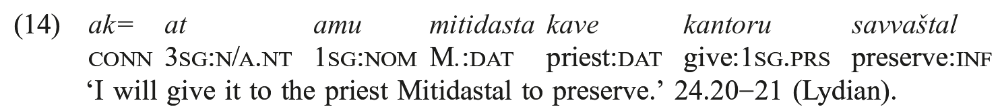

Elements that consistently occur in pre-final position, immediately preceding the final verb, are sentence negations and *ku-* words, which typically indicate focus (see Goedegebuure [1999] on the function of *ku-* words as focus markers in Hittite):

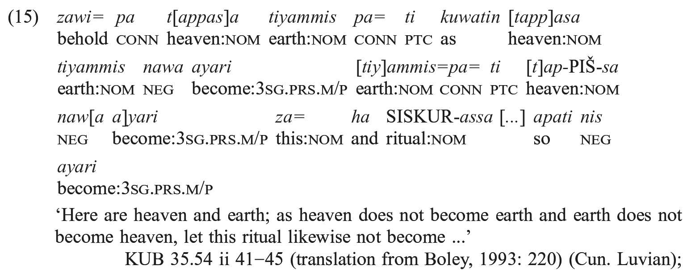

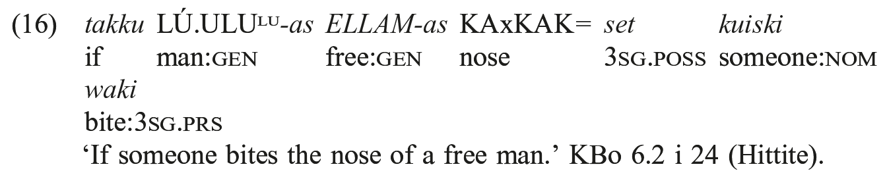

Indefinite pronouns are virtually never fronted; sentence negation is mostly fronted in rhetorical questions, as in (17) (note that here the predicate of the sentence is fronted and the subject is final):

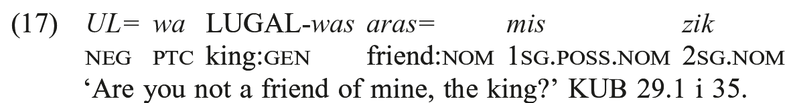

Some focus constituents, especially negations, indefinite pronouns and other *ku-*forms, but sometimes also NPs, can be placed in post-final position even in Anatolian. Zeilfelder (2004) offers an extensive discussion of negations in final position in Hittite, showing connections with verb fronting.

Besides, any type of constituent can be added in post-final position as an afterthought (so-called “amplificatory” constituents), as in (18), where a postverbal subject is appositional to the enclitic pronoun that precedes the verb in the first sentence; in the second, the direct object occurs postverbally (another example is GIŠ*-as* in (13c), a genitive of material which refers to the preverbal direct object):

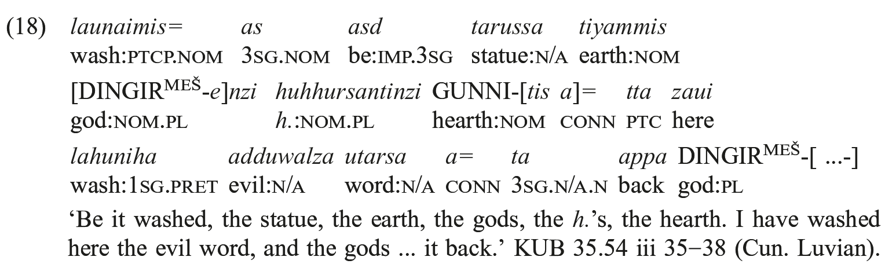

## 2. The subject

### 2.1. Null subjects, subject clitics, nominal sentences

In the Anatolian languages, pro-drop is affected by verbal transitivity. The pattern can be best observed in Hittite, but it is likely to be common Anatolian. Subject clitics are attested in the other Anatolian languages as well, apart from Lycian; whether their use corresponds to what we can see in Hittite is not clear (see Garrett 1990a: 143−145). Null subjects are allowed for all verbs in the first and second person singular or plural; for third person a set of unstressed subject pronouns is available, which are obligatorily used with intransitive verbs, in case there is no overt subject. Transitive verbs, in their turn, can never take an unstressed subject pronoun. Consequently, they take null subjects for third person, too, if there is no overt subject (see Luraghi 1990: 40−43). As shown in Garrett (1990a: 106−107), non-referential third person subjects (such as the subjects of weather verbs) are null with intransitive verbs. Garrett (1990a: 130−133) gives a full list of passages where intransitive verbs occur with null subjects. Beside the Old Hittite examples, that come from all text types, he also gives some Middle Hittite examples, all coming from the same text (a protocol for the royal guard), and some Late Hittite examples from copies of Old Hittite ritual texts. This rule was apparently still in the making in Old Hittite, in which, as shown by Goedegebuure (1999b), motion verbs often occurred without third person clitic subjects; see further Luraghi (2010a).

Hoffner (1969) argues that from the Middle Hittite period onwards the reflexive particle -*z(a*) became increasingly frequent in Hittite in nominal sentences with first and second person subjects, whereas it is never found with third person. Since -*z(a*) was in origin a deictic particle that indicated some particular involvement of the subject in the verbal process, an association with first and second person, which are deictic, rather than with third person, can perhaps have developed. In Old Hittite the particle did not seem to have any particular connection with first and second person. According to Boley (1993), the historical development is more complicated, and even in Late Hittite the situation may not be as straightforward as argued in Hoffner (1969); however, the frequency of the association of -*z(a*) or oblique pronominal clitics with first and second person subjects of nominal sentences remains striking. The connection between the particle -*z(a*) and first and second person subjects of nominal sentences is not clearly attested in the other Anatolian languages. Boley (1993: 220) argues that the particle -*ti*, the equivalent of -*z(a*) in Cuneiform Luvian, never occurs in nominal sentences. In Hieroglyphic Luvian the same particle can, but does not have to, co-occur both with first person subjects, in which case it can alternate with the oblique clitic pronoun, and with third person subjects, see Boley (1993: 223−224).

In Late Hittite, nominal sentences with first or second person subjects either contain the particle -*z(a*) or the appropriate oblique form of the clitic personal pronoun, as shown in:

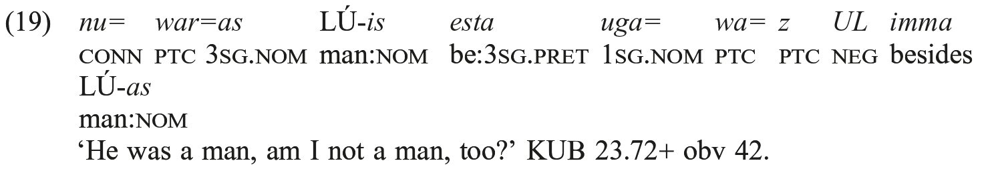

Nominal sentences with third person subject have subject clitics like other intransitive sentences only if there is no overtly expressed subject.

### 2.2. Subject marking

Anatolian has two genders, normally referred to as common and neuter. While virtually all neuter nouns are inanimate, nouns that belong to the common gender can be either animate or inanimate. Neuter nouns can be better described as being inactive, given the constraint that they cannot occur as subjects of action verbs. In order to fulfill this function, neuter nouns can be transposed into the common gender through the gender changing suffix -*ant*-. So for instance we find the word *tuppi*, ‘clay tablet’, neuter, inactive, and *tuppiyanza*, same meaning, common gender, active, as in:

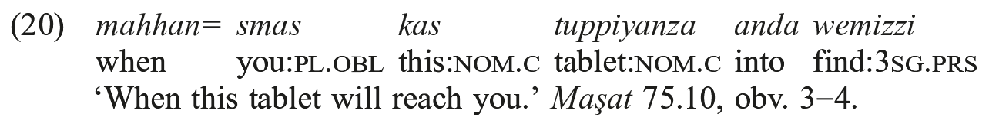

Occasionally, -*ant-* formations are also made from nouns of the common gender, as with *tuzziyanza*, ‘troop’, from *tuzzi-*, same meaning:

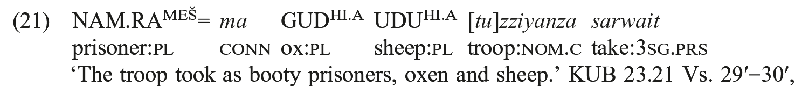

or Cuneiform Luvian *tiyammatis*, ‘earth’, in example (25). Note further that the nominative plural of the -*ant-* derivatives is -*antes*, which can be analyzed as involving the suffix -*ant-* with the ending of the nominative plural common gender. Adjectives and anaphoric pronouns agreeing with *-ant-* derivatives display common gender agreement.

According to the traditional analysis, -*ant-* is a derivational suffix with an ultimate syntactic function (i.e. to allow nouns of the neuter gender to be transposed into another gender class in order to function as subjects of transitive verbs, see e.g. Carruba 1992; Cotticelli and Giorgieri forthcoming; Rizza 2010). The alternative analysis, propounded in Garrett (1990a, b), views -*anza* and -*antes* as inflectional ergative endings (respectively singular and plural) of neuter nouns, which he reconstructs as deriving from a former ablative ending. The problem with this analysis is that instances such as the inflected forms of words such as *utniyanza* ‘population’ (-*ant-* formation from *utne* ‘country’) have to be taken as derived with another -*ant-* suffix (for denominal adjectives). This analysis, which is accepted for example in Hoffner and Melchert (2008) (see further Patri 2008 and Melchert 2011), remains problematic for various reasons (Melchert 2011: 162 admits that a form such as *utniyanza* “may reflect the same suffix *diachronically*”). One is the existence of common gender derivatives in -*ant-*. Scholars who view the “ergative” suffix as an inflectional ending distinguish between two -*ant*-suffixes, the ergative and an “individualizing” derivational suffix; but the distinction between the two sometimes is not so straightforward, as shown by the discussion of the semantics of the suffix in Josephson (2003), which convincingly argues for a unitary treatment of the various instantiations of -*ant*. More problematic, instances such as *tyammantis* in (25), discussed below, derived from a common gender noun, are taken to be inflected in the ergative because of the co-occurrence with the ergative form *tappasantis*, regularly built to a neuter noun. While it is possible that the co-occurrence with an -*ant-* derivative from a neuter noun can have brought about the unexpected derivation also for a common gender noun, such an extension seems very unlikely in the case of an inflectional ending (there are more examples of this type from Hittite, see Garrett 1990a: 48−50). Besides, under this analysis it is not clear what forms such as *tuzzianza* in (21) should be taken to be, since here the noun is derived from a common gender stem, but there are no other forms from neuter nouns that could have attracted it into their inflection (an easy solution of course is to say that the suffix in *tuzzianza* is the “individualizing” suffix).

It can further be remarked that occasionally -*ant-* derivatives can also be the subject of intransitive verbs (on the possible occurrence of -*ant*- derivatives with intransitive verbs see also Rieken 2005), as in:

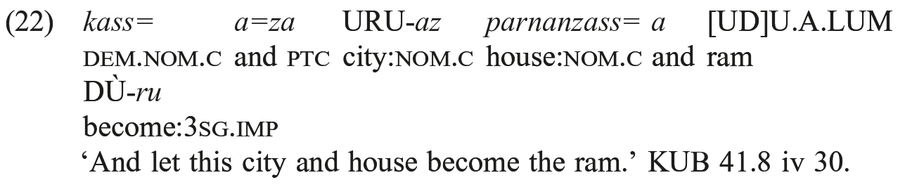

Note that in this example the verb DÙ-*ru*, from the root *kis-* ‘become’ is intransitive and nowhere else does it trigger -*ant-* derivation for neuters. Besides, the form URU-*az* is an -*ant-* derivative from a common gender noun (on this and further examples see Neu 1989).

A possible occurrence of a neuter noun as the subject of an action verb is:

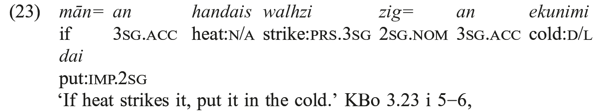

where *handais* is probably a neuter stem (see Rieken 1999: 218; Zeilfelder 2001: 164− 165).

The relative freedom in the use of -*ant-* derivatives in unexpected contexts points toward a derivational, rather than inflectional, nature of the suffix. In the case of neuter subjects, the suffix -*ant-* has taken over a syntactic function. Inasmuch as it fulfils this function, the suffix shows a development that led it to become increasingly intergrated in inflectional morphology, that is, it shows a change from derivation to inflection. Note that such borderline phenomena, involving derivational affixes that fulfill a syntactic function are found elsewhere in Anatolian, notably in the case of “genitival” adjectives, known from Luvian and partly from Lycian and Lydian. In Luvian in particular there is no trace of the genitive case, which is replaced by inflected denominal adjectives (see Neumann 1982; Luraghi 1993 and 2008; and Melchert [2012]), as shown in:

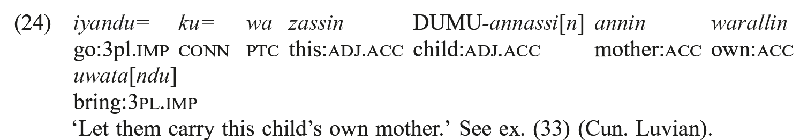

Note that this is the only possibility for expressing an adnominal relation in Cuneiform Luvian, since neither nouns nor pronouns have a genitive ending. In such a case, one can rightly say that derivation is used in the service of syntax, rather than to enrich the lexicon, in a non-prototypical way. In other words, a suffix which was in origin derivational underwent an evolution by which its function eventually became syntactic. Synchronically, the suffix of genitival adjectives permits nouns to take a specific syntactic function, i.e. that of modifiers. The ergative function of the -*ant-* suffix may be seen as involving a similar evolution from derivation to the coding of grammatical relations, and thus from derivation to inflection. The development sketched here is fully compatible with the more detailed study of Goedegebuure (2013), which came to my attention only after the completion of this chapter (see especially pp. 206−209, and the claim that the change from individualizing derivational suffix to inflectional ending took place during the attested history of Hittite).

A suffix with the same function is known from Luvian and from Lycian, although the use of the latter is harder to describe, because the evidence is restricted:

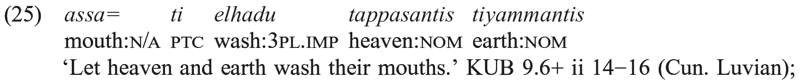

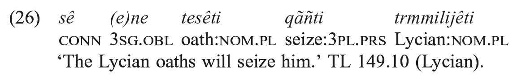

Thus the evidence points toward a common Anatolian origin of -*ant-* derivation for transposing neuter nouns into common gender when they serve as subjects of transitive verbs. Subsequently this suffix evolved into a morpheme that can be synchronically analyzed as a case ending. Concerning possible non-canonical coding of experiencer subjects in Hittite, mentioned in Patri (2007), see the discussion in Luraghi (2010b).

## 3. Compound predicates

### 3.1. Auxiliaries

Hittite has a variety of compound verb forms. Since there is very little evidence from the other Anatolian languages, it is difficult to say if auxiliation of verbs is specific to Hittite, or if it was common Anatolian.

Among Hittite auxiliary verbs, we find the following.

(i) The verb *har(k)-*, ‘to have, to hold’. As an auxiliary, the verb occurs with the participle of another verb inflected in the nominative/accusative neuter. It is mostly attested for transitive verbs, although a few Old Hittite examples contain intransitive verbs. An example is *piyan harta* in:

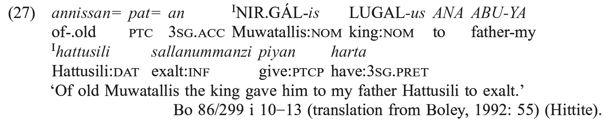

Periphrastic forms with *har(k)-* are sometimes referred to as “perfect”; they have a durative and sometimes resultative meaning.

(ii) The verb *es-*, ‘to be’, can be used as an auxiliary with the participle of a transitive or an intransitive verb that agrees in number and gender with the subject (Cotticelli 1991: 131−155 contains a list of all participles occurring with the verb ‘to be’ in Hittite); it is virtually only found in the past and is often translated as a pluperfect:

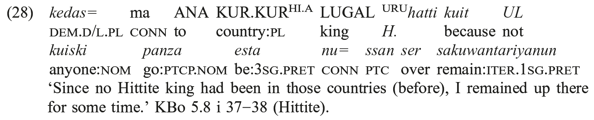

Examples of the verb ‘to be’ with a participle in the preterite are not available from the other languages, possibly owing to the typology of the extant sources, but there are examples with the imperative, as (29) from Palaic:

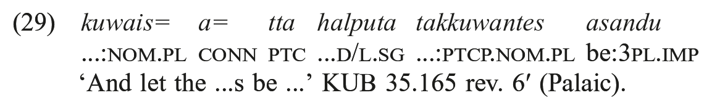

(iii) The verb *dai-*, ‘to put’, occurs in its auxiliary use with the -*uwan-* supine of a verb in the iterative form. This periphrasis has inchoative meaning, and it denotes the beginning of an action or process that has some duration or that is repeated in time:

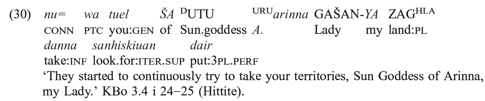

For further discussion of compound predicates, see Luraghi (1998a) with literature and, among more recent works, Dardano (2005) on *har(k)-* and Daues (2007) on inchoative periphrases.

### 3.2. Serialized use of motion verbs

Beside auxiliation, also serialization of verbs is attested in Hittite and possibly Anatolian. It involves the two motion verbs *pai-*, ‘to go’, and *uwa-*, ‘to come’. When serialized, the two verbs do not express their concrete meaning, but rather some type of verbal aspect. Syntactic peculiarities of the serial use of motion verbs are illustrated in the examples below:

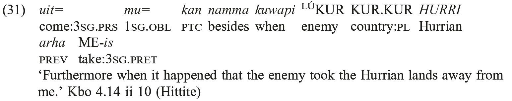

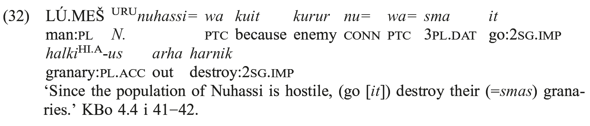

Garrett (1990a: 74) also quotes the following example, from Luvian:

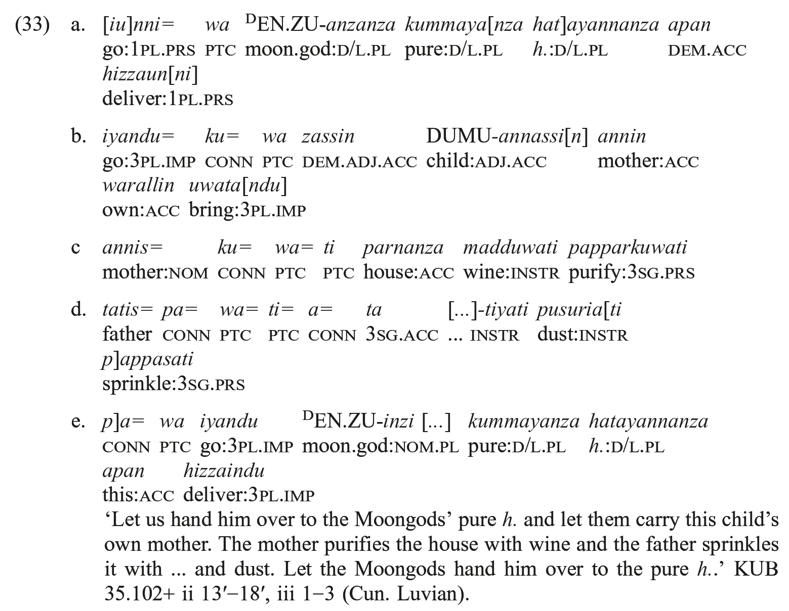

Serialized motion verbs occur together with another inflected verb form, and agree with it in tense and number. They can either occur in initial position, in which case they host P2 clitics as in (31) and (33a, b), or they can be preceded by a sentence connective that hosts P2 clitics, as in (32) and (33e). Besides, serialized motion verbs cannot take a direction or a source expression, as motion verbs normally do in their full lexical use. Pronominal clitics hosted by serialized motion verbs or by a prepositive conjunction that precedes the serialized motion verb in a sentence are syntactic arguments of the second verb. Thus in (31) the first person pronominal clitic *=mu*, which is hosted by the motion verb *uit*, is an argument of the verb *arha* ME-*is* ‘took away’; in (32) the third person plural pronominal clitic =*smas*, which is hosted by the connective *nu* and precedes the motion verb *it*, is an argument of the second verb, *arha harnik* ‘destroy’. This peculiarity in the behavior of clitics is indeed a proof of the fact that motion verbs in such constructions have lost their semantic autonomy: they behave as restructuring verbs, as shown by clitic climbing. This points toward an increasing process of auxiliarization (see further van den Hout 2003, 2010 and Koller 2013).

## Acknowledgment

I thank Paola Cotticelli and Alfredo Rizza for helpful comments on an earlier version of this chapter.
