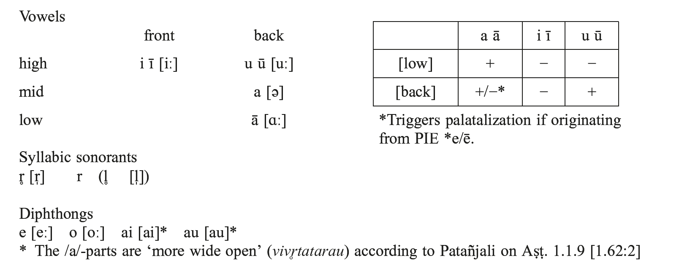
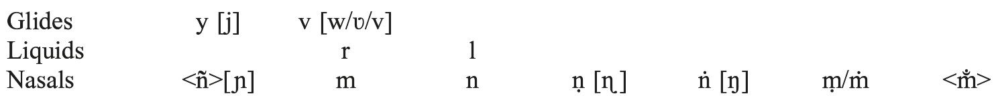
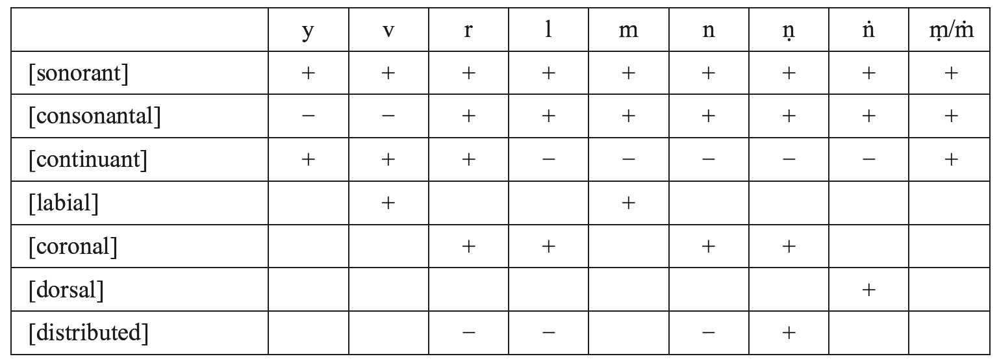
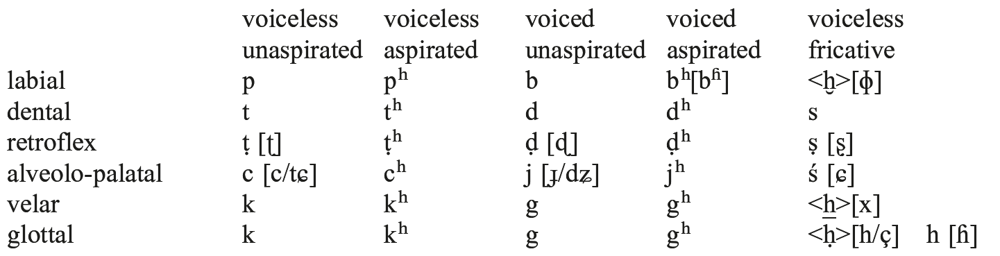
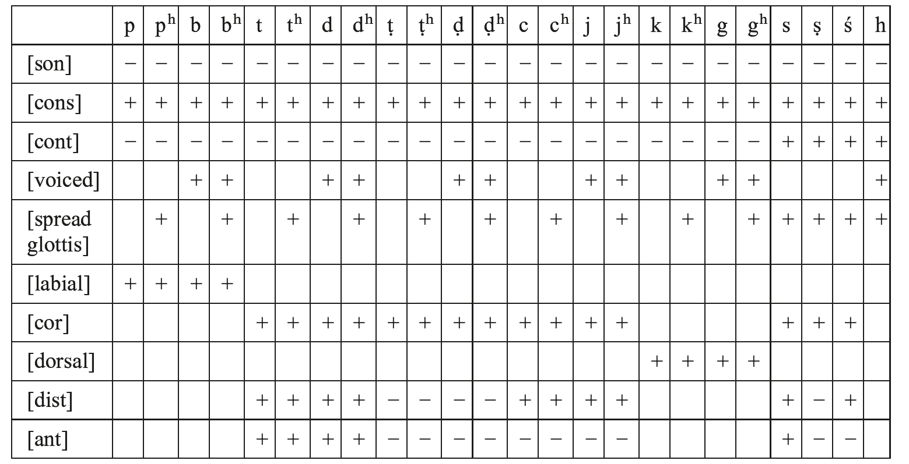

# 26. The phonology of Indic

- 0. Introduction
- 1. Vowels
- 2. Sonorant consonants
- 3. Consonants (obstruents)
- 4. Morphophonology
- 5. Accent
- 6. Syllable
- 7. Abbreviations and symbols
- 8. References

## 0. Introduction

Old Indic (Old Indo-Aryan) covers a vast span of time, possibly over a millennium, from the divergence of Indic from Proto-Indo-Iranian up to the emergence of Middle Indic. While Old Indic is best represented by Sanskrit of the Vedic Saṁhitās, especially the R̥gveda, their existing texts have been orthoepically normalized by later redactors, and phonetic and phonological details of their language are explained in even later sources such as Pāṇini’s grammar Aṣṭādhyāyī and phonetic guides called the Prātiśākhyas. This article describes the phonology of the extant Vedic texts, primarily the R̥gveda, referring to those native grammatical works, and also discusses putative pronunciation and prehistory where it is philologically reconstructible.

## 1. Vowels

### 1.1. Simple vowels

Old Indic has three simple vowels /a, i, u/, each with long counterparts /ā, ī, ū/, and two syllabic liquids /r̥/ and /l̥/ (the circle underneath marks syllabicity). As /l̥/ occurs only in one lexeme (1.2) and does not contrast phonemically with /r̥/, there is no strong basis for considering it an independent phoneme. High vowels /i/ and /u/ alternate with the glides /y/ and /v/ just as /r̥/ and /l̥/ do with the liquids /r/ and /l/, e.g. *ví*- m. ‘bird’ vs. *váyaḥ* nom.pl., *kr̥*‘do’ vs. *ákaram* aor.act.1sg., so they can also be viewed as syllabic counterparts of glides (/y̥/ and /v̥/) respectively, distinct from /a/ which alternates only with /ā/ or zero. Since /a/ and /ā/ are the only simple vowels that do not alternate with sonorant consonants, they stand apart from the other vowels.

According to the R̥gveda-Prātiśākhya, /r̥/ is pronounced as an /r/ accompanied by extra-short /a/ on both sides of it (R̥Pr. 13.34). Long vowels are double-length counterparts of the short vowels (ŚCĀ 1.2.21), except that short /a/ is taught to be phonetically *saṁvr̥ta* ‘closed’ (presumably a mid vowel like [ə]) and is different in quality from /ā/ which is *vivr̥ta* ‘wide open’ (like [ɑː/aː]).

Tab. 26.1: Old Indic vowels and syllabic sonorants and diphthongs

Although not phonemic, triple-length vowels (*pluta*) written /a3/ etc. occur in certain discourse contexts such as the end of yes-no and alternative questions (Strunk 1983: 41 ff.), addressing from afar etc., or in certain ritual utterances such as *o3m* or *śrau3ṣat* (Aṣṭādhyāyī 8.2.82−108).

### 1.2. Origin of simple vowels

/a/ goes back to PIIr. *a < PIE *e and *a as well as PIE *o when not lengthened by Brugmann’s Law (see below, this section) and from the PIE syllabic sonorants *m̥ and *n̥ when they occur between consonants other than laryngeals or between consonants and word boundaries**,** as in Skt. *dáśa* ‘ten’, Av. *dasa* from PIE *dék̑m̥, *apád-* ‘footless’ from PIE *n̥-pód-, **tatá-* ‘extended’ from PIE *****tn̥-tó-.

/i/ goes back to PIE *i, PIE laryngeal between consonants or in pausa after a consonant (*H /C_{C, #}) as in *pitár*- m. ‘father’ < PIE *ph₂tér**-** and most likely *jáni*- ‘woman’ (cf. instr. pl. *jánibʰiḥ*) < PIE *gʷénh₂-, or results from PIIr. *r̥as part of the law *r̥> *ir*/_HV as in *tirás* ‘through’ from PIE *tr̥h₂ós (Lubotsky, The Phonology of Indo-Iranian, this handbook, 6.3).

/u/ goes back to PIE *u, and results from PIE *r̥> *ur*/_HV after a [+labial] consonant of PIE such as *guru* ‘heavy’ < PIE *gʷr̥h2ú-, or PIIr. *r̥> *ur* /_s# as in *pitúr* abl.-gen.sg. of *pitár*-/*pitŕ̥* - m. ‘father’ from PIIr. *pitŕ̥-s, or *dadʰúr* perf.act.3pl. of *dʰā* ‘put’ from PIIr. *da-dʰH-ŕ̥s.

/r̥/ is the usual outcome from PIE *r̥ and *l̥ (via PIIr. *r̥~ [*l̥]?) with /l̥/ occurring only in the zero grade of the verbal root *kalp*/*kl̥p* ‘fit, be arranged’ such as in *cā-kl̥p-ré* perf.mid.3pl. *ri* instead of *r̥*resulted from medial sequences of PIIr. *r̥ and *i̯, e. g. *mriya*pres.stem of *mar*/*mr̥*‘die’ < PIIr. *mr̥-i̯a-.

/ā/ comes from PIIr. *ā < PIE *ē, *ō, PIIr. *aH/_{C, #} (final -VH is shortened before a vowel, see Kuiper 197: 318 f.), PIE *o in non-final open syllables such as Skt. *cá-kār-a* perf.act.3sg. of *kar*/*kr̥*‘do’ < PIE *kʷé-kʷor-e (Brugmann’s Law; see Lubotsky, The Phonology of Indo-Iranian, this handbook, 2.2.2), and from the sandhi of -*ar*/_ *r-* (2.1). It also comes from contraction of two /ā˘/’s, e.g. *pā´nti* < *paHánti pres.act.3pl. of *pā* ‘protect’.

/ī/ comes primarily from PIE *iH/_{C, #}, as in *prītá*- ‘pleased’, from PIE *r̥H, *l̥H/_C > *īr*, as in *kīrtí*- f. ‘fame’, from contraction or coalescence of *i(H)i as in *ījé* perf.mid.1/3sg. of *yaj***/***ij* ‘worship’, and from the sandhi of -*iḥ* > *ī*/_ *r-* (2.1).

/ū/ comes from PIE *uH/_{C, #}, as in *bʰū´mi*- f. ‘earth’, from PIE *r̥H, *l̥H > *ūr*/_C, typically in a labial context as in *pūrṇá*- adj. ‘full’ < PIE *pl̥h₁-nó-, from contraction or coalescence of *u(H)u as in *ūcúḥ* perf.act.3pl. of *vac* ‘speak’, and from the sandhi of -*uḥ > ū*/_ *r-* (2.1).

/r̥̄/ is an analogically lengthened counterpart of /r̥/ found in plural accusative and genitive forms of *r̥*-stems, e.g. ***svás*j*r̄ ḥ***, acc.pl. of *svásr̥*- f. ‘sister’, or *pitr̥̄ ṇā´m*, gen.pl. of *pitŕ̥* - m. ‘father’. Cf. also the metrically heavy /r̥/ as in R̥V *mr̥ḷáta* ‘be merciful’ (3.3c).

### 1.3. “Complex” vowels, diphthongs, and their origins

/e/ [eː] and /o/ [oː] from PIE *ei̯/*oi̯ and *eu̯/*ou̯ had become long monophthongs by the time of the native grammarians, although they treat them as *sandhy-akṣara* ‘composite syllables’ and were aware of their diphthongal origin (Deshpande 1997: 162 f.). That /e/ and /o/ were diphthongs up to some time in pre-Vedic Old Indic is supported by the Mitanni Indic form *a-i-ka*- [aika] ‘one’ in Kikkuli’s Hittite document on horse training instead of *éka*- in Sanskrit. In Indic documents as well, /e/ and /o/ are pronounced **[ai̯]** and [ai̯] in ritual formulae (Hoffmann 1975−1976: 552 ff.). Even in synchronic alternation, they are pronounced as diphthongs in pluti lengthening ([aːi] and [aːu], Aṣṭ. 8.2.107), sandhi such as *manyo* C- vs. *manyav* V- (4.2.[g]), and vowel gradation such as *manyú*- m. ‘fury’: *manyáv-e* dat.sg.

The diphthongs /ai/ and /au/ originate from PIE *ēi̯/*ōi̯ and *ēu̯/*ōu̯, which are the lengthened-grade alternants of PIE *i and *u, and from vr̥ddhi-formation (4.1). Although they are reconstructed as PIIr. *āi̯ and *āu̯ with long *ā, they are pronounced in Sanskrit with short /a/ according to the native grammarians ([aiː] and [auː] in pluti, Aṣṭ. 8.2.106), and traces of pronunciation with *ā are found only in sandhi, e.g. *devā´v aśvínā* for /deváu aśvínā/. /ai/ and /au/ also come from some combinations of /a/ + /i, u/ such as augment *á*- + stems beginning with /i/ and /u/, where originally a root-initial laryngeal blocked coalescence, e.g. *ainot* impf.act.3sg. of *ay*/*i* ‘impel’, *aubʰnāt* impf.act.3sg. of *vabʰ*/*ubʰ* ‘confine’.

### 1.4. Other vowel-related phenomena

a) Sequence of vowels (diaeresis): A sequence of vowels within a word is very rare in the current Vedic texts: among very few such cases are *títaü*- n. ‘sieve’ and *práüga*- n. ‘the front part of the drawbar of a cart’. However, there must originally have been many more vowel sequences within or between words, such as R̥V /váreniam/, /práti agníḥ/, /devó anayat/, which are orthoepically normalized as *váreṇyam*, *práty agníḥ*, *devò ’nayat* respectively in the existing recension. In a few words, original /ayi/ is also monophthongized to /e/ by redactors, as in trisyllabic *śréṣṭʰa*- /śráy-iṣṭʰa-/ ‘most beautiful’ (see below).

b) Apparent diphthongs and long vowels: In the case of *śréṣṭʰa*-, /é/ is metrically scanned as disyllabic /áyi/, in a quarter of its occurrences in the R̥gveda, but they are all normalized to *śréṣṭʰa*- (Lubotsky 1995: 217). There are many similar words or morphemes with coalesced vowel sequences in the existing recension of the R̥gveda, e.g. *tredʰā´* ‘threefold’ to be read [trayidʰā´], *pā´nti* pres.act.3pl. of *pā* ‘protect’ to be read [páanti], the genitive plural ending -*ām* as in *apā´m* ‘of waters’ to be read [-áā˘m].

c) Shortening and lengthening of vowels: The study of R̥gvedic meter reveals that /e/ and /o/, which are usually pronounced long in Old Indic, are metrically treated as short when they are followed by /a/ (Oldenberg 1909: 447 ff., cf. Cardona 2003: 113), e.g. R̥V 3.4.2b *mitró agníḥ* − g − − or 3.54.7a *dūréante* − g − −. The /a/ in this context is elided in a later sandhi rule called *abhinihita*. Rhythm-motivated lengthening, such as R̥V *śrudʰī́* for *śrudʰí* aor.ipv.2sg. of *śrav*/*śru* ‘hear’, is observed in the R̥gveda.

d) Epenthesis and loss of vowels: When a syllable followed by /y/ or /v/ would become superheavy, i.e. would end up being more than two morae long (-VCC{y/v} or -V̅ C{y/v}), the vowels /i/ and /u/ are respectively inserted before them (Sievers’ Law; Schindler 1977: 57), e.g. *kártva*- /kártuva-/ adj. ‘to be done’, *kŕ̥tvya*- /kŕ̥tviya-/ adj. ‘capable’. There is some inconsistency in spelling as pairs like *aśviyá*- adj. ‘consisting of horses’ vs. *áśvya*- (usually /áśviya-/) adj. ‘connected with horses’ show (Wackernagel 1896: 200 ff.), so the original pronunciation can be reliably restored only from Vedic meter. There are morphemes exempt from this rule such as the future suffix -*sya*-. Another common type of epenthesis is the insertion of /i/ not originating from *H, added for example to perfect stems ending in a heavy syllable before endings beginning with a consonant, such as *vad* ‘speak’, *ūd-i-ma* perf.act.1pl. Syncope of high vowels such as *kr̥ṇvaḥ* for /kr̥-ṇu-vas/ pres.act.1du. of *kar*/*kr̥*‘do’ occasionally occurs, and there are a few suspected cases of aphaeresis, e.g. monosyllabic *iva* ‘like, as’ in the R̥gveda, or R̥V *śmasi ~ uśmási* pres.act.1pl. of *vaś*/*uś* ‘want’.

## 2. Sonorant consonants

### 2.1. Phonemes

Old Indic has nine sonorant consonants: the glides /y/ and /v/, the liquids /r/ and /l/, and the nasals /m/, /n/, /ṇ/ [ɳ], /ṅ/ [ŋ], and <ñ> [ɲ] (see below).

Tab. 26.2: Old Indic sonorant consonants

/y/ and /v/ are glides, and pattern as non-nucleus alternants of /i/ and /u/ in sandhi and vowel gradation. In later Sanskrit, they gradually came to be pronounced as an alveolo-palatal stop and a labiodental fricative in certain contexts (Vāj.Pr. 1.81 and TPr. 2.43; Varma 1929: 126 ff.).

According to some Prātiśākhyas, /l/ is pronounced at the teeth (*dantya*) or the root of the teeth (*danta-mūlīya*), and /r/ at the root of the teeth (*danta-mūlīya*) or the alveolar ridge (*barsvya*), although the exact manner of articulation is not clear. The two liquids show a slightly different distributional pattern in Indic. While /l/ occurs in gemination both within and across words (*kṣullaká*- adj. ‘small’, *tiṣṭʰel lambeta* < /tiṣṭʰet/), Old Indic /r/ is never geminated and a sequence of two /r/’s across morphemes or words is avoided, e.g. *prātā´ rátʰena* < /prātár rátʰena/ or TS *nī-rohá*- ‘descender’ < /nir-rohá-/. Besides being subject to gemination, /l/ blocks spreading of retroflexion from /r/ or /ṣ/ to /n/ as coronal stops do, so Old Indic /l/ patterns as a non-continuant while /r/ is a continuant. /r/ becomes visarga *ḥ* in absolute final position and becomes indistinct from /s/ in surface forms (4.3[e]).

/n/ changes to /ṇ/ when immediately followed by a retroflex stop. Non-final /n/ also becomes /ṇ/ when it is not immediately followed by a dental stop and is preceded by /r/, /r̥/, /r̥̄/ or /ṣ/, even if vowels and consonants other than coronal non-continuants (dental, retroflex, alveolo-palatal stops and /l/) and fricatives intervene. This occurs usually within the same word, e.g. *r̥gʰāyámāṇam* < /r̥gʰāyámānam/, *coṣkūyámāṇaḥ* < /coṣkūyámānaḥ/, but across boundaries of some closely connected words as well, e.g. R̥V *prá ṇayanti*. Unlike the retroflexion of /s/ to /ṣ/ which is local assimilation, the latter is an autosegmental spreading of the distinctive feature [−anterior] which anchors on the tier of coronal non-continuants (Kobayashi 2004: 154), so it is blocked when another coronal non-continuant intervenes. While /ṇ/ is an allophonic variant of /n/ in most cases, /ṇ/ also occurs without a clear conditioning context, as in *aṇu*- adj. ‘minute’ vs. *ánu* preverb ‘after’, so it needs to be posited as an independent phoneme (Emeneau 1946: 89).

<ñ> is an allophone of /n/ before an alveolo-palatal stop. So is /ṅ/ before a velar stop in most cases, but a few stems ending in an alveolo-palatal obstruent take an inserted nasal before it, and there are words that end in *ṅ* by assimilation and final sandhi (4.4[h]), e.g. *prā´ṅ* nom.sg. of *prā´ñc*- adj. ‘turned forward’, *yúṅ* nom.sg. of *yúj*- m. ‘yoke fellow’, *īdŕ̥ṅ* nom.sg. of *īdŕ̥ś*- adj. ‘such’.

### 2.2. Origin

/y/ and /v/ are inherited from PIIr.=PIE *i̯ and *u̯, respectively. They also occur as offglides of *i and *u, especially where a PIE laryngeal after them is lost, e.g. *yúvan*adj. ‘young’ < *h₂i̯u-Hen-.

Indic /r/ and /l/ are of disputed origin. Since Old Iranian has no /l/ documented, and since /r/ is 90 times more common than /l/ in the R̥gveda, some scholars consider that PIE *l and *r have merged to *r in Proto-Indo-Iranian (Bartholomae 1895−1901: 23). However, their less disproportionate distribution in later Vedic Saṁhitās, and the possible Proto-Indo-European origins of some of Indic (and later Iranian) words with /l/ such as Skt. *leh*/*lih* ‘lick’, Persian *lištan* and Kurdish *listin* ‘id.’, make us suspect that *l merged with *r only in Vedic dialects, especially in the dialect of the R̥gveda, while it remained distinct from *r in other, undocumented dialects of Old Indic.

/n/ comes from PIE *n, or from *n̥ followed by a sonorant consonant, e.g. *ta-tanvás*- < *-tn̥-u̯- pf.act.ppl. of *tan* ‘stretch’, and from *m̥ followed by a labial sonorant consonant as well, e.g. *ja-gan-vás-* < *-gm̥-u̯- ~ *ja-gm-úṣ*- < *-mu- pf.act.ppl. of *gam* ‘go’.

/m/ comes from PIE *m, or from *m̥ followed by a non-labial sonorant consonant, e.g. Skt. *gam-yā´t* aor.opt.act.3sg., YAv. *jamiiāt̰* < PIE *gwm**j** -i̯ḗt (with analogical *j*).

## 3. Consonants (obstruents)

### 3.1. Phonemes

Old Indic has voiceless/voiced and aspirated/unaspirated stops at five places of articulation, namely velar, alveolo-palatal, retroflex (= [apical] postalveolar), dental, and labial. Though aspiration is transcribed with *h*, the aspiration of the voiced aspirates is [ɦ] and is different from that of the voiceless aspirates, [h] (TPr. 2.9, 10, Allen 1953: 35).

If we add five nasals to the stops, we get a five-by-five matrix of non-continuants that looks perfectly symmetrical at first sight, but actually there are several gaps in it. <ñ>, and usually /ṅ/ as well, are allophones of /n/ before an alveolo-palatal and velar stop respectively; there is practically no /jʰ/ in early Old Indic, and /cʰ/, /ḍʰ/ and sometimes /ḍ/, are prosodically clusters.

Between vowels and glides, /ḍ/ and /ḍʰ/ are replaced by their allophones /ḷ/ [ɭ] and /ḷʰ/ [ɭɦ] in the existing R̥gveda text (Witzel 1989: 165 ff.).

Old Indic has three voiceless sibilants, alveolo-palatal /ś/ [ɕ], retroflex /ṣ/ [ʂ] and dental /s/, and one voiced glottal fricative h [ɦ]. Besides these phonemes, there are voiceless glottal, velar and bilabial fricatives /*ḥ*, *h*, *ḫ*/ which occur as allophones of /s/ and /r/ (4.4 [i]).

Tab. 26.3: Old Indic obstruents

### 3.2. Proto-Indo-European laryngeals

The three laryngeals in Proto-Indo-European, *h₁, *h₂, and *h₃, have merged to *H, except that *h₂ has left its trace by aspirating a preceding voiceless stop (for voiced stops, see Lubotsky, The Phonology of Indo-Iranian, this volume, 6.2), as in *pr̥tʰú*- adj. ‘broad’, Av. *pərəθu*- < PIE *pl̥th₂ú-. Then *H lost its segmental status in Indic. It lengthened a preceding syllable nucleus, but left no trace if it was between a consonant and a vowel. Between consonants or in pausa after a consonant, it developed to /i/ (1.2).

In the R̥gveda, original laryngeals in the context C_V sometimes make the preceding syllable heavy (long by position) in metrical scansion, e.g. the first syllable of *jána*- m. ‘people’ < PIE *g̑ónh₁o-, so they still had some trace in the days of the R̥gvedic poets (Gippert 1997).

### 3.3. Origins

a) Voiceless unaspirated stops:

/k/ has its origin in PIE *k or *kʷ in a non-palatalizing context, i.e. before a back vowel or a consonant other than *i̯. Even in a palatalizing context, PIE *k or *kʷ might end up as Old Indic /k/ due to paradigmatic leveling, e.g. *cay*/*ci* ‘notice’, *ci-kā´y-a* perf.act.3sg. < *kʷi-kʷoi̯ -e vs. *ci-ky-úr* 3pl. < *kʷi-kʷi̯ -r**j**ś. The cluster *kṣ* can come from PIE *k, *g, *gʰ, *kʷ, *gʷ, *gʷʰ, *, *g̑, *g̑ ʰ + *s through devoicing, deaspiration, and depalatalization, and from the “thorn” cluster *tk̑ etc. as in *ŕ̥kṣa*- m. ‘bear’ < PIE *h₂ŕ̥tk̑o-.

/t/ and /p/ go back to PIE *t and *p respectively. The former also comes from occlusion of /s/ in a few words (4.4[f]).

In early Old Indic, /ṭ/ is in the process of being established as an independent phoneme. It is mostly a conditioned allophone of /t/ when immediately preceded by /ṣ/ within the same word, and also across words in the R̥gveda, e.g. *agníṣ ṭvā* (*agníḥ tvā* in normal sandhi).

/c/ comes from Proto-Indo-Iranian secondary palatal *č, which in turn goes back to PIE *k and *kʷ before a front vocoid, namely *e, *ē, *i or the glide *i̯, e.g. *cakrá*- n. ‘wheel’ < PIIr. *čakra- < PIE *kʷekʷlo-.

b) Voiceless aspirated stops:

/kʰ/, /tʰ/ and /pʰ/ originate from combinations of PIE *k/*kʷ in non-palatalizing contexts, *t and *p plus *h₂, respectively (Kuryłowicz 1935: 46 ff.). A few Old Indic words with voiceless aspirates have cognates with aspirates in other Indo-European languages, e.g. Br.+ *skʰalate* ‘goes astray’ vs. Greek σφάλλω ‘I make fall’, and such voiceless aspirates might have been allophones of unaspirated voiceless stops after initial *s (cf. Klingenschmitt 1982: 168).

As in the case of /ṭ/, /ṭʰ/ was originally an allophone of /tʰ/ after /ṣ/, but there are a few words with lexical /ṭʰ/ already in the R̥gveda, such as *jaṭʰára*- n. ‘womb’.

/cʰ/ comes from PIIr. *sć < PIE *sk̑ (*sk according to Lubotsky 2001), e.g. the suffix -*ccʰa*- as in *gáccʰasi* pres.act.2sg. of *gam* ‘go’ < PIE *gʷm̥-sk̑é-si. Because of its origin as a cluster, this sound is a geminate [ccʰ], except word-initially after a word ending in a long vowel (other than the preverb *ā´* or the prohibitive particle *mā´*) where gemination is optional. Synchronically, /cʰ/ is a stop counterpart of /ś/ (4.4[g]).

c) Voiced unaspirated stops:

/g/ comes from PIE * g or *gʷ in non-palatalizing contexts, and /d/ and /b/ from *d and *b respectively. Few words have inherited /b/, e.g. *bála*- n. ‘power’ < PIE *bélo-, Latin *dē-bilis* ‘weak’.

/ḍ/ comes from PIIr. *žd < PIE *sd after *i, *u and *r/*r̥, that is the context retroflexing *s (‘RUKI’ rule, 3.4.[g]), e.g. R̥V *mr̥ḷáta* −gg pres.ipv.act.2pl. of *mr̥ḍ* ‘be merciful’ < PIIr. *mr̥žd, OAv. *mərəždātā*.

/j/ has two origins, Proto-Indo-Iranian primary palatal *****ȷ´ < PIE *g̑, and Proto-Indo-Iranian secondary palatal *ǰ which goes back to PIE *g or *gʷ followed by a front vocoid. Depending on its origin, it shows different sandhi between morphemes and in word-final position, e.g. *iṣ-ṭá*- vb.adj. of *yaj* ‘worship’ < PIE *Hi̯ag̑, vs. *vik-tá*- vb.adj. of *vej*/*vij* ‘set in motion’ < PIE *u̯ei̯g.

Voiced unaspirated stops also result from deaspiration of PIE *gʰ, *gʷʰ, *dʰ, and *bʰ when another aspirate occurs at the onset of the following syllable (Grassmann’s Law), e.g. *dʰar*/*dʰr̥*‘hold’, *da-dʰr-é* perf.mid.3sg. <*dʰe-dʰr-.

d) Voiced aspirated stops:

/gʰ/ comes from PIE *gʰ or *gʷʰ in non-palatalizing contexts, and /dʰ/ and /bʰ/, respectively, from PIE *dʰ and *bʰ.

/ḍʰ/ comes from PIIr. *ždʰ < PIE *sdʰ after *i, *u or *r̥, e.g. *mīḍʰá*- n. ‘booty, prize’ < PIIr. *miždʰá- < PIE *misdʰó-, cf. Greek μισθός m. ‘wages’.

Since PIIr. *ȷ´ʰ and *ǰʰ lost occlusion and became /h/ in all contexts in Old Indic (see below), Indic /jʰ/ is a sound of secondary origin, occurring only once in the R̥gveda, R̥V 5.52.6 *jájjʰatīḥ* ‘laughing’, a Middle Indic-like variant of *jákṣatī-* < *ǰa-gʰs-a- (Hoffmann 1975−1976: 306).

e) Fricatives:

/s/ comes from PIE *s, and from final /r/ followed by /t/ or /tʰ/.

/ṣ/ is originally an allophone of /s/ in the context of the ‘RUKI’ rule (3.4[f]), namely after /i/, /u/, /r̥/, /r/, or a PIE dorsal stop. There are words with /ṣ/ not conditioned by this rule, e.g. *ṣáṣ*- cardinal ‘six’ or *á-ṣāḷʰa*- adj. ‘invincible’, and it has phonemic status as in the case of /ṭ/, /ṭʰ/ and /ṇ/.

/ś/ comes from PIIr. primary palatal stop *ć < PIE *k̑, e.g. *śayⁱ*/*śī* ‘lie’, *śáy-e* pres.mid.3sg. < PIE *k̑ei̯-, cf. Greek κεῖ-ται.

/h/ is a regular development of PIIr. *ȷ´ʰ and *ǰʰ. It also comes from other voiced aspirated stops by sporadic debuccalization, e.g. *grabʰⁱ*/*gr̥bʰⁱ* ~ *grahⁱ*/*gr̥hⁱ* ‘catch, hold’, *dʰā* ‘put’ ~ *hitá*- vb.adj.

### 3.4. Sound changes

Proto-Indo-Iranian had affricates *ć, *ȷ´, and *ȷ´ʰ, and palatal stops *č, *ǰ, *ǰʰ (Lubotsky, The Phonology of Indo-Iranian, this handbook, 4.3; already affricates according to Lipp 2009: 146). In the sequence of a voiced aspirate and a dental obstruent, the aspiration and voicing of the root-final stop are spread to the dental obstruent to its right, e.g. *vr̥ddʰá*- vb.adj. *vr̥dʰ-tá- of *vardʰ*/ *vr̥dʰ* ‘grow’ (Bartholomae’s Law; Lubotsky, The Phonology of Indo-Iranian, this handbook, 4). Change of PIE *s to *š after a high vowel, *r/*r̥or a dorsal stop (‘RUKI’ rule; Lubotsky, The Phonology of Indo-Iranian, this handbook, 5) continues to be active in Proto-Indo-Iranian and Old Indic, and *i originating from a Proto-Indo-European laryngeal between consonants also triggers it, e.g. in Skt. *śíṣat* aor.inj.act.3sg. of *śās*/*śiṣ* ‘teach’, OAv. *sīšā* aor.ipv. < PIE *k̑Hs-. The following are changes that took place after Proto-Indo-Iranian:

a) The laryngeal *H was lost leaving various traces (see 3.2).

b) PIIr. *ć, *ȷ´, and *ȷ´ʰ were deaffricated and first became fricatives ś, *ź and *źʰ (see Lipp 2009:144 ff. for a different explanation). At this stage, *-źdʰ- < *-źʰ-t- merged with *ždʰ < PIE *sdʰ after *i, *u or *r̥, e.g. *á-rīḍʰa*- vb.adj. ‘unlicked’ < PIIr. *áriźʰ-t-a- vs. *mīḍʰá*- n. ‘booty, prize’ < PIIr. *miždʰá- (3.3[d]).

c) *s or *z between stops, including the Proto-Indo-European “intrusive” *s inserted between two heteromorphemic dental stops, was lost, e.g. *vit-tá*- ‘found’ vs. OAv. *vista*- < PIE *vid-s-tó- > Greek (ἄ-)ιστος ‘(un)seen’, etc. (Mayrhofer 1986: 100). It also applies synchronically to an /s/ trapped between heteromorphemic stops, as in *ut-tʰā* ‘get up’ < /ut-stʰā/. This is one of the sound changes that demarcate Indic from the rest of Indo-European. Underlying this innovation is a preference of Indic to have uninterrupted occlusion of stops across a syllable boundary (6.3).

d) In clusters of three or more obstruents other than stop + /s/ + stop (c), the first consonant tends to be deleted, e.g. *nád-bʰyaḥ* dat.pl. of *nápt*-/ *nápāt*- ‘grandson’ < /nápt-bʰyas/, although the exact condition is hard to formulate (Gotō 2006: 205 ff.).

e) PIIr. *ȷ´ʰ and *ǰʰ, and sporadically other voiced aspirates as well, were debuccalized and became /h/, e.g. *hán-ti* pres.act.3sg. of *han* ‘smite’ < PIIr. *ǰʰán-ti < PIE *gʷʰénti vs. *gʰn-ánti* 3pl. < PIIr. *gʰn-ánti < PIE *gʷʰn-ónt(i), *ihá* ‘here’ vs. Pāli *idʰa*.

f) PIIr. *š, a posterior alternant of *s after a front vowel, *r/*r̥or a palatal/dorsal stop, or the outcome of *ć and *ȷ´ before voiceless dental stops, became retroflex /ṣ/, e.g. *júṣṭa*- ‘enjoyed’ vs. Av. *zuštō* < PIIr. *ȷ´ušta-.

g) Proto-Indo-Iranian or post-Proto-Indo-Iranian voiced sibilants *z, *ź/ž ([ʒ] or [ʑ]) and *źʰ/žʰ were eliminated in the surface representation of Sanskrit. *z, which comes from *s in a voicing context, was lost as in *medʰā´* f. ‘wisdom’ < PIE *mn̥z-dʰeh₁ (cf. Görtzen 1998: 308 ff.). *ź/ž and *źʰ/žʰ became /ṣ/ before a voiceless stop as in *iṣ-ṭá*- vb.adj. of *yaj* ‘worship’ <*/iź-tá-/ < PIIr. *iȷ´-tá-, zero before a voiced stop as in *mīḍʰá*- ‘booty, prize’ < *miždʰá- (3.3[d]), and /r/ as in the word sandhi of final /s/ before a vowel and a voiced consonant, e.g. *sūnúr asi* < /sūnús asi/, *sūnúr jāyate* < /sūnús jāyate/. Some undocumented dialects of Old Indic seem to have preserved voiced sibilants, for original voicing is preserved in Middle Indic forms such as the verbal root meaning ‘flow’, Prakrit *jʰar*, OAv. *γžar* vs. Skt. *kṣar*.

h) /r/, /r̥/, /r̥̄/ and /ṣ/ retroflex a following non-final /n/ in the same word even whenvowels and non-coronal consonants intervene (2.1).

i) In the pre-Vedic stage of Old Indic, voicing and aspiration could presumably spread to /s/, which did not have prespecified values for these features then (Kobayashi 2004: 106 ff.). Forms without the so-called “Aspiration Throwback” like R̥V *dípsa*-, a desiderative stem of *dabʰ* ‘deceive’ (see Grassmann’s Law in 3.3[c]), or R̥V *dakṣi*, a *si*-imperative form of *dah* ‘burn’, are probably relics of this period. Then, by the time of the R̥gveda, /s/ was set as voiceless and phonologically unaspirated, and the aspiration of a root-final stop links to a root-initial stop instead of the following /s/, e.g. Vāj.S *dʰípsa*- and R̥V *dʰákṣi*.

## 4. Morphophonology

### 4.1. Gradation of vowels

While the Proto-Indo-European ablaut system was simplified due to the merger of non-high vowels and disrupted by Brugmann’s Law (1.2) and the lengthening of vowels by the laryngeals already in Proto-Indo-Iranian, Indic still shows vowel gradation of adding /a/ or /ā/ usually before sonorants and high vowels of roots and suffixes, e. g. *yav*/*yu* ‘hold off’, *yu-tá*- vb.adj. (zero grade), *yu-yo-ti* pres.act.3sg. (full grade), *yau-ḥ* aor.inj.act.2sg. (lengthened grade), *yāv-áya-ti* caus.pres.act.3sg. < *i̯ou̯- (full grade, lengthened by Brugmann’s Law). No such morphophonemic alternation occurs between /i/ and /ī/, /u/ and /ū/, or /r̥/ and /r̥̄/, except in secondary (i.e. analogical, rhythmic, etc.) lengthening as in *kaví*- m. ‘poet’: *kavīnā´m* gen.pl., *toj*/*tuj* ‘impel’: *tū-tuj-āna*- perf.ppl.mid. (Aṣṭ. 6.1.7).

Another type of vowel gradation is to attach /a/ and /ā/ after /i/, /u/ and /r̥/ (/i/~/ya/~ /yā/, /u/~/va/~/vā/, /r̥/~/ra/~/rā/). It is found in the inflection of some verbal roots, such as *svap*/*sup* ‘sleep’, *svap-ánt*- pres.ppl.: *sup-tá*- vb.adj. or *tyaj* ‘abandon’, *ti-tyā´j-a* perf.act.3sg, and a few formations such as *vár-īyāṃs*- comparative of *urú*- adj. ‘wide’. To be separated from such morphophonemic gradation is transposition, as in *darś*/*dr̥ś* ‘see’, *dráṣ-ṭum* inf. (AV+) vs. *kar*/*kr̥*‘do’, *kár-tum* inf. (AV+), which is a phonological process to resolve a complex consonant cluster such as *-rṣṭ-.

In addition to the Indo-Iranian (possibly Indo-European) noun derivation by alternating the vowels of the initial syllable as *i~*ai̯, *u~*au̯, and *r̥~*ar, e.g. *gav-*/*gu*- m.f. ‘cow, cattle’: Skt. *gáv-ya*- adj. ‘consisting of cattle’, YAv. *gaoiia*-, Indic has expanded the vr̥ddhi formation, an originally Indo-European way to derive nouns by changing the vowel of the first syllable to the lengthened grade (vr̥ddhi) like /a/ to /ā/, /i,e/ to /ai/, /u,o/ to /au/ and /r̥/ to /ār/ in addition to suffixation, e.g. *bʰiṣáj*- ‘healer’: *bʰáiṣaj-ya*- n. ‘healing’, aside from *bʰeṣaj-á*- adj. ‘healing’, n. ‘medicine’ to which YAv. *baēšaza*- adj. ‘healing’ corresponds (Kuryłowicz 1968: 308 f., Gotō, The Morphology of Indic, this handbook, 1.4).

### 4.2. Sandhi of vowels

When morpheme sandhi (internal sandhi) is different from word sandhi (external sandhi), they are treated separately under [mph.] and [wd.] respectively. Word sandhi also applies between the members of a compound.

a) /-a, -ā/: + /a-, ā-/ > *ā*; + /i-, ī-/ > *e*; + /u-, ū-/ > *o*; + /r̥-/ > *ar*; /-ā/ + /r̥-/ > *ār* when the *ā* is a preverb and the *r̥*is part of a root, or > *ar̥*in Vedic, e.g. *sapta-r̥ṣáyaḥ* ‘seven seers’ (cf. Gotō 2000: 148 fn. 5); + /e-, ai-/ > *ai*; + /o-, au-/ > *au*.

b) /-i, -ī/: + /i-, ī-/ > *ī*; + other V > -*y*, or > /-i(y)/ (written -*y*) in Vedic (see Sievers’ Law 1.4[d]).

c) /-u, ū/: + /u-, ū-/ > *ū*; + other V > -*v*, or > /-u(v)/ (written -*v*) in Vedic (see Sievers’ Law 1.4[d]).

d) /-r̥/: + /r̥-/ > *r̥̄*; + other V > -*r*.

e) [wd.] /-e/: + /a-/ > -*e ’*- or -*e a*- usually in Vedic; + other V > -*a*. Final anudātta /-e/ becomes -*ā* before an initial udātta vowel in the Maitrāyaṇī Saṁhitā (Lubotsky 1983: 168 ff.). [mph.] /-e/: + V > *ay*.

f) [wd.] /-ai/: + V- > -*ā*. [mph.] /-ai/: + V- > -*āy*.

g) [wd.] /-o/: + /a-/ > -*o ’*-, or -*o a*- usually in Vedic; + /u-/ > -*a*; + other V > -*av*. [mph.] /-o/: + V > -*av*.

h) [wd.] /-au/: + /u-/ > -*ā*; + other V > -*āv*. [mph.] /-au/: + V > -*āv*.

i) [wd.] Tone sandhi: If in vowel sandhi either vowel has an udātta, the resulting vowel takes on udātta accent. For cases where svarita accent results, see 5.2.

j) Final /ī/, /ū/ and /e/ in a few morphemes and lexical items, such as those in dual nom.-acc. forms like *agnī́* nom.-acc.du. of *agní*- m. ‘fire, Agni’, some of which result from coalescence of the stem-final vowel and *-ih₁, verb forms like *bʰar-ete* pres.mid.3du. of *bʰar*/*bʰr̥* ‘carry’, forms of the paradigm of the remote-deixis demonstrative *adás* like *amī́* m.nom.pl, locative forms of personal pronouns like *tvé* ‘in you’, *asmé* ‘in us’, *yuṣmé* ‘in you (pl.)’, and the particle *u*, are called *pragr̥hya* and are usually not subject to word sandhi (Malzahn 2001: 8 ff.).

### 4.3. Sandhi of sonorant consonants

a) /m/ and /n/: Word-final /m/ is assimilated to a following non-continuant (stop and nasal) in place of articulation, e.g. /tám juṣasva/ > *táñ juṣasva*. When followed by /y, v, l/, it becomes their nasalized counterparts /ỹ, ṽ, l˜/ (written *m̐y*, *m̐v* and *m̐l*) respectively. Word-final /n/ is assimilated to a following alveolo-palatal obstruent and becomes *ñ*.

b) Anusvāra and anunāsika: When /m/ is followed by /r/ or fricatives /ś, ṣ, s, h/, it becomes a postvocalic nasal segment called *anusvāra* (R̥Pr. 4.15), written *ṃ* in transcription, or *ṁ* to distinguish it from a conventional use of *ṃ* for a nasal homorganic to the following stop (Aṣṭ 8.4.58, 59, e.g. *táṃ juṣasva* as equivalent to *táñ juṣasva*). An anusvāra usually has no occlusion or a fixed place of articulation (Cardona 2013: 43). /m/ followed by /y/, /v/ and /l/ becomes their nasalized counterparts (*anunāsika*) written *m̐y m̐v and m̐ l* respectively (R̥Pr. 4.7). There is significant dialectal variation as to the conditioning contexts of anusvāra and anunāsika; e.g. the R̥gveda shows cases of unetymological nasalization, e. g. *ā´m̐* ~ *ā´* adv. ‘towards’ (*m̐* represents nasalization).

c) A word-final /n/ following /ā/ becomes an anusvāra, or an anunāsika when its origin was *-ns as in the masculine accusative plural ending or the masculine nominative singular, e. g. *devā´m̐ ihá*, *jaghanvā´m̐ ápa*, or *devā´m̐ s tvám* with original sibilant recurring before a voiceless stop. After /ī/ and /ū/, *-ns becomes *m̐ r*.

d) Word-final /n/ and /ṅ/ preceded by a short vowel are geminated when a word beginning with a vowel follows (originally for /n#/ < *-nt, see Oldenberg 1909: VI).

e) Word-final /r/ becomes visarga /ḥ/, and merges with final /s/ (4.4[i]) except when preceded by /a/ and followed by a vowel, e.g. /prātár/ adv. ‘in the early morning’, *prātáḥ sutám*, *prātár áhnaḥ*.

### 4.4. Sandhi of obstruents

Word sandhi applies between words and between members of a compound except in old compounds such as *dū-ḍábʰa*- adj. ‘hard to deceive’ < /duž-dábʰa-/ < /dus-dábʰa-/ instead of ×durdábʰa-. It also applies between a stem and a desinence beginning with an obstruent, namely -*bʰis*, -*bʰyas*, -*bʰyām*, and -*su*.

a) [mph.] Voicing and aspiration, or the laryngeal features, of an obstruent cluster, spread regressively from the rightmost segment, e.g. *á-vr̥k-ta* aor.mid.3sg. of *varj*/*vr̥j* ‘avert’ or *á-bʰut-si*, aor.mid.1sg of *bodʰ*/*budʰ* ‘awake’. An exception to this rule is the combination of a voiced aspirate + a voiceless dental stop such as *vr̥d-dʰá-*, vb.adj. of *vardʰ*/*vr̥dʰ* ‘grow’ (Bartholomae’s Law, 3.4).

b) [mph.] Palatal obstruents undergo different sandhi depending on their origin. /c/, /j/ and /h/ from Proto-Indo-Iranian secondary palatal *č, *ǰ and *ǰʰ becomes /k/ (/g/ when voiced) before all consonants, e. g. *rik-tʰá*- n. ‘legacy’ from *rec*/*ric* ‘leave’, *rugṇá*- n. ‘crack’ from *roj*/*ruj* ‘crack’. The aspiration and voicing of /h/ spread to /t/ in the context of Bartholomae’s Law (3.4), e.g. *drug-dʰá*-, vb.adj. of *droh*/*druh* ~ *drogʰ*/ *drugʰ* ‘deceive’.

c) [mph.] /ś/, /j/ and /h/ from Proto-Indo-Iranian primary palatal *ć, *ȷ´ and *ȷ´ʰ are more complex. Before /t/, they become /ṣ/, e.g. *iṣ-ṭá*-, vb.adj. of *yaj***/***ij* ‘worship’, cf. *ak-tá*vb.adj. of *añj* ‘smear’ with original *ǰ. They remain unchanged before /n/, but /j/ <*ȷ´ palatalizes a following /n/, e.g. *yaj-ñá*- m. ‘ritual’, *praś-ná*- m. ‘question’ from *praś* ‘ask’, cf. *rug-ṇá*- n. ‘crack’ from *roj*/*ruj* ‘crack’ in (b). /h/ from PIIr. *ȷ´ʰ also undergoes Bartholomae’s Law when followed by /t/, e.g. *ūḍʰá*- vb.adj. of *vah***/***uh* ‘bring’ < *uź-dʰá- < PIIr. *uȷ´-dʰá-. Before /s/, these three sounds all become /k/, e.g. *a-dikṣi* aor.mid.1sg. of *deś*/*diś* ‘point’, *vákṣi si*-imperative of *vah* ‘bring’.

d) [wd.] /ś/, /cʰ/, and /j/ and /h/ from Proto-Indo-Iranian primary palatals, usually become /ṭ/ in word-final position, e.g. *víṭ* nom.sg. of *víś*- f. ‘settlement’, *áprāṭ* aor.act.3sg. of *praś* **/***pr̥ś* ‘ask’, *yāṭ* aor.inj.act.2sg. of *yaj* ‘worship’, *a-vāṭ* aor.act.2sg. of *vah* ‘bring’. There are a few cases where they become /k/ instead of /ṭ/, e.g. *r̥tvík* nom.sg. of *r̥tv-íj*- m. ‘priest’. Word-final /ṣ/ also becomes /ṭ/, e.g. -*dvíṭ* nom.sg. of -*dvíṣ-* adj. ‘hating’.

e) [mph.] Retroflexion spreads progressively from /ṣ/ to an immediately following dental stop, e.g. *rāṣ-ṭrá*- n. ‘kingdom’ < /rāj-trá-/ (by [c]). This is a local spreading and is different from the autosegmental spreading of [−anterior] from /ṣ/ or /r/ to /n/ (2.1).

f) [mph.] Some instances of /ṣ/ become /k/ when followed by /s/, e.g. R̥V *rírikṣati* desid.pres.act.3sg. of *reṣ*/*riṣ* ‘harm’. From the Atharvaveda on, /s/ becomes /t/ when followed by another /s/, e.g. AV *jígʰatsati* desid.pres.act.3sg. of *gʰas* ‘eat’.

g) [mph. and wd.] When preceded by a non-continuant, /ś/ becomes its stop counterpart /cʰ/, e.g. Br.+ *pac-cʰás* ‘pāda by pāda’ < /pad-śás/, *arvā´k cʰapáu* < /arvā´k śapʰáu/.

h) [wd.] A nasal, a visarga (see [i]), or an unaspirated stop other than an alveolo-palatal, preceded by the syllable nucleus, is the only consonant allowed in word-final position, e.g. R̥V *ámyak* aor.act.3sg of *myakṣ* ‘put together’ < /á-myakṣ-t/, R̥V *accʰān* aor.act.3sg. of *cʰand* ‘appear’ < /a-cʰānd-s-t/. The only possible final cluster is that of /r/ and a stop in the same morpheme, e.g. R̥V *avart* impf.act.3sg. of *vart*/*vr̥t* ‘turn’ < /a-vart-t/.

i) [wd.] /s/ is susceptible to change in word sandhi except when a voiceless dental stop follows. It remains *s* before /t, tʰ/ (sometimes before /k, kʰ/ and /p, pʰ/ as well in Vedic) and optionally before /s/. Before a non-dental voiceless obstruent and in absolute final position, it becomes a post-vocalic voiceless glottal fricative called *visarjanīya* or *visarga*, written *ḥ*. Before /k, kʰ/ and /p, pʰ/, it is assimilated in place and becomes velar and bilabial fricative allophones *h* (*jihvāmūlīya*) and *ḫ* (*upadhmānīya*), usually written simply *ḥ*. /s/ becomes *ś* before /c/, /cʰ/ and optionally before /ś/, *ṣ* before /ṭ/, /ṭʰ/ and optionally before /ṣ/, and *r* before a vowel and a voiced consonant (see [j]).

j) [wd.] -V*s*: -*as* + *a*- > -*o ’*-; -*as* + other V- > -*a*; -*ās* + V- > -*ā*; -{other V}*s* + V- > -*r*. Anudātta -*as* + udātta V- > -*ā* (Maitrāyaṇī Saṁhitā). [mph.] -*s*-V- > -*s*, e.g. *uṣásaḥ* gen.-abl.sg. of *uṣás*- ‘dawn’.

k) [wd.] Word-final stops are deaspirated, and assimilate to the initial sound of the following word in voicing. In absolute final position, they are either voiced or voiceless (Cardona 2003: 115). Final /t, d/ becomes a corresponding alveolo-palatal stop before an initial alveolo-palatal obstruent by assimilation, e.g. *táj jahi* < /tád jahi/, *aruhac cʰukrám* < /aruhat śukrám/. In the Maitrāyaṇī Saṁhitā, final /t, d/ becomes *ñ* when followed by /ś/.

l) [wd.] Word-final stops are assimilated in manner to a following nasal and become corresponding nasals, e.g. /tád naḥ/ → *tán naḥ*. /t, d/ become *l* before /l/. [mph.] /d/ is assimilated to /n/ before some nasal-initial suffixes, e.g. /sad + -ná-/ → *sanná*-(AV+).

## 5. Accent

### 5.1. Underlying system

Old Indic words have an accent called *udātta* (lit. ‘heightened’), marked with acute accent symbol in roman transcription. In Proto-Indo-European, the accent might have been concomitant with ablaut, but the accent of Old Indic is often lexical and independent of ablaut. There are a few words which preserve kinetic accentual patterns, such as *pántʰā- m*. ‘path’, *pántʰāḥ* nom.sg. < PIE *pént-oh₂-s, *patʰ-áḥ* gen.-abl.sg. < *pn̥t-h₂-és (cf. Gotō, this handbook, 1.2.9), but columnar accent has largely taken over, e.g. *śván*m. ‘dog’, *śvā´n-am* acc.sg., and *śún-aḥ* gen.sg. instead of *śun-áḥ expected from the ablaut. Aside from roots and endings, suffixes which derive nominal and verbal stems have their own accentual properties that interact with the accent and ablaut of the base or overwrite the original accent, e.g. *priy-á*- adj. ‘dear’ < PIIr. *priH ‘please’ + *-á- vs. *práy-as*- n. ‘pleasure’ < *práyH + *-as-, or *vásu*- ‘good’ vs. two of its secondary derivatives meaning ‘wealth’, *vasú-tā* f. with preaccenting -*tā* and *vasu-tvá*- with accented -*tvá*-. There are pairs which are identical in form but have different accentuation and meaning, such as *ápas* n. ‘work’ vs. *apás*- adj. ‘active’ or *bráhman*- n. ‘poetic formula’ vs. *brahmán*- m. ‘poet, priest’, and accent seems to function as a way of internal derivation in such cases. Nominal compounds also have autonomous accentual patterns: For example, case-governing compounds like *hari-yójana*- n. ‘yoking of tawny horses’ have udātta on the second member, while exocentric compounds like *hári-yogam* (*rátʰam*) ‘(chariot) yoked with tawny horses’ have udātta on the first member (see Gotō, this handbook, 1.5).

In the Underlying Representation, Old Indic accent is culminative, i.e., every fully inflected orthotonic word has in principle one udātta accent, e.g. *hí*, *agníḥ*, *váṣaṭkr̥tasya* etc. When a vowel with udātta drops by syncopation and so on, the following vowel, which is naturally unaccented, takes on a complex accent of high and low called *svarita*, e. g. *kvà* ‘where’ < /kúva/. Finite verb forms of the main clause, vocative forms of nouns, the second elements of repeated nouns such as *gr̥hé-gr̥he* ‘in each house’, some clitics such as *ca* ‘and’, and pronouns such as *ena*- ‘he, she, it’ (Gotō, this handbook, 2.2.2), do not carry an udātta. At the beginning of an utterance, a vocative form takes on an initial udātta, and a finite verb the original accent, e.g. R̥V 8.60.3a *ágne kavír vedʰā´ asi* ‘Agni, du bist der Seher, der Meister [O Agni, you are the seer, the master]’ (Geldner) ‘O Agni, you are the sage poet and ritual expert’, R̥V 9.70.7a *ruváti bʰīmó vr̥ṣabʰáḥ* ‘The fearsome bull bellows forcefully’ (Jamison and Brereton 2014).

The particle *vā´vá* ‘indeed’ (Yajurveda+), infinitives in -*tavái* such as *gántavái* from *gam* ‘go’, some compounds consisting of inflected nominals like *bŕ̥has-páti*- m. name of a deity, or some copulative compounds of deities (*devatā-dvandva*) such as *mitrā´-váruṇā* nom.-acc.du. ‘Mitra and Varuṇa’, carry two udātta accents. *índrā-bŕ̥haspátī* nom.-acc.du. ‘Indra and Br̥haspati’ even has three udātta accents.

### 5.2. Surface systems

In the Surface Representation, every syllable has an accentual property of either *udātta*, *svarita*, or *anudātta*. Udātta is high, anudātta is low, and svarita is a combination of high and low according to most authorities (Aṣṭ. 1.2.29−32, TPr. 1.38−40, Vāj.Pr. 1.108−110, ŚCĀ 1.1.16), but the svarita carries the peak pitch in the R̥gveda and other schools (R̥Pr. 3.4). Systems of notation and recitation (or chanting in the Sāmaveda) greatly differ among schools (*śākhā*).

Syllables which are neither udātta nor svarita are anudātta, but an anudātta syllable immediately following an udātta syllable becomes svarita (Aṣṭ. 8.4.66); and anudātta syllables following a svarita syllable are pronounced at the same register as udātta (Aṣṭ. 1.2.39) except for the one preceding an udātta or a svarita syllable, which is pronounced low (ŚCĀ 3.3.25) or superlow (Aṣṭ. 1.2.40). In other words, udātta is unmarked and svarita is the prominent accent in the Surface Representation of most schools.

Svarita resulting from deletion of /a/ after udātta /e/ or /o/ (</aḥ/) as in *devò ’nayat* < /deváḥ anayat/ is called *abhinihita*. Svarita created by the combination of udātta /í, ī́/ and anudātta /i, ī/ is called *praśliṣṭa*, e.g. *divī̀va* < /diví iva/ (TS *divī́va*). Lexical svarita arising from syncopation of /í/ or /ú/ as in *manuṣyà*- ‘human’ < /manuṣ-íya-/ or *svàr* n. ‘sun, heaven’ (TS *súvar*) < /súvar/ is called *jātya* or *nitya*, while svarita arising from word sandhi of /í/, /ú/ or /ŕ̥/ with a following anudātta vowel as in *abʰy èti* < /abʰí eti/ is called *kṣaipra* (ŚCĀ 3.3.6−9, R̥Pr. 3.8, 13, Vāj.Pr. 1.114−116, TPr. 20.1−5). When these types of svarita are followed by an udātta or a svarita syllable, they show an even bigger drop in pitch called *kampa* ‘vibration’.

The Śatapatha-Brāhmaṇa, which is geographically associated with the eastern province of Videha, has a unique system which might reveal the historical development of Indic accent. Conflation of svarita with udātta has taken place, and as a result, this system has only two pitch registers, udātta and anudātta (Cardona 1993: 16; cf. Hoffmann 1975− 76: 132 f.).

## 6. Syllable

### 6.1. Evidence

The notion of the syllable in Old Indic is amply motivated. The meter of Old Indic is based on syllables and is partly sensitive to syllable weight, even though no preference for a specific metrical foot is observed. In morphology as well, certain rhythmic patterns are associated with categories such as the reduplicated aorist, which shows a heavy reduplicant and a short vowel in the root, e.g. −g in *(á)pīpat(at)* act.3sg. of *patⁱ* ‘fly, jump’. A phonological rule such as Sievers’ Law (1.4) can be viewed as a repair rule to dissolve superheavy syllable rhymes. Native grammarians also teach syllable division, weight, and boundary rules.

A difficulty with analyzing the Vedic syllable is the orthoepic normalization of the current Vedic texts by redactors such as Śākalya, the redactor of the R̥gveda (Oldenberg 1909: 370 ff.). For example, the hemistich of the octosyllabic Anuṣṭubh meter R̥V 8.9.16cd *vy ā̀var devy ā´ matíṁ ví rātím mártyebʰyaḥ* is considered to have originally been /ví āvar devi ā´ matím˙ ví rātím mártiyebʰiaḥ/ on metrical grounds.

### 6.2. Syllable division and weight

Indian grammarians offer various observations on syllable division and weight. As to weight, syllables containing a long vowel or a short vowel followed by a consonant cluster or a single consonant at pausa have two morae and are metrically heavy, and the rest are light (Vāj.Pr. 4.109).

A vowel is taught to belong to the same syllable as its onset. The R̥gveda-Prātiśākhya, the Taittirīya-Prātiśākhya, the Vājasaneyi-Prātiśākhya, and the Śaunakīyā Caturādhyāyikā teach that a word-final consonant is included in the preceding syllable. These texts also agree that the first consonant of a cluster of two different consonants belongs to the preceding syllable (optional in R̥Pr.). If the cluster contains a geminate, the Taittirīya- and Vājasaneyi-Prātiśākhyas state that the syllable boundary falls in between, allowing a heavy consonant cluster at the syllable coda. For example, *yátra* is syllabified /yát.ra/ or /yát.tra/ with doubling, but not ×/yá.tra/, *arkám* /ar.kám/ or /ark.kám/ with doubling, *adyá* /ad.yá/, /a.dyá/ or /ad.dyá/ with doubling, *bʰaktvā´* /bʰak.tvā´/ etc. (Varma 1929: 75).

### 6.3. Syllable-related restrictions and rules

In Old Indic consonant clusters, consonants with higher sonority according to the hierarchy stops < sibilants < nasals, liquids < glides occur closer to the nucleus (cf. Cooper 2014: 6). Exceptions to this are the clusters with /m/ and /v/ as /ml/ in *mlātá-* ‘tanned’ and /vr/ in *vrajá*- m. ‘enclosure’, and a syllable-initial sibilant followed by a (voiceless) stop, which is treated as if it were not a part of the syllable but an appendage thereof (Keydana 2012; Cooper 2014: 51 ff.; Byrd 2015: 117 ff.). For example, while the reduplicant of *snā* ‘bathe’ is formed with *s*- as in Epic *sa-snur* perf.act.3pl., that of the verbal root *stʰā* ‘stand’ is formed not with *s*- but with *t*- as in *ta-stʰau* perf.act.1sg. As mentioned in 3.4.[c], Proto-Indo-European sibilants that ended up between medial stops are eliminated in Indic, e.g. *árabdʰa* s-aor.mid.3sg. of *rabʰ* ‘grasp’ < /á-rabʰ-s-ta/.

According to some Prātiśākhyas, a consonant immediately preceding another is geminated, e.g. /putrá-/ > *puttrá*- m. ‘son’. As the syllable boundary falls between the geminate in this case, this rule suggests that the same consonants are preferred to span a syllable boundary. Also to be noted is the fact that there are few minimal pairs of -C₁C₂-vs. -C₁C₁C₂-, e.g. *átra* ‘here’ vs. R̥V *áttra*- n. ‘aliment’ < /ád-tra-/; in other words, the gemination in clusters is such an old phenomenon that -C₁C₂-:-C₁C₁C₂- is practically nondistinctive in Indic (cf. PIE degemination, Mayrhofer 1986: 111 f.).

The Prātiśākhyas also teach that in stop clusters the occlusion of the first stop is not released (*abhinidhāna*), and that the stop of a stop-nasal cluster is pronounced with nasalized implosion (*yama*). These manners of pronunciation seem to imply that in addition to geminates, consonants with uninterrupted occlusion are preferred across a syllable boundary in Old Indic (Kobayashi 2004: 38).

## Acknowledgment

I thank George Cardona, Alexander Lubotsky, Chlodwig Werba, and the editors of this volume for their kind comments. All errors are mine alone, of course.

## 7. Abbreviations and symbols

Grammatical terminology and symbols

| 1 | first person |
| --- | --- |
| 2 | second person |
| 3 | third person |
| abl. | ablative |
| acc. | accusative |
| act. | active |
| adj. | adjective |
| adv. | adverb |
| aor. | aorist |
| caus. | causative |
| dat. | dative |
| du. | dual |
| f. | feminine |
| gen. | genitive |
| impf. | imperfect |
| inf. | infinitive |
| inj. | injunctive |
| ipv | imperative |
| loc. | locative |
| m. | masculine |
| mid. | middle |
| mph. | morpheme |
| n. | neuter |
| nom. | nominative |
| perf. | perfect |
| pl. | plural |
| ppl. | participle |
| sg. | singular |
| vb.adj. | verbal adjective |
| wd. | word |
| σ | syllable |
| × | unattested |
| + | and later / combined with. |

Languages

| Av. | Avestan |
| --- | --- |
| OAv. | Old Avestan |
| PIE | Proto-Indo-European |
| PIIr. | Proto-Indo-Iranian |
| Skt. | Sanskrit |
| YAv. | Younger Avestan. |

Texts

| Aṣṭ. | Aṣṭādhyāyī |
| --- | --- |
| AV | Atharvaveda, Śaunaka recension |
| R̥Pr. | R̥gveda-Prātiśākhya |
| R̥V | R̥gveda |
| ŚCĀ | Śaunakīyā Caturādhyāyikā |
| TPr. | Taittirīya-Prātiśākhya |
| TS | Taittirīya-Saṃhitā |
| Vāj.S | Vājasaneyi-Saṃhitā |
| Vāj.Pr. | Vājasaneyi-Prātiśākhya |
