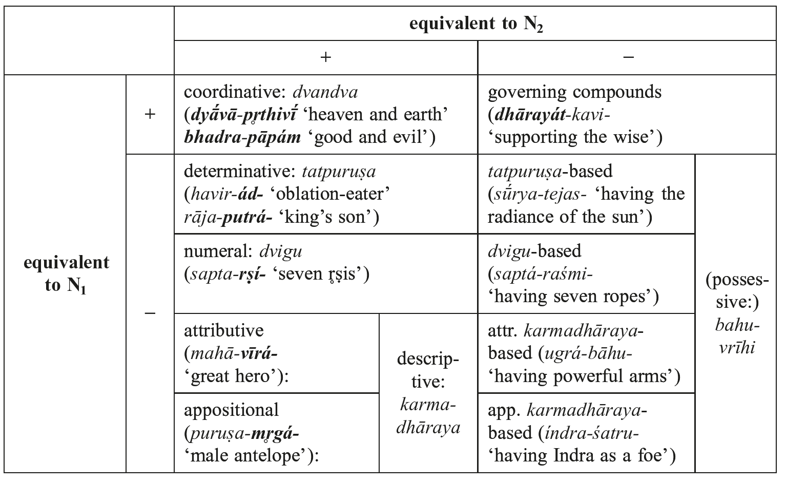
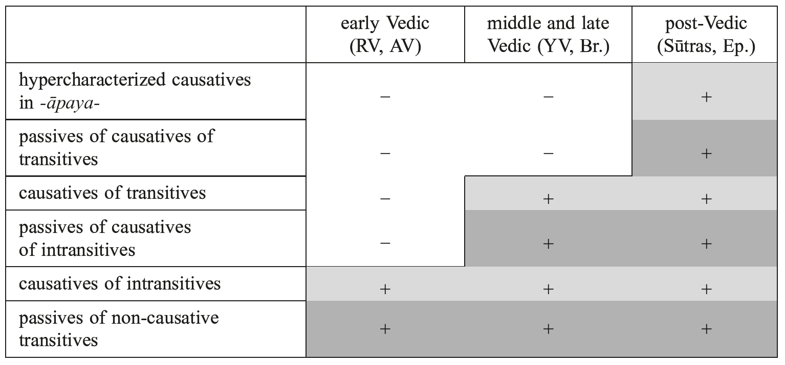

# 28. The syntax of Indic

- 1. Word classes
- 2. Nominal morphosyntax
- 3. Verbal morphosyntax
- 4. Non-inflectional words
- 5. Word order
- 6. Sentence syntax and complex sentences
- 7. Abbreviations
- 8. References

## 1. Word classes

The inventory of word classes (parts of speech) which are relevant for a syntactic description of Indic, as in most other ancient Indo-European languages, consists of: verb, substantive, adjective (with pronominal adjectives), adverbials, and a few minor categories of non-inflexional lexemes, the most important of which includes particles.

## 2. Nominal morphosyntax

### 2.1. Grammatical relations and cases

#### 2.1.1. Grammatical relations and types of alignment

The main grammatical relations which are relevant for a description of Old Indo-Aryan nominal syntax include Subject (S), Direct Object (DO), Indirect Object (IO), and a variety of Oblique Objects (Obl). In its earliest forms (Vedic), Old Indo-Aryan follows the nominative-accusative pattern of alignment, with S in the nominative and DO either in the accusative (canonical marking), or in some oblique cases: locative, genitive, or instrumental (non-canonical marking). The subject is, by contrast, almost uniformly encoded with the nominative, with only rare exceptions (see, in particular, Hock 1990); on some alleged instances of oblique subjects, see Verbeke, Kulikov and Willems 2015: 24−27.

For the ergative analysis of constructions with verbal adjectives (“perfect passive participles”) in *-tá-*/*-ná-* and the passive agent in the genitive (Andersen 1986), see 3.3.1.3.1 below.

From late Old Indo-Aryan and, especially, from Middle Indo-Aryan onwards, when the instrumental argument of *-tá-*/*-ná-*adjectives (“participles”) acquires some subject properties (see, in particular, 6.1.2), these constructions give rise to the ergative syntactic pattern.

#### 2.1.2. Cases and their main uses

The main uses of the Old Indo-Aryan cases are typical for ancient Indo-European languages.

The nominative is employed as the case of subject as well as in the predicative function.

The vocative is attested, alongside its main use (vocative proper), in rare non-vocative (predicative) uses, as in the textbook example (see Delbrück 1888: 106) RV 6.31.1a *ábhūr éko rayipate rayīṇā´m* ‘You alone have become the Lord of wealth’ (lit. ‘you... have become − o Lord of wealth!’). The similar construction with the nominative *rayipátī* in RV 2.9.4c *tváṃ hᵢy ási rayipátī rayīṇā´m* ‘... because you are the Lord of wealth’ shows that the vocative in such instances is secondary. In coordinating structures built with the conjunction *ca*, the second vocative is replaced by a nominative: RV 1.2.5 *vā´yav índraś ca* ‘O Vāyu and Indra!’.

The main function of the accusative is the encoding of the direct object (DO). Next to this type, there exists a variety of other usages, including accusative of goal, accusative of time, content accusative, and some others (see Gaedicke 1880; Gotō 2002). The main criterion of the objecthood of a noun phrase, distinguishing the accusative of DO from other usages, is the passivization test (= the ability of a verb to passivize, that is, to form passive constructions with *-yá-*presents or other morphological passives) (cf., e.g., Delbrück 1988: 104 f.; Haudry 1977: 149; Kulikov 2012b). In spite of its obvious shortcomings (see Jamison 1979b: 197 ff., 1983: 30 ff.), it can be quite successfully used for distinguishing various types of accusative arguments according to their objecthood. Usually, constructions with canonical DOs (= prototypical transitives) can readily be passivized, while constructions with accusatives of other types can only be passivized rarely, exceptionally, or never (see Gaedicke 1880; Delbrück 1888: 164 ff.; Gonda 1957a, 1957b; Jamison 1983: 27 ff.; for Classical Sanskrit, see Ostler 1979: 242 ff.; Hock 1982: 131).

On the basis of *-yá-*passivization, the variety of usages of the accusative can be qualified as ranking between the canonical DO and clear instances of non-DO accusatives. In particular, it can be demonstrated that accusatives of time (as in RV 10.161.4a *śatáṃ jīva śarádo várdhamānaḥ* ‘Live hundred autumns in prosperity’; see Gaedicke 1880: 175 ff.; Gonda 1957a: 54 ff. [= 1975: 51 ff.], 1957b: 75 f. [= 1975: 66 f.]) and accusatives of goal (as in RV 1.110.2 *ágachata savitúr* [...] *gr̥hám* ‘You went to the house of Savitar’; RV 9.56.2a *yát sómo vā´jam árṣati* ‘when Soma runs to the prize...’; see Gaedicke 1880: 125 ff., 144 ff.; Wecker 1906: 4 ff.; Gonda 1957a: 52 ff. [= 1975: 49 ff.]; “facientiv mit affiziertem Objekt” in Gotō [1987] 1996) never promote to passive subjects and thus show the lowest degree of objecthood.

There are virtually no examples of passive counterparts of constructions with the content accusative, commonly derived from the same root as the governing verb (other, partly synonymous, terms include: Inhaltsakkusativ; accusative of relation/scope/parameter; “cognate object”, *figura etymologica*, etymologischer Akkusativ), which denote, generally, the scope of application of the given (intransitive) activity and/or its result. Cf. RV 9.49.3 *ghr̥tám pavasva* ‘purify yourself [into] ghee’; RV 2.2.6 *rayím asmā´su dīdihi* (lit.) ‘shine wealth for us’; RV 9.97.50a *abhí vástrā suvasanā´nᵢy arṣa* ‘flow (for) well-fitting (lit. well-clothing) clothes’; RV 7.56.5 *sā´ víṭ... púṣyantī nr̥mṇám* ‘this tribe,... prospering in manliness’). On this type, see Gaedicke (1880: 88 ff.); Delbrück (1888: 175 f.); Oertel (1926: 31 ff. [with a rich collection of examples and detailed discussion]); Haudry (1977: 195 ff.); Jamison (1983: 29, fn. 9); Kulikov (1999a: 236 ff.). For constructions with the content accusative (= Inhaltsakkusativ), typically derived from the same root as the governing verb (e.g. in RV 6.2.1 *puṣṭím... puṣyasi* (lit.) ‘you prosper prosperity’; AV 11.3.56 *ná ca sarvajyāníṃ jīyáte* ‘if he is not deprived of the whole property...’; on this type, see Gaedicke 1880: 156 ff.; Sen 1927: 360 ff.; Jamison 1983: 29, with fn. 9; Kulikov 1999a), we only find two examples of passivization in Vedic: TS 1.7.6.2 *viṣṇukramā´ḥ kramyánte* ‘the strides of Viṣṇu are stridden’ and *nr̥tyate* JB ‘[the dance] is danced’.

For the syntactic status of accusative nouns in constructions with intransitive verbs with preverbs, see 3.1.3 below.

Two standard functions of the genitive are: (i) the case of the possessor, and (ii) the case of S and DO with deverbal nouns (subjective and objective genitive with nominalizations). Besides, the genitive is used for non-canonical DO marking (usually, with a partitive meaning; see 3.1.2) and, alongside with the instrumental, for the encoding of the passive agent (see 3.3.1.3.1).

The dative is the case of the IO, which typically expresses the beneficiary of an event, but also, in many constructions, corresponds to the goal or second (remote) object of the activity (see 3.1.5).

The uses of the three other oblique cases, instrumental (tool; passive agent; concomitance, etc.), ablative (see Hettrich 1995) and locative, do not require special discussion.

Comprehensive surveys of the main uses of cases can be found in Delbrück (1888: 103 ff.); Speijer (1886: 26−113, 1896: 6 ff.); Oertel (1926); Sen (1927); Gotō (2002); Hettrich (2007). For syntactic patterns (case frames) attested with individual verbs, see especially s.vv. (individual verbal entries) in Grassmann 1873 (out-of-date at many points, but still very useful), Hettrich 2007, Krisch 2006; 2012 (on-going edition).

#### 2.1.3. Cases with adpositions

Adpositions (most often, postpositions; see 4.1) select the case form of the noun of the adpositional phrase, which is, most commonly, the accusative. Usually, the adpositions are constructed with the following cases (only the most frequent combinations are listed):

−with the accusative: *áti, ádhi, ánu, antár* (‘between’), *abhí, ā´, úpa, práti*;

−with the ablative: *ádhi, ā´* (‘hither from’), *pári*;

−with the locative: *ádhi, antár* (‘within’), *ā´* (‘among’).

On *ádhi* (which can be constructed with nearly all oblique cases and, on the basis of some syntactic features, should be qualified as an adverb(ial), rather than an adposition), *antár* and *pári*, see Hettrich (1991, 1993, 2002).

### 2.2. The syntax of adjectives: agreement

Adjectives (including pronominal adjectives and participles) agree with the substantive in gender, case, and number.

### 2.3. The syntax of pronouns

#### 2.3.1. Personal pronouns

As in other ancient Indo-European languages, such as Latin or Greek, personal pronouns (for their morphological survey, see Gotō this handbook: 4.1) are frequently omitted when in the subject position (PRO-drop language).

#### 2.3.2. Demonstrative pronouns

For a morphological survey and semantic summary of demonstrative pronouns, see Gotō (this handbook: 4.2), Kupfer (2002), and Knobl (forthcoming) (for the language of the RV); Gotō (2013: 67 ff.); Dunkel (2014 s.vv.). The demonstrative pronouns can be employed in deictic (*eṣá-*/*etá-* and accented forms of *a-*/*i-* [*ayám*/*iyám*/*idám*] − proximal deixis; *amú-* [*asáu*/*adás*] − distal deixis; *syá-*/*tyá-* − deixis, in particular, first-person or non-third person reference, see Klein 1998) and/or anaphoric (*sá-*/*tá-*; *eṣá-*/*etá-*; *syá-*/*tyá-*; enclitic forms of *a-*/*i-*; encl. *ena-*; encl. *īm*) usages; the demonstrative pronoun *sá-*/*tá-*can also be used as 3ʳᵈ person pronoun (‘he/she/it/they’). In addition, they attest a few “minor” types of usages, such as cataphoric (possible for many of the pronouns employed in anaphoric usages, in particular, for *tá-*/*sá-*) or emphatic (e.g. for encl. *īm*).

Next to substantive (independent) and adjectival usages possible for the majority of these pronouns, some forms of the paradigm can also be employed in fossilized adverbial usages, as is the case with *idám* (nom.-acc.sg.n. of *a-*/*i-*) ‘here, to this place; now’, *tád* (nom.-acc.sg.n. of *tá-*) ‘then, at that time; thus’ or *tyád* (nom.-acc.sg.n. of *tyá-*) ‘here, indeed’.

A peculiar usage is attested for the pronoun *tá-*/*sá-*, which is employed in sentence-initial position in the function of an extraclausal connective particle (traditionally called “*sa*-figé”), as in TS 7.3.1.1 ***sá*** *yó vái daśamé ’hann avivākyá upahanyáte, sá hīyate* ‘**Now**, the one who makes a recitation mistake on the tenth day, the Avivākya, falls behind’; see Jamison (1992); Klein (1996); Hock (1997); Kupfer (2002: 189 ff.). Furthermore, *tá-*/*sá-* may be attributively connected with the 2ⁿᵈ person pronoun (*tvā*), as in RV 8.51.6 *yásmai tᵤváṃ vaso dānā´ya śíkṣasi* / *sá rāyás póṣam aśnute* / *táṃ tvā vayám* […] *havāmahe* ‘The one whom you wish to help for giving, O good one, reaches prosperity in wealth. We call you as such one …’

Tab. 28.1: Morphosyntactic types of compounds

Adverbial usages of pronouns must also underlie a number of adverbs and particles which historically go back to fossilized forms of the pronominal paradigm (later replaced by innovations), such as *íd* ‘only’ (← *nom.-acc.sg.n. of *i-*), *tā´d* (← *abl.sg. of *ta-*) ‘thus, in this way’ (2× in the RV) or *anā´* ‘hereby, thus, indeed’ (← *inst.sg. of *a-*).

### 2.4. The morphosyntax of compounds

The main morphosyntactic types of compounds can be captured in terms of their properties in the form of a simple calculus based on the following two parameters:

(i) Is the compound (schematically represented as N₁-N₂, where N₁ and N₂ stand for the first and second members of the compound) syntactically equivalent to or substitutable for N₁?

(ii) Is the compound (N₁-N₂) syntactically equivalent to or substitutable for N₂?

Positive answers to at least one of these questions roughly correspond to the endocentric type (that is, the syntactic centre of the compound lies within it); in case of negative answers to both (i) and (ii), we are confronted with the exocentric, or bahuvrīhi, type. This calculus of logically possible morphosyntactic types of compounds is summarized in table 28.1; the syntactic centres of the compounds are in boldface.

## 3. Verbal morphosyntax

### 3.1. The main syntactic classes of verbs

#### 3.1.1. Intransitive and transitive

The canonical intransitive and transitive patterns do not require special discussion. Many transitive verbs can also be employed without direct objects, i.e. in absolute usages − particularly, in the cases of a non-referential direct object, as in RV 1.147.2c *pī́yati tvo ánu tᵤvo gr̥ṇāti* ‘One [sacrificer] blames [my speech], another praises’. The common term for this pattern (see Jamison 1983: 27) is “absolute transitive”, or “objectless transitive”. The absolute transitive usages are common for verbs describing various occupation-related activities (*sing*, *write*, etc.).

A particular semantic subtype of the transitive pattern, common with middle forms, as opposed to non-marked active forms, is often referred to as “transitive-affective” (see Gotō 1996: 27 f.), or transitive with the self-beneficent sense; see 3.2.2. The affective (self-beneficent) meaning has no impact on the syntactic pattern. For a special subclass of transitive-affective usages, where the direct object refers to a property or body part of the agent (as in TS 6.1.1.5 *dákṣiṇaṃ pū´rvam ā´ṅkte* ‘he anoints his right [eye] first’), I will use the term “possessive-reflexive”.

#### 3.1.2. Intransitive/transitive

The term “intransitive/transitive” (I/T), introduced by Jamison (1983: 31 ff.), refers to verbs which can be constructed either with the accusative direct object or with some oblique objects (locative, genitive, etc. = “differential object marking”), as in the case of the verb *pā* ‘drink’, cf. RV 8.36.1 *píbā sómam* ‘drink Soma’ ~ RV 8.37.1 *píbā sómasya* ‘drink (of/some) Soma’ (see Dahl 2009). This class includes, above all, verbs of perception (*śru* ‘to hear’, *vid* ‘to know’), enjoying (*juṣ* ‘to enjoy’) and consuming/ ingestion (*pā* ‘to drink’, *bhaj* ‘to share in’).

#### 3.1.3. Intransitive compounds constructed with accusatives

It is a commonplace in Sanskrit scholarship that intransitive verbs typically become transitive after certain spatial (directional and locational) preverbs, such as *ánu* ‘along, after’, *áti* ‘over’, *abhí* ‘towards, over, against’, *úpa* ‘to, near’ and some others, which add an accusative object to the syntactic arguments of the verb and thus function as transitivizing, or applicative, markers, as in RV 9.19.3 (quoted in 4.1.2), RV 7.1.14a *séd agnír agnī́m̐ r **átᵢy astᵤv** anyā´n* ‘Let this fire be bigger than (lit. **be over**) other fires’; or ŚB 1.7.2.12 *vŕ̥ṣā yóṣām **ádhi dravati*** ‘The bull **covers** (impregnates) the female cow.’ Cf., e.g., Gaedicke (1880: 91): “Jedes Intransitivum wird im Indischen durch gewisse Richtungswörter oder Präpositionen zu einem Transitivum [In Indic, any intransitive may become a transitive through certain direction words or prepositions]”; see also Speijer (1886: 32, 1896: 7); Sen (1927: 368 ff. [= 1995: 28 ff.]); Renou (1952: 316 ff.). For a rich collection of examples, see Gaedicke (1880: 91 ff.); Sen (1927: 368 ff.); cf. also Gonda (1957a: 61 ff. [= 1975: 58 ff.], 1957b: 78 f. [= 1975: 69 f.]); Ostler (1979: 344 f.).

The exact syntactic status (transitivity) of such verbs poses several problems, however. Should compounded verbs such as *ā´-sad, áti-as*, or *ádhi-dru* be considered as intransitives constructed with accusatives (which are not, however, true direct objects), rather than as true transitives? This can be demonstrated (see Kulikov 2012b for details), foremost, by using the *-yá-*passivization test, which neatly distinguishes transitives from other syntactic classes of verbs in Vedic. Only a few fundamentally intransitive verbs form *-yá-*passives in compounds (i.e. when employed with preverbs) in Vedic. These include, in particular, *úpa* + *īyate* (← *i* ‘go’) ‘sexually approach, copulate’ YV+; *ádhigamyáte* (← *gam* ‘go’) ‘find, know, understand’ AV+; *adhi-ṣṭhīyate* (← *sthā* ‘stand’) ‘stand upon’ KS 13.3: 182.1. Importantly, virtually all such passivizable compounds show some idiomatic semantic changes, i.e. the meaning of the resulting verb cannot be deduced from that of the non-prefixed verb (simplex) and preverb; cf. *ádhi-ṣṭhā* ‘govern’ (≠ ‘stand’ + ‘over’); *úpa*-*i* ‘sexually approach, impregnate’ (≠ ‘go’ + ‘to, near’), etc.

#### 3.1.4. “Two pattern” verbs and double object constructions

This subclass comprises verbs which can be constructed with two kinds of accusative objects; they can be referred to as first [proximate] and second [distant] objects. The second object (“recipient” or locative direct object) typically denotes the goal or addressee (*pradhāna-karman* ‘principal object’ and *apradhāna-karman* ‘non-principal, secondary object’ in Indian tradition; see Deshpande 1991: 21 ff.) − as, e.g., is the case of *yuj* ‘yoke, join’, constructed with the accusative of horses (as in RV 8.98.9 *yuñjánti hárī... ráthe* ‘they yoke two fallow [horses] to the chariot’) or with the accusative of ‘chariot’ (as in RV 7.23.3 *yujé rátham... háribhyām* ‘in order to yoke the chariot... with two fallow [horses]...’). Usually, only one of these two participants surfaces in the accusative; the first object can alternatively appear in the instrumental and the second object in the dative or locative. Constructions with two accusative objects are also possible with some verbs (see Gaedicke 1880: 255 ff.; Hock 1985; Hettrich 1994), cf. RV 8.27.1 *r̥cā´ yāmi marúto bráhmaṇas pátiṃ* / *devā´m̐ ávo váreṇᵢyam* ‘With a hymn I approach the Maruts, Br̥haspati, the gods for the desirable help’. On this syntactic phenomenon, see Delbrück (1897: 438 f.); Haudry (1977: Chapter 3, esp. p. 175 ff.); Jamison (1979a: 135, fn. 11); Hock (1982: 135, note 5). The passivization test enables one to determine whether both types of accusative nominals behave as DOs or not and thus to distinguish “two pattern” verbs (also labelled “ditransitives”) from other verbs with multiple accusatives; see Kulikov 2012a: 701 ff. On the passivization of ditransitives, see Deshpande (1991).

The two main semantic groups of “two pattern” verbs in Vedic include verbs of speech (with the accusative of speech or with the accusative of the addressee of the speech [= second object]: ‘XNOM sings YᵖʳᵃʸᵉʳACC’ or ‘XNOM praises ZᵈᵉⁱᵗʸACC’) and verbs of putting/spraying (with the accusative of movable things or substances or with the accusative of the goal; this type of syntactic alternation is also known as “locative alternation”): ‘XNOM sprinkles YᵒᵇˡᵃᵗⁱᵒⁿACC’ or ‘XNOM besprinkles ZᵃˡᵗᵃʳACC’.

### 3.2. The main verbal morphosyntactic categories

#### 3.2.1. Verbal agreement

Finite verbal forms agree with the subject in person and number. Cases where the verb agrees with only one of the group of coordinated subjects (thus taking the singular form) are possible, as in RV 7.40.2ab *mitrás tán no váruṇo ródasī ca* ' *dyúbhaktam índro aryamā´ dadātu* ‘Let Mitra, Varuṇa, Rodasī, Indra and Aryaman give us the heavenly wealth’.

For the peculiarities of verbal agreement in constructions with the reciprocal pronoun *anyó (a)nyám*, see 3.3.5.3.2.

#### 3.2.2. Diathesis

The category of diathesis is formed by the opposition of forms with the active vs. middle inflexion. The range of the functions rendered by the middle type of inflexion (= middle diathesis) is typical of the ancient Indo-European linguistic type as attested in “Classical” languages (Ancient Greek, Latin). Here belong the self-beneficent (auto-benefactive) meaning with no valence change (‘to do smth. for oneself’, as in the handbook example *yájati* ‘sacrifices’ ~ *yájate* ‘sacrifices for oneself’) as well as a number of intransitivizing derivations, such as passive, reflexive, and anticausative (decausative). The choice of the function(s) idiosyncratically depends on the base verb. However, already in the language of the earliest text, the RV, we observe the loss of several grammatical functions of the ancient Indo-European middle, and the intransitivizing functions are largely taken over by special productive markers, such as the passive suffix *-yá-* and the reflexive pronouns *tanū´-* and *ātmán-* (this process can be regarded as degrammaticalization of the middle, see Kulikov 2012c). By contrast, the auto-benefactive meaning proves to be more stable and becomes the main function of the middle diathesis.

The auto-benefactive functional domain of the middle diathesis includes (see Kulikov 2012c: 172 ff.): (i) the self-beneficent meaning proper (“subjective version”), i.e. ‘to do smth. for oneself’, the handbook example is *yájate* ‘he performs sacrifice for himself’; (ii) possessive-reflexive (the subject is referentially identical with the possessor of another argument, cf. TS 6.1.1.2 *nakhā´ni ní kr̥ntate* ‘he cuts off **his** nails’; ŚB 1.2.5.23 *átha pāṇī́ áva nenikte* ‘then he washes **his** hands’); and (iii) auto-directional, which includes transitive verbs of caused motion, typically referring to the motion of the referent of the DO caused by the Agent. Their middle counterparts, most often used with preverbs such as *ā´* ‘to(wards)’, denote the process of the motion of the object towards the Agent, such as obtaining or taking of the object by the Agent. The handbook example of this type is the conversive pair *dā* (active) ‘give’ ~ *ā´-dā* (middle) ‘take’; cf. also *as* (active) ‘throw’ ~ *ā´-as* (middle) ‘take, receive’; *nah* (active) ‘tie’ ~ *ā´-nah* (middle) ‘put on’ (of clothes, protection, etc.).

3.2.3. The main uses of tenses and moods are summarized in Gotō (this handbook: 5.3− 5.7). For the most recent clear and comprehensive survey of the uses of moods in Vedic prose, see also Tichy (2006: 67 ff.); for injunctive, see Hoffmann (1967).

On correlations between tense and transitivity oppositions, see 3.3.2.1 below.

### 3.3. Voice and valency-changing categories

#### 3.3.1. Passive

#### 3.3.1.1. Passive formations

There are several verbal formations in Vedic which can be employed in passive constructions. Non-finite passives include verbal adjectives (called in many grammars “perfect passive participles”) with the suffix *-tá-*/*-ná-* (on the ergative reanalysis of constructions with these participles in late Sanskrit, see 2.1.1 and 3.3.1.3.1); gerundives, or future passive participles, with the suffixes *-ya-*, *-tavyà-* and *-anī́ya-*; and, less regularly, some other non-finite formations, such as infinitives in *-tavái* (*-tave*), as in RV 7.33.8cd *vā´tasyeva prajavó nā´nᵢyéna* ' *stómo vasiṣṭhā ánᵤvetave vaḥ* ‘O Vasiṣṭhas, your praise is not to be caught up by another, like the flight of the wind’.

Finite passive formations include the following (for details, see Kümmel 1996; Gotō 1997; Kulikov 2006):

(i) In the present system: presents with the suffix *-yá-* (derived from the root by means of the suffix *-y(á)-*, which can only take middle endings; e.g. *han* ‘to kill’: 1sg. *han-yé*, 2sg. *han-yá-se*, 3sg. *han-yá-te*, etc.). In early Vedic, only the 3ʳᵈ person singular and plural forms as well as participles are well-attested. Next to a dozen 2sg. forms (*yujyáse* ‘you are (being) yoked’, *śasyáse* ‘you are (being) praised’, etc.), we only find one occurrence of a 3du. form, *ucyete* (RV 10.90.11) ‘[the two feet] are called’ and one (philologically and grammatically rather unclear) form *-panyā´mahe*, which may represent 1pl. (‘we are [being] glorified’[?]; see Kulikov 2012a: 144 ff.). 1sg., 1du., 2du. and 2pl. forms are unattested. Next to present forms proper, participles and rare imperatives (10 forms or so in the RV and AV), only exceptional attestations of other tense-moods are found (3sg.impf. *anīyata* ‘(she) was brought’ in RV 8.56.4 = Vālakh. 8.4 and 3pl.impf. *-ásicyanta* ‘(they) were besprinkled’ in AV 14.1.36; 3sg.inj. *sūyata* ‘(he) is consecrated’ in RV 10.132.4; and 3sg.subj. *-bhriyāte* RV 5.31.12 ‘(it) will be brought’).

(ii) In the aorist system: medio-passive *i*-aorists (with a defective paradigm: only 3sg. in *-i*, and, in the RV, 3pl. in *-ran*/*-ram* and participle; e.g. *yuj* ‘yoke, join’: 3sg. *áyoji*, 3pl. *áyujran*, part. *yujāná-*);

(iii) In the perfect system: statives can be used in the function of passive perfects for some verbal roots, an employment almost exclusive to early Vedic. An example (with a defective paradigm: 3sg. in *-e*, 3pl. in *-re* and participle) is *hi* ‘impel’: 3sg. *hinvé* ‘(it) is impelled’, 3pl. *hinviré* ‘(they) are impelled’; part. *hinvāná-*. Indeed, there are reasons to consider statives as part of a larger, perfect-stative system. Forms built on perfect stems with middle endings and employed in passive constructions (almost exclusively 3sg. and 3pl.; e.g. *dhā* ‘put’: 3sg. *dadhé* ‘is put/has been put’; *yuj* ‘yoke’: 3pl. *yuyujré* ‘are yoked/have been yoked’) should be regarded, accordingly, as statives built on perfect stems.

(iv) Besides the above, there are a few isolated and rare non-characterized (bare) middle forms, such as class I pres. *stávate* ‘is praised’, class IX pres. *gr̥ṇīté* ‘is praised’; class III (reduplicated) pres. *mímīte* ‘is measured’ (RV 8.2.10); and a few sigmatic aorists (mostly 3pl. forms): *ayukṣata* ‘(they) were yoked’, *adr̥kṣata* ‘(they) were seen, visible, (they) appeared’, *asr̥kṣata* ‘(they) were set free’. *stávate* is the only formation in this group which quite commonly occurs in passive constructions in the RV; both *stávate* and *gr̥ṇīté* are likely to be based on the statives *stáv-e* (see Narten 1968) and *gr̥ṇ-é* ‘is praised’, instantiating back derivation (Rückbildungen).

#### 3.3.1.2. Constraints on passive derivation

The growth of productivity of the *-yá-*passives is well-documented in texts (see Kulikov 2012a: 751 ff.). While in the language of the RV *-yá-*passives are attested only for about 40 roots, the younger mantras (Atharvaveda and Yajurveda) double this number. In early Vedic (RV and AV), only non-derived transitive verbs can be passivized. The middle Vedic texts not only attest numerical growth of the *-yá-*passives, but also the first examples of *-yá-*passives derived from secondary stems, such as causatives and desideratives. The earliest attestations of causative passives appear in the young Yajurvedic mantras: *ā-pyāyyámāna* ‘being made to swell’ (root *pyā* ‘swell’) VS +, *pra-vartyámāna-* ‘being rolled forward’ (*vr̥t* ‘turn’) MSᵐ, *sādyáte* ‘is (being) seated, set’ (*sad* ‘sit’) YVᵐ +. Other formations of this type are attested from Vedic prose onwards and become more common in the Brāhmaṇas.

Until the very end of the Vedic period only causatives built to intransitives can passivize. Passives of causatives derived from transitives or intransitive/transitive verbs first appear in late Vedic / post-Vedic texts, from the Śrautasūtras onwards. The earliest examples are: VaitS 5.17 *aśvapādaṃ lakṣaṇe **nidhāpyamānaṃ** sam adhvarāyety anu mantrayate* ‘Along with (*anu*) the horse’s foot which is **being caused to be put down** on the (demarcation) line [of the āhavanīya-fire] he (sc. the adhvaryu-priest) pronounces the mantra *sam adhvarāya*... “To the sacrifice …” (AV 3.16.6)’; ĀpŚS 9.18.11 *yady **upapāyyamāno** na piben na vā uv etan mriyasa iti upa pāyayet* ‘If [the sacrificial animal], though **being [respectfully?] caused to drink**, does not drink, he (sc. the adhvaryu-priest) should cause it to drink [by pronouncing the mantra]: *na vā uv etan mriyase* “Verily, you do not die here …” (TSᵐ 4.6.9.4 ~ RV 1.162.21 etc.)’; VādhS 4.101:9 *sa yo ha vā evaṃvidādhvaryuṇā **yājyamāno** yajamāno na rdhnoti* ‘If the institutor of the sacrifice (*yajamāna*), though **being caused** by the thus-knowing adhvaryu **to perform a sacrifice**, does not succeed …’; *vācyamāna-* in VaikhŚS 18.5:256.6 and KauśS 63.20 *dadyād dātā **vācyamānaḥ*** ‘… the giver who **is made to pronounce** (the ritual words) should give (the oblation)’; see Kulikov (2008: 250).

#### 3.3.1.3. Syntax of passive constructions

#### 3.3.1.3.1. Case marking of the passive agent

Passivization typically suggests (i) the promotion of the initial direct object to the subject position (= the subject of the passive construction or passive subject for short) and (ii) the demotion of the initial subject (usually, an agent). The demoted subject either becomes an oblique object (encoded by the instrumental case, as, e.g., in RV 9.86.12d *sᵤvāyudháḥ sotŕ̥bhiḥ pūyate vŕ̥ṣā* ‘[Soma], the well-armed bull, is being purified by pressers’; more rarely by the genitive case (cf. RV 1.61.15a *asmā´ íd u tyád ánu dāyᵢy eṣām* ‘This very thing has been granted to him by them’) or, more frequently, remains unexpressed (see Gonda 1951: 77 f.), as in RV 9.97.35c *sómaḥ sutáḥ pūyate ajyámānaḥ* ‘Soma, pressed out, is purified, being anointed.’ See Jamison (1979a: 133 ff.); Andersen (1986). On the case of the agent in Vedic, see Wenzel (1879: 102 ff.); Jamison (1979a); Hettrich (1990). Agentless passive constructions can be illustrated by such examples as RV 10.97.6c *vípraḥ sá **ucyate** bhiṣák* ‘This poet is called healer...’; RV 10.22.1ab *kúha śrutá índₐraḥ kásminn adyá* ' *jáne mitró ná **śrūyate*** ‘Where has one heard about Indra? In which community is he known today as a friend?’. On the ratio of agentive passives and passives without agent, see Jamison (1979b: 202 ff.).

There are some reasons to treat Vedic constructions with verbal adjectives (“perfect passive participles”) in *-tá-*/*-ná-* and the genitive marking of the agent separately from canonical passives with the instrumental. According to Andersen (1986), the genitive noun displays a number of subject properties (usually animate; definite and/or refers to old information) in such constructions, and therefore they should be qualified as ergative rather than passive properly speaking.

#### 3.3.1.3.2. Passives derived from causatives

With three of the four attested passives derived from causatives (see 3.3.1.2), the causee (= the subject of the embedded causative construction) becomes passive subject (cf. Hock 1981: 22 f.). This is the case with *upa-pāyyamāna-*, *yājyamāna-*, and *vācyamāna*-. Only in the case of *ni-dhāpyamāna-* ‘being caused to be put down’, the passive subject corresponds to the initial object. This tendency parallels what is seen in Epic and Classical Skt., where both causee and initial object can become passive subject, but the latter pattern is less common (see Hock 1981: 24 ff.; Bubenik 1987).

#### 3.3.2. Causative

#### 3.3.2.1. The system of causative oppositions

The most regular and productive causative marker in the present system is the suffix *-(p)áya-*, cf. *vr̥dh* ‘grow, increase’ − *vardháyati* ‘makes grow, increases’, *cit* ‘appear, perceive’ − *cetáyati* ‘shows (= makes appear), makes perceive’ (~ *citáyati* ‘appears’). In addition to *-(p)áya-*causatives, in early Vedic we find a few other (non-productive) formal types of present causative oppositions. In particular, the transitive-causative member is not infrequently expressed by a present with the nasal affix, that is, suffixes *-nó-*/*-nu-*(class V), *-nā´-*/*-nī-* (class IX) or nasal infix *-ná-*/*-n-* (class VII), often opposed to an intransitive (anticausative) present with the suffix *-ya-* (class IV) or a root present with thematic vowel (class I). Causative oppositions of other types (for instance, with the causative member expressed by a reduplicated present, or by a class VI present, as in the pair *tárati*/*-te* ‘passes, crosses over’ ~ *tiráti*/*-te* ‘carries through, saves’; see Gotō 1996: 160 ff.) are less common (see e.g. Joachim 1978: 21 ff.). There are also a few examples of anticausatives expressed by middle presents with the suffix *-ya-* and “passive” accentuation (accent on the suffix). This passive-to-anticausative transfer is attested, foremost, for passives of several verbs of perception and knowledge (knowledge transfer) such as *dr̥śyáte* ‘X is seen’ → ‘X is visible; appears’, *śrūyáte* ‘is heard, is known, is famous’ − obviously, according to the scenario ‘Y is seen (known, etc.) by smb.’ → ‘Y is seen (known, etc.) [by smb.]’ → ‘Y is seen (known, etc.) [by generic passive agent]’ → ‘Y is visible (famous, etc.)’. A special variety of this development is instantiated by the passive of a verb of speech, *ucyáte* ‘Y is pronounced’ → ‘Y [e.g. speech, musical instrument] sounds’. Besides, such semantic development is attested for a small subgroup of verbs of caused motion, such as *-kīryáte* ‘is scattered; falls (down)’ or *sicyáte* ‘is poured; pours (out)’. While in this latter case the rise of anticausative usages may be due to conceptualizing simple transitives as causatives (*scatter* = ‘make fall, make fly’, etc.), in cases of verbs of perception and knowledge we observe the rise of the anticausative usages through the stage of “impersonalization” that can be explained in terms of “objectivization of knowledge”, i.e. knowledge without a knowing subject (for details, see Kulikov 2011).

The intransitive (anticausative) member of the opposition is typically inflected in the middle voice, while the transitive-causative forms are inflected in the active voice. Cf. *kṣi* ‘perish, destroy’: *kṣī́yate* ‘perishes’ (present IV) ~ *kṣiṇā´ti* (present IX) ‘destroys’; *jan* ‘be born, arise’: *jā´yate* ‘is born’ (present IV) ~ *jánati* (present I), *janáyati* ‘begets’; *pū* ‘purify’: *pávate* ‘becomes clean, purifies oneself’ (present I) ~ *punā´ti* (present IX) ‘purifies’. With some presents, the causative opposition is only marked by the diathesis (middle/active), as in *námate* ‘bends’ (intr.) ~ *námati* ‘bends’ (tr.); *svádate* ‘is sweet’ ~ *svádati* ‘makes sweet’.

In the aorist system, the causative meaning is typically expressed by the reduplicated aorist, cf. *vr̥dh* ‘grow, increase’ − *ávīvr̥dhat* ‘made grow’.

There exist also some (rather weak) correlations between tense and transitivity; thus, for some verbs, predominantly intransitive (active) perfects may be opposed to predominantly transitive presents (e.g. *tatā´na* ‘has stretched’ [intransitive] ~ *tanóti*, *tanuté* ‘stretches’ [transitive-causative]; see Kulikov 1999b: 27 f.; Kümmel 2000: 208 ff.) and/ or appear in the same syntactic usage as the corresponding middle presents; cf. middle present *pádyate* ‘falls’ // active perfect *papā´da* ‘has fallen’ (see Hoffmann 1976: 590; Kümmel 2000: 296 f., 370 ff. et passim).

Finally, there are also labile forms that can be used both transitively and intransitively. This is the case with many perfect forms (see Kümmel 2000), such as, for instance, 3sg.pf.med. *vāvr̥dhé*, 3sg.pf.act. *vavárdha* ‘has grown (intr.)’ ~ 3sg.pf.act. *vavárdha* ‘has increased (tr.)’ as well as, more rarely, forms of other tense systems, such as *svádate* ‘makes sweet (for oneself)’ / ‘is sweet’ (for details, see Kulikov 2003, 2014b).

In early Vedic, we also find periphrastic causatives with the semi-auxiliary verbs *kr̥*‘make’ or *dhā* ‘put’ and dative infinitive (see Zehnder 2011b and 3.3.2.2).

#### 3.3.2.2. Constraints on (morphological) causative derivation

In early Vedic, the *-áya-*causatives are only derived from (i) intransitives and (ii) from a few verbs of perception and consumption (*dr̥ś* ‘see’, *vid* ‘know’, *pā* ‘drink’), which can be constructed either with the accusative DO or with some other oblique case objects (in the locative, genitive, etc.). That is, morphological causativization is only possible for intransitives and “intransitive/transitives” (I/T) in Jamison’s (1983) terminology, or for “semantically intransitive verbs” (in terms of a more semantically-oriented approach to transitivity; see Kulikov forthcoming.a).

Tab. 28.2: Growth of productivity of *-yá-*passives and *-áya-*causatives in Vedic

Periphrastic causatives with *kr̥* or *dhā* can be derived from transitives and thus, according to Jamison (1983: 38), are in complementary distribution with the intransitive-based morphological *-áya-*causatives. Cf. *nas kr̥dhi saṃcákṣe bhujé asyái* (RV 1.127.11) ‘make us see and enjoy this’ ~ *cakṣaya-ᵗⁱ* ‘reveal’ = ‘make appear’ (but see also Kulikov 2008: 255, with fn. 28, for other possible syntactic analyses of this passage).

Causatives of transitives first appear in middle Vedic, cf. *kr̥* ‘make’ − *kāráyati* (Br. +) ‘cause to make’, *hr̥* ‘take, carry’ − *hāráyati* (YVᵖ +) ‘make take, make carry’ etc. (see Thieme 1929; Jamison 1983: 186 f.; Hock 1981: 15 ff.). Finally, in late Vedic and post-Vedic texts (Sūtras, Epic Sanskrit) the productivity of the *-áya-*causatives further increases, and, from the late Sūtras onwards, we find the earliest attestations of a new formation, hyper-characterized causatives in *-āpaya-*, such as *aś* ‘eat’ − *aśāpayati* (MānGS) (opposed to the simple causative *āśayati* [Br.+]), *kṣal* ‘wash’ − *kṣālāpayīta* (Sū.) (opposed to the simple causative *kṣālayati* [Br.+]). In some Middle and New Indo-Aryan languages such forms have eventually given rise to double causatives.

The increasing productivity of the *-yá-*passives in later texts neatly parallels the growth of productivity of the *-áya-*causatives, as shown in Table 28.2.

#### 3.3.2.3. The syntax of causative constructions

Causative derivation adds the meaning ‘cause’ to the base proposition and a new actor to the semantic structure of the initial clause. The causer obligatorily takes the Subject position. Accordingly, the initial Subject, or causee, is ousted from the Subject position and demoted down the hierarchy of grammatical relations (S > DO > IO > Obl). In early Vedic, where the *-áya-*causatives and reduplicated causative aorists can only be derived from intransitives (as well as from a few I/T verbs), the causee can only be encoded with the accusative, as in RV 10.94.9 *índro vardhate* ‘Indra increases’ − RV 8.14.5 *yajñá índram avardhayat* ‘the sacrifice made Indra increase’.

In middle Vedic, we find first causatives derived from transitives. Their causees can surface either in the accusative (ŚB 2.3.3.16 *sáinaṃ svargáṃ lokáṃ sám āpayati* ‘she makes him reach the heavenly world’) or in the instrumental (TS 5.4.9.3 *áhnaivā´smai rā´triṃ prá dāpayati* ‘he makes the day to give him the night’). The latter type of case-marking is more common in causative constructions where the causee preserves a higher degree of volitionality and more control over the situation; for details, see Hock (1981, 1991).

3.3.3. Transitivizing (applicative) derivation has only marginal status within the Vedic system of the valency-changing categories; see 3.1.3 above.

#### 3.3.4. Reflexive

#### 3.3.4.1. Reflexive and middle

The term “reflexive” is often employed to denote one of the functions of the middle diathesis (alongside the passive, the self-beneficent, and others). However, forms with middle inflexion are rather rarely employed in reflexive usages in the strict sense of the word, such as RV 2.33.9 *pipiśe híraṇyaiḥ* ‘[Rudra] has adorned himself with golden decorations’. In many cases such middle intransitive forms, traditionally called “reflexives” (see, e.g., Speijer 1896: 48; Gotō 1996: 27, 49 et passim), do not instantiate reflexives in the strict sense of the term (see, e.g., Gonda 1979: 49) and should rather be qualified as anticausatives (alternatively, they might be called “weak reflexives”), cf. *bhr̥* ‘bring’: *bhárate* ‘moves’ (= *‘brings oneself’), *pr̥̄* ‘fill’: *pū´ryate* ‘becomes full, fills oneself’. The non-passive intransitives of this type often exhibit idiomatic semantic changes, cf. *śap* ‘curse’: *śápate* ‘swears’; *śíśīte* (RV 1.36.16) ‘is too nimble’ ← *‘sharpens oneself’.

#### 3.3.4.2. The system of reflexive morphemes

More commonly, the reflexive function *sensu stricto* is rendered in Vedic by derivatives of the three following roots: *svá*-, *tanū´-* and *ātmán-* (*tmán-*). See Delbrück (1888: 207 ff., 262 f.); Oertel (1926: 184 ff.); Wackernagel (1930: 478 ff., § 237; 488 ff., § 240); Gonda (1979: 49); Vine (1997); Pinault (2001); Hock (2006); Kulikov (2007); and, with some criticisms contra the last three, Hettrich (2010).

#### 3.3.4.2.1. Reflexive pronoun *tanu ´*̄ *-*

#### 3.3.4.2.1.1. Reflexive usage

The reflexive pronoun *tanū´-* has developed from the substantive meaning ‘body’ and is well-attested in this grammaticalized usage in the RV, as in RV 1.147.2d *vandā´rus te tanᵤvàm vande agne* ‘As your praiser, I praise myself, o Agni.’ In some cases it is nearly impossible to draw with accuracy the distinction between the reflexive and non-reflexive (‘body’) meanings: both interpretations are perfectly appropriate in the context, as in RV 10.54.3cd *yán mātáraṃ ca pitáraṃ ca sākám* ' *ájanayathās tanᵤvàḥ sᵤvā´yāḥ* ‘... since you produced (your) mother and (your) father together from your own body / from yourself.’

#### 3.3.4.2.1.2. Emphatic usage

Next to the reflexive usages proper, the Vedic reflexive pronouns can be employed in emphatic usages, i.e. as emphatic reflexive, or intensifier, signaling the fact that its referent is somewhat unexpected in the role where it appears (cf. two usages of English *-self*: *Peter saw him**self** in the mirror ~ Peter drew this picture him**self***). In the more common adverbial case pattern we find the instrumental forms (as in RV 6.49.13 quoted in 3.3.4.3.1 below). The nominal pattern is attested, for instance, with accusatives and datives, as in AV 1.13.2 = RVKh. 4.4.2 *mr̥ḍáyā nas tanū´bhyo* / *máyas tokébhyas kr̥dhi* ‘Be gracious towards ourselves, make pleasure for [our] offspring.’

#### 3.3.4.2.2. Reflexive pronouns *ātmán-* and *tmán-*

#### 3.3.4.2.2.1. Reflexive usage

The reflexive usage of *ātmán-* becomes common after the RV, but is still in competition with *tanū´-* in the AV. In Vedic prose, *ātmán-* completely ousts *tanū´-*; see Delbrück (1888: 207 ff., 262 f.); Wackernagel (1930: 489 ff., §240b); and, especially, a brief survey in Oertel (1926), with a rich collection of examples.

#### 3.3.4.2.2.2. Emphatic usage

The emphatic usage is attested for *ātmán-* from the AV onwards, cf. TS 1.7.3.3 *táto devā´ ábhavan párā´surā yásyaiváṃ vidúṣo ’nvāhāryà āhriyáte bhávaty ātmánā párāsya bhrā´tr̥vyo bhavati* ‘Then the gods prospered, the Asuras perished. He, who, knowing thus, performs the Anvāhārya-rite, prospers himself, his rival perishes.’

In contrast to *ātmán-*, the more archaic stem variant *tmán-* already occurs in emphatic usage in the early RV. Its instrumental appears in the very frequent regular form *tmánā* (63 attestations in the RV) and in the form *tmányā* (built on the stem *tmánī-* or *tmánya-*, of unclear origin; see Macdonell 1910: 206, fn. 11), which occurs in the late RV (1.188.10, 10.110.10) and in the late mantras (VS 20.45 = TBᵐ 2.6.8.4 etc.), cf. RV 10.110.10 *upā´va sr̥ja tmányā* ‘Release [the sacrificial animal] yourself.’ The locative is attested in two forms as well: *tmáni* (2×), and the more archaic variant with the zero ending, *tmán* (5×), as in RV 6.68.5 *sá ít sudā´nuḥ svávām̐*... *índrā yó vāṃ varuṇa dā´śati tmán* ‘Only the one who honours you himself, o Indra, o Varuṇa, is rich in gifts, rich in protection...’

#### 3.3.4.3. The syntax of reflexive constructions

#### 3.3.4.3.1. Case patterns

The case of the reflexive pronoun is determined by its syntactic function in the clause structure (direct object = accusative, indirect object = dative, etc.). The case-marking of the emphatics is regulated by more complex rules and depends, in particular, on the position of its antecedent and some other syntactic and semantic parameters. Typological studies on emphatic reflexives distinguish between adnominal and adverbial uses. In the former use, emphatics surface as adjuncts to noun phrases, while in the latter use, they are adjoined to verbal phrases and fill the position of an adverbial. Both *tanū´-* and *(ā)tmán-*, when employed as emphatics, prefer the adverbial uses, which display two syntactic patterns determining their case: (i) “nominal pattern”: the pronoun copies the case of its antecedent noun phrase; and (ii) “adverbial pattern”: the pronoun surfaces in the case which is used adverbially, irrespectively of the case-marking of the corresponding noun. In the RV, we find in the adverbial pattern the instrumental forms of *tanū´-*(e.g. inst.sg. *tanvā̀*) and some oblique case forms of *tmán-* (instrumental, locative; see 3.3.4.2.2.2), as in RV 6.49.13d *rāyā´ madema tanᵤvā̀ tánā ca* ‘May we enjoy wealth ourselves and in (our) offspring’.

#### 3.3.4.3.2. Number agreement

The Vedic reflexives originate in non-pronominal substantives (‘body’ and ‘soul’), inheriting their full paradigm. In Early Vedic, both *tanū´-* and *ātmán-* (but not *tmán-*, which only shows a few singular forms) agree in number with the antecedent noun both in the reflexive (see below) and emphatic usages, cf. RV 3.1.1 *... agne tanᵤvàṃ juṣasva* ‘... O Agni, enjoy yourself!’; RV 10.8.3 *áruṣīr... r̥tásya yónau tanᵤvò juṣanta* ‘The reddish [flames]... enjoy themselves in the womb of order.’

#### 3.3.4.3.3. Heavy reflexive constructions

In early Vedic, the reflexive *tanū´-* sometimes occurs constructed with the pronominal adjective *svá*- ‘own’ (feminine stem *svā´*-), as in RV 7.86.2a *utá sváyā tanᵤvā̀ sáṃ vade tát* ‘And I discuss it with myself’ (see Pinault 2001: 187; Hock 2006), RV 10.8.4cd *r̥tā´ya saptá dadhiṣe padā´ni* ' *janáyan mitráṃ tanᵤvè sᵤvā´yai* ‘You (= Agni) placed seven steps for order, producing a friend for yourself’. The root *svá*- also appears in the isolated form *svayám* ‘(one)self’, which behaves as a nominative (*-ám* may have been borrowed from the nominative form of the 1ˢᵗ person pronoun *ahám* ‘I’ or from the demonstrative nom.sg.m. *ayám*; see Wackernagel 1930: 480 ff.), as in RV 6.51.7d *svayáṃ ripús tanᵤvàṃ rīriṣīṣṭa* ‘Let the deceiver hurt himself (on his own).’

Both *svá*- and *svayám* additionally emphasize the coreference of the object with the subject (Gonda 1979: 49; Pinault 2001: 188 f.), pointing to the unexpected character of the reflexive situation and contrasting it with the non-reflexive situation (the deceiver is hurt by himself, not by others, etc.). The opposition between the emphasized (*svā´*-/ *svayám tanū´-*) and non-emphasized (*tanū´-*) reflexives is likely to represent the same distinction as that between (morphologically) complex (heavy) and simple reflexives, which can be illustrated by such parallels as Dutch *zichzelf* ~ *zich* or Russ. *sam sebja, samogo sebja* ~ *sebja*.

In the language of the Atharvaveda, alongside the collocation *svā´*- *tanū´-*, we find constructions where *tanū´-* and *ātmán-* co-occur in the same case form, as in AVP 4.10.4 *adbhir ātmānaṃ tanvaṃ śumbhamānā* / *gr̥hān prehi* ‘Adorning yourself/[your] own body with waters, go forth to the homestead’; AVŚ 1.18.3 *yát ta ātmáni tanvā̀ṃ ghorám ásti* / *yád vā kéśeṣu..*. ‘Whatever is terrible in yourself/in your own body, whatever in [your] hairs...’ Given the obvious parallelism of *ātmānaṃ tanvaṃ śumbhamānā* with such Rigvedic passages as *tanᵤvā̀ śúmbhamāne*) and *svayáṃ tanᵤvàḥ śúmbhamānāḥ*, *ātmán-* should be qualified in such constructions as a functional equivalent of *svā´-* in the collocation *svā´- tanū´-*, which either means ‘own body’, or is employed as a heavy reflexive pronoun (see Kulikov 2007 for details).

#### 3.3.5. Reciprocals and sociatives

#### 3.3.5.1. The system of reciprocal morphemes

The reciprocal meaning (‘each other’) can be expressed either morphologically, i.e. by means of bound morphemes, or periphrastically (analytically) (see Krisch 1999; Kulikov 2007a). The morphological reciprocals include: (i) rare non-characterized middle forms; (ii) middle forms with the preverb *ví-*; and (iii) spatial reciprocals with the preverbs *ví-*and *sám-*. Periphrastic (analytic) reciprocals include (iv) reciprocal constructions with the adverb *mithás* ‘mutually’; and (v) reciprocal constructions with the polyptotic pronoun *anyó-(a)nyám* ‘another-another’, as well as, in post-Vedic Sanskrit, constructions with two other polyptotic reciprocal pronouns (probably built on the model of *anyó-(a)nyám*), *itaretara-* (BĀU+, rare) and *paras-para-* (ŚrSū.+).

#### 3.3.5.2. Morphological reciprocals

#### 3.3.5.2.1. Non-characterized middle forms

Examples of non-characterized middle forms are: *mith* ‘be inimical’ − *na methete* (RV 1.113.3) ‘(the day and night) are not inimical to one another’; *tr̥̄* ‘surpass, overrun’ − *tarete* (RV 1.140.3) ‘(both parents) overrun one another’.

#### 3.3.5.2.2. Middle forms with the preverb *ví-*

*ví*-reciprocals are mostly attested for verbs of hostile activities and communication or speech. They include two major classes. “Canonical” reciprocals suggest a reciprocal relation between the subject and direct object, cf. *dviṣ* ‘hate’ − *ví-dviṣ* (middle) ‘hate each other, be inimical’, *han* ‘kill, destroy’ − *ví-han* (middle) ‘kill, destroy each other’. “Indirect” reciprocals denote a symmetric relation between the subject and non-direct (typically, indirect) object, cf. *vad* ‘speak’ − (*ví-*)*vad* (middle) ‘discuss with each other, contest, argue’; *bhaj* ‘make share, distribute, give smth. (acc.) to smb. (dat.) as a share’ − *ví-bhaj* (middle) ‘distribute smth. (acc.) among each other, share with each other’; *dīv* ‘play’ − *ví-dīv* (middle) ‘play for smth. (acc.) with each other’.

Both (i) morphological causatives (reduplicated aorist) and (ii) present passives with the suffix *-yá-* are possible (albeit very rare) on the basis of *ví-*reciprocals, cf. (i) AVP 2.58.1 *vidveṣaṇaṃ kilāsitha* ⁺*yathāinau vy-adidviṣaḥ* ‘Verily, you are (mutual) hostility/causing (mutual) hostility, for you have made them (both) inimical to each other (lit. made hate each other)’ (a verse addressed to a magic amulet); and (ii) MS 2.2.13:25.13 *sátvāno gā´ ichanti. yád eté taṇḍulā´ vi-bhājyánte**,** sátvāno vā´ etá eṣṭā´ro ’bhiroddhā´ra evá* ‘The warriors seek for cows. [The fact] that these grains are distributed [by warriors among each other] is, verily, [due to the fact that] these warriors are seekers and catchers’; AVŚ 1.28.4cde *ádhā mithó vikeśᵢyò* ' *ví ghnatāṃ yātudhānᵢyò* ' *ví tr̥hyantām arāyᵢyàḥ* ‘then let the hairless sorceresses (mutually) kill each other; let the hags be crushed (killed) by each other’ (see Kulikov 2012a: 105 f., 160 ff.). From the typological point of view, this latter type is extremely rare. While the indirect reciprocal derivation retains the initial direct object, so that passivization remains possible, a canonical reciprocal must be intransitive by definition, which, at first glance, rules out passivization. Perhaps this construction was brought to life by some particular stylistic techniques of poetic texts.

#### 3.3.5.2.3. Spatial reciprocals with the preverbs *ví* ‘apart’ and *sám* ‘together’

Spatial reciprocals with *ví* and *sám* denote separating and joining, respectively. They are much more productive than reciprocals proper with the preverb *ví* (see Kulikov 2007a: 723 ff.; Casaretto 2011b). In contrast with *ví*-reciprocals, they can take both middle and active endings: middle forms are employed as subject-oriented reciprocals (i.e. refer to separating/joining of the participants denoted by the subject: ‘come together’ etc.), while active forms can be employed either as subject-oriented reciprocals (cf. *vi**-**yánti* ‘[they] go apart’), or, more commonly, as object-oriented reciprocals (i.e. refer to separating/ joining of the participants denoted by the object: ‘bring together’ etc.). However, some of the middle (and, more rarely, active) *sám***-**reciprocals should be qualified as sociatives, meaning ‘perform the activity expressed by the base verb together’, rather than spatial reciprocals (cf. *tr̥p* ‘rejoice’ − KB 12.6.16 *sarvā devatāḥ saṃ-tr̥pyante* ‘all deities rejoice together’). In some cases, the distinction between these two types cannot be drawn with accuracy.

The system of meanings expressed by the preverbs *ví* and *sám* (as opposed to the corresponding simplex verbs) can be schematically represented in the following table:

Tab. 28.3: Vedic reciprocal and sociative meanings expressed by *ví* and *sám*

|  | Active | Middle |
| --- | --- | --- |
| (0̸) | transitives (e.g. *bharati* ‘X carries Y’); intransitives (e.g. *gacchati* ‘X comes’); etc. | symmetric predicates (including some lexical reciprocals), reflexives, … (e.g. *bharate* ‘X carries oneself, moves’ [ref.]; ‘X carries Y for oneself’ [self-benef.]) |
| ***sám*** | object-oriented spatial reciprocals of joining (e.g. ***sám*** *bharati* ‘X carries Ys together’); (sociatives) | subject-oriented spatial reciprocals of joining (e.g. ***sám*** *gacchante* ‘Xs come together’); sociatives (e.g. ***sám*** *pibante* ‘Xs drink together’) |
| ***ví*** | object-oriented spatial reciprocals of separating (e.g. ***ví*** *bharati* ‘X spreads Ys asunder, distributes Ys’); subject-oriented spatial reciprocals of separating (e.g. ***vi-****yánti* ‘(they) go apart’) | subject-oriented spatial reciprocals of separating (e.g. ***ví*** *gacchante* ‘Xs go asunder, separate’); reciprocals proper (e.g. ***ví*** *jayante* ‘Xs overcome each other’) |

#### 3.3.5.3. Periphrastic (analytic) reciprocals include

#### 3.3.5.3.1. Reciprocal constructions with the adverb *mithás* ‘mutually’

A more common reciprocal marker in early Vedic is the adverb *mithás* (with the sandhi variants *mitháḥ, mithó-*) ‘mutually’, which is almost exclusively constructed with middle verbal forms. In the RV, *mithás*-reciprocals are attested with some 15 verbs and can form reciprocals of different syntactic types. These include (i) “canonical” reciprocals; cf. *hi* ‘urge, impel’ − RV 10.65.2 *mithó hinvānā´* ‘impelling each other’; *pū* ‘purify’ − *punāné mitháḥ* ‘purifying each other [of earth and heaven]’; (ii) possessive reciprocals; cf. *rih* ‘lick’ − RV 8.20.21 *rihaté kakúbho mitháḥ* ‘they lick each other’s backs’ (as bulls do). (iii) It can also be (pleonastically) used with symmetric predicates and morphological middle reciprocals (including reciprocals with *sám-*), as in *spr̥dh* ‘compete’ − *sáṃ … mitháḥ paspr̥dhānā´saḥ* ‘competing with each other’. *mithás* does not occur in constructions with “indirect” reciprocals.

#### 3.3.5.3.2. Reciprocal constructions with the polyptotic pronoun *anyó (a)nyám*

Reciprocal constructions with the reciprocal pronoun (RP) *anyó (a)nyá-* represents the iteration of the pronominal adjective *anyá-* ‘another, one of a number, the other’ and is the most frequent type of the Sanskrit reciprocals. The pronoun *anyó (a)nyá-* can express reciprocal relations between the subject and any other argument, including the direct object, indirect object, possessor noun, etc. Accordingly, the second part may appear in different case forms: accusative (= “canonical” reciprocals), dative (= “indirect” reciprocals), genitive (= possessive reciprocals), locative, and instrumental.

From the early Vedic period onwards, we observe both the increase of productivity of *anyó (a)nyá-* and its morphological evolution from a free combination of words into a grammaticalized pronoun (Wackernagel 1905: 322 f.; Kulikov 2007a, 2014a).

I. *Early Vedic (the early Rigveda)*. In the earliest documented period, i.e. in the RV, reciprocal constructions with *anyó... anyá-* are still rare (5× in RV). It is not yet grammaticalized as a single reciprocal marker, its constituent parts remaining autonomous lexical units, which can be separated by other word(s). Both parts of the “quasi-pronoun” agree in number and gender with the antecedent noun. The verbal form agrees with the first part of the RP, and thus appears in the singular, in accordance with the syntactic pattern ‘RM1:NOM S:GEN.NON-SG RM2:ACC V:SG’ (where RM1 and RM2 stand for the first and second part of the RP), as in RV 7.103.3−4 *anyó anyám úpa vádantam eti* / *anyó anyám ánu gr̥bhṇātᵢy enor* ‘one (frog) goes to the call of another; one of the two supports another’.

II. *Late early Vedic (late books of the Rigveda, Atharvaveda)*. From the end of the early Vedic period onwards, in the late Rgveda and Atharvaveda, we find another pattern, S:NOM.NON-SG RM1:NOM (…) RM2:ACC V:NON-SG, with the verb in the non-singular (plural or dual) form, as in AVŚ 12.3.50a *sám agnáyo vidur anyó anyám* ‘The fires know each other’. Rarely, both parts of *anyó... anyá-* may appear in the plural: AVP 5.10.7 *hatāso anye yodhayantᵢy* ⁺*anyāṃs*... ‘Those which are hit incite one another to fighting’ (lit. ‘make fight one another’; said of alcohol-drinkers).

III. *Middle and late Vedic*. Vedic prose attests a number of features that testify to a further grammaticalization of *anyò’nyá-*: (i) The parts of the RP *anyò’nyá-* cannot be separated by other words. (ii) Although in most accentuated texts both parts of the RP bear accents (*anyò-ᵃnyá-*; see Wackernagel 1905: 322 f.), we also find a single accent (on the first component of the pronoun), attested in TB 1.3.2.1 *anyò-nyasmai náatiṣṭhanta* ‘They (the gods) did not adhere to each other.’). (iii) The gender agreement of the constituent parts of the RP follows one of the following two patterns: (a) *anya-*[m/ n/f]-*anya-*[m/n/f], or (b) *anyó*[m]*-anyá-*[m/n/f]. In constructions of type (a), both parts of the RP agree in gender with the nominal antecedent. This pattern is attested only in very few texts, in particular, in the relatively late Jaiminīya-Brāhmaṇa, as in JB 1.117:1− 2 *prajāpatiḥ prajā asr̥jata*. [...] *tā aśanāyantīr anyā-nyām ādan* ‘Prajāpati created the creatures. [...] Being hungry, they ate each other.’ Most texts have generalized the masculine form of the first part of the RP (*anyo-*) and thus follow the agreement pattern (b), as in PB 24.11.2 *prajāpatiḥ prajā asr̥jata. tā avidhr̥tā asañjānānā anyo-nyām ādan* ‘Prajāpati created the creatures. They, not being kept apart, not agreeing (with each other), ate each other.’

IV. In *late Vedic and post-Vedic Sanskrit anyo’nya-* is further grammaticalized: (i) Neither part of the RP agrees in gender or number with the antecedent; the masculine singular form (nominative *anyo-*, accusative *anyam*, etc.) becomes generalized, as in Rām. 2.53.10 *anyo-nyam* (**anyānyām*) *abhivīkṣante … ārtatarāḥ striyaḥ* ‘The confused women look at each other’. (ii) *anyo’nya-* can be used with non-subject antecedents, for instance, in object-oriented reciprocal constructions, as in ŚB 11.6.2.2 *gharmā´v evá... anyò-’nyásmin* (**anyám-anyásmin*) *juhomi* ‘I pour both gharma-oblations, one into another’, where RM2 receives the locative case as the oblique argument of the verb *juhomi* ‘(I) pour into’, but RM1 does not agree in case with its accusative antecedent *gharmáu* ‘oblations’. (iii) In Epic Sanskrit, we also find the fossilized (adverbial) form *anyonyam*, as in Rām. 5.89.52 *teṣāṃ saṃbhāṣa-māṇānām anyo-nyam..*. (not **anyasyānyena*) ‘... of them, conversing with each other...’

## 4. Non-inflectional words

### 4.1. Preverbs/adpositions

#### 4.1.1. Preverbs and tmesis

Vedic has a number of semi-autonomous verbal morphemes (prefixes), traditionally called preverbs. In early Vedic, the preverbs behave as free morphemes (except in subordinate clauses and with non-finite forms) and are often preposed to the verb. In the later language, their separation from the verb (tmesis) becomes rare or exceptional and, by the end of the Vedic period, virtually impossible (see Renou 1933). The main preverbs include (see, for instance, Whitney 1889: 396 ff.; Renou 1952: 316 ff.): *áti* ‘across, beyond, over’, *ádhi* ‘above, over, (up)on’, *ánu* ‘after, along’, *antár* ‘between, among, within’, *ápa* ‘away’, *ápi* ‘unto’, *abhí* ‘to(wards), over, against’, *áva* ‘down’, *ā´* ‘to(wards), at’, *úd* ‘up’, *úpa* ‘to, near’, *ní* ‘down’, *nís* ‘out’, *párā* ‘away’, *pári* ‘(a)round, about’, *prá* ‘forward, forth’, *práti* ‘back, in return’, *ví* ‘apart, asunder’ and *sám* ‘together’. See brief surveys, for instance, in Whitney 1889: 396 ff.; Renou 1952: 316 ff.; Gotō 2013: 144 f. On individual preverbs, see, in particular, Dunkel 1982 (on *ā´*); Dunkel 2014, s.vv., as well as the series of papers “Syntax und Wortarten der Lokalpartikeln des/im Ṛgveda” by Antje Casaretto, Heinrich Hettrich and Carolin Schneider, such as Hettrich 1991 (*ádhi*); Hettrich 1993 (*antár*); Casaretto 2011a (*ánu*); Casaretto 2011b (*ví*); Schneider 2009 (*ní*) and others.

#### 4.1.2. Preverbs vs. adpositions

The majority of morphemes listed in 4.1.1 can also be used as adpositions (that is, as post- or, very rarely, as prepositions). Exceptions are *úd, ní, párā*, *ví* and *sám* which can only be used as preverbs. For early Vedic, when the preverbs still exhibit considerable autonomy, the distinction between these two usages (adpositions vs. preverbs) cannot be drawn with accuracy in some cases. Thus, for RV 9.19.3 *vŕ̥ṣā* [*…*] *yónim **ā´**-**asadat*** ‘The bull … **has sat down upon** the lap’ two syntactic analyses are possible:

(i) as a compound verb constructed with an accusative: [*yónim*] [*ā´-asadat*]), and

(ii) as a simplex verb constructed with a postpositional phrase: [*yónim ā´-*] [*-asadat*]).

On a delicate semantic distinction that can be found between adnominal (adpositional) and adverbal usages such as *ádhi ráthaṃ tiṣṭhati* / *ádhi tiṣṭhati ráthaṃ* ‘he mounts the chariot’, see Hettrich (1991: 39 f.).

There are also some non-neutral word orders, which favor one of the two analyses, as a postposition or as a preverb. Thus, in the case of the “Verb + Noun + Preverb” order, as in RV 9.64.17 *índavaḥ ágmann r̥tásya yónim ā´* ‘The drops have come upon the lap of the (cosmic) Order’, where the morpheme *ā´* immediately follows the noun phrase, it is typically treated as a postposition (see, e.g., Grassmann 1873: Sp. 169). By contrast, in the case of the ‘Preverb + Noun + Verb’ order, as in RV 9.97.45 (*ā´ yóniṃ ványam asadat* ‘He (sc. Soma) has sat upon the wooden lap’), the same morpheme is usually taken as a preverb (see, e.g., Grassmann 1873: Sp. 1455 f.).

For the use of cases with adpositions, see 2.1.3.

### 4.2. Adverbials

The class of adverbials includes, foremost, (i) frozen case forms of nominals (substantives and adjectives) that can be used adverbially (cf. acc. *náktam* ‘by night’, inst. *dívā* ‘by day’, abl. *dūrā´t* ‘from afar’, etc.) and (ii) denominal formations with adverbial suffixes, such as *-dhā* ‘in N ways’, *-vat* (manner; see Pinault 1985a), *-tas* ‘from’, etc; see Gotō 2013: 145 ff. for a survey.

### 4.3. Particles

Particles can be classified in accordance with their position in the sentence, as (i) those placed immediately after the word with which they are connected: *ca* ‘and’, *vā* ‘or’, *evá* ‘verily’ etc.; (ii) those which are (usually) placed immediately after the first word of a sentence (or clause), i.e. in Wackernagel’s position: *íd, u, hí, sma, ha*, etc.; and (iii) sentence-initial particles, which may be placed at the beginning of a sentence: *utá, átha*, etc. The first two classes include both clitic and accented particles. The semantics or function of some particles is quite difficult to determine; many of them can be employed for emphasis or as connectors. Thus, the connective particle *u* is especially common (i) in anaphoric chains with pronouns, as in RV 10.102.10b *yáṃ yuñjánti tám ᵤv ā´ sthāpayanti* ‘The one whom they (usually) yoke, that one do they make climb (the chariot)’; (ii) with non-coreferential iterations of relative and interrogative pronouns, as in RV 6.9.6d *kíṃ svid vakṣyā´mi kím u nū´ maniṣye* ‘What shall I say, and what shall I now think?’; and (iii) as a consecutive clause connector; cf. RV 10.27.7a *ábhūr ᵤv áukṣīr vᵢy ù ā´yur ānaṭ* ‘You have come into existence, and you have grown, and you have obtained a (full) lifetime’. For an exhaustive description of this and several other particles, see Klein (1978, 1985); Dunkel 2014 (s.vv.).

There are also two negative partricles, *ná* and *mā´* (almost exclusively employed with injunctives), and two comparative particles, *ná* (mostly after consonants, as in *áśvo ná* ‘like a horse’ = *áśvaḥ* + *ná*) and *iva* (mostly after vowels, as in *rā´jeva* ‘like a king’ = *rā´jā* + *iva*); see Pinault (1985b, 1995−1996).

## 5. Word order

The unmarked word order is SOV, but other, non-neutral, word orders are fairly frequent, especially in metrical texts. Some of them may have certain emphatic functions and/or appear in marked pragmatic situations. Thus, the clause-initial position of the verbal phrase may be used for expressing contrast, in particular, in situations where the subject is the focus, rather than the topic of a clause, as in RV 5.54.2 *vā´śati tritáḥ. svárantᵢy ā´paḥ* ‘Trita roars. The waters resound’ (see, in particular, Schäufele 1991; Viti 2007). The rare OSV word order may appear in cases of the object overruling the subject in the Animacy hierarchy (e.g. inanimate S/Agent:: human DO/Patient), as in RV 1.11.1ab *índraṃ víśvā avīvr̥dhan*' *samudrávyacasaṃ gíraḥ* ‘All prayers have increased Indra, (who is equal) to the whole ocean’ (see Viti 2009, 2010).

The substantive is preceded by the adjective and the attributive (e.g. possessor’s) genitive and followed by the apposition (cf. *sómo rā´jā* ‘Soma the King’).

In nominal sentences of the type *A is B*, the subject is typically preceded by the predicate, as in RV 1.4.2c *godā´ íd reváto mádaḥ* ‘The intoxication of the rich one furnishes cows (lit. is cow-giving)’.

## 6. Sentence syntax and complex sentences

### 6.1. Non-finite predication

#### 6.1.1. Syntax of participles and nominalizations

While participles (syntactically, deverbal adjectives; see Lowe 2015) typically preserve the syntactic pattern of the finite verb, deverbal nouns usually replace the nominative and accusative of the core arguments (S and DO) with genitive (subjective and objective genitive with nominalizations). The deverbal nouns in *-tar-*/*-trī-* occupy, in a sense, an intermediary position between these two syntactic classes of deverbal formations: the hysterodynamic *-tar-*nouns typically replace the accusative of the DO with genitive (as in RV 6.23.10d *índro rāyó viśvávārasya dātā´* ‘Indra is the giver of wealth desired by all’), while the acrostatic *-tar-*nouns mostly preserve the accusative marking of DOs (as in RV 6.23.3 *dā´tā vásu stuvaté* ‘the giver of goods to the praiser’), although we also find rare examples of constructions with genitive DOs, cf. RV 1.124.5 *gávāṃ jánitrī* ‘the mother of the cows’. On the syntax of the nouns in *-tar-*, see Tichy (1995).

#### 6.1.2. Converbs (absolutives, gerunds)

For the morphological inventory of converbs (absolutives, gerunds), see Gotō (this handbook: 5.8.5). For a detailed analysis of the syntax of converbial, or gerundial, constructions, see Tikkanen (1987: 141 ff.). The most important aspect of the syntax of converbs is the choice of the controller of the reference of their subject. Most commonly (especially in the early language), the subject of a converb is coreferential with the (nominative) subject of the main predication, as in RV 10.68.3 *bŕ̥haspátiḥ párvatebhyo vitū´ryā* ' *nír gā´ ūpe* ‘Br̥haspati, having penetrated through the mountains, strewed out the cows’ or ŚB 5.2.3.1 *sárvaṃ parigŕ̥hya sūyā íti* ‘Having encompassed the all, may I be consecrated’. Rare are examples of converbial constructions whose subject is coreferential with a non-canonically marked (oblique) subject (in the accusative, instrumental, dative, genitive) or even possessor of the main predication, as in RV 10.34.11a *stríyaṃ dr̥ṣṭvā´ya kitaváṃ tatāpa* ‘Upon seeing (his) woman, it distresses the player’. Instances of converbs referentially controlled by the instrumental argument (“passive agent”) of a nominal passive constructions with the *-ta-*/*-na-*adjective in later language (Epic and Classical Sanskrit) must betray the earliest features of the ergative construction, which develops in the Middle and New Indo-Aryan period.

#### 6.1.3. Syntax of infinitive constructions

Another class of forms used for secondary (non-finite) predication includes a variety of infinitives; for a morphological survey, see Gotō this handbook: 5.8.1; for a syntactic study as well as classificatory and terminological issues (infinitives or verbs of purpose? [T. Zehnder]), see Keydana (2013); Zehnder (2011a, 2016). Infinitive constructions usually preserve the case marking of the corresponding finite predication, but some dative infinitives may “attract” the dative form, replacing the original accusative with the dative, as in RV 6.1.1 *víśvasmai sáhase sáhadhyai* ‘… in order to overpower any power’; RV 5.31.4 *áhaye hántavā´ u* ‘in order to kill the serpent’.

On the passive syntax of infinitives in *-tavái* (*-tave*), see 3.3.1.1.

#### 6.1.4. Absolute constructions

As in many ancient Indo-European languages, there are absolute constructions, with the verb appearing in a participial form agreeing with the subject. These include an absolute locative construction (as in TS 6.6.9.2 *somé hanyám**āne** yajñó hanyate* ‘When soma is being killed, the sacrifice is being killed’) and a much rarer absolute genitive construction; see Keydana (1997); Ruppel (2013: 127 ff.).

### 6.2. Complex sentences

#### 6.2.1. Coordination

Simple clauses can be joined into coordinating structures either without using any special morpheme (conjunction), or with coordinating particles (clause connectors), the main of which include *utá, átha, átho* (= *átha-u*), cf. RV 3.31.7cd *sasā´na máryo yúvabhir makhasyánn* ' *áthābhavad áṅgirāḥ sadyó árcan* ‘The young hero, battling, conquered together with the young men. And then the Aṅgiras immediately became a singer’ (for their comprehensive syntactic description, see Klein 1985: 65 ff.).

#### 6.2.2. Subordination

An exhaustive treatment of subordination (hypotaxis) in Vedic is given in Hettrich (1987); see also Viti 2008.

#### 6.2.2.1. Relative sentences

The canonical type of relative sentence consists of the subordinate clause (SC) with the relative pronoun *yá-* (typically occupying clause-initial position) and main clause (MC) with the correlative pronoun *tá-*/*sá-*. The target noun of relativization (NR), or the antecedent of the relative clause (Nukleus in terms of Hettrich 1987: 527 ff.), is typically constructed with the relative pronoun, according to the pattern [MC *tá-*/*sá-* … MC] [SC *yá-*NR … SC] (or with the reverse order of clauses). More rarely, the antecedent is constructed with the correlative pronoun. Cf.: RV 1.41.5 ***yáṃ yajñáṃ*** *náyathā nara* ' *ā´dityā r̥júnā pathā´* / *prá vaḥ sá dhītáye naśat* ‘The sacrifice which you, Ādityas the men, lead on a right way, will come to you according to your thought’; RV 10.184.3bc *yáṃ nirmánthato aśvínā* / ***táṃ*** *te **gárbhaṃ** havāmahe* ‘The embryo which the Aśvins rub out we will call for you’. The relative sentences with the postposed relative clauses slightly prevail in Vedic (see Holland 1996). For repetitive sequences of relative clauses, quite common in the language of the RV, see Klein (2004−2005).

#### 6.2.2.2. Other types of subordinate sentences

There is a variety of other types of subordinate complex sentences, which are formed by means of a number of conjunctions. Most of these conjunctions are derived from the stem of the relative pronoun *yá-* (or represent some fossilized forms of its paradigm). These include: *yád* (← nom.-acc.sg.n of *yá-*) ‘if, when; because of; so that’, *yáthā* ‘as, like; in order/so that’; *yátra* ‘where; when’, *yádi* ‘if’, *céd* ‘if’. The syntax of such subordinate clauses often requires a non-indicative mood, viz. subjunctive or (from middle Vedic onwards) optative, as in RV 1.27.13c *yájāma devā´n yádi **śaknávāma*** ‘We will worship gods if we can’ (subjunctive both in the main and subordinate clause), RV 5.3.10ab *bhū´ri nā´ma vándamāno dadhāti* ' *pitā´ vaso yádi táj **joṣáyāse*** ‘The praising father establishes many names (for you), O good one, (in order to see) whether you will enjoy it’; AB 5.34.4 *tasmād yadi yajña r̥kta ārtiḥ **syāt** …* ‘Therefore, if in a sacrifice with a Rigvedic (verse) an accident would happen …’. Subjunctive and optative are likewise common in subordinate clauses with *yád* ‘if; so that’ (the latter meaning mostly in the early language), *yáthā* ‘as, like; in order/so that’; *céd* ‘if’ is common with the optative in Vedic prose; etc.

## Acknowledgement

This article was finalized thanks to a grant from the ERC (grant agreement 313416, EVALISA project) to Jóhanna Barðdal and thanks to a Marie Skłodowska-Curie grant from the European Commission (Grant Agreement number 702895, TRIA project). I am very grateful to Jared Klein and Alexander Lubotsky for valuable remarks and comments on earlier drafts.

## 7. Abbreviations

| AB | Aitareya-Brāhmaṇa |
| --- | --- |
| ĀpŚS | Āpastamba-Śrauta-Sūtra |
| AV(Ś) | Atharvaveda (Śaunakīya recension) |
| AVP | AV, Paippalāda recension |
| Br. | Brāhmaṇas |
| GB | Gopatha-Brāhmaṇa |
| KauśS | Kauśika-Sūtra |
| KB | Kauṣītaki-Brāhmaṇa |
| KS | Kāṭhaka(-Saṃhitā) |
| JB | Jaiminīya-Brāhmaṇa |
| MānGS | Mānava-Gr̥hya-Sūtra |
| MS | Maitrāyaṇī Saṃhitā |
| Rām. | Rāmāyaṇa |
| RV | R̥gveda |
| RVKh. | R̥gveda-Khilāni |
| ŚB(M) | Śatapatha-Brāhmaṇa |
| ŚrSū. | Śrauta-Sūtras |
| Sū. | Sūtras |
| TB | Taittirīya-Brāhmaṇa |
| TS | Taittirīya-Saṃhitā |
| VādhS | Vādhūla-Sūtra |
| VaikhŚS | Vaikhānasa-Śrauta-Sūtra |
| VaitS | Vaitāna-Sūtra |
| VS | Vājasaneyi-Saṃhitā |
| YV | Yajurveda(-Saṃhitā) |
