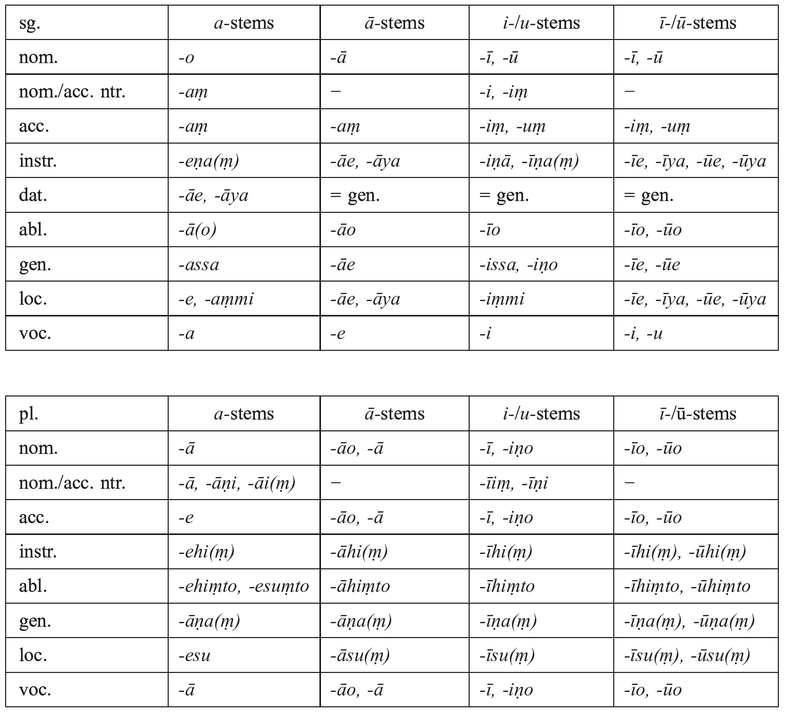
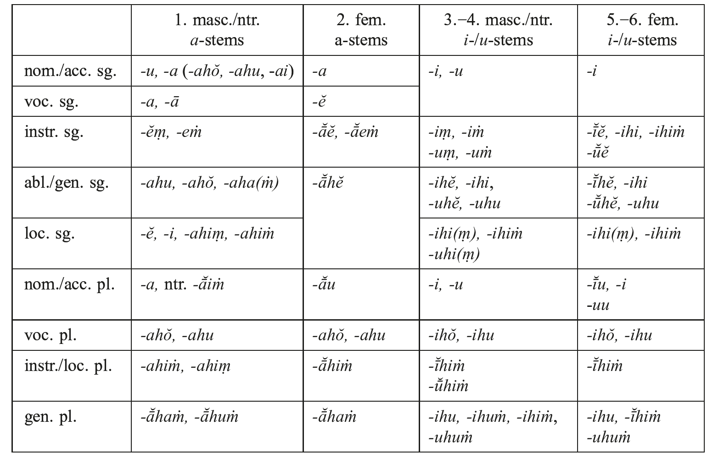
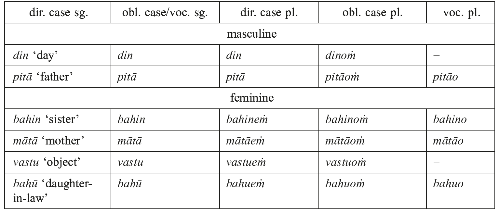
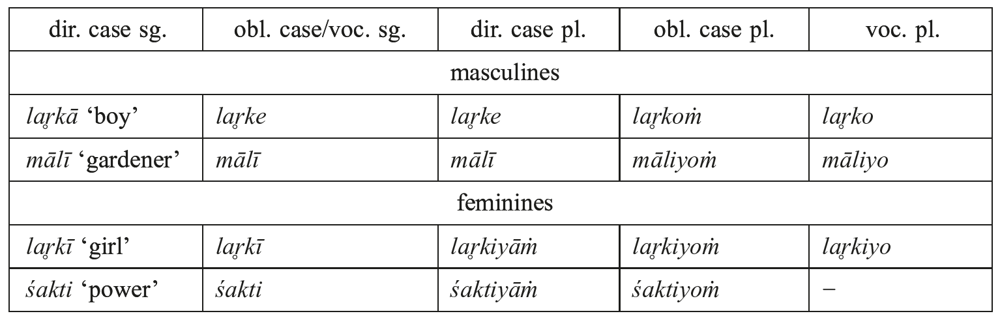
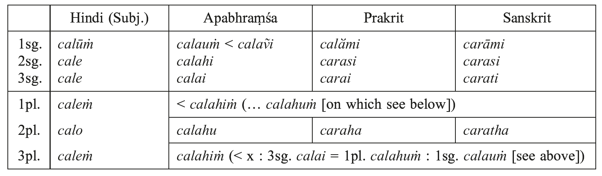

# 31. The evolution of Indic

- 1. Old, Middle, and New Indic
- 2. Phonology
- 3. Morphology
- 4. Abbreviations
- 5. References

## 1. Old, Middle, and New Indic

It is possible to trace a steady development of Sanskrit from the Ṛgveda through the later Vedic texts. The grammar was gradually simplified, mostly by eliminating archaic forms and by reducing the rich varieties of nominal and verbal categories. Side by side with the evolution of Sanskrit the popular vernacular which co-existed with the Vedic “high speech” developed into what is called Middle Indo-Aryan (MIA). Its rise as a literary language coincides with the foundation of the new religions of Buddhism and Jainism in the middle of the first millennium BCE. The first accurately datable documents of this linguistically developed stage of Indo-Aryan are the inscriptions of King Aśoka. MIA can be divided into three linguistic, albeit not strictly chronological, stages − Old, Middle and New Middle Indo-Aryan − covering a period ranging from approximately 500 BCE to 1000 CE. Old MIA is represented by Aśokan Prakrit, Pāli, and Ardha-Māgadhī. The next stage comprises younger Prakrits such as Jaina Māhārāṣṭrī. And the final phase of MIA is instantiated by Apabhraṃśa, which evolved from Prakrit under the influence of the much more developed vernaculars. Nor did this process stop at a particular point, as was the case with Sanskrit, but it transformed MIA in its entirety into what would become New Indo-Aryan.

Vedic texts are composed in a − deliberately − archaic form of Sanskrit. The then *spoken* language was already, it seems certain, far more developed. From it quite a number of features intruded into the hieratic “high speech” of the Veda, where a number of words of “Prakritic” origin are found. From these odd forms conclusions can be drawn concerning “Vedic Prakrit”. It turns out that almost all typical characteristics of Middle Indo-Aryan (with the striking exception of the “law of mora”; see, however, 2.1.2 below) are seen to have arisen long before that languageʼs first documents appear in the 3ʳᵈ century BCE.

Comparing the MIA languages with both Vedic and Classical Sanskrit, certain features can be found that go back to dialects differing from both. And though there are not many of these, they suffice to show that early Indo-Aryan, though on the whole remarkably uniform, did possess some variation. Moreover, they show that MIA cannot be derived directly from Classical Sanskrit which for its part is not directly descended from Vedic Sanskrit.

This state of affairs may be exemplified by the vocabulary of the languages mentioned above. Even within Vedic Sanskrit old words were continuously dropping out of use, e.g. *ápas-* ʻworkʼ, *aṣṭhīvánt-* ‘knee’, *kŕ̥śana-* ʻpearlʼ, *udṛ́ca-* ʻendʼ, *tatá-* ʻdaddyʼ, *tya*‘this one’, *dúrya-* (pl.) ‘dwelling’, *nanā´-* ʻmumʼ, *pā´ka-* ‘ignorant’, *baṣkáya-* ‘calf’, *viklidhá-* ‘having projecting teeth’, *sápa-* ‘semen’, *sūnú-* ‘son’, √*am* ʻto seize, to swearʼ, √*av* ʻto helpʼ, √*kṣi* ‘to dwell’, √*śnath* ʻto pierceʼ, *oṣam* ʻquicklyʼ (JaimBr I 205 [replaced by *kṣipram*, PañcaBr XII 13,23]); while new ones regularly turned up, borrowed from various sources, such as the (Prakrit) vernaculars (see 2.1.2), Dravidian (*daṇḍa-* ʻstickʼ, RV+), Austro-Asiatic (*kuliśa-* ʻaxeʼ, RV+) or altogether unknown languages (*ghoṭa-*ʻhorseʼ, ĀpŚS XV 3,12). Some words which appear in Vedic texts turn up again, after disappearing from the later Sanskrit literary tradition (cf. Pkt. *taya-* ʻthis oneʼ < RV+ *taká-*), even in modern Indian languages (cf. H. *āṭā* ʻflourʼ). On the other hand, a number of old words unknown to Classical Sanskrit are preserved in MIA: P. *kasambu-* ʻrefuseʼ (*kásāmbu-*, AVŚ XVIII 4,37), *kūṭa-* ʻwithout hornsʼ (*kūṭá-*, AVŚ+), *saddhiṃ* ʻtogetherʼ (*sadhryàk*, RV), Pkt. *ojjha-* ʻentrailsʼ (*ū´vadhya-*, RV). And finally a number of words of Indo-European origin first appear in the various stages of MIA: P. *(a)sāta-* ʻ(un)happinessʼ (cf. Latin *quiētus*), Ap. *tūra-* ʻcheeseʼ (cf. Greek τυρός).

## 2. Phonology

The governing principle is that, as a rule, the prosodic structure of a word remains unaltered despite grave phonological mutations.

### 2.1. Vowels

Sanskrit possesses the vowels *a, ā, i, ī, u, ū, ṛ, ṝ, ḷ, e, o, ai*, and *au* − in Vedic with accentual and prolonged variants. 1. *a* and *ā*, 2. *ī˘, e* and *ai* and 3. *ū˘, o* and *au* belong to distinct series of gradation. Alternations within a word involving members of these series may have morphological significance. Inconsistencies due to phonetic developments partly peculiar to Sanskrit make OIA morphology extremely complicated. Thus from early on there is confusion in the system, which only steadily increased. Many *Ablautentgleisungen* or ‘vowel gradation gaffes’ (as early as RV, as proved e. g. by *khédā-*) are the result of analogy and levelling that worked especially within paradigms.

#### 2.1.1. Excursus: The pronunciation of vowels

It goes without saying that so simple a picture of the vowels as that sketched here cannot convey even a faint idea of the variations in their pronunciation. The normative description of the vowel system by the Indian grammarians (most notably by Pāṇini in the 5ᵗʰ century BCE) as well as the persistent use of the Devanāgarī script − or of scripts derived from it −, which has no way of representing additional vowels or shades of pronunciation, obscure the fact that this system did not have the (deceptive) simplicity generally ascribed to it. Especially with regard to the evolution of Indic a more differentiated picture is called for, one that addresses the actual pronunciation. As is the case with all phonemes, vowels also have variants, distinguished by (e.g.) timbre. Merging into one another, they form a kind of continuum. As allophones, they are either conditioned by the context (i.e. phonologically by assimilation and dissimilation) or are context-free. These variations were as a rule not recorded when they had no semantic or grammatical bearing.

There are clues that already in Vedic Sanskrit *a* differed from *ā* not only in quantity but also in quality. This is recorded by Pāṇini in his final aphorism “*a a*” (8.4.68) which has to be interpreted as “[ɔ] *a*”, i.e. the *a* used in the Aṣṭādhyāyī to describe the formation of Sanskrit is in reality pronounced as [ɔ]. This pronunciation of *a* (as in English *l**o**ng*) which sometimes seems to have tended more towards [ʌ] (as in English *b**u**nch*) or − especially in the vicinity of palatals (cf. H. *yah* [yǝh]) − towards [ǝ] (as in English ***a****gain*) is confirmed by a number of facts from across the history of Indo-Aryan of which some selected examples may be given. Being much more closely pronounced, the more so when final, /a/ was represented by *o* when it was affectively lengthened: *śóṁsā móda(−)iva*, TaittSaṃ III 2,9.5 = KauṣBr XIV 3, stands for *śáṁsā mádeva* “Recite! May both of us find delight!”. In Greek the *a* of Indian words was represented variously by α, ε and ο (cf. Σανδράκοττος [Candragupta], Arrian *Anab*. V 6,2 / Σανδροκόττος, Arrian *Indike* V 3, Μέθορα [Mathura], ibid. VIII 5, Καμβισθ**ό**λοι [Kāpiṣṭh**a**la], ibid. IV 8), while Greek α, ε and ο could be rendered in different words by *a, e* or *o* in Indic languages (cf. Skt. *khalīna-* ʻbridleʼ [χαλινός], Mahābhārata, *harija-* ʻhorizonʼ [ὁρίζων], Bṛhatsaṃhitā; Aś Pkt. *Aṃtiyako* ‘Antiochus’ [RE II Girnār] ~ *Aṃtiyoke* [ibid., Kālsī, Jaugaḍa]). The name *Aps**a**ras* (to be precise: the gen. pl. *apsarasām*) is etymologized as *aps**u** rasaḥ* ʻthe essence in the watersʼ, Rāmāyaṇa 1,44.18 (cf. AVP V 29,2). Beng. *āg**u**n* ʻfireʼ points back to an anaptyctic (MIA) *agg**a**ni-* (: *agg**ɔ**ni-*) from *agni-*. In texts composed in old NIA *-a* and *-u* not infrequently rhyme: *… hetu*/… *sameta*, Nalarāyadavadantīcarita 140/297. And finally, a number of Dravidian loans were incorporated into Sanskrit by substituting *a* for an original *u* or *ŏ*: *mallikā-* ʻjasmineʼ (Tam. *mullai*, Kan., Tel. *molle*). On the other hand, Sanskrit loans into Dravidian had their *a* replaced by *e* after palatals: Tam. *celam* ʻwaterʼ (Skt. *jalam*).

There are indications too that short *i* and especially short *u* were more open than the corresponding long vowels. Both were drawn closer to *ĕ* and *ŏ*.

The interchangeability of *u* and (short) *o* − as documented by the rendering of Indic *u* by Greek *ο* and *vice versa* (Arrian Σανδροκόττος = Candragupta, Aś Pkt. *Turamaya* = Πτολεμαίος) or later on by doublets such as *collaga-*, Municandra 7.11, ~ *cullaga-*, Doghaṭṭī 88,15, or the Apabhraṃśa rhyme of *u* und *o* (…. *jōḍi**u***/… *kōḍi**o***, Kumārapālapratibodha 424,21*−23*) − is reflected in the nom. sg. of the Ap. *a-*stems, which ended in *-u* as a result of the shortening of *-o* (see 3.1.2).

In Vedic Sanskrit a number of significant alternations of vowels are reflected in parallel stanzas and formulas which were orally handed down and therefore subject to influences of actual pronunciation. The most common hesitation is between *ī˘, e* and *ai*. The same phenomenon is met with in the manuscript tradition of the Sanskrit Epics. It points to the early existence of a short mid-vowel in Indic languages (i.e. *ĕ*). And doublets like MIA *diara-* ~ *de(v)ara-* ʻbrother-in-lawʼ or *viyaṇā-* ~ *veyaṇā-* ʻpainʼ (vedanā-) indicate that this *ĕ* must have been pronounced somewhere between *e* and *i*.

The monophthongal *e* and *o* both have open and closed varieties. Being closely pronounced, *e* can alternate with *ī* (Vedic *gavī́dhuka-* ~ *gavédhuka-*) and rhyme with it (Ap. … *dīsai*/… *karesai*, Bhavisatta Kaha 19,5). The same holds for *ū* and *o* (Vedic *cū´ḍa-* ~ *cóḍa-*).

#### 2.1.2. Vowels in Middle Indo-Aryan

In MIA 1. *ṛ, ṝ* and *ḷ* were eliminated yielding *a, i* or *u* according to the context and 2. the diphthongs *ai* and *au* were monophthongized resulting in *e* and *o*: Pkt. 1. *ghaya-*ʻgheeʼ (ghṛta-), *hiyaya-* ʻheartʼ (hṛdaya-), *pucchā-* ʻquestionʼ (pṛcchā-), 2. *vejja-* ʻphysicianʼ (vaidya-), *jovvaṇa-* ʻyouthʼ (yauvana-). Both developments were foreshadowed in Vedic texts (cf. section 1): 1. *víkaṭa-* ʻdeformedʼ (víkṛta-), *durhaṇāyú-* ʻenragedʼ (durhṛṇāyú-), *śithirá-* ʻlooseʼ (*śṛthirá-), *kuru* ʻdo!ʼ (kṛṇu), *múhur* ʻsuddenlyʼ (*mr̥h́ ur) (compare also the “hyper-Sanskritism” *pṛṣṭhavā´t*, MaitrSaṃ III 11,11: 158.9, for *paṣṭhavā´ṭ*, Kāṭh XXXVIII 10: 112.4, TaittBr II 6,18.3), 2. *Etaśa*, KauṣBr XXX 5, ~ *Aitaśa*, AitBr VI 33, *kevárta-* ʻfisherʼ (kaivárta-), *somya*- ʻdear oneʼ (saumya-). These phenomena, however, are very rare, the first one mostly being caused by dissimilation (*ṛ_r*). In popular Sanskrit they increase in number, and the replacement of *ṛ* by another sound is no longer bound to a particular phonetic context: *uḍupa-* ʻmoonʼ (ṛtupa-), *bhaṭa-* ʻsoldierʼ (bhṛta-), *ogha-* ʻfloodʼ (augha-), *komala-* ʻtenderʼ (*kaumӑra- ← kumāra-).

As a consequence of the elimination of *ṛ* and also of *ai* and *au* the system of gradation collapsed. Where Sanskrit had the series *bhṛta-, bharati, bhartum, bhārayati*, Pali has *bhata-, bharati, bhattuṃ, bhāreti*. Prakrit *diṭṭha-, daṃsaṇa-, daṭṭhavva-* correspond to Sanskrit *dṛṣṭa-*, *darśana-*, *draṣṭavya-*. In such series regularity can no longer be perceived by speakers and we find either one form being generalized (Pkt. *bharai, bhariuṃ, bhariya-*) or a new grade form being created from *a, i*, or *u* out of *ṛ* (Pkt. *bhāḍī-* ʻhire chargeʼ ← *bhaḍa-* ʻmercenaryʼ < bhṛta-). While this vowel alternation has maintained itself, albeit much reduced in scope, as a grammatical formative in the verb (see discussion of causative 3.4.1 [p. 465−466]), it ceased to have any significance in the formation of the noun.

Short vowels other than *ṛ* are in general retained unchanged before single consonants and consonant groups in MIA (on *ĕ* and *ŏ* see 2.1.1 and 2.1.3): Pkt. *ajja* ʻtodayʼ (adya), *pivai* ʻdrinksʼ (pibati), *vijjā-* ʻknowledgeʼ (vidyā-), *uvari* ʻaboveʼ (upari), *puppha-* ʻflowerʼ (puṣpa-). Long vowels, however, are generally shortened before two or more consonants (by the *law of mora*). And these short vowels converge with the OIA short vowels: Pkt. *maṃsa-* ʻmeatʼ (māṃsa-), *tikkha-* ʻsharpʼ (tīkṣṇa-), *puvva-* ʻformerʼ (pūrva-). Sometimes the *law of mora* was affected by the simplification of a consonant group: Pkt. *pāsa-* ʻsideʼ (pārśva-), *īsara-* ʻlordʼ (īśvara-), *mūya-* ʻurineʼ (mūtra-). The lengthening of a preceding short vowel (attested by *kāṭá-* < **kaṭṭá-* < kartá- for Ṛgvedic Prakrit) foreshadows a phonetic law of NIA (see 2.2.3). Since long vowels may alternate with short nasalized vowels − an equivalence found already in Vedic texts (*apīṣan*, AVŚ IV 6,7 = AVP V 8,6, ~ *piṃṣánti*, AVŚ XIV 1,3 = AVP XVIII 1,3 [√*piṣ*]) − such a secondary long vowel may be replaced by a short nasalized vowel: Pkt. *aṃsu-* ʻtearʼ (< **āsu-* < aśru-). Their equivalence is shown (*inter alia*) by doublets such as *°heo*, Municandra 7a.10, ~ *heuṃ*, Doghaṭṭī 88,6 or by the rhyming of *-ā* and *-aṃ* in Apabhraṃśa texts (*āh**ā**sivi* − *nam**aṃ**sivi*, Bhavisatta Kaha 74,6).

A forerunner of the law of mora is probably to be observed already in Vedic texts in the phenomenon that a long vowel is oftened shortened before a double consonant at the seam of individual members of compounds. Otherwise, shortening in accordance with the law of mora is seldom encountered in Sanskrit. There are only a few examples such as *marga*ʻpathʼ (~ mārga-), ĀpGṛS XX 12; *antra-* ʻentrailʼ (~ āntra-), Rāmāyaṇa 5,22.35 (v.l. āntra-); *ahnāya* ‘forever’, Mahābhārata 3,36.10 (~ *āhnāya*, JaimBr II 74); *kalya-* ʻpertaining to the morningʼ (~ *kālya-*), Mahābhārata 3,83.101 (v.l. *kālyam*).

Much more frequent are the effects of assimilations and dissimilations (immediate or distant) on vowels. There is a marked tendency for *a* to shade over into *i* and *u* in the vicinity of palatals and labials respectively: Pkt. *āiṇṇa-* ʻthorough-bredʼ (ājanya-), *miñjā-*ʻmarrowʼ (majjan-), *tūliya-* ʻcottonʼ (tūlaka-), *nimugga-* ʻsubmergedʼ (nimagna-). The same may happen with *a* before the velar nasal which had a slight palatal quality: Pkt. *iṅgāla-* ʻemberʼ (aṅgāra-), Ap. *cikkamai* ʻwalks aboutʼ (caṅkramati); cf. *irgala-* on which see 2.2.1. But it is also the case that *i* and *u* are assimilated to a nearby labial or palatal: P. *ucchu-* ʻsugarcaneʼ (ikṣu-), *vālikā-* ʻsandʼ (vālukā-).

Such an assimilation is found as early as Vedic Sanskrit: *syoná-* < **siyoná-* < **su-yoná-, mithyā´* < **mithiyā´* < *mithuyā´*.

The contraction of *-aya-* to *-e-* and *-ava-* to *-o-* widely found in MIA involved as well an assimilation (*-e-* < **-a{y}i-* < -aya- // -o- < **-a{v}u-* < -ava-): P. *neti* ʻleadsʼ (nayati), Aś Pkt. *olodhana-* ʻharemʼ (avarodhana-). And *-ayi-* and *-ayū˘-* fared in the same way.

This development is found already in Vedic Sanskrit: *kṣeṇá-*, MaitrSaṃ II 9,8: 126.7, ~ *kṣayaná-*, Kāṭhaka XVII 15: 248.3; *tó-to*, ŚatBr III 3,1.11, ~ *táva-tava*, MaitrSaṃ I 2,4: 13.10. And even the resolution of *e* into *aya* is encountered: *pratyayanastva-*, TaittBr I 1,9.6, vs. *prātyenasya-*, Kāṭhaka VIII 3: 85.13.

In part, such assimilations carried morphological significance. Thus the ending *°(y)e* of obl. sg. of Pkt. *ā*- and *ī*-/*ū*-stems goes back to *°yā˘* (Pkt. *mālāe*/*devīe* < P. *mālāya*/*devīyā*). And the case endings of Ap. show, in part, extensive assimilation: gen. sg. *°aha* < *°ahu* (see 3.1.2).

Not only palatals and labials but also other consonants may affect vowels. Cerebrals closing a syllable may “muffle” *i* to *ě* and *u* to *ŏ*: P. *nekkha-* ʻnecklaceʼ (niṣka-), Pkt. *pokkhariṇī-* ʻlotus pondʼ (puṣkariṇī-), *soṇḍā-* ʻelephantʼs trunkʼ (śuṇḍā-). The same effect was achieved by a following *h*: Pkt. *vebbhala-* ʻagitatedʼ (*vehvala- < vihvala-).

Likewise, vowels are subject to dissimilations caused by neighbouring vowels: Pkt. *nauiṃ* ʻninetyʼ (navati-), P. *dakkhita-* ʻconsecratedʼ (dīkṣita-), Pkt. *teicchā-* ʻmedical attendanceʼ (< Aś Pkt. *cikī˘(c)chā-* < cikitsā-), *dugañchā-* ʻdisgustʼ (jugupsā-).

Doublets and hesitation in writing (both within one language and between more than one) are indicative of the latitude of allophonic variation: P. *rajassira-* ~ Pkt. *rayassala-*ʻdirtyʼ (rajasvala-), Pkt. *silāgā-*, Bṛhatkalpabhāṣya-Ṭīkā I 88,30, ~ *salāgā-* ʻsmall stickʼ Āvaśyaka-Erzählungen 8,25* (śalākā-); *vāhiṇiyā-*, Dharmopadeśamālā-Vivaraṇa 111,30, ~ *vāhaṇiyā-* ʻrideʼ, Āvaśyaka-Erzählungen 11,25, 13,8* (vāhanikā-), *haladdā-* / *haladdī-*~ *haliddā-* ʻturmericʼ, Ausgew. Erz. 86,12* (haridrā-), *siṭṭhi-*, Sukhabodhā 57a.2, Kalpasūtra 50,24 ~ *seṭṭhi-* ʻhead of a guildʼ, Paumacariya 2,3 (śreṣṭhin-), *heṭṭhā*, Ausgew. Erz. 7,4 ~ *hiṭṭhā* ʻbelowʼ, Municandra 7a.11 (*adhástāt*, see 2.3).

#### 2.1.3. Vowels in Apabhraṃs´a

The most conspicuous feature of the Apabhraṃśa vowel system is that its inventory was enhanced by short *e* and *o* as phonemes, not restricted to a particular position in the word (see 2.1.1). This *ĕ* is used (e.g.) in the endings of the instr. sg. and the loc. sg. m./ n. of *a-*stems (*-ĕṃ, -ĕ*), of the instr. sg. of all fem. stems (*-ā˘ĕ, -ī˘ĕ, -ū˘ĕ*), of the voc. sg. of fem. *a-*stems (*-ĕ*), in the ending *-hĕ* of the fem. *a-* and of all *i-* and *u-*stems, in the pronominal forms *amhĕ* and *tumhĕ* and in the absolutive in *-ĕvi*, while *ǒ* is employed in the gen. sg. ending *-hǒ* of the m. and n. *a-*stems (see Table 31.2, 3.1.2) and the 2pl. imp. in -*ahǒ* (alternating with *-ahu* and *-aha*, see Table 31.6, 3.4.1). The short finals are the result of an Apabhraṃśa phonetic law according to which every long final vowel of polysyllabic words undergoes shortening unless the old (Pkt.) length is protected by a following enclitic. Another consequence of such shortening was that the nom./acc. sg. of all feminine stems ended in a short vowel (see 3.1.2). Finally this sound law was extended to monosyllabic words: *ju* ʻwhoʼ (yaḥ), *su* ʻheʼ (saḥ), *ti* ʻtheyʼ (te).

In MIA vocalic allophony concerned in the main single words, though occasionally it affected morphology as well (see 2.1.2 [p. 450]). In Apabhraṃsa it was morphology that was widely affected. Thus, the frequent replacement of final -*a* by *-u (ajju* ʻtodayʼ < adya) had a bearing on numerous paradigms: *majjhu* ʻmy, for meʼ (Pkt. *majjha[ṃ]* < mahya[m]), *ehu* ʻthis oneʼ (Pkt. *esa ~ eso* < eṣa[ḥ]), (2sg. imp.) *bhaṇu* ʻspeakʼ (bhana), (2pl. imp.) *calahu* ʻmove on!ʼ (*caratha [:: carata]).

#### 2.1.4. Vowels in New Indo-Aryan

NIA languages have vowel systems ranging from only six (Oriya and Marathi) to thirteen vowels (Sinhalese). What might be called the normative system, in that it is “closest” to Sanskrit, is the ten-vowel system of Hindi and Panjabi. It consists of *ī, i, e, ai*; *ā, a*; *ū, u, o, au*. The diphthongs *ai* and *au*, which are retained as written symbols, are monophthongized to [æ], an open front vowel, and [ɔ], an open back vowel.

Nasalized vowels are a very prominent feature of most NIA languages. Historically, such nasalization arises from a nasal which is absorbed by the preceding vowel (*pāṁc* ʻfiveʼ < pañca-) or else developed in the context of long vowels (*sāṁp* ʻserpentʼ < **sāp* < sarpa-).

Assimilations continue to affect vowels (there are no clear examples of dissimilations): H. *uṁglī* ʻfingerʼ (aṅguli-), *buṁd* ʻdropʼ (bindu-). But two chief changes affect the vowel systems of the modern period of the majority of Indo-Aryan languages: 1. the coalescing of vowels left in contact by the loss of intervocalic stops in Prakrit (see 2.2.2) and 2. the compensatory lengthening of a short vowel before a simplified consonant group (see 2.2.3).

### 2.2. Consonants

Sanskrit possessed the following consonants, all of which, with the exception of *ñ*, were independent phonemes: (velars) *k kh g gh ṅ*, (palatals) *c ch j jh ñ*, (cerebrals) *ṭ ṭh ḍ ḍh ṇ*, (dentals) *t th d dh n*, (labials) *p ph b bh m*, (sibilants) *ś ṣ s* and the sound *h*. The extant text of the Ṛgveda has *-ḷ(h)-* from *-ḍ(h)-*, a feature shared by Pāli and many Prakrit languages (P. *kīḷati* ʻplays, sportsʼ < RV krīḷati ~ Skt. krīḍati), and a number of such retroflex *-ḷ-* persist in classical Sanskrit in the form of *-l-* (*nala-* ʻreedʼ < *naḷa-* < *naḍa-*). The predominance of *r* over *l* in the Ṛgveda accords with its western origin, for the same phenomenon is seen in Iranian (Vedic *pūrṇá-*/Avestan *pərəna-* vs. Latin *plēnus*). But from the time of the late Ṛgveda there is some confusion between *r* and *l*, and *l* begins to intrude into words with original *r* − a process that gains ground: *úpala-, klóśa-, lóman-, lóhita-, ślóka-* RV+; *gláha-* (√*grah*), √*lap* (: RV √*rap*), √*likh* (: RV √*rikh*) AV+; *kṣālayati* (: RV √*kṣar*) ŚatBr+. In part, *r-* and *l-*forms of one and the same word are used to differentiate shades of meaning: √*car* ʻto go, to moveʼ, √*cal* ʻto sway, to waverʼ.

#### 2.2.1. Consonants in Middle Indo-Aryan

The inventory of consonants in MIA is basically the same as in (Vedic) Sanskrit, except that *ñ* (from *jñ* or *ny*) has achieved phonemic status.

Apart from *-n* and *-m*, which developed into *-ṃ*, MIA words lost all final consonants and, by analogy, even *-ṃ* may be dropped: Pkt. *kohā* ʻout of angerʼ (krodhāt), *aggiṃ* ʻfireʼ (agnim), *kuvvaṃ* ʻdoingʼ (kurvan), *iyāṇi* ʻnowʼ (idānīm).

In MIA initial single consonants − except *y-* and *ś-*/*ṣ-* (which, in part, developed into *j-*/0̸- and *ś-*/*s-*) − remain unaltered. But *k-, t-, p-* and *b-* are often aspirated in the presence of a following -*S*-, -*r*- or -*l*-: P. *khīla-* ʻpostʼ (kīla-), *thusa-* ʻhusk of grainʼ (tuṣa-), *pharusa-* ʻroughʼ (paruṣa-), *bhusa-* ʻchaffʼ (busa-).

In the older variants of MIA − Aś Pkt. and Pāli − intervocalic single consonants remain (for P. *-ḷ(h)-* see 2.2, for other exceptions see below), whereas in the linguistically more advanced Prakrits (at first in the eastern ones) unaspirated and aspirated single intervocalic tenues were voiced: AMg. *loga-* ʻworldʼ (loka-), *āghāi* ʻtellsʼ (ākhyāti). Still later on unaspirated mediae, whether old or new, were dropped (for *-b-* see below): JM. *pāya-* ʻfootʼ (pāda-), *loya-* ʻworldʼ (for the *-y-* see below). And aspirated mediae, old and new ones, were reduced to *-h-*: JM. *meha-* ʻcloudʼ (megha-), *muha-* ʻfaceʼ (mukha-). The labials *p* and *b* develop into *v*: JM. *niva-* ʻkingʼ (nṛpa-), *savala-* ʻspottedʼ (śabala-). When a *v* of this kind stands before *u* it may be elided: JM. *niuṇa-* ʻskilledʼ (nipuna-). But it is also the case that genuine intervocalic *-v-* is sometimes dropped: JM. *aḍaī-* ʻjungleʼ (aṭavī-).

These developments were foreshadowed in Vedic Sanskrit: 1. *árbhaga-* ʻjuvenileʼ (~ *árbhaka-*), *váṁsaga-* ʻbullʼ (*varṣaka-), RV; 2. *maireya-* ʻintoxicating drinkʼ (← madira-), Pāṇini 6.2.70; 3. *sévate* ʻassociates withʼ (← √*sap*), RV+. In the course of time, they yielded a number of hyper-Sanskritisms: *nepathya-* ʻdressʼ (← Pkt. *nivattha-* ʻdressedʼ), *prasabham* ʻviolentlyʼ (← pra-√sah), Mahābhārata+; *varṣābhū-* ʻborn in the rainsʼ, Pāṇini 6.4.84 < *varṣāhū´-* ʻshouting in the rains = frogʼ, VājSaṃ XXIV 38.

The deocclusion of Vedic *-dh-* and *-bh-* into *-h-* (*dahrá-* < *dabhrá-*) does not anticipate the Prakrit sound change *-h-* < *-Ch-* but has taken place only in a special phonetic environment (for details see Kobayashi 2004: 83−91).

Characteristic of most Prakrit languages is the change of each intervocalic *-n-* into *-ṇ-*: *vaṇa-* ʻforestʼ (vana-).

This change is seen as early as the Ṛgveda: *sthāṇú-* ‘trunk of a tree’ (RV+), *sthū´ṇa-* ‘post’ (RV+), √*paṇ* ‘praise’ (~ √*pan*), *guṇá-* ‘thread’, TaittSaṃ VII 2.4.2.

This means that in younger MIA only intervocalic OIA *ḍh, ṇ, m, h*, and partly *r, l*, and *s* (see below) remain unaltered: *daḍha-* ʻfirmʼ (dṛḍha-), *saraṇa-* ʻrecollectionʼ (smaraṇa-), *majjhima-* ʻmiddleʼ (madhyama-), *dahai* ʻburnsʼ (dahati), *dāsa-* ʻservantʼ (dāsa-).

Old *r* was largely replaced by *l* in the eastern parts of the MIA linguistic area: Aś. Pkt. *palasata-* ʻrhinocerosʼ (parasvant-). And this (basically) eastern *l* intruded into (more) western languages, such as Pāli (*māluta-* ʻwindʼ < māruta-). By a certain time this process was accomplished and subsequently *r* and *l* were (strictly) kept apart.

The three sibilants (*ś*, *ṣ, s*) were conflated into just one, either *ś* or *s*, the first being a feature of the eastern languages and the second of western languages. As a suffixal element *s*, which may have developed secondarily out of *-ss-* (< *-sy-*/-*[i]ṣy-*), may result in *-h-* (see also 3.4.1): Aś. Pkt. *dāhaṃti* ʻthey will giveʼ (dāsyanti).

The hiatus which resulted from the dropping of intervocalic unaspirated consonants was, in part, closed by *y* and − more rarely − by *v* (see 2.2.2): Pkt. *gīya-* ʻsungʼ (gīta-), Aś Pkt. *cāvudasa-* (caturdaśa-), Pkt. *juvala-* ʻpairʼ (yugala-). The former, the so-called *ya-śruti*, has left traces in certain languages on adjoining vowels (see 2.1.2).

Intervocalic consonants may, however, be affected by distant sounds. Dentals following an *ṛ* that was replaced by *a, i*, or *u* tended to be cerebralized (Aś. Pkt. *puṭhavī-*ʻearthʼ < pṛthivī-), a development discernible from early on (cf. *víkaṭa-* < vikṛta-, RV [see 2.1.2]). The same happens after *r* or *ṣ*: Aś. Pkt. *paṭi+* (prati+), *osuḍha*- ʻmedical herbʼ (auṣadha-) (cf. *āḍhyá-* < *ārddhya-, ŚatBr IX 5,1.17).

Consonant groups fared quite differently. They were either assimilated or split up by an inserted vowel. The first development is basically encountered in the western, the second in the eastern MIA languages.

The general principle behind consonantal assimilation is that the occlusive is dominant in all positions, but that dentals are adapted to a following *y* and that, if the first consonant is a sibilant, the whole group is aspirated (all examples are taken from Pāli): *sappa-* ʻsnakeʼ (sarpa-), *pakka-* ʻripeʼ (pakva-), *vuccati* ʻis calledʼ (ucyate), *sacca-* ʻtruthʼ (satya-), *ajja* ʻtodayʼ (adya), *hattha-* ʻhandʼ (hasta-). If two occlusives or two nasals are in contact the first is assimilated to the second: *mutta-* ʻliberatedʼ (mukta-), *ninna-* ʻlow landʼ (nimna-). Among the non-occlusives sibilants and nasals dominate over approximants: *assa-* ʻhorseʼ (aśva-), *kamma-* ʻworkʼ (karman-). And within the approximants (including *v* in this group) the power of resistance diminishes in the order *l, v, y, r*: *kallāṇa-* ʻauspiciousʼ (kalyāṇa-), *sabba-* ʻallʼ (**savva-* < sarva-). Hence, the hierarchy of consonants is as follows: 1. (non-palatal) occlusives, 2. nasals, 3. palatals, 4. sibilants, and 5. *l* → *v* → *y* → *r*.

Clusters of three consonants are assimilated according to the same principles, except that the last consonant is not taken into account unless it is a sibilant or a *-y-* following a dental.

Initially the same rules apply, but only the second consonant of a cluster is retained: *thana-* ʻbreastʼ (stana-).

This assimilation of consonant clusters is again foreshadowed in the Vedic “Prakritisms”: *akkhalīkŕ̥tya* (akṣára-), *kāṭá-* (kartá-), *jájjhatīḥ* (jákṣatī-), *kṛcchrá-* (*kṛpsra-), (all) RV; *kṣullaka-* (kṣudraka-), AVŚ II 32,5; *lajjate* (rajyate), AitBr III 22,7; *nāpita-* ʻbarberʼ (*nhāpita- ← snāpayati ʻbathes someoneʼ), ŚatBr III 1,2.2; *abhyātta-* (abhyāpta-), ChāndUp III 14.2, *(ni)bhālay°* (smāray°), ChāndUp VI 12.2, 13.2 (cf. *[gandh]ācchādane*, VārGṛS XII 2, ~ *[gandh]otsadane*, MānGṛS I 9,26); on *āḍhyá-* see above. And its operation is proved by a number of hyper-Sanskritisms: *vyautsat*, KapSaṃ V 9: 57.10 ~ *vyaucchat*, Kāṭhaka VII 10: 71.22; *bhṛjyéyur*, MaitrSaṃ I 10,11: 151.6, Kāṭhaka XXXVI 6: 73.1 (: *bhṛjjā´ti*); *prasaktáḥ*, AVŚ VII 50,3 ~ *prasattáḥ*, RV 5.60.1; *udyá-*, ŚatBr XIV 6,8.2 ~ *ujjyá-*, BṛhadUp III 8,2.

Obviously, the assimilation of consonant clusters was felt as characteristic of vernaculars. Indeed, geminates have almost always been removed by substituting (often erroneous) clusters when words are taken over into Sanskrit: ŚatBr XIV 9,4.22 *argaḍa-* ‘bolt for fastening a door’ (Kāṇva *argala-*) / Gaṇapaṭha ad Pāṇini 5.1.4 *irgala-* ← (MIA) *aggaḷa-*, Up+ *paṇḍita-* ʻwiseʼ (← [MIA] *paṇṇā-* < *prajñā-*), Mahābhārata+ *akṣauhiṇī-* ʻarmyʼ ← (MIA) *akkhohiṇi-* < **akṣobhiṇī-* ʻnot to be movedʼ, *muktā-* ʻpearlʼ ← (MIA) *muttā-* < *mūrta-* ʻcoagulatedʼ. That these substitutions almost always went wrong is quite often attributable to folk etymologies: *lubdhaka-* ʻgreedyʼ ← (MIA) *ludda(ka)-* ʻhunterʼ (< *raudra-* ʻcruelʼ).

Although geminate consonants as a rule are avoided in Sanskrit, sometimes they are used for the sake of emphasis: *iyattaká-* ʻso smallʼ, RV 1.191.11/15 (magic spells).

Geminates still persist in some NIA languages like Lahnda and Panjabi. But in the majority they have been simplified, a process observable already in early MIA (see 2.2.3).

Clusters of different consonants were also eliminated by splitting them up with the help of a vowel. In such cases most often 1. *a*, 2. *i*, and 3. *u* are used if the neighboring syllables contain 1. *ā˘*, 2. *ī˘* or a palatal, or 3. *ū˘* or a labial, respectively: 1. *ratana-* ʻgemʼ (ratna-), 2. *aggini-* ʻfireʼ (agni-), *gilāna-* ʻsickʼ (glāna-), 3. *kurūra-* ʻbloodyʼ (krūra-), *sumarati* ʻremembersʼ (smarati).

The anaptyctic split too is encountered in Vedic texts: *anarihan-*, GopBr II 3.6: 193.1 ~ *anarhan-*, AitBr VII 33,8; *dahara-*, ChāndUp VIII 1.1−2 ~ *dahrá-*, Kāṭhaka 33.5: 30.16 (from older *dabhrá-*, RV [on which see above, this section]); *malihá-*, MaitrSaṃ IV 4,9: 60.20 ~ *malhá-*, Kāṭhaka XIII 1: 179.5; *°valiśa-*, KapS I 2: 3.10 ~ *°valśa-*, Kāṭhaka I 2: 1.10; *Tārukṣya*, AitĀr 3.1.6 ~ *Tārkṣya*, ŚāṅkhĀr 7.19; *°paráśva-*, MaitrSaṃ IV 1,2: 2.14 ~ *°parśvá-*, Kāṭhaka XXXI 1: 1.2 (cf. *mārisa*, Mahābhārata+ ~ *mārṣa*, Kāṭhaka-Gṛhyasūtra XXIV 9).

#### 2.2.2. Consonants in Apabhraṃs´a

Apabhraṃśa has the same inventory of sounds as Prakrit, albeit enhanced by *ṽ*. This goes back to intervocalic *-m-*: *kuṽara-* ʻprinceʼ (kumāra-), *gāṽa-* ʻvillageʼ (grāma-). If the *v* is dropped before a *u* (see 2.2.1), the nasality is transferred to this *u*: nom. sg. (*gāũ*, here written:) *gāuṁ* ʻ villageʼ, (*nāũ*, here written:) *ṇāuṁ* ʻnameʼ. The same happens when the *v* is turned into a vowel: 1sg. ind. pr. *jāṇauṁ* ʻI knowʼ < **jāṇaṽi* < jānāmi. This *ṽ* may, however, develop by dissimilation into pure *v*: *paṇavai* < **paṇaṽai* (< praṇamati). On the other hand -*v-* may become (via -*ṽ-*) -*m-*: *jema* ʻlikeʼ (**yevaṃ* < yathā X evam).

In Sanskrit, too, the interchangeability of *m* and *v* is encountered: *pramadana-* ‘playing of instruments’, MānGṛS I 9,28 ~ *pravadana-*, VārGṛS XIII 1 (cf. √*mreḍ* < √*vreḍ < vraiś+d). Instructive is the case of √*śmañc*, TaittĀr VI 7.1, which obtained its *-m-* by assimilation (cf. √*ś**v**a**ñ**c*, RV+), as did *bhāvinī-* ʻbeautiful womanʼ, Mahābhārata+, which obtained its *-v-* by dissimilation (< *bhā**m**i**n**ī-*).

The development of suffixal *-s-* into -*h-* is characteristic of Apabhraṃśa. Thus the gen. sg. of the Apabhraṃśa masc. a-stems in *°ahu* derives from an earlier *°as(s)a*. And the ending of the 2sg. ind. pres. is *°hi* from *°si*. This phonetic change is seen also in the numeral *(°)daha-* from *(°)daśa(n)-*.

The many hiatuses that were induced in MIA by the dropping of intervocalic consonants were partly closed in Apabhraṃśa by various kinds of contractions. Peculiar to Apabhraṃśa is the contraction of *-ā˘yā˘-* to *-ā-*: *piyāra-* ʻdearerʼ < *piyayara-* < priyatara-, *lehāraya-* ʻscribeʼ < **lehayāraya-* < lehakāraka-, *khāi* ʻeatsʼ < **khāyai* < khādati, *vāma-*ʻeffortʼ < vyāyāma- (see also 2.1.2).

Contraction of vowels in contact is encountered in Vedic in the word *duhitṛ-* ʻdaughterʼ, which is several times dissyllabic in Vedic texts and whose nom. *duhitā* evidently is to be pronounced /*dhītā*/ at AitBr VII 13,8, a contraction of **dhiitā* from **dihitā* < duhitā. Note that this peculiar phonetic development appears in a term of relationship (cf. “allegro vocatives”).

#### 2.2.3. New Indo-Aryan

The most conspicuous feature of the NIA consonant system is its treatment of MIA clusters. They were simplified after a short vowel, the latter being in turn compensatorily lengthened (see 2.1.2). Since almost all intervocalic OIA consonants were dropped in (late) MIA (see 2.2.1), most of the intervocalic and final consonants of NIA go back to clusters which have been thus simplified.

### 2.3. Sporadic sound-changes in Indo-Aryan

Repeated mention has been made of sporadic sound changes such as vocalic 1. assimilation and 2. dissimilation. Note that these changes affected consonants too throughout the history of Indo-Aryan:

1. Vedic *upamlupta-* ʻhiddenʼ (upamlukta-), Pkt. *kuṇima-* ʻcarcassʼ (*kuṇiva- < kuṇapa-).

2. Vedic *ásiknī-* ʻblackʼ (*ásitnī-), *takmán-* ʻfeverʼ (*tapmán-), *púṣpa-* ʻflowerʼ (*púṣman-), (*mánuś ca..*.) *manā´yī-* ‘wife of Manu’, MaitrSaṃ I 8,6: 122,19 (~ *mānā´-vi-*, ŚatBr I 8,1.26), Aś. Pkt. *hida* ʻhereʼ (*h-idha [with emphatic *h-*]), Pkt. *ālāna-*ʻtethering postʼ (ādāna-), *ciṭṭhai* ʻstandsʼ (tiṭṭhai < tiṣṭhati), *sattarasa-* (sattadasa- ‘seventeen’ [and likewise *trerasa**-** > *telasa-*]), (H. *lonī* ʻfresh butterʼ <) Ap. *loṇiya-*/ *lavaṇīya-* ʻfresh butterʼ (navanīta-), H. *anār̥ī* ʻfoolishʼ (Pkt. *aṇṇāṇi(n)-* < ajñānin-). Feebly articulated sounds may even completely disappear: *śitipád-* ʻhaving white feetʼ (*śvitipád-), RV.

For further sporadic sound changes we may cite pertinent examples from different stages of Indo-Aryan:

1. Aphaeresis: Vedic *<i>tí*, ŚatBr XI 6.1.3 ff., *<á>pi* (proved by *katipayá-*, ŚatBr, Kāṭhaka, from *kati + <a>pi*), P. *heṭṭhā* ʻbelowʼ (← <a>dhástāt), H. *baiṭh-nā* ʻto sit downʼ ← Ap. *vaiṭṭha-* (<u>paviṣṭa-).

2. Apocope: Ap. *majjā-* ʻfrontierʼ (maryā<dā>-).

3. Syncope: Vedic *srábhiṣṭha-* ʻmost fragrantʼ (**←** s<u>rabhí-), ŚatBr VI 8,2.3, P. *bhante* ʻyour honourʼ (*bha<dda>nte* < bhadraṃ te), Pkt. *subbhi-* (sur<a>bhi-), Ap. *gaṇṇa-*ʻcountingʼ (gaṇ<a>ṇā-).

4. Metathesis: Vedic *stoka-* ʻdropʼ (√ścut), P. (*arāla-* <) *aḷāra-* ʻcrookedʼ (arā´ḍa-, Maitr-Saṃ II 5,9: 59.17), Pkt. *dīhara-* ʻlongʼ (dīrgha-).

Other than these sound-changes which − as a rule − were restricted to single words, haplology and blending exerted an influence also on morphology, as will be seen below (3.2).

## 3. Morphology

The tendency towards normalization inherent in all morphology increased from Vedic to Epic Sanskrit and from old to late MIA and continued into Apabhraṃśa and New Indo-Aryan. Its most effective factor was paradigmatic levelling, which eliminated alternations within noun and verb inflections. Most often *one* form was generalized which served as a base for re-organizing the inflection (cf. *brahma-*/*vīrahaṇi*, Kāṭhaka XXXI 7: 9.9, as opposed to older *°ghní*, thus giving rise to instr. sg. *vṛtrahaṇā*, Mahābhārata 3,13.119, and gen sg. *vṛtrahaṇaḥ*, Mahābhārata 1,50.8). A second point was that vocalic inflections came to the fore, a phenomenon that had begun already in Ṛgvedic Sanskrit and thenceforth steadily increased.

For the Rgveda cf. a) *cákṣoḥ*, RV 10.90.13, abl. sg. of *cákṣu-* ← *cákṣus-*, b) *nāváyā*, RV 1.97.8, instr. sg. of *nāvā-* ← *náu-*.

Similar phenomena characterized the development of the verbal system. Here it was the overwhelming influence of thematic inflection that led to a remodelling of verbal paradigms. This process started already in the Ṛgveda (cf. *ínvasi*, RV 5.28.2, 8.13.32, ← 3pl. *ínvanti*), and by early MIA times had reached a point where only a few traces of athematic forms remained, all of these being eliminated by late MIA and Apabhraṃśa.

### 3.1. Noun inflection

The noun in Sanskrit has three numbers: singular, dual, and plural. The dual was abandoned already in early MIA in favour of the plural, partly accompanied by an adjunct signifying ʻtwoʼ or ʻbothʼ: Aś RE I K *duve majūlā* ʻtwo peacocksʼ. This disappearance was facilitated by the loss of the diphthong *au* (see 2.1.2) which was so characteristic for the dual.

The distinction of three genders of the noun persists throughout Sanskrit and MIA, albeit with some ambivalence between masculine and neuter in a great number of words (cf. *grāma-*, m. in Vedic Skt., m. and ntr. in post-Vedic Skt. and Pāli, obviously through influence of *nagara-*, ntr.). This ambivalence led to the neuter being drastically reduced in late MIA and in Apabhraṃśa. In consequence, the majority of New Indo-Aryan languages have only two genders, the neuter generally having been effaced − except in Marathi and Gujarati. Nevertheless, we find some signs of a tendency to distinguish “animate” nouns from “inanimate” ones, such as in the use of *ko* with “individualized” objects in Hindi.

Moreover, the OIA case system continued on into MIA, with the dative surviving only to denote purpose and time while its genuine function was overtaken by the genitive, a process evidenced beginning with younger Vedic Sanskrit. Since during this same phase of Sanskrit the nom. and acc. pl. of a number of paradigms, most notably the fem. *i*- and *u*-stems, were confounded, the fem. *i*- and *ī*-stems coalesced as did the fem. *u*- and *ū*-stems, a process that started in the old Brāhmaṇa prose (cf. *garbhíṇayaḥ*, TaittSaṃ II 1,2.6, instead of *garbhíṇīḥ*, MaitrSaṃ II 5,2: 49,19).

As far as the case endings are concerned, the contrast between nominal and pronominal endings tends to be levelled at least from the period of early MIA.

#### 3.1.1. Prakrit

In consequence of the loss of all final consonants except *-m* (see 2.2.1), all words in MIA ended in a vowel or in a vowel followed by *-ṃ*. This affected the consonantal inflections which by and large were adapted to the vocalic ones. This, in turn, resulted in the consonantal types being completely replaced by vocalic declensions in late MIA and Apabhraṃśa.

Within the paradigms, the coalescence of cases, which had commenced in late Vedic and early MIA, was carried further by phonological and analogical processes. Hence, due to the shortening of long final vowels of polysyllabic words after a long penultimate (INSLERʼS LAW) in early MIA and the development of final *-yā˘* to *-e* in later MIA, the instr. and gen. of the fem. *ā*-inflection had one and the same ending to which the loc. sg. was adjusted: *mālāe* < instr. *mālayā* / gen. *mālāyāḥ* / ← loc. *mālāyām*. Moreover, on account of the homonymy of nom. and acc. pl. in the fem. *ā-*, in all neuter, and in a number of consonantal inflections (see 3.1), the acc. pl. of the *ī˘*- and *ū˘*-stems was adjusted to its nom. Thus by late MIA it is solely the masc. *a-*inflection which has separate forms for nom. and acc. pl. (*devā* ~ *deve*). The noun paradigms are therefore as follows:

Tab. 31.1: Nominal Inflection in Middle Indo-Aryan

#### 3.1.2. Apabhraṃs´a and NIA

By the stage of Apabhraṃśa, the consonantal inflection has completely disappeared, so that not even traces of it are to be found. Hence the number of nominal paradigms has been reduced to only six: 1. masc. and ntr. *a*-, 2. fem. *a*-, 3.−4. masc. and ntr. *i*- and *u*-and 5.−6. fem. *i*- and *u*-inflection. All these inflections have one and the same form for nom. and acc. pl., since in Apabhraṃśa even the difference between the nom. and the acc. pl. of the a-stems was effaced by analogical levelling. And the singular followed suit (see below). Once this had happened, one “direct” case stood in opposition to one or more “indirect” ones. The *direct* case is used to denote the subject, the vocative, and the direct object, the *indirect* cases, supported by postpositions, mark the other parts of the sentence. It should be noted that due to the coalescence of nominative and accusative in Apabhraṃśa, NIA does not have − in contrast with OIA and MIA − an accusative case.

The Apabhraṃśa paradigms are as follows, citing only the genuine (and attested) Apabhraṃśa forms (with their characteristic *-h-*) and not Prakrit forms which have been modified according to the sound laws of Apabhraṃśa:

Tab. 31.2: Nominal Inflection in Apabhraṃśa

Some incidental remarks on these case-endings may be given here:

1. The ending *-a* of the nom. sg., conspicuously absent in a number of texts, seems to be a feature of a rather late stage of Apabhraṃśa, in particular in its eastern variants. It has been surmised that this is the bare stem used in all cases regardless of its grammatical function and that such a usage may have resulted from the incipient disintegration of inflectional patterns. But most probably the employment of this ending was supported by the fact that due to MIA phonetics the direct case of the plural of the fem. *a-* and the *i-*/*u-* inflections had become indistinguishable from that of the singular (see 3.1.1) and that the use of the generic singular instead of the plural led to singular and plural being confused. Hence it is that also in the masc./ntr. *a*-inflection the direct plural in *-a* may have been employed instead of the singular one in *-u*. Moreover as the final sound of a word is rather indistinctly articulated, this -*a* may be an approximation for rendering a weakened and discoloured vowel sound. Most probably by analogy with the fem. *a*-, *i-*, and *u-*stems, the same endings are used for the abl. and gen. sg. which were kept separate in all MIA dialects. That Apabhraṃśa distinguishes − here and in the other paradigms − a locative case in the singular but not in the plural must be due to a felt need for the singular rather than for the plural. The instr. pl. in *°ahiṁ* has its vowel as a consequence of analogical levelling. The gen. pl. in *°ā˘haṁ*/*°ā˘huṁ* resulted from a blending of the *-h-* of the gen. sg. *°ahu*/*°ahŏ* into the Pkt. gen. pl. ending *°āṇaṃ* (< Skt. *°ānām*).

2. Other than in Prakrit, the gen./abl./loc. sg. in the fem. *a-*inflection is distinct from its instrumental. This distinction is secondarily introduced under the influence of the gen. sg. of the masc. *a*-stems (*°ā˘hĕ* < *°ā˘ĕ* x *°ahŏ*). The instrumental sg. in *°(ā˘)eṁ* is a contamination of the fem. *and* the masc. ending of that case.

3. The oblique sg. endings *°hĕ*/*°hiṁ* are taken over from the fem. *i-*/*u-*stems (see 4 below).

4. The ending *°hĕ*/*°hiṁ* of the oblique cases of the sg. is taken over from the fem. *a*-inflection (see 2 above).

These paradigms supply the basis for NIA nominal inflection which comprises two types only, one ending in an attenuated vowel or a consonant and another having a final long vowel. The first goes back to the above-cited Apabhraṃśa inflections whose single final vowels, partly followed by *-ṃ*, were affected by the instability characteristic of word endings. Enlarged by the suffixes *°ka-* or *°ikā-* the same inflections supply the basis for the second type of NIA inflection (see below).

The first type of NIA inflection has one and the same form for direct and oblique sg. and direct pl. with the masculines and direct and oblique sg. with the feminines. That means that the masculines have only two distinct endings while the feminines have just three (all quotations are from Hindi unless otherwise indicated):

Tab. 31.3: Type I Nominal Inflection of New Indo-Aryan

The ending *-eṁ* is a continuation of the older *°ā˘iṃ* which goes back to *°āni*, the ending of the nom./acc. pl. of the ntr. *a*-stems. This ending, which lost its place in the paradigm along with the reduction of the neuter, was used in (e.g.) Aś Pkt. for the acc. pl. of the masc. *a-*stems (acc. *pulisāni* ← puruṣān), while in Prakrit it was added to adjectival nouns used as predicatives in case they refer to persons of different gender − a construction which survives in modern Gujarati und Marathi. In Apabhraṃśa it was finally integrated into the inflection of fem. *a*-stems: *desa-bhāsaiṁ*, Bhavisatta Kaha 52,4, *hariṇāiṁ*, Hc IV 422,20.

The ending *-oṁ* goes back to the genitive plural ending *°ā˘huṁ* of Apabhraṃśa, that of the vocative (*-o*) to Ap. *°ahŏ*/*°ahu* (see Table 31.2 above).

The second type of NIA inflection goes back to the *°ka-*/*°ikā*-enlargements of the Apabhraṃśa paradigms. This means that the extended inflection is a continuation of only masc. and fem. *a*-stems. Its endings are therefore (and basically) the endings of those inflections which have, nevertheless, undergone significant modifications, such as contractions or vowel loss with compensatory lengthening (in what follows only *ī*-stems are discussed, *ū*-stems being completely parallel). The latter concern the direct case of the singular of all inflections (*°ā* < Ap. *°a{u(ṁ)}* < *°akaḥ*/*°akam, °ī* < Ap. *°i{u}* < *°ikaḥ, °ī* < Ap. *°i{a}* < *°ī˘kā*), the direct pl. of the masc. *ī*-stems (*°ī* < Ap. *°ia* < *°ikāḥ*) and the voc. sg. of the masc. and fem. ī-stems (*°ī* < Ap. *°ia* < *°ika*; *°ī* < Ap. *°ie* < *°ī˘ke*). The ending *°iyāṁ* of the direct pl. of the fem. *ī*-stems is a continuation of Ap. *°iau* (< **°īāo* < Pkt. *°īo* X *°īā* < °ikāḥ) which lost its final *u* to become **°iyā* which, in turn, was nasalized by analogy with the direct pl. ending *°eṁ* of the unextended stems.

The other cases of the 1. masculine *ā*-stems and 2. feminine *ī* -stems originated by contraction:

1. (obl.) *°e* < (Braj) *°ahi* < Ap. °*ahiṃ* x *°aĕ*; (voc.) *°e* < Ap. *°aya* < *°aka*; (dir. pl.) *°e* < Ap. *°aya* < *°akāḥ*; (obl. pl.) *°oṁ* < Ap. *°ahuṁ*; (voc. pl.) *°o* < Ap. *°ahu*.

2. (obl. sg.) *°ī* < Ap. *°ihi*, (obl. pl.) *°iyoṁ* < Ap. *°iyā˘huṁ*, (voc. pl.) *°iyo* < *°iyahu*. Note that because of its weak articulation, *-h-* does not prevent contraction from taking place.

The different paradigms are therefore as follows:

Tab. 31.4: Type II Nominal Inflection of New Indo-Aryan

The reduction of the paradigm to basically two cases, *direct case* and *oblique case*, led to the use of a rather large number of postpositions that were already widely employed in Epic Sanskrit. Due to their frequent use, the words functioning as such grammatical devices underwent phonetic deterioration, which has had the effect of rendering their etymological explanation difficult or even impossible.

### 3.2. Adjectives

NIA adjectives have − like nouns − “unextended” and “extended” forms. Those not ending in *°ā* do not inflect at all: H. *safed, sāf*. The “extended” class, which features a masculine in *°ā* (< *°ako*) and a corresponding feminine in *°ī* (< *°ikā*), has a paradigm differing from that of the nouns:

Tab. 31.5: “Extended” Adjective Inflection of New Indo-Aryan

| masculine | feminine |
| --- | --- |
| dir. sg. *kālā ghor̥ā* ‘black horse’ | dir. sg. *kālī ghor̥ī* ‘black mare’ |
| obl. sg. *kāle ghor̥e* | obl. sg. *kālī ghor̥ī* |
| dir. pl. *kāle ghor̥e* | dir. pl. *kālī ghor̥iyāṁ* |
| obl. pl. *kāle ghor̥oṁ* | obl. pl. *kālī ghor̥iyoṁ* |

The reason for the different inflection of noun and adjective is a haplological shortening of the case-endings: (masc., obl. pl.) *kāle ghor̥oṁ* < Ap. *kālaya ghoḍā˘huṁ* < Pkt. *kālayā<naṃ> ghoḍayānaṃ* < Skt. *kālakānāṃ ghoṭakānām*, (fem., dir. pl.) *kālī ghor̥iyāṁ* < **kālī ghoḍiahuṁ* < Ap. **kālia ghoḍiau* < Pkt. *kāliā<o> ghoḍiāo* < Skt. *kālikāḥ ghoṭikāḥ*, (fem., obl. pl.) *kālī ghor̥iyoṁ* < Ap. *kāliya ghoḍiyahuṁ* < Pkt. *kāliyā<naṃ> ghoḍiyānaṃ* < Skt. *kālikānāṃ ghoṭikānām*.

We find this type of haplology during all stages of development of the Indo-Aryan languages, from the Ṛgveda down to Apabhraṃśa: *návyasā vácas<ā>*, Ṛgveda 2.31.5, *sudhanvan vipaṇe<na> tena praśnaṃ pṛcchāva ye viduḥ*, Mahābhārata 5,35.13, (Pāli) *mamaṃ rodantiyā sati<yā>*, Jātaka VI 188,2*, (Pkt.) *kāe va āsā<e>*, Uttarajjhayaṇasutta XII 7, (Ap.) *pahiya<ha> pavahantayaha*, Saṃdesa Rāsaka 54. This phenomenon strongly recalls the “*Gruppenflexion*” of Avestan and Tocharian (on the latter, cf. Carling, this handbook, 5.1).

### 3.3. Pronouns and numerals

Pronouns form a grammatical group peculiarly liable to semantic “wear and tear” and use as expressives, in consequence of which they undergo renewal (cf. *imásya*, RV 8.13.21 [built on *imám*, as against regular *asyá*], Abl. *mámat*, RV 4.18.8). The most important novelty in most NIA languages is the general absence of gender distinctions in the case of the non-personal pronouns. But all forms go back etymologically to Sanskrit originals: the characteristic initial consonants − the relative *j-* (from earlier *y-*), the interrogative *k-* − are constants, and words grouped by meaning remain grouped by form as well in a clear system. The inflection preserves archaic characteristics such as the oblique singular in *-s* (H. *kis* < [Pāli] *kissa*/*kissā* < *kasya*/*kasyāḥ*), the corresponding plural in *-n* (H. *kin* < *kānuṃ* < **kānām*) and forms like the nominative (H.) *jo* (< *yo*).

In OIA the only personal pronoun showing a distinction of gender is acc. pl. fem. *yuṣmā´ḥ*, VājSaṃ I 13, XI 47 (see AiGr. III § 221aß [p. 449] and § 232a [p. 468]).

Numerals belong in a series, which results in their strongly influencing each other (Epic Skt. *viṃśat-*/*viṃśati-* ~ *triṃśati-*/*triṃśat-* ← Vedic Skt. *viṃśati-* ~ *triṃśat-*). Moreover, they are exposed to “wear and tear” leading to abnormal sound-changes which appear in them earlier than in other words (Aś. Pkt. *traidasa-* < trayodaśa-, *cāvudasa-* < caturdaśa-). For these (and other) reasons their development is extremely complicated. Moreover, the regularity of the decades was disturbed as the numbers ending in 4 or 6 were destined to develop in a different way than the others. Through assimilation of final *r* (of *catur-*) and *ḍ* (of *ṣaḍ-*) to the initial consonant of the compounded numeral − of *daśa-, viṃśati-* (etc.) − the latter was prevented from being elided: H. *caudah* ʻ14ʼ < (Pkt.) *cauddasa-* < *caturdaśa-*, but *terah* ʻ13ʼ < (Pkt./Ap.) *teraha-* < **trayadaśa-*; *caubīs* ʻ24ʼ < (P.) *cauvvīsa-* < *caturviṃśati-*, but *teīs* ʻ23ʼ < (Ap.) *teīsa-* < (Pkt.) *tevīsa-* < **trayaviṃśati-*; *chabbīs* ʻ26ʼ < (Pkt./Ap.) *chavvīsa-* < *ṣaḍviṃśati-*, but *satāīs* ʻ27ʼ < (Pkt.) *sattāvīsa-* (from *saptaviṃśati-* by analogy with *aṭṭhāvīsa-* ʻ28ʼ [< *aṣṭāviṃśati-*]).

Note that the locative *éke áhni*, AVŚ XIX 56,2, is used in a non-numerical sense − ‘In the sole day [, ere night was born]’ − and does not attest to a nominal declension of that numeral.

### 3.4. The verb

The complex OIA verbal system had become simplified by the time of late Vedic Sanskrit. From the epic period on, the verb underwent still further reduction. The wealth of categories is cut back considerably. The only non-indicative mood to survive, apart from the imperative, is the optative of the present which, however, was early rebuilt (cf. 1sg. *sanem*, TaittBr I 2,1.15, ← 2/3sg. *saneḥ*/*sanet*). Though the only reduction in tenses is the loss of the pluperfect, the multitude of their formations is greatly limited. And the different preterites tend to be replaced by the verbal adjective used as a finite verb. Also the variety of participles, gerundives, absolutives, and infinitives is diminished. Moreover, a number of endings are given up. And though the root remained the focus of the verbal system, the present stem gained ground here as well.

#### 3.4.1. MIA and Apabhraṃs´a

The MIA verbal system has the indicative present as its focus. All “regular” forms are derived from it (a feature attested as early as Śatapatha-Brāhmaṇa which has a future *°aśnuviṣyāmahe*, III 4,3.8, built on the present stem, and TaittSaṃ whose causative *ún nambhaya*, II 4,8.2 = III 5,5.2, is formed from the present stem, as is *°kṛntayante*, ŚāṅkhŚS XVIII 24,20; cf. the infinitive *apalúmpam*, MaitrSaṃ I 6,5: 95.2), complemented as it were by historical “relics”. The thematic present classes are generalized, whereas the old athematic presents are rendered uniform by suppressing alternations (*emi, eti, enti*). The *a-*class gained a competitor in the *e-*class (*karei, pucchei, suṇei*) and both formed (together with a number of *ā-* and *o*-verbs) the main categories of the verb. There is only one preterite, this being based, at once, on aorist, imperfect, and perfect. But it soon fell into disuse and was replaced by the verbal adjective (see below). Voice distinction has virtually disappeared (only 2sg. imp. in *°su* is common). And even the opposition of active and passive, the sole remnants of the voice system, is shown not in the endings but in the stems (see below). As with the noun, the dual is completely abandoned in favour of the plural.

In Apabhraṃśa, the verb system too has still further evolved. All it comprises are 1. the present (of the simple verb, causative, and passive) with the corresponding participle, 2. the imperative, which has absorbed the optative, 3. the future, 4. the verbal adjective, 5. the gerundive, 6. the absolutive, and 7. the infinitive. And apart from some root verbs (such as *demi, homi*) almost all present stems terminate in *-a-*, since the *e-*verbs, which were common in Prakrit, have virtually disappeared from Apabhraṃśa (on the causatives see below). The endings of the indicative present are continuations of those of Prakrit which had developed according to the Apabhraṃśa sound laws (see Table 31.7 in 3.4.2).

The present participle has generalized *°anta-* (fem. *°anti[ya]-*), the middle being no longer used. It is employed attributively and predicatively, e.g. as *verbum finitum* denoting present and past tense. And it has replaced the conditional in principal as well as in subordinate clauses.

Already in Aś. Pkt. and Pāli but even more so in Pkt. the optative begins to fuse with the imperative, with imperative endings first being added. This coalescence comes to an end in Apabhraṃśa whose imperative is composed of the old imperative and some optative forms:

Tab. 31.6: Apabhraṃśa Imperative Forms

| sg. | pl. |  |  |
| --- | --- | --- | --- |
| 2. | *karahi, karahu, karaha, karasu, karu, kari, karĕ, karijjahi* | 2. | *karaha, karahu, karaho, karejjaha, karejjaho, karijjaho, karijjahu* |
| 3. | *karau* | 3. | *karantu* |

In MIA historical forms of the future stand alongside new formations based on the present stem (on *°aśnuviṣyāmahe*, ŚatBr III 4,3.8, see above). Both have the endings of the indicative, the 1sg. also *-ṃ*. The historical °*sya*-forms all exhibit − as far as the roots with consonantal finals are concerned − the structure *CVkkh°*/*CVcch°*: Pkt. *vakkhai* (vakṣyati), *bhokkhāmi* (bhokṣyāmi), *dacchaṃ* (drakṣyāmi), *vocchāmi* (vakṣyāmi). By analogy with such forms the suffixes *-kkh-* und *-cch-* were transposed to other verbs: Pkt. *hokkhai* (← *hoi* < bhavati), *rocchaṃ* (← *royai* < rodati). The other *sya-*futures all have a long vowel before the suffix (*dāsyati, eṣyati*). This could develop − in the 2ⁿᵈ and 3ʳᵈ persons − to *°hi-*: *dāhiti, ehiti*. The sigmatic and the *h-*futures continue on into Apabhraṃśa, but only the former can be regarded as the typical Apabhraṃśa form. Its suffix appeared either as *°i(s)s-* or as *°es-* (the latter seems to go back to **°īs-* < °*iss-*; Pāli and AMg., however, which have some “quasi future participles” in *°esi[n]-* [lit.] ʻwishingʼ, suggest that its *-e-* was the result of contamination, probably from the verb *esati* ʻdesiresʼ).

One of the distinctive features of Prakrit is the breakdown of the preterite, this being replaced by the verbal adjective and an auxiliary. This is the only means Apabhraṃśa has for denoting past tense. The verbal adjective is regularly formed by adding *°iya-* to the verb stem (*suṇiya-* ʻheardʼ ← *suṇai*). Besides, there is a considerable number of historical forms (*suya-* ʻheardʼ < śruta-). Both of them have their feminine in *°a-, °iya*or *°i-* (< °ikā-).

In Prakrit the causative is formed in *°e(i)* and *°(ā)ve(i)* (< °[p]ayati), the latter not being restricted to “roots” in *ā* (cf. *°aśāpayati*, Mānava-Gṛhyasūtra II 3,6). Since this *-e-*is effaced in Apabhraṃśa, the causative is denoted there mostly either with the help of *°āvai* or solely by the *ā*-grade of the root (*vāyai* < vācayati).

Apart from a number of historical forms, the Prakrit passive is built by adding *°īya-*or *°ijja-* from older *°(i)ya-* to the present stem. There are, moreover, some analogical forms such as *dubbhai* ʻis milkedʼ, which is built according to the proportion x: *dud-dha*- = *labbhai*: *laddha-*. As the examples show, active endings are added to the passive stem.

The absolutive ends in *°i* or *°ivi*/*°ĕvi*/*°ēvi*. The former goes back to Skt. *°ya*, which in MIA was not added only to compound verbs (*kari* ʻhaving doneʼ < [Pkt.] *kariya* < OIA **karya*), while the latter is a continuation of Vedic *°tvī*, which developed into *°(p)pi*.

The infinitive ends in Apabhraṃśa in *°iu* which is a continuation of Pkt. *-iuṃ* and Skt. *-itum*. This form has disappeared almost completely from the modern languages. They continue another form peculiar to Apabhraṃśa. This ends in *°aṇahaṁ* which is derived from the Sanskrit *nomen actionis* in -*anam*. This usage of the verbal noun is known from MIA: *taṃ ahaṃ dassanaṃ āgato* ʻI have come to see youʼ, Jātaka VI 533,3* = 18*.

#### 3.4.2. NIA

The OIA and MIA verbal systems, which were characterized by finite forms survived only in fragments into NIA, with the indicative present becoming the subjunctive and the future tense and only the imperative active and passive being continued as such. The reorganization of the verbal system was based on periphrastic forms composed of the head verb in the form of a participle (and less commonly, in some other form) together with an auxiliary verb of the ʻbeʼ-type. Thus the NIA verb system rests on the opposition of two groups of forms, one strictly verbal, that is a continuation of the indicative present and the imperative of Apabhraṃśa, and one comprising nominal forms, chiefly participles and verbal adjectives. These gained considerably in importance. The syntactic pattern connected with both groups is of two kinds: a transitive verb, if used in the preterit, marks the agent differently than an intransitive verb in the same tense and also differently than verbs used in the present or in the future tense: *usne kitāb likhī* ʻhe wrote the bookʼ (with ergative marker *-ne*) vs. *vah kitāb likhtāhai* ʻhe writes a bookʼ / *vah kitāb likhegā* ʻhe will write a bookʼ. This “split ergativity” is due to finite preterit forms being replaced in late MIA by the verbal adjective with its passive construction while retaining the nominative-pattern in non-preterite tenses.

The old present participle, thematicized and enlarged, lived on as the imperfective participle:

| (masc.) | *caltā* < **cal<a>tau* < (Ap.) *carantau* < **carantakaḥ* < *caran* (← *carantam*) |
| --- | --- |
| (fem.) | *caltī* < **cal<a>tia* < (Ap.) *carantiya* < **carantikā* |

This imperfective participle and the present of *honā* form the indicative present (also called “imperfective present”): *maiṁ caltā*/*caltī hūṁ* ʻI goʼ.

Some old verbal adjectives live on in the perfective participle (*kiyā* < *kṛtakaḥ, gayā* < *gatakaḥ, huā* < *(b)hūtakaḥ*). Besides, Hindi has a host of new forms which are based directly on the verbal stem (those in *ī* and *ū* shorten this vowel). E. g. (masc.) *calā*, (fem.) *calī* ← *cal(nā)*; (masc.) *chuā*, (fem.) *chuī* ← *chū(nā)*.

This imperfective participle and the auxiliary verb *thā thī* form the imperfect (also called “past imperfective”) − a collocation which was employed already in Apabhraṃśa: *Dhaṇavai-muhuṁ joyantu thiu* ʻHe looked into the face of Dhanapatiʼ, Bhavisatta Kaha 11,10.

The indicative present of Apabhraṃśa yielded the NIA subjunctive and also forms the base of the future tense (see 3.4.1):

Tab. 31.7: Stages in the Evolution of the Indic Present Tense

The imperative has various sources. The “polite” ‘*āp*’-imperative in *°i(y)e* is a continuation of the 3sg. of the Apabhraṃśa indicative present passive, *°iyai* < (OIA) *°(i)yate*. The form *°iyo* − which is used much less frequently − goes back to the Apabhraṃśa passive imperative in *°iyau* < (MIA) ***°****iyatu* which replaced OIA *°yatām*. In both cases *-y-* is the genuine consonant of the passive suffix, which − in its allomorphic form *°ijj(ai)* − lives on in “irregular” forms such as *kījie* and *dījie* (**°***īj-* < **°***ijj-*). Here the *-i-*of the ***°****i(y)e*-form has intruded (*kījie* < *kīje* [in older stages of Hindi this is the regular form]). These imperatives are liable to be extended by the suffix *°gā*: *dījiegā*. The − less polite − ʻ*tum*ʼ*-* imperative (2ⁿᵈ pl.) in °*o* is a continuation of the 2pl. of the OIA imperative (*karo* < Ap. *karahu* < Pkt. *karaha* < **karatha*), while the ʻ*tū*ʼ-imperative (2sg.) goes back to the 2sg. of the *parasmaipada* imperative: *rakh* < *rakṣa*.

The sigmatic future, still current in Apabhraṃśa (see 3.4.1), disappeared in NIA except in a restricted area. In all dialects of Hindi and in languages of neighbouring regions it was replaced by a form which is inflected within and declined at the end: (1sg.) *calūṁ-gā, calūṁ-gī*, (2/3sg.) *cale-gā, °gī*, (1/3pl.) *caleṁ-ge, °gī*, (2pl.) *calo-ge, °gī*. The “declined” element goes back to the (enlarged) verbal adjective *gataka-* ʻgoneʼ.

Both types of Apabhraṃśa causatives survive in NIA. The first is characterized, as compared with the simple verb, by an *ā, o*, or *e* (*mar-nā* ʻto dieʼ ~ *mār-nā* ʻto killʼ). The second exhibits a suffix containing *-v-* (H. *khul-vānā* ʻto cause to be openedʼ). The opposition of causative to simple verbs − the rule is that causatives of intransitive verbs mean ‘to cause to do’, while those of transitive verbs mean ‘to cause to be done’ − finally results in the opposition of intransitive to transitive verbs. The former are characterized by *a*, as opposed to the latter which have *ā*, and are often secondarily derived from them: H. *baṁdh-nā* ʻto be tiedʻ ← *bāṁdh-nā* ʻto bindʼ (bandhati).

The Apabhraṃśa passive survived into NIA to only a very limited extent (see 3.4.1). There the passive expresses itself by periphrastic equivalents. In Hindi, it is formed from the perfective participle and the auxiliary verb *jānā* ʻto goʼ. In phrases, both elements stand in congruency with the subject. Temporal and modal modifications are expressed by the auxiliary: *ve śatru se māre jāeṁge* ʻThey will be killed by their enemiesʼ. Precursors of this passive formation may be found in phrases like *kaṭṭhāni vippakiṇṇāni agamaṃsu* ʻThe logs were scatteredʼ, Vinayapiṭaka III 63,17/23, which are found in Middle Indo-Aryan.

The “short” absolutive − the bare verb stem − goes back to the Apabhraṃśa absolutive in *-i*, whose final is dropped. It is mainly used to form compound verbs: *cal rahāhai*. By adding *kar* or *ke* to this form, Hindi builds its “true” absolutive. The first of these suffixes is a continuation of the Apabhraṃśa absolutive *kari*, while the latter goes back to *kṛte*, the locative of the verbal adjective *kṛta-* ʻmadeʼ.

The infinitive in *°(a)nā* goes back to Apabhraṃśa *°aṇahaṁ* which developed into (Braj) *°(a)nā(ṁ), °anau(ṁ)*.

## 4. Abbreviations

The following abbreviations, signs, symbols, and texts have been used:

| AiGr. | Wackernagel-Debrunner. 1896−1954. |
| --- | --- |
| AMg. | Ardha-Māgadhī |
| Ap. | Apabhraṃśa |
| Aś Pkt. | Aśokan Prakrit |
| H. | Hindi |
| JM. | Jaina-Māhārāṣṭrī |
| OIA | Old Indo-Aryan |
| MIA | Middle Indo-Aryan |
| NIA | New Indo-Aryan |
| P. | Pāli |
| Pkt. | Prakrit |
| Skt. | Sanskrit |
| abl. | ablative |
| acc. | accusative |
| dat. | dative |
| gen. | genitive |
| instr. | instrumental |
| loc. | locative |
| nom. | nominative |
| voc. | vocative |
| masc. | masculine |
| fem. | feminine |
| ntr. | neuter |
| imp. | imperative |
| pl. | plural |
| sg. | singular |
|:: | substituted for |
| ~ | beside |
| ← | based on |

Texts and their abbreviations:

| AitĀr | Aitareya-Āraṇyaka |
| --- | --- |
| AitBr | Aitareya-Brāhmaṇa |
| ĀpGṛS | Āpastamba-Gṛhyasūtra |
| ĀpŚS | Āpastamba-Śrautasūtra |
| Ausgew. Erz. | Ausgewählte Erzählungen in Mâhârâshṭrî. Ed. by Hermann Jacobi. Leipzig 1886. |
| AV | Atharva-Veda |
| Āv | Die Āvaśyaka-Erzählungen. Ed. by E. Leumann. Leipzig 1897. |
| AVP | Atharva-Veda Paippalāda |
| AVŚ | Atharva-Veda Śaunaka |
| Bṛhatkalpabhāṣya-Ṭīkā | *Brihat Kalpa Sutra and Original Niryukti of Sthavir Arya Bhadrabahu Swami and a Bhashya by Shri Sanghadas Gani Kshamashramana there on with a Commentary begun by Acharya Shri Malayagiri and Completed by Acharya Shri Kshemakirti*. Edited by Guru Shri Chaturvijaya and his Shishya Punayavijaya. Bhavnagar, 1933− 1942 (6 vols.). |
| BṛhadUp | Bṛhadāraṇyaka-Upaniṣad |
| ChāndUp | Chāndogya-Upaniṣad |
| GopBr | Gopatha-Brāhmaṇa |
| Hc | Hemacandra’s Siddha-Hema-Śabdānuśāsana |
| JaimBr | Jaiminīya-Brāhmaṇa |
| KapSaṃ | Kapiṣṭhala-Kaṭha-Saṃhitā |
| KāṭhGS | Kāṭhaka-Gṛhyasūtra |
| KauṣBr | Kauṣītaki-Brāhmaṇa |
| MaitrSaṃ | Maitrāyaṇī-Saṃhitā |
| MānGṛS | Mānava-Gṛhyasūtra |
| PañcaBr | Pañcaviṃśa-Brāhmaṇa |
| RV | Ṛgveda |
| ŚāṅkhĀr | Śāṅkhāyana-Āraṇyaka |
| ŚāṅkhŚS | Śāṅkhāyana-Śrautasūtra |
| ŚatBr | Śatapatha-Brāhmaṇa |
| TaittĀr | Taittirīya-Āraṇyaka |
| TaittBr | Taittirīya-Brāhmaṇa |
| TaittSaṃ | Taittirīya-Saṃhitā |
| Up | Upaniṣad |
| VājSaṃ | Vājasaneyi-Saṃhitā |
| VārGṛS | Vārāha-Gṛhyasūtra |
