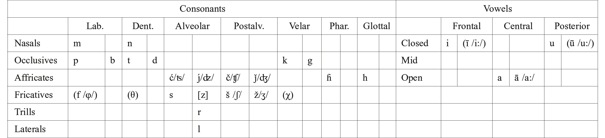

# 33. The phonology of Iranian

- 1. Proto-Iranian phonemes
- 2. Vowels
- 3. Nasals
- 4. Liquids
- 5. Laryngeals
- 6. Plosives
- 7. Fricatives
- 8. Affricates
- 9. Sibilants
- 10. Accent
- 11. Syllable structure
- 12. Abbreviations
- 13. References

## 1. Proto-Iranian phonemes

The catalogue of phonemes reconstructed for Proto-Iranian remains in general identical to that reconstructed for Proto-Indo-Iranian, so that from the phonological point of view the necessity of reconstructing a Proto-Iranian language may be called into question

Table 33.1: Phonemes of Proto-Iranian

(Tremblay 2005). Nevertheless, there are several sound changes that affect all Iranian languages to the exclusion of Indic. The following phonemes might be reconstructed for Proto-Iranian (see Table 33.1). Phonemes in parentheses are common to all the Iranian languages, but their existence in Proto-Iranian is not certain; sounds placed in brackets ([ ]) are most likely to be considered as allophones (cf. Mayrhofer 1989: 5 ff.; Skjærvø 2009: 51).

## 2. Vowels

Iranian vocalism remains essentially the same as that of Proto-Indo-Iranian. Differences are mainly due to changes caused by the loss of the laryngeals, the chronology of which is difficult to state. Although it is far from obvious that this loss modified the phonological system of Proto-Iranian vowels, I have included in the above list the long vowels ī and ū, since the compensatory lengthenings which produced these affect all Iranian languages in the same way.

2.1. The sources for *a* in Proto-Iranian are the same as in Indo-Iranian

a) Preservation of the rare IE **a* or the result of **h₂e* > **h₂a*: **h₂ag̑-* ‘drive’, Av. *az-*, Khot. *hays-*, OI *aj-*; **bʰágo-* ‘allotment, god’, Av. *baγa-*, OP *baga-*, Parth. *bg*, Sogd. *βγ*, OI *bhága-*.

b) Preservation of IIr. **a* < IE **e*, **o* (**o* only in closed syllables; in open syllables **o* appears as *ā* in Indo-Iranian [Brugmann’s Law]): **bʰéreti* ‘brings’, IIr. **bʰárati*, Av. *baraiti*, OP *baraⁿti* (3.pl.), OI *bhárati*; **sólu̯o-* ‘whole’, IIr. **sáru̯a-*, Av. *hauruua-*, OP *haruva-*, MP *harw*, Parth. *hrw*, Khot. *har-biśśa-*, OI *sárva-*.

c) **n̥* between consonants, in absolute Anlaut before a consonant, or after consonant before pause (*n̥ → a / [C, #]_ [C, #]):**m̥tóm* ‘hundred’ (with early assimilation to **n̥* before *t*), IIr *. *ćatám*, OI *śatám*, Av*. satəm*, Khot. *sata*, Sogd. *sd*, MP *sad*; **ń̥* -*g̑ n̥ h₁to-* ‘unborn’, IIr. **áȷ́aHta-*, OI *ájāta-*, Av. *azāta-*; **Hnéh₃mn̥* ‘name’, IIr. **Hnā́ma*, OI *nā́ma*, Av. *nąma*, OP nāma, Khot. *nāma*. The same applies for **m̥*, but only between consonants: **h₂m̥bʰí* ‘toward’, IIr. **abʰí*, OI *abhí*, Av. *aibī*, *aiβi*, OP *abiy*.

d) *a* may also continue an anaptytic vowel before **r̥*or **m̥* before pause (*r̥*, *m̥* → *ar*, *am* /_#): **i̯ ēkᵘ̯ r̥ ́* ‘liver’, Av. *yākar*, MP *ǰagar*, OI *yakŕ̥t*; **ph₂tér-m̥* ‘father (acc.)’, IIr. **ph₂tár-m̥*, Av. *pitarəm* (but see 3.2).

2.2. Ir. *i*, *u* continue IIr. and IE **i*, **u*: IIr. **gᵘ̯r̥Hí-* ‘mountain’, OI *girí-*, Av. *gairi-*, Khot. *ggari-*; **pl̥h₁ú-* ‘much, many’, IIr. **pr̥h₁ú-*, OI *purú-*, Av. *pouru*-, OP *paruv*.

2.2.1. Furthermore, in all Iranian languages *i* can represent the result of a lost interconsonantal laryngeal or a laryngeal before pause under certain conditions (see 5.3.1). In these cases we probably have to reconstruct already in Indo-Iranian an epenthetic vowel *i* following the laryngeal: **ph₂tér-m̥*, PIr. **pHᵢtár-m̥*, Av. *pitarəm*, MP *pidar*.

2.2.2. When *i*, *u* are not the nucleus of a syllable, the non-syllabic allophones *i̯*, *u̯* appear, respectively: **i̯ ēkᵘ̯ r̥ ́* ‘liver’, Av. *yākar*, **tréi̯ es* ‘three’, Av. *ϑraiiō*, Parth. *hry* /*hrē*/ (< **ϑrai̯ah*); **u̯éh₁-n̥t-o*- ‘wind’, Av. *vāta-*, MP *wād*.

2.3. Besides *ă* there was also an *ā* in Proto-Iranian. Its source is mainly IIr. **ā* < IE **ē*, **ō*, which in turn represent the morphophonological lengthening of **e*, **o*: **ph₂tḗr* ‘father (nom.)’, Av. *ptā*, *tā*, OP *pitā*, OI *pitā́*; **dʰoh1tṓr* ‘establisher’, Av. *dātā*, OI *dhātā́*.

2.3.1. Further sources are:

a) **ō* from IE **o* in an open syllable, except in absolute final position: **g̑ ónu* ‘knee’, *ʾ*IIr. **ȷ́ānu*, Av. *zānu*, MP *zānūg*, Parth. *znwg*, Khot. *ysānū*; **dóru* ‘wood’, IIr. **dā́ru*, Av. *dāuru*, OP *dāruv*, MP *dār*. This process is known as Brugmann’s law, and it applies only to IE **o*, not to IE **h₃e-* (Lubotsky 1990). Therefore, we can postulate that the pre-IIr. change of *o* to *ō* in an open syllable (Katz 2003: 64) happens before **h₃e* > **(H)o*. At the time of this law laryngeals were still present at least after a consonant and before a vowel. Therefore, laryngeals in this position close the syllable, and Brugmann’s law does not apply: **róth₂o-* ‘chariot’, IIr. **rath₂a-*, Av. *raϑa*, MP *rah*, Khot. *rraha-*, OI *rátha-*.

b) IIr. **aH* (< IE **e*, **o* + *H*) before a consonant or pause: **meh₂ter-* ‘mother’, Av. *mātar-*, OP °*mātar-*, MP *mād(ar)*, Khot. *māta*; **pleh₁i̯os* ‘more’, Av. *frāiiō*, MP *frāy*; **dʰoh1tór-* ‘establisher’, Av. *dātar-*, MP *dādār*, OI *dhātár-*. We are not sure about the chronology of this change, but it surely happened after Proto-Indo-Iranian times. According to Lubotsky (1992), roots with a non-initial laryngeal show a shift of the accent in Indo-Iranian in the *i-* and *u*-stems making all of them oxyton. This happens also when the laryngeal is in the *VHC* position, so that if Lubotsky is right, the laryngeal would still have been present at that time. In my opinion, the laryngeal accent shift does not affect the Iranian languages, but only Indo-Aryan. This implies that the disappearance of the laryngeal occurred after the separation of Indo-Aryan from the Iranian languages (Cantera 2002).

c) *ā* may furthermore continue a syllabic nasal + *H* before consonant. Again we cannot be sure whether this treatment had already taken place in Proto-Iranian or not: **g̑ n̥h₁tó-* ‘born’, Av. *zāta-*, MP *zadag*, Sogd. *ztk*, Bal. *zātk*; **bʰrm̥Hsk̑et* ‘saunters’ Av. *brāsat̰*.

d) PIr. **ā* can also be the result of compensatory lengthening resulting from the simplification of the group *mm* in a final syllable after a short vowel (Schindler 1973): **dʰg̑ ʰóm-m* ‘earth’, IIr. **ȷ́ʰzām* (OI *kṣā́m*) > PIr. **ȷ́zām*, Av. *ząm*.

2.3.2. In the Old Iranian languages (Avestan and Old Persian), the quantity opposition has been neutralized in final syllables. In Old Avestan, every final *a* is long. In Young Avestan, they are all shortened except in monosyllables. In Old Persian, every final *a* was lengthened to *ā*. Sogdian and Khotanese also do not differentiate *a*/*ā* in final position. But this neutralization does not go back to Proto-Iranian. In Ossetic, where final *a* is generally lost (I., D. *avd* ‘seven’ < **hapta*, I., D. *dæs* ‘ten’ < **daća*), the Digor dialect preserves final *ā* as *æ*: *fɨdæ* < **pitā*, *madæ* < **mātā* (Thordarson 1989: 459).

2.4. The historical phonemes *ī*, *ū* most likely did not exist in Proto-Indo-Iranian or even Proto-Iranian. Their chronology depends again on the (probably late) change of *i*, *u* + *H* to *ī*, *ū* before consonant or pause. In any case, this process is common to all Iranian languages: **gᵘ̯riH-u̯eh₂-* ‘neck’, Av. *grīuuā-*, MP *grīw*, Pašto *grəwa*; **bʰuh₂mi-* ‘ground, land’, Av. *būmi-*, OP *būmi-*, MP *būm*, Sogd. *βwmh*, Chwar. *bwm*.

2.5. In Indo-Iranian there were four different diphthongs: **ai̯*, **au̯* (from IE **ei̯*, **oi̯* and **eu̯*,**ou̯*, respectively) and their long counterparts **āi̯* and **āu̯* (from IE **ēi̯*, **ōi̯* and **ēu̯*, **ōu̯*, respectively). While in Indo-Aryan, short diphthongs became monophthongs and long diphthongs were shortened, in Iranian, all four diphthongs remained unchanged: **léu̯kos*, IIr. **ráu̯cah-* (with *c* through the influence of cases whose desinences began with *e), Av. *raocō*, OP *rauca*, MP *rōz*, OI *rócaḥ*; **séi̯(H)neh₂-* ‘army’, IIr. **sái̯(H)nah₂-*, Av. *haēnā-*, OP *hainā-*, MP *hēn*, Khot. *hīnā*-, OI *sénā-*; **-oi̯* (loc.sg. o-stems), OAv. *-ōi* (YAv. -*e*), OP *-aiy*, OI *-e*; **-ōi̯* (dat.sg. o-stems), OAv. *-āi*, cf. OI *-āya*; **gᵘ̯ṓus* ‘cow’, Av. *gāuš*, OI *gáuḥ*; **stḗu̯mi* ‘I praise’, OAv. *stāumi*, OI *stáumi*.

## 3. Nasals

In Iranian the two nasals of IE and IIr., dental-alveolar *n* and bilabial *m*, are continued without changes: **g̑ ónu* ‘knee’, IIr. **ȷ́ānu*, Av. *zānu*, MP *zānūg*, Parth. *zʾnwg*, Khot. *ysānū*; **meh₂ter-* ‘mother’, Av. *mātar-*, OP °*mātar-*, MP *mād(ar)*, Khot. *māta*.

3.1. From IE on, both nasals have syllabic allophones. The syllabic allophone of **n̥* apparently developed to *a* already in Proto-Iranian, since there is no difference in treatment between *n̥* and *a* in any position: **g̑ n̥h₁tó-* ‘born’, PIr. **ȷ́aHta-*, Av. *zāta-*, is identical to **meh₂ter-*, PIr. **maHtar-*, Av. *mātar-*.

3.2. The same is true for **m̥* in all positions except before a pause, where it does not yield *a*, but *am*, for instance in the acc.sg. of the athematic consonantal stems. However, in such instances *m* could be the result of analogy based on stems ending in vowels. Although we are not sure if these developments took place already in Proto-Iranian, they are common to all Indo-Iranian languages.

## 4. Liquids

As in Indo-Aryan, in most Iranian languages as well the opposition between *r* and *l* was neutralized, for instance in Avestan and Old Persian. Loanwords in OP often show *r* for *l* (*Bābiru-* ‘Babylon’), and only rarely *l* (*Labnāna-* ‘Lebanon’).

4.1. In fact, in the old languages *l* appears only in these rare loanwords. Later in many Iranian languages *l* reappears, mostly due to secondary developments: WIr. **rd → l* (NP *sāl* < **ćarda-*), Bactr. λ corresponds to PIr. **d* (*λιζα* ‘citadel’ < **diȷ́ah₂-*); in Pašto *l* from *δ* < *t*, *d*, *ϑ* is quite frequent: *las* ‘ten’ < **daća*; *plār* ‘father’ < **pitáram*; in Khot. **r̥*becomes in certain contexts *il*, *ul*, independently of whether its IE origin is *r* or *l* (Khot. *puls-* ‘ask’ < **pr̥k̑-sk̑e-*).

4.2. But in the Iranian languages we also find some instances of *l* that could continue IE **l* (Mayrhofer 1989: 10; Tremblay 2005: 679−680 mentions the possibility of one or several Iranian dialects in which IE **r* and **l* merged into *l*, not *r*):

a) Although in Parthian, IE **l* usually yields *r* (*rwž* ‘day’ < **leu̯kos*), in some words it appears as *l* (Henning 1958: 1002; Klingenschmitt 2000: 213): *lʾb* (MMP rʾb) ‘request’, NP *lābe* from the IE root **lep-* (“Schallwurzel” Mayrhofer 1992: 432); *tlʾzwg* ‘scales’, cf. OI *tulā́-*; *klʾn* ‘great’, cf. Lith. *kélti* ‘raises, elevates’. (Parth. *larz-* ‘tremble’ < **h₁le-h₁lig̑ -* is probably a dissimilation like Sogd. *wlrz-*/*wdrz-* [Sims-Williams 1989: 179] and NP *larzīdan*).

b) New Persian (Hübschmann 1895): *lab* ‘lip’, cf. Lat. *labium*; *lištan* ‘to lick’, **lei̯g̑ ʰ-*, Gr. λείχω; *āludan* ‘to soil’, cf. Lat. *lutum*; MP *galōg*, NP *galu* ‘throat’ possibly from an IE root **gᵘ̯el-*; *ālixtan* ‘to spring’, cf. OE *lācan*, Lith. *láigyti*; *āluftan* ‘be mad’, OI *lobh-*, IE **leu̯bʰ*.

c) Ossetic (Miller 1903: 36): *læsæg* ‘salmon’, cf. Toch. *laks*; *ilivd* ‘unhappy’, from the IE root **leu̯bʰ*; *fællayun* ‘be tired’, OI *mlā́yati*; *wal*, Waxī *wul* ‘turn’, OI *vālayati*. (Some instances of *l* in Ossetic, like *liʒɨn* ‘to flee’, IE **lei̯kᵘ̯*, or *alɨ* ‘every’ < ***solu̯i̯o-*, are the result of the special development of PIr. **ri*/*ri̯* to *l* in this language.)

Although in these languages we find some cases of *l* going back to **r* (Parth. *dʾlw* ‘wood’), thus proving that at a certain time *r* and *l* no longer stood in functional opposition, evidence found in New Persian and Ossetic proves that in Proto-Iranian the opposition between *l* and *r* was still not neutralized.

4.3. Both phonemes have syllabic allophones **r̥*, **l̥*, respectively, when they function as syllabic nuclei: **gʰr̥bʰH-tó-* ‘seized’: Av. *gərəpta*-, MMP *gryft*, Khot. *°grautta-*, cf. OI *gr̥bhītá*-; **pl̥th₂ú-* ‘wide’, Av. *pərəθu-*, OI *pr̥thú-*. Both merged into **r̥* in Proto-Iranian. Since the development into -*ar* in final position is common to all Iranian languages (**i̯ ēkᵘ̯ r̥ ́* ‘liver’, Av. *yākar*, MP *ǰagar*), this process as well could already have happened in Proto-Iranian.

## 5. Laryngeals

Although the laryngeals are not directly attested in any historical Iranian language, there is evidence of their existence in Proto-Iranian. Although in Indo-European there were three different laryngeals, in Proto-Iranian all three seem to have merged into one (in Proto-Indo-Iranian a distinctive **h₂* most likely remains [Gippert 1997]). Clear traces of the laryngeals were preserved in Iranian until the historical languages in at least two positions: initially and between vowels, that is, when they function as non-syllabic. For other positions the evidence for the survival of laryngeals is not as certain, but we have data that point in that direction.

5.1. In initial position there is twofold evidence of the laryngeals lasting until the historical Iranian languages: 1. the presence of hiatus in compounds whose second member begins with laryngeal (OAv. *huuapō* ‘performing skillful work’ Y. 44.5 [3 syllables], RV *sᵤvápas*- besides *svápas*; *xᵛaēta*- ‘of easy access’ [3 syllables], *xᵛāϑra*- ‘comfort, happiness’ [3 syllables]); 2. the lengthening of the final vowel of the first member of a compound when the second begins with a laryngeal (Mayrhofer 2005: 37 ff.) (**h₁su-h₂nér-o-*, OI *sūnára-*, OP *ūnara-*; **°h₁u̯ asu-*, OI *viśvā́ vasu-*, Av. *aṣ̌ā uuaŋhu-*; OP *dāraya-vau-*, but NP *dārā* < **dārai̯ā-va[h]u-*).

5.2. The metrics of the Gāϑās also provide evidence of the preservation of laryngeals in intervocalic position until historical times or shortly before. Orthographic long vowels that go back to two short vowels with a laryngeal between them are to be counted metrically as two short vowels (Pirart 1986): **dʰeh₁-e-t* ‘will create’ (3.P.Sg.Aor.Subj.Akt.), **dʰeh₁-* (Y 29.10), OAv. *dāt̰* /*daʾat̰*/ besides *dāt̰* /*dāt̰*/ ‘gave/created’ (3.P.Sg.Aor.Inj.Akt.) < **dʰeh₁-t*/**deh₃-t*; **u̯éh₁-n̥t-o*- ‘wind’, OAv. *vāta-* (Y 44.4), OI *vā́ta-* (differently Pirart).

5.3. In other positions we do not have evidence of the laryngeals in the historical languages, and the results of their loss are similar in all Iranian languages, although in some positions such as between consonants (especially in initial syllables) uncertainty remains.

5.3.1. Between consonants the result in Indo-Aryan is the vocalization as *ī˘*. The same is true for Iranian, but only under certain conditions. Since the *i-* vocalization is specific to the Indo-Iranian languages, *i-*epenthesis was most likely already an Indo-Iranian phenomenon (*H* → *Hᵢ* /*C_C*). (Tichy [1985] postulates an “*i-*farbige Entsprechung zu dem ‘e muet’ des Französischen”. But the explanation of this evolution is controversial. An attempt to explain the *i-*vocalization independently in Indo-Aryan and Iranian is made by Kobayashi [2004: 132 ff. with further references and discussion of alternative proposals].) Nevertheless, in Iranian the laryngeal disappeared in several positions of the word without leaving traces of the vowel *i*. This is true for the laryngeal between consonants in all positions of the word except the last syllable; **átHtʰi*- ‘guest’: Av. *asti*-, OI *átithi*-; **gᵘ̯m̥bʰHró-* ‘deep’: Av. *jafra*-, Parth. *jfr*, NP *zarf*, Pašto *žawar*, cf. OI *gabhīrá*-; **gʰr̥bʰH-tó-* ‘seized’: Av. *gərəpta*-, MMP *gryft*, Khot. *°grautta-*, cf. OI *gr̥bhītá*-; **témHsro-* ‘darkness’: Av. *tąϑra*-, MMP *tʾr*, Khot. *ttāra-* ‘dark’, cf. OI *támisrā*; **dreu̯Hnes* ‘goods, property’: Av. *draonah*, Phl. *drōn*, cf. OI *dráviṇas*; **pn̥th₂bʰis* ‘way, path’ (Instr.Pl.): OAv. *padəbiš* cf. OI *pathíbhis*; **mléu̯Hti* ‘speaks’: Av. *mraoiti*, cf. OI *brávīti*; **u̯i-sh₂to-* ‘loosened’: Av., OP *višta*° in PN *Vištāspa-*, cf. OI *víṣita*.

Some apparent exceptions were explained away by Insler (1971). It seems that in the initial syllable the development of the laryngeal is not the same in every Iranian language, since it is preserved in some Iranian languages as *ĭ* or *ī* (Tremblay 2005: 682): Yidgha-Munǰi *liī* ‘he gave’ < **dīta-*; Waxī *δεt* < **dĭta-*). The examples of preservation in non-initial syllables seem to me less certain (Tremblay 2005: 681).

A special problem is the word for ‘father’. Several forms show the expected loss of the laryngeal: OAv. N.Sg. *p(a)tā* Y 44.3, 45.11, 47.2, *tā* Y 47.3; Acc.Sg. *p(a)tarəm* Y 31.8, 45.4; Dat.Sg.: *fəδrōi* Y 53.4; YAv.: N.Sg. *p(a)tā*˘*ca* Yt 13.83, 19.86; N.Pl. *p(a)tarō* PV 7.72; Acc.Pl. *fəδrō* V 19.43; Dat.Pl. *ptərəbiiō* V 15.12; in other attested forms, however, the *i* from **h₂* is present: OAv.: Dat.Sg. *piϑrē*; YAv.: N.Sg. *pita* Y 9.5, 11.4, Yt 17.16, V 12.3; Acc.Sg. *pitarəm* V 12.1; Dat.Sg. *piϑre* Yt 14.46. Mainly two positions have been defended:

1. The presence or absence of *i* depends on the stress. Accordingly, *h₂* > *ø* when the stress is displaced from the suffix to the ending, that is, when the laryngeal is not directly pretonic (Schmidt 1879: 33 f.; Bartholomae 1897; Hoffmann 1958: 15).

2. *H → ø* /*#C_CC*. According to this explanation the *i* would belong originally to the weak cases and later it was generalized also to the strong cases such as the nominative and accusative (Kuryłowicz 1935: 67; Beekes 1981: 282 ff.)

According to Tichy (1985) the laryngeal became *i* in Iranian in the word for ‘father’ analogically from the vocative. Already in IE the vocative showed an expressive vocalization **ph₂ter* to **pə́₂ter*, which would have allowed the retraction of the stress to the first syllable, as expected in the vocative.

The most likely distribution of the presence or absence of *i* in the initial syllable has been proposed by Lipp (2009: 2. 353 ff.): it is preserved when it is pretonic, but disappears when post-tonic or in the groups *CHCC*.

5.3.2. Whereas in initial syllables the distribution is *H* → *i* /#*C_C*′ and *H* → *ø* / #*C_CC* and in middle syllables *H* → *ø* unconditionally, in final syllables the regular development is vocalization to *i*. This has a nice correspondence in Indo-Aryan (Jamison 1988):

| Indo-Aryan | Iranian |
| --- | --- |
| H → *ĭ* /C_C(C)V(#) [*vámiti*] | H → ø /C_C(C)V(#) |
| H → *ī* /C_C# [*avamīt*] | H→ *i* /C_C# |

Most of the examples of this treatment in Iranian belong to the *s-*stems of roots with *ultima laryngalis* (the development to *i* is regular only in N.-Acc.Sg. Elsewhere it is analogical): **kreu̯h₂s-* ‘meat’: Av. *xr(a)uuiš-(iiaṇt-*) (with frequent *xruu°* analogic to *xruui°*), cf. OI *kravíṣ-*, Gr. κρέας; **teu̯h₂s* ‘power’: Av. *təuuiš* (Av. *təuuišī* is probably secondary from *təuuiš-*. Old Indian *tuvíṣ-* in *tuvíṣṭama-* is a contamination of **taviṣ-* and *tuví°*; see Mayrhofer 1992: 639 with bibliography.); **sterh₃s* ‘bedding’: Av. *stairiš-*. A significant exception to this rule is the very frequent verb *mraot̰* < **mleu̯H-t*, by analogy with *mraoiti*. A similar analogy, although in the opposite direction, is OI *brávīti* instead of **bráviti*, following *ábravīt* (a further difficulty is represented by OP *p-ϑ-i-m*).

5.3.3. In absolute final position the laryngeal is vocalized as *i* in several endings: a) N.-Acc.Pl. -*h₂*: Av. *afšmānī* ‘verses’ (Y 46.17), *sāxᵛə̄nī* ‘teachings’ (Y 53.5), OP *taumani* ‘powers’ (if not dual *taumanī*, cf. Hoffmann-Forssman 2004: 144); b) 1.p.plural. middle *°maidī˘* (OI *°mahi*) < *°*medʰ*h₂; c) 1.p.dual.middle °*uuaidī* (OI °*vahi*); d) 1.p.sg.middle in *aojī* (Y 43.8). The same vocalization appears in the substantive OAv. *jə̄ni-*, YAv. *jaini* ‘woman’, OI *jáni-* < IE **gᵘ̯enh2-*.

Sometimes the different n.-acc.pls. like *afšmānī*, *sāxᵛə̄nī*, OP *taumani* instead of the more frequent *dāmąm*, *nāmąm*, *haxəmąm*, etc. have been explained as dialectal variants (Kuiper 1978), but in fact they are different formations. Av. *dāmąm*, etc. correspond to OI *kármā* with secondary reintroduction of the nasal, analogical to other consonant stems in which the final consonant does not disappear in the neuter plural, e.g. *manå* ‘thinking’ (< **-ās*), and continue an old IE collective in °*ōn*. Forms like *afšmānī* are hypercharacterized with *h₂* like OI *kármāni* (Cantera 2001−2002).

5.3.4. After a consonant and before a vowel the laryngeals disappear [*H*→*ø* /*C_V*] without leaving any vocalic trace after the working of Brugmann’s law (2.3.1a): **róth₂o-*‘chariot’, Av. *raϑa-*, OI *rátha-*; **oph₂ó-* ‘hoof’, Av. *safa-*, OI *śaphá-*.

5.3.5. After a vowel and before a consonant (or pause) the laryngeal disappears, causing lengthening of the preceding vowel, as in most Indo-European languages (2.3.1b).

5.3.6. More complicated is the development of laryngeals after a resonant. Probably **RH* > *ər* (*R* = *r*, *l*) already in Proto-Indo-Iranian, as Uralic loanwords seem to show (Katz 2003: 65). The treatment of this group depends strongly on the position of the stress and the syllabic structure. In Iranian, the treatment of the group *RH* is similar to that of *NH* under similar circumstances (**RHV* > *arV*), but not in Indo-Aryan:

a) **n̥HV* > *anV*: **tn̥Hú-* ‘thin’, *tanuk* (MMP *tnwk*, Phl. *tnwk’*) [< **tanúkakah*/*-am*], OI *tanú-*. (An apparent exception is Av. *āsna-* ‘innate’ < *°*g̑nh₃-ó-*. However, the loss of the laryngeal in this word is already Indo-European, cf. Gr. νεογνóς [Mayrhofer 2005: 99])

b) **r̥HV* > *arV*: **gᵘ̯r̥Hí-* ‘mountain’, Av. *gairi-*, OI *girí*; **tr̥h₂ós* ‘through’, Av. *tarō*, OI *tirás*; **u̯r̥Hú-* ‘wide’, Av. *vouru°*, OI *urú-*.

c) *l̥HV* > *arC*: **g̑ʰl̥h³eni̯o-* ‘golden’, Av. *zarańiia-*, OI *híraṇya-*; **pl̥h₁ú-* ‘much, many’, Av. *pouru°*, OI *purú*-.

5.3.6.1. Before consonants the regular outcome of the group **N̥H* is **ā*, but very often the nasal is reintroduced, as in Indo-Aryan (*duuąsaiti* ‘he flies’ < *du̯ānsati* < **dhu̯enH-sk̑e-ti*): *-*n̥HC* > *āC*: **g̑ n̥h₁tó-* ‘born’, Av. *zāta-*, OI *jātá-*; **n̥h₃dʰró-* ‘weak’, OAv. *ādra-*, OI *ādhrá-*; **m̥HC* > *āC*: **bʰrm̥Hsk̑et* ‘saunter’, Av. *brāsat̰*.

5.3.6.2. Generally it is admitted that in Iranian *R̥HC* > *arC*. But this rule must be further specified in order to account for a great number of exceptions. The results of this group depend strongly on the position of the accent and the phonetic context (Cantera 2001a). When the resonant is in a stressed syllable, the result is always *arC*: **tŕ̥h₂u̯a-* ‘overcoming’, Av. *tauruua-*, OI *tū́rva-*; **h₂u̯ĺ̥h₁neh₂* ‘wool’, Av. *varənā*, OI *ū́rṇā*. Elsewhere the result depends on the phonetic context. It is often the same as under the accent: **dʰl̥Hgʰó-* ‘long’, Av. *darəγa-*, OI *dīrghá-*; **str̥h₃tós* ‘extended, laid out’ Av. *starəta-*, OI *stīrṇá-*, cf. Lat. *strātus*. But in a labial context the result differs. After a labial consonant (*p*, *b*, *m*, *u̯*) or before a syllable with *u̯*, *H* disappears without trace: **pl̥h₁nó-* ‘full’, Av. *pərəna-*, Phl*. purr*, OI *pūrṇá-*; **(u̯)r̥Hdʰu̯ó-* ‘upright’ (with dissimilation of the first *u̯* in Indo-Iranian), Av. *ərəδβa-*, Phl. *ul*, OI *ūrdhvá-*; **°ml̥h₃dʰó-* ‘head’, Av. *kamərəδa-*, Bactr. Καμιρδο (Phl. *kamāl* continues **kamarda-*, probably due to a different accentuation: **ka-mŕ̥da-*), cf. OI *mūrdhán-*; **u̯r̥h₁g̑í°* ‘strong, efficacious’, Av. *vərəzi°*, cf. OI *ū́rj-*‘nourishment, strengthening’; **spʰr̥h₁-to-* ‘trampled’, cf. Phl. *spurdan* (< **spr̥h₁tanai̯*), *spar-* (< **spr̥h₁a-*, cf. OI *sphuráti* ‘kicks away’).

## 6. Plosives

The consonantal system of Proto-Iranian is very close to that of Proto-Indo-Iranian. The main difference between the two is the loss of the aspirates; however, only the loss of the voiceless aspirates can be attributed to Proto-Iranian. This characteristic is also shared by Nuristanī. Nevertheless, since the loss of the voiceless aspirates in Nuristanī does not lead to the appearance of voiceless fricatives, both evolutions are probably independent (Buddruss 1977). Concerning the controversial position of Nuristanī relative to Iranian, see Cardona and Jain (2003: 26 ff.) and Lipp (2009: 1. 334 ff.).

6.1. The *voiced aspirated* plosives lost their aspiration in all Iranian languages. Consequently IIr. **bʰ*, **dʰ*, **ȷ́ʰ*, **gʰ*, (**gᵘ̯ʰ*) appear in Iranian as **b*, **d*, **ȷ́*, **g*, respectively (in certain cases the IIr. voiced aspirates appear as voiceless fricatives in the Iranian languages [Tremblay 2005: 675]: Av. *daϑā-*, MMP *dh*-, NP *deh-*, Bactr. λαυ- < **dadʰah1-*; Av. *nāfa-*, NP *nāfe* < **nā́bʰa-*, etc.). Nevertheless, we have evidence of the existence of voiced aspirates in Proto-Iranian at an early time. According to Bartholomae’s law the sequence of voiced aspirated stop + voiceless stop produces in Indo-Iranian a group of two voiced stops, and the aspiration is transferred from the first stop to the second one [*DʰT* > *DDʰ*]: OI *buddhá-* < **bʰudʰ-tá-*, OAv. *aogədā* < **au̯gʰta*. Since this treatment is identical in Indo-Aryan and Iranian, it could be Indo-Iranian. But a difference in the application of this law in Iranian and Indo-Aryan proves the survival of the voiced aspirated stops until Proto-Iranian: only in Iranian does Bartholomae’s law apply also to the group voiced aspirated stop + *s*: OAv. *aogəžā* < **au̯gʰsa*; Av. *diβža-* < IIr. **dʰibʰ- sa*-, OI *dipsa-* [Jaiminīya-Brāhmaṇa, Pāṇini *dhī˘psa-*].

Otherwise we would have to postulate the application of Bartholomae’s law to *s* also for Proto-Indo-Iranian followed by devoicing of **zʰ* in Indo-Aryan (Kobayashi 2004: 106). Tremblay (2005: 675) points out that since Bartholomae’s law is still productive in Old Avestan, the voiced aspirates must have still been present shortly before or even during the Old Avestan period. But although this argument may appear persuasive, it is not compelling. The only serious evidence for the preservation of the voiced aspirates in Indo-Iranian is the fact that the conditions for Bartholomae’s law in Indo-Aryan and Iranian are not exactly the same.

6.2. The voiceless aspirates became fricatives (7.2)

6.3. Leaving aside these two exceptions, the phonological system of the Iranian occlusive stops nearly continues the Indo-Iranian one:

IE, IIr. **p*: **pistó-*, Av. *pištra*- ‘mill’, NP *pist* ‘flour’, cf. OI *piṣṭá*- ‘crushed’, Lat. *pistus*.

IE, IIr. **t*: **témHsro-* ‘darkness’: Av. *tąϑra*-, MMP *tʾr*, Khot. *ttāra-* ‘dark’, cf. OI *támisrā*.

IE **k*, **kᵘ̯*, IIr. **k*: **kók̑so-* ‘armpit’, Av. *kaša-*, Sogd. *ʾp-kš* ‘side’, NP *kaš*, cf. OI *kákṣa-*.

IE, IIr. **b*, **bʰ*, (**bh₂*) > *b*: **bʰéreti* ‘carries’, Av. *baraiti*, OP *barati*, cf. OI *bhárati*.

IE, IIr. **d*, **dʰ*, (**dh₂*) > *d*: **dék̑m̥* ‘ten’, IIr. **dáća*, Av. *dasa*, MP, NP *dah* <dh>, cf. OI *dáśa*.

IE, IIr. **g*/*gᵘ̯*, **gʰ*/*gᵘ̯ ʰ*, (**gh₂*) > **g*: **gʰr̥bʰH-tó-* ‘seized’: Av. *gərəpta*-, MMP *gryft*, Khot. *°grautta-*, cf. OI *gr̥bhītá*-.

## 7. Fricatives

7.1. In the Iranian languages a new series of voiceless fricatives *f*, *θ*, and *x* emerged (in some Iranian languages, like Balochi [Korn 2005: 80 ff.], Khotanese, and Parāčī [Tremblay 2005: 676], there is a “Rückverwandlung” of these sounds back to the corresponding stops *p*, *t*, *k*). There are at least two different sources for these sounds. Most of them are the result of spirantization in consonant clusters: an initial plosive consonant is spirantized when directly preceding another consonant (*K* → *X* /*_C*): *p* > *f*: **protm̥mó-*‘first’, Av. *fratəma-*, OP *fratama-*, OI *prathamá-*; *t* > *ϑ*: **trei̯es* ‘three’, Av. *ϑraiiō*, Parth. *hry* /*hrē*/ (< **ϑrai̯ah*); **kᵘ̯etu̯ores* ‘four’, Av. *caϑβārō*, MMP *chʾr*, Phl., NP *cahār*, Parth. *cfʾr* (< **caϑβārah*); *k* > *x*: **kᵘ̯ekᵘ̯ló-* ‘wheel’, Av. *caxra-*, MMP chr, OI *cakrá-*. This evolution does not occur after *s*/*š*: Av. *strī-* ‘woman’, Khot. *striyā-*, MSogd. *(ʾ)stryč* (< **strīčī-ā-*); Av. *tištriia-* ‘Sirius’ < **t(r)istrii̯a-*, cf. OI *tiṣyà-*.

7.1.1. The development of *pt* in Iranian is controversial. This group appears as *ft* or its outcome in all Iranian languages, except in Avestan, where we find three different treatments: 1. preservation: *hapta* ‘seven’ and its derivatives, *ptā* ‘father’, *napta-* ‘moist’, *vīpta-* ‘subjected to pederasty’, *supti* ‘shoulder’, *°gərəpta-* ‘seized’, *āiiapta-* ‘attainment’, etc.; 2. occasionally evolution to *ft*: PV 18.52 *gərəftəm*, Yt 5.92 *taftō* ‘sick with fever’. Sometimes *ft* appears in some manuscripts while others show *pt*. The readings with *ft* are probably due to the influence of Persian pronunciation; 3. In initial position, *pt* is sometimes simplified to *t*: *tā* ‘father’, *tūiriia-* ‘uncle on father’s side’. Since this seems to be the only exception to the rule *K* → *X* /*_C*, it has sometimes been thought to be a “Rückverwandlung” (Bartholomae 1895: 165). Actually, we do not have certain evidence that the evolution *K* → *X* /*_C* took place already in Proto-Iranian. Tremblay (2005: 676) tries to date the evolution *K* → *X* /*_C* after *Kʰ* → *X*, but the evidence he points out (N72 *vī.manāt̰* < *ᵒ*mn̥tʰ-neh₂-*) is not compelling.

7.2. The voiceless aspirated stops **pʰ*, **tʰ*, **kʰ* are the second source of the Iranian voiceless fricatives. Although some of these sounds could be merely expressive, they arise mostly from the contact of a voiceless stop + *h₂*. The most illustrative example of this treatment is provided by the word **pantā-* ‘way, path’. In Indo-European, the inflection of this word was n.sg. **péntōh₂s*, g. **pn̥th₂és*. In Avestan, we find the expected results: *paṇtā̊* (instead of OI *pánthāḥ*, with analogical *th*) and g. *paϑō*. Other examples are: **róth₂o-* ‘chariot’, Av. *raϑa-*, OP *u-raϑa*-, Khot. *rraha-*, Phl. *ls*, MMP *rhy* /*rah*/, OI *rátha-*; **pl̥th₂ú-* ‘broad’, Av. *pərəθu-*, OI *pr̥thú-*; Av. *kafa-* ‘foam’, NP *kaf*, OI *kapha-*‘slime’. The presence of *s*/*š* also blocks the development of the fricative: **sti-sth₂-é-*‘stand’, Av. *hišta-*, Khot. *ṣṭa-*, Sogd. *ʾwst-*, Parth. ʿ *št*, OI *tíṣṭha*-.

7.2.1. Occasionally the voiceless aspirates may arise through an assimilation of aspiration. This is a possible explanation for **ahmā́xam* (OP *amāxam*, Sogd. *mʾx*) besides **ahmā́kam* (Av. *ahmākəm*, Khot. *mā*) (Tremblay 2005: 677). Therefore we may infer either 1. that this change does not happen in Proto-Iranian, but later (since the aspiration of *s* is also later) or 2. that this phonetic rule remained alive for a long period of time.

7.2.2. A further source for *x* in Iranian is IE **s*, Ir. **h* before *u̯* in initial position (*h* → *x* /#*_u̯*): **su̯ei̯d-* ‘to sweat; sweat’, Av. *xᵛīsat̰*, *xᵛaēδa-*, MP *xwistan*, *xwēy*, Khot. *ā-hus-*, *hvī*, Sogd. *γwys-*, Pašto *xwala*, Oss. *xīd*, *xed*.

## 8. Affricates

8.1. A phenomenon belonging to the period of Proto-Indo-Iranian is the development of affricates out of the IE occlusive palatal stops. In Proto-Iranian (and Indo-Iranian), we find two different series of palatal consonants: one resulting from the evolution of IE palatals (*, **g̑*, **g̑ ʰ*), the other the result of secondary palatalization of old velars and labiovelars before front vowels. Note that the palatalization of the old (labio)velars happens not only before *i* but also before *a* when the latter goes back to IE **e*. That means that this palatalization happened before the merger of **e* and **o* into *a*. The exact phonetic character of these two series is controversial. It is difficult to determine if both were already affricates or still plosives with different points of articulation or whether one set was affricated and the second plosive with the same (or similar) point of articulation (this is the solution proposed by Kobayashi 2004: 74). Although their true phonetic nature remains uncertain, we use **ć*, **ȷ́*, **ȷ́ʰ* as conventional symbols for the primary palatals of Proto-Iranian and **č*, **ǰ*, **ǰʰ* for the secondary palatals.

8.2.1. In Proto-Iranian, the first series (**ć*, **ȷ́*, **ȷ́ʰ*) is widely held to have been composed of affricates, but their exact point of articulation cannot be decided: they could be postalveolar (Tremblay 2005: 679; Lipp 2009: 1. 334) or dental-alveolar affricates (Mayrhofer 1983). In the transition from Proto-Iranian to the Old Iranian languages, their treatment diverges. In all Iranian languages except the southwestern ones, the alveolar or prepalatal affricate /ʦ/ evolves to the corresponding alveolar sibilant /s/. On the other hand, in Old Persian the voiceless alveolar palatal evolves to /ϑ/: **dek̑m̥*, IIr. **daća* ‘ten’, OP (in the Elamite transmission) *daϑapati*- ‘decurion’, OP *daϑama* ‘tenth’, Phl., NP *dah* <dh> (< **daϑa*), Av. *dasa* ‘ten’, Parth. <ds>. (A similar split occurs in the Romance languages: Latin *k* evolved to /ʧ/ in Proto-Romance, then went over to /ʦ/, attested in some North-Italian dialects and in old phases of other languages like French or Spanish. Finally, /ʦ/ becomes /s/ in French, Provençal, Catalan, Portuguese, etc. and /ϑ/ in Spanish and North-Italian.)

For evidence of the continuation of these sounds as affricates after Proto-Iranian, see Klingenschmitt (1975). According to Katz (2003: 40), PIr. **ć* is the result of a secondary evolution from **s*. Affricates are also the results in Nuristanī (Buddruss 1977). Therefore, Mayrhofer (1983) sees here an isogloss between Proto-Iranian and Nuristanī, but this coincidence depends on the point of articulation we choose for Proto-Iranian. In Nuristanī, dental affricates are postulated. On the other hand, it is not to be excluded that these sounds were affricates already in Indo-Iranian.

The outcomes *s*, *z* in most Iranian languages point to dental or (post-)alveolar affricates. A further argument is the fact that PIr. **ć* and the group *t+s* show the same evolution: OI *matsya-* ‘fish’, Phl. *mʾhyk’*, NP *māhi*, but Av. *masiia-*. On the other hand, the outcome Khot. *śś*, Waxī *š* < **ću̯-* and Khot. *śś* < **ćr* speak for a prepalatal or even palatal affricate /ʧ/ (Tremblay 2005: 678). In any case, the affricates resulting from the primary palatals remained always differentiated from the results of the secondary palatalization, the latter probably with a more palatal point of articulation.

8.2.2. The voiced /ʣ/ (from the primary palatal **g̑*) shows a parallel evolution. In all Iranian languages except those of the SW, /ʣ/ evolves to /z/. In the SW, /ʣ/ evolves to [δ], but due to the lack of a phoneme /δ/ it merged with /d/: **g̑enh₃*, IIr. **ȷ́anH-* ‘know’,OP *adāna* <a-d-a-n>, Av. *zan-*, Phl., NP *dānistan*, Parth. <zʾnʾdn>, Kurd. *zānin*; IIr. **ȷ́ʰr̥d-* ‘gold’, Av. *zərəd*-, Phl., NP *dil* (< **dr̥d-*). *dil*, Parth. <zyrd>, Kurd. *zar*.

8.3.1. More difficult is the determination of the phonetic character of the second series of palatals (**č*,**ǰ*,**ǰʰ*). In all Iranian languages they appear as affricates, but if they were already affricates in Proto-Iranian, we must assume a point of articulation different from that of **ć*,**ȷ́*,**ȷ́ʰ*. This is most easily done by assuming for **ć*,**ȷ́*,**ȷ́ʰ* a (post-)alveolar point of articulation and a prepalatal one for **č*,**ǰ*,**ǰʰ*. The opposition would then have been: **ć*,**ȷ́*,**ȷ́ʰ* /ʦ/, /ʣ/, /ʣʰ/:: **č*,**ǰ*,**ǰʰ* /ʧ/, /ʤ/, /ʤʰ/. A second possible explanation is that the first series consisted of post-alveolar affricates in Proto-Iranian and the second series (from IE velars) remained plosive. Afterwards, the affricates changed to sibilants (*s*, *z*) or fricatives (*ϑ*, *δ*) and the former palatal plosives became post-alveolar affricates (/ʧ/, /ʤ/). In any case, in all Iranian languages the series of secondary palatals seems to be continued by affricates.

8.3.2. The palatal affricates *č* /ʧ/, *ǰ* /ʤ/ remain affricates in the Iranian languages, partly as prepalatal /ʧ/, /ʤ/, /ʤʰ/ and partly as dental-alveolar /ʦ/, /ʣ/. In Khotanese, /ʧ/, /ʤ/ become /ʦ/, /ʣ/ <tc>, <js>, but remain as /ʧ/, /ʤ/ before palatal vowels (Emmerick 1989: 213): Khot. *tcārman-* ‘hide’ < **čarman-*, Av. *carəman-*, OI *cárman*-; Khot. *pātcu* ‘then’ < **paščā*˘*m*, cf. Av. *pasca*, OI *paścā́*; Khot. *jsan-* ‘kill’ < **ǰan-*, Av. *zan-*, OI *han-*, but *dajä* ‘flame’ < **daǰi*-. In Avestan, the evolution /ʧ/, /ʤ/ > /ʦ/, /ʣ/ seems to be attested. Actually, *s* does not palatalize before *c*, as it does in OI: cf. Av. *pasca*, unlike OI *paścā́* < **pas(t)čaH* or sandhi forms like Av. *manasca*. Therefore, we must probably consider Av. <c> as /ʦ/. The fact that *n* also does not palatalize before *c* points in the same direction. The change to the dental-alveolar is attested for the voiceless affricate also in most modern East Iranian languages in initial position (Skjærvø 1989: 378).

8.3.3. In other Iranian languages, however, /ʧ/, /ʤ/ remain palatal. In Parthian, <c> is the orthographic representation of /ʧ/, as is evident from the palatalization of *s* in *pš* ‘then’ (< *paščā) and from its evolution to the palatal fricative *ž* /ʒ/ in intervocalic position (Parth. *wižīn*- ‘choose’ < **u̯i-čin-*). The stage /ʧ/ is preserved in Balochi (Korn 2005: 85). The same is true for its voiced counterpart. It also applies for Sogdian, cf. *pšy* ‘after’ (Gershevitch 1954: 56). Among the modern East Iranian languages, the voiceless *č* remains /ʧ/ initially in Yaghnōbī, Waxī, Yidhga-Munǰī, and Parāčī and intervocalically in Yaghnōbī and Parāčī (Skjærvø 1989: 378).

## 9. Sibilants

In Proto-Iranian there are probably the following sibilant phonemes: **s*, **š* /ʃ/ and **ž* /ʒ/. The voiced sibilant *z* is an allophone of *s* in contact with voiced consonants.

9.1. The voiceless sibilant *s* continues IIr. and IE **s*. In most positions this *s* becomes the aspirate *h*: **h₁ésmi* ‘I am’, IIr. **h₁ásmi*, Av. *ahmi*, OP *amiy*, Sogd. ʿ*ym*, *ʾym*, OI *ásmi*, Khot. *mä*, *ime*; **h₁és(s)i* ‘you are’, IIr. **h₁ási*, Av. *ahi*, OI *ási*; **h₁sénti* ‘they are’, IIr. **h₁sánti*, Av. *həṇti*, OP *haⁿtiy*, Sogd. *ʾnt*, Khot. *īndä*, OI *sánti*; IIr. **mah₁as-(a-)* (cf. IE **meh₁n̥s* ‘moon, month’), Av. *mā̊ŋha-*, OP *māh*-, Sogd. *mʾx*, Bactr. μαο, MP, NP *māh*. But this change does not go back to Proto-Iranian: the ending -*as* of the OP nominative singular of the thematic stems is still reproduced in Elamite (Mayhofer 1989: 7, with further references), and the old Persian name for Elam is *(H)uža-* <*U-v-ǰ-*> showing that the aspiration applied to the loanword **Sūša(n)*. In any case the aspiration occurred before the development of *ć* /ʦ/ to *s* in all Iranian languages except Old Persian, for it does not affect the newly emerged *s*.

9.2.1. Although *s* mostly disappears, it remains in certain positions, e.g. in contact with voiceless occlusives and affricates (but in contact with voiced occlusives it mostly becomes *z*; after voiceless velars it becomes *š*, as we will see later): IIr. **stʰū́nā* ‘column’, Av. *stū˘nā*, OP *stūnā*, Khot. *stunā*, MP *stūn*, OI *sthū́ṇā*; **sp⁽ʰ⁾erh₁-* ‘trample’, Av. *spar-*, MP *spurdan*, Khot*. āspar-*, OI *sphuráti* ‘kicks away’.

9.2.2. Also before *n*, *s* is kept in several Iranian languages (Sogdian and several Pamir languages), but in the course of history it has been lost in many others (Pašto, Ossetic, etc.): **snusó-* ‘daughter-in-law’, Sogd. *šwnšh*, Šughni *zinaẓ̌*,*̣* but Chwar. *ʾnh* (< **nušā*-), Pašto *nọr* (< **nušā*- + *or*), Oss. *nostæ*, OI *snuṣā́*; **snei̯ gᵘ̯ʰ-* ‘snow’, IIr. **snai̯gʰ-*, Av. *snaēž-*, Sogd. *šnyš*, Šughni *žiniǰ*, Roš. *žinīǰ*, Bart. *žinīž*.

9.2.3. Also before *r*, *s* is at least partially preserved. Avestan shows three different developments (Cantera 2001b: 38 n. 14):

1. *s* is preserved: Av. *sraxtim* (N 79), OI *sraktí-* ‘corner’;

2. *s* disappears: *raonąm* (g.pl. *rauuan-* ‘river’) from the root **sreu̯-* ‘flow’;

3. **sr* > *ϑr*: Av. *ϑraotō.stāk-* ‘flowing’ < **srau̯tas-tāk-* (cf. OI *srótas-* ‘stream’), MP *rōstāg*; *ϑrąsa-* ‘slithering’ < IE **slonko*, cf. Germ. *Schlange*; *ϑraxti-* ‘corner’ OI *sraktí-*. In Old Persian, *s* regularly disappears in this position: OP *rau̯tah-* ‘river’, MP, NP *rōd*, OI *srótas-*.

9.2.4. After *i*, *u*, *r*, and velar stops, Proto-Ir. **s* is not aspirated, but palatalized (9.3.2)

9.3. A remarkable development that splits Proto-Iranian apart from Proto-Indo-Aryan is the double dental law. When two dentals appeared in contiguity in Proto-Indo-European, it appears that a sibilant arose between them, and the resultant phonetic collocation produced four different outcomes in the Indo-European languages: *tst* (Anatolian), *tt* (Indic), *st* (Iranian, Balto-Slavic, Greek), and *ss* (Italic, Celtic, Germanic). The secondary nature of this *s* in Iranian is proved by the fact that it does not undergo the palatalization noted in 9.2.4. The contiguous dentals may be either both voiceless (**tt* > *st*: **cit-ti-*‘insight’, Av. *cisti-*, OI *cittí-*) or the first may be voiced and the second voiceless (*dt* > *st*: **ped-tí* ‘foot-soldier’, OP *pasti-*, Oss. *fest(æg)*, OI *pattí-*; **u̯id-tó-* ‘found’, Av. *vista-*, OI *vittá-*). For the failure of this new *s* to undergo palatalization after *i*, *u*, *r*, *k*, cf. *cisti*cited above. A further secondary source for Proto-Iranian **s* is **sć* /sts/ (Av. *sand-*‘appear’ < **sćand-*, OI *chand*-; so also the formant *-sa-* of the inchoative from IE **sk̑e-*).

9.4.1. The palatal sibilant *š* /ʃ/ is phonemic only when it is the Iranian result of the IIr. group **ćs* (IE **s* or tautosyllabic groups **T*) > Ir. *š*, or of the groups of an affricate *ć / **ȷ́* (< IE */ **g̑*) + *t*. Only in these cases are minimal pairs like **šita-* ‘inhabited’ (< IIr. **ćsita-*) / **sita-* ‘harnessed’, **yasta* < **yat-ta-* ‘located’ / **yašta* ‘sacrificed’

(< **yaȷ́ta-*) possible. Well known examples of **ćš-* > *š* are: **kok̑so-* ‘armpit’, Av. *kaša-*,

Sogd. *ʾp-kš* ‘side’, NP *kaš*; **ćšái̯tra-*, Av. *šōiϑra-*, OI *kṣétra-*.

The Khotanese outcome of **ćš* is problematic. Some forms show *kṣ* /tṣ/ (the usual writing for the correspondence of Old Iranian **xš*) for **ćš*. Khot. *kṣīra-* ‘country, kingdom’, Tumshuq *xšera-* corresponds to Av. *šōiϑra*-, OI *kṣétra-*. On the other hand, if Khot. *kaṣa-* (Bailey 1979: 56) ‘belt’(?) goes back to **kaćša-*, Av. *kaša-* ‘armpit’, then it would mean that **ćš* > *ṣ*, and not *kṣ*. If, in fact, **ćš* > *kṣ*, then the evolution **ćš* > *š* did not happen in Proto-Iranian, but independently in the Iranian languages. Nevertheless, it cannot be excluded that *kṣīra-* is an analogical formation to *kṣāra-* ‘power, dominion’ (< **xšaϑra-*). A further problem is Av. *aši-* ‘eye’. The Av. form seems to continue a **ćš*, but the IE correspondences speak for a cluster **kᵘ̯s* (Mayrhofer 1992: 43). Therefore, we would expect **axši-*.

The groups of affricate **ć*, **ȷ́* (from IE *k̑, **g̑*) + t evolve in Iranian to *št*: **h₂*/*₃oćtóH* ‘eight’, Av. *ašta*, MP *hašt*, Sogd. *ʾšt*, Khot. *haṣṭa*, OI *aṣṭā́*; **pik̑tó-* ‘cut, adorned’, Av. *nipixšta-*, OP *nipišta-*, MP *nibišt*, OI *piṣṭá-*; **h₂eg̑tlo-* ‘whip’, Av. *aštrā-*, MP *aštar* <ʾštl>. In view of OP *ufrastam* it would be possible to postulate that the change *ćt*/*ȷ́t* > *št* does not happen in Proto-Iranian, but later. However, the form *ufrastam* besides *ufraštam* is probably due to the influence of the present stem *frasa-*. In some Iranian languages (like Sogdian and Bactrian among others), the regular outcome of*t* (and *g̑ t*) is *xšt* (and *k̑*also occasionally in Young Avestan): YAv. *yaxšti-* ‘stalk’, OI *yaṣṭi-* < **i̯ek̑ti-* (Tremblay 2009).

9.4.2. In all other cases *š* is an allophone of *s* under the conditions named by the mnemonic term “RUKI”. This evolution affects the Indo-Iranian and partially also the Balto-Slavic languages. According to it, *s* > *š* after *i*, *u* (including instances where these are the second element of diphthongs), *r*, and an IE occlusive velar, labiovelar or palatal (**k*, **kᵘ̯*, *, **g*, **gᵘ̯*,**g̑*; when the stop is a voiced aspirate, the outcome is *ž*, 9.5.1): **pistó-* ‘crushed’, Av. *pištra*- ‘flour’ (**pistró-*), OI *piṣṭá*- ‘crushed’, Lat. *pistus*; **mū˘s-*‘mouse’, Av. *mūš*, MP *mušk*, NP *muš*; **h₂u̯r̥sén-* ‘male’, Av. *varəšna-*, MP, NP *gušn*, Sogd. *wšn-*, Chwar. *ʾwšn* ‘stallion’, Oss. *wyrs*, *urs* ‘id.’; **u̯ōkᵘ̯s* ‘word, speech’ (nsg.), Av. *vāxš*, Lat. *uōx*; * *h₂u̯egs-* ‘grow’, Av. *vaxš-*, MP *waxšīdan*, Khot. *huṣṣ-*, Sogd. *ʾγwšʾy-*.

9.4.3. The effects of this phonetic change also appear in the results of the IE tautosyllabic groups of dental with dorsal (subject to widespread metathesis), formerly known as “thorn-groups”. Consequently, we may assume that in these groups the dental has evolved to **s* in Proto-Iranian or even probably already in Proto-Indo-Iranian. When the dorsal is palatal (9.4.1), then the result of the group is **š*. With other voiceless dorsals the result is **xš*, with *š* because of the influence of the dorsal: **tketlo-*/**kþetlo-* ‘dominion’, Av. *xšaϑra-*, OP *xšaça-*, MP, NP *šahr*, Khot. *kṣāra-*, Parth.-Inscr. *xštr*.

9.4.4. In all Iranian languages (but not in Indo-Aryan), *s* also becomes *š* after a labial (*p*, *b*, *bʰ*; when the stop is a voiced aspirate, the outcome is *ž*) (IIr. **drapsa-* ‘banner’, Av. *drafša-*, MP *drafš*, Sogd. *ʾrδʾyšp*), but this development seems to have occurred independently in the individual Iranian language*s*, since it also affects secondary *s* < **ć* in the languages where **ć* > *s* (**pk̑u-* ‘cattle’, Av. *fšumaṇt-* ‘possessing cattle’, OI *kṣumánt-*; MP *šwbʾn* ‘shepherd’ < **fšu-pāna-*; Av. *fšuiiaṇt-* ‘shepherd’, Khot. *kṣundaa-*‘husband’ < **fšui̯antaka-*; but not *s* < **sć*, vid. Av. *xᵛafsa-* ‘sleep (pres. stem)’, Sogd. ʾwβs, Khot. *hūs-*, Yaghn. *ūfs-*) and also when *s* results from groups like **ts* (Av. *nafšu* ‘grandson (loc.pl.)’ < **naptsu*). In groups of three consonants, this evolution does not always take place. This applies to the three Av. exceptions: Av. *xrafstra-*, OAv. *fsəratū-*(Geiger and Kuhn 1895−1904: 1.1., 16; Narten 1986: 186; Tremblay 1999: 543, n. 8), Av. *afsman-*. It is most likely also the consonantal cluster that is responsible for the preservation of *s* in MP, NP *pestān* ‘mamma’, cf. Av. *fštāna-* ‘female breast’, Sodg. *ʾštnh* and OI *stána-* (< **pstána-*).

9.4.5. In Indo-Iranian (and Indo-European), *z* is an allophone of *s* (< IE **s*) in contact with a voiced consonant (**mn̥s-dʰáH-* ‘wisdom’, Av. *mazdā*-, OI *medhā́-*; **mii̯as-dʰHa-*‘sacrifical food’, Av. *miiazda-*, MP *mēzd*; in many works on Iranian languages *z* is also used for Iranian **ȷ́*, but this can lead to errors). Furthermore, *z* is an allophone of *s* when arising in voiced dental groups *D+D⁽ʰ⁾* (mostly resulting from the working of Bartholomae’s law in groups *dʰ+t* > *ddʰ*, 6.1): OAv. *vərəzda-* ‘grown’ < **u̯r̥dᶻdʰa-* < **u̯r̥dʰᶻto-*. Moreover, as already mentioned, in Iranian the sonorization of a consonant after a voiced aspirate affects not only occlusives, but also the sibilant (unlike in Old Indo-Aryan). This should be a further source for *z*, but as far as I can see, wherever it is attested, the voiced aspirates are always dorsal or labial, and the result is consequently not *z*, but *ž* (9.5.2.1, 9.5.2.2).

9.5.1. As in the case of *š*, I ascribe phonemic character to *ž* only in consequence of the Proto-Iranian development *ȷ́ʰs* > *ȷ́z* > *ž*, and in the group **ȷ́ʰt* > *žd*, according to Bartholomae’s law. In all other positions, it is an allophone of *š* in contact with voiced consonants. The development *ȷ́z* > *ž* is parallel to **ćs* > *š*: OAv. °*uuažat̰* ‘will convey’ < **u̯eg̑ ʰs-e-t* (3.p.sg.subj.*s*-aorist). A certain example of the evolution **ȷ́ʰt* > *žd* is OAv. *gərəždā* ‘lamented’. As far as I know, we do not have certain examples in Iranian of the tautosyllabic group *g̑ ⁽ʰ⁾d⁽ʰ⁾* becoming **ȷ́z*. The expected result is *ž*, parallel to **t* (OI *kṣ*, Ir. *š*). Ir. *zam-* (n.sg. **zām-s*, Av. *zå*) is not lautgesetzlich from **ȷ́z* (< **g̑ ʰdʰ-* < * *dʰg̑ ʰ*), but is analogical to the weak cases, which have *zǝm-*, where the initial consonant cluster has simplified (*ǝ* is purely anaptyctic, and instr.sg. *zǝmā* is monosyllabic). The expected form in the strong cases is **žam-* (cf. OI *kṣam-*).

9.5.2.1. As an allophone of *š*, *ž* appears clearly in the group resulting from tautosyllabic *GʰD*, provided *Gʰ* is not palatal: **dʰgᵘ̯ʰer-*, **gᵘ̯ʰdʰer-* ‘flow’, Av. *γžar-*, Chwar. *m*/*βžry*-‘to flood’, Oss. I. *æǧzælyn*; D. *æǧzælun* ‘to pour’, OI *kṣar-*.

9.5.2.2. Also the group **bʰš* (< IE **bʰs*) evolves to **bž* as a result of Bartholomae’s law: Av. *diβža-* ‘deceive’ < Ir. **dibʰša-* < IIr. **dibʰsa-* < IE **dʰibʰso-*, OI *dípsa-*; Av. *vaβža-* ‘wasp’ < **u̯obʰso-*.

9.5.2.3. Furthermore, an allophone *ž* of *š* appears in voiced contexts (but not before *m*, cf. Av. *dušmata-* beside *dužuxta-* or *dušmanah-*, but *duždaēnā-*). One of the surest positions is before voiced occlusives, as in the variants *duž-*, *niž-* of the corresponding prefixes: Av. *nižbərəti*- ‘bears forth’, *duždā*- ‘of bad insight’ (Waṇ. *ləṛ*, *leṛə*, *lar-* ‘to ache’, Skjærvø 1989b: 405), *duždōiϑra*- ‘of evil gaze’, *dužgaṇti-* ‘ill-smelling’, *dužuuacah-*‘of bad utterance’, MP *dwjbwrd*, *dwjdyl*, *dwjgn*, *dwždynyy*, *dužrwʾn*, *nyjdʾd*. Analogical reintroductions of *duš-* are of course always possible. Other restitutions are responsible for forms like Av. *ašbərət-* ‘that brings much’, *aš.dānu-* ‘having much corn’, etc.

9.5.2.4. At a morpheme boundary *š* becomes *ž* also in intervocalic position: Av. *dužaŋᵛha-* ‘hell’, *dužani-* ‘ill-smelling’, *dužazōbā-* ‘infamous’, *dužāϑra-* ‘unhappy’, *dužāpiia-* ‘difficult of access’, *dužita-* ‘id.’, *yūžəm* ‘you (pl.)’ < **yūš-am*, OP *nižāyam* <n-i-j-a-y-m> ‘I went away’ (< **nis-āi̯am*), Parth. *dwjʾrws*, etc., but not in other positions: Av. *ušah-* ‘dawn’, Sogd. *ʾwšʾy kyrʾn* ‘East’, Waxi *yišīγ*, Balochi *pōšī* ‘the day after tomorrow’ < * *upau̯šah-*.

## 10. Accent

In Proto-Iranian, the position of the accent is free and it consists of pitch prominence, as in Indo-Iranian. Although in several Iranian languages the accent developed into a conditioned dynamic accent following quantitative rules similar to that of Classical Latin (Back 1978: 30; Huyse 2003: 47 ff.), and this kind of accentuation could also have replaced a former generalized stress on the initial syllable (Thordarson 1990; Huyse 2003: 55 ff.), we have evidence that Proto-Iranian preserved the old free dynamic accent we know from Old Indo-Aryan. This evidence is of three kinds:

a) Proto-Iranian phonetic developments depending on the position of the accent;

b) free dynamic accent in Avestan (and probably Old Persian);

c) survival of the old accentuation in some modern Iranian languages.

10.1. Several phonetic developments are related to the accent and therefore allow us to infer its original position. Some of these probably belong to the Proto-Iranian period and thus allow us to determine the position of the accent at that stage. The treatment of the group *R̥HC* in a labial context differs for stressed and unstressed *R̥* (s. 5.3.6.2). Hence, we know that the words containing this group quite often share the same stress in Indo-Aryan and Proto-Iranian: **pḷh₁nó-* ‘full’, Av. *pərəna-*, Phl*. purr*, OI *pūrṇá-*; **(u̯)r̥Hdʰu̯ó-*‘upwards’ (in Indo-Iranian with dissimilation of the first *u̯*), Av. *ərəδβa-*, Phl. *ul*, OI *ūrdhvá-*; **h₂r̥h₃u̯érah₂-* ‘plant’, Av. *uruuarā-*, Phl. *ʾwlwl*, MMP *ʾwrwr*, OI *urvárā-*(Cantera 2001b: 39 ff.); **h₂u̯ĺ̥h₂neh₂-* ‘wool’, Av. *varənā-*, OI *ū́rṇā-*.

10.2. Similarly, we can infer the position of the accent in Avestan, although it is not noted orthographically, from some phonetic developments depending on it (Huyse 2003: 50). The clearest consequence of this for Avestan phonology is the “voicing opposition of *r̥* ” depending on the position of the accent (De Vaan 2003). In post-tonic position, *r* becomes voiceless in the groups **rk*, **rt*, **rp*; this formulation assumes a stage in which *r̥ ́ had become *ə́r, so that here, too, as well as in the case of original *V́r*, the *r* can be termed “post-tonic”. The result is Av. *hrk*, *š*,*̣ hrp*, respectively. The accent position we can deduce through this method mostly agrees with its Vedic counterpart; sometimes, however, it is ambiguous, and rarely it is different (De Vaan 2003). The same accent is shown in Av. *maṣ̌iia-*, OI *mártya-* ‘man’; Av. *aməšạ-*, OI *amŕ̥ta-* ‘immortal’; Av. *amərətatāt-* ‘immortality’, cf. OI *sarvátāt-* ‘wholeness’; Av. *pəšạnā-*, OI *pŕ̥tanā-* ‘battle’; Av. *vəhrka-*, OI *vŕ̥ka-* ‘wolf’; Av. *bāšạr-* ‘rider’, OI *bhártar-* ‘husband’; and in other forms the same accent can be assumed according to the morphological formation. Since the “voicing opposition of *r̥*” must be dated to the early Young Avestan period, we can be sure that at the beginning of this period the Avestan language still had the Indo-Iranian free dynamic stress.

10.3. In some modern Iranian languages (especially Pašto, Waxī, and Yidgha-Munǰī), we find among very numerous differences some coincidences with Vedic in the position of the accent (Mayrhofer 1989: 15 with further references). Significant are coincidences in Pašto like: *áspa* ‘mare’ (Ved. *áśvā*); *špa* ‘night’ (Ved. *kṣapā́*-); *zā́ma* ‘jaw’ (Ved. *jámbha-*); *luná* ‘corn, ulcer’ (Ved. *dhānā́ḥ*); *tóra* ‘black’ (Ved. *támisrā*).

## 11. Syllable structure

Regarding syllabic structure we can distinguish three different kinds of sounds, according to their capacity to form syllabic nuclei: 1. sounds that always comprise syllabic nuclei (nuclear sounds); 2. sounds that can occur as syllabic nuclei, but may also appear in non-nuclear position (nucleus-capable sounds); 3. sounds that can never constitute syllabic nuclei, but only syllabic margins (marginal sounds). In Iranian, only the vowels *a*, *ā* belong to the nuclear sounds.

The most important difficulties in Iranian syllabification concern the conditions under which a nucleus-capable sound becomes a nucleus. In principle, and as far as we can see, the same rules apply for Proto-Iranian as for Proto-Indo-Iranian and Indo-European. These entail first a general rule that a nucleus-capable sound becomes a nucleus between two non-syllabic sounds (which could be sounds with the characteristic [−syllabic] or [±syllabic]) (Schindler 1977). A more particular rule applies when in a syllable there is no nuclear sound, but two (or more) nucleus-capable sounds. Under these circumstances the first nucleus-capable sound starting from the right becomes the nucleus [+syllabic] (Schindler 1977: 56). This tendency to produce a reduced coda seems to be even stronger in Iranian than in Indo-Aryan (Kobayashi 2004: 33). Although the general rule stated above also applies to the laryngeals, this is not true for the second, more particular one. If there are other nucleus-capable sounds in the syllable, then they become the nucleus: *CRHC* > *CR̥H̯ C* (OI *śū́ra-* ‘hero’, Av. *sūra-* < **ćuh̯₁ra-*), but *CHRC* > *CH̯ R̥C* (Av. *hita-*‘bound’, OI *sitá-* < **sh̯₂ita-*).

In Indo-Iranian and Indo-European, when in the last syllable of a word there was a non-laryngeal nucleus-capable sound at the onset of the syllable, then it was realized as syllabic if following a heavy syllable. This corresponds to Schindler’s formulation of Sievers-Lindeman’s law (Schindler 1977). In the Old Iranian languages, this rule is no longer active. In Old Persian, *i̯*, *u̯* regularly became *ii̯*, *uu̯* after a consonant, independently of the context (Hoffmann 1976; Hock 1997): OP *aniya-* <a-n-i-y-> ‘other’, OI *anyá-*; *haruva-* <h-rᵘ-u-v-> ‘whole’, OI *sarvá-*. Nevertheless, we find in Old Persian traces of an older stage in which this development was not generalized. The changes **či̯* > *šy-*,**ti̯* > **ϑi̯* > *šy*, and **tu̯* > *ϑu̯* seem to require direct contiguity of the consonant and the non-syllabic glide. However, subsequently even these groups participated in the evolution of *i̯*, *u̯* into *ii̯*, *uu̯*. This may be seen in the following forms: OP *ašiyavam* ‘I went’ < **ači̯au̯am*, OP °*mạršiyu-* ‘death’ < **mr̥ϑi̯u-*, and OP *ϑuvām* ‘you (acc.)’, Av. *ϑβąm*. Therefore, it is obvious that in Proto-Old-Persian both **ii̯*, *uu̯* and *i̯*, *u̯* existed in postconsonantal position. We unfortunately do not know anything about their original distribution. In Avestan, from the earliest period Sievers-Lindeman’s law is no longer alive, for in several suffixes with nucleus-capable sounds, these remain non-syllabic even after a heavy syllable, e.g. Y 50.2 *dāhuuā* (disyllabic) (Schindler 1977; Monna 1978: 97 ff.; Pirart 1986). Schindler points out that two forms could attest to the working of this law in proto-Avestan: *hauguua-* (trisyllabic, Y 46.16,17 and 51.17,18, but see the critique by Pirart 1986: 187 f.) and perhaps *mərəṇgduiie* (Y 53.6 **mr̥ng-duu̯ai̯*). Therefore in Proto-Iranian, Sievers-Lindeman’s law might have been productive, but it ceased to work after the beginning of the attested history of the Iranian languages.

## 12. Abbreviations

| Av. | Avestan (used when the form in question does not show any special features of either OAv. or YAv. except for the length of the final vowel) |
| --- | --- |
| Bactr. | Bactrian |
| Bal. | Balōčĩ |
| Bart. | Bartangī |
| Chwar. | Chwarezmian |
| D. | Digor |
| Germ. | German |
| Gr. | Greek |
| I. | Iron |
| IE | Indo-European |
| IIr. | Indo-Iranian |
| Ir. | Iranian |
| Khot. | Khotanese |
| Kurd. | Kurdish |
| Lat. | Latin |
| Lith. | Lithuanian |
| MMP | Manichean Middle Persian |
| MP | Middle Persian |
| MSogd. | Manichean Sogdian |
| NP | New Persian |
| OAv. | Old Avestan |
| OE | Old English |
| OI | Old Indic (Sanskrit/ Vedic) |
| OP | Old Persian |
| Oss. | Ossetic |
| Parth. | Parthian |
| Phl. | Pahlavi |
| PIr. | Proto-Iranian |
| PN | Personal name |
| PV | Pahlavi Videvdad |
| Roš. | Rošanī |
| RV | Rigveda |
| Sogd. | Sogdian |
| SW | Southwest |
| Toch. | Tocharian |
| Ved. | Vedic |
| Waṇ. | Waṇeci (closely related to Pašto) |
| WIr. | Western Iranian |
| Y | Yasna |
| Yaghn. | Yaghnōbī |
| YAv. | Young Avestan |
| Yt | Yašt |
