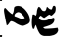
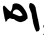

# 34. The morphology of Iranian

- 1. Introduction
- 2. Nominal morphology (including nouns, adjectives, adverbs, number words, and pronouns)
- 3. Compounds
- 4. Verb morphology
- 5. Abbreviations
- 6. References

## 1. Introduction

### 1.1. Reconstructing Old Iranian morphology

Any description of the morphology of Avestan is hampered by the incomplete inventory of forms and by the changes to the text as transmitted over millennia by the oral transmitters and then by the manuscript scribes. The manuscript basis for many texts is also very fragile (see Documentation). Nevertheless, by applying the method outlined by Hoffmann (1970: 187−188 = I: 274−275), it is possible to retrieve with a fair degree of certainty the forms of the texts as first “crystalized”, i.e. at the point from which the transmitted text was no longer subject to change (see Skjærvø 2005−2006: 14−20).

It has also been shown that the orthography of Avestan reflects a consistent phonological system (Morgenstierne 1942), so that it is possible to establish a cohesive morphology and to reconstruct proto-forms from which the forms in the manuscripts can be derived by consistent phonological rules, e.g. the rules for palatalization and labialization of vowels and consonants.

We still need a description of scribal habits to rule out the possibility that what may appear as a surprising archaism or a *lectio difficilior* in Geldner’s apparatus is, in fact, a quirk of a scribe. Thus, it is prudent to bear in mind the words of Karl Hoffmann, who famously said of the use of the *lectio difficilior* in Avestan studies: “… denn damit könnte jedem sinnlosen Schreibfehler der Rang einer lectio difficilior zugesprochen werden. Auch die lectio difficilior muss im Rahmen der philologischen und linguistischen Möglichkeiten liegen.” [… for in that manner the status of lectio difficilior could be accorded to every nonsensical scribal error. Even the lectio difficilior (sc. to be accepted as a correct reading) must fall within the framework of philological and linguistic possibilities.] (Hoffmann 1969a: 28 [= I: 269]). Geldner’s edition is imperfect in many ways (e.g. Hoffmann 1970; Cantera 2014, especially chapters 1−2; Skjærvø 2005−2006: 4− 22), and many errors were corrected by Bartholomae (1904, 1906, 1979), but before using forms from Geldner for linguistic arguments, it is still indispensable to check all available manuscripts, many of which can be seen at the Avestan Digital Archive (ADA: http://ada.usal.es/).

### 1.2. Spelling conventions

In Old Avestan all final vowels are long, but in Young Avestan they are short, except in monosyllables. In this chapter Av. *-ā*˘, *-ī˘*, *-ū˘* should be understood as referring to OAv. *-ā*, *-ī*, *-ū*, YAv. *-a*, *-i*, *-u*. OAv. *ī˘* and *ū˘* before *-m* are regularly written long in the manuscripts but, apparently, short or long according to their etymological values, before *-š* (*-ī˘š*, *-ū˘š*). In YAv., however, the original length distinctions are no longer observed and, in the manuscripts, new patterns have been created (see de Vaan 2003: 205−333). In this treatment, length in OAv. examples has been left more or less as in the mss., but in YAv. and OPers. examples, *ī˘* and *ū˘* are used to emphasize the non-etymological value of the manuscript spellings. On the morphophonology of Av. and OPers., see Hoffmann and Forssman (1996: 51−113) and Skjærvø (2007b: 860−865). For the vowels, see de Vaan (2003) and Cantera (2014: 320−321), who, among other things, shows that the length alternation in Geldner’s *ae* versus *aō* is not standard, the oldest Iranian mss. having *aē* and *aō*.

### 1.3. Changes in the orally transmitted Avestan text

Several features of the extant text may be attributed to the way it was orally transmitted (Skjærvø 2003−2004, 2005−2006). Changes that may be ascribed to the teaching and learning process include the following:

−OAv. “repetition of preverbs in tmesis” proved by the meter; cf. Y. 48.7 *nī aēšəmō nī.diiātąm pa ⁱtī rəməm pa ⁱtī.siiōdūm* ‘let wrath be tied down, let obstruction be cut back!’, which must be read as *nī aēšəmō diiātąm pa ⁱtī rəməm siiōdūm* (5 + 7 syllables).

−Introduction of final *-ō* in the first member of compounds: *daēuuō.dāta-* ‘established by demons’, *baγō.baxta-* ‘assigned by the assigner’, as well as at (real/assumed) morphological junctures: OAv. *drəguuō.dəbīš* < **drugu̯adbiš* ‘with the wicked’, *gūšō.dūm* < **gušadu̯am* ‘listen!’; comparatives and superlatives in *-ō.tara-* and *-ō.tama-*; nouns in *-tāt-*: OAv. *karapō.tāt-* ‘the title of *karpan*’.

−False divisions: OAv. *gə̄uš.āiš* < *gaoša-* ‘ear’, YAv. *uziiō.rəṇtəm* < *uziiaraṇt-* ‘coming up’, *vī˘manō.hiia-* from *vī˘manahiia-* ‘*agnosticism’; *parō.katarštəma-* from **parā*˘*ka.tarštəma-* ‘most feared by the other side(?)’.

−Changes to be ascribed to the acoustic nature of the recital include the analysis of stops, affricates, and *m* as geminates: OAv. intervocalic *t* > *t̰.t*: *gat̰.tōi*, *gat̰.tē* ‘to go’, *åŋ́hāt̰.təm* ‘would be; − YAv. *č* > *t̰.c*: *frātat̰.caiiat̰* < **frātacaiia-* ‘flow forth’; − OAv. *m* > *m.m*: *hə̄məmiiāsa ⁱtē*, *hə̄m.miiāsa ⁱtē* for **hə̄m-iiā*˘*sa ⁱtē* ‘is being steered’; *aēšəm.mahiiā* for *aēšəmahiiā* ‘of Wrath’.

−Restoration of non-sandhi forms in sandhi: *-š.h-* for *-š-* before a vowel, e. g. *aⁱβiš.huta-*‘filtered, pressed’, *ārmaⁱtiš.hāgət̰* ‘following (Spəṇtā) Ārmaiti’, *pasuš.haᵘruua-* ‘cattle-guardian’; − *-š-* for *-ž-* before a voiced consonant, e.g. *xšuuaš.gāiia-* for **xšuuažgāiia-* ‘distance of six steps’.

−Various analogies in YAv.: nom.-acc. pl. fem. forms of neut. *a-*stems, e.g. nom.-acc. sg. *nmānəm*, pl. *nmānå*; − nom.-acc. pl. fem. forms of adjectives or instr. pl. m.n. forms of determiners modifying nom.-acc. pl. of neut. *n*-stems: *pauruuå dātå dāmąn aṣ̌aon˘īš* ‘the first-established Orderly creations’, *karšuuąn yāiš hapta* ‘the seven continents’.

Changes due to false memorization and analogies in the oral transmission include many hapax forms: *maδuš* parallel with gen. forms in V. 14.17 *gə̄uš vā xᵛarəθahe vāhuraiiå vā maδuš vā* ‘of food of (from) cattle or of liquor or of mead’; no other gen. of *maδu-*is found, and the transmitter may have been influenced by the nom.-acc. *maδu*, which must have been well known to him, e.g. V. 5.53 etc. *xᵛarəṇti gąmca yaomca maδuca* ‘they consume meat, barley, and mead’.

Changes due to false memorization or, perhaps, abbreviations in the text (indicated here as “°”; these are quite common in the mss. but not yet studied) include confusion of gender: *aētat̰ druxš*/*nasu* ‘this demon of deception/death’ for *aēša druxš*/*nasuš* or *aētąm drujim*/*nasāum* (V. 9.45, etc.; for ms. *aēt*° *dr*°/*nas*° or similar?); − “wrong” endings, e.g., *zraiiā vouru.kaṣ̌aiia* ‘the Vourukasha sea’ (Y. 65.4 = Yt. 5.4 = Yt. 8.31; for ms. *zr*° *v*° or similar?) beside correct *zraiiaŋhō vouru.kaṣ̌ahe* (Yt. 5.42) (cf. also Beekes 1999: 63).

Scribal errors abound, many of which are obvious, but some of which have been regarded as genuine linguistic forms, e.g. *ziiānīm*, acc. sg. of *ziiāni-* ‘harm’, on the basis of the manuscript reading *ziiåiienīm*, which, however, is an error for **ziienīm* (Hoffmann 1969b = II: 513−515); but see Cantera (2014: 50, 70, 317 n. 337, 326).

### 1.4. Old Persian

The main obstacle to understanding the morphology of OPers. lies in its simplified orthography (deficiency of the sign inventory and non-marking of several consonants) and the fact that the language in the texts is situated at the end of the OPers. period and the beginning of the post-OPers. period (Schmitt 1999; Skjærvø 1999a: 158−160).

OPers. final *-ā* is from proto-Ir. **-a*, **-ā*, or **-āC*, while final *-a* is from proto-Ir. **-aC*. Short or long *ī˘* and *ū˘* are not distinguished: non-final *ī˘* is written <i> or <-i-y->; *ū˘* is written <u-C-> or <u-v>; in final position, they are written <-i-y, -u-v>. After *h*, *i* (and *ī*?) is not usually written in Darius’s inscriptions but is frequently represented in those of Xerxes.

In OPers., *h* is often missing where expected by etymology, e.g.: **hu-*, OPers. <u-v->; **ahmi*, OPers. *ahmiy* <a-m-i-y> and <a-h-m-i-y>; **a-hi-* = OPers. <a-i->, etc.

Original final consonants are missing, notably PIr. *-h*, *-t*, and *-n*. In transcriptions, these letters are often added as superscripts, e.g., *abaraʰ*, *abaraᵗ*, *abaraⁿ* ‘you, he, they carried’, although they probably had no phonetic value. The case of *-ʰm-* differs, as <-m-> may have denoted both voiced and preaspirated *-m-*, cf. Av. <hm> and <m˛> (*ahmi*, *am˛i*). The OPers. ending 3ʳᵈ sg. *-š* is most easily explained by a proportion with endingless 2ⁿᵈ and 3ʳᵈ persons: 2ⁿᵈ sg. *abara*: 3ʳᵈ sg. *abara* = 2ⁿᵈ sg. *āiš*: 3ʳᵈ sg. X; X = *āiš* ‘he came’ (Allegri-Panaino 1995); OPers. sg. n. *aniyašciy* < **ani̯at-cit* can be explained similarly: sg. m. *aniya*: sg. m. *aniyaš-ciy* = sg. n. *aniya*: sg. n. X; X = *aniyašciy*; thus also sg. n. *avašciy* and *cišciy* (see 2.4.2 and 2.4.4).

### 1.5. Inflectional categories

The nominal and verbal morphological categories and the morphophonological ablaut system show close affinity with those of OIA, with some greater archaisms and innovations on both sides. Both nominal declension and verbal conjugation are characterized by quantitative ablaut (lengthened, full, and zero-grade forms) in the athematic classes, as well as in adverbs and compounds, affecting the root, and/or the suffix formant, and/ or the ending. Other synchronic alternations in proto-Indo-Iranian (PIIr.) and proto-Iranian (PIr.) include the *ru(p)ki* phenomenon, whereby an *s* is retracted to *š* after the five segments designated in the rule, assimilation and, in Avestan, palatalization and labialization. In the following, asterisked forms are PIr. unless otherwise indicated. Translations usually give the basic meaning of a word.

## 2. Nominal morphology (including nouns, adjectives, adverbs, number words, and pronouns)

PIr. maintained fairly intact the triple gender (m., f., n.) and number (sg., du., pl.) systems together with eight cases inherited from PIIr.; vocalic and consonantal declensions in nouns and adjectives; and the distinction between athematic and thematic (*a*-)stems.

The distribution of genders in nouns is also that of PIIr., with some individual Iranian features, e.g., *vak-*/*vac-* is fem. in OIA (Latin *vōx* f.) but masc. in Av.

Vowel stems include m./n. *a-*stems, f. *ā-* and *ī*-stems, m./f./n. *i-* and *u*-stems, mono/ polysyllabic m. *ai-* and m./f. *au-*stems. Consonant stems end in any consonant (including laryngeal *H*) except fricatives, affricates, and glides. There are several kinds of suppletive stem-systems:

1. Alternating vowel and consonant stems: Av. *zā-*/*zam-* ‘earth’, *ziiā-*/*ziiam-* ‘winter’; OAv. *sauua-* ‘life-giving strength’, (sg. loc.; pl. nom.-acc., instr.), *sauuah-* (sg. nom., instr., gen.; pl. gen.) *ušā-* ‘dawn’ (YAv. sg. acc., abl.), *ušah-* (Av. sg. nom., YAv. sg.acc., pl. loc.); YAv. *kaniiā-* ‘young woman’ (YAv. sg. nom., acc.), *kaⁱnīn-* (YAv. sg. acc., gen., pl. nom.), *kaⁱnī-* (sg. gen., pl. acc. dat.-abl.).

2. Alternating consonant stems: *asan-*/*asman-* ‘stone, sky’ (cf. Schmitt 2014: 139−140); **āh-*/°*āhan* ‘mouth’, Av. *åŋh-*,°*åŋhan-*; **nāh-*/*nāhan-* ‘nose’, OPers. *nāh-*, Av. *nåŋhan-*; *napah-*/*napat-*/*naptar-* ‘grandson’ (2.2.4.12); °*carat-* ‘walking’: nom.-acc. pl. °*carąn*; *raϑaēštā-*/*raϑaēštar-* ‘charioteer’; *xšapan-* ‘night’ (OPers. *xšap-*) has *xšapar-* in compounds (°*xšaparəm* ‘for a period of x nights’, rhyming with °*aiiarəm*).

3. YAv. *sāstar-* ‘(false) teacher’ has the simplified weak stem *sāθr-* (YAv. gen. sg./pl.).

### 2.1. Case endings: general observations

The eight cases of PIr. were nominative, vocative, accusative, genitive, dative, ablative, instrumental, and locative, with the following case syncretisms: − sg.: OAv. gen. = abl. except in *a*-stems (YAv. distinct); − du.: dat. = abl. = instr.; YAv. gen. = loc. (OAv. distinct); − pl.: dat. = abl.; − fem.: nom. = acc.; − sg., du., pl. n.: nom. = acc.

In OAv. only masc. *a-*stems have eight distinct endings in the singular.

OPers. has six cases, with gen. = dat.

Endings with PIIR. **-s*, PIr. **-h* preserve the *-s* in sandhi (*-s* °) before *c* and *t* (OPers. *-š-c* °).

The gen. pl. ending *-ąm* is disyllabic in OAv.

Certain endings show ablaut, notably the gen. sg. ending, which, in *i-*, *u-*, and *n*-stems, has zero-grade **-h*/*š* or full-grade **-ah* corresponding to full and zero grade of the stem formant.

In YAv., the *b* in **-biš*, **-bi̯ā*˘, **-bi̯ah* often become *β* and *u̯* (*-uu-*) after a vowel (Skjærvø 2007a: 322−323; de Vaan 2005: 669−672).

An additional *-ā*˘ is frequently found in the Av. dat., abl., loc. sg. and Av., OPers. loc. pl.

### 2.2. Nouns and adjectives

#### 2.2.1. *a-*stems

These include several types of derived forms, among them:

−Adjectives from nouns, often accompanied by lengthened (or full) grade of the first syllable of the noun and/or the stem formant: Av. *ma ⁱniiauua-* ‘belonging to the other world’ < *maⁱniiu-* ‘spirit’; *narauua-* ‘son/descendant of Naru’; *āpa-* ‘waterlogged’ < *ā*˘*p-* ‘water’; *haoząθβa-* ‘the fact of being from a good lineage’ < *huzaṇtu-* ‘of good lineage’; *upaⁱri-z⁽ə⁾ma-* ‘living upon the earth’ < *zam-* ‘earth’; *hazaŋrō.zima-* ‘period of a thousand years’ < *ziiam-* ‘winter’; *raθβiia-* ‘according to the *ratu*’; *hu-paθmaniia-*‘the fact of having good flights’ < **paθman-* ‘flight’; − OPers. *ʰuvāipašiya-* ‘own’ < *ʰuvaipašiya-* ‘self’; *mārgava-* ‘Margianian’ < *margu-* ‘Margiana’; from noun with long stem vowel: *pārsa* ‘Persian’ < *pārsa* ‘Persia’.

−Nouns and adjectives in *-na-*, *-ana-* from verbs (various functions), e.g. Av. √i̯az ‘sacrifice’: *yasna-* ‘sacrifice’, √fras ‘ask’: YAv. *frašna-* ‘question’, √xᵛap- ‘sleep’:*xᵛafna-* ‘sleep’, √stā ‘stand’: YAv. °*stāna-*, OPers. *stāna-* ‘place (for..)’; − *ham* + √gam/jam ‘come together’: YAv. *haṇjamana-* ‘gathering’, √u̯ah ‘wear’ *vaŋhana-*‘dress’, √pak/pac ‘cook’ *pacina-* ‘cooked meal’; − OPers. *ā* + √u̯ah ‘inhabit’: *āvahana-* ‘settlement’; *ham* + √ar ‘move’: *hamarana-* ‘battle’; √draug/j ‘lie’: *draujana-*‘lier’.

−Patronymics in *-ā*˘*na-*, e.g. *jāmāspa-*: YAv. *jāmāspana-*; − with full grade of the stem formant, *pouruδāxšti-*: *pouruδāxštaiiana-* (cf. Schmitt 2003: 367).

−Nouns and adjectives in *-ka-*, *-aka-*, *-kā-*, e.g. YAv. *maṣ̌iia-* ‘man’: *maṣ̌iiāka-* ‘people’; *jaⁱnī-* ‘woman’: *jaⁱnikā-*; *pasu-* ‘sheep’: *pasuka-*; *nāⁱrī-* ‘woman’: *nāⁱrikā-*; from compounds, *a-pərənāiiu-* ‘not yet adult’: YAv. *a-pərənāiiukā*˘-; *ə-uuərəzikā-* ‘producing (*varz-*) nothing (good)’; − OPers. **vazar*/*n-* ‘greatness’: *vazạrka-*; **ạršti-* ‘spear’: *(ʰu)ā*˘*rštika-* ‘(good) spearman’; **mariya-*: *marīka-* ‘young man’; **banda-* ‘bond’: *baⁿdaka-* ‘bondsman’; *kạrnuvaka-* ‘workman, artisan’, cf. *kạrnau-* ‘do, make’.

−Adjectives in *-i̯a-* denoting appurtenance, including derivatives from place names, often have lengthened grade in the first syllable, e.g. *māna-* ‘house’: YAv. *māniia-*, OPers. *māniya-* ‘belonging to the house’; **agra-* ‘tip’: YAv. *aγriia-*, OPers. *agriya-*‘foremost’; **θanuvan-* ‘bow’: *θanuvaniya-* ‘archer’; **xšayaθa-* ‘rule’: *xšāyaθiya-*‘king’; *aθurā-* ‘Assyria’: *aθuriya-*; **ham-* (or **hama-*?) + *miça-* ‘same + contract’: *hammiçiya-* ‘conspirator’ (Schmitt 2014: 188−189); − with *k* > *c* before the suffix: *maka-* ‘Makran’: *maciya-*.

−*-ka-* + *ii̯a-* > OPers. *-ciya-*, e.g. **ā-* + *kaufa-* ‘by/on + mountain’: *ākaufaciya-* ‘mountain-dwellers’.

#### 2.2.1.1. The thematic declension

In the dat.-instr.-abl. du. and dat.-abl. and loc. pl., the them. vowel is replaced by the diphthong **-ai-*, Av. *-aē-*, *-ōi-*, *-aii-*.

Nom. sg. m. PIIr. **-as* > PIr. **-ah*, Av. *-ō*, *-as* °: *haomō* ‘haoma’; − rarely *-ə˘̄*: *ciθrə̄* ‘brilliant’; − OPers. *-a*: *baga vazạrka* ‘great god’.

Voc. sg. m. **-a*, Av. *-ā*˘, OPers. *-ā*: Av. *ahurā*˘ ‘lord’, OPers. *martiyā* ‘man’.

Acc. sg. m. and nom.-acc. sg. n. PIr. **-am*, Av. *-ə˘̄m*, OPers. *-am*: Av. m. *ahurəm*; OPers. m. *pārsam* ‘Persia(n)’; n. Av. *aṣ̌əm* ‘(cosmic) order’; YAv. *nmānəm* ‘house’ − *-i̯am*, *-u̯am* (with various changes produced by palatalization and labialization): **mari̯am* > YAv. *ma ⁱrī˘m* ‘rogue’; **gai̯am* > Av. *gaēm* ‘life’; **gau̯am*, YAv. *gaom* ‘milk’; **dai̯u̯am*, YAv. *daēū˘m* ‘demon’; **u̯idai̯u̯am*, YAv. *vī˘dōiiū˘m* ‘discarding the demons’; **hau̯i̯am* ‘left’, YAv. *hōiium* (Pers. mss.), *hōim* (Indic mss.). See Cantera (2014: 336−338).

Instr. sg. m./n. **-ā*, Av. *-ā*˘: *xšaθrā*˘ ‘command’; − OPers. *-ā*.

Dat. sg. m./n. **-āi*, Av. *-āi*: *ahurāi*; − OAv. also *-*āi̯ā*˘: *yātāiiā* ‘(what is) asked for’; *aṣ̌ā (i).yecā* < **aṣ̌āiiacā* (Hoffmann 1975 = II, 605−619); − OPers. = gen.

Abl. sg. m./n. **-āt*, Av. *-āt̰*, OAv. also *-āat̰*: *aṣ̌āt̰*, *vīrāat̰*° ‘man’; − + **-ā*: YAv. *-āδa*: *xšaθrāδa* (but *zraiiaŋhaδa* [Yt. 8.47] is probably an example of ms. vacillation between *-at̰* and *-aδa*, not of *-āt̰* + *-ā* [Bartholomae 1904, col. 1702; Hoffmann and Forssman, § 86.1]); − OPers. *-ā*:, *anā pārsā* ‘throughout this Persepolis’ (rather than ‘this Persia’; Schmitt 2009: 154, 2014: 228).

Gen. sg. m./n. **-ahi̯a*, OAv. *-ahiiā*, *-ax́iiā* °: *ahurahiiā*, *spəṇtax́iiā°* ‘life-giving’, palatal. *-ex́iiā* in ps.-OAv. *gaiiex́ iiā*°; − YAv. *-ahe*: *haomahe*; rarely *-aŋ́ hā* °: *aṣ̌aŋ́hā°*; OAv, *-ahē* only in *Zaraθuštrahē*; − YAv. palatal. *-ehe*: *gaiiehe*; − OPers. *-ahạyā*: *martiyahạyā*.

Loc. sg. m./n. **-ai*, OAv. *-ōi*, *-aē*°, YAv. *-ⁱ̯e*; + *-ā*: **-ai̯ā*, OAv. *-ōiiā*, YAv. *-aiia*, OPers. *-aiy*, *-ayā*: OAv. *š́iiaoθᵃnōi* ‘action’, *xᵛāθrōiiā* ‘comfort’, *marəkaēcā* ‘destruction’, YAv. *nmāne*, *nmānaiia*, OPers. *pārsaiy*, *dastayā* ‘hand’; − palatal. YAv. **-ⁱ̯e*: **ahū˘ⁱre* < *ahura-*(Skjærvø 2005: 203−205).

Nom.-voc.-acc. du. m. **-ā*, Av. *-ā*˘: Av. *zastā*˘ ‘hand’, YAv. *rə̄na* ‘leg’, OPers. *gaušā* ‘ear’.

Nom.-acc. du. n. **-ai* > OAv. *-ōi*, YAv. *-ⁱ̯e*: OAv. *š́iiaoθᵃnōi*, YAv. *xᵛarəθe* ‘foods’.

Dat.-instr.-abl. du. m. PIr. **-aibi̯ā*˘> OAv. *-ōibiiā*, YAv. *-aēⁱbiia*, *-aēβe*, OPers. -*aibiyā*: OAv. *zastōibiiā*, YAv. *zastaēⁱbiia* ‘hand’, *gaošaēβe*, OPers. *dastaibiyā*.

Gen. du. m. **-āi̯āh*, Av. *-aiiå*: OAv. *rānaiiå* ‘leg’, YAv. *vī˘raiiå* ‘man’.

Loc. du. m. **-ā*˘*i̯ah*, OAv. *-aiiō*, *-ōiiō*: *zastaiiō*, *ubōiiō* ‘both’; − OPers. = gen. *-āyā*: *gaušāyā*.

Nom.-voc. pl. m. **-ā*, Av. *-ā*˘, palatalized **-ⁱ̯ˇ*: OAv. *maṣ̌iiā*, *paᵘruiiē* ‘first’ (Y. 36.1?), YAv. *yazata* ‘god’, *aⁱre* < *aⁱriia-* ‘Aryan’, OPers. *āmātā* ‘*noble’; − **-āhah*, Av. *-åŋhō*, OPers. *-āha*: OAv. *maṣ̌iiåŋhō*, YAv. *yazatåŋhō* ‘deity’, OPers. *bagāha* ‘god’.

Acc. pl. m. **-anh* > **-əŋh*, OAv. *-ə̄ṇg*, *-ąs* °: *maṣ̌iiə̄ṇg*, *sə̄ṇghąs°* ‘announcement’; − YAv. *-ə̄ (s°)*, -*ąs* °: *spəṇtə̄*, *aməṣ̌ə̄s*° ‘immortal’, *yazatąs°*; − YAv. *-ą*: *haomą*, *paoiriią* ‘first’ (*paoⁱriiąn* [Yt. 13.150, mss. *paoiriiṇn*, *paoiriiąm*] with common ms. variation *-ąn*/*-ąm* for *-ą*, not < **-ān* [Bartholomae 1904, col. 875; Hoffmann and Forssman, § 87.4]), *maṣ̌iią* ‘devoid of men’; − *-u̯ə̄* > *-(u̯)ū*: *daēuuū*, *daēū* < *daēuua-* ‘demon’; − OPers. *-ā*: *martiyā* (perhaps *-āⁿ*, if Szemerényi [1991: 1956−1960] is right that *sakām* before *p-* in DB 5.21−22 is for **sakān* [Schmitt 2014: 243: acc. pl. m. ‘*Sakām*’]).

Nom.-acc. pl. n. **-ā*: Av. *š́iiaoθᵃnā*˘, OPers. *āyadanā* ‘place of sacrifice’.

Instr. pl. m./n. **-āiš* = Av.: *maṣ̌iiāiš*; − OPers. *-aibiš*: *martiyaibiš*.

Dat.-abl. pl. m./n. **-aibi̯as* > **-aibi̯ah*, Av. *-aēⁱbiiō*, OAv. *-ōibiiō*, *-ōibiias* °: *yazataēⁱbiiō*, *yasnōibiiō*, *dātōibiias°* ‘law’.

Gen. pl. m./n. **-ānām*, Av. -*anąm*: *yasnanąm*, YAv. *maṣ̌iiānąm* with secondary *i̯a* > *i̯ā*; − OPers. *-ānām*: *bagānām*.

Loc. pl. m.n. **-aišu*, Av. *-aēšū˘*: OAv. *maṣ̌iiaēšū*, YAv, *aspaēšu* ‘horse’; − + *-ā*˘ > YAv. *-aēšuua*, OPers. *-aišuvā*: YAv. *mazdaiiasnaēšuua* ‘Mazdayasnian’, OPers. *mādaišuvā* ‘Mede’.

#### 2.2.2. *a*̄- and *ı*̄-/*i̯a*̄ -stems (fem.)

These include nouns and adjectives.

Fem. *ī*-stems fall into two categories, commonly called the “*devī-*” and “*vr̥kī*-declensions”. The *devī*-declension is largely parallel to the *ā*-stems, with stem formant: *-ī-*/*-i̯ā-*. Most Av. *ī*-stems belong to this declension, and many are derived fem. nouns or adjectives, e.g.: PIIr. **pr̥Hu-* ‘much’: PIr. **paru-*, f. **paru̯ī-*, YAv. *poᵘru-* ‘much’, f. *paoⁱrī-*; *aṣ̌ā*˘*uuan-* ‘orderly’, f. *aṣ̌aonī-* and *aṣ̌āuuaⁱrī-*; *astuuaṇt-* ‘having bones’, f. *astuuaⁱtī-*; *xraoždiiah-* ‘harder’, f. *xraoždiiehī-*; **u̯ahi̯ah-* ‘better’, f. *vahehī-*; *ahura-* ‘lord’, f. *ahurānī-* ‘lady’; *paⁱti-* ‘master’: *paθnī-* ‘mistress’. − On the ‘*vr̥kī*-declension’ see 2.2.4.10.

In OPers., PIr. *āp-* ‘water’, *māh-* ‘month’, and *pantā-*/*paθ-* appear to have some forms from *ī*-stems.

#### 2.2.2.1. *a*̄-stem declension

Nom. sg. **-ā* = OAv.; YAv. *-a*, palatal. *-ⁱ̯e*, OPers. *-ā*: Av. *daēnā*˘ ‘*daēnā*’ < **dai̯anā-*, *naⁱre* ‘manly’ < **nari̯ā*, OPers. *hainā* ‘army’.

Acc. sg. **-ām*, *Av. *-ąm*, OPers. *-ām*: Av. *daēnąm*, OPers. *taumām* ‘family’.

Voc. sg. **-ai*, Av. *- ⁱ̯ē*˘: OAv. *bərəxδē* ‘*exalted’. (On Y. 53.3 *pourucistā* nom. [subj. of *tə̄ṇcā.tū* (4.5.11)], see Kellens-Pirart III: 268 [voc. Bartholomae 1895: 234; Hoffmann and Forssman, § 88.2; Schwartz 2009: 429]).

Instr. sg. **-ā*, *-*ai̯ā*: Av. *daēnā*˘, *daēnaiiā*˘, OPers. *framānāyā*.

Dat. sg. **-āi̯āi*, Av. *-aiiāi*: Av. *daēnaiiāi*.

Abl. sg. OAv. = gen.; YAv. *-aiiāt̰*: *daēnaiiāt̰*, OPers. *haināyā*.

Gen. sg. **-āi̯āh*, Av. *-aiiå(s°)*, OPers. *-āyā*: Av. *haēnaiiå(s°)*, OPers. *taumāyā*.

Loc. sg. **-āyā*, YAv. *-aiia*: *grīuuaiia* ‘neck, ridge’, OPers. *aθurāyā* ‘Assyria’.

Nom-voc.-acc. du. **-ai*, Av. *-*ⁱ̯ḗ*: OAv. *ubē*, YAv. *uruuaⁱre* ‘plant’.

Dat.-instr.-abl. du. **-ābi̯ā*, YAv. *-ābiia*: *vąθβābiia* ‘herd’.

Nom.-voc.-acc. pl. **-āh*, Av. *-å(s°)*, OPers. *-ā*: Av. *daēnå(s°)*, OPers. *stūnā* ‘column’.

Gen. pl. **-ānām*, Av. *-anąm*: *gaēθanąm* ‘herd’.

Dat.-abl. pl. **-ābi̯ah*, Av. *-ābiiō*, *-ābiias°*, YAv. *-āu(ua)iiō*: OAv. *daēnābiiō*, YAv. *gaēθāuuaiiō*, *vōiγnāuiiō* kind of disaster (dat.-abl. pl. *haēnə̄biiō* < *haēnā-* ‘army’ [Yt. 10.93] is in anticipation of *draomə̄biiō* [*n*-stem], rather than analogy with *ah*-stems [Hoffmann and Forssman, § 88.4], despite the qualifying m./n. *druuat̰biiō*, the only example of the dat.-abl. pl. of *druuaṇt-* ‘wicked’.).

Instr. pl. **-ābiš*, OAv. *-ābīš*: *daēnābīš*.

Loc. pl. **-āhu*, Av. *-āhū˘*; + *-ā*: Av. *-āhuuā*˘, OPers. *-āʰuvā*: OAv. *gaēθāhū*, YAv. *paᵘruuatāhuua* ‘mountain’, OPers. *maškāʰuvā* ‘inflated skin’.

#### 2.2.2.2. *ı*̄-/*i̯a*̄ -stem declension

Nom. sg. **-ī* = OAv.; YAv. *-i*, OPers. *-ī˘y*, also analogical *-iš*: Av. *nāⁱrī˘* ‘woman’, *vaŋᵛhī* ‘good’, OPers. *ʰuvārazmī˘y*, *ʰuvārazmiš* ‘Choresmia’, *haraʰuvatiš* ‘Arachosia’, but in Elamite transcription <har-ku-(ut-)ti> for **-tī* (Hoffmann 1976: 641 n. 38).

Acc. sg. **-īm*, OAv. *-īm*, YAv, OPers., *-ī˘m*: Av. *vaŋᵛhī˘m* ‘good’, OPers. *būmī˘m* ‘earth’.

Voc. sg. **-i*, Av. *-˘ī*: Av. *vaŋᵛh˘ī*; − YAv. analogical *-ⁱ̯e*: *aṣ̌aone*.

Instr. sg. **-i̯ā*: Av. *vaŋhuiiā*˘.

Dat. sg. **-i̯āi*, Av. *-iiāi*: Av. *vaŋhuiiāi*, *astuua ⁱθiiāi*.

Abl. sg. OAv. = gen.; YAv. *-iiāt̰*: *barəθriiāt̰* ‘womb’, *druuō.ⁱθiiāt̰* < **druuaⁱθiiāt̰* < m. *druuaṇt-* ‘wicked’.

Gen. sg. **-i̯āh*, Av. *-iiå(s°)*, OPers. *-iyā*: Av. *vaŋhuiiå*; YAv. *vanaⁱṇtiiås*° < m. *vanaṇt-*‘victorious’; *druuaⁱtiiås°* (*-t-* for *-θ-*); OPers. abl. *haraʰuvatī˘yā*.

Loc. sg. **-(i)i̯ā*, YAv. *- ⁱ̯e*: *pərəθβe* < m. *pərəθu-* ‘wide’; OPers. *haraʰuvatī˘yā*.

Nom-voc.-acc. du. **-ī*, Av. *-ī˘*: OAv. *azī* ‘fertile cow’, YAv. *saŋhauuāci* pr. n.

Nom.-voc.-acc. pl. **-īš*, Av. *-ī˘š*: Av. *vaŋᵛhī˘š*.

Gen. pl. **-īnām*, Av. *-inąm*: *aṣ̌aoninąm*.

Dat.-abl. pl. **-ībi̯ ah*, Av. *-˘ībiiō*: OAv. *šiieⁱtibiiō* < *šiieⁱtī-* ‘settlement’, YAv. *aṣ̌aonibiiō*.

Instr. pl. **-ībī˘š*, *-ibī˘š*: YAv. *āzīzanā ⁱtibī˘š* ‘about to give birth’.

Loc. pl. **-īšu*, YAv. *-ī˘šu*; + *-ā*: YAv. *-ī˘šuua*: YAv. *xšaθrī˘šu* ‘female’, *barəθrī˘šuua*.

#### 2.2.3. *i-* and *u-*stems, *ai-* and *au-*stems

*i*-stems include some derived adjectives denoting appurtenance; these often have lengthened grade in the first syllable: YAv. *āhū˘ⁱri-* < *ahura (mazdā)*; *hāuuani-* ‘(time) for the *haoma* pressing’ < *hauuana-*; *vārəθraγni-* ‘victorious’ < *vərəθraγna-*; *aⁱβimiθri-* ‘(somebody) acting against a contract’ < *miθra-*;− OPers. *yāuʰmaini-*/*-mani* ‘*being in control’ < **yauʰman-* ‘harnessing’ (?) < √i̯aug ‘harness’ (Skjærvø 2011: 327; Hoffmann 1955: 84−85 = I: 56−57, read *yāʰu-maini-* suggesting something like ‘mit siedender Vergeltungskraft’, cf. Schmitt 2009: 109, 2014: 292); *bāgayādi-*, month name: ‘(month) devoted to sacrifices to the god’ < *baga-* + **yāda-* < √i̯aȷ́;− nouns denoting ‘somebody in charge of’: OAv. *dąmi-* ‘the one in charge of the *dāman-* (cosmic) “bonds” (reins?)’; YAv. *uštrō.stāni-* < *uštrō.stāna-* ‘camel stall’; − patronymics in *-āni-*: *āθβiiāni-* < *āθβiia-*.

*i-* and *u-*stems have protero- and hysterodynamic ablaut: stem formant in full or zerograde, respectively, in the gen.-dat. sg., with appropriate consonant changes before *i̯*, *u̯*. YAv. *pəšụ -*/*pərətu-* ‘ford’ have accent-conditioned alternations (Hoffmann and Forssman § 93.1, Tremblay 1998: 201−202).

All *i-* and *u*-stems typically take the full grade of the stem formant in the voc., loc. sg., and nom. pl.

Diphthong-stems are monosyllabic (*gao-* m., f. ‘bull, cow’, with acc. from *gā-*; *diiau-*‘sky’) and polysyllabic. The latter have forms with full or long grade of the stem formants: **-i-*/*-ai̯-*/*-āi̯-*, and **-u-*/*-au̯-*/-*āu̯-*. Av. *ai*-stems include *haxai-* ‘companion’, *kauuai-* ‘poet’, *xštauuai-*, a legendary people, *sāuuaŋhai-*, a calendrical *ratu*; − Av. *au-*stems include m. *hiθau-* ‘?’, *bāzau-* ‘arm’, *pərəsau-* ‘rib’, *garəmau-* ‘heat’, masc. adjectives in °*bāzau-* and °*fšau-* ‘cattle’, and f. *daŋ́hau-*, OPers. *dahạyau-* ‘land’, YAv. *nasau-* ‘carcass (of a demon)’. These differ from *i-*/*u-*stems only in the nom. and acc.

#### 2.2.3.1. *i-* and *u*-declensions

Note that *ī˘* and *ū˘* are used to emphasize the non-etymological value of the manuscript spellings.

Nom. sg. m./f. *-iš*; *-uš*: Av. *ārmaⁱtiš* ‘Ārmaⁱti’, OPers. *šiyātiš* ‘happiness’; − Av. *aŋhuš* ‘world’, OPers. *marguš* ‘Merv’; − *ai-*stems: **-ā*, Av. *-ā*˘: *kauuā*˘, *haxā*˘; − *au-*stems: *-āuš*: Av. °*bāzāuš*, OAv. *hiθāuš*, OPers. *dahạyāuš* (but YAv. *daŋ́hau-*, *nasau-*: *daŋ́huš*, *nasuš*); − *gau-*: Av. *gāuš*.

Voc. sg. m./f. **-ai*, Av. *-ⁱ̯ē*˘; **-au*, YAv. *-ao*°, *-u̯ō*, *-ō* after *i̯*: OAv. *ārmaⁱtē*, YAv. *hāuuane*; − *ratuuō* ‘*ratu*’, *ma ⁱniiō* < *maⁱniiu-* ‘spirit’, *vaiiō* ‘Vaiiu’; − *ai-*stems: YAv. *sauuaŋ́he*;− *gau-*: YAv. *gao*°.

Acc. sg. m./f. *-im*; *-um*: Av. *ārmaⁱtī˘m*, OPers. *šiyātim*;− Av. *ahū˘m*, OPers. *margum*;− *ai-*stems: **-āi̯am*, Av. **-ā*˘*i̯am* > *-āim*, *-aēm*: Av. *haxāim*; YAv. *kauuaēm*; − *au*-stems: **-āu̯am*, Av. **-ā*˘*u̯am* > *-āum*, *-aom*, OPers. *-āvam*, *-āum*: YAv. °*fšāum* / °*fšaom*, *nasāum*, *daŋ́haom* (on the diphthongs, see de Vaan 2000), OPers. *dahạyāvam*, *dahạyāum*; − *gau-*: Av. *gąm*.

Nom.-acc. sg. n. **-i*, **-u*: YAv. *zaraθuštri* ‘following Zarathustra’; − *poᵘru* ‘much’.

Instr. sg. m./f. **-ī*, **-ū*: OAv. *ārmaⁱtī*, YAv. *axti* ‘pain’; − OAv. *xratū* ‘wisdom’; − YAv. n. *vohu*. − Hysterodynamic: **-u̯ā*, Av. *-u̯ā*˘: Av. *xraθβā*˘, YAv. labialized *xruuī.druuō* ‘with a bloody club’.

Dat. sg. m./f. **-ai̯ai*, OAv. *-ōiiōi*, YAv. *-ə̄e*, *-aiiaē°*; **-au̯ai*, *-auuē*, *-auue* /*-aoe*: OAv. *axtōiiōi*, YAv. *frauuaṣ̌ə̄ e* ‘fravashi’, °*patə̄ e* < *paⁱti-* ‘master’, *āzū˘taiiaē*° < *āzuⁱti-* ‘libation’; − OAv. *vaŋhauuē*, YAv. *maⁱniiauue*, *zaṇtaoe* ‘tribe’. − Hysterodynamic: **-i̯ai*, OAv. *-iiaē°*; **-u̯ai*, *-uiiē*, YAv. *-u̯ ⁱ̯e*: OAv. *paⁱθiiaē*°, YAv. *paⁱθe* < *pati-*; − OAv. *ahuiiē*; YAv. *aŋᵛhe*, *xraθβe*, *rašnuuaē*° ‘Rašnu’; − *ai-*stems: YAv. **haš́ē* < **hači̯ai*; − *au-*stems: YAv. °*fšauue*; − *gau-*: OAv. *gauuōi*, YAv. *gauue*/*gaoe*.

Abl. sg. m./f.: OAv. = gen.; YAv., OPers. **-ait*, YAv. *-ōit̰*; **-aut*, YAv. *-aot̰*, OPers. *-auv*, *-auš*: YAv. *garōit̰* (*āxštaēδa* V. 3.1 is likely to be from *āxšta-* ‘stand near’ [Kellens, 1984: 192] rather than a noun [Bartholomae, col. 311; Hoffmann and Forssman, § 95.2]); − *maⁱniiaot̰*; − *au-*stems: YAv. *hiθβat̰* (apparently to *hiθau-* in unclear context [Y. 19.15]. Bartholomae’s ‘bedrängt’ [col. 1813] is speculation. Kellens [2010: 45] apparently assumes a thematic *hiθβa-* ‘amitié’ from *hiθau-* [Barth. ‘Genosse’]), OPers. *bābirauv*, *bābirauš* ‘Babylon’; − *gau-*: YAv. *gaot̰*.

Gen. sg. m./f. **-aiš*, Av. *-ōiš*; **-auš*, OAv. *-ə̄uš*, Av. *-aoš*: OAv. *garōiš* ‘mountain’, OPers. *fravạrtaiš* pr. n.; − OAv. *maⁱniiə̄uš*, *paraoš*, YAv. *maⁱniiaoš*, OPers. *kurauš* ‘Cyrus’. − Hysterodynamic: **-u̯ah*, Av. *-u̯ō*, *-u̯as°*: YAv. *xraθβō* < *xratu-* ‘wisdom’; *saŋᵛhas*° < *saŋhu-* ‘announcement’; − *gau*-, *diiau-*: Av. *gə̄uš*, YAv. *diiaoš*.

Loc. sg. m./f. Av. *-ā*˘; **-ā*˘*u*, OAv. *-aō˘*, *-āu*, YAv. *-u̯ō*, + *-ā*: *-auu̯a*, OPers. *-auvā*: OAv. *vīdātā* < *vīdāⁱti-* ‘setting apart’; YAv. *gara* < *gaⁱri-*; − OAv. *pərətaō˘* ‘ford’, *xratāu* (see Skjærvø 2005), YAv. *gātuuō*, *gātauua* ‘place’**,** OPers. *Bābirauv* and *gāθav-ā*; − *au-*stems: OPers. *dahạyauvā*.

Nom.-voc.-acc. du. m./f. **-ī*, **-ū*; **-ū*: YAv. *gairi*; − Av. *maⁱniiū˘*; − *ai*-/*au*-stems **-ā*: YAv. hysterodynamic *haš́a* (*haxaiia* [V. 4.44; Hoffmann and Forssman, § 95.3] in ungrammatical *brāθra vā haxaiia vā* ‘brothers or companions’); − YAv. *bāzauua* (but YAv. *daŋ́hu*.);− *gau-*: YAv. *gāuua*.

Nom.-voc.-acc. du. n. **-ī*, YAv. *-i*: *aši* ‘evil eye’.

Dat.-abl.-instr. du. m./f. **-ibi̯ā*, Av. *-ibiiā*˘; **-ubi̯ā*, Av. *-ubiiā*˘, YAv. *-uβe*: YAv. *ašibiia*; − OAv. *ahubiiā*, YAv. *pasubiia* ‘cattle’; − *au-*stems: *bāzuβe*.

Gen. du. m./f. **-uu̯āh*, Av. *-uuå*: OAv. trisyllabic *ahuuå*, YAv. *pasuuå*; − *gau-*: YAv. °*gauuå*.

Loc. du. m./f. **-uu̯ah*, OAv. *-uuō*: *aŋhuuō*.

Nom.-voc. pl. m./f. **-ai̯ah*, Av. *-aiiō*; **-au̯ah*, Av. − *auuō*: *ārmataiiō*, *arštaiias*° ‘spear’; − OAv. *xratauuō*, YAv. *vaŋhauuas*°; − *ai-*/*au-*stems **-āi̯ah*, Av. *-aiiō*, *-aiias*°; **-āu̯ah*, Av. *-ā*˘*uuō*: OAv. *kāuuaiias*°; − YAv. *daŋ́hāuuō*, °*fšauuō*, OPers. *dahạyāva*; − *gau-*: *gauuō* (Aog. 84).

Acc. pl. m./f. **-inš*, **-įš*, Av. *-˘īš*; **-unš*, **-ųš*, Av. *-ū˘š*: YAv. *aš˘ị̄ š* ‘reward’, YAv. *gairī˘š*; − OAv. *xratūš*, YAv. *barəšnū˘š* ‘height’; − *gau-*: Av. *gå*.

Nom.-acc. pl. n. **-ī˘*, **-ū˘*: YAv. *zaraθuštri*; − Av. *vohū˘*.

Gen. pl. m./f. **-ī˘nām*, Av. *-inąm*; **-ū˘nām*, Av. *-unąm*: OAv. *nāⁱrinąm*, YAv. *gaⁱrinąm*; − Av. *vohunąm*, OPers. *parū˘nām*. − Hysterodynamic: YAv. *vaŋhuuąm* (Hoffmann 1976: 595−596), *raθβąm*; − *ai-*/*au-*stems: YAv. hysterodynamic *kaoiiąm*, *haš́ąm*; − (Y)Av. *dax́iiunąm*, OPers. *dahạyū˘nām*; − *gau-*: *gauuąm*.

Dat.-abl. pl. m./f. **-ibi̯ah*, YAv. *-ibiiō*, *-iβiiō*; **-ubi̯ah*, Av. *-ubiiō*, *-u ⁱβiiō*: YAv. *frauuaṣ̌ibiiō*; − OAv. *poᵘrubiiō*, YAv. *ratubiiō*, *hinuⁱβiiō* ‘*bond’; − *ai-*stems: *xštəuuiβiiō*.

Instr. pl. m./f. **-ibiš*, YAv. **-iβiš*, **-iu̯iš*, **-ubiš*, **-uβiš*, **-uu̯iš* contracted to *-ᵘ̯ī˘š*, *-uš*: YAv. *ažī˘š*° ‘snake’; − *vaŋhəuuī˘š*, *auuaŋhū˘š*/*auuaŋhī˘š* ‘un-good’, *yātuš* < *yātu-* ‘sorcerer’; − *gau-*: YAv. *gaobī˘š*.

Loc. pl. m./f. *-išu*, YAv. *-ī˘šu*; **-ušu*, Av. *-ušū˘*, + *-ā*: YAv. *-ušuua*, *-uš.huua*: YAv. *hāⁱtī˘šu* ‘section’; − OAv. *poᵘrušū*, YAv. *vaŋhušu*, *gātušuua*, *pasuš.huua*; − *au-*stems: OPers. *dahạyušuvā*.

#### 2.2.3.2. Some special *i-* and *u*-stems

YAv. *vi-* ‘bird’: nom. sg. *viš*, nom. pl. *vaiiō*, gen. pl. *vaiiąm*; − **raHi-*/ *raHi̯-* ‘wealth’, Av. *raē-*/*rā*˘*ii*: sg. acc. *raēm*, gen. *rāiiō*, instr. *raiia*, pl. OAv. nom. *rāiiō*, YAv. acc. *raēš*, gen. pl. *raiiąm*. − Fem. **jani-* ‘woman’: OAv. nom.-voc. pl. *jə̄naiiō*, YAv. gen. sg. *janiiōiš* (So most mss. [see Geldner, ADA]. Pirart’s [1993] preference for *janiiaoš* [which he emends to **janiiuš*] has the support only of Mf1 [*jańiiaoiš*] and K4 [*jańiiaōš*]; J2 has *janiiə̄uš*.). − The city name YAv. *raγā-* (nom. *raγa*, acc. *raγąm*, OPers. instr.-abl. *ragāyā*) has abl. *rajōit̰*.

A small set of neut. *u-*stems have amphidynamic ablaut (*-ā-* < PIE *-o-*): PIr. **Hāi̯u-*/ *Hi̯au-*: sg. nom.-acc. *āiiu* ‘time/life-span’, gen. *yaoš*, dat. *yauue*/*yaoe*, instr. *yauua*; − *dāᵘru* ‘wood’, loc. sg. *drao*°; − **zānu* ‘knee’, dat.-abl. pl. *žnubiias*°. − In compounds: OAv. *darəgāiiu-* ‘bestowing long life’ < **darga-Hi̯u-*, YAv. *darši.dru-* ‘with a defiant mace’, YAv. *frašnu-* ‘with protruding knees’.

#### 2.2.4. Consonant stem declensions

These can end in any consonant except fricatives, affricates, and glides. Several declensions show ablaut. Typically, strong cases are the nom., acc. sg., nom.-voc.-acc. du., and the nom. pl. The ablaut is sometimes obscured by vowel shortening/lengthening (de Vaan 2003, § 4), e.g., *āp-*/*ap-* ‘water’ has acc. sg. *āpəm*, nom. pl. *āpō*, acc. pl. *apō*, but the nom. pl. is sometimes also transmitted as *apō*, the gen. sg. as *āpō*, and the acc. sg. is *apəm*° before enclitics (de Vaan 2003: 606).

#### 2.2.4.1. Consonant-stem endings

Sing. nom. m./f. zero or **-h*/*-š*/*-s*; − voc. zero; − acc. m./f. **-am*, Av. *-ə˘̄m*, nom.-acc. n. zero; − instr. **-ā*, Av. *-ā*˘; − dat. **-ai*, OAv. *-ōi*, Av. *-ⁱ̯ē*˘, *-aē*°; − abl. OAv. = gen.; YAv. **-at̰*, proterodyn. *-t̰*, zero; − gen. **-ah*, *-as*°, Av. *-ō*, *-as*°, proterodyn. **-h*; − loc. **-i*, **-iʾā*, Av. *-ī˘*, *-iiā*˘, YAv. *-ⁱ̯e*. − Dual nom.-voc.-acc. m./f. **-ā*, Av. *-ā*˘; − n. **-ī*, Av. *-ī˘*; − instr.-dat.-abl. **-bi̯ā*, YAv. *-biia*; − gen. **-āh*, Av. *-å*. − Plur. nom.-voc. m./f. **-ah*, *-as*°, Av. *-ō*, *-as*°; − acc. m./f. PIE **-n̥s*, PIr. **-ah*, *-as*°, Av. *-ō*, *-as*° (*r*-stems PIIr. **-r̥nš*, Av. *-ərąš*, YAv. *-rə̄š*); − n. zero or **-i*, Av. *-ī˘*; − instr. PIr. **-biš*, Av. *-bī˘š*, YAv. **-βiš*, **-u̯ī˘š*; − dat.-abl. **-bi̯ah*, **-bi̯as*°, Av. *-biiō*, *-biias*°, YAv. *-βiiō*, **-u̯i̯ō*; − gen. **-ām*, Av. -*ąm*; − loc. **-hu*/*-šu*/*-su*, + *-ā*: YAv. disyllabic *-huua*/*-šuua*. Av. *-ī˘* and YAv. *-ⁱ̯e* palatalize preceding *n*, *t*, *r* (*i*-epenthesis); YAv. *-ⁱ̯e* palatalizes *ŋh* > *ŋ́h* in *h*-stems. If palatalization is not visible, *-ⁱ̯e* behaves as *-e*.

#### 2.2.4.2. Stems in labial stops (*p*)

The only stems in labial stops are Av., OPers. *āp-*/*ap-*, Av. *kəhrp-*/*kərəp-* ‘body, form’, **varəp-* (uncertain meaning) and OPers. *xšap-* ‘night’ (gen.-dat. sg. *xšapa*). Of these, *āp-*/*ap* has normal ablaut, while *kərəp-* has the strong stem *kəhrp-*. The labial becomes *f* before the nom. *-š* (< **s* by *ru(p)ki*) (Av. nom. sg. *āfš*, *kərəfš*; loc. pl. *varəfšuua*). OPers. *āp-* may have nom. sg. from *āpī-* in *āpī˘šim parābara* ‘the water carried it (= the army) away’ (Schmitt 2014: 131: loc. sg. *api-*, 2009: 50 ‘im Wasser trug es ihn fort’). Before endings with *b*, the labial was assimilated and the geminate simplified (**ap-b* > *ab-*): OPers. instr.-abl. pl. *abiš*, YAv. dat.-abl. pl. *aⁱβiiō*.

#### 2.2.4.3. Stems in dental stops (*d*, *t*, *ṇt*)

Stems in *d* include OAv. *išud-* ‘due, debt’, *zərəd-* ‘heart’, Av. *vərəd-* ‘growth’, OPers. *θar(a)d-* ‘year’, and **pād-*/*pad-* ‘foot’, which has YAv. acc. sg. *pāδəm*, nom.-acc. du. *pāδa*, reintepreted as them., whence dat.-abl.-instr. du. YAv. *pāδauue*, OPers. *pādaibiyā*, YAv. gen. du. *pāδaiiå*, and in compounds (°*pāδahe*, °*pāδåŋhō*). No nom. sg. is attested. On OPers. *viθ-* ‘house’, see 2.2.4.9.

Stems in *t* include root-nouns in *t* (*cāt-* ‘well’; n. *ast-* ‘bone’) and root nouns from verbal roots ending in a vowel or *r* (Av. °*xšnut-* ‘satisfying’, °*bərət-* ‘carrying, riding’); adjectives in *-āt-*; and fem. stems with suffix *-tāt*-, making abstract nouns from adjectives and also used to “quote” words, e.g.: OAv. *haᵘruuatāt-* ‘wholeness’, *amərətatāt-* ‘not dying (before one’s time)’, *kəuuitāt-* ‘the word/title of *kauui* (‘poet’)’, YAv. *kahrkatāt-*‘the term *kahrka* “chicken”’. These have nom. sg. in *-s* < **-ss* < *-ts*: YAv. °*bərəs*, °*xšnus*, *haᵘruuatās*; *tāt*-stems have OAv. *-tås*° before enclitics: OAv. *auuaētās* ‘the word “woe”’, *amərətatås*°. The n. *ast-* ‘bone’ has nom.-acc. pl. (rather than sg.?) *as*° in OAv. *ascīt̰*, YAv. *asca*, YAv. also *asti*. Other endings are regular. *tāt*-stems have some shortened forms in YAv.: dat.-abl.-instr. du. *haᵘruuat̰biia* (*bruuat̰.biiąm* < *brū-* ‘eyebrow’ in gen. function [V. 8.41 etc.: *aṇtarāt̰ naēmāt̰ bruuat̰.biiąm* ‘from between the eyebrows’] looks like a hybrid between dat.-abl. du. and gen. pl. and must be unrelated to OIA *-bhyām*). − The *āt*-stem *cāt-* has only loc. sg. *cāⁱti*; − *fraptər əjāt-* ‘winged’ and *rauuascarāt-*‘roaming the open spaces’ have suppl. nom.-acc. pl. n. *fraptər əjąn* and *rauuascarąn*.

Stems in *nt* include:

−Adjectives in Av. *-aṇt-* and active present and aorist participles in *-aṇt-*. Adjectives and athematic verbs have ablauting *-aṇt-*/*-at-*, while thematic verbs have no ablaut. In the participles, *-ąs* < **-ants* is found in a few words: YAv. *fšuiiąs* ‘husbandman’,*xšaiiąs* ‘ruling’, but more often **-ant-s* > **-anss* appears to have been simplified to **-ans* (or the *t* was lost, cf. *nk*-stems, 2.2.4.4) early enough to become **-aŋh*, which developed as in the thematic acc. pl. (YAv. *jaiδiią* ‘imploring’), but most often was replaced by *-ō* in both adjectives and participles: *bərəzō* < *bərəzaṇt-* ‘tall’, *barō* < *baraṇt-* ‘carrying’. The acrostatic participle *stauuaṇt-* has nom. sg. m. OAv. *stauuas* < **stáu̯n̥ts*. OPers. nom. sg. *tunuvā* ‘powerful, rich’, if from *tunau-*/*tunu-* ‘be mighty’, may have *-ā* after the *u̯ant*-stems. The voc. sg. *bərəza* may be in analogy with the nom. *bərəzō*. The nom.-acc. sg. n. of adjectives and athematic participles has Av. *-at̰*: *bərəzat̰*, *ah*/*h-* ‘be’: YAv. *hat̰*. Thematic verbs have *-ən* < *-ant*: **i̯asahi̯a-* ‘seek glory’: OAv. *yasō.x́iiə̄n*, *mānaiia-* ‘resemble’: YAv. *mąnaiiən*. The nom.-acc. pl. n. also appears to have *-ən*: √raiθβ ‘mingle’: *rōiθβən* (Kellens-Pirart III: 64) (Y. 31.7, unless it is n. sg. agreeing with n. pl. noun [Kellens-Pirart II: 311]).

−Adjectives in *-uuaṇt-*/*-uuat-*, *-maṇt*-/-*mat-* show nom., voc. *-uuah-*, *-mah-* (sg. nom. OAv. *drəguuå* ‘possessed by the Lie’; YAv. *xratumå* ‘wise’, voc. *YAv. *druuō* < **drugu̯ah*). Those from *h*-stems have Av. *-a(ŋ)h-uuaṇt-* > *-aŋᵛhaṇt-* (OAv. *aojōṇghuuat̰* with variants), which regularly became YAv. *-aŋhuṇt-* but in mss. was frequently replaced by *-aŋᵛhaṇt-*. Pronominal adjectives have nom. sg. m. in *-uuąs*: OAv. *θβāuuąs* ‘like you’; YAv. *cuuaṇt-* ‘how much’: *cuuąs* (apparently also *cū* < **cuuaŋh*? both with problematic syntax); − loc. sg. with full grade: YAv. *astuuaⁱṇti*; − nom.-acc. pl. n. with zero ending and long grade of the stem formant: OAv. *mīždauuąn* ‘remunerating’.

−Av. *mazāṇt-*, perhaps an old *Hant*-stem: acc. sg. m. *mazā*/*åṇtəm*, nom.-acc. sg. n. *mazāt̰*.

The final *t* of *t*-stems was assimilated to OAv. *d*, YAv. *δ*, *t̰* before endings with *b*, e.g., instr. pl. OAv. *azdəbīš*, *drəguuō.dəbīš*, YAv. *azdⁱbīš*, *haδbīš*, *cuuat̰.biš*, *yātumat̰.bīš*; − dat.-abl. pl. OAv. °*bərədᵘbiiō* < °*bərət-* ‘riding’, YAv. *druuat̰biiō*; *bərəzant-* has YAv. *bərəzənbiia* (*-anb-*); similarly thematic participles: YAv. *t̰bišiia-* ‘hate’: *t̰bišiiaṇbiiō*. In the loc. pl. PIr. **-asu* < **-ṇtsu*: OAv. *drəguuasū*.

Thematic forms are common: Av. *saošiiaṇtaēⁱbiiō* < *saošiiaṇt-* ‘revitalizer’, OPers. *tunuvantahạyā*. Apparent athematic stem forms of participles of thematic verbs also occur: YAv. dat.-abl. pl. *γžāraiiat̰.biiō* < *γžāraiiaṇt-* ‘*overflowing’, gen. dat. sg. *xšaiiatō* < *xšaiiaṇt-* ‘being in command’, but these may have lost their *n* late in the ms. tradition (Instead of *ṇt* [[image-glyph: Avestan-script glyph sequence corresponding in context to ṇt]], many mss. write *nt*[image-glyph: Avestan-script glyph sequence corresponding in context to nt], in which the *n* was more exposed to being lost.).

#### 2.2.4.4. Stems in velar stops (*g*, *k*, *nk*)

Stems in *g*, *k* (only Av.) include root nouns and *nk*-stems.

Root nouns: f. *drug-*/*druj-* ‘deception’, the cosmic ‘Lie’, f. *vak-*/*vac-* ‘word, speech’; and °*hāk-*/*°hāc-* ‘following’. Those with vowel *a* have normal ablaut. The velar becomes *-x-* before the nom. *-š* (< **s* by *ru(p)ki*; no loc. pl. forms) and *j*/*c* outside of the nom. The acc. sg. ending *-əm* is palatalized to YAv. *-im*, e.g., nom. sg. Av. *druxš*, *vāxš*, YAv. °*hāxš*; − acc. sg. OAv. *drujə˘̄m*, YAv. *drujim*, *vācəm*/*vācim*, °*hācim*; − nom. pl. *vācō*; − gen.sg./acc. pl. *vacō*, °*hācas*°; − nom.-acc. sg. n. °*hāgət̰* (perhaps not directly from **-ākt*, but for final *-āk* with non-released *-k* [cf. *-t̰*; Hoffmann and Narten 1989: 71]). Before *b*, we would expect YAv. **-γb-*/**-γβ-*, but this group is not found in Av. Instead we have forms apparently based on the nom. sg.: instr. *vaγžⁱbiš*, dat. abl. *vaγžⁱbiiō* (Skjærvø 2007a: 326−327).

*nk*-stems (few case forms are attested), have ablauting suffix *-Hānk-*/*-Hanc-*/*-Hn̥c-*, which combined with preceding *a* or *i* to *-ānk-*/*-anc-*/*-āc-* (*-ac-*), *-iʾānk-*/*-iʾanc-*/*-īc-*. The stop itself appears only in the nom.-acc. sg. n., which ends in *-āgət̰*. In the nom. sg. m. the *-k*/*x-* was lost: YAv. *apąš* ‘backward-turning’, *paiti.yąš* ‘turning toward’, *uziiąš* ‘upwards’, **niiąš* ‘downwards’ (Hoffmann and Forssman, § 98.2: ‘*nisiiąš*’; see JamaspAsa 1982: 71), *viš* < **vįš* ‘going to all sides’ (note that Av. *ą*/*į* is ambiguous with regard to length). With lengthened grade: acc. sg. °*niiåṇcim* ‘turning down, laying low (men)’, *hunaⁱriiåṇcim* ‘turned to skill, skillful’, gen. sg. *hunaⁱriiåṇcō*, nom. pl. *niiåṇcō*, and thematized *vīžuuaṇca* ‘going in all directions’. Forms such as *parāca*, *fraca*, *vīca* were analyzed as instr. sg. by Bartholomae, but are probably preverbs + *-ca*; *tarasca* ‘through(out)’ matches OIA *tiraścā́*, instr. sg. of *tiryak-*.

#### 2.2.4.5. *n*-stems

*n*-stems include *an*-, *u̯an-*, and *man*-stems (*m* after *u*), as well as *Han*-, *i̯an*-, and *in*stems. Most *an*-, *u̯an-*, *man*-, and *Han*-stems show ablaut in the stem formant.

The root noun °*jan-* has zero grade *-γn-*: *vərəθrajan-* ‘obstruction-smashing’: nom. sg. OAv. *vərəθrə̄m.jā*, YAv. *vərəθraja*, °*jå*, acc. sg. °*janəm*, nom. pl. °*janō*, dat. sg. °*γne*, gen. pl. °*γnąm*.

*n-*stems have regular nom. sg. m. **-ā* (OAv. *aduuå* [Y. 31.2] may be nom.-pl. n. of *aduuah-* ‘dustless’ [OIA *adhvasmán-*; Skjærvø 2008b: 302]), n. **-a* < **-n̥*, Av. *-ā*˘. Before the zero grade *-n-*, various consonantal changes occur. The proterodyn. gen. sg. has **-aŋh*, OAv. *-ə̄ṇg*, YAv. *-ą*, abl. sg. *-ən* and *-ənda* < PAv. *-ənt̰*. The loc. has full grade **-ani*, neut. *n*-stems also **-ān*. Examples: *uxšan-* ‘bull’: nom. sg. OAv. *uxšā*, nom. pl. OAv. *uxšānō*, YAv. dat. sg. *uxšne*, gen. sg. *uxšnō*; − *xšapan-* ‘night’: YAv. nom. sg. *xšapa*, acc. sg. *xšapanəm*, loc. sg. *xšafne* (< *-ⁱ̯e*), nom. acc. pl. *xšapanō*, gen. pl. *xšafnąm*, loc. pl. *xšapō.huua*; − *asan-* ‘stone, sky’: YAv. acc. sg. *asānəm* (? in unclear context Yt. 14.59), nom. (acc.) pl. *asānō*, gen. sg. *ašnō*, but OAv. acc. pl. *asə̄nō* /*asə̄nō*; − *asman-*‘sky’: acc. sg. YAv. *asmanəm* ‘sky’, OPers. *asmānam*.

*u̯an*-stems have weak forms in YAv. *-ū˘n-*. Because of the morphophonological vagaries of *u̯*, *u̯an*-stems may not be recognizable as such, cf. *ᵘruuan-* ‘soul’: nom. sg. *ᵘruuā*˘, acc. sg. *ᵘruuānəm*, nom. pl. *ᵘruuānō*, dat. sg. YAv. dat. sg. *ᵘrū˘ne*, gen. sg., acc. pl. *ᵘrunō*; *yuuan-*/*yū˘n-* ‘a youth’; *aδβan-* ‘road’ < **adʰu̯an-*; Av. *span-*/*spa-*/*sū˘n-* ‘dog’ < PIIr. **ć(u)u̯an-*/*ću̯n̥-*/*ćun-*. YAv. *aθaru̯an-* ‘priest’ has *āθrauuan-* in strong cases, *aθaᵘrun-* in weak cases. The zero grade *-un-* combines with a preceding *ā*˘ to *āun*, *aon* (de Vaan 2003: § 17.3). They have voc. sg. forms in YAv. *-um* (*-əm*), with the final *-n* apparently assimilated to the preceding labial *u̯ (ə)*, e.g. *aṣ̌āum* (see Tichy 1986), *āθraom*, *yum*.

*man*-stems have weak forms in *-mn or -man-*: *aⁱriiaman-* a deity, ‘*community’: instr. sg. OAv. *aⁱriiamnā*, YAv. gen. sg. *aⁱriiamanō* (*-nas* °); loc. sg. *aⁱriiamaⁱni*; − n. *nāman-* ‘name’: nom.-acc. sg. YAv. *nąma*, pl. OAv. *nāmə̄nī*;− *mazan-* ‘greatness, size’: nom.-acc. sg. YAv. *maza*, instr. sg. OAv. *mazə̄nā*; OPers. *baršnā* < **barzan-* ‘height,depth’ [Schmitt 2014: 87: *man*-stem]; − *ąnman-* ‘breath’: OAv. nom.-acc. sg. *ąnmā*, dat. sg. OAv. *ąnmə̄nē*, loc. sg. *ąnmə̄nī*; − *cašman-* ‘eye’: dat. sg. YAv. °*cašmaⁱne*, gen. sg. OAv. *cašmə̄ṇg*, loc. sg. OAv. *cašmaⁱnī*, *cašmąm* (for *cašmąn*); − YAv. *barəsman-* the sacred twigs: YAv. abl. sg. *barəsmən*, gen. sg. *barəsmą*; − *vaēsman-* ‘entrance’: YAv. abl. *vaēsməṇda* with *-ā*˘ (de Vaan 2001; the *d* shows that the *-t* was unreleased *-t̰*). The nom.-acc. pl. n. has zero ending and long grade of the stem formant or *-i* with full grade; OAv. *anafšmąm* (for °*mąn*) ‘without *rhythm’, *nāmə̄nī*, Av. *nāmąn* (The proto-form of the disyllabic n. *spə̄n* [negated adj. disyllabic *aspə̄n*] is uncertain: < **ćuH-an* ‘life-giving strength’ or < **ćuH-ant* ‘giving life-giving strength’.). The loc. pl. has **-ahu* < **-n̥hu*, **-ahuu̯ā*: *dāman-* ‘creation’: YAv. *dāmōhu*, *dāmahuua*. (YAv. has thematic nom.-acc. du. *uua dąma* ‘both creations’, and gen. du. *uuaiiå … dāmąn*.).

*Han*-stems include *mąθrān-* ‘poet’ < **manθra-Han-*: OAv. trisyllabic *mąθrā* (*mąθraʾā*); and, possibly, *marətān-*/*marəθn-* if < **marta-Han-*/*martaHn-*/*martHn-* ‘*mortal’: nom. sg. YAv. *marᵃta*, gen. sg. *marəθnō*, abl. sg. *marəθnat̰*. nom. pl. *marətānō* < **martaʾānō* (? Y. 30.6, meter inconclusive).

In the instr. pl., after -*a-* < **-n̥-*, YAv. had **-βiš* > **-uuiš* (**-aoiš*), which was modified by various analogies to produce the moderately productive ending *-˘īš*: *nāmə̄n˘īš*, *aṣ̌aon˘īš*, and *sū˘n˘īš*. These forms replaced the expected YAv. **nāməu̯iš*, **aṣ̌au̯əu̯iš*, and **spau̯ iš* > **spaoiš*/**spəuuiš* (see Tichy 1985; Skjærvø 2007a: 323. The hapax *dāmə̄bīš* < *dāman-*after *h*-stems?).

In the dat.-abl. pl., the *b* of the ending **-abi̯ah* is preserved in OAv. *duuąnmaⁱbiias°* ‘clouds’ and YAv. *aṣ̌auuabiiō*, *ᵘruuōⁱbiiō*, but the genuine YAv. form must have been **-aβi̯ ah* > *-au̯i̯ah* > *-aoiiō*, found in *aṣ̌āuuaoiiō*, *rasmaoiiō* < *rasman-* ‘battle line’.

*i̯an*-stems include the proper name m. *fraŋrasiian-*: nom. sg. *fraŋrase* < **-i̯ā*, acc. sg. *fraŋrasiiānəm*, and some terms for women: *kaniian-* ‘young woman’, *kaxᵛarəⁱδiian-*, kind of female sorcerer, and *kāiiaδiian-*/*kaiie ⁱδiian-*, kind of female sorcerer. Feminine *i̯an*-stems have various forms from stems in *-iiā-* (nom. *kaⁱne*), *-ī-* (gen. sg. *kaⁱniiå*, *kaxᵛarəⁱδiiås*°, *kāⁱδiiås*°, acc. pl. *kaⁱniiō*), or *-ī˘n-* (acc. sg. *kaⁱnī˘nəm*, gen. sg./nom. pl. *kaⁱnī˘nō*). Gen. pl. forms in *-inąm* are from *ī*- or *ī˘n*-stems.

*in*-stems include Av. *fraxšnin-* ‘having foreknowledge’: nom. sg. m. Av. *fraxšnī˘*, nom.-acc. sg. n. YAv. *fraxšni*; − YAv. *parənin-* ‘winged’: nom. pl. *parənī˘nō*.

#### 2.2.4.6. *r*/*n*-stems

Neuter *r*/*n*-stems have *r*-stem nom.-acc. sg. **-r̥* (some also nom.-acc. pl. **-ār*), but other cases as *n*-stems. Examples: *aiiar*/*n-* ‘day’: nom. sg. YAv. *aiiarə*, gen. sg. *aiią*; loc. sg. *aiiąn*; nom.-acc. pl. OAv. *aiiārə̄*, YAv. *aiiąn*; − YAv. **azar*/*n-* ‘day’: loc. sg. *asni*, *asne* (< *-ⁱ̯e*); − YAv. *baēuuar*/*n-* ‘10,000’: nom.-acc. pl. *baēuuąn*, *baēuuani*, instr. pl. *baēuuarəbīš*°; − **huu̯ar-*/*̄n-* ‘sun’: nom. sg. OAv. *huuarə˘*, gen. **huu̯aŋh*: OAv. *xᵛə̄ṇg*, YAv. *hū* < **huu̯ū* < **huu̯ə̄* (also YAv. *hūrō*, cf. OIA *sū́ras*);− YAv. *karšu̯ar*/*n-* ‘continent’: nom.-acc. pl. *karšuuąn*, loc. pl. *karšuuōhu*; − YAv. *ᵘruθβar*/*n-* ‘intestine’: loc. pl. *ᵘruθβō.huua*; − YAv. *θanuuar*/*n-* ‘bow’: nom.-acc. sg. *θanuuarə*, abl. them. *θanuuanāt̰*; − OAv. *saxᵛar*/*n-* ‘announcement, word’ < √saŋh/sah ‘announce’ (?): nom.-acc. pl. *saxᵛārə̄*; − OAv. *sāxᵛar*/*n-* ‘instruction’ < √sāh ‘instruct’: nom.-acc. du. *sāxᵛə̄nī*;− YAv. **yār*/*n-* ‘season, year’: nom. sg. *yārə*, gen. sg. *yå* if from **yaʾə̄* < **yaʾəŋh*; − OPers. **vazar*/*n-* ‘greatness’ (cf. *vazạrka-* ‘great’): instr. sg. *vašnā* (thus Skjærvø 1999c: 38− 39, against the common derivation from √u̯as ‘wish, will’ [e.g. Schmitt 2009, 2014: 277 with lit.], comparing OAv. *vasnā* [cf. Skjærvø 2008a: 513−514]).

YAv. m. *θri.zafan-* ‘with three mouths’ (**θri.zafu̯ar*/*n-*?) has sg. nom. *θri.zafå*, acc. *θrizafanəm*, voc. sg. *θri.zafəm* (< °*zafu̯ən*?).

#### 2.2.4.7. *m*-stems

These include Av. **zā-*/*zam-*/*zm-* ‘earth’ and *zi̯ā-*/*zi̯am-*/*zim-* ‘winter’, which have nom. sg. *zå*, *ziiå(s°)*, acc. sg. *ząm*, *ziiąm*, instr. sg. monosyllabic *zəmā*, abl. *zəmāat̰°*, loc. sg. *zəmi* < **zámi* (mss. also *zəme* < **-ii̯ā*), in compounds °*sm-*: *upasma-* ‘(living) in the earth’ (The gen. sg./nom. pl. forms *zəmō* and *zimō* are often interchanged in the mss.); *ham-* ‘summer’: loc. sg. **hami* (FO 25b, mss. *hama*); and *dam-* ‘house’: OAv. gen. sg. *də̄ṇg*°, Av. loc. sg. *dąm*, YAv. *dąmi*.

#### 2.2.4.8. *h*-stems

*h*-stems comprise several common neuter nouns (e.g. *manah-* ‘thought’, *zraiiah-*, OPers. *drayah-* ‘sea’), a few masculine adjectives, most of them in compounds with neuter *h*-stems, e.g. *humanah-* ‘having good thoughts’, and nouns derived from verbs with laryngeals (OAv. disyllabic *dāh-* gift’ = *daʾah-* < *daH-* and *yāh-* ‘*audition’ = **yaʾah-* < **yaH-*), the fem. *ušā-*/*ušah-*, as well as m. *māh-* ‘moon’, *āh-*/*āhan-* ‘mouth’, and *nāh-*/ *nāhan-*, OPers. *nāh-* ‘nose’. The word for ‘moon’ has OAv. nom. sg. disyllabic *må*, but gen. sg. monosyllabic (?) *mə̄ṇg*.

*h*-stems also include active perfect participles in *-u̯āh-*/*-u̯ah-*/*-uš-* and comparatives in *-˘īi̯āh-*/*-˘īi̯ah-*, OPers. *-˘īyah-* (strong stem Av. *-iiāh-*, OPers. *-˘īyāh-*, weak stem Av. *-iiah-*). Intervocalic *h* > Av. *ŋh* (palatal. *ŋ́h*), except for loc. sg. *-ahī˘* (+ *-ā*: YAv. *-ahiia*, *-ahe* < **-ahiʾa*, OPers. *drayahạyā*), nom.-acc. du. n. **-ahī*, loc. pl. **-ahu* < **-asu* < **-as-su*. In root nouns, “laryngeal” stems have long vowel Av. *-åŋh-* throughout.

Nom. sg. m./f. **-āh*, Av. *-å*, OPers. *-ā*: °*manå* ‘having a … mind’, OPers. *aspacanā* proper name; *hudaʾah-*: ‘(giving) good gifts’: *hudå* < °*daʾå*; **u̯idu̯ah-* ‘knowing’: *vīduuå*; *spaniiah-* ‘more lifegiving’: *spaniiå*; OPers. *tauvīyā* ‘more powerful’; OAv. *ušå*; − voc. sg. m. *-ah*, Av. *-ō*: YAv. *humanō*; − nom.-acc. sg. n. **-ah*, OAv. *-ə̄*, Av. *-ō*, *-as*°, OPers. *-a*, *-aš* °: *draya*, *manašcā* (beside *manasca*) < **-as-ca*.

Acc. sg. m. **-aham*, Av. *-aŋhəm*; − *māh-*, *āh-*, *nāh-*, *ušah-*, “laryngeal” stems, and *u̯ah-*stems have acc. sg. m. **-āham*, Av. *-åŋhəm*; OPers. has *nāham*; *-i̯ah*-stems have OAv. -*iiåŋhəm* (trisyllabic by Sievers’ Law), YAv. *-iiaŋhəm*.

Gen.-dat. OPers. *māhạyāʰ* in the dating phrase [Schmitt 2014: 208−209: loc. ‘*māhy-ā*’]?

Nom.-acc. du. m. **-(i̯)ahā* > OAv. *-aŋhā*, YAv. *-iiaŋha*; **-u̯āhā* > YAv. *-uuåŋha*.

Nom. pl. m. **-ahah*, Av. *-aŋhō*, but **-u̯āhah*, **-i̯āhah*, Av. *-uuåŋhō*, *-iiåŋhō*; − nom.-acc. pl. n. **-āh*: Av. *manå*; OAv. *vax́iiå*, YAv. *vaŋ́hås*°.

Other cases have **-ah-* before vowel, Av. *-aŋh-* (dat. *-aŋ́he*), except *u̯ah-*stems, which have *-uš-*.

Loc. pl. **-ahu(u̯ā)* < **-asu*: YAv. *ązah-* ‘constriction’: *ązahu*, *rauuah-* ‘open space’: *rauuōhu*, *raocah-* ‘light’: *raocōhuua*.

Before endings in *b*, the expected form of the *ah*-stems, **-azb-*, has been replaced by *-ə̄b*-, OPers. *-ab-* (as if **-ah b-*): Av. *vacə̄bīš*; YAv. *staoiiə̄bīš* ‘stronger’; OAv. dat.-abl. pl. *hudåbiiō* (4 sylls.) < °*daʾə̄biiō* < °*daʾah-*, OPers. *raucabiš* ‘days’. A few nouns have *-hib-*: *ązah*- ‘constriction, tight place’: dat.-abl. pl. *ązaŋhibiiō. u̯ah-*stems have *-ū˘ž-*: YAv. *dadū˘žbīš*.

#### 2.2.4.9. Stems in sibilants

These include stems in *s* (OPers. *θ*) and *z* (< PIIr. **ć*, **ȷ́* = *tś*, *dź* < PIE *k̑, **g̑*), *-iš* and *-uš*, e.g. m. °*snaⁱθiš-* ‘carrying a weapon’, n. *snaⁱθiš-* ‘weapon’, YAv., OPers. *hadiš-*‘homestead; palace’, YAv. *arəduš* a degree of sin. The *s* and *z* appear as *š* in the nom. sg. *-š* and loc. pl. *-šu*, with degemination in the latter: OAv. *maz-* ‘great’: *maš*, YAv. *spas-* ‘spy’: *spaš*, *barš* < *barəz-* ‘high’, OAv. *ahūm.biš* ‘world healer’, loc. pl. *nāšū* < *nās-* ‘obtainment’. Both sibilants appear as Av. *ž* before *b*: Av. *vis-*: dat.-abl. pl. *vī˘ž ⁱbiiō*; instr.-dat.-abl. du. YAv. *snaⁱθī˘žbiia*, but OPers. instr. pl. *viθbiš-cā* ‘and throughout the “houses”’ (Schmitt 2009: 46: “(und) zusammen mit den Häusern,” cf. Schmitt 2014: 281: exact meaning of *viθ-* uncertain).

#### 2.2.4.10. Laryngeal stems (**aH*, **iH*, **uH*)

**aH*/*ā*-stems are represented by YAv. f. *xā-* ‘wellspring’, Av., OPers. *mazdaH-* ‘who places (all things) in (his) mind, all-knowing’, Av. *paṇtā-* ‘path’, and Av. m. *hizuuā-*/ *hizū-* ‘tongue’; **iH*-/*ī*-stems by Av. and OPers. fem. forms of adjectives in Av. *-aēna-*, OPers. *-aina-*: Av. *-aēnī-*, OPers. *-ainī-*, *°*jiH-* ‘living’, and Av. fem. patronymics in *-fəδrī-* ‘whose father (is)’ (Yt. 13); and **uH-*/*ū*-stems by YAv. *sū-* ‘profit, benefit’, Av. °*sū-* ‘giving life-giving strength’, Av., OPers. f. *tanū-* ‘body’, OAv. f. *fsəratū-* ‘?’, YAv. *hū-* ‘pig’, and f. *aγrū-* ‘not (yet) pregnant’.

Typically these stems add the nom. sg. endings directly to the stem: nom. *°*dā*˘*H-s* ‘giver, placer’ > *°*dāh* > Av. (*maz-*)*då*, OPers. °(*maz-*)*dā*; *°*staH-s* > *°*stāh*: *raϑaēštå* ‘charioteer’ (acc.s./nom.pl. also *r-*stem); YAv. nom. *xå*; Av. nom. m. °*jī˘š*, YAv. *sū˘š*; Av., OPers. f. *tanū˘š* ‘body’; m.(?) YAv. *hū˘š*.

Before vowels, the laryngeal was lost with hiatus (or inserted glide) in OAv., but contraction in YAv. and OPers.: acc. sg. **mazdaH-am* > Av. *mazdąm* (OAv. trisyllabic), OPers. °*mazdām*; *°*jii̯-am*, *°*suu̯-am* > YAv. °*jī˘m*, °*sū˘m*; − gen. sg. **mazdaH-as* > **maz-da’ah*, OAv. trisyll. *mazdå* (OPers. hypercharacterized °*mazdāhah* and other forms); − dat. sg. OAv. °*jiiōi*; − nom.-acc. pl. *-*ah*/*-n̥s* > **-ah*: OAv. °*jiiō* (but acc. pl. *hufəδrīš* [Vr. 2.7; Hoffmann and Forssman, §§ 90.4, 91.2], according to the *ī-*/*i̯ā*- declension, 2.2.2.2), °*suuō*, YAv. *aγruuō*; − nom.-acc. du. YAv. **priH-ā* > *friia* ‘dear’.

Av. *paṇtā-*/*paθ-* ‘path’ < **pantaH*/ *pn̥tH-* has holokinetic ablaut with *tH-* > **θ-* before vowel: YAv. nom. sg. **pantāH-s* > *paṇtå*, acc. sg. *paṇtąm*; YAv. gen. sg./Av. acc. pl. *paθō*, OAv. loc. sg. *paⁱθī*, YAv. gen. pl. *paθąm*; − instr. pl. OAv. *padəbīš*; − nom. pl. *n*-stem: *paṇtānō*. In OPers., the word is apparently a fem. *ī*-stem: acc. sg. *paθī˘m*.

Av. m. *hizuuā-*/*hizū-* ‘tongue’ has acc. *hizuuąm*; OAv. instr. sg. disyll. *hizuuā* (mss. also *hizuuå*), gen. *hizuuō* (trisyllabic *hizuu̯ō*?), YAv. instr. *hizuuō* < °*-u̯a*. OPers. *n*-stem: acc. *hạzānam*.

#### 2.2.4.11. *r*-stems

*r*-stems include the root-nouns OAv. *gar-* ‘song’, *sar-* ‘union’, which have no ablaut (palatalized dat. sg. *gaⁱrē*, loc. sg. *sa ⁱrī*), and *star-* ‘star’; words denoting people: *nar-*‘man, hero’, OAv. *p⁽ⁱ*/*ᵃ⁾tar-*, YAv., OPers. *pitar-*, ‘father’, *mātar-* ‘mother’, OAv. *dugə- dar-*, YAv. *duγdar-* ‘daughter’, YAv. *xᵛaŋhar-* ‘sister’, *brātar-* ‘brother’, *zāmātar-* ‘brother-in-law’ (*naptar-*, see 2.2.4.12), and agent nouns in *-tar-*, e.g.: *pātar-* ‘protector’, *dātar-*‘maker, giver’, *zaotar-* ‘libator’, OPers. *framātar-* ‘commander’. The kinship terms and *nar-* have full grade (**-ar-*) in strong cases, while the agent nouns and *star-* have lengthened grade (**-tār-*).

*r*-stems behave partly like *i-*/*u*-stems and partly like consonant stems. Like the latter they have nom. sg. *-ā*˘: Av. *nā*, OAv. *ptā* (*tā* in Y. 47.3 is more likely to be the demonstrative pron. instr.: *tā spəṇtō* ‘life-giving through it [sc. the *mainiiu*]’.), Av. *dātā*˘, YAv. *pita*, OPers. *pitā*. The voc. sg. has zero grade of the suffix (**-r̥*, Av. *-arə*): YAv. *narə*, *pitarə*, *dātarə*. Like *i-*/*u*-stems they have acc. pl. *-nš*: **-r̥nš* > **-r˜̥š* (with nasalized vocalic *r̥*), which was written *-ərąš* or *-ərə̄š*, with the usual substitution of *ą* or *ə̄* for **ᶕ*: YAv. *nərąš*, *mātərąš*°, *nərə̄š* and *nərə̄uš* (Hoffmann and Narten 1989: 73−74). Also like *i-*/*u*-stems, they have both protero- and hysterodynamic gen. sg. forms, e.g.: YAv. gen. *narš*, *zaotarš*, but *piθrō*, OPers. *piça*, dat. OAv. *fəδrōi*, Av. *piθrē*˘; YAv. abl. sg. *nərət̰*. Before *b*, an epenthetic vowel is inserted: instr. pl. *garō.bīš* < **garə̄˘ biš*; − dat.-abl. pl. OAv. *nərəbiiō*, *-biias*°, YAv. *stərəbiiō*, *ptərəbiiō*, but *nəruiiō* < **nərəβiiō*. The gen. pl. of *star-* is OAv. disyllabic *strə̄m*°.

Neut. *r*-stems: *vadar-* ‘weapon’: nom.-acc. sg. YAv. *vadarə* < **u̯adr̥*; − OAv. *aodar-*‘cold’: abl.-gen. sg. *aodərəš*, YAv. instr. sg. *aodra*; − YAv. *vaŋhar-* ‘spring’: loc. sg. *vaŋri*.

*ātar-*/*āθr-* ‘fire’ was probably originally a neut. *r-*stem, with nom.-acc. sg. **ātr̥-*. As a masc. noun, the endings were apparently added onto this form (Hoffmann 1988: 58; Hoffmann and Narten 1989: 73 n. 126): **ātr̥-š*, **ātr̥-m*, Av. *ātarš*, *ātrə˘̄m*, Av. voc. sg. *ātarə*, nom. pl. *ātarō*, dat.-abl. pl. *ātərəbiiō*, dat. *āθrē*˘, gen. *āθrō*, YAv. abl. sg. *āθrat̰*.

#### 2.2.4.12. ‘grandchild’

This has the suppletive paradigm: *napah-*: nom. sg. **-āh*: Av. *napå(sə)*; voc. **-ah*: Av. *napō*; − *napāt-*/*napt-*: acc. sg. *napātəm*, loc. pl. OAv. *nafšū* < **nap-šu* with loss of *-t-*; OPers. *napā* < **napāh* or **napāt*; − *naptar-*/**nafθr-*: acc. sg. *naptārəm*, *nafəδrəm* (Y. 17.11 following *xšaθrəm*), abl. sg. *nafəδrat̰*, gen. sg. *nafəδrō*.

#### 2.2.5. Adjectives: comparative and superlative

The comparative and superlative of adjectives (including participles) and adverbs are made with the suffixes *-tara-* and *-təma-* or *-iiah-*, f. *-iiehī-* (*- ⁱ̯ehī-*) and *-išta-*.

The forms in *-tara-*, *-təma-* are built on the (weak) stem of adjectives with appropriate sandhi before the ending. When the base adjective is an *a*-stem, it often shows the compositional form in *-ō* before the suffix. This is the productive type and can be made from all kinds of adjectives, even another superlative.: *draējištō.təmaēšuuaca* ‘among the “most poorest”’.

Simple and derived adjectives and adverbs: OAv. *fəraša-* ‘perfect’: *fərašō.təma-*; YAv. *baēšaziia-* ‘healing’: *baēšaziiō.tara-*, *-.təma-*; *amauuaṇt-* ‘powerful’: *amauuastara-*, *°uuastəma-* (< **-u̯n̥tˢ-t-*). − Pres. participles: YAv. *haṇt-*: *hastəma-* ‘best’; *taᵘruuaiiaṇt-*‘overcoming’: *taᵘruuaiiąstəma-* (< **-ī˘antˢ-t-*).

Compounds: *huδāh-* ‘giving good gifts’: *huδāstəma-*; *hubao ⁱδi-* ‘smelling good’: *hubaoⁱδitara-*, *-təma-*; *yāskərət-* ‘*competitive’: *yāskərəstara-*, *-stəma-* (*-st-* < *-t ˢt-*).

Analogically: *aṣ̌auuan-*: *aṣ̌auuastəma-* (for **-uuat-* < **-u̯n̥ -t-*) and *vərəθrajan-* ‘obstruction-smashing’: *vərəθrająstara-*, *-stəma-*; *aš.xraθβastəma-* ‘having the greatest wisdom’ (< **aš.xratu-* ‘having great wisdom’?).

From adverbs adjectives can be formed ending in *-ara-*, *-ama-*, as well as in *-tara-*, *-tama-*: *apa-* ‘back’: Av., OPers. *apara-* ‘future’, *apə̄ma-* ‘last’; *upa-* ‘up above’: *upara-*, *upəma-*; YAv. *aδara-* ‘below’; *aṇtara-* ‘inner’: *aṇtəma-* ‘innermost (clothing); (*maiδi̯a-*‘middle’:) *maδəma-* ‘middle’; OPers. *apatara-* ‘*beyond’; YAv., OPers. *fratara-*(*fraθara-*) ‘better’, Av. *fratəma-*, OPers. *fratama-* ‘foremost’; YAv. *nitəma-* ‘lowest’; *ustəma-* ‘last’.

Comparatives in Av. *-iiah-*, OPers. *-ī˘yah-* and superlatives in Av., OPers. *-išta-* are made from the root in the full grade, with appropriate sandhi before the ending.

Adjectives with no suffix: Av. *maz-* (and *mazāṇt-*) ‘great’: *maziiah-*, *mazišta-*; − *u*-stems: Av. *āsu-* ‘fast’: *āsiiah-*, *āsišta-*; *driγu-* ‘poor’: *draējišta-*; *ərəzu-* ‘upright’: *razišta-*; *vaŋhu-* ‘good’: *vahiiah-* (OAv. also *vax́iiah-*, YAv. *vaŋ́hah-*, f. *vahehī-*), *vahišta-*; − with suffixes: Av. *masita-* ‘long’: *masiiah-*; Av. *uγra-* ‘strong’: *aojiiah-*, *aojišta-*; *namra-* ‘pliable’: OAv. *nąmišta-*; YAv. *xrū˘ždra-* ‘hard’: OAv. *xraoždišta-*; Av. *bū˘ ⁱri-* ‘plentiful’: YAv. *baoiiah-*, *dbōišta-* (*-ōi-* < *-əuui-* < *-au̯i-*); OPers. *tunuvant-* (pr. ptc.): *tauvī˘yah-*; Av. *xratumaṇt-* ‘wise’: *xraθβišta-*; OAv. *zᵃrazdā-* ‘confident’: *zᵃrazdišta-*; − with internal *n*: Av. *taxma-* ‘firm’: *tąš́iiah-*, *taṇcišta-* < **tn̥k-ma-*,**tanč-*; − with internal laryngeal: *darəγa-* ‘long’: *drājiiah-*, *drājišta-* < PIIr. **dr̥Hgʰa-*/*draHjʰ-*; OAv. *ādra-* ‘lowly’: *nāⁱdiiah-* < PIIr. **Hn̥Hd-*/*HnaHd-*; YAv. *srī˘ra-* ‘beautiful’: *sraiiah-* Av. *sraēšta-* < PIIr. **ćriH-*/*ćraiH-*; YAv. *stū˘ra-* ‘sturdy, thick’: *staoiiah-*, *stāuuišta-* < PIIr. **stHu-*/*staHu̯-*; *sūra-* ‘life-giving’: Av. *səuuišta-* < **ćuH-*/*ćau̯H-*.

With extended suffix *-ištiia-*: *zəuuištiiåŋhō* ‘strongest’, cf. *zāuuar-* ‘strength’ (of feet) (cf. Schmitt 2011: 245).

A few adjectives have both kinds of superlative, but with semantic differentiation; *poᵘru-* ‘much, many’: *frāiiah- fraēšta-* < PIIr. **pr̥H-u-*, **praH-i̯ah-*, **praH-išta-*, and OAv. superlative *poᵘrutəma-* ‘most numerous’; *spəṇta-* ‘life-giving’: *spaniiah-*, *spə̄ništa-*‘more/most lifegiving’ OAv. *spəṇtō.təma-* ‘being *spəṇta-* in the highest degree’; Av. *aka-*: OAv. *aš́iiah-*, *acišta-* ‘more/most evil’, YAv. *akatara-* ‘worse (for)’.

#### 2.2.6. Adverbs

Invariable particles: Av. *aⁱpī˘* ‘hereafter’, OPers. *azdā* ‘*well-known’, OAv. *dᵃⁱbitā* ‘from of old’ (?), OPers. *duvitā-(paranam)*; Av. *mošu*° ‘soon’; Av. *paⁱti* ‘in turn’, OPers. °*patiy* ‘in addition’; OAv. *arə̄m* ‘*in due measure’; OAv. *nū*, Av. *nūrəm*, OPers. *nūram* ‘now’; OAv. *adə̄* ‘below’; *auuarə̄* ‘hither!’; *nana* ‘one way or another’; Av. *uⁱtī˘* ‘thus, *quote*’; YAv. *bāδa* ‘*frequently’, sup. *bāⁱδištəm* (de Vaan 2015: “clearly, visibly”).

With ending **-s* (Schindler 1987): *aš°* ‘greatly’ < **m̥g̑-š* (cf. *maz-*), OAv. *ərəš* ‘truly’, YAv. *arš* < **Hr̥g̑ -š* (cf. *ərəzu-*); cf. OAv. *āuuiš* ‘openly’.

Case forms: nom.-acc. n. sg. YAv. *daršat̰*, OPers. *dạršam* ‘strongly’; YAv. *darəγəm*, OPers. *dargam* ‘for a long time’; YAv. *poᵘrum* ‘in front’, OPers. *paruvam* ‘before’; YAv. *paoⁱrīm*, *bitīm*, OP *duvitī˘yam*, YAv. *θritīm*, OP *çitī˘yam* ‘first(ly), secondly, thirdly, for the first/second/third time’; YAv. *haⁱθīm* ‘truly’ < *haⁱθiia-*; YAv. *kambištəm* (cf. OPers. *kamna-* ‘little, few’ < **kn̥bna-*); OAv. *vasə̄*, Av. *vasō* ‘at will’ < *vasah-*; YAv. *paitiiaogət̰* ‘in response’; − abl. sing: Av. *dūrāt̰*, OPers. *dūradaš* ‘from far away’ (cf. *avadaš*, 2.4.5); − loc. sg.: Av. *dūⁱrē*˘, OPers. *dūraiy (apiy)* ‘far away’; YAv. *aⁱrime*, *armaē°* ‘in peace’; OPers. *ašnaiy* ‘close’, *vasaiy* (also read as *vasiy*) ‘greatly’ (Schmitt 2014: 276).

Compounds: YAv. *frā.āpəm* ‘with the stream’; *paⁱtiiāpəm* ‘against the stream’; *yaθā.kərətəm* ‘as it is done’; OPers. *pati-padam* ‘in place’; *ni-padiy* ‘in the footsteps of, close behind’; − univerbated OPers. *pasāva* (< *pasā-ava*) ‘afterward’.

### 2.3. Number words

Cardinals, ordinals, and other number words are attested in YAv. (here unmarked), while OAv. has hardly any. In OPers., few numerals are spelled out, but several are found in Elamite texts. The cardinals ‘three’ and ‘four’ have archaic fem. forms with the suffix **-hr-*/-*šr-*.

#### 2.3.1. Cardinals

OAv. has only ‘one’, ‘ten’, and ‘both’.

1: Av. *aēuua-*, OPers. *aiva-*: masc. YAv. acc. *aōim*, *ōim*, *ōiium*, etc., instr. Av. *aēuuā*˘, YAv. gen. m. *aēuuahe*, loc. m. *aēuuahmi*; − fem. nom. *aēuua*, acc. *aēuuąm*, instr. *aēuua-iia*°, gen. *aēuuaŋ́hå*.

2: **duu̯a-*, **duu̯i-* (*bi*° in compounds): *duua* (*dúu̯a*): m. *duua*, f./n. *duiie*, *duuaē*°; dat.-abl.-instr. m. *duuaēⁱbiia*, gen. m. *duuaiiå*.

‘Both’: OAv., OPers. *ubā*, YAv. *uua* (*úu̯a*), f./n. nom.-acc. OAv. *ubē*, YAv. *uiie* < **uu̯ ⁱ̯e*, instr.-dat.-abl. OAv. *ubōibiiā*, YAv. *uuaēibiia* (FO 2b.41 *ubōiia* may belong here or to the loc.), gen. *uuaiiå(s°)* (FO), loc. OAv. *ubōiiō*, YAv. *uuaiiō* (FO); − OPers. gen.-dat. pl. *ubānām*. − Indecl. YAv. *uuaēm* ‘both’ < **uβai̯am*.

3: *θri-* (YAv. *θri*°): nom. m. *θrāiiō*, *θraiias*°, acc. m. *θrī˘š*, gen. *θraiiąm*, dat.-abl. *θribiiō*, nom. f. *tišrō*, gen. *tišrąm*, *tišranąm*, n. *θrī*.

4: *caθβar-*/*catur-* (YAv. *caθru*°): nom. m. *caθβārō*, *caθβaras°*, acc. *caturə̄*, gen. *caturąm*, nom./acc. f. *cataŋrō*, n. *catura*.

5−10: *paṇca*, *xšuuaš*, *hapta*, *ašta*, *nauua*, *dasā*˘, gen. *paṇcanąm*, *nauuanąm*, *dasanąm*. 11−19: *duua.dasa*, *paṇcadasa-*, *xšuuaš.dasa*-.

20−50: compounded with *-sant-*/*-sat-*: *vī˘sąs*°, *vī˘saⁱti*; *θrī˘sąs*, *θrī˘satəm*, gen. *θrī˘satanąm*; *caθβarəsatəm*, *paṇcāsatəm*, instr. *pancasat̰bī˘š*°.

60−90: fem. *ti*-stems: *xšuuašti-*, *haptāⁱti-*, *aštāⁱti-*, *nauuaⁱti-*.

100, 1000: neut. *a*-stems: *sata-*, *hazaŋra-*: sg. *satəm*, *hazaŋrəm*, du. *duiie saⁱte*, *duiie hazaŋre*, pl. *tišrō sata* ‘300’, *caθβārō sata* ‘400’, *nauua hazaŋra* ‘9000’, etc.

Compounded numerals: *paṇcāca vī˘saⁱti* ‘25’, *θraiiasca θrī˘sąsca* ‘33’, *paṇcāca haptāⁱti-* ‘75’, *nauuaca nauuaⁱti* ‘99’; *duiie nauuaⁱti* ‘180’, *nauuaca … nauuaⁱtī˘šca nauuaca sata nauuaca hazaŋra nauuasə̄sca baēuuąn* ‘9 + 90 + 900 + 9000 + 9 times 10,000 = 99,999’.

#### 2.3.2. Ordinals

1ˢᵗ: Av. *fratəma-*, OPers. *fratama* ‘foremost, first’; − 2ⁿᵈ, 3ʳᵈ: OAv. *dᵃⁱbitiia-*, YAv. *bitiia-*, OPers. *duvitī˘ya-*; Av. *θritiia-*, OPers. *çitī˘ya-*; − 4ᵗʰ: *tū˘ⁱriia-* (cf. *āxtū˘ⁱrim* [2.3.3]); − 5ᵗʰ, 6ᵗʰ: with root vowel *-u-*: *puxδa-* < **puxθa-*, *xštuua-* (Hoffmann 1965: 189−190); − 7ᵗʰ: *haptaθa-*; − 5ᵗʰ, 8ᵗʰ−10ᵗʰ: *paṇcama-*, *aštəma-*, *naoma-* < *nau̯ama-* (de Vaan 2000: 524), *dasəma-*; − 11ᵗʰ−19ᵗʰ: = cardinals: *aēuuandasa*-, *duuadasa-*, *θridasa-*, *caθrudasa-*, *paṇcadasa-*, *xšuuaš.dasa*-, *hapta.dasa-*, *ašta.dasa-*, *nauua.dasa*-; − 20ᵗʰ: *vī˘sąstəma-*.

#### 2.3.3. Other number words

Multiplicatives: ‘once’ to ‘four times’: YAv. *ha-kərət̰*, OPers. *ha-karam* ‘once’ < **sm̥-*, *biš*, *θriš*, *caθruš*, beside *bižuuat̰*, *θrižuuat̰*; − ‘six/nine times’: *xšuuažaiia*, *naomaiia*; − ‘-fold’: *vī˘saⁱtiuuå*, *θrī˘saθβå*, *θrī˘sataθβəm*, *caθβarəsaθβå*, *paṇcasaθβå*, *xšuuaštiuuå*, *hapta ⁱθiuuå*, *aštaⁱθiuuå*, *nauuaⁱtiuuå*, *satāiiuš*, *hazaŋrāiš*, *baēuuarōiš*. The form *nauuasə̄s*° (OIA °*-śaḥ*) is used in *nauuasə̄sca baēuuąn* ‘90,000’.

The ‘-th time’ is formed with the prefix *ā-*: *āt̰bitī˘m*/*āδbitī˘m*, *āθritī˘m*, *āxtū˘ⁱrī˘m*.

Fractions have the formant *-hu̯a-*/*-šu̯a-*: *θrišuua-*, *caθrušuua-*, *paŋtaŋᵛha-*, *haptahuua-*, *aštahuua-*; − OPers. in Elamite transcriptions: <ši-iš-maš> = **çišuva-*, <za-iš-šu-iš-ma> = **čaçušuva-*, <aš-du-maš> = **aštauva-*, etc. (Hoffmann 1965 = I: 82−90).

### 2.4. Pronouns

The Av. pronouns are of the PIIr. type: personal, demonstrative, reflexive-reciprocal, relative, interrogative, and indefinite (indefinite relative). Except for the personal pronouns, most of them are inflected according to the *a*- and *ā*-declensions. Special pronominal case endings and suffixes inherited from PIE include the nom. sg. f. **-ai* (OAv. *-ōi*, *-aē* °) (only in the possessive pronouns), nom.-acc. sg. n. **-at* (YAv. *-at̰*, OPers. *-a*, *-aš*°; see 1.4); nom. pl. m. **-ai* (YAv. *-ⁱ̯e*, OPers. *-aiy*); the element **-hm-* (Av. *-hm-*, OPers. *-ʰm-*) in several obl. cases masc.-neut.; and **-hi̯-* (Av. *-ŋ́h-*, OAv. also *-x́ii-*OPers. *-hạy-*) in several obl. cases fem.; instr. sg. m./n. *-ā*˘ or *-nā*˘; and gen. pl. m. **-aišām*, f. **-āhām*.

Pronominal forms are also found among “pronominal” adjectives, including Av. *aniia-*, OPers. *aniya-* ‘other’; Av., OPers. *hama-* ‘one and the same’; OPers. *haruva-*‘whole’; Av. *vī˘spa-*, OPers. *visa-* ‘every, all’: nom.-acc. sg. n. YAv. *aniiat̰* (but *vīspəm*), OPers. *aniya*, *aniyaš-ciy* (see 1.4); − dat. sg. m. YAv. *aniiahmāi*, *vī˘spəmāi* (< **vispəm˛āi* < **vispahmāi*?); − gen., dat., loc. sg. f.: OPers. gen.-dat. *hamahạyāyā*, loc. *haruvahạyāyā*; − nom. pl. m. YAv. *aniie*, *vīspe*, OPers. *aniyaiy*, *visaiy*; − gen. pl. m. YAv. *aniiaēšąm*, *vī˘spaēšąm* (f. *vī˘spanąm*).

#### 2.4.1. Personal and possessive pronouns

The personal pronouns distinguish three persons; the 3ʳᵈ person has three genders. Many have enclitic forms, including the 2ⁿᵈ sg./pl. nom. For the 3ʳᵈ person, the weak distal *ha-*/*ta-* is used, as well as the inherited stem system *i-*/*hi-*.

1ˢᵗ sg. nom. **aȷ́am*, Av. *azə˘̄m*, OPers. *adam* (OAv. *ascīt̰* is probably not enclitic **az* [Hoffmann and Forssman, § 11.1], but *as*° ‘bone[s]’ [Kellens−Pirart I: 163 ‘noyau’, II: 207; Skjærvø 2008a: 511].); − acc. **mām* = OPers, Av. *mąm*, enclitic Av., OPers. *mā*, YAv. also *mē* (= gen.-dat.); − dat. **mabi̯a(h)*, OAv. *maⁱbiiā*, *maⁱbiiō*, YAv. *māuuōiia*, *māuuᵃiia°* < **mau̯i̯a* < **maβi̯a*; − abl. **mat*, Av. *mat̰*, OPers. univerbated *hacā-ma* ‘from me’; − gen. **mana*, YAv. *mana* (OAv. *kə̄ mə̄ nā θrātā vistō* Y. 50.1 is probably ‘which man/hero [*nā*] is found as my [*mə̄*] protector?” [Bartholomae 1904, col. 1104] and does not have *mə̄.nā* for **manā* [Hoffmann and Forssman, § 114.1] with the OPers. “*manā kạrtam* construction” [Kellens-Pirart, III: 210 on Y. 46.19: “complément d’agent”].), OPers. *manā*; − gen.-dat. enclitic **mai*, OAv. *mōi*, YAv. *mē*, OPers. *-maiy*.

1ˢᵗ du. nom., perhaps OAv. enclitic *vā* (In Y. 29.5 *at̰ vā*/*vå ustānāiš ahuuā zastāiš frīnəmnā ahurāi ā*, the mss. are fairly equally divided between *vā* and *vå*, which could be acc. of direction with *ustānāiš* ‘up-stretched toward you [all].’ Hoffmann and Forssman, § 114.2, also have *ə̄əāuuā* as acc. with a query, but this is quite probably for *auuā*, preverb going with *dāiiāt̰* [OIA *ava-dhā-*]. They also list enclitic *nā* [Y. 45.2], which can also be from a possessive *na-* [Beekes 1988: 138].).

1ˢᵗ pl. nom. **u̯ai̯am*, Av. *vaēm*, OPers. *vayam*; − acc. YAv. **ahma* (Yt.1.24 Bartholomae 1904; mss. *ahmi yą[m*/*n] aməṣ̌ə̄ spəṇtə̄* ‘us, the Life-giving Immortals’), enclitic **nāh*, OAv. *nå*, YAv. *nō* (= gen.-dat.); − instr. *ə̄hmā* (Y. 29.11 *ahurā nū nå auuarə̄ ə̄hmā rātōiš yūšmāuuatąm* ‘O lord, come now down to us [in foreknowledge] of the gift [worthy] of ones such as you [all, given] by us!’ [cf. 2ⁿᵈ pl. instr. *xšmā*]); − abl. OAv. *ahmat̰*; − gen. **ahmākam*, YAv. *ahmākəm*, OPers. *amāxam* (< **amākʰam* < **aʰmākam*?); − gen.-dat. encl. **nah*, OAv. *nə̄*, YAv. *nō*.

2ⁿᵈ sg. nom. **tuu̯am*, OAv. *tuuə̄m*, YAv. *tū˘m* < **tuu̯əm*, OPers. *tuvam*, encl. Av. *tū*; − acc. **tu̯ām*, Av. *θβąm*, OPers. *θuvām*, encl. **tu̯ā*, Av. *θβā*; − instr. **tu̯ā*, YAv. *θβā*; − dat. **tabi̯a(h)*, OAv. *ta ⁱbiiā°*, *taⁱbiiō*; − abl. **tu̯at*, Av. *θβat̰*; − gen. **tau̯a*, Av. *tauuā*˘; − gen.-dat. encl. **tai*, OAv. *tōi*, YAv. *tē*, OPers. *-taiy*; − loc. OAv. *θβōi* (monosyll.? Y. 48.8; Skjærvø 2005: 204 n. 38).

2ⁿᵈ du. gen. YAv. *yᵃuuākəm*.

2ⁿᵈ pl. nom. **yūš* +*-am* > **yūžam*, Av. *yūžə˘̄m*; encl. Av. *yūš*; − acc. encl. **vāh*, OAv. *vå*, YAv. *vō* (= gen.-dat.); − instr. **ušmā*, Av. *xšmā*; − dat. °*mabi̯a(h)*: OAv. *yūšmaⁱbiiā*, *xšmaⁱbiiā*, YAv. *yū˘šmaoiiō*, YAv. *xšmāuuōiia*; − abl. OAv. *xšmat̰*, Av. *yūšmat̰*; − gen. *yū˘šmākəm*, *xšmākəm*; − encl. gen.-dat. **u̯ah*, Av. *vō*.

The OAv. possessive pronouns are *a-*stems with pronominal inflection: *ma-*, *θβa-*, *ahmāka-*, *xšmāka-*, *yū˘šmāka-*: sg. nom. m. *mə̄*, *θβə̄*, f. *θβōi*; in the 2ⁿᵈ pl. the gen. of the pers. pron. is used (1ˢᵗ pl. not attested).

3ʳᵈ person *ha-*/*ta-*: nom. sg. m. **hah*, YAv. *hō*, *has*°/*hə̄* °, f. *hā*, nom.-acc. n. *tat̰*, nom. pl. m. OAv. *tōi*, YA. *tē*; acc.-instr. regular *a-*stem forms, *təm*, etc. − Enclitic: sg. gen.-dat. m. OAv. *hōi* (= f./n.), YAv. *hē*, or with *ruki šē*; OPers. *-šaiy*; − gen.-dat. pl. OPers. *-šām*.

3ʳᵈ person *i-*/*hi-*/*di-*: most forms are enclitic, except nom. sg. f. and du. n. *hī*. Nom. f. sg. *hī* (Y. 31.10); − acc. sg. m. Av. *ī˘m*, YAv., OPers. *-dim*, *-šim*; − acc. sg. f. Av. *hī˘m*; − nom.-acc. sg. n. OAv. *īt̰*, YAv. *dī˘t̰*; − nom.-acc. du. f. *hī* (Y. 44.18), n. *hī* (Y. 30.3); − acc. pl. m. OAv. *īš*, YAv. *dī˘š*, OPers. *-šiš*, *-diš*, f. Av. *hī˘š*, n. OAv. *ī*, YAv. *ī*, *dī* (see also Skjærvø 2003−2004: 33−34).

#### 2.4.2. Demonstrative pronouns

The demonstrative pronouns have three-way deixis of varying emphasis. They have two (or more) stems, one for the nom. m./f., the other for the other cases, or more complex distribution.

There are two proximal pronouns: *aii-*/*ima-* and (obl.) *a*- ‘this’ are used of things near the speaker and things in this world, as opposed to in heaven, but also something impending, hence ‘the following’; *aēša-*/*aēta-* ‘this’, with pronominal declension, partly overlaps with *aii-*/*ima-*, but most frequently refers to the matter at hand; in the legal books of the *Avesta*, it is therefore used in the sense of ‘this X in question’, ‘the aforementioned’.

*aii-*/*ima-*: sg. nom. m. **ai̯am*, OAv. *aiiə̄m*, YAv. *aēm*, f. **ii̯am*, Av. *īm* (Y. 45.3), YAv. *˘īm*; OPers. m./f. *iyam*. − From *ima-*: acc. sg. m. YAv. *iməm*, f. Av. *imąm*; nom.-acc. n. *imat̰*, OPers. *ima*; nom. pl. m. YAv. *ime*, OPers. *imaiy*; nom.-acc. pl. f. YAv. *imå(s°)*; n. Av. *imā*; OPers. pl. instr.-abl. *imaibiš*, gen.-dat. *imaišām*.

*a-*: sg. instr. m. YAv., OPers. *anā*˘ (Bartholomae 1904, cols. 112−114 and Beekes 1988: 139 assign this form to *ana-*. Hoffmann and Forssman, § 121 assume *ana-* is a secondary development from forms of *a-*.), f. **ai̯ā*: OAv. *ōiiā*, YAv. *aiia*, *āiia* (in *āiia zəmā* ‘throughout this earth” with rhythmic lengthening); gen. m. OAv. *ahiiā*, YAv. *ahe*, *aŋ́he*; − dat., abl., loc. m. *ahmāi*, *ahmāt̰*, *ahmī˘*; f. Av. *aŋ́hāi* (*ax́iiāi*), *aŋ́hāt̰*, *aŋ́hå(sə)*; − loc. f. YAv. *aŋ́he* < **ahi̯ā* (e.g. Y. 9.28 *́ahmi ŋnmāne … ahe vīse* ‘in this house, in this town’), OPers. *ahạyāyā*; − du. gen. m. OAv. *ås°*, Av. *aiiå*; − instr.-dat.-abl. f. *ābiiā*; − pl. instr. m. Av. *āiš*, YAv. *aēⁱbiš*, f. *ābīš*; − dat.-abl. m. Av. *aēⁱbiiō*, f. OAv. *aⁱbiias°* (Y. 53.5, Insler 1975: 325), YAv. *ābiiō*; − gen. m. *aēšąm*, f. *åŋhąm*; − loc. m. Av. *aēšuua*, f. OAv. *āhū*, YAv. *āhuua*.

OAv. (nom.) *huuō* ‘he, that one’ may originally have had 2ⁿᵈ-person deixis: ‘he, that one (near you)’ (Watkins 2000), but in OAv. it mostly functions as a 3ʳᵈ sg. pers. pron. like YAv. *hō*.

The obl. stem *ana-* is found in masc. gen. du. YAv. *anaiiå*, instr. pl. Av. *anāiš* (but Abl. *anahmāt̰ naēmāt̰* in Nir. 81.1 is suspect: according to the Pahlavi translation, it may be a corruption of **aēuuahmāt̰*.). Judging from Y. 53.8(?), it can, apparently, be used with “derogatory” deixis.

The strong distal pronoun is *hāu*/*auua-* ‘yonder’, notably used about things in heaven; but it is also anaphoric, especially in OPers. It has sg. nom. m./f. Av. *hāu*, OPers. m./f. *hauv*. Other cases are from *auua-* with pronominal declension. Note acc. m. sg. OAv. *auuə̄m* (Y. 49.10 *auuə̄mīrā* for *auuə̄m īrā* ‘set yonder [sky?] in motion!’), YAv. *aom*, pl. YAv. *auuū*, *aū*; − instr. m. sg. Av. *auuā*˘, OPers. *avanā*; − OPers. nom.-acc. n. sg. *ava*, *avašciy*.

#### 2.4.3. Reflexive and reciprocal pronouns

Av. *xᵛa-* ‘own’ with pronominal inflection (sg. nom. m. *xᵛə̄*, f. *xᵛaē*°, etc.; Av. *xᵛatō* ‘by oneself’); YAv. them. *xᵛaēpaⁱθiia-* and *hauua-* (dat. sg. m. *hauuāi*, dat. and gen. sg. f. *hauuaiiāi*, *haoiiāi*, *hauuaiiå*, *haoiiå*). The dat. sg. m. *huuāuuōiia* appears to be ‘self’. But generally in this value YAv. uses *tanū-* ‘body’, with or without *hauuā-* or *xᵛaēpaⁱθiiā-*. OPers. has *ʰuvaipašiya-* ‘self’ and *ʰuvāipašiya-* ‘own’ [Schmitt 2014: 270: noun ‘Eigentum, Eigenbesitz’].

#### 2.4.4. Relative, interrogative, and indefinite pronouns

The relative pronoun has the PIIr. stem **i̯a-*, which in OPers. was univerbated with the 3ʳᵈ person pronoun to form the system *haya-*/*taya-*. The nom.-acc. n. is OAv. *hiiat̰* (of unclear origin), YAv. *yat̰* (archaizing also *hiiat̰*). It has pronominal inflection, with f. **i̯ahi̯-* > YAv. *yeŋ́h-*: gen. *yeŋ́hå*, abl. *yeŋhāt̰*, loc. *yeŋ́he*. OPers. has instr. sg. m. *tayanā*.

The interrogative and indefinite pronouns are formed from the PIIr. stems *ka-* and *ci-*, with pronominal inflection: sg. nom. m. OAv. *kə̄*, YAv. *kō*, Av. *kas*°, *ciš*; f. *kā*; − acc. Av. *kə˘̄m*, YAv. *c˘īm*, f. *kąm*; − nom.-acc. n. Av. *kat̰*, YAv. *c˘īt̰*; − instr. Av. *kā*, YAv. *kana*;− dat. m. *kahmāi*; − gen. m. OAv. *kahiiā*, *cahiiā*, YAv. *kahe*, f. *kaŋ́hå(s°)*; − loc. m. YAv. *kahmi*, *cahmi*, f. OAv. *kahiiā°*, YAv. *kaŋ́he*;− pl. nom. m. OAv. *kōi*, YAv. *kaiia* (them.), *caiiō*; − acc. m. *kə̄ṇg*; − nom.-acc. n. *kā*, Av. *cī˘°*; − gen. f. *kaŋhąm*; − dat.-abl. Av. *kaēⁱbiiō*.

The interrogative pronouns *ka-* and *ci-* and *katā*˘*ra-* ‘which (of two)’ can be made indefinite by means of the particle *-cit̰*, repetition, or a combination of the two, e.g. nom. m. *kascī˘t̰*, OPers. *kašciy* ‘anybody’; − acc. m. *kəmcī˘t̰* ‘each’; − OPers. nom.-acc. n. *cišciy* ‘anything’; − dat. m. *kahmāicī˘t̰* ‘to whomsoever’; − gen. m. *kahe kahiiācī˘t̰* ‘of each and everyone’; − loc. m. *kahmi kahmicī˘t̰* ‘in each and every’; − loc. f. *kaŋ́he kaŋ́he* (only in Yt. 5.101 *kaŋ́he kaŋ́he apaγžāⁱre* ‘at each and every outlet’, although *apaγžāra-*is usually masc.).

Indefinite relative pronouns and indefinite adverbs are formed in the same way: *yat̰cī˘t̰* ‘whatever, whenever’, *kuuacī˘t̰* ‘wherever’. The indefinite particles *-ca* and *-cina* < **-cana* are less common, e.g. OAv. nom. sg. m. *yas° … cī˘šcā*, YAv. *yō cī˘šca* ‘whoever’, pl. OAv. *yōi* … *caiiascā*, pl. n. *yā … cīcā*, YAv. *yā cī˘ca*; *kaθacina* ‘howsoever’.

The relative and interrogative pronouns referring to two are *yatāra-* and *katāra-*: nom. sg. YAv. m. *katarascit̰* ‘each (of the two)’; nom. pl. m. *yatāra*.

The negative indefinite pronouns are identical with the interrogative pronouns prefixed with the negation: YAv. *naēciš* ‘nobody’, *māciš* ‘(let) nobody’, *naēδa.cit̰* ‘nor anything’; OPers. *naiy … kašciy*/*cišciy* ‘nobody, nothing’.

#### 2.4.5. Correlative pronominal adjectives/adverbs

These are adverbs of place, time, and manner with modal and spatial suffixes: *i-* ‘here and now’: OAv., OPers. *idā*, YAv. *iδa* ‘here’; Av. *iθā*˘ ‘in this manner’; YAv. *iθra* ‘here’; − *āeta-* ‘this’: YAv. *aētaδa* ‘here’; *aētauuaṇt-* ‘this much’; − *a-* ‘then, there’: OAv. *adā*, YAv. *aδa*, OPers. *ada*°, *adakaiy* ‘then’; YAv. *aδāt̰*, OPers. *aʰmata* from the stem *ahma-*+ *-tas* ‘from there’ (Schmitt 2014: 129: *amata*, cf. OInd. *áma-*); Av. *aθā* ‘in that manner’; Av. *aθrā*˘ ‘there’; YAv. *auuaṇt-*, OPers. *avā* ‘that much’; − *auua-*: YAv. *auuaδa*, OPers. *avadā* ‘there’; OPers. *avadaš* ‘from there’ (for **au̯adat*. The ending *-daš* is to be explained by a proportion [Hoffmann and Forssman, 1980 = III: 744−745]: *bābirauv* ‘in Babylon’: *hacā bābirauš* ‘from Babylon’ = *avadā* ‘there’: X; X = *hacā avadaš* ‘from there’.); YAv. *auuaθa*, OPers. *avaθā* ‘in that manner’; YAv. *auuaθra* ‘there’; YAv. *auuauuaṇt-* ‘that much’; OPers. *avākaram* ‘of that kind’; − *ātara-* ‘that one (of two)’: YAv. *yatāra-* ‘which’, *katāra-* ‘which?’, *ātaraθra* ‘on that side’; − *ya-*, rel.: OAv., OPers. *yadā*, YAv. *yaδa* ‘when’; YAv. *yaδāt̰* ‘whence’; Av. *yaθā* ‘in what manner’; Av. *yaθrā*˘ ‘where’; Av. *yauuaṇt-* ‘as much (… as)’; − *ka-*, *ku-*, *c-* interrog.: OAv. *kadā*, YAv. *kaδa* ‘when?’; Av. *kaθā* ‘in what manner?’; OAv. *kudā* ‘where?’, YAv. *kudat̰* ‘from where?’; Av. *kuθrā*˘ ‘where?’; YAv. *cuuaṇt-* ‘how much?’; OPers. *ciyā*˘*karam* ‘how much?, of what kind?’ (Schmitt 2014: 158−159); − *aniia-* ‘other’: OAv. *aniiada*° ‘elsewhere’, OAv. *aniiāθā* ‘differently’.

## 3. Compounds

Exclusively nominal prefixes include:

−*a-* (*ə-*), *an-* ‘not, non-, lacking’: OAv. *adrujiiaṇt-* ‘non-deceiving’, YAv. *anaṣ̌auuan-*‘not orderly’, *anaγra-* ‘beginningless’, *aŋhaošəmna-* ‘not drying out’, *əuuiδuuah-* ‘ignorant’, *afratat̰.kušī-* ‘not yet flowing forth’ < perf. part. act. f. of √tak/c, *əuuisti-* ‘fact of not finding’, *asrušti-* ‘non-hearing’; − OPers. *a-yāuʰmaini*- ‘*not in control’ (?) (see 2.2.3).

−*hu-* (Av. also *xᵛ-*, OPers. *ʰuv-*) ‘good’ and *duš-*, *duž-* ‘bad, evil’: Av. *hu-*/*dušiti-* ‘good/ bad dwelling’; *xᵛīti-* < (**hu-iti-*)/*dužiti-* ‘good/bad going > comfort/discomfort’; *hū˘iti-*< **hu-uti-* ‘somebody whose weaving is good’ > ‘artisan’, *hu-*/*duždāh-* ‘giving good/ bad gifts’ < °*daʾah-*; *hu-*/*dušə.xšaθra-* ‘having good/bad command’; − OPers. *huv-asa-*‘having good horses’, *huv-asabāra-* ‘good horseman’; *dušiyāra-* ‘bad season, famine’, YAv. *hu-*/*dužiiāriia-* demoness of good/bad harvest.

Preverbs used as prefixes typically have meanings that differ slightly from their values as preverbs, cf. *apa* ‘in the back, backward’ (preverb: ‘back, backward’): *apakauua-*‘with a hump in the back, humpback’; − *fra* ‘in front’ (preverb: ‘forward, forth:): *fra- kauua-* ‘hump-chested’, *fraiiara-* ‘morning’ < *fra* + *aiiar-*; − *vī* ‘to the side(s), away’ (Benveniste 1970): *vī.bāzu-* ‘(the length of) the arms held out to the sides’, *vī.āpa-*‘from which the water has gone away, waterless’, *vīdaēuua-* ‘keeping the *daēuua*s away’, *vī.xrūmaṇt-* ‘(blow) that causes blood to flow to all sides’.

In other instances compounds as well as their individual elements can be made from nouns, adjectives, adverbs, and other compounds. If one member of the compound is a word that normally contains two parts, only one part can usually be used in the compound, e.g. *ahuraδāta-*, *mazdaδāta-* ‘set in place by Ahura Mazdā’. A few compounds have more than two members (“univerbated phrases”): YAv. *frādat̰.vīspąm.hujiiāⁱti-* ‘(the *ratu*) called *the one who furthers all good living*’, *druxš.vīdruxš* ‘who is the most Liedispelling for the Lie’, *draoγō.vāxš.draojišta-* ‘who belies the lying word the most’, and names of texts: *xšmāuuiia.gə̄uš.uruuā- hāⁱti-* ‘the section beginning with *xšmāuuiia gə̄uš uruuā*’ (= Y. 29).

The final vowel of the first member usually becomes *ō*, whether from an *a-*, *ā-*, or *an*-stem: *daēuuō.dāta-* ‘established by *daēuua*s’; *daēnō.dis-* < *daēnā-* ‘showing (the path) to the *daēnā*’; *zruuō.dāta-* < *zruuan-* ‘established by/in Time’’; − or an indeclinable in *-a*: *hupō.busta-* < *hu + upa-* ‘well-scented’; *haptō.karšuuairī-* < *hapta* ‘belonging to the seven continents’.

Nouns as second members of compounds are sometimes in the zero grade, e.g. *frādat̰.fšu-* ‘cattle-furthering’ < *pasu-*; *ərəduuafšnī-* ‘having perky breasts’ < *fštāna-*; *darəgāiiu-* ‘long-lived’ < *°*Hi̯u-* < *āiiu-*; *spitāma-* (3 sylls.) ‘having *swollen power’ < *°*Hma-* < **Hama-*.

Caland systems include *xšuuiβra-*: *xšuuiβi.išu-* ‘having vibrant arrows’; *tiγra-*: *tiži.aršti-* ‘having sharp spears’; *jafra-*: *ja ⁱβi.vafra-* ‘with deep snow’; *namra-*: *nąmi.ąsu-*‘having soft shoots’; *bərəzaṇt-*: *bərəzi.gāθra-* ‘singing loud songs’; **xᵛanaṇt-*: **xᵛaⁱni.raθa-* ‘having singing wheels’, name of the central continent, Xᵛaniraθa.

The first member of a compound may be a case form: nom. YAv. *afš.ciθra-* ‘containing the seed of water’, *aβəždāna-* < *āfš-d*° ‘being containers of water’; − acc. OAv. *vərəθrə̄m.jan-* ‘obstruction-smasher’, *ahūm.biš-* ‘world-healer’, YAv. *vīrəṇjan-* ‘mansmasher’ < *vīrəm* + *jan*; *nasūm.kərət-* ‘corpse-cutter’; − adverbial acc.: *darəγəm.jīti-*‘long life’; − gen. *drujas.kanā-* ‘the den of the Lie’; − dat. *yauuaējī-* ‘forever living’; − loc.: *bərəzi.rāz-* ‘ruling on high’; *ma ⁱδiiōi.šad-* ‘sitting in the middle’; *raθaēštā-* ‘standing on a chariot, warrior’; *zəmarə.guz-* ‘hiding in the ground’, with “locatival” *zəmarə*.

“Open dvandvas” consist of two words in the dual: OAv. *gāuuā azī* ‘a bull and a (fertile) cow’; YAv. *miθra ahura* ‘Miθra and Ahura (Mazdā)’, instr.-dat.-abl. *ahuraēibiia miθraēibiia*; *pasu vī˘ra* ‘cattle and men’, gen. *pasuuå vīraiiå*; *āpa uruuaⁱre* ‘water and plants’, *saŋhauuāci arənauuāci* ‘the two (sisters) Saŋhauuācī and Arnauuācī’.

*āmreḍita* compounds are adverbial phrases consisting of repeated words: OAv. *narə̄m narəm* ‘man for man’; YAv. *nmāne nmāne* ‘in house after house’.

## 4. Verb morphology

The Old Iranian verb has finite and non-finite forms, distributed over the categories of “tense” or “aspect”, signaling an action as taking place before, during, or after the present time of the speaker and as having been completed or not; − “mood”, describing an action as real, unreal, foreseen, etc.; − and “voice” (diathesis), describing the action as affecting another (active), being done in the subject’s interest (middle), or suffered by the subject (middle, passive).

Finite forms have the categories of “number” and “person”, while non-finite forms behave like nouns (infinitives) and adjectives (participles).

#### 4.1.1. Aspect and tense

The present and imperfect express the imperfective (durative, repetitive) aspect, the aorist the perfective/completive aspect, the perfect the resultative aspect: what one has (always, never) done or what happened and now is. The pluperfect is the past of the perfect.

The notion of past could be emphasized by the addition of the augment (*a-*) to a more primitive form of the verb in the present and aorist known as the injunctive. In OPers., the past tenses always have the augment; in Av. the augment is rare. Thus, the common past narrative tense is the present injunctive in YAv. and the augmented imperfect (= present injunctive plus the augment) in OPers. In YAv. there are few clear examples of the augment, as the preverb *ā-* is frequently shortened to *a-* and the augment can be lengthened to *ā-*.

Suppletion or the use of different verbal roots to signal different tense, aspect, or mood stems is found in Av. pres. *mrao-*, aor., perf. *vac-*; Av. pres. *vaēna-*, OPers. pres. *vaina-* ‘see’, Av. aor., perf. *darəs-*, OPers. iptv. *dī-*.

YAv. and OPers. have several aorists, mainly in the optative and imperative; augmented and subjunctive aorists are rare.

The perfect optative is used to signal “irrealis” modality in YAv. and OPers.

Av. has a future formed with the suffix **-hi̯a-* (4.2.1), not attested in OPers.

Both YAv. and OPers. have a preterite optative used to express repeated or habitual past action (cf. English ‘*he would go*’). It takes the augment regularly in OPers. and occasionally in YAv.

A periphrastic perfect formed by the perfect participle in *-ta* plus the verb ‘be’ is seen occasionally in YAv.; in OPers., it appears to have replaced the old perfect indicative in the value of a conclusive statement: *ima taya manā kạrtam* ‘(all) this that I have done’ contrasting with the narrative imperfect (Skjærvø 1985; Jügel 2015, chapter 10). On OAv. *mə̄.nā … vistō*, see 2.4.1.

OPers. has a “potentialis” formed with the participle +√kar signaling ability to do; + √bau designating completed action.

#### 4.1.2. Moods

The moods are indicative, subjunctive, imperative, optative, and (pres., aor.) injunctive. The subjunctive is formed from the indicative by lengthening the thematic vowel in

the thematic conjugations and by adding a thematic vowel in the athematic conjugations. The subjunctive forms of athematic verbs are formally often indistinguishable from thematic indicative forms. Athematic verbs frequently adopt thematic subjunctive endings.

In the optative, athematic verbs add the formant **-i̯ā-*/*-ī-* (Av. *-iiā-*, OPers. *-iyā-*) to the root; thematic verbs add *-ī-* to the thematic vowel to obtain the opt. formant **-ai-*, Av. *-aē-*, *-ōi-*, *-aii-*, OPers. *-ai-*, *-ay-*.

The stem of the imperative is identical with that of the indicative. 4.1.3. Voice

Some verbs have only active forms, some only middle forms, and some both act. and mid. forms. Only in the third group can the middle forms have a function different from that of the active forms.

Intransitive verbs usually have only active or only middle forms, while transitive verbs can take both active and middle forms. If they do, the distinction between the two forms is usually “active ~ passive”; more rarely, the middle denotes that the action is being performed in the interest of the subject; this is the case when the verb has a special passive form in *-i̯a-* (Av. *-iia-*, OPers. *-iya-*; see 4.2.1). Rarely, the middle forms of a verb have the same meaning as the active ones. Examples: middle only: *maniia-* ‘think’, *yaza-* ‘sacrifice’, *āh-* ‘sit’; − mid. = pass.: *aza-* act. ‘lead (away)’, mid. ‘be led away’, *vaēna-* act. ‘see’, mid. ‘be seen’; − mid. = action in the interest of the subject: *paca-*act. ‘cook’, mid. ‘cook for oneself’, *varəδaiia-* act. ‘increase’ (trans.), mid. ‘increase (intrans.); − mid. = act.: *fracara-* act., mid. ‘go forth’; OPers. *ah-* ‘be’, *ai-* ‘go’, both with imperf. 3ʳᵈ pl. act. and mid. (*āha*, *āhaⁿtā*; *āiša*, *āyaⁿtā*); − differentation of meaning: *hišta-* act. ‘stand = take up a position’, mid. ‘stand = be standing’, *bara-* act. ‘carry’, mid. ‘ride’; *daδā-*/*daδ-* act. ‘make, give’, mid. ‘take (on), receive’.

### 4.2. Present stem formations

The athematic present conjugations have present stems ending in a consonant or in a vowel, short or long (laryngeal stems). All athematic stems show ablaut (full and zero grade in the root syllable: Av. *mrao-*/*mru-* ‘say’ or the stem formant: Av. *-nao-*/*-nu-*, OPers. *-nau-*/*-nu-*), and sandhi occurs between the final consonant of the stem and the initial consonant of the endings. The following types occur:

A. Root stems, modified by ablaut and sandhi changes, e.g.: Av. *ah-*/*as-*/*h-* ‘be’, *aē-*/*i-*‘go’, *jan-*/*ja-*/*γn-* ‘strike down’, *vas-*/*us-* ‘wish’, *stao-*/*stu-* ‘praise’, *mrao-*/*mru-* ‘say, speak’, OPers. *ah-*/*as-*/*h-*, *ai-*, *dī-* ‘rob’ (< PIIR. **ȷ́ī-*), *jan-*, *pā-* ‘protect’, *ā-xšnau-*/ *ā-xšnu-* ‘hear’. “Narten” presents have lengthened grade in the pres. ind. and injunctive sg.: √taš ‘fashion’: Av. 3ʳᵈ sg. *tāšti*; √naid ‘scorn’: YAv. 1ˢᵗ sg. *nāismī* (for **nāin-mi* after 3ʳᵈ sg. inj. *nāist*; Tremblay 1999). OAv. 1ˢᵗ sg. *stāumī*, often cited as a Narten-pres., is found in one branch of the Yasna mss. only, the other two branches having *staomī*. Cf. de Vaan (2003: 377).

B. Reduplicated stems: the reduplicated syllable has 1. short vowel: Av. *daδā-*/*daδ-*‘place, give’, *didaē-*/*di ⁱdii*- ‘see’, *hiš.hak-*/*hišc-* ‘follow’, OPers. *dadā-*; − 2. long vowel, diphthong, or two consonants (intensives): √zbā/zū ‘invoke’: Av. *zaozao-*/*zaozu-* ‘keep invoking’; √kar/kṝ (PIr. *kar) ‘sing’: *carəkar-*/*carəkərə-* ‘keep singing’; √sanh/sah ‘proclaim’: *sąsaŋh-* ‘keep announcing’. Note √i̯ā/ī ‘request’: **ii̯H-*, Av. *ii̯-*/*ī˘-* (cf. OIA *iyé*, *ī́mahe*). Some reduplicated stems are thematic, e.g. √rah/rš ‘move away’: *rārəšiia-*.

C. Stems with *n*-infixes are built to roots of the type C₁VC₂ (or C₁VC₂C₃), with infixation of *-n-* before the last cons.: C₁V-na-C₂-/C₁V-n-C₂-. Three main types occur:

1. Stems from roots ending in a consonant other than *u̯* or *H*: √caiš/ciš ‘assign’: PIIr. **ci-na-s-*/**ci-n-š-*: Av. *cinah*/*s-*/*cī˘š-*; √u̯aid/u̯id ‘find’: PIIr. **u̯i-na-d-*/*u̯i-n-d-*: Av. *vinad-*/ *viṇd-*; √mark/mr̥k/mr̥c ‘destroy’: **mr̥-na-k-*/**mr̥-n-k-*: Av. **mərənak-*/*mərəṇk*/*mərəṇc-*.

2. Stems from roots ending in *H*: CV-na-H-/CV-n-H- > PIIr. **fri-na-H-*/**fri-n-H-*‘*receive as guest friend’: YAv. *frī˘nā-*/*frī˘n-*; **mit-na-H-* ‘dwell’: Av. *miθnā-*; PIr. **ȷ́ānā-*/ *ȷ́ān-* ‘know, *savoir*’: Av. *zānā-*/*zān-*, OPers. *dānā-*; PIIr. **ȷ́i-na-H-*/**ȷ́i-n-H-* ‘take away’: YAv. *zī˘nā-*/*zī˘n-*, OPers. *dī˘nā-*. Before consonants, the weak forms tend to lose their *n*, nasalizing the preceding vowels, sometimes also losing the nasalization, e.g.: √hauH/ huH ‘engender/impel’: OAv. *huuąmahī* = **hųmahī* < **hunm-*, *friiąmahī* = **frįmahī* < **frinm-*, *cīšmahī* < **čįšm-* < **činšm-*; YAv. *viste* < **vįste* < **vindˢ-tai*.

3. Stems from roots ending in *u̯*: CV-na-u̯-/CV-n-u̯-. The *u̯* combined with the infix *-na-* to produce the suffix *-nau-*/*-nu-*: √srau/sru ‘hear’: **sr̥-na-u-*/**sr̥-n-u-*: Av. *sᵘrunao-*/ *sᵘrunu-*; √dbau/dbu ‘deceive’: OAv. *dəbənao-*. This type is also formed, as a suffix formation, from roots that do not end in *u̯*: √kar ‘do, make’: Av. *kərənao-*/*kərənu-*, OPers. *kunau-* (for **kr̥nau-*, with irregular sound development in a “high-frequency” word. On the OPers. forms, see Cowgill 1986: 262−264, Hoffmann II: 587−588, Sims-Williams 1981: 4. Interpretation of the short forms in *ku-* as aorist still in Schmitt 2014: 200, see on endings below); PIIr. √Hnać/Hn̥ć ‘reach’: YAv. *ašnao-*/*ašnu-*; √sri ‘lean’: *sⁱrinao-*/ *sⁱrinu-*; √darš/dr̥š ‘dare’: Av. *daržnu-*, OPers. *dạršnau-*.

Thematic present stems ending in the vowel *a* show numerous subtypes:

Stems with *-a-* added to the root: 1. root with zero grade, e.g. √vais/vis (mid.) ‘be ready’: Av. *vī˘sa-*; √harz/hr̥z ‘release’: *hərəza-*, OPers. °*hạrda-*; − 2. root with full grade, e.g. Av. *bara-* ‘carry’; *naiia-* ‘lead’; *bauua-* ‘become’; *maēza-* ‘urinate’; *saoca-* ‘burn’; OPers. *bara-*, *naya-*, *bava-*, *vaina-* ‘see’; − 3. root with long grade, e.g. Av. *brāza-*‘shine’, *frāda-* ‘make prosper’.

Stems with *-i̯a-* added to the root: 1. root with zero grade, e.g. √u̯axš/uxš ‘grow’: Av. *uxšiia-*; YAv. √baud/bud ‘notice’: *buⁱδiia-*; √mar/mr̥ ‘die’: *miriia-*; √draug/drauj/drug/ druj ‘tell a lie’: *druža-* < **druji̯a-*; OPers. *mạriya*, *dᵘrujiya-*; √gad/jad ‘ask for’: *jadiya-*; 2. − root with full grade, e.g. Av. √ah ‘shoot’: *aŋ́ha-* < **ahi̯a-*, √pad ‘lie (down)’: *pa ⁱδiia-*, √man ‘think’: *ma ⁱniia-*, OPers. *maniya-*; √sak/sac ‘*master’: *saš́a-* < **sač-ya-*; 3. − root in *-ā-* < **-aH-*, often with *-āi̯-* > *-ai̯-* (distinct from the type in *-ai̯a-*), e.g. °*stā*˘*ya-* ‘place’; *θrāiia-* ‘protect’; √grab/gr̥b ‘seize’: *gəᵘruuā*˘*iia-*, OPers. *gạrbāya-* (cf. Av. *gərəβnā-*); √zan ‘be born’: Av. *zaiia-* < **ȷ́āi̯a-* < PIE **g̑ n̥H-i̯a-*. The pres. **zarnī˘i̯a-*‘become angry’ (Kellens 1984: 163) is attested only by pres. participle *zarᵃnimna-*, cf. OIA *hṛṇīyámāna-* (active OAv. *zarᵃna-* ‘make angry’). See also Oettinger (1992). On passives and denominatives in *-i̯a-*, see 4.2.1.

Stems with *-ai̯a-* added to the root (transitive, with a few exceptions): 1. root with zero grade, including roots in *-ā-*, e.g. √barg/barj ‘*strengthen’: Av. *bərəjaiia-*; √sand ‘appear, seem’: YAv. *saδaiia-*, OPers. *θadaya-*́ₕ; √ȷ́ʰu̯aH/ȷuh ‘invoke’: Av., OPers. *zbaiia-*< **ȷ́uHai̯a-* (OIA *hváya-*); − 2. root with full grade, e.g. Av. √āp ‘reach’: *apaiia-* ‘reach’ < **āpai̯a-*; √dais ‘show’: *daēsaiia-*; √band ‘bind’: *baṇdaiia-*; √darz ‘tie up’: *darəzaiia-*; OPers. √tarH/tr̥H ‘traverse’: °*taraya-* < **tarHai̯a-*; √gaud ‘hide’: °*gaudaya-*; − 3. root with lengthened grade, non-causative, e.g. Av. √dar ‘hold’: *dāraiia-* ‘hold’, OPers. *dāraya-*. On causative and denominative verbs, see 4.2.1.

Stems with *-sa-* < **-sća-* < **-sk̑e-* added to the root: 1. root with zero grade, e.g. √ǰam/ǰm̥ ‘come’: Av. *jasa-* (OIA *gaccha-*); √i̯am/i̯m̥ ‘grab’: °*iiasa-*, OPers. °*yasa-*; √tars ‘fear’: Av. *tərəsa-*, OPers. *tạrsa-*; − 2. root in *-ā-*, e.g. Av. *yāsa-* ‘ask for’; √ȷ́nā, OPers. *xšnā*- ‘know, *connaître*’: *xšnāsa-*.

Stems with *-hiia-*/*-šiia-* added to the root in the full grade = the future tense, see 4.2.1.

Vestigial thematic stem formations: 1. *-uua-*: Av. *juua-*, OPers. *jīva-* < **ǰīu̯a-* ‘live’; Av. *fiiaŋᵛha-* ‘hail’, °*haᵘruua-* ‘guard’; − expanded by *-i̯a-*: *raēθβaiia-* ‘mingle’ (*θβ* < *θu̯*); *taᵘruuaiia-* < **tr̥Hu̯ai̯a-* ‘overcome’; − 2. *-da-*: in °*xᵛabda-* ‘sleep’ < √hu̯ap in *auua-ŋᵛhabda-* ‘go to sleep’; *ni.xᵛabdaiia-* ‘put to sleep’ (cf. Vine 1982); − 3. **-ha-*/*-ša-*: √bag ‘give out’: *baxša-*; √grab: *gərəfša-* (Hoffmann and Forssman, §§ 138.13b: desiderative without reduplication, cf. OIA *jí-ghr̥kṣa-*); √hak ‘follow’: *haxša-* ‘make follow’ (or aorist [Hoffmann and Forssman, § 202.2]; if so, to caus. *hācaiia-*. Cf. Kellens 1984: 367−369 with n. 29).

Stems with *n*-infix and *-a-* added to the root of the type C₁VC₂: C₁V-n-C₂a-: √kart/ kr̥t ‘cut’: *kərəṇta-*; √haic/hic ‘pour’: *hiṇca-*; √paić/pić ‘inscribe’: OPers. **piⁿθa-* (if not to be read as *paiθa-*, cf. MPers. *ni-bēs-*, but see Schmitt 2014: 224); − secondary formations of athem. verbs with *n*-infix: √mark/mr̥c: OAv. *mərə-ṇ-k-*, YAv. *mərəṇca-*; OAv. *vina-d-*, YAv. *viṇda-*.

Stems with reduplication and *-a-* added to the root: 1. simple reduplication: √stā ‘stand’: Av. *hišta-*, OPers. *ʰišta-*; √had ‘sit’: Av. °*hiδa-*; √hmar ‘memorize, recite’: *hišmara-*; − 2. full reduplication: √gžar ‘gurgle’: Av. *γžarə.γžara-* ‘roar’; √jan/gn: ‘smash to pieces’: *jaγna-* (with nasal dissimilation); − expanded by *-i̯a-*: OAv. √rah/rš ‘move away (from)’ *rārəšiia-* (According to Hoffmann and Forssman, § 138.8, *rā-* in *rārəšiiąn* in Y. 32.11 is disyllabic, but this cannot be determined from the meter, as the 2ⁿᵈ halfline of the *Ahunauuaⁱtī* meter has variable syllable numbers; the same holds for *rārəšiiaṇtī* in Y. 47.4 and *rārəšō* in Y. 49.2, although, in the *Spəṇtāmaniiū* meter, 2ⁿᵈ halflines of 6 (rather than 7) syllables are rare.); √i̯ah/iš ‘boil’ intr.: *yaēšiia-* < **i̯a-iš-i̯a-*.

Stems with reduplication and *-ha-*/*-ša-* added to the root (desideratives): OAv. √dra(n)g ‘hold firmly’: *dīdraγža-*; Av. √xšnā: *zixšnåŋha-*; √mark *mī˘marəxša-* ‘seek to destroy, abort’; √srau/sru: *susruša-*; √sak/sac: *sixša-* ‘learn’ < **si(š)xša-* (cf. *sācaiia-*‘teach’); √dabʰ ‘deceive’: *diβža-* < **di(d)βža-* (by *ru[p]ki*: **di-db-ža-* < **di-dbʰ + sa-*. In OIA, the group *bž* was replaced by *ps*: *dipsa-*.); √ai/i: *iša-* ‘desire to come’ (Kellens 1984: 196).

#### 4.2.1. Derived conjugations

These include future, passive, causative, and denominative verbs.

The future is formed with *-hiia-*/*-šiia-*/*-siia-* added to the root in the full grade (no OPers. examples): Av. √u̯ak ‘say’: *vaxšiia-*, √sauH ‘(re)vitalize’: *saošiia-*; YAv. √dā: *dāhiia-*, √zan: *ząhiia-*, √u̯aid: **vaēsiia-*, √nai ‘lead’: *naēšiia-*, √harz: *harəšiia-*, OPers. *patiy-ā-vaⁿhạya-* (in Elamite transcription <bat-ti-ia-man-ia-a>) if from √u̯an ‘implore’ (Schmitt 2014: 275: *futurum historicum*: ‘then I should implore’; see under causatives below). YAv. *vaŋ́ha-* from √u̯an ‘win’ can be from **u̯anhi̯a-* or *u̯ahi̯a-*. The root √bau, which frequently resists full grade, has *bū˘šiia-*.

The passive is formed with the suffix *-i̯a-* with the root in the zero or full grade: Av. √kar/kr̥: *kiriia-* (< **kr̥i̯a-*), √sauH/sū: *sū˘iia-*, √jan: *janiia-*, √bar: *baⁱriia-*, √i̯az: *yeziia-*, √u̯aip ‘*vibrate’: *vifiia-* ‘be buggered’; OPers. *kạriya-* (< **kr̥i̯a-*), *janiya-*, *bariya-*, *yadiya-*; √*ćanh/ćn̥h, OPers. √θanh/θah ‘announce’: *θahạya-*.

In Av. this form normally takes middle endings, but in YAv. and OPers. active endings are also well attested (Skjærvø 1999b: 187). In YAv. it is sometimes not possible to determine whether the original form of a 3ʳᵈ sg. or pl. is *-ti*, *-ṇti* or *-te*, *-ṇte* (Kellens 1984: 129−130).

Causative verbs are formed with the suffix *-ai̯a-* added to the root in the lengthened or full grade. In Av., a long *ā* in the root may be shortened. The causative is transitive when it corresponds to a passive or intransitive verb. It is factitive ‘make somebody do something’ when it corresponds to a transitive verb: √tak/c ‘run, flow’: *tācaiia-*, √u̯aip: *vaēpaiia-* ‘bugger’, √sauH/sū: OAv. *sauuaiia-*, YAv. *sāuuaiia-*.

Denominatives are formed with the suffix *-i̯a-* added to a noun, e. g. Av. *arəzaiia-* ‘do battle’ < *arəza-*; *aēnaŋ́ha-* ‘commit sin against’ < *aēnah-*; *bišaziia-* and *baēšaziia-* ‘heal’ < *bišaz-* ‘doctor’, *baēšaza-* ‘medicine’; *nəmax́iia-* ‘do homage’ < *nəmah-*; *viiāxmaniia-*‘*discuss, debate’ < *viiāxman-* ‘*verbal contest’; OPers. *patiy-avahạya-* ‘*pray for help in (re)turn’, cf. Av. *auuah-* ‘help’ (?) (see under future above); − verbs denoting ‘seeking, desiring’: *aŋhuiia-* ‘seeking the *ahu* (new life)’, *aṣ̌aiia-* ‘seeking Order’; with matching nouns in *-i̯ā-*: *aŋhuiiā-*, adjectives in *-i̯u-*: *aŋhuiiu-*. See also Tucker (2004).

### 4.3. Aorist

The aorist is formed in one or more of four ways from verb stems: − root aor., thematic aor., *s*-aor. (made by adding PIIr. **-s-*, PIr. *-h-*/*-š-*/*-s-*), or reduplicated thematic aor. with zero grade of the root.

Some verbs have aorists from several classes, e.g. √man: *man-* (injunctive *maṇtā)* and *maŋh-*/*mąs-* (injunctive *mə̄ŋ́hī*, *mąstā*); √u̯an: *van-* (optative *vaⁱnī˘t̰*), *vaŋh-*/*vąs-*, and *vana-* (optative *vanaēmā*).

### 4.4. Perfect

The perfect stem is formed by reduplication, except *ād-*/*āδ-* ‘say’ (invariant) and *vaēd-*/ *vaēδ-* (*vaēθ-*) ‘know’. Many perfect forms are found only in FO, a list of Avestan words with Pahlavi equivalents.

The perfect has the strong stem in the indicative sg. and the subjunctive, the weak stem elsewhere, with some exceptions. Roots of the type C₁aC₂ have long *-a-* in the 3ʳᵈ sg.: OAv. √nas: *°nə̄nāsā* ‘has perished’. OPers. attests only *caxr-*, weak stem of **cakā*˘*r-*< √kar ‘made, do’.

The vowel of the reduplicated syllable is usually *a*, *i*, or *u*, in harmony with the vowel of the root, e.g. √kan ‘love’: *ca-kan-*; √dā*: da-δa-*; √kaēθ/ciθ ‘distinguish’: *ci-kaēθ-*; √raēθ/riθ ‘pass away’: *ⁱri-riθ-*; √raod/rud ‘weep, howl’: *ᵘru-raoδ-*; √hāi̯/hi ‘bind’: *hišāii-*; √xᵛap ‘sleep’: *hušxᵛaf-* for **hušu̯af-*.

Exceptions include a few verbs whose reduplicated syllable has long *ā*: √dars ‘see’: *dā-darəs-*; √dar ‘hold’: *dādr-* (YAv. *daδr-*); √par ‘fill’: *pā-fr-*; √kar: *cā-xr-*. The stem *bābuu-* to √bau ‘become’ is probably for **bāuu-* < **bāβu̯-*, with reintroduction of the *b* of the stem, while YAv. *buuāuu-* is from **buβāu̯-*.

Roots beginning with *ā*˘*-* have long *ā-* representing both the root syllable and the reduplication: √āp: *āp-*, √ah: *åŋh-*; − roots beginning with *ai-*/*i-* have *iiaē-* = *ii̯aē-* (spelled *īaē-*, *yaē-*): √ai/i: *iiaē-*/*īaē-*, √aiš/iš ‘seek’: *yaēš-*.

### 4.5. Endings

As is the case with nouns, verb stems are classified as thematic and athematic.

The endings are basically the same in the two classes, but in the athematic conjugations frequent morphophonological changes result from the combinations of final consonants of the stem with the initial consonants of the endings. The passage of athematic verbs into the thematic conjugation is frequent both in Av. (where it is sometimes the result of poor ms. transmission and/or liturgical practice) and in OPers.

There are two main types of endings: those of the pres. and aor. systems, and those of the perf. system. Both these groups are further subdivided into primary and secondary endings. The former signal nonpast tense in the indicative, whereas the latter are inherently unmarked for tense but are associated with the imperfect, aorist, pluperfect, and injunctive. In addition, the imperative, which has only in part its own set of endings, elsewhere employs those of the injunctive. The subjunctive takes both primary and seconday endings, whereas the optative takes only secondary endings. The endings are on the whole those of PIIr.

The isolated 3ʳᵈ sg. passive has *-ī˘*: OAv. aor. √u̯ak/vac: *auuācī*, *vācī*; √srau: *srāuuī*; √mrauH ‘mistreat’: *mraoī*; YAv. pres. √jan *ja ⁱni*; √ar ‘set in motion’: *ərənāuuī* < *ərənao-*; perf. √ād ‘say’: *āⁱδi*.

In the 3ʳᵈ pl. pres. we often have stress-conditioned zero grade endings, and in the 2ⁿᵈ and 3ʳᵈ sg. opt. the same is true of the suffix + ending complex: pres. *-əṇti*, *-ən* ~ *-a ⁱti* and *-at̰* < **-n̥t-*, opt. *-iiå-*, *-iiāt̰* ~ *-īš*, *-īt̰*: e.g. pres. *ah-* ‘be’: *h-əṇti* ~ *h-iiāt̰*; *dā-*‘place, give’: *da-d-a ⁱtī*, *da-d-at̰*, *da- ⁱd-īt̰*.

#### 4.5.1. Present indicative active (primary endings)

1ˢᵗ sg. athem. **-mi*, them. **-ā*, **-āmi*, Av. *-ā*˘, *-āmī˘*, YAv. palatalized *-emi*: athem. Av. *ahmī˘*, *staomī˘*, YAv. *daδāmi*, °*frī˘nāmi*, √hauH: *hū˘nāmi*, *kərənaomi*, *cinahmi* < √kaiš/čiš ‘*assign’; OPers. *aʰmiy*, *ahmiy*; − them. OAv. *yāsā*, *auuāmī* ‘help’, YAv. °*zbaiia*, *yāsāmi*, *ufiiemi* ‘weave’, OPers. *vaināmiy*.

2ⁿᵈ sg. athem. **-si*, PIr. *-hi*/*-ši*, them. **-ahi*, palatalized YAv. *-iiehi*: athem. √ah: Av. *ahī˘*; √pā ‘protect’: *pāhi*, √u̯as/us ‘wish’: *vašī˘* < **u̯ać-ši*; √hap ‘grasp’: OAv. *hafšī*, YAv. *daδāhi*, *kərənū˘ši* (for **kərənaoši* after iptv. *kərənū˘ⁱδi*? Hoffmann and Forssman, § 180.1, emend to *kərənūše*, but the form is parallel with 3ʳᵈ sg. act. *kərənaoⁱti*. See Kellens 1984: 174.); − them.: OAv. °*vaēnahī*, YAv. √pars/fras ‘ask’: *pərəsahi*, *jaⁱδiiehi*.

3ʳᵈ sg. **-(a)ti*: athem. Av. *astī˘*, *aēⁱtī˘*, *pāⁱti*, *staoⁱti*, OAv. *vaštī*, *haptī*, YAv. *tāšti*, *daδāⁱti*; √hak: *hišhaxti*; √kaiš/čiš: *cinasti*, °*grəβnāⁱti*, *kərənaoⁱti*, √u̯aid: *vinasti* < *u̯inadˢ-ti*, OPers. *astiy*, *aitiy*, *kunautiy*; − them. Av. *baraⁱtī˘*, OAv. *dābaiie ⁱtī*; YAv. √u̯axš ‘grow’: *uxšiieⁱti*; OPers. °*baratiy*, *θātiy* < **θahatiy* < PIr. √ćanh (alternatively from PIr. √ćā, see Schmitt 2014: 256).

1ˢᵗ du. athem. **-u̯ahi*: OAv. *usuuahī*.

3ʳᵈ du. **-(a)tah*, **-aθah*: athem. YAv. *stō*; √mrau/mru ‘speak, say’: °*mrū˘tō* (mss. *ārmutō* Nir. 6 [24]; *hunutō* in Nir. 90 [108] [Kellens 1984: 170] is an unacceptable emendation.); − them. *baratō*, √i̯aud ‘fight’: *yuⁱδiiaθō*.

1ˢᵗ pl. athem. **-mahi*, them. **-āmahi*, YAv. *-ā*˘*mahi*: Av. *mahī˘*< **hmahi*, OAv. *usə̄mahī*, *dadəmahi*°, YAv. *usmahi*, *dąnmahi* < **dad-m-*; OPers. *aʰmahạy*; − them.: OAv. *sə̄ŋhāmahī*, YAv. *yāsāmahi*, *zbaiiamahi*; OPers. *θahạyāmahạy* < *θahạya-* ‘be said, be called’ (Schmitt 2014: 257 assumes full grade *θaⁿh-* in all forms in *θah-*).

2ⁿᵈ pl. **-(a)θa*, athem. **-ta* after *s*, *š*: athem. OAv. *stā*, *uštā* (Hoffmann and Forssman, § 153.2 pres. inj., but the context indicates ind. [Kellens 1984: 86]); − them. *išaθā* ‘*wish to come’.

3ʳᵈ pl. athem. zero grade **-n̥ti*, Av. *-aⁱti*, athem./them. full grade **-anti*, Av. *-əṇtī˘*, Av. **-u̯anti* > -*uuaⁱṇti*, YAv. palatalized *-e ⁱṇti*, *-iṇti*: athem. OAv. *dadaⁱtī*, *ye ⁱṇtī*, Av. *həṇtī˘*, YAv. *kərənuuaⁱṇti*, OPers. *haⁿtiy*; − them. Av. *marəṇtī˘*, *bauuaⁱṇtī˘*, YAv. *barəṇti*, *jaⁱδiieⁱṇti*, √tak/c: *taciṇti*; *drujiia-* ‘lie’: *družiṇti*; *vərəziia-* ‘work’: *vərəziṇti*, √u̯ā ‘blow’: *våṇti* < **u̯aHanti*.

#### 4.5.2. Present indicative middle (primary endings)

1ˢᵗ sg. **-ai*, OAv. *-ōi*, Av. *-ⁱ̯ē*˘: athem. OAv. *aojōi*, *°dadē*, √i̯ā/ī: °*iiōi* (OIA *iyé*), Av. *°mrū˘iiē*˘ < **mruu̯ⁱ̯e*, YAv. *daⁱθe* < **daⁱδe*, √gan/jan: °*γne*; − them. *yaza-*: °*iieze*, *yasa-*: °*iiese*, OPers. *maniyaiy*.

2ⁿᵈ sg. athem. **-hai*/*-šai*, postvocalic Av. *-ŋ́hē*˘, them. **-ahai*, YAv. *-aŋ́he*, YAv. palatalized *-ehe*: OAv. √pā: *°påŋ́hē*. YAv. *taxše* ‘flow’ and *raose* ‘grow’ (Y. 10.4, 17) are both problematic, as the pres. stems are them. *taca-* (act.) and *raoδa-* (mid. only: *raoδahe* Y. 10.4). − them. **u̯ači̯a-* ‘undulate’ (OIA *vacya-*): *vaš́aŋ́he*, *xšaiiehe*.

3ʳᵈ sg. **-(a)tai*, athem. Av. *-tē*˘, *-taē*, them. YAv. °*aⁱtē*˘, °*ataē*°, YAv. palatalized *-ete*: athem. Av. √u̯as ‘wear’: *vastē*˘; √dā ‘give’: *dastē*˘; √dʰā ‘place’: *dazdē*˘; *mrū˘ⁱte*; OAv. √u̯arH/u̯r̥H ‘choose’: *vərəṇtē*; YAv. √āh ‘sit’: *āste*; PIIr. √ȷ́i̯aH/ȷ́iH ‘destroy’: YAv. °*ziṇte*; *viste* < **u̯indˢ-tai*; √mark: *mərəγəṇte* < **mr̥nxtai*; − them. Av. *yazaⁱtē*˘, YAv. *hacataē*°, *xšaiiete*; − **-ai*, YAv. *-ⁱ̯e*: OAv. *isē*; YAv. √mrau: *mrū˘iie* < **mruu̯ⁱ̯e*; √gan ‘strike’: °*γne*. OAv. *sruiiē* is ambiguous; Hoffmann and Forssman (§ 159.1) 3ʳᵈ sg.; cf. Kellens in Kellens-Pirart (II: 320): perhaps 1sg. pres. ind. < **sruu̯ai* (thus Skjærvø 2013: 193; Kellens 1984: 126 pass. *sruiia-*).

3ʳᵈ du. athem. **-ātai*, YAv. *-āⁱte*, them. **-aitai*, **-aiθai*, OAv. *-aētē*, YAv. *-ōiθe*: athem. YAv. √zā ‘*walk’: *zazāⁱte* (Hoffmann II: 377); − them. OAv. *pərəsaētē*, YAv. *carōiθe*.

1ˢᵗ pl. **-(ā)madai*, athem. Av. *-(ā*˘*)maⁱdē*˘, *-madaē*°: OAv. athem. *dadəmaⁱdē*, *aogəmadaē*°, YAv. *mrū˘maⁱde*; *daδəmaⁱde*, *cī˘šmaⁱde* < **ci-n-š-*; − them. Av. *yazamaⁱdē*˘, OAv. °*jasāmaidē*, *vīsāmadaē*°, YAv. *maⁱniiāmaⁱde* (probably for YAv. **mainiiamaide*; *āstāiiamaide* ‘we place’ shows the expected YAv. form).

2ⁿᵈ pl. **-(a)du̯ai*, athem.: OAv. **-duu̯ ⁱ̯ē* > disyll. *-duiiē*, them. YAv. **-aδu̯ai* > **-aδβe* > *-aθβe*: OAv. athem. *mərəṇgduiiē*; − them. OAv. *dīdraγžō.duiiē*, YAv. °*caraθβe*.

3ʳᵈ pl. athem. **-n̥tai*, Av. *-aⁱtē*˘, them. **-antai*, Av. *-əṇtē*˘; **-u̯antai* > **-u̯əntai* > *-uṇtaē°*, palatalized Av. *-eṇtē*˘, YAv. *-iṇte*: athem. OAv. *mərəṇcaⁱtē*, YAv. *aojaitē*;− them. *frādəṇtē*, Av. *ma ⁱniieṇtē*˘, *haciṇtē*˘; YAv. √snaig ‘snow’: *snaēžiṇtaē*°; √āp: *āfəṇte* < **āf-i̯a-*; *fiiaŋᵛha-*‘hail’: *fiiaŋhuṇtaē*°; − **-(ā)rai*, YAv. *-(ā) ⁱre*: YAv. √sai ‘lie’: *saēre*, *sōire*; √gan: °*γnāⁱre* (Geldner [ms. F1] *°γrāire*; see Hintze 2005.); √mrau: **mruuāⁱre*; √āh: *åŋhāⁱre*.

#### 4.5.3. Perfect active (primary endings)

1ˢᵗ sg. Av. *-ā*˘: OAv. *vaēdā*, *ādā* (Y. 35.8), YAv. *vaēθā*°; *cikaēθa*, *dādarəsa*; √du̯aiš ‘antagonize’: *diduuaēša*; √raud ‘prevent’: °*ᵘrū˘raoδa*.

2ⁿᵈ sg. Av. *-θā*˘, *-tā*˘ after *s*: OAv. *vōistā* < **u̯aidˢ-tʰa*, Av. *dadāθā*˘, YAv. *vauuaxδa* < *-xθa* (FO).

3ʳᵈ sg. Av. *-ā*˘: Av. *tatašā*˘, OAv. *vaēdā*, *°nə̄nāsā*, *hišāiiā*, YAv. *vaēδa*, *āδa*, *daδa*; √bar: *bauuara* < **baβara*; *cakana*, *vauuaca*, *daδāra*, *vī˘uuaēδa*, *hušxᵛafa*, √bau: *buuāuua*; √aiš: *yaēša*.

3ʳᵈ du. **-ātr̥*, Av. *-ātarə̄*: YAv. √i̯at ‘line up’: *yaētatarə* (FO), *vaocātarə̄*, *vāuuərzātarə̄*. 1ˢᵗ pl. Av. *-mā*˘: OAv. *vaoxəmā*, YAv. *diduuī˘šma*, *susrū˘ma*; √i̯at: *yaēθmā*.

3ʳᵈ pl. **-r̥*, Av. *-arə̄*: OAv. *åŋharə̄*, *ādarə̄*, *cāxnarə̄*, Av. *vaonarə̄˘*; YAv. √u̯aid: *vī˘δarə*; √āh: *åŋharə*; *ādarə*, *dāδarə*, *baβrarə*, *cāxrarə*; *bābuuarə*, *ⁱrī˘riθarə*; √had ‘sit’: *°šastarə* ‘are settled’ < **ha-zdˢ-tarə* (Yt. 19.8 about the mountains; thus, rather than < √stā [Bartholomae 1904, col. 1601; cf. Hintze 1994: 91]?).

#### 4.5.4. Perfect middle (primary endings)

1ˢᵗ sg. **-ai*, YAv. *-ⁱ̯e*: YAv. *susruiie*.

3ʳᵈ sg. **-ai*, OAv. *-ōi*, YAv. *- ⁱ̯e*: OAv. √ar: *ārōi*, *dādrē*, *pafrē*, *vāuuərəzōi*, YAv. *āⁱδe*; *daⁱδe*, *mamne*, *vaoce*, *vaoze*.

3ʳᵈ du. **-ātai*, Av. *-ā ⁱtē*: YAv. *mamanāⁱtē*.

3ʳᵈ pl. **-arai*, Av. **-a ⁱre*: YAv. †*cāxrare* (V. 4.46 [PVS and the best IVS; the best PV mss. have *cāxrarə* and *cāxrarən*, see ADA], cf. Kellens 1984: 412, but context and syntax are very unclear. FO *raire*, Pahl. *rād* ‘generous’ is out of context [Kellens, ibid.: < rā ‘give’].).

#### 4.5.5. Injunctive present (imperfect), aorist, and perfect (pluperfect) active (secondary endings)

1ˢᵗ sg. athem. **-am* (*ā*-stems *-m*), them. **-am*, Av. *-əm*, YAv. palatalized *-im*. − Pres. inj. athem. YAv. *mraom* < *-au̯əm*, *daδąm*; OPers. *avājanam* < *ava a-j°*; − them. YAv. °*barəm*, *bərəjaēm* < *-ai̯əm* impf. °*abaom* < *-au̯əm*; OPers. *abaram*. − Aor. inj. OAv. root √dars ‘see’: *darəsəm*, OAv. √rād ‘*direct (at)’: *rādəm*; indic. *viiādarəsəm* < **u̯i-a-d*°; − YAv. them. °*vaocim*.

2ⁿᵈ sg. athem. **-h*/*-š* (*ā*-stems **-h*, Av. *-å*), them. **-ah*, Av. *-ō*. − Pres. inj. OAv. √ah ‘shoot’: *as* (Y 34.8); *mraoš*, *dadå*; *−* them. Av. *jasō*; OPers. °*gaudaya*; impf. YAv. *apərəsō*. − Aor. inj. OAv. root *då*, *cōiš*; √u̯arz ‘work, produce’: *varəš*° (or *s*-aor. < **u̯arȷ́[-š]-š*); − *s-*aor. √dais ‘show’: *dais*; − them. *tašō*; − redupl. YAv. °*uuaocō*.

3ʳᵈ sg. athem. **-t* (On combinations of dentals and sibilants before final *-t* [*-TS-t*, *-S-t*, -*T-S-t*], see Tremblay 1999: 538.). − Pres. inj. athem. Av. *mraot̰*, OAv. *as*; √ai: *upāit̰*; *staot̰*, *tāšt*, *dadāt̰*, *cinaot̰*, *cinas*; √danh ‘teach’: *didąs* < *°*dans-t*; impf. √gan: *ajə̄n* (Skjærvø 2004; Kellens-Pirart III: 226 < *ā* √gam; Hoffmann and Forssman, § 153.2 < **ā-jant*); OAv. *paitiiāmraot̰* < *patii̯-a-m*°, YAv. °*akərənaot̰*, OPers. *avāja* < **au̯a-a-jant*; *āiš*, *adadā*, *akunauš*, *adạršnauš* (see 1.4); YAv. *ās* ‘was’ (< **as* or **a-as*), *nāist* (not aor. [as Hoffmann and Forssman, § 201.1; Kellens 1995: 42]; see Tremblay 1999), *daδāt̰*, *kərənaot̰*; − them. **-at*: Av. *jasat̰*, impf.: YAv. *apərəsat̰*, OPers. *abara*. − Aor. root OAv. *dāt̰*, *cōišt*; √kar: *cōrət̰*; √dars (√dar, √darz?): *dārəšt*/*dōrəšt*; √gam: °*jə̄n*; √i̯aug ‘harness’: *yaogət̰* (see 2.2.4.4); − *s-*aor. √u̯an ‘win’: *vąs* < **van-s-t*; √sand ‘appear’: *sąs* < **sā*˘*nd-s-t*; √xšnau ‘favor, be pleased with’: *xšnāuš*; − them. OAv. *tašat̰*; √nas ‘perish’: *nąsat̰*; *vaocat̰*; augmented: *anąsat̰*, *ə̄.vaocat̰*; YAv. root *vaxšt*; − them. °*uuaocat̰*; OPers. root *adā*. − Perf. YAv. *tatašat̰*, °*dadat̰* / °*daθat̰*, *jaγmat̰*.

1ˢᵗ du. athem. **-u̯a*: OAv. *ahuuā* < *ā-(a)huuā*.

3ʳᵈ du. **-tam*, Av. *-təm*. − YAv. impf. *auuāitəm* < **au̯a-a-itam*; − them. *jasatəm*, OPers. *ajīvatam*.

1ˢᵗ pl. athem. **-ma*. − Ind. OPers. *akuⁿmā* (see 4.2 under C 3); − them. **-āma*: OAv. *taᵘruuaiiāmā*, OPers. °*atarayāmā*. − Aor.: OAv. athem. *dāmā*; − them. Av. °*uuaocāmā*˘; augmented. OAv. *ə̄uuaocāmā*.

2ⁿᵈ. pl. athem. **-ta*, them. **-ata*. − Pres. inj. OAv. *mraotā*, *dəbənaotā*, YAv. °*srinaota*; − them. *taᵘruuaiiata*. − Aor.: root Av. *dātā*˘, OAv. *ciuuištā*, YAv. *cōišta* (P. 25?).

3ʳᵈ pl. athem. zero grade **-n̥t*, Av. *-at̰*, athem. full grade = them. **-ant*, Av. *-ən*, *-au̯ən* > *-aon*/*-āun* (de Vaan 2003: 376), YAv. palatalized *-in*. − Inj. YAv. √ai/i *auuaēn* < **au̯ai̯ant*, OAv. *jīgərəzat̰*, *dadat̰*, OPers. ind. *āha*, *avājana*, *akunava*, *akunavaša* [with *-š-* after *akunauš*]; − them. OAv. *bąnaiiən*, YAv. °*δāraiiən*, *baon*, *tacin*, *uxšin*, OPers. *abara*. − Aor.: OAv. root *gmən*, *yūjən*; − *s*-aor. YAv. *ståŋhat̰*,*ᵘruuāxšat̰* (rather than 3ʳᵈ sg. subj. [Hoffmann and Forssman, § 201.2; Kellens 1986: 386]?). − Perfect inj. = pluperf. **-r̥š* in OAv. *cikōitərəš* < **cikaitr̥š* (Jasanoff 1997).

#### 4.5.6. Injunctive present (imperfect) and aorist middle (secondary endings)

1ˢᵗ sg. athem. **-i*: OAv. *aojī*; − them. **-ai*, YAv. *-ⁱ̯e*. − Pres. inj. YAv. °*baⁱre*, impf. *aguze*, OPers. *amaniyaiy*.− Aor. *s-*aor. √man: OAv. *mə̄ŋ́hī* < *maŋ-h-i*; √pars/fras mid. ‘consult’: *frašī* < PIIr. **frać-š-i*; YAv. √rā ‘give’: °*rāhī*; OPers. augmented √dar: *adaršiy*.

2ⁿᵈ sg. athem. **-ha*/*-ša*, them. **-aha*, YAv. *-aŋha*. − athem. OAv. √man: *mə̄ṇghā* < *maŋ-ha*; √aug ‘speak’: *aoγžā* < **augʰ-ša*; − them. √θβars ‘fashion’: °*θβərəsaŋha*. − Aor.: OAv. root *dåŋhā*.

3ʳᵈ sg. athem. **-ta*, them. **-ata*. − Pres. inj. athem. OAv. *aogədā*, *dazdā*, √garz ‘wail’: *gərəždā*, YAv. *aoxta*; √hau ‘press (haoma)’: *hunū˘ta*; √zi̯ā/zī ‘destroy’: °*ziṇta*; √u̯ar: *fraorəṇta*, impf. °*āmrūta*; OPers. *akuⁿtā* (see 4.2 under C 3); − them. OAv. *maniiātā* (secondary *-ā-*), YAv. *yazata*, *ma ⁱniiata*, impf. OPers. °*apatatā*. − Aor.: root OAv. *maṇtā*, *fraštā*; YAv. √srai/sri ‘lean’: °*srīta*; − *s-*aor. Av. *mąstā*˘, YAv. *xšnaošta*; − them. *gušatā* (The classification of OAv. athem. *gūš-* and them. *gūša-* is uncertain [Kellens 1984: 357, 365, 381: both aor.; Hoffmann and Forssman 1996: 297: pres. *guša-*, aor. *guš-*].).

1ˢᵗ du. athem. **-u̯adi*. − Ind. OAv. *-uuaⁱdi*. − Aor. root *duuaⁱdī*.

3ʳᵈ du. athem. **-ātəm*, them. **-aitam*, Av. *-aētəm*. − Pres. inj. OAv. *jasaētəm*. − Aor. athem. root OAv. augmented *asruuātəm*, YAv. them. °*caēšaētəm* (Hoffmann and Forssman § 145.2 pres. inj.).

1ˢᵗ pl. **-madi*, OAv. *-maⁱdī*, YAv. *-maⁱde*. − Aor. root OAv. *varəmaⁱdī*, YAv. √i̯aug: *yaoxmaⁱde* (Yt. 4.1?); − *s-*aor. OAv. *mə̄hmaⁱdī* < **mn̥-s-m*°, augmented *amə̄hmaⁱdī*.

2ⁿᵈ pl. **-du̯am*, OAv. *-dūm*. − Aor. root OAv. √θβars: *θβarōždūm*, augmented *asrūdūm* (or *s*-aor*. asrūždūm*); − them. *gūšō.dūm*.

3ʳᵈ pl. athem. **-n̥ta*, Av. *-ata*, them. **-anta*, Av. *əṇtā*˘, *-iiaṇtā*˘, *-au̯ənta* > *-āuṇta*, YAv. palatalized: *-iṇta*. − Pres. inj. athem. OAv. *vərənātā* (secondary *-ā-*); − them. OAv. *duuārəṇtā*, *maⁱniiaṇtā*, YAv. *yazəṇta*, *jaⁱδiiaṇta*; √u̯ark/c ‘?’: *vərəca-*: *fraorəciṇta*; augm. √dau̯ ‘chatter’: *adāuṇta*. − Aor. root √kai/ci ‘gather’: °*š́iiātā* (*-ā-* secondary) < *°*či̯-n̥ta*.

#### 4.5.7. Present/aorist/perfect subjunctive active

1ˢᵗ sg. athem. **-ā*, OPers. *-aniy*; palatal. Av. *-enī˘*, them. disyll. **-ā*, di-/trisyll. **-āni*. − Pres. athem. Av. *aŋhā*˘, *aiienī˘*, OAv. √tauH/tuH ‘be able’: *tauuā*; YAv. °*mrauua*, °*mrauuāni*, *janāni*, OPers. *ahaniy*; − them. OAv. *zbaiiā*; 4-syll. *sə̄ṇghānī*; trisyll. *ufiiānī*, YAv. *jasāni*, *ufiieni*, OPers. *kunavāniy* (Thus Schmitt 2014: 200; Hoffmann and Forssman, § 180.3 have mid. *kunavānaiy*, needlessly.). − Aor. root OAv. √gam: *jimā*; *darəsānī*, YAv. root *buua*; − them. OAv. √par ‘traverse’: disyll. °*frā*; *vaoca*° (for *-ā* °); − *s*-aor. OAv. √u̯arz: *varəšā* < **u̯arȷ́-š-ā*.

2ⁿᵈ sg. athem. **-ahi*, **-ah*, Av. *-ō*, them. *-āhi*, **-āh*, Av. *-å*. − Pres. YAv. *sⁱrinauuāhi*, *aŋhō*, OPers. *āhạy* < **ahahi*; − them. YAv °*srāraiiå*, OPers. *vaināhạy*.− Aor.: OAv. root trisyll. *dāhī*; − them. √par/fr ‘traverse’: YAv °*frå*.

3ʳᵈ sg. athem. **-ati*, **-at*, them. **-āti*. − Pres. athem. YAv. *aŋhaⁱti*, Av. *aŋhat̰*, *dadat̰* (OAv. *pāt̰* appears in the second halfline of the *Ahunauuaitī* meter and can be scanned as monosyll. pres. inj. [Kellens 1995: 34] or disyll. subj. [Hoffmann and Forssman, § 155.3.]), YAv. *daθat̰*, √kai/ci ‘expiate’: *cikaiiat̰*; *hunauuat̰*, OPers. *ahatiy*, *kunavātiy*; − them. YAv. *jasāⁱti*; OAv. trisyll. °*išāt̰*, YAv. √frād ‘further’: *frāδaiiāt̰*. − Aor. root OAv. *jima ⁱtī*, *jimat̰*, *buuaⁱtī*, *buuat̰*, trisyll. *dāⁱtī*, disyll. *dāt̰* (I see no good reason for assigning OAv. *vīdā ⁱtī*, *vīdāt̰* to √³vid [OIA. *vidh*; Kellens 1984: 365−366] rather than to *vi-dʰā-*‘distribute’ [Hoffmann I: 242: OIA. *vidh-* secondarily formed from *vi-dhā-*].); − *s-*aor. *varəšaⁱtī*, √gam: *jə̄ṇghati°* < **jaŋ-h-*; √nai: *naēšat̰*; √u̯an: *və̄ŋhat̰*; YAv. *ståŋhaⁱti*; √spā ‘throw (away)’: *spåŋhaⁱti*; − them. Av. *vaocāt̰*. − Perf. YAv. °*pāfrāiti* (The mss. are equally divided between *-ti* and *-te*, but the syntax seems to require the active.).

1ˢᵗ du. them. **-āu̯a*. − Pres. them. YAv. *juuāuua*.

3ʳᵈ du. athem. **-atah*, them. **-ātah*. − Pres. athem. YAv. *cikaiiatō*, them. YAv. *jasātō*.

1ˢᵗ pl. secondary **-āma*: athem. − Pres. OAv. *åŋhāmā*, YAv. √šai/ši ‘dwell’: °*šaiiama* (also with secondary *-ā-*), *janāma*; − them. OAv. *tauruuaiiāma*, YAv. *bauuāma*. − Aor.: root OAv. trisyll. *dāmā*, YAv. *darəsāma*; − *s-*aor. √nas ‘reach’: *nāšāmā*; − them. Av. *vaocāmā*˘.

2ⁿᵈ pl. them. **-āθa*. Pres. OAv. *azāθā*.− Aor. root OAv. √cai ‘pick’: °*caiiaθā*; trisyll. *dātā*.

3ʳᵈ pl. athem. **-anti*, Av. *-əṇtī˘*, **-ant*, Av. *-ən*, them. **-ānti*, Av. *-åṇtī˘*, **-ānt*, Av. *-ąn*, (palatalized -*in*?) − Pres. OAv. *zazəṇtī*, Av. *aŋhən*, *vasən*, *kərənaon* < *-au̯ən*, OAv. *dadən*, YAv. *daθən*, **cikaēn* < *-ai̯ən*; − them. OAv. 4-syll. *išåṇtī*, YAv. *baråṇti*, *daržnuuaⁱnti* < **dr̥š-nu-anti*, OAv. *vərəziiąn*, YAv. °*barąn*. − Aor.: root OAv. *rādəṇtī*, *buuaⁱṇtī*, °*jimən*, disyll. *dąn*, YAv. *bun* < **buu̯ən*; − *s-*aor. OAv. *xšnaošən*, *varəšəṇtī*; √u̯an: OAv. *və˘̄ṇghən*, YAv. *vaŋhən*; *jaŋhəṇti* (thus the PVS mss. of the Jp1 group [see ADA], against the PV mss. *-ṇtu*). − Perf. *vaēθəṇti*, *iieiiąn* < **ii̯ai̯ān* with shortening of *-ā-* (OIA. *iyā́y-*) (The mss. all point to *iieiiąn* [see ADA] with the exception of S1 [*īeiiən*].).

#### 4.5.8. Present/aorist subjunctive middle

1ˢᵗ sg. athem. Av. *-āi*, YAv. *-āne*, palatalized *-ene*, them. OAv. disyll. *-āi*. − Pres. athem. OAv. *aojāi*, *frīnāi*, YAv. °*mrauuāne*, *kərənauuāne*; − them. OAv. √īs ‘be able’: *isāi*, YAv. *yazāi*, *yazāne*, *hācaiiene*. − Aor. root OAv. *mə̄nāi*; trisyll. *dānē*; YAv. °*uuarāne*; − *s-*aor. *xšnaošāi*, *haxšāi*, *mə̄ŋhāi*, *varəšāne*; − them. OAv. √kas ‘look’: *xsāi* (syllable count cannot be verified [2ⁿᵈ halfline of the *Ahunauuaitī* meter]).

2ⁿᵈ sg. athem. **-ahai*, OAv. *-aŋhōi*, **-aha*, OAv. *-aŋhā*, them. **-āhai*, YAv. *-åŋ́he*. − Pres. YAv. *pərəsåŋ́he*; OAv. √i̯ā/ī: °*iiaŋhā* (Y. 30.7); OPers. *maniyāhaiy*. − Aor.: OAv. root *dåŋ́hē* < **daʾahai*; − *s-*aor. *råŋhaŋhōi*.

3ʳᵈ sg. athem **-atai*, Av. *-a ⁱtē*˘, *-ataē*°, them. **-ātai*, YAv. *-āⁱtē*˘, OPers. *-ātaiy*. − Pres. OAv. *vərənauuāⁱtē* (secondary *-ā-*), YAv. *ərənauuataē*°, *daθaⁱte*; − them.: *yazāⁱte*, OPers. *vạrnavātaiy*, *yadātaiy*. − Aor.: root OAv. °*iiamaⁱtē*, Av. trisyll. *dāitē*˘; − *s-*aor. *varəšaitē*, *marəxšaⁱtē*; − them. √u̯ar ‘*ward off’: *vāurāitē* < **u̯ā-ur-*.

3ʳᵈ du. **-aitai*. − Aor. root OAv. *jamaētē*.

1ˢᵗ pl. primary. **-āmadai*, OAv. *-ā*˘*maⁱdē*. − Pres. athem. √hak/c: OAv. √hak: *hišcamaⁱdē* (cf. pres. ind. *hišhaxti*); √kaiθ/ciθ ‘note’: *cinaθāmaⁱde*; − them. *isāmaⁱdē* (Kellens 1984: 252). − Aor. *s*-aor. YAv. √kā ‘enjoy’: *kåŋhāmaⁱde*.

2ⁿᵈ pl. athem. **-adu̯ai*, OAv. *-aduiiē*. − Aor. root trisyll. *daduiiē* < **daʾadu̯ai*.

3ʳᵈ pl. athem. **-antai*, Av. *-əṇtē*˘, *-uuaṇte*, them. **-āntai*, Av. *-åṇtē*˘. − Pres. OAv. *dadəṇtē*, YAv. *ərənauuaṇte*;− them. OAv. √hak: *hacåṇtē*; YAv. *yazåṇte*.− Aor. root OAv. √ar ‘move’: *frārəṇtē*; *yaojaṇtē*; trisyll. *dåṇtē*, YAv. °*δåṇte*.

#### 4.5.9. Present/aorist/perfect optative active

1ˢᵗ sg. disyll. **-i̯ ām*, OAv. *-iiə̄˘m*. − Pres. √ah: *x́iiə̄m*. − Aor. OAv. *diiąm*. − Perf. YAv. *jaγmiiąm*.

2ⁿᵈ sg. athem. **-i̯āh*, **-i̯ās°*, **-īš*, Av. *-iiå(s°)*, YAv. *-ī˘š*, them. **-aiš*, Av. *-ōiš*. − Pres. athem. OAv. *x́iiå*, YAv. *janiiå*, *xšnuiiå*, °*daⁱθiiå*, *daⁱδī˘š*; − them. *barōiš*; − Preterite them. YAv. *auuaēnōiš*, °*šāδaiiōiš* (augmentless, see 4.1.1). − Aor. YAv. *jamiiå*, *dā*˘*iiå*.

3ʳᵈ sg. athem. **-i̯āt*, **-īt*, Av. *-iiāt̰*, *-ī˘t̰*, them. **-ait*, Av. *-ōit̰*. − Pres. athem. OAv. *x́iiāt̰*, *usiiāt̰*, *janiiāt̰*, *daⁱdīt̰*; √mark/c: *mərąš́iiāt̰*; √sāh: *sāhīt̰*; YAv. *daⁱδī˘t̰*; − Pret. athem. OPers. *avājaniyā*; − them. Av. *jasōit̰*, *xšaiiōit̰*; Pret. YAv. √bar: *auuarōit̰*; OPers. *vināθayaiš*. − Aor. athem. OAv. *diiāt̰*, √saŋh/sah: *sax́iiāt̰*; YAv. *jamiiāt̰*, *vainī˘t̰*; OPers. *biyā* < **būi̯āt* or **bu̯-ii̯āt*; − *s-*aor. YAv. °*jaŋhōit̰*, *zahī˘t̰*; − them. *vaocōit̰*, √sāh: *sīšōit̰*. − Perf. YAv. √ah: *åŋ́hāt̰*, *vaoniiāt̰*; √had: *hazdiiāt̰* < **ha-sd-*; OPers. *caxriyā*.

3ʳᵈ du. athem. **-i̯ātam*/*-ītam*. − Pres. athem. or perf. *daⁱδītəm*. − Perf. YAv. √ah: *åŋ́hāt̰.təm* < *āh-i̯ātam*.

1ˢᵗ pl. **-i̯āma*/*-īma*, them. **-aima*. − Pres. athem. OAv. *x́iiāmā*; − them. OAv. *vanaēmā*, YAv. *jasaēma*. − Aor. athem. OAv. *buiiāmā*, *varəzima*°; √zā ‘leave behind’: *zaēmā* < **ȷ́aH-īma*; YAv. *buiiama*; − *s-*aor. √nas ‘reach’: *nāšī˘ma*; − them. *vaocaēmā*, YAv. √āp: *apaēma*.

2ⁿᵈ pl. *-i̯āta*/*-īta*, them. *-*aita*. Pres. athem. OAv. *x́iiātā*; − them. °*θβərəsaēta*. − Aor. athem. YAv. *bū˘iiata*.

3ʳᵈ pl. **-i̯ārš*, **-i̯ān*/*-īn*, them. **-ai̯an*, YAv. *-aiiən*. − Pres. athem. YAv. *hiiārə*, *da ⁱθ-iiārəš*, °*daⁱθiiąn*; − them. √pak ‘cook’: *pacaiiən*; − from *ā*˘*iia*-stems: √darz: °*darəzaiiaēn*< **-ai̯ai̯an* (Skjærvø 2007: 321−322); √snā ‘wash’: *snāδaiiən* ‘wash’ (for **snāiiaiiən*, Skjærvø 2007: 322); − preter. YAv. √pat ‘fall’: *apataiiən*. − Aor. athem. YAv. *jamiiārəš*, *jamiiąn*; − *s-*aor. √aiš ‘seek’: °*aēšiiąn*. − Perf. YAv. √sak/sac: °*saciiārəš* < *°*sašciiārəš* < *sa-sc-* (?); √bar: °*baβriiąn*.

#### 4.5.10. Optative middle

1ˢᵗ sg. athem. **-īi̯-a*, Av. *-iiā*˘, them. **-aii̯ā*˘, OAv. *-ōiiā*, YAv. *-aiia*. − Pres. athem. YAv. √tan ‘stretch’: *tanuiia*; − them. OAv. √aiš: *isōiiā*; √u̯ar ‘*ward off’: *vāuraiiā* < **u̯ā-u̯ra-*(Kellens 1984: 195); YAv. *haxša-*: *haxšaiia*. − Aor. athem. OAv. √dā mid. ‘*obtain’: *diiā* (*dii̯ā*).

2ⁿᵈ sg. athem. **-ī-ša*, them. **-aiša*. − Pres. athem. OAv. *xšnəuuīšā*, YAv. *āhī˘ša*, *°mruuī˘ša*, *daⁱθī˘ša*; − them. *yazaēša*, OPers. them. *yadaišā*. − Aor. OAv. athem. *dīšā*, YAv. √raik ‘leave’: °*raēxšī˘ša*; − them. mid. ‘rule’: √xšā: *xšaēša*.

3ʳᵈ sg. athem. **-ī-ta*, them. **-aita*. − Pres. athem. OAv. *daⁱdītā*, YAv. *aojī˘ta*, *°γnī˘ta*, *°mruuī˘ta*, *daⁱθī˘ta*; − preter. OAv. °*āmruuītā*. − them. OAv. *varədaiiaētā*, YAv. *azaēta*; − preter. *frāiiazaēta*. − Aor. root √dar: *drītā*, OAv. them. √xšā: *xšaētā*.

3ʳᵈ du. them. **-ai̯ātam*. − Pres. them. YAv. °*caraiiatəm*; − preter. *apərəsaiiatəm*.

1ˢᵗ pl. athem. **-īmadi*, them. **-ai-madi*, OAv. *-ōimaⁱdī*, YAv. *-ōimaⁱδe*. − Pres. OAv. *vāurōimaⁱdī*, (ps.-OAv. °*vaēnōimaⁱdī*), YAv. √baud ‘be(come) aware’: *būⁱδiiōimaⁱδe*. − Aor. root OAv. *maⁱnimaⁱdi°*.

2ⁿᵈ pl. them. **-ai-du̯am*, YAv. *-ōiδβəm*. − Pres. YAv. *rāmōiδβəm*.

3ʳᵈ pl. athem. **-ī-ram*, them. **-ai̯-anta*. − Pres. YAv. *yazaiiaṇta*, °*snaiiaiiaṇta* < *snā-i̯a-*; − preter. OPers. *akunavayaⁿtā*. − Perf. YAv. √u̯az mid. ‘drive’ intrans.: *vaozī˘rəm*.

#### 4.5.11. Imperative present/aorist active

2ⁿᵈ sg. athem. **-di*, zero, OAv. *-dī*, zero, YAv. *-δi*, OPers. *-diy*, them. **-a*, YAv. palatalized *-ⁱ̯e*. − Pres. athem. OAv. √ah: *zdī*; *idī*; *dazdī* < **dadᶻ-di*; *cīždī* < **cįš-di*, YAv. √jan/jn̥: *jaⁱδi*; *mrū˘ⁱδi*, *dazdi*, *kərənū˘ⁱδi*, OPers. °*idiy*, *jadiy*; − them. OAv. *pərəsā*, YAv. *jasa*, *nase* < **nasi̯a*, OPers. *pạrsā*; − no ending: √par ‘fill’: OAv. *pərənā*. − Aor.: Av. root *dāⁱdī*, OAv. √gam/gm̥: *gaⁱdī*, OPers. √dai/dī ‘see’: *dīdiy* (Schmitt 2014: 168: haplology from **dī-dī-di*); − Aor. them.: OAv. *vaocā*, *sīšā*; − ending **-i*: *s*-aor. OAv. *dōišī* (Y 33, 13; Kellens 1984: 393) (OAv. *cə̄uuīšī* < **cōišī* Y 51, 15 may be 1ˢᵗ sg. mid.: “I have assigned myself [to you]” [Skjærvø 2008a: 511]. Kellens 1984: 382 and Hoffmann and Forssman § 199.1 assign it to the passives in *-i*.).

3ʳᵈ sg. athem. **-tu*, them. **-atu*, OAv. labialized *-ōtū*. − Pres. athem. Av. *astū˘*, *mraotū˘*, OAv. *sāstū*, *dadātū*, *tə̄ṇcā.tū* (ms. *tə̄mcā.tū*) < **tanca-* ‘draw (the bow) firmly’ (Kellens-Pirart III: 268, cf. 2.2.2.1); YAv. *pātu*, OPers. *pātuv*, **astuv* (Elamite <aš-du>), *dadātuv*, *kunautuv*; − them. OAv. *īratū* < *īra-* ‘set in motion’; *vərəziiō.tū*, YAv. *mitaiiatu* < *mitaiia-*‘dwell’; OPers. *baratuv*.− Aor.: OAv. *dātū*; √gam: *jaṇtū*; YAv. *barətu*.

2ⁿᵈ pl. athem. **-ta*, them. **-ata*. − Pres. athem. OAv. *°zānᵃtā*; YAv. *pāta*, °*šaēta*, *staota*, *nī˘sta*, *dasta*; − them. *jasatā*, YAv. *dāiiata*. − Aor.: OAv. *dātā*, *sraotā*, √sand: *sąstā* < **sā*˘*nd-s-ta*.

3ʳᵈ pl. **-antu*. − Pres. athem. OAv. *hə̄ṇtū*, YAv. **həṇtu*, °*iiaṇtu*, °*frī˘nəṇtu*; OPers. *pāⁿtuv* − them. *patəṇtu*, °*uuāδaiiaṇtu* (In the mss., the YAv. ending is frequently corrupted to *-ṇti* or *-ṇtō*; cf. Skjærvø 1999b: 189 n. 5, 2005: 201−202.). − Aor.: OAv. √hac/sc ‘follow’: *scaṇtū*.

#### 4.5.12. Imperative present/aorist middle

2ⁿᵈ sg. athem. **-su̯a*/*-šu̯a*, Av. *-h*/-*š*/-*suuā*˘, them. **-ahu̯a*, Av. *-aŋᵛha*, OAv. *-ahuuā*, labialized *-ōhuuā*, OPers. *-aʰuvā*. − Pres. athem. Av. *dasuuā*˘ < **da-d-su̯a*, OPers. *kuⁿšuvā* (see 4.2 under C 3); − them. OAv. °*baxšō.huuā*, YAv. *yāsaŋᵛha*, OPers. °*payaʰuvā*. − Aor.: OAv. root *dāhuuā*, √ar: °*ārəšuuā*; *kərəšuuā*; √pars/fras: *frašuuā* < **frać-šu̯a*; − them. *gūšahuuā*.

3ʳᵈ sg. athem. OAv. *-ąm*, YAv. **-tąm*, them. **-atām*. − Pres. them. Av. *vərəziiātąm* (secondary *-ā-*), OPers. *vạrnavatām*. − Aor. root OAv. disyll. °*dąm*; √u̯ac: °*ūcąm*; YAv. *bərətąm*.

2ⁿᵈ pl. **-du̯am*, OAv. **-dūm* < **-du̯əm*, YAv. *-δβəm* < **-δu̯am*, them. **-adu̯am*, OAv. labialized *-ōdūm*, YAv. *-aδβəm*. − Pres. athem. OAv. *°dazdūm* < **da-dᶻ-du̯am*; √i̯ā/ī: *°idūm*, √sāh: *sāzdūm*; − them. *vaēdō.dūm*, YAv. *dāraiiaδβəm*. − Aor.: OAv. root/*s-*aor. °*uuōizdūm* < **u̯aidᶻ-du̯am* or **u̯aid-s-du̯am*; − *s-*aor. *θrāzdūm*; − them. *gūšōdūm*.

3ʳᵈ pl. athem. *-rām*, them. **-antām*, OAv. *-əṇtąm*. − Pres. athem. OAv. √jan: *jə̄nərąm*; *xrūnā-* ‘bleed’ (active): *xrūnərąm* (Kellens-Pirart II: 231, 243, but not in Kellens 1984: 393 and 1995. See Skjærvø 2004a: 278.); − them. √xraus ‘howl’: *°xraosəṇtąm*. − Aor.: root OAv. *xšə̄ṇtąm*.

### 4.6. Non-finite forms

Non-finite forms of the verb comprise participles, verbal adjectives expressing necessity, and infinitives.

Athematic verbs form the present participle from the weak stem of the root. Active present participles of the present and aorist stems have the formant **-ant-*/*-n̥t-*, those from the perf. stem have *-uuah-*/*-uš-*.

Participles from athematic verbs have strong stems in *-aṇt-* and weak stems in *-at-*(secondarily *-āt-*) and are declined like adjectives in *-aṇt-*, e.g. *hatō*, gen. sg. of *haṇt-*‘being’. Acrostatic presents have fixed *at-* from **-n̥t-*. Thematic verbs have fixed stems in *-aṇt-* (*-əṇt-*).

Pres.: OAv. athem. *həṇt-*, °*iiaṇt-*, *sᵘrunuuaṇt-*; *stauuat-* < *-u̯n̥t*; − them. *baodaṇt-*, *uxsiiaṇt-*, °*drujiiaṇt-*; − future part. *saošiiaṇt-* ‘he who shall revitalize’; − fem. athem. √šai/ši: *šiieⁱtī-*; − them. *maēkaⁱṇtī-* ‘sparkling’; OPers. *yaudantī*-;− YAv. athem. °*iiaṇt-*, *haṇt-*/*hāt-* (for **hat-*), *daδaṇt-*/*daθaṇt-*, *kərənuuaṇt-*; OPers. *tunuvaⁿt(a)-* < √tau̯ ‘be strong, powerful’. − them. *barəṇt-*, *družiṇt-*, *srāuuaiiaṇt-*; − fut. part. *būšiiaṇt-*; − fem. athem. *haⁱtī-*; them. *barəṇtī-*, *būšiieⁱṇtī-*. − Aor.: OAv. root. *daṇt-*, YAv. °*buuaṇt-*; − them. √han ‘gain’: *hanaṇt-*.

The perf. part. act. has the formant *-uuah-*/*-uš-* built to the weak stem, with the exception of YAv. *vauuanuuah-* ‘having won’ and *haŋhanuš-* ‘having gained’: OAv. *vīduuah-*/*vīduš-* ‘knowing’, √nas: *nąsuuah-* ‘having lost’; − YAv. √kaēθ: *cikiθβah-*, *ciciθβah-*/*ciciθuš-*; *daδuuah-*/*daθuš-*; *vīδuuah-*/*vīθuš-* (for expected **daδβah-*, **vīδβah-*after OAv. **daduuah-*, *vīduuah-*?); √u̯ak: *vaoxᵛah-*/*vaokuš-* (Skjærvø 1997); *vauuanuuah-*/*vaonuš-*; √i̯at: *yōiθβah-*/*yaētuš-*; √zā: *zazuuah-*/*zazuš-*; √gan: *jaγnuuah-*; √taš ‘fashion’: *taršuuah-* < **tat̰šu̯ah-*; √āh: *åŋhuš-*; √gam: *jaγmuš-*; √man: *mamnuš-*; √tak/c: *tat̰kuš-*; √u̯arz: *vāuuərəzuš-*.

There are two adjective formations from the perf. stem and with similar function, one in *-u-*: nom. sg. OAv. *vīduš*, YAv. *vī˘θuš* ‘knowing’; *zazuš* ‘winning’ (P. 26); acc. sg. *jiγāᵘrum* ‘waking’; and one in *-θβan-*, nom. sg. *-θβā*: OAv. *ciciθβā*, YAv. *yōiθβā*. On the type *caxri-*, see Grestenberger (2013).

The middle participles of thematic verbs end in Av. *-əmna-*, OPers. *-amna-*, those of athematic verbs, including the perfect, end in Av. *-ā*˘*na-*, with the exception of the OAv. pres. *frīnəmna-* and *s*-aor. OAv. *xšnaošəmna-* (Kellens 1984: 395; unless we are dealing with a thematized *s*-aor. or a pres. stem *xšnaoša-*) ‘seeking to obtain the favor (of)’: YAv. pres. √aog ‘speak’: *aojā*˘*na-*; √gan: *γnāna-*; *mruuāna-*, *hunuuana-*, *daθāna-*; − *s*-aor. *maŋhāna-*, *marəxšāna-*; − perf. OAv. *āpana-*, *vāuuərəzāna-*, YAv. *apāna-*, *daδrāna-*, *haŋhanāna-*, *mamnāna-*, *vauuazāna-*, √raiθ/riθ ‘die’: *ⁱririθāna-*; √part ‘fight’: *pāpərət-āna-*; √zar ‘be angry’: *zazarāna-*.

The stem vowel of thematic participles undergoes the usual changes in *i̯a*-stems, after a palatal consonant, and after *-uu-*: YAv. *maⁱniia-* mid.: *ma ⁱnimna-*; *yaziia-* ‘be sacrificed’: *yezimna-*; *haca-*: *hacimna-*; *dauua-* ‘deceive’: *daomna-*; − “regular” forms have often been reintroduced in the *iia*-stems, e.g., cf. *jaⁱδiia-* ‘ask for’: mss. *jaⁱδiiamnå*, *jaⁱδimnå* (Y. 68.21).

Past participles have *-ta-* added, if possible, to the zero grade of the root, before which regular sandhi changes occur: √š́au ‘impel’: YAv. *š́ū˘ta-*; √draug: YAv. *druxta-*, OPers. *dᵘruxta-*; √dab ‘deceive’: YAv. *dapta-* (for PIr. **dabda-*); *dāta-*; Av., OPers. √band: *basta-*; YAv. √spas ‘look’: *spašta-*; √u̯arz: *varšta-* < **u̯r̥šta-*; √xᵛah ‘thrash’: *xᵛasta-*; √man: *mata-*; √kar: *kərəta-*, OPers. *kạrta*-; YAv. √star ‘stun’: *stərəta-*; √starH ‘spread out’: *starəta-*; *aoxta-* < *aog-* ‘speak’.

Verbal adjectives in *-θa-*, *-θβa-* < **-tu̯a-* built to the full grade and *-iia-* added to the zero grade express ‘that which should or can be done’ (participles of necessity/gerundives): − YAv. √tramp ‘satisfy’: *θrąfδa-*; *draoxδa-*; − *mąθβa-*, *vaxəδβa-*, *varštuua-*; − √aiš ‘speed (along)’ transitive: *išiia-*; √karš ‘plow’: *karšiia-. -iia-* can also be used with nouns: *yesniia- vahmiia-* ‘worthy of sacrifices (*yasna-*) and hymns’, abstract nouns *yesniiata- vahmiiata-*. Less amenable to precise semantic characterization is the suffix *-tu̯ant-*: *stərəθβaṇt-* ‘(weapon) containing = causing paralysis’, *fracarəθβaṇt-* ‘going forth’ (nom. sg. *fracarəθβå*, Y. 62.8).

### 4.7. Infinitives

Infinitives may be formed from pres. and aor. stems.

The infin. in OAv. *-diiāi*, YAv. *-δiiāi* has middle/passive function. − Pres. athem. OAv. √nas ‘reach’: *āždiiāi* < **ā-Hn̥ć-*; √jan: *ja ⁱdiiāi*; √marz ‘wipe (out)’: *°mərąždiiāi* < **mr̥nȷ́-*; √mark: *mərəṇgdiiāi*; YAv. *dazdiiāi* < **da-dᶻ-di̯āi*; √u̯arH: *° vərəṇdiiāi*; − them.: √dab: *diβža ⁱdiiāi*; *vərəziieⁱdiiāi*, *θrāiiō.diiāi*; YAv. *vazaⁱδiiāi*. − Aor. athem. OAv. √ar ‘to rise (up)’ *°ərəⁱdiiāi*; √būš- ‘strengthen/adorn’ (?): *būždiiāi*; √dar/dr̥: *dərəⁱdiiāi*.

Other infinitives are neutral with regard to diathesis. In OAv., these comprise several formations similar to dative sg. forms: **-ai*: √pā: *pōi*; − **-u̯ai*: *dāuuōi*, *vīduiiē* < **u̯id-u̯ai*; − **-tai*: √gam: *gat̰.tōi*, √ah: *stōi*/*stē*, √ai: *itē*, √saŋh: *sastē*; − **-u̯anai*: *vīduuanōi*, √ar ‘obtain’: *ᵘruuānē* < **r̥-u̯anai* (?); − **-ahai*: *frādaŋ́hē srāuuaiiaŋ́hē*. See also Kellens (1994).

In YAv., the neutral infinitive is identical with the dative of an action noun in *-ti*, with the endings *-tə̄e*, *-taiiaē* °: *uxtə̄e*, *pati*-√stā ‘withstand’: *paⁱtištātaiiaē°*. In OPers. it has the ending *-tanaiy* with the root in the full (*e-*)grade: *kaⁿtanaiy*, *bartanaiy*, √kar: *cartanaiy* < **kert-*.

## 5. Abbreviations

| ADA | Avestan Digital Archive at http://ada.usal.es/ |
| --- | --- |
| Aog. | *Aogəmadaēcā* |
| Av. | (Young and Old) Avestan |
| FO | *Frahang ī oīm* |
| FrW. | Fragment Westergaard |
| IVS | Indian Videvdad Sade mss. |
| Nir. | *Nīrangestān* |
| OAv. | Old Avestan |
| OIA | Old Indo-Aryan |
| OPers. | Old Persian |
| Pahl. | Pahlavi |
| P. | *Pursišnīhā* |
| PIIR. | Proto-Indo-Iranian |
| PIr. | Proto-Iranian |
| ps.-OAv. | OAv. form in YAv. text |
| P | Pahlavi Videvdad mss. |
| PVS | Persian Videvdad Sade mss. |
| Vr. | *Vispered* |
| Y. | *Yasna* |
| YAv. | Young Avestan |
| Yt. | *Yašt* |
| V. | Videvdad |
| XA. | Xorde Avesta. |
