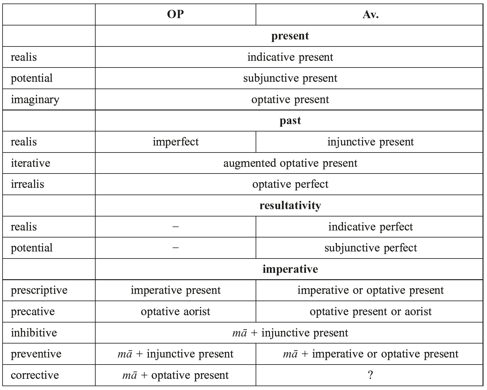

# 35. The syntax of Iranian

- 1. Word classes
- 2. Nominal morphosyntax and adpositional phrases
- 3. Verbal morphosyntax and periphrastic formations
- 4. Adverbials and conjunctions
- 5. Phrasal syntax
- 6. Clausal syntax
- 7. Abbreviations
- 8. Selected bibliography
- 9. References

## 1. Word classes

The opposition between adjectives and substantives is blurred and the category “noun” will be sufficient for most syntactic analyses. An adjective is not marked differently for attributive or predicative use. For Adverbs see 4, where conjunctions will be discussed, too. For particles see 6.2. Since nominal forms can have case government typical of verbs (cf. 5.2), the status of word classes is a morphological rather than a syntactic one. Pronouns will be considered in 5.3, numerals in 5.5.

## 2. Nominal morphosyntax and adpositional phrases

### 2.1. The use of cases

For cases governed by nouns see 5.2, and by prepositions see 2.2. For cases used to express adverbials see 4. In OP the form of the genitive has taken over the functions of the dative completely (by syncretism).

The nominative marks the grammatical (or surface) subject, and the predicative noun. Double nominatives are the counterparts of double accusatives in middle and passive constructions, e.g. *at̰ hōi aoǰī zaraϑuštrō pauruuīm haiϑiiō* ‘thus I declare myself to him first as the real Zaraϑuštra’ (Y 43.8).

The accusative marks the direct object. Furthermore, it expresses direction in combination with verbs of movement, e.g. OP *pasāwa adam bābirum ašiyawam* ‘afterwards I went to Babylonia’ (DB I 83−84). Some verbs require a double accusative, like ‘ask’, e.g.: *tat̰ ϑβā pərəsā* ‘I ask you for that’ (Y 44.8) (MP + *ō* ‘to’ or *az* ‘from’). With ‘do’ the meaning is ‘make sb. sb.’ cf. OP *haya dārayawaum xšāyaϑiyam akunauš* ‘who made Darius king’ (DNa 5−6). Furthermore, the accusative functions as a lexical case for several adverbial (e.g. temporal or spatial) expressions: *yat̰ upaŋhačat̰ … yiməm … darəγəm-čit̰ aipi zruuānəm* ‘which followed Yima for a long time after’ (Yt 19.31), cf. 4. The *accusativus graecus* is found in OP with the verb ‘be’, e.g. *yaϑā mām kāma* ‘as (it was) my desire’ (DB IV 35−36); *auramazdā ϑuwām dauštā biyā* ‘may Auramazdā be a friend unto you (sg.)’ (DB IV 55−56). The accusative functions are continued by the direct case or the preposition *ō* ‘to’ in MP.

The dative marks the indirect object. Marking the thematic role of a “goal”, the dative expresses functions such as directive, *dativus finalis*, and *dativus (in)commodi*: *uruua parāiti parō.asnāi aŋuhe* ‘the soul goes forth to the future life’ (Vd 13.8); *xšṇumaine ahurahe mazdā̊* ‘to satisfy Ahura Mazdā’ (Y 22.23); *awa-taiy auramazdā učāram kunautu* ‘may Auramazdā make that successful for you’ (DB IV 76). Furthermore, the dative can encode the logical subject, e.g. *puϑrəm … aniiahmāi aršạ̄ nāi varštəm* ‘a boy, fathered by another man’ (Yt 17.58). Dative functions are continued in MP by the oblique case, the preposition *ō* ‘to’, and the postposition *rāy* ‘for’.

The genitive marks nominal attributes (cf. 5.2). The semantic correlation can be possessive, subjective, or objective. When attributed to numerals, measures, or verbs like ‘give’, it has a partitive meaning: *yat̰ vā maš́iiō maš́iiānąm xšụ dranąm para. gəuruuaiieiti* ‘or when a man receives sperm of men’ (Vd 8.32). The genitive can be governed by verbs, too, cf.: *nōit̰ … apąm āstriiā̊nte* ‘They shall not sin against the water!’ (Vd 6.29). Moreover, it encodes the possessor in a copulative possessive construction, e.g. *druǰō aogarə … ā̊ŋhāt̰* (lit.) ‘the power would have been (that) of the Drug’ (Yt 13.12), cf. 3.4.1.

The instrumental mostly encodes the meaning ‘with’ (instruments, MP preposition *pad*, company, MP preposition *abāg*, etc.). As such, instrumentals can be used to coordinate nouns in a meaning similar to *-čā*˘, e.g. *yezī aϑā stāhaiϑīm mazdā aṣ̌ā vohu manaŋhā* ‘if you (pl.) are really so, Mazdā (together) with Order and Good Thought’ (Y 34.6). Close to the thematic role “instrument” is the one of “causer”: *gaomaēzəm gauua dātaiiā* ‘cow’s urine, which is produced by the cow’ (Vd 19.22). The latter is used with passives, too: *yā zī vāuuərəzōi … daēuuāiš-čā maṣ̌iiāiš-čā* ‘who are made … by Daēvas and men’ (Y 29.4). The instrumental of respect is found in: *vīspa taršụ -ča xšụδra-ča masana-ča vaŋhana-ča sraiiana-ča* ‘all things solid and liquid in size, goodness, and beauty’ (Yt 19.58). Instrumentals appear like subjects with impersonal verbs (cf. Schwyzer 1929). In OP, however, the instrumental occurring with numbers does not mark the subject, as has been suggested earlier, cf. 5.5. For a figurative use, see Vd 8.14 in 4.

The ablative mostly denotes a direction ‘(away) from, of’ (local and temporal, MP preposition *az*): *nipātū pairī daēuuāat̰-čā t̰baēšaŋhat̰ maš́iiāat̰-čā* ‘let it protect us from Daēva and man (and their) hostility’ (Y 58.2). It can occur with the preposition *hačā* ‘from’: *ϑβahmāt̰ vaočaŋ́hē maniiə̄uš hačā* ‘to speak in accordance with your inspiration’ (Y 28.11). In a figurative sense, the ablative carries a causal meaning: *ϑβaēšạ̄t̰* ‘from fear’ (Y 57.18). For the ablative used for comparison, see 5.4.

The locative usually answers the question ‘where?’, both in time and space (MP preposition *pad* and *dar*), cf. *ima taya manā kṛtam mādai* ‘this is what I have done in Media’ (DB II 91−92); *yā … hištəṇta … hamaiia gātuuō* ‘who stood in one and the same place’ (Yt 13.53). Furthermore, it can express a directive meaning, e.g. *yō xšạϑrišụua auuāiti* ‘when he approaches the females’ (Yt 14.12). Quite close to its adverbial use is the locative of emotion, cf. *mahmī manōi* ‘to my resentment’ (Y 32.1).

A vocative **−** being usually clause-external − is expressed, if integrated into a clause, by means of an apposition, and it is inflected accordingly: *ā ϑβā ātrəm gāraiiemi* ‘I sing a song of praise to you, the fire (O fire)’ (Any 2). Attributes are assigned vocative case as well, *aṣ̌i srīre* ‘O beautiful Aši’ (Yt 17.6), even if the referent is nominative, cf. *druxš axᵛāϑre* ‘O loathsome Druxš’ (Vd 18.30).

### 2.2. Adpositional phrases

There are various adpositions in use, some reinforcing the function of their governed cases: cf. *hadā* ‘with’ + instr., e.g. *hadā kamnaibiš martiyaibiš* ‘with a few men’ (DB I 56−57), or *hačā* ‘from’ + abl. (see Korn, this handbook, 4.3). Several of them can govern more than one case, e.g. *pasā* + acc. *dārayawauš … pasā tanūm mām maϑištam akunauš* ‘Darius … made me the greatest after himself’ (XPf 30−32), and + gen./dat. *haya aniya kāra pārsa pasā manā ašiyawa mādam* ‘the other Persian army went behind me to Media’ (DB III 32−33). Pre- or postposing can trigger a change of meaning, cf. *hačā* as a preposition meaning ‘from’, and as a postposition, ‘in accordance with’ (see Hale 1993). However, what sometimes seems to be a postposition can in fact be a preposition with a fronted noun, cf. *yezī ahiiā aṣ̌ā pōi mat̰ xšạiiehī* ‘if you can protect this together with Order’ (Y 44.15). It is not clear, however, whether the prepositional phrase is to be connected with the subject or the logical object of the infinitive. There are inflected nouns which tend to be interpreted like prepositions, e.g. *wašnā* lit. ‘with the favour of’ or ‘in accordance with’, cf. MMP *wašn* ‘on account of’.

## 3. Verbal morphosyntax and periphrastic formations

### 3.1. Tense, aspect, and mood

While the OAv. system is largely the same as that of PIIr. (see Kümmel, this handbook, 6.1), both OIr. languages show a decline of the aorist, the forms of which are partly incorporated into the present tense system (Kellens 1984: 376). So OP and Av. already point to a functional change of the verbal stem, from one marked for aspect (as in PIE) to one marked for tense (from MIr. onwards at the latest).

In OP the imperfect functions as the unmarked past tense. Therefore OP is rich in augmented forms, in contrast to Av., where the injunctive is used instead. In OP the aorist is only productive within the modal system, e.g. the opt. aor. used as an irrealis of the present. Indicative attestations of the aorist are formulaic or allow non-aorist interpretations. Its main function is to express a completed action. A clear example of the aspectual use of the perfective aorist to express coincidence of assertion and situation time is found in: *ahmāi as-čīt̰ vahištā vohū čōiṣ̌əm manaŋhā* ‘to him I indeed assign the best things by (my) good thought’ (Y 46.18). For aspect in MP see Jügel (2015a: 82).

The inherited perfect is nearly extinct in OP, where only once an opt. perf. occurs as an irrealis of the past. The gap of the resultative forms is filled by the PP construction (see 3.4.2).

The opt. pres. primarily denotes wishes (see now Mumm 2011 for a more refined description). A peculiarity is the augmented opt. pres. in Av. expressing iterativity in the past, which Hoffmann (1976: 605 ff.) sees as the starting point for the preterit optative that is attested in Middle and New Iranian languages.

The subjunctive, besides its function as a potentialis, may be syntactically triggered by conjunctions like Av. *yezi*, OP *yadiy* ‘when’. Moreover, the subjunctive is used to express an action depending on another one, e.g. *yazaēšạ mąm zaraϑuštra … ǰasāni tē auuaŋ́haē-ča rafnaŋ́haē-ča azəm yō ahurō mazdā̊* ‘you may worship me, Zaraϑuštra, … (and) I, Ahura Mazdā, will come to your aid and support’ (Yt 1.9). The interpretation as a future is possible, especially when used with adverbs like OP *aparam* ‘later’.

The imperative system is well elaborated. Positive orders are expressed by the pres. imv.; for negative orders the negational particle *mā* (preserved in Modern Iranian languages like Kurdish) is used with various forms (see Table 35.1).

Several forms are in competition, cf. the wide use of the subjunctive illustrated by Kellens (1984: 260 ff.). Therefore, Table 35.1 gives only a tentative overview of the common use of synthetic verbal forms, mostly following Kellens (1984, 1985, where a detailed description is found).

### 3.2. Diatheses

OIr. exhibits active and middle voice. There are *activa* and *media tantum*, so that a functional difference can be deduced only from those transitive verbs which occur with both diatheses. Intransitive verbs usually take only active or only middle endings. The middle can be used as a passive or a reflexive. Its basic function is to denote actions performed with specific reference to the subject. The uses of active and middle endings can imply diverse lexical meanings, e.g. Av. *bar-* meaning ‘carry’ in the active vs. ‘ride’ in the middle.

Additionally, it is possible to express passiveness by intransitivation, i.e. by adding the suffix *-ya-* to the stem. Another way is to use the pl. with unspecific or impersonal reference, e.g. *yat̰ bā paiti fraēštəm uskəṇti* ‘where indeed “they” frequently dig out [dead bodies]’ (Vd 3.12). The agent, if any, can be introduced into the clause in an

Table 35.1: Verbal categories of Old Persian and Avestan

oblique case, usually the instrumental (see 2.1), or also as a prepositional phrase as in OP *taya-šām hačā-ma aϑaⁿhya* ‘what has been said to them by me’ (DB I 19−20). The latter becomes the regular way in MIr. (Khotanese uses the postposition *jsa*). For a passive interpretation of the ergative construction, see 3.4.2.

### 3.3. Verbal nouns

#### 3.3.1. Participles

OIr is rich in participles. For present, aorist, and perfect, Av. exhibits active and middle participles. In OP, most of these are lexicalized; only the PP in -*ta*- is highly productive. Participles can be used as nominals (adjectives and nouns) and as the head of a participle phrase which is related to the matrix verb in various logical ways. Their aspecto-temporal interpretation is usually similar to that of their underlying stem: aorist as perfective, present as imperfective and perfect as resultative. For examples see 6.5.

#### 3.3.2. The infinitive

The primary function of the infinitive is to express purpose. The imperative function is according to Kellens (1994 [1995]: 59) “en tout cas une illusion [in any case an illusion]”. Infinitives can be governed by verbs (including ‘be’), adjectives, and nouns. Their subject can be the subject or the object of the governing verb, or, if it refers to a person, the indirect object, too. There are accusativus cum infinitivo constructions, e.g. with the verb Av. *vas-* ‘want’. The correlation with the temporal system as well as the interpretation of the diatheses depends on the context. Av. has infinitives derived from various stems. The infinitive in *-diiāi* cannot be proven to pertain to the middle voice (see Gippert 1984). Actants of the infinitive appear in various cases. Matrix verbs usually cut their infinitive clause in two and occur directly before the infinitive (still common in MIr.) cf. *utā ima stānam hauw niyaštāya kaⁿtanaiy* ‘and he ordered this niche to be dug out’ (XV 20−21). For more details, see Kellens (1994 [1995]), Gippert (1978). For an example, see 6.5.

### 3.4. Periphrastic formations

The possessive construction and constructions with the PP in °*ta-* will be discussed in more detail in 3.4.1−2. The evolution of complex predicates still awaits a thorough examination (for Early New Persian, see Fritz 2009; for NP, Samvelian 2012). Clear examples are found in MP: *ardaxšīr … šamšēr ō kār kard*/*grift ēstēd* ‘Ardaxšīr made use of the sword’ (KN 13.16), *kē … ō kār nē hamē šawēd* ‘which is never used’ (Šāyist nē šāyist § 20), cf. NP *be kār bordan* ‘to use’, and *be kār āmadan* ‘to be used”. Double accusatives might be a hint that one object is more closely connected to the predicate, cf. *yō narəm vīxrūməṇtəm xᵛarəm ǰaiṇti* ‘who beats a man a bleeding wound’ (Vd 4.30), where *xᵛarəm ǰaiṇti* might be understood as ‘to wound’. Periphrastic formations rendering aktionsart concepts are built by ‘stand’ + participle, e.g. *tē hištəṇti γžarə.γžarəṇtiš* ‘they are undulating up and down’ (Vd 5.19); or ‘sit down’ + participle, e.g. *yā tat̰ … nigā̊ŋheṇti nišhaδaiti* ‘who sets about to devour it’ (Y 10.15), cf. Benveniste (1966).

Other periphrastic formations appear in modal expressions. Attested are *xšāi̯a-* ‘rule’ in the sense ‘can, be allowed’, and *tau̯-* ‘be strong’ in the sense ‘be able’.

#### 3.4.1. Possessive construction

OIr. does not possess a verb ‘have’. Instead, the verb ‘be’ is used with the possessor in the gen./dat., cf. *dārayawa<ha>uš puçā aniyai-či āhaⁿtā* ‘Darius had other sons as well’ (XPf 28−29), and *aita xšaçam hačā paruwiyata amāxam taumāyā āha* ‘that kingship from ancient times belonged to our family’ (DB I 45−46). The same situation is found in Av. Sometimes the genitive is clearly visible, e.g. *yā xšṃāuuatō* ‘which belongs to one like you’ (Y 49.6). Whether Y 68.22 is an instance of a *dativus commodi* or a possessive dative cannot be decided: *nəmō ahurāi mazdāi* ‘homage shall be for Ahura Mazdā’, or ‘Ahura Mazdā may have homage’. For the term “possessive construction”, introduced by Benveniste for the ergative construction in OP, cf. 3.4.2.

#### 3.4.2. Past participle constructions

In OP the construction with a PP in *°ta-* and the auxiliary verb ‘be’ (the “*manā kṛtam* construction”) is used to express perfectivity. In this construction the logical object is assigned the nominative case, and the logical subject is assigned the gen./dat. case. The main verb occurs as a PP and the finite element is represented by ‘be’. The auxiliary is generally omitted in present tense, except for two instances under focal stress in DB IV 46 and 51. With the past auxiliary the construction expresses resultativity with reference to a past event, e.g. *taya hačā amāxam taumāyā parābṛtam āha* ‘which had been taken away from our family’ (DB I 61−62). The subjunctive auxiliary implies perfectiveness in the future, e.g. *yadi kāra pārsa pāta ahati* ‘if the Persian people will be protected’ (DPe 22). These uses are clearly grammaticalized as a substitution for the lost aorist and perfect tenses. As this construction is indifferent as to diathesis (Lazard 1984), we have good reason to refer to the PP construction, already in OP, as an ergative construction (cf. Jügel 2015a: 107). In Avestan this construction occurs as well. Delbrück (1897: 484) cautiously suggests that it represents the result of an action or event with respect to the patient. This was a gap in the PIE system because the synthetic perfect represented the result only with respect to the agent. The construction is generally the same as in OP. The status of the case of the logical subject is unclear, however. Several cases come into consideration, especially gen./dat., and instr. Probably the case of the logical subject was not yet grammaticalized in this construction but triggered by its thematic role.

Another formation employing the PP is the “potential construction” with the auxiliary ‘do’. It is well established for MIr. languages like Choresmian, Parthian, Khotanese, and Sogdian (cf. Korn, this handbook, 4.1). This construction does not, however, occur in Av. and the OP examples are debatable, cf. OP *yanaiy dipim naiy nipištām akunauš* (lit.) ‘where he did not make (= manage to have) the inscription written’ (XV 22−23).

The PP combined with ‘become’ is considered a terminative with a passive value, cf. OP *[yaϑā] kaⁿtam abawa* ‘when it was dug’ (DSf 25). There are approximately ten instances of the PP with ‘become’ in YAv., cf. *yāhuua t̰bištō bauuaiti* (lit.) ‘in which he becomes (someone who is) offended’ (Yt 10.28).

## 4. Adverbials and conjunctions

All cases except for the vocative and the nominative can be used to form adverbial expressions, e.g. acc. *fraēštəm* ‘mostly’ (Yt 13.105), *vīspā aiiārə̄* ‘for all days’ (Y 43.2); dat. *vīspāi yauuē* ‘for the whole lifespan’ (Y 28.8); gen. *ϑriš yārə̄* ‘thrice a year’ (Nirangestan 11); abl. *dūrāt̰ hača ahmāt̰ nmānāt̰* ‘far away from this house’ (Y 57.14); instr. *paoiriia* ‘at first’ (Y 23.1); loc. *uštā* ‘at wish’ (Y 33.10). An adjective constructed as a predicative can be used like an adverb, too, cf. the nom. *apaṣ̌i vazaite arštiš* ‘backwards the spear is flying’ (Yt 10.20). In OP the so-called *figura etymologica* is the only attested way to form adverbs that modify verbs. These adverbs are structurally predicatives, cf. *taya duškṛtam akariya* ‘it was made badly-made’ (XPh 42), *awam ubṛtam abaram* ‘him I treated well-treated’ (DB IV 66). The same occurs in Av., cf. *hubərətō baraiti* ‘he treats well-treated’ (Yt 10.112), cf. also Hoffmann (1952/1956). However, most common for fixed expressions is the accusative. For instance, the acc. sg. n. of interrogatives tends to be lexicalized in YAv., *kat̰* ‘what?’> ‘how?, when?’, *čim* ‘which?’ > ‘why?’. A special function of adverbs is to specify the temporal relation between actions, e.g. OP *aparam* ‘later’ + pres. subj. for the future tense. Furthermore, there are inherited adverbs like Av. *nū* ‘now’, *aipī* ‘henceforth’, or pronominal adverbs like OAv. *adə̄* / OP *adā* ‘then’, *idā* ‘here’, *kudā* ‘where?’, Av. *auuat̰* / OP *avā* ‘thus’. Such adverbs can occur as correlatives, e.g. *yaϑā … aϑā* ‘as … so’; *aϑrā … yaϑrā* ‘there … where’. There is disagreement among scholars about whether several functional words are to be classified as particles, adverbs, or conjunctions (cf. 6.2). Even so, *-čā*˘/ *utā* ‘and’, or -*vā*˘ ‘or’ are well-accepted conjunctions. -*čā*˘ does not usually coordinate two words having the same referent. Hence, it rarely coordinates adjectives. A conjunction can be specified by a correlating adverb, cf. *yaϑā kaⁿtam abawa pasāwa ϑikā awaniya* (lit.) ‘when it became dug out, then gravel was filled in’ ≈ ‘after it was dug out, gravel was filled in’ (DSf 25).

Several pronominal forms have become conjunctions, like Av. *yezi* = OP *yadiy* ‘when’, *ϑβā*˘*t … ϑβā*˘*t* ‘be it … be it’, or OAv. *hiiat̰* = YAv. *yat̰* used as an all-purpose conjunction. Relative pronouns tend to be used for ‘when’ (probably a former free relative clause), e.g. *yōi paϑa uzbarəṇte spānas-ča irista naraē-ča irista* ‘when dead dogs or dead men are carried away on a path’ (Vd 8.14); or ‘that’: *aētat̰ tē … aiŋ́he … dąnmahi yat̰ ϑβā diduuīṣ̌ma* ‘this we will give to you for that (reason), that we offended you’ (Y 68.1). They can occur in combination with enclitic particles: *ya-čiy waināmiy hamiçiyam ya-čiy naiy waināmiy* ‘whether I see a rebel or not’ (DNb 35−37). A common interjection in Av. is *vaiiōi*, also *auuōi* ‘woe!’.

## 5. Phrasal syntax

### 5.1. Impersonal and experiencer verbs

Weather verbs are considered impersonal verbs in OIr. (Brugmann 1925). In MIr. and NIr., however, they commonly receive a subject, e.g. MP *wārān wārīd* (lit.) ‘rain rained’ (Mēnōg-i Xrad 62.36). The perfect of *tauu*- ‘to be able’ is a possible candidate for an impersonal verb, cf. *yezi tūtauua* ‘if it is possible’ (Vd 6.32). MP exhibits impersonal constructions for this expression, e.g. *u-tān griftan nē tuwān* ‘and you (pl.) cannot catch (them)’, lit. ‘and to you it is not possible to catch’ (KN 4.12). A clear instance of an experiencer verb in OIr. is Av. *səṇd-*, OP *ϑaⁿd*- ‘to seem’; cf. *awahyā paru ϑadayāti taya manā kṛtam* ‘to him what I have done should seem (too) much’ (DB IV 48−49). Furthermore, a verb in the middle voice can have an experiencer as its subject, e.g. *nōit̰ fram*<*ā*>*nīm brāϑranąm āzūzušte* ‘nor does he enjoy supremacy over (his) brothers’ (P 43).

### 5.2. Nominal phrase

Adjectives agree with the noun they refer to in gender, case, and number. In OP, adjectives may precede or follow the word they refer to, e.g. *pārsa-* in *imam pārsam kāram pādi! yadi kāra pārsa pāta ahati…* ‘Protect this Persian people! If the Persian people will be protected…’ (DPe 21−22). However, postposing seems to be preferred. Except for kinship relations, e.g. *wištāspahyā puça* ‘son of Hystaspes’ (DB I 2−3), cf. Av. *sāiiuždrōiš puϑra* ‘the sons of Sāiiuždrī’ (Yt 5.72), the genitive attribute usually follows its head noun in OP, cf. *xšāyaϑiya ahyāyā būmiyā wazṛkāyā* ‘king of this great world’ (DNa 11−12), or *haya maϑišta bagānām* ‘who (is) the greatest of the gods’ (DPd 1−2).

Appositions agree in case and number with their referent, e.g. *wašnā auramazdāhā mana-čā dārayawahauš xšāyaϑiyahyā* ‘by the favour of Auramazdā and of me, (of) Darius, (of) the king’ (DPd 9−11).

Deverbal nouns can keep the verbal case frame, e.g. *mazdā̊ saxᵛārə̄ mairištō* ‘Mazdā (is) he-who-remembers-best the sayings’ (Y 29.4), *mairištō* ← *mar-* ‘remember’. Otherwise both the logical object and the logical subject are assigned the genitive case, cf. *parūwnām framātāram* ‘a commander of many’ (DNa 7−8), and *təmaŋhąm vā aiβi.gatō* ‘at the onset of darkness’ (Vd 8.4). Adverbial cases usually do not differ with non-finite verbs, e.g. the ablative in *raēkō … hača aŋhā zəmat̰* ‘the retreat from this earth’ (Yt 17.20), *raēkō* ← *raēk-* ‘leave’ − finite forms of this verb are not attested with the ablative, though. Examples of cases governed by nominals are the following: gen. *friϑąm gə̄uš-ča vāstrahe-ča* ‘rejoicing in cows and pasture’ (Yt 13.100); dat. *yōi zarazdā̊ aŋhən mazdāi* ‘who are confident in Mazdā’ (Y 31.1); instr. *aṣ̌āhazaošọ̄* ‘concordant with order’ (Y 29.7); abl. *akāt̰ manaŋhō … čiϑrəm* ‘the offspring of (from) the evil thought’ (Y 32.3); loc. *zaiia raϑōišti* ‘equipment for a warrior’ (Vd 14.9).

### 5.3. Pronouns

OIr. exhibits a rich pronominal system with possessive pronouns distinct from the personal ones, and with special reflexive, interrogative, indefinite, and demonstrative pronouns. The stressed personal pronouns, the use of which is marked (e.g. contrastive), have enclitic variants in the oblique cases. Dropping the subject pronoun (“pro-drop”) is common, e.g. OAv. *čiš ahī* ‘Who are (you)?’ (Y 43.7). Besides the reflexive pronoun, *tanū-* ‘body’ can be used, e.g. *āat̰ azəm tanūm aguze* ‘thus I hid myself (lit. the body)’ (Yt 17.55), cf. MP *xwēš tan* ‘oneself’, lit. ‘own body’. Possessives of the 3ʳᵈ person can be expressed by demonstratives, cf. *ahiiā xratū frō mā sāstū vahištā* ‘by his wisdom, let him teach me the best’ (Y 45.6). Pronouns can be used cataphorically, e.g. *ax́iiāčā xᵛaētuš yāsat̰ … ahurahiiā uruuāzəmā mazdā̊* ‘for his (bliss) the family entreats … for Ahura Mazdā’s bliss’ (Y 32.1), or anaphorically. Demonstrative pronouns, which appear like articles, precede their determinatum and agree like adjectives with it, cf. *tə̄m aduuānəm* ‘this path’ (Y 34.13). Others may precede or follow their head noun: *kāra haruwa* ‘the whole people’ (DB I 40), or *hačā wispā gastā* ‘of all harm’ (A²Sd 4).

Relative pronouns appear like articles when the referent occurs inside the relative clause, e.g. *tąm yazata yō* (rel.) *yimō xšạētō … satəm aspanąm* ‘for her the brilliant … Yima sacrificed one hundred horses’ (Yt 5.25), when the referent is missing, e.g. *yaiiā̊ spaniiā̊ ūitī mrauuat̰ yə̄m* (rel.) *aṇgrəm* ‘of which two the life-giving one shall tell the evil one as follows’ (Y 45.2), when the relative clause is preposed, cf. *vahištəm ϑβā vahištā yə̄m* (rel.) *aṣ̌ā vahištāhazaošəm ahurəm yāsā* ‘the best one, you, the being-in-harmony-with-the-best-order-Ahura, I ask (you) for the best’ (Y 28.8), *hayā* (rel.) *amāxam taumā* ‘our family’ (DB I 8), or when the relative pronoun introduces an apposition, so that the distinction between appositions in the nominative and nominal relative clauses is a question of interpretation, cf. *daēuuō yō apaoṣ̌ō* ‘the Daēva [who (is)] Apaoša’ (Yt 8.21), *kāsaka haya kapautaka* ‘the stone which (is) blue (i.e. lapis lazuli)’ (DSf 37). Such constructions were the starting point of the so-called *iḍāfat* construction of later times, Persian *eẓāfe* (see Korn, this handbook, 4.3). The case of the referent can spread over the whole appositional phrase, cf. *pariy gaumātam tayam* (rel.) *magum* ‘about Gaumāta the magus’ (DB I 54), *yaϑa mąm-čit̰ yim* (rel.) *ahurəm mazdąm* ‘as myself, Ahura Mazdā’ (Yt 10.1). In YAv. if the relative pronoun is polysyllabic, it can be substituted by *yat̰*.

### 5.4. Comparison

The noun representing the standard of comparison is marked by the ablative, e.g. *fratara maniyai afuwāyā* ‘I regard myself as superior to fear’ (DNb 38), *āat̰ yimō imąm ząm vīṣ̌āuuaiiat̰ aēuua ϑriṣ̌uua ahmāt̰ masiiehīm yaϑa para ahmāt̰ as* ‘then Yima made this earth go apart by one-third larger than that what (lit. how) it was before’ (Vd 2.11); or *aniiō ϑβāt̰* ‘other than you’ (Vd.2.2). *yaϑā*˘ connects compared clauses, e.g. *yadiy waināmiy hamiçiyam yaϑā yadiy naiy waināmiy* ‘when I see a traitor, as (well as) when I do not see (one)’ (DNb 39−40). A verb with *parə̄* ‘over’ occurs once governing the instr. (Y 34.5). Comparative or superlative forms can be coordinated with positives to enforce contrasting judgments, e.g. *hī vahiiō akəm-čā* ‘they (are) two: a better and a bad (one)’ (Y 30.3).

### 5.5. Numerals

Numerals precede their determinatum. When they are used as attributes, they behave like adjectives, cf. *XIX hamaranā akunawam* ‘I fought nineteen battles’ (DB I 56). The frequent OP phrase (with various numbers), e.g. *X raučabiš ϑakatā āha* ‘ten days had passed’ (DB I 56), led to the assumption that there were instrumental subjects in OP. It is more convenient to consider the numeral as the subject and *raučabiš* depending on it, so to say ‘ten in terms of days’. This is confirmed by *I rauča ϑakatam āha* ‘one day had passed’ (DB III 8), where *rauča* is nom., not instr. Thus the numeral seems to govern a special case: “n = 1 with nom., n > 1 with instr.” (but cf. *II karšā* [Wa 1], *CXX karšayā* [Wc 1]). In Av. we find the gen. pl. with the numerals ‘100’ and higher.

## 6. Clausal syntax

Determining the unmarked word order is particularly difficult in OIr. because OAv. is a poetically composed text and the OP royal inscriptions are not instances of the spoken language either (on this matter, see Hale, this handbook, 6). The position of clitics and stylistic features like repetition (see Gropp 1967; Jügel 2015b, 2016) help to structure the text. The subject and the verb, which usually occupies final position, constitute the verbal frame. Conjunctions are placed initially, clitics usually stand in Wackernagel position (see 6.2 and cf. Hale, this handbook, 5). Sentential adverbs tend to occur at the clausal border. All other constituents may be grouped within the verbal frame, or extraposed (see 6.6). There is a rich variety of stylistic techniques, e.g., mirroring, parallelism, and chiasmus. On stylistic devices see for instance Sadovski (2008).

### 6.1. Agreement

Nominal agreement between the referent and its adjectival or pronominal attributes encompasses gender, case, and number. If an adjective refers to more than one noun, it may agree only with one of them in gender and number. Analogously, a verb may agree in person and number only with the nearest noun when the subject consists of more than one. Neuter subjects in the plural occur with singular verbs (disagreement in number is still common in MIr. and NIr.). Free relatives can be resumed by plural demonstratives, in a sense like ‘whoever … they’. If two nouns are coordinated, they may be marked as duals, even if they refer to singular or plural entities (so-called “open dvandvas”), cf. *yāuuaranā fəraṣ̌aoštrā ǰāmāspā* ‘whose choice is Frašaoštra and Jāmāspa’ (Y 12.7).

### 6.2. Clitics, particles, and negation

Clitics occur after the first word of the sentence or of a hemistich in the so-called Wackernagel position. Series of enclitics are possible: *tāiš zī nā̊ š́iiaoϑanāiš biieṇtē* ‘for by those actions they are frightening us’ (Y 34.8), and still so in later Iranian languages, e.g. MP: *ēg-iz-iš*, Bactrian: ταδο-ι-ανο, Kurdish (Sorani): *bō-m-ī bās bıka* ‘tell me about it’. The order is by no means random, though. *-čā*˘, e.g., cannot occur after another clitic (v. Kellens and Pirart 1990: 190 ff.). If a personal pronoun follows another one in Av., it can only be tonic, e.g. *yā tōi ə̄hmā* (Y 43.10).

It is a question of interpretation whether certain particles are to be interpreted as modal particles or as conjunctions, e.g. *zī* (Ved. *hí*), causal conjunction ‘because, for’ or affirmative particle like German *ja*, cf. *tōi zī dātā…* ‘for they have been established…’ or ‘diese sind ja geschaffen…’ (Y 48.12). An important function of the particles is to structure the discourse and to mark the beginning of a phrase (hence their closeness to conjunctions). Some are modal particles, e.g. emphatic *-čīt̰* ‘even, precisely’ as in *nū-čīt̰* ‘immediately’, *činā* with negations, *tū* with modals, *nā* (also *nū*) with *nōit̰* ‘by no means’. Generally one must be careful not to take the contextual meaning to be the function of the particle.

Characteristically, *at̰* (besides *āat̰*) marks the beginning of a phrase (for details see Kellens and Pirart 1990: 105 ff.). It occurs with clitics like -*čā*˘ ‘and’, correlates with conjunctions like *hiiat̰* ‘when’, and may sometimes be translated as ‘and, then, so, furthermore’ or French ‘alors’. For more details, see Kellens and Pirart (1990: 99−193).

The common negative particle is Av. *nōit̰, naē*°; OP *naiy*. Av. *nōit̰* goes back to < **na* + **id* (in three passages a disyllabic reading is possible: Y 32.15, 46.1, 47.4; cf. Kellens and Pirart, 1990: 172 f.). OP *naiy* could be derived from **nai̯* or **nai̯d*. The negation occurs usually before the word which is under its scope, either at the beginning of a clause as in *nōit̰ mōi vāstā xṣ̌mat̰* ‘I have no (other) pastor than you’ (Y 29.1), or after, e.g., a subordinator: *yōi nōit̰ aṣ̌əm mainiiaṇtā* ‘who do not understand the Order’ (Y 34.8). For negated imperatives, *mā* is used.

### 6.3. Tmesis

Tmesis can be used to detect metrical boundaries because preverbs are mostly fronted to absolute clause-initial position or put after the metrical boundary, e.g. *ā mōi rafəδrāi zauuə̄ṇg ǰasatā* ‘come hither to my calls for support’ (Y 28.3). Sometimes the landing position is after the conjunction and the enclitic pronoun, if present. Apart from that, tmesis can be caused by an enclitic pronoun standing in Wackernagel position, cf. *paiti dim pərəsat̰ zaraϑuštrō* ‘of her Zaraϑuštra asked’ (Yt 5.90). The enclitic pronoun separates syntagmas, too, cf. *tāiš vā̊ yasnāiš paitī stauuas aiienī* ‘with these offerings I will come before you praising’ (Y 50.9). Sometimes it is not clear whether we have tmesis of verb + preverb or whether we have a verb + preposition, cf. *pairi.tē haoma … daδąmi imąm tanūm* ‘I offer to you, … Haoma, this body’ (Y 10.14). Few instances in OAv. show postposed preverbs, e.g. *yə̄ ϑβat̰ mazdā asruštīm akəm-čā manō yazāi apā* ‘I who would pray away from you disobedience and bad thinking’ (Y 33.4). Nominal phrases can be split by other elements as well, cf. *hiiat̰ hōi vohū vaxṣ̌at̰ manaŋhā* ‘that one should increase for him through good thinking’ (Y 31.6). A possibly later development is the doubling of the fronted preverb in preverbal position, e.g. *ā mā aēṣ̌əmō hazas-čā rəmō āhišāiiā dərəš-čā təuuiš-čā* ‘Wrath and restraint, obstruction as well as fetter and brutality bind me.’ (Y 29.1). If we want to restore a syllabic pattern of 7+9, one might delete the prefixed *ā-* and the third *-čā*, which might have entered the text in the course of later redaction.

### 6.4. Clause connection

Clauses may be connected by particles or conjunctions, by pronominal connection, or by simple juxtaposition, with deletion of shared constituents (gapping) being quite common, cf. *xṣ̌aiiamnəm aṣ̌auuanəm dāiiata axṣ̌aiiamnəm druuaṇtəm* ‘Make (pl.) the follower of Order a ruling one, (make) the follower of Lie a not-ruling one!’ (Y 8.5). Sometimes only the preverb remains as *auuā* does in *kaϑā druǰəm nīš ahmat̰ ā nīš nāšāmā tə̄ṇg ā auuā yōi…* ‘how shall we take away from us the Lie, (how shall we bring it) down upon those who…?’ (Y 44.13); or only the negation remains: *ā̊s-čāhudā̊ŋhō ərəš vīš́iiātā nōit̰ duždā̊ŋhō* ‘of these two, the munificent discriminate rightly, not (do) the avaricious ones’ (Y 30.3). Deletion of parts other than the subject of a sentence is rather uncommon in OP, cf. the repetition in XPb 23−25 *taya manā kṛtam idā utā taya-maiy apataram kṛtam* ‘what I have done here and what I have done far away’, but cf. the coordination of objects: *mām auramazdā pātu … utā-maiy wiϑam utā imām dahyāum* ‘Let Auramazdā protect me and my family and this land!’ (DNa 51−53).

The common order of, e.g., *at̰ … hiiat̰* may be changed if the subclause is long (cf. Kellens and Pirart 1990: 110). Parenthesis is quite common, cf. *nū īm vīspā čiϑrə̄ zīmazdā̊ŋhō.dūm* ‘now to this, you all − for (it is) brilliant − pay attention!’ (Y 45.1). For comparison of clauses see 5.4.

### 6.5. Subordinate clauses

Subordination can be indicated by the use of conjunctions (cf. 4) or the plain verbal mood (cf. 3.1), cf. the pres. opt. *nipāraiiaṇta* in: *haxṣ̌āne narəm … nāirikąm … ząm ahuraδātąm nipāraiiaṇta* ‘shall I persuade the man (and) … the woman to (lit. [that] they should) arrogate for themselves the land created by Ahura?’ (Vd 19.26). The use of mood may bring a special nuance into relative clauses which illustrates the link between relative pronouns and conjunctions, 1. indicative → causal: *kāram hamiçiyam haya manā naiy gaubataiy, awam ǰatā* “the rebellious army which (/because it) does not call itself mine, defeat that!” (DB II 83−84) vs. 2. subjunctive → conditional: *martiya haya drauǰana ahatiy … ufraštā-diš pṛsā* ‘the man who shall be (/if he is) a follower of Falsehood, … punish them severely!’ (DB IV 68−69), cf. Kellens (1985: 111).

Non-finite verbal forms can indicate subordinate clauses as well, e.g. infinitives for final clauses, cf. *at̰ mazdā taibiiō xšaϑrəm … vōiuuīdāitī aēibiiō sastē* ‘then, o Mazdā, the dominion shall be presented to you … for (you) to announce (it) to these’ (Y 30.8). Participles can be interpreted as converbs (in absolutive constructions). The pres. part. expresses simultaneity, cf. *stauuas* in: *at̰ frauuaxṣ̌iiā vīspanąm mazištəm stauuas aṣ̌ā* ‘Thus I shall proclaim the greatest one of all, praising (him) by the Order’ (Y 45.6). The perf. part. in these cases expresses resultativity, cf. *nąsuuā̊* in: *yehiiā uruuā xraodaitī … aṣ̌ahiiā nąsuuā̊ paϑō* ‘whose soul will make (him) shudder … having strayed (/for he has strayed) from the path of Order’ (Y 51.13). The aor. part. expresses anteriority, cf. *starānō* in: *zaota … pasča barəsma frahišta pərənəm-ča barəsma starānō* ‘The priest … has taken his place behind the altar grass after having spread full altar grass’ (Yt 10.138), as does the PP in °*ta*-, cf. *mazdaiiasnō … frauuarānē āstūtas-čā frauuarətas-čā* ‘I choose to be a worshipper of Mazdā, having praised and having chosen’ (Y 12.8).

In conditional syntagmas, the order of protasis and apodosis is irrelevant. The moods are used according to their general function, e.g., the opt. perf. for an irrealis condition, cf. *yeiδi zī mē nōit̰ daiδīt̰ upastąm … frauuaṣ̌aiiō* ‘for if the Fravašis had not given me aid’ (Yt 13.12).

Relative clauses usually follow their head which can be a personal pronoun, too. They can even be extraposed outside the verbal frame of the matrix clause, a feature common up to New Iranian, cf. OP *awam kāramᵢ ǰadiy ᵢ[haya manā naiy gaubataiy]* ‘that army (you are to) defeat, which does not call itself mine” (DB III 14−15). By means of the demonstrative pronoun *ān* + eẓāfe (see 5.3), a relative clause can be preposed in MP yielding the structure *ān ī* + relative clause + referent. This *ān ī* is reminiscent of the OP relative pronoun, which is composed of the demonstrative pronoun *ha-*/*ta-* and the relative pronoun *ya-*, neither of which occurs alone in OP. A correlation between demonstrative and relative pronoun might have been the starting point of this formation. Free relative clauses are very common, cf. *taya manā kṛtam idā* ‘what I have done here’ (XPb 23−24), *at̰ yə̄ akəm drəguuāitē … varəšaitī* ‘so who does evil to the one possessed by the Lie’ (Y 33.2). Topicalization around the relative pronoun is attested, cf. *martiya taya pariy martiyam ϑātiy awa mām naiy wṛnawataiy* ‘a man, what (he) says against a man, that does not convince me’ (DNb 21−23).

Indirect speech is not attested in OP, and it is uncommon in MP.

Cf. Reichelt (1909: 372 ff.) and Skjærvø (2006: 119 ff., 2009: 153 ff.) for examples of various subordinate clauses.

### 6.6. Topic and focus

New topics occur usually at the beginning of a phrase, they may be undetermined and followed by attributes, cf. *pasāwa aiwa martiya maguš āha gaumāta namāhauw…* ‘afterwards there was one man, a magus, Gaumāta by name, he…’ (DB I 35−36). Frame settings (all-new information) can be realized by verbs in clause-initial position, cf. *ϑātiy dārayawauš* ‘proclaims Darius’ (DB I 6). This is a typical feature of inscriptions and other official documents, and still occurs in MIr.

Topic agreement between *xšaçam* and the pronoun *awa* is shown in *xšaçam taya …, awa adam patipadam akunawam* ‘the kingship, which …, that I reinstated’ (DB I 61−62). Emphasis can be achieved by cleft constructions, e.g. *kə̄ huuō yə̄…* ‘who is he, who…?’ (Y 46.9). The following OP example shows a combination of fronting and clefting yielding a focused topic setting: *naiy āha martiya naiy pārsa naiy māda naiy amāxam taumāyā kaš-čiy haya*… ‘there was no man, neither a Persian nor a Mede nor anyone of our family, who…’ (DB I 48−49). On cleft constructions in Avestan and Old Persian, see Widmer (2012). For emphasis, particles can be used, cf. 6.2, e.g. *azə̄mčīt̰ ahiiā mazdā, ϑβąm mə̄ŋ́hī paouruuīm vaēdəm* ‘as for me, I consider you, o Mazdā, as the first owner of this’ (Y 29.10). The usual focus position is in front of the verb, cf. *wašnā auramazdāha ima adam akunawam* ‘by the favour of Auramazdā this *I* did’ (DB I 68), which is the common position of the negation or of adverbs, cf. *kāra-šim hačā dṛšam atṛsa* ‘The people feared him very much.’ (DB I 50−51). Right-dislocation is found, too, cf. *awam xšāyaϑiyam akunauš ahyāyā būmiyā* ‘him he made king − of this earth’ (XPf 23−25); *āuuiš nā̊ aṇtarə hə̄ṇtū nəmaxᵛaitīš čiϑrā̊ rātaiiō* ‘between us shall be manifest the remarkable gifts with homage’ (Y 33.7).

To introduce personal or place names, parenthetical nominal clauses are used (see ex. DB I 35−36 above), a feature that was probably taken from colloquial speech (Hoffmann 1958: 19). See further Hale (this handbook, 3).

### 6.7. Sentence types

The usual declarative sentence does not exhibit special features. Nominal clauses are frequent, and the copula in the present is generally omitted, cf. *adam dārayawauš* ‘I (am) Darius’ (DB I 1), OAv. *kudā aṣ̌əm vohu-čā manō* ‘where (is) the Order and the Good Thought?’ (Y 29.11), but it is present if emphasized, cf. *adam bṛdiya amiy* ‘I *am* Smerdis’ (DB I 39). Only one question is attested in OP: *yadi-patiy maniyāhaiy […] čiyākaram awā dahyāwa* ‘but if you shall think: ‘How many (are) those countries?”’ (DNa 38−39). If *taya* is to be understood after the matrix verb in this example, it would correspond to MP where direct speech is introduced by a conjunction. Questions are usually introduced by an interrogative pronoun or contain an interrogative particle. They can be emphasized by particles like *nā* in Av. Multiple wh-questions are possible, cf. *kuϑrā aiiā̊ kahmāi vananąm dadā̊* ‘Where (and) to which of these two will you give the victory?’ (Y 44.15). Disjunctive questions are construed by means of *katārə˘̄ m … vā … vā*. In MP, the interrogative pronoun usually appears directly before the finite verb (not in-situ!), cf. *u-šān ruwān ō kū šawēd?* ‘and where does their soul go?’ (Ayātkār ī Žāmāspīk § 4). In imperatives the verb is not necessarily fronted, cf. *tat̰ mōi … vaočā* ‘tell me that …’ (Y 31.5).

## 7. Abbreviations

| abl. | ablative |
| --- | --- |
| acc. | accusative |
| Any | Nirang ī Ātaš |
| aor. | aorist |
| Av. | Avestan |
| A²S | inscription of Artaxerxes II. at Susa |
| dat. | dative |
| DB | inscription of Darius at Behistūn |
| DN | inscription of Darius at Naqš-e Rostam |
| DP | inscription of Darius at Persepolis |
| DS | inscription of Darius at Susa |
| gen. | genitive |
| imv. | imperative |
| instr. | instrumental |
| KN | Kārnāmag ī Ardaxšīr |
| loc. | locative |
| MIr. | Middle Iranian |
| MMP | Manichean MP |
| MP | Middle Persian |
| n. | neuter |
| nom. | nominative |
| NIr. | New Iranian |
| NP | New Persian |
| OAv. | Old Avestan |
| OIr. | Old Iranian |
| OP | Old Persian |
| opt. | optative |
| P | Pursišnīhā |
| part. | participle |
| perf. | perfect |
| PIE | Proto-Indo-European |
| PIIr. | Proto-Indo-Iranian |
| PP | past participle/verbal adjective |
| pres. | present |
| rel. | relative pronoun |
| subj. | subjunctive |
| Vd | Vidēvdād |
| Wa | inscription on weights A |
| Darius Wc | inscription on weights C |
| Darius, XP | inscription of Xerxes at Persepolis |
| XV | inscription of Xerxes at Van |
| Y | Yasna |
| YAv. | Young Avestan |
| Yt | Yašt |

The language of the examples is implicit in the abbreviation of the source: the inscriptions of Darius, Xerxes and Artaxerxes II. are OP, see above; P, Vd, Y, Yt are Avestan. <…> represents additions and alterations to the text.
