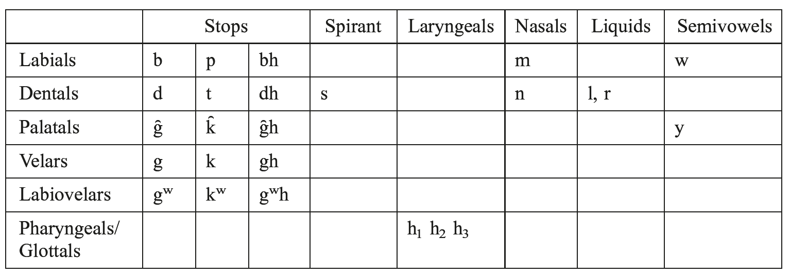
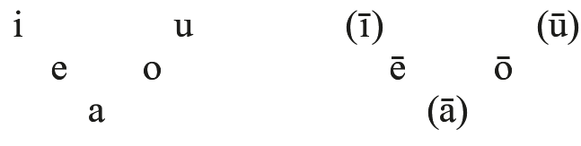
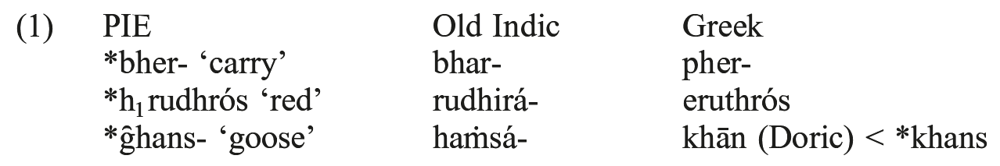
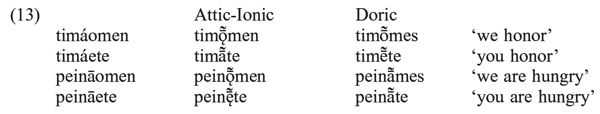
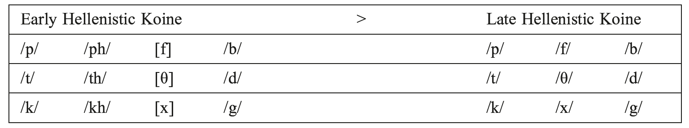
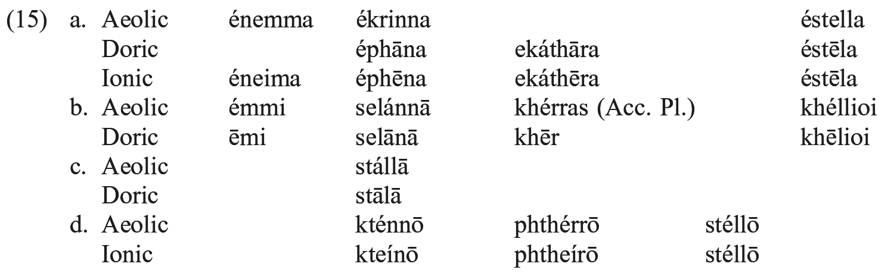

# 40. The phonology of Greek

- 1. The phonological system of Indo-European
- 2. Vowels
- 3. Consonants
- 4. The accentual system
- 5. Morphophonemics
- 6. References

## 1. The phonological system of Indo-European

The *communis opinio* holds that Proto-Indo-European had the following phonemes:

Vowels

In assessing this system, the following points need to be taken into account:

a) The long vowels *ī, *ū, and *ā cannot be proven to have existed in PIE because of a later development that a short vowel + laryngeal before a consonant produces a long vowel with loss of the laryngeal. On the other hand we know from the ablaut system that *ē and *ō did exist.

b) The short vowel *a of non-laryngeal origin is rare in PIE. What its status might have been in pre-PIE is a matter of conjecture.

c) The laryngeal *h₂ colored an adjacent *e (either preceding or following) to *a, while *h₃ colored an adjacent *e bidirectionally to *o, after which the rule articulated in a) applied. In the case of *h₁ only the rule in a) applied, and the vowel was consequently lengthened to *ē.

d) The sonorant consonants *y, *w, *r, *l, *m, and *n stood in allophonic variation with their syllabic counterparts *i, *u, *r̥, *l̥, *m̥ and *n̥, respectively. And these syllabics in turn generally gave long or more complex outcomes when followed by a laryngeal plus consonant. The cover term used for the sonorant is *R and its syllabic counterpart is *R̥. These sounds may collectively be called “resonants”.

e) When appearing between non-syllabics the laryngeals were subject to “vocalization” (more realistically, anaptyxis) and in this way functioned schematically much as the resonants (*H: *H̥).

f) An apparent regional phenomenon of Indo-European, seen in Greek, Indo-Iranian, and Armenian, is the existence of a set of voiceless aspirates (*ph, *th, *k̑h, *kh, *kʷh). These are not normally treated today as part of the phonemic inventory of the proto-language. At least, some instances of these sounds result from the sequence of a voiceless stop + *h₂, as in the case of the second singular *-tha* (< *-*th₂e*) of the perfect (Gk *oĩstha*: Skt. *véttha* ‘you know’). In other instances these sounds may have had affective or onomatopoeic value within a broader range of Indo-European languages, as in the word for ‘laugh’ Gk. *kakházō*: Skt. *kákhati*: Lat. *cachinnō*.

The system just described is a sufficient basis for treating the historical phonology of Greek.

### 1.1. From PIE to Greek: obstruents

Whereas the plain voiced and voiceless stops of PIE did not change, the PIE voiced aspirates underwent devoicing while preserving their aspiration:

Mycenaean, the earliest recorded Greek variety (14ᵗʰ−12ᵗʰ c. BCE), continued PIE labiovelars, spelling *kʷ, *gʷ, and *kʷh via the syllabograms QI, QE, QO, QA (see Bartoněk, 2003: 138). In alphabetic Greek, however, these sounds are represented by either labials or dentals. Adjacent to *u* labiovelars had undergone dissimilation to plain velars already in Proto-Indo-European.

| (2) | *artopokʷoi > Myc. a-to-po-qo /artopokʷoi/ > *artopópoi **>** *artokópoi* ‘bakers’ (with dissimilation) |
| --- | --- |
|  | *gʷoukʷolos > Myc. qo-u-ko-ro /gʷoukolos/ > *boukólos* ‘cowherd’ |
|  | *throkʷhā > Myc. to-ro-qa /t(h)rokʷhā/ > *trophḗ* ‘nourishment’ |

A salient feature of Mycenaean Greek was the existence of two affricate phonemes /tˢ/ and /dᶻ/ (or perhaps /ʧ/ and /ʤ/, see Bartoněk, 2003: 142−143). These two arose before the time of the earliest Linear B documents (14ᵗʰ c. BCE) as a consequence of various palatalizations and affrications (to be discussed in 3.5 and 3.6). In Linear B documents they are spelled by syllabograms ZE, ZA, ZO:

| (3) | /tˢ/ su-za /sūtˢai/ (< *sūkjai) ‘fig-tree’ (Hom. *sukéę̄*) |  |
| --- | --- | --- |
|  | /dᶻ/ to-pe-za /torpedᶻa/ (<*(kʷ)tr̥-pedja) ‘table’ (Attic *trápeza*) |  |
|  |  | me-zo /medᶻōs/ (< *megjōs) ‘bigger’ (Attic *meízōn*) |
|  |  | ze-u-ke-si /dᶻeuges(s)i/ ‘with horses and carriages’ (DatPl) (< *jeuges-si) (Attic *zeúgesi*) |

It could well be that the system with two affricates (non-continuous strident consonants) survived into Classical Arcadian (see 3.5).

PIE *s remains in Greek only adjacent to itself, a voiceless stop, or when final. Elsewhere before a vowel it becomes *h*, which is maintained in initial position except in psilotic dialects (notably East Ionic and Lesbian) but is lost medially. Linear B shows a character transliterated a₂ which is generally thought to represent /ha/, as in pa-we-a ‘pieces of cloth’ /pharweha/, alphabetic Greek *phárea*; but this representation is inconsistent, and otherwise there is no direct trace of medial *h* anywhere in Greek. On the treatment of *s* in consonant clusters see 3.7 below.

### 1.2. From PIE to Greek: resonants

Of the resonants, *r, *l, *m, and *n remain in Greek, but their corresponding syllabic variants show various outcomes.

PIE syllabic nasals are reflected as *a* in alphabetic Greek:

| (4) | *tn̥tós ‘stretched’ > Gr *tatós* |
| --- | --- |
|  | *-gʷm̥tós > Gr *-batós* |

In Mycenaean *a* may alternate with *o* in both instances:

| (5) | pe-ma /sperma/ ~ pe-mo /spermo/ ‘seed’ < *spermn̥ |
| --- | --- |
|  | de-ko-to /dekotos/ ‘Dekotos’ (name) < *dek̑m̥tós (Attic-Ionic *dekatós* ‘10ᵗʰ’) |

PIE syllabic liquids are reflected as *ra*/*ar* and *la*/*al*:

| (6) | *dhr̥s- ‘dare’ > Gr *thrasús* |
| --- | --- |
|  | *k̑r̥d- ‘heart’ > Gr *kardíā* (also *kradíā*) |
|  | *ml̥du- ‘soft’ > Gr *bladeĩsˑ adúnatoi* ‘powerless’ (Hesych.) |

Mycenaean, however, (together with Arcado-Cypriot and Aeolic) shows reflexes *or*/*ro* for **r̥*.

| (7) | qe-to-ro-po-de /kʷetrópodes/ ‘fourfooted’ (in compounds) (Attic-Ionic *tetrápodes*) to-pe-za /torpedᶻa/ ‘table’ (< *tr̥pedja) ‘table’ (Attic-Ionic *trápeza*) if indeed from the zero-grade *(kʷ)twr̥- (see Frisk 1960−1972: 914) |
| --- | --- |

Although the vocalic resonants *i and *u remain as such in Greek, their non-syllabic counterparts *y and *w are subject to widespread loss depending in part on the dialect. In Mycenaean the labiovelar glide (semivowel) was retained in all positions: wa-na-ka /wanaks/ ‘ruler’, ko-wa /korwā/ ‘girl’ > Ionic *koúrę̄* (see 1.5.2), di-wo /diwos/ ‘Diós’ (Gen of *Zeús*). This glide is not present in the earliest documents of Attic-Ionic but it survived in many dialects into the classical period (in Pamphylian it remained a phoneme deep into Hellenistic times, see Bubenik 1989: 230). The palatal glide was lost already in Mycenaean with a sole relic -*w(i)j*- observable in the Linear B documents (me-wi-jo ~ me-u-jo /mew(i)jōs/ ‘smaller’ > Attic-Ionic *meíōn*). The palatal glide in initial position was weakened to *h-*, which could be missing as indicated by alternative spellings jo-do-so-si /jō(s) dōsonsi/ ‘as they will give’ (Attic *hōs dṓsousi*) ~ o-a-ke-re-se /(h)ō(s) agrēsei/ ‘as he will take’ (cf. Aeolic *agrei* ‘take!’); in other words, however, *j-* was strengthened to *dj-* which underwent the same development as *-dj*- in medial position, see examples in (3) and discussion in Section 3.5.

### 1.3. From PIE to Greek: laryngeals

The lengthening and coloring effects of the laryngeals in Greek are illustrated in the Classical triad *títhēmi* ‘I place’, (Doric) *hístāmi* ‘I set up’, and *dídōmi* ‘I give’(**dheh₁*, **steh₂*, **deh₃*, respectively). Their effects on a following *e*-vowel are illustrated in the verb *estí* ‘is’ (**h₁es*), *ágō* ‘I drive, lead’ (**h₂eg̑*) and *ópsomai* ‘I will see’ (*h₃ekʷ*). Their “vocalization” is unique in Indo-European in that each laryngeal shows a different coloration which matches the timbre of the long vowel outcomes given above. Thus *h̥₁ appears as *e*, *h̥₂ as *a*, and *h̥₃ as *o* as in the verbal adjectives in -*tó-*: **dhh̥₁tós* > *thetós* ‘placed’, **sth̥₂tós* > *statós* ‘set up’, and **dh₃tós* > *dotós* ‘given’. These three reflexes are also found in initial position (where they were formerly treated as prothetic vowels) as in *érebos* ‘darkness’ from **h₁regʷ*-, *anḗr* ‘man’ from **h₂nēr*, and *omíkhlē* ‘mist, fog’ from **h₃migh*-.

When following syllabic resonants and preceding consonants the most widely accepted opinion is that there is a distinction between the treatment of *iHₓC and *uHₓC, on the one hand, and all other resonants, on the other hand. The former two resonants seem to undergo simple lengthening while the remaining resonant show Rāˣ at least when the accent follows and aˣRaˣ when the accent is on the resonant (by aˣ is meant the vowel corresponding to the coloration of each laryngeal: a¹ = e, a² = a, a³ = o):

| (8) | *píHw-on- ‘fat’ > *pī́on*-, Skt *pī́van*- |
| --- | --- |
|  | *ébhuh₂t ‘s/he was’ > *éphū* |
|  | *g̑n̥h₁tós ‘born’ > *kasí-gnētos* ‘brother’ (< ‘born together with’) but *g̑ń̥h₁tis ‘birth’ > *génesis* |
|  | *k̑m̥h₂tós ‘wrought with toil’ > *polú-kmētos* (*ā) but *k̑ḿ̥h₂tos ‘toil’ > *kámatos* |
|  | *str̥h₃tós ‘laid down’ > *strōtós* |

## 2. Vowels

### 2.1. The vowels of Ionic-Attic, Arcado-Cypriot, Aeolic and Doric dialects

After the fall of the Mycenaean civilization Proto-Ionic was formed in the area of Attica. During the “Great Migration” of Ionians (10ᵗʰ c. BCE) the Ionic dialect spread to Euboea (W. Ionic), the Cyclades (Central Ionic) and ultimately to Asia Minor (East Ionic). The Ionic- speaking areas are linked by several isoglosses and together with Attic form a higher Attic-Ionic taxon characterized by the fronting and raising of Proto-Greek *ā to *ę̄*. In Attic, however, this raising either did not occur or was later undone after *e*, *i*, *r* (see 2.4). Attic in common with Euboean (but not Central or East Ionic) changed the Proto-Greek affricate *ts into *tt*; East and Central Ionic lost the initial *h- (< *s), so-called psilosis; but on the other hand, the Attic-Ionic fronting of Proto-Greek high back *u to *ü* did not fully affect Euboea**.** Before the Persian wars (490−479), East Ionic enjoyed the highest status among the Greek dialects. Ionic writers (Herodotus, Hippocrates) developed the first literary prose and Ionic influence is apparent even in Attic inscriptions of that time. After the Persian wars, Attic gradually replaced Ionic as the most prestigious among the Greek dialects. The reasons have to do with the increasing political power of Athens exerted in the First Maritime League, during which Athens became the center of commerce and culture. This development gradually changed the direction of linguistic influence and now it was Attic which was imitated by the Ionians (and other Greeks). Some traces of Attic influence can already be seen in Ionic inscriptions of the 5ᵗʰ c.; in the 4ᵗʰ c. the majority of Ionic insular inscriptions show at least a mixture of Attic forms and in the 3ʳᵈ c. 80% of all inscriptions are in Attic-Ionic (Hellenistic) Koine, with only 4% in “pure” Ionic (see Bubenik 1989: 175−182).

In what follows it will be expedient to refer to the best known Greek variety − Classical Attic − as a touchstone for the other varieties. The vocalic phonemes of Classical Attic (5ᵗʰ c. BCE) consisted of seven long (*ī ẹ̄ ę̄ ā ǭ ọ̄ ū*) and five short (*i e a o u*) vowels. The long vowels can be represented by the familiar triangular four-grade vocalic system contrasting high, mid-high and mid-low vowels on both axes, and a low /ā/. Greek dialects can be dichotomized into two major groups: those possessing a three-grade vocalic system (*ī ē ā ō ū*), i.e. without the opposition of mid-high and mid-low vowels, and those possessing a four grade vocalic system. The former system is found in Mycenaean, the Arcado-Cypriot group, Lesbian (Aeolic) and “strict” Doric dialects (Laconian, Messenian, Central Cretan and Cyrenaean). The latter system is found in Attic-Ionic, North-West dialects, Saronic dialects (Corinthian, Megarian and Argolic), East Aegean Doric, and Pamphylian. The dialect spoken in Boeotia did not possess the contrast between a mid-high /ọ̄/ and mid-low back vowel /ǭ/.

The traditional reconstruction of the vocalic system of the Attic dialect at the beginning of the Hellenistic period (ca. 350 BCE) presents an asymmetric system of long vowels (*ī ẹ̄ ę̄ ā ō ū ṻ*) maintaining the mid-high versus mid-low contrast only on the front axis. On the back axis the fronting of the high back vowel *ū > ṻ*, the raising of mid vowels, and the monophthongization of *ou to ū* (via *ọ̄*) can be portrayed as a “dragchain”, but their relative chronology is difficult to establish (cf. Bubenik 1983: 45−49). There were at least five short vowels (*i e a o ü*). For further details of the subsequent development, especially the contentious issue of the loss of phonemic length, see Teodorsson (1974, 1977) and Threatte (1980).

### 2.2. The diphthongs of Classical Attic

In terms of surface contrasts Classical Attic possessed five short (*ui*, *oi*, *ai*, *eu*, *au*) and four long diphthongs (*ēi*, *ōi*, *āi*, *ēu*). [ei] can be regarded as a combinatory variant of /ẹ̄/ before a vowel, while long diphthongs [ōu] and [āu] result only from the contraction of *o* + *au* and *e* + *au*, respectively. These diphthongs occur in all environments with the following restrictions: a) short diphthongs do not occur before high vowels; b) diphthongs [ei] and /ui/ do not occur before consonants; and c) long diphthongs [āu], [ōu] and [ēu] occur only before consonants.

### 2.3. Monophthongization of Proto-Greek diphthongs *ei and *ou

The dates proposed for the onset of this process vary from the 7ᵗʰ to the 5ᵗʰ c. BCE according to different scholars (Schwyzer 1939: 233; Bartoněk 1966: 77; Allen 1974: 74). The monophthongization of *ai* in Boeotian preceded the same development in Hellenistic Koine by several centuries. At the end of the 4ᵗʰ c. we already find spellings such as *Theibēō* [thẹ̄bę̄ō] versus Attic *Thēbaíou* [thę̄baíọ̄]. As this example shows even the raising of the front half-open vowel took place much earlier in Boeotian.

### 2.4. Fronting and raising of Proto-Greek *ā in Attic-Ionic

Proto-Greek *ā remained unchanged in all dialects with the exception of Attic-Ionic where *ā was fronted and subsequently raised (*ā* > *ǣ* > *ę̄*). Within the Attic-Ionic group Attic differs from the rest of the Ionic dialects in not having *ę̄* but *ā* after front vowels *e*, *i* and liquid *r*; e.g. *oikíā* (Ionic *oikíę̄*), *khǭrā* (Ionic *khǭrę̄*). Two proposals have been offered to explain this distribution of reflexes in the Attic-Ionic group of dialects: a) Attic retained Proto-Greek *ā after front vowels and *r* while Ionic fronted *ā* in all environments; b) Attic-Ionic fronted *ā to *ǣ* and then Attic changed *ǣ* back into *ā* after front vowels and *r*. Some Attic words show *ę̄* after *r* but in many of these cases *r* was originally followed by *w*, e.g. *kórę̄* (< **korwā*) ‘girl’, *dérę̄* (< **derwā*) ‘neck’; however, there are also instances where there was no *w*, e.g. *eirę̄nę̄* ‘peace’, *krę̄nę̄* ‘source’ (< **eirānā*, **krānā* preserved in Doric *īrānā*, *krānā*). The retrogressive theory b) (Lejeune 1972) is apparently more successful in explaining all the above forms in terms of relative-absolute chronology of historical sound change.

### 2.5. Compensatory lengthening

#### 2.5.1. First compensatory lengthening

In the majority of Greek dialects, with the exception of the Aeolic group (Thessalian and Lesbian, but not Boeotian), Proto-Greek consonant clusters of a sibilant followed by liquid, nasal or velar semi-vowel were affected by the fricative weakening (*s* > *h*), the voiceless glottal fricative was subsequently lost and this loss was accompanied by the First compensatory lengthening of the preceding short vowel, e.g. **selasnā* > *selānā* ‘moon’, **kheslioi* > *khēlioi* ‘thousand’ (in Doric dialects). In the same dialects clusters of a sibilant following liquid or nasal were simplified by the loss of the sibilant accompanied by compensatory lengthening of the preceding short vowel (this change was limited to the sigmatic aorist); and finally, the cluster *ln was simplified by the loss of *n* and accompanied by the compensatory lengthening, e.g. **ephansa* > *ephāna* ‘I showed’, **stalnā* > *stālā* ‘stele’. The First lengthening is usually placed around 1000 BCE since the resulting *ā* was subject to the fronting (*ā* > *ǣ*), which is supposed to have taken place during the 9ᵗʰ/8ᵗʰ c. BCE in the Attic-Ionic group (see Schwyzer 1939; Risch 1955; Bartoněk 1966; Lejeune 1972).

#### 2.5.2. Second and Third compensatory lengthening

The Second lengthening of the type **pantja* > *pansa* > *pāsa* ‘all’ became a source of a new Attic-Ionic /ā/. Its environment includes the secondary medial cluster *-ns-* (resulting from Proto-Greek *-ntj/i- through affrication and depalatalization) and the primary final -*ns* in the accusative plural (contrast Attic *tous* with Laconian *tōs*). The Second lengthening did not diffuse to certain dialects (Thessalian, Arcadian, West Argolic, Central Cretan) where forms such as *pansa* ‘all’ (Fem) and *pheronsa* ‘carrying’ are found. In Lesbian, Cyrenaean (and apparently also in Theran) the palatal glide metathesized with the cluster *-ns*-: **pherontja* > *pheronsja* > *pheroinsa* > *pheroisa*.

The Third lengthening was limited to the clusters of nasal or liquid plus velar glide; it compensated for the loss of *w* after sonorants by the lengthening of the preceding vowel. Its geography included Ionic speaking regions (but not Attic and Euboean), Argive (the dialect of Argos but not Argolic), Cretan, Cyrenaean and East Aegean Doric. Elsewhere, *w* was lost without any effect on the preceding vowel:

| (9) | *korwā > Cretan *kōrā*, Ionic (with raising) *koúrē* [kọ̄rę̄] versus Attic [kórę̄] ‘girl’ *ksenwos > Cretan *ksēnos*, Ionic (with raising) *kseĩnos* [ksẹ̄nos] versus Attic *ksénos* ‘guest’. |
| --- | --- |

### 2.6. Vowel sequences in dialects

#### 2.6.1. Height dissimilation

As in the Aeolic and Doric dialects (and also in Cypriot) a mid front vowel was subject to regressive height dissimilation before a back mid vowel: *e > i* / *_o*. Contrast Lesbian *khrúsios*, Thessalian *líthios* with Ionic (Homer) *khrúseos* ‘golden’, *lítheos* ‘made of stone’. The situation in the Cretan dialects during the Hellenistic period was quite complex. This dissimilation is documented in Central Cretan and in the eastern transitional region (*kosmiontes* ‘being members of the body of chief magistrates’) but not in the dialects spoken in the western and eastern parts of the island. There *e* of contract verbs was syncopated in closed syllables (*kosmontes*) while in open syllables *e* and *o* contracted to *ō*.

The opposite process, progressive height dissimilation after a short front mid vowel (*o > u* / *e_*), was a common phenomenon in many dialects: Ionic, East Aegean Doric, Cyrenaean, Megarian (see Buck 1955: 40) and in the texts of various early authors (including Homer), e.g. *philéontas* versus *phileũntas* ‘loving’ (Acc. Pl.).

#### 2.6.2. Height assimilation

In various dialects a low vowel was subject to regressive height assimilation before a back mid vowel: *a > e* /*_o*. There is both literary and inscriptional evidence from West Greek dialects for this assimilation. In Rhodian it was followed by contraction (*ao > eo > ọ̄*), in Central Cretan and Boeotian by regressive height dissimilation (*ao > eo > io*) and the resulting *eo* remained unchanged in Aetolian and Phocian; contrast Attic *timǭ˜ntes* (< *timáontes*) with Rhodian *timountes* [tīmọ̄ntes], Central Cretan *timiontes* and Aetolian *timeontes* ‘honoring’ (Nom. Pl.).

### 2.7. Contractions in Attic and other dialects

For the traditional presentation of the Attic rules of contraction see Lejeune (1972: 260− 263). The following generalizations can be made:

(i) A vowel resulting from the contraction is always long.

(ii) If one of the contracting vowels is round, the resulting vowel will be round.

(iii) If one of the contracting vowels is low, the resulting vowel will be low.

Rules (ii) and (iii) are not valid for other dialects (Doric, Aeolic, Arcado-Cypriot). For Doric an additional subrule has to be built into (ii): If one of the contracting vowels is *ā* the resulting vowel will be *ā*. Rule (iii) has to be replaced by the Doric rule: The contraction of *a* with *ē* results in *ē*.

The cardinal difference between the Attic and the Doric type of contraction emerges from the instances where one of the contracting vowels is *ā*. The Doric vowels could be hierarchized *ā ō ē* (the surviving vowel of a sequence of two will be that which occurs first in this series), while the Attic hierarchy would be *ō ē ā*. The feature [+round] is dominant in Attic, but in Doric it is the feature [+low]; contrast: (*hāélios* →) Attic *hḗ˛lios* with Doric *hā́lios* ‘sun’; (*peināomen* →) Attic *peinǭ˜men* with Doric *peinā˜mes* ‘we are hungry’. The results of contraction in Attic and Doric are identical only for *a* + *o*, since in this case regressive assimilation operated in Doric (as it did in the case of *a* + *e*):

A salient form of the North West dialects (and Boeotian) is the middle participle in -*eimenos* (or -*ēmenos*) of verbs in *-e-* (vs. Attic -*oúmenos*) traditionally explained as due to analogy with forms where *ei* (or *ē*) goes back to *e + e* (such as the infinitive in -*eisthai*). However it can be argued that Attic *ou* [ọ̄] results from *e* + *o* by regressive assimilation, while North West *ei* [ẹ̄] is the result of progressive assimilation (*phileomenos > phileemenos > philẹ̄menos*).

## 3. Consonants

### 3.1. The consonantal phonemes of Greek dialects

The 15 consonantal phonemes of Greek dialects (*p*, *b*, *ph*, *t*, *d*, *th*, *k*, *g*, *kh*, *m*, *n*, *r*, *l*, *s*, *h*) can be exhaustively described by means of 10 distinctive features (consonantal, vocalic, sonorant, voiced, nasal, aspirated, continuous, anterior, coronal, strident).

### 3.2. Phonology of aspirates

Aspirates cluster only with aspirates, voiceless stops, sonorants, and *s*. A cluster of two aspirates can only be of the type *peripheral* + *coronal*. Greek dialects do not allow for the sequence *aspirate + sibilant* (similarly, Modern Greek does not allow for the sequence *fricative + sibilant*). Thus in the formation of the sigmatic future the aspirate is deaspirated or its aspiration ‘thrown back’: *gráph-ō* ‘I write’, *gráp-s-ō* (Fut.), *trékh-ō*, ‘I run’, *thrék-s-ō* (Fut.), respectively. There are two synchronic processes which can be identified on the basis of variation in the spelling of aspirates prevocalically or in clusters. They are metathesis: [khalkos] > [kałkhos], Cretan *kaukhos* ‘copper’; Thessalian *Petthalos*, Boeotian *Phettalos*, Attic *Thettalos* ‘Thessalian’) and the anticipation of aspiration (Attic *enthaũtha ~ entaũtha* ‘here, there’).

The phonetic reconstruction of clusters *phth* and *khth* remains controversial. According to Allen (1974: 25) there is no phonetic improbability about both consonants of these two clusters being aspirated, while Lupaş (1972: 16) suggests that the first consonant in the cluster was actually a voiceless lenis stop which also occurred before *s* (as in epigraphic *ekhphérō* [eg̣phérǭ] ‘I carry out’ and *psēphos* [ḅsęˆphos] ‘pebble’). This analysis is based on the observation that consonant clusters /ps/ and /ks/ could be spelled with the aspirate before the adoption of the Ionic alphabet: *ps ~ phs ks ~ khs*.

### 3.3. Grassmann’s Law

The well-known phenomenon of “Grassmann’s Law” (1863), stating basically that the leftmost of the two non-adjacent aspirates is deaspirated (as in *tí-thē-mi* ‘I put’ from “underlying” **thí-thē-mi*) was the subject of various controversies during the previous decades, among them whether GL is a synchronic rule of Greek (and Sanskrit). For instance, the three allomorphs of the root of the verb *ékhō* ‘I have’, Aor. *éskhon*, Fut. *héksō* (*ekh ~ eskh ~ hek*) were derived from the same underlying form **sekh* by several rules among them the rule which copied the diachronic process of fricative weakening (*s > h*) followed by GL: **sekh* > *hekh > ekh*; in the future the constraint against aspirate + *s* applied: **sekh-s* > *hekh-s > heks*. Similarly, the two alternants seen in *tréph-ō* ‘I nourish’ and *thrép-s-ō* (Fut.) would be derived from the underlying diaspirate root **threph*-. Miller (1974) showed that there is no need for GL in synchronic derivations of the above forms by formulating a subrule of deaspiration labeled “aspirate throwback” limited to the sequence *tr*- as in *trikh-ós* (Gen.) ~ *thrík-s* ‘hair’. There are only isolated examples of aspirate throw-back to a bilabial stop (as in *phrourós* ‘watcher’: *pro-horáō*) and no examples to a velar stop followed by *r*.

### 3.4. Fricati(vizati)on of ancient aspirates

As shown by Modern Greek, the ancient aspirates /ph/, /th/, /kh/, were at a certain period changed into fricatives /f/, /θ/, /x/. The beginnings of this process are usually placed in the Greco-Roman period (starting ca. 150 BCE). Certain spellings found in inscriptions from dialectal areas suggest that this process could have started much earlier. For instance, Aristophanes and Thucydides transcribe Laconian /th/ before vowels with *sigma* (as in *siós = theós* ‘god’) and the same spelling occurs in the inscriptions from Sparta beginning in the 4ᵗʰ c. (as in *anesēke = anéthēke* ‘dedicated’). This apparently indicates that the ancient dental aspirate changed into the interdental fricative (*th* > *θ*) in Laconian as spoken around 400 BCE and consequently the spelling with *sigma* represented better the new phonetic reality. However, positive evidence for the frication of *ph* and *th* is found no earlier than the 1ˢᵗ c. CE in Pompeian spellings such as *Dafne* (= *Dáphnē*), *lasfe* (= *lásthē* ‘mockery’), see Schwyzer (1939: 158) for their evaluation. The environments for the frication of aspirates which come most readily to mind are the relatively difficult clusters *phth* and *khth*; the same might be true of the clusters *sph*, *sth* and *skh*. Inscriptional evidence can only be indirect insofar as the fricatives only occurred as allophones of aspirates. For instance, there are spellings like *ss* for *sth* (in late Elean inscriptions of 4ᵗʰ−2ⁿᵈ c. BCE) which could be interpreted as reflecting the phonetic realization [sθ] of the cluster /sth/. Summarily, as shown in Table 1, we can state that the fricative allophones of the aspirate phonemes, which occurred in Early Hellenistic Koine, were phonemicized in Late Hellenistic Koine:

Tab. 40.1: Phonemicization of fricative allophones in Late Hellenistic Koine

It is more difficult to establish at which period the fricative pronunciation of the voiced stops developed. There is some sporadic evidence for this process (*b > β*/*v*, *d > ð*, *g > γ*/*j*) seen in (pre)-Hellenistic spellings from various dialectal areas (such as Elean *boikiar = oikíās*, Corinthian *zeka = déka*, Boeotian *iṓga for = égōge*) and it may be assumed that the opposition of voice in continuants became fully phonemic during the transitional period of ca. 300−600 CE (see Bubenik, 1983: 108−110).

### 3.5. Dental and velar palatalization

In Proto-Greek a dental obstruent /t/ before the palatal semivowel /j/ was palatalized and subsequently affricated: *tj > *t’j > *t’s’j; similarly, a velar obstruent was palatalized and affricated: *kj > *k’j > *t’s’j. After the palatal glide had been lost this palatal affricate was depalatalized and merged with the Proto-Greek cluster *ts. This cluster could be subject to progressive assimilation *ts > tt* (in Boeotian, Attic and Central Cretan) or to regressive assimilation *ts > ss* (in other dialects). Their voiced counterparts, *dj and *gj, were palatalized and affricated in a similar fashion but the resulting affricate [dᶻ] was simplified to [z] with the intermediate realization as the cluster [zd] (in some dialects, especially in South Italy, the intermediate cluster [dz] is found): **wridja* ‘root’ > Myc wi-ri-za /wridᶻa/, Attic *hríza* [r̥ízda], later [r̥íza]. The manifold evidence reflecting the intermediate stage [zd] includes both comparative-etymological considerations, such as the fact that Gr. *όzos* ‘branch, twig’ is cognate with Gothic *asts* ‘id.’ (PIE **h₂o-zd-os*‘sitting at the tree’, cf. Hittite *ḫašdwḗr* ‘brush, twigs’ [*what sits by the tree’]) and internal reconstruction, e.g. *Athḗnaze* ‘to Athens’ < **Athēnans-de* with the allative suffix -*de* preceded by the accusative. Note also the treatment of <ζ> as a long consonant in Greek poetry. Similarly, Lesbian /wrizda/ spelled *brisda*.

On the basis of reflexes of the Proto-Greek clusters *t(h)j, *k(h)j, *ts, *ss (and *tw) and several other isoglosses, the Classical dialects can conveniently be classified into four broad groups:

1. Arcado-Cypriot and Ionic dialects show consistently a geminate sibilant /ss/ for PG *k(h)j and *tw, and a sibilant /s/ for PG *t(h)j, *ts and *ss: **kārukjō* > *kērússō* ‘I proclaim’, **sēmitwon* > *ēmisson* ‘half’ (Arcadian), **methjos* > *mésos* ‘middle’.

2. Aeolic and West dialects display a geminate sibilant /ss/ for all these clusters: *kārússō*, *hēmisson* (Thessalian, Delphian), *méssos* (Lesbian).

3. Salient features of Aeolic are the labial reflexes for PG labiovelars before /e/ (3.6) and the gemination in sonorant clusters (3.7).

4. Attica, Euboea and Boeotia represent a transitional area where PG *k(h)j, *tw and partly even *t(h)j developed into a geminate obstruent /tt/. This geminate could have belonged to the Aeolic basilect, surviving in Boeotian (and extended to [Western?] Attic), but eliminated partially in Thessalian and wholly in Lesbian: *méttos* ‘middle’, *tu* ‘you’ (Boeotian) versus Attic *mésos* and *su* (as if from **twu* but most likely the result of analogy based on the accusative **twe* > *se*). However, cf. Attic *tḗmeron* ‘today’ (**ky-āmeron*), *tháttōn* ‘quicker’ (**khy*, cf. *takhús* ‘quick’), and *eréttō* ‘I row’ (**eret-yō*, cf. *erétēs* ‘rower’), see Chadwick (1969: 92). On the differing treatments of Attic *mésos* and *eréttō*, (also *krẹ̄ttōn* ‘better’, *melitoũtta* ‘sweet’, etc. [early restoration of *tj at a synchronic morpheme boundary followed by pan-Greek palatalization of both *k(h)j and *t(h)j to *tš, whence *ts > tt ∽ ss]) see Pedersen (1923).

### 3.6. Reflexes of Proto-Greek labiovelars in Classical dialects

The following data from Classical dialects illustrate post-Mycenaean labial development in Aeolic dialects and palatal development of Proto-Greek labiovelars in other dialectal groups:

| (14) | *kʷis (PIE, Myc) > *kis* (Thessalian), *tˢis* (Arcadian) ‘who’ |
| --- | --- |
|  | *kʷēle- (Myc) > *pēlothen* (Lesbian), *tēlóthen* (Ionic) ‘from afar’ |
|  | *gʷel-/*gʷol- > *bellomai* (Thessalian), *boúlomai* (Ionic), *dēlomai* (West) ‘I wish’ |
|  | *t(h)rokʷhā (Myc) > *trophḗ* ‘nourishment’ (see Bartoněk, 2003: 138). |

According to Lejeune (1972: 50) the palatalization started in the environment before front vowels, where the velar articulation developed a following palatal glide which entailed a fronting of the obstruent and the subsequent loss of the labial component. In Arcado-Cypriot the affricate underwent the same development as the affricate resulting from the dental and velar palatalization (3.5). The affricate stage is probably documented by Arcadian /tˢis/ ‘who’ (< **kʷis*) spelled by a special grapheme of the epichoric alphabet or by the digraph TZ as in *tzetrakatiai* /tˢetra-/ ‘400’ (< **kʷétwr̥*-), Attic *tetrakósiai*. In Cypriot the affricate lost its closure completely, hence *sis* /sis/ ‘who’. Ionic dialects diverged at the affricate stage by losing its fricative component, *tˢis > tis*, and Thessalian *kis* lost the labial component of PG **kʷis* without undergoing palatalization. In Arcado-Cypriot the voiced labiovelar *gʷ underwent parallel development but the voiced affricate *dᶻ was subsequently deaffricated: *déllō* (*zéllō* Hesychius), *bállō* (Ionic) ‘I throw’, *dérethron* (*zérethron* Strabo), *bárathron* (Ionic) ‘pit’. That the palatal development could have taken place even in West Greek dialects is demonstrated by Heraclean *dēlomai*, Delphian and Locrian *deilomai* which correspond to the forms with labial development in other dialects (Boeotian *beilomai*, Thessalian *bellomai*). In Aeolic dialects Proto-Greek labiovelars are reflected as labials in the environment before non-high vowels /e, o, a/. The same is true of all the other dialects before back non-high vowels /o, a/. A labial obstruent before /e/ where all the other dialects show a dental obstruent is a salient feature of the Aeolic dialects (Lesbian *pēlothen* versus Ionic *tēlóthen* ‘from afar’). As noted in 1.1, labiovelars were already in Proto-Indo-European regularly delabialized adjacent to /u/ as in **gʷoukʷolos* > Myc *gʷoukolos* (spelled qo-u-ko-ro) > *boukólos* (Homer) ‘cowherd’ versus **amphikʷolos* > *amphípolos* (Homer) ‘handmaid’; and before /o/ dissimilatory delabialization is occasionally encountered, as in *kṓs* ‘how?’, *kóteros* ‘which of two?’, both found in Ionic authors (vs. Attic *pṓs*, *póteros*).

### 3.7. Development of Proto-Greek sonorant clusters in dialects

A divergent development of PG sonorant clusters is particularly important for the classification of Ancient Greek dialects, especially for establishing a dichotomy between Aeolic (North East group) and all the other dialects. Their development can conveniently be studied under four headings:

1. Sonorant + Sibilant (*ms, *ns, *rs, *ls)

2. Sibilant + Sonorant (*sm, *sn, *sr, *sl)

3. Lateral + Nasal (*ln)

4. Sonorant + Palatal glide (*nj, *rj, *lj)

Pertinent data are presented in (15):

In (a) and (b) in Aeolic the sibilant is assimilated completely to the sonorant (by progressive assimilation in [a] and regressive assimilation in [b]). In other dialects the sibilant was weakened (*s > h*), then lost and the preceding vowel lengthened compensatorily; contrast **estelsa* > **estelza* > *éstella* (Aeolic) with **estelsa* > *estelha* > *estēla* (Doric) ‘I sent’; **esmi* > *ezmi* > *émmi* (Aeolic) with **esmi* > *ehmi* > *ēmi* (Doric) ‘I am’. All the examples in (a) are those of a sigmatic aorist; if *s* belongs to other inflectional classes (such as the 2ⁿᵈ Sg. Perf. Middle *péphan-sai* ‘you have appeared’, *éstal-sai* ‘you have sent out’) or derivational classes (such as *apóphan-sis* ‘declaration’, *káthar-sis* ‘cleansing’), it remains unaffected. In Homer and in Ionic writers the PG cluster *rs remained while in Attic it was completely assimilated (*rs > *rz* > *rr*): *ársēn* versus *árrēn* ‘male’. In Attic there are quite a few examples showing the Aeolic treatment -*nn*- < *sn, e.g. *zōnnūmi* ‘gird’ (< **jōsnūmi*), *sbénnūmi* ‘extinguish’ (< **sgʷésnūmi*).

In (c) the cluster *ln shows the progressive assimilation as in (a): **stal-nā* > *stállā* (Aeolic) versus *stālā* (Doric) ‘stele’, unlike regressive assimilation in (b): **selas-nā* > *selannā* (Aeolic) versus *selānā* (Doric) ‘moon’. The Attic form *(ap)óllūmi* ‘I destroy’ shows the Aeolic development through nasal assimilation (< **olnūmi*).

In (d) in Aeolic dialects the palatal glide is assimilated completely to a preceding liquid or *n* in the environment after front and high back vowels /i, e, u/, whereas in other dialects one finds loss of the glide with compensatory lengthening. However, after *l* glide assimilation is common to all dialects with the exception of Cypriot and Elean, in both of which one finds *ailos* ‘another’ for earlier **aljos*. In all dialects a metathesis of the palatal glide in the clusters *rj and *nj took place after the back non-high vowels /o, a/: (**gʷm̥*-) > *ban-jō* > *baínō* ‘I walk’, **mor-ja* > *moĩra* ‘portion’.

## 4. The accentual system

### 4.1. The general limiting rule

A binary accentual opposition in Attic was recognized from the time of Plato (Cratylus 399 A). A term *oksús* ‘acute’ was applied to the positive, culminative feature occurring only once in each full word (= high pitch); and the term *barús* ‘grave’ was applied to the negative, non-culminative feature occurring in all the other syllables (= low pitch) with the exception of the syllable immediately following the high pitch. The post-tonic syllable carried a falling glide starting at a high pitch and finishing low. The accentuation rules and graphic notations for different types of accent were elaborated by Aristophanes of Byzantium (about 200 BCE) in order to teach foreigners the “correct” accent in pronouncing the Attic based Hellenistic Koine. His *rule of recession*, limiting the distance of the accent from the end of the word, is presented in various school grammars in lengthy and atomistic statements referring to the last three syllables. Jakobson ([1937] 1971: 263) simplified considerably the rule of recession by introducing the concept of *mora*: “The span between the accented and the final mora cannot exceed one syllable”. Allen (1973: 234) further simplified the rule by introducing the new notion of “contonation” (= the combination of high pitch + falling glide): “Not more than one mora may follow the contonation”. In Attic (and apparently in other Ionic dialects) the phonological opposition between the falling melodic pattern (= circumflex) and the high pitch without falling glide (= acute) only existed in long vowels (or diphthongs) in final syllables as in the following minimal pairs: *phōˆs* ‘light’ versus *phṓs* ‘man’; *heîs* ‘one’ vs. *heís* ‘having sent’ (Part. Aor. of *híēmi*); *theāˆs* ‘of the goddess’ vs. *theā́s* (Acc. Pl.). In the penultimate syllable this alternation was predictable since it was governed by the general limiting rule. For instance, the pair *oîkoi* ‘houses’ vs. *oíkoi* ‘in the house’ features the monomoric /oj/ in the plural vs. the dimoric /o+i/ in the locative singular: /óikoj/ vs. /oíko+i/. In Aeolic the accent was not contrastive as in Attic since it recedes to its full limit which makes the mora irrelevant for the accentual description (cf. Garde 1968: 148). Thus the following pairs of words would be homophonous in Aeolic (pronounced as in the first of each pair): *tómos* ‘a cut’ and *tomós* ‘cutting’; *ékhthrā* ‘hatred’ and *ekhthrā́* ‘hated’ (Fem); *thērótrophos* ‘feeding on beasts’ and *thērotróphos* ‘feeding wild beasts’.

### 4.2. Minor rules

In Attic there were three minor accentual rules:

4.2.1. The scope of the “Final Trochee” rule is actually covered by the general limiting rule: If the high pitch occurs on a penultimate syllable containing a long vowel or a diphthong and the final vowel is short, it must occur on the first mora, i.e. the accent will be circumflex and not acute (e.g. *gunaîkes* ‘women’ versus Doric *gunaíkes*).

4.2.2. According to “Wheeler’s Law” original polysyllabic oxytones became paroxytones if the penultimate syllable contained a short vowel and the weight of the antepenultimate syllable was heavy (i.e. if the word had a dactylic ending): *patroktónos* ‘parricide’, *poikílos* ‘many-colored’, *agkúlos* ‘crooked’. The original location of the accent on the ultima is preserved in Vedic (*pitr̥ghnás*, *peśalás*, *aṅkurás*) and in Greek in compounds which do not have a dactylic ending (*hippophorbós* ‘horse-keeper’, *stratēgós* ‘commander of an army’).

4.2.3. According to “Vendryes’ Law” a word with a properispomenon accent, as *erē˜mos* ‘desert’, retracts the accent to the preceding syllable, if it is light (contrast *andreĩos* ‘manly’ with *érēmos* ‘void of’). According to Lejeune (1972: 298), Vendryes’ Law also operates across word boundaries: *egṓ=ge → égōge* ‘for my part’ (vs. Doric *egṓga*), *emoí+ge → émoige* (Dat.).

### 4.3. Enclisis of accent

Full words (hosts) followed by enclitics form a phonological unit (phonological word) which serves as the domain for the rules of accentuation. The accent of the host serves now as the accent of the resulting phonological word (e.g. *anḗr=tis* ‘a man’). Where the accent of the host, if applied to the phonological word, would be in disagreement with the general limiting rule, a secondary accent is added to make it comply with the general rule (e.g. *ánthrōpós=tis* ‘a human (being)’). The secondary accent cannot be added to the words with circumflex in the final syllable (e.g. *kalouˆ=tinos* ‘of someone who is nice’ not **kaloú=tinos*) or the acute on the penultimate syllable (e.g. *hoútō=pōs* ‘somehow’). There is a secondary accent added in combinations such as *oĩkoí=tinōn* ‘houses of some’ where the general rule is violated. The same happens in the inflection of *i*-stems and *eu* -stems (*póleōs* ‘of the city’, *pḗkheōs* ‘of the forearm’) after the metathesis of length from earlier *pólēj-os > *pólēos > póleōs*.

## 5. Morphophonemics

### 5.1. Analogical accent leveling

Doric dialects, compared with Attic, show the effects of analogical leveling in verbal paradigms: *elábomes* (1 Pl.), *elábon* ‘they took’ (accent on the root) versus Attic *élabon*; *ephilíomes* (1 Pl.), *ephilíon* ‘they loved’ versus *ephíloun*; *tuptoménoi* ‘hit’ (Masc. Pl.) versus *tuptómenoi*. Hellenistic Greek solved anomalies of both the Attic and Doric systems by borrowing the ending of the sigmatic aorist *-san* (*elábo-san*). The extra-syllable in the 3ʳᵈ Pl. made it possible to keep the accent on the root in the plural (as in Doric) satisfying at the same time the verbal recessive accent (as in Attic).

### 5.2. Function of accent in Ancient Greek dialects

If the accent constantly occurs at a certain point in the word it fulfills a demarcative function. In Aeolic (Lesbian) this function was clearly pronounced since the location of the accent in all full words was invariably fixed by the general limiting rule, i.e. the high pitch always receded to its full limit. (Among living languages the Lesbian accent pattern is reminiscent of that found in certain Slavic Macedonian dialects which automatically stress the antepenultimate syllable). Certain quasi-nominal and nominal forms have to be described as underlyingly accented on the ultima, penult, or antepenult (*agapē-tós* ‘lovable’, *lip-ṓn* ‘having left’, *pepaideu-ménos* ‘(having been) educated’; *sophós* ‘wise’, *potamós* ‘river’, *phílos* ‘friend’, *ánthrōpos* ‘man’). In Aeolic (*sóphos*, *pótamos*) the accent is described automatically by the general limiting rule (as expressed neatly by Garde [1968: 148] “in Lesbian the law of limitation becomes the law of fixation”).

We know much less about the nature of the accent pattern of numerous West Greek dialects. For instance, there could be a considerable variation in the prosodic systems of Saronic dialects (Megarian, Corinthian, East Argolic) which were in direct contact with Attic. The reconstructed paradigms for strict Doric Laconian (see Bubenik 1983: 153− 160, 169−171) show the accent distributed “columnarly” throughout the plural subparadigms as a result of the process of analogical leveling (*elégomes*, *elégete*, *elégon* ‘they said’; *aggéloi* ‘messengers’, *aggélōn*, *aggélois*, *aggélōs*).
