# 41. The morphology of Greek

- 1. Nominal inflection
- 2. Nominal declensions
- 3. Numerals
- 4. Pronouns: demonstrative, relative, interrogative, indefinite
- 5. Personal pronouns
- 6. Verbal system
- 7. References

## 1. Nominal inflection

The inflectional categories of the IE noun (including adjectives and pronouns) are represented in Greek as follows:

a) Gender: masculine, feminine, neuter. Gender is inherent for non-motional substantives (i.e. those incapable of changing gender) and inflectional for adjectives and pronouns. The feminine is formed by means of the derivative suffixes *-ā*-, *-ia-*/*-iā-*in non-compounded adjectives (type *agatʰós*: *agatʰḗ* ‘good’, *barús*: *bareîa* ‘heavy’) and in motional substantives (type *doûlos* ‘slave’: *doúlē*, *ʰiereús* ‘priest’: *ʰiéreia*).

b) Number: singular, plural, dual. Dual, which is still well attested in Mycenaean, progressively disappeared. It is used inconsistently in Homer, and is practically nonexistent in Classical times, except in Attic. The ending of the neuter plural (*-a*) goes back to an inherited singular collective **-(e)h₂*, which is still recognizable in the pairs *kúkla* ‘wheelage’: *kúkloi* ‘wheels’, *kéleutʰa*: *kéleutʰoi* ‘paths’ and especially the so-called construction *tà zôia trékʰei* ‘the animals (pl.: *‘the collectivity of animals’) runs (sg.)’.

c) Case: nominative, vocative, accusative, genitive, dative in Classical Greek. Locative, instrumental, perhaps also ablative, were also still attested with specific endings in Mycenaean. Old forms of these cases are recognizable in adverbs and conjunctions (1.4). The IE eight case system has been progressively reduced by syncretism: already in Mycenaean and in Homer, as in Classical Greek, the genitive took over the function of the former ablative. Dative, locative, and instrumental have merged in the Homeric and Classical “dative”. A different pattern of syncretism, with the merging of locative and ablative, is attested in Arcadian, Cyprian, and probably in Mycenaean.

1.1. Nouns and adjectives may be athematic (reflecting inherited ablaut patterns together with specific Greek innovations, to different degrees) or thematic (columnar accent, no traces of ablaut, and -*o*/*e*- preceding the endings). Nouns are conventionally divided into three declensions: the first (stems in *-ā-* and -*ia*/-*iā*-) and third (stems in a stop, -*s*-, sonorant, and heteroclitics) are athematic, the second (-*o-*stems) is thematic.

1.2. An overview of the Proto-Greek endings (either attested or assured by reconstruction) is given in tables 41.1 and 41.2. Because Greek, like Proto-Indo-European, is a flectional language, it is often difficult to separate the ending from the stem. The following tables therefore do not aim in all cases at a rigid segmentation between stem and ending.

Tab. 41.1: The assumed Proto-Greek Endings: athematic

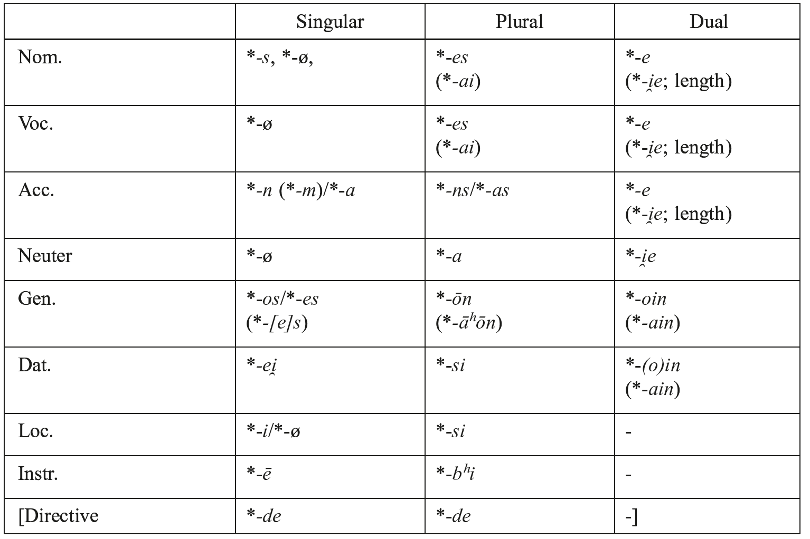

Tab. 41.2: The assumed Proto-Greek Endings: thematic

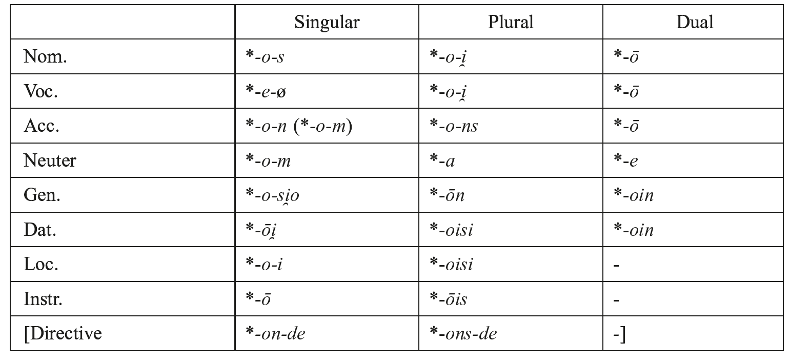

The endings of the first (in brackets in tab. 41.1) and third declensions were for the most part the same in Proto-Greek, although this was synchronically hardly recognizable for several reasons: a) phonetic changes (especially contractions) took place in the different stems, b) a redistribution of endings occurred due to syncretism, and c) some endings of the first declension are analogical to those of the -*o*-stems, namely nom.voc. pl. *-ai*, dat. pl. *-ais* (and -*āis*), dual nom. acc. voc. *-ā*, gen. dat. dl. *-ain*, which are the counterparts of *-oi*, *-ois* (from instr. pl. *-ōis*), -*ō*, *-oin* of the -*o*-stems (2.1.2, 2.2.2).

Several case endings may be traced back to PIE:

a) singular: nom. **-s* and -ø (with lengthened root or suffix vowel in the animates), acc. **-n* (PIE **-m*) with allophone *-*n̥* (*-a*: PIE **-m̥)* in consonantal stems, gen. *-*o*/*es* (PIE **-és*, **-os*, **-s* according to the flexion type), dat. -*ei*, loc. *-i* (secondarily generalized as “dative” by syncretism), instr. *-ē*. Also thematic gen. sg. -*oio* (**-osi̯o*: Ved. -*asya*).

b) plural: acc. **-ns* (PIE **-m̥s)* with allophone *-*n̥s* (*-as*) in consonantal stems, neuter nom. acc. voc. -*a* (PIE **-h₂*); gen. **-ōn* (by generalization of thematic PIE *-*ōm*, from **-o-om*); instr. athem. *-pʰi* (PIE -*bʰi[s]*: Ved. -*bhis*), them. -*ōis* (PIE **-ōi̯s*: Ved. -*ais*).

c) dual: nom. voc. acc. *-e* (type *pód-e* ‘two feet’) and themat. -*ō* (type *ʰíppō* ‘two horses’) go back to PIE **-h₁(e)* and **-o-h₁(e)* (: Ved. *-ā*). Hom. *ósse* ‘both eyes’ (neut.**h₃okᵘ̯-i̯h₁*: Lit. *akì*, OCS *oči*) is a reflex of inherited **-i̯h₁*.

Two other endings, which may be considered innovations of Proto-Greek, have replaced the inherited ones: dat. pl. *-si*, them. *-oisi* (with allophones *-ʰi*, *-oiʰi* attested in Mycenaean) is a remodeling of PIE loc. **-su*, *-*oi̯su*, probably by analogy with loc. sg.**-i*; and gen. dat. dual **-(o)ii̯i(n*/*s)*, may be a remodeling of **-(o)ii̯ou̯* (PIE **-oi̯Hou̯*, cf. Av. *-aiiō*) based on dat. pl. *-*(oi)si* (2.1.2).

1.3. Some inherited case-endings are still attested in Mycenaean and/or in Homer:

Dat. *-ei* (PIE **-éi̯*: Lat. *-ī*, OLat. <*EI*>, Ved. -*e*): Myc. *-e* /*-ei̯*/, Hom. *diī́* (cf. Cypr. proper name *ti-we-i-pi-lo-se* /*Diwei-pʰilos*/).

Loc. Myc. *-i* /*-i*/ (PIE **-i*: Lat. *-e*, Ved. *-i*), also as dative.

Instr. Myc. *-e* /*-ē*/ (PIE **-eh₁*, them. **-o-h₁*: Ved. Av. *-ā*), e.g. *e-re-pa-te* /*elepʰantē*/ ‘with ivory’. Cf. adverbial forms in *-ē*, -*ō*, -*ā* (1.4).

Instr.pl. Myc. /*-pʰi*/, Hom. *-pʰi* (PIE -*bʰi[s]*: Ved. -*bhis*), e.g. Hom. *(w)ī́pʰi* ‘by force’. Hom. *-pʰi(n)* is used also as locative (*órespʰi* ‘on the mountain’) and as a metrical substitute for other oblique cases, e.g. *Iliópʰi* (for gen. **Ilíoo*).

Two morphs for local relations are attested in Mycenaean and Homer: a) the “directive” -*de*, actually a postposition added to the accusative ending, e.g. Myc. *a-mo-te-jo-na-de* /*⁽ʰ⁾armoteiōna-de*/ ‘to the wheelwrights’ workshops’, Myc. *do-de* /*dō(n)de*/ ‘to the house’. It survives residually in some adverbial forms in Homer (*klisíēnde* ‘to the hut’, *dómonde* ‘to the house’) and in Attic *oíkade* ‘to the house’, *Atʰḗnaze* ‘to Athens’. b) *-tʰen*, which expresses origin, e.g. Myc. *a-po-te-ro-te* /*ampʰoterōtʰen*/ ‘from both sides’, Hom. *oíkotʰen* ‘from the house’, *ouranótʰen* ‘from the sky’, *tʰeótʰen* ‘from a god’. In Homer -*tʰen* may occur also with pronouns (e.g. *sétʰen* ‘of/from you’), and have locative and directive function.

1.4. Fossilized case forms of nominal stems survive as adverbs, e.g. Att. *aién* ‘always’ goes back to an endingless loc. **ai̯u̯-én-0̸*, Ion. *aieí*, Att. *aeí* ‘id.’ to loc. **ai̯u̯és-i*, Lac. *aē* to instr. **ai̯u̯-éh₁*. Cf. also (loc.) *oíkoi* ‘at home’, Delph. (abl.) *woíkō* ‘from the house’.

Old adjectival and pronominal case forms are recognizable in adverbs and conjunctions:

a) Loc. *-oi̯*: Att. *poî* ‘whither?’, *ʰoî* ‘whither’, *ʰópoi* ‘id.’. Cf. also *ekeî* ‘there’ (**eke-í*), also WGr. *teîde* ‘here’, which corresponds to Att. *toûde*, in which *toû-* is actually a genitive, as shown by Thess. *ʰoi* ‘where’ (: Att. *ʰoû*).

b) Instr. *-ā* (**-eh₂-eh₁*): Lac. *tautāʰāt(e)* ‘in such a way as’, Lesb. *oppā* ‘where’, *allā* ‘elsewhere’. The form may be remodeled as -*ā+i*, cf. Cret. *allāi* ‘otherwise’, Heracl. *pantāi* ‘in all directions’. Ion. Att. *pêi*, *ʰóppēi*, *taútēi* may conceal both *-ē(i)* and/or the outcome of **-ā(i)*.

c) Instr. *-ō* (**-o-h₁*): Hom. *opíssō* ‘behind, backwards’ (**opi-ti̯o-h₁*, cf. Hitt. *appezzia-*‘rear’), *prós(s)ō* ‘before, foreward’ (**proti-o-h₁*), also *ánō* ‘upon’, *kátō* ‘below’. Also *ʰō-* (**i̯o-h₁*) in Hom. *ʰṓ-s*, *ʰṓs-te* ‘like’ (*‘in the manner which...’) also *ʰō-*, Hom. *ʰṓ-s* ‘so’ (from **so-h₁*).

d) Instr. *-ē* (**-eh₁*): Cyren. *allē pē* ‘elsewhere’, Cret. *wekaterē* ‘in each place’, El. *tautē* ‘here’, Lac. *ʰopē* ‘in such a way as’, *pē-poka* ‘until now’ (: Att. *pṓpote*).

e) Abl. *-ō*: Cret. *ō*, *ópō*, Lit. Dor. *ʰō*, *pō*, *ʰopō*. Meaning and form (**-ōd*) are originally different from that of the instrumental.

## 2. Nominal declensions

### 2.1. The first declension

The first declension consists of -*ā-* and *-iă-*stems (nouns, adjectives), which are very productive in Greek. The stems in -*ā*- became phonetically *-ǟ*-, later *-ē-* in Attic-Ionic (except after *e*, *i*, *r* in Attic). They go back to different IE types:

a) Stems in -*ā-* (PIE **-eh₂-*) with static accent, both feminine and masculine, e.g. *poinḗ* ‘punishment’ (**kᵘ̯oi̯néh₂-*: Av. *kaēnā*, OCS *cěna* ‘price’), *ʰēmérā* ‘day’ (Hom. *ʰē-mérē*), *kʰṓrā* ‘land’, *kórē* ‘girl’ (Myc. *ko-wa* /*korwā*/) and masc. *polī́tēs* ‘citizen’, *erétēs* ‘rower’ (Myc. *e-re-ta* /*eretās*/). Cf. also the stems in *-iā-* (PIE **-ii̯eh₂-*) both feminine, e.g. *pʰilíā* ʼfriendshipʼ, *pʰutalíā* ‘vineyard’ (Myc. *pu-ta-ri-ja*) and masculine, e.g. *neaníās* ‘young man’.

b) Fem. stems in *-i(i̯)a-*/-*i(i̯)ās* (PIE **-ih₂-*/*-iéh₂-s*) with mobile accent, which have two different syllabification types: a) nom. *-ia-*, gen. -*íās* (PIE **-ii̯h₂-*/*-ii̯eh₂-s*): *pótnia* ‘mistress’, gen. *potníās* (Myc. *po-ti-ni-ja* < IE **pótnih₂*: Ved. *pátnī*), b) nom. -*i̯a*, gen. *-i̯ās* (PIE **-i̯h₂-*/*-i̯eh₂-s*): Att. *trápeza* ‘table’, gen. *trapézās* (Myc. *to-pe-za* /*torpedᶻa*/), *ároura* ‘corn-land’ (Myc. *a-ro-u-ra*).

#### 2.1.1. Attic paradigm

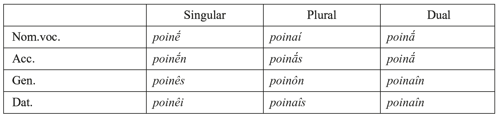

Cf. also paroxytonic *kʰṓr-ā*, acc. *-ān*, gen. *-ās*, dat. *-āi*, nom.pl. *kʰôrai*, but gen.pl. *kʰorôn*.

#### 2.1.2. On the endings

Singular: The vocative outside Attic is occasionally also *-a˘* (cf. OCS -*o*), e.g. Hom. *númpha* ‘bride’, probably by generalization of the *sandhi* variant **-a˘(H)* from **-eh₂* # *V-*. The genitive is -*ês* (PGr. **-âs* < PIE **-éh₂-es*: Lith. *-ôs*) in oxytone words, as against -*ēs* in paroxytons (*kʰṓrās*, *kórēs*: PGr. **kʰṓrās*, **kóru̯ās*). Dat.sg. -*êi* (PGr. **-âi*: IE **-éh₂-ei̯*), besides *-ēi* (PGr. **-āi*). The nominative *-ai* comes analogically from *-oi* of the -*o-*stems.

Plural: Accusative *-ā́s*, *-ās* < PGr **-ān-s*: PIE *-*eh₂-ns*). Genitive *-ôn* < *-ā́ʰōn* comes from PGr. *-*ā́sōm* of pronominal origin (as against PIE *-*éh₂-ōm*): Myc. /*-āʰōn*/, Hom. -*ā́ōn* (and -*éōn*, with shortening before a long vowel), Dor. *-ân* (by contraction). The form -*ôn* is extended to all types of the first declension. Attic Dative -*aîs*, *-ais* is analogical to -*oîs*, -*ois* of the -*o-*stems. Other variants, namely *-ēsi(n)*, *-aisi* (inscriptions), as well as Hom. *-ēis*, *-ēisi(n)*, *-aisi(n)* (analogical to -*oisi* of the *-o-*stems), go back to remodelings of dat.-loc. **-ā-si* (PIE **-eh₂-su*). The inherited form is attested in Myc. *a-i* /*-āʰi*/, with later analogical restoration of *-s-* in the dialects of the first millennium.

Dual: Nom. voc. acc. Att. *-ā* (also Hom. e.g. *aikʰmētā́* ‘two fighters’) is analogical to -*ō* of the -*o*-stems, according to the proportion pl. *-oi*: du. *-ō*:: pl. *-ai*: du. X, whence X = -ā. The feminine form was PGr. **-ō* (Myc. -*o* /*-ō*/, e.g. *to-pe-zo* /*torpedᶻō*/ ‘two tables’), which survives sporadically cf. OAtt. *megalō*, Epic *kalupsaménō* (Hsd.). Inherited PIE **-eh₂-ih₁* (: Ved. *-e*, OCS *-ě*), would have yielded **-ai̯*, which would be homophonous with plural *-ai*. The genitive/dative -*aîn*, *-ain* is probably analogical to -*oin* of the -*o*-stems (2.2.2). Cf. also Arc. *tois kranaioun* ‘in/to both sources’ and *Tindaridaius*, which point to PGr. **-aii̯u(-s*/*n)* analogical to thematic **-oii̯u(*-*)* (1.2).

Some inherited case forms are still attested in Mycenaean, namely loc. sg. *-a* /*-ai*/ (**-eh₂-i*), instr. sg. *-a* /*-ā*/ (**-eh₂-eh₁*), and instr. pl. *-a-pi*.

#### 2.1.3. Masculine stems have some specific endings

Nom. sg. *polī́tēs* (PGr. **-ā-s*, with -*s* from the -*o*-stems: Myc. *-a* /*-ās*/ rather than /*-ā*/, cf. Myc. *te-re-ta*, but El. *telesta* ‘official’). Cf. also *-ă*, probably the vocative form, in Hom. *nepʰelēgerétă* ‘cloud-gatherer’, *ʰippótă Néstōr* ‘horseman’ (= *ʰippótēs* Hom. +). Voc.sg. *polī́tă*, *déspota*. Gen.sg. Att. *polī́tou* (by direct extension from the *o-*stems). The evidence of other dialects allows for the reconstruction of PGr. **-ā⁽ʰ⁾o* (from **-ā[s]o*, with **-so* probably from the pronominal flexion): Myc. *-a-o* /*-ā⁽ʰ⁾o*/, Hom.-Ion. -*āo* (and -*eō* with quantitative metathesis: *Atreídeō*), *-āo* or *-ā* (by contraction) in other dialects.

Nom. voc. acc. dual -*ā* may go back to **-ā*+*e* or to **-ai̯-e*. Myc. *-a-e* /*-a⁽ʰ⁾e*/ (e.g. *e-qe-ta-e*) points to **-ai̯-e* (i.e. dual **-ai̯* from PIE **-eh₂-ih₁*, cf. Ved. *-e*, OCS *-ě*) with addition of *-e* from the consonantal stems.

### 2.2. The second declension

The second declension consists of masculine, feminine, and neuter -*o-*stems corresponding to different suffixes which may be traced back to PIE and are very productive in Greek. They have -*o*- in all cases (except *-e-* in the voc. sg. and neuter nom. voc. acc.), and have fixed accent except for voc.sg. *ádelpʰe*.

#### 2.2.1. Attic paradigm (*pʰílos* ‘friend’, *métron* ‘measure’)

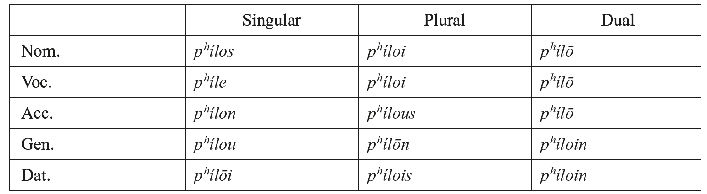

Neuters: Nom. voc. acc. sg. *métron*, pl. *métra*, du. *métrō*.

#### 2.2.2. On the endings

Singular: Attic gen. *-ou* [-ọ̄] is from **-o-so* of pronominal origin (cf. Hom. *teo* from PIE **kᵘ̯e-so*: OCS *česo*). Inherited **-osi̯o* (Ved. *-asya*, Fal. *-osio*, Arm.*-oy*) is still attested in Myc. *-o-jo* /-*oio*/, Hom. *-oio* (also Thessalian -*oio*, -*oi*). Dat. sg. *-ōi* (PGr. **-ōi̯*, PIE **-o-ei̯*). Cf. also Arc. Boeot. El. *-oi* (shortened form of **-ōi̯* rather than a former loc.**-oi̯*).

Plural: Nom. voc. *-oi* is of pronominal origin (probably inherited, cf. Lith. -*ai*, OCS -*i*; PIE **-ōs* from **-o-es* has left no trace in Greek). Acc. *-ous* [-ọ̄s] (PIE **-o-ns*). Cf. also Thess. Arc. *-ŏs*, Lesb. *-ois*, as well as *-ōs* in dialects of *Doris seuerior*). Gen.pl. *-ōn* (PGr. **-ōm*, PIE **-o-om*). Dat. *-ois* comes from PGr. **-ōi̯s* (instr. PIE **-ōi̯s*) and/or *-oisi* (dat.loc. PGr. **-oi̯si*) with elision of -*i* before a vowel. Cf. Myc. instr. *-o* /*-ōis*/ (*e-re-pa-te-jo* ‘of ivory’) and dat. loc. pl. *-o-i* /*-oiʰi*/ Hom. *-oisi*, *-ois(i)*.

Dual: Nom. voc. acc. -*ō* (**-o-h₁*) also in the neuters. Gen. dat. -*oin* (Att. *ʰíppoin*, Hom. *ʰíppoiïn*) may go back to a former loc. **-oi̯Hin*. Arc. *Didumoiun* points to a PGr. **-oi̯Hu-* (1.2). Them. -*oin* has been extended to the third declension, cf. *podoîn* (Hom. *podoîin*), and provided the model for *-ain* (2.1.2).

Some inherited case forms are still attested in Mycenaean: loc. sg. /*-oi*/ (PIE ****-****o-i̯*); instr. sg. *-ō* (PIE **-o-h₁*). Cf. also Hom. -*opʰi*, e.g. *apò kʰalkópʰi*, Boeot. *Epipatrópʰi-on* ‘patronymic’.

#### 2.2.3. Contracted types

Vowel contraction after the dropping of **-i̯-*, **-u̯-* (at different chronological stages) gives rise to contracted variants, e.g. *ostoûn* ‘bone’ (**ostéi̯on*), *noûs* ‘mind’ (**nóu̯os*). A special type is the so-called “Attic” declension of *-o*-stems of the structure **Cāu̯*-*o-* (e.g. **nāu̯ó-*‘temple’ from PGr. **nasu̯ó-*), which yields **Cāu̯o-* and, with quantitative metathesis, *-eō-*: sing. nom. *neṓs* (**nāu̯ós*), acc. *neṓn* (**nāu̯óm*), gen. *neṓ* (**nāu̯óso*), dat. *neṓi* (**nāu̯ṓi̯*); plur. nom. voc. *neṓi* (**nāu̯oí*), acc. *neṓs* (**nāu̯óns*), gen. *neṓn* (**nāu̯ṓn*), dat. *neṓis* (**nāu̯ṓis*); dual nom. voc. acc. *neṓ*, gen. dat. *neṓin*.

### 2.3. The third declension

The third declension consists of stems in stops, -*s-*, sonorants and semivowels, and heteroclitic nouns. They reflect, to different degrees, PIE flexional patterns. The dialects show a tendency to simplify the inherited qualitative and quantitative ablaut patterns, which still survive in Homer and, in spite of the scarcity of the data, in Mycenaean. The different stems show in Attic, with few exceptions (nom. sg. and dat. pl.), a uniform vocalism and full grade.

The case endings are the same for all dialects, except that of dat. pl. -*si*, which is in competition with allomorphs which have been created within Greek, namely *-essi* (type *pód-essi*, *pánt-essi*: Att. *posí*, *pâsi*) in Homer, in Aeolic and some West Greek dialects (also sporadically *-ssi*, type *póli-ssi* in other dialects), as well as *-ois* (type *kʰrēmátois*: Att. *kʰrḗmasi*) in North West dialects.

2.3.1. Stems in stops have normally no trace of the inherited ablaut except in root-nouns, which show generalization of full grade of the root and movable accent, e.g. *poús* ‘foot’ (<*ou*> instead of <*ō*>), gen. *podós* (**pód-s*: Ved. *pā́t*, gen. **péd-s*, cf. Lat. *ped-is*), *núk-s* ‘night’, gen. *nuktós* (**nokᵘ̯t-*). Suffixal formations have static accent: *-nt-* e.g. *pánt-* ‘all’, nom. *pâs* (Toch. *po*), *andriánt-* ‘man’s figure’ (nom. *andriás*, Myc. instr. *a-di-ri-ja-te* /*andriāntē*/*)*, also in participles (6.9.2); **-u̯ent-* e.g. *kʰaríent-* ‘gracious’ (nom. *kʰaríeis*: PIE **g̑ ʰr̥Hi-u̯ént-*). Cf. also stems in *-k-*, e.g. *ónuks* ‘nail’ (Myc. *o-nu*, acc. *o-nu-ka*), *pʰúlaks* ‘guardian’, *gunḗ* ‘woman’ (Myc. dat.pl. *ku-na-ki-si* /*gunaiksi*/) and some neuters in **-t-* (dropped in nom. voc. acc. sg.), e.g. *méli* ‘honey’ (**méli-t-*: Hitt. *militt-*, Got. *miliþ*), *álphi* ‘barley’ (**h₁albʰi-t-*), which may be secondarily formed on *-i-*stems.

Attic paradigm (*pʰúlaks* ‘guardian’)

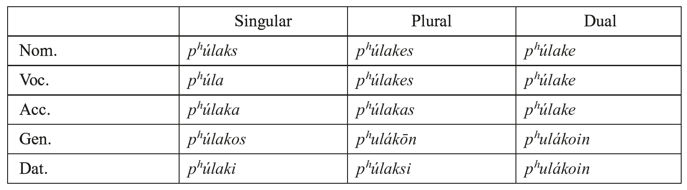

Stem-final dentals are lost before *-s*, cf. dat. pl. *po-sí* (**pod-sí*: Hom. *possí*), dat. pl. *pâsi* (**pánt-si*: Myc. *pa-si* /*pansi*/).

2.3.2. *-s*-stems show generalization of full grade of the suffix through the whole paradigm. Some formations:

a) neuters in *-o*/*es-* (type *CéC-es-*): *génos* ‘race, kin’, gen. *génous*, Hom. *gén-eos* (PIE **g̑énh₁-os*, gen. **g̑énh₁es-os*: Lat. *genus*, *-eris*, Ved. *jánas*, *-asas*), *étos* ‘year’, Myc. *we-to* (**u̯ét-es-*: Lat. *uetus* ‘old [man]’), *klé(w)os* ‘glory’ (**léu̯-es-*: Ved. *śrávas-*). Also with zero grade of the root, e.g. *rʰîgos* ‘frost’ (**srī́g-es-*: Lat. *frīgus*).

b) compounded adjectives in °*CeC-és-*: *suggenḗs*, acc. *-ê* (**-és-m̥*), gen. *-oûs*, Hom. -*éos* (**-és-os*), Hom. *eukleḗs* (Ved. *suśravás-*) ‘having good fame’.

c) feminine in *-os-*: Att. *ʰéōs* ‘dawn’, Hom. *ēṓs* (PGr. **au̯u̯ṓs* < **au̯sṓs*: PIE **h₂éu̯s-ōs*: Ved. *uṣā́s*), gen. Att. *ʰéō*, Hom. *ēoûs* (PGr. **au̯sós-os*, remodeled from PIE**h₂(e)u̯s-s-és*: Ved. *uṣás*).

d) neuters in *-as*- (*-*h₂s-*): *kréas* (*kréu̯-h₂s-*: Skt. *kráviṣ-* ‘raw flesh’), gen. *kréōs* (< *-*aʰos*), *kéras* ‘horn’ (Myc. *ke-ra-*: PIE **érh₂s-*). Endings are not recognizable in Attic, as in other dialects, once PGr. **-ʰ-* (from **-s-*) has been dropped and the vowels have undergone contraction. The stem remains recognizable in nom. acc. *génos*, and dat. pl. Hom. *génessi* (but Att. *génesi*, with -*ss-* > *-s-*). Otherwise gen. *génous* (**génes-os*: Hom. *géneos*, Myc. *-e-o* /*-eʰos*/), dat. *génei* (**génes-i*, Myc. *-e-i* /*-eʰi*/); plural nom. voc. acc. *génē* (**génes-a*: Hom. *génea*), gen. *genôn* (**genésōn*: Hom. *genéōn*).

2.3.3. Stems in liquids and nasals reflect, at least in part, inherited accent and ablaut patterns in some words. Most of them show generalization of one of the full grades of the predesinential suffix in all cases with uniform vocalism and static accent, namely *-ōR* /-*oR-*, *ēR* /-*eR-* (except dat. pl. *-R̥-si*), also, with lengthened grade, -*ēr-* and -*ōn-*.

2.3.3.1. Some stems in *-r-* betray old accent patterns, e.g. *patḗr* ‘father’ (Myc. *pa-te*), acc. *patéra*, gen. *patrós* (: PIE **ph₂-tḗr*, *-tér-m̥*, *-tr-és*: Skt. *pitā́*, *pitáram*, gen. Lat. *patris*); partial leveling is attested in acc. pl. *patér-as*, gen. *patér-ōn* (but Hom. *patrôn*), inversely in Hom. gen. *patér-os*, dat. *patér-i* with secondary full grade. A similar situation is that of *mḗtēr* ‘mother’ (Myc. *ma-te* /*mātēr*/), *tʰugátēr* ‘daughter’ (Myc. *tu-ka-te*, dat. pl. *tu-ka-ṭạ-ṣị* /*-tarsi*/) or that of *anḗr* ‘man’, gen. *andrós* (**h₂nér-* /**h₂nr-és*), which shows leveling in Attic (acc. *ándra*, dat. *andr-í*, nom. pl. *ándr-es*) as against Homer (acc. *anéra* [PIE **h₂nér-m̥*], *anéres*, beside gen. *anéros*, dat. *anéri*, with secondary full grade). In the case of *kʰeír* ‘hand’, gen. *kʰe(i)rós* (PIE **g̑ʰés-ōr*, gen. **g̑ʰ(e)s-r-és*, dat. **g̑ʰ(e)s-ér(-i*): Heth. *keššar*, loc. *kiššari*), Att. acc. *kʰeîr-a*, gen. *kʰeirós* go back to **kʰesr-V*, with generalization of the full grade. Nom. *kʰeír* [kʰẹ̄r] is analogical to gen. *kʰeir-ós* etc., and dat. pl. *kʰersí* goes ultimately back to **kʰēr-sí*, from **kʰe(s)r-sí*, by Osthoff’s law. A secondary stem *kʰer-* (Hom. dat. *kʰerí*, nom. pl. *kʰér-es*, acc. *-as*, gen. *-ôn*) has been created on the dat. pl. *kʰer-sí*.

Generalization of a single stem variant is widely attested, cf. *astḗr* ‘star’ (Hitt. *ḫašter*-) or the agent nouns Hom. *dotḗr* ‘giver’ (PIE **dh₃-tḗr* acc. **dh₃-tér-m̥*, gen. **dh₃-tr-és*), *dṓtōr* (**déh₃-tōr*, **déh₃-tór-m̥*, **déh₃-tr̥-s*), *rʰḗtōr* ‘orator’. Generalization of lengthened grade is also found, e.g. in *iātḗr* ‘physician’ (Myc. *i-ja-te* /*⁽ʰ⁾iātēr*/), *mnēstḗr* ‘suitor’.

Attic paradigms

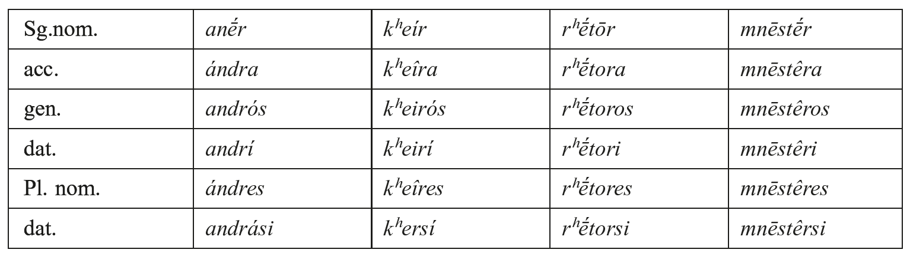

Some neuters with regularized vocalism go back to the remodeling of **-r-*/*-n-* heteroclitics, e.g. *éar* ‘spring’, gen. *éaros* (PIE **u̯és-r̥*/*n-*, cf. OCS *vesna*), *pûr* ‘fire’, gen. *purós* (PIE **péh₂-u̯r̥-0̸*: Hitt. *paḫḫur*, Umbr. *pir*, OE *fýr*), gen. **ph₂-u̯én-s* (Hitt. *paḫḫu̯enaš*).

2.3.3.2. Some stems in *-n-* retain old accent patterns, e.g. *(w)arḗn* ‘lamb’, gen. *(w)arnós*, dat.pl. *(w)arnási*, with partial analogical leveling of vocalism and/or ablaut (but acc. *[w]árna*). This is the case for *kúōn* ‘dog’, gen. *kunós* (PIE **[u]u̯ṓ[n]*, **u-n-és*: Ved. *śᵤvā́*, gen. *śúnas*), but acc.sg. *kúna* instead of **kúona* (PIE *k̑*u-ón-m̥*: Ved. *śᵤvā́nam*) with zero-grade from the oblique cases, and dat. pl. *kusí* analogically formed instead of **pasí* (*k̑*u̯n̥-sú*: Ved. *śvasú*). Inherited dat. pl.**-n̥-si* yields *-asi*, analogically also *-esi* (in **-en-*stems), *-osi* (in **-on*-stems), cf. *pʰrḗn* ‘mind’ (earlier ‘midriff’), gen. *pʰren-ós*, dat. pl. *pʰresí* (but *pʰrasí* Pindar).

Generalization of one stem variant is recognizable in *poimḗn* ‘shepherd’, gen. *poiménos*, dat. pl. *poimési* (instead of **poimási < *-n̥si*) from PIE **póh₂i-mōn*, gen. **p(o)h₂i-mén-s* (Lith. *piemuõ*, gen. *piemẽns*); *téktōn* ‘carpenter’, gen. *téktonos* (Myc. nom. *te-ko-to*, pl. *te-ko-to-ne* /*-ones*/: Ved. *tákṣan-*), dat. pl. *téktosi* (but still Myc. *te-ka-ta-si* /*tektasi*/ < **-n̥si*). Cf. also *kʰtʰṓn* ‘earth’, gen. *kʰtʰonós* (**g̑ʰþōm*-, PIE **dʰég̑ʰ-ōm-0̸*, gen. **dʰg̑ʰ-m-és*: Hitt. *tēkan*, *taknāš*); *agṓn* ‘contest’, gen. sg. *agôn-os*, dat. pl. *agôsi*.

Attic paradigms

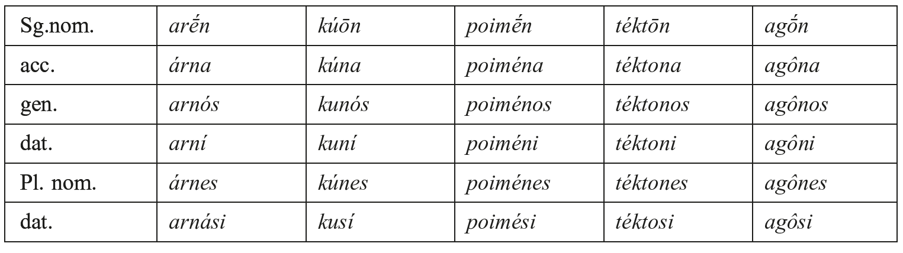

Some remarkable suffixes: a) *-īn-* (**-ih₂-n-*), e.g. *ōdī́n*- ‘pang’ (stem by reanalysis of acc. **h₁ōd-u̯-ih₂-m*), b) **-on-* (**-h₃on-*) ‘possessive’, e.g. *gastrṓn* ‘pot-belly’, personal name *Rʰínōn* (cf. Lat. *Nasō*), also individualizing *strabṓn* ‘squinting’, c) -*(e)ṓn*-, gen. -*(e)ônos* (*-*[e]iōn*-) for local designations, e.g *andrṓn*, Ion. *andreṓn* ‘men’s hall’, Myc. *a-mo-te-jo-na-de* /*⁽ʰ⁾armoteiōna-de*/ ‘to the wheelwrights’ workshops’.

Old hysterodynamic neuters in *ˊ-*men-* (gen. **-mn-és*) develop to heteroclitics of the type *ónoma* ‘name’, with regularization of zero grade (nom. *-*mn̥*, gen. **-mn̥-t-os*: -*matos*, cf. 2.3.5.c.

2.3.4. Stems in -*i*- and -*u*- have ablauting and non-ablauting PIE flexion and a partly parallel development within Greek.

2.3.4.1. Ablauting -*i-*stems of the type *básis* ‘step(ping)’ (**gᵘ̯m̥tí-*: Ved. *gatí-*) or *pólis* ‘city’, with nom. sg. **-i-s*, gen. **-éi̯-s* [Ved. *gatés*)], loc. **-ēi̯-ø* [or **ēu̯-ø*], nom. pl. *-ei̯-es*) have become non-ablauting in Homer, as well as in other dialects (gen. *-i-os*, dat. *-ī* [**-i-i*], pl. nom. *-i-es*, acc. *-i-as* or *-īs*, gen. *-i-ōn*, dat. *-i-si*). In Attic, on the contrary, an innovatory ablaut has been created in the oblique cases of the singular and in the plural, on the basis of the endingless loc. **-ēi̯-ø*, namely “dat.” **pólēi*, gen. **pólēi̯-os*, whence Att. *pólei*, *póleōs*, as well as nom. pl. *póleis* ([ẹ̄]), from **-éi̯-es*, extended to the accusative, gen. *-éōn*, dat. *-esi*.

The non-ablauting type is represented by Att. *oîs* ‘sheep’ (Hom. *óïs*), gen. *oiós*: Ved. *ávi-*, gen. *ávyas*), acc. *oîn*, dat. *oií*, pl. nom. *oîes*, dat. *oîsi*. Some -*i*-stems have been enlarged by -*t*- or -*d*-, cf. *kʰáris* (PIE **g̑ʰr̥Hi-*), gen. *kʰári-t-os*, *tʰémis* ‘law’, gen. *tʰémitos*, or *éris* ‘quarrel, rivalry’, gen. *éridos*. Also *-oi̯*-stems (type *Sappʰṓ*) are attested, e.g. *peitʰṓi-* ‘persuasion’, nom. *peitʰṓ* (**ṓi̯-ø*), gen. *peitʰoûs* (**-ói̯-os*).

2.3.4.2. The ablauting -*u*-stems, e.g. *présbus* ‘old man’ (**pres-gᵘ̯ú-* ‘going [from] in front’) or Hom. *(w)ástu* ‘city’ (cf. Ved. *vā́stu-*) or *barús* ‘heavy’ (**gᵘ̯r̥h₂-ú-*: Ved. *gurú-*, Goth. *kaurus*), have created a new ablaut in the singular on the basis of the endingless locative **-ēu̯-ø* (Ved. *-au*, Goth. *-au*), which is sporadically attested in Myc. *-e-u* /-*ēu*/ (e.g. *pa-ro ra-ke-u* ‘from Lakhus’), whence gen. sg. *-eōs* (*-*ēu̯-os* ← PIE **-éu̯-s*), dat. *-ei* (**-ēu̯-i* ← **-ēu̯-ø*). The Attic paradigm: nom. *présbus*, acc. *présbun*, gen. *présbeōs*, dat. *présbei*, pl. nom. *présbeis*, gen. *presbéōn*, dat. *présbesi*. Some types of *-u-*stems:

a) Non-ablauting stems, e.g. *métʰu* ‘mead’, gen. *métʰuos* (**médʰu-*: CLuv. *maddu(i)-*‘sweet’, Ved. *mádhu-*) or *thrânus* ‘beam’, Myc. nom. pl. *ta-ra-nu-we* /*thrānues*/.

b) The old proterodynamic Hom. *dóru* ‘wood’ (: Ved. *dā́ru*), gen. *do(u)rós* (**dor-u̯-ós* ← PIE **dréu̯-s*: Ved. *drós*) has also a heteroclitic variant with gen. *doúratos*, pl. *doúrata*.

c) *-ū*-stems (nom. -*ūs*, gen. *-ŭos*) may go back to **-uH-* (*opʰrûs* ‘eye brow’: Ved. *bhrūs*, gen. *bhrúvas*) or to a remodeling of **-ou̯-* (Hom. *nékūs* ‘corpse’ [← **ou̯-s*], gen. *nékŭos* [**-u-os*]).

d) Diphthongal -*ou̯-* stems, cf. *ʰḗrōs* ‘hero’ (**Hi̯ērou̯-*), with nom. *-ōs* (instead of **-ōu̯s)* have been remodeled on the basis of acc. **-ō-m* < **-ōu̯m*, secondarily gen. *ʰḗrō* with ‘Attic’ declension (Hom. gen. *ʰḗrōos*), dat. Myc. /*ʰērō⁽ʰ⁾ei*/ in *ti-ri-se-ro-e* ‘to the Thrice-hero’.

2.3.4.3. The so-called stems in “long” diphthongs are actually former ablauting stems: a) *Dᶻeús* (Att. *Zeús*), gen. *Di(w)ós* (**di̯-ḗu̯-s*/**di-u̯-és*: Ved. *dyáus*/*divás*) Myc. *di-wo* /*Diwos*/, *di-we* /*Diwei*/ (Hom. *Diós*, *Dií*). b) Att. *naûs* ‘ship’ (**nā́u̯-s*: Hom. *nēûs*, Ved. *náus*), acc. *naûn* (← **nā́u̯-m̥*: Hom. *nêa*), gen. *neōs* (**nāu̯-ós* with quantitative metathesis, cf. Hom. *nēós*). c) Att. *boûs* (**gᵘ̯ṓu̯-s*: Ved. *gáus*), *boûn* (**gᵘ̯óu̯-m̥*: Hom. *bōn*), gen. *boós* (**gᵘ̯ou̯-ós*). Myc. *qo-o* /*gʷōns*/ (acc. pl.), dat. *qo-we* /*gʷowei*/. d) The *-ēu̯**-***stems with no ablaut, e.g. *ʰiereús* ‘priest’, *kʰalkeús* ‘bronze-smith’ (Myc. *i-je-re-u*, *ka-ke-u*) are a Greek innovation: Att. nom. sg. *-eús* (**-ḗu̯-s*), acc. *-éa* [ā] (**-ḗu̯-m̥*: Hom. *- ḗa*), gen. *-éōs* (**-ḗu̯-os*: Hom. -*ḗos* and*-eōs*), Plur. nom. *-eîs* (**-ḗu̯-es*: Hom. *-ēes*), dat. *-eûsi* (**-ḗu̯si*). The origin of *-*ēu̯*- remains obscure (generalization of the vocalism of loc. sg. **-ēu̯-ø*? **-e-e-u-*?). A suffix *-eús* is also frequent in onomastics for “short” forms of compounds.

2.3.5. The heteroclitics include four types, of which a) and b) go back to PIE neuter stems with *-r-*/*-n-*, whereas c) and d) have been secondarily created in Greek. All of them have a *-t-* in the oblique and plural cases, which is a specific Greek innovation:

a) *-ar*/*-atos* (**-r̥*/**-n̥-t-os*), e.g. *ʰêpar* ‘liver’ (PIE **Hi̯ḗkᵘ̯-r-ø*: Av. *yākarə*, Lat. *iecur*), gen. *ʰḗpatos* (← **Hi̯ékᵘ̯-n̥-s*, cf. Ved. *yaknás*, Lat. *iecinis*), *áleipʰar* ‘unguent’, gen. *aleípʰatos* (Myc. *a-re-pa*, instr. *a-re-pa-te*), Hom. *êar* ‘blood’ (IΕ **h₁ḗsh₂-r̥*, gen. **h₁ésh₂-n̥-s*: Hitt. *ēšḫar*, gen. *eš(ḫ)anaš*, Ved. *ásr̥k*, *asnás*).

b) *-ōr*/*-atos* (**-ōr*/**-n̥-t-os*), e.g. *ʰúdōr* ‘water’ (Umbr. *utur*), gen. *ʰúdatos*, remodeled from PIE collective **u̯éd-ōr-ø* (Hitt. *u̯idār*), gen. **ud-n-és* (cf. Hitt. *u̯ed[e]naš*), loc. **ud-én(i)*: Ved. *udán*), also Myc. /°*k(a)rāʰōr*/ ‘head’ (PIE *k̑*r̥h₂s-ōr*, oblique cases *k̑*r̥h₂s-n̥-C-*): instr. *se-re-mo-ka-ra-o-re* /°*k(a)rāʰorē*/ ‘with the head of a *se-re-mo*...’, pl. *se-re-mo-ka-ra-a-pi* /°*k(a)rāʰapʰi*/.

c) *-ma*/*-matos* (**-mn̥*/**-mn̥-t-os*), from hysterodynamic neuter*-men-*stems, (cf. 2.3.5.1 [end]), e.g. *ónoma*/*onómatos* ‘name’, *spérma*/*spérmatos* ‘seed’ (**spérmn̥*) and Myc. *pe-mo*, also *pe-ma*, Hom. *ʰárma*, -*atos* ‘chariot’ (Myc. *a-mo* ‘wheel’, pl. *a-mo-ta*, dat. pl. *a-mo-si)*.

d) *-u*/*-atos* (**-u-*/**-u̯-n̥-t-os*, from former neuter *-u-* stems, cf. 2.3.4.2), e.g. *gónu-* ‘knee’, gen. *gónatos* (**g̑ón-u*, gen. **g̑én-u-s*: Hitt. *genu-*, *genuu̯aš*), Hom. *dóru*, gen. *dóratos* ‘wood’ (PIE **dór-u-* ‘wood’: Hitt. *tāru-*, Ved. *dā́ru-*, gen. **dr-éu̯-s*: Ved. *drós*) beside Hom. gen. *dourós* (**dor-u̯-ós*).

2.4. Adjectives are built to nominal stems and with the same endings as nouns. Feminine has a specific form in the simplicia which is expressed by the motional suffixes: a) *-ā-*, Att. *-ē-* vs. masc. *-o-*stems and b) *-i(i̯)a*-/*-i(i̯)ā-* vs. other stems. For a), cf. *agatʰḗ* vs. masc. *agatʰós*, *-ón* ‘good’, *né(u̯)ā* (Lat. *noua*) vs. *né(u̯)os*, -*on* ‘new’. For b), cf. *mélaina* ‘black’ (**mélan-i̯a*) vs. *mélas*, *-an*, Att. *bareîa* ‘heavy’ (**baréu̯-i̯a*) vs. *barús*, *ʰēdeîa* ‘sweet’ vs. *ʰēdús*; Hom. *pī́(u̯)eira* ‘fat’ (**píHu̯eri̯a-*: Ved. *pī́varī*) vs. **pī́(u̯)ōn* (**píHu̯ōn*: Ved. *pī́vā*). Cf. also *kʰaríessa* ‘gracious’ vs. masc. *kʰaríeis*, -*en*: fem. *-(w)essa* (Myc. /*-wessa*/) goes back to *-*u̯n̥t-i̯a-*, with -*e-*vocalism analogic to masc. **-u̯ent-* (Hom. Att. *-eís*, Myc. /*-went*-/). Compounds (except for proper names) have no specific feminine form, e.g. *á-dikos* ‘unjust’ both masc. and fem., but *díkaios*, fem. *dikaíā*.

2.4.1. Comparative and superlative are built by means of two suffix sets:

2.4.1.1. Comparative **-i(i̯)os-* (PIE **-i̯[i̯]os-*, originally intensive), later *-i(i̯)on-*: superlative *-isto-* (PIE **-is-t[h₂]o-*: Ved. -*iṣṭha-*). Comparative **-i(i̯)os-* is attested in Mycenaean, and survives in Attic in residual forms. Some examples: *ʰēdús* ‘pleasant’: *ʰēdíōn*, acc. sg. *ʰēdíōna*, pl. nom. acc. *ʰēdíones*, *-as* beside Att. acc. sg., nom. acc. pl. neut.*ʰēdíō*, nom. acc. pl. masc. *ʰēdíous* (**-ii̯os-m̥*, -*a*, *-es*, -*n̥s*): superl. *ʰḗdistos* (PIE **su̯ādii̯os-*: **su̯ād-ist[h₂]o-*: Ved. *svā́dīyas-*, *svā́diṣṭha-*); *mégas* ‘high’: *meízōn* (Att. pl. *meízous*, neut. *meízō*, Myc. *me-zo-e* /*medᶻoʰe(s)*/, *me-zo-a₂* /*medᶻoʰa*/): *mégistos* (**meg̑i̯os-*: *meg̑ist[h₂]o-*, cf. Av. *mazišta-*); *kakós*: *kakíōn* (Myc. *ka-zo-e* /*katˢoʰe(s)*/ (**kak-i̯os-*): *kákistos*.

2.4.1.2. Comparative -*tero*- (PIE **-tero-*): superlative -*tato-* (PIE **-tm̥-to-*), e.g. *makrós* ‘big’: *makróteros*: *makrótatos*. PIE *-*tero-* was originally contrastive, as attested in Myc. /-*tero-*/, e.g. *wa-na-ka-te-ro* /*wanaktero-*/ ‘belonging to the *wanaks*’, also Alph.Gr. *arrénteron* ‘masculine’, *tʰēlutérā* ‘feminine’. Some forms have been lexicalized, e.g. *deksíteros* (to *deksiós*) ‘right’ vs. *aristerós* ‘left’, or *próteros* ‘former’ (Av. *fratara-*). Both sets may occasionally occur with one and the same adjective, e. g. to *glukús* ‘sweet’, *glukú-teros*, *-tatos* and *gluk-íōn* (Hom.), *-istos* (Bacch.).

2.4.1.3. Some adjectives belonging to the basic vocabulary build comparatives and superlatives by means of suppletion, e.g. *agatʰós*: *ameínōn* (and Hom. *areíōn* and *pʰérteros*): *áristos*, and: *beltíōn*: *béltistos*.

## 3. Numerals

The system of numerals possesses three series, corresponding to three dimensions: cardinals (: amount), ordinals (: order), and multiplicatives (: repetition). The cardinals ‘1’ to ‘4’, the centenials ‘200’ to ‘900’ and ‘1000’ are declined, all others are not. The ordinals are, with the exception of ‘first’ and ‘second’, derived from the corresponding cardinal by means of the suffix **-to-* (and *-ostós* from ‘20ᵗʰ’ on), and, exceptionally, **-u̯o-*(**ógdou̯o-* ‘8ᵗʰ’) and **-o-* (**-Ho-*, cf. *ʰébdomos* ‘7ᵗʰ’). Multiplicatives are built by means of adverbial suffixes added to the cardinals (PIE **-is* for ‘2’ and ‘3’, -*(á)kis*, which is a Greek innovation, from ‘4’ on).

### 3.1. From ‘1’ to ‘19’ in Attic

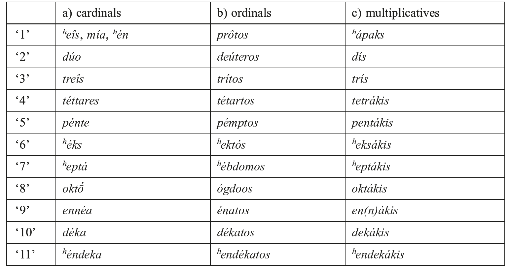

#### 3.1.1. On the forms

‘1’: a) *ʰeîs*, neut. *ʰén* (**sém-*), fem. *mía* (**sm-ii̯h₂*- cf. Arm. *mi* < **smii̯o*/*ā˘-*). Cf. also fem. Thess., Lesb., Boeot., and Hom *íā*. b) *prôtos*, (WGr. Boeot. *prâtos* from PIE **pr̥h₂-tó-* (*prôtos* with *-o-*vocalism analogical to *pró*).

‘2’: a) *dúo*, *dúō* (PIE **du̯ō*: Ved. *dᵤvā́[u]*, Lat. *duō*), Myc. instr. *du-wo-u-pi* /*duwoupʰi*/. b) *deúteros*, cf. *deúomai* ‘I lack, am inferior’). c) *dís* ‘twice’ (**du̯i-s*: Lat. *bis*). In compounds *di*°: *dípous* ‘biped’, Myc. *di-wi-ja-me-ro* /*dwi-āmeron*/ ‘period of two days’.

‘3’: a) *treîs* (PIE **tréi̯es*: Ved. *tráyas*, Lat. *trēs*), n. *tría* (**trii̯h₂*: Lat. *tria*). b) *trítos* (**tri-to-*: Toch. B *trite*). c) *trís* ‘thrice’ (**tri-s*: Lat. *ter*). *tri*°: *trípous* ‘three-footed’ (Myc. *ti-ri-po-de* /*tripode*/ ‘two tripods’).

‘4’: a) *téttares*, neut. *téttara* (Thess. Boeot. *péttares*, Ion. *tésseres*). The syllable *-ttar*goes back to the generalization of the zero grade **-tu̯r̥-*. Dor. *tétores* shows the inherited *-o-*grade (**kᵘ̯étu̯or-es*: Ved. *catvā́ras*, Lat. *quattuor* from **kᵘ̯ətu̯or-*), with loss of *-u̯-* by extension from the outcome of dat. **tetu̯r̥si* (PIE Loc.**kᵘ̯tu̯r̥-su*). Hom. *písures* is obscure. b) *tétartos*, with analogical full grade **kᵘ̯étu̯r̥-to-*: Lit. *ketvir˜tas*) (PIE **kᵘ̯tu̯r̥-to-*, cf. Ved. *tur-*), cf. the personal name *Turtaîos* (**turto-* from **kᵘ̯r̥to-* cf. Lat. *quartus*). c) *tetra*°, Thess. *petro*° from **kᵘ̯etr̥* °, with secondary full grade. The original form **kᵘ̯tu̯r̥*° is attested in *trápeza* ‘table’ (: Myc. *to-pe-za*, from * *kᵘ̯tu̯r̥-pedi̯a-*), also Hom. *tru-pʰáleia* ‘helmet’.

‘5’: a) *pénte* (PIE **pénkᵘ̯e*: Ved. *páñca*, Lat. *quīnque*). b) *pémptos* (**pénkᵘ̯-to-*, with secondary full grade, cf. Ved. *pakthá- *pn̥kᵘ̯-t[h₂]ó-*).

‘6’: a) *ʰéks* (PIE **s[u̯]éks*: Ved. *ṣáṭ*, Lat. *sex*). b) *ʰéktos* (**su̯ek̑-to-*, PIE **suk̑-to-*: OPr. *uschst*).

‘7’: a) *ʰeptá* (PIE **septm̥*: Ved. *saptá*, Lat. *septem*). b) *ʰébdomos* (**sept*°*mo-*from **septm̥Ho-*: Lat. *septimus*); *-bd-* is analogical to *ógdoos* ‘eight’.

‘8’: a) *oktṓ* (PIE **h₃ek̑teh₃*?: Ved. *aṣṭā́[u]*, Lat. *octō*). b) *ógdo(u̯)os*, with voiced *-gd*probably from IE **h₃ok̑th₃-u̯o-* (cf. Lat. *octāuus*).

‘9’: a) *ennéa* (PIE **h₁n[n]éu̯m̥*: Ved. *náva*, Lat. *nouem*.), Myc. *e-ne-wo-pe-za*. b) *énatos*, Hom. *eínatos*.

‘10’: a) *déka* (PIE **dék̑m̥[t]-*: Ved. *dáśa*, Lat. *decem*). b) *dékatos*: **dék̑m̥-to-* (Lith. *dešim̑tas*), also Arc. Lesb. *dékotos*.

Numerals from ‘11’ to ‘19’ are compounds with °*deka* (*ʰéndeka* ‘11’, *d(u)ṓdeka* ‘12’, ordin. *ʰendékatos*, *dōdékatos*) or composed with monad and *-kaì déka* (e.g. *treîs*/*tría kaì déka*, … *pentekaídeka*, ordin. *trítos kaì dékatos*,..., *pémptos kaì dékatos*, and so on).

### 3.2. From ‘20’ on in Attic:

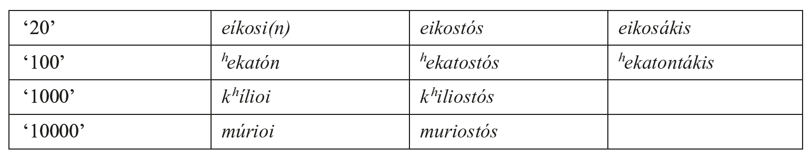

#### 3.2.1. On the forms

‘20’ a) *eíkosi*, Hom. *e(w)eíkosi* (**u̯īk̑m̥-ti*: Ved. *viṃśatí-*, Lat. *uīgintī*). b) *eikostós* (*e-* is prothetic), Boeot. *wikastos*. From ‘21’ on, a) *ʰeîs* (*mía*, *ʰén*) *kaì eíkosi*. b) *prôtos kaì eikostós* and so on.

Decads from ‘30’ to ‘90’ are built with *-kónta* (neut. pl. of **-dk̑omt-*, cf. Arm. -*sown*), and with secondary *-ḗ-konta*). Ordinals *-kostós* e.g. *triákonta* (Lat. *trīgintā*, Ved. *triṃśát*): *triakostós*, *tettarákonta* (Lat. *quadrāgintā*, Ved. *catvāriṃśát*): *tettarakostós* and so on.

‘100’: a) *ʰekatón* (PIE *k̑*m̥tóm*: Ved. *śatám*, Lat. *centum*); *ʰe-* instead of *ʰa-* (**sm̥*-) is analogic to **ʰen-* ‘1’. b) *ʰekatostós*. Further hundreds are built with *-ósioi*, ordin. *-osiostós*, e.g. ‘200’ *diākósioi*: *diākosiostós*, *triākósoi* and so on.

‘1,000’: a) *kʰílioi* [ī], from**g̑ ʰesl-i̯o-*: Lesb. *kʰéllioi*, cf. Ved. *sa-hásram* < **sm̥-g̑ʰeslom*), b) *kʰiliostós*. From ‘2,000’ on, *diskʰílioi*: *diskʰiliostós* and so on.

‘10,000’: a) *múrioi* [ū] (also ‘numberless’): b) *muriostós*. From ‘20,000’ on, *dismúrioi*: *dismuriostós* and so on.

## 4. Pronouns: demonstrative, relative, interrogative, indefinite

The pronouns reflect inherited PIE patterns in many respects: a) they are often enlarged by enclitic or deictic particles and have specific endings: *-0̸* instead of *-s* in nom. sg. masculine, *-d* in nom. acc. sg. of neuters, gen. sg. **-so*, gen.pl. **-sōm* in demonstratives. There is also suppletion **so-*/**to-* and **sā-*/**tā-* in demonstrative pronouns and alternation of *-i-* with *-o*/*e-* in relative and interrogative pronouns.

4.1. The system of demonstrative pronouns includes three main stems which reflect three different types of *deixis*, namely a) close proximity to the speaker (*hic*-deixis), b) to the addressee (*iste*-deixis) and c) reference to someone/something not present (*ille*-deixis), as well as d) an anaphoric. Their flexion follows basically the pattern of the *-o-*and *ā-*stems, with the exception of nom. sg. masc. and nom. sg. neuter:

a) Att. *ʰóde*, *ʰḗde*, *tóde* ‘this’ goes back to the outcomes of the inherited deictic **só*, **séh₂*, **tód* with addition of the particle *-de*. The unenlarged form survives as the definite article, which is still not fully developed in Homer (4.2). The creation of the article led to the recharacterization of the *hic*-demonstrative by means of particles, as attested by some dialects: *ʰo-ni* (Arc., Boeot.), *ʰo-nu* (Cypr.), *ʰo-ne* (Thess., probably equivalent to *ʰoûtos*).

b) Att. *ʰoûtos*, *ʰaútē*, *toûto* ‘that’ goes back to **so-*/**seh₂-*, with the addition of the particle *-u-* (cf. Ved. *a-sáu*) and adjectival *-to-*. An old reduplicated form is attested in Myc. *to-to* (**tod-tod*: Ved. *tát-tad*), OAtt. *toto*.

c) Att. *ekeînos*, *ekeínē*, *ekeînon* ‘that one’ is a conflation of deictic *-ke* (PIE *k̑*e*: Lat. *ec-ce*) and the stem **-e*/*ono-*, **-eneh₂-* (: ONors. *enn*, *inn*, Lith. *anàs* ‘that one’). Initial *e-*, which is absent in Lesb. *kênos* and Dor. *tênos* (with *t-* analogic to **-to-*forms), may be deictic (cf. Ved. *a-saú*) or simply prothetic.

d) Att. *autós*, *autḗ*, *autó* (**au̯-tó-*/*-téh₂*-, cf. *aû* ‘again’, Lat. *autem*) is originally anaphoric, having replaced IE **h₁ei̯-*/**h₁i-* (: Lat. *is*). It has two other functions, namely identity (*ʰo autòs patḗr* ‘the same father’ cf. Lat. *idem*) and strong emphasis (*ʰo patḕr autós* ‘the father himself’, cf. Lat. *ipse*). The last of these functions is frequent with reflexive pronouns, to which it is added (5.1−5.2). Old anaphoric forms are also acc. *min* ‘him, her’ (Myc. *mi*) probably from **im-im* (with secondary loss of *i-*), Cypr. *in* ‘id.’.

4.2. Homeric *ʰó*, *ʰḗ*, *tó* functions still as deictic, eventually as the article, e.g. *ʰo páïs* (*Il*. 6.467), but also as relative. The stem **so-*/**seh₂-*/**to-* has partially replaced the relative stem **Hi̯o-*/**Hi̯eh₂-* in Homer and in many other dialects (also in Literary Ionic). Cf. also Att. *ʰos*, exclusively in the phrase *ê d’ ʰós* ‘he said’.

The paradigm: Sg. nom. *ʰó* (: Ved. *sá*, *sáḥ*), acc. *tón* (: Ved. *tám*); neutr. nom. acc. *tó* (: Ved. *tád*); gen. *toû*, Hom. *toîo* (: Ved. *tásya*), dat. *tôi* (Myc. *to-me* /*tosmei*/? cf. Ved. *tásmai*, Goth. *Þamma*). Pl. nom. *ʰoí*, WGr. *toí* (: Ved. *té*, Goth. *þai*), acc. *toús* [*tọ̄s*] (**tóns*: Ved. *tā́n*, Goth. *þans*); neutr. nom. acc. *tá* (: Ved. *tā́ni*, Goth. *þō*); gen. *tôn*; dat. *toîsi* (cf. Ved. loc. *téṣu*), *toîs* (: Ved. instr. *táis*). Du. nom. acc. *tṓ* (: Ved. *táu*); gen. dat. *toîn*.

4.3. The relative pronoun *ʰós*, *ʰḗ*, *ʰó* goes back to IE **Hi̯o-*, fem. **Hi̯eh₂-* (Ved. *yá-*, fem. *yā́-*). Outside Attic it has been replaced by **so-*/*to-*, **sā-*/*tā-* except in nom. sg. masc. and fem.

4.4. The interrogative/indefinite pronouns are built on the suppletive stems **kᵘ̯i-* (Lat. *quis* and indefinite *ali-quis*, also relative *quī*; Hitt. *kuiš*) and **kᵘ̯o-* (Ved. *ká-* ‘who, which?’). The latter is only attested in the correlative series (4.7). Interrogative *tís*, neutr. *tí* ‘who?, which?’, ‘what?’ are accented, as against indefinite *tis*, *ti* (‘someone’, ‘something’), which are enclitic. With the exception of the nominative singular, the whole flexion is built on *tin-*, by reanalysis of acc. sg. **kᵘ̯i-n* from **kᵘ̯i-m* (: Lat. *quem*). A thematic stem is attested in gen. sg. *toû* / *tou* (Hom. *téo*, *teû*), dat. *tôi* / *tōi* (Hom. *téōi*) from **kᵘ̯éso*, dat. **kᵘ̯éōi̯*. Cf. also Hom. gen. pl. *téōn*, dat. pl. *téoisi*.

4.5. The relative indefinite Att. *ʰós tis*, *ʰḗ tis*, *ʰó ti* ‘whoever, whatever’ goes back to the combination of the relative with the indefinite stem **kᵘ̯i-*. In some dialects the relative stem is not inflected, e.g. Arc. *otis*, Lesb. *óttis* (**Hi̯od-kᵘ̯i-*). Hom. *ʰós te* ‘who/which’ (with addition of generalizing *te* < **kᵘ̯e*) is frequent in similes and general statements and has disappeared from common use in Classical Greek.

### 4.6. Paradigms in Attic

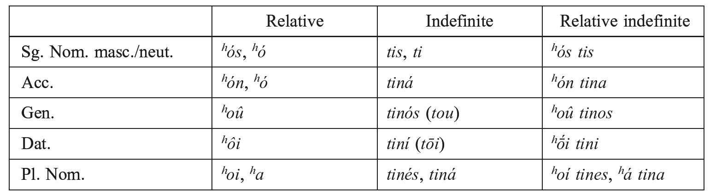

Additional forms also found for the nominative plural of the relative indefinite pronoun are *ʰátta*, Hom. *ʰássa* from **Hi̯ə₂ kᵘ̯*i̯ə₂.

4.7. Relative, interrogative/indefinite and demonstrative pronouns build correlative series. For example, *poîos* ‘of which type?’: *ʰopoîos* ‘of whatever type’: Hom. *toîos*, Att. *toioûtos* ‘of such type’ (**kᵘ̯osi̯o-*: **ʰokᵘ̯osi̯o-*: **tos-i̯o-* or **toi̯s-i̯o-*?); *pósos* ‘how much?’: *ʰopósos* ‘however much’: Hom. *tós(s)os*, Att. *tosoûtos* ‘so much’ (**kᵘ̯oti̯o-*: **ʰo-kᵘ̯oti̯o-*: **toti̯o-*, cf. Lat. *toti-dem* ‘so many times’). Cf. also the correlative series of adverbs with fossilized case endings (1.4).

## 5. Personal pronouns

Only the pronouns of first and second person have full paradigms. They are suppletive and contain two sets of forms, tonic and atonic (enclitic). The latter are not attested in the nominative and vocative. There is no specific pronoun of the third person: the stem **su̯e-*, attested in acc., gen., dat. sg., is actually reflexive. The stems of the personal pronouns are the basis of reflexive and possessive pronouns.

### 5.1. First person (Attic)

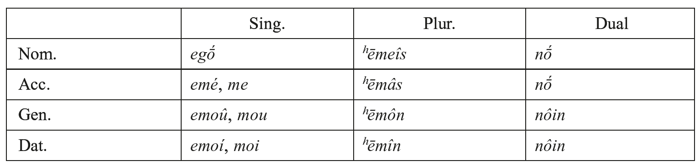

Reflexive: *em-autón*, gen. *-oû*, dat. *-ôi*. In plural both pronouns are inflected, cf. acc. *ʰēmâs autoús*, gen. *ʰēmôn autôn*, dat. *ʰēmîn autoîs*. Cf. also Ion. *emeōutón*, *-oû*, etc.

Possessive: *emós*, pl. *ʰēméteros* (also Hom. acc. *ʰāmón*), du. *nōḯteros*.

On the case forms:

Singular: Nom. *egṓ* (PIE **[h₁]eg̑ oh₂-*: Lat. *egō*; **[h₁]eg̑h₂-óm*: Ved. *ahám*, Av. *azəm*, Goth. *ik*), also Hom. *egṓn*, with *-ō-* analogical to *egṓ*. Acc. *emé* with *e-* of obscure origin. (PIE **mē*: Ved. *mā́m*, OLat. *mē-d*); enclit. *me* (PIE **me*: Goth. *mi-k*). Gen. *emoû*: **emé-so* (Hom. *eméo*, *emeû*). Other forms: Dor. *emé-os*, Hom. *emétʰen*, also *emeîo* (**-é-si̯o*?); enclit. Att. *mou*, Hom. *meu* (**me-so*). Dat. *emoí*, Lit. Dor. *emín*; enclit. *moi* (PIE **moi̯*: Ved. *me*, Av. *mōi*, *mē*).

Plural: The aspiration of the stem **ʰāme-* (from **amme-*, the regular outcome of **n̥s-me-*) may be analogical to that of 2. pl. *ʰūme* (from **ʰumme-* < **Hi̯usme-*). In Attic the forms have been recharacterized by the addition of nominal endings, nom. *-es*, acc. *-as*, gen. *-ōn*. Nom. Att. *ʰēmeîs* (**ʰammé*+*es*: PGr. **n̥s-me*: Hom. Lesb. *ámmes*, Dor. *ʰāmé*). Acc. *ʰēmâs* (**ʰammé* +*as*: Hom. *ʰēméas*, PGr **n̥s-mé*: Hom. Lesb. *ámme* [: OAv. *ǝ̄hmā*]). Gen. *ʰēmôn* (**ʰammé*+*ōn*, PGr. **n̥smé-ōn*: Hom. *ʰēméōn* [disyllabic], Lesb. *amméōn*, Dor. *ʰāméōn*). Dat. *ʰēmîn* (*ī*!) from PGr. **n̥s-mi(n)*: Hom. Lesb. *ámmi(n)*, Dor. *ʰāmín*, *ʰāmîn*. Dual: Nom.acc. *nṓ* (cf. Av. *nā*), Hom. *nôï*; gen. dat. *-ōin*, Hom. *-ôïn* probably analogical to pl. *ʰēmín* (Hom. *ámmin*).

### 5.2. Second person (Attic)

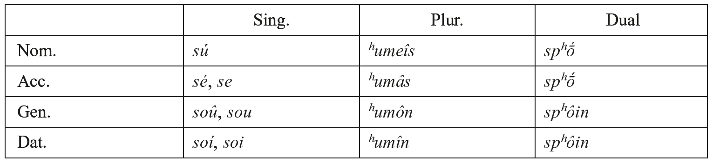

Reflexive: *se-autón*, *se-autoû*, *se-autôi* (whence *sautón*, *sautoû*, *sautôi*), pl. acc. *ʰumâs autoús*, gen. *ʰumôn autôn*, dat. *ʰumîn autoîs*. Cf. also Ion. *ʰseōutón*, *-oû*, etc.

Possessive: *sós* (**tu̯o-*: Av. *θuuǝ̄*), Hom. *teós* (OLat. *tuos*, Class. *tuus*), pl. *ʰuméteros* (also Hom. Dor. *ʰumós*, Lesb. *úmmos*), du. *spʰōíteros*.

On the case forms:

Singular: Nom. *sú*, WGr. *tú* (PIE **túH*: Lat. *tu*, Av. *tū*). Acc. *sé*, Cret. *twe* (**tu̯é*, cf. Ved. *tvā́m* = Av. *θβąm*, with addition of the particle **-om*). Gen. Att. *soû* (**tu̯é-so*: Hom. *séo*, *seîo*, *seû*), also Hom. Lesb. *sétʰen*; Dor. *téos*, *teûs* (**téu̯-o*) Enclit. *sou*, Hom. *seu*, Lit. Dor. *teos*. Dat. Att. *soí* (**tu̯oi̯*), and *toí* remodelled from encl. **toi̯* (Hom. *toi*: Ved. *te*, av. *tōi*, *tē*). Other forms: Hom. *teḯn*, Lit.Dor. *tín*.

Plural: Nom. *ʰūmeîs* (PGr. **Hi̯us-mé-*: Hom. Lesb. *úmmes*, Dor. *ʰūmé*). Acc. *ʰūmâs* (**i̯ummé*+*as*: Hom. *ʰūméas*), PGr. **Hi̯us-mé*-: Hom. Lesb. *úmme*. Gen. *ʰūmôn* < **ʰummé-ōn* (**Hi̯usme-*): Hom. *ʰūméōn*, *ʰūmeíōn* (disyllabic), Lesb. *umméōn*. Dat. *ʰūmîn* (*ī*!) PGr **Hi̯us-mi(n)*: Hom. Lesb. *úmmi(n)*, Dor. *ʰūmín*, *ʰūmîn*.

Dual Nom. acc. *spʰṓ* (Hom. *spʰôï*), gen. dat. *spʰōin*, Hom. *spʰôïn* (like *nôï*, cf. 5.1 [end]).

5.3. The third person may be expressed by means of the anaphoric *autós* (also acc. sg. *min* cf. 4.1.d). The current form is a former reflexive pronoun: acc. *ʰe* (**su̯e*: Pamph. <*whe*>), gen. *ʰoû* (Hom. *ʰéo*, *ʰeû*, *ʰeîo*, also *ʰétʰen*), dat. *ʰoî* (**su̯oi*).

The plural stem is built on **spʰe-*/**spʰi-*: Att. *spʰâs*, gen. *spʰôn* (Hom. *spʰéas*, *spʰéōn*), dat. Att. Hom. *spʰísi(n)*, Hom. *spʰin*. Other forms: Myc. *pe-i* /*spʰeʰi*/, Arc. *spʰeis* as well as *spʰesin*.

Dual: Hom. nom. voc. acc. *spʰôe* (*-e* probably analogical to *ámme*: *ámmin*), gen. dat. *spʰôïn*.

Reflexive: *ʰe*-*autón*, gen. *-oû*, dat. *-ôi*, Ion. *ʰeōutón*, *-oû* and so on.

Possessive: 3ʳᵈ Pers. Hom. *ʰeó-s* (**seu̯ó-*: OLat. *souo-s* > *suu-s*, Av. *hauuō*), *ʰós* (**su̯o-*: Ved. *svá-*), pl. *spʰéteros*, du. Hom. *spʰōḯteros*.

## 6. Verbal system

The verbal system of Greek is fairly conservative and reflects the inflectional categories of PIE in many respects.

Person and number (singular, plural, dual) are expressed by means of personal endings. Within the voice system, the opposition active/middle, expressed by two sets of endings, basically reflects the PIE situation. The passive voice is specifically marked only in the aorist and future stems.

Aspect is based on the opposition of three aspectual (often incorrectly called “temporal”) stems, namely present, aorist, and perfect. The category tense consists of a threefold opposition: present, past, future. Within the aspectual stems present and perfect, the temporal opposition is expressed by means of endings (primary in present and future / secondary in the past tenses, imperfect, pluperfect). The aorist stem shows only secondary endings. Indicative past tenses are marked in Classical Greek by means of the augment.

There are four moods: indicative, subjunctive, optative (the latter two with specific suffixes), imperative (with special endings). The paradigm includes old forms of the injunctive (indifferent to tense: augmentless forms with secondary endings), which is most probably still alive in Mycenaean.

The verb has nominal forms, namely infinitives, participles (in all stems), as well as verbal adjectives.

6.1. The aspectual system is based on an opposition present /+*Verlaufschau*/ (imperfective) vs. aorist /-*Verlaufschau*/ (perfective): the last has two functions, *punctual* and *complexive* (i.e. indifferent to the opposition). With non-telic lexemes, the aorist is realized as [initive], with telic lexemes as [finitive]. This is evident, on the one hand, in the case of the non-telic lexeme in impf. *ebasíleue* ‘was king’ (for a while) vs. aor. *ebasíleuse* ‘began to be king’ (initive) and ‘was king’ (bare preterite). On the other hand, cf. the telic lexeme in impf. *épʰeuge* ‘was fleeing’ vs. aor. *épʰuge* ‘escaped’. Both stems stand in opposition to the perfect, which is /postterminative/, whence mostly *stative* (with telic lexemes, e.g. *pépʰeuge* ‘is safe’), but also *intensive* or “anomalous” with non-telic lexemes (e.g. *kékrage* [ā] ‘shouts’). Beginning with Classical times, the perfect may be used as a preterite tense, namely as an alternative to the aorist.

6.1.1. Some lexemes are defective, e.g. *eimí* ‘I am’, *eîmi* ‘I go’ (no aorist), aor. Hom. *étlēn* ‘I endured’ (no present), Hom. *elégmēn* ‘I lay down’ (cf. *keîmai* ‘lie’).

Suppletion is well attested, e.g. *ʰoráō*: *eîdon*:: *ʰeṓraka* ‘see’, *bʰérō*: *ḗnenkon* ‘bear, endure’ (: *enḗnokha*). In the case of ‘say’ three different lexemes are involved, cf. *légō*: *erô*: *eîpon*: *eírēka*. The same applies for ‘go’: Att. *érkʰomai*: *eîmi* (but Hom. *eleúsomai*): *êltʰon*: *elḗlutʰa* (Hom. *elḗloutʰa*). Some lexemes which have a full paradigm in Classical times are in Homer still defective and may stand in suppletion, e.g. Att. *ʰélkō*: *ʰélkusa-* ‘drag’, but Hom. *ʰélkō* (and *erúō*): *erusa-*. Some of the suppletive pairs may be inherited, e.g. *bʰérō*: *ḗnenkon* in view of OAv. *bar*: *nas* ‘id.’, OIr. *berid*: *ro · uc(ca)i* ‘id.’

6.1.2. The derivative category *actionality* (*Aktionsart*) may be recognized only in some reduplicated presents (e.g. *ískʰō* ‘I hold (strongly)’ vs. *ékʰō* ‘I hold’, *pampʰaínei* ‘shines brightly’), in the iterative type *orkʰéomai* ‘I dance’ vs. *érkʰomai*, and in the factitive types in /*-ō-*/ of the sorts *neō*- ‘make new’ and *stepʰanō*- ‘crown’ (6.3.2.b, 6.3.3.a, 6.3.3.b, 6.3.3.c).

6.2. The augment is a prefix **é-* which occurs in the past tenses of the indicative in Classical Greek (also in the “gnomic” aorist) as a rule: *épʰeron* ‘I was carrying’ (: Ved. *ábharam*), *égnōn* ‘I knew’. In Homer its presence is mainly conditioned by metrical considerations and by the internal rules of *Wortumfang*; it is totally lacking in the so-called iteratives (type *kalésketo*). In Mycenaean it is not attested, with two exceptions: *a-pe-do-ke* /*ap-edōke*/ ‘he paid’ and *a-pe-e-ke* /*ap-eʰēke*/ ‘he sent’ as against regular *a-pu-do-ke* /*apu-dōke*/ (1x), *do-ke*, *a-pi-e-ke* /*ampʰi-ʰēke*/). The augmentless (injunctive) forms have a “memorative” function. This fits into the nature of Linear B tablets, where the essential is the bare statement of facts. Some formal devices:

a) If the verb has an initial vowel, this is lengthened, cf. e.g. *êgon* ‘I was leading’ (PGr. **ā́gom*: PIE **é-h₂eg̑ -*), *ḗgeira* ‘I awoke’ (PGr. **ḗgersa*: PIE **é-h₁g̑er-*), *ōrnúmēn* ‘I was raising up’ (PGr. **ōrnu-*: PIE **é-h₃rnu-*). The lengthening in the last two cases goes back to the contraction of *é-* with the initial laryngeal of the root.

b) If the verb has initial **s-*, **i̯-*, or **u̯-* the augment undergoes contraction: *ʰeipómēn* ‘I was following’ from **é-sekᵘ̯-o-*, *eirgazómēn* ‘I was working’ from **é-u̯erg-o-* (in both cases <*ei*>: [ẹ̄] from *-ee-*). In a case like *érrei* ‘it was flowing’ from **é-sreu̯-e* (Hom. *érree*), the augment has provided an environment for assimilatory germination of root-initial **sr-*.

c) In verbs with initial **u̯-*, the augment may be **ē-*, e.g. *ʰeṓrōn* ‘I saw’ from **ē-u̯órā-om* (cf. Lat. *uereor* ‘I respect’). Secondary *ē-* is found also in Att. *ēboulómēn* ‘I wanted’, *ḗmellon* ‘I was about (to)’.

6.2.1. Reduplication, irrespective of its being the mark of an aspectual stem or of actionality, shows two types which are common to all stems:

a) Syllabic, i.e. repetition of the first consonant (type *CV-CVC*-: pres. *Ci-CVC-*, perf. *Ce-CVC*-, also aor. *Ce-CC*-): pres. *dí-dōmi* ‘I give’, Myc. *di-do-si* /*didonsi*/ besides perf. *dé-dōka*, aor. *pe-pitʰeîn* ‘to convince’ besides perf. *pé-peika* and medpass. *pépeismai*.

Roots with initial vowel have lengthening of the vowel in lieu of reduplication, e.g. perf. *ḗgmai* (: *ágō* ‘I lead’), *ḗlpika* (: *elpízō* ‘I hope’).

The syllabic reduplication may become unrecognizable in lexemes with initial **(H)i̯-*,**u̯-*, and **s*, cf. perf. *ʰeîka* from perf. **i̯e-i̯ē-* beside pres. *ʰíēmi* ‘I send’, Myc. 3ʳᵈ pl. *i-je-si* /*ʰiʰensi*/ with secondary *e-*vocalism of the root (**i̯i-i̯ē-*, actually **Hi̯i-Hi̯eh₁-*, cf. Att. *ʰíēmi* [ī]) or perf. *eírēka* ‘I have said’ (**u̯e-u̯rē-*), and *eílēpʰa* ‘I have taken’ (PGr. **se-slāb-*), where <ei> designates [ẹ̄] from the first compensatory lengthening.

b) Full reduplication, i.e. repetition of the lexeme, e.g. aor. *agageîn* (: pres. *ágō*), Hom. pres. *pampʰaínei* ‘shines’.

On specific reduplication types in the perfect stem, cf. 6.6.1.

6.3. The different present and aorist stems mostly reflect PIE inherited formations, which are fully integrated into the aspectual system either as *the* present or as *the* aorist: in this case, their original *Aktionsart* is not recognizable.

6.3.1. Athematic present stems:

a) root presents (type *CéC-ti*/*CC-énti*): Att. *eimí* ‘I am’ *estí*, 3pl. *eisí* (Myc. *e-e-si* /*eʰ- ens*i/ (PIE **h₁ésmi*/**h₁s-énti*: Hitt. *ēšzi* [-tˢi]/*ašanzi*, Ved. *ásti*/*sánti*); *pʰēmí* ‘I say’, 3pl. *pʰasí* (Myc. *pa-si* /*pʰāsi*/ ‘says’); middle *keîmai* ‘I lie’, 3sg. *keîtai* (*k̑*éi̯[t]o[i]*: Hitt. *kitta[ri]*, Ved. *śáye*), 3.pl. *keîntai* (but Hom. *kéatai*) from *k̑*éi̯-n̥toi*.

b) reduplicated presents (type *Ci-CéC-ti*/*Ci-CC-énti*): *títʰēmi* ‘I put’, 1pl. *títʰemen*, middle *títʰemai* (PIE **dʰí-dʰ*éh₁-/**dʰi-dʰə₁-ˊ*); *dídōmi* ‘I give’, 1pl. *dídomen*, middle *dídomai*, Myc. *di-do-si* /*didonsi*/, middle *di-do-to* /*didotoi*/ (PIE **di-déh₃-*/**di-də₃-ˊ*); *ʰístēmi*, 1pl. *ʰístamen* ‘make stand’, middle *ʰístamai* ‘I stand up’ (**si-stéh₂-*/**si- stə₂-ˊ*).

c) *-n-*infix presents (type *CC-né-H-ti*/*CC-n-H-énti*): Hom. *dámnēmi* ‘I subdue’, 1ˢᵗ pl. *dámnamen* (**dm̥-né-h₂-*/**dm̥-ń-h₂-*), whence Att. *damázō*; (*ap*)*óllumi* [ū] ‘I kill’ (**ol-nū*/*u-* remodeled from **h₃l̥-né-h₁-mi*/**h₃l̥-n-h₁-mé-*); *stórnumi* [ū] ‘I spread, extend’ (**str̥-nū*/*u-* remodeled from **str̥-né-h₃-ti* (: Ved. *str̥ṇā́ti*/*str̥ṇīmáḥ*), whence Att. *storénnumi* ‘id.’, created on aor. *stores(a)-*.

The *-nū-*/*-nu-*ablaut (instead of **-neu-*/*-nu-*) is a Greek innovation on the model of *-ē-*/*-ĕ-*, *-ā-*/*-ǎ-*, *-ō-*/*-ŏ-*. Gr. *-nū-*/*-nu-* may continue either inherited **-néH-*/*-nH-*(more specifically, **-néh₃-*/*-nh₃-*) or **-néu̯-*/*-nu-* (Ved. *str̥ṇóti*/*str̥ṇumás* ‘lay low’).

d) Suffix *-nū-*/*-nu-* (type *CC-néu̯-ti*/*CC-nu̯-énti*): *órnumi* ‘I rouse’ (**Hr̥-néu̯-*: Hitt. *arnu-ᵐⁱ* ‘stir’, ‘transport’, causative to *ār*-*ḫḫⁱ* ‘arrive’, also *arnušk-*): Ved. *r̥ṇóti* ‘raises up’. Also with secondary full grade of the root, cf. *deíknumi* ‘I show’. Other presents go back to secondary thematization, e.g. *tínō* ‘I pay’ (**kᵘ̯i-n-u̯o*/*e-*), *pʰtʰínō* ‘I perish’ (**dʰgᵘ̯ʰi-n-u̯o*/*e-*).

e) A survival of *-o-*grade presents (type Lat. *molō* ‘I grind’) may be Hom. *óromai* ‘I see’.

6.3.2. Thematic present stems (some of them originally athematic):

a) root presents (type *CéC-o*/*e-*): *pʰérō* ‘I bear, take’, Myc. *pe-re* /*pʰerei*/ (**bʰér-o*/*e-*: Ved. *bhárati*), Hom. *démō* ‘I build’ (**démH-o*/*e-*: Luv. *tama-ᵐⁱ* ‘id.’), *ágō* ‘I lead’, Myc. *a-ke* /*agei*/ (: **h₂ég̑ -o*/*e-*), *ékʰō* ‘I keep, hold’, Myc. *e-ke* /*⁽ʰ⁾ekʰei*/ (PIE **ség̑ʰ-o*/*e-* ‘hold, overcome’), 3ʳᵈ pl. *e-ko-si* /*⁽ʰ⁾ekʰonsi*/ (: Att. *ékʰousi*), *eúkʰomai* ‘I declare emphatically’ (Myc. *e-u-ke-to* /*eukʰetoi*/) (PIE **h₁eu̯gᵘ̯ʰ*-: Ved. *óhate*).

b) reduplicated (type *Cí-CC-o*/*e-*): *ʰízdō* ‘I sit down’ (PIE **si-sd-o*/*e-*: Ved. *sī́dati*, Lat. *sīdō*), *gígnomai* ‘I become’, *tíktō* ‘I beget’. Some of these may express intensive *Aktionsart* as against the non-reduplicated present: *mímnō* ‘I stand, resist’ (PIE **mi-mn-o*/*e-*: Hitt. *mimma-ḫḫⁱ* ‘reject’, CLuv. *mimma-ḫḫⁱ* ‘respect’) vs. *ménō* ‘I remain’, *ískʰō* ‘I hold strongly’ vs. *ékʰō*.

c) *-n-*suffix presents: *opʰeílō*, *opʰéllō* ‘I owe’, Myc. *o-pe-ro-si* /*opʰellonsi*/ (PIE **h₃bʰel-n-o*/e-). There is a variant of -*n*-infixed presents enlarged by *-ano*/*e-*, cf. *ma-n-tʰ-áno*/*e-* ‘learn’, *pu-n-tʰ-ánomai* ‘I inquire’ (PIE **bʰeu̯dʰ-*, cf. Ved. *bódhate*).

d) *-sko*/*e-*presents (type *CC-sk̑ó*/*é-*): *érkʰomai* ‘I go’ (**h₁r̥-sk̑ó*/*é-*, PIE **h₁er-* ‘arrive’: Hitt. *arški-ᵐⁱ* ‘arrives’, Ved. *r̥cháti*), *gignṓskō* ‘I know’. Characteristic of Homeric and Ionic are the augmentless -*sko*/*e*- preterites, which are mostly iteratives (e.g. *kalésketo* ‘called repeatedly’, *ídeske* ‘used to see’), but not always (e.g. *éske* ‘was’). They have close parallels in Hittite -*šk*-verbs, although their functions are not identical.

e) Primary **-i̯o*/*e-* presents, with zero grade (type *CC-i̯ó*/*é-*) or full grade (*CéC-i̯o*/*e**-***) of the root. Their form depends on the phonetic outcome of the final consonant of the lexeme in contact with **-i̯o*/*e-*. Type *CC-i̯ó*/*é-*: *baínō* ‘I come’ (**gᵘ̯m̥-i̯o*/*e-*: Lat. *ueniō*), *ʰállomai* ‘I jump’ (**sl̥-i̯o*/*e-*: Lat. *saliō*), *maíomai* ‘I inquire’ (**mn̥s-i̯o*/*e-*), *bláptō* ‘I hinder’ (**mlab-i̯o*/*e-*, cf. *blábē* ‘wound’ remodeled from **ml̥kᵘ̯-i̯o*/*e-*: Ved.*mr̥cyá-*), *nízdō* ‘I wash’ (**nigᵘ̯-i̯o*/*e*), *kaíō* ‘I light, burn’ (**kau̯-i̯o*/*e-*). Type *CéC-i̯o*/*e-*: *tʰeínō* ‘I strike, kill’ (**gᵘ̯ʰén-i̯o*/*e-*, remodeled from **gᵘ̯ʰén-ti* / **gᵘ̯ʰn-énti*: Ved. *hánti*/*ghnánti*), *ageírō* ‘I collect’ (Myc. *a-ke-re* /*agerrei*/), *kléptō* ‘I steal’ (**klép-i̯o*/ *e-*, Goth. *hlifan*), *eréttō* ‘I row’ (**eret-* secondary root vs. PIE **h₁erh₁-*), *ʰázomai* ‘I revere’ (**Hi̯ag̑-i̯o*/*e-*, cf. Ved. *yáj-a-*).

f) Denominatives in **-i̯o*/*e-*, with phonetic outcomes like in (e): *timáō* ‘I honour’ (: *timā́*, **tīmāi̯o*/*e-*), *pʰiléō* ‘I love’ (*pʰílos* ‘friend’, **pʰilé-i̯o*/*e-*), *ōnéomai* ‘I buy’ (: *ônos* ‘price’, cf. Ved. *vasna-yá-*: *vasná-* ‘price’), *onomaínō* ‘I name’ (*ónoma*, **onomn̥-i̯o*/ *e-*, cf. Hitt. *lamnii̯a-*); *teléō* ‘I complete’ (: *télos* ʼendʼ, **teles-i̯o*/*e-*: Hom. *teleíō*), *elpízō* ‘I hope’ (**elpi-d-i̯o*/*e-*), *pʰuláttō* ‘I guard’ (: *pʰúlaks* ‘guardian’), *basileúō* ‘I rule’ (: *basileús* ‘king’, **gʷasil-ēu̯-i̯o*/*e-*, Myc. part. *qa-si*]-*re-wi-jo-te*?: Att. -*eúo*/*e-*is analogical to aor. -*eusa-*, the regular outcome of **-eu̯i̯o*/*e-* being -*eío*/*e-*, still attested in Elean).

N.B. The denominative *verba vocalia* are attested as athematic (types *tímāmi*, *pʰílēmi*) in Mycenaean − *te-re-ja* /*teleiā*/ ‘performs the /*teleiā*/’ (the function of a *te-re-ta*, inf. *te-re-ja-e* /*teleiāʰen*/), *po-ne-to* /*ponētoi*/ ‘works’ (: Att. *poneîtai*) − as well as in Arcadian and Cyprian, and (with generalization of the lengthened grade, the so-called “Aeolic” inflection) in Thessalian, and partly in Lesbian.

N.B. *-ázo*/*e* and *-ízo*/*e-* become very productive and are extended to all types of stems: *ergázomai* ‘I work’ (: *érga*), *atimázō* ‘I dishonour’ (: *átimos*), *kʰarízomai* ‘I favour’ (: *kʰáris*), *oneidízō* ‘I blame’ (: *óneidos*).

g) -*éi̯o*/*e-* presents with different grades of the root. Type *CC-éi̯o*/*e-*: *ktáomai ktômai* ‘I get’ (if from **tkh₂-éi̯o*/*e-*), *spáō* ‘I draw’ (**sph₂-éi̯o*/*e-*).

h) Other present stems are mostly Greek creations: *-ko*/*e-* (Att. *diṓkō* ‘I pursue’, cf. Hom. *díemai* ‘I run, flee’), *-kʰo*/*e-* (*nḗkʰō* ‘I swim’ besides *náō* ‘id.’).

6.3.3. Some present formations are more or less clearly associated with actionality patterns:

a) The type *CoC-éi̯o*/*e-* is iterative-intensive (e.g. *orkʰéomai* ‘I dance’ vs. *érkʰomai*) or causative (*pʰobéō* ‘I terrify’ vs. *pʰébomai* ‘I flee’: PIE **bʰegᵘ̯*-: OLit. *be˙́gmi* ‘I flee’). Cf. also with lengthened grade of the root in *pōtáomai*, a variant of *potéomai* ‘I flutter’ vs. *pétomai* ‘I fly’.

b) Presents in *-óō* (first attested in Classical Greek) from **-ō-i̯o*/*e-*, besides aor. *-ō-sa-*(Hom.+), include two types of factitives in /*-ō-*/: (i) deadjectival, of the type *neóō* ‘I make new’ (: *néos*), a remodeling of *neáō*, cf. Hitt. *neu̯aḫḫ-ᵐⁱ*, Lat. *nouāre* from **neu̯eh₂-i̯o*/*e-*, *eleutʰeróō* ‘I make free’ (ii) denominal, of the type *stepʰanóō* ‘I crown’ (*-*oh₁-i̯o*/*e-*) *‘provide/endow with a crown’).

c) Full reduplicated presents are intensive, e.g. Hom. *pampʰaínei* ‘shines brightly’.

d) Presents in -*éō* of the type *rʰīgéo*/*e-* ‘shiver with cold’ (**srīg-ē-i̯o*/*e-*: Lat. *rigēre*) are stative (PIE **-ē-* from instr. *-eh₁-*).

e) Some *-tʰo*/*e-*present stems seem to have also a stative function, e.g. Hom. *plētʰo*/*e-*‘be full’ vs. impf. *epímplato* ‘was becoming full’, aor. *éplēto*, *eplḗstʰē* ‘became full’.

6.4. Aorist stems:

a) Athematic: The inherited type *CéC-t*/*CC-ént*, mid. *CC-tó* is recognizable in Hom. *ôrto* ‘stirred up’ (: **(é)h₃r-to*: Ved. *ā́rta*), Myc. *qi-ri-ja-to* /*kʷriato*/ ‘bought’ (: Hom. *príato*): PIE **kᵘ̯*rii̯ə₂- (Toch. B pret. *käryā*-). It is continued by the obscure *k-*aoristsof the type *étʰēke*, Boeot. *anétʰē* (**dʰéh₁-t* ‘put’), 1pl. *étʰemen*, 3pl. Dor. *étʰen* (**dʰeh₁-*, cf. Hitt. *tēzzi* ‘says’, Lat. *fēcī*), *édōke* ‘gave’, Myc.*(apu-)do-ke* /*(apu)dōke*/ (**déh₃-t*: Ved. *ádāt*). The full grade is inherited also in 1/2pl. in some verbs, e.g. *ébēn* ‘I came’, 1pl. *ébēmen*, 3pl. *ébēsan*, Hom. *éban* (**é-gᵘ̯eh₂-*, 1pl. *é-gᵘ̯eh₂-me*, 3pl. **é-gᵘ̯h₂-ent*: Ved. *ágām*, 1pl. *agāma*, 2pl. *agāta*, 3pl. *agur* ← **-ent*).

b) Thematic: *ḗlutʰe* ‘went’ (PIE **h₁ludʰ-é-t*: OIr. *luid*, Toch.B *lac*); *élipe* ‘left’ (**likᵘ̯-é-t*, Arm. *elikʽ*); *eîde* ‘saw’, Myc. *wi-de* /*wide*/, Hom. *íde* (**u̯id-ó*/*é-*: Ved. *ávidat*, Arm. *egit*); *egéneto*, Myc. *pa-ro-ke-ne-[to]* /*paro-geneto*/ ‘presented himself’, Hom. *géneto*.

c) Sigmatic, with regularized *-sa-*, extended to the whole paradigm from 1sg. *-sa-*(**-sm̥-*), except for 3sg. *-se*, and different regular(ized) grades of the root.

The inherited *-s-*aorist originally had lengthened grade (*Cḗ[R]C*) throughout the active paradigm but in Greek shows normal grade like the present. This perhaps began with CeRC roots, where Osthoff’s Law would regularly have shortened the long vowel of the root, e.g. *(é)deiksa* ‘I showed’ (from **dēi̯k-s-*: Av. *dāiš*, Lat. *dīxī*); *edeksámēn* ‘I received’, Myc. *de-ka-sa-to* /*deksato*/ (PIE **dek̑*-, cf. Ved. *dāś* ‘revere’). By analogy with *-C-sa-* intervocalic *-s-* is not dropped, cf. *élusa* [ū] ‘I solved’ (: *lúō*); *ēleuthérōsa* ‘I made free’, Myc. *e-re-u-te-ro-se*, also in roots *ultimae laryngalis*, e.g. *ekálesa* ‘I called’, Hom. *kalessa-* (← PIE **kl̥ēh₁-s-*: Hitt. *kalēšš-ᵐⁱ*?); *edámasa* ‘I tamed’, Hom. *damassa-* (← **demh₂-s-*, cf. Hitt. *damešš-ᵐⁱ*), *estóresa* ‘I spread out’ (**store-* by metathesis of **stero-*: PIE **sterh₃-*). In some cases *-s-* has been dropped (and not reintroduced analogically), e.g. Hom. *ékʰeua* ‘I poured’ from **ég̑ʰeu̯-s-m̥*.

With lexemes ending in a resonant, *-R-s-* has given rise to asigmatic forms, with regular lengthening of *-e-* before *-rs-* or *-ls-*. e.g. *ḗgeira* ‘I woke up’, *ḗggeila* ‘I sent’ (**egersa*, **angelsa*, both with <*ei*> = [ẹ̄]), Myc. part. *a-ke-ra₂-te* /*agerrantes*/ ‘having collected’ (: Att. *aggeírantes*) or /*agellantes*/ ‘having sent’ (: Αtt. *aggeílantes*), *émeina* ‘I remained’ (**men-sa*).

d) Reduplicated (type *Cé-CC-e*/*o-*): Att. *eîpe* ‘said’, Hom. *éeipe* (**[é]u̯e-u̯kᵘ̯-e-t*: Ved. *ávocat*); other forms have been created within Greek, e. g. Att. *ḗgage* ‘led’.

e) The so-called “alpha-thematic” *-a-*aorist (type *eîpa*, *ḗneika* vs. *eîpon*, *ḗnegkon*) goes back to the generalization of 1sg. *-a* from **-C-m̥*.

f) The so-called “passive” aorist with -*ē*-, -*tʰē*-, originally with zero-grade of the root, has active secondary endings. It expresses originally the inception of a state: *emánēn* ‘I went mad’ (**mn̥-eh₁-*: Lit. *mine˙́ti*, OCS *mьněti* ‘think’), *ekhárē* ‘became glad’ beside pres. *maínomai* ‘I rage’, *kʰaírō* ‘I rejoice’. The suffix *-ē-* (**-eh₁-*) is attested in other languages as stative, also as inchoative in the conflational forms **-ē-s-* (Hitt. *lukkešš-ᵐⁱ* ‘become light’), **-ē-sk̑-* (Lat. *lucēscō*). The allomorph -*tʰē*-, whatever may be its origin, is attested mostly in verbs ending in a vowel, probably to avoid hiatus, e.g. *elútʰē* ‘was solved’, *epʰilḗtʰē* ‘was beloved’. Both morphemes may coexist, e.g. *emígē* and *emíkʰtʰē* ‘got in contact’.

6.5. Future stems:

a) -*s*-future (type *CéC-s-o*/*e-*, secondarily *CVC-s-o*/*e-*): *lúsō* ‘I shall solve’, *dṓsō* ‘I shall give’ (Myc. *do-se* /*dōsei*/, pl. *do-so-si* /*dōsonsi*/), *stepʰanṓsō* ‘I shall crown’, *deíksō* ‘I shall show’, Hom. *ópsomai* ‘I shall see’ (**h₃ékᵘ̯-s-o*/*e-*), *déksetai* ‘will accept’. As in the case of the aorist (6.4.c), between vowels *-s-* remains intact by analogy with *-C-s-o*/*e-* (*deík-s-o*/*e-*). In lexemes with final laryngeal, however, -*s-* is dropped and gives rise to the so-called “Attic” contracted future: *erô*, Hom. *(u̯)eréō* ‘I shall speak’ (**u̯érh₁-s-o*/*e-*), *teméō* ‘I shall cutʼ (**témh₁-s-o*/*e-*), *elô* ‘I shall drive’ from *eláō* (**h₁elh₂-s-o*/*e-*), *ap-olô* ‘I shall kill’ (**h₃elh₁-s-o*/*e-*), *omoûmai* ‘I shall swear’ (**h₃omh₃-s-o*/*e-*). The -*s*-future may go back to a desiderative (OLat. *faxō*) and/or to former subjunctives to *-s-*aorists.

b) “Attic” future with verbs in liquid or nasal (type Att. *agerô* ‘I shall collect’ *aggelô* ‘I shall send’, *menô* ‘I shall remain’, from **ager-és-o*/*e-*,**angel-és-o*/*e-*, **men-éso*/*e-*) is due to analogical extension, or goes back to a morpheme **-es-* extended from**-h₁-s-*. Such extension is obvious in the case of the presents in *-ízo*/*e-*, cf. fut. *nomiô* ‘I shall consider’ (: *nomízō*).

c) “Doric” future in *-séo*/*e-*: *dōséō*, Cret. *deikséō*, as well as Hom. *esseîtai* (also Attic, always middle). This is connected with a former PIE desiderative in **-s(i̯)o*/*e-* (e.g. **deh₃-si̯é-ti*: Ved. *dāsyáti*, Lit. *dúosiu*, 3sg. *duõs*).

d) Some futures go back to PIE athematic subjunctives (suffix **-o*/*e-*): *ésomai* ‘I shall be’ 3pl. *ésontai*, Myc. *e-so-to* /*es(s)ontoi*/ (PIE **h₁és-o*/*e* -: Ved. *ás-a-t[i]*, Lat. *erit*), Hom. *édomai* ‘I shall eat’ (**h₁éd-o*/*e-*: Ved. *ádat[i]*).

e) Passive: like the corresponding aorist (6.4.f), but with medial primary endings, i.e. *manḗ-s-o-mai*, *lutʰḗ-s-o-mai*.

6.6. The perfect stem has reduplication, except in the case of *oîda* ‘I know’/*ídmen*, the resultative perfect of *eîdon* ‘I saw’ (PIE **u̯ói̯d-h₂e*/**u̯id-mé*: Ved. *véda*/*vidmá*) and a characteristic set of endings (cf. 6.8.3). Perfect formations include the following:

a) with *CoC-*/*CC-* ablaut (subjunctive *CeC-*): *pépoitʰa* / *pépitʰmen* ‘trust’, Hom. *mémona*, but impv. 3sg. *memátō* (**me-mn̥-tōd*: Lat. *mementō*). Most of the verbs show a regularized ablaut grade, cf. Att. *pépontʰa* ‘I have suffered’, pl. *pepóntʰamen*, *pepóntʰate* (: Hom. *pépastʰe*); *pépʰeuga* ‘I am safe’, pl. *pepʰeúgamen* (Hom. part. *pepʰugménos*); and, with zero-grade, *elḗlutʰa* ‘I have gone’ (Hom. *eilḗloutʰa*), pl. *elēlútʰamen*.

b) -*ka*-perfect (3sg. *-ke*), with *-k-* of uncertain origin, restricted originally to the singular active, although the tendency is for leveling to one ablaut grade and for the generalization of the *-ka-*perfect (e.g. *léluka*/*lelúkamen*, *lelúkasi*). Inherited patterns still survive in Homer, e.g. *ʰéstēka* ‘I stand’/*ʰéstamen*, 3pl. *ʰéstâsi*; *tétʰnēka* ‘am dead’/*tétʰnamen*, *tétʰnâsi* (Attic also *ʰestḗkamen*, *ʰestḗkasi*) and *tétʰnḗkamen*, *tetʰnḗkasi*), Hom. *deídō*, *deídia* ‘I fear’/*deídimen* (**de-du̯oi̯-*/**de-du̯i-*), remodeled to *dédoika*/*dedoíkamen*, *dedoíkasi*).

c) “aspirated” perfect: *tétropʰa* ‘I have turned’, *eílēpʰa* ‘I have taken’, *tétakʰa* ‘I have arranged’ from **te-trop-*, **se-slāb-*, **te-tag-*. The aspiration is due to the extension of the phonetically conditioned variant in medial forms, cf. 2pl impv. *tetákʰtʰō* (**-tag-stʰōd)*, inf. *tetákʰtʰai* (**-tag-stʰai̯*).

6.6.1. Special types of reduplication:

a) So-called “Attic” reduplication in lexemes of the structure *VC(C)*: repetition of the first vowel and consonant, and lengthening of the root vowel, e. g. *elḗl(o)utʰ*-*a* ‘I have gone’, *ólōl-a* ‘am dead’, *ópōp-a* ‘I have seen’. The structure *VC-VːC* originally goes back to **HCe-HC-* (e.g. *elḗl(o)utʰ*- from **h₁le-h₁l(o)udʰ-*) and has spread secondarily within Greek to roots of the structure *VC-*, e. g. Hom. part. *edēdṓs* to *ed*- ‘eat’ (**h₁ed-*, pres. *estʰíō*).

b) *e-* (or */*ʰe-*/) as reduplication in lexemes of the structure *CCVC(C)*, e.g. *éstrōtai* ‘is extended, spread out’ (: *stórnumi*, PIE **sterh₃*-), Hom. *épʰtʰitai* ‘is dead’, part. *epʰtʰiménos*, Myc. *e-qi-ti-wo-e* /*⁽ʰ⁾e-kʷtʰiwoʰe(s)*/ ‘dead’ (: *pʰtʰínō* ‘I perish’, PIE **dʰgᵘ̯ʰei̯*-). The starting point of */*ʰe-*/ is **se-sVC(C)-* in roots of the structure *seC(C)-*, e.g. *ʰéstēka* ‘I stand’ (**se-stē-*), *éskʰēka* ‘I hold’ (**se-skʰ-ē-*).

6.6.2. Two further formations may be considered as Greek innovations within the perfect stem: a) the pluperfect, with augment and special endings (e.g. sg. Att. *e-dedoík-ē* or *e-dedí-ē*, *-ēs*, *-ei*, 3pl. *-[e]san*, originally ‘I feared’, etc.). b) the future perfect, probably a former reduplicated desiderative, which has been assimilated to the perfect stem: *gegrápsetai* ‘it will be written’, *ʰestḗksō* ‘I shall be standing’, *tetʰnḗksō* ‘I shall be dead’, also middle *ʰestḗksomai*, Hom. *dedéksomai* ‘I shall receive’ (in fact synonymous with *déksomai*).

### 6.7. Moods

6.7.1. The subjunctive is characterized by the suffix **-o*/*e-*, which is recognizable in athematic stems (the so-called “short vowel” subjunctives in Homer and some dialects) and has been contracted (*-ō-*/*-ē-* from **-o-o-*/**-e-e-*) in thematic stems. It has primary endings in most of the dialects, but secondary endings are attested in others. This points to a coexistence of both sets of endings in Proto-Greek, as in Proto-Indo-European.

a) Athematic: Hom. (= Fut.) *édomai* ‘I shall eat’ (**h₁éd-o*/*e-*: Ved. 3sg. *ádat[i]*), *tʰḗo-men* ‘let’s put’, *gnṓomen* ‘let us know’, also **-s-o*/*e-* in -*s-*aorists, e.g. Hom. *erússomen* ‘let us draw’, Cyren. 2sg. *poiēses*.

b) Thematic: **pʰérō-*/**pʰérē-* (**bʰér-o-o-*, **bʰér-e-e-*), e.g. 2sg. *pʰérē(i)s*, 3sg. *pʰérē(i)* 1pl. *pʰérōmen*, 2pl. *pʰérēte*.

Extension from them. *-ō-*/*-ē-* to non-thematic stems is regular in Attic, e.g. *íōmen*, *eídōmen* ‘let us see’ (but Hom. *íomen*, *eídomen*), also **-s-ō*/*ē-*: *deíksō*, *deíksēis*. Cf. also Hom. Ion. *duneṓmetʰa* (from **-ē-o-* by quantitative methatesis) vs. Att. *dúnōmai*, *dúnētai*.

6.7.2. The optative has zero-grade of the root and the ablauting suffix *-iē-* (*-i̯ē-*/*ī-* [PIE **-i̯eh₁*/**-ih₁-*]) in athematic stems, as against non-ablauting *-oi-* (PIE **-o-i̯h₁-*) in thematic ones:

a) Athematic: sg. *eíēn*, *eíēs*, *eíē*, pl. *eîmen* (**é[ʰ]ī-men*), *eîte*, *eîen* (PIE **h₁s-i̯éh₁-m̥*, **h₁s-i̯éh₁-s*, **h₁s-i̯éh₁-t* / **h₁s-ih₁-mé-*, **h₁s-ih₁-té-*, **h₁s-ih₁-ént*: OLat. *siem*, *siēs*, *siet* / *sīmus*, *sītis*, *sient*).

b) Thematic: *pʰéroimi* (← **pʰéroia*: PIE **bʰér-o-ih₁-m̥*, Ved. *bháreyam*, cf. Arc. *ekselaunoia* ‘I could banish’), *pʰérois* (PIE **bʰér-o-ih₁-s*: Ved. *bháres*), *pʰéroi* (PIE **bʰér-o-ih₁-t*: Ved. *bháret*), *pʰéroimen* (PIE **bʰér-o-ih₁-me*: Ved. *bhárema*), *pʰéroite* (PIE **bʰér-o-ih₁-te*: Ved. *bháreta*), *pʰéroien* (← *pʰéroia*: PIE **bʰér-o-ih₁-n̥t*: Av. *baraiiən*), cf. *-oian*, also *-oin* in other dialects.

c) The so-called “Aeolic” aorist optative (attested in Homer and regular in Attic) is restricted to 2sg. and 3sg. and pl.: *deíksaimi*, *-saimen*, *-saite* but 2sg. *deikseias*, 3sg.*-seie*, 3pl. *-seian* (but in Homer also *-sais*, *-sai*, *-saien*). Its origin remains controversial. A special type is Cret. 3sg. *-siē*, 3pl. *-sien*, e.g. *werksien* ‘they should do’.

6.7.3. The imperative has no specific suffix of its own. The endings are in part inherited, in part created within Greek (cf. 6.8.4). Its paradigm includes old forms of the injunctive which reflect the inherited pattern in negative orders (*mḗ pʰére* ‘do not bring’, pl. *mḗ pʰérete*).

### 6.8. Verbal endings

#### 6.8.1. Verbal endings (Attic): active

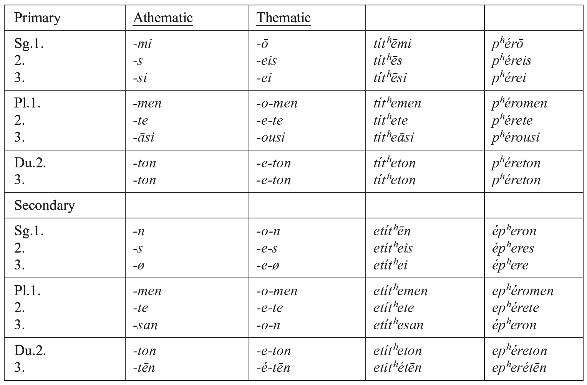

#### 6.8.1.1. On the active endings

Athematic, primary: Att. *-mi*, *-s*, *-si* (**-mi*, **-si*, **-ti*, conserved in West Greek), Myc. 3sg. and pl. /*-si*/, pl. /*-nsi*/ from PIE **-ti*, **-nti*, respectively (with East Greek assibilation). 1pl. *-men* (PIE **-me+n*, originally secondary **-me*: Ved. *-ma*) vs. WestGr. *-mes* (PIE primary **-mes*: Ved. *-mas*). 2pl. *-te* (PIE **-te*: Ved. *-ta* [secondary ending]). 3pl. *-āsi* (**-ansi* from **anti* ← **-n̥ti*, **-nti* (: WGr. **-nti*). Du. 2. 3. *-ton* (PIE **-tom*, cf. Ved. 2du. -*tam* [secondary ending]).

Athematic, secondary: 3sg. /*-0̸*/, pl. /*-n*/ (PIE **-t*, **-nt*). Att. 3.pl. *-san* from East Gr. **-an* (**-a-n-t* ← **-n̥t*), recharacterized by *-s-*. Cf. also Hom. *-n* (*éban* < **égᵘ̯h₂ent*) vs. Att. *ébē-s-an*. Aor. pass. *-(tʰ)en* (from **-[tʰ]ē-nt* by Osthoff’s law); Arc. Cypr. Boeot.*-an*, type *étʰean*. 3du. (Att. Hom.) -*ton*, -*tēn*, WestGr. *-tān*, *-tēn* (PIE **-teh₂m*: Ved. *-tām*).

Thematic: like athematic, added to thematic vowel *-o*/*e-*. Specific endings:

1sg. *-ō*: *-oh₂* (better than **-oh₂o*). 2sg. *-eis*, 3sg. *-ei*, secondary *-es*, *-e* (i.e. *-e-ø* from **-e-t*). Primary *-ei-s*, *-ei-ø* is a Greek innovation as against **-e-si*, **-e-ti* of other languages (Ved. *-ati*, OLat. *-it*, Goth. *-iþ*). PGr. **-e-i* (probably from **-e-ø-i*) underlies *-ei-s*: *-ei-ø* analogical to secondary *-s*: *-ø*.

#### 6.8.2. Verbal endings: middle

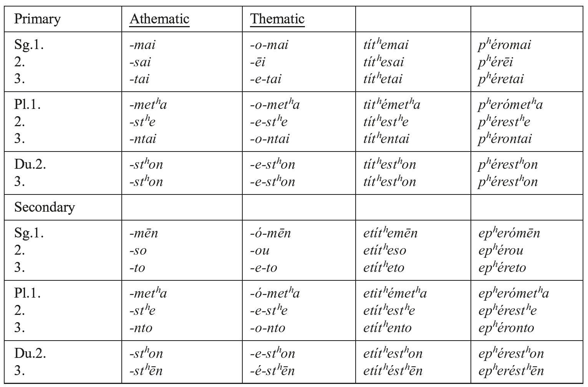

#### 6.8.2.1. On the middle endings

Other than the thematic vowel (*-o*/*e*-), there is no difference between athematic and thematic stems.

Primary: 1sg. *-mai* (**-m-h₂e-i*, or **-maH+i* from **-m̥h₂+i*). 2sg., 3sg. and pl. *-sai*, *-(n)tai* from PIE **-soi̯*, **-(n)toi̯*. Myc. *-to* /*-to(i*)/, /*-nto(i)*/ reflect the inherited *-o-*vocalism, which has remained unaltered in Arcadian and Cyprian. The *-a-* vocalism of *-tai*, *-ntai* (and *-[s]ai*) in all other dialects is due to the influence of 1sg. *-mai* (Indoiran. **-ai̯*: Ved. -*e*) by columnar analogy. 1pl. *-metʰa* (PIE **-medʰə₂*: Ved. *-mahi*). Hom. *-mestʰa* (also in poetry) is metrically conditioned or from **-mes-dʰə₂* (cf. Hitt. *-u̯ašta*?). 2pl. -*stʰe*, also *-tʰe* (e.g. *ʰêstʰe* ‘you sit down’) < **-(s)dʰu̯e* (cf. Ved. *-dhvam*, Hitt. *-tuma-*).

Secondary: 1sg. *-mān* (PGr. **-maH+m* from **-C-m̥-h₂* (PIE **-h₂*: Ved. *-i*), cf. Hom. *elégmēn* ‘I laid myself down’, *edégmēn* ‘I received’? 2sg., 3sg. and pl. *-so*, *-(n)to* (: Av.*-ha*, Ved. Av. *-ta*, *-nta*; Lat. 2sg. *-ris* [**-se+s*], *-tur*, *-ntur*). Greek has no trace of *t-*less medial endings. 3pl. *-nto*, also *-ato* (**-n̥to*) in vocalic stems: Hom. *ʰḗato* ‘they were sitting’ (: Ved. *ā́s-ata*) but Att. *kátʰēnto* ‘id.’.

#### 6.8.3. Perfect endings

Perfect endings: *léluk-a*, *-as*, *-e*; pl. *lelúk-amen*, *-ate*, *-āsi(n)*; du.1.2.3. *lelúkaton*.

On the endings: Att. 1sg. *-a* (PIE **-h₂e*: Ved. *-a*), 2sg. *-as* (like aor. 1. sg. *-a*, 2. sg. *-as*). PIE **-th₂e* (Ved. *-tha*) survives in *(w)oîstʰa* ‘you know’ (: Ved. *véttha*), also in impf. *êstʰa* ‘you were’. 3sg. *-e* (PIE **-e*: Ved. *-a*). 3pl. *-āsi* < **-ansi* < **-a-n-ti* ← **-ati* from **-n̥ti* (no trace of **-ēr*/**-r̥[s]*: Ved. *-us*). Cf. the variants Dor. *-anti*, Hom. *-āsi* (also °*gegáasi* ‘they are born, live’).

Pluperfect: *elelúk-ē*, *-ēs*, *-ei*; pl. *elelúk-emen*, -*ete*, *-esan*; du. 2. *elelúk-eton*, 3. *elelukétēn* (later *-ein*, *-eis*, *-ei*, *-eimen*, *-eite*, *-eisan*, *-eiton*, *-eitēn*). Cf. Hom. 1sg. *-ea*, 2sg. *-ēs*.

Middle: Perf. *lélumai*, *-sai*, *-tai*; pl. *lelúmetʰa*, *lélustʰe*, *léluntai*. Pluperf. *elélumēn*, -*so*, *-to*, etc. In Homer 3pl. *-atai*, pluperf. *-ato* from **-n̥to(i)*, e.g. Hom. *eirúatai* ‘are drawn up = beached’ (: *erúō*). Subjunctive and optative are periphrastic: subj. *leluménos ô*, *êís*, etc., Opt. *leluménos eíēn*, *eíēs*, etc.

#### 6.8.4. Imperative

Active: 2sg. athem. *-tʰi*, e.g. *ítʰi* (**h₁i-dʰi* ‘go!’: Ved. *ídhi*; Hitt. *it* ‘go on!’ [interjection]). Also *-0̸*, e.g. *ómnu* ‘swear!’, probably **dídō-0̸*, **ti-tʰē-0̸* remodeled as *dídou*, *titʰei*), and surely *ʰístē* ‘stand up!’ (**si-steh₂-0̸*, cf. Lat. *stā*).

Them. -*0̸*, e.g. *pʰére* ‘carry!’ (**bʰér-e-0̸*: Ved. *bhára*), secondarily *idé* ‘see!’ (**u̯id-é-0̸*), *lûe* ‘solve!’.

Other endings: *-on* (**-om*) in *-s*-aorist: *deîk-son* ‘show!’, as the continuant of PIE **-s-i* < **-s-e-si*. Also *-s* in *dó-s* ‘give!’, *tʰé-s* ‘put!’, *skʰé-s* ‘hold!’.

3sg. *-tō* (PIE **-tōd*: Ved. *-tāt*, Lat. *-tō*). 3pl. *-ntōn*, them. *-óntō+n* < **-(n)tōd* (dial. *-ntō*). Cf. also the dialectal variants: athem. *-tōn*, *-tōsan*, them. *-é-tōsan*, Lesb. *-o-nton* (= Pamph. -*odu*).

Middle: 2sg. *-so* (*pʰérou* < **-e-so*: Hom. *-eo*), a former injunctive; in the *-s*-aorist, *-sai* probably from **-s-e-soi̯* by haplology, with *-a*-vocalism analogic to middle. 3sg. *-stʰō* remodeled on act. *-tō*. 3pl. *-(o)stʰōn* remodeled on act. *-(n)tōn*, like other variants: *-(e)stʰō* (Ion., et al.), *-(e)stʰōn*; Lesb. -*estʰon* (= Pamph. *-sdu*), and *-(o)nsthō*, whence *-(o)stʰō* (Att. *epimelóstʰōn*).

### 6.9. Nominal forms

Every stem in every voice has an infinitive form and a participle; verbal adjectives are also attested for most verbs.

6.9.1. Infinitives are not recognizable as case forms synchronically, although they may certainly be traced back to old case forms of verbal abstracts:

a) thematic infinitives have in Attic a termination *-ein* [-ẹ̄n]: *pʰérein*, *ékʰein* (Myc. *eke-e* /*⁽ʰ⁾ekhehen*/). This goes back to **-e-sen*, an endingless locative **-sen-0̸* (cf. Myc. *e-re-e* /*ereʰen*/ ‘row’ < **h₁erə₁-sen-0̸*) and Ved. *-sáni*, e.g. *tarī-ṣáṇi* ‘come through’: **terə₂-sén-i*) or to **-es-en* (e.g. **ség̑ʰ-es-en-0̸*).

b) athematic infinitives show a termination **-nai*: Att. *eînai*, *didónai*, aor. *doûnai*, aor. ‘pass.’ *-(tʰ)ēnai*, perf. *eidénai*. This may be a variant of **-enai̯* (from **-ʰenai̯* or **-senai̯*, or **-u̯enai̯*, cf. Cypr. *dowenai*). Final *-ai* is obscure (a former locative **-eh₂-i*? a former dative **-ei̯* remodeled to *-ai* on the basis of directive **-a*?).

c) Common to all dialects are *-sai* in the *-s-*aorist (e.g. *lûsai*, *deîksai*), and medial -*(e)stʰai* (e.g. *lúestʰai*, *lúsastʰai*). The latter is probably a remodeling of **-sai̯* by analogy to middle 2pl. *-stʰe*, impv. *-stʰō(n)*. Cf. also Hom. *dékʰtʰai* (**dekstʰai̯*)

Infinitive forms differ from one dialect to another. Thematic *-ĕn* (type *pʰérĕn*) is attested in several West Greek dialects, athematic *-men* is regular in West Greek, as well as in Thessalian and Boeotian. Mixed types are attested in Thessalian and Boeotian (type *pʰerémen*) and in Lesbian (type *dómenai*, but *dídōn*). The Homeric language possesses all types with the exception of “Doric” *-ĕn*. All this points to a great variety of infinitive formations in Proto-Greek, which has been reduced in every dialect group and in each dialect.

#### 6.9.2. Participles

a) Active **-(o)nt-*, fem. *-(o)nti̯a* (PIE **-[o]nti̯h₂*): Att. *titʰeís* ‘putting’, fem. *titʰeîsa*, *iṓn* ‘going’, Μyc. *i-jo-te* /*iontes*/ (PIE **h₁i-ont*-), *ioûsa*, Att. *ṓn* ‘being’, *oûsa*, Ion. Hom. *eṓn*, *eoûsa* (Myc. *a-pe-o* /*ap-eʰōn*/ ‘absent’, *a-pe-a-sa* /*ap-eʰas(s)ai*/), Arc. *easa*, Cret. *iatta* (PIE **h₁s-ont*-: Lat. *sons*, **h₁s-n̥t-i̯h₂*: Ved. *satī́*). Thematic *pʰérōn*, *pʰérousa*. Cf. also *ʰekṓn* ‘willingly’, Ved. *uśánt-* ‘id.’, but Hitt. *u̯ekkant-* ‘desired’.

b) Middle athem. *-menos* (**-mh₁n-o-*: Av. *-mna-*, cf. Lat. *alumnus*), them. *-ó-menos*: *titʰé-menos*, *pʰeró-menos*.

c) Perf. -*(u̯)ot-* except in nom. sg. *-(u̯)ṓs*, fem. *-uîa* (PIE **-u̯os-*, fem. *-*us-i̯ə₂*): *tetʰēk-ṓs* (fem. *tetʰēkuîa*, gen. *tetʰēk-ót-os*), *lelukṓs* (fem. *lelukuîa*, gen. *lelukótos*). Myc. /*-wōs*/*, /-*woʰ-*/, pl. nom. *-wo-e* /*-woʰes*/, acc. neut. -*wo-a₂* /*-woʰa*/ show that the introduction of *-t-* (Hom. Att. -*ótes*, neut. -*óta* from **-u̯ótes*, **-u̯óta*) in the oblique cases and in the plural, as attested in first millennium Greek, has still not taken place in Mycenaean. Aeolic dialects show a perf. act. ppl in *-nt-* (e.g. *-ontes*, *-onta*), which underlies Hom. *-ôtes*, *-ôta(s)*, *-ôti*, e.g. acc. sg. *tetʰnēôta* ‘dead’, dat. *tetʰnēôti*.

Middle *-ménos*: *tetʰeménos*, *leluménos*, Myc. *(a-pu-)ke-ka-u-me-no* /*(apu)kekaumenos*/ ‘burnt (away)’ (: *kaíō* ‘I burn’), *de-de-me-no*/*dedemenō*/ (nom. neut. du.) ‘bound’ (cf. *déō* ‘I bind’).

6.9.3. Verbal adjectives (*-*to*-), often as second member of compounds, e.g. *kʰristós*, Myc. *ki-ri-ta* /*kʰrista*/ (neut.) ‘anointed, painted’ (: *kʰríō*). Cf. also the gerundival adjectives in *-téos* (Myc. *-te-jo*/*-te-o*), e.g. *poiētéos* ‘which must be done’, Myc. *qe-te-jo*/*qe-te-o* /*kʷeite(i)o-*/ ‘which must be paid’, also impersonal *-téon* (type *poiētéon* ‘one has to do’).
