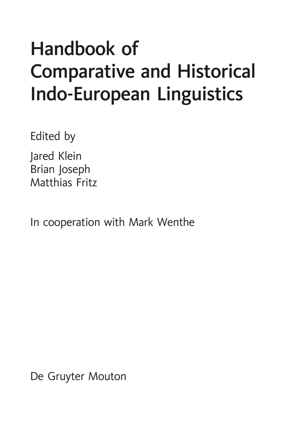

Handbücher zur Sprach- und Kommunikationswissenschaft

Handbooks of Linguistics and Communication Science

Manuels de linguistique et des sciences de communication

Mitbegründet von Gerold Ungeheuer Mitherausgegeben (1985−2001) von Hugo Steger

Herausgegeben von / Edited by / Edités par Herbert Ernst Wiegand

Band 41.1

De Gruyter Mouton

# Title Page

Handbook of Comparative and Historical Indo-European Linguistics

Edited by Jared Klein, Brian Joseph, Matthias Fritz

In cooperation with Mark Wenthe

ISBN 978-3-11-018614-7

e-ISBN (PDF) 978-3-11-026128-8

e-ISBN (EPUB) 978-3-11-039324-8

ISSN 1861-5090

*Library of Congress Cataloging-in-Publication Data*

A CIP catalog record for this book has been applied for at the Library of Congress.

*Bibliographic information published by the Deutsche Nationalbibliothek*

The Deutsche Nationalbibliothek lists this publication in the Deutsche Nationalbibliografie; detailed bibliographic data are available on the Internet at http://dnb.dnb.de.

© 2017 Walter de Gruyter GmbH, Berlin/Boston

www.degruyter.com

# Preface

In my graduate school days at Yale in the early 1970’s, I dreamed of being part of a team that would produce an update and enlargement of Brugmann’s *Grundriss*, in which the individual living branches of Indo-European would be traced from their roots to the modern day. As the years went by, this seemed increasingly to be no more than an idle fantasy. Then in the summer of 2004, I received an email message from Matthias Fritz (engineered by Stephanie Jamison) asking me whether I would be interested in participating in his proposed De Gruyter Handbook of Comparative and Historical Indo-European Linguistics (not precisely the original title). I asked him what the book entailed, and he told me that there would be sections on every subgroup of Indo-European, including chapters on phonology, morphology, syntax, and lexicon. Seeing an unexpected opportunity to fulfill my youthful dream, I said that I would participate, provided that three additional chapters would be added in each case: on documentation, dialectology, and, for those subgroups that had an ulterior history (i.e. everything but Anatolian and Tocharian), on evolution. A chapter on dialectology of course needs no special defense, but one on documentation has become something of an obsession of mine. It is of course not terribly critical for Greek, but for every other subgroup (including Italic, as soon as one moves beyond Latin), the reader needs to know what the primary sources are and how to find them. Thus, those looking for somebody to blame for the long gestation period of this book should probably focus their wrath on me for having added 34 chapters (27.2 %) to the book in one fell swoop.

Things did not, however, progress smoothly. I, for one, had at that point never engaged in editorial work and had no idea how to proceed; nor was it clear to me what my role was to be in the project. Years went by as the individual chapters of the book piled up in my office. In 2011, I received a notice from one of the authors saying that he wished to withdraw his contribution in order to publish it elsewhere. I saw then immediately that the entire project was about to unravel and proceeded to resign from my position. Very quickly I was contacted by Uri Tadmor of De Gruyter and urged not to resign; I was told that Brian Joseph would be brought on to assist me. By that time, I had indeed gained experience in editing; but it was not until June 30, 2012 that I seriously sat down to set things in motion for the production of this book. Ultimately, I was able to convince De Gruyter that I needed an additional in-house assistant, and Mark Wenthe, despite his very heavy teaching schedule, kindly agreed to assume this role.

From the date just noted, I have put this project at the highest level of priority, working at it consistently and placing all my other long-term research projects on hold. Some chapters were dropped,¹ many chapters had to be reassigned to new authors, and original submissions in three instances had to be redone by others. The result, I would like to believe, is the most significant presentation of the field of Indo-European Linguistics since the second edition of Brugmann’s *Grundriss*, which appeared just over 100 years ago. The two works, however, have almost nothing in common. Brugmann’s book was deductive, starting with Proto-Indo-European and deriving the phonologies and morphologies of the individual Indo-European languages. This work is inductive, beginning with the oldest attested subgroups and working toward the most recent ones, from there moving on to languages of fragmentary attestation, larger subgroups (Indo-Iranian and Balto-Slavic), wider configurations and contacts (Italo-Celtic, Greco-Anatolian relationships), and, ultimately, Proto-Indo-European and beyond. All of this is preceded by sections on general methodological issues, the use of the comparative method in selected language groups outside of Indo-European, and on the history, both remote and more recent, of the Indo-European question. Many may wonder about the need for the discussions of language families other than Indo-European, but the original title of this book, since changed, included the phrase “An International Handbook of Language Comparison”. While limitations of space forbid anything beyond a cursory glance outside Indo-European, these chapters will at the very least give the reader an overview of some of the most important literature on the language groups they cover.

It gives me great pleasure to acknowledge the cooperation and assistance of many others in the preparation of this book. First and foremost, kudos goes to Matthias Fritz for having conceptualized this project *ex nihilo* and having recruited the vast majority of its authors. To my two active collaborators, co-editor Brian Joseph and editorial assistant Mark Wenthe I would like to express my deepest appreciation. Both of them read and commented upon every paper and thereby insured that each chapter was seen by three pairs of eyes in addition to those of the author. To my former M.A. student Julia Sturm, I owe more than I can express for her uncanny ability to answer, virtually without exception and with startling speed, my bibliographical queries, particularly with regard to tracking down first names of authors, editors rendered anonymous under the rubric “et al.”, and places and houses of publication. To a string of graduate assistants, including Marcus Hines, Nick Gardner, and Joseph Rhyne, I owe thanks and appreciation for having assembled master lists of references cited in the book, first by section and then further integrating these into one consolidated list. I am confident that the final, pruned version, in whatever form it may ultimately be disseminated, will prove valuable, not least as an up-to-date bibliographical resource on Indo-European Linguistics.

I also wish to thank all the other 120 contributors for the cooperation and patience they have shown as this complex operation has unfolded. I know that most would have liked to see this book become a reality years ago.

Finally, beyond editorial preparation, there is of course the actual production of this book. I am here indebted first to Uri Tadmor for having confidence in me and providing me with the assistance I needed to bring this project to fruition. Next, my most heartfelt thanks goes to Barbara Karlson for keeping on top of this enterprise and serving as my first contact on all matters of detail concerning publication. As the “voice” at the other end of the line, she has helped to insure that this project stayed on track.

Jared Klein, Athens, GA (USA)

# Contents

Volume 1

Preface

I.General and methodological issues

1. Comparison and relationship of languages

2. Language contact and Indo-European linguistics

3. Methods in reconstruction

4. The sources for Indo-European reconstruction

5. The writing systems of Indo-European

6. Indo-European dialectology

7. The culture of the speakers of Proto-Indo-European

8. The homeland of the speakers of Proto-Indo-European

II.The application of the comparative method in selected language groups other than Indo-European

9. The comparative method in Semitic linguistics

10. The comparative method in Uralic linguistics

11. The comparative method in Caucasian linguistics

12. The comparative method in African linguistics

13. The comparative method in Austronesian linguistics

14. The comparative method in Australian linguistics

III.Historical perspectives on Indo-European linguistics

15. Intuition, exploration, and assertion of the Indo-European language relationship

16. Indo-European linguistics in the 19ᵗʰ and 20ᵗʰ centuries: beginnings, establishment, remodeling, refinement, and extension(s)

17. Encyclopedic works on Indo-European linguistics

18. The impact of Hittite and Tocharian: Rethinking Indo-European in the 20ᵗʰ century and beyond

IV.Anatolian

19. The documentation of Anatolian

20. The phonology of Anatolian

21. The morphology of Anatolian

22. The syntax of Anatolian: The simple sentence

23. The lexicon of Anatolian

24. The dialectology of Anatolian

V.Indic

25. The documentation of Indic

26. The phonology of Indic

27. The morphology of Indic (old Indo-Aryan)

28. The syntax of Indic

29. The lexicon of Indic

30. The dialectology of Indic

31. The evolution of Indic

VI.Iranian

32. The documentation of Iranian

33. The phonology of Iranian

34. The morphology of Iranian

35. The syntax of Iranian

36. The lexicon of Iranian

37. The dialectology of Iranian

38. The evolution of Iranian

VII.Greek

39. The documentation of Greek

40. The phonology of Greek

41. The morphology of Greek

42. The syntax of Greek

43. The lexicon of Greek

44. The dialectology of Greek

45. The evolution of Greek

Volume 2

VIII.Italic

46. The documentation of Italic

47. The phonology of Italic

48. The morphology of Italic

49. The syntax of Italic

50. The lexicon of Italic

51. The dialectology of Italic

52. The evolution of Italic

IX.Germanic

53. The documentation of Germanic

54. The phonology of Germanic

55. The morphology of Germanic

56. The syntax of Germanic

57. The lexicon of Germanic

58. The dialectology of Germanic

59. The evolution of Germanic

X.Armenian

60. The documentation of Armenian

61. The phonology of Classical Armenian

62. The morphology of Armenian

63. The syntax of Classical Armenian

64. The lexicon of Armenian

65. The dialectology of Armenian

66. The evolution of Armenian

XI.Celtic

67. The documentation of Celtic

68. The phonology of Celtic

69. The morphology of Celtic

70. The syntax of Celtic

71. The lexicon of Celtic

72. The dialectology of Celtic

73. The evolution of Celtic

XII.Tocharian

74. The documentation of Tocharian

75. The phonology of Tocharian

76. The morphology of Tocharian

77. The syntax of Tocharian

78. The lexicon of Tocharian

79. The dialectology of Tocharian

Volume 3

XIII.Slavic

80. The documentation of Slavic

81. The phonology of Slavic

82. The morphology of Slavic

83. The syntax of Slavic

84. The lexicon of Slavic

85. The dialectology of Slavic

86. The evolution of Slavic

XIV.Baltic

87. The documentation of Baltic

88. The phonology of Baltic

89. The morphology of Baltic

90. The syntax of Baltic

91. The lexicon of Baltic

92. The dialectology of Baltic

93. The evolution of Baltic

XV.Albanian

94. The documentation of Albanian

95. The phonology of Albanian

96. The morphology of Albanian

97. The syntax of Albanian

98. The lexicon of Albanian

99. The dialectology of Albanian

100. The evolution of Albanian

XVI.Languages of fragmentary attestation

101. Phrygian

102. Venetic

103. Messapic

104. Thracian

105. Siculian

106. Lusitanian

107. Macedonian

108. Illyrian

109. Pelasgian

XVII.Indo-Iranian

110. The phonology of Indo-Iranian

111. The morphology of Indo-Iranian

112. The syntax of Indo-Iranian

113. The lexicon of Indo-Iranian

XVIII.Balto-Slavic

114. Balto-Slavic

115. The phonology of Balto-Slavic

116. The morphology of Balto-Slavic

117. The syntax of Balto-Slavic

118. The lexicon of Balto-Slavic

XIX.Wider configurations and contacts

119. The shared features of Italic and Celtic

120. Graeco-Anatolian contacts in the Mycenaean Period

XX.Proto-Indo-European

121. The phonology of Proto-Indo-European

122. The morphology of Proto-Indo-European

123. The syntax of Proto-Indo-European

124. The lexicon of Proto-Indo-European

XXI.Beyond Proto-Indo-European

125. More remote relationships of Proto-Indo-European

# Endnotes

**Endnotes**

**1** These included: Section 1, Genetic and typological relationship of languages, Reconstruction and linguistic reality, and Reconstruction and extra-linguistic reality; Section 3, National traditions of Indo-European linguistics in Europe and North America; Section 19, Indo-Anatolian contacts in the Mitanni Period and The communities of Greek and Armenian. These were omitted for various reasons, ranging from the fact that obvious authors either declined or did not respond to our recruitment efforts, to loss of interest in the topic on the part of assigned authors, to a perceived lack of need for the chapter. In one instance, a contribution was received, but the author left no forwarding address, and the paper was consequently withdrawn by the publisher.
