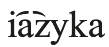

# 8. References

AHD = Calvert Watkins. (ed.)

2000<i>The American Heritage Dictionary of Indo-European Roots</i>. 2nd edn. Boston: Houghton Mifflin.

Andersen, Henning

1968IE *<i>s</i> after <i>i, u, r, k</i> in Baltic and Slavic. <i>Acta Linguistica Hafnensia</i> 11: 171−190.

Andersen, Henning

1969Lenition in Common Slavic. <i>Language</i> 45: 553−574.

Andersen, Henning

1970Kashubian <i>dobëtk ‘dobytek’</i> and its Kind. <i>Die Welt der Slaven</i> 15: 61−76.

Andersen, Henning

1972Diphthongization. <i>Language</i> 48: 11−50.

Andersen, Henning

1977On Some Central Innovations in the Common Slavic Period. In: Franc Jakopin (ed.), <i>Slovansko jezikoslovje</i> [Slavic linguistics]. Ljubljana: Univ. v Ljubljani, Filozofska fakulteta, 1−13.

Andersen, Henning

1978Perceptual and Conceptual Factors in Abductive Innovations. In: Fisiak (ed.), 1−22.

Andersen, Henning

1985Protoslavic and Common Slavic. <i>International Journal of Slavic Linguistics and Poetics</i> 31−32: 67−80.

Andersen, Henning

1996<i>Reconstructing Prehistorical Dialects. Initial Vowels in Slavic and Baltic</i>. Berlin: Mouton de Gruyter.

Andersen, Henning

1998aThe Common Slavic Vowel Shifts. <i>American Contributions to the International Congresses of Slavists</i> 12: 239−248.

Andersen, Henning

1998bA Glimpse of the Homeland of the Slavs. In: Angela della Volpe (ed.), <i>Proceedings of the Seventh UCLA Indo-European Conference</i>. Washington, D. C.: Institute for the Study of Man, 1−67.

Andersen, Henning

1999The Western South Slavic Contrast Sn. <i>sah-ni-ti</i> || SC <i>sah-nu-ti. Slovenski jezik</i> 2: 47− 62.

Andersen, Henning

2003Slavic and the Indo-European Migrations. In: Henning Andersen (ed.), <i>Language Contacts in Prehistory</i>. Amsterdam: Benjamins, 45−76.

Andersen, Henning

2006On the Late Common Slavic Dialect Correspondences Kl−Tl−l. <i>International Journal of Slavic Language and Poetics</i> 44/45: 37−48.

Andersen, Henning

2009The Satem Languages of the Indo-European Northwest. In: Angela Marcantonio (ed.), <i>The Indo-European Language Family: Questions about its Status</i>. Washington, D.C.: Institute for the Study of Man, 1−31.

Andersen, Henning

2013On the Origin of the Slavic Aspects. <i>Journal of Slavic Linguistics</i> 21: 17−43.

Andersen, Henning

2014Early Vowel Contraction in Slavic. <i>Scando-Slavica</i> 60: 54−107.

Barford, Paul M.

2001<i>The Early Slavs</i>. Ithaca, NY: Cornell University Press.

Bartoli, Matteo G.

1906<i>Das Dalmatische</i>. 2 vols. Vienna: Hölder.

Baudouin de Courtenay, Jan

1894Einiges über Palatalisierung (Palatalisation) und Entpalatalisierung (Depalatalisation). <i>Indogermanische Forschungen</i> 4: 45−57.

Beekes, Robert S. P.

1995<i>Comparative Indo-European Linguistics. An Introduction</i>. Amsterdam: Benjamins.

BER = Vladimir I. Georgiev, Ivan Galabov, Iordan Zaimov, and Stefan Ilcev (eds.)

1962− <i>Bălgarski etimologičen rečnik</i> [Bulgarian etymological dictionary]<i></i>. 6 vols. to date. Sofia: BAN.

Bernik, France, Jože Faganel, Kajetan Gantar, Igor Grdina, Franc Jakopin, Janko Kos, Marko Kranjec, Tine Logar, Klaus Detlef Olof, Božo Otorepec, Boris Paternu, and Marijan Smolik

1993<i>Brižinski spomeniki</i> [The Freising literary monuments]<i></i>. Ljubljana: Slovenske akademije znanosti in umetnosti.

Bernštejn, Samuil B.

1961<i>Očerk sravnitel’noj grammatiki slavjanskix jazykov</i> [An outline of the comparative grammar of the Slavic languages]<i></i>. Moscow: Akademija Nauk SSSR.

Bethmann, Conrad L.

1876Die Evangelienhandschrift zu Cividale. <i>Neues Archiv der Gesellschaft für ältere Deutsche Geschichtskunde</i> 2: 113−128.

Bezlaj, France

1956−1961<i>Slovenska vodna imena</i> [Slovenian river names]<i></i>. 2 vols. Ljubljana: Slovenska Akademija znanosti i umetnosti.

Bezlaj, France

1976−2007<i>Etimološki slovar slovenskega jezika</i> [Etymological dictionary of the Slovenian language] 4 vols. Ljubljana: Mladinska knjiga.

Bezzenberger, Adalbert

1891Zum baltischen Vocalismus. <i>Beiträge zur Kunde der indogermanischen Sprachen</i> 17: 213−227.

Birnbaum, Henrik

1956Zu urslav. <i>Kv-. Scando-Slavica</i> 2: 29−40.

Birnbaum, Henrik

1966The dialects of Common Slavic. In: Henrik Birnbaum and Jaan Puhvel (eds.), <i>Ancient Indo-European dialects. Proceedings of the Conference on Indo-European Linguistics Held at the University of California, Los Angeles April 25</i>−<i>27, 1963</i>. Berkeley: University of California Press, 153−197.

Birnbaum, Henrik

1970Four Approaches to Balto-Slavic. In: Velta Rūk̦e-Dravin̦a (ed.), <i>Donum Balticum</i>. <i>To Professor Christian S. Stang on the occasion of his seventieth birthday 15 March 1970</i>. Stockholm: Almqvist & Wiksell, 69−76.

Birnbaum, Henrik

1975<i>Common Slavic: Progress and problems in its reconstruction</i>. Cambridge, MA: Slavica.

Birnbaum, Henrik

1983Language families, linguistic types, and the position of the Rusin microlanguage within Slavic. <i>Die Welt der Slaven</i> 28: 1−23.

Birnbaum, Henrik

1987a<i>Praslavjanskij jazyk: Dostiženija i problemy v ego rekonstrukcii</i> [Proto-Slavic: Achievements and problems of its reconstruction]<i></i>. Translated by Vladimir A. Dybo. Moscow: Progress.

Birnbaum, Henrik

1987bSome Terminological and Substantive Issues in Slavic Historical Linguistics. <i>International Journal of Slavic Linguistics and Poetics</i> 35/36: 299−332.

Birnbaum, Henrik and Peter T. Merrill

1983<i>Recent Advances in the Reconstruction of Common Slavic (1971−1982)</i>. Columbus, OH: Slavica.

Bogatyrev, Konstantin K.

1995<i>Akcentuacija severolexitskix govorov s istoričeskoj točki zrenija</i>. [The accentuation of Northern Lechitic dialects from a historical perspective]. Munich: Sagner.

Boryś, Wiesław

2005<i>Słownik etymologiczny języka polskiego</i> [Etymological dictionary of Polish]<i></i>. Cracow: Wydawnictwo literackie.

Bräuer, Herbert

1961<i>Slavische Sprachwissenschaft</i>. Vol. 1. Berlin: De Gruyter.

Browne, Wayles

1993Serbo-Croat. In: Comrie and Corbett (eds.), 306−387.

Browning, Timothy

1989The Diachrony of Proto-Indo-European Syllabic Liquids in Slavic. Doctoral Dissertation. University of Wisconsin, Madison.

Brückner, Aleksander

1993[1927] <i>Słownik etymologiczny języka polskiego</i> [Etymological dictionary of Polish]<i></i>. Reprint. Warsaw: Wiedza Powszechna.

Bulatova, Rimma V. and Vladimir A. Dybo (eds.)

1989<i>Istoričeskaja akcentologija i sravnitel’no-istoričeskij metod</i> [Historical accentology and the comparative-historical method]. Moscow: Nauka.

BZ = <i>Biblia królowej Zofii</i> [The Queen Sofia Bible]

2015[www.ijp-pan.krakow.pl/publikacje-elektroniczne/korpus-tekstow-staropolskich](http://www.ijp-pan.krakow.pl/publikacje-elektroniczne/korpus-tekstow-staropolskich) [Last accessed 26 June 2017].

Channon, Robert

1972<i>On the Place of the Progressive Palatalization of Velars in the Relative Chronology of Slavic</i>. The Hague: Mouton.

Chomsky, Noam and Morris Halle

1991[1968] <i>The Sound Pattern of English</i>. Cambridge, MA: MIT Press.

Collinge, Neville E.

1985<i>The Laws of Indo-European</i>. Amsterdam: Benjamins.

Collins, Daniel E.

1982Front rounded vowels and the phoneme /j/ in Proto-Church Slavonic. <i>Die Welt der Slaven</i> 37: 1−32.

Collins, Daniel E.

forthcoming The Proto-Slavic Reflexes of the PIE Syllabic Sonorants.

Comrie, Bernard and Greville G. Corbett (eds.)

1993<i>The Slavonic Languages</i>. London: Routledge.

ornejová, Michaela

2007Studie k dokladům českých mı́stnı́ch jmen na <i>-any</i> v 11.−13. Stoletı́ [Studies in the documentation of Czech place names in <i>-any</i> in the 11th−13th centuries]. <i>Linguistica ONLINE</i>. http://www.phil.muni.cz/linguistica/art/cornejova/cor-003.pdf [Last accessed 26 June 2017].

Curta, Florin

2001<i>The Making of the Slavs</i>. Cambridge: Cambridge University Press.

Derksen, Rick

2004Balto-Slavic Accentuation: An Update. <i>Histoire Épistémologie Langage</i> 26: 81−92.

Derksen, Rick

2008<i>Etymological Dictionary of the Slavic Inherited Lexicon</i>. Leiden: Brill.

Daničić, Đura

1962[1863−1864] <i>Rječnik iz književnih starina srpskih</i> [Dictionary of Serbian literary antiquities]<i></i>. 2 vols. Reprint. Graz: Akademische Druck- u. Verlagsanstalt.

Diels, Paul

1963<i>Altkirchenslavische Grammatik</i>. Vol. 1. 2nd edn. Heidelberg: Winter.

Dolobko, Milij G.

1927<i>Noč’-nočés’, ósen’-osenés’, zimá-zimús’, léto-létos’. Slavia</i> 5: 678−717.

DRMJa = <i>Digitalen rečnik na makedonskiot ezik</i> [Digital dictionary of the Macedonian language]

2015http://www.makedonski.info [Last accessed 26 June 2017].

Dvornik, Francis

1956<i>The Slavs: Their Early History and Civilization</i>. Boston: American Academy of Arts and Sciences.

Dybo, Vladimir A.

1962O rekonstrukcii udarenija v praslavjanskom glagole [On the reconstruction of Proto-Slavic word-accent]. <i>Voprosy sovetskogo jazykoznanija</i> 6: 3−27.

Dybo, Vladimir A.

1971Zakon Vasil’eva-Dolobko i akcentuacija form glagola v drevnerusskom i srednebolgar-skom [Vasil’eva-Dolobko’s Law and the accentuation of verb forms in Old Russian and Middle Bulgarian]. <i>Voprosy jazykoznanija</i> 20: 93−114.

Dybo, Vladimir A.

1975Zakon Vasil’eva-Dolobko v drevnerusskom [Vasil’eva-Dolobko’s Law in Old Russian]. <i>International Journal of Slavic Linguistics and Poetics</i> 18: 7−81.

Dybo, Vladimir A.

1977Imennoe udarenie v srednebolgarskom i zakon Vasil’eva-Dolobko [Nominal accentuation in Middle Bulgarian and Vasil’eva-Dolobka’s Law]. In: Leonid A. Gindin and Galina P. Klepikova (eds.), <i>Slavjanskoe i balkanskoe jazykoznanie</i> [Slavic and Baltic linguistics]. Moscow: Nauka, 189−272.

Dybo, Vladimir A.

1979Rekonstrukcija sistemy akcentnyx paradigm v praslavjanskom [Reconstruction of the system of accentual paradigms in Proto-Slavic]. <i>Zbornik za filologiju i lingvistiku</i> 22: 37−71.

Dybo, Vladimir A.

1980Balto-slavjanskaja akcentnaja sistema s tipologičeskoj točki zrenija i problema rekonstrukcija indoevropejskogo akcenta [The Balto-Slavic accentual system from a typological perspective and the problem of the reconstruction of the Indo-European accent]. In: Tamara M. Sudnik (ed.), <i>Balto-slavjanskie ètnojazykovye kontakty</i>. [Balto-Slavic ethnolinguistic contacts]. Moscow: Nauka, 91−150.

Dybo, Vladimir A.

1981<i>Slavjanskaia akcentologija: Opyt rekonstrukcii sistemy accentnyx paradigm v praslavjanskom</i> [Slavic accentology. An attempt at a reconstruction of the system of accentual paradigms in Proto-Slavic]. (Akademija Nauk SSSR, Institut Slavjanovedenija i Balkanistiki). Moscow: Nauka.

Dybo, Vladimir A.

1989Tipologija i rekonstrukcija paradigmatičeskix akcentnyx system [Typology and the reconstruction of paradigmatic accent systems]. In: Bulatova and Dybo (eds.), 7−45.

Dybo, Vladimir A.

2000<i>Morfonologizovannye paradigmatičeskie akcentnye sistemy. Tipologia i genezis</i> [Morphophonologized paradigmatic accent systems. Typology and genesis]. Vol. 1. Moscow: Jazyki russkoj kul’tury.

Dybo, Vladimir A.

2002Balto-Slavic Accentology and Winter’s Law. <i>Studia Linguarum</i> 3: 295−515.

Dybo, Vladimir A.

2003Balto-slavjanskaja akcentologičeskaja rekonstrukcija i indoevropejskaja akcentologija [Balto-Slavic accentual reconstruction and Indo-European accentology]. In: Viktor M. Živov and Tat’jana Mixajovna Nikolaeva (eds.), <i>Slavjanskoe jazykoznanie: XIII Meždunarodnyj Sъezd Slavistov, Ljubljana, 2003 g. Doklady rossijskoj delegacii</i> [Slavic linguistics: 13th international session of slavists, Ljubljana, 2003. Reports of the Russian delegation]. Moscow: Indrik, 131−161.

Dybo, Vladimir A., Galina I. Zamjatina, and Sergej L. Nikolaev

1990<i>Osnovy slavjanskoj akcentologii</i> [Principles of Slavic accentology]<i></i>. Moscow: Nauka.

Dybo, Vladimir A., Galina I. Zamjatina, and Sergej L. Nikolaev

1993<i>Osnovy slavianskoj akcentologii: Slovar’</i> [Principles of Slavic accentology: dictionary]. Vol. 1, part 1. Moscow: Nauka.

Endzelīns, Jānis

1971<i>Jānis Endzelīns’ Comparative Phonology and Morphology of the Baltic Languages</i>. Trans. William R. Schmalstieg and Benjamin̦š Jēgers. The Hague: Mouton.

ÈSSJa = Trubačev, Oleg N. (ed.)

1974− <i>Ètimologičeskij slovar’ slavjanskix jazykov</i> [Etymological dictionary of the Slavic languages]<i></i>. 36 vols. to date. Moscow: Nauka.

ESUM = Mel’nyčuk, Oleksander S. (ed.)

1982−2006<i>Etymolohičnyj slovnyk ukraïns’koï movy</i> [Etymological dictionary of the Ukrainian language]. 7 vols. Kiev: Naukova Dumka.

EwZam = <i>Ewangeliarz Zamoyskich</i> [Zamoyski’s Gospel]

2015[www.ijp-pan.krakow.pl/publikacje-elektroniczne/korpus-tekstow-staropolskich](http://www.ijp-pan.krakow.pl/publikacje-elektroniczne/korpus-tekstow-staropolskich) [Last accessed 26 June 2017].

Fasmer, Max (= Max Vasmer)

1986<i>Ètimologičeskij slovar’ russkogo jazyka</i> [Etymological dictionary of the Russian language]. Translated from German with comments by Oleg N. Trubacëv. 4 vols. Moscow: Progress.

Feldstein, Ronald F.

2003The Unified Monophthongization Rule of Common Slavic. <i>Journal of Slavic Linguistics</i> 11: 247−281.

Filin, Fedot P.

1962<i>Obrazovanie jazyka vostočnyx slavjan</i> [The formation of the language of the Eastern Slavs]<i></i>. Moscow: Akademija Nauk SSSR.

Fisiak, Jacek (ed.)

1978<i>Recent Developments in Historical Phonology</i>. The Hague: Mouton.

Flier, Michael S.

1982The Origin of the Desinence <i>-ovo</i> in Russian. In: Markov and Worth (eds.), 85−104.

Flier, Michael S.

1988Morphophonemic consequences of the development of tense jers in East Slavic. <i>American Contributions to the International Congresses of Slavists</i> 10: 91−105.

Flier, Michael S.

1998The Jer Shift and Consequent Mechanisms of Sharping (Palatalization) in East Slavic. <i>American Contributions to the International Congresses of Slavists</i> 12: 360−374.

Fortson, Benjamin W. IV.

2004<i>Indo-European Language and Culture</i>. Oxford: Blackwell.

Fougeron, Cécile and Rachid Ridouane

2008On the Phonetic Implementation of Syllabic Consonants and Vowel-Less Syllables in Tashlhiyt. <i>Estudios de Fonética Experimental</i> 18: 139−175.

Friedrich, Paul

1970<i>Proto-Indo-European Trees</i>. Chicago: University of Chicago Press.

Friedman, Victor A.

1993Macedonian. In: Comrie and Corbett (eds.), 249−305.

Garde, Paul

1976<i>Histoire de l’accentuation slave</i>. 2 vols. (Collection de manuels de l’Institut d’Études Slaves 7). Paris: Institut d’Études Slaves.

Gerov, Naĭden

1975−1978[1895−1904] <i>Rěčnik na bŭlgarskyj jazyk</i> [Dictionary of the Bulgarian language]<i></i>. I−V. Reprint. Sofia: Bŭlgarski Pisatel.

Gołąbek, Eugeniusz

2010−2012<i>Słownik polsko-kaszubski: Słowôrz pòlskò-kaszëbsci</i> [A Polish-Kashubian dictionary]<i></i>. http://www.skarbnicakaszubska.pl/slownik-polsko-kaszubski [Last accessed 26 June 2017].

Greenberg, Marc L.

1988On the vocalization of jers in Slovak. <i>Die Welt der Slaven</i> 33: 43−62.

Gribble, Charles E.

1989Omission of the Jer Vowels in Early East Slavic Manuscripts. <i>Russian Linguistics</i> 13: 1−14.

Grierson, Philip and Mark Blackburn

2007<i>Medieval European Coinage</i>. Vol. 1. Cambridge: Cambridge University Press.

Hamp, Eric P.

1983<i>Ja =</i> Runic <i>ek. International Journal of Slavic Linguistics and Poetics</i> 27: 11−13.

Hannan, Kevin.

1996<i>Borders of Language and Identity in Teschen Silesia</i>. New York: Lang.

Havlík, Antonín.

1889K otázce jerové v staré češtině [On the jer-question in Old Czech]. <i>Listy filologické</i> 16: 45−51, 106−116, 342−353.

Heather, Peter

2010<i>Empires and Barbarians</i>. Oxford: Oxford University Press.

Hermann, Joachim (ed.)

1985<i>Die Slawen in Deutschland</i>. 2nd edn. Berlin: Akademie.

Hirt, Hermann

1895<i>Der indogermanische Akzent: Ein Handbuch</i>. Strassburg: Trübner.

HJP = <i>Hrvatski jezični portal</i> [Croatian language portal]

2015http://hjp.znanje.hr/index.php?show=main [Last accessed 26 June 2017].

Houtzagers, H. Peter

1985<i>The Čakavian Dialect of Orlec on the Island of Cres</i>. Amsterdam: Rodopi.

Hrinčenko, Borys

1958−1959[1907−1909] <i>Slovar’ ukrajins’koji movy</i> [A dictionary of the Ukrainian language]<i></i>. Reprint. 4 vols. Kiev: Naukova Dumka.

IEW = Pokorny, J.

1959<i>Indogermanisches etymologisches Wörterbuch</i>. 2 vols. Bern: Francke.

Illič-Svityč, Vladislav M.

1963<i>Imennaja akcentuacija v baltijskom i slavjanskom</i> [Nominal accentuation in Baltic and Slavic]<i></i>. Moscow: Akademija Nauk SSSR.

IPA = International Phonetics Association

2005<i>The International Phonetic Alphabet and the IPA Chart</i>. https://www.internationalphoneticassociation.org/content/ipa-chart [Last accessed 26 June 2017].

Isačenko, Aleksandr. V.

1970East Slavic Morphophonemics and the Treatment of the Jers in Russian. <i>International Journal of Slavic Linguistics and Poetics</i> 13: 73−124.

ISO = International Standards Organization

1995<i>Transliteration of Cyrillic Characters into Latin Characters</i>. https://www.iso.org/standard/3589.html [Last accessed 26 June 2017].

Ivanov, Vjačeslav Vs. and Vladimir N. Toporov

1958<i>K postanovke voprosa drevnejšix otnošenijax baltijskix i slavjanskix jazykov</i> [On the status of the question concerning the oldest relationships of the Baltic and Slavic languages]. Moscow: Izdatel’stvo A. N. SSSR.

Jakobson, Roman

1962[1929] Remarques sur l’évolution phonologique du russe comparée à celle des autres langues slaves. In: Roman Jakobson, <i>Selected writings</i> 1. The Hague: Mouton, 7−116.

Jakobson, Roman

1952On Slavic diphthongs ending in a liquid. <i>Word</i> 8: 306−310.

Jakobson, Roman

1963Opyt fonologičeskogo podxoda k istoričeskim voprosam slavjanskoj akcentologii: Pozdnij period slavjanskoj jazykovoj praistorii [An attempt at a phonological approach to the historical questions of Slavic accentology: The late period of Slavic linguistic prehistory]. <i>American Contributions to the International Congresses of Slavists</i> 5 1: 153−178.

Janda, Laura A.

1996<i>Back from the Brink</i>. Munich: LINCOM.

Jasanoff, Jay

1983aA rule of final syllables in Slavic. <i>Journal of Indo-European Studies</i> 11: 139−149.

Jasanoff, Jay

1983bA reply to Schmalsteig and Kortlandt. <i>Journal of Indo-European Studies</i> 11: 187−190.

Jasanoff, Jay

2004aAcute vs. Circumflex. In: Adam Hyllested, Anders Richardt Jørgensen, Jenny Helena Larsson, and Thomas Olander (eds.), <i>Per aspera ad asteriscos: Studia indogermanica in honorem Jens Elmegård Rasmussen sexagenarii idibus Martiis anno MMIV</i>. (Innsbrucker Beiträge zur Sprachwissenschaft, Band 112). Innsbruck: Institut für Sprachen und Kulturen der Universität, 247−255.

Jasanoff, Jay

2004bBalto-Slavic Accentuation: Telling News from Noise. <i>Baltistica</i> 39: 171−177.

Jasanoff, Jay

2008The Accentual Type *<i>vèdō, *vedetí</i> and the Origin of Mobility in the Balto-Slavic Verb. <i>Baltistica</i> 43: 339−379.

Jasanoff, Jay

2011Balto-Slavic Mobility as an Indo-European Problem. In: Roman Sukač (ed.), <i>From Present to Past and Back</i>. Frankfurt am Main: Lang, 52−74.

Kalsbeek, Janneke

1998<i>The Čakavian dialect of Orbanići near Žminj in Istria</i>. Amsterdam: Rodopi.

Kiparsky, Valentin

1975<i>Russische Historische Grammatik</i>. Vol. 3<i></i>. Heidelberg: Winter.

Kiparsky, Valentin

1979<i>Russian Historical Grammar</i>. Vol. 1<i></i>. Translated by J. Ian Press. Ann Arbor, MI: Ardis.

Klemensiewicz, Zenon, Tadeusz Lehr-Spławiński, and Stanisław Urbańczyk (eds.)

1964<i>Gramatyka historyczna języka polskiego</i> [Historical grammar of the Polish language]<i></i>. Warsaw: Państwowe Wydawnictwo Nauk.

Kolarič, Rudolf

1968Sprachliche Analyse. In: Jože Pogačnik (ed.), <i>Freisinger Denkmäler, Brižinski spomeniki, Monumenta Frisingensia</i>. Munich: Trofenik, 18−120.

Kolesov, Vladimir V.

1972<i>Istorija russkogo udarenija</i> [A history of Russian accent]<i></i>. Leningrad: Leningrad University Press.

Komárek, Miroslav

1962<i>Historická mluvnice česka</i> [Historical grammar of Czech]<i></i>. Vol. 1. <i>Hlaskosloví</i> [Phonetics]<i></i>. Prague: Státní pedagogické nakladatelství.

Kortlandt, Frederik H. H.

1975<i>Slavic Accentuation</i>. Lisse: de Ridder.

Kortlandt, Frederik H. H.

1978Proto-Indo-European Obstruents. <i>Indogermanische Forschungen</i> 83: 107−118.

Kortlandt, Frederik H. H.

1984The Progressive Palatalization of Slavic. <i>Folia Linguistica Historica</i> 5: 211−219.

Kortlandt, Frederik H. H.

1985Proto-Indo-European Glottalic Stops. <i>Folia Linguistica Historica</i> 6: 183−201.

Kortlandt, Frederik H. H.

1989On methods of dealing with facts and opinions in a treatment of the progressive palatalization of Slavic. <i>Folia Linguistica Historica</i> 9: 3−12.

Kortlandt, Frederik H. H.

1994From Proto-Indo-European to Slavic. <i>Journal of Indo-European Studies</i> 22: 91−112.

Kortlandt, Frederik H. H.

2007The Development of the Indo-European Syllabic Resonants in Balto-Slavic. <i>Baltistica</i> 42: 7−12.

Kortlandt, Frederik H. H.

2008Balto-Slavic Phonological Developments. <i>Baltistica</i> 43: 5−15.

Krajčovič, Rudolf

1975<i>A Historical Phonology of the Slovak Language</i>. Heidelberg: Winter<i></i>.

Kral, Jurij

1927<i>Serbsko-němski słownik hornjołužiskeje rěče</i> [A Sorbian-German dictionary of the Upper Sorbian language]<i></i>. Bautzen: Domowina.

Kuryłowicz, Jerzy

1956<i>L’apophonie en indo-européen</i>. Wrocław: Wydawnictwo Polskiej Akademii Nauk.

Kushko, Nadiya

2007Literary Standards of the Rusyn Language: The Historical Context and Contemporary Situation. <i>Slavic and East European Journal</i> 51: 111−132.

Labov, William

1994<i>Principles of Language Change: Internal Factors</i>. Oxford: Blackwell.

Ladefoged, Peter and Ian Maddieson

1996<i>The Sounds of the World’s Languages</i>. Oxford: Blackwell.

Lencek, Rado L<b>.</b>

1982<i>The Structure and History of the Slovene Language</i>. Columbus, OH: Slavica.

Leskien, August

1962[1871] <i>Handbuch der altbulgarischen (altkirchenslavischen) Sprache</i>. 8th edn. Heidelberg: Winter.

Lidén, Ewald

1899<i>Ein baltisch-slavisches Anlautgesetz</i>. (Göteborgs Högskolas Årsskrift 5). Gothenburg: W. Zachrissons.

Lorentz, Friedrich

1908−1912<i>Slovinzisches Wörterbuch</i> [Slovincian dictionary]<i></i>. 2 vols. St. Petersburg: Vtoroe Otdelenie Imperatorskoj Akademii Nauk.

Lorentz, Friedrich

1925<i>Geschichte der pomoranischen (kaschubischen) Sprache</i>. Berlin: De Gruyter.

Lunt, Horace G.

1966Old Church Slavonic “*kraljь”? In: Dietrich Gerhardt (ed.), <i>Orbis scriptus</i>. Munich: Fink, 483−489.

Lunt, Horace G.

1981<i>The Progressive Palatalization of Common Slavic</i>. Skopje: MANI.

Lunt, Horace G.

1987The Progressive Palatalization of Early Slavic. <i>Folia Linguistica Historica</i> 7: 251−290.

Lunt, Horace G.

2001<i>Old Church Slavonic Grammar</i>. 7th edn. Berlin: De Gruyter.

Machek, Václav

1968<i>Etymologický slovník jazyka českého</i> [Etymological dictionary of the Czech language]. Prague: Československé akademie věd.

Mareš, František

1965<i>The Origin of the Slavic Phonological System and its Development up to the End of Slavic Language Unity</i>. (Michigan Slavic Materials 6). Translated by J. F. Snopek and A. Vitek. Ann Arbor, MI: Department of Slavic Languages and Literatures, University of Michigan.

Markov, Vladimir and Dean S. Worth (eds.)

1983<i>From Los Angeles to Kiev</i>. Columbus, OH: Slavica.

Martinet, André

1955<i>Économie des changements phonétiques</i>. Berne: Franke.

Marvan, Jiri

1979<i>Prehistoric Slavic Contraction</i>. Translated by Wilson Gray. University Park, PA: Pennsylvania State University Press.

Matasović, Ranko

2004The Proto-Indo-European Syllabic Resonants in Balto-Slavic. <i>Indogermanische Forschungen</i> 109: 337−354.

Meillet, Antoine

1902O nekotoryx anomalijax udarenija v slavjanskix imenax. <i>Russkii filologičeskii vestnik</i> 48: 193−200.

Meillet, Antoine

1934<i>Le slave commun</i>. 2nd edn. revised by André Vaillant. Russian trans. by Peter S. Kuznecov 1951. <i>Obščeslavjanskij jazyk</i>. Moscow: Izdatel’stvo inostrannoj literatury.

Meillet, Antoine

1967[1922] <i>The Indo-European Dialects</i>. Translated by S. N. Rosenberg. University, AL: University of Alabama Press.

Menges, Karl H.

1953<i>An Outline of the Early History and Migrations of the Slavs</i>. New York: Department of Slavic Languages, Columbia University.

Mikkola, Josef J.

1938<i>Die älteren Berührungen zwischen Ostseefinnisch und Russisch</i>. Helsinki: Suomalaisugrilainen seura.

Miklosich, Franz

1963[1862−1865] <i>Lexicon palaeoslovenico-graeco-latinum</i>. Reprint. Aalen: Scientia.

Moravcsik, Gyula

1958<i>Byzantinoturcica</i>. Vol. 2. Berlin: Akademie.

Muka, Ernst

1926<i>Wörterbuch der nieder-wendischen Sprache und ihrer Dialekte</i>. 3 vols. Prague: Czech Academy of Sciences.

Mužić, Ivan

2007<i>Hrvatska povijest devetoga stoljeća</i> [A History of 9th-century Croatia]<i></i>. 2nd edn. Split: Muzej hrvatskih arheoloških spomenika.

Nikolaev, Sergei L.

1989Balto-slavjanskaja akcentuacionnaja sistema i ee indo-evropejskie istoki [The Balto-Slavic accentual system and its Indo-European sources]. In: Bulatova and Dybo (eds.), 46−109.

Nikolaev, Sergei L.

1990K istorii plemennogo dialekta krivičej [On the history of the tribal dialect of the Krivi’s]. <i>Sovetskoe slavjanovedenie</i> 4: 54−63.

Ohala, John J.

1975Phonetic Explanations for Nasal Sound Patterns. In: Charles A. Ferguson, Larry M. Hyman, and John J. Ohala (eds.), <i>Nasalfest</i>: <i>Papers from a Symposium on Nasals and Nasalization</i>. Stanford: Language Universals Project, 289−316.

Olander, Thomas

2009<i>Balto-Slavic Accentual Mobility</i>. Berlin: De Gruyter.

Olesch, Reinhold

1967<i>Fontes linguae dravaenopolabicae minors</i> [Minor sources of the Polabian language]<i></i>. Cologne: Böhlau.

Orr, Robert

1988A Phantom Sound-Change. <i>Canadian Slavonic Papers</i> 30: 41−61.

Orr, Robert

2000<i>Common Slavic Nominal Morphology</i>. Bloomington, IN: Slavica.

Piesni = Polskie zabytki wierszowane do końca XV wieku [Polish literary monuments in verse to the end of the 15th century]

2015[www.ijp-pan.krakow.pl/publikacje-elektroniczne/korpus-tekstow-staropolskich](http://www.ijp-pan.krakow.pl/publikacje-elektroniczne/korpus-tekstow-staropolskich) [Last accessed 26 June 2017].

Pleteršnik, Maks

2010[1894] <i>Pleteršnikov Slovensko-nemški slovar</i> [Pletersnik’s Slovenian-German dictionary]. http://bos.zrc-sazu.si/pletersnik.html [Last accessed 26 June 2017].

Polański, Kazimierz

1982Some Remarks on the Development of Jers in Polabian. <i>International Journal of Slavic Linguistics and Poetics</i> 25/26: 379−381.

Polański, Kazimierz

1993Polabian. In: Comrie and Corbett (eds.), 795−824.

Priestly, Tom M. S.

1978Affective Sound Change in Early Slavic. In: Zbigniew Folejewski, Edmund Heier, George Luckyj, and Gunter Schaarschmidt (eds.), <i>Canadian Contributions to the VIII International Congress of Slavists</i>. Ottawa: Canadian Association of Slavists, 143−166.

Priestly, Tom M. S.

1993Slovene. In: Comrie and Corbett (eds.), 388−451.

Pronk-Tiethoff, Saskia

2013<i>The Germanic Loanwords in Proto-Slavic</i>. Amsterdam: Rodopi.

PřSl = Oldrich Hujer, Emil Smetánka, Miloš Weingart, Bohuslav Havránek, Vladimír Šmilauer, and Alois Získal (eds.)

1935−1957<i>Příruční slovník jazyka českého</i> [A reference dictionary of the Czech Language]<i></i>. 8 vols. Prague: Česká Akademie Věd a Uměni.

Pugh<b>,</b> Stefan M.

2009<i>The Rusyn Language</i>. Munich: LINCOM.

Ramułt, Stefan

1893<i>Słownik języka pomorskiego cyzli kaszubskiego</i> [A dictionary of the Pomeranian or Kashubian language]<i></i>. Cracow: Akademii umiejętności.

RBE = <i>Rečnik na bŭlgarskija ezik</i> [A dictionary of the Bulgarian language]

2015http://rechnik.chitanka.info [Last accessed 26 June 2017].

Rječnik = Đura Daničić et al. (eds.)

1880−1976<i>Rječnik hrvatskoga ili srpskoga jezika</i> [A dictionary of the Croatian or Serbian language]. 23 vols. Zagreb: Jugoslavenska Akademija Znanosti i Umetnosti.

Samilov, Michael

1964<i>The Phoneme Jat’ in Slavic</i>. The Hague: Mouton.

Šaxmatov, Aleksej A.

1915<i>Očerk drevnejšego perioda istorii russkogo jazyka</i>. [A sketch of the oldest period of the history of the Russian language]. Petrograd: Otd-nīe russkago  i slovesnosti Imp. Akademīi nauk.

Scatton, Ernest A.

1993Bulgarian. In: Comrie and Corbett (eds.), 188−248.

Schaeken, Jos

1987<i>Die Kiever Blätter</i>. Amsterdam: Rodopi.

Schenker, Alexander M.

1995<i>The Dawn of Slavic</i>. New Haven: Yale Concilium on International and Area Studies.

Schenker, Alexander M. and Edward Stankiewicz (eds.)

1980<i>The Slavic Literary Languages</i>. Columbus: Slavica.

SEJDP = Lehr-Spławiński, Tadeusz and Kazimierz Polański

1962−1994<i>Słownik etymologiczny języka Drzewian połabskich</i> [Etymological dictionary of the Polabian language]<i></i>. 6 vols. Wrócław: Ossolineum.

Shevelov, George Y.

1965<i>A Prehistory of Slavic: The Historical Phonology of Common Slavic</i>. New York: Columbia University Press.

Shevelov, George Y.

1979<i>A Historical Phonology of the Ukrainian language</i>. Heidelberg; Winter.

SJP = <i>Słownik języka polskiego</i> [A dictionary of the Polish language]

1997−2014http://sjp.pwn.pl [Last accessed 26 June 2017].

SJS = Kurz, Josef (ed.)

1958−1997<i>Slovník jazyka staroslověnského</i> [A dictionary of Old Czech]<i></i>. 5 vols. Prague: Československá akademie vĕd. Slovanský ústav / Euroslavica.

Skok, Petar

1971−1974<i>Etimologijski rječnik hrvatskoga ili srpskoga jezika</i> [Etymological dictionary of the Croatian or Serbian language]<i></i>. 4 vols. Zagreb: Jugoslavenska akademija znanosti i umjetnosti.

Sławski, Franciszek

1974−1979Zarys słowotwórstwa prasłowiańskiego [Outline of Proto-Slavic word-formation]. In: Franciszek Sławski (ed.), <i>Słownik prasłowiański</i> [Proto-Slavic dictionary], Vol. 1: 43−141, Vol. 2: 13−60, Vol. 3: 11−19. Wrocław: Ossolineum

Sławski, Franciszek (ed.)

1961−2001<i>Słownik prasłowiański</i> [Proto-Slavic dictionary]<i></i>. 8 vols. Wrocław: Ossolineum.

Slovníky = <i>Slovenské slovníky</i> [Slovak dictionaries]

2009−2015http://slovnik.juls.savba.sk [Last accessed 26 June 2017].

SP16 = <i>Słownik polszczyzny XVI wieku</i> [A dictionary of 16th-century Polish]

2010−2015https://spxvi.edu.pl/indeks/ [Last accessed 26 June 2017].

SP17−18 = <i>Elektroniczny słownik języka polskiego XVII i XVIII wieku</i> [An electronic dictionary of 17th and 18th-century Polish]

2015http://xvii-wiek.ijp-pan.krakow.pl/pan_klient/ [Last accessed 26 June 2017].

Srez = Sreznevskij, Izmail I.

1989[1893−1912] <i>Slovar’ drevnerusskogo jazyka</i> [A dictionary of Old Russian]<i></i>. Reprint. 6 vols. Moscow: Kniga.

SS = Ralja M. Cejtlin, Radoslav Večerka, and Emilie Bláhová (eds.)

1994<i>Staroslavjanskij slovar’</i> [Old Church Slavonic dictionary]<i></i>. Moscow: Russkij jazyk.

SSKJ = <i>Slovar slovenskega knjižnega jezika</i> [Dictionary of the Slovenian literary language]

2000http://bos.zrc-sazu.si/sskj.html [Last accessed 26 June 2017].

SSP = <i>Słownik staropolski</i> [Old Polish dictionary]

2002−2014http://staropolska.pl/slownik/ [Last accessed 26 June 2017].

Stang, Christian S.

1957<i>Slavonic Accentuation</i>. (Det Norske Videnskaps-Akademi i Oslo, Hist.-Fil. Klasse, No. 3). Oslo: Aschehoug W. Nygaard.

Stang, Christian S.

1966<i>Vergleichende Grammatik der baltischen Sprachen</i>. Oslo: Universitetsforlaget.

Stanislav, Ján

1967<i>Dejiny slovenského jazyka</i> [History of the Slovak language]<i></i>. Vol. 1<i></i>. 3rd edn. Bratislava: SAV.

Stankiewicz, Edward

1986The Historical Phonology of Common Slavic. In: Edward Stankiewicz, <i>The Slavic Languages: Unity in Diversity</i>. Berlin: De Gruyter, 21−34. [Originally 1973 in <i>International Journal of Slavic Linguistics and Poetics</i> 16: 179−192.]

Stankiewicz, Edward

1993<i>The Accentual Patterns of the Slavic Languages</i>. Stanford, CA: Stanford University Press.

Stone, Gerald

1993Cassubian. In: Comrie and Corbett (eds.), 759−794.

SUM = Bilodid, Ivan K. (editor-in-chief) et al. (eds)

1970−1980<i>Slovnyk ukrajins’koji movy</i> [Dictionary of the Ukrainian language]<i></i>. 11 vols. Kiev: Naukova Dumka.

<!-- source-file: content/07_chapter01_7.xhtml -->

Szemerényi, Oswald

1957The Problem of Balto-Slav Unity − A Critical Survey. <i>Kratylos</i> 2: 97−123.

Tachiaos, Anthony-Emil

2001<i>Cyril and Methodius</i>. Crestwood, NY: St. Vladimir’s Seminary Press.

Timberlake, Alan

1983aCompensatory Lengthening in Slavic, 1. In: Markov and Worth (eds.), 207−235.

Timberlake, Alan

1983bCompensatory Lengthening in Slavic, 2. <i>American Contributions to the International Congresses of Slavists</i> 9, 1: 293−319.

Timberlake, Alan

1988The Fall of the Jers in West Slavic. <i>Die Welt der Slaven</i> 33: 225−247.

Timberlake, Alan

1995Mechanisms and Relative Chronology of Polabian Sound Changes. <i>Wiener Slawistischer Almanach</i> 35: 281−296.

Toft, Zoe

2002The Phonetics and Phonology of Some Syllabic Consonants in Southern British English. <i>ZAS Papers in Linguistics</i> 28: 111−144.

Topolińska, Zuzanna

1974<i>A Historical Phonology of the Kashubian Dialects of Polish</i>. The Hague: Mouton.

Toporov, Vladimir N. and Oleg N. Trubačev

2009[1962] <i>Lingvističeskij analiz gidronimov verxnego Podneprov’ja</i> [A linguistic analysis of hydronyms of the upper Dnieper area]<i></i>. Reprinted 2009 in Oleg N. Trubačev, <i>Trudy po ètimologii</i> [Works on etymology], Vol. 4. Moscow: Akademija Nauk, 9−380.

Trubačev, Oleg N.

1991<i>Ètnogenez i kul’tura drevnejšix slavjan: Lingvističeskie issledovanija</i> [Ethnogenesis and culture of the oldest Slavs: linguistic investigations]. Moscow: Nauka.

TSBM = Kandrat K. Atraxovič (ed.)

1977−1984<i>Tlumačal’ny sloŭnik belaruskaĭ movy</i> [An explanatory dictionary of the Belarusian language]<i></i>. 5 vols. Minsk: Belaruskaja Saveckaja Encyklapedyja.

Uličná, Lenka

2006<i>Staročeské glosy ve spisech <u>Or zarua</u> a <u>Arugat ha-bosem</u></i> [Old Czech glosses in the <i>Or zarua</i> and <i>Arugat ha-bosem</i>]<i></i>. Unpublished rigorosum thesis, The Charles University of Prague.

Uličná, Lenka

2014<i>Staročeské glosy ve středověkých hebrejských rabínských spisech</i> [Old Czech glosses in medieval rabbinic Hebrew writings]<i></i>. Unpublished Ph.D. thesis, The Charles University of Prague.

Vaillant, André

1950<i>Grammaire comparée des langues slaves</i>. Vol. 1. Paris: Lyon: IAC.

Vasil’ev, Leonid L.

1929<i>O značenii kamory v nekotoryx drevnerusskix pamjatnikax XVI−XVII vekov</i> [On the significance of the <i>kamora</i> in some Old Russian literary documents of the 16th−17th centuries]<i></i>. Leningrad: Akademija Nauk.

Vasmer, Max

1941<i>Die Slaven in Griechenland</i>. Berlin: De Gruyter.

Vermeer, Willem

2001Critical Observations on the <i>Modus Operandi</i> of the Moscow Accentological School. In: Werner Lehfeldt (ed.), <i>Einführung in die morphologische Konzeption der slavischen Akzentologi</i>. 2., verbesserte und ergänzte Auflage. Mit einem Appendix von Willem Vermeer. (Vorträge und Abhandlungen zur Slavistik, Band 42). Munich: Sagner, 131− 161.

Vermeer, Willem

2003Comedy of Errors or Inexorable Advance? In: Jos Schaeken, H. Peter Houtzagers, and Janneke Kalsbeek (eds.), <i>Dutch Contributions to the Thirteenth International Congress of Slavists</i>. Amsterdam: Rodopi, 397−452.

Vermeer, Willem

2008Pedersen’s Chronology of the Progressive Palatalization. <i>Studies in Slavic and General Linguistics</i> 34: 503−71.

Vlasto, Alexis P.

1970<i>The Entry of the Slavs into Christendom</i>. Cambridge: Cambridge University Press.

VW = <i>Vokabulář webový</i> [Web vocabulary]

2006−2015vokabular.ujc.cas.cz/default.aspx [Last accessed 26 June 2017].

Watkins, Calvert

1965Evidence in Balto-Slavic. In: Werner Winter (ed.), <i>Evidence for Laryngeals</i>. 2nd edn. The Hague: Mouton, 116−122.

Wȩglarz, W

1933Staroczeski loc. plur. na <i>-as</i> w nazwach miejscowych na <i>-any</i> [The Old Czech loc. plur. in -as in place-names in -any]. <i>Slavia occidentalis</i> 12: 34−41.

Wiese, Richard

1996<i>The Phonology of German</i>. Oxford: The Clarendon Press. van Wijk, Nicolas

1956<i>Les langues slaves: De l’unité à la pluralité</i>. The Hague: Mouton.

Winter, Werner

1978The Distribution of Short and Long Vowels in Stems of the Type Lith. <i>sti: vèsti: mèsti</i> and OCS <i>jasti: vesti: mesti</i> in Baltic and Slavic. In: Fisiak (ed.), 431−446.

Xaburgaev, Georgij A.

1980<i>Stanovlenie russkogo jazyka</i> [The making of the Russian language]<i></i>. Moscow: Vyssaja Skola.

Zaliznjak, Andrej A.

1978Novye dannye o russkix pamjatnikax XIV−XVII vekov s različeniem dvux fonem “tipa <i>o</i>” [New data concerning Russians literary documents of the 14th−17th centuries from the distinction of two phonemes “of the type o”]. <i>Sovetskoe slavjanovedenie</i> 3: 74−96.

Zaliznjak, Andrej A.

1979Akcentologičeskaja sistema drevnerusskoj rukopisi XIV veka “Merilo pravidnoe” [The accentological system of the 14th-century old Russian manuscript “Merilo pravidnoe”]. In: Evgenija I. Demina (ed.), <i>Slavjanskoe i balkanskoe jazykoznanie</i> [Slavic and Baltic linguistics]. Moscow: Nauka, 47−128.

Zaliznjak, Andrej A.

1985<i>Ot praslavjanskoj akcentuacii k russkoj</i> [From Proto-Slavic to Russian accentuation]<i></i>. Moscow: Nauka.

Zaliznjak, Andrej A.

1986Novgorodskie berestjanye gramoty s lingvističeskoj točki zrenija [Novgorod birchbark documents from a linguistic perspective]. In: Valentin L. Janin and Andrej A. Zaliznjak, <i>Novgorodskie gramoty na bereste</i> [Novgorod birchbark documents]. Moscow: Nauka, 89−219.

Zaliznjak, Andrej A.

1989Perenos udarenija na proklitiki v starovelikorusskom [The transfer of accent onto proclitics in Old Great Russian]. In: Bulatova and Dybo (eds.), 116−134.

Zaliznjak, Andrej A.

1993K izučeniju jazyka berestjanyx gramot [Toward the study of the language of the birchbark documents]. In: Valentin L. Janin and Andrej A. Zaliznjak, <i>Novgorodskie gramoty na bereste</i> [Novgorod birchbark documents]. Moscow: Nauka, 191−343.

Zaliznjak, Andrej A.

2004<i>Drevnenovgorodskij dialect</i> [The Old Novgorod dialect]<i></i>. 2nd edn. Moscow: Škola “Jazyki russkoj kul’tury”.

<i>Daniel Collins, Columbus, OH (USA)</i>
