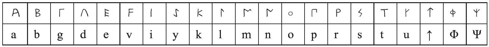
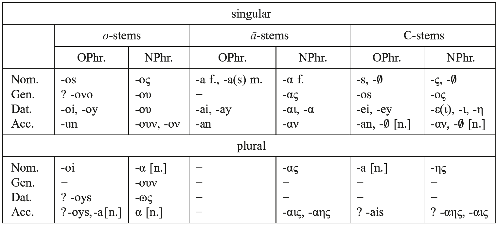

## XVI. Languages of fragmentary attestation

# 101. Phrygian

1.Introduction

2.Phonemic inventory

3.Morphonology

4.Historical development

5.Morphology

6.Syntax

7.References

## 1. Introduction

Phrygian is an extinct Indo-European language of West and Central Anatolia, the written sources of which span the period between the 8th century BCE and 3rd century CE.

1.1. Greek sources refer to Phrygians either as Βρίγες (Herodian, Strabo, Stephanus Byzantinus), Βρύγες (Strabo), Βρῦγοι (Strabo), Βρίγαντες (Herodian) or as Φρύγες (Homer). According to Herodotus (VII 73), the Phrygians originally were neighbors of the Macedonians and were called Βρίγες as long as they dwelt in Europe. When they changed their home to Asia, they also changed their name. A similar account is also given by Strabo (VII 3, 2).

1.2. The time of the Phrygian migration to Anatolia is heavily debated, as is also the question of whether we can identify the Muški of Assyrian sources with the Phrygians. Homer has the young king Priam aiding the Phrygians against the Amazons (<i>Il</i>. III 189); in return, Phrygians come to Trojan aid (II 862 ff.). If true, these two facts would place the Phrygian migration before the collapse of the Bronze Age, i.e. the 12th c. BCE; but the Homeric account can easily be anachronistic. At any rate, in the 8th c. BCE, Phrygians established a powerful kingdom with the capital Gordion (Gk. Γόρδιον, now Yassıhüyük) at the river Sangarios (now Sakarya), where Alexander the Great famously severed the knot on his way to Egypt. Other ancient sites include the so-called Midas city (near Yazılıkaya in Eskişehir province), Daskyleion (near Bandırma), and Dorylaion (now Eskişehir).

Thriving under the legendary king Midas, the Kingdom of Phrygia was sacked by the Cimmerians around 695 BCE and then frequently changed hands: it was first a part of Lydia (7th−6th c. BCE), then of the Persian Empire (6th−4th c. BCE) and of the Empire of Alexander (4th c. BCE). Later, Phrygia was ruled by the Kingdom of Pergamum (2nd c. BCE), until it was added to the Roman province of Asia during the late Republic. During the Roman period, Phrygia, lying to the east of Troas, bordered on its northern side with Galatia, on the south with Lycaonia, Pisidia, and Mygdonia and on the east, it touched upon Cappadocia.

1.3. Phrygian is most closely related to Greek. The two languages share a few unique innovations, such as the vocalization of the laryngeals (4.3), the pronoun <i>auto-</i> (5.2) and the 3sg. imperative middle ending (5.3). It is therefore very likely that both languages emerged from a single language, which was spoken in the Balkans at the end of the third millennium BCE.

1.4. Written in two distinct scripts − one native and the other Greek − Phrygian inscriptions can on the whole be divided into two corpora: the Old Phrygian (OPhr.) corpus written in the native script, and the New Phrygian (NPhr.) corpus written in the Greek script. Old Phrygian, as opposed to New Phrygian, is customarily romanized with the exception of the disputed signs ↑, Φ and Ψ.

1.5. The native script is an alphabet consisting of 21 characters:

Similar to the archaic Greek alphabets, the native script is essentially distinguished by the arrow and the yod. The last two letters of the table above, which look like Greek phi and psi, are very rare. Φ occurs only once as a variant of the arrow, while Ψ (ten occurrences) most probably stands for /ks/. The yod does not appear in the oldest OPhr. inscriptions and was introduced somewhere during the 6th c. BCE (Lejeune 1969), first in prevocalic and word-final positions (e.g., <i>areyastin</i>, <i>kuryaneyon</i>, <i>yosesait</i>; <i>tedatoy</i>, <i>aey</i>, <i>materey</i>, <i>avtay</i>, etc.), later also as a second element of <i>i</i>-diphthongs (<i>ayni</i>, <i>ktevoys</i>, etc.; Lubotsky 1993). Most inscriptions from the North-West of Phrygia (Vezirhan, Daskyleion, etc.) show some deviations from the usual OPhr. alphabet. The yod has a different shape, and there are two types of <i>s</i>, usually transcribed as <i>s</i> and <i>ś</i> (for an overview and discussion of these peculiarities, see Brixhe 2004: 26−32). Since these inscriptions normally lack the arrow sign, it seems reasonable to assume that <i>ś</i> and the arrow indicated the same sound. Words are often separated by a colon consisting of 2, 3, or more vertical dots and occasionally by spaces.

About two thirds of the OPhr. inscriptions run from left to right (dextroverse) and one third from right to left (sinistroverse); a few are written boustrophedon. In North-West Phrygia, however, the proportion is exactly the opposite, two thirds of the inscriptions being sinistroverse.

The OPhr. corpus currently comprises more than 400, unfortunately mostly very short and fragmentary, inscriptions and dates from the 8th to the 4th c. BCE; ca. one fifth of the inscriptions are on stone and the rest on pottery or other small objects. The inscriptions are found across a huge area, far outside Phrygia proper: as far east as Boğazköy and Tyana (Hittite Tuwanuwa), as far south as Bayındır (near Antalya) and as far west as Daskyleion. The largest number of inscriptions comes from Gordion (ca. 80 %).

The standard edition of the OPhr. corpus is Brixhe and Lejeune (1984). The inscriptions are cited by the region where they are found and by a number. Each inscription is hence assigned a siglum: <i>B</i> − Bithynia; <i>G</i> − Gordion; <i>P</i> − Pteria; <i>M</i> − Midas City; <i>T</i> − Tyana; <i>W</i> − West Phrygia; <i>HP</i> (i.e. <i>hors de Phrygie</i>) − from outside of Phrygia; <i>NW</i> − North West Phrygia (Dorylaion); <i>Dd</i> (i.e. <i>documents divers</i>) − of unknown origin. The corpus continues to be updated by means of supplements (Brixhe 2002, 2004).

1.6. NPhr. inscriptions are written in the Greek alphabet, of which only 21 characters are used: <α, β, γ, δ, ε, ζ, η, ι, κ, λ, μ, ν, ξ, ο, π, ρ, σ, τ, υ, ψ, ω>. Greek aspiratae are notably absent, except for Greek names (e.g., Αδιθρερακ, dat.sg. Κλευμαχοι) and loanwords (e.g., dat.sg. θαλαμειδη ‘sepulchral chamber’). The letters ξ and ψ are very rare (found only in the name Ξευν- and υψοδαν ‘above’, respectively), while eta and omega are practically confined to final syllables. New Phrygian by default does not practice word separation.

Dating from the 2nd−3rd c. CE, the NPhr. corpus currently comprises 113 inscriptions, all of them found in the highlands roughly between Eskişehir and Konya. They are numbered from 2 to 129: occasionally, a number is skipped since certain inscriptions are in the meantime considered Greek. A new edition of NPhr. inscriptions is a desideratum. The largest collection (up to No. 110) is presented in Haas (1966: 114−129); editions of Nos. 111−129 are scattered across various publications (Nos. 111−114 = Brixhe 1978a: 3−7; No. 115 = Brixhe and Waelkens 1981; No. 116 = Brixhe and Neumann 1985; No. 117 = Laminger-Pascher 1984: 35; No. 118 = Mitchell 1993: 186, fig. 33; Nos. 119− 125 = Brixhe and Drew-Bear 1997; Nos. 126–128 = Drew-Bear, Lubotsky, and Üyümez 2008; No. 129 = Brixhe and Drew-Bear 2010; cf. also an overview in Brixhe 1999).

Typically opening with ιος νι σεμουν κνουμανει κακουν αδδακετ ‘whoever inflicts harm upon this grave’, NPhr. inscriptions usually consist of a curse following a Greek epitaph, but there are a few Phrygian epitaphs, too.

1.7. As expounded in the preceding sections, the chronological difference between the OPhr. and the NPhr. corpora is normally matched by the use of different alphabets: the native alphabet in the case of OPhr. inscriptions and the Greek alphabet in the case of NPhr. inscriptions. There is, however, one exception: the Dokimeion inscription from the 4th century BCE, which most probably represents an epigram, is written in the Greek alphabet. This must no doubt be due to the increased influence of Greek during Alexandrian times.

1.8. Apart from the inscriptions, Phrygian words are known from Greek sources as well. Plato (<i>Kratylos</i> 410a) quotes πῦρ ‘fire’, ὕδωρ ‘water’ and κύνες ‘dogs’ as shared lexical items. The dictionary of Hesychius quotes some forty words and names with a remark like Φρύγες οr παρὰ Φρυξί, e.g. γλούρεα· χρύσεα. Φρύγες; ζέμελεν· βάρβαρον ἀνδράποδον. Φρύγες; Μαζεύς· ὁ Ζεὺς παρὰ Φρυξί, etc. These glosses are of questionable value, however. The remark “Φρύγες” does not guarantee Phrygian provenance of the gloss, because it could also refer to Anatolians, or even to foreigners in general. Of these glosses, βέκος ‘bread’ (also mentioned by Herodotus II 2) is arguably the most famous one.

## 2. Phonemic inventory

### 2.1. Vowels

<table>
<tr><td>−</td><td>OPhr. /a/, /e/, /o/, /i/, /u/</td><td>/ā/, /ō/, (/ī/, /ū/?);</td></tr>
<tr><td>−</td><td>NPhr. /a/, /e/, /o/, /i/, /u/</td><td>(/ē/, /ō/?)</td></tr>
</table>

Although vowel length is not expressed in writing, Old Phrygian must have had long vowels, at least /ō/, as follows from the fact that OPhr. <o> has two different reflexes in NPhr.: ο or ου, depending on its origin. OPhr. <i>o</i> that goes back to Proto-Indo-European (PIE) <i>*o</i> corresponds to NPhr. ο: OPhr. <i>yos</i>, <i>ios</i>, relative pronoun < PIE <i>*ios</i> ~ NPhr. ιος; OPhr. 3sg. med. ending <i>-toi</i>, <i>-toy</i> < PIE *-<i>toi</i> ~ NPhr. -τοι. On the other hand, OPhr. <i>o</i> that goes back to PIE <i>*ō</i> corresponds to NPhr. ου: OPhr. 3sg. med. imperative ending <i>-do</i> < *<i>-sdhō</i> (cf. Gk. -σθω) ~ NPhr. -δου; OPhr. dat.sg. ending <i>-oi</i>, <i>-oy</i> < PIE *<i>-ōi</i> (cf. Gk. -ῳ) ~ NPhr. -ου.

Presumably, there was no OPhr. phoneme /ē/, since PIE <i>*ē</i> and <i>*eh₁</i> merged with <i>*eh₂</i> into OPhr. <i>a</i>, cf. OPhr. <i>matar</i> nom.sg. ‘mother’ < PIE <i>*meh₂tēr</i>, NPhr. αναρ ‘man’ < *-<i>ēr</i>, OPhr. <i>daΨet</i> ‘to place, make’ < <i>*deh₁-k-</i>, etc. There are no certain examples of OPhr. /ī/, /ū/, so that their existence remains hypothetical.

During the NPhr. period, short and long vowels of OPhr. apparently merged and gave rise to a vowel system without a length opposition: /a/, /e/, /o/, /i/, /u/, at least in initial syllables (thus already Brixhe 1990: 98). The absence of long vowels is further indicated by the use of the hexameter in New Phrygian, where we only find dactylic rhythm and where the function of long vowels was taken by vowels which are long <i>per positionem</i> and by diphthongs (Lubotsky 1998). The status of NPhr. η and ω, which mostly occur in final syllables, is unclear, but they might have represented close long [ẹ̄] and [ọ̄]. NPhr. η most often appears in the final syllable: in the dat.sg. ending of the consonant stems, where it varies with -ε/-ι and -ει, cf. κνουμανη dat.sg. ‘grave’ ~ κνουμανε(ι), κνουμανι, Τιη dat.sg. ‘Zeus’ ~ Τι(ε), Ξευνη PN ~ Ξευνε; in the ending -αης, cf. δεκμουταης ~ δεκμουταις; in the ending -ης, cf. πατερης (No. 98) nom.pl. ‘parents’ (< *-<i>eies</i>), for NPhr. μανκης (No. 86) see 5.1; the function and meaning of δ[α]κερης (No. 116) and παρτης has not yet been clarified. A few times NPhr. η is found in prevocalic position: μαιμαρηαν, τιηιον, εκατηας. For a discussion of this grapheme, see Lubotsky (1998). In contemporary Greek, η had already merged with ι. NPhr. ω is confined, with very few exceptions, to the dat.pl. ending -ως, which goes back to PIE *-<i>ōis</i> (this ending is spelled with <ο> only three times). It typically occurs in the formula με ζεμελως κε δεως κε ‘among men and gods’.

The Phr. short diphthongs are: /ey/ = <ey, ei, ει >, /ew/ = <ev, ευ>, /oy/ = <oy, oi, οι >, /ay/ = <ay, ai, αι >, and /aw/ = <av, αυ>. The existence of the diphthong /ow/ is uncertain. In NPhr., it would at any rate be indistinguishable from ου = /u/. In OPhr., we find it once in the nom.sg. <i>Vasous</i> PN (P-03), next to <i>Vasus</i> (P-05) < *<i>u̯asōus</i> (?), and once in final position in <i>otekonov</i> (B-01). This enigmatic ending <i>-ov</i> is reminiscent of forms like <i>tubetiv</i> and <i>derạliv</i> (B-05) or <i>apelev</i> (B-07) and is likely to be due to a dialectal North-Western development.

Besides short diphthongs, there must have been at least two long diphthongs in OPhr., that is, /ōy/, cf. OPhr. <i>o</i>-stem dat. sg. -<i>oi</i>, NPhr. -ου < PIE *-<i>ōi</i> (see above), and /āi/, cf. OPhr. <i>ā</i>-stem dat.sg. <i>-ai</i>, NPhr. -α (see further 4.1).

### 2.2. Consonants

–/p/ = <p, π>; /t/ = <t, τ>; /k/ = <k, κ>

–/b/ = <b, β>; /d/ = <d, δ>; /g/ = <g, γ>

–/z/ or /dz/ = <↑, ζ>

–/s/ = <s, σ>

–/m/ = <m, μ>; /n/ = <n, ν>

–/l/ = <l, λ>; /r/ = <r, ρ>

–/w/= <v, ο(υ)>; /y/ = <y, i, ι>

The phonological interpretation of the OPhr. arrow <↑>, which is probably identical with <ś> (see 1.5), and of NPhr. <ζ> remains controversial. Since OPhr. <↑> only occurs before front vowels (<i>i</i>, <i>e</i>), it is likely that this letter represents a sound which arises through palatalization. In NPhr. inscriptions, <ζ> appears in two words, ζεμελως dat.pl. ‘men’ (< PIE *<i>dʰǵ⁽ʰ⁾emelo</i>-, cf. Gk. χθαμαλός, Lat. <i>humilis</i> ‘low, humble’) and ζειρα(ι) of unknown meaning and function. If OPhr. <i>śirạy</i> = <i>↑irạy</i> of the Vezirhan inscription is the same word as NPhr. ζειραι, we have to assume that NPhr. <ζ> and the OPhr. arrow indicated the same sound, presumably a voiced affricate or /z/.

For a possible voiceless geminate <i>nn</i>, see 4.2.

In the Greek alphabet, /w/ is written either <ου> or simply <ο> in prevocalic position, cf. ουεναουιας, ουανακταν (No. 88), οαν οε αυται (No. 116), κοροαν (W-11).

## 3. Morphonology

Morphemes, both suffixes and roots, show ablaut. In nominal inflection of the consonant stems, the suffix changes its vocalism, e.g. nom.sg. <i>-tar</i> (<*-<i>tēr</i>) vs. obl. <i>-ter-</i> in <i>matar</i>, <i>materey</i>, <i>materan</i> ‘mother’; nom.sg. <i>-an</i> (< *<i>-ēn</i>) vs. obl. <i>-en-</i> in ορουαν, ορουενος, ορουεναν ‘warden’; <i>iman</i>, <i>i(n)meney</i>, <i>imenan</i> ‘monument’; nom.sg. <i>-ōu-</i> vs. obl. <i>-u-</i> in <i>Vas(o)us</i>, <i>Vasos</i> (< *<i>u̯asu̯os</i>). Examples of ablaut in the root are: <i>da-</i> < <i>*dʰeh1-</i> ‘place, do’ (<i>t-e-da-toy</i>, <i>e-daes</i>, αδδακετ) vs. <i>de-</i> <<i>*dʰh̥1-</i>(δετο(υ)ν ‘monument’, a <i>to-</i>participle); <i>teik-</i> < *<i>deik̑-</i> ‘show’ (ιστεικετ, thus to be read in No. 88, cf. Brixhe 1999: 304, fn. 46 ~ Gk. ἐκ-δείκνυμι) vs. <i>tik-</i> < *<i>dik̑-</i> (τιτ-τετικμενος ‘condemned’ ~ Gk. δια-δικάζω ‘I judge’).

In Phrygian, word final *-<i>on</i> is raised to <i>-un</i>, for instance, in the acc.sg. ending of <i>o-</i>stems, cf. OPhr. acc.sg. <i>akaragayun</i> (M-02) ‘part of the monument’, <i>avtun</i> ‘himself’ (W-01b), NPhr. κακουν ‘damage, wrong’. The latter word often appears as κακον in NPhr. inscriptions and sometimes as κακιν, κακων. A parallel raising of <i>e</i> to <i>i</i> before nasals is possibly attested in OPhr. <i>iman</i>, <i>imen-</i> ‘monument’, if we assume with Vine (2010) that it goes back to <i>*en-mēn</i>, <i>en-men-os</i> (~ Gk. ἐμμενές ‘continuously’), and in NPhr. πινκε (No. 116), if it means ‘five’, PIE *<i>penkʷe</i>. Further, <i>o</i> was raised to <i>u</i> in the position before <i>ri̯</i>, <i>li̯</i>, cf. OPhr. <i>kuryaneyon</i> (W-01c), which was borrowed from Gk. κοιρανέων ‘giving orders; ruling’ < <i>*kori̯-</i> in Mycenaean times (Lubotsky 1988: 23).

Another development in word-final position is *-<i>ans</i> > -<i>ais</i>, which follows from the inflection of titles or patronymics in <i>-evais</i> (<i>arkiaevais</i>, <i>memevais</i>, <i>kanutievais</i>): nom.sg. <i>-evais</i>, gen.sg. <i>-evanos</i> < *<i>-evans</i>, <i>-evanos</i>, most probably going back to *-<i>eu̯ants</i>, *-<i>eu̯antos</i> < *-<i>eu̯n̥ts</i>, *<i>-eu̯n̥t-os</i> (for the development of *<i>-nt-</i> see 4.2). For a parallel, cf. Greek Lesbian ταις < *τανς. It is further attractive to assume that the ending OPhr. -<i>ais</i>, NPhr. -αης, -αις is acc.pl. in some contexts and reflects PIE *-<i>ns</i> (Brixhe 2004: 41−42); similarly, OPhr. <i>-ois</i> can go back to *-<i>ons</i>.

Final clusters are reduced, cf. OPhr. <i>°vanak</i> nom.sg. ‘king’ < *-<i>kts</i>, cf. OPhr. dat.sg. <i>vanaktei</i>, NPhr. acc.sg. ουανακταν, Gk. ἄναξ, -κτος ‘lord, master’; Βας nom.sg. (name of a deity) < *-<i>ts</i> (acc.sg. Βαταν), ας prep. ‘to, towards’ < *-<i>ts</i> (= αδ + <i>s</i>, cf. Gk. εἰς beside ἐν and ἐξ beside ἐκ); NPhr. δακαρεν 3pl. ‘they made erect’ (No. 98) < *-<i>nt</i>; 3sg. aor. ending OPhr. <i>-es</i>, NPhr. -ες < *-<i>est</i>.

The vowels /e/ and /i/ show some vacillation, presumably in pretonic position, both in Old and New Phrygian, cf. <i>kubeleya</i> (B-01) and <i>kubileya</i> (W-04) ‘Cybele’ (epithet of the Mother Goddess), δεως (passim) and διως (Nos. 4, 5, 39), δυως (No. 113) dat.pl. ‘gods’; αββερετορ (Nos. 73, 75) and αββιρετο (No. 25).

In clusters consisting of a dental and a stop, the dental becomes completely assimilated to the stop. The resulting geminate is often simplified in NPhr., cf. α(β)βερετ (αδ°) ‘bring’, τιγ-γεγαριτμενος (τιτ°) ‘devoted’. Also other geminates are regularly simplified, cf. α(δ)δακετ (αδ°) ‘inflict’, τι(τ)-τετικμενος (τιτ°) ‘condemned’. In external sandhi, in prepositional phrases, we encounter the same results, cf. NPhr. α(κ) κε οι and α(τ) τιε (for αδ). This loss of contrastive gemination has led to hypercorrect spellings like κνουμμανει, κνουνμανει for κνουμανει or αινι μμυρα for αινι μυρα.

More controversial is the assimilation of word-final <i>-s</i> to a following velar, but there are a few good examples in NPhr., cf. <i>-s k-</i> > <i>-k k-</i>: αδιθρερακ ξευνεοι (No. 31), ικ κναικαν (No. 116); <i>-s g-</i> > <i>-k g-</i>: ποκ γονιον (No. 116), presumably via <i>-h k-</i>, <i>-h g-</i>.

## 4. Historical development

### 4.1. Vowels

The Indo-European vowels seem to be well preserved, except for the changes already mentioned in the preceding sections. Here are a few more examples of vocalic phonemes.

–<i>*i</i>: OPhr. <i>kin</i>, NPhr. κιν ‘which’ < PIE *<i>kʷim</i>; NPhr. γεγαριτμενος ‘devoted’ < PIE *<i>g̑ʰrHit-</i> (Gk. ἐν-κεχαρισμένος);

–<i>*e</i>: OPhr. <i>ke</i>, NPhr. κε ‘and’ < PIE <i>*kʷe</i>; NPhr. αββερετ, μεβερετ < PIE <i>*bʰer-</i>;

–<i>*o</i>: OPhr. <i>-os</i>, NPhr. -ος, nom.sg. m. of the <i>o</i>-stems < PIE *-<i>os</i>;

–<i>*u</i>: NPhr. (ο)υψοδαν adv. ‘above; on the top’ < PIE *<i>(H)upsodʰn̥</i> (cf. Gk. ὑψόθε[ν] ‘[from] above’); NPhr <i></i>. κνουμαν- n. ‘grave’ < PIE *<i>knu</i>- (cf. Gk. κνύω ‘I scratch’);

–*<i>a</i> (<i>*h₂e</i>): NPhr. αδ preverb ‘to, at, by’ < PIE <i>*h₂ed</i> (cf. Lat. <i>ad</i> ‘id.’);

–<i>*ē</i>: NPhr. ορουαν nom.sg. ‘father, guardian’ (gen.sg. ορουενος; acc.sg. ορουεναν) < PIE *<i>soru̯ēn</i> (cf. Gk. οὖρος ‘watcher, guardian’);

–*<i>eh₁</i>: NPhr. (αδ)δακετ 3sg. ‘inflicts’ < PIE *<i>dʰeh1-k-</i> (cf. Gk. aor. ἔθηκα);

–*<i>eh₂</i>: NPhr. βρατερε dat.sg. ‘brother’ < PIE <i>*bʰreh2-ter-</i> (cf. Skt. <i>bhrā́tar-</i>, Lat. <i>frāter</i>);

–*<i>eh₃</i>: NPhr. acc.sg. μουρου[ν] (No. 100), acc.pl. n. μμυρα (No. 25) ‘stupidity’, cf. Gk. μῶρος, μωρός ‘stupid’.

As far as we can see, the diphthongs remain unchanged in Old Phrygian, but in New Phrygian the long diphthongs /āi/ and /ōi/ often lose their second element in final position, while word-final /ei/ gradually becomes monophthongized and is then written as <-ε, -ι, -η>. PIE *-<i>ōis</i> shows a special development to NPhr. -ως:

–<i>*h₂ei</i>/<i>*eh₂i</i>: OPhr. <i>ai</i>, NPhr. αι ‘if’< PIE *<i>h₂ei</i> (cf. Gk. Aeol., Dor. αἰ ‘if’); OPhr. <i>ayni</i>, NPhr. αινι ‘and/or’ < PIE *<i>h₂ei-ni</i>; NPhr. κναικαν acc.sg. f. ‘wife’ < PIE *<i>gʷneh2ikm̥</i> (cf. Gk. γυναῖκα);

–<i>*h₂eu</i>: OPhr. <i>avtoi</i> dat.sg.m., NPhr. αυτος ‘self’ < PIE <i>*h₂euto</i>- (cf. Gk. αὐτός ‘self’);

–<i>*ei</i>: NPhr. γεγρειμεναν acc.sg. f. ‘written’ < PIE *<i>gʰreiH</i>- (cf. Gk. χρίω ‘I touch’); OPhr. dat.sg. ending of the consonant stems, e.g., <i>materey</i> ‘mother’, <i>Tiei</i> ‘Zeus’ (NW-101), NPhr. Τιε, Τι, Τιη dat.sg. ‘Zeus’, κνουμανει, -ε, -ι, -η dat.sg. ‘grave’ < PIE *<i>-ei</i> (cf. Lat. <i>-ei</i>, <i>-ī</i>);

–<i>*eu</i>: OPhr. <i>bevdos</i> acc.sg. n. ‘statue, image’ (B-01) <i><</i> PIE <i>*bʰeudʰos</i>;

–<i>*oi</i>: OPhr. 3sg. med. ending <i>-toi</i>, <i>-toy</i>, NPhr. -τοι < PIE *-<i>toi</i>; NPhr. τετικμενοι nom.pl. m. ‘condemned’ < PIE *-<i>oi</i>;

–“<i>*āi</i>”: OPhr. <i>ā</i>-stem dat.sg. <i>-ai</i> (<i>Midai</i>, <i>Atai</i>), dat.sg. f. pron. <i>°esai-t</i> (W-01b), NPhr. dat.sg. f. dem. pron. σα(ι), pron. αυται, dat.sg. f. μανκα(ι) ‘stele’ < PIE *-<i>eh₂ei</i>, cf. Gk. -ᾱι, -ηι, Lat. <i>-ae</i>;

–*<i>ōi</i>: OPhr. <i>o</i>-stem dat.sg. ending <i>-oi</i>, <i>-oy</i>, NPhr. -ου < PIE *<i>-ōi</i> (cf. Gk. -ῳ); NPhr. <i>o</i>-stem dat.pl. ending -ως < PIE *-<i>ōis</i>.

### 4.2. Resonants

Consonantal resonants have undergone few changes. Word-final /m/ and /n/ have merged into /-n/ in Phrygian, just as in Greek, cf. OPhr. <i>o</i>-stem acc. sg. ending -<i>un</i>, NPhr. -ουν, -ον < PIE *-<i>om</i>. Possibly, <i>*u̯</i> was lost before a following <i>*o</i> in Phrygian, cf. OPhr. nom.sg. <i>vas(o)us</i> PN (P-03, P-05), gen.sg. <i>vasos</i> (P-02) < <i>*u̯asu̯os</i> (Brixhe 1990: 65). The apparent counterexamples, OPhr. <i>tovo</i> and <i>devos</i>, go back to <i>*toho</i> < <i>*toso</i> and <i>*dehos</i> < <i>*dʰh̥1sos</i>, respectively, where <i>-v-</i> is a <i>Hiatustilger</i>.

The development of the cluster <i>*nt</i> in Phrygian is unclear. First of all, it is remarkable that this cluster is very rare in Phrygian texts: among well-attested words we find only the possible borrowings OPhr. <i>panta</i> (B-05.4), παντης (W-11), NPhr. παντα (No. 35) ~ Gk. πᾶς, παντ- ‘all, every’ and NPhr. Πουντας (No. 48) ~ Gk. Πόντος ‘Pontic region’ (Lubotsky 1997: 123 with refs.). On the other hand, the ending of the 3pl. imperative, which presumably goes back to *-<i>ntō</i> (parallel to 3sg. impv. ειτου < *-<i>tō</i>), is spelled in NPhr. as -ττνου (αδειττνου No. 12) and -ννου (ιννου Nos. 35, 71). These spellings may point to a voiceless geminate <i>nn</i>, IPA [n̥n̥]. Also the OPhr. spellings <i>tn</i>, <i>ntn</i>, found in <i>apaktneni</i> (B-01.8), <i>ẹventnoktoy</i> (B-06), seem to point in this direction (cf. Lubotsky 1997: 121−122). However, Annelies Hämmig points out to us (p.c.) that αδειττνου in No. 12 must rather be read αδειννου, which would mean that *<i>-nt-</i> > <i>-nn-</i> in Phrygian. See further 3 on OPhr. <i>-evanos</i> < *-<i>eu̯antos</i> < *-<i>eu̯n̥tos</i>.

The vocalic nasals have become <i>aN</i>, cf. OPhr. <i>onoman</i> acc.sg. n., NPhr. ονομαν-‘name’ < PIE <i>*h̥₃nh̥₃mn̥</i> (cf. Gk. ὄνομα ‘id.’); NPhr. κναικαν acc.sg. f. ‘wife’ < PIE *<i>gʷneh2ikm̥</i>.

The reflexes of vocalic *<i>r̥</i> and <i>*l̥</i> are less certain. OPhr. <i>por</i>, NPhr. πουρ prep. ‘for’ < PIE *<i>pr̥</i> (cf. Gk. πάρ, Goth. <i>faur</i> ‘id.’) seems to indicate that <i>*r̥</i> has developed into <i>*or</i>, but this is the only example. For NPhr. γεγαριτμενος ‘devoted, at the mercy of’ < PIE *<i>g̑ʰr̥ Hit-</i> see the next section.

### 4.3. Laryngeals

Vocalization of the Indo-European laryngeals shows the same “triple representation” as in Greek and, being a common innovation of the two branches, it is an important indication of the dialectal position of Phrygian. Initial laryngeals develop a prothetic vowel, i.e. <i>*h₁C-</i> > <i>eC-</i>, <i>*h₂C-</i> < <i>aC-</i>, <i>*h₃C-</i> > <i>oC-</i>: OPhr. <i>eu-</i> ‘well’ (?) < PIE *<i>h̥₁su</i>- (cf. Gk. εὐ-, Skt. <i>su-</i> ‘id.’); NPhr. αναρ m. ‘husband’ < PIE *<i>h̥₂nēr</i> (cf. Skt. <i>nár-</i>, Gk. ἀνήρ ‘id.’); OPhr. <i>onoman</i> acc.sg. n., NPhr. ονομαν- ‘name’ < PIE <i>*h̥₃nh̥₃mn̥</i> (cf. Gk. ὄνομα, Skt. <i>nā́man-</i> ‘id.’). In a similar fashion, interconsonantal laryngeals are vocalized to <i>e</i>, <i>a</i>, <i>o</i>, respectively: NPhr. δεως instr.pl. m. ‘god’ < PIE *<i>dʰh̥1so</i>- (cf. Gk. θεός ‘id.’); NPhr. δετουν m./n. ‘monument’ < PIE *<i>dʰh̥1to</i>-; OPhr. <i>-meno-</i>, NPhr. -μενο- middle ptc. < PIE *-<i>mh̥₁no-</i> (cf. Gk. -μενο-); NPhr. πατερης nom.pl. ‘parents’ < PIE *<i>ph̥₂ter</i>- (cf. Gk. πατήρ ‘id.’); NPhr. τιτ-τετικμενα nom.pl. n. ‘condemned’ < PIE *<i>-h̥₂</i> (cf. Gk. -α, Lat. <i>-a</i>, Skt. -<i>i</i>); OPhr. <i>onoman</i>, NPhr. ονομαν- ‘name’ < PIE <i>*h̥₃nh̥₃mn̥</i>.

Also in other positions, the development of the laryngeals in Greek and in Phrygian is identical, cf. NPhr. γεγαριτμενος ‘devoted, at the mercy of’ < PIE *<i>g̑ʰr̥ Hit</i>- (cf. Gk. ἐν-κεχαρισμένος ‘id.’, χάρις, χάριτος ‘love’); NPhr. γλουρεος ‘golden (?)’ (for the meaning, cf. the above-mentioned gloss by Hesychius γλούρεα· χρύσεα, Φρύγες ‘golden items [Phrygian]’) < PIE *<i>g̑ʰ</i>l̥h₃-ro- (cf. Gk. χλωρός ‘green’).

4.4. The single Phr. fricative /s/ is practically restricted to word-final position and to clusters with a stop, cf. OPhr. <i>o</i>-stem nom.sg. -<i>os</i>, NPhr. -ος < PIE *-<i>os</i>, NPhr. 3sg. <i>s</i>-aor. εσταες ‘established’, OPhr. 3sg. subj. <i>daΨet</i> /dakset/ ‘will do’. In other positions, word-initially and intervocalically, it was lost, cf. NPhr. ορουαν ‘warden’ < PIE *<i>soru̯ēn</i>; OPhr. <i>egeseti</i>, NPhr. εγεσιτ, εγεδου ‘hold, experience’ < PIE <i>*seg̑ʰ-</i>; NPhr. dat.pl. δεως ‘god’ < PIE *<i>dʰh̥1so-</i>.

PIE <i>*s</i> was further lost in the clusters *<i>su̯</i>- and *-<i>sdʰ-</i>, cf. OPhr. <i>ven</i>- ‘self’, NPhr. nom.pl. n. ουα ‘own’ < PIE *<i>su̯e</i>/<i>*su̯o</i>- and impv. ending -<i>do</i>, -δου < PIE *-<i>sdʰō</i>. The intervocalic /s/ in the <i>s-</i>subjunctives OPhr. <i>egeseti</i>, NPhr. εγεσιτ, mentioned above, has probably been generalized from postconsonantal positions, just like in Greek.

### 4.5. Stops

It is clear that PIE tenues are reflected as Phrygian tenues, and mediae aspiratae as PIE mediae, cf. OPhr. 3sg. primary act. -<i>ti</i>, NPhr. -τι < PIE *<i>-ti</i>; NPhr. πατερης nom.pl. ‘parents’ < PIE *<i>ph̥₂ter</i>-; NPhr. dat.pl. δεως ‘god’ < PIE *<i>dʰh̥1so</i>-; NPhr. acc. sg. γεγρειμεναν ‘written’ < PIE *<i>gʰreiH</i>-; NPhr. βρατερε dat.sg. ‘brother’ < PIE *<i>bʰreh2ter</i>-, etc. The fate of PIE mediae is more controversial, but there is a growing body of evidence that they have become Phrygian tenues (cf. Lubotsky 2004 for more examples and a discussion of the counterevidence), cf. NPhr. acc.sg. Τιαν, gen. sg. Τιος, dat.sg. Τι(ε), OPhr. <i>Tiei</i> ‘Zeus’ < PIE *<i>diēm</i>, *<i>diu̯os</i>, *<i>diu̯ei</i>; NPhr. acc.sg. κ̣ναικαν ‘wife’ < PIE *<i>gʷneh2ikm̥</i> (cf. Gk. γυναῖκα); OPhr. <i>torv-</i> (B-05) ‘wood’ < PIE *<i>doru̯</i>-/*<i>dr̥u̯</i>-; NPhr. (τιτ-)τετικμενος ‘condemned’ < PIE *<i>deik̑</i>-, cf. Gk. δια-δικάζω ‘I judge’, κατα-δικάζω ‘I condemn’. PIE labiovelars have lost their labial feature, cf. OPhr. <i>ke</i>, NPhr. κε ‘and’ < PIE <i>*kʷe</i>, NPhr. acc. sg. κ̣ναικαν ‘wife’ (116) < <i>* gʷneh2ikm̥</i>.

In view of the close relationship of Phrygian and Greek, it is likely that Phrygian is a centum language, too, cf. OPhr. <i>egeseti</i>, NPhr. εγεσιτ, εγεδου ‘hold, experience’ < PIE <i>*seg̑ʰ-</i>; NPhr. (τιτ-)τετικμενος ‘condemned’ < PIE *<i>deik̑-</i>; NPhr. γεγαριτμενος ‘devoted, at the mercy of’ < PIE *<i>g̑ ʰr̥ Hit</i>-; NPhr. γλουρεος ‘golden (?)’ < PIE *<i>g̑ʰ</i>l̥h₃-<i>ro-</i>. This implies that ζεμελως dat.pl. ‘men’ (< PIE *<i>dʰg̑⁽ʰ⁾emelo</i>-) must be due to a special development of the initial cluster and that the Phrygian demonstrative pronoun <i>s-</i> (OPhr. acc.sg.n. <i>si</i>, acc.sg.m. <i>sin</i>; NPhr. gen.sg. f. σας, dat.sg. σα(ι), dat.sg.n. σεμουν, see 5.2) must reflect PIE *<i>k̑i̯-</i> with palatalization (as indicated above, 4.4, PIE initial <i>*s-</i> shows a zero-reflex in Phrygian).

## 5. Morphology

### 5.1. Nouns

Phrygian nouns are inflected for case, gender and number. There are at least 4 cases: nominative, accusative, genitive and dative; other cases, possibly unidentified, could have existed as well; cf., for instance, the puzzling NPhr. κναικο ‘wife’ (No. 116) or <i>kạṿarmọyo</i> (B-01) next to acc.sg. <i>kavarmoỵun</i> in the same inscription. There are three genders (masculine, feminine, neuter) and two numbers (singular and plural). Nominal stems can be divided into <i>o</i>-stems, <i>ā-</i>stems and consonant stems (C-stems). Poorly attested stems include <i>i-</i>, <i>u-</i> and <i>“e”</i>-stems (i.e. Anatolian names in <i>-es</i>, like <i>Ates, Bateles, Iktes</i>). We make no distinction between substantives and adjectives, since their inflection is identical.

When we cite the actually attested forms and inscriptions, we use brackets as follows: [] = reconstructed portion of the text, < > = omitted portion of the text, () = mistake of the engraver. Damaged letters are indicated by a subscript dot.

Nominative singular:

–<i>o</i>-stems: <i>akenanogavos</i> title (M-01a), τιττετικμενος ‘condemned’ (passim) < PIE *-<i>os</i>;

–<i>ā</i>-stems: <i>Kubeleya</i> ‘Cybele’ (B-01), OPhr. μανκα ‘stele’ (W-11) < PIE *-<i>eh₂</i>; <i>Midas</i> (M-01d), the name of the second king of Phrygia, most probably of Anatolian origin; other Anatolian names appear both with and without <i>-s</i> in the nominative, cf. <i>Baba</i> (M-01b) next to <i>Babas</i> (G-06), <i>Kaliya</i> (B-05), but <i>Kuliyas</i> (G-127), etc.; PN in <i>-es</i> always have a sigmatic nominative: <i>Ates</i> (M-01a), <i>Bateles</i> (W-08), <i>Eies</i> (G-108), <i>Iktes</i> (G-02), etc.;

–C-stems: the sigmatic nominative is attested with the <i>i-</i> and <i>u-</i>stems <i>Ṭuvatis</i> PN (G-133), <i>Alus</i> PN (W-09), <i>Vasous</i> PN (P-03) next to <i>Vasus</i> (P-05) < *<i>u̯asōus</i>; with stems in stops: <i>Manes</i> PN (B-07), Βας ‘Bat (name of deity)’ (No. 99) < *-<i>ts</i>, <i>Modrovanak</i> ‘king of Modra’ (M-04) < *-<i>kts</i> and with OPhr. patronymics in <i>-evan-</i>: <i>arkiaevais</i> (M-01a), <i>kanutievais</i> (P-03) < *-<i>u̯ans</i> < *-<i>u̯n̥ts</i>; the regular <i>r-</i> and <i>n-</i>stems have an asigmatic nominative: <i>matar</i> ‘mother’ (W-04), αναρ ‘man’ (No. 15) < *-<i>ēr</i>; <i>iman</i> ‘monument’, ορουαν ‘father, warden’ (No. 48) < *-<i>ēn</i>; <i>kuryaneyon</i> ‘commander’ (W-01c) is borrowed from Greek.

Genitive singular:

–<i>o-</i>stems:?αργου ‘because of’ (No. 30); the ending is pronominal, cf. OPhr. <i>tovo</i> (G-02c), NPhr. του (No. 87); <i>Atevo</i> PN (W-10) is probably gen.sg. of <i>Ates</i>, with an ending analogical to <i>o-</i>stems;

–<i>ā</i>-stems: Ουεναουιας PN (No. 88) < PIE *-<i>eh₂es</i>; the interpretation of μανκης ‘stele’ (No. 86), which is used in the function of a dative, is uncertain: genitive (pro dat.) or, rather, dat.pl.?;

–C-stems: Τιος ‘Zeus’ < PIE *<i>diu̯os</i> (with loss of <i>-u̯-</i> before <i>o</i>); <i>Vasos</i> PN (P-02) < *<i>u̯asu̯os</i> (idem); <i>kanutiievanoṣ</i> title/patronymic (P-02), ορουενος ‘father, warden’ (No. 106); <i>Aṛtimitos</i> ‘Artemis’ (B-05), <i>Manitos</i> ‘Manes’ (B-07) < PIE *-<i>os</i>.

Dative singular:

–<i>o</i>-stems: <i>adoikavoi</i> PN (G-02a); κορου ‘ground for the grave’ (No. 92), a loanword from Gk. χῶρος; σορου ‘sarcophagus’ (Nos. 21, 124), probably borrowed from Gk. σορός < PIE *-<i>ōi</i>;

–<i>ā</i>-stems: <i>dumeyay</i> adj.f. ‘of the religious community’ (G-01a); μανκα(ι) ‘stele’ < PIE *-<i>eh₂ei</i>; cf. also <i>midai</i> ‘Midas’ (M-01a);

–C-stems: <i>Tiei</i> (NW-101), Τι(ε), Τιη dat.sg. ‘Zeus’ < PIE *<i>diu̯ei</i> (with analogical loss of *<i>-u̯-</i> due to leveling with other cases); <i>materey</i> ‘mother’ (W-01b), <i>inmeney</i> (B-05) ‘monument’, βρατερε ‘brother’ (No. 31); μα̣τ̣[ε]ρε (thus to be read in No. 129, instead of μα̣γρε of the edition); κνουμανε(ι), ̣-η, -ι ‘grave’, δουμ(ε) ‘religious community’ (No. 48); <i>vanaktei</i> ‘king’ (M-01a) < PIE *-<i>ei</i>.

Accusative singular:

–<i>o</i>-stems: <i>akaragayun</i> ‘part of the monument’ (Μ-02), δετον̣ (No. 116) and δετουν (No. 31) ‘monument’ < PIE *-<i>om</i>;

–<i>ā</i>-stems: <i>ạkinanogavaṇ</i> title (M-04), κοροαν ‘girl’ (W-11), μανκαν ‘stele’ (No. 15) < PIE *-<i>eh₂m</i>;

–C-stems: <i>areyastin</i> epithet of Cybele (W-01a), ευκιν ‘vow’ (No. 30), possibly a loanword from Gk. εὐχή ‘id.’ < PIE *-<i>im</i>; Τιαν ‘Zeus’ < PIE *<i>diēm</i>; <i>materan</i> ‘mother’ (W-01a) < PIE *<i>-er-m̥</i>; <i>imenan</i> (B-05) ‘monument’, ορουεναν ‘warden’ (No. 128) < PIE *<i>-en-m̥</i>; <i>Batan</i> (T-02b), Βαταν (No. 33) ‘Bat’, <i>duman</i> ‘religious community’ (B-01), ουανακταν ‘king’ (No. 88), κ̣ναικαν ‘wife’ (No. 116) < PIE *<i>-m̥</i>. The neuters <i>keneman</i> ‘niche (?)’ (M-01), κνουμαν ‘grave’ (No. 31); <i>bevdos</i> ‘image, statue’ (B-01), βεκος ‘bread’, have a zero ending.

Nominative plural:

–<i>o</i>-stems: τετικμενοι ‘condemned’ (No. 71) < PIE *-<i>oi</i> of pronominal origin; n.pl. τετικμενα (No. 12) < PIE *-<i>h̥₂</i>; <i>ā</i>-stems: ουελας ‘relatives (?)’ (No. 120) < PIE *<i>su̯el</i>-<i>eh₂-es</i>;

–C-stems: πατερης ‘parents’ (No. 93), most probably reflecting PIE *-<i>eies</i>. Neuter <i>kena</i> ‘generation’ (No. 35), if correctly analyzed, < PIE <i>*g̑enh₁es-h̥₂</i>.

Genitive plural:

–<i>o-</i>stems: τετουκμενουν (No. 28) < PIE *-<i>ōm</i>, although the interpretation of the final part of this inscription (ιος νι σεμουν κνουμανε κακουν αδακετ ιος τιτετουκμενουν ειτου) is far from certain.

Dative plural:

–<i>o</i>-stems: δεως ‘god’ (No. 40) < PIE *-<i>ōis</i>.

Accusative plural:

–<i>o</i>-stems: <i>kṭevoys</i> ‘property (?)’ (B-01), <i>pạtriyiọis</i> ‘paternal (?)’ (B-04) < PIE *-<i>ons</i>; neuters <i>kạka</i> ‘harm’ (B-05), μμυρα ‘stupidity’ (No. 25) < PIE *-<i>h̥₂</i>;

–<i>ā</i>-stems: δεκμουταις ‘?’ (No. 9), δεκμουταης (No. 31);

–C-stems: <i>ḅṛạterạis</i> ‘brother’ (B-04) < *-<i>ans</i> < PIE *-<i>n̥s</i>.

### 5.2. Pronouns

The proximal demonstrative pronoun (‘this here’) has the stem *<i>se-</i>/<i>si-</i> in masculine and neuter, and <i>*sa-</i> in feminine. Since initial PIE <i>*s-</i> seems to disappear in Phrygian, the stem is likely to go back to PIE *<i>k̑i̯-</i> (Goth. <i>hi-</i>, Lith. <i>ši-</i>, Gk. σήμερον ‘today’ < *κi̯άμερον, etc.) + <i>*e-</i>/<i>i-</i> (Lat. <i>is</i>, <i>ea</i>, <i>id</i>). The Phrygian demonstrative pronoun is often followed by an emphatic particle appearing in the inscriptions as OPhr. <i>t</i>, NPhr. του, το, τι, τ. The attested forms are:

–acc.sg. m. <i>sin-t</i> (B-05) < PIE *-<i>im</i>, n. <i>si</i> (M-01b, B-01) < PIE *-<i>id</i>; NPhr. σεμουν (No. 31) in the function of acc. must be due to generalization of the oblique stem.

–dat.sg. m./n. σεμουν, with the variants σεμον, σεμυν, σεμιν < PIE *-<i>smōi</i> + <i>n</i> (reminiscent of Greek νῦ ἐφελκυστικόν);

–gen.sg. f. (<i>pro dat</i>.) σας, dat.sg. f. σαι or σα, acc.sg. (<i>pro dat</i>.) f. σαν (No. 60).

In OPhr. inscription W-01b, we encounter dat.sg. f. <i>e-sai-t</i> (<i>materey</i>) ‘to this very (mother)’, with yet another pronominal stem <i>e-</i> added (type French <i>celui-ci</i>). If NPhr. ειαν (No. 31) is to be read ε(σ)αν with Neumann (1986: 81), the same pronoun is also attested in NPhr.

In enclitic position, we find NPhr. dat. sg. ιοι/οι and, possibly, OPhr. <i>yọỵ</i> (B-05). The distribution among the two NPhr. forms is determined by the phonological context. In clear cases, οι always appears after a vowel, whereas ιοι is found after consonants. This means that we have to start with <i>*ioi</i>, which presumably is an enclitic dative of the type Skt. <i>me</i>, <i>te</i> <<i>*h₁moi</i>, <i>toi</i> (cf. Lubotsky 1997: 126), built on the stem of the <i>*e-</i>/<i>i-</i> pronoun.

The pronoun <i>to-</i>/<i>ta-</i> < PIE *<i>to</i>- seems to have an anaphoric function, which is most clear in relative clauses, where we often find ιος νι …, τος νι … in NPhr. malediction formulae. Other forms are less clear, cf. gen.sg. m. <i>tovo</i> (G-02c), του (No. 87), dat.sg. f. ται (No. 116), acc.sg. f. ταν (No. 15), acc.pl. n. <i>ta</i> (B-01). If the gen.sg. <i>tovo</i>, του is correctly identified, it probably goes back to <i>*toso</i> > <i>*toho</i> > *<i>to-o</i>, with <i>v</i> as a <i>Hiatustilger</i>.

The relative pronoun is *<i>io-</i> from PIE *<i>(h₁)io-</i>: nom.sg. m. <i>yos</i> (W-01), <i>ios</i> (P-04a), ιος (passim), acc.sg. f. ιαν (No. 31). It also once occurs reduplicated: <i>yosyos</i> (B-03).

The pronoun *<i>auto-</i> ‘self’ (< PIE *<i>h₂euto-</i>, cf. Gk. αὐτός) inflects like a thematic adjective: nom.sg. m. αυτος (No. 33), dat.sg. <i>avtoi</i> (T-03); dat.sg. f. <i>avtay</i> (W-01b). It can be reinforced by a reflexive pronoun /we-/ < PIE *<i>su̯e</i> (cf. also Gk. ἑαυτόν): acc.sg. m. <i>ven-avtun</i> (W-01b), dat.sg. f. οε-αυται (No. 116). The same possessive pronoun may be found in OPhr. acc.sg. n. <i>ove-vin</i> (W-01b) < PIE <i>*su̯in</i>, cf. also Phr. <i>kin</i> below; NPhr. ουα ‘his own’ nom.pl. n. < <i>*su̯eh₂</i>.

Finally, the interrogative pronoun in indefinite function is acc.sg. n. <i>kin</i> (B-01), κιν (No. 100: [αι]νι κακουν κιν ‘or whatever harm’) < PIE *<i>kʷim</i> (cf. Skt. <i>kím</i>).

### 5.3. Verbs

Phrygian verbs are marked for tense, voice, and mood. Identified categories include 3 tenses (present, perfect, aorist), 2 voices (active, middle), and 4 moods (indicative, imperative, optative, subjunctive). Since the stem formation and the function of the majority of verbal forms are still unknown, they are grouped below in accordance with their endings.

–3sg. <i>-es</i>: <i>edaes</i> (passim), εδαες (2 × No. 116) ‘put, placed’; <i>eneparkes</i> (G-125, M-01d), ενεπαρκες (No. 31) ‘engraved’; εσταες ‘erected’ (No. 31); εκανες (No. 116) ‘dug (?)’; unclear are εγ̣δ̣αες (No. 18) and δδικες (No. 31). These forms are characterized by an augment <i>e-</i>, which immediately precedes the root, and appear in preterital contexts, except for εγ̣δ̣αες (No. 18), but the reading of this inscription is uncertain. The ablaut of the root is ambiguous in <i>edaes</i> and εσταες (full or lengthened grade), but the lengthened grade is probable in <i>eneparkes</i> (<<i>*pērḱ-</i>) and εκανες (< <i>*kēn-</i>). It is obvious that this category goes back to the sigmatic aorist (<i>-es</i> < *-<i>es-t</i>), but details are far from clear (cf. for a discussion Lubotsky 1988: 17−18, Gorbachov 2005).

–3sg. <i>-toi</i>: <i>edatoy</i> ‘put, placed’ (B-05.2), <i>t-edatoy</i> (W-01a), <i>tit-edaṭ[oy]</i> (B-05.1); <i>egertoy</i> ‘?’ (W-01c); <i>ektetoy</i> ‘possessed’ (B-01.3); <i>epaktoy</i> ‘?’ (B-01.9); <i>estatoi</i> ‘erected’ (G-144). The augment and the preterital contexts make it probable that we are dealing with a middle counterpart of the <i>-es-</i>forms. The root usually has full grade, but zero-grade in <i>ektetoy</i> (< <i>*h₁e-tk̑h₁-toi</i>). However, the ending *-<i>toi</i> is primary in Greek dialects and in Indo-Iranian, and its appearance in the aorist is unexpected. See further below on <i>-etor</i>.

–3sg. <i>-et</i>: <i>dạket</i> (B-05.11), (αδ)δακετ ‘do, inflict’, αββερετ ‘bring’ in the protasis of NPhr. maledictions ‘whoever will inflict/bring harm upon this grave’. There are two cases of με-βερετ (Nos. 86, 111), which occur in an apodosis Βας ιοι βεκος μεβερετ ‘Bat will take away his bread’. Maybe, βρειτ ‘break (?)’ in the protasis ιος κε βρειτ περβεδαν (No. 114) belongs to the same category. Because of the contexts, the <i>-et-</i>forms are usually considered subjunctives, but it is by no means certain that they are morphological subjunctives. Once, in a NPhr. quasi-bilingue No. 48, αδδακετ seems to be used in parallel to the Greek aorist παρεθέμην.

–3sg. <i>-etor</i>: αδδακετορ (Nos. 40, 63, 121) and αββερετορ (Nos. 73, 75) appear in exactly the same contexts as αδδακετ and αββερετ. Moreover, we also find three times αββερετοι (Nos. 91, 113, 129) there. The difference between forms in <i>-et</i> and those in <i>-etor</i>/<i>-etoi</i> is generally interpreted as a difference of voice (active vs. middle), but this leaves unexplained why active and middle forms are used in the same contexts. Probably, we must rather assume that all these forms, i.e. <i>-et</i>, <i>-etor</i>, <i>-etoi</i>, belong to the middle paradigm, which is further confirmed by the forms in <i>-seti</i>/<i>-set</i>.

–3sg. <i>-seti</i>/<i>-siti</i>: <i>egeseti</i> ‘will hold, experience’ (P-04a); <i>dedạsitiy</i> ‘will do’ (B-05.9; thus to be read with A. Hämmig, p.c., instead of <i>dedạpitiy</i> of the edition); με-τοτοσσειτι ‘will give away (?)’ (No. 99) are likely to be subjunctives. These forms show that final <i>-i</i> has not disappeared in Phrygian.

–3sg. <i>-set</i>/<i>-sit</i>: <i>daΨet</i> /dakset/ ‘will do’ (W-01b), εγεσιτ ‘will hold’ (No. 58) are very similar in form and function to the preceding group, and are likely to be their middle counterpart.

–3sg. <i>-oi</i>: <i>kakoioi</i> (G-02c), <i>kakuioi</i> (P-04b) are often considered optatives to a denominative verb ‘to go bad’ (< <i>*oit</i>), but the syntactic analysis of these inscriptions is uncertain.

–3sg. impv. act. ειτου ‘let become!’ (passim) < PIE *<i>-tō(t)</i>, cf. Gk. -τω, Skt. <i>gachatāt</i>.

–3sg. impv. med. <i>lakedo</i> (W-01b, B-03), εγεδου ‘let hold!’ (passim). The ending has a close parallel in Gk. -σθω (cf. Rix 1992: 265) and represents a common innovation of the two languages.

–3pl. impv. act. αδ-ειττνου (No. 12), ιννου (Nos. 35, 71) < PIE *<i>-ntō(t)</i>, cf. Gk. -ντω (Rhod. γραφόντω, Lac. ἀναθέντω, γραψάντω, cf. Rix 1992: 265).

–3pl. ind. perf. act. δακαρεν ‘put, placed’ (No. 98) < PIE *-<i>ēr</i> (cf. Lat. <i>-ēre</i>) + an additional 3pl. ending *-<i>ent</i>.

–3sg. <i>-ei</i>: <i>aey</i> ‘be (?)’ (W-01), <i>etitevtevey</i> ‘?’ (B-03) might be perfects (for a discussion see Lubotsky 1988: 17−18).

Perfect middle participles are athematic and reduplicated, nom.sg. γεγαριτμενος ‘devoted, condemned’, τιτ-τετικμενος ‘id.’, acc.sg. f. γεγρειμεναν ‘written’, acc.sg. f. οπεσταμε̣να̣ν̣ ‘erected’ (No. 9; cf. also σεσταμεναν in No. 15 with restored reduplication); possibly also αργμενα ‘?’ (No. 116). For this reason, αιδομενου (No. 116) probably belongs to the system of the thematic present.

## 6. Syntax

### 6.1. Word order

The unmarked word order seems to be SOV, cf. with a direct object: OPhr. <i>baba … sikeneman edaes</i> (M-01b) ‘Baba has established this niche (?)’; with an indirect object: OPhr. <i>ates … midai … edaes</i> (M-01a) ‘Ates has established for Midas’. An indirect object normally precedes a direct object, cf. OPhr. <i>yos-esai-t materey … onoman daΨet</i> ‘whoever would make … name for this very Mother’ or NPhr. ιος νι σα του μανκα κακουν αδδακετ ‘whoever inflicts harm upon this very monument’, ιος νι σεμουν κνουμανει κακουν αδδακετ ‘whoever inflicts harm upon this grave’. On the whole, word order in NPhr. seems to be less strict, possibly because many inscriptions are metrical, or at least go back to a metrical original (cf. Lubotsky 1998).

In OPhr. inscriptions, we also encounter OSV order with topicalization, e.g., <i>sin-t imenan kaliya titedat---</i> ‘this very monument Kaliya has established’ (B-05), <i>materan areyastin bonok akenanogavọṣ vrekun tedatoy</i> ‘Bonok, the high priest, has established Mother Areyasti as an image’ (W-01); cf. further <i>si-bevdos adi[---] kạṿarmọyo imroy edaes etovesniyo</i> (B-01), <i>ạkinanogavaṇ tiyes moḍroṿanak avarạ</i> (M-04).

Attributives follow their heads, cf. OPhr. <i>materan areyastin</i> (W-01a), <i>matar kubeleya ibeya</i> (B-01), but pronouns usually precede them, cf. OPhr. <i>si-keneman</i> ‘this niche’ (M-01b), <i>avtay materey</i> ‘to the Mother herself’ (W-01b), σεμουν κνουμανει ‘to this grave’ (incidentally, this consideration may be used as an argument for considering OPhr. -<i>vin</i> in <i>ovevin onoman</i> W-01b as a pronoun, presumably meaning ‘(his) own name’, rather than an adjective; <i>ove-</i> may be a conjunction ‘or’). An exception is κακουν κιν ‘whatever harm’ (No. 100), for which cf. the Gk. postposed enclitic τις ‘someone’. In the NPhr. protases with μανκα, the pronoun and the noun are often separated, probably for metrical reasons, cf. ιος νι σαι κακουν αδδακεμ μανκαι (No. 35; for more examples see 6.2) as opposed to the regular ιος νι σα του μανκα κακουν αδδακετ (No. 82).

Clitics (particles, conjunctions, enclitic pronouns) obey Wackernagel’s Law and appear after the first accented word of the sentence, e.g., the particle <i>ni</i> in OPhr. <i>ios ni ạḳenan egeseti</i> (P-04a) or NPhr. ιος νι σεμον κνουμανει κακον αδ̣δακετ (No. 3). An interesting pattern is found with the sentence conjunction κε ‘and’. It normally stands in second position, even if the sentence begins with a preposition, e.g. … τιτετικμενος ας τιαν ε̣ιτου, με κε οι τοτοσσειτι Βας βεκος (No. 99) ‘… let him be condemned by Zeus, and Bat will deprive him of his bread’; … τιττετικμενος ατ Τι αδειτου, ακ κε οι βεκος ακκαλος τιδρε<γ>ρουν ειτου (No. 76) ‘‘… let him be condemned by Zeus, and let his bread be uneatable’. Here, the prepositions με and ακ (= αδ) are followed by the sentence conjunction κε and then by a clitic pronoun of the 3rd person. If, however, prepositions are construed with a noun rather than with a clitic, the conjunction κε stands after the noun, cf. … Βα[ς] ιοι βεκος μεβερε[τ], α̣τ Τιη κε τιτετικμ[ε]νος ειτου (No. 86) ‘… Bat will deprive him of his bread, and let him be condemned by Zeus’; … γεγαριτμενο<ς> ειτου, πουρ ουανακταν κε ουρανιον ιστεικετ (~ Gk. ἐκδείκνυμι) Διουνσιν (No. 88) ‘… let him be devoted, and he will be exposed to the heavenly king Dionysos’. When used as a word conjunction, κε appears either after each member (X κε Y κε: δεως κε ζεμελως κε), or after the second word only (X Y κε: δεως ζεμελως κε) (cf. Brixhe 1978b: 1 ff.). Incidentally, asyndetic δεως ζεμελως is also attested several times.

Preverbs generally stand immediately before the verb, but tmesis is also attested. For instance, in με κε οι τοτοσσειτι Βας βεκος (No. 99) ‘Bat will deprive him of his bread’, με and τοτοσσειτι are separated, in contrast with ε<κ>ος ιοι με-τοτοσσειτι σαρναν (No. 18; to be read thus with A. Hämmig, p.c., rather than as τοτοσσ’ ευγισαρναν with Haas 1966: 100). A slightly different case is the apodosis ‘let him be condemned by Zeus (and by gods)’, e.g., ατ Τιε τιτετικμενος ειτου (No. 94), α̣τ Τιη κε τιτετικμ[ε]νος ειτου (No. 86), ατ Τιη κε δεως κε τιττετικμενος ειτου (No. 62), even ατ Τιε ειτου (No. 56), where αδ was felt by the speakers to belong to the verb, as follows from many occurrences of the formulaic (τιττετικμενος) ατ Τιε αδ-ειτου with preverb repetition.

### 6.2. Agreement

In NPhr., we witness progressing case syncretism in <i>ā-</i>stems, probably triggered by the change of final *-<i>āi</i> to <i>-ā</i> and thus by a merger of nom. and dat.sg., cf. the following examples of the protasis ‘whoever will inflict harm upon this stele’: No. 35. ιος νι σαι κακουν αδδακεμ μανκαι with “correct” endings vs. No. 69. ιος σαι κακον αδδακετ μανκαν and No. 60. ιος νι σαν κακουν αδ[δα]κε μανκαι, which show an accusative ending instead of a dative.

<!-- source-file: content/10_chapter04_2.xhtml -->

If the subject of the sentence is “A and B”, the predicate adjective agrees in gender and number with the first member. For instance, in the apodosis of No. 33. αυτος κε ουα κ εροκα γεγαριτμενος ας Βαταν τευτους ‘he himself and his progeny (?) will be condemned by Bat’, γεγαριτμενος agrees with αυτος. Similarly, in No. 12. ζειρα κε οι πειες κε τιττετικμενα ατ Τιε αδειττνου, we see that nom.pl. n. τιττετικμενα agrees in gender with ζειρα.
