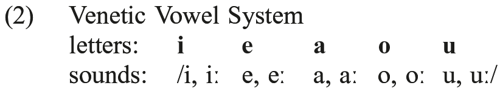
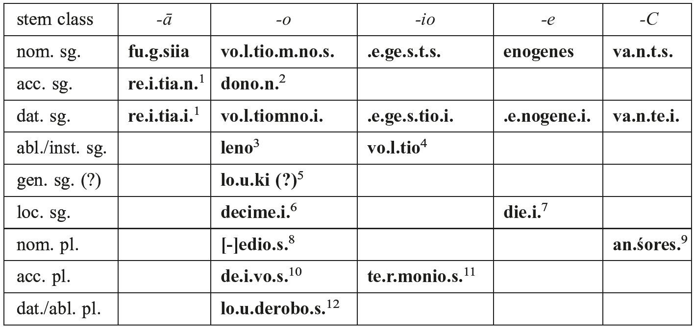

# 102. Venetic

1.Documentation

2.Phonology

3.Morphonology

4.Syntax

5.Lexicon

6.Dialectology

7.References

## 1. Documentation

The Venetic language was spoken in pre-Roman Italy in territory that is today the modern province of Veneto. The main centers of Venetic culture were located in the southern Veneto at Este and Padova, but Venetic settlements have been discovered to the north as far as Làgole di Calalzo. And recently, important archaeological remains have come to light at Altino, a settlement located on the eastern boundary of Venetic territory (Prosdocimi 2009: 421−450).

The Venetic language is attested by 450 documents ranging in date from the 6th to the 1st century BCE. The documents in the corpus are inscriptions incised on durable material: stone, metal, pottery and bone. Over 75% of the total are votive dedications; the remainder, apart from two or three that might be public in nature, consists of epitaphs. The inscriptions are short − usually no more than six or seven words − and they are formulaic in structure. Most of the word-forms are names and patronymics. The number of lexemes is less than 100.

The <i>Tavola da Este</i>, an inscribed bronze plaque, is the only document in the corpus of substantial length (Marinetti 1998: 58−97). Unfortunately, less than half of the plaque survives. In antiquity, it was cut into the shape of a shield and reused as part of a votive offering. Not a single sentence survives intact.

Venetic inscriptions are divided into chronological periods based on features of paleography and orthography.

<table>
<tr><td>(1)</td><td>Chronology of Venetic inscriptions</td></tr>
<tr><td></td><td>Old Venetic, ca. 550−300 BCE (syllabic punctuation; <b>h</b> spelled by <i>heta</i>)</td></tr>
<tr><td></td><td>Recent Venetic, ca. 300−150 BCE (syllabic punctuation; <b>h</b> spelled by <b><. |. ></b>)</td></tr>
<tr><td></td><td>Latino-Venetic, after 150 BCE (Venetic written in a Republican Latin alphabet)</td></tr>
</table>

For all but the last stage of the language, Venetic was written in an alphabet that had been borrowed from Etruscans who settled in the southern Veneto at the beginning of the 6th century BCE (Marinetti 2002: 43). The Venetic writing system had the following distinctive features:

(i) Dental stop consonants /t, d/ were spelled in regionally distinct ways; at Este /t/ = <x> (an X-sign) and /d/ = <z> (<i>zeta</i>); at Padova /t/ = <θ> and /d/ = <t>; and at Vicenza /t/ = <x> (an X-sign) and /d/ = <t>.

(ii) Voiced stop consonants /b, d, g/ were represented by the letters <φ>, <z> (at Este), and <χ> respectively.

(iii) The fricative /f/ was spelled by means of the digraph <b>vh</b>. Near the end of the Recent Venetic period, following the loss of the glottal fricative /h/, the spelling of /f/ changed from <b>vh</b> to <b>h</b> at sites located in the northern Veneto. For example, this orthographic change is reflected in the spelling of /f/ in inscriptions from Làgole di Calalzo. The first sound in the name <b>fo.u.va</b>, for example, is spelled by <i>heta</i>.

(iv) Venetic inscriptions were written <i>scriptio continua</i>. Words were not separated by punctuation. However, in all but a few inscriptions, Venetic scribes did employ a system of syllabic punctuation. Orthographic syllables that did not have the structure CV or CRV (where R = resonant) were typically, though not consistently, marked by means of periods or short lines typically positioned on both sides of the final letter(s) of the syllable. For example, the personal name Voltiomnos was written as follows (reversing its original right-to-left direction): <b>vo.l.tio.m.no.s.</b> Venetic scribes working at the sanctuary of the goddess Reitia at Este adopted this style of writing from itinerant Etruscan scribes/artisans who had worked at the Portonaccio sanctuary at Veii in southern Etruria.

(v) The direction of writing was predominantly right-to-left, but left-to-right is also common. Several documents were written in boustrophedon style (as the ox plows).

## 2. Phonology

The Venetic vowel system is set out in (2). The vowels are listed beginning at the high front position and then moving toward the high back position. It is generally assumed that there was a contrast in length at all five vowel positions, but the writing system does not reflect this. Identification of long vowels is conjectured on the basis of etymological comparison, e.g. Sanskrit <i>dā́nam</i> ‘gift’ vs. Venetic <b>dono.n.</b> ‘gift’ = /doːnon/.

Venetic diphthongs are: /aj/ (<b>a.i.</b>), /aw/ (<b>a.u.</b>), /ej/ (<b>e.i.</b>), /oj/ (<b>o.i.</b>), /ew/ (<b>e.u.</b>), and /ow/ (<b>o.u.</b>). Long diphthongs may have existed in a few inflectional endings, e.g., dative singular: <b>re.i.tia.i.</b> /aːj/ ‘Reitia’; <b>.e.ge.s.tiio.i.</b> /oːj/ ‘(son) of Egests’. However, such a distinction, if it did exist, was not captured by the writing system.

The Venetic sound system had six resonants: two nasals /m, n/ (<b>m</b>, <b>n</b>), two liquids /l, r/ (<b>l</b>, <b>r</b>), and two approximants /j, w/ (<b>i</b>, <b>v</b>). The bilabial nasal <i>*m</i> merged with <i>*n</i> in word-final position, e.g, <i>*ek̑wom</i> ‘horse’, acc. sg., > <b>.e.kvo.n.</b>. The replacement of word-final <b>-n</b> by <b>-m</b> in the word ‘gift’, <b>dono.m.</b>, which is attested in inscriptions recovered at Làgole di Calalzo, is late and perhaps due to Latin influence.

The inventory of obstruent phonemes consisted of seven stops, three fricatives, and a sound whose manner of articulation is unclear. Stop consonants were distinguished at the labial, dental, and velar points of articulation by the feature [voice] (see Rix 1997). There was also a voiceless velar stop with labial co-articulation /kʷ/ (<b>kv</b>). A voiced labiovelar stop is not attested; in word-initial position PIE <i>*gʷ</i> changed to /w/ (<b>v</b>), e.g., PIE <i>*gʷih3-wo-</i> ‘living’ > <b>vivo.i.</b> dat. sg. It is possible that the voiced labiovelar survived in other environments, such as after nasals, as it did in Latin, but there is no evidence to support this idea. Old Venetic had three fricatives. The articulatory features are reasonably secure: labiodental /f/ (<b>vh</b>), dental /s/ (<b>s</b>), and glottal /h/ (<b>h</b>). The manner of articulation of the sound spelled by the letter <i>san</i> and transcribed by <b>ś</b> is not certain. The fact that <b>ś</b> represents the outcome of <i>*-tj-</i> in many cases where the etymological origin is clear suggests that the letter may have stood for a voiceless dental affricate. In Recent Venetic the glottal fricative /h/ was lost. There is also some evidence to suggest that the sound spelled as <b>ś</b> merged with /s/ at this time.

With the exception of <i>*gʷ</i> the voiceless and voiced stop consonants passed unchanged from PIE to Venetic. The major phonological development concerned the PIE voiced aspirated stops. In word-initial position these consonants developed either to /f/ (<b>vh</b>) (< <i>*bh, *dh</i>) or to /h/ (<b>h</b>) (< <i>*g̑h</i>/<i>*gh</i>), as happened in other Italic languages, e.g. <b>ṿḥratere.ị.</b> /fraːterej/ ‘brother’, dat. sg., cf. Latin <i>frāter</i>, nom. sg., Umbrian <b>fratrum</b> ‘brothers (of a religious organization)’, gen. pl., etc. In medial position PIE <i>*bh, *dh</i>, and <i>*g̑h</i>/<i>*gh</i> developed to voiced stop sounds /b/, /d/, and /g/, which were spelled as <b>-b-/-f-</b>, <b>-d-</b>, and <b>-g-</b> respectively, e.g., <b>lo.u.derobo.s.</b> /lowderobos/ ‘children’, dat. pl., < <i>*lowdʰero-bʰos</i>.

Nothing is known about the nature of the word-accent in Venetic.

## 3. Morphology

Venetic nouns and adjectives belong to the major Indo-European stem classes: <i>ā</i>-stems (<b>re.i.tia.n.</b> ‘Reitia (theonym)’, acc. sg.); <i>o</i>-stems (<b>dono.n.</b> ‘gift’, acc. sg.); and C-stems (stop-stems <b>va.n.t.s.</b> ‘Vants’, nom. sg.; <i>n</i>-stems <b>pupone.i.</b> ‘Pupo’, dat. sg.; <i>r</i>-stems <b>lemeto.r.</b> ‘Lemetor’, nom. sg.). In prehistoric Venetic, stems ending in the suffix <i>-io</i> appear to have lost the thematic vowel <i>-o</i> in the nominative singular, e.g., <b>ve.n.noni.s.</b>, patronymic, ‘son of Venno’ < <i>*vennōn(i)yos</i>. In Recent Venetic inscriptions from Este, the <i>i</i>-vowel of the nominative ending <i>-is</i> was also lost so that personal names and patronymics can only be distinguished by context, e.g., <b>iiuva.n.t.s.</b>, patronymic, ‘son of Iuvants’ < <i>*yuvant(i)yos</i> (Untermann 1980: 146−147). <i>S-</i>stems appear to have shifted to <i>e</i>-declension; compare the nominative singular form <b>enogenes</b> ‘Enogenes’ to the dative singular <b>.e.nogene.i.</b>. The locative singular of the word ‘day’, <b>die.i.</b>, which bears a striking resemblance to Latin <i>diēs</i> ‘day’, may also belong to <i>e</i>-stem inflection. A few nouns inflect as <i>i</i>-stems, e.g. <b>trumusijati.n.</b> ‘Trumusijatis (theonym)’, acc. sg. The noun <b>.a..i.su.n.</b>, ‘sacred object (?)’, acc. sg., is the only <i>u</i>-stem attested in inscriptions.

Venetic nouns were assigned to one of three grammatical gender classes. <i>ā</i>-stems were feminine (<b>re.i.tia.n.</b>); <i>o</i>-stems were masculine (<b>.e.kvo[.]n[.]</b>) or neuter (<b>dono.n.</b>); <i>i</i>-stems and C-stems were masculine (<b>ṿḥratere.ị.</b>), feminine, or neuter (<b>.a.uga.r.</b>).

Four cases are securely attested: nominative, accusative, dative, and ablative/instrumental. The locative singular is represented by the phrase <b>decime.i. die.i.</b> ‘on the 10th day’, but this is the only clear example and the syntactic context in which it is found is incomplete. The ablative/instrumental is the result of the merger of PIE ablative and instrumental cases. In C-stem and <i>e</i>-stem inflection dative forms ending in <b>-e.i.</b> are found alongside those ending in <b>-i</b>. This variation in the form of the dative was the result of dative/locative syncretism (see Eska and Wallace 2002). Most scholars believe that Venetic had an <i>o</i>-stem genitive singular in <b>-i</b>, but the status of this ending is the subject of scholarly debate (see Agostiniani 1995−1996 and Eska and Wallace 2001).

Venetic nominal forms inflected for singular and plural. Two unpunctuated word-forms, <b>horvionte</b> and <b>alkomno</b>, most likely present active and middle participles respectively, are generally interpreted as having dual inflection. Unfortunately, the meanings of these words are unknown. Paradigms for Venetic noun classes are presented in (3). (Names and patronymics are not glossed in the notes that follow the paradigms.)

<table>
<tr><td>(3)</td><td>Venetic nominal forms</td></tr>
<tr><td></td><td></td></tr>
<tr><td></td><td>Note: 1. ‘Reitia [divinity]’; 2. ‘gift’; 3. ‘?’; 4. ‘voluntary’; 5. ‘grove, clearing’; 6. ‘tenth’; 7. ‘day’; 8. ‘?’; 9. ‘augurs (?)’; 10. ‘gods’; 11. ‘of the boundary’; 12. ‘children’</td></tr>
</table>

The ordinal <b>decime.i.</b> ‘tenth’ is the only number that is securely attested. Numbers functioning as personal names, e.g. <b>kvito</b> ‘Quintus’, are best treated as borrowings from Latin (Marinetti 1995).

Personal pronouns are represented by the 1st person forms <b>ego</b> ‘I’, nom. sg., and <b>mego</b> ‘me’, acc. sg. The accusative <b>mego</b> is a rhyming form based on the nominative. The reflexive pronoun SELBOISELBOI ‘himself’, dat. sg., brings to mind forms attested in Germanic, cf. OHG <i>selb selbo</i>, Gothic <i>silba</i>. Demonstrative pronouns are represented by <b>.e.i.k.</b> ‘this’, neut. acc. sg., and <b>.e.m.</b> ‘this’, masc./fem. acc. sg. (Prosdocimi 1988: 308, 360; Marinetti 2003: 394).

The verb forms in the corpus are 3rd person, indicative mood. Four verbs, <b>doto</b> ‘gave’, <b>dona.s.to</b>/<b>donasan</b> ‘gave’, <b>vha.g.s.to</b> /faksto/ ‘dedicated’, and <b>tole.r.</b> (<b>tola.r.</b> 1x) ‘brought (?)’ are predicates in votive inscriptions. <b>atisteit</b> ‘stands/stood by (?)’ appears in a funerary inscription.

From an Indo-European point of view, <b>doto</b> is a root aorist. The sigmatic aorist is represented by <b>dona.s.to</b>, <b>donasan</b>, and <b>vha.g.s.to. atisteit</b> could be a present tense form based on the root <i>*steh₂-</i> ‘be standing’, but the form is not particularly transparent and none of the pre-forms suggested in the literature (<i>*atistai̯eti</i>, <i>*atistāei̯eti, *atistaīt</i>) seem likely in view of the <i>ad hoc</i> changes required to yield the Venetic. The verb <b>tole.r.</b> appears in votive inscriptions and thus in a context in which past tense verbs are the norm. <b>tole.r.</b> is usually treated as a perfect tense form <i>*tetolh₂e-</i> of the root <i>*telh₂-</i> with loss of the syllable of reduplication (de Bernardo Stempel 2000: 61; Untermann 2000: 743).

<b>kvido.r.</b>, which appears once in a votive inscription from Làgole di Calalzo, may also be a verb of dedication. It is in construction with <b>dono.m.</b> ‘gift’ and thus could have a meaning similar to <b>dona.s.to</b> or <b>tole.r.</b>. Unfortunately, the etymological analyses offered thus far are not convincing.

The person and number endings are represented by <b>-t</b>, <b>-to</b>, <b>-an</b>, and <b>-r</b>. <b>-t</b> is the Venetic reflex of the 3rd singular primary active ending <i>*-ti</i>. The secondary endings are 3rd singular <b>-to</b>, which is the PIE secondary middle voice ending, and 3rd plural <b>-an</b>, which is the regular development of PIE secondary active <i>*-nṭ</i> via a series of changes (<i>*-nḍ</i> > <i>*-and</i> > <i>*-ann</i> > <i>*-an</i>). The 3rd singular and 3rd plural verbs <b>dona.s.to</b> and <b>donasan</b> appear to belong to the same paradigm. If so, it is not particularly clear how forms with middle and active endings came to be yoked together. For the verb <b>tole.r.</b>, which governs an accusative object, the 3rd singular ending <b>-r</b> has middle function. In Umbrian, the <i>r</i>-ending in verbs such as <i>ferar</i> ‘shall be carried’, if comparable to the Venetic, is passive.

## 4. Syntax

As is to be expected of an ancient IE language, noun phrases inflected in the nominative case filled the syntactic role of subject. Phrases functioning as direct object or as goal of an action were in the accusative case. Indirect objects and benefactive phrases were dative. Noun phrases governed by prepositions were dative, e.g. <b>eni <pr>eke.i. data.i.</b> ‘for a prayer granted’, accusative, e.g. <b>u. teu.ta[n.]</b> ‘on behalf of the community’ or ablative/instrumental, e.g. <b>.o.p iorobos</b> ‘because of?’. Phrases specifying a point in time were in the locative case, e.g. <b>decime.i. die.i.</b> ‘on the 10th day’.

Modifiers agreed with nouns in gender, number and case, e.g., <b>te.r.monio.s. de.i.vo.s.</b> ‘gods of the boundaries’, masc. acc. pl. Verbs agreed with subjects in person and number. In the inscription cited in (4) the personal names <b>vo.l.tio.m.no.s.</b>, <b>ḅḷadio</b>, and <b>ke[− −]e[−]un.s.</b>, which are linked asyndetically, triggered plural agreement on the verb <b>donasa(.n.)</b>.

<table>
<tr><td>(4)</td><td><b>mego vo.l.tio.m.no.s. ḅḷadio ke[− −]e[−]un.s. donasa(.n.) | heno[---]to.i.</b></td></tr>
<tr><td></td><td>‘Voltiomnos, Bladio, and Ke[− −]e[−]uns gave me to (the divinity) Heno---tos.’</td></tr>
</table>

Only two subordinate clause types are attested: a relative clause introduced by <b>kude</b> ‘where’ and a temporal clause introduced by <b>kva.n.</b> ‘when’. Nothing more can be said about these constructions because the syntactic contexts in which they are found are incomplete.

Adjectives and numbers were placed before the nouns they modified, e.g., <b>te.r.monio.s. de.i.vo.s.</b> ‘gods of the boundaries’, but patronymic adjectives in onomastic phrases followed their personal names, e.g., <b>va.n.t.s..e.ge.s.t.s.</b> ‘Vants, <b>(son) of Egestos</b>’.

Votive inscriptions recovered from Este and Làgole di Calalzo are the primary source for Venetic syntax. The order of the major constituents in votive inscriptions from Este varied from OSV, as shown by inscription (4) above, to OVS and SVO, as shown by inscriptions (5) and (6). OVS is the most frequent order, but it would be unwise to make too much of this fact. Most of the languages of ancient Italy adopted this order for votive inscriptions of the <i>titulus loquens</i>-type. At Làgole di Calalzo, where scribes did not adopt the <i>titulus loquens</i> form of inscription, the order of constituents is predominantly SVO, as in inscription (7).

<table>
<tr><td>(5)</td><td><b>mego dona.s.to re.i.tiia.i. nerka lemeto.r.na</b></td></tr>
<tr><td></td><td>‘Nerka, (daughter) of Lemetor, gave me to (the divinity) Reitia.’</td></tr>
<tr><td>(6)</td><td><b>vhu.g.siia vo.l.tiio.n.mnin.(a) dona|.s.to r(e).i.tiia.i. mego</b></td></tr>
<tr><td></td><td>‘Fuksia, (daughter) of Voltiomnos, gave me to (the divinity) Reitia.’</td></tr>
<tr><td>(7)</td><td><b>fovo fouvoniko.s. doto dono.m. trumusijate.i.</b></td></tr>
<tr><td></td><td>‘Fovo, (son) of Fouvo, gave a gift to (the divinity) Trumusijatis.’</td></tr>
</table>

## 5. Lexicon

Fewer than 100 lexemes have been extracted from the corpus of inscriptions. Of these, some were inherited from PIE; others were loanwords from Latin. Words of IE patrimony are: <b>-kve</b> ‘and’, cf. Latin <i>-que</i>, Greek -τε, Sanskrit <i>-ca</i>; <b>dono.n.</b> ‘gift’, acc. sg., cf. Latin <i>dōnom</i>, nom.-acc. sg., Skt. <i>dā´nam</i> nom.-acc. sg.; <b>ṿḥratere.ị.</b> ‘brother’, dat. sg., cf. Latin <i>frāter</i>, nom. sg., Greek φράτηρ ‘member of a brotherhood’, nom. sg., Sanskrit <i>bhrā´tā</i>, nom. sg.; <b>de.i.vo.s.</b> ‘gods’, acc. pl., cf. Archaic Latin <b>deivos</b>, acc. pl., Sanskrit <i>deváḥ</i>, nom. sg.; <b>ekvo[.]n[.]</b> ‘horse’, acc. sg., cf. Latin <i>equus</i>, nom. sg., Sanskrit <i>áśvaḥ</i>, nom. sg.; <b>teu.ta[m.]</b> ‘community, people’, acc. sg.; cf. Oscan <i>touto</i>, ‘community’, nom. sg.; Old Irish <i>túath</i> ‘tribe, people’; Gothic <i>þiuda</i> ‘people’; etc. Loanwords from Latin include: MILES ‘soldier’, nom. sg., FILIA ‘daughter’, nom. sg., and LIBERTOS ‘freedman’, nom. sg.. Several words, all of uncertain meaning, have IE morphological structure but lack comparable forms in other IE languages, e.g., <b>.a.k.lo.n.</b> ‘memorial (?)’, acc. sg.; <b>metlon</b> ‘memorial offering (?)’, acc. sg. (possibly from <i>*men-klom</i>); <b>magetlo.n.</b> ‘offering (?)’, acc. sg.; <b>.a.ugar.</b> ‘?’, acc. sg.; <b>ma.i.s.terato.r.fo.s.</b> ‘the <i>magisteratores</i> (divinities) (?)’, dat. pl., etc.

Patronymic formations were built from personal names by means of adjective suffixes with good PIE pedigrees, e.g. <i>*-yo-, *-iko-</i>, and <i>*-no-</i>. Personal names provide one source for compound formations. <b>ho.s.θi-havo.s.</b> ‘Hostihavos’, nom. sg., is thought to be a compound of the stems <i>*ghosti-</i> ‘guest, host’ and <i>*g̑hewHo-</i> ‘inviting’, although the <i>a</i>-vocalism of the final member is difficult to explain (Marinetti 2007: 441). The compound <b>.ekvopetari[.]s.</b>, <b>.e.kupetari.s.</b>, etc., which is found on a series of epitaphs from Padova, has generated considerable scholarly interest. The word refers to a type of funerary offering or ritual. The nominal stems <b>.ekvo-/.e.ku-</b> ‘horse’ and <b>petari</b> ‘riding (?)’ suggest that the funerary practice was associated with the burial customs of equestrian classes (see Marinetti 2005: 219−222).

## 6. Dialectology

Linguistic evidence does not permit the division of Venetic into regional dialect areas.

The position of Venetic within Indo-European continues to be debated (see de Bernardo Stempel 2000; Euler 1993; Lejeune 1974: 171−173; Meiser 1998: 26; Untermann 1980: 315−316; and Weiss 2009: 15−16; 471−472). Some consider Venetic a branch of Italic; others consider it unaffiliated within Indo-European. As is often the case with languages of limited attestation, insufficient evidence makes a decision one way or the other difficult, if not impossible.
