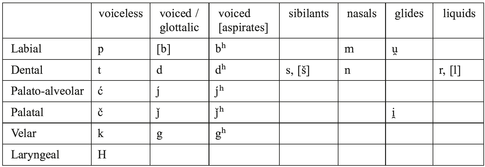

## XVII. Indo-Iranian

# 110. The phonology of Proto-Indo-Iranian

1.Phoneme inventory

2.Vowels

3.Resonants

4.Stops

5.Sibilants

6.Laryngeal

7.Consonant clusters

8.Accent

9.Relative chronology

10.References

## 1. Phoneme inventory

The Proto-Indo-Iranian phonological system can be represented as follows:

Vowels: a ā

Consonants

## 2. Vowels

PIIr. had only two vowels: <i>a</i> and <i>ā</i>. Most probably, they were distinguished not so much by length, but rather by timbre, <i>a</i> being more closed ([ə] or [ʌ]) than <i>ā</i> ([ɐ(:)]), which is still the situation found in Sanskrit (Hoffmann 1976: 552−554; Cardona, this handbook). On a phonetic level, there also were [i] and [u], but these vowels were allophones of the phonemes /i̯/ and /u̯/, respectively, and their role in morphophonological alternations was very different.

### 2.1. PIIr. *<i>a</i>

2.1.1. PIIr. *<i>a</i> first of all reflects PIE *<i>e</i> (including *<i>h₂e</i> and *<i>h₃e</i>) in all positions and *<i>o</i> in closed and word-final syllables:

–PIIr. *<i>daća</i> ‘ten’ (Skt. <i>dáśa</i>, OAv. <i>dasā</i>) < PIE *<i>dek̑m̥</i> (Gr. δέκα, Lat. <i>decem</i>);

–PIIr. *<i>marta-</i> m. ‘mortal, man’ (Skt. <i>márta-</i>, OAv. <i>marəta-</i> [< *<i>martá-</i>], MP <i>mard</i>) < PIE *<i>mor-to-</i> (Gr. [Kallimachos] μορτοί pl. ‘id.’);

–PIIr. *<i>Haȷ́ra-</i> (Skt. <i>ájra-</i> ‘field’) < PIE *<i>h₂eg̑-ro-</i> (Gr. ἀγρός, Lat. <i>ager</i>, Goth. <i>akrs</i> ‘field’);

–PIIr. *<i>HastH(i)-</i> (Skt. <i>ásthi-</i> n. ‘bone’, YAv. <i>ast-</i> n. ‘bone, body’) < PIE *<i>h₃estH-</i>(Hitt. /<i>hastai-</i>/, Gr. ὀστέον ‘bone’).

2.1.2. Further, PIIr. *<i>a</i> reflects PIE *<i>n̥</i>, <i>*m̥</i> (i.e. *<i>n</i>, <i>*m</i> between two consonants CNC; a word boundary is counted as a consonant, so that #NC and CN# are included):

–PIIr. *<i>mati-</i> (Skt. <i>matí-</i> f. ‘thought’) < PIE *<i>mn̥-ti-</i> (Lat. <i>mēns</i>, <i>mentis</i> f. ‘mind’, Lith. <i>mintìs</i> f. ‘thought, idea’);

–PIIr. *<i>a-</i> (Skt. <i>a-pútra-</i>, YAv. <i>a-puϑra-</i> adj. ‘without a son’) < *<i>n̥-</i> (Gr. ἄ-ϑεος adj. ‘without a god’, Lat. <i>in-</i> ‘un-’, Goth. <i>un-</i> ‘id.’);

–PIIr. *<i>gata-</i> ‘gone’ (Skt. <i>gatá-</i>, Av. <i>gata-</i>) < PIE *<i>gʷm̥to-</i> (Gr. ἀνα-βατός, Lat. <i>in</i><i>ventus</i>);

–PIIr. *<i>sapta</i> ‘seven’ (Skt. <i>saptá</i>, YAv. <i>hapta</i>) < PIE *<i>septm̥</i> (Gr. ἑπτά, Lat. <i>septem</i> ‘seven’).

There is one exception: *<i>m</i> remains consonantal in word-initial position before resonants (<i>#mnV-</i>, <i>#mrV-</i>, etc.), cf. PIIr. *<i>mlaHta-</i> ‘softened, tanned (leather)’ (Skt. <i>mlātá-</i>; YAv. <i>mrāta-</i>) < PIE *<i>mleh₂-to-</i> (OIr. <i>mláith</i> ‘soft, weak’; Gr. μαλακός ‘id.’), Skt. <i>mnā-</i> ‘to mention’ < PIE <i>mneh₂-</i> (Gr. μιμνῄσκω ‘I care for, make mention’).

The development of PIE *<i>n̥</i>, <i>*m̥</i> to PIIr. *<i>a</i> went through a nasalized schwa [ə˜] (denasalized after the loss of intervocalic laryngeals, 6.4). The nasalization of [ə˜] was realized as oral occlusion if *<i>n̥</i>, <i>*m̥</i> were followed by a resonant or a laryngeal, i.e. PIE *<i>n̥R</i>, <i>*m̥R</i> > PIIr. <i>anR</i>, <i>*amR</i> (where R = a resonant or a laryngeal):

–PIIr. 3sg. middle *<i>mani̯atai</i> (Skt. <i>mányate</i> ‘thinks, considers’, OAv. <i>mańiietē</i> ‘understands’) < PIE *<i>mn̥i̯e-</i> (Gr. μαίνομαι ‘I am furious’);

–PIIr. *<i>-tamHa-</i> suff. of the superlative (Skt. <i>-tama-</i>, Av. <i>-təma-</i>) < PIE *<i>-tm̥Ho-</i> (Lat. <i>in-timus</i> ‘inner’).

### 2.2. PIIr. *<i>a</i>̄

2.2.1. PIIr. *<i>ā</i> reflects PIE *<i>ē</i>, <i>*ō</i>:

–PIIr. nom.sg. *<i>maHtā</i> f. ‘mother’ (Skt. <i>mātā́</i>, Av. <i>mātā</i>) < PIE *<i>meh₂tēr</i> (Gr. μήτηρ, Lat. <i>māter</i>);

–PIIr. *<i>u̯āks</i> nom.sg. f. ‘speech, voice’ (Skt. <i>vā́k</i>; OAv. <i>vāxš</i>) < PIE *<i>u̯ōkʷs</i> (Lat. <i>vōx</i>).

2.2.2. Furthermore, PIIr. *<i>ā</i> reflects PIE *<i>o</i> in an open syllable, except for absolute auslaut. This development (PIE *<i>o</i> > PIIr. *<i>ā</i> /__CV) was first proposed by Karl Brugmann in 1876 and is known as Brugmann’s Law.

–PIIr. *<i>ȷ́ānu-</i> (Skt. <i>jā́nu-</i>, YAv. <i>zānu°</i>, MP <i>d’nwg</i> /<i>dānūg</i>/ ‘knee’) < PIE *<i>g̑ónu-</i> (Gr. γόνυ ‘knee’);

–PIIr. *<i>-tāram</i>, acc.sg. of nomina agentis in <i>-tar-</i> (Skt. <i>dā́tāram</i> ‘giver’, OAv. <i>dātārəm</i> ‘creator’) < PIE *<i>-tor-m̥</i> (Gr. δώτορα) vs. *<i>-taram</i>, acc.sg. of kinship terms (Skt. <i>pitáram</i>, YAv. <i>pitarəm</i> ‘father’) < PIE *<i>-ter-m̥</i> (Gr. πατέρα); the final *<i>-m</i> in these PIIr. forms is analogical after the acc.sg. of the <i>o-</i>stems.

–PIIr. 3sg.pf. *<i>C₁a-C₁āC₂-a</i> (type Skt. <i>jagā́ma</i> ‘came’, YAv. <i>daδāra</i> ‘held’) < PIE *<i>C₁e-C₁oC₂-e</i> (type Gr. μέμονε ‘has in mind’).

Final *<i>-o</i> remains unchanged:

–PIIr. *<i>pra</i> (Skt. <i>prá</i> ‘forward’; Av. <i>frā</i> is ambiguous) < PIE *<i>pro</i> (Gr. πρό), but possibly Skt. <i>prā-tár</i> adv. ‘early, in the morning’ < *<i>pro-ter</i>.

–PIIr. *<i>sa</i> demonstr. pron. (Skt. <i>sá</i>) < PIE *<i>so</i> (Gr. ὁ).

Hale (1999) has argued that the final *-<i>o</i> of particles could be lengthened if they formed an accentual unity with the following word, cf. Skt. <i>ghā</i> (< PIE *<i>gʰo</i>) vs. Skt. <i>ha</i> (< PIE *<i>gʰe</i>), but since <i>ghā</i> is an enclitic particle, this solution seems improbable (<i>ghā</i> can also reflect *<i>gʰoH</i>).

Brugmann’s Law is one of the earliest Indo-Iranian developments. It evidently preceded the merger of short IE vowels *<i>e</i> and *<i>o</i> into IIr. *<i>a</i>. As demonstrated by Kuryɫowicz (1927), it was also anterior to the loss of antevocalic laryngeals. In other words, the laryngeal in the sequence *<i>oCHV</i> closed the preceding syllable and the vowel remained short. The presence of a laryngeal accounts for the short vowel in the root of PIIr. 1sg.pf. (type Skt. <i>jagáma <</i> *<i>gʷe-gʷom-h₂e</i>, cf. Gr. μέμονα) vs. long vowel in 3sg.pf. (type Skt. 3sg. <i>jagā́ma</i> < *<i>gʷe-gʷom-e</i>, OAv. <i>nə̄nāsā</i> < *<i>ne-nok̑-e</i>, cf. Gr. μέμονε), in the root of causatives like Skt. <i>jaráyati</i> ‘makes age’ (PIE *<i>g̑orh₂-ei̯e-</i>), <i>janáyati</i> ‘begets’ (PIE *<i>g̑onh₁-ei̯e-</i>), <i>śamáyati</i> ‘appeases’ (PIE *<i>omh₂-ei̯e-</i>) vs. Skt. <i>vāsáyati</i> ‘clothes’ (PIE *<i>u̯os-ei̯e-</i>), Skt. <i>śrāváyati</i> ‘makes heard’, Av. <i>srāuuaiieiti</i> ‘announces’ (PIE *<i>lou̯-eie-</i>), etc. and in the root of the 3sg. passive aorist Skt. <i>(á)jani</i> ‘has been/is born’ (PIE *<i>g̑onh₁-i</i>) vs. Skt. <i>śrā́vi</i>, OAv. <i>srāuuī</i> ‘is known, heard’ <i><</i> (PIE *<i>lou̯-i</i>), etc.

Likewise, Brugmann’s Law was anterior to the loss of intervocalic laryngeals (see 6.4 and Lubotsky 1995: 220), as appears from the 3sg. pass. aor. Skt. <i>(á)dāyi</i>, <i>(á)dhāyi</i>, <i>(á)jñāyi</i>, <i>ápāyi</i>, <i>ámāyi <</i> *<i>doh₃-i</i>, <i>*dʰoh1-i</i>, etc.

Brugmann’s Law further did not apply to PIE *<i>h₃e</i> (Lubotsky 1990), cf. PIIr. *<i>Hau̯i-</i>(Skt. <i>ávi-</i> m.f. ‘sheep’) <i><</i> PIE *<i>h₃eu̯i-</i> (Gr. ὄ[ϝ]ις, Lat. <i>ovis</i> ‘sheep’); PIIr. *<i>Hanas-</i> (Skt. <i>ánas-</i> n. ‘cart’) <i><</i> PIE *<i>h₃en-es-</i> (Lat. <i>onus</i> n. ‘burden’); PIIr. *<i>Hapas-</i> (Skt. <i>ápas-</i> n. ‘work’, YAv. <i>huu-apah-</i> adj. ‘doing good work’) <i><</i> PIE *<i>h₃ep-es-</i> (Lat. <i>opus</i> n. ‘work’), and thus was anterior to the merger of the three laryngeals. This chronology is comprehensible, since the merger of laryngeals was triggered by the merger of the vowels.

There is only one development which seems to be anterior to Brugmann’s Law, i.e. vocalization of interconsonantal laryngeals in the final syllable (see also below, 6.3). From Skt. compounds like <i>tvátpitāraḥ</i> nom.pl. ‘having you as father’ < PIE *-<i>ph₂tores</i> (cf. Gr. -πάτορες), we know that the second members contained <i>o-</i>grade, cf. AiGr. II/1: 100 f. This fact may provide us with an explanation for the long vowel of Skt. bahuvrīhi compounds <i>bhádra-jāni-</i> ‘having a beautiful wife’, <i>yúva-jāni-</i> ‘having a young wife’, etc., which reflect PIE compounds in *<i>-gʷonh2- > *-gʷoni- > *-gāni-</i>, later analogically replaced by PIIr. *<i>-ȷˇāni-</i> after the simplex *<i>ȷˇani-</i> ‘wife’ (< *<i>gʷenh2-</i>, cf. OIr. <i>ben</i> f. ‘woman’; OCS <i>žena</i> f. ‘woman’).

## 3. Resonants

The PIIr. phonemes /i̯/, /u̯/, /r/ have vocalic and consonantal allophones, depending on their environment. In the position between two consonants (CRC) as well as in #RC and CR# they are vocalic [i], [u], [r̥]; otherwise they are as a rule consonantal [i̯], [u̯], [r]. The same holds true for the unclear phoneme /l/, for which see below, 3.3. Combinations of the resonants give various results in the daughter languages: PIIr. *<i>aiuV</i> > Skt. <i>evV</i> (<i>devá-</i>), Av. <i>aēuuV</i> (<i>daēuua-</i>); PIIr. *<i>auiV</i> > Skt. <i>avyV</i> (<i>savyá-</i>), Av. <i>aoiiV</i> (<i>haoiia-</i>); PIIr. *<i>Cur#</i> > Skt. <i>Cur</i> (<i>dhánur</i>), Av. <i>Cuuarə</i> (<i>ϑanuuarə</i>). The difference between the vocalization of /iu/ and /ui/ is also reflected in word-initial position: PIIr. *<i>iua</i> > Skt. <i>iva</i>, but PIIr. *<i>uiaH-</i> > Skt. <i>vyā-</i>, Av. <i>viiā-</i> ‘to envelop’. Also Sievers’ Law, which is responsible for the distribution of [i̯], [u̯] after a light syllable (V˘C) vs. [ii̯], [uu̯] after a heavy syllable (V:C or VCC), was subphonemic in Indo-Iranian and was only phonemicized in the separate languages after the loss of the laryngeal in the sequence CIHV. In the following treatment I will write *i̯, *u̯, and *r in Indo-Iranian reconstructions where these are unambiguously consonantal and *i, *u, and *r (here eschewing a syllabification marker) in all other circumstances.

3.1. PIIr. *<i>i</i> and *<i>u</i> usually go back to PIE *<i>i</i> and *<i>u</i>, respectively.

–PIIr. 3sg. *<i>Haiti</i>, ptc.pres. <i>Hi̯ant-</i> ‘go’ (Skt. <i>éti</i>, <i>yánt-</i>; OAv. <i>āitī</i> = <i>ā</i> + <i>aēitī</i>, YAv. <i>aiiaṇt-</i> = *<i>ā-iiaṇt-</i>, OP 3sg. <i>aitiy</i>) < PIE 3sg. *<i>h₁eiti</i>, ptc. *<i>h₁i̯ent-</i> ‘go’ (Gr. εἶσι, ἰόντες);

–PIIr. 1sg. pres.act. *<i>u̯aćmi</i>, 1pl. *<i>ućmasi</i> ‘wish’ (Skt. <i>váśmi</i>, <i>uśmási</i>; OAv. <i>vasəmī</i>, <i>usə̄mahī</i> /vasmi, usmahi/) < PIE *<i>u̯ek̑-mi</i>, <i>uk̑-mes</i> (Hitt. 1sg.pres.act. <i>ú-e-ek-mi</i> ‘I wish, desire’).

3.2. PIIr. *<i>i</i> can also reflect a PIE vocalized laryngeal in the final syllable (-CH[C]#), for which see 6.3.

3.3. The situation with the IIr. liquids /r/ and /l/ is complicated. Iranian has only *<i>r</i>. A few words with <i>l</i> in modern Iranian languages like MoP <i>āluftan</i> ‘to rage, grow mad (with love)’ vs. Parth. <i>pdrwb-</i> ‘throw into confusion’ or MoP <i>lištan</i>, Wa. <i>lixˇ-</i>, Par. <i>līs-</i>/ <i>lušt</i>, Orm. <i>las-</i> ‘lick’ vs. Pahl. <i>ls-</i> /<i>ris-</i>/ (or /<i>lis-</i>/?) ‘lick’ constitute a notable exception, which has found no explanation. Sanskrit has both phonemes, albeit their distribution does not perfectly match that of the PIE phonemes. Nevertheless, Skt. /l/, which is relatively rare in the RV and becomes more prominent in later texts (e.g., RV <i>áram</i>, AV <i>álam</i> adv. ‘fittingly, accordingly, enough’ < PIE *<i>h₂erom</i>; RV <i>reh-</i>, AVP+ <i>leh-</i> ‘lick’ < PIE *<i>lei̯g̑ ʰ-</i>; RV+ <i>palitá</i>- ‘grey’ < PIE *<i>pelit-</i>; RV+ <i>prav-</i>/<i>plav-</i> ‘swim’ < PIE *<i>pleu̯-</i>; RV+ <i>rep-</i>/<i>lep-</i> ‘smear’ < PIE *<i>lei̯p-</i>, etc.), for the most part corresponds to PIE *<i>l</i>. This suggests that PIIr. inherited this phoneme, but the distribution of /l/ and /r/ in Sanskrit remains an unsolved problem.

3.4. The PIIr. diphthongs *<i>ai</i>, *<i>au</i>, *<i>āi</i>, *<i>āu</i> must be considered combinations of *<i>ā</i>˘ + <i>i</i>,<i>u</i>, respectively.

## 4. Stops

PIIr. had three series of stops: voiceless T, (voiced) glottalic ’D, and voiced (aspirated) Dʰ. As was argued by Kortlandt 2003: 259 and 2007a: 150, aspiration of the “aspirates” may be an Indic innovation; if so, the third series was simply voiced. The glottalic articulation follows from specific reflexes in laryngeal clusters (see below 6.1 and 6.2), from the distribution of the -<i>na-</i>participles in Sanskrit (see Lubotsky 2007) and from glottalic pronunciation of these stops in Sindhi (see Kortlandt 1981). In the following, however, I shall stick to the traditional notation.

In my opinion, PIIr. did not have a fourth series of voiceless aspirates Tʰ. It is usually assumed that already in the PIIr. period, the combination of T + laryngeal yielded voiceless aspirates, which later developed into Skt. voiceless aspirates Tʰ and Iranian voiceless spirants (*<i>f</i>, <i>*ϑ</i>, <i>*x</i>). There are several arguments against this idea. First, T becomes a spirant before any consonant in Iranian (see Cantera, this handbook), and it is more economical to assume that this also happened before a laryngeal (e.g., *<i>tHa</i> > *<i>ϑHa</i> > PIr. *<i>ϑa</i> just like *<i>tra</i> > *<i>ϑra</i> or *<i>tua</i> > *<i>ϑu̯a</i>). Second, Iranian sometimes shows paradigmatic alternation between *<i>t</i> and *<i>ϑ</i> (Av. nom.sg. <i>pantā̊</i> < PIIr. *<i>pantā˘Hs</i>, gen.sg. <i>paϑō</i> < *<i>patHas</i> ‘way, path’; YAv. <i>mitaiiatu</i> /mitāiatu/ < *<i>mitaHi̯a-</i> < PIE *<i>mitn̥Hi̯e-</i> ‘dwell’ belonging to the root <i>miϑ-</i>), which suggests a relatively recent character of <i>ϑ</i>. Third, if we assume a PIIr. system T Tʰ D Dʰ, it is incomprehensible why Tʰ yielded spirants in Iranian, whereas Dʰ yielded stops.

Bartholomae’s Law, which is most probably of IE date (see Mayrhofer 1986: 115 for an overview), was still operative in PIIr., so that PIIr. clusters Dʰ+T and Dʰ+s were voiced and aspirated (i.e. DʰDʰ, Dʰzʰ, or DD, Dz, if aspiration is an Indic innovation; in Sanskrit, <i>-z-</i> in these clusters was later replaced by <i>-s-</i>, which yielded voiceless clusters <i>ps</i>, <i>ts</i>, <i>kṣ</i>.).

–PIIr. *<i>Ha(H)ugʰžʰa</i>,*<i>Ha(H)ugʰdʰa</i> 2,3sg.inj.med. ‘announce’ (OAv. <i>pairiiaoɣžā</i>, <i>aogədā</i>, in YAv. with a restored ending <i>aoxta</i>) < PIE *<i>h₁e-h₁ugʰ-</i> (Gr. εὖκτο 3sg.impf.med. ‘asked’, a reduplicated present to PIE *<i>h₁u̯egʷʰ-</i>, Lat. <i>voveo</i> ‘I vow’, cf. Lindeman 1972: 1967). In Iranian, the clusters were for the most part restored, except for a few non-transparent formations, like PIIr. *<i>Haddhā</i> (Skt. <i>addhā́</i> adv. ‘certainly, truly’) > OAv., OP <i>azdā</i> adv. ‘known’, Sogd. (Chr.) <i>’zd’</i> ‘known, informed’.

–PIIr. *<i>dʰi[dʰ]bʰzʰa-</i>, desiderative to the root *<i>dʰabʰ-</i> ‘deceive’ (Skt. <i>dípsati</i>, OAv. <i>diβžaidiiāi</i> inf.) < PIE *<i>dʰidʰbʰ-se-</i> (cf. Hitt. <i>tepnu-</i> ‘diminish, despise’).

Also the clusters where Dʰ and T are separated by <i>s</i> or a laryngeal (DʰsT, DʰHT) undergo Bartholomae’s Law, cf. PIIr. *<i>-gʰždʰ</i> < PIE *<i>-gʰst-</i> (Skt. <i>ápi gdha</i> 3sg.inj.med. ‘devours’ < PIE *<i>gʰs-to</i>, <i>sá-gdhi-</i> f. ‘communal meal’ <i><</i> PIE *<i>sm̥ -gʰs-ti-</i> with subsequent loss of <i>s</i> in this position); PIIr. *<i>dʰugʰHdʰar-</i> ‘daughter’ < *<i>dʰugʰHtar-</i> (see 6.2) < PIE *<i>dʰugh2ter-</i> (OAv. <i>dugədar-</i>). In Sanskrit, at a later stage, it was probably due to the intervening laryngeal that the cluster could be restored in the forms of the root <i>dhā-</i> (e.g. 3sg. mid. *<i>dʰedhh1toi</i> > PIIr. *<i>dʰadʰHdʰai</i> (OAv. <i>dazdē</i>) >> Skt. <i>dhatté</i>).

It must be borne in mind that Bartholomae’s Law has always remained subphonemic in the sense that assimilation in voice (and aspiration, if any) in these clusters was automatic.

4.1. The PIIr. labials *<i>p *b *bʰ</i> (*<i>b</i> is extremely rare) continue PIE *<i>p *b *bʰ</i> and the PIIr. dentals *<i>t *d *dʰ</i> continue PIE *<i>t *d *dʰ</i>.

4.2. The PIIr. velars *<i>k *g *gʰ</i> continue various kinds of PIE velars, if they did not stand before /ē˘/ and /i/ (for palatalized velars see 4.3).

First, they continue the PIE labiovelars *<i>kʷ *gʷ *gʷʰ</i>:

–PIIr. *<i>kad</i> (Skt. <i>kád</i> nom.acc.sg.n. interr. pron., YAv. <i>kat̰</i> id.) < PIE *<i>kʷod</i> (Lat. <i>quod</i>, OHG <i>hwaz</i> id.);

–PIIr. *<i>gati-</i> (Skt. <i>gáti-</i> f. ‘going, motion’, YAv. <i>aiβi.gaiti-</i> f. ‘coming towards’) < PIE *<i>gʷm̥ti</i> (Gr. βάσις f. ‘step, basis’, Goth. <i>gaqumþs</i> f. ‘gathering’);

–PIIr. *<i>gʰnanti</i> (Skt. <i>ghnánti</i> 3pl.pres. ‘they slay’) < PIE *<i>gʷʰnenti</i> (Hitt. <i>ku-na-an-zi</i> 3pl. ‘they kill’).

Second, they continue the late-PIE velars *<i>k *g *gʰ</i>, which primarily are the result of depalatalization of palatovelars in the position after *<i>s</i> (for which see below, 7) and of delabialization of labiovelars in the position after (and, possibly, also before) *<i>u</i>.

–PIIr. *<i>lauk-</i> (Skt. <i>ruc-</i> ‘shine’, <i>loká-</i> m. ‘free space, light space, world’; YAv. <i>ruc-</i>‘shine’) < PIE *<i>leuk-</i> (Gr. λευκός ‘light, white, bright’; Lat. <i>lūx</i> f. ‘light’);

–PIIr. *<i>bʰaug-</i> / <i>bʰauǰ-</i> (Skt. <i>bhuj- ‘</i>enjoy, consume’; OAv. <i>būj-</i> f. ‘atonement, expiation’) < PIE *<i>bʰeug-</i> (Lat. <i>fungor</i> ‘I enjoy, suffer, get rid of’);

–PIIr. *<i>dʰaugʰ-</i> (Skt. <i>dugh-</i> ‘give milk’; NP <i>dōxtan</i> ‘to milk’; Sh. <i>δůɣ</i> ‘buttermilk’) < PIE *<i>dʰeugʰ-</i> (Gr. τυγχάνω ‘I reach a goal’, Goth. <i>daug</i> ‘is good for smth., fits’).

Third, they continue the PIE palatovelars *<i>*g̑ *g̑ʰ</i> which were depalatalized in Indo-Iranian in the position before consonantal <i>r</i> (Weise’s Law; for which, cf. Kloekhorst 2011). Most likely, this depalatalization is a common trait of all satəm languages, cf. Meillet 1894: 297 f.

–PIIr. *<i>kruH-ra-</i> (Skt. <i>krūrá-</i>, Av. <i>xrūra-</i> ‘bloody, cruel’) < PIE *<i>ruh₂-ro-</i> (cf. Lat. <i>cruor</i> m. ‘raw, thick blood’, OPol. <i>kry</i> ‘blood’);

–PIIr. *<i>krau̯is-</i> (Skt. <i>kravíṣ-</i> n. ‘raw, bloody meat’, YAv. <i>xruuīšiiaṇt-</i> adj. ‘bloodthirsty’) < PIE *<i>reuh₂-s-</i> (Gr. κρέας n. ‘meat’);

–PIIr. *<i>gras-</i> (Skt. <i>gras-</i> ‘devour, digest’;?OAv. <i>grə̄hmō</i>, <i>grə̄hmā</i> PN) < PIE *<i>g̑ res-</i>(Gr. γράω, Cypr. γράσ-ϑι 2sg.impv.act. ‘eat!, gnaw!’).

### 4.3. PIIr. palatal stops

PIIr. had two series of palatal stops: *<i>ć ȷ́ ȷ́ʰ</i> and *<i>č ȷˇ ȷˇʰ</i>. The former continue the PIE palatal stops *<i>g̑ g̑ʰ</i>, while the latter are the reflex of PIIr. palatalization of velars. The phonetic nature of these two series cannot be exactly determined, but it seems reasonably clear that *<i>č ȷˇ ȷˇʰ</i> were palatal stops, whereas *<i>ć ȷ́ ȷ́ʰ</i> must have been pronounced with the tongue in a position closer to the teeth, something like palato-alveolar [t’ d’ d’ʰ] = [tś dź dźʰ]. When Indo-Iranian palatalization led to the rise of new palatal stops *<i>č ǰ ǰʰ</i>, the old palatals had to move more to the front in order to remain distinct (see Lubotsky 2001: 45 f. for a discussion).

Examples of the palato-alveolar stops:

–PIIr. *<i>daća</i> ‘ten’ (Skt. <i>dáśa</i>, OAv. <i>dasā</i>, OP *<i>daϑaᵒ</i>, Bactr. λασο) < PIE *<i>dek̑m̥</i> ‘ten’ (Goth. <i>taihun</i>, Gr. δέκα, Lat. <i>decem</i>);

–PIIr. *<i>ȷ́uš-</i> (Skt. <i>juṣ-</i> ‘like, be pleased’; YAv. <i>zuš-</i> ‘like’; OP <i>dauštar-</i> m. ‘friend’) < PIE *<i>g̑us-</i> (Gr. γεύομαι ‘I taste’; Lat. <i>gustus</i> m. ‘taste, enjoyment’; Goth. <i>kiusan</i> ‘test’);

–PIIr. *<i>ȷ́ʰasta-</i> m. ‘hand’ (Skt. <i>hásta-</i>; Av. <i>zasta-</i>; OP <i>dasta-</i>; Bactr. λιστο) < PIE *<i>g̑ ʰes-to-</i> (Lith. <i>pa-žastìs</i> ‘armpit’).

Examples of the palatal stops:

–PIIr. *<i>čarman-</i> n. ‘hide, skin’ (Skt. <i>cárman-</i>, YAv. <i>carəman-</i>, OP <i>carman-</i>, Khot. <i>tcārman-</i>) < PIE *<i>(s)ker-men-</i> (OHG <i>scirm</i> ‘screen’; OPr. <i>kērmens</i> ‘body’);

–PIIr. *<i>ǰani-</i> f. ‘wife’ (Skt. <i>jáni-</i>; OAv. <i>jə̄ni-</i>; Parth. <i>jn</i>) < PIE *<i>gʷenh2-</i> (OIr. <i>ben</i> f. ‘woman’);

–PIIr. *<i>ǰʰanti</i> 3sg.pres.act. ‘slays’ (Skt. <i>hánti</i>; YAv. <i>jaiṇti</i>; OP <i>jaⁿtiy</i>) < PIE *<i>gʷʰenti</i> (Hitt. <i>ku-[e-]en-zi</i>).

## 5. Sibilants

PIIr. had only one sibilant phoneme /s/, which was retracted to <i>š</i> after *<i>r</i>, <i>u</i>, <i>K</i>, <i>i</i> (the so-called RUKI-rule). The retracted pronunciation of *<i>s</i> was a phonetic feature, probably common to the satəm group, which was phonemicized in the separate branches. This is the reason why, for instance, RUKI was operative in Indo-Iranian also after *<i>i</i> < *<i>H̥</i> or *<i>r</i> < *<i>l</i>, i.e. in the position after sounds which have only arisen as the result of specific Indo-Iranian sound changes, cf. PIE *<i>reuh₂-s-</i>, *<i>teuh₂-s-</i> > Skt. <i>kravíṣ-</i> n. ‘raw meat’, OAv. <i>təuuiš-</i> n. ‘violence’; PIE *<i>h₂s-</i> > Skt. <i>(a-)śiṣat</i> 3sg.them.aor., OAv. <i>sīšōit̰</i> 3sg.opt.them.aor. ‘instruct, command’; PIE *<i>kʷels-</i> > Skt. <i>karṣ-</i>, Av. <i>karš-</i> ‘draw furrows, plough’. Before voiced stops, PIIr. */s/ was realized as [z] or, in the RUKI context, as [ž], but both [z] and [ž] were allophones of the phoneme */s/.

In PIIr., /š/ presumably was a marginal phoneme, found word-initially only in *<i>šu̯aćš</i> ‘six’ (Skt. <i>ṣas-̣</i>, Av. <i>xšuuaš</i>), if the assimilation of the initial *<i>s- ́</i>in PIE *<i>su̯ek̑s</i> was a common feature of the satəm languages (cf. Lubotsky 2000), and possibly in the cluster *<i>tš</i> < PIE *<i>k̑s</i> (see 7 below).

## 6. Laryngeal

PIIr. had one laryngeal phoneme /*H/, which is the result of the merger of the three Indo-European laryngeals. The phonetic nature of this phoneme is not absolutely assured, but, most probably, it was a glottal stop [ʔ]. The PIIr. laryngeal shows a variety of reflexes, which can be conveniently presented together (see Mayrhofer 2005 for a recent overview).

6.1. The laryngeal was dropped in the position before a cluster of a voiced unaspirated stop D plus any consonant (*H > Ø /_DC, cf. Lubotsky 1981), cf.

–PIIr. *<i>paȷ́ra-</i> vs. *<i>paHȷ́as-</i> (Skt. <i>pajrá-</i> adj. ‘firm’: Skt. <i>pā́jas-</i> n. ‘side, surface’, Oss. <i>faz</i> / <i>fazæ</i> ‘half, side; back, buttocks’) < PIE *<i>peh₂g̑ -</i> (Gr. εὐ-πηγής ‘well-built’, etc.);

–PIIr. *<i>su̯ad-</i> vs. *<i>su̯aHd-</i> (Skt. <i>svádati</i> ‘is sweet’; the short reflex is possibly due to the position before a consonant in the originally athematic verb *<i>su̯ad-ti</i> < *<i>su̯eh₂d-ti</i>; in Skt. <i>saṃ-súde</i> inf. ‘for pleasure’, the short reflex is either taken from the nom. *<i>-suHd-s</i> or is analogical after the present), OAv. <i>hudəma-</i> ‘sweetness’: Skt. <i>svādate</i> ‘is glad, tastes’, <i>svādú-</i> ‘sweet’, <i>sūdáyati</i> ‘makes acceptable’, <i>havyasū́d-</i> ‘sweetening the oblation’) < PIE *<i>su̯eh₂d-</i> (Gr. ἡδύς ‘sweet’, ἥδομαι ‘I am glad’, Toch.B <i>swāre</i> ‘sweet’);

–PIIr. *<i>i̯aȷ́-</i> ‘worship’ (Skt. <i>yájyu-</i> ‘devout, pious’; <i>yajñá-</i> m. ‘worship’; Av. <i>yasna-</i> m. ‘worship’) < *<i>(H)i̯eh₂g̑-</i> (Lat. <i>iāiūnus</i> ‘fasting’; Gr. ἁγνός ‘holy, pure’).

This development is only phonetically comprehensible if *H in IIr. was indeed a glottal stop, which disappeared before glottalized stops, i.e. ʔʔDC > ʔDC. In a series of articles (1996, 1999), de Lamberterie applied this Law also to Greek and Latin, arguing that this must have been an IE development. The number of examples is very limited, however, and they are not all equally convincing. Moreover, the phonetic justification given above then loses its explanatory power.

6.2. In the position after a voiced unaspirated stop D, the laryngeal causes “aspiration” of the preceding stop. Here is the evidence:

–PIIr. *<i>Haȷ́ʰam</i> (Skt. <i>ahám</i>, Av. <i>azəˉ˘m</i>, OP <i>adam</i> ‘I’ < PIE *<i>h₁eg̑H-om</i> (OCS <i>azъ</i>, cf. Gr. ἐγώ, Lat. <i>egō̆</i>< *<i>h₁eg̑ -oH</i>);

–PIIr. nom.sg.n. *<i>maȷ́ʰi</i>, gen.sg. *<i>maȷ́ʰas</i> (Skt. nom.sg. <i>máhi</i>, gen.sg. <i>mahás</i> ‘great’; OAv. gen.sg. <i>mazəˉ</i>, instr.pl. <i>mazbīš</i> ‘big, spacious’) <i><</i> PIE *<i>meg̑h₂</i>, *<i>meg̑h₂-os</i> (Gr. μέγα n. ‘big’; Hitt. <i>mēk</i> n. ‘much’);

–PIIr. *<i>sadʰis-</i> (Skt. <i>sádhiṣ-</i> n. ‘seat, abode’, YAv. <i>hadiš-</i> ‘name of god of the dwelling place’; OP <i>hadiš-</i> n. ‘residence, palace’) <i><</i> PIE *<i>sedh₁-s</i> (cf. Lat. <i>sēdēs</i> f. ‘seat, dwelling-place’);

–PIIr. *<i>dʰuȷ́ʰitar-</i> / <i>dʰugʰHdʰar-</i> (Skt. <i>duhitár-</i> f., OAv. <i>dugədar-</i> f. ‘daughter’) < PIE *<i>dʰugh2-ter-</i> (Gr. ϑυγάτηρ ‘daughter’).

In the case of PIIr. *<i>maȷ́ʰi</i>, *<i>sadʰis-</i>; *<i>dʰuȷ́ʰitar-</i>, the laryngeal shows a double reflex: it is responsible for the aspiration of the preceding stop, on the one hand, and it is vocalized to *<i>i</i>, on the other (for the vocalization see 6.3). This means that the laryngeal was not lost in the process of aspiration, but was later vocalized. This problem, which was never explained, receives a straightforward explanation if we assume that aspiration is essentially the same development as the one dealt with in the preceding section, viz. the loss of glottalization. Whereas in the case of PIIr. *<i>paȷ́ra-</i>, etc., a glottal stop was lost before a glottalized stop (ʔʔDC > ʔDC), here we find a glottalized stop losing its glottalic feature before a glottal stop (ʔDʔ > Dʔ) and thus merging with Dʰ. As pointed out above (4), aspiration of the so-called aspirated mediae Dʰ is likely to be an Indo-Aryan innovation.

### 6.3. Vocalization

In the final syllable between two consonants (and in absolute auslaut -CH#), the laryngeal was vocalized to *<i>i</i> (in Sanskrit, the interconsonantal laryngeal was later vocalized on a large scale, also to <i>i</i>, so that the Iranian evidence is decisive here):

–PIIr. *<i>-i</i> (ending n.pl. Skt. <i>-i</i>, Av. <i>-i</i>) < PIE *<i>-h₂</i> (Gr. -α, Lat. <i>-a</i>);

–PIIr. *<i>ȷˇani-</i> (Skt. <i>jáni-</i> f. ‘wife’, OAv. <i>jaini-</i> f. ‘id.’) < PIE *<i>gʷenh2-</i> (OIr. <i>ben</i> ‘wife’);

–PIIr. *<i>-madʰi</i>, sec. ending 1pl.med. (Skt. <i>-mahi</i>, OAv. <i>-maidī</i>) < PIE *<i>-medʰh₂</i> (Gr. -μεϑα);

–PIIr. *<i>krau̯is-</i> (Skt. <i>kravíṣ-</i> n. ‘raw meat’, cf. OAv. <i>təuuiš-</i> n. ‘violence’ of the same type) < PIE *<i>reu̯h₂-s-</i> (Gr. κρέας n. ‘meat’).

The same vocalization is also occasionally found in other positions, although the conditions are unclear. In a word-initial syllable, the vocalization took place in the following cases (for a discussion see also Beekes 1981a; Tichy 1985):

–PIIr. *<i>p(i)tar-</i> (Skt. <i>pitár-</i> m. ‘father’, OAv. nom.sg. <i>[p]tā</i>, acc.sg. <i>patarəˉm</i> /<i>ptaram</i>/, dat.sg. <i>piϑrē</i>, <i>fəδrōi</i>, OP <i>pitar-</i> ‘id.’) < PIE *<i>ph₂-ter-</i>;

–PIIr. *<i>ćiša-</i> them.aor. (Skt. <i>aśiṣat</i> 3sg., OAv. <i>sīšōit̰</i> 3sg. opt. and <i>sīšā</i> 2sg. impv. ‘instruct, command’) < PIE *<i>h₂s-</i> (zero-grade of *<i>eh₂s-</i>, Skt. <i>śās-</i>, Av. <i>sāh-</i>).

In a medial syllable, only the palatalized <i>-h-</i> of Skt. <i>duhitár-</i> ‘daughter’ (OAv. <i>dugədar</i> < PIE *<i>dʰugh2-ter-</i>) indicates that the laryngeal must have been vocalized to <i>-i-</i> already in PIIr., causing palatalization of *<i>gʰ</i>. Kortlandt (apud Beekes 1981a: 282) suggested that the laryngeal was vocalized in a group of four consecutive consonants (cf. gen. sg. PIE *<i>dʰugh2-tr-es</i>). Normally, however, Iranian shows no vocalization in this position; cf. Skt. <i>támisrā-</i> f. ‘dark night’, but YAv. <i>tąϑra-</i> pl. ‘darkness’ < PIE *<i>temHs-ro-</i>. Cf. also an important article by Werba (2006).

### 6.4. Intervocalic laryngeal (Beekes 1981b; Lubotsky 1995)

In intervocalic position (i.e. <i>aHa</i>, <i>aHi</i>, <i>aHu</i>), the laryngeal was phonologically lost in PIIr., but if there was a transparent morpheme boundary, the laryngeal could be restored (since it was still extant in most other positions). As the meter of the Gāthās shows, this restored laryngeal is faithfully preserved in Avestan. In the R̥gveda, however, we find hiatus only in a part of the cases, which indicates that the poets used the hiatus as a metrical device, while this laryngeal was again lost in their regular speech. Here are a few examples:

No hiatus in Skt. <i>dhenú-</i> f. ‘cow’ <i><</i> *<i>dʰeh1i-nu-</i>; <i>devár</i>- m. ‘husband’s younger brother’ < *<i>deh₂i-ur-</i>; <i>stená-</i> m. ‘thief’ <i><</i> *<i>steh₂i-no-</i>; <i>revánt-</i> adj. ‘rich’ <i><</i> *<i>Hreh₁i-u̯ent-</i>.

Occasional hiatus in the RV vs. constant hiatus in the Gāthās:

–PIIr. *<i>-i̯aH-am</i> 1sg. athem. opt. (Skt. <i>deyā́m</i>, <i>dheyā́m</i>, <i>aśyā́m</i>, <i>yāyām</i>; OAv. <i>diiąm</i>, <i>h́iiə̄m</i>);

–PIIr. *<i>-aH-am</i> acc.sg., *<i>-aH-as</i> nom.pl., etc. of root-nouns in -<i>aH-</i> and of laryngeal stems (Skt. <i>ᵒpā́m</i>, <i>ᵒpā́s</i> ‘protecting’; <i>gnā́m</i>, <i>gnā́s</i> f. ‘lady’; <i>pánthām</i>, <i>pánthās</i> m. ‘way’; OAv. <i>mazda˛m</i>, gen.sg. <i>mazdā̊</i> m. ‘Mazda’);

–PIIr. <i>s</i>-stems of the type *<i>daH-as-</i> n. ‘gift’ (Skt. <i>dā́s-</i> in <i>dā́svant-</i> and <i>sudā́s-</i>; OAv. <i>dāh-</i>);

–PIIr. gen.pl. ending <i>-aHam</i> (Skt. <i>-ām</i>, OAv. <i>-a˛m</i>; cf. Kortlandt 1978, 2007b; Beekes 1982b: 58 f.);

–PIIr. appurtenance suffix *<i>-Han-</i> after a thematic vowel, e.g. *<i>sauma-Hān-am</i> > Skt. <i>somā́nam</i> acc.sg. ‘presser of Soma’; *<i>mantra-Hā</i> > OAv. nom.sg. <i>mąϑrā</i> ‘poet, mantra specialist’ (cf. Hoffmann 1955 = 1976: 378−383);

–PIIr. verbs in <i>-aH-</i> (Skt. 3pl. pres. <i>pā́nti</i>, 3sg. subj. <i>pā́t</i>, 3pl. impv. pres. <i>pāntu</i>, nom.pl. ptc. <i>pā́ ntas</i> < *<i>paH-anti</i>, <i>*paH-a-t</i>, etc.; OAv. subj. <i>išāt̰</i>, <i>išā̊nṭi</i>).

There are two words with the same reflex, viz. *<i>maHas-</i> m. ‘moon’ (Skt. <i>mā́s-</i>, OAv. <i>mā̊</i>) and *<i>HuaHata-</i> m. ‘wind’ (Skt. <i>vā́ta-</i>), where the second <i>a</i> goes back to a PIE nasal, *<i>meh₁n̥s-</i> and *<i>h₂ueh ₁-n̥t-o-</i>, respectively. Although here, too, there is a morpheme boundary between the root in -<i>aH</i> and the suffix beginning with <i>n̥</i>-, a model for restoration of the laryngeal is lacking. Both formations were not productive in Indo-Iranian, and if *<i>meh₁n̥s-</i> > *<i>maHas-</i> would have yielded *<i>mās-</i> and *<i>h₂ueh₁n̥to-</i> > *<i>HuaHata-</i>would have yielded *<i>Huāta-</i> in Indo-Iranian already, the intervocalic laryngeal could hardly have been restored. We must therefore assume that the development of PIIr. *-<i>aHn̥</i>- was different from that of -<i>aHa</i>-: while in the latter sequence the laryngeal was lost, in the former it was retained. This means that at the time of the loss of intervocalic laryngeals, <i>n̥</i> had not yet coincided with <i>a</i>.

### 6.5. Laryngeal metathesis

In the sequences <i>CHiC</i> and <i>CHuC</i>, the laryngeal swapped places with the resonant.

–PIIr. *<i>piHta-</i> ‘drunk’ (Skt. <i>pītá-</i>, MoP <i>nabīd</i> ‘wine, date-wine’ < PIr. *<i>ni-pīta-</i>) <i><</i> PIE *<i>ph₃i-to-</i> (cf. Gr. ποτόν n. ‘drink, beverage’ < *<i>ph₃-to-</i> without <i>i-</i>extension);

–PIIr. *<i>suHr</i> n. ‘sun’ (Skt. <i>svàr</i>, OAv. <i>huuarəˉ</i>, cf. also Skt. <i>sū́rya-</i> m. ‘deity of the sun’) < PIE *<i>sh₂ul-</i> (Gr. ἠέλιος < PGr. *<i>hāu̯el</i> < *<i>seh₂-u̯el-</i> m. ‘sun’);

–PIIr. *<i>bʰuHta-</i> ‘become, grown’ (Skt. <i>bhūtá-</i>, YAv. <i>būta-</i>) <i><</i> PIE *<i>bʰh₂u-to-</i> (for the position of the laryngeal cf. Skt. <i>bodhí</i> 2sg.impv.aor. < *<i>bʰeh2u-dʰi</i>, Lubotsky 1995: 224−225).

In a similar way, *<i>C₁iHuC₂</i> > *<i>C₁i̯uHC₂</i> (<i>C₂</i> ≠<i>i̯</i>), cf. PIIr. *<i>si̯uHta-</i> ‘sewn’ (Skt. <i>syūtá-</i>; Oss. <i>xʷyd</i> / <i>xud</i>) < *<i>siHuto-</i> (Skt. <i>sī́vyati</i>, Goth. <i>siujan</i>, Lith. <i>siū́ti</i> ‘to sew’). It is probable that this root is connected with PIE *<i>seh₂-</i> ‘to bind’, pres. *<i>sh₂-ei-</i>, so that the original order of the consonants was *<i>sh₂iu-</i>. For more examples of this kind, see Lubotsky 2011. The metathesis *<i>C₁iHuC₂</i> > *<i>C₁i̯uHC₂</i> did not occur in case of <i>C₂</i> =<i>i̯</i> (cf. Skt. <i>sī́vyati</i>, <i>dī́vyati</i>) because <i>u</i> was consonantal before <i>i̯</i>, see 3. The rule must have been operative for a long time, as it is also responsible for the desiderative Skt. <i>jújyūṣati</i> (ŚB), derived from <i>jī́vati</i> ‘to live’.

## 7. Consonant clusters

The development of PIIr. clusters of stops is rather complicated in detail. Here I mention just a few of the most frequent clusters which have undergone some changes within PIIr.

–PIIr. *<i>-ćt-</i> [*-tśt-] > *<i>-śt-</i> (≠ <i>-št-</i>) > Iranian <i>-(x)št-</i>, Skt. *<i>-ṣt-</i> > <i>-ṣt-̣</i>. Kellens (1976: 60 ff.) has presented strong arguments in favor of the view that the reflex of PIIr. *<i>ćt</i> had not yet merged with <i>št</i> after RUKI in Proto-Iranian. While the reflex of the RUKI <i>št</i> is always <i>št</i> in Avestan, PIIr. *<i>ćt</i> also appears as <i>xšt</i>, e.g. <i>paiti.fraxštar-</i> ‘interrogator’ < PIIr. *<i>prać-tar-</i> (cf. Skt. <i>prasṭạ r-</i>), <i>ᵒyaxšti-</i> ‘branch’ < PIIr. *<i>i̯ aćti-</i> (cf. Skt. <i>yaṣṭí-</i>), <i>spaxšti-</i> ‘vision’ < PIIr. <i>spać-ti-</i>, etc. Since we find the same reflex in Sogdian and Bactrian, we must assume East Iranian dialectal preservation of the difference between *<i>ćt</i> and the RUKI <i>št</i>.

–PIIr. *<i>-ćs-</i> [*-tśs-] > *-<i>tśś</i>- > *-<i>tśš</i>- > *-<i>tš</i>- and then > Iranian *<i>š</i>, Skt. *-<i>tṣ</i>- > *<i>-tṣ̣-</i> > <i>-kṣ-</i>, cf. PIIr. *<i>daćš-i-na-</i> ‘right, southern’ (Skt. <i>dákṣiṇa-</i>, YAv. <i>dašina-</i>) < PIE *<i>dek̑si-no-</i> (Lith. <i>dẽšinas</i>, OCS <i>desnъ</i> ‘right’);

–PIIr. *<i>-tć-</i> [*-ttś-] > *-<i>tśś-</i> > *-<i>tśš-</i> > *-<i>tš-</i> (thus merging with the reflex of PIIr. *<i>-ćs-</i>< PIE *<i>-k̑s-</i>), cf. PIIr. *<i>tatćan-</i> (Skt. <i>tákṣan-</i> m. ‘wood-cutter, carpenter’; Av. <i>tašan-</i> m. ‘creator (of cattle)’) < PIE *<i>tetk̑on-</i> (Gr. τέκτων m. ‘carpenter, artist’).

–PIIr. *<i>sč</i> > *<i>sć</i> in word-initial position and after a vowel (Lubotsky 2001). This is essentially the same kind of development as, for instance, OCzech <i>tiščen</i> > Czech <i>tištěn</i> [tišt’en] ‘pressed’. Cf. PIIr. *<i>sćid-</i> < *<i>sčid-</i> ‘to split, break’ (Skt. <i>chid-</i>; YAv. <i>siδ-</i>; MP <i>wsstn’</i> /<i>wisistan</i>/) < PIE *<i>skid-</i> (Gr. σχίζω ‘I split, cut’; Lat. <i>scindō</i> ‘I cut open’); PIIr. *<i>ga-sća-</i> < *<i>ga-sča-</i> pres.stem ‘go’ (Skt. <i>gáchati</i>, YAv. <i>jasaiti</i> 3sg.pres.) < PIE *<i>gʷm̥ -ske-</i> (Gr. βάσκε 2sg.impv.act. ‘go!’). In the position after a stop, the development *<i>sč</i> > *<i>sć</i> did not take place, cf. PIIr. *<i>udsčā</i> ‘high, up’ (Skt. <i>uccā́</i>, YAv. <i>usca</i>) < PIE *<i>udsk⁽ʷ⁾eh₁</i> (Lat. <i>ūsque</i> ‘up to’); PIIr. *<i>Hubzȷˇʰa-</i> (Skt. <i>ubjánt-</i> ptc.pres. ‘keeping under, subduing’, YAv. <i>ubjiiāite</i> 3sg. pass. ‘is pressed down’) < PIE *<i>h₁ubʰ- ske-</i>, an <i>sk</i>-present to PIE *<i>h₁uebʰ-</i> (Skt. <i>vabh-</i> ‘bind, fetter’; YAv. <i>ubdaēna-</i> adj. ‘of woven texture’; Gr. ὑφαίνω ‘I weave, undertake’; OHG <i>weban</i> ‘weave’).

## 8. Accent

Our knowledge about PIIr. accentuation is almost exclusively based on Vedic Sanskrit, since the Iranian evidence is scant, being limited to some indirect indications in Avestan (cf. Beekes 1988: 55−69; de Vaan 2003: 577−602). For apparent traces of Indo-European accentuation in Pashto and other modern Iranian languages, see Lubotsky 1988: 16 ff.

The Sanskrit <i>i-</i> and <i>u</i>-stems derived from roots with a final laryngeal (the <i>set</i>-<i>̣</i>roots) are predominantly oxytone, which suggests an Indo-Iranian accent shift from the root to the suffix (Lubotsky 1987), cf. <i>kav-í-</i>, <i>gir-í-</i>, <i>dhruv-í-</i>, <i>ray-í-</i>, <i>san-í-</i>; <i>ā-tí-</i>, <i>ū-tí-</i>, <i>kṣā-tí-</i>, <i>gūr-tí-</i>, <i>jñā-tí-</i>, <i>dhī-tí-</i>, <i>rā-tí-</i>, <i>rī-tí-</i>, <i>vī-tí-</i>, <i>sā-tí-</i>, <i>sphā-tí-</i>; <i>jūr-ṇí-</i>; <i>ūr-mí-</i>, <i>jā-mí-</i>, <i>ne-mí-</i>; <i>dhā-sí-</i>; <i>ur-ú-</i>, <i>gur-ú-</i>, <i>tan-ú-</i>, <i>pur-ú-</i>, <i>pr̥th-ú-</i>, <i>van-ú-</i>, <i>śay-ú-</i>; <i>gā-tú-</i>, <i>jan-tú-</i>; <i>vā-yú-</i>; <i>ū-rú-</i>, <i>bhī-rú-</i>, etc. Similarly, the <i>i-</i> and <i>u-</i>stems derived from roots with a medial laryngeal in the full grade, i.e. roots of the type <i>(C)CeHC-</i>, are mostly oxytone, cf. <i>āp-í-</i>, <i>āś-ú-</i>, <i>tāy-ú-</i>, <i>pāy-ú-</i>, <i>bāh-ú-</i>, <i>svād-ú-</i>, etc.

The accent shift did not operate in two groups of roots with a medial laryngeal: those of the type *<i>C(R)eHD-</i> (for which see 6.1), e.g. <i>íṣ-ṭi-</i> f. ‘worship, sacrifice’, <i>yájyu-</i>‘devout, pious’, and those of the type *<i>CHUC-</i> (for which see 6.5), e.g. <i>bhū́-mi-</i> f. ‘earth’, <i>bhū́-ri-</i> ‘abundant’. This means that the accent shift was posterior to the loss of the laryngeal in the first group, on the one hand, and anterior to laryngeal metathesis in the second group, on the other.

## 9. Relative chronology

We can establish the following relative chronology of the major phonological developments in Proto-Indo-Iranian:

Dialectal Indo-European (“satəm”):

<table>
<tr><td>A.</td><td>RUKI-rule (only phonetically, phonemicization took place in the separate languages) (5)</td></tr>
<tr><td>B.</td><td>Depalatalization of palatovelars in the position before *<i>r</i> (4.2)</td></tr>
</table>

Proto-Indo-Iranian:

1. IIr. vocalization of the laryngeals (6.3)
2. Brugmann’s Law (2.2.2) [POST 1, ANTE 4,9]
3. Palatalization of the velars (4.3)
4. *<i>e</i>,<i>o</i> > PIIr. *<i>a</i> (2.1.1) [POST 2, ANTE 5] Note that palatalization as a phonemic process is simultaneous with the merger of <i>e</i>, <i>o</i> in PIIr. *<i>a</i> [i.e. 3=4]. In other words, we cannot know when the phonetic palatalization started, but it became phonemic at the moment when the conditioning factor, i.e. the difference between *<i>e</i> and *<i>o</i>/<i>*a</i>, disappeared.
5. Merger of the three laryngeals in PIIr. *<i>ʔ</i> (6) [POST 4, ANTE 6]
6. ʔʔDC > ʔDC; ʔDʔ > Dʰʔ (6.1, 6.2) [POST 5, ANTE 7]
7. Laryngeal accent shift (8) [POST 6, ANTE 8]
8. Laryngeal metathesis (6.5) [POST <b>7</b>]
9. Loss of intervocalic laryngeals (6.4) [POST 2, ANTE 10]
10. <i>n̥</i> > <i>a</i> (2.1.2) [POST 9] The exact chronological position of developments 9 and 10 cannot be further specified. It seems attractive to assume that the loss of intervocalic laryngeals [9] was posterior to the merger of the three laryngeals [5].
