# 111. The morphology of Indo-Iranian

0.Preliminaries

1.Nouns

2.Adjectives

3.Numerals

4.Gendered pronouns

5.Personal pronouns

6.Verbs

7.References

## 0. Preliminaries

Proto-Indo-Iranian (PII) morphology is easily reconstructible from the extant Old Indo-Iranian languages, since the morphology of these languages is very similar (cf. Gotō and Skjærvø [morphology], this handbook). In spite of (or perhaps because of) this circumstance, an explicit and exhaustive systematic reconstruction of PII morphology has yet to be undertaken.

As regards phonology, I (now) assume that laryngeals were partly dropped in late PII, partly only later within the prehistory of the individual branches. They left the following traces: in PII they caused compensatory lengthening of preceding vowels; at least one of them aspirated preceding stops (at least in Indic); aspirating laryngeals are here given as PII *<i>h</i>, otherwise *<i>H</i> is written. Proto-Indo-Iranian may still have had clusters instead of aspirated tenues, and so these are written as *<i>th</i> etc. in this chapter. Prevocalically, laryngeals were possibly preserved until late PII so that we still find hiatus between vowels in Old Avestan and partly in Vedic; between non-syllabics they could be vocalized. In some cases, especially in final syllables and possibly in some initial syllables, the result of the vocalization fell together with *<i>i</i> and was preserved in Iranian. Elsewhere (including some instances in final syllables) vocalization is only found in Indo-Aryan but not in Iranian; in such cases it is here written *<i>ь</i> (although it is unclear whether the vocalization really was PII in these cases). The secondary vowel that arose between a consonant and a liquid followed by a laryngeal is reconstructed as *<i>ə</i>. The “secondary” palatals are written *<i>ḱ</i>, *<i>ǵ</i>, <i>ǵʰ</i>, which better captures the fact that these were palatal sounds still alternating with velars than the traditional writing <i>č</i>, etc. (as used by Lubotsky in the preceding chapter).

In describing the morphological structure of words, I will basically use the terminology of Tichy (2006b: 48 ff.). When discussing PII “athematic” paradigms, we will often have to refer to ablaut and accentuation. In many words, a “strong” stem and a “weak” stem, which may be associated with “strong” and “weak” cases, respectively, differed in ablaut and, partly, in accentuation. In ancient Indo-Iranian, ablaut was very well preserved (maybe better than anywhere else in IE), but it was practically confined to the rightmost element of the stem, i.e. the root in root stems, otherwise the suffix (Wackernagel and Debrunner 1930: 4 f.). Only in very few instances was ablaut preserved in an element further to the left (e.g., *<i>āt-mā́n- ~ *t-mán-</i>, *<i>dā́r-u- ~ *dr-áu̯-</i>, *<i>pánt-ā- ~ *pat-hь-</i>); normally ablaut in these elements had been abolished (e.g.*<i>dȷ́ʰ-ā́m-: *dȷ́ʰ-ám-i</i> vs. Hittite <i>tēkan: tagān</i> ‘earth’). We may distinguish the following types of alternations in the ablauting element (strong vs. weak cases):

1. (no alternation): a) <i>Ø</i>-grade, b) <i>a-</i>grade, c) <i>ā-</i>grade
2. (proterodynamic) <i>Ø</i>-grade ~ <i>a</i>-grade (cf. Kümmel 2014a)
3. (hysterodynamic) <i>a</i>-grade ~ <i>Ø</i>-grade
4. (amphi-/holodynamic) <i>ā˘-</i>grade ~ a) <i>a</i>-grade; b) <i>Ø</i>-grade

This “<i>ā˘</i>-grade” is the reflex of PIE *<i>o-</i>grade; the quantitative variation depends on syllable structure: <i>ā</i> in an open syllable, but <i>a</i> in a closed syllable (Brugmann’s Law). Thus, it is not always clearly distinct from invariable <i>a</i>-grade (PIE *<i>e</i>-grade) or <i>ā-</i>grade (PIE *<i>ē</i>/<i>ō</i>-grade).

<table>
<tr><td>5.</td><td>(acrodynamic) strong <i>ā-</i>grade ~ a) <i>a</i>-grade; b) <i>Ø</i>-grade</td></tr>
</table>

With respect to accentuation, evidence from Iranian is very limited, and <i>faute de mieux</i>, we will mostly have to rely on Vedic alone. It seems that only three types were regularly and productively distinguished in PII:

<table>
<tr><td>A.</td><td>Fixed accent on the root (or reduplication).</td></tr>
</table>

<table>
<tr><td>B.</td><td>Fixed accent on the suffix, shifting to the ending in some special cases.</td></tr>
</table>

When an ending beginning with a vowel was attached to a suffix ending in a short high vowel, the accent shifted from this − originally non-syllabic − vowel to the ending, cf. *<i>Hag-ni̯-ā́</i> vs. *<i>Hag-nái̯-ai̯</i>, <i>*Hag-ní-šu</i> (Wackernagel and Debrunner 1930: 14); originally, this rule probably also applied in the gen. pl. (*<i>Hagni̯-áHam</i>), and the resulting accentuation was preserved when this form was remade to *<i>HagnīnáHam</i> (likewise in <i>u-</i>stems, Wackernagel and Debrunner 1930: 20). Since this remaking was PII, the accent rule must also be PII.

<table>
<tr><td>C.</td><td>Oxytone mobile accent, normally alternating between the penultimate element in the strong forms and the last element in the weak forms.</td></tr>
</table>

In weak nominal stems of this type, the place of the accent could also alternate between the ending and the penultimate element: before endings beginning with a consonant, the suffix was accented in monosyllabic stems in <i>-i</i>/<i>u</i>/<i>r-</i> and all polysyllabic stems; therefore, we find *<i>mā-tr-ás</i>, *<i>hukš-n-ás</i>, *<i>diu̯-ás</i> but *<i>mā-tŕ̥-bʰiš</i>, <i>*hukš-á-bʰiš</i>, <i>*di̯ú-bʰiš</i> instead of otherwise expected *<i>mā-tr̥ -bʰíš</i>, <i>*hukš-a-bʰíš</i>, <i>*di̯u-bʰíš</i> (cf. *<i>pad-bʰíš</i>, <i>*dad-bʰíš</i>).

Two other mobile types were rather exceptional. A fourth type D with alternation between the root and the suffix only survived in a few <i>u</i>-stem neuters of type 2 with preserved root ablaut: *<i>dā́r-u ~ *dr-áu̯-š</i> ‘wood’ (phonologically, this might be classified as type A, since the accent always is on the first syllable). Otherwise this kind of mobility had been given up in PII, but we find some extraparadigmatic relics. We might also set up a type E where alternation between the first element and the ending was the rule; it was preserved unchanged in some of the few words of type 4b that also preserved root ablaut, e.g. *<i>pánt-ā- ~ pat-h(ь)-</i> ‘path’. But in words of type 1a, initial stress was preserved only when the suffix was non-syllabic; when it was syllabic, the accent was shifted to the suffix as in type C (at least in Vedic).

Tab. 111.1: Ablaut types and accentuation in PII

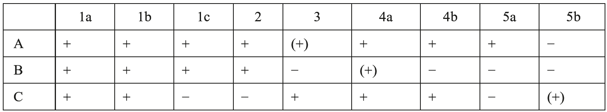

The possible combinations of the common ablaut and accentuation types are displayed in Table 111.1. The combinations 1aC, 1bC, 3A, 4aB and 5bC seem to be innovations: 1aC could develop from 3C or 4bC when ablaut was given up, or from 1aE by regularization. Last but not least, 1bC and some other cases of 1b developed from 3 by leveling of ablaut. This was regular in all roots of the type *<i>(H)aC-</i>, if <i>C</i> was not a semivowel; here paradigmatic ablaut survived only in the substantive verb *<i>Hás-</i>/<i>*(H)s-</i> ‘be’. 3A developed from 4bA, when <i>ā</i>˘ grade became unclear in the verbal system of presents and aorists (cf. 6.2). 4aB was transformed from 4bC by generalizing the ablaut and accent of the locative (cf. Tremblay 1996b: 32 on *<i>tmán-</i>). 5bC (mostly in verbs) may be post-PII and was achieved by contamination of the strong stem of 5aA by the weak of 3C or 4bC.

## 1. Nouns

### 1.1. Categories

Nouns were inflected for three numbers: singular, dual, plural, and eight cases: vocative, nominative, accusative, instrumental, dative, ablative, genitive, and locative. These two categories were marked together by fusional endings. Nouns were assigned to one of the three genders: masculine, feminine, and neuter.

The numbers were always distinctly represented, except in some cases where neuter plurals in long vowels had short vowel variants falling together with the singular, e.g. *<i>u̯ásū ~ *u̯ásu</i> ‘goods’.

Vocative, nominative, and accusative were always uniformly represented in the dual and all numbers of the neuter. The ablative did not have a separate form except in the singular of “thematic” stems; otherwise it coincided with the genitive in the singular or the dative in the dual and plural. The vocative dual and plural (sometimes even singular) were always formed like the nominative, but could differ in accentuation.

As in other IE languages, masculine and feminine gender largely correlated with natural sex, wherever this could be assignable. Words for living beings could be ambisexual, so that their gender assignment depended on reference (e.g., *<i>gā́u̯š</i> was feminine, if meaning ‘cow’; if males were included or not excluded, the word was masculine). But in contrast to some other old IE languages, derived feminines were the rule (e.g., *<i>Háću̯ā</i> ‘mare’, *<i>u̯r̥ḱī́š</i> ‘female wolf’, *<i>dai̯u̯ī́ ‘</i>goddess’). Otherwise, the gender assignment could not be predicted from the meaning. Even if neuters were still mostly (but not necessarily) inanimate, there were many inanimate words of the other two genders. Thus, gender was mainly an agreement category.

### 1.2. Stem formation

In ablauting stems, the normal distribution of stem variants was as follows: The strong stem was used in the vocative and nominative throughout, and in the accusative singular and dual of non-neuter stems, and sometimes in the nominative-accusative plural of neuters. In all other cases, the weak stem was used (incl. the nom.-acc. du. neuter). In the locative singular, <i>Ø</i>-grade is always replaced by <i>a</i>-grade or (regularly in <i>i-</i>stems) <i>ā-</i>grade, and the ending was never accented. Thus it may resemble forms of the strong stem.

Generally, this distribution seems to be identical to that seen in other ancient IE languages but for one case: The accusative plural of non-neuters (“weak” in PII) should be a “strong” case, if we consider the ending *<i>*-ms</i> that never shows full-grade variants. Neither in Hittite nor in Greek nor in the evidence retrievable from other families is there any clear evidence for the accusative plural showing a different stem variant than the nominative (except for <i>i</i>- and <i>u</i>-stems, on which see below). Nevertheless, the PII situation has often been claimed to be PIE. However, as Hock (1974) has convincingly shown, the “weak” status of the accusative plural in PII could be an innovation. It was motivated by the fact that only in this branch did the endings of the nominative *<i>-es</i> and of the accusative* <i>*-m̥s</i> fall together in *<i>-as</i>, if a consonant preceded them. Thus, the important distinction of these primary grammatical cases was in danger of being lost, and it was re-established by introducing the stem and/or accent of the weak cases in the accusative. The accusative plural of <i>i-</i> and <i>u-</i>stems could provide a starting point, since here nearly all IE languages reflect a difference in ablaut between nominative and accusative plural. In these stem classes, another strong deviation from the normal distribution was preserved in PII: In the most common ablaut type 2, singular and plural show an inverse distribution of stem variants in the suffix: *<i>-i-: *-ai̯-</i> in the singular (although the vocative agrees with the weak cases), but *<i>-ai̯-: *-i-</i> in the plural (in the dual, forms with a full-grade suffix of the strong cases are exceptional). A slightly different deviation from the normal distribution is attested in the ablauting <i>ī-</i>stems: here only the oblique cases of the singular show the weak stem with suffix *<i>-i̯ā-</i> in contrast to *<i>-ī-</i> in all other forms; it is not clear whether or not this distribution was already PIE. In any case, this special kind of variation was extended to <i>ā-</i>stems in PII only (see 1.4.8 below).

Tab. 111.2: Nominal endings of PII

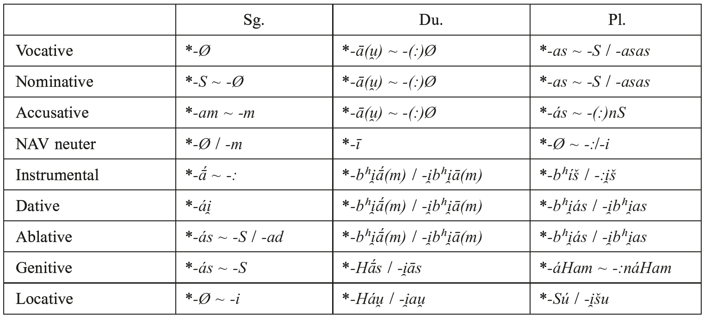

### 1.3. Endings and terminations

The nominal endings of PII are given in Table 111.2, where -<i>S</i> indicates an underlying voiceless sibilant subject to variant sandhi realizations. Variation depending on stem class or ablaut (first variant more frequent or more basic, typically that of consonantal stems with mobile stress) is marked by ~. Variants following the / belong to thematic stems only. These special terminations of thematic stems were normally identical with (the shorter forms of) pronominal terminations, mostly by insertion of *<i>-i</i>/<i>i̯-</i> before the normal ending (gen.-loc. du., abl.-dat. and loc. pl., see 4.1 for discussion of these special endings). In the instr. and loc. pl., these special variants seem to be late PIE; no IE language clearly presupposes “regular” forms like *<i>-o-bʰi(s)</i> and *<i>-o-su</i> (or *<i>-o-si</i>): Old Irish <i>-aib</i> could continue *<i>-obis</i> as well as *<i>-oi̯bis</i> (and in any case, it could have been influenced by the dative *<i>-obos</i> attested for Celtic by Gaulish). It is not clear whether the Anatolian dative-locative plural *<i>-os</i> (> Hitt. <i>-as</i>, Lycian <i>-e</i>) continues a thematic form *<i>-o-s(u</i>/<i>i)</i> since an older athematic ending *<i>-os</i> (cf. PIE *<i>-bʰ-os</i>) is equally possible. But in the instr.-dat.-abl. du. and abl.-dat. pl., other IE languages do not show this insertion, cf. Goth. <i>-am</i>, Lith. <i>-am˜</i>/<i>-ám</i>, <i>-áms</i>, OCS <i>-oma</i>, <i>-omъ</i> vs. pronominal Goth. <i>-aim</i>, Lith. <i>-iẽm</i>/<i>-íem</i>, <i>-íems</i>, OCS <i>-ěma</i>, <i>-ěmъ</i>. Thus it seems that in Indo-Iranian the influence of pronominal inflection had increased.

Old Iranian is the only branch of IE that preserved a difference between the gen. du. and loc. du. (contaminated to *<i>-au̯š</i> in Indic). An initial laryngeal in the genitive is assured by the syllabic value of preceding suffixes both in the RV and in OAv. (cf. Hoffmann 1976: 561 n. 2; Beekes 1988: 113, 127); for the locative it can neither be confirmed nor disproved by an attested OAv. form (cf. Malzahn 2000: 219 n. 31).

Innovations typical for PII include: 1. the dative-ablative endings *<i>-bʰi̯ā(m)</i>, *<i>-bʰi̯as</i> instead of *<i>-bʰō</i> and *<i>-bʰos</i> of other languages; apparently, the *<i>i</i> of the instrumental plural has been introduced in these cases. 2. the disyllabic ending of the gen. pl. (on which see Kümmel 2013); in the gen. pl. of the *<i>aH-</i>stems this led to *<i>-aHaHam</i> which was subject to haplology and was therefore felt to be undercharacterized; the form was then remade to *<i>-aHnaHam</i> by analogy after stems in *<i>-(m</i>/<i>u̯)an-</i>: loc. pl. *<i>-(m</i>/<i>u̯)asu </i>: gen. Pl. <i>*-(m</i>/<i>u̯)anaHam</i> = *<i>-aHsu</i>: X. Then this new ending with its long vowel was analogically extended to the <i>a</i>-stems, so that a vowel-lengthening rule could be abduced by reanalysis, and this was taken over by the other vocalic stems (where relic <i>n-</i>less forms survived). 3. In the non-neuter nom.-acc. du., the thematic ending *<i>-ā(u̯)</i> seems to have been extended to consonantal stems <i>−</i> at least in Indic: however, the *<i>-ā</i>˘ of Iranian could theoretically go back to the old athematic ending *<i>-h₁e</i> or *<i>-eh₁</i> (cf. Malzahn 2000: 205 ff.), so we cannot strictly prove that this innovation was PII. 4. The PII deictic vowel *<i>-u</i> in the loc. pl. *<i>-S-u</i> as against *<i>-i</i> in the loc. sg. is in agreement with Balto-Slavic in contrast to Greek and Albanian *<i>-s-i</i>; since*<i>-i</i> may have been taken from the singular, it is probably an innovation, so PII and Balto-Slavic preserve the original situation.

### 1.4. Stem classes and paradigms

In order to show every stem variant, the following case forms are normally given in the overview which follows: sg. voc., nom., acc., gen., loc.; pl. nom., and instr. If their formation is not directly evident from the gen. sg., also instr. sg., acc., gen., loc. du., and loc. pl. may be given. The vocative is only given when different from the nominative (other than by its recessive accent). Ablaut and accentuation types are given according to the classification at the beginning of this chapter, e.g., 4aC = ablaut type 4a, accent type C.

#### 1.4.1. Root nouns

Archaic root nouns most often belonged to type 4a or 4b, mostly with mobile accent: *<i>pā́d- ~ pad-</i> m. ‘foot’ (4aC): sg. nom. *<i>pā́t-s</i>, acc. *<i>pā́d-am</i> ~ gen. *<i>pad-ás</i>, loc. *<i>pád-i</i>; pl. nom. *<i>pā́d-as</i> ~ instr. *<i>pad-bʰíš</i>; *<i>di̯ā́u̯- ~ *diu̯-</i> m. ‘sky; day’ (4bC): sg. nom. *<i>di̯ā́u̯š</i>, acc. *<i>di̯ā́-m</i> ~ gen. *<i>diu̯-ás</i>, loc. *<i>di̯áu̯-i</i>; pl. nom. *<i>di̯ā́u̯-as</i> ~ acc. *<i>di̯ú-nš</i>, instr. *<i>di̯úbʰiš</i>; likewise *<i>dȷ́ʰā́(m)</i>- ~ <i>ȷ́ʰm-</i> f. ‘earth’ (4bC): sg. nom. *<i>dȷ́ʰā́-s</i>, acc. *<i>dȷ́ʰā́-m</i> ~ gen.*<i>ȷ́ʰm-ás</i>, loc. *<i>dȷ́ʰám-i</i>, du. nom. *<i>dȷ́ʰā́m-ā(u̯)</i>, etc. Fixed initial accent was certainly inherited sometimes: *<i>gā́u̯- ~ *gáu̯-</i> m. f. ‘cow, ox, bull, cattle’ (4aA): sg. nom. *<i>gā́u̯š</i>, acc. *<i>gā́-m</i> ~ gen. *<i>gáu̯-š</i>, loc. *<i>gáu̯-i</i>; pl. nom. *<i>gā́u̯-as</i> ~ acc. *<i>gā́-s</i>, instr. *<i>gáu̯-bʰiš</i>. But in other cases, it must be a PII innovation: *<i>ću̯ā́n- ~ ćún-</i> m. ‘dog’ (4bA): sg. voc. *<i>ć(ú)u̯án</i>, nom. *<i>ću̯ā́</i>, acc. *<i>u̯ā́n-am</i> ~ gen. *<i>ćún-as</i>, loc. *<i>ću̯án-i</i>; pl. nom. *<i>u̯ā́n-as</i> ~ instr. *<i>ću̯á-bʰiš</i>. Type 3 inflection is rarer; before a consonant cluster, it could be secondary from 4b, as in *<i>dánt- ~ dat-</i> m. ‘tooth’ (3C): sg. nom. *<i>dánt-s</i>, acc. *<i>dánt-am</i> ~ gen. *<i>dat-ás</i>, loc. *<i>dánt-i</i>; pl. nom. *<i>dántas</i> ~ instr. *<i>dad-bʰíš</i>, loc. *<i>dat-sú</i>. But some old cases also exist, e.g. *<i>nár- ~ nar-</i>/<i>nŕ̥-</i> m. ‘man (male)’ (3C): sg. nom. *<i>nā́</i> ~ gen. *<i>nar-ás</i> (Vedic <i>náras</i>, etc. is probably secondary); pl. nom. *<i>nár-as</i> ~ instr.*<i>nŕ̥-bʰiš</i>. Verbal root nouns partly belonged to this type, too (e.g. *<i>-ǵʰán- ~ *-gʰn-</i> ‘beating, killing’ 3C), but normally had given up ablaut and gone over to type 1a or 1b: *<i>u̯íć-</i> f. ‘settlement, clan’ (1aC): sg. nom. *<i>u̯íć-š</i>, acc. *<i>u̯íć-am</i> ~ gen. *<i>u̯ić-ás</i>, etc.

#### 1.4.2. <i>s</i>-stems

The most productive subtype were neuters of type 1b like *<i>Háp-as-</i> n. ‘work’ (1bA): sg. nom.-acc. *<i>Hápas</i>, instr. *<i>Hápas-ā</i>, gen. *<i>Hápas-as</i>, loc. *<i>Hápas-i</i>; pl. nom.-acc. *<i>Hápās</i>, instr. *<i>Hápaz-bʰiš</i>, loc. *<i>Hápas-u</i>. Much rarer were non-neuters of type 3 or 4: *<i>bʰih-ás- ~ bʰī-š-</i> ‘fear’ f. (3C): sg. nom. *<i>bʰihā́s</i>, acc. <i>bʰihás-am</i> ~ instr. <i>bʰīš-ā</i>; *<i>hušā́s- ~ huš-[š]-</i>/<i>huš-ás-</i> f. ‘dawn’ (4bC): sg. voc. *<i>húšas</i>, nom. *<i>hušā́s</i>, acc. *<i>hušā́s-am</i> ~ gen. *<i>huš-ás</i>, loc. *<i>hušás-i</i>; pl. nom. *<i>hušā́s-as</i> ~ instr. *<i>hušáz-bʰiš</i>, etc.

#### 1.4.3. <i>n</i>-stems

Non-neuter stems preferred type 4, as *<i>rā́ȷ́-ān- ~ -n-</i> m. ‘king’ (4bA): sg. voc. *<i>rā́ȷ́an</i>, nom. *<i>rā́ȷ́ā</i>, acc. *<i>rā́ȷ́ān-am</i> ~ gen. *<i>rā́ȷ́n-as</i>, loc. *<i>rā́ȷ́an(-i)</i>; du. loc. *<i>rā́ȷ́an-Hau̯</i> (*<i>-an-</i>from *<i>-n̥-</i>); pl. nom. *<i>rā́ȷ́ān-as</i> ~ instr. *<i>rā́ȷ́a-bʰiš</i>; likewise *<i>háć-mān-</i> ‘stone’ (4bA) and the possessive derivatives in *<i>-(H)ān-</i>, e.g. *<i>i̯ú-Hān</i>- ~ *<i>i̯ú-Hn-</i> >*<i>i̯úH-ān- ~ *i̯ū́-n-</i>‘young’ (4bA): sg. acc. *<i>i̯úHān-am</i> ~ gen. *<i>i̯ū́n-as</i>. But for stems in *<i>-mān-</i> mobile accent was more usual: *<i>prath(ь)-mā́n- ~ -mn-</i> m. ‘width’ (4bC): sg. voc. *<i>-man</i>, nom. *<i>prath(ь)-mā́</i>, acc. *<i>prath(ь)-mā́n-am</i> ~ gen. *<i>prath(ь)-mn-ás</i>, loc. *<i>prath(ь)-mán(i)</i>; pl. nom. *<i>prath(ь)-mā́n-as</i>, instr. *<i>prath(ь)-má-bʰiš</i>. A special case of 4aC/B with preserved root ablaut is represented by *<i>(H)aHt-mā́n- ~ *(H)Ht-mán-</i> >*<i>(H)āt-mā́n- ~ (H)t-mán-</i> m. ‘breath’: sg. voc. *<i>(H)ā́tman</i>, nom. *<i>(H)ātmā́</i>, acc. *<i>(H)ātmā́n-am</i> ~ gen. *<i>(H)tmán-s</i>/<i>(H)tman-ás</i>, loc. *<i>(H)tmán(-i)</i>, etc. Much rarer was type 3, e.g. *<i>hukš-án- ~ -n-</i> m. ‘young bull’ (3C): sg. voc. *<i>húkšan</i>, nom. *<i>hukšā́</i>, acc. *<i>hukšán-am</i> ~ gen. *<i>hukšn-ás</i> etc., likewise *<i>(H)ari̯a-mán-</i> m. ‘(god of) hospitality’ (3C). Neuters inflected after type 2 and were always barytone: *<i>nā́-man-</i> n. ‘name’ (2A): sg. nom.-acc. *<i>nā́ma</i>, gen. *<i>nā́man-s</i>, loc. *<i>nā́man-i</i>; pl. nom.-acc. *<i>nā́mān</i>, instr. *<i>nā́ma-bʰiš</i>.

Stems in *<i>-ín-</i> are well established in Indic but poorly attested in Iranian. Their suffix did not ablaut, e.g. *<i>parn-ín-</i> ‘having wings’ (1aB): sg. nom. *<i>parnī́</i>, acc. <i>parnín-am</i>, etc.

#### 1.4.4. <i>r</i>/<i>n</i>-stems

This archaic class of heteroclitic nouns included only neuters: On the one hand, we find non-ablauting paradigms: *<i>(H)ás-r</i>/<i>n-</i> ‘blood’ (1aC): sg. nom.-acc. *<i>(H)ásr̥ (-k)</i>, gen. *<i>(H)asn-ás</i>; likewise *<i>rā́ȷ́-r-</i>/<i>-n-</i> n. ‘command’ (1aA). But especially with a more complex suffix, also type 2 inflection existed: *<i>dʰán-u̯r̥-</i>/<i>-u̯an-</i> n. ‘bow’ (2A): sg. nom.-acc. <i>*dʰánu̯r̥</i>, gen. *<i>dʰánu̯an-s</i>, loc. *<i>dʰánu̯an(-i)</i>; pl. nom.-acc. *<i>dʰánu̯ān</i>. Other stem types with a heteroclitic <i>n-</i>stem are attested in Indic, but not supported by Iranian.

#### 1.4.5. <i>r</i>-stems

These were normally non-neuters and were influenced by vocalic stems in some forms. A class of nouns for relatives belonged to type 3: *<i>mā-tár- ~ -tr-</i> f. ‘mother’ (3C): sg. voc. *<i>mā́tar</i>, nom. *<i>mātā́</i>, acc. *<i>mātár-am</i> ~ gen. *<i>mātr-ás</i>, loc. *<i>mātár(-i)</i>; du. loc. *<i>mātər-(H)áu̯</i>; pl. *<i>mātár-as</i> ~ acc. *<i>mātŕ̥-nš</i>, instr. *<i>mātŕ̥-bʰiš</i>; likewise *<i>dahi-u̯ár-</i> m. ‘husband’s brother’ (3C) etc. and *<i>bʰrā́-tar-</i> m. ‘brother’ (3A). But type 4b inflection was more common, especially for the productive agent nouns in *<i>-tār-</i>: *<i>ȷ́ʰáu̯-tār- ~ -tr-</i> m. ‘*pourer > main priest’ (4bA): sg. voc. *<i>ȷ́ʰáu̯tar</i>, nom. *<i>ȷ́ʰáu̯tā</i>, acc. *<i>ȷ́ʰáu̯tār-am</i> ~ instr. *<i>ȷ́ʰáu̯tr-ā</i>, gen. *<i>ȷ́ʰáu̯tr̥-š</i>, loc. *<i>ȷ́ʰáu̯tar(-i)</i>; du. loc. *<i>ȷ́ʰáu̯tər-(H)au̯</i>; pl. *<i>ȷ́ʰáu̯tār-as</i> ~ acc. *<i>ȷ́ʰáu̯tr̥-nš</i>, instr. *<i>ȷ́ʰáu̯tr̥ -bʰiš</i>; likewise, *<i>su̯á-sār-</i> f. ‘sister’ (4bA). Oxytone <i>nomina agentis</i> like *<i>ȷ́anH(ь)tā́r-</i> ‘progenitor’ (4bC) normally inflected alike, but relic forms point to a secondary transition from type 3C (cf. Tichy 1995: 57 f.). An isolated type without suffixal ablaut is represented by the Iranian word *<i>(h)ā́tr̥ - ~ (h)ātr-</i> m. ‘fire’ (1aC; cf. Tremblay 2003: 20 ff.): sg. voc. *<i>(h)ā́tr̥</i>, nom. *<i>(h)ā́tr̥ -š</i>, acc. *<i>(h)ā́tr̥-m</i> ~ gen. *<i>(h)ātr-ás</i>. It is often assumed that this word was secondarily “masculinized” from a neuter nom.-acc. * <i>*(h)ā́tr̥</i>, but we have no evidence for such a neuter, and old masculines with zero-grade suffix need not have been confined to vocalic stems. Non-heteroclitic neuters in *<i>-r-</i> are non-existent in Indic and very rare in Avestan (<i>aodr-</i> ‘cold’ seems to be the only clear example).

#### 1.4.6. <i>i-</i> and <i>u-</i>stems

The “standard” inflection was type 2 for both classes alike: *<i>(H)ag-ní- ~ -nái̯-</i> m. ‘fire’ (2B): sg. voc. *<i>(H)ágnai̯</i>, nom. *<i>(H)agní-š</i>, acc. *<i>(H)agní-m ~</i> instr. *<i>(H)agnī́</i>, gen. *<i>(H)agnái̯-š</i>, loc. *<i>(H)agnā́i̯</i>; du. loc. *<i>(H)agnii̯-áu̯</i>; pl. nom. *<i>(H)agnái̯as</i> ~ acc. *<i>(H)agní-nš</i>, instr. *<i>(H)agní-bʰiš</i>, gen. *<i>(H)agnī-náHam</i>, and likewise *<i>sū-nú- ~ -náu̯-</i> m. ‘son’ (2B): sg. voc. *<i>sū́nau̯</i>, nom. *<i>sūnú-š</i>, acc. *<i>sūnú-m</i> ~ instr. *<i>sūnū́</i>, gen. *<i>sūnáu̯-š</i>; du. loc. *<i>sūnuu̯-áu̯</i>; pl. nom. *<i>sūnáu̯-as</i> ~ acc. *<i>sūnú-nš</i>, instr. *<i>sūnú-bʰiš</i>, gen. *<i>sūnū-náHam</i>. Fixed accent was equally possible: *<i>Háǵ ʰ-i-</i> m. ‘snake, dragon’ (2A) or *<i>ȷ́ánH(ь)-tu-</i> m. ‘birth; living being’ (2A). Other types were rarer, but occurred in some frequent words. Type 1 is the most common among these: *<i>(H)ar-í- ~ -i̯-</i> m. ‘foreigner’ (1bC): sg. nom. *<i>(H)arí-š</i>, acc. *<i>(H)arí-m</i>, instr. *<i>(H)ari̯-ā́</i>, gen. *<i>(H)ari̯-ás</i>, loc. *<i>(H)arā́i̯</i> (?); pl. nom. <i>=</i> acc. *<i>(H)ari̯-ás</i>, instr. *<i>(H)arí-bʰiš</i>, gen. *<i>(H)ari̯-áHam</i>; likewise *<i>raH-í-</i>/<i>rā́-i̯- ~ *rā-i̯-</i> ‘possession, wealth’ (1bE) and *<i>pát-i-</i> m. ‘husband’ (1bA, but in the meaning ‘lord, master’ it had a regular 2A inflection), *<i>háu̯-i-</i> f. ‘sheep’. *<i>pać-ú- ~ -u̯-</i> m. ‘(head of) livestock’ (1bC): sg. nom. *<i>paćú-š</i>, acc. *<i>paćú-m</i> ~ instr. *<i>paću̯-ā́</i>, gen. *<i>paću̯-ás</i>; pl. nom. = acc. *<i>paću̯-ás</i> ~ instr. *<i>paćú-bʰiš</i>, gen. *<i>paću̯-áHam</i>; likewise *<i>náh-u-</i>/<i>nā́-u̯- ~ nā-u̯-</i> ‘boat’ (1bE) and *<i>krát-u-</i> ‘mental force (?)’ (1bA). Even rarer is type 4 (in Indic, it survived only in the following word): *<i>sákh-āi̯- ~ -i̯-</i> m. ‘fellow, companion, friend’ (4bA): sg. voc. *<i>sákhai̯</i>, nom. *<i>sákhā</i>, acc. *<i>sákhāi̯-am ~</i> instr. *<i>sákhi̯-ā</i> (?), gen. *<i>sákhi̯-as</i>, loc. *<i>sákhāi̯</i>; pl. nom. *<i>sákhāi̯-as</i> ~ acc. *<i>sákhi-nš</i>, instr. *<i>sákhi-bʰiš</i>, gen. *<i>sákhi̯-aHam</i>. *<i>dás-i̯āu̯- ~ -i̯u(u̯)-</i> m. ‘foreign people/country’ (4bA, oxytone accent cannot be deduced from OAv. forms with <i>dax́ii°</i>, cf. de Vaan 2003: 571 f., 575 f.): sg. voc. *<i>dási̯au̯</i>, nom. *<i>dási̯āu̯-š</i>, acc. *<i>dási̯ā-m</i> ~ instr. *<i>dási̯ū</i>, gen. *<i>dási̯uu̯as</i>; pl. nom. *<i>dási̯āu̯-as</i> ~ acc. *<i>dási̯u-nš</i>, instr. *<i>dási̯u-bʰiš</i>, gen. *<i>dási̯ū-naHam</i>. OAv. <i>hiθąm</i> (to <i>hiθāuš</i> ‘companion’, cf. Geldner 1890: 532) and <i>vaiiąm</i> to <i>vaiiu-</i> (Remmer 2011: 15 f.) show that the PIE formation of the acc. sg. of stems in *<i>-ā˘u̯-</i> had survived not only in the root nouns *<i>di̯áu̯-</i>, <i>*gā́u̯-</i> but also in other words (cf. Cantera 2007).

A type 3C in *<i>-ái̯-</i>/*<i>-áu̯-</i> has been discussed but is not assured for PII; it may have existed in Pre-PII. E.g., Tichy (2006b: 79) reconstructs *<i>pk̑-éu̯-</i> ‘head of livestock’, which was remodeled to PII *<i>pać-ú-</i> 1bC. A type 3C strong stem *<i>kau̯H-ái̯-</i> < *<i>kou̯H-éi̯-</i>is often reconstructed for *<i>kau̯Hí-</i> ‘seer’ (cf. Hoffmann 1976: 488 f.), but Tremblay (1996a: 104 f. with n. 30) reconstructs *<i>kau̯-ā́i̯-</i> < *<i>kou̯h₂-ói̯-</i> (4bC). Everything depends on whether YAv. acc. sg. <i>kauuaēm</i> presupposes *<i>-ai̯am</i> in contrast to *<i>-āi̯am</i> in OAv. <i>huš.haxāim</i>, which cannot be considered certain. Even if the distinction of <i>āi: aē</i> is far more consistent in the manuscripts than in the case of <i>āu: ao</i> (cf. de Vaan 2003: 377), shortening of original *<i>āi̯am</i> to <i>aēm</i> is attested by YAv. <i>aēm</i> ‘egg’ (de Vaan 2003: 120). An original *<i>kauuāim</i> might additionally have been influenced by near-identical <i>kauuaēm</i>, nom.-acc. sg. n. of the adjective <i>kauuaiia-</i> occurring in the very same text (Yt. 19).

<i>i</i>-stem neuters were very rare, but neuters in *<i>-u-</i> were well established. Beside the “standard” type 2 inflection, there was also an archaic subtype with preserved root ablaut: *<i>dā́r-u-</i>/ <i>dr-áu̯-</i> ‘wood’ (2D): sg. nom. *<i>dā́ru</i>, gen. *<i>dráu̯-š</i> (likewise *<i>hā́i̯u</i> ‘life’, *<i>ȷ́ā́nu</i> ‘knee’, and <i>*sā́nu</i> ‘back’). Also type 1 inflection is found: *<i>mádʰ-u-</i> ‘honey, mead’ (1bA): sg. nom. *<i>mádʰu</i>, gen. *<i>mádʰu̯-as</i>, etc.

#### 1.4.7. ı̄- and u ̄-stems (mostly f.)

These stems inflected like root nouns of type 1, the only difference being that their accent was never mobile, but fixed on the suffix (except in compounds): *<i>u̯r̥k-ī́</i>/<i>íH-</i> f. ‘female wolf’ (1B): sg. nom. *<i>u̯r̥kī́-š</i>, acc. *<i>u̯r̥kíH-am</i>, gen. *<i>u̯r̥kíH-as</i>, loc. *<i>u̯r̥kī́</i>; pl. nom. = acc. *<i>u̯r̥kíH-as</i>, instr. *<i>u̯r̥kī́-bʰiš</i>, gen.*<i>u̯r̥kī́-naHam</i>; likewise*<i>rathī́-</i> m. ‘charioteer’ 1B. *<i>tan-ū́</i>/<i>úH-</i> f. ‘body’ (1B): sg. nom. *<i>tanū́-š</i>, acc. *<i>tanúH-am</i>, gen. *<i>tanúH-as</i>, loc. *<i>tanū́</i>; pl. nom. = acc. *<i>tanúH-as</i>, instr. *<i>tanū́-bʰiš</i>, gen. *<i>tanū́-naHam</i>. In one special case, a different strong stem and inflection after type 3 is attested: *<i>ȷ́iȷ́ʰu̯áH- ~ ȷ́iȷ́ʰúH-</i> m. ‘tongue’ (3B/C): sg. nom. *<i>ȷ́iȷ́ʰu̯ā́-s</i>, acc. *<i>ȷ́iȷ́ʰu̯áH-am</i>, gen. *<i>ȷ́iȷ́ʰúH-as</i> (preserved in Avestan but split into two paradigms <i>jihvā́-</i>, <i>juhū́-</i> in Vedic; for the original inflection of this word and its development see EWAia I: 591 f. with references).

#### 1.4.8. *<i>ı</i>̄-/<i>i</i>̯<i>a</i>̄-stems and *<i>a</i>̄-/<i>ai</i>̯<i>a</i>̄-stems (always f.)

Two classes of feminines differ from all others by special endings in the nominatives (sg. *<i>-Ø</i>, du. *<i>-ī</i>, pl. *<i>-S</i>), a peculiar distribution of strong and weak stems, and fixed accent. First, there were <i>ī</i>-stems very different from the preceding and showing inflection after type 2: *<i>dai̯u̯-ī́/íh- ~ -i̯ā́-</i> f. ‘goddess’ (2B): sg. voc. *<i>dái̯u̯-i</i>, nom. *<i>dai̯u̯-ī́</i>, acc. *<i>dai̯u̯ī́-m</i> ~ gen. *<i>dai̯u̯i̯ā́-s</i>, loc. *<i>dai̯u̯i̯ā́</i>; du. nom. *<i>dai̯u̯ī́</i>, loc. *<i>dai̯u̯ih-áu̯</i>; pl. nom. = acc. *<i>dai̯u̯ī́-š</i>, instr. *<i>dai̯u̯ī́-bʰiš</i>, gen.*<i>dai̯u̯ī́-naHam</i>. Likewise *<i>nā́r-ī-</i> f. ‘woman’ (2A). Second, the old PIE *<i>ah₂-</i>stems inflected in a similar way: *<i>Haȷ́-ā́- ~ -ái̯ā-</i> ‘female goat’ (1B): sg. voc. *<i>Háȷ́ai̯</i>, nom. *<i>Haȷ́ā́</i>, acc. *<i>Haȷ́ā́-m</i> ~ instr. *<i>Haȷ́-ā́/Haȷ́-ái̯ā</i>, gen. *<i>Haȷ́ái̯ās</i>, loc. *<i>Haȷ́ái̯ā</i>; du. nom. *<i>Haȷ́ái̯(i̯)</i>, loc. *<i>Haȷ́ái̯-Hau̯</i>; pl. nom. = acc. *<i>Haȷ́ā́-s</i>, instr. *<i>Haȷ́ā́-bʰiš</i>, gen.*<i>Haȷ́ā́-naHam</i>. Likewise *<i>(H)áć-u̯ā-</i> ‘mare’ (1A). Originally these had a uniform suffix *<i>-ā-/*-ah-</i>, but a peculiar analogical remodeling after the <i>ī</i>/<i>i̯ā-</i>stems had disturbed the original inflection of the singular (in the genitive and locative dual, *<i>-ai̯-</i>is rather taken from the nominative). The inflection of the PII <i>ā</i>-stems can be obtained in a very straightforward way from that of the <i>ī</i>/<i>i̯ā</i>-stems by simply replacing long *<i>-ī-</i>by *<i>-ā-</i> and short or non-syllabic *<i>-i</i>/<i>i̯-</i> by *<i>-ai̯-</i> (which implies *<i>-i̯ā-</i> → *<i>-ai̯ā-</i>); for an account of the details see Lühr (1991: 175−182). In Indic and Old Persian, *<i>-ai̯ā-</i> was analogically replaced by *<i>-āi̯ā-</i>, wherever the pronominal termination had *<i>-asi̯ā-</i>. In the instrumental this did not happen, because here *<i>-ai̯ā</i> was directly supported by the pronominal termination.

#### 1.4.9. a-stems (thematic stems, m. or n.)

Last but not least there was the very productive class of “thematic” stems. They belonged to type 1 and had fixed accent: *<i>dai̯u̯á-</i> m. ‘heavenly, god’ (1bB): sg. voc. *<i>u̯ī́ra</i>, nom. *<i>dai̯u̯á-s</i>, acc. *<i>dai̯u̯á-m</i>, gen. *<i>dai̯u̯á-si̯a</i>, loc. *<i>dai̯u̯á-i̯</i>; du. nom. *<i>dai̯u̯ā́(u̯)</i>, loc. *<i>dai̯u̯á-i̯-(H)au̯</i>; pl. nom. *<i>dai̯u̯ā́s(as)</i>, acc. *<i>dai̯u̯ā́-ns</i>, instr. *<i>dai̯u̯ā́i̯š</i>, gen. *<i>dai̯u̯ā́naHam</i>, loc. *<i>dai̯u̯á-i̯šu</i>. Likewise *<i>(H)áć-u̯a-</i> m. ‘horse’ (1bA). In the neuter, the special forms if made from *<i>i̯ug-á-</i> n. ‘yoke’ (1aB) would be sg. *<i>i̯ugá-m</i>, du. *<i>i̯ugá-i̯(i̯)</i>, pl. *<i>i̯ugā́</i>; likewise *<i>dā́-tra-</i> n. ‘sickle’ < *<i>dáH-tra-</i> (1bA).

## 2. Adjectives

### 2.1. Categories

In addition to the categories of nouns, adjectives could be inflected in three genders and in the three grades positive, comparative, and superlative. Otherwise, their inflection was identical to noun inflection; there were no special adjectival endings or terminations.

Typically, masculine and neuter forms coincided in all cases but in the nominative, accusative, and vocative, while feminine forms were taken from a derived stem formed by means of the suffixes *<i>-ī-</i> (from thematic ordinals, secondary comparatives and superlatives in <i>-[t]ara-</i>, <i>-[t]ama-)</i>, *<i>-ī-</i>/<i>-i̯ā-</i> (from all athematic stems, including primary comparatives and superlatives, and some thematic adjectives) and *<i>-ā-</i> (from all other thematic stems). But at least in many compounds, the feminine was not derived, and its forms were identical with the masculine.

### 2.2. Inflection

Since there is no difference in principle from noun inflection, only some types confined to adjectives shall be mentioned:

<i>nt-</i>stems: Active participles belonged to type 1a or 3: <i>*s-ánt- ~ -at-</i> ‘being’ (3C): sg. nom. *<i>sánt-s</i>, acc. *<i>sánt-am</i> ~ gen. <i>sat-ás</i> → fem. sg. nom. *<i>sat-ī́~</i> gen. <i>sat-i̯ā́-s</i>. Possessive adjectives in *<i>-u̯ant-</i> were inflected in the same way.

<i>s-</i>stems: Simple adjectives in <i>-ás-</i> belonged to 1b (thus they differed only in accentuation from neuter abstracts): *<i>Hap-ás-</i> ‘working, active’ (1bB). Another type is represented by perfect participles, e.g. *<i>u̯id-u̯ā́s- ~ -úš-</i> ‘knowing’ (4bB): sg. voc. *<i>u̯ídu̯as</i>, nom. m. *<i>u̯idu̯ā́s</i>, acc. m. *<i>u̯idu̯ā́s-am</i>, nom. acc. n. *<i>u̯idu̯ás</i> ~ gen. *<i>u̯idúš-as</i>, loc. *<i>u̯idu̯ás-i</i> → fem. sg. nom. *<i>u̯idúš-ī ~</i> gen. <i>u̯idúš-i̯ā-s</i>.

A group of “pronominal” thematic adjectives could use pronominal endings, e.g. *<i>(H)ani̯á-</i> ‘other’ or *<i>u̯íću̯a-</i> ‘all, every’. But since the Old Indo-Iranian languages disagree in details, the PII state is difficult to reconstruct (cf. de Vaan 2003: 9 f.).

### 2.3. Gradation

There were two ways of forming the higher grades:

1. From the (full-grade) root by means of the suffixes *<i>-i̯ās-</i>/<i>-i̯as-</i> (4aA) and *<i>-išthá-</i>(1bA/B) respectively, e.g. *<i>háu̯ǵ-i̯ās-</i> ‘stronger’, *<i>háu̯ǵ-ištha-</i> ‘strongest’ to *<i>hug-rá-</i>‘strong’, formed directly from the root *<i>hau̯g-</i>. These formations still look derivational rather than inflectional, and they could also be used as comparatives or superlatives to other derivatives of the root (e.g. verbal nouns and even finite verbs). They could only be used for primary adjectives and are certainly inherited (as derivational suffixes). In PII, the original ablaut of the comparative suffix was simplified: zero grade *<i>-iš-</i> was replaced by full grade *<i>-i̯as-</i> (4b → 4a), but it remained in the derived superlative *<i>-iš-tha-</i>.

Inflection of *<i>u̯ás-i̯ās- ~ -i̯as-</i> ‘better’ (4aA): sg. voc. *<i>u̯ási̯as</i>, nom. m. *<i>u̯ási̯ās</i>, acc. m. *<i>u̯ási̯ās-am</i>, nom. acc. n. *<i>u̯ási̯as</i> ~ gen. *<i>u̯ási̯as-as</i>, loc. *<i>u̯ási̯as-i</i>; pl. nom. *<i>u̯ási̯ās-as</i>, instr. *<i>u̯ási̯az-bʰiš</i>, loc. *<i>u̯ási̯as-u</i>. → fem. sg. nom. *<i>u̯ási̯as-ī ~</i> gen. *<i>u̯ási̯as-i̯ā-s</i>.

2. From the stem of the positive by means of the secondary suffixes *<i>-tara-</i> and *<i>-tama-</i>(both 1A), e.g. *<i>u̯idúš-</i> ‘knowing’ → *<i>u̯idúš-tara-</i> ‘knowing better’. This type was the only one possible for all more complex adjectives (i.e. secondary derivatives, compounds, perfect participles). Normally, it was not used for primary adjectives that could form their grades directly from the root. The suffixes are inherited, too, but it is only in Greek that we find a similarly extended use of *<i>-tero-</i> and *<i>-tm̥ -to-</i> > *<i>-tato-</i>. In the other IE languages, *<i>-tero-</i> and *<i>-tm̥ Ho-</i> (and shorter *<i>-ero-</i>, <i>*-m̥ Ho-</i>) are confined to derivations of pronouns and particles, a usage also well established in PII. Thus, the expansion into adjectival gradation seems to be a common innovation of Greek and Indo-Iranian.

## 3. Numerals

### 3.1. Cardinals

For obvious semantic reasons, cardinal numerals could not normally be inflected for number (the plural of ‘one’ was used only in the non-numeral meaning ‘some [individuals]’). Otherwise, ‘1−4’ were inflected like adjectives, all others were inflected like nouns (i.e., they do not show a gender distinction); ‘5−19’ could be uninflected.

Of the PIE words for ‘1’, *<i>sém-</i> had disappeared as an independent lexical item in PII, as in many other branches, and from the different derivatives of *<i>ai̯-</i>, the stem *<i>Hai̯u̯a-</i> became the regular numeral (preservation of *<i>Hai̯na-</i> as a demonstrative pronoun is disputed). In Indic, *<i>Hai̯u̯a-</i> was replaced by *<i>Hái̯ka-</i> as a numeral but survived in some adverbial forms. All these words inflected like ordinary adjectives in <i>-a</i>/<i>ā-</i> (but could take pronominal endings like some adjectives, cf. 2.1.0). *<i>d(u)u̯á-</i> ‘2’ inflected likewise as an ordinary thematic dual with a feminine *<i>d(u)u̯ā́-</i>.

*<i>trí-</i> (2C) ‘3’ and *<i>ḱatu̯ā́r- ~ ḱatur-</i> (4bB) ‘4’ inflected like regular athematic plurals in <i>-i-</i> and <i>-r-</i>, respectively. However, the genitive of ‘3’ seems to have been *<i>trai̯-áHam</i> (not *<i>trīnáHam</i>). Their feminine was formed with a peculiar suffix *<i>-(a)Sr-</i> (1aC): nom. = acc. *<i>tišr-ás</i>, *<i>ḱátasr-as</i>, instr. *<i>tišŕ̥-bʰiš</i>, <i>*ḱatasŕ̥-bʰiš</i>, gen. *<i>tišr-áHam</i>, <i>*ḱatasr-áHam</i>. The only comparanda of these feminines within IE are Celtic forms like *<i>tisres</i>, <i>*kʷetesres</i> > Old Irish nom. <i>teoir</i> ‘three’, <i>cetheoir</i> ‘four’ etc. (cf. Cowgill 1957; Kim 2008). The mobile accent (type E) of *<i>ḱatasr-</i> is peculiar.

The numbers ‘five’ to ‘ten’ could remain uninflected and had no nominative endings. When inflected, all forms exhibited final/mobile accentuation. *<i>šu̯áćš</i> ‘6’ (cf. Lubotsky 2000) behaved like an ordinary consonant stem, and while <i>*(H)aštā́(u̯)</i> ‘8’ itself looks like a dual, its inflected forms were ordinary <i>ā</i>-stem plural forms. All the others ended in *<i>-á</i>/<i>-a</i>: <i>*pánḱa</i> ‘5’, <i>*saptá</i> ‘7’, <i>*náu̯a</i> ‘9’, <i>*dáća</i> ‘10’; they were inflected like neuter <i>n</i>-stems except in the gen. pl.: *<i>daćá-bʰiš</i>, <i>*daćā-náHam</i>, etc.

*<i>u̯inćatī́</i> ‘20’ (for the nasal cf. Vedic <i>viṁśatí-</i> which is supported by Ossetic Digor <i>insæj</i>, while the nasal was regularly lost elsewhere in Iranian) seems to have been an old neuter dual form, but an inflected noun *<i>u̯inćánt-</i> could perhaps also be used (<i>ti</i>stem inflection in Vedic is secondary).

From ‘30’ on, the cardinals were always inflected as singular nouns that could form a dual and plural. The tens were feminine nouns with the suffixes **<i>-dćánt-</i>/<i>-dćat-</i> > *<i>-nćá(n)t-</i>/<i>-(H)ćá(n)t-</i> (3C; 30−50): *<i>tri-nćánt-</i>, <i>*ḱatu̯r̥ -(H)ćánt-</i>, <i>*panḱā-ćánt-</i> and *<i>-tí-</i>(2B; 60−90): *<i>šu̯aš-tí-</i>, <i>*sapta-tí-</i>, <i>*(H)aćH(ь)-tí-</i> (< *<i>*HaćtH-tí-</i>), <i>*nau̯a-tí-</i>. The words for ‘100’ and ‘1000’ were neuters: *<i>ćatá-m</i>, <i>*saȷ́ʰásra-m</i>.

### 3.2. Ordinals

All ordinals were inflected like thematic adjectives of the <i>a-</i>class, for 1−4 the feminine was an <i>ā-</i>stem, from 5 on it was an <i>ī</i>-stem: For ‘1st’, a suppletive pronominal adjective was used; we find three variants: *<i>pə́r(H)u̯a-</i>/<i>*pər(H)u̯ii̯á-</i>/<i>*pr̥thamá-</i> (cf. Pkt. <i>puḍhama-</i>and analogically modified Vedic <i>prathamá-</i>). For ‘2nd’, PIE likewise had a suppletive word, but in PII this was replaced by *<i>du̯i-tíi̯a-</i>, formed by analogy to inherited *<i>tr̥-tíi̯a-</i>‘3rd’. A shorter form of the same suffix was preserved in *<i>(k)tur-íi̯a-</i> ‘4th’. The next two took a suffix *<i>-thá-</i> < *<i>-t-h₂ó-</i> attached to the weak “root” of the cardinal: *<i>pak-thá-</i>‘5th’ and *<i>šuš-thá-</i> ‘6th’ (cf. Hoffmann 1975: 190; Iranian *<i>puxθa-</i> ‘5th’ > av. <i>puxδa-</i>, khot. <i>pūha-</i> owes its vowel to the preceding and following numeral). For ‘7th’, the earliest Old Indo-Iranian texts present *<i>saptá-tha-</i> formed with the same suffix, but the variant *<i>saptam(h)á-</i> attested in all later texts could be inherited < *<i>saptm̥há-</i> < *<i>septm̥ - h₂ó-</i>. Together with *<i>daćm̥-há-</i> > *<i>daćam(h)á-</i> ‘10th’, this allowed a reanalysis of *<i>°am-á-</i> → *<i>°a-má-</i>, providing the basis for the abstraction of a new suffix *<i>-má-</i>, that was used for the numbers in between: *<i>(H)ašta-m(h)á-</i> ‘8th’ and *<i>nau̯a-m(h)á-</i> ‘9th’ (in later stages it was extended to other numbers). From 20 on, the superlative suffix *<i>-tam(h)á-</i>was used: ‘20th’ *<i>u̯īnća(n)tˢ-tam(h)á-</i>, ‘100th’ *<i>ćata-tam(h)á-</i>, etc. Since the use of *<i>-tm̥ h₂ó-</i> for the higher ordinals seems to recur in Latin, it has been reconstructed for PIE, too. But most other languages disagree, and we might assume a parallel introduction of the regular superlative suffix in both branches.

### 3.3. Other numerals

Adjectives with possessive and distributive meaning were formed at least from ‘2’ and ‘3’ by a suffix *<i>-á-</i>: *<i>du̯ai̯á-</i>, <i>*trai̯á-</i>. For higher numbers, a PII suffix is difficult to reconstruct. A distributive adverb could be formed by adding *<i>-ćás</i> to the cardinal number: *<i>nau̯a-ćás</i> ‘nine each’.

For the first four numbers special iterative adverbs existed: 2 *<i>du̯íš</i> ‘twice’, 3 *<i>tríš</i> ‘thrice’, 4 *<i>ḱatrúš</i> ‘four times’ were inherited, but 1 *<i>sakŕ̥t</i> ‘once’ is a specific innovation of PII: *<i>sa-</i> ‘one’ + *<i>-kr̥ t-</i> ‘turn, time’. Otherwise, iterative adverbs were formed periphrastically with words for ‘time, turn’.

## 4. Gendered pronouns

### 4.1. Categories and terminations

Pronouns were inflected like adjectives, though without gradation. The terminations differed from those of nouns in some cases, and stem extensions were inserted before the oblique endings more often than in nominal <i>a</i>-stems: *<i>-sm-</i> in the singular m./n., *<i>-si̯-</i>in the singular f., *<i>-i̯-</i> in the plural m./n. and in the dual. Some of these extensions had also been taken over by thematic nouns and adjectives (cf. 1.3).

For the <i>bʰ-</i>cases of the thematic dual, Indic and Iranian generalized different stem extensions: Indic shows *<i>-ā-bʰi̯ā-m</i> (identical with the form of the <i>ā</i>-stems), while Iranian shows *<i>-ai̯-bʰi̯ā</i> (the YAv. forms <i>dōiθrābiia</i>, <i>pāšnābiia</i> given by Hoffmann and Forssman 1996: 120 have to be dismissed, since they can represent regular <i>ā-</i>stem formations). The Indic variant seems to show the influence of the masculine nom./acc., while the Iranian could show the influence of the neuter and/or the dative/ablative plural. It is difficult to reconstruct the PII or PIE state of affairs, since both forms could be innovations and the evidence of other IE languages is limited. Perhaps, masculines originally had *<i>-ābʰi̯ā</i> but neuters had *<i>-ai̯bʰi̯ā</i> (cf. Wackernagel and Debrunner 1930: 98), both influenced by the nom.-acc. as in the plural, where most case forms can be interpreted as derived from the masculine nom. in *<i>-ai̯</i>.

### 4.2. Stem formation

As is the case with many nouns, some pronouns distinguished between “strong” cases (i.e. nominative and accusative) and the rest. But there is an additional tendency to create a major difference between the nom. sg. alone (sometimes without the neuter) and all other forms. This tendency was inherited (at least in the case of *<i>só</i> vs. *<i>tó-</i>) but it was reinforced in PII: whenever new stems were created for strong cases, they were not transferred to the forms of the nom. sg. (nor, consequently, to those of the acc. sg. n., which were identical to the nominative).

### 4.3. Demonstratives

Here the nom. sg. m. was formed without the ending *<i>-s</i>. For non-spatial deixis in discourse, pronouns with a peculiar alternation of <i>s-</i> and <i>t-</i> were used. The most basic pronoun of this kind was *<i>sá-</i>/<i>tá-</i>, f. *<i>sā́-</i>/<i>tā́-</i> ‘that’ (cf. Table 111.3), the inflection of which was matched by two other, more emphatic demonstratives: *<i>si̯á-</i>/<i>ti̯á-</i>, f. *<i>si̯ā́-</i>/<i>ti̯ā́-</i>‘this, that’ and *<i>ai̯šá-</i>/<i>ai̯tá-</i>, f. *<i>ai̯šā́-</i>/<i>ai̯tā́-</i> ‘this, that’ (on the function of which see Kümmel 2014b).

Tab. 111.3: PII inflection of demonstratives

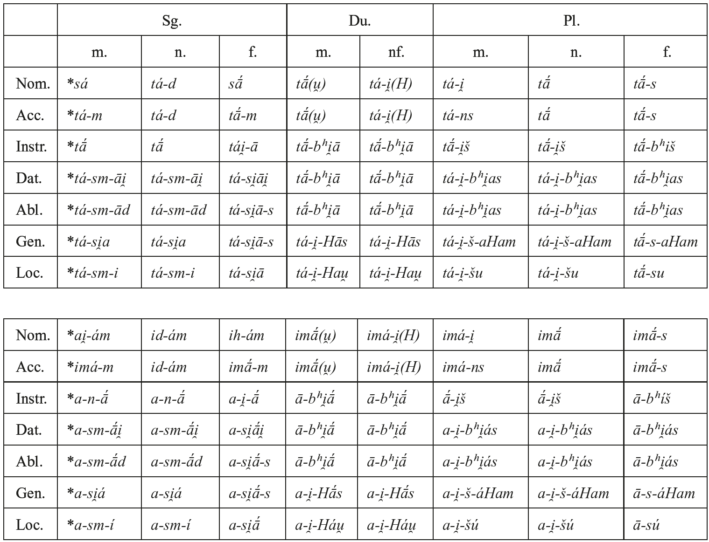

Concrete spatial (and temporal) deixis was expressed by a two-term system. For proximal deixis the stem *<i>(H)i-</i>/<i>(H)a-</i>, f. *<i>(H)ī-</i>/<i>(H)ā-</i> ‘this (here)’ was used (cf. Table 111.3). Originally the stem of the strong cases was *<i>(H)i-</i>/<i>(H)ai̯-</i>, f. *<i>(H)ih-</i> throughout, but in the singular, the forms were reinforced by the particle <i>-ám</i> in deictic usage. The extended form of the acc. sg. m. *<i>(H)im-ám</i> was reanalyzed as *<i>(H)imá-m</i>, implying immediately a new acc. sg. f. *<i>(H)imā́-</i>. This newly created stem*<i>(H)imá-</i>/<i>(H)imā́-</i> was then generalized to all strong cases other than the nom. sg. The old unextended forms of the accusative survived as anaphoric pronouns of the third person (cf. 5.2). The peculiar instr. sg. *<i>(H)anā́</i> might originally have belonged to a different pronoun *<i>(H)aná-</i>, but other forms of such a stem are clearly secondary in Indo-Iranian (cf. Wackernagel and Debrunner 1930: 526 f.).

Another stem *<i>(H)ai̯ná-</i> cannot be reconstructed, since Vedic <i>ená-</i> and Persian <i>īn</i> are secondary formations (Klingenschmitt 1972: 94−103).

For remote deixis a PII pronoun is difficult to reconstruct, since the branches disagree in all forms except the nom. sg. m. and f. *<i>sá(h)-u</i>. Indic has *<i>ad-áu̯</i> in the nom.-acc. sg. n. and a stem *<i>amú-</i> elsewhere, but Iranian has a stem *<i>au̯a-</i> in all forms; since Vedic gen. du. <i>avóṣ</i> is best taken with Klein (1977: 166−171) as secondary for *<i>ayóṣ</i>, there is no evidence for *<i>au̯á-</i> in Indic. As Klein (1977: 163 ff.) has argued, originally a combination of *<i>sá-</i> and *<i>a-</i> might have been used that was reinforced by a particle of remoteness *<i>u</i>/<i>*au̯</i>. The further development of this system seems to have been independent in the individual branches. In Iranian, *<i>au̯</i> was prefixed to forms of *<i>a-</i>, so that a stem *<i>au̯a-</i> resulted. In Indic, *<i>-u</i> was suffixed to the forms of *<i>a-</i>. In the nom.-acc. sg. *<i>ad-u</i> was then reshaped to *<i>ad-áu̯</i> by analogy to *<i>sáu</i> (< *<i>sá(h)u</i>) reanalysed as *<i>sa-áu̯</i>. In the acc. sg. m., *<i>am-u</i> was recharacterized to *<i>am-ú-m</i>, and a new stem <i>amú-</i>, f. <i>amū́-</i> was abstracted from this (*<i>amú-i̯-</i> was regularly changed to *<i>amíi̯-</i> > <i>amī́-</i>, cf. EWAia I 99), similar to the PII creation of *<i>(H)imá-</i>. Thus, the distal pronouns give us no new information except for the fact that the stem *<i>a-</i> was not confined to proximal deixis. This is not surprising since this stem (and partly also *<i>i-</i>), is normally non-deictic and anaphoric in other languages. When these two stems became isofunctionally associated in PII, the addition of a remoteness particle could have been used as a way of maintaining a deictic distinction. The PII suppletive nucleus for the reshaping would have looked like this: Nom. sg. m. *<i>sá-u</i>, f. *<i>sáh-u</i>, n. *<i>(au̯-)ád(-u)</i>, acc. sg. m. *<i>(au̯-)ám(-u)</i>. In the nominative, Vedic added <i>a-</i> from the other cases.

A further stem *<i>(H)āna-</i> is not attested in Indo-Iranian: Persian <i>(h)ān</i> is secondary (*<i>hāu̯-na</i>, Klingenschmitt 1972: 95−107).

### 4.4. Other pronouns

All these took the regular ending *<i>-s</i> in the nom. sg. m. The relative pronoun was *<i>(H)i̯á-</i>, f.*<i>(H)i̯ā́-</i>, inflected like *<i>sá-</i>/<i>tá-</i> but for the nom. sg. m. The interrogative pronouns were also used as indefinite pronouns, especially when combined with indefinite particles like *<i>-ḱa</i> or *<i>-ḱid</i>. As Iranian shows, there were three stems: *<i>ḱí-</i> ‘who?, what?, someone, something’ (only nom. acc., of which only single forms survived in Indic), <i>*ḱá-</i> ‘someone, something(?)’ (never nom. acc., not attested in Indic), and *<i>ká-</i>, f. *<i>kā́-</i> ‘which?, who?, what?’. Only the last had special feminine forms and could be used attributively. Since this difference corresponds to Early Latin <i>quis</i>, <i>quid</i> ‘who?, what?’ vs. <i>quoi</i>, <i>quod</i> ‘which?’, it was probably PIE. Less clear is the distribution of *<i>ḱa-</i>. Since its occurrence (only “weak” cases) is supplementary to *<i>ḱi-</i>, the most natural interpretation would be that it belonged to it, as *<i>a-</i> belonged to *<i>i-</i>. But since Avestan forms of <i>ca-</i> are never used in interrogative function, it seems to differ from <i>ci-</i> (it has even been assumed that *<i>ḱa-</i> was an unaccented variant of *<i>ká-</i>, Tichy 2006b: 51 f.). On closer inspection, this difference becomes rather thin. For <i>ci-</i>, the tendency to indefinite function is strong, too: it is obligatory in this function after the negative particle <i>naē-</i>, and in interrogative function <i>ka-</i> dominates strongly, <i>ci-</i> occurring mainly in formulaic sentences. That interrogative <i>ci-</i> survived better than <i>ca-</i> may simply be due to its occurrence in the more frequent grammatical cases. Thus *<i>ḱá-</i> may well have belonged to *<i>ḱí-</i>, and we can assume that already in PII *<i>ká-</i> had started to dominate in interrogative function even when used as a substantive, thus restricting *<i>ḱí-</i>/<i>ḱa-</i> mainly to indefinite function. For the formation of adverbs, a third stem *<i>kú-</i> existed.

### 4.5. Adverbs

Pronominal adverbs could be formed by the following suffixes: static local *<i>-tra</i> (*<i>tátra</i> ‘there’, *<i>kútra</i> ‘where?’, *<i>yátra</i> ‘where’, *<i>átra</i> ‘[t]here’), *<i>-dʰa</i> (*<i>idʰá</i> ‘here’, *<i>ádʰa</i> ‘then’, *<i>kúdʰa</i> ‘where?’), and ablatival <i>*-tás</i> (*<i>itás</i> ‘from here’, *<i>tátas</i> ‘from there’, *<i>kútas</i> ‘from where?’); temporal *<i>-dā́</i> (*<i>idā́</i> ‘now’, *<i>tadā́</i> ‘then’, *<i>kadā́</i> ‘when?’, *<i>yadā́</i> ‘when’), *<i>-di</i> (*<i>i̯ádi</i> ‘when’); modal *<i>-thā</i> (*<i>táthā</i> ‘like that’, *<i>kathā́</i> ‘how?’,<i>*itthā́</i> ‘like this’, *<i>áthā</i> ‘in this way’); quantifying *<i>-ti</i> ‘much/many’ (*<i>ḱá-ti</i> ‘how many?’, *<i>íti</i> ‘so [*much]’). A suffix *<i>-H</i> and *<i>-(H)a</i> are attested only in the interrogative: *<i>kú-H</i> > *<i>kū́</i>, *<i>kúu̯a</i> ‘where?’.

## 5. Personal pronouns

### 5.1. First and second person

Specific personal pronouns did not exist except for the first and second person; in addition there was an enclitic dative of the third person. These pronouns were inflected for case only, number being expressed by the stem alone. Often the nominative was suppletive, and the other cases often were formed in a peculiar way. For the accusative and genitive-dative, there were special enclitic forms. For details see Table 111.4.

In the nominative and accusative, forms enlarged by the particle *<i>ám</i> (note external sandhi in the 2nd plural nominative) have largely ousted the shorter simple forms which are only (partly) preserved in Iranian (most of these are disputed, and only OAv. <i>yūš</i> is generally accepted). Acc. pl. *<i>asmá+am</i>, *<i>ušmá+am</i> are probably reflected by Vedic <i>asmā́n</i>, <i>yuṣmā́n</i>.

In the dual and plural, the oblique stem is based on an old acc. consisting of the “zero-grade root” and a particle, *<i>u̯á</i> in the dual and *<i>má</i> in the plural.

<!-- source-file: content/11_chapter05_3.xhtml -->

Tab. 111.4: PII personal and possessive pronouns

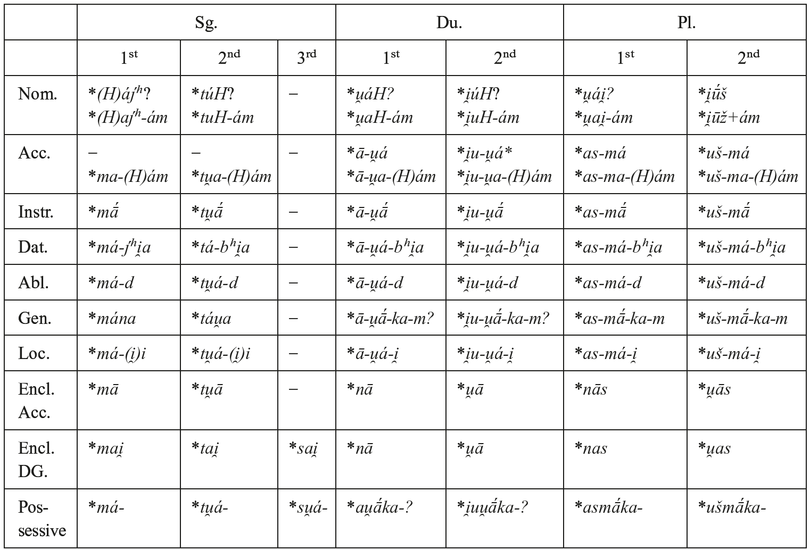

Possessive pronouns other than reflexive *<i>su̯á-</i> are lacking in Indic, Old Persian, and later Iranian, but in Avestan, analogous formations exist for all persons of the singular and may therefore be reconstructed for PII. They show pronominal inflection in Avestan and sometimes (in the case of *<i>su̯á-</i>) in Vedic. In the dual and plural, adjectives in *<i>-ka</i>could be used as possessive pronouns, and their acc. sg. n. was used as a genitive of the personal pronoun.

Reflexive *<i>s(u̯)á-</i> is not attested as a personal pronoun in Indo-Iranian: The alleged Avestan attestations are either illusory or can be interpreted as secondary formations (cf. de Vaan 2005: 705 f.). The isolated enclitic third-person dative-genitive *<i>sai̯</i>, attested in Iranian but totally absent from Indo-Aryan (Prakrit <i>se</i> is an independent innovation, see von Hinüber 1987: 163), looks like a form of the reflexive but has to be distinguished because of its non-reflexive usage (paralleled by Hittite <i>-sse</i>/<i>-ssi</i>, Greek <i>hoi</i>).

### 5.2. Third person

Except for the enclitic dative-genitive *<i>sai̯</i>, unaccented forms of the demonstrative *<i>(H)i-</i>/<i>(H)a-</i> (cf. 4.3) were used for anaphoric reference to the third person, but in the accusative there were shorter (more original) forms than the accented forms with proximal deixis: acc. sg. m. *<i>im</i>, n. *<i>id</i>, f. *<i>īm</i>; du. mnf. *<i>ī</i>; pl. mf. *<i>īnš</i>, n. *<i>ī</i>. In a similar way, some forms of a stem *<i>si-</i> could be used, especially the acc. sg. *<i>sim</i>, f. *<i>sīm</i>. In Indic, the accusatives of *<i>i-</i> (sg. <i>īm</i> only preserved as a particle) were replaced by forms of a stem <i>ena-</i> < *<i>ai̯na</i>- which may be old and go back to the distal demonstrative *<i>no-</i>with prefixed *<i>(H)ai̯-</i>, as *<i>(H)ai̯-tá-</i> from *<i>tá-</i> (cf. Klingenschmitt 1987: 175; Dunkel 2014: 370 fn. 41). It is not clear whether such a stem is also presupposed for Iranian by the Khotanese 3 pl. enclitic <i>nä</i>.

## 6. Verbs

### 6.1. Categories

The three persons 1−3 and the numbers singular, dual, plural were distinguished in the usual way. The 3 pl. could also be used impersonally.

The main voice distinction was between active and middle, but in the middle there was an additional distinction between a “passive” (or rather fientive/anticausative, often called “stative”) and a “non-passive” that could be made at least in the 3 sg. and 3 pl. of athematic non-perfect forms (for details, see 6.3). Otherwise, this distinction was expressed by derivation or periphrasis. Forms belonging to the “passive” subcategory could only be used if the subject was not an agent, but rather the undergoer of an action (independent of the presence of an agent, thus differing from a pure passive).

On a purely temporal level, there were only two tenses: the preterit referred to the past, while the present could refer to all other times, including extra-temporal reference. The so-called future in *<i>-si̯a-</i> had not yet become a real tense, but was an Aktionsart designating preparation or intention. Tense was only distinguished in the indicative mood: the present was marked by special (longer, so-called “primary”) endings, and the past was formed from the injunctive by means of a prefix *<i>á-</i> (the “augment”, cf. 6.2.2).

There were five moods: indicative, injunctive, imperative, optative, and subjunctive. The first three were distinguished by different endings, but the last two had special (secondary) suffixes (see 6.2.2). The indicative and the injunctive stated the action as factual but differed in their illocutionary function: the indicative marked it as “reported” (and potentially new), while the injunctive just recalled a known fact (Hoffmann 1967a; Tichy 2006a: 190 ff.: “Erwähnung”; Mumm 1995 “verbal definiteness”). The imperative marked the will of the speaker that the action should take place, the optative marked it as possible (and by pragmatic implication, as desirable or prescribed), and the subjunctive marked the action as expected, (cf. Tichy 2006a: 193 ff., 198 ff., 2006b: 96−106). The injunctive had originally been an “extratemporal” tense category rather than a special mood, and this was still reflected in PII by its “basic” morphology (bare stem + most basic “secondary” endings). But in PII, the indicative present had acquired an extratemporal usage (stating general facts), and thus, the injunctive lost its “negative” temporal value and became confined to special illocutionary functions (Tichy 2006a: 192 f.).

The categories of the dimension aspectuality/relative tense were distinguished by stem formation alone. Beside the prototypical distinction of imperfective (“present” stem) and perfective (“aorist” stem) aspect, there was the somewhat intermediate perfect: While originally a derived imperfective resultative, in PII it already had acquired the special status of an anterior relative tense − at least in its original present indicative that became an anterior present indicative. For the other categories of the perfect stem, this is not totally clear since they disappeared too early (for details cf. Kümmel 2000: 82−90).

The distinction between imperfective and perfective aspect is moribund outside the indicative mood of the past in Vedic and Avestan, but formal reflexes presuppose a former functional opposition which might have been present in PII (and perhaps still was in Old Avestan). Even in the indicative, the functional difference was transformed into a temporal one: in Vedic, the use of the imperfect was extended to narration in perfective contexts of the more remote past, while the aorist was confined to the recent past (Tichy 1997: 591 f.). This change can already have happened in PII, since we have no clear Iranian evidence to the contrary (real augmented past tense forms are rare in Avestan, and Old Persian has completely lost the aorist) − in fact, of the few attested augmented indicatives in Avestan, all the imperfects refer to the remote past (Kellens 1984: 244−249), and all the aorists refer to the recent past (Tichy 1997: 596 n. 14). However, Dahl (2010) has recently argued for a longer survival of the basic aspectual function of the aorist and imperfect into Vedic.

### 6.2. Stem formation

Secondary stems (or affixes) are those that may not take further affixes and to which endings can directly be added; they generally are markers of tense-aspect and mood. Primary stems (or affixes) are those that may serve as a basis for secondary affixes (tense-mood affixes); they generally signal aspectuality/Aktionsart. Zero affixation was possible in both cases for the more basic categories (i.e. indicative, injunctive, and imperative; present and aorist stems).

In ablauting stems (their subjunctives, being thematic, always aside), there is a general principle governing the choice of strong or weak stem variants: The active singular is stronger than the dual, plural and the whole middle, with the exception of the 2 sg. imperative in *<i>-dʰi</i>. But there are some special cases, where the stronger stem is used in the domain of the weaker: a) In the 2 plural imperative. b) In the dual and plural of the root aorist injunctive and indicative, except in the 3 pl. c) Likewise in all optatives. d) In the whole indicative and injunctive of sigmatic aorists (the weaker stem is confined to the moods and the participle). Kortlandt (1987) assumes that the lengthened grade was originally confined to monosyllabic forms; in his view, Vedic injunctives like <i>stóṣam</i> represent the old state of affairs. But these forms are too isolated to constitute valid counterevidence against all attested Old Indo-Iranian forms of the indicative; they always stand beside well-attested subjunctives and might be influenced by them (cf. Narten 1964: 276 f.; Kümmel 2012). e) In Vedic this holds also for the injunctive and preterit plural of reduplicated presents and perfects, but the evidence is not sufficient to reconstruct this for Indo-Iranian, let alone PIE, because the Avestan data are very limited. On the one hand, 3 pl. present injunctive <i>daidiiat̰</i> seems to show that reduplicated presents were not treated as in Vedic. On the other hand, OAv. <i>cikōitərᵊš</i> has been interpreted as a perfect injunctive (or “pluperfect”, Jasanoff 1997: 119 ff., 2003: 39 f.), but even its character as a finite verb form has been disputed (cf. Kümmel 2000: 635 f.). f) In “passive” aorists, only the 3 sg. exhibits a strong stem with <i>ā˘-</i>grade, otherwise the normal zero-grade of middle root aorists is used.

In PII <i>ā˘-</i>grade (i.e. PIE <i>o</i>-grade) had a limited distribution in the verbal system: it is present only in reduplicated stems, especially perfects (in non-reduplicated *<i>u̯ái̯d-</i>‘know’ it cannot be recognized any more), the 3 sg. of the “passive” aorist, and the causative in *<i>-ái̯a-</i>. This means that all other possible PIE ablauting types with <i>o-</i>grade (cf. Jasanoff 2003: 64 ff.; Kümmel 2004: 147 ff.) must have been lost, which is easy to understand, since in any case they would have fallen together with other types in all or most forms (especially in the weak stem that often had zero-grade ablaut). When *<i>o</i> fell together with *<i>e</i> in all closed syllables, the differences became minimal, being confined to strong stems ending in one consonant when a vocalic suffix or ending was added (i.e. in the 1 sg. injunctive/preterit in <i>-am</i>). Therefore, we would not expect these ablaut patterns to have survived in cases where they were not functionally motivated. Most often such stems were replaced by other formations in PII, but sometimes they seem to have been thematized (e.g. *<i>i̯át-a-</i>, *<i>sphər-á-</i>, *<i>tud-á-</i>, cf. Kümmel 2004: 150 ff.).

Reduplication was well preserved as a means of stem formation (for a special discussion cf. Kulikov 2005: 431 ff.). Normally, the first consonant of the root was reduplicated, followed by either *<i>i</i> (in the present) or *<i>a</i> (in some present stems and elsewhere). Velars were replaced by the respective (secondary) palatals. When a root began with a laryngeal, this led to a lengthening of the reduplication vowel and other irregularities, e.g. *<i>ha-hnánć-</i> > *<i>hānánć-</i> ‘reach’; *<i>Hǵa-Hgar-</i> > *<i>ǵāgár-</i> ‘be awake’. The reduplication vowel was assimilated to the root vowel, if the weak stem contained syllabic *<i>ī</i> or *<i>ū</i>. Thus, the original difference between *<i>i</i> and *<i>a</i> could not be upheld everywhere.

This “simple” reduplication had been strongly grammaticalized in PII. Therefore iconicity was strengthened by “full” reduplication in the so-called “intensive” with its strong repetitive function: Here not only the first consonant of the root was copied, but also the first consonant of the root coda appeared after the reduplication vowel *<i>a</i>, e.g. *<i>dai̯ć-</i> → *<i>dái̯-dai̯ć- ~ *dái̯-dić-</i> ‘to show’. When the root ended in a plosive or affricate, the resulting cluster was simplified with lengthening of the reduplication vowel, e. g. *<i>kać-</i>→*<i>ḱáć-kać-</i>→*<i>ḱā́-kać-</i>.

In PII, athematic stems could easily be thematized because of the formal identity of some terminations, esp. the 3 pl. active *<i>-an(ti)</i> < *<i>-ent(i) = *-ont(i)</i>. This led to an increase of simple thematic stems, esp. in the aorist, but also to secondary thematic stem types, e.g. nasal-infixed *<i>kr̥ -n-t-á-</i>. This younger tendency should not be confused with the older, pre-PII thematization claimed by Jasanoff (2003: 96 ff., 122 ff., 128 ff.) for a large number of cases, e.g. some presents in *<i>-i̯a-</i> vs. athematic <i>i-</i>stems in Anatolian, or the thematic reduplicated type as a whole.

#### 6.2.1. Primary stems

The present stem was used for the following categories: present indicative, imperfect indicative (= present preterit), present injunctive, present subjunctive, present optative, present imperative.

The traditionally defined secondary categories “future”, “desiderative” (rather a prospective according to Heenen 2006), “intensive”, “causative”, and “passive” were in fact special, productive present stems that did not have an aorist or perfect of their own (except the “passive” aorist). Even in the “normal” present, the variation in stem formation was great. In the following presentation, the classification according to Bartholomae (1894: 67−84) and Emmerick (1968: 178) is given in brackets:

1. Athematic, root with mobile accent (B1, E-Ia): 3C *<i>CáRC- ~ CR̥C-</i>: *<i>(H)ás- ~ (H)s-</i> ‘be’ (cf. Table 111.6), *<i>(H)ái̯- ~ (H)i-</i>/<i>i̯-</i> ‘go’, *<i>ǵʰán- ~ gʰn-</i>/<i>gʰa(n)-</i> ‘beat, kill’, *<i>mráu̯H- ~ mrū-</i> ‘speak’; middle *<i>sū́-</i> ‘give birth’; “passive” *<i>dʰuǵʰ-</i> ‘yield (milk)’, *<i>ćru-</i> ‘be heard’. 1bC *<i>Cā́- ~ Cā-</i>: *<i>pā́- ~ pā-</i> ‘protect’, *<i>u̯ā́- ~ u̯ā-</i> ‘blow’
2. Athematic, root with fixed accent (B4, E-Id; “Narten present”): 5aA *<i>Cā́RC- ~ CáRC-</i> (later → <i>Cā́RC- ~ CR̥C-</i>): *<i>tā́tć- ~ tátć-</i> ‘fashion’, *<i>stā́u̯- ~ stáu̯-</i> ‘praise’, *<i>krā́mH- ~ *krámH-</i> ‘step, walk’ (cf. Kümmel 1998: 193 f.); middle *<i>Háuǵ-</i> ‘speak (solemnly)’; “passive” *<i>Hā́s-</i> ‘sit’, *<i>ćái̯-</i> ‘lie’ (cf. Table 111.7), *<i>stáu̯-</i>‘be praised’, *<i>u̯ás-</i> ‘wear’. 1bA *<i>ćā́s-</i> ‘instruct’ (< *<i>ćā́Hs- ~ *ćáHs-</i>)
3. Thematic, root in <i>a</i>-grade (B2, E-Ib): 1bA *<i>CáRC-a-</i>: *<i>bʰár-a-</i> ‘bring, bear’, *<i>háȷ́-a-</i> ‘drive’, *<i>ḱár-a-</i> ‘move around’, *<i>nái̯-a-</i> ‘lead’ (cf. Table 111.9).
4. Thematic, root in <i>ā-</i>grade (B4, E-Id)?: 1cA *<i>Cā́RC-a-</i> (?): doubtful, since all cases might be based on post-PII thematicization (cf. Kümmel 1998: 193 f. on *<i>krā́m-a-</i>).
5. Thematic, root in Ø-grade (B3, E-Ic; “aorist present”): 1aB *<i>CR̥C-á-</i>: *<i>u̯ić-á-</i> ‘enter, settle’, *<i>sphər-á-</i> ‘kick’, *<i>sr̥ȷ́-á-</i> ‘let go’.
6. Athematic, reduplicated (B5, E-IIa): 3C/3A *<i>Ci-CáRC- ~ Ci-CR̥C-</i> (→ *<i>Cí-°</i>): *<i>bʰibʰár- ~ *bʰibʰr̥-</i>/<i>*bʰibʰr-</i> ‘bear’; *<i>Hii̯ár- ~ *Hii̯ər-</i>/<i>Hīr-</i> ‘rouse, move’; “passive” *<i>HiHić-</i> ‘be master’. 3A *<i>Cá-CaC- ~ Cá-CC-</i>: *<i>dʰádʰā-</i>/<i>dʰádʰaH- ~ dʰádʰH(ь)-</i> ‘put’, *<i>sásaḱ- ~ sásḱ-</i>‘follow’. The distinction between these two subtypes (LIV2: 16; Tichy 2006b: 113 f.) is controversial (cf. Jasanoff 2003: 66 f.; Kulikov 2005: 437 f.); in any case, the latter seems to have been confined to roots in <i>°ā-</i> or <i>°aT-</i> in PII.
7. Thematic, reduplicated, root in Ø-grade (B6, E-IIb): 1aA *<i>Cí-CR̥C-a-</i>: *<i>*sí-zd-a-</i> > *<i>sī́d-a-</i> ‘sit down’, *<i>stí-šth-a-</i> ‘stand (up)’, *<i>pí-b-a-</i>‘drink’.
8. Athematic, full reduplication (B7, E-IIc; “intensive”): 3A *<i>CáR-CaRC- ~ CáR-CR̥C-</i>: *<i>ḱár-kar- ~ ḱár-kər-</i> ‘celebrate, praise’, *<i>dár-dar- ~ dár-dr̥ -</i> ‘burst’; *<i>dái̯-dai̯ć- ~ *dái̯-dić-</i> ‘show’ *<i>Cā́-CaT- ~ Cā́-CaT-</i>: *<i>ḱā́-kać-</i> ‘appear’.
9. Thematic suffix *<i>-i̯á-</i>, full reduplication, root in Ø-grade (B29; “intensive”) 1aB *<i>CaR-CR̥C-i̯á-</i>: *<i>nai̯-niȷ́-i̯á-</i> ‘wash’.
10. Athematic, nasal infix (B8, E-IIIa): 3C *<i>CR̥-ná-C-</i>/<i>CR̥-n-C-</i>: *<i>i̯u-ná-ǵ- ~ i̯u-n-ǵ-</i> ‘yoke’, *<i>u̯i-ná-d- ~ u̯i-n-d-</i> ‘find’, *<i>ri-ná-ḱ- ~ ri-n-ḱ-</i> ‘leave’.
11. Thematic, nasal infix (B9, E-IIIa): 1aB *<i>CR̥-n-C-á-</i>: *<i>kr̥-n-t-á-</i> ‘cut’, *<i>si-n-ḱ-á-</i> ‘pour’. Thematicized from preceding, but in contrast to the other nasal presents, this was already PII.
12. Athematic, nasal infix → suffix (B11, E-IIIb): 3C *<i>*CR̥C-ná-H- ~ CR̥C-n-H- ></i> *<i>CR̥C-nā́- ~ CR̥C-n(ь)H-</i>: *<i>gr̥ bʰ-nā́- ~ gr̥ bʰ-n(ь)H-</i>‘seize’; *<i>ȷ́ā-nā́- ~ ā-n(ь)H-</i> ‘recognize, know’ (originally from roots in final *<i>H</i>, but sometimes extended). Cf. type (26).
13. Athematic, nasal suffix *<i>-nu-</i> (B10, E-IIIc): 3C *<i>CR̥C-náu̯- ~ CR̥C-nu-</i>: *<i>kr̥-náu̯- ~ kr̥ -nu-</i> ‘make’, *<i>Hać-náu̯- ~ Hać-nu-</i> ‘reach’, *<i>ma-náu̯- ~ ma-nu-</i> ‘remember, think of’.
14. Thematic suffix *<i>-sćá-</i>, root in Ø-grade (B14, E-IVa): 1aB *<i>CR̥(C)-sćá-</i>: *<i>ga-sćá-</i> ‘come’, *<i>Hi(š)-sćá-</i> ‘seek’, *<i>pr̥(ć)-sćá-</i> ‘ask’.
15. Thematic suffix *<i>-i̯a-</i>, root in <i>a</i>-grade (B26, E-Vb): 1bA *<i>Cá(R)C-i̯a-</i>: *<i>Hás-i̯a-</i> ‘throw, shoot’, *<i>náć-i̯a-</i> ‘disappear’, *<i>pád-i̯a-</i> ‘fall’, *<i>gā́-i̯a-</i> ‘sing’, *<i>mán-i̯a-</i> ‘think’.
16. Thematic suffix *<i>-i̯a-</i>, root in Ø-grade (B27 f., E-Vc): 1aA *<i>CŔ̥C-i̯a-</i>: *<i>dʰrúǵʰ-i̯a-</i> ‘deceive’, *<i>u̯ŕ̥ȷ́-i̯a-</i> ‘work’, *<i>bʰúdʰ-i̯a-</i> ‘awake, notice’. 1aB *<i>CR̥(C)-i̯á-</i> (passive): *<i>kr̥-i̯á-</i> ‘be made’.
17. Thematic suffix *<i>-ai̯a-</i>, root in Ø-grade (B24, E-Va): 1aB *<i>CR̥C-ái̯a-</i>: *<i>sćad-ái̯a-</i> ‘seem, appear’, *<i>kš-ái̯a-</i> ‘rule’.
18. Thematic suffix *<i>-ai̯a-</i>, root in <i>ā˘</i>-grade (B30, E-Ve; iterative/causative): 1bB/1cB <i>CaRC-</i>/<i>Cā˘C-ái̯a-</i>: *<i>dʰār-ái̯a-</i> ‘hold’, *<i>u̯ādʰ-ái̯a-</i> ‘lead’ → productive causative: *<i>gām-ái̯a-</i> ‘let come’, *<i>bʰaudʰ-ái̯a-</i> ‘wake’, *<i>rauḱ-ái̯a-</i>‘make shine’, *<i>sćand-ái̯a-</i> ‘make appear’, *<i>ćrāu̯-ái̯a-</i> ‘make hear’.
19. Thematic suffix *<i>-u̯a-</i>, root in Ø-grade (B20): 1aA *<i>CŔ̥C-u̯a-</i>: *<i>ǵī́-u̯a-</i> ‘live’, *<i>tə́r-u̯a-</i> ‘overcome’.
20. Thematic suffix *<i>-Sa-</i>, root in <i>a</i>-grade (B15; “voluntative”, cf. Tichy 2006a: 311 ff.): 1bA <i>*CáRC-Sa-</i>: *<i>bʰák-ša-</i> ‘distribute’, *<i>náć-ša-</i> ‘reach’.
21. Thematic suffix *<i>-Sa-</i>, reduplication, root in Ø-grade (B16; “desiderative”): 1aA *<i>Cí-CR̥C-</i>/<i>-CəR-Sa-</i>: *<i>ǵí-ǵī-ša-</i> ‘wish to win’, *<i>ćú-ćrū-ša-</i> ‘wish to hear’. 1aA *<i>Cí-CC-Sa-</i> > <i>CíC-Sa-</i>: *<i>tí-k-ša-</i> ‘wish to run’.
22. Thematic suffix *<i>-Si̯á-</i>, root in <i>a</i>-grade (B17; “preparative” > future, cf. Tichy 2006a: 307 f.): 1bB *<i>Ca(R)C-</i>/<i>CaRH(ь)-Si̯á-</i>: *<i>u̯ak-ši̯á-</i> ‘be about to say’, *<i>kar-H(ь)ši̯á-</i> ‘be about to make’.
23. Thematic suffix *<i>-āi̯á-</i>, root in Ø-grade (B23): 1aB *<i>Cr̥C-āi̯á-</i>: *<i>gr̥bʰ-āi̯á-</i> ‘seize’, *<i>dam-āi̯á-</i> ‘tame’. This type seems to be derived from type (15) above: *<i>-n̥H-i̯á-</i> > *<i>-aHi̯á-</i> > *<i>-āi̯á-</i> (cf. Schrijver 1999: 115 ff.).
24. Thematic suffix *<i>-ani̯á-</i>, root in Ø-grade (B13): 1aB *<i>Cr̥C-ani̯á-</i>: *<i>(H)iš-ani̯á-</i> ‘impel’. This type has been explained as a by-form to the preceding, and both have been compared to Hittite <i>-anni-</i> (Jasanoff 2003: 122 ff.).

The aorist stem was used for the following categories: aorist indicative (= preterit), aorist injunctive, aorist subjunctive, aorist optative, aorist imperative. The variation in stem formation was much more limited than in the present. In PII, the most notable development was the thematization of root aorists that could easily have begun with the 3 pl. in *<i>-án</i> reanalyzed as *<i>-á-n</i>, particularly if there were additional reasons not to preserve the root inflection (cf. Kümmel 1998: 201 ff.).

<table>
<tr><td>1.</td><td>Athematic, root with mobile accent (B1):</td></tr>
<tr><td></td><td>3C <i>CáRC- ~ CR̥C-</i>: *<i>ḱár- ~ kr̥-</i>/<i>kr-</i> ‘make’ (cf. Table 111.8), *<i>ǵám- ~ gm-</i>/<i>ga(m)-</i>‘come’, *<i>dʰā́-</i>/<i>dʰáH- ~ dʰH-</i> ‘put’, *<i>dárć- ~ dr̥ć-</i> ‘see’, *<i>ćráu̯- ~ ćru-</i> ‘hear’, *<i>i̯áu̯ǵ-~ i̯uǵ-</i> ‘yoke’, *<i>gʰrábʰH- ~ *gʰr̥bʰH-</i> ‘seize’; middle *<i>dr̥- ~ dár-</i> ‘hold’, *<i>mn-</i>/<i>ma(n)-~mán-</i> ‘get an idea, think of’, *<i>u̯ər- ~ u̯ár-</i> ‘choose’ 1aC *<i>bʰū́-</i>/<i>bʰúu̯- ~ bʰū-</i> ‘become’</td></tr>
<tr><td></td><td>1bC *<i>krámH- ~ kram(H)-</i> ‘stride’; middle *<i>Har- ~ Hár-</i> ‘move’ (for accent cf. Vedic <i>arāṇá-</i>).</td></tr>
<tr><td>2.</td><td>Athematic, root with fixed accent (B4, E-Id; “Narten aorist”)?:</td></tr>
<tr><td></td><td>5aA *<i>Cā́RC- ~ CáRC-</i>: *<i>i̯ā́m- ~ *i̯ám-</i> ‘extend, hold’?</td></tr>
</table>

The reconstruction of this type for the aorist (cf. Peters 1980: 313 f.; Tremblay 2003: 152 f. n. 176, 2005: 637 ff.) is very controversial (cf. Harðarson 1993: 72 ff.). The stem mentioned here may be considered the best case for it within Indo-Iranian, since no single attested form (except for the accentuation of the Vedic imperative <i>yandhí)</i> clearly points to a “normal” root aorist; but even here, all these forms might be explained differently (Narten 1964: 204 ff.). The existence of such a type would facilitate the explanation of “acrostatic” root aorist optatives like *<i>u̯anīt</i> > Av. <i>vainīt̰</i> (cf. Tremblay 1996c: 216 n. 10).

<table>
<tr><td>3.</td><td>Athematic, root with mobile accent, “passive” (B1):</td></tr>
<tr><td></td><td>4bC <i>CR̥C-</i> with <i>3s CáRC</i>/<i>Cā́C-</i> (<i>ā˘</i>-grade!): *<i>ćrā́u̯- ~ ćru-</i> ‘be heard’, *<i>u̯ā́ḱ- ~ uḱ-</i> ‘be said, be called’, *<i>ȷ́án(H)- ~ ȷ́an-</i>/<i>ȷ́ā-</i> ‘be born’.</td></tr>
<tr><td>4.</td><td>Thematic, root in Ø-grade, rarely <i>a</i>-grade (B3):</td></tr>
<tr><td></td><td>1aB <i>CR̥C-á-</i>: *<i>u̯id-á-</i> ‘find’, *<i>ćH(i)š-á-</i> ‘instruct’, *<i>kć-á-</i> ‘look’, *<i>kš-á-</i> ‘rule’. 1bB <i>CaC-á-</i>: *<i>sad-á-</i> ‘sit down’, *<i>san-á-</i> ‘conquer’, *<i>Har-á-</i> ‘reach, go to’, *<i>tatć-á-</i>‘fashion’ (Vedic root accent in these cases may be secondary).</td></tr>
<tr><td>5.</td><td>Athematic suffix <i>-S-</i>, fixed accent (“sigmatic”): 5aA <i>Cā́RC-S- ~ CáRC-S-</i>: *<i>nā́i̯-š- ~ nái̯-š-</i> ‘lead’ (cf. Table 111.10), *<i>prā́ć-š- ~ práć-š-</i>‘ask’, *<i>u̯ā́n-s- ~ u̯án-s-</i> ‘win’, *<i>sā́u̯H(ь)-š- ~ sáu̯H(ь)-š-</i> ‘impel’; middle *<i>mán-s-</i>‘think’.</td></tr>
</table>

In Vedic and Old Avestan, an active optative of this type does not occur; instead, root aorist optatives are used; it is therefore not clear whether such optatives had the <i>S-</i>suffix in PII or not (cf. the different positions of Hoffmann 1967b: 32 = 1976: 472 f.; Jasanoff 1991, 2003 vs. Harðarson 1993: 109−112).

<table>
<tr><td>6.</td><td>Thematic, reduplicated, root in Ø-grade:</td></tr>
<tr><td></td><td>1aA <i>Cá-CR̥C-a-</i>: *<i>u̯á-u̯ḱ-a-</i> ‘say’, *<i>ná-nć-a-</i> ‘disappear’ (?).</td></tr>
</table>

An athematic reduplicated aorist is attested only in Indic, and all cases can go back to older imperfects or pluperfects (cf. Kümmel 2000: 85 f.); thus, it seems to be an Indic innovation.

The perfect stem was used for the following categories: perfect indicative, pluperfect indicative (= perfect preterit), perfect injunctive, perfect subjunctive, perfect optative, perfect imperative. Here there was only a single lexical exception from the one productive type:

<table>
<tr><td>1.</td><td>Athematic, root with mobile accent:</td></tr>
<tr><td></td><td>*<i>u̯ái̯d- ~ *u̯id-</i> ‘know’ (functionally a present stem!)</td></tr>
<tr><td>2.</td><td>Athematic, reduplicated, mobile accent:</td></tr>
<tr><td></td><td>4bC <i>Ca-CáRC-</i> (<i>ā˘</i>-grade in 3s!) <i>~ Ca-CR̥C-</i>: *<i>ḱakár-</i>/<i>ḱakā́r- ~ *ḱakr-</i> ‘have/has made’, *<i>dadárć- ~ dadr̥ć-</i> ‘have/has seen’, *<i>ǵigái̯-</i>/<i>ǵigā́i̯- ~ ǵiǵi-</i> ‘have/has won’ (cf. Table 111.11), *<i>ćućráu̯-</i>/<i>ćućrā́u̯- ~ *ćućru-</i> ‘have/has heard’.</td></tr>
</table>

In the regular perfect, Indic shows a systematic redistribution of the “binding” vowel <i>-i-</i>that originally arose from the vocalization of a laryngeal in certain roots (cf. Kümmel 2000: 24, 42 f., 50 f.). Since this vowel is generally missing in Iranian, we cannot say whether this redistribution was already PII.

#### 6.2.2. Secondary stems and affixes (tense-mood)

Indicative, Injunctive, Imperative: no affix (distinguished only by different endings).

Preterit (imperfect, aorist, pluperfect): Prefix (“augment”) *<i>á-</i>, attached to the injunctive.

Optative: ablauting suffix *<i>-i̯ā́-</i>/<i>-ī-</i> from ablauting stems with mobile accent, non-ablauting *<i>-ī-</i> elsewhere after consonants, *<i>-i̯-</i> after vowels (= from thematic stems).

Subjunctive: thematic vowel suffix *<i>-a-</i>/<i>-ā-</i> (ablauting stems took the variant with full-grade root, though reduplicating stems partially took zero-grade). In Old Avestan, thematic stems show hiatus between the stem vowel and the subjunctive suffix (since the reconstruction of a laryngeal is not certain here, this hiatus is written with < ’ > in the tables).

#### 6.2.3. Participles

Present/aorist active: ablauting suffix *<i>-ánt- ~ -at-</i> (3C) from ablauting stems with mobile accent, elsewhere non-ablauting *<i>-at-</i> (1aA) after consonants, *<i>-nt-</i> (1aA) after vowels (= from thematic stems).

Perfect active: ablauting suffix *<i>-u̯ā́s-</i>/<i>*-u̯ás- ~ -úš-</i> (4bB)

Middle: thematic suffix *<i>-āná-</i> (1aB) from ablauting stems with mobile accent, elsewhere *<i>-āna-</i> (1aA) after consonants, *<i>-mH(ь)na-</i> (1aA) after vowels (= from thematic stems); both go back to Pre-PII *<i>-mHna-</i> < PIE *<i>-mh₁no-</i> (cf. Klingenschmitt 1975: 159−163).

#### 6.2.4. Other nominal forms of the verb

PII had not yet developed a fully grammaticalized infinitive, but case forms (esp. datives) of various verbal abstracts could be used in similar functions (as quasi-infinitives according to García-Ramón 1997: 48), sometimes with formal peculiarities showing their extra-paradigmatic status (e.g. Vedic <i>śobháse</i> instead of a regular dative <i>*śóbhase</i>). Two formations may be mentioned as exhibiting the greatest similarity to an infinitive, since they are derived from verbal stems and not directly from the root, and no other case forms of the same stem are found: 1. *<i>-dʰi̯āi̯</i> (a PII innovation, cf. García-Ramón 1997: 58 f.). 2. *<i>-Sáni</i> (not attested in Iranian but comparable to Greek *<i>-sen</i> and therefore perhaps inherited, García-Ramón 1997: 62 ff.).

The verbal root itself could be used as a verbal noun, as could many derivative formations. Of these, the two agentive noun suffixes *<i>-tā́r-</i> and <i>*ˊ-tār-</i> (on the distinction cf. Tichy 1995: 220 ff.) are remarkable for being rather closely connected to the verb.

Verbal adjectives could be formed directly from the root. The most important was the resultative in *<i>-tá-</i> or (much rarer) *<i>-ná-</i> that later became the basis of the periphrastic past tenses. Adjectives of necessity and possibility were formed by the suffixes *<i>-(t)i̯a-</i> and *<i>-ii̯a-</i> (cf. Rubio Orecilla 1995).

### 6.3. Personal endings (see Table 111.5)

As in other IE languages, beside the special imperative endings, two sets of endings were used: “primary” (PE) and “secondary” (SE). The first set was employed in the present indicative (including the future indicative as an old present), the other everywhere else. In the subjunctive, both sets were mixed, and in some forms both were possible. Perhaps these alternatives indicated some functional differences, but we cannot recognize these any more from the texts (cf. Tichy 2006a: 191 f.).

#### 6.3.1. Active

The active endings closely correspond to those of other IE languages. The 2 pl. PE *<i>-thá</i> might be explained as an analogical innovation that took its aspiration from the 2 du. (perhaps motivated by the desire to distinguish the present from the injunctive), but since the PIE form of this ending is disputed, it might be old. In the 3 pl., there was an ablaut difference: the stressed form in *<i>-án(ti</i>/<i>u)</i> was used in stems with mobile stress; otherwise, *<i>-at(i</i>/<i>u)</i> was used after consonants and *<i>-n(ti</i>/<i>u)</i> after vowels.

In the 3 sg. active SE, the normal ending in Vedic and Avestan is *<i>-t</i>/<i>d</i>, but Old Persian has only <i>-š</i> and probably also *<i>-h</i>, and such an ending is also found in the Rigvedic root aorist optative (“precative”) in <i>-yā́s</i> (from which a suffix <i>-yās-</i> was created). This is normally explained as taken over from the 2 sg. by analogy to instances where both forms fell together. However, this type of analogy appears to be unmotivated and even counter to the general trend in Vedic where a distinction between 2 sg. and 3 sg. was frequently reintroduced, e. g. 3 sg. <i>-īt</i> for expected *<i>-īṣ</i> in s-aorists to roots ending in laryngeals or 2 sg. forms like <i>ayās</i> ‘you have sacrificed’ for <i>ayāṭ</i>; after the Rigveda, also “precative” 3 sg. <i>-yās</i> was replaced by <i>-yāt</i>.

The perfect had special endings for its indicative and the 3 pl. non-present only, but elsewhere it took the ordinary endings of the active (for details, see Kümmel 2000: 42 ff.). Most of these endings are inherited. The 1 du. and pl. seem to agree with the respective non-perfect SE, but the frequent 1 pl. <i>-mā́</i> in Vedic has been taken as old and reflecting a special perfect ending *<i>-meH</i> (see, e.g., Jasanoff 2003: 32) <i>−</i> but contrary to other claims, the distribution of long vowel variants points to a general phenomenon not confined to this form: the preponderance of lengthening in perfect forms of the 1 sg., 1+2 pl. (Arnold 1905: 112) could have a rhythmical basis, since the preceding syllable often was short in these forms in contrast to other verbal forms ending in <i>°a</i> (cf. Wackernagel 1896: 312), including the 2+3 sg. perfect, the 1 pl. optative, and most forms of the 1 pl. imperfect and aorist. A 2 pl.*<i>-á</i> is not directly supported anywhere else, but it can hardly be an innovation (Kümmel 2000: 56; Jasanoff 2003: 32).

In the 3 pl., *<i>-r̥</i> is clearly reflected by Avestan <i>-ar</i> < *<i>-r̥</i>, and, according to Kümmel (2000: 44−47), also by Vedic <i>-ur</i>. But the latter is widely held to presuppose *<i>-r̥š</i> (cf. Jasanoff 2003: 32 f.); if so, Vedic would have generalized *<i>-r̥š</i>. According to Jasanoff (2003: 33 with fn. 13) a former 3 pl. PII *<i>-ar</i> (as reflected in Avestan) was also the source of the “union vowel” *<i>-a-</i> in the 3 du. and 2 du. But *<i>-a-</i> could have been taken from any other perfect ending, esp. from the 2 pl. *<i>-á</i>. A “secondary” ending without *<i>-š</i> is attested only once by 3 pl. YAv. <i>hiiārᵊ</i> vs. normal <i>-iiārᵊš</i>, but this form cannot easily be explained away (de Vaan 2003: 563 f.). Thus, the evidence for a specific functional contrast between “primary” *<i>-r̥</i> and “secondary” *<i>-r̥š</i>, as assumed by Jasanoff (2003: 33 f., 39 f.; cf. Kümmel 2000: 57) is not as clear-cut as we might wish. However, the probable existence of a 3 sg. “secondary” ending <i>-S</i> (see above) lends support to a 3 pl. *<i>-r-S</i>.

Tab. 111.5: PII verbal endings

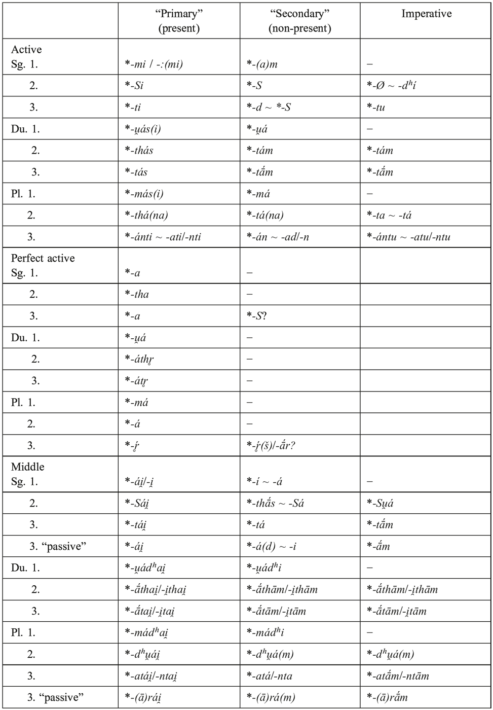

According to Tremblay (2006: 265), a variant *<i>-ār</i> is attested by the Avestan optatives in <i>-ii-ārᵊ</i>, <i>-ii-ārᵊš</i> from *<i>-ii̯-ār(š)</i> (cf. Kellens 1984: 188, 296) from PIE *<i>-ih₁-eh₁r(s)</i>. The longer variant *<i>-ār(š)</i> in Iranian would then be parallel to middle *<i>-āra(i̯)</i> (cf. 6.3.2), and the ending could be compared with Hittite <i>-ēr</i>. But normally, <i>-iiārᵊ(š)</i> is analysed as *<i>-i̯ā-r(š)</i> with secondary full-grade of the suffix (see, e.g., Harðarson 1993: 122 with fn. 102; Jasanoff 2003: 186 n. 26), just as in the by-form <i>-iiąn</i> < *<i>-i̯ān</i> where an old ending variant is impossible and the intrusion of the full grade suffix into the 3 pl. is thus proven. Tremblay (2006: 265 with fn. 21) derives <i>-iiąn</i> from *<i>-ii̯ən</i> < *<i>-ii̯-an</i> (as in thematic <i>-aiiən</i>) and cites two forms in <i>-iiə˘n</i> to support this. But <i>vasō.x́iiəˉn</i> is not a finite verb (de Vaan 2003: 563), and alleged ⁺<i>baβriiən</i> is a conjecture certainly inferior to ⁺<i>baβriiąn</i> (for <i>baβriiąm</i> mss.). An athematic form in *<i>-ii̯an</i> is actually attested for the perfect in YAv. +<i>daiδīn</i> (Hoffmann 1976: 606 f. n. 1), but this does not prove that <i>-iiąn</i> must equally go back to *<i>-ii̯ən</i>. So it still presupposes an intrusion of the full-grade suffix into the 3 pl., and likewise, we might explain <i>-iiā-rᵊš</i>.

#### 6.3.2. Middle

The endings labelled “passive” were used only in non-transitive uses or in the perfect, esp. in the “passive” aorist and present forms (mostly or exclusively from root stems) sometimes called “statives” (cf. Kümmel 1996; Bruno 2005: 45 ff.; Kulikov 2006). Opinions about the interpretation of these variant endings are divided: Some consider them just archaic variants of the ordinary middle endings (perhaps secondarily exploited for “non-primary” functions according to Kuryłowicz’s 4th law of analogy, cf. Watkins 1969: 88), others assume an original functional difference similar to that between the perfect and the “ordinary” active (see, e.g., Kümmel 1996: 9 ff.; Tremblay 2006: 260 ff.). In any case, it is clear that the whole set of 3rd person endings varied, at least lexically. The same contrast may be reflected by the variation between Indic *<i>-thās</i> and Iranian *<i>-Sa</i> in the 2 sg. SE, but obviously here the distinction was no longer functionally alive in late PII.

PII used the active primary marker *<i>-i</i> also in the middle, in agreement with Greek, Albanian, Armenian, and Germanic, while others (esp. Anatolian and Tocharian) have an independent middle primary marker *<i>-r</i>. The question of which of these served as the original PIE marker of this category is a matter of great dispute, but in any case the respective innovation would be dialectal IE. In PII, the dual and the 1 and 2 pl. PE’s were remodelled from the SE’s and took over *<i>-ai̯</i> from the other PE’s; a similar innovation seems to have happened in Albanian (cf. Klingenschmitt 1994: 226). The secondary ending *<i>-i</i> of the 1 sg. middle and 3 sg. “passive” presents some problems. Both have been explained as continuing a PIE ending *<i>-h₂</i> (cf. Kortlandt 1981; García-Ramón 1985 or, resp., Schmidt 1997: 557 f.), but the evidence for such an ending in the middle is not really compelling, and the expected ending *<i>-a</i> (from *<i>-h₂e</i>/<i>*h₂o</i> or, resp.,*<i>-o</i>) is attested in II for other categories. In the 1 sg., *<i>-i</i> might have been created by analogy after 1 pl. *<i>-madʰai̯</i>: *<i>-madʰi</i> = *<i>-ai̯</i>: X → X = *<i>-i</i> (Harðarson 1993: 51), replacing older <i>*-a</i> that only remained for phonetic reasons after *<i>ī</i>/<i>i̯</i> in the optative. In the 3 sg. “passive”, this analogy would not work, since *<i>-i</i> is used in the aorist only where an analogy with PE’s is not possible. But a transfer from the 1 sg. to the 3 sg. might be explained by analogy after the older system with a SE *<i>-a</i> for both persons which was preserved in the optative <i>−</i> in the present the transfer was blocked by the presence of the PE *<i>-ai̯</i> in analogy to non-passive *<i>-tai̯: *-ta</i>.

In the 2 pl. and in the 3 pl. “passive” SE, the variants without an added nasal are not attested in Avestan and Early Vedic, but a 3 pl. in <i>-ra</i> occurs in Middle Vedic (Kümmel 1996: 6 f.), and Choresmian <i>-ββa</i>, <i>-(ā)ra</i> seem to presuppose <i>*-du̯a</i>, <i>*-ra</i> (Tremblay 2006: 278, 281).

The 2 and 3 du. endings constitute a special system in which the *<i>-th-</i>/*<i>-t-</i> correspond to the active PE, and *<i>-am</i>/<i>-ām</i> correspond to the active SE. But the vowel preceding the dental is enigmatic: in the athematic endings *<i>-ā-</i> does not fit thematic *<i>-i̯-</i> (while the opposite distribution *<i>-i-</i> / <i>*-ā-</i> might be explained by a laryngeal suffix).

In the athematic 3 pl. non-passive, the variation differed from the active: while thematic stems had *<i>-nta(−)</i>, athematic stems normally had *<i>-ata(−)</i>. The accentuation of *<i>-ata(−)</i> is not altogether clear: while <i>-áte</i> is regular in later Vedic, in the RV <i>-até</i> is more frequent and looks like an archaism, so it has a better chance to represent the PII accentuation. This points to an older ending *<i>-n̥t-ó(i̯)</i> with accented *<i>-ó</i> as in all other forms containing that middle sign, and this could explain why we find the zero grade *<i>-n̥t-</i>. In contrast to Avestan, Vedic injunctives of athematic aorists and perfects show a different ending <i>-ánta</i> (Hoffmann 1976: 362 f.) which has been taken as an archaism attesting older *<i>-ént-o</i> for end-stressed paradigms; consequently, PII would have generalized *<i>-at(−)</i> from paradigms with initial stress except in the injunctive (Harðarson 1993: 50, 53). But such a generalization is difficult to motivate (esp. since nothing comparable happened in the active), and the distribution is not explained. Thus, we might envisage a Vedic innovation, and in fact, it is clear that <i>-anta</i> was the only 3pl middle subjunctive termination in Early Vedic and ousted all other variants (cf. Tichy 2006a: 193 f.). Therefore, inj. <i>-anta</i> might be rebuilt or influenced from active *<i>-an</i>.

In Iranian only, the “passive” 3rd-person endings can have longer forms *<i>-ārai̯</i> (cf. YAv. <i>-āⁱre</i>, Khot. <i>-āre</i>, Chor. -’<i>r</i> ~ -’<i>ry-</i> /<i>-āri</i>/, Yaghn. <i>-or</i>) and *<i>-āra(m)</i> (cf. Chor. imperfect -’<i>r</i> /-<i>āra</i>/, Yaghn. <i>-or</i> [Tremblay 2006: 278], Khot. subj. <i>-āru</i> [Emmerick 1968: 203; 205 f.]). In fact, the shorter variants *<i>-rai̯</i>, <i>*-ra(m)</i> are attested only in *<i>ćai̯rai̯</i> ‘they lie’ (YAv. <i>sōire</i>/<i>⁺saēre</i>, Kümmel 1996: 151 f.), perfect *<i>āfrai̯</i> (Khot. <i>byaure</i>, Emmerick 1968: 200; Kümmel 2000: 9, 622) and the optatives in *<i>-ī-ra(m)</i>/ <i>*°ai-ra(m)</i> (YAv. <i>vaozirəm</i>, Khot. <i>-īru</i>, Chor. <i>-yr</i> /<i>-īra</i>/; cf. Emmerick 1968: 203, 209 f.). In Middle Iranian, *<i>-ā-</i> might represent the thematic vowel generalized in nearly all paradigms. Certainly it does so in the subjunctive. In the indicative, *<i>-ā-</i> would be regular from old *<i>-o-ro(−)</i>, but as younger replacements of *<i>-anta(−)</i> we would rather expect *<i>-ara(−)</i>. Such thematic forms with short <i>a</i> are attested in Early Middle Indo-Aryan <i>-are</i>, probably a younger replacement of <i>-ire</i> (Kümmel 1996: 5 n. 23). But in Avestan (as in Vedic), there seem to be no cases of “passive” endings used with thematic stems, and the three attested forms definitely belong to athematic stems (cf. Kümmel 1996: 144 f., 147 f., 149). The younger intrusion of *<i>-ārai̯</i> into thematic paradigms could well have originated in cases where athematic middles became thematic, but the 3 pl. of such forms already looked very much like it contained the thematic vowel; and thus, a new type sg. *<i>-atai̯</i> ~ pl. <i>-ārai̯</i> arose and could provide a basis for the generalization of *<i>-ārai̯</i> (Tremblay 2006: 281 ff.). Therefore *<i>-ārai̯</i> cannot contain the thematic vowel; it has been interpreted as containing a stative suffix *<i>-eh₁-</i> (cf. Kümmel 1996: 6) otherwise not clearly attested in Indo-Iranian or <i>−</i> more likely <i>−</i> as a blending of older active *<i>-ār</i> (= Hitt. <i>-ēr</i>) and “middle” *<i>-rai̯</i>, thus providing indirect Indo-Iranian evidence for PIE *<i>-ēr</i> (cf. Kümmel 2000: 58; Jasanoff 2003: 32 and cf. 6.3.1).

### 6.4. Paradigms of selected verb stems

Tab. 111.6: PII inflection of *<i>(H)ás-</i> ‘be’, root present

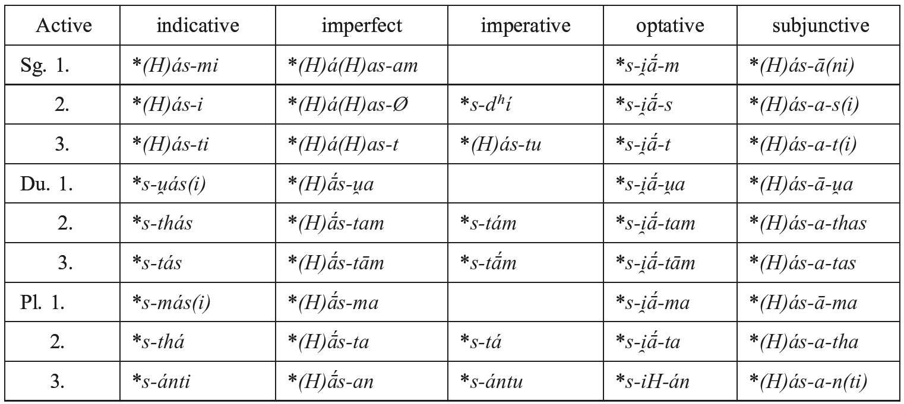

Tab. 111.7: PII inflection of *<i>ćái̯-</i> ‘lie’, root present

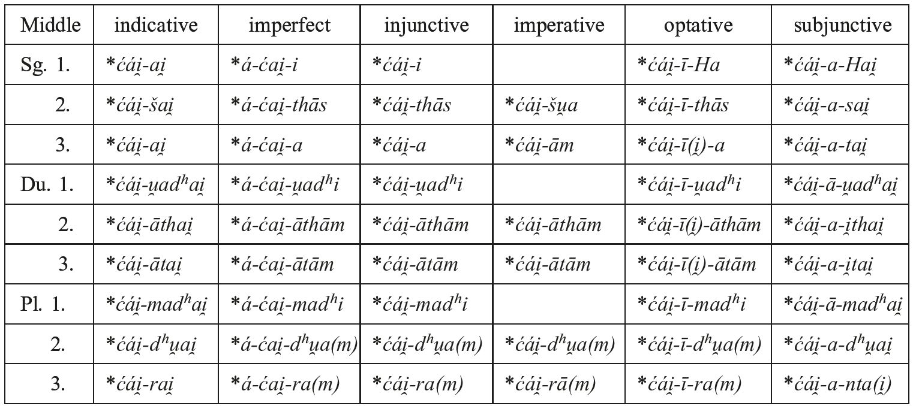

Tab. 111.8: PII inflection of *<i>ḱár-</i>/<i>kr̥-</i> ‘make’, root aorist

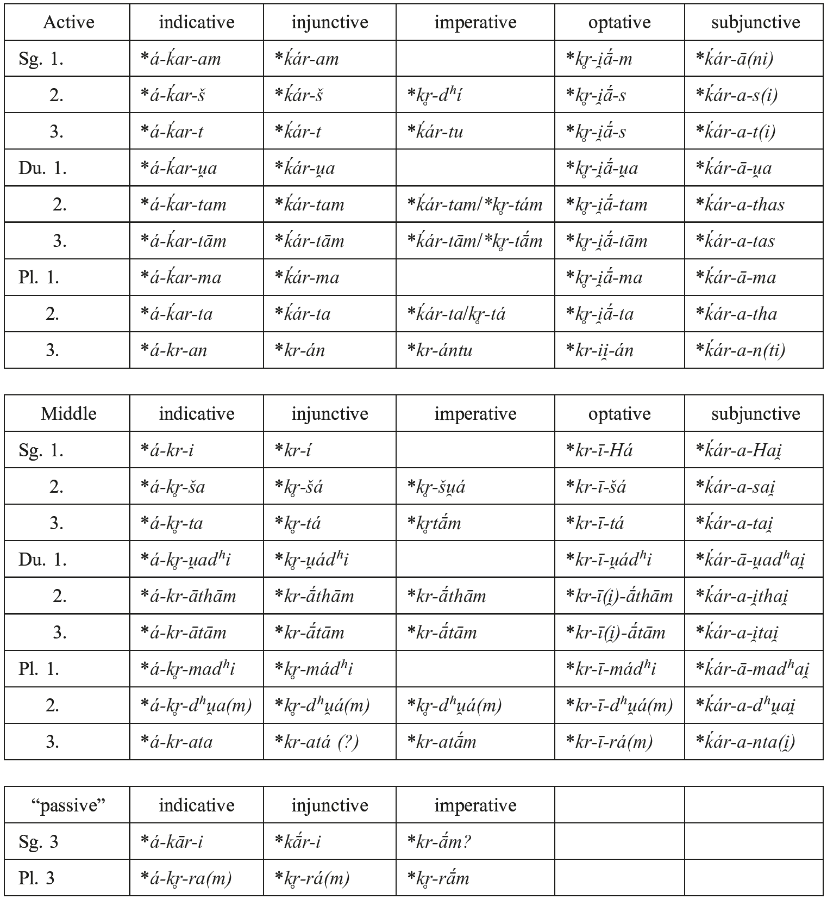

Tab. 111.9: PII inflection of *<i>nái̯-a-</i> ‘lead’, thematic present

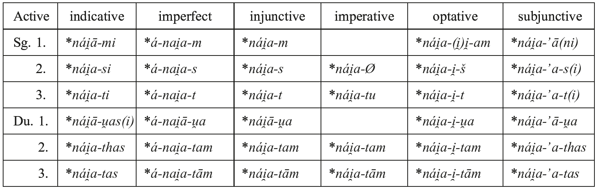

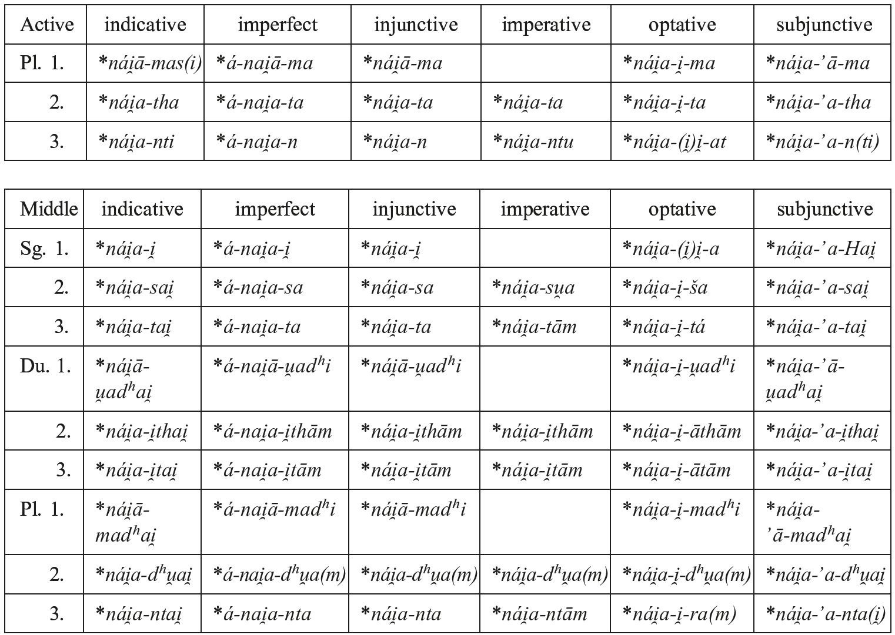

Tab. 111.10: PII inflection of *<i>nā́i̯-š-</i> ‘lead’, sigmatic aorist

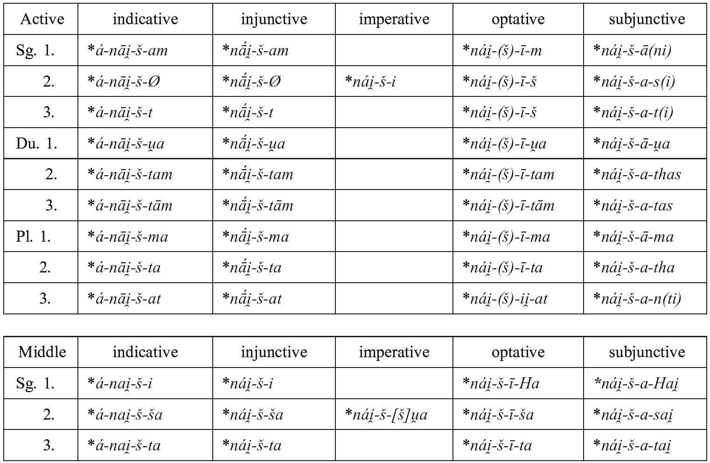

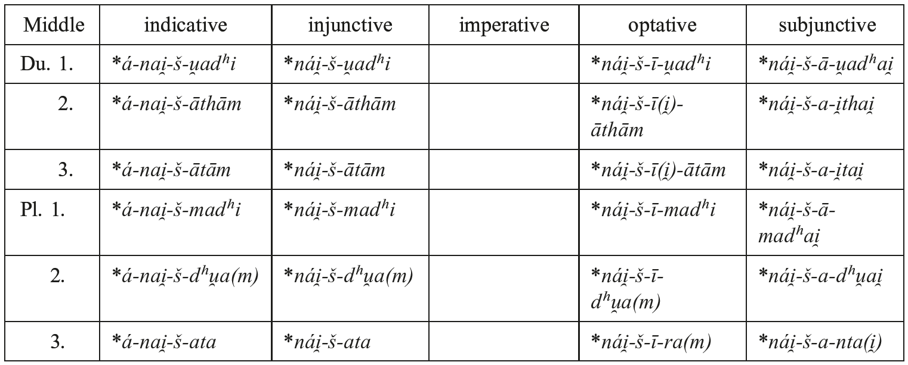

Tab. 111.11: PII inflection of *<i>ǵigái̯-</i>/<i>ǵiǵi-</i> ‘win’, perfect

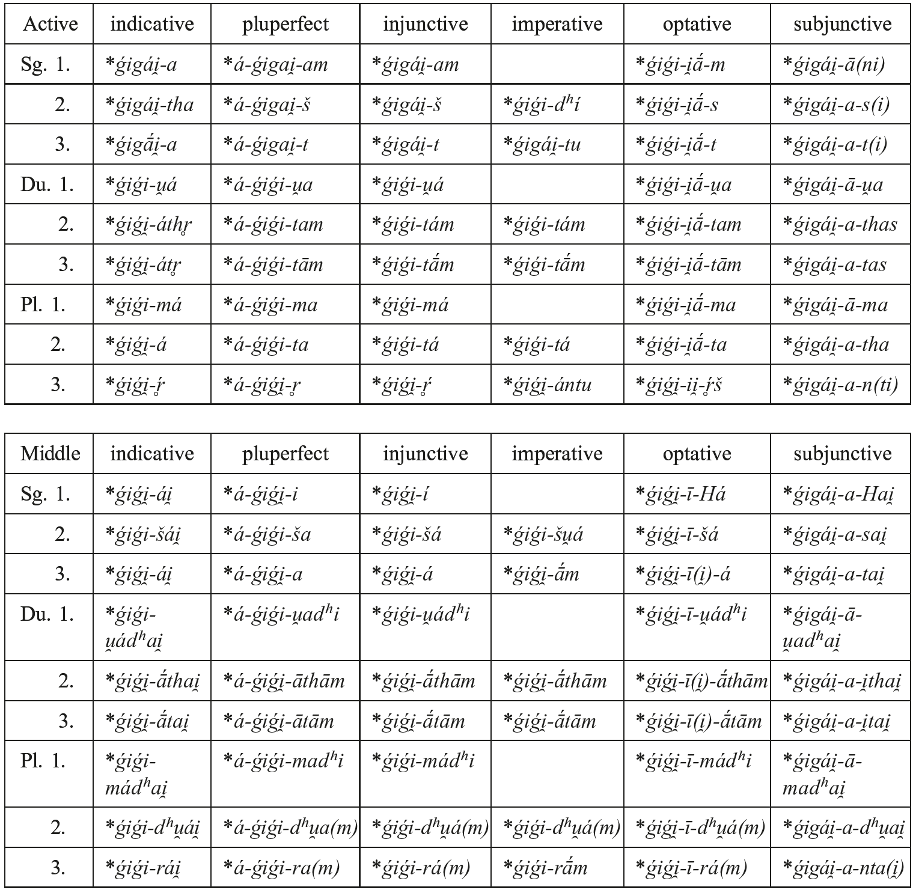
