# 112. The syntax of Indo-Iranian

1.Introduction

2.What is “configurational” syntax?

3.The basic structure of the clause

4.<i>WH</i>-movement

5.Wackernagel’s so-called Law

6.“Normal” word order and S, O, V

7.Conclusions

8.References

## 1. Introduction

<!-- source-file: content/11_chapter05_4.xhtml -->

It might seem that this chapter of the <i>Handbook</i> could be constructed by the reader him/ herself, by a process of simply comparing the valuable insights to be found in the chapter of “Indic Syntax” with those found in the “Iranian Syntax” contribution. However, there are considerations which make this chapter necessary, in my view. For example, the strong focus of the chapters treating Indic and Iranian syntax was on what I would call the <i>morphosyntax</i> of those languages − the “syntax” of accusative morphology, or of the causative marker, for example. This use of the term “syntax” has a long tradition in Indo-European studies, particularly for the classical languages (but also for archaic Indo-Iranian ones), so I will refer to it henceforth as “traditional syntax”. Given the strength of this tradition, and its duration, there is a great deal which can be said with confidence regarding the “traditional syntax” of archaic Indo-Iranian languages, making a treatment of those issues excellent material for a <i>Handbook</i>. However, many a linguist trained in the contemporary linguistic landscape will not recognize the field of “syntax” as pursued by modern syntacticians in this traditional work. Fundamental questions of a modern syntactic nature (e.g., how does question formation take place? Does the language have <i>wh</i>-movement, or is it <i>wh-in-situ</i>?, etc.) are not asked in the traditional pursuit. For this reason, I will focus in this chapter on what I will call the “configurational syntax” (in a sense to be made clear below) of Indo-Iranian.

Several caveats are in order at this juncture. First, handbook chapters are generally intended to reflect some kind of scholarly <i>communis opinio</i> on the matters under discussion and provide a guide to the wealth of scholarly literature in that domain. This chapter cannot do that, since there cannot be said to be any <i>communis opinio</i> in the scholarly community regarding the configurational syntax of Indo-Iranian − not because there is such a diversity of opinions that none can be accurately labeled <i>communis</i>, but because there is a dearth of expressed scholarly opinion on the issues at hand. This will be seen from the sparseness of the scholarly literature that may be cited. The most important works from a contemporary perspective include the following: for Vedic, Klein (1985) and Hale (ms.), for Old Persian, Klein (1988) and Hale (1988), for Old Avestan, West (2011), and for Iranian generally, Skjærvø (2009). See also the excellent bibliography, covering traditional and more contemporary approaches to Sanskrit syntax, in Hock (1991).

There are, of course, reasons for this lack. First, the kinds of issues covered by the term “configurational syntax”, while they have some tradition in Indo-European studies, have not received the same degree of attention as the issues arising from what I have labeled “traditional syntax”. Some of the issues were not addressed at all in the pregenerative literature. Without the kind of careful, philologically-informed establishment of the facts regarding these issues for individual archaic Indo-Iranian daughter languages, no reconstruction of the Indo-Iranian situation was possible. The literature which does address “configurational” syntactic issues in, e.g., Vedic Sanskrit (the most extensively studied of the archaic Indo-Iranian languages) often does so with reference to parallels in Greek or Latin, or, in some cases, other Indo-European branches, rather than invoking explicit comparison within the Iranian branch, and thus fails to give a clear indication of the Indo-Iranian situation. On the Iranian side, West (2011) presents an analysis of Old Avestan syntax which addresses many “configurational” issues, but it is difficult to achieve analytical clarity when one absolutely limits all attention to the very small Old Avestan corpus. Obviously one would not want to randomly intermix observations from Young Avestan with those from Old Avestan, but an establishment of a set of identities and divergences between the languages could help clarify matters. Skjærvø (2009) presents a survey of the Old Iranian facts, which, due to the limitations of publication in a “handbook” volume, is broader than it is deep, covering a wide range of phenomena, but only rarely actually establishing the claims made on an empirical basis. This does not mean the claims are not valid, only that their validity must in each case be independently established by the interested scholar.

It should be noted in this regard that the Indo-Iranian branch fares no worse than the other major branches of Indo-European: there is no detailed reconstruction of the configurational syntax of Proto-Greek, Proto-Italic, Proto-Anatolian, etc. The effect of the almost total absence of reconstruction of the relevant properties for the branches of Indo-European means that we do not have good information − in sharp contrast to the situation regarding phonology and, to a large extent, morphology − about what the Indo-European properties were in the relevant respect. Thus, while establishing the nature of Indo-Iranian phonology or morphology could be described as locating the place of Proto-IIr. on a continuum along a line extending from the PIE situation to what we find in the individual archaic daughter languages, in the case of configurational syntax, the situation at the PIE end of that line is quite unclear at present.

In short, this chapter concerns matters which are probably the least clear of any being treated in this handbook. One might wonder, indeed, whether it is appropriate to even attempt a characterization of the configurational syntax of Indo-Iranian given our general ignorance on the matter. There are, I think, two reasons why such an exercise is useful at this point. First, ignorance can, in some sense, be conceived of as a pointer towards potentially exciting domains for new research undertakings. There are dozens of major issues in the configurational syntax of Indo-Iranian about which I can write nothing: each represents a new frontier for research towards an understanding of the configurational syntax of PIE itself. Second, while there is much we do not know, there are, I think, some things about which a certain degree of confidence would be justified even at this early stage. Documenting these for Indo-Iranian may serve as an impetus for parallel work on the other branches, and then on the proto-language itself.

One final proviso: because of the lack of established results regarding the configurational syntax of Indo-Iranian, it will be necessary to present more of the argumentation and evidence for the positions taken here than is generally necessary in a handbook − I cannot simply point the interested reader to the scholarly literature which establishes that such-and-such is the case. Given the space limitations imposed on the chapter, then, it follows that only a relatively small number of phenomena can receive serious treatment.

## 2. What is “configurational” syntax?

I will use the label “traditional syntax” to refer to investigations into the syntactic conditions on the appearance of particular morphological categories. Such investigations attempt to answer questions such as: what triggers the appearance of a locative case, or causative marker, or plural agreement morphology in a given language? The importance of developing answers to such traditional concerns cannot be overstated: it has been the correspondences in the syntax of particular morphological markers across the daughter languages which have allowed us such deep insight into the morphology of the protolanguage. Such concerns interact with other significant issues for the study of archaic Indo-European languages: semantic considerations, for example, as well as the concerns of what I will call “configurational” syntax.

But there are syntactic issues which do not fall within the scope of such questions. For example, there are Indo-Iranian languages which require that interrogative and relative pronouns occupy a position at (or very near) the start of their clause (i.e. languages which show so-called “<i>wh</i>-movement”) and there are Indo-Iranian languages which do not impose such a requirement on those elements (i.e. so-called “<i>wh-in-situ</i>” languages). There is no semantic difference between interrogatives in the two kinds of languages, nor is there any necessary morphological distinction between the “<i>wh</i>-words” in the two types. This is a purely syntactic contrast, and, as such, falls outside the scope of “traditional syntax” as defined above. There are other processes of “syntactic displacement” (or “movement”): topicalization, focusing, clitic-displacement, etc. Except for the well-known work by Wackernagel (and his predecessors) on clitics in Indo-European, traditional syntax has not produced precise characterizations of these phenomena.

It is important to be clear about the use of the term “movement” for these types of relations − the term is historical, rather than technically precise. “Movement” is the label for whatever process establishes a relationship between two “positions” in a syntactic representation. Thus, in the English question <i>who did John see?</i> the word <i>who</i> simultaneously satisfies the requirement that <i>wh</i>-elements occupy clause-initial position and the requirement that transitive <i>see</i> have a direct object. Since the expected position for direct objects is immediately postverbal, there is a connection between that position and the position in which <i>who</i> actually surfaces − quite far from the post-verbal position. I will call this connection “movement”, in keeping with long-standing generative tradition.

Also included within the scope of “configurational syntax” are matters of so-called “word order”, such as the positioning of major constituents (subjects, objects, verbs) relative to one another, as well as the ordering of elements within smaller phrasal domains (adpositional phrases, noun or determiner phrases, etc.). While there is a long tradition which concerned itself with “word order” phenomena in archaic Indo-European languages, the goals (and thus methods) of such pursuits differ widely from modern approaches, as we will see below.

## 3. The basic structure of the clause

It would be wrong to assert that earlier approaches to Indo-Iranian syntax did not consider, e.g., word order issues as a significant aspect of their research activity. Both in the Delbrück era (late 19th-early 20th century) and again in the 1970’s word order was a central concern of much of Indo-Europeanist syntactic investigation, including, of course, the word order of archaic Indo-Iranian languages. It is of some interest to consider these earlier approaches from the modern perspective on Indo-European syntax, which holds fairly uniformly that, whereas work on the reconstruction of phonology and morphology has been quite successful, syntactic research lags significantly. Why, if Indo-Europeanists have regularly considered matters such as word order, do most contemporary scholars in this field feel there is little they can assert with confidence on the matter?

In my view, there is a connection between the shortcomings of the work of the Delbrück era and that of “word order” studies in the 1970’s, and by identifying their common, and apparently non-productive, assumptions, we can learn something significant about <i>how</i> to approach the study of the syntax of Indo-Iranian, and how not to. Although this is a handbook article, given the little we can say with confidence about the configurational syntax of Indo-Iranian, it may be worthwhile to expend some energy on exploring why this might be the case. We will do that after our survey of some of the basic structural properties of the Indo-Iranian clause.

Let us examine first the distribution of some deictic elements which appear, generally, to have well-defined semantics. Ickler (1973) has shown that the topic-marking pronoun represented by IIr. *<i>tá-</i> “that (one) [weak deixis]” has a highly restricted distribution in Vedic Prose, and her results have been confirmed by Verpoorten (1977). That the strong preference she identified for either initial or “second” position for this element in Vedic also holds for Iranian can be seen from Bartholomae’s <i>Altiranisches Wörterbuch</i> (1904: column 1718), where substantival <i>ta-</i> is given two major subentries: sentence-initial placement (“an der Spitze”), and after the first word, not counting any relevant clitics (“hinter dem ersten Wort, auch durch ein Enklitikum davon getrennt”). It seems clear that this distribution was highly favored in Indo-Iranian itself. But why should this be the case? The syntax of human languages often reveals special principles for the placement of interrogative and relative elements (so-called <i>wh</i>-movement phenomena), or distributional restrictions on clitics (e.g. Wackernagel’s Law), but IIr. *<i>tá-</i> is neither a <i>wh</i>-element nor a clitic. Hale (1991) presents an analysis for the widely-recognized discourse distinction between an element such as *<i>tá-</i> and its “stronger” sister form *<i>aytá-</i> (Skt. <i>etá-</i>, Av. <i>aēta-</i>, OPers. <i>aita-</i>). Note that the contrast in degree of force has been known for a long time, Delbrück labeling Indic <i>etá-</i> “ein stärkeres <i>tá-</i>” [a stronger <i>tá-</i>] (1888: 219), and for Iranian, Caland (1891: 11) says that Av. <i>aēta-</i> is a deictic similar to <i>ta-</i> but “mit mehr emphase” [with greater emphasis]. In the analysis of Hale (1991), the element *<i>tá-</i> is taken to be a “topicalized” pronominal, whereas *<i>aytá-</i> is analyzed as a “focused” pronominal. Statistically, in Vedic Prose (e.g.), <i>tá-</i> shows “initial position” placement more frequently than <i>etá-</i>, and, when both appear, <i>etá-</i> regularly follows <i>tá-</i>. The following passage from Vedic Prose is typical:

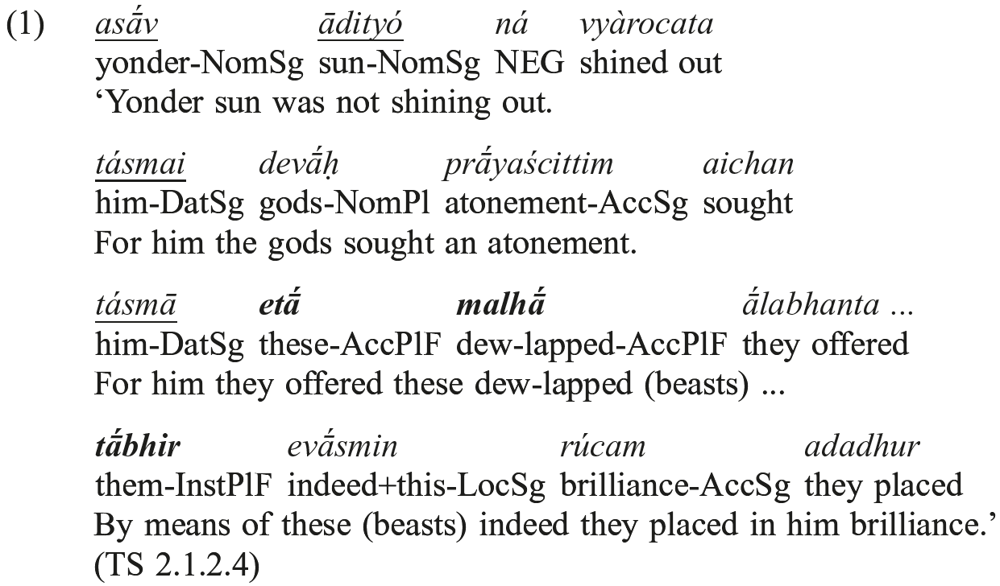

What we see in this example is that an entity (the sun) is introduced into the discourse using a strong deictic element (<i>asáu</i>). It becomes the “entity under discussion”, and is picked up in subsequent clauses by a “topic” demonstrative (<i>tá-</i>), in clause-initial position. I have underlined its first appearance, and the relevant subsequent references to it, in the text above. In the third clause, a new entity is introduced (which I track through the clauses above by bolding references to it), ‘these dew-lapped (beasts)’, using the focusing element <i>etá-</i>; subsequently, it is ‘the dew-lapped ones’ which are the topic, and they are thus referred to in the fourth clause with the “topic” demonstrative (<i>tá-</i>), again in initial position.

Given the difference in semantics between the two elements (<i>tá-</i> and <i>etá-</i>), Hale (1991) proposes that the restriction on the distribution of these deictic elements is to be sought in their connection to the particular discourse functions of “topic” (for *<i>tá-</i>) and “focus” (for *<i>aytá-</i>). It follows, then, from the fact that when both appear in Vedic Prose (which we take, for the time being, to be representative) <i>tá-</i> precedes <i>etá-</i> (as in the third clause in the example above), that the start of the Indo-Iranian sentence may have included a structure such as:

<table>
<tr><td>(2)</td><td>TOPIC FOCUS...</td></tr>
</table>

neither element being obligatory, of course. Since *<i>tá-</i> normally represents the “topic”, it will normally occupy the TOPIC position, and since *<i>aytá-</i> normally represents more strongly focalized material, it will normally occupy the FOCUS position. Of course, focused material need not be pronominalized by *<i>aytá-</i> and when a full NP is focused, e.g., it may likewise occupy this FOCUS position. The same is certainly true for discourse topics and the TOPIC position. The restricted distribution of *<i>tá-</i> is thus attributed not to some special <i>tá-</i>placement “rule” of the syntax, but to a general phenomenon of “topic fronting”, which <i>tá-</i> is, given its semantics, particularly prone to undergo. Similar arguments hold for *<i>aytá-</i> and the FOCUS position.

It is well known that there are a number of phenomena in addition to topicalization and focusing which implicate the beginning portion of the clause in archaic Indo-Iranian languages. As demonstrated for Iranian by Bartholomae (1882−1887), and by Wackernagel (1892) for Vedic Sanskrit, clitics tend to occur in “second position” in their clause. But where is “second position”, and how does it relate to the clause-initial FOCUS and TOPIC positions posited in (1)? In addition, Hale (1987) demonstrated that <i>wh</i>-movement was obligatory in Indo-Iranian for interrogative and relative markers. In modern grammatical analysis, such movement is thought to involve placing the elements in a position at or near the start of the clause which is called C (originally standing for COMPLEMENTIZER). But where is C relative to the FOCUS and TOPIC positions? How does C interact with clitic placement, to which it is often thought to be related? The following sections attempt to address, in a necessarily provisional manner, some of these questions, and thereby provide us with greater detail regarding the structure of the clause in Proto-Indo-Iranian.

## 4. <i>WH</i>-movement

Hale (1987) demonstrated that the cross-linguistically common (though not invariant) phenomenon of <i>wh</i>-fronting, whereby interrogative and relative elements are moved into a high (generally left) position in the so-called C-domain, is active in both archaic Indic and archaic Iranian languages, and thus should be reconstructed for Proto-Indo-Iranian (and most likely for PIE itself). Since we have now claimed that in Indo-Iranian there was a TOPIC and a FOCUS position also at or near the clause-initial position, the natural question arises as to whether or not we can be precise about where, in Indo-Iranian, the <i>wh</i>-movement landing site sat relative to these “discourse” positions. As a shorthand, we will simply call the landing site for <i>wh</i>-movement “C” in what follows. So, if we find a clause with focused material (presumably in FOCUS), a <i>wh</i>-element (presumably in C) and topic material (presumably in TOPIC), what is their position relative to one another in our most archaic Indo-Iranian texts? We have to recognize, of course, that finding all three elements in a single clause may be difficult (the sentence would have a lot “going on” in it pragmatically if all three positions were filled). It is sufficient, of course, to establish an ordering between these elements if there are cases of FOCUS and <i>wh</i>-movement, and cases of TOPIC and <i>wh</i>-movement (we presumably already know the ordering of FOCUS and TOPIC themselves, as sketched in 2. above), as long as these cases show relatively consistent ordering relations.

The ordering between <i>wh</i>-elements (the relative *<i>yá-</i> and the interrogative *<i>ká-</i>) and topics marked with *<i>tá-</i> is clear in both Indic and Iranian: the <i>wh</i>-word precedes the TOPIC element. Illustrative examples include:

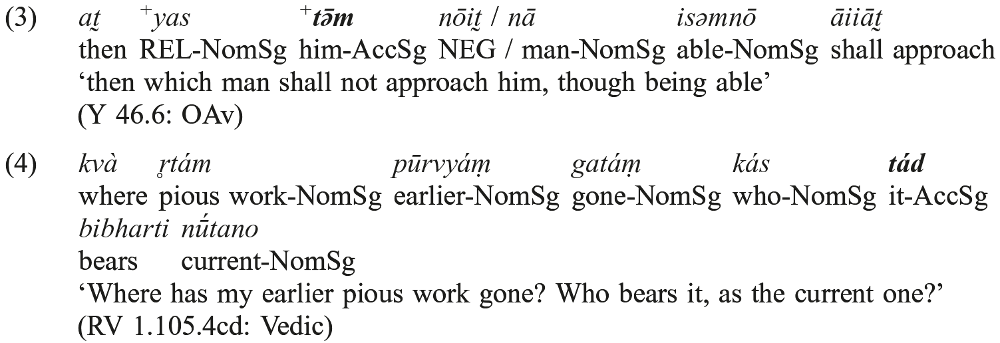

That *<i>tá-</i> shows up frequently in such structures is part of the reason why Ickler and Verpoorten identify <i>two</i> common positions for this element in Vedic Prose − initial and “second”. In <i>wh</i>-clauses (and in those to be discussed below, with EMPHASIS elements), the TOPIC position, and the *<i>tá-</i> which occupies it, will be somewhat removed from clause-initial position.

It is rarer to find focused elements (e.g. marked by *<i>aytá-</i>) in interrogative and relative clauses, the <i>wh</i>-element itself doubtless bearing a certain degree of focus, but the large corpus of the Rigveda does provide the following:

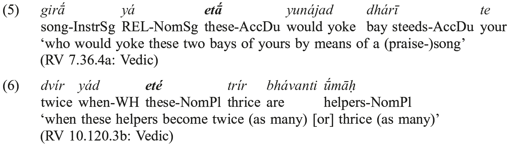

These examples reveal another interesting property of Indo-Iranian <i>wh</i>-clauses: as Hale (1987) demonstrated in some detail, all of the archaic Indo-Iranian languages allow the fronting of a constituent to a position to the <i>left</i> of a fronted <i>wh</i>-element (i.e. to the left of C). Examples for each of the major daughters are:

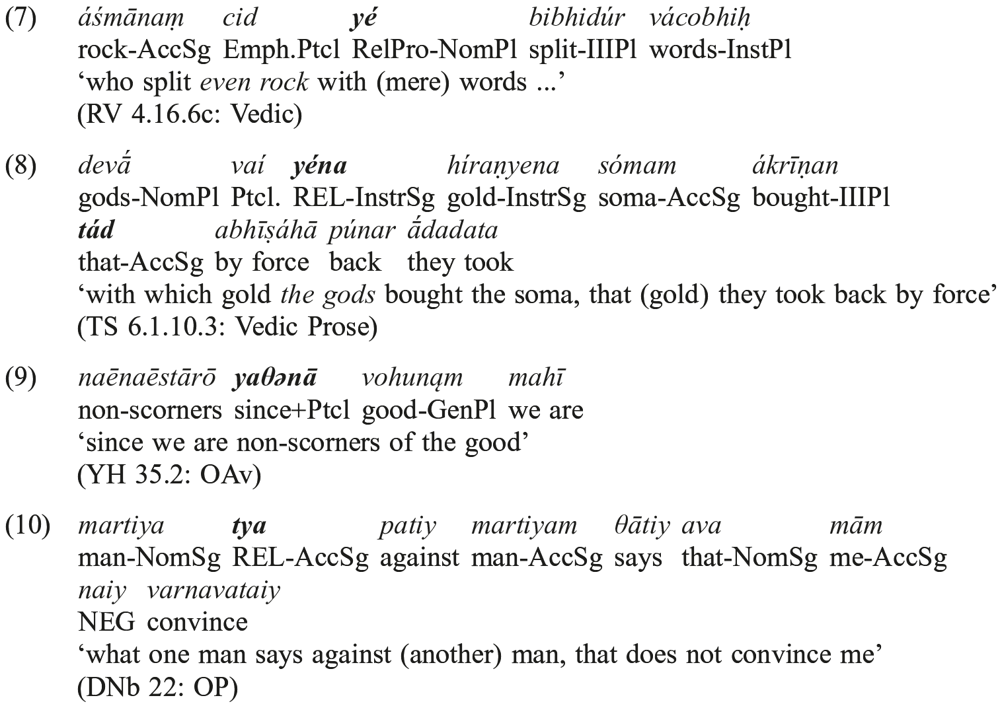

The pragmatics associated with the material fronted around C is clearly “emphatic” in some sense − indeed, fronting for reasons of emphasis as a mechanism of syntactic displacement has been recognized by all previous scholarship on IIr. syntax, although, it must be said, no systematic attempt to distinguish between fronting to this initial position, fronting via <i>wh</i>-movement, fronting to the TOPIC-slot or fronting to the FOCUS position has ever been ventured in previous scholarly work. I will not attempt here to establish a standard label for this position, but will simply label it EMPHASIS, after its only clearly established function. (It is worth pointing out, however, that this is not in my view the position for what is usually called “left dislocation”, there being no resumptive element in the main clause. For “left dislocation” in Sanskrit, see Oertel’s discussion [1923, 1926] of <i>nominativus pendens</i> and related phenomena.) The data taken as a whole, then, would seem to favor a Proto-Indo-Iranian clause-initial surface sequence of the type:

<table>
<tr><td>(11)</td><td>EMPHASIS C<i>wh</i> TOPIC FOCUS...</td></tr>
</table>

While one should not accept the characterization of the Indo-Iranian clause I have presented up to this point on the basis of the evidence cited − necessarily brief, given the space allotted this handbook chapter − the references cited do provide fairly good reasons to believe that the reconstruction is on the right track. However, <i>wh</i>-movement, focusing, and topicalization do not exhaust the processes which are responsible for placing elements in particular positions early in the Indo-Iranian clause: if the object argument is a clitic, it may be placed by what has come to be called “Wackernagel’s Law”, to which we now turn.

## 5. Wackernagel’s so-called Law

Wackernagel (1897) provides a wealth of evidence in support of the earlier observations of Delbrück and Bartholomae that enclitic elements show restricted distribution in archaic Indo-Iranian languages, extending their claim to other branches of the Indo-European language family, and, indeed, to the protolanguage itself. His statement of the generalization, which holds that clitics “tend to occur in second position” in their clause, is now known as “Wackernagel’s Law”. Given the importance of this syntactic generalization in discussions of Indo-European syntax, and the key role of the Indo-Iranian languages in providing evidence regarding the relevant set of phenomena, it will be worthy of some attention here.

The first matter we might try to understand concerns the nature of WL-type phenomena: are they essentially phonological or syntactic, or are they some combination of the two? I will first examine a clitic with a good Indo-European pedigree, well reflected in the archaic Indo-Iranian languages, and thus confidently present in Proto-Indo-Iranian: *<i>ca</i> ‘and’ (< IE *<i>kʷe</i> “id.”). We will focus initially, for non-controversial matters, on data from the archaic corpus offering the richest attestation: Mantra Vedic.

It seems clear that we would have two options, if we wanted to say ‘and oblation-conveying Agni’ (RV 2.41.19c) in Vedic: one involving the tonic conjunction <i>utá</i>, one the enclitic conjunction <i>ca</i>. (For extensive discussion of the syntax of <i>ca</i> and <i>utá</i> in the Rigveda, see Klein 1985, for <i>cā</i> in Old Persian see Klein 1988, and for a briefer survey of <i>cā</i> in Old Avestan, West 2011: § 287−294. Note that other archaic IE languages similarly offer a tonic and an enclitic conjunction: Greek καί beside τε, Latin <i>et</i> beside <i>-que</i>, etc., with similar “ordering” effects.) Since the syntactic function of these elements appears to be identical, we might expect them to have the same syntax, something like:

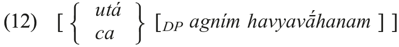

As is well known, whereas <i>utá</i> may surface in the position it occupies in the syntactic representation above, <i>ca</i> will not: being enclitic, it is subject to a requirement that it have a “prosodic host” on its left. Since, within its phonological phrase (φ) − built from the syntactic structures above − it does not, it will undergo minimal rightward movement to find an appropriate host, a so-called “prosodic inversion” (Halpern 1992; for extensive discussion of the Vedic facts in this regard, see Hale 1996). The conjunctive <i>utá</i> need not undergo such movement: (I have suppressed external sandhi in these examples.)

<table>
<tr><td>(13)</td><td>[___ <i>agním ca havyavā́hanam</i>] φ</td></tr>
</table>

<table>
<tr><td>(14)</td><td>[<i>utá agním havyavā́hanam</i>] φ</td></tr>
</table>

Under this conception of things, widely accepted at this point, the placement of <i>ca</i> is due to an operation of the phonology, not the syntax. The syntax places <i>ca</i> just where it places <i>utá</i> − it undergoes “prosodic inversion” to satisfy a <i>prosodic</i> requirement, not a syntactic one. Strong support for this way of understanding the behavior of clitics comes from the coordination of postpositions following bare nouns, such as <i>víśa ā́</i> ‘into the settlements’ or <i>vána ā́</i> ‘in the wood’. Such PPs display a close prosodic connection between the postposition and its complement (the preserved final <i>s</i> of phrases such as <i>divás pári</i> ‘from heaven’ arises, rather than visarga, because of the same close prosodic connection). As a result, when a clitic like <i>ca</i> conjoins such a PP, it treats the PP as a single “prosodic word”, flipping around the entire PP (rather than just around the first morphosyntactic word):

<table>
<tr><td>(15)</td><td colspan="2">[<i>ca</i> [PP <i>víśa ā́</i>] → <i>víśa ā́ ca</i> (*<i>víśaś ca-ā́</i>) ‘to (the) settlements’ (RV 4.2.3d)</td></tr>
</table>

<table>
<tr><td>(16)</td><td colspan="2">[<i>ca</i> [PP <i>vána ā́</i>] → <i>vána ā́ ca</i> (*<i>váne ca-ā́</i>) ‘in the wood’ (RV 9.89.1d)</td></tr>
</table>

We see then that “prosodic inversion” normally triggers second position placement of the affected clitic (as in [13]), but may, under the right prosodic conditions, trigger a slightly postponed positioning (as in [15] and [16]).

The important fact about <i>ca</i> is that we have reason, both from the behavior of the tonic conjunction <i>utá</i> and from our understanding of how coordination works cross-linguistically, to place <i>ca</i> in a certain position in the string <i>syntactically</i>. It is from that syntactically-justified position that “prosodic inversion” takes place. The “Wackernagel’s Law” distribution of <i>ca</i> thus has two components: 1) the syntactic positioning of the element (which, in the case of <i>ca</i>, has nothing to do with its clitichood) and 2) the phonological positioning, or “prosodic inversion” (which arises because <i>ca</i> is prosodically deficient and requires a host on its left). In trying to understand the syntax of the pronominal clitics (also regulated by WL), we need then to ask two questions: what governs their initial <i>syntactic</i> positioning, and under what conditions do they undergo “prosodic inversion”? As we did in the case of <i>ca</i> above, we can to a certain extent follow the cross-linguistic evidence here, which seems to favor placing pronominal clitics in a position immediately following what I have been calling C. Note that, assuming this holds for IIr. as well, we can then posit our final structuring for the IIr. clause-initial string:

<table>
<tr><td>(17)</td><td>EMPHASIS C<i>wh</i> clₚᵣₒ TOPIC FOCUS...</td></tr>
</table>

The first prediction we might derive from this representation is that pronominal clitics will not normally surface to the <i>left</i> of a <i>wh</i>-element, since if C is filled, the clitic will be properly hosted within its domain (CP) on its left, and will not undergo inversion. Note that this entails that there will be a systematic exception to Wackernagel’s Law: if we get a constituent in the EMPHASIS slot, and a <i>wh</i>-element, the clitic will not appear second in its clause, as Wackernagel predicted. That this is the case in both archaic Indic and Iranian was demonstrated by Hale (1987). Typical examples include:

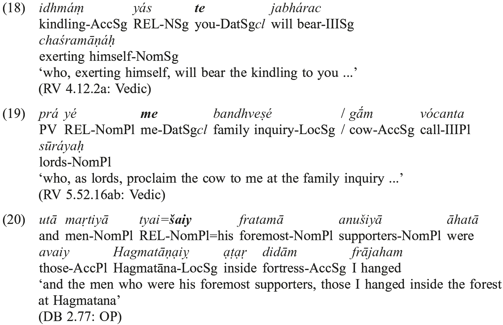

Of course, if C is filled, but there is nothing in EMPHASIS, we also need no “prosodic inversion”, since C provides an appropriate host for the clitic. Interestingly, even though the placement principles in such examples are <i>identical</i> to those in the examples we have just seen, because the EMPHASIS slot is empty, the following examples appear to comply with Wackernagel’s Law (while the earlier examples appeared to be exceptions!). Examples abound in the texts:

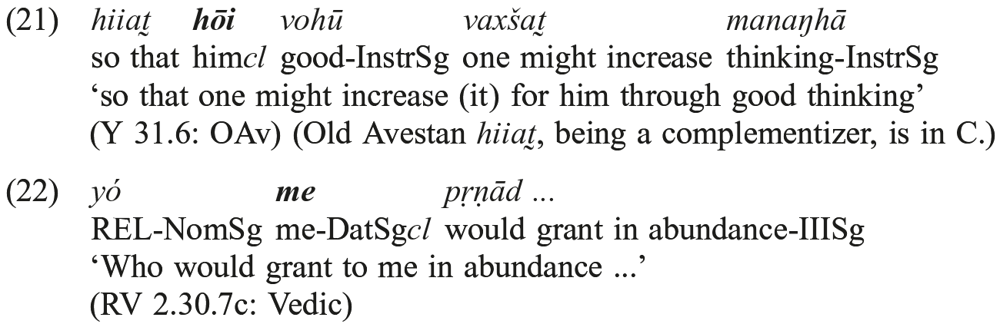

A second prediction also follows relatively straightforwardly. Imagine that we have an element in the FOCUS position (e.g. a form of *<i>aytá-</i>, which, as we have seen, typically occupies such a position), and nothing in EMPHASIS or TOPIC, and, finally, nothing in C (i.e. no <i>wh</i>-element). Here’s an example, followed by its presumed input structure:

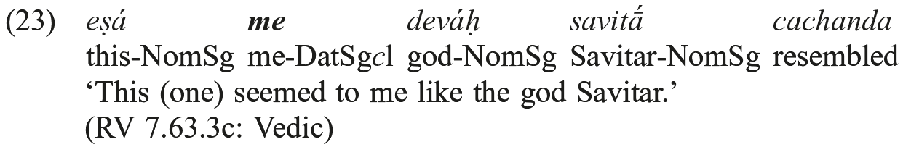

<table>
<tr><td>(24)</td><td>[EMPHASIS __ [C ___ <b><i>me</i></b> [TOPIC __ [FOCUS <i>eṣá</i> [<i>deváḥ savitā́ cachanda</i></td></tr>
</table>

We can see that the <i>me</i> had nothing to lean on to its left, having been placed after C by the syntax. It thus underwent “prosodic inversion” around the first element to its right − the <i>eṣá</i> in FOCUS. It follows that should we have a postposition with a bare N object in “initial” position in the clause (someplace <i>lower</i> than C), and a pronominal clitic in C, the “prosodic inversion” should respect the “close connection” between the postposition and its object, as <i>ca</i> did in the cases discussed earlier. This seems to be the case (RV 4.51.10cd):

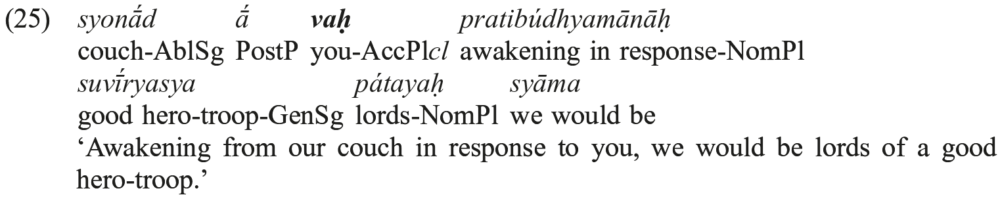

While we can’t know for sure without further analysis just where the phrase <i>syonā́d ā́ pratibúdhyamānāḥ</i> sits in the structure (perhaps it is just in normal subject position, below FOCUS), it is below C; and <i>vaḥ</i> starts out to its left and “flips in” for hosting, but it does not intervene between <i>syonā́d</i> and <i>ā́</i>, which form a tight prosodic connection.

In other cases, we can use the machinery we have constructed, which appears to hold for the most archaic IIr. languages (though it has been best studied in Vedic, which thus provides the bulk of our data), to diagnose the structural position of certain elements. Examine the following two examples:

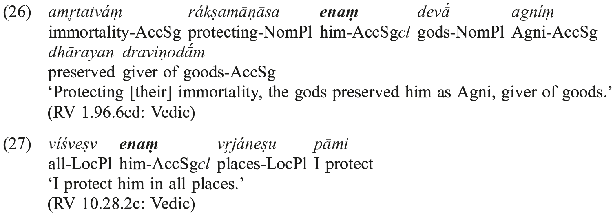

If we ignore the clitic <i>enam</i> for a moment, both clauses start out with a constituent: the former with the participial phrase <i>amṛtatváṃ rákṣamāṇāsaḥ</i> ‘protecting (their) immortality’, the latter with <i>víśveṣu vṛjáneṣu</i> ‘in all places’. How are we to explain the fact that <i>enam</i> appears to take a position <i>after</i> the entire constituent <i>amṛtatváṃ rákṣamāṇāsaḥ</i> but <i>inside</i> the constituent <i>víśveṣu vṛjáneṣu</i>? Imagine that the participial clause has been fronted into the EMPHASIS position, but the <i>víśveṣu vṛjáneṣu</i> occupies some position below C. The inputs to the “prosodic inversion” process would be:

<table>
<tr><td>(28)</td><td>[Emphasis <i>amṛtatváṃ rákṣamāṇāsaḥ</i> [C <i>__ enam</i> [...</td></tr>
</table>

and

<table>
<tr><td>(29)</td><td>[Emphasis <i>__</i> [C <i>__ enam</i> [<i>víśveṣu vṛjáneṣu..</i>.</td></tr>
</table>

In the former example, it seems clear that elements in the EMPHASIS position are “close enough” to C to allow the clitics in that position to lean on them as their host. The <i>enam</i> in the former example is thus properly hosted, and need not undergo “prosodic inversion”. In the latter case, by contrast, the EMPHASIS position is empty, as is C (except for the clitic). There is nothing to the left of <i>enam</i> for it to lean on; it thus must undergo “prosodic inversion”, which places it after the first phonological word to its right, <i>víśveṣu</i>. (It cannot, of course, be excluded that <i>víśve</i>ṣ<i>u</i> has been fronted to EMPHASIS and is thus able to host <i>enam</i> from that position. What <i>can</i> be excluded, however, is that <i>amṛtatváṃ rákṣamāṇāsaḥ</i> is any lower than EMPHASIS [since otherwise, <i>enam</i> would “flip” into it]. We can also exclude the possibility that the phrase <i>víśveṣu vṛjáneṣu</i> is as high as EMPHASIS, since if it were, <i>enam</i> could not end up “inside” it.)

If this type of approach to Wackernagel’s Law phenomena in Indo-Iranian, and Indo-European generally, is on the right track (for more comprehensive discussion, see Hale, forthcoming), we can draw a rather startling conclusion: there is no process which we could call “Wackernagel’s Law” which accounts for the data usually attributed to the action of that “law”. We have identified two mechanisms as relevant to the phenomenon: the syntactic placement of the affected element in some appropriate position and the “prosodic inversion” triggered if that element is, at the end of the syntactic derivation, not properly hosted on its left. The syntactic placement aspect of the phenomenon cannot be “Wackernagel’s Law”, since it affects <i>utá</i> every bit as much as <i>ca</i> and, indeed, is responsible for the positioning of all elements, enclitic or not, in the syntactic tree. On the other hand, the “prosodic inversion” cannot be “Wackernagel’s Law”, since many elements which have been standardly cited as examples of the “law” never underwent any such inversion: see examples (18)−(22), and (26) above, for examples. Thus “Wackernagel’s Law” appears to be the epiphenomenal by-product of the interaction of two distinct processes, one syntactic, one phonological, both processes applying outside the domain of cases traditionally treated by the “law”. These processes appear to be of IIr. date − indeed, they are probably of IE vintage. But “Wackernagel’s Law” was not; indeed, it probably never existed as a linguistic operation.

## 6. “Normal” word order and S, O, V

Having surveyed some of the basic structural aspects of the IIr. clause, we may now return to the question of why most earlier approaches failed to generate a body of scholarship which have had a lasting impact on the field. Delbrück’s work on Indo-Iranian “word order” syntax (e.g. Delbrück 1878, 1888) was centered around the syntax of Vedic Prose texts. Modern work which follows in this tradition (e.g. Verpoorten 1977) shares this focus. The choice was a motivated one: Delbrück quite clearly believed that the syntax of the more archaic metrical texts (which had, because of their early date, the potential <i>a priori</i> for greater value in comparative work) was in the end not as useful as the syntax of later (prose) texts, the influence of the meter, and the greater range of rhetorical flourish found in such texts representing “distortions” of the basic facts he was seeking to uncover. In the word-order portion of his monumental <i>Altindische Syntax</i> (1888), Delbrück makes clear that his goal is the description of the normal (“traditional”) word order of “calm prose exposition”. (In his earlier work [1878], he had explored a few simple aspects of more marked word order [“occasionelle Stellung” (occasional positioning)] as well.) The conception of syntax he invokes is one in which there is some basic order − that of rhetorically neutral prose description − from which deviations arise via well-defined perturbations of that neutral order (usually simple fronting).

In the same way, much “word order” syntax work on Indo-European (and thus early Indo-Iranian) languages in the 1970’s concerned which ordering of the “magic letters” S, O, and V (for subject, object, and verb, respectively) should be assumed as “basic” or “underlying” for PIE, where, once again, “basic” or “underlying” was taken to be an ordering from which more “marked” orders could be derived. In both cases, more “marked” orders were those which were statistically less common. It is also clear that, at least in the 19th-century research, this statistical infrequency was a function of the strong rhetorical or expressive needs of the particular genre.

This approach does not seem inherently misguided, yet it has failed to yield a reliable result. Why? First, it turns out that the statistically most frequent order and the “basic” order (in the sense of “order from which all observed orders can be most readily derived”) do not target the same phenomenon. The most common word order of a modern German transitive clause, e.g., is SVO, but it turns out that this is a derived order (under most analyses, the S has been fronted and the V has moved from “final” to “second” position). Second, as the German example makes clear, surface linear order may be a less than fully insightful manner of characterizing the syntax of a language. In the SVO order of a modern German main clause, e.g., we have a derivation from underlying SOV order, but, crucially, that characterization of the ordering makes it appear that the subject is in <i>the same</i> syntactic position in underlying and surface syntax (“initial”, let’s say), but, again, under all modern analyses of German, this is not the case. Linear order description hides the fact that we went from [S O V] to [S [V [__<i>S</i> O __<i>V</i>]]] (where the under-lines mark the original locus of the S and V elements). Finally, as it turns out, it is not the case that SOV sentences are “rhetorically neutral” in archaic Indo-Iranian (and Indo-European) languages. In a normal discourse-neutral context, the subject of the transitive clause will have already been mentioned in previous discourse (it is unusual to introduce new material into the discourse in this position), and will thus be pronominalized. However, the normal pronominal for an unemphatic subject in Indo-Iranian is <i>null</i>, i.e. has no phonological content. Again, in the case of a direct object known from previous discourse (statistically the norm, as well), we expect an unemphatic object pronoun. In Indo-Iranian, such unemphatic object pronouns were realized either as an enclitic or as a form of some “weak” pronominal, such as the topic-marker *<i>tá-</i>. Neither of these elements is freely positioned by the syntax. Thus the expected form of an unmarked transitive clause in Indo-Iranian is <i>not</i> SOV; it is either V=Ocl or (assuming a masculine singular object) *<i>tám</i> V. But the surface linear order will not reveal where the null subject (<i>pro</i>) is at all. Moreover, the enclitic object has been moved in the phonology (“prosodic inversion”) in such an example (and thus does not represent a “default” position for objects), and, as discussed in detail above, the placement of topic-marking <i>tá-</i> is also highly constrained. Transitive sentences which actually contain overt, non-pronominal subject and object arguments are on the whole rare and do not represent “neutral” expressions at all.

What these considerations reveal is that the most effective method for discovering the structure of the Indo-Iranian clause lies not in trying to find the most neutral expression one can and exploring, to the extent possible, the linear order of arguments in such structures, but rather in trying to understand the rich evidence provided by the archaic languages for the role that discourse phenomena such as “topic” and “focus”, as well as more narrowly syntactic (or even prosodic) considerations such as <i>wh</i>-element, clitic, etc., play in the determination of syntactic structure. From such a perspective, limiting ourselves to the case of transitive clauses, e.g. to those which have full NP arguments (rather than restricted-distribution pronominals) in a “default” (most frequent) order, simply robs us of all the evidence which might reveal the principles which determine order in <i>all</i> sentences of our texts − including these allegedly “neutral” ones.

Note that the start of the IIr. clause that we have reconstructed in (17) says nothing about the traditional focus of syntactic discussions sketched above: S, O, and V. We can see this from an examination of relatively simple clause types. We will leave to one side the position of V (which we will treat as final for the time being), sentences involving clitic objects or <i>wh</i>-element arguments, and sentences involving more constituents than the three elements S, O, and V. The multiple “discourse”-related positions at the start of the clause provide us with a clear reason for the lack of insight the field has gleaned from scholarship which takes S, O, and V as its analytical primitives. A clause with SOV order may have its S in the EMPHASIS position, with its object in TOPIC position, FOCUS position, or <i>in situ</i>. Or it may have its S in the TOPIC position, with its object either in FOCUS position or <i>in situ</i>. Or it may have its S <i>in situ</i> and its O <i>in situ</i> as well. A table will clarify the possibilities (we include OSV order, to give a more complete picture of what word-order variation looks like under such assumptions):

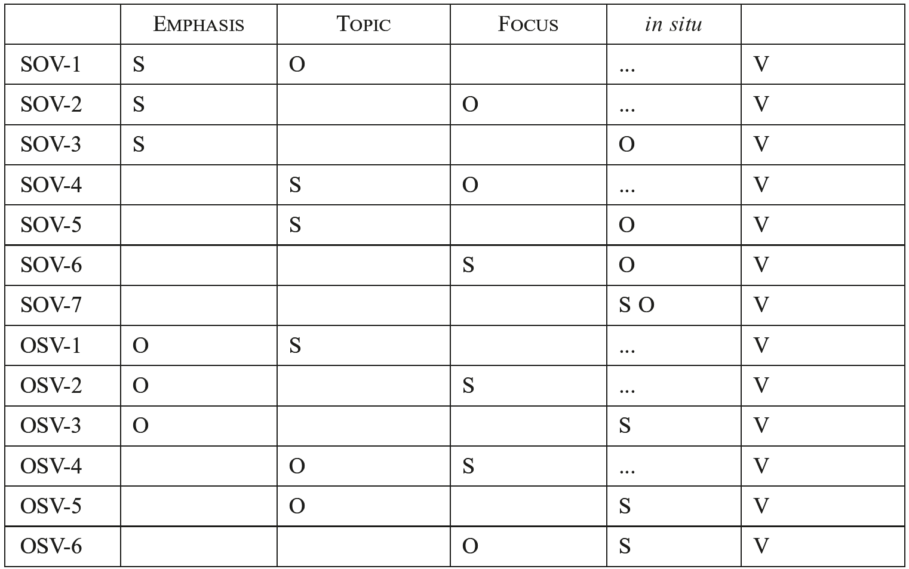

In these simple clause types, the subject occupies the EMPHASIS position in SOV-1, SOV-2, and SOV-3, but the O in these three rows occupies a distinct position in each case. The subject occupies the TOPIC position in SOV-4 and SOV-5 orders, as well as in OSV-1 order, but in spite of this structural similarity, the first two are counted under traditional studies as “the same” (as well as, of course, being counted as the same as all other SOV orders), but the latter is treated as totally distinct. The object occupies the FOCUS position in SOV-2, SOV-4, and OSV-6 orders! Matters become massively more complex, as can easily be imagined, if we make space in our table for subject and object <i>wh</i>-elements (which would come between EMPHASIS and TOPIC, regardless of grammatical function) and clitic direct objects. In short, the problem with traditional “word order” studies of Indo-Iranian (and Indo-European) syntax is that they are looking at word <i>order</i>, instead of trying to see through the superficial linear order of a particular clause to the syntactic structure which underlies it.

To return briefly to our earlier point, it is not only the case that counting “the wrong things” (S’s in EMPHASIS, TOPIC, or FOCUS as “the same” as long as they precede O, e.g.) creates problems. A probabilistic approach to IIr. sentence structure is in general misguided. Knowing that a given order (e.g. OSV) is statistically “rare” or “marked” does not tell us <i>why</i> the sentence we are looking at has that order: probabilistic claims are claims about <i>sets</i> of sentences. As such, they provide no explanation for any individual structure, rare or common. Since we must develop an analysis of the structure of the clause we are examining, once we understand why it has the order it has, what good does the statistical argument do us? One hundred percent of clauses <i>with that particular type of meaning combinations</i> have that structure! Put another way, observe that one could write an entire Neo-Rigveda or Neo-Avesta using only OSV clauses <i>without changing the syntax of Vedic Sanskrit at all</i>, because the syntax doesn’t tell you <i>how often</i> to express particular meanings, only <i>how</i> to express them, once you have decided you want to. Of course, the text would be <i>pragmatically</i> odd, but its sentences would be grammatical. Determining the syntax of the language involves knowing how licit sentences are constructed. It is only when we have made progress on this <i>prior</i> question that we can ask how licit structures are put to use to serve pragmatic and discourse functions − also structurally encoded, as we have seen above. An approach which seeks the explanations for “word order” not in general markedness or frequency domains but by trying to discover what <i>structural properties</i> are present in the strings, acknowledging that structural properties exist to express meanings, <i>will</i> definitely help with what I take to be the primary goals of research into the syntax of archaic IIr. languages: 1. the exploitation of syntax to assist with text interpretation (which will in turn increase the sophistication of our understanding of the syntax of the language in question) and 2. the leveraging of the syntactic facts of the daughter languages thus uncovered to understand the structure of the Proto-Indo-Iranian clause, and, ultimately that of PIE (and, of course, the diachronic development of these structures over time).

## 7. Conclusions

It will be apparent to the reader that much remains opaque regarding the configurational syntax of Proto-Indo-Iranian. While clarifying some of these issues will certainly require enhancing our knowledge of the antecedent PIE situation with respect to the phenomenon in question (to the extent that is possible without clear input to the process from an understanding of the Indo-Iranian data), it is largely dependent on simple, non-superficial analyses of syntactic phenomena in the most archaic daughter languages, particularly the Vedic Sanskrit of the mantras and the language of the extensive Young Avestan texts.

I will use an important, but still quite opaque, issue as a representative problem for discussing some of the important difficulties which persist: the position of the finite verb. In the most archaic daughter languages of the family, the language of the Vedic mantras and that of both the Old Avestan Gāθās and the “Great” Yašts of Young Avestan, we find a great deal of variation: clause-final verbs, clause-initial verbs, and verbs in a variety of clause-internal positions all abound in the texts. I note this in spite of the assertions of West (2011: § 338, but see the weakening of the claim in § 341 and § 344) and Skjærvø (2009: 94) that the “basic” Old Iranian word order is SOV. (It must also be pointed out that all of the criticism leveled above against using superficial linear order as a primitive hold equally well of verb position: a “clause-initial” verb may be in any of a relatively large number of actual syntactic positions, as may a “clause-final” verb − this fact hardly need be mentioned with respect to the “variety of clause-internal positions”, of course.) In the generally less-archaic daughters represented by the Old Persian and Vedic Prose corpus, it is indeed correct to label verb-finality as the norm, the attested deviations from that order being highly constrained. Unfortunately, this characterization of things (exceedingly rough and uninsightful for the earliest daughters) leaves many possible explanations on the table. Are we observing − when looking at the difference between the diversity of verb placement in our most archaic daughters (Mantra Vedic and Avestan) and our less archaic ones (Old Persian and Vedic Prose) − the effects of diachronic change in the syntactic system? Or does the more expansive “expressive range” of the more archaic texts indicate that we should expect greater deviation from the “basic” SOV order even if the underlying syntactic system remained constant across this time span? Or are metrical considerations alone responsible? These questions would be difficult to answer even if we had a rich and insightful characterization of verb distribution in the most archaic branches − without such a foundation, they are not within range of serious scholarly discussion.

The good thing about acknowledging our ignorance on these matters, as I noted above, is that we see just how much fascinating research there is to do − an exciting, as well as daunting, project. The reconstruction of the syntax of the Indo-European protolanguage simply cannot make meaningful progress without the development of a firm understanding of the Proto-Indo-Iranian situation. Having moved aside some of the hurdles of earlier approaches, we may finally be in a position to pursue the development of this understanding.
