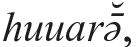
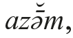

# 113. The lexicon of Indo-Iranian

1.Introduction

2.Inherited vocabulary

3.Loan-words

4.Specific vocabulary

5.Phraseology

6.References

## 1. Introduction

The lexicon of the Proto-Indo-Iranian linguistic unity has been registered in a systematic manner only once, by Fick (1890: 155−342). But Fick himself (1890: VII) in the absence of a specialist collaborator was aware of the book’s weaknesses in Iranian matters (cf. the devastating criticism of Bartholomae 1894). Moreover, Fick took into account not only the words that are actually attested in both branches of Indo-Iranian in ancient times, but also material that occurs in only one of them (normally Old Indo-Aryan) but has a counterpart outside Indo-Iranian (as *<i>ái̯ma-</i> ‘course, way’ [V. <i>éma-</i>] = Gk. οἶμος; V. <i>ū́dhar</i>/<i>n</i>- ‘udder’ ~ Gk. οὖθαρ or even *<i>ću̯anta-</i> ‘beneficent’ [Av. <i>spəṇta-</i>] = OCS. <i>svętъ</i> ‘holy’); for every Indo-Aryan lexeme with an ascertained equivalent in the cognate languages (like the phrase-based V. <i>iṣirá-</i> ‘vital, powerful’ = Gk. ἱερός [cf. 5.] or the verbal root V. <i>oṣ, oṣati</i> ‘burn, scorch’ = Gk. εὕω, Lat. <i>ūrō</i>) must of course have passed through the stage of Proto-Indo-Iranian. Fick included also (anthrop)onomastic equations (e.g. *<i>Gau̯tama-</i> [V. <i>Gótama-</i>, YAv. <i>Gaotəma-</i>], *<i>Bʰāsa-</i> [OIA. <i>Bhāsa-</i> = YAv. <i>Bā̊ŋha-</i>]) for which I refer to Schmitt (1995a: 645b, 1995b: 678b). Because Fick (1890) is entirely obsolete and in nearly all respects outdated now, it could not be used as the basis of the present outline.

To prove that some word was part of the Proto-Indo-Iranian lexicon is not an easy task even in the case of inherited IE words, since Iranian evidence often is lacking owing to the limited text corpora. The relevant material, however, can be surveyed now without difficulty in Mayrhofer (1992−1996; which should always be consulted), where the entire vocabulary of the Vedas is recorded together with the essential (Old) Iranian cognates, though a comparative Indo-Iranian (or even Iranian) dictionary was not intended by that author. In principle, it is nevertheless indispensable that every Indo-Iranian word be based on the evidence of both branches − Nuristani being left aside here as indecisive − and, if possible, on evidence in the Old Iranian languages. In order to illustrate the problems, it may be sufficient to quote two words of undoubted PIE origin which are attested only in modern Iranian languages: PIE *<i>deh₂iu̯ér</i>- ‘husband’s brother’ (V. <i>devár</i>-, cf. Gk. δᾱήρ, Lith. <i>dieverìs</i>) in Pašto <i>lewar</i> etc.; PIE <i>*bʰr̥Hg̑ ó-</i> ‘birch-tree’ (V. <i>bhūrjá-</i>, cf. OHG. <i>birka</i>, Lith. <i>béržas</i>) in Oss. <i>bærz</i>/<i>bærzæ</i> etc.

## 2. Inherited vocabulary

### 2.1. Verbs

In the IE languages the verbal root, as is known, is the central means of denoting events and states. Thus the majority of PIE verbal roots have been preserved in Indo-Iranian, even if in phonetically altered form. Since in Indo-Iranian all word-formation starts from the root (as already the ancient Indian grammarians had recognized for their mother-tongue), a list of the most important Proto-Indo-Iranian <i>primary verbal roots</i> (attested in both Old Indo-Aryan and [Old] Iranian) shall be given here. But secondary, as a rule denominative, stem-formations like PIIr. *<i>u̯ái̯na-</i> (V. <i>véna-</i> = Av. <i>vaēna-</i> = OP. <i>vaina-</i>) ‘look at, track down’ or PIIr. *<i>páti̯a-</i> (V. <i>pátya-</i> = Av. <i>paiθiia-</i>) ‘be master of’ are passed over on principle. This list impressively shows the conservatism of Indo-Iranian and the close affinity of its two branches to one another. It follows the sequence of the Latin alphabet in a form modified as required and disregards the varying manner and means of stem-formation (ablaut, suffixes, etc.) even in the cases of specific formations:

PIIr. *<i>bʰag</i>/<i>ǰ</i> ‘assign’, *<i>bʰaH</i> ‘shine’, *<i>bʰai̯H</i> ‘be afraid’, *<i>b⁽ʰ⁾andʰ</i> ‘bind, tie’, *<i>b⁽ʰ⁾anȷ́ʰ</i> ‘strengthen’ (V. <i>baṃh</i> = OAv. <i>dəbąz</i>), *<i>bʰar</i> ‘carry, bring’, *<i>b⁽ʰ⁾arȷ́ʰ</i> ‘make strong/great’, *<i>b⁽ʰ⁾au̯dʰ</i> ‘notice’, *<i>bʰau̯H</i> ‘become’ (V. <i>bʰavⁱ</i> = Av. <i>bauu</i>, OP. <i>bav</i>), *<i>bʰraHȷ́</i> ‘shine, sparkle’, *<i>bʰrai̯H</i> ‘wound, hurt’;

*<i>ćaHs</i> ‘command, advise’ (V. <i>śās</i> = Av. <i>sāh</i>), *<i>ćai̯H</i> ‘lie’ (V. <i>śay⁽ⁱ⁾</i> = YAv. <i>saii</i>), *<i>ćak</i>/<i>č</i> ‘be able’, *<i>ćans</i> ‘pronounce, praise’ (V. <i>śaṃs</i> = OAv. <i>səˉngh</i>, YAv. <i>saŋh</i>, OP. <i>θanh</i>), *<i>ćau̯H</i> ‘swell, thrive’, *<i>ćau̯k</i>/<i>č</i> ‘glow’, *<i>ćnatʰH</i> ‘kick, knock down’, *<i>ćrai̯</i> ‘lean’ (V. <i>śray</i> = YAv. <i>sraii</i>, OP. <i>çay</i>), *<i>ćrau̯</i> ‘hear (words)’, *<i>ćrau̯š</i> ‘obey’, *<i>ćšai̯</i> ‘dwell, live’ (V. <i>kṣay</i> = Av. <i>šaii</i>); *<i>čaćš</i> ‘look’ (V. <i>cakṣ</i> = YAv. <i>caš</i>), *<i>čai̯</i>¹ ‘stack’, *<i>čai̯</i>² ‘punish, avenge’, *<i>čai̯t</i> ‘perceive’, *<i>čar(H)</i> ‘wander, move’, *<i>či̯au̯</i> ‘set in motion, move’ (V. <i>cyav</i> = Av. <i>š́(ii)auu</i> = OP. <i>šiyav</i>);

*<i>daH</i>¹ ‘give’, *<i>daH</i>² ‘bind, tie’, *<i>dai̯ć</i> ‘show’, *<i>dakš</i> ‘be able’, *<i>darć</i> ‘see’, *<i>dar(H)</i> ‘pierce, split’, *<i>dram</i> ‘run’, *<i>drau̯</i> ‘run’, *<i>du̯ai̯š</i> ‘hate’ (V. <i>dveṣ</i> = OAv. <i>dᵃⁱbiš</i>, YAv. <i>t̰baēš</i>); *<i>d⁽ʰ⁾abʰ</i> ‘deceive’, *<i>dʰaH</i> ‘put’, *<i>dʰai̯H</i> ‘look’, *<i>d⁽ʰ⁾ai̯ȷ́ʰ</i> ‘smear, mould’ (V. <i>deh</i> = YAv. <i>daēz</i>), *<i>dʰar</i> ‘hold’, *<i>d⁽ʰ⁾arȷ́ʰ</i> ‘make firm’ (V. <i>darh</i> = Av. <i>darəz</i>), *<i>dʰarš</i> ‘dare’ (V. <i>dharṣ</i> = OP. <i>darš</i>), *<i>d⁽ʰ⁾rau̯gʰ</i>/<i>ǰʰ</i> ‘deceive’;

*<i>gaH</i> ‘go’, *<i>gam</i>/<i>ǰam</i> ‘go’ (V. <i>gam</i> = Av. <i>jam</i>/<i>gam</i>), *<i>garH</i> ‘welcome, praise’, *<i>gau̯ȷ́ʰ</i> ‘hide’ (V. <i>goh</i> = YAv. <i>gaoz</i>, OP. <i>gaud</i>), *<i>gžʰar</i> ‘flow’ (V. <i>kṣar</i> = YAv. <i>γžar</i>); *<i>g⁽ʰ⁾rabʰH</i> ‘seize, gain’;

*<i>Hadʰ</i> ‘say’ (V. <i>ā</i>˘<i>h</i> = YAv. <i>ā</i>˘<i>d</i>), *<i>HaHp</i> ‘obtain’, *<i>HaHs</i> ‘sit’, *<i>Hai̯</i> ‘go’, *<i>Hai̯ć</i> ‘be master, command’ (V. <i>eś</i> = Av. <i>aēs</i>), *<i>Hai̯š</i>¹ ‘seek, desire’, *<i>Hai̯š</i>² ‘drive, move’ (V. <i>eṣ</i> = Av. <i>aēš</i>, OP. <i>aiš</i>), *<i>Haȷ́</i> ‘drive’, *<i>HanH</i> ‘breathe’, *<i>Har</i>¹ ‘(start to) move’, *<i>Har</i>² ‘reach, arrive’, *<i>Hardʰ</i> ‘let thrive’, *<i>Hargʰ</i>/<i>ǰʰ</i> ‘be worth’, *<i>Has</i>¹ ‘be’, *<i>Has</i>² ‘throw’, *<i>Hau̯gʰ</i>/<i>ǰʰ</i> ‘pronounce’ (V. <i>oh</i> = Av. <i>aog</i>/<i>j</i>), *<i>Hau̯H</i> ‘help, support’, *<i>Hi̯aȷ́</i> ‘offer, worship’ (V. <i>yaj</i> = Av. <i>yaz</i>, OP. <i>yad</i>), *<i>Hi̯au̯dʰ</i> ‘fight’, *<i>Hǰar</i> ‘wake’, *<i>Hmai̯ȷ́ʰ</i> ‘urinate’ (V. <i>meh</i> =YAv. <i>maēz</i>), *<i>Hnać</i> ‘obtain’, *<i>Hnai̯d</i> ‘revile, rebuke’, *<i>HraHdʰ</i> ‘succeed’ (V. <i>rādh</i> = Av. <i>rād</i>), *<i>Hram</i> ‘rest’, *<i>Hranǰʰ</i> ‘hasten, run’ (V. <i>raṃh</i> = YAv. <i>raṇj</i>), *<i>Hrau̯dʰ</i> ‘grow’, *<i>Hu̯abʰ</i> ‘weave’, *<i>Hu̯aH</i> ‘blow’, *<i>Hu̯akš</i> ‘increase’, *<i>Hu̯ardʰ</i> ‘grow, increase’, *<i>Hu̯arš</i> ‘rain’, *<i>Hu̯as</i>¹ ‘shine’, *<i>Hu̯as</i>² ‘dwell’;

*<i>i̯am</i> ‘hold, keep’, *<i>i̯as</i> ‘boil’, *<i>i̯at</i> ‘stand’, *<i>i̯au̯</i> ¹ ‘unite’, *<i>i̯au̯</i> ² ‘separate, keep away’, *<i>i̯au̯g</i>/<i>ǰ</i> ‘harness, join’;

*<i>ȷ́ambʰ</i> ‘crush, smash’, *<i>ȷ́anH</i> ‘give birth, generate’, *<i>ȷ́au̯š</i> ‘taste, like, enjoy’, *<i>ȷ́i̯aH</i> ‘rob, deprive’ (pres. V. <i>jinā́</i>- = YAv. <i>zinā</i>-, OP. <i>dinā</i>-), *<i>ȷ́naH</i> ‘perceive, know’; *<i>ȷ́ʰaH</i> ‘leave’ (V. <i>hā</i> = Av. <i>zā</i>), *<i>ȷ́ʰarH</i> ‘be angry’ (V. <i>harⁱ</i> = Av. <i>zar</i>), *<i>ȷ́ʰau̯H</i>/*<i>ȷ́ʰu̯aH</i> ‘call’ (V. <i>havⁱ</i>/<i>hvā</i> = Av. <i>zauu</i>/<i>zbā</i>, OP. <i>zbā</i>), *<i>ȷ́ʰu̯ar</i> ‘stagger, totter’; *<i>ǰai̯</i> ‘win, conquer’; *<i>ǰʰan</i>/<i>gʰan</i> ‘smite, kill’ (V. <i>han</i> = Av. <i>jan</i>, OP. <i>jan</i>);

*<i>kać</i> ‘appear, see’, *<i>kaH</i> ‘be pleased, desire’, *<i>kanH</i>¹ ‘enjoy’ (V. <i>kanⁱ</i> = Av. <i>kan</i>), *<i>kanH</i>² ‘dig’ (V. <i>khan</i> = YAv. <i>kan</i>, OP. <i>kan</i>), *<i>kar</i> ‘make, do’, *<i>karH</i>¹ ‘praise’, *<i>karH</i>² ‘scatter’, *<i>karš</i> ‘plough’, *<i>kart</i> ‘cut’, *<i>krau̯ć</i> ‘cry, shout’ (V. <i>kroś</i> = Av. <i>xraos</i>), *<i>krau̯dʰ</i> ‘be angry’, *<i>kšaH</i> ‘rule’ (pres. V. <i>kṣáya</i>- = Av. <i>xšaiia</i>-, OP. <i>xšaya</i>-), *<i>kšau̯bʰ</i> ‘quake, sway’, *<i>kšnau̯</i> ‘whet, sharpen’;

*<i>mad</i> ‘enjoy, become exhilarated’, *<i>maH</i> ‘measure, allot’, *<i>man</i>¹ ‘think’, *<i>man</i>² ‘wait’, *<i>mar</i> ‘die’ (pres. V. <i>mriya</i>- = YAv. <i>miriia</i>-, OP. <i>mariya</i>-), *<i>mardʰ</i> ‘neglect’, *<i>mark</i>/<i>č</i> ‘injure, damage’, *<i>maržd</i> ‘have mercy’ (V. <i>marḍ</i>= Av. <i>maržd</i>), *<i>mi̯au̯H</i> ‘push’ (V. <i>mīv</i> = YAv. <i>mīuu</i>), *<i>mraH</i> ‘soften’ (V. <i>mlā</i> = YAv. <i>mrā</i>), *<i>mrau̯H</i> ‘say’ (V. <i>bravⁱ</i> = Av. <i>mrauu</i>), *<i>mrau̯k</i>/<i>č</i> ‘vanish, disappear’;

*<i>nać</i> ‘vanish, die’ (V. <i>naś</i> = Av. <i>nas</i>, OP. <i>naθ</i>), *<i>nad</i> ‘roar, scream’, *<i>nai̯H</i> ‘lead’, *<i>nai̯ǰ</i> ‘wash’, *<i>nam</i> ‘bend, bow’;

*<i>pač</i> ‘cook’, *<i>pad</i> ‘step, go’, *<i>paH</i> ‘protect’, *<i>pai̯ć</i> ‘engrave, adorn’ (V. <i>peś</i> = YAv. <i>paēs</i>, OP. <i>paiθ</i>), *<i>pai̯H</i> ‘swell’, *<i>pai̯š</i> ‘crush’, *<i>par</i> ‘cross, take across’, *<i>parH</i> ‘fill’, *<i>pat</i> ‘fly, fall’, *<i>prać</i> ‘ask’, *<i>prai̯H</i> ‘please’, *<i>prau̯</i> ‘slide, swim’ (V. <i>plav</i> = YAv. <i>frauu</i>), *<i>prau̯tʰ</i> ‘snort’, *<i>puH</i> ‘rot, spoil’;

*<i>raH</i> ‘give’, *<i>rai̯ȷ́ʰ</i> ‘lick’ (V. <i>reh</i> = YAv. <i>raēz</i>), *<i>rai̯k</i>/<i>č</i> ‘leave’, *<i>rai̯š</i> ‘suffer, be hurt’, *<i>rau̯d(H)</i> ‘weep’ (V. <i>rod⁽ⁱ⁾</i> = Av. <i>raod</i>), *<i>rau̯dʰ</i> ‘hinder, hamper’, *<i>rau̯k</i>/<i>č</i> ‘shine’, *<i>rau̯p</i> ‘be in pain’;

*<i>sad</i> ‘sit’, *<i>saHdʰ</i> ‘succeed’ (V. <i>sādh</i> = YAv. <i>hād</i>), *<i>saH(i̯)</i> ‘bind’ (V. <i>sā</i>, pres. <i>syá</i>- = Av. <i>hā, hiia</i>-), *<i>sai̯k</i>/<i>č</i>- ‘pour out’, *<i>sak</i>/<i>č</i> ‘follow, accompany’, *<i>sanH</i> ‘gain, win’, *<i>sap</i> ‘care for’, *<i>sarȷ́</i> ‘let go, release’, *<i>sas</i> ‘sleep’, *<i>sau̯</i> ‘press (out)’, *<i>sau̯H</i>¹ ‘give birth, generate’, *<i>sau̯H</i>² ‘drive, move’, *<i>sau̯š</i> ‘dry’ (V. <i>śoṣ</i> < *<i>soš</i> = YAv. <i>haoš</i>), *<i>sćaH</i> ‘cut up’ (V. <i>chā</i> = OAv. <i>sā</i>), *<i>sćand</i> ‘seem, please’ (V<i>. chand</i> = YAv. <i>saṇd</i>, OP. <i>θand</i>), *<i>skambʰH</i> ‘fix, prop’, *<i>smar</i> ‘remember’, *<i>snaH</i> ‘bathe’, *<i>snai̯gʰ</i>/<i>ǰʰ</i> ‘stick, snow’, *<i>spać</i> ‘see’ (V. <i>(s)paś</i> = Av. <i>spas</i>), *<i>spardʰ</i> ‘compete, contend’, *<i>sparȷ́ʰ</i> ‘crave for, be eager’ (V. <i>sparh</i> = OAv. <i>sparz</i>), *<i>sp⁽ʰ⁾arH</i> ‘jerk, kick’ (V. <i>spharⁱ</i> = YAv. <i>spar</i>), *<i>staH</i> ‘stand’, *<i>star</i> ‘knock down’, *<i>starH</i> ‘strew, spread’, *<i>stau̯</i> ‘praise’, *<i>su̯ai̯d</i> ‘sweat’ (V. <i>sved</i> = YAv. <i>xᵛaēd</i>), *<i>su̯anH</i> ‘sound’, *<i>su̯ap</i> ‘sleep’;

<!-- source-file: content/11_chapter05_5.xhtml -->

*<i>taćš</i> ‘shape, fashion’ (V. <i>taks ̣</i>= Av. <i>taš</i>), *<i>tak</i> ‘run, rush’, *<i>tan</i> ‘stretch’, *<i>tap</i> ‘heat, burn’, *<i>tarH</i> ‘get across, overcome’, *<i>tau̯H</i> ‘be strong/able’, *<i>traH</i> ‘save, rescue’, *<i>tras</i> ‘tremble, shake’;

*<i>u̯ać</i> ‘be eager, want’, *<i>u̯ai̯ć</i> ‘settle, be ready’, *<i>u̯ai̯d</i> ‘find, know’, *<i>u̯ai̯g</i>/<i>ǰ</i> ‘swing, shoot’, *<i>u̯ai̯H</i> ‘follow up’, *<i>u̯ai̯p</i> ‘tremble, be ecstatic’, *<i>u̯aȷ́ʰ</i> ‘draw, drive’, *<i>u̯ak</i>/<i>č</i> ‘speak’, *<i>u̯amH</i> ‘vomit’, *<i>u̯an</i> ‘overcome, win’, *<i>u̯ank</i>/<i>č</i> ‘waver, stagger’, *<i>u̯ar</i> ‘cover, enclose’, *<i>u̯arH</i> ‘choose’, *<i>u̯art</i> ‘turn’, *<i>u̯as</i> ‘clothe’, *<i>u̯at</i> ‘be acquainted/familiar’, *<i>u̯rag</i>/<i>ǰ</i> ‘walk, proceed’, *<i>u̯raHdʰ</i> ‘be glad, be proud’ (V. <i>vrādh</i> = YAv. <i>uruuād</i>).

### 2.2. Nominals (nouns and adjectives)

A large number of Proto-Indo-Iranian nouns are inherited from the proto-language, as is true also for the most archaic types of word-formation (esp. root-nouns, stems in consonants [in -<i>s</i>, -<i>r</i>, -<i>n</i>, etc.] together with ablaut). Several semantic groups may be differentiated and illustrated here succinctly:

Man: *<i>Hi̯úu̯an-</i> ‘young (man)’ (V. nom. sg. <i>yúvā</i>, gen. <i>yū́n-as</i> = YAv. nom. <i>yauua</i>, gen. pl. <i>yūn-ąm</i>); *<i>Hnár</i>- ‘man’; *<i>Hu̯idʰáu̯ā-</i> ‘widow’; *<i>Hu̯ŕ̥šan-</i> ‘manly, male, man’; *<i>ȷ́ánH-a-</i> ‘man, creature, race’; *<i>ȷ́anH-tú</i>- ‘creature, man, tribe’; *<i>ǰánH-</i>/<i>*gnā́</i> ‘wife’ (V. <i>jáni-</i> = OAv. <i>jəˉni-</i>, YAv. <i>jaⁱni-</i> and V. <i>gnā́</i>- = OAv. <i>gᵊnā-</i>, YAv. <i>γənā-</i>, both based on a single paradigm); *<i>kau̯í-</i> ‘wise man, seer’; *<i>mánu(š)-</i> ‘man, father of mankind’; *<i>mári̯a-</i>‘young man’; *<i>márta-</i> ‘mortal, man’ (V. <i>márta-</i> = OAv. <i>mašạ-, marᵊta-</i>); *<i>páti-</i> ‘master, lord, husband’ with fem. *<i>pátniH</i>- ‘mistress, wife’; *<i>sákH-āi̯-</i> ‘friend, companion’ (V. nom. <i>sákhā</i>, acc. <i>sákhāy-am</i>, dat. <i>sákhy-e</i> = OAv. °<i>haxā</i>, °<i>haxāim</i>, YAv. <i>haxa, haš́e</i>); *<i>u̯īrá</i>- ‘man, hero’.

Kinship terms: *<i>bhrā́tar</i>- ‘brother’; *<i>dʰugHtár</i>- ‘daughter’ (V. <i>duhitár</i>- ~ OAv. <i>dugᵊdar</i>-, YAv. <i>duγδar</i>- with different developments within Indo-Aryan and Iranian); *<i>mātár</i>- ‘mother’; *<i>nápāt</i>- ‘grandson’ and *<i>napt-íH</i>- ‘granddaughter’; *<i>pHtár</i>- ‘father’; *<i>putrá-</i> ‘son’ (V. <i>putrá-</i> = Av. <i>puθra-</i>, OP. <i>puça-</i>; over time this term more and more displaced PIE *<i>suHnú-</i>, which is missing in New Indo-Aryan as well as in Middle and New Iranian languages); *<i>suH-nú</i>- ‘son’; *<i>su̯áćura-</i> ‘father-in-law’ (V. <i>śváśura</i>- < *<i>sváśura</i>- = YAv. <i>xᵛasura</i>-); *<i>su̯ásar</i>- ‘sister’.

Parts of the body: *<i>ákš(i)-</i> ‘eye’ (V. <i>akṣ-, ákṣi-</i> = Av. <i>aš-</i>); *<i>ástʰi-</i> ‘bone’; *<i>ā́s-</i> ‘mouth’; *<i>b⁽ʰ⁾āȷ́ʰú</i>- ‘(fore-)arm’ (V. <i>bāhú</i>- = YAv. <i>bāzu-</i>); *<i>bʰrúH-</i> ‘eyebrow’; *<i>ćráu̯ni-</i> ‘hip, buttocks’; *<i>ćŕ̥H-as-</i> ‘head, top’ (V. <i>śíras-</i> = YAv. <i>sarah-</i>); *<i>ćúpti-</i> ‘shoulder’; *<i>čárman-</i> ‘skin’; *<i>dánt-</i> ‘tooth’; *<i>dáu̯š-</i> ‘arm’; *<i>grīu̯ā́-</i> ‘neck’; *<i>i̯ákar</i>- ‘liver’ (V. <i>yákr̥ -</i>/<i>yakn</i>- = YAv. <i>yākarᵊ</i>); *<i>ȷ́ā́nu</i>-/*<i>ȷ́nu</i>- ‘knee’; *<i>ȷ́ʰánu</i>- ‘jaw’ (V. <i>hánu-</i> = YAv. <i>zanu</i>-); *<i>ȷ́ʰás-ta-</i> ‘hand’ (V. <i>hásta-</i> = Av. <i>zasta-</i>, OP. <i>dasta-</i>); *<i>kákša-</i> ‘armpit’; *<i>masgʰán</i>-‘marrow (of bones)’ (V. <i>majján</i>- [< *-<i>jjh</i>-] ~ YAv. <i>mazga</i>-); *<i>nā́s-</i> ‘nose’; *<i>pád-</i> ‘foot’; *<i>páru̯an-</i> ‘knot, joint’; *<i>pr̥štHá-</i> ‘back’; *<i>pstána-</i> ‘female breast’ (V. <i>stána-</i> = YAv. <i>fštāna-</i>, °<i>fšna-</i>); *<i>r̥Hmá-</i> ‘arm’ (V. <i>īrmá-</i> = YAv. <i>ar(ə)ma</i>°); *<i>sáktʰi-</i> ‘thigh’; *<i>snā́u̯ar</i>/<i>n-</i>‘sinew’; *<i>spl̥ȷ́ʰán</i>- (?) ‘spleen’ (with taboo changes V. <i>plīhán-</i> ~ YAv. <i>spərᵊzan-</i>); *<i>udára-</i>‘belly’; *<i>u̯álća-</i> ‘hair’ (V. <i>válśa-</i> ‘shoot’ = YAv. <i>varᵊsa-</i>).

Human sphere: *<i>áćru-</i> ‘tear’; *<i>ánȷ́ʰas-</i> ‘anxiety, distress’ (V. <i>áṃhas-</i> = YAv. <i>ązah-</i> = Lat. <i>angor</i>); *<i>áu̯ǰas-</i> ‘strength, vigor’ (V. <i>ójas</i>- = OAv. acc. sg. <i>aogō</i>, instr. <i>aojaŋhā</i>, YAv. <i>aojah</i>-, cf. Lat. <i>augus-tus</i>); *<i>bʰága-</i> ‘welfare, happiness’ (originally ‘distribution’); *<i>ćráu̯-as-</i> ‘glory, fame, praise’ (V. <i>śrávas</i>- = Av. <i>srauuah-</i> = Gk. κλέος); *<i>dai̯u̯á-</i> ‘heavenly, divine; god’ with fem. *<i>dai̯u̯-íH-</i>, which originally is an independent formation based on *<i>di̯áu̯</i>- ‘heaven’; *<i>dám</i>- ‘house’ with *<i>dám-s *páti-</i> ‘lord of the house’ (V. <i>pátir dán</i> and, with secondary univerbation, <i>dámpati-</i> = OAv. <i>dəˉṇg paⁱti-</i> ~ Gk. δεσπότης); *<i>dánsas-</i> ‘marvelous skill’ (V. <i>dáṃsas-</i> = YAv. <i>daŋhah-</i> = Gk. δήνεα); *<i>di̯áu̯</i>-‘heaven, sky’; *<i>g⁽ʰ⁾r̥dʰá-</i> ‘house’; *<i>Hnā́man</i>- ‘name’; *<i>ćšití-</i> ‘abode, settlement’ (V. <i>kṣi-tí-</i> = YAv. °<i>šiti-</i> = Gk. κτίσις); *<i>krátu-</i> ‘mental ability, strength of will’; *<i>mánas-</i> ‘mind, intellect, thought’ (cf. esp. V. <i>su-mánas-</i> ‘well-minded’ = YAv. <i>hu-manah-</i> = Gk. εὐμενής); *<i>maní-</i> ‘necklace’ (V. <i>maṇí-</i> with secondary spontaneous <i>-ṇ-</i>); *<i>matí-</i> ‘thought, idea, opinion’; *<i>misdʰá-</i> ‘prize, reward’ (V. <i>mīḍhá-</i> = Av. <i>mīžda-</i> = Gk. μισθός); *<i>na-Hu̯āȷ́á-</i> ‘boatman’ (V. <i>nāvājá-</i> = YAv. <i>nauuāza-</i> ~ Lat. *<i>nāvago-</i> in <i>nāvigāre</i>); *<i>námas-</i>‘adoration, reverence’; *<i>padá-</i> ‘step, footstep, trace’; *<i>pitú-</i> ‘food’; *<i>raH-í-</i> ‘property, possession, wealth’ (V. <i>rayí-</i>, acc. sg. <i>rayím</i>, gen. <i>rāyás</i> = Av. <i>raii-</i>, acc. YAv. <i>raēm</i>, gen. OAv. <i>rāiiō</i>); *<i>sád-as-</i> ‘seat, residence’ (V. <i>sádas-</i> = Gk. ἔδος, cf. YAv., OP. <i>had-iš-</i>); *<i>sáȷ́ʰ-as-</i> ‘power, force, superiority’ (V. <i>sáhas-</i> = Av. <i>hazah-</i> = Got. <i>sigis</i>); *<i>sám-ā-</i> ‘half-year, summer’; *<i>su̯ápna</i>- ‘sleep(ing), dream(ing)’ (V. <i>svápna-</i> = Av. <i>xᵛaf ⁽ᵊ⁾na-</i>); *<i>táćšan</i>-(?) ‘carpenter’ (V. <i>tákṣan-</i> = Av. <i>tašan-</i> = Gk. τέκτων); *<i>tāyú-</i> ‘thief ’; *<i>tr̥šnā</i>˘- ‘thirst’; *<i>u̯ačas-</i> ‘speech, word’ (V. <i>vácas-</i> = Av. <i>vacah-</i> = Gk. ἔπος); *<i>u̯ā́č</i>- ‘speech, voice’ (V. <i>vā́c</i>- = Av. <i>vāc</i>- = Lat. <i>vōx</i>); *<i>u̯íć-</i> ‘settlement, homestead, village, court’ (V. <i>víś-</i> = YAv. <i>vīs-</i>, OP. <i>viθ-</i>) with *<i>u̯ić-páti</i>- ‘chief of settlement’.

Fauna: *<i>áću̯a-</i> ‘horse’ (V. <i>áśva-</i> = YAv. <i>aspa-</i>, OP. <i>asa-</i>); *<i>aȷ́á-</i> ‘he-goat’; *<i>áǰʰi-</i>‘snake’ (V. <i>áhi-</i> = YAv. <i>aži-</i>); *<i>ćasá-</i> ‘hare’ (V. <i>śaśá-</i> < *<i>śasá-</i> = YAv. <i>saŋha-</i>); *<i>ću̯án-</i>‘dog’; *<i>gáu̯-</i> ‘ox, cow’; *<i>Hu̯ái̯-</i> ‘bird’; *<i>kŕ̥mi-</i> ‘worm’; *<i>mai̯šá-</i> ‘ram’ and *<i>mai̯ šíH-</i>‘ewe’; *<i>mū́š</i>- ‘mouse, rat’; *<i>páću</i>-/*<i>paćú</i>- ‘cattle’; *<i>ŕ̥kša</i>- ‘bear’ (V. <i>ŕ̥kṣa</i>- = YAv. <i>arša</i>-); *<i>udrá</i>- ‘otter’; *<i>ukšán</i>- ‘ox, bull’; *<i>u̯ŕ̥ka</i>- ‘wolf’ (V. <i>vŕ̥ka</i>- = YAv. <i>vəhrka</i>-).

Natural phenomena: *<i>abʰrá</i>- ‘rain, cloud’; *<i>áćman</i>- ‘stone’ (V. <i>áśman</i>- = YAv., OP. <i>asman</i>- ‘heaven’, which meaning is problematic as to its age); *<i>agní</i>- ‘fire’ (in Iranian attested only in anthroponyms); *<i>ái̯as</i>- ‘useful metal (copper, ore)’ (= Lat. <i>aes</i>); *<i>áȷ́ra</i>-‘field, plain’; *<i>áȷ́ʰar</i>/<i>n</i>- ‘day’ (V. <i>áhar</i>/<i>n</i>- = Av. <i>asn</i>-, e.g. gen. pl. <i>áhn-ām</i> = <i>asn-ąm</i>); *<i>áp</i>- ‘water’ (V. nom. pl. <i>ā́p-as</i>, acc. <i>ap-ás</i> = YAv. nom. sg. <i>āfš</i>, OAv. acc. pl. <i>apas</i>°); *<i>ćapʰá</i>- ‘hoof’ (V. <i>śaphá-</i> = YAv. <i>safa</i>-); *<i>dā́ru-</i>/<i>*dru</i>- ‘wood, timber’; *<i>dȷ́ʰám</i>- (?) ‘earth’ (V. <i>kṣám</i>- [< PIE *<i>dʰg̑ʰém</i>-] ~ Av. <i>zam</i>- with simplified initial *<i>g̑ ʰ</i>- as in Gk. χαμαί vs. χθών); *<i>gr̥H-í</i>- ‘mountain, hill’ (V. <i>girí</i>- = YAv. <i>gaⁱri</i>-); *<i>Hstár</i>- ‘star’; *<i>Hu̯áHata</i>- ‘wind(-god)’ (V. <i>vā́ta</i>- = Av. <i>vāta</i>-, both often trisyllabic); *<i>i̯áu̯a</i>- ‘barley, corn’; <i>kšáp</i>- ‘night’; *<i>mádʰu</i>- ‘sweet drink, honey’; *<i>máHas</i>- ‘moon, month’ (V. <i>mā́s</i>- = Av., OP. <i>māh</i>-; cf. esp. disyllabic OAv. nom. sg. <i>mā̊</i> < *<i>maHah</i>); *<i>nábʰas</i>- ‘vapour, cloud’; *<i>nákt</i>- ‘night’; *<i>parná</i>- ‘feather, leaf, wing’; *<i>prátH-as</i>- ‘width’; *<i>sćāyā́-</i> ‘shadow’ (V. <i>chāyā́-</i> = YAv. °<i>saiia</i>- ~ Gk. σκιᾱ́); *<i>sć⁽ʰ⁾idrá</i>- ‘pierced; hole’; *<i>súHar</i>/<i>n</i>- ‘sun’ (V. <i>svàr</i>, gen. sg. <i>sū́r-as</i> = Av.  gen. YAv. <i>hūrō</i>, etc.); *<i>támHsrā</i>˘- ‘darkness’ (V. <i>támisrā</i>˘- = YAv. <i>tąθra</i>- = Lat. <i>tenebrae</i>); *<i>ušás</i>- ‘dawn’; *<i>u̯ā́r</i>- ‘water’; *<i>u̯ŕ̥Hnā</i>- ‘wool’ (V. <i>ū́rṇā</i> = YAv. <i>varᵊnā</i>- = Lat. <i>lāna</i>).

Various instruments: *<i>čakrá</i>- ‘wheel’; *<i>du̯ā</i>˘<i>r</i>- ‘door’ (V. <i>dvā́r</i>/<i>dur</i>- = YAv. <i>duuar</i>-, OP. <i>duvar(a)</i>- with secondary *<i>d</i>- < PIE *<i>dʰ</i>-); *<i>íšu</i>- ‘arrow’; *<i>īšā́-</i> ‘pole (of a carriage or plough)’ (V. <i>īṣā́</i>- ~ YAv. du. <i>aēša</i>); *<i>i̯ugá</i>- ‘yoke’; *<i>ǰi̯ā́-</i> ‘bow-string’.

Adjectives: *<i>ádʰara</i>- ‘inferior’; *<i>ántama</i>- ‘next, nearest’ (= Lat. <i>intimus</i>); *<i>ántara</i>-‘interior’; *<i>āćú</i>- ‘fast, quick’ (= Gk. ὠκύς; cf. superl. V. <i>ā́śiṣṭha</i>- = YAv. <i>āsišta</i>- = Gk. ὤκιστος); *<i>āmá</i>- ‘raw’; *<i>b⁽ʰ⁾r̥ ȷ́ʰánt</i>- ‘high’ (V. <i>br̥hánt</i>- = YAv. <i>bərəzaṇt</i>-); *<i>ći̯āu̯á</i>- ‘dark (brown)’; *<i>ćúHra</i>- ‘strong, heroic’ (V. <i>śū́ra-</i> = YAv. <i>sūra-</i>, with superl. *<i>ćáu̯Hišta</i>- > V. <i>śáviṣṭha</i>- = Av. <i>səuuišta</i>-); *<i>ću̯ai̯tá</i>- ‘white, bright’ (V. <i>śvetá</i>- = YAv. <i>spaēta</i>-); *<i>čitrá</i>-‘conspicuous, bright’; *<i>dáćsina</i>- ‘right; [in Indo-Iranian also:] southern’ (V. <i>dákṣiṇa</i>- = YAv. <i>dašina</i>-); *<i>dr̥Hgʰá</i>- ‘long’ (V. <i>dīrghá</i>-, comp. <i>drā́ghīyas</i>- = OAv. <i>darəga</i>-, YAv. <i>darəγa</i>-, <i>drājiiah</i>-, OP. <i>darga</i>-); *<i>gr̥Hú</i>- ‘heavy’ (V. <i>gurú</i>- = YAv. <i>gouru</i>°); *<i>gʰarmá</i>-‘hot, warm; heat’; *<i>Hragʰú</i>- ‘quick’ (V. <i>raghú</i>-, fem. <i>raghvī́</i>- = YAv. <i>rəuuī</i>- = Gk. ἐλαχύς); *<i>Hsat-i̯á</i>- ‘true, real’ (V. <i>satyá</i>- = Av. <i>haⁱθiia</i>-, OP. <i>hašiya</i>-; < PIE *<i>h₁s-n̥t-i̯ó</i>-); *<i>Hu̯ásu</i>- ‘good’; *<i>ȷ́ʰári</i>- ‘pale, yellow’ (V. <i>hári-, hárita</i>- = YAv. <i>zaⁱri-, zaⁱrita</i>-); *<i>ǰīu̯á</i>-‘living’; *<i>krūrá</i>- ‘bloody, raw [flesh]’; *<i>mádʰi̯a</i>- ‘middle’; *<i>nagná</i>- ‘naked’ (V. <i>nagná</i>-~ YAv. <i>maγna</i>-); *<i>náu̯a</i>- ‘new’; *<i>prii̯á</i>- ‘dear’ (< PIE *<i>priH-ó</i>-; with superl. *<i>prái̯H-išta</i>-> V. <i>préṣṭha</i>- = OAv. <i>fraēšta</i>-); *<i>pr̥Hná</i>- ‘full’ (V. <i>pūrṇá</i>- = Av. <i>pərəna</i>-; cf. esp. V. <i>pūrṇá-mās(a)-</i> ‘full moon’ = YAv. <i>pərənō.mā̊ŋha</i>-); *<i>pr̥Hú</i>-, fem. *<i>pr̥Hu̯</i>-<i>íH-</i> ‘much, many’ (V. <i>purú-, pūrvī́</i>- = Av. <i>poᵘru-, paoⁱrī</i>-, OP. <i>paru</i>-; < PIE *<i>pl̥h₁-ú</i>-, cfr. Gk. πολύς); *<i>pŕ̥Hu̯a</i>- ‘being in front; eastern’ (V. <i>pū́rva</i>- = YAv. <i>pa⁽ᵒ⁾ᵘruua</i>-, <i>poᵘruua</i>-); <i>pr̥tHú</i>-, fem.*<i>pr̥tHu̯</i>-<i>íH-</i> ‘broad, wide’ (V. <i>pr̥thú</i>-, <i>pr̥thvī́</i>- = Av. <i>pərəθu</i>-, <i>pərəθβī</i>-); *<i>r̥ȷ́rá</i>- ‘shining; quick’; *<i>sam-a-</i> (atonic) ‘any’; *<i>samH-á</i>- ‘same, equal’; *<i>sána</i>- ‘old’; *<i>sáru̯a</i>-‘whole, entire, every’; *<i>sau̯i̯á</i>- ‘left; southern’ (V. <i>savyá</i>- = YAv. <i>haoiia</i>-); *<i>tr̥šú</i>- ‘dry’; *<i>upamá</i>- ‘uppermost’; *<i>úpara</i>- ‘superior’; *<i>ūná</i>- ‘wanting, lacking’ (~ Lat. <i>vānus</i>); *<i>u̯íću̯a</i>- ‘all, every’ (V. <i>víśva</i>- = Av. <i>vīspa</i>-, OP. <i>visa</i>-); *<i>u̯r̥Hdʰu̯á</i>- (?) ‘upright’ (V. <i>ūrdhvá</i>- ~ YAv. <i>ərəduua</i>-, <i>ərəδβa</i>- ~ Gk. ὀρθός < *ϝορθϝός: cf. Mayrhofer 1996: 244 f.); *<i>u̯r̥Hú</i>- ‘wide, broad’ (V. <i>urú</i>- = Av. <i>voᵘru°</i>).

### 2.3. Pronouns

Most of the stems of Indo-Iranian demonstrative, relative, and interrogative-indefinite pronouns are inherited: PIIr. *<i>sá-</i>/<i>*tá-</i> ‘this, that’ (the forms with <i>s</i>- being restricted to nom. sg. masc./fem.; cf. V. <i>sá, sā́, tád</i> = Av. <i>hā</i>/<i>hō, hā, tat̰ <</i> ~ Gk. ὁ, ἡ, τό); *<i>ai̯-</i>/<i>*i</i>-‘this one’ in nom. masc. V. <i>ayám</i> = OAv. <i>aiiəˉm</i>, Av. <i>aēm</i>, nom. fem. V. <i>iyám</i> = YAv. <i>īm</i>, OP. <i>iyam</i>, etc. (cf. Lat. <i>is, ea, id</i>) in suppletion with the stem *<i>a-</i> ‘this one’ (V. <i>a-</i> = Av. <i>a-</i>, OP. <i>a-</i>) in abl. masc. V. <i>asmā́t</i> = Av. <i>ahmāt̰ <</i> etc.; relative *<i>Hi̯á</i>- ‘who, which’ (V. <i>yá</i>- = Av. <i>ya</i>-); *<i>ká</i>- ‘who? what?’ (V. <i>ká</i>- = Av. <i>ka-</i>, but OAv. gen. sg. <i>cahiiā</i>); *<i>čí</i>-‘who?’ (Av. <i>ci</i>-, whereas V. <i>kí</i>- is influenced by <i>ká</i>-).

Likewise, most of the personal pronouns have exact counterparts in some of the cognate languages, though the extension in *<i>-ám</i> is a typical feature of Indo-Iranian: *<i>aȷ́ʰ-ám</i> ‘I’ (V. <i>ahám</i> = Av.  OP. <i>adam</i>) with *<i>má</i>- ‘me’ (e.g. acc. V. <i>mā́m</i> = Av. <i>mąm</i>, OP. <i>mām</i>); *<i>u̯ai̯-ám</i> ‘we’ (V. <i>vayám</i> = Av. <i>vaēm</i>, OP. <i>vayam</i>) with *<i>asmá</i>- < PIE *<i>n̥smé</i> in the oblique cases (e.g. abl. V. <i>asmát</i> = OAv. *<i>ahmat̰</i>, gen. V. <i>asmā́kam</i> = YAv. <i>ahmākəm</i>, OP. <i>amāxam</i>) and enclitic *<i>nas</i> ‘us, our’; *<i>tuu̯-ám</i> ‘thou’ (V. <i>tᵤvám</i> = OAv. <i>tuuəˉm</i>, YAv. <i>tūm</i>, OP. <i>tuvam</i>) with *<i>tu̯á</i>- ‘thee’ (e.g. acc. V. <i>tvā́m</i> = Av. <i>θβąm</i>, OP. <i>θuvām</i>); enclitic *<i>u̯as</i> ‘you’ (V. <i>vah̥</i> = OAv. <i>vəˉ</i>, YAv. <i>vō</i>).

Several series of modal, local, and other adverbs belong to these stems, too (only those based on *<i>tá</i>- being mostly Indo-Aryan innovations), e.g. PIIr. *<i>i-dʰá</i> ‘here’ (V. <i>ihá</i>, but Pāli <i>idha</i> = OAv. <i>idā</i>, YAv. <i>iδa</i>, OP. <i>idā</i>), *<i>i-dā́</i> ‘now’ (V. <i>idā́</i> = YAv. <i>iδa</i>), *<i>á-tra</i> ‘here’ (V. <i>átra</i> = Av. <i>aθrā</i>˘), *<i>á-tʰā</i> ‘so’ (V. <i>áthā</i> = Av. <i>aθā</i>˘), *<i>á-dʰa</i> ‘then’ (V. <i>ádha</i> = OAv. <i>adā</i>, YAv. <i>aδa</i>, OP. <i>ada</i>°), *<i>Hi̯á-tra</i> ‘where’ (V. <i>yátra</i> = Av. <i>yaθrā</i>˘), *<i>Hi̯á-di</i> ‘when’ (V. <i>yádi</i> = YAv. <i>ye[i]δi</i>, OP. <i>yadiy</i>), *<i>ka-tʰā́</i> ‘how?’ (V. <i>kathā́</i>= Av. <i>kaθā</i>˘), *<i>ka-dā́</i> ‘when?’ (V. <i>kadā́</i> = OAv. <i>kadā</i>, YAv. <i>kaδa</i>), *<i>kú-dʰa</i> ‘where?’ (V. <i>kúha</i> = OAv. <i>kudā</i>), *<i>kú-tra</i> ‘where?’ (V. <i>kútra</i> = Av. <i>kuθrā</i>˘).

### 2.4. Numerals

The lower cardinal numbers are inherited, albeit with some peculiarities. They may be illustrated by the following Proto-Indo-Iranian forms: ‘2’ *<i>du̯á</i>- (cf. esp. nom.-acc. du. ntr. V. <i>dᵤvé</i> = OAv. <i>duuaē</i>, YAv. <i>duiie</i>) with compositional *<i>du̯i-</i> (and *<i>du̯íš</i> ‘twice’), ‘5’ *<i>pánča</i>, ‘7’ *<i>saptá</i>, ‘9’ *<i>náu̯a</i>, ‘10’ *<i>dáća</i> (cf. esp. V. <i>dáśa-māsᵢya</i>- = YAv. <i>dasa.māhiia</i>-‘ten-month [pregnancy]’), ‘12’ *<i>du̯ā́-daća</i>, ‘15’ *<i>pánča-daća</i>, ‘20’ *<i>u̯īćatí-</i> (YAv. <i>vīsaⁱti</i>, whereas V. <i>viṃśatí-</i> is secondary), ‘50’ *<i>pančāćát</i>-, ‘100’ *<i>ćatám</i>.

### 2.5. Indeclinables

A short selection of inherited forms includes: *<i>ča</i> ‘and’; *<i>čid</i> indefinite and emphatic particle (V. <i>cid</i> = Av. <i>cī t̰</i>, OP. <i>-ciy</i>); *<i>Hsu</i>° ‘good, well’ (< PIE *<i>h₁su</i>- = Gk. εὐ-); *<i>maćšū́</i> ‘quickly, soon’ (V. <i>makṣū́</i> = Av. <i>mošu</i>, cf. Lat. <i>mox</i>); *<i>mā́</i> prohibitive particle; *<i>nū</i> ‘now’; *<i>pr̥Hás</i> ‘in front, before’ (V. <i>purás</i> = YAv. <i>parō</i>).

## 3. Loan-words

3.1. The lexical stock of Proto-Indo-Iranian contains a considerable number of words that are apparently not inherited from Proto-Indo-European, since they lack cognates outside Indo-Iranian as well as convincing IE etymologies. These words must reflect contacts between Proto-Indo-Iranians and other peoples speaking non-IE languages during the 3rd and early 2nd millennium BCE when the Proto-Indo-Iranians were still in Central Asia and had not yet lost contact with each other. The words so borrowed typically show phonological, morphological, or even semantic peculiarities or otherwise unusual word-structure. Since the Proto-Indo-Iranians, though forming a speech community in the broadest sense, perhaps spoke slightly different dialects, it seems likely that phonological or other differences in borrowed words reflect the migration of these words first to the later Indo-Aryans, who passed them on to the Iranians (Lubotsky 2001: 306). But the number of instances where borrowing can be proven with certainty or at any rate can be rendered plausible is not large; and as a rule we must leave open whether we are dealing with substratum or adstratum. A thorough study of the material in question based on Mayrhofer (1992−1996) is Lubotsky (2001), which deals with the various pecularities of the Indo-Iranian isolates in general. Cf. also Witzel (1999: 54−56), Windfuhr (2006: 378−379), and Pinault (2006; who enriched the discussion by adding Common Tocharian as a further language that has borrowed from some Central Asiatic substratum).

3.2. The main semantic categories seen in the borrowed portion of the Indo-Iranian lexicon show the stimuli which the Indo-Iranians received from their new homeland (the region of the so-called Bactria-Margiana Archaeological Complex culture) and its advanced urban civilization:

1. animals: *<i>úštra-</i> ‘camel’ (V. <i>úṣṭra-</i>, Av. <i>uštra</i>-, OP. <i>uša</i>-), *<i>kʰara</i>- ‘donkey’ (V. <i>khara</i>-, YAv. <i>xara</i>- [Semitic?]), *<i>mr̥gá</i>- ‘game, wild animal’ (V. <i>mr̥gá</i>-, YAv. <i>mərəγa</i>-; but see now García Trabazo 2016 for a proposed IE etymology), *<i>kaći̯ápa</i>- ‘tortoise’ (V. <i>kaśyápa</i>-, YAv. <i>kasiiapa</i>-), *<i>kapáu̯ta</i>- ‘pigeon’ (V. <i>kapóta</i>-, OP. <i>kapauta-ka-</i> ‘blue’), *<i>mátsi̯a</i>- ‘fish’ (V. <i>mátsya</i>-, YAv. <i>masiia</i>-);
2. farming and cattle breeding: *<i>kšīra</i>- ‘milk’ (V. <i>kṣīrá</i>-, YAv. °<i>xšīra-</i> [?], NP. <i>šīr</i>), *<i>paršá</i>- ‘sheaf, bundle’ (V. <i>parṣá-</i>, YAv. <i>parša</i>-), *<i>bī́ǰa</i>- ‘seed, semen’ (V. <i>bī́ja</i>-, BSogd. <i>byz’k</i>);
3. irrigation and water-management: *<i>i̯au̯i̯ā́</i>- ‘channel’ (V. <i>yavyā́</i>-, OP. <i>yauviyā</i>-), *<i>kʰā́</i>-‘well’ (V. <i>khā́</i>-, YAv. <i>xā</i>-);
4. building activity: *<i>išta</i>-, *<i>išti</i>- ‘brick’ (V. <i>íṣṭakā</i>-, <i>iṣṭikā</i>-, YAv. <i>ištiia</i>-, OP. <i>išti</i>-), *<i>mai̯ū́kʰa</i>- ‘wooden peg’ (V. <i>mayū́kha</i>-, OP. <i>mayūxa</i>-), *<i>ć</i>/<i>síkatā</i>- ‘gravel’ (V. <i>síkatā</i>-, OP. <i>θikā</i>-, Khot. <i>siyatā</i>-);
5. clothing: *<i>átka</i>- ‘cloak’ (V. <i>átka</i>-, YAv. <i>aδka</i>-, <i>at̰.ka</i>-), *<i>ć</i>/<i>sūčī́</i>- ‘needle’ (V. <i>sūcī́</i>-, YAv. <i>sūkā</i>-);
6. body parts etc.: *<i>k</i>/<i>gái̯ća</i>- ‘hair of the head’ (V. <i>kéśa</i>-, YAv. <i>gaēsa</i>-), *<i>púsća</i>- ‘tail’ (V. <i>púccha</i>-, YAv. <i>pusa</i>-), *<i>ću̯ái̯pa</i>- ‘tail’ (V. <i>śépa</i>-, YAv. <i>xšuuaēpā</i>- ‘backside’), *<i>u̯r̥ tká</i>- ‘kidney’ (V. <i>vr̥kká</i>-, YAv. <i>vərəδka</i>-);
7. religious terms: *<i>anćú</i>- ‘Soma plant’ (V<i>. aṃśú</i>-, YAv. <i>ąsu</i>-), *<i>magʰá</i>- ‘offering, sacrifice’ (V. <i>maghá</i>-, OAv. <i>maga</i>-), <i>átʰaru̯an</i>- ‘priest’ (V. <i>átharvan</i>-, YAv. <i>āθrauuan</i>- [cf. Pinault 2006: 171−175]),*<i>r̥ ́ši</i>- ‘seer, bard’ (V. <i>ŕ̥ṣi</i>-, OAv. <i>ərəši</i>-);
8. perhaps even names of mythical beings and deities like *<i>g⁽ʰ⁾andʰaru̯</i>/<i>b⁽ʰ⁾á</i>- (V. <i>gandharvá</i>-, YAv. <i>gaṇdərəβa-</i>) or *<i>ćaru̯á</i>- (V. <i>śarvá</i>-, YAv. <i>sauruua</i>-, cf. Pinault 2006: 179−181).

3.3. The source language(s) of these foreign terms more often than not remain(s) unclear. Partly they may have come from Mesopotamia or the Fertile Crescent, but the earlier stages of some isolated languages in remote mountain regions like Burushaski are possible candidates, too: Thus the obviously foreign word V. <i>godhū́ma</i>-, YAv. <i>gaṇtuma</i>-, etc. ‘wheat’ with all its formal differences (owing to some remodeling) comes from Proto-Burushaski (cf. Bur. <i>gur, guriŋ</i>) according to Berger (1959: 39−43; who rejected a Near Eastern origin, because we find there only shorter forms of the word). There are also several other somewhat unclear cases of words that are very much alike in their form, but are not in accordance with phonetic laws: e.g. V. <i>sarṣapa</i>- ‘mustard (seed)’ vs. Khot. <i>śśaśvāna</i>-, Parth. <i>šyfš-d’n</i> /šifš-δān/ ‘grain of mustard’, etc.; V. <i>siṃhá</i>-‘lion’ vs. Parth. <i>šrg</i> /šarγ/, Khwar. <i>sarγ</i>, etc.; or V. <i>pŕ̥dāku</i>- ‘snake’ vs. NP. <i>palang</i> ‘leopard’ (< *<i>pard°</i>). In any case, we are dealing here with foreign words; but we are unable to decide whether we should class them as substrate elements or migratory terms, because the formal differences they frequently show are typical for repeated borrowing.

3.4. Whereas (Proto-)Indo-Iranian has bequeathed a large number of loan-words to Finno-Ugric (many hundreds according to Katz 2003), the list of Finno-Ugric borrowings identified within Proto-Indo-Iranian is rather short (cf. Katz 2003: 348). Even the most likely candidates call forth some hesitation. These include some terms for ‘hemp, cannabis’: *<i>bʰangá</i>- (V. <i>bhaṅgá</i>-; but YAv. <i>baŋha</i>- is not reliable) from Proto-Uralic *<i>paŋká</i>-; *<i>aná</i>- (V. <i>śaṇá</i>-, MP. <i>šan</i>; but cf. V. <i>khana</i>-, Khot. <i>kaṃha</i>- with initial *<i>k</i>-) from Proto-Finno-Ugric *<i>kənä</i> (Katz 2003: 143, who left aside, however, other words belonging here, like Gk. κάνναβις); *<i>ganǰā</i>- (OIA. <i>gañjā</i>-, but without an Iranian equivalent) from Proto-Finno-Permian *<i>kančá</i>.

In addition, it may be mentioned explicitly that only the substrate influences on Proto-Indo-Iranian are dealt with here, so that the manifold substrata from which Old Indo-Aryan obviously has borrowed on Indian soil from the time of the Rigveda onward (cf. esp. Witzel 2000) are not included in this survey.

## 4. Specific vocabulary

### 4.1. Verbs

A significant number of verbal roots, though common to the (ancient) Indo-Iranian languages and without morphological peculiarities, have no parallels in the cognate languages and thus are isolates lacking an Indo-European etymology (see Lubotsky 2001: 314 f.). They include *<i>bhai̯š</i> ‘heal’ (in Vedic derived <i>bhiṣaj-</i> only), *<i>bʰaru̯</i> ‘chew’, *<i>ći̯aH</i> ‘coagulate, congeal’ (V. <i>śyā</i>), *<i>gʰas</i> ‘eat, consume’, *<i>gʰau̯š</i> ‘sound’ (V. <i>ghoṣ</i> = Av. <i>gaoš</i> ‘hear [sounds]’), *<i>Hu̯i̯adʰ</i> ‘pierce, hurt’ (V. <i>vyadh</i>), *<i>ȷ́ʰai̯</i> ‘impel, incite’ (V. <i>hay</i> = Av. <i>zaii</i>), *<i>kau̯č</i> ‘bend, shrink’, *<i>kramH</i> ‘stride’, *<i>nard</i> ‘bellow, growl’, *<i>srans</i> ‘dissolve, fall’, *<i>u̯ai̯k</i>/<i>č</i> ‘separate, sift’, *<i>u̯andH</i> ‘praise, greet’, *<i>u̯ap</i> ‘strew, scatter’, *<i>u̯i̯ak</i>/<i>č</i> ‘encompass, enclose’, *<i>u̯i̯atʰ</i> ‘sway, totter’, *<i>u̯rai̯H</i> ‘press, crush’ (V. <i>vlayⁱ</i> = Av. <i>uruuaii</i>), but also the unclear present stem *<i>išudʰi̯a</i>- ‘strive for’.

### 4.2. Nominals (nouns and adjectives)

This group includes Indo-Iranian isolates that are not borrowed from some other language, but have a plausible Indo-European etymology. These instances generally involve formations based on a PIE root but differing from cognate words in other subgroups by a special suffix. A number of semantic groups may be differentiated here, too. We begin with Indo-Iranian theonyms and other religious terms, a category not treated in 2.2.

Theonyms: V. <i>Apā́ṃ nápāt</i>- = YAv. <i>Apąm napāt</i>- ‘descendant (lit.: grandson) of the waters’; V. <i>Arámati-</i> = Av. <i>Ārmaⁱti-</i> (four-syllable form) ‘right thought’; V. <i>Aryamán-</i> = Av. <i>Aⁱriiaman-</i> ‘hospitable’; V. <i>Ásura-</i> = Av. <i>Ahura-</i> ‘lord’ (esp. in <i>Ahura- Mazdā-</i> = OP. <i>Auramazdā-</i> ‘Lord Wisdom’); V. <i>Āptyá-</i> (in <i>Tritá- Āptyá-</i>) ~ YAv. <i>Āθβiia-</i> (cf. Mayrhofer 1992: 168); V. <i>Dāsá-</i> a demon ~ YAv. <i>Dahāka-</i> a dragon; V. <i>Índra</i>- (cf. Near Eastern early IA. ᵈ<i>In-da-ra</i>, ᵈ<i>In-tar</i>) = YAv. <i>Iṇdra</i>- a daēvic being; V. <i>Mitrá</i>- = YAv. <i>Miθra</i>- ‘(god) Contract’; V. <i>Nárā-śáṃsa</i>- epithet of Agni, lit. ‘praise of men’ ~ YAv. <i>Naⁱriiō.saŋha</i>-; V. <i>Nā́satya</i>- name of the divine twins (cf. Near Eastern early IA. ᵈ<i>Na-ša-at-ti-i̯a-an-na</i>) = YAv. <i>Nā̊ŋhaⁱθiia</i>-; V. <i>Vāyú</i>- = YAv. <i>Vaiiu</i>- ‘wind’; V. <i>Sóma</i>- the Soma plant, its juice and its deification = YAv. <i>haoma</i>- (the plant only); V. <i>Tváṣṭar</i>-‘Creator’ = Av. <i>θβōrᵊštar</i>-; V. <i>Vivásvant</i>- = YAv. <i>Vīuuaŋᵛháṇt</i>-, the father of V. <i>Yamá</i>- = Av. <i>Yima</i>- the primordial twin.

Religious or mythical terms: PIIr. <i>ā́ȷ́ʰuti</i>- ‘offering, oblation’ (V. <i>ā́huti</i>- = Av. <i>āzuⁱti</i>-); *<i>āpríH</i>- ‘invocation, blessing, curse’ (V. <i>āprī́</i>- = YAv. <i>āfrī</i>-; from *<i>ā́</i> + *<i>prai̯H</i>); *<i>Hi̯aȷ́-atá</i>- ‘worthy of worship, adorable’ (V. <i>yajatá</i>- = Av. <i>yazata</i>-); *<i>Hi̯aȷ́-ná</i>- ‘worship, offering’ (V. <i>yajñá</i>- = Av. <i>yasna</i>-); *<i>Hr̥tá</i>- ‘true; truth(fulness), R̥ta’ (V. <i>r̥tá</i>- = OP. <i>r̥ta</i>° ~ Av. <i>ašạ</i>-) and *<i>Hr̥táH-u̯an</i>- ‘blessed with R̥ta’ (V. <i>r̥tā́van</i>- = OP. <i>r̥tāvan</i>- ~ Av. <i>ašạuuan</i>- with fem. V. <i>r̥tā́varī</i>- ~ YAv. <i>ašạ̄uuaⁱriiā̊s</i>°); *<i>ȷ́ʰáu̯-tar</i>- ‘offering priest, sacrificer’ (V. <i>hótar</i>- = Av. <i>zaotar</i>-); *<i>ȷ́ʰáu̯-trā</i>- ‘libation, offering’ (V. <i>hótrā</i>- = YAv. <i>zaoθrā</i>-); *<i>magʰá-u̯an</i>-‘munificent; giver, sacrificer’; *<i>mii̯ázdʰa</i>- ‘sacrifice, offering of food’ (V. <i>miyédha</i>- = Av. <i>miiazda</i>-); *<i>satstrá</i>- ‘session (of a sacrifice)’. Cf. also V. <i>uśíj</i>- = OAv. <i>usij</i>- an offering priest, whose title cannot be etymologized.

Man: *<i>agrū́</i>-, fem. ‘unmarried’ (lit. ‘not pregnant’; ~ PIIr. *<i>gr̥Hú</i>- ‘heavy’); *<i>ari̯a</i>-/ *<i>ā́ri̯a</i>- ‘Aryan’ (V. <i>ā́rᵢya</i>- ~ YAv. <i>aⁱriia</i>-, OP. <i>ariya</i>- as name of the Aryans); *<i>átHtʰi</i>-‘guest’ (V. <i>átithi</i>- = Av. <i>asti</i>-); *<i>bʰiš-áȷ́</i>- ‘healer, physician’ (V. <i>bhiṣáj</i>-, <i>bheṣajá</i>-, °<i>jyà</i>- = YAv. <i>baēšaza</i>-, °<i>ziia</i>-, cf. the denominative verb <i>bišaz-iia</i>-); *<i>(H)i̯amá</i>- ‘twin’ (V. <i>yamá</i>- = OAv. <i>yəˉma</i>-; cf. the name of the primordial twin Yama); *<i>(H)i̯áu̯asa</i>- ‘pasturage, fodder’ (V. <i>yávasa</i>- = YAv. <i>yauuaŋha</i>-); *<i>íš</i>- ‘refreshment’ (V. <i>íṣ</i>- = Av. <i>īš</i>-; cf. V. <i>íḍ</i>-, <i>íḍā</i>-/<i>íḷā</i>- and <i>írā</i>- ‘refreshment’ = Av. <i>īža</i>-); *<i>ȷ́anH-tra</i>- ‘origin, birthplace’; *<i>kaniH(a)n</i>-‘girl, maiden’ (whose original <i>n</i>-stem, which is still seen in V. gen. pl. <i>kanī́n-ām</i>, YAv. gen. sg. <i>kainīn-ō</i> etc., is remodelled to the <i>ā</i>-stem V. <i>kanyāˋ</i>- = YAv. <i>kaniiā</i>-); *<i>man-áu̯tar</i>- ‘inventor, thinking, considering’ (V. <i>manótar</i>- ~ OAv. fem. <i>manaoθr-ī</i>-); *<i>mártii̯a</i>-‘mortal, man’ (V. <i>mártiya</i>- = Av. <i>mašịia</i>-, OP. <i>martiya</i>-); *<i>pāi̯ú</i>- ‘guard, protector’; *<i>stríH</i>- ‘woman’; *<i>u̯adʰū́</i>- ‘bride, young wife’ (derived from PIE *<i>[H]u̯edʰ</i> ‘lead [home in marriage]’); *<i>u̯ai̯ć-á</i>- ‘inmate, resident, settler’ (V. <i>veśá</i>- = YAv. <i>vaēsa</i>-); *<i>u̯anHtā</i>-‘(beloved) wife’ (OIA. <i>vanitā</i>- = YAv. <i>vaṇtā</i>-).

Kinship terms: *<i>bhrā́tr̥u̯ii̯a</i>- ‘brother’s son’ (V. <i>bhrā́tr̥vya</i>- = YAv. <i>brātruiia</i>-, <i>brātūⁱriia</i>- (Indo-Iranian new formation in analogy to *<i>pHtr̥u̯ii̯a</i>-); *<i>Hnā́r-iH</i>- ‘woman, wife’ (V. <i>nā́rī</i>- = Av. <i>nāⁱrī</i>-; based on *<i>Hnár</i>- ‘man’); *<i>ȷ́ā́mātar</i>- ‘son-in-law’ (with secondary PIIr. *-<i>tar</i>-); *<i>náptar</i>- ‘grandson, descendant’ (transformation of inherited *<i>nápāt</i>- [cf. above 2.2.] after the kinship terms in -<i>tar</i>-); *<i>pHtr̥u̯ii̯a</i>- ‘father’s brother’ (V. <i>pitr̥vya</i>- ~ YAv. <i>tūⁱriia</i>-).

Parts of the body: *<i>angúri</i>- ‘finger, toe’ with *<i>anguštʰá</i>- ‘thumb, great toe’; *<i>áni-Hk-a-</i> ‘face’ (V. <i>ánīka</i>- = YAv. <i>aⁱnika</i>-); *<i>aratní</i>- ‘elbow’; *<i>áu̯štʰa</i>- ‘lip’; *<i>dánć-tra</i>- ‘tooth, fang’ (V. <i>dáṃṣṭra</i>- = YAv. <i>°dąstra</i>-); *<i>ȷ́iȷ́ʰu̯áH-</i>/<i>*ȷ́iȷ́ʰuH</i>- ‘tongue’ (Indo-Iranian remodeling of PIE *<i>dn̥g̑ ʰu̯eh</i>2-, that developed in different ways to V. <i>jihvā́</i>-, <i>juhū́</i> and Av. <i>hizuuā-, hizū</i>- respectively); *<i>gr̥da</i>- ‘penis’; *<i>ȷ́angʰā</i>˘- ‘shank’ (V. <i>jaṅghā</i>- ~ YAv. <i>zaṇga</i>-‘ankle’); *<i>ȷ́ʰā</i>˘<i>rd</i>-/*<i>ȷ́ʰr̥d</i>-, *<i>ȷ́ʰŕ̥d-ai̯a</i>- ‘heart’ (V. <i>hŕ̥d-, hŕ̥daya</i>- = OAv. <i>zərᵊd</i>-, YAv. <i>zərᵊδaiia</i>); *<i>kárna</i>- ‘ear’ (V. <i>kárṇa-</i> = YAv. <i>karᵊna-</i>; and cf. V. <i>karṇá</i>- ‘with long ears, with some defect in the ears’ = YAv. <i>karᵊna</i>- ‘deaf ’); *<i>mastr̥gʰan</i>-’brain’ (V. <i>mastr̥han</i>- = YAv. <i>mastərᵊγan</i>-); *<i>mr̥Hdʰán</i>- ‘(fore)head, skull, top’ (V. <i>mūrdhán</i>- ~ YAv. <i>ka-mərᵊδa</i>-); *<i>muští</i>- ‘(clenched) fist’; *<i>párću</i>- ‘rib’ (V. <i>párśu</i>- = YAv. <i>parᵊsu</i>-, <i>pərᵊsu</i>°); *<i>tanū́</i>- ‘body, person, self (in place of reflexive pronoun)’; *<i>u̯ŕ̥H-as</i>- ‘chest, breast’ (V. <i>úras-</i> [with strange zero-grade] = YAv. <i>varah</i>-).

Human sphere: *<i>áćtrā</i>- ‘whip’; *<i>ái̯nas</i>- ‘crime, sin’; *<i>apu̯ā́</i>- ‘panic, fear of death’ (V. <i>apvā́</i>- = OP. <i>afuvā</i>-); *<i>árdʰa</i>- ‘half, part’; *<i>ártʰa</i>- ‘aim, purpose’; *<i>ásta</i>- ‘home, place of return’; *<i>ásu</i>- ‘life’; *<i>au̯a-i̯ā́</i>- ‘apology, expiation’; *<i>áu̯as</i>- ‘furtherance, assistance’; *<i>au̯asá</i>- ‘refreshment, provision’; *<i>au̯a-sā́-na</i>- ‘resting place’; *<i>b⁽ʰ⁾arȷ́ʰ-íš</i>- ‘straw [esp. at the sacrificial ground], cushion’ (V. <i>barhíṣ</i>- = YAv. <i>barᵊziš</i>-); *<i>bhāg-á</i>- ‘part, portion’; *<i>bʰiH-ás-</i> ‘fear’ (V. <i>bhiyás-</i> = YAv. instr. <i>biiaŋha</i>; from the root *<i>bʰai̯H</i>); *<i>bʰúǰ-</i> ‘enjoyment, profit’ (V. <i>bhúj</i>- = OAv. <i>būj</i>- ‘fine’); *<i>ćánsa</i>- ‘praise, saying, order’ (V. <i>śáṃsa</i>- = OAv. <i>səˉṇgha</i>-, YAv. <i>saŋha</i>-); *<i>ćarad-</i>/<i>*ćard</i>- ‘autumn, year’ (V. <i>śarád</i>- ~ YAv. <i>sarᵊd</i>-, OP. <i>θar(a)d</i>-); *<i>ćárdʰa</i>- ‘strength, troop’ (V. <i>śárdha</i>- = YAv. <i>sarᵊδa</i>- ‘kind’); *<i>ćáu̯H-as</i>-‘power, strength, profit’; *<i>čakš-áni</i>- ‘viewer, looking’; *<i>čánH-as</i>- ‘delight’ (V. <i>cánas</i>- =Av. <i>°cinah</i>-, OP. °<i>canah</i>-); *<i>či̯āu̯-tn-á</i>- ‘enterprise, action’ (V. <i>cyautná</i>- ~ YAv. <i>š́iiaoθ[a]na</i>-); *<i>dm-āna</i>- ‘house, building’ (V. <i>mā́na</i>- = OAv. <i>dᵊmāna</i>-, YAv. <i>nmāna</i>-); *<i>dráu̯H-nas</i>- ‘movable property, share’ (V. <i>dráviṇas</i>- = Av. <i>draonah</i>-); *<i>dʰā́i̯-as</i>- ‘refreshment, care’; *<i>gaH-tú</i>- ‘going, way, course’ (lit. ‘step’); *<i>gaH-tʰā́</i>- ‘song’; *<i>gárbʰa</i>-‘womb’; *<i>gáu̯-Hi̯(a)uH-ti-</i> ‘pasture’ (V. <i>gávyūti</i>- ~ YAv. <i>gaoiiaoⁱti</i>-); *<i>gŕ̥H</i>- ‘praise, verse’ (V. <i>gír</i>- = Av. <i>gar</i>-); *<i>HámH-a-</i> ‘attacking force, aggressiveness’ (V. <i>áma-</i> = OAv. <i>əˉma-</i>, YAv. <i>ama-</i>); *<i>i̯áćas</i>- ‘renown, fame’ (V. <i>yáśas</i>- = Av. <i>yasah</i>-); *<i>i̯ātú</i>- ‘sorcery, witchcraft’; *<i>ȷ́áu̯H-as</i>- ‘speed, rapidity’; *<i>ȷ́ʰarmii̯á</i>- ‘solid house, palace’ (V. <i>harmyá</i>- = YAv. <i>zaⁱrimiia</i>°); *<i>ǰarH-tár</i>- ‘singer’; *<i>kćúdʰ</i>- (?) ‘hunger’ (V. <i>kṣúdh</i>- = YAv. <i>šuδ</i>-); *<i>kŕ̥p</i>-‘appearance, figure’ (V. <i>kŕ̥p</i>- = Av. <i>kəhrp</i>-); *<i>kšatrá</i>- ‘dominion, sovereignty’ (V. <i>kṣatrá</i>- = Av. <i>xšaθra</i>-) and *<i>kšátra</i>- ‘realm, kingdom’ (OP. <i>xšaça</i>-; cf. Schmitt 1998: 643) with *<i>kšatr-íi̯a</i>- ‘endowed with/belonging to sovereignty’; *<i>maghá</i>- ‘gift, reward’; *<i>mái̯(H)as</i>- ‘refreshment, enjoyment’ (V. <i>máyas</i>- = YAv. <i>maiiah</i>-); *<i>mai̯ní</i>- ‘revenge, punishment’ (V. <i>mení</i>- = OAv. <i>maēⁱni</i>-, OP. °<i>maini</i>-); *<i>man-i̯ú</i>- ‘mind, spirit, ardour’; *<i>mán-tra</i>- ‘thought, saying’; *<i>mán-tu</i>- ‘advice; adviser’; *<i>mas-dʰáH</i>- ‘intelligence, wisdom’ (V. <i>medhā́</i>- = OAv. <i>mazdā</i>-, cf. the theonym <i>Ahura- Mazdā</i>- and the adjective *<i>mas-dʰH-rá</i>- > V. <i>médhira</i>- = YAv. <i>mązdra</i>-); *<i>māi̯á</i>- ‘supernatural, wonderful power’; *<i>mitrá</i>- ‘contract’; *<i>mr̥t-i̯ú</i>- ‘death’ (a contamination of inherited PIIr. *<i>mr̥tí</i>- and *<i>ǰi̯áH-tu-</i> ‘life’); *<i>múH-tra</i>- ‘urine’ (V. <i>mū́tra</i>- = Av. <i>mūθra</i>-); *<i>pāmán</i>- a skin disease, ‘scabies’; *<i>prá-ćasti-</i> ‘praise, fame’; *<i>pŕ̥Handʰi</i>- ‘beneficence, munificence’ (V. <i>púrandhi-</i> = OAv. <i>parəṇdi</i>-, YAv. <i>pār</i>°); *<i>pŕ̥t</i>-, *<i>pŕ̥tanā</i>- ‘battle, contest’ (V. <i>pŕ̥t</i>-, <i>pŕ̥tanā</i>- = YAv. <i>pərᵊt</i>-, <i>pəšanā</i>-, OP. <i>pr̥tanā</i>-); *<i>raH-tí</i>- ‘gift, favour’; *<i>rái̯k-nas</i>- ‘bequest, wealth’ (V. <i>rékṇas</i>- = OAv. <i>raēxᵊnah</i>-); *<i>rákšas</i>- ‘damage, harm’; *<i>rána</i>- ‘delight, fight, battle’ (V. <i>ráṇa</i>-); *<i>sái̯nā</i>- ‘army’ (V. <i>sénā</i>- = YAv. <i>haēnā-</i>, OP. <i>hainā-</i>); *<i>sam-árana</i>- ‘meeting, battle’ (V. <i>samáraṇa</i>- = YAv. <i>hamarəna</i>-, OP. <i>hamarana</i>-); *<i>stúH-nā</i>- ‘post, pillar’ (V. <i>sthū́ṇā</i>- with secondary <i>sth</i>- and -<i>ṇ</i>-); *<i>táu̯HsiH</i>- ‘power, strength’ (V. <i>táviṣī</i>- = Av. <i>təuuišī</i>-); *<i>ti̯áǰ-as</i>- ‘abandonment, desolation’ (V. <i>tyájas</i>- = OAv. <i>ⁱθiiejah</i>-, YAv. <i>ⁱθiiajah</i>-); *<i>tu̯ákš-as</i>- ‘energy, vigour’; *<i>u̯ái̯ć-man</i>- ‘house, dwelling’; *<i>u̯ái̯das</i>- ‘property, wealth’; *<i>u̯ratá</i>- ‘instruction, order, rule’ (V. <i>vratá</i>- = OAv. <i>ᵘruuata</i>-); *<i>u̯r̥ȷ́-ána</i>- ‘community, village’, lit. ‘enclosure’ (V. <i>vr̥jána</i>- = OAv. <i>vərᵊzəˉna</i>-, YAv. <i>varᵊzāna</i>-, OP. <i>vr̥dana</i>-; with V. <i>vr̥janyà</i>- = OAv. <i>vərᵊzəˉniia</i>- ‘belonging to a community’); *<i>u̯r̥trá</i>- ‘obstacle, resistance, enemy; also personified as a demon’ (V. <i>vr̥trá</i>- = YAv. <i>vərᵊθra</i>-) and *<i>u̯r̥tra-ǰʰán</i>-‘breaking resistance’).

Fauna: *<i>á-gʰn-i̯ā</i>- ‘cow’ (lit. ‘not to be killed’); *<i>aȷ́ʰíH-</i> ‘cow (in milk)’ (V. <i>ahī́</i>- = Av. <i>azī</i>-, though with different inflection); *<i>ći̯ai̯ná</i>- ‘hawk, falcon’ (V. <i>śyená</i>- = YAv. <i>saēna</i>-); *<i>dʰai̯nú</i>- ‘(milch) cow, female animal’; *<i>mákš</i>- ‘fly’ (V. <i>mákṣ</i>- ~ YAv. <i>maxšī</i>-); *<i>r̥ȷ́ipi̯á</i>- epithet of the eagle (V. <i>r̥jipyá</i>- = YAv. <i>ərᵊzifiia</i>- ‘eagle’; cf. *<i>r̥ȷ́rá</i>- [2.2.]); *<i>u̯arāȷ́ʰá</i>- ‘(wild) boar’ (V. <i>varāhá</i>- = YAv. <i>varāza</i>-).

Natural phenomena: *<i>ádri</i>- ‘stone, rock’; *<i>arnau̯á</i>- ‘wave, flood, waving sea’; *<i>bʰáH-ma</i>- ‘light, splendour’; *<i>bʰaH-nú</i>- ‘brightness, light’; *<i>bʰúH-mi</i>- ‘earth’ (with secondary <i>ī</i>-stem forms); *<i>dić-ti</i>- measure of length, lit. ‘instruction’ (V. <i>diṣṭi</i>- = YAv. <i>dišti</i>-); *<i>di̯u-mná</i>- ‘splendour, magnificence’; *<i>du̯i-Hp-á</i>- ‘island’ (V. <i>dvīpá</i>- ~ YAv. <i>duuaēpəˉ</i> ‘on the island’); *<i>gái̯a</i>- ‘life, vitality; wealth, property’; *<i>Hmai̯gʰá</i>- ‘cloud’ (V. <i>meghá</i>- = YAv. <i>maēγa</i>-); *<i>Hráȷ́-as-</i> ‘space’ (V. <i>rájas</i>- = YAv. <i>razah</i>-); *<i>Hu̯aH-i̯ú</i>- ‘wind, air; god of wind’ (V. <i>vāyú</i>- = Av. <i>vaiiu</i>-); *<i>i̯aští</i>- ‘stick, club, branch’ (V. <i>yaṣṭí</i>- = YAv. <i>°yaxšti</i>-); *<i>ȷ́rái̯-as</i>- ‘expanse, space’ (V. <i>jráyas</i>- = YAv. <i>zraiiah</i>-, OP. <i>drayah</i>- ‘sea’); *<i>ȷ́ʰŕ̥Hani̯a</i>-‘precious metal, gold’ (V. <i>híraṇya</i>- = YAv. <i>zarańiia</i>-, OP. <i>daraniya</i>-); *<i>kapʰa</i>- ‘phlegm, foam’; *<i>kćái̯tra</i>- ‘landed property, land, soil’ (V. <i>kṣétra</i>- = Av. <i>šōiθra</i>-); *<i>máȷ́ʰ-as</i>- ‘greatness, power, wealth’ (V. <i>máhas</i>- = YAv. <i>mazah</i>-); *<i>naHu̯-íi̯a</i>- ‘to be crossed only by boat, not fordable’ (V. <i>nāvyà</i>- = YAv. <i>nāuuaiia</i>-, OP. <i>nāviya</i>-, whereas the customary translation ‘navigable’ is incorrect); *<i>pái̯as</i>- ‘milk’; *<i>pánt-ā-s</i>, gen. *<i>patʰ-ás</i> ‘way, path’ (V. nom. sg. <i>pánthās</i>, acc. <i>pánthām</i>, gen. <i>pathás</i>, loc. <i>pathí</i>, etc. = YAv. nom. <i>paṇt-ā̊</i>, acc. <i>paṇt-ąm</i>, OAv. abl. <i>paθ-ō</i>, loc. <i>paⁱθ-ī</i>, etc., a highly archaic paradigm which only in Indo-Iranian exhibits this *<i>t</i>/<i>tʰ</i>-alternation caused by a laryngeal); *<i>párH-nas</i>- ‘plenty, abundance’ (V. <i>párīṇas</i>- ~ YAv. <i>parᵊnaŋᵛhanṭ</i>- ‘available in plenty’); *<i>paršá</i>- ‘sheaf, bundle’; *<i>pau̯ástā</i>˘- ‘cover, cloth’ (V. <i>pavásta</i>- ~ OP. <i>pavastā</i>-); *<i>píHu̯as</i>- ‘fat’ (V. <i>pī́vas</i>- = YAv. <i>pīuuah</i>-); *<i>sái̯-tu</i>- ‘bond, fetter, dam, bridge’; *<i>srak-tí</i>- ‘edge’; *<i>súrā</i>- ‘intoxicating drink, spirituous liquor’; *<i>támH-as</i>- ‘darkness, gloom’; *<i>tištrii̯a</i>- name of a fixed star, the Sirius (V. <i>Tiṣyà</i>- [by dissimilation] = YAv. <i>Tištriia</i>-; originally *<i>tri-štr-ii̯a</i>- ‘three-star constellation’); *<i>u̯ánā</i>˘- ‘tree, wood’; *<i>u̯ará</i>- ‘enclosure, cave’ (V. <i>valá</i>- = YAv. <i>vara-</i>); *<i>u̯árčas</i>- ‘brilliance, splendour, figure’; *<i>u̯árna</i>- ‘covering, colour’; *<i>u̯ítasti</i>measure of length, lit. ‘span’; *<i>u̯r̥ćsá</i>- ‘tree’ (V. <i>vr̥kṣá-</i> = YAv. <i>varᵊša</i>-). Cf. also the inherited hydronym PIIr. *<i>Sáras-u̯at-iH</i>-, lit. ‘rich in puddles or lakes’ (> V. <i>Sárasvatī</i>- = PIr. *<i>Harahu̯atī</i>-; cf. Schmitt 2001).

Instruments: *<i>ćámi̯ā</i>- ‘yoke-pin, plug, wedge’ (V. <i>śámyā</i>- ~ YAv. <i>(yugō.)səmī</i>-, <i>simā</i>-); *<i>dʰán-u̯ ar</i>/<i>n</i>- ‘bow’ (V. <i>dhánvan</i>- [and remodelled <i>dhánus</i>-<i>̣</i>] ~ YAv. <i>θanuuarə</i>/<i>°uuan</i>-with secondary <i>θ</i>-); *<i>dʰā́rā</i>- ‘blade, edge’; *<i>gadā</i>- ‘mace, club’; *<i>kánH-tra</i>- ‘spade’ (V. <i>khanítra</i>- ~ YAv. <i>kąstra</i>-); *<i>kšádman</i>- ‘(carving-)knife’; *<i>kʰumbʰá</i>- (?) ‘jar, pitcher’ (V. <i>kumbhá-</i> ~ YAv. <i>xumba</i>-); *<i>matíi̯a</i>- ‘club (as an agricultural tool)’ (V. <i>matyà</i>- = YAv. °<i>maⁱtiia</i>-); *<i>rátʰa</i>- ‘(war-)chariot’ (cf. also V. <i>rathe-ṣṭhā́</i>- ‘(warrior) standing on a chariot’ = YAv. <i>raθaē-</i>/<i>raθōi-štā</i>-); *<i>r̥ští</i>- ‘spear’; *<i>u̯ádʰar</i>- ‘(murder) weapon’; *<i>u̯áȷ́ra</i>- ‘thunderbolt, club, mace’ (including a number of similar, though not identical phraseologies).

Adjectives: *<i>á-di̯u</i>- ‘not damaging/hurting’ (V. <i>ádyu</i>- = OAv. <i>aⁱdiiu</i>-); *<i>ágra</i>- ‘foremost; uppermost part’ (with *<i>agrii̯á</i>- ‘foremost, first’); *<i>agʰá</i>- ‘bad, dangerous’; *<i>ái̯ta</i>-‘coloured, iridescent’; *<i>áka</i>- ‘bad, evil’; *<i>andʰá</i>- ‘blind’; *<i>ani̯á</i>- ‘other’; *<i>aruná</i>- ‘reddish-brown’ (V. <i>aruṇá</i>-); *<i>arušá</i>- ‘red(dish)’; *<i>áru̯an</i>-, *<i>áru̯ant</i>- ‘running, quick; racer’ (V. <i>árvan</i>-, <i>árvant</i>- = Av. <i>aᵘruuaṇt</i>-, YAv. <i>aᵘruua</i>-); *<i>asrá</i>- ‘painful, evil’ (V. <i>asrá</i>- = OAv. <i>aṇgra</i>-, YAv. <i>aŋra</i>-); *<i>á-u̯itʰura</i>- ‘not staggering, unshakeable’ (V. <i>ávithura</i>- = YAv. <i>aⁱβiθūra</i>-, i.e. ⁺<i>auuiθura</i>-); *<i>bʰadrá</i>- ‘blessed, auspicious’; *<i>bʰúH-ri</i>- ‘much, many, abundant’; *<i>ćriH-ra</i>- ‘beautiful’ (OIA. <i>śrīla</i>- [but V. <i>a-śrīrá</i>- ‘unpleasant’] = Av. <i>srīra</i>-with *<i>ćrái̯H-i̯as</i>-, *<i>ćrái̯H-išta</i>-); *<i>ćuk-rá</i>- ‘bright, clear, coloured’ (V. <i>śukrá</i>- = Av. <i>suxra-‘</i>red<i>’</i>, OP. pr. n. <i>Θuxra</i>-); *<i>ću̯itrá</i>-, *<i>ću̯iti-°</i>- ‘white, whitish’ (V. <i>śvitrá-, śviti°</i> = YAv. <i>spiti</i>°); *<i>das-má</i>- ‘wonderful, miraculous’; *<i>das-rá</i>- ‘accomplishing wonderful deeds’ (V. <i>dasrá</i>- = Av. <i>daŋra</i>-, with superl. V. <i>dáṃsiṣṭha</i>- = YAv. <i>dąhišta</i>-); *<i>d⁽ʰ⁾ā́dʰr̥ši</i>- ‘courageous, bold’ (V. <i>dā́dhr̥ṣi</i>- = OP. pr. n. <i>Dādr̥ši</i>-); *<i>dūrá</i>- ‘far, long’; *<i>dʰruu̯á</i>- ‘firm, fixed, certain’ (V. <i>dhruvá</i>- = YAv. <i>druua</i>-, OP. <i>duruva</i>-); *<i>ga(m)bʰ(H)rá</i>- ‘deep’ (V. <i>ga(m)bhīrá</i>-~ YAv. <i>jafra</i>-); *<i>(H)i̯aȷ́ʰú</i>- ‘young, youthful’, fem. *<i>(H)i̯aȷ́ʰu̯-íH</i>- (V. <i>yahú</i>-, <i>yahvī́</i>- = OAv. <i>yazu</i>-, <i>yezuuī</i>-); *<i>Hi̯ā́u̯ant</i>- ‘as great, as large’ (V. <i>yā́vant</i>- = YAv. <i>yauuaṇt</i>-); *<i>ȷ́áu̯H-išta</i>-‘quickest’ (V. <i>jáviṣṭha</i>- ~ OAv. <i>zəuuīštiia</i>-); *<i>ȷ́ʰrás-i̯as</i>- ‘smaller’ (V. <i>hrásīyas</i>- ~ YAv. fem. <i>zraheh-ī</i>-); *<i>ǰiH-rá</i>- ‘lively, quick, active’; *<i>kádru</i>- ‘(reddish-)brown’; *<i>kr̥ćá</i>- ‘thin, slim, lean’ (V. <i>kr̥śá</i>- = YAv. <i>kərᵊsa</i>°); *<i>kšu̯iprá</i>- ‘flying, swift, quick’ (V. <i>kṣiprá-</i> ~ YAv. <i>xšuuiβra</i>-, for which phraseological equations [cf. 5 (1)] prove the identity of origin despite the formal differences); *<i>kʰaru̯á</i>- ‘mutilated, crippled’ (V. <i>kharvá</i>- ~ YAv. <i>kaᵘruua</i>-); *<i>maȷ́⁽ʰ⁾aH-ánt</i>- ‘great, large, big’ (V. <i>mahā́nt</i>- = YAv. <i>mazā̊ṇt</i>-, an enlargement of inherited *<i>maȷ́⁽ʰ⁾aH</i>- after *<i>bʰr̥ ȷ́ʰ-ánt</i>- ‘high’); *<i>mā́-u̯ant</i>- ‘like me’; *<i>mūrá</i>- ‘stupid, foolish’; *<i>nái̯ma</i>- ‘one, half’; *<i>nam-rá</i>- ‘bowing, submissive, humble’; *<i>názd-ii̯as</i>- ‘nearer’, *<i>názd-išta</i>- ‘nearest, next’ (V. <i>nédīyas</i>-, <i>nédiṣṭha</i>- = YAv. <i>nazdiiah</i>-, Av. <i>nazdišta</i>-, which are the comparative and superlative, respectively, to Av. <i>as-na</i>-, OP. <i>aš-na</i>- ‘near’ < PIE *<i>n̥sd-no</i>-); *<i>parušá</i>- ‘grey, dirty-coloured’; *<i>pr̥Hu̯ii̯á</i>- ‘former’ (V. <i>pūrvⁱyá</i>- = OAv. <i>poᵘruuiia</i>-, YAv. <i>paoⁱriia</i>-, OP. <i>paruviya</i>-) with V. <i>á-pūrvᵢya</i>- ‘unprecedented’ ~ OAv. <i>apaoᵘruuīm</i> ‘as never before’; *<i>pŕ̥šant</i>- ‘spotted, speckled’ (V. <i>pŕ̥ṣant</i>- = YAv. <i>paršat̰ </i>.°); *<i>ráu̯dʰita</i>- ‘red(dish)’ (V. <i>róhita</i>-, <i>lóh</i>° = YAv. <i>raoⁱδita</i>-); *<i>rūkšá</i>- ‘rough, dry, thin’; *<i>r̥ȷ́ú</i>- ‘straight, right’ (V. <i>r̥jú</i>- = Av. <i>ərᵊzu</i>-, with superl. *<i>ráȷ́-išta</i>-); *<i>r̥šu̯á</i>- ‘elevated, high’; *<i>súš-ka</i>- ‘dry’ (V. <i>śúṣka</i>- < *<i>súṣka</i>- = YAv. <i>huška</i>-, OP. <i>uška</i>-); *<i>tap-nú</i>- ‘burning’; *<i>táruna</i>- ‘young, tender’ (V. <i>táruṇa</i>-); *<i>táu̯H-i̯as</i>- ‘stronger’ (V. <i>táv(ī)yas</i>- = OP. <i>tauviyah</i>-); *<i>tu̯ā́-u̯ant</i>- ‘like you’; *<i>ubʰá</i>- ‘both’ (the initial *<i>u</i>- being restricted to Indo-Iranian); *<i>ug-rá</i>- ‘powerful, strong’; *<i>utstāná</i>- ‘outstretched’ (V. <i>uttāná</i>- = Av. <i>ustāna</i>-); *<i>u̯íp-ra</i>- ‘trembling, (ecstatically) excited’ (V. <i>vípra</i>- = YAv. <i>vifra</i>-, <i>ōifra</i>-).

<!-- source-file: content/11_chapter05_6.xhtml -->

### 4.3. Pronouns

Specific Indo-Iranian pronominal formations include the following stems: demonstrative PIIr. *<i>imá</i>- (V. <i>imá-</i> = Av. <i>ima</i>-, OP. <i>ima</i>-), that has been created by metanalysis of the inherited acc. sg. masc. *<i>i-m-ám</i> (cf. 2.3) as *<i>imá-m</i>; demonstrative *<i>ai̯šá-</i>/<i>*ai̯tá</i>- ‘this one here’ (V. <i>eṣá-</i>/<i>etá</i>- = YAv. <i>aēša-</i>/<i>aēta</i>-, OP. <i>aita</i>-), a fusion of the inherited stems *<i>ai̯</i>- and *<i>sá-</i>/<i>tá-</i> (cf. 2.3); interrogative *<i>katamá-</i> ‘who/which of several?’ (V. <i>katamá-</i> = YAv. <i>katāma-</i>) in analogy to inherited *<i>katará-</i> ‘who/which of two?’ (V. <i>katará-</i> = YAv. <i>katāra-</i>; cf. Gk. πότερος). Among the personal pronouns the oblique case-stem PIIr. *<i>i̯ušmá</i>- ‘you’ (2nd p. pl.) in, e.g., abl. V. <i>yuṣmát</i> = Av. <i>yūšmat̰</i> is a blending of inherited PIIr. *<i>ušmá-</i> < PIE *<i>usmé</i> (cf. Gk. Lesb. ὔμμε, Dor. ὑμέ) with the nominative stem *<i>i̯ū</i>-.

### 4.4. Numerals

Specific Indo-Iranian formations are to be found in the word ‘1000’ (PIIr. *<i>saȷ́ʰásra</i>-) and particularly among the ordinal numbers: e.g. PIIr. *<i>du̯itī i̯a</i>- ‘second’ (V. <i>dvitī́ya</i>- = OAv. <i>dᵃⁱbitiia-</i>, YAv. <i>bitiia</i>-, OP. <i>duvitī ya</i>-, formed after the inherited *<i>tr̥tī i̯a</i>- ‘third’), *<i>(k)tur(ī)i̯a</i>- ‘fourth’ (V. <i>turī́ya</i>- = YAv. <i>tūⁱriia</i>-; cf. also <i>ā-xtūⁱrīm</i> ‘four times’), *<i>aštama</i>-‘eighth’ (new formation after *<i>saptamá</i>- ‘7th’, *<i>daćamá</i>- ‘10th’), *<i>nau̯amá</i>- ‘ninth’ (V. <i>navamá</i>- = YAv. <i>naoma-, nāuma</i>-, OP. <i>navama</i>-, replacing older *<i>nau̯aná</i>-).

### 4.5. Adverbs, conjunctions, etc.

A large number of Indo-Iranian adverbs, particles, and other <i>mots accessoires</i> are new formations without parallels in the cognate languages. The following may be cited: PIIr. *<i>adzdʰā́</i> ‘in this (obvious) way’ (V. <i>addhā́</i> = OAv., OP. <i>azdā</i>), *<i>ai̯u̯á</i> ‘thus’, *<i>áram</i> ‘rightly, appropriately’, *<i>au̯ár</i> ‘down(ward)’, *<i>āu̯íš</i> ‘evidently’ (V. <i>āvíṣ</i> = Av. <i>āuuiš</i>),*<i>čái̯d</i> ‘if ’ (V. <i>céd</i> = YAv. <i>cōit̰</i>), *<i>du̯i-tā́</i> ‘another time, as always’, *<i>dʰr̥šát</i> ‘boldly’ (V. <i>dhr̥ṣát</i> = OAv. <i>darᵊšat̰</i>°, cf. OP. <i>daršam</i> with secondary -<i>m</i> as elsewhere), *<i>ȷ́ʰí</i> ‘for, because’ (V. <i>hí</i> = Av. <i>zī</i>), *<i>mitʰás</i> ‘in contrast’, *<i>nái̯d</i> ‘not’ (V. <i>néd</i> < *<i>ná-id</i> = Av. <i>nōit̰</i>, OP. <i>naiy</i>), *<i>nā́nā</i> ‘in various ways, here and there’, *<i>nūnám</i> ‘now’ (V. <i>nūnám</i> ~ Av. <i>nūrə˘̄m</i>, OP. <i>nūram</i> with secondary -<i>r</i>-), *<i>parás</i> ‘beyond, off ’, *<i>párā</i> ‘away’, *<i>pas-čā́</i> ‘behind, after’ (V. <i>paścā́</i> = YAv. <i>pasca</i>, OP. <i>pasā</i>), *<i>sáčā</i> ‘together (with)’, *<i>sádā</i> ‘always’, *<i>sadʰá</i> ‘together with’ (V. <i>sahá</i>, <i>sadha</i>° = OAv., OP. <i>hadā</i>, YAv. <i>haδa</i>), *<i>sa-kŕ̥t</i> ‘once, at once’ (V. <i>sakŕ̥t</i> = YAv. <i>hakərət̰</i>, cf. OP. <i>hakaram</i>°), *<i>satrā́</i> ‘(al)together’, *<i>smát</i> ‘together, at the same time’ (V. <i>smát</i> = YAv. <i>mat̰</i>), *<i>tr̥Hás</i> ‘across, over’ (V. <i>tirás</i> = YAv. <i>tarō</i>), *<i>u̯ā́i̯</i> ‘truly, indeed’ (V. <i>vái</i> = OAv. <i>vōi</i>).

This is the proper place for also mentioning adjectives in *-<i>anč</i>- based primarily on preverbs and adverbs such as PIIr. *<i>ápānč</i>- ‘situated behind’ (V. <i>ápāñc</i>- = YAv. nom. sg. masc. <i>apąš</i>), *<i>párānč</i>- ‘averted’, *<i>prā́nč</i>- ‘directed forwards, facing’, *<i>p(r)ati̯anč</i>-‘facing’ (V. <i>pratyáñc</i>- ~ YAv. nom. sg. masc. <i>paⁱti.yąš</i>, as always with the contrast of Ved. <i>práti</i> vs. Iran. *<i>pati</i>), *<i>níi̯anč</i>- ‘directed downwards’ (V. <i>nyàñc</i>- = YAv. <i>niiāṇc</i>-), *<i>satrā́nč</i>- ‘(al)together, throughout’ (V. <i>satrā́ñc</i>- = YAv. <i>haθrāṇc</i>-), *<i>u̯íšu̯anč</i>- ‘directed toward different directions’ (V. <i>víśvañc</i>- = YAv. <i>vīžuuanc̣</i> -); cf. also instr. sg. V. <i>tiraś-c-ā́</i> ‘crosswise, widthwise’ = YAv. <i>tarasca</i>.

## 5. Phraseology

The most striking feature among the linguistic similarities between the two branches of Indo-Iranian is the great number of corresponding idiomatic phrases and compounds that lived on particularly in the poetic tradition of both the Vedas and the Avesta. The most extensive systematic survey of this material is found in Schlerath (1968: 148−164), but it is also fully taken into account, where appropriate, by Mayrhofer (1992−1996; cf., moreover, <i>inter alia</i> Duchesne-Guillemin 1962: 33−36; Benveniste 1968). The main methodological problem is to rule out random parallels; how this is possible (by showing that one is dealing with a fixed formula with archaic traits, not commonplace expressions) is discussed in Schlerath (1996: 379 f.).

We can here list only a selection of the closest non-trivial correspondences; parallels in content only and instances like V. <i>áṃhas- tarⁱ</i> ‘get over distress’ ~ YAv. <i>vī-tar-ązah-</i>or V. <i>ádbhuta-kratu-</i> ‘with undeceivable intelligence’ ~ YAv. <i>aδaoiiō.xratu-</i> must be left aside notwithstanding their etymological affinity. Any more detailed classification being arbitrary, only a rough assignment based on grammatical structure with many varieties in every category is followed:

1. noun + adjective (often fused into a compound): V. <i>átithi-</i> ‘guest’ + <i>priyá-</i> ‘dear’, + <i>vásu-</i> ‘good’ = YAv. <i>asti- friia-, Vohuuasti-</i>; V. <i>áśva-</i> ‘horse’ + <i>árvant</i>- ‘running’, + <i>āśú</i>- ‘swift’, + <i>r̥jrá-</i> ‘quick’, + <i>kṣiprá-</i> ‘swift’ (in <i>kṣiprāśva-</i>), + <i>víṣita-</i> ‘untied’ = YAv. <i>auruuat̰.aspa-, āsu- aspa-</i> (and <i>āsu.aspa</i>-) [but cf. Gk. ὠκέες ἵπποι as proof of PIE origin], YAv. <i>Ǝrəzrāspa</i>-, <i>Xšuuiβrāspa</i>-, Av. <i>Vīštāspa-</i>, OP. <i>Vištāspa</i>-; V. <i>ā́yu</i>-‘life’ + <i>dīrghá-</i> ‘long’ (and <i>dīrghā́yu[ṣ]</i>- ‘long-lived’) = OAv. <i>āiiu- darəga</i>- (and <i>darəgāiiu</i>-); V. <i>íṣu</i>- ‘arrow’ + <i>kṣiprá-</i> ‘swift’ (in <i>kṣipréṣu</i>-) ~ YAv. <i>xšuuiβi.išu</i>-; V. <i>uṣás</i>- ‘dawn’ + <i>ucchántī</i>- ‘shining out’, + <i>vibhātī́</i>- ‘becoming bright’ = YAv. <i>ušah</i><i>usaitī-, viuuaitī</i>-; V. <i>ójas</i>- ‘vigour’ + <i>dhruvá</i>- ‘firm’ = YAv. <i>aojah</i>- <i>druua</i>-; V. <i>kṣám</i>-‘earth’ + <i>pr̥thivī́</i>- ‘broad’ = YAv. <i>zam- pərəθuuī</i>-; V. <i>cárman</i>- ‘leather’ + <i>mlātá</i>- ‘made soft, tanned’ = YAv. <i>carəman- mrāta</i>-; V. <i>nár</i>- ‘man’ + <i>tvā́vant</i>- ‘like you’ = OAv. <i>nar- θβāuuaṇt</i>-; V. <i>nā́man</i>- ‘name’ + <i>asuryà</i>- ‘Asurian’ = OAv. <i>nāman- āhūiriia</i>-; V. <i>mántra</i>- ‘formula’ + <i>satyá</i>- ‘true’ = OAv. <i>mąθra- haiθiia</i>-; V. <i>Mitrá</i>- ‘(god) Mitra’ + <i>revánt</i>- ‘splendid’ = YAv. <i>Miθra- raēuuaṇt</i>-; V. <i>vácas</i>- ‘word’ + <i>sūktá</i>- ‘well-spoken’ = YAv. <i>vacah- hūxta</i>-; V. <i>vīrá</i>- ‘man’ + <i>revánt</i>- ‘splendid’ = YAv. <i>vīra- raēuuaṇt</i>-; V. <i>Sóma-</i> ‘(god) Soma’ + <i>vr̥trahán</i>- ‘victorious’, + <i>sukrátu</i>- ‘of good intelligence’ = YAv. <i>Haoma- vərəθrajan</i>-, <i>huxratu</i>-; possessive compounds formed from shared syntagms: V. <i>ugrá-bāhu</i>- ‘strong-armed’ = YAv. <i>uγra.bāzu</i>; V. <i>uttāná-hasta</i>- ‘with hands outstretched’ = OAv. <i>ustāna-zasta</i>- (both being combined in a remarkable way with <i>námasā</i> [RV 6.16.46d etc.] = <i>nəmaŋhā</i> ‘in reverence’ [Y. 28.1a]); V. <i>urú-gavyūti</i>-‘having (or: providing) wide pastures’ = YAv. <i>vouru.gaoiiaoiti</i>-; V. <i>citrá-rāti</i>- ‘granting bright gifts’ ~ OAv. <i>ciθra</i>- + <i>rāti</i>-; OIA. <i>dīrgha-bāhu</i>- ‘long-armed’ = OAv. <i>darəgō.bāzu</i>-; V. <i>pr̥thu-jráyas</i>- ‘widely extended’ = YAv. <i>pərəθu.zraiiah</i>-; V. <i>pr̥thúśroṇi</i>- ‘with large buttocks’ = YAv. <i>pərəθu.sraoni</i>-; V. <i>viśva-píś-, viśvá-peśas</i>- ‘with all (kinds of) adornments’ = YAv. <i>vīspō.pis-, vīspō.paēsah</i>-; V. <i>su-kṣatrá</i>- ‘of good rule’ = OAv. <i>hu-xšaθra</i>-; V. <i>híraṇya-cakra</i>- ‘gold-wheeled’ = YAv. <i>zaraniiō.caxra</i>-;
2. two nouns coordinated: *<i>krátu-</i> + *<i>mánas-</i> (V. <i>krátvā mánasā</i> ~ OAv. <i>xratəˉuš manaŋhas-cā</i>); *<i>kšatrá-</i> + *<i>áu̯ǰas-</i> (V. <i>kṣatrám … ójaḥ</i> ~ OAv. <i>aogō … xšaθrəm-cā</i>), + *<i>ćáu̯as-</i> (V. <i>kṣatrā́ya śávase</i> ~ YAv. <i>xšaθrəm-ca sauuas-ca</i>); *<i>ȷ́ánHtar-</i> + *<i>pHtár-</i> (V. <i>pitā́ janitā́</i> ~ OAv. <i>ząθā ptā</i>; cf. Gk. γενέτωρ πατήρ); *<i>táu̯HsiH-</i> + *<i>sáȷ́ʰas-</i> (V. <i>táviṣīm … sáhaḥ</i> ~ OAv. <i>təuuīšīm … hazō</i>); *<i>ti̯áǰas-</i> + *<i>ánȷ́ʰas-</i> (V. <i>tyájasā … áṃhaḥ</i> ~ YAv. <i>ązaŋhat̰ … iθiiajaŋhat̰</i>); *<i>Hi̯aȷ́ná-</i> + *<i>u̯áčas-</i> (V. <i>yajñám … vácaḥ</i> ~ OAv. <i>vacaŋhā … yasnā</i>); *<i>súrā-</i> + *<i>mádʰu-</i> (V. <i>súrām mádhu</i> ~ YAv. <i>huraiiā̊ vā maδəˉuš</i>); *<i>ȷ́ʰŕ̥d-</i> + *<i>mánas-</i> (V. <i>hr̥dā́ mánasā</i> = OAv. <i>zərədā-cā manaŋhā-cā</i>);
3. noun + dependent genitive: V. <i>khā́ - r̥tásya</i> ‘the source of Truth’ = YAv. <i>xā- ašạhe</i> (this being the only completely matching phrase containing <i>r̥tá-</i>/<i>ašạ</i>-); V. <i>dātár- vásūnām</i> ‘donor of goods’ = YAv. <i>dātar- vohunąm</i> (despite the formal agreement, no inherited formula according to Hoffmann 1976: 593−604); V. <i>páti- kṣétrasya</i> ‘lord of the soil’ = YAv. <i>paiti- šōiθrahe</i>; V. <i>padá- ílạ̄yās</i> ‘footprint(s) of the Libation’ = OAv. <i>pada- … īžaiiā̊</i>; V. <i>padá- paśváḥ</i> ‘footprint(s) of the cattle’ = YAv. <i>paδa- pasəˉuš</i>; V. <i>máda- sómasya</i> ‘the intoxication/intoxicating drink of Soma’ = YAv. <i>maδa- haomahe</i>; V. <i>viś-páti- viśā́m</i> ‘lord of the clans’ = YAv. <i>vīspaiti- vīsąm</i>; V. <i>hantár- druhó</i> ‘destroyer of Falsehood’ = YAv. <i>jaṇtar- drujō</i>; as special cases cf. also compounds consisting of two cognate nouns like V. <i>droghavā́c</i>- ‘making lying speeches’ = YAv. <i>draoγō.vāxš</i> ° (in <i>draoγō.vāxš.draojišta</i>- ‘the most mendacious of liars’), V. <i>bāhv-òjas</i>- ‘strong-armed’ = YAv. <i>bāzuš.aojah</i>- as well as superlative expressions like V. <i>ójiṣṭhaugrā́ṇām</i> ‘the mightiest of the mighties’ = YAv. <i>aojišta- uγranąm</i>; V. <i>devátama- devā́nām</i> ‘the most divine of the gods’ = YAv. <i>daēuuō.təma- daēuuanąm</i> ‘the arch daēva of the daēvas’;
4. polyptoton (cf. the famous example of that stylistic figure in RV 1.1.1a−5a <i>agním</i>, <i>agníḥ</i>, <i>agnínā</i>, <i>ágne</i>, <i>agnír</i>): V. <i>sákhā sákhye</i> ‘a friend to a friend’ = YAv. <i>haxa haš́e</i>; also the reciprocal V. <i>anyó anyám</i> ‘the one the other’ etc. = OAv. <i>aniiō ainīm</i> = OP. <i>aniya aniyam</i> (cf. Schmitt 1998: 636−638);
5. nominal-verbal phrases and compounds (arranged by the roots of the verbs): V. <i>aj</i> + <i>pŕ̥tanā-</i> ‘rush into battle’ (and <i>pr̥tanā́j</i>-) = YAv. <i>az pəšanā̊</i>; V. <i>as ávase</i> ‘be in support’ = OAv. <i>ah auuaŋ́hē</i>; V. <i>āp kṣatrám</i> ‘obtain rule’ = OAv. <i>āp xšaθrəm</i>; V. <i>oh vā́cam</i> ‘pronounce a speech of praise’ = YAv. <i>aog vācim</i>; V. <i>kar mitrám</i> ‘make a contract’ = YAv. <i>kar miθrəm</i>; V. <i>goh tanvàm</i> ‘hide oneself’ = YAv. <i>gaoz tanūm</i>; V. <i>jambh hánū</i> ‘smash the jaws’ = YAv. <i>zamb zanuua</i>; (V. <i>joṣ</i> in) <i>devá-juṣṭa-</i> ‘darling of the gods’ = OAv. <i>daēuuō.zušta</i>-; V. <i>takš mántram</i> ‘fashion a formula’ = OAv. <i>taš mąθrəm</i>; V. <i>takṣ vácas</i>- ‘fashion speech’ ~ YAv. <i>vacas-tašti</i>- ‘word-crafting [i.e. strophe]’; V. <i>tarⁱ vr̥trám</i> ‘overcome resistance/obstacles’ (and <i>vr̥tra-túr</i>-) = YAv. <i>tar vərəθrəm</i> etc.; V. <i>dā ásum</i> ‘grant existence’ = OAv. <i>dā ahūm</i>; V. <i>dā íṣam</i> ‘grant vigour’ = OAv. <i>dā īšəm</i>; V. <i>drogh mitrám</i> ‘deceive a contract’ (and <i>mitra-drúh</i>-) = YAv. <i>draog miθrəm</i> (and <i>miθrō.drug</i>-); V. <i>dhar kṣā́m</i> ‘hold (up) the earth’ = OAv. <i>dar ząm</i>; V. <i>dhā kṣatrám</i> ‘grant rule’ = OAv. <i>dā xšaθrəm</i>; V. <i>dhā gíras</i> ‘offer praises’ <i>=</i> OAv. <i>dā garō</i>; V. <i>dhā táviṣīm</i> ‘put on might’ = OAv. <i>dā təuuīšīm</i>; V. <i>dhā nā́man</i>- ‘bestow a name’ = OAv. <i>dā nāman-</i>; V. <i>dhā várcas</i>- ‘bestow splendour’ (and <i>varco-dhā́</i>-) = OAv. <i>dā varcah</i>-; V. <i>dhā sáhas-</i> ‘put on power’ = OAv. <i>dā hazō</i>; V. <i>ni-dhā padó</i> ‘put down the feet’ = YAv. <i>ni-dā pāδa</i>; V. <i>nayⁱ baddhám</i> ‘lead captive’ = YAv. <i>nay bastəm</i> = OP. <i>basta anayatā</i> ‘he was led in fetters’; V. <i>prá-pat</i> + <i>váyah ̣</i>‘the birds fly up’ = YAv. <i>frā-pat vaiiō</i>; V. <i>parⁱ kā́mam</i> ‘grant a wish’ = OAv. <i>par kāməm</i>; V. <i>bhar námas-</i> ‘offer reverence’ = YAv. <i>bar nəmō</i>; V. <i>bhar vā́cam</i> ‘raise one’s voice’ = OAv. <i>bar vācəm</i>; V. <i>bhar stómam</i> ‘offer a praise’ = YAv. <i>bar</i> + <i>staoma</i>-; V. <i>yaj r̥ tám</i> ‘worship Truth’ = OAv. <i>yaz ašə̣m</i>; V. <i>yaj devā́n</i> ‘worship the gods’ (and <i>deva-yáj</i>-) = YAv. <i>daēuua-iiaz</i>-; V. <i>yaj yajñám</i> ‘worship’ (figura etymologica) = YAv. <i>yaz yasnəm</i>; V. <i>vakṣ kṣatrám</i> ‘let power grow’ = OAv. <i>vaxš xšaθrəm</i>; V. <i>vac mántram</i> ‘pronounce a formula’ = OAv. <i>vac mąθrəm</i>; V. <i>vardh ójasā</i> ‘increase in strength’ = OAv. <i>vard aojaŋhā</i>; V. <i>vardh kṣatrám</i> ‘increase power’ = OAv. <i>vard xšaθrəm</i>; V. <i>vas vástrāṇi</i> ‘put on clothes’ = YAv. <i>vah vastrā̊</i>; (V. <i>vah</i> in) <i>vā́to vahati</i> ‘the wind blows’ = YAv. <i>vātō vazaiti</i> (cf. Schlerath 1996); V. <i>ved gáv</i>- ‘find cows’ = OAv. <i>vaēd gąm</i> (and YAv. pr. n. <i>Vīdat̰.gu</i>-); V. <i>śaṃs vácaḥ</i> ‘pronounce a word’ = OAv. <i>səˉṇgh vacah-</i>; V. <i>sthā</i> + <i>ūrdhvá</i>- ‘stand upright’ = YAv. <i>stā ərəδβa</i>-; (V. <i>han gáv-</i> in) <i>go-hán</i>- ‘killing cattle’ = YAv. <i>gao-jan</i>-; V. (<i>han</i> in) <i>jahí vádhar</i> ‘hit the weapon!’ = YAv. <i>vadarə jaiδi</i>; (V. <i>han</i> + <i>vīrá</i>- in) <i>vīra-hán</i>- ‘killing men’ = YAv. <i>vīra-jan</i>-; V. <i>havⁱ ávase</i> ‘invoke for assistance’ = YAv. <i>zbā auuaŋ́he</i>; V. <i>havⁱ ukthébhiḥ</i> ‘call with verses’ = OAv. <i>zbā uxδāiš</i>; V. <i>havⁱ nā́man</i>- ‘invoke the name (of someone)’ = YAv. <i>zbā nāman</i>-; cf. also the particular case of <i>figurae etymologicae</i> like V. <i>súbhr̥tam bhar</i> = YAv. <i>hubərətąm bar</i> = OP. <i>ubr̥tam bar</i> ‘treat well’ (as substitutes for the non-existent adverbs ‘well’ and ‘badly’);
6. two verbs coordinated: PIIr. *<i>Hi̯aȷ́ʰ</i> + *<i>prai̯H</i> ‘worship and appease (some deity)’ in RV 8.39.9d <i>yákṣac ca pipráyac ca</i> etc. ~ OAv. <i>yazamaidē … friiąnmahī</i> etc.; PIIr. *<i>Hi̯aȷ́ʰ</i> + *<i>stau̯</i> ‘worship and praise’ in RV 6.47.15a <i>stavat … yajāte</i> ~ OAv. <i>yazəmnas-cā … stauuas</i>; PIIr. *<i>ćrau̯</i> + *<i>maržd</i> ‘hear and have mercy’ in RV 1.25.19ab <i>śrudhī … mr̥ḷaya</i> ~ Y. 33.11c <i>sraotā mōi mərəždātā mōi</i>; cf. the two coordinated adverbs V. <i>ā́ ca párā ca</i> ‘to and fro’ (with <i>car</i> ‘move’) = YAv. <i>ā-ca para-ca</i>;
7. other phrasal expressions: RV 8.28.4a <i>yáthā váśanti devā́s táthéd asat</i> ‘just as the gods may desire, so shall it be’ ~ Y. 29.4c <i>aθā nəˉ aŋhat̰ yaθā huuō vasat̰</i> ‘so shall it be for us, as he may desire’; RV 3.18.3c <i>yā́vad ī́śe</i> ‘as much as I am able’ = Y. 43.9e etc. <i>yauuat̰ isāi</i>; Y. 44.1a−19a <i>tat̰ θβā pərəsā</i> ‘this I ask you’ ~ RV 1.164.34a.c <i>pr̥cchā́mi tvā</i>; RV 10.150.1d <i>mr̥ ḷīkā́ya na ā́ gahi</i> ‘come to us for mercy!’ ~ Yt. 10.5d <i>ā-ca nō jamiiāt̰ marždikāi</i> ‘and may he come to us for mercy’; RV 3.33.8d <i>námas te</i> = Y. 58.7 <i>nəmasə.tōi</i> etc. ‘reverence to you!’.
