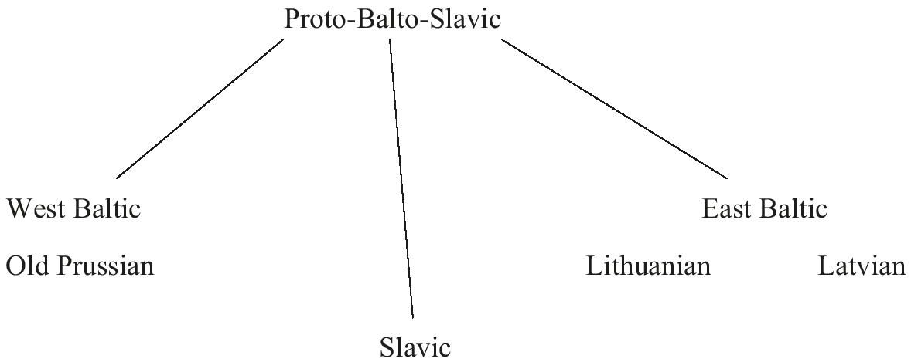
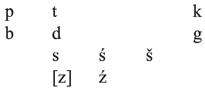
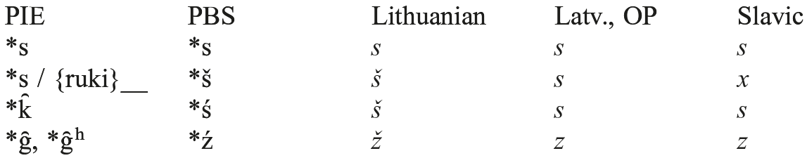
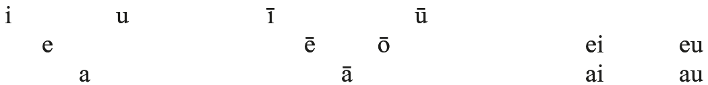
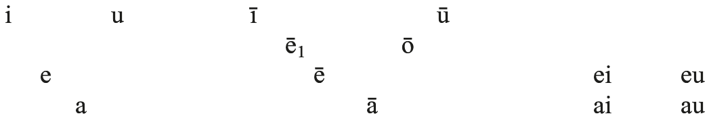
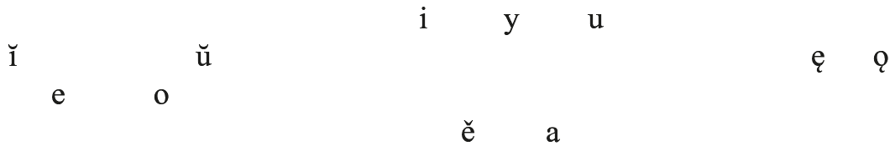
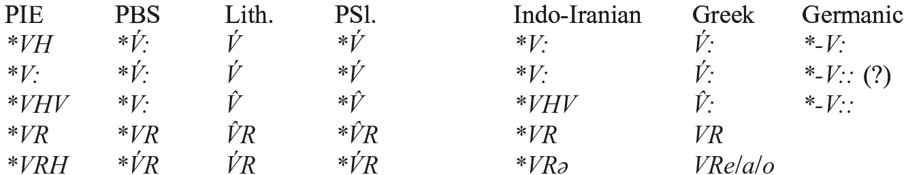

# 115. The phonology of Balto-Slavic

1.Introduction: the Balto-Slavic languages and Proto-Balto-Slavic

2.Consonants

3.Vowels and diphthongs

4.Prosodic phenomena and syllable structure

5.References

## 1. Introduction: the Balto-Slavic languages and Proto-Balto-Slavic

This chapter assumes a Balto-Slavic subgroup of Indo-European, as detailed in Petit, Balto-Slavic, of this handbook. Nevertheless, the internal subgrouping of Balto-Slavic has itself not yet been fully clarified. Thus, there are some indications that the Baltic languages themselves do not constitute a separate subgroup of Balto-Slavic, in opposition to or excluding Slavic. Rather, it appears that the three branches West Baltic, East Baltic, and Slavic have developed from a dialect continuum which gradually became differentiated during the last centuries BCE and the first half of the 1st millennium CE. Most of the relevant dialectological factors have been provided in the previous chapter, to which a few additional isoglosses, one from each of the three possible bilateral relationships within the continuum, may be added: West and East Baltic share the generalization of the 3sg. verb forms to the dual and plural and of *<i>-a-</i> (< PIE *<i>-o-</i>) as the thematic vowel. Slavic and East Baltic share the replacement of the initial <i>n-</i> of ‘nine’ with the <i>d-</i> of ‘ten’ (OCS <i>devętŭ</i>, Lith. <i>deviñtas</i> vs. OP <i>newīnts</i> ‘ninth’), while Slavic and West Baltic share the 1pl. pronoun gen. OCS <i>nasŭ</i>, OP <i>noūson</i> vs. Lith. <i>mū´sų</i>, Latv. <i>mũsu</i> with <i>m-</i>from the nominative. In our present state of knowledge, the best approximate <i>Stammbaum</i> for Balto-Slavic would look something like this:

The following presentation assumes a PIE phonological system that corresponds in all fundamentals to that of Mayrhofer (1986), to which the reader is referred.

## 2. Consonants

Proto-Balto-Slavic had the following reconstructible system of obstruents:

The phoneme *<i>s</i> had an allophone [z] before voiced stops, as already in PIE: cf. PIE *<i>mosgo-</i> > PBS *<i>masgas</i> [-zg-] > Lith. <i>mãzgas</i> ‘knot, node’, OCS <i>mozgŭ</i> ‘brain’. PBS inherited the PIE rule of regressive voicing assimilation, as in PBS inf. *<i>deg-téi</i> > Lith. <i>dègti</i> [-kt-], PSl. *<i>žet’i</i> ‘burn’ (with assimilation of the root-initial to the root-final consonant and regular Slavic reduction and palatalization of [kt] before a front vowel; OCS <i>žešti</i>) to the root *<i>deg-</i> < PIE *<i>dʰegʷʰ-</i>. PIE voiceless dental clusters *<i>t</i>+<i>t</i>, *<i>d</i>+<i>t</i> [tˢt] yielded PBS *<i>st</i>, as also in Greek and Iranian: cf. PIE pres. 3sg. *<i>h₁ḗd-ti</i> [tˢt] > PBS *<i>ḗsti</i> > OLith. <i>ė́sti</i>, PSl. *<i>jěstĭ</i> (OCS <i>jastŭ</i>) ‘eats’.

The PIE stops traditionally labeled “voiced” and “voiced aspirated” merged as voiced stops in Balto-Slavic, as also in Anatolian, Iranian, and Celtic. Thus PIE *<i>b</i> and *<i>bʰ</i> merged as PBS *<i>b</i> in PIE *<i>dʰub-u-</i> > PBS *<i>dubu</i>- > Lith. <i>dubùs</i> ‘deep’ and PIE *<i>bʰuH-</i>> PBS inf. *<i>bū´-</i> > Lith. <i>bū´ti</i>, OCS <i>byti</i> ‘be’; PIE *<i>d</i>, *<i>dʰ</i> > PBS *<i>d</i> in PIE *<i>deh₃</i>- > PBS inf. *<i>dṓ-</i> > Lith. <i>dúoti</i>, OCS <i>dati</i> ‘give’ and PIE *<i>dʰugh2tḗr</i> > PBS *<i>duktē</i> (with regular loss of laryngeal in a medial syllable followed by regressive voicing assimilation) > Lith. <i>duktė˜</i>, PSl. *<i>dŭt’i</i> (OCS <i>dŭšti</i>) ‘daughter’; PIE *<i>g̑</i>, *<i>g̑ʰ</i> > PBS *<i>ź</i> in PIE *<i>g̑ r̥Hno-</i>> PBS *<i>źírna-</i> >→ Lith. <i>žìrnis</i> ‘pea’, PSl. *<i>zĭrno</i> (OCS <i>zrŭno</i>) ‘corn’ and PIE *<i>g̑ʰwḗr-</i>>→ PBS *<i>źwḗri-</i> > Lith. <i>žvėrìs</i>, OCS <i>zvěrĭ</i> ‘wild animal’; PIE *<i>g</i>, *<i>gʰ</i> > PBS *<i>g</i> in PIE *<i>yugóm</i> > PBS *<i>jugan</i> > PSl. *<i>jĭgo</i> (OCS <i>igo</i>) ‘yoke’ (Lith. <i>jùngas</i> with secondary <i>-n-</i>) and PIE *<i>gʰordos</i> ‘enclosed area’ > PBS *<i>gardas</i> > Lith. <i>gar˜das</i>, PSl. *<i>gordŭ</i> (OCS <i>gradŭ</i>) ‘enclosure, fort; town’; and PIE *<i>gʷ</i>, *<i>gʷʰ</i> > PBS *<i>g</i> in PIE *<i>gʷén-h₂</i> ~ *<i>gʷn-éh₂-</i> ‘woman’ → *<i>gʷeneh₂</i> > PBS *<i>genā́</i> > OP <i>genna</i>, OCS <i>žena</i> ‘wife’ and PIE <i>gʷʰén-e-ti</i> ‘will strike’ > PBS *<i>genet(i)</i> >→ Lith. <i>gẽna</i>, OCS <i>ženetŭ</i> ‘drives’. This merger may have been preceded by a conditioned sound change, Winter’s Law (see 3).

The PIE velar and labiovelar stops merged in PBS, as in Indo-Iranian. In addition to the examples immediately above for PIE *<i>gʷ</i> and *<i>gʷʰ</i>, cf. PIE *<i>kʷ</i> > PBS *<i>k</i> in masc. nom. sg. *<i>kʷós</i> ‘which (rel.)’ > PBS *<i>kas</i> > Lith. <i>kàs</i>, OCS <i>kŭ(-to)</i> ‘who’, falling together with PIE *<i>k</i> > PBS *<i>k</i> in *<i>kruh₂-s-</i> ‘blood(y gore)’ > PBS *<i>krū´s</i> > PSl. *<i>kry</i> ‘blood’ (OCS <i>kry</i>, Slovenian <i>krî</i>), adj. *<i>krewh₂-yó-</i> > Lith. <i>kraũjas</i> ‘blood’.

The PIE palatal stops *and *<i>g̑</i>, *<i>g̑ ʰ</i> developed into anterior sibilants, probably alveopalatal; they are represented here by *<i>ś</i> and *<i>ź</i>. Balto-Slavic also has several examples of velars continuing PIE palatals (“<i>Gutturalwechsel</i>”). Cases like Lith. <i>akmuõ</i> ‘stone’ beside Lith. <i>ašmuõ</i> ‘(sharp) edge’ < PIE *<i>h₂ék̑-mōn</i> (cf. OCS <i>kamy</i>, acc. <i>kamenĭ</i> ‘stone’) or Lith. <i>klausýti</i> ‘listen’ beside OCS <i>slyšati</i> ‘hear’ (to the PIE root *<i>lew-</i>) suggest that pre-PBS exhibited some variation in this regard; perhaps the palatalization of PIE palatal stops began in the east of the (Late) IE-speaking area, in the dialects ancestral to Indo-Iranian, and spread to most but not all pre-PBS dialects. (For recent literature on this and other controversial issues in BS phonology, see Hock 2004, 2006: 11−12.)

In addition, *<i>s</i> was retracted (probably to a palatoalveolar sibilant, here denoted *<i>š</i>) when preceded by *<i>i</i>, *<i>u</i>, *<i>k</i>, or *<i>r</i>. The operation of this sound change (the famous “ruki-rule”, also known from Indo-Iranian) is consistent in Slavic, where it accounts for alternations such as locative pl. <i>o</i>-stem *<i>-ěxŭ</i>, <i>i</i>-stem *<i>-ĭxŭ</i>, <i>u</i>-stem *<i>-ŭxŭ</i> vs. <i>ā</i>-stem *<i>-asŭ</i> (Old Czech <i>-as</i>; replaced elsewhere by *<i>-axŭ</i>) < *<i>-oy-su</i>, *<i>-i-su</i>, *<i>-u-su</i>, *<i>-eh₂-su</i>, or OCS <i>s</i>-aorist 1sg. <i>rěxŭ</i> ‘I said’, PSl. *<i>u-merxŭ</i> ‘I died’ (OCS <i>umrěxŭ</i>) < *<i>rēk-s-</i>, *<i>mer-s-</i> vs. OCS <i>věsŭ</i> ‘I led’, <i>ęsŭ</i> ‘I took’ < *<i>wēd-s-</i>, *<i>ēm-s-</i>. It is much less regular in Lithuanian, especially after *<i>i</i> and *<i>u</i>, but examples do exist, e.g. <i>maĩšas</i> ‘sack’, <i>jū´šė</i> ‘(fish) soup’ (OCS <i>měxŭ</i> ‘bag, animal skin’, Russ. <i>juxa</i> ‘soup’). The exact historical and dialectological interpretation of these facts, along with the treatment of sequences such as *<i>sk̑</i>, remains controversial.

The subsequent development of PBS *<i>s</i>, the “ruki” product *<i>š</i>, and *<i>ś</i>, *<i>ź</i> (the reflexes of the PIE palatals) is given below.

In other words, Lithuanian merges PBS *<i>š</i> and *<i>ś</i>, whereas Slavic merges *<i>s</i> and *<i>ś</i>, and in Latvian and Old Prussian all three voiceless sounds fall together as <i>s</i>. Lith. <i>z</i> in native vocabulary is thus confined to the position before a voiced stop, where it reflects the PIE voiced allophone of <i>*s</i> (e.g. <i>mãzgas</i> ‘knot’ or <i>lìzdas</i> ‘nest’ ← *<i>nisdas</i> < PIE *<i>ni-sd-ó-</i>); it has become a phoneme through numerous borrowings from Polish, German, and other languages.

<!-- source-file: content/12_chapter06_2.xhtml -->

PIE word-final *<i>-s</i> survived, but word-final [-d] (underlyingly *<i>-t</i> or *<i>-d</i>) was lost in PBS, as in most other IE languages: cf. PIE neut. nom./acc. sg. *<i>tod</i> > PBS *<i>to</i> (OCS <i>to</i>), PIE 3sg. secondary ending *<i>-d</i> > PBS <i>* -Ø</i> (e.g. in OCS thematic aorist <i>reč-e</i> ‘s/he said’ < *<i>-e-d</i>), PIE <i>o</i>-stem ablative sg. *<i>-e-ad</i> > PBS *<i>-ā</i> (Lith. <i>-o</i>, OCS <i>-a</i>). PIE *<i>-m</i> merged with *<i>-n</i> in word-final position, as in Anatolian, Greek, and Celtic: cf. <i>o</i>-stem acc. sg. *<i>-om</i> > PBS *<i>-an</i> > OP <i>-an</i> in e.g. <i>rikij-an</i> ‘Lord’ (Lith. <i>-ą</i>, OCS <i>-ŭ</i>).

Syllabic *<i>i</i>, *<i>u</i> and nonsyllabic *<i>y</i>, *<i>w</i> were probably already separate phonemes in PIE (Mayrhofer 1986: 160−161); the same may have been true for the liquids and nasals. The sonorants *<i>m</i>, *<i>n</i>, *<i>r</i>, *<i>l</i>, *<i>w</i>, and *<i>j</i> generally continue their PIE counterparts *<i>m</i>, *<i>n</i>, *<i>r</i>, *<i>l</i>, *<i>w</i>, and *<i>y</i>.

Balto-Slavic languages are known for yodization and palatalization effects, but none of these can be securely dated back to the PBS stage. Lithuanian and especially Latvian and Slavic have undergone numerous developments of consonant + <i>j</i> sequences, which have resulted in new phonemes and paradigmatic alternations. After the breakup of Proto-Slavic, many Slavic languages also acquired contrastive palatalization in the consonant system. Among the modern languages, Polish and Russian show the most extensive range of contrasts; in others, such as Czech or Serbo-Croatian, palatalization plays a much smaller role.

## 3. Vowels and diphthongs

Proto-Balto-Slavic had the following reconstructible system of vowels and diphthongs. (On sequences of vowel + sonorant [i.e. *<i>ir</i>, *<i>il</i>, *<i>im</i>, *<i>in</i>, *<i>ar</i>, *<i>al</i>, etc.], which also behave as diphthongs, see 4.)

Post-PIE *<i>o</i> and *<i>a</i> merged in PBS as *<i>a</i>, e.g. PIE *<i>h₃ékʷ-</i> > *<i>okʷ-</i> > PBS *<i>ak-</i> >→ Lith. <i>akìs</i>, OCS <i>oko</i> ‘eye’, PIE *<i>pótis</i> > PBS *<i>patis</i> > Lith. <i>(viẽš-)pats</i> ‘master’ like PIE *<i>h₂ek̑s-</i> > *<i>ak̑s-</i> >→ PBS *<i>aśi-</i> > Lith. <i>ašìs</i>, OCS <i>osĭ</i> ‘axle’, PIE *<i>sal-</i> → PBS *<i>sali-</i> > OCS <i>solĭ</i> ‘salt’. The Slavic raising and rounding to PSl. *<i>o</i> appears to be a late development of the mid- to late 1st millennium CE: cf. Byzantine Gr. Σκλαβηνοί ‘Slavs’ ← pre-PSl. *<i>slavěn-</i> or the borrowing of Σαλον(ίκη) ‘Salonica’ as *<i>salunŭ</i> > OCS <i>Solunŭ</i>. While the former shows that pre-PSl. still had an <i>*a</i>, the latter strongly suggests that it lacked <i>*o</i>.

The two non-high short vowels *<i>a</i> and *<i>e</i> remained distinct in PBS, but were confused and merged under certain (not always clear) conditions in the separate languages. Word-initial *<i>a-</i> and *<i>e-</i> exhibit complex geographic and diachronic variation in Slavic and Lithuanian (e.g. OLith. <i>eš</i> vs. modern standard <i>àš</i> ‘I’, general Slavic <i>(j)e-</i> vs. Russ. <i>o-</i> in e.g. <i>odín</i> ‘one’, <i>olén’</i> ‘deer’), some of which may go back to the PBS period (Andersen 1996). Before *<i>w</i>, *<i>e</i> > *<i>a</i> in Slavic, as in PIE *<i>néwo-</i> > PBS *<i>newa-</i> > OCS <i>novŭ</i> ‘new’ or PIE non-neuter <i>u</i>-stem nom. pl. *<i>-ew-es</i> > OCS <i>-ove</i>, and in some cases in East Baltic, e.g. Lith. <i>tãvas</i>, Latv. <i>tavs</i> ‘your (sg.)’ < *<i>tewas</i>. East Baltic shows several instances of assimilation of *<i>e</i> to *<i>a</i>, e.g. Lith. <i>vãkaras</i>, Latv. <i>vakars</i> vs. OCS <i>večerŭ</i> ‘evening’. There is no evidence for regular syncope of short vowels in PBS, although variable syncope is attested in numerous Lithuanian forms, e.g. dial. <i>dvéitas</i>, <i>tréitas</i> < <i>dvẽjetas</i>, <i>trẽjetas</i> ‘group of two, three’, OLith. <i>élnis</i> ~ <i>elenis</i> ‘deer’ (modern <i>élnias</i>).

As in all other non-Anatolian branches, sequences of vowel + laryngeal before consonants and word boundaries yielded long vowels. Word-initial laryngeals disappeared without reflex, e.g. in PIE *<i>h₃bʰrúHs</i> >→ PBS *<i>bruwi-</i> > Lith. <i>bruvìs</i>, OCS <i>brŭvĭ</i> ‘eyebrow’. In phrase-final position, laryngeals appear to have been lost without compensatory lengthening already in PIE, which accounts for the contrast between <i>eh</i>₂-stem nom. sg. PIE *<i>-eh₂</i> > PBS *<i>-ā́</i> > Lith. <i>-a</i> ~ <i>-o-</i> (with shortening in final syllables by Leskien’s Law, see below), OCS <i>-a</i> and voc. sg. PIE *<i>-eh₂</i> > PBS *<i>-a</i> > Lith. <i>-a</i>, OCS <i>-o</i> (cf. Lith. <i>rankà</i>, OCS <i>žena</i> vs. Lith. <i>rañka</i>, OCS <i>ženo</i>). Intervocalic laryngeals were also lost, and the resulting sequence of vowels underwent contraction, except that *<i>iHV</i>, *<i>uHV</i> > *<i>ijV</i>, *<i>uwV</i> (Smoczyński 2003). On the prosodic effects of laryngeals in Balto-Slavic, see 4.

Laryngeals between obstruents in an initial syllable yielded PBS *<i>a</i>, as elsewhere in IE apart from Anatolian, Indo-Iranian, and in part Greek, although examples are few: cf. Lith. <i>stãtas</i> ‘line of sheafs of grain in a field’, Latv. <i>stats</i> ‘stake, post’ < PBS *<i>stata-</i>‘stood (up)’ < PIE *<i>sth₂-tó-</i> to *<i>steh₂-</i> ‘stand’. They were lost in non-initial syllables, e.g. PIE *<i>dʰugh2tḗr</i> → PBS *<i>duktē</i> > Lith. <i>duktė˜</i>, OCS <i>dŭšti</i> ‘daughter’ (see above) or PIE *<i>h₂érh₃tro-</i> → PBS *<i>ártlo-</i> > Lith. <i>árklas</i>, PSl. *<i>órdlo</i> (OCS <i>ralo</i>) ‘plow’ (with acute intonation on the preceding diphthong, see 4).

Post-PIE *<i>ō</i> and *<i>ā</i> remained distinct in PBS and East Baltic, as shown by Lith. <i>dúoti</i>, Latv. <i>dôt</i> (<i>duôt</i>) ‘give’ < PBS *<i>dṓtéi</i> vs. Lith. <i>móteris</i> ‘lady’ (older <i>mótė</i>), Latv. <i>māte</i> ‘mother’ < PBS *<i>mā́tē</i>, Lith. <i>stóti</i>, Latv. <i>stât</i> ‘stand up’ < PBS *<i>stā́téi</i>. The fate of *<i>ō</i> and *<i>ā</i> in Old Prussian is more complicated: the two vowels apparently merged, but the product is usually written <i>o</i> in the Elbing Vocabulary of c. 1400 (e.g. <i>brote</i> ‘brother’) and <i>a</i> in the 16th-century Catechisms (e.g. <i>brāti</i> ‘id.’), except after nasals, where we find <i>u</i> (<i>mūti</i> ‘mother’). In Slavic, PBS *<i>ō</i> and *<i>ā</i> merge as *<i>a</i> [ā]: cf. OCS <i>dati</i> < PBS *<i>ō</i>, OCS <i>mati</i>, <i>stati</i> < PBS *<i>ā</i>.

Winter (1978) proposed that PIE short vowels were lengthened in pre-PBS when immediately followed by voiced unaspirated stops, but not when followed by voiced aspirates. Cf. e.g. PIE *<i>ud-r-eh₂</i> > PBS *<i>ū´drā́-</i> > Lith. <i>ū´dra</i>, OCS <i>vydra</i> ‘otter’ and (post-)PIE *<i>nogʷo-</i> > PBS *<i>nṓgas</i> > Lith. <i>núogas</i>, OCS <i>nagŭ</i> ‘naked’ vs. PIE *<i>nébʰos</i> > PBS *<i>nebas</i> > OCS <i>nebo</i> ‘sky’, → Lith. <i>debesìs</i> ‘cloud’ and PIE *<i>médʰu</i> > PBS *<i>medu</i> > Lith. <i>medùs</i>, OCS <i>medŭ</i> ‘honey’ (but note PIE *<i>wód-r̥</i> ~ *<i>wéd-n-</i>→ pre-PBS *<i>wad-n-</i> → Lith. <i>vanduõ</i>, OCS <i>voda</i> ‘water’, without the predicted lengthening). Probably most specialists today believe in Winter’s Law, but there is widespread disagreement over the precise conditioning environments; see the references in Hock (2004: 4−6).

The PIE syllabic sonorants *<i>r̥</i>, *<i>l̥</i>, *<i>m̥</i>, *<i>n̥</i> became *<i>iR</i> in most cases: cf. PIE *<i>mér-ti-</i> ~ *<i>mr̥-téy-</i> → *<i>mr̥-ti-</i> > PBS *<i>mirti-</i> > Lith. <i>mirtìs</i>, PSl. *<i>sŭ-mĭrtĭ</i> (OCS <i>sŭmrŭtĭ</i>) ‘death’, PIE *<i>wĺ̥kʷos</i> > PBS *<i>wilkas</i> > Lith. <i>vi[image-glyph: l with tilde] kas</i>, PSl. *<i>vĭlkŭ</i> (OCS <i>vlŭkŭ</i>) ‘wolf’, PIE *<i>m̥ tóm</i> > PBS *<i>śimtan</i> → Lith. <i>šim˜tas</i> ‘hundred’ (OCS <i>sŭto</i>), PIE *<i>ménti-</i> ~ *<i>mn̥-téy-</i> ‘mind, thought’ → *<i>mn̥-ti-</i> > PBS *<i>minti-</i> > Lith. <i>mintìs</i> ‘mind’, OCS <i>pa-mętĭ</i> ‘memory’. In the case of *<i>m̥</i> and *<i>n̥</i>, this development had widespread implications in the nominal system, as the development of PIE acc. sg. *<i>-m̥</i>, pl. *<i>-n̥s</i> to *<i>-im</i>, *<i>-ins</i> led to the transfer of root-nouns to <i>i</i>-stem inflection (e.g. PIE *<i>nókʷt-</i> ~ *<i>nékʷt-</i> → PBS *<i>nakti-</i> > Lith. <i>naktìs</i>, PSl. *<i>not’ĭ</i> [OCS <i>noštĭ</i>] ‘night’) and the generalization of suffixal *<i>-i-</i> in consonant-stem endings (e.g. pl. dat. *<i>-i-mus</i>, instr. *<i>-i-mī́s</i>, loc. *<i>-i-su</i>). A second, less frequent outcome *<i>uR</i> occurs largely in words of obscure etymology, without good cognates in other IE languages. Stang (1966: 77−82) points out that many examples of *<i>uR</i> have expressive and/or pejorative value, e.g. Lith. <i>kum˜ pas</i> ‘crooked’, <i>pur˜vas</i> ‘dirt’.

Along with the merger of PIE *<i>o</i> and *<i>a</i>, the diphthongs *<i>oi</i> and *<i>ai</i> merged as *<i>ai</i>, and similarly *<i>ou</i> and *<i>au</i> merged as *<i>au</i>. PBS thus inherited *<i>ei</i>, *<i>eu</i> and *<i>ai</i>, *<i>au</i>, and the distinction between front and back diphthongs is reflected in Old Prussian, e.g. <i>deiwas</i>, <i>deiws</i> ‘god’ vs. <i>snaygis</i> ‘snow’. In East Baltic, *<i>eu</i> became *<i>jau</i>, while both *<i>ai</i> and *<i>ei</i> were monophthongized under as yet unclear conditions to a tense higher-mid vowel, usually noted *<i>ē₁</i> (in contrast to *<i>ē</i> < PBS *<i>ē</i>). This *<i>ē₁</i> then developed into a falling diphthong <i>ie</i> in Lithuanian and Latvian; likewise, *<i>ō</i> became the falling back diphthong <i>uo</i> (cf. Petit, The phonology of Baltic, this handbook, 2.6, with references). Later changes restricted to Lithuanian include the raising of *<i>ā</i> to [oː] and denasalization of *<i>in</i>, *<i>un</i>, *<i>en</i>, *<i>an</i> to [i:], [u:], [ɛ:], [ɑ:] in word-final position and before sibilants; the latter change created two new long vowel phonemes, spelled <i>ę</i> and <i>ą</i>. Latvian has eliminated tautosyllabic nasal diphthongs (*<i>iN</i>, *<i>eN</i> > <i>ie</i>; *<i>uN</i>, *<i>aN</i> > <i>o</i> [uo]) and created a new contrast between <i>e</i> and <i>ę</i>, originally allophones of *<i>e</i>.

Proto-East-Baltic vowel system

Old Prussian preserves the four semivowel diphthongs, as just noted, but shows a tendency in the 16th century toward diphthongization of the PBS long high vowels: <i>ī</i> [i:] > <i>ij</i> [ĭj] > <i>ei</i> [ej] (e.g. *<i>gī́wa-</i> > <i>gijwan</i>, <i>geīwan</i> ‘living’), and <i>ū</i> [u:] > [ŭw] > <i>ou</i> [ow] (e.g. *<i>sū´nus</i> > <i>soūns</i> ‘son’). The Enchiridion also attests raising of <i>ē</i> to <i>ī</i>, e.g. inf. <i>turrītwey</i> ‘have’ < *<i>tur-ē-</i> (Lith. <i>turė́ti</i>). These changes, like those affecting East Baltic, are consistent with a division of phonological space into peripheral and nonperipheral tracks, with mid long vowels rising and high long vowels turning into diphthongs and falling, much as in the history of English or German, or in modern eastern Latvian dialects (Levin 1975, 1976; Labov 1994: 131−132, 133−135).

In pre-Proto-Slavic, *<i>eu</i> apparently also became *<i>(j)au</i>, followed by the monophthongization of *<i>ei</i> > *<i>ī</i> and of *<i>au</i> > *<i>ū</i>; inherited PBS *<i>ū</i> was unrounded and perhaps fronted to *<i>ȳ</i> ([ɯ:] or [ɨ:]). A later change merged *<i>ai</i> with the reflex of PBS *<i>ē</i> as PSl. *<i>ě</i>, almost certainly a tense low front vowel [æ:]. Sequences of tautosyllabic vowel + nasal yielded nasalized vowels, with *<i>iN</i>, *<i>eN</i> > *<i>ę</i> and *<i>uN</i>, *<i>aN</i> > *<i>ǫ</i>. The merger of PBS *<i>ā</i> and *<i>ō</i> as PSl. *<i>a</i> has been referred to above. The inherited short vowels were centralized, with *<i>a</i> raised and rounded to *<i>o</i> (see above), and *<i>i</i> and *<i>u</i> becoming hypershort vowels, the “jers”; many of the latter were lost after the PSl. period (see 4 ad fin.). Because the PSl. long and short vowels were thus distinct in quality, the former are traditionally written without length marks, so that *<i>i</i>, *<i>ǫ</i>, etc. stand for *<i>ī</i>, *<i>ǭ</i>, etc.

Proto-Slavic vowel system

Aside from the loss of final *<i>-d</i> and *<i>-m</i> > *<i>-n</i>, few distinctive <i>Auslautgesetze</i> may be projected back to the PBS stage. Word-final *<i>-i</i> apparently underwent early apocope in the <i>ā</i>-stem instr. sg. ending: pre-PBS *<i>-eh₂-mi</i> (cf. <i>i</i>-stem *<i>-i-mi</i>, <i>u</i>-stem *<i>-u-mi</i>) > PBS *<i>-ā́n</i> > Lith. <i>-à</i>, adj. <i>-ą́-</i> (e.g. <i>baltà</i>, definite <i>baltą́-ja</i>), OCS <i>-oj-ǫ</i> (originally pronominal). The same apocope later occurred in the Slavic 1sg. present ending: PIE *<i>-o-h₂</i> > PBS *<i>-ṓ</i> (Lith. <i>-ù</i>, <i>-úo-</i>) → *<i>-ṓmi</i> > *<i>-ōm</i> > OCS <i>-ǫ</i>. Other thematic present endings may also have been variably affected as early as the PBS stage, e.g. PIE 3sg. *<i>-eti</i> > PBS *<i>-eti</i> ~ *<i>-et</i> > pre-PSl. *<i>-etĭ</i> ~ *<i>-et</i> → PSl. *<i>-etĭ</i> ~ *<i>-etŭ</i> ~ *<i>-e</i> (OCS <i>-etŭ</i>, ORuss. <i>-etĭ</i>, OCz. <i>-e</i>), PBS *<i>-eti</i> ~ *<i>-et</i> → *<i>-at</i> > Lith. <i>-a</i>. Following the PBS stage, Lithuanian shortened word-final acute long vowels and diphthongs (Leskien’s Law), while Latvian and Slavic independently underwent a whole range of special developments in final syllables. Old Prussian generally preserves PBS final syllables, as far as the evidence reveals, except that final *<i>-as</i> was weakened to [-ĭs] and even [-s], e.g. in PBS *<i>deiwas</i> > <i>deywis</i> (1x, Elbing Vocabulary), <i>deiws</i> ‘god’, PBS *<i>snaigas</i> > <i>snaygis</i> ‘snow’; cf. also PBS *<i>sū´nus</i> > <i>soūns</i> ‘son’, seen above.

## 4. Prosodic phenomena and syllable structure

The reconstruction of BS prosodic history is unquestionably the most complex and controversial area in all of BS historical linguistics. I present here only the essential facts on which there is general agreement, and point out some major points of continuing controversy. For further details, see Stang (1957, 1966: 120 ff.); Garde (1976); Dybo (1981); Dybo, Zamjatina, and Nikolaev (1990); and Lehfeldt (2001); as well as the articles of Kortlandt (e.g. 1977, 1978, 1985), Derksen (1991), and Jasanoff (2004, 2008), among many others.

According to the traditional conception, PBS long vowels and diphthongs could carry one of two underlying intonations, “acute” (Fr. <i>rude</i>, Ger. <i>Stoßton</i>) and “circumflex” (Fr. <i>douce</i>, Ger. <i>Schleifton</i>). However, acuteness is better understood as a privative feature: the two types of syllable heads, acute and nonacute, were distinguished by the presence or absence respectively of certain phonetic properties characteristic of acute syllables. The main such property was probably glottalization, comparable to the Danish <i>stød</i> and apparently preserved in the broken tone of modern Latvian, which reflects the PBS acute in certain environments (see below). In addition, acute syllables may have had rising pitch and nonacute syllables rising-falling pitch (cf. the situation in ancient Greek, where an intonational contrast has arisen independently from PIE), but these tonal contours themselves were phonologically redundant. Balto-Slavic is unique among IE branches in treating not only vowel + glide combinations, but also sequences of vowel + liquid or nasal as diphthongs for prosodic purposes. Short vowels patterned phonologically with nonacute long vowels and diphthongs, likewise lacking the glottalization which marked acuteness.

The two-way opposition of acute and nonacute (circumflex) is directly reflected in the Baltic languages. In the Old Prussian Third Catechism, many stressed diphthongs are printed with a macron over the first or second vowel; the latter correspond to PBS acute diphthongs, the former to circumflex, e.g. inf. <i>boūt</i> ‘be’ vs. inf. <i>ēit</i> ‘go’ (cf. Lith. <i>bū´ti</i> vs. <i>eĩti</i>). The same pattern must also have held for vowel + sonorant diphthongs, but only circumflex examples are attested, e.g. acc. sg. <i>rānkan</i> ‘hand’ (Lith. <i>rañką</i>), doubtless because macrons over <i>m</i>, <i>n</i>, <i>r</i>, <i>l</i> were beyond the range of Abel Will’s typesetter. Standard Lithuanian has famously “reversed” the phonetics of the two intonations, so that historically acute and circumflex syllables stress the first and second mora respectively. Some Žemaitian dialects of the coastal lowland maintain intonations on unstressed long vowels and diphthongs, but other dialects and the standard language have restricted the surface contrast to stressed syllables. In Latvian, where almost all words carry initial stress, PBS circumflex long vowels and diphthongs have become falling (V̀), e.g. in <i>dràugs</i> ‘friend’, <i>rùoka</i> ‘hand’ (cf. Lith. <i>draũgas</i>, acc. sg. <i>rañką</i>); the reflexes of old acutes have either “sustained” (V́) or “broken”, i.e. glottalized intonation (Vˆ), depending on the original accentual paradigm of the form (see below). This system is preserved only in some central Latvian dialects; those of eastern and western Latvia have reduced the three-way opposition to a binary contrast.

The acute-nonacute contrast is also securely reconstructible for Proto-Slavic, although none of the present-day Slavic languages continues it as such; intonations must be recovered from the accentual paradigm of the form in question, as well as vowel length and place of stress. Free (lexical) stress is preserved in East Slavic, most South Slavic dialects, and the now extinct Slovincian, spoken until the early 20th century just west of Danzig. Phonemic vowel length was lost relatively early in East Slavic and eastern South Slavic, but survives in western South Slavic, Czech, and Slovak; it was lost in early modern Polish, but has left important reflexes in the contemporary standard language and dialects. Contrastive surface intonations are attested across most of the western South Slavic area, but no dialect directly reflects the Proto-Slavic system described immediately below. Based on the modern languages, as well as medieval documents which mark stress (e.g. the Čudov New Testament of 1354), we may postulate three intonations for the period immediately following Proto-Slavic: acute, circumflex, and neoacute, which arose through retraction of stress from a jer to the preceding syllable. Standard examples are: acute PSl. *<i>'lípa</i> > Russ. <i>lípa</i>, SC <i>lȉpa</i>, Cz. <i>lípa</i> ‘linden’; circumflex PSl. *<i>zî'ma</i> > Russ. <i>zimá</i>, SC <i>zíma</i>, čakavian <i>zīmȁ</i>, Cz. <i>zima</i> ‘winter’; and neoacute (Old High German <i>Karl</i> →) PSl. *<i>kor'l’ĭ</i> > *<i>kõrl’</i> > Russ. <i>koról’</i>, SC <i>krâlj</i>, čakavian <i>králj</i>, Cz. <i>král</i>, Pol. <i>król</i> ‘king’ (cf. gen. *<i>kor'l’a</i> > Russ. <i>korol’á</i>, SC <i>králja</i>, čakavian <i>krāljȁ</i>).

Acute intonation in PBS usually reflects the prior existence of a tautosyllabic laryngeal in PIE: cf. PIE *<i>bʰ</i>uh₂- ‘be’, *<i>deh₃-</i> ‘give’ > PBS inf. *<i>'bū´téi</i>, *<i>'dṓtéi</i> > Lith. <i>bū´ti</i>, <i>dúoti</i>, PSl. *<i>'býti</i>, *<i>'dáti</i> (SC <i>bȉti</i>, <i>dȁti</i>) or, in word-final position, the primary 1sg. ending PIE *<i>-oh₂</i> > PBS *<i>-ṓ</i> > Lith. <i>-ù</i>, refl. <i>-úo-s(i)</i>. In sequences of the type *VRHC, the laryngeal was lost in PBS, but left its trace in the acute intonation of the preceding diphthong, so that *VRHC > PBS *V́RC contrasts with *VRC > PBS *VRC. Cf. PIE *<i>g̑énh₁-to-</i> ‘relative’ > PBS *<i>'źéntas</i> > Lith. <i>žéntas</i>, PSl. *<i>'zé˛tŭ</i> (SC <i>zȅt</i>) ‘son-in-law’, PIE *<i>pl̥h₁-nó-</i> > PBS *<i>'pílna</i>- > Lith. <i>pìlnas</i>, PSl. *<i>'pĭ́lnŭ</i> (SC <i>pȕn</i>) ‘full’ (both showing Hirt’s Law, whereby stress was shifted to a preceding acute syllable in pre-PBS) vs. PIE *<i>g̑ʰéy-ōm ~ *g̑ʰi-m- ́</i>→ PBS *<i>źei'mā́</i> > Lith. <i>žiemà</i>, PSl. *<i>zî'ma</i> (SC <i>zíma</i>) ‘winter’, PIE *<i>wĺ̥kʷos</i> > PBS *<i>wilkas</i> > Lith. <i>vi[image-glyph: l with tilde] kas</i>, PSl. *<i>vîlkŭ</i> (SC <i>vûk</i>) ‘wolf’. On the other hand, sequences *VHV contracted to circumflex long vowels and diphthongs in PBS (in the following examples unmarked), as in PIE <i>eh</i>₂-stem gen. sg. *<i>-eh₂-es</i> > PBS *<i>-ās</i> > Lith. <i>-õs</i>. The outcome of PIE lengthened grades (i.e. original long vowels not followed by a laryngeal) is debated; most scholars going back to de Saussure have assumed that they too became acute, but Kortlandt (1985) has proposed that they became circumflex. They do seem to have yielded circumflex long vowels in final position, judging from <i>n</i>-stem *<i>-ō</i> > PBS <b>*<i>-</i></b><i>ō</i> (Lith. <i>akmuõ</i>; OCS <i>kamy</i> ‘stone’) and <i>r</i>-stem *<i>-ō</i>, *<i>-ē</i> (with loss of <i>*-r</i> after the <i>n</i>-stems, as in Indo-Iranian) > PBS <b>*<i>-</i></b><i>ō</i>, <b>*<i>-</i></b><i>ē</i> (Lith. <i>sesuõ</i> ‘sister’, <i>duktė˜</i>, OCS <i>dŭšti</i> ‘daughter’; Jasanoff 1983). Proto-Slavic seems to have shortened all word-final long vowels, although scholars have posited intonationally conditioned rules to account for endings such as the infamous Serbo-Croatian gen. pl. <i>-ā</i>. These developments are summarized in the table below, along with the reflexes in Indo-Iranian, Greek, and Germanic (final syllables only; V: = bimoric, V:: = trimoric, the latter proposed by Jasanoff 2002).

The BS languages, particularly East Baltic, contain numerous examples of derivatives with the opposite intonation to their corresponding base forms. This phenomenon, traditionally called metatony, was first described by de Saussure (1896): cf. with “métatonie douce” Lith. <i>áukštas</i> ‘high’: <i>aũkštis</i> ‘height’, <i>stóti</i> ‘stand up’: <i>stõtas</i> ‘shape, stature’; and with “métatonie rude” <i>vi[image-glyph: l with tilde] kas</i> ‘wolf’: <i>vìlkė</i> ‘she-wolf’, <i>var˜nas</i> ‘raven’: <i>várna</i> ‘crow’ (likewise PSl. *<i>vôrnŭ</i> ‘black, raven’: *<i>vórna</i> ‘crow’, cf. SC <i>vrân</i>, <i>vrȁna</i>). Such alternations appear to have arisen <i>inter alia</i> through retraction of stress from certain short vowels, principally prevocalic *<i>i</i> and word-final *<i>-a(s)</i>, but they have become morphologized in complex ways (see Stang 1966: 144−169; Derksen 1996).

Scholars of BS accentology distinguish accentual paradigms (APs) in Lithuanian and those Slavic languages which retain lexical stress, e.g. Russian and Serbo-Croatian. De Saussure (1894) brilliantly discovered that the four accentual classes of Lithuanian may be derived from two underlying APs, columnar and mobile; the stress was shifted rightwards in pre-Lithuanian from a nonacute syllable (i.e. a short vowel, or a circumflex long vowel or diphthong) to an immediately following acute. The same contrast of barytone vs. mobile may be assumed for pre-Latvian, and is reflected in the distribution of sustained and broken intonations on old acute initial syllables: cf. <i>vĩrs</i> ‘man’, <i>liẽpa</i> ‘linden’ (Lith. <i>výras</i>, <i>líepa</i>) vs. <i>galˆva</i> ‘head’, <i>sirˆds</i> ‘heart’ (Lith. <i>galvà</i>, <i>širdìs</i>, acc. <i>gálvą</i>, <i>šìrdį</i>).

In contrast, Proto-Slavic had three APs, generally labeled <i>a</i> (columnar on the stem), <i>b</i> (postaccenting, i.e. columnar on the first syllable after the stem), and <i>c</i> (mobile) after the classification of Stang (1957). Dybo and Illič-Svityč showed that APs <i>a</i> and <i>b</i> are in complementary distribution depending on the prosodic properties of the presuffixal syllable, and proposed a forward stress shift from nonacute vowels (“Dybo’s Law”). However, the exact relation between the East Baltic and Slavic systems, and their evolution from PIE, are still far from clarified; see Illič-Svityč (1963) and the works cited above. The evidence of the OP Third Catechism is unsurprisingly sparse, and its interpretation encounters numerous difficulties, but there are indications that Old Prussian may have preserved archaic features lost in the other Baltic languages, e.g. a postaccenting type in the noun, equivalent to Slavic AP <i>c</i>, or alternating stress in the simple thematic presents (Stang 1966: 287 ff., 451−453).

The synchronic analysis of the BS accentual system has attracted much attention over the last generation. According to one popular theory, syllable nuclei in PBS words (excepting the so-called enclinomena, see below) were underlyingly specified as accented or unaccented, in addition to acute or nonacute intonation for long vowels and diphthongs. The prosodic domain for stress computation consisted of a nominal or verbal form with any associated preposed and postposed modifiers, e. g. prepositions, the negator *<i>ne</i>, or enclitic particles like PSl. *<i>že</i>. Within each domain, the first underlyingly accented syllable received surface stress; if no syllable heads were accented − i.e. the domain as a whole was underlyingly unaccented, or an “enclinomenon” − stress was automatically assigned to the first syllable. This system survives today, with various restrictions and modifications, in Slavic languages such as Russian or Serbo-Croatian, as well as Lithuanian: thus e.g. Russian contrasts nom. sg. /gor á/ <i>gorá</i> ‘mountain’ (with underlyingly accented ending) with acc. sg. /gor u/ <i>góru</i> and the (fixed) prepositional phrase /na gor u/ <i>ná goru</i>, in which all morphemes are unaccented. For further discussion, see Halle and Idsardi (1995), Halle (1997) and the references cited there.

The syllable structure of PBS appears to have been much the same as that of PIE, and is largely preserved in Old Prussian and (except for the denasalization of some nasal diphthongs) modern Lithuanian. Latvian has eliminated nasal diphthongs and lost most short vowels in final syllables, but is otherwise not radically different in its phonotactics from the more conservative Baltic languages. In contrast, pre-Proto-Slavic during the 1st millennium CE evolved toward a system in which nearly all syllables were open; in addition to the loss of word-final consonants (see 2) and elimination of PBS vowel + glide and vowel + nasal diphthongs, word-internal consonant clusters were simplified, e.g. (post-)PIE *<i>pokʷ-tos</i> > PBS *<i>paktas</i> > OCS <i>potŭ</i> ‘sweat’, post-PIE *<i>supnos</i> > PBS *<i>supnas</i> > OCS <i>sŭnŭ</i> ‘sleep’. The subsequent loss of many jers drastically altered this situation, and gave rise to the complex consonant clusters typical of many modern Slavic languages: cf. Russ. <i>mgla</i>, Pol. <i>mgła</i> ‘fog’ < *<i>mĭgla</i>, Pol. <i>Gdańsk</i> < *<i>Gŭdanĭskŭ</i>, Cz. <i>čtvrt</i> ‘quarter’ < PSl. *<i>čĭtvĭrtĭ</i>, Pol. <i>spadł</i>, Cz. <i>spadl</i> ‘he fell (down)’ < *<i>jĭzŭpadlŭ</i>.
