## XX. Proto-Indo-European

# 121. The phonology of Proto-Indo-European

0.Introduction

1.Vowels

2.Resonants

3.Obstruents

4.Prosody

5.Conspiracies

6.Explanation of symbols

7.References

## 0. Introduction

The following presents a concise but comprehensive synchronic and diachronic sketch of what I believe late PIE to have sounded like, both at the surface and below.

I will make a clear notational distinction between the underlying (phonological) form, written between slanted lines (e.g., */h₂eg̑tos/ ‘driven’), and the reconstructed surface (phonetic) form written in italics (e.g., *<i>h₂ak̑tos</i>). The former will not always be provided, but, as illustrated in this example, the two representations need not be the same. Sound laws and certain important concepts will be referenced by Greek letters in parentheses, such as (α).

There are a number of works which examine the phonology of PIE but very few that devote themselves exclusively to this topic. Students should begin with the more recent abridged treatments in introductory textbooks (such as Szemerényi 1996, Clackson 2007, Meier-Brügger 2010, Fortson 2010, and Beekes 2011), supplemented by more detailed discussions in Vennemann (1989), Nielsen Whitehead et al. (2012), Sukač (2012), Cooper (2015), and (Byrd 2015). For discussion of the laryngeal theory, see Winter (1965), Lindeman (1997), and Kessler (n. d.). The older literature is still quite useful, in particular Brugmann and Delbrück (1897), Meillet (1937), and Lehmann (1952). Collinge (1985) is a handy guide to the many sound laws of PIE and its daughter languages and is supplemented by Collinge (1995) and Collinge (1999). Undoubtedly the most comprehensive synopsis of IE phonology is Mayrhofer (1986).

Let us begin with a look at the complete phonemic inventory of PIE, as it is typically reconstructed. Most Indo-Europeanists today continue to follow the traditional Neogrammarian reconstruction with minor alterations. Thus, for the consonants one usually assumes three distinct series of stops (voiceless, voiced, and voiced aspirated), three sets of dorsal consonants (palatal, velar, and labiovelar), six sonorants, and a single sibilant, with the most significant change being the addition of three distinct postvelar fricatives, known as “laryngeals” (*/h₁/, */h₂/, */h₃/).

<table>
<tr><td>(α)</td><td>Proto-Indo-European consonants</td></tr>
</table>

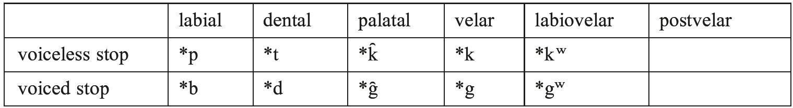

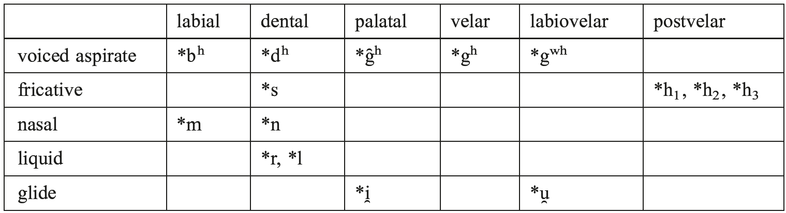

For the vowels, one usually reconstructs the typologically common five-vowel inventory with a correlation of length (*<i>ā˘</i>, <i>*ē˘</i>, <i>*ī</i>, <i>*ō˘</i>, <i>*ū</i>). However, this set may be characterized more accurately as the surface vocalic inventory, as the phonological details are much more complicated.

<table>
<tr><td>(β)</td><td>Proto-Indo-European vowels</td></tr>
<tr><td></td><td>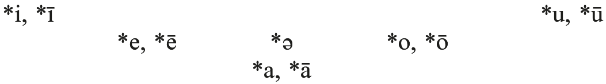</td></tr>
</table>

In the pages that follow, these traditional views will be maintained as the most likely state of affairs for a late stage of PIE, though it is probable that the system looked quite different at an earlier point in time.

## 1. Vowels

There were five distinct full vowels that surfaced in PIE, of which at least three made contrasts in length. The reduced vowel *<i>ə</i>, an allophone of zero, was utilized to repair illicit syllable structures and will be discussed in 3.3 and 5.3.

### 1.1. Short vowels

The short mid vowels */e/ and */o/ are universally accepted; cf. *<i>dék̑m̥</i> ‘10’ (Gk. δέκα, Lat. <i>decem</i>) and *<i>pódm̥</i> ‘foot (acc.sg.)’ (Gk. πόδα, Arm. <i>otn</i>). The high vowels *<i>i</i> and *<i>u</i> were not phonemically vocalic, but rather syllabic allophones of the glides */i̯/ and */u̯/, respectively; cf. the zero-grade variants of */di̯eu̯-/ ‘shine’: *<i>diu̯és</i> ‘sky (gen.sg.)’ vs. *<i>di̯ut-</i> ‘shining’. While most present-day Indo-Europeanists reconstruct *<i>a</i> as a phoneme for late PIE, some (most famously the “Leiden School” [LS]; see Beekes 2011) do not, eschewing typical reconstructions such as */sals/ ‘salt’ (Ved. <i>salilá</i>- ‘salty’, Gk. ἅλς, Lat. <i>sal</i>-, etc.) in favor of laryngealistic reconstructions: *<i>sh₂als</i> (← /*sh₂els/). Thus, for the LS, *<i>a</i> was always a surface allophone of */e/, colored by an adjacent */h₂/ (3.3). It is, however, very difficult to avoid the reconstruction of certain forms with *<i>a</i> vocalism. For example, Hitt. <i>apa</i>, Gk. ἀπό, and Lat. <i>ab</i> ‘away, off’ may only be traced back to */apó/, not */h₂epó/, and it is quite difficult to derive Skt. <i>nas</i>-, OCS <i>nosъ</i> ‘nose’ from */nh₂es-/, as one would expect the syllabification*<i>n̥h₂es</i>- (4.2), though perhaps one may explain these latter forms through sound law (Beekes 1988: 43) or analogy. See Fritz (1996), however, for the derivation of ‘nose’ from the root *<i>h₂anh₁</i>-, with deletion of *<i>h₁</i> in the environment *<i>R̥._V</i>. Cf. rule (φ).

### 1.2. Long vowels

The long mid vowels */ē/ and */ō/ are also uncontroversially reconstructed as phonemes. These vowels are often derived through the contraction of adjacent vowels to resolve hiatus; cf. *<i>-ōs</i> ‘anim. *o-stem nom. pl.’ < */-o-es/ and *<i>-ēti</i> ‘3rd sg. them. subj.’ < */-e-eti/:

<table>
<tr><td>(γ)</td><td>V₁ + V₂ → V:₁</td><td>(Vowel Contraction)</td></tr>
</table>

Not all *<i>ē</i> and *<i>ō</i> were phonologically derived, for the long vocalism of forms such as *<i>h₃rēg̑-</i> ‘rule’ (Lat. <i>rēx</i>, OIr. <i>rí</i>, Skt. <i>rā´j</i>-) and *<i>su̯ésōr</i> ‘sister’ (Ved. <i>svásā</i>, Lat. <i>soror</i>, OIr. <i>siur</i>) must have been lexicalized or morphologized in late PIE. Long high <i>ī</i> and <i>ū</i> are well attested in the daughter languages, but most derive from a sequence of glide + laryngeal in PIE (3.3; *<i>pih₂u̯erih₂</i> > Skt. <i>pī́varī</i> ‘fat (fem.)’, *<i>puh₂rós</i> > Lat. <i>pūrus</i> ‘pure’). There are certain isolated forms which may have possessed */ī/ and */ū/: *<i>u̯īs-</i>‘poison’ (Av. <i>vīš</i>, Lat. <i>vīrus</i>) beside *<i>u̯is-</i> (Ved. <i>viṣá</i>-, Av. <i>viša</i>-), PIE *<i>mūs</i> ‘mouse’ (OE <i>mūs</i>) beside *<i>mus</i>- (Lat. <i>musculus</i> ‘muscle’). Were one to reconstruct *<i>u̯ihₓs-</i> and *<i>muhₓs</i>, the short vowel variants could not be explained. (Such instances of long high vowels are likely due to monosyllabic lengthening; see [ω] below.) Likewise, while *<i>nās-</i> ‘nose’ (Lat. <i>nārēs</i> ‘nostrils’) may be mechanically derived from */neh₂s-/, it would be difficult to connect this form with the short-vowel variant *<i>nas</i>- cited above. Additional instances of *<i>ā</i> were also derived by (η): */-eh₂m/ > *<i>-ām</i> (Skt. <i>sénām</i> ‘army’). These facts allow us to postulate a more precise phonemic inventory of vowels for late PIE:

<table>
<tr><td>(δ)</td><td>PIE vowel phonemes</td></tr>
<tr><td></td><td>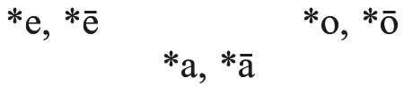</td></tr>
</table>

### 1.3. Diphthongs

In PIE, all diphthongs were “falling”, meaning that the vowel always preceded the glide. There were three */Vi̯<b>/</b> diphthongs, seen in *<i>ei̯<b>-</b></i> ‘lie’ (Gk. κεῖμαι ‘I lie’), *<i>u̯ói̯de</i> ‘knows’ (Ved. <i>véda</i>), and *<i>kai̯kos</i> (LS */kh₂ei̯kos/) ‘blind’ (Lat. <i>caecus</i>, Goth. <i>haihs</i> ‘one-eyed’), and three */<i>k̑</i>Vu̯/ diphthongs, cf. *<i>sréu̯mn̥</i> ‘river’ (Gk. ῥεῦμα), *<i>h₂ou̯s-</i> ‘hear’ (Gk. ἀκούω), and *<i>sau̯so-</i> (LS */sh₂eu̯so-/) ‘dry’ (Gk. αὖος, Lith. <i>saũsas</i>). Long diphthongs also appeared in certain morphological categories, some underlying (*/dēi̯<b>-</b>s<b>-</b>/ ‘showed [<i>s</i>-aorist]’), some derived (<b><i>*-</i></b><i>ōi̯</i> ‘o-stem dative sg.’ ← */<b>-</b>o-ei̯/).

### 1.4. Ablaut

Ablaut, also known as vowel gradation and apophony, was the grammatical alternation of vowels in timbre and length in PIE. The most basic series involved the interchange of *<i>e</i>, <i>*o</i>, and *<i>Ø</i>, called <i>e</i>- (or full-) grade, <i>o</i>-grade, and Ø-grade, respectively, with the former two grades complemented by lengthened-grades, *<i>ē</i> and *<i>ō</i>. All five grades may be reconstructed for the root *<i>ped-</i> ‘foot’:

<table>
<tr><td><i>e</i>-grade: *<i>ped-</i> (Lat. <i>ped-</i>)</td><td><i>ē</i>-grade: *<i>pēd-</i> (OIr. <i>ís</i> ‘beneath’)</td></tr>
<tr><td><i>o</i>-grade: *<i>pod-</i> (Gk. ποδ-)</td><td><i>ō</i>-grade: *<i>pōd-</i> (Eng. <i>foot</i>)</td></tr>
<tr><td colspan="2">Ø-grade: *<i>bd-</i> (Av. ⁺<i>fra-bd-ǝm</i> ‘clatter of feet’ [Kellens 1974: 375])</td></tr>
</table>

Presumably, ablaut came into existence at an early stage of PIE through various phonological processes (cf. Kümmel 2012: 306 ff.), most of which were lost as productive rules in late PIE. However, we may still reconstruct a morphophonological rule of vowel syncope (see Byrd 2015: 38), which targeted most (but not all) underlying unaccented vowels: cf. */h₁és-tei̯/ → *<i>h₁ésti</i> ‘is’ (Ved. <i>ásti</i>) but */h₁es-énti̯/ → *<i>h₁sénti</i> ‘they are’ (Ved. <i>sánti</i>).

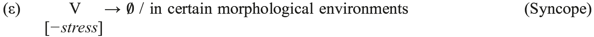

## 2. Resonants

There were six resonants in PIE: two glides */i̯/ and */u̯/, two liquids */r/ and */l/, and two nasals */m/ and */n/. */n/ likely assimilated in place before stops, a rule maintained by all of the ancient IE languages, thus Lat. <i>quī[ŋ]que</i>, Skt. <i>páñca</i>, Gk. πέντε (Aeol. πέμπε), and Goth. <i>fi[ɱ]f</i>, all from PIE *<i>peŋkʷe</i> ‘five’ (← */penkʷe/). Each resonant had (at least) two allophones, one that occurred in syllable margins, another in nuclei. All resonants were underlyingly non-syllabic; syllabic allophones were derived by (Μ).

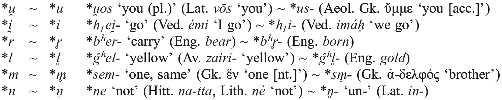

One notable peculiarity: it appears that (unlike all other resonants) PIE */r/ could not occur in absolute word-initial position. Thus, while *<i>prō</i> ‘forward’ (Hitt. <i>p[a]rā</i>, Av. <i>fra</i>-), *<i>h₃reg̑-</i> ‘reach, rule’ (Gk. ὀρέγνυμι), and *<i>sreu̯-</i> ‘flow’ (OIr. <i>srúaim</i>) were possible forms, **<i>rō</i>, **<i>reg̑-</i>, and **<i>reu̯-</i> were not. It is possible that this was due to a constraint on the prosodic word (4.3), as onset */r/ was permitted in word-medial position (*<i>bʰe.re.ti</i> ‘carries’, *<i>h₂n̥.rés</i> ‘man [gen.sg.]’).

There were a number of phonological processes which targeted resonants or sequences containing resonants. The first describes the deletion of a nasal within the sequence *<i>-mn-</i>, which occurs after long vowels, diphthongs, and sequences of short vowel plus consonant, each denoted by VX (Schmidt 1895).

<table>
<tr><td>(ζ)</td><td>*/n/ → θ / -VXm __ V́-</td><td>(The <i>Asno</i> Law)</td></tr>
<tr><td></td><td>*/m/ → θ / -V́X __ nV-</td><td></td></tr>
</table>

Thus, */h₂ék̑mnes/ → *<i>h₂ák̑nes</i> ‘anvil (gen.sg.)’ (Skt. <i>áśnaḥ</i>, Av. <i>asnō</i>) but */gʷʰe/ormnós/ → *<i>gʷʰe</i>/<i>ormós</i> ‘warmth’ (Lat. <i>formus</i>, Skt. <i>gharmá</i>-, and Gk. θερμός). Note that the sequence *<i>-mn-</i> was maintained after short vowels: Gk. πρύμνος ‘prominent’, Hitt. <i>šaramna</i>- ‘fore’. Nasal loss also occurred in *<i>tosi̯o</i> ‘this (gen.sg.)’ (← */tosmi̯o<b>-/</b>) and related forms, though it is unclear exactly how these two processes were connected, if at all.

Certain word-final sequences ending in */-m/ defied the expected syllabification rules (ψ) and were simplified instead, with compensatory lengthening (CL) of the preceding vowel; */di̯éu̯m<b>/</b> → *<i>di̯ē´m</i> (Skt. <i>dyā´m</i>, Gk. ζήν), */-ah₂m/ > *<i>ām</i> (Skt. <i>-ām</i>), */dom-m/ → *<i>dō´m</i> ‘house (acc.sg.)’ (Arm. <i>tun</i>).

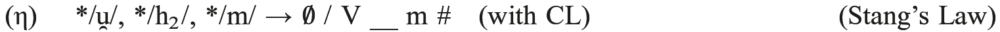

Another rule, which was no longer productive in late PIE, deleted coda fricatives (*/s/ and */hₓ/) in the sequence *VRF]σ, with CL occurring only in word-final position (Byrd 2015: 105): */ph₂térs/ > <i>p(ǝh₂)tē´r</i> ‘father (nom.sg.)’ (Gk. πατήρ), */u̯erh₁-dʰh₁-o-/ > *<i>u̯erdʰh₁-o-</i> (Lat. <i>verbum</i>).

<table>
<tr><td>(ι)</td><td>*/F/ <i>→</i> θ / VR __]σ</td><td>(Szemerényi’s Law)</td></tr>
</table>

There also appears to have been a rule of word-final <i>n-</i>deletion, though only after *<i>ō</i>; cf. */k̑u̯ō´n/ → *<i>u̯ō´</i> ‘dog (nom.sg.)’ (Ved. <i>ś[u]vā´</i>, OIr. <i>cú</i>). Greek κύων has restored the *<i>-n</i> by analogy to other forms in the paradigm.

<table>
<tr><td>(κ)</td><td>*/n/ → θ / ō __ #</td><td>(Post */ō/ n-Deletion)</td></tr>
</table>

Lastly, there is at least one reconstructible example of the loss of */d/ after */r/ with CL of the preceding vowel, as seen in */k̑érd/ ‘heart’ → *<i>ē´r</i> (Gk. κῆρ, Hitt. <i>ker</i>). It is unclear if this deletion was lexically restricted or should be considered to be symptomatic of a broader phonological process (such as Szemerényi’s Law [ι]).

<table>
<tr><td>(λ)</td><td>*/d/ → θ / r __ #</td><td>(Post Rhotic d-Deletion)</td></tr>
</table>

## 3. Obstruents

There were a number of obstruents in PIE, most of which were stops. Unlike the resonants, obstruents were never syllabic (Cooper 2013).

### 3.1. Stops

The PIE stops had the most complex phonemic distribution of all the consonants, contrasting five places of articulation. Two are universally reconstructed: labials (*<i>ped-</i>‘foot’ > Lat. <i>ped-</i>, Gk. ποδ-, *<i>bel-</i> ‘strength’ > Ved. <i>bála-</i>, and *<i>bʰer-</i> ‘carry’ > Eng. <i>bear</i>) and dentals (*<i>tréi̯es</i> ‘three’ > OIr. <i>trí</i>, <i>*d(u)u̯oh₁</i> ‘two’ > OCS <i>dъva</i>, and *<i>dʰeh1-</i>‘put, make, do’ > Skt. <i>dhā-</i>). As for the three remaining series (referred to as tectals or dorsals), it was originally believed that all ancient IE languages merged at least two series into one. Some were <i>satem</i> languages, containing velar stops (*/K/) and coronal fricatives / affricates, the latter derived from palatal stops (*/K̑ /). Others were <i>centum</i> languages, possessing */K/ and labiovelar stops (*/Kʷ/). While at first glance it might seem reasonable to reconstruct only two series of dorsals for PIE, say */K̑/, */Kʷ/, where */Kʷ/ > */K/ (<i>satem</i>) and */K̑/ > */K/ (<i>centum</i>), this hypothesis is untenable, for there are a number of reconstructible forms with */K/ continued by all IE languages, such as *<i>kreu̯h₂-</i> ‘flesh, blood, gore’ > Ved. <i>kravíṣ-</i>, Lith. <i>kraũjas</i> (both <i>satem</i>), Lat. <i>cruor</i>, OIr. <i>crú</i> (both <i>centum</i>). We therefore must reconstruct three series of dorsals in PIE: */K̑/, */K/, */Kʷ/. In the <i>satem</i> languages, */K/, */Kʷ/ > */K/; in the <i>centum</i> languages, */K̑/, */K/ > */K/.

From very early on, however, it was argued that the consonants traced back to */K̑ / in the <i>satem</i> languages should rather be derived from PIE */K/ by a conditioned split (Meillet 1894), with original */K/ maintained only after *<i>s</i> (*<i>skei̯d<b>-</b></i> ‘split’) and *<i>u̯</i> (*<i>i̯eu̯g<b>-</b></i> ‘join’) and before *<i>a</i> (*<i>kand-</i> ‘shine’) and *<i>r</i> (*<i>kreu̯h₂-</i>). But if this were true, the conditioning sounds would have formed a strange natural class indeed. There are also instances of <i>Gutturalwechsel</i> in Balto-Slavic, a <i>satem</i> branch, which Meillet considered to be archaisms: *<i>h₂ak̑mō(n)</i> ‘stone’ > OCS <i>kamy</i>, Lith. <i>akmuõ</i>. But while no IE language continues the three dorsal series in its entirety, some do maintain the original three-way contrast, at least in part. For example, *<i>k</i> and *<i>kʷ</i> may have different outcomes in the <i>satem</i> languages Albanian (*<i>kert-</i> > <i>qeth-</i> ‘cut’ vs. *<i>pénkʷe</i> > <i>pesë</i> ‘five’) and Armenian (*<i>ker-</i> ‘shear’ > <i>k‘erem</i> ‘I cut’ vs. *<i>kʷetu̯óres</i> > <i>č‘ork‘</i> ‘four’), and Anatolian beautifully maintains a threefold distinction in Luv. <i>ziyari</i>, <i>karš-</i>, and <i>kui-</i>, from PIE *<i>ei̯or</i> ‘lies (down)’, *<i>kers-</i> ‘cut’, and *<i>kʷi-</i> ‘who’, respectively (Melchert 1987).

The PIE stops also contrasted two types of laryngeal features (LFs). By LF I do not mean the properties of the PIE laryngeals (3.3) but rather the distinctive features [<i>±voice</i>] (voicing) and [<i>±spread glottis</i>] (aspiration). The manipulation of both allowed for a three-way phonemic contrast for each place of articulation: voiceless unaspirated stops (*/T/), voiced unaspirated stops (*/D/), and voiced aspirated stops (*/dʰ/), the last of which may be more accurately described as “breathy-voiced” or “murmured”. While it is likely that in PIE voiceless aspirates (*<i>Tʰ</i>) were allophones of (*/dʰ/) (5.1), a new series of phonemic */tʰ/ was added in Indo-Iranian (cf. Ved. <i>prathimán-</i> ‘width’), which by and large may be traced back to stop + *<i>h²</i> (PIE *<i>pleth₂món-</i> > <i>prathimán-</i>).

As with many of our reconstructions, the stop series envisaged for PIE are not continued by any attested IE language. But according to Jakobson (1958: 528), the classic reconstruction of the PIE stop series faces another, more troubling problem: the system reconstructed for PIE does not seem to be attested in <i>any</i> other language in the world. This claim led many scholars to look for alternative reconstructions of LF contrast, the most popular being the Glottalic Theory (GT), which was independently proposed by Gamkrelidze and Ivanov (1972) and Hopper (1973). According to the GT, voiceless ejectives replace the voiced stops of the classic reconstruction, such that */tréi̯es/ ‘3’, */du̯oh₁/ ‘2’, */dʰeh₁/ ‘put’ ought to be reconstructed as */t⁽ʰ⁾réi̯es/, */t’u̯oh₁/, */d⁽ʰ⁾eh₁/, resulting in a system that is more common cross-linguistically. Thus, according to the GT, the classically reconstructed Proto-Indo-European stop system represented on the left below is replaced by the system on the right:

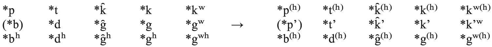

There are many advantages to the GT over the classical reconstruction. First, it provides a straightforward explanation for the enigmatic paucity of PIE */b/, for in languages containing ejectives, */p’/ is the rarest of them all, given its difficulty of articulation (Fallon 2002). Second, since sequences with multiple ejectives are avoided in many languages, the GT also explains why roots of the shape */DeD/ and */DD/ consonant clusters were strikingly absent (Clackson 2007: 46). Third, the GT is claimed to provide good phonetic motivation for a number of sound laws in PIE and its daughter languages (see Vennemann 1989); one such example is Lubotsky’s Law (cf. 3.3), posited for Indo-Iranian, where *<i>hₓ →</i> θ / V __ DCV (*/peh₂g̑-ro-/ [i.e. */peh₂’-ro-/] > *<i>paʔg̑ro-</i> > *<i>pag̑ro-</i> > Skt. <i>pajrá-</i>), with laryngeal deletion via dissimilation of the feature [constricted glottis] (Lubotsky 1981). For further discussion in favor of the GT, see Vennemann (1989) and Beekes (2011).

While still maintaining a small group of ardent followers (particularly in Leiden), the GT has lost much of its support today. There are many reasons for this. To begin with, since Jakobson’s famous claim, scholars have documented languages with stop systems identical or nearly identical to the classical PIE system, such as Kelabit in northern Borneo (Blust 2006). Second, if ejectives had been phonemes in PIE, then it is quite surprising that no IE language has inherited them, as they tend to be quite stable diachronically. Third, there are certain loan words present in Armenian (<i>arcat</i>‘‘silver’ < Iran. *<i>ardzata-</i>) and Germanic (*<i>rīk-</i> ‘king’ < Celt. *<i>rīg-</i> < *PIE <i>h₃rēg̑-</i>) that demand consonant shifts from voiced to voiceless, which are not possible in the GT framework. Lastly, perhaps the strongest argument against the GT comes from Armenian, where in certain dialects initial-syllable vowels are fronted after inherited voiced aspirates by Adjarian’s Law: Kar-evan <i>ben</i> ‘speech’ (< *<i>bʰan-</i>), Karabagh <i>telar</i> (< *<i>dʰal-</i>) but Karevan <i>tun</i> ‘house’ (< *<i>dom-</i>), Karabagh <i>kov ‘</i>cow’ (< *<i>gʷou̯-</i>). As Garrett (1998) convincingly shows, fronting makes no sense if these segments had been simple voiced stops inherited from PIE voiced aspirates, but does if they were breathy-voiced, triggered by the spread of the feature [+ATR]. (Weitenberg [this handbook] takes Adjarian’s Law to have been triggered by the lateral /l/ and voiced fricatives in addition to inherited voiced aspirates. If this is indeed the case, then Garrett’s analysis loses its explanatory power. However, it is true that the most widely cited examples of Adjarian’s Law all involve preceding voiced stops and *<i>j</i>, which according to Garrett had become a voiced */ɦ/ before the time of the fronting.)

But demonstrating the GT to be false does not entail that the classical reconstruction of the PIE stops is true for all periods of the proto-language, especially for early PIE. For how does one explain the rarity of */b/, the absence of */D(e)D/ sequences, or, more generally, the existence of such a typologically odd system in the classical reconstruction? While the second of these questions remains unanswered, it has been surmised that the phoneme */b/ (as was in part the case with voiceless aspirated stops) may have been restricted in occurrence to “expressive or affective words and in onomatopoetic forms” (Joseph 1985: 7). Moreover, I believe that Weiss (2009) has found a solution to the third, showing that in Cao Bang, a northern Tai language, original voiced stops (e.g. */d/) developed into breathy-voiced stops (*/dɦ/), while original voiced implosives (e.g.*/ɗ/) became voiced stops. It is thus possible that late PIE */t/, */d/, */dɦ/ derived from an earlier */t/, */ɗ/, */d/, a system which occurs in roughly 16% of languages containing three series of obstruents (Kümmel 2012: 294).

### 3.2. Fricatives and affricates

There was a single sibilant */s/ in PIE with an allophone *<i>z</i>, which surfaced before voiced obstruents; cf. */sed-/ > *<i>sed-</i> (Arm. <i>hecanim</i>, Lat. <i>sedeō</i>) but */-sd-/ > *<i>ni-zd-ó-</i> (OCS <i>gnězdo</i>, Lat. <i>nīdus</i>, Eng. <i>nest</i>). It is quite possible that */s/ was a prepalatal hushed spirant (Vijūnas 2010).

The segment known as thorn (*/þ/) was actually not a fricative at all, but rather a complex consonant cluster of underlying dental stop plus dorsal stop (Schindler 1977a). The classic example is the word for ‘earth’: nom.sg. *<i>dʰ(e)g̑ ʰōm</i> (Hitt. <i>tekan</i>, Gk. χθών), oblique *<i>dʰǝg̑ʰm-</i> (Hitt. <i>taknaš</i>), with schwa secundum (Ξ), and oblique <i>g̑ʰm̥m-</i> (Lat. <i>humus</i>, Gk. χαμαί), a Lindeman variant (Τ). Thorn clusters were reduced when preceding a syllabic nasal; for an additional example, cf. *k̑<i>m̥tóm</i> ‘100’, from */dk̑mtóm/, a derivative of *<i>dék̑m̥</i> ‘10’.

<table>
<tr><td>(μ)</td><td>*T → θ / __ KN̥</td><td>(Thorn Cluster Reduction)</td></tr>
</table>

This reduction makes good phonological sense, as nasals are not as sonorous as vowels (4.2) and are therefore unable to license multiple obstruents in an onset. There was also a rule of *<i>-s-</i> epenthesis in onset thorn clusters: *[h₂ar]σ[tk̑os]σ → *<i>h₂artsk̑os</i> ‘bear’ (Ved. <i>ŕ̥kṣas</i>, with analogical zero-grade) but *[h₂r̥ t]σ[k̑ os]σ→ *<i>h₂r̥tk̑os</i> (Hitt. <i>ḫartaggaš</i>).

<table>
<tr><td>(ν)</td><td>θ → *s / σ[T __ K</td><td>(Thorn Cluster Epenthesis)</td></tr>
</table>

Epenthesis may have resulted in an affricate [t͡s] (*[h₂ar]σ[t͡skos]σ), though I prefer to parse *<i>h₂artskos</i> as *[h₂art]σ[skos]σ, following (ψ), and satisfying the MST (χ). For another rule of <i>s-</i>epenthesis, see (Ι).

### 3.3. Laryngeals

Perhaps the most wonderful discovery in all of Indo-European phonology was made by Saussure (1879), who at the age of nineteen hypothesized the existence of a new class of segments, called “laryngeals” (*<i>hₓ</i>). This name, first used by Möller (1917), is actually a misnomer, for it is unlikely that the larynx was the primary articulator of all three members of this class.

After a contentious century of research, scholars now with few exceptions posit three laryngeals for PIE (*/h₁/, */h₂/, */h₃/), each corresponding to a different vocalic reflex in Greek: θετός (< *<i>dʰəh₁tó-</i> ← */dʰh₁-tó-/ ‘placed’), στατός (< *<i>stəh₂tó</i>- ← */sth₂-tó-/ ‘standing’), and δοτός (< *<i>dəh₃tó- ←</i> */dh₃-tó-/ ‘given’). Note that each vowel derives from a sequence of *<i>ə</i> (Ν) + *<i>hₓ</i> and was unlikely to have been an instance of true vocalization (i.e. *<i>h̥ₓ</i>), despite the frequent use of this term here and elsewhere. Although *<i>hₓ</i> was vocalized in a variety of environments in the prehistory of many IE languages, it appears that in PIE this was only the case in word-initial sequences of the shape *CHC(C), as seen in */dʰh₁s-/ → *<i>dʰǝh₁s-</i> ‘divine’ > Gk. θεός ‘god’, Lat. <i>fānum</i> ‘shrine’ (< *<i>fasno-</i>), Skt. <i>dhíṣṇya-</i> ‘pious’, and HLuv. <i>tasan-za</i> ‘votive stele’. In all other environments, daughter languages treat */hₓ/ in different ways − word-medially (*/h₂enh₁mV-/ ‘soul, breath, wind’ > Gk. ἄνεμος, Lat. <i>animus</i>, but GAv. <i>ąnman</i>-), word-finally (*/még̑h₂/ ‘great’ > Ved. <i>máhi</i>, Gk. μέγα, but Hitt. <i>mēk</i>), and in other word-initial sequences (*/h₂ster-/ ‘star’ > Gk. ἀστήρ, Arm. <i>astɫ</i>, but Lat. <i>stēlla</i>, Ved. <i>stŕ̥bhis</i>). Similarly, the loss of coda */hₓ/ with compensatory lengthening was not a PIE process: */peh₂s-/ ‘protect’ → *<i>pah₂s-</i> > Hitt. <i>paḫs-</i>, but Lat. <i>pās-tor</i> ‘shepherd’.

The aforementioned presence of Gk. ε, α, and ο, continuing a contrast which was present in PIE, illustrates a fundamental property of the laryngeals: */h₂/ and */h₃/ change the quality of an adjacent <i>e</i>-vowel. */h₂/ + */e/ → *<i>a</i> (*/steh₂-/ ‘stand’→ *<i>stah₂-</i> > Gk. [Dor.] ἔ-στᾱ-ν); */h₃/ + */e/ → *<i>o</i> (*/deh₃-/ ‘give’ → *<i>doh₃</i>- > Lat. <i>dōnum</i>). / *h₁/ had no such “coloring” effect: cf. /*h₁esti/ → *<i>h₁ésti</i>. Moreover, at least in Greek, all three laryngeals had a coloring effect on a preceding *<i>ǝ</i>: */dʰh₁-tó-/ → *<i>dʰəh₁tó-</i> > Gk. θετός; */sth₂-tó-/ → *<i>stəh₂tó-</i> → <i>stăh₂tó-</i> > Gk. στατός; */dh₃-tó-/ <i>→ *dəh₃tó- → *dŏh₃tó-</i> > Gk. δοτός<i></i>. While these three structurally reduced vowels remain distinct from each other in Greek, merging with the structurally full vowels e, o, and a, respectively, they show a merged unitary outcome in all other branches: in Indo-Iranian,*<i>ǝhₓ</i> > <i>i</i> (Skt. <i>hitá-</i>, <i>sthitá-</i>, -<i>di-</i> [rare]); everywhere else, *<i>ǝhₓ</i> > <i>a</i> (cf. Lat. <i>factus</i>, <i>status</i>, <i>datus</i>). No other vowels were colored by an adjacent laryngeal: cf. *<i>h₂óg̑mos</i> (Gk. ὄγμος ‘furrow’) and *<i>mē´h₂u̯r̥</i> (Hitt. <i>meḫur</i> ‘time’); lack of coloring of a long vowel in the latter example is referred to as Eichner’s Law (Eichner 1973).

Though continued exclusively as vowels in many of the daughter languages, the laryngeals were phonemically consonants in PIE. We know this for two main reasons. First, laryngeals pattern like consonants in our reconstructions: they were more sonorous than stops but less sonorous than resonants (4.2), occupied the same position as */s/ within roots, and (at least) */h₃/ participated in voicing assimilation (a process restricted to obstruents; see 5.1), most famously in */pi̯-ph₃-e-ti̯/ → *<i>pibh₃eti</i> ‘drinks’ > Ved. <i>píbati</i>, OIr. <i>ibid</i>, Lat. <i>bibit</i>, Arm. <i>əmpē</i>. Second, and more importantly, two of the laryngeals are directly continued in Anatolian as dorsal (likely uvular) fricatives, written as < ḫ(ḫ) > (Melchert 1994: 55; Weiss 2016): Hitt. <i>ḫant-</i> ‘front’, Lyc. <i>xn˜tawa-</i> ‘rule’ (< IE *<i>h₂ant</i>-), Hitt. <i>ḫappariye-</i>, Lyc. <i>epirije-</i> ‘sell’ (< *<i>h₃op-</i>). According to Kloekhorst (2004), *<i>h₁</i> was also continued as a glottal stop in Hieroglyphic Luvian (<i>á-ma</i>/<i>i-</i> ‘my’ < *<i>h₁me</i>, <i>á-sú-</i> ‘horse’ < *<i>h₁ek̑u-</i>), though this view is not universally held.

Let us now summarize the facts presented thus far. */h₁/ was a non-coloring consonant and is perhaps continued by [ʔ] in Anatolian. */h₂/ lowered */e/ and *<i>ə</i> and aspirated stops in Indo-Iranian (see 3.1). *<i>h₃</i> rounded and backed */e/ and *<i>ə</i> and was voiced. All three were typologically “marked”, resulting in their frequent deletion in both PIE (see below) and the daughter languages. Lastly, all three were more sonorous than stops, but less sonorous than resonants and patterned like */s/ in roots, which suggests that they were most likely fricatives. The vowel coloration effects point to a post-velar place of articulation (uvular or pharyngeal), leading us to the most common reconstruction: */h₁/ = /h/ or /ʔ/, */h₂/ = /ħ/, a voiceless pharyngeal or uvular fricative, and */h₃/ = /ʕ⁽ʷ⁾/, a voiced pharyngeal or uvular fricative with possible rounding coarticulation. (Weiss 2016 sets forth a number of convincing arguments that the Anatolian reflexes of PIE *<i>h₂</i> and *<i>h₃</i> were not pharyngeals, but rather uvulars. As uvulars more easily develop into pharyngeals, it is likely that *<i>h₂</i>/<i>3</i> were originally uvular in PIE.) Many prefer to view */h₁/ as /h/, a phoneme which is present in most languages with aspirated stops.

There were a number of phonological processes that targeted laryngeals in PIE.

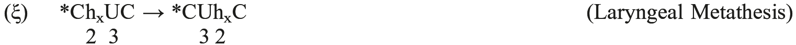

*/ph₃i̯-tó-/ → *<i>pih₃tó-</i> ‘drunk’ > Ved. <i>pītá-</i>, OCS <i>pitъ</i>; cf. Gk. πῖθι ‘drink!’

<table>
<tr><td>(ο)</td><td colspan="2">*/hₓ/ → θ / C __ CC</td><td>(Lex Schmidt-Hackstein)</td></tr>
</table>

*/dʰu̯gh₂trés/ <i>→ *dʰuktrés</i> ‘daughter (gen.sg.)’ > NPers. <i>duxtar-</i>, Arm. <i>dowstr</i> (see Byrd 2015: 85 ff., with references). Rule discussed in (Ο) below.

<table>
<tr><td>(π)</td><td>*/hₓ/ → θ / σ[__ i̯-</td><td>(Pinault’s Law)</td></tr>
</table>

*/sokʷh₂-i̯o-/ → *<i>sokʷi̯o-</i> ‘friend’ > Lat. <i>socius</i>, cf. Skt. <i>sakhyá-</i> ‘friendship’ (with <i>kh</i> by analogy to the root allomorph seen in the paradigm of <i>sákhā</i>/<i>sákhāyam</i>), Gk. *ἄοσσος (base of ἀοσσέω ‘I help’) (Pinault 1982). This rule is not operative in word-initial position. According to Byrd (2015), PL only targeted *<i>h₂</i> and *<i>h₃</i>.

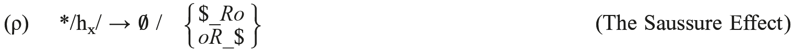

*/solh₂-u̯o-/ → *<i>solu̯o-</i> ‘all’ > Skt. <i>sárva-</i>, Gk. ὅλος, Lat. <i>sollus</i>; */h₃moi̯g̑ʰó-<b>/</b> → *<i>moi̯g̑ʰó<b>-</b></i> > Gk. μοιχóς ‘adulterer’ (Cf. Gk. ὀμείχω, Lat. <i>meiō</i>, Ved. <i>méhati</i> ‘urinate’)

(de Saussure 1905; Nussbaum 1997)

<table>
<tr><td>(σ)</td><td>*/hₓ/ → θ / V __ PRV</td><td>(The Weather Rule)</td></tr>
</table>

*/h₂u̯eh₁-tró-/ → *<i>h₂u̯etró-</i> > PGmc. *<i>weðra-</i> (Germ. <i>Wetter</i>, Eng. <i>weather</i>; Neri 2011). Given the structural similarities to Lubotsky’s Law (3.1), some scholars suspect both to have been the same rule.

<table>
<tr><td>(τ)</td><td>*/hₓ/ → θ / V __ RV́</td><td>(Dybo’s Law)</td></tr>
</table>

*/u̯i̯h₁-ró<b>-</b>/ → *<i>u̯iró-</i> ‘hero, man’ > Lat. <i>vir</i>, OIr. <i>fer</i>, Goth. <i>wair</i>, but *<i>u̯ih₁ró-</i> > Ved. <i>vīrá-</i>, Lith. <i>výras</i>. (τ) appears to have been a rule of Western Indo-European, though the details are murky (Zair 2006, with references).

<table>
<tr><td>(υ)</td><td>*/hₓ/ → θ / __ # (?)</td><td>(Kuiper’s Law)</td></tr>
</table>

Laryngeals appear to have been lost when occurring at the end of some phonological domain (likely phonological phrase; see 4), most notably in the vocative of certain forms: */-eh₂/ → *<i>-a</i> > Gk. νύμφ-α˘ ‘O nymph!’

<table>
<tr><td>(φ)</td><td>*/hₓ/ → θ / CR __ V (?)</td><td>(The <i>neognós</i> Rule)</td></tr>
</table>

*/neu̯o-g̑nh₁-o-/ → *<i>neu̯og̑no-</i> ‘newborn’ (*<i>*neu̯og̑n̥h₁o-</i>) > Gk. νεογνός; cf. Lat. <i>prīvignus</i> ‘stepson’. In certain compounds and reduplicated formations (e.g., *kʷe-kʷl̥h₁ós), a laryngeal was lost in the zero-grade of */CVRH/ roots.

The precise phonetic and phonological motivations for many of these rules − especially (σ)−(φ) − are an absolute mystery. But recent work has begun to shed some light upon why many of these processes may have occurred. For instance, in Byrd (2015), I argue that (ο) was driven by violations of syllable structure (see 4.2 and 5.3 below) and that (π) occurred due to the impossible articulation of a palatalized pharyngeal consonant (*<i>ħʸ</i>). (Though not explicitly stated in Byrd 2015, palatalized uvular fricatives are also dispreferred cross-linguistically, and so this analysis would stand should one choose to identify *<i>h₂</i>/<i>3</i> as uvular [cf. Weiss 2016].) Pronk (2011) and van Beek (2011) have argued against (ρ) as a PIE process, claiming it to have been a phonetically impossible rule, though both Weiss (2012) and Byrd (2013) have independently suggested that the interaction of the low and back features of */o/ and */hₓ/ triggered deletion. Steer (2012), basing himself on Fritz (1996), identifies (φ) as the simplification of a word-medial onset sequence *σ[RH-: *[ne]σ[u̯og̑]σ[nh₁o-]σ → *[ne]σ[u̯og̑]σ[no-]σ. While ingenious, I find his analysis questionable, as there is no good reason for *RH to have ever been parsed as a tautosyllabic onset in the first place. While I myself can offer no solution, it is curious that deletion occurs immediately following a prosodic word (4.3) boundary.

## 4. Prosody

Up until this point we have discussed only the individual segments (phonemes and allophones) of PIE. But these segments were never uttered in isolation: they appeared together with other segments to form syllables, which in turn produced words. Syllables and words are considered to be two constituents of the much larger prosodic hierarchy (see Figure 121.1; Selkirk 1986), where features such as tone, stress, and intonation are assigned.

There are two other categories located above the PhP in the hierarchy, the intonational phrase and the utterance. Given the nature of reconstruction, I am skeptical of our ability to say anything interesting about these two categories; the remaining five, however, are well within our reach. I will not address the PhP or φ in the discussion below, for at the moment there is very little to say about these, and thus will only focus on μ, σ, and ω.

### 4.1. Morae

A mora (abbreviated as μ) is a unit of syllabic weight (Hayes 1989). While all vowels are inherently moraic (V˘ = μ, V: = μμ), languages differ on which consonants may be

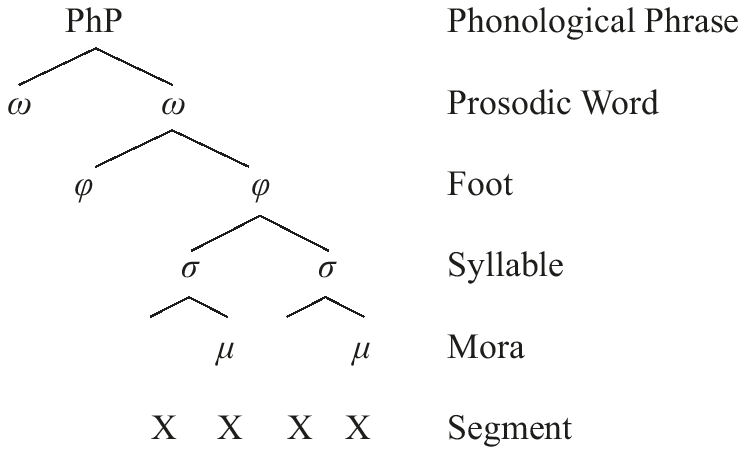

moraic and where (if at all). In PIE, all consonants were assigned a mora if they occurred in coda position. Thus: */oμi̯noμs/ → *[oμi̯]σ[noμs]σ → *[oμi̯μ]σ[noμsμ]σ ‘one’. This property may be directly observed in the meter of many ancient IE languages:

<table>
<tr><td>RV 1.1:</td><td><i>agním īḷe puróhitaṁ yajñásya devám r̥ tvíjam</i></td></tr>
<tr><td><i>Iliad</i> B.1–2:</td><td>ἄλλοι μέν ῥα θεοί τε καὶ ἀνέρες ἱπποκορυσταὶ εὗδον παννύχιοι, Δία δ᾽ οὐκ ἔχεν ἥδυμος ὕπνος</td></tr>
<tr><td><i>Aeneid</i> 1.6:</td><td>inferretque deos Latio, genus unde Latinum</td></tr>
</table>

In the excerpts cited above, the <j> of Ved. <i>yajñásya</i>, the <π> of Gk. ὕπνος, and the <t> of Lat. <i>inferretque</i> render their respective syllables heavy (consisting of 2μ), and thus each of these consonants carries a mora.

### 4.2. Syllables

Syllables (abbreviated as σ) are the beats of language. All σs contain a sonority peak called the nucleus (usually a vowel), which may be surrounded by consonants in the σ margins; those occurring before the nucleus are called the onset, those following it the coda. It is very likely that in PIE the σs of all lexical (vs. grammatical) words required onsets: contrast *<i>h₁es-</i> ‘be’ with *<i>en</i> ‘in’.

The syllable structure of PIE was quite complex. Word-initial onsets could consist of one, two, three, or perhaps even four consonants (*<i>teg-</i> ‘cover’, *<i>stah₂-</i> ‘stand’, *<i>streu̯-</i>‘strew’, *<i>g̑ ʰz⁽ʰ⁾dʰi̯és</i> ‘yesterday’). Curiously, */s/ always occurred in the first or second position (cf. *<i>h₂ster-</i> ‘star’) of triconsonantal onsets. Word-finally, syllables were open or closed by one, two, or three consonants (*<i>u̯ō´</i> ‘dog’, *<i>bʰéred</i> ‘carried’, *<i>u̯ō´kʷs</i> ‘voice’, *<i>nókʷts</i> ‘night’). All complex word-final codas ended in either a dental obstruent (*/s/, /t/, /d/) or */<i>h₂</i>/ (cf. *<i>még̑h₂</i> ‘great’). Many of these complex margins were banned word-medially; thus while *<i>u̯ē´st</i> ‘carried by vehicle’ and *<i>h₂ster-</i> contained licit sequences at word’s edge, there is no evidence for a word of the shape *<i>*u̯ē´sth₂ster-</i> in PIE. In fact, a maximum of two consonants was allowed in word-medial σ margins (cf. */i̯éu̯gtrom/ → *[i̯éu̯k]σ[trom]σ ‘cord’ > Ved. <i>yóktram</i>). This discrepancy between word-edge and word-medial margins makes it likely that Cs in certain sequences at word’s edge were extrasyllabic (see Byrd 2010, 2015 and Keydana 2012), such that they were not syllabified at the level of the σ, but were rather adjoined to a higher node of the prosodic hierarchy (the ω). Thus, we may claim that in both onsets and codas, a maximum of two Cs was permitted. But while onsets permitted violations of the Sonority Sequencing Principle (SSP; cf. *[su̯ek̑]σ[stos]σ ‘sixth’ > Goth. <i>saihsta</i>), which states that ‟between any member of a syllable and the syllable peak only sounds of higher sonority rank are permitted” (Clements 1990: 284 ff.), codas did not, a generalization captured by the MAXIMUM SYLLABLE TEMPLATE (MST), first proposed in Byrd (2010) and expanded upon in Byrd (2015).

<table>
<tr><td>(χ)</td><td>CCVCC</td><td>(MST)</td></tr>
<tr><td></td><td colspan="2">The maximum PIE syllable consists of two consonants in the onset and two consonants in the coda. The onset may violate the SSP; the coda may not.</td></tr>
</table>

We may broadly identify the sonority hierarchy in PIE as follows: V [R [F [P. Thus, the medial coda of *[h₂arh₃]σ[trom]σ ‘plow’ (OIr. <i>arathar</i>) was permitted, since *<i>h₃</i> was less sonorous than *<i>r</i>, but the same may not be said of the reverse sequence **-oh₃r]σ. The MST motivated a number of phonological processes in PIE; see 5.3 below.

In PIE, vowels always occupied the σ nucleus, but as we discussed in 2, resonants could as well, generated by a rule of sonorant syllabification where a non-syllabic resonant becomes syllabic; see (Μ) below. Thus, if a resonant was surrounded by obstruents or word boundaries, it syllabified: */tntós/ → *[tn̥][tós] ‘stretched’, */dék̑m/ → *[dé][k̑m̥] ‘ten’, */nputlós/ → *[n̥][put][lós] ‘sonless’. Facts were more complicated if multiple resonants stood next to each other. As Schindler (1977b) noted, in such sequences the rightmost resonant always syllabified (*/k̑u̯nbʰis/ → *[k̑u̯n̥][bʰis] ‘dogs [instr.pl.]’) if not immediately adjacent to a vowel (*/k̑u̯nés/ → *[k̑u][nés] ‘dog [gen.sg.]’). Although Schindler’s rule is the standard description of resonant syllabification today, he himself noted multiple exceptions: 1. roots of the shape *<i>RR-</i>, not *<i>*R̥R-</i>(*<i>u̯i̯eth₂-</i> > Skt. <i>vyáthate</i> ‘rolls’), 2. */-Cmn-/ → *<i>-CN-</i> (ζ), not *<i>-Cm̥ n-</i> (/h₂ek̑mnés/ → [h₂ak̑]σ[nés]σ ‘stone [gen.sg.]’), 3. isolated instances of */CR₁R₂V/ → *[CR₁R̥ ₂]σ[V-(*[tri]σ[ōm]σ ‘three [gen.pl.]’, not **[tr̥]σ[i̯ōm]σ), 4. accusatives of the shape *<i>-R̥m(s)</i> (*/menti̯m<b>/</b> → *[mén]σ[tim]σ ‘mind [acc.sg.]’, not **[mén]σ[ti̯m̥]σ), and 5. the weak stems of the nasal-infix presents (*/i̯u̯ngénti/ → *[i̯un]σ[gén]σ[ti]σ, not **[i]σ[u̯n̥]σ[gén]σ[ti]σ). Various fixes to each individual exception have been put forth in the past, but as I argue in Byrd (2015: 167−178), these exceptions all but disappear if we envision ablaut (ε) as a <i>synchronic</i> phonological process in PIE, which necessarily follows syllabification in the derivation. Let us consider the derivation of *[mén]σ[tim]σ, for which I assume */méntei̯m/ to be the underlying form. The full-grade of the root surfaced in *[mén]σ[tim]σ, the full-grade of the suffix occurred in gen.sg. *[mn̥]σ[téi̯s]σ, and the accusative marker *<i>-m</i> always appeared in the zero-grade, hence */-m/.

In (ψ) below, syllabification first parsed segments into syllables and assigned all coda segments a mora (cf. 4.1). At this point ablaut (ε) deleted targeted vowels, which were nearly always unaccented. Lastly, the syllable *-[ti̯μmμ]σ was repaired by (Μ), as all syllables require a nucleus. *<i>i</i> is chosen as the nucleus of *-[ti̯μmμ]σ in order to maintain its assigned mora.

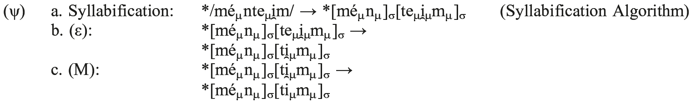

The implications of this analysis are far-reaching. If (ε) may be reconstructed as a synchronic rule of PIE and may be ordered before or after other (morpho-)phonological processes, perhaps there was further interaction between (ε) and other known rules.

### 4.3. Prosodic words

All lexical words consist of (at least) one prosodic word (abbreviated as ω), which cross-linguistically acts as the domain of word-stress assignment, syllabification, and certain segmental rules. Not much is known yet about the ω in PIE; though since the ω is the domain of syllabification, we may utilize this knowledge as a metric to identify the boundaries of ωs in a non-circular fashion. Thus, it is likely that the privative prefix *<i>n̥-</i>constituted its own ω, as it was syllabified independently of the stem to which it was affixed: cf. */[n]ω[udro-]ω/ → *<i>n̥(n)udro-</i> ‘waterless’ (Gk. ἄνυδρος, Skt. <i>anudrá-</i>), not **<i>nudro-</i>. It is possible that a minimal-word requirement targeted the ω in PIE, which demands that any stress-bearing (i.e. lexical) word contain at least two μs (McCarthy and Prince 1986). While there are indeed exceptions to this rule (cf. PIE *<i>só</i> ‘this’, not *<i>*sō´</i>), Kapović (2006) argues that the short/long vowel alternations reconstructible for pairs such as *<i>nu</i>: *<i>nū´</i> ‘now’ (Gk. νυ: Skt. <i>nū´</i>), *<i>ne</i>: *<i>nē´</i> (OCS <i>ne</i>: Lat. <i>nē</i>) ‘not’, and *<i>tu</i>: <i>tū´</i> ‘you (sg.)’ (Latv. <i>tu</i>: OE <i>þū</i>) may be explained in this way, with lengthening occurring in stressed variants. This rule may also account for certain instances of *<i>ū</i> and *<i>ī</i> of non-laryngeal origin; see 1.2.

<table>
<tr><td>(ω)</td><td>V → V: / # (C₀) __ #</td><td>(Monosyllabic Lengthening)</td></tr>
</table>

### 4.4. Accent

It is generally agreed that PIE was a language with mobile pitch accent, continued to a greater or lesser extent by Vedic Sanskrit, Ancient Greek, Proto-Germanic, and Balto-Slavic. The utilization of pitch-accent entails two basic properties of a language’s accentual system (Hayes 2009: 292−293). First, pitch is phonemic, and therefore contrasts in pitch may result in minimal pairs: cf. the famous *<i>tómh₁os</i> ‘a cutting’ (Gk. τόμος ‘a cut, slice’) vs. *<i>tomh₁ós</i> ‘sharp’ (Gk. τομός). Second, only one σ per ω may be accented; thus *<i>bʰéreti</i> ‘carries’, but no *<i>*bʰéréti</i>. In PIE, an accented σ was phonetically prominent and carried a high pitch, very similar to the accentual properties of modern Swedish. At least one phonological rule of accent shift has been reconstructed for PIE:

<table>
<tr><td>(A)</td><td>/é C₀ o/ → <i>e C₀ ó</i> / # C₀ __ C₀ V (C₀) #</td><td>(The *<i>kʷetu̯óres</i> Rule)</td></tr>
</table>

As Rix (1985) discusses, this rule explains why expected PIE */<i>kʷétu̯ores</i>/, */<i>su̯ésores</i>/, and */<i>h₂áusosm̥</i> / surface as *<i>kʷetu̯óres</i> ‘four (nom.pl.)’ (Ved. <i>catvā´raḥ</i>), *<i>su̯esóres</i> ‘sisters (nom.pl.)’ (Ved. <i>svasā´raḥ</i>), and *<i>h₂ausósm̥</i> ‘dawn (acc.sg.)’ (Ved. <i>uṣā´sam</i>), respectively. But were there other such rules of accentual shift? The answer to this question underlies perhaps the most exciting prospect of future work in PIE morphophonology: the alternation of accent within PIE paradigms (see 1.4), for which I refer the reader to Kiparsky (2010), with references.

## 5. Conspiracies

Indo-Europeanists typically describe phonological change in terms of rules or laws: X > Y / Z. However, it is sometimes beneficial to conceive of certain processes as being driven by important phonological constraints, which define which segments and sequences may or may not occur in a language. Such constraints may create phonological conspiracies, where two or more rules “conspire” to ensure that a particular marked structure does not surface in the language (Kisseberth 1970).

### 5.1. Laryngeal feature neutralization

In PIE, there was an assortment of phonological rules that neutralized underlying laryngeal features (LFs). Recall the various allomorphs of PIE ‘sit’ (3.2): *<i>sed-</i> (Gk. ἕζομαι), but *<i>ni-zd-ó-</i> (Eng. <i>nest</i>). *<i>z</i>, an allophone of */s/, arose only by voicing assimilation when */s/ preceded a voiced obstruent. The assimilation of aspiration (the feature [±spread glottis (sg)]) occurred as well: */u̯eg̑ʰ-/ ‘carry by vehicle’ + */-s-/ → *<i>u̯ek̑s-</i>(Skt. <i>vakṣ-</i>, Cyp. <i>éwekse</i>, Lat. <i>vēxī</i>). Both are cases of regressive (R → L) assimilation.

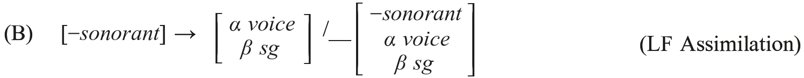

While the examples above show obstruents neutralized in codas, it appears that LF assimilation was not restricted to any particular position within the syllable. There are many instances where word-initial <i>s-</i>mobile + */dʰ/ surfaced as *<i>sTʰ</i>- (Siebs’ Law), such as Ved. <i>sphuráti</i> ‘jerks, kicks’, OE <i>spurnan</i> ‘spurn’ beside Ved. <i>bhuráti</i> ‘jerks, moves rapidly’, with progressive (L → R) assimilation. In Indo-Iranian, LF assimilation was continued as a productive process, but a minor change was added: the underlying LFs of roots were prioritized over affixes, resulting in progressive assimilation in certain cases. Thus, while PIE */bʰu̯dʰ-tó-/ → *<i>bʰutstó-</i> ‘awakened’, PIIr. */bʰu̯dʰ-tá-/ → *<i>b⁽ʰ⁾ud⁽ʰ⁾z⁽ʰ⁾dʰá-</i> (Skt. <i>buddhá-</i> ‘awakened’).

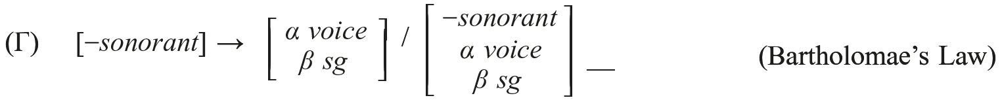

It is likely that Bartholomae’s Law operated on some level in early PIE (but to what extent is unclear), as we find doublets of certain suffixes, which could only have arisen in this way: *<i>-tro-</i> (Gk. λέκτρον ‘bed’), *<i>-tlo-</i> (Lat. <i>perīculum</i> ‘danger’) beside *<i>-dʰro-</i>(Gk. βάθρον ‘base, step’) and *<i>-dʰlo-</i> (Lat. <i>stabulum</i> ‘stable’).

Stops were also neutralized to voiced unaspirated in word-final position after a sonorant (V or R): PIE */-t/ → *<i>-d</i> > Hitt. <i>pa-i-ta-aš</i> [páyd−as] ‘went he’, Old Lat. <i>feced</i> ‘(s)he made’. Though typologically unexpected, this type of neutralization also occurs synchronically in the Northeast Caucasian language Lezgian (Yu 2004).

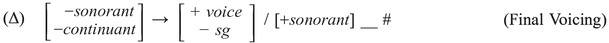

### 5.2. *GEMINATE

Some languages tolerate geminate sequences freely (Ital. <i>ratto</i> ‘rat’, <i>fatto</i> ‘made’ ← /fak/ ‘make’ + /to/), while others do not. English has a strict ban on monomorphemic geminates but allows heteromorphemic ones: contrast <i>penny</i> /pεni/ with <i>penknife</i> /pεnnaɪf/. PIE was the opposite of English; while monomorphemic sequences were tolerated in certain “expressive” words (Watkins 2012) such as *<i>atta</i> ‘daddy’ (Lat. <i>atta</i>, Goth. <i>atta</i>), *<i>kakka</i> ‘poo-poo’ (MIr. <i>caccaim</i>, Russ. <i>kákata</i>), and *<i>anna</i> ‘momma’ (Hitt. <i>annaš</i>), heteromorphemic geminates were strictly banned (Meillet 1938). This ban was the result of the high-ranking constraint *GEMINATE, which spurred a number of important phonological changes within the proto-language. Note that, curiously, compensatory lengthening (CL) occurs word-finally, but never word-medially in the processes below. This appears to be true of all certain instances of word-medial consonant deletion in PIE. (One exception to this statement may lie in the possible derivation of PIE *<i>tē´ti</i> ‘fashions’ from an earlier, reduplicated */té-tk̑-ti̯/.)

<table>
<tr><td>(Ε)</td><td>*/VmmV/ → *VmV</td><td>(Medial */mm/ Simplification)</td></tr>
</table>

Examples are sparse: */ném-men/ → *<i>némn̥</i> ‘gift’ (OIr. <i>neim</i> ‘poison’; Rasmussen 1999: 647) and perhaps */stómh₁men/ → *<i>stómn̥</i> (Hitt. <i>ištaman</i>, Gk. στόμα ‘mouth’), with geminate simplification after loss of */h₁/ via the Saussure Effect (ρ) (C. Melchert, p.c.).

<table>
<tr><td>(Ζ)</td><td>*/Vmm#/ → *V:m#</td><td>(Stang’s Law)</td></tr>
</table>

This is a subtype of Stang’s Law; most examples consist of roots or suffixes in *<i>-m</i> + acc.sg. *<i>-m</i> (*/dóm-m/ → *<i>dō´m</i> ‘house (acc.sg.)’ (Arm. <i>tun</i>); */dʰég̑ʰom-m/ → *<i>dʰég̑ ʰōm</i> ‘earth (acc.sg.)’ (Hitt. <i>tēkan</i>), but cf. /gʷém-m/ → *<i>gʷē´m</i> ‘I came’ (Lat. <i>vēnī</i>; Kim 2001).

<table>
<tr><td>(Η)</td><td>*/VssV/ → *VsV</td><td>(Medial */ss/ Simplification)</td></tr>
</table>

Secure examples include */h₁és-si/ → *<i>h₁esi</i> ‘you are’ (Ved. <i>ási</i>, Lat. <i>es</i>) and */h₂u̯s-s-és/ → *<i>h₂usés</i> ‘dawn (gen.sg.)’ (Ved. <i>uṣás</i>).

<table>
<tr><td>(Θ)</td><td>*/Vss#/ → *V:s#</td><td>(Final */ss/ Simplification)</td></tr>
</table>

Here geminate simplification is universally accepted, but CL is not. The long vocalism of */h₂éu̯s-os-s/ → *<i>h₂áu̯sōs</i> ‘dawn (nom.sg.)’ is typically explained by analogy with forms such as *<i>dʰég̑ ʰōm</i> (← */dʰég̑ʰ-om-s/ via [ι] above). However, should CL have occurred in this environment, it would provide a straightforward phonological explanation for many (but not all) of the enigmatic long high vowels discussed in 1.2, whereby */mu̯ss/ → *<i>mūs</i> ‘mouse (nom.sg)’ (Szemerényi 1970: 109).

<table>
<tr><td>(Ι)</td><td>*/VTTV/ → *VTsTV</td><td>(The Double Dental Rule)</td></tr>
</table>

While the previous geminate sequences were reduced to singletons, a geminate dental sequence was fixed by *<i>-s-</i> epenthesis. Simplified in most of IE (*/u̯i̯d-tó/ → *<i>u̯itstó-</i>‘known’ > Germ. <i>ge-wiss</i>, Lat. <i>vīsus</i>, Gk. ἄ-ϊστος, Ved. <i>vittá-</i>), *<i>-TsT-</i> was maintained in Anatolian (*/h₁ē´d-ti/ → <i>h₁ē´tsti</i> ‘eats’ > Hitt. <i>ēzzazzi</i> [ēt͡st͡si]). However, if a geminate dental sequence was followed by a sonorant + vowel, a dental was deleted with no CL.

<table>
<tr><td>(Κ)</td><td>*/VTTRV/ → *VTRV</td><td>(The <i>métron</i> Rule)</td></tr>
</table>

The attested evidence presents a conflicting picture of which dental was lost. While *<i>sed-tlo-</i> → *<i>sedlo-</i> ‘seat’ (Goth. <i>sitls</i>, Lat. <i>sella</i>, Gaul. <i>sedlon</i>) shows *<i>-t-</i> loss, the Paradebeispiel *<i>méd-tro-</i> → *<i>métro-</i> ‘measure’ (Gk. μέτρον) exhibits *<i>-d-</i> loss, if not from *<i>méh₁-tro-</i> with loss by the Weather Rule (σ).

In Sanskrit, there are two additional rules motivated by *GEMINATE: */ap-bʰi̯s/ → <i>adbhís</i> ‘water (instr.pl)’ and */vas-sya-/ → *<i>vatsya-</i> ‘will get dressed’. While it remains unclear if PIE treated such forms in the same way as Sanskrit, it is certain that the expected heteromorphemic surface geminates would not have been tolerated. Lastly, while not a geminate sequence <i>per se</i>, one may also compare the dissimilation of labiality found in */gʷou̯kʷólos/ → *<i>gʷou̯kólos</i> (OIr. <i>búachaill</i>, Gk. βουκόλος), */(ne) h₂ói̯u̯ kʷi̯d/ (Cowgill 1960) → *<i>(ne) h₂ói̯u kid</i> (Gk. οὐ[κί], Arm. <i>oč‘</i> ‘not’), and */h₂i̯u̯-gʷ<b>i̯h₃-</b>/ ‘life everlasting’ (Weiss 1995) → *<i>h₂i̯ugih₃-</i> (Gk. ὑγιής ‘healthy’).

<table>
<tr><td>(Λ)</td><td>*/kʷ/ → [−<i>round</i>] / <i>u</i>__</td><td>(The <i>boukólos</i> Rule)</td></tr>
</table>

### 5.3. The MAXIMuM SYLLABLE TEMPLATE (MST)

<!-- source-file: content/14_chapter08_2.xhtml -->

If a violation of the MST (χ) occurred in PIE, then one or more consonants could not be syllabified. If such consonants could not be realized as extrasyllabic, the illicit sequence in question was repaired. A PIE speaker could do so in one of three ways. First, (s)he could vocalize a syllabifiable consonant, which was always a resonant: */tntós/ → *<i>tn̥tós</i> ‘stretched’ (Gk. τατός). This was the most common fix.

<table>
<tr><td>(Μ)</td><td>*R → *R̥</td><td>(Sonorant Syllabification)</td></tr>
</table>

If the strategy in (Μ) was unavailable, the speaker could epenthesize a schwa in one of two environments in word-initial position. The first effectively “vocalized” an unsyllabifiable laryngeal: */dʰh₁sós/→*<i>dʰəh₁sós</i> ‘divine’ (Gk. θεός, Luv. <i>tasan-za</i>). As argued in 3.3, all other cases of laryngeal vocalization should be conceived of as <i>einzelsprachlich</i>.

<table>
<tr><td>(Ν)</td><td>*θ → ə / # C₀ __ hₓ C₀</td><td>(Schwa Primum)</td></tr>
</table>

Schwa was also inserted in the word-initial sequence stop + stop + resonant (where R ≠ *<i>i̯</i>; cf. *<i>g̑ ʰ(z)dʰi̯és</i> ‘yesterday’); excellent examples include */kʷtu̯or-/→ *<i>kʷətu̯or-</i> ‘four’ (Lat. <i>quattuor</i>, Aeol. Gk. πίσυρες) and */dʰg̑ʰmés/ → *<i>dʰəg̑ʰmés</i> ‘earth (gen.sg.)’ (Hitt. <i>taknaš</i>).

<table>
<tr><td>(Ξ)</td><td>*θ → ə / # P __ P R</td><td>(Schwa Secundum)</td></tr>
</table>

In all other instances, the speaker would delete the unsyllabifiable consonant in question. Thus, a laryngeal was lost and not vocalized in Lex Schmidt-Hackstein: */dʰu̯gh₂trés/ → *[dʰug]σh₂[trés]σ → *<i>dʰuktrés</i> ‘daughter (gen.sg.)’.

<table>
<tr><td>(Ο)</td><td>*hₓ →</td><td>θ / P]σ __ [CC</td><td>(Lex Schmidt-Hackstein, revised)</td></tr>
</table>

This is also why *<i>-s-</i> was not epenthesized in the sequence */-VTTRV-/ (Κ): should epenthesis have occurred a violation of the MST would have arisen: */médtrom/ → [mét]σs[trom]σ. Deletion was the only possible solution: */médtrom/ → [mét]σ[rom]σ.

### 5.4. *SUPERHEAVY

There is a cross-linguistic tendency for languages to avoid syllables with more than two morae. This syllable shape, called superheavy or overlong, is shortened in the prehistory of many IE languages in the (non-final) sequence *-V:R]σ:

<table>
<tr><td>(Π)</td><td>* V: → V / __ R]σ</td><td>(Osthoff’s Law)</td></tr>
</table>

This was not a rule of PIE, as shortening does not occur in Tocharian (*<i>h₂u̯eh₁ntó-</i>‘wind’ > *<i>u̯ēnto-</i> > TA <i>want</i>, TB <i>yente</i> but *<i>u̯ĕnto-</i> > Lat. <i>ventus</i>, Goth. <i>winds</i>) and Indo-Iranian (*<i>pērsn-</i> ‘thigh’ > Ved. <i>pā´rṣni-</i> but Gk. πτερνή, Lat. <i>perna</i>); but note that superheavy syllables are systematically avoided in the Rig Veda (Hoenigswald 1989). As in Vedic, there appears to have been a strong <i>tendency</i> to avoid superheavy syllables in PIE. It is likely for this reason that we find certain (but not all) instances of <i>Schwebeablaut</i> (Anttila 1969), in which a resonant metathesizes from coda to onset: *[h₂au̯]σ[gV- ‘grow, become strong’ (Skt. <i>ójīyas-</i>, Lat. <i>augeō</i>, Goth. <i>aukan</i>) ~ *[h₂u̯ek]σ[s- (Ved. <i>vakṣáyati</i>, Gk. ἀ(ϝ)έξω, Eng. <i>wax</i>).

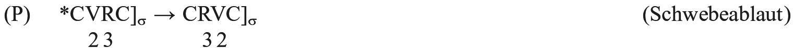

A process of high V epenthesis (followed by resyllabification) repaired certain sequences containing a derived superheavy syllable (Byrd 2010, following Hoenigswald and many others): */mert-i̯o-<b>/</b> → *[mert]σ[i̯o]σ → *<i>mertii̯o<b>-</b></i> ‘mortal’ (Ved. <i>mártiya-</i>). X may stand for either V or C.

<table>
<tr><td>(Σ)</td><td>*θ → *U₁ / …V X C]σ[__ U̯ ₁ V…</td><td>(Sievers’ Law)</td></tr>
<tr><td></td><td colspan="2">[…V X C]σ[U U̯ ₁ V…] → [… V X]σ[C U]σ[U̯ ₁ V…]σ</td></tr>
</table>

It has been long believed by many (following Schindler 1977b) that Sievers’ Law (SL) should be collapsed together with Lindeman’s Law (LL; see Lindeman 1965), with both being processes of syllabic resonant epenthesis in the onset of a word-final syllable.

<table>
<tr><td>(Τ)</td><td>*θ → *R̥₁ / #C __ R₁ V (C₀)#</td><td>(Lindeman’s Law)</td></tr>
</table>

There are key differences, however, between the two rules, casting doubt on Schindler’s analysis. First, there are attested instances of SL targeting non-final sequences, such as Ved. <i>poṣ<b>i</b>yā´vant-</i> ‘creating thrivance’ and <i>kā´v<b>i</b>yasya</i> ‘having the quality of a seer (gen.sg.)’. Second, while it is unlikely that SL extended beyond glides in PIE, LL clearly targeted all resonants: */du̯óh₁/ → *<i>duu̯óh₁</i> ‘two’ (Gk. δύω), */di̯éu̯s<b>/</b> → *<i>dii̯éu̯s</i> ‘sky’ (Ved. <i>diyáuḥ</i>), */krō´n/ → *<i>kr̥rō´</i> ‘piece of meat’ (Lat. <i>carō</i>), /dʰg̑ʰmō´n/ → <i>g̑ʰm̥mō´</i> ‘earthling’ (Lat. <i>homō</i>), and */gʷnéh₂/ → *<i>gʷn̥náh₂</i> (Gk. γυνή). While SL was utilized to repair superheavy syllables, the precise phonological motivation for LL is unclear, though I suspect that it arose to satisfy the aforementioned requirement for bimoraic prosodic words, and thus was an alternative to Monosyllabic Lengthening (ω).

### Acknowledgement

I would like to thank Jessica DeLisi, the editors, and especially Jesse Lundquist for their thoughtful comments and suggestions. All errors are my own.

## 6. Explanation of symbols

<table>
<tr><td>C</td><td>consonant</td></tr>
<tr><td>P</td><td>stop</td></tr>
<tr><td>T</td><td>dental stop</td></tr>
<tr><td></td><td>(unless otherwise noted)</td></tr>
<tr><td>K</td><td>dorsal stop</td></tr>
<tr><td></td><td>(unless otherwise noted)</td></tr>
<tr><td>kʷ</td><td>labiovelar stop</td></tr>
<tr><td>F</td><td>fricative</td></tr>
<tr><td>H or hₓ</td><td>laryngeal</td></tr>
<tr><td>R</td><td>resonant</td></tr>
<tr><td>N</td><td>nasal</td></tr>
<tr><td>U</td><td>high vowel</td></tr>
<tr><td>V</td><td>vowel</td></tr>
</table>
