# 122. The morphology of Proto-Indo-European

1.Introduction

2.Nominal morphology

3.Morphophonology of PIE

4.PIE verbal morphology

5.Conclusions

6.References

## 1. Introduction

This chapter aims to provide an updated overview of Proto-Indo-European (PIE) morphology, broadly establishing the typological properties of the reconstructible system, and offering some new perspectives on certain controversial aspects of this reconstruction. In this respect, we hope to make this chapter both relevant and accessible to several audiences: to students of IE languages looking to understand which categories are reconstructed for the proto-language and what their formal exponents looked like, so that they may see the daughter languages in the light of their diachronic developments; to specialists in IE linguistics, who may be interested in a “state-of-the-art” assessment of long-standing issues in PIE morphology and, to a lesser extent, the proposals we advance here; and to general linguists pursuing typological, historical, or theoretical questions who wish to see what kinds of morphological categories are reconstructed for the IE languages, on what basis they are reconstructed, and what types of analyses have been proposed.

Considerations of length prohibit a comprehensive survey of PIE morphology, a subject which, even more than phonology and much more than syntax, has received tremendous attention in the long history of the field. In a treatment of this size, we simply cannot do justice to the wealth of reconstructed PIE morphology; consider that as of 2017 the projected coverage of morphology in the series “Indogermanische Grammatik” (gen. ed. Lindner; see [www.winter-verlag.de)](http://www.winter-verlag.de) encompasses six volumes! Similarly, we cannot provide full discussion of the breadth of vigorous and informed controversy that envelops certain areas of PIE morphology; only salient features will be examined, with in-depth treatment reserved for areas of particularly great controversy. Readers looking for an introduction to the state of the field may consult Fortson (2010) and Clackson (2007), and for a more extensive overview Meier-Brügger (2010), the last with rich bibliography. The most extensive handbook of PIE morphology to date remains Brugmann and Delbrück (1906), although it is necessarily antiquated (especially in lacking evidence from Anatolian and Tocharian) and is currently in the process of being replaced by the volumes of the aforementioned “Indogermanische Grammatik”; note finally that a massive collection of bibliography on IE morphology has been assembled by Heidermanns (2005).

### 1.1. Methodological preliminaries

In this chapter, we aim to describe the morphology of the last stage of the proto-language that is the ancestor of all the IE languages (including the Tocharian and Anatolian branches of the family), and that is thus directly reconstructible by application of the Comparative Method (e.g., Meillet 1925; Weiss 2014). We reserve the label PIE for this directly reconstructible stage, thereby distinguishing it from the common ancestor of the non-Anatolian IE languages (including Tocharian), an entity referred to here as Proto-Nuclear-Indo-European (PNIE), whose inner articulation remains difficult to define (our PNIE is equivalent to what other scholars call “core PIE,” Germ. <i>Restindogermanisch</i>). We distinguish the label PIE from the still earlier stage of the language reached via internal reconstruction on PIE data, which we refer to as pre-PIE. We will repeatedly have occasion to consider the evidence for a given reconstruction on which almost all IE languages converge, with the persistent exception of the Anatolian branch and, in some cases, the Tocharian languages as well. Some major examples discussed below include, in the nominal system, the reconstruction of grammatical number and gender distinctions, and in the verbal system, the status of many fundamental PNIE verbal categories, including the *<i>s-</i> aorist, the optative, and (perhaps above all) the perfect. These divergences may indicate that Anatolian was the earliest branch to “hive off” (in Watkins’ [1998: 31] memorable phrase) from the ancestor of the other IE languages, whose period of common unity <i>after</i> the departure of Anatolian allows for the possibility of shared innovations that can thus be reconstructed for PNIE. This position amounts to a version of the “Indo-Hittite” hypothesis, first proposed by Sturtevant (1929, 1933) and later championed by Cowgill (1974, 1979). It is usually held that Tocharian was, in turn, first to depart from PNIE; this assumption will be broadly followed here, although the view is less universally held (see the discussions by Ringe and Jasanoff, both in this handbook).

### 1.2. Conventions

We employ in this chapter the linguistic conventions and abbreviations standardly used in Indo-European scholarship, which can be found in any of the handbooks listed in 1 above; we note here only a few terms and symbols whose usage is not uniform across the field or which we use in a way that may depart from standard practice. The most significant difference relates to the use of slant brackets (/…/). In some IE languages − in particular, those which are attested in non-alphabetic scripts (e.g., Mycenean Greek, Hittite) − it is customary to cite linguistic forms in transliteration together with a “phonological transcription” enclosed in slant brackets. We do not follow this practice here, instead reserving slant brackets for indicating underlying phonological representations (in the generative sense; cf. Byrd, this handbook); when forms cited in ordinary transliteration require further clarification (as often with these non-alphabetic orthographies), approximate IPA transcriptions enclosed in square brackets ([…]) are also provided. The symbols “<i>→</i>” and “<i>←</i>” indicate phonological mappings between underlying and surface forms; the distinction between these two levels of representation becomes important, especially, in the discussion of PIE morphophonology in 3 below. Synchronic word-formation processes are indicated by the symbols “⇒” and “⇐”; “>>” and “<<” denote that a combination of phonological and analogical changes have occurred between two historical stages. The symbol “ˣ” marks a following form or meaning that never existed at any historical stage but which might be expected under a different phonological or morphological analysis. Finally, we use a preceding asterisk “*” to mark reconstructed word forms, a preceding doubled asterisk “**” for word forms in internally reconstructed state(s) of the proto-language (i.e. pre-PIE), and an asterisk following a word (i.e. “<i>x</i>*”) to indicate that the particular form is not attested, but its existence is securely inferred from other attested forms.

## 2. PIE nominal morphology

This section outlines the reconstructed morphology of the PIE noun as well as related nominal categories, such as adjectives, pronouns, and adverbs. It is broadly organized as follows. We begin with the noun itself, discussing inflectional morphology in 2.1. Pronouns are addressed in 2.2, and numbers, adverbs, and other related nominal topics in 2.3. We discuss the derivational morphology of the PIE noun in 2.4, then turn in 2.5 to the closely-related topic of PIE adjectives. The section concludes in 2.6 by examining nominal compounds.

### 2.1. PIE nominal inflection

The PIE nominal system was characterized by rich inflectional morphology. All nouns and adjectives were grammatically specified for number, gender, and case. Number and case were expressed by fusional inflectional case endings in which no separate markers for number or case can be distinguished. These case endings (or “desinences”) were sensitive to the grammatical gender of the nominal stem to which they were suffixed; for instance, grammatically neuter nouns selected different endings from animate nouns in a subset of case forms. Adjectives modifying nouns generally exhibit concord with respect to all three nominal inflectional features, and in the same vein nominal subjects trigger number agreement on verbs. As will become clear below, this type of agreement plays a significant role in assessing certain difficult questions about the grammatical status of number and gender distinctions in PIE.

PIE inflectional endings are also an important locus of morphophonological alternations: in certain nominal classes, inflectional suffixes may induce changes in word-final segments (e.g., assimilation), in stem-internal vowels (ablaut), and in the position of the (single) surface word accent. Throughout this section we offer brief remarks on these issues when they arise; a fuller discussion − especially of word accent and its relationship to ablaut (or “apophony”; see also Byrd, this handbook) − is presented in 3 below.

#### 2.1.1. Case

PIE nouns inflected for case, the case ending of a noun denoting its grammatical role in the sentence − e.g., subjects are marked with nominative case. Eight cases are standardly reconstructed for PIE, primarily on the basis of Vedic Sanskrit where they remain formally distinct. These cases (and their basic functions) are: nominative (subject); accusative (direct object); instrumental (means, accompaniment, agent); dative (recipient, beneficiary, goal); ablative (source, separation); genitive (possessor); locative (in-/adessive, illative); and vocative (direct address). All case endings are fusional exponents of case and number, e.g., athematic genitive singular *<i>-(o</i>/<i>e)s</i> vs. plural *<i>-oh₁</i>/<i>3</i><i>om</i>, which show no morpheme segmentable as an exponent of case [genitive] or of number [singular, plural]. The nominative, accusative, and vocative are generally referred to together as the “strong” (or “direct”) cases, in contrast to the rest, which are termed “weak” (or “oblique”); this terminology is useful for describing noun classes in which the strong cases share a single “strong stem” allomorph that differs from the “weak stem” allomorph in accent or ablaut, and is thus standardly employed in analyses of PIE morphophonology (see 3 below).

PIE noun inflection is characterized by a formal opposition between “thematic” stems (i.e. ending in the theme vowel *<i>-e</i>/<i>o-</i>) and “athematic” stems (not ending in the theme vowel *<i>-e</i>/<i>o-</i>). Examples include athematic nominative singular *<i>gʷów-s</i> ‘cow’ (Ved. <i>gaú-s</i>, Gk. <i>boũ-s</i>) vs. thematic *<i>h₂r̥tk̑-o-s</i> ‘bear’ (Hitt. <i>ḫart[a]gg-a-š</i>, Ved. <i>r̥kṣ-a-s</i>, Gk. <i>árkt-o-s</i>). Thematic case endings are often transparently derived from athematic, such as nominative singular *<i>-os</i> from *<i>-o-</i> + *<i>-s</i>, but there are some instances in which they diverge. For instance, the neuter nominative-accusative singular in thematic nouns was realized by an ending *<i>-om</i> (e.g., Gk. <i>zug-ón</i>, Ved. <i>yug-ám</i>, Hitt. <i>yuk-an</i> ‘yoke’), while in athematic nouns, this case was zero-marked (Gk. <i>dóru</i>, Ved. <i>dā́ru</i>, Hitt. <i>tāru</i> ‘wood’). However, it is worth emphasizing that this distinction was purely formal: both athematic singular *<i>-</i>θ and thematic *<i>-om</i> have the same function despite their phonological differences. Conversely, although ablative and genitive singular are marked identically in athematic stems (*<i>-o</i>/<i>es</i>), these cases remain functionally distinct. This point is clearly shown by the separate formal mergers of the ablative in the daughter languages, e.g., with the genitive in Greek, but more unexpectedly, with the instrumental and locative in Latin; in the latter, a continuant of the thematic ablative ending (likely *<i>-oh₁ad</i>; see discussion below) marks all three functions in thematic stems (athematic dative *<i>-ey</i> functions similarly in athematic stems), while the genitive has its own marker. Nouns containing the PNIE “feminine” suffixes *<i>-ih₂</i>/<i>yeh₂-</i> or *<i>-(e)h₂</i> exhibited unique inflectional patterns, similar but not identical to other athematic nominal classes; their inflection is discussed separately in 2.1.3.

Table 122.1 provides reconstructed PIE athematic and thematic inflectional paradigms for those case endings whose status is relatively uncontroversial. Thematic inflection is presented with case endings joined to the thematic vowel. As a cursory glance shows, there is significant agreement on the reconstruction of singular case endings and the plural endings of the structural cases (nominative, accusative, genitive), although each has problematic or controversial aspects which are discussed below. The remaining plural endings are more uncertain; these too are discussed below.

Tab. 122.1 Athematic and thematic nominal endings

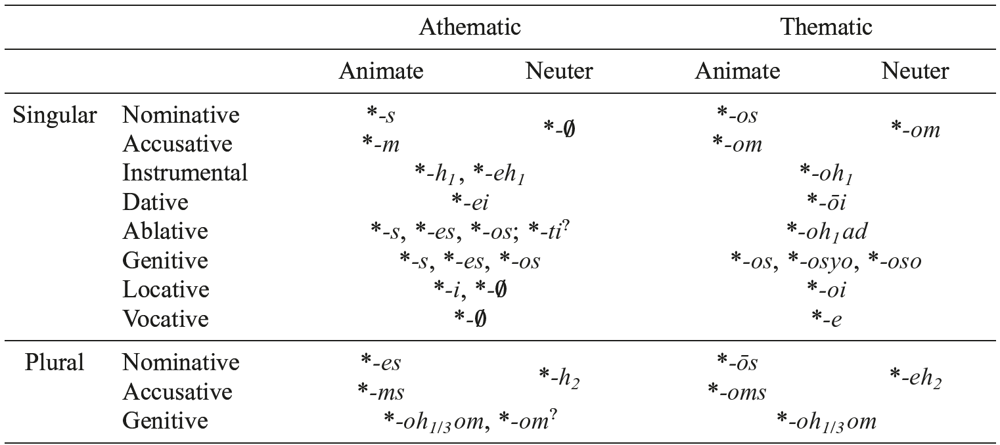

The PIE athematic animate nominative singular ending must be reconstructed as *<i>-s</i>, which is also the source of thematic singular *<i>-o-s</i> (e.g., Gk. <i>hípp-os</i>, Ved. <i>áśv-as</i> ‘horse’; Hitt. <i>išḫ-aš</i>, Lat. <i>er-us</i> ‘master’; Lith.<i>vi[image-glyph: l with tilde] k-as</i>, Goth. wulf-s ‘wolf’) and appears to be continued in certain obstruent-final stems in several archaic IE languages, e.g., Lat. <i>rēx</i> ‘king’ (< PIE *<i>h₃rḗg̑ -s</i>); Gk. <i>klṓps</i> ‘thief’ (< *<i>klṓp-s</i>); Hitt. <i>šīwaz</i> ‘day’, CLuw. D<i>tiwaz</i> ‘Sun-god’ (< *<i>díw-ot-s</i>). However, the ending has a phonologically restricted distribution − in particular, it is generally absent in sonorant-final (or *<i>s-</i>final) stems, where the only case marker is a lengthened suffixal vowel: Gk. <i>patḗr</i>, Ved. <i>pitā́</i>, OLat. <i>patēr</i> < *<i>ph₂tḗr</i> ‘father’; Gk. <i>kuṓn</i> ‘dog’, Ved. <i>ś(u)vā́</i> < *<i>(u)wṓn</i> ‘dog’; Ved. <i>uṣā́s</i>, Aeol. Gk. <i>aúōs</i> < *<i>h₂(é)us-ōs</i>. This lengthened vowel is due to Szemerényi’s Law, which is traditionally understood as a pre-PIE phonological rule deleting *<i>s</i> in word-final vowel + sonorant (or *<i>s</i>) + *<i>s</i> sequences with compensatory lengthening of the preceding vowel, i.e. pre-PIE **<i>-V{R, s}s#</i> > PIE *<i>-V:{R, s}</i> (cf. Szemerényi 1996: 113−119 with references).

The PIE athematic nominative plural ending is straightforwardly reconstructible as *<i>-es</i> (never zero-grade ˣ<i>-s</i>, despite the consistent lack of surface accent). It is found after obstruents, e.g., Gk. <i>pód-es</i> ‘feet’, Ved. <i>pā́d-as</i>* (< PIE *<i>pód-es</i>; cf. 3.1 below) and sonorants, e.g., Gk. <i>patér-es</i>, Ved. <i>pitár-as</i> ‘fathers’ (< *<i>ph₂tér-es</i>); Hitt. <i>arki-eš</i> ‘testicles’ (<< *<i>h₁org̑ʰ-ey-es</i>). The thematic plural ending is *<i>-ōs</i>, the long vowel likely arising from a prehistoric contraction of **<i>-o-es</i>; it is reflected in e.g., Ved. <i>vīr-ā́s</i> ‘men’; Goth. <i>hund-os</i> ‘dogs’; Osc. <b>Núvlan-ús</b> ‘men of Nola’; Pal. <i>mārḫ-aš</i> ‘guests’. This ending has been replaced in many IE languages by the pronominal nominative plural ending *<i>-oi</i>, e.g., Gk. <i>hípp-oi</i>, TB <i>yakw-i</i> ‘horses’; Lat. <i>vir-ī</i> ‘men’; OCS <i>grad-i</i> ‘cities’. This replacement is just one example of the interplay between nominal and pronominal inflection that is characteristic of the development of the IE languages.

The PIE athematic animate accusative singular ending is also securely reconstructed as *<i>-m</i>, which is evident in nouns with stem-final glides *<i>i</i> or *<i>u</i>, e.g., Ved. <i>matí-m</i> ‘mind’ (<PIE *<i>mn̥-tí-m</i> ‘thinking’), Ved. <i>gántu-m</i>, Lat. <i>(ad)ventum</i> (< PIE *<i>gʷ[e]m-tu-m</i> ‘going’), although the original state is partly obscured by the regular sound change of *<i>m</i> > [n] in word-final position observed in several IE branches (Greek, Anatolian, Germanic). After an obstruent, it surfaced as vocalic *<i>-m̥</i>, e.g., Gk. <i>póda</i>, Lat. <i>ped-em</i> ‘foot’ (< PIE *<i>pó</i>/<i>éd-m̥</i>). The corresponding thematic marker was *<i>-om</i>, e.g., Ved. <i>áśv-am</i>, OLat. <i>equom</i>, Gk. <i>hípp-on</i> ‘horse’ (< PIE *<i>h₁ék̑w-om</i>); Hitt. <i>išḫ-ān</i> ‘master’.

The thematic animate accusative plural ending is typically reconstructed as *<i>-oms</i> (or *<i>-ons</i>, although the Anatolian accusative plural forms appear to require unassimilated *<i>m</i>), which would thus be a surface exception to Szemerényi’s Law (and is therefore used as evidence for situating this rule in pre-PIE). Yet the (non-)assimilation issue is just one question that complicates the reconstruction of this ending’s phonetic realization in PIE. A more significant problem is that, while *<i>-oms</i> appears to be directly continued in dialectal (Gortynian Cretan) Gk. <i>-ons</i> and Goth. <i>-ans</i> with retained *<i>s</i>, as well as in Dor. Gk. <i>-ōs</i>/Att. Gk. <i>-ous</i> and Lat. <i>-ōs</i> with further simplification of this phonotactically problematic cluster, the long vowel in Ved. -<i>ān</i> points to a pre-form *<i>-ōm</i>, which looks like an effect of Szemerényi’s Law (and does not easily submit to analogical explanation). The difficulty in reconciling these disparate outcomes with a single PIE surface form may in fact stem from the relatively transparent morphophonemic analysis of the ending as a composite of the thematic vowel + accusative marker *<i>-m</i> + pluralizing *<i>-s</i> (in other words, internally reconstructed **<i>-o-m-s</i>). If this ending were still synchronically analyzable as such within the history of the daughter languages (in generative terms, underlyingly */-o-m-s/), it is possible that the attested endings that appear to continue *<i>-oms</i> are post-PIE innovations, while the lengthened vowel in the pre-form *<i>-ōm</i> reflected by Ved. <i>-ān</i> is due to the synchronic operation of Szemerényi’s Law in PIE (cf. Sandell and Byrd 2014), and the Vedic ending’s sandhi variant <i>-āṃs</i> derived by further recharacterization with pluralizing *<i>-s</i>. The surface form of the ending in any case depends on what phonological processes can be reconstructed for PIE, which itself calls for further research.

The PIE athematic animate accusative plural ending was *<i>-ms</i>, in all likelihood a composite of accusative *-<i>m</i> + pluralizing *<i>-s</i>, and by further addition of the thematic vowel *<i>-o-</i>, the source of thematic *<i>-oms</i> discussed above. It is usually assumed that this ending is directly continued (via assimilation) in glide-final stems in Germanic, e. g., Goth. <i>gasti-ns</i> ‘guests’; Goth. <i>sunu-ns</i> ‘sons’. Yet like its thematic counterpart, accusative plural *<i>-ms</i> is more frequently eliminated as a surface sequence, e.g., Hitt. <i>ḫašš-uš</i>* (LUGAL.MEŠ-<i>uš</i>) ‘kings’; Lat. <i>hostīs</i> ‘strangers, enemies’; Ved. <i>agnī́n</i> ‘fires’; Lat. <i>manūs</i> ‘hands’; Ved. sūnū́n ‘sons’. After a consonant, the ending was realized as *<i>-m̥ s</i>, the diverse reflexes of which include Ved. <i>pad-ás</i>, Lat. <i>ped-ēs</i> (via *<i>-ens</i>) ‘feet’; Gk. <i>kúnas</i>, Lith. <i>šun-įs</i> ‘dogs’; and Goth. <i>broþr-uns</i> ‘brothers’.

Nominative and accusative were not formally distinguished in PIE neuter nouns; both are zero-marked in the singular of athematic noun classes, e.g., Ved. <i>jā́nu</i>, Gk. <i>gónu</i>, Lat. <i>genū</i>, Hitt. <i>gēnu</i> ‘knee’ (< PIE *<i>g̑ ó</i>/<i>én-u-</i>θ), and marked by *<i>-om</i> in thematic nouns, e.g., Lat. <i>iug-um</i>, Ved. <i>yugám</i> ‘yoke’ (< PIE *<i>yug-óm</i>). Nominative and accusative similarly shared a (“collective”/set; cf. 2.1.2) plural ending *<i>-h₂</i>. This ending yielded a long vowel in glide-final stems, e.g., OHitt. <i>āššū</i> ‘goods’, Ved. <i>madhū</i> ‘sweet’ (adj.) (< *<i>-uh₂</i>); Ved. <i>śúcī</i> ‘shining’ (adj.) (< PIE *<i>-ih₂</i>). In sonorant- and <i>s</i>-final stems, the original situation is probably reflected in Hitt. <i>widār</i> ‘waters’ (< *<i>wed-ṓr</i>; cf. synchronically sg. Gk. <i>húdōr</i> ‘water’) and OAv. <i>manā̊</i> ‘thoughts’ (< *<i>men-os-h₂</i>); the long vowel in the final syllable of these words can then be ascribed to Szemerényi’s Law just as in the animate nominative singular, the environment for the change unified by the assumption that *<i>h₂</i> was − like *<i>s</i> − a fricative (per Kümmel 2007: 227−236, probably [χ]). In PNIE, at least, the neuter plural of obstruent stems was subject to “laryngeal vocalization” (i.e. vowel epenthesis; see Byrd, this handbook), which yielded <i>-i</i> in Indo-Iranian, and <i>-a</i> in Greek, e.g., prs.act.ptcpl. Ved. <i>-ant-i</i>, Gk. <i>-ent-a</i> (< PIE *<i>-ent-h₂</i>). However, reconstructing a single PIE (surface) form is in this case difficult, since Anatolian probably deleted final *<i>h₂</i> after an obstruent (see Byrd 2015: 96); as always, this split between PNIE and Anatolian raises questions about the PIE-level reconstruction. No such problems arise in the reconstruction of the thematic nominative-accusative neuter plural ending, which was *<i>-eh₂</i>. This ending is directly continued in Ved. <i>yugā́</i>, OCS <i>iga</i> ‘yokes’ (< PIE *<i>yug-eh₂</i>); Hitt. <i>kunn-a</i> ‘right-hand’ (adj.). In Greek and Latin, the case ending unexpectedly surfaces with a short vowel <i>-ă</i>, which is usually assumed to reflect its replacement by the athematic ending (see further Weiss 2011: 211).

Outside the nominative and accusative, case endings were the same for animate and neuter nouns. Most of the evidence for the reconstruction of the instrumental comes from Indo-Iranian, where the instrumental is productively continued as a distinct paradigmatic case form. An athematic singular ending *<i>-h₁</i> is generally reconstructed to account for the long vowel observed in Indo-Iranian glide-final stems, e.g., Ved. <i>matī́</i> ‘with thought’, OAv. <i>rāitī</i> ‘with liberality’ (< PIE *<i>-ih₁</i>); OAv. <i>xratū</i> ‘with wisdom’ (< PIE *<i>-uh₁</i>). However, the much more common athematic ending was *<i>-eh₁</i>, e.g., (anim.) Ved. <i>pad-ā́</i> ‘with the foot’, OAv. <i>zərədā(-cā)</i> ‘with heart’ (< PIE *<i>-eh₁</i>); (neut.) Ved. <i>mánas-ā</i>, OAv. <i>manaŋh-ā</i> ‘with thought’ (< PIE *<i>mén-es-eh₁</i>). This ending, moreover, is diachronically ousting the *<i>-h₁</i> instrumental ending − compare Ved. <i>krátv-ā</i> (< *<i>-eh₁</i>) with OAv. <i>xratū</i> (< *<i>-h₁</i>). The corresponding thematic ending was *-<i>oh₁</i>, which is reflected directly by archaic Indo-Iranian forms like Ved. <i>yajñ-ā́</i> ‘with sacrifice’, OAv. <i>yasn-ā</i> ‘with sacrifice’ (< PIE *<i>h₁yag̑ n-oh₁</i>); Lith. <i>výr-u</i> ‘with (a) man’; OSax. <i>word-u</i>, OHG <i>wort-u</i> ‘with (a) word’. Instrumental singular *<i>-eh₁</i> is also likely to be continued elsewhere in certain adverbs, e.g., Lat. <i>vald-ē</i> ‘very’, dialectal (Elean) Greek <i>taut-ē</i> ‘here’, and is according to Jasanoff (1978, 2003b) the pre-PIE source of the formally identical PIE stative suffix *<i>-eh₁(-ye</i>/<i>o)-</i> (cf. 4.3.1).

The PIE athematic dative and locative singular endings are uncontroversially reconstructed as *<i>-ei</i> and *<i>-i</i>, respectively, e.g., dative VOLat. REC-EI ‘for the king’ (= Lat. <i>rēg-ī</i>), Ved. <i>mātr-é</i> ‘for the mother’, OCS <i>synov-i</i> ‘for the son’ (< PIE *<i>-ey</i>); and locative Ved. <i>pad-í</i> ‘at the foot’ (< *<i>-i</i>). These two cases often underwent formal syncretism, as in Greek, where all first millennium dialects use -<i>i</i> (< *<i>-i</i>) to express dative (e.g., <i>Di[w]í</i> ‘for Zeus’) and locative (<i>pod-í</i> ‘for/at the foot’) functions, although traces of the old dative ending are preserved in Mycenean (cf. <i>di-we</i> [diwéi] ‘for Zeus’). The same exact syncretism has occurred in Hittite, where <i>-i</i> (< PIE *<i>-i</i>; never ˣ<i>-e</i> in Old Hittite) continues both dative (e.g., Hitt. <i>šiun-i</i> ‘for the deity’) and locative functions (Hitt. <i>nēpiš-i</i> ‘in heaven’); however, this development must also be recent, since CLuw. <i>-ī</i> < *<i>-ei</i> (e.g., <i>tappaš-ī</i> ‘id.’) points to an independent merger of dative and locative with the case ending of the former as exponent. Italic also continues locative *<i>-i</i>, but in yet another functional role: it has become the marker of the ablative singular in consonant stems, e.g., Lat. <i>-e</i>, Umbr. <b>-e</b> (see Vine, this handbook). The PIE athematic locative singular could also be realized with a zero-ending, the so-called “endingless locative”. This type is best represented in Anatolian, e.g., Hitt. <i>šīwat</i> (< PIE *<i>-ot-</i>θ) ‘on the day’, and in Indo-Iranian, e.g., Ved. <i>nā́m-an</i> ‘in name’ (< *<i>-men-</i>θ); OAv. <i>dąm</i> ‘in the house’ (< *<i>dṓ</i>/ <i>ém-</i>θ). In some cases, endingless locatives show a lengthened vowel in their stem-final syllable, as in the Avestan form cited above.

The PIE thematic dative and locative singular endings were *<i>-ōi</i> and *<i>-oi</i>, respectively. Dative *<i>-ōi</i> − with long diphthong via prehistoric contraction from **-<i>o-ei</i>, as in the thematic nominative plural (see above) − is continued in e. g., Gk. <i>hípp-ōi</i> ‘for the horse’; VOLat. DVEN-OI ‘for a good (man)’ (= Lat. <i>bon-ō</i>); OAv. <i>ahur-āi</i> ‘for the lord’; Lith. <i>výr-ui</i> ‘for a man’, while locative *<i>-oi</i> is reflected in Ved. <i>yajñ-é</i>, OAv. <i>yesn-ē</i> ‘in the sacrifice’; OCS <i>grad-ě</i> ‘in the city’; (adv.) Gk. <i>oík-oi</i> ‘at home’. The fact that the thematic locative ending was transparently derived by adding the athematic ending *<i>-i</i> to the thematic vowel <i>-o-</i> is crucial to its subsequent development in Greek and Balto-Slavic, both of which require that the ending was disyllabic in the shallow prehistory of these languages (Jasanoff 2009).

Several allomorphs are reconstructible for the PIE athematic genitive singular: *<i>-s</i>, *<i>-es</i>, and *<i>-os</i>. The last − arguably an intrusion from thematic nouns − is observed in Greek, e.g., <i>patr-ós</i> ‘of the father’, while certain Balto-Slavic forms require *-<i>es</i>, e.g., OLith. <i>szird-es</i> ‘of the heart’; OPr. <i>kermen-es</i> ‘of the body’. Both of these endings are attested in archaic Latin inscriptions, e.g., APOLON-ES ‘of Apollo’ (< *<i>-es</i>); NOMINUS ‘of name’ (< *<i>-os</i>), although only *<i>-es</i> is continued (as <i>-is</i>) in the classical language (cf. <i>Apollōn-is</i>, <i>nōmin-is</i>) (see Vine, this handbook). Due to the Indo-Iranian merger of *<i>e</i> and *<i>o</i>, Ved. <i>-as</i> and OAv. <i>-as(-cā)</i> could reflect either *<i>-es</i> or *<i>-os</i>. The distribution of the zero-grade *<i>-s</i> ending in the daughter languages is more limited, and generally confined to sonorant-final stems. It is best established in *<i>i</i>-stems (e.g., Ved. <i>agné-s</i> ‘of the fire’, OPers. <i>cišpai-š</i> ‘of Teispes’; OCS <i>kosti</i> ‘of the bone’; Osc. <i>aet-eis</i> ‘of part’ < *<i>-ey-s</i>) and *<i>u</i>-stems (Ved. <i>sūnó-s</i>, Goth. <i>sunau-s</i>, OCS <i>synu</i> ‘of the son’ < *<i>-ew-s</i>). Zero-grade *<i>s</i> is also found in *<i>r</i>-stems in Indo-Iranian and Germanic (e.g., YAv. <i>žaotar-š</i>, Ved. <i>hótur</i> ‘of the offerer’; Ved. <i>pitúr</i>, Anglian OE <i>fadur</i>, ON <i>fǫður</i> ‘of the father’ < *<i>-r̥s</i>); some Avestan *<i>n</i>-stems (e.g., OAv. <i>rāzə̄ṇg</i> ‘of the ruler’ < *<i>-on-s</i>; cf. Ved. <i>rā́jñas</i>) and Hittite verbal nouns in <i>-waš</i> (< *<i>-wen-s</i>); and to an *<i>m</i>-final root noun in the likely PNIE collocation *<i>dém-s páti-</i> ‘master of the house’ (OAv. <i>də̄ṇg paiti-</i>, Ved. <i>dán páti-</i>, Gk. <i>despótēs</i>). For the possibility that these zero-grade forms reflect a PIE syncope rule that applied in the final syllable of sonorant stems, see Kümmel (2014). The single example of *<i>s</i> in an obstruent-final stem is Hitt. <i>neku-z</i> [nekʷt-s] (cf. Lat. <i>noct-is</i>, Gk. <i>nukt-ós</i> ‘of the night’), which occurs only in the fixed phrase <i>nekuz mēḫur</i> ‘time of evening; twilight’ (Schindler 1967); the fact that it is not attested in any other Anatolian obstruent-final stems suggests that it is a pre-PIE archaism, and argues against reconstructing it as a PIE allomorph in obstruent-final stems.

The PIE thematic genitive singular also has multiple reconstructible allomorphs: *<i>-os</i>, *<i>-osyo</i>, and *<i>-oso</i>. Plain *<i>-os</i> − homophonous with thematic nominative singular *<i>-os</i> and clearly formed by the addition of athematic genitive singular *<i>-s</i> to the thematic vowel − is found only in Anatolian, e.g., Hitt. <i>išḫ-āš</i> ‘of the master’. The ending *<i>-osyo</i> is continued in HLuw. [-asi] (e.g., DEUS<i>-na-si-i</i> [mas:an-asi] ‘of the deity’) as well as probably Car. <i>-ś</i> (<i>pleq-ś</i> ‘of Peldēkos [PN]’; on both points, see Melchert 2012a with references); *<i>-osyo</i> is also well-represented in the NIE languages: Gk. <i>-oio</i> (e.g., Myc. <i>i-qo-jo</i>, Hom. <i>hípp-oio</i> ‘of a horse’); PIIr. *<i>-asya</i> (Ved. <i>áśv-asya</i>, OP <i>aspahyā</i> ‘id.’; OAv. <i>ahur-ahiiā</i> ‘of the Asura’), PItal. *<i>-osyo</i> (VOLat. VALESIOSIO ‘of Valerius [PN]’; Fal. <b>kaisi-osio</b> ‘of K− [PN]’), Arm. -<i>oy</i> (<i>mard-oy</i> ‘of a man’). As for the ending *<i>-oso</i>, its reflexes can be seen in Germanic (OSax. <i>dag-as</i>, OE <i>dæg-æs</i> ‘of the day’), perhaps Balto-Slavic (OPr. <i>deiw-as</i> ‘of god’ [for an alternative view see Olander 2015: 134− 136]), as well as Anatolian, cf. Lyc. <i>-Vhe</i>, e.g., <i>Xerig-ahe</i> ‘of Xeriga (PN)’; Car. <i>-s</i>, <i>ntro-s</i> ‘of “Apollo” ’ (see Melchert 2002, 2012a). Since Germanic nominal forms cited in support of an ablaut variant *<i>-eso</i> (Goth. <i>dag-is</i>, OHG <i>tag-es</i> ‘of the day’) are more likely analogical (Ringe 2006: 201−202), there is no positive evidence for its reconstruction in the nominal system. An innovative thematic genitive ending *<i>-ī</i> is found in Italic (e.g., Lat. <i>equ-ī</i> ‘of the horse’) and Celtic (e.g., Ogam Ir. MAQQ-I ‘of a son’); this ending may be historically related to the derivational suffix *<i>-ih₂-</i> (the so-called <i>vr̥kī́-</i>suffix), on which see Nussbaum (1975) and the discussions in 2.1.3. and 2.4. below.

The athematic ablative singular and genitive singular were formally syncretic in PNIE. However, the Anatolian languages show instead a formal merger of instrumental and ablative, one exponent of which is the ending (undifferentiated for number) *<i>-ti</i> (> Hitt. abl.-instr. <i>-z</i>; Hitt. <i>-az</i>, CLuw. <i>-ati</i>, HLuw. <i>-adi</i>/<i>-ari</i>, Lyc. <i>-edi</i> < *<i>-o-ti</i> with inner-Anatolian thematization). Melchert and Oettinger (2009) argue that this ending was the marker of ablative singular and plural in PIE, and that this situation was inherited into Anatolian, while the syncretism of ablative and genitive singular was a PNIE development (see also Oettinger, this handbook); however, it is just as plausible that the PNIE situation is archaic and Anatolian innovative, with a new formal marker of the ablative(-instrumental) developing independently in Anatolian just as it likely did in Armenian (e.g., <i>i get-oy</i> ‘from a river’) and perhaps also in Tocharian (e.g., TA <i>āsān-äṣ</i> ‘from the throne’).

The PNIE ablative singular of thematic nouns, in contrast, had a distinctive ending, which has traditionally been reconstructed as *<i>-ōd</i> (OLat. <i>-ōd</i>, Ved. <i>-āt</i>). Yet this reconstruction is problematized by the Lithuanian genitive singular <i>-o</i>, which requires Proto-Baltic *<i>-ād</i> (thus likely also OCS <i>-a</i> < PBS *-<i>ād</i>; see Olander 2015: 134−136). In order to reconcile these outcomes, it is generally assumed that the ending was disyllabic, with the pre-PIE agglutination of an element reconstructed as either *<i>h₂ed</i> or *<i>ad</i> that is also the source of various prepositions, adverbs, and local particles in the daughter languages (e.g., Lat. <i>ad</i> ‘to’; Goth. <i>at</i> ‘at’; see Dunkel 2014: II.8−18). Of these possibilities, the Hittite (singular/plural) instr. ending <i>-(i)d</i> is phonologically straightforward only from the latter: Melchert and Oettinger (2009: 55) derive this ending via resegmentation of PIE *<i>-oh₁-ad</i> − i.e. the thematic instrumental ending plus postpositional *<i>ad</i> − whence Pre-Hitt. *<i>-ad</i> (PIE *<i>-o[h₁]-h₂ed</i> would have yielded ˣ<i>-aḫ[ḫ]ad</i>); *<i>-ad</i> was then reanalyzed as Hitt. /-a-d/, a combination of thematic vowel + <i>-d</i> (alternatively, *<i>-d</i> may come directly from pronominal inflection; cf. 2.2.1). The development of PIE thematic ablative *<i>-oh₁ad</i> − perhaps indifferent to number as in Hittite − would thus follow a cross-linguistically well-established trajectory whereby new case endings emerge via accretion of adverbial elements (see generally Kulikov 2009; and on the Tocharian “secondary” cases, Kim 2013b and Pinault, this handbook).

The PNIE athematic instrumental plural ending is typically reconstructed as *<i>-bʰis</i>, for which Indo-Iranian (Ved. <i>-bhis</i>, OAv. <i>-bīš</i>) provides both formal and functional support; this ending is also directly continued in Celtic (Gaul. -BI, OIr. dat. pl. <i>-ib</i>). Possible further reflexes of the ending include Arm. instr. pl. <i>-bk‘</i>/<i>-ovk‘</i>/<i>-(a</i>/<i>i</i>/<i>o)wk‘</i> (beside instr. sg. <i>-b</i>/<i>-v</i>/<i>-w</i>; see Olsen, this handbook) and Myc. Gk. instr. <i>-pi</i> [-pʰi(s)], although these may rather be traced back directly to the adverb-forming suffix *<i>-bʰi</i> (Hom. Gk. <i>-pʰi</i>, e.g., <i>[w]ĩ-pʰi</i> ‘by force’), which is historically contained in the ending *<i>-bʰis</i> and which must be reconstructed for PIE (Hitt. <i>kuwa-pi</i> ‘when; where’). Germanic *<i>-mis</i> (> Goth. dat. pl. <i>-m</i>, ON <i>-m[r]</i>) and (with unexpected long vowel) Balto-Slavic *<i>-mīs</i> (> Lith. instr. pl. <i>-mì</i>, OCS <i>-mi</i>; secondarily Lith. instr. sg. <i>-mì</i>, OCS <i>-mĭ</i>) are also generally derived from *<i>-bʰis</i> via the so-called “Northern IE” substitution of *<i>bʰ</i> by *<i>m</i> (itself likely an adverbial suffix, e.g., Lat. <i>ill-im</i> ‘from there’; HLuw. abl.-instr. pron. <i>zin</i> ‘from/ with this’). The absence of Anatolian evidence for any *<i>bʰ</i>-initial case endings strongly suggests that *<i>-bʰis</i> is a PNIE innovation, and Jasanoff (2008) has argued that the PIE instr. pl. was rather *<i>-is</i>. He identifies this suffix in a set of adverbs (e.g., Gk. <i>móg-is</i> ‘with toil; hardly’; Ved. <i>āv-ís</i>, YAv. <i>āuu-iš</i> ‘manifest’) and, more significantly, in the PNIE pronominal instr. pl. ending *<i>-ōis</i> (see below), and derives PNIE <i>-bʰis</i> by its addition to adverbial *<i>-bʰi</i>. This scenario has a plausible parallel in the development of the PNIE dative-ablative plural ending *<i>-bʰ(y)as</i> (see below), but is complicated by the lack of external support from Anatolian for this *<i>-is</i> suffix itself.

The PNIE thematic instrumental plural ending is straightforwardly reconstructible as *<i>-ōis</i>, e.g., Indo-Iranian (Ved. <i>hást-ais</i>, OAv. <i>zast-āiš</i> ‘with the hands’); Gk. dat. pl. <i>tʰe-oĩs</i> ‘for/by the gods’ (unless from loc.pl. *<i>-oisu</i>; see below); Italic (VOLat. dat./abl. pl. SOKI-OIS ‘for the friends’ (> Cl. Lat. <i>soci-īs</i>); Osc. <b>Núvlan-úis</b> ‘for the men of Nola’); PBS *<i>-ōis</i> (Lith. <i>výr-ais</i> ‘with men’; OCS <i>grad-y</i> ‘with cities’). This ending appears to contain a post-thematic <i>i</i>-element original to the pronominal declension (cf. 2.2.1) just like the PNIE thematic locative plural and (arguably) dative plural (on both, see below); to this base in *<i>-oi-</i> was added, according to Jasanoff (2008), a suffix *<i>-is</i>, which may have been the PIE athematic instrumental ending (see above). In Anatolian, the instrumental plural was syncretic with the ablative, both formally marked by a historical exponent of the ablative; it thus presents no evidence for or against the PIE status of *<i>-ōis</i>.

The PIE dative plural ending is likely reconstructible as *<i>-os</i>, which is directly reflected in Anatolian (e.g., Hitt.<i>-aš</i>, CLuw. <i>-aš</i>, Lyc. <i>-e</i>), but whether this ending was original to thematic or athematic nouns is uncertain. It is also highly probable that the PNIE athematic dative-ablative ending generally reconstructed as *<i>-bʰ(y)as</i> is derived by addition of this *<i>-os</i> to the adverb-forming suffix *<i>-bʰi</i>. The phonologically expected outcome of their fusion is <i>-bʰyas</i>, which is continued in Indo-Iranian (e.g., Ved. <i>viḍ-bhyás</i>, OAv. <i>vīži-biiō</i> ‘to/for/from the clans’) and usually held to be the basic PNIE form of this syncretic ending. The functionally equivalent yod-less ending *<i>-bʰos</i> is found in Italic (e.g., Lat. dat. pl. <i>rēg-ibus</i> ‘for the kings’ [with intervening <i>i</i> analogically spread from *<i>i</i>-stem paradigms]) and Celtic (Gaul. <i>matrebo</i> ‘for the [divine] mothers’). Corresponding thematic endings were formed by adding the athematic ending either to the thematic vowel (e.g., Ven. <i>louderobos</i> ‘for the children’) or − less likely at the PIE stage − to stem-final *<i>-oi-</i> under the influence of the pronouns (cf. 2.2.1 below), as in Indo-Iranian (Ved. <i>ukth-ébhyas</i>, OAv. <i>uxð-ōibiiō</i> ‘to/for chants’). PBS shows athematic *<i>-mos</i> and thematic *<i>-omos</i> with *<i>m</i> instead of *<i>bʰ</i> just as in the athematic instrumental plural (see above), e.g., (athematic) OLith. dat. pl. <i>sunú-mus</i> ‘to/for sons’, OCS <i>kostĭmŭ</i> ‘to/for bones’; (thematic) Lith. <i>výr-ams</i> ‘to/for men’, OCS <i>grad-omŭ</i> ‘to/for cities’. The same <i>-(o)mos</i> may occur in PGmc. *<i>-(a)mz</i> (Goth. <i>-am</i>, ON <i>-mr</i>), although it may instead reflect PGmc. instr. pl. <i>-miz</i> (see above).

<!-- source-file: content/14_chapter08_3.xhtml -->

The PNIE ablative plural was, as noted above, syncretic with the dative plural in both thematic and athematic nouns. For the possibility that in PIE ablative case was marked by number-indifferent endings − athematic *<i>-ti</i> and thematic *<i>-oh₁ad</i> − see the discussion of the ablative singular above.

The PIE genitive plural ending in athematic nouns is much disputed, either *<i>-om</i> or *<i>-oh₁</i>/<i>3</i><i>om</i> (as in thematic nouns; see below). The Anatolian languages (Hitt. <i>-an</i>, Lyc. <i>-ẽ</i>) are uninformative, as they could reflect either ending. Within PNIE, there is incontrovertible evidence for *<i>-oh₁</i>/<i>3</i><i>om</i> in athematic nouns in Indo-Iranian (e.g., Ved. <i>padā́m</i> ‘of the feet’, frequently with disyllabic scansion of the ending), as well as in Greek and Baltic (e.g., Gk. <i>pod-[image-glyph: o with macron and tilde] n</i> ‘id.’; Lith. <i>akmen-ų̄</i> ‘of stones’, both with circumflex accent). Nevertheless, on structural grounds the disyllabic ending <i>-oh₁</i>/<i>3</i><i>om</i> is aberrant in athematic nominal inflection, and is thus reasonably assumed to originate historically in thematic paradigms; the question, then, is whether there was wholesale replacement of the “short” ending *<i>-om</i> (or possibly *<i>-h₁</i>/<i>3</i><i>om</i>) by the “long” ending *<i>-oh₁</i>/<i>3</i><i>om</i> already in P(N)IE, in which case there should be no definitive trace of *<i>-om</i> in the daughter languages, or if instead athematic *<i>-oh₁</i>/<i>3</i><i>om</i> is an innovation in the shallow prehistory of those branches in which it is attested. The answer to this question depends largely on the interpretation of the Slavic evidence. Jasanoff (1983) has contended that PS *<i>-ŭ</i> (e.g., OCS <i>dŭšter-ŭ</i> ‘of daughters’) can be derived from *<i>-oh₁</i>/<i>3</i><i>om</i> (via *<i>-ōm</i>); however, Olander (2015: 255−259) maintains the older view of Meillet (1922) that PS *<i>-ŭ</i> must continue “short” *<i>-om</i>. The matter remains unresolved at present.

The PIE thematic genitive plural ending was *<i>-oh₁</i>/<i>3</i><i>om</i>. Besides its possible Anatolian outcomes mentioned above (which likely rule out *<i>h₂</i> for the medial laryngeal by their lack of a consonantal reflex), it is productively continued in this nominal class in Greek (e.g., <i>hípp-ōn</i> ‘of horses’), Sabellic (SPic. <b>raeli-om</b> ‘of the Raelii [PN]’; Umb. <b>pihakl-u</b> ‘of the purification rites’), and Baltic (Lith. <i>lang-ų̄</i> ‘of windows’; Latv. <i>tȩ̄vu</i> ‘of fathers’). In several languages, the inherited ending has been analogically remodeled, e.g., Latin <i>de-ōrum</i> ‘of the gods’ on the basis of the feminine genitive plural (Pre-Lat. *<i>-āsōm</i>) (see Weiss 2011: 208, 224; cf. 2.2.1 below) and PIIr. *<i>-ānaam</i> (Ved. <i>yajñ-ā́nām</i>, OAv. <i>yasnanąm</i> ‘of the sacrifices’) on the basis of *<i>n</i>-stems (cf. Kümmel, this handbook); yet PIE *<i>-oh₁</i>/<i>3</i><i>om</i> survives in both Latin and Vedic in relic forms: Lat. <i>de-um</i>; Ved. <i>devā́ñ (jánma)</i> (RV VI.11.3b) ‘(race) of the gods’.

The PNIE athematic locative plural is generally reconstructed as *<i>-su</i>, which is continued in Indo-Iranian (e.g., Ved. <i>vik-ṣú</i> ‘among the clans’; OAv. <i>naf-šu</i> ‘among the descendants’) and Balto-Slavic (dial. Lith. <i>aki-sù</i> ‘in [the] eyes’; OCS <i>gostĭ-xŭ</i> ‘among guests’). Greek dat. <i>-si</i> (e.g., <i>nau-sí[n]</i> ‘to/for/on the ships’) likely reflects the same ending with analogical *<i>-i</i> from the locative singular. Adding *<i>-su</i> to the pronominally influenced base *<i>-oi-</i> (cf. 2.2.1 and 2.2.2 below) yielded the thematic ending *<i>-oisu</i>, e.g., Ved. <i>márt(i)y-eṣu</i>, OAv. <i>mašị i-aēšu</i> ‘among mortals’; OCS <i>grad-ěxŭ</i> ‘in cities’; and with the same analogical development, Gk. dat. <i>tʰe-oĩsi</i> ‘to/for/among the gods’. This ending <i>-oisi</i> may also be the source of the shorter Greek thematic dat. pl. ending <i>-ois</i> (via apocope), unless it instead reflects thematic instr. pl. *<i>-ōis</i> (see above). The only alleged trace of *<i>-su</i> in Anatolian is as an adverb in the Luwic languages (CLuw. 3-<i>šu</i>, HLuw. <i>ta-ra</i>/<i>i-su</i> ‘thrice’; perhaps also Milyan <i>trisu</i>); thus if the PA syncretic dat.-loc. ending *<i>-os</i> was originally a dative marker, it would be possible to reconstruct a distinct PIE locative plural ending *<i>-su</i>.

The PIE athematic vocative singular was zero-marked (*<i>-</i>θ), e.g., Hitt. ᵈ<i>Kumarbi</i> ‘(O) Kumarbi’; Gk. <i>páter</i>, Ved. <i>pitar</i>, Lat. <i>(iup)-piter</i> ‘(O) (sky-)father’; Ved. <i>sūno</i>, Goth. <i>sunau</i>, Lith. <i>sūnaũ</i>, OCS <i>synu</i> ‘(O) son’ (< *<i>-ew-</i>θ, with full-grade of the derivational suffix in glide-final stems). The vocative of PIE thematic nouns was marked by *<i>-e</i>, e.g., Gk. <i>lúk-e</i>, Lat. <i>lup-e</i>, Lith. <i>vi[image-glyph: l with tilde] k-e</i> ‘(O) wolf’; Ved. <i>dev-a</i>, OPr. <i>deiw-e</i> ‘(O) god’; OCS <i>bož-e</i> ‘id.’. The use of nominative singular for vocative singular − very likely by analogy to the plural (see below) − is also found to various degrees in many languages (especially in athematic nouns).

The PIE vocative plural was identical to the nominative plural in both athematic and thematic nouns. This situation is continued into all of the daughter languages except Old Irish, where the distinctive vocative (e.g., <i>[á] ḟir-u</i> ‘[O] men’) reflects the inherited PIE nominative plural ending *<i>-ōs</i>, which has been replaced <i>qua</i> nominative by innovative *<i>-ī</i> from the pronouns (see above).

Some scholars argue for the reconstruction of a ninth PIE case, the allative (or “directive”), which signified movement in a direction or toward a goal. The status of this case is disputed, as is its formal marker (possibilities include *<i>-e</i>/<i>oh₂</i>, *<i>-h₂e</i>, and *<i>-o</i>). Evidence for the reconstruction of the allative comes principally from Old Hittite, where it is a productive case ending, while in the PNIE languages there are certain adverbs that could be relic case forms, e.g., Gk. <i>kʰamaí</i> ‘to the ground’. Most regard this evidence as insufficient to justify the reconstruction of an additional PIE case, which implies its synchronic status in Hittite reflects an innovation (for arguments in support of this scenario, see Melchert forthcoming c).

Similar attempts have been made to reconstruct another case form attested exclusively in the Anatolian languages, the ergative. In Anatolian, when a neuter noun is the subject of a transitive verb, it receives ergative case. Singular and plural endings are securely reconstructible for PA in view of agreement between Hittite and the Luwic languages: (sg.) Hitt. <i>-anza</i> [-ant͡s], CLuw. <i>-antiš</i>, HLuw. <i>-antis</i>, Lyc. pre-nasalizing <i>-ti</i>; (pl.) Hitt. <i>-anteš</i>, Luw. <i>-antinzi</i> [-antint͡si]. However, at least since Garrett (1990) it has been generally agreed that these endings − and the Anatolian syntactic feature, split-ergativity, that they would imply − are post-PIE innovations (cf. Melchert 2011b), and according to most recent hypotheses, the ergative endings have grammaticalized from an animacy-increasing (or “individuating”) derivational suffix, perhaps PIE *<i>-e</i>/<i>ont-</i> (see Goedegebuure 2013 and Oettinger, this handbook).

In addition to the case endings associated with singular and plural number, a limited reconstruction of dual markers is possible. For the athematic animate dual, a syncretic nominative-accusative(-vocative) ending *<i>-h₁e</i> is plausibly reconstructed on the basis of Greek (e.g., <i>pód-e</i> ‘two feet’) and Lithuanian (OLith. <i>žmũn-e</i> ‘two men’) evidence, although this reconstruction is somewhat complicated by the fact that glide-final stems appear to continue just *<i>-h₁</i>, e.g., Ved. <i>kav-ī́</i> ‘two poets’, OCS <i>gost-i</i> ‘two guests’; Ved. <i>sūnū́</i>, OCS <i>syn-y</i>, Lith. <i>sū́n-u</i> ‘two sons’. More formally secure is an athematic neuter dual ending *<i>-ih₁</i>, for which there is at least one lexical match between these two branches (Gk. <i>ósse</i> = Lith. <i>akì</i> ‘two eyes’), as well as agreement within Indo-Iranian (e.g., Ved. <i>vácasī</i>, OAv. <i>vacahi[-cā]</i> ‘two words’). Thematic forms were produced by addition of the athematic endings to thematic vowel *<i>-o-</i>, thus likely neuter *<i>-o-ih₁</i> (e.g., Ved. <i>yug-é</i> ‘two yokes’; OCS <i>měst-ě</i> ‘two places’), and animate *<i>-oh₁e</i> which, according to Jasanoff’s (1988: 73−74) proposal, would have yielded accent-conditioned variants * <i>ˊ-oh₁</i> (e.g., Gk. <i>hípp-ō</i>, Ved. <i>áśv-ā</i> ‘two horses’) and *<i>-óh₁u</i> (e.g., Ved. <i>dev-aú</i>). On the possible Anatolian reflexes of these endings, see 2.1.2 below.

Very little can be said with certainty about the reconstruction of the oblique case forms of the dual, yet two points are fairly clear. First, the oblique cases of the dual were also almost certainly syncretic: in Vedic, instrumental, dative, and ablative functions are marked by <i>-bhyām</i>, while genitive and locative share the marker <i>-os</i>; but even within Indo-Iranian there are differences, since Avestan has distinct genitive (OAv. <i>-ā̊</i>) and locative (OAv. <i>-ō</i>) endings. Similarly, PBS probably had one case ending for dative and instrumental, and another for genitive and locative (see Olander 2015: 205−220 for discussion). It is also clear that the oblique dual endings were built out of adverbial elements just like the non-structural plural case markers (in some cases, the same elements, e.g., *<i>-bʰi</i>), but the details of their reconstruction are even more uncertain. On the more general question of the status of the dual as a PIE category, see again 2.1.2 below.

#### 2.1.2. Number

A three-way nominal contrast for number (singular, dual, plural) is securely reconstructible for PNIE. This number system − a cross-linguistically common type (Corbett 2000: 20) − is synchronically operative in the oldest stages of Indic, Iranian, Greek, Baltic, Slavic, Tocharian, Celtic, and to a lesser extent in Germanic (mainly Gothic); the other PNIE languages have lost the dual as a living category, retaining traces in the numeral system (e.g., *<i>dwoh₁</i> > Lat. <i>duo</i> ‘2’) or elsewhere. The reconstruction of number in PIE is problematized, on the one hand, by the absence of the dual as a living number category in Anatolian, and on the other, by the vexed question of the neuter plural. Many scholars would trace the neuter plural back to an original <i>singular</i> “collective” − in part because of the formal affinity between its marker *<i>-(e)h₂</i> and the suffix *<i>-eh₂</i> that primarily marks feminine nouns in the NIE languages (cf. 2.1.3. below), and in part because of the singular verbal agreement patterns observed with neuter plural subjects in several ancient IE languages. We take up these issues in turn below.

As discussed in 2.1.1, formal markers for the (nominative-accusative) dual are securely reconstructible for PNIE. Nouns marked with dual number refer to exactly two distinct real-world entities (and by implication, the plural to three or more such entities). In the IE branches in which the dual is preserved (Indo-Iranian, Greek, Celtic, Balto-Slavic, Gothic, Tocharian), it is most frequently used with naturally occurring pairs − one widespread example is Gk. <i>ósse</i>, Ved. <i>akṣī́</i>, YAv. <i>aši</i>, Lith. <i>akì</i>, OCS <i>oči</i>, TB <i>eśane</i> ‘two eyes’ − as well as with items at the highest end of the animacy hierarchy (see Corbett 2000: 55 ff.), thus especially when a noun’s referents are human, e.g., Gk. <i>antʰrṓpō</i> ‘two men’, OLith. <i>žmũn-e</i> ‘id.’. In addition, it appears that the IE dual had certain idiosyncratic uses − for instance, as an associative marker in the “elliptic dual”, e.g., Ved. <i>Mitrā́</i> ‘Mitra and his companion Varuṇa’; Hom. Gk. <i>Aíante</i> ‘Ajax and his companion Teucer’ (Wackernagel 1877 [= 1953b: 538−545]).

The dual was lost in many IE languages, in some cases within the historical period (e.g., post-classical Greek). This extensive loss may be easier to explain if it is assumed that in P(N)IE the use of the dual for two referents was optional − or more standardly “facultative” − as already observed in Homeric Greek, which regularly allows the plural in these contexts. However, since facultative use of the dual is found in many languages in which the category remains productive (Corbett 2000: 42−53), this need not in itself be viewed as an indication of the incipient loss of the grammatical category.

Projecting the dual back from PNIE to PIE itself is complicated by the limited evidence for dual number in the Anatolian nominal system. The dual exists as a synchronic grammatical category in none of the Anatolian languages. Possible support for PIE inheritance is restricted to lexicalized relics, forms denoting natural pairs that may have escaped the loss of the dual by reanalysis as set (or “collective”; see further below) plurals due to their (synchronic) formal identity with members of this productive category (Rieken 1994: 52−53). Potential traces of the dual in animate nouns include CLuw. <i>tāwa</i> ‘eyes’, <i>iš(ša)ra</i> ‘hands’, and <i>pāta</i>* (GÌR.MEŠ-<i>ta</i>) ‘feet’ (< *<i>-oh₁[e]</i>), while the neuter dual ending in *<i>-ih₁</i> may be continued in Hitt. GIŠ<i>ēlzi</i> ‘scales’, <i>mēni-</i> ‘face’, and a few other lexical items; see Melchert (forthcoming a) with references. It is generally thought that additional evidence for the dual in Anatolian comes from the verbal system − in particular, the PA 1st plural ending *<i>-wen(i)</i> − but see further discussion in 4.2.2 below.

A separate, much-discussed question concerns the PIE status of number in neuter nouns: did plural number exist as a grammatical category in neuter nouns, or did neuter nouns instead form only a grammatically singular “collective”? Advocates of the latter position typically point to the formal affinity between the marker of the neuter plural *<i>-(e)h₂</i> and that of the PNIE feminine-forming suffixes *<i>-ih₂</i>/*<i>-yeh₂-</i>, *<i>-ih₂</i>, and in particular *<i>-eh₂</i> (see 2.1.3. below), whose derivatives have a (remarkably *<i>s</i>-less) nominative <i>singular</i>, e.g., PNIE *<i>h₂widʰéw-eh₂</i> > Ved. <i>vidhávā</i>, Lat. <i>vidua</i> ‘widow’ (cf. <i>LIV₂</i>: 294). This ending is phonologically identical to the ending which characterizes neuter plurals in the daughter languages (e.g., PIE *<i>yug-éh₂</i> > Ved. <i>yugā́</i>, Lat. <i>iuga</i> ‘yokes’).

There is a consensus, then, that this formal agreement reflects a prehistoric connection between neuter plural and feminine, but the exact nature of this relationship is much disputed − in particular, whether the neuter played a role in the genesis of the feminine (see 2.1.3 below) − and has given rise to an enormous literature (for a range of recent opinions, see the papers collected in Neri and Schuhmann 2014). However, the question for the directly reconstructible stage of PIE amounts to a simpler one: Is there any compelling evidence that neuter nouns marked with *<i>-(e)h₂</i> were grammatically singular in the IE languages?

That the PNIE descendants of neuter *<i>-(e)h₂</i> nouns are <i>synchronically</i> plural is undisputed: they regularly refer to multiple individuated entities, and except for the nominative-accusative case, have the same plural inflectional endings as animate nouns. The analysis of the Anatolian evidence is more often called into question − for instance, it has repeatedly been claimed (e.g., Harðarson 1987, 2015; Matasović 2004: 156) that neuter *<i>-(e)h₂</i> nouns show singular agreement with predicate adjectives and pronouns. However, this claim is false for Old Hittite, and the New Hittite examples cited in support are demonstrably innovations (van den Hout 2001). Moreover, even Anatolian <i>pluralia tantum</i> of this type in which an original singular value might be detected − e.g., Hitt. <i>warpa</i> ‘enclosure’, Lyc. <i>arawazija</i> ‘memorial’ − are grammatically plural, as shown by their resumption in discourse with unambiguously plural case forms (dative-locative plural Hitt. <i>warpaš</i>, Lyc. <i>arawazije</i>; see Melchert 2011: 396).

The remaining alleged evidence for the erstwhile singular status of IE neuter plurals comes from verbal agreement patterns in Anatolian, Greek, and, on a more limited basis, Indo-Iranian: in contrast to animate plurals, neuter plural subjects in these languages take singular verbal agreement morphology. This phenomenon − now generally (although anachronistically) referred to as the “<i>tà z[image-glyph: o with macron and tilde] i-a trékʰ-ei</i> rule” − was recognized for Greek already by the ancient grammarians; for its parallel operation in Hittite, see Hoffner and Melchert (2008: 240). The singular verb marking in this type is held to reflect a stage at which these neuter nouns were grammatically singular, and thus singular verb agreement was appropriate. Yet there is no need for recourse to such a prehistoric stage to explain this agreement pattern, since it is typologically common that low animacy nouns morphologically marked as plural fail to trigger plural agreement on verbs (cf. Comrie 1989: 190−191); outside of IE itself, such patterns are observed in Georgian (Smith-Stark 1974) and Turkish (Bamyacı, Haussler, and Kabak 2014), as well as Muna (Austronesian) and Ngalakan (Australian) (see Corbett 2000: 71, 188−189 with references). Per Patri (2007: 62), Anatolian verbs may therefore “default” to singular in the absence of an (animate) plural controller; the same analysis could account for Greek and, in turn, be extended to PIE, in which case there is no need to assume that neuter *<i>-eh₂</i> nouns were singular in PIE, nor necessarily at any earlier period (see Melchert 2011a for arguments to this effect).

Yet in contrast to the evidence for their singularity, there is strong support for the notion that *<i>-(e)h₂</i> marked “collectives”, or perhaps more precisely, “set plurals” (cf. Eichner 1985: 142; Melchert 2014c: 257−258; on the problematically “variegated” usage of the term “collective,” see Gil 1996: 66−70). It has long been known that there are a number of cases in the NIE languages of three-way splits in animate nouns, where a continuant of *<i>-(e)h₂</i> is attested beside ordinary singular and plural forms, e.g., Gk. <i>kúklos</i> ‘wheel’, <i>kúkloi</i> ‘wheels’, <i>kúkla</i> ‘wheel-set’; Gk. <i>mērós</i> ‘thigh’, <i>mēroí</i> ‘thighs’, <i>mḗra</i> ‘(sacrificial) thigh-pieces’ (on the accentual variation, see Probert 2006b: 158− 163); Lat. <i>locus</i> ‘place’, <i>locī</i> ‘places’, <i>loca</i> ‘literary passages’ (although the distinction between the latter two is debatable; cf. Weiss 2011: 196; Clackson 2007: 101−103). These examples − most clearly, Greek <i>kúkla</i> − are consistent with the idea that animate *<i>-eh₂</i> nouns denoted multiple distinct entities that were conceptualized as constituting a set. Eichner (1985: 148) identified similar Hittite examples, e.g., <i>alpaš</i> ‘cloud’, <i>alpēš</i> ‘clouds’, <i>alpa</i> ‘cloud-bank’. Supplementing the Hittite data collected by Eichner (e.g., Hitt. <i>palšaš</i> ‘path,’ <i>palšeš</i> ‘paths’, <i>palša</i> ‘path composed of ritual materials’) and adding Lycian and Luwian comparanda, Melchert (2000: 62−67) argues that the relatively robust Anatolian evidence is indicative of a productive grammatical process; thus in contrast to the NIE languages, where the marginality and generally specialized meaning of animate set plurals allows them to be plausibly analyzed as lexicalized relics (cf. Harðarson 1987; Tichy 1993), the Anatolian situation is best explained by assuming that PIE animate nouns could regularly form either a count plural (marked with *<i>-es</i>/<i>-ōs</i>) or a set plural (marked with *<i>-[e]h₂</i>), whereas neuter nouns lacked the grammatical category of count plural.

PIE would thereby distinguish at least two grammatical numbers, singular and plural, and according to most researchers, a third, the dual; in addition, the plural had two distinct sub-classes (Melchert 2000: 62, 67 n. 38), count plural and set plural (cf. Eichner’s [1985] <i>Komprehensiv</i>, though reconstructed as a fourth category), although only in animate nouns was the morphological distinction realized. This system is outlined in Table 122.2 with the nominative case endings reconstructible for each category:

Tab. 122.2 Animate and neuter singular, dual, and plural endings

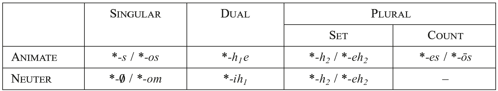

This reconstruction gives rise to a number of questions. There are, for instance, neuter nouns reconstructible for PIE for which the notion of count plural was semantically appropriate (e.g., *<i>pédom</i> ‘place’; cf. 2.1.3 below) − how was this expressed by PIE speakers? Moreover, while it is clear that by PNIE the morphological contrast between set and count plural had been eliminated and that the resulting undifferentiated category was marked by an exponent of the original count plural for animate nouns and of the set plural for neuter nouns, the details of the diachronic pathway that led to this situation remain to be worked out. In addition, the hypothesized number system in Table 122.2 − with its morphological gap for neuter count plural − merits further consideration from a typological perspective. Still more uncertain are questions about the deeper prehistory of this system − in particular, about the development of the PIE set plural suffix *<i>-eh₂</i>, which must ultimately be traced back to a pre-PIE derivational suffix that also yields the PNIE feminine suffix of the same shape (see 2.1.3 below). For intriguing discussion of how the pre-PIE suffix **<i>-(e)h₂</i> may have separately grammaticalized as the marker of both set plural and of feminine gender, see Melchert (2000, 2014c), Luraghi (2009a, b, 2011), and Nussbaum (2014b). For more traditional opposing views, see the references in 2.1.3 below.

#### 2.1.3. Gender

Just as for number, a three-way grammatical gender split is securely reconstructible for PNIE: masculine, feminine, and neuter. Yet even before the discovery of Hittite and the other Anatolian languages, the gender system of PNIE displayed numerous features suggesting that this three-way gender division might have replaced an older bipartite system that distinguished only between animate and neuter (cf. Brugmann 1891). When it eventually became clear that Hittite attests just animate and neuter genders (see further below), it seemed all but confirmed that Anatolian reflects the older PIE situation, and that the diachronic development of the feminine gender was a crucial innovation of PNIE. Such a position is now the majority view; see Ledo-Lemos (2000: 41−94) and Matasović (2004: 36−41 with references). However, concerning the details of the feminine’s development, there is very little agreement − in particular, it is disputed how the formal affinities between the feminine suffixes *<i>-ih₂</i>/*<i>-yeh₂-</i>, *<i>-ihₓ-</i>, and *<i>-eh₂-</i> and the set plural suffix *<i>-(e)h₂</i> (cf. 2.1.2) should be reconciled. In this section, we outline the principal evidence for the PNIE innovation of the feminine, and discuss some recent hypotheses about its origin.

The PNIE three-gender system − a cross-linguistically common type, occurring in approximately 23% of the languages surveyed by Corbett (2013) that have grammatical gender (more common is two) − is observed intact in the oldest stages of most of its language branches: Albanian, Celtic, Greek, Indo-Iranian, Italic, Germanic, and Slavic. All nouns are specified for masculine, feminine, or neuter gender, and trigger gender agreement on attributive and predicative modifiers (adjectives, pronouns). In adjectival agreement, PIE gender exhibits inflectional character (cf. Luraghi 2014: 199): agreement is obligatorily realized on adjectives with inflectional endings − for masculine and neuter adjectives, by the addition of PIE animate and neuter nominal case endings respectively (cf. 2.1.1), and for feminine adjectives, by suffixes that generally combine a marker of the feminine with PIE animate case endings, e.g., feminine accusative singular *<i>-eh₂-m</i> (Ved. <i>-ām</i>, dialectal Gk. <i>-ān</i>, Lat. <i>-am</i>, Goth. <i>-a</i>, OCS <i>-ǫ</i>, Lith. <i>-ą</i>).

Grammatical gender assignment in PNIE was sensitive, on the one hand, to the animacy and individuation of a noun’s referent (cf. Ostrowski 1985: 316; Matasović 2004: 196−203), and on the other, to its sex (Luraghi 2009a). Prototypical neuter nouns referred to inanimate and weakly individuated entities, thus especially mass nouns, e.g.*<i>h₁ésh₂-r̥</i> ‘blood’ (> Gk. <i>éar</i>, TB <i>yasar</i>); *<i>mélit</i> ‘honey’ (> Gk. <i>méli</i>, Goth. <i>miliþ</i>, Alb. <i>mjaltē</i>); that these nouns often have exact cognates in Anatolian (CLuw. <i>āšḫar</i> ‘blood’; Hitt. <i>milit</i> ‘honey’) suggests they belonged to the inherited core of PIE neuter nouns (cf. 2.4.3 below). Still, neuter nouns referring to countable entities are reconstructible for PNIE, e.g., *<i>w(e)rdʰom</i> ‘word’ (> Lat. <i>verbum</i>, Goth. <i>waurd</i>); *<i>h₂erh₃trom</i> ‘plow’ (> Gk. <i>árotron</i>, OIr. <i>arathar</i>, OCS <i>ralo</i>); and in a number of cases, likely further back to PIE, e.g., *<i>pédom</i> ‘place’ (> Hitt. <i>pēdan</i>, Gk. <i>pédon</i>); *<i>yugóm</i> ‘yoke’ (> Gk. <i>zugón</i>, Ved. <i>yugám</i>, Lat. <i>iugum</i>, Hitt. <i>yukan</i>).

In contrast, highly animate and individuated entities like human beings and large animals were generally assigned to either masculine or feminine gender depending on the sex (or “natural gender”) of the referent, e.g., masculine *<i>ph₂tḗr</i> ‘father’ (see 2.1.1 above); *<i>wĺ̥kʷos</i> ‘(he-)wolf’ (> Ved. <i>vŕ̥kas</i>, Goth. <i>wulfs</i>, Lat. <i>lupus</i>) vs. feminine *<i>méh₂tēr</i> ‘mother’ (> Ved. <i>mātā́</i>, OIr. <i>máthair</i>, TB <i>mācer</i>); *<i>wl̥kʷíhₓs</i> ‘she-wolf’ (> Ved. <i>vr̥kī́s</i>, ON <i>ylgr</i>). Yet the non-neuter genders also take in less prototypically animate members − e.g., masculine *<i>pód-</i> ‘foot’ (acc.sg. in Gk. <i>pód-a</i>, Ved. <i>pā́dam</i>, Lat. <i>pedem</i>); feminine *<i>nókʷt-</i> (acc.sg. in Gk. <i>núkta</i>, Lat. <i>noctem</i>, Goth. <i>naht</i>) − while excluding others that refer to living beings, but are weakly individuated: for instance, *<i>pék̑u</i> ‘livestock’ (> Ved. <i>páśu</i>, Goth. <i>faihu</i>, Lat. <i>pecū</i>) is neuter. Examples of this kind suggest that referential (or “natural”) animacy and grammatical animacy were partially independent, and that factors like individuation (and relatedly, topic-worthiness; see Comrie 1989: 189−195) played a role in gender assignment (cf. Luraghi 2011). Similarly, the fact that words for ‘child’ in the daughter languages are often neuter (e.g., Gk. <i>téknon</i>, OHG <i>kind</i>, OCS <i>dětę</i>) shows that referential animacy is not a sufficient condition for grammatical animacy.

Although some feminine nominal formations in the PNIE languages are formally indistinguishable from masculines (e.g., *<i>méh₂tēr</i> ‘mother’ cited above), the majority contain a suffix *<i>-ih₂</i>/*<i>-yeh₂-</i>, *<i>-ihₓ-</i>, or *<i>-eh₂-</i> (referred to as <i>Motion</i> suffixes in German scholarship). Words containing these suffixes are overwhelmingly feminine in the NIE languages, and in many cases, appear to be derived from masculine nominals − in particular, from masculine *<i>o</i>-stem nouns, where the feminine suffix is traditionally analyzed as replacing the thematic vowel. Exact word equations support the reconstruction of this process for PNIE, e.g., *<i>wĺ̥kʷos</i> ‘(he-)wolf’ ⇒*<i>wl̥kʷíhₓs</i> ‘she-wolf’ (cited above); *<i>h₁ék̑wos</i> ‘horse’ (Ved. <i>áśvas</i>, Lat. <i>equus</i>) ⇒ *<i>h₁ék̑w-eh₂</i> (Ved. <i>áśvā</i>, Lat. <i>equa</i>, OLith. <i>ašvà</i>). In view of its productivity, however, it is possible that some of these words were formed independently in the daughter languages, especially in a case such as *<i>h₁ék̑weh₂</i>, where an older strategy is likely reconstructible (see below). The basic strong and weak stem inflection of these suffixes is illustrated in Table 122.3 with their outcomes in Vedic Sanskrit; note that the long vowel of the accusative singular is due to Stang’s Law (see Byrd, this handbook):

Tab. 122.3 Stem-type inflection of *<i>deiw-íh₂</i>, *<i>wl̥kʷ-íhₓ</i>, and *<i>h₁ék̑w-eh₂</i>

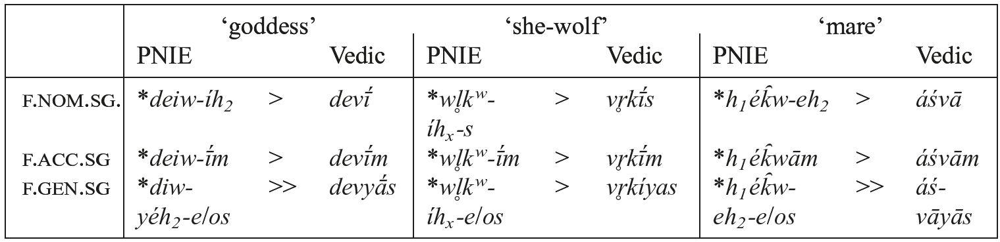

As is evident in Table 122.3, feminine nouns derived with these suffixes broadly resemble athematic non-neuter nouns, adding the same animate inflectional endings (e.g., acc.sg. *<i>-m</i>) to the suffixed stem (cf. 2.1.1). The only major point of departure is in the nominative singular of the *<i>-ih₂</i>/*<i>-yeh₂-</i> and *<i>-eh₂-</i> paradigms, which strikingly lacks the characteristic final *<i>-s</i> of other athematic non-neuter nouns. The accentual patterns shown by the *<i>-ih₂</i>/*<i>-yeh₂-</i> suffix is further discussed in 3.2 below.

The suffixes *<i>-ih₂</i>/*<i>-yeh₂-</i> and especially *<i>-eh₂-</i> are also associated with the formation of PNIE feminine adjectives. The reconstruction of *<i>-ih₂</i>/*<i>-yeh₂-</i> in adjectival formation is supported by trigeneric (m./f./n.) cognate sets like (nom.sg.) Ved. <i>pr̥thús</i>, <i>pr̥thvī́</i>, <i>pr̥thú</i>; Gk. <i>platús</i>, <i>plateĩa</i>, <i>platú</i> ‘broad’ (< PIE *<i>pl̥th₂ús</i>, *<i>pl̥th₂wíh₂</i>, *<i>pl̥th₂ú</i>); in this set, suffixing *<i>-ih₂</i>/*<i>-yeh₂-</i> to the masculine stem forms the feminine stem, to which are added athematic animate inflectional endings, as in the noun. Even more well-established are cognate sets in which the feminine adjectival stem appears to be derived, again as in the noun, by substitution of *<i>-eh₂-</i> for the thematic vowel of a masculine *<i>o</i>-stem, e.g., Ved. <i>návas</i>, <i>návā</i>, <i>navam</i>; Gk. <i>né(w)os</i>, <i>né(w)ā</i>, <i>né(w)on</i>; Lat. <i>novus</i>, <i>nova</i>, <i>novum</i> ‘new’ (< PNIE *<i>néwos</i>, *<i>néweh₂</i>, *<i>néwom</i>); this pattern is productively continued in most NIE branches that preserve the PNIE three-gender system intact, including Celtic, Greek, Indo-Iranian, Italic, and Slavic.

Yet while adjectival inflection confirms that PNIE had a fully grammaticalized gender system distinguishing masculine, feminine, and neuter, it also gives one important clue that this three-way division does not reflect the oldest situation. Evidence for its non-antiquity comes from certain NIE branches that have, in addition to the three-way adjectival sets cited above, other adjective classes that exhibit only a two-way split, making no formal distinction between masculine and feminine, while neuter is differentiated from both (in strong case forms) by its characteristic inflectional endings. This situation is not infrequently observed in athematic noun classes across the NIE languages − for instance, in compound *<i>s</i>-stem adjectives in Vedic and Greek (m./f. nom. sg. Ved. <i>sumánās</i>, Gk. <i>eu-menḗs</i>; n. Ved. <i>su-mánas</i>, Gk. <i>eu-menés</i> ‘good-minded; kindly’) and in most adjectives of the 3rd declension in Latin (e.g., m./f. <i>immortālis</i>; n. <i>immortāle</i> ‘immortal’) − but also, more strikingly, in Greek “two termination” thematic adjectives, where the endings canonically associated with masculines marks both masculine and feminine gender. Greek has a number of simplex two-termination adjectives, e.g., m./f. <i>pʰorós</i>, n. <i>pʰorón</i> ‘bearing’; m./f. <i>pátrios</i>, n. <i>pátrion</i> ‘hereditary’, and most <i>o</i>-stem compound adjectives are two-termination, e.g., m./f. <i>á-dikos</i>, n. <i>á-dikon</i> ‘unjust’; m./f. <i>kʰrusó-tʰronos</i>, n. <i>kʰrusó-tʰronon</i> ‘having a golden throne’. Some regularly two-termination adjectives are also attested with distinctive feminine forms (e.g., Att. Gk. <i>patríā</i>), but these forms are demonstrably innovative in Greek; this innovation further recommends the possibility that the corresponding Latin and Sanskrit adjective classes, which regularly have distinct feminine forms, have independently undergone the same development in their shallow prehistory (see Wackernagel 1926−1928 [2009]: 460−463). Moreover, the pronominal systems of these languages likely show parallel developments: in Greek, the interrogative pronoun has one form for masculine and feminine (<i>tís</i> < PIE *<i>kʷís</i>), another for neuter (<i>tí</i> < PIE *<i>kʷíd</i>), while Latin and Sanskrit have developed distinct feminine forms: m./f./n. Lat. <i>quis</i>, <i>quae</i>, <i>quid</i>; Skt. <i>kás</i>, <i>kā́</i>, <i>kím</i>.

A similar situation is also observed in thematic nouns. Although canonically associated with masculine gender in PNIE, thematic nouns nevertheless may be grammatically feminine in Greek and, to a lesser extent, Latin (on the latter, see Vine, this handbook). Numerous feminine thematic nouns are attested in Greek, e.g., (nom.sg.) <i>hodós</i> ‘road’; <i>kópros</i> ‘excrement’; <i>pʰēgós</i> ‘oak’ (cf. Lat. <i>fāgus</i> ‘beech’, also feminine), as well as thematic nouns that are grammatically feminine when the sex of their referent is female, e.g., <i>(hé) tropʰós</i> ‘nurse’; <i>(hē) aoidós</i> ‘female singer’. Just as in two-termination adjectives, there is a tendency in Greek to create new overtly marked feminine forms (in <i>-ā</i>/<i>-ē</i> < *<i>-eh₂</i>) for these female entities; as a result, some dialects use innovative <i>(hē) theā́</i> ‘goddess’ (e.g., Hom. <i>Il</i>.1.1) against the older situation observed in, e.g., <i>thḗleia theós</i> ‘female god’ (<i>Il</i>.8.7; for an analogous usage in Old Latin, cf. Ennius’ <i>lupus fēmina</i> ‘female wolf’ [<i>Ann</i>. 65, 66 Skutsch]). If the same tendency were occurring in the prehistory of the other NIE languages, it might explain how the congenitor of Gk. (<i>hē) híppos</i> ‘mare’ (< PNIE *<i>h₁ék̑wos</i> ‘id.’) was replaced by *<i>-eh₂</i>-characterized *<i>h₁ék̑weh₂</i> in these languages.

In nouns, adjectives, and pronouns, then, there is an observed tendency in the NIE languages for feminine forms to be secondarily differentiated, often via further characterization of the masculine stem with one of the PNIE feminine suffixes. This pattern suggests that the largely sex-based division between masculine and feminine in PNIE was subordinate to a primary split between animate and neuter genders. When it was eventually established that the Anatolian languages have a two-gender system of this kind, opposing just animate (traditionally “common”) and neuter genders, two possible diachronic scenarios presented themselves: either PIE had a skewed system similar to PNIE and the relatively less entrenched feminine gender was lost as a grammatical category in Anatolian; or the two-gender animate-neuter opposition attested in Anatolian reflects the original PIE system, and the emergence of the feminine gender is an innovation of PNIE (possibly excluding Tocharian; see below). The issue has long been a source of significant debate, although over the last decade, a general consensus has emerged that the Anatolian situation is archaic (see Melchert forthcoming a; Jasanoff, this handbook).

This conclusion stems from a reassessment of evidence previously held to indicate that the feminine gender was lost in the prehistory of Anatolian. Earlier scholarship had identified apparent traces in Anatolian of the formal markers associated with the PNIE feminine, which were taken as support for the category’s inheritance (similar to the relic forms held to show inheritance of dual number; cf. 2.1.2). However, some of these alleged traces were later shown to be spurious. A case in point is “<i>i</i>-mutation,” a phenomenon observed in Luwian, Lycian, and to a lesser degree Lydian and Carian, in which some noun and adjective classes have common gender nominative and accusative forms that, in contrast to other paradigmatic forms, show an <i>-i-</i> inserted between stem and inflectional endings (Starke 1990: 54−85). This feature was argued to be either a reflex of *<i>-ihₓ-</i> (Starke 1990: 85−89) or of *<i>-ih₂</i>/*<i>yeh₂-</i> (Oettinger 1987; Melchert 1994b); however, it has now been demonstrated by Rieken (2005) that “<i>i</i>-mutation” likely has nothing to do with either of these suffixes, and instead reflects the analogical influence of ablauting *<i>i</i>-stem paradigms. Other traces of the PNIE feminine suffixes were correctly identified, but in functions that give little reason to identify them with an erstwhile feminine gender (cf. Hajnal 1994; Melchert 2014c). The suffix *<i>-ihₓ-</i> is likely contained in the Hittite adjective <i>nakkī-</i> ‘heavy; weighty’ (< PIE *<i>h₁nok̑-íhₓ-</i> ‘burdensome’ ⇐ *<i>h₁nók̑-o-</i> ‘burden’; cf. Widmer 2005), but <i>nakkī-</i> is an ordinary adjective with no special synchronic association with any particular gender or sex, and its derivation can in any case be explained by assuming that *<i>-ihₓ-</i> was used in its original function as an appurtenance suffix (e.g., Lohmann 1932: 67−70, 81−83; Balles 2004) rather than as a feminine marker.

The suffix *<i>-eh₂</i> is much better attested in Anatolian, but clearly absent is the PNIE sex-based semantic correlation with female referents. This suffix is found, especially, in Lycian (Melchert 1992a; Hajnal 1994), where it forms concrete and abstract nouns of animate gender (e.g., <i>χupa-</i> ‘tomb’; <i>arawa-</i> ‘freedom’), and is also contained in the productive complex suffix <i>-(a)za-</i> (< PIE *<i>-tyeh₂</i>) that marks animate nouns referring to professions (<i>asaxlaza-</i> ‘governor’, <i>wasaza-</i> ‘[kind of priest]’, <i>zxxaza-</i> ‘fighter’). Although some Lycian *<i>-eh₂</i> nouns do have female referents (e.g., Lyc. <i>lada-</i> ‘wife’, <i>χñna-</i>‘grandmother’), still more refer to (primarily male) professions or else to naturally inanimate entities (i.e. concrete objects or abstract concepts). The other Anatolian languages present a similar picture. The same *<i>-tyeh₂</i> suffix may be attested in Luwian, e.g., CLuw. <i>urazza-</i> ‘great’; <i>wašḫazza-</i> ‘sacred’ (the latter potentially a direct cognate of Lyc. <i>wasaza-</i>; see Sasseville 2014/2015: 108−109, but for a different view, Yakubovich 2013: 159−161). A few animate concrete and abstract derivatives of *<i>-eh₂</i> are also attested in Hittite, e.g., <i>ḫišša-</i> ‘hitch-pole’, <i>ḫāšša-</i> ‘hearth’; <i>wārra-</i> ‘help’. Although the derivation of these Hittite nominals is partly obscured by various morphophonological developments, the *<i>eh₂</i>-origin of <i>wārra-</i> ‘help’ is assured by CLuw. <i>warraḫit-</i> ‘id.’ (a derived neuter abstract in <i>-it-</i> preserving the final *<i>h₂</i> of its base) and for the other two cited forms by (near) word equations within Anatolian or with PNIE feminine nouns: Hitt. <i>ḫāšša-</i> ‘hearth’ = Lyc. (abl-instr.) <i>χaha-di</i> ‘id.’; Lat. <i>āra</i>, Osc. <i>aasa-</i> ‘altar’ (< PIE *<i>h₂ó</i>/<i>éh₁</i>/<i>3</i><i>s-eh₂</i>); Hitt. <i>ḫišša</i>- ‘hitch-pole’ = Ved. <i>īṣā́</i> ‘id.’ (<PIE *<i>h₂ih₁</i>/<i>3</i><i>s-eh₂</i>).

Two final arguments speak against inheritance of the feminine into Anatolian. First, Hittite and Luwian show clear evidence of a different, perhaps even more archaic strategy for deriving nouns that refer exclusively to female entities, viz., use of a derivational suffix based on PIE *<i>sor</i> ‘woman’ (on the development of which, see recently Harðarson 2014). While PIE *<i>sor</i> is attested only in traces in the NIE languages − with further characterization, as a word for ‘woman’ (Ved. <i>strī́</i>, OAv. <i>strī</i>), in terms for females, e.g., PNIE *<i>swésor-</i> ‘sister’ (> Ved. <i>svásar-</i>, Lat. <i>soror-</i>), and in feminine case-forms of certain numerals (see 2.3 below) − it appears to have developed in Anatolian into a somewhat productive suffix, which is attested in oppositional male-female pairs such as Hitt. <i>išḫā-</i> ‘lord’: <i>išḫa-ššara-</i> ‘lady’ and (derived adjectives) CLuw. <i>nāni(ya)-</i>‘brotherly: <i>nāna-šr-i(ya)-</i> ‘sisterly’. The other, still more important, point is that inheritance of morphemes used to derive nouns with female referents does not imply inheritance of the feminine gender as a grammatical category (cf. Hajnal 1994; Melchert 2014c). Grammatical gender is defined by syntactic <i>agreement</i> (e.g., Corbett 1991: 4−5), and there is no synchronic evidence for uniquely feminine agreement in the Anatolian languages. Noticeably absent is adjectival agreement of the productive PNIE type *<i>néw-os</i>, *<i>néw-eh₂</i>, *<i>néw-om</i> (except possibly as a marginal innovation in Lycian; see Melchert 1994b: 236−237); rather, Anatolian *<i>-eh₂</i>-nouns as well as *<i>sor</i>-suffixed female nouns behave just like other animate stem classes with respect to adjectival and pronominal agreement patterns, which therefore provide no evidence that these nouns were grammatically feminine.

Both the Anatolian and PNIE-internal facts are therefore best explained by the hypothesis that PIE had a two-gender animate-neuter opposition, and that the feminine gender was a PNIE innovation, or perhaps even later, during the period of NIE unity subsequent to the departure of Tocharian (in support of this hypothesis, see Kim 2009 and Hackstein 2011, and against, Fellner 2014; cf. Pinault, this handbook). Setting aside the issue of Tocharian, most recent scholarship has adopted the position that the three-gender system was an innovation. Accordingly, more attention has been paid to the vexed question of the origin of the feminine gender (see the papers collected in Neri and Schuhmann 2014). In this respect, opinions fall principally into two camps: (i) the feminine developed (primarily) via the reanalysis of PIE neuter “collectives” (i.e. set plurals; see 2.1.2); or (ii) the feminine arose (primarily) from within the animate gender.

The first view is driven, above all, by the formal affinity between the the PIE set plural suffix *<i>-(e)h₂</i> and the markers of the PNIE feminine, (arguably) all of which contain *<i>-h₂</i>. In particular, the phonological identity of the *<i>s</i>-less nominative singular of PNIE feminine *<i>-(e)h₂</i>-nouns and PIE neuter “collectives” (noted above) was taken already by Schmidt (1889) to indicate the historical relatedness of these formations, and subsequent scholars (e.g., Harðarson 1987, 2015; Tichy 1993; Matasović 2004; Litscher 2014) have argued that the former developed directly via reanalysis of the latter. Under this view, the core of the feminine gender was constituted by a subset of erstwhile *<i>-h₂</i>- marked neuter “collectives” that became semantically specialized with reference to females, e.g., PNIE *<i>h₂widʰéw-eh₂</i> ‘widow’ (cited above) from an original meaning **‘(set of) dead person’s relatives (Tichy 1993: 16); the suffix *<i>-eh₂</i> in these nouns was then reinterpreted as the formal marker of feminine gender.

Yet while this hypothesis has the virtue of explaining the remarkable phonological shape of PNIE feminines, it suffers from a number of serious issues (see Luraghi 2009b, 2011; Melchert 2014c). First, only a few words with any claim to antiquity are plausible candidates for the semantic development from “collective” to feminine, and in each case, the original collective meaning for these nouns is entirely conjectural: the daughter languages provide no evidence that (e.g.) PNIE *<i>h₂widʰéw-eh₂</i> meant anything other than ‘widow’. It is therefore questionable whether such a development occurred (repeatedly), and if so, whether the number of items affected was sufficiently robust to constitute the core of a new grammatical category. Even more problematic, however, is that these accounts generally assume that the reanalysis of these neuter “collectives” as feminine singulars was facilitated by the fact that they were grammatically singular, and so exhibited singular agreement patterns; however, as discussed in 2.1.1, these “collectives” were grammatically plural already in PIE.

The alternative account assumes that the PNIE feminine arose primarily out of the animate gender. This hypothesis − strongly advocated already by Meillet (1931) − explains the close affinities between the PNIE masculine and feminine gender discussed above, especially their formal identity in some stem classes, via their common descent from PIE animate nouns; grammatically feminine nominals belonging to the undifferentiated classes were archaisms in the grammar of PNIE, and predictably, were subject to re-characterization in the daughter languages, a pattern that, as noted above, is observed within the attested period of several NIE languages. Also explained under this hypothesis are the word equations between Anatolian animate singular and PNIE feminine singular nouns cited above (e.g., Lat. <i>āra</i> ‘altar’ = Hitt. <i>ḫāšša-</i> ‘hearth’), the latter of which developed from original animates when the suffix *<i>-eh₂</i> − together with *<i>-ih₂</i>/<i>yeh₂-</i> and *<i>-ihₓ-</i> − became associated with the feminine gender after the separation of the Anatolian branch. Luraghi (2009a, 2011) has adduced typological support for such a gender-based split at the high end of the animacy hierarchy, as well as for Meillet’s (1931: 19) proposal that a crucial step in the grammaticalization of the feminine gender was the extension of feminine marking (*<i>-eh₂</i>) to the animate demonstrative pronominal stem *<i>so</i>/<i>to-</i> (i.e. the creation of *<i>seh₂</i>/*<i>teh₂-</i>; see 2.2.2). Exactly how the PNIE feminine suffixes came to be associated with the feminine gender is uncertain. Luraghi (2011) and Melchert (2014c) present detailed proposals, both of which posit a core of PIE *<i>-(e)h₂</i>-marked animate nouns with female referents as the starting point; however, numerous open questions remain − such as which nouns played a pivotal role, or what mechanisms gave rise to agreement (cf. Luraghi 2014) − that call for further research.

Significantly, this latter account departs from the former by situating the historical connection between the PIE set plural suffix and the PNIE feminine markers in pre-PIE. Although all the markers involved likely originate from a unitary (probably derivational) suffix *<i>-h₂</i>, already by PIE this suffix had become an inflectional marker of neuter (set) plural, and given rise to the (animate) derivational suffixes that eventually developed into the major exponents of the PNIE feminine gender. On the chronology of these developments, see especially Melchert (2014c), and generally on the prehistory of *<i>-h₂</i>, Nussbaum (2014b).

### 2.2. PIE pronouns

#### 2.2.1. PIE pronominal inflection

“Pronominal inflection” refers to the distinct inflectional properties of the pronouns (personal and deictic/anaphoric), as well as determiners, <i>wh</i>-words (interrogative and relative), and (some) quantifiers as opposed to nouns and adjectives. A number of formal peculiarities motivate a special treatment of pronominal inflection: the neuter nom./acc. singular case ending *<i>-d</i>, e.g., deictic/anaphoric *<i>tó-d</i> (e.g., Lat. <i>istud</i> ‘that’, Hitt. <i>apāt</i> ‘that’); the affix *<i>-sm-</i> in masc. and neut.sg. forms, e.g., dat.sg. *<i>tó-sm-ōi</i> ‘to that one’ (> Ved. <i>tásmai</i>, Goth. <i>þamma</i>), and its feminine counterpart in *<i>-sy-</i>, e.g., dat.sg. *<i>to-sy-eh₂-ei</i> (> Ved. <i>tásyai</i>, cf. Goth. <i>þizai</i>); nom.pl.masc. in *<i>-oi</i> instead of nominal *<i>-es</i>, e.g., deictic/anaphoric *<i>toi</i> (> Ved. <i>té</i>, Goth. <i>þai</i>, or Hitt. anim. nom.pl. <i>kē</i> ‘these’); a segment *<i>-s-</i> appears in the gen.pl., e.g., gen.pl.f. *<i>teh₂-s-ōm</i> (> Ved. <i>tā́sām</i>, Hom. Gk. <i>tā́ōn</i>). These inflectional features are all peculiar to pronominal inflection, although later in the development of the IE languages the interaction of nominal and pronominal inflection led to a diffusion of forms (see, e.g., 2.1.1 above on nom.pl.). For some of these idiosyncrasies internal reconstructions have been proposed: the affix *<i>-sm-</i> might be the numeral ‘one’ *<i>sem-</i>, and on that basis (and with more daring) fem. *<i>-sy-</i> might have arisen via deletion of *<i>m</i> in pre-PIE **<i>-sm-y-</i> (Ringe 2006: 55).

#### 2.2.2. Deictic/anaphoric pronouns

A number of deictic/anaphoric stems can be reconstructed for PIE; we illustrate in Table 122.4 some points of pronominal inflection with the *<i>so</i>/<i>to-</i> pronoun (deictic/anaphoric; cf. Jamison 1992, Klein 1996) using masculine, feminine, and neuter, singular and plural forms (omitting the dual, whose reconstruction is highly uncertain). Note that we give the oblique cases with hesitation between *<i>o-</i> and *<i>e-</i>grades; Cowgill (2006a: 524−527) held that only *<i>o-</i>grade was found in the paradigm, but this is not certain. For further details see Weiss (2011: 335−354) and on the evidence from Indo-Iranian − a key source for this reconstruction − see Gotō (2013: 67−73).

Tab. 122.4 Inflection of the *<i>so</i>/<i>to-</i> demonstrative

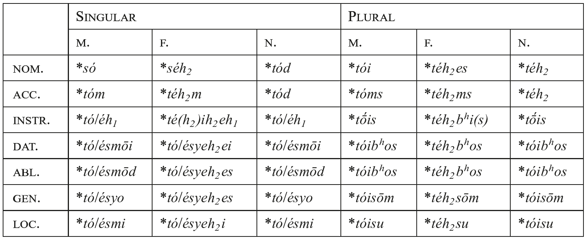

The absence of the *<i>so</i>/<i>to-</i> pronoun in Anatolian is a puzzle: the pronoun might have originated as an innovation of PNIE (<i>n.b</i>. the paradigm is found in Tocharian, e.g., TB <i>se</i>, <i>sā</i>, <i>te</i>; oblique <i>ce</i>, <i>tā te</i>, etc.). However, the persistent idea that the source of the PNIE *<i>so</i>/<i>to-</i> pronoun is to be localized in the clause initial conjunctions seen in Old Hittite (not elsewhere in Anatolian) <i>šu</i>, <i>ta</i> is untenable (see Jasanoff, this handbook; Melchert forthcoming a). Within the history of numerous daughter languages deictic/ anaphoric pronouns became articles (see esp. Wackernagel 1926−1928 [2009]: 555−588 on their development); for PIE we reconstruct a language with no article.

#### 2.2.3. Relative pronoun

A division in the formal exponence of the relative pronoun splits the IE world: there are languages that mark their relative clauses with reflexes of *<i>hₓyo-</i> (Greek, Indo-Iranian, Phrygian, Celtiberian, etc.); and languages with reflexes of *<i>kʷi-</i>/*<i>kʷo-</i> (Italic, Anatolian, etc.). This division reflects a diachronic change in the latter set: *<i>hₓyo</i>- was the formal exponent of the PIE relative pronoun, while *<i>kʷi-</i>/*<i>kʷo-</i> was an indefinite and interrogative pronoun that came to mark relative clauses in Italic, Anatolian, and elsewhere. The development of relative markers from interrogative pronouns − more typologically plausible than from indefinites − is especially well-attested in languages of Europe (Probert 2014: 146−149). Probert (2015: 444−448) reconstructs the following prehistoric system underlying relative clauses in Ancient Greek: free and semi-free relative clauses; relative-correlative sentences; restrictive postnominal relative clauses; “paratactic” relative clauses. It is highly likely that this range of relative clauses was in place in PIE and was marked by the relative pronoun *<i>hₓyo</i>-: the same system, albeit marked with innovative *<i>kʷi-</i>/*<i>kʷo-</i>, underlies Old Hittite (Probert 2006c) and Anatolian (Melchert 2016c), as well as other IE languages. For further discussion of relative clause morphosyntax, see the helpful summary by Clackson (2007: 173−176), as well as Hale (this handbook) on Indo-Iranian and Huggard (2015) on Hittite. The inflection of the relative pronoun was the same as that of the *<i>so</i>/<i>to</i>- pronoun (minus stem suppletion), as witnessed by the Ved. paradigm <i>yás</i>, <i>yā́</i>, <i>yád</i>, with pronominal inflection fully intact (e.g., masc. dat.sg. <i>yá-sm-ai</i>, loc. <i>yá-sm-in</i>, nom.pl. <i>yé</i> etc.), for which Gotō (2013: 74−75) presents a diachronic overview.

A number of languages reflect the formal marker of the relative but in changed roles: for instance, Baltic and Slavic have a suffixed pronoun built on the stem *<i>hₓyo-</i> used in marking definite adjective declension; Insular Celtic has forms of *<i>hₓyo-</i>, continued as the relative endings of the simple verb (cf. Watkins 1994: 22−30 [= 1963: 24−32]) (of Celtic languages, only Celtiberian attests an inflected relative pronoun, <i>io-</i> < *<i>hₓyo-</i>); and in Germanic (as well as Baltic and Slavic) are found complementizers and other subordinating conjunctions built to the relative stem, e.g., Goth. <i>jabai</i> ‘if’.

#### 2.2.4. Interrogative-indefinite pronoun

The stem *<i>kʷi</i>-/*<i>kʷo</i>/<i>e</i>- (just mentioned) had two uses in PIE: as an interrogative when accented (*<i>kʷís</i> > Gk. <i>tís</i> ‘who?’) and as an indefinite when enclitic (Gk. <i>tis</i> ‘someone’, Lat. <i>sī quis</i> ‘if someone’). Robust evidence may be quoted for both an *<i>o</i>-stem, e.g., Goth. <i>ƕ-a-s</i>, fem. <i>ƕ-o</i>, neut. <i>ƕ-a</i> < *<i>kʷo</i>-, and an *<i>i</i>-stem, e.g., Gk. <i>t-í-s</i>, <i>t-í</i> ‘who?, what?’, Lat. <i>qu-i-s</i>, Hitt. <i>ku-i-š</i>, <i>ku-i-n</i>, neut. <i>ku-i-d</i> < *<i>kʷi</i>/<i>e</i>-. It is likely that the formal distinction overlays an older functional one: perhaps the *<i>o</i>-stem was originally adnominally used, the *<i>i</i>-stem as a full nominal, an idea rooted in the teaching of Warren Cowgill: see Sihler (1995: 395−400) and Ringe (2006: 56). Note that in a number of traditions the interrogative takes over the function of the relative pronoun (for reasons why, see just above on relatives); such a transfer occurred in Italic, Baltic, Slavic, Iranian, Hittite, and Tocharian. An indefinite use marked by a doubling of the pronoun is familiar from Lat. <i>quisquis</i> ‘whoever’, Hitt. <i>kuiš kuiš</i> (further uses may be found in Weiss 2011: 350−353).

#### 2.2.5. Personal pronouns

Personal pronouns have been well characterized as the “Devonian rocks” of PIE morphology (Watkins 2011: xxii), and they tend to be repositories for linguistic archaisms in the IE languages. The reconstruction of the personal pronouns poses many unique problems, which cannot be addressed within a treatment of this scope: pronominal topics are most fully dealt with by Katz (1998), which remains unpublished; overviews representative of different schools of thought may be found in Sihler (1995: 369−382), Meier-Brügger (2010: 361−364), Beekes and de Vaan (2011: 232−236), and Dunkel (2014).

The personal pronouns show stem suppletion of nominative vs. oblique cases (cf. Eng. <i>I</i> vs. <i>me</i>) that recalls the *<i>so</i>/<i>to-</i> pronoun; furthermore, the singulars, duals, and plurals are formed from different elements (Eng. <i>I</i> vs. <i>we</i>). Case marking is realized idiosyncratically in the personal pronouns − for instance, the nom.sg. of the first person pronoun is reconstructed as *<i>(h₁)eg̑ oh₂</i> (e.g., Gk. <i>egṓ</i>) with no recognizable marker of [nominative], and the gen.sg. *<i>méne</i> (> OCS <i>mene</i>) has no clear exponent of [genitive]. Pronouns were not distinctively marked for gender, a feature already noted by the ancient grammarians (see Wackernagel 1926−1928 [2009]: 405 with references); a notable exception is Tocharian A, which does distinguish between masculine and feminine in the 1sg., i.e. m.nom./obl. TA <i>näṣ</i>, f.nom./obl. <i>ñuk</i> (see the explanation of Jasanoff 1989).

As is common cross-linguistically, PIE had tonic and clitic forms of the pronouns outside the nominative singular. A special development is the inner-Anatolian creation of subject enclitic pronouns for unaccusative verbs (i.e. intransitive verbs whose argument is not semantically agentive), as proposed by Garrett (1990, 1996) and recently maintained by Goedegebuure (2013). On the development of clitics in Vedic (and cross-linguistically), see Hale (2007: 255−288). PIE probably did not have third person personal pronouns, but rather employed demonstratives. A reflexive pronoun *<i>swe-</i> (and/or *<i>se</i>) is often reconstructed (cf. Lat. acc.sg. <i>sē</i>, etc.), and is seen as the basis for the reflexive adjective *<i>swo-</i> ‘one’s own’. Kiparsky (2011) argues that PIE had no reflexive pronoun, but *<i>swe-</i> was an adjective meaning ‘own’ (grammaticalized to a possessive reflexive in certain languages), *<i>se-</i> was a referentially independent demonstrative pronoun (weakened to an anaphoric pronoun and then in certain languages grammaticalized to a reflexive). The pronominal stems of the first and second person pronouns form the basis for inflecting the reflexives of these persons in Greek, Germanic, Latin, and Slavic (Petit 1999).

We provide in table 122.5 a representative sample of first and second singular and plural forms to illustrate the suppletion and unique forms characteristic of this area of IE morphology (clitic forms are preceded by “=”):

Tab. 122.5 Representative first and second person pronouns

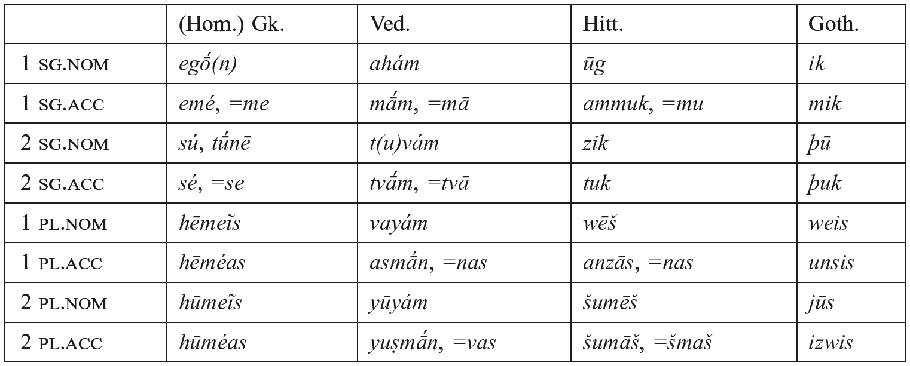

### 2.3. Other PIE nominal categories

#### 2.3.1. Numerals

In PIE, the cardinal numbers ‘1’ to ‘4’ were declined, higher numbers ‘5’ to ‘10’ were indeclinable. The IE languages offer evidence for at least two candidates for ‘1’. One root is *<i>(h₁)oi-</i> seen in *<i>(h₁)oi-no-</i> (Lat. <i>ūnus</i>, Goth. <i>ains</i>, OCS <i>inŭ</i> ‘a certain one’, Gk. <i>oínē</i> ‘the ace on dice’), to which some languages add a different suffix − for instance, Ved. <i>é-ka-</i> and Very Old Indic <i>ai-ka-</i> in the Kikkuli-tracts reflect *<i>(h₁)oi-ko-</i>, while OAv. <i>aē-uua-</i>, OP <i>ai-va-</i> and Gk. <i>oĩos</i> ‘alone’ continue *<i>(h₁)oi-wo-</i>. Another root is *<i>sem</i>-, whose outcomes include Gk. <i>heĩs</i>, <i>hen</i>- ‘1’, fem. <i>mía</i> (*<i>sm-ih₂</i>), TA <i>sas</i>, TB <i>ṣe</i>, Lat. adv. <i>semel</i> ‘once’, etc. Whatever nuances these different formations bore in PIE do not seem recoverable (but cf. Dunkel 2014: 2.588−589, 673). Recent research indicates that a stem *<i>syo-</i> ‘1’ should also be reconstructed, since it has been identified in Hittite (Goedegebuure 2006), Tocharian (Pinault 2006b), and now Indo-Iranian (Kümmel 2016).

The number ‘2’ is unsurprisingly inflected in the dual: m. *<i>d(u)woh₁e</i> (> Gk. <i>dúō</i>, Ved. <i>dváu</i>/<i>ā́</i>, Lat. <i>duo</i> etc.), f. *<i>d(u)weh₂-ih₁</i>, n. *<i>dwo-ih₁</i>. This numeral had a form *<i>dwi-</i> used in compounds, e.g., Gk. <i>dí-pod-</i>, Ved. <i>dvi-pad-</i>, Lat. <i>bi-ped-</i> all ‘two-footed’. Cowgill (1985b) raises the possibility that there existed as well an uninflected form *<i>duwó</i> for at least PNIE. A stem *<i>bʰo</i>- ‘both’ can also be reconstructed (cf. Goth. <i>bai</i>, etc.), and within a compound of *<i>h₂ent-</i> ‘face’ it occurs as TA masc. <i>āmpi</i>, TB <i>antapi</i> ‘both’, Gk. <i>ámpʰō</i> ‘both’, Lat. <i>ambō</i> (Jasanoff 1976).

The number ‘3’ clearly inflected as an *<i>i</i>-stem, cf. Hitt. <i>teri-</i>, Ved. <i>tráy-aḥ</i>, n. Ved. <i>trī́</i>, Gk. <i>tría</i>, etc. < anim. *<i>tréy-es</i>, n. *<i>trí-h₂</i>. The *<i>i</i>-stem basis is seen clearly too in the combining form *<i>tri-</i> (Gk. <i>trí-pod-</i> ‘tripod’, etc.). Interestingly, ‘3’ (and ‘4’) show an archaic feminine derivation in Indo-Iranian and Celtic, where a morpheme *<i>-sr-</i> appears instead of the common feminine-deriving *<i>-h₂</i> formants: Ved. <i>ti-sr-áḥ</i> (via dissimilation from *<i>tri-sr-es</i>) and OIr. <i>téoir</i> (cf. Wackernagel 1905: 349−351; Cowgill 1957). The suffix *<i>-sr-</i> likely derives from the lexeme *<i>ser-</i> ‘woman’, identifiable within Hittite (and elsewhere in Anatolian) as a suffix <i>-(š)šara-</i> for deriving feminines from nouns denoting human (or divine) males (Hoffner and Melchert 2008: 59), e.g., <i>ḫaššuš</i> ‘king’ > <i>ḫaššuššaraš</i> ‘queen’. On the Celtic evidence, see Kim (2008).

‘4’ shows a similarly archaic inflection, the masc. and neut. *<i>kʷetwores</i>, *<i>kʷ</i>etworh₂, respectively, but the feminine again suffixes *<i>-sr-</i>: Ved. <i>cáta-sr-aḥ</i> and OIr. <i>cethéoir</i>, both < *<i>kʷéte-sr-es</i>.

Subsequent numerals up to ‘10’ were indeclinable (though daughter languages often introduce plural inflection). The reconstructed items are *<i>pénkʷe</i> ‘5’, *<i>swék̑s</i> ‘6’, 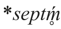‘7’, *<i>ok̑tṓ(u)</i> ‘8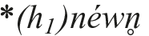‘9’, 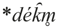<i>́</i> 10’.

The higher cardinals ‘11’ to ‘17’ were dvandva compounds based on the uninflected numeral plus ‘10’, so Ved. <i>dvā́-daśa</i> ‘two-ten, 12’. Diverse methods of forming certain cardinals were employed in the daughter languages, so e.g., Gk. <i>hek-kaí-deka</i> ‘six-and-ten, 16’, subtraction in Lat. <i>un-dē-vīgintī</i> ‘one-from-twenty, 19’ or multiplication in Welsh <i>deu-naw</i> ‘two-nine, 18’.

PIE derived “decads” (‘20’, ‘30’, etc.) with the neuter plural of the numeral plus a decad-deriving suffix based on ‘10’, probably *<i>-dk̑omth₂</i> (cf. Gk. <i>-konta</i>). The cardinal number ‘100’ is a neuter derivative of ‘ten’, *<i>dék̑m̥</i> ‘10’ ⇒ **<i>dk̑m̥-tó-m</i> > *k̑<i>m̥tóm</i> (with onset cluster reduction) ‘100’ (e.g., Lat. <i>centum</i>, Gk. <i>he-katón</i> with added <i>he-</i> from the stem <i>hen-</i> ‘1’). A numeral ‘1000’ may be reconstructed as *<i>(sm̥)-g̑ʰeslo-</i>, which is reflected in Ion. Gk. <i>kʰeílioi</i>, Ved. <i>sa-hásra-</i>, Lat. <i>mīlle</i>.

<!-- source-file: content/14_chapter08_4.xhtml -->

Ordinals were inflected adjectives. The adjectives expressing ‘first’ and ‘second’ are not based on the cardinals ‘1, 2’ − for instance, Lith. <i>pìrmas</i>, Goth. <i>fruma</i>, Eng. <i>fore-most</i> continue PIE *<i>pr̥h₂-mo-</i> ‘first’. The ordinals ‘third’ and above are based on the cardinals, e.g., *<i>tri-</i> ‘3’ provides the base for *<i>tri-tiyo-</i> ‘third’, Umb. <i>terti-</i> ‘third’, Av. <i>θritiia-</i>, Goth. <i>þridja</i>, Eng. <i>third</i>, etc. Other similar derivations are also found, e.g., Gk. <i>trítos</i> < *<i>tri-to-</i>.

For further works on numerals, see the collection of papers in Gvozdanović (1992); handbook treatments include Ringe (2006: 52−55), Weiss (2011: 364−376), Meier-Brügger (2010: 368−373) and Beekes and de Vaan (2011: 237−242). Rau (2009a: 9−64) is an extensive treatment of decads.

#### 2.3.2. Adverbs

In the oldest IE languages, inflected nouns and adjectives could be used adverbially (cf. Delbrück 1888: 184−188 on the accusative so used). Additionally, one could form adverbs with distinct adverbial morphology. Denominal adverbial suffixes include instrumental-locatival *<i>-bʰi</i>, allatival *<i>-e</i>/<i>oh₂?</i>, and ablatival *<i>-m</i>; the formal and functional differences between adverbs derived with these suffixes and “adverbial” inflected case forms were probably minimal, as suggested by the subsequent grammaticalization of each of these suffixes as a fully productive (pro)nominal case ending in one or more of the daughter languages (see 2.1.1 above). Two more local adverb-forming suffixes plausibly reconstructed for PIE are ablatival *<i>-tos</i> (e.g., Ved. <i>hr̥t-tás</i> ‘from the heart’, Lat. <i>caeli-tus</i> ‘from heaven’, Gk. <i>en-tós</i> ‘from within’) and locatival *<i>-en</i> (Ved. <i>jmán</i> ‘on the earth’).

In some cases, inflected nominal case forms “petrify” in these adverbial functions, surviving synchronically in the individual languages as adverbs even after the loss of their nominal stem (e.g., Ved. <i>mŕ̥ṣā</i> ‘in vain’ < PIE instr.sg. *<i>-eh₁</i>), of the case itself as a distinct inflectional category (Gk. <i>oíkoi</i> ‘at home’ < PIE loc.sg. *<i>-oi</i>), or even of both (OIr. <i>ís</i> ‘underneath’ < PIE loc.pl. *<i>pēd-su</i> ‘at the feet’). Erstwhile case endings can also be the source of productive adverbial morphology: for instance, it is likely that the Latin deadjectival adverbial suffix <i>-ē</i> (e.g., Cl. Lat. <i>rēct-ē</i> ‘correctly’: <i>rēctus</i> ‘straight’; cf. Umb. <b>rehte</b> ‘id.’) continues the PIE instr.sg. suffix*<i>-eh₁</i>, although the instrumental case itself is no longer synchronically distinct in the Italic languages.

Adverbs expressing degree or quantity in the daughter languages are often identical to − or else closely resemble − neuter nom./acc. adjectival forms, e.g., Lat. <i>multum</i>, Ved. <i>máhi</i>, Gk. <i>méga</i>, Hitt. <i>mekki</i> ‘much’; Lat. <i>paulum</i>, Hitt. <i>tēpu</i> ‘a little’; the usage is inherited. Temporal and spatial adverbs are frequently indistinguishable from nominal case forms, of which locative and ablative are especially frequent. It is likely, too, that PIE speakers could use full repetition of such case forms − <i>āmreḍita</i>s, in the terminology of the Sanskrit grammarians − to form quantificational adverbs that signal unlimited iteration of an event or action, e.g., Ved. <i>divé-dive</i>, Cyp. Gk. [āmati-āmati], Cl. Arm. <i>awur awur</i>, Hitt. <i>šiwat šiwat</i>* (UD-<i>at</i> UD-<i>at</i>) ‘on day after day; every day’. Iteration of this kind is reasonably well attested in Vedic (see Klein 2003), but fairly limited elsewhere, with few lexical matches across languages; yet in view of the (near) cross-linguistic universality of the type (e.g., Stolz, Stroh, and Urdze 2011), it is plausibly assumed for PIE.

The evidence of the daughter languages does not converge in the reconstruction of a suffix used to derive manner adverbs. PIE speakers probably used the instrumental singular of an abstract noun (e.g., Ved. <i>sáhas-ā</i> ‘with might; mightily’), or else possibly neuter accusative case-forms of adjectives (e.g Ved. <i>drav-át</i>; Lat. <i>facile</i> ‘easily’). The oldest-attested languages tend to retain these strategies, but also innovate new denominal suffixes specific to manner adverbs. The development of Cl. Lat. <i>-ē</i> was noted above; similarly, Greek developed deadjectival <i>-ōs</i>, e.g., <i>sopʰ-[image-glyph: o with macron and tilde] s</i> ‘wisely (: <i>sopʰós</i> ‘wise’), while Hittite speakers created the denominal suffix -<i>ili</i>, e.g., <i>ḫaran-ili</i> ‘eagle (<i>ḫaran-</i>)-like; swiftly’ or <i>luwili</i> ‘in the Luwian (URU<i>luwiya-</i>) language/way’. It appears to be characteristic of the ancient IE languages that such new adverbial morphology coexists with inherited adverb-forming processes.

#### 2.3.3. Adpositions

Adpositions occur as pre- and post-positions in the oldest daughter languages and such usage is reconstructible for PIE. In some cases, the etymology is obvious. One particularly interesting example is *<i>h₂enti</i> ‘in front of’. It is clearly related to the noun seen in Hitt. <i>ḫant-</i> ‘forehead’ (whose adverb is <i>ḫanta</i> ‘in front’), but in PNIE forms, an adverb derived from the loc.sg. *<i>h₂ent-i</i> > Gk. <i>antí</i> ‘over against, facing’ (governing gen. case) and Lat. <i>ante</i> ‘before’ (a prep. governing acc., as well as an adv.), adv. Ved. <i>ánti</i> ‘before, facing’. This use of *<i>h₂ent-i</i> may represent a common innovation of PNIE.

#### 2.3.4. Particles

Finally, we note a motley collection of items loosely labeled “particles,” such as Gk. <i>ge</i>, Hitt. <i>=kan</i>, etc. The meanings of these items are hard to pin down in the ancient (and indeed modern) languages, their reconstructible semantics elusive. At least one interjection is securely reconstructible, an expression of pain and suffering: Lat. <i>vae</i>, Hitt. <i>uwai</i>, Eng. <i>woe</i>; its expressive meaning (and the issue of reconstructing registers) is discussed by Watkins (2013). For a comprehensive collection of forms with etymological interpretations, see now Dunkel (2014).

### 2.4. Nominal derivation: Overview

IE nominal derivation is highly affixing. The majority of affixes are derivational suffixes added between the root/stem and inflectional endings, yielding a canonical shape that is schematized R(oot)-S(uffixes)-E(nding). There is no theoretical limit on how many derivational suffixes may be added, and it is not uncommon to find more than one in the formation of a given nominal. Traditionally, a distinction is made between so-called “primary” derivational suffixes, which are added directly to the root, and “secondary” suffixes, which are added to an already derived stem. The distinction is widely employed in IE studies, and we maintain it here. An example of a primary derivative is Ved. <i>śrávas-</i> ‘fame, report’, derived by adding the primary suffix <i>-as-</i> (< PIE *<i>-o</i>/<i>es-</i>) to the root <i>śrav-</i> ‘hear, listen’ (< PIE *<i>lew-</i>). To this stem could be further added a secondary suffix like <i>-yá-</i> (< PIE *<i>-yé</i>/<i>ó-</i>), which forms denominative verbs, to produce Ved. <i>śravasyá-ti</i> ‘is seeking fame.’

The majority of derived nouns in PIE represent lexical nominalizations of verbal roots. In a cross-linguistic survey, Comrie and Thompson (2007) identify two major types of nominalizations: those of event nouns, forming nouns of action or state from active or stative verbal roots or adjectives respectively, and those nominalizing semantic arguments of the verb, such as agent, instrument, or location. We follow this syntactic-semantic distinction in our survey of nominal suffixes. Besides these nominalizations, PIE had a core stock of concrete referential nouns, which are analyzable to varying degrees. This situation is typologically common: languages commonly (always?) have a class of underived nouns at the core of the lexicon which refer to concrete, everyday entities, such as humans, body parts, flora, fauna, and celestial or man-made objects (cf. Dixon 2004: 3−4).

Besides affixes, a few other types of derivation may be mentioned. There is (limited) evidence in the IE languages for nominal reduplication. One widespread example is *<i>kʷe-kʷl-o-</i> ‘wheel’ (to PIE *<i>kʷel[hₓ]-</i> ‘turn’), which is seen in Gk. <i>kúklos</i>, Ved. <i>cakrám</i>, TA <i>kukäl</i> ‘chariot’. Much better is the evidence for nominal compounding, and we devote space below to a discussion of the main types of compounds (2.6). No infixes are found in nominal derivation (but there is one in the verbal system; see 4.3.1 below). In addition to affixal morphology, PIE had non-concatenative (or “transformational”) processes of derivation. In particular, new formations could be derived through changes only in morpheme-internal vowels (i.e. ablaut) or in accent. For instance, certain types of derivatives were associated with particular vowel grades: deverbal event/result nouns could be formed with an *<i>o</i>-grade root and a thematic vowel suffix − for instance, to the root *<i>g̑enh₁-</i> ‘to engender’ was formed a result noun *<i>g̑ónh₁-o-</i> ‘what is begotten, child’ (> Gk. <i>gónos</i>). Another non-concatenative process may be analyzed as conversion, where derivation operates with a shift in accent but no overt affixation. Vedic attests pairs like the neuter noun <i>bráhman-</i>, <i>bráhmaṇas</i> ‘sacred formulation’ beside m. <i>brahmán-</i>, <i>brahmáṇas</i> ‘one possessing the sacred formulation, sacred formulator’ or neuter noun <i>yáśas-</i> ‘glory’ beside adj. <i>yaśás-</i> ‘glorious’. Such pairs appear broadly comparable to English diatonic pairs like (noun) <i>cónvert</i>: (verb) <i>convért</i> (on conversion see the collection of papers in Bauer and Valera 2005). This process is known in the literature as “internal derivation” (viz. as opposed to being derived with an “external” affix); although it clearly existed as a derivational process in Vedic and Greek, its status in the protolanguage is controversial and competing assessments have been advanced, e.g., by Widmer (2004) and Rau (2009a), and in a similar vein Kim (2013a), differently Kiparsky (2010a).

Some scholars reconstruct an additional word-formation process for PIE whereby new nouns and adjectives were derived directly from inflected nominal case forms (e.g., the proposal by Nikolaev 2009). The process is referred to in the literature as “decasuative” derivation (from Lat. <i>cāsus</i> ‘case’). For example, Ved. <i>dámya-</i> ‘domestic’ (in RV metrically <i>dámiya-</i>) would derive from a loc.sg. *<i>dóm-i</i> ‘located at/belonging to the home’. However, none of the ancient IE languages show compelling evidence for productive “decasuative” derivation; rather, commonly adduced examples are drawn from reconstructed stages of these languages, as is the case for Ved. <i>dámya-</i> (no direct reflex of PIE *<i>dóm-i</i> is attested in the RV). More problematically, “decasuative” derivation in its strong formulation directly challenges the proposed typological universal that inflection does not feed derivation (Greenberg’s [1963] Universal 28). Some proposed examples of decasuative derivation are more likely derived directly from adverbs, for example the Ved. adjective <i>purā-ṇá-</i> ‘old’ from the adverb <i>purā́</i> ‘formerly’ (itself historically the petrified instr.sg. of a root noun). Deadverbial derivation is found in the history of many IE daughter languages − for instance, Lat. <i>intrāre</i>, OE <i>innian</i> ‘enter’ from Lat. <i>intrā</i>, OE <i>inne</i> ‘within’ or Gk. <i>heōtʰi-nó-</i> ‘early, in the morning’, an adjective from the adverb <i>ē[image-glyph: o with macron and tilde] tʰi</i> ‘at dawn’ (Probert 2006b: 273). As a synchronic process, deadverbial derivation is typologically paralleled in languages such as Khalka Mongolian (see Aikhenvald 2011: 240 for examples and further references). Unless comparable cross-linguistic parallels for synchronic “decasuative” derivation can be identified, it may be necessary to limit the “decasuative” hypothesis to forms that could plausibly have passed through an intermediate historical stage in which the inflected case-form had grammaticalized as an adverb (and whose derivation would thus be deadverbial). Further typological and diachronic research addressing this issue is required.

To date no comprehensive treatment of PIE nominal derivation exists. Perhaps the fullest treatment of PIE is still Brugmann and Delbrück (1906); more up-to-date surveys with bibliography include Meier-Brügger (2010: 321−373, 416−436) and Lühr and Balles (2008); Lühr and Matzinger (2008). The reconstructed PIE noun is agglomerated into a (non-comprehensive) lexicon by Wodtko, Irslinger, and Schneider (2008). Of the older IE languages, see Wackernagel and Debrunner (1954) on Old Indic, Chantraine (1933) on Ancient Greek, Weiss (2011: 266−324) on Latin, Casaretto (2004) on Gothic, Bernardo Stempel (1999) on Old Irish, and Matasović (2014) on Slavic. Incorporating Hittite and Tocharian into the PIE picture remains an ongoing project. Rieken (1999) treats many aspects of Hittite noun formation (cf. Hoffner and Melchert 2008: 51−63), and on Luwian, see Melchert (2003: 194−200); a monograph on Tocharian nominal derivation remains a desideratum. The chapters of Lieber and Štekauer (2014) offer diverse theoretical perspectives on derivational morphology; and on nominal derivation note especially the chapter therein by Alexiadou.

#### 2.4.1. Action/state nominalization

One common way to form deverbal event/result nouns was via the thematic vowel added to an <i>o</i>-grade root, schematically *<i>R(ó)-o-</i> (action or result noun, of masc. gender). This type is known in the literature as <i>tómos</i> nouns after the eponymous Gk. <i>tómos</i> ‘a thing cut, a slice’ (to the verbal root in Gk. <i>tem-</i> ‘cut’ < PIE *<i>temh₁-</i>). It is securely reconstructible for PIE: in Tocharian, the type remains productive, e.g., TB <i>traike</i> ‘confusion’ (to AB root <i>trik-</i>, TB pres. <i>triketär</i> ‘is confused’), TB <i>pautke</i> ‘a share, tribute’ (to the Tocharian root <i>putk-</i> ‘divide’ < *<i>put-sk̑é</i>/<i>ó-</i>). Within Anatolian, examples include Hitt. <i>ḫarga-</i> ‘destruction’ (< *<i>h₃órg-o-</i>, to <i>ḫarg-</i> ‘perish’), <i>ḫarpa-</i> ‘heap, pile’ (< *<i>h₃órbʰo-</i>, to <i>ḫarp-</i> ‘separate’). Beside these *<i>o</i>-grade forms, a number of archaic-looking neuter nouns with <i>e</i>-grade are found, e.g., *<i>wérg̑ -o-m</i> neut. ‘work’ (> Gk. <i>[w]érgon</i>, ON <i>verk</i>, Av. <i>varǝzǝm</i>), and *<i>péd-o-m</i> neut. ‘ground, place’ (> Gk. <i>pédon</i>, Hitt. <i>pēda-</i> ‘place’, Umb. <i>peřum</i>, etc.).

<i>tomós</i> agent nouns (schematically *<i>R[o]-ó-</i>) are found beside (and may be derived from) the <i>tómos</i> action nouns. Out of context, it is often unclear whether they are nouns or adjectives: for instance, in Gk., where the type is strongly represented, <i>pʰorós</i> ‘bearer, bearing’ (to <i>pʰérō</i> ‘I bear’) or <i>tropʰós</i> ‘nurse, rearing’ (m. and f. in early Gk., to <i>trépʰō</i> ‘I rear, nourish’) could be agent nouns or adjectives. Some further likely examples of the type are the BS cognates OCS <i>drugŭ</i> ‘companion’, Lith. <i>draũgas</i>, Latv. <i>dràugs</i> ‘friend’ (all from *<i>dʰrougʰ-ó</i>-, cf. verbal root in Goth. <i>driug-an</i> ‘to serve [militarily]’), and in Italic there is Lat. <i>coquus</i> ‘cook’ (*<i>pokʷ-ó-</i> with assimilation) and <i>procus</i> ‘suitor’ (< *<i>prok̑-ó-</i>). The Indo-Iranian data is complicated by the (non)-operation of Brugmann’s Law, by derivatives being attested with both active and passive meanings (e.g., OP <i>asabāra-</i> ‘horse-borne’), and by the lack of direct accentual data in ancient Iranian languages; compare examples like Av. <i>aēša-</i> ‘powerful’ to the root <i>is-</i> ‘rule’, probably from earlier *<i>aik̑-á</i>- (on the evidence, see Tucker 2013). A possibly related type has zero-grade root (*<i>R[</i>θ<i>]-ó-</i>), e.g., *<i>yug-ó-m</i> neut. ‘yoke’, Hitt. <i>iukan</i>, Ved. <i>yugám</i>, Gk. <i>zugón</i>, Lat. <i>iugum</i>, OCS <i>igo</i> (see Malzahn 2013 for further discussion of the type and its Tocharian reflexes).

Derivationally related to <i>tómos</i> nouns are the <i>tomḗ</i> nouns, named after the Greek eponym <i>tomḗ</i> ‘thing cut off, stump’, schematically *<i>R(o)-éh₂</i> (feminine event/result nouns). The type is widely found and remained productive in certain branches. Examples include Gk. <i>pʰorā́</i> ‘tribute, thing borne’, Lat. <i>toga</i> ‘covering; toga’ (to the root <i>teg-</i>), <i>mola</i> ‘ground-grain’ (to the root <i>mol-</i>), OCS <i>pa-toka</i> ‘flowing’ (<i>tek</i>- ‘run, flow’). Whether this formation existed in Anatolian is disputed: the strongest candidate is Hitt. <i>ḫāssa-</i>‘hearth’ and Lyc. <i>xaha-di-</i> ‘altar’ beside Osc. <i>aasa</i> ‘altar’, Lat. <i>āra</i> ‘id.’ (< PIE *<i>h₂ó</i>/<i>éh₁seh₂</i>), but the form is not the feminine counterpart of any identifiable masculine noun or adjective. Two related subtypes are built with the suffix *<i>-eh₂</i>: (i) zero-grade forms like Gk. <i>pʰug-ḗ</i> ‘flight’ (<i>pʰeúg-ō</i> ‘I flee’), Lat. <i>fuga</i> ‘id.’, or Goth. <i>wulw-a</i> ‘robbery’ (<i>wilwan</i> ‘to rob’); (ii) lengthened-grade forms such as Gk. <i>kṓmē</i> ‘unwalled village’ (the origin of the lengthened grade in these formations is disputed; see Vine 1998b for one analysis).

*<i>-ti-</i> formed deverbal action (or process) nouns of feminine gender, e.g., *<i>men-</i> + <i>-tí-→</i> *<i>mn̥-tí-</i> ‘thinking’ (> Ved. <i>ma-tí-</i> f. ‘thinking, thought’) or *<i>bʰer-</i> + <i>-tí- →</i> *<i>bʰr̥-tí-</i>‘bearing’ (> Ved. <i>bhr̥-tí-</i> f. ‘bearing; gift’). In Vedic, this formation regularly shows zero-grade of the root (matched by Greek, e.g., <i>dó-si-s</i> ‘giving, delivery’ < *<i>dh₃-tí-s</i>) and, in the earliest Vedic texts, consistent suffixal accent. The suffix *<i>-ti-</i> has been internally reconstructed as inducing mobile accent and vowel reductions (e.g., Rix 1992: 146), but the evidence for this reconstruction has been questioned in recent years; see the discussion of the Vedic evidence with references in Lundquist (2015) (and 3 below). In some languages, reflexes of *<i>-tí-</i> were incorporated into the verbal paradigm − for instance, the Balto-Slavic infinitive reflects PIE *<i>-tēi</i>, the locative singular case (Olander 2015: 171−172). However, distinguishing between event nominalization and infinitive is often difficult (see 4.4.2). One noteworthy extension of this suffix was to <i>-ti-ōn-</i> in Latin, which gives a highly productive class of process nouns in all periods of Latin, e.g., <i>nātiōn-</i> ‘birth, origin’.

A suffix *<i>-i-</i> formed nouns especially to thematic adjectives, e.g., Lat. <i>ravus</i> ‘hoarse’ > <i>ravis</i> ‘hoarseness’. Its productivity is currently a subject of research; cf. Vine (2013) and Grestenberger (2014b) for one approach. Likewise, the suffix *<i>-ti-</i> (just discussed) maybe a derivative of adjectival *<i>-tó-</i>; for which possibility, see Schindler (1980: 390), Nussbaum (1999: 399−400), and Jasanoff (2003b: 148n.36).

*<i>-men-</i> formed deverbal neuter nouns, e.g., Ved. <i>dhā́-man-</i>, <i>dhā́-man-e</i> (dat.sg.) ‘establishment’ (< *<i>dʰéh₁-m[e]n-</i>), Lat. <i>agmen</i>, <i>agminis</i> ‘course, progression; battle-line’ (< *<i>h₂ég̑ -men-</i>). The suffix’s inflectional allomorphs are conditioned by syllable structure: before endings beginning with consonants and word-finally the suffix is in the zero-grade (e.g., Ved. instr.pl. <i>dhā́-ma-bhis</i> < PIE *<i>dʰéh₁-mn̥-bʰis</i>) and before vowels in the full-grade (e.g., Ved. dat.sg. <i>dhā́-man-e</i> < *<i>dʰéh₁-men-ey</i>); cf. de Saussure (1879: 187− 188, 205) and recently Kümmel (2014: 169−170). The prehistory of this suffix has been internally reconstructed as showing intraparadigmatic accent alternations (Schindler 1975b: 263−264, differently Nussbaum 1986: 280−281); however, within the IE languages (and by extension within PIE), this class regularly shows fixed root accent, just as in neuter *<i>-es-</i> stems (on which type see the following paragraph and 3.1. below). Most scholars also treat the widespread word for ‘name’ as a *<i>-men</i>-stem (Gk. <i>ónoma</i>, Lat. <i>nōmen</i>, TB <i>ñem</i>, Hitt. <i>lāman-</i> with dissimilation, etc.), although no verbal root can be unambiguously identified, and it is difficult to derive all reflexes from a single PIE paradigm.

*<i>-es-</i>stem neuter event nouns represent a type with numerous cross-familial comparanda, e.g., Gk. <i>génos-</i>, <i>géne-os</i> ‘race, stock, kin’, Ved. <i>jánas-</i>, <i>jánas-as*</i>, Lat. <i>genus-</i>, <i>gener-is</i> (all from PIE *<i>g̑énh₁-os-</i>, <i>g̑énh₁-es-e</i>/<i>os</i>, deverbal to the root * <i>g̑enh₁-</i> ‘generate, become’). The suffix *<i>-es-</i> nominalizes especially “property-concept” roots (see 2.5 below), so (e.g.) in Vedic the root <i>pr̥th-</i> ‘be broad, expansive’ has a stative nominalization n. <i>práth-as-</i> ‘breadth, extension’ (beside the adjective <i>pr̥th-ú</i>/<i>áu-</i> ‘broad, expansive’). Two recent works have been devoted entirely to this suffix (and related phenomena), Meissner (2005) and Stüber (2002). Schindler (1975b) is a celebrated internal reconstruction of the pre-PIE forebear of the *<i>s</i>-stems (cf. 3.3 below).

*<i>t</i>-stems are abstract nouns in the parent language. A very old example is *<i>nókʷ-t-</i>, a primary <i>t-</i>stem to the root *<i>nekʷ</i>/<i>gʷ-</i> ‘get dark’ (Hitt. <i>nekuzzi</i>), whose reflexes are seen in e.g., Lat. <i>nox</i>, <i>noctis</i> ‘night’, Hitt. gen.sg. <i>nekuz (mēhur)</i> ‘(time) of evening’ (< *<i>nékʷ-t-s</i>) (cf. 2.1.1 above). The (same?) <i>t-</i> may be seen in complex suffixes such as deadjectival *<i>-tāt-</i> (< *<i>-teh₂-t-</i>?), e.g., Lat. <i>līber-tāt-</i> ‘liberty’, Hom. Gk. <i>andro-tḗt-</i> ‘manhood’ (Pike 2011). Comparable is denominal *<i>-tūt-</i> (< *<i>-tuhₓ-t-</i>?), e.g., Lat. <i>senec-tūt-</i> ‘old age, elderliness’. Noteworthy is the <i>t-</i>suffix in determinative compounds with a root-noun second member, regular in Indo-Iranian following a resonant (e.g., Ved. <i>-kr̥-t-</i> ‘doer’), but seen only in trace quantities elsewhere, e.g., Lat. <i>sacer-dō-t-</i> ‘priest’ < (OLat.) <i>sakro-</i> ‘holy, sacred’ + the root noun *<i>deh₃-t-</i> ‘giver’ (or *<i>dʰeh1-t-</i> ‘placer’. A recent work devoted to the <i>t-</i>stems of IE is Vijūnas (2009).

*<i>-tu-</i> is another deverbal nominalizer, e.g., *<i>men-tu-</i> ‘advice; advisor’ to the PIE root *<i>men-</i> ‘think’ (> m. Ved. <i>mán-tu-</i>, OAv. <i>maṇtu-</i>). Vedic attests an infinitive built to this suffix in <i>-tavaí</i> (a dat.sg. historically) as well as the gerund <i>-tvā́</i> (historically an instr.sg.) and the Cl. Skt. inf. <i>-tum</i> (acc.sg.); moreover, in a number of languages the acc.sg. has been specialized as a complement with verbs of motion (directive use of the accusative), traditionally a “supine.” Comparable are the Italic supine reflected in Lat. <i>-(t)um</i> (Weiss 2011: 444−445) and Balto-Slavic in Lith. <i>-tų</i>, OCS <i>-tŭ</i>.

#### 2.4.2. Participant nominalization

Besides the various event nominalizing suffixes outlined in 2.4.1, PIE possessed various means to derive “participant” nouns, traditionally “nomina agentis” but “participant” more accurately reflects their range of syntactic-semantic roles (Alexiadou 2014). Root nouns are formed by adding an inflectional ending directly to the root without the addition of an overt derivational suffix. The term “root noun” is thus a solely formal one. Root nouns derived from active verbal roots display agentive meaning, such as Gk. <i>pʰṓr</i> ‘thief, one who carries off’ < PIE *<i>bʰór-s</i> to the root *<i>bʰer-</i> ‘carry (off)’. This derivation was common when root nouns served as second members of determinative compounds, e.g., Ved. <i>-(g)han-</i> ‘smasher’ (e.g., <i>vr̥tra-hán-</i> ‘Vr̥tra-smasher’) to the root <i>han-</i> ‘smash’ (< PIE *<i>gʷʰen-</i>). Other root nouns are formally identical but are less clearly agentive, e.g., Gk. <i>poús</i> ‘foot’ < *<i>pod-</i> ‘foot’ (< **‘the goer’?); still others are not obviously agentive and may belong in the lexical field of underived “basic stock.” Some roots show instead object/result readings, such as *<i>dom-</i>/<i>dem-</i> ‘building, house’ to *<i>dem-</i>‘build’ (Arm. nom.sg. <i>tun</i> < *<i>dōm</i>, gen.sg. in OAv. <i>də̄ṇg</i> < *<i>dém-s</i>). A few formal subtypes of root nouns may be mentioned here, following the reconstructions proposed by Schindler (1972b) (cf. 3.3). One type appears to have had *<i>o-</i>grade in the strong cases, *<i>e-</i>grade in the weak. Although no IE language synchronically preserves these intraparadigmatic alternations, the fact that a given lexeme shows up with *<i>e-</i>grade in one language and *<i>o-</i>grade in another suggests a once unified paradigm with alternating *<i>o</i>/<i>e</i> (*<i>dom-</i>/<i>dem-</i> above is a case in point). What conditions the ablaut grades of the root is not known, although a direct causal connection with accent can be excluded since root nouns are reconstructed with accented *<i>ó</i> and accented *<i>é</i> (as well as *<i>ḗ</i>; see further 3.3 below). Studies devoted to root nouns include Schindler’s (1972a) unpublished but influential dissertation on Indo-Iranian and Greek, Kellens (1974) on Avestan, and Griepentrog (1995) on Germanic.

*<i>-tér-</i> and *<i>-tor-</i> agent nouns are found in a number of IE languages. Two varieties are reconstructed for PIE and may be distinguished on formal and functional grounds, as accented *<i>-tér-</i> (e.g., Gk. <i>dotḗr</i>, <i>dotḗros</i> ‘giver’), vs. unaccented *<i>-tor-</i> (e.g., Gk. <i>dṓtōr</i>, <i>dṓtoros</i> ‘id.’). Precisely what functional difference underlies this formal dichotomy has been much disputed. It has recently been proposed by Kiparsky (2016) − following the ancient Sanskrit grammarian Pāṇini − that the Indo-Iranian reflexes of *<i>-tor-</i> express present/habitual agency, while accented *<i>-tér-</i> expresses unrestricted agency. According to this proposal, present agency *<i>-tor-</i> would be more verb-like in inheriting transitivity from its verbal root (it assigns structural accusative case to objects) and in being modified by adverbs vs. unrestricted agency *<i>-tér-</i>, which behaves nominally and takes an NP complement in the genitive case. However, the semantic and morphological properties of this class in Vedic and PIE have not been settled (cf. the different account by Tichy [1995]). Derivatives of this suffix may be used as adjectives, as (e.g.) in the Latin phrase <i>exercitus victor</i> ‘victorious army’. The feminine of agent nouns was derived via the <i>devī́-</i>suffix (*<i>-ih₂-</i>/*<i>-yeh₂-</i>), e.g., Ved. <i>-trī</i>, Gk. <i>-teira <</i> *<i>-ter-ih₂</i>, Lat. <i>-trīx</i> (with <i>k</i>-extension).

A number of *<i>-n-</i>suffixes form animate participant nouns (denominal and deadjectival). One such suffix is *<i>-on-</i>, e.g., *<i>gʷreh2w-on-</i> ‘pressing stone, millstone’ > (e.g.) Ved. <i>grā́v-an-</i> m., Eng. <i>quern</i>, OIr. <i>brau</i>, <i>broon</i> (gen.sg.), Lith. <i>gìrnos</i> (pl.) (from the adj. *<i>gʷr̥h₂-u-</i> ‘heavy’ > Ved. <i>gurú-</i>, Gk. <i>barús</i>, etc.). For the suffix *<i>-en-</i>, cf. Ved. <i>vr̥ ́ṣ-aṇ-am</i> acc.sg. ‘bull’ < *<i>-en-m̥</i> = Gk. acc.sg. <i>(w)árs-en-a</i> ‘male’ and Ved. <i>ukṣā́</i>, <i>ukṣ-áṇ- am</i> acc.sg. ‘ox’ = OE nom.pl. <i>œxen</i> ‘oxen’ < *<i>-en-es</i>. Another <i>-n-</i>suffix, *<i>-hₓon-</i>, formed denominal possessive adjectives. This suffix is known as the “Hoffmann suffix”, after its discoverer (see Hoffmann 1955 in 1976: 378−383). An example is *<i>h₂óyu</i> n. ‘life-force’ (Ved. <i>ā́yu</i>) ⇒ *<i>h₂yu-hₓon-</i> ‘one full of life, youth’ (Ved. <i>yúvan-</i>), weak cases with zero-grade of the suffix *<i>h₂yu-hₓn-es</i> (Ved. <i>yū́nas</i>). Another example is PIIr. *<i>mantra-Han-</i> ‘possessing a religious formulation, a mantra’ (OAv. <i>mąθrān-</i>). A notable use of this suffix was to derive deadjectival and denominal adjectives from thematic and athematic base forms, exemplified by Lat. <i>caput</i>, <i>capitis</i> ‘head’ ⇒ <i>capit-ōn-</i> ‘having a big head, Capitō (PN)’ or Gk. <i>gastḗr</i> ‘paunch, belly’ ⇒ <i>gástrōn</i> ‘pot-bellied’. The suffixed adjectives often referred to individuals and so became popular in onomastic use (in Latin terms, <i>cognōmina</i>). At least some examples of an *<i>n-</i>stem suffix *<i>-mon-</i> appear to be animate derivatives to deverbal neuter nouns in *<i>-men-</i>, e.g., Gk. <i>térma</i> ‘boundary’ (< *<i>-men-</i>) beside <i>térmōn</i>, <i>térmonos</i> ‘boundary’ (for one explanation of these pairs, see Nussbaum 2014a). Other examples of *<i>-mon-</i> are less clear, such as the widespread *<i>h₂ek̑-mon-</i> ‘stone; sky’ > Ved. <i>áś-mān-am</i> acc.sg.m. ‘stone’, OP <i>as-mān-am</i> acc.sg.m. ‘sky’, Gk. <i>ák-mōn</i> ‘anvil, meteoric stone’, Lith. <i>akmuõ</i>, <i>-eñs</i> ‘stone’, etc. (on the semantic discrepancy see Mayrhofer 1986−2001: I.137−138).

Instrument nouns, traditionally “nomina instrumenti,” were formed via the “tool suffix,” which built primary neuter nouns. Neuter gender was likely correlated with the inanimate nature of the objects. A number of forms are reconstructible: *<i>-tro-m</i>, *<i>-dʰro-m</i>, *<i>-tlo-m</i>, *<i>-dʰlo-m</i>. In part, these suffixes may be reconciled under the assumption that they represent allomorphs conditioned by assimilation of laryngeal features (i.e. Bartholomae’s Law; see Byrd, this handbook, 5.1). This assimilation would not, however, account for *<i>-r-</i> vs. *<i>-l-</i>. One widespread example is *<i>h₂erh₃-tro-m</i> > Gk. <i>áro-tro-n</i> ‘plough’, OIr. <i>arathar</i>, Arm. <i>(h)arawr</i>, Lat. <i>arā-tru-m</i> (rebuilt to the verb <i>arāre</i>), Lith. <i>ár-kla-s</i>. Feminine derivatives to these suffixes are made with *<i>-eh₂</i>, i.e. *<i>-tr-eh₂</i>, etc. (cf. exemplification in Weiss 2011: 281−284).

#### 2.4.3. Concrete Nouns

Besides the event and participant nominalizations treated above, the PIE lexicon included a core stock of referential nouns (cf. Kölligan, this handbook). These nouns are analyzable to varying degrees. For instance, *<i>-r</i>/<i>n</i>-stems form an archaic inflectional class in PIE whose declension is known as “heteroclitic,” meaning they decline with an *<i>-r</i> in the strong cases but are suppleted by a stem in *<i>-n-</i> in the weak cases. A number of neuter *<i>-r</i>/<i>n</i>-stems constitute the basic stratum of the lexicon: words for body parts, ‘water’, ‘fire’, etc. These archaic words appear to be built directly to roots often no longer recognizable as such. Examples include Hitt. <i>wātar</i>, <i>witen-aš</i> ‘water’ (to a weakly attested root *<i>wed-</i>), <i>paḫḫur</i>, <i>paḫḫwen-aš</i> ‘fire’, <i>ēšḫar</i>, <i>išḫ(a)n-āš</i> ‘blood’. Beyond deriving nouns that are neuter in gender, it is unclear what semantics the derivational suffix adds. Evidence for secondary *<i>r</i>/<i>n</i>-stems comes especially from Hittite, where there are a variety of suffixes of the shape *<i>-Cer</i>/<i>n-</i>: *<i>-mer</i>/<i>n-</i>, *<i>-ter</i>/<i>n-</i>, *<i>-wer</i>/<i>n-</i>. All such stems are neuter in gender; no adjectives belong to this class (Hoffner and Melchert 2008: 124−130). At least one *<i>-l</i>/<i>n</i>-stem heteroclite existed beside *<i>-r</i>/<i>n-</i>, namely the word for ‘sun’, as in OAv. nom.sg. <i>huuarə̄</i>, gen.sg. <i>xᵛə̄ṇg</i> (< *<i>sh₂wen-s</i>), etc.; the *<i>l</i> may be seen more clearly in languages which have not merged PIE *<i>r</i> and <i>l</i>, e.g., Goth. <i>sauil</i> (neut.) beside the <i>n-</i>stem <i>sunno</i> (fem.) (on the complicated evidence for this word, see Wodtko, Irslinger, and Schneider 2008: 606−611).

Kinship terms include *<i>ph₂tḗr</i>, <i>ph₂tr-ó</i>/<i>és</i> ‘father’ (Lat. <i>pater</i>, <i>patr-is</i>, Ved. <i>pitā́</i>, <i>pitúr</i> with remade gen.sg.), *<i>bʰréh₂tēr</i>, <i>bʰréh₂tr-o</i>/<i>es</i> ‘brother’ (Ved. <i>bhrā́tā</i>, <i>bhrā́tur</i>), *<i>méh₂tēr</i>, <i>méh₂tr-o</i>/<i>es</i> ‘mother’ (Gk. <i>mḗtēr</i>, <i>mētrós</i>, Ved. <i>mātā́</i>, <i>mātúr</i>, with secondary final accent after ‘father’), and *<i>swésōr</i>, <i>swésr-o</i>/<i>es</i> (Ved. <i>svásā</i>, <i>svásre</i> dat.sg.; Lat. <i>soror</i>, <i>sorōris</i>, TA <i>ṣar</i>, TB <i>ṣer</i>) and *<i>dʰugh2tḗr</i>, <i>dʰugh2tr-ó</i>/<i>és</i> (Ved. <i>duhitā́</i>, Gk. <i>tʰugátēr</i>, <i>tʰugatrós</i>, TA <i>ckācar</i>, TB <i>tkācer</i>, <i>tkātre</i>). The word for ‘daughter’ is the only kinship term with clear Anatolian cognates: Lyc. <i>kbatra</i>, CLuw. <i>duttariyata</i>/<i>i</i>-, HLuw. <i>tuwatra</i>/<i>i-</i>. Efforts to etymologize and morphologically segment kinship nouns have been attempted since the dawn of IE studies but have not met with notable success (compare the very different analyses in Tremblay 2003 and Pinault 2006a). One common analysis segments the word ‘father’ as an agent noun to the root *<i>peh₂-</i> ‘protect’, but no such analysis is available for *<i>bʰréh₂tēr</i> ‘brother’ or <i>méh₂tēr</i> ‘mother’; another analysis would separate a kinship suffix *<i>-h₂ter-</i> (Sihler 1995: 289) but this leaves the awkward “stem” *<i>p-</i> for ‘father’. In our view, the kinship terms are best treated as underived formations in PIE. Notice that *<i>ph₂tḗr</i>, <i>ph₂tr-ó</i>/<i>és</i> ‘father’ and *<i>bʰréh₂tēr</i>, <i>bʰréh₂tr-o</i>/<i>es</i> ‘brother’ show identical vowel reduction in the pre-desinential syllable, although the surface accent can be securely reconstructed respectively on the stem-final syllable (*<i>ph₂tḗr</i>) vs. on the stem-initial syllable (*<i>bʰréh₂tēr</i>).

A number of terms for fauna follow familiar inflectional types and are again analyzable to different degrees. For instance, the word for ‘sheep’ *<i>h₂ówis</i> (CLuw. <i>ḫāwī-</i>, Ved. <i>ávi-</i>, <i>ávyaḥ</i>, Lat. <i>ovis</i>, etc.) could contain a suffix *<i>-i-</i>, but the function of the suffix is not clear, nor is a root identifiable. Thematic inflection may be represented by *<i>h₂r̥tk̑-os</i> ‘bear’ in Anatolian (Hitt. <i>ḫart[a]gga-</i>) and PNIE (Gk. <i>árktos</i>, OIr. <i>art</i>, etc.); formally the noun is thematic, though again it cannot be decomposed further into root and suffix. For some items, an analysis has been proposed: *<i>gʷów-s</i> ‘cow’ is a widely attested root noun (e.g., Ved. <i>gáuḥ</i>, Gk. <i>boũs</i>, OIr. <i>bó</i>, TA obl.sg. <i>ko</i>) and may go back to a root *<i>gʷeh3-</i> ‘feed’ (cf. Gk. <i>bó-skō</i> ‘I feed, tend’). This example and the other terms for fauna were presumably once segmentable.

PIE lexical items that may be early borrowings from non-IE sources get adapted to PIE inflectional categories rather than showing anomalous non-IE morphology. For instance, *<i>pelek̑u-</i> ‘axe’ (> Gk. <i>pélekus</i>, Skt. <i>paraśú-</i>) has a non-canonical root shape and is all but certainly a borrowing, but it behaves like an ordinary PIE *<i>u-</i>stem noun.

### 2.5. Adjectives

Adjectives prototypically attribute qualities (deverbal adjectives) and/or relations with an entity (denominal adjectives) to a referent. PIE adjectives differ from nouns in showing dependency (they agree with a head noun), in their morphology (they are gradable), and in their complements (adverbial modification), but the dividing line between noun and adjective is not always clearly drawn − for instance, it was observed in 2.4.2 that the agentive *<i>-tor-</i> suffix, seemingly anchored in nounhood, can nevertheless show clear adjectival usage. We offer here a brief, annotated inventory of salient adjectival suffixes, first of qualitative then of relational adjectives. Just as for the PIE noun, no comprehensive treatment of the PIE adjective exists: Meier-Brügger (2010: 353−360) provides an up-to-date survey, Rau (2009a: 65−186) touches on many aspects of the PIE adjective. Balles’ (2006) claim that PIE was underspecified in nominal word-formation and knew no categorical distinction between noun and adjective has not won acceptance.

An important subset of PIE adjectives are those whose roots denote “property-concepts” in the terminology of Dixon (2004), such as psychological states (‘be thirsty, drunk, happy’), physical properties (‘be heavy, thick, strong’), values (‘be good, bad’) and internally conditioned changes of state (‘bloom’). These property-concept roots formed qualitative adjectives in PIE and continue to do so in the daughter languages. Cross-linguistically this is the most basic adjectival class, i.e. if a language has only one class of adjectives, this will be it. Qualitative adjectives are prototypically gradable, and this is also the case in PIE; we treat gradation of adjectives below. Dixon’s (2004) classification of adjectives has been applied to PIE by Balles (2008) and Rau (2009a, 2013); the derivational relationships between qualitative adjectives and change of state morphology have been examined from a typological perspective by Koontz-Garboden (2006). As this class of adjectives occupies an important position in PIE and a central place in current studies of the PIE adjective under the rubric of “Caland suffixes” or “the Caland system,” we expand on the history of research in this domain before continuing with our survey of suffixes.

Named after its discoverer Willem Caland (1859−1932), “Caland’s Rule” refers to the suffix substitution observed by Caland between derivatives like compounds with a first member ending in <i>-i-</i> such as YAv. <i>xruu-i-dru-</i> ‘with a bloody (<i>xruu-i-</i>) spear (<i>dru-</i>)’ and related adjectival forms lacking the <i>-i-</i> element, viz. YAv. <i>xrū-ra-</i>, <i>xrū-ma-</i> ‘bloody’. Caland demonstrated that the use of <i>-i-</i> in these compounds of <i>xruu-i-</i> vs. the adjectives without it represents a recurring pattern; another example is YAv. <i>dǝrǝz-ra-</i> ‘strong’ beside the exocentric compound <i>dǝrǝz-i- + raθa-</i> ‘whose chariot is strong’ (Caland 1892: 266−268, 1893: 592). Wackernagel (1897 [= 1953a: 769−775]) then showed that parallel formations exist in Greek, and so the rule of derivation by suffix “substitution” should be reconstructed for PIE. His prime example was a compound with a first member with <i>-i-</i>, Gk. <i>arg-i-</i> ‘shining’, beside an adjective lacking the <i>-i-</i> in <i>argós</i> ‘shining, glistening’ < *<i>arg-ró-s</i> (via dissimilation), matched in the Vedic compound (a personal name) <i>r̥jí-śvan-</i> ‘who has swift dogs’ and the adjective <i>r̥j-rá-</i> ‘shining, glistening’. Wackernagel referred to this pattern of suffix substitution as a “rule” (Germ. <i>Regel</i>), though it was − and often still is − called “Caland’s (or Caland’s and Wackernagel’s) Law” (Germ. <i>Gesetz</i>).

Lively and informed debate continues in the field concerning the nature of “Caland” morphology, which now extends far beyond the analyses of Caland and Wackernagel, thanks largely to two important works produced in the 1970’s, Risch (1974) and Nussbaum (1976). The latter work is an unpublished but widely disseminated dissertation in which the author proposes to consider the relationships holding between the Caland suffixes as part of a greater system of root-based derivational morphology. He defines the “Caland system” as a set of parallel derivatives “... all equally primary and derived more or less simultaneously (in the most remote synchrony which we can actually recover) as an immediately possible set, one formation implying the others, whatever the starting point of this implication” (Nussbaum 1976: 5). He illustrates the parallel derivatives with the root *<i>dʰebʰ-</i> ‘small’, which forms an adjectival derivative in *<i>-ro-</i> as reflected by Ved. <i>dabh-rá-</i> ‘small’ but also a derivative in *<i>-ú</i> seen in Hitt. <i>tēp-u-</i> ‘small’ (and in Ved. <i>ádbhuta</i>- ‘unharmed; uncanny’ < *<i>n̥-dʰbʰu-to-</i>). Rau (2009a) follows Nussbaum’s approach and has sought to augment the Caland system to encompass more verbal material (see esp. Rau 2013); a recent work with extensive bibliography is Dell’Oro (2015). Readable overviews on the history of research in this domain (with a number of different points of view) may be found in Meissner (1998) and Meissner (2005: 14−26). Although Nussbaum’s dissertation remains unpublished, one can read his treatments of Caland material in more recent papers, e.g., Nussbaum (1999).

One widespread athematic suffix used to derive qualitative adjectives is *<i>-u-</i>/<i>-ew-</i>, universally considered central to “Caland” morphology (a detailed study of this suffix is de Lamberterie 1990). Typical examples of *<i>u-</i>stems include Ved. <i>gur-ú-s</i>, <i>gur-áv-</i>‘heavy, weighty’ = Gk. <i>bar-ú-s</i>, <i>bar-é(w)-</i> ‘id.’ = Goth. <i>kaur-u-s</i> < *<i>gʷr̥h₂-éw-</i>, and Ved. <i>ur-ú-s</i>, <i>-áv-</i> ‘wide, broad’ = Gk. <i>eur-ú-s</i>, <i>-é(w)-</i> ‘id.’ This suffix is well attested in Anatolian: Hitt. <i>park-aw-</i> ‘tall, high’, <i>dašš-aw-</i> ‘heavy; strong’. The Greek and Vedic evidence align in showing regular zero-grade of the root and accented suffix (see further 3.2. below). Feminines to these stems are formed with the “devī́-suffix” (discussed above), at least incipiently in PNIE. An equation is (e.g.) Ved. <i>ur-v-ī́</i> ‘wide’, Gk. <i>eureĩa</i> (< PGk. *<i>eur-éw-ya</i>, with full-grade of the suffix likely analogical after the adjective’s masculine forms); another example is Ved. <i>pr̥thi-v-ī́</i> ‘broad (earth)’, Gk. <i>Plataiaí</i> toponym (< *<i>pl̥th₂-[e]w-yéh₂-</i>, beside the regularized fem.adj. <i>plateĩa</i>). A number of old examples show the same form for the masculine and the feminine (so-called “epicene” adjectives), such as Old Lith. <i>platus</i> ‘broad’ and at least one example in Gothic, <i>þaursus</i> ‘withered’ (Luke 6.6), apparently relics predating the introduction of derived feminines (cf. de Lamberterie 1990: 886−888).

The thematic suffix *<i>-ro-</i> is closely allied to *<i>-u-</i>/<i>-ew-</i>, since it also derives qualitative adjectives to property-concept roots, e.g., Gk. <i>erutʰ-ró-s</i> ‘red’, Lat. <i>ruber</i>, TB <i>rätre</i> (all < *<i>h₁rudʰ-ró-s</i> ‘red’). Both Greek and Vedic provide strong evidence for an inherently accented suffix */-ró-/ as proposed by Probert (2006b: ch. 6, 289−294). It is not uncommon to find one language reflecting *<i>-ú-</i>/<i>-éw-</i>, another language *<i>-ró-</i>, both built to the same root: beside Ved. <i>svād-áv-</i> ‘sweet’ and Gk. <i>hēd-é(w)-</i> ‘id.’ is found Pre-Toch. *<i>swād-ro-</i> as TA <i>swār</i>, TB <i>swāre</i> (in general *<i>-ró-</i> appears in place of *<i>-éw-</i> in Tocharian). Assigning priority to *<i>-ró-</i> or *<i>-ú-</i>/<i>-éw-</i> in such cases is not always feasible; whatever original distinction(s) might have existed between these two adjectival suffixes remains unclear. Rau (2009a: 161−178, 183) discusses the material at length and suggests (Rau 2009a: 173 with n.132) that “originally” (in pre-PIE) both suffixes were denominative to different classes of nouns and were then reinterpreted as deverbative. Two related *<i>-ro-</i> formations may be mentioned here. Nussbaum (1976: 105−110) argues that there was additionally a category of *<i>-ró-</i> nouns in the proto-language distinct from the adjectives, an example of which would be Gk. <i>ksu-ró-n</i> n. ‘razor’. Secondly, Vine (2002) has argued that some of the attested full-grade formations in fact reflect a suffix *<i>-reh₂</i> which derived collectives, of which Gk. <i>mḗra</i> ‘(heap of) thigh-pieces’ and Gk. <i>ágrā</i> ‘the hunt; quarry’ (< *<i>h₂ég̑ -r-eh₂</i>) would be examples.

The status of (pre-)PIE *<i>i-</i>stem adjectives is less clear. <i>-i-</i>stem adjectives are well attested in the individual IE languages, especially Anatolian and Italic, and known elsewhere in the family (e.g., Indo-Iranian, Greek). Many of these adjectives are made to roots with primary verbal forms, hence are deverbative *<i>i-</i>stem adjectives. Examples include Ved. <i>śúc-i-</i> ‘gleaming’, Hitt. <i>ḫark-i-š</i>, gen.sg. <i>ḫark-ay-aš</i> ‘white, bright’. According to some scholars (e.g., Meissner 2005: 20−25), these adjectives may be connected to first compound members in <i>-i-</i>, so Hitt. <i>ḫarkiš</i> ‘bright’ to Gk. <i>arg-i-</i> ‘bright, shining’ and Ved. <i>r̥j-i-</i> (see above on “Caland morphology”). Other scholars, however, categorically exclude deverbal *<i>i-</i>stem adjectives from PIE: Rau (2009a: 177n.143) finds that “there is no coherent deverbative <i>i-</i>stem adjectival type reconstructible for the proto-language” (so too Grestenberger 2009: 8−10).

A series of thematic, deverbal adjectives are best considered together: *<i>-to-</i>, * <i>-lo-</i>, *<i>-no-</i>, *<i>-mo-</i>. The function of these suffixes may be reconstructed as building resultative adjectives connected to their verbal bases; in the individual languages they may become participles (see Lowe 2015 on the status of adjective vs. participle). An example is *<i>-to-</i>: Ved. <i>śru-tá-</i> ‘heard, famed’ (to the root <i>śrav-</i> ‘hear’), Av. <i>sru-ta</i>-, Gk. <i>klu-tó-s</i>, Lat. <i>in-clu-tu-s</i>, OIr. <i>ro-cloth</i> (< *<i>[pro]-klu-ta-s</i>), all from *k̑<i>lu-tó-s</i> to the root *k̑<i>lew-</i>). In a number of traditions, *<i>-tó-</i> is integrated into the verbal system as the past participle, such as Lat. <i>-tus</i>/<i>-sus</i> (cf. Weiss 2011: 437−443). Usually (though not exclusively) an intransitive or passive reading is available. One also finds adjectives with modal-passive meaning, which express the possibility or necessity of undergoing a particular event (like Eng. adjectives in <i>-able</i>), e.g., Gk. <i>tlē-tó-s</i> (< *<i>tl̥h₂-tós</i>) may be both active ‘enduring’ and potential ‘endurable’. The deverbal suffix *<i>-to-</i> is surprisingly absent from Anatolian; probably deverbal *<i>-to-</i> flourished after Anatolian’s departure from PIE. In its place, Anatolian uses a suffix <i>-nt-</i> which everywhere else in IE forms active participles: the significance of this distribution and the diachronic developments it entails are not fully understood. Within PIE, a denominal suffix *<i>-to-</i> is also found, known as the <i>barbātus</i> type, from Lat. <i>barbātus</i> ‘bearded’; the adjective is built to the noun <i>barba</i> ‘beard’ (there is no verb ˣ<i>barbāre</i>). This denominal type does occur in Anatolian. One noteworthy extension of *<i>-to-</i> is deverbal *<i>-eto-</i>, studied by Vine (1998a), who finds that it was used in negative compounds and had modal meaning, e.g., Gk. <i>á-sp-eto-s</i> ‘unspeakable’ from *<i>n̥-skʷ-eto-s</i>. The other suffixes in the set also became participles in the daughter languages; for instance, in Slavic and Armenian *<i>-lo-</i> becomes a past participle.

Denominal relational (or “referential”) adjectives express that a semantic relation holds between the base noun of the adjective and its head noun; such adjectives are not usually gradable because they denote relations between entities, not gradable properties (Booij 2012: 209−215; Fábregas 2014: 279−286). One subclass is qualitative possessive adjectives, which describe an entity as possessing the notion of the base noun, as in Ved. <i>mádhu-</i> ‘honey’ ⇒<i>mádhu-mant-</i> ‘having honey, honeyed’ or YAv. <i>raii</i>- ‘wealth’ ⇒ YAv. <i>raē-uuaṇt-</i> ‘wealthy’ (athematic suffix *<i>-ment-</i>, *<i>-went-</i>). Another subclass is adjectives of material, e.g., Att. Gk. <i>kʰrūsoũs</i> ‘golden’ (< PGk. *<i>kʰrūs-éyos</i>) from <i>kʰrūsós</i> ‘gold’, Ved. <i>hiraṇy-áya-</i> ‘golden’ from <i>híraṇyam</i> ‘gold’ (inherited thematic suffix *<i>-éye</i>/<i>o-</i>). Another subclass is relational possessive (or “genitival”) adjectives, which express relations also marked by the genitive, e.g., Lat. <i>patr-ius</i> ‘paternal’ from <i>pater</i>, likewise Ved. <i>pítr(i)ya-</i> from <i>pitár-</i> (thematic suffix *<i>-yo-</i>/*<i>-iyo</i>-, also *<i>-ihₓ-o-</i>, cf. Meier-Brügger [2010: 417−420]). A suffix *<i>-i(hₓ)no-</i> makes denominal genitival adjectives from thematic stems, for instance Lat. <i>dīvīnus</i> ‘divine’, Osc. <b>deivinais</b>. Within the history of many IE languages relational adjectives compete with genitive nouns, since relational adjectives themselves may express genitival meaning (illustration in Wackernagel 1926− 1928 [2009]: 485−493).

The thematic vowel could derive denominal possessive adjectives and in this role is accented. An important reflection of the possessive use of the thematic vowel is a process known by the Sanskrit name <i>vr̥ddhi</i> “strengthening” (sc. of vowel grades). Descriptively, an adjective is derived by “strengthening” the ablaut grade of the base and adding an accented thematic vowel. An example from within Ved. is the athematic neuter noun <i>bráh-man-</i> ‘sacred formulation’ ⇒ <i>brāh-maṇ-á-</i> ‘one relating to the sacred formulation, Brahmin’. Vr̥ddhi is certainly a derivational process in Old Indic and examples from Iranian (de Vaan 2003: 86−90) demonstrate Indo-Iranian inheritance, but fewer examples can be drawn from other IE languages. The best examples include reflexes of *<i>deyw-ó-</i>‘skyling, sky-god’, derived from the weak-grade *<i>diw-</i> ‘sky’; cognates include Arch. Lat. <i>deivōs</i> (acc.pl.) ‘gods’, Ved. <i>devá-</i>, OAv. <i>daēuua-</i>, Lith. <i>diẽvas</i> (Mayrhofer 1986− 2001: s. v. <i>devá-</i>, I.742 f.). One possible inner-Balto-Slavic example is Lith. <i>várna</i> ‘crow’ beside Lith. <i>var˜nas</i> ‘raven’ (< PBS *<i>wornós</i>), though the example is disputed (pro: Pedersen [1933: 55] and e.g., Jasanoff [2011]; contra: Kortlandt apud Derksen 2014: s. v. <b>varna</b>). The status of vr̥ddhi as a PIE process has been disputed, especially by scholars from Leiden (cf. Beekes and de Vaan 2011: 181−182), primarily on the grounds that word equations across IE languages are too few for PIE reconstruction. Vr̥ddhi remains, however, accepted by most scholars today as a synchronic morphological process in PIE; see e.g., Fortson (2010: 130), Meier-Brügger (2010: 420), and for one analysis of vr̥ddhi’s historical antecedents, see Ringe (2006: 13−14).

Gradable adjectives formed comparative and superlative stems by adding suffixes directly to the adjectival root. The comparative was made with an <i>s</i>-stem suffix *<i>-yos-</i>/ <i>-is-</i>, probably of elative or intensified meaning in PIE, i.e. “is exceptionally X” (Cowgill 1970: 114). This suffix is added to the root (not the stem), e.g., Ved. <i>svād-ú</i>/<i>-áv-</i> m./n. ‘sweet’ ⇒ <i>svā́d-īyas-</i> ‘sweeter’, matched by Gk. <i>hēd-ú</i>/<i>-éw-</i> and its comparative <i>hēdíō</i> acc.sg.m. < PGk. *<i>swā́d-(i)yos-m̥</i> (the usual Cl. Gk. form, <i>hēd-íon-a</i>, shows innovative <i>n-</i>stem inflection). In Vedic, the accent surfaces on the root (usually in its full-grade) corresponding to leftmost accent in Greek. Both Vedic and Greek show variation between forms reflecting *<i>-yos</i> and *<i>-iyos</i> (and Vedic also <i>-īyas-</i> with a long vowel): the variation may be due to Sievers’ Law (see Byrd, this handbook), though the details have proven elusive (full discussion in Barber 2013: 145−186). Both Meier-Brügger (2010: 356) and Rau (2014) seek to explain the deeper prehistory of the primary comparative via a further segmentation of the suffix into a nominal *<i>-i-</i> + denominative *<i>-os-</i>.

The most widespread superlative was formed with the suffix *<i>-isto-</i>, whose witnesses include Ved. <i>svā́d-iṣṭha-</i> ‘sweetest’ = Gk. <i>hḗd-istos</i> ‘id.’, Goth. <i>reik-ists</i> ‘mightiest’ (< PGmc. *<i>-istaz</i>). Its disyllabic shape strongly suggests that the suffix is composite, and it could be segmented as an agglutinative comparative *<i>-is-</i> + adjectival *<i>-to-</i> (the aspirated stop in Ved. <i>-iṣṭha-</i> suggests *<i>-isth₂o-</i>, but there is little other evidence to recommend this reconstruction).

The PIE suffix *<i>-(t)eros-</i> was contrastive, e.g., *<i>dek̑si-teros</i> ‘right side (opposed to left)’ (> Gk. <i>deksi-terós</i>, Lat. <i>dexter</i>) and was used with adverbs and pronominal stems, e.g., Gk. <i>póteros</i> ‘which of two’ (< *<i>kʷo-teros</i>). The suffix’s use as a comparative to adjective stems becomes productive only in certain IE dialects, e.g., Gk. <i>díkaios</i> ‘just’ ⇒ <i>dikaió-tero-</i> ‘more just’ (Dieu 2011: 680−684). Other formations of the secondary superlative are also found in the daughter branches, such as Gk. <i>-tatos</i> (< PGk. *<i>-tm̥ -to-</i>) and Italic and Celtic *<i>-is-m̥mo-</i>, but are not reconstructible for the proto-language (Cowgill 1970: 115−119).

The primary comparative and superlative are not found in Anatolian, Tocharian, Armenian, or Albanian. While the situation in the latter two branches may be easily attributed to loss, their absence in Anatolian and Tocharian is more striking, and raises the possibility that the primary comparative and superlative were not only post-PIE innovations, but were created within NIE after the departure of Tocharian. Both Anatolian and Tocharian express comparison by employing the positive degree of the adjective plus the “yard-stick” (or “standard”) of the comparison inflected in an appropriate case-form (cf. Hoffner and Melchert 2008: 271−276 for Hittite; Carling, this handbook for Tocharian). This strategy for expressing comparison is common cross-linguistically (Stassen 2013). Given that gradation with affixes is rarer among the world’s languages (Cuzzolin and Lehmann 2004: 1215), the development of the primary comparative and superlative affixes would represent a significant innovation of PNIE.

Finally, we note that numerous IE languages attest suppletion of comparative and superlative adjectives, familiar enough from English examples like <i>good</i>, <i>better</i>, <i>best</i>. Suppletion in the forms of gradation is widespread in the IE languages, but specific lexical matches appear to be lacking; see further the overview of Meier-Brügger (2010: 355−360) with references, to which may now be added the full-scale treatment by Dieu (2011).

### 2.6. Compounds

PNIE is reconstructed as rich in compounds based in the first place on agreements in productive compound types (rarely lexical matches) principally between Ancient Greek and Indo-Iranian. The compounds in the earliest stages of these two branches usually consist of two lexemes, although recursion in compounds (structurally [A (B, C)]) was clearly possible and becomes well evinced in the notoriously enormous compounds of the Classical Sanskrit language. Compounding is much more restricted in other IE languages, such as Latin and Old Irish. More seriously complicating the picture of a protolanguage rich in compounds is Anatolian’s poverty in this regard (cf. Oettinger, this handbook, 2.2.2); and while Tocharian texts abound in nominal compounds (see Adams, this handbook 5.2), many are thought to represent loan translations from Sanskrit; and Pinault (this handbook) finds that nominal composition does not seem to have been common as a “genuine Tocharian feature.” The extent to which nominal composition was a productive process at the PIE level is accordingly hard to ascertain. The topic of compounding is a highly complex one and we can only survey here some prominent types likely to be reconstructible for the proto-language. The deeper origins of nominal compounding lie beyond our present focus; we seek to outline the major types of nominal composition found in the ancient IE languages and to reconstruct the morphology of compounds in the PIE period. Further treatments include Lindner (2011−2016), a discursive and (to date) unfinished treatment of the history of research on IE compounds which attempts to provide an encyclopedic point of reference; cf. Meier-Brügger (2010: 427− 430) and Tribulato (2015: 13−130) with special reference to Ancient Greek. A helpful survey of compounding from a number of different theoretical perspectives (though lacking much discussion of ancient IE languages) may be found in Lieber and Štekauer (2009).

Before beginning our survey, we note a few limitations. Linguists working with ancient languages are always at the mercy of written evidence and this fact may hamper what is counted as a compound, since vital prosodic data has often been lost. In the best of circumstances, ancient writing systems can actually illuminate the morphological segmentations made by native speakers (for one such case, see Morpurgo Davies 1987: 268−269), but this is the exception that proves the rule. The question of how to classify types of compounds is a topic of considerable debate in the linguistics literature. With regard to IE studies the problem of classification is exacerbated by the bewildering diversity of terminology in the literature. For present purposes, we adopt a classification based on syntactic and semantic criteria (following Scalise and Bisetto 2009) and take the basic compound types to be subordinated (where one member is subordinate to another) vs. coordinated compounds. These two macrotypes may be subdivided into the morphological/semantic types based on headedness: endocentric (containing a head) vs. exocentric (not containing a head). To facilitate use of secondary literature, we cross-reference terminology as much as possible.

Compounds in which one member is syntactically/semantically subordinated to another (“determinatives” of various stripes) are attested across the IE languages and may be reconstructed for PIE. Determinative compounds are mostly right-oriented endocentrics (i.e. the category-determining head is one constituent of the compound) with a nominal or adjectival head, cf. the classic Vedic example <i>rāja-putrá-</i> ‘king-son, son of a king’ or with an adjectival head Gk. <i>tʰeo-eíkelos</i> ‘god-like’. When the first member is a noun modifying the second member in the role of an oblique case, the type is often known by the Sanskrit name <i>tatpuruṣa</i>, for instance Ved. <i>dyu-kṣá-</i> ‘dwelling in heaven’, Gk. <i>oinó-pedon</i> ‘lit. wine-land’ (‘land for wine’), vineyard’. Determinative compounds where the first member attributes a property to the second member, i.e. modifies the head element adjectivally (or with a deverbal head adverbially), are often known by the Sanskrit name <i>karmadhāraya</i> (also “attributive” or “descriptive”), although many theoretical models do not include this as a special type. Examples include [AN] compounds like Ved. <i>kr̥ṣṇa-śakuní-</i> ‘black-bird, crow’, Gk. <i>akró-polis</i> ‘high-city, citadel’, Gaul. (Latinized) <i>medio-lānum</i> ‘middle-plain, Milan’, or [A/Adv.-N] as Ved. <i>āśu-pátvan-</i>‘swift(ly)-flying’. On determinative compounds in Hittite, see Brosch (2010: 266−272).

One important type of determinative compound is “synthetic” (“verbal-nexus” or “verbal governing,<b>”</b> Germ. “Verbale Rektionskomposita,” Skt. <i>upapada</i>). The head is a deverbal noun, either a root noun or an action noun. Root noun examples include Ved. <i>havir-ád-</i> ‘oblation-eating’, <i>vr̥tra-hán-</i> ‘Vr̥tra-smashing’, etc. (cf. Scarlata 1999); action noun examples include Ved. <i>amitra-dámbhana-</i> ‘foe-belittling’. Examples with a second member formed by *<i>o</i>-grade root and the thematic vowel include Gk. <i>andro-pʰónos</i> ‘man-slaying’ or <i>psūkʰo-pompós</i> ‘soul-conductor’; on the complicated evidence for *<i>o</i>-grade in Indo-Iranian, see Tucker (2013). Structurally comparable are Eng. <i>truck-driver</i>, <i>church-goer</i> or Germ. <i>Macht-haber</i> ‘power-holder, ruler’. “Synthetic” compounds derive their deverbal head in the process of compounding. For instance, the aforementioned <i>havir-ád-</i> ‘oblation-eating’ is based on a potential but not established lexeme (a root noun) <i>ad-</i> ‘eater’, or <i>go-ghná-</i> ‘cow-slaying’ on a potential lexeme <i>ghn-á-</i> ‘slayer’ which is not established (i.e. it does not exist as a simplex so far as extant records allow). Two main analyses have been proposed to understand these compounds synchronically: they could be understood as related to “noun-incorporation,” i.e. a detransitivizing, syntactic process where the patient argument of the verb is compounded (“incorporated”) with the verb. On this analysis the compounds would be of the structure [(NV) -er]<i>N</i> ([truck-drive]<i>ₑᵣ</i>). However, such an analysis would predict unattested and grammatically questionable [NV] structure for finite verbs such as Eng. ˣ<i>truck-drives</i> or Ved. ˣ<i>havir-átti</i> ‘oblation-eats’. An alternative and perhaps preferable analysis would treat the compounds as [NN] adjunction where the deverbal noun inherits the transitive argument structure of the base verb, so [N + (deverbal)N<i>ₑᵣ</i>]. One problem with the latter option is that it would predict possible but not established words such as Eng. <i>goer</i> in <i>churchgoer</i> or a root noun in Ved. <i>ad-</i> ‘eater’. It appears that synthetic compounds show a simultaneous use of compounding and derivation, but the issue is not resolved in a wider theoretical context (cf. Olsen 2014: 41−43). See further the clear and influential accounts of Vedic by Wackernagel (1905: 174−232), of Ancient Greek by Risch (1974: 189), and note Uhlich (2002) for discussion and examples from compound-poor Old Irish/Celtic.

<!-- source-file: content/14_chapter08_5.xhtml -->

“Bahuvrīhis” (in older literature “relativa”) are exocentric possessive compounds. Exocentricity is not an inherent property of the compound (thus not a prime for analysis) but may arise from use in context. As Whitney (1889: 501) well put the matter: “A compound having a noun as its final member very often wins secondarily the value of an adjective, being inflected in the three genders to agree with the noun which it qualifies, and used in all the constructions of an adjective.” Eng. <i>knuckle-head</i> could be understood as an endocentric compound (‘a head that is like a knuckle’), but it is used only as an exocentric ‘who has a knuckle-like head’. Examples of bahuvrīhis include Ved. [A-N] <i>ugrá-bāhu-</i> ‘strong-armed’, [N-N] <i>bāhú-ojas-</i> ‘whose strength is in his arms’ or [prefix-N] <i>su-mánās</i> ‘good-minded, kindly’, with a numeral first member Lat. <i>bi-dēns</i> ‘having two teeth’. In other bahuvrīhis, an adjectival suffix may be added to the nominal stem, e.g., Gk. <i>agrió-pʰōnos</i> ‘rough-voiced’, whose second member <i>-phōn-os</i> is based on the noun <i>phōnḗ</i> ‘voice’. Because the second member “changes”, earlier scholars sometimes called them “mutata” compounds (e.g., Debrunner 1917: 54−56). Although there are examples of [AN] compounds, Schindler (1986) argued that PIE had a further morphological restriction and did not allow material or denominal adjectives as first members. Instead, the nominal stem was used: Gk. <i>kʰrūsó-thronos</i> ‘gold-throned’, where the stem <i>kʰrūso-</i> is used in place of the adjective of material Hom. Gk. <i>kʰrū́seos</i> ‘golden’, would be an example of an inherited morphological restriction. Functionally, bahuvrīhis are adjectives, attributing a property to a referent outside the compound. The term “possessive” is a common one, but inadequate: many <i>bahuvrīhis</i> do not express possession, or express more fine-grained nuances (see the treatment by Schindler [1986]), such as ‘who has a B that has A’ (“double possessives”) or ‘who makes/provides XY’ (in the literature “factitive bahuvrīhis”; more generally, see Scalise, Fábregas, and Forza [2009] on types of exocentricity). In general, the semantics may be thought of as “R[elationship holds in] (B, A),” whose precise delineation of meaning would be guided by speakers’ interpretations (Booij 2012: 210−215). It is sometimes held that the IE languages show trends towards exocentricity and, projecting this trend back, PIE exocentrics would be considered older than endocentric compounds. The Greek evidence for this position has been challenged by Tribulato (2015: 80−81), who argues that both types are old: they have the same structure but may be used as determinative nouns or as exocentric adjectives.

In “dvandva” compounds (or “copulative,” “co-ordinating,” or “co-compounds”), neither member is subordinate, and its constituents are linked by a conjoining “and” relationship. Dvandvas may refer to the aggregate of two coordinated elements, as in numerals like Gk. <i>duṓ-deka</i> ‘two-ten, twelve’ or [AA] compounds like Gk. <i>glukú-pikros</i> ‘bittersweet’ where two adjectival properties are attributed to one entity. Dvandvas may refer to a superordinate term: Ved. <i>mātárā-pitárā-</i> ‘lit. mother (du.)-father (du.); parents’ associates two terms without reference to either one and means ‘parents’ (not ˣ‘two fathers and two mothers’). Dvandvas where each member is marked with dual inflection (like Ved. <i>mātárā-pitárā-</i>) may have arisen from the associative/elliptic dual, i.e. where Ved. <i>mitrā́</i> in the dual number was used for Mitra and his conventional associate Varuṇa (cf. 2.1.2 above), and this construction was then transferred to the dual dvandvas like Ved. <i>mitráyor-váruṇayoḥ</i> (gen.dual) ‘of Mitra and Varuṇa as a pair’ (not ˣ‘of two Mitras and two Varuṇas’); see further Corbett (2000: 228−231) and Kiparsky (2010b). Dvandvas may also be endocentric (in which case splitting them from determinatives becomes tricky), e.g., Gk. <i>iatró-mantis</i> ‘physician-seer (of Apollo)’. On the endocentric type in Ancient Greek and IE, see Tribulato (2015: 63−67), and for further discussion of dvandva compounds and their cross-linguistic analysis, cf. Olsen (2001).

## 3. Morphophonology of PIE

At the heart of PIE nominal morphophonology is the relationship between “ablaut” − i.e. morpheme-internal alternations in vowel quantity (* <i>V<b>ː</b></i>: *<i>V</i>: *θ) and quality (*<i>o</i>: *<i>e</i>) − and “accent,” a term traditionally used to refer to the single word-level accentual peak, whose primary phonetic correlate in PIE was probably high pitch as in Vedic Sanskrit and Ancient Greek (cf. Byrd, this handbook). The collective evidence of the oldest daughter languages shows a correlation between these variables − in particular, between *<i>e</i>: *θ vowel alternations and the presence or absence of accent; in none of these languages, however, can these qualitative or quantitative vowel alternations be explained by a purely phonological process conditioned by the position of the accent.

The attempt to understand the opaque relationship between accent and ablaut in the IE languages, and in turn, what should be reconstructed for the proto-language has exercised scholars since the beginning of IE studies. In this section, we begin by situating the PIE accentual system in typological perspective and discussing the morphophonological principles by which word accent in PIE was determined. The core features of this accentual system are outlined in 3.1, while 3.2 turns to issues that arise in complex derivation, where more open questions remain. Finally, 3.3 takes up the still more difficult problem of the relationship of accent and ablaut.

Readers should be aware that the analysis of PIE word accent laid out in 3.1−3.2 diverges from the traditional “paradigmatic” approaches to this problem that are presented in most standard handbooks of the field (Fortson 2010: 119−123; Weiss 2011: 257− 262; Meier-Brügger 2010: 336−353; <i>i.a</i>.). One important way in which our discussion differs is that it does not take ablaut patterns as evidence for word accent at the PIE stage as reached by the comparative method; rather, it assumes that accent and ablaut were independent variables already at this stage (cf. Watkins 1998: 62). We thus focus instead on the position of word accent and the principles by which it is determined in the ancient languages and as it can be reconstructed for their immediate ancestor. These issues are discussed more extensively in 3.3 below.

### 3.1. PIE lexical accent: The basic system

The principal languages generally held to contribute to the reconstruction of PIE accent − Ancient Greek, Lithuanian, Russian, Proto-Germanic, Hittite, and above all, Vedic Sanskrit − all have prototypical <i>lexical accent</i> systems (on this term, see van der Hulst 2014, and in more detail, Revithiadou 1999 and Alderete 2001a). The definitive feature of word-prosodic systems of this kind, which have also been identified and studied in such diverse languages as Thompson Salish (Salishan; Revithiadou 1999: 250−277), Tokyo Japanese (Japonic; e.g., Poser 1984; Kubozono 2011), Chamorro (Austronesian; Chung 1983), and Cupeño (Uto-Aztecan; Alderete 2001c; Yates 2017), is that a word’s accent is not determined by its purely phonological properties (such as syllable weight or metrical structure), but is rather dependent on what morphemes it contains and how they are combined. In these systems, certain lexically specified morphemes may “attract” the accent, either to themselves or to an adjacent syllable, while others may be “neutral,” exerting no effect on the position of the accent. Three such typologically well-established accentual features are securely reconstructible for PIE: inherently <i>accented</i> morphemes, which prefer to host the word’s single surface accentual peak (per above, high tone in PIE); <i>preaccenting</i> morphemes, which prefer the accentual peak to fall on the immediately preceding syllable; and inherently <i>unaccented</i> morphemes, which neither attract nor repel the accentual peak. For the sake of consistency with previous scholarship, we employ the term “underlying accent” or “inherent accent” for this abstract lexical feature, and maintain the traditional use of unmarked <i>accent</i> to refer to the single surface accentual peak (more common in the theoretical literature is “accent” for the lexical feature and “stress” for its surface realization; cf. van der Hulst 2014: 4−6).

An example of an inherently <i>accented</i> morpheme is the PIE adjectival suffix *<i>-nó-</i>, whose derivatives regularly bear suffixal accent in Vedic and Greek, e.g., Gk. <i>hag-nó-s</i> ‘holy’, Ved. <i>yaj-ñá-s</i> ‘sacrifice’ (< PIE *<i>h₁yag̑ -nó-s</i>). The idea that the accentuation of this and other thematic adjectival classes (e.g., <i>-ro-</i>, <i>-to-</i>) should be attributed to some accentual property of the suffixes themselves was suggested already by Bopp (1854: 163−168); generative frameworks formalize this insight by treating this property as a lexical feature on the suffix marking it as accent-preferring (i.e. /-nó-, -ró-, -tó-/). Such PIE adjectives would therefore have been derived as in (1):

<table>
<tr><td>(1)</td><td>PIE */h₂erg̑ -ró-(o)s/ <i>→</i> *<i>h₂r̥g̑-ró-s</i> ‘shining’ (shine-ADJ-M.NOM.SG)</td></tr>
<tr><td></td><td>PIE */k̑lew-tó-(o)s/ <i>→</i> *<i>klu-tó-s</i> ‘heard (of); famous’ (shine-ADJ-M.NOM.SG)</td></tr>
</table>

The PIE forms in (1) develop into attested Ved. <i>r̥j-rás</i>, Gk. <i>argós</i> (via dissimilation of *<i>r</i>; cf. 2.5 above), and Ved. <i>śrutás</i>, Gk. <i>klutós</i>. Note that the derivations in (1) assume that quantitative ablaut (i.e. *<i>e</i>/θ) is to some extent operative as a synchronic phonological process in PIE: the verbal roots have underlying full-grade (*/h₂erg̑/, */k̑lew/), but suffixal accent causes their /e/ vowel to be deleted on the surface (*<i>h₂r̥g̑-</i>, *k̑<i>lu-</i>). The IE languages provide relatively robust evidence for a rule deleting /e/ in syllables immediately preceding the surface accent as in (1) (according to Kiparsky’s [2010a] proposal, preceding underlying accents). However, even this restricted formulation of the ablaut rule has exceptions in the very same morphological categories − some likely reconstructible (e.g., Gk. <i>gnō-tós</i>, Ved. <i>jñā-tá-</i> < PIE *<i>g̑neh₃-tó-</i> ‘known’; cf. Vine 2004: 360−366), others uncertain due to mismatches in the daughter languages (e.g., Dor. Gk. <i>dā-rós</i> vs. Ved. <i>dū-rá-</i> < PIE *<i>dw[e]h₂-ró-</i> ‘long’) − as well as elsewhere in the system (e.g., acc.sg. Ved. <i>dhar-tā́r-am</i> ‘supporter’ ⇐ /dhar/ ‘hold, support’). Further complicating the issue is evidence for *<i>e</i>/θ ablaut in non-pretonic environments (see, e.g., the discussion of the 3pl. ending */-énti/ in 4.2.5). Additional research is required to determine under what phonological and morphological conditions quantitative − as well as qualitative − ablaut applied at the PIE stage (Kiparsky [2010a, forthcoming] provides one in-depth synchronic treatment). Ablaut problems are discussed more fully in 3.3 below.

As in (1), inherently accented morphemes generally receive the surface accent; however, since morphologically complex words may contain multiple inherently accented morphemes, or alternatively, no inherently accented morphemes, lexical accent systems have language-specific (morpho)phonological principles that determine which underlying accent will receive surface accent or else assign a “default” accent in the absence of underlying accents. Such principles are employed in analyses of lexical accent systems to model synchronic accentual variation within morphological categories and across lexemes. In the IE languages, an important locus of such variation is the class of root nouns, some of which are accented on their inflectional endings in their oblique case forms (e.g., Ved. <i>pad-ā́</i> ‘with the foot’), while others show persistent root accent (cf. Ved. <i>gáv-ā</i> ‘with a cow’). While the surface accent of the former is straightforwardly analyzed as in (2a) as resulting from attraction to the inherently accented instrumental case ending (Ved. /-ā́/ < PIE /-éh₁/), the latter can be treated as containing an inherently accented nominal root /gáv/ (an idea foreshadowed by de Saussure 1879: 199 and further developed by Kiparsky 2010a: 141−144); the virtual competition between the lexical accents of the root /gáv/ and the weak case inflectional suffixes is then decided by a phonological principle of “accent resolution.” Similar principles of accent resolution are standardly assumed to be operative in Tokyo Japanese and Cupeño, where they account for the contrast between (e.g.) Jap. <i>yon-dára</i> ‘if (he) calls’ vs. <i>yón-dara</i> ‘if (he) reads’ and between (e.g.) Cu. <i>max-qáʔ</i> ‘(he) gives’ and <i>ʔáyu-qa</i> ‘(he) wants’ (see Alderete 2001a: 49−51, 99). Analyses of accent resolution in all three languages are laid out in parallel in (2b):

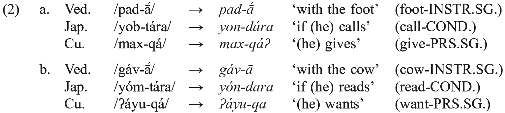

However, not all surface accents correspond to underlyingly accented morphemes. For instance, it is evident from (2a) that roots like Ved. /pad/ ‘foot’ and Cu. /max/ ‘give’ have no underlying accent, since the inherent accent of the inflectional ending attracts the surface accent; nevertheless, these roots receive the surface accent in other paradigmatically related forms, e.g., Ved. nom.pl. <i>pā́d-as</i>* ‘feet’ (cf. attested acc.sg. Ved. <i>pā́dam</i>), Cu. <i>máx-wənə</i> ‘(they) give’. The accentuation of such forms is generally assumed to be the result of a phonological principle of “default” accentuation, a grammatical process that operates when a word contains no inherently accented morphemes, assigning an accent to a phonologically unmarked position in order to fulfill the typologically common requirement that all words bear an accent (the “obligatoriness” parameter; see, e.g., Hyman 2006). In Vedic (and Cupeño), default accent surfaces on the word’s leftmost syllable as in (3a) (cf. Kiparsky 2010a: 144; Yates 2017), while (3b) shows that this default accentual pattern does not arise in words containing the same suffixes if there is already an accented morpheme present:

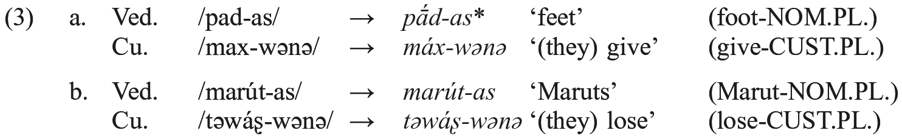

One important Vedic accentual phenomenon that emerges from (2−3) is the synchronic distinction between “mobile” root nouns − i.e. those showing surface accent on the root in the strong cases, on inflectional suffixes in the weak − like <i>pā˘d-</i> ‘foot’, and those with “fixed” (i.e. consistent) root accent like <i>gā˘v-</i> ‘cow’ (on the strong/weak case distinction, cf. 2.1.1 above). Root nouns with mobile accent are the dominant type (e.g., <i>nāv-</i>‘boat’, <i>pur-</i> ‘stronghold’, <i>yudh-</i> ‘fight’), while the minority fixed accent pattern is instantiated by a handful of other lexical items in addition to <i>gā˘v-</i>, including <i>nar-</i> ‘man’ (dat.sg. <i>nár-e</i>) and <i>raṇ-</i> ‘pleasure’ (dat.sg. <i>ráṇ-e</i>). By applying the same tools used to model similar accentual alternations in Tokyo Japanese and Cupeño, it is possible to arrive at an explanatory account of the different accentuation of these classes, which falls out directly from a minimal contrast in the underlying accentedness of the relevant roots (/gáv/ ‘cow’ vs. /pad/ ‘foot’) and affixes (instr.sg. /-ā́/ vs. nom.pl. /-as/). If Vedic here largely preserves the PIE situation (as is generally assumed), the PIE derivation of root nouns with mobile vs. fixed accent can be represented as in Table 122.6:

Tab. 122.6 Root Nouns in PIE

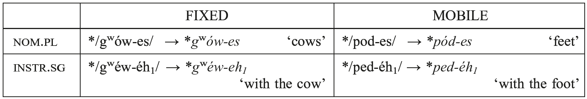

Under this analysis, accentedness and unaccentedness, respectively, are properties of the Vedic roots /gáv/ (< PIE */gʷów/) and /pad/ (< PIE */pod/), not properties of their basic (i.e. root noun) inflectional paradigms. In contrast to the paradigmatic approaches discussed in 3.3, which reify the status of intraparadigmatic accentual (im)mobility, this analysis takes the respective fixed and mobile accentual patterns of these nouns to be emergent from the lexical properties of their roots. It thus predicts that the underlying accentual contrast between these roots will recur in derivation, resulting in differences in the surface accentuation of certain morphologically related forms. In this case, the prediction is borne out: when /gáv/ and /pad/ are further suffixed by Ved. <i>-mant-</i> or <i>-vant-</i> (< PIE *<i>-ment-</i>/*<i>-went-</i>) − two possessive adjectival suffixes with similar accentual behavior that probably descend from a single morpheme at some stage of the proto-language (cf. Debrunner 1954: 781−782) − the resulting complex forms show a minimal contrast in surface accent: root-accented <i>gómant-</i> vs. suffix-accented <i>padvánt-</i>. Similarly, the peninitial accent of /marút/ is retained in its derivative <i>marútvant-</i>. One potential analysis of these derivatives is presented in (4) below (for an alternative, see Sandell 2015: 184−189):

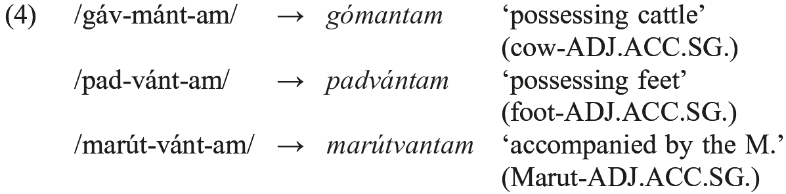

Ved. <i>gáv-ā</i> in (2b), as well as <i>gómantam</i> and <i>marútvantam</i> in (4), show a consistent pattern of accent resolution: when multiple inherently accented morphemes compete for the single surface accent in Vedic, accent falls on the inherently accented morpheme closest to the word’s left edge (also cf. dat.sg. Ved. <i>pad-vát-e ←</i> */pad-vánt-é/). Combining this generalization about accentual resolution with the pattern of leftmost “default” accentuation observed in (3a), Kiparsky and Halle (1977) proposed that Vedic accentuation is governed by the Basic Accentuation Principle (BAP), which can be stated as in (5) (cf. Kiparsky 2010a):

<table>
<tr><td>(5)</td><td>Basic Accentuation Principle (BAP):</td></tr>
<tr><td></td><td>If a word has more than one accented syllable, the leftmost of these receives word stress. If a word has no accented syllable, the leftmost syllable receives word stress.</td></tr>
</table>

Kiparsky and Halle (1977) present evidence from the accentual systems of Balto-Slavic and Ancient Greek in support of the BAP and, on the basis of their convergence, argue that it should be reconstructed for PNIE. This hypothesis is now corroborated by evidence from Anatolian, where Yates (2016) contends that the BAP is synchronically operative, accounting (e.g.) for the Hittite contrast in the <i>mi</i>-conjugation between primary verbs that are accentually mobile (i.e. show accent on the root in the singular and on inflectional endings in the plural) and those with fixed root accent. Mobile accent is the majority pattern in this category, instantiated by common verbal roots like <i>šeš-</i> ‘sleep’, while a few roots − such as <i>wek-</i> ‘demand’ − exhibit fixed root accent. Just as in the root nouns in Table 122.6 above, the accentual contrast between these verbs can be derived by assuming: (i) the singular verb endings are inherently unaccented (e.g., Hitt. 3sg.npst. /-zi/); (ii) the plural endings are inherently accented (3pl. /-ánzi/); (iii) the roots differ underlyingly in accentedness (/wék/ vs. /šeš/); and (iv) the operation of the BAP. This derivation is represented in Table 122.7:

Tab. 122.7 Primary Verbs in Hittite

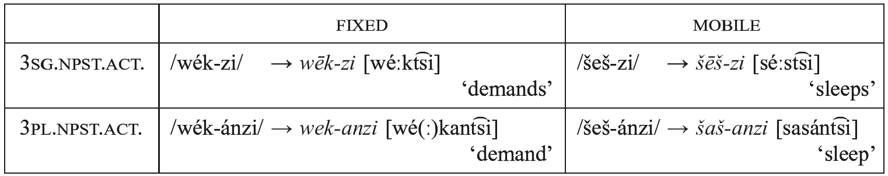

Vedic attests an identical contrast in primary verbs between mobile and fixed accentual types. Mobile accent is observed in most Vedic root presents, including Ved. 3sg.act <i>sás-ti</i> / 3pl. <i>sas-ánti</i> ‘sleep(s)’, which is directly cognate with the Hittite forms of <i>šeš</i>cited in Table 122.7. This perfect equation suggests that their PIE congenitors were derived in exactly the same way as in Hittite − in other words, that the corresponding PIE morphemes had the same accentual properties (*/ses/ ‘sleep’; 3sg.prs. */-ti/; 3pl. */-énti/) and underwent the same interaction with the BAP, i.e. (6) (for the accentuation of Ved. <i>sas-ánti</i>*, cf. imp. <i>sas-ántu</i>):

<table>
<tr><td>(6)</td><td>PIE */ses − ti/ <i>→</i></td><td>*<i>sés-ti</i> ‘sleeps’ (3SG.PRES.ACT.) > Hitt. <i>šēš-zi</i> [sé<b>ː</b>st͡si], Ved. <i>sás-ti</i></td></tr>
<tr><td></td><td>PIE */ses − énti/ <i>→</i></td><td>*<i>səs-énti</i> ‘they sleep’ (3PL.PRES.ACT.) > Hitt. <i>šaš-anzi</i> [sasánt͡-si],</td></tr>
<tr><td></td><td></td><td>Ved. <i>sas-ánti</i>*</td></tr>
</table>

The fixed accent type in Table 122.7 also has a parallel in Vedic, where it is similarly a minority pattern. An example is the Vedic root <i>takṣ-</i> ‘fashion’ with fixed accent, as in the 3pl. <i>tákṣ-ati</i> (the accent of the 3sg.act. <i>tāṣ-ṭi</i> is unattested, but would be <i>tā́ṣ-ṭi*</i>). The fixed root accent can be derived by assuming that the root itself is inherently accented (i.e. /tákṣ/), like Hitt. /wék/ ‘demand’.

The existence of inherently accented (verbal) roots in Vedic and Hittite raises the question of whether they should also be reconstructed for PIE. In this respect, it is notable that Hitt. <i>wēk-zi</i> and Ved. 3pl. <i>tákṣ-ati</i> are verbal forms analyzed by <i>LIV₂</i> as “Narten presents,” a type of PIE root present characterized by lengthened grade of the root in singular active forms and fixed root accent (see 4.3.1 below). If the special phonological behavior of this type is due to the fact that they are formed from “Narten roots” (Schindler 1994; Jasanoff 2012b; Villanueva Svensson 2012, <i>i.a</i>.), it may be the case that lexical accent was one property of these exceptional roots. An alternative possibility − consistent with Kümmel’s (1998) and Melchert’s (2014b) arguments that “Narten presents” were a derived category in PIE − is that all PIE verbal roots were inherently unaccented, and that fixed accent in “Narten presents” was due to the presence of an additional derivational morpheme (albeit one with no segmental content), much as in thematic presents (see below), *<i>s</i>-aorists, and other verbal categories with fixed accent. If so, the emergence of accented roots in the daughter languages might be attributed to the loss of Narten derivation as a productive morphological process, at which point the fixed accent associated with this category was reanalyzed as a lexical feature of the verbal root. Further research may shed light on these questions.

In addition to accented and unaccented morphemes, PIE also had <i>preaccenting</i> morphemes, which place a lexical accent on the final syllable of the preceding morpheme. Strong candidates for PIE preaccenting morphemes include the neuter event noun-forming suffix *<i>-o</i>/<i>es-</i> (cf. 2.4.1 above) and, in the verbal system, the *<i>-e</i>/<i>o-</i> suffix that forms PIE simple thematic presents (cf. 4.3.1 below). Nouns and verbs derived with these suffixes show fixed root accent and (generally) full-grade of the root (see further discussion of *<i>-o</i>/<i>es-</i> in 3.3 below). Under the preaccenting analysis, the accent on the root in these items is the surface realization of a lexical accent sponsored by the immediately following suffixes, PIE */-ˊo/es-/ and */-ˊe/o-/. This analysis of several securely reconstructible nominal and verbal examples is given in (7a) and (7b), respectively:

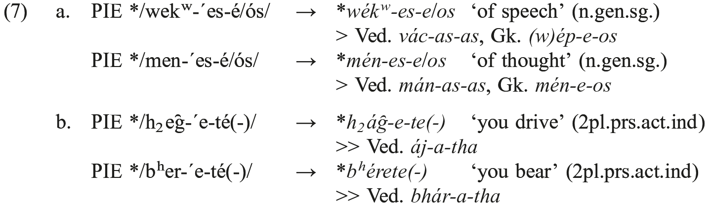

In (7), the lexical pre-accent “wins” over the lexical accent of the athematic genitive ending */-é/ós/ and of the 2pl.act. ending */-té(-)/ due to the BAP, which assigns surface accent to the lexical accent that is closer to the left edge of the word. Certain other potential analyses of these forms are not tenable. For instance, surface accent on the root cannot emerge by default, since athematic gen.sg. */-é/ós/ and 2pl. */-té(-)/ must be inherently accented: gen.sg. */-é/ós/ − like instr.sg. /-éh₁/ − attracts the surface accent in mobile root nouns (e.g., Ved. <i>pad-ás</i> ‘of the foot’ ← /pad-ás/), and similarly, 2pl. */-té(-)/ in mobile root presents (e.g., Ved. <i>ha-thá</i> ‘you smash’ ← /[g]han-thá/). Nor can surface root accent in (7) arise because the roots are themselves inherently accented, since the action/process-noun forming suffix *<i>-ti</i>/<i>tey-</i> regularly attracts the surface accent when suffixed to these roots, i.e. PIE *<i>mn̥-tí-</i> ‘thinking; thought’, *<i>bʰr̥-tí-</i> ‘bearing’ (> early Ved. <i>matí-</i>, <i>bhr̥tí-</i>; see further discussion of this class in 3.2 below).

However, just like the lexical accent of accented morphemes, the lexical accent sponsored by a pre-accenting morpheme does not always receive the surface accent. Vedic shows a clear synchronic contrast between examples like (7), where the lexical pre-accent “wins,” and those like (8b), where the principles of accentual resolution prefer a different accented morpheme. The same contrast is observed with preaccenting morphemes in (e.g.) Cupeño and Japanese; examples that parallel the Vedic data are laid out in (8a) and (8b), respectively (Japanese data from Kawahara 2015; Cupeño from Hill 2005):

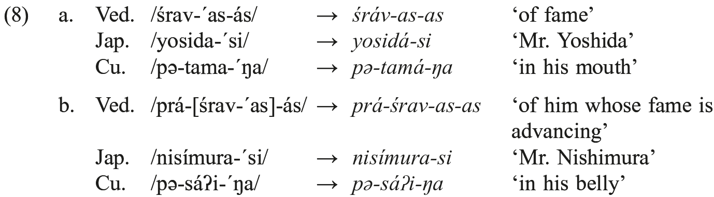

As is evident from (8b), the accentuation of <i>bahuvrīhi</i> compounds (cf. 2.6 above) like Ved. <i>práśravasas</i> is consistent with the BAP. The inherent accent of the first member (1M) − in this case, the preverb Ved. /prá/ − is assigned surface accent because its lexical accent is closer to the word’s left edge than that of 2M /śrávas-/, whose initial accent is due to the preaccenting neuter event noun suffix /-ˊas-/. First member accent is the inherited rule in Greek’s exocentric compounds as well. In its cognate class of *<i>s-</i>stem adjectives, Greek has a number of relic formations that reflect first member accent, thus making it plausible to reconstruct PIE compounds like *<i>pró-k̑lewes-</i> (> Ved. <i>prá-śravas-</i>) with 1M surface accent due to the BAP (cf. with details and references Lundquist 2016). Productively formed Greek <i>s-</i>stem compounds have suffixal accent (nom.sg.m./f. <i>-ḗs</i>), which reflects a historical change from denominal to deverbal derivation in this class of adjectives (cf. Meissner 2005: 161−215).

More generally, an analysis along these lines can be extended to other types of <i>bahuvrīhi</i> compounds which, even more clearly than in other categories, require a principle of accent resolution to determine which of the accents that their members bear as free-standing words will receive the single surface accent of the compound. In Vedic − and in all likelihood, in PIE − the surface accent of these compounds is that of their 1M (cf. Wackernagel 1905: §113−115), provided that the 1M contains an inherently accented morpheme. This pattern is again predicted by the BAP; simplified derivations for Vedic <i>bahuvrīhi</i> compounds of several structural types are given in (9) below (stem-stem compounding is assumed here, but see Kiparsky [2010a: 170−176, forthcoming] for more detailed analysis with extension to other compound types):

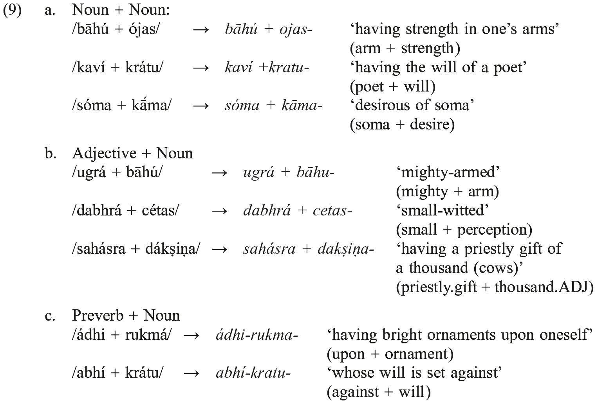

The Vedic evidence in (9) is again corroborated by “recessively” accented Greek <i>bahuvrīhi</i> compounds, e.g., <i>klutó-toksos</i> ‘famed for the bow’ (on Greek’s recessive accent, see Gunkel 2014). The equation of Greek and Vedic accentuation suggests that this analysis of compound accent can be extended at least to PNIE, and that <i>bahuvrīhis</i> with 1M accent like *<i>h₂ugró-bʰeh2g̑ ʰu-</i> (> Ved. <i>ugrá-bāhu-</i>) can be reconstructed for this stage. The more complicated case of <i>bahuvrīhis</i> with 2M accent is discussed further in 3.2 below.

### 3.2. PIE lexical accent: Expanding the analysis

It was shown in 3.1 that morphemes in PIE were lexically specified for one of three accentual features: accented, unaccented, or pre-accenting. In addition, PIE accentuation was governed by the BAP, which assigns the surface accent to the leftmost of several inherently accented morphemes, or in their absence, assigns a default initial accent. These three accentual features as well as the BAP have strong typological parallels in Japanese and other languages with lexical accent; however, it is all but certain that the PIE accentual system was of a more complex type than (e.g.) Cupeño, where the interaction between the same three accentual features and a BAP-like phonological principle is sufficient to account for (effectively) all of the accentual contrasts in the language (cf. Yates 2017). To account for the accentual patterns attested in the oldest IE daughter languages, it appears to be necessary to enrich the PIE system with additional properties, although exactly how it must be enriched is very much open for debate at present. In the remainder of this section, we lay out some of the data that complicate the analysis, and discuss a few recent proposals that may offer a way forward.

One accentual phenomenon that does not easily submit to the tools developed in 3.1 is the “intermediate” behavior of several athematic suffixes, which appear to attract the surface accent in simplex forms, but yield the accent in further derivation. Two suffixes with this property − both traditionally analyzed as “proterokinetic” under paradigmatic approaches to IE accent and ablaut (cf. 3.3) − are the deverbal action/process noun-forming suffix *<i>-ti</i>/<i>tey-</i> (cf. 2.4.1) and the qualitative adjective suffix *<i>-u</i>/<i>ew-</i> (2.5). For instance, in (earliest) Vedic *<i>ti-</i>stem nouns like <i>jū-tí-</i> ‘speed’ (to the root <i>jū-</i> ‘hasten’) or <i>vr̥ṣṭí-</i> ‘rain’ (to <i>vr̥ṣ-</i> ‘rain’) regularly show attraction of the surface accent to the derivational suffix (cf. Lundquist 2015), thus non-default accent in their strong case-forms (e.g., acc.sg. <i>jū-tí-m</i>, <i>vr̥ṣ-ṭí-m</i>); the suffix also retains the surface accent in weak case forms (e.g., dat.sg. <i>jū-táy-e</i>; instr.pl. <i>vr̥ṣ-ṭí-bhis</i>) in preference to the inherently accented inflectional endings to its right (dat.sg. /-é/; instr.pl. /-bhís/; cf. <i>paḍ-bhís</i> ‘with the feet’ to /pad/ in Table 122.6 and [4] above). At first glance, this accentual pattern recommends analyzing the suffix as inherently accented (i.e. “*/-tí/téy-/”), in parallel to the thematic adjective suffixes (/-nó-/, /-ró-/); fixed suffixal accent would then be correctly predicted, since the suffix would be the only accented morpheme in strong case forms and preferred by the BAP in weak case forms (i.e. “leftmost wins”).

The problem with this analysis, however, is that it makes incorrect predictions about the accentuation of derivationally related forms. Issues arise in (e.g.) adjectives derived from Vedic <i>ti-</i>stems by addition of the suffix <i>-mant-</i> (/-mánt-/), which consistently attracts the accent away from these stems, thus (e.g.) <i>jūtimánt-</i> ‘swift’, <i>vr̥ṣṭimánt-</i> ‘rainy’. This pattern would be unexpected if the noun-forming suffix Ved. <i>-ti</i>/<i>tay-</i> were inherently accented; rather, like Ved. <i>gó-mant-</i> ‘possessing cattle’ in (4) above and similarly (e.g.) Ved. <i>mánas-vant-</i> ‘thoughtful’ (to the neuter <i>as</i>-stem in [7] <i>mánas-</i>), a stem containing an inherently accented morpheme should receive the surface accent in preference to an accented suffix to its right as a direct consequence of the BAP.

This issue is not unique to *<i>ti-</i>stems nor is it specific to the suffix(es) *<i>-ment-</i>/ *<i>-went-</i>. The same kind of accentual behavior is also observed in *<i>u</i>-stem qualitative adjectives, which show fixed accent on the ablauting suffix *<i>-u</i>/<i>ew-</i> throughout their inflectional paradigm in both Vedic and Greek, e.g., Ved. <i>svād-ú-</i>, <i>svād-áv-</i> = Gk. <i>hēd-ú-</i>, <i>hēd-é(w)-</i> ‘sweet’ (< PIE *<i>sweh₂d-ú-</i>, *<i>sweh₂d-éw-</i>); Ved. <i>pr̥thú-</i>, <i>pr̥th-áv-</i> = Gk. <i>plat-ú-</i>, <i>plat-é(w)-</i> ‘broad’ (< PIE *<i>pl̥th₂-ú-</i>, *<i>pl̥th₂-éw-</i>); Ved. <i>āśú-</i>, <i>āś-áv-</i> = Gk. <i>ōkú-</i>, <i>ōk-é(w)-</i> ‘swift’ (< PIE *<i>h₁ōk̑-ú-</i>/*<i>h₁ōk̑-éw-</i>). Once again, the derivational suffix is superficially amenable to treatment as an inherently accented morpheme (“*/-ú/éw-/”), but such an analysis is problematized by the accentual behavior of the suffix in further derivation − for instance, in combination with the “<i>devī́</i> ” feminine suffix P(N)IE */-íh₂/yéh₂-/ (> Ved. /-ī́/yā́-/).

The feminine suffix does not generally attract the surface accent when there is an inherently accented morpheme to its left, as shown (e.g.) by its interaction with the accented PNIE perfect participle suffix *<i>-wos</i>/<i>us-</i> (*/-wós/ús-/), whose Greek and Vedic masculine reflexes bear suffixal accent, e.g., nom.sg.m. Ved. <i>vid-vā́ṁ-s</i>, gen.sg. <i>vid-úṣ-as</i>; Gk. <i>eid-(w)ṓ-s</i>, <i>eid-ót-os</i> ‘knowing’ (< PIE *<i>w[e]id-wṓs</i>, *<i>w[e]id-ús-</i>). Significantly, the corresponding feminine forms exhibit persistent accent on the perfect participle suffix − e.g., nom.sg.f. Ved. <i>vid-úṣ-ī</i>, Gk. <i>eid-uĩa</i> (< PGk. *<i>-ús-ya</i>) − as expected under the BAP: PIE */-ús-íh₂/ <i>→</i> *<i>-ús-ih₂</i>. However, when the same suffix is used in Vedic to form feminine *<i>u</i>-stem adjectives, it unexpectedly attracts the surface accent, thus nom.sg.f. Ved. <i>svād-v-ī́</i> ‘sweet’, <i>pr̥th-v-ī́</i> ‘broad’. This pattern is corroborated by archaisms in Greek − in particular, feminine plural forms in <i>-eiaí</i>, <i>-aiaí</i> with synchronically irregular oxytone accent; this class includes the Greek toponym <i>Plataiaí</i> (< PGk. *<i>pl̥th₂-[e]w-yéh₂-</i>), whose accent matches its cognate Ved. <i>pr̥th-v-ī́</i> ‘broad’ and therefore likely resisted the analogical leveling of suffixal accent that produced the synchronic feminine adjective Gk. <i>plateĩa</i> ‘broad’ with the regular accent of its morphological class (cf. de Lamberterie 1990: 644−645, 2002; contra: Sihler 1995: 349−350 et al.).

The exceptional “intermediate” accentual behavior of *<i>u</i>-stem adjectives in combination with the feminine suffix recurs in other derivationally related forms. First, there are cases in which these *<i>u</i>-stems are further suffixed by adjectival *<i>-ment-</i> (*/-mént-/) and − as in the *<i>ti</i>-stems − this suffix attracts the surface accent, e.g., Ved. <i>āśu-mánt-</i> ‘speedy’. Moreover, Vedic <i>bahuvrīhi</i> compounds with 1M *<i>u</i>-stem adjectives generally have surface accent on the accented syllable of their 2M, e.g., <i>svādu-kṣádman-</i> ‘(lit.) having a sweet carving knife (<i>kṣádman-</i>); serving sweet food’; <i>āśu-héṣas-</i> ‘having swift missiles (<i>héṣas-</i>)’; <i>pr̥thu-pā́jas-</i> ‘whose surface (<i>pā́jas-</i>) is broad’. While such compounds show some accentual variation − e.g., both <i>pr̥thu-budhná-</i> and unexpected <i>pr̥thú-budhna-</i>‘having a broad foundation (<i>budhná-</i>)’ are attested in the Rigveda − the dominant pattern in this class is 2M accent, which contrasts with the 1M accent pattern observed in the structurally comparable <i>bahuvrīhi</i> compounds in (9b) above. In each case, the *<i>u</i>-stem adjective is predicted by the BAP to receive the surface accent <i>if</i> it were an accented morpheme, but these predictions are not borne out; rather, the systematic failure of the *<i>-u</i>/<i>ew-</i> suffix − and similarly, *<i>-ti</i>/<i>tey-</i> − to attract surface accent in secondary derivatives suggests that these suffixes are in fact underlyingly unaccented (i.e. PIE */-u/ew-/, */-ti/tey-/), and that their secondary derivatives can be analyzed as in (10):

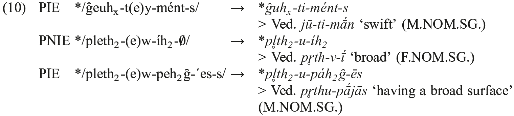

An important implication of this analysis is that the fixed suffixal accent observed in primary *<i>ti-</i>stem nouns and *<i>u</i>-stem adjectives must arise as the result of some other grammatical process that does not apply in further derivation. The exact nature of this process is controversial and a topic of ongoing research. According to Kiparsky (2010a: 144), it is the “Oxytone Rule,” which places a lexical accent on the rightmost syllable of a polysyllabic word’s inflectional stem. Because it applies only to a fully formed inflectional stem, the Oxytone Rule assigns a lexical accent to *<i>-ti</i>/<i>tey-</i> and *<i>-u</i>/<i>ew-</i> when immediately followed by inflectional endings, but does not target these suffixes when there is intervening morphological material, since they do not stand at the right edge of the stem. The suffix accented via the Oxytone Rule then attracts surface accent (in preference to accented weak case endings) due to the BAP.

An alternative hypothesis is advanced by Sandell (2015: 176−214), who argues that PIE affixes may be assigned lexical accent by virtue of being a word’s morphological <i>head</i> − in effect, the part of the word that determines certain of its fundamental morphosyntactic properties (e.g., whether it is a noun or adjective; cf. Zwicky 1985; Dresher and van der Hulst 1998). Thus a derivational suffix like *<i>-ti</i>/<i>tey-</i>, which selects a verbal root (e.g., *<i>men-</i> ‘think’) and forms an abstract noun (nom.sg. *<i>mn̥-tí-s</i> ‘thought’), is the word’s head and would consequently receive a lexical accent; however, in the (hypothetical) derived adjective *<i>mn̥ti-mént-</i>, the head of the word is the adjectival suffix *<i>-ment-</i>, so no lexical accent would be assigned to the *<i>-ti</i>/<i>tey-</i> suffix. This analysis would align PIE with a range of other languages in which morphological structure plays a direct role in determining word accent; included among these languages are two of PIE’s living descendants, Modern Greek and Russian (Revithiadou 1999), which are arguably conservative in this respect. However, adjudicating between this account and Kiparsky’s (2010a) Oxytone Rule requires further systemic analysis of Vedic word accent, and still more research in the other daughter languages is needed to establish the accentual properties of the “intermediate” suffixes at the PIE level.

Another problem encountered by the basic analysis laid out in 3.1 is the accentual behavior of certain suffixes which appear to “override” the accentual features of the stem to which they attach. The existence of such morphemes with this property − termed <i>dominance</i> by Kiparsky and Halle (1977) − was established in Balto-Slavic linguistics already in the 1970s (see, in particular, Garde 1976, and for a conceptual overview with reference to Ancient Greek, Petit 2016: 11−14). Such morphemes are also found in non-IE languages with lexical accent systems like Tokyo Japanese (see Kawahara 2015 with references). Dominant morphemes flout the language’s phonological accent resolution pattern (in PIE, the BAP), imposing their accentual properties on the stem to which they attach; in the IE languages, this effect can be observed most clearly when a dominant accented morpheme is suffixed to a stem that itself contains an inherently accented morpheme.

An example of a dominant morpheme in Vedic is the adjective-deriving suffix <i>-in-</i>(/-ín-/; cf. Kiparsky 2010a: 170). When it combines with nouns that have fixed surface accent (due to their underlying accented stems), the resulting derived forms systematically exhibit fixed surface accent on the <i>-in-</i>suffix; this pattern is shown in (11) below, where the same accented (thematic) noun stems that retain their accent in combination with non-dominant accented suffixes like Ved. <i>-vant-</i> (/-vánt-/) or as the 1M in <i>bahuvrīhi</i> compounds always cede the surface accent to the dominant suffix <i>-in-</i>:

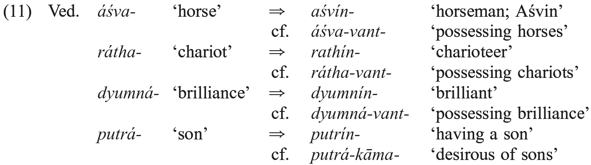

Dominance effects can also be found in the verbal system. In Vedic, verbal adjectives may be formed by suffixing <i>-ta-</i> /-tá-/ (< PIE *<i>-to-</i>; cf. 2.5 above) directly to the verbal root. Whether the root is unaccented (the majority type, e.g., /[g]han-/ ‘smash; kill’) or accented (/tákṣ-/ ‘fashion’), the suffix <i>-ta-</i> consistently attracts surface accent (<i>ha-tá-</i>‘smashed; killed’, <i>taṣ-ṭá-</i> ‘fashioned’). Dominant accented /-tá-/ thereby contrasts with the non-dominant accented present participle suffix /-(a)nt-/, which receives surface accent when added to unaccented roots (e.g., <i>ghn-ánt-</i> ‘smashing’) but not to accented roots (<i>tákṣ-ant-</i> ‘fashioning’).

The nature of accentual dominance in the PIE lexical accent system is a topic of ongoing research. Kiparsky (2010a) treats dominance as an arbitrary lexical property of morphemes (i.e. [+/− dominant]), but observes that there is a strong tendency for (prototypical) derivational suffixes to be dominant. In Greek, in fact, it appears that all derivational suffixes are dominant (Steriade 1988; and cf. Probert 2006b: 146; Gunkel 2014); several examples of Greek’s inherently accented derivational suffixes are given in (12), where their accentual dominance can be observed:

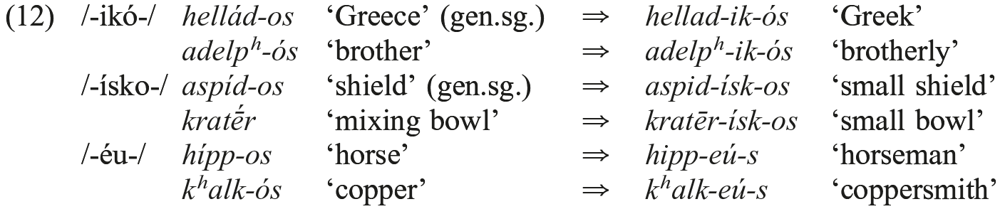

Given that Vedic appears to have both dominant and non-dominant derivational suffixes, the Greek situation likely reflects an innovation with respect to PIE. Nevertheless, the strong correlation in both languages between an affix’s morphosyntactic properties and its (non-)dominant status suggests that accentual dominance effects are in some way a consequence of morphological structure − i.e. the accent of the (last) derivational suffix is privileged because it is the morphological head (as in the *<i>ti-</i>stems discussed above; see Sandell 2015: 182−192 for a proposal and formal implementation to this end). Yet how accentual dominance should be formally implemented in PIE (and cross-linguistically) is far from a settled question; see generally Revithiadou (1999) and Alderete (2001b), and for specific application to (pre-)PIE word accent, Frazier (2006), Keydana (2013b), and Kim (2002, 2013a).

The cross-linguistically well-established analytic tools introduced in 3.1 − i.e. the distinction between inherently accented, unaccented, and preaccenting morphemes together with the BAP − make empirically testable predictions about PIE accentuation that correctly account for the distribution of surface accent in many securely reconstructible PIE words and morphological categories. However, it is also clear that there are morphological conditions under which these predictions are systematically violated − i.e. when a word contains an accentually “intermediate” or dominant morpheme. One possibility would be to take the behavior of these morphemes as evidence that the analysis laid out in 3.1 − in particular, the BAP − is incorrect; yet in view of the far-reaching accentual generalizations that are correctly derived by the BAP, we have proposed instead that the theory should be refined. Specifically, we have suggested that the PIE accentual system had additional morphophonological properties relevant to the accentuation of words containing accentually “intermediate” and dominant morphemes. We have also discussed several promising hypotheses about what these properties might be and how they should be integrated into a general analysis of PIE word accent.

Under this view, the PIE lexical accent system is of a complex type similar to that of Thompson Salish, Tokyo Japanese, and Chamorro (cf. 3.1 above): surface accent is in some cases determined by a purely phonological computation over the inherent accentual properties of morphemes (i.e. the BAP), but there is also an additional “layer” associated primarily with derivational suffixes in which a word’s morphological structure may influence the computation of the surface accent. Further research in this vein on the accentual systems of the ancient IE daughter languages − in particular, Vedic, Greek, Balto-Slavic, and the Anatolian languages − will continue to shed light on the synchronic principles governing the distribution of surface accent in PIE, on the reconstructible accentual properties of individual morphemes, and in turn, on what forms constitute real archaisms already at this stage of the proto-language − i.e. reconstructible words whose accent cannot be generated by productive morphophonological processes, and so must have been learned on an item-by-item basis. A still broader issue is the extent to which accent and ablaut are related at the PIE stage (and at the earlier pre-PIE stage), an issue we take up immediately below (3.3).

### 3.3. Reconstructing PIE ablaut

The relationship between accent and ablaut in PIE has been a major topic of research since the beginning of IE studies. Accent and ablaut correspond only partially in the daughter languages and so too at the stage of PIE that is accessible by the comparative method. In PIE, every kind of vowel may surface with or without surface accent: *<i>bʰér-e-ti</i> ‘carries’ and *<i>mn̥-téy-es</i> ‘thought’ (nom.pl.) surface with two full-grades each (the nom.pl. *<i>-es-</i> never has a reduced allomorph); *<i>septḿ̥</i> ‘7’ (> Ved. <i>saptá</i>, Gk. <i>heptá</i>) bears an accented zero-grade and an unaccented <i>e-</i>grade; *<i>bʰór-o-s</i> ‘burden’, *<i>pód-s</i> ‘foot’ and *<i>kéy-(t)or</i> ‘lies’ have accented and unaccented *<i>o</i>-grades. These examples are easily multiplied. However, there are also strong indices to suggest a relatively tight connection between surface accent and full-grade, as seen in (e.g.) verbal paradigms like *<i>h₁éy-ti</i> ‘goes’, 3pl. *<i>h₁y-énti</i> or *<i>h₁és-ti</i> ‘is’, 3pl. *<i>h₁s-énti</i>. Accordingly, it is widely thought that these quantitive ablaut alternations (i.e. *<i>e</i>: *θ) were once purely phonologically conditioned − in its strongest formulation, that an *<i>e</i> vowel would surface only if it bore the surface accent, and all other morphemes would thus appear in their zero-grade forms (see Szemerényi 1996: 111−112, who traces this view back to the 1860s; cf. Weiss [2011: 47] for a recent, skeptical formulation). Viewed in generative terms, these alternations would reflect an accent-conditioned syncope process deleting all unaccented */e/ vowels at the relevant stage of the proto-language. Similarly, a link has long been suspected between surface accent and *<i>o-</i>grade, i.e. <i>qualitative</i> ablaut (e.g., Hirt 1900: esp. 156, but see the doubts voiced earlier by de Saussure 1879: 134, 235, <i>et passim</i>). For this view, however, one finds even less consensus, since it has not yet been demonstrated just what that link would be (see Penney 1978 for an extensive treatment and the concise overview by Weiss [2011: 47]; Kümmel [2012: 307−320] gives one recent attempt to explain the origin of *<i>o</i>-grades). Quantitative ablaut especially has often been treated as a shortcut to accent − i.e. if a word contains an *<i>e-</i>grade morpheme, it should once have been accented, and a zero-grade morpheme should have been unaccented − but at the PIE level such a shortcut is clearly not tenable.

A major program of research, developed principally in the 1960s and 1970s (but with older roots, esp. Pedersen 1926 and Kuiper 1942), has focused on reconstructing the formal patterns of athematic nominal formations at this pre-PIE stage when the relationship between accent and ablaut would have been more transparent. For instance, in a foundational paper Schindler (1975b: 261) proposed that neuter *<i>-es-</i>stem nouns of the type PIE nom./acc. *<i>wékʷ-os</i>, gen.sg. *<i>wékʷ-es-os</i> (> Ved. <i>vácas</i>, <i>vácasas</i>, etc.; cf. 3.1 above), looked substantially different at a pre-PIE (“vorindogermanisch”) stage. He argued that, although no attested language exhibits synchronic accent shifts or ablaut alternations of the root in this nominal class, it is nevertheless possible to reconstruct pre-PIE accentual mobility between root and derivational suffix. In support of this hypothesis, Schindler cites lexicalized compounds with 1M reflecting *<i>mén-s-</i> ‘thought’ (e.g., OAv. <i>mazdā-</i>) where the apparent zero-grade of the suffix would reflect the predicted nom./acc.sg.n. form (**<i>men-s + dʰeh1-</i>; cf. PIE *<i>mén-os</i> > Ved. <i>mán-as</i>, Gk. <i>mén-os</i>). At this pre-PIE stage, all unaccented morphemes would surface in their zero-grade forms, since accent and full-grade would be directly dependent on one another (“… die Ablautstufen im Wort akzentabhängig waren”, p. 261). Provided that this assumption is correct for pre-PIE, the PIE paradigm *<i>wékʷ-os</i>, *<i>wékʷ-es-os</i> would continue pre-PIE **<i>wékʷ-s</i>, **<i>ukʷ-és-s</i>, whose accent was assigned morphologically and whose ablaut resulted predictably from the pre-PIE syncope rule.

Under this approach, the hypothesized formal patterns are reified as a set of “paradigmatic” classes; all PIE athematic nominals of the structure R(oot) + S(uffix) + (E)nding would belong (historically) to one of these classes. Thus pre-PIE **<i>wékʷ-s</i>, **<i>ukʷ-és-s</i> would instantiate the “proterokinetic” class, structurally R(é)-S(θ)-E(θ) in the strong cases (e.g., **<i>wékʷ-s</i>, nom./acc.sg.n.) and R(θ)-S(é)-E(θ) in the weak (**<i>ukʷ-és-s</i> gen.sg.). In the most widely accepted model, developed in particular by Schindler (1972a, 1975a, b) and the “Erlangen School” (e.g., also Rix 1992: 122−124), four or five “kinetic” (/“dynamic”) and “static” classes are posited. The “Leiden School” reduces the model to three such classes (see Beekes 1985; Beekes and de Vaan 2011: 190−191 <i>et passim</i>; Kloekhorst 2013), while other scholars have posited additional accent and ablaut paradigms − for instance, Tichy (2004: 75−81) and Neri (2003: 37−39) allow a “mesokinetic” paradigmatic class. This body of research has clarified especially which forms could be relics already in PIE (such as the isolated *<i>men-s-</i> mentioned above) and offers a possible starting point for analyzing the subsequent development of many PIE athematic nominal formations. Overviews of the paradigmatic classes can be found in all recent IE handbooks: see Watkins (1998: 61−62, skeptical), Clackson (2007: 79−89), Fortson (2010: 119−223), Weiss (2011: 257−262); Meier-Brügger (2010: 336−353) offers the fullest history of research.

Despite its widespread acceptance, a rapidly growing body of scholarship has expressed dissatisfaction with the conceptual and empirical limits of this theory (cf. in general Kiparsky 2010a, forthcoming; Keydana 2013b; Kümmel 2014 with reference to Indo-Iranian; and Yates 2016 on Anatolian); we outline some of these criticisms here. One issue concerns the extent of the changes that separate reconstructible PIE forms from the pre-PIE paradigmatic classes. Early work within the paradigmatic framework recognized that this approach, which relies extensively on internal reconstruction, yields paradigms whose patterns of accentual mobility and ablaut grades display numerous mismatches with the patterns observed in the daughter languages, some of which are directly reconstructible for PIE by application of the comparative method (cf. Pedersen 1933: 21). To obtain PIE morphophonology, further diachronic assumptions are therefore required: the pre-PIE paradigmatic classes would be transformed by a series of analogical processes whose combined operations eliminated intraparadigmatic allomorphy by analogical leveling of accent, ablaut, or both (sometimes referred to with the descriptive label “columnarization”). The morphological upheavals here envisaged must have occurred in the internal history of the proto-language, i.e. prior to PIE as accessible by the comparative method, since no daughter language organizes its morphology into productive paradigmatic classes (cf. the methodological discussion by Hale 2010, as well as Stüber 2002: esp. 211−216, both with reference to *<i>es</i>-stems). Because the hypothesized changes are situated deep in prehistory, their plausibility is difficult to evaluate, either within individual classes or collectively, at the systemic level.

Beyond these uncertainties, a problematic consequence of the focus on the internally reconstructed pre-proto-language is that much of the morphophonology of PIE and its daughter languages is left unexplained, since the theory was not designed to handle material at this chronological level. For instance, numerous bedrock formations of PIE have no clear position in the paradigmatic classes. The classes refer only to athematic nominal formations of the structure R(oot) + S(uffix) + E(nding), thus excluding thematic nouns and adjectives, athematic nominal formations with multiple derivational suffixes (i.e. of the structure R + S + S (+ S …) + E), and even root nouns. The fact that the paradigmatic approach does not address these PIE formations is not a criticism per se, since this is not strictly the goal of the theory; however, it does mean that this theory, with its pre-PIE focus, sheds little light on the distribution of the accent (discussed in 3.1−3.2 above) or its synchronic relationship to ablaut at the “shallow” chronological stage of PIE which we are reconstructing here and which was inherited directly into the daughter languages.

A further criticism relates to the evidential basis for the paradigmatic reconstructions, which in a number of cases has been called into question. For instance, in a widely followed thesis, Kuiper (1942: 221) proposed that the different accentuation of Vedic <i>matí-</i> ‘thought’ beside <i>máti-</i> ‘id.’, coupled with indirect evidence elsewhere, showed a trace of erstwhile intraparadigmatic alternations in an accent and ablaut paradigm, i.e.**<i>mén-ti-</i>,**<i>mn̥-téy-</i> and therefore would be another proterokinetic paradigm (Rix 1992: 146; Schaffner 2001: 436−440). In this case, the zero-grade ablaut of the root in the weak cases would have been leveled throughout the paradigm in Vedic, but with a bifurcating accentual leveling: leveled accent of the strong cases would be preserved in some Vedic traditions (i.e. *<i>má-ti-</i> > <i>máti-</i>), while the leveled accent of the weak cases would be preserved in others (i.e. leveled *<i>mn̥-tí-</i> > <i>matí-</i>). It has proven difficult to explain why the directions of leveling have taken the apparently arbitrary courses they have; in this case, however, the quest to do so is in fact a red herring, since the two accentual patterns stand in a clear chronological relationship: accented <i>-tí-</i>stems occur in the oldest textual layers, unaccented <i>-ti-</i> in the younger. Thus early Ved. <i>matí-</i> and later Ved. <i>máti-</i> do not provide evidence for independently leveled bits of a prehistoric paradigm, but instead reflect a Vedic-internal diachronic accentual change that can be otherwise explained (Lundquist 2015; see further below). More generally, Kümmel (2014) has shown that the accent and ablaut of “proterokinetic” nominals in Indo-Iranian is better explained without reference to paradigmatic class, thereby undercutting an important source of evidence for the paradigmatic approach.

In assessing accentual change, it has become common practice to treat two attested accentual patterns associated with one suffix as reflecting independent analogical levelings of an alternating paradigm (as in the case of Ved. <i>matí-</i> vs. <i>máti-</i>). However, it has now become clear that (pre-)PIE intraparadigmatic accentual mobility is not a necessary condition for this situation to arise. This point has been conclusively demonstrated by Probert (2006a,b), who investigates the diachronic development in Greek of two morphological categories that are by general agreement reconstructed with fixed word-final surface accent, thematic adjectives (formed with the suffixes *<i>-ro-</i>, *<i>-no-</i>, *<i>-to-</i>, and *<i>-lo-</i>; cf. 2.5) and feminine event/result nouns (formed with *<i>-eh₂</i>; cf. 2.4.1). While most attested reflexes of these categories show the historically expected pattern, some instead show “recessive” accentuation, thereby arguably exhibiting an accentual change. Probert attributes this change to a process termed “demorphologization” whereby morphologically complex words lose their compositionality due to semantic or formal opacity and come to be treated as monomorphemic (“demorphologized”). As a further consequence, words affected by this morphological change strongly tend to adopt the language’s default accentual pattern (whether or not this occurs depends on word frequency and other factors; cf. Sandell 2015: 192−214) − in Greek, recessive accentuation, which ultimately reflects the BAP in modified form (i.e. leftmost within the accentable domain). The differing surface accents of (e.g.) Gk. <i>ekʰtʰrós</i> ‘enemy’ and Gk. <i>gū˜ros</i> ‘circle’ thus do not reflect a fundamental difference in the historical formation of each item; rather, the connection between reconstructible *<i>gū-rós</i> ‘circle’ (substantivized from the adj. <i>gū-rós</i> ‘round’) and other *<i>-ro-</i> adjectives became opaque and, as a result, the word was eventually subject to default accentuation, whence *<i>gūr-ós > gū˜ros</i> (on this example see Probert 2006b: 232−233). Cases of this kind show definitively that two accentual patterns can emerge diachronically without an earlier synchronic intraparadigmatic accentual alternation. Furthermore, such cases provide evidence for a type of prosodically optimizing, non-proportional analogical change that can also be observed within the historical record of English (cf. Kiparsky 2015: 82−83). Within the ancient IE languages, the Greek evidence for this type of change finds further support in Vedic, where a similar analysis can account for the development of Vedic *<i>-ti-</i>stems (like Ved. <i>matí-</i> > <i>máti-</i>), as well in the Anatolian languages, where it can explain a variety of forms (such as PIE nasal-infix presents; cf. 4.3.1) that unexpectedly exhibit initial surface accent (i.e. leftmost, in accordance with the PIE default pattern; see Yates 2015). A broader implication of this finding is that the existence of more than one accentual pattern associated with a single suffix is not a sufficient condition to reconstruct an alternating accentual paradigm at any historical stage. To the extent that individual paradigmatic reconstructions are founded on this premise (as in “proterokinetic” *<i>-ti-</i>stems), their (pre-)PIE status must be viewed as uncertain.

Finally, taking a still wider perspective, Kiparsky (2010a, forthcoming) in particular has also challenged the typological naturalness of the paradigmatic classes. Although it is true that the typological pool of known morphophonological properties is not comprehensive (see however van der Hulst [1999] on the word prosodic systems of the languages of Europe, as well as the <i>StressTyp2</i> database site [[http://st2.ullet.net//])](http://st2.ullet.net//), no clear parallel for the pre-PIE system has yet been brought forward. Part of the uncertainty here is terminological: before comparing the pre-PIE system to that of another language family, the linguistic claim needs to be formulated more precisely − in what sense do paradigms “exist” in pre-PIE morphology? Are they prosodic templates associated with certain derivational categories, and if so, which ones? Or are they intended to be the surface result of a pre-PIE lexical accent system, perhaps not dissimilar to the one we have reconstructed above? Given the real gaps in knowledge currently facing researchers who reconstruct PIE morphophonology (as outlined above) − in particular, the fact that it is not yet fully clear what determines the surface accent of derivationally complex forms − the amount that can be said confidently about pre-PIE accent and its relation to ablaut is limited. Reconciling the results of research on pre-PIE paradigms with the morphophonology of PIE and its daughter languages will likely remain a major project for years to come.

## 4. PIE verbal morphology

This section provides an overview of the reconstructed morphology of the PIE finite verb and associated non-finite verbal categories such as participles and infinitives. The structure and early history of the PIE verb continues to be one of the most hotly contested areas in IE studies today. While some consensus concerning the reconstruction of the PNIE verb was reached in the early 20th century, the advent of Anatolian and Tocharian called into question many of the generally accepted features of this traditional reconstruction (see Jasanoff, this handbook). Consequently, much of our discussion focuses, first, on the reconstructible features of the PNIE verb, then we proceed to address the more controversial PIE verb, as well as the issues that problematize its reconstruction. While we attempt to flag serious points of contention and offer critical discussion of the major competing views, non-specialists in particular need to be aware that there is little unanimity in the field on these topics and that, due to limitations of space, not all views can be considered here. Further discussion can be found in recent general overviews of the IE verb, which include Clackson (2007: 90−113), Fortson (2010: 88−112), Weiss (2011: 377−398), and Meier-Brügger (2010: 295−321). The standard reference work in the field is Rix and Kümmel (2001) (=<i>LIV₂</i>), a comprehensive collection of reconstructed PIE verbal roots and their verbal formations in the individual languages. Jasanoff (2003a) reexamines the foundations of the IE verb, especially in light of the Anatolian (and to an extent Tocharian) evidence (see too Jasanoff forthcoming b). The collection of papers in Melchert (2012b) is representative of recent research on the IE verb.

### 4.1. Structure of the PIE verb

As in the nominal domain, PIE verbal morphology was highly affixal. This property is observed in PIE verb inflection where five grammatical categories were distinguished: <i>person</i>, <i>number</i>, <i>voice</i>, <i>tense</i> and <i>mood</i> (we treat <i>aspect</i> [below] as a derivational category). Fusional inflectional suffixes encoded grammatical agreement with the subject (nominative-accusative syntactic alignment; see Keydana, this handbook) for person (1st, 2nd, 3rd) and number (singular, dual, plural), as well as voice (or “diathesis”), either active or middle; for example, *<i>-m</i> is an exponent of the features [1st person, singular, active], while *<i>-o</i> expresses [3rd person, singular, middle]. Separate segmentable suffixes are reconstructible as markers of tense (non-past; past is unmarked) and mood (subjunctive; optative; imperative; indicative is unmarked). These inflectional categories are discussed individually in 4.2 below.

Verbal inflectional suffixes were added to the verbal stem, which was specified with certain grammatical features. In PNIE, verbal roots canonically formed three morphologically distinct verbal stems, traditionally and here referred to as “present,” “aorist,” and “perfect” (see further 4.3 below); this tripartite distinction is maintained only in Indo-Iranian and Greek. It is widely thought that the three stems expressed primarily differences of grammatical <i>aspect</i>. A speaker could indicate his or her view of the eventuality of the verb as internally complex, which was the work of the present (or “imperfective”) stem; as a bounded, complete whole, using the aorist (or “perfective”) stem; or as a resulting state, using the perfect stem. The three grammatical aspects interact with lexical aspect. By “lexical aspect” (German <i>Aktionsart</i>) we mean the inherent semantics of a verb’s event structure, such as durativity or telicity, which are inherent as opposed to chosen by a speaker to express a viewpoint. In the case of PNIE, it is generally assumed that there was close agreement between grammatical and lexical aspect in the formation of tense-aspect stems: verbal roots with telic lexical aspect had an underived aorist stem (i.e. root aorist), whereas verbs with atelic lexical aspect had an underived present stem (i.e. root present). However, the agreement between lexical aspect and stem formation is in practice not nearly so neat; rather, there are numerous mismatches in both directions, relatively clear cases in which apparently telic roots form underived present stems, and apparently atelic roots form underived aorist stems. We will return to some of the specific mismatches below (4.3). Another real issue with the PIE verbal system stems from the well-known difficulties associated with analyzing the “perfect” as an aspectual category cross-linguistically (cf. Comrie 1976: 52), to which may be added the challenge of establishing the prototypical meaning of the PNIE perfect (see further 4.3.3 below). The question of grammatical aspect and stem formation has been and continues to be a major locus of research in Indo-European linguistics.

The deeper prehistory of the PNIE verbal system is one of the most controversial topics in IE linguistics today. In particular, two important structural features of the verbal system reconstructible for PNIE are absent in the Anatolian languages: (i) a grammaticalized aspectual contrast between present and aorist stems; and (ii) the perfect as a grammatical category. It is therefore <i>a priori</i> uncertain whether these verbal features − as well as certain others, like the subjunctive and the optative (see 4.2.4 below) − should be reconstructed for PIE and their absence in Anatolian attributed to historical loss, or whether they should instead be viewed as post-PIE innovations. These issues are discussed in more detail below, but we lay out now the major assumptions that guide our presentation.

We adopt the position, shared by the majority of scholars, that PIE had an imperfective/perfective aspectual contrast realized in the distinction between present and aorist stems. With respect to (ii), however, we follow Jasanoff (2003a) in the view that a PIE verbal system was broadly Anatolian-like, in that all verbs belonged to one of two formally distinct but − from a synchronic perspective − functionally undifferentiated conjugational classes, the *<i>m</i>-conjugation or the *<i>h₂e</i>-conjugation. Furthermore, we assume with Jasanoff (forthcoming b) that an important innovation of PNIE − i.e. after the departure of the Anatolian branch − was the grammaticalization of the perfect, which developed out of a set of PIE verbs with the formal characteristics of PNIE perfects, including reduplication and *<i>h₂e</i>-conjugation inflection (see further 4.2 and 4.3.3 below). Adopting these views has significant implications for the PIE verbal system − for instance, on how the inflectional endings of the PIE verb are reconstructed. This issue is addressed further in 4.2.5 and 4.2.6, where the evidence for the reconstruction of PIE *<i>m</i>-conjugation endings and *<i>h₂e</i>-conjugation are separately assessed.

### 4.2. PIE verbal inflection

The PIE verb inflects for five grammatical categories, whose reconstructions are discussed individually below: <i>tense</i> (4.2.1), <i>person</i> and <i>number</i> (4.2.2), <i>voice</i> (4.2.3), and <i>mood</i> (4.2.4). The exponents of person, number, and tense were fusional inflectional suffixes (“personal endings”), which were added directly to a verbal aspectual stem. Two distinct sets of active voice inflectional endings are reconstructible for PIE, one that became associated with the PNIE “perfect” stem and another with the PNIE present and aorist stems; the latter are sometimes referred to together as “eventive” active endings (and the present and aorist stems together as the “eventive” system), a label that stems from the older view that verbs marked with these endings were semantically opposed to a fundamentally stative perfect (now generally viewed as resultative-stative; see further 4.3.3 below).

These two sets of active endings have distinct cognates in the Anatolian languages, where all verbs belong to one of two synchronically arbitrary inflectional categories, usually referred to as the <i>mi-</i> and <i>ḫi</i>-conjugations (after their respective 1sg.act.prs. endings in Hittite, <i>-mi</i> and <i>-ḫ[ḫ]i</i>). Active forms of Anatolian <i>mi-</i>conjugation verbs have active personal endings clearly cognate with PNIE present/aorist active endings, and <i>ḫi-</i>conjugation verbs with PNIE perfect (active) endings. In what follows, we refer to PIE verbal endings that underlie the former as the endings of the PIE *<i>m</i>-conjugation, and to the latter as the endings of the PIE *<i>h₂e</i>-conjugation; the evidence for their reconstruction is discussed in 4.2.5 and 4.2.6, respectively. In addition, PIE had a third set of verbal inflectional endings associated with the middle voice. The distinction between verbs that select *<i>h₂e</i>-conjugation endings in their active forms and those that select *<i>m</i>-conjugation endings is not realized in their corresponding middle voice forms, both of which are marked by the same set of middle endings; we assess the evidence for the formal reconstruction of these endings in 4.2.7 below.

#### 4.2.1. Tense

Tense is a grammatical category that relates the time of the event described to another point in time, typically to the moment of the utterance (“absolute tense”), but in some cases, to the time of some other discourse-relevant event (“relative tense”) (for the distinction, cf. Comrie 1976: 2). Tense cuts asymmetrically across the PNIE verbal aspectual categories. The imperfective stem shows a morphological contrast between non-past and past tense forms (<i>present</i> vs. <i>imperfect</i>), and according to a majority of researchers, so does the “perfect” stem (<i>perfect</i> vs. <i>pluperfect</i>), while the perfective stem has only forms that lack non-past tense marking (<i>aorist</i>); this system is represented in Table 122.8:

Tab. 122.8 Tense-aspect system of PNIE

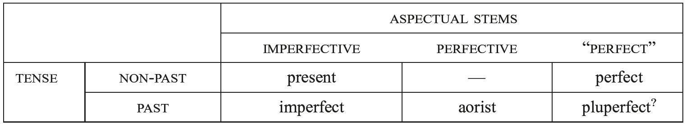

The imperfective and perfect stems differ in the way the tense contrast is encoded. Separate segmentable markers of tense are clearly reconstructible in the imperfective stem, where non-past tense (i.e. present) verbal forms are generally distinguished from past tense (i.e. imperfect) forms by the presence of an additional suffixal element − in the active voice, by the “<i>hic et nunc</i> particle” *<i>-i</i>, and in the middle voice, by *<i>-r</i> (Yoshida 1990; cf. Jasanoff, this handbook). These morphemes may be viewed as markers of non-past tense (i.e. [− past]). Inflectional endings characterized by these suffixal elements are traditionally referred to as “primary” endings, while the unmarked endings of the past tense are called “secondary” (these labels, which confusingly appear to reverse their morphological relationship, are due to their association with “sequences of tenses” in traditional grammars, “primary” and “secondary” respectively). Thus (e.g.) the PNIE 1sg.pres.act. was marked with the primary ending *<i>-m-i</i> (vs. the imperfect “secondary” ending *<i>-m</i>), and the 3sg.pres.mid. form was marked with the primary ending *<i>-o-r</i>/*<i>-to-r</i> (vs. imperfect *<i>-o</i>/<i>-to</i>); for the precise distribution of these tense markers and the evidence for their reconstruction, see the detailed discussion of the reconstructible verbal “personal endings” in 4.2.5 and 4.2.7 below. The aorist employs the same secondary endings as the imperfect, and is thus formally indistinguishable from the imperfect in certain stem classes (cf. 4.3).

<!-- source-file: content/14_chapter08_6.xhtml -->

Whether PNIE had a tense contrast in the “perfect” stem has long been debated (cf. Wackernagel 1926−1928 [2009]: 238 with references to older literature). It is now the majority view that the <i>pluperfect</i>, a past tense of the <i>perfect</i>, should be reconstructed for this stage (see especially Jasanoff 2003a: 34−43). The synchronic systems of both Greek and Vedic include a separate pluperfect tense generally functioning as a past tense to the perfect, but its PNIE status is complicated by serious difficulties in reconstructing the formal markers of this category − in particular, reconciling what appear to be significant discrepancies between the Greek and Vedic inflectional endings. It is most likely, however, that the PNIE pluperfect was formed by addition of the secondary endings associated with the present/aorist system to the perfect stem, as in Vedic, e.g., 1sg. <i>ávedam</i> ‘Iknew’ (to the unreduplicated perfect <i>véda</i> ‘knows’; cf. 4.3.2 below); 3sg. <i>á-bi-bhe-t</i> ‘feared’ (to the presential perfect <i>bi-bhāy-a</i> ‘fears’). For a possible (albeit complicated) scenario by which the same endings underlie the markers of the Greek pluperfect, see Katz (2008) and Jasanoff and Katz (2017).

The reconstruction of a future, i.e. as a morphologically distinct, inflectional category of the verb, is controversial. Futurity could be expressed by the present indicative stem with or without an adverb expressly indicating the future (on expressions of the future in ancient IE languages, see Wackernagel 1926−1928 [2009]: 246−265 and refs. in 247 n.14). Additionally, the subjunctive could refer to the future, with further modal meanings, in at least PNIE. A desiderative suffix *<i>-h₁se</i>/<i>o-</i> meaning ‘wanting to do X’ comes to mark the future in a number of daughter languages. This suffix appears to be composed of the thematic vowel combined with a desiderative morpheme (*<i>-h₁s-e</i>/<i>o-</i>) as reflected directly in Greek, indirectly elsewhere (for instance in the Celtic futures descended from desideratives; cf. Stüber, this handbook). Examples from Greek include <i>tenéō</i>, <i>ten[image-glyph: o with macron and tilde]</i> ‘I will stretch’ < *<i>ten-h₁s-e</i>/<i>o-</i> (cf. pres. <i>teínō</i>), or <i>dérk-so-mai</i> ‘I will see’ < *<i>derk-(h₁)s-e</i>/<i>o-</i>. What is very likely the same suffix with a slight formal innovation, viz. *<i>-h₁s-ye</i>/<i>o-</i>, underlies the futures in Indo-Iranian and Baltic; e.g., Ved. <i>drak-ṣyá-ti</i> ‘he will see’ < *<i>derk-h₁s-ye-ti</i> (on this morpheme cf. Jasanoff 2003a: 134−135; note that others − e.g., Willi 2011 − would derive this future instead from an *<i>s-</i>aorist subjunctive).

An additional prefix *<i>(h₁)e-</i>, the “augment,” marks past tenses in Indo-Iranian, Greek, Phrygian, and, in a phonologically restricted way, Classical Armenian. Examples include Ved. <i>á-han</i> ‘he smashed’ < *<i>e-gʷʰen-t</i> (cf. 3sg.prs.act. *<i>gʷʰén-ti</i> ‘smashes’), Gk. <i>é-pʰer-e</i> ‘he was carrying’ < *<i>e-bʰer-e-t</i> (cf. 3.sg.pres.act. *<i>bʰer-e-ti</i> ‘he carries’). However, in the earliest Indo-Iranian and Greek texts past tense forms are not obligatorily marked with the augment, which looks instead like an emerging, additional marker of [past]. Since no certain traces of the augment have been found in other IE languages, augmented verbal forms are not reconstructible for PIE. The augment is most often derived from a temporal deictic particle *<i>h₁e</i> ‘then’ (cf. e.g., Meier-Brügger 2010: 315−316 with references), although other etymological attempts have been made: Watkins (1963) (= 1994: 3−51) derives the augment from a sentence connective seen in Anatolian (but cf. Melchert forthcoming a); as an alternative proposal, Willi (2007) proposes to derive it from a reduplicating syllable, originally marking perfective aspect and only secondarily past tense.

#### 4.2.2. Person and number

There is general consensus that the PIE verb was morphologically marked for three persons (1st, 2nd, 3rd) and three numbers (singular, dual, plural). Of these features, only the dual is somewhat uncertain. As in the nominal system (cf. 2.1.2 above), the Anatolian languages synchronically lack dual number. It is generally held that the 1du. marker (of the *<i>m</i>-conjugation) has ousted the 1pl. marker in the prehistory of Anatolian. The Proto-Anatolian 1pl. primary active ending may be uncontroversially reconstructed as *<i>-weni</i> (based on e.g., Hitt. <i>-weni</i>, Pal. <i>-wini</i>/<i>-wani</i>, CLuw. <i>-unni</i> < *<i>-weni</i>). Because of the resemblance of initial <i>w</i> in *<i>-weni</i> to the reconstructed dual *<i>-we-</i>, it is thought that 1pl. *<i>-weni</i> is ultimately cognate with the ending of (primary/secondary) 1du. in Indo-Iranian (Ved. <i>-vaḥ</i>/<i>-va</i>) and Balto-Slavic (Lith. <i>-va</i>, OCS <i>-vě</i>). The <i>n</i>-element would be presumably the same as in the Gk. 1pl. <i>-men</i> (cf. Jasanoff 2003a: 3, and cf. n.39; 47n.98; more hesitantly, Kloekhorst 2008: 1000−1001). Against this reconstruction, we note that the diachronic change whereby a dual ousts the plural is not typologically trivial (see Corbett [2000: 38−50, 268−271] for possible examples and discussion), and that no Anatolian language shows any other trace of the dual in the verb or in pronouns (possible traces in the noun are discussed in 2.1.2 above). Although no alternative scenario has yet won acceptance, it may be the case that Proto-Anatolian *<i>-weni</i> does not reflect an erstwhile dual marker (blended from du. *<i>-wes</i> and pl. *<i>-meni</i>). One attractive (if speculative) suggestion would reconstruct the cross-linguistically common category “inclusive” for the marker *<i>-we</i>, which would then have become the Anatolian 1pl. *<i>-weni</i> and the PNIE 1du., thus constituting another significant rift between the PIE and PNIE verb; for this reconstruction, see Watkins (1969: 46−48) (cf. Sihler 1993).

#### 4.2.3. Voice

Two morphological voices are reconstructible for PIE, active and middle. This bivalent system is maintained unaltered in Anatolian and Tocharian; the opposition between active and middle is also continued in Indo-Iranian and in Greek, albeit with the later development of a separate (partially morphologically distinct) passive voice in these branches. This opposition is securely reconstructible only for the PNIE present/aorist system. Indo-Iranian and Greek both synchronically make middle forms to the perfect stem, but do so using the same morphology as the present/aorist system (rather than distinctive PNIE “perfect” morphology); this lack of differentiation suggests that the development of the perfect middle as a category was chronologically “late,” although potentially already a feature of PNIE itself (cf. Jasanoff 2003a: 44−45). Active and middle voices are characterized by distinctive inflectional endings. The active and middle endings reconstructible for PNIE generally bear little formal relationship to one another (e.g., 1sg.prs.act. *<i>-mi</i> vs. mid. *<i>-h₂er</i>); rather, the middle endings closely resemble the endings of the PNIE perfect (active), a feature which has been argued to reflect a pre-PIE connection between them (on which see 4.2.7 below).

Already by the PIE stage, however, the middle had become both formally and functionally differentiated from the ancestor of the PNIE perfect. One core function of the PIE middle was to express subject affectedness, which is clearly observed in transitive verbal stems that alternate between active and middle forms. In such oppositional pairs, middle morphology marks verbs that are reflexive (e.g., mid. Gk. <i>loúe-tai</i> ‘washes him/ herself’ vs. act. <i>loú-ei</i> ‘washes’), reciprocal (Ved. <i>yúdhy-ante</i>, Hitt. <i>zaḫḫiy-anta</i> ‘they fight each other’ vs. Ved. <i>yúdhy-anti</i>, Hitt. <i>zaḫḫiy-anzi</i> ‘they fight [someone]’), and self-benefactive (Ved. <i>yája-te</i> ‘sacrifices for his/her own benefit’ vs. <i>yája-ti</i> ‘sacrifices’). Middle morphology is also frequently used when the subject of a verb (transitive or intransitive) is non-agentive. It therefore surfaces on anticausatives in “causative alternation” verbs (see, e.g., Haspelmath 1993) − for instance, mid. Gk. <i>pʰúe-tai</i>, Ved. <i>várdha-te</i> ‘grows (intr.)’ vs. act. Gk. <i>pʰú-ei</i>, Ved. <i>várdh-ati</i> ‘grows (tr.)’. Many non-agentive verbs, however, are <i>media tantum</i>, i.e. take only middle morphology. The class of PNIE <i>media tantum</i> − traditionally referred to in the IE literature as “deponents” (following Latin grammarians) − includes many verbs belonging to semantic types that cross-linguistically tend to exhibit middle morphology in languages where such dedicated morphology exists (see Kemmer 1993: 41−94). These types include: verbs of cognition, e.g., PNIE *<i>mn̥-yé-tor</i> > OIr. <i>-maine-thar</i> ‘thinks’, >> Ved. <i>mánya-te</i>, ‘id.’, Gk. <i>maíne-tai</i> ‘rages’; non-translational motion verbs, e.g., PNIE *<i>sékʷ-e-tor</i> ‘accompanies; follows’ > Lat. <i>sequi-tur</i>, OIr. <i>sechi-thir</i>, >> Ved. <i>sáca-te</i>, OAv. <i>hacai-tē</i>, Gk. <i>hépe-tai</i>, PNIE *<i>h₃ér-(t)o</i> > Ved. <i>(prá) ār-ta</i> ‘set forth’, Gk. <i>[image-glyph: o with macron and tilde] r-to</i> ‘arose’ (and from the same root, Lat. <i>ori-tur</i> ‘rises’); and stative verbs, e.g., PIE <i>wés-(t)or</i> ‘wears’ > Hitt. <i>wēš-ta</i>, >> Ved. <i>vás-te</i>, OAv. <i>vas-tē</i>, Gk. <i>heĩ-tai</i>. The IE languages also attest a number of agentive <i>media tantum</i> verbs, e.g., Ved. <i>dáya-te</i>, Gk. <i>daíe-tai</i> ‘distributes’; TA/B <i>pāṣ-tär</i>, Hitt. <i>paḫḫš-ari</i> ‘protects’. Several verbs of this type − which notably exhibit a “mismatch” between semantics and morphology − are reconstructible for the proto-language; for an assessment of the evidence, see Grestenberger (2014a: 225−253, 2016).

No separate passive can be reconstructed for PIE (or PNIE), its functions being expressed by middle morphology (for which reason it is often referred to as “mediopassive”). The passive use of the middle is attested in all of the oldest IE languages (cf. Hettrich 1990), including with expressed agent (in the instrumental case; see Jamison 1979a,b; Melchert 2016a), although the rarity of examples within these languages suggests that this usage was relatively uncommon. A separate passive voice with distinctive morphology arises in many of the daughter languages (with or without loss of the middle). For instance, in the imperfective stem Vedic has an opposition between middle and passive, adding to the root the (always accented) suffix <i>-yá-</i> (a specialization of PIE *<i>-yé</i>/<i>ó-</i>; cf. 4.3.1) plus middle morphology to mark passive voice, e.g., (3sg.prs.pass.) Ved. <i>kṣī-yá-te</i> ‘is destroyed’ (cf. mid. <i>kṣī́-ya-te</i> ‘perishes’ with root accent) (see Kulikov 2012). Meanwhile, in Greek a similar opposition developed in the perfective stem, with the emergence of a distinct aorist passive formed by suffixation of *<i>-(tʰ)ē-</i> plus secondary active endings to the verbal root, e.g., (3sg.aor.pass.) Gk. <i>e-grápʰ-ē</i> ‘it was written’, <i>e-lū́-tʰē</i> ‘it was released’ (cf. mid. <i>e-gráp-sa-to</i> ‘wrote for him/herself,’ <i>e-lū́-sa-to</i> ‘released him/herself’). It is standardly assumed that the passive usage was an inner-Greek innovation, with the original core of the category formed by non-passive intransitive (i.e. anticausative) aorists, e.g., <i>e-mán-ē</i> ‘went mad’, <i>e-(w)ág-ē</i> ‘broke’; on the historical origin of this category, see 4.3.1 below, and for discussion of the <i>-ē-</i>/<i>-tʰē-</i> alternation in the suffix, see Jasanoff (2003b: 165−167 with references).

An older position − advanced by Oettinger (1976), influentially upheld by Rix (1988), and presupposed in <i>LIV₂</i> − maintains that PIE had a third voice beside active and middle, the “stative” (Germ. <i>Stativ</i>). According to this view, the “stative” is continued in Indo-Iranian verbal forms like 3sg.prs. Ved. <i>śáy-e</i> ‘lies’, pl. <i>śé-re</i> (= YAv. <i>sōi-re</i>/<i>saē-re</i>), and ipfc. <i>á-śe-ran</i> (< *<i>kéy-o-i</i>, <i>-ro-i</i>, <i>-ro[n]</i>), which semantically indicate a state, and are marked with endings that share features with the regular endings of the middle (3sg.prs. <i>-te</i> < *<i>-to-i</i>) and the perfect active (3s.pfc. <i>-a</i> < *<i>-e</i>; pl. <i>-ur</i> < *<i>-r̥s</i>) but differ synchronically from both.

However, clear typological parallels for a trivalent voice system contrasting active, middle, and stative are lacking, and the actual evidence in support of reconstructing a third voice is slim. Only in the third person (sg./pl.) would distinctive “stative” endings be reconstructible; elsewhere in their paradigm, the relevant verbs use ordinary middle morphology (e.g., 2sg.prs. Ved. <i>śé-ṣe</i> ‘you lie’), and functionally equivalent forms are attested in later texts marked with synchronically regular middle endings (3sg.prs.mid. Ved. <i>śé-te</i> [= YAv. <i>saē-te</i>], pl. <i>śé-r-ate</i> ‘lie[s]’). Moreover, in Anatolian, there is robust evidence for a 3sg.npst.mid. ending *<i>-or</i> (e.g., CLuw. <i>ziy-ar</i> ‘lies’; see further 4.2.7 below), from which the “stative” 3sg.prs. ending *<i>-oi</i> can be derived straightforwardly by regular Indo-Iranian replacement of the inherited *<i>r</i>-present tense marker of the middle with the *<i>-i</i> of the active (cf. 3sg.prs.mid. Ved. <i>-te</i> < PIIr. <i>-tai</i> << PIE *<i>-tor</i>); within Anatolian, the reflexes of *<i>-or</i> mark ordinary 3sg.mid. forms, some which are clearly non-stative, e.g., Hitt. <i>ḫatt-ari</i> ‘strikes’, <i>paršiy-a</i> ‘breaks’ (cf. Yoshida 2013: 157).

In view of these issues, the “stative” is better treated as a transient effect of the renewal of middle morphology (cf. Jasanoff 2003a: 49−51). In the third singular the situation is clearest: two allomorphs of the 3sg.mid. ending are reconstructible for PIE, older unproductive *<i>-o(r)</i>, and younger productive *<i>-tor</i>, the latter having been created on the model of the corresponding *<i>m</i>-conjugation active ending *<i>-t(i)</i> in accordance with a pattern that is well-established in IE languages (cf. 4.2.7 below). Archaic *<i>-o(r)</i> was gradually replaced by productive *<i>-to(r)</i> within the IE languages, but was exceptionally retained under certain conditions − for instance, when forms marked by *<i>-or</i> became semantically specialized, such as Ved. <i>bruv-é</i>, OAv. <i>mruii-ē</i> ‘is called’, whose passive sense contrasts with that of the renewed middle forms Ved. <i>brū-té</i>, YAv. <i>mrūi-te</i> ‘calls to onself’. In other cases, retention of *<i>-or</i> may have been due to high frequency, e.g., in a core vocabulary item like Ved. <i>śáy-e</i> ‘lies’; yet even such forms are liable to renewal, and indeed, in chronologically later Vedic texts 3sg. forms of this same verb are attested with identical semantics marked with the productive 3sg.prs.mid. ending <i>-te</i> (as noted above).

#### 4.2.4. Mood

The following moods may be reconstructed for the PNIE verb: indicative, imperative, subjunctive, optative. These are the moods of the verb in Greek and Indo-Iranian; inheritance in the other branches of PNIE assures at least a PNIE age. Anatolian, however, deviates from this picture: the Anatolian languages distinguish only indicative and imperative moods. Hittite, for example, expresses the potential, the unreal, the wished for − notions associated with the subjunctive and optative (as well as the indicative) in PNIE languages − with the particle <i>man</i>. Consequently, the reconstruction of the subjunctive and the optative for the stage of PIE including Anatolian will depend on one’s evaluation of possible relic forms in Anatolian, together with one’s stance as regards loss vs. non-inheritance in the prehistory of Anatolian.

The current understanding of moods in PIE is buttressed by centuries of fine-grained philological work. Representative research in this vein includes the foundational study of Delbrück (1871), more recently e.g., Tichy (2006); for an overview of the study of moods within Indo-European linguistics (with older bibliography), see Wackernagel (1926−1928 [2009]: 266−323). Studies that take advantage of recent theoretical research on modality are thin on the ground (for one example, see Willmott 2007); continued incorporation of research on modality into the descriptions of ancient languages will aid progress toward a more refined reconstruction of the meaning of the moods in PIE (on modality, see, e.g., Portner 2009 and the survey in Nuyts and Van der Auwera 2016).

We note here that many authorities include an “injunctive” mood in the PIE inventory. The injunctive is formally the augment-less verbal stem with secondary endings (on the “augment”, cf. 4.2.1 above). Because its existence depends on the contrast with augmented verbal stems, and because we do not reconstruct the augment for PIE, we do not reconstruct an injunctive for PIE; with Watkins (1969: 45) we treat it as a category primarily of Old Indic grammar. In the most influential account of the injunctive, that of Hoffmann (1967), it is proposed that the augment designates past tense and, inversely, that the augment-less forms − the injunctives − cannot designate the past. In mythological (arguably narrative/preterital) passages of the <i>Rigveda</i> the injunctive would have the function of “mentioning” (“Erwähnung”), and its modality would be “memorative.” The textual and cross-linguistic plausibility of this verbal structure (a “memorative” modality) is questionable, and has been critiqued especially by Kiparsky (1968, 2005), whom we follow in treating the injunctive not as a mood but rather as a stem underspecified for mood (as well as tense), taking on its values for tense and mood from context.

For reference, a table of the PNIE moods is provided in Table 122.9:

Tab. 122.9 Formation of modal stems

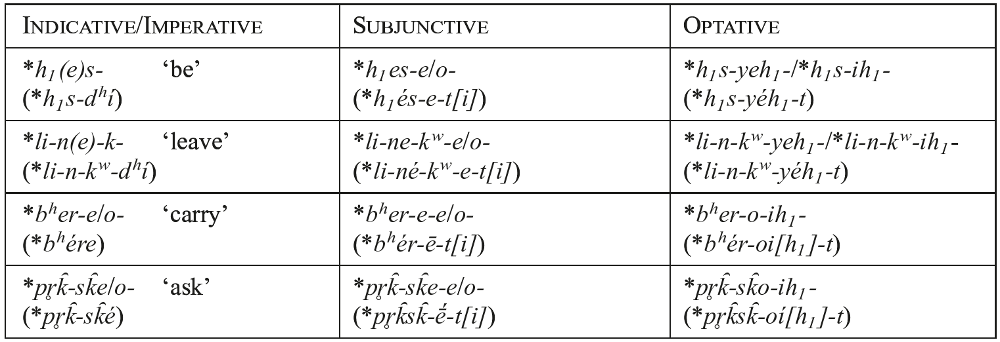

##### 4.2.4.1. Imperative

The imperative basically expressed orders and commands (more generally and more technically, “directives”). In the 2nd singular active of athematic verbs, the ending was either zero or *<i>-dʰi</i> added to the weak stem; e.g., Ved. 2sg.aor. <i>śru-dhí</i> ‘listen!’ < *<i>k̑ludʰí</i> (root *<i>k̑lew-</i> ‘listen’). Thematic verbs used the bare stem, as in Gk. <i>pʰére</i> ‘carry!’ < *<i>bʰer-e</i>. The 2nd singular middle imperative ending exhibits greater diversity across the daughter languages: Lat. <i>-re</i> (< *<i>-so</i>), Gk. <i>-o</i> (< *<i>-so</i>), Ved. <i>-sva</i>, Hitt. <i>-(ḫ)ḫut</i> (*<i>-h₂u-dʰi</i>), etc. Jasanoff (2006) attempts to reconcile the forms under the reconstruction *<i>-sh₂(u)wo</i> (for which Barnes 2015 provides Old Irish comparanda). The 2nd person plural and dual active imperatives were identical to the corresponding indicative forms, thus (e.g.) 2pl. Ved. <i>bhára-ta</i> (but, with secondary Indo-Iranian aspiration of the ending [cf. 4.2.5], ind. <i>bhára-tha</i>), Gk. <i>pʰére-te</i> ‘carry!’ (< *<i>bʰére-te</i>); 2du. (athematic) Ved. <i>i-tám</i>, Gk. <i>í-ton</i> ‘you two go!’ (< *<i>h₁i-tóm</i>), (thematic) Gk. <i>pʰére-ton</i>, Ved. <i>bhára-tam</i> ‘you two carry!’ (< *<i>bʰere-tom</i>). Similarly, plural and dual middle imperatives deployed the same endings as the indicative (cf. 4.2.5). What are traditionally called third-person imperatives are modal forms expressing the speaker’s wish that a third person act in some way. Two formations encoding these third-person imperatives may be reconstructed. The first formation is the suffix *<i>-u</i> agglutinated to the endings of the third-person, *<i>-t-u</i>, *<i>-nt-u</i> (e.g., Hitt. <i>eš-tu</i>, Ved. <i>ás-tu</i> ‘let it be’ < *<i>h₁es-t-u</i>). The second formation is a suffix *<i>-ōd</i>, also added to the secondary endings, as in the so-called “future imperative” in Lat. <i>-tōd</i> (Cl.Lat. <i>-tō</i>), Ved. <i>-tād</i>, Gk. <i>és-tō</i> < *<i>h₁es-t-ōd</i>.

##### 4.2.4.2. Subjunctive

The subjunctive encoded various modal readings, of which a prospective and hortative are traditionally reconstructed. In athematic verbs, the subjunctive marker is added to the full-grade root; for instance, from the root *<i>h₁es-</i> ‘be’ was formed *<i>h₁es-e-ti</i> (cf. pres. *<i>h₁es-ti</i> ‘is’). Thus athematic subjunctive forms looked identical to thematic indicative forms − compare (e.g.) athematic subjunctive (3sg.prs.act.) *<i>h₁es-e-ti</i> with thematic indicative *<i>bʰer-e-ti</i> (to *<i>bʰer-</i> ‘carry’). This formal identity may indicate a functional split; it has been suggested that the subjunctive functions developed from a present indicative (Bozzone [2012] and Dahl [2013] provide possible diachronic pathways for the change). If the stem was thematic, the theme vowel and the subjunctive suffix contracted to a long vowel. As far as inflectional endings go, there is conflicting evidence for whether primary or secondary endings were used with the subjunctive (on the Vedic evidence see García Ramón 2009); we reconstruct primary endings here, but this reconstruction is not certain. It should be noted that numerous daughter languages have categories called “subjunctive” in their grammars, but these may or may not derive from the PIE subjunctive. In Latin, for instance, what grammarians call the “subjunctive” reflects in large measure the PNIE optative, while the PNIE subjunctive has become one ingredient of the Latin future. We provide below a chart (Table 122.10) of stem formation for athematic and thematic indicatives and subjunctives in PNIE:

Tab. 122.10 Athematic and thematic indicatives and subjunctives

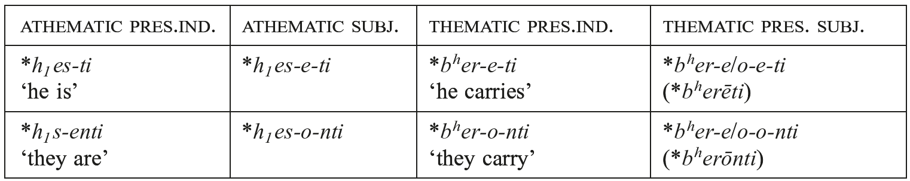

Whether the subjunctive is to be reconstructed for PIE will depend on one’s assessment of the Anatolian evidence. No Anatolian language has a living subjunctive; whether any Anatolian language has a relic of the subjunctive is disputed (for different viewpoints see Jasanoff, this handbook and Oettinger, this handbook). Jasanoff (2012a) analyzes the Hittite 2sg.imp. <i>paḫši</i> ‘protect!’, <i>eši</i> ‘settle, occupy!’, and <i>ēšši</i> ‘do, perform!’ as containing a PIE imperative ending *<i>-si</i>, which ultimately derives from 2sg. subjunctives built to a variety of sigmatic formations via haplology, i.e. *<i>-s-e-si</i> > *<i>-si</i>; thus <i>paḫši</i> ‘protect!’ would derive from a subjunctive *<i>peh₂-s-(e-s)i</i>. There is evidence from Indo-Iranian, Celtic, and Tocharian for reflexes of an imperative in *<i>-s-e-si</i> > *<i>-si</i> (see Jasanoff 2003a: 182−183 with references); however, it should be emphasized that Jasanoff’s (2012a) proposed Anatolian reflex of *<i>-s(es)i</i> would be the sole Anatolian outcome of the PIE subjunctive.

##### 4.2.4.3. Optative

The PIE optative expressed at least wishes and potentialities (traditionally “cupitive” and “potential”, respectively). In a more nuanced reading of the moods in Homeric Greek, Willmott (2007: 113−152, esp. 120−121) argues that the optative shows broadly “negative epistemic stance,” i.e. the optative indicates that the event is not in line with the speaker’s view of the world. The mark of the PIE optative was an ablauting suffix *<i>-yeh₁</i>/<i>ih₁-</i> added to athematic stems, non-ablauting *<i>-ih₁-</i> to thematic stems (*<i>-o-ih₁-</i>), plus the secondary endings. Thus to the root *<i>h₁es-</i> ‘be’ would be formed the 3sg.act.opt. *<i>h₁s-yeh₁-t</i> ‘he would be’, and to the thematic stem *<i>bʰer-e</i>/<i>o-</i> ‘carry’ would be formed 3sg.act.opt. *<i>bʰer-o-ih₁-t</i> ‘he would carry’. We note here that the thematic vowel and the optative suffix − *<i>-o-</i> + *<i>-ih₁-</i> − appear not to have contracted within PIE; evidence from the daughter languages suggests that the two morphemes remained disyllabic (for possible reasons why, see Jasanoff 2009). Table 122.11 provides illustrative optative forms for athematic and thematic present stems:

Tab. 122.11 Athematic and thematic present optatives

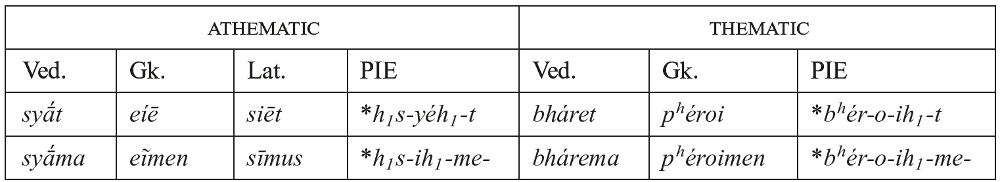

The optative is well-preserved in Greek and Indo-Iranian. In other branches, reflexes of the optative are clearly inherited but go by different names. For instance, the Italic subjunctive reflects in part the optative; we have used the verb <i>siēt</i> (Cl.Lat. <i>sit</i>), <i>sīmus</i> to illustrate the paradigm (fuller details in Vine, this handbook). In Balto-Slavic, the optative develops into the synchronic imperative (standard Lithuanian “permissive”); in Tocharian, the optative has become the optative of TA and TB, as well as the TB imperfect; etc. Once again, Anatolian presents a divergent picture: there is no evidence for the optative in Anatolian. This absence could be interpreted as either loss (the optative would be inherited into Proto-Anatolian, with subsequent evanescence) or non-inheritance (i.e. Anatolian branched off before the category had developed). We think the latter option is likelier, but the matter is still <i>sub iudice</i>.

#### 4.2.5. Verbal endings of the PIE *<i>m</i>-conjugation

It was noted in 4.2 that PIE had two sets of reconstructible active verbal endings, fusional exponents of person, number, and voice. One of these sets was the common source of the active verbal endings of the PNIE present/aorist system and of the Anatolian <i>mi</i>-conjugation. We refer to these endings as the PIE *<i>m</i>-conjugation endings.

Verbal stems selecting the PIE *<i>m</i>-conjugation endings can be further subdivided into two conjugational classes, athematic and thematic, the latter characterized by a stem-final ablauting thematic vowel (*<i>o</i>/<i>e</i>). As in the noun (cf. 2.1.1), the distinction between these classes was purely formal. With the notable exception of the 1sg.prs.act. ending (and for some scholars also the 3sg.prs.act.; see below), thematic verbs have the same inflectional endings as the athematic classes, being formally distinguished from the latter only by the presence of the thematic vowel, which has *<i>o</i>-quality in 1sg./pl. and 3pl. paradigmatic forms and *<i>e</i>-quality elsewhere − thus (e.g.) 1sg.act.ipfc. athematic *<i>-m</i> vs. thematic *<i>-o-m</i>; 3sg. *<i>-t</i> vs. *<i>-e-t</i>; 3pl. *<i>-(e)nt</i> vs. *<i>-o-nt</i>. The exceptional 1(/3)sg.act. primary thematic endings are discussed below together with their corresponding athematic endings.

The PIE athematic *<i>m</i>-conjugation inflectional endings that are securely reconstructible are given in Table 122.12. A following hyphen (-) indicates the possibility that the PIE ending had additional segmental material, the reconstruction of which is problematized by conflicting evidence in the daughter languages. The evidence for these individual reconstructions, as well as their problematic or controversial aspects, are discussed further immediately below.

Tab. 122.12 PIE *<i>m-</i>conjugation active endings

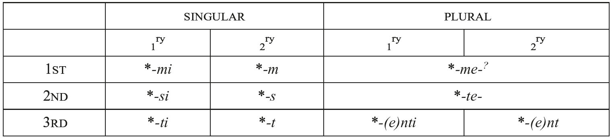

The reconstruction of the primary (athematic) singular active endings is wholly uncontroversial and supported by robust evidence across the daughter languages. The 1sg.act. ending *<i>-mi</i> is clearly attested in (e.g.) Gk. <i>ei-mí</i>, Ved. <i>ás-mi</i>, OAv. <i>ah-mī</i>, OCS <i>jes-mǐ</i>, Hitt. <i>ēš-mi</i> ‘I am’, and somewhat less transparently in VOLat. ES-OM (Lat. <i>s-um</i>), Goth. <i>i-m</i>, OIr. <i>a-m</i> (< PIE *<i>h₁és-mi</i>).

The 2sg.act. ending *<i>-si</i> is continued in Ved. <i>á-si</i>, OAv. <i>a-hī</i> ‘you are’, as well as Gk. <i>e-ĩ</i> (< PGk. *<i>e-hi</i>), Goth. <i>i-s</i> (< PIE *<i>h₁é-si</i> with degemination of */<i>s-s</i>/; see Byrd, this handbook). For this lexical item, some languages attest only forms with root-final *<i>s</i> analogically restored (e.g., OLat. <i>es-s</i>, Hitt. <i>eš-ši</i>; <i>pace</i> Kloekhorst 2016: 238−241), or else such forms coexist with the directly inherited ones (e.g., Hom. Gk. <i>es-si</i>).

The 3sg.act. ending *<i>-ti</i> is reflected in Gk. <i>es-tí</i>, Ved. <i>ás-ti</i>, OAv. <i>as-tī</i>, OLith. <i>ẽs-ti</i>, ORuss. <i>jes-tĭ</i>, CLuw. <i>āš-ti</i> ‘is’, and additionally, in Lat. <i>es-t</i>, Goth. <i>is-t</i>, OIr. <i>is</i> (< PIE *<i>h₁és-ti</i>).

Thematic inflection differs substantially from athematic in the primary 1sg.act. ending, where the daughter languages reflect an ending *<i>-ō</i> instead of expected ˣ*<i>-o-mi</i>, e.g., Gk. <i>pʰér-ō</i>, Lat. <i>fer-ō</i>, Goth. <i>bair-a</i>, OCS <i>ber-ǫ</i> ‘I bear’ (< PNIE *<i>bʰer-ō</i>); this morphological irregularity was eliminated within some language branches, e.g., Indo-Iranian (cf. Ved. <i>bhár-āmi</i>, OP <i>bar-āmiy</i>, YAv. <i>bar-āmi</i> ‘id.’). It is the majority view that thematic 1sg. *<i>-ō</i> historically contains the same suffix *<i>-h₂e</i> that is found in the 1sg. endings of the PNIE perfect (active) and the middle voice (PNIE pfc.act. *<i>-h₂e</i>, 1sg.mid. *<i>-h₂e-r</i>; see further below). Since Pedersen (1938: 80−86), some scholars have suspected that the simple thematic conjugation, the PNIE perfect, and the middle voice are historically related; pursuing this hypothesis, Watkins (1969: 66−69, 105−123, <i>et passim</i>) proposed that *<i>-ō</i> descends from a unitary pre-PIE type underlying these three categories (later developed by Jasanoff [1978, 1998, 2003a, <i>et seq</i>.] as the “proto-middle;” see further discussion in 4.2.7), whose verbal paradigm had a 1sg. ending in **<i>-h₂e</i> and 3sg. in **<i>-e</i> (like the *<i>h₂e</i>-conjugation; see 4.2.6 below). Some members of this category were eventually thematized − according to Watkins (1969), via reanalysis of 3sg. forms like **<i>bʰer-e</i> as zero-marked **<i>bʰere-</i>θ, whence new 1sg. **<i>bʰér(–)e</i>/<i>o-h₂e</i>. Generally these “pre-thematic” forms would then be re-characterized with ordinary PNIE *<i>m</i>-conjugation active endings (e.g., 2sg. *<i>bʰér-e-si</i>), but 1sg. **<i>-e</i>/<i>o-h₂e</i> was exceptionally retained, developing into P(N)IE *<i>-ō</i> (probably via *<i>-oh₂</i>, with apocope due to the same phonological process as in the thematic neuter dual ending; see 2.1.1).

Watkins (1969) further argued that <i>t</i>-less 3sg. forms like **<i>bʰer(-)e</i> are directly reconstructible for PIE. Most of Watkins’ comparative evidence for this reconstruction (from Tocharian, Celtic, and Balto-Slavic) can be explained more straightforwardly as reflexes of *<i>-e-ti</i> (see Jasanoff 2003a: 59−60). Somewhat more problematic is the evidence from Greek, where it is maintained by some (e.g., Rau 2009b: 186 n. 14) that thematic verbs like Gk. <i>pʰér-ei</i> ‘carries’ directly continue **<i>bʰer(-)e-i</i> (with only the addition of the present tense marker *<i>-i</i>; cf. 4.2.1). However, this analysis would imply a surprising divergence between Greek and other NIE languages with closely related verbal morphology (esp. Indo-Iranian, e.g., 3sg. Ved. <i>-a-ti</i>); economy therefore recommends the alternative approach, first proposed by Kiparsky (1967) and revised by Cowgill (1985a, 2006b) and Willi (2012), which derives the Greek thematic 3sg. ending <i>-ei</i> from *<i>-e-ti</i> via metathesis at word boundary followed by the regular loss of word-final stops in Greek (i.e. *<i>-eti#</i> > *<i>-ei-t#</i> > <i>-ei#</i>). Thus only a single thematic 3sg. ending *<i>-e-ti</i> is securely reconstructible for PIE, although Watkins’ (1969) <i>t</i>-less reconstruction may have obtained at an earlier, pre-PIE stage (cf. Jasanoff 2003a: 148−149).

Similarly straightforward is the reconstruction of the secondary singular active endings. The 1sg.act. ending<i>-m</i> is reflected in (aor.) Ved. <i>á-sthā-m</i>, Gk. <i>é-stē-n</i> ‘I stood’ (< PNIE *<i>steh₂-m</i>), as well as in the Latin (synchronic) imperfect ending <i>-bā-m</i> (see Vine, this handbook). Thematic verbs show the expected 1sg.act. ending *<i>-om</i>, e.g., Gk. <i>é-pʰer-on</i>, Ved. <i>á-bhar-am</i>, YAv. <i>bar-əm</i>, OP <i>a-bar-am</i> ‘I was bearing’ (< PNIE *<i>bhér-om</i>).

The 2sg.act. ending *<i>-s</i> is directly continued in Ved. <i>á-dhā-s</i>, OAv. <i>dā-s(-ca)</i> ‘you placed’, Hitt. <i>tē-s</i> ‘you said’ (< *<i>dʰeh1-s</i>), as well as the Germanic weak preterite ending (e.g., Goth. <i>-de-s</i>, OIc. <i>-ðe-r</i>), which should likely be traced back to the same PIE form (see Harðarson, this handbook). Further reflexes include (Dor.) Gk. <i>é-bā-s</i> ‘you went’, Ved. <i>á-gā-s</i>, (< *<i>gʷeh2-s</i>), and the Latin imperfect ending <i>-bā-s</i>.

The 3sg.act. ending *<i>-t</i> is evident in (aor.) Ved. <i>á-dhā-t</i>, (Boet.) Gk. <i>(an)é-tʰē</i> ‘placed’, and (pst.) Hitt. <i>tē-t</i> ‘said’ (< aor. *<i>dʰeh1-t</i> ‘placed’, with semantic innovation in Hittite).

Somewhat more problematic is the reconstruction of the PIE 1pl.act. endings. Several of the attested primary and secondary endings in the daughter languages continue *<i>-me-</i>(e.g., Ved. 1ʳʸ <i>-mas[i]</i> / 2ʳʸ <i>-ma</i>, OAv. <i>-mahī</i> /<i>-mā</i> [< PIIr. *<i>-mas(i)</i>/<i>-ma</i>]; Att.-Ion. Gk. <i>-men</i>, Dor. Gk. <i>-mes</i>), which is expected on structural grounds, but Italic and Slavic both reflect an <i>o</i>-grade *<i>-mo-</i> (Lat. <i>-mus</i>, OCS <i>-mŭ</i>), and at least Lith. <i>-me</i> appears to require a lengthened variant *<i>-mē</i>; it is uncertain whether these differences are due to independent innovations within these languages or reflect phonologically-conditioned allomorphy already at the P(N)IE stage (cf. Weiss 2011: 385−386). There is also variation within and across language branches with respect to the post-vocalic segment: Latin <i>-mos</i>, Dor. Gk. <i>-mes</i>, and PIIr. (1ʳʸ) *<i>-mas(i)</i> contain an element *<i>s</i>, while Att-Ion. <i>-men</i> has *<i>n</i> in its place, thus matching Anatolian (e.g., Hitt. 1ʳʸ <i>-w[</i>/<i>m]eni</i> / 2ʳʸ <i>-w[</i>/<i>m]en</i>; on the fluctuation of the ending’s initial consonant and its possible dual origin, see further in 4.2.2). Furthermore, it is unclear whether the primary and secondary endings were differentiated: past and present tense verbal forms in Greek, Italic, and Balto-Slavic reflexes of the PNIE 1pl. are identical, but in Indo-Iranian the primary ending is distinguished by an additional post-vocalic *<i>s</i> (plus the “hic et nunc” particle *<i>-i</i> in all Avestan and some Vedic forms, which similarly characterizes non-past tense forms in Anatolian).

Similar issues arise in the reconstruction of the PIE 2pl.act. endings, which had the basic shape *<i>-te-</i>, e.g., Gk. <i>-te</i>, Lat. <i>-tis</i>, OCS <i>-te</i> and Goth. <i>-þ</i>. It is unclear whether there was any distinction between primary and secondary forms; the four languages cited above employ the same ending for both, but in Indo-Iranian, the primary ending PIIr. *<i>-tʰa</i> (> Ved. <i>-tha</i>, OAv. <i>-θā</i>) contrasts with secondary *<i>-ta</i> (> Ved. <i>-ta</i>, OAv. <i>-tā</i>) (see Kümmel, this handbook). As in the 1pl. ending, Latin shows a post-vocalic segment *<i>-s</i>, while Anatolian has *<i>-n</i> (Hitt. 1ʳʸ <i>-teni</i> / 2ʳʸ <i>-ten</i>), but neither has external comparative support from Greek or Indo-Iranian. Lith. *<i>-te</i> reflects a lengthened variant *<i>-tē</i> just as in the 1pl. ending.

The PIE athematic primary 3pl. act. ending was *<i>-enti</i>, e.g., prs. Ved. <i>s-ánti</i>, Myc. Gk. <i>e-e-si</i> [eh-ensi], Hitt. <i>aš-anzi</i>, Osc. <b>s-ent</b>, Goth. <i>sind</i>, OIr. <i>it</i> [id] (< PIE *<i>h₁s-énti</i> ‘they are’). The corresponding secondary ending was *<i>-ent</i> (aor. PIE *<i>gʷ[e]h₂-ent</i> ‘they went’ > Ved. <i>á-gan</i>, Gk. <i>é-ban</i>; cf. perhaps Pal. <i>-Vnta</i> [-nt]). Zero-grade allomorphs of these endings 1ʳʸ *<i>-n̥ti</i> / 2ʳʸ *<i>-n̥t</i> are also attested in several NIE languages in athematic verbal formations that had fixed accent on a syllable preceding the ending: “Narten presents” (e.g., Ved. <i>tákṣ-ati</i> ‘they fashion’ < *<i>té-tk̑-n̥ti</i>); reduplicated presents (Ved. <i>dád-ati</i> ‘they give’ < *<i>dé-dh₃-n̥ti</i>; simple thematic presents (Ved. <i>bhár-a-nti</i>) (with automatic *<i>-nti</i> following a vowel) and <i>s</i>-aorists (Gk. <i>é-deik-s-an</i> ‘they showed’ < *<i>deik̑s-n̥t</i>; OCS <i>(po-)grĕ-s-ę</i> ‘they buried’ <*<i>gʰrébʰ-s-n̥t</i>). The zero-grade allomorph *<i>-n̥ti</i> (*<i>-nti</i>) is therefore standardly reconstructed for PIE in these categories.

The reconstruction of the PIE dual endings is more difficult, given the more limited evidence for this category in the IE languages. However, the NIE languages agree that the basic shape of PNIE athematic 1du.act. ending was *<i>-we-</i> (> (1/2ʳʸ) Ved. <i>-vas</i>/<i>-va</i>, OCS <i>-vě</i>, Lith. <i>-va</i> (for Germanic traces, cf. Prokosch 1939: 212; Ringe 2006: 136); although dual number is absent as a grammatical category in the Anatolian languages, it is generally held that the Anatolian 1pl.act. endings (Hitt. <i>-w[</i>/<i>m]eni</i>, CLuw. <i>-unni</i>, Pal. <i>-wini</i>/<i>wani</i>) derive from *<i>-we-</i> and thereby support projecting this ending back to PIE (but cf. 4.2.2 above). There is also comparative NIE evidence for reconstructing the 2du.act. ending as *<i>-to-</i> (> 2ʳʸ Ved. <i>-tam</i>, Gk. <i>-ton</i>, OCS <i>-ta</i>). A secondary 3du. ending *<i>-teh₂m</i> is perhaps reconstructible as well in view of agreement between Gk. <i>-tēn</i> and Ved. <i>-tām</i>, but the P(N)IE situation is complicated by a mismatch in the corresponding primary ending between Gk. <i>-ton</i> and Ved. <i>-tas</i>.

#### 4.2.6. Verbal endings of the PIE *<i>h₂e-</i>conjugation

In addition to the <i>m</i>-conjugation endings (4.2.5), PIE had a second set of active verbal endings that developed, on the one hand, into the endings of the PNIE perfect active and, on the other, into the endings of the Anatolian <i>ḫi</i>-conjugation. PIE reconstructions for these inflectional endings − referred to here as the *<i>h₂e</i>-conjugation endings − are given in Table 122.13; note, however, that these reconstructions − much more so than the *<i>m</i>-conjugation endings discussed in 4.2.5 above or the middle endings in 4.2.7 below − are quite uncertain. In particular, reconstructing the distinction between primary and secondary endings in the *<i>h₂e</i>-conjugation is highly problematic, in part because only Anatolian provides direct evidence for the original morphological opposition (the PNIE pluperfect uses *<i>m</i>-conjugation secondary endings; see 4.2.3 above), and in part due to open (and much disputed) questions surrounding the prehistory of the PNIE perfect − above all, whether the perfect endings stand in correspondence with (and so provide evidence for the reconstruction of) PIE primary endings (as recently argued by [e.g.] Jasanoff 2003a, Oettinger 2006) or with secondary endings (per Jasanoff forthcoming b). These issues are discussed below, together with the evidence for the formal reconstruction of the *<i>h₂e</i>-endings.

Tab. 122.13 PIE *h₂e-conjugation endings

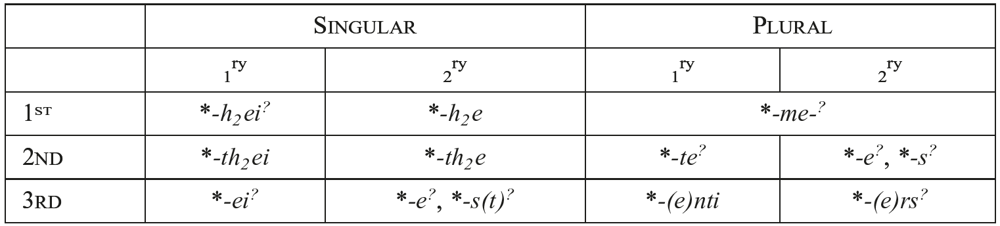

The PIE 1sg.act. primary and secondary endings of the *<i>h₂e</i>-conjugation were probably *<i>-h₂ei</i> and *<i>-h₂e</i>, respectively. Both are directly reflected in Anatolian, the former in Old Hitt. <i>-ḫḫe</i> (e.g., <i>dā-ḫḫe</i> ‘I take’; replaced by <i>-ḫḫi</i> in younger texts), and the latter in CLuw. <i>-(ḫ)ḫa</i>, Lyc. <i>-xa</i> (CLuw. <i>a-ḫa</i>, Lyc. <i>a-xa</i> ‘I made’; Hitt. <i>-(ḫ)ḫun</i> is remodeled on the basis of the corresponding <i>mi</i>-conjugation ending). The 1sg. ending of the PNIE perfect is *<i>-h₂e</i>, which yields Gk. <i>-a</i>, PIIr. *<i>-a</i>, and Goth. <i>-</i>θ (e.g., Gk. <i>oĩd-a</i>, Ved. <i>véd-a</i>, OAv. <i>vaēd-ā</i>, Goth. <i>wait</i> ‘I know’ < PIE *<i>woid-h₂e</i>). In Italic and Slavic, the perfect ending was recharacterized with the present tense marker *<i>-i</i> (i.e. *<i>-h₂e-i</i>), whence (e.g.) OCS <i>věd-ě</i> ‘I know’, Fal. PE:PARAI ‘I got’ (cf. Lat. <i>-ī</i>; see Weiss 2011: 392). The formal identity between the endings of the PNIE perfect and the secondary endings of the *<i>h₂e</i>-conjugation suggests that the former historically descend from the latter, and thereby offers some support for Jasanoff’s (forthcoming b) recent derivation of the perfect from a PIE reduplicated *<i>h₂e</i>-conjugation aorist (rather than a reduplicated present, as per Jasanoff 2003a: 168−169, Oettinger 2006, <i>i.a</i>.). There is some evidence to suggest that the presence of the present tense marker *<i>-i</i> in the primary ending *<i>-h₂ei</i> was a relatively recent innovation in PIE: the synchronically irregular <i>m</i>-conjugation 1sg.act. primary thematic ending *<i>-ō</i> should probably be traced back to *<i>-e</i>/<i>o-h₂e</i> (as discussed in 4.2.5), which would contain a 1sg.act. ending *<i>-h₂e</i> unmarked for tense. Yet given the robust evidence across the IE languages for a formal opposition in singular verbal endings between primary and secondary forms, it seems more likely that pre-PIE **<i>-h₂e</i> was recharacterized as *<i>-h₂ei</i> already in PIE, and thus that the development of *<i>m</i>-conjugation thematic 1sg. *<i>-ō</i> also occurred prior to PIE (cf. 4.2.5 above).

The PIE 2sg.act. primary and secondary endings were likely *<i>-th₂ei</i> and *<i>-th₂e</i>. The primary ending is indirectly reflected in Hitt. <i>-(t)ti</i> (phonologically expected <i>-te</i>* having been analogically replaced already in the oldest texts). Just as in the first singular, the inherited secondary ending appears to be continued not only in 2sg.pst.act. Hitt. <i>-tta</i> (e.g., <i>da-tta</i> ‘you took’), but also in PNIE 2sg.pfc.act.*<i>-th₂e</i>, which yields the regular perfect ending in Indo-Iranian (PIIr. *<i>-tʰa</i>), e.g., Ved. <i>dadhā-tha</i>, OAv. <i>dadā-θā</i> ‘you have placed’; Ved. <i>vét-tha</i>, OAv. <i>vōis-tā</i> ‘you know’. Cognate Gk. <i>oĩs-tʰa</i> ‘id.’ exceptionally preserves the same ending, although elsewhere it has been replaced by <i>-as</i> (e.g., <i>tétʰēk-as</i> ‘you have placed’), with the <i>-s</i> of the *<i>m</i>-conjugation active and <i>a</i>-vocalism by analogy to the 1sg. <i>-a</i> (see above). The second element of the Latin perfect ending <i>-is-tī</i> (e.g., <i>fēc-istī</i> ‘you made’) also continues *<i>-th₂e-i</i>, with the inner-Italic addition of the tense marker *<i>-i</i>.

The reconstruction of the PIE 3sg.act. ending is a vexed question. The primary ending in PIE was likely *<i>-ei</i>, which is marginally continued in Old Hitt. <i>-e</i> (e.g., <i>waršš-e</i> ‘wipes’; replaced by <i>-i</i> in younger texts); it is unlikely that Gk. them. 3sg.act. <i>-ei</i> derives from *<i>-ei</i> despite its superficial resemblance (cf. 4.2.5 above). Jasanoff (2003a: 70−71, 2012c) argues that the primary/secondary distinction was instead realized in the *<i>h₂e</i>-conjugation by an opposition between *<i>-e</i> and *<i>-et</i>, with the latter recharacterized by *<i>m</i>-conjugation 3sg.act. *<i>-t</i> already in PIE; see however Kim (2005: 195) for the PIE primary ending as *<i>-ei</i> with regular tense marking. Still more problematic is the corresponding secondary ending, for which at least two forms are arguably reconstructible. One of these is structurally expected *<i>-e</i>, which is reflected in PNIE 3sg.pfc.act. *<i>-e</i> (> Ved. <i>-a</i>, OAv. <i>-ā</i>, Gk. <i>-e</i>, Goth. <i>-</i>θ). The other is *<i>-s(t)</i>, which is reflected in Hitt. <i>-š</i> (e.g., <i>dā-š</i> ‘took’) and in the ending associated with Tocharian Class III preterites, TB/ A <i>-sa</i>/<i>-äs</i> (e.g., <i>prek-sa</i>/<i>prak-äs</i> ‘asked’; see Melchert 2015). Both forms have strong claim to antiquity. Jasanoff’s (forthcoming b) derivation of the PNIE perfect from a reduplicated *<i>h₂e</i>-conjugation aorist requires that *<i>-e</i> marked the 3sg. in this category at the stage prior to its post-PIE grammaticalization as the perfect. However, the match between Hittite and Tocharian with respect to structurally unmotivated *<i>-s(t)</i> is <i>prima facie</i> evidence for a morphological archaism, and on these grounds Melchert (2015) argues that it is the original marker of the 3sg. *<i>h₂e</i>-conjugation aorists (cf. Watkins 1969: 54; Yoshida 1993: 33−34). The distribution of these endings in PIE remains at present unresolved.

In PIE, the *<i>h₂e</i>-conjugation and the *<i>m</i>-conjugation appear to have had the same 1pl.act. ending *<i>-me-</i>, which marked both primary and secondary forms (cf. 4.2.5 above). The ending *<i>-me</i> is reflected in PNIE 1pl.pfc.act. *<i>-me</i> (> Gk. <i>[w]íd-men</i>, Ved. <i>vid-má</i> ‘we know’) and in both primary and secondary forms of <i>ḫi-</i>conjugation verbs in Anatolian, which have 1pl.act. forms that are inflectionally identical to <i>mi</i>-verbs (i.e. Hitt. 1ʳʸ <i>-w[</i>/<i>m]eni</i> / 2ʳʸ <i>-w[</i>/<i>m]en</i>). See, however, Jasanoff (2003a: 32) for the possibility that Ved. <i>-mā</i> (e.g., <i>vid-mā́</i> ‘id.’) − synchronically, a lengthened allomorph of the ending − derives rather from a PIE form with final laryngeal (e.g., *<i>-mehₓ</i>) that was once unique to the *<i>h₂e</i>-conjugation.

Similarly, the PIE 2pl.act. primary ending of the *<i>h₂e</i>-conjugation was most likely *<i>-te</i>, just as in the *<i>m</i>- conjugation (cf. 4.2.5 above); it is continued in Anatolian, e.g., 2pl.prs.act. Hitt. <i>da-tteni</i> ‘you (pl.) take’. Reflexes of *<i>-te</i> are also attested in the PNIE perfect (Gk. <i>[w]ís-te</i>, Goth. <i>wit-uþ</i> ‘you [pl.] know’), but these have clearly been analogically introduced from the *<i>m</i>-conjugation, since Ved. <i>-a</i> (e.g., <i>vid-á</i> ‘id.’) preserves the inherited PNIE 2pl.pfc.act. ending *<i>-e</i><b>.</b> More complicated is the corresponding secondary ending, for which two forms are potentially reconstructible for PIE: the *<i>-e</i> ending just noted, and *<i>-s</i>, which according to Melchert (2015) is reflected (with additional morphological material) in both Anatolian (Hitt. <i>-šten</i>, e.g., <i>dai-šten</i> ‘you [pl.] placed’; cf. Kloekhorst 2008: 498) and Tocharian (2pl.pret.act. PT *<i>-sV[s]</i>; see Malzahn 2010 for TB/A outcomes, as well as references to alternative explanations). Agreement between Hittite and Tocharian would argue strongly that *<i>-s</i> is an archaic feature, a common retention of these branches. However, there are compelling reasons to believe that *<i>-e</i> is also archaic: analogical explanation is not viable, since it bears no affinity to any other PIE 2pl. ending, For this reason the ending is liable to diachronic renewal by the functionally transparent *<i>-te</i> of the <i>m</i>-conjugation. Moreover, a remarkable feature of both *<i>-e</i> and *<i>-s</i> is that each is identical to one of the two possible secondary endings reconstructible for the 3sg.act. of the *<i>h₂e</i>-conjugation (i.e. *<i>-e</i>, *<i>-s</i>; see above). Just as in the 3sg.act., the exact PIE distribution of *<i>-e</i> and *<i>-s</i> is at present unsettled, and still less clear is the broader significance of the structural symmetry between 3sg. and 2pl.act., which appears to be a unique feature of the *<i>h₂e-</i>conjugation.

The PIE 3pl.act. primary ending of the *<i>h₂e</i>-conjugation was probably *<i>-(e)nti</i>, once again identical to the *<i>m</i>-conjugation; it is directly reflected in Anatolian, e.g., Hitt. 3pl.npst.act. <i>akk-anzi</i> ‘they die’. The 3pl.act. secondary ending has several reflexes in the daughter languages (cf. Jasanoff 2003a: 32−34): *<i>-ēr</i>, which yields 3pl.pst.act. Hitt. <i>-ēr</i> and pfc. Lat. <i>-ēre</i> (via *<i>-ēr-i</i> with inner-Italic addition of the primary tense marker; cf. 1/2sg.act. above); *<i>-r̥s</i>, which is continued in OAv. <i>-ərəš</i> (see further below) and pfc./opt. Ved. <i>-ur</i>; and *<i>-r̥</i>, which is continued in pfc. OAv. <i>-arə̄</i> (YAv. <i>-ērə</i>) and pret. OIr. *<i>-(a)tar</i> (< *<i>-ont-r̥</i>, a composite of thematic 3pl. *<i>-ont</i> + *<i>-r̥</i>). For arguments that *<i>-r̥</i> is a later analogical innovation, see Jasanoff (2003a: 33). The remaining two endings *<i>-ēr</i> and *<i>-r̥s</i> can be reconciled as ablaut variants of *<i>-ers</i> (whose status as a PIE surface form is, however, dubious; see discussion of thematic acc.pl. *<i>-oms</i> in 2.1.1 above): its expected zero-grade form is *<i>-r̥s</i>, while full-grade *<i>-ers</i> would develop straightforwardly into *<i>-ēr</i> via Szemerényi’s Law. According to Jasanoff (1997, 2003a: 39−43), PNIE originally had the full-grade allomorph *<i>-ēr</i> in the perfect and *<i>-r̥s</i> in the pluperfect, a distribution which − with the exception of the replacement of *<i>-ēr</i> by analogical *<i>-r̥</i> − is maintained in Avestan (*<i>-r̥</i> / *<i>-r̥s</i> > OAv. <i>-arə̄</i> / <i>-ərəš</i>).

There is insufficient evidence to reconstruct dual endings for the *<i>h₂e</i>-conjugation. Greek and Indo-Iranian both make perfect dual forms, but their endings cannot be derived from a single pre-form; rather, the endings in each language show clear effects of analogical re-shaping − for instance, 3pfc.du. Ved. <i>-atuḥ</i> and YAv. <i>-atarə</i> have evidently been influenced by the corresponding 3pl.pfc. endings (on which see above). Anatolian offers no help, since there is no unique trace of the dual in the <i>ḫi-</i>conjugation.

#### 4.2.7. Verbal endings of the PIE middle

In PIE, both verbs whose active forms inflected according to the *<i>m-</i>conjugation and those whose active forms inflected according to the *<i>h₂e-</i>conjugation had middle voice forms marked with the same set of endings. This situation is still observed within the Anatolian languages, where these two conjugational classes remain distinct, but verbs of both classes make use of the same middle endings, e.g., 3sg.prs.act. Hitt. <i>ištamaš-zi</i> ‘hears’, <i>kānk-i</i> ‘hangs (tr.)’ vs. mid. <i>išdamaš-tari</i> ‘is heard’, <i>kank(a)-ttari</i> ‘hangs (intr.)’. Similarly, the PNIE perfect active is marked by endings that descend from the *<i>h₂e</i>-conjugation, but perfect middle forms generally employ the same endings as in the present/aorist system (e.g., 3s.pfc.mid. Gk. <i>lélu-tai</i> ‘has been released’; cf. prs. <i>lúe-tai</i>), whose active endings come from the *<i>m</i>-conjugation.

Reconstructions for the PIE athematic middle inflectional endings are given in Table 122.14. We discuss the evidence that supports − or else problematizes − the reconstruction of each ending below.

Tab. 122.14 PIE middle endings

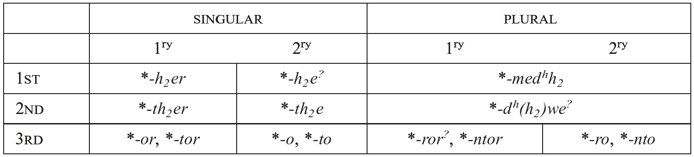

The PIE primary 1sg.mid. ending was *<i>-h₂er</i>, which is most clearly reflected in Hitt. <i>-ḫa(ri)</i> (e.g., <i>ar-ḫari</i> ‘I stand’) and − with regular renewal of *<i>-r</i> by *<i>-i</i> as marker of present tense (as in the active endings) − in PIIr. *<i>-ai</i> (e.g., Ved. <i>bruv-é</i>, OAv. <i>mruii-ē</i> ‘I speak’). The synchronic “passive” endings Lat. <i>-or</i> and OIr. <i>-or</i> (e.g., Lat. <i>ori-or</i> ‘I rise’; OIr. <i>-mol-or</i> ‘I praise’) continue the corresponding thematic form *<i>-o-h₂er</i>. In Tocharian and Greek, the initial *<i>m</i> of the *<i>m</i>-conjugation active has been analogically introduced, thus TB/A <i>-mar</i>/<i>-mār</i> (for details, see Malzahn 2010: 36 with references) and Gk. <i>-mai</i> (with the same renewal of presential *<i>-r</i> by *<i>-i</i> as in Indo-Iranian); this kind of analogical remodeling − viz. assimilation of the characteristics of the corresponding *<i>m</i>- conjugation active endings − is typical of the development of the middle endings in the IE languages, as will become clear below. Hittite also attests an “iterated” (or “reduplicated”) allomorph of the ending <i>-(ḫ)ḫaḫari</i> (cf. <i>ar-ḫaḫari</i>), which points to a preform *<i>-h₂eh₂er</i>, but the antiquity of this form is uncertain (see discussion of the corresponding secondary ending below).

The PIE primary 2sg.mid. ending *<i>-th₂er</i> is directly reflected in Hitt. <i>-(t)ta(ri)</i>, TB/A <i>-tar</i>/<i>tār</i>, and (in <i>media tantum</i> verbs) OIr. <i>-ther</i>. The other IE languages continue an ending *<i>-soi</i>, with initial *<i>s</i> taken from the 2sg.act. *<i>m</i>-conjugation ending and renewal of *<i>-r</i> by *<i>-i</i>, e.g., Ved. <i>-se</i>, OAv. <i>-hē</i> / <i>-šē</i>, Myc./Arc.-Cypr. Gk. <i>-soi</i> (in other dialects, <i>-sai</i> with vocalism after 1sg. <i>-mai</i>), Goth. (pass.) <i>-za</i>.

Two primary 3sg.mid. endings are securely reconstructible for PIE, *<i>-or</i> and *<i>-tor</i> (cf. 4.2.3 above). The archaic *<i>-or</i> allomorph is preserved in CLuw. <i>ziy-ar(i)</i> ‘lies’, Hitt. <i>paḫš-a(ri)</i> ‘protects’, OIr. <i>ber-air</i> ‘is carried’ and − with renewal of the tense marker in Indo-Iranian − Ved. <i>śáy-e</i> ‘lies’, OAv. <i>sruii-ē</i> ‘is heard’ (see further Jasanoff 2003a: 49− 51). The productive allomorph *<i>-tor</i> − with analogical *<i>t</i> from the *<i>m</i>-conjugation 3sg.act. ending − is also attested in the same languages (e.g., CLuw. <i>puppušša-tari</i> ‘is crushed’, Hitt. <i>ki-tta[ri]</i> ‘lies’ [cf. Pal. <i>kī-tar</i> ‘id.’], OIr. <i>sechi-thir</i> ‘follows’), in some cases, even in the same lexical items (late Ved. <i>śé-te</i>, YAv. <i>saē-te</i> ‘lies’); these last two forms, in particular, show the strong tendency for *<i>-or</i> to be morphologically renewed by *<i>-tor</i>, a pattern that likely began in PIE itself and led eventually to the complete elimination of *<i>-or</i> in other NIE languages, which have only *<i>-tor</i>: Lat. <i>sequi-tur</i> ‘follows, TB <i>wike-tär</i> ‘disappears’, Cypr. Gk. <i>ke-i-to-i</i> [kei-toi] ‘lies’ (cf. Att.-Ion. Gk. <i>keĩ-tai</i> ‘id.’ with vocalism after 1sg. <i>-mai</i>).

The PIE secondary athematic 1sg.mid. ending was likely *<i>-h₂e</i>, which is directly reflected in Hitt. <i>-(ḫ)ḫat(i)</i>, e.g., Hitt. <i>ēš-ḫa-t(i)</i> ‘I sat down’ (with further addition of a reflexive particle *<i>-di</i>, on which see Yakubovich 2010: 182−205); it may also be maintained, as an archaism, as the ending of optative forms in Indo-Iranian (PIIr. *<i>-a</i>, e.g., Ved. <i>sac-ey-a</i> ‘may I accompany’, OAv. <i>vāur-aii-ā</i> ‘may I cover’). Elsewhere, the Indo-Iranian languages show endings (Ved. <i>-i</i>, OAv. <i>-ī</i> < PIIr. *<i>-i</i>), which have been argued to derive from a shorter ending *<i>-h₂</i> (e.g., Kortlandt 1981; García Ramón 1985); however, it is more likely that PIIr. *<i>-i</i> should be explained analogically (see Kümmel, this handbook). The Tocharian preterite endings (TB <i>-mai</i>; TA <i>-we</i>/<i>-e</i>) probably also contain *<i>-h₂e</i>; see the discussions of Malzahn (2010: 44−45 with references) and Pinault (this handbook).

Less certain is the PIE status of an “iterated” allomorph of the 1sg.mid. ending *<i>-h₂eh₂e</i>, which appears to be continued in both Hittite (e.g., <i>ēš-ḫaḫat[i]</i> ‘id.’) and Lycian (<i>a-xagã</i> ‘I became’; see Melchert 1992b). Potential evidence for its deeper reconstruction comes from Greek, where it has been suggested that the same form underlies (non-Attic-Ionic) Gk. <i>-mān</i> < *<i>-m-h₂eh₂e-m</i> with analogical remodeling after the 1sg.act. *<i>m</i>-conjugation ending (Weiss 2011: 388−389; but cf. the critique of Yoshida 2010, 2013).

The PIE secondary 2sg.mid. ending *<i>-th₂e</i>, is continued − with different additional morphological material in each language − in Hitt. <i>-(t)tat(i)</i> (+ reflexive *<i>-di</i>; cf. 1sg. above), Ved. <i>-thās</i>, and TB/A <i>-tai</i>/<i>-te</i>, as well as OIr. <i>-tha</i>. Other IE languages have replaced *<i>-th₂e</i> with *<i>-so</i>, an analogical form with the initial *<i>s</i> of the <i>m</i>-conjugation 2sg. active ending and the vocalism of 3sg.mid. *<i>-(t)o(r)</i>; *<i>-so</i> is reflected in Gk. <i>-so</i>, OLat. <i>-re</i> (on Cl. Lat. <i>-ris</i>, see Weiss 2011: 388−391), and in the Iranian languages (OAv. <i>-šā</i>, OP <i>-šā</i>; on the split within Indo-Iranian, see Kümmel, this handbook).

Just as in the corresponding primary form, two allomorphs of the athematic 3sg.mid. secondary ending are reconstructible for PIE, *<i>-o</i> and *<i>-to</i>. Archaic *<i>-o</i> is maintained in Hitt. <i>ēš-at(i)</i> ‘sat down’ (with reflexive *<i>-di</i>; cf. 1sg/2sg. above), and famously, in Ved. <i>á-śay-at</i> ‘was lying down’ (with analogical final *<i>t</i>; Wackernagel 1907: 309−313 [= 1953a: 498−502]). Once again, the same languages also reflect productive *<i>-to</i>, including in forms of the same lexical items attested in chronologically younger texts: Hitt. <i>ēš-tat</i>; late Ved. <i>(a)śe-ta</i> (cf. YAv. <i>sae-ta</i>). In other NIE languages, older *<i>-o</i> has been wholly ousted by younger *<i>-to</i>: Gk. <i>-to</i>, Iranian (OAv. <i>-tā</i>, OP <i>-tā</i>), TB/A <i>-te</i>/<i>-t</i>.

The PIE 1pl.mid. ending was *<i>-medʰʰ₂</i> or *<i>-mesdʰ</i>h₂; it is possible that one of these forms was once specialized as the primary ending and the other as secondary, but if so, the daughter languages provide no clear evidence for the original distribution. Support for reconstructing *<i>-medʰʰ₂</i> comes from Gk. <i>-metʰa</i>, as well as Tocharian and Indo-Iranian; in the latter two, a distinction has been introduced between primary (> Ved. <i>-mahe</i>, OAv. <i>-maidē</i> < PIIr. *<i>-madʰai</i>; TB/A <i>-mtär</i>) and secondary forms (Ved. <i>-mahi</i>, OAv. <i>-maidī</i> < PIIr. <i>-madʰi</i>; TB/A <i>-mte</i>/<i>-mät</i>; see Kümmel, this handbook and Malzahn 2010: 37, 46). However, Greek also attests a variant *<i>-mestʰa</i>, which points to *<i>-mesdʰ</i>h₂; an *<i>s</i> is also found in the same position in Hittite, which has − like Indo-Iranian − differentiated primary <i>-wašta(ri)</i> and secondary *<i>-waštat(i)</i> (using the same morphological material as in the singular; see above). As in the 1pl.act. (cf. 4.2.5), the initial *<i>w</i> of the Hittite form is usually attributed to the influence of the dual (see 4.2.2 above), either directly (i.e. < 1du.act. *<i>-we</i>/<i>o[s]-</i> + <i>-d[h]h₂</i> of the 1pl.mid.; cf. 4.2.5 above) or else by analogy with the 1pl.act. ending Hitt. <i>-w(</i>/<i>m)en(i)</i>.

The reconstruction of the PIE 2pl.mid. ending is problematic. The 2pl.mid. endings attested in the NIE languages (with the possible exception of Tocharian) can be derived straightforwardly from an ending *<i>-dʰwe</i>, likely undifferentiated for primary/secondary as in Gk. <i>-stʰe</i> (with <i>s</i> generalized from coronal-final roots, where it is phonologically regular via the “Double Dental” rule; see Byrd, this handbook). As in the 1sg.mid, Indo-Iranian has introduced the primary/secondary distinction; furthermore, the attested endings appear to continue *<i>-dʰuwe</i>, a variant of the ending conditioned by Siever’s Law (on which see Barber 2013 and Byrd, this handbook): 1ʳʸ/2ʳʸ Ved. <i>-dhve</i>/<i>-dhvam</i> (with frequent disyllabic scansion); OAv. <i>-duiiē</i>/OAv. <i>-dūm</i> (YAv. <i>-θβe</i>/<i>-θβəm</i>). The same phonologically conditioned variant underlies Cl.Arm. <i>-(a)ruk‘</i> (Jasanoff 1979: 44−45), synchronically the 2pl. mediopassive imperative ending. More difficult is the Tocharian, where there is a clear split between (1ʳʸ/2ʳʸ) TB <i>-tär</i>/<i>-t</i> and TA <i>-cär</i>/<i>-c</i>; there is no consensus about whether either ending is the phonologically expected outcome of *<i>-dʰwe</i>, but most scholars agree that both are ultimately based on *<i>-dʰwe</i> (see Malzahn 2010: 37−38 with references).

The deeper PIE situation is problematized by the endings attested in the Anatolian languages: (1ʳʸ/2ʳʸ) Hitt. <i>-ttuma(ri)</i>/<i>-dumat</i> (on <i>m</i> < *<i>w</i>, see 4.2.2 above), CLuw. <i>-(d)duwar(i)</i>. The principal issue is that the initial geminate (or “fortis”) stop (Hitt. <i>-tt-</i>) cannot be the outcome of *<i>dʰ</i>. Melchert’s (1984: 26) alternative derivation of the ending from PIE *<i>-dʰh₂we</i> explains the geminate stop, and in addition, accounts more neatly (i.e. without appeal to Siever’s Law) for the post-consonantal anaptyctic <i>u</i> vowel clearly observed in the Hittite form (cf. Melchert 1994a: 57−58, 77−78); however, whether *<i>-dʰh₂we</i> can be reconciled phonologically with the NIE evidence remains to be systematically assessed. A different solution is proposed by Jasanoff (2003a), who suggests that Anatolian replaced ending-initial *<i>dʰ</i> with *<i>t</i> by analogy to the 2pl.act. (<i>m</i>-conjugation) ending *<i>-te</i>.

<!-- source-file: content/14_chapter08_7.xhtml -->

For the PIE primary 3pl.mid. ending − like the corresponding singular − two allomorphs are reconstructible, likely *<i>-ror</i> and *<i>-ntor</i>. The older ending *<i>-ror</i> is not continued as such in any IE language, but is in all probability the source of PIIr. *<i>-rai</i> (> Ved. <i>-re</i>, YAv. <i>-re</i>), which would be derived by the across the board replacement of the inherited middle tense marker *<i>r</i> by active *<i>i</i> in that branch; PIIr. *<i>-rai</i> is selected by the same set of verbs that take the archaic 3sg.mid. ending *<i>-ai</i> (<< PIE *<i>-or</i>; cf. 4.2.3 above), e.g., Ved. <i>duh-ré</i> ‘give milk’, <i>śé-re</i> ‘lie’ (= YAv. <i>sōi-re</i>/<i>saē-re</i>), and in the 3pl.pfc.mid., e.g., Ved. <i>jajñi-ré</i> ‘are born’. The endings attested in the other IE languages and elsewhere in Indo-Iranian all derive from productive *<i>-ntor</i>: Hitt. <i>-anta(ri)</i>, Arc-Cyp. Gk. <i>-ntoi</i> (<i>-ntai</i> in other dialects with analogical vocalism), Ved. <i>-ate</i> (< *<i>-n̥toi</i>; cf. thematic <i>-ante</i>), TB/A <i>-ntär</i>; (“passive”) Goth. <i>-nda</i>, OIr. <i>-tir</i>, Lat. <i>-ntur</i> (but see Weiss 2011: 390−391 on the complicated Italic evidence; alternative view in Clackson and Horrocks 2007: 33).

Similarly, the PIE secondary 3pl.mid. ending has two reconstructible allomorphs, *<i>-ro</i> and *<i>-nto</i>. Archaic *<i>-ro</i> is continued in Ved. <i>-ran</i>/<i>-ram</i> (with added final nasal), which marks imperfects corresponding to presents in <i>-re</i>, e.g., Ved. <i>á-śe-ran</i> ‘were lying’, <i>á-duh-ran</i> ‘were giving milk’, as well as 3pl. forms of the aorist “passive,” e.g., <i>á-dr̥ś-ran</i> ‘were seen’, <i>á-budh-ram</i> ‘woke up’ (on the development of this category in Indo-Iranian, cf. Kümmel 1996, Jasanoff 2003a: 153−173, 206−210). Productive *<i>-nto</i> yields Hitt. <i>-antat(i)</i>, Gk. <i>-nto</i>, Ved. <i>-ata</i> (< *<i>-n̥to</i>; cf. thematic <i>-anta</i>), and TB/A <i>-nte</i>/<i>-nt</i>.

No secure reconstruction of dual middle endings is possible. The IE languages that preserve the dual, above all Vedic and Greek, have dual middle endings that cannot be traced back to common pre-forms; rather, the attested endings generally appear to be created by combining features of the <i>m</i>-conjugation active dual endings and inherited middle plural endings − for instance, 1du.mid. Ved. <i>-vahe</i> amalgamates 1du.act. <i>-vas</i> and 1pl.mid. <i>-mahe</i>, while 2du.mid. Gk. <i>-stʰon</i> mixes 2du.act. <i>-ton</i> and 2pl.mid. <i>-stʰe</i>.

### 4.3. PNIE verbal stem formation

A tripartite division of tense-aspect stems into “present” (imperfective aspect), “aorist” (perfective aspect), and “perfect” (resultative-stative) is reconstructible for PNIE. Only Greek and Indo-Iranian exhibit this three-fold distinction directly, but it underlies other PNIE languages which have merged the aorist and the perfect, e.g., Latin. The present stem could be inflected in present and past tenses (the latter called the “imperfect”). For example, to the root *<i>gʷʰen-</i> ‘smash; slay’ could be formed the 3sg.prs.ind.act. *<i>gʷʰén-ti</i> ‘smashes, slays’ (Ved. <i>hán-ti</i> ‘id.’), 3sg.ipfc. *<i>gʷʰen-t</i> ‘was smashing’ (Ved. <i>[á]-han</i>). The aorist stem expressed perfective aspect and could be used in the indicative only to refer to past tense, e.g., to *<i>weg̑ʰ</i>- ‘convey, move’ was built an aorist *<i>wēg̑ʰ-s-t</i> ‘conveyed, moved’ (> Lat. <i>vēxit</i>). Thus the perfective/imperfective distinction is overlaid with a past/non-past distinction only in the imperfective stem. The perfect stood apart from the present and aorist on formal and functional grounds in ways we will discuss below; an example of a perfect is Ved. <i>ca-kár-a</i> ‘I have made, I made’ (1sg.pfc.act.ind.) < *<i>kʷe-kʷór-h₂e</i>. Bybee and Dahl (1989) survey tense-aspect stems cross-linguistically, from which the tripartite system reconstructed for PNIE emerges as commonest in the languages of the world; see further Wackernagel (1926−1928 [2009]: 195−268) for an overview of tense-aspect in several ancient IE languages with copious examples and references.

It is important to distinguish between various uses of the term “aspect”. We will use the term “grammatical aspect” for the grammatical means by which a speaker expresses views on the action of the verb (such as ongoing, imperfective or as a complete whole, perfective). Grammatical aspect is conveyed by the morphology of the verb. We will use the term “lexical aspect” for what is considered the inherent, unmodified lexical meaning of the verbal root; often this notion goes under “Aktionsart” in IE studies (the term is fairly elastic and may refer to other phenomena as well, cf. Napoli 2006: 45−51). In PNIE, the assignment of a verbal root to the present or aorist stem was related to the verb’s lexical aspect (cf. Hoffmann 1970; Strunk 1994). Basically, if the root was telic or “punctual” it would be assigned to the aorist stem, if atelic it would be assigned to the present stem. Thus lexically telic roots like *<i>deh₃-</i> ‘give’, *<i>dʰeh1-</i> ‘put, place’, and *<i>mer-</i> ‘die’ all made root aorists as their basic formation (e.g., *<i>deh₃-t</i> ‘gave’ > Ved. <i>[á]-dāt</i>). Atelic roots like *<i>bʰeh2-</i> ‘speak’, *<i>h₁ed-</i> ‘eat’, *<i>h₁ey-</i> ‘go’ all made root presents as their basic formation (e.g., *<i>bʰeh2-ti</i> ‘speaks’ > Gk. <i>pʰēsí</i>). A root with telic lexical aspect could derive a stem with atelic grammatical aspect (i.e. the “present” stem) via affixation − for instance, *<i>deh₃-</i> ‘give’ formed a reduplicating present *<i>de-deh₃-ti</i> ‘gives, is giving’. A number of different derivational affixes may derive present stems, including a thematic vowel added to the root (*<i>bʰér-e-ti</i> ‘bears’ > Ved. <i>bhár-a-ti</i>) and a nasal-infix inserted into the root (*<i>yeug-</i> ‘yoke’ forms *<i>yu-né-g-ti</i> ‘yokes’ > Ved. <i>yu-ná-k-ti</i>). Vice-versa, a root with atelic lexical aspect could derive a stem with perfective grammatical aspect (i.e. the “aorist” stem) via affixation − most commonly, by suffixing *<i>-s-</i> to the root; for instance, *<i>weg̑ʰ-</i> ‘convey, move’ makes the aorist stem *<i>wēg̑ʰ-s-t</i> ‘conveyed, moved’ (>> Lat. <i>vēxit</i>).

This neat picture is, however, disturbed by numerous mismatches between semantics and root formation. For instance, one notorious example is the root *<i>gʷʰen-</i> ‘kill, slay’, of prominent use in the Indo-European dragon-slaying myth (Watkins 1995). Given its meaning ‘slay, kill’ one might expect a root aorist, yet it forms a root present in PIE, *<i>gʷʰén-ti</i> (e.g., Ved. <i>hán-ti</i>). García Ramón (1998) proposes that the root originally meant ‘(repeatedly) strike’, thus bringing into better accord semantics and stem formation. Similarly, lexically atelic *<i>peh₃-</i> ‘drink’ forms a root aorist, not a root present as would be predicted; here too it is surmised that *<i>peh₃-</i> originally had a more telic meaning in line with its root aorist formation, i.e. *‘take a gulp’. In the end, a number of stubborn mismatches between lexical aspect and stem formation remain.

Two further divisions of aspect must be mentioned. The first is “predicational aspect,” where grammatical aspect interacts with syntax. For instance, aspect may be changed in the presence or absence of additional arguments (e.g., imperfective <i>John reads a lot</i> vs. perfective <i>John reads a book</i>). This domain has proven fruitful for understanding the individual daughter languages (cf. e.g., Napoli 2006: 85−128 on Homeric Greek), and future research will likely cast light on its implementation in the PIE verb; it is, however, situated more in the syntax, so we will omit further discussion of it here. Secondly, the more developed notion of “state-of-affairs” (or “actionality”) is sometimes used in Indo-European studies to describe the types of situation a verb may express (following the seminal work by Vendler 1967). To illustrate using Ancient Greek, where the PIE situation is often thought best preserved, many studies depart from a first order distinction between verbs expressing states vs. dynamic situations (cf. Napoli [2006, 2015], and the overview by George 2014, both with references). States include (e.g.) <i>eĩnai</i> ‘be’, <i>ékʰein</i> ‘have’, <i>keĩsthai</i> ‘lie’. Dynamic verbs may be either telic or atelic. If the verbal eventuality is durative (i.e. persists through time), the telic verb is called an “accomplishment” (e.g., <i>manthánein</i> ‘learn’, <i>poieĩn</i> ‘create, make’); if it occurs instantaneously, the telic verb is called an “achievement” (e.g., <i>apokteínein</i> ‘kill’). Atelic verbs are called “activities” if durative, as with e.g., verbs of motion (<i>phérein</i> ‘carry’). Here too further research may shed light on the structure of the PIE verb (cf. e.g., Dahl 2010 on Vedic; Weiss 2011: 377−398 gives an overview on PIE).

Whether and to what extent the PNIE system also underlies Anatolian (and is thus of PIE age) is debated, since the Anatolian verbal system shows no obvious trace of grammatical aspect. In the Anatolian languages, all finite and non-finite verbal forms are based on a single stem. Many of these stems are formed by suffixes that derive imperfective stems in the PNIE languages − for instance, the suffix *<i>-sk̑é</i>/<i>ó-</i> makes stems in various NIE languages with the aspectual value [imperfective] (e.g., Ved. <i>gáchati</i> ‘goes’ << *<i>gʷm̥-sk̑é-ti</i>), but its Hittite reflex <i>-ške-(z)zi</i> modifies the lexical meaning of the verbal stem, indicating that iteration, pluractionality, or a related notion is a property of the event. The mere fact that PNIE has so many affixes all deriving the same functions ([imperfective, perfective]) suggests a merger of categories; at an earlier stage the suffixes would have marked varieties of lexical aspect, and it has been proposed that this stage underlies and is reflected by Anatolian (cf. Cowgill 1974, 1979 [= Klein (ed.) 2006: 37–68]; Strunk 1994). Melchert (1997) contests this finding, arguing that Anatolian might have inherited a prehistoric contrast in grammatical aspect. He points to Hittite and Luwian verbs reflecting the suffix *<i>-ye</i>/<i>o-</i> (see 4.3.1. below) exclusively in the present stem vs. a stem lacking *<i>-ye</i>/<i>o-</i> in the preterite (e.g., Hitt. npst. <i>karp[i]ye-</i> ‘lift’ beside pst. <i>karp-</i>). Thus Anatolian would have inherited PIE *<i>-ye</i>/<i>o-</i> as an imperfective formant confined to the present system beside a perfective stem (i.e. a root aorist). But the question remains an open one due to the paucity of evidence (see Melchert forthcoming a for a recent assessment of the Anatolian data).

One further means of instantiating the imperfective vs. perfective contrast should be noted here: stem suppletion. The notion of “suppletion” is a fraught one, since what defines suppletion cross-linguistically has been disputed (Veselinova [2003, 2013] is helpful for orientation and discussion). For present purposes, by “suppletion” we mean the process whereby regular semantic relations are encoded by unpredictable formal means. In terms of verbal suppletion according to tense and aspect, this will mean that one root is used for one tense-aspect stem (e.g., present), a separate root is used to form another stem (e.g., aorist). For example, in numerous IE languages, reflexes of the present stem *<i>bʰéreti</i> ‘bears’ have only a suppletive perfective, giving well known pairs like Gk. <i>pʰérō: ḗnegkon</i>, Lat. <i>ferō: tulī</i>, TB/A <i>pär-: kām-</i>. On suppletion in PIE, see García Ramón (2002) and Kölligan’s (2007) recent study of the Greek evidence (with particular attention to diachrony).

The basic architecture of the PNIE system of present and aorist stems is exemplified in Table 122.15:

Tab. 122.15 The PNIE system of present and aorist stems

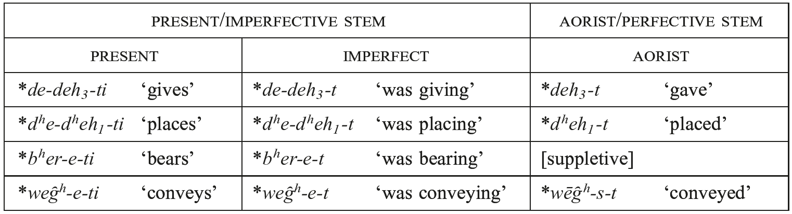

#### 4.3.1. Imperfective stem formation

Present (imperfective) stems show a wide variety of formations and we offer here an abbreviated catalogue of verbal stem types, formally divided between athematic and thematic, therein divided between “primary” formations (made to verbal roots) and “secondary” formations (derived verbal stems). Our catalogue aims to be a descriptive overview of some present types reconstructible from the IE daughter languages, with the caveat expressed about the role of these suffixes in Anatolian. We will list the reckoning from <i>LIV₂</i> for how many roots build a given formation, often followed by how many examples are considered “secure” by the authors. We do not accept the analysis of <i>LIV₂</i>in every instance: the numbers are provided merely as a rough guide to current thinking in the field. Fuller inventories of verbal stem types may be found in Jasanoff (forthcoming a), Meier-Brügger (2010: 297−311) (based squarely on <i>LIV₂</i>), and Beekes and de Vaan (2011: 251−286) (representative of Leiden views of the verb, which differ in many ways from those presented here).

<i>Root presents</i> are formed by adding the endings to the root without overt affixation; in <i>LIV₂</i> such a present is listed for about 200 roots. Examples include 3sg. *<i>h₁és-ti</i> ‘is’, 3pl. *<i>h₁s-énti</i> ‘are’ (Hitt. <i>ēš-zi</i>, <i>aš-anzi</i>, Ved. <i>ás-ti</i>, <i>s-ánti</i>, etc.); 3sg. *<i>h₁éy-ti</i> ‘goes, walks’, 3pl. *<i>h₁y-énti</i> (CLuw. <i>ī-ti</i>, Ved. <i>é-ti</i>, etc.). A number of prominent <i>media tantum</i> are root presents, e.g., PIE *<i>éy-or</i> ‘lies’ (CLuw. <i>ziyar[i]</i>, Ved. <i>śáye</i>), and *<i>wés-(t)or</i> ‘clothes oneself, wears’ (Hitt. <i>wešta</i>, Ved. <i>váste</i>, Gk. <i>héstai</i>) (cf. 4.2). A controversial subtype is the “Narten” (or lengthened-grade) present, named in honor of Johanna Narten’s work from the 1960s. This type showed *<i>ḗ</i>-grade in the singular, *<i>é</i>-grade plural, for which the prime example is 3sg. *<i>stḗw-ti</i>, 3pl. *<i>stéw-n̥ti</i> ‘praises’ (> Ved. <i>stáuti</i>, etc.). The lengthened-grade in these root presents reflects a derived present type. Some examples form imperfective stems to root aorists: Kümmel (1998) gives (e.g.) *<i>dḗk̑-</i>/<i>dék̑-</i>‘expect, accept’ (Ved. root <i>dāś-</i>, 3sg. <i>dāṣ-ṭi</i> ‘serves religiously’ via a semantic development of Vedic) beside the root aorist *<i>dék̑-</i> (Gk. 3sg.mid. <i>dék-to</i> ‘received’). Other examples are arguably formed to root presents: Melchert (2014b) gives (e.g.) *<i>h₁ḗs-ti</i>, *<i>h₁és-n̥ti</i> ‘sits’ (OHitt. <i>ēš-zi</i> ‘is sitting’) to the aforementioned root present *<i>h₁és-ti</i> ‘is’. The formation likely had an earlier aspectual nuance; Melchert suggests iterativedurative.

<i>molō-presents</i>: Another kind of PIE root present had *<i>o</i>/<i>e-</i>ablaut in the root and − according to a still controversial proposal by Jasanoff (2003a: 64−90) − inflected with the perfect-like endings of the *<i>h₂e</i>-conjugation (on which see 4.2.6 above). The verbs constituting this class are typically those of vigorous activity, such as PIE 3sg. *<i>bʰódhh1-ei</i> ‘digs’ (e.g., OCS <i>bodǫ</i> ‘I stab’, Lith. <i>bedù</i> ‘I poke’ beside Hitt. <i>paddai</i> ‘digs’). Jasanoff names the class “<i>molō</i>-presents” after the Lat. outcome <i>molō</i> ‘I grind’, whose cognates give evidence for both *<i>o</i>-grade vocalism of the root (e.g., Goth. <i>malan</i> ‘to grind’, Lith. <i>malù</i> ‘I grind’, both with <i>a</i> < *<i>o</i>) and *<i>e</i>-grade (e.g., OIr. <i>melid</i> ‘grinds’, OCS <i>meljǫ</i> ‘I grind’). As in the noun, these diverse ablaut grades suggest bifurcated levelings of a once unitary paradigm *<i>mólh₂-</i>/*<i>mélh₂-</i>. Hittite arguably provides direct evidence for such a unitary paradigm in the <i>ḫi</i>-conjugation, a class that includes the cognate verb (3sg.) Hitt. <i>mall-(a)i</i> ‘grinds’; although the original weak stem root vocalism of this verb is obscured by sound change (3pl. <i>mall-anzi</i>), Hittite preserves *<i>ó</i>/<i>é</i>-ablaut in a recessive sub-class of <i>ā</i>/<i>e</i>-ablauting <i>ḫi</i>-verbs, e.g., <i>k(a)rāp-</i>/<i>k(a)rep-</i> ‘devour’ (< PIE *<i>gʰróbʰ-</i>/*<i>gʰrébʰ-</i> ‘seize’), <i>š(a)rāp-</i>/<i>š(a)rep-</i> ‘sip’ (< *<i>sróbʰ-</i>/*<i>srébʰ-</i> ‘id.’). Kloekhorst (2012, 2014) disputes this evidence, arguing that the <i>ḫi-</i>conjugation in Hittite reflects only *<i>o</i>/θ ablaut, but his alternative inner-Hittite derivation of the weak stem <i>e</i>-vocalism of this class cannot be maintained − for instance, the root <i>e</i>-vowel in the verbs cited above cannot be epenthetic, since there is no plausible phonological or morphological motivation for epenthesis in this environment (see Melchert 2013; cf. Yates 2015: 154−155, 166 n. 43).

<i>Reduplicated athematic presents</i>: Partial copy reduplication is another major device for forming present stems to root aorists. Two types of reduplicated presents may be formally distinguished, an athematic and a thematic (treated below). The athematic type is well attested in Greek and Indo-Iranian, but with formal differences − in particular, in the vocalism of the reduplicant − that problematize its reconstruction. In Greek, all reduplicated presents have fixed <i>i</i>-segmentism in the reduplicant, e.g., WGk. <i>hí-stā-mi</i> ‘I stand’ (beside root aorist stem WGk. <i>stā-</i>), <i>tí-tʰē-mi</i> ‘I place’ (beside root aorist stem <i>tʰē-</i>). In contrast, Indo-Iranian has reduplicated presents with <i>i</i>-, <i>a</i>- (< *<i>e</i>) and even <i>u</i>-vocalism of the reduplicant, e.g., Ved. <i>í-yar-ti</i> ‘moves’ (beside root aorist stem <i>ar-</i>); Ved. <i>dá-dhā-ti</i> (= OAv. <i>da-dāi-tī</i>) ‘places’ (beside root aorist stem <i>dhā-</i>); Ved. <i>ju-hó-ti</i> ‘pours’. While the last type, which occurs only when the verbal root contains <i>u</i>, is generally regarded as an innovation, both *<i>e-</i> and *<i>i</i>-reduplicated forms are usually viewed as inherited − for instance, <i>LIV₂</i> reconstructs two distinct athematic reduplicated presents for PIE, one with fixed *<i>e</i>- segmentism, another with *<i>i</i>. Yet while this “maximal” reconstruction is possible, it still does not straightforwardly account for the mismatch between Vedic and Greek in cognate lexical items (e.g., Gk. <i>tí-tʰē-mi</i>, Ved. <i>dá-dhā-mi</i> < PIE *<i>dV́-dʰeh1-mi</i> ‘I place’), or for the fact that a few roots are attested in Indo-Iranian with both *<i>e-</i> and *<i>i-</i>reduplicated forms, e.g., Ved. 3sg. <i>sí-ṣak-ti</i> (= YAv. <i>hišhaxti</i>) vs. 3pl. <i>sá-śc-ati</i> (: <i>sac-</i> ‘accompany’), Ved. 3sg. <i>jí-gāt-i</i> vs. fossilized prs.act.ptcp. <i>já-g-at-</i>‘(moving) world’ (: <i>gā-</i> ‘go’). Various other interpretations of this evidence have been advanced. Jasanoff (2003a: 128−132) contends that PIE had only *<i>e</i>-reduplicated presents in the *<i>m</i>-conjugation, arguing that *<i>i</i>-reduplicated athematic presents in Greek and Vedic are due to the analogical influence of PNIE thematic *<i>i</i>-reduplicated presents, which would ultimately derive from PIE *<i>h₂e</i>-conjugation *<i>i</i>-reduplicated forms (see below). Another possibility − proposed already by Hirt (1900: 190−193) and further developed in recent scholarship (Sandell 2011; Hill and Frotscher 2012) − is that all athematic presents descend from a single PIE paradigm in which the reduplicant had two allomorphs, one with *<i>e-</i>vocalism and one with *<i>i</i>-vocalism; this intraparadigmatic allomorphy would then have been leveled out separately in the individual languages. Dempsey (2015: 339−341) suggests that this hypothesis better explains the situation in Anatolian, where reduplicated *<i>h₂e</i>-conjugation verbs may have either fixed *<i>e</i>- or *<i>i</i>-segmentism in the reduplicant (with no corresponding functional difference) − e. g., Hitt. <i>we-wakk-i</i> (: <i>wek-</i> ‘demand’) vs. Hitt. <i>li-lḫuwa-i</i> (: <i>laḫ[ḫ]u-</i> ‘pour’). However, there is not yet scholarly consensus on this issue.

<i>Nasal-infix presents</i>: An ablauting nasal-infix *<i>-ne</i>/<i>n-</i> is one of the commonest means for making present stems to root aorists: in <i>LIV₂</i> it is reconstructed for 248 roots (168 secure). An example is the root *<i>yeug-</i> ‘yoke’: the infix is inserted after the first syllable of the (zero-grade) root to derive a present 3sg. *<i>yu-né-g-ti</i>, 3pl. *<i>yu-n-g-énti</i> ‘yokes’ (> Ved. <i>yu-ná-k-ti</i>, <i>yu-ñ-j-ánti</i>), beside the root aorist *<i>yeug-t</i> (> OAv. <i>yaogəṭ</i>; cf. 1sg. Ved. <i>yójam</i>). The formation is well attested across a number of branches and is traditionally divided into three varieties based on the consonantal quality of the final segment of the root into which *<i>-né</i>/<i>n-</i> was inserted: (i) a final obstruent, e.g., aforementioned *<i>yu-né-g-ti</i>; (ii) final laryngeal, *<i>kʷreyh2-</i> ‘buy’ > *<i>kʷri-né-h₂-ti</i> ‘buys’ (Ved. <i>krī-ṇā-ti</i>, TB 3sg.mid. <i>kärn-ās-tär</i>); or (iii) glide *<i>-w-</i>, e.g., *<i>k̑lew-</i> ‘hear’ > *<i>k̑l̥-né-w-ti</i>, *<i>k̑l̥-n-w-énti</i> ‘hears’ (Ved. <i>śr̥-ṇó-ti</i>). The sequence *<i>-n(e)w-</i> was reinterpreted as a suffix already in PIE and added suffixally (not infixally) to roots, e.g., *<i>str̥-néw-ti</i> ‘strews’ (Ved. <i>str̥-ṇó-ti</i>). Although in the NIE languages it is mainly attested as a present stem formant beside root aorists (cf. Strunk 1967), there is some evidence to suggest that the infix may have earlier had a valency-increasing role. The infix is clearly transitivizing in pairs like (transitive) Hitt. <i>ḫar-ni(n)-k-</i> ‘kill’ (also <i>ḫarg[a]nu-</i> ‘id.’) beside (unaccusative) <i>ḫark-</i>‘die’. In at least one case there is comparative evidence for a transitive/causative nasal-infix verb derived from an adjective: Hitt. <i>tep-nu-zi</i> ‘belittles’ and Ved. <i>dabh-nó-ti</i> ‘deceives’ (cf. 2pl. OAv. <i>dəbənaotā</i>) directly reflect PIE *<i>dʰebʰ-né-u-ti</i> ‘belittles’ (from *<i>dʰebʰ-ú-</i> ‘little, small’). Moreover, the related nasal suffix PIE *<i>-n(é)w-</i> is highly productive in valency-increasing derivation in the Anatolian languages, e.g., Hitt. <i>link-</i>‘swear’: <i>ling(a)nu-</i> ‘make swear’; HLuw. <i>ta-</i> ‘stand’: <i>tanu(wa)-</i> ‘make stand’ (cf. Luraghi 2012). Accordingly, Meiser (1993) has argued that the nasal infix was originally valency-increasing and only secondarily used as a means for deriving present stems. It is, however, noteworthy that higher transitivity aligns cross-linguistically with perfective, not imperfective, aspect (see Hopper and Thompson 1980); the nasal-infix should thus be expected to derive a PIE aorist, not present, stem (see too Clackson 2007: 151−155).

*<i>-eh₁-stative</i>/<i>fientives</i>: Presents formed with *<i>-eh₁-ye</i>/<i>o-</i> make stative as well as change of state verbs across a wide swath of IE languages. Such presents are sometimes made to a verbal root (e.g., Lat. <i>hab-ē-re</i> ‘to have’, OCS <i>bǔd-ě-ti</i> ‘to be awake’, Lith. <i>bud-ė́-ti</i> ‘to be awake’) and are sometimes deadjectival (e.g., Hitt. <i>marš-e-zzi</i> ‘be false’ to <i>marš-a-</i>, Lith. <i>sen-ė́-ti</i> ‘to grow old’ to <i>sẽn-as</i>). The deadjectival forms have been derived from “Caland” adjectives since Watkins (1971). Greek has present forms reflecting the *<i>-eh₁-</i>stative (type <i>tharséō</i> ‘am bold’; cf. Tucker 1990), but additionally the intransitive (“passive”) aorist is formed with *<i>-eh₁-</i> (e.g., <i>e-mán-ē</i> ‘went mad’), which is hard to square with the evidence from the other languages. Harðarson (1998) posits that *<i>-eh₁-</i> formations were at home in the aorist (privileging the Greek evidence) and calls the type “fientive” (i.e. change of state) meaning ‘to become X’; presents to the fientive would be derived via further suffixation as *<i>-h₁-ye</i>/<i>o-</i>, named “essives,” which some languages reformed as *<i>-eh₁-ye</i>/<i>o-</i>. This account was taken over wholesale by the influential <i>LIV₂</i>. The categories “essive” and “fientive” are both rejected by Jasanoff (2003b), in part on the phonological grounds that *<i>-h₁-ye</i>/<i>o-</i> would infringe “Pinault’s Law” (cf. Byrd, this handbook; note, though, that Byrd suggests restricting the law to *<i>h₂</i>, *<i>h₃</i>). Jasanoff reconstructs instead a suffix *<i>-eh₁-ye</i>/<i>o-</i>, which he derives from the predicatively used instr.sg. of a root noun in *<i>-eh₁</i>, e.g., *<i>h₁rudʰ-éh₁</i> ‘with redness’ > *<i>h₁rudʰ-éh₁-yé</i>/<i>ó-</i> ‘be(come) with redness, blush’ (> Lat. <i>rub-ē-re</i> ‘to be red, ruddy’). On the basis of the reanalyzed stative stem the daughter languages created or extended other formations including: change of state verbs in *<i>-eh₁-s-</i> in Hittite; verbal abstracts (infinitives) in *<i>-eh₁-ti-</i> in Balto-Slavic; and intransitive aorists in bare *<i>-eh₁-</i> in Greek. The matter has not been settled: Yakubovich (2014) presents an overview of the problem; Bozzone (2016) builds on Jasanoff’s scenario, with further typological considerations.

*<i>-h₂-factitives</i> (the “<i>newaḫḫi</i>”-type): When added to thematic adjectives, the factitive suffix *<i>-h₂-</i> derives transitive verbs. Examples include the class’s eponymous Hitt. <i>newa-ḫḫ-i</i> ‘make something new’ (< *<i>newe-h₂-ei</i>; cf. Hitt. <i>nēwa-</i> ‘new’). Other languages probably reflect the *<i>-h₂</i>-suffix only in its extended form *<i>-h₂-ye</i>/<i>o-</i>; for instance, the extra-Anatolian comparanda for <i>newaḫḫi</i> include Lat. <i>nou-ā-re</i> ‘make something new’ and the rare Gk. verb <i>neáō</i> ‘plough up (fallow land)’ (both from extended *<i>newe-h₂-ye</i>/<i>o-</i>). The derivation remains productive in Italic, e.g., Lat. <i>sānus</i> ‘healthy’ ⇒ <i>sānāre</i> ‘heal’, etc.; see further Watkins (1971: 61, 85−86) and Jasanoff (2003a: 139−141).

<i>“Simple” thematic presents</i>: Roots with an affixed thematic vowel *<i>-e</i>/<i>o-</i> are a bedrock formation of PNIE; Rix and Kümmel (2001) lists 426 roots (224 secure) that make simple thematic presents. Examples include *<i>bʰér-e-ti</i> ‘bears, carries’ (e.g., Ved. <i>bhárati</i>; cf. 4.2.5), *<i>h₂ég̑ -e-ti</i> ‘leads, drives’ (Ved. <i>ájati</i>, Lat. <i>agit</i>, Arm. 1sg. <i>acem</i>, etc.). Simple thematic presents are often found beside other present types in the daughter languages (e.g., athematic 3sg.prs. Lat. <i>fer-t</i> ‘bears, carries’ < *<i>bʰēr-ti</i>). Jasanoff (1998) has argued that simple thematic presents in the IE languages come from at least two historically distinct sources, as indicated by their relationships to other present formations, and the kinds of aorists they co-occur with. The *<i>bʰér-e-ti</i> type occurs beside other present formations (e.g.*<i>bʰēr-ti</i> > Lat. <i>fer-t</i>) and makes a suppletive aorist (both *<i>bʰér-e-ti</i> and *<i>h₂ég̑ e-ti</i> make suppletive aorists). A second type, whose present is formally identical, is represented by (e.g.) *<i>wég̑ ʰ-e-ti</i> ‘conveys’ (Ved. <i>váhati</i>, Lat. <i>vehit</i>, etc.), which does not have competing present formations, and makes its aorist stem with the <i>s-</i>aorist (*<i>wēg̑ʰ-s-t</i> >> Lat. <i>vēxit</i>). This evidence would indicate that the two thematic present types derive from historically distinct origins, a conclusion bolstered by their “fit” within the chronology of IE dialects. That is, the *<i>wég̑ ʰeti</i> type does not occur in Anatolian; whether the *<i>bʰéreti</i> type does is disputed. Many researchers find an isolated example of the *<i>bʰéreti</i> type in HLuw. [tammari]* ‘builds’ (in transcription: AEDIFICARE + <i>MI-ra</i>/<i>i + i</i>), which could derive from PIE *<i>dém(h₂)-e-ti</i> with thematic cognates in Gk. <i>dém-ō</i> ‘build’ and Goth. <i>ga-timan</i> ‘fit’ (but cf. Lehrman [1998] for a dissenting view). The rarity − and possibly complete absence − of both present types in Anatolian is striking and suggests that both types could represent post-Anatolian innovations. Tocharian knows thematic presents of the *<i>bʰéreti</i> type (Toch. class II presents and subjunctives) but in reduced numbers; arguably the *<i>wég̑ ʰ-e-ti</i> type does not occur in Tocharian, and therefore represents a PNIE innovation. Ringe (2000) leverages the dearth of such presents in Anatolian and Tocharian to suggest an early branching off of these languages, a view Malzahn (2010: 363−366) disputes. Fitting the simple thematic type of PNIE into the picture of the earlier PIE verb is an ongoing project.

<i>tudáti-presents</i>: Zero-grade presents with accented thematic vowel − known as “<i>tudáti</i>”-presents after the canonical class VI present of Sanskrit grammar <i>tudáti</i> ‘strikes’ − are considerably less well-represented than simple thematic presents; in <i>LIV₂</i> it is reconstructed for 52 roots (20 secure). Significantly, at least one example of this class is found in Anatolian: Hitt. <i>šuwe-zzi</i> ‘pushes away, shoves’ forms an equation with Ved. <i>suv-á-ti</i> ‘impels’ and OIr. <i>soïd</i> ‘turns’ < *<i>suhₓ-é-ti</i> ‘pushes’ (with Oettinger 1979: 279; <i>pace</i> Kloekhorst 2008: 797−798). It has often been thought that this present class, with its preference for markedly telic activities in Vedic, might have developed from aspectually shifted thematic aorists; the imperfect of the zero-grade present and the thematic aorist are formally identical (e.g., imperfect *<i>suhₓ-é-t</i> ‘pushed’ and aor. *<i>wid-é-t</i> ‘found’; on the aorist type see below). Because these presents are held to have their origins in aorists, the class sometimes goes by the unfortunate name “aorist presents.” The early diachronic development of the <i>tudáti</i>-presents is in need of further investigation (on the Vedic material see Hill 2007 and now Malzahn 2016). A number of <i>tudáti</i>presents are made to roots in final <i>-i-</i> in Old Indic (e.g., <i>sy-á-ti</i> ‘binds’ to root <i>say-</i>/<i>si-</i>, cf. Kulikov 2000); Jasanoff (2003a: 105−107) argues that these represent part of a wider class of presents with an *<i>-i-</i> suffix in the protolanguage.

<i>Thematic reduplicated presents</i>: A thematic reduplicated type is also found beside the athematic type discussed above. An example is *<i>g̑i-g̑n(h₁)-e-ti</i> > Lat. <i>gi-gn-i-t</i>, Gk. <i>gí-gn-e-tai</i> (deponent mid. beside root aorist *<i>g̑enh₁-to</i> > Gk. <i>e-géneto</i>). In some cases, thematic reduplicated presents have athematic reduplicated cognates (see above) in other NIE languages, e.g., Lat. <i>si-st-ō</i>, Ved. <i>tí-ṣṭha-ti</i> vs. WGk. <i>hí-stā-mi</i> (cf. root aorist PIE *<i>stéh₂-t</i> ‘stood’). The etymological equation between thematic reduplicated present Gk. <i>mí-mn-ō</i> ‘I stand fast’ and *<i>h₂e</i>- conjugation <i>i</i>-reduplicated Hitt. <i>mimma-i</i> ‘refuses’ points to a diachronic connection between these categories, and it has been argued, specifically, that some (if not all) PNIE reduplicated thematic presents arise via “thematization” of PIE *<i>h₂e</i>-conjugation *<i>i</i>-reduplicated presents (see esp. Jasanoff 2003a: 128− 132; García Ramón 2010; cf. 4.2.5).

*<i>-yé</i>/<i>ó-presents</i>: The suffix *<i>-ye</i>/<i>o-</i> is a thematic present formation only (i.e. there is no aorist *<i>-ye</i>/<i>o-</i>). A prominent type has accented suffix and zero-grade root, many examples of which are deponent, including the roots of birth and death: *<i>mr̥-yé-tor</i> ‘dies’ > Ved. <i>mri-yá-te</i>, Lat. <i>mor-i-tur</i>; *<i>g̑n̥h₁-yé-tor</i> ‘is born’ > OIr. <i>gain-i-thir</i>, cf. Ved. <i>jā́-ya-te</i>; and *<i>mn̥-yé-tor</i> ‘thinks’ >> Ved. <i>mán-ya-te</i>, Gk. <i>maíne-tai</i> ‘rages’. In Indo-Iranian, this suffix, accented and with middle inflection, becomes specialized as a present passive marker (e.g., 3sg. <i>-yá-te</i>; cf. 4.2); Kulikov (2012) is an extensive treatment of the Vedic evidence. *<i>-ye</i>/<i>o-</i> is also the normal denominative suffix forming verbs that mean ‘be, become, act like X’. Examples include Ved. <i>vr̥ṣā-yá-te</i> ‘acts like a bull (<i>vr̥ṣan-</i>)’, Gk. <i>poimaínō</i> ‘I am a herdsman (a <i>poimḗn</i>)’ < *<i>poh₂i-mn̥-yō</i> (cf. Tucker 1988). A number of primary *<i>-ye</i>/<i>o-</i> presents give evidence for an accented full grade of the root, such as *<i>(s)pék̑-ye-ti</i> ‘sees, looks at’ (> Ved. <i>páś-ya-ti</i>); in <i>LIV₂</i> this full-grade formation is considered a distinct type made to 50 roots (19 secure).

*<i>-sk̑é</i>/<i>ó-presents</i>: The suffix *<i>-sk̑é</i>/<i>ó-</i> with the zero-grade of the root formed thematic presents in PNIE. Examples include *<i>gʷm̥-sk̑é</i>/<i>ó-</i> ‘be walking’ (Ved. <i>gáchati</i> ‘goes’, 2sg.imp. Gk. <i>báske</i> ‘go!’, TA <i>kumnäṣtär</i> ‘comes’), and the widespread item *<i>k̑pr̥-sk̑é-</i>‘ask’ (Ved. <i>pr̥cháti</i>, Lat. <i>poscit</i>, OIr. <i>-airc</i>). In PNIE, the suffix derives present stems especially to root aorists, with further innovations and extensions defining the daughter languages (see Zerdin 1999, 2002 on this issue with special reference to Greek). There are, however, sufficient indications to reconstruct its earlier aspectual functions. In Hittite, the suffix <i>-ške-</i> derives an aspectual stem whose function can be iterative, habitual, and pluractional (cf. Hoffner and Melchert 2008: 318−322). In Tocharian B, reflexes of the suffix *<i>-sk̑e</i>/<i>o-</i>, viz. <i>-ṣṣə-</i>/<i>-ske-</i>, form class IX presents (e.g., <i>we-skau</i>, <i>we-ṣṣäṃ</i> ‘say’), but the suffix is mostly used in the present (and subjunctive) to form the causative − e.g., to the root <i>wik-</i> ‘disappear’ is formed a causative present 3sg. <i>wikäṣṣäṃ</i> ‘drives away, removes’. Peyrot (2013: 515−524) has recently presented new arguments that the Tocharian A class VIII presents in <i>-s-</i>/<i>-ṣ-</i> (“s-transitives” in his terminology) − traditionally held to reflect presents in *<i>-s-e</i>/<i>o-</i> − derive via inner-Tocharian changes from the *<i>-sk̑é</i>/<i>ó-</i> suffix as well. This causative feature is usually understood as an inner Tocharian development (recently Adams 2014 with references). Li and Whaley (forthcoming) argue on cross-linguistic grounds that there is a grammaticalization cline of intensive > causative > reciprocal; Tocharian would perhaps fit into this schema. One intriguing detail is that the suffix makes iterative and durative stems not only in Anatolian but also an iterative preterite in <i>-(e)skon</i> in the Ionic dialect of Greek; Puhvel (1991: 13−20) and Watkins (2001: 58−59 [= Watkins 2008: 954−955]) plausibly attribute the spread (or rebirth) of the iterative functions of this suffix to diffusion from Anatolian to the Greek speakers of the Ionic coast.

*<i>-eye</i>/<i>o-causative-iteratives</i>: A thematic formation in *R<i>(o)-éye</i>/<i>o-</i>, making transitive and causative verbs, is widespread across the languages; in <i>LIV₂</i> it is reconstructed to 400 roots (237 secure). Examples include *<i>men-</i> ‘think’ > *<i>mon-éye-</i> ‘call to mind’ (> Lat. <i>monēre</i> ‘warn’) and *<i>sed-</i>‘sit’ > *<i>sod-éye-</i> ‘set something’ (> Goth. <i>satjan</i> ‘to set, plant’). Two etymological equations set the date of this formation back to PIE antiquity: Hitt. <i>lukke-zzi</i> ‘lights up, sets ablaze’ was taken by Watkins (1971: 69) to derive from a causative *<i>louk-éye</i>/<i>o-</i> seen also in e.g., Ved. <i>rocáyati</i> ‘makes shine’, Lat. <i>lūceō</i>, <i>-ēre</i> ‘ignite, light’; and Hitt. <i>waššezzi</i> ‘clothes (someone)’ continues *<i>wos-éye</i>/<i>o-</i>, to be equated with Ved. <i>vāsáyati</i>, Goth. <i>wasjiþ</i> (PGmc. *<i>waz-jan</i>, also Eng. <i>wear</i>), Alb. <i>vesh</i>, as demonstrated by Eichner (1969). The formation knows a particularly rich development in its Old Indic avatar, the <i>-áya-</i>presents (extensively studied by Jamison 1983). In certain languages, there are also verbs formed with the suffix that have iterative meaning. Kölligan (2007) argues that in the case of Latin the distinction depends on the agentivity of the base verb: if the base is agentive, the derived verb is iterative-intensive; if the base verb is non-agentive, the derived verb is transitive-causative. It is possible that both meanings of iterativity and transitivity-increase were available in the proto-language (see also Kölligan 2004). In some languages, the reflexes of *R<i>(o)-éye</i>/<i>o-</i> have merged with denominal verbs made to *<i>o</i>-grade nominals; Greek is a case in point (discussed in detail by Tucker 1990: 123−184).

#### 4.3.2. Perfective stem formation

There were fewer types of aorists − we reconstruct four − but still diversity is found. As in the present system, the redundancy of four formal markers expressing one functional category suggests that early mergers define the prehistoric development of the aorist.

<i>Athematic root aorists</i>: As is the case with the athematic root presents, the (secondary) endings are added directly to the root. Thus *<i>dʰeh1-</i> ‘place’ formed a root aorist *<i>dʰeh1-t</i> ‘placed, put down’, reflected in Ved. <i>dhā́-t</i>, Gk. <i>é-tʰē-k-e</i> (whose older <i>k</i>-less form is preserved in Boeot. Gk. <i>[an]-é-tʰē</i>). Root aorists typically form their present stems by further affixation; Gk. <i>é-tʰēke</i> is the root aorist to the reduplicated present <i>títʰēmi</i> ‘I place, set something’. PNIE root aorists show up in Anatolian as stems that can form presents; thus beside the inherited root aorist *<i>dʰeh1-t</i> ‘placed, put down’ (> Hitt. <i>tēt</i> ‘said’) are attested Hitt. <i>tē-zzi</i> ‘says’ and Lyc. <i>ta-di</i> ‘puts’, and beside the root aorist *<i>kʷer-t</i> (> Ved. <i>[á]kar</i> ‘made’) is found Hitt. <i>kuer-zi</i>, <i>kuranzi</i> ‘cut(s)’ and CLuw. <i>kuwarti</i>, <i>kur-</i> ‘id.’. The Anatolian forms are usually explained as innovations, when old aorists were retrofitted with new primary endings, in this case *<i>dʰéh₁-t-i</i> ‘places’; Malzahn (2010: 267−268, <i>et passim</i>) calls this process of morphological renewal the “<i>tēzzi-</i>principle.”

*<i>s-aorists</i>: Athematic *<i>s-</i>suffixed aorists (“sigmatic aorists”) are a widespread aorist type in PNIE. The *<i>s</i>-aorist and its offshoots make up the most productive aorist type in Greek, Indo-Iranian, and Slavic (although it is notably absent from Baltic); furthermore, relics are uncontroversially found in Latin, Celtic, and elsewhere. From the PNIE languages, a formation with lengthened grade root and secondary endings may be reconstructed; e.g., the root *<i>weg̑ʰ-</i> ‘convey, move’ forms an <i>s</i>-aorist *<i>wḗg̑ʰ-s-t</i> (Lat. <i>vēxit</i> ‘conveyed’, Ved. <i>ávāṭ</i>, etc.). Despite this agreement between the NIE languages, reconstructing the *<i>s-</i>aorist for PIE − including Tocharian and Anatolian − is beset with difficulties. Some connection of the Tocharian <i>s</i>-preterite (pret. class III) with the PNIE *<i>s</i>-aorist is universally accepted; the nature of that connection, however, remains elusive. Essentially the following three positions have been advanced: (i) the Tocharian <i>s</i>-preterite derives wholly from the <i>s</i>-aorist; (ii) it represents instead a conflation to some extent with the PIE perfect; or (iii) it reflects an ancestor of the PNIE aorist, namely a “presigmatic aorist” (see the review of literature in Malzahn 2010: 208−214). No proposal has yet won universal accord; recent investigations of this problem may be found in the volume edited by Malzahn et al. (2015), especially the contributions therein by Kim, Melchert, and Oettinger (all against the pre-sigmatic aorist). Even more difficult to pin down is the prehistory of this form in Anatolian. There is widespread agreement that the Hittite preterite third singulars of the <i>ḫi-</i>conjugation like <i>nai-š</i> ‘turned’ and the *<i>s-</i>aorist (cf. to the same root Ved. <i>á-nāi-ṣ-am</i> ‘I led’) are historically related (from very different viewpoints see Oettinger 1979: 405 and Jasanoff 2003a: 174−214), but there is no agreement on what that relationship is. Jasanoff’s innovative proposal (for which see already Jasanoff 1988, and also his account in this handbook) has not won general acceptance (as witnessed by the critical remarks of Kim 2005: 194 and Oettinger 2006: 43−44, <i>i.a</i>.), and the issue remains unsettled at present. Further studies on the developments of the *<i>s-</i>aorist in the ancient Indo-European languages include Drinka (1995), Narten (1964) on Vedic, Schumacher (2004) on Celtic, and Ackermann (2014) on Slavic.

<i>Reduplicated thematic aorists</i>: The reduplicated thematic aorist is not widely attested, but the examples look old; <i>LIV₂</i> reconstructs it for only 18 roots (5 secure). Examples include the root *<i>wekʷ-</i> ‘say’, which makes a reduplicated aorist *<i>we-ukʷ-e-t</i> ‘said’ (> Ved. <i>vóc-a-t</i>, Av. <i>-vaocaṯ</i>, Gk. <i>[w]eĩp-e</i>), and *<i>werh₁-</i> ‘find’ > *<i>we-wr(h₁)-e</i>/<i>o-</i>‘found’ (> Gk. <i>heũr-e</i>, OIr. <i>fo-fuair</i>). Willi (2007) argues that the reduplication seen in the reduplicated aorist was a marker of aspectual perfectivity in PIE. Besides Indo-Iranian examples like Ved. <i>vócat</i> ‘said’ (< *<i>we-ukʷ-e-t</i>), there is also attested in Vedic a reduplicated preterite regularly aligned with the <i>-áya-</i> transitives (discussed above under *<i>-éye</i>/<i>o-</i>presents), e.g., Ved. <i>darś-áya-ti</i> ‘shows, makes see’ beside the aorist <i>a-dī-dr̥ś-ųa-t</i>. The fact that the reduplicant in this class regularly contains the vowels <i>-i-</i>, <i>-u-</i> (not <i>-a-</i>) leads Jamison (1983: 216−219) to argue that it derives from a different historical source than the PIE reduplicated aorist, viz. imperfects to the reduplicated present.

In a number of daughter languages, the reduplicated aorist is valency increasing; Ancient Greek is a case in point (Duhoux 2000: 79−80). Bendahman (1993: 61−100, 140−170) finds in Greek about 30 reduplicated aorist stems, which fall into two types: (i) roots referring to prototypically transitive events with an agentive subject form transitive reduplicated aorists, *<i>gʷʰén-ti</i> ‘strikes’ ⇒ *<i>gʷʰe-gʷʰn-e</i>/<i>o-</i> ‘struck’ (> Gk. <i>pépʰn-e</i> ‘slew’ = YAv. <i>-jaγnat̰</i>); (ii) roots referring to prototypically intransitive events form transitive reduplicated aorists, e.g., *<i>h₂er-</i> ‘fit’ ⇒ *<i>h₂e-h₂r-e</i>/<i>o-</i> (>> Gk. <i>arareĩn</i> ‘to make fit [tr.], to adapt’). Similarly the reduplicated aorist underlies the productive “causative” formation in Tocharian A, viz. its class II preterite (e.g., <i>ca-cäl</i> ‘lifted’ to the root <i>täl⁽ā⁾</i> ‘lift’ < *<i>telh₂-</i>; cf. Malzahn 2010: 172−173 on the function of this preterite). Whether the TB preterite II can also be derived from the reduplicated aorist is not certain; see Malzahn (2010: 184−189) for an overview of the question and, in addition, the recent analysis of Jasanoff (2012b), who books the TB forms under “long-vowel preterites,” a class which he derives from the imperfects of “Narten presents” (see above under root presents). It is possible that the cross-linguistically common alignment of high transitivity and telicity (cf. Hopper and Thompson 1980: 270−276; Wagner 2006) feeds the development of transitivity in this class of aorists, though the fact that not all types of aorists become transitivizing implies a more complicated evolution.

<i>Thematic aorists</i>: Aorists with zero-grade root and accented thematic vowel are known from at least two equations: PNIE *<i>wid-é-t</i> ‘saw, found out’ (> Ved. 3sg. <i>á-vid-a-t</i>, Gk. <i>é-[w]id-e</i>, Arm. <i>e-git</i>), and *<i>h₁ludʰ-é-t</i> ‘went out’ (> Gk. <i>ḗlutʰ-e</i> ‘came’, OIr. <i>luid</i> ‘went’, TA <i>läc</i>, TB <i>lac</i> ‘went out’). The latter example in particular demonstrates the PIE antiquity of the thematic aorist, since it is continued in languages where the category was by no means productive (Old Irish and Tocharian). Cardona (1960) analyzes most thematic aorists in Greek and Indo-Iranian as thematized root aorists, and considers only the two examples cited above to be of PIE antiquity, although the fact that we have these two examples suggests that more existed in the protolanguage. <i>LIV₂</i> unaccountably fails to reckon with a thematic aorist; for one account of the type’s origins (ultimately a type of imperfect reanalyzed as an aorist) see Jasanoff (forthcoming b).

#### 4.3.3. Perfect stem formation

“Perfect” stems exhibit far less formal diversity than present and aorist stems; there is effectively one type of perfect, which is set off from the system of present and aorist stems in several formal and functional ways. The perfect is formed by partial copy reduplication (with fixed <i>e-</i>segmentism in the reduplicant) and *<i>o</i>/θ-ablaut in the root. The inflectional endings of the perfect (active) are distinct from the present/aorist active endings (cf. 4.2). Examples include *<i>men-</i> ‘think’ ⇒ 3sg. *<i>me-món-e</i> ‘has in mind’ (> 3sg. Gk. <i>mémone</i> ‘intends’, cf. Lat. <i>meminit</i> ‘remembers’), 3pl. *<i>me-mn-ḗr</i>; *<i>gʷʰen-</i>‘strike’ ⇒ 3sg. *<i>gʷʰe-gʷʰón-e</i> ‘has slain’ (> 3sg. Ved. <i>ja-ghā́n-a</i>), 3pl. *<i>gʷʰe-gʷʰn-ḗr</i>. Another formal peculiarity of the perfect is its distinctive active participle suffix *<i>-wós-</i>(contrast the eventive’s *<i>-nt-</i>). There is one certain example of a PIE root that makes an unreduplicated perfect: *<i>woíd-e</i> ‘knows’ (Gk. <i>[w]oĩd-e</i>, 1pl. <i>[w]íd-men</i>, Ved. <i>véd-a</i> 1pl. <i>vid-mā́</i>, Goth. <i>wait</i>, <i>witum</i>, etc.). It has long been disputed whether this form represents an archaism (i.e. reflecting a pre-stage when perfect stems were formed without reduplication), an innovation, or is something else entirely (for one account see Jasanoff 2003a: 234−246 with references, but compare now Jasanoff forthcoming b).

Beyond these formal differences, it is notable that the perfect’s semantic value is resultative-stative, again setting it apart from the eventive system. The three-way split between present, aorist, and perfect stems survives only in Greek and Indo-Iranian, and it is therefore only in these two branches that semantic distinctions between these categories can be investigated. Early Greek is thought to be most conservative in reflecting the value of the PNIE perfect: Wackernagel (1904) established that in Homeric Greek a perfect can have the meanings of a present state and/or a resulting state (cf. further Wackernagel 1926−1928 [2009]: 215−220 with the editor’s notes, and Chantraine 1926). The value of the perfect in Indo-Iranian is broadly harmonious with that of Greek; in a thorough investigation of the category, Kümmel (2000: 65−78) shows that the Indo-Iranian perfect divides into a stative-like perfect and a past perfect, which refers to a greater or lesser extent to the present value relevance of a past action. However, on the particulars of the perfect in Vedic a number of questions remain. Dahl (2010: 343−424), for instance, argues that the primary meaning is anteriority, a result critically reviewed by Jamison (2014), who disputes that any overarching function of the perfect can be established for the Rigveda due to the heterogeneous nature of the text. The diversity of functions in earliest Vedic would reflect ongoing diachronic change from the resultativestative value of PIE, found in earliest Vedic, to the anterior meaning found more consistently in its use as a preterital narrative perfect in later Vedic, regularly in Epic and Classical Sanskrit. The precise functional value of the perfect in Old Indic is thus a topic still undergoing investigation (see now also Jamison 2017). For further analysis of the PIE perfect, see the three-volume study by Di Giovine (1990−1996).

The status of the perfect in Anatolian is unsettled and inextricably bound up with one’s views on the foundational question of the prehistory of the <i>ḫi-</i>conjugation (a helpful introduction to this complex problem is given by Clackson 2007: 129−156). Deriving the <i>ḫi-</i>conjugation as a whole from the perfect is simply not viable in the wake of Jasanoff’s (2003a: 1−27) criticism (following esp. Cowgill 1974, 1979). Whether any Anatolian items reflect the perfect is disputed. Jasanoff (2003a: 11, 37, 117−18) claims that Hitt. <i>wewakk-</i> ‘demand’ and <i>mēm(a)i-</i> ‘speak’ descend from PIE perfects, and Forssman (1994) argues that Hitt. <i>šipand-</i> ‘libate’ continues a perfect *<i>spe-spónd-</i>; however, Jasanoff (forthcoming b) now derives <i>wewakk-</i> ‘demand’ and <i>mēm(a)i</i>- ‘speak’ (and other apparent non-resultative perfects like Gk. <i>mémēke</i> ‘bleats’) from reduplicated *<i>h₂e</i>-presents with a strong stem *<i>Cé-CoC-ei</i>, while deriving the PNIE resultative-stative perfect from reduplicated *<i>h₂e</i>-aorists with a strong stem *<i>Ce-CóC-e</i> (cf. 4.2.6 above). If Hitt. <i>šipand-</i> ‘libate’ reflects a reduplicated stem at all, its attested telic sense argues that it represents a reduplicated *<i>h₂e</i>-aorist *<i>se-spónd-</i> (Melchert 2016b).

### 4.4. Non-finite formations

PNIE made participles to each tense-aspect stem and for the two voices of active and middle. Yet again, Anatolian does not conform to this model, and we address below the specific points at which Anatolian problematizes the deeper PIE reconstruction. No single marker for the category infinitive can be reconstructed for the protolanguage since the daughter languages disagree too greatly on how the category is marked, although the fact that numerous daughter branches build infinitives with case-forms of abstract nouns strongly suggests that the proto-language similarly employed such forms in nascent infinitival functions.

#### 4.4.1. Participles

Morphologically, participles attach to tense-aspect stems (present, aorist, perfect), making verbal formations with adjectival agreement features. No recent work devoted entirely to participles in PIE exists; Lowe (2015) is a thoroughgoing account of participles in the <i>Rigveda</i>, with diachronic material throughout. Lowe (2015: 5−6, 226−294) proposes to define participles along the cline of an adjective’s status as an inflectional part of the verb system. Thus participles are defined as non-finite, inflectional forms of verbs, which are morphologically adjectival. As inflectional forms, participles convey adjectival agreement of case, number, and gender with their head noun; morphologically, participles mark the verbal categories of voice (active and middle) and tense-aspect. The participle is defined in distinction to verbal adjectives, which are lexical adjectives that display some verbal properties. A deciding criterion between participle and verbal adjective is whether the adjective obligatorily inherits the argument structure of the base verb from which it is derived; participles in Vedic always inherit the argument structure of the base, but with deverbal adjectives this may, but need not, be the case.

<i>Present</i>/<i>aorist active participle</i>: In PNIE, the active participle to present and aorist stems is formed by an ablauting suffix *<i>-ont</i>/<i>nt-</i> (fem. *<i>-nt-ih₂-</i>). Thematic forms were *<i>-o-nt-</i>, while in athematic verbs the suffix was added to the weak stem − for instance, *<i>h₁es-</i> ‘be’ makes a prs.act.ptcp. *<i>h₁s-ónt-</i> ‘being’ (cf. Lat. <i>sōns</i> ‘guilty’ and <i>in-sōns</i> ‘innocent’, relics from *<i>h₁s-ónt-s</i>; Watkins 1967). In thematic verbs, the zero-grade suffix was added to the thematic vowel, as in *<i>bʰér-o-nt-</i> ‘bearing’ (Gk. <i>pʰér-o-nt-</i>). Similarly, *<i>-nt-</i> could be added to aorist stems.

The Anatolian cognate of *<i>-nt-</i> presents several serious discrepancies. The Hittite cognate of the participial suffix *<i>-nt-</i>, viz. <i>-ā˘nt-</i>, regularly expresses a resultant state: Hitt. <i>kunant-</i> means ‘killed, having been killed’ (not ‘killing’), a meaning matched residually in Luwian and Lycian relics, as in CLuw. <i>walant(i)-</i>/<i>ulant(i)-</i> ‘dead’, Lyc. <i>lãta-</i>‘dead’. In the case of transitive verbs, the Anatolian participles show usually a passive, but sometimes an active sense, e.g., Hitt. <i>šekkant-</i> ‘knowing/known’, <i>appānt-</i> ‘taken, seized’. This state of affairs contrasts with other IE languages, as illustrated by Hitt. <i>kunant-</i> ‘killed’ beside its cognate in Vedic <i>ghnánt-</i> ‘smashing, killing’ (though see Watkins 1969: 142−144 for possible relics of passive meaning of the *<i>-nt-</i>participle). In general, then, the Hitt. <i>-nt-</i>participle in functional terms most closely resembles PNIE *<i>-to-</i>/*<i>-no-</i> adjectives. Precisely how to derive the Anatolian or non-Anatolian attested function from the other remains an unsolved problem (Melchert forthcoming b and Fellner and Grestenberger forthcoming propose possible step-by-step diachronic scenarios).

It may be noted that a formally identical suffix *<i>-nt-</i> is also used outside the verbal system to build adjectives to property concept roots (within the “Caland system”, Rau 2009a: 176−177 <i>et passim</i>). For instance, Ved. <i>br̥hánt-</i> ‘high’, Av. <i>bərəzaṇt-</i> ‘id.’, TA <i>kom-pärkānt</i> ‘sunrise’, etc. all derive from the root *<i>bʰerg̑ʰ-</i> ‘high’, whose meaning is typical of property concept roots, and which builds adjectival stems (this example was identified already by Caland 1892: 267). Verbal stems formed to this root are sporadically attested (see further Lowe 2014a: 283−294).

<i>Middle participle</i>: The middle participle (present, aorist, perfect) is reconstructible as athematic *<i>-mh₁no-</i>, thematic *<i>-o-mh₁no-</i>. The comparative method requires the reconstruction of this peculiar suffix shape, as showed by Klingenschmitt (1975: 161−163); the suffix is certainly composite in diachronic terms, although its internal structure is opaque. The suffix is found as a productive participle marker in Indo-Iranian (Ved. [athem.] <i>-āná-</i>, [them.] <i>-a-māná-</i>), Greek ([pfc.] <i>-ménos</i>, [pres.] <i>-menos</i>), and Tocharian (TA <i>-māṃ</i>, TB <i>-mane</i>). In other languages, mere vestiges remain, such as Arm. <i>anasown</i> ‘animal’ < *<i>n̥-h₂eg̑ -omno-</i> lit. ‘non-speaking’, and Latin relics include <i>fēmina</i> ‘woman’ and <i>alumnus</i> ‘nursling’ (cf. Weiss 2011: 437). There is no trace of this participle in Anatolian; for arguments against Luwian <i>-Vmma-</i> as a reflex of *<i>-mh₁no-</i>, see Melchert (2014a: 206−207).

<i>Perfect participle</i>: The perfect participle active was formed with the ablauting suffix *<i>-wos</i>/<i>us-</i> (f.*<i>-us-ih₂-</i>) added to the perfect stem. The formation is clearly continued into a number of daughter languages, as in Myc. Gk. <i>a-ra-ru-wo-a</i> [arar(u)-woh-a] ‘fitted’ (n.nom.pl.), Ved. <i>ca-kr̥-vā́ṃs-am</i> (m.acc.sg.) / <i>ca-kr-úṣ-ī</i> (f.nom.sg.) to the root <i>kr̥</i>/<i>kar-</i>‘make’. Forms of the perfect participle active are continued in languages where the perfect has been lost as a finite category; it is found in Tocharian’s preterite participle, e.g., TB <i>kekamu</i>/<i>kekamoṣ</i> (root <i>käm-</i> ‘come’ + <i>-u</i> < *<i>-wos-</i>), and remade in Balto-Slavic (details in Olander 2015: 94−95). A curious trace of the formation survives in Goth. <i>berusjos</i> ‘parents’ (reflecting the feminine *<i>-us-yeh₂</i>-). Possible vestiges remain in Italic (see Vine, this handbook, 7.3.1.2.); no trace has been found in Armenian or Albanian. With greater consequences for PIE, the perfect participle active is absent from Anatolian; it is highly likely that this absence is due to the category’s nascence after Anatolian’s departure from the common ancestor of the NIE languages.

#### 4.4.2. Infinitives

The infinitives in the IE languages are usually frozen case-forms of deverbal nominalizers (cf. 2.4.1 above); it is very likely that a nascent infinitival function was formed in this way in PIE too. However, the significant formal diversity attested in the marking of infinitives in the daughter languages seriously problematizes efforts to reconstruct the PIE exponent(s) of this category − that is, precisely which case form or forms of which nominalizers marked the category of infinitive remains unclear (for one overview of the problem, see García Ramón 1997). Keydana (2013a) proposes criteria for segregating event nominalizations from true infinitives in Vedic. His strongest proposed criterion for nounhood is that event nominalizers do not inherit argument structure from the verb, and therefore cannot govern a transitive object (they instead take a genitive complement). True infinitives do inherit verbal argument structure, which includes transitivity (and potentially tense, aspect, and voice), and thus will govern accusative case (Keydana 2013a: 25−58). It is not yet clear whether the Vedic texts always conform to the proposed criteria (cf. Lowe 2014b); see also the extensive discussion of Old Irish verbal nouns and infinitives by Stüber (2015).

The following infinitives are representative of the forms attested in the daughter languages. The suffix *<i>-tu-</i> (forming abstract nouns) makes infinitives in various cases, for instance (acc.sg.) Ved. <i>dā́-tum</i> ‘to give’, (dat.sg.) Ved. <i>pā́-tave</i> ‘for drinking’, also in Old Prussian <i>da-twei</i> ‘to give’. Likewise the suffix (forming abstract nouns of feminine gender) *<i>-ti-</i> in various cases: Ved. <i>pī-táye</i> (dat.sg.) ‘for drinking’, Lith. <i>bū́-ti</i> ‘to be’ (from loc.sg. *<i>-tēi</i>). The suffix *<i>-men-</i> furnishes infinitives in various cases, such as Ved. <i>vid-mán-e</i> (dat.sg.) ‘to know’, Hom. Gk. <i>(w)íd-men-ai</i> ‘to know’; comparable is *<i>-wen-</i>, which underlies the Anatolian infinitives, Hitt. <i>-wanzi</i> (< abl.-instr. *<i>-wen-ti</i>), Palaic and Luvian <i>-una</i> (< allative *<i>-un-eh₂</i>). The suffix *<i>-dʰye</i>/<i>o-</i> (cf. Fortson 2012, 2013) makes infinitives across a number of branches: Indo-Iranian *<i>-dʰyāy</i> (e.g., Ved. <i>píba-dhyai</i> ‘to drink’) can be equated with Italic infinitives, viz. Osc. <b>-fír</b>, Umb.<i>-f(e)i</i>, Lat. prs.pass. <i>-rier</i>, as well as the Tocharian infinitive in <i>-tsi</i> (e.g., TB <i>lkā-tsi</i> ‘to see’).

## 5. Conclusions

Our survey of PIE morphology, written in the first quarter of the 21st century, builds directly on the great foundations of the field laid in the 19th and 20th centuries. However, the picture of PIE morphology it presents differs radically in many respects from the one presented by our predecessors; as one adage has it, “no language changes so fast as Proto-Indo-European.” We have attempted here to survey where there is consensus in the field and to flag points of interest for future research. We have aimed to present a state-of-the-art view on PIE morphology, in full knowledge that this picture will change in coming years. The continued integration of Hittite and Tocharian into our understanding of PIE will undoubtedly play a major role in the 21st century, much as it has done in the 20th; philological work on the daughter branches will continue apace, challenging and revising our understanding of the proto-language; and advances in theoretical linguistics and in synchronic and diachronic language typology will continue to shed new light on old problems.

### Acknowledgments

For invaluable comments, criticisms, and suggestions, we are deeply indebted to colleagues at our home institution, UCLA, especially David Goldstein, Stephanie Jamison, Craig Melchert, Teigo Onishi, Ryan Sandell, and Brent Vine. Our chapter also improved immeasurably from the help of Joe Eska, Ben Fortson, Mark Hale, and Jay Jasanoff. We also thank José Luis García Ramón and Andreas Willi, who made preprint versions of their forthcoming work available to us. Finally, it is our special pleasure to thank Jared Klein, without whose support this project could not have been completed.
