# 123. The syntax of Proto-Indo-European

1.Grammatical reconstruction

2.The limits of reconstruction

3.Word order

4.The structure of XPs

5.Case

6.Latent arguments

7.Binding

8.Copula constructions

9.Subordination and embedding

10.References

## 1. Grammatical reconstruction

The only sentence that can be reconstructed with some plausibility is Watkins’ famous *<i>egʷʰent ogʷʰim</i> (or rather *<i>h₃egʷʰim</i>) ‘[he] slew the dragon’ (Watkins 1995: 301) − hardly more than a VP (for the convincing Greek evidence see Watkins 1995: 359). No other formula can be reconstructed with the same probability (cf. Keydana 2001). Reconstructing PIE phrases or sentences, then, is a fruitless endeavor.

Syntactic reconstruction therefore differs markedly from traditional segmental phonological or morphological reconstruction. But this does not mean that the whole project of a PIE syntax is doomed to failure, as Fritz in Meier-Brügger (2002: 244−245) seems to assume (cf. also Lightfoot 1980 and Jeffers 1976, and for a critique of these arguments, Dressler 1971: 6 and Harris and Campbell 1995: 344−376). The goal of IE studies is not the reconstruction of utterances, but that of linguistic competence. The reconstructed roots, words, or affixes are entries in the mental lexicon of an ideal PIE speaker, the phonological or morphological rules for manipulating them part of his grammar. Likewise, PIE syntax is not concerned with actual strings, but with the structure of complex syntactic objects and constraints on the wellformedness of such objects.

Contrary to my own skeptical assessment in Keydana (1997: 32), I now think that, <i>grosso modo</i>, syntactic reconstruction is possible (cf. Keydana 2004), as long as we respect the limits (of external reconstruction) and restrain ourselves from speculating without sound empirical evidence. For similar positions cf. Dressler (1971), Balles (2006), and Speyer (2009).

Still, studies in IE syntax face fundamental problems that severely restrict any attempts at reconstruction. The most important one is the fact that the languages we compare never provide negative evidence and that we do not have access to acceptability judgments. Modern corpus linguistics does not help to improve this situation, as statistical marginality does not necessarily reflect unacceptability. Besides, the most ancient corpora are often too small to reveal statistical patterns. Working with actually attested texts only, historical linguists must by hypothesis assume that all the utterances they are confronted with are valid and well-formed. This also holds true for poetic texts: even if they stretch grammaticality to its limits, they never trespass the boundaries of grammar. “Poetic license” does not lead to agrammaticality (cf. Hock 2000). Translated texts present us with more serious problems. The Gothic corpus is a case in point: Some phenomena attested in Gothic texts seem to be syntactic calques that could not be generated on the basis of Gothic competence alone (see Keydana 1997 on absolute constructions). Nonetheless, crucial differences between the Greek original and its Gothic translation allow for interesting glimpses into the nature of Gothic syntax (cf. Ferraresi 2005).

The topics of this survey are 1. word order, 2. the structure of XPs and agreement phenomena, 3. case and argument structure, 4. latent arguments, 5. binding, 6. copula constructions, and 7. subordination. Some of the issues − like word order or case − have been discussed extensively since the emergence of IE syntactic studies. Others − like the structure of XPs or binding − have hardly ever been tackled. This disequilibrium is reflected in the present survey, so that some of the following sections are no more than hints for further research.

Information packaging plays a huge role in current work on Indo-European syntax (see e.g., Lühr 2011; Spevak 2010; Viti 2010; Luraghi 1995). Nonetheless, it will not be addressed in this overview as a topic of its own, although its relevance for the organization of the sentence periphery (and maybe other topics of IE sentence topology) will be acknowledged. However, caution seems to be called for: the linguistic encoding of information packaging in the ancient IE languages is not necessarily unambiguous (cf. below on the DF-slot), and the intonational part of it is not even transmitted (neither Hittite plene writings nor Vedic verb accentuation should be overestimated). Heuristics for analyzing text structure are not of much help either, as elements that can be identified with foci, topics, or other information structural entities based on textual analysis do not necessarily have to be encoded as such (see also Viti 2008: 91).

One last preliminary remark: I am convinced that students of historical syntax cannot afford to ignore the developments in syntactic theory in the last 60 years and their repercussions for empirical studies in syntactic phenomena. I am also positive that modest formalization furthers our insights into syntactic structures and that (contrary to e.g., Viti 2007) there is no need to play formal analyses off against functional approaches (cf. Speyer 2009). This paper is not written in any specific modern syntactic framework, and I will try to keep the theoretical humdrum to the minimum. The term “dislocation” when used here refers to linearizations different from those assumed to be canonical; it is not meant to imply movement in the sense of Government & Binding Theory or the Minimalist Program.

## 2. The limits of reconstruction

PIE was a nominative-accusative language. As all attested old IE languages are of this type, hypothesizing any other syntactic type would be highly implausible.

Still, certain asymmetries in the case morphology of PIE (*<i>-s</i> in nom. and gen., no formal differentiation between nom. and acc. in the neuter) and the assumed original two-valued gender system as well as some peculiarities of Lithuanian or Hittite syntax have led numerous authors beginning with Uhlenbeck (1901) and van Wijk (1902) to speculate on the syntax of a stratum preceding PIE as reached by external reconstruction. Van Wijk (1902) and his followers take PIE *<i>-s</i> as an original agency marker, thus collapsing the later nom. and gen. into a single category. Two possible scenarios for “Pre-Indo-European”, as Lehmann (1993) calls it, arise: In the first, Pre-IE is an ergative language, as was first proposed by Uhlenbeck (1901); authors like Kuryłowicz (1935), Martinet (1962), Shields (1978), and Schmalstieg (1987) follow suit. The other scenario is that of an active language, which was proposed by Schmidt (1977b), Gamkrelidze and Ivanov (1984), Lehmann (1993), Bauer (1996, 2000), and others.

The phenomena addressed by these authors clearly exist and are probably remnants of an older system different from that of the attested languages. Yet established reconstruction techniques do not allow for any serious scientific assessment of the proposals given, especially as they are not backed by well-based typological work on active-inactive or ergative languages. Belonging to the realm of speculation, they will not be treated in this survey, which is devoted to PIE as the language reached by external reconstruction.

## 3. Word order

### 3.1. Basic word order

It is advisable to follow the insight of Delbrück (1878) that investigations into word order should focus on early IE prose texts, since their text structure is typically much simpler than that of poetic texts. The study of prose texts is thus much more yielding for investigations into functional factors determining word order. The assessment of Viti (2008: 90), that due to their oral transmission poetic texts “represent […] the natural flow of conscious experience” and “may cast valuable insights into the pragmatic functions for which the various word orders were used” seems overly optimistic.

In recent functional studies into word order, the assumption of a basic word order is often dismissed altogether. Functionalists argue that word order is determined exclusively by factors like number (Viti 2010), animacy (Viti 2009a), or information packaging (Spevak 2010) (but see Keydana 2011b). However, even functionalists concede that a “neutral arrangement of syntactic constituents” (Viti 2009a: 308) or a “basic order” (Spevak 2010: 115) has to be reckoned with.

Lehmann (1974) and Friedrich (1975) were the first to discuss Indo-European word order from a typological point of view. While Lehmann found evidence for SOV in the oldest IE languages and reconstructed this pattern for PIE (cf. also Lehmann 1993; Gamkrelidze and Ivanov 1984; Stepanov 1989), Friedrich argued for a basic SVO word order. The problem with both approaches was that, following Greenberg (1963), the authors took surface linearization as the basis of their investigation. Lehmann (1993: 35), for example, takes the first words of the Odyssey

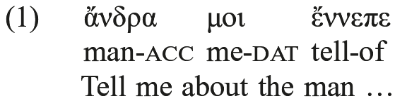

as evidence for OV, although it seems obvious that ἄνδρα, as the first word of the whole epos, is in a highly marked position: it probably occupies a discourse functional slot in the left periphery. Both authors rely heavily on Greenbergian implicational universals (like postpositions implied by OV or preceding conjunctions implied by VO). Since pure tokens of the types Greenberg proposed scarcely exist, results derived from implicational universals have to be treated with caution (cf. Hock 1992).

With the advent of generative syntax, a different approach came into play: seemingly aberrant word-order patterns were analyzed as a product of the interplay between basic word order and highly restricted dislocations, so that the dispute between Lehmann and Friedrich could be settled: Krisch (1997: 302 ff.) showed that (most of) Friedrich’s SVO-sentences are best understood as sentences with right dislocated constituents. Another truth that emerged with a systematic treatment of dislocations is the fact that none of the attested IE languages has free word order. They are all configurational, as is PIE (cf. Krisch 1998 and Devine and Stephens 2000, 2006, who argue for grades of configurationality). As the problem of basic PIE word order seems to be solved, the interest in current studies in IE word order has shifted to a phenomenology of dislocations and the factors that trigger them (cf. for example Kiparsky 1995 and Krisch 1997).

The generative approach advances our understanding of word-order issues substantially. Still, a small caveat is in order: since dislocations are not marked as such in the linear sequence of syntactic objects in the sentence, they can only be hypothesized. This means that for any sentence with <i>n</i> constituents, we may assume at least <i>n</i> different dislocations. Cf. the following Vedic example taken from Krisch (1990: 77):

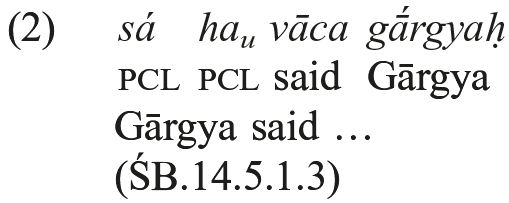

If we follow Krisch (1990: 77) and take <i>sá</i> as a sentence-initial particle (it might as well be a pronoun as in [12] below), there are three possibilities for analyzing the linearization of this sentence: 1. It displays the canonical word order. This solution is not advocated by anyone, as the low frequency of verb-initial sentences in Vedic makes VS(O) as the basic pattern highly implausible. 2. The canonical word order is SV and the verb is dislocated. This analysis goes back to Wackernagel (1892: 434), who takes the verb as being enclitic. Alternatively it could be derived following assumptions made by Dressler (1969), who argues that the verb can be dislocated for information structural reasons. In this case, it is not enclitic. 3. The subject is dislocated to the right. This analysis is advocated by Krisch (1990: 77), who takes the subject in Vedic as an “Apposition zu diesem impliziten Subjekt [apposition to this implicit subject]” encoded in the verbal ending. Being an apposition the subject can be extraposed to form an amplified sentence in the sense of Gonda (1959) (the dislocation types mentioned will be discussed in due course). None of these analyses can be falsified, but as mentioned earlier the first is highly implausible, whereas the second and third are not.

Coming back to basic word order, we may follow Krisch’s aforementioned reassessment of Friedrich’s data and conclude that PIE was of the SOV type (cf. Krisch 1997: 301−303, 2001). As Hock (2013) has shown, the attested subordination strategies of the early IE languages confirm this picture. It is further strengthened by the fact that main clause verbs bear no stress (Hock 2012, 2013). If we take dislocation patterns into account, we find evidence that SOV is the canonical word order in Old Latin and the Sabellic languages, the Old Indo-Aryan languages and Hittite; cf. Bauer (1995) for Latin, Luraghi (1990) for Hittite, and Delbrück (1888) for Vedic. Typical SOV phenomena like the preference for postpositions (cf. Lehmann 1993) confirm this picture. Despite the convincing evidence for SOV, however, it should be pointed out that one important IE language does not fit the picture: Ancient Greek. The canonical word order of alphabetic Greek is disputed (cf. Kieckers 1911; Frisk 1933; James 1960 and Cervin 1990; Dik 1995, 2007), and even the word order of Mycenean does not provide any conclusive evidence for canonical patterns (Panagl 1999; Babič 1997; Duhoux 1975). SVO prevails and can hardly be attributed to information packaging in an underlyingly configurational SOV language (against Krisch 2001: 165−166). It seems possible that Greek developed into a discourse-configurational language (cf. Dik 1995 and Matić 2003).

SOV reflects a structure of the type [S[NP VP]] (for the core sentence). As both the subject NP and the VP can be identified by constituent tests (on which see 4), the configurational nature of early IE (and PIE) syntax is evident (construction-like “Satzbaupläne” à la Krisch 2001, 2002, however, are unnecessary). Deviations from the basic pattern are discussed below.

### 3.2. The left periphery

The left periphery is that part of the sentence that precedes the subject in its canonical position in the linearization. Structurally speaking, it can be identified with a D[iscourse] F[unctional] node (Keydana 2011a) or an E[xpression] node (Lowe 2015) and an optional C-projection dominating the core sentence. The left periphery of the IE sentence is of special interest, as it is a preferred slot for dislocations.

#### 3.2.1. Wh and Comp

Wh-words in all ancient IE languages typically undergo left dislocation (cf. Hale 1987: 43 and Hettrich 1988 for Vedic; Garrett 1994: 43−49 and Lühr 2001 for Hittite). As Wh-words co-occur with material left-dislocated for discourse functional reasons (Hale 1987: 43−44), they should not be confused with topics or foci (as is done in Krisch 1998: 361, 2002). Wh-words and complementizers follow syntactic objects in the DF-slot and precede the core sentence. Against Kiparsky (1995: 153), it therefore seems reasonable to follow Krisch (1998: 358) and assume a C-projection for PIE. Keydana (2011a) argues that, at least in Vedic, subject Wh-words also undergo dislocation.

Complementizers can be found in all ancient IE languages. On subordinate sentences, cf. 9.2.

#### 3.2.2. Discourse-prominent elements

PIE had a slot in the left periphery that hosted a discourse prominent element. In most cases, this slot is occupied by one word only and the rest of the constituent remains <i>in situ</i>, but cases with full constituents in the left periphery exist (cf. Hale 1987: 44). The distribution of full constituents versus single words remains a field for further research.

This slot is often called the topic-position, but as Keydana (2011a) and Spevak (2010) have shown for Vedic and Latin, it hosted topics and foci alike. Therefore, it may tentatively be called the DF slot. There is no evidence for separate topic and focus-slots in the left periphery as assumed by Kiparsky (1995: 153) (who was forced to reckon with two distinct slots, as he dismissed a C-projection for PIE and still wanted to account for sentences with both a discourse prominent constituent and a Wh-word in the left periphery). As was argued in Keydana (2011a) for Vedic, the left periphery is obligatory. It should be remembered that this observation does not imply that foci and/or topics have to be dislocated. They may just as well be realized in a neutral position (cf. for Latin Devine and Stephens 2006: 226 ff.).

Speyer (2009) has shown that in Greek, Latin, and Germanic there is a strong preference to fill the DF-slot with frame-building elements.

#### 3.2.3. The verb in the left periphery

In his seminal work on verb-initial sentences in IE, Dressler (1969) argues convincingly that verbs in sentence-initial position are restricted to “textuell gebundene Sätze [textually bound sentences]”, where the fronting “is roughly associated with salience” (Klein 1991: 125; cf. also Luraghi 1994, 1995). Anaphoric or, to a lesser extent, cataphoric use is typical. For an extensive study of Vedic data, cf. Klein (1991), who refines and confirms Dressler’s conclusions. For Mycenean, cf. Panagl (1999: 489); for Hittite, Bauer (2011). Viti (2008) proposes that the initial position of the verb in Vedic and Homeric Greek marks thetic sentences. However, her notion of “thesis” − though promising − is ill-defined, which makes it impossible to decide if the data discussed in her paper are actually pertinent.

Krisch extends the notion of verb movement to subsume cases of verb second (but cf. Schäufele 1991a). According to him, verb movement to both initial and second position are a means of establishing cohesion (cf. Krisch 1997, 2001, 2002). Krisch’s argument is convincing, as cases like the following with a Wackernagel clitic of type 1 (cf. below) hosted by the verb show that the verb in second position can actually be part of the left periphery.

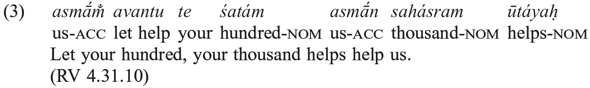

Following Krisch (1997: 299, 2001), I assume that the verb in these cases is in the C⁰ position. This analysis predicts that verbs in this position cannot co-occur with complementizers.

### 3.3. The right periphery

The right periphery is that part of a sentence following the base position of the verb in the linearization of the sentence. Gonda (1959) calls sentences with a filled right periphery “amplified”, as according to the author, syntactic objects in the right periphery are never obligatory (cf. also Schäufele 1991a). Gonda (1959) gave ample evidence for right dislocations in Vedic; for Hittite, cf. McCone (1979, 1997); for Greek, Krisch (1997: 304− 306). Krisch (1997: 305) shows that at least part of the data can be understood as heavy XP shift. Cf.

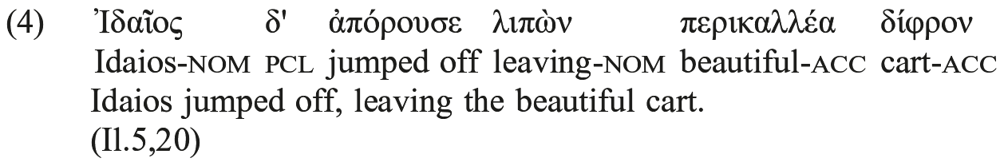

Several questions remain open: first, a precise definition of amplification is needed, as the dislocated elements may be adjuncts, parts of bigger constituents, or even subjects (cf. the somewhat startling conclusion of Schäufele 1991a: 191 for Vedic that, “apart from sentential particles etc., any single ‘constituent’ can be extraposed”):

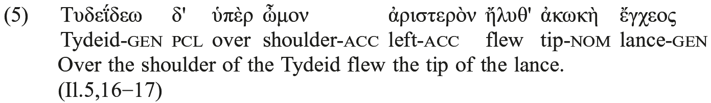

Against Krisch (1997: 304), it seems unreasonable to claim that the subject is “grammatisch schon im Verb enthalten, also nicht obligatorisch [grammatically included in the verb already, and therefore not obligatory].” From a syntactic point of view, the subject is obligatory at least on some level of syntactic representation (and there is no point in assuming that ἀκωκὴ ἔγχεος is an apposition to a latent subject), and from a semantic point of view, it is necessary as it introduces a discourse referent and a condition on this referent both of which are crucial for interpreting the sentence. In the given example (taken from Krisch), the dislocated subject cannot therefore count as an amplifier in the sense of Gonda (1959). Its dislocation may rather be due to the fact that it is a complex NP that counts as heavy. This obviously leads to the second question: How can heavy XP be defined for ancient IE languages and PIE? What kind of heaviness counts, mere size or syntactic complexity? If amplification and heaviness both lead to right dislocation, it might be worth investigating whether the two concepts could possibly be conflated.

One last issue concerns the discourse structural state of right dislocations. Krisch (1997: 306) assumes that, at least in Greek, obligatory syntactic objects can only be dislocated to the right if they are “stark rhematisch [strongly rhematic]” (cf. his examples 30−34). This constraint is somewhat problematic, as in the absence of clear heuristics, it may be hard to decide what exactly a strong rheme is, but it certainly invites further research into the interaction of syntactic and discourse grammatical factors in right dislocation phenomena.

### 3.4. Wackernagel positions

Wackernagel’s Law is “one of the few generally accepted syntactic statements about Indo-European” (Watkins 1964: 1036). Wackernagel (WL) clitics (cf. Wackernagel 1892) are non-accented syntactic objects that always occupy the second position in the sentence. Two types of WL clitics have to be distinguished; a third type does not belong to WL clitics proper.

#### 3.4.1. Type 1

WL1 clitics always follow the first word in a sentence except for cases where a Wh-word or complementizer is preceded by a filled DF-slot. In this case they follow the Wh-word. Cf.

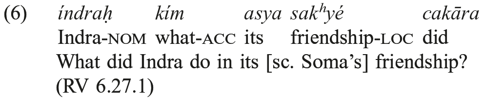

Hale (1987) was the first to tackle this problem from a generative perspective. He concluded that “WL clitics take second position <i>defined before the topicalization</i>, but after WH-movement places <i>ká-</i> in COMP” (Hale 1987: 42). Examples with WL1 clitics following a constituent that clearly occupies the DF-slot (for example <i>dyaúś cid asya</i> in RV 1.52.10) constitute evidence against Hale’s derivational approach. Hale (1996) put forth another explanation. He assumed that WL1 clitics move to C⁰ and undergo prosodic inversion if necessary. Similarly, Lowe (2011) assumes for Vedic a syntactic constituent C[litic]CL[uster] which undergoes prosodic inversion as a last resort and has a flat structure reminiscent of a template which comprises not only WL1 clitics but also preverbs and relative pronouns. Hock (1996) dismisses syntactic approaches to WL1 clitics and advocates a templatic account for the whole “initial string” including clitics and accented material alike. His template is descriptively adequate, but because of various provisos taken (omission and doubling of elements in the template), it is too powerful to achieve explanatory adequacy. Keydana (2011a) combines insights from Hale and Hock: He too argues that WL1 cliticization is a prosodic phenomenon, but in Keydana’s approach only clitic placement is driven by prosody, whereas the linearization of non-clitic elements in the left periphery is determined by syntactic structure. Following Keydana, WL1 clitics are hosted by the first prosodic phrase of a sentence, which corresponds to the (syntactically defined) left periphery.

#### 3.4.2. Type 2

WL2 clitics follow an obvious pattern: they are always hosted by the first word of a sentence.

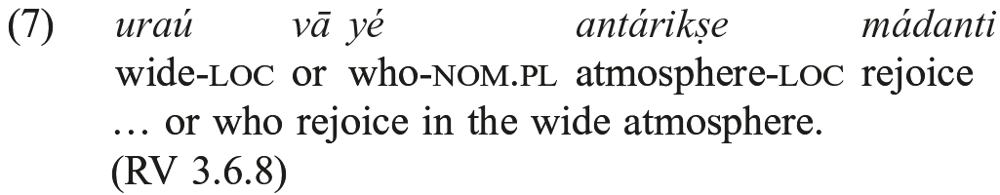

This behavior again can be modeled syntactically (Hale 1987) or prosodically (Hock 1996; Agbayani and Golston 2010; Lowe 2011; Keydana 2011a). The latter approach is less costly, as prosodic dependency is an obvious trait of WL clitics, whereas syntactical dependencies cannot be proven empirically.

Krisch’s approach to WL clitics is based on the assumption of “Satzbaupläne” or “Schemata” (Krisch 1990, 1997, 2002). Blurring the distinction between WL1 and WL2 and operating with ill-defined construction-like entities, it runs into serious descriptive and theoretical difficulties and will not be discussed here (for an assessment, cf. Keydana 2011a).

#### 3.4.3. Type 3

WL3 clitics (for example, Vedic <i>cid</i>) have to be excluded from the realm of WL clitics proper (cf. Krisch 1990: 65). A member of this class is “enclitic to the constituent which it modifies/ emphasizes” (Hale 1987: 45). The linearization is trivial, as the scope of the particle could not be reconstructed if it were moved out of its constituent: Clitics that are subject to some recoverability condition cannot be WL clitics. Their occurrence in second position in the sentence is due to the fact that they modify words in the DF-slot.

#### 3.4.4. Identifying the core sentence

Krisch (2002: 252) claims that WL clitics can help us identify the core sentence (“Kern-satz”): Even if Krisch is wrong in assuming that “[w]enn Wackernagelsche Partikeln da sind, handelt es sich bei dem Teil links davon auf jeden Fall um topikalisierte Elemente [if Wackernagel particles are present, topicalized elements are in the part to the left of them in each case],” his general premise is correct: placed after the first prosodic phrase of a sentence, WL1 clitics indirectly mark the left boundary of the core sentence S. They can also serve as a diagnostic tool for identifying the syntactic status of embedded nonfinite structures such as infinitive phrases, as every phrase containing a WL1 clitic must have a left periphery; in other words, it must be a CP or at least a full S licensing a DF-slot.

The right periphery is less suitable for diagnosing sentence structure, as every sentence with a non-final verb allows for two competing analyses (cf. 2 above): either the verb has moved to the left periphery, or some other syntactic object has moved to the right periphery. As unambiguous markers denoting the boundary of the right periphery do not exist, a principled decision between the two alternatives is impossible.

### 3.5. Ditransitives

Vedic double object constructions have been studied by Krisch (1994). He observes that the indirect object does not necessarily precede the direct object. He argues for the direct object following the indirect object as the unmarked linearization. Preceding direct objects are licensed only when the direct object is not rhematic.

On double object constructions cf. 5.

### 3.6. Scrambling

Scrambling may be defined as free word order phenomena inside the core sentence that remains after stripping away the left and right periphery. Speyer (2009) for Latin and Germanic, Schäufele (1991a and 1991b) for Vedic, and Haug (2008) for Greek suggest that scrambling may be due to information structuring (as is at least partially true for German, too). Further research is needed to back up this claim. On scrambling in Latin and ways of investigating scrambling phenomena in ancient languages, cf. Devine and Stephens (2006).

## 4. The structure of XPs

As this topic has not yet been seriously investigated, we know almost nothing about the structure and possible complexity of IE XPs. Constituent tests (conjunction, dislocation) reveal the existence of NPs and VPs in the early IE languages (on the methodology see Lowe 2015). On the CP see above 3.2.1. Only the NP has been studied in greater detail. There is no empirical evidence for constituents like IP, DP, <i>vel sim</i>. Consequently they are not addressed in the following sketch.

### 4.1. The structure of NPs

Since determiners are not obligatory and no other empirical evidence for DPs has yet been given, we assume a simple NP structure for PIE. Hints at the internal structure of Vedic NPs can be found in Keydana (2013), who in an investigation into event nominals in the language of the Rigveda observed that no more than one argument of the event nominal can be realized in the NP (cf. below 5.2.2).

Adjectives agree with nouns in the NP, the only exception being nouns in the dual, which are combined with adjectives in the plural (cf. Viti 2011 and Lühr 2000b with examples from Greek and Lithuanian), obviously due to a later development. The serialization of modifier and head noun is open to variation. Old juxtapositions like Vedic <i>dámpati-</i> (besides <i>pátir dán</i>), Avestan <i>də̄ṇg paiti-</i>, Greek δεσπότης < PIE *<i>déms póti</i>may be taken as a hint that the modifier preceded the noun in PIE (on Greek, see Viti 2009b).

Hyperbata are the result of dislocations out of NPs. Material may be dislocated to the left into the DF-slot or to the right. While the target slots of these dislocations are easily named, the process as such is not yet understood: Neither do we know what exactly triggers right dislocation, nor are we in a position to identify factors for and possible constraints on extracting material out of NPs (but cf. Krisch 1998: 374). For examples of hyperbata in ancient IE languages, cf. Krisch (1998); for an in-depth study of Greek hyperbata, cf. Devine and Stephens (2000). It remains to be seen if hyperbaton may be reduced to the more general phenomenon of left branch extraction (cf. Ross 1986).

### 4.2. The structure of VPs

The structure of VPs depends mainly on the subcategorization frame of the verb. The various attested types are discussed below in 5.2.

### 4.3. Verbal agreement

In all ancient IE languages, the finite verb agrees with the subject. In some ancient IE languages, like Greek, Hittite, and Avestan, we observe that number agreement fails with plural subjects of the neuter gender. This is either due to persistence in the grammaticalization process turning a collective affix into a plural marker or to the fact that inanimate nouns do not necessarily trigger verbal agreement (Melchert 2011). In most ancient IE languages, incongruencies can also be observed with the dual, but these phenomena seem to be based on developments within the attested languages (cf. Lühr 2000b). For an overview of various IE agreement patterns, see also Rieken and Widmer (2014).

### 4.4. Adverbs and preverbs

The ancient IE languages have a closed set of (mostly monosyllabic) local adverbs that can with confidence be reconstructed for PIE and which − as dislocation tests show − were part of the VP. The exact status of these adverbs, however, is a matter of debate. They often occur in postposition-like configurations, where they follow an NP which they seem to govern. There are two reasons for addressing them as actual postpositions governing NPs in a PP: 1. They form a closed set, which is typical for adpositions, but not for adverbs. 2. At least in later strata of the IE languages, they definitely qualify as adpositions.

However, other observations cast doubt on the PP-analysis: 1. In ancient IE languages with rich case systems, the NP they allegedly govern is always marked for a case, which, being inherent, is in itself associated with the intended local role in the argument structure (cf. below). Lexical case selected by the adposition is obviously a later development (cf. for Vedic Hettrich 1991). 2. The NP is not necessarily adjacent to its alleged governor, which typically immediately precedes the verb (cf. Watkins 1963).

Further evidence against PIE postpositions comes from the fact that the same closed set of adverbs can be used to modify verbs. In the attested IE languages they developed into preverbs, but in the most ancient strata they were autonomous, since in a so-called tmesis configuration they did not form a morphological word with the verb they modified (cf. Hettrich 1991; Pinault 1995; and Haug 2011).

Since in both contexts these local adverbs do not seem to be heads of complex projections (neither of PPs nor of morphologically complex verbs), it seems safe to take them as simple adverbs throughout (cf. Boley 1985 and Tjerkstra 1999 for Hittite; Horrocks 1981 and Haug 2009 for Greek; Lehmann 1983 for Latin; and for Vedic, a series of papers by Hettrich <i>et al</i>., e.g., Hettrich 1991 and Casaretto 2010).

## 5. Case

### 5.1. Traditional approaches to case

Case has been studied extensively since the groundbreaking work of Delbrück (1869, 1888, 1897) and Gaedicke (1880). The central aim of traditional studies of case is to isolate the prime semantics of a given case, which is subsequently identified with its original meaning. Uses not covered by the prime semantics are taken to be marked functions of the case derived from its core function. The most prominent exponent of this line of research today is Hettrich, who in a series of papers on Vedic developed what he calls a semasiological approach to case (Hettrich 1990, 1994, 2002, 2007). Hettrich’s research is based on three assumptions: 1. Only a semasiological approach can lead to an adequate picture of the function of a given case. 2. The meaning of cases can best be covered by prototype semantics. Hettrich argues for a prototypical or core meaning, which becomes less prominent the more marked the use of a case is. In his paper on the instrumental (Hettrich 2002), he takes the various aspects of meaning to be features. 3. (Nearly) every occurrence of a given case must be based on its meaning. Even if he acknowledges syntactic factors for case selection, a case is hardly ever desemanticized completely. This approach faces various difficulties. One concerns semasiology: Since we can never go beyond philological interpretation, the proposed semantic features tend to be arbitrary. In Hettrich (2002), the author tries to capture the difference between <i>vah ráthena</i> and <i>vah ráthe</i> by assuming a semantic feature “manageability”. According to Hettrich, both the instrumental and the locative denote a means (of transport), the choice of the latter being due to the fact that because of its size a cart is no “handhabbare[s] Mittel [manageable means]” (Hettrich 2002: 55).

As Vedic is a dead language, this analysis cannot be falsified; but immediately an alternative comes to mind: in the two constructions at hand, instrumental and locative might denote different, nonoverlapping, and discrete thematic roles. This phenomenon, known in the syntactic literature as alternative projection, goes back to the fact that the human mind has (at least) two possibilities to conceptualize one and the same event of cart-riding. The cart can be taken as a means of transport or as the place occupied while traveling. The first conceptual structure is expressed by the instrumental, the second by the locative. In this scenario, the optionality is not part of the language (or the case system); it simply manifests different ways of conceptualizing the world. The feature “manageability” is therefore dispensable (cf. below 5.3 on the strikingly similar problem with the “deux modèles” of Haudry 1977).

Further difficulties for the traditional approach arise from the fact that certain data force us to separate argument structure from case (cf. the following section).

### 5.2. Argument structure and case

Following major insights into the interplay of argument structure and case gained in recent studies in a generative framework, I will here pursue a different approach, which is similar though not identical to the one first introduced into the realm of IE studies by Krisch (1984) (cf. Krisch 2006 and, for an early attempt, Dressler 1971: 10−13). The fundamental hypothesis of modern approaches to case is that the levels of case and thematic roles (the traditional semantics of cases) have to be kept strictly distinct. They form discrete tiers linked by grammar. I will distinguish conceptual structure (not to be discussed in this overview), argument structure, and the syntactic level, where case is assigned.

#### 5.2.1. Evidence for argument structure

Empirical evidence for the necessity of discerning discrete tiers comes from different types of intransitives. In the ancient IE languages, unergatives like PIE *<i>gʷem</i> and unaccusatives like PIE *<i>bʰᵘ̯ᵉʰ₂</i> are attested side by side. Both types have nominative subjects, yet they differ in crucial ways that cannot be accounted for by a monostratal theory: Only unaccusatives allow for attributive deverbal <i>-tó</i>-adjectives, only unergatives on the other hand are attested with cognate object constructions (cf. Garrett 1996 on Hittite; Bruno 2011 on Greek; and Keydana (in press) on Vedic). This difference is easily captured (and even predicted) by recourse to argument structure: unergatives are subcategorized for an agent, unaccusatives (like passives) for a theme (on thematic roles cf. Dowty 1991). As both thematic roles surface in the same case, a monostratal theory could in no way account for these differences.

This approach is strengthened further by observations on the distribution of case. A major problem for the traditional semantic approach comes from the difficulty of assigning a plausible core meaning to a given case. A striking example is the nominative, which may denote at least agents, themes, and experiencers. Subsuming this broad spectrum under the notion of “Sachverhaltsträger” (Hettrich 2007) is not necessarily convincing, especially as the notion of “Sachverhaltsträger” is not properly defined. Another example for the difficulties of the traditional approach is the accusative: Hettrich (2007) claims that it “bezeichnet eine gerichtete Strecke, die vom SV-Träger ausgeht und deren Endpunkt, Ausdehnung oder Verlauf von dem Begriff im A bestimmt wird [denotes a directed path that comes from the <i>Sachverhaltsträger</i> and of which the endpoint, extent, or course is determined by the term in A].” This is a possible characterization of the directive accusative, but severe semantic bleachings are necessary to turn it into the object accusative in an example like Vedic

<table>
<tr><td>(8)</td><td><i>áhann</i></td><td><i>áhim</i></td></tr>
<tr><td></td><td>slew</td><td>dragon-ACC</td></tr>
<tr><td></td><td colspan="2">He slew the dragon.</td></tr>
<tr><td></td><td colspan="2">(RV 1.32.1 and passim)</td></tr>
</table>

Looking at nominatives and accusatives, a striking empirical generalization arises: One case can be linked to various discrete thematic roles, and one thematic role can be assigned to various discrete cases. In dealing with the interaction of argument structure and case, three types of case have to be distinguished: structural case, inherent case, and lexical case. All of them are manifest in the early IE languages. They must therefore be assumed for PIE, too.

#### 5.2.2. Structural case

Structural case is assigned solely for syntactic reasons. Its association with a thematic role is arbitrary. The structural cases in the IE languages are the nominative, the accusative, and the genitive. The nominative is the case syntactically assigned to the first (or external) argument of a verb in the subject position, independent of the underlying thematic role (cf. the active/passive alternation). The object accusative is syntactically assigned to the second (or internal) argument of a verb. In most cases, this is the theme, but again the linking between role and case remains arbitrary (it serves “lediglich zur Ergänzung des Verbs [merely as the complement of the verb]” in the words of Delbrück 1879: 29). The dependence of the object accusative on syntactic configurations alone can be seen from the active/passive alternation (the passive is attested in the early IE languages, however, special morphological markers for passive voice cannot be reconstructed, cf. Kulikov and Lavidas 2013): Demoting the first argument always leads to a configuration in which the internal argument surfaces as a nominative subject. The same holds true for anticausatives (Kulikov 2012: 20−21). The (possessive) genitive is the structural (subject) case in the NP-domain. At least for Vedic, an investigation into event nominals (Keydana 2013) showed that the genitive is always assigned to the sister of N. The data suggest that with event nominals only one argument can be expressed and that this argument always surfaces as a genitive, independently of its thematic role (cf. also Dressler 1971: 10).

#### 5.2.3. Inherent case

Inherent cases are inherently associated with some thematic role. The goal accusative (García Ramón 1995) is a case in point. Following a long tradition, Hettrich (2007) tries to unify goal accusative and object accusative. But observations on passivization advise caution: if the goal accusative were basically the same as the object accusative, both should behave alike syntactically. Yet they do not: object accusatives can be passivized, goal accusatives cannot. In the framework proposed here, the reason for this is simple: being inherently linked to the GOAL-role, the directional accusative does not surface as a nominative under passivization, as inherent linking cannot be ousted by syntactic case assignment. Whatever reasons lead to the homonymy of structural object case and inherent goal accusative, in the attested IE languages these two avatars of the accusative are discrete and have to be kept apart. We may conclude that this holds true for PIE, as well.

According to Hettrich (1994: 112−113), a major challenge for any structural approach to case comes from double accusatives: “Wenn die Kasus in der Kernprädikation nur der Differenzierung von Aktanten dienen, dürfte ein bestimmter Kasus nicht zweimal vorkommen [If the cases in the core predicate serve only to differentiate the participants, a particular case would not be likely to occur twice].” But as his excellent survey of Greek and Vedic data shows, the opposite is the case: his examples clearly hint at the validity of an approach distinguishing structural and inherent case. Verbs of ‘taking away’ in Homeric Greek often take two accusatives, one denoting the object taken away and one the person or location from which the object is taken. As Hettrich (1994: 115) notes, the syntactic behaviors of both accusatives differ: reduced constructions with only one accusative always lack that of the person or location, and in passivization only the object taken away may surface in subject position. This is predicted in the approach defended here. Being the theme, the object taken away is associated with structural case depending on the syntactic configuration. The person or location takes inherent goal accusative; its inability to passivize then is expected. Besides, constructions lacking the GOAL show that it is not part of the subcategorization of the verb. In Vedic (and for the Greek verb συλάω ‘I strip off’), the picture is slightly more complicated, as complement alternation can be observed. This is either due to argument demotion or to the fact that one and the same event may be conceptualized differently. However, the data again confirm the distinction between structural and inherent case, which is further strengthened by the fact that passivization of double accusative constructions never leads to double nominatives.

Another case with a structural and an inherent avatar is the genitive. Besides being the subject case in NPs (cf. above), it functions as a partitive. The partitive is of special interest as it can override structural case marking: partitive genitives are attested in subject and object position.

The dative is the default case for the third argument, the BENEFICIARY, in double object constructions. As it cannot undergo passivization in the old IE languages, however, it seems apt to assume that it is inherently linked to the BENEFICIARY-role. Pending further investigations, I conclude that it is an inherent case. As is true for many other languages, the dative of the old IE languages covers both BENEFICIARY and EXPERIENCER, two roles that might ultimately be linked.

<!-- source-file: content/14_chapter08_10.xhtml -->

Other inherent cases are the instrumental, the locative, and the ablative. They all are associated with fixed thematic roles. For an excellent overview of the Vedic data, cf. Hettrich (1995, 2002, 2007).

#### 5.2.4. Lexical case

The third type of case that can be found in old IE languages and should hence be reconstructed for PIE, is lexical case. Lexical case is idiosyncratic. It is lexically selected and licensed by lexical heads. This is most obvious in non-predictable case-assignments in the subcategorization frames of verbs, for example in the genitive assigned to the theme of Greek κελεύω ‘I order’ or the case assigned to the theme of Vedic <i>karⁱ</i> ‘commemorate, reflect upon with praise’ (data on verbal subcategorization in Vedic can be found in Hettrich 2007). In these instances, searching for an original motivation for the selection of a given case is futile: as lexical case exists in all attested languages, assuming a different situation for PIE would amount to glottogonic speculation.

### 5.3. Further topics in the study of IE case

As most cases that can be reconstructed for PIE have various functions in the attested languages, it seems feasible to ask for the “Ursprungsbedeutung” or source meaning, as do Delbrück (1893) and various later scholars. However, this quest seems to be rather futile. A case in point is the instrumental, which is attested with instrumental and sociative meaning (for the instrumental of the agent with passives cf. Jamison 1979ab and Luraghi 1986b). While some authors are reluctant to assign one proto-meaning to the instrumental (Delbrück 1888: 122 opts for the rather general description of a “Begriff, welcher mit dem in Thätigkeit befindlichen Hauptbegriff zusammen ist [concept, which is in union with the main concept found in the activity]”, whereas Hettrich 2002: 46 restricts himself to a mere synchronic statement concerning Vedic, where according to him the instrumental proper is the prime function), others argue that in PIE the instrumental was associated with the role of the instrument only, the sociative being a later development. However, in a careful study Strunk (1993: 859) has shown that this question cannot be decided upon, as “zumindest in seiner Rolle als ‘Soziativ’ muß schon der vorgeschichtliche Instrumental auch auf belebte Wesen anwendbar gewesen sein [at least in its roll as ‘Sociative’, the prehistoric Instrumental also must already have been applicable to living beings]”. The claim of Haudry (1977) that the instrumental was originally the object case can be dismissed (cf. Cardona 1979). The complement alternation observed by the author is either a case of argument demotion (cf. the <i>spray</i>/<i>load-</i>alternation in English) or of alternative projection.

This matter is further illustrated by the genitive, which has the two functions described above, viz. the partitive and that of denoting the subject in NPs. Authors like Delbrück (1893) or Serbat (1992) argue for the precedence of the partitive function. Serbat (1992: 289−290) explains the development of the structural genitive as a reanalysis in which partitivity still persists even in NPs like Latin <i>equus consulis</i>. Stipulations like these are meaningless, though, since both functions, the partitive and the structural one, are attested in the earliest strata of the ancient IE languages: external reconstruction therefore cannot decide on the priority of one over the other.

As for the accusative, most authors take the function associated with goal to be oldest (cf. Hettrich 1994; Hewson and Bubenik 2006), based on a tendency to take developments from concrete to abstract as more plausible than vice versa; de Boel (1988) argues against this and states that at least in Homeric Greek, the goal accusative is a later development.

Many early IE languages show case syncretism. As in most of them remnants of more complex case systems can be found (cf. Delbrück 1907; Hettrich 1985; Luraghi 1986a; and the rather enigmatic Hewson and Bubenik 2006), it cannot be doubted that the PIE case system was as rich as that of Vedic, even if some of the inherent cases may have been heavily restricted as to gender and number (cf. Risch 1980).

One last issue to be mentioned here is a peculiarity of the vocative: in invocations with more than one addressee in Vedic, Avestan, and Homeric Greek, only the first word occurs in the vocative, the one after it bears nominative case (cf. Vedic <i>vā´yav índraś ca</i> ‘Vāyu and Indra!’ and Homeric Ζεῦπάτερ… Ἠέλιός θ’ ‘Father Zeus and sun!’). Cf. Zwolanek (1970).

For a discussion of possible pre-IE case systems cf. 2 above.

## 6. Latent arguments

Latent arguments exist in all ancient IE languages. They should therefore also be reconstructed for PIE. Evidence for latent subjects and objects as well as descriptions of their distribution can be found in Luraghi (1997, 2003), Keydana (2009), and Keydana and Luraghi (2013). Latent arguments can be used with generic reference as well as anaphorically. The special case of latent subjects of infinitive phrases has been examined by Keydana (2013) for Early Vedic. Control is discussed in 9.3 below.

## 7. Binding

Binding has up to now not been studied from an IE perspective (in her study of anaphoric pronouns in Vedic, Kupfer 2002 is concerned with pronouns bound by a non-local antecedent only; in her extensive study of Gothic reflexives, Ferraresi 2005: 77−124 examines differences in word order between <i>sik</i> and <i>sik silban</i>, but not binding). Speyer (in press) discusses binding in early Attic. He concludes that only complex reflexives are bound by a local (i.e. sentence-internal) antecedent. Morphologically simple ones are predominantly used in local binding configurations, but they may occur with non-local binding, too. Vedic seems to be similar, as the possessive reflexive again is not restricted to local binding contexts (only <i>svayám</i> is always reflexive). Cf.

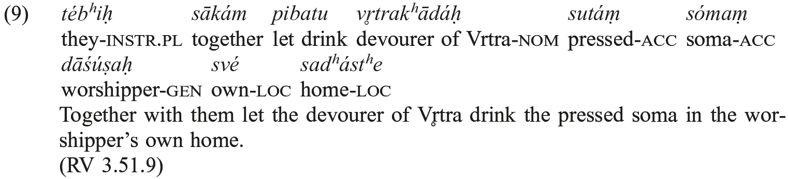

It seems reasonable to conclude that in the early IE languages − and probably PIE, too − local binding was not a grammatical constraint. Rather, the early IE languages seem to fit nicely into a picture developed by Levinson (2000: 347−348), who distinguishes three stages in the development of reflexives (cf. also Mattausch 2004). Stage one languages have only one sort of anaphora; non-local binding is preferred, but merely on pragmatic grounds. Stage two languages have emphatic pronouns, which gradually replace regular pronouns in locally bound contexts. Stage three finally has fully developed reflexives, which are historically derived from emphatics. Although it is impossible to show that PIE *<i>su̯o-</i> (and probably *<i>se</i>) was originally an emphatic pronoun, PIE and its daughters seem to be stage two languages: they have a pronoun that is predominantly used in reflexive contexts. Other pronouns typically occur as non-local anaphors, but may also be used in reflexive contexts. In other words, binding in PIE and the early IE languages was probably a pragmatic phenomenon and not fully grammaticalized. This picture is confirmed by the study of Viti (2009c) of the distribution of anaphors and reflexives in Latin and Ancient Greek. However, further investigations into binding in the ancient IE languages are necessary in order to evaluate this proposal.

The role of logophoricity and the possibility of long distance anaphora in the oldest IE languages have not yet been studied (but cf. again Speyer in press for Attic).

## 8. Copula constructions

In the ancient IE languages, predicates of finite sentences do not obligatorily have to be verbs. Other possible predicates are nouns, adjectives, and adverbial phrases. These may be accompanied by a copula, but the copula is not mandatory: it can be omitted, especially in the present tense. An overview of the semantic types of predicative copula constructions in Vedic can be found in Keydana (2000). Balles (2006) argues for telic copula sentences in PIE based on *<i>-ih₁</i>-instrumentals and the verb *<i>dʰ</i>eh₁, which are reflected in the Vedic Cvi-forms and Latin verbs like <i>calefaciō</i>. Lühr (2007) extends the notion of copula to verbs like τυγχάνω construed with a present participle and shows that similar constructions can be found in Vedic, too. She takes them to be an inner-Vedic development marking progressivity.

A special type of copula construction is the expression of alienable possession with the so called <i>mihi est</i> construction in ancient IE languages like Latin, and, to a lesser degree, Greek, Vedic, Tocharian, and others. Cf. Benveniste (1960) and the data given by Bauer (2000: 197−221) (whose hypothesis that the <i>mihi est</i> construction dates back to a pre-IE layer is highly speculative). Barðdal and Smitherman (2013) reconstruct for PIE what they call the DAT-NOM-<i>is-known</i>-construction, consisting of the copula, a dative subject, and a verbal adjective from the root *<i>g̑neh₃</i>.

## 9. Subordination and embedding

If a syntactic structure is hierarchically connected to another syntactic structure and does not by itself constitute a well-formed utterance, it is called subordinate.

As Kiparsky (1995: 155) has shown, in the early IE languages two types of subordination were used. In the first type, the subordinate structure (typically a participial or infinitival phrase) is truly embedded: it fills an argument or modifier position in the embedding sentence. This type of subordination is clearly syntactical.

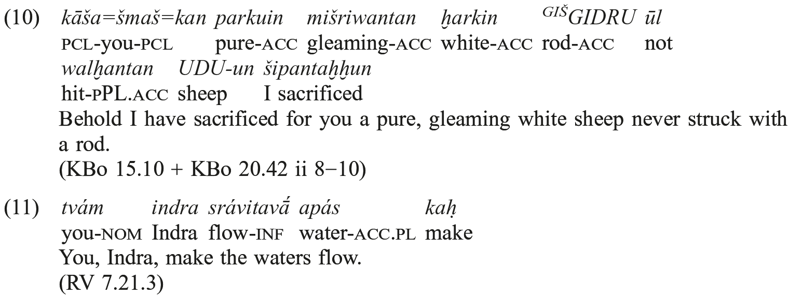

In the second type, the subordinate predication is finite. Finite subordinate clauses are adjoined to the clause they depend on (cf. for Hittite Garrett 1994 and Probert 2006, the latter claiming that adjunction is at least partly due to reanalysis and therefore a later development). They are typically coindexed with a correlative pronoun or adverb in argument or modifier position. Evidence for adjunction comes from the already mentioned obligatory correlatives and the fact that the head of a relative sentence often is part of it. Cf. the following example, taken from Lühr (2000a: 74):

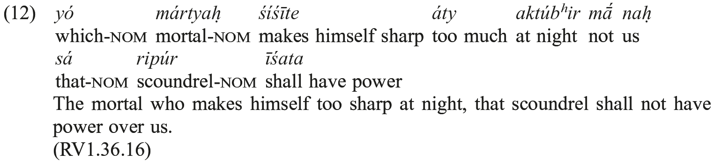

In this example, the argument position in the embedding sentence is filled by <i>sá</i> (with non-referential <i>ripúh</i>)<i>̣</i>, which is anaphoric to <i>yó mártyah ̣</i> in the relative clause. Similar structures occur with other types of subordination, where they are less dominant. Cf.

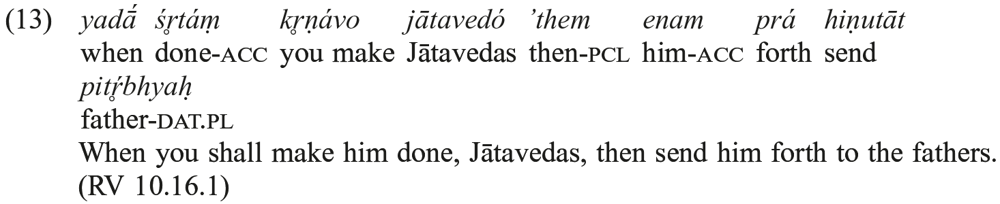

These sentences are not syntactically dominated by the embedding main clause; rather their dependency is possibly a matter of discourse grammar. Constructions of this type are frequent in Vedic, Hittite, and Old Latin (cf. Haudry 1973; Calboli 1987; Luraghi 1990). Although they are not prominent in Greek (not even in Mycenean, cf. Ruipérez 1997: 528−529), it seems plausible to reconstruct them − at least in the realm of relative clauses − for PIE.

In Vedic, subordinate sentences are marked by an accented finite verb in contrast to an unaccented one in main clauses. This pattern probably goes back to a rise in intonation indicating that the main clause is to follow (see Klein 1992; the claim of Lühr 2008 that Vedic verbal accent also marks, and even distinguishes, new information focus and contrastive focus, is untenable).

### 9.1. Relative clauses

All ancient IE languages have relative clauses, both in restrictive and appositive use (Held 1957; Hettrich 1988). R[estrictive]R[elative]S[entence]s restrict the reference of their head, which is typically part of the RRS. RRSs normally precede their main clause. As described above, their argument or modifier position in the main clause is filled by a correlative anaphoric pronoun. The linearization of main and subordinate clause comes as no surprise. To put it into the parlance of Discourse Representation Theory, it is the RRS which introduces the discourse referent and the prime condition on it (via the head). The identity condition is introduced by the anaphor in the main clause (this situation differs fundamentally from that in modern languages like German or English, where the identity condition comes with the relative; the term “präsupponierende Relativsätze [presupposing relative clauses]” coined by Lühr 2000a: 78 is therefore misleading). This sentence type occurs in Hittite, the Indo-Iranian languages, Greek, Latin and a few others, and it can confidently be reconstructed for PIE. As Hajnal (1997) argues, restrictive relative sentences were a means for marking definite determination.

A[ppositive]R[elative]S[entence]s add information about the referent of their head without restricting it further. As Hettrich (1988) shows for the language of the Rigveda, roughly 30% of the ARSs precede the embedding sentence, while 60% follow it. Referring to Lehmann (1980), Hettrich (1988) concludes that originally the ARS always followed, but evidence for this assumption is not available. On discourse structural grounds, one could argue that the serialization is of no importance for processing, so that it may always have been optional.

The reconstruction of the relative pronoun itself is more difficult: Hittite and Latin continue the *<i>kʷi</i>/<i>kʷo-</i>relative, other languages like Greek and Indo-Iranian show *<i>Hi̯o-</i>. No attested language uses both (although in Celtic, which continues *<i>kʷi-</i>/<i>kʷo-</i>, remnants of *<i>Hi̯o-</i> can be found, cf. Schmidt 1977a). The <i>communis opinio</i> follows Lehmann (1980) in assuming that *<i>kʷi-</i>/<i>kʷo-</i> was originally restricted to RRSs, while *<i>Hi̯o-</i> was used in ARSs (cf. Hettrich 1988: 744−790). This neat distinction is certainly very attractive, but Klein (1990: 90) correctly alluded to the fact that this “hypothesis, as it stands, is virtually unfalsifiable.”

Since Lehmann (1980), <i>communis opinio</i> has it that *<i>kʷi-</i>/<i>kʷo-</i> was originally an indefinite pronoun. As authors like Hettrich (1988: 505), Klein (1990: 90), and Hajnal (1997: 50) argue, the fact that it regularly occurs in second position betrays its origin as an enclitic indefinite. However, this interpretation of the linearization of Old Latin and Hittite relative sentences (where the relative pronoun always occupies second position in RRSs) is not compelling. Cf. the following examples:

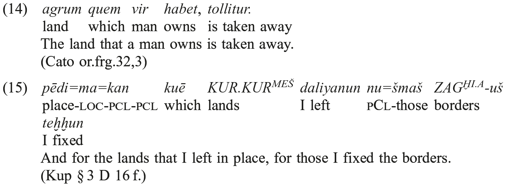

The word in initial position is obviously the most salient one in the sentence (cf. on Hittite Lühr 2001). We may conclude that it occupies the DF-slot identified above, while the relative pronoun is most probably in [Spec,CP]. Note that the same linearization is frequent in Vedic, which has a *<i>Hi̯o</i>-relative. In the scenario discussed here, this pronoun must have superseded the original *<i>kʷi-</i>/<i>kʷo-</i>, which some time before grew out of an indefinite pronoun. To account for the word order, one has to assume that second position was transmitted all the way from the indefinite to <i>yá-</i> at least optionally. This scenario certainly is possible, as persistence often prevails in grammaticalization processes, but it seems less costly to assume that in Vedic, too, the placement of the relative is determined by synchronic grammar. I conclude, then, that there is no evidence for the development of relative *<i>kʷi-</i>/<i>kʷo-</i> out of an indefinite pronoun. We should also bear in mind that such a development is not attested; rather the indefinite builds on the interrogative, cf. Latin <i>quisquis</i>, Hittite <i>kuiški</i>, or Vedic <i>káś cid</i>.

The origin of the *<i>Hi̯o</i>-relative is obscure. Viti (2007: 59) opts for anaphoric origin. However, the pronoun seems to be isolated in the PIE lexicon (cf. Hettrich 1988).

### 9.2. Subordinate clauses

A complementizer which might be of PIE origin is *<i>kʷe</i>. It is attested as a complementizer in subordinate sentences in Hittite -<i>(k)ku</i>, <i>takku</i> (cf. Eichner 1971), Vedic <i>ca</i> (cf. Klein 1985: 238 ff., 1990; Hettrich 1988: 250−260), Gothic <i>-h</i>, and maybe in Greek and Latin (cf. Wackernagel 1942; Wagner 1967). Szemerényi (1985), Hettrich (1988: 260), and others take this use of *<i>kʷe</i> to be of PIE origin. Klein (1990: 93), probably overestimating the triviality of turning a conjunction into a complementizer, argues for independent developments in the early IE languages. With Klein (1990: 93, fn.14) and against Szemerényi (1985), derivation from an instrumental relative *<i>kʷᵉʰ₁</i> is not likely. Correlative adverbs with <i>ca</i> are very rare in the Vedic data. The Hittite material confirms this observation: subordinating -<i>(k)ku</i> and <i>takku</i> are never taken up by a correlative in the embedding sentence.

Other complementizers developed out of relatives (Vedic <i>yád</i>, Greek ὅτι, Latin <i>cum</i>, <i>quod</i>, Hittite <i>kuit</i>, Old Church Slavonic <i>iže</i>, Gothic <i>þatei</i>, etc.). As they all show language-dependent idiosyncrasies, they must have developed in post-PIE times. Later developments like Russian <i>čto</i>, German <i>dass</i>, or English <i>that</i> are based on interrogatives or demonstratives in relative use.

### 9.3. Infinitives

Infinitives are attested in all early IE languages. The infinitive in *<i>-sen(i)</i>, which is based on a reanalysis of an event nominal, is clear evidence for the PIE age of the infinitive: For morphological and case-theoretical reasons, it cannot have developed independently in Greek and Vedic (Stüber 2000; Keydana 2013). Hence, the infinitive is old. As the case of the event nominalizations reanalyzed into infinitives in the early languages shows, they were originally used as adjuncts (see also Zehnder 2011). Keydana (2013) shows that their subject is always latent. Adjunct infinitives occur in two constructions in the old IE languages: purpose clauses (with free control of their subject) and rationale clauses (where the subject of the infinitive is always coreferent with the subject of the embedding sentence). Both types can be assumed for PIE, as well. The same holds true for the predicative infinitive (typically with a passive reading, see Holland 2011 for Hittite and Keydana 2013 for Vedic). Other uses of the infinitive such as the infinitive complement, the Accusativus cum Infinitivo (AcI), and the matrix infinitive are later developments (on the AcI cf. Lühr 1993 and Hettrich 1997). The evolution of the infinitive in the attested IE languages (especially that of the various formal means used and the relation to verb stems) cannot be discussed in this survey (for a rather simplistic view, cf. Disterheft 1997, for Vedic Keydana 2013).

### 9.4. Participles and absolute constructions

The syntax of Vedic participles in adnominal and adverbial use has been studied extensively by Lowe (2015). Both types are also attested in other early IE languages and can be reconstructed for PIE. A rare type found both in Vedic and in Greek is the participle denoting purpose as investigated by Knobl (2005). As this use was probably originally restricted to participles from a desiderative stem, it may be of PIE origin.

Absolute constructions can be found in most old IE languages with the exception of Hittite. Their lack of attestation in the oldest strata of some languages is probably due simply to the literary genre (on the question of absolute constructions in the R̥gveda, cf. Keydana 1997: 97; Ziegler 2002; and Lowe 2015). For those languages whose tradition starts with or is restricted to bible translations, it is impossible to decide whether the absolute construction is a calque or not. As Keydana (1997) showed, at least in Gothic the absolute construction was probably not autochthonous. Absolute constructions denote an event contingent on the one expressed by the sentence to which they are adjoined. The most striking fact about them is that despite their event semantics, their internal syntax is that of an NP (not that of an S, as in the formalization of Lowe 2015) headed by a noun denoting a participant in the event, while the participle denoting the event itself is dependent and congruent with this noun. Absolute constructions are always marked for a case that is used with adverbials, preferably an inherent case denoting LOCATION. As the case systems of the old IE languages differ fundamentally, this case is always language-dependent. It comes as no surprise, then, that the cases used differ. Keydana (1997) showed that (against Bauer 2000) absolute nominatives are not attested in the early languages.

Keydana (1997) explains the rise of absolute constructions in the context of various strategies of embedding in languages with a fully developed system of participles and a less developed system of embedded finite sentences. In his account, absolute constructions can be explained on the basis of the syntactic structures found in the early IE languages (similarly Ruppel 2013; Lowe 2015). Bauer (2000) takes the absolute construction as evidence for pre-IE as an active language (cf. above). In her analysis, the absolute construction is a remnant of a system where transitivity was not grammaticalized. As Bauer (2000) does not give evidence for absolute constructions in attested active languages and has to rely on rather bold hypotheses on the nature of pre-IE, the scenario developed by Keydana (1997), though much less ambitious, seems preferable. As the conditions for developing absolute constructions were possibly fulfilled in PIE, this type of adjunction can tentatively be reconstructed. The case used to mark absolute constructions was most probably the locative.
