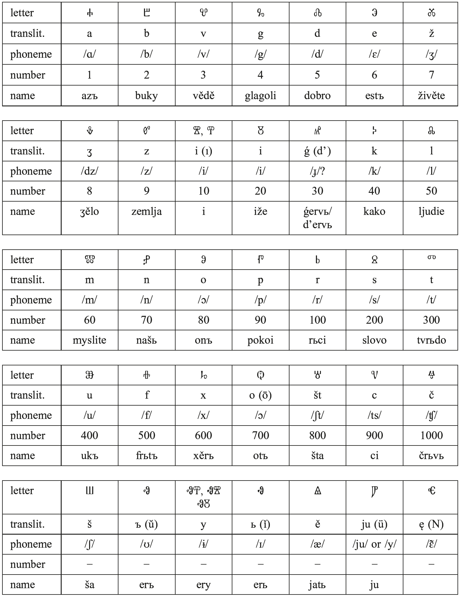
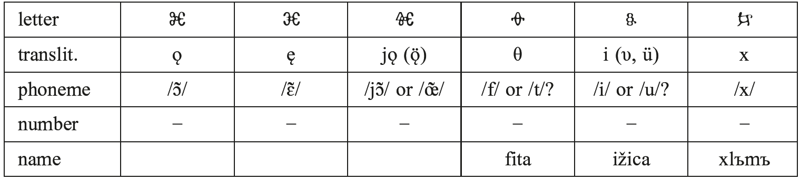
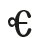
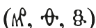
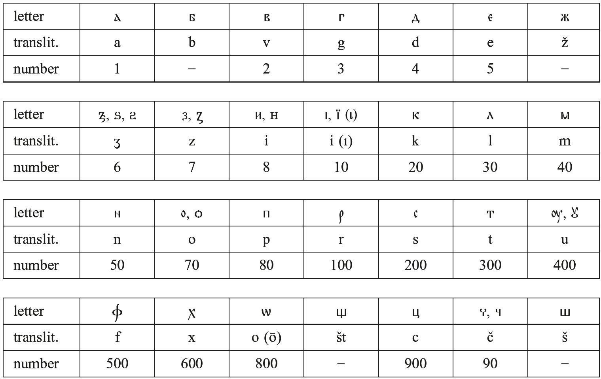

## XIII. Slavic

# 80. The documentation of Slavic

1.Proto-Slavic

2.South Slavic

3.East Slavic

4.West Slavic

5.References

## 1. Proto-Slavic

The early history of the Slavs is shrouded in obscurity. They do not appear in the historical record until the sixth century CE, and the earliest Slavic inscriptions and manuscripts that still exist today are no older than the tenth century. Archaeological findings from earlier periods are difficult to connect conclusively to the Slavic peoples, but starting in the fifth century we find evidence of a fairly uniform material culture in the Polesie region of Ukraine, which later spread into the same areas into which the Slavs were migrating, according to the testimony of Latin and Greek sources (Barford 2001: 40− 43). The greatest concentration of Slavic hydronyms is found in the same general region, north of the Carpathian mountains (Udolph 1979). The evidence of a common period of Balto-Slavic linguistic development and of early linguistic contacts with Germanic and Iranian, given what we know of the locations of these other Indo-European groups, also point to the middle Dnieper river basin (roughly the area from northwestern Ukraine to southeastern Belarus) as the most likely homeland for the Slavs (see Birnbaum 1973; Schenker 1995: 6−8).

The Slavs were probably affected by the invasion of the Huns into Europe and the first phase of the Great Migrations in the fourth and fifth centuries CE, but they began to spread into territories bordering the Eastern Roman Empire only in the sixth century. The first mention of the Slavs is by Jordanes in his history of the Goths (<i>De origine actibusque Getarum</i>, ca. 550), where he describes a group of three related tribes, the Venethi, Antes, and Sclaveni, inhabiting a large area extending from the source of the Vistula river in the north to the Danube in the south, and reaching to the Dnieper river in the east (Schenker 1995: 9 quotes the relevant passage). Writing at about the same time, the Byzantine historian Procopius reports in various works on Slavic raids across the Danube in the first half of the sixth century, and also provides a description of Slavic customs and beliefs (see Schenker 1995: 15−16; Barford 2001: 50 ff.). The Slavs in the region north of the lower Danube became closely connected with the Avars, a group of Turkic nomads who arrived in this area around 560, and together they began to make more significant incursions into the Balkans. Unlike the Avars, however, the Slavs also began to settle south and west of the Danube in greater and greater numbers.

During the sixth century other groups of Slavs were expanding to the north and west into the areas of present-day Poland, Slovakia, the Czech Republic, and Germany, as attested by archaeological remains and mentions in written sources, such as <i>Fredegar’s Chronicle</i>, which provides information about battles between the Slavs and Franks and describes the creation of a Slavic state led by a Frankish merchant named Samo in the first half of the seventh century. The duration of this political organization and its exact location are unclear. Barford (2001: 79) places it in the region of Vienna and questions whether it can be properly called a “state”. Other scholars have it encompassing parts of Lusatia, Bohemia, Moravia, or Carantania (Schenker 1995: 22). Archaeological evidence also shows the expansion of cultures associated with the Slavs to the east in Ukraine during this same period, but there are no written sources that could provide information about the Slavs in this region.

Although there must have been some variation in the language spoken by the Proto-Slavs, we cannot reconstruct any dialectal differentiation for the pre-migration period. The displacement of Proto-Slavic peoples from their original homeland probably involved the mixing of different groups and the leveling of any pre-existing dialectal differences (Shevelov 1965: 2). Furthermore, the rapid expansion of Slavic speakers into such a large geographic area probably could not have been accomplished by normal population growth alone and must have involved the linguistic assimilation of other groups with whom they came in contact (Nichols 1993). It has been suggested that Slavic may have served as a lingua franca in the ethnically mixed region under the hegemony of the Avars, which may help account for its apparently high degree of homogeneity during a time of rapid geographic expansion (Pritsak 1983: 420; Lunt 1985).

The assumption of the development of a more or less uniform Slavic lingua franca during this period of expansion may also help explain the relatively long period of common linguistic developments after the dispersal of the Slavs throughout Eastern Europe. Scholars generally agree that dialectal differences were probably not significant enough to impede communication up to about the year 1000, so that we may still speak of some sort of Slavic linguistic unity before this time. The last stage of parallel developments (the loss of the weak jer vowels) was completed by ca. 1200. As a result, even though Slavic is not attested until the tenth century, the language of the earliest manuscripts is very close to what we may reconstruct for Proto-Slavic.

Slavic is traditionally divided into West Slavic, South Slavic, and East Slavic groups. This division should not be understood to mean that the languages of each group necessarily descend from a common intermediate ancestor, however. The complex historical changes from proto-Slavic to the individual modern Slavic languages cannot be seen as a strictly linear, Stammbaum-type process, but the classification into three groups generally corresponds with the majority of shared linguistic developments (see Birnbaum 1966).

## 2. South Slavic

### 2.1. Old Church Slavic

The earliest Slavic manuscripts are written in a language called Old Church Slavic (or Old Church Slavonic) in English, abbreviated as OCS. The development of this literary language is attributed to the brothers Constantine (who later took the name Cyril) and Methodius, who were chosen by the Byzantine emperor Michael III to undertake a mission to the Slavs living in Moravia around 862. Although they were from a Greek family, the brothers were presumably bilingual in Greek and the eastern South Slavic dialect spoken in the area of their native town of Thessaloniki. Constantine/Cyril reportedly developed an alphabet for writing the language, and he and Methodius began translating biblical and liturgical texts necessary for their missionary work. Additional translations and some original texts were produced by the brothers and their disciples in Moravia, and later by the remaining disciples and their own students in centers of learning established in the Bulgarian Empire, after the expulsion of the Slavic missionaries from Moravia (see Schenker 1995 for more information on the Cyrillo-Methodian mission and its aftermath). Although OCS is identifiably South Slavic in its main features, we must keep in mind that it was a medium of literary production, which had to be adapted to convey complex ideas in an elevated style, and which was used over a broad territory. It cannot be identified with any single spoken dialect of this period. The grammar and lexicon were never formally codified, so there is a substantial amount of variation in the texts.

In different Slavic-speaking areas where Church Slavic continued to be used as a literary medium, it was gradually adapted over time towards the local vernaculars, and texts may also contain a mixture of Church Slavic and the spoken language. As a result, it may be difficult to classify texts unambiguously as OCS, a local recension of Church Slavic, or as “Old Russian,” “Old Serbian,” etc. We reserve the name OCS for the language of a relatively small group of texts that are thought to have some direct connection to the original Cyrillo-Methodian mission or the subsequent work of their disciples in Bulgaria-Macedonia, and which preserve certain archaic features. These texts were composed and copied from the second half of the ninth century through the eleventh century, but the majority of the surviving manuscripts date to the eleventh century.

In other languages OCS may be referred to simply as “Old Slavic” (e.g., French <i>le vieux slave</i>, Russian <i>staroslavjanskij</i>). The language has also been called “Old Bulgarian,” since most of the extant manuscripts are from the territory of the medieval Bulgarian Empire, but as noted above OCS manuscripts do not reflect a purely regional language variety, so this term is not accurate and is no longer widely used. Note that when speaking of the “Macedonian” or “Bulgarian” origin of various manuscripts, we are referring to the western or eastern areas of the Bulgarian Empire, since the states of Macedonia and Bulgaria in their modern forms did not exist at this time.

The original writing system developed by Constantine/Cyril is known as the Glagolitic alphabet (Table 80.1). It does not appear to be modeled on a single pre-existing writing system; rather, it seems that Constantine/Cyril wanted to create a unique alphabet for Slavic. Some of the letters appear to be based on Greek, Hebrew, Samaritan, or Latin characters, while for others no source can be reliably determined.

Glagolitic was used in Moravia during the time of the Cyrillo-Methodian mission and in the Balkans in the period that immediately followed. It was maintained in Macedonia up to the end of the 11th c. and in Serbia until the 12th c., but in Bulgaria was replaced very early by the Cyrillic alphabet (Vaillant 1964: 21). The only place where Glagolitic enjoyed a longer life was in Croatia, where scribes developed a new form of the alphabet, known as angular Glagolitic. Liturgical books in Glagolitic continued to be used in a few Catholic parishes on the Croatian coast and islands up into the twentieth century.

Tab. 80.1: The Glagolitic alphabet

Remarks on Table 80.1. The letter  was used as the second part of digraphs to indicate nasality; when used by itself it had the value of a front nasal vowel. The usage in manuscripts varies: the <i>Kiev Missal</i> and <i>Psalterium Sinaiticum</i> use only  for the front nasal, while other Glagolitic manuscripts use  after consonants and  in initial position or after a vowel. Scholars disagree about the phonemic values of the jotated vowel letters. Certain letters  are used to transliterate Greek words; their pronunciation in Old Church Slavic is uncertain. The existence of variant letters to represent the sounds /i/ and /ɔ/ is probably also due to the influence of Greek. The letter  is rare, occurring only in the Paris and Munich abecedaria, in the <i>Psalterium Sinaiticum</i>, and the <i>Codex Assemanianus</i>. The difference in usage between this letter and the more common  is not entirely clear. Some manuscripts use a diacritic mark ҄ to indicate palatal or palatalized consonants.

The Cyrillic alphabet (Table 80.2) was created on the basis of Glagolitic by substituting corresponding Greek letters wherever possible. The simpler and more familiar forms of the letters no doubt played a role in the widespread adoption of this alphabet in place of the earlier Glagolitic.

Tab. 80.2: The Cyrillic alphabet

Remarks on Table 80.2. The names of the letters are the same as for the corresponding characters in Glagolitic. The different forms for /i/ are also known as <i>i osmeričьno</i> (8) and <i>i desęteričьno</i> (10), according to their numerical values The Russian names <i>jus bol’šoj</i> and <i>jus malyj</i> are commonly used to refer to the back and front nasal vowels. The numerical values for Cyrillic are generally based on the order of the Greek alphabet, so that characters that do not have equivalents in Greek are usually not used to represent numbers. The Greek letters ѯ and ѱ are used to represent the numerals 60 and 700, and occasionally to spell the sequences [ks] and [ps], mainly in borrowed words. As in the Glagolitic alphabet, different letters are used to represent the front nasal vowel. <i>Suprasliensis</i> and <i>Sava’s Book</i> consistently use  after consonants and  elsewhere.

Most major OCS manuscripts have been published in several editions, not all of which are listed here. For a more complete bibliography and additional information on early Slavic writing, see Schenker (1995).

The <i>Kiev Missal</i> (Hamm 1979; Nimčuk 1983; TITUS) is probably the oldest extant OCS manuscript, dating either to the late tenth/early eleventh century (Schenker 1995: 207) or perhaps even to the late ninth/early tenth century (Schaeken 1987: 201). It consists of seven folia written in the Glagolitic alphabet, containing parts of a missal according to the western rite. As it exhibits West Slavic features and is clearly a translation from Latin we may assume that it originated in Moravia or Bohemia. The Kiev Missal is notable also for its supralinear markings, which seem to indicate prosodic features (Kortlandt 1980; Schaeken 2008). In other OCS manuscripts such markings are purely ornamental imitations of Greek diacritic marks (Schenker 1995: 183).

Also among the oldest manuscripts are two more or less complete fourfold Gospels written in the Glagolitic alphabet. Like all Glagolitic OCS monuments, apart from the <i>Kiev Missal</i> and possibly the <i>Glagolita Clozianus</i>, they are thought to be of Macedonian origin. <i>Codex Zographensis</i> (Jagić [1879] 1954; TITUS) consists of 271 folia in OCS and an additional 17 folia written in Macedonian Church Slavic, which are a later addition to replace a missing portion of the original gospel text. The codex also includes 16 folia containing a 13th-century Cyrillic synaxarion (a calendar of saints’ days). The main portion of the codex is conventionally dated to the late tenth or early eleventh century and is phonologically closest to what we can posit as the Cyrillo-Methodian norm. Probably slightly later, but still dating to the first half of the eleventh century, is the <i>Codex Marianus</i>, with 173 folia (Jagić [1883] 1960; TITUS).

The <i>Codex Assemanianus</i> (Vajs and Kurz 1929−1955; Ivanova-Mavrodinova and Džurova 1981; TITUS) is probably slightly later than either <i>Zographensis</i> or <i>Marianus</i>, perhaps from the second half of the eleventh century. It consists of 158 Glagolitic folia, containing an evangeliary (a collection of Gospel passages to be read in the liturgy) and a synaxarion. It is written in an inconsistent and somewhat innovative orthography (Lunt 2001: 8).

The major Glagolitic manuscripts also include a psalter and a prayer book, both of which were found in the Monastery of St. Catherine on Mt. Sinai and date to the eleventh century. The major part of the <i>Psalterium Sinaiticum</i>, 177 folia containing psalms 1− 137, was found in 1850 (Sever’janov [1922] 1954; Altbauer 1971). It appears to be the work of several scribes and contains numerous mistakes and some phonologically newer features (Lunt 2001: 8). The extant folia of the <i>Euchologium Sinaiticum</i> (Frček [1933− 1939] 1974; Nahtigal 1941−1942) represent only part of what must have been a larger codex containing translations made at different times in the early period of OCS (Mathiesen 1991: 195). The main portion of the manuscript (109 folia) was found together with the <i>Psalterium Sinaiticum</i> and includes prayers for various occasions and parts of the liturgy. In 1975 a new trove of manuscripts was discovered in the monastery, which included an additional 32 folia of the <i>Psalterium Sinaiticum</i> and at least 28 folia belonging to the <i>Euchologium Sinaiticum</i>. Photographic reproductions of these folia have been published by Tarnaidis (1988).

The <i>Glagolita Clozianus</i> (Dostál 1959) consists of 14 folia out of what was originally a large codex of homilies and includes a fragment of a sermon that has been attributed to Methodius. The language exhibits features that may indicate a Croatian or Serbian origin for this manuscript (Schenker 1995: 189; Lunt 2001: 9). The only other Glagolitic manuscripts that belong to the OCS canon are shorter fragments or palimpsests containing gospel or liturgical texts.

The Cyrillic OCS manuscripts are almost all of Bulgarian origin and date to the 11th century. The <i>Codex Suprasliensis</i> (Sever’janov [1904] 1956; Zaimov and Capaldo 1982−1983; TITUS), with 285 folia, is the longest surviving OCS manuscript. It is a lectionary menaeum for the month of March, containing 24 saints’ lives and 24 homilies, most of which are attributed to St. John Chrysostom. The language of the text is less archaic than that of the surviving Glagolitic OCS manuscripts. We also have part of an evangeliary in Cyrillic, known as <i>Sava’s Book</i> (Ščepkin [1903] 1959; TITUS). The manuscript is so called because of the comment поп сава ѱалъ ‘The priest Sava wrote [this]’ written at the bottom of folio 49 by the same hand as the main text; folio 54 has another marginal comment containing the same name. The surviving 129 folia of this manuscript are bound together in a codex with some later Russian Church Slavic texts. The manuscript appears to be a copy made from an earlier Glagolitic text, and the language shows innovations that mark it as being younger than that of <i>Suprasliensis</i>. In addition to texts from the gospels found in other manuscripts, we also have some readings from the Acts and Epistles in the <i>Enina Apostol</i> (Mirčev and Kodov 1965). Unfortunately, only 39 poorly preserved folia of the original manuscript survive. The remaining Cyrillic manuscripts classified as OCS are shorter fragments.

### 2.2. Eastern South Slavic

The OCS manuscripts of Bulgarian or Macedonian origin, with the caveat mentioned above, provide the main source of early evidence for Eastern South Slavic dialects. We also have a number of early inscriptions, mostly in Cyrillic, which some scholars treat as part of the OCS canon. However, since they differ in terms of composition, transmission, and purpose from this textual tradition, they are perhaps best considered separately. The oldest ones actually predate most or all of the surviving OCS manuscripts. The earliest dated Cyrillic inscription is from the year 921 and was found in the Krepča monastery near Tărgovište, Bulgaria (Konstantinov 1977). This then marks the latest possible date for the introduction of the Cyrillic alphabet. The most famous dated Cyrillic inscription is the tombstone erected by the Bulgarian Tsar Samuel for his parents and brother in 992/993, which was found on Lake Prespa in northern Greece. All of these inscriptions are fragmentary, and their interpretation is sometimes uncertain (see Schaeken and Birnbaum 1999: 127 ff. for more information).

Beginning in the 12th century, we have numerous texts with enough innovative regional features that they are classified as Bulgarian or Macedonian recensions of Old Church Slavic, or simply as Middle Bulgarian. Like the canonical OCS manuscripts, they are almost exclusively translations of Biblical or other religious texts. There are a number of evangeliaries, apostols, and psalters, including <i>Dobromir’s Gospel</i> (Macedonian, early 12th c.; Altbauer 1973; Velčeva 1975), <i>Dobrejšo’s Gospel</i> (Macedonian, 13th c.; Conev 1906), the <i>Slepče Apostol</i> (Bulgarian/Macedonian, 12th c.; Il’inskij 1911), the <i>Ohrid Apostol</i> (Macedonian, late 12th c.; Kul’bakin 1907), and the <i>Bologna Psalter</i> (Macedonian, 13th c.; Jagić 1907; Dujčev 1968). The oldest Slavic parimeinik (a collection of readings from the Old Testament) is <i>Grigorovič’s Parimeinik</i> (Bulgarian, 12th or 13th c.; Brandt 1894−1901). Also worthy of mention is <i>Dragan’s Menaeum</i>, also known as the <i>Zograph Trephologion</i>, which contains short saints’ lives and liturgical texts with musical notation (Bulgarian, late 13th c.; Sobolevskij 1913).

The famous treatise <i>On the letters</i> (Kuev 1967; Džambeluka-Kossova 1980), which describes the creation of the Slavic (Glagolitic) alphabet and defends it as superior to the Greek letters, was most likely written in Bulgaria in the late ninth or early tenth century. It is ascribed to the monk Xrabrъ, about whom nothing certain is known. The oldest extant version is found in a Bulgarian miscellany from 1348.

### 2.3. Western South Slavic

The oldest connected Slavic texts written in the Latin script are the <i>Freising Fragments</i> (Pogačnik 1968; Bernik et al. 1993; TITUS; eZISS), which date to the late 10th century. They consist of a confessional, homily, and a prayer according to the western rite. The phonetic features of these texts are difficult to interpret because of their ad hoc orthography, but the language exhibits Slovenian characteristics and has been classified variously as OCS, Slovenian Church Slavic, or Old Slovene. Like the <i>Kiev Missal</i>, this manuscript also contains accentual markings. The linguistic features of the <i>Freising Fragments</i> have been analyzed by Kortlandt in several publications (1975, 1996a, 1996b, 1998).

There are a number of early Glagolitic inscriptions from the territory of Croatia, the most important of which is the <i>Baška Tablet</i> from the beginning of the 12th century (Fučić 1982; Schenker 1995: 270−271). This monument was found in the church of St. Lucija on the island of Krk; it commemorates King Zvonimir’s donation of the land for the church and tells of its construction. The style of lettering represents a transition from the rounded Glagolitic of earlier OCS manuscripts to the angular Glagolitic that was used later in Croatia.

The <i>Vienna Fragments</i> (Weingart 1938) are two folia from a 12th-century Glagolitic missal, probably of Croatian origin. We also have two fragments of Glagolitic apostols,the <i>Gršković Fragment</i> (Jagić 1893) and the <i>Mihanović Fragment</i> (Jagić 1868). Both of these appear to date to the late 12th/early 13th century and are possibly from southern Bosnia and Hercegovina, according to Jagić (1893: 40). We also have some early non-religious texts in Glagolitic, such as the <i>Vinodol Law Code</i> of 1288, which has come down to us in a 16th-century copy (Bratulić 1988).

Early Cyrillic manuscripts include the <i>Vukan Gospel</i> from around 1200 (Vrana 1967) and <i>Miroslav’s Evangeliary</i> from the late 12th century (Rodić and Jovanović 1986), both in Serbian Church Slavic. We also have several texts attributed to St. Sava (1174?− 1236): three typicons, the <i>Vita Simeonis</i>, and a letter, most of which have come down to us in late copies (Ćorović 1928). The oldest surviving copy of the first Slavic hexameron, which was compiled and translated by the Bulgarian John the Exarch (active early 10th century), is a Serbian one from 1263 (Aitzetmüller 1958−1975).

## 3. East Slavic

The East Slavic linguistic area is relatively homogenous, and most scholars assume the existence of an intermediate Common East Slavic dialect as the ancestor of all the modern East Slavic languages. The language of the oldest texts from the period of Kievan Rus’ is often referred to loosely as Old Russian, but these documents are mostly Church Slavic with varying degrees of influence from the vernacular, and the local features that they exhibit are better characterized as Common East Slavic in most instances. Not until the 13th century or later do we really begin to see clear textual evidence of the divergence of Russian from Ukrainian and Belarusian (see Pugh 2007: 11).

The East Slavic region is the source of a wider variety of text types than we find in South or West Slavic in this same period. The earliest inscription that we know of consists of seven or eight Greek or Cyrillic letters on an amphora, known as the <i>Gnezdovo Inscription</i> (Schenker 1989), and dates to the early 10th century. Numerous other inscriptions, both on monuments and smaller objects, date to the 11th and 12th centuries. East Slavic writing was almost exclusively in Cyrillic, but there are some Glagolitic graffiti from the 11th and 12th centuries in the Church of St. Sophia in Novgorod (Schenker 1995: 236−237).

There are several 11th-century manuscripts containing the core biblical texts used in services. <i>Ostromir’s Gospel</i> is an evangeliary from 1056−1057, copied for the governor of Novgorod (Vostokov [1843] 1964). This manuscript is very close to the idealized OCS norm, particularly in the use of the jer vowels, but also has some East Slavic features. Another aprakos gospel is the <i>Archangel Evangeliary</i> of 1092 (Georgievskij 1912). Both of these were apparently based on South Slavic originals. We have two partial exegetic psalters from the eleventh century, <i>Evgenij’s Psalter</i> (Kolesov 1972) and the <i>Čudovo Psalter</i> (Pogorelov 1910). Slightly later, from the turn of the 11th/12th century, is <i>Byčkov’s Psalter</i> (Altbauer and Lunt 1978). The <i>Galician Gospel</i> of 1144 (Le Juge 1897) is the oldest dated East Slavic fourfold Gospel. It contains dialect features of the southwestern East Slavic area where the manuscript was copied.

The <i>Novgorod Menaea</i> from 1095−1097 (Jagić 1886) contain services for saints’ days for the months of September, October, and November, together with marginal notes by different scribes. These texts exhibit some Novgorod dialectal features. Stories from the lives of monks and hermits are found in the <i>Sinai Paterikon</i>, which exists in an East Slavic copy from the 11th century (Golyšenko and Dubrovina 1967).

The <i>Izbornik of 1073</i> (Dinekov 1991−1993) is a copy made for Prince Svjatoslav of Kiev of a miscellany translated from Greek for the Bulgarian Tsar Simeon, containing excerpts from patristic literature. A second miscellany produced for Prince Svjatoslav, the <i>Izbornik of 1076</i> (Golyšenko et al. 1965), does not appear to be a translation or copy of an existing miscellany; it was probably compiled in Rus’ on the basis of existing Slavic translations of the original sources, with some changes and adaptations. The text shows numerous East Slavic features, particularly in the portion copied by the second scribe (Lunt 1968). The <i>Uspenskij sbornik</i> (Kotkov 1971) of the 12th/13th century contains the earliest versions of some saints’ lives and homilies that represent original Slavic compositions, rather than translations, including the <i>Vita Methodii</i>.

The <i>Russian Primary Chronicle</i> (Adrianova-Peretc 1950; Tschižewskij 1969) was compiled from various sources by the monk Nestor of the Kiev Cave Monastery and gives a history of Kievan Rus’ from 852−1110. The introductory section tells of the division of the earth among the sons of Noah (based on a Byzantine chronicle) followed by an original account of the early history of the Slavic tribes. The earliest extant version of the <i>Primary Chronicle</i> is found in the <i>Laurentian Codex</i> of 1377; the other main source is the <i>Hypatian Codex</i> from around 1425. While the language of the <i>Primary Chronicle</i> is mostly Church Slavic with some Eastern Slavic features, the <i>First Novgorod Chronicle</i> (Nasonov 1950) from the 13th and 14th centuries is much closer to the vernacular.

A unique and rich source of documentation for the history of East Slavic is found in the birchbark documents (<i>berestjanye gramoty</i>) that began to be discovered in the 1950s, primarily in Novgorod. These are short texts dealing with everyday business, legal, and personal matters, which were scratched on strips of birchbark with a stylus. More than 1,000 of these documents have now been found, with the earliest dating to the 11th century (Zaliznjak 1995; gramoty.ru). These documents exhibit certain linguistic features that differ from the rest of East Slavic, and Zaliznjak argues that East Slavic originally consisted of two distinct dialect zones, rather than representing a unified linguistic area, as commonly assumed. Another important source that is largely free of Church Slavic influences is the <i>Law Code of Rus’</i> (Grekov 1940−1963; TITUS), which is a compilation of East Slavic customary law. It was composed during the reign of Prince Jaroslav the Wise (r. 1019−1054), but the earliest surviving copy is included in the <i>Novgorod Kormčaja</i> of 1280.

The <i>Igor Tale</i> (Grégoire, Jakobson, and Rostovcev 1948; TITUS) is an epic poem describing the campaign led by Prince Igor against the Cumans (<i>Polovtsy</i>) in 1185. The only manuscript was found in 1795, and was dated by scholars at that time to the 16th century. It was destroyed in the fires that burned most of Moscow in 1812 when Napoleon’s troops entered the city, so we possess only imperfect copies made shortly after the manuscript was discovered. A number of scholars have argued that the <i>Igor Tale</i> represents an 18th-century forgery, but the linguistic evidence indicates that it was probably composed in the late 12th century.

## 4. West Slavic

After the disbanding of the Moravian mission, Latin was the predominant language of culture in the West Slavic lands up until the 15th century. Consequently, the western recension of Church Slavic and the vernaculars are relatively sparsely attested before this time. The use of Church Slavic survived in Bohemia into the 12th century, but the majority of early texts that were presumably originally written either in Moravia or Bohemia survive only in later copies made in the Orthodox Slavic lands (see Mareš 1979). Apart from the <i>Kiev Missal</i>, the only other early manuscript from this area is the <i>Prague Fragments</i>, which are two 11th-century Glagolitic folia written in Czech Church Slavic (Mareš 1979: 41−45). From the 11th or 12th century we also have a significant number of Old Czech/Church Slavic glosses in Latin manuscripts: the <i>Vienna Glosses</i> (Jagić 1903) and the <i>St. Gregory Glosses</i> (Patera 1878). Mareš (1979: 211−216) gives excerpts from both, transcribed directly from the original manuscripts.

Another important source of information for West Slavic is onomastic data found in various Latin manuscripts (see Schenker 1995: 239). For Old Polish, the <i>Bull of Gniezno</i> from 1136 (Taszycki 1975: 3−36) is particularly significant, with over 400 place and personal names.

The 14th century saw the production of a significantly greater number of West Slavic texts. These include the earliest surviving West Slavic homilies (in Polish), the <i>Holy Cross Sermons</i> (Łoś and Semkowicz 1934; TITUS) and the <i>Gniezno Sermons</i> (Vrtel-Wierczyński 1953), as well as the earliest psalters. The <i>Florian Psalter</i> gives the text of the psalms in parallel Latin, German, and Polish translations (Bernacki et al. [1939] 2002), while the <i>Wittenberg Psalter</i> is Latin with an interlinear Czech translation (Gebauer 1880). The first historical text written in Czech, the <i>Dalimil Chronicle</i> (Daňhelka et al. 1988; TITUS) dates to the early 14th century. The Czech hymn <i>Hospodine</i>, <i>pomiluj ny</i> [Lord, have mercy on us] may have been composed in the 10th century, although the earliest manuscripts are from the late 14th century (Mareš 1979: 208−210). The Polish <i>Bogurodzica</i> (Worończak 1962; TITUS) may also be connected with the Cyrillo-Methodian tradition (Schenker 1995: 221), but it is first attested in a 15th-century manuscript.

Other West Slavic languages are attested considerably later. Czech was long used as a written language also by the Slovaks; the earliest existing Slovak monument is the <i>Žilina Town Book</i> from the late 15th century (Ďurovič 1980: 212). Polabian died out in the first half of the 18th century and is attested only fragmentarily, mostly in lists of words and phrases that were collected when the language was already moribund (see Polański 1993). All of the extant Polabian material has been published by Olesch (1959, 1962, 1967). The oldest Sorbian text is the <i>Bautzen Burgher’s Oath</i>, from 1532, which citizens of Bautzen used to swear their loyalty to Bohemia and their feudal lord (Polański 1980: 234). A translation of the New Testament into Sorbian by Miklawuš Jakubica was completed in 1548 (Schuster-Šewc 1967), and the first Sorbian books began to be printed in the 1570s.
